# 为 MongoDB 和 Oracle Database 添加数据服务器和物理架构

本节我们将为 MongoDB 和 Oracle Database 添加数据服务器和物理架构。MongoDB 的物理和逻辑架构基于 Hive 技术。

## 1. 选择拓扑

在 ODI Studio 中，选择 **拓扑** > **物理架构** > **技术** > **Hive**，如图 12-3 所示。

**图 12-3** 在物理架构中选择 Hive 技术

## 2. 创建 MongoDB 数据服务器

要通过 Hive 表为 MongoDB 创建新的数据服务器，请右键单击 `Hive` 并选择 **新建数据服务器**，如图 12-4 所示。

**图 12-4** 创建新的 Hive 数据服务器

## 3. 配置数据服务器定义

在 **数据服务器定义** 中，指定一个 `名称`（例如 `MongoDB`），如图 12-5 所示。技术已预选为 `Hive`。

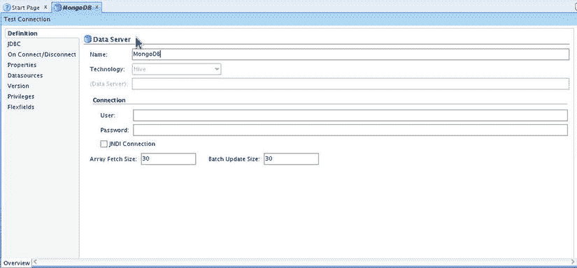

**图 12-5** 配置新的数据服务器定义

## 4. 配置 Flexfields

选择 **Flexfields** 选项卡，如图 12-6 所示。取消选中 `默认` 复选框，并为 Hive Metastore URIs 指定值 `thrift://localhost:10000`。

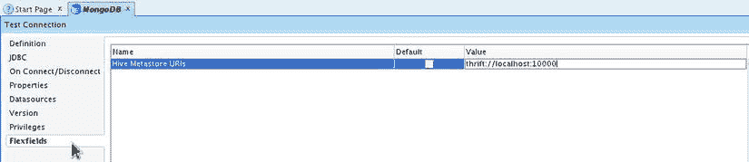

**图 12-6** 配置 Hive Metastore URIs

## 5. 配置并测试 JDBC 连接

选择 **JDBC** 选项卡，将 **JDBC 驱动程序** 选择为 `HiveDriver`，并将 **JDBC Url** 指定为 `jdbc:hive://localhost:10000/default`。单击 **测试连接** 以测试 JDBC 连接，如图 12-7 所示。

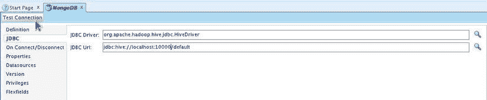

**图 12-7** 测试与 Hive 服务器的连接

## 6. 确认测试连接

将出现一个确认对话框，提示“测试连接前将保存您的数据。是否继续？”，如图 12-8 所示。单击 **确定**。

**图 12-8** 测试连接的确认对话框

## 7. 提示注册物理架构

将出现一个信息对话框，提示为该数据服务器注册至少一个物理架构，如图 12-9 所示。单击 **确定**。

**图 12-9** 注册物理架构的信息对话框

## 8. 执行连接测试

在 **测试连接** 对话框中，单击 **测试**，如图 12-10 所示。

**图 12-10** 测试与 Hive 服务器的连接

## 9. 确认连接成功

将出现“连接成功”消息，表明连接已建立，如图 12-11 所示。单击 **确定**。

**图 12-11** 连接成功的信息对话框

## 10. 保存数据服务器

单击 **保存**。一个基于 Hive 技术的 MongoDB 数据服务器即被添加完成，如图 12-12 所示。

**图 12-12** 名为 MongoDB 的 Hive 数据服务器

## 11. 添加物理架构

接下来，为该数据服务器添加一个物理架构。右键单击 `MongoDB` 数据服务器节点，选择 **新建物理架构**，如图 12-13 所示。

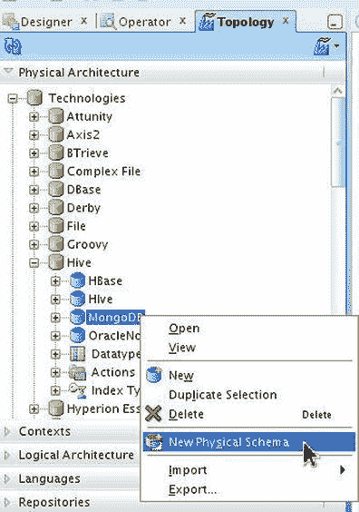

**图 12-13** 选择 物理架构 > Hive > MongoDB > 新建物理架构

## 12. 定义物理架构

在 **物理架构定义** 中，`名称` 已预指定为 `MongoDB.default`。将 **架构** 和 **工作架构** 都指定为 `default`，如图 12-14 所示。单击 **保存**。

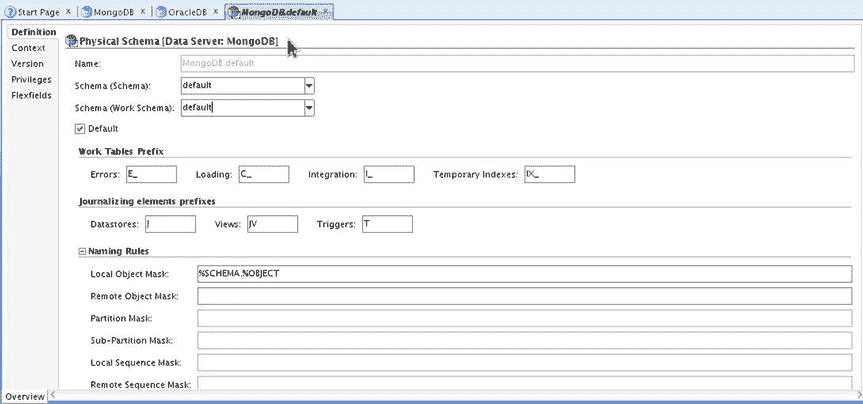

**图 12-14** MongoDB 数据服务器的物理架构定义

一个物理架构即被添加到该数据服务器，如图 12-15 所示。

**图 12-15** 物理架构 MongoDB.default

## 13. 创建 Oracle Database 数据服务器

目标数据存储是一个 Oracle Database 表。要为 Oracle Database 创建数据服务器，请右键单击 **拓扑** > **物理架构** > **技术** > **Oracle**，然后选择 **新建数据服务器**，如图 12-16 所示。

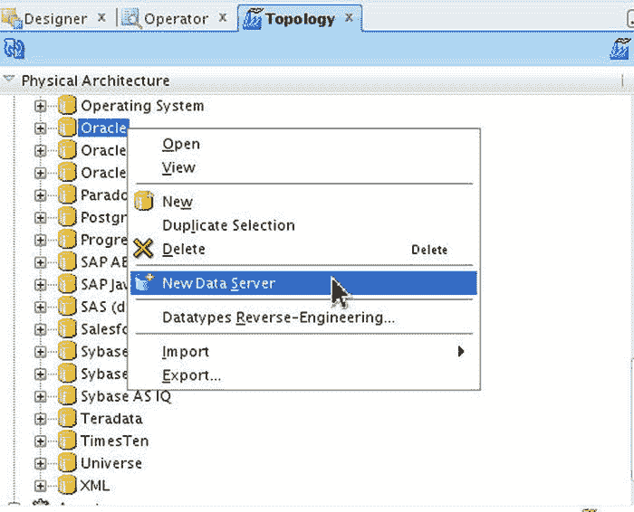

**图 12-16** 选择 物理架构 > Oracle > 新建数据服务器

## 14. 配置 Oracle 数据服务器定义

在 **数据服务器定义** 中，指定一个数据服务器 `名称`。技术已预选为 `Oracle`。指定 `实例` 为 `ORCL`，如图 12-17 所示。指定 `用户` 和 `密码`。

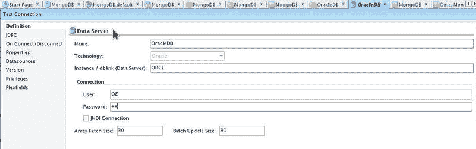

**图 12-17** 为 Oracle Database 配置数据服务器

## 15. 配置并测试 Oracle JDBC 连接

选择 **JDBC** 选项卡。将 **JDBC 驱动程序** 选择为 `oracle.jdbc.OracleDriver`，并将 **JDBC Url** 指定为 `jdbc:oracle:thin:@127.0.0.1:1521:ORCL`。单击 **测试连接** 以测试 JDBC 连接，如图 12-18 所示。

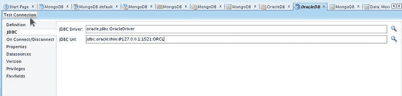

**图 12-18** 单击 测试连接

## 16. 提示注册物理架构

将出现一个信息对话框，提示为该数据服务器注册至少一个物理架构，如图 12-19 所示。单击 **确定**。

**图 12-19** 注册物理架构的信息对话框

## 17. 执行连接测试

在 **测试连接** 对话框中，单击 **测试**，如图 12-20 所示。

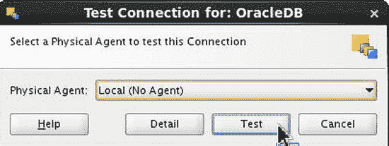

**图 12-20** 测试与 Oracle Database 的连接

## 18. 确认连接成功并查看结果

将出现“连接成功”消息，表明连接已建立，如图 12-21 所示。单击 **确定**。

**图 12-21** 连接成功的信息对话框

一个 Oracle 技术数据服务器即被添加完成，如图 12-22 所示。

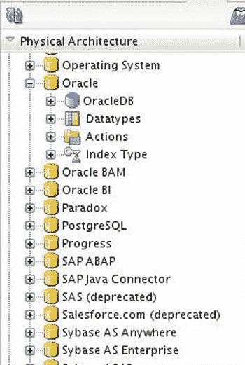

**图 12-22** 新的 Oracle 技术数据服务器

## 19. 注册物理架构到数据服务器

要为该数据服务器注册物理架构，请右键单击数据服务器节点并选择 **新建物理架构**，如图 12-23 所示。

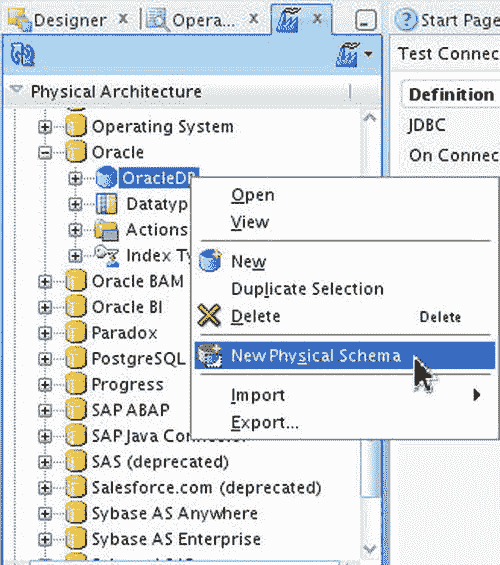

**图 12-23** 选择 物理架构 > Oracle > OracleDB 数据服务器 > 新建物理架构

## 20. 物理架构定义

在 **物理架构定义** 中，`名称` 已预指定。

