# 配置物理模式与逻辑架构

将模式（`Schema`）和工作模式（`Work Schema`）指定为之前为数据服务器`OracleDB`配置的用户`OE`，如图 12-24 所示。点击“保存”。

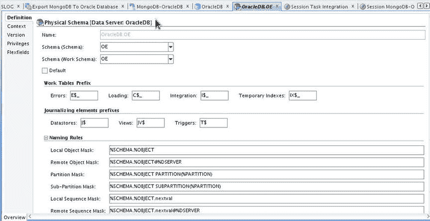
图 12-24. 为 OracleDB 数据服务器配置物理模式

## 21. 指定模式的上下文

一个信息对话框会提示为模式指定一个上下文，如图 12-25 所示。点击“确定”。

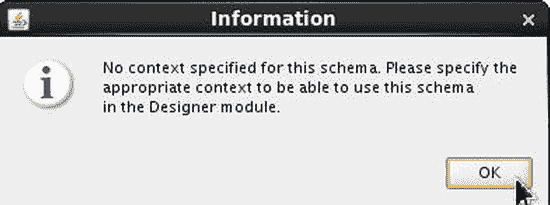
图 12-25. 提示指定上下文的信息对话框

一个物理模式被添加到数据服务器，如图 12-26 所示。

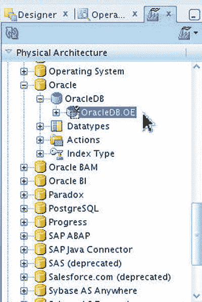
图 12-26. Oracle 数据库的物理模式

### 创建逻辑架构

逻辑模式代表了 ODI 对物理模式的接口。在本节中，我们将为 Oracle 技术数据服务器和 Hive 技术数据服务器创建逻辑模式。

## 1. 导航至 Hive 技术

选择 `Topology`  `Logical Architecture`  `Technologies`  `Hive`，如图 12-27 所示。

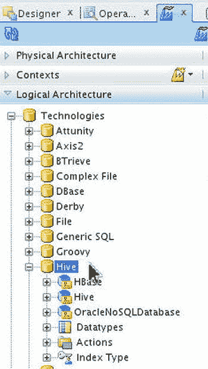
图 12-27. 选择 `Logical Architecture`  `Technologies`  `Hive`

## 2. 新建 Hive 逻辑模式

右键单击 `Hive` 并选择 `New Logical Schema`，如图 12-28 所示。

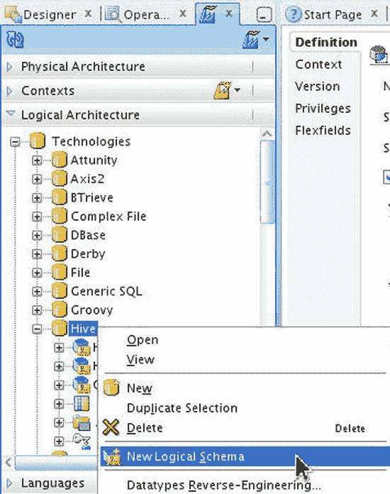
图 12-28. 选择 `Hive`  `New Logical Schema`

## 3. 配置 Hive 逻辑模式

在“逻辑模式定义”中，指定一个名称 `MongoDB`。在“上下文”中会列出 `Global` 上下文。在 `Global` 上下文的“物理模式”中，选择之前为 Hive 技术配置的物理模式 `MongoDB.default`，如图 12-29 所示。点击“保存”。

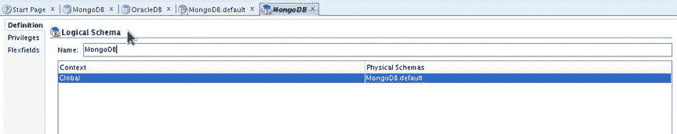
图 12-29. 为 Hive 配置逻辑模式

一个 Hive 技术逻辑模式被添加，如图 12-30 所示。

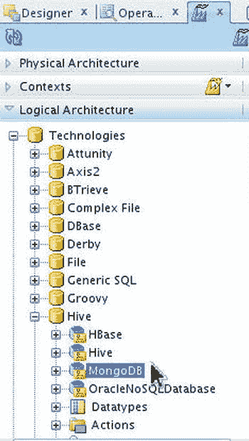
图 12-30. 新建的名为 MongoDB 的 Hive 逻辑模式

## 4. 导航至 Oracle 技术

类似地，转到 `Topology`  `Logical Architecture`  `Technologies`  `Oracle`，右键单击 `Oracle`，并选择 `New Logical Schema`，如图 12-31 所示。

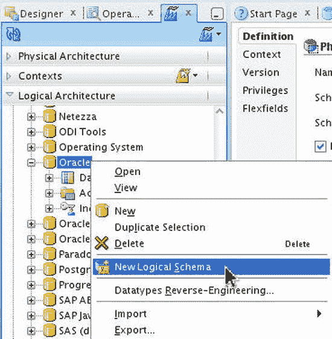
图 12-31. 选择 `Logical Architecture`  `Oracle`  `New Logical Schema`

## 5. 配置 Oracle 逻辑模式

在“逻辑模式定义”中，指定一个名称 `OracleDB`。在“上下文”中会列出 `Global` 上下文。选择为 Oracle 技术配置的物理模式 `OracleDB.OE`，如图 12-32 所示。

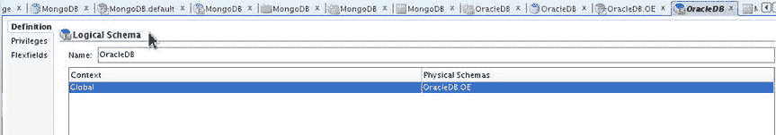
图 12-32. 为 Oracle 数据库配置逻辑模式

一个 Oracle 技术逻辑模式被添加，如图 12-33 所示。

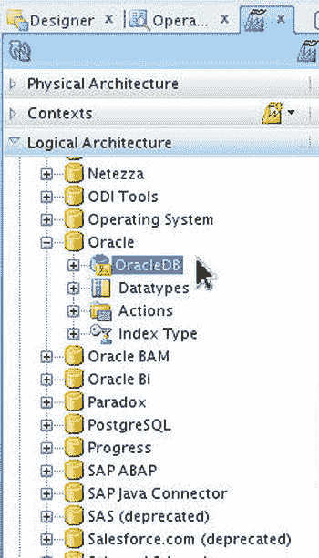
图 12-33. Oracle 技术的新逻辑模式

### 创建数据模型

数据模型包含关于数据的详细信息，例如数据中的列、每列的数据类型的、数据的逻辑长度、列是否可为空等。在本节中，我们将为源数据库 MongoDB 和目标数据库 Oracle Database 创建数据模型。

## 1. 新建模型文件夹

要为 MongoDB 数据存储创建模型，首先创建一个模型文件夹。选择 `Designer`  `Models` 并选择 `New Model Folder`，如图 12-34 所示。

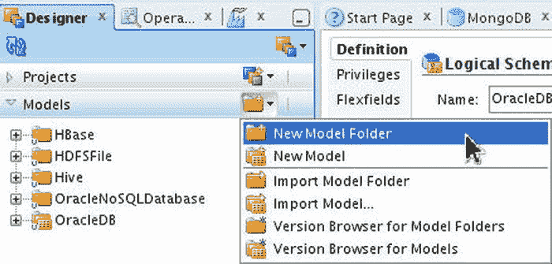
图 12-34. 选择 `Models`  `New Model Folder`

## 2. 配置模型文件夹

在“模型文件夹定义”中指定一个模型名称，如图 12-35 所示。

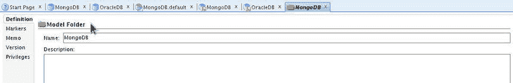
图 12-35. 配置模型文件夹定义

一个模型文件夹被添加到“模型”中，如图 12-36 所示。

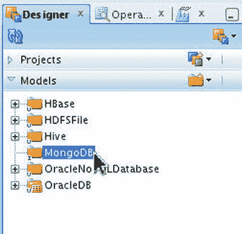
图 12-36. 新建模型文件夹

## 3. 新建模型

右键单击模型文件夹并选择 `New Model`，如图 12-37 所示。

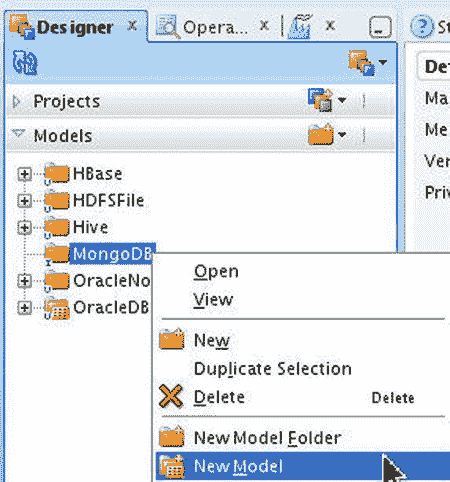
图 12-37. 选择 `New Model`

## 4. 配置 MongoDB 模型

在“模型定义”中，指定一个名称，并将 `Technology` 选择为 `Hive`，如图 12-38 所示。选择 `Logical Schema` 为上一节创建的 `MongoDB` 模式。选择 `Action Group` 为 `<Generic Action>`。点击“保存”。

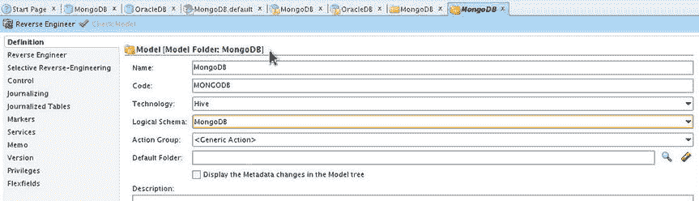
图 12-38. 为 MongoDB 配置模型

一个基于逻辑模式 `MongoDB` 的 Hive 技术模型被添加，如图 12-39 所示。

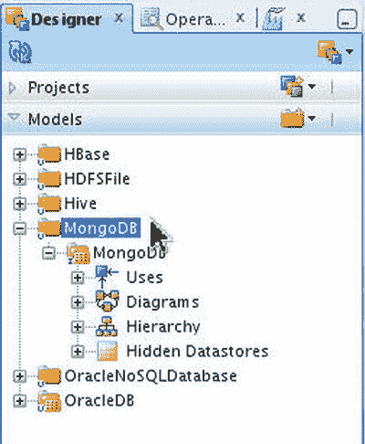
图 12-39. 新建的名为 MongoDB 的模型

## 5. 新建数据存储

右键单击模型并选择 `New Datastore`，如图 12-40 所示。

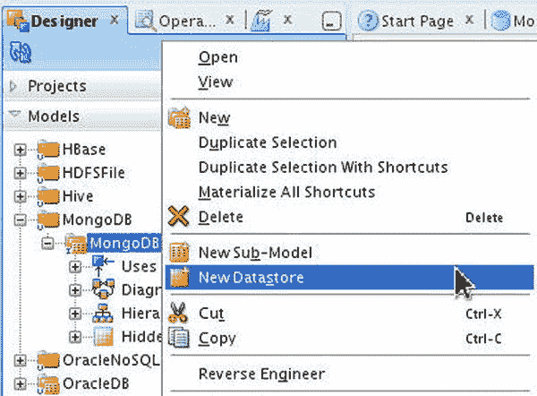
图 12-40. 选择 `New Datastore`

## 6. 配置数据存储

在“数据存储定义”中指定一个名称，并将 `Datastore Type` 选择为 `Table`。指定 `Resource Name` 为 `wlslog`，如图 12-41 所示。

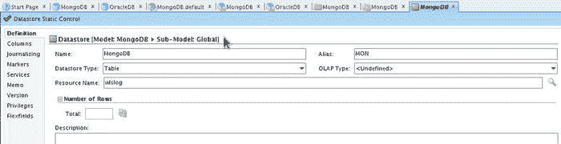
图 12-41. 配置新数据存储

## 7. 添加列

选择 `Columns` 选项卡。我们将为该数据存储构建数据模型。点击 `Add Column`，如图 12-42 所示。

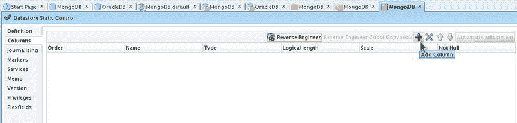
图 12-42. 选择 `Add Column`

## 8. 配置列定义

指定 Hive 表 `wlslog` 的列名称、类型、逻辑长度，该表作为 MongoDB 文档集合存储，如图 12-43 所示。点击“保存”。

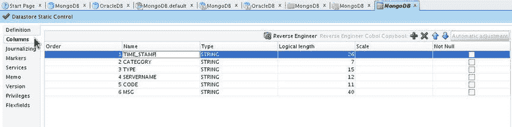
图 12-43. 配置列

一个数据存储被添加到模型中，如图 12-44 所示。

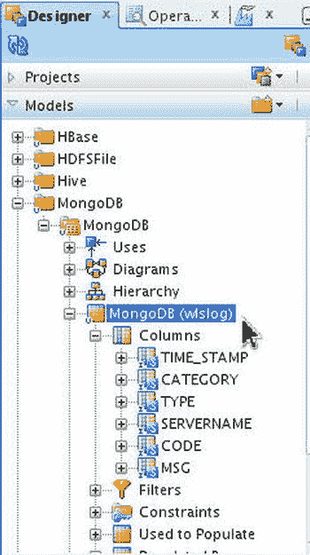
图 12-44. 新建数据存储

## 9. 查看数据

最初，数据存储是空的。右键单击数据存储并选择 `View Data`，如图 12-45 所示。

## 继续配置 Oracle 数据库模型

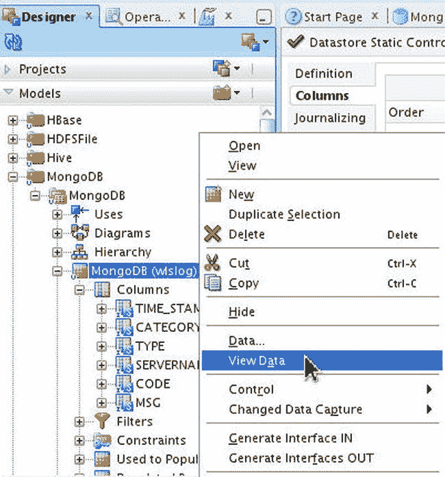
图 12-45. 选择查看数据

空的数据库表将显示如 图 12-46 所示。

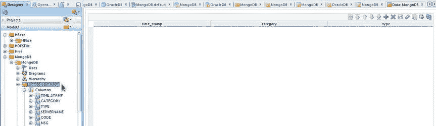
图 12-46. 空的数据库表

10. 接下来，为 Oracle 数据库添加一个模型。在设计器  模型 中选择 `新建模型`，如 图 12-47 所示。

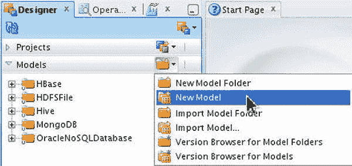
图 12-47. 为 Oracle 数据库添加新模型

11. 在 `模型定义` 中指定 `名称` 并选择 `技术` 为 `Oracle`，如 图 12-48 所示。选择 `逻辑模式` 为之前创建的 `OracleDB` 模式。选择 `操作组` 为 `<通用操作>`。点击 `保存`。

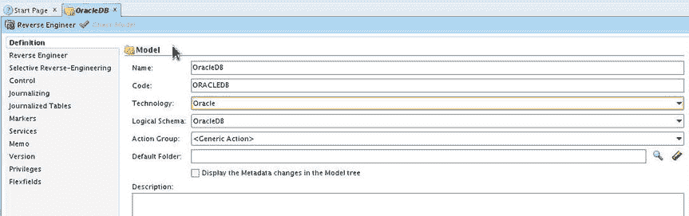
图 12-48. 配置 Oracle 数据库的模型定义

Oracle 数据库的模型将被添加，如 图 12-49 所示。

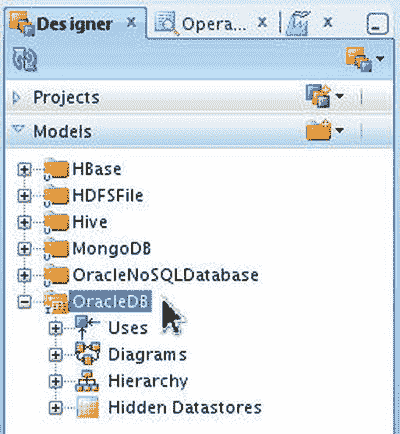
图 12-49. OracleDB 模型

12. 接下来，我们将从 Oracle 数据库逆向工程生成数据存储。
    1. 选择 `逆向工程` 选项卡并选择 `标准`。
    2. 选择 `上下文` 为 `全局`，并选择要逆向工程的对象类型为 `表`。
    3. 指定 `掩码` 为 `WLSLOG`，这是要将 MongoDB 数据加载到的 Oracle 数据库表。
    4. 同时指定 `从表别名中移除的字符` 为 `WLSLOG`。
    5. 点击 `逆向工程`，如 图 12-50 所示。

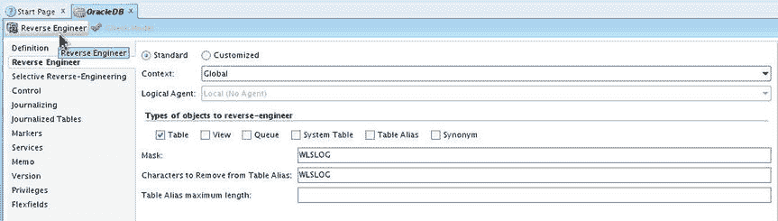
图 12-50. 选择逆向工程

13. 在确认对话框中点击 `是`，如 图 12-51 所示。

图 12-51. 逆向工程的确认对话框

`WLSLOG` 表的逆向工程开始，如 图 12-52 所示。

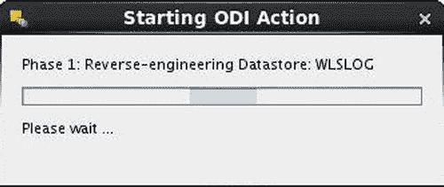
图 12-52. 逆向工程进行中

`WLSLOG` 数据库表被逆向工程为一个 `WLSLOG` 数据存储。该数据存储的列也被逆向工程生成，如 图 12-53 所示。

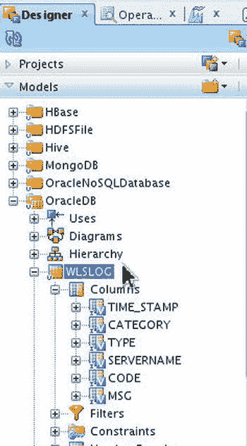
图 12-53. 逆向工程生成的列

14. 最初，数据存储是空的。右键单击 `WLSLOG` 数据存储并选择 `查看数据`，如 图 12-54 所示。

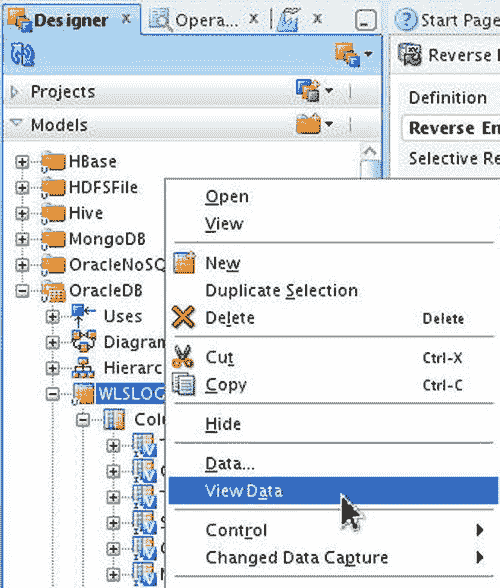
图 12-54. 为 Oracle 数据库模型选择查看数据

将显示一个仅包含列头的空表，如 图 12-55 所示。

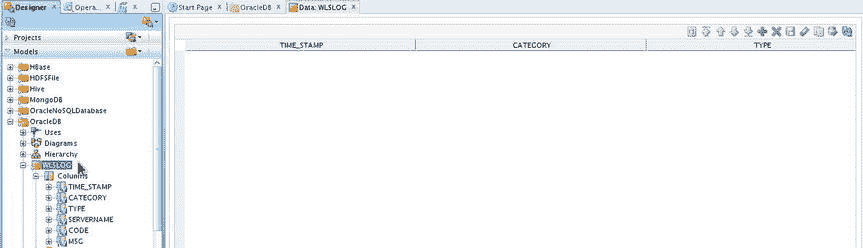
图 12-55. 空数据表

### 创建集成项目

集成项目用于将数据从源数据存储整合到目标数据存储。接下来我们将创建一个集成项目，添加一个集成接口，并运行该集成接口。

1. 选择设计器  `项目`，然后选择 `新建项目` 来创建一个新项目，如 图 12-56 所示。

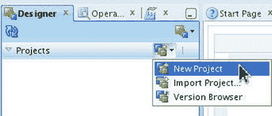
图 12-56. 选择项目  新建项目

2. 在 `项目定义` 中指定一个 `名称` 并点击 `保存`，如 图 12-57 所示。

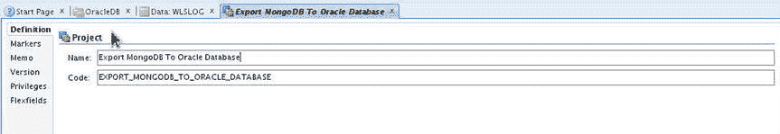
图 12-57. 配置集成项目

一个集成项目将被添加到 `项目` 中，如 图 12-58 所示。

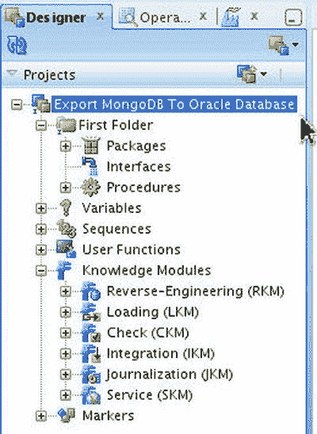
图 12-58. 新的集成项目

我们将使用 `IKM File-Hive to Oracle` 集成知识模块来将 Hive 表数据整合到 Oracle 数据库。我们需要将 `IKM File-Hive to Oracle` 知识模块添加到项目中。

3. 右键单击 `知识模块`  `集成`，并选择 `导入知识模块`，如 图 12-59 所示。

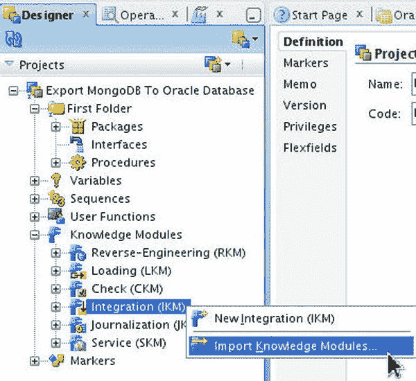
图 12-59. 选择知识模块  集成  导入知识模块

4. 在 `导入知识模块` 中选择 `IKM File-Hive to Oracle` 知识模块，如 图 12-60 所示。使用 `IKM File-Hive to Oracle` 知识模块，源可以是文件或 Hive，目标是 Oracle 数据库。点击 `确定`。

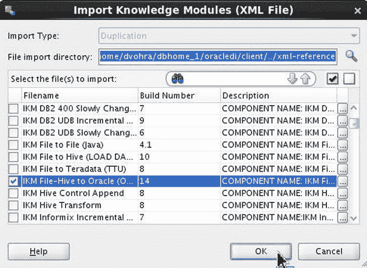
图 12-60. 选择 IKM File-Hive to Oracle 知识模块

5. 在导入报告中点击 `关闭`。`IKM File-Hive to Oracle` 知识模块将被添加到集成知识模块中，如 图 12-61 所示。

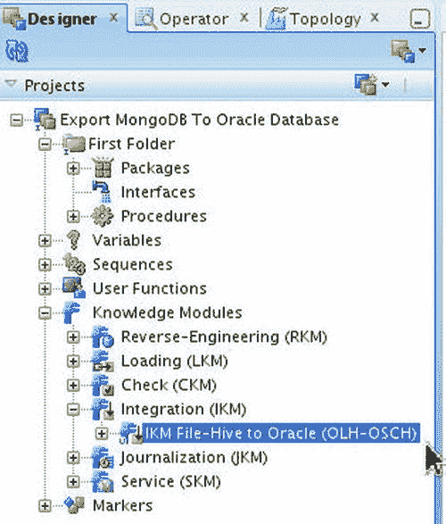
图 12-61. 知识模块 IKM File-Hive to Oracle

### 创建集成接口

集成接口定义了从源数据存储到目标数据存储的映射，包括数据流和集成中使用的知识模块。

1. 右键单击集成项目中的 `First Folder`  `接口`，并选择 `新建接口`，如 图 12-62 所示。

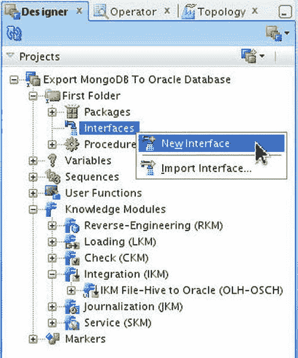
图 12-62. 选择接口  新建接口

2. 在 `接口定义` 中指定一个 `名称` 并选择 `优化上下文` 为 `全局`，如 图 12-63 所示。

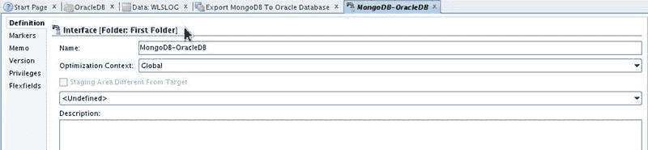
图 12-63. 配置接口

3. 选择 `映射` 选项卡。从 `MongoDB` 模型中选择 `MongoDB` (`wlslog`) 数据存储，并将其拖放到源数据存储区域，如 图 12-64 所示。

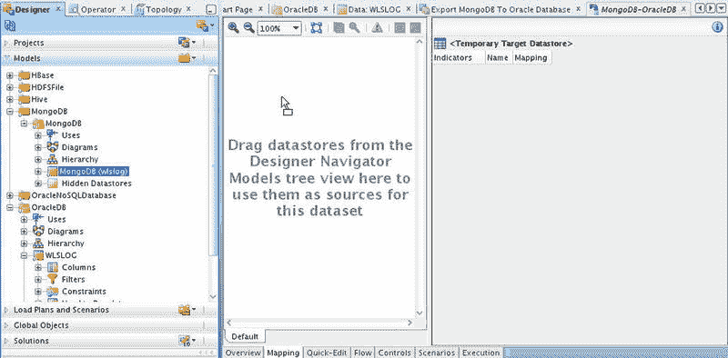
图 12-64. 将 MongoDB 数据存储添加到映射

4. `MongoDB` 数据存储被添加到源数据存储。同样地，为 Oracle 数据库模型 `OracleDB` 选择 `WLSLOG` 数据存储，并将其拖放到目标数据存储区域，如 图 12-65 所示。

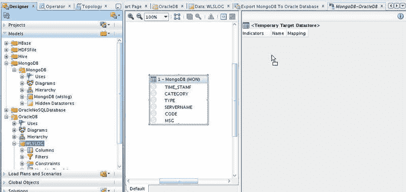
图 12-65. 将 Oracle 数据库数据存储添加到映射

