# Automap 与数据存储配置

在 Automap 对话框中单击“是”以执行自动映射，如 图 12-66 所示。

图 12-66. Automap 对话框

源数据存储和目标数据存储在集成接口的映射中被定义，并且数据存储图被添加，如 图 12-67 所示。

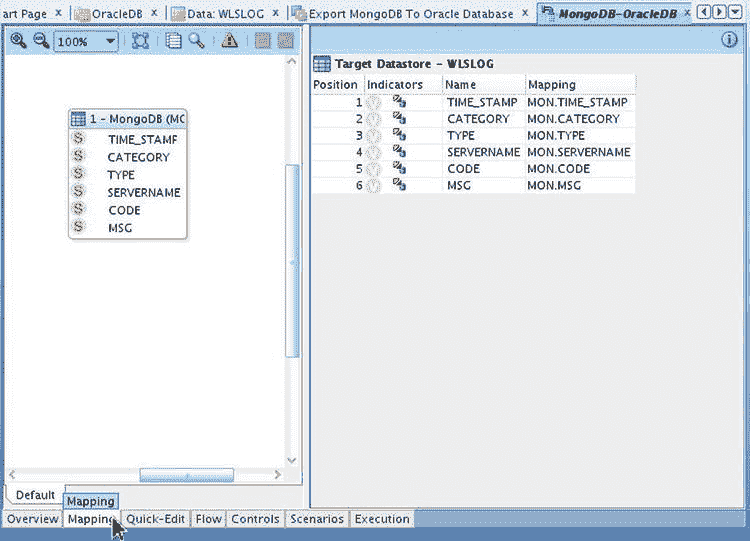
图 12-67. 源数据存储和目标数据存储

## 配置目标数据存储与流

6.  选择“快速编辑”选项卡，并在目标数据存储 `WLSLOG` 的“执行于”列中选择“暂存区”，如 图 12-68 所示。

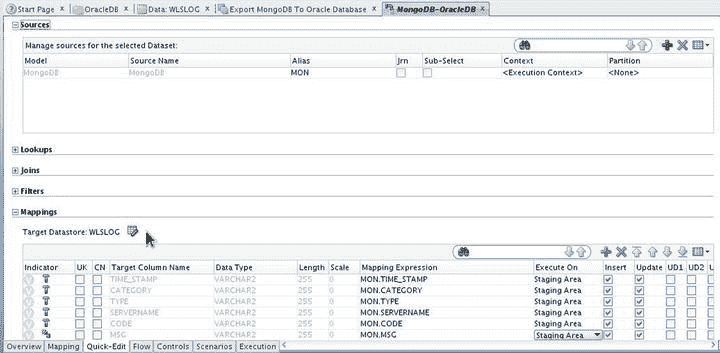
图 12-68. 配置目标数据存储 WLSLOG

7.  选择“流程”选项卡。流程图描述了数据从源数据存储到目标数据存储的流动。默认的流程图将暂存区放在目标数据库中。但是，暂存区应位于源数据库中，如 图 12-69 所示。

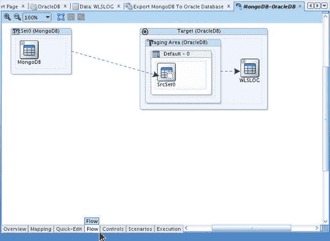
图 12-69. 默认流程图

8.  选择“概览”选项卡，然后选择“暂存区不同于目标”。即使该复选框已被选中，也请先取消选择，然后再次选中。选择暂存区为 `Hive:MongoDB`，如 图 12-70 所示。

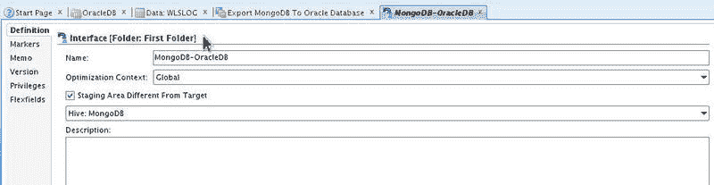
图 12-70. 配置暂存区

流程图被更新，以指示数据从源数据库中的暂存区流向目标数据库，如 图 12-71 所示。IKM 选择器应选为 `IKM File-Hive to Oracle`。

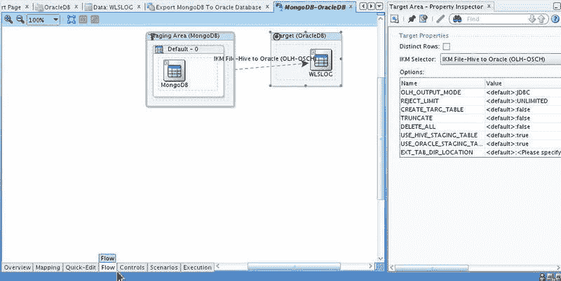
图 12-71. 已配置的流程图

9.  单击“保存”以保存集成接口，如 图 12-72 所示。

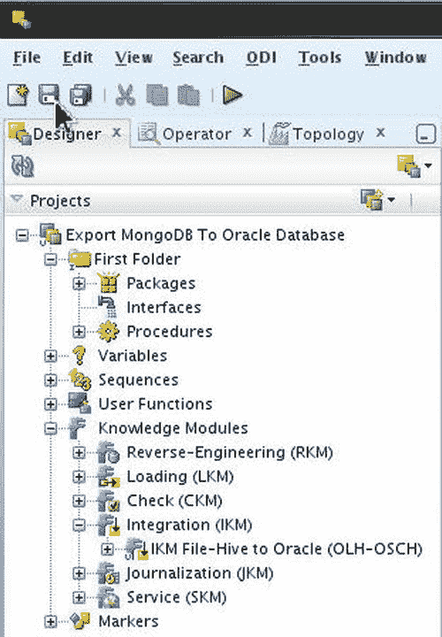
图 12-72. 保存接口

一个集成接口被添加，如 图 12-73 所示。

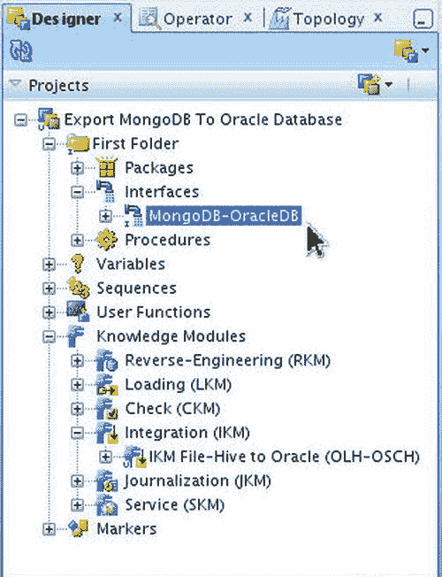
图 12-73. 新建的集成接口

### 运行接口

在本节中，我们将运行集成接口，以将数据从 MongoDB 集成到 Oracle 数据库。

1.  右键单击集成接口节点，然后选择“执行”，如 图 12-74 所示。

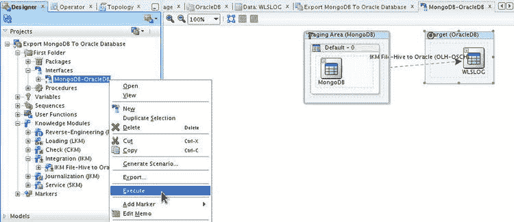
图 12-74. 运行接口

2.  在“执行”中选择“确定”，如 图 12-75 所示。

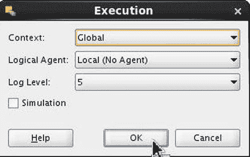
图 12-75. 配置接口运行

3.  会显示一个“会话已启动”对话框。单击“确定”，如 图 12-76 所示。

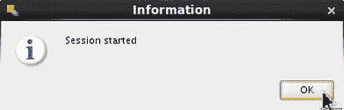
图 12-76. 集成会话已启动信息对话框

三个 MapReduce 作业运行以将 Hive 表数据集成到 Oracle 数据库中，如 图 12-77 所示。

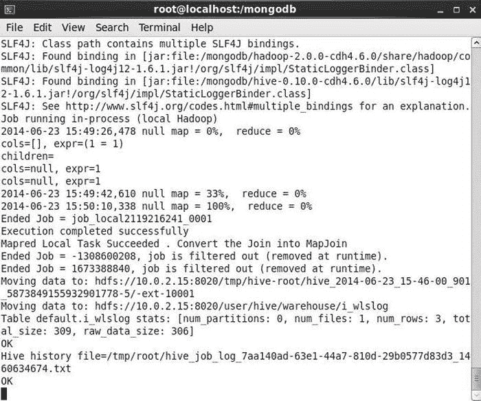
图 12-77. 将基于 MongoDB 的 Hive 表集成到 Oracle 数据库的输出

4.  选择“操作器”选项卡。从“会话列表”中选择会话。列出了集成的不同阶段，包括创建暂存表和启动 Oracle Loader for Hadoop，如 图 12-78 所示。

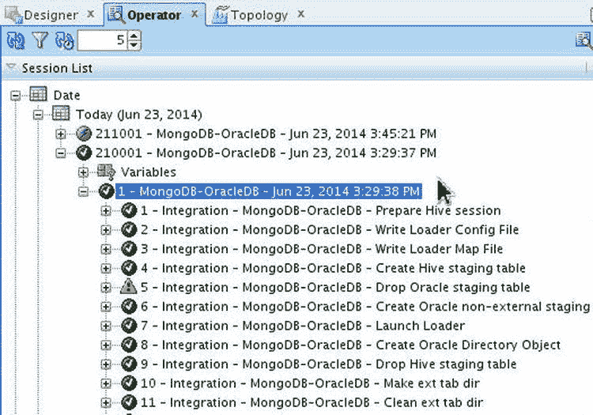
图 12-78. 集成阶段

数据集成后，暂存表、Oracle 目录、外部表目录、本地数据文件、本地临时文件和 HDFS 数据文件将被删除，如 图 12-79 所示。

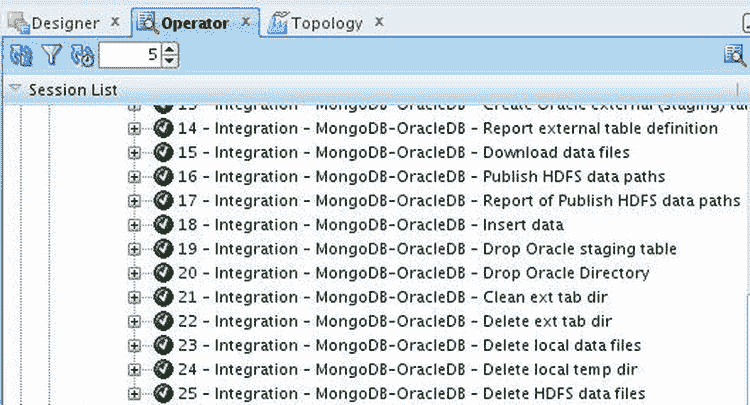
图 12-79. 删除文件的集成阶段

与在命令行使用 Oracle Loader for Hadoop 相比，使用 Oracle Data Integrator 的一个优势是，如果未找到某些配置参数，集成将被挂起，而不会终止。例如，如果未找到目标数据库表 `OE.WLSLOG`，集成将被挂起，如在创建 Hive 暂存表阶段所示，见 图 12-80。

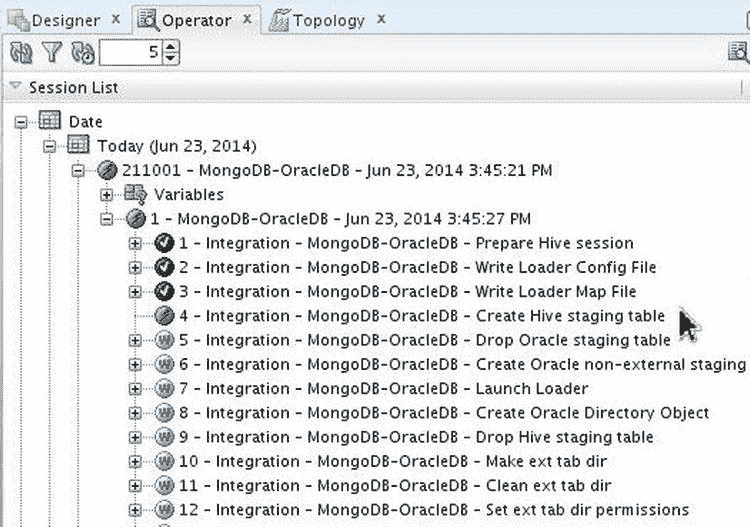
图 12-80. 已挂起的集成阶段

5.  会话仍在运行，如果配置参数被修复（例如，为数据库表添加缺失的模式），则会完成。或者，可以停止集成会话。右键单击会话并选择其中一个“停止”选项以终止会话，如 图 12-81 所示。

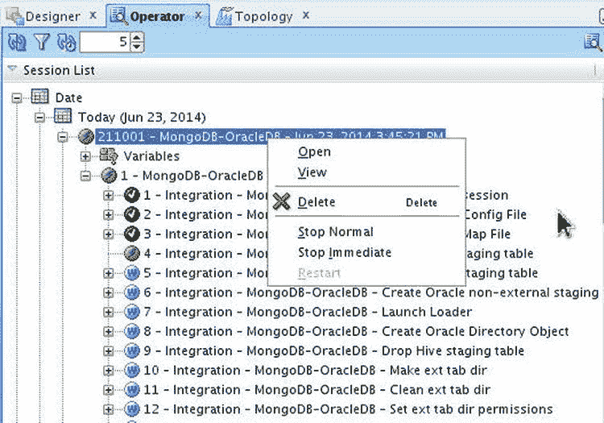
图 12-81. 停止集成会话的选项

