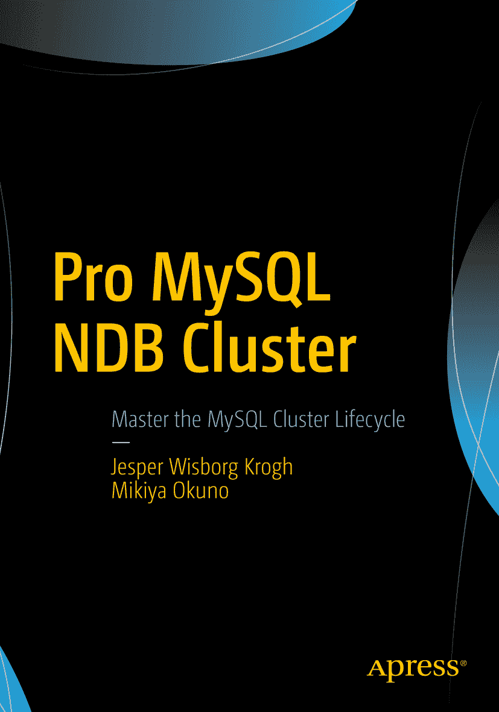

 Jesper Wisborg Krogh 与 Mikiya Okuno 合著 *Pro MySQL NDB Cluster*

作者在本书中引用的任何源代码或其他补充材料，读者均可通过本书的产品页面在 GitHub 上获取，地址为 [`www.apress.com/9781484229811`](http://www.apress.com/9781484229811)。如需更详细信息，请访问 [`http://www.apress.com/source-code`](http://www.apress.com/source-code)。

`ISBN 978-1-4842-2981-1` 电子`ISBN 978-1-4842-2982-8` [`https://doi.org/10.1007/978-1-4842-2982-8`](https://doi.org/10.1007/978-1-4842-2982-8) 美国国会图书馆控制号：`2017958958` © Jesper Wisborg Krogh 与 Mikiya Okuno 2017

本作品受版权保护。出版者保留所有商业权利，无论涉及材料的全部或部分，具体包括翻译权、重印权、图表的再利用权、朗诵权、广播权、缩微胶片或其他物理方式的复制权，以及信息传输或存储与检索权、电子改编权、计算机软件权，或目前已有或将来开发的类似或不同方法。

本书中可能出现商标名称、标识和图像。我们并非在每次出现商标名称、标识或图像时都使用商标符号，而是仅以编辑方式并为商标所有者利益而使用这些名称、标识和图像，无意侵犯商标权。本出版物中使用的商品名称、商标、服务标志和类似术语，即使未特别标识，也不应被视为表达意见，认为其是否受专有权利约束。

尽管本书中的建议和信息在出版时被认为是真实准确的，但作者、编辑或出版商均不对可能出现的任何错误或遗漏承担任何法律责任。出版商对本出版物所含材料不作任何明示或暗示的担保。本书使用无酸纸印刷。

本书通过 Springer Science+Business Media New York（地址：233 Spring Street, 6th Floor, New York, NY 10013。电话：1-800-SPRINGER，传真：(201) 348-4505，电子邮件：orders-ny@springer-sbm.com，或访问 www.springeronline.com）面向全球图书贸易发行。Apress Media, LLC 是一家位于加利福尼亚州的有限责任公司，其唯一成员（所有者）是 Springer Science + Business Media Finance Inc (SSBM Finance Inc)。SSBM Finance Inc 是一家特拉华州公司。

