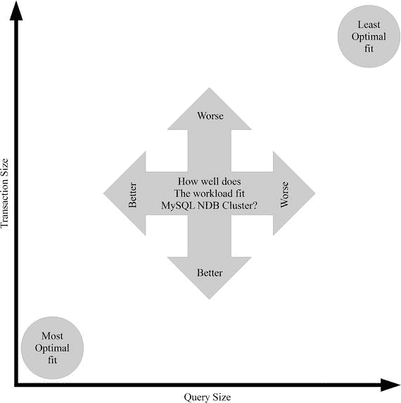

# 使用案例

历史上，MySQL NDB 集群的主要用户曾是电信公司，但如今，特别是在过去五年改进的推动下，其使用案例数量已显著增长。以下列表包含 MySQL NDB 集群的使用案例示例及其实际用户。

*   电信公司的电话呼叫路由。如果您拨打过电话，那么很可能 MySQL NDB 集群参与了其中。用户示例包括阿尔卡特朗讯（现为诺基亚一部分）和 Telenor。
*   网站的会话管理。
*   认证服务，例如 FreeRADIUS 和 VoIP 系统。
*   在线游戏。例如 Big Fish 和 Playful Play。
*   HopsFS 文件系统的元数据管理，例如 Spotify 就使用了该文件系统。
*   实时欺诈检测。例如 PayPal。
*   飞行计划，例如为美国海军。

注意

如果您感兴趣，[`www.mysql.com/customers/cluster/`](https://www.mysql.com/customers/cluster/) 包含更多关于使用案例的信息以及部分 MySQL NDB 集群用户名单，包括使用案例列表中提到的所有用户。

这些使用案例示例展示了若干由相对简单查询组成的工作负载，例如认证服务和电话呼叫路由。这确实是 MySQL NDB 集群的最大优势。最佳工作负载是那些所有查询都使用主键访问数据，并且每个事务仅涉及少量数据行的场景。虽然这对于数据库来说通常是成立的，但由于设计原因，对于 MySQL NDB 集群而言尤其如此。

数据是分布式的，因此访问大量数据也会增加网络负载，并且所有当前活动的记录都必须保存在内存中以实现实时性保证。另一方面，使用主键选取的单行数据将允许 API 节点直接向存储该行的数据节点请求数据，而小型事务则意味着存储事务元数据的开销较小。以目前的信息来看，这可能显得抽象且难以理解，但请放心，在本书的整个过程中，将逐步构建必要的背景知识，以帮助您理解这种关系。特别是本章以及第 2、3、18、19 和 20 章在这方面将非常有用，因为它们描述了 MySQL NDB 集群的基础知识、配置、开发和性能调优。

简而言之，可以说 MySQL NDB 集群在联机事务处理（OLTP）工作负载方面表现出色，但不太适合联机分析处理（OLAP）工作负载。图 1-1 展示了一张图表，其中最优工作负载位于原点，表示仅通过主键访问单行的事务。最不理想的工作负载是大型事务和大型扫描。

图 1-1. 最适合 MySQL NDB 集群的工作负载概览

在现实世界中，大多数工作负载并非只处于频谱的一端，也不要求所有查询都处于图表的最优部分。但是，如果大多数事务都处于最不理想的部分，那么 MySQL NDB 集群可能不是最佳选择——在这种情况下，使用 `InnoDB` 存储引擎的 MySQL Server 可能会提供更好的体验。第 6 章讨论的一种可能性是，在复制主库上使用 `NDBCluster` 作为存储引擎，而在复制从库上使用 `InnoDB` 存储引擎。这样，写入和小型事务可以利用 `NDBCluster` 的特性，而较大的读事务（如报表）则使用更灵活的 `InnoDB` 存储引擎。

