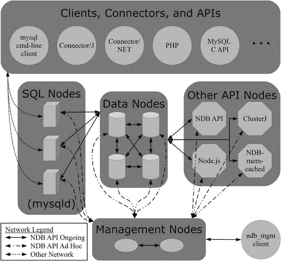
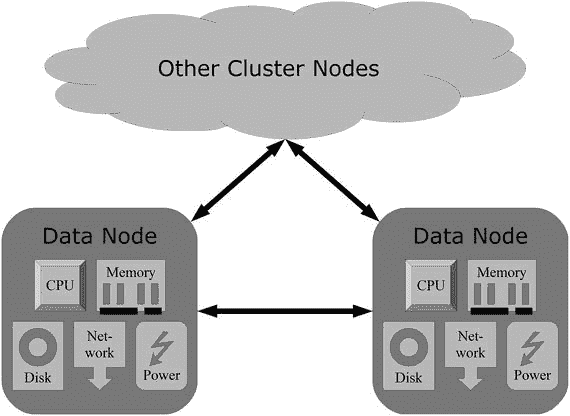
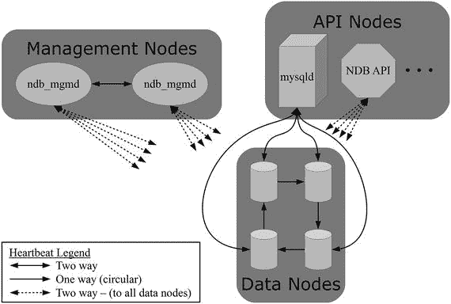
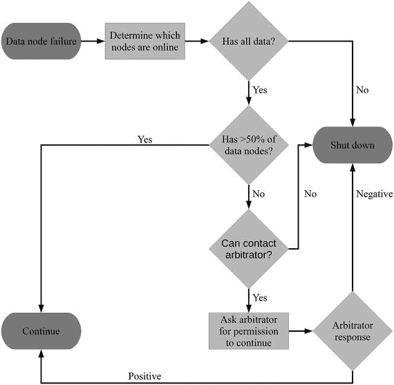

# 节点类型

MySQL NDB 集群有三种类型的节点，各自扮演着特定角色。节点类型包括：

*   管理节点
*   数据节点
*   API/SQL 节点

各种节点类型之间的关系如图 1-2 所示，图后将对每种节点类型进行更详细的讨论。为简洁起见，NDB-memcached 仅列出守护进程，未列出连接到 memcached 的客户端。



图 1-2. 参与集群的各种节点及其关系概览

#### 管理节点

管理节点是集群中最轻量级的节点。它们在集群中承担五种角色，并且在集群生命周期的少数特定时刻才是必需的：

*   处理配置。
*   允许其他节点连接到集群。
*   维护包含所有节点消息的集群日志。
*   在潜在的脑裂场景中进行仲裁。
*   执行数据库管理员发起的管理任务，例如启动备份或重启数据节点。

在高可用性设置中，通常配备两个管理节点，这样即使一个节点关闭，还有一个仍然可用。

### 处理配置

管理节点负责处理配置。配置在通常名为 `config.ini` 的 INI 格式配置文件中创建。该配置文件包含集群中所有节点的配置，不过 API/SQL 节点可能还有自己本地的配置文件。例如，SQL 节点也会读取独立 MySQL Server 安装中常见的 `my.cnf` 或 `my.ini` 配置文件。如果集群中有多个管理节点，每个管理节点都有自己的配置文件，但它们必须完全相同。当管理节点启动时，可以选择读取配置文件并应用其中的配置。解析后的配置随后存储在本地缓存中。

清单 1-1 展示了一个 INI 格式的 `config.ini` 文件示例。在生产系统中，配置通常会包含比示例更多的选项和配置节，但整体结构相同。第 4 章将详细介绍 MySQL NDB 集群配置。

```
[ndb_mgmd default]
DataDir                       = /cluster/
[ndbd default]
NoOfReplicas                  = 2
DataMemory                    = 20G
IndexMemory                   = 2G
MaxNoOfConcurrentTransactions = 400K
DataDir                       = /cluster/
[ndbd]
NodeId                        = 1
HostName                      = 192.168.56.103
[ndbd]
NodeId                        = 2
HostName                      = 192.168.56.104
[ndb_mgmd]
NodeId                        = 49
HostName                      = 192.168.56.101
[ndb_mgmd]
NodeId                        = 50
HostName                      = 192.168.56.102
[mysqld]
NodeId                        = 51
HostName                      = 192.168.56.103
[mysqld]
NodeId                        = 52
HostName                      = 192.168.56.104
[api]
NodeId                        = 53
HostName                      = 192.168.56.101
[api]
NodeId                        = 54
HostName                      = 192.168.56.102
```

清单 1-1. 集群配置文件示例 (`config.ini`)

### 连接处理

每当一个节点想要加入集群时，它必须首先联系一个管理节点。管理节点将检查该节点是否被允许加入集群；如果允许连接，管理节点会向加入节点提供配置信息。这也意味着，如果没有管理节点在线或可访问，任何节点都无法加入集群。


#### 日志

管理节点维护着接收整个集群消息的集群日志。这些消息的范围广泛，从关于内存使用的信息性消息到意外节点关闭的严重错误。这意味着集群日志是查找集群状态初步概览的理想场所。

#### 仲裁

仲裁的任务是在发生脑裂场景时，决定哪些数据节点应该保持在线——在这种情况下，最多只有一半的数据节点可以相互看到。所有其他数据节点将被指示关闭。关于仲裁过程的更详细讨论，请参见“内置高可用性”部分。

#### 管理任务

使用 `ndb_mgm` 管理客户端连接到数据节点，可以执行多项管理任务，例如创建备份、启动和停止节点、控制日志级别等。更多详情，请参见第 7 章。

#### 数据节点

数据节点构成了 MySQL NDB 集群的核心，因为实际数据就存储在这里。数据节点有两种类型：

*   `ndbd`：原始的单线程版本数据节点
*   `ndbmtd`：面向现代硬件的多线程版本

从功能角度来看，两者是相同的，但在性能方面存在差异。在大多数情况下，生产系统应使用多线程二进制版本。

由于数据节点在集群中扮演着非常重要的角色，第 2 章将专门更详细地讨论数据节点。

### API 和 SQL 节点

API 节点是提交查询的地方。每个 API 节点都连接到所有数据节点，并且无需任何额外考虑即可访问所有数据。例如，即使数据被分片，应用程序或用户也无需了解任何关于分片的信息，这使得应用程序的逻辑更简单。

只要不在同一个事务中，也可以通过一个 API 节点执行一个查询，然后通过另一个节点执行下一个查询。由于 MySQL NDB 集群独占地使用 `READ COMMITTED` 事务隔离级别以及数据节点之间的同步复制，一旦事务提交，所有 API 节点都可以使用已提交的数据。

MySQL NDB 集群支持多种 API：

*   NDB API：这是原始 API，也是所有其他 API 在底层与数据节点通信所使用的 API。它仅支持 C++。
*   SQL 节点：这是一个 MySQL 服务器 (`mysqld`) 实例。这是最常见的 API 节点。由于这是最常见的 API 节点类型，因此 API 节点通常也称为 SQL 节点。SQL 节点也可以选择性地用于仲裁。应用程序使用任何可用的连接器或 API 连接到 SQL 节点，这些连接器或 API 同样可用于连接 MySQL 服务器和 `InnoDB` 表。
*   ClusterJ：Java 应用程序可以使用 ClusterJ API 绕过 SQL 节点。
*   Node.js：对于 Node.js（JavaScript）应用程序，也有一个可以直接使用的 API。
*   NDB-memcached：使用 NDB-memcached API 允许应用程序通过 memcached（一种分布式内存缓存系统）访问数据。NDB-memcached 是一个特殊的构建版本，可以使用数据节点作为其后端存储。memcached 的主页是 [`memcached.org/`](https://memcached.org/)。

当使用 `mysqld` 作为 API 节点时，必须使用编译时包含 MySQL NDB 集群支持的特殊版本。尽管 SQL 节点可以使用其他存储引擎（如 `InnoDB`）自行存储数据，但使用 `NDBCluster` 存储引擎创建的表的任何数据都不会存储在 SQL 节点上。每次表中的数据发生变化时，数据都会被发送到数据节点；每次从表中获取数据时，数据都会从数据节点发送到 SQL 节点，然后再返回给应用程序。因此，SQL 节点不仅需要执行相对昂贵的查询解析，而且在应用程序和数据节点之间还多了一跳网络通信。

这意味着使用直接与数据节点通信的 API 可能是有利的，因为这将在两个方面减少开销：

*   避免了 SQL 语句的解析。
*   减少了一层网络通信。

因此，按性能从最优到最差排序，各类 API 的一般性能顺序为：

*   NDB API：这是唯一可以直接与数据节点通信的 API。所有其他 API 节点类型最终都使用 NDB API，尽管这对开发者是隐藏的。
*   其他 NoSQL API：ClusterJ、Node.js、NDB-memcached。
*   SQL 节点。

关于多种 API 的更详细讨论，请参见第 18 章和第 19 章。

##### 内置高可用性

选择 MySQL NDB 集群而非其他数据库系统的主要原因之一是其内置的高可用性设计。您可能已经了解到，MySQL NDB 集群可以实现 99.999%（五个九）的正常运行时间（或每年最多约 5 分 15 秒的停机时间）。“五个九”是衡量系统是否高度可用的经典阈值，它已成为高可用性数据库努力实现的神奇数字。

高可用性可以意味着很多事情。对于 MySQL NDB 集群，重点在于能够避免整个集群宕机，并能够为查询提供一致的响应时间。高可用性通过以下方式实现：

*   无共享架构。
*   支持无单点故障。所有节点类型都可以有冗余，所有数据都可以有多个副本。
*   自动检测和处理节点故障。
*   采用快速失败策略，以避免缓慢或故障节点导致响应时间变慢。

MySQL NDB 集群从设计之初就考虑了高可用性，但这并不意味着高可用性，尤其是“五个九”的正常运行时间，是自然而然就获得的。在部署集群时，牢记这一点非常重要，否则您可能会无意中比使用 `InnoDB` 存储引擎的传统 MySQL 服务器部署降低可用性。需要牢记的重要事项包括：

*   MySQL NDB 集群支持无单点故障，但数据库管理员和系统管理员必须确保其得到实施。例如，网络设计必须确保交换机的故障不会阻止至少一半的数据节点进行通信。
*   快速失败策略意味着避免集群过载至关重要。过载可能发生在多个层面，包括 SQL 节点尝试将所有数据更改写入二进制日志（复制和基于时间点的恢复日志）、网络成为瓶颈、磁盘或 CPU 或内存无法跟上等。数据库开发人员和管理员的一个关键任务是确保在生产系统上执行的查询经过充分测试，以确保它们不会导致过载。
*   虽然集群作为一个整体可以承受单个节点故障，但在故障发生时执行的事务可能会因临时错误而失败。同样，事务也可能因资源耗尽而失败。因此，应用程序应始终准备好重试临时性故障。

这些内容也在第二部分中有更详细的讨论。


### 共享无架构

MySQL NDB Cluster 的共享无（Shared Nothing）架构是其架构中最重要的方面之一。共享无架构意味着集群中的每个节点既不共享磁盘、内存，也不与其他节点共享任何其他资源。这影响了集群工作的大多数方面，例如：
*   节点间的通信
*   检测其他节点是否在线
*   故障转移

> 注意
> 故障转移是解决一个或多个节点变得不可用的状态的过程。这在 MySQL NDB Cluster 中是自动处理的，本章后面将更详细地讨论。

图 1-3 显示了数据节点如何拥有自己的硬件资源，并且节点之间不共享任何组件。集群中的其他节点也是如此，但为了聚焦于重要部分，图中未明确描绘这些。这意味着，如果一个节点中的硬盘发生故障，该节点可以被离线，而集群的其余部分可以继续运行。这种选择的优势在于，它使得避免单点故障成为可能，而这是实现高可用性策略的基石。

> 注意
> 每个硬件组件本身可能是冗余的。例如，磁盘可能组成 RAID 阵列，因此一个或多个磁盘可能故障而不会完全丢失存储。这将提供额外的保护层。



图 1-3.
共享无架构

### 心跳机制

集群能够自动检测一个或多个其他节点故障的基本机制是心跳（heartbeats）。对于一个集群，本质上存在三种心跳：
*   数据节点之间：这些心跳以环形方式发送，因此每个数据节点只从一个其他数据节点接收心跳，并且只发送到一个数据节点。据说一个数据节点从它“左侧”的数据节点接收心跳，并向它“右侧”的数据节点发送心跳。日志中的一些消息使用这种左-右术语。一个数据节点负责检测它“左侧”的数据节点是否仍然存活。
*   数据节点与非数据节点之间：这些心跳针对所有可能的组合发送，即一个给定的数据节点向所有非数据节点发送并从所有非数据节点接收心跳。非数据节点包括管理节点和所有类型的 API 节点。
*   管理节点之间：这些心跳在管理节点之间发送，因此一个管理节点知道其对等节点是否在线。

这些心跳也在图 1-4 中进行了描绘。



图 1-4.
集群中各种节点之间的心跳

### 数据节点故障处理与仲裁

> 注意
> 本小节的讨论假设所有数据都有两个副本（另见第 2 章，特别是“副本”和“节点组”部分）。在有更多数据副本的情况下，规则更严格，可能导致集群在原本可以存活的情况下发生故障。这是目前官方最多只支持两个副本的原因之一。

数据节点可能因多种原因而故障，例如由于过载或网络故障导致错过太多心跳、硬件问题、错误或其他原因。无论原因如何，剩余的节点必须确定它们是否可以继续运行，或者必须关闭。如果存活的数据节点作为一个组持有所有数据，并且该组拥有超过半数的数据节点，则很容易确定数据节点可以继续运行。如果该组没有所有数据，同样很容易确定它们必须关闭。

当一个或多个数据节点组可以访问所有数据，但没有占多数的数据节点时，会出现更复杂的情况。在这种情况下，数据节点无法自行知道继续运行是否安全，因此需要仲裁。例如，如果集群被网络故障分成两半，并且两半各自都有所有数据，则被称为“脑裂”（split-brain）场景。也就是说，原则上两半都可以自行继续。然而，如果允许脑裂状态持续，并且在两半上都发生了更新，两半中的数据将开始出现分歧，API 节点根据它查询的是哪一半数据节点而得到不同的结果。这是绝对不允许发生的情况，因此集群将自动执行仲裁来决定应该怎么做。

在潜在的脑裂情况下，只有数据节点能够联系到仲裁器（arbitrator）时，才被允许继续操作。最常见的是，一个管理节点将充当仲裁器，仲裁的决定是让集群中首先联系到仲裁器的那一部分获胜。然后，数据节点的其他部分将被强制关闭，以避免数据出现分歧。

简而言之，如果以下条件为真，则允许数据节点继续：
*   该数据节点组持有所有数据。
*   该组拥有超过半数的数据节点，或者该组赢得了仲裁过程。

在发生一个或多个其他数据节点故障后，确定一组数据节点是否可以继续的过程如图 1-5 所示。



图 1-5.
数据有两个副本时的数据节点故障处理过程

仲裁器可以是一个管理节点或一个 SQL 节点。默认情况下，管理节点被配置为可用作仲裁器，而 SQL 节点则不是。在任何给定时间，最多只有一个仲裁器。由数据节点选举出哪个合格的节点担任当前的仲裁器。

> 警告
> 在处理节点故障时，仲裁器永远不能更改。因此，允许成为仲裁器的节点必须能够被所有数据节点访问，这一点非常重要。特别是，不要允许安装在与数据节点相同主机上的节点成为仲裁器。如果整个主机关闭，只有在不需要仲裁器来确定存活节点组是否可以安全地继续操作时，集群才能保持在线！

## 本章小结

第一章概述了 MySQL NDB Cluster。讨论的主题包括：
*   术语
*   特性和功能
*   限制
*   用例
*   三种节点类型：数据节点、管理节点和 API/SQL 节点
*   MySQL NDB Cluster 中高可用性如何工作

在讨论节点类型时，对数据节点的介绍较少。这是因为数据节点是 MySQL NDB Cluster 的核心，下一章将专门讨论数据节点。

