# 2. 数据节点

数据节点在很多方面是 MySQL NDB Cluster 的核心和灵魂。这是数据存储的地方，大部分高可用性集中于此，也是大多数需要特殊考虑的地方所在。集群中可以有 1 到 48 个数据节点，每个数据节点由 23 个不同的内核块构建，可以有 1 到 98 个线程。本章介绍数据节点的具体细节，为您在后续专注于集群使用的章节中打下坚实的基础。


### 单线程与多线程数据节点

数据节点根据其内部组织方式分为两种：单线程和多线程。单线程二进制文件 `ndbd` 是原始的架构。顾名思义，所有操作都在同一个进程线程内执行。多线程二进制文件 `ndbmtd` 在 MySQL NDB Cluster 7.0 中引入。`ndbmtd` 允许将数据节点内核的特定部分拆分到它们自己的线程中，从而更好地利用现代硬件。标题为“性能考虑”的章节介绍了何时使用 `ndbd` 和 `ndbmtd`。

> **注意**
> 除非你使用 MySQL Cluster Manager（参见第 [13] 章），否则选择使用 `ndbd` 还是 `ndbmtd` 并不是配置的一部分。你使用哪一个，仅仅取决于启动数据节点时调用的是哪个二进制文件。

这两种数据节点二进制文件是兼容的，因此可以在它们之间切换，其限制与更改多线程数据节点的线程配置相同：扩展到使用更多线程总是可行的，但缩减规模可能需要一次初始重启，并可能需要从备份中恢复数据。`ndbmtd` 二进制文件的默认线程配置大致等同于使用 `ndbd`。

#### 线程类型

多线程二进制文件可以执行多种不同的线程类型。每种线程类型都有其特定的任务，并且每种类型的数量可以变化。表 [2-1] 总结了 MySQL NDB Cluster 7.5 中可用的八种线程类型。“线程数”列指定了该线程类型的允许值范围。值为 1 表示线程数量无法更改，并且始终恰好有一个线程或线程池（对于 I/O 和看门狗线程）。线程类型以小写字母列出，因为它用于 `ThreadConfig` 选项中；但是，在讨论线程类型时，惯例是使用大写字母。因此，例如，本地数据管理器在 `ThreadConfig` 选项中指定时称为 `ldm`，但在讨论该线程时称为 LDM。

表 2-1. MySQL NDB Cluster 7.5 支持的线程类型

| 类型 | 名称 | 线程数 | 描述 |
| --- | --- | --- | --- |
| main | 主线程 | 1 | 处理数据字典并拥有一个事务协调器。 |
| ldm | 本地数据管理器 | 1, 2, 4, 6, 8, 12, 16, 24, 32 | 这些线程包含本地查询处理器（`LQH`）。`LDM` 线程的数量直接影响每个表可以拥有的分区数，因为每个 `LDM` 线程负责自己的分区集合。它还影响查询执行的并行度。 |
| tc | 事务协调器 | 0-32 | 这些线程包含每个进行中事务的状态。 |
| recv | 接收线程 | 1-16 | 接收线程处理与集群中其他节点通信的套接字的接收端。 |
| send | 发送线程 | 0-16 | 发送线程类似于接收线程，但它位于与集群中其他节点通信的套接字的发送端。将发送线程数设置为零会导致每个线程处理自己的发送。拥有多个发送线程可以大大提高吞吐量，但如果线程不过载，让每个线程处理自己的通信可以减少延迟。 |
| rep | 复制线程 | 1 | 复制线程用于与 SQL 节点进行异步通信，用于模式更改和二进制日志记录。 |
| io | I/O 线程 | 1 | `I/O` 线程（与 `watchdog` 线程一起）很特殊，因为它对应一个线程池。线程数 1 用于表示不能直接指定 `I/O` 线程的数量。相反，每个打开的文件将有一个 `I/O` 线程。“`I/O` 线程”通常是轻量级的，但在启用本地检查点压缩（参见本章后面的“持久性 D”部分）或备份时也会使用。 |
| watchdog | 看门狗线程 | 1 | `Watchdog` 线程与 `I/O` 线程类似，覆盖一个线程池。看门狗负责检查线程是否在正常运行。这是检测节点是否拖慢集群其余部分的策略的一部分，即使用第 [1] 章讨论的“及早失败”策略。 |

在旧版本的 MySQL NDB Cluster 中，可用的线程类型和支持的线程数可能更受限制。

> **注意**
> 有关详细信息，请参阅参考手册中 `ThreadConfig` 选项的文档：[`dev.mysql.com/doc/refman/5.7/en/mysql-cluster-ndbd-definition.html#ndbparam-ndbmtd-threadconfig`](https://dev.mysql.com/doc/refman/5.7/en/mysql-cluster-ndbd-definition.html#ndbparam-ndbmtd-threadconfig)。

考虑所有线程类型并确定每种线程类型的最佳数量以适应你的工作负载可能看起来令人不知所措。幸运的是，有一个选项可以让 MySQL NDB Cluster 自动分配线程，你只需指定想要的最大线程数即可。自动分配根据预定的表格支持最多 72 个线程，在初始阶段可能非常有用，但它无法提供最佳性能。

> **注意**
> 请参阅 [`dev.mysql.com/doc/refman/5.7/en/mysql-cluster-ndbd-definition.html#ndbparam-ndbmtd-maxnoofexecutionthreads`](https://dev.mysql.com/doc/refman/5.7/en/mysql-cluster-ndbd-definition.html#ndbparam-ndbmtd-maxnoofexecutionthreads) 获取分配表。

另一方面，手动为每种线程类型指定数量的优势在于，你可以根据工作负载进行定制。例如，如果你不需要很高的发送吞吐量，可以禁用发送线程。此外，当你手动配置线程时，每种线程类型还有其他可用选项：

*   线程可以使用的 CPU。结合将其他进程/线程排除在这些 CPU 之外，可以避免在 CPU 层面发生争用。
*   线程进入休眠状态前的等待时间[¹]。
*   线程是否应以实时优先级运行（与线程优先级互斥）。
*   线程优先级（与启用实时优先级互斥）。线程优先级的确切效果取决于系统；例如，在 Linux 上，提高线程优先级会降低线程的“友好度”（线程将 CPU 让给另一个进程的可能性），在 Microsoft Windows 上，它会设置 `THREAD_PRIORITY_*` 优先级之一（取决于选择的线程优先级）。

这些选项的实际配置在第 [4] 章和第 [20] 章中介绍。

在集群的生命周期内更改每种线程类型的数量通常是安全的。但是，有一个例外：`LDM` 线程。支持的分区数取决于 `LDM` 线程的数量（请参阅后面的“分区”部分），用于哈希索引的内存是在 `LDM` 线程之间分配的。因此，更改 `LDM` 线程一方面可能会提高性能。然而，如果不小心，这也可能导致内存使用不平衡，在最坏的情况下可能会阻止数据节点启动。

> **注意**
> 如果你更改了 `LDM` 线程的数量，可能需要重新初始化集群（执行初始系统重启）。另请参阅本章后面“数据和索引”一节中的“数据内存和索引内存”。有关示例，请参见第 [10] 章中的“初始系统重启”案例研究。


#### 性能考量

在选择使用单线程还是多线程二进制文件，以及如果是后者，如何选择最优配置时，有几个考量因素。

首先需要考虑的是你的硬件。如果你只有少量 CPU 核心可用，那么使用单线程二进制文件可能是最佳选择，因为多线程数据节点实际上至少需要五个线程。这还不包括操作系统和主机上其他进程所需的 CPU。

否则，一个经验法则是：单线程二进制文件由于数据节点各部分之间的通信开销较低，通常能提供更低的延迟；然而，由于所有事情都在单个线程中运行，其吞吐量将受到严重限制。

对于多线程数据节点，使用专用的发送线程可能会增加延迟，这与每个线程自行处理与其他节点通信的发送端相比。但是，最大吞吐量会因此降低。最终，决策很大程度上取决于实际的工作负载。

在实践中，对于大多数生产系统，应使用多线程数据节点。在现代硬件上，单线程数据节点的吞吐量限制过于严格。对于许多工作负载，指定最大线程数就足够了；额外的好处是，你可以避免过度微管理的风险，以免最终损害集群的稳定性。当你选择最大线程数时，请确保为操作系统和主机上的其他进程留出空间。

> **注意**
>
> 如果你将一个 API/SQL 节点或其他 CPU 密集型进程与数据节点部署在同一主机上，在配置数据节点的线程时，特别需要考虑到这一点。在这种情况下，通常值得将线程绑定到特定的 CPU，并禁止 API/SQL 节点使用这些 CPU。

总结一下，在典型的生产环境中，请按如下方式做出选择：

*   除非你使用的是 CPU 资源非常有限的虚拟机，否则请使用多线程数据节点。
*   在专用于单个数据节点的主机上，设置最大线程数时，要为操作系统保留大约两到四个 CPU。
*   对于高性能集群、不适合自动线程分配的工作负载，或者当其他 CPU 密集型进程（如 API/SQL 节点）在同一主机上运行时，具体选择每种线程类型的数量，并将每个线程绑定到其专用 CPU，并禁止其他进程使用该 CPU。

### 副本

在 `InnoDB` 中，所有数据都以单一副本本地存储。这是一个简单的解决方案，但缺点是如果你必须关闭实例，或者由于其他原因变得不可访问，数据就会离线。这构成了一个单点故障，而 MySQL NDB Cluster 正是为了避免这一点而设计的。

#### 主副本与备份副本

为了避免只有单一数据副本，MySQL NDB Cluster 支持将所有数据存储最多四个副本（通过 `NoOfReplicas` 配置选项；另见第 4 章）。通过将数据复制到多个数据节点，关闭一个节点是安全的，因为数据仍然可以在剩余的副本中被读写。

> **注意**
>
> 建议使用 `NoOfReplicas = 2`。这是经过最充分测试的配置，也是生产中最常用的配置。如第 1 章所述，仲裁过程也针对最多两个副本进行了优化。

如果集群被配置为拥有两个数据副本，那么每个数据节点有一个主副本和一个备份副本。备份副本通过同步复制和两阶段提交过程保持最新。主副本和备份副本之间的这种关系如图 2-1 所示。

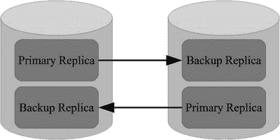

图 2-1. 双副本配置

> **注意**
>
> 数据节点之间的内部同步复制不应与 SQL 节点之间或标准 MySQL Server 实例所支持的异步复制（MySQL Server 复制）相混淆。虽然名称相似，但这两种复制完全不同，MySQL NDB Cluster 两者都支持。关于 SQL 节点之间的异步复制，详见第 6 章。

#### MySQL NDB Cluster 7.5：从备份副本读取

在 MySQL NDB Cluster 7.5 之前，备份副本仅在主副本离线时才用于选择数据。这仍然是默认行为，因为它允许在事务提交后，控制权尽快返回到执行写入的 API/SQL 节点。实现细节超出了本书范围，但结果是主副本上的锁可以比备份副本上的锁更早释放——在事务的提交阶段而非完成阶段。这意味着尝试从备份副本读取是不安全的，因为你可能看不到刚写入的数据。

如果你想允许从备份副本读取，事务提交就必须等到更改在备份副本上也解锁后才能返回。这将增加提交的延迟，但好处是可以减少从多个数据节点读取的需求，从而减少网络流量。

如果你正在将现有的 `InnoDB` 数据库迁移到 MySQL NDB Cluster，允许从备份副本读取，可能会让你获得更接近期望的性能特性。当你有两个数据节点、两个副本以及两个与数据节点位于同一主机上的 API/SQL 节点时（如图 2-2 所示），尤其如此。

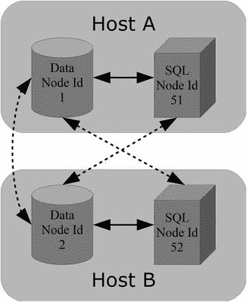

图 2-2. 使用从副本读取功能

在图 2-2 中，实线是用于从本地数据节点读取的通信链路。虚线是当本地数据节点离线时用于读取的链路，以及用于数据节点之间同步复制的链路。

作为新功能的一部分，有一个选项可以告诉 API/SQL 节点首选联系哪个数据节点。由于两个数据节点意味着每个数据节点都拥有全部数据的一个副本，这两个 API/SQL 节点将只与自身所在主机上的数据节点通信，除非该数据节点离线。同样，数据节点之间的网络流量也会减少，因为无需从对等数据节点请求数据。如果其中一个数据节点离线，API/SQL 节点仍然可以连接到剩余的在线数据节点以访问所有数据。

总结是否使用从备份副本读取功能：

*   默认行为针对写入延迟进行了优化。
*   从备份读取行为针对读取延迟进行了优化。

是否应启用从备份副本读取功能，取决于应用程序应该针对写入延迟还是读取延迟进行优化。随着添加更多数据节点，启用从副本读取功能的效果会减弱；这是由于分片使得每个数据节点只拥有部分数据，因此在任何情况下都必然需要一些网络流量。


### 节点组

上一节讨论的副本数指定了集群中存在的数据副本数量。与此相关的是节点组。每个节点组是一组数据节点，其中每个数据节点保存相同的数据。唯一的区别在于哪个被认为是主副本，哪些是备份副本。查看图 2-3，它描绘了与介绍主副本和备份副本时讨论的相同设置。然而，它也描绘了一个由两个数据节点组成的节点组。

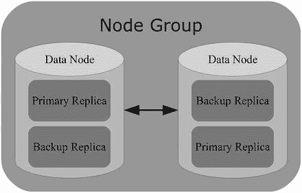

图 2-3. 一个节点组

集群中的节点组数量是数据节点总数除以副本数。对于一个典型的双副本集群，这意味着如果有八个数据节点，就会有四个节点组：

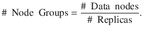

除了完全复制的表（关于分区，见下一节），数据是在节点组之间分片的。分片意味着数据以这样的方式划分在不同节点组之间，使得两个不同节点组存储的数据没有重叠。在 MySQL NDB Cluster 中，分片基于分区自动进行。在数据分布完全均匀的情况下，每个节点组将拥有恰好 1/N 的数据，其中 N 是节点组的数量。例如，假设总共有 10GB 的数据，并且有四个节点组，那么每个节点组将存储 2.5GB 的数据。

要求是每个数据节点必须恰好属于一个节点组，并且所有节点组具有相同数量的数据节点。这意味着您无法创建一个具有两个副本和三个数据节点的集群。同样，如果您想向现有集群添加数据节点，必须一次添加整个节点组。

默认情况下，数据节点通过 `NodeId` 选项设置的节点 ID 自动分布在节点组之间，因此最低的节点 ID 进入第一个节点组，接下来的数据节点按节点 ID 进入下一个节点组，依此类推。节点组的编号从零开始。图 2-4 显示了在具有两个副本和四个数据节点的典型配置中产生的两个节点组。

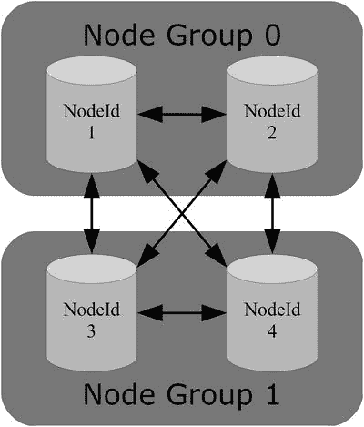

图 2-4. 两个节点组，每个组有两个数据节点

可以无需停机将新的节点组添加到集群（另见第 10 章）。但是，在节点组之间移动现有数据节点需要重新初始化集群（因此需要从备份恢复所有数据）。

### 分区

分区是数据在数据节点之间划分的最小单位。所有在 NDB Cluster 中存储数据的表默认都是分区的，并且分区数量会针对集群的大小和配置进行优化。MySQL NDB Cluster 支持两种分区类型：

*   `Partitioning by key`
*   `Partitioning by linear key`

对于这两种分区方案，都使用 `MD5()` 进行哈希计算²。按键分区和线性按键分区的区别在于，按键分区使用模运算，而线性按键分区使用二的幂算法。

模运算很简单：

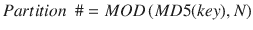

在公式中，`key` 是用于分区的列值，`N` 是分区数。该算法的优点是，在大多数情况下，它能提供均匀的数据分布。

二的幂算法更复杂：

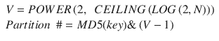

`V` 是一个基于分区数的常量。如果得到的分区号大于表的分区数（`N`），则结果会使用以下公式在一个循环中减少，直到分区号小于分区数：

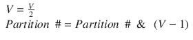

线性键的主要好处是它使分区管理（如添加、删除、拆分和合并分区）更快。然而，MySQL NDB Cluster 不支持这些操作，因此最好使用按键分区，它通常能提供更均匀的数据分布。

虽然自动分区通常效果很好，但可以使用自定义分区覆盖它。此外，MySQL NDB Cluster 7.5 支持更精细地调整每个表的分区平衡，以及使用完全复制表的选项。以下各节将详细介绍分区功能。

#### 自动分区

自动分区是默认设置，除非显式覆盖，否则将使用它。主键将被用作分区键，使用按键分区。分区数量将根据数据节点数和 LDM 线程数进行扩展，即分区数为：分区数 = 数据节点数 * LDM 线程数。表 2-2 中可以找到分区数量的一些示例。

表 2-2. 自动确定的分区数量示例

| 数据节点数 | LDM 线程数 | 分区数 |
| --- | --- | --- |
| 2 | 1 | 2 |
| 2 | 2 | 4 |
| 2 | 8 | 16 |
| 2 | 32 | 64 |
| 4 | 8 | 32 |
| 6 | 8 | 48 |
| 8 | 8 | 64 |
| 48 | 32 | 1536 |


#### 用户自定义分区

通过用户自定义分区，可以覆盖自动分区功能。对于主键包含多个列的表，这种方式优势尤为明显，因为可以选择分区键来优化数据访问。通过选择与查询中筛选行时最常用的列相匹配的分区键，可以提高性能，因为它增加了对数据的本地化访问。

一个典型例子是外键关系场景，预计会在父表和子表之间执行连接操作。如果子表的数据根据外键列进行分区，就可以在本地执行连接，而无需访问其他数据节点，从而提升性能。清单 2-1 展示了使用音乐专辑数据库中 `album` 和 `album_artist` 表的示例。`album_artist` 表的主键包含 `album_id` 和 `artist_name` 两列。在这种情况下，仅按 `album_id` 列分区即可优化这两个表之间的连接。

```sql
CREATE TABLE album (
album_id INT UNSIGNED NOT NULL,
album_name VARCHAR(50) NOT NULL,
PRIMARY KEY (album_id)
) ENGINE=ndbcluster;
CREATE TABLE album_artist (
album_id INT UNSIGNED NOT NULL,
artist_name VARCHAR(100) NOT NULL,
PRIMARY KEY (album_id, artist_name)
) ENGINE=ndbcluster
PARTITION BY KEY (album_id)
PARTITIONS 4;
SELECT *
FROM album
INNER JOIN album_artist USING (album_id);
清单 2-1.
用户自定义分区示例
```

用户自定义分区有以下限制：

*   分区键必须是主键的一部分。
*   仅支持按 KEY 或 LINEAR KEY 方式分区。
*   表支持的最大分区数为：8 * # LDM 线程数 * # 节点组数

有关使用用户自定义分区的更多信息，请参见第 20 章。

#### MySQL NDB Cluster 7.5：分区平衡

MySQL NDB Cluster 7.5 的新特性之一是可以更精细地指定表的分区平衡方式。以前，除非使用用户自定义分区，否则每个节点中的每个 LDM 线程都会拥有一个主副本。分区平衡方案的命名遵循 `FOR_<读取选项>_BY_<分布级别>` 模式，其中读取选项可以是 `RP`（"读取主副本"）或 `RA`（"读取任意副本"）。`分布级别` 可以是 `LDM` 或 `NODE`，具体取决于执行分区分布的层级。借助这些新选项，现在共有四种不同的分区平衡方案：

*   `FOR_RP_BY_LDM`：默认方案，也是 MySQL NDB Cluster 早期版本中唯一使用的方案。每个节点上的每个 LDM 线程拥有一个主分区。当使用两个副本时，这也意味着每个 LDM 线程拥有一个备份副本。读取操作从主副本进行。
*   `FOR_RA_BY_LDM`：每个 LDM 线程拥有一个主分区或备份分区。可以从任意副本进行读取。
*   `FOR_RP_BY_NODE`：每个数据节点中存储一个主分区。读取操作从主副本进行。
*   `FOR_RA_BY_NODE`：每个节点组拥有一个组合的单一分区。也就是说，每个节点将拥有一个主副本或一个备份副本。可以从任意副本进行读取。

仅在少数情况下需要选择非默认的分区平衡方案，并且只能通过设置表注释来实现。例如：

```sql
mysql> CREATE TABLE t1 (
id int unsigned NOT NULL,
val char(36),
PRIMARY KEY (id)
) ENGINE=NDBCluster
COMMENT='NDB_TABLE=PARTITION_BALANCE=FOR_RA_BY_LDM';
```

分区平衡的示例将在本节后的案例研究中展示。

注意

有关使用表注释为 `NDBCluster` 表设置表选项的更多信息，请参见 [`dev.mysql.com/doc/refman/5.7/en/create-table-ndb-table-comment-options.html`](https://dev.mysql.com/doc/refman/5.7/en/create-table-ndb-table-comment-options.html)。

#### MySQL NDB Cluster 7.5：完全复制表

MySQL NDB Cluster 7.5 的另一个新功能是，即使在具有多个节点组的集群中，也可以选择将表完全复制到所有数据节点。这意味着所有数据节点都拥有该表的完整数据副本。这种功能主要适用于那些常用于连接的、相对较小的表，例如查找表。启用完全复制功能的一个副作用是，它同样允许从备份副本读取，因此存在与"从副本读取"功能相同的写入开销。

完全复制的表将比普通表消耗更多内存。考虑一个有两个节点组的情况。在这种情况下，默认分布的表，每个节点组平均拥有一半数据。而对于一个完全复制的表，两个节点组都拥有全部数据，这意味着总内存使用量将增加一倍。


#### 案例研究：分区分布

理解四种分区平衡选项以及“从备份读取”（任意副本）和“全复制表”功能效果的最佳方式，是查看每种情况下分区的分布方式。本案例研究考虑一个集群，它包含两个副本和分布在两组节点中的四个数据节点。每个数据节点有四个 LDM 线程。

图 2-5 到图 2-8 展示了四种分区平衡方案各自的分布情况。此外，图 2-9 和图 2-10 分别展示了启用“从备份读取”和“全复制表”功能时，默认分区方案 `FOR_RP_BY_LDM` 的情况。在图中，`P` 表示该半区中的分区是主分区；`B` 表示该半区中的分区是备份分区。下文将逐一讨论每张图。

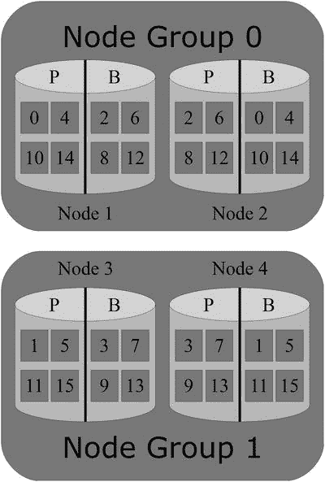
图 2-5. `FOR_RP_BY_LDM` 分区平衡方案

一个表的实际分布可能与其他表不同，但整体分布会是相似的。研究分区分布以及哪个节点拥有主副本的一个好来源是 `ndbinfo.table_fragments` 表（`ndbinfo` 模式在第 16 章讨论），该表在 MySQL NDB Cluster 7.5 中是新增的。另一个在 7.5 版本中新增的信息表是 `ndbinfo.table_info`，例如，它包含了所用分区平衡方式以及为该表启用了哪些其他功能的详细信息。另外，`ndb_desc` 实用程序（也可参考本章后面案例研究）可以提供有关表分区的信息。

图 2-5 是使用 `FOR_RP_BY_LDM` 分区平衡的一个例子，这是默认的分布方式。有四个数据节点和四个 LDM 线程，总共 16 个分区，每个 LDM 线程分配了一个主分区和一个备份分区。分区编号从 0 到 15。节点 1 上的主副本在节点 2 上是备份副本，反之亦然；节点 3 和节点 4 的情况类似。

图 2-6 展示了使用 `FOR_RA_BY_LDM` 的平衡方式。该方案中的 `RA`（任意读取）部分使得分区数量相比 `FOR_RP_BY_LDM` 减半。采用这种分布方式，每个 LDM 线程要么有一个主副本，要么有一个备份副本。

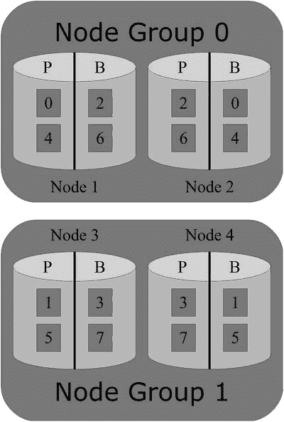
图 2-6. `FOR_RA_BY_LDM` 分区平衡方案

图 2-7 接着介绍了 `FOR_RP_BY_NODE`，它每个数据节点有一个主分区和一个备份分区。这导致一半的 LDM 线程没有任何分区，这很可能使负载变得不平衡，一个 LDM 线程繁忙而其他线程空闲。请谨慎使用此分区平衡方案，主要适用于行数很少的表。

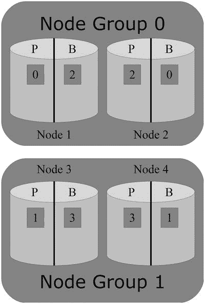
图 2-7. `FOR_RP_BY_NODE` 分区平衡方案

`FOR_RA_BY_NODE` 的分区更少，每个节点组只有一个分区，主分区在一个节点上，备份分区在另一个节点上。如图 2-8 所示。由于 `FOR_RA_BY_NODE` 允许从备份分区读取，在实践中主副本和备份副本之间的差异比 `RP` 平衡方案要小。与 `FOR_RP_BY_NODE` 类似，此方案主要对小型表有用。

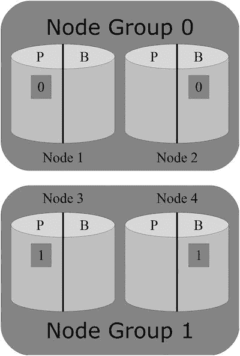
图 2-8. `FOR_RA_BY_NODE` 分区平衡方案

最后两种情况研究了默认分区平衡方案 `FOR_RP_BY_LDM` 在分别启用“从备份读取”和“全复制表”这两个功能时的情况。图 2-9 显示，当启用从备份副本读取时，分区分布没有改变。其分布与常规的 `FOR_RP_BY_LDM` 情况相同。

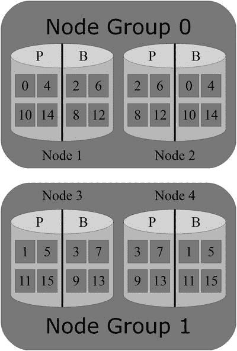
图 2-9. 启用从备份读取的 `FOR_RP_BY_LDM` 分区平衡方案

然而，启用“全复制表”功能确实改变了分区分布，如图 2-10 所示。最大的变化是两个节点组之间的副本是相同的。启用全复制表也是分区和片段不是同义词的唯一情况（从图中不可见）。

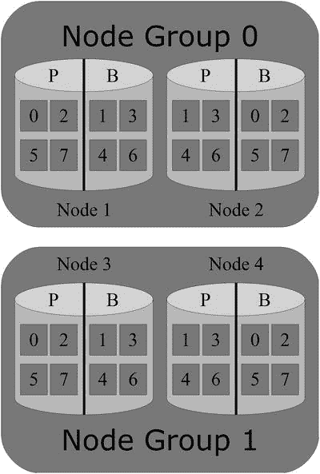
图 2-10. 启用全复制表的 `FOR_RP_BY_LDM` 分区平衡方案

为了更方便地比较这六种分布，图 2-5 到图 2-10 并排显示在图 2-11 中。每个示例下方的标签显示了所使用的分区平衡方案，以及是否使用了“从备份读取”或“全复制表”功能。“从任意备份（任意分区）读取”功能在标签中用 `+ Any` 表示，“全复制表”功能在标签中用 `+ Full` 表示。

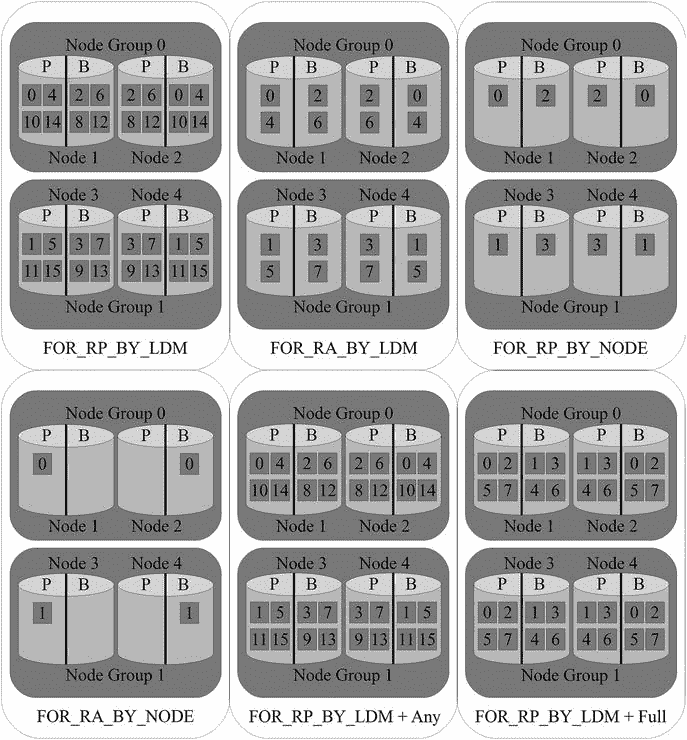
图 2-11. 分区分布的六个示例

### D 代表持久性

MySQL NDB Cluster 主要是一个内存数据库，但它仍旨在完全符合 ACID 规范。如何在提供实时性能的同时实现持久性（ACID 中的 D）？这涉及几个要素：

*   通过同步复制和两阶段提交来复制数据
*   本地检查点（LCPs）
*   重做日志
*   全局检查点（GCPs）

数据、本地检查点、重做日志和全局检查点之间的关系如图 2-12 所示。数据内存（不包括有序索引）被写入本地检查点。同时，所有写入操作都写入重做日志缓冲区，该缓冲区又在每个全局检查点时刷新到重做日志。值得再次参考该图，因为本节的其余部分将讨论这四个要素。

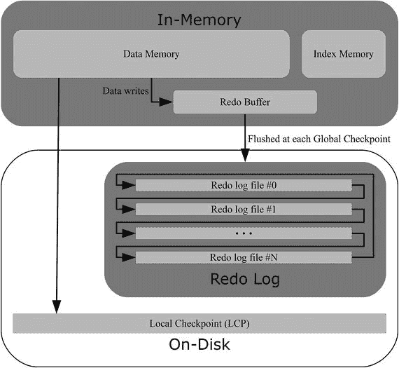
图 2-12. 数据、本地检查点、重做日志和全局检查点之间的关系

#### 数据复制

数据复制的第一个重要部分是启用多个副本（也可参考前面的“副本”一节）。MySQL NDB Cluster 使用同步复制以及两阶段提交，以确保受事务影响的副本和其他节点组中的节点要么全部提交事务，要么全部失败。

这意味着当事务提交时，即使其中一个数据节点崩溃，数据也是安全的。但是，如果发生灾难性问题导致整个集群宕机，数据则不安全。为了使数据能在集群关闭后恢复，数据也必须存储在磁盘上，这是通过一个称为本地检查点（LCPs）的功能实现的。


### 本地检查点 (LCPs)

LCPs 是 MySQL NDB Cluster 用于确保即使在集群整体关闭时也能保持数据安全的解决方案。LCP 本质上是一种在线备份，它端到端地读取数据并将其写入磁盘。实际上，处理 LCPs 的代码模块被称为 `BACKUP`（参见本章后面的“内核块”部分），并且同一代码也处理备份。

创建 LCP 的过程可以与 MySQL Enterprise Backup (MEB) 和 Percona XtraBackup 在线复制 `InnoDB` 表空间文件的方式相比较。LCP 从数据内存中复制数据（但不包括索引），并从数据字典中复制架构信息。MySQL Enterprise Backup 从磁盘复制数据文件（`InnoDB` 表的 `.ibd` 文件）以及数据字典文件（`.frm` 文件）。由于该过程是在线的，即在写入 LCP 期间会发生数据更改，因此有必要跟踪这些更改。这是重做日志的任务。

### 重做日志

重做日志跟踪在创建 LCPs 期间发生的所有更改。如果需要恢复 LCP，则应用重做日志，两者共同创建数据的一致视图。这再次类似于 `InnoDB` 在线备份程序收集 `InnoDB` 重做日志以能够创建一致备份的方式。

重做日志在多个上下文中，称为片段日志文件。这包括所有与重做日志大小相关的配置选项：

*   `NoOfFragmentLogParts`：每个数据节点上构成该数据节点重做日志的一组文件。要求片段日志部分的数量至少与 LDM 线程的数量一样多。默认（也是最小）的片段日志部分数量为 4。
*   `NoOfFragmentLogFiles`：每个片段日志部分中的文件数。默认值为 16。
*   `FragmentLogFileSize`：每个片段日志文件的大小。默认值为 16MB。

创建的总重做日志量为：

*   创建的总重做日志 = `NoOfFragmentLogParts` * `NoOfFragmentLogFiles` * `FragmentLogFileSize`

但是，可用的总重做日志量为：

*   可用的总重做日志 = LDM 线程数 * `NoOfFragmentLogFiles` * `FragmentLogFileSize`

使用重做日志的默认设置和两个 LDM 线程，计算如下：

*   创建的总重做日志 = 4 * 16 * 16MB = 1024MB = 1GB
*   可用的总重做日志 = 2 * 16 * 16MB = 512MB

至少，重做日志必须能够容纳在编写两个本地检查点期间发生的更改。但是，为了能够处理增加的负载，建议将总大小设置为能够容纳六个本地检查点的更改。如果其中一个重做日志部分变满，集群将处于只读状态，直到编写了足够的本地检查点以释放一些重做日志空间。

至少创建四个片段日志部分可能看起来是浪费磁盘空间。最小为四个部分的原因是，最初 `ndbmtd` 最多支持四个 LDM 线程。有了四个片段日志部分，就可以选择任何受支持的 LDM 线程数量。但是，默认情况下不使用磁盘，因为重做日志文件是稀疏创建的，即它们基本上是按请求的大小创建为空壳。本章末尾标题为“NDB 文件系统”的部分给出了一个示例。

在每一组重做日志中，日志以循环方式写入：

1.  LDM 线程将开始写入第一个文件。
2.  当第一个文件写到末尾时，LDM 线程将切换到下一个文件并写入该文件。
3.  到达最后一个文件的末尾时，LDM 线程将移回第一个文件的开头。

为了提高重做日志的性能，数据更改首先写入内存缓冲区，然后刷新到磁盘。这就是全局检查点发挥作用的地方。

### 全局检查点 (GCPs)

由于 MySQL NDB Cluster 通常在一个集群中有多个数据节点，并且它是无共享架构，因此需要某种机制来确保所有数据节点就如何恢复数据达成一致。该机制就是 GCPs。

当数据节点将重做缓冲区刷新到磁盘时，即使在集群整体中断的情况下，事务也是安全的。GCP 发生在数据节点同步刷新重做日志时。这意味着所有数据节点始终能够将数据恢复到给定的 GCP。

默认情况下，每 2000 毫秒（由 `TimeBetweenGlobalCheckpoints` 配置选项设置）发生一次 GCP。这意味着在发生灾难性崩溃的情况下，最多可能丢失两秒的已提交事务。回到本节开头关于 ACID 中 D（持久性）的讨论，MySQL NDB Cluster 符合 ACID 的前提仅在集群整体永远不会发生导致其崩溃的事件时成立。

### 重启与进程

MySQL NDB Cluster 有多种重启数据节点的方式，具体取决于集群的状态以及您想要实现的目标。除了最初启动集群外，执行重启的最常见原因是更改配置或从节点故障中恢复。

有四种主要的重启类型：

*   节点重启：最常见的重启类型，在整个重启过程中，所有数据对应用程序保持可用。
*   初始节点重启：类似于节点重启，但每个节点在重启过程中会删除其所有数据。
*   系统重启：类似于节点重启，但所有数据节点同时启动。重启期间集群处于离线状态。
*   初始系统重启：类似于系统重启，但所有数据节点也会删除其数据。除了日志文件组和表空间外，NDB 文件系统中的所有内容（另请参阅本章后面的“磁盘数据”）都将被删除，即所有数据必须从备份中恢复。

两种节点重启类型允许您在集群整体保持在线时重启数据节点。最终使用节点重启重新启动整个集群的重启也称为滚动重启。相反的是系统重启，其中所有数据节点可以同时启动。重启在第 10 章中有详细讨论。

当启动数据节点时，默认情况下会有两个进程，都使用 `ndbd` 或 `ndbmtd` 二进制文件：守护进程和数据节点进程本身。这类似于在 Linux 和 UNIX 上使用 `mysqld_safe` 脚本启动 MySQL Server，不同之处在于守护进程使用数据节点二进制文件本身，并且默认情况下守护进程不会自动重启失败的数据节点。守护进程的作用是监控数据节点，并在未正常关闭时（如果配置为这样做）重启它。Linux 中的一个示例显示守护进程是实际数据节点进程的父进程（参见两个 `ndbmtd` 进程）：

```
shell$ ps axf | grep nodeid=1
3391 pts/3    S+     0:00  |           \_ grep --color=auto nodeid=1
2421 ?        Ss     0:00 ndbmtd -c 192.168.0.101 --ndb-nodeid=1
2422 ?        Sl     0:14  \_ ndbmtd -c 192.168.0.101 --ndb-nodeid=1
```


### 数据节点内部结构

数据节点本身具有一种内部架构，这种架构与整个集群的架构并非完全不同。正如集群拥有不同类型的节点一样，数据节点线程由内核块构建而成；并且正如集群拥有传输器（网络连接，MySQL NDB 集群支持多种传输器类型，但出于本次讨论的目的，可以假设连接使用的是 TCP/IP）以允许不同节点相互通信一样，内核块之间也存在信号传递。

理解内部结构是 MySQL NDB 集群的进阶主题之一，其细节超出了本书的范围。然而，本节剩余部分将概述内存使用、内核块、信号及相关主题，因为从高层次上理解数据节点内部架构有助于你理解 MySQL NDB 集群的设计理念，也有助于日常操作，如配置和故障排除。

#### 内存使用

作为一种主要基于内存的数据库，数据节点显然是内存的大用户。然而，不仅如此，内存还用于减少响应时间的波动，即用于实现高可用性一部分的实时承诺。目前，除了发送缓冲区外，没有实现内存池，因此每次内存使用都有其特定的分配。一个重要方面是，所有内存在重启期间都会在第一时间被分配并“触摸”。所谓“触摸”内存，意味着它不仅从操作系统请求，而且实际投入使用；在 Linux 上，这意味着内存将显示为常驻内存，而不仅仅是虚拟内存。

以下列表包含一些需要内存的领域。相关选项在括号中注明；增加这些选项的值将增加内存使用量，反之亦然。如果设置值减小，内存使用量也会相应减少。

*   内存中的数据和有序索引 (`DataMemory`)
*   唯一哈希索引 (`IndexMemory`)
*   磁盘数据的缓冲 (`DiskPageBufferMemory`)
*   用于在数据节点之间协调事务的事务记录 (`MaxNoOfConcurrentTransactions`)
*   数据上的事务操作 (`MaxNoOfConcurrentOperations`, `MaxNoOfLocalOperations`)
*   内部触发器；另请参见“触发器”小节 (`MaxNoOfTriggers`)
*   重做日志缓冲区 (`RedoBuffer`)
*   发送和接收缓冲区 (`TotalSendBufferMemory`, `SendBufferMemory`, `ReceiveBufferMemory`)

第 4 章将深入探讨如何配置这些内存用途，本章后面也会讨论其中一些领域。这里的重点是提前规划非常重要，例如通过负载测试，并考虑集群的使用方式；此外，内存使用量（在某些情况下远）高于直接分配给数据和索引的内存。

#### 内核块

内核块是构成数据节点的基石。`ndbd` 和 `ndbmtd` 二进制文件中的每个线程都包含一个或多个内核块。简单来说，一个内核块可以比作一块乐高积木。每个内核块在很大程度上是独立的，并负责特定的任务。例如，`BACKUP` 块负责创建备份和本地检查点。目前总共有 23 个不同的内核块，总结在表 2-3 中。

表 2-3.

23 个内核块

| 内核块 | 名称 | 描述 |
| --- | --- | --- |
| `BACKUP` | 备份 | 创建备份和本地检查点 (LCP)。 |
| `CMVMI` | 集群管理器虚拟机接口 | 处理内核块之间的配置管理，并负责作业队列（参见后面的“作业缓冲区”小节）和传输器。 |
| `DBACC` | 访问控制 | 管理数据访问，负责存储主键和唯一哈希索引。与 `DBTUP` 块协同工作：`DBTUP` 块物理存储数据。它返回一个指针给 `DBACC`，`DBACC` 将该指针与主键一起存储。实现部分检查点协议。`DBACC` 也执行撤销日志记录。 |
| `DBDICT` | 数据字典 | 表、列、索引等的定义。除 `DBTC` 外，应用程序可以直接与之通信的唯一块。 |
| `DBDIH` | 分布处理器 | 拥有多种职责：数据分布管理服务、本地和全局检查点以及重启。 |
| `DBINFO` | 信息数据库 | 负责 `ndbinfo` 模式。另请参见第 16 章。 |
| `DBLQH` | 本地查询处理器 | LDM 线程的主要部分（因此这些线程有时被称为 LQH 线程）。管理数据：每个 LDM 线程拥有特定的分区。协调两阶段提交。 |
| `DBSPJ` | 选择投影连接 | 处理下推连接。 |
| `DBTC` | 事务协调器 | `DBLQH` 块的全局对应部分。 |
| `DBTUP` | 元组管理器 | 负责数据的物理存储。实现部分检查点协议。另请参见 `DBACC` 块。 |
| `DBTUX` | 元组索引 | 有序索引的本地管理。 |
| `DBUTIL` | 实用工具 | 各种内部实用工具，例如用于事务和数据操作。 |
| `LGMAN` | 日志管理器 | 处理磁盘数据表的撤销日志。 |
| `NDBCNTR` | NDB 控制器 | 处理启动数据节点时的初始化和配置。也涉及干净关机。 |
| `NDBFS` | NDB 文件系统 | NDB 文件系统的抽象层，处理实际 I/O 并支持异步 I/O。另请参见后面的“NDB 文件系统”小节。 |
| `PGMAN` | 页面管理器 | 磁盘数据表的缓冲区管理器。 |
| `QMGR` | 逻辑集群管理 | 处理集群的心跳和节点成员关系。此外，它还参与节点启动的早期阶段。 |
| `RESTORE` | 恢复 | 通过 `ndb_restore` 实用程序或本地检查点处理从备份中恢复数据。 |
| `SUMA` | 订阅管理器 | 用于事件记录、报告功能和复制（通过一个或多个 SQL 节点上的二进制日志）。 |
| `THRMAN` | 线程管理器 | 线程管理块。包含在所有线程中。 |
| `TRPMAN` | 传输管理器 | 处理信号传输。另请参见下一小节。 |
| `TSMAN` | 表空间管理器 | 管理磁盘数据表的表空间文件。 |
| `TRIX` | 事务与索引 | 处理内部触发器和唯一索引。提供索引重建和节点间信号处理的实用工具。 |

注意

内核块在 MySQL NDB 集群内部手册中有更详细的描述，包括对源代码的引用：[`dev.mysql.com/doc/ndb-internals/en/ndb-internals-kernel-blocks.html`](https://dev.mysql.com/doc/ndb-internals/en/ndb-internals-kernel-blocks.html)。


#### 几个内核块之间的关系

几个内核块之间的关系如图 2-13 所示。大的阴影区域代表 NDB 内核。请注意，为了保持图表的合理简洁，并未包含所有块之间的连接。

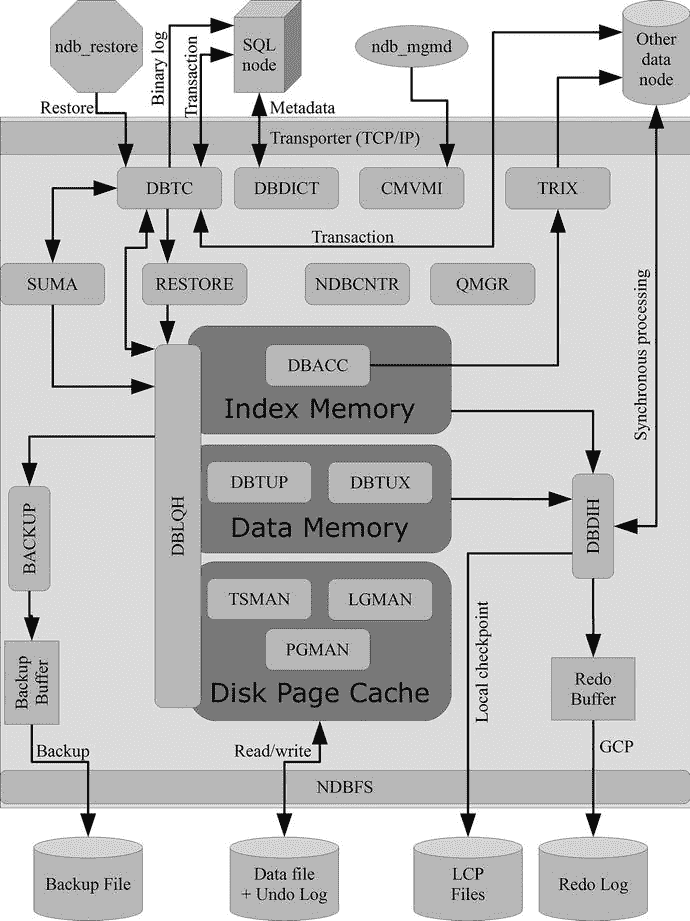

*图 2-13. 部分内核块之间的关系*

#### 各种线程类型使用不同的内核块

有些块可能属于多种线程类型——例如，`THRMAN` 作为线程管理块是所有线程所必需的——而其他内核块可能仅用于单一的线程类型。每种线程使用了哪些块，可以在数据节点重启输出开始附近的输出日志中看到。以下摘自数据节点日志的摘录提供了一个例子：

```
thr: 0 tid: 22064 (main) DBTC(0) DBDIH(0) DBDICT(0) NDBCNTR(0) QMGR(0)
NDBFS(0) CMVMI(0) TRIX(0) DBUTIL(0) DBSPJ(0)
THRMAN(0) TRPMAN(0) THRMAN(1) ...
thr: 1 tid: 22065 (rep) BACKUP(0) DBLQH(0) DBACC(0) DBTUP(0) SUMA(0) DBTUX(0)
TSMAN(0) LGMAN(0) PGMAN(0) RESTORE(0) DBINFO(0)
PGMAN(2) THRMAN(2) ...
thr: 2 tid: 22066 (ldm) PGMAN(1) DBACC(1) DBLQH(1) DBTUP(1) BACKUP(1)
DBTUX(1) RESTORE(1) THRMAN(3) ...
thr: 3 tid: 22067 (tc) DBTC(1) DBSPJ(1) THRMAN(4) ...
thr: 4 tid: 22051 (recv) THRMAN(5) TRPMAN(1) ...
thr: 5 tid: 22063 (send)
```

内核块名称后括号内的数字是一个计数器，用于区分同一个内核块被用于多个线程的情况。值得注意的是，`send` 线程不包含任何内核块——这并非错误。在列表中，一些与内核块无关的信息已被移除，并且行已被重新格式化，以使输出更易于阅读。

内核块出现的一个场景是数据节点故障。错误日志消息和跟踪文件都会引用内核块。例如，可能会出现以下错误消息：

```
Time: Sunday 30 October 2016 - 13:12:19
Status: Temporary error, restart node
Message: Node declared dead. See error log for details (Arbitration error)
Error: 2315
Error data: We(2) have been declared dead by 1 (via 1) reason: Heartbeat failure(4)
Error object: QMGR (Line: 4213) 0x00000002
Program: ndbmtd
Pid: 25141 thr: 0
Version: mysql-5.7.16 ndb-7.5.4
Trace file name: ndb_2_trace.log.3
Trace file path: /cluster/data/node_2/ndb_2_trace.log.3 [t1..t4]
***EOM***
```

该故障是由过多的心跳丢失引起的。`Error object` 引用了 `QMGR` 块，鉴于 `QMGR` 块负责心跳协议和节点成员资格管理，这是符合预期的。了解内核块是确定节点故障原因的重要第一步。（这个例子很简单，因为 `Error data` 行准确地解释了节点关闭的原因。）

##### 信号

内核块需要相互通信；例如，一个 API 节点可能会告诉 `DBTC` 块，它需要一个事务，其中需要一个具有给定主键的行。这个请求会触发 `DBTC` 块向 `DBLQH` 块请求数据。内核块之间的通信是使用信号完成的。数据节点有两种类型的信号：

*   **同步**：同步信号会阻塞，直到它们被处理完毕。心跳就是一个同步信号的例子。
*   **异步**：异步信号可以发送到：
    *   同一线程中的另一个块；接收块可能与发送块是同一个
    *   同一数据节点中另一个线程里的一个块
    *   另一数据节点上某个线程中的一个块

异步信号是最常见的，并且可以具有两种优先级之一：`0` 或 `1`，其中 `0` 是最高优先级。每种优先级都有一个作业缓冲区（见下一小节），信号在其中排队。

当数据节点崩溃时，它会为每个线程创建一个跟踪文件。这些跟踪文件各有两个部分：一个通过源代码中特定点的跟踪，以及一个信号跟踪。信号跟踪中包含的信号是最后接收到的异步信号。（同步信号不包含在跟踪中，因为它们不经过作业缓冲区。）

##### 作业缓冲区

MySQL NDB 集群中的作业缓冲区本质上是一个信号队列。当信号到达时，它会根据信号优先级被放入两个作业缓冲区之一：

*   优先级 `0` 的信号进入作业缓冲区 A
*   优先级 `1` 的信号进入作业缓冲区 B

信号按照它们进入作业缓冲区的顺序处理——先进先出（FIFO）。

此外，还有作业缓冲区 C 和 D。作业缓冲区 C 仅在重启期间使用，作业缓冲区 D 用于时间队列。由于 C 和 D 作业缓冲区是特殊用途的，此处不再多做讨论。

对于单线程数据节点，每个数据节点有一组作业缓冲区。对于多线程数据节点，每个线程——发送线程除外——都有一组作业缓冲区。发送线程没有作业缓冲区的原因是它们不包含任何内核块，因此无法接收和执行信号。发送线程的工作完全是发送指向其他节点的信号。

作业缓冲区大小固定。如果它们满了，就无法再接收任何信号，这将导致节点故障。因此，确保作业缓冲区永远不被填满非常重要。避免这种情况的一项措施是，任何任务都不应阻塞超过 10 毫秒。（当操作阻塞超过 100 毫秒时，数据节点日志中会打印警告。）如果一个任务需要更多时间，它应该暂停并发送一个信号（称为 `CONTINUEB`，意为“从 B 作业缓冲区继续一个作业”）给自身以继续暂停的操作。该继续信号将被放置在队列末尾，这意味着其他信号有机会被处理。为了跟踪时间，每隔 10 毫秒会发送一个 `TIME_SIGNAL` 信号。

作业缓冲区的使用如图 2-14 所示。一个信号从同一线程、同一节点或另一节点到达，然后根据信号的优先级被插入到作业缓冲区 A 或 B 中。然后它最多被处理 10 毫秒。

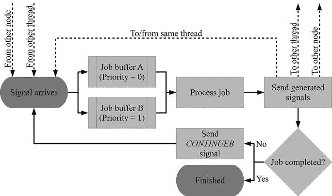

*图 2-14. 信号通过作业缓冲区的流动过程*


#### 发送与接收缓冲区

由于 MySQL NDB Cluster 是一个分布式系统，因此需要纳入对集群各部分之间通信的支持。目前最常用的机制是 TCP/IP。虽然还有其他选项，但超出了本书的讨论范围。为了确保即使在网络暂时过载的情况下也能稳定运行，并处理突发的消息流量，所有节点都设有发送和接收缓冲区。由于数据节点的网络流量最大，因此这些缓冲区对它们也最为重要。

发送缓冲区和接收缓冲区总是为节点的每个可能的传输器创建。数据节点和管理节点会与所有其他在线节点建立传输器；API/SQL 节点则会与所有在线的管理节点和数据节点建立传输器。重要的一点是，无论传输器当前是否存在，都会创建发送和接收缓冲区。

发送缓冲区是最可能需要显式配置的。每个节点都有一个为发送缓冲区保留的内存池，该节点的每个传输器都有一个专用的发送缓冲区。默认情况下，内存池足够大，可以使所有发送缓冲区增长到其最大尺寸。然而，在任何给定时间，通常某些传输器会比其他的更繁忙，因此特别是对于大型集群，将内存池设置得比默认值小是有意义的，因为所有发送缓冲区同时要求达到其最大尺寸的情况很少见。

图 2-15 展示了一个集群中数据节点（`NodeId = 1`）的发送缓冲区示例，该集群有两个数据节点（`NodeId`为 1 和 2）、两个管理节点（`NodeId`为 49 和 50）和五个 API/SQL 节点（`NodeId`为 51-55）。这种配置下，该节点总共有八个传输器（对应集群中其他八个节点各一个）。每个传输器有一个发送缓冲区，每个发送缓冲区都使用总发送缓冲池中的内存。

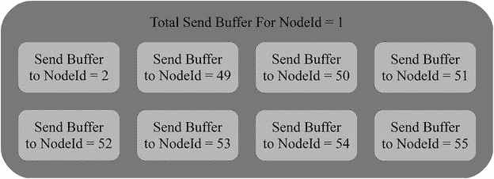

图 2-15. 包含八个发送缓冲区的总发送缓冲池

接收缓冲区与发送缓冲区类似，但位于 TCP 连接的接收端。与发送缓冲区从节点的全局池中分配不同，每个接收缓冲区总是被完整分配。在配置额外节点或更改接收缓冲区的默认大小时，记住这一点很重要。

#### 触发器

触发器有两种类型：普通的 MySQL Server 触发器和数据节点内部的 MySQL NDB Cluster 触发器。在 MySQL Server 中，触发器是在插入、更新或删除行时执行特定操作的一种机制。数据节点内部的触发器与之类似；然而，有一个重要区别：MySQL NDB Cluster 的触发器是完全内部的。DBA 不应手动创建、删除或维护这些内部触发器。（MySQL Server 触发器仍然可以使用。）MySQL NDB Cluster 使用触发器来监控变化。它们被用于多个地方，例如用于唯一哈希索引、有序索引、外键、备份和复制。

虽然数据节点会根据需要自动处理触发器的创建、删除和更新，但 DBA 仍然需要了解它们，因为触发器可能会出现在配置、监控信息中，以及例如`ndb_show_tables`实用程序的输出中，如本章后面的案例研究所示。

#### 纪元

MySQL NDB Cluster 中的纪元与 UNIX 和 Linux 操作系统中已知的纪元并不相同；但在衡量时间这一点上，它们有相似之处。MySQL NDB Cluster 使用纪元来跟踪时间和进行分组。MySQL NDB Cluster 中纪元的默认持续时间是 100 毫秒（由`TimeBetweenEpochs`配置选项设定），并且在集群的整个生命周期内（两次完整初始化之间），集群的纪元数永远不会减少。

这意味着，给定两个事件及其发生的纪元，可以确定这两个事件的发生顺序。例如，主-主复制的冲突解决方案（另见第[6]章）就利用了这一事实。总的来说，复制不仅使用纪元进行冲突解决；它还将一个纪元内的所有事务在二进制日志中组合成一个事务（出于性能原因），并且纪元用于关联启用了二进制日志的 SQL 节点之间的二进制日志文件和位置。

计算纪元的内部实现取决于平台。例如，如果查看复制中报告的纪元数，它并不是集群在线以来经过的 100 毫秒周期的数量。关键点在于纪元数必须始终递增，并且事件的分组默认将在 100 毫秒的周期内进行。

#### 主节点

集群会选择一个数据节点作为主节点。这绝对不应该与传统 MySQL 复制中的主/从角色相提并论。主数据节点的角色是协调一些内部管理任务，例如来自 DDL 语句的分布式数据字典更改、处理管理节点的加入和离开等。主节点也被称为"president"。

主节点角色总是分配给一个数据节点，只有在当前主数据节点离开集群时才会重新分配。重新分配是节点故障处理的一部分。作为 MySQL NDB Cluster 的 DBA 或用户，无需考虑哪个数据节点是主节点。这一切都是自动处理的，并且该角色仅用于内部目的。然而，该术语出现在某些上下文中，例如通过`ndb_mgm`客户端查看集群状态时（参见第[7]章）以及在一些日志消息中。

#### 数据与索引

本章到目前为止讨论的所有内容都为存储数据提供了框架，而这毕竟是数据库的主要目的。现在来看看 MySQL NDB Cluster 中如何处理数据。

数据节点中的数据存储主要有三个部分：

*   **数据内存**：所有内存中的数据以及所有有序索引都存储在这里。
*   **索引内存**：用于唯一哈希索引。
*   **磁盘表空间**：磁盘数据存储在表空间文件中。作为索引一部分的列仍然存储在内存中。

数据存储在内存中还是磁盘上的决定是按列进行的。这意味着可以将表中使用最频繁的部分保留在内存中，而将很少使用的数据或大型数据对象存储在磁盘表空间中。在这方面唯一的限制是所有索引列必须存储在内存中。


##### 数据内存与索引内存

数据内存和索引内存始终存在于集群中，最初这是唯一的数据存储位置。数据内存不仅用于存储数据，也用于存储有序索引，而唯一的哈希索引则存储在索引内存中。

数据内存被组织为一个大型池，供 `数据节点` 中的所有 `LDM 线程` 使用。在重启期间，数据会从本地检查点、重做日志和/或同一节点组中的另一个数据节点加载。索引在每次重启时都会重新创建。

索引内存的工作方式略有不同。唯一的哈希索引作为键值存储在一个单独的表中（无法直接访问）：
*   唯一索引是主键。
*   父表（用户创建的表）的主键是值。

由于唯一索引被用作哈希索引表的主键，导致无法存储索引列的 `NULL` 值。这又意味着唯一的哈希索引不能用于查找 `NULL` 值，而是执行完整的有序索引扫描或表扫描。第 18 章有关于在 `MySQL NDB 集群` 中设计表和创建索引的一些考量。

索引内存的内部组织也与数据内存不同，因为它被平均分配给各个 `LDM 线程`。也就是说，如果数据节点有 `20MB` 索引内存和四个 `LDM 线程`，则每个 `LDM 线程` 将拥有 `5MB` 的索引内存。乍一看这可能不是什么大区别，但影响却很大。如果 `LDM 线程` 的数量翻倍，每个 `LDM 线程` 的内存就减半，但现有表的分区数量保持不变。由于每个分区都与特定的 `LDM 线程`（每个副本）相关联，集群可能会耗尽某些 `LDM 线程` 的索引内存，而其他 `LDM 线程` 却完全没有使用。

注意
这就是本章前面“单线程与多线程数据节点”一节中谨慎警告——更改 `LDM 线程` 数量可能需要系统初始重启——的原因。在 `MySQL NDB 集群 7.6 版本`（在撰写本文时，于一个里程碑版本中作为预览提供）中，索引内存已被移除，此限制也已解除。

##### 磁盘数据

存储在磁盘上的数据与存储在内存中的数据有不同的要求。其架构使得写入首先进入 `磁盘页面缓冲区`。从 `磁盘页面缓冲区`，数据进入表空间，撤销数据则进入日志文件组。表空间文件和撤销日志文件的组织方式如下：
*   日志文件组：一个日志文件组包含一个或多个撤销日志文件。
*   表空间：一个表空间与一个日志文件组关联，并包含一个或多个表空间文件。

图 2-16 总结了数据的这一流程，并显示了磁盘数据更新如何与内存数据相结合。注意写入也会进入 `重做缓冲区` 和 `重做日志`。图中新增的部分将在本小节介绍，该过程将在第 18 章更详细地讨论。

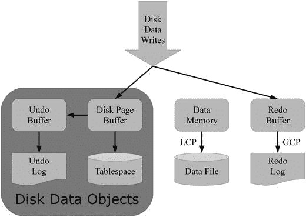
图 2-16. 磁盘数据写入流程概述

要利用磁盘存储数据，首先需要创建一个日志文件组来存储撤销日志，并创建一个或多个表空间来存储磁盘数据。如果事务回滚，则需要撤销日志。此任务通过 `SQL 节点` 执行。`SQL 节点` 将自动通知所有数据节点创建文件。如果同一主机上有多个数据节点，重要的是这些节点不能共享表空间或撤销日志文件。

日志文件组和表空间各自由一个或多个文件组成。可以向现有日志文件组或表空间添加文件，也可以删除表空间文件。与磁盘数据相关文件的一个特殊行为是，它们在初始重启（无论是节点重启还是系统重启）期间不会被删除；只有磁盘表空间内的数据会被删除。

在 `MySQL NDB 集群` 中创建日志文件组和表空间有一些限制：
*   最多只能有一个日志文件组。
*   可以有多个表空间，但所有表空间必须使用同一个日志文件组。
*   日志文件组名称和表空间名称的命名空间是相同的。因此，例如，不能创建与日志文件组同名的表空间。

磁盘存储是按列设置的，但可以为表设置默认值。如果表的默认设置是磁盘存储，则创建的所有非索引列都将使用磁盘存储。可以使用 `ALTER TABLE` 语句更改表的默认值；但是，要更改现有列的存储类型，必须逐列进行。第 18 章提供了创建日志文件组、表空间以及使用磁盘存储的表示例。

开始使用磁盘存储很容易。但是，了解一些实现细节以避免意外情况至关重要：
*   如前所述，只有没有索引的列才能存储在磁盘上。
*   存储在磁盘上的每个列在内存中都有一个八字节的指针。该指针用于定位表空间中的数据。
*   `TEXT`、`BLOB` 和 `JSON` 列（无论最大长度如何）在内存中存储前 `256 字节`（加上八字节指针）。
*   可变长度列使用存储最大可能值所需的空间，作为固定宽度列进行存储。（`BLOB`、`TEXT` 和 `JSON` 列如下一小节所述，以固定宽度块存储，因此 `LONGBLOB` 列不需要 `4GB` 的表空间。）

此外，如果磁盘文件存储在用于本地检查点和重做日志的同一磁盘上，则会严重影响集群的性能和稳定性。这些细节意味着，将数据存储在磁盘上而非保留在内存中并不总是有利的，并且在使用磁盘存储时，仔细考虑数据类型非常重要。

与 `InnoDB` 缓冲池类似，集群中的磁盘表使用一个称为 `磁盘页面缓冲区` 的缓冲区。此缓冲区用于缓存来自磁盘表空间的数据，以避免重新读取频繁访问的数据。可以通过 `ndbinfo` 架构中的 `diskpagebuffer` 表监控 `磁盘页面缓冲区` 的有效性（另见第 16 章）。此外，日志文件组还有一个称为 `撤销缓冲区` 的缓冲区。`撤销缓冲区` 的内存取自称为 `共享全局内存` 的内存池。


##### BLOB、TEXT 和 JSON 列

`BLOB` 和 `TEXT` 数据类型在数据节点中被特殊处理。由于 `JSON` 数据类型在内部存储为 `BLOB`，因此也被包含在内。对于使用这些数据类型的所有列，只有前 256 字节存储在表本身中。值的其余部分存储在一个内部的补充 `BLOB` 表中。

**注意**

无论列数据类型是 `BLOB`、`TEXT` 还是 `JSON`，这个补充表都被称为 `BLOB` 表。

补充表的名称为 `NDB$BLOB_<表 ID>_<列号>`，其中表 ID 是主表的内部表 ID，列号从零开始编号到 `N`，`N` 是表中列的总数减 1。补充表的表定义包含用于标识和排序数据块（见下一段）的列以及一个用于存储数据块的列。主表的主键是分区键，以确保主表中的数据和属于同一行的补充表中的数据位于同一个数据节点上。这种实现对应用程序是透明的。

当数据插入到补充表时，它会被拆分成数据块。每个数据块的最大大小取决于具体的数据类型；例如，对于 `BLOB` 或 `TEXT`，最大为 2000 字节；对于 `JSON`，为 8100 字节；对于 `LONGBLOB` 或 `LONGTEXT`，为 13948 字节。考虑一个 6000 字节长的 `BLOB` 值；在这种情况下，该值存储方式如下：

*   256 字节随行存储在表本身中
*   第 257 到 2256 字节存储在补充表的第一行中
*   第 2257 到 4256 字节存储在补充表的第二行中
*   第 4257 到 6000 字节存储在补充表的第三行中

`BLOB`、`TEXT` 和 `JSON` 值的实现方式有几个副作用：

*   对 `BLOB`、`TEXT` 和 `JSON` 值的操作涉及连接（joins）和补充表中每个主表行对应的多行。这会影响性能和锁定。
*   补充表和主表之间的链接是主表的主键。这意味着，如果主表上没有显式的主键，例如在复制从库上将无法将补充表中的行与主表中的行匹配。原因是隐藏的主键在复制主库和复制从库上通常不会有相同的值。因此，没有显式主键且包含 `BLOB`、`TEXT` 或 `JSON` 列的表无法被记录到二进制日志中。

#### 案例研究：探究模式对象

为了更好地理解数据节点中的对象和组织，使用 `ndb_show_tables()` 和 `ndb_desc()` 这两个实用工具直接从数据节点获取有关模式对象、表定义和分区的信息会很有用。这两个实用工具包含在 MySQL NDB Cluster 的下载包中；如果你使用的打包格式将二进制文件组织成多个软件包，那么这些实用工具会在客户端软件包中。

这两个案例研究使用一个新初始化的集群，其中包含如代码清单 2-2 所示的日志文件组、表空间以及表和数据。

```sql
CREATE LOGFILE GROUP loggroup_1
ADD UNDOFILE 'undo_1.log'
INITIAL_SIZE 128M
UNDO_BUFFER_SIZE 8M
ENGINE ndbcluster;
ALTER LOGFILE GROUP loggroup_1
ADD UNDOFILE 'undo_2.log'
INITIAL_SIZE 64M
ENGINE ndbcluster;
CREATE TABLESPACE tblspc_1
ADD DATAFILE 'datafile_1.dat'
USE LOGFILE GROUP loggroup_1
INITIAL_SIZE 128M
ENGINE ndbcluster;
ALTER TABLESPACE tblspc_1
ADD DATAFILE 'datafile_2.dat'
INITIAL_SIZE 64M
ENGINE ndbcluster;
CREATE TABLE db1.t1 (
id INT UNSIGNED NOT NULL,
name VARCHAR(20) NOT NULL,
birthday date NOT NULL,
comment TEXT STORAGE DISK,
PRIMARY KEY (id),
UNIQUE INDEX (name),
INDEX (birthday)
) ENGINE=ndbcluster TABLESPACE tblspc_1;
INSERT INTO db1.t1
VALUES (1, 'Bob'  , '1980-03-21', REPEAT('a', 10000)),
(2, 'Alice', '1977-08-08', REPEAT('b', 4400)),
(3, 'Hanna', '1982-05-30', REPEAT('c', 2400)),
(4, 'Mike', '1973-11-17', REPEAT('d', 400));
```
**代码清单 2-2.** 两个案例研究中使用的示例磁盘数据对象、表和数据

##### ndb_show_tables 实用工具

`ndb_show_tables()` 实用工具可用于列出数据节点中的所有表、索引和其他一些对象。代码清单 2-3 包含一个示例输出。该示例输出中已移除了两列——`state` 和 `schema`。

```
shell$ ndb_show_tables
id  type              logging database  name
2   IndexTrigger      -                 NDB$INDEX_19_CUSTOM
14  Datafile          -                 datafile_1.dat
8   UserTable         Yes     mysql     ndb_index_stat_sample
13  Tablespace        -                 tblspc_1
11  Undofile          -                 undo_1.log
15  Datafile          -                 datafile_2.dat
18  OrderedIndex      No      sys       PRIMARY
3   SystemTable       Yes     sys       NDB$EVENTS_0
5   IndexTrigger      -                 NDB$INDEX_21_CUSTOM
6   UserTable         Yes     mysql     ndb_apply_status
7   UserTable         Yes     mysql     ndb_index_stat_head
12  Undofile          -                 undo_2.log
20  UniqueHashIndex   Yes     sys       name$unique
10  LogfileGroup      -                 loggroup_1
16  UserTable         Yes     db1       t1
1   0                 -                 DEFAULT-HASHMAP-3840-2
0   IndexTrigger      -                 NDB$INDEX_9_CUSTOM
5   UserTable         Yes     mysql     NDB$BLOB_4_3
1   IndexTrigger      -                 NDB$INDEX_18_CUSTOM
17  UserTable         Yes     db1       NDB$BLOB_16_3
19  OrderedIndex      No      sys       name
9   OrderedIndex      No      sys       ndb_index_stat_sample_x1
3   HashIndexTrigger  -                 NDB$INDEX_20_UI
21  OrderedIndex      No      sys       birthday
2   SystemTable       Yes     sys       SYSTAB_0
4   UserTable         Yes     mysql     ndb_schema
1   TableEvent        -                 REPL$mysql/ndb_schema
2   TableEvent        -                 NDB$BLOBEVENT_REPL$mysql/ndb_schema_3
5   TableEvent        -                 REPL$db1/t1
3   TableEvent        -                 REPL$mysql/ndb_apply_status
6   TableEvent        -                 NDB$BLOBEVENT_REPL$db1/t1_3
4   TableEvent        -                 ndb_index_stat_head_event
NDBT_ProgramExit: 0 – OK
```
**代码清单 2-3.** ndb_show_tables 实用工具的示例输出

示例输出展示了存在多种“表”类型（在此上下文中，“表”不应按字面意思理解，例如它还包括内部触发器）：


##### NDB Cluster 中的对象类型与实用工具

##### NDB Cluster 中的对象类型

NDB Cluster 存储引擎管理多种类型的对象，可以通过 API 或 SQL 节点访问。从输出中可以看到，安装过程中创建了多种用户表，其中一些将在后续章节讨论；例如，`ndb_apply_status` 是第 6 章讨论的复制实现的一部分。此外，互补的 BLOB 表虽然通过其父表访问，但也被视为用户表。

*   **用户表**：这些是使用 `NDBCluster` 存储引擎的表，可通过 API/SQL 节点访问。
*   **系统表**：这些是内部系统表，无法直接访问。
*   **唯一哈希索引**：用于唯一索引的哈希索引。
*   **有序索引**：一个有序索引。请注意，为添加到 `name` 列的索引同时存在唯一哈希索引和有序索引。
*   **索引触发器**：这是有序索引的内部触发器（参见“数据节点内部结构”章节中的触发器）。可以从其名称确定触发器所属的索引。例如，对于 `NDB$INDEX_19_CUSTOM`，`19` 是对索引 ID 的引用。浏览列表可以发现，`id = 19` 的有序索引就是 `name` 列上的索引；然而，从输出中没有明确的方法可以将索引链接到表。
*   **哈希索引触发器**：这是唯一哈希索引的内部触发器。该触发器可以以与索引触发器相同的方式与索引关联。
*   **撤销文件**：这些是添加到集群中的撤销文件。
*   **数据文件**：这些是集群的表空间文件。
*   **表事件**：用于复制流的内部事件。

日志列显示一个“表”是否将作为本地检查点的一部分被记录。通常，用户表和系统表会被记录，而其他所有内容则不会。对于用户表，可以在创建表时指定是否记录它。不记录表的一个好处是本地检查点会变小，但系统重启后该表将为空。从这个意义上讲，非日志表可以与传统 MySQL Server 实例中使用 `MEMORY` 存储引擎的表相比较。

**提示**
请不要将输出中列出的 `sys` 数据库与作为 MySQL Server 5.7 和 MySQL NDB Cluster 7.5 一部分安装的 `sys` 模式混淆。清单 2-3 输出中引用的 `sys` 数据库是 `NDBCluster` 的一个内部数据库。

##### ndb_desc 实用工具

MySQL DBA 熟悉使用 `SHOW CREATE TABLE` 命令来获取表的定义。在 MySQL NDB Cluster 中，还有另一种获取 `NDBCluster` 表信息的方法，即 `ndb_desc` 实用工具。`ndb_desc` 的优势在于它不仅可以作为 NDB API 客户端工作，因此可以独立于 SQL 节点使用，而且提供了更详细的信息。

作为一个例子，考虑清单 2-2 中的表 `db1.t1`：

```sql
CREATE TABLE db1.t1 (
id INT UNSIGNED NOT NULL,
name VARCHAR(20) NOT NULL,
birthday date NOT NULL,
comment TEXT STORAGE DISK,
PRIMARY KEY (id),
UNIQUE INDEX (name),
INDEX (birthday)
) ENGINE=ndbcluster TABLESPACE tblspc_1;
INSERT INTO db1.t1
VALUES (1, 'Bob'  , '1980-03-21', REPEAT('a', 10000)),
(2, 'Alice', '1977-08-08', REPEAT('b', 4400)),
(3, 'Hanna', '1982-05-30', REPEAT('c', 2400)),
(4, 'Mike', '1973-11-17', REPEAT('d', 400));
```

`ndb_desc` 的默认输出包含清单 2-4 中的信息。

```
shell$ ndb_desc --database=db1 t1
-- t1 --
Version: 1
Fragment type: HashMapPartition
K Value: 6
Min load factor: 78
Max load factor: 80
Temporary table: no
Number of attributes: 4
Number of primary keys: 1
Length of frm data: 373
Max Rows: 0
Row Checksum: 1
Row GCI: 1
SingleUserMode: 0
ForceVarPart: 1
PartitionCount: 2
FragmentCount: 2
PartitionBalance: FOR_RP_BY_LDM
ExtraRowGciBits: 0
ExtraRowAuthorBits: 0
TableStatus: Retrieved
Table options:
HashMap: DEFAULT-HASHMAP-3840-2
-- Attributes --
id Unsigned PRIMARY KEY DISTRIBUTION KEY AT=FIXED ST=MEMORY
name Varchar(20;latin1_swedish_ci) NOT NULL AT=SHORT_VAR ST=MEMORY
birthday Date NOT NULL AT=FIXED ST=MEMORY
comment Text(256,2000,0;latin1_swedish_ci) NULL AT=MEDIUM_VAR ST=DISK BV=2 BT=NDB$BLOB_16_3
-- Indexes --
PRIMARY KEY(id) - UniqueHashIndex
PRIMARY(id) - OrderedIndex
name(name) - OrderedIndex
name$unique(name) - UniqueHashIndex
birthday(birthday) - OrderedIndex
NDBT_ProgramExit: 0 - OK
```
清单 2-4.
`db1.t1` 表的 `ndb_desc` 实用工具输出

输出的第一部分是通用表信息，例如版本，该版本在每次更改表定义时都会更新。一些有趣的可获取细节包括：

*   **分区数**：表可用的分区数。
*   **分片数**：表可用的分片数。对于除完全复制表之外的所有其他表，分片数将与分区数相同。
*   **分区平衡**：这是本章前面讨论的分区平衡。在此处，使用了默认的 `FOR_RP_BY_LDM`。
*   **哈希映射**：MySQL NDB Cluster 为分区函数支持两种哈希映射。当前默认使用大型（3840）哈希映射是首选。较小的（240）哈希映射仅为向后兼容而提供，但由于自 MySQL NDB Cluster 7.2.7 以来的所有版本都支持较大的哈希映射，向后兼容性不再是问题。`HashMap` 值末尾的 `-2` 指的是分区数。

在通用表属性之后，是 `属性` 部分。在 MySQL NDB Cluster 中，列被称为属性。对于每一列，列出了其各种属性。一些更有趣的属性包括：


*   对于 `id` 列，它是主键和分布键。
*   `AT` 属性指示该列是使用固定列格式还是动态列格式（`AT` 属性的 `%_VAR` 值）存储。
*   `ST` 属性指示该列是存储在内存中还是磁盘上。
*   对于 `comment` 列，一个有趣的属性是 `BT`。因为 `comment` 列是一个 `TEXT` 列，它有一个互补的 `BLOB` 表，正如上一节的 "BLOB、TEXT 和 JSON 列" 小节所讨论的。`BT` 属性指示了这个 `BLOB` 表的名称。还可以从数据类型 `Text(256,2000,0;latin1_swedish_ci)` 中看到附加信息。`256` 表示前 256 字节存储在内存中，`2000` 表示剩余数据以最多 2000 字节的块存储。

正如 `AT` 属性所提及的，MySQL NDB Cluster 支持两种列格式：固定和动态。固定格式，顾名思义，用于固定宽度存储。在 MySQL NDB Cluster 7.4 及更早版本中，固定宽度存储的限制是每分区 16GB，但在 7.5 版本中，这个限制已增加到 128TB。动态列格式使用可变宽度存储。动态格式比固定格式更灵活，例如，只有使用动态格式的列才能在线添加。固定格式列的优点是，对于本质上固定长度的数据（如整数），它们使用的内存更少。这两种列格式可以在同一个表中混合使用。

最后列出了索引。请注意，这里主键和 `name` 列上的唯一键有两个索引：一个唯一哈希索引和一个有序索引。这是 MySQL NDB Cluster 中所有唯一索引的默认设置。唯一哈希索引（除主键情况外存储在索引内存中）用于匹配单行和唯一性检查。有序索引则用于例如范围比较。

`ndb_desc` 支持附加选项。一个常用的选项是 `--extra-partition-info`（或 `-p`），正如其名，它提供表的分区信息。此选项可以与 `--extra-node-info`（`-n`）选项结合使用，以包含节点信息。清单 2-5 给出了一个例子。输出中与清单 2-4 相同的部分已替换为 `…`。分区信息的一些列已被移除。

```
shell$ ndb_desc --database=db1 t1 -p
...
-- Per partition info --
Partition  Row count  Commit count  Frag fixed memory  Frag varsized memory
0          1          2             32768              32768
1          3          6             32768              32768
清单 2-5.
db1.t1 表的 ndb_desc -p 输出
```

清单 2-5 中的分区信息每个分区占一行。行数和提交计数是自解释的。更有趣的是 `Frag fixed memory` 和 `Frag varsized memory` 值。如前所述，列格式可以是固定的或动态的。这里反映的是：`id`（`INT` 数据类型）和 `birthday`（`DATE`）列中的数据贡献给了 `Frag fixed memory` 值，而 `comment` 列（`TEXT`）中的数据贡献给了 `Frag varsized memory` 值。每个分区和每种存储类型的使用量为 32KB，原因是表中的数据量很小。用于数据的页面大小为 32KB，因此这表明目前每个分区中每种列格式各使用了一个页面。

另一个可以提供表详细信息的选项是 `--blob-info (-b)` 选项，正如其名，它提供关于互补的 `BLOB` 表的信息。在 MySQL NDB Cluster 7.4 及更早版本中，它会添加 `BLOB` 表的每个分区信息，并且必须与 `-p` 选项一起使用；在 MySQL NDB Cluster 7.5 中，它会显示 `BLOB` 表的完整详细信息，就像父表一样。清单 2-6 包含了一个部分输出的示例。一些输出，包括分区信息的一些列，已被移除。`Frag fixed memory` 和 `Frag varsized memory` 列分别被截断为 `Frag fixed` 和 `Frag vars`。

```
shell$ ndb_desc --database=db1 t1 -pb
...
-- NDB$BLOB_16_3 –
...
-- Attributes --
id Unsigned PRIMARY KEY DISTRIBUTION KEY AT=FIXED ST=MEMORY
NDB$PART Unsigned PRIMARY KEY AT=FIXED ST=MEMORY
NDB$PKID Unsigned NOT NULL AT=FIXED ST=MEMORY
NDB$DATA Char(2000;binary) NOT NULL AT=FIXED ST=DISK
-- Indexes --
PRIMARY KEY(id, NDB$PART) - UniqueHashIndex
-- Per partition info for NDB$BLOB_16_3 --
Partition  Row count  Frag fixed  Frag var  Extent_space  Free extent_space
0          2          32768       0         1048576       1026120
1          9          32768       0         1048576       1012036
清单 2-6.
ndb_desc -pb 的输出
```

从 `Attributes` 部分可以看出，`BLOB` 表中有四列：

*   `id`：父表的主键。这也是 `BLOB` 表主键的一部分，并且是分布键。也就是说，`BLOB` 表中的行将与它们所属的父表中的行存储在同一个分区。
*   `NDB$PART`：`BLOB` 部分。这是主键的第二部分，基本上是为构成一个 `BLOB` 值的每一行设置的计数器。该计数器确保 `BLOB` 数据可以按正确的顺序组合。
*   `NDB$PKID`：此列保留供将来使用。
*   `NDB$DATA`：实际数据。它是一个固定宽度的 `CHAR(2000)` 列。

从分区信息也可以看出数据列的固定宽度属性，其中只有 `Frag fixed memory` 有数据。由于该列存储在磁盘上，分区信息还包括表空间区的使用详情。每个区大小为 1MB，每个分区使用其中一个区，并且大部分空间是空闲的。


##### NDB 文件系统

关于数据节点最后要讨论的是 NDB 文件系统，这是数据节点存储其文件的地方。数据目录的顶层包含各种日志和跟踪文件以及 NDB 文件系统目录，如下列目录列表所示：

```
shell$ ls -lh
total 3.8M
-rw-r--r--. 1 mysql mysql 1.1K Nov  3 18:25 ndb_1_error.log
drwxr-x---. 9 mysql mysql 4.0K Nov  3 16:57 ndb_1_fs
-rw-r--r--. 1 mysql mysql  48K Nov  3 18:26 ndb_1_out.log
-rw-r--r--. 1 mysql mysql    5 Nov  3 18:25 ndb_1.pid
-rw-r--r--. 1 mysql mysql 974K Nov  3 18:25 ndb_1_trace.log.1
-rw-r--r--. 1 mysql mysql 997K Nov  3 18:25 ndb_1_trace.log.1_t1
-rw-r--r--. 1 mysql mysql 948K Nov  3 18:25 ndb_1_trace.log.1_t2
-rw-r--r--. 1 mysql mysql 881K Nov  3 18:25 ndb_1_trace.log.1_t3
-rw-r--r--. 1 mysql mysql    1 Nov  3 18:25 ndb_1_trace.log.next
```

请注意，所有文件和目录名称都以 `ndb_` 为前缀，后跟一个数字。该数字是数据节点的节点 ID。日志和跟踪文件在第 16 章讨论。文件 `ndb_1.pid` 存储数据节点的进程 ID。目录 `ndb_1_fs`（左侧第一列的 `d` 表示它是一个目录）是重做日志和其他文件存储的地方。这就是本节剩余部分将要探讨的内容。

`ndb_1_fs` 目录的内容包括几个目录和可能的几个文件。在此示例中，有七个子目录和四个文件：

```
shell$ ls -lh
total 385M
drwxr-x---. 4 mysql mysql   31 Nov  3 16:51 D1
drwxr-x---. 3 mysql mysql   18 Nov  3 16:50 D10
drwxr-x---. 3 mysql mysql   18 Nov  3 16:50 D11
drwxr-x---. 4 mysql mysql   31 Nov  3 16:51 D2
drwxr-x---. 3 mysql mysql   18 Nov  3 16:50 D8
drwxr-x---. 3 mysql mysql   18 Nov  3 16:50 D9
-rw-r--r--. 1 mysql mysql 129M Nov  3 18:25 datafile_1.dat
-rw-r--r--. 1 mysql mysql  65M Nov  3 18:25 datafile_2.dat
drwxr-x---. 4 mysql mysql   22 Nov  3 18:25 LCP
-rw-r--r--. 1 mysql mysql 128M Nov  3 18:25 undo_1.log
-rw-r--r--. 1 mysql mysql  64M Nov  3 16:56 undo_2.log
```

这四个文件是表空间数据文件和日志文件组文件。这些文件都是使用相对路径创建的，因此它们被放置在 `ndb_1_fs` 目录以及另一个数据节点的对应目录中。

对于数据节点，这七个目录始终存在，但根据配置可能还有更多。这些目录可以分为三组：

*   **元数据**：`D1` 和 `D2` 目录存储有关表和集群的元数据。
*   **重做日志**：`D8`、`D9`、`D10` 和 `D11` 目录包含重做日志。重做日志的每个部分都有一个目录（另请参阅本章前面名为“重做日志”的小节）。本例中有四个部分。
*   **本地检查点**：`LCP` 目录存储两个本地检查点。

这些组中最有趣的是重做日志目录。每个目录包含由 `NoOfFragmentLogFiles` 配置的文件数量，每个文件的大小为 `FragmentLogFileSize`。清单 2-7 展示了 `D8` 目录的情况。

```
shell$ ls -lRh D8
D8:
total 4.0K
drwxr-x---. 2 mysql mysql 4.0K Nov  3 16:51 DBLQH
D8/DBLQH:
total 8.8M
-rw-r--r--. 1 mysql mysql 16M Nov  3 20:39 S0.FragLog
-rw-r--r--. 1 mysql mysql 16M Nov  3 16:50 S10.FragLog
-rw-r--r--. 1 mysql mysql 16M Nov  3 16:50 S11.FragLog
-rw-r--r--. 1 mysql mysql 16M Nov  3 16:50 S12.FragLog
-rw-r--r--. 1 mysql mysql 16M Nov  3 16:51 S13.FragLog
-rw-r--r--. 1 mysql mysql 16M Nov  3 16:51 S14.FragLog
-rw-r--r--. 1 mysql mysql 16M Nov  3 16:51 S15.FragLog
-rw-r--r--. 1 mysql mysql 16M Nov  3 16:50 S1.FragLog
-rw-r--r--. 1 mysql mysql 16M Nov  3 16:50 S2.FragLog
-rw-r--r--. 1 mysql mysql 16M Nov  3 16:50 S3.FragLog
-rw-r--r--. 1 mysql mysql 16M Nov  3 16:50 S4.FragLog
-rw-r--r--. 1 mysql mysql 16M Nov  3 16:50 S5.FragLog
-rw-r--r--. 1 mysql mysql 16M Nov  3 16:50 S6.FragLog
-rw-r--r--. 1 mysql mysql 16M Nov  3 16:50 S7.FragLog
-rw-r--r--. 1 mysql mysql 16M Nov  3 16:50 S8.FragLog
-rw-r--r--. 1 mysql mysql 16M Nov  3 16:50 S9.FragLog
清单 2-7.
ndb_1_fs/D8 目录的内容
```

首先，在 `D8` 目录中有一个 `DBLQH` 子目录。这表明这些文件由 `DBLQH` 内核块使用，该块是 `LDM` 线程的主要部分。在 `DBLQH` 子目录内部有 16 个（默认值）文件，每个文件大小为 16MB（也是默认值）。表面上看，这似乎表明目录的总大小为 256MB，但如清单 2-8 所示，事实并非如此。

```
shell$ du -shc *
1.9M    S0.FragLog
548K    S10.FragLog
548K    S11.FragLog
548K    S12.FragLog
548K    S13.FragLog
548K    S14.FragLog
548K    S15.FragLog
548K    S1.FragLog
548K    S2.FragLog
548K    S3.FragLog
548K    S4.FragLog
548K    S5.FragLog
548K    S6.FragLog
548K    S7.FragLog
548K    S8.FragLog
548K    S9.FragLog
9.9M    total
清单 2-8.
重做日志文件的实际磁盘使用情况
```

实际上，除了 `S0.FragLog`（它有一些写入）之外，每个文件只贡献了 548KB。这是一个文件默认被创建为*稀疏文件*的例子。

### 总结

本章的主题是数据节点，它们是集群的核心。数据节点是存储数据和进行大部分数据处理的地方。讨论的主题包括：

*   单线程 (`ndbd`) 和多线程 (`ndbmtd`) 二进制文件。
*   哪些线程类型构成了多线程二进制文件。
*   副本，即 MySQL NDB Cluster 拥有的数据副本数量。
*   节点组和分区，它们是水平可扩展性和分片的构建块。
*   本地和全局检查点以及它们如何用于确保数据更改的持久性。
*   重启类型的简要概述。
*   数据节点的内部结构，包括使用信号相互通信的内核块。
*   数据和索引以及它们在数据节点中的存储和使用方式。
*   研究数据库对象以及 `ndb_show_tables` 和 `ndb_desc` 实用程序的案例研究。
*   NDB 文件系统。

这结束了第一部分，该部分概述了 MySQL NDB Cluster 是什么，并详细介绍了其工作原理。第二部分将介绍安装和配置，其中系统规划是首先讨论的领域。

脚注

1 当一个进程线程变为空闲时，它可以做两件事之一。它可以开始自旋，这意味着它可以非常快地恢复工作，但它会为其他进程阻塞 CPU。或者，它可以进入休眠状态，让 CPU 为其他进程工作，但这意味着线程唤醒所需的时间会更长。

2 这与 `InnoDB` 不同，后者使用 MySQL Server 内部基于与 `PASSWORD()` 函数相同算法的哈希函数。

### 第二部分

