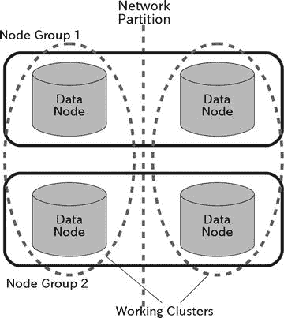
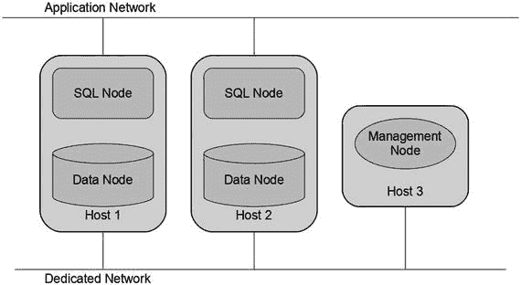
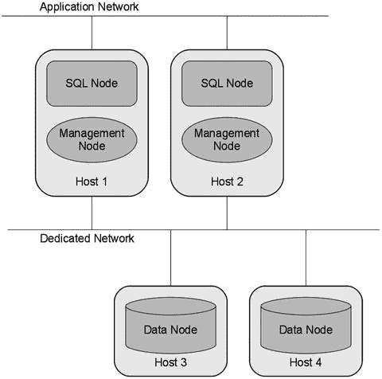
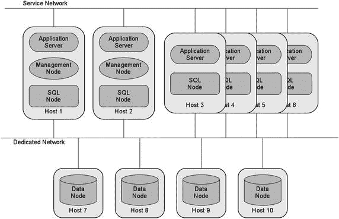
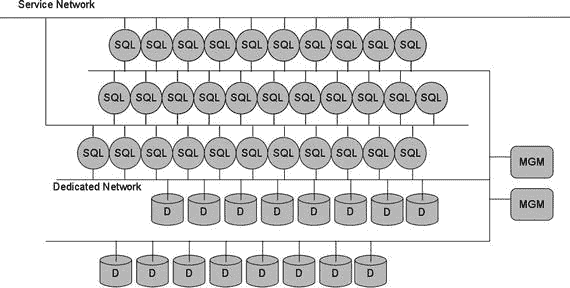

# 3. 系统规划

在本章中，我们将讨论规划 MySQL NDB Cluster 系统架构设计的要点，并简要讨论配置。由于 NDB Cluster 具有内置的高可用性 (HA) 功能，因此不需要额外的集群软件。然而，其内置 HA 功能存在一些限制，因为没有什么是完美的，因此规划阶段对于系统可靠性非常重要。我们应该选择合适的拓扑、网络、服务器机器、操作系统 (OS) 等。系统能否成功稳定运行，在很大程度上取决于规划阶段，这一点毫不夸张。


### 确定您的优先级

规划 `NDB Cluster` 部署时，最重要的一点是明确您为何要使用它。`NDB Cluster` 可用于不同目的：

*   **高可用性**：即使某些组件离线，也要确保整个系统仍可访问，这一点很重要。为实现此能力，系统中的所有组件都必须是冗余的。
*   **应对访问量增长的扩展性**：处理工作负载增长是现代数据库系统面临的最重要挑战之一。
*   **灾难恢复**：一个非常重要的系统可能需要即使在数据中心因灾难而中断时也能保持运行。

哪个因素对您的应用最为关键？请仔细考虑并确定您的目标。如果在此处做出错误选择，您也会采用错误的配置。

### 高可用性要求

虽然 `NDB Cluster` 由三种类型的节点组成——数据节点、SQL 节点和管理节点——但它并非在每种节点类型上都存在**单点故障（`SPOF`）**。每种类型的节点都可以进行配置，以具备针对节点故障的容错能力。为使每种类型的节点都具备容错能力，必须满足以下条件。

#### 数据节点

对于数据节点，您需要决定的第一个参数是**副本数**，并且需要不止一个副本作为故障时的备用。所有节点组中的副本数必须相同。因此，副本数必须是数据节点总数的公因数。`NDB Cluster` 支持一到四个副本。只要一个节点组内不是所有副本都失效，数据库就能继续运行。一个副本意味着每个节点组最多只有一个副本，因此没有针对节点故障的容错能力，因为没有备用。所以，配置一个副本在生产系统中并不实用。

那么，应该配置多少个副本呢？在大多数情况下，两个副本就足够且被推荐。实际上，目前官方不支持配置三个或四个副本。因此，配置两个副本是唯一的选择。

理论上，三个或四个副本会提供更高的冗余度并提高系统可用性。如果您需要针对节点故障的额外可用性，并准备好自行维护，请考虑使用三个或四个副本。

请仔细选择副本数量。集群启动后，此配置无法更改。要更改副本数，需要系统初始重启（初始化全部数据）。

#### SQL 节点

虽然 SQL 节点不存储任何用户数据，但一个 SQL 节点故障不会影响其他 SQL 节点。SQL 节点可以轻松配置为高可用。为此，拥有多个 SQL 节点就足够了。发生故障时，应用程序只需重新连接到另一个 SQL 节点即可继续操作。有关应用程序如何重新连接到另一个 SQL 节点的更多详细信息，请参见 `第 18 章`。

SQL 节点之间不直接通信。所有 SQL 节点之间的通信都通过数据节点进行。例如，由一个 SQL 节点触发的模式变更将作为事件通过数据节点传播。因此，无论客户端连接到哪个 SQL 节点，它们看到的数据都是一致的。

在每个运行应用程序的主机上部署一个 SQL 节点也是一个好主意。在这种情况下，应用程序将直接连接到本地 SQL 节点，该连接速度非常快。如果发生机器故障，同一台机器上的应用程序和 SQL 节点将一同停机。如果应用程序服务器是冗余的（这种配置非常常见），一台机器的故障就不是问题。

安装的 SQL 节点越多，集群的高可用性就越高。但是，请注意不要启用过多启用了二进制日志记录的 SQL 节点。在 `NDB Cluster` 上，二进制日志是使用从数据节点发送的数据生成的。配置越多启用了二进制日志记录的 SQL 节点，通过网络传输的数据就越多，这可能会导致网络拥塞。

#### 管理节点

管理节点完全不参与数据访问。管理节点在以下情况下是必需的：

*   **配置处理**：管理节点从配置文件中读取集群配置，并在其他节点启动时将集群配置部署到这些节点。
*   **用户操作**：管理节点处理各种操作，例如启动和停止数据节点、启动备份等。
*   **日志记录**：管理节点从所有数据节点收集事件，并写入称为集群日志的集中式日志文件。
*   **仲裁**：当发生网络分区时，`MySQL NDB Cluster` 必须决定哪个可操作的集群应该存活。`MySQL NDB Cluster` 为此采用了称为 `仲裁` 的技术。
*   **状态监控**：管理节点有几个命令可用于显示运行节点的状态。

为了高可用性目的，不一定需要配置多个管理节点。如果您倾向于更高的安全性，拥有两个管理节点就足够了。

### 为网络分区做准备

网络分区是集群系统中一个众所周知的问题，`NDB Cluster` 也可能遇到。网络分区也被称为 **脑裂（`split brain`）**。网络分区是指数据节点之间的网络被均匀断开，导致每个节点组内有一个数据节点正在运行并保持连接。这样，偶然就会形成多个工作集群。**图 3-1** 描述了一个典型的四数据节点网络分区情况。



**图 3-1.** 网络分区

**仲裁**是 `NDB Cluster` 上实现的一种用于解决网络分区的机制。一个被称为 **主席（`president`）** 的代表数据节点会从候选者（管理节点或 SQL 节点）中选出一个 **仲裁者（`arbitrator`）**。在任何时候，只有一个仲裁者被配置和运行。当网络分区发生时，所有数据节点都尝试访问仲裁者以获得继续其操作的许可。在每个仲裁过程中，只有一个分区会胜出。如果一个数据节点在仲裁中“丢失”或超时，它将被强制关闭。这种由另一个存活集群执行的关闭操作类型称为 **STONITH（Shoot The Other Node In The Head，即“将另一节点爆头”）**。有关仲裁过程的更多详细信息，请参阅 `第 1 章`。

**注意**

请勿将仲裁者和数据节点放置在同一台服务器上。如果它们位于同一台服务器上，当服务器遇到计划外停机时，仲裁者和数据节点可能会同时丢失。因此，仲裁者应放置在与任何数据节点不同的机器上。

从仲裁的性质来看，最好配置独立的网络路径：一条用于互连数据节点，另一条用于数据节点与仲裁者之间的通信。网络分区发生在数据节点之间的网络出现问题时，但至少应有一个存活集群能够联系到仲裁者，以避免整个系统关闭。因为如果两个集群都失去仲裁，两个存活集群都将被关闭。

仲裁仅在数据节点上是必需的。SQL 节点和管理节点不需要仲裁，因为它们不存储任何数据。


### 可扩展性

使用 NDB Cluster 的一个主要原因是实现高性能。NDB Cluster 擅长通过并行使用多台计算机处理数据访问请求来获得更佳的性能。这种策略被称为横向扩展（scaling out）。

了解哪些类型的数据访问能够随数据节点数量成比例地扩展是很重要的。例如，以下类型的数据访问是可扩展的：

-   查找读取：使用主键或唯一的二级哈希索引进行等值比较的行查找。只有该行所在的数据节点会参与查找操作。
-   插入：也称为写入扩展，即大量的写入操作分散到多个节点上。
-   使用用户定义分区的范围扫描：通过用户定义分区，当可能发生分区剪枝时，只有特定的数据节点会参与扫描操作。
-   返回大量行的范围扫描：由于扫描是并行进行的，扫描所需的时间会按数据节点的数量成比例减少。
-   使用下推算法的连接：当连接操作被下推到数据节点时，它会并行执行。

相反，以下类型的数据访问在数据节点数量增加时**不**具备扩展性：

-   返回少量行的范围扫描：当数据节点只返回少量行时，涉及数据节点的开销将主导并行化的优势。
-   未使用下推算法的连接：当连接操作没有被下推到数据节点时，访问内部表需要大量的网络往返。

扩展性并非万能，它不能解决所有性能问题。例如，一个返回大量行的范围扫描查询，即使许多数据节点可以并行处理范围扫描，其本身效率仍然不高。实际上，这种查询导致的每个数据节点的资源消耗会随数据节点数量的增加而成反比减少，而总吞吐量则会随之成比例增加。因此，它实现了自动扩展。然而，它本质上仍然是低效的。如果系统的吞吐量允许每秒执行 4 次低效查询 `X`，那么在数据节点数量翻倍后，它将能够每秒执行 8 次相同的查询 `X`。每秒可执行的查询次数仍然很少。因此，即使这种查询的执行可以在数据节点间并行化，也不能频繁执行。否则，整个集群很容易会变慢。

### 灾难恢复

MySQL NDB Cluster 提供了一种将数据从一个集群复制到另一个集群的功能，称为 NDB Cluster 复制或地理复制。NDB Cluster 复制是通过 SQL 节点完成的，类似于标准的 MySQL 复制。所有修改都写入主 SQL 节点的二进制日志中。主 SQL 节点将二进制日志中的事件发送给从节点，从 SQL 节点应用这些事件。通过这种方式，整个数据从主集群同步到从集群。

由于标准的 MySQL 复制非常高效，因此可以配置 NDB Cluster 复制，使主集群和从集群位于地理位置上隔离的站点。通过这种设置，从集群可以用作灾难恢复的备用系统。当主集群所在站点发生中断，而从集群所在站点仍在运行时，从集群可以接管数据服务。

有关 NDB Cluster 复制的更多详情，请参见第 6 章。

### 典型拓扑结构

在本节中，我们将描述 NDB Cluster 的典型拓扑结构。尽管 NDB Cluster 的拓扑结构很灵活，但以下小节将讨论一些限制和注意事项。

#### 副本数量

正如本章前面所述，副本数量是首先要考虑的问题。由于数据的副本也会消耗用于数据存储的内存（以及用于本地检查点 LCP 的磁盘；有关 LCP 的更多详情，请参见第 1 章），您拥有的副本越多，总数据量就越小。以下公式计算了数据总量的大小。

```
(Number_of_data_nodes × Memory_per_node) ÷ Number_of_replicas
```

在生产系统中不要选择一个副本，因为这样没有冗余。一个副本的配置仅对基准测试等目的有效。大多数情况下选择两个副本。

#### 最大数据节点数量

每个 NDB Cluster 集群总共最多可以有 48 个数据节点。如果您计划建立一个大型集群，请注意不要超过此限制。当您需要巨大容量时，可以考虑像 40 多个数据节点这样的大型集群。然而，使用大量服务器机器会增加机器故障的概率。如果您只需要更大的容量，请考虑使用内存更大的服务器机器，而不是增加数据节点数量，以避免增加机器故障的概率。

#### 最大总节点数

每个 NDB Cluster 集群最多可以有 255 个节点，包括所有类型的节点。我们最多可以配置 48 个数据节点，而且通常不需要许多管理节点。因此，这个限制实际上只影响 SQL 节点的最大数量。例如，如果您有 20 个数据节点和 2 个管理节点，那么最多可以有 233 个 SQL 节点。

SQL 节点通常与应用程序服务器放置在同一台机器上。这样的配置并非坏主意，因为除了 Windows 机器外，应用程序将通过 UNIX 域套接字连接到本地 SQL 节点，这种连接速度非常快。然而，当您为了横向扩展的目的而希望增加应用程序服务器数量时，这种配置很可能达到 SQL 节点总数的上限，因为在这种配置中，SQL 节点的数量与应用程序服务器的数量相同。例如，如果您有 20 个数据节点和 2 个管理节点，那么最多只能有 233 个 SQL 节点和 233 个应用程序服务器。

#### 仲裁等级

默认情况下，只有管理节点被配置为仲裁器。但通过配置 `ArbitrationRank` 选项，SQL 节点也可以成为备用仲裁器。`ArbitrationRank` 选项指定了成为仲裁器的可能性。该参数的范围是 0、1 和 2。将其设置为 1 意味着它最有可能成为仲裁器，这是管理节点的默认值。2 的可能性低于 1。0 则禁用仲裁器，这是 SQL 节点的默认值。

如果您希望仲裁器具有高可用性，让一些 SQL 节点成为候选者而不是添加管理节点，是一个不错的选择。如果将一个 SQL 节点配置为候选仲裁器，那么在网络分区事件中，就不需要管理节点了。这将为节点总数限制节省一个节点插槽和一台主机。

#### 将 SQL 节点和数据节点放置在同一台机器上

如果 SQL 节点没有与应用程序服务器放置在同一台服务器机器上，那么它可以与数据节点放置在同一台机器上。然而，这样的拓扑结构并不是最优的，因此我们不鼓励这样做。原因如下：

-   SQL 节点也会消耗相当数量的 CPU 和内存资源。解析 SQL 和优化执行计划通常消耗的资源比预期的要多。
-   资源消耗在 SQL 节点之间可能不均衡。这将在数据节点上造成瓶颈，因为每个数据节点的可用资源不均等。
-   SQL 节点与每个数据节点之间的距离（网络跳数）不均等。这也会在数据节点上造成瓶颈。

如果性能不是您的首要任务，并且一定程度的性能下降是可以接受的，那么您可以将 SQL 节点和数据节点放在同一台机器上。否则，请不要这样做。


#### 典型拓扑示例

本节描述了从最小配置到大型配置的多个拓扑示例。请注意，本节仅展示示例。您无需遵循此处的相同配置，而是可以根据需要使用任何配置。

##### 最小配置：三台主机

要以高可用数据库系统运行 NDB Cluster，至少需要三台服务器机器。其中两台用于数据节点冗余。如果性能不是最高优先级，可以将 SQL 节点和数据节点放置在同一主机上。管理节点需要一台额外的主机，因为它应该与数据节点放置在不同的主机上。这是因为如果管理节点与数据节点放置在同一主机上，仲裁器会与数据节点一同离线。由于管理节点不需要大量计算机资源，因此使用一台廉价的机器作为管理节点是可行且推荐的。

图 3-2 描绘了三台主机的最小配置。在此情况下，系统拥有一个专用于 NDB Cluster 的网络或子网，与应用程序分离。



图 3-2.
最小配置（三台主机）

##### 替代最小配置：四台主机

由于不建议将 SQL 节点和数据节点放置在同一服务器机器上，我们通常需要将它们放在不同的机器上。在这种情况下，所需的主机计算机的最小数量是四台，因为 SQL 节点也需要冗余。图 3-3 描绘了一个包含四台主机的替代最小配置。与三节点设置相比，此设置更为实用，因为将 SQL 节点和数据节点放置在不同主机上将避免它们之间的计算机资源争用。



图 3-3.
替代最小配置（四台主机）

##### 附注：使用最小计算机的集群

在本章中，我们展示了从主机计算机数量意义上的最小拓扑。那么，最小计算机硬件是怎样的呢？对于计算机资源的最低要求没有定义。当然，性能较差的计算机硬件无法提供良好的性能。因此，您需要选择合适的计算机硬件以实现所需的性能。

图 3-4 展示了一个演示机器上的移动 NDB Cluster 概念。它容纳了六台用于集群节点的 `Beagle Bone Black` 单板计算机（`SBC`）和一台用于控制台的 `Raspberry Pi`。


图 3-4.
在单板计算机上运行的 NDB Cluster

通过将所有组件装入机箱，可以携带这台机器。要使用此机器，您只需打开机箱并连接电源插头。遗憾的是，它没有用于移动使用的电池。

每台计算机拥有 `512MB RAM`、一个单核 `ARM® Cortex®-A8 32-Bit RISC` 处理器和一张 `16GB micro-SD` 卡。您可以看到这些计算机的资源非常贫乏。`NDB Cluster` 可以在这种小型计算机上运行，用于实验和演示目的。

**提示**

当涉及 `sysbench` 基准测试时，当配置四个 SQL 节点和两个数据节点时，它会显示最佳得分。基准测试得分是所有 SQL 节点上得分的总和。这意味着解析 SQL 语句和优化执行计划是非常耗费资源的过程。

##### 中等配置：10 台主机

`NDB Cluster` 最显著的特性之一是其出色的可扩展性。`NDB Cluster` 很少配置为其最小可能配置。相反，通常配置大量集群节点以获得更好的性能。

图 3-5 描绘了一个 `NDB Cluster` 系统的典型拓扑，涉及 10 台计算机主机。在此情况下，应用程序服务器与 SQL 节点放置在同一主机上。此外，管理节点与 SQL 节点放置在同一主机上。将管理节点和 SQL 节点放置在同一主机上没有问题，因为 SQL 节点不需要仲裁。



图 3-5.
中等 10 台主机配置

##### 大型配置：50 台主机

当然，您可以配置更大的配置，直到达到节点数量限制。如果您需要额外的容量和/或性能，您可以配置许多节点，直到满足您的要求。容量的增加和写入性能的扩展与数据节点的数量成正比。

图 3-6 描绘了一个非常大的 50 台主机配置。请注意，图 3-6 中的 `MGM` 表示管理节点。



图 3-6.
大型 50 台主机配置

### 平台考虑因素

到目前为止，本章讨论了 MySQL `NDB Cluster` 拓扑的高级视角。现在是时候在本节中讨论每台计算机机器的细节了。

#### 处理器类型和操作系统

如果您的处理器和操作系统组合得到 Oracle 的支持，您就可以为您的 MySQL `NDB Cluster` 安装使用任何类型的处理器和操作系统。您可以在以下页面上验证所需的处理器和操作系统组合是否受支持：

[`www.mysql.com/support/supportedplatforms/cluster.html`](https://www.mysql.com/support/supportedplatforms/cluster.html)

即使您的平台不受支持且没有为该平台提供二进制软件包，通过从源代码编译 MySQL `NDB Cluster`，在这些平台上运行它在技术上也可能是可行的，因为 MySQL `NDB Cluster` 被设计为在常用的 `POSIX` 系统上运行，这就是我们能够在 `BBB` 上运行它的原因。如果您不需要官方支持并且需要在特定平台上运行 MySQL `NDB Cluster`，这将是一个不错的选择。

#### CPU 性能和特性

CPU 性能对于 MySQL `NDB Cluster` 很重要，因为 CPU 通常是内存数据库系统的最重要资源。（MySQL `NDB Cluster` 的另一个重要资源是网络吞吐量，因为它是一个分布式系统。）那么，CPU 的哪些特性是最重要的呢？CPU 有许多特性，例如：

*   时钟速度
*   核心数量
*   每个核心的线程数量
*   `L2/L3` 缓存大小
*   内存类型
*   `NUMA` 与 `UMA`

本节介绍为了实现最佳性能，每种类型的节点需要哪种 CPU 资源。


##### 数据节点理想的处理器特性

CPU 选择最关键的要点在于所有数据节点需使用相同的 CPU。由于其无共享架构，针对数据节点的工作负载会被均匀分配到所有数据节点。换句话说，所有数据节点将处理大致相同的工作量。因此，如果某个数据节点能处理的工作量少于其他节点，该节点将成为整个集群的瓶颈，因为其他数据节点无法比该节点处理更多的工作负载。

CPU 是数据节点性能最重要的组件。根据以下标准选择合适的 CPU：

*   为最小化响应时间，选择高时钟频率的 CPU
*   为最大化吞吐量，选择多核心 CPU

如果你的应用程序不并行发出大量查询，但响应时间很重要，则选择具有非常高时钟频率的 CPU 型号。如果你的应用程序需要非常高的吞吐量，则选择具有多核心的 CPU 型号。然而，数据节点可使用的 CPU 核心最大数量是有限制的。表 3-1 显示了每个数据节点进程可以生成的最大线程数，此数值通过 `MaxNoOfExecutionThreads` 选项配置。

表 3-1. 不同版本下的 MaxNoOfExecutionThreads

| MySQL NDB 集群版本 | `MaxNoOfExecutionThreads` 范围 |
| --- | --- |
| 7.2.0 | 2 – 8 |
| 7.2.5, 7.3.0 | 2 – 36 |
| 7.3.3, 7.4.1, 7.5.0 | 2 – 72 |

目前，在一台机器上（非单个 CPU 芯片内）配置超过 72 个 CPU 核心是没有意义的，因为除非你使用 `MaxNoOfExecutionThreads` 选项，否则没有任何版本的 MySQL NDB 集群可以利用如此多的核心。在 7.2.3 版本中引入的 `ThreadConfig` 选项，允许你使用更多的 CPU 核心。（最多 100 个线程。有关这些选项的更多详情，请参见第 4 章。）无论如何，如果吞吐量不足，你需要增加数据节点的数量。

##### SQL 节点理想的处理器特性

如果你的应用程序通过 SQL 节点访问数据库，那么 SQL 节点上的 CPU 性能也很重要。由于 SQL 节点不存储任何数据，它们不需要大量内存或快速磁盘，但它们需要快速的 CPU。SQL 节点执行的所有活动，例如解析 SQL 语句和优化执行计划，都是 CPU 密集型工作负载。总体上，SQL 节点比数据节点需要更多的 CPU 性能。如果你的集群拥有足够多配备强大 CPU 的数据节点，但 SQL 节点的 CPU 资源不足，那么即使 SQL 节点处于 100% 满载状态，也无法充分利用数据节点上的 CPU 资源。

##### 管理节点理想的处理器特性

由于管理节点执行的任务非常少，它们不需要快速的 CPU。性能较弱的 CPU 型号即可满足需求。

##### 选择最合适 CPU 的关键点

为了增加总内存大小和 CPU 核心总数，服务器机器可能配备多个 CPU 芯片（插座）。近期的 x86_64 CPU 内部集成了内存控制器，每个内存控制器都有其最大内存容量。因此，服务器机器必须拥有多个 CPU 芯片才能增加内存大小。

这种方法对于内存大小和 CPU 处理能力是有益的，但对于内存访问速度则不太理想。在此类服务器机器上，内存访问速度并非均一。内存访问速度因目标内存连接到的 CPU 而异。如果目标内存与尝试访问它的 CPU 连接到同一个 CPU，则访问速度最优。否则，内存访问速度会变慢，因为数据需要在内存控制器的管理下传输到拥有目标内存的 CPU。

不具备均一内存访问速度的系统被称为非统一内存访问（NUMA）机器。由于 NUMA 机器在内存访问速度方面存在微小劣势，如果可能，请选择非 NUMA 机器。在一个 CPU 芯片内拥有多个 CPU 核心，优于在多个 CPU 芯片内每个拥有少量核心。同样，在一个 CPU 芯片下拥有大内存容量，优于多个 CPU 芯片但每个 CPU 芯片下内存容量较小。

L2/L3 缓存内存是选择好 CPU 时另一个重要因素。L2/L3 缓存内存越大，其内存访问性能越好。NUMA 系统在 L2/L3 内存访问方面也存在劣势，因为为了确保数据完整性，所有 CPU 芯片上的缓存内容需要进行同步。缓存同步的成本不可忽视。

根据经验法则，遵循以下标准：

*   如果性能是最高优先级，选择具有单个 CPU、多核心和大内存的服务器机器。
*   如果容量是最高优先级，选择具有多个 CPU 和大内存的服务器机器。

**注意**
虽然可以在同一个集群中混合使用不同的 CPU 架构或操作系统，但 CPU 字节序必须相同。用于 SQL 节点和数据节点之间通信的 NDB API 协议是一种原始二进制协议，在不同字节序的机器之间不可移植。如果你对 SQL 节点使用小端序机器，那么对数据节点也应使用小端序机器。因此，例如，无法为 SQL 节点采用 x86_64（小端序）机器而为数据节点采用 SPARC（大端序）机器。相比之下，用于客户端应用程序和 SQL 节点之间通信的 MySQL 协议是一种可识别字节序的协议。你可以为应用服务器采用任何类型的 CPU 或操作系统，而无需考虑 MySQL NDB 集群所使用的 CPU 类型。

#### 内存消耗

RAM 模块正变得越来越便宜；然而，它们仍然是昂贵的组件。因此，安装超过所需容量的内存并非明智之举。

数据节点需要大量内存。根据所需的数据容量准备足够的内存模块。其他类型的节点不需要大量内存。管理节点只需要几十兆字节的内存。在大多数情况下，如果你不在其上使用 `InnoDB`，SQL 节点配备几 GB 内存就足够了。

#### 磁盘性能

尽管 MySQL NDB 集群主要用作内存数据库，但磁盘性能对于数据节点仍然很重要。在数据节点上，以下情况需要磁盘性能：

*   将检查点数据存储到磁盘：数据节点持续将其 `DataMemory` 中的数据作为本地检查点（LCP）写入磁盘。如果 LCP 延迟，重做日志将会被填满，无法写入更多数据。
*   重做日志记录：数据节点将修改写入重做日志以实现数据持久化。重做日志条目在事务提交时生成。
*   进行备份：备份被保存在磁盘上。
*   重启时读取数据：重启数据节点时，内存中表的所有数据都从磁盘读取。
*   读写磁盘数据表：磁盘速度对于磁盘数据表的性能至关重要。

除磁盘数据表外，读写操作都是顺序处理的。因此，对于不太繁忙的系统，可以使用便宜的硬盘驱动器（`HDD`）。如果你的应用程序需要最大的写入性能，请考虑使用固态硬盘（`SSD`）。使用 `SSD` 时，最好避免采用三层单元（`TLC`）NAND 闪存的型号。与单层单元（`SLC`）或多层单元（`MLC`）等其他类型的 NAND 闪存相比，`TLC` 的生命周期要短得多。

管理节点和 SQL 节点不需要高磁盘性能。除非你在 SQL 节点上使用 `InnoDB`，否则使用廉价的磁盘即可。


#### 虚拟机

与物理机相比，虚拟机在运行 MySQL NDB Cluster 时性能较差。如果你需要一个性能最优的数据库系统，请不要使用虚拟机或云服务。当然，虚拟机通常很方便，但在性能方面确实不如物理机。

### 网络设计

网络是 MySQL NDB Cluster 最重要的组成部分之一，因为它是一个分布式系统，需要在网络中交换大量数据。因此，如果网络带宽相比计算机硬件不足，网络往往会成为瓶颈。

#### 网络设备

以太网因其良好的性价比而被最广泛地使用。然而，在大多数情况下，千兆以太网 (`GbE`) 不足以满足集群节点间的互联需求。至少应考虑使用 `10GbE` 网卡和交换机。否则，网络将成为瓶颈，无法实现足够的吞吐量。

在 MySQL NDB Cluster 7.2 之前的版本中，支持可扩展相干接口 (`SCI`) 协议，但近期的版本已不再支持。不过，仍可以使用 `SCI` 设备作为互联方式，因为 `SCI` 设备也支持通过 `SCI` 协议进行 `TCP/IP` 连接，这种方式称为 `SuperSockets`。`SuperSockets` 很方便，因为它不需要重新编译集群二进制文件。`SCI` 设备的吞吐量高达 `20 Gbps`，是 `10GbE` 的两倍。由于 `SCI` 的延迟低于 `10GbE`，因此有可能实现比使用 `10GbE` 的 MySQL NDB Cluster 设置更高的性能。`SCI` 最大的缺点是其交换机最多只支持八台计算机；这远少于集群节点的最大数量。

`InfiniBand` 是以太网和 `SCI` 的一个良好替代方案。尽管 MySQL NDB Cluster 不支持 `InfiniBand` 原生 API（称为 `InfiniBand Verbs`），但集群节点仍可以使用 `IP over InfiniBand (IPoIB)` 协议通过 `InfiniBand` 进行通信，无论底层协议如何，集群节点都将此视为常规的 `TCP/IP` 套接字。

#### 网络冗余

MySQL NDB Cluster 本身不能容忍网络故障。在最坏的情况下，网络故障可能导致整个集群停机。为了提高 MySQL NDB Cluster 系统的可用性，事先实现网络冗余非常重要。

在 Linux 系统上，广泛使用绑定驱动程序。该驱动程序在多个物理网络接口之上定义一个伪网络接口以实现冗余。当某条网络路径发生故障时，流量会被重定向到其他网络接口。

其他操作系统也具有类似功能。例如，Solaris 有 `IP 多路径 (IPMP)`，Windows 有 `NIC 组合`。

#### 直接连接

为了最小化网络延迟并最大化网络带宽，使用以太网交叉线进行直接连接非常有用。即使通过以太网交叉线直接连接，也需要网络冗余。每台主机需要配备多个网卡以相互连接。要将四个数据节点冗余地相互连接，需要六个网络接口端口。

当节点数量较少时，直接连接是一个不错的选择。它不需要中间的网络交换设备，因此可以节省一笔开支。然而，即使主机之间没有网络交换机，直接连接仍然需要独立的网卡。

#### 安全注意事项

`NDB API` 协议无法通过加密来保证安全。因此，`SQL` 节点和数据节点之间的网络应进行物理隔离，以防止未经授权的数据访问。请勿允许未经授权的人员访问运行集群节点的计算机硬件。

如果因某些原因必须使用云环境，你需要使用 `虚拟私有云 (VPC)` 连接虚拟计算机。否则，你的集群将面临一定的数据截获风险。

有关安全的更多信息，请参见第 12 章。

### 使用磁盘对象扩展容量

本章讨论的最后一个议题是是否使用磁盘数据表。从 MySQL 5.1.6 版本（当时 MySQL Server 和 MySQL NDB Cluster 尚未分成独立产品）开始，MySQL NDB Cluster 支持磁盘数据表。

磁盘数据表需要额外的文件和缓冲区内存——数据文件、撤销日志文件、磁盘页缓冲区和撤销缓冲区。这些对象对 MySQL NDB Cluster 的配置有重大影响。在规划阶段就决定是否使用磁盘数据表至关重要。

有关磁盘数据表的更多详细信息，请参见第 2 章。

#### 性能考虑

磁盘数据表通过将数据存储在相对廉价的磁盘（文件系统）而非昂贵的内存中来获得更大的容量。因此，磁盘访问速度可能成为潜在的瓶颈，因为磁盘比内存慢。如果磁盘数据表上的行经常被访问，请考虑使用高速存储设备，例如采用 `PCI Express` 和 `非易失性内存快速通道 (NVMe)` 等高速接口的 `SSD`。

使用多个数据节点是一种良好的替代策略。由于 MySQL NDB Cluster 采用无共享架构，磁盘访问工作负载会被拆分并均匀分配到各个数据节点。理论上，集群上磁盘数据表的总 I/O 吞吐量将与数据节点数量成比例地增加。增加数据节点也会提高容量。请综合考虑性能和容量，通过增加数据节点数量来解决问题。

#### 存储要求

遗憾的是，磁盘数据表不支持可变长度列，因此所有列都具有固定长度，该长度足以存储该列的最大数据量。例如，使用 `utf8` 字符集的 `VARCHAR(10)` 列将始终需要 `30 字节`，这是低效的。因此，文件系统上的数据大小将远大于实际数据大小。

当在内存表中使用可变长度列时，实际数据（对齐到四字节）、头部信息和碎片都会消耗存储空间。因此，所需的存储空间与列的平均数据大小成正比。另一方面，当使用仅支持固定大小列格式的磁盘数据表时，每行每列总是分配最大可能的空间。结果，磁盘数据表通常比内存表多消耗数倍的存储空间。

#### 内存消耗

尽管数据存储在磁盘上，但磁盘数据表仍然需要一定量的缓存内存来加速数据访问，就像 `InnoDB` 需要大型缓冲池内存一样。因此，你需要为磁盘页缓冲区和撤销缓冲区分配足够的内存。这意味着你需要减少用于 `DataMemory` 和 `IndexMemory` 的内存。因此，在使用磁盘数据表时，规划服务器机器的内存大小需要格外小心。


## 本章概要

本章讨论了根据应用程序需求确定集群设置整体策略的方法。规划集群时需要考虑的主要方面包括：

*   应用程序需求的优先级：MySQL NDB Cluster 是一个高可用且可扩展的数据库管理系统，还提供灾难恢复功能。确定产品的哪些方面对你的应用程序最重要。
*   拓扑结构：MySQL NDB Cluster 配置灵活，可以配置多种拓扑结构。确定哪种拓扑类型适合你的应用程序需求。
*   平台：根据应用程序需求，确定每种节点适合的服务器机器类型。
*   网络设计：网络设计对于最大化集群的性能和可用性至关重要。由于 MySQL NDB Cluster 是分布式数据库管理系统，大量数据包通过网络交换。
*   是否使用磁盘数据表以获得容量：磁盘数据表可以提供比内存表大得多的容量，因为磁盘存储介质比内存成本更低。然而，在使用磁盘数据表时，由于限制和资源消耗，必须格外小心。

规划阶段非常重要，因为系统的特性在此阶段被决定。之后调整细节是可能的，但整体方向不易更改。

在下一章中，我们将讨论 MySQL NDB Cluster 的详细配置。详细配置与本章讨论的概览同等重要。前者是自上而下的方法，而后者是自下而上的方法。

