# 5. 安装

本章，我们将讨论 MySQL NDB Cluster 的安装过程。此讨论假设您已获取目标机器并完成硬件的初始配置。如果尚未完成，请回顾第 3 章和第 4 章中的系统规划和配置任务。

### 软件包安装

MySQL NDB Cluster 的安装过程并不困难，是一个直接的过程。对于所有类型的节点，它包含两个步骤，另外 SQL 节点多一步，描述如下：
1.  获取软件包文件
2.  安装软件包
3.  仅为 SQL 节点初始化数据目录

#### 获取软件包

要安装软件包，必须首先获取软件包文件。Oracle 公司为官方支持的平台分发 MySQL NDB Cluster 二进制软件包。您可以根据第 3 章所述，在支持的平台页面上验证您的平台是否受支持。

`https://www.mysql.com/support/supportedplatforms/cluster.html`

根据许可证类型，有两种软件包——免费软件/开源许可证和商业许可证。它们分别称为社区版和电信级版。如下所述，它们在不同的站点分发。

##### 社区版

社区版是 MySQL NDB Cluster 的免费软件/开源版本。根据其许可证（GNU 通用公共许可证第二版，`GPLv2`），任何人都可以下载、安装、执行和重新分发该程序。它在 MySQL 下载站点分发：

`http://dev.mysql.com/downloads/cluster/`

下载站点会显示如图 5-1 所示的下载页面。

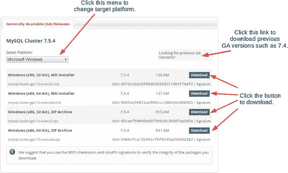

图 5-1. 社区版下载屏幕

默认情况下，下载页面会根据您用于访问页面的浏览器发送的信息自动检测平台，并显示该平台的软件包。单击“下载”按钮即可下载所需软件包。如果您想更改目标平台，请单击下载菜单左上角的下拉菜单。

如果您想安装之前的 GA 版本（例如 7.4），请单击下载菜单右上角的链接。默认情况下，之前的 GA 版本页面显示 7.4 软件包。您还可以通过从下载菜单左上角的下拉菜单中选择所需版本来下载更早的版本。

如果您已使用 Oracle 账户登录 MySQL 开发者站点，则在您单击“下载”按钮后将立即开始下载。否则，您将看到一个提示您登录站点或创建新 Oracle 账户的屏幕。我个人建议，如果您没有账户，最好创建一个，因为要执行某些任务（例如提交新的错误报告）必须登录 MySQL 开发者站点。如果您比较着急，只想下载软件包文件，请单击“不，谢谢，直接开始我的下载”链接，如图 5-2 所示。

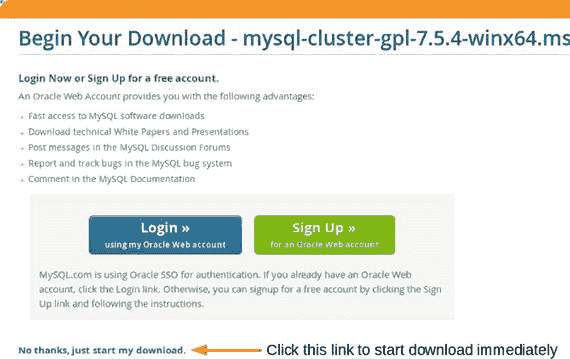

图 5-2. 未登录时的额外下载页面


##### 运营商级版本 (CGE)

MySQL Cluster 运营商级版本 (CGE) 是 MySQL NDB Cluster 的商业许可版本。您需要购买许可证才能使用此版本的软件。与社区版相比，CGE 包含一些附加功能。您可以在以下页面一览 CGE 的功能：

[`www.mysql.com/products/`](http://www.mysql.com/products/)

CGE 软件包文件可以从 My Oracle Support (MOS) 或 Oracle Software Delivery Cloud 获取。在这两个网站上，您都需要一个 Oracle 帐户登录。因此，您可以在 MySQL 社区下载站点、My Oracle Support 和 Oracle Software Delivery Cloud 上使用同一个通用帐户。

在 My Oracle Support 上，您可以获取除非常旧版本之外的所有 MySQL NDB Cluster 版本。如果您需要的软件包版本在该网站上缺失，请联系 Oracle 支持服务。图 5-3 显示了登录后 MOS 顶部的选项卡菜单。


图 5-3. MOS 顶部的选项卡菜单

要获取 CGE 软件包，请单击“Patches & Updates”选项卡。然后，您将看到如图 5-4 所示的“Patch Search”屏幕。

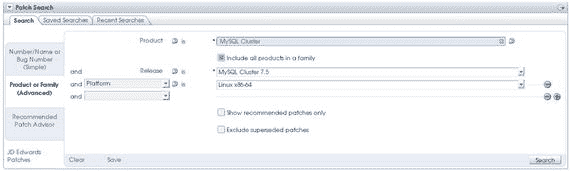

图 5-4. MOS 上的补丁搜索屏幕

在“Product”文本框中输入 `MySQL Cluster`。然后，勾选“Include All Products in a Family”复选框，从“Release”下拉菜单中选择所需版本，并选择所需的平台。最后，单击“Search”按钮，您将看到可供下载的软件包列表。如果您选择 Linux x86-64 作为平台，每个版本会列出多个软件包文件，因为有多种 Linux 发行版正式支持 MySQL NDB Cluster。请注意选择适当的软件包。

在 Oracle Software Delivery Cloud 上，仅提供最新版本的软件包。登录 Oracle Software Delivery Cloud 后，您将看到如图 5-5 所示的软件包搜索菜单。在文本框中输入 `MySQL Cluster`。然后，下拉菜单中会显示几个候选选项。MySQL Cluster Carrier Grade Edition 是一个产品名称，它不仅包括 MySQL NDB Cluster 软件包，还包括驱动程序等辅助软件包。如果您只需要服务器软件包，请选择带有版本号的软件名称，例如 "MySQL Cluster 7.5.5"。下一步是选择合适的平台。选择平台后，软件将被添加到下载队列。最后，单击“Continue”按钮，进入下载屏幕。

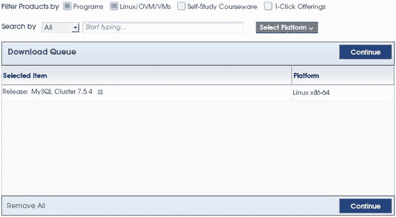

图 5-5. Oracle Software Delivery Cloud 上的软件搜索屏幕

在下载屏幕上，您将看到软件许可通知。该许可通知表明，除了商业许可外，Oracle Software Delivery Cloud 上的软件包也适用于试用许可。试用许可仅限于 30 天的评估期。协议的正文可在许可通知中找到。如果您没有商业许可但希望评估 MySQL NDB Cluster 的商业版本，请在下载软件前仔细阅读许可通知。如果您不需要商业功能和支持，社区版是一个很好的替代方案，因为它是在 GPLv2 许可下授权的，该许可不会过期。

如果您想获取旧版本，您需要访问 MOS，而不是 Oracle Software Delivery Cloud。

#### 在 Linux 上安装

在 Linux 系统上，有两种类型的软件包可用。一种是压缩的 tar 包 (`tar.gz`)，另一种是用于包管理器的安装程序包，例如 RPM 包和 Debian 包。尽管存在许多其他类型的软件包，但只有 RPM 和 Debian 包是官方分发的。

##### Tar.gz 归档包安装

`Tar.gz` 是一种压缩文件格式，它使用 `tar`（磁带归档）进行归档，然后通过 `gzip`（GNU zip）进行压缩。在 `tar.gz` 归档包中，所有 MySQL NDB Cluster 程序和相关文件都包含在一个文件中。安装该软件包非常简单；您只需解压归档文件。典型的目标目录是 `/usr/local` 或 `/opt`，但您可以根据需要将 `tar.gz` 文件解压到任何位置。清单 5-1 显示了 `tar.gz` 归档安装命令的示例。

```
shell$ su
shell# mv mysql-cluster-gpl-7.5.5-linux-glibc2.5-x86_64.tar.gz /opt
shell# cd /opt && tar xf mysql-cluster*tar.gz
shell# ln -s mysql-cluster*64 mysql-cluster
```

清单 5-1. 将 `tar.gz` 归档安装到 `/opt` 目录

在此示例中，最后一个命令为解压后的目录创建了一个符号链接，以便于访问。当升级或降级集群时，需要在同一主机上安装多个版本。为解压后的目录创建符号链接比重命名安装目录本身更可取。解压后的目录条目如清单 5-2 所述。

```
shell# ls -lh
total 56K
drwxr-xr-x  2 root root  4.0K Jan 13 22:18 bin
-rw-r--r--  1 7161 31415  18K Oct 13 19:59 COPYING
drwxr-xr-x  2 root root  4.0K Jan 13 22:18 docs
drwxr-xr-x  4 root root  4.0K Jan 13 22:18 include
drwxr-xr-x  4 root root  4.0K Jan 13 22:18 lib
drwxr-xr-x  4 root root  4.0K Jan 13 22:18 man
drwxr-xr-x 10 root root  4.0K Jan 13 22:18 mysql-test
-rw-r--r--  1 7161 31415 2.5K Oct 13 19:59 README
drwxr-xr-x 31 root root  4.0K Jan 13 22:18 share
drwxr-xr-x  2 root root  4.0K Jan 13 22:18 support-files
```

清单 5-2. `tar.gz` 归档包的内容

所有程序都安装在 `bin` 子目录中。为了便于访问，您可以将 `/opt/mysql-cluster/bin` 添加到您的 `PATH` 环境变量（可执行文件搜索路径）中。

在典型设置中，您需要创建一个专用的用户帐户来运行服务器守护进程。虽然可以使用 `root` 用户运行服务器守护进程，但从安全角度来看，这并不理想，因为 `root` 用户拥有运行 NDB Cluster 程序所不需要的额外特权，并且如果该帐户被攻击者劫持，可能会危害系统。清单 5-3 显示了为 MySQL Server 创建操作系统用户帐户的命令示例。

```
Shell$ su
shell# mkdir /var/lib/mysql
shell# groupadd mysql
shell# useradd -g mysql -s /bin/false -d /var/lib/mysql mysql
shell# chown mysql:mysql /var/lib/mysql && chmod 700 /var/lib/mysql
shell# passwd mysql
```

清单 5-3. 创建用户帐户

在清单 5-3 中，`mysql` 用户的登录 shell 被设置为 `/bin/false`。这禁止了 `mysql` 用户登录系统，但 `mysql` 仍然可以作为服务器进程的有效用户使用。

除了创建用户帐户外，您还需要在 SQL 节点上手动初始化数据目录。在与 MySQL Server 5.7 结合使用的 MySQL NDB Cluster 7.5 上，数据目录使用 `mysqld --initialize` 初始化。在较旧的、与旧版 MySQL 结合使用的 MySQL NDB Cluster 版本中，数据目录使用 `mysql_install_db` 命令初始化。尽管 `mysql_install_db` 在 MySQL Server 5.7 中仍然可用，但它已被弃用，并将在未来的版本中移除。

清单 5-4 显示了在 MySQL NDB Cluster 7.5 上初始化数据目录的典型命令示例。您只需使用 `--initialize` 选项启动 `mysqld`（MySQL Server 守护程序）即可。这将使用为 `mysqld` 的 `--user` 选项设置的用户帐户创建必要的系统表。此选项的默认用户名是 `mysql`。您无需更改生成文件的所有者。


## MySQL NDB Cluster 安装与初始化

```
shell$ su
shell# mysqld --initialize
清单 5-4.
在 MySQL NDB Cluster 7.5 上初始化数据目录
```

在 MySQL NDB Cluster 7.4 或更早版本中，您需要使用 `mysql_install_db` 脚本进行初始化。清单 5-5 展示了该脚本的典型命令示例。该脚本不会自动更改所有者，因此您需要在初始化数据目录后手动更改文件所有者。

```
shell$ su
shell# cd /opt/mysql-cluster
shell# bin/mysql_install_db --defaults-file=/etc/my.cnf
shell# chown -R mysql:mysql /var/lib/mysql
清单 5-5.
在 MySQL NDB Cluster 7.4 或更早版本上初始化数据目录
```

无论使用 `mysqld --initialize` 还是 `mysql_install_db`，都建议您在初始化数据目录之前完成 MySQL 服务器配置文件（如 `/etc/my.cnf`）的配置，因为 `InnoDB` 的一些选项在初始化完成后无法更改。例如，用于分离撤销表空间的 `innodb_undo_tablespaces` 和 `innodb_undo_directory` 选项在数据目录初始化后无法更改。

您可以选择配置系统，使 MySQL 服务器在系统启动和关闭时自动启动或停止。对于 MySQL 服务器有两种选择——SysV 风格的 init 和 `systemd`。请查阅您的操作系统手册以了解使用的是哪种 init 系统。甚至可以在其他 init 系统（如 OpenRC 和 upstart）上设置自动启动和关闭，但只有 `SysV style init` 和 `systemd` 是官方支持的。其他 init 系统的操作步骤超出了本书的范围。

要使用 SysV 风格的 init 设置自动启动和关闭，您需要将 `mysql.server` 脚本复制到 `/etc/init.d` 并将其注册到每个运行级别。清单 5-6 展示了为 SysV 风格的 init 设置 init 脚本的过程，该过程使用了 `chkconfig` 命令。

```
shell$ su
shell# cp mysql.server /etc/init.d/mysqld
shell# chmod +x /etc/init.d/mysqld
shell# chkconfig --add mysqld
清单 5-6.
使用 SysV 风格的 init 设置自动启动和关闭
```

有关 `chkconfig` 命令的更多详细信息，请查阅操作系统的手册。

要使用 `systemd` 设置自动启动和关闭，您需要手动创建 `systemd` 配置文件或从其他地方复制。获取 `systemd` 配置文件最简单的方法是从 RPM 包中复制。您可以使用 `rpm2cpio` 和 `cpio` 命令提取 RPM 文件。RPM 包还包含一个名为 `mysqld_pre_systemd` 的辅助脚本。如果在启动 MySQL 服务器之前数据目录尚未初始化，此脚本会对其进行初始化。此脚本是可选的。如果数据目录已初始化，则不需要它。这些配置文件和辅助脚本假设安装目标是 `/usr` 目录。如果您将文件解压到其他目录（例如 `/opt/mysql-cluster`），则必须调整这些文件中的路径。您还需要创建由用户拥有的 `/var/run/mysqld` 目录来运行 MySQL 服务器。使用 `systemd` 设置自动启动和关闭的过程如清单 5-7 所示。

```
shell$ rpm2cpio mysql-cluster-community-server-7.5.5-1.el7.x86_64.rpm\
> | cpio -id
shell$ sed -i -e 's#/usr/s\?bin/my#/opt/mysql-cluster/bin/my#'\
> usr/lib/systemd/system/mysqld.service
shell$ sed -i -e 's#/usr/s\?bin/my#/opt/mysql-cluster/bin/my#'\
> usr/bin/mysqld_pre_systemd
shell$ su
shell# cp usr/lib/systemd/system/mysqld.service /usr/lib/systemd/system
shell# cp usr/bin/mysqld_pre_systemd /opt/mysql-cluster/bin
shell# mkdir /var/run/mysqld && chown mysql:mysql /var/run/mysqld
shell# systemctl start mysqld.service
shell# systemctl enable mysqld.service
清单 5-7.
使用 Systemd 设置自动启动和关闭
```

此示例假设 RPM 和 tar.gz 包已下载到当前工作目录。`rpm2cpio` 命令和管道 `cpio` 命令将文件提取到当前工作目录下，并保持目录结构完整。例如，程序二进制文件被提取到相对于当前工作目录的 `usr/bin` 目录。`sed` 命令使用非标准字符 `#` 作为字段分隔符调用，以避免路径分隔符 `/` 的转义字符。

##### RPM 包安装

RPM 被 Red Hat Enterprise Linux 及其变体（包括 Oracle Enterprise Linux）以及 SUSE 及其变体使用。RPM 包的安装很简单；可以使用 `rpm` 命令完成。整个 MySQL NDB Cluster 发行版按组件被分成多个 RPM 包。因此，您需要将适当的包安装到目标主机。

在 MySQL NDB Cluster 7.4 或更早版本中，RPM 包的类型与标准（非 NDB）MySQL 服务器相同，如清单 5-8 所述。NDB Cluster 相关文件包含在 server、devel 和 test 包中。

```
shell$ tar tf MySQL-Cluster-gpl-7.4.13-1.el7.x86_64.rpm-bundle.tar
MySQL-Cluster-shared-gpl-7.4.13-1.el7.x86_64.rpm
MySQL-Cluster-devel-gpl-7.4.13-1.el7.x86_64.rpm
MySQL-Cluster-test-gpl-7.4.13-1.el7.x86_64.rpm
MySQL-Cluster-shared-compat-gpl-7.4.13-1.el7.x86_64.rpm
MySQL-Cluster-embedded-gpl-7.4.13-1.el7.x86_64.rpm
MySQL-Cluster-client-gpl-7.4.13-1.el7.x86_64.rpm
MySQL-Cluster-server-gpl-7.4.13-1.el7.x86_64.rpm
清单 5-8.
MySQL NDB Cluster 7.4 的 RPM 包列表
```

server 包包含运行 NDB Cluster 所需的所有程序、共享库和数据文件。自动安装程序也包含在此包中。服务器守护程序安装到 `/usr/sbin`，客户端程序安装到 `/usr/bin`，库安装到 `/usr/lib`。因此，您需要安装 server 包来运行数据节点、管理节点和 NDB 客户端程序（如 `ndb_restore`）。当您想要运行链接 `libndbclient` 的 NDB API 客户端应用程序时，也需要 `server` 包。

devel 包包含构建 MySQL C API 和 NDB API 程序所需的头文件和静态库。因此，如果适用，您需要在开发机器上安装它。

test 包包含 MySQL NDB Cluster 的附加测试用例。测试包是 MySQL 开发人员调试 MySQL 程序所必需的。因此，在生产系统中通常不需要。

简而言之，对于 MySQL NDB Cluster 7.4 或更早版本，您需要安装 server 包来运行 NDB Cluster 守护进程和链接 NDB API 共享库，安装 devel 包来开发 NDB API 程序以及 MySQL C API 程序，以及其他包（就像标准 MySQL 服务器一样）。

在 MySQL NDB Cluster 7.5 上，包被拆分为更小的部分，如表 5-1 所列。

**表 5-1. MySQL NDB Cluster 7.5 的 RPM 包列表**


| 组件 | 描述 |
| --- | --- |
| auto-installer | 自动安装程序包。本章稍后讨论。 |
| client | 适用于 MySQL 服务器和 MySQL NDB 集群的 NDB 客户端程序，例如 `mysql`、`mysqldump`、`ndb_mgm`、`ndb_restore` 等。 |
| common | MySQL 服务器（非 MySQL NDB 集群）的通用软件包。包含字符集信息和错误消息。 |
| data-node | `ndbd` 和 `ndbmtd` 程序可执行文件。 |
| devel | 开发 MySQL 客户端 C/C++ 程序所需的头文件、静态库和共享库。 |
| embedded | MySQL 服务器的嵌入式（库）版本（`libmysqld`）。此软件包包含 `libmysqld` 的共享库版本。 |
| embedded-compat | 向后兼容的 `libmysqld`。 |
| embedded-devel | 开发嵌入式 MySQL 服务器应用程序所需的头文件、静态库和共享库。 |
| java | ClusterJ 应用程序所需的 JAR（Java 归档）文件。 |
| libs | MySQL C API 客户端库（`libmysqlclient`）。此软件包包含 `libmysqlclient` 的共享库版本。 |
| libs-compat | 向后兼容的 `libmysqlclient`。 |
| management-server | 此软件包包含 `ndb_mgmd`。 |
| memcached | 与 Memcached 相关的二进制文件。 |
| ndbclient | NDB API 共享库（`libndbclient`）。 |
| ndbclient-devel | 开发 NDB API 客户端程序所需的头文件和库。 |
| nodejs | Node.js 应用程序的驱动程序。 |
| server | MySQL 服务器及相关程序。此版本的 MySQL 服务器包含 `NDBCluster` 存储引擎支持。 |
| server-minimal | 数据库服务器及相关工具的最小化安装。自 MySQL NDB 集群 7.5.7 起可用。 |
| test | MySQL 测试套件软件包。 |

MySQL NDB 集群 7.5 的软件包划分优先于 7.4 或更早版本的划分。在 MySQL NDB 集群 7.4 或更早版本中，所有与 MySQL NDB 集群相关的程序都包含在服务器软件包中，这常常导致问题。这意味着管理服务器、数据节点和 SQL 节点程序将同时被安装或移除。当一台主机上安装了多个类型的节点时，这使得滚动升级或降级变得困难。有关升级和降级操作的更多详细信息，请参见章节 11。

遗憾的是，目前尚无适用于 MySQL NDB 集群的 Yum（Yellowdog Updater Modified）仓库。您需要在不使用 Yum 仓库的情况下安装、升级或降级软件包。

与 `tar.gz` 软件包不同，某些 RPM 软件包会修改您的系统并为您执行管理任务。服务器软件包在安装（而非升级）时执行以下任务：
*   创建 `mysql` 用户和组
*   创建数据目录
*   初始化数据目录（仅限 MySQL NDB 集群 7.3 和 7.4）
*   为 `mysqld` 设置自动启动和关闭（适用于 systemd 或 SysV 风格的 init）

共享软件包会调用 `ldconfig` 命令来设置符号链接，这是链接已安装共享库所必需的。更多信息请参阅 `ldconfig` 的手册页。

服务器 RPM 软件包也会设置自动启动和关闭。在使用 SysV 风格 init 的旧系统上，只需安装服务器 RPM 软件包即可启用自动启动和关闭。您可以使用 `chkconfig` 命令进行验证。有关此命令的更多详细信息，请参阅其手册页。MySQL 服务器将在系统下次重启时自动启动。要立即启动服务，请以 `root` 身份执行 `service` 命令：
```
shell$ su
shell# service mysqld start
```
服务名称可能因操作系统而异，可能是 `mysqld` 或 `mysql`。可以通过检查 `/etc/init.d` 目录的内容来确认服务名称。

在装有 systemd 的现代系统上，systemd 的配置文件也会随服务器 RPM 软件包一同安装。但是，默认情况下该服务并未启用。您需要使用 `systemctl` 显式启用它：
```
shell$ sudo systemctl enable mysqld.service
```
此命令使 MySQL 服务器在下次操作系统重启时自动启动。然而，此时 MySQL 服务器尚未启动。如果您想立即启动它，请执行 `systemctl`：
```
shell$ sudo systemctl start mysqld.service
```

##### Tar.gz 软件包与 RPM 软件包

您的系统应该使用哪种类型的软件包？这取决于具体情况。软件包管理器实际上简化了一些操作任务，尤其在 SQL 节点上非常有用。因此，我通常推荐使用 RPM 软件包。

然而，也存在一些不使用 RPM 软件包的理由。例如，MySQL NDB 集群 7.4 或更早版本的 RPM 软件包存在一些缺点：软件包未按节点类型分离。一个 RPM 软件包无法安装两个以上的版本。因此，当单台主机上安装了多个类型的节点时，RPM 软件包可能不太合适，因为在进行滚动升级或降级时可能会出现问题。

##### DEB 软件包安装

DEB 是 Debian 及其衍生版本（如 Ubuntu、KNOPPIX 和 LMDE）使用的软件包格式。但是，MySQL NDB 集群仅支持 Debian 和 Ubuntu。有关支持的 Linux 发行版的更多信息，请参见支持的平台页面。

对于 MySQL NDB 集群 7.5.5 或更早版本（包括 7.5 之前的系列），MySQL NDB 集群的 DEB 软件包均为合一类型，并且仅适用于 Debian。所有程序二进制文件和相关文件都包含在一个软件包中。您只需运行带 `-i` 选项的 `dpkg` 命令：
```
shell# dpkg -i mysql-cluster-gpl-7.5.5-debian8-x86_64.deb
```
这种合一软件包在安装时不会运行脚本。因此，您需要像使用 tar.gz 软件包一样，手动设置用户账户、初始化数据目录以及设置自动启动和关闭。因此，使用合一类型 DEB 软件包的好处仅仅在于它由软件包管理器管理。

自 MySQL NDB 集群 7.5.6 起，DEB 软件包的组织结构已更改，并且也支持 Ubuntu。它已更改为与 MySQL NDB 集群 7.5 系列的 RPM 软件包相同。有关 MySQL NDB 集群 7.5 系列 RPM 软件包组织结构的更多详细信息，请参阅表 5-1。因此，您可以像安装 7.5 RPM 软件包一样，仅为该主机安装所需的软件包。

RPM 软件包组织结构和新的 DEB 软件包组织结构之间存在几个差异：
*   服务器 DEB 软件包包含 systemd 相关文件：可以配置 SQL 节点在系统重启时自动启动。服务名称为 `mysql.service`。
*   某些功能的 MySQL NDB 集群专用软件包不可用：您需要安装源自 MySQL Server 的软件包来获取 `mysql-common`、`mysql-client` 和 `libmysqlclient`。我建议您下载 DEB Bundle tar 文件。
*   调试符号存储在单独的软件包中：对于 Debian 软件包，调试符号存储在名称带有 `-dbgsym` 后缀的单独软件包中。Ubuntu 不提供调试符号。
*   最小服务器软件包不可用：可能会在未来的版本中添加，但目前不可用。

#### 在 Windows 上安装

在 Windows 系统上，有两种类型的软件包可用。一种是 ZIP 归档软件包，另一种是 Windows Installer (MSI) 软件包。由于除 Microsoft Corporation 发行的版本外没有其他发行版，因此安装程序软件包格式只能是 Windows Installer。


##### Zip 压缩包安装

Zip 是一种广为人知的文件压缩格式。较新版本的 Windows 已内置对 Zip 文件的压缩和解压缩功能。在 Windows 上安装 Zip 压缩包的过程与在 Linux 系统上安装`tar.gz`归档文件类似。安装可以通过将压缩包解压到系统上的任意位置来完成。例如，你可以将其解压到`C:\MySQL`。你可以使用资源管理器来解压该压缩包。

创建一个选项文件，并将其放置在 MySQL 服务器读取选项文件的目录中，例如`C:\Windows\my.ini`。如果你使用`--defaults-file`选项启动服务器，则可以将选项文件放在任意目录中。

为已安装的节点创建数据目录。对于管理节点和数据节点，数据目录可以留空。安装过程至此结束。

对于 SQL 节点，在完成选项文件后，必须初始化数据目录。在 Windows 上，`mysql_install_db`脚本不起作用。因此，应使用其他方法初始化数据目录。从 MySQL 5.7 和 MySQL NDB Cluster 7.5 开始，可以使用`mysqld --initialize`来初始化数据目录：

```
PS C:\> C:\mysql-cluster-gpl-7.5.5-winx64\bin\mysqld.exe --defaults-file=C:\MySQL\my.ini --initialize
```

在 MySQL NDB Cluster 7.4 或更早版本中，无法在 Windows 上初始化数据目录，因为`mysqld`没有`--initialize`选项，且`mysqld_install_db`在 Windows 上不起作用。Zip 压缩包包含一个名为`data`的目录。将此目录的内容复制到目标数据目录，或者你可以直接复制整个目录，使目录名称与目标数据目录相同。

最后，你可以启动 SQL 节点。如果数据节点尚未准备好，请暂时禁用`NDBCluster`存储引擎（例如，注释掉与 NDB 相关的选项），然后启动 SQL 节点以验证安装。在 Windows 上首次启动 SQL 节点时，指定`--console`选项以查看是否有任何问题被报告。`--console`选项使错误日志打印到控制台。如果有错误报告，你可以在命令执行后看到错误信息。清单 5-9 展示了在 Windows 系统上首次启动的示例输出。

```
PS C:\> C:\mysql-cluster-gpl-7.5.5-winx64\bin\mysqld.exe --defaults-file=C:\MySQL\my.ini --console
2017-02-09T11:53:37.224242Z 0 [Warning] TIMESTAMP with implicit DEFAULT value is deprecated. Please use --explicit_defaults_for_timestamp server option (see documentation for more details).
2017-02-09T11:53:37.224242Z 0 [Note] --secure-file-priv is set to NULL. Operations related to importing and exporting data are disabled
2017-02-09T11:53:37.224242Z 0 [Note] C:\mysql-cluster-gpl-7.5.5-winx64\bin\mysqld.exe (mysqld 5.7.17-ndb-7.5.5-cluster-gpl) starting as process 1184 ...
... snip ...
2017-02-09T11:53:37.640424Z 0 [Note] C:\mysql-cluster-gpl-7.5.5-winx64\bin\mysqld.exe: ready for connections.
Version: '5.7.17-ndb-7.5.5-cluster-gpl'  socket: ''  port: 3306  MySQL Cluster Community Server (GPL)
2017-02-09T11:53:37.640424Z 0 [Note] Executing 'SELECT * FROM INFORMATION_SCHEMA.TABLES;' to get a list of tables using the deprecated partition engine. You may use the startup option '--disable-partition-engine-check' to skip this check.
2017-02-09T11:53:37.640424Z 0 [Note] Beginning of list of non-natively partitioned tables
2017-02-09T11:53:37.702924Z 0 [Note] End of list of non-natively partitioned tables
```

**清单 5-9.** 在 Windows 上首次启动 MySQL NDB Cluster

可选地，你可以将已安装的服务器守护进程程序（MySQL Server、数据节点和管理节点）配置为 Windows 服务，这些服务会在系统启动和关闭时自动启动和停止进程。要将守护进程程序安装为 Windows 服务，请使用`--install`选项运行它。此选项需要管理员权限来操作 Windows 服务。为 MySQL Server 和 NDB 守护进程（`ndbd`、`ndbmtd`、`ndb_mgmd`）指定选项的方式不同。我们先讨论 MySQL Server 的安装。

要将 MySQL Server 安装为服务，如果你想使用放置在非标准位置的选项文件，请将`--defaults-file`选项与`--install`选项一起使用：

```
PS C:\> C:\mysql-cluster-gpl-7.5.5-winx64\bin\mysqld.exe --install NDB75 --defaults-file=C:\MySQL\my.ini
Service successfully installed.
```

与普通的 MySQL 程序调用不同，`--install`选项必须指定为第一个参数。它甚至位于标准首个选项之前，如`--no-defaults`、`--defaults-file`和`--defaults-extra-file`。第二个参数（在示例中是`NDB75`）是要注册的服务名称。请注意，`--install`和服务名之间不需要等号。如果存在等号，命令会导致错误。注意确保服务名不会与其他服务冲突。如果没有指定其他选项，可以省略服务名。如果省略，服务名将为`MySQL`。服务名之后的以下选项在`mysqld`作为服务被调用时用作命令行选项。只允许一个附加选项。因此，你通常需要在此处指定`--defaults-file`。当在单台主机上使用不同配置安装多个服务时，这是必需的。

MySQL Server 在服务安装后不会自动启动。如果你愿意，可以使用 Windows 的“服务”界面启动已安装的 MySQL Server。可以通过“计算机管理”访问，或者通过在“开始”菜单中输入`services.msc`来访问。打开“计算机管理”的方式因 Windows 版本而异。图 5-6 显示了右键单击 Windows 开始菜单时弹出的菜单。你可以在菜单中间看到“计算机管理”。

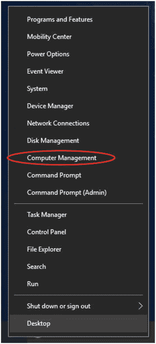

**图 5-6.** 右键单击 Windows 开始菜单时显示的弹出菜单

图 5-7 是“计算机管理”中“服务”屏幕的截图。你可以在那里找到`NDB75`。该服务未运行。

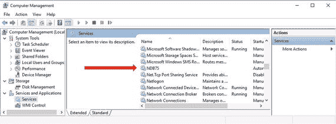

**图 5-7.** Windows 服务管理界面

你可以像处理其他标准 Windows 服务一样启动、停止、禁用或配置该服务。要进行配置，请右键单击目标服务（本例中为`NDB75`），然后从弹出菜单中选择**属性**。

对于 NDB 守护进程程序——`ndbd`、`ndbmtd`和`ndb_mgmd`——虽然你需要首先指定`--install`，但指定`--install`选项的方式与`mysqld`不同。`--install`和服务名之间需要等号。如果缺少等号，命令将导致错误。默认服务名对于`ndbd`和`ndbmtd`是"ndbd"，对于`ndb_mgmd`是"ndb_mgmd"。你可以像`mysqld`一样使用`--remove`选项删除服务。使用`--remove`选项卸载服务时也需要等号。


##### Windows 安装包安装

在 Windows 系统上，提供了适用于 Microsoft Windows Installer 的安装包。其文件扩展名为 `.msi`，因此 Microsoft Windows Installer 的安装包也称为 MSI 安装包或 MSI 文件。使用 MSI 进行安装非常简单。你可以通过图形界面安装向导来安装 MySQL NDB Cluster。

开始安装时，在 Windows 资源管理器中双击已保存的 MSI 安装包。图 5-8 显示了安装向导的欢迎屏幕。点击 `Next` 继续安装。

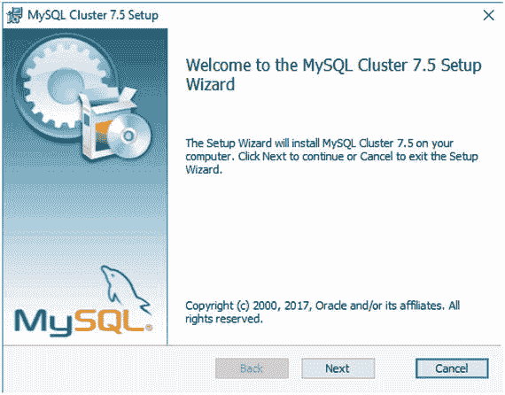

*图 5-8. MySQL Cluster 7.5 安装向导的欢迎屏幕*

然后，你会看到许可证协议屏幕，如图 5-9 所示。阅读许可证协议，如果你接受，请勾选同意复选框。点击 `Next` 继续。

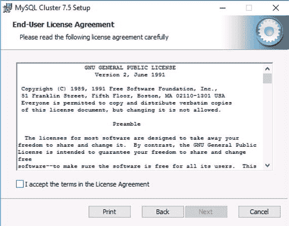

*图 5-9. MSI 安装包安装过程中的许可证协议*

接着，从三个选项中选择一个安装类型。图 5-10 是安装类型选择屏幕。当你选择 `Typical` 时，除文档外的所有组件都将被安装。当你选择 `Complete` 时，所有组件都将被安装。你可以通过选择 `Custom` 来决定安装哪些组件。

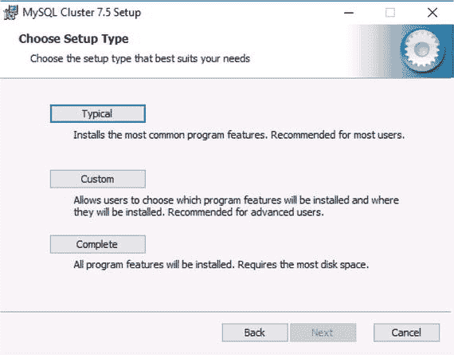

*图 5-10. 安装类型选择屏幕*

图 5-11 显示了用于选择要安装组件的自定义安装屏幕。你可以省略不必要的组件以节省磁盘空间。例如，如果你只需要安装一个数据节点，可以将 `MySQL Cluster` 菜单下除 `Cluster Storage Engine` 组件以外的所有组件都设为不可用。

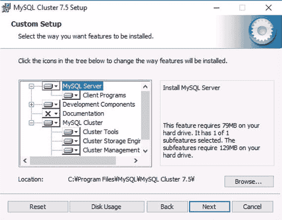

*图 5-11. 选择要安装的组件*

点击 `Next` 继续。完成向导选择后，你将看到 UAC（用户账户控制）屏幕。在 UAC 屏幕上点击 `Yes`。

程序二进制文件将被安装到 `C:\Program Files\MySQL` 下的目录中；例如，`C:\Program Files\MySQL\MySQL Cluster 7.5\`。如果愿意，你可以将安装目录下的 `bin` 子目录添加到 `Path` 环境变量中（这是你的程序搜索路径），这样就可以从命令提示符或 Windows PowerShell 轻松启动 MySQL 程序。你可以在系统属性中更改环境变量，这可以通过控制面板的 `系统和安全` 菜单中的 `系统` 子菜单访问。图 5-12 显示了控制面板中的 `系统` 子菜单。

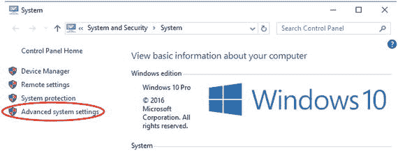

*图 5-12. 控制面板中的系统子菜单*

点击 `高级系统设置`。你将看到系统属性屏幕，如图 5-13 所示。

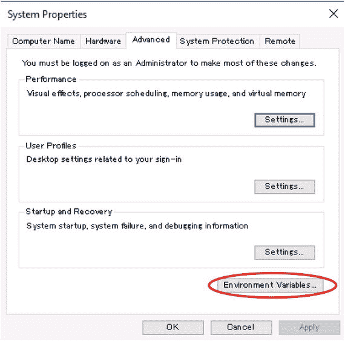

*图 5-13. Windows 系统属性屏幕*

点击窗口底部的 `环境变量` 按钮。然后，你将看到当前用户和系统范围设置的环境变量列表。编辑 `Path` 环境变量并添加例如 `C:\Program Files\MySQL\MySQL Cluster 7.5\bin`。

MSI 安装包不会为 MySQL NDB Cluster 守护进程设置 Windows 服务。因此，你需要手动完成此操作，就像使用 Zip 包安装一样。截至 MySQL NDB Cluster 7.5，MSI 安装包也不会为 SQL 节点初始化数据目录。另一方面，初始数据目录包含在旧版本中。

#### 在 macOS 上安装

在 macOS（也称为 OS X 或 mac OS X）上，有两种类型的安装包可用。一种是压缩的 tar 包（`tar.gz`），就像在 Linux 上一样。另一种是原生安装程序包安装。

##### Tar.gz 归档包安装

在 macOS 上安装 `tar.gz` 包与 Linux 的过程相同。请参阅本章前面的“Tar.gz 归档包安装”部分。

但是，将 MySQL 服务器设置为服务以实现自动启动和关闭的方式有所不同。macOS 使用 `launchd` 来实现此目的。要在 `launchd` 上设置服务，请将服务配置文件放在 `/Library/LaunchDaemons` 目录下。配置文件的内容是一个称为属性列表（简称 plist）的 XML 文件。属性列表的格式是预先定义的。制作所需 `launchd` 配置文件最简单的方法是从下一节描述的原生安装包中复制一个。清单 5-10 是 macOS 原生安装包中包含的一个属性列表文件（`com.oracle.oss.mysql.mysqld.plist`）。

```xml
Label             com.oracle.oss.mysql.mysqld
ProcessType       Interactive
Disabled          
RunAtLoad         
KeepAlive         
SessionCreate     
LaunchOnlyOnce    
UserName          _mysql
GroupName         _mysql
ExitTimeOut       600
Program           /usr/local/mysql/bin/mysqld
ProgramArguments

/usr/local/mysql/bin/mysqld
--user=_mysql
--basedir=/usr/local/mysql
--datadir=/usr/local/mysql/data
--plugin-dir=/usr/local/mysql/lib/plugin
--log-error=/usr/local/mysql/data/mysqld.local.err
--pid-file=/usr/local/mysql/data/mysqld.local.pid

WorkingDirectory  /usr/local/mysql
```

*清单 5-10. macOS 上用于 Launchd 的 MySQL 属性列表内容*

如果需要，请修复 plist 文件中写的程序路径和参数。此时已启用自动启动和关闭。如果配置文件存在，操作系统会读取每个启动守护进程的配置文件。服务器将在下次操作系统重启时启动 MySQL 服务器，但它尚未立即启动。要立即启动服务器，请运行 `launchctl`：

```shell
shell$ su
shell# launchctl load /Library/LaunchDaemons/com.oracle.oss.mysql.mysqld.plist
```

你可以通过运行 `launchctl unload` 而不是 `launchctl load` 来停止 MySQL 服务器。要禁用自动启动和关闭，请修改 plist 文件并将 `RunAtLoad` 的值设置为 `false`。


##### macOS 原生软件包安装

macOS 的原生安装包后缀为`.pkg`。使用原生（`.pkg`）软件包安装非常简单，可以通过图形界面向导完成。该软件包以 Apple 磁盘映像（后缀为`.dmg`）的形式分发，可以像普通磁盘一样被挂载为文件系统。要挂载它，请双击 DMG 文件。图 5-14 显示了挂载 MySQL NDB Cluster 软件包后的 Finder 窗口。

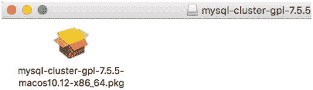
图 5-14. MySQL NDB Cluster DMG 文件已挂载

要开始安装，请双击`.pkg`文件。安装向导将会显示，如图 5-15 所示。点击“继续”进行下一步。

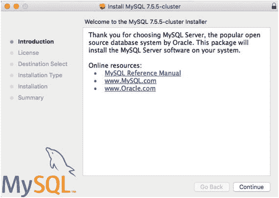
图 5-15. macOS 上 MySQL NDB Cluster 安装程序的介绍页面

下一个屏幕是许可协议。如果您使用的是社区版本，则许可证为 GPLv2。否则，将是 Oracle Corporation 的专有许可证。当您在许可协议屏幕点击“继续”时，会显示一个对话框。如果您同意许可条款，请点击“同意”继续。

下一个屏幕是“安装类型”，如图 5-16 所示。

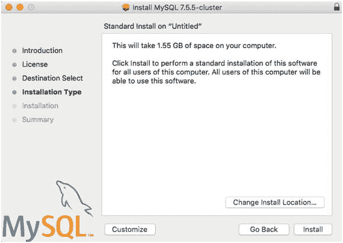
图 5-16. macOS 上 MySQL NDB Cluster 安装程序的安装类型

最初，“目的地选择”步骤被跳过。当您点击“更改安装位置”按钮时，向导会返回到“目的地选择”，但您无法更改默认设置。

当您点击“自定”时，您会看到类似图 5-17 的屏幕。在此屏幕上，您可以选择或取消选择要安装的组件。每个组件包含以下内容：

*   `MySQL Server`：MySQL NDB Cluster 程序的主体，包括所有类型的服务器守护进程和客户端程序。至少需要安装此软件包。
*   `Preference Pane`：此软件包在 macOS 的系统偏好设置中添加 MySQL 偏好设置面板。
*   `Launchd Support`：用于`launchd`的配置信息，`launchd`负责管理 macOS 上的自动启动和关闭。

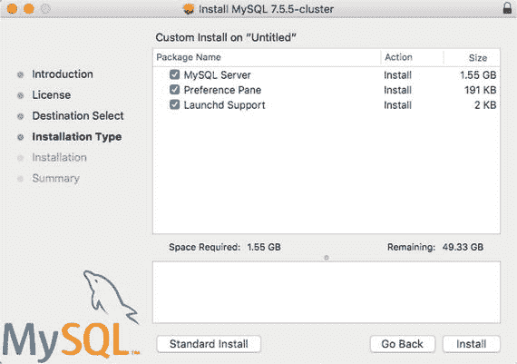
图 5-17. macOS 上 MySQL NDB Cluster 安装程序的组件选择屏幕

默认情况下，所有组件都会被安装，我建议安装所有组件。点击“安装”继续。

安装过程开始时，会显示一个要求输入当前操作系统用户密码的对话框。需要获得超级用户（`root`）权限才能将文件写入文件系统。安装完成后，会显示为已安装 MySQL Server 的`root@localhost`生成的密码，如图 5-18 所示。密码是随机生成的。因此，您在此屏幕上看到的密码会不同。（请不要担心，图 5-18 中显示的是实际密码，但我已不再使用它。）在将密码复制到其他地方之前，请勿关闭窗口。如果需要，可以按`Command+Shift+3`截取屏幕截图。截图将保存到您的桌面。

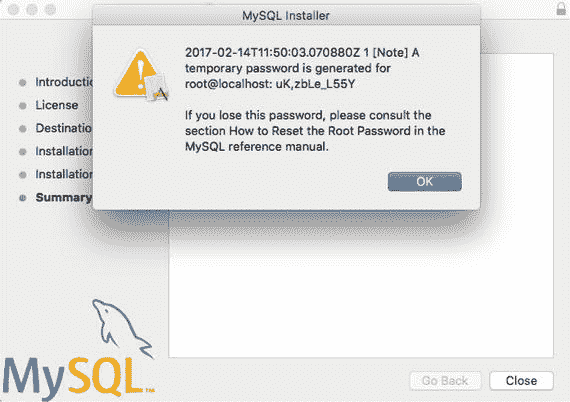
图 5-18. macOS 上 MySQL NDB Cluster 安装程序的摘要屏幕

服务器安装在`/usr/local`目录下的子目录中，安装程序会创建一个名为`/usr/local/mysql`的符号链接指向安装目录。将`/usr/local/mysql/bin`添加到您的`PATH`环境变量中，以便于访问 MySQL 程序。

在 macOS 原生软件包设置中，配置自动启动和关闭非常容易。要进行配置，请打开“系统偏好设置”并在底部找到 MySQL。当您点击 MySQL 图标时，您会看到一个类似图 5-19 的配置对话框。您可以停止或启动服务器，以及启用或禁用自动启动和关闭。

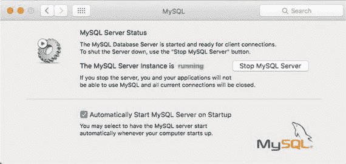
图 5-19. macOS 上的 MySQL 偏好设置面板

**注意**

一旦使用 MySQL 偏好设置面板更改了配置，位于`/Library/LaunchDaemons`下的启动守护进程配置文件会被转换为二进制 plist 格式。要恢复为 XML 格式，请对 plist 文件运行以下命令：
```
plutil -convert xml1 com.oracle.oss.mysql.mysqld.plist
```


### 使用自动安装器安装 MySQL NDB 集群实例

MySQL NDB 集群自动安装器（简称“自动安装器”）是一个通过 Web 图形界面设置 MySQL NDB 集群实例的辅助工具。自动安装器并非软件包安装工具，而是用于轻松设置节点实例的工具。这意味着软件包需要预先安装。

要启动自动安装器，请运行随 MySQL NDB 集群软件包一同安装的 `ndb_setup.py`。顾名思义，`ndb_setup.py` 是一个 Python 程序。因此，您的目标系统上需要安装 Python 解释器。所需的 Python 解释器版本为 2.6 或更高。此外，还需要两个 Python 库——Paramiko 1.7.7.1 或更高版本，以及 PyCrypto 2.6 或更高版本。请预先在您的目标系统上安装这些程序。

由于 `ndb_setup.py` 通过 SSH 协议在远程主机上执行命令，因此远程主机上必须运行 SSH 服务器。同时，也需要设置用于登录远程服务器的用户。除非在用户名/密码对中明确指定用户名（如下一节所述），否则通过 SSH 进行的远程登录将使用执行 `ndb_setup.py` 的用户身份。因此，基本上您需要创建与本地用户名相同的远程用户。实例将使用该用户进行初始化和启动。如果您希望使用 `mysql` 用户运行 MySQL NDB 集群程序，请允许该用户登录。（通常，出于安全原因，`mysql` 用户登录是被禁用的。）清单 5-11 是 `ndb_setup.py` 从命令行运行时的示例输出。

```shell
shell$ ./ndb_setup.py
Running out of install dir: /opt/mysql-cluster/bin
Starting web server on port 8081
deathkey=787953
Press CTRL+C to stop web server.
The application should now be running in your browser.
(Alternatively you can navigate to http://localhost:8081/welcome.html to start it)
```

清单 5-11. 从命令行运行 `ndb_setup.py`

可以看到该程序默认监听 TCP/IP 端口 8081。您可以通过在命令行中指定 `--port` 选项来更改它。该命令会自动打开您的浏览器并显示如图 5-20 所示的屏幕。

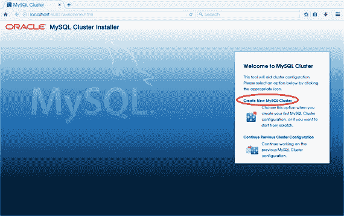

图 5-20. MySQL 集群自动安装器的初始屏幕

点击 **创建新的 MySQL 集群** 来设置新的安装。将显示一个向导式的设置屏幕，如图 5-21 所示。

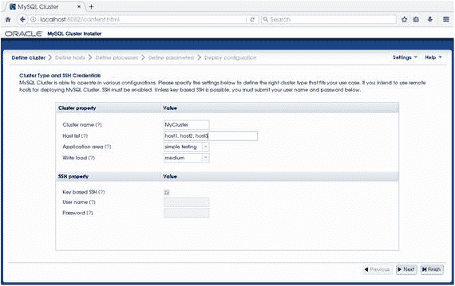

图 5-21. 自动安装器上的“定义集群”屏幕

首要任务是定义集群的整体配置。在自动安装器中无法对各个参数进行微调，而是在此屏幕上定义一个简要配置。每个输入框代表以下参数：

*   **集群名称**：要安装的集群的名称。
*   **主机列表**：集群实例所在主机的逗号分隔列表。
*   **应用领域**：从集群使用的应用类型，从以下选项中选择：
    *   **简单测试**：用于测试的最小资源配置
    *   **Web**：针对给定硬件的最大资源配置
    *   **实时**：最小化响应时间
*   **写入负载**：写入事务的数量（从 **低**、**中** 和 **高** 中选择一项）。
*   **SSH 凭证**：如果选中 **基于密钥的 SSH**，则使用预先注册的公钥进行 SSH 认证。否则，请指定用于认证的用户名和密码。

点击 **下一步** 继续。下一个屏幕是主机详细信息的配置屏幕，如图 5-22 所示。

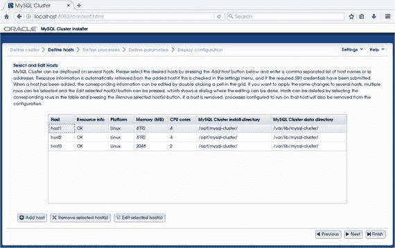

图 5-22. 自动安装器中的主机定义详情

在此屏幕中，您需要指定给定主机的 CPU 核心数和内存量，以及 MySQL NDB 集群软件包的路径和数据目录。如果自动安装器无法在这些目录中找到程序，或者程序没有足够的权限访问这些数据目录，后续的安装将会失败。请确保软件包安装目录正确，并且数据目录的所有者、组和权限正确。点击 **下一步** 继续。

下一个屏幕是进程定义，如图 5-23 所示。

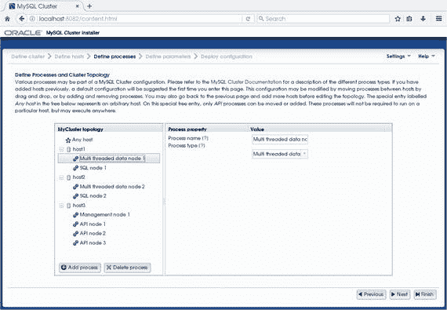

图 5-23. 自动安装器中的进程定义

在此屏幕上，您需要定义哪个主机将运行哪种类型的节点。点击 **添加进程** 以为主机添加新节点。您可以通过拖放将节点移动到另一台主机上。点击 **下一步** 继续。下一步是定义参数，如图 5-24 所示。

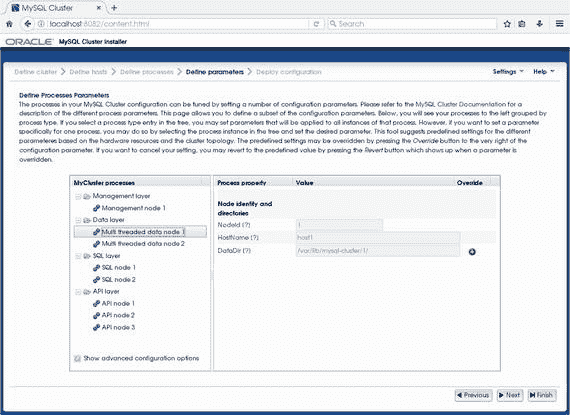

图 5-24. 在自动安装器中定义进程参数

您可以更改基本参数，例如 SQL 节点的数据目录、套接字和端口号。同样，在自动安装器上无法微调详细参数。点击 **下一步** 继续。下一个屏幕是最终的安装步骤，如图 5-25 所示。

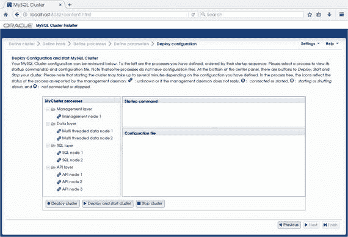

图 5-25. 在自动安装器中部署、启动和停止集群

如您所见，自动安装器的功能非常有限。它不适合日常使用。例如，可以启动和停止整个集群，但无法停止或启动单个节点。滚动重启也无法实现。如果您想为评估目的快速设置 MySQL NDB 集群，请尝试自动安装器。它也可能是进一步微调的良好起点。

### 验证安装

一旦所有安装步骤完成，请验证安装是否成功。

#### 配置文件

在启动集群之前，请确保配置文件（如 `config.ini` 和 `my.cnf`）已完成，并且设置了预期的选项。对于 MySQL Server 守护进程 `mysqld`（以及其他非 NDB 程序），您可以轻松验证选项是否被读取并设置为所需的值。使用 `--print-defaults` 选项运行 `mysqld`：

```shell
shell$ mysqld --print-defaults
mysqld would have been started with the following arguments:
--character-set-server=utf8 --user=mysql --port=3306 ...
```

它会列出在命令行或选项文件（`my.cnf`）中指定的所有选项。

对于 NDB 程序，`--print-defaults` 无效。管理服务器守护进程 `ndb_mgmd` 需要一个配置文件路径作为命令行选项。您无需担心程序实际读取的是哪个选项文件。虽然 `ndb_mgmd` 有一个名为 `--print-full-config` 的选项，但它会打印所有选项，包括所有可用槽位中未更改的选项。这对于快速检查选项值是否设置正确并不方便。相反，检查配置文件是否形成正确是很有用的。当指定 `--print-full-config` 时，`ndb_mgmd` 会解析给定的配置文件，就像进行常规启动一样，因此它确保选项名称正确且值在有效范围内。


#### 初始启动

配置完成后，下一步就是启动集群。在首次启动时，集群会初始化其数据目录，并在管理节点和数据节点上创建数据文件。因此，一旦初始化完成，某些配置（例如 `FragmentLogFileSize`）若不重新初始化数据则无法更改。换句话说，在您向集群存储任何数据之前，您可以根据需要多次擦除全部数据并重启集群。

列表 5-12 展示了一个启动管理节点的示例命令。由于这是首次启动，`--initial` 选项可以省略。

```
shell$ /opt/mysql-cluster/bin/ndb_mgmd -f /etc/mysql-cluster/config.ini\
--configdir=/var/lib/mysql-cluster
MySQL Cluster Management Server mysql-5.7.17 ndb-7.5.5
列表 5-12.
首次启动管理节点
```

一旦所有管理节点都已启动，下一步便是启动数据节点。列表 5-13 是一个启动数据节点的典型命令。请使用列表 5-13 所示的命令启动所有数据节点。在此示例中，使用了多线程版本的数据节点 (`ndbmtd`)。

```
shell$ /opt/mysql-cluster/bin/ndbd -c nodeid=1,host3:1186
2017-01-30 16:56:09 [ndbd] INFO     -- Angel connected to host3:1186'
2017-01-30 16:56:09 [ndbd] INFO     -- Angel allocated nodeid: 1
列表 5-13.
首次启动数据节点
```

数据节点的启动需要一些时间。要验证数据节点是否已启动，请从 `ndb_mgm` CLI 发出 `ALL STATUS` 命令，如列表 5-14 所示。

```
shell$ ndb_mgm
-- NDB Cluster -- Management Client --
Connected to Management Server at: 127.0.0.1:1186
ndb_mgm> all status
Node 1: started (mysql-5.7.17 ndb-7.5.5)
Node 2: started (mysql-5.7.17 ndb-7.5.5)
列表 5-14.
通过 ndb_mgm CLI 检查数据节点状态
```

最后一步是启动 SQL 节点。启动 SQL 节点的命令与标准 MySQL 服务器相同。例如，如果在 RHEL7 系统上使用 RPM 安装了服务器包，您可以使用 `systemctl` 命令启动 SQL 节点，如下所示：

```
shell$ sudo systemctl start mysqld.service
```

#### 检查状态

验证集群是否正常运行的最基本操作是查看其状态。首先，使用 `ndb_mgm` CLI 连接集群并发出 `SHOW` 命令，如列表 5-15 所示。检查所有节点是否已连接且状态正常。

```
shell$ ndb_mgm
-- NDB Cluster -- Management Client --
ndb_mgm> SHOW
Connected to Management Server at: 127.0.0.1:1186
Cluster Configuration

[ndbd(NDB)]     2 node(s)
id=1    @host1  (mysql-5.7.17 ndb-7.5.5, Nodegroup: 0, *)
id=2    @host2  (mysql-5.7.17 ndb-7.5.5, Nodegroup: 0)
[ndb_mgmd(MGM)] 1 node(s)
id=255  @host3  (mysql-5.7.17 ndb-7.5.5)
[mysqld(API)]   7 node(s)
id=50   @host1  (mysql-5.7.17 ndb-7.5.5)
id=51   @host1  (mysql-5.7.17 ndb-7.5.5)
id=52   @host2  (mysql-5.7.17 ndb-7.5.5)
id=53   @host2  (mysql-5.7.17 ndb-7.5.5)
列表 5-15.
SHOW 命令输出示例
```

有关启动或停止集群过程的更多详细信息，请参阅第 10 章。

所有节点准备就绪后，针对 SQL 节点运行查询以检查集群是否正常运行。使用 `NDBCluster` 存储引擎创建一个测试数据库和测试表，然后插入一些行并查询该表。如果命令能够正常运行，没有任何问题，则说明您的安装是成功的。

### 卸载软件包

如果您已停止使用 MySQL NDB Cluster 并且不再需要这些软件包，应将它们从系统中卸载。要卸载 MySQL NDB Cluster，首先需要关闭集群。可选地，如果您不再需要数据文件和配置文件，可以删除它们。

卸载步骤因软件包类型而异，如下节所述。

#### Tar.gz 和 Zip 存档包

此类软件包可以通过删除已安装的文件来卸载。例如，如果您将软件包安装在 Linux 的 `/opt/mysql-cluster` 中，只需运行以下 `rm` 命令：

```
shell$ su
shell# rm -rf /opt/mysql-cluster
```

在 Windows 上，使用 Windows 资源管理器删除安装目录。

请确保同时删除已安装的服务。

在 Linux 上，使用 `chkconfig --del` 或 `systemctl disable` 删除服务。这两个命令都需要一个服务名称作为最后一个参数。有关更多详细信息，请查阅操作系统手册。您还需要删除已安装的脚本文件，例如 `/etc/init.d/mysql`，以及 `systemd` 配置文件，例如 `/usr/lib/systemd/system/mysql.service`。

在 Windows 上，使用 `--remove` 选项运行守护程序。这应在删除软件包文件之前完成。或者，您可以使用 `sc.exe` 删除服务。这可以在卸载软件包后完成。

```
PS C:\> sc.exe delete NDB75
[SC] DeleteService SUCCESS
```

请注意，在 Windows PowerShell 中，`sc` 是 `Set-Content` 的别名。因此，应执行带有 `.exe` 后缀的 `sc.exe`。否则，将在当前工作目录下创建一个名为 `delete` 且内容为 `NDB75` 的文件。

在 macOS 上，运行 `launchctl unload` 以停止服务器。此命令需要一个 plist 文件作为最后一个参数。然后，删除该 plist 文件。

#### RPM 包

您可以使用带有 `-e` 选项的 `rpm` 命令来卸载软件包。不需要额外的步骤。

#### Windows Installer 包

您可以从 Windows 设置中删除 Windows Installer 包。单击“系统”，然后单击“应用和功能”以打开已安装的应用程序包列表。从按字母顺序排序的应用程序列表中选择“MySQL 集群”。单击“卸载”以卸载该软件包。

#### macOS 原生包

开始之前，请确保服务已停止。您可以从系统偏好设置或使用 `launchctl unload` 命令停止服务。

不幸的是，macOS 没有卸载原生软件包的命令。这确实非常不便。这意味着必须手动删除已安装的文件。第一步是检查系统上安装了哪些软件包，如下所示：

```
shell$ pkgutil --pkgs | grep mysql
com.mysql.launchd
com.mysql.mysql
com.mysql.prefpane
```

您可以看到三个与 MySQL 相关的软件包。它们分别是 MySQL 启动守护程序、MySQL NDB Cluster 主软件包和 MySQL 系统偏好设置面板。以下命令以 `root` 用户身份删除这些软件包中包含的所有文件：

```
shell# rm -rf /usr/local/mysql*
shell# rm -rf /Library/LaunchDaemons/com.oracle.*.mysqld.plist
shell# rm -rf /Library/PreferencePanes/MySQL.prefPane
```

注意

您可以使用 `pkgutil --info` 识别文件安装的位置，并使用 `pkgutil --files` 识别安装了哪些文件。

然后，从软件包管理器中删除软件包信息。

```
shell# pkgutil --forget com.mysql.launchd
shell# pkgutil --forget com.mysql.mysql
shell# pkgutil --forget com.mysql.prefpane
```

### 总结

本章讨论了每个平台可用的安装类型以及如何在每个系统上安装 MySQL NDB Cluster 软件包。安装过程并不困难，但它非常重要。在生产系统中，安装必须始终做到完美无缺。没有正确的安装，您的系统将无法正常运行。

每种安装类型都有其优缺点。确定哪种安装类型最适合您的系统，并顺利进行安装。尤其是在安装非安装程序软件包时，必须格外小心。


