# 6. 复制

复制是 MySQL 最流行的功能之一。它允许一个或多个从服务器拥有与主服务器完全相同的数据副本。这是一个非常实用的功能，因此具有多种应用场景。MySQL NDB 集群也具备复制功能，称为 NDB 集群复制。本章将介绍如何使用它以及它的用途。

### NDB 集群复制概述

在讨论如何使用 NDB 集群复制之前，本节将概述 NDB 集群复制。

#### 复制架构概述

在标准的 MySQL 复制中，主服务器将所有修改记录到一个称为 `二进制日志` 的特殊日志文件中，日志内容在每个事件准备就绪后立即发送给从服务器。`二进制日志` 的内容在事务性存储引擎提交事务时写入，对于非事务性存储引擎则在每个查询之后写入。`二进制日志` 中的每个内容都是对数据库进行修改的、以“可重放”格式表示的单元。`二进制日志` 内容可以被执行，从而产生与原始事务或查询完全相同的修改。因此，通过连续应用一系列 `二进制日志` 内容，可以重放与主服务器上完全相同的数据更改。

图 6-1 是标准 MySQL 复制的示意图。在主服务器上，主服务器线程将 `二进制日志` 的内容发送给从服务器。该线程也称为 `binlog 发送线程`。`binlog 发送线程` 只是一个普通的连接线程，但执行的命令与常规命令不同。该命令是 `` `COM_BINLOG_DUMP` ``，它持续地将 `binlog` 内容发送给作为客户端连接的从服务器。

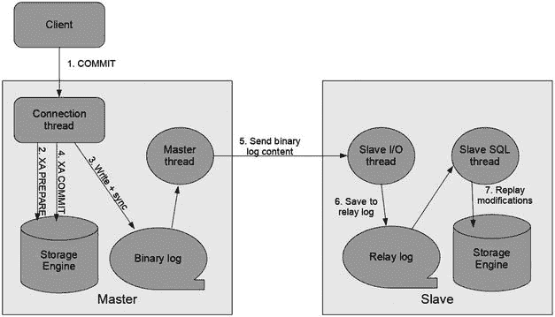

图 6-1. 标准 MySQL 复制（使用 InnoDB）架构概览

从服务器有两种类型的线程。一种用于接收 `二进制日志` 内容并将其写入 `中继日志`，另一种用于重放 `中继日志` 内容。前者称为 `从 I/O 线程`，后者称为 `从 SQL 线程`。

`从 I/O 线程` 持续接收 `二进制日志` 内容，然后将其存储到一个称为 `中继日志` 的中间日志中。一旦写入 `中继日志` 完成，`从 SQL 线程` 就会执行内容并将修改应用到其底层数据库。在图 6-1 中，数据库被描绘为存储引擎，因为真正持有数据的实体是存储引擎。

图 6-1 中所有相关的线程默认情况下不同步。由于主服务器不会等待从服务器应用修改，因此从服务器数据通常会略微滞后于主服务器数据。这种类型的复制称为 `异步复制`。然而，从服务器数据一直在紧密地追赶主服务器数据，因为图 6-1 中描述的每一步执行得都非常快。

注意

MySQL 复制有一种特殊模式，称为 `半同步复制`，它使主服务器上的连接线程等待，直到 `从 I/O 线程` 已将 `binlog` 内容写入其中 `中继日志` 并同步到磁盘。`半同步复制` 确保在主服务器崩溃时从服务器上不会丢失数据。在 `1:N 复制设置` 中实现 `故障转移拓扑` 时，此功能非常有用。在标准 MySQL 复制中，一个主服务器可以连接多个从服务器。在 `1:N 复制设置` 中，当现有主服务器崩溃时，一个从服务器会被提升为主服务器。由于 MySQL 复制是异步的，因此在主服务器崩溃时，有很小的几率会丢失最新的修改。`半同步复制` 解决了这个问题。但是，MySQL NDB 集群不支持 `半同步复制`，因此它超出了本书的范围。

MySQL NDB 集群在标准 MySQL 复制的基础上实现了 `异步复制`。一个 `SQL 节点` 收集集群上所做的所有修改，并将其记录到其本地的 `二进制日志` 中。这样的 `SQL 节点` 可以作为主服务器，将修改发送给从服务器。图 6-2 展示了 NDB 集群复制的概览。

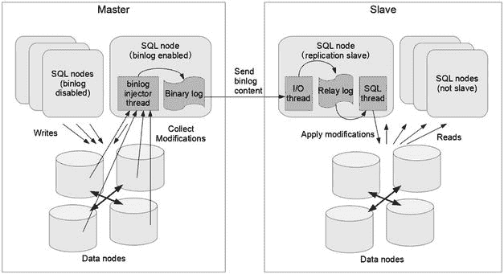

图 6-2. NDB 集群复制架构概览

NDB 集群复制的关键架构是，在 `数据节点` 上所做的修改会被发送到启用了 `二进制日志` 的 `SQL 节点`。没有这种机制，主 `SQL 节点` 将无法跟踪在其他 `SQL 节点` 上所做的修改。在标准 MySQL 服务器上，服务器内所做的所有修改都可以被服务器跟踪，然后序列化并写入 `二进制日志`。在 MySQL NDB 集群的 `SQL 节点` 上，这样的实现是不可能的，因为更改也会在其他 `SQL 节点` 以及其他类型的 `API 节点` 上进行。在 MySQL NDB 集群中，实际的数据修改是在 `数据节点` 中进行的。因此，`数据节点` 持续地将所有修改发送到启用了 `二进制日志` 的 `SQL 节点`。修改数据在每个 `micro-GCP` 时发送。

虽然 `micro-GCP` 是 `数据节点` 上 `重做日志` 的数据源，但与通常的 `GCP`（全局检查点）不同，`micro-GCP` 不会被写入磁盘。`Micro-GCP` 是一种在 `数据节点` 之间同步数据的机制。包含在一个 `micro-GCP` 中的一组事务称为一个 `纪元`，它们在某个时间段同时提交。因此，每个 `纪元` 的内容（称为 `事件`）都被确保在所有 `数据节点` 之间同步。`Micro-GCP` 的执行频率高于 `GCP`。默认情况下，`micro-GCP` 每 100 毫秒执行一次，`GCP` 每两秒执行一次。这使得 `数据节点` 能够比在每次 `GCP` 时发送 `事件` 更快地将 `事件` 发送到 `SQL 节点`。

在 `SQL 节点` 上，来自 `数据节点` 的 `事件` 由一个称为 `binlog 注入器线程` 的专用线程处理。它接收所有 `事件` 并将其序列化，然后写入 `二进制日志`。因此，`二进制日志` 是集群上所有修改的序列化历史记录，就像标准的 MySQL 复制一样。

注意

由于 `binlog 注入器` 从 `数据节点` 接收所有 `事件`，当集群拥有许多 `数据节点` 时，`SQL 节点` 会变得非常繁忙。这是我们建议使用专用的 `SQL 节点` 来处理 `二进制日志记录` 的原因之一。

#### 复制通道故障转移

由于数据节点可以向任意 SQL 节点发送事件和二进制日志内容的来源，因此多个 SQL 节点可以同时拥有二进制日志，我们强烈建议您这样做。由于 SQL 节点在离线时无法接收事件，我们需要备用的、启用了二进制日志记录的 SQL 节点以实现冗余。当活动的主 SQL 节点崩溃或关闭时，必须使用备用的 SQL 节点来恢复复制，因为 SQL 节点在离线期间其二进制日志内容会完全丢失。这是 NDB 集群复制中一个非常重要的概念。

如果您熟悉标准的 MySQL 复制，可能会产生疑问：“在备用的 SQL 节点上恢复复制时，应使用哪个二进制日志文件名和位置？”二进制日志是每个 SQL 节点本地的，因此文件名和二进制日志位置会根据服务器重启和服务器本地表的更新而变化。解决此问题的关键组件是两个系统表——`ndb_binlog_index` 和 `ndb_apply_status`。前者是每个 SQL 节点本地的，后者是一个被所有 SQL 节点访问的 NDB 表。这些表存在于 `mysql` 系统数据库中。图 6-3 描绘了这两个表如何与 NDB 集群复制协同工作。

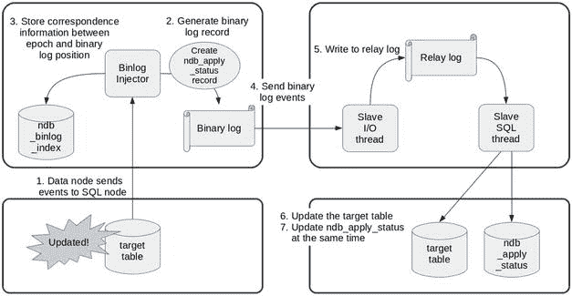
*图 6-3. `ndb_binlog_index` 和 `ndb_apply_status` 系统表的功能*

二进制日志注入器线程将纪元与二进制日志位置之间的对应关系记录到 `ndb_binlog_index` 表中。由于 MySQL NDB 集群上的修改单元是纪元，二进制日志事件的单元也是纪元。这意味着从库可以将一个纪元视为一个不可分割的修改块（即一个事务）来应用。因此，二进制日志注入器会在二进制日志中记录每个纪元的开始。

然后，二进制日志注入器线程在每个二进制日志事件中生成一条原始记录，该记录会更新 `ndb_apply_status` 表。该事件跟踪哪个纪元被包含在二进制日志事件中。由于对 `ndb_apply_status` 表的修改也包含在同一个事件中，从库的 SQL 线程会在同一个事务中，将对目标表的原始修改与对 `ndb_apply_status` 的更新一并执行。因此，您可以在 `ndb_apply_status` 表中找到应用到从库集群的最新纪元。

因此，当您切换到备用的复制通道时，需要从从库 SQL 节点的 `ndb_apply_status` 表中读取最新的纪元，然后根据检索到的纪元找到对应的二进制日志文件名和位置。我们将在本章后面详细讨论故障转移过程的细节。

#### NDB 集群复制表

表 6-1 总结了与 NDB 集群复制相关的系统表。请注意，表 6-1 中的所有表都位于 `mysql` 系统数据库中。

*表 6-1. NDB 集群复制表列表*

| 名称 | 使用位置 | 描述 |
| --- | --- | --- |
| `ndb_binlog_index` | 主库 | 二进制日志注入器将二进制日志位置与纪元之间的对应关系记录到此表中。 |
| `ndb_apply_status` | 从库 | 即使主集群上并未实际执行更新，二进制日志注入器也会生成一个虚拟事件来更新此表。在从库端，从库 SQL 线程作为复制的一部分更新此表。此表的内容指示了从库集群已追赶上主集群的最新纪元。 |
| `ndb_schema` | 双方 | 使用此表在 SQL 节点之间同步模式信息。 |
| `ndb_replication` | 视情况而定 | 用于冲突检测和解析的配置表。 |

`ndb_schema` 表本身并不直接参与 NDB 集群复制；但是，它使用与 NDB 集群复制相同的机制进行监控。

您可能会注意到，使用 `SHOW TABLES` 命令和信息架构（information schema）无法在 `mysql` 系统数据库中找到此表。该表是隐藏的，但它确实存在。您可以使用 `SELECT` 语句查询 `ndb_schema` 表的内容。此表存储了 `NDBCluster` 存储引擎的所有表、表空间和日志文件组的定义。当在某个 SQL 节点上发出 DDL 语句时，此表会得到更新。所有 SQL 节点上的二进制日志注入器都会监控此表。因此，其他 SQL 节点可以检测到此表上的任何更改。然后，一个 SQL 节点会根据 `ndb_schema` 表中的定义更新本地数据字典（即 .frm 文件）。即使禁用了二进制日志记录，二进制日志注入器线程仍会运行，并且只监控 `ndb_schema` 表，因为如果不监控此表，就无法检测到模式变更。`ndb_schema` 表也在第 9 章中有所描述。

`ndb_replication` 表用于配置冲突检测和解析。此表最初并不存在。因此，必须创建该表才能配置冲突检测和解析。有关该表的详细信息将在本章后面介绍。

#### NDB 集群复制的用例和优势

在我看来，NDB 集群复制品的实现方式——使用与标准 MySQL 复制相同的机制——是一个很棒的设计。如前一节所述，数据同步不是通过特殊的通信通道完成的，而是使用二进制日志和 MySQL 协议进行同步。它具有明确的优势，例如：

*   可以在两个 MySQL NDB 集群之间配置 NDB 集群复制，也可以在 MySQL NDB 集群与标准的 MySQL 服务器（`InnoDB`）之间配置。
*   对于现有的 MySQL 用户，可以以熟悉的方式管理 NDB 集群复制。这降低了新 NDB 集群复制用户的学习成本。
*   可以像标准 MySQL 复制一样，配置各种拓扑结构的 NDB 集群复制。

NDB 集群复制非常灵活。其使用方式有成千上万种。以下是一些广为人知的用例：

*   **灾难恢复**：如图 6-4 所示，即使发生灾难导致整个数据中心无法使用，也能在备用站点提供数据服务。数据通过安全连接（TLS）或通过专用网络在互联网上传输。

    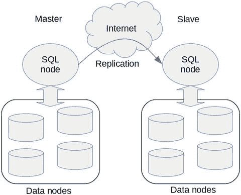
    *图 6-4. 使用 NDB 集群复制进行灾难恢复配置*

*   **用于维护的备用集群**：用于各种维护任务，例如为了避免主集群负载而进行备份、为进行大规模维护任务（如为添加数据节点而重新分配分区）而计划的切换，以及复制模式变更。
*   **读取扩展**：与标准 MySQL 复制类似，用于扩展目的的 1:N 拓扑结构同样适用于 MySQL NDB 集群。虽然 MySQL NDB 集群具有良好的可扩展性，但它并不擅长某些类型的查询。如图 6-5 所示，从 MySQL NDB 集群复制到 `InnoDB` 可以解决此类读取扩展性问题。

    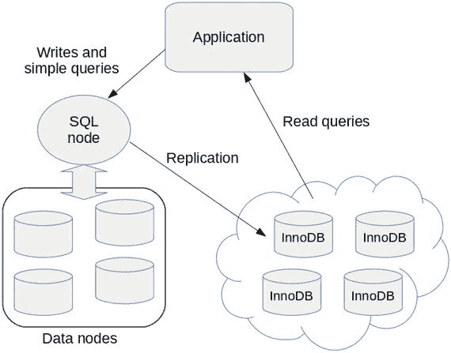
    *图 6-5. 通过从 MySQL NDB 集群复制到 InnoDB 实现读取扩展*

为了让您的 NDB 集群复制设置富有成效，请明确其用途。换句话说，厘清应用需求，并认识到为什么需要 NDB 集群复制。如果没有明确的目的，您的系统将无法得到充分利用。


### 设置 NDB 集群复制

本节将讨论如何设置 NDB 集群复制。由于 NDB 集群复制的架构与标准 MySQL 复制非常接近，其设置过程也与之相似。尽管相似，它们仍存在一些差异。

在设置 NDB 集群复制时，请考虑以下场景：

*   为全新的集群实例设置复制。由于实例是新安装的，集群预先没有任何数据。
*   为现有的集群实例安装一个新的集群实例作为复制从站。
*   在复制失败时设置备用复制通道。

让我们详细了解这些场景的具体操作步骤。

#### 使用空数据库设置 NDB 集群复制

在使用空数据库设置 NDB 集群复制的场景中，设置复制的流程与标准 MySQL 服务器相同，除了 MySQL NDB 集群特有的选项。要完成 NDB 集群复制设置，请按照以下说明操作。

##### 设置主集群和从集群

您至少需要两个集群来设置复制——一个主集群和一个或多个从集群。根据应用需求，使用必要的配置来设置集群。设置步骤和配置请参见章节 3、4 和 5。

##### 为复制配置主 SQL 节点

配置 `server_id` 选项，并使用 `ROW` 格式启用二进制日志。清单 6-1 显示了主 SQL 节点的配置示例。

```
[mysqld]
server_id = 1
log_bin = mysql-bin
binlog_format = ROW
清单 6-1.
主 SQL 节点的示例配置
```

由于 NDB 集群复制仅支持 `ROW` 二进制日志格式，`binlog_format` 选项应设置为除 `STATEMENT` 以外的值。截至 MySQL Server 5.7 和 MySQL NDB 集群 7.5，`binlog_format` 的默认值为 `ROW`。因此，在 MySQL NDB 集群 7.5 或更新版本上，显式设置 `binlog_format` 是可选的。

确保每个 SQL 节点都有一个唯一的、特定的、独立的 `server_id`，并且在所有集群的所有 SQL 节点（包括从站）中，没有任何 SQL 节点组合具有相同的 `server_id`。这是标准 MySQL 复制的常见要求。

注意

不要启用 GTID，MySQL NDB 集群尚不支持此功能。

如果 SQL 节点已经在运行，您需要重启 `mysqld` 以启用二进制日志及其他相关更改。如果 SQL 节点尚未启动，请在此阶段启动它。以下命令是在使用旧式 `init` 脚本的 Linux 主机上启动服务器的示例命令。请根据您的系统流程启动服务器。

```
shell$ su
shell# service mysqld start
```

##### 在主服务器上创建用于复制的用户

与标准 MySQL 复制一样，从站作为客户端连接到其主站。因此，主站上需要有一个供从站使用的用户账户。清单 6-2 显示了使用适当权限创建用户账户的示例命令。从站用户账户所需的权限是 `REPLICATION SLAVE`。

```
mysql> CREATE USER repl@slavehost IDENTIFIED BY 'slavepass';
mysql> GRANT REPLICATION SLAVE ON *.* TO repl@slavehost;
清单 6-2.
在主 SQL 节点上创建复制用户
```

目前，MySQL 复制不支持除原生密码和 `sha256_password` 以外的身份验证插件。请勿使用不支持的插件创建从站用户。

##### 为复制配置从 SQL 节点

从站唯一必需的配置选项是 `server_id`。其他选项可以保持不变。由于 `server_id` 没有默认值，必须显式指定。清单 6-3 是从 SQL 节点的配置示例。假设此清单中省略了 `NDBCluster` 存储引擎的其他必要选项。

```
[mysqld]
server_id = 101
skip_slave_start
清单 6-3.
从 SQL 节点的示例配置
```

您可以在清单 6-3 中找到另一个选项 `skip_slave_start`。如果复制设置有多个复制通道（本章稍后讨论），则此选项是必需的。

由于 `server_id` 是一个动态变量，如果您已经启动了从 SQL 节点，可以使用 `SET GLOBAL` 命令更改其值。如果您尚未启动从站，请启动它以继续复制设置。

注意

一旦配置好复制后，请勿更改 `server_id`，因为 MySQL 复制假定 `server_id` 在整个复制生命周期内是不可变的。

##### 配置复制

现在将 SQL 节点配置为复制从站。由于我们假设集群上没有写入数据，因此无需指定二进制日志文件名和位置。清单 6-4 显示了使用 `CHANGE MASTER TO` 命令设置新从站的示例。

```
mysql> CHANGE MASTER TO
-> MASTER_HOST='masterhost',
-> MASTER_USER='repl',
-> MASTER_PASSWORD='PASSWORD',
-> MASTER_PORT=3306;
清单 6-4.
用于设置新从站的 CHANGE MASTER TO 命令
```

提示

由于复制连接本质上是普通的客户端连接，`MASTER_HOST`、`MASTER_USER`、`MASTER_PASSWORD` 和 `MASTER_PORT` 选项分别等同于 `mysql` 命令行客户端的 `--host`、`--user`、`--password` 和 `--port` 选项。


##### 为复制保护连接（可选）

如果您愿意，可以通过安全连接来保护主从服务器之间的网络通信。要为复制启用 TLS 连接，您需要正确配置主服务器和从服务器。有关如何设置安全连接的通用详情，请参见第 12 章。特别需要在主服务器上设置证书以启用安全连接。

在从服务器上，您需要在 `CHANGE MASTER TO` 命令中指定 `MASTER_SSL=1`，如清单 6-5 所示。

```
mysql> STOP SLAVE;
mysql> CHANGE MASTER TO MASTER_SSL=1;
mysql> START SLAVE;
清单 6-5.
为复制启用 TLS 连接
```

只需这几步过程即可启用安全连接。主从服务器之间的连接确保被加密。然而，安全性仍有提升空间。在此阶段，无论连接是否加密，从服务器都可以连接。要强制所有从服务器使用加密连接，需使 TLS 连接成为复制用户的必备条件。这可以通过在主服务器上执行以下命令实现。

```
mysql> ALTER USER repl@slavehost REQUIRE SSL;
```

这要求用户 `repl@slavehost` 只能使用加密连接登录。这使得复制比未加密连接安全得多。然而，此设置中仍然存在一些风险。问题在于，只要给定的凭据有效，服务器就允许从任何主机连接到任何账户。认证正常工作听起来无懈可击；然而，凭据认证无法避免以下两个问题：

*   如果复制用户的凭据被盗或通过暴力攻击识别，攻击者可能使用伪装成真实从服务器的虚假从服务器接收二进制日志事件。这使得攻击者能够从复制设置中窃取重要数据。
*   从服务器可能连接到伪装成真实主服务器的虚假主服务器，因为主服务器只接受或拒绝来自从服务器的认证，而主服务器本身不需要认证。这使得攻击者能够向从服务器发送虚假的恶意数据，导致目标应用程序运行异常。

为防止此类问题，TLS 有一种使用证书识别连接对等方的机制。如果连接对等方没有有效的证书，则无法建立连接。否则，连接失败。有效的证书必须由已知的证书颁发机构（CA）签名，无论是公共 CA 还是私有 CA。通常，公共 CA 用于通过互联网的公共连接，例如网站。因此，私有 CA 适用于必须对公众隐藏的私有数据库连接。

注意

`mysql_ssl_rsa_setup` 命令会创建一个私有 CA 作为设置的一部分。因此，由 `mysql_ssl_rsa_setup` 生成的证书是自签名证书。

要强制从服务器在连接时指定证书，请使用以下命令在主服务器上更改用户定义：

```
mysql> ALTER USER repl@slavehost REQUIRE X509;
```

为了验证从服务器是授权客户端，从服务器必须拥有有效的客户端证书。将 `ca.pem`、`client-cert.pem` 和 `client-key.pem` 复制到从服务器主机。然后，在 `CHANGE MASTER TO` 命令中指定这些文件。假设文件被复制到 `/var/lib/mysql-cert` 目录，则使用 `CHANGE MASTER TO` 命令设置安全连接。参见清单 6-6。

```
mysql> CHANGE MASTER TO
->        MASTER_SSL_CA = 'ca.pem',
->        MASTER_SSL_CERT = 'client-cert.pem',
->        MASTER_SSL_KEY = 'client-key.pem',
->        MASTER_SSL_CAPATH = '/var/lib/mysql-cert';
清单 6-6.
在从服务器上设置安全连接
```

另一方面，从服务器验证主服务器是否确实是授权服务器也很有意义。为此，从服务器必须在 `CHANGE MASTER TO` 命令中指定 `MASTER_SSL_VERIFY_SERVER_CERT=1` 选项。设置此选项后，从服务器会检查主服务器证书中包含的通用名称是否与主服务器的主机名相同。客户端仅在两者相同时才接受主服务器。否则，客户端将终止连接。

注意

不幸的是，由 `mysql_ssl_rsa_setup` 生成的证书中包含的通用名称不是主机名，并且无法使用命令行选项手动更改。因此，如果您想使用此功能，需要手动生成证书。生成证书的过程有点复杂，超出了本书的讨论范围。

如您所见，设置集群复制的过程非常接近标准的 MySQL 复制。但请注意，本节中的过程仅适用于集群中未存储任何数据的情况。当您已经在运行集群，并且集群存储了要复制的数据时，则需要额外的步骤，如下一节所示。

##### 启动复制

最后，使用 `START SLAVE` 命令启动复制，并使用 `SHOW SLAVE STATUS` 命令检查复制是否真正启动。

```
mysql> START SLAVE;
mysql> SHOW SLAVE STATUS\G
```

检查 `Slave_IO_Running` 和 `Slave_SQL_Running` 是否均为 “Yes”。`SHOW SLAVE STATUS` 命令字段的详细信息将在本章后面描述。请注意，`SHOW SLAVE STATUS` 命令后跟了一个特殊的分隔符 `\G`。这使得输出样式变为垂直样式，而非通常的表格样式。由于 `SHOW SLAVE STATUS` 输出包含许多字段，垂直样式比标准表格样式更易于查看。

#### 使用现有数据库设置 NDB 集群复制（离线）

即使存在现有数据，如果能够确保维护窗口，设置 NDB 集群复制的过程也接近标准的 MySQL 复制。在维护窗口期间，即使集群处于启动和运行状态，应用程序也绝不能访问集群。因此，您需要确保在设置期间您的应用程序处于离线状态。您也可以通过将集群设置为单用户模式，并仅允许从无法被您的应用程序访问的 SQL 节点访问来实现此目标。有关单用户模式的更多信息，请参见第 8 章。

要在维护窗口期间将从集群添加到现有集群，请按照以下部分的说明操作。

##### 安装用作从服务器的新集群

首先要做的是设置一个集群用作从服务器。请注意，从集群必须具备存储与主集群相同数据的容量。虽然拥有与主集群配置完全相同的从集群通常是理想的，但从集群的配置不一定必须与主集群相同。唯一的先决条件是必须有足够的容量。如果从服务器无法存储与主服务器相同的数据，则无法配置复制。

如果使用了复制过滤器，从服务器的数据量可能少于主服务器。仅在这种情况下，才可能在从服务器上采用容量较小的系统布局。

##### 将主服务器数据复制到从服务器

从主服务器进行备份，并将其恢复到从服务器。确保此时主服务器和从服务器具有相同的数据。有关备份和恢复过程的详细信息，请参阅第 8 章。

如果使用了复制过滤器，您可以从备份和/或恢复中省略被过滤的表。

##### 设置与空集群相同的复制

继续前一节的第 2 步设置过程。如果主库上已经启用了二进制日志，您可以在启动复制前选择执行 `RESET MASTER` 命令。此命令会清除所有现有的二进制日志。由于没有需要应用的二进制日志，如果您在主库上执行了 `RESET MASTER` 命令，则无需在 `CHANGE MASTER TO` 命令中指定二进制日志文件名和位置。

另一方面，如果您希望保留主库上的二进制日志，请使用 `SHOW MASTER STATUS` 命令记录当前的二进制日志文件名和位置。由于此时主库和从库的数据是相同的，旧的二进制日志绝不能应用到从库上。因此，您必须在 `CHANGE MASTER TO` 命令中指定二进制日志文件名和位置。下一节将提供一个带有二进制日志文件名和位置的 `CHANGE MASTER TO` 命令示例。

然后，使用 `START SLAVE` 命令启动复制，并使用 `SHOW SLAVE STATUS` 命令监控状态。

#### 使用现有数据库设置 NDB 集群复制（在线）

在实践中，生产系统往往 24x7 运行，因此很难获得维护窗口。请不要担心。MySQL NDB 集群具备在集群正常运行且应用程序正在访问或修改集群数据时，将新的从集群添加到现有集群的能力。

要在运行中的系统上设置 NDB 集群复制，需要一些在离线过程中未见的技巧，如下所示。

##### 安装用作从库的新集群

像前一节的离线过程一样，安装一个用作从库的新集群。从集群的先决条件与离线过程相同。

##### 为复制配置主库 SQL 节点

在主库上启用二进制日志并设置 `server_id`。更多详情请参见列表 6-1。

##### 从主库进行原生备份

MySQL NDB 集群唯一可用的在线备份方法是原生备份。从管理客户端执行 `START BACKUP` 命令，对主集群进行完整备份。

##### 将备份恢复到从集群

为了使用现有数据设置新的从集群，必须确定备份的二进制日志文件名和位置。这里使用的关键概念是纪元，如本章前面所述。从主库进行的完整备份是某个时刻的数据快照。任何原生备份都有一个表示备份时刻的纪元。可以使用带有 `--restore-epoch`（或简写为 `-e`）选项的 `ndb_mgm` 命令来恢复纪元信息。列表 6-7 显示了一个在恢复数据的同时恢复纪元的命令示例。

```
shell$ ndb_restore --ndb-connectstring=mgmhost --restore_meta --restore_data --restore_epoch --nodeid=1 --backupid=1 --backup_path=/backups/cluster/BACKUP/BACKUP-1 --disable-indexes
```
列表 6-7. 将元数据、数据和纪元恢复到从集群

此选项的结果是，纪元被存储在恢复集群的 `mysql.ndb_apply_status` 表中。

注意
在上一节的离线过程中，不需要纪元和二进制日志位置信息，因为在设置期间没有数据被修改，且不使用现有的二进制日志。相反，在在线过程中，数据会被修改，并且二进制日志每秒都在持续生成。因此，如果不从备份中检索纪元，则无法从进行完整备份时的二进制日志位置开始复制。

在标准的 MySQL 复制中，可以在备份中包含所需的位置信息。例如，`mysqldump` 命令有一个 `--master-data` 选项用于此目的。但是，此选项不能用于 MySQL NDB 集群，因为它是一个分布式数据库，并且 SQL 节点无法进行在线备份。

##### 确定二进制日志文件名和位置

您必须做的第一件事是使用以下查询从从集群中检索纪元。

```
mysql> SELECT MAX(epoch) AS latest FROM mysql.ndb_apply_status;
```
此查询可以从从集群上的任何 SQL 节点执行，因为 `mysql.ndb_apply_status` 表是使用 `ndbcluster` 存储引擎定义的，可以从任何 SQL 节点访问。

然后，登录到将成为新复制主库的主集群上的一个 SQL 节点。接着，使用上一个查询确定的纪元值，执行列表 6-8 中的查询。

```
mysql> SET @epoch := 2101677821788177;
mysql> SELECT
-> SUBSTRING_INDEX(File, '/', -1) AS binlog_file,
-> Position AS binlog_position
-> FROM mysql.ndb_binlog_index
-> WHERE epoch > @epoch
-> ORDER BY epoch ASC LIMIT 1;
```
列表 6-8. 从 `mysql.ndb_binlog_index` 表确定二进制日志文件名和位置

##### 配置复制

回到从集群，并登录到将成为新从库的 SQL 节点。然后，像列表 6-9 中那样，使用 `CHANGE MASTER TO` 命令配置复制。指定从上一步检索到的二进制日志文件名和位置。

```
mysql> CHANGE MASTER TO
-> MASTER_HOST='masterhost',
-> MASTER_USER='repl',
-> MASTER_PASSWORD='PASSWORD',
-> MASTER_PORT=3306,
-> MASTER_LOG_FILE='mysql-bin.000123',
-> MASTER_LOG_POS=1234567;
```
列表 6-9. 使用二进制日志文件名和位置配置复制

根据您的系统配置和状态适当地替换每个参数。这个 `CHANGE MASTER TO` 命令看起来与未启用 GTID 的标准 MySQL 复制相同。`CHANGE MASTER TO` 命令本身没有区别。设置 NDB 集群复制与标准 MySQL 复制之间的唯一区别在于如何确定二进制日志位置，这是此阶段的预备步骤。

可选地，您可以如本章前面讨论的那样，使用 TLS 来保障主从之间的网络连接。

最后，您可以像往常一样使用 `START SLAVE` 命令启动复制。使用 `SHOW SLAVE STATUS` 命令验证复制设置是否成功。

### NDB 集群复制通道的故障切换

在使用 NDB 集群复制时，建议设置多个复制通道。

如本章前面所讨论的，SQL 节点只有在运行时才能接收来自数据节点的修改。当离线时，主库 SQL 节点上会错过一定数量的二进制日志事件。除了整个集群关闭的情况，主库 SQL 节点的不可用将由于数据丢失而导致复制中断。为避免此问题，必须使主库 SQL 节点具有冗余性。为此，必须在主集群上多于一个的 SQL 节点上启用二进制日志。这样，当主库因某些原因停止工作时，可以将复制通道切换到另一个主库 SQL 节点，并以最小的停机时间继续复制。此场景如本章前面的图 6-3 所示。

#### 何时进行故障转移

当主 SQL 节点重启时，二进制日志注入器线程会向二进制日志写入一个名为 `LOST_EVENTS` 的特殊事件。该事件表明二进制日志事件可能已丢失。无论数据是否真的丢失，重启时都会写入此事件，因为 SQL 节点无法知道在主 SQL 节点离线期间集群数据是否已被修改以及事件是否已丢失。

除了服务器崩溃，还有几种场景会导致 `LOST_EVENTS` 事件。如果主 SQL 节点与数据节点之间的连接丢失，二进制日志注入器在连接恢复前无法接收事件。如果二进制日志注入器线程的进度太慢，跟不上集群上的修改，那么事件将无法在数据节点内排队，数据节点会认为 SQL 节点落后并断开其连接。在这些情况下，`LOST_EVENTS` 事件会被写入二进制日志。

在从集群上，从 SQL 线程在从中继日志读取到 `LOST_EVENTS` 事件时会强制停止。如果没有人工干预，从 SQL 线程不会因 `LOST_EVENTS` 事件而自动恢复。可以使用系统变量 `sql_slave_skip_counter` 来跳过错误；然而，通常我们不应这样做，因为它会让丢失的数据保持原状，并导致主从数据不同步。当然，这是开始进行故障转移的最显著征兆。

每当复制停止且无法恢复时，都必须执行故障转移。当然，由于 `LOST_EVENTS` 导致的复制失败是开始故障转移的绿色信号。这意味着当主 SQL 节点重启时，故障转移是强制性的。如果从 SQL 节点崩溃了怎么办？我建议执行故障转移，因为 NDB 集群复制的从库并非崩溃安全的。

在其他情况下，只要复制从库线程不工作，就必须进行故障转移。

使用 `SHOW SLAVE STATUS` 监控复制状态，查看两个复制线程（`Slave_IO_Running` 和 `Slave_SQL_Running` 字段）是否工作正常。如果不是，开始对复制通道进行故障转移。

注意：MySQL 服务器具备避免从库崩溃时主从不一致的能力。此功能称为崩溃安全从库。崩溃安全从库的实现依赖于 `InnoDB` 事务。使用崩溃安全从库时，用户表和名为 `mysql.slave_relay_log_info` 的系统表（定义为 `InnoDB` 存储引擎）在同一事务中更新。这确保了即使在崩溃时，二进制日志位置和 `InnoDB` 表中的用户数据也能同步。然而，它不能确保二进制日志位置和 `NDBCluster` 表的同步。

#### 启用二进制日志的 SQL 节点数量

尽管可以在多个 SQL 节点上启用二进制日志，但到底需要多少个 SQL 节点启用二进制日志呢？启用二进制日志的 SQL 节点越多，复制的冗余就越多。因此，你可能希望在多个 SQL 节点上启用二进制日志。然而，事情并非如此简单，因为为每个 SQL 节点生成二进制日志会在数据节点、SQL 节点和互联网络上产生一些开销。

启用二进制日志的 SQL 节点过多可能会严重损害系统性能和/或系统稳定性，这是最坏的情况。因此，启用足够数量的 SQL 节点的二进制日志是一个好的做法。在我看来，大多数情况下两到三个就足够了。不要启用超过必要数量的 SQL 节点的二进制日志。

#### 故障转移流程

要对复制通道进行故障转移，请遵循以下步骤：

1.  确保当前的从 SQL 节点已完全停止。
2.  使用 `mysql.ndb_apply_status` 表确定从集群上的当前纪元。
3.  在新的主 SQL 节点上使用 `mysql.ndb_binlog_index` 表确定二进制日志文件名和位置。
4.  在当前或新的从 SQL 节点上使用 `CHANGE MASTER TO` 命令配置复制。
5.  使用 `START SLAVE` 命令启动复制。

实际上，该流程本身与前一节（使用现有数据库的在线 NDB 集群复制设置流程）中的步骤 5 和 6 相同，除了上述的第一步。因此，请参阅前一节了解更多关于此流程的详细信息。

为确保当前的从库已完全停止，如果从 SQL 节点正在运行，请执行 `STOP SLAVE` 命令。如果从 SQL 节点已离线，除非设置了 `skip_slave_start` 选项，否则不要启动从 SQL 节点。除非已确定从库上的当前纪元，否则不要执行 `RESET SLAVE` 命令，因为它会清空 `mysql.ndb_apply_status` 表。自 MySQL NDB Cluster 7.3 系列起，添加了 `ndb_clear_apply_status` 选项。当此选项的值为 `OFF` 时，`RESET SLAVE` 将不会清空 `mysql.ndb_apply_status` 表。

#### NDB 集群复制通道故障转移的附加配置

我建议在从集群上针对复制通道故障转移设置两个配置选项。

第一点是在从集群上拥有多个候选从 SQL 节点。尽管通道故障转移的主要目的是避免在主 SQL 节点离线时丢失二进制日志事件，但如果从 SQL 节点也同时离线，则无法继续复制。由于 MySQL 服务器实例可能因某种原因离线，你需要为从 SQL 节点意外离线的情况做好准备。预先在所有候选从 SQL 节点上显式设置 `server_id`。注意不要出现重复的 `server_id`。

第二点是确保复制最多在一个从 SQL 节点上运行。不可能在多个从 SQL 节点上启动复制。这可能会导致复制期间出现问题，例如数据不一致或复制停止。默认情况下，包括 MySQL NDB 集群 SQL 节点在内的 MySQL 服务器，如果在进程重启前已使用 `CHANGE MASTER TO` 命令配置了复制，则会在重启后启动复制。一旦使用 `RESET SLAVE ALL` 命令取消配置复制，则在从 SQL 节点重启时复制将不会启动。或者，`skip_slave_start` 选项也会阻止在重启时启动复制。确保在所有从 SQL 节点上，重启时不会启动复制。我建议将 `skip_slave_start` 选项添加到所有 SQL 节点，因为在崩溃时无法取消配置复制。在由崩溃引起的重启中，阻止复制的唯一方法是使用 `skip_slave_start` 选项。

### NDB 集群复制的日常维护

要使 NDB 集群复制稳定，日常的细心维护很重要。没有适当的维护，任何软件都无法成功运行。在本节中，我们将讨论如何在日常业务中维护 NDB 集群复制。


#### 监控 NDB 集群复制

维护工作中最关键的部分是监控。需定期检查其状态是否健康，并在发现问题时报告。监控复制状态的命令与标准 MySQL 复制相同，即 `SHOW SLAVE STATUS`。列表 6-10 展示了 MySQL NDB Cluster 7.5 上 `SHOW SLAVE STATUS` 命令的示例输出。

```
mysql> SHOW SLAVE STATUS\G
*************************** 1. row ***************************
             Slave_IO_State: Waiting for master to send event
                Master_Host: masterhost1
                Master_User: repl
                Master_Port: 3306
              Connect_Retry: 60
            Master_Log_File: mysql-bin.000010
        Read_Master_Log_Pos: 154
               Relay_Log_File: relay-bin.000004
                Relay_Log_Pos: 355
        Relay_Master_Log_File: mysql-bin.000007
             Slave_IO_Running: Yes
            Slave_SQL_Running: No
              Replicate_Do_DB:
          Replicate_Ignore_DB:
           Replicate_Do_Table:
       Replicate_Ignore_Table:
      Replicate_Wild_Do_Table:
  Replicate_Wild_Ignore_Table:
                   Last_Errno: 1590
                   Last_Error: The incident LOST_EVENTS occured on the master. Message: mysqld startup
                 Skip_Counter: 0
          Exec_Master_Log_Pos: 154
              Relay_Log_Space: 3296
              Until_Condition: None
               Until_Log_File:
                Until_Log_Pos: 0
           Master_SSL_Allowed: Yes
               Master_SSL_CA_File:
               Master_SSL_CA_Path:
                  Master_SSL_Cert:
              Master_SSL_Cipher:
                   Master_SSL_Key:
        Seconds_Behind_Master: NULL
Master_SSL_Verify_Server_Cert: No
                Last_IO_Errno: 0
                Last_IO_Error:
               Last_SQL_Errno: 1590
               Last_SQL_Error: The incident LOST_EVENTS occured on the master. Message: mysqld startup
  Replicate_Ignore_Server_Ids:
             Master_Server_Id: 1
                  Master_UUID: a20a9ded-25cd-11e7-bcb2-3c970ec815c3
             Master_Info_File: /var/lib/mysql-cluster/master.info
                    SQL_Delay: 0
          SQL_Remaining_Delay: NULL
        Slave_SQL_Running_State:
                 Master_Retry_Count: 86400
                Master_Bind:
        Last_IO_Error_Timestamp:
       Last_SQL_Error_Timestamp: 170420 23:43:38
               Master_SSL_Crl:
           Master_SSL_Crlpath:
          Retrieved_Gtid_Set:
           Executed_Gtid_Set:
               Auto_Position: 0
        Replicate_Rewrite_DB:
                Channel_Name:
          Master_TLS_Version:
1 row in set (0.00 sec)
列表 6-10.
SHOW SLAVE STATUS 命令的示例输出
```

`SHOW SLAVE STATUS` 命令中的字段数量会随版本升级而增加。许多字段具有参考价值；然而，其可见性并不佳。无需监控所有字段，而应监控最显著的字段，接下来将对此进行讨论。

##### Slave_IO_Running
此字段指示从属 IO 线程是否正在运行。该字段的值为 `Yes` 或 `No`。从属 IO 线程的状态大致反映了主从服务器之间的网络连接状态。如果网络存在问题，此字段的值应为 `No`。在列表 6-10 中，该字段的值为 `Yes`，因此网络连接必定良好。

##### Slave_IO_State
`Slave_IO_Running` 的值为 `Yes` 或 `No`，而此字段的值是各种字符串，指示从属 IO 线程的状态。该状态表明了从属 IO 线程正在做什么，例如 `Waiting for master to send event`、`Connecting to master` 或 `Queueing master event to the relay log`。

##### Slave_SQL_Running
此字段指示从属 SQL 线程是否正在运行。该字段的值为 `Yes` 或 `No`。如果在应用中继日志中的事件时发生错误，从属 SQL 线程将停止运行。

##### Seconds_Behind_Master
此字段显示一个时间段，表明复制延迟了多久。二进制日志中的每个事件都有一个事件生成的时间戳，该时间戳大致表示 binlog 注入器线程从数据节点接收事件的时间。`Seconds_Behind_Master` 的计算方法是当前时间与从属服务器上当前正在执行的事件的时间戳之差。如果中继日志中的所有事件都已执行完毕，且没有剩余的待执行事件，此字段的值为 0。请注意，此字段的值是近似值，无法确定精确的延迟时间，因为主从服务器是独立的主机。即使主从服务器之间的网络出现延迟，也无法通过此字段检测到。

##### Master_Log_File
从属 IO 线程当前正在读取的主服务器二进制日志的文件名。

##### Read_Master_Log_Pos
从属 IO 线程当前正在读取的主服务器二进制日志事件的起始位置，或从属 IO 线程已读取的最后一个主服务器二进制日志事件的结束位置。

##### Relay_Master_Log_File
从属 SQL 线程当前正在执行的主服务器二进制日志的文件名。

##### Exec_Master_Log_Pos
从属 SQL 线程当前正在执行的主服务器二进制日志事件的起始位置，或从属 SQL 线程已执行的最后一个主服务器二进制日志事件的结束位置。

`Relay_Master_Log_File` 和 `Exec_Master_Log_Pos` 这一对组合比 `Master_Log_File` 和 `Read_Master_Log_Pos` 更重要，因为前者指示了从属数据当前追赶到的位置。当从属服务器遇到故障时，可以使用当前数据以及 `Relay_Master_Log_File` 和 `Exec_Master_Log_Pos` 的当前值来恢复复制。


##### Last_Errno 与 Last_Error

这些字段指示最近发生的错误信息。如果从库线程启动以来未发生错误，则这些字段为空。表 6-2 列出了`SHOW SLAVE STATUS`输出中以`Last`为前缀的字段。

**表 6-2. 指示错误信息的 SHOW SLAVE STATUS 字段列表**

| 字段名 | 描述 |
| --- | --- |
| `Last_Errno` | 指示最近一次发生在从库 IO 线程或从库 SQL 线程上的错误代码。 |
| `Last_Error` | 最近一次发生在从库 IO 线程或从库 SQL 线程上的错误的字符串表示。此字段比`Last_Errno`更具信息性，因为错误字符串中添加了额外信息。 |
| `Last_IO_Errno` | 指示最近一次发生在从库 IO 线程上的错误代码。 |
| `Last_IO_Error` | 最近一次发生在从库 IO 线程上的错误的字符串表示。 |
| `Last_IO_Error_Timestamp` | 指示从库 IO 线程上最近一次错误发生时的时间戳。 |
| `Last_SQL_Errno` | 指示最近一次发生在从库 SQL 线程上的错误代码。 |
| `Last_SQL_Error` | 最近一次发生在从库 SQL 线程上的错误的字符串表示。 |
| `Last_SQL_Error_Timestamp` | 指示从库 SQL 线程上最近一次错误发生时的时间戳。 |

`Last_IO_Error_Timestamp`和`Last_SQL_Error_Timestamp`是在 MySQL Server 5.6.3 中添加的。因此，这些字段在 MySQL NDB Cluster 7.3 系列或更高版本中可用。

`Last_errno`/`Last_Error`的值与`Last_IO_Errno`/`Last_IO_Error`或`Last_SQL_Errno`/`Last_SQL_Error`相同。所以，这些字段本质上是冗余的，但对于识别从库上发生的最新错误很方便。

自 MySQL NDB Cluster 7.5 起，在性能模式（performance schema）中添加了复制相关的表。除了`SHOW SLAVE STATUS`命令外，这些性能模式表也可用于监控复制状态。相当于`SHOW SLAVE STATUS`命令的信息被拆分到多个表中。`SHOW SLAVE STATUS`混合显示了从库 IO 线程和从库 SQL 线程的配置与状态，而性能模式表则按线程类型以及是配置还是状态进行分离。表 6-3 显示了复制相关的性能模式表列表。

**表 6-3. MySQL NDB Cluster 7.5 上复制相关的性能模式表列表**

| 表名 | 描述 |
| --- | --- |
| `replication_applier_configuration` | 从库 SQL 线程的配置。 |
| `replication_applier_status` | 从库 SQL 线程的状态。 |
| `replication_applier_status_by_coordinator` | 多线程从库中协调器线程的状态。 |
| `replication_applier_status_by_worker` | 多线程从库中工作线程的状态。 |
| `replication_connection_configuration` | 从库 IO 线程的配置。 |
| `replication_connection_status` | 从库 IO 线程的状态。 |
| `replication_group_member_stats` | 此表显示复制组成员的网络和状态信息。 |
| `replication_group_members` | MySQL 组复制（Group Replication）成员的统计信息。 |

由于 MySQL NDB Cluster 不支持多线程从库和组复制，表 6-3 中的八个表中有四个与 NDB 集群复制无关。在监控方面，配置并不重要。因此，你需要监控两个表——`replication_applier_status`和`replication_connection_status`。请注意，性能模式中缺少相当于`Seconds_Behind_Master`的信息，因为它被认为存在缺陷。由于没有添加替代信息，如果你想监控复制延迟，请使用`SHOW SLAVE STATUS`命令。

> **注意**
> 复制相关性能模式表的设计决策可在工作日志 7374 中找到：[`dev.mysql.com/worklot/task/?id=7374`](https://dev.mysql.com/worklot/task/?id=7374)。

#### 重启主集群

重启集群时必须小心，因为重启主 SQL 节点会导致离线期间丢失一些事件，并引发`LOST_EVENTS`事件。另一方面，重启从库集群时不需要特别小心，因为从库 SQL 节点重启后可以安全地恢复复制。

有两种重启过程：系统重启和滚动重启。本节介绍这两种重启类型重启时的注意事项。

> **注意**
> MySQL NDB Cluster 还有另一种称为初始系统重启（initial system restart）的重启类型。在 NDB 集群复制设置后不应执行此操作，因为它会清除所有数据并破坏复制。有关重启过程的更多详细信息，请参阅第 10 章。

##### 在主集群上进行系统重启

进行系统重启时，`LOST_EVENTS`事件是不可避免的。即使 SQL 节点保持在线，在集群离线期间，SQL 节点与数据节点之间的连接也会丢失。但是，由于系统重启导致的`LOST_EVENTS`事件可以忽略，因为在集群离线期间无法修改数据。当你在主集群上执行系统重启时，请遵循以下说明：

1.  在从库 SQL 节点上使用`STOP SLAVE`命令停止复制。
2.  停止应用程序并确保没有数据访问。
3.  停止主 SQL 节点。
4.  关闭集群（使用`ndb_mgm`客户端的`SHUTDOWN`命令）。
5.  执行系统重启。
6.  启动主 SQL 节点。
7.  在从库 SQL 节点上使用`START SLAVE`命令启动复制。
8.  你会看到从库 SQL 线程因`LOST_EVENTS`而停止。确认错误是由`LOST_EVENTS`事件引起的。如果错误是其他类型，请停止此过程并调查问题。
9.  使用`STOP SLAVE`命令停止复制。
10. 在从库 SQL 节点上执行`SET GLOBAL sql_slave_skip_counter=1`。
11. 再次在从库 SQL 节点上使用`START SLAVE`命令启动复制。
12. 使用`SHOW SLAVE STATUS`命令查看复制是否运行正常。

在此场景中，不需要复制通道故障转移。更确切地说，通道故障转移没有意义，因为所有 SQL 节点上都不可避免地会发生`LOST_EVENTS`事件。因此，只要主集群离线期间没有数据可以被修改，就可以忽略由于系统重启导致的`LOST_EVENTS`事件。

##### 在主集群上进行滚动重启

在主集群进行滚动重启时，应用程序会继续写入、更新和删除数据。因此，在滚动重启过程中重启主 SQL 节点时，会进行修改但这些修改不会写入二进制日志。主集群上滚动重启的大致过程如下：

1.  像常规滚动重启一样重启管理节点和数据节点。
2.  依次重启除当前充当主节点的 SQL 节点之外的其他 SQL 节点。
3.  将复制故障转移到备用通道。
4.  重启先前作为主节点的 SQL 节点。
5.  （可选）将复制切换回原始通道。

### NDB 集群复制性能调优

性能对于 NDB 集群复制也是一个重要话题。如果复制性能不足，从库将开始落后于主库，并且无法赶上。这种不同步的副本在大多数情况下用处不大。因此，你应该避免 NDB 集群复制上的不必要延迟。


#### 显式主键

强烈建议所有表都使用显式主键。如果没有显式主键，从库的 SQL 线程必须通过扫描表来查找目标行。表扫描是一项繁重的任务，应尽可能避免。如果表有显式主键，则可以通过主键查找来访问要更新或删除的行。

#### 硬件考量

一个常见的误解是从库集群可以使用比主库集群性能更低的硬件。这当然是错误的。如果从库集群的硬件性能较差，它将无法写入与主库集群相同数量的更新。因此，从库集群必须拥有与主库集群性能相似的硬件；即等效的 CPU、磁盘和网络交换机。

如果你计划向现有集群添加从库集群，请考虑将现有集群的硬件升级到更好的硬件。正如本章前面所讨论的，多个主库 SQL 节点会拥有二进制日志，而在非复制设置中，通常只有一个 SQL 节点出于时间点恢复的目的拥有二进制日志。拥有二进制日志的 SQL 节点越多，在数据节点、SQL 节点和互联网络上产生的任务就越多。其中，高速网络尤为重要。

#### 专用主库 SQL 节点

最好在主库集群上将 SQL 节点专用于二进制日志记录。二进制日志记录是一项较为繁重的任务。普通查询可能会争夺资源，并与二进制日志记录发生锁竞争。

理想情况下，应将 SQL 节点专用于二进制日志记录，并放置在单独的服务器机器上。然而，这成本非常高昂。在同一台服务器机器上，为现有的 SQL 节点设置专用的 SQL 节点实例是一个合理的替代方案。这至少可以避免 `mysqld` 进程内部的锁竞争。

#### 最小化主库二进制日志大小

不要更改以下两个选项的默认值：`ndb_log_updated_only` 和 `ndb_log_update_as_write`。如果将 `ndb_log_updated_only` 选项设置为 `ON`（这是默认值），则只有已更新列的变更会被写入二进制日志。如果将 `ndb_log_update_as_write` 选项设置为 `ON`（这是默认值），则更新操作会作为写入操作来记录。这可以抑制旧行值被写入二进制日志。只有在使用冲突检测和解决时才必须更改这些选项，否则请保持其默认值。

#### 从库批量更新

在从库 SQL 节点上，启用 `slave_allow_batching` 选项可以提高从库 SQL 线程的性能。此选项仅对 NDB 集群复制有效。标准 MySQL 服务器上存在相同的选项，但它完全无效。启用后，如选项名称所示，事件不会逐个执行，而是以批处理方式一起执行。在繁忙的 NDB 集群复制环境中，最好将此选项设置为 `ON`。

此选项的最大批处理大小为 32KB。批处理按纪元进行。因此，如果一个纪元内的事务总大小小于 32KB，批处理大小也可能小于 32KB。

#### 减少二进制日志同步到磁盘的频率

由于用于 NDB 集群复制的主库和从库 SQL 节点并非崩溃安全的，因此设置 `sync_binlog=1` 没有意义。建议在主库 SQL 节点上设置 `sync_binlog=1000` 或类似值。如果在从库上启用了二进制日志（通过 `log_slave_updates=ON`），则在从库 SQL 节点上也设置 `sync_binlog=1000`。

从 MySQL Server 5.7 和 MySQL NDB Cluster 7.5 开始，`sync_binlog` 选项的默认值更改为 1。此更改对于使用 `InnoDB` 的标准 MySQL Server 是合理的，但不适用于 MySQL NDB Cluster。在 MySQL NDB Cluster 7.5 上，请不要忘记设置 `sync_binlog=1000`。

#### 事件缓冲

在一个繁忙的集群上，修改可能过快，导致数据节点内部的事件队列被填满。在这种情况下，数据节点会断开滞后的 SQL 节点并继续其操作。断开连接会引发一个 `LOST_EVENTS` 事件。当滞后的 SQL 节点被断开连接时，集群日志中会写入类似以下的消息。

```
Disconnecting node 52 because it has exceeded MaxBufferedEpochs (100 > 100), epoch 63612/1
```

然后，在被断开连接的 SQL 节点上会写入以下消息。

```
[ERROR] cluster disconnect An incident event has been written to the binary log which will stop the slaves.
```

这不是一个理想的情况。在这种情况下，通过增加 `config.ini` 文件中 `[NDBD DEFAULT]` 部分下的 `MaxBufferedEpochs` 和 `MaxBufferedEpochBytes`，可以在断开滞后 SQL 节点之前提供更多的缓冲空间。

### 冲突检测与解决

MySQL NDB 集群具备一项特殊能力，可以在多主复制设置（即多个集群充当主库）中检测发生的冲突。在多主复制中，由于复制是异步的，可能会出现数据不一致。修改冲突是多主复制特有的问题。它不会发生在独立集群或主从复制实例中。因此，一般来说，维护多主复制比维护主从复制更困难。检测多主复制期间发生的冲突的能力可以简化多主 NDB 集群复制的开发和运维。由于冲突检测是一个稍显高级的话题，并且除非使用多主复制，否则不是必需的，所以如果你愿意，可以暂时跳过本节。


#### 多主复制

在 MySQL 复制中，可以将一个从服务器配置为同时也充当其他从服务器的主服务器。在这种拓扑结构中，中间的 MySQL 服务器会中继来自其主服务器的更新。这种中继复制拓扑也称为级联。

级联的头部也可能成为级联的尾部从服务器。在这种情况下，复制流形成一个环路。这种类型的复制称为环形复制。图 6-6 描绘了包含四组 MySQL NDB 集群的环形复制。

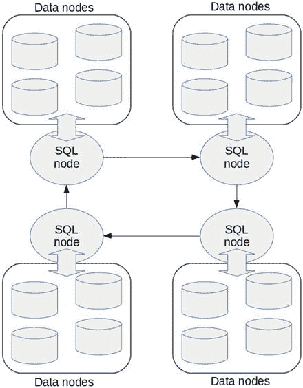

图 6-6.
包含四个集群的环形 NDB 集群复制

图 6-7 是环形复制的一个特例，其中两个集群组成环形复制；一个集群是另一个集群的主服务器和从服务器。这种类型的复制称为多主复制。

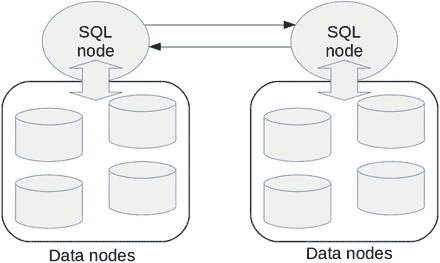

图 6-7.
多主 NDB 集群复制

默认情况下，从服务器不会为复制所做的修改写入二进制日志。由于只有在修改写入二进制日志时才会传播，因此默认情况下，来自上游主服务器的修改不会传播到下游从服务器。要允许为复制所做的修改启用二进制日志记录，请将 `log_slave_updates` 设置为 `ON`。这种类型的配置如图 6-8 所示。

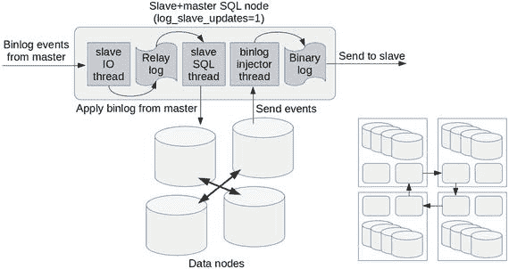

图 6-8.
一个 SQL 节点同时充当主服务器和从服务器

当在环形 NDB 集群复制中启用 `log_slave_updates` 时，所有从 SQL 节点也充当主服务器；一个 SQL 节点应用来自主服务器的修改，同一个 SQL 节点也将复制产生的事件写入其自己的二进制日志，该日志将被发送到下一个从服务器，如图 6-8 左侧所示。这种类型的环形复制的整体拓扑如图 6-8 右侧所示。

或者，也可以在不启用 `log_slave_updates` 的情况下配置 MySQL NDB 集群的环形复制。图 6-9 显示了未启用 `log_slave_updates` 的环形 NDB 集群复制。

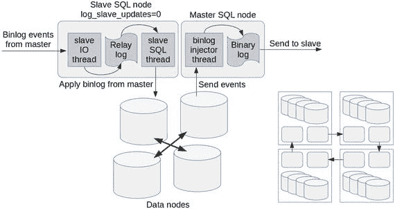

图 6-9.
一个 SQL 节点充当主服务器，另一个充当从服务器

在这种情况下，每个从服务器不在本地存储二进制日志，而是由同一集群中的另一个 SQL 节点代替存储二进制日志。

目前，仅支持两种类型的环形拓扑：

*   所有从服务器也充当主服务器，如图 6-8 所示。
*   所有从服务器不存储二进制日志，备用 SQL 节点成为主服务器，如图 6-9 所示。

在同一环形复制设置中混合两种类型的设置是不允许的。后者尚未经过充分测试，因此我建议使用 `log_slave_updates=1` 配置环形复制。

#### 多主复制引起的冲突

环形或多主复制最显著的问题是冲突（或者换句话说，数据不一致）。本节描述了冲突在多主复制中是如何发生的。在本节中，我们使用两个集群的示例进行讨论。

图 6-10 是冲突序列的一个简化、抽象、最小化的模式。每个圆柱体表示存储在 MySQL NDB 集群中的一个表。每个圆柱体中的一个方块表示 `id`（表的主键）值为 1 的同一行。

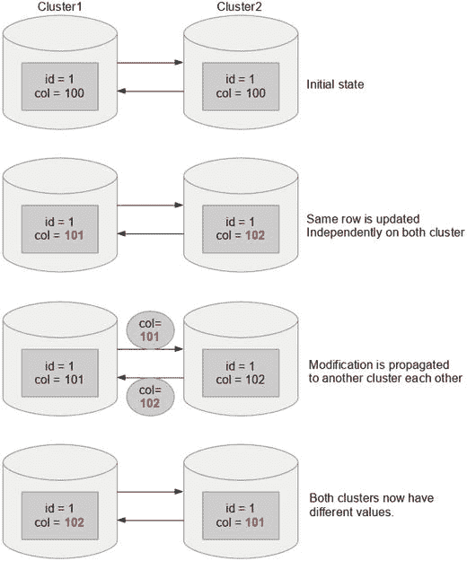

图 6-10.
由于同时更新两个集群而导致的冲突

在初始状态下，`id=1` 的行在两个集群上具有相同的值。然后，该行被更新为不同的值。这是可能的，因为它们是独立运行的独立集群。接着，两个集群开始将二进制日志中的事件传输到另一个集群。请注意，事件中包含的值是不同的。这导致具有不同值的二进制日志事件被应用于每个集群。因此，两个集群上的行值最终变得不同。

当然，同一行在两个集群上具有不同的值是一个严重的问题。这种情况是数据不一致。虽然应该避免数据不一致，但在标准的 MySQL 复制中无法完全避免，因为它是异步的。另一方面，MySQL NDB 集群具有检测此类冲突并自动解决的功能。我们将在本节后面讨论如何在 NDB 集群复制上配置冲突检测和解决。

注意

NDB 集群复制的冲突检测和解决确实简化了使用多主复制的应用程序开发。然而，它仍然比仅更新一个集群的应用程序困难得多，因为后者可以利用事务的力量，而前者不能。在提交事务后解决不一致比在提交事务前避免不一致要困难得多，因为事务根据定义可以确保数据一致性。冲突解决本质上不是事务性操作，因此在某些场景下可能会破坏数据一致性。因此，在使用冲突检测和解决时必须格外小心。

#### 冲突检测方法

NDB 集群复制上有几种类型的冲突检测方法。每种方法都有优点和缺点。因此，你需要根据应用程序需求选择合适的方法。大致来说，存在两类方法。一种是基于时间戳的，另一种是基于纪元的。

所有方法都通过逐行比较数据行来检测修改是否冲突。另一方面，解决将根据方法按行或按事务进行。可以选择按表选择方法。因此，不同的表可能有不同的冲突检测方法。

检测和解决冲突的代理是从 SQL 线程。因此，所有冲突检测和解决仅在从服务器端完成。应用程序可以以相同的方式执行和提交 `NDBCluster` 表上的事务，无论是否配置了冲突检测，因为冲突不会在提交时检测到。如果存在冲突，冲突将在事务提交所在集群的从属集群上被检测到。

```
There are several types of methods to detect conflicts on NDB Cluster Replication. Each method has pros and cons. So, you need to choose an appropriate one depending on application needs. Roughly speaking, two categories of methods exist. One is timestamp-based and the other is epoch-based.

All methods detect if modifications are in conflict by comparing data row by row. On the other hand, resolution will be done per row or per transaction depending on the method. The method can be chosen per table. So, different tables may have different conflict detection methods.

The agent to detect and resolve the conflict is the slave SQL thread. So, all conflict detection and resolution is done on the slave side only. An application can execute and commit transactions on NDBCluster tables in the same way whether conflict detection is configured or not, because conflict is not detected at commit time. Conflicts will be detected on the other cluster, which is slave of the cluster where transactions are committed, if there is a conflict.
```


##### `NDB$OLD(column_name)`

冲突检测和解析方法的名称以 `NDB$` 为前缀，并以包含一个可选参数的括号结尾。这里，`NDB$OLD` 是一个方法名，它接受一个列名作为参数。

`NDB$OLD` 是一种基于时间戳的方法。要使用基于时间戳的方法，目标表上需要有一个名为时间戳的特殊列。在冲突检测的语境中，时间戳列并非 SQL 中的 `TIMESTAMP` 数据类型。该列之所以被称为时间戳，是因为它指示了行的旧度。时间戳列的实际数据类型必须是 `INT UNSIGNED` 或 `BIGINT UNSIGNED`。它们还应定义为 `NOT NULL`，因为每次检测冲突时都需要时间戳列的值。如果表已经有合适的列，则无需显式添加时间戳列。否则，你应该添加。

如果目标表中当前的时间戳值与即将应用的二进制日志事件中包含的时间戳值不同，则 `NDB$OLD` 方法会检测到冲突。

一旦使用 `NDB$OLD` 方法检测到冲突，即使冲突行只是单个事务的一部分，目标行的更新也会被拒绝。换句话说，这破坏了事务的原子性。

**注意**

作为冲突解决的结果，数据库的状态在事务理论方面可能不一致。

图 6-11 说明了如何使用 `NDB$OLD` 方法检测冲突。

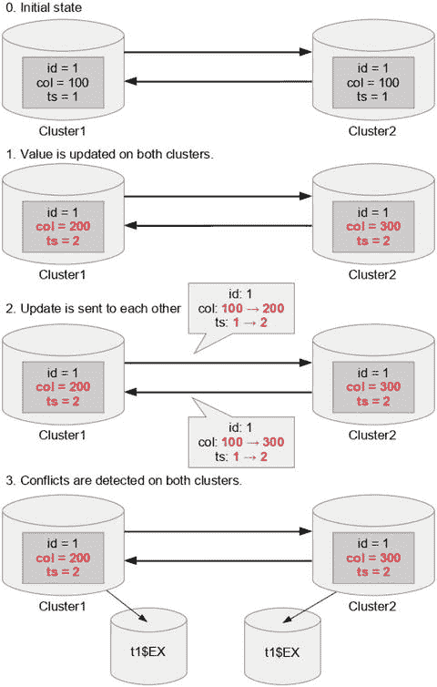

图 6-11.

使用 `NDB$OLD` 方法检测冲突

请注意，每次更新目标表时，也必须更新时间戳列。这通常通过使用以下语句递增时间戳列来完成：

```
UPDATE tbl_name SET ... ts = ts+1;
```

每次检测到冲突时，对相同数据的更新应该已经同时在两个集群上进行。换句话说，如果 `cluster2` 上的从机 SQL 线程检测到冲突，那么 `cluster2` 上的目标行也必须被更新。这意味着由 `cluster2` 上的更新产生的二进制日志事件应该已经发送到 `cluster1`，这也会导致 `cluster1` 上的冲突。因此，当使用此方法时，必须在两个集群上检测到冲突并拒绝二进制日志事件的应用。

请注意，图 6-11 步骤 3 中的 `col` 列值在两个集群上具有不同的值。这无疑是一种不一致状态。解决这种不一致取决于你的应用程序；你的应用程序必须确定哪个值是正确的并会被保留。在图 6-11 中，底部描绘了一个名为 `t1$EX` 的表。这个表被称为异常表，其中存储了有关冲突和解决方案的信息。你的应用程序在解决不一致时可以使用存储在此表中的信息。异常表的细节将在本章后面描述。

##### `NDB$MAX(column_name)`

此方法像 `NDB$OLD` 方法一样检测时间戳值何时已更改，但它通过保留具有更高时间戳值的行值来解决冲突。因此，在使用此方法时，时间戳列的值非常重要。

尽管对于此方法，可以通过使用类似 `UPDATE tbl_name SET ... ts = ts+1` 的语句递增时间戳列来维护时间戳列的值，但这将导致两个集群上的时间戳值相同。在这种情况下，两个集群上都会检测到冲突，并且冲突不会自动解决。此时，`NDB$MAX` 的行为与 `NDB$OLD` 方法相同。因此，当每次更新时递增时间戳列，使用 `NDB$MAX` 方法没有优势。

为了克服这个问题，需要一个外部程序，例如序列生成器。以前，Twitter 开发的 snowflake 很受欢迎。然而，snowflake 项目现已停止，并且不再维护。有一些受 snowflake 启发的后继开源项目。因此，使用其中之一作为 `NDB$MAX` 方法使用的时间戳列的编号生成器是一个不错的选择。

另一个选择是使用轻量级、高吞吐量的 NoSQL 数据库软件进行序列生成，例如 Riak、Redis 或 memcached。序列生成必须极其快速，因此使用 SQL 达到此目的不合适。因此，通过 NDB API 使用 MySQL NDB Cluster 是一个不错的选择。但是，应用程序必须仅访问集群的单个实例。从多主复制的两个集群中检索序列号是没有意义的，因为这样的序列号也可能冲突。图 6-12 说明了使用外部序列生成器的多主复制。

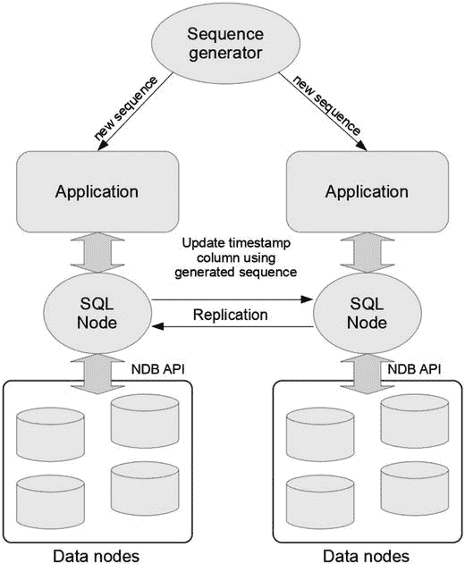

图 6-12.

使用外部序列生成器的多主 NDB 集群复制

使用挂钟时间是另一个选择。从重复值的可能性来看，它并不是一个完美的序列生成器。以下表达式生成足够实用的时间戳值，尽管存在在微秒范围内生成非按时间顺序排列的值的可能性。

```
FLOOR(unix_timestamp(now(6)) * 10000000000) + @@server_id;
```

此表达式假设 `server_id` 最大为 9999。使用任意唯一标识符代替 `server_id` 也是可以接受的。

使用外部序列生成器时，生成器的位置是个问题。由于多主 NDB 集群复制通常用于灾难恢复，集群位于地理上相距遥远的位置。也就是说，它们之间必须存在一定级别的网络延迟。因此，如果序列生成器位于一个站点，从另一个站点访问将响应缓慢。使用网络上的外部序列生成器时，必须考虑网络延迟。序列生成器也可能离线。

图 6-13 说明了在两个集群上进行的导致冲突的更新的一般处理流程。

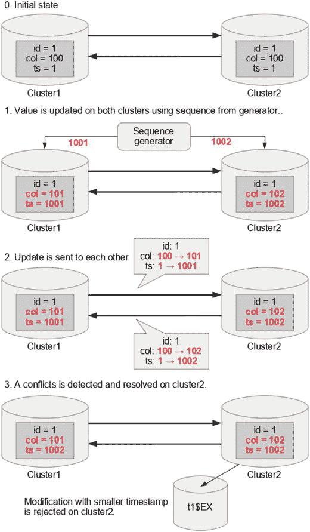

图 6-13.

使用 `NDB$MAX` 方法检测和解决冲突

在图 6-13 的 `cluster2` 上，来自 `cluster1` 的更新被拒绝，因为表中的时间戳（1002）大于 `cluster1` 更新中包含的时间戳（1001）。

##### `NDB$MAX_DELETE_WIN(column_name)`

此方法与 `NDB$MAX` 方法相同，除了删除处理。在 `NDB$MAX` 方法中，`DELETE` 语句的冲突检测和解析与 `NDB$OLD` 方法完全一样。这意味着仅当二进制日志事件中的时间戳值与表中的时间戳值相同时，才会删除行。否则，检测到冲突。这个设计决策是因为删除操作没有新的时间戳值。

另一方面，`NDB$MAX_DELETE_WIN` 方法对删除处理有另一种策略。删除操作总是比其他操作具有更高的优先级。如果从机 SQL 线程尝试删除行，即使发生冲突，也会执行该操作。


## NDB$EPOCH()

此方法仅支持在**恰好两个集群**的**多主复制**中使用：一个集群定义为主集群，另一个定义为备用集群。此外，每个从属 SQL 节点必须配置为主 SQL 节点，如本章前面图 6-7 所描述的复制架构所示。此处再次展示该图，以避免翻回前几页的需要。使用此方法时，冲突检测和解析是**不对称**的。这意味着在主集群上所做的修改在冲突发生时总是会胜出。因此，您的应用可以认为在主集群上提交的事务永远不会因冲突解析而在后续被更改。

使用此方法不需要时间戳列。因此，您无需修改应用以在每次更新行时也更新时间戳列。顾名思义，此方法使用 `epoch`（纪元）来检测冲突。

`NDB$EPOCH` 使用的 `epoch` 是主 SQL 节点自身的 `epoch`，该值被发送到从属节点，并通过循环复制返回。如图 6-3 所示，主 SQL 节点会创建一个事件来更新 `mysql.ndb_apply_status` 表，尽管该表在主 SQL 节点上并未被实际修改。此事件用于跟踪从属 SQL 节点上已应用的 `epoch`，进而识别主 SQL 节点上的二进制日志文件名和位置。因此，在从属 SQL 节点上，`mysql.ndb_apply_status` 表照常由从属 SQL 线程更新。通常，对 `mysql.ndb_apply_status` 的更新不会被记录到二进制日志中，因为即使启用了二进制日志且 `log_slave_updates` 设置为 `ON`，该事件也会被 `binlog injector` 线程忽略。

只有当 `ndb_log_apply_status` 在 `log_slave_updates` 之外也被启用时，对 `mysql.ndb_apply_status` 表的更新以及对该表的虚拟生成更新才会被写入二进制日志。这样，主 SQL 节点将接收到一个由它自身生成的用于更新 `mysql.ndb_apply_status` 的二进制日志事件。图 6-14 描绘了当 `log_slave_updates` 和 `ndb_log_apply_status` 均为 `ON` 时的事件生成和传输过程。在此配置下，主 SQL 节点可以检测到通过复制循环回来的最新 `epoch`。因此，`ndb_log_apply_status` 和 `log_slave_updates` 这两个选项是 `NDB$EPOCH` 及其变体所必需的。

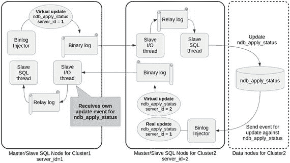

图 6-14. NDB$EPOCH 方法所需的二进制日志事件生成

图 6-15 描绘了使用 `NDB$EPOCH` 方法的冲突检测和解析。

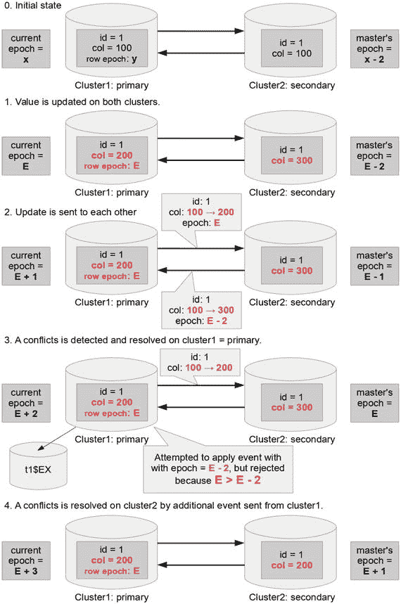

图 6-15. NDB$EPOCH 方法检测并解析冲突

请注意，`epoch` 在数据节点内部处理。`epoch` 值存储在复制表 `mysql.ndb_binlog_index` 和 `mysql.ndb_apply_status` 中，用于复制目的。在图 6-15 中，`cluster1` 内部的 `epoch` 值表示 `cluster1` 数据节点内部的当前 `epoch` 值。例如，在初始状态下，`epoch` 值是 x。`cluster2` 内部的 `epoch` 值表示通过 `mysql.ndb_apply_status` 表推导出的 `cluster1` 的 `epoch` 值。该 `epoch` 值也存储在每一行中，在图 6-14 中被描述为行 `epoch`。在初始状态下，`epoch` 值用常量 x 和 y 表示，假设它们是旧值。同时假设单向复制大约需要 200 毫秒。

在图 6-15 的步骤 1 中，同一行在两个集群上都被更新。`cluster1` 上的一行具有 `epoch` E。我省略了 `cluster2` 上该行的 `epoch` 值，因为它与 `NDB$EPOCH` 方法的冲突检测和解析无关。我们假设复制需要 200 毫秒，因此 `cluster2` 上 `mysql.ndb_apply_status` 中的当前 `epoch` 值可能是 E - 2，因为 `epoch` 默认每 `TimeBetweenEpochs` 毫秒（默认为 100）生成一次。此时，一个 `epoch` 值为 E - 2 的对 `mysql.ndb_apply_status` 的更新已被写入 `cluster2` 的二进制日志。

在图 6-15 的步骤 2 中，二进制日志事件被相互发送。请关注二进制日志事件中包含的 `epoch` 值，这些值实际上是 `mysql.ndb_apply_status` 表中的值。由于 `cluster1` 上某行包含的 `epoch` 值 E 大于从 `cluster2` 返回的 `epoch` 值 E - 2，因此该复制更新在步骤 3（图 6-16）中被主 SQL 节点（`cluster1`）识别为冲突，并通过忽略该更新来解析冲突。然后，`cluster1` 发送一个额外的二进制日志事件来修复从属节点上的冲突。因此，在步骤 4 应用此事件后，两个集群之间的不一致将在 `cluster2` 上得到修复。

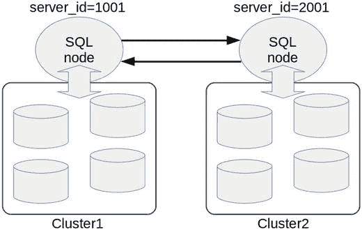

图 6-16. NDB$EPOCH_TRANS 方法的一个多主 NDB 集群复制配置示例

## NDB$EPOCH_TRANS()

此方法在冲突检测使用 `epoch` 方面与 `NDB$EPOCH` 方法相似。另一方面，冲突解析的方式不同，因为它是**按事务**处理，而不是按行处理。`NDB$EPOCH_TRANS` 方法比 `NDB$EPOCH` 方法更具优势，因为使用 `NDB$EPOCH_TRANS` 方法时，在备用集群上执行的事务是原子性的。在发生冲突时，使用 `NDB$EPOCH_TRANS` 方法，整个事务可能会在主集群上被忽略，并随后在备用集群上回滚。而使用 `NDB$EPOCH` 方法，只有冲突的行会被忽略和回滚，因此备用集群上的事务将是非原子性的。此外，除了冲突事务本身，依赖于冲突事务的事务也会因解析而被回滚。

### NDB$EPOCH2() 与 NDB$EPOCH2_TRANS()

这些方法是 `NDB$EPOCH` 和 `NDB$EPOCH_TRANS` 的改进版本，在 MySQL NDB Cluster 7.4 系列中引入。尽管 `NDB$EPOCH2` 方法已经可用，但与之前的方法 `NDB$EPOCH` 相比，在实际应用上并无差异，尽管其实现和配置过程有所不同。只有 `NDB$EPOCH2_TRANS` 与旧版本相比具有实际意义。

`NDB$EPOCH_TRANS` 和 `NDB$EPOCH2_TRANS` 之间的区别在于处理“删除-删除”冲突的方式。当两个集群上都删除了相同的行后，主集群和从集群有可能进入不一致的状态，这是因为被删除的行没有存储纪元信息，程序无法为被删除的行比较纪元。代码清单 6-11 展示了导致这种不一致的场景。请注意，从库的 SQL 线程在锁定目标行的事务提交之前，无法应用修改。假设 `mysqlP>` 代表主集群的提示符，`mysqlS>` 代表从集群的提示符，并且在此示例中会话未被关闭或重新打开。

```
mysqlP> INSERT INTO t VALUES (1, ... omit ...);
mysqlP> BEGIN;
mysqlP> DELETE FROM t WHERE id=1;
mysqlS> BEGIN;
mysqlS> DELETE FROM t WHERE id=1; -- delete-delete situation
mysqlP> COMMIT;
mysqlP> INSERT INTO t SET id=1 ...;
mysqlP> DELETE FROM t WHERE id=1; -- delete same row by chance
mysqlS> COMMIT; INSERT INTO t SET id=1 ...; -- the row is unlocked
mysqlP> SELECT COUNT(*) FROM t WHERE id=1;
+----------+
| COUNT(*) |
+----------+
|        1 |
+----------+
1 row in set (0.00 sec)
mysqlS> SELECT COUNT(*) FROM t WHERE id=1;
+----------+
| COUNT(*) |
+----------+
|        0 |
+----------+
1 row in set (0.00 sec)
Listing 6-11.
An Example Scenario Where the Secondary Wins on the NDB$EPOCH_TRANS Method
```

根据“主集群总是胜出”的策略，`id=1` 的行应在两个集群上都被删除。然而，它在主集群上并未被删除！请注意，从集群上 `COMMIT` 之后的 `INSERT` 是在 `COMMIT` 后立即执行的，因为它们是在同一行中执行的，这应该比 `TimeBetweenEpochs` 更快。`NDB$EPOCH2_TRANS` 方法可以避免这种类型的分歧，从集群上 `COMMIT` 之后的 `INSERT` 将被标记为冲突。代码清单 6-11 中的例子并非 100% 可复现，因为涉及到时序问题。

使用 `NDB$EPOCH2` 和 `NDB$EPOCH2_TRANS` 方法时，由从集群上的修改引起的二进制日志事件将在主集群上执行，然后被发送回从集群。这些返回的事件被称为反射操作，并将在从集群上重新执行。请注意，主集群内 SQL 节点上的二进制日志增长会非常快，因为反射操作也被写入了二进制日志。

由于在“删除-删除”冲突后会立即发生分歧，除非使用 `NDB$EPOCH2_TRANS`，否则最好将所有删除操作路由到单个集群。这需要应用程序开发付出额外的努力。另一方面，使用 `NDB$EPOCH2_TRANS` 方法时不会发生分歧，但由于反射操作，从集群偶尔会胜出。

#### 读操作的冲突检测

从 MySQL NDB Cluster 7.4 系列开始，可以对持有独占行锁的读操作进行冲突检测。独占行锁通过使用 `SELECT ... FOR UPDATE` 语句查询行来获取。

要为读操作启用冲突检测和解决，必须在 SQL 节点上将 `ndb_log_exclusive_reads` 选项设置为 `ON`。当此选项为 `ON` 时，带有独占行锁的读操作将像 `UPDATE` 语句一样被写入二进制日志，但不会实际修改行。这是通过将行值设置为与当前值相同的值来实现的，因此从库上的行值保持不变。写入二进制日志的 `UPDATE` 事件将像往常一样触发冲突检测和解决，无论冲突是由真正的 `UPDATE` 还是带有独占行锁的读操作引起的。因此，用于读操作的冲突检测方法与写操作相同。

请注意，当 `ndb_log_exclusive_reads` 设置为 `ON` 时，二进制日志的大小会增加。处理冲突检测和解决将需要额外的 CPU 资源。语句必须是严格的 `SELECT ... FOR UPDATE`。`SELECT ... LOCK IN SHARE MODE` 不会触发冲突检测和解决。

#### 设置冲突检测与解决

在本节中，我们将讨论如何设置冲突检测和解决。我们假设 NDB Cluster 复制已经配置并正在运行。冲突检测和解决必须按表进行配置。如果你想在 10 张表上检测/解决冲突，你必须配置 10 次。以下是为新创建的表设置冲突检测和解决的典型步骤：

1.  配置冲突检测所需的选项。
2.  向 `mysql.ndb_replication` 表添加一条记录。
3.  创建一个异常表。
4.  创建目标表。

步骤 1 对所有表都是通用的。因此，每个集群只需执行一次。对每个目标表重复步骤 2-4。

注意
只有使用基于时间戳的方法时，才能为现有表设置冲突检测和解决。然而，这不推荐，因为在向 `mysql.ndb_replication` 表添加记录并创建异常表后，所有涉及复制的 SQL 节点都必须重启。

接下来让我们看看每个步骤的细节。


#### 配置冲突检测与解决所需的选项

对于 SQL 节点，除了通常的 NDB 集群复制所需选项外，冲突检测和解决还需要一些额外的必选选项。所需的选项取决于上一节描述的冲突检测和解决方法。表 6-4 列出了冲突检测和解决所需的选项。请在继续下一步之前，正确设置您所选冲突检测方法要求的所有选项。某些选项无法在线更改，需要重启 SQL 节点。每个选项的详细说明如下。

表 6-4. 冲突检测与解决的选项列表

| 选项名称 | 要设置的值 | 方法 |
| --- | --- | --- |
| `log_slave_updates` | `ON` | 所有基于纪元的方法必需：`NDB$EPOCH`、`NDB$EPOCH_TRANS`、`NDB$EPOCH_TRANS`、`NDB$EPOCH2_TRANS` |
| `ndb_log_update_as_write` | `OFF` | 所有 |
| `ndb_log_updated_only` | `OFF` | 所有 |
| `ndb_log_apply_status` | `ON` | `NDB$EPOCH`及其变体方法必需。 |
| `log_bin_use_v1_row_events` | `OFF` | `NDB$EPOCH_TRANS`和`NDB$EPOCH2_TRANS` |
| `ndb_log_transaction_id` | `ON` | `NDB$EPOCH_TRANS`和`NDB$EPOCH2_TRANS` |
| `ndb_slave_conflict_role` | `PRIMARY`或`SECONDARY` | `NDB$EPOCH2`和`NDB$EPOCH2_TRANS` |
| `ndb_log_exclusive_reads` | `ON`或`OFF` | 所有 |

当`log_slave_updates`设置为`ON`时，从库 SQL 线程会为源自主库的修改写入二进制日志，这是级联复制拓扑所必需的。如本节前面所述，配置多主 NDB 集群复制有两种选择，即带或不带`log_slave_updates`，分别如图 6-8 和图 6-9 所示。前者是经过充分测试并推荐的做法。特别是对于`NDB$EPOCH`方法及其变体，必须将`log_slave_updates`设置为`ON`，并且恰好设置两个集群。这意味着在每个集群上，只有一个 SQL 节点同时充当主库和从库，如图 6-14 所示。

`ndb_log_update_as_write`的默认值为`ON`，这会导致更新作为写操作记录到二进制日志中。这意味着旧行值不会写入二进制日志，从而节省了二进制日志所需的空间。由于写事件对于`NDBCluster`存储引擎而言类似于`REPLACE`命令，这能很好地节省空间。但是，这种行为不适合冲突检测和解决，因为它需要旧行值来检测和/或解决冲突。因此，使用冲突检测和解决时，此选项必须设置为`OFF`。

`ndb_log_updated_only`的默认值为`ON`，这会导致只有行值的修改部分和主键值存储在二进制日志中。这节省了二进制日志所需的额外空间。但是，这种行为不适合冲突检测和解决，因为它需要旧行映像。使用冲突检测和解决时，此选项必须设置为`OFF`。

如本节前面所讨论的，对于`NDB$EPOCH`方法及其变体，`ndb_log_apply_status`必须设置为`ON`。此选项的默认值为`OFF`。当设置为`ON`时，直接主库的`mysql.ndb_apply_status`表的更新会被写入到从库 SQL 节点的二进制日志中。当然，要使此选项生效，`log_slave_updates`也必须设置为`ON`。

对于`NDB$EPOCH_TRANS`和`NDB$EPOCH2_TRANS`方法，必须配置两个选项——`log_bin_use_v1_row_events`和`ndb_log_transaction_id`。前者必须设置为`OFF`，后者必须设置为`ON`。这是必需的，因为必须跟踪事务 ID 才能按事务解决冲突。当这些选项分别设置为`OFF`和`ON`时，事务 ID 和可选标志将存储在每个二进制日志事件中。当未设置标志时，此额外信息所需大小为 12 字节；当设置了标志时，则为 14 字节。

使用`NDB$EPOCH2`或`NDB$EPOCH2_TRANS`方法时，必须在两个集群上显式设置`ndb_slave_conflict_role`。此选项的有效值为`PRIMARY`、`SECONDARY`、`NONE`和`PASS`。请根据所需配置将此选项设置为`PRIMARY`或`SECONDARY`。当使用这些方法时，如果此选项设置为`NONE`，从库将因错误而停止。当此选项设置为`PASS`时，即使表已配置为使用`NDB$EPOCH2`或`NDB$EPOCH2_TRANS`方法进行冲突解决，也不会执行冲突检测。

当您想要检测和解决在两个集群上执行的`SELECT ... FOR UPDATE`的冲突时，`ndb_log_exclusive_reads`必须设置为`ON`。当此选项为`ON`时，`SELECT ... FOR UPDATE`会被当作`UPDATE`命令写入，这将把行值更新为与之前相同的值。然后，独占读将接受冲突检测和解决。


##### 向 `mysql.ndb_replication` 表添加条目

`mysql.ndb_replication` 系统表在冲突检测和解决的配置中扮演重要角色。默认情况下，此表不存在，因此在使用冲突检测和解决时，必须首先创建它。要创建 `mysql.ndb_replication` 系统表，请执行清单 6-12 中的语句。

```sql
CREATE TABLE mysql.ndb_replication  (
db VARBINARY(63),
table_name VARBINARY(63),
server_id INT UNSIGNED,
binlog_type INT UNSIGNED,
conflict_fn VARBINARY(128),
PRIMARY KEY USING HASH (db, table_name, server_id)
)   ENGINE=NDB
PARTITION BY KEY(db, table_name);
```

清单 6-12. 创建 `mysql.ndb_replication` 系统表

请注意，`mysql.ndb_replication` 表的 `CREATE TABLE` 语句会被复制到其他集群，因为配置了环形 NDB 集群复制。因此，仅需在一个 SQL 节点上执行此命令即可。

配置是通过向此表插入行来完成的。

`db` 和 `table_name` 列指定了进行冲突检测和解决的目标表。

`server_id` 列指定了执行冲突检测和解决的从属 SQL 节点的 `server_id`。如果指定为 0，则所有 SQL 节点都将执行冲突检测和解决。如果希望冲突检测和解决仅在特定的 SQL 节点上执行，请为每个 `server_id` 插入一行。`NDB$EPOCH` 和 `NDB$EPOCH_TRANS` 方法需要特定的 `server_id`。在这种情况下，您需要为每个 `server_id` 向 `mysql.ndb_replication` 表添加一行。

`binlog_type` 列指定了二进制日志图像格式。此列覆盖主 SQL 节点上的二进制日志生成选项，例如 `ndb_log_update_as_write` 和 `ndb_log_updated_only` 选项。当设置为 0 或 `NULL` 时，将采用服务器选项。格式以数字指定，如表 6-5 所述。通常，您可以将其设置为 0 或 `NULL` 以使用服务器默认值。如果您尚未将 `ndb_log_update_as_write` 和 `ndb_log_updated_only` 从默认值 (`ON`) 更改为 `OFF`，请将此列设置为 7。

**表 6-5. `binlog_type` 列值**

| 值 | 标签 | 描述 |
| --- | --- | --- |
| 0 | `NBT_DEFAULT` | 使用服务器默认值。 |
| 1 | `NBT_NO_LOGGING` | 不在二进制日志中记录此表。 |
| 2 | `NBT_UPDATED_ONLY` | 仅记录已更新的列。 |
| 3 | `NBT_FULL` | 记录所有列，无论是否更新。 |
| 4 | `NBT_USE_UPDATE` | 更新操作作为更新记录。（相当于 `ndb_log_update_as_write=0`。）此值通常不使用。请指定 6 或 7。 |
| 5 | `未使用` | |
| 6 | `NBT_UPDATED_ONLY_USE_UPDATE` | 仅记录已更新的列。更新操作作为更新（而非写入）记录。 |
| 7 | `NBT_FULL_USE_UPDATE` | 记录所有列，无论是否更新。更新操作作为更新（而非写入）记录。 |

`conflict_fn` 列指定了要使用的冲突检测和解决方法。该方法根据方法类型接受一个参数。

基于时间戳的方法——`NDB$OLD`、`NDB$MAX` 和 `NDB$MAX_DELETE_WIN`——接受时间戳列名作为参数。如果时间戳列名为 `ts` 且要使用的方法是 `NDB$OLD`，则此列应设置为 `NDB$OLD(ts)`。使用基于时间戳的方法时不能省略参数。

基于纪元的方法——`NDB$EPOCH`、`NDB$EPOCH_TRANS`、`NDB$EPOCH2` 和 `NDB$EPOXH2_TRANS`——接受每行要存储的额外比特数。该参数可以省略。如果省略，则采用默认值 6，这对于默认配置已足够。所需的比特数取决于 `TimeBetweenEpochs` 和 `TimeBetweenGlobalCheckpoints` 的值。

默认情况下，每行存储一个 32 位数字，表示全局检查点 ID，而纪元由一个 64 位数字组成。这是因为恢复和重启只需要纪元的高 32 位部分。一个纪元实际上由两个 32 位数字组成。高位在每次 GCP（全局检查点）时递增，低位在每次微 GCP 时递增并在每次 GCP 时重置。因此，低位不会增长超过以下值：

```
TimeBetweenGlobalCheckpoints / TimeBetweenEpochs - 1
```

回顾一下，重做日志在每次 GCP 时写入磁盘，而不是微 GCP。因此，恢复不需要在每次微 GCP 时递增并在每次 GCP 时重置的低位。然而，基于纪元的冲突方法需要它。低位通常非常小。默认情况下，最大为 19，需要 5 位。默认值 6 对于默认的 GCP 和微 GCP 设置是足够的。如果您更改了 `TimeBetweenEpochs` 和 `TimeBetweenGlobalCheckpoints` 的默认值，则可能需要更改此值的默认设置。确保预留足够的位数。否则，冲突检测时可能出现误报和漏报。

因此，对于基于纪元的方法，必须在通过向 `mysql.ndb_replication` 表添加所需条目配置好冲突检测和解决之后，才能创建目标表。否则，表将无法存储纪元的低位部分，从而根本无法检测到冲突。


#### 异常表与目标表创建

##### 创建异常表

异常表是冲突检测使用的一种辅助表。当检测到冲突时，该表中会记录各种信息。无论采用何种冲突检测方法，都可以使用异常表。尽管该表是可选的，但我强烈建议在创建冲突检测时一并创建它，因为该表中存储的信息对您的应用绝对有用。异常表的定义根据目标表的不同而变化。表的定义如清单 6-13 所示。

```
CREATE TABLE target_table$EX  (
NDB$server_id INT UNSIGNED,
NDB$master_server_id INT UNSIGNED,
NDB$master_epoch BIGINT UNSIGNED,
NDB$count INT UNSIGNED,
[NDB$OP_TYPE ENUM('WRITE_ROW','UPDATE_ROW', 'DELETE_ROW',
'REFRESH_ROW', 'READ_ROW') NOT NULL,]
[NDB$CFT_CAUSE ENUM('ROW_DOES_NOT_EXIST', 'ROW_ALREADY_EXISTS',
'DATA_IN_CONFLICT', 'TRANS_IN_CONFLICT') NOT NULL,]
[NDB$ORIG_TRANSID BIGINT UNSIGNED NOT NULL,]
target_table_pk_columns,
target_table_non_pk_columns,
PRIMARY KEY (NDB$server_id, NDB$master_server_id,
NDB$master_epoch, NDB$count)
) ENGINE = NDBCluster;
```
清单 6-13. 异常表的定义

异常表的名称与目标表相同，但加上 `$EX` 后缀，并且异常表应与目标表位于同一数据库中。

异常表的定义看起来有点复杂。带有 `NDB$` 前缀的列以及底部的主键具有固定的定义。前四列总是必需的，而后三列是可选的。这些列的含义如表 6-6 所述。

表 6-6. 异常表的列定义

| 列名 | 描述 |
| --- | --- |
| `NDB$server_id` | 检测到冲突的 `server_id`。 |
| `NDB$master_server_id` | 向检测到冲突的从库发送二进制日志的主库的 `server_id`。 |
| `NDB$master_epoch` | 导致冲突的二进制日志对应的纪元值。 |
| `NDB$count` | 每个目标表的计数器。从库 SQL 节点重启时重置。 |
| `NDB$OP_TYPE` | 可选列。导致冲突的操作类型。 |
| `NDB$CFT_CAUSE` | 可选列。冲突原因。 |
| `NDB$ORIG_TRANSID` | 可选列。导致冲突的事务 ID。此列对于 `NDB$EPOCH_TRANS` 或 `NDB$EPOCH2_TRANS` 方法很有用，这些方法可能为每个冲突在异常表中写入多行。 |

可选的 `NDB$` 列自 MySQL NDB Cluster 7.4 系列开始可用。由于这些列具有信息性，我建议使用它们。

`target_table_pk_columns` 是由目标表主键组成的列列表。所有主键列必须与目标表具有相同的数据类型。如果数据类型是字符串类型，请确保这些列与目标表中的列具有相同的字符集和排序规则。由于主键中包含的任何列都必须是 `NOT NULL`，因此在异常表中它们也必须设置为 `NOT NULL`。列的顺序不重要。您可以按任意顺序列出主键中包含的列。但是，`target_table_pk_columns` 必须放在目标表的任何非主键列之前，并放在 `NDB$count` 之后。实际上，您可以将可选的 `NDB$` 列和 `target_table_pk_columns` 按任意顺序放置。然而，我建议将可选的 `NDB$` 列放在 `target_table_pk_columns` 之前，以避免混淆。

自 MySQL NDB Cluster 7.4 系列起，如果表具有多列主键，则不必将目标表的所有主键列都包含在异常表中。如果您愿意，可以只指定部分主键列。

`target_table_non_pk_columns` 是目标表非主键列的列表。冲突发生时，将存储该列的新值或旧值；对于插入和更新，存储新值；对于删除，存储旧值。

从 MySQL NDB Cluster 7.4 系列开始，可以让非主键列具有 `$OLD`、`$NEW` 后缀或两者兼有。顾名思义，带有 `$OLD` 后缀的非主键列在冲突时将具有新值，而带有 `$NEW` 后缀的非主键列在冲突时将具有旧值。对于每个非主键列，可以有两个带有 `$OLD` 和 `$NEW` 后缀的列。在这种情况下，在更新冲突时，新值和旧值都将存储在这些列中。由于在更新冲突时比较新值和旧值非常有用，我建议同时拥有 `$OLD` 和 `$NEW` 列。在插入或删除冲突时，`$OLD` 或 `$NEW` 列之一将没有值。因此，异常表中的非主键列必须是可为空的。当然，不必将所有非主键列都包含在异常表中。仅包含感兴趣的列。

如果目标表 `t1` 有一个主键列 `id` 和非主键列 `col1`、`col2` 和 `col3`，那么对于 MySQL NDB Cluster 7.4 或更新系列，异常表将如清单 6-14 所示。

```
CREATE TABLE t1$EX  (
NDB$server_id INT UNSIGNED,
NDB$master_server_id INT UNSIGNED,
NDB$master_epoch BIGINT UNSIGNED,
NDB$count INT UNSIGNED,
NDB$OP_TYPE ENUM('WRITE_ROW','UPDATE_ROW', 'DELETE_ROW',
'REFRESH_ROW', 'READ_ROW') NOT NULL,
NDB$CFT_CAUSE ENUM('ROW_DOES_NOT_EXIST', 'ROW_ALREADY_EXISTS',
'DATA_IN_CONFLICT', 'TRANS_IN_CONFLICT') NOT NULL,
NDB$ORIG_TRANSID BIGINT UNSIGNED NOT NULL,
id INT not null,
col1$OLD INT,
col1$NEW INT,
col2$OLD VARCHAR(10) CHARACTER SET utf8mb4,
col2$NEW VARCHAR(10) CHARACTER SET utf8mb4,
col3$OLD DATETIME,
col3$NEW DATETIME,
PRIMARY KEY (NDB$server_id, NDB$master_server_id,
NDB$master_epoch, NDB$count)
) ENGINE = NDBCluster;
```
清单 6-14. 异常表示例

异常表仅在检测到冲突的从库端填充。您可以查询它以查找修复不一致所需的信息。从异常表读取行后，可以使用 `DELETE` 语句删除这些行。当行存储在一个集群上时，删除行无需特别注意。对异常表的操作不会被复制。

**注意**

不要截断异常表。`TRUNCATE TABLE` 在 MySQL 系列中不是 DML 查询。它被当作 DDL 处理，并在内部重新创建表。这将破坏目标表和异常表之间的依赖关系，并且在检测到冲突时复制将失败。如果意外截断了异常表，请重启从库 SQL 节点来解决问题。

##### 创建冲突检测的目标表

按预期创建目标表。表创建后，冲突检测和解析即被激活。

监控 SQL 节点的错误日志。如果在此时出现问题，错误消息将被写入错误日志，因为 `mysql.ndb_replication` 表中的条目以及相关异常表的定义在目标表创建之前不会被检查。如果发现任何问题，请检查 `mysql.ndb_replication` 表的配置和异常表的定义。然后，解决问题并重新开始。

##### 监控冲突检测

使用冲突检测时，监控是否发生冲突非常重要。有两种监控状态的方法，如下所述。

##### 监控状态变量

当检测到冲突时，表 6-7 中的状态变量会被更新。所有列出的状态变量均可通过在所有版本上执行 `SHOW GLOBAL STATUS LIKE 'Ndb_conflict%'`，或在 MySQL NDB Cluster 7.5 及更新版本上执行 `SELECT * FROM performance_schema.global_status WHERE variable_name LIKE 'Ndb_conflict%'` 来获取。

表 6-7. 与冲突检测和解决相关的状态变量

| 状态变量 | 描述 |
| --- | --- |
| `Ndb_conflict_fn_max` | 使用 `NDB$MAX` 方法检测到冲突的次数。 |
| `Ndb_conflict_fn_old` | 使用 `NDB$OLD` 方法检测到冲突的次数。 |
| `Ndb_conflict_fn_max_del_win` | 使用 `NDB$MAX_DELETE_WIN` 方法检测到冲突的次数。 |
| `Ndb_conflict_fn_epoch` | 使用 `NDB$EPOCH` 方法检测到冲突的次数。 |
| `Ndb_conflict_fn_epoch_trans` | 使用 `NDB$EPOCH_TRANS` 方法检测到冲突的次数。 |
| `Ndb_conflict_fn_epoch2` | 使用 `NDB$EPOCH2` 方法检测到冲突的次数。 |
| `Ndb_conflict_fn_epoch2_trans` | 使用 `NDB$EPOCH2_TRANS` 方法检测到冲突的次数。 |
| `Ndb_conflict_trans_row_conflict_count` | 被事务单元方法 `NDB$EPOCH_TRANS` 和 `NDB$EPOCH2_TRANS` 识别为冲突的行数。 |
| `Ndb_conflict_trans_row_reject_count` | 因冲突而被事务单元方法回退的行数。此状态变量的值包含 `Ndb_conflict_trans_row_conflict_count` 的值。 |
| `Ndb_conflict_trans_reject_count` | 因冲突而被事务单元方法回退的事务数。 |
| `Ndb_conflict_trans_detect_iter_count` | 事务单元方法检测冲突依赖关系的迭代次数。 |
| `Ndb_conflict_trans_conflict_commit_count` | 通过事务单元方法解决冲突后提交的事务数。 |
| `Ndb_conflict_epoch_delete_delete_count` | 检测到删除-删除冲突的次数。 |
| `Ndb_conflict_reflected_op_prepare_count` | 当使用 `NDB$EPOCH2` 或 `NDB$EPOCH2_TRANS` 方法时，在辅助节点上修改的行数。 |
| `Ndb_conflict_reflected_op_discard_count` | 当使用 `NDB$EPOCH2` 或 `NDB$EPOCH2_TRANS` 方法时，在辅助节点上修改、通过二进制日志发送到主节点、在主节点上应用、然后发送回辅助节点但被丢弃的行数。 |
| `Ndb_conflict_refresh_op_count` | 为通过覆盖主节点数据来解决不一致而在辅助节点上执行的操作数。此状态变量仅在使用基于纪元的方法时可能增加。 |
| `Ndb_conflict_last_conflict_epoch` | 检测到冲突时的最后一个本地纪元。 |
| `Ndb_conflict_last_stable_epoch` | 进行修改但未检测到冲突时的最后一个本地纪元。 |

要从应用程序检测冲突的发生，请根据所使用的方法监控相应的 `Ndb_conflict_fn*` 状态变量。

##### 监控异常表

另一种监控冲突的方法是查询 `exceptions table`（异常表）。仅当发生冲突时才会插入一个或多个行。如果目标表的数量不是很多，监控 `exceptions table` 不会是一项高负载的昂贵操作。

此策略比监控状态变量有一些优势。当冲突发生时，由于自动解决导致某些数据被静默回退，您通常需要在应用程序中采取进一步措施。例如，可能需要通知用户其进行的修改已被取消；用户必须重新执行该操作。通过此策略，您可以将额外的代码与监控代码一同编写。

##### 冲突检测案例研究

本节展示了一个设置使用 `NDB$EPOCH_TRANS` 和 `NDB$EPOCH2` 方法进行冲突检测和解决的过程示例。用于冲突检测和解决的示例表名为 `test.t_conflict`，其定义如下。

```sql
CREATE TABLE t_conflict (
id BIGINT UNSIGNED NOT NULL PRIMARY KEY,
col1 VARCHAR(64),
col2 DATETIME,
INDEX ix1 (col1, col2)
) ENGINE=NDBCluster CHARACTER SET utf8;
```

