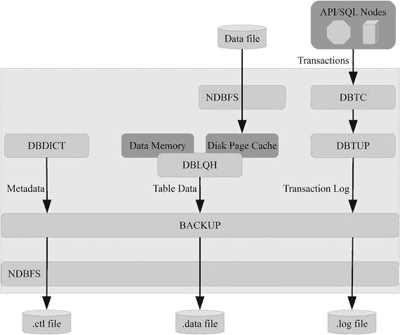
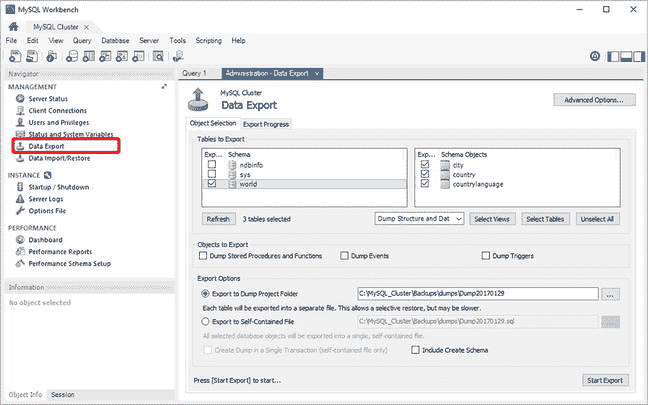
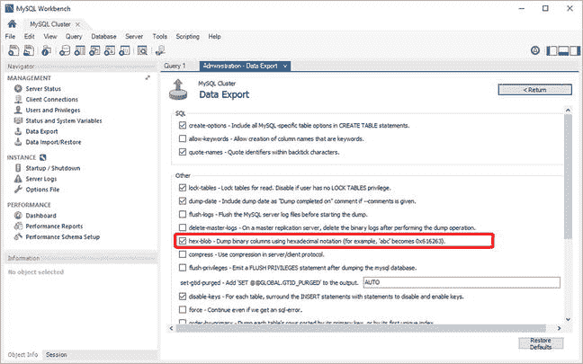
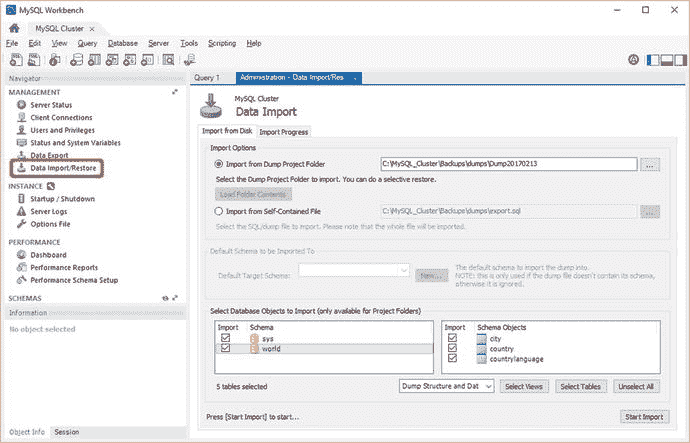
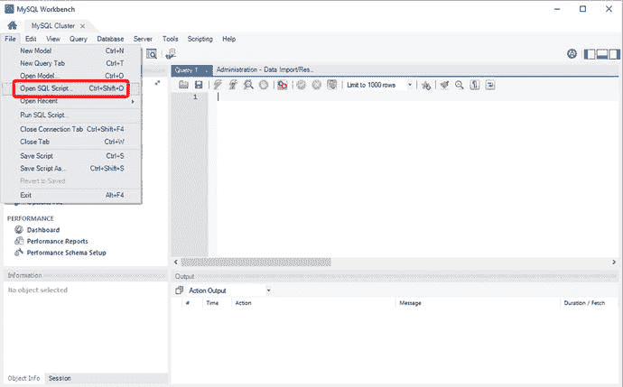

# 8. 备份和恢复

对于任何数据库产品，备份和恢复都是确保在人为错误、硬件故障、自然灾害等情况下可以恢复数据的两个非常重要的部分。MySQL NDB Cluster 提供两种类型的备份：原生备份和逻辑备份。两种类型都有其用途，在大多数情况下，两者都应该使用。本章将介绍这两种选项，讨论何时使用它们，并介绍如何恢复备份。首先，本章讨论什么是备份以及备份过程。

### 备份和备份过程

回答“什么是备份？”这个问题可能听起来很简单。Merriam-Webster 词典（[`www.merriam-webster.com/dictionary/backup`](https://www.merriam-webster.com/dictionary/backup)）中的定义是：

> 计算机数据的副本（例如文件或硬盘驱动器的内容）

这个定义是正确的，在 MySQL NDB Cluster 中也使用——创建备份就是创建集群中数据的副本。然而，习惯于其他数据库系统的数据库管理员可能对此有更复杂的理解。

Oracle Database 管理员可能会想到涉及 Oracle Recovery Manager (RMAN；参见 [`www.oracle.com/technetwork/database/features/availability/rman-overview-096633.html`](http://www.oracle.com/technetwork/database/features/availability/rman-overview-096633.html)）的备份，它处理创建备份的所有细节，并与 Oracle Secure Backup 和其他解决方案集成以将备份写入磁带。MySQL Enterprise Backup (MEB) 在支持与 Oracle Secure Backup 和第三方磁带备份解决方案协同工作方面具有一些相同的功能。

另一方面，在 MySQL NDB Cluster 中，原生备份解决方案内置于数据节点中，并且从管理节点启动备份。这并不意味着备份质量不如使用 Oracle Recovery Manager 或 MySQL Enterprise Backup 制作的备份——它们都是专业级的备份。但是，不支持将备份目录保存到磁带或流式传输到远程主机。确保将备份传输到远程位置进行保存是数据库管理员的责任。

在设计备份过程时，必须记住，备份的价值不超过恢复它的能力。备份过程不仅应包括如何创建备份，还应包括恢复它的整个周期。这包括即使整个数据中心因灾难（人为或自然灾害）而停机也能检索备份。不要轻视将备份传输到远程主机或磁带站这一步骤。确认备份有效的最佳方法是将它们恢复到测试系统，并验证是否可以找回所有数据。

有了备份和备份过程的定义后，现在可以更详细地了解 NDB Cluster 原生备份的工作原理了。


### 原生 NDB 集群在线备份

备份 `NDBCluster` 表的主要方法是使用原生备份。这对于 `NDBCluster` 表而言，就如同 MySQL 企业版备份对于 `InnoDB` 存储引擎一样。原生 NDB 集群备份的主要特点包括：

*   它是**在线的**。也就是说，在备份进行期间，可以更改数据和模式。
*   它内置于 MySQL NDB 集群中（无需额外的二进制文件或软件包）。
*   它支持在备份开始或结束时创建快照（备份保持一致的时间点）；默认情况下，快照在结束时创建，与 MySQL 企业版备份相同。
*   原生备份的恢复支持并行恢复、恢复到不同的集群配置以及部分恢复。恢复备份在题为“恢复”的章节中讨论。
*   它使用与本地检查点相同的底层机制。

> **注意**
>
> MySQL 企业版备份和 Percona XtraBackup 都无法用于备份 MySQL NDB 集群，因为它们仅在本地主机的文件系统级别工作，无法连接到集群。

#### 概述

备份是从 NDB 管理客户端或 MySQL 集群管理器（MCM）客户端启动的（另见第 13 章）。启动备份的最简单方法是：

```
shell$ ndb_mgm -e "START BACKUP"
Connected to Management Server at: localhost:1186
Waiting for completed, this may take several minutes
Node 1: Backup 1 started from node 49
Node 1: Backup 1 started from node 49 completed
StartGCP: 91 StopGCP: 94
#Records: 107373 #LogRecords: 2946
Data: 20499388 bytes Log: 400956 bytes
```

题为“启动和中止备份”的章节更详细地讨论了控制备份。从备份命令及其输出中需要注意几点，这将在本小节的剩余部分讨论。

在示例中，控制权（提示符）直到备份完成才返回。这是默认行为。等待备份完成也是调用命令者获取备份返回值的唯一方式——备份成功与否。“备份监控”讨论了如何获取返回代码及其含义。

输出中的 `Backup 1` 字符串指的是备份 ID。每个备份都有一个 ID，在恢复备份时也会使用。默认情况下，第一个备份编号为 1，下一个为 2，依此类推。但是，也可以指定自定义的备份 ID。备份 ID 必须是介于 1 到 4294967294 之间（包含两端）的整数。自动生成的备份 ID 始终是之前使用的最大备份 ID 号加一。

文本 `Backup 1 started from node 49` 表示节点 49（管理节点）通知节点 1（主数据节点）开始备份。节点 1 也会通知备份何时完成（下一行）。但是，所有在线数据节点都将参与备份。

`StartGCP` 和 `StopGCP` 值指的是备份开始和完成时正在生效的全局检查点。请记住，全局检查点是一种跨数据节点同步将重做日志刷新到磁盘的机制。可以选择备份是在 `StartGCP` 还是 `StopGCP` 时保持一致（参见下一小节“实现细节”）。

最后，最后两行是有关备份大小的统计信息，包括记录数和行数。其中的“日志”部分指的是在备份进行期间收集的已提交事务。这将在下一小节关于备份内部工作原理的部分中讨论。

#### 实现细节

备份在所有在线数据节点上并行运行，因此每个数据节点将持有备份的一部分。每个节点将备份其主分区中的数据部分。如果节点离线，其主分区将由同一节点组中的另一个数据节点处理。这意味着数据只备份一次——这与本地检查点不同，在本地检查点中，每个数据节点会写出它拥有的所有数据。

备份由三个部分组成，每个部分使用自己的文件。表 8-1 显示了备份的三个部分及每个部分使用的文件名。`<backup_id>` 表示为备份选择的备份 ID（见接下来的两个小节），`<node_id>` 表示写入备份的节点的 `NodeId`。这三个文件写入到由 `BackupDataDir` 选项（在 config.ini 中）指定的路径下的 `BACKUP/BACKUP-<backup_id>` 目录中。例如，如果 `BackupDataDir = /cluster` 且备份 ID 为 1，则这三个文件的路径是 `/cluster/BACKUP/BACKUP-1/`。整个备份过程如图 8-1 所示。更多细节请参见以下讨论。



图 8-1. 整体备份过程

表 8-1. 备份各部分的文件名

| 部分 | 文件名 |
| --- | --- |
| 元数据 | `BACKUP-<backup_id>.<node_id>.ctl` |
| 表数据 | `BACKUP-<backup_id>-0.<node_id>.data` |
| 事务日志 | `BACKUP-<backup_id>.<node_id>.log` |

元数据包括使用 `NDBCluster` 存储引擎的表的表定义。需要记住的是，备份中不包含其他模式对象——包括视图和存储程序。所有数据节点都备份一份完整的元数据副本。表元数据由 `DBDICT` 内核模块提供给备份。

表数据是表中存储的实际数据。每个数据节点仅写出其当前作为主节点的片段的数据。如果某个数据节点离线，节点组中的其他数据节点将成为原由离线节点处理的片段的新主节点。这意味着该数据节点既要处理自己的片段，也要处理其离线同伴的片段，因此写出的数据量大约是其他数据节点的两倍。因此，最好在所有数据节点都在线时进行备份。

事务日志记录了备份期间所做的更改。这确保了获得一致的备份，其中所有数据都对应于同一个时间点。根据备份是在开始还是结束时使用快照，该日志用于回滚（撤销日志）或前滚（重做日志）在备份期间提交的事务。事务日志通过内部触发器收集；当 `DBTUP` 内核块检查要执行的触发器时，它会将受影响行的所需前像和/或后像发送给 `BACKUP` 内核块。表 8-2 显示了对于开始和结束时的快照，事务日志的类型以及在事务日志中记录的 `INSERT`/`UPDATE`/`DELETE` 数据；主键用 PK 表示。从表中可以清楚地看出，在备份开始时的快照需要在事务日志中存储更多数据。

表 8-2. 备份事务日志中存储的数据

| 事件 | 快照：开始时 | 快照：结束时 |
| --- | --- | --- |
| `INSERT` | PK + 后像 | PK + 后像 |
| `UPDATE` | PK + 前像和后像 | PK + 后像 |
| `DELETE` | PK + 前像 | PK |

此外，对于在备份开始时的快照，即使启用了 `CompressedBackup` 选项，事务日志也永远不会被压缩。因为当将其作为撤销日志应用时，日志必须按相反顺序读取，所以不支持压缩。由于这些原因，通常建议使用在备份结束时的快照，这也是默认设置。

#### 启动与中止备份

控制原生在线备份有两种可用操作：启动和中止。这些操作可以通过三种不同的方式执行：

*   NDB 管理客户端：使用 `START BACKUP` 和 `ABORT BACKUP` 命令。
*   NDB API：使用 `ndb_mgm_start_backup()` 和 `ndb_mgm_abort_backup()` 函数。NDB API 在第 19 章讨论。
*   MySQL 集群管理器（MCM）：使用 `BACKUP CLUSTER` 和 `ABORT BACKUP` 命令。MCM 在第 13 章讨论。

NDB 管理客户端和 MCM 都使用 NDB API 函数作为控制备份的底层方式。本节的剩余部分将重点介绍如何使用 NDB 管理客户端来启动和中止备份。

要启动备份，请使用 `START BACKUP` 命令。该命令接受几个可选参数：

*   备份 ID：用于备份的 ID。每个备份由一个介于 1 到 4294967294（含）之间的数字 ID 标识。默认是使用先前的最高 ID 加一。参见本章后面的小节“选择备份 ID”。
*   快照时间：快照时间可以取两个互斥的值：`SNAPSHOTSTART` 和 `SNAPSHOTEND`。默认是 `SNAPSHOTEND`。如果使用备份开始时的快照，备份期间提交的事务在恢复备份时将被回滚。另一方面，如果使用备份结束时的快照，恢复的备份将包含备份期间提交的事务。
*   客户端行为：此参数指定客户端在返回给用户之前应等待多久。可用值是 `NOWAIT`、`WAIT STARTED` 和 `WAIT COMPLETED`。`NOWAIT` 将使管理客户端立即返回给用户；`WAIT STARTED` 将在备份启动后返回；`WAIT COMPLETED` 将在备份完成前不会返回。默认是等待直到备份完成（`WAIT COMPLETED`）。

对于所有这三个参数，其值应在指定时不带选项名称。但是，指定的参数必须按它们列出的顺序包含。即（为了可读性添加了换行）：

```
START BACKUP
[backup id]
[SNAPSHOTSTART|SNAPSHOTEND]
[NOWAIT|WAIT STARTED|WAIT COMPLETED]
```

请注意，执行命令时不应有任何换行符。例如，要创建一个使用下一个可用备份 ID、快照在备份开始时、并且客户端等待直到备份结束后才返回的备份，请使用：

```
ndb_mgm> START BACKUP SNAPSHOTSTART
Waiting for completed, this may take several minutes
Node 1: Backup 5 started from node 49
Node 1: Backup 5 started from node 49 completed
StartGCP: 49332 StopGCP: 49337
#Records: 2398587 #LogRecords: 0
Data: 73818288 bytes Log: 0 bytes
```

另一个例子是创建一个 ID 为 1612291604、快照在备份结束时、并在备份启动后返回的备份，如下所示：

```
ndb_mgm> START BACKUP 1612291604 SNAPSHOTEND WAIT STARTED
Waiting for started, this may take several minutes
Node 1: Backup 1612291604 started from node 49
```

当客户端立即返回或备份启动后，只要管理客户端仍保持连接，状态信息在可用时仍将被写入。因此，`NOWAIT` 和 `WAIT STARTED` 主要适用于在备份命令返回后管理客户端断开连接的情况。

可以使用 `ABORT BACKUP` 命令中止正在进行中的备份。该命令接受一个参数：要中止的备份 ID。例如，要中止 ID 为 6 的备份，请使用：

```
ndb_mgm> ABORT BACKUP 6
Abort of backup 6 ordered
Node 1: Backup 6 started from 49 has been aborted. Error: 1321
```

#### 选择备份 ID

所有备份都必须有一个备份 ID。最简单的解决方案是让 MySQL NDB 集群自动选择 ID，这将使用序列中的下一个更高 ID。例如，如果之前使用的最高备份 ID 是 20，那么下一个自动生成的 ID 将是 21。这很简单，但缺点是备份 ID 不携带任何意义。

另一种方法是手动或在备份脚本中生成备份 ID。一个选项是让备份 ID 反映备份启动的时间，例如，在格式 `%y%m%d%H%M` 中包含年、月、日、小时和分钟。每个格式控制符的含义如下：

*   `%y`：两位数的年份。
*   `%m`：两位数的月份。
*   `%d`：两位数的月份中的日期。
*   `%H`：两位数的小时（24 小时制）。
*   `%M`：两位数的分钟。

要在 Linux 上使用此格式生成的备份 ID 启动备份，可以使用 `date` 命令：

```
shell$ ndb_mgm -e "START BACKUP $(date +'%y%m%d%H%M')"
Connected to Management Server at: localhost:1186
Waiting for completed, this may take several minutes
Node 1: Backup 1612291612 started from node 49
Node 1: Backup 1612291612 started from node 49 completed
StartGCP: 49988 StopGCP: 49992
#Records: 2398587 #LogRecords: 0
Data: 73818288 bytes Log: 0 bytes
```

在 Windows 上，PowerShell 中的 `Get-Date` 命令是创建备份 ID 的最佳选择。例如（将命令保持在一行；此处为适应页面宽度而拆分为两行）：

```
PS C:\> & 'C:\Program Files\MySQL\MySQL Cluster 7.5\bin\ndb_mgm.exe' -e
"START BACKUP $(get-date -Format yyMMddHHmm)"
Connected to Management Server at: localhost:1186
Waiting for completed, this may take several minutes
Node 1: Backup 1707111936 started from node 49
Node 1: Backup 1707111936 started from node 49 completed
StartGCP: 5469 StopGCP: 5472
#Records: 7367 #LogRecords: 0
Data: 497756 bytes Log: 0 bytes
```

格式字符串使用以下说明符：

*   `yy`：年份的最后两位。
*   `MM`：两位数的月份。
*   `dd`：两位数的月份中的日期。
*   `HH`：两位数的小时（24 小时制）。
*   `MM`：两位数的分钟。

另一种方法是在命令提示符中使用 `%DATE%` 和 `%TIME%` 变量；但是，请注意这些变量的格式取决于 Windows 设置的区域环境，因此更难使用。


#### 备份监控

MySQL NDB Cluster 在备份监控方面提供的功能有限。NDB 管理客户端允许您获取正在进行的备份的状态报告，但没有内置功能来获取已完成备份的状态。

对于已完成的备份，最佳解决方案是检查集群日志。在集群日志中，备份开始和完成时会有一条日志消息：

```
2016-12-29 17:16:02 [MgmtSrvr] INFO     -- Node 1: Backup 9 started from node 49
2016-12-29 17:16:11 [MgmtSrvr] INFO     -- Node 1: Backup 9 started from node 49 completed. StartGCP: 51829 StopGCP: 51834 #Records: 2398587 #LogRecords: 0 Data: 73818288 bytes Log: 0 bytes
```

备份完成的消息包含了备份的统计信息。如果备份失败，这也会记录在集群日志中，例如：

```
2016-12-29 17:15:59 [MgmtSrvr] ALERT    -- Node 1: Backup 8 started from 49 has been aborted. Error: 1350
```

可以使用 NDB 管理客户端中的 `BACKUPSTATUS` 报告获取正在进行的备份的进度信息：

```
ndb_mgm> ALL REPORT BACKUPSTATUS
Node 1: Local backup status: backup 7 started from node 49
#Records: 1080791 #LogRecords: 0
Data: 33553460 bytes Log: 0 bytes
Node 2: Local backup status: backup 7 started from node 49
#Records: 354437 #LogRecords: 0
Data: 11342376 bytes Log: 0 bytes
```

当没有备份进行时，报告会显示：

```
ndb_mgm> ALL REPORT BACKUPSTATUS
Node 1: Backup not started
Node 2: Backup not started
```

与管理客户端中的其他类似命令一样，可以使用 `ALL` 关键字获取所有数据节点的报告，或指定单个节点 ID。有关在 NDB 命令行客户端中生成报告的更多信息，请参见第 7 章。

备份与本地检查点共享 I/O，因此可以通过 `ndbinfo` 模式监控 I/O 使用情况。此外，还可以监控 CPU 使用率。与备份特别相关的视图有：

*   `cpustat%` 表：这些视图提供每个线程的 CPU 使用率信息，要么是最后一秒的（`cpustat` 视图），要么是最近 20 次测量的（`cpustat_50ms`、`cpustat_1sec` 和 `cpustat_20sec` 视图，测量间隔分别为 50 毫秒、1 秒或 20 秒）。这些视图可用于检测在执行备份期间与无备份进行期间相比，CPU 的使用程度。这些视图在 7.5.2 版本中引入。
*   `disk_write_speed_%` 表：这些视图显示备份/本地检查点数据和日志的磁盘写入速度。视图还包括当前目标写入速度，因此可以确定是否达到了目标。有一个包含原始数据的视图（`disk_write_speed_base`）和两个包含聚合数据的视图（`disk_write_speed_aggregate` 和 `disk_write_speed_aggregate_node`）。这些视图在 7.4.1 版本中添加。

检查磁盘 I/O 的示例如清单 8-1 所示。

```
mysql> SELECT * FROM ndbinfo.disk_write_speed_aggregate_node\G
*************************** 1. row ***************************
node_id: 1
backup_lcp_speed_last_sec: 7252000
redo_speed_last_sec: 260000
backup_lcp_speed_last_10sec: 2821118
redo_speed_last_10sec: 78243
backup_lcp_speed_last_60sec: 470000
redo_speed_last_60sec: 64000
*************************** 2. row ***************************
node_id: 2
backup_lcp_speed_last_sec: 6047000
redo_speed_last_sec: 195000
backup_lcp_speed_last_10sec: 1493014
redo_speed_last_10sec: 71798
backup_lcp_speed_last_60sec: 248000
redo_speed_last_60sec: 63000
2 rows in set (0.01 sec)
```

由于同一个内核块处理备份和本地检查点，因此无法获取有多少 I/O 是由正在进行的备份引起的，有多少是由正在进行的本地检查点引起的详细信息。有关 `ndbinfo` 模式的详细信息，请参见第 16 章。

要获取有关备份是否成功的信息，有几种选择：

*   使用 NDB 管理客户端或 NDB API `ndb_mgm_start_backup()` 函数创建备份时，检查返回码。
*   对于 MySQL Cluster Manager (MCM)，使用 `LIST BACKUPS` 命令。此命令返回所有成功的备份，或者可以根据备份 ID 列出单个备份。
*   如本小节开头所述，检查集群日志。

例如，要在 bash 中检查备份的返回码，使用此命令：

```
shell$ ndb_mgm -e "START BACKUP 8"
Connected to Management Server at: localhost:1386
Waiting for completed, this may take several minutes
Backup failed
*  3001: Could not start backup
*        Backup failed: file already exists (use 'START BACKUP '): Temporary error: Temporary Resource error
shell$ echo $?
```

在 Windows PowerShell 中，使用 `$LastExitCode` 特殊变量获取退出码：

```
PS C:\> & 'C:\Program Files\MySQL\MySQL Cluster 7.5\bin\ndb_mgm.exe' -e "START BACKUP 1"
Connected to Management Server at: localhost:1186
Waiting for completed, this may take several minutes
Backup failed
*  3001: Could not start backup
*        Backup failed: file already exists (use 'START BACKUP '): Temporary error: Temporary Resource error
PS C:\> echo $LastExitCode
```

返回码 `0` 表示命令成功，非零返回码表示命令失败。要获取备份的整体状态，必须使用 `WAIT COMPLETED`（默认选项），因为返回码反映的是命令返回给用户时的状态。


### 备份配置

为了优化备份性能，需要考虑几个配置选项。这些选项也在第 4 章中讨论过。有八个专门与备份相关的选项：

*   `BackupDataDir`：存储备份的位置。将备份存储在与本地检查点不同的磁盘系统上，可以大大提高备份性能，或者通过将备份存储在比本地检查点所用磁盘更便宜的磁盘上来降低存储成本。将备份存储在独立的文件系统上还提供了冗余，因此即使包含本地检查点的磁盘系统丢失，备份仍然可用。`BackupDataDir` 的默认值是 `FileSystemPath` 的值，而 `FileSystemPath` 的默认值又是 `DataDir`。
*   `BackupDiskWriteSpeedPct`：此选项自 MySQL NDB Cluster 7.4.8 起新增，用于指定备份所使用的、由 `MinDiskWriteSpeed` 和 `MaxDiskWriteSpeed` 指定的 I/O 带宽的百分比。
*   `CompressedBackup`：启用后，备份将被压缩，这会以磁盘 I/O 换取更高的 CPU 使用率。压缩备份时，可能需要使用 `ThreadConfig` 选项为 I/O 线程提供额外的 CPU 资源。只有当快照在备份结束时创建，事务日志才会被压缩。
*   `BackupWriteSize`：备份的默认写入大小。写入大小可以自动增加，最高可达 `BackupMaxWriteSize` 的值。
*   `BackupMaxWriteSize`：允许的最大写入大小。
*   `BackupDataBufferSize`：用于缓冲数据写入的内存缓冲区大小。
*   `BackupLogBufferSize`：用于缓冲事务日志写入的内存缓冲区大小。
*   `BackupReportFrequency`：向集群日志报告备份进度的频率。

**注意**

此外，还有一个名为 `BackupMemory` 的选项，它在 MySQL NDB Cluster 7.4 及更高版本中已弃用。在早期版本中，它被设置为 `BackupDataBufferSize` 和 `BackupLogBufferSize` 的总和。

所有选项都可以通过滚动重启（对于 `BackupDataDir` 则是初始滚动重启）进行更改，因此在安装时无需锁定为特定值。备份选项没有“一刀切”的解决方案。重要的是监控性能（参见前一小节以及第 14 章和第 16 章），并根据收集的数据得出的结论进行调整。例如，如果发现备份期间磁盘 I/O 是瓶颈，但 CPU 资源有闲置，解决方案可能是启用压缩备份。这也是为什么拥有良好监控很重要的一个例子，因为这样就可以比较配置更改前后的监控数据，并验证更改的效果。

### 逻辑备份与二进制日志

原生（在线）备份功能非常出色，因为它提供了一种在集群保持应用程序读写可用的同时创建备份的方法。然而，它有三个局限性：

*   备份主要用于恢复到另一个 MySQL NDB Cluster 安装。
*   备份仅包含 `NDBCluster` 表的表定义和数据。使用其他存储引擎的表、视图、存储程序等不包括在内。
*   备备份不是人类可读的。

虽然备份可以转换为 CSV 文件，但如果已知备份将恢复到另一个存储引擎，通常最好创建逻辑备份。此外，最好保留一份 schema（模式）的逻辑备份，以防原生备份恢复到与备份所在集群配置不同的集群；这一点在下一节关于恢复的内容中有进一步讨论。

逻辑备份是一种以可移植方式导出数据的备份。在 MySQL 中，这意味着要么是 SQL 语句（`CREATE TABLE`、`INSERT` 等），要么是 CSV 文件。这使得恢复备份更容易，例如恢复到 `InnoDB` 复制从库。另一方面，它不支持在线备份。事实上，如下所述，为了确保备份的一致性，集群在备份期间必须是只读的。创建备份需要更长时间，恢复它则需要更长时间。

#### 一致性考虑

逻辑备份的主要优势在于其可移植性。然而，在确保创建一致性备份方面，这是有代价的。困难源于 MySQL NDB Cluster 的架构和局限性：

*   MySQL NDB Cluster 仅支持 `READ COMMITTED` 事务隔离级别。因此，无法以与 `InnoDB` 存储引擎相同的方式创建读视图。`InnoDB` 读视图允许在其他连接持续更新数据时创建在线数据快照。
*   MySQL NDB Cluster 支持多个 API/SQL 节点，而 `LOCK TABLES` 在所有这些节点之间不是全局的。

这意味着除非集群是只读的（最简单的方法是将集群置于单用户模式），否则无法创建一致的备份。有几种方法可以避免在创建逻辑备份时影响应用程序：

*   复制从库：如果有一个只读的复制从库，可以在此从库上创建备份。在备份期间，复制从库将无法应用复制事件，因此必须考虑到这一点。但是，复制从库仍然可以将复制事件保存到中继日志，以确保在备份过程中复制主库崩溃时，仍有可能赶上复制主库。
*   临时集群：对于一次性逻辑备份，可以将原生备份恢复到临时集群，然后在不影响生产集群的情况下进行逻辑备份。

对于模式的备份，如果模式变更很少发生，这些考虑可能并不重要。在这种情况下，确保在未执行模式变更时进行模式备份可能就足够了。


### 创建逻辑备份

要创建逻辑备份，需要执行一系列 SQL 语句来提取模式（schema）和/或数据。也就是说，一个包含表和数据的逻辑备份本质上将为每个表使用以下查询来创建：

*   `SHOW CREATE TABLE ...` 以获取表定义。
*   `SELECT * FROM ...` 以获取数据。

在实际操作中，具体实现细节可能有所不同。

#### 用于逻辑备份的客户端程序

MySQL NDB 集群（以及 MySQL 服务器）附带了两个用于创建逻辑备份的客户端程序。此外，还有一个独立的 GUI 程序也支持创建备份。这三个程序分别是：

*   `mysqlpump`：这是一个随 MySQL 服务器 5.7 和 MySQL NDB 集群 7.5 及更高版本附带的新实用程序。它旨在替代 `mysqldump`，并支持并行创建备份，以及在恢复数据后添加索引定义（以避免在数据恢复期间维护索引）。
*   `mysqldump`：这是传统上用于 MySQL 逻辑备份的实用程序，包含在所有可用版本中。
*   MySQL Workbench：MySQL Workbench 程序提供了一个 GUI 来执行查询、管理 SQL 节点等。它还包含一个用于控制 `mysqldump` 的界面。

> **注意**
>
> MySQL Workbench 的商业版本也支持通过 MySQL 企业备份进行备份。然而，如本章开头所述，MySQL 企业备份不支持 MySQL NDB 集群。

#### `mysqlpump` 与 `mysqldump`

`mysqlpump` 和 `mysqldump` 都支持在本地或从远程服务器创建备份。在 MySQL NDB 集群 7.5 及更高版本中，除非其限制要求使用 `mysqldump`，否则建议使用 `mysqlpump`。与 MySQL NDB 集群相关的 `mysqlpump` 限制包括：

*   生成的备份不保证与旧版本的 MySQL 服务器和 MySQL NDB 集群兼容。
*   权限表不包含在备份中。但是，可以使用 `--users` 选项包含重新创建用户所需的 `CREATE USER` 和 `GRANT` 语句；这将在下一小节中讨论。
*   没有在备份期间锁定所有表的功能。
*   不支持包含用于重新创建日志文件组和表空间文件的 SQL 语句。
*   不支持获取复制坐标（二进制日志文件和位置）。
*   不支持备份到制表符分隔的文件。

> **警告**
>
> 由于缺乏在备份期间锁定所有表的选项，对于除 `InnoDB` 以外的任何其他存储引擎，`mysqlpump` 无法保证所有表相对于同一时间点保持一致的备份。确保在备份期间模式或数据不发生更改，取决于创建备份的管理员。

#### 逻辑备份的使用场景

创建逻辑备份有多种用途。一些更常见的场景包括：

*   模式备份：通过创建模式的逻辑备份，可以包含所有模式对象：表定义、存储程序定义等。此外，当在 7.4 及更早版本中恢复原生 NDB 集群备份时，`NDBCluster` 表将使用与制作备份时相同数量的分区进行恢复。逻辑模式备份允许将表恢复到具有不同数量数据节点或不同配置的集群，并让恢复的表使用备份恢复到的集群的默认分区数。还可以使用不同的存储引擎恢复逻辑模式备份；例如，如果需要让复制从库使用 `InnoDB` 来执行复杂的报告查询。
*   完整备份：原生 NDB 备份仅包含 `NDBCluster` 表。`InnoDB` 表、存储程序（包括 `NDBCluster` 表的触发器）等不包括在内。完整备份可以确保有一个包含所有内容的单一备份。
*   部分备份：虽然原生 NDB 备份支持部分恢复，但不支持部分备份。如果目标是将单个表复制到不同的系统，这可能会导致备份不必要的庞大。部分备份还可以包含所有非 `NDBCluster` 表和对象。模式备份是部分备份的一个特例。

> **提示**
>
> 建议在每次模式更改后创建逻辑模式备份。这将确保能够利用逻辑备份的额外灵活性，并备份未在 SQL 节点之间同步的模式对象。

#### 创建一致的全量逻辑备份

要创建一致的全量逻辑备份，集群必须首先处于单用户模式：

```
shell$ ndb_mgm -e "ENTER SINGLE USER MODE 51"
Connected to Management Server at: localhost:1186
Single user mode entered
Access is granted for API node 51 only.
```

在此示例中，允许的节点 ID 是 `51`。为避免在备份期间发生更改并获取二进制日志文件和位置（如果 SQL 节点启用了二进制日志），必须锁定所有表：

```
mysql> FLUSH TABLES WITH READ LOCK;
Query OK, 0 rows affected (0.10 sec)
-- 如果 SQL 节点启用了二进制日志记录：
mysql> SHOW MASTER STATUS\G
*************************** 1. row ***************************
File: binlog.000003
Position: 217047
Binlog_Do_DB:
Binlog_Ignore_DB:
Executed_Gtid_Set:
1 row in set (0.00 sec)
```

记下 `SHOW MASTER STATUS` 输出中的 `File` 和 `Position` 值，并将其与备份一起存储。在创建备份本身时保持连接打开。接下来使用 `mysqlpump` 创建实际的备份：

```
shell$ mysqlpump --user=root --password --all-databases \
--hex-blob --triggers --routines --events > full_backup.sql
```

> **提示**
>
> 对于 `mysqlpump` 和 `mysqldump`，都建议使用 `--hex-blob` 选项。该选项确保二进制数据始终正确导出。

最后，解锁表并退出单用户模式：

```
mysql> UNLOCK TABLES;
Query OK, 0 rows affected (0.00 sec)
shell$ ndb_mgm -e "EXIT SINGLE USER MODE"
Connected to Management Server at: localhost:1186
Exiting single user mode in progress.
Use ALL STATUS or SHOW to see when single user mode has been exited.
shell$ ndb_mgm -e "ALL STATUS"
Connected to Management Server at: localhost:1186
Node 1: started (mysql-5.7.16 ndb-7.5.4)
Node 2: started (mysql-5.7.16 ndb-7.5.4)
```


使用 `mysqldump` 创建完整备份与使用 `mysqlpump` 类似。主要区别在于，最好添加 `--lock-all-tables` 选项，该选项与单用户模式相结合，可确保在备份期间不会对任何表进行更改。此外，对于启用了二进制日志的 SQL 节点，请添加 `--master-data` 选项，以将二进制日志文件及其位置作为一条 `CHANGE MASTER TO` 语句包含在备份文件顶部附近。通过将该选项值设置为 2，它会被包含为注释，这样在恢复备份时就不会自动应用：

```
--
-- Position to start replication or point-in-time recovery from
--
-- CHANGE MASTER TO MASTER_LOG_FILE='binlog.000003', MASTER_LOG_POS=217047;
```

要应用 `CHANGE MASTER TO` 命令，可以在恢复备份前将其注释掉，或者手动执行它。

因此，`mysqldump` 命令就变成了以下命令：

```
shell$ mysqldump --user=root --password --lock-all-tables --master-data=2 \
--all-databases --hex-blob \
--triggers --routines --events > full_backup.sql
```

默认情况下，`mysqldump` 备份会包含用于重建磁盘数据的日志文件组和表空间文件的 SQL 语句。如果不希望包含这些内容，请添加 `--no-tablespaces` 选项。

当使用 `mysqldump` 时，另一种选择是将数据备份为制表符分隔的文件。其优点是会得到一个包含模式定义的 SQL 脚本和一个包含数据的制表符分隔文件（文件扩展名为 .txt）。这使得执行部分恢复更容易，并且可以并行恢复数据。缺点是每次只能备份一个数据库。例如，要为 `world` 示例数据库创建制表符分隔的备份，请使用如下示例中的命令：

```
shell$ mysqldump --user=root --password \
--hex-blob --triggers --routines --events \
--tab=/backup/world world > /backup/world_programs.sql
```

`--tab` 选项使用的是 `SELECT ... INTO OUTFILE ...` 语句，这意味着需要满足以下要求：

*   必须允许 `mysqld` 进程写入 `--tab` 选项指定的目录。
*   MySQL 必须通过 `--secure_file_priv` 选项被允许将该目录用作 `SELECT ... INTO OUTFILE ...` 的目标目录。`--secure_file_priv` 的值可以是一个父目录；例如，在本例中是 `/backup`。
*   创建备份的用户必须拥有 `FILE` 权限。

由于一次只能备份一个数据库，因此备份过程应循环遍历所有需要备份的数据库。使用 `--lock-all-tables` 选项并无益处。备份过程应确保所有数据库在数据未被更改期间完成备份。对于本例的备份，`/backup/world` 目录包含每个表的一个 .sql 文件和一个 .txt 文件，以及每个视图的一个 .sql 文件。.sql 文件还包含表的任何触发器。`mysqldump` 将存储函数、存储过程和事件的备份写入 `stdout`，在本例中，它被重定向到 `/backup/world_programs.sql` 文件。

**注意**

`mysqlpump` 和 `mysqldump` 的 `--single-transaction` 选项都要求 `REPEATABLE READ` 事务隔离级别。由于 `NDBCluster` 使用的是 `READ COMMITTED` 事务隔离级别，因此无法使用 `--single-transaction` 来备份包含 `NDBCluster` 表的数据。

#### 使用 `mysqldump` 进行部分备份

部分备份在大多数方面与完整备份相同，区别仅在于添加或删除选项以获取所需的数据库部分。一个值得考虑的特殊情况是模式备份，它是一种包含所有表定义但不包含数据的部分备份。第 10 章的“初始系统重启”案例研究中给出了一个这变得有用的示例。要使用 `mysqlpump` 创建包含所有表定义、触发器、存储例程和存储函数的备份，请使用命令：

```
shell$ mysqlpump --user=root --password --all-databases \
--skip-dump-rows --skip-defer-table-indexes \
--triggers --routines --events > schema_backup.sql
```

对于 `mysqldump`，命令是：

```
shell$ mysqldump --user=root --password --no-data --all-databases \
--triggers --routines --events > schema_backup.sql
```

该命令在备份期间不会锁定表；假设在备份期间没有进行模式更改，则不需要锁定。

##### 通过 MySQL Workbench 进行逻辑备份

MySQL Workbench 提供了一个 GUI 界面，可以使用 `mysqldump` 创建备份。与在命令行上执行 `mysqldump` 相比，它没有新增功能，但它可以简化备份设置。还可以获取 MySQL Workbench 使用的 `mysqldump` 命令，以便将来可以直接在命令行上执行。图 8-2 显示了用于导出 `world` 示例数据库的“数据导出”屏幕。要导出，请选择左侧导航器（已高亮显示）中“管理”下的“数据导出”选项。有两种可用的备份类型：



**图 8-2. MySQL Workbench: 数据导出屏幕**

*   导出到转储项目文件夹：这会为每个表创建一个 SQL 脚本，并为每个模式创建一个包含存储程序、事件和视图的脚本。
*   导出到自包含文件：这与为所选对象执行单个 `mysqldump` 命令所创建的内容类似。所有对象定义和数据都写入同一个文件。

建议在“高级选项”页面中启用 hex-blob 选项；请参见图 8-3 中高亮显示的选项。目前 MySQL Workbench 不支持使用 `mysqlpump` 进行数据导出。



**图 8-3. MySQL Workbench: 数据导出屏幕的高级选项页**


##### 备份权限

建议您单独备份权限，以便简化用户及其权限的恢复。当存在多个 SQL 节点且未使用分布式权限（用户权限存储在数据节点中——另见第 12 章）时，此方法尤其有用。导出权限有三种选项：

*   `mysqlpump`
*   手动使用 `SHOW CREATE USER` 和 `SHOW GRANTS FOR` SQL 语句导出。需要为每个用户执行一次命令。
*   `mysqldump` 权限表。

每种选项将更详细地讨论。

在 MySQL NDB Cluster 7.5 中，使用带有 `--users` 选项的 `mysqlpump` 备份程序，可以轻松创建用户及其权限的备份：

```
shell$ mysqlpump --user=root --password --users \
--exclude-databases=% > users_backup.sql
Enter password:
Dump completed in 4847 milliseconds
```

在此 `mysqlpump` 备份命令中，`--exclude-databases=%` 选项排除了所有数据库，仅保留 `CREATE USER` 和 `GRANT` 语句。

对于旧版本的 MySQL NDB Cluster，没有直接的方法导出 MySQL NDB Cluster 发行版提供的 SQL 语句。可以使用 `SHOW CREATE USER` 和 `SHOW GRANTS` 语句来获取重建用户所需的 `CREATE USER` 和 `GRANT` 语句。例如，使用 bash，可以如代码清单 8-2 所示编写脚本。该脚本首先定义用于获取所有账户（格式为 `user@host`）的空格分隔列表的 SQL。然后，使用此 SQL 将变量 `USERS` 设置为该列表，最后循环遍历用户。在循环中，为当前用户执行 `SHOW CREATE USER` 和 `SHOW GRANTS FOR`。

```
shell$ SQL="SELECT GROUP_CONCAT(
CONCAT('''', User, '''@''', Host, '''') SEPARATOR ' '
) AS Users FROM mysql.user;"
shell$ USERS=$(mysql --user=root --password --skip-column-names \
--execute="${SQL}")
shell$ for USER in ${USERS}; do
echo "-- CREATE USER and GRANT for: ${USER}"
mysql --user=root --password --skip-column-names --batch \
--execute="SHOW CREATE USER ${USER};
SHOW GRANTS FOR ${USER};"
done
```

代码清单 8-2. 使用 bash 导出用户及其权限的示例

各种导出权限的选项产生类似的输出。代码清单 8-3 显示了代码清单 8-2 中示例生成的 SQL 语句示例。请注意，这些语句末尾没有分号来表示语句结束。

```
-- CREATE USER and GRANT for: 'mysql.sys'@'localhost'
Enter password:
CREATE USER 'mysql.sys'@'localhost' IDENTIFIED WITH 'mysql_native_password' AS '*THISISNOTAVALIDPASSWORDTHATCANBEUSEDHERE' REQUIRE NONE PASSWORD EXPIRE DEFAULT ACCOUNT LOCK
GRANT USAGE ON *.* TO 'mysql.sys'@'localhost'
GRANT TRIGGER ON `sys`.* TO 'mysql.sys'@'localhost'
GRANT SELECT ON `sys`.`sys_config` TO 'mysql.sys'@'localhost'
-- CREATE USER and GRANT for: 'root'@'localhost'
Enter password:
CREATE USER 'root'@'localhost' IDENTIFIED WITH 'mysql_native_password' AS '*13430255D7D10DD8DCD27A6AE669F2CA263AB5EA' REQUIRE NONE PASSWORD EXPIRE DEFAULT ACCOUNT UNLOCK
GRANT ALL PRIVILEGES ON *.* TO 'root'@'localhost' WITH GRANT OPTION
GRANT PROXY ON ''@'' TO 'root'@'localhost' WITH GRANT OPTION
```

代码清单 8-3. 权限输出示例

也可以使用 `mysqldump` 创建权限表的逻辑备份。这种方法有一些限制。备份通常只能恢复到相同版本的 MySQL NDB Cluster（更准确地说，包含的 MySQL Server 版本必须相同）。如果备份中包含 `CREATE TABLE` 语句，则可以将权限恢复到下一个主要版本，前提是恢复后执行 `mysql_upgrade`。与返回 `CREATE USER` 和 `GRANT` 语句的备份相比，如果只需要恢复部分用户，这种方法也需要更多工作。由于这些限制，通常最好使用讨论过的其他选项之一。

备份所有权限表（包括 `CREATE TABLE` 语句）的 `mysqldump` 命令是：

```
shell$ mysqldump --user=root --password --tables mysql \
columns_priv db procs_priv proxies_priv tables_priv user
```

如果不想包含 `CREATE TABLE` 语句，请添加 `--no-create-info` 选项：

```
shell$ mysqldump --user=root --password --no-create-info --tables mysql \
columns_priv db procs_priv proxies_priv tables_priv user
```

无论哪种情况，恢复备份后，都必须执行 `FLUSH PRIVILEGES` 才能使恢复的权限生效。


### 二进制日志

如第 6 章所讨论的，二进制日志是集群间复制的重要组成部分。它们也可用于时间点恢复（PITR）。本质上，二进制日志是记录所有数据和模式变更的日志。因此，备份二进制日志至关重要。

备份二进制日志最简单的方法是复制它们。一个有效的复制方法是使用 `rsync`、`Robocopy`（[`technet.microsoft.com/en-us/library/cc733145(v=ws.11).aspx`](https://technet.microsoft.com/en-us/library/cc733145(v=ws.11).aspx)）或类似程序。二进制日志是只追加的。文件达到最大大小后，将不再被修改。因此 `rsync` 能够最大限度地减少复制的数据量。

使用 `rsync` 和 `Robocopy` 的主要缺点是二进制日志不是持续复制的。此外，`Robocopy` 会跳过打开的文件，因此只包含旧的二进制日志。即使每分钟进行一次同步，在繁忙的系统上，如果服务器宕机，也可能会遗漏大量的变更。

MySQL NDB Cluster 7.3 及更高版本中的一个替代方案是使用 `mysqlbinlog` 实用程序将二进制日志变更流式传输到远程服务器。`mysqlbinlog` 与其他 MySQL 客户端程序一起包含在内。这可以最大限度地减少在发生灾难性故障时未备份的二进制日志事件的数量。例如，要从 192.168.56.1 上的 SQL 节点（端口 3306）流式传输起始文件为 `binlog.000001` 的二进制日志，可以使用以下命令：

```
shell$ mysqlbinlog --read-from-remote-server --raw --stop-never \
--result-file=/backup/binlog/ --host=192.168.56.101 \
--user=backup –password binlog.000001
```

指定的选项具有以下功能：

*   `--read-from-remote-server`：告知 `mysqlbinlog` 从远程服务器复制二进制日志。
*   `--raw`：默认情况下，`mysqlbinlog` 将二进制日志事件转换为文本。`--raw` 选项保持原始事件格式。
*   `--stop-never`：到达最新二进制日志文件末尾时不停止流式传输。
*   `--result-file`：用于存储流式二进制日志文件的前缀。这里指定了一个目录，因此二进制日志文件将以此目录为保存位置，文件名与被复制的源文件相同。
*   `binlog.000001`：要复制的第一个文件。此文件必须与从中复制二进制日志的服务器上使用的文件名相同。可以使用 `SHOW BINARY LOGS` 命令获取给定 SQL 节点上当前可用的二进制日志列表。

其余参数是标准的连接选项。连接的用户必须具有 `REPLICATION SLAVE` 权限（与复制中一样）才能读取二进制日志。如果 `backup` 用户从 192.168.56.102 连接来复制二进制日志，可以使用此命令创建该用户：

```
mysql> CREATE USER backup@192.168.56.102 IDENTIFIED BY '';
Query OK, 0 rows affected (0.01 sec)
mysql> GRANT REPLICATION SLAVE ON *.* TO backup@192.168.56.102;
Query OK, 0 rows affected (0.01 sec)
```

由于二进制日志包含集群的所有数据变更，因此使用 `mysqlbinlog` 时的用户密码必须妥善保管。最好使用 SSL 连接，以确保数据在传输过程中是加密的。

备份二进制日志的一个重要部分是同时备份从数据节点用于衡量时间进度的纪元（epoch）到二进制日志文件和位置的映射。此映射维护在 `mysql.ndb_binlog_index` 表中。该表是本地的（在 MySQL NDB Cluster 7.4 及更早版本中使用 `MyISAM` 存储引擎，在 7.5 版本中使用 `InnoDB` 存储引擎），位于启用二进制日志的 SQL 节点上，并且必须与原生 NDB Cluster 备份分开备份。例如，使用：

```
shell$ mysqldump --user=root --password \
--tables mysql ndb_binlog_index > binlog_index.sql
```

本章后面讨论时间点恢复时，将给出一个使用 `mysql.ndb_binlog_index` 表的示例。

### 恢复

创建备份的补充操作是恢复它。这通常是一个被低估的任务。可能需要恢复备份的原因有多种，包括设置测试系统或复制从节点，到重要生产系统的灾难恢复。在任何情况下，了解正确的步骤对于尽可能快速、无痛地完成工作至关重要。第 10 章中的“初始系统重启”案例研究给出了一个恢复备份的示例。

**注意**

备份的价值不超过恢复它的能力。确保你定期在不同场景下测试恢复备份，并且有完善记录的恢复过程。备份还必须存储在异地——如果数据中心起火，烧毁了备份和生产副本，那么备份就毫无用处。

#### ndb_restore 程序

用于恢复原生 NDB Cluster 备份的主要工具是 `ndb_restore` 实用程序，它包含在 MySQL NDB Cluster 安装中。如果使用 RPM 包安装，在 7.5 版本中 `ndb_restore` 包含在客户端 RPM 中，在 7.4 及更早版本中包含在服务器 RPM 中。`ndb_restore` 是一个实用程序，它以与 SQL 节点或 NDB API 应用程序相同的方式连接到集群。这意味着它可以从任何具有网络访问权限的主机执行；唯一的要求是从文件系统读取备份文件。

**提示**

因为 `ndb_restore` 是一个 NDB API 程序，它需要在 `config.ini` 中有一个 `mysqld` 或 `api` 节点槽位才能连接到集群。确保有足够的可用槽位，以便为每个数据节点并行执行一个 `ndb_restore` 进程。

`ndb_restore` 可以从 MySQL 配置文件中的 `[mysql_cluster]` 或 `[ndb_restore]` 组读取选项。无论执行何种操作，都有一些常用选项：

*   `--ndb-connectstring=….` 指定如何连接到管理节点的常规连接字符串。
*   `--backupid=….` 要恢复的备份 ID。
*   `--nodeid=....` 创建备份时的节点 ID。每个节点创建了备份的一部分，这里指定的节点 ID 是 `ndb_restore` 正在恢复的那部分。
*   `--backup_path=....` 备份在文件系统上的存储路径。路径必须包含特定于备份的目录。例如，如果数据节点配置为 `BackupDataDir = /backups/cluster/`，并且要恢复 ID 为 1 的备份，则要使用的备份路径是 `/backups/cluster/BACKUP/BACKUP-1`。

使用 `ndb_restore` 恢复数据遵循三个高级步骤：

1.  恢复模式。这可以是逻辑备份或 NDB Cluster 原生备份的恢复。
2.  恢复数据。
3.  重建索引。

第三步重建索引是必要的，因为在恢复过程中如果有任何唯一键，数据恢复通常无法工作。问题在于恢复不会按照行最初插入和更新的相同顺序重放事务日志（但是，它仍然保证最终结果相同）。这意味着如果在恢复期间维护索引，可能会发生唯一键冲突。唯一键约束将在备份结束时重建索引时进行检查，因此在恢复结束时，约束将保证再次有效。外键同样适用此规则。


#### 恢复模式

恢复模式有两种方式：从原生 NDB 集群备份恢复或从逻辑备份恢复。选择哪种方式的主要决定因素在于，对于 7.4 及更早版本，表是否需要重新分区这一点是否重要。当从逻辑备份创建表时，分区的数量和分布取决于恢复时的数据节点数量及其配置。另一方面，在 MySQL NDB Cluster 7.4 及更早版本中，从原生 NDB 集群备份创建表将使用与原始分区相同的分区来恢复表。如果数据节点或 LDM 线程的数量发生了变化，这是需要注意的一点；在这种情况下，从原生 NDB 集群备份恢复模式可能会导致分区不平衡，某些数据节点和/或 LDM 线程没有任何分区。如果数据节点和/或 LDM 线程的数量减少，可能还需要从逻辑备份恢复表。否则，分区数量可能会超过集群支持的最大值。

MySQL NDB Cluster 7.5 的一个变化是，`ndb_restore`现在会根据恢复目标集群对表进行分区。

逻辑模式备份是一系列 SQL 语句，因此要恢复它，只需通过`mysql`命令行客户端导入备份即可，例如：

```
mysql> warnings
Show warnings enabled.
mysql> SOURCE schema_backup.sql;
```

`warnings`命令告诉`mysql`命令行客户端自动显示遇到的所有警告的详细信息。这在执行脚本中的语句时非常有用，否则将无法知道报告的警告内容是什么。可以使用`nowarning`命令再次禁用自动`SHOW WARNINGS`。

提示
如果从逻辑备份恢复模式，并且模式包含外键，而使用原生 NDB 集群备份恢复数据（如下一小节所述），请确保在恢复数据之前删除外键。恢复备份的最后一步是重建索引，这将添加外键。如果外键已经存在，这将导致错误。

要从原生 NDB 集群备份恢复模式，需要使用`--restore_meta`选项。模式应仅从备份的一部分恢复（使用`--nodeid`选项）。例如，要从节点 ID 为 1 创建的备份 ID 为 2 的备份部分恢复模式，`ndb_restore`命令如下所示：

```
shell$ ndb_restore --ndb-connectstring=192.168.56.101,192.168.56.102 \
--restore_meta --nodeid=1 --backupid=2 \
--backup_path=/backups/cluster/BACKUP/BACKUP-2 \
--disable-indexes
```

`--disable-indexes`选项告诉`ndb_restore`创建除主键外没有任何索引的表。

`ndb_restore --restore_meta`命令默认也会重新创建日志组和表空间文件。无论是否是完整恢复，都会创建这些文件。如果文件已存在，恢复将失败。要跳过恢复磁盘数据文件的过程，请使用`--no-restore-disk-objects`选项。

#### 完整数据恢复

完整数据恢复是最简单的恢复方式。在此上下文中，完整数据恢复意味着恢复备份中的所有内容。如果备份本身仅包含部分表和/或数据，“完整恢复”将仅恢复该部分表/数据。

对于逻辑备份，恢复方式与恢复模式时描述的方式相同。逻辑备份实际上可能包含模式备份和数据备份。恢复逻辑备份的示例如下：

```
mysql> warnings
Show warnings enabled.
mysql> SOURCE full_backup.sql;
```

原生 NDB 集群备份恢复起来稍微复杂一些，因为备份分散在备份时所有在线的数据节点上。对于可以并行恢复的备份部分数量没有限制，只要集群能够跟上负载即可。通常，可以同时恢复所有部分。一种常见的方法是，从安装了创建该备份部分的节点的同一主机恢复每个部分；但这并不是必须的。

要恢复由节点 ID 为 1 在备份 ID 为 2 中备份的数据，请使用如下命令：

```
shell$ ndb_restore --ndb-connectstring=192.168.56.101,192.168.56.102 \
--restore_data --nodeid=1 --backupid=2 \
--backup_path=/backups/cluster/BACKUP/BACKUP-2 \
--disable-indexes
```

为备份的每个部分执行`ndb_restore`，将`--nodeid`选项设置为创建该备份部分的数据节点的节点 ID。如果使用禁用了索引的`ndb_restore`恢复了模式，则不需要`--disable-indexes`选项，但在这种情况下，它只是一个 NOOP（无操作），因此为了简单起见，总是包含该选项。

当从所有备份部分恢复数据后——即所有`ndb_restore --restore-data`命令都已成功完成——必须重建索引。此重建是使用`ndb_restore`的`--rebuild-indexes`选项触发的。重建索引的命令应仅对一个备份部分执行。继续示例，重建索引的命令如下所示：

```
shell$ ndb_restore --ndb-connectstring=192.168.56.101,192.168.56.102 \
--nodeid=1 --backupid=2 \
--backup_path=/backups/cluster/BACKUP/BACKUP-2 \
--rebuild-indexes
```

#### 恢复到不同数量的数据节点

对于将备份恢复到的集群（目标集群）与创建备份的集群（源集群）相比，所需的数据节点数量没有限制。然而，不同的数据节点数量通常也意味着集群具有不同的默认和最大分区数。因为在 MySQL NDB Cluster 7.4 及更早版本中，`ndb_restore --restore_meta`恢复的模式分区数量与创建备份时相同，所以在这些版本中，当目标集群在数据节点数量和/或 LDM 线程数量方面与源集群配置不匹配时，建议从逻辑模式备份恢复模式。

原生 NDB 集群备份的数据恢复方式与两个集群相同时相同。如果备份部分被复制到数据节点的主机上，则需要进行分发，以便某些节点获得多个备份部分（如果目标集群的数据节点少于源集群），或者某些主机将没有任何备份部分（如果目标集群的数据节点多于源集群）。恢复数据时，数据会根据目标集群上表的分区自动分布，因此无需特别考虑。

对于逻辑备份，需要考虑的事情更少。由于备份是通过其中一个 SQL 节点重放 SQL 脚本来恢复的，因此该过程与恢复到与源集群相同的目标集群完全一样。

#### 部分数据恢复

部分数据恢复是指仅恢复备份中的一个子集。原则上，部分备份既可以应用于表，也可以应用于数据。然而，出于本次讨论的目的，我们只考虑恢复表的一个子集这种情况。

对于将所有备份都存放在单个 SQL 脚本中的逻辑备份，需要编辑 SQL 脚本以移除不应被恢复的部分备份。这正是使用 `mysqldump --tab=...` 创建的备份或来自 MySQL Workbench 的转储项目文件夹的优势所在，因为每个表都创建在自己独立的文件中，使得执行部分恢复变得非常简单。

**注意**

`mysql` 命令行客户端的 `--one-database` 选项不能用于执行 SQL 脚本的部分恢复。该选项依赖于默认数据库。由于 SQL 脚本会为备份中的每个数据库更改默认模式，结果就是 `--one-database` 将不起任何作用。

另一方面，`ndb_restore` 内置了对部分恢复的支持，并且支持在恢复过程中重命名数据库名称。`ndb_restore` 有五个与部分恢复相关的命令行参数：

*   `--exclude-databases=…`。一个逗号分隔的、要从恢复中排除的数据库列表。
*   `--exclude-tables=…`。一个逗号分隔的、要从恢复中排除的表列表。每个表还必须包含数据库名称。
*   `--include-databases=…`。一个逗号分隔的、要包含在备份中的数据库列表。
*   `--include-tables=…`。一个逗号分隔的、要包含在备份中的表列表。与 `--exclude-tables` 类似，每个表必须包含数据库名称。
*   `--rewrite-database=…`。接受两个用逗号分隔的数据库名称，第一个值是备份中的数据库名称，第二个是恢复到的数据库名称。任何受重命名影响的表中的外键都会作为重写过程的一部分被移除。例如，要将 `world` 数据库重命名为 `world_temp`，请使用 `--rewrite-database=world,world_temp`。可以多次指定以重命名多个数据库。

举个例子，假设一个备份（除了其他数据库外）包含了 `world` 示例数据库，并且需要将 `City` 表的数据恢复到一个名为 `world_temp` 的数据库中。例如，恢复一些意外删除的数据。在这种情况下，可以使用以下 `ndb_restore` 命令序列（对于参与备份的每个数据节点，重复 `--restore_data` 步骤）：

```
shell$ ndb_restore --ndb-connectstring=192.168.56.101,192.168.56.102 \
--restore_meta --nodeid=1 --backupid=2 \
--backup_path=/backups/cluster/BACKUP/BACKUP-2 \
--include-tables=world.City \
--rewrite-database=world,world_temp \
--disable-indexes
shell$ ndb_restore --ndb-connectstring=192.168.56.101,192.168.56.102 \
--restore_data --nodeid=1 --backupid=2 \
--backup_path=/backups/cluster/BACKUP/BACKUP-2 \
--include-tables=world.City \
--rewrite-database=world,world_temp \
--disable-indexes
shell$ ndb_restore --ndb-connectstring=192.168.56.101,192.168.56.102 \
--nodeid=1 --backupid=2 \
--backup_path=/backups/cluster/BACKUP/BACKUP-2 \
--include-tables=world.City \
--rewrite-database=world,world_temp \
--rebuild-indexes
```

可以组合包含和排除选项，或多次使用这些选项。当使用多个过滤器时，整体过滤器将是所有提供过滤器的组合。如果同时使用包含和排除选项，则整体过滤器的评估顺序取决于它们提供的顺序。考虑以下过滤器：

```
shell$ ndb_restore ... --include-databases=world --exclude-tables=world.City
```

在这种情况下，`--include-database` 将包含 `world` 模式中的所有表，而 `--exclude-tables` 将移除 `world.City` 表，因此最终结果是恢复 `world` 模式中除 `City` 表之外的所有表。

#### 使用 MySQL Workbench 进行恢复

使用 `mysqldump`、`mysqlpump` 及类似备份程序创建的逻辑备份，也可以使用 MySQL Workbench 进行恢复。这有两种选项。第一种对应于前面描述的数据导出功能。它支持导入转储项目文件夹或自包含文件。虽然转储项目文件夹在由 MySQL Workbench 的数据导出功能创建时效果最佳，但自包含文件可以来自任何创建 SQL 文件的备份软件。从可用性角度来看，主要区别在于转储项目文件夹提供了执行完全恢复和部分恢复的选项，而自包含文件仅支持完全恢复。图 8-4 显示了 MySQL Workbench 中的数据导入屏幕，其中包含导入转储项目文件夹时可用的选项。



图 8-4.

MySQL Workbench 的数据导入功能

在 MySQL Workbench 中恢复自包含 SQL 脚本的另一种方法是在查询选项卡中打开该脚本。优点是可以在执行前编辑脚本内容。缺点是很难以这种方式处理大型备份。通过选择查询选项卡并选择菜单“文件”下的“打开 SQL 脚本”来加载脚本。如图 8-5 所示。也可以通过选择菜单“文件”下的“运行 SQL 脚本”来执行脚本；这与从数据导入屏幕执行自包含 SQL 文件类似。



图 8-5.

MySQL Workbench 菜单中的“打开 SQL 脚本”


#### 时间点恢复 (PITR)

一种更高级的恢复过程是时间点恢复（PITR）。顾名思义，它包括将数据恢复到某个特定的时间点。时间点恢复有两种常见情况：

*   恢复到特定事件发生之前。例如，如果用户误删除了一个表，则有必要恢复到此事件发生之前。
*   恢复到尽可能晚的时间点。例如，这可能在安装 MySQL 的主机崩溃后发生。

一个特例是设置复制从库，因为这在很大程度上遵循与时间点恢复相同的步骤。

时间点恢复过程包括两个高层次的步骤：

1.  执行常规的备份恢复，如本章前面所述。
2.  从创建备份的时间点开始，重放到恢复应结束的时间点的二进制日志。在应用二进制日志时，可能在某些情况下需要跳过选定的事件。对于设置复制从库，重放二进制日志原则上永远不会结束。

从高层次来看，对逻辑备份和原生 NDB Cluster 备份执行时间点恢复没有区别，因为刚刚提到的两个步骤是相同的。然而，存在一个主要区别：确定创建备份时的二进制日志文件和位置。当使用 `mysqldump` 创建备份时，如果指定了 `--master-data` 选项，备份将直接包含二进制日志文件和位置。但是，对于原生的 NDB Cluster 备份，无法直接在备份中包含此信息，因为二进制日志记录不会在创建备份的数据节点上进行。此外，可能有多个启用了二进制日志的 SQL 节点，并且备份不会对应于每个 SQL 节点二进制日志中的相同点。

确定正确的二进制日志文件和位置有两个部分：

*   `mysql.ndb_apply_status` 表：此表通常仅在复制从库上使用。但是，如果在使用 `ndb_restore` 恢复数据时添加了 `--restore_epoch` 选项，它将在恢复过程中被填充。
*   `mysql.ndb_binlog_index` 表：这是作为二进制日志备份一部分讨论过的表。它包含从 NDB Cluster epoch 到该 SQL 节点上二进制日志文件和位置的映射。

通过结合这两个表，可以确定从哪个点开始重放二进制日志。在设置复制从库时也需要这样做。

将所有内容放在一起，时间点恢复的步骤是首先确保数据库已干净初始化，然后恢复原生 NDB Cluster 备份：

```shell
shell$ ndb_restore --ndb-connectstring=192.168.56.101,192.168.56.102 \
--restore_meta --nodeid=1 --backupid=2 \
--backup_path=/backups/cluster/BACKUP/BACKUP-2 \
--disable-indexes
# 对于每个数据节点：
shell$ ndb_restore --ndb-connectstring=192.168.56.101,192.168.56.102 \
--restore_data --restore_epoch --nodeid=1 --backupid=2 \
--backup_path=/backups/cluster/BACKUP/BACKUP-2 \
--disable-indexes
shell$ ndb_restore --ndb-connectstring=192.168.56.101,192.168.56.102 \
--nodeid=1 --backupid=2 \
--backup_path=/backups/cluster/BACKUP/BACKUP-2 \
--rebuild-indexes
```

下一步是恢复 `mysql.ndb_binlog_index` 表的备份：

```sql
mysql> warnings
Show warnings enabled.
mysql> use mysql;
Database changed
mysql> SOURCE binlog_index.sql
Query OK, 0 rows affected (0.00 sec)
...
```

在恢复数据时使用的 `--restore_epoch` 选项会填充 `mysql.ndb_apply_status` 表，类似于在应用二进制日志时复制从库上的操作。内容将类似于以下输出：

```sql
mysql> SELECT * FROM mysql.ndb_apply_status;
+-----------+--------------+----------+-----------+---------+
| server_id | epoch        | log_name | start_pos | end_pos |
+-----------+--------------+----------+-----------+---------+
|         0 | 455266533375 |          |         0 |       0 |
+-----------+--------------+----------+-----------+---------+
1 row in set (0.01 sec)
```

数据显示了每个 `server_id` 的最新应用 epoch。由于 epoch 源自 `ndb_restore`，所以服务器 ID 为 0。原则上，可能有多个行，此时关注的是 `epoch` 列的最大值；实际上在恢复后只有一行。应将此 epoch 与 `mysql.ndb_binlog_index` 表中的 `epochs` 列进行比较，该列记录了对应于二进制日志文件和位置的 epoch。对于时间点恢复或确定从何处开始复制，感兴趣的位置是大于在 `mysql.ndb_apply_status` 中找到的 epoch 的第一个 epoch 对应的位置。二进制日志文件和位置现在可以按如下方式确定：

```sql
mysql> SELECT i.File, i.Position
FROM (SELECT MAX(epoch) AS MaxEpoch
FROM mysql.ndb_apply_status) AS e
INNER JOIN mysql.ndb_binlog_index i ON i.epoch > e.MaxEpoch
ORDER BY i.epoch
LIMIT 1;
+------------------------------+----------+
| File                         | Position |
+------------------------------+----------+
| /var/lib/mysql/binlog.000003 |   216567 |
+------------------------------+----------+
1 row in set (0.00 sec)
```

现在可以使用 `mysqlbinlog` 工具应用二进制日志。有四个选项控制提取二进制日志的哪一部分：

*   `--start-position=....` 上一步中找到的起始位置。如果指定了多个二进制日志文件，该位置仅适用于第一个文件。
*   `--stop-position=....` `--start-position` 的对应项。它指定停止重放二进制日志的位置。如果指定了多个二进制日志文件，该位置仅适用于最后一个文件。
*   `--start-datetime=....` 使用格式 `2016-12-29 16:04:44` 指定日期和时间。此选项与 `--stop-datetime` 结合使用对于确定时间点恢复的停止位置最有用。
*   `--stop-datetime=....` 类似于 `--start-datetime`，但指定何时停止重放二进制日志。不建议将此选项用作时间点恢复的一部分。原因是二进制日志事件记录的时间戳是事务开始的时间，但事件是按事务提交的顺序记录的。因此，时间戳通常不会按顺序排列。如果使用了 `--stop-datetime`，那么当遇到时间戳比 `--stop-datetime` 指定值更新的第一个事件时，重放二进制日志就会停止。然而，该选项对于手动检查二进制日志可能很有用，例如，确定与 `--stop-position` 一起使用的正确二进制日志位置。

作为一个例子，考虑一个时间点恢复，需要重放二进制日志直到 2016 年 12 月 29 日 16:00 左右删除表的事件。首先检查二进制日志以确定删除表事件发生的位置。这将如下所示：

```shell
shell$ mysqlbinlog --start-datetime='2016-12-29 15:55:00' \
--stop-datetime='2016-12-29 16:05:00' \
binlog.000005
...
# at 6432260
#161229 16:03:59 server id 57163508  end_log_pos 213382 CRC32 0x3da16db3        Query   thread_id=6     exec_time=1     error_code=0
SET TIMESTAMP=1487066639/*!*/;
/*!\C utf8 *//*!*/;
SET @@session.character_set_client=33,@@session.collation_connection=33,@@session.collation_server=8/*!*/;
DROP TABLE `world`.`City` /* generated by server */
/*!*/;
```

提示


若需查找涉及行操作的事件，请使用参数 `--base64-output=decode-rows --verbose` 将行事件的十六进制编码转换为人类可读的形式。请注意，二进制日志不包含任何字符集信息，因此在显示时，诸如 `varchar` 之类的字符串数据类型可能会受到影响。

`DROP TABLE` 事件起始位置为 6432260，因此在重放二进制日志时，应使用此位置作为停止点：

```shell
shell$ mysqlbinlog --start-position=216567 --stop-position=6432260 \
binlog.000003 binlog.000004 binlog.000005 | \
mysql --user=root --password
```

### 总结

本章讨论了备份与恢复。可以使用原生 NDB Cluster 在线备份或逻辑备份进行备份。通常两者结合使用。原生 NDB Cluster 备份由数据节点直接创建，使用与本地检查点相同的底层代码。另一方面，逻辑备份是使用常规 SQL 语句导出模式对象和数据创建的。备份用户、权限和二进制日志也很重要。

恢复备份可用于多种用途，从搭建测试服务器到灾难恢复。定期测试恢复过程非常重要，以确保熟悉所有步骤并验证备份可恢复性。恢复可以与重放二进制日志结合执行时间点恢复，这对于例如在意外删除表后进行恢复非常有用。与时间点恢复相关的是设置复制从库的过程。

下一章的主题是 `NDB Cluster` 表的维护。

