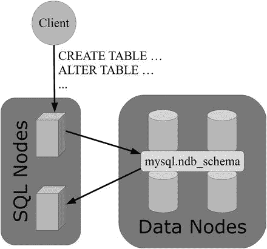
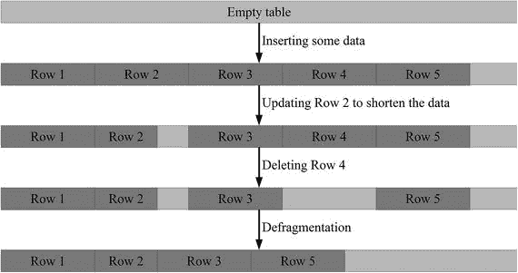
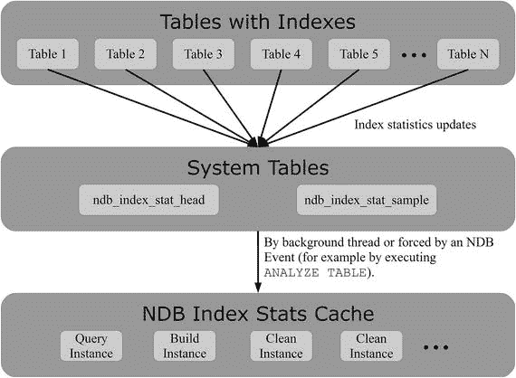

# 9. 表维护

第二部分涵盖了安装和配置集群所需的任务，而本部分一直专注于日常维护集群所使用的工具和程序。数据库管理员的一项重要任务是表维护。这包括相对不频繁的任务，例如向现有表添加新列、维护良好的索引集，以及更频繁的任务，如对表进行碎片整理和更新索引统计信息。本章将讨论所有这些任务。

### 模式变更

无论模式规划得多么仔细，最终都需要进行一些模式变更。这可能是由于应用程序的新需求，或者是因为模式设计没有达到最初预期的效果。生产环境中的模式变更通常是数据库系统的一个痛点；然而，对于 `NDB Cluster` 表，在多种情况下可以在表在线时进行变更，应用程序可以继续读写正在被更改的表。本节的其余部分将解释如何进行模式变更。

#### 分发模式变更与全局模式锁

当对 `NDB Cluster` 表进行模式变更时，该变更必须分发到所有 SQL 节点，并且需要一种机制来避免并发的冲突模式变更。全局模式锁的实现细节超出了本书的范围；但是，了解一些高层信息是有益的。这是本小节的主题。

MySQL NDB Cluster 使用隐藏的 `mysql.ndb_schema` 表来跟踪模式变更。它是一个 `NDB Cluster` 表，因此所有 API 节点对该表具有相同的视图。它是隐藏的，因此不会出现在 `SHOW TABLES` 语句或查询 Information Schema 表时——尽管使用 `ndb_show_tables` 实用程序或 `ndbinfo.dict_obj_info` 视图可以在数据节点数据字典中看到它：

```shell
shell$ ndb_show_tables | grep ' ndb_schema$'
7     UserTable            Online   Yes     mysql        def      ndb_schema
```

```mysql
mysql> SELECT type_name, id AS TableID, fq_name
FROM ndbinfo.dict_obj_info
INNER JOIN ndbinfo.dict_obj_types ON type_id = type
WHERE fq_name = 'mysql/def/ndb_schema';
+------------+---------+----------------------+
| type_name  | TableID | fq_name              |
+------------+---------+----------------------+
| User table |       7 | mysql/def/ndb_schema |
+------------+---------+----------------------+
1 row in set (0.02 sec)
```

也可以直接查询该表，这在调试时很有用。例如，它将显示最后一次修改该表的查询以及该表的模式版本。清单 [9-1] 显示了 `db1.t1` 表的示例。

```mysql
mysql> SELECT * FROM mysql.ndb_schema WHERE db = 'db1' AND name = 't1'\G
*************************** 1. row ***************************
db: db1
name: t1
slock:
query: ALTER TABLE t1 ADD INDEX (val)
node_id: 51
epoch: 0
id: 10
version: 100663299
type: 7
1 row in set (0.08 sec)
```

**清单 9-1. `mysql.ndb_schema` 中关于 `db1.t1` 表的信息**



**图 9-1. 通过 `mysql.ndb_schema` 表进行的模式分发**

当两个 SQL 节点同时尝试更改同一个表的模式时，第二个开始的语句将被阻塞，直到第一个完成。例如，这可以从 `SHOW PROCESSLIST` 的输出中看到，如清单 [9-2] 所示，其中查询正在等待授予全局模式锁。全局模式锁应像任何其他锁一样对待——解决方案是等待锁被释放或终止持有锁的查询。如果锁没有被释放（这将是一个错误），通常重启持有锁的 SQL 节点会有所帮助。

```mysql
mysql> SHOW PROCESSLIST\G
...
*************************** 2. row ***************************
Id: 4
User: root
Host: localhost:49501
db: db1
Command: Query
Time: 1
State: Waiting for ndbcluster global schema lock
Info: ALTER TABLE t1 ADD INDEX (val)
...
```

**清单 9-2. `ALTER TABLE` 查询等待全局模式锁**

了解了 MySQL NDB Cluster 如何处理模式变更的分发以及两个冲突的模式变更如何避免同时执行的一些背景知识后，现在可以继续讨论模式变更本身了。


### 在线与离线模式变更

在 MySQL NDB 集群中，模式变更可分为两类：可在线执行的变更和需要使表离线的变更。在线模式变更的优势在于，它们对应用程序正在进行的活动造成的干扰最小。对于 `NDB Cluster` 表的多种模式变更类型，这都是可能的。表 9-1 总结了在线和离线模式变更的特性。接下来的两节将更详细地介绍，本章后面还有几个在线和离线模式变更的示例。

表 9-1. 在线与离线模式变更

|   | 在线 | 离线 |
| --- | --- | --- |
| 实现方式 | 模式变更被下推到数据节点并原地执行，即不创建新表和复制数据。 | SQL 节点通过创建具有新架构的新表并复制数据来处理模式变更。最后，删除旧表并将新表重命名。 |
| 在执行变更的 SQL 节点上 | 需要对表获取排他锁。 | 获取排他表级锁。即使指定了 `LOCK=SHARED` 也是如此。（请求共享锁还是排他锁会影响并发查询是因元数据锁还是表锁而阻塞。）此外，在 `LOCK=SHARED` 模式下执行并发查询时，在 `ALTER TABLE` 结束时对新表进行重命名将导致死锁。 |
| 在其他 API 节点上 | 允许并安全地进行读写操作。 | DML 语句不会发生锁操作，但这些操作不安全，在模式变更期间进行的任何数据更改都可能丢失。因此，建议将集群置于单用户模式，如第 7 章所述。 |

如两种模式变更方法的比较所示，在线和离线模式变更有根本上的不同，而且离线模式变更比在线模式变更的侵入性要大得多。

### 离线模式变更

值得更详细地讨论为离线模式变更启用单用户模式的建议。在将数据复制到新表时，没有事务日志来跟踪对表的更改。因此，在过程结束时，当旧表被新表替换时，对已复制部分的表所做的更改（包括插入新行）将会丢失。如果能保证只发生读取操作，那么在模式变更是可以保持其他节点在线，但在实践中，最好使用单用户模式功能，并在必要时将查询其他表的请求重定向到执行模式变更的 SQL 节点。

### 注意

不要在正在进行离线模式变更的表中插入、更新或删除数据。这些更改可能会丢失。建议使用第 7 章讨论的单用户模式功能，以避免无意中丢失数据。

执行模式变更需要资源，无论使用哪种算法。然而，由于复制模式变更在应用更改时需要一个额外的表，因此在此期间还需要更多的属性、内存和/或磁盘使用量。根据经验法则，在模式变更进行期间，表所需的属性数量是原始表的三倍。

第 4 章讨论了如何计算表使用的属性数量。为了留出一些余地，应配置 `MaxNoOfAttributes` 以允许至少六倍于原始表的属性数量。如果 `MaxNoOfAttributes` 的值太小，将返回如清单 9-3 所示的错误。在这种情况下，必须增加 `MaxNoOfAttributes` 的值，这需要对数据节点进行滚动重启（参见第 10 章）。

```
mysql> ALTER TABLE t1 ALGORITHM=COPY, ADD INDEX (val);
ERROR 1025 (HY000): Error on rename of './db1/t1' to './db1/#sql2-361e-5' (errno: 708 - Unknown error 708)
mysql> SHOW WARNINGS\G
*************************** 1. row ***************************
Level: Warning
Code: 1296
Message: Got error 708 'No more attribute metadata records (increase MaxNoOfAttributes)' from NDB
*************************** 2. row ***************************
Level: Error
Code: 1025
Message: Error on rename of './db1/t1' to './db1/#sql2-361e-5' (errno: 708 - Unknown error 708)
2 rows in set (0.01 sec)
```

清单 9-3. 因 `MaxNoOfAttributes` 值过小而导致的错误

### 在线模式变更

在线模式变更显然是首选：它们允许应用程序继续完全在线运行，并且模式变更可以原地发生。这意味着工作量要少得多，因此模式变更完成得更快。但是，有一个注意事项：并非所有的模式变更都可以在线进行。在线模式变更的一般限制是：

*   表必须有一个显式的主键。当使用隐藏主键时，必须始终使用复制式的离线模式变更。
*   一次只能执行以下更改之一：添加索引、删除索引或添加列。如果需要进行多项更改，请按顺序执行。
*   模式变更会对表获取排他锁，这会影响连接到同一 SQL 节点的会话。因此，使用该表的并发查询将被阻塞。出于这个原因，可以考虑额外保留一个用于管理任务（如表维护）的 SQL 节点。

对于每个支持原地更改的操作，还有更具体的限制。支持的在线操作及其限制列于表 9-2 中。

表 9-2. 支持原地算法的模式变更的限制

| 模式变更 | 限制与说明 |
| --- | --- |
| `ADD INDEX` | 不能与 `DROP INDEX` 或 `ADD COLUMN` 同时使用。一次只能创建一个索引。适用于 `ALTER TABLE ... ADD INDEX` 和 `ADD INDEX` 语句。 |
| `DROP INDEX` | 不能与 `ADD INDEX` 或 `ADD COLUMN` 同时使用。一次只能删除一个索引。适用于 `ALTER TABLE ... DROP INDEX` 和 `DROP INDEX` 语句。 |
| `ADD COLUMN` | 该列必须使用动态列格式。如果未明确指定列格式，MySQL NDB 集群将自动选择动态格式并返回警告。不支持 TEXT 和 BLOB 数据类型。该列必须是 `DEFAULT NULL` 并允许空值。该列必须位于表定义中所有现有列之后¹。 |
| `REORGANIZE PARTITIONS` | 用于向集群添加更多数据节点或增加 LDM 线程数之后。 |
| `OPTIMIZE TABLE` | 这不是 `ALTER TABLE` 操作。其使用将在碎片整理部分讨论。 |
| `RENAME` (表) | 适用于 `ALTER TABLE ... RENAME ...` 和 `RENAME TABLE` 语句。只能在线重命名表名。重命名索引或列需要使用离线复制式 `ALTER TABLE`。 |
| 设置 `READ_BACKUP` 属性 | 此功能在 MySQL NDB 集群 7.5 中是新的。从备份副本读取的功能在第 2 章中已讨论。 |

默认情况下，如果支持将选择原地算法；否则，将进行复制式模式变更。下一节讨论如何使用 `ALTER TABLE` 语句指定要使用的算法。

#### ALTER TABLE 算法

执行模式变更的语法在一定程度上取决于 MySQL NDB Cluster 的版本。在 MySQL NDB Cluster 7.2 及更早版本中，使用 `ALTER TABLE` 的 `ONLINE` 和 `OFFLINE` 关键字来指定应执行在线还是离线模式变更。在 MySQL NDB Cluster 7.3 及更高版本中，`InnoDB` 存储引擎也支持在线模式变更，语法已更改为使用 `ALGORITHM` 属性，而 `ONLINE` 和 `OFFLINE` 关键字已被弃用（并在 MySQL NDB Cluster 7.5 中移除）。`ALGORITHM` 选项接受以下三个值之一：

*   `INPLACE`：这将在表的现有副本内执行模式变更。这通常是首选，因为它比创建表副本更快。对于 `NDBCluster` 表，这等同于在线模式变更。
*   `COPY`：这会使用新的表定义创建表的副本。对于 `NDBCluster` 表，这等同于离线模式变更。
*   `DEFAULT`：如果可能则选择 `INPLACE`，否则选择 `COPY`。指定 `DEFAULT` 与不指定 `ALGORITHM` 选项相同。

注意

术语 "online" 和 "offline" 分别与 "in-place" 和 "copy" 可互换。因此，新旧语法在概念上没有变化。

在 7.3 及更高版本中，还可以使用 `ALTER TABLE` 的 `LOCK` 选项来设置锁类型。锁类型仅适用于执行 `ALTER TABLE` 的本地 SQL 节点。它在 MySQL NDB Cluster 中的用途有限，因为在线模式变更始终需要排他锁，而对于离线模式变更，原则上可以选择使用共享锁或排他锁。（如前所述，不建议尝试使用共享锁。）

小心

如果尝试在同一 SQL 节点上并发查询使用该表，使用 `ALGORITHM=COPY, LOCK=SHARED` 进行离线模式变更将导致死锁。

以下 `ALTER TABLE` 语句是在线/in-place 模式变更的示例：

*   MySQL NDB Cluster 7.3 及更高版本。

    ```
    mysql> ALTER TABLE t1 [ALGORITHM=INPLACE, ]
    [LOCK=EXCLUSIVE, ]
    ;
    ```

*   MySQL NDB Cluster 7.2 及更早版本。

    ```
    mysql> ALTER [ONLINE] TABLE ;
    ```

在这里，方括号 (`[...]`) 内的语句部分是可选的，两个单词之间的竖线 (`|`) 表示必须选择一个单词，实际的模式变更应放在 `<schema change specification>` 所在的位置。

用于离线/复制模式变更的 `ALTER TABLE` 语句示例如下（使用的语法与在线模式变更相同）：

*   MySQL NDB Cluster 7.3 及更高版本。

    ```
    mysql> ALTER TABLE t1 [ALGORITHM=COPY, ]
    [LOCK=SHARED|EXCLUSIVE, ]
    ;
    ```

*   MySQL NDB Cluster 7.2 及更早版本。

    ```
    mysql> ALTER [OFFLINE] TABLE ;
    ```

注意 `ALGORITHM` 和 `LOCK` 选项后的逗号。本章后面有关于各种模式变更的示例。

为了保持向后兼容性，在 MySQL NDB Cluster 7.3 和 7.4 中也可以使用 `ONLINE` 和 `OFFLINE` 关键字；但是，建议开始使用新语法，并且在 7.5 及更高版本中，`ALGORITHM` 选项是唯一支持的用于指定模式变更应进行原地修改还是作为复制 `ALTER TABLE` 执行的语法。在 7.3 和 7.4 版本中使用 `ONLINE` 和 `OFFLINE` 关键字也会导致弃用警告。

以上就是在线和离线模式变更背后的理论。在讨论分区重组之前，我们先探讨一系列 `ALTER TABLE` 示例。

#### ALTER TABLE 示例

由于语法一开始可能比较困难，所以值得看一些示例。本节中的示例使用以下表格作为模式变更前的表定义：

```
mysql> SHOW CREATE TABLE t1\G
*************************** 1. row ***************************
Table: t1
Create Table: CREATE TABLE `t1` (
`id` int(10) unsigned NOT NULL,
`val` varchar(10) DEFAULT NULL,
PRIMARY KEY (`id`)
) ENGINE=ndbcluster DEFAULT CHARSET=latin1
1 row in set (0.02 sec)
```

请不要按示例中的时间值生搬硬套，因为它们来自一台相对较旧的笔记本电脑上的虚拟机。执行模式变更所需的时间也取决于数据量。然而，原地修改和复制模式变更之间的相对时间是相关的。

##### 默认行为

默认情况下，如果支持则使用 `INPLACE` 算法，否则使用 `COPY` 算法。例如，在不指定任何修饰符的情况下，将接受 null 值的列添加为最后一列将是在线进行的：

```
mysql> ALTER TABLE t1 ADD COLUMN rank int unsigned;
Query OK, 0 rows affected, 1 warning (2.62 sec)
Records: 0  Duplicates: 0  Warnings: 1
mysql> SHOW WARNINGS\G
*************************** 1. row ***************************
Level: Warning
Code: 1478
Message: Converted FIXED field 'rank' to DYNAMIC to enable online ADD COLUMN
1 row in set (0.00 sec)
```

注意这个警告。之所以显示它，是因为默认情况下整数列将使用固定列格式，但对于在线模式变更的发生，必须使用动态列格式。可以更明确地指定行为同时避免警告。这就是下一个示例。

##### 使用显式列格式添加列

如前一个示例所示，MySQL NDB Cluster 会自动为原地模式变更选择动态列格式，即使对于默认使用固定列格式的数据类型也是如此，但这会引发警告。最好避免此警告，因为它可能导致更重要的问题被忽视。为避免此警告，解决方案是显式指定列格式：

```
mysql> ALTER TABLE t1
ADD COLUMN rank int unsigned COLUMN_FORMAT DYNAMIC;
Query OK, 0 rows affected (2.26 sec)
Records: 0  Duplicates: 0  Warnings: 0
```

提示

最佳实践是编写不引发任何警告的查询。这样更容易识别可能导致问题的查询，例如，因为它们使用了已弃用的功能。可以使用 `SHOW WARNINGS` 语句（如前一个示例）查看警告，或者通过在 `mysql` 命令行客户端中使用 `warnings` 命令自动启用警告。

如果不希望 MySQL NDB Cluster 选择算法，或者如果模式变更只有在可以使用原地算法完成时才重要，该怎么办？接下来的两个示例将介绍这一点。

##### 指定算法和锁类型

如果不执行 `ALTER TABLE` 语句，就无法知道将选择哪种算法。如果选择了复制算法，而预期是原地变更，这可能会导致意外情况。为避免此问题，请使用 `ALGORITHM` 选项显式设置算法：

```
mysql> ALTER TABLE t1 ALGORITHM=INPLACE, ADD INDEX (val);
Query OK, 0 rows affected (8.29 sec)
Records: 0  Duplicates: 0  Warnings: 0
```

可以通过显式设置本地 SQL 模式的锁类型来进行相同的变更。由于这是在线模式变更，锁类型必须设置为排他锁：

```
mysql> ALTER TABLE t1 ALGORITHM=INPLACE, LOCK=EXCLUSIVE, ADD INDEX (val);
Query OK, 0 rows affected (8.25 sec)
Records: 0  Duplicates: 0  Warnings: 0
```

相同的示例，但这里使用离线复制模式变更添加索引，使用 `ALGORITHM=COPY`：

```
mysql> ALTER TABLE t1 ALGORITHM=COPY, LOCK=EXCLUSIVE, ADD INDEX (val);
Query OK, 131072 rows affected (2 min 23.23 sec)
Records: 131072  Duplicates: 0  Warnings: 0
```

注意通过表复制添加索引所需的时间要长得多。

如果选择了 `ALGORITHM=INPLACE`，但变更不支持它，会发生什么？这是接下来要讨论的内容。


##### 尝试不支持的原地更改

如果请求使用原地算法，但所涉及的模式变更不支持该算法，MySQL 将会返回错误。例如，删除列只能使用复制算法完成：

```
mysql> ALTER TABLE t1 ALGORITHM=INPLACE, DROP COLUMN rank;
ERROR 1846 (0A000): ALGORITHM=INPLACE is not supported. Reason: Detected unsupported change. Try ALGORITHM=COPY.
```

**提示**

明确指定 `ALGORITHM=INPLACE` 的一个优点是，它可以确保不会误执行复制式的 `ALTER TABLE`。如果 `INPLACE` 算法不受支持，该语句将失败并报错。

最后一种需要考虑的情况是 MySQL NDB Cluster 7.2 及更早版本中的模式变更，其中不支持 `ALGORITHM` 和 `LOCK` 关键字。

##### 7.2 及更早版本中的模式变更

在 MySQL NDB Cluster 7.2 及更早版本中，使用 `OFFLINE` 和 `ONLINE` 关键字代替 `ALGORITHM` 关键字来指定模式变更的执行方式。无法设置锁定类型；执行 `ALTER TABLE` 的 SQL 节点上总是会采取排他锁。

例如，要在线（原地）添加索引，请使用：

```
mysql> ALTER ONLINE TABLE t1 ADD INDEX (val);
```

离线（复制）模式变更的一个例子是使用固定列格式添加列：

```
mysql> ALTER OFFLINE TABLE t1
ADD COLUMN rank int unsigned COLUMN_FORMAT FIXED DEFAULT NULL;
```

关于进行模式变更的 `ALTER TABLE` 示例到此结束。然而，`ALTER TABLE` 也用于重组分区；例如，在更改数据节点数量和/或 LDM 线程之后。这是下一节的主题。

### 重组分区

进行模式变更的一个特殊情况是重组分区。默认情况下，`NDBCluster` 表的创建基于数据节点数量和每个数据节点的 LDM 线程数量来确定分区数量。当集群配置发生变化时，有必要重新分布数据以利用新的集群配置。表 9-3 展示了各种集群配置更改，并讨论了针对每种情况如何重组分区。概述显示，扩展可以通过在线模式变更完成，而缩减则需要离线模式变更。

表 9-3.

集群配置更改后重组分区的要求

| 配置更改 | 重组分区方法 |
| --- | --- |
| 增加数据节点数量 | 可以使用 `ALTER TABLE t1 REORGANIZE PARTITION`。这是一个在线操作。示例请参见第 10 章。 |
| 减少数据节点数量 | 需要重新创建表。可以使用空 `ALTER TABLE`：`ALTER TABLE t1 ENGINE=NDBCluster`。这是一个离线操作。 |
| 增加 LDM 线程数量 | 可以使用 `ALTER TABLE ... REORGANIZE PARTITION`。这是一个在线操作，但必须在两次滚动重启（第一次滚动重启更改 LDM 线程数量）或系统重启后才能首次执行。 |
| 减少 LDM 线程数量 | 需要重新创建表。可以使用空 `ALTER TABLE`：`ALTER TABLE t1 ENGINE=NDBCluster`。这是一个离线操作。 |

**注意**

`REORGANIZE PARTITION` 仅支持使用自动分区的表。为了对使用自定义分区的表进行重新分区，需要指定新的分区数量来重建表，例如：`mysql> ALTER TABLE t1 ALGORITHM=COPY                      PARTITION BY KEY (id) PARTITIONS 8;`

即使在线重组分区是原地执行的，它也是一个开销巨大的操作。在跟踪数据位置以服务并发查询的同时，必须移动数据。此外，它会使原始分区产生碎片。通常，离线复制式的空 `ALTER TABLE` 会更快，同时还能对表进行碎片整理。空 `ALTER TABLE` 会重建表，并且（除了新表副本是按当前集群配置的默认分区数量创建的之外）不对表做任何更改。空 `ALTER TABLE` 总是一个复制操作，必须离线完成。本节剩余部分包括在线重组分区与重建表的示例，以及关于表碎片整理的讨论。

使用 `REORGANIZE PARTITION` 在线重组分区的示例如下：

```
mysql> ALTER TABLE t1 ALGORITHM=INPLACE, REORGANIZE PARTITION;
Query OK, 0 rows affected (22 min 57.51 sec)
Records: 0  Duplicates: 0  Warnings: 0
```

要改用空 `ALTER TABLE`——无论是在减少数据节点或 LDM 线程数量之后，还是为了完全整理表的碎片（另见下一节）——请使用：

```
mysql> ALTER TABLE t1 ALGORITHM=COPY, LOCK=EXCLUSIVE, ENGINE=NDBCluster;
Query OK, 131072 rows affected (3 min 41.43 sec)
Records: 131072  Duplicates: 0  Warnings: 0
```

请注意此表重建与在线 `REORGANIZE PARTITION` 语句相比所花费的时间。这是复制式模式变更比在线方式更快的一种情况。

**提示**

当需要重组分区时，如果可接受停机时间，最好通过执行空 `ALTER TABLE` 来完成。这通常比在线的 `REORGANIZE PARTITION` 更快，同时能完全整理表的碎片。


清单 9-4 展示了一个可用于查找适合作为分区重组候选表的查询示例。该查询要求所有数据节点均处于在线状态。MySQL NDB Cluster 的版本必须至少为 7.5。如果一个表的当前分区数量，与根据当前集群配置创建新表时将采用的分区数量不同，则该表将被包含在结果中。查询还会指示该表是使用自动分区还是手动分区创建的。清单之后会解释该查询。

## 清单 9-4. 查找适合作为分区重组候选表的表

```
mysql> SELECT tds.table_id AS TableId, tbl.TableSchema, tbl.TableName,
tds.tab_partitions AS TablePartitions,
(
CASE ti.partition_balance
WHEN 'FOR_RA_BY_LDM'
THEN thr.NumLdmThreads/cfg.NoOfReplicas
WHEN 'FOR_RP_BY_NODE'
THEN n.NumDataNodes
WHEN 'FOR_RA_BY_NODE'
THEN n.NoOfNodeGroups
ELSE thr.NumLdmThreads
END / IF(ti.fully_replicated, n.NoOfNodeGroups, 1)
) AS DefaultNumPartitions,
IF(ti.partition_balance = 'SPECIFIC',
'YES',
'NO'
) AS HasCustomPartitions
FROM (SELECT COUNT(*) AS NumLdmThreads
FROM ndbinfo.threads
WHERE thread_name = 'ldm'
) thr
CROSS JOIN (
SELECT COUNT(*) AS NumDataNodes,
COUNT(DISTINCT group_id) AS NoOfNodeGroups
FROM ndbinfo.membership
) n
CROSS JOIN (
SELECT config_value AS NoOfReplicas
FROM ndbinfo.config_params p
INNER JOIN ndbinfo.config_values v
ON v.config_param = p.param_number
WHERE p.param_name = 'NoOfReplicas'
LIMIT 1 /* NoOfReplicas 在所有节点上必须相同 */
) cfg
INNER JOIN ndbinfo.table_distribution_status tds
INNER JOIN ndbinfo.table_info ti ON ti.table_id = tds.table_id
INNER JOIN (
SELECT id AS table_id,
SUBSTRING_INDEX(fq_name, '/', 1) AS TableSchema,
SUBSTRING_INDEX(fq_name, '/', -1) AS TableName
FROM ndbinfo.dict_obj_info doi
INNER JOIN ndbinfo.dict_obj_types dot
ON dot.type_id = doi.type
WHERE dot.type_name = 'User table'
) tbl ON tbl.table_id = tds.table_id
WHERE NOT ((tbl.TableSchema = 'mysql' AND tbl.TableName LIKE 'NDB$%')
OR (tbl.TableSchema = 'sys'
AND (tbl.TableName LIKE 'NDB$%'
OR tbl.TableName LIKE 'SYSTAB\_%'
)
)
)
HAVING TablePartitions <> DefaultNumPartitions
ORDER BY TableSchema, TableName;
清单 9-4.
查找适合作为分区重组候选表的表
```

由于该查询相当复杂，值得研究一下其各个组成部分。`SELECT` 部分中的 `CASE` 语句根据分区分布以及分区是否完全复制来计算预期的分区数。如果使用了自定义分区，则分区平衡设置为 `SPECIFIC`。

`FROM` 子句中的第一个子查询使用 `ndbinfo.threads` 视图来确定集群中 LDM 线程的数量。第二个子查询使用 `ndbinfo.membership` 视图来查找数据节点和节点组的数量。第三个子查询通过 `ndbinfo.config_params` 和 `ndbinfo.config_values` 视图检查配置，以获取 `NoOfReplicas` 配置选项的值。这三个子查询各自只返回一行，因此可以使用 `CROSS JOIN`，并且总体上结果仍然只有一行。

接下来的连接是与 `ndbinfo.table_distribution_status` 视图，它包含关于表分区数量的信息。此外，与 `ndbinfo.table_info` 的连接提供了表的分区平衡设置以及分区是否完全复制。最后，一个子查询使用两个字典 `ndbinfo` 视图——`ndbinfo.dict_obj_info` 和 `ndbinfo.dict_obj_types`——从完全限定的 NDB Cluster 名称 (`fq_name`) 中获取模式名和表名。

`WHERE` 子句过滤掉了系统表和其他无法重组的内部表。

清单 9-4 中使用的 `ndbinfo.table_distribution_status` 表也可用于确定 `REORGANIZE PARTITION` 操作是否正在进行中，如清单 9-5 所示。`INNER JOIN` 部分中的子查询与清单 9-4 中使用的子查询相同，用于获取每个正在经历分区重组的表的模式名和表名。

## 清单 9-5. 查找当前正在进行分区重组的表

```
mysql> SELECT tds.table_id AS TableId, tbl.TableSchema, tbl.TableName
FROM ndbinfo.table_distribution_status tds
INNER JOIN (
SELECT id AS table_id,
SUBSTRING_INDEX(fq_name, '/', 1) AS TableSchema,
SUBSTRING_INDEX(fq_name, '/', -1) AS TableName
FROM ndbinfo.dict_obj_info doi
INNER JOIN ndbinfo.dict_obj_types dot
ON dot.type_id = doi.type
WHERE dot.type_name = 'User table'
) tbl ON tbl.table_id = tds.table_id
WHERE tds.is_reorg_ongoing = 1;
+---------+-------------+-----------+
| TableId | TableSchema | TableName |
+---------+-------------+-----------+
|       4 | office      | employee  |
+---------+-------------+-----------+
1 row in set (1.98 sec)
清单 9-5.
查找当前正在进行分区重组的表
```

本节前面讨论的空 `ALTER TABLE` 语句对于重组分区还有第二个用途：表重建还会对表进行碎片整理。碎片整理——无论是就地（在线）操作还是复制（离线）操作——是接下来要讨论的主题。


### 碎片整理

随着时间的推移，数据被插入、删除和更新，表的数据存储中会出现间隙，并且逻辑上属于一起的数据（存储在同一个表中）可能不会位于连续的内存区域中。这被称为碎片化，它会导致使用的存储量大于必要值。例如，在向集群添加更多数据节点后重组分区时，可能会发生碎片化。

**提示**

表数据的碎片化与文件系统碎片化并非完全不同。例如，可以参阅 [`https://en.wikipedia.org/wiki/File_system_fragmentation`](https://en.wikipedia.org/wiki/File_system_fragmentation) 获取深入讨论。

由对数据的各种更改而产生的空闲空间仍然会计入 `DataMemory` 或磁盘表空间数据文件中使用的总数据量。虽然这些内存可以用于同一表的新数据，但不能用于集群中存储的其他表。这意味着，即使在原则上仍有空闲内存的情况下，也有可能遇到表已满的错误。要回收分配给了表但实际空闲的任何内存，您必须对表进行碎片整理，以便移动数据以减少或消除间隙。

图 9-2 展示了数据内部如何发生碎片化的示例以及碎片整理过程的结果。该示例并非 `NDBCluster` 特有，仅用于说明目的。在更新第 2 行后，第 2 行和第 3 行之间的浅灰色空间，以及在删除第 4 行后，第 3 行和第 5 行之间的空间都是空白空间；这就是碎片化。最后的碎片整理移动了第 3 行和第 5 行以合并空闲空间。但请注意，碎片整理是一项开销大且速度慢的操作，特别是在需要重建表时。


*图 9-2. 碎片化和碎片整理*

对于 `NDBCluster` 表，可以通过以下三种方式之一实现碎片整理：

-   使用 `OPTIMIZE TABLE` 语句
-   重启数据节点
-   重建表（使用复制方式的空 `ALTER TABLE`）

最简单且影响最小的方法是使用 `OPTIMIZE TABLE` 语句：

```
mysql> OPTIMIZE TABLE t1;
+--------+----------+----------+----------+
| Table  | Op       | Msg_type | Msg_text |
+--------+----------+----------+----------+
| db1.t1 | optimize | status   | OK       |
+--------+----------+----------+----------+
1 row in set (1 min 37.88 sec)
```

在 `NDBCluster` 中，`OPTIMIZE TABLE` 是一项在线操作。但是，只会对可变大小的内存（动态）进行碎片整理。

滚动重启（参见第 10 章）也会对可变大小数据进行碎片整理，其优点是从头重建索引，因此它将提供比 `OPTIMIZE TABLE` 更好的碎片整理效果。对于固定宽度的内存，回收碎片化内存的唯一方法是重建表。表重建可以通过空 `ALTER TABLE` 操作实现：

```
mysql> ALTER TABLE t1 ALGORITHM=COPY, LOCK=EXCLUSIVE, ENGINE=NDBCluster;
Query OK, 131072 rows affected (3 min 41.43 sec)
Records: 131072  Duplicates: 0  Warnings: 0
```

这与之前讨论的当在线 `REORGANIZE PARTITION` 不起作用时重新分区表的方法相同。这将离线重建表，但除此之外，除非自上次表重建或创建以来数据节点或 LDM 线程的数量发生了变化，否则不会进行其他更改，除了可能重新分区表。

本章一直在讨论数据和索引的模式与存储。然而，还有另一个与日常表维护相关的方面：索引统计。这是本章的最后一个主题。

### 索引统计

当查询通过 SQL 节点执行时，语句会被发送到优化器，优化器将确定用于实际执行的查询计划。虽然优化器总体上超出了本书的范围，但有一个与确定查询计划相关的方面值得讨论：索引统计。

索引统计提供了表中索引唯一值的数量估计。例如，考虑清单 9-6 中的表、数据和索引统计。该表有三个索引——主键、一个跨越 `Surname` 和 `FirstName` 两列的索引，以及一个在 `IsManager` 列上的索引。在表本身上使用 `COUNT()` 聚合函数的查询显示了每个索引以及 `Name` 索引部分索引的实际唯一值数量。最后，最后一个查询显示了根据索引统计得出的相同唯一值数量。唯一值的数量也称为基数。

**注意**

`NDBCluster` 表的索引统计还包括范围内的记录数估计——例如，有多少行的值 x 在 5 到 10 之间。这些估计值并未直接公开，有时可能导致非最优的查询计划。当发生这种情况时，请使用索引提示（[`dev.mysql.com/doc/refman/5.7/en/index-hints.html`](https://dev.mysql.com/doc/refman/5.7/en/index-hints.html)）以获得更好的索引。本书将不再进一步讨论范围内的记录数估计。

```
mysql> SHOW CREATE TABLE office.employee\G
*************************** 1. row ***************************
Table: employee
Create Table: CREATE TABLE `employee` (
`EmployeeID` int(10) unsigned NOT NULL,
`FirstName` varchar(20) DEFAULT NULL,
`Surname` varchar(20) DEFAULT NULL,
`IsManager` enum('No','Yes') NOT NULL,
PRIMARY KEY (`EmployeeID`),
KEY `Name` (`Surname`,`FirstName`),
KEY `IsManager` (`IsManager`)
) ENGINE=ndbcluster DEFAULT CHARSET=latin1
1 row in set (0.01 sec)
mysql> SELECT COUNT(*), COUNT(DISTINCT EmployeeID),
COUNT(DISTINCT Surname), COUNT(DISTINCT Surname, FirstName),
COUNT(DISTINCT IsManager)
FROM office.employee\G
*************************** 1. row ***************************
COUNT(*): 10000
COUNT(DISTINCT EmployeeID): 10000
COUNT(DISTINCT Surname): 372
COUNT(DISTINCT Surname, FirstName): 8543
COUNT(DISTINCT IsManager): 2
1 row in set (0.05 sec)
mysql> SELECT INDEX_NAME, NON_UNIQUE, COLUMN_NAME, CARDINALITY
FROM information_schema.STATISTICS
WHERE TABLE_SCHEMA = 'office' AND TABLE_NAME = 'employee';
+------------+------------+-------------+-------------+
| INDEX_NAME | NON_UNIQUE | COLUMN_NAME | CARDINALITY |
+------------+------------+-------------+-------------+
| PRIMARY    |          0 | EmployeeID  |       10000 |
| Name       |          1 | Surname     |         391 |
| Name       |          1 | FirstName   |        9204 |
| IsManager  |          1 | IsManager   |           2 |
+------------+------------+-------------+-------------+
4 rows in set (0.00 sec)
```
*清单 9-6. 包含其数据和索引统计的表示例*

观察清单 9-6 中的基数，有几点需要注意：


*   主键的基数等于行数。这是定义上的，因为主键要求所有值唯一且不允许空值。这同样适用于所有定义为 `NOT NULL` 的唯一索引。
*   `Name` 索引（`Surname` 和 `FirstName`）的基数不等于唯一值的数量。`Surname`（391）和 `FirstName`（9204）都列出了各自的基数。`FirstName` 的基数是与 `Surname` 组合后的基数，即索引的总体基数。这是因为 `NDBCluster` 在计算基数时不做精确统计，而是通过扫描随机索引片段来获取索引值的样本，从而进行估计。对于像 `Name` 这样具有许多不同值的索引，这种估计不会精确。在本例中，误差大约为百分之七，这很少会导致选择错误的查询计划。
*   `IsManager` 索引的基数被发现为二。这并不奇怪，因为该列只接受两个值（`No` 和 `Yes`）。在这种情况下，索引统计恰好与不同值的计数相符，因为扫描的片段足以表明未检查的值不太可能包含除这两个值之外的其他值。

对于 `employee` 表，`Name` 索引对于按姓名搜索员工的查询非常有价值。它将使查询只需检查几行，而不是表中的全部 10000 行。然而，`IsManager` 索引用处不大，因为它平均只能过滤掉 50% 的行，因此表扫描无论如何都是最高效的方式。这意味着 `IsManager` 索引只增加开销：它在 `DataMemory` 中使用内存，并且在插入、更新或删除数据时维护索引也有开销。

本节的其余部分将讨论影响索引统计的选项，以及用于重新计算它们的实用程序和语句。

#### 索引统计内部机制

在深入探讨更新索引统计及其行为配置的细节之前，有必要简要了解一下 MySQL NDB Cluster 中索引统计的内部实现机制。这只是一个概述，更深层次的细节超出了本书的范围。

索引统计在数据节点内部存储在两个系统表中。这两个表也在 SQL 节点上作为 `mysql` 模式中的以下表暴露：

*   `ndb_index_stat_head`：索引统计的元信息。对于已计算统计信息的索引，每个索引对应一行。
*   `ndb_index_stat_sample`：索引的实际样本数据。

这些表使用 `NDBCluster` 存储引擎，因此它们在 SQL 节点之间是同步的。然而，在每个 SQL 节点上，统计信息被加载到一个缓存中。此缓存通过两种方式更新：

*   当 `ANALYZE TABLE` 的执行完成时。即使语句是在不同的 SQL 节点上执行的，也会发生这种情况。
*   通过一个后台索引统计线程。

后台线程响应优化器的查询，并确保如果索引统计直接在数据节点上更新（使用后面讨论的 `ndb_index_stat` 实用程序），则 SQL 节点上的缓存也会更新。后台线程的缓存更新不会立即发生，而是按线程的计划进行。其配置将在本章后面讨论。

缓存本身被分成多个实例，可以是以下类型之一：

*   `Query`：当前用于响应查询的缓存实例。
*   `Build`：当前正在填充的缓存。
*   `Clean`：可以有多个 `Clean` 类型的实例。这些是可以被删除的旧缓存实例。

索引统计实现的概述如图 9-3 所示。



图 9-3.

索引统计实现概述

#### 维护索引统计

确保索引统计反映表中的数据分布非常重要。否则，查询计划将不是最优的。在涉及多个表连接的复杂查询中，错误的查询计划在最坏的情况下可能导致查询比最优查询计划慢多达 100 倍或更多。`NDBCluster` 表的索引统计有三种更新方式：

*   显式执行 `ANALYZE TABLE`。
*   使用 `ndb_index_stat` 实用程序。此工具也可用于其他任务，例如创建和删除存储索引统计的系统表。
*   后台自动更新。

这三种方法的基本工作原理相同；然而，对于用户来说，有一些值得更详细讨论的差异。

`ANALYZE TABLE` 是一个特定于 SQL 节点的语句，用于计算表的索引统计。它适用于所有支持索引的存储引擎的表。这是更新索引统计的最常用方法。清单 9-7 展示了更新一个和两个表示例。可以通过在列表中添加更多表（用逗号分隔）来在同一条语句中分析更多表。如果未指定模式名，则使用当前模式。

第一条语句更新当前模式下 `employee` 表的索引统计，而第二条语句更新 `office` 模式下 `employee` 和 `address` 表的统计。`ANALYZE TABLE` 语句在结束时触发一个事件，确保缓存尽快更新；实际上，缓存的更新看起来就像是 `ANALYZE TABLE` 语句的一部分。

```
mysql> ANALYZE TABLE employee;
+-----------------+---------+----------+----------+
| Table           | Op      | Msg_type | Msg_text |
+-----------------+---------+----------+----------+
| office.employee | analyze | status   | OK       |
+-----------------+---------+----------+----------+
1 row in set (0 min 56.85 sec)
mysql> ANALYZE TABLE office.employee, office.address;
+-----------------+---------+----------+----------+
| Table           | Op      | Msg_type | Msg_text |
+-----------------+---------+----------+----------+
| office.employee | analyze | status   | OK       |
| office.address  | analyze | status   | OK       |
+-----------------+---------+----------+----------+
2 rows in set (1 min 53.20 sec)
```
清单 9-7.

使用 `ANALYZE TABLE` 的示例

注意

更新索引统计可能需要一些时间，具体取决于表中的行数和索引数量；然而，这项工作是在表在线状态下执行的，而且查询性能的提升可能非常显著。

MySQL NDB Cluster 发行版还包含 `ndb_index_stat` 实用程序，它可以执行一系列与索引统计相关的操作。该实用程序使用以下选项来执行支持的操作：


*   `--delete`：删除指定表的索引统计信息。需要提供`--database`选项和表名来指定表。
*   `--update`：创建或更新指定表的索引统计信息。需要提供`--database`选项和表名来指定表。
*   `--dump`：转储指定表的索引统计元数据和样本。需要提供`--database`选项和表名来指定表。这类似于查询`ndb_index_stat_head`和`ndb_index_stat_sample`表，对调试很有用。
*   `--sys-drop`：删除存储索引统计信息的底层系统表（`ndb_index_stat_head`和`ndb_index_stat_sample`）。这也会删除所有现有的索引统计信息。删除并随后重新创建系统表在索引统计信息损坏时可能很有用。当系统索引统计表不存在时，MySQL 将继续正常工作，只是`NDBCluster`表将没有索引统计信息，并且尝试生成索引统计信息将失败并报错。
*   `--sys-create`：创建存储索引统计信息的底层系统表（`ndb_index_stat_head`和`ndb_index_stat_sample`）。`--sys-create`选项有两个替代版本：`--sys-create-if-not-exist`和`--sys-create-if-not-valid`，分别在系统表不存在或删除任何无效对象后创建它们。

提示

可以通过执行`ndb_index_stat --help`选项或查阅 MySQL 参考手册获取`ndb_index_stat`的完整帮助信息，链接为 [`https://dev.mysql.com/doc/mysql-cluster-excerpt/5.7/en/mysql-cluster-programs-ndb-index-stat.html`](https://dev.mysql.com/doc/mysql-cluster-excerpt/5.7/en/mysql-cluster-programs-ndb-index-stat.html)。

列表 9-8 展示了更新`office.employee`表的索引统计信息的示例。添加`--verbose`选项会使命令返回对调试有用的额外信息。

```
shell$ ndb_index_stat --ndb_connectstring=192.168.56.101,192.168.56.102 \
--update --database=office employee
table:employee index:PRIMARY fragCount:4
sampleVersion:2 loadTime:1500782413 sampleCount:2513 keyBytes:10052
query cache: valid:1 sampleCount:2513 totalBytes:35182
times in ms: save: 7.435 sort: 2.228 sort per sample: 0.000
table:employee index:Name fragCount:4
sampleVersion:2 loadTime:1500782414 sampleCount:2344 keyBytes:35103
query cache: valid:1 sampleCount:2344 totalBytes:67919
times in ms: save: 9.483 sort: 2.744 sort per sample: 0.001
table:employee index:IsManager fragCount:4
sampleVersion:2 loadTime:1500782414 sampleCount:2 keyBytes:2
query cache: valid:1 sampleCount:2 totalBytes:20
times in ms: save: 1.818 sort: 0.004 sort per sample: 0.002
NDBT_ProgramExit: 0 - OK
```

列表 9-8. 使用 `ndb_index_stat` 工具更新索引统计信息

使用`ndb_index_stat`相比`ANALYZE TABLE`的一个优势是它更容易编写脚本，例如可以通过 cron 脚本或 Windows 任务计划程序来执行。

最后，MySQL NDB Cluster 支持自动更新索引统计信息。在 DBDICT 块内部，当操作数量超过阈值时，索引将被标记为需要更新。随后后台循环会检测到这一点并更新索引统计信息，类似于`ANALYZE TABLE`和`ndb_index_stat`的操作。然而，等到自动更新启动时，索引统计信息可能已经严重过时，并可能导致较差的查询计划。

在 SQL 节点级别还有另一种功能更有限的索引统计信息自动更新机制。它基于现有统计信息工作，其对插入、更新和删除行为的影响如表 9-4 所示。

表 9-4. 索引统计信息自动更新的行为

| 操作 | 行为 |
| --- | --- |
| `INSERT` | 基数根据添加行的百分比增加。例如，行数加倍会使基数加倍。 |
| `UPDATE` | 基数不会改变。 |
| `DELETE` | 基数根据删除行的百分比减少。例如，删除一半行会使基数减半。 |

这种行为，加上索引统计信息后台正式更新的延迟，意味着每当表自上次更新索引统计信息以来发生显著变化时，您应该强制更新索引统计信息。这种强制更新可以通过`ANALYZE TABLE`或`ndb_index_stat`工具来触发。


### 选项与状态变量

SQL 节点有两个选项用于控制`NDBCluster`表的索引统计信息：

*   `ndb_index_stat_enable`：启用或禁用是否计算索引统计信息，以及在确定查询计划时是否使用这些信息。默认值为`ON`。
*   `ndb_index_stat_option`：指定用于更新索引统计信息缓存的一系列选项。默认值包含在表 9-5 中。

**表 9-5. `ndb_index_stat_option`变量的设置**

| 设置项 | 默认值 | 允许值 | 说明 |
| --- | --- | --- | --- |
| `loop_enable` | 1000ms | 0ms- 4294967295ms | 当 `ndb_index_stat_enable = OFF` 时，在检查是否已启用索引统计计算之前等待的时间量。 |
| `loop_idle` | 1000ms | 0ms- 4294967295ms | 当上次批量未被完全使用时，在开始再次更新缓存之前休眠的时间量。 |
| `loop_busy` | 100ms | 0ms- 4294967295ms | 当上次批量被完全使用时，在开始再次更新缓存之前休眠的时间量。 |
| `update_batch` | 1 | 1- 4294967295 | 更新缓存时的批处理大小。如果执行了所有循环，则状态设置为忙。 |
| `read_batch` | 4 | 1- 4294967295 | 读取索引统计信息时的批处理大小。如果执行了所有循环，则状态设置为忙。 |
| `idle_batch` | 32 | 1- 4294967295 | 状态为空闲时执行的索引统计信息维护的批处理大小。这永远不会将状态设置为忙。 |
| `check_batch` | 8 | 1- 4294967295 | 检查是否应更新索引统计信息时的批处理大小。如果执行了所有循环，则状态设置为忙。 |
| `check_delay` | 10m | 0s- 4294967295s | 检查是否有任何索引统计信息需要更新之间的时间间隔。 |
| `delete_batch` | 8 | 1- 4294967295 | 删除索引统计信息时的批处理大小。如果执行了所有循环，则状态设置为忙。 |
| `clean_delay` | 1m | 0s- 4294967295s | 当状态为空闲时使用。从缓存实例中读取索引统计信息（当前为`clean`类型）到允许删除该缓存实例之间的最短时间。 |
| `error_batch` | 4 | 1- 4294967295 | 检查索引统计信息中的错误时的批处理大小。这永远不会将状态设置为忙。 |
| `error_delay` | 1m | 0s- 4294967295s | 上次批处理发现错误后，在检查错误之前需要等待的最短时间。 |
| `evict_batch` | 8 | 1- 4294967295 | 指定使用最近最少使用（LRU）列表从缓存中清除索引统计信息的批处理大小。当缓存使用量超过`cache_lowpct`百分比时，统计信息将被清除。如果执行了所有循环，则状态设置为忙。 |
| `evict_delay` | 1m | 0s- 4294967295s | 自上次读取统计信息以来，从缓存中清除索引统计信息的最短延迟时间。 |
| `cache_limit` | 32M | 0- 4294967295 | 索引统计信息缓存的大小。如果索引统计信息量很大，请增加此大小。单位是为缓存分配的字节数，可以使用以下单位：K、M、G（无单位标识符则指定为字节）。 |
| `cache_lowpct` | 90 | 0-100 | 开始从缓存中清除最近最少使用的统计信息之前，索引统计信息缓存应达到的使用百分比。单位为百分比。 |
| `zero_total` | 0 | 0 和 1 | 当将 `zero_total` 设置为 1 时，`Ndb_index_stat_status` 状态变量中的计数器将重置为 0。 |

对于大多数系统，建议启用索引统计信息。唯一的例外是那些仅使用 `WHERE` 子句只匹配一个索引来查询单表的系统。在这种情况下，确定最优查询计划不需要索引统计信息。

`ndb_index_stat_option` 值得一些关注，因为它是一个相对复杂的选项。它由多个键值对组成，每个键值对本身是一个独立的设置，但在用户层面组合成一个复合设置。表 9-5 列出了所有可用的设置、它们的默认值、允许值以及这些设置的作用。设置的顺序按照它们在 `ndb_index_stat_option` 选项中出现的顺序列出。

对于 `loop_enable`、`loop_idle` 和 `loop_busy` 设置的计时值，其值以毫秒为单位指定，赋值时 `ms` 单位是可选的。延迟计时设置接受的单位为 s、m 或 h（秒、分钟或小时——默认单位是 s）。对于批处理设置，单位是要执行的循环次数；如果执行了所有循环，则状态设置为忙。

`ndb_index_stat_option` 中的默认值适用于大多数部署，通常很少需要微调这些设置。可以在一条 `SET` 语句中设置一个或多个设置。例如：

```sql
mysql> SET GLOBAL ndb_index_stat_option = 'loop_enable=1500ms,zero_total=1';
```

这将 `loop_enable` 设置为 1500 毫秒，并重置 `Ndb_index_stat_status` 中的统计信息。重要的是，值中不能包含空格。未包含在 `SET` 语句中的设置将保持其当前值。

可以使用 `SHOW GLOBAL VARIABLES` 或通过选择值来获取 `ndb_index_stat_option` 的完整值列表，例如：

```sql
mysql> SELECT @@global.ndb_index_stat_option\G
*************************** 1. row ***************************
@@global.ndb_index_stat_option: loop_enable=1000ms,loop_idle=1000ms,loop_busy=100ms,update_batch=1,read_batch=4,idle_batch=32,check_batch=8,check_delay=10m,delete_batch=8,clean_delay=1m,error_batch=4,error_delay=1m,evict_batch=8,evict_delay=1m,cache_limit=32M,cache_lowpct=90,zero_total=0
1 row in set (0.01 sec)
```

示例中的返回值也是默认值。

可以通过 SQL 节点中的三个状态变量来监控索引统计信息的状态：

*   `Ndb_index_stat_status`：一组与 `ndb_index_stat_option` 设置相关的值。
*   `Ndb_index_stat_cache_query`：索引统计信息缓存的查询实例当前使用的字节数。此值与 `Ndb_index_stat_status` 中 `cache` 列表中的 `query` 值相同。
*   `Ndb_index_stat_cache_clean`：清理（clean）实例中当前使用的字节数。此值与 `Ndb_index_stat_status` 中 `cache` 列表中的 `clean` 值相同。

`Ndb_index_stat_status` 状态变量类似于 `ndb_index_stat_option`，不仅因为它包含一些与 `ndb_index_stat_option` 选项相关的统计信息，还因为它是一个包含多项统计信息的复合状态变量。`Ndb_index_stat_status` 中包含的值列于表 9-6。

**表 9-6. `Ndb_index_stat_status`中包含的统计信息**


