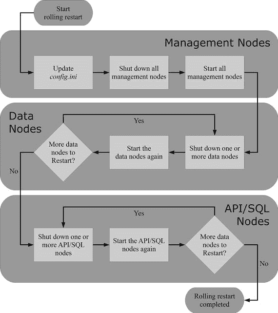
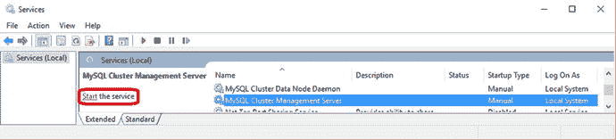
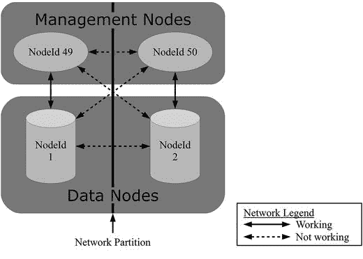

# 集群重启操作指南

#### 系统重启

系统重启发生在所有数据节点都已关闭的情况下，并且需要每个节点组中至少一个数据节点参与重启。某些配置更改——特别是那些要求所有数据节点对当前值达成一致的选项——需要通过系统重启来生效。

系统重启相对于滚动重启的一个优势是速度更快，因为所有数据节点都可以并行启动。如果集群在重启期间离线不是问题，那么使用系统重启可以减少维护窗口的总时长，相比之下，滚动重启耗时更长。

#### 初始系统重启

回顾一下，初始节点重启是节点重启的一个特例，其特点是在启动时会丢弃数据节点上的所有数据。类似地，初始系统重启也是系统重启的一个类似特例。首先，所有数据节点会丢弃它们的数据。这意味着在重启结束时，数据节点的状态就像集群首次启动后一样。实际上，集群的首次启动就是一次初始系统重启。首次启动与后续初始系统重启的唯一区别在于，磁盘表的表空间和撤销日志文件不会被删除；但表及其数据仍会被删除。

除了集群的首次启动外，初始系统重启仅在少数配置更改时才需要执行，例如将数据节点移动到另一个节点组。此外，如果决定从备份中恢复（例如在重建复制从库的情况下），使用初始系统重启也可能更方便。

由于初始系统重启会删除集群中的所有数据，因此在重启前立即创建备份至关重要。

> **注意**
> 在执行初始系统重启之前，务必确保存在可用的备份并且该备份可以恢复。初始系统重启将删除所有数据！

#### 滚动重启

滚动重启是指通过从不并发重启超过集群保持在线所需数量的节点来重启整个集群的行为。只有在数据存在多个副本时，才能执行滚动重启。滚动重启可以使用常规或初始节点重启来完成。滚动重启的步骤如下：

1.  如有必要，使用新配置更新集群配置文件（`config.ini`）。
2.  关闭管理节点。如果有多个管理节点，则必须全部关闭。
3.  启动管理节点。要读取配置文件（`config.ini`），请使用 `--reload`（在大多数情况下推荐）或 `--initial` 命令行选项。仅在必要或倾向于完全清除管理节点历史记录时才应进行初始重启。这包括添加管理节点或重新初始化整个集群的情况。本节后面也会讨论使用 `--reload` 与 `--initial` 的选择。
4.  重启数据节点。每个节点组中最多可以有（`NoOfReplicas` – 1）个节点并发重启。然而，重启会增加负载（包括磁盘、CPU 和网络），特别是对那些安装了重启节点的主机，因此注意不要使系统过载。作为经验法则，一次只重启每个主机上的一个节点。如果需要，使用 `--initial` 选项重启每个数据节点。
5.  重启 API/SQL 节点。避免一次性重启所有节点，以便应用程序可以使用剩余的在线节点。如果更改不影响 API/SQL 节点，此步骤是可选的。

> **提示**
> 重启 API/SQL 节点的步骤可以在重启数据节点之前或之后执行。

滚动重启的过程也总结在图 10-1 中。


*图 10-1：滚动重启的步骤*

在进入节点实际启动和停止的过程之前，值得更详细地了解一下滚动重启的步骤。首先，滚动重启仅在 `NoOfReplicas` 大于一时才可能执行。如果只有一个副本，使一个数据节点离线意味着部分数据将变得不可用，这将要求其他数据节点也必须离线。

在步骤 2 和步骤 3 之间，即管理节点离线期间，只有管理节点可以加入集群。数据节点和 API/SQL 节点需要管理节点在线以获取配置，然后才能连接到集群。

在步骤 4 重启数据节点时，必须确保每个节点组始终至少有一个数据节点保持在线。原因与 `NoOfReplicas` 必须大于一相同：如果节点组中没有至少一个数据节点在线，则该节点组中的数据不可用，因此整个集群必须离线。

虽然 API/SQL 节点被列为步骤 5 中最后重启的节点类型，但它们也可以在数据节点之前重启。如果在滚动重启过程中没有进行配置更改，则无需重启管理节点。没有配置更改的重启可能用于数据碎片整理，或在某些情况下用于解决错误。升级通常也不需要配置更改，但仍然需要重启管理节点。在升级而没有配置更改的情况下，API/SQL 节点甚至可以在管理节点之前重启。

> **注意**
> 虽然何时重启 API/SQL 节点有很大的灵活性，但这并不适用于数据节点。对于配置更改和升级，管理节点必须在数据节点之前重启。


### 停止和启动节点

在集群中停止和启动节点是数据库管理员最基本的任务之一。有几种方法可以实现，可用的方法取决于节点类型。本节将介绍各种选项并讨论其差异。有关启动和停止节点的示例，请参阅本章后面的案例研究。

MySQL NDB Cluster 附带的所有二进制程序（`ndb_index_stat` 实用工具除外）都支持从 `my.cnf/my.ini` 文件读取参数。这样做的好处是，对于调用之间永不更改的选项可以一劳永逸地设置一次。缺点是命令行参数无法从进程列表中看到。所有需要连接到管理节点的二进制程序（包括 `mysqld`）都会读取配置文件中的 `[mysql_cluster]` 组，因此通过在此处添加 `ndb_connectstring` 选项，它可以被所有进程共享，从而无需在同一主机内复制该值。每个二进制程序还会读取其自己的特定部分。使用 `--help` 选项执行二进制程序将告知读取了哪些部分，例如：

```
shell$ ndbmtd –help
...
Default options are read from the following files in the given order:
/etc/my.cnf /etc/mysql/my.cnf /usr/local/mysql/etc/my.cnf ∼/.my.cnf
The following groups are read: mysql_cluster ndbd
...
```

这显示了默认读取的文件以及读取的组（部分）。

本节中用于启动节点的命令行命令列出了所有选项。然而，在大多数情况下，最好使用一个包含所有重启所用选项的 `my.cnf/my.ini` 文件。这将简化节点的启动并减少拼写错误的可能性。

在 Microsoft Windows 上，所有节点类型都可以作为服务安装。管理节点给出了一个使用 Microsoft Windows 服务启动节点的示例。其他节点类型的步骤类似。使用服务时，建议从 `my.cnf/my.ini` 文件提供启动选项，因为这样可以在不重新创建服务的情况下重新配置节点。

#### 管理节点

通过执行 `ndb_mgmd` 二进制程序来启动管理节点。五个常用参数是：

*   `--config-file=...`：此选项用于指定集群配置文件（`config.ini`）的路径。请记住，MySQL NDB Cluster 中有两种类型的配置文件：用于 SQL 节点的 `my.cnf/my.ini` 文件，以及与管理节点一起使用的 `config.ini` 文件。应使用 `config.ini` 文件配合 `--config-file` 选项。首次启动以及给出 `--initial` 或 `--reload` 选项时，此选项是必需的。
*   `--config-dir=...`：此选项指定缓存配置的存储位置。除非给出了 `--skip-config-cache` 选项，否则此选项是必需的。
*   `--ndb-nodeid=...`：进程使用的节点 ID。
*   `--initial`：删除 `--config-dir` 选项指定目录中的所有缓存配置，并将新配置设置为第 1 代。它与 `--reload` 选项互斥。
*   `--reload`：这是 `--initial` 的对应选项。管理节点不会清除所有配置历史记录，而是检查当前的 `config.ini` 与之前缓存的配置是否存在差异。如果存在差异，管理节点将增加配置代数，将差异记录到集群日志（请参阅本章后面的“配置更改”案例研究），并以二进制格式将新配置存储在配置目录中。

提示

要查看 `ndb_mgmd` 的所有启动选项，请参阅 [`dev.mysql.com/doc/refman/5.7/en/mysql-cluster-programs-ndb-mgmd.html`](https://dev.mysql.com/doc/refman/5.7/en/mysql-cluster-programs-ndb-mgmd.html)。

除非必须使用 `--initial`（请参阅“添加管理节点”案例研究了解一个罕见的例子），否则最好使用 `--reload` 而不是 `--initial`，原因有三：

*   将新旧配置之间的差异记录到集群日志中，可以更容易地追踪集群的历史记录。这在故障排除时非常有用。
*   不太可能将管理节点的 `--initial` 与数据节点的 `--initial` 混淆（这可能导致数据完全丢失）。
*   虽然极少使用，但只要其二进制副本存在，就有可能恢复旧代配置。`--initial` 会删除所有现有的缓存配置。

在 Linux 上使用 `NodeId = 49` 启动管理节点的示例如下：

```
shell$ sudo -u mysql ndb_mgmd --config-file=/etc/config.ini \
--config-dir=/cluster/config --ndb-nodeid=49 --reload
```

此命令中的 `sudo` 用于在启动管理节点之前切换到 `mysql` 用户。这允许管理节点使用无法直接登录的非特权操作系统账户执行。默认情况下，`ndb_mgmd` 进程将作为守护进程启动。要将管理节点作为前台进程启动，请使用 `--nodaemon` 选项。

要使用 Microsoft Windows 服务启动管理节点，请确保服务已按照第 5 章的描述安装，然后使用命令提示符或“服务”桌面应用程序启动节点。要从命令提示符将 `ndb_mgmd` 作为 Microsoft Windows 服务启动，请使用以下命令：

```
C:\>net start "MySQL Cluster Management Server"
The MySQL Cluster Management Server service is starting.
The MySQL Cluster Management Server service was started successfully.
```

图 10-2 显示了 Windows 10 中的“服务”桌面应用程序。您可以通过单击服务列表左侧的“启动服务”来启动管理节点。或者，您可以通过右键单击服务名称，然后选择“启动”来启动服务。



图 10-2。

通过 Windows 服务 GUI 启动管理节点

停止管理节点的首选方法是使用 `ndb_mgm` 管理客户端连接，然后使用 `STOP` 命令停止节点：

```
shell$ ndb_mgm -e "49 STOP"
```

这适用于所有平台。以这种方式停止管理节点可确保关闭通知到集群的其余部分。停止管理节点的其他方法包括：

*   发送 `SIGTERM` 信号，例如使用 `kill -15`。
*   在 Microsoft Windows 上，如果管理节点是作为服务启动的，则可以通过“服务”桌面应用程序或命令提示符停止它，方式类似于启动它。

不建议使用 `SIGKILL` 信号（`kill -9`）来关闭管理节点。

注意

使用 `SIGKILL` 终止管理节点不允许节点执行干净关闭。例如，这意味着数据节点在检测到丢失心跳之前不知道管理节点已停止。这可能导致仲裁无法按预期工作，从而可能导致本可避免的整个集群中断。


#### 数据节点

##### 启动数据节点

启动数据节点相对简单。只需要选择启动单线程还是多线程数据节点，并指定管理节点的位置即可。其余支持的参数都是可选的，但建议指定节点 ID。两个二进制文件分别是：

*   `ndbd`: 单线程二进制文件。
*   `ndbmtd`: 多线程二进制文件。

如第[2]章所讨论的，对于生产系统，大多数情况下最好使用多线程二进制文件。

##### 常用命令行参数

数据节点（无论使用哪种二进制文件）常用的命令行参数包括：

*   `--ndb_connectstring=...`: 管理节点的主机和端口号。默认值为`localhost:1186`，因此除了测试设置外，几乎所有集群都需要指定此选项。管理节点通过主机名或 IP 地址指定，后面可选地跟一个冒号和端口号。多个管理节点用逗号分隔。
*   `--ndb-nodeid=...`: 节点要使用的 ID。建议始终包含此选项。如果未明确设置，则将根据该主机上可用的 ID 进行分配。
*   `--initial`: 执行初始重启。仅在需要时使用此选项，因为节点上的所有数据都将被删除。
*   `--nostart`: 使用此选项，数据节点将仅完成启动的早期阶段并连接到管理节点。然后它将等待来自管理节点的`START`命令以继续重启。在重启多个节点以确保所有节点并行重启时，这可能很有用。
*   `--nowait-nodes=...`: 默认情况下，数据节点会等待其他离线数据节点一起启动，这总体上节省了时间。`--nowait-nodes`选项告诉数据节点继续执行，而不等待指定的节点 ID。不等待的数据节点通过其节点 ID 在逗号分隔的列表中指定。一个示例在“添加预分配节点组的数据节点”案例研究中给出。

> 提示
>
> 要查看数据节点的所有命令行参数，请参阅 [`dev.mysql.com/doc/refman/5.7/en/mysql-cluster-programs-ndbd.html`](https://dev.mysql.com/doc/refman/5.7/en/mysql-cluster-programs-ndbd.html)。这也适用于`ndbmtd`。

##### 启动示例

以下是一个使用多线程二进制文件启动数据节点的示例：

```
shell$ sudo -u mysql ndbmtd \
--ndb_connectstring=192.168.56.101,192.168.56.102 \
--ndb-nodeid=1
```

##### 使用 `--nostart` 选项启动

当数据节点使用`--nostart`选项启动时，该节点将显示在管理节点客户端的状态输出中，显示为已连接但未启动。例如，在`NodeId = 2`已使用`--nostart`选项启动的情况下：

```
shell$ ndb_mgm -e "SHOW"
Connected to Management Server at: 192.168.56.101:1186
Cluster Configuration

[ndbd(NDB)]     2 node(s)
id=1    @192.168.56.103  (mysql-5.7.16 ndb-7.5.4, Nodegroup: 0, *)
id=2    @192.168.56.104  (mysql-5.7.16 ndb-7.5.4, not started)
...
```

可以使用管理客户端中的`<id> START`命令启动节点：

```
shell$ ndb_mgm -e "2 START"
Connected to Management Server at: 192.168.56.101:1186
Database node 2 is being started.
```

如果多个数据节点已连接但正在等待使用`START`命令启动，也可以使用`ALL`代替节点 ID 来启动所有符合条件的数据节点，例如：

```
shell$ ndb_mgm -e "ALL START"
Connected to Management Server at: 192.168.56.101:1186
NDB Cluster is being started.
NDB Cluster is being started.
```

##### 停止数据节点

要关闭数据节点，最好使用管理客户端中的`STOP`命令停止节点，或者如果管理节点也要关闭，则使用`SHUTDOWN`命令。例如，关闭`NodeId= 1`：

```
shell$ ndb_mgm -e "1 STOP"
Connected to Management Server at: 192.168.56.101:1186
Node 1 has shutdown.
```

默认情况下，`STOP`命令会拒绝关闭节点，如果它是节点组中的最后一个；即，它会防止意外的集群完全关闭：

```
shell$ ndb_mgm -e "2 STOP"
Connected to Management Server at: 192.168.56.101:1186
Shutdown failed.
*  2002: Stop failed
*        Node shutdown would cause system crash: Permanent error: Application error
```

如果要关闭所有数据节点，请改用`ALL STOP`或`SHUTDOWN`：

```
shell$ ndb_mgm -e "ALL STOP"
Connected to Management Server at: 192.168.56.101:1186
Executing STOP on all nodes.
NDB Cluster has shutdown.
```

`ALL STOP`仅停止数据节点。如果管理节点也应包含在关闭中，请改用`SHUTDOWN`命令：

```
shell$ ndb_mgm -e SHUTDOWN
Connected to Management Server at: 192.168.56.101:1186
4 NDB Cluster node(s) have shutdown.
Disconnecting to allow management server to shutdown.
```

##### 关闭信号的使用与警告

可能很想使用 SIGTERM 信号（`kill -15`）来停止数据节点；但是，不建议这样做。在管理客户端中使用`STOP`命令与使用 SIGTERM 信号停止数据节点有两个主要区别：

*   使用`STOP`命令告诉数据节点正常关闭，并尽可能少地中断集群的其余部分；例如，减少（但不能消除）将获得临时错误并需要重试的失败事务。另一方面，SIGTERM 信号会导致更快的关闭，但也会导致更多的失败事务。
*   SIGTERM 信号不提供任何防止因关闭节点而导致集群中断的保护。

`STOP`命令和 SIGTERM 信号都被认为是“干净”的关闭。然而，SIGKILL 信号（`kill -9`）则不然。除非紧急情况非常严重，以至于节点的 NDB 文件系统损坏是可以接受的风险，否则不要使用 SIGKILL 信号关闭数据节点。SIGKILL 信号不允许任何类型的关闭处理；进程会立即停止，例如，它可能导致本地检查点的部分写入。

> 注意
>
> 除非数据丢失比等待更可接受，否则不要使用 SIGKILL 信号停止数据节点。请准备好删除该节点的所有数据以便能够重新启动（使用`--initial`选项）。

##### 重启数据节点

如果目标是在关闭后立即重启数据节点，一个简单的方法是通过管理客户端中的`RESTART`命令，例如：

```
shell$ ndb_mgm -e "1 RESTART"
Connected to Management Server at: 192.168.56.101:1186
Node 1 is being restarted
```

该命令在关闭完成并重新启动开始后返回。`RESTART`命令不能用于二进制文件在关闭和重启之间被替换的升级。


#### API/SQL 节点

MySQL NDB Cluster 并未提供特殊的方法来启动或停止 API 和 SQL 节点。无论是在 Linux、UNIX 还是 Windows 上，通常都通过某种服务脚本（例如通过 `systemd` 或 Microsoft Windows 服务）来启动和停止至少 SQL 节点。

启动 API/SQL 节点时，重要的是要记住：在集群上线且每个节点组中至少有一个数据节点在线之前，该节点无法加入集群。如果 API/SQL 节点在满足此条件前尝试加入集群，集群日志中将记录类似以下内容的错误：
```
2016-11-19 15:54:20 [MgmtSrvr] WARNING  -- Failed to allocate nodeid for API at 192.168.56.103\. Returned error: 'No free node id found for mysqld(API).'
```

在数据节点准备好之前启动 SQL 节点也会导致 SQL 节点的启动出现延迟。

通常建议在完整关闭集群时，首先关闭 API/SQL 节点。这可以确保正在进行的查询有机会完成。在 MySQL NDB Cluster 7.4 及更早版本中，为了执行干净的关闭，还需要能够联系到管理节点。即使在 MySQL NDB Cluster 7.5 中，如果管理节点和数据节点在 SQL 节点之前被关闭，`mysqld` 错误日志中也会报告消息：
```
2016-11-19 16:00:00 [NdbApi] INFO     -- Management server closed connection early. It is probably being shut down (or has problems). We will retry the connection. 1006  Illegal reply from server line: 3058
2016-11-19 16:00:05 [NdbApi] INFO     -- Management server closed connection early. It is probably being shut down (or has problems). We will retry the connection. 110 Time out talking to management server Error line: 528
```

这些仅是信息性消息，如果您知道集群已离线，可以忽略它们。

### 与重启相关的配置

数据节点的几个配置选项与重启相关。这些选项主要分为三类——用于重建有序索引的并行度、等待其他节点的超时时间，以及本地检查点的磁盘写入速度。表 10-1 总结了与重启相关的最重要选项。

**表 10-1. 与重启相关的重要选项**

| 选项名 | 描述 |
| --- | --- |
| `BuildIndexThreads` | 在重启期间（以及使用 `ndb_restore` 时）重建有序索引时，`BuildIndexThreads` 指定使用的线程数。可以增加此值直至每个数据节点的最大分区数。默认值为每个 LDM 线程一个分区，因此在使用默认分区时，`BuildIndexThreads` 可设置为 LDM 线程的数量。默认为 0（表示单线程）。参见 `TwoPassInitialNodeRestartCopy` 选项。 |
| `MaxLCPStartDelay` | 在重启过程中，本地检查点会在启动阶段 5 创建（见下一节）。有时一起启动的一些节点会比其他节点更早准备好开始本地检查点。一次只能进行一个本地检查点，因此数据节点必须等待正在进行的本地检查点完成才能启动自己的检查点。`MaxLCPStartDelay` 可用于让节点相互等待，避免本地检查点的串行化。默认为 0 秒，表示不等待其他节点。对于写入工作负载相对较低、不会持续创建本地检查点的集群，主要考虑增加 `MaxLCPStartDelay`。 |
| `MaxDiskWriteSpeedOtherNodeRestart` | 当另一个节点正在重启时，用于本地检查点和备份（合计）的最大磁盘写入速度。默认为 50 MB/s。增加此值可以帮助正在重启的数据节点更快地完成本地检查点，但请确保不要将该值设置得过高，以免数据节点过载。 |
| `MaxDiskWriteSpeedOwnRestart` | 用于正在重启的节点的本地检查点和备份（合计）的最大磁盘写入速度。默认为 200 MB/s。此选项应尽可能接近重启数据节点的磁盘系统所能维持的最大吞吐量进行设置。 |
| `StartPartialTimeout` | 在继续之前，等待配置了节点组的其他节点的时间。参见数据节点的 `--nowait-nodes` 命令行参数。默认为 30000 毫秒。 |
| `StartPartitionedTimeout` | 如果继续操作可能导致集群分区，等待其他节点的时间。参见本章后面的“启动过程”部分和数据节点的 `--nowait-nodes` 命令行参数。默认为 60000 毫秒。 |
| `StartNoNodegroupTimeout` | 等待节点组而不采取行动的时间。参见本章后面的“添加预分配节点组的数据节点”案例研究以及数据节点的 `--nowait-nodes` 命令行参数。默认为 15000 毫秒。 |
| `TwoPassInitialNodeRestartCopy` | 如果 `BuildIndexThreads` 大于零，启用 `TwoPassInitialNodeRestartCopy` 允许在初始重启期间多线程重建有序索引，在某些情况下可以减少重建有序索引所需的时间。 |

**提示**
所有选项的详细描述请参见 [`dev.mysql.com/doc/refman/5.7/en/mysql-cluster-ndbd-definition.html`](https://dev.mysql.com/doc/refman/5.7/en/mysql-cluster-ndbd-definition.html)。

`MaxDiskWriteSpeedOtherNodeRestart` 和 `MaxDiskWriteSpeedOwnRestart` 这两个选项应与其他磁盘写入速度选项 `MinDiskWriteSpeed` 和 `MaxDiskWriteSpeed` 一起考虑。这些选项定义了磁盘写入速度的下限 (`MinDiskWriteSpeed`) 和上限（`MaxDiskWriteSpeedOtherNodeRestart`、`MaxDiskWriteSpeedOwnRestart` 和 `MaxDiskWriteSpeed`），上限由各项最大设置指示。如果检测到写入重做日志有延迟或 CPU 使用率过高，它们会降至最小值。在重启期间，允许更高的写入速度以更快地完成重启。在 MySQL NDB Cluster 7.4 及更高版本中，可以通过 `ndbinfo` 架构中的 `disk_write_speed_aggregate`、`disk_write_speed_aggregate_node` 和 `disk_write_speed_base` 视图监控磁盘写入速度。


### 启动过程

当你启动一个数据节点时，它会经历编号从-1 到 9 的几个启动阶段，以及一个编号为 101 的启动阶段。（目前缺失的启动阶段尚未使用。）每个启动阶段都包含特定的任务；例如，启动阶段 5 包括创建本地检查点，以确保如果该节点启动后立即发生同节点组中的其他节点故障，该节点可以在没有数据丢失的情况下接管。除了启动阶段-1，其他启动阶段都可以从集群日志和数据节点的输出日志中看到（参见本章后面的“监控重启”部分）。本节讨论启动过程，但不会深入探讨每个启动阶段的细节。

> **提示**
>
> 启动阶段的概述可以在 MySQL 参考手册（ [`dev.mysql.com/doc/refman/5.7/en/mysql-cluster-start-phases.html`](https://dev.mysql.com/doc/refman/5.7/en/mysql-cluster-start-phases.html) ）中找到，更详细的内容则在 NDB 集群内部手册（ [`dev.mysql.com/doc/ndb-internals/en/ndb-internals-start-phases.html`](https://dev.mysql.com/doc/ndb-internals/en/ndb-internals-start-phases.html) ）中。
>
> 关于启动阶段的进一步阅读，源代码中`storage/ndb/src/kernel/blocks/ndbcntr/NdbcntrMain.cpp`文件（对于版本 7.5.4）从第 431 行开始有一段冗长的注释。最新源代码可以从 [`dev.mysql.com/downloads/cluster/`](https://dev.mysql.com/downloads/cluster/) 下载。

在启动过程中的两个时间点，存在同步点，一起启动的数据节点可能会相互等待：

*   启动阶段 1：正在启动的数据节点将等待离线的数据节点加入。这样做有两个目的：允许多个数据节点一起启动以节省时间，并避免分区式重启（稍后会详细介绍）。这由三个选项控制：`StartPartialTimeout`、`StartPartitionedTimeout`和`StartNoNodegroupTimeout`。请参见前面章节中的表 10-1。
*   启动阶段 5：一起启动的数据节点可以在开始本地检查点之前相互等待。由于同一时间只能进行一个本地检查点，让数据节点一起进行本地检查点可以节省整体重启的时间。默认设置是不相互等待。等待时间由`MaxLCPStartDelay`选项设置。请参见表 10-1。

值得更深入地考虑一下`StartPartitionedTimeout`。以一个包含两个数据节点和两个管理节点的集群为例：

```
...
[ndbd]
NodeId       = 1
HostName     = 192.168.56.103
[ndbd]
NodeId       = 2
HostName     = 192.168.56.104
[ndb_mgmd]
NodeId       = 49
HostName     = 192.168.56.101
[ndb_mgmd]
NodeId       = 50
HostName     = 192.168.56.102
...
```

另外，假设存在网络分区，使得数据节点 1 只能看到管理节点 49，数据节点 2 只能看到管理节点 50，但两对节点之间没有其他连接，如图 10-3 所示。



*图 10-3. 发生网络分区的集群*

如果所有节点都在线时发生网络故障（也称为网络分区），第一章中描述的常规仲裁过程将处理潜在的脑裂场景。然而，在重启期间情况有所不同，因为没有仲裁器；仲裁器是由数据节点作为一个组选举产生的，因此无法在启动初期足够早地完成以解决网络分区问题。仲裁器是在重启期间的启动阶段 7 选出的。在启动时发生网络分区的唯一选择是拒绝重启，或者冒着集群被分区的风险继续进行。

在图 10-3 所示的例子中，两个部分都有可能启动；然而，这取决于数据库管理员来避免在网络分区期间启动集群，或者至少确保只有一组集群启动。MySQL NDB 集群通过让启动的节点等待其他节点来处理启动时的网络分区：

*   首先等待`StartPartialTimeout`毫秒，以允许尽可能多的数据节点一起启动。
*   然后再等待`StartPartitionedTimeout`毫秒，以避免在可能有另一组节点同时启动的情况下发生分区式启动。

`StartPartitionedTimeout`的默认值是 60000 毫秒（一分钟）。如果即将进行分区式启动，在由`StartPartitionedTimeout`增加的这段时间内，类似以下示例的消息会被写入集群日志：

```
2016-11-20 11:35:52 [MgmtSrvr] INFO     -- Node 1: Waiting 60 sec for non partitioned start, nodes [ all: 1 and 2 connected: 1 missing: 2 no-wait:  ]
2016-11-20 11:35:55 [MgmtSrvr] INFO     -- Node 1: Waiting 57 sec for non partitioned start, nodes [ all: 1 and 2 connected: 1 missing: 2 no-wait:  ]
...
2016-11-20 11:36:49 [MgmtSrvr] INFO     -- Node 1: Waiting 3 sec for non partitioned start, nodes [ all: 1 and 2 connected: 1 missing: 2 no-wait:  ]
2016-11-20 11:36:52 [MgmtSrvr] INFO     -- Node 1: Start potentially partitioned with nodes 1  [ missing: 2 no-wait:  ]
```

一个更安全的解决方案是不允许分区式启动。将`StartPartitionedTimeout`设置为 0 理应实现这一点；然而，在 [`bugs.mysql.com/bug.php?id=83893`](https://bugs.mysql.com/bug.php?id=83893) 中的错误修复之前，最好的办法是将`StartPartitionedTimeout`配置为 4294962295 毫秒（49.7 周）。如果数据节点是自动启动的，例如使用服务脚本，这一点尤为重要。当已知需要进行分区式重启时，应改为对数据节点使用`--nowait-nodes`命令行参数，以明确允许在不等待已知离线节点的情况下重启。

### 监控重启

重启可能需要一段时间才能完成，监控其进度会很有用。这些信息也可用于确定可以采取哪些措施来改进重启性能。监控重启主要有四个地方：

*   `ndb_mgm`管理客户端
*   `ndb_waiter`工具
*   `ndbinfo.restart_info`表
*   日志

以下小节列出了这四个地方的示例。

#### 管理客户端

通过管理客户端查看重启进度的主要方法是使用`STATUS`命令。该命令可用于所有数据节点，也可用于单个数据节点。例如，在重启期间获取所有数据节点的状态：

```
shell$ ndb_mgm -e "ALL STATUS"
Connected to Management Server at: 192.168.56.101:1186
Node 1: starting (Last completed phase 3) (mysql-5.7.16 ndb-7.5.4)
Node 2: starting (Last completed phase 3) (mysql-5.7.16 ndb-7.5.4)
```

这显示两个数据节点都在重启中，最后完成的启动阶段是阶段 3。这表明当前的启动阶段是阶段 4。除此之外没有更多细节。


#### `ndb_waiter` 实用程序

如果监控重启的目的是为了检测数据节点何时上线，可以使用 `ndb_waiter` 实用程序。一个用例示例是：让脚本等待数据节点就绪，然后启动 API/SQL 节点。

`ndb_waiter` 实用程序很简单，它只需要一个连接字符串、一个以秒为单位的超时时间，以及数据节点要达到的状态。默认超时为 120 秒，默认行为是等待所有数据节点变为在线。例如：

```
shell$ ndb_waiter --ndb_connectstring=192.168.56.101,192.168.56.102
Connected to Management Server at: 192.168.56.101:1186
Node 1: STARTED
Node 2: SHUTTING_DOWN
[16:43:18] Waiting for cluster enter state STARTED
Node 1: STARTED
Node 2: SHUTTING_DOWN
...
[16:43:23] Waiting for cluster enter state STARTED
Node 1: STARTED
Node 2: NO_CONTACT
...
[16:43:27] Waiting for cluster enter state STARTED
Node 1: STARTED
Node 2: STARTING
...
[16:44:32] Waiting for cluster enter state STARTED
Node 1: STARTED
Node 2: STARTED
NDBT_ProgramExit: 0 – OK
```

所有数据节点的状态每秒会打印数次，因此输出相当详细。最后可以检查退出状态。如果在超时时间内并非所有数据节点都已上线，`ndb_waiter` 将在失败前重试 15 次：

```
shell$ ndb_waiter --ndb_connectstring=192.168.56.101,192.168.56.102
Connected to Management Server at: 192.168.56.101:1186
...
waitNodeState(STARTED, -1) timeout after 15 attempts
NDBT_ProgramExit: 1 - Failed
```

提示

有关 `ndb_waiter` 实用程序的更多信息，请参阅 [`dev.mysql.com/doc/refman/5.7/en/mysql-cluster-programs-ndb-waiter.html`](https://dev.mysql.com/doc/refman/5.7/en/mysql-cluster-programs-ndb-waiter.html)。

#### `ndbinfo.restart_info` 表

MySQL NDB Cluster 7.4 的新特性之一是可以通过 `ndbinfo` 模式使用 `restart_info` 表监控重启。其优点是数据可通过 SQL 节点直接获取，因此任何能够执行 SQL 查询的工具都能获得该信息。缺点是此信息不适用于系统重启，并且需要一个在线的 SQL 节点。

`ndbinfo.restart_info` 表的主要用途是监控节点重启。该表将包含最新节点重启的数据，并且信息将在节点关闭开始时被截断，然后在节点完成关闭后变得可用。示例如清单 10-2 所示。

```
mysql> SELECT * FROM ndbinfo.restart_info\G
*************************** 1. row ***************************
node_id: 2
node_restart_status: Restart completed
node_restart_status_int: 19
secs_to_complete_node_failure: 0
secs_to_allocate_node_id: 2
secs_to_include_in_heartbeat_protocol: 1
secs_until_wait_for_ndbcntr_master: 0
secs_wait_for_ndbcntr_master: 0
secs_to_get_start_permitted: 0
secs_to_wait_for_lcp_for_copy_meta_data: 0
secs_to_copy_meta_data: 0
secs_to_include_node: 2
secs_starting_node_to_request_local_recovery: 0
secs_for_local_recovery: 35
secs_restore_fragments: 13
secs_undo_disk_data: 0
secs_exec_redo_log: 0
secs_index_rebuild: 21
secs_to_synchronize_starting_node: 0
secs_wait_lcp_for_restart: 17
secs_wait_subscription_handover: 6
total_restart_secs: 66
1 row in set (0.01 sec)
```

清单 10-2. `ndbinfo.restart_info` 输出示例

所有计时均以秒为单位。`node_restart_status` 列对于监控重启的当前状态很有用；一些可能的值包括：“Node failure handling complete”（节点故障处理完成）、“Restore fragments ongoing”（正在恢复片段）、“Build indexes ongoing”（正在构建索引）和 “Restart completed”（重启完成）。`node_restart_status_int` 列是对应于重启状态的整数值。

提示

有关 `ndbinfo.restart_info` 表的更多信息，请参阅 [`dev.mysql.com/doc/refman/5.7/en/mysql-cluster-ndbinfo-restart-info.html`](https://dev.mysql.com/doc/refman/5.7/en/mysql-cluster-ndbinfo-restart-info.html)。

#### 日志中观察到的重启

集群日志和数据节点的输出日志都包含有关重启的详细信息。作为一个例子，清单 10-3 包含了一个已被重启的数据节点的输出日志中包含的部分重启信息。

```
2016-11-19 16:58:25 [ndbd] INFO     -- Angel reconnected to '192.168.56.101:1186'
2016-11-19 16:58:28 [ndbd] INFO     -- Angel reallocated nodeid: 2
2016-11-19 16:58:28 [ndbd] INFO     -- Angel pid: 31415 started child: 32134
2016-11-19 16:58:28 [ndbd] INFO     -- Normal start of data node using checkpoint and log info if existing
2016-11-19 16:58:28 [ndbd] INFO     -- Configuration fetched from '192.168.56.101:1186', generation: 7
2016-11-19 16:58:28 [ndbd] INFO     -- Changing directory to '/cluster'
ThreadConfig: input:  LockExecuteThreadToCPU:  => parsed: main,ldm,recv,rep
2016-11-19 16:58:28 [ndbd] INFO     -- MaxNoOfTriggers set to 1400
NDBMT: MaxNoOfExecutionThreads=4
NDBMT: workers=1 threads=1 tc=0 send=0 receive=1
2016-11-19 16:58:28 [ndbd] INFO     -- NDB Cluster -- DB node 2
2016-11-19 16:58:28 [ndbd] INFO     -- mysql-5.7.16 ndb-7.5.4 --
2016-11-19 16:58:28 [ndbd] INFO     -- Memory Allocation for global memory pools Starting
2016-11-19 16:58:28 [ndbd] INFO     -- numa_set_interleave_mask(numa_all_nodes) : OK
2016-11-19 16:58:28 [ndbd] INFO     -- Ndbd_mem_manager::init(1) min: 507Mb initial: 527Mb
2016-11-19 16:58:28 [ndbd] INFO     -- Touch Memory Starting, 2180 pages, page size = 32768
2016-11-19 16:58:28 [ndbd] INFO     -- Touch Memory Completed
...
2016-11-19 16:58:29 [ndbd] INFO     -- Start phase 0 completed
...
2016-11-19 16:59:32 [ndbd] INFO     -- Start phase 101 completed
2016-11-19 16:59:32 [ndbd] INFO     -- Phase 101 was used by SUMA to take over responsibility for sending some of the asynchronous change events
2016-11-19 16:59:32 [ndbd] INFO     -- Node started
```

清单 10-3. 数据节点输出日志摘录

日志片段的开始部分显示守护进程连接到管理节点并获得分配的节点 ID。随后的信息提到了重启类型（本例中为“Normal start of data node using checkpoint and log info if existing”），并且配置是从管理节点获取的。作为获取配置的一部分，线程配置被展开，在本例中，`MaxNoOfExecutionThreads = 4` 被展开为 `ThreadConfig` 的 `main,ldm,recv,rep`。

此时，重启按照“启动过程”部分的描述继续进行。首先分配内存，正如所见，也进行了触摸。有关内存使用的更多信息，请参见第 2 章。重启的后续部分伴随着每次重启阶段完成时的记录。

提示

一个接近重启日志消息顶部获取日志的简单方法是搜索“fetched”。


### 重启场景示例

本章剩余部分将通过几个案例研究来演示重启操作。这些示例包括：

*   **配置更改**：执行简单的配置更改以增加 `MaxNoOfConcurrentOperations` 的值。
*   **添加管理节点**：将集群中的管理节点数量从一个增加到两个。
*   **添加数据节点**：向现有集群添加一个节点组。
*   **添加带预分配节点组的数据节点**：向现有集群添加一个新的节点组，而无需重启任何现有节点。
*   **添加 API/SQL 节点**：向现有集群添加一个新的 API/SQL 节点。
*   **从损坏的 NDB 文件系统中恢复**：在数据节点的 NDB 文件系统损坏（例如主机发生严重崩溃）后重启该节点。
*   **初始系统重启**：执行初始系统重启以增加数据节点的线程数，并重新分布分区以利用额外的线程。

除了“初始系统重启”案例研究外，所有其他更改都是在线执行的。

为使命令更简洁，假设存在一个连接字符串已定义的 `/etc/my.cnf` 配置文件（或根据平台在类似位置）：

```ini
[mysql_cluster]
ndb_connectstring = 192.168.56.101,192.168.56.102
```

除 `ndb_mgmd` 外的所有程序都需要此连接字符串才能工作。作为替代方案，可以在每个命令中通过命令行选项提供连接字符串。

提醒一下，`config.ini` 中的配置如代码清单 10-4 所示。

```
[ndb_mgmd default]
DataDir      = /cluster/
[ndbd default]
NoOfReplicas = 2
DataDir      = /cluster/
[ndbd]
NodeId       = 1
HostName     = 192.168.56.103
[ndbd]
NodeId       = 2
HostName     = 192.168.56.104
[ndb_mgmd]
NodeId       = 49
HostName     = 192.168.56.101
[ndb_mgmd]
NodeId       = 50
HostName     = 192.168.56.102
[mysqld]
NodeId       = 51
HostName     = 192.168.56.103
[mysqld]
NodeId       = 52
HostName     = 192.168.56.104
[api]
NodeId       = 53
HostName     = 192.168.56.101
[api]
NodeId       = 54
HostName     = 192.168.56.102
```
代码清单 10-4.
用于重启场景示例的集群配置

#### 配置更改

配置更改是执行重启的最常见原因，因为对 `config.ini` 中配置的任何更改都需要重启。对于大多数更改，这将是一次正常的**滚动重启**。本示例将从 `MaxNoOfConcurrentOperations` 的默认值 (32768) 开始，并将其增加到 65536。当前值可以从 `ndbinfo.config_values` 和 `ndbinfo.config_params` 表中查看，例如：

```sql
mysql> SELECT param_name, param_default, node_id, config_value
FROM ndbinfo.config_params
INNER JOIN ndbinfo.config_values
ON config_params.param_number = config_values.config_param
WHERE param_name = 'MaxNoOfConcurrentOperations';
+-----------------------------+---------------+---------+--------------+
| param_name                  | param_default | node_id | config_value |
+-----------------------------+---------------+---------+--------------+
| MaxNoOfConcurrentOperations | 32768         |       1 | 32768        |
| MaxNoOfConcurrentOperations | 32768         |       2 | 32768        |
+-----------------------------+---------------+---------+--------------+
2 rows in set (0.02 sec)
```

或者——这也是 MySQL NDB Cluster 7.4 及更早版本中唯一的选项——你可以使用 `ndb_config` 实用程序：

```shell
shell$ ndb_config --type=ndbd --fields=': ' --rows='\n' \
--query=NodeId,MaxNoOfConcurrentOperations
1: 32768
2: 32768
```

传递给 `ndb_config` 的选项有：

*   `--type`：要返回结果的节点类型，在本例中是数据节点（`ndbd` 同时涵盖单线程和多线程数据节点）。
*   `--fields`：字段之间使用的分隔符。
*   `--rows`：行之间使用的分隔符。
*   `--query`：要查询的内容，在本例中是 `NodeId` 和 `MaxNoOfConcurrentOperations` 的值。

`ndb_config` 实用程序还有一个额外的技巧：可以指定一个数据节点来获取配置，而不是询问管理节点。当配置更改仅部分应用时，这可能很有用，你将在本示例后面看到。

配置更改的第一步是更新集群配置文件，包含 `MaxNoOfConcurrentOperations` 的新值：

```ini
[ndbd default]
NoOfReplicas = 2
DataDir      = /cluster/
MaxNoOfConcurrentOperations = 65536
```

然后停止两个管理节点——否则如果每次只重启一个管理节点，它会在重启时从剩余的在线管理节点读取当前配置。

```shell
shell$ ndb_mgm -e "49 STOP"
Connected to Management Server at: 192.168.56.101:1186
Node 49 has shutdown.
Disconnecting to allow Management Server to shutdown
shell$ ndb_mgm -e "50 STOP"
Connected to Management Server at: 192.168.56.101:1186
Connected to Management Server at: 192.168.56.102:1186
Node 50 has shutdown.
Disconnecting to allow Management Server to shutdown
```

注意第二次执行 `ndb_mgm` 时，它首先尝试连接 192.168.56.101，然后切换到另一个节点。这是因为位于 192.168.56.101 上的管理节点（节点 49）无法处理请求，所以使用了下一个管理节点。

当两个管理节点都完成关闭后，可以使用 `--reload` 选项重新启动它们，以告诉管理节点读取新的配置文件：

```shell
shell$ sudo -u mysql ndb_mgmd --config-file=/etc/config.ini \
--config-dir=/cluster/config --ndb-nodeid=49 --reload
MySQL Cluster Management Server mysql-5.7.16 ndb-7.5.4
shell$ sudo -u mysql ndb_mgmd --config-file=/etc/config.ini \
--config-dir=/cluster/config --ndb-nodeid=50 --reload
MySQL Cluster Management Server mysql-5.7.16 ndb-7.5.4
```

重启后可以在集群日志中观察到一件有趣的事情：


```
2016-11-17 18:02:20 [MgmtSrvr] INFO     -- 检测到磁盘上的文件 /etc/config.ini 发生了变更，将尝试设置它。这是实际的差异内容：
[ndbd(DB)]
NodeId=1
-MaxNoOfConcurrentOperations=32768
+MaxNoOfConcurrentOperations=65536
[ndbd(DB)]
NodeId=2
-MaxNoOfConcurrentOperations=32768
+MaxNoOfConcurrentOperations=65536
2016-11-17 18:02:20 [MgmtSrvr] INFO     -- 开始配置变更，代次：5
2016-11-17 18:02:20 [MgmtSrvr] INFO     -- 节点 1: 节点 50: API mysql-5.7.16 ndb-7.5.4
2016-11-17 18:02:20 [MgmtSrvr] INFO     -- 节点 2: 节点 50: API mysql-5.7.16 ndb-7.5.4
2016-11-17 18:02:20 [MgmtSrvr] INFO     -- 配置 6 已提交
2016-11-17 18:02:20 [MgmtSrvr] INFO     -- 配置变更完成！新代次：6
```

##### 配置变更概述

集群日志包含了此次变更的差异（日志中称为 diff），并且配置代次（generation）从 5 递增到了 6。当重启管理节点时，使用 `--reload` 选项相比 `--initial` 选项的一个优势就在于：日志将包含对配置所做更改的详细信息。

##### 检查配置变更的影响

随着滚动重启的进行，检查配置变更的影响是很有趣的。在这个阶段，管理节点已经知晓了新配置，那么如何使用之前的方法来获取当前值，以反映这一变化呢？首先使用 `ndbinfo` 模式（schema）：

```sql
mysql> SELECT param_name, param_default, node_id, config_value
FROM ndbinfo.config_params
INNER JOIN ndbinfo.config_values
ON config_params.param_number = values.config_param
WHERE param_name = 'MaxNoOfConcurrentOperations';
+-----------------------------+---------------+---------+--------------+
| param_name                  | param_default | node_id | config_value |
+-----------------------------+---------------+---------+--------------+
| MaxNoOfConcurrentOperations | 32768         |       1 | 32768        |
| MaxNoOfConcurrentOperations | 32768         |       2 | 32768        |
+-----------------------------+---------------+---------+--------------+
2 行于集合 (0.04 sec)
```

这符合预期——数据节点尚未意识到配置变更。这在 `ndbinfo.nodes` 表中也有所反映：

```sql
mysql> SELECT * FROM ndbinfo.nodes;
+---------+--------+---------+-------------+-------------------+
| node_id | uptime | status  | start_phase | config_generation |
+---------+--------+---------+-------------+-------------------+
|       1 |    561 | STARTED |           0 |                 5 |
|       2 |    581 | STARTED |           0 |                 5 |
+---------+--------+---------+-------------+-------------------+
2 行于集合 (0.02 sec)
```

`config_generation` 列与管理节点在重启期间在集群日志中报告的一致。因此这里的配置代次是 5，即旧的代次。然而，使用 `ndb_config` 工具乍一看会产生一个意外的结果：

```bash
shell$ ndb_config --type=ndbd --fields=': ' --rows='\n' \
--query=NodeId,MaxNoOfConcurrentOperations
1: 65536
2: 65536
```

为什么会这样？原因是 `ndb_config` 可以向管理节点或任何数据节点查询配置。默认是向管理节点查询，这就解释了 `MaxNoOfConcurrentOperations` 的新值。要向数据节点 1 查询配置，可以添加 `--config-from-node` 选项：

```bash
shell$ ndb_config --type=ndbd --fields=': ' --rows='\n' \
--query=NodeId,MaxNoOfConcurrentOperations \
--config-from-node=1
1: 32768
2: 32768
```

这种从不同节点获取配置的能力对于调查配置看起来不符合预期的问题非常有用。系统地先检查管理节点，然后是每个数据节点，将揭示哪些节点已应用了配置变更，哪些没有。

##### 继续重启剩余节点

现在剩下的就是重启每个剩余的节点。可以使用管理客户端重启数据节点：

```bash
shell$ ndb_mgm -e "1 RESTART"
Connected to Management Server at: 192.168.56.101:1186
Node 1 is being restarted
```

此时，有必要等待重启完成，然后再重启第二个数据节点。第一个节点重启完成后，开始重启第二个节点：

```bash
shell$ ndb_mgm -e "2 RESTART"
Connected to Management Server at: 192.168.56.101:1186
Node 2 is being restarted
```

最后重启每个 API/SQL 节点。由于此步骤是平台相关的，留给读者自行完成。从技术上讲，对于像这样不影响 API/SQL 节点的配置变更，并不需要重启 API/SQL 节点。但是，通过始终将所有节点作为滚动重启的一部分，可以确保没有节点被遗漏。

##### 验证配置

回过头来检查配置，查看 `ndbinfo` 模式，现在可以看到两个数据节点都使用了新配置：

```sql
mysql> SELECT * FROM ndbinfo.nodes;
+---------+--------+---------+-------------+-------------------+
| node_id | uptime | status  | start_phase | config_generation |
+---------+--------+---------+-------------+-------------------+
|       1 |    430 | STARTED |           0 |                 6 |
|       2 |    247 | STARTED |           0 |                 6 |
+---------+--------+---------+-------------+-------------------+
2 行于集合 (0.01 sec)
mysql> SELECT param_name, param_default, node_id, config_value
FROM ndbinfo.config_params
INNER JOIN ndbinfo.config_values
ON config_params.param_number = values.config_param
WHERE param_name = 'MaxNoOfConcurrentOperations';
+-----------------------------+---------------+---------+--------------+
| param_name                  | param_default | node_id | config_value |
+-----------------------------+---------------+---------+--------------+
| MaxNoOfConcurrentOperations | 32768         |       1 | 65536        |
| MaxNoOfConcurrentOperations | 32768         |       2 | 65536        |
+-----------------------------+---------------+---------+--------------+
2 行于集合 (0.04 sec)
```

配置代次已增加到 6，并且 `MaxNoOfConcurrentOperations` 的值已增加到 65536。

#### 添加管理节点

本示例的起始配置与本章其他案例研究略有不同。除未包含 `192.168.0.102` 上的管理节点外，其余设置与清单 10-4 相同。本示例的任务是添加 `192.168.0.102` 上的管理节点。

添加管理节点的步骤如下：

1.  通过添加新管理节点的详细信息来更新集群配置文件 (`config.ini`)。
2.  更新所有数据节点以及 API/SQL 节点的 `ndb_connectstring` 选项（这包括诸如 `ndb_desc` 之类的实用程序）。
3.  关闭现有的管理节点。
4.  使用 `--initial` 标志重新启动现有的管理节点以及新的管理节点。
5.  像滚动重启一样重新启动数据节点和 API/SQL 节点。

本示例从集群已启动并运行开始：

```
shell$ ndb_mgm -e "SHOW"
Connected to Management Server at: 192.168.56.101:1186
Cluster Configuration

[ndbd(NDB)]     2 node(s)
id=1    @192.168.56.103  (mysql-5.7.16 ndb-7.5.4, Nodegroup: 0, *)
id=2    @192.168.56.104  (mysql-5.7.16 ndb-7.5.4, Nodegroup: 0)
[ndb_mgmd(MGM)] 1 node(s)
id=49   @192.168.56.101  (mysql-5.7.16 ndb-7.5.4)
[mysqld(API)]   6 node(s)
id=51   @192.168.56.103  (mysql-5.7.16 ndb-7.5.4)
id=52   @192.168.56.104  (mysql-5.7.16 ndb-7.5.4)
id=53 (not connected, accepting connect from 192.168.56.101)
id=54 (not connected, accepting connect from 192.168.56.102)
```

第一步是更新 `config.ini` 以添加新的管理节点。这需要添加一个额外的 `[ndb_mgmd]` 段，设置 `NodeId` 和 `HostName` 选项。在本例中，新的管理节点将在 `192.168.56.102` 上执行，并使用 `[ndb_mgmd default]` 段中的选项和默认配置。添加的段如下：

```
[ndb_mgmd]
NodeId                        = 50
HostName                      = 192.168.56.102
```

生成的 `config.ini` 文件即为清单 10-4 中所示的文件。配置文件也必须复制到新节点。

配置文件就位后，下一步是确保所有节点在将来重启时都会包含新的管理节点。连接到管理节点的客户端程序（如 `ndb_mgm` 和 `ndb_desc`）也应引用两个管理节点。为此，必须更新 `--ndb_connectstring` 选项。如果该选项是在 `my.cnf/my.ini` 配置文件中设置的，则可以在那里进行更新：

```
[mysql_cluster]
ndb_connectstring = 192.168.56.101,192.168.56.102
```

现在是实际重启的时候了。与其他配置更改一样，重启的第一部分是关闭管理节点。此操作可以从任一节点使用 `ndb_mgm` 管理客户端完成：

```
shell$ ndb_mgm -e "49 STOP"
Connected to Management Server at: 192.168.56.101:1186
Node 49 has shutdown.
Disconnecting to allow Management Server to shutdown
```

管理节点关闭后，必须重新启动现有的以及新的管理节点。由于新的管理节点必然会使用第一代配置，这是少数情况下之一，管理节点必须使用 `--initial` 标志启动以重置管理节点。

#### 提示

在这种情况下，只有管理节点需要使用 `--initial` 重启。数据节点可以执行正常的节点重启。

在 `192.168.56.101` 上启动管理节点：

```
shell$ sudo -u mysql ndb_mgmd --config-file=/etc/config.ini \
--config-dir=/cluster/config --ndb-nodeid=49 –initial
MySQL Cluster Management Server mysql-5.7.16 ndb-7.5.4
```

在 `192.168.56.102` 上启动：

```
shell$ sudo -u mysql ndb_mgmd --config-file=/etc/config.ini \
--config-dir=/cluster/config --ndb-nodeid=50 --initial
MySQL Cluster Management Server mysql-5.7.16 ndb-7.5.4
```

现在有两个管理节点的事实可以通过 `SHOW` 命令确认：

```
shell$ ndb_mgm -e "SHOW"
Connected to Management Server at: 192.168.56.101:1186
...
[ndb_mgmd(MGM)] 2 node(s)
id=49   @192.168.56.101  (mysql-5.7.16 ndb-7.5.4)
id=50   @192.168.56.102  (mysql-5.7.16 ndb-7.5.4)
```

现在剩下的就是逐个重新启动数据节点和 API/SQL 节点，它们在重新加入集群时将采用新的配置。为确保数据节点知晓新的连接字符串，请先停止数据节点，然后手动再次启动它们。首先是节点 ID `1`：

```
shell$ ndb_mgm -e "1 STOP"
Connected to Management Server at: 192.168.56.101:1186
Node 1 has shutdown.
shell$ sudo -u mysql ndbmtd --ndb-nodeid=1
```

然后是节点 ID `2`：

```
shell$ ndb_mgm -e "2 STOP"
Connected to Management Server at: 192.168.56.101:1186
Node 2 has shutdown.
shell$ sudo -u mysql ndbmtd --ndb-nodeid=2
```

最后，可以重新启动两个 API/SQL 节点。如何执行此重启取决于平台、是 SQL 节点还是自定义 API 节点，以及它们的安装方式。因此，请使用适合该安装的方法关闭其中一个 API 和 SQL 节点，然后再次启动它。继续处理其余的 API 和 SQL 节点。


#### 添加数据节点

在集群的生命周期中，可能需要增加数据节点的数量。需要添加更多数据节点的例子包括增加存储容量或为扫描操作提供更多并行度。

向集群添加额外的数据节点比之前的示例需要更多几个步骤：

1.  使用新数据节点的详细信息更新集群配置文件 (`config.ini`)。你必须添加一个完整的全新节点组，因此，例如对于 `NoOfReplicas = 2`，必须添加两个新的数据节点。
2.  对集群中的现有节点执行滚动重启。重要的是要记住将 API/SQL 节点也包含在这次滚动重启中。
3.  启动新节点；由于这是它们首次启动，因此这将是一次初始重启。
4.  为新的数据节点创建一个新的节点组。
5.  重新组织现有表的分区，将部分现有数据移动到新的数据节点中。
6.  优化重组后的表以回收可变宽度内存。重组分区等同于在新节点上插入部分数据并在旧节点上删除它。数据的删除将导致碎片，其中用于可变数据的内存可以在线回收。

本示例开始时的配置如清单 10-4 所示，并且以下管理和数据节点在线：

```shell
shell$ ndb_mgm -e "SHOW"
Connected to Management Server at: 192.168.56.101:1186
Cluster Configuration

[ndbd(NDB)]     2 node(s)
id=1    @192.168.56.103  (mysql-5.7.16 ndb-7.5.4, Nodegroup: 0, *)
id=2    @192.168.56.104  (mysql-5.7.16 ndb-7.5.4, Nodegroup: 0)
[ndb_mgmd(MGM)] 2 node(s)
id=49   @192.168.56.101  (mysql-5.7.16 ndb-7.5.4)
id=50   @192.168.56.102  (mysql-5.7.16 ndb-7.5.4)
[mysqld(API)]   6 node(s)
...
```

在这种情况下，新的数据节点被添加到现有的主机上。当同一台主机上有多个数据节点时，需要注意的一点是确保数据节点不在同一个节点组中；否则可能会引入单点故障。由于已经存在一个节点组，而新的数据节点将构成第二个节点组，因此新的节点组会自动分布到两台主机上，所以在这种情况下，新节点不会引入单点故障。

第一步是在两个管理节点上更新 `config.ini` 文件以添加新数据节点。这通过添加两个 `[ndbd]` 段来完成：

```ini
[ndbd]
NodeId                        = 3
HostName                      = 192.168.56.103
[ndbd]
NodeId                        = 4
HostName                      = 192.168.56.104
```

此时可以执行正常的滚动重启。首先关闭两个管理节点：

```shell
shell$ ndb_mgm -e "49 STOP"
Connected to Management Server at: 192.168.56.101:1186
Node 49 has shutdown.
Disconnecting to allow Management Server to shutdown
shell$ ndb_mgm -e "50 STOP"
Connected to Management Server at: 192.168.56.102:1186
Node 50 has shutdown.
Disconnecting to allow Management Server to shutdown
```

然后使用 `--reload` 选项重启管理节点：

```shell
shell$ sudo -u mysql ndb_mgmd --config-file=/etc/config.ini \
--config-dir=/cluster/config --ndb-nodeid=49 –reload
MySQL Cluster Management Server mysql-5.7.16 ndb-7.5.4
shell$ sudo -u mysql ndb_mgmd --config-file=/etc/config.ini \
--config-dir=/cluster/config --ndb-nodeid=50 --reload
MySQL Cluster Management Server mysql-5.7.16 ndb-7.5.4
```

集群日志显示了新配置：

```text
...
2016-11-07 18:15:50 [MgmtSrvr] INFO     -- Detected change of /etc/config.ini on disk, will try to set it. This is the actual diff:
[ndbd(DB)]
NodeId=3
Node removed
[ndbd(DB)]
NodeId=4
Node removed
[TCP]
NodeId1=1
NodeId2=3
Connection removed
...
```

在添加新节点时，这个“差异”看起来有点奇怪，因为它提到节点已被移除。然而，实际上所有的更改都已被添加。这包括 `[TCP]` 段。如第 2 章所述，无论节点是否在线，都会在所有可能的节点对之间建立传输连接。集群对 TCP/IP 传输器设置使用了所有默认值，因此这部分内容直到现在才显示出来，但添加新节点会使管理节点也“发现”新的传输器设置。

此时，重启两个现有的数据节点；这里也不需要特殊考虑。首先是节点 ID 为 1 的节点：

```shell
shell$ ndb_mgm -e "1 RESTART"
Connected to Management Server at: 192.168.56.101:1186
Node 1 is being restarted
```

等待重启完成，然后重启节点 ID 为 2 的数据节点：

```shell
shell$ ndb_mgm -e "2 RESTART"
Connected to Management Server at: 192.168.56.101:1186
Node 2 is being restarted
```

一旦第二个数据节点完成重启，根据平台和 API 节点类型（SQL 节点或应用程序），适当地重启每个 API/SQL 节点。重要的是，所有在过程开始时在线的节点都必须被关闭或重启。这是必需的，以便它们都意识到即将添加的新节点，并且有为它们准备的传输器。

现在的状态是：

```shell
shell$ ndb_mgm -e "SHOW"
Connected to Management Server at: 192.168.56.101:1186
Cluster Configuration

[ndbd(NDB)]     4 node(s)
id=1    @192.168.56.103  (mysql-5.7.16 ndb-7.5.4, Nodegroup: 0, *)
id=2    @192.168.56.104  (mysql-5.7.16 ndb-7.5.4, Nodegroup: 0)
id=3 (not connected, accepting connect from 192.168.56.103)
id=4 (not connected, accepting connect from 192.168.56.104)
...
```

这表明节点 3 和 4 是集群的一部分，但尚未启动。所以最后，是时候让新的数据节点上线了。由于这是新数据节点第一次启动，因此必须是一次初始启动。两个新节点的初始启动是同时进行的。首先是节点 ID 为 3 的节点：

```shell
shell$ sudo -u mysql ndbmtd --ndb-nodeid=3 --initial
2016-11-07 18:35:46 [ndbd] INFO     -- Angel connected to '192.168.56.101:1186'
2016-11-07 18:35:46 [ndbd] INFO     -- Angel allocated nodeid: 3
```

接下来，节点 ID 为 4 的节点：

```shell
shell$ sudo -u mysql ndbmtd --ndb-nodeid=4 --initial
2016-11-07 18:35:48 [ndbd] INFO     -- Angel connected to '192.168.56.101:1186'
2016-11-07 18:35:48 [ndbd] INFO     -- Angel allocated nodeid: 4
```

重启完成后，状态为：

```shell
shell$ ndb_mgm -e "SHOW"
Connected to Management Server at: 192.168.56.101:1186
Cluster Configuration

[ndbd(NDB)]     4 node(s)
id=1    @192.168.56.103  (mysql-5.7.16 ndb-7.5.4, Nodegroup: 0, *)
id=2    @192.168.56.104  (mysql-5.7.16 ndb-7.5.4, Nodegroup: 0)
id=3    @192.168.56.103  (mysql-5.7.16 ndb-7.5.4, no nodegroup)
id=4    @192.168.56.104  (mysql-5.7.16 ndb-7.5.4, no nodegroup)
...
```

这里需要注意的一点是，新的数据节点已经启动并成为集群的一部分，但没有与之关联的节点组。这意味着表将没有任何分区，因此也不会有任何数据存储在新的数据节点中。为了实际在新节点中存储数据，需要创建一个新的节点组。这可以使用管理客户端完成：

```shell
shell$ ndb_mgm -e "CREATE NODEGROUP 3,4"
Connected to Management Server at: 192.168.56.101:1186
Nodegroup 1 created
```

`CREATE NODEGROUP` 命令的参数是要添加到新节点组中的节点 ID，以逗号分隔的列表形式给出。最终状态是：

```shell
shell$ ndb_mgm -e "SHOW"
Connected to Management Server at: 192.168.56.101:1186
Cluster Configuration

[ndbd(NDB)]     4 node(s)
id=1    @192.168.56.103  (mysql-5.7.16 ndb-7.5.4, Nodegroup: 0, *)
id=2    @192.168.56.104  (mysql-5.7.16 ndb-7.5.4, Nodegroup: 0)
id=3    @192.168.56.103  (mysql-5.7.16 ndb-7.5.4, Nodegroup: 1)
id=4    @192.168.56.104  (mysql-5.7.16 ndb-7.5.4, Nodegroup: 1)
...
```


##### 重新组织数据

最后一个任务是确保数据也被添加到新节点中。这将自动适用于所有新表，但现有表必须首先被重新分布。与前面的步骤类似，重新分布数据是一项在线操作。考虑一个在添加新节点之前就存在的表，比如 `db1.t1`。使用 `ndb_desc` 实用程序查看该表，可以显示当前在各分区间的分布情况（为清晰起见，删除了一些信息）：

```
shell$ ndb_desc --database=db1 t1 -pn
...
-- Per partition info --
Partition  Row count  Frag fixed memory  Frag varsized memory  Nodes
0          62992      2031616            3112960               1,2
1          63392      2064384            3145728               2,1
```

或者，也可以使用 `ndbinfo` 模式：

```
mysql> SELECT node_id, fragment_num,
SUM(fixed_elem_alloc_bytes) AS FixedMem,
SUM(var_elem_alloc_bytes) AS VarMem
FROM ndbinfo.memory_per_fragment
WHERE fq_name = 'db1/def/t1'
GROUP BY node_id, fragment_num;
+---------+--------------+----------+---------+
| node_id | fragment_num | FixedMem | VarMem  |
+---------+--------------+----------+---------+
|       1 |            0 |  2031616 | 3112960 |
|       1 |            1 |  2064384 | 3145728 |
|       2 |            0 |  2031616 | 3112960 |
|       2 |            1 |  2064384 | 3145728 |
+---------+--------------+----------+---------+
4 rows in set (0.05 sec)
```

要重新组织现有表中的数据，可以使用如下所示的 `ALTER TABLE` 语句：

```
mysql> ALTER TABLE db1.t1 ALGORITHM=INPLACE, REORGANIZE PARTITION;
Query OK, 0 rows affected (13.42 sec)
Records: 0  Duplicates: 0  Warnings: 0
```

注意：在重新组织分区时，无法执行任何其他 DDL 语句。

新的数据分布如下：

```
mysql> SELECT node_id, fragment_num,
SUM(fixed_elem_alloc_bytes) AS FixedMem,
SUM(var_elem_alloc_bytes) AS VarMem
FROM ndbinfo.memory_per_fragment
WHERE fq_name = 'db1/def/t1'
GROUP BY node_id, fragment_num;
+---------+--------------+----------+---------+
| node_id | fragment_num | FixedMem | VarMem  |
+---------+--------------+----------+---------+
|       1 |            0 |  2031616 | 3112960 |
|       1 |            1 |  2064384 | 3145728 |
|       2 |            0 |  2031616 | 3112960 |
|       2 |            1 |  2064384 | 3145728 |
|       3 |            2 |  1015808 | 1572864 |
|       3 |            3 |  1048576 | 1572864 |
|       4 |            2 |  1015808 | 1572864 |
|       4 |            3 |  1048576 | 1572864 |
+---------+--------------+----------+---------+
8 rows in set (0.09 sec)
```

唯一缺少的是释放旧分区中仍然使用的额外空间。这可以通过对每个表在线使用 `OPTIMIZE TABLE` 来完成。列表 10-5 展示了一个使用 `db1.t1` 表的示例，以及如何回收部分变宽（动态）内存。

```
mysql> OPTIMIZE TABLE db1.t1;
+--------+----------+----------+----------+
| Table  | Op       | Msg_type | Msg_text |
+--------+----------+----------+----------+
| db1.t1 | optimize | status   | OK       |
+--------+----------+----------+----------+
1 row in set (3.35 sec)
mysql> SELECT node_id, fragment_num,
SUM(fixed_elem_alloc_bytes) AS FixedMem,
SUM(var_elem_alloc_bytes) AS VarMem
FROM ndbinfo.memory_per_fragment
WHERE fq_name = 'db1/def/t1'
GROUP BY node_id, fragment_num;
+---------+--------------+----------+---------+
| node_id | fragment_num | FixedMem | VarMem  |
+---------+--------------+----------+---------+
|       1 |            0 |  2031616 | 1638400 |
|       1 |            1 |  2064384 | 1638400 |
|       2 |            0 |  2031616 | 1638400 |
|       2 |            1 |  2064384 | 1638400 |
|       3 |            2 |  1015808 | 1572864 |
|       3 |            3 |  1048576 | 1572864 |
|       4 |            2 |  1015808 | 1572864 |
|       4 |            3 |  1048576 | 1572864 |
+---------+--------------+----------+---------+
8 rows in set (0.07 sec)
```
列表 10-5. 整理数据碎片

可以看出，`OPTIMIZE TABLE` 只回收了变宽内存（动态列格式）的空间。未回收的固定内存仍然可用于新行。唯一能完全回收内存的方法是重建表，例如使用一个空的 `ALTER TABLE`：

```
mysql> ALTER TABLE db1.t1 ENGINE=NDBCluster;
Query OK, 126384 rows affected (38.18 sec)
Records: 126384  Duplicates: 0  Warnings: 0
```


##### 使用节点组预分配添加数据节点

另一种添加新数据节点的方法是提前配置集群以包含未来的数据节点，从而避免重启任何现有节点。这可以通过将未来节点的节点组设置为 `65536`（允许的最大值）来实现。例如：

```ini
[ndbd]
NodeId                        = 3
NodeGroup                     = 65536
HostName                      = 192.168.56.103
[ndbd]
NodeId                        = 4
NodeGroup                     = 65536
HostName                      = 192.168.56.104
[ndbd]
NodeId                        = 5
NodeGroup                     = 65536
HostName                      = 192.168.56.105
[ndbd]
NodeId                        = 6
NodeGroup                     = 65536
HostName                      = 192.168.56.106
```

此配置支持将数据节点添加到两个现有主机或两个新主机上。

关于为未来使用配置额外节点的一个注意事项是，默认情况下，当前数据节点在重启期间会等待未来的节点。这可以从集群日志中看出：

```
2016-11-12 13:07:48 [MgmtSrvr] INFO     -- Node 1: Initial start,
waiting 13 for 3, 4, 5 and 6 to connect,
nodes [ all: 1, 2, 3, 4, 5 and 6
connected: 1 and 2 missing: 3, 4, 5 and 6
no-wait:
no-nodegroup: 3, 4, 5 and 6 ]
...
2016-11-12 13:08:01 [MgmtSrvr] INFO     -- Node 1: Initial start
with nodes 1 and 2 [ missing: 3, 4, 5 and 6 no-wait:  ]
```

上面的日志示例已重新格式化以便于阅读。它表明这是一次初始重启，第二行的第一个注释（在 `13:07:48`）说明集群正在等待另外 `13` 秒让节点 `3`、`4`、`5` 和 `6`（即为未来节点预留的节点 ID）连接。第一条消息的最后四行显示了节点的摘要，包括所有已知的数据节点列表、已连接的节点、集群不会等待的节点以及没有节点组的节点。这展示了两个有趣的特性：

*   `no-wait` 部分指的是可以指示数据节点在启动时不等待某些节点的可能性。这可用于跳过等待阶段。
*   `no-nodegroup` 部分显示 MySQL NDB 集群将 `NodeGroup = 65536` 视为没有节点组。这正是我们能够将数据节点包含在配置中的原因，尽管它们暂时不打算成为集群的一部分。

避免等待已知不参与重启的节点的选项是 `--nowait-nodes`，如本章前面所述。要跳过等待所有四个未来节点，请按如下方式启动节点：

```bash
shell$ sudo -u mysql ndbmtd --ndb-nodeid=1 --nowait-nodes=3,4,5,6
```

这对于节点 2 是等效的。另一种方法是设置 `StartNoNodeGroupTimeout` 选项，其默认值为 `15000` 毫秒（`15` 秒）。减少超时时间会使节点等待没有节点组的节点的时间缩短。

此时，集群在线运行，有两个数据节点，并且决定在主机 `192.168.56.103` 和 `192.168.56.104` 上各添加一个节点，就像前面的例子一样。然而，由于节点已经添加到配置中，这次除了让新节点上线外，无需执行任何重启。首先检查集群状态：

```bash
shell$ ndb_mgm -e "SHOW"
Connected to Management Server at: 192.168.56.101:1186
Cluster Configuration

[ndbd(NDB)]     6 node(s)
id=1    @192.168.56.103  (mysql-5.7.16 ndb-7.5.4, Nodegroup: 0, *)
id=2    @192.168.56.104  (mysql-5.7.16 ndb-7.5.4, Nodegroup: 0)
id=3 (not connected, accepting connect from 192.168.56.103)
id=4 (not connected, accepting connect from 192.168.56.104)
id=5 (not connected, accepting connect from 192.168.56.105)
id=6 (not connected, accepting connect from 192.168.56.106)
...
```

然后启动两个新的数据节点：

```bash
shell$ sudo -u mysql ndbmtd --ndb-nodeid=3 --initial
shell$ sudo -u mysql ndbmtd --ndb-nodeid=4 --initial
```

集群现在处于与前面示例相同的状态，其中新节点已启动：

```bash
shell$ ndb_mgm -e "SHOW"
Connected to Management Server at: 192.168.56.101:1186
Cluster Configuration

[ndbd(NDB)]     6 node(s)
id=1    @192.168.56.103  (mysql-5.7.16 ndb-7.5.4, Nodegroup: 0, *)
id=2    @192.168.56.104  (mysql-5.7.16 ndb-7.5.4, Nodegroup: 0)
id=3    @192.168.56.103  (mysql-5.7.16 ndb-7.5.4, no nodegroup)
id=4    @192.168.56.104  (mysql-5.7.16 ndb-7.5.4, no nodegroup)
id=5 (not connected, accepting connect from 192.168.56.105)
id=6 (not connected, accepting connect from 192.168.56.106)
...
```

请注意，新节点（`id=3` 和 `id=4`）在启动后显示没有节点组。这正是示例开头配置文件中 `NodeGroup = 65536` 的含义。

> **提示**
> 即使在新添加节点的配置中保留 `NodeGroup = 65536` 设置，集群也能正常运行。但是，如果将其移除，会使配置更加清晰。

随着新数据节点上线，可以创建一个新的节点组：

```bash
shell$ ndb_mgm -e "CREATE NODEGROUP 3,4"
Connected to Management Server at: 192.168.56.101:1186
Nodegroup 1 created
```

最后，为每个表重新组织分区。例如，对于 `db1.t1` 表：

```sql
mysql> ALTER TABLE db1.t1 ALGORITHM=INPLACE, REORGANIZE PARTITION;
Query OK, 0 rows affected (13.42 sec)
Records: 0  Duplicates: 0  Warnings: 0
```

#### 添加 API/SQL 节点

添加额外节点过程中最简单的步骤是添加新的 API/SQL 节点。从现有节点的角度来看，这与进行任何其他配置更改没有什么不同：

1.  更新集群配置文件（`config.ini`），添加新节点。
2.  执行如前面讨论的滚动重启。
3.  安装、配置并启动新的 API/SQL 节点。

添加额外 API/SQL 节点时需要考虑的主要问题是，管理和数据节点将为新节点分配发送和接收缓冲区。如果未配置 `TotalSendBufferMemory`，额外的发送缓冲区将导致总内存使用量随发送缓冲区的大小而增加（TCP 部分的 `SendBufferMemory` 选项或默认 `2MB`）。如果已配置 `TotalSendBufferMemory`，则需要考虑新节点是否需要增加总发送缓冲区内存池。对于接收缓冲区，内存使用量随接收缓冲区的大小而增加（TCP 部分的 `ReceiveBufferMemory` 选项或默认 `2MB`）。


### NDB 集群恢复与重启指南

#### 从损坏的 NDB 文件系统中恢复

其中一个数据节点的 NDB 文件系统可能会损坏。这种情况最可能发生在为本地检查点创建的文件上，通常发生在主机崩溃、节点被`SIGKILL`信号杀死或磁盘故障之后。但其他原因也可能导致此问题。症状是尝试重启数据节点失败。失败重启的一个例子可能是集群日志中出现如下消息：

```
2016-11-16 16:41:40 [MgmtSrvr] ALERT    -- Node 2: Forced node shutdown completed. Occured during startphase 5\. Caused by error 2341: 'Internal program error (failed ndbrequire)(Internal error, programming error or missing error message, please report a bug). Temporary error, restart node'.
```

在此示例中，相应的错误日志消息是：

```
Time: Wednesday 16 November 2016 - 16:42:11
Status: Temporary error, restart node
Message: Internal program error (failed ndbrequire) (Internal error, programming error or missing error message, please report a bug)
Error: 2341
Error data: restore.cpp
Error object: RESTORE (Line: 507) 0x00000002 Check len < 8192 failed
Program: ndbmtd
Pid: 18633 thr: 2
Version: mysql-5.7.16 ndb-7.5.4
Trace file name: ndb_2_trace.log.3_t2
Trace file path: /cluster//ndb_2_trace.log.3 [t1..t4]
***EOM***
```

回想一下，启动阶段 5 是恢复本地检查点的地方，这涉及`RESTORE`内核块。在这种情况下，有必要重新创建 NDB 文件系统。也就是说，需要对数据节点执行初始重启。

数据节点的初始重启会删除 NDB 文件系统中的所有数据节点文件，但日志组文件或表空间文件除外。这意味着：

*   必须确保同一节点组中有另一个节点处于在线状态。如果不是这种情况，您正在重启的节点要么无法重启，要么会在分区模式下重启且没有数据！
*   如果存在必须删除的日志组文件或表空间文件，则需要手动删除。如果文件丢失，它们将在重启过程中重新创建。

请参阅本章开头关于重启类型的讨论。

#### 初始系统重启

初始系统重启幸运地是很少发生的事件。以下示例将把配置从使用`MaxNoOfExecutionThreads = 2`（默认值，具有一个 LDM 线程）更改为使用`MaxNoOfExecutionThreads = 8`，具有四个 LDM 线程。如第[2]章所讨论的，索引内存分配在 LDM 线程之间，因此将 LDM 线程数量从 2 增加到 8 意味着每个 LDM 线程只有四分之一的可用索引内存量。这意味着，如果任何 LDM 线程使用的索引内存超过 23.75%（所有索引内存使用的阈值是`IndexMemory`的 95%），则甚至无法使用新配置重启数据节点。因此，最终要能够增加 LDM 线程，通常需要重新初始化集群并从备份中恢复数据。

此示例使用的步骤如下：

1.  使集群变为只读。
2.  创建数据备份。
3.  创建模式备份。
4.  执行重启。
5.  恢复模式。
6.  恢复数据。

因为可能有多个 API/SQL 节点连接到数据节点，所以在步骤 2 和 3 进行集群备份时，确保没有人更改任何数据可能很困难。为了使这更容易，MySQL NDB 集群支持启用单一用户模式：

```
shell$ ndb_mgm -e "ENTER SINGLE USER MODE 51"
Connected to Management Server at: 192.168.56.101:1186
Single user mode entered
Access is granted for API node 51 only.
```

该命令告诉集群，唯一允许连接的 API/SQL 节点是节点 51。

提示：如果 SQL 节点使用`ndb_cluster_connection_pool`选项来建立多个连接，则要么使用`ndb_cluster_connection_pool = 1`重启，要么有一个用于维护的备用 SQL 节点，且仅有一个连接。

将其与在 SQL 节点 51 上启用`super_read_only`模式相结合，可以保证不会发生任何更改：

```
mysql> SET GLOBAL super_read_only = ON;
Query OK, 0 rows affected (0.00 sec)
```

如果这是一个复制从站，还要确保停止复制，因为`super_read_only`标志不适用于复制中的 SQL 线程。

注意：在 MySQL 7.4 及更早版本中，`super_read_only`选项不存在。相反，有必要使用`read_only`选项，但要注意，在这种情况下，具有`SUPER`特权的用户（包括复制）仍然可以更改数据。

此时可以进行备份。在此示例中，假设使用`NDBCluster`表的唯一用户创建的模式仅由`world`数据库组成。数据可以使用原生 NDB 备份进行备份，模式可以使用`mysqldump`进行备份：

```
shell$ ndb_mgm -e "START BACKUP"
Connected to Management Server at: 192.168.56.101:1186
Waiting for completed, this may take several minutes
Node 1: Backup 1 started from node 49
Node 1: Backup 1 started from node 49 completed
StartGCP: 638 StopGCP: 641
#Records: 7370 #LogRecords: 0
Data: 498424 bytes Log: 0 bytes
shell$ mysqldump --no-data world > backup_world_schemaonly.sql
```

对于生产数据，最好通过将其恢复到不同的集群来确认备份有效，然后再继续。备份验证后，可以对`config.ini`进行配置更改，并且可以关闭集群：

```
shell$ ndb_mgm -e "SHUTDOWN"
Connected to Management Server at: 192.168.56.101:1186
4 NDB Cluster node(s) have shutdown.
Disconnecting to allow management server to shutdown.
```

像往常一样，重启从管理节点开始。即使数据节点将进行初始系统重启，也可以使用`--reload`标志启动这些节点。


