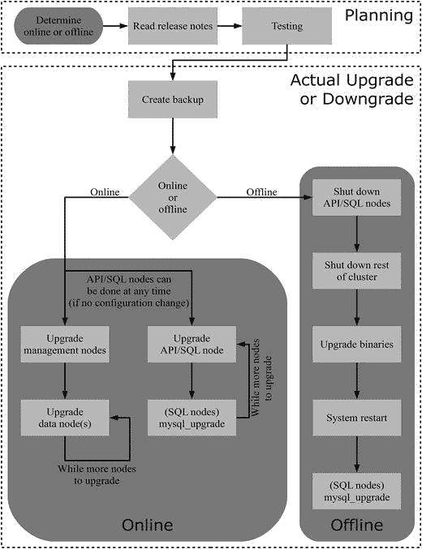

# 11. 升级与降级

### 摘要

本章介绍了 MySQL NDB 集群中节点启动、停止和重启的过程。重启操作至关重要，因为通过滚动重启，数据库管理员可以在不停机的情况下对集群进行更改。这些更改包括例如配置变更和添加更多节点。你还了解了如何监控重启过程。

本章后半部分专门介绍了一些以重启为核心操作的示例用例。这些示例从一个简单的数据节点选项配置变更开始，接着演示了添加管理节点、数据节点和 API/SQL 节点的过程。最后的两个示例则需要对一个或所有数据节点进行初始重启。

本章未涉及的一个使用滚动重启的示例是升级。执行升级本身就是一个足以覆盖整个章节的庞大主题——而这正是下一章的主题。

```
shell$ sudo -u mysql ndb_mgmd --config-file=/etc/config.ini \
--config-dir=/cluster/config --ndb-nodeid=49 --reload
MySQL Cluster Management Server mysql-5.7.16 ndb-7.5.4
shell$ sudo -u mysql ndb_mgmd --config-file=/etc/config.ini \
--config-dir=/cluster/config --ndb-nodeid=50 --reload
MySQL Cluster Management Server mysql-5.7.16 ndb-7.5.4
```

当管理节点启动后，就该启动数据节点了。这使用 `--initial` 选项来完成。如果存在任何日志文件组文件和表空间文件，保留它们即可，因为可以被重用。要启动这两个数据节点：

```
shell$ sudo -u mysql ndbmtd --ndb-nodeid=1 --initial
shell$ sudo -u mysql ndbmtd --ndb-nodeid=2 --initial
```

最后，重启 API/SQL 节点。

注意

重启前启用的单用户模式和只读模式在重启后不会保持。如果该状态必须在重启后保持，请在重启管理节点后启用单用户模式，并将超级只读模式添加到 SQL 节点的配置文件中。

要恢复备份，请使用 `mysqldump` 备份的模式来恢复表定义。这确保了表是使用新的默认分区数创建的。如有必要，首先创建数据库。通常除非 SQL 节点的数据目录也被重新初始化，否则不需要这样做，因此在 `CREATE SCHEMA` 语句中添加了 `IF NOT EXISTS`，并且禁用了 `sql_notes` 会话变量以避免虚假的错误和警告。（从技术上讲，使用 `IF NOT EXISTS`，如果模式已存在，会创建一个注解，而非警告。但是，注解是通过警告机制显示的。）然后恢复表定义：

```
mysql> SET SESSION sql_notes = OFF;
Query OK, 0 rows affected (0.00 sec)
mysql> CREATE SCHEMA IF NOT EXISTS world;
Query OK, 1 row affected (0.05 sec)
mysql> SET SESSION sql_notes = ON;
Query OK, 0 rows affected (0.00 sec)
mysql> use world;
Database changed
mysql> SOURCE backup_world_schemaonly.sql
Query OK, 0 rows affected (0.00 sec)
```

你必须删除任何外键；这不会影响数据完整性，并且在外键会在恢复结束时重建索引时恢复。

使用 `ndb_restore` 实用程序恢复数据。这可以对所有数据节点并行进行：

```
shell$ ndb_restore --ndb-connectstring=192.168.56.101,192.168.56.102 \
--backupid=1 --backup-path=/cluster/BACKUP/BACKUP-1 \
--restore-data --disable-indexes --nodeid=1
shell$ ndb_restore --ndb-connectstring=192.168.56.101,192.168.56.102 \
--backupid=1 --backup-path=/cluster/BACKUP/BACKUP-1 \
--restore-data --disable-indexes --nodeid=2
```

`ndb_restore` 使用的 `--disable-indexes` 选项会禁用索引，因此当所有数据都恢复后，必须重建索引。这可以通过一个命令完成，并且只需提及一个节点 ID：

```
shell$ ndb_restore --backupid=1 --backup-path=/cluster/BACKUP/BACKUP-1 \
--rebuild-indexes --nodeid=1
```

有关恢复备份的更多信息，请参见第 8 章。

至此，集群已准备好重新投入使用。恢复的表将使用四个 LDM 线程来处理分区的数据。

在许多数据库部署中，升级和降级是痛点，因为它们需要停机。因此，能够执行在线升级和降级是 MySQL NDB 集群的重要特性之一。在线升级和降级对于补丁版本变更（例如从 7.5.4 到 7.5.5）以及主要版本变更（例如从 7.4.13 到 7.5.4）都得到支持。从技术角度来看，升级和降级之间几乎没有区别，因此在很大程度上可以视为相同处理。

对在线升级的支持也使得保持使用最新版本更加可行。安装最新版本也意味着拥有所有最新的错误修复，从而提高了集群的稳定性。

提示

在大多数情况下，建议对给定的 MySQL NDB 集群使用最新的补丁版本。这将确保所有可用的错误修复——包括安全错误的修复——都已应用。

本章将详细讨论升级和降级，包括何时升级的考虑因素以及如何进行。

#### 升级

升级是将 MySQL NDB 集群安装的当前二进制文件替换为更新版本的二进制文件的过程。升级可分为两种主要类型：补丁版本升级和主要版本升级。接下来的章节将讨论这两种升级类型以及升级的考虑因素。升级所需的实际步骤将在本章后面的“执行升级与降级”一节中介绍。


#### 升级类型

MySQL 版本号包含三个组成部分：`x.y.z`，例如 `7.5.4`。MySQL NDB Cluster 版本号的 `x` 组成部分已经多年未变，因此在本章的讨论中，假设只有 `y` 和 `z` 组件会发生变化。这留下了两种升级类型：

*   补丁版本升级：仅 `z` 组件发生变化的升级。
*   主要版本升级：`y` 组件发生变化的升级。

补丁版本升级通常只包含错误修复，尽管偶尔也可能包含新功能。这意味着，通常补丁版本升级只会引起少数问题。当然，在升级生产系统之前，进行测试和阅读发布说明仍然非常重要。

另一方面，主要版本升级包含重要的新功能或对现有功能的更改。在 MySQL NDB Cluster 最新主要版本中引入的一些主要更改示例包括：

*   版本 `7.3`：引入了外键，并且用于 SQL 节点的 MySQL 服务器版本升级到了 `5.6`。
*   版本 `7.4`：对重启以及本地检查点和备份的写入进行了重做。
*   版本 `7.5`：分区平衡、从备份副本读取，并且 MySQL 服务器版本升级到了 `5.7`。

这些更改只是示例，用于说明在主要版本升级中可能预期的更改范围。由于数据节点有重大更改，在某些情况下 SQL 节点也有重大更改，因此在评估升级和测试阶段进行彻底工作非常重要。另一个对主要版本升级尤其重要的考虑是旧版本和新版本之间的兼容性。

由于可以在线执行升级，因此会存在一段时间，其中部分节点仍在使用旧版本，而其他节点已升级到新版本。这意味着在升级完成之前，必须小心不要开始使用新功能。在某些情况下，需要由 DBA 和数据库开发人员确保在整个集群可用之前不使用新功能。一个例子是版本 `7.3` 中引入的外键。

在其他情况下，存在可用的配置选项，例如 `7.3.10`、`7.4.7` 及更高版本（在 `7.5` 中再次移除）中用于 SQL 节点的 `create_old_temporals` 选项。`create_old_temporals` 选项确保使用时间数据类型（如 `TIMESTAMP`）的列使用 MySQL 服务器 `5.5`（在 MySQL NDB Cluster `7.2` 中使用）的格式创建。考虑向后兼容性并不局限于升级期间；如果还需要降级，重要的是在确定不需要降级之前，不要进行任何会阻止降级的更改。

#### 升级考虑因素

升级主要有两个原因：获取错误修复和新功能。每次升级的动机各不相同，没有一个固定的规则可以应用于所有系统来决定何时需要升级。决定升级收益是否大于成本的一些考虑因素包括：

*   通常，对于主要版本内的每个补丁版本，由于错误修复，它会变得更加稳定。
*   新的监控和调试信息（通常通过 `ndbinfo` 模式——参见第 16 章）会随着时间的推移而增加，既包括在补丁版本中，也包括在主要版本升级中。
*   执行升级的频率越高，每次升级中的更改就越少，因此学习调整/配置新功能的机会就越少。
*   每次升级都需要测试，这可能有利于不那么频繁的升级。
*   尽管每个补丁版本都进行了广泛的回归测试，但总存在回归的可能性。在某些情况下，这可能有利于规避已知错误，而不是追逐所有最新的错误修复。
*   当新的主要版本发布时，引入生产环境总会暴露出在开发期间测试遗漏的错误。这可能有利于在升级到新主要版本之前稍作等待，或者在升级到新主要版本后进行更频繁的补丁版本升级。
*   主要版本越新，它将看到的错误修复就越多。也就是说，一些错误不会在旧版本中修复。因此，重要的是不要落后最新的主要版本太远。例如，在撰写本书时，版本 `7.2`、`7.3`、`7.4` 和 `7.5` 正在积极维护中。在这种情况下，对于大多数用户，建议使用版本 `7.4` 或 `7.5`。

还值得注意的是，在新的主要版本开发期间，会利用机会进行重构，这有助于修复否则难以修复的错误。具有较高回归潜在风险的错误也通常在新主要版本开发阶段修复，以便在引入生产系统之前留出额外的测试时间。这意味着有时获得错误修复的唯一方法是执行主要版本升级。

升级的缺点在于需要评估升级，包括广泛的测试。最终，DBA 需要考虑每个系统，并决定修复错误和获取新功能与测试和准备要求之间的正确平衡。

#### 降级

从基本角度来看，降级与升级相同，只是版本号减少而不是增加。也就是说，在功能兼容性方面还有一些额外的考虑。由于 MySQL NDB Cluster 支持在线升级，要求是在两个主要版本之间不得移除任何功能，除非在升级前版本中提供了替代方案。然而，新功能通常至少会在主要版本升级中引入。一旦使用了新版本中的功能，通常就不再可能进行在线降级。

例如，考虑一个当前使用 MySQL NDB Cluster `7.5.4` 的集群。假设使用第 2 章中描述的全复制表功能创建一个新表：

```sql
CREATE TABLE t1 (
id int unsigned NOT NULL,
val varchar(10) NOT NULL,
PRIMARY KEY (id)
) ENGINE=ndbcluster COMMENT='NDB_TABLE=FULLY_REPLICATED=1';
```

如果尝试将包含此表的集群降级到版本 `7.4.13`，在尝试恢复模式时重启将失败：

```
2016-12-08 21:50:51 [MgmtSrvr] ALERT    -- Node 1: Forced node shutdown completed. Occurred during startphase 5\. Caused by error 2355: 'Failure to restore schema(Resource configuration error). Permanent error, external action needed'.
```

这是预期的，DBA 和数据库开发人员有责任在确认不需要降级之前，不使用任何新功能。如果在包含新功能后需要降级，通常必须从备份中恢复数据。

另一个需要考虑的因素是 SQL 节点的其他存储引擎。特别是，`InnoDB` 通常不允许 MySQL 服务器主要版本之间的就地降级。这意味着作为降级的一部分，可能需要重新初始化 SQL 节点。本章后面的“在线降级”案例研究给出了一个例子。

> **注意**
>
> MySQL 服务器不同主要版本之间的权限表通常存在差异。因此，使用 `CREATE USER` 和 `GRANT` 语句恢复用户和权限通常比尝试恢复权限表的实际内容更容易。


### 执行升级与降级

MySQL NDB Cluster 支持两种执行升级或降级的方法：在线或离线。两者的区别在于，操作期间集群是否可供应用程序使用，或者集群是否将被关闭。在线升级或降级的优点显然是**对应用程序的影响较小**。另一方面，离线升级或降级的优点是**耗时更短、操作更简单**，特别是当您在同一台主机上有多个节点并使用适用于 MySQL NDB Cluster 7.4 或更早版本的 RPM 或 Debian 包时。此外，在少数罕见情况下，由于存在错误（在撰写本文时，最近一次出现是从 7.2.14 或更高版本降级到 7.2.13 及更早版本时），在线操作可能无法进行。

> 注意
>
> 在线升级是迄今为止最常用的升级和降级操作类型。因此，离线升级和降级更有可能遇到意外问题。

无论是在线还是离线操作，执行升级或降级的大部分步骤是相同的：

1.  检查 MySQL 参考手册，以确定升级或降级是否有任何特殊注意事项，请访问 [`dev.mysql.com/doc/refman/5.7/en/mysql-cluster-upgrade-downgrade.html`](https://dev.mysql.com/doc/refman/5.7/en/mysql-cluster-upgrade-downgrade.html)。（使用页面右上角的版本选择器可以选择不同版本。）这些信息包括是否可以进行在线升级或降级。
2.  检查发行说明。关于 MySQL NDB Cluster 升级需要记住的一个重要点是，实际上有**两个升级**在同时进行：MySQL Server（用于 SQL 节点）和 NDB Cluster。发行说明可在 [`dev.mysql.com/doc/`](https://dev.mysql.com/doc/) 页面的右上角区域找到。MySQL Server 5.7 发行说明的直接链接是 [`dev.mysql.com/doc/relnotes/mysql/5.7/en/`](https://dev.mysql.com/doc/relnotes/mysql/5.7/en/)，而 MySQL NDB Cluster 7.5 的则是 [`dev.mysql.com/doc/relnotes/mysql-cluster/7.5/en/`](https://dev.mysql.com/doc/relnotes/mysql-cluster/7.5/en/)。对于主要版本升级，还建议查看手册的“新增功能”部分——例如，MySQL NDB Cluster 7.5 的 [`dev.mysql.com/doc/refman/5.7/en/mysql-nutshell.html`](https://dev.mysql.com/doc/refman/5.7/en/mysql-nutshell.html) 和 [`dev.mysql.com/doc/refman/5.7/en/mysql-cluster-what-is-new.html`](https://dev.mysql.com/doc/refman/5.7/en/mysql-cluster-what-is-new.html)。
3.  **测试升级和降级**。这是非常重要的一步，应确保您已为升级和回滚升级（降级）准备好行动计划。没有良好的测试，实际升级或降级过程中出现问题的可能性会大得多。具体的测试内容很大程度上取决于系统，但请确保同时进行功能测试和性能测试。例如，功能测试必须确保不会出现警告和错误——这可能是因为应用程序使用了已弃用或已移除的功能。性能测试必须包含反映生产负载的工作负载；这将确保，例如，优化器的更改不会导致针对应用程序负载产生更差的查询计划。
4.  **对集群执行备份**。如果集群还包含除 `NDBCluster` 之外的其他存储引擎的数据，请确保也备份这些数据。
5.  **执行实际的升级或降级**。此步骤在使用在线或离线操作时有所不同。本节末尾的两个小节将详细介绍。
6.  **在升级或降级完成后，验证一切是否按预期工作**。

步骤 1-3 应在升级或降级操作时间之前完成，而步骤 4-6 则构成了升级或降级维护窗口本身。图 11-1 概述了在线和离线情况下升级集群的过程。以下两个小节将讨论在线和离线操作的具体细节。

> 警告
>
> 虽然使用分布式权限（参见第 12 章）升级 SQL 节点是可行的，但主要版本之间的降级将无法工作。在降级过程中，禁用分布式权限非常重要。



图 11-1.
在线和离线操作流程概述

#### 在线升级与降级

执行在线升级或降级的步骤与执行滚动重启相同，区别在于节点关闭时会替换其二进制文件：

1.  如有必要，使用新的配置更新集群配置文件（`config.ini`）。
2.  关闭管理节点。如果有多个管理节点，应全部关闭。
3.  替换管理节点的二进制文件。具体操作取决于平台，也取决于使用的是安装程序（例如 Microsoft Windows Installer .MSI 文件或 RPM 包）还是自解压文件（.zip 或 .tar 下载包）。此步骤将类似于第 5 章讨论的安装过程。
4.  启动管理节点。要读取配置文件（`config.ini`），请使用 `--reload`（在大多数情况下推荐）或 `--initial` 命令行选项。
5.  关闭一个或多个数据节点，**确保每个节点组中至少有一个数据节点保持在线**。与常规滚动重启一样，建议每次不要在同一主机上重启多个数据节点。
6.  替换在步骤 5 中关闭的数据节点的二进制文件。
7.  启动离线的数据节点。
8.  重复步骤 5-7，直到所有数据节点都已重启。
9.  关闭一个或多个 API/SQL 节点，**确保始终至少有一个节点在线**。
10. 替换在步骤 9 中关闭的 API/SQL 节点的二进制文件。
11. 对于 SQL 节点在降级时，如有必要，重新初始化数据目录。
12. 启动离线的 API/SQL 节点。
13. 对于 SQL 节点在降级时，如果节点已被重新初始化，请恢复所有非 `NDBCluster` 表的备份。
14. 对于 SQL 节点在升级时，执行 `mysql_upgrade` 脚本以升级任何需要升级的表。
15. 重复步骤 9-12，直到所有 API/SQL 节点都已重启。

> 提示
>
> API/SQL 节点可以在操作过程的任何阶段进行升级或降级（尽管如果进行了影响 API/SQL 节点的配置更改，必须首先重启管理节点）。如果 API/SQL 节点与其他节点类型共存于同一主机上，这一点尤其有用，因为在这种情况下，API/SQL 可以与主机上的其他节点同时升级或降级。

在滚动升级或降级期间，**重要的是不要使用只有部分节点能处理的功能**；特别是不要使用只有较新版本节点才知晓的功能。

本章末尾的案例研究部分包含一个在线升级和降级的示例。


#### 离线升级与降级

离线升级和降级比在线流程更简单。它包括关闭集群、替换二进制文件和执行系统重启。步骤如下：

1.  关闭所有 API/SQL 节点。
2.  关闭管理节点和 SQL 节点。最好的方法是使用管理客户端中的 `SHUTDOWN` 命令：

    ```
    mcm> SHUTDOWN
    Connected to Management Server at: 192.168.56.101:1186
    4 NDB Cluster node(s) have shutdown.
    Disconnecting to allow management server to shutdown.
    ```

3.  替换所有二进制文件。
4.  执行管理节点和数据节点的系统重启。
5.  对于降级时的 SQL 节点，如果需要，重新初始化数据目录。
6.  启动 API/SQL 节点。
7.  对于降级时的 SQL 节点，如果节点被重新初始化，则恢复所有非 `NDBCluster` 表的备份。
8.  对于升级时的 SQL 节点，执行 `mysql_upgrade` 脚本来升级任何需要升级的表。

本章末尾有一个离线升级的示例。

### 案例研究

本节通过四个执行升级和降级的示例进行讲解：

*   使用通用二进制文件从 MySQL NDB Cluster 7.4.13 在线升级到 7.5.4。在本讨论中，通用二进制文件指的是不使用任何安装程序的 tarball 或 Zip 文件下载。
*   使用 RPM 从 MySQL NDB Cluster 7.4.13 在线升级到 7.5.4。
*   从 MySQL NDB Cluster 7.5.4 在线降级到 7.4.13。
*   从 MySQL NDB Cluster 7.4.13 离线升级到 7.5.4。

所有示例都使用与第 10 章相同的配置；参见清单 11-1。

```
[ndb_mgmd default]
DataDir                       = /cluster/
[ndbd default]
NoOfReplicas                  = 2
DataDir                       = /cluster/
[ndbd]
NodeId                        = 1
HostName                      = 192.168.56.103
[ndbd]
NodeId                        = 2
HostName                      = 192.168.56.104
[ndb_mgmd]
NodeId                        = 49
HostName                      = 192.168.56.101
[ndb_mgmd]
NodeId                        = 50
HostName                      = 192.168.56.102
[mysqld]
NodeId                        = 51
HostName                      = 192.168.56.103
[mysqld]
NodeId                        = 52
HostName                      = 192.168.56.104
[api]
NodeId                        = 53
HostName                      = 192.168.56.101
[api]
NodeId                        = 54
HostName                      = 192.168.56.102
清单 11-1.
本章使用的集群配置
```

此外，还假设所有主机都在 `/etc/my.cnf` 中配置了 `ndb_connectstring`，因此无需在命令行中指定它：

```
[mysql_cluster]
ndb_connectstring          = 192.168.56.101,192.168.56.102
```

**提示**

在真实的集群安装中，建议在 `my.cnf` 或 `my.ini` 中也配置 `NodeId` 选项。

#### 使用通用二进制文件进行在线升级

在此示例中，集群从使用 7.4.13 开始，将在线升级到 7.5.4。假设 7.4.13 已经安装并在线：

```
shell$ ndb_mgm -e "SHOW"
Connected to Management Server at: 192.168.56.101:1186
Cluster Configuration

[ndbd(NDB)]     2 node(s)
id=1    @192.168.56.103  (mysql-5.6.34 ndb-7.4.13, Nodegroup: 0, *)
id=2    @192.168.56.104  (mysql-5.6.34 ndb-7.4.13, Nodegroup: 0)
[ndb_mgmd(MGM)] 2 node(s)
id=49   @192.168.56.101  (mysql-5.6.34 ndb-7.4.13)
id=50   @192.168.56.102  (mysql-5.6.34 ndb-7.4.13)
[mysqld(API)]   6 node(s)
id=51   @192.168.56.103  (mysql-5.6.34 ndb-7.4.13)
id=52   @192.168.56.104  (mysql-5.6.34 ndb-7.4.13)
id=53 (not connected, accepting connect from 192.168.56.101)
id=54 (not connected, accepting connect from 192.168.56.102)
```

第一步是解包 MySQL NDB Cluster 7.5.4 的二进制文件：

```
shell$ cd /opt/cluster
shell$ tar -zxf mysql-cluster-gpl-7.5.4-linux-glibc2.5-x86_64.tar.gz
```

这应该在所有主机上完成。为了缩短路径，重命名目录：

```
shell$ mv mysql-cluster-gpl-7.5.4-linux-glibc2.5-x86_64 7.5.4
```

在执行实际升级之前，请确保您有所有数据的备份。

在这个阶段，只需要进行滚动重启，使用新二进制文件执行重启。在此示例中，节点将按以下顺序升级：

1.  管理节点
2.  数据节点
3.  SQL 节点

滚动升级的第一步是关闭两个管理节点：

```
shell$ ndb_mgm -e "49 STOP"
Connected to Management Server at: 192.168.56.101:1186
Node 49 has shutdown.
Disconnecting to allow Management Server to shutdown
shell$ ndb_mgm -e "50 STOP"
Connected to Management Server at: 192.168.56.102:1186
Node 50 has shutdown .
Disconnecting to allow Management Server to shutdown
```

等待两个管理节点关闭，然后使用升级后的二进制文件重启：

```
shell$ sudo -u mysql /opt/cluster/7.5.4/bin/ndb_mgmd \
--config-file=/etc/config.ini --config-dir=/cluster/config \
--ndb-nodeid=49 --reload
MySQL Cluster Management Server mysql-5.7.16 ndb-7.5.4
shell$ sudo -u mysql /opt/cluster/7.5.4/bin/ndb_mgmd \
--config-file=/etc/config.ini --config-dir=/cluster/config \
--ndb-nodeid=50 –reload
MySQL Cluster Management Server mysql-5.7.16 ndb-7.5.4
```

如果没有配置更改，则 `--reload` 选项不是必需的，但如果配置未更改，它作为 NOOP（无操作）也无妨。检查新状态显示管理节点现在使用的是 7.5.4 版本，而集群的其余部分仍然使用 7.4.13：

```
shell$ ndb_mgm -e "SHOW"
Connected to Management Server at: 192.168.56.101:1186
Cluster Configuration

[ndbd(NDB)]     2 node(s)
id=1    @192.168.56.103  (mysql-5.6.34 ndb-7.4.13, Nodegroup: 0, *)
id=2    @192.168.56.104  (mysql-5.6.34 ndb-7.4.13, Nodegroup: 0)
[ndb_mgmd(MGM)] 2 node(s)
id=49   @192.168.56.101  (mysql-5.7.16 ndb-7.5.4)
id=50   @192.168.56.102  (mysql-5.7.16 ndb-7.5.4)
...
```

现在依次重启每个数据节点。命令行客户端中的 `RESTART` 命令不能在此处使用，因为它不替换二进制文件。因此首先停止一个节点：

```
shell$ ndb_mgm -e "1 STOP"
Connected to Management Server at: 192.168.56.101:1186
Node 1 has shutdown.
```

然后使用新的二进制文件启动它：

```
shell$ sudo -u mysql /opt/cluster/7.5.4/bin/ndbmtd --ndb-nodeid=1
2016-11-26 19:19:10 [ndbd] INFO     -- Angel connected to '192.168.56.101:1186'
2016-11-26 19:19:10 [ndbd] INFO     -- Angel allocated nodeid: 1
```

等待节点完成重启，此时状态为：

```
shell$ ndb_mgm -e "SHOW"
Connected to Management Server at: 192.168.56.101:1186
Cluster Configuration
```


即使两个数据节点使用不同版本，应用程序仍可继续使用该集群，但在此阶段确保不使用任何新功能至关重要。然后对另一个数据节点重复相同操作：

```
shell$ ndb_mgm -e "2 STOP"
Connected to Management Server at: 192.168.56.101:1186
Node 2 has shutdown.
shell$ sudo -u mysql /opt/cluster/7.5.4/bin/ndbmtd --ndb-nodeid=2
2016-11-26 19:21:37 [ndbd] INFO     -- Angel connected to '192.168.56.101:1186'
2016-11-26 19:21:37 [ndbd] INFO     -- Angel allocated nodeid: 2
```

至此，只剩下依次升级两个 SQL 节点。首先升级第一个：

```
shell$ /opt/cluster/7.4.13/bin/mysqladmin --host=127.0.0.1 shutdown
shell$ /opt/cluster/7.5.4/bin/mysqld &
[1] 9227
```

确保在 SQL 节点重新上线后执行一次 `mysql_upgrade`。这必须对每个 SQL 节点都执行，并且重要的是要为新版本使用 `mysql_upgrade`。

```
shell$ /opt/cluster/7.5.4/bin/mysql_upgrade --host=127.0.0.1
Checking if update is needed.
Checking server version.
Running queries to upgrade MySQL server.
Checking system database.
mysql.columns_priv                                 OK
mysql.db                                           OK
...
mysql.user                                         OK
Upgrading the sys schema.
Checking databases.
sys.sys_config                                     OK
world.City                                         OK
world.Country                                      OK
world.CountryLanguage                              OK
Upgrade process completed successfully.
Checking if update is needed.
```

由于所有检查项都返回 `OK`，因此无需进一步操作。首先检查的是 `mysql` 模式中的系统表。这些包括权限表，它们是最常需要升级的表。`sys` 模式是 MySQL Server 5.7（因此也是 MySQL NDB Cluster 7.5）中的新特性，它将由 `mysql_upgrade` 安装。第 15 章包含了使用 `sys` 模式的示例。最后，检查所有用户表。

最后一步是升级最后一个 SQL 节点：

```
shell$ /opt/cluster/7.4.13/bin/mysqladmin --host=127.0.0.1 shutdown
shell$ /opt/cluster/7.5.4/bin/mysqld &
[1] 8189
shell$ /opt/cluster/7.5.4/bin/mysql_upgrade --host=127.0.0.1
Checking if update is needed.
Checking server version.
Running queries to upgrade MySQL server.
Checking system database.
mysql.columns_priv                                 OK
mysql.db                                           OK
...
mysql.user                                         OK
Found empty sys database. Installing the sys schema.
Upgrading the sys schema.
The sys schema is already up to date (version 1.5.1).
Checking databases.
sys.sys_config                                     OK
world.City                                         OK
world.Country                                      OK
world.CountryLanguage                              OK
Upgrade process completed successfully.
Checking if update is needed.
```

这里需要注意 `sys` 数据库被报告为空。当 `sys` 模式在第一个 SQL 节点上安装时，通过自动模式分发，该模式也会在第二个 SQL 节点上创建。然而，由于 `sys` 模式的对象都不是 `NDBCluster` 表，因此在后续待升级的 SQL 节点上该数据库将是空的。`mysql_upgrade` 会确保 `sys` 模式仍然被安装。

升级后的最终状态是：

```
shell$ ndb_mgm -e "SHOW"
Connected to Management Server at: 192.168.56.101:1186
Cluster Configuration

[ndbd(NDB)]     2 node(s)
id=1    @192.168.56.103  (mysql-5.7.16 ndb-7.5.4, Nodegroup: 0, *)
id=2    @192.168.56.104  (mysql-5.7.16 ndb-7.5.4, Nodegroup: 0)
[ndb_mgmd(MGM)] 2 node(s)
id=49   @192.168.56.101  (mysql-5.7.16 ndb-7.5.4)
id=50   @192.168.56.102  (mysql-5.7.16 ndb-7.5.4)
[mysqld(API)]   6 node(s)
id=51   @192.168.56.103  (mysql-5.7.16 ndb-7.5.4)
id=52   @192.168.56.104  (mysql-5.7.16 ndb-7.5.4)
id=53 (not connected, accepting connect from 192.168.56.101)
id=54 (not connected, accepting connect from 192.168.56.102)
```


#### 从 7.4 升级到 7.5（使用 RPM）

在 MySQL NDB Cluster 7.4 及更早版本中，使用 RPM 安装 MySQL NDB Cluster 的系统进行升级和降级的一个难点是，集群节点使用的所有二进制文件都包含在同一个 RPM 中。服务器 RPM 包含了 `mysqld`、`ndb_mgmd`、`ndbd` 和 `ndbmtd`。这使得在单个主机上安装了多个节点的情况下，仅升级部分节点变得更加困难。这一点在 7.5 版本中发生了变化，每种节点类型现在都有自己的 RPM 软件包。

##### RPM 软件包结构

7.4.13 RPM 捆绑包中提供的 RPM 有：

```
shell$ ls -1
MySQL-Cluster-client-gpl-7.4.13-1.el7.x86_64.rpm
MySQL-Cluster-devel-gpl-7.4.13-1.el7.x86_64.rpm
MySQL-Cluster-embedded-gpl-7.4.13-1.el7.x86_64.rpm
MySQL-Cluster-server-gpl-7.4.13-1.el7.x86_64.rpm
MySQL-Cluster-shared-compat-gpl-7.4.13-1.el7.x86_64.rpm
MySQL-Cluster-shared-gpl-7.4.13-1.el7.x86_64.rpm
MySQL-Cluster-test-gpl-7.4.13-1.el7.x86_64.rpm
```

将此与 7.5.4 RPM 捆绑包中提供的 RPM 进行比较：

```
shell$ ls -1
mysql-cluster-community-auto-installer-7.5.4-1.el7.x86_64.rpm
mysql-cluster-community-client-7.5.4-1.el7.x86_64.rpm
mysql-cluster-community-common-7.5.4-1.el7.x86_64.rpm
mysql-cluster-community-data-node-7.5.4-1.el7.x86_64.rpm
mysql-cluster-community-devel-7.5.4-1.el7.x86_64.rpm
mysql-cluster-community-embedded-7.5.4-1.el7.x86_64.rpm
mysql-cluster-community-embedded-compat-7.5.4-1.el7.x86_64.rpm
mysql-cluster-community-embedded-devel-7.5.4-1.el7.x86_64.rpm
mysql-cluster-community-java-7.5.4-1.el7.x86_64.rpm
mysql-cluster-community-libs-7.5.4-1.el7.x86_64.rpm
mysql-cluster-community-libs-compat-7.5.4-1.el7.x86_64.rpm
mysql-cluster-community-management-server-7.5.4-1.el7.x86_64.rpm
mysql-cluster-community-memcached-7.5.4-1.el7.x86_64.rpm
mysql-cluster-community-ndbclient-7.5.4-1.el7.x86_64.rpm
mysql-cluster-community-ndbclient-devel-7.5.4-1.el7.x86_64.rpm
mysql-cluster-community-server-7.5.4-1.el7.x86_64.rpm
mysql-cluster-community-test-7.5.4-1.el7.x86_64.rpm
```

##### 直接升级尝试失败

此示例开始时安装了以下 RPM：

```
shell$ rpm -qa | grep MySQL-Cluster
MySQL-Cluster-client-gpl-7.4.13-1.el7.x86_64
MySQL-Cluster-shared-compat-gpl-7.4.13-1.el7.x86_64
MySQL-Cluster-server-gpl-7.4.13-1.el7.x86_64
MySQL-Cluster-shared-gpl-7.4.13-1.el7.x86_64
MySQL-Cluster-devel-gpl-7.4.13-1.el7.x86_64
```

如果采用直接升级尝试，由于 RPM 的变更，升级将会失败：

```
shell$ yum upgrade \
mysql-cluster-community-auto-installer-7.5.4-1.el7.x86_64.rpm \
mysql-cluster-community-client-7.5.4-1.el7.x86_64.rpm \
mysql-cluster-community-common-7.5.4-1.el7.x86_64.rpm \
mysql-cluster-community-data-node-7.5.4-1.el7.x86_64.rpm \
mysql-cluster-community-devel-7.5.4-1.el7.x86_64.rpm \
mysql-cluster-community-java-7.5.4-1.el7.x86_64.rpm \
mysql-cluster-community-libs-7.5.4-1.el7.x86_64.rpm \
mysql-cluster-community-libs-compat-7.5.4-1.el7.x86_64.rpm \
mysql-cluster-community-management-server-7.5.4-1.el7.x86_64.rpm \
mysql-cluster-community-ndbclient-7.5.4-1.el7.x86_64.rpm \
mysql-cluster-community-ndbclient-devel-7.5.4-1.el7.x86_64.rpm \
mysql-cluster-community-server-7.5.4-1.el7.x86_64.rpm
Loaded plugins: langpacks, ulninfo
Examining mysql-cluster-community-auto-installer-7.5.4-1.el7.x86_64.rpm: mysql-cluster-community-auto-installer-7.5.4-1.el7.x86_64
Package mysql-cluster-community-auto-installer not installed, cannot update it. Run yum install to install it instead.
...
Package mysql-cluster-community-server not installed, cannot update it. Run yum install to install it instead.
No packages marked for update
```

由于 MySQL NDB Cluster 7.4.13 已经安装，遵循错误信息中建议的安装 RPM 而非执行升级的操作同样无效。

##### 卸载旧 RPM

因此，必须先卸载旧的 RPM，这需要为 `rpm` 命令使用 `--nodeps` 选项：

```
shell$ rpm -e --nodeps \
MySQL-Cluster-client-gpl-7.4.13-1.el7.x86_64 \
MySQL-Cluster-shared-compat-gpl-7.4.13-1.el7.x86_64 \
MySQL-Cluster-server-gpl-7.4.13-1.el7.x86_64 \
MySQL-Cluster-shared-gpl-7.4.13-1.el7.x86_64 \
MySQL-Cluster-devel-gpl-7.4.13-1.el7.x86_64
```

**注意**
卸载服务器 RPM 会将 `/etc/my.cnf` 文件重命名为 `/etc/my.cnf.rpmsave`。如果您重新安装服务器 RPM，请务必恢复旧的配置。

##### 安装新 RPM

然后就可以为主机安装所需的新 RPM 了。例如，对于一个数据节点：

```
shell$ yum localinstall \
mysql-cluster-community-data-node-7.5.4-1.el7.x86_64.rpm \
mysql-cluster-community-ndbclient-7.5.4-1.el7.x86_64.rpm
Loaded plugins: langpacks, ulninfo
Examining mysql-cluster-community-data-node-7.5.4-1.el7.x86_64.rpm: mysql-cluster-community-data-node-7.5.4-1.el7.x86_64
Marking mysql-cluster-community-data-node-7.5.4-1.el7.x86_64.rpm to be installed
Examining mysql-cluster-community-ndbclient-7.5.4-1.el7.x86_64.rpm: mysql-cluster-community-ndbclient-7.5.4-1.el7.x86_64
Marking mysql-cluster-community-ndbclient-7.5.4-1.el7.x86_64.rpm to be installed
...
Installing : mysql-cluster-community-data-node-7.5.4-1.el7.x86_64      1/2
Installing : mysql-cluster-community-ndbclient-7.5.4-1.el7.x86_64      2/2
Verifying  : mysql-cluster-community-ndbclient-7.5.4-1.el7.x86_64      1/2
Verifying  : mysql-cluster-community-data-node-7.5.4-1.el7.x86_64      2/2
Installed:
mysql-cluster-community-data-node.x86_64 0:7.5.4-1.el7
mysql-cluster-community-ndbclient.x86_64 0:7.5.4-1.el7
Complete!
```

另一种方法是直接使用 `rpm` 命令安装。这样做的好处是可以使用 `--noscripts` 选项，从而不执行 RPM 脚本片段。避免执行脚本片段对于在同一主机上安装了 SQL 节点以及管理节点或数据节点的 7.4 及更早版本尤其有利，因为它可以避免 SQL 节点自动启动。

使用 RPM 升级过程的其余部分与上一个案例研究中的通用二进制文件情况相同。

##### 处理依赖错误

使用 RPM 时可能出现的问题之一是，新版本的 MySQL NDB Cluster 依赖于不同于旧版本的库。在这种情况下，尝试安装新的 RPM 软件包可能会产生如下错误：

```
shell$ yum remove mysql-cluster-community-ndbclient-7.5.4-1.el7.x86_64.rpm
Loaded plugins: langpacks, ulninfo
No Match for argument: mysql-cluster-community-ndbclient-7.5.4-1.el7.x86_64.rpm
No Packages marked for removal
[root@ol7 rpm]# yum localinstall mysql-cluster-community-server-7.5.4-1.el7.x86_64.rpm
Loaded plugins: langpacks, ulninfo
Examining mysql-cluster-community-server-7.5.4-1.el7.x86_64.rpm: mysql-cluster-community-server-7.5.4-1.el7.x86_64
Marking mysql-cluster-community-server-7.5.4-1.el7.x86_64.rpm to be installed
Resolving Dependencies
--> Running transaction check
---> Package mysql-cluster-community-server.x86_64 0:7.5.4-1.el7 will be installed
--> Processing Dependency: mysql-cluster-community-common(x86-64) = 7.5.4-1.el7 for package: mysql-cluster-community-server-7.5.4-1.el7.x86_64
--> Processing Dependency: mysql-cluster-community-client(x86-64) >= 5.7.9 for package: mysql-cluster-community-server-7.5.4-1.el7.x86_64
--> Finished Dependency Resolution
Error: Package: mysql-cluster-community-server-7.5.4-1.el7.x86_64 (/mysql-cluster-community-server-7.5.4-1.el7.x86_64)
           Requires: mysql-cluster-community-client(x86-64) >= 5.7.9
Error: Package: mysql-cluster-community-server-7.5.4-1.el7.x86_64 (/mysql-cluster-community-server-7.5.4-1.el7.x86_64)
           Requires: mysql-cluster-community-common(x86-64) = 7.5.4-1.el7
           You could try using --skip-broken to work around the problem
```

如果使用 `rpm` 命令而不是 `yum`，报告的错误信息会略有不同：


