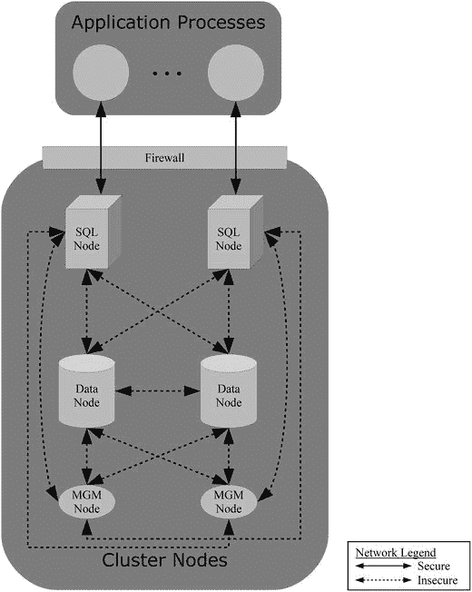

# 12. 安全注意事项

在互联网的早期，人们并没有过多考虑全球安装软件的安全性。网络连接未加密，因此包括密码在内的网络流量都可以以明文形式查看（还记得 `telnet` 吗？）。即使在今天，软件或硬件设备交付时使用标准默认密码或管理帐户无密码的情况也很常见。这种安全级别不符合当今的标准。本章从 MySQL NDB 集群的角度讨论安全性。其中一些问题和解决方案绝非 MySQL NDB 集群所独有；另一些则非常具体。

讨论的一些主题同样属于第 3、4 和 5 章（即集群最初规划和设置的阶段）。然而，认为安全性——包括网络配置的安全性——是一项一劳永逸的任务是错误的。它应该是初始设计和日常任务的一部分，以评估和维护集群的安全性。

注意

本章侧重于软件方面。硬件的物理安全也很重要，以及心怀不满或不诚实员工带来的风险。将服务器机房门未上锁让任何人随意进入，对于保护服务器安全作用甚微。同样，你也不希望一名日常工作需要访问你数据的员工将数据出售给最高出价者。


### 网络安全

集群中的各个节点通常通过 TCP/IP 网络进行通信。由于低延迟和高吞吐量对 NDB 集群至关重要，因此在进行网络设置时（最好使用专用网络进行集群节点间通信）需要仔细权衡一些妥协方案。为了最小化网络流量的开销，节点间通信以明文（非加密）方式进行。此外，当节点加入集群时没有进行身份验证。简而言之，这意味着能够连接到数据节点的客户端也能够检索存储在其中的数据。因此，在配置网络时，将安全性放在首位至关重要。

为了说明数据如何在网络流量中以明文可见，在插入一行数据时捕获了通过网络传输的数据：

```
mysql> INSERT INTO employee (EmployeeID, FirstName, Surname, IsManager)
VALUES (101, 'Jane', 'Doe', 'Yes');
Query OK, 1 row affected (0.00 sec)
```

生成的包含网络捕获的文件可以检索到数据（仅显示一个网络数据包）：

```
shell$ xxd  /tmp/insert.dump
0000000: 2420 0040 3c01 1008 f702 f704 7c08 6d00  $ .@<.......|.m.
0000010: 0400 0000 0000 0000 5ba1 9712 00c4 50a8  .............P.
0000020: 0200 f500 1400 0100 0100 0000 e314 0000  ................
0000030: 0033 8000 0000 0000 0000 0000 3300 0880  .3..........3...
0000040: 4400 0000 0816 0000 0000 0000 0000 0000  D...............
0000050: 0100 0000 0900 0000 6500 0000 0400 0000  ........e.......
0000060: 6500 0000 0500 0100 044a 616e 6500 0000  e........Jane...
0000070: 0400 0200 0344 6f65 0100 0300 0200 0000  .....Doe........
```

最后两行是此示例中最值得关注的部分。注意从右侧的 ASCII 输出中可以读取到 Jane Doe。行中的其他值也是可见的，但对人类来说不太容易看出。例如，`EmployeeId` 是 101，其十六进制为 65，这是倒数第二行的第一个字节。因此，虽然数据包格式高效（且相对易于调试），但从安全角度来看，任务在于防止未经授权的用户监听流量。

保护集群免受未经授权访问的最简单且最有效的方法是设置两个网络层级：一个内部网络用于 MySQL NDB 集群节点之间，一个外部网络用于访问 SQL 节点或应用程序。这样做还有一个额外优势，即内部网络可以专用于集群节点间的通信，从而提高稳定性。请记住，MySQL NDB 集群是一个“故障即停机”系统，因此网络拥塞可能被解释为网络故障，导致集群关闭一个或多个节点。

图 [12-1 展示了一个集群如何通过内部网络连接两个 SQL 节点、两个数据节点和两个管理节点，并且 SQL 节点可以通过防火墙从外部访问。设置网络还有其他选项，但为了确保安全配置，所有选项都应遵循相同的原则，即将不安全的通信与集群外部网络完全物理隔离。

Caution

如果 SQL 节点与管理节点或数据节点安装在同一主机上，请确保只允许连接到 SQL 节点。



图 12-1.

集群安全网络设置示例

### 更新

保持集群安全的一个重要部分是保持其更新。这不仅适用于 MySQL NDB 集群，也适用于操作系统、网络设备的固件等。整个技术栈都应保持最新，以确保不仅所有用户级错误得到修复，所有安全漏洞也得到修复。

不同的软件供应商处理安全漏洞的方式不同。这意味着您需要验证与集群安装相关的每个供应商的策略，包括基础设施部分。建议您记录这些策略，并与所有相关参考文献一起存放在一个中心位置，以便于查阅详细信息。在某些情况下，可能还会有计划地发布有关安全漏洞修复的信息，这些信息应纳入集群的维护计划。

MySQL NDB 集群的供应商 Oracle Corporation 有一个政策，即每季度发布一次针对 Oracle 产品安全修复的更新。这些更新称为关键补丁更新（CPU），分别在 1 月、4 月、7 月和 10 月最接近该月 17 日的星期二发布。有关发布时间表和各个版本参考的详细信息可在 [`www.oracle.com/technetwork/topics/security/alerts-086861.html`](https://www.oracle.com/technetwork/topics/security/alerts-086861.html) 找到。

Caution

有时，如果错误不影响应用程序或有解决方法，跳过普通错误修复的更新是可以接受的。但是，请小心忽略安全错误的补丁。用于确定系统是否受给定安全漏洞影响的信息可能非常有限。因此，通常最安全的方法是始终确保应用所有安全补丁。

### SQL 节点中的账户和权限

除了保持系统使用关键错误修复保持最新之外，主要的持续安全相关工作是用户管理。SQL 节点附带与 MySQL Server 相同的内置权限系统，并增加了支持分发权限的功能。也就是说，将它们存储在 `NDBCluster` 表中，而不是通常的 `MyISAM` 表中。使用分布式权限意味着所有 SQL 节点都定义了相同的用户和权限。

Note

MySQL Server 8.0 将权限表更改为使用 `InnoDB` 存储引擎进行本地存储的权限。然而，在撰写本文时，还没有可用的 MySQL NDB 集群版本（即使是预览版）受此更改影响。

数据库开发人员和管理员需要记住几个方面。其中一些是：

*   确保授予用户的权限是最小必需权限。
*   移除不再需要的权限。
*   移除不再使用的用户。
*   保持 SQL 节点之间的权限同步。
*   定期记录和审查权限。

本节的剩余部分将讨论这些主题，但分布式权限除外，该主题本身内容庞大，将在本章后面单独一节中讨论。

Note

数据库开发人员和管理员必须共同努力，确保用户及其权限设置正确，这一点非常重要。


#### 账户与密码管理

管理用户的任务看似简单。毕竟，在需要时创建新用户是件容易的事。然而，在保持系统安全方面，有几个陷阱需要注意。关于如何以安全的方式创建和维护用户，将在后续讨论中进行更详细的阐述。

**注意**
在 MySQL NDB 集群中管理用户、密码和权限，与在标准 MySQL 服务器中管理用户、密码和权限，**没有区别**。然而，由于这个话题非常重要，这里仍提供一个概述。你可以在 MySQL 参考手册中更详细地研究此主题：[`dev.mysql.com/doc/refman/5.7/en/privilege-system.html`](https://dev.mysql.com/doc/refman/5.7/en/privilege-system.html) 和 [`dev.mysql.com/doc/refman/5.7/en/account-management-sql.html`](https://dev.mysql.com/doc/refman/5.7/en/account-management-sql.html)。

MySQL 支持多种语句来管理用户、密码和权限，以及查看用户和权限信息的语句。截至 MySQL NDB 集群 7.5 版本可用的语句总结在表 12-1 中。如果该语句并非在所有 MySQL NDB 集群 7.2 及更高版本中都受支持，“版本”列会显示支持该语句的具体版本。

**表 12-1.** 用于管理用户、密码和权限的语句

| 语句 | 版本 | 描述 |
| --- | --- | --- |
| `ALTER USER` | 7.3+ | 修改现有用户账户。在 7.3 和 7.4 版本中，它仅限于使用户密码过期。在 7.5 版本中，它支持`CREATE USER`所能设置的所有选项。 |
| `CREATE USER` |   | 创建新用户账户。在 7.4 及更早版本中，此操作仅限于创建用户并指定密码和身份验证插件。在 MySQL NDB 集群 7.5 中，可以设置所有账户属性。 |
| `DROP USER` |   | 删除现有用户。 |
| `GRANT` |   | 为用户授予权限。它也可用于创建新用户、更改密码、设置身份验证选项和资源选项。在 7.5 版本中，建议仅将其用于授予权限。在 7.4 及更早版本中，完成这些任务大多需要使用`GRANT`。**强烈建议切勿使用`GRANT`创建用户；应使用`CREATE USER`代替。** |
| `RENAME USER` |   | 重命名用户。 |
| `REVOKE` |   | 撤销用户的权限。 |
| `SET PASSWORD` |   | 更改用户密码。在 7.5 版本中，新密码需要以明文形式提供，而在 7.4 及更早版本中，需要提供哈希后的密码。 |
| `SHOW CREATE USER` | 7.5+ | 显示给定用户账户的详细信息，包括密码哈希、身份验证选项等。 |
| `SHOW GRANTS` |   | 显示授予用户账户的权限。在 7.4 及更早版本中，它还包含 7.5 版本中`SHOW CREATE USER`所返回的信息。 |

可以使用`CREATE USER`或`GRANT`语句创建新用户。在 MySQL NDB 集群 7.5 中，更推荐使用`CREATE USER`，因为它具备设置用户所需的全部功能，不仅可以指定密码，还可以指定 SSL/TLS 要求、资源限制、密码策略和账户锁定选项。`ALTER USER`语句可用于修改现有用户账户。在旧版 MySQL NDB 集群中，`CREATE USER`和`ALTER USER`支持的功能相当有限，除了创建用户、设置初始密码或使现有用户密码过期外，任何其他操作都必须使用`GRANT`语句。

清单 12-1 提供了一个在 MySQL NDB 集群 7.5 中，用户生命周期内的一系列账户管理语句的示例。这些步骤通常不会一次性全部执行，而是在一段时间内逐步完成。这些语句是讨论有关用户账户及其设置的一些最佳实践的良好起点。示例之后将讨论 MySQL 权限系统。

```
mysql> CREATE USER 'appadmin'@'192.168.56.101' IDENTIFIED WITH sha256_password BY 'cxon9Fr*egAj$2P!' REQUIRE SSL PASSWORD EXPIRE;
Query OK, 0 rows affected (0.37 sec)
mysql> GRANT SELECT ON appdb.* TO 'appadmin'@'192.168.56.101';
Query OK, 0 rows affected (0.14 sec)
mysql> GRANT ALL PRIVILEGES ON 'appdb_common'.* TO 'appadmin'@'192.168.56.101';
Query OK, 0 rows affected (0.19 sec)
mysql> SHOW GRANTS FOR 'appadmin'@'192.168.56.101';
+-------------------------------------------------------------------------+
| Grants for appadmin@192.168.56.101                                      |
+-------------------------------------------------------------------------+
| GRANT USAGE ON *.* TO 'appadmin'@'192.168.56.101'                       |
| GRANT SELECT ON 'appdb'.* TO 'appadmin'@'192.168.56.101'                |
| GRANT ALL PRIVILEGES ON 'appdb_common'.* TO 'appadmin'@'192.168.56.101' |
+-------------------------------------------------------------------------+
3 rows in set (0.01 sec)
mysql> SHOW CREATE USER 'appadmin'@'192.168.56.101'\G
*************************** 1. row ***************************
CREATE USER for appadmin@192.168.56.101: CREATE USER 'appadmin'@'192.168.56.101' IDENTIFIED WITH 'sha256_password' AS '$5$L REVOKE SELECT ON 'appdb_common'.* FROM 'appadmin'@'192.168.56.101';
Query OK, 0 rows affected (0.11 sec)
mysql> SET PASSWORD FOR 'appadmin'@'192.168.56.101' = 'rabFun[Fryn2#8D%s';
Query OK, 0 rows affected (0.26 sec)
mysql> ALTER USER 'appadmin'@'192.168.56.101' IDENTIFIED WITH sha256_password BY 'rabFun[Fryn2#8D%s' PASSWORD EXPIRE;
Query OK, 0 rows affected (0.20 sec)
mysql> ALTER USER 'appadmin'@'192.168.56.101' ACCOUNT LOCK;
Query OK, 0 rows affected (0.18 sec)
mysql> DROP USER 'appadmin'@'192.168.56.101';
Query OK, 0 rows affected (0.13 sec)
清单 12-1. 管理用户账户的示例
```

请注意，在创建用户时，该语句包含几个部分：

*   账户名：账户名由用户名和主机名组成。用户和主机名在“访问控制和权限系统”一节中有更详细的讨论。
*   身份验证插件：MySQL 支持多种身份验证插件。`IDENTIFIED WITH`子句指定使用哪一个。
*   密码：这也称为认证字符串。**请务必选择一个不易被猜到的强密码！** 密码在`IDENTIFIED BY`子句后指定；当同时指定身份验证插件时，两者组合为`IDENTIFIED WITH <插件名> BY <密码>`。密码必须用引号括起来。
*   SSL/TLS 选项：**强烈建议确保** SQL 节点与客户端/应用程序之间的所有通信都是加密的。MySQL 支持多种选项来指定这些要求。
*   初始密码过期：对于计划由交互式用户（如数据库管理员）使用的新账户，建议在创建账户时使密码过期。

对于身份验证插件，除非使用外部身份验证，否则`sha256_password`插件提供了最安全的哈希方式，因此是推荐选择。针对例如 LDAP 服务器的外部身份验证超出了本书范围。如果对此主题感兴趣，[`dev.mysql.com/doc/refman/5.7/en/pluggable-authentication.html`](https://dev.mysql.com/doc/refman/5.7/en/pluggable-authentication.html) 及其参考文献提供了一个很好的起点。


#### SSL/TLS 配置与账户管理

##### SSL/TLS 连接选项

最简单的 SSL/TLS 选项是`REQUIRE SSL`，它仅要求连接必须加密，但对加密方法本身或客户端使用的证书没有限制。还有几个额外的子句可用于限制客户端连接时使用的 SSL/TLS 密码、颁发者和主题。

如果 MySQL NDB Cluster 7.5 被编译为使用 OpenSSL（商业版本 MySQL Cluster Carrier Grade Edition 如此，但社区版并非如此），MySQL 会在初始化 SQL 节点的数据目录时自动设置创建自签名证书。为了获得更高的安全性，可以使用由受信任机构签名的证书。下一节将更详细地讨论这一点，包括一个使用 MySQL NDB Cluster 7.5 及更高版本附带的`mysql_ssl_rsa_setup`工具生成自签名证书的示例。

##### 用户密码与连接安全

当创建一个密码过期的用户时，会强制该用户在首次使用账户时更改密码。清单 12-2 说明了在执行`SET PASSWORD`语句之前，用户无法执行任何其他操作。从清单 12-2 中观察到的另一点是，连接是使用`--ssl-mode=REQUIRE`选项创建的。这相当于客户端侧的`REQUIRE SSL`选项，该选项是在创建账户时指定的。将 SSL 模式设置为`REQUIRE`可确保仅当 SQL 节点能提供加密连接时，才会建立连接。

```
shell$ mysql --user=appadmin –password --ssl-mode=REQUIRE
Enter password:
...
mysql> SHOW SCHEMAS;
ERROR 1820 (HY000): You must reset your password using ALTER USER statement before executing this statement.
mysql> SET PASSWORD = 'Fid.Gourt^Ob9*H3b';
Query OK, 0 rows affected (0.16 sec)
mysql> SHOW SCHEMAS;
+--------------------+
| Database           |
+--------------------+
| information_schema |
| appdb              |
| appdb_common       |
+--------------------+
3 rows in set (0.01 sec)
清单 12-2.
使用 PASSWORD EXPIRE 创建用户后首次连接
```

##### 账户权限管理

继续清单 12-1 中的示例，为账户提供所需的最小权限非常重要。`ALL PRIVILEGES`权限可用于在指定范围内提供所有可用权限（使用`GRANT`语句的权限除外），但请确保谨慎使用。请注意，在全局（`*.*`）级别授予所有权限也将允许更改`mysql`模式（或任何其他模式）中的数据。

当前分配的权限可以使用`SHOW GRANTS`语句或直接查询`mysql`模式中的权限表来检查。如果发现某个账户拥有不再需要的权限，可以使用`REVOKE`语句撤销它们。同样，可以使用`SHOW CREATE USER`语句检查账户设置。

数据库管理员可以强制更改密码。这可以通过使用`SET PASSWORD`语句并指定要更改的账户来完成。更改密码可以与使密码过期结合起来，通过使用`ALTER USER`语句，就像首次设置密码时那样。MySQL NDB Cluster 7.5 中的`ALTER USER`是一个非常强大的用户管理语句，因为它可以设置或更改所有`CREATE USER`语句可用的选项。在`ALTER USER`语句中未指定的选项将保持其现有值。

版本 7.5 中新增的一个有用功能是能够锁定账户。这可用于多种目的，例如暂时阻止账户连接，或创建专门用作存储程序和视图定义者的账户。后者的例子是`sys`模式使用的`mysql.sys@localhost`用户。在示例中，`ALTER USER 'appadmin'@'192.168.56.101' ACCOUNT LOCK`语句用于锁定`'appadmin'@'192.168.56.101'`账户，例如在确定是否仍需要它期间。

最后但同样重要的是，最佳实践是删除不再需要的用户。未使用的账户仍然提供对系统的访问权限。如果无法确定一个账户是否不需要，或者它只是一个很少使用的账户，一个选择是先将其锁定。

关于删除不再需要的账户以及撤销不必要的权限这一点，记录和审查账户、权限以及其他安全方面也很重要。通过定期审计账户及其权限，可以确保不再需要的账户和权限被移除。记录审计结果将有助于下一次审计。

清单 12-1 中的账户管理示例使用了仅在 7.5 版本中可用的几个功能。在过去的几个 MySQL Server 版本中，甲骨文公司投入了大量工作来改进 MySQL 的默认安全性，并提供更好的工具来管理与安全相关的功能。这在账户管理方面尤为明显，特别是从 MySQL Server 5.6 升级到 5.7 或从 MySQL NDB Cluster 7.4 升级到 7.5 时。这是保持系统更新可以提供更好安全性的又一个例子。


##### SSL/TLS 证书

为了启用加密连接来访问 SQL 节点，需要使用一种能够处理数据加解密的协议。MySQL 中用于建立连接间安全通信的技术被称为 TLS（传输层安全性），尽管由于历史原因，MySQL 的选项中仍然使用 SSL（安全套接字层）这个术语。

要启用加密，必须拥有可用的 SSL/TLS 证书。一种选择是购买由受信任的第三方**证书颁发机构**（CA）签名的证书。当服务器需要向未知用户证明其身份时，受信任的第三方 CA 是有用的；例如，在互联网银行中，客户必须确保访问的网站确实属于其持有账户的银行。

当应用程序连接到 SQL 节点时，通常使用**自签名证书**或由公司自有 CA 签名的证书就足够了。创建自签名证书的步骤起初可能看起来有些复杂；然而，MySQL NDB Cluster 7.5 及更高版本包含了一个名为 `mysql_ssl_rsa_setup` 的命令行实用程序，它可以自动化整个过程。缺点是这些证书是通用的，无法验证应用程序是否连接到了正确的 SQL 节点。清单 12-3 展示了使用 `mysql_ssl_rsa_setup` 实用程序生成在 MySQL 中启用 SSL/TLS 加密所需文件的示例。

```shell
shell$ mysql_ssl_rsa_setup --datadir=/var/lib/mysql --uid=mysql
正在生成 2048 位 RSA 私钥
...............+++
.+++
将新私钥写入'ca-key.pem'

正在生成 2048 位 RSA 私钥
...........................+++
.................................+++
将新私钥写入'server-key.pem'

正在生成 2048 位 RSA 私钥
...........................................................+++
...............+++
将新私钥写入'client-key.pem'

清单 12-3.
为 SQL 节点创建 SSL/TLS 证书
```

注意：`mysql_ssl_rsa_setup` 命令首先创建一个私有 CA 证书。由 `mysql_ssl_rsa_setup` 生成的服务器证书随后使用该私有 CA 证书进行自签名。

在 MySQL NDB Cluster 7.5 中，只要 SSL/TLS 文件位于数据目录下，并且文件名与 `mysql_ssl_rsa_setup` 实用程序创建时的名称相同，`mysqld` 进程就会自动发现它们。生成的证书并非特定于 MySQL NDB Cluster 7.5，因此也可用于旧版 MySQL；但在这种情况下，必须使用选项 `ssl_ca`、`ssl_cert` 和 `ssl_key` 显式配置 SQL 节点。`my.cnf` 中的配置示例如下：

```ini
[mysqld]
ssl_ca   = /var/lib/mysql/ca-cert.pem
ssl_cert = /var/lib/mysql/server-cert.pem
ssl_key  = /var/lib/mysql/server-key.pem
```

这种设置将支持客户端/应用程序与 SQL 节点之间所有通信的加密；然而，仍然存在两个问题——确认连接者身份和防止*中间人攻击*。

第一个问题是，SQL 节点仍然仅依赖用户从给定主机连接时知道正确的用户名和密码组合。要解决此问题，客户端/应用程序需要使用它自己的证书，由 SQL 节点进行验证。可以创建一个账户，并限制其连接时可使用的 SSL/TLS 证书。

第二个问题是，客户端/应用程序并不知道它是否真的连接到了创建连接时指定的主机名和端口所对应的 SQL 节点。例如，可能存在“中间人”情况，即某个进程截获连接并在转发前对所有通信进行解密。

为了处理这两种情况，有必要让证书由一个已知的证书颁发机构签名。这不一定需要是第三方商业提供商，但它必须是一个被集群和客户端/应用程序共同信任的证书颁发机构。例如，部署集群的公司的 IT 部门可以签署这些证书。

注意：如果手动创建证书，请确保所有 CA 证书、服务器证书和客户端证书都使用了唯一的**通用名称**。如果任何两个证书共享相同的通用名，它们将无法用于加密连接。


#### 访问控制和权限系统

MySQL 采用一个四层结构的访问控制与权限系统，能够对**谁可以从何处连接**以及**连接后能够执行哪些操作**进行细粒度的控制。这四个层级如下：

用户名：指在 MySQL 客户端程序（例如通过 `--user` 选项）中指定的名称。用户或应用程序需要知道正确的用户名才能建立连接。建议使用易于识别账户所有者的用户名。例如，如果是一个真实的人，用户名应反映其姓名；如果是应用用户，则选择能反映应用名称的用户名。这样，在人员变动或应用版本更新后，更容易识别出哪些用户可以被移除。

主机名：主机名限制了用户可以从哪个主机连接。可以在主机名中使用通配符，但需注意不要错误地授予用户从其需要连接的位置之外的其他主机访问的权限。可以配置允许同一用户名从不同的主机连接，但由于用户名与主机名的组合共同定义了一个账户，这些账户通常拥有不同的权限。例如，一个用户在从本地主机连接时可能有修改 schema 的权限，但从远程主机连接时则只允许查询数据。

密码：用于验证用户的身份。为增强认证安全性，可以补充要求使用 SSL/TLS 证书。

权限：指账户被允许执行的操作。权限与用户名及用户连接来源的主机名组合绑定。权限可以分配到以下范围之一：全局、schema/数据库、表/视图/过程/函数或列。全局范围涵盖所有 schema，或代表全局级别的权限。全局权限的例子包括 `SHUTDOWN` 和 `SUPER`。

在 MySQL NDB Cluster 7.5 中，有超过 30 种权限可供选择。为账户确定并授予最小必要权限集可能是一项庞大的任务。这使得直接使用 `ALL PRIVILEGES` 同义词很有诱惑力——顾名思义，它为指定范围内的账户授予所有已知权限（不包括 `WITH GRANT OPTION` 权限）。然而，向账户授予所有权限是糟糕的做法，原因有很多。

当一个账户拥有全局级别或 `mysql` schema 的所有权限时，这也包括了操作其他用户、（通过直接操作授权表）向新用户授予数据访问权限等能力。此外，它移除了一个安全屏障。例如，如果应用用户拥有所有权限，而开发者错误地添加了一条查询，删除了应用本不应被允许删除的数据表，那么权限系统将无法再阻止应用执行此操作。如果应用易受 SQL 注入攻击，也可能发生类似问题。另一个需要警惕的潜在威胁是心怀不满的员工。最小化权限可以减少在这些情况下可能造成的损害。

`SUPER` 权限本身值得额外关注。该权限实际上涵盖了一系列操作，从能够配置从库端的复制设置到终止其他用户运行的查询。

注意：虽然 `SUPER` 是一个非常强大的权限，只应授予集群范围的管理员用户，但它并不等同于所有权限。

关于拥有 `SUPER` 权限的用户，还有几个特殊行为。首先，`read_only` 选项对其不适用。其后果是，例如，用户可以修改本应为只读的复制从库。在 MySQL NDB Cluster 7.5 中，一个解决方法是使用新的 `super_read_only` 选项。其次，当 `max_connections` 配置的所有连接都在使用时，会为拥有 `SUPER` 权限的用户保留一个额外连接，以便数据库管理员可以登录调查并解决问题。将 `SUPER` 权限授予应用用户将破坏此功能。

提示：MySQL Enterprise Monitor 使用持久连接，这使其即使在所有连接都已用尽的情况下也能继续监控 SQL 节点。该监控功能包括返回进程列表的报告，类似于 `SHOW PROCESSLIST`。其他监控解决方案可能提供类似功能。

##### 分布式权限

对于像 MySQL NDB Cluster 这样具有多个 SQL 节点的分布式系统，一个挑战是在所有 SQL 节点之间保持账户和权限同步。此外，如果一个节点上的密码发生更改，它不会自动更新到其他节点。这可能导致难以察觉的故障。应用程序似乎工作正常，但当连接被路由到某个特定的 SQL 节点时，它会失败。

针对此问题的解决方案是一个称为**分布式权限**的功能。顾名思义，这是一种告诉 MySQL 所有节点上的权限必须保持一致的方法。在实践中，这是通过将存储所有账户、密码和权限信息的授权表转换为使用 `NDBCluster` 存储引擎来实现的。这样，权限数据存储在数据节点内，并且像其他 `NDBCluster` 表一样，所有连接的 SQL 节点对数据有相同的视图。

注意：请勿手动转换授权表，否则可能会破坏 MySQL。分布式权限应仅使用存储过程（如本节所述）来启用和禁用。

要使用分布式权限，需要导入操作授权表所需的存储程序。这些存储程序作为源代码包含在一个名为 `ndb_dist_priv.sql` 的文件中。`ndb_dist_priv.sql` 脚本位于 MySQL 基础目录下的 share 目录中。如果 MySQL 安装到全局目录（例如使用 RPM 管理系统时），则 `ndb_dist_priv.sql` 脚本位于 share 目录下的 mysql 目录中。该文件完整路径的示例如表 12-2 所示。

表 12-2. ndb_dist_priv.sql 脚本位置示例

| 安装类型 | `basedir` | 完整路径 |
| --- | --- | --- |
| Linux - RPM | `/usr` | `/usr/share/mysql/ndb_dist_priv.sql` |
| Linux/UNIX - Tarball | `/opt/mysql` | `/opt/mysql/share/ndb_dist_priv.sql` |
| Windows – 安装 GUI | `C:\Program Files\MySQL\MySQL Cluster 7.5` | `C:\Program Files\MySQL\MySQL Cluster 7.5\ share\ndb_dist_priv.sql` |

要安装这些存储程序，只需使用 `SOURCE` 命令，在默认 schema 为 `mysql` schema 的情况下导入该文件。验证完成时没有错误发生且所有存储过程都存在。代码清单 12-4 展示了导入脚本并验证所有过程已安装的示例。由于存储过程不会在 SQL 节点之间分发，因此需要在所有 SQL 节点上执行这些步骤。注意启用了警告以确保产生的任何警告都被展开，以便检查。首次创建存储程序时，会发生许多警告，因为 `ndb_dist_priv.sql` 脚本使用 `DROP PROCEDURE IF EXISTS` 和 `DROP FUNCTION IF EXISTS` 来删除旧版本的存储程序。这些警告可以忽略。

```
-- 示例：导入脚本并验证过程安装
SOURCE /path/to/ndb_dist_priv.sql;
SHOW PROCEDURE STATUS WHERE Db = 'mysql';
SHOW FUNCTION STATUS WHERE Db = 'mysql';
```


##### 导入脚本

```
mysql> use mysql;
Database changed
mysql> warnings
Show warnings enabled.
mysql> SOURCE /usr/share/mysql/ndb_dist_priv.sql
Query OK, 0 rows affected, 1 warning (0.13 sec)
Note (Code 1305): FUNCTION mysql.mysql_cluster_privileges_are_distributed does not exist
Query OK, 0 rows affected, 1 warning (0.15 sec)
Note (Code 1305): PROCEDURE mysql.mysql_cluster_backup_privileges does not exist
Query OK, 0 rows affected, 1 warning (0.10 sec)
Note (Code 1305): PROCEDURE mysql.mysql_cluster_move_grant_tables does not exist
Query OK, 0 rows affected, 1 warning (0.07 sec)
Note (Code 1305): PROCEDURE mysql.mysql_cluster_restore_privileges_from_local does not exist
Query OK, 0 rows affected, 1 warning (0.09 sec)
Note (Code 1305): PROCEDURE mysql.mysql_cluster_restore_privileges does not exist
Query OK, 0 rows affected, 1 warning (0.09 sec)
Note (Code 1305): PROCEDURE mysql.mysql_cluster_restore_local_privileges does not exist
Query OK, 0 rows affected, 1 warning (0.09 sec)
Note (Code 1305): PROCEDURE mysql.mysql_cluster_move_privileges does not exist
Query OK, 0 rows affected (0.14 sec)
Query OK, 0 rows affected (0.12 sec)
Query OK, 0 rows affected (0.11 sec)
Query OK, 0 rows affected (0.07 sec)
Query OK, 0 rows affected (0.07 sec)
Query OK, 0 rows affected (0.13 sec)
Query OK, 0 rows affected (0.10 sec)
mysql> SELECT ROUTINE_NAME, ROUTINE_TYPE
FROM information_schema.ROUTINES
WHERE ROUTINE_SCHEMA = 'mysql'
AND ROUTINE_NAME LIKE 'mysql\_cluster\_%';
+---------------------------------------------+--------------+
| ROUTINE_NAME                                | ROUTINE_TYPE |
+---------------------------------------------+--------------+
| mysql_cluster_backup_privileges             | PROCEDURE    |
| mysql_cluster_move_grant_tables             | PROCEDURE    |
| mysql_cluster_move_privileges               | PROCEDURE    |
| mysql_cluster_privileges_are_distributed    | FUNCTION     |
| mysql_cluster_restore_local_privileges      | PROCEDURE    |
| mysql_cluster_restore_privileges            | PROCEDURE    |
| mysql_cluster_restore_privileges_from_local | PROCEDURE    |
+---------------------------------------------+--------------+
7 rows in set (0.22 sec)
```

安装包含了六个存储过程和一个存储函数。表 12-3 列出了每一个并讨论其功能。为简洁起见，适用于所有七个存储程序的前缀 `mysql_cluster_` 已从名称中移除；例如，列为 `backup_privileges` 的过程的全名是 `mysql_cluster_backup_privileges`。所有存储程序均可在不带任何参数的情况下使用。

##### 七个存储程序概述

表 12-3. 用于分布式权限的七个存储程序

| 名称 | 类型 | 描述 |
| --- | --- | --- |
| `backup_privileges` | Procedure | 创建授权表的 `MyISAM` 备份表（如果它们不存在）。备份表名称在原名基础上添加了 `_backup` 后缀。创建与 `MyISAM` 备份表类似的 `NDBCluster` 备份表。这些表具有 `ndb_` 前缀和 `_backup` 后缀。将账户和权限数据复制到备份表中。 |
| `move_grant_tables` | Procedure | 启用分布式权限。在此过程执行后，在未调用此过程的 SQL 节点上执行 `FLUSH PRIVILEGES`。 |
| `move_privileges` | Procedure | 结合了 `backup_privileges` 和 `move_grant_tables`。在此过程执行后，在未调用此过程的 SQL 节点上执行 `FLUSH PRIVILEGES`。 |
| `privileges_are_distributed` | Function | 返回 0 或 1（布尔值），取决于存储过程是否已启用。 |
| `restore_local_privileges` | Procedure | 删除分布式权限并恢复 `MyISAM` 备份。此过程会调用 `restore_privileges_from_local` 过程。 |
| `cluster_restore_privileges` | Procedure | 如果使用了分布式权限，则在授权表不存在时使用 `NDBCluster` 创建它们，并从 `NDBCluster` 备份表复制权限。如果未使用分布式权限，则调用 `restore_privileges_from_local`。 |
| `restore_privileges_from_local` | Procedure | 如果授权表不存在，则使用 `MyISAM` 创建它们。从 `MyISAM` 备份表复制权限。需要执行 `FLUSH PRIVILEGES` 才能使恢复生效。 |

演示如何启用和禁用分布式权限的示例使用了一个视图来显示备份表。此视图定义在清单 12-5 中，可安装在任何模式中；为这些示例的目的，假定它安装在 `ndbutil` 中。该视图返回四列，包含有关授权表的信息：

*   `Grant_Table`: 主授权表的名称。
*   `Engine`: 表当前使用的存储引擎。
*   `MyISAM_Backup`: `MyISAM` 备份表的名称（如果存在）。
*   `NDBCluster_Backup`: `NDBCLuster` 备份表的名称（如果存在）。

```
CREATE SCHEMA IF NOT EXISTS ndbutil;
CREATE OR REPLACE
SQL SECURITY INVOKER
VIEW ndbutil.ndbcluster_dist_priv_tables
AS
SELECT g.TABLE_NAME AS Grant_Table, g.ENGINE AS Engine,
IFNULL(gm.TABLE_NAME, '') AS MyISAM_Backup,
IFNULL(gn.TABLE_NAME, '') AS NDBCluster_Backup
FROM information_schema.TABLES g
LEFT OUTER JOIN information_schema.TABLES gm
ON gm.TABLE_SCHEMA = 'mysql'
AND gm.TABLE_NAME = CONCAT(g.TABLE_NAME, '_backup')
LEFT OUTER JOIN information_schema.TABLES gn
ON gn.TABLE_SCHEMA = 'mysql'
AND gn.TABLE_NAME = CONCAT('ndb_', g.TABLE_NAME, '_backup')
WHERE g.TABLE_SCHEMA = 'mysql'
AND g.TABLE_NAME IN ('user', 'db', 'tables_priv', 'columns_priv',
'procs_priv', 'proxies_priv')
ORDER BY g.TABLE_NAME;
```


##### 启用分布式特权

启用分布式特权的过程很简单，可以使用表 12-3 中讨论的 `mysql_cluster_move_privileges` 过程来完成。此外，建议在转换前为权限创建一个逻辑备份。启用分布式特权的总体步骤如下：

1.  使用 `mysqldump` 或 `mysqlpump` 为授权表创建备份。此步骤并非强制要求，但推荐执行，以便在将来需要恢复原始账户和权限时有所依据。
2.  在每个 SQL 节点上，使用 `mysql_cluster_backup_privileges` 过程备份现有的授权表。重要的是，一次只在一个节点上创建备份。
3.  将授权表转换为在数据节点中存储账户和权限。此步骤使用 `mysql_cluster_move_grant_tables` 过程执行。请务必只在一个 SQL 节点上执行此步骤。
4.  在除第 3 步所用节点之外的所有其他 SQL 节点上执行 `FLUSH PRIVILEGES`。这将确保转换后应用任何账户和权限的差异。

> 提示
>
> 如果在第 3 步转换权限时遇到如下晦涩的错误：
>
> ```
> ERROR 1534 (HY000): Writing one row to the row-based binary log failed
> ```
>
> 这很可能是因为 `tables_priv`、`columns_priv` 或 `procs_priv` 表中的任何 `Timestamp` 列包含零日期（`0000-00-00 00:00:00`），同时 `NO_ZERO_DATE` 和 `NO_ZERO_IN_DATE` SQL 模式已启用。解决方法是禁用这些 SQL 模式或将时间戳更新为非零值。如果授权表是直接操作而非通过本章前面讨论的专用语句修改的，则最有可能出现此问题。

清单 12-6 展示了使用 `mysqlpump` 进行逻辑备份以执行前三个步骤的示例。该示例使用了清单 12-5 中定义的 `ndbutil.ndbcluster_dist_priv_tables` 视图。值得注意的是，对 `mysql_cluster_move_privileges` 过程的调用如何导致为授权表创建 `MyISAM` 备份。

```sql
# Create a logical backup
shell$ mysqlpump --user=root --password --users \
--exclude-databases=% > users_backup.sql
Enter password:
Dump completed in 4847 milliseconds
-- Check status of the grant tables
mysql> SELECT * FROM ndbutil.ndbcluster_dist_priv_tables;
+--------------+--------+---------------+-------------------+
| Grant_Table  | Engine | MyISAM_Backup | NDBCluster_Backup |
+--------------+--------+---------------+-------------------+
| columns_priv | MyISAM |               |                   |
| db           | MyISAM |               |                   |
| procs_priv   | MyISAM |               |                   |
| proxies_priv | MyISAM |               |                   |
| tables_priv  | MyISAM |               |                   |
| user         | MyISAM |               |                   |
+--------------+--------+---------------+-------------------+
6 rows in set (0.37 sec)
-- On each SQL node create the backup grant tables
mysql> warnings
Show warnings enabled.
mysql> CALL mysql.mysql_cluster_backup_privileges();
Query OK, 1 row affected (2.48 sec)
mysql> SELECT * FROM ndbutil.ndbcluster_dist_priv_tables;
+--------------+--------+---------------------+-------------------------+
| Grant_Table  | Engine | MyISAM_Backup       | NDBCluster_Backup       |
+--------------+--------+---------------------+-------------------------+
| columns_priv | MyISAM | columns_priv_backup | ndb_columns_priv_backup |
| db           | MyISAM | db_backup           | ndb_db_backup           |
| procs_priv   | MyISAM | procs_priv_backup   | ndb_procs_priv_backup   |
| proxies_priv | MyISAM | proxies_priv_backup | ndb_proxies_priv_backup |
| tables_priv  | MyISAM | tables_priv_backup  | ndb_tables_priv_backup  |
| user         | MyISAM | user_backup         | ndb_user_backup         |
+--------------+--------+---------------------+-------------------------+
6 rows in set (1.34 sec)
-- Convert the grant tables to NDBCluster – execute only on one SQL node
mysql> CALL mysql.mysql_cluster_move_grant_tables();
Query OK, 1 row affected (6.62 sec)
-- On the other SQL Nodes
mysql> FLUSH PRIVILEGES;
Query OK, 0 rows affected (0.21 sec)
mysql> SELECT * FROM ndbutil.ndbcluster_dist_priv_tables;
+--------------+------------+---------------------+-------------------------+
| Grant_Table  | Engine     | MyISAM_Backup       | NDBCluster_Backup       |
+--------------+------------+---------------------+-------------------------+
| columns_priv | ndbcluster | columns_priv_backup | ndb_columns_priv_backup |
| db           | ndbcluster | db_backup           | ndb_db_backup           |
| procs_priv   | ndbcluster | procs_priv_backup   | ndb_procs_priv_backup   |
| proxies_priv | ndbcluster | proxies_priv_backup | ndb_proxies_priv_backup |
| tables_priv  | ndbcluster | tables_priv_backup  | ndb_tables_priv_backup  |
| user         | ndbcluster | user_backup         | ndb_user_backup         |
+--------------+------------+---------------------+-------------------------+
6 rows in set (0.39 sec)
mysql> SELECT mysql.mysql_cluster_privileges_are_distributed();
+--------------------------------------------------+
| mysql.mysql_cluster_privileges_are_distributed() |
+--------------------------------------------------+
|                                                1 |
+--------------------------------------------------+
1 row in set (0.04 sec)
```

**清单 12-6. 启用分布式特权**


##### 禁用分布式权限

如果需要禁用分布式权限，可以使用表 12-3 中的存储过程将授权表转换回 SQL 节点（`MyISAM`）。可能出于各种原因需要恢复使用每个 SQL 节点本地的授权表。例如，因为执行降级、或需求发生变化，最好不在所有 SQL 节点上拥有相同的权限，因此需要将权限转换回来。

禁用分布式权限的步骤与启用它们类似：

1.  创建账户及其权限的逻辑备份。可以使用`mysqldump`或`mysqlpump`完成备份。
2.  在每个 SQL 节点上，更新授权表的备份，以确保在恢复本地表时包含在分布式期间对权限所做的所有更改。
3.  在一个 SQL 节点上，执行`mysql_cluster_restore_local_privileges`过程。这将删除授权表并从`MyISAM`备份中重新创建它们。
4.  在除步骤 3 中使用的节点之外的所有其他 SQL 节点上，执行`mysql_cluster_restore_privileges_from_local`过程。这是必需的，因为步骤 3 中恢复的授权表本地版本仅适用于执行该步骤的 SQL 节点。
5.  在所有 SQL 节点上，执行`FLUSH PRIVILEGES`。

清单 12-7 展示了一个禁用分布式权限功能的示例。

```sql
### 创建逻辑备份
shell$ mysqlpump --user=root --password --users \
--exclude-databases=% > users_backup.sql
Enter password:
Dump completed in 4847 milliseconds
-- 刷新授权表备份 – 在所有 SQL 节点上执行
mysql> warnings
Show warnings enabled.
mysql> CALL mysql.mysql_cluster_backup_privileges();
Query OK, 1 row affected (2.96 sec)
-- 在第一个 SQL 节点上禁用分布式权限
mysql> CALL mysql_cluster_restore_local_privileges();
Query OK, 1 row affected (2.33 sec)
-- 在其余 SQL 节点上恢复本地表
mysql> CALL mysql_cluster_restore_privileges_from_local();
Query OK, 1 row affected (0.20 sec)
mysql> FLUSH PRIVILEGES;
Query OK, 0 rows affected (0.30 sec)
mysql> SELECT * FROM ndbutil.ndbcluster_dist_priv_tables;
+--------------+--------+---------------------+-------------------------+
| Grant_Table  | Engine | MyISAM_Backup       | NDBCluster_Backup       |
+--------------+--------+---------------------+-------------------------+
| columns_priv | MyISAM | columns_priv_backup | ndb_columns_priv_backup |
| db           | MyISAM | db_backup           | ndb_db_backup           |
| procs_priv   | MyISAM | procs_priv_backup   | ndb_procs_priv_backup   |
| proxies_priv | MyISAM | proxies_priv_backup | ndb_proxies_priv_backup |
| tables_priv  | MyISAM | tables_priv_backup  | ndb_tables_priv_backup  |
| user         | MyISAM | user_backup         | ndb_user_backup         |
+--------------+--------+---------------------+-------------------------+
6 rows in set (0.48 sec)
mysql> SELECT mysql.mysql_cluster_privileges_are_distributed();
+--------------------------------------------------+
| mysql.mysql_cluster_privileges_are_distributed() |
+--------------------------------------------------+
|                                                0 |
+--------------------------------------------------+
1 row in set (0.05 sec)
清单 12-7. 禁用分布式权限
```

### 特殊注意事项

使用分布式权限时，需要记住一些特殊的注意事项。包括降级、恢复备份以及`root@localhost`账户密码丢失后的恢复。

#### 降级

MySQL 授权表特定于 SQL 节点的主要版本。作为 SQL 节点升级的一部分，必须执行`mysql_upgrade`脚本的主要原因之一，是确保授权表升级到与新版本兼容。为了支持升级而保留数据（和授权表），每个版本的 SQL 节点也可以读取前一版本的授权表。

然而，降级是不同的。旧版本的 SQL 节点将无法读取新版本的授权表。正如第 11 章所讨论的，即使没有分布式权限，降级到另一个主要版本也需要重新初始化 SQL 节点。重新初始化步骤不适用于分布式权限，因为数据节点中的授权表将覆盖本地表，从而仍然是新版本。因此，有必要在执行降级时禁用分布式权限。

#### 恢复备份

当执行原生 NDB Cluster 备份的完全恢复时，需要显式告诉`ndb_restore`也恢复权限表。否则，这些表将被排除。在恢复中包含权限的选项是`--restore-privilege-tables`，并且必须为所有`ndb_restore`命令指定该选项。清单 12-8 展示了一个完全恢复的示例。

```shell
##### 恢复模式 – 针对一个节点
shell$ ndb_restore --ndb-connectstring=192.168.56.101,192.168.56.102 \
--restore_meta --nodeid=1 --backupid=2 \
--backup_path=/backups/cluster/BACKUP/BACKUP-2 \
--restore-privilege-tables --disable-indexes
##### 恢复数据 – 针对备份中包含的每个数据节点
shell$ ndb_restore --ndb-connectstring=192.168.56.101,192.168.56.102 \
--restore_data --nodeid=1 --backupid=2 \
--backup_path=/backups/cluster/BACKUP/BACKUP-2 \
--restore-privilege-tables --disable-indexes
##### 重建索引 – 针对一个节点
shell$ ndb_restore --ndb-connectstring=192.168.56.101,192.168.56.102 \
--nodeid=1 --backupid=2 \
--backup_path=/backups/cluster/BACKUP/BACKUP-2 \
--restore-privilege-tables --rebuild-indexes
清单 12-8. 使用 ndb_restore 进行包含分布式权限的完全恢复
```


#### 恢复 `root@localhost` 密码

如果数据库管理员被锁定在 SQL 节点之外，通常有两种恢复方法：使用 `skip-grant-tables` 或 `init-file` 选项。`skip-grant-tables` 选项将禁用权限系统，因此无需密码即可连接；而 `init-file` 选项则指示 SQL 节点在启动时执行指定文件中的语句。然而，当启用了分布式权限时有一个注意事项——`skip-grant-tables` 会被忽略，而 `init-file` 则无法使用，因为这些语句是在 `NDBCluster` 表变得可用之前执行的。

这意味着唯一的选项是从数据节点中强制移除授权表。之后，即可恢复 `root@localhost` 密码。步骤如下：

1.  使用 `ndb_drop_table` 实用程序删除六个授权表（`columns_priv`、`db`、`procs_priv`、`proxies_priv`、`tables_priv` 和 `user`）。清单 12-9 包含了删除 `columns_priv` 表的示例。如果您在没有管理节点的主机上执行，并且该选项未包含在 MySQL 配置文件中，请添加 `--ndb-connectstring` 选项。
2.  确保将用于重新获取访问权限的 SQL 节点已停止。
3.  恢复授权表的 `MyISAM` 版本。这可以通过多种方式完成，例如，您可以在文件系统级别复制每个 `MyISAM` 备份表回来，重新初始化数据目录（这将删除所有非 `NDBCluster` 表！），或者从另一个安装中复制授权表。清单 12-9 展示了如何从使用 `mysql_cluster_backup_privileges` 过程创建的 `MyISAM` 备份表中恢复 `columns_priv` 表。`cp` 命令假设当前工作目录是 SQL 节点的 `datadir`。
4.  启动 SQL 节点。如果使用了授权表的备份副本，请使用 `skip-grant-tables` 选项；否则，正常启动并使用初始化时的密码。
5.  恢复权限并再次设置分布式权限。

```
#### 在数据节点中删除表
shell$ ndb_drop_table --database=mysql columns_priv
Dropping table columns_priv...OK
NDBT_ProgramExit: 0 - OK
#### 关闭 SQL 节点
#### 恢复备份表
shell$ cp mysql/columns_priv_backup.frm mysql/columns_priv.frm
shell$ cp mysql/columns_priv_backup.MYD mysql/columns_priv.MYD
shell$ cp mysql/columns_priv_backup.MYI mysql/columns_priv.MYI
清单 12-9.
删除并恢复 columns_priv 表
```

### 操作系统及基础架构的其余部分

在讨论通过错误修复保持系统最新时，提到了考虑整个技术栈的重要性。这对于系统安全的各个方面也同样适用。由于通用基础架构非常多样，除了保持所有组件最新并与供应商合作确保组件配置正确外，无法给出具体建议。

不过，操作系统级别的安全值得关注。在保护操作系统安全时，应考虑几个一般要点，例如：

*   只安装必需的服务。
*   确保服务（包括 MySQL NDB Cluster 进程）不以 `root`/系统管理员用户身份运行。
*   禁用为运行服务而创建的用户的登录权限。
*   使用强密码。
*   保持操作系统和所有第三方软件最新。
*   监控系统。
*   审查日志。
*   限制可以登录到服务器的人员及其拥有的权限。
*   将对硬件（包括网络设备）的物理访问限制在可信的管理人员范围内。

这些项目与为 MySQL NDB Cluster 所做的考虑类似。

所有（或者说几乎所有）软件都有错误，其中大多数不会造成大问题。服务器上安装的软件越多，某些软件包含可能被用来导致服务中断、拒绝服务、获取不应有的权限或访问受限数据的错误的可能性就越大。限制安装的软件数量，可以更容易确保所有部分都已更新到最新的错误修复。这本身就是保护数据的重要一步。

当一项服务（如 `mysqld` 或 `ndbmtd`）在主机上启动时，它将在一个用户账户下运行。最简单的方法是直接使用 `root`（在 Linux/UNIX 上）或 `System Administrator` 账户（在 Windows 上），因为这可以解决所有权限问题。但另一方面，这也是权限可能被滥用的一个绝佳途径。相反，应确保服务只拥有所需的权限。例如，`mysqld` 进程必须能够读取 MySQL 配置文件，但不应能够写入它。同样，`mysqld` 需要对数据目录进行读写访问，但不应被允许读写系统上的任何随机文件——例如安全日志。可能有些日志必须写入进程无权直接写入的文件。在这种情况下，必须通过一个服务来完成写入，该服务确保可以追加到日志，但防止删除。这些考虑都等同于向 MySQL 用户授予权限。

**注意**
按照惯例，MySQL 服务在 Linux 和 UNIX 上使用 `mysql` 用户。例如，使用 RPM 包安装 MySQL 时，会自动创建 `mysql` 用户作为无登录用户。但实际上，并不限制必须使用哪个用户名。

还可以采取一些步骤来检测是否有人（无论成功与否）曾尝试访问系统。这些步骤超出了本讨论的范围，但有一点值得一提——任何类型的监控只有在你确实关注监控系统生成的警报时才有用！这既适用于第 14 章中讨论的 MySQL NDB Cluster 监控，也适用于其他类型的监控，例如入侵检测软件。如果警报被当作不重要而忽略，迟早会错过重要的警报。系统管理员必须确保安全软件的警报被正确分类，以便所有事件都能得到适当的紧急处理。

### 总结

安全是当今世界的重要主题，无论怎样强调其对于参与软件部署的每个人都应置于首位都是不过分的。保护 MySQL NDB Cluster 安装的工作始于规划阶段，包括初始安装，并持续进行日常维护。这是一项永无止境的任务。

需要实施的一些重要方面如下：

*   使用与网络其余部分隔离的独立网络进行 MySQL NDB Cluster 节点间的通信。
*   通过防火墙保护对 SQL 节点和/或应用程序的外部访问。
*   保持所有软件和固件最新。
*   限制授予操作系统用户和 MySQL 用户的权限。
*   对所有外部连接使用加密连接。
*   定期审查日志和监控警报。
*   定期记录并审核账户、权限及整体安全性。
*   让安全成为日常工作的一部分。

至此，第二部分和第三部分主要集中于如何手动完成所有安装和维护任务。下一章将介绍 MySQL Cluster Manager，它将帮助您自动化其中的许多任务。


