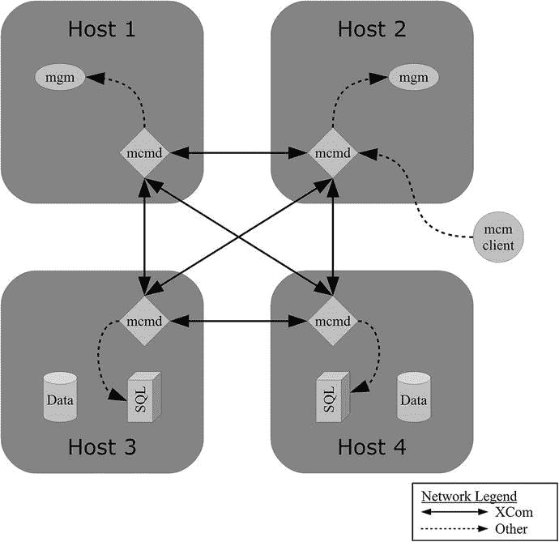
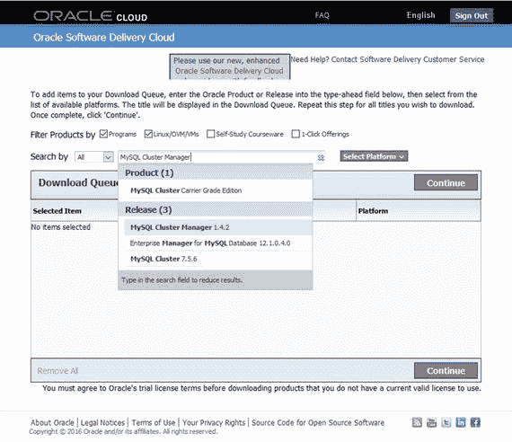
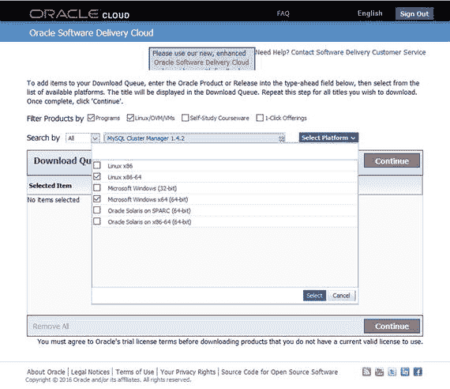
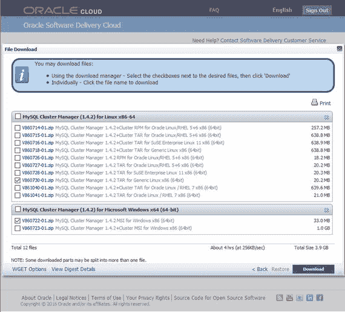
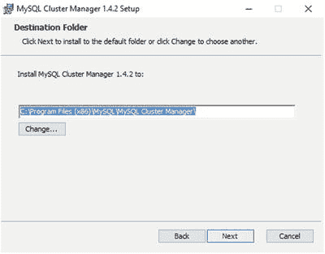
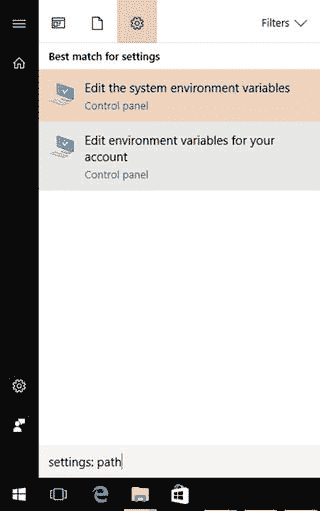
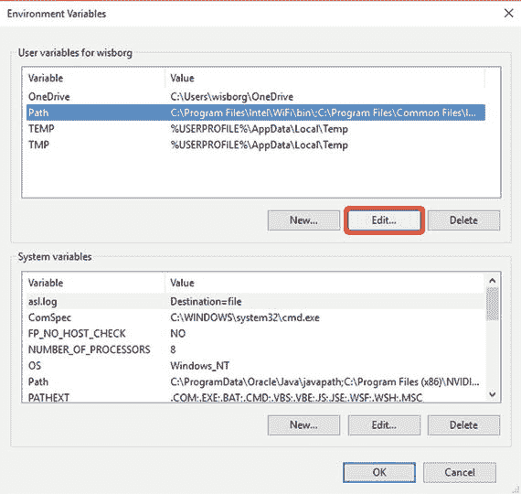
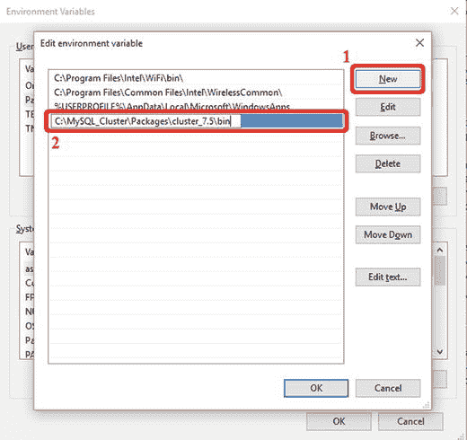
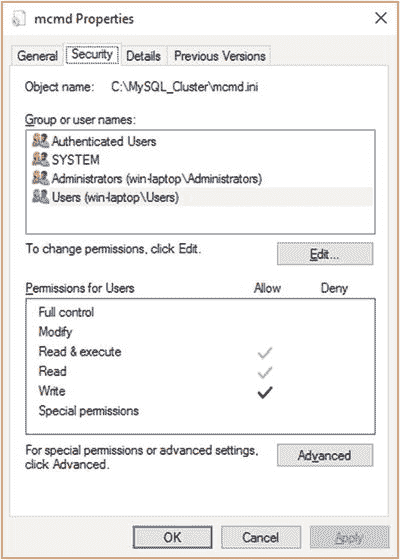
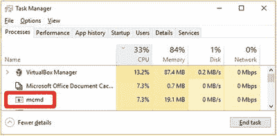

# 13. MySQL 集群管理器

到目前为止，前面的章节已经描述了 MySQL NDB 集群的内部原理，以及如何通过直接操作二进制文件、配置文件等方式来管理它。不过，还有另一种管理集群的方法——使用 MySQL 集群管理器，它也常被缩写为 `MCM`。MySQL 集群管理器是一个企业级产品，它能显著简化集群的管理。该产品仅随 MySQL 集群运营商级版本订阅服务提供，同时也提供 30 天试用版（参见 [`www.mysql.com/trials/`](https://www.mysql.com/trials/) ）。本章将提供一个 MySQL 集群管理器的教程。

**注意**

即使你计划在生产环境中使用 MySQL 集群管理器，也建议先在测试系统上尝试手动管理一个集群，如前几章所述，以便获得管理集群过程的实际经验。

### 背景

在开始教程之前，有必要先了解一些 MySQL 集群管理器的术语和架构，以便对命令名称及其工作原理有一些背景理解。本节讨论 MySQL 集群管理器使用的术语、架构、可用命令以及限制。

**注意**

无论集群是手动管理还是使用 MySQL 集群管理器管理，对于应用来说都没有区别。

#### 术语

有一些术语很重要，需要了解，因为它们会体现在命令和命令选项中。站点、主机、软件包、集群和进程是相关的，如表 13-1 所述。

**表 13-1.** MySQL 集群管理器的重要术语

| 术语 | 描述 |
| --- | --- |
| 站点 | 一组主机的集合。集群使用的所有主机必须位于同一个站点中。一台主机不能包含在多个站点中。 |
| 主机 | 安装了一个或多个进程，或计划安装进程的主机。 |
| 软件包 | MySQL NDB 集群文件。使用通用的 tar 包或 Zip 文件下载。集群中的所有进程使用相同的软件包，除非正在进行升级。 |
| 集群 | 一个由多个进程组成的 MySQL NDB 集群安装实例。 |
| 进程 | 集群中的各个进程（节点）。有五种受支持的进程类型：`ndb_mgmd`、`ndbapi`、`ndbd`、`ndbmtd` 和 `mysqld`。所有进程都明确绑定到特定主机，除了 `ndbapi` 和 `mysqld` 进程还支持匿名主机。表 13-14 包含更多关于进程类型的信息。 |

#### 架构

为了让 MySQL 集群管理器能够监控进程，你必须在运行进程或计划安装进程的每个主机上安装一个代理。同样，对于已定义了进程的所有主机，也必须安装软件包。代理之间使用 XCom 协议在专用端口上进行通信。此架构如图 13-1 所示。



**图 13-1.** MySQL 集群管理器的架构

图中省略了 MySQL NDB 集群节点之间的通信，但请记住，无论集群是手动部署还是使用 MySQL 集群管理器部署，节点间的通信都不会有所不同。MySQL 集群管理器代理之间的通信用实线表示，使用 XCom 协议连接到由 `xcom-port` 选项指定的端口。代理会向外连接到管理节点和 SQL 节点，以便配置集群节点并对其进行监控。MySQL 集群管理器客户端（即 `mcm` 客户端）可用于连接到任意一个代理来执行命令。`mcm` 客户端在与代理通信时使用标准的 MySQL 协议（与 `mysql` 命令行客户端连接 SQL 节点时使用的协议相同）。从 `mcm` 客户端发起的连接会连接到由 `manager-port` 选项指定的端口。`mcm` 客户端可以从与代理相同的主机上执行，也可以在另一台主机上执行。


### 命令

MySQL Cluster Manager 是命令驱动的。它并未为 MySQL NDB Cluster 提供任何新功能，而是提供了一个管理集群的界面，用于执行从初始安装、配置、备份与恢复到升级等一系列任务。对于独立集群而言，一个命令可能涵盖多个步骤。例如，在使新软件包可用后，使用单个命令即可执行升级。每个命令可分为信息、站点与代理、软件包、集群、配置、进程、备份与恢复或导入等类别。本教程中解释了除导入外这些类别的示例。导入在很大程度上取决于集群的初始设置和平台，因此其内容超出了本章范围。表 13-2 至 13-9 概述了这些类别中可用的命令。启动和停止集群或其进程的命令也在表 13-15 中有更详细的讨论。

表 13-9. MySQL Cluster Manager 1.4.2 中的导入命令

| Command | Description |
| --- | --- |
| `import cluster` | 导入当前未由 MySQL Cluster Manager 管理的集群。这是执行 `import config` 命令后的导入第二阶段。 |
| `import config` | 导入当前未由 MySQL Cluster Manager 管理的集群的配置。这是导入的第一阶段。 |

表 13-8. MySQL Cluster Manager 1.4.2 中的备份和恢复命令

| Command | Description |
| --- | --- |
| `abort backup` | 中止正在进行的备份。 |
| `backup cluster` | 备份集群的数据和架构。 |
| `list backups` | 列出集群的可用备份。 |
| `restore cluster` | 将备份恢复到集群。 |
| `backup agents` | 备份代理的配置数据。 |

表 13-7. MySQL Cluster Manager 1.4.2 中的进程命令

| Command | Description |
| --- | --- |
| `add process` | 向集群添加一个或多个进程。 |
| `change process` | 将 `ndbd` 进程更改为 `ndbmtd` 进程，或反之。 |
| `list processes` | 列出集群的进程及其安装所在的主机。 |
| `start process` | 启动集群中的一个进程。 |
| `stop process` | 停止集群中的一个进程。 |
| `update process` | 更新集群中的一个进程。 |
| `remove process` | 从集群中移除一个进程。 |

表 13-6. MySQL Cluster Manager 1.4.2 中的配置命令

| Command | Description |
| --- | --- |
| `get` | 根据指定的过滤器获取集群中一个或多个节点的配置。 |
| `reset` | 将集群中一个或多个节点的一个或多个配置选项重置为该选项的默认值。 |
| `set` | 为集群中一个或多个节点的一个或多个配置选项设置值。 |

表 13-5. MySQL Cluster Manager 1.4.2 中的集群命令

| Command | Description |
| --- | --- |
| `create cluster` | 创建一个新集群。 |
| `delete cluster` | 删除一个集群。 |
| `list clusters` | 列出集群及其给定站点正在使用的软件包。 |
| `list nextnodeids` | 列出如果添加另一个数据节点和其他节点时将使用的节点 ID。 |
| `restart cluster` | 执行集群的滚动重启。 |
| `show status` | 显示集群的状态、为集群执行的操作或集群的进程。 |
| `start cluster` | 启动集群中的所有节点。 |
| `stop cluster` | 停止集群中的所有节点。 |
| `autotune` | 根据使用模板和写入负载自动调整集群。仅支持 MySQL NDB Cluster 7.4 及更高版本。本章后面的教程在配置集群时给出了一个示例。 |
| `upgrade cluster` | 升级或降级集群以使用不同的软件包。 |

表 13-4. MySQL Cluster Manager 1.4.2 中的软件包命令

| Command | Description |
| --- | --- |
| `add package` | 向一个或多个主机添加一个软件包。 |
| `delete package` | 从一个或多个主机删除一个软件包。 |
| `list packages` | 列出站点的所有软件包。 |

表 13-3. MySQL Cluster Manager 1.4.2 中可用的站点和代理命令

| Command | Description |
| --- | --- |
| `add hosts` | 向一个站点添加一个或多个主机。 |
| `remove hosts` | 从一个站点移除一个或多个主机。 |
| `list hosts` | 列出站点的所有主机以及主机上代理的状态和版本。 |
| `change log-level` | 更改代理日志的详细程度。有关详细信息，请参阅本章末尾的“疑难解答 MySQL Cluster Manager”部分。 |
| `rotate log` | 轮转代理日志。 |
| `collect logs` | 从代理、所有集群节点以及配置文件收集日志。这对于将所有日志集中到一个位置非常有用，例如上传到 MySQL Support。 |
| `create site` | 创建一个新站点。 |
| `delete site` | 删除一个站点。 |
| `list sites` | 列出所有站点以及每个站点中的主机。 |
| `show settings` | 列出代理设置或安装代理的主机的详细信息。 |
| `stop agents` | 停止一个或多个代理。 |
| `version` | 返回代理版本。 |
| `show warnings` | 列出代理上发生的最新警告。 |

表 13-2. MySQL Cluster Manager 1.4.2 中可用的信息命令

| Command | Description |
| --- | --- |
| `list commands` | 列出可用的命令。 |
| `<command> --help` | `--help` 选项可与任何命令一起使用，以获取该命令的详细帮助。 |

### 限制

MySQL Cluster Manager 存在一些需要注意的限制。其支持的平台列表是 MySQL NDB Cluster 支持平台列表的一个子集。支持平台列表可在 [`www.mysql.com/support/supportedplatforms/cluster-manager.html`](https://www.mysql.com/support/supportedplatforms/cluster-manager.html) 查看。此外，截至撰写本文时，MySQL Cluster Manager 的最新版本（版本 1.4.2）仅支持 MySQL NDB Cluster 7.3、7.4 和 7.5。对于用户而言，请注意，除了检查状态外，一次只能执行一个命令。这是用户的责任，因为 MySQL Cluster Manager 不会阻止并发执行冲突的命令。

> **注意**
>
> 客户端会话之间没有锁定机制。数据库管理员有责任确保不会并发执行冲突的操作。建议除检查状态外，一次切勿执行多个命令。


### 下载、安装与配置

MySQL Cluster Manager 自身的安装过程非常直接。需要完成以下步骤：

1.  如果尚未下载最新版本，请下载 `MySQL Cluster Manager`。
2.  安装软件。
3.  配置软件。
4.  启动 `MySQL Cluster Manager`。

本节剩余部分将详细讨论这些步骤。安装过程包含两个示例：在 Linux 上使用通用二进制文件，以及使用 Microsoft Windows 的 `MSI` 安装程序。其他平台要么支持像 Linux 示例那样从 `tarball` 安装，要么支持原生打包格式，例如 `MSI` 安装程序或 `RPM`。

#### 发行版本

`MySQL Cluster Manager` 提供两种发行版本：

*   **独立版**：此发行版本仅包含 `MySQL Cluster Manager` 本身。本章将使用此版本。下载时，文件标签将显示为 `MySQL-Cluster-Manager`，加上补丁版本号和平台信息。例如，`MySQL Cluster Manager 1.4.2 MSI for Windows x86 (64bit)`。
*   **捆绑版**：此发行版本包含了在所下载的 `MySQL Cluster Manager` 版本制作时最新的 `MySQL NDB Cluster` 版本。例如，`MySQL Cluster Manager 1.4.2` 与 `MySQL NDB Cluster 7.5.5` 捆绑。下载时，文件标签将显示为 `MySQL-Cluster-Manager`，后跟补丁版本号、标签 `+Cluster`，最后是平台信息。例如，`MySQL Cluster Manager 1.4.2+Cluster MSI for Windows x86 (64bit)`。

注意

术语“独立版”和“捆绑版”并非官方术语（实际上 `MySQL Cluster Manager` 的这两种分发方式没有官方名称）。此处使用这些术语是因为它们在 `MySQL Support` 与客户的沟通中最为常用，并且它们描述了下载文件的内容。

由于 `MySQL Cluster Manager` 的发布频率低于 `MySQL NDB Cluster`，捆绑版本通常不会包含最新的 `MySQL NDB Cluster` 版本。因此，通常最好使用独立版的 `MySQL Cluster Manager` 并单独下载 `MySQL NDB Cluster`。本教程将使用独立的 `MySQL Cluster Manager` 与 `MySQL NDB Cluster 7.5.5`，并将其升级到 `7.5.6`。

#### 下载

`MySQL Cluster Manager` 的 30 天试用版可以从 Oracle 软件交付云（ [`https://edelivery.oracle.com/`](https://edelivery.oracle.com/) ）下载。试用版与提供给付费客户的下载完全相同。下载过程类似于下载 `MySQL NDB Cluster`，如第 5 章所述，并且需要一个（免费的）Oracle 账户。

注意

从 [`https://edelivery.oracle.com/`](https://edelivery.oracle.com/) 下载软件需遵守美国出口管理条例 (`EAR`) 和其他出口法律。因此，所有账户在获准访问软件前必须经过验证。

##### 搜索软件

登录 Oracle 软件交付云后，第一步是在搜索框中搜索 `MySQL Cluster Manager`，如图 13-2 所示。可用版本会显示在 `MySQL Cluster Manager` 旁边的“发布版本”区域。任何时刻都只有一个版本可用，因此显示的版本会随时间变化。



**图 13-2.** 按产品或发布名称搜索

提示

对于购买了 `MySQL Cluster Carrier Grade Edition` 的客户，最好从 `My Oracle Support (MOS)` 的“补丁与更新”选项卡下载 `MySQL Cluster Manager`（和 `MySQL NDB Cluster`），因为那里提供了自 2011 年以来的所有版本，而 Oracle 交付云通常只包含一个版本——通常是最新版本。

##### 选择平台

选择发布版本后，选择一个或多个平台，如图 13-3 所示。在此示例中，将为 64 位 Linux 和 Microsoft Windows 平台下载 `MySQL Cluster Manager`。



**图 13-3.** 选择平台

##### 选择文件

继续按照屏幕提示操作，包括 Oracle 标准条款与限制。请务必完整阅读这些条款，并且仅在同意条款与限制时勾选复选框。最后是文件下载屏幕，如图 13-4 所示。该图显示了可用的文件。对于每个支持的平台与安装格式组合，都有两个文件可用，对应于两种发行版本。例如，“`V860722-01.zip MySQL Cluster Manager 1.4.2 MSI for Windows x86 (64bit)`”是独立版，“`V860723-01.zip MySQL Cluster Manager 1.4.2+Cluster MSI for Windows x86 (64bit)`”是捆绑版。独立版的下载量远小于捆绑版。对于 Microsoft Windows 文件，典型差异大约是 35MB 对比 1GB。本教程选择独立发行版：Linux 选择 `V860730-01.zip`，Microsoft Windows 选择 `V860722-01.zip`（或等效的可用文件——文件名在每个新版本中会改变）。



**图 13-4.** 选择要下载的文件

##### 平台特定注意事项

如图 13-4 所示，Linux 下载有多个选项。例如，有针对 Oracle Linux/RHEL 5+6 的专用 `TAR` 和 `RPM` 下载。如果所使用的 Linux 发行版有专用下载，最好使用该版本而不是通用下载。

注意

对 Oracle Linux 5 和 `RHEL 5` 的支持已于 2017 年 4 月 30 日宣布终止生命周期（ [`https://www.mysql.com/support/eol-notice.html`](https://www.mysql.com/support/eol-notice.html) ）。`MySQL Cluster Manager 1.4.2` 是最后一个支持这些 Linux 发行版的版本。

#### 后续步骤

下载完成后，继续安装。接下来的两个小节提供了在 Linux 和 Windows 上安装的示例。


#### MySQL Cluster Manager 安装

本教程的 Linux 安装示例将使用从 Oracle Software Delivery Cloud 下载的`V860730-01.zip`文件（如图 13-4 所示）。该文件可用于所有近期的 Linux 发行版。

> **注意：**
> 文件名会随着 Oracle Software Delivery Cloud 提供的新版本而改变。

MySQL Cluster Manager 必须安装在所有将用作管理节点、数据节点或 SQL 节点的主机上。安装可以到任意目录；在本例中，`V860730-01.zip`中的文件将被安装到`/opt/mysql/mcm-1.4.2`。

第一步是解压`V860730-01.zip`中包含的文件：

```
shell$ mkdir -p /opt/mysql/mcm-1.4.2
shell$ cd /opt/mysql/mcm-1.4.2
# Copy V860730-01.zip into /opt/mysql/mcm-1.4.2
shell$ unzip V860730-01.zip
Archive:  V860730-01.zip
extracting: mcm-1.4.2-linux-glibc2.5-x86-64bit.tar.gz
extracting: mcm-1.4.2-linux-glibc2.5-x86-64bit.tar.gz.asc
extracting: mcm-1.4.2-linux-glibc2.5-x86-64bit.tar.gz.md5
extracting: README.txt
```

`mcm-1.4.2-linux-glibc2.5-x86-64bit.tar.gz.asc`和`mcm-1.4.2-linux-glibc2.5-x86-64bit.tar.gz.md5`文件包含了`.tar.gz`文件的**良好隐私（PGP）签名和 md5 校验和**。`README.txt`文件包含发布说明。

MySQL Cluster Manager 文件本身包含在`mcm-1.4.2-linux-glibc2.5-x86-64bit.tar.gz`中：

```
shell$ tar -zxf mcm-1.4.2-linux-glibc2.5-x86-64bit.tar.gz
shell$ mv mcm-1.4.2-linux-glibc2.5-x86-64bit/mcm1.4.2 .
shell$ rmdir mcm-1.4.2-linux-glibc2.5-x86-64bit/
```

至此，MySQL Cluster Manager 已安装完成。其中包含的一些重要文件列于表 13-10。路径相对于安装 MySQL Cluster Manager 的目录（`/opt/mysql/mcm-1.4.2`）。

**表 13-10. Linux 上部分重要的 MySQL Cluster Manager 文件**

| 文件 | 描述 |
| --- | --- |
| `bin/mcm` | MySQL Cluster Manager 客户端。 |
| `bin/mcmd` | MySQL Cluster Manager 代理（守护进程）。这是管理集群的长期运行的代理进程。 |
| `etc/init.d/mcmd` | 一个 System V init 脚本，可用于自动化启动 MySQL Cluster Manager。 |
| `etc/mcmd.ini` | `bin/mcmd`配置文件的模板。 |

在继续进行配置和启动 MySQL Cluster Manager 之前，确保所有主机上也安装了`mysql`命令行客户端，并且`mysql`二进制文件位于程序搜索路径中（解释见后面的“MySQL Cluster Manager 客户端”小节），这一点很重要。要检查`mysql`二进制文件是否在程序搜索路径中，请使用此命令：

```
shell$ which mysql
/usr/bin/mysql
```

如果`which`命令显示找不到该命令，请务必在继续之前安装它。以下是`mysql`命令行客户端未安装的示例：

```
shell$ which mysql
/usr/bin/which: no mysql in (/usr/lib64/qt-3.3/bin:/usr/local/bin:/usr/local/sbin:/usr/bin:/usr/sbin:/bin:/sbin:/home/jmyuser/.local/bin:/home/myuser/bin)
```

##### Microsoft Windows 安装

对于 Microsoft Windows，只有一种安装 MySQL Cluster Manager 的选项。安装是使用 Microsoft Windows MSI 安装程序完成的，如图 13-2 至 13-4 所示。安装过程很简单。安装过程中唯一的选项是目标目录，在大多数情况下，默认值（对于 1.4.2 版本是`C:\Program Files (x86)\MySQL\MySQL Cluster Manager\mcm1.4.2`）即可。参见图 13-5。


*图 13-5. 选择目标目录*

安装完成后，整个安装内容将在您安装期间选择的目标文件夹中可用。安装中的一些重要文件列于表 13-11。

**表 13-11. Microsoft Windows 上部分重要的 MySQL Cluster Manager 文件**

| 文件 | 描述 |
| --- | --- |
| `bin\mcm.exe` | MySQL Cluster Manager 客户端。 |
| `bin\mcmd.exe` | MySQL Cluster Manager 代理（守护进程）。这是管理集群的长期运行的代理进程。 |
| `etc\mcmd.ini` | `bin\mcmd.exe`配置文件的模板。 |

您也必须安装`mysql`命令行客户端，它不包含在 MySQL Cluster Manager 独立发行版中。`mysql`客户端必须位于 Windows 在未提供完整路径执行命令时所搜索的路径中。这就是`Path`环境变量。或者，可以将 MySQL Server 或 MySQL NDB Cluster 的 Zip 文件下载中的`mysql.exe`文件复制到与`mcm`客户端相同的目录中（本例中为`C:\Program Files (x86)\MySQL\MySQL Cluster Manager\mcm1.4.2\bin`）。

假设`mysql`命令行客户端已安装到`C:\MySQL_Cluster\Packages\cluster_7.5\bin`，则对于 Microsoft Windows 10，`Path`可以如下配置；其他版本的步骤类似。单击 Windows 图标并键入“settings: path”，然后单击“Edit Environment Variables For Your Account”，如图 13-6 所示。这将打开“环境变量”对话框，可以在其中添加变量。


*图 13-6. 进入账户环境变量*

有两种方法可以向`Path`环境变量添加新路径：为用户添加或为系统（所有用户）添加。选择最适合系统的选项。要在用户级别添加路径，请单击顶部“用户变量”列表中的`Path`，然后单击最顶部的“编辑...”按钮，如图 13-7 所示。


*图 13-7. 环境变量*

图 13-8 展示了如何添加新路径。首先单击“新建”按钮，然后输入路径。添加指向`mysql.exe`二进制文件的路径后，单击“确定”。


*图 13-8. 向 Path 环境变量添加新路径*

> **注意：**
> 新的`Path`设置将只影响新的命令提示符进程，而不影响现有的进程。您可能必须重新启动任何打开的命令窗口才能使用新路径。

#### 升级

升级 MySQL Cluster Manager 本质上与安装相同，只是增加了使用新二进制文件重新启动 MySQL Cluster Manager 代理这一步骤。因此，下载新版本，关闭所有现有代理，安装新版本，然后使用新版本再次启动代理。确保升级后使用的`manager-directory`、`manager-username`和`manager-password`的值与升级前相同。因此，最好使用位于 MySQL Cluster Manager 安装目录之外的`mcmd.ini`文件。

> **注意：**
> 不要让不同版本的 MySQL Cluster Manager 代理同时在线。在启动使用升级后二进制文件的代理之前，请关闭所有代理。同样重要的是要确保在升级过程中配置不会被无意中更改。


#### 配置

MySQL Cluster Manager 的配置与其他 MySQL 程序的配置非常相似。它使用与第 4 章讨论的 `my.cnf`/`my.ini` 和 `config.ini` 格式相同的配置文件。所有设置都添加在 `mcmd` 组下。表 13-12 描述了一些最重要的选项。完整的选项列表可以在 MySQL Cluster Manager 参考手册中找到，地址为 [`dev.mysql.com/doc/mysql-cluster-manager/en/mcm-using-mcmd.html`](https://dev.mysql.com/doc/mysql-cluster-manager/en/mcm-using-mcmd.html)。在 Windows 上，路径有一些额外的要求；例如 `log-file` 和 `manager-directory` 选项的路径。

#### 重要选项

表 13-12. MySQL Cluster Manager 守护进程的一些重要选项

| 选项 | 默认值 | 描述 |
| --- | --- | --- |
| `agent-uuid` | 自动生成 | 标识代理的 UUID。仅当同一主机上安装了多个 MySQL Cluster Manager 代理时，才需要手动指定此项。默认值是根据主机信息自动生成的。 |
| `daemon` | `true` | 是将 `mcmd` 作为前台进程还是守护进程执行。默认是作为守护进程执行，但在调试问题时使用前台进程可能很有用。这仅适用于 Linux 和 UNIX 平台。 |
| `log-file` | mcmd.log | `mcmd` 的日志文件。默认目录是安装目录（在本教程中为 `/opt/mysql/mcm-1.4.2`）。在 Microsoft Windows 上，必须使用绝对路径。在 Linux 和 UNIX 上，路径是相对于安装目录的，除非使用了绝对路径。最好使用绝对路径。 |
| `log-level` | `message` | 要使用的日志级别。支持的值（按详细程度递增顺序）为：`critical`、`error`、`warning`、`message`、`info` 和 `debug`。默认是 `message`。请参阅本章后面“故障排除 MySQL Cluster Manager”部分中的“错误消息和日志”小节。 |
| `log-use-syslog` | `true` | 启用后，日志消息将写入系统日志。 |
| `manager-directory` | ../mcm_data | MySQL Cluster Manager 将存储其数据的位置。当安装 MySQL NDB Cluster 节点而未显式指定数据目录时，节点数据目录也将位于管理器目录路径中。默认是相对于安装目录的 `../mcm_data` 目录。如果 MySQL Cluster Manager 安装在 `/opt/mysql/mcm-1.4.2`，则默认的管理器目录是 `/opt/mysql/mcm_data`。该值必须是绝对路径。在 Linux 和 UNIX 上，该目录必须存在，或者执行 `mcmd` 的用户必须拥有创建它的权限。在 Microsoft Windows 上，该目录必须存在。 |
| `manager-password` | `super` | 双重用途：用于使用 `mcmd` 客户端连接到代理时，以及代理连接到 SQL 节点时使用的密码。强烈建议您更改此密码。 |
| `manager-port` | `1862` | `mcmd` 将侦听来自 MySQL Cluster Manager 客户端连接的端口。 |
| `manager-username` | `mcmd` | 双重用途：用于使用 `mcmd` 客户端连接到代理时，以及代理连接到 SQL 节点时使用的用户名。 |
| `xcom-port` | `18620` | 用于代理之间内部通信（XCOM 通信）的端口。 |

#### 路径要求

这些要求是：

*   路径必须是绝对路径。
*   使用正斜杠（`/`）代替反斜杠（`\`），包括在 Microsoft Windows 上。
*   路径中不允许有空格。例如，用下划线（`_`）替换空格。

#### 配置建议

提示

最好在所有主机上使用相同的配置，但 `agent-uuid` 除外（其值对于所有 `mcmd` 进程必须是唯一的）。特别是，`xcom-port` 设置在所有主机上必须相同。

#### 配置文件权限

用于连接到 SQL 节点的用户和密码通常在 `mcmd.ini` 中配置，这意味着如果文件系统级别的权限允许所有人读取该文件，MySQL Cluster Manager 将拒绝启动。在 Linux 和 UNIX 上，权限必须是 `u=rw,g=rw,o=`（`0660`）或更严格（授予更少的权限）。如果权限不够严格，`mcmd` 在启动时会返回类似以下错误：

```
2017-05-11 09:27:55.059: (critical) Failed to open given defaults-file '/etc/mcmd.ini': permissions of /etc/mcmd.ini aren't secure (0660 or stricter required)
```

确保只有 `root` 用户可以写入配置文件，同时 MySQL Cluster Manager 仍能读取它的一种方法是：

```
shell$ chown root.mysql /etc/mcmd.ini
shell$ chmod u=rw,g=r,o= /etc/mcmd.ini
shell$ ls -l /etc/mcmd.ini
-rw-r-----. 1 root mysql 321 May  6 17:52 /etc/mcmd.ini
```

权限 `u=rw,g=r,o=` 用八进制表示是 `0640`。这假设将由 `mysql` 用户执行 `mcmd`。

在 Microsoft Windows 上，对配置文件的权限没有要求。但是，仍然最好限制访问权限——特别是写入权限，如果文件中有任何密码，也应限制读取权限——只允许尽可能少的用户访问。可以通过在文件资源管理器中右键单击 `mcmd.ini` 文件并转到“安全”选项卡来访问权限，如图 13-9 所示。


图 13-9. 在 Microsoft Windows 中更改文件权限

#### 配置文件示例

在本教程的剩余部分中，将使用清单 13-1 中的配置。

```
[mcmd]
#### 日志文件和级别
log-file          = /var/log/mcmd.log
log-level         = message
#### 存储在磁盘上的管理器插件信息的顶级目录
manager-directory = /var/lib/mcm_data
#### 连接到管理器和用于 SQL 节点的用户名和密码
manager-username  = mcmd
manager-password  = cjhf*jc32FH@
```
清单 13-1. 示例 MySQL Cluster Manager 配置文件

#### 创建目录和日志文件

为确保 MySQL Cluster Manager 可以使用管理器目录和日志文件，请提前创建它们并设置文件系统权限。清单 13-2 展示了在 Linux 上此过程的示例。

```shell
##### 管理器目录
shell$ mkdir /var/lib/mcm_data
shell$ chown mysql.mysql /var/lib/mcm_data
shell$ chmod u=rwx,g=rx,o= /var/lib/mcm_data
##### 日志文件
shell$ touch /var/log/mcmd.log
shell$ chown mysql.mysql /var/log/mcmd.log
shell$ chmod u=rw,g=r,o= /var/log/mcmd.log
```
清单 13-2. 在 Linux 上创建管理器目录和日志文件

#### 检查配置

代理启动后（参见下一小节），可以使用 `mcm` 客户端检查配置。您使用 `show settings` 命令，如清单 13-3 所示。


```
mcm> show settings;
+-------------------+-------------------+
| 设置项            | 值                |
+-------------------+-------------------+
| copy-port         | 0                 |
| log-file          | /var/log/mcmd.log |
| log-level         | message           |
| log-use-syslog    | FALSE             |
| manager-directory | /var/lib/mcm_data |
| manager-username  | mcmd              |
| manager-password  | ********          |
| manager-port      | 1862              |
| xcom-port         | 18620             |
+-------------------+-------------------+
9 行记录集 (0.00 sec)
mcm> show settings --hostinfo;
+-----------------+-----------------------------------+
| 属性            | 值                                |
+-----------------+-----------------------------------+
| 主机名          | ol7                               |
| 平台            | Linux 4.1.12-37.4.1.el7uek.x86_64 |
| 处理器核心数    | 1                                 |
| 总内存          | 992 Mb                            |
+-----------------+-----------------------------------+
4 行记录集 (0.00 sec)
列表 13-3.
`show settings` 命令的输出
```

配置设置完成后，就该启动 MySQL Cluster Manager 了。

### 启动和停止 MySQL Cluster Manager

MySQL Cluster Manager 可以通过直接执行和停止进程来启动和停止，也可以通过使用服务管理系统（如 System V init 脚本、systemd 和 Windows 服务）来完成。使用服务管理系统来控制 `mcmd` 与用于 MySQL NDB Cluster 守护进程的方式并无不同，因此不再详细讨论。相反，重点将放在直接启动和停止 `mcmd` 进程上。

以下是在 Linux 上启动 `mcmd` 进程的示例，其配置文件位于 `/etc/mcmd.ini`：

```
shell$ sudo -u mysql nohup /opt/mysql/mcm1.4.2/bin/mcmd \
--defaults-file=/etc/mcmd.ini > /dev/null 2>&1 &
```

要在 Microsoft Windows 的命令提示符下启动代理进程，命令类似，例如：

```
C:>START /B "" "C:\Program Files (x86)\MySQL\MySQL Cluster Manager\mcm1.4.2\bin\mcmd.exe" --defaults-file="C:\MySQL_Cluster\mcmd.ini"
MySQL Cluster Manager 1.4.2 (64bit) started
Connect to MySQL Cluster Manager by running "C:\Program Files (x86)\MySQL\MySQL Cluster Manager\mcm1.4.2\bin\mcm" -a WIN-LAPTOP:1862
```

关闭 `mcmd` 进程的推荐方法是使用 `mcm` 客户端中的 `stop agents` 命令，此方法适用于所有平台。可以关闭单个代理或多个代理，包括一个站点中的所有代理。如果 `stop agents` 命令不带任何参数使用，则仅关闭 `mcm` 客户端所连接到的代理：

```
mcm> stop agents;
+-----------------------------+
| 命令结果                    |
+-----------------------------+
| 代理进程已成功停止          |
+-----------------------------+
1 行记录集 (0.02 sec)
```

要关闭站点中的所有主机，请在命令中添加站点名称：

```
mcm> stop agents test_site;
+-----------------------------+
| 命令结果                    |
+-----------------------------+
| 代理进程已成功停止          |
+-----------------------------+
1 行记录集 (0.18 sec)
```

如果在 UNIX 或 Linux 上使用信号关闭代理，请确保使用 `SIGTERM` 信号，或者从 Microsoft Windows 进程列表管理器中终止进程而不进行强制关闭。

**警告**

与其他 MySQL NDB Cluster 进程一样，除非在无法使用 `SIGTERM` 使 `mcmd` 进程停止的关键情况下，否则不要使用 `SIGKILL` 信号。使用 `SIGKILL` 终止进程可能会导致管理目录损坏。

### MySQL Cluster Manager 客户端

MySQL Server 产品和 SQL 节点有 `mysql` 命令行客户端，可用于从命令行操作架构和数据。同样，MySQL Cluster Manager 使用 `mcm` 命令行客户端向 `mcmd` 进程发送命令。

客户端使用 MySQL Cluster Manager 安装目录中 bin 目录下的 `mcm` 二进制文件启动。假设安装目录为 `/opt/mysql/mcm1.4.2`，则完整路径为 `/opt/mysql/mcm1.4.2/bin/mcm`。假设 `mcm` 命令在路径中，并且 `manager-port` 使用默认值，则可以进行连接，如列表 13-4 所示。用户名和密码是使用 `manager-username` 和 `manager-password` 选项定义的。`mcm` 客户端是与 MySQL Cluster Manager 交互的唯一方式。

```
shell mcm --user=mcmd --password
MySQL Cluster Manager client started.
This wrapper will spawn the mysql client to connect to mcmd
Enter password:
Welcome to the MySQL monitor.  Commands end with ; or \g.
Your MySQL connection id is 1
Server version: 1.4.2 MySQL Cluster Manager
Copyright (c) 2000, 2016, Oracle and/or its affiliates. All rights reserved.
Oracle is a registered trademark of Oracle Corporation and/or its
affiliates. Other names may be trademarks of their respective
owners.
Type 'help;' or '\h' for help. Type '\c' to clear the current input statement.
mcm>
列表 13-4.
启动 `mcm` 命令行客户端
```

如果输出看起来很熟悉，并让人联想到 `mysql` 命令行客户端，那是因为 `mcm` 二进制文件本身只是 `mysql` 二进制文件的一个包装器。这也是在安装过程中要求安装 `mysql` 命令行客户端并将其置于路径中的原因。因为底层使用的是 `mysql` 命令行客户端，所以命令必须像 SQL 语句一样以分号 (`;`) 结尾。命令不区分大小写，但约定是全部使用小写。也可以使用 `--execute` 或 `-e` 选项来执行命令。列表 13-5 展示了一个示例，其中使用 `mcm --execute` 获取关于 `create site` 命令的帮助。在 Microsoft Windows 上，可以通过调用 `mcm.exe` 代替 `mcm` 来运行相同的命令。

```
shell$ mcm --user=mcmd --password --execute="create site --help;"
MySQL Cluster Manager client started.
This wrapper will spawn the mysql client to connect to mcmd
Enter password:
+----------------------------------------------------------------+
| 帮助信息                                                       |
+----------------------------------------------------------------+
|                                                                |
| create site [选项]                                 |
|                                                                |
|     根据 --hosts 中列出的主机创建一个站点。                    |
|                                                                |
|     必需选项：                                                 |
|     --hosts|-h             以逗号分隔的主机名列表。            |
|                            格式: --hosts = [,]*。 |
|                                                                |
+----------------------------------------------------------------+
列表 13-5.
直接从 Linux Shell 执行命令
```

这也表明 MySQL Cluster Manager 命令接受 `--help` 参数，该参数将提供有关命令工作方式的简短摘要。下一节将向您展示如何管理集群，同时演示几个最重要的命令。

### 管理集群

安装好 MySQL Cluster Manager 后，就该使用它来安装和管理集群了。本节首先介绍安装和配置集群，然后讨论启动和停止集群、对在线集群执行配置更改、执行备份和恢复，最后升级集群。


#### 安装集群二进制文件

在实际安装集群之前，您必须单独下载 MySQL NDB 集群。如果使用的是 MySQL Cluster Manager 的捆绑发行版，则无需此操作，但本教程使用的是独立发行版，以便支持任何 MySQL NDB 集群版本。与 MySQL Cluster Manager 一起使用时，您必须为 Linux 和 UNIX 下载 tarball 发行版，或为 Windows 下载 Zip 文件发行版。下载方式如 `第 5 章` 所述。

下载 MySQL NDB 集群后，应解压该文件。在本示例中，版本 `7.5.5` 将被解压到 `/opt/mysql/packages/7.5.5`。例如：

```
shell$ mkdir /opt/mysql/packages
shell$ cd /opt/mysql/packages/
# 将下载的 .tar.gz 文件复制到 /opt/mysql/packages
shell$ tar -zxf mysql-cluster-gpl-7.5.5-linux-glibc2.5-x86_64.tar.gz
shell$ mv mysql-cluster-gpl-7.5.5-linux-glibc2.5-x86_64 7.5.5
```

将 MySQL NDB 集群二进制文件放置到位后，其余的安装工作将在 `mcm` 客户端中完成。

#### 通过 mcm 客户端准备集群

无论使用何种操作系统，准备新集群的步骤都是相同的，当然，用于链接到二进制文件、集群节点数据目录等的路径取决于平台和硬件的设置方式。

使用哪个 MySQL Cluster Manager 代理并不重要。您甚至不必在所有步骤中都使用同一个代理，尽管通常为了简单起见并查看已完成的操作，最好保持一致。

**注意**

MySQL Cluster Manager 不会为 `mysqld` 节点的 `root@localhost` 用户设置密码。请务必使用 `SET PASSWORD` 命令为该账户设置一个强密码。

将要安装的集群使用与 `第 10 章` 中演示重启所用集群相同的配置，并增加了两个可以从任何主机连接的 API 节点。`表 13-13` 总结了这八个节点及其在四台主机上的分布情况。

表 13-13. 将要安装的集群节点

| 节点 ID | 节点类型 | 主机 |
| --- | --- | --- |
| 1 | 数据节点 (`ndbmtd`) | 192.168.56.103 |
| 2 | 数据节点 (`ndbmtd`) | 192.168.56.104 |
| 49 | 管理节点 (`ndb_mgmd`) | 192.168.56.101 |
| 50 | 管理节点 (`ndb_mgmd`) | 192.168.56.102 |
| 51 | SQL 节点 (`mysqld`) | 192.168.56.103 |
| 52 | SQL 节点 (`mysqld`) | 192.168.56.104 |
| 53 | API 节点 (非 `mysqld`) | 任何主机 |
| 54 | API 节点 (非 `mysqld`) | 任何主机 |

按照惯例，MySQL Cluster Manager 将前 48 个节点 ID 保留给数据节点。这是因为所有数据节点的节点 ID 必须介于 1 和 48 之间。管理节点、SQL 节点和 API 节点从 49 号开始获得连续的 ID。

第一步是定义要安装集群的站点。这是使用 `create site` 命令完成的。站点名称可以是任何对安装有意义的名称。在本例中，将使用名称 `test_site`。创建站点时，必须指定站点上包含的主机。以后可以添加其他主机。本教程的完整命令如下所示：

```
mcm> create site --hosts=192.168.56.101,192.168.56.102,192.168.56.103,192.168.56.104 test_site;
+---------------------------+
| 命令结果                  |
+---------------------------+
| 站点创建成功              |
+---------------------------+
1 行 in set (3.21 sec)
```

可以使用 `list sites` 命令列出 MySQL Cluster Manager 已知的站点：

```
mcm> list sites\G
*************************** 1. row ***************************
站点: test_site
端口: 1862
位置: Local
主机: 192.168.56.101,192.168.56.102,192.168.56.103,192.168.56.104
1 行 in set (0.07 sec)
```

现在站点已经创建，可以定义软件包了。这等同于为解压 MySQL NDB 集群二进制文件的路径分配一个名称：

```
mcm> add package --basedir=/opt/mysql/packages/7.5.5 cluster_7.5.5;
+----------------------------+
| 命令结果                   |
+----------------------------+
| 软件包添加成功             |
+----------------------------+
1 行 in set (4.19 sec)
```

默认情况下，所有已定义的主机使用相同的 `basedir`。可以通过添加 `--host` 选项为一部分主机使用路径。但是，最好让所有主机使用相同的配置。可以使用 `list packages` 命令列出可用的软件包：

```
mcm> list packages test_site\G
*************************** 1. row ***************************
软件包: cluster_7.5.5
路径: /opt/mysql/packages/7.5.5
主机: 192.168.56.101,192.168.56.102,192.168.56.103,192.168.56.104
1 行 in set (0.11 sec)
```


现在可以开始定义集群了，这需要使用 `create cluster` 命令。该命令有两个必需的参数：要使用的软件包和集群中要包含的进程。后续也可以添加额外的进程。进程的格式为 `<进程名>@<主机>`。`<进程名>` 的支持值列于表 13-14 中。

#### 表 13-14. 支持的进程类型

| 进程名 | 描述 |
| --- | --- |
| `ndb_mgmd` | 一个管理节点。 |
| `ndbapi` | 任何非 SQL 节点的 API 节点。包括用于 SQL 节点上 `ndb_cluster_connection_pool` 选项的额外 API 节点插槽。 |
| `ndbd` | 单线程数据节点。 |
| `ndbmtd` | 多线程数据节点。 |
| `mysqld` | 一个 SQL 节点。对于 `ndb_cluster_connection_pool` 大于 1 的 SQL 节点，只添加一个 `mysqld` 节点，并使用 `ndbapi` 来处理连接池中的其余连接。 |

请注意，当你通过名称设置集群时，MySQL 集群管理器如何区分单线程和多线程数据节点。在配置数据节点时指定进程类型也是如此。

除了 `mysqld` 和 `ndbapi` 节点外，所有节点都必须绑定到特定的主机。对于 `mysqld` 和 `ndbapi` 节点，可以使用主机名 `*`（星号）来表示任意主机。

`create cluster` 命令最终形式如下（所有 `--processhosts` 参数必须在一行内，且不能有空格）：

```
mcm> create cluster --package=cluster_7.5.5 --processhosts=ndbmtd@192.168.56.103,ndbmtd@192.168.56.104,ndb_mgmd@192.168.56.101,ndb_mgmd@192.168.56.102,mysqld@192.168.56.103,mysqld@192.168.56.104,ndbapi@*,ndbapi@* test_cluster;
+------------------------------+
| Command result               |
+------------------------------+
| Cluster created successfully |
+------------------------------+
1 row in set (3.69 sec)
```

可以使用 `list clusters` 命令列出 `test_site` 站点中可用的集群：

```
mcm> list clusters test_site;
+--------------+---------------+
| Cluster      | Package       |
+--------------+---------------+
| test_cluster | cluster_7.5.5 |
+--------------+---------------+
1 row in set (0.14 sec)
```

更有趣的是 `show status` 命令。它主要有两种用法来获取集群状态。列表 13-6 返回了 `test_cluster` 集群的总体状态以及包含所有进程的详细视图。

### 列表 13-6. 获取集群状态

```
mcm> show status test_cluster;
+--------------+---------+---------+
| Cluster      | Status  | Comment |
+--------------+---------+---------+
| test_cluster | created |         |
+--------------+---------+---------+
1 row in set (0.09 sec)
mcm> show status --process test_cluster;
+--------+----------+----------------+--------+-----------+---------------+
| NodeId | Process  | Host           | Status | Nodegroup | Package       |
+--------+----------+----------------+--------+-----------+---------------+
| 49     | ndb_mgmd | 192.168.56.101 | added  |           | cluster_7.5.5 |
| 50     | ndb_mgmd | 192.168.56.102 | added  |           | cluster_7.5.5 |
| 1      | ndbmtd   | 192.168.56.103 | added  | n/a       | cluster_7.5.5 |
| 2      | ndbmtd   | 192.168.56.104 | added  | n/a       | cluster_7.5.5 |
| 51     | mysqld   | 192.168.56.103 | added  |           | cluster_7.5.5 |
| 52     | mysqld   | 192.168.56.104 | added  |           | cluster_7.5.5 |
| 53     | ndbapi   | *              | added  |           |               |
| 54     | ndbapi   | *              | added  |           |               |
+--------+----------+----------------+--------+-----------+---------------+
8 rows in set (0.09 sec)
```

`show status` 还有其他几种模式。列表 13-7 展示了该命令帮助文本的完整输出。输出已重新格式化以减少文本宽度。

### 列表 13-7. show status 命令的帮助信息

```
mcm> show status --help;
+--------------------------------------------------------------------------+
| Help                                                                     |
+--------------------------------------------------------------------------+
|                                                                          |
| show status [options]                                       |
|                                                                          |
|     显示指定集群的集群、进程、操作、进度或备份状态。                     |
|     如果未指定选项，默认为 --cluster。                                   |
|                                                                          |
|     有效选项：                                                           |
|     --backup|-k            显示备份详情。                                 |
|     --cluster|-c           显示集群详情。                                 |
|     --operation|-o         显示操作详情。                                 |
|     --process|-r           显示进程详情。                                 |
|     --progress|-g          显示进度详情。                                 |
|     --progressbar|-b       显示进度条。                                   |
|                                                                          |
+--------------------------------------------------------------------------+
14 rows in set (0.02 sec)
```

如果所有节点的所有选项都设置为默认值，那么以上就是全部操作。然而，在实践中情况往往并非如此，因此下一个主题将介绍如何进行配置更改。


#### 集群配置：自动调优

MySQL Cluster Manager 独有的一个功能是 `autotune` 命令。这可以是一个非常有用的方式，来获得一个良好的基础配置，然后再根据需要进行微调。`autotune` 命令需要一个模板，并可选择指定一个写入负载。模板定义了通用的工作负载，有三种可用模板：

*   `web`：用于基于 Web 的生产工作负载。MySQL Cluster Manager 将尝试在可用硬件条件下最大化性能。
*   `realtime`：与基于 Web 的工作负载类似，它旨在最大化给定可用负载下的性能。此外，故障检测时间将会缩短。
*   `test`：用于测试设置。与 `web` 和 `realtime` 工作负载相比，资源使用量将减少。

`--writeload` 选项可用于将写入负载设置为 `low`、`medium` 或 `high`。每种写入负载的定义如下：

*   `low`：每秒少于 100 个写入事务。
*   `medium`：每秒 100 到 1000 个写入事务。如果省略 `--writeload` 选项，则默认为此值。
*   `high`：每秒超过 1000 个写入事务。

自动调优功能会发出多个 `set` 命令。稍后将讨论，`set` 命令会更改集群的配置。如果指定了 `--dryrun` 选项，MySQL Cluster Manager 将生成 `set` 命令并将其输出到文件，而不是直接应用它们。这是在应用更改之前检查建议更改的绝佳方式。此外，也可以手动应用 `set` 命令，并有可能对其进行更改以微调配置。

由于这是一个测试集群，将使用 `test` 模板。预计只有少量写入事务，因此 `low` `writeload` 值是合适的。对 `autotune` 命令进行试运行会得到以下结果：

```
mcm> autotune --dryrun --writeload=low test test_cluster\G
*************************** 1. row ***************************
Command result: Autotuning calculation complete. Please check /var/lib/mcm_data/clusters/test_cluster/tmp/autotune.31b68d15_85_1.mcm on host 192.168.56.102 for settings that will be applied.
1 row in set (4.35 sec)
```

清单 13-8 包含了 `/var/lib/mcm_data/clusters/test_cluster/tmp/autotune.31b68d15_85_1.mcm` 的内容，显示了用于调整集群的建议 `set` 命令。

```
# The following will be applied to the current cluster config:
set HeartbeatIntervalDbDb:ndbmtd=15000 test_cluster;
set HeartbeatIntervalDbApi:ndbmtd=15000 test_cluster;
set RedoBuffer:ndbmtd=32M test_cluster;
set SendBufferMemory:ndbmtd+ndbmtd=2M test_cluster;
set ReceiveBufferMemory:ndbmtd+ndbmtd=2M test_cluster;
set SendBufferMemory:ndb_mgmd+ndbmtd=2M test_cluster;
set ReceiveBufferMemory:ndb_mgmd+ndbmtd=2M test_cluster;
set SendBufferMemory:mysqld+ndbmtd=2M test_cluster;
set ReceiveBufferMemory:mysqld+ndbmtd=2M test_cluster;
set SendBufferMemory:ndbapi+ndbmtd=2M test_cluster;
set ReceiveBufferMemory:ndbapi+ndbmtd=2M test_cluster;
set SharedGlobalMemory:ndbmtd=20M test_cluster;
set FragmentLogFileSize:ndbmtd=64M test_cluster;
set NoOfFragmentLogFiles:ndbmtd=16 test_cluster;
```
**清单 13-8.** `autotune` 命令建议的配置更改

如 `autotune.31b68d15_85_1.mcm` 的内容所示，配置更改是使用 `set` 命令完成的。其符号形式的语法如下：

```
mcm> set <option name>[:<nodeId1>+<nodeId2>]=<value> <cluster>;
```

`<option name>` 是选项的名称，例如 `HeartbeatIntervalDbDb`。然后你指明要将该选项应用于什么。对于大多数选项，这是一个单一进程（与一对进程相对）；例如，`HeartbeatIntervalDbDb` 应用于 `ndbtmd` 进程。如果一个选项应仅应用于单个进程，则可以添加节点 ID。最后，你指定值以及要将更改应用到哪个集群。可以在一个命令中设置多个选项；在这种情况下，选项以逗号分隔的列表形式组合。一些选项，特别是与 TCP 相关的选项，需要两个进程。例如，`SendBufferMemory` 选项指定了从一个节点向另一个节点发送数据时发送缓冲区的大小；此缓冲区对每对节点都是特定的。`autotune.31b68d15_85_1.mcm` 文件包含了单进程和双进程选项的示例。

对于此集群，这些设置看起来没问题，因此可以使用不带 `--dryrun` 选项的 `autotune` 命令来应用它们：

```
mcm> autotune --writeload=low test test_cluster;
+-------------------------------------------------+
| Command result                                  |
+-------------------------------------------------+
| Cluster successfully autotuned to template test |
+-------------------------------------------------+
1 row in set (4.44 sec)
```


#### 集群配置：`set` 命令

测试集群的 SQL 节点与数据节点位于相同的主机上。同时确定写入负载将较低。这正是启用 `ndb_read_backup` 功能的一个良好用例，该功能通过始终从与 SQL 节点相同主机上的数据节点进行读取，来降低读操作的延迟。此外，需要在 `NodeId = 51` 上启用二进制日志，但在 `NodeId = 52` 上则不启用。这两个变更可以合并到一个 `set` 命令中，如下所示：

```
mcm> set ndb_read_backup:mysqld=ON,log_bin:mysqld:51=binlog test_cluster;
+-----------------------------------+
| Command result                    |
+-----------------------------------+
| Cluster reconfigured successfully |
+-----------------------------------+
1 row in set (3.79 sec)
```

将为测试集群进行的另一项更改（覆盖自动调优的其中一项设置）是增加两个数据节点之间通信用的发送缓冲区：

```
mcm> set SendBufferMemory:ndbmtd+ndbmtd=4M test_cluster;
+-----------------------------------+
| Command result                    |
+-----------------------------------+
| Cluster reconfigured successfully |
+-----------------------------------+
1 row in set (4.88 sec)
```

为了确保如果数据管理员在初始系统重启前删除了数据目录，集群的备份不会被删除，需要将备份目录配置在 `/var/lib/mcm_data` 路径之外。首先在每个将托管数据节点的主机上创建目录并设置所有权：

```
shell$ mkdir /backups
shell$ mkdir /backups/ndbmtd /backups/mysqld
shell$ chown -R mysql:mysql /backups
```

然后执行配置更改：

```
mcm> set BackupDataDir:ndbmtd=/backups/ndbmtd test_cluster;
+-----------------------------------+
| Command result                    |
+-----------------------------------+
| Cluster reconfigured successfully |
+-----------------------------------+
1 row in set (5.03 sec)
mcm> set backupdatadir:mysqld=/backups/mysqld test_cluster;
+-----------------------------------+
| Command result                    |
+-----------------------------------+
| Cluster reconfigured successfully |
+-----------------------------------+
1 row in set (3.25 sec)
```

SQL 节点的 `backupdatadir` 选项是 MySQL Cluster Manager 特有的选项，用于定义备份期间制作的模式备份的存储位置。

MySQL Cluster Manager 会验证选项名称和值。如果验证失败，将返回错误：

```
mcm> set ndb_batch_sizes:mysqld=64K test_cluster;
ERROR 6003 (00MGR): No such configuration parameter ndb_batch_sizes for process mysqld
mcm> set ndb_batch_size:mysqld=64M test_cluster;
ERROR 6002 (00MGR): Value 64M is outside legal range [0 - 31536000] for configuration parameter ndb_batch_size
```

这种验证的一个副作用是，为集群进程引入的新选项在 MySQL Cluster Manager 也升级之前无法使用。这对于 MySQL NDB Cluster 的主版本升级尤其必要，因为升级通常会包含多个新选项和/或新的有效值范围。

#### 集群配置：`get` 命令

与 `set` 命令对应的是 `get` 命令。它用于检索一个或多个选项的值。可以按照与 `set` 命令相同的方式对选项和进程进行筛选。清单 13-9 展示了如何获取所有 `mysqld` 进程的 `log_bin` 选项值，以及从 `NodeId = 1` 的数据节点发送到 `NodeId = 2` 的数据节点的 `SendBufferMemory` 值。

```
cm> get log_bin:mysqld test_cluster\G
*************************** 1\. row ***************************
Name: log_bin
Value: binlog
Process1: mysqld
NodeId1: 51
Process2:
NodeId2:
Level:
Comment:
1 row in set (0.15 sec)
mcm> get SendBufferMemory:ndbmtd:1+ndbmtd:2 test_cluster\G
*************************** 1\. row ***************************
Name: SendBufferMemory
Value: 4M
Process1: ndbmtd
NodeId1: 1
Process2: ndbmtd
NodeId2: 2
Level: Process
Comment:
1 row in set (0.21 sec)
```

清单 13-9. 获取两个配置选项的值

在 `log_bin` 选项的输出中，请注意，尽管命令要求获取所有 `mysqld` 进程，但输出中只显示了 `NodeId = 51` 的行。这是为什么呢？默认情况下，`get` 命令只返回设置为非默认值的选项。要包含使用默认值的选项，需添加 `--include-defaults` 或 `-d` 选项（为减少输出宽度，已移除 `Process2` 和 `NodeId2` 列）：

```
mcm> get --include-defaults log_bin:mysqld test_cluster;
+---------+--------+----------+---------+...+---------+---------+
| Name    | Value  | Process1 | NodeId1 |...| Level   | Comment |
+---------+--------+----------+---------+...+---------+---------+
| log_bin | binlog | mysqld   | 51      |...|         |         |
| log_bin | OFF    | mysqld   | 52      |...| Default |         |
+---------+--------+----------+---------+...+---------+---------+
2 rows in set (0.19 sec)
```

`get` 命令的一个特殊用法是，除了集群名称外不添加任何筛选器。这将返回所有选项。请注意，如果添加了 `--include-defaults` 选项，即使是这个小型测试集群也会返回 1896 行。

#### 集群配置：`reset` 命令

如果发现操作有误，需要将某个选项重置为其默认值，可以使用 `reset` 命令。清单 13-10 禁用了 `NodeId = 51` 的二进制日志记录，并在运行 `reset` 命令后检查了设置。

```
mcm> reset log_bin:mysqld:51 test_cluster;
+-----------------------------------+
| Command result                    |
+-----------------------------------+
| Cluster reconfigured successfully |
+-----------------------------------+
1 row in set (5.21 sec)
mcm> get --include-defaults log_bin:mysqld test_cluster;
+---------+-------+----------+---------+...+---------+---------+
| Name    | Value | Process1 | NodeId1 |...| Level   | Comment |
+---------+-------+----------+---------+...+---------+---------+
| log_bin | OFF   | mysqld   | 51      |...| Default |         |
| log_bin | OFF   | mysqld   | 52      |...| Default |         |
+---------+-------+----------+---------+...+---------+---------+
2 rows in set (0.27 sec)
```

清单 13-10. 重置 `log_bin` 选项

集群配置就绪后，是时候启动集群了。

#### 启动和停止进程

测试集群已准备就绪，可以启动。MySQL Cluster Manager 提供了四个命令来控制集群及其进程的启动与停止，以及一个 `restart cluster` 命令。这五个命令汇总在表 13-15 中。所有四个命令都必须指定集群名称。“选项”列显示了用于执行初始重启的选项以及指定要启动的节点所需的选项。这些命令还有其他选项；详情请参阅帮助文本或相关文档。

**表 13-15.**
用于启动和停止集群或其进程的命令

| 命令 | 选项 | 描述 |
| --- | --- | --- |
| `restart cluster` |   | 执行滚动重启。不支持初始滚动重启。 |
| `start cluster` | [`--initial`] | 启动集群中的所有进程。 |
| `stop cluster` |   | 关闭整个集群。等同于先停止 SQL 节点，然后在 `ndb_mgm` 客户端中执行 `SHUTDOWN` 命令。 |
| `start process` | [`--initial`] 节点 ID 或 `--added` | 启动单个进程或所有已添加（但尚未启动）的进程（使用 `add process` 命令，本书未讨论）。 |
| `stop process` | 节点 ID | 停止单个进程。 |

由于测试集群已完全关闭，请使用 `start cluster` 命令启动它：

```
mcm> start cluster test_cluster;
+------------------------------+
| Command result               |
+------------------------------+
| Cluster started successfully |
+------------------------------+
1 row in set (2 min 25.02 sec)
```

该命令需要一段时间才能完成。可以在另一个 `mcm` 客户端中使用 `show status` 命令来跟踪进度。清单 13-11 显示了在两个数据节点启动过程中使用各种选项的状态输出。在自动刷新的命令中，`--progressbar` 输出特别有用；例如 Linux 上的 `watch` 命令。

```
mcm> show status --cluster test_cluster;
+--------------+-----------------+---------+
| Cluster      | Status          | Comment |
+--------------+-----------------+---------+
| test_cluster | non-operational |         |
+--------------+-----------------+---------+
1 row in set (0.06 sec)
mcm> show status --process test_cluster;
+--------+----------+----------------+----------+-----------+---------------+
| NodeId | Process  | Host           | Status   | Nodegroup | Package       |
+--------+----------+----------------+----------+-----------+---------------+
| 49     | ndb_mgmd | 192.168.56.101 | running  |           | cluster_7.5.5 |
| 50     | ndb_mgmd | 192.168.56.102 | running  |           | cluster_7.5.5 |
| 1      | ndbmtd   | 192.168.56.103 | starting | n/a       | cluster_7.5.5 |
| 2      | ndbmtd   | 192.168.56.104 | starting | n/a       | cluster_7.5.5 |
| 51     | mysqld   | 192.168.56.103 | added    |           | cluster_7.5.5 |
| 52     | mysqld   | 192.168.56.104 | added    |           | cluster_7.5.5 |
| 53     | ndbapi   | *              | added    |           |               |
| 54     | ndbapi   | *              | added    |           |               |
+--------+----------+----------------+----------+-----------+---------------+
8 rows in set (1.81 sec)
mcm> show status --operation test_cluster;
+---------------+-----------+--------------+
| Command       | Status    | Description  |
+---------------+-----------+--------------+
| start cluster | executing |  |
+---------------+-----------+--------------+
1 row in set (0.06 sec)
mcm> show status --progress test_cluster;
+---------------+-----------+----------+
| Command       | Status    | Progress |
+---------------+-----------+----------+
| start cluster | executing | 62%      |
+---------------+-----------+----------+
1 row in set (0.10 sec)
mcm> show status --progressbar test_cluster;
+---------------+-----------+----------------------------+
| Command       | Status    | Progress                   |
+---------------+-----------+----------------------------+
| start cluster | executing | 62% [############        ] |
+---------------+-----------+----------------------------+
1 row in set (0.12 sec)
```
**清单 13-11.**
集群启动时的状态

当 `start cluster` 命令返回时，集群状态为 `fully operational`：

```
mcm> show status --cluster test_cluster;
+--------------+-------------------+---------+
| Cluster      | Status            | Comment |
+--------------+-------------------+---------+
| test_cluster | fully operational |         |
+--------------+-------------------+---------+
1 row in set (0.07 sec)
```

启动和停止单个节点的操作类似。例如，要停止 `NodeId = 51` 的 SQL 节点：

```
mcm> stop process 51 test_cluster;
+------------------------------+
| Command result               |
+------------------------------+
| Process stopped successfully |
+------------------------------+
1 row in set (10.51 sec)
```

要再次启动该节点：

```
mcm> start process 51 test_cluster;
+------------------------------+
| Command result               |
+------------------------------+
| Process started successfully |
+------------------------------+
1 row in set (14.48 sec)
```

基本上有三种方式可以触发集群的滚动重启——使用 `restart cluster` 命令、执行需要重启的配置更改，或升级集群。执行配置更改是接下来讨论的主题，而升级集群则是本节的最后一部分。


#### 在线集群的配置

当在线集群的配置发生变化时，有时需要重启。对于能够通过`SET GLOBAL`语句动态更改的`mysqld`选项，将采用此方法。配置文件也会被更新，以便在节点下次重启时持久化更改。一个例子是更改`sort_buffer_size`的值：

```
mcm> set sort_buffer_size:mysqld=32768 test_cluster;
+-----------------------------------+
| Command result                    |
+-----------------------------------+
| Cluster reconfigured successfully |
+-----------------------------------+
1 row in set (0.87 sec)
```

如果需要重启，MySQL Cluster Manager 会自动执行。这意味着当集群在线时，最好将所有更改合并到单个`set`命令中。自动重启以滚动重启的方式进行，最多一半的数据节点（来自每个节点组的一个数据节点）并行重启，以最小化重启所需时间。然而，为了避免主机过载，同一主机上的两个数据节点不会同时重启。

提示：如果在线集群需要进行多项配置更改，请将这些更改合并到一个`set`命令中，以避免多次滚动重启。

例如，考虑更改数据节点的`DataMemory`值：

```
mcm> set DataMemory:ndbmtd=100M test_cluster;
+-----------------------------------+
| Command result                    |
+-----------------------------------+
| Cluster reconfigured successfully |
+-----------------------------------+
1 row in set (2 min 22.02 sec)
```

如果使用`show status --process`命令监控`set`命令的进度，可以看到节点如何作为滚动重启的一部分进行重启：

```
mcm> show status --process test_cluster;
+--------+----------+----------------+----------+-----------+---------------+
| NodeId | Process  | Host           | Status   | Nodegroup | Package       |
+--------+----------+----------------+----------+-----------+---------------+
| 49     | ndb_mgmd | 192.168.56.101 | running  |           | cluster_7.5.5 |
| 50     | ndb_mgmd | 192.168.56.102 | running  |           | cluster_7.5.5 |
| 1      | ndbmtd   | 192.168.56.103 | starting | 0         | cluster_7.5.5 |
| 2      | ndbmtd   | 192.168.56.104 | running  | 0         | cluster_7.5.5 |
| 51     | mysqld   | 192.168.56.103 | running  |           | cluster_7.5.5 |
| 52     | mysqld   | 192.168.56.104 | running  |           | cluster_7.5.5 |
| 53     | ndbapi   | *              | added    |           |               |
| 54     | ndbapi   | *              | added    |           |               |
+--------+----------+----------------+----------+-----------+---------------+
8 rows in set (0.08 sec)
```

重启期间临时的配置差异也可以在 SQL 节点上使用`mysql`命令行客户端通过`ndbinfo.memoryusage`视图查看（以下查询的时机必须恰到好处才能看到两个数据节点在线且具有不同的`DataMemory`大小）：

```
mysql> SELECT node_id, total
FROM ndbinfo.memoryusage
WHERE memory_type = 'Data memory';
+---------+-----------+
| node_id | total     |
+---------+-----------+
|       1 | 104857600 |
|       2 |  83886080 |
+---------+-----------+
2 rows in set (0.02 sec)
```

`ndbinfo`模式在第 16 章有更详细的讨论。

#### 备份

MySQL Cluster Manager 创建两种备份——使用原生 NDB 集群备份的完整备份和使用`mysqldump`的模式备份。备份使用`backup cluster`命令创建，并且两种备份总是会创建。除非在备份执行期间没有进行模式更改，否则无法确保原生 NDB 集群备份与模式备份彼此一致。

注意：MySQL Cluster Manager 不提供任何服务来备份二进制日志。请改用第 8 章中描述的技术。

`backup cluster`命令支持与`ndb_mgm`客户端中的`START BACKUP`命令相同的备份选项，但指定方式与 MySQL Cluster Manager 中的其他可选参数相同。表 13-16 列出了`backup cluster`命令可用的选项。这些选项有长名称和单字母两种形式，前者显示在第一列，后者显示在第二列。此外，必须指定集群名称。

表 13-16。备份集群选项

| 长选项 | 快捷方式 | 描述 |
| --- | --- | --- |
| `--background` | `-B` | 在后台执行备份。`mcm`客户端将立即返回控制权。 |
| `--backupid` | `-I` | 备份的备份 ID。其行为方式与通过`ndb_mgm`客户端启动备份时相同，即必须是介于 1 和 4294967294 之间（包括这两个数）的整数。默认情况下，将使用从前一个最高已用备份 ID 顺序递增的下一个值。 |
| `--snapshotend` | `-E` | 创建在备份结束时带有快照的备份。这是默认设置。 |
| `--snapshotstart` | `-S` | 创建在备份开始时带有快照的备份。 |
| `--waitcompleted` | `-W` | MySQL Cluster Manager 将保持与管理节点的连接，直到备份完成。这是默认设置。 |
| `--waitstarted` | `-w` | MySQL Cluster Manager 将仅保持与管理节点的连接，直到备份启动。 |

作为创建 ID 设置为`170511211`的备份的示例，可以使用以下命令：

```
mcm> backup cluster --backupid=1705112111 test_cluster;
+-------------------------------+
| Command result                |
+-------------------------------+
| Backup completed successfully |
+-------------------------------+
1 row in set (55.27 sec)
```

在备份进行中时，带有`--backup`选项的`show status`命令将显示以下状态：

```
mcm> show status --backup test_cluster;
+------------------------------------------------------+
| Command result                                       |
+------------------------------------------------------+
| BackupId 1705112111 currently active in test_cluster |
+------------------------------------------------------+
1 row in set (0.13 sec)
```

可以使用`list backups`命令列出已完成的备份。默认情况下，仅列出原生 NDB 集群备份。这可以通过添加`--all`选项来更改。如果只对一个备份感兴趣，可以使用`--backupid`选项来过滤列表。列表 13-12 展示了使用`list backups`命令的示例。时间戳大约是备份完成的时间。


```
mcm> list backups test_cluster;
+------------+--------+----------------+----------------------+---------+
| 备份 ID     | 节点 ID | 主机           | 时间戳               | 注释    |
+------------+--------+----------------+----------------------+---------+
| 1705112054 | 1      | 192.168.56.103 | 2017-05-11 10:55:56Z |         |
| 1705112054 | 2      | 192.168.56.104 | 2017-05-11 10:55:56Z |         |
| 1705112103 | 1      | 192.168.56.103 | 2017-05-11 11:04:03Z |         |
| 1705112103 | 2      | 192.168.56.104 | 2017-05-11 11:04:03Z |         |
| 1705112111 | 1      | 192.168.56.103 | 2017-05-11 11:12:00Z |         |
| 1705112111 | 2      | 192.168.56.104 | 2017-05-11 11:12:00Z |         |
+------------+--------+----------------+----------------------+---------+
6 rows in set (0.28 sec)
mcm> list backups --backupid=1705112111 --all test_cluster;
+------------+--------+----------------+----------------------+---------+
| 备份 ID     | 节点 ID | 主机           | 时间戳               | 注释    |
+------------+--------+----------------+----------------------+---------+
| 1705112111 | 1      | 192.168.56.103 | 2017-05-11 11:12:00Z |         |
| 1705112111 | 2      | 192.168.56.104 | 2017-05-11 11:12:00Z |         |
| 1705112111 | 51     | 192.168.56.103 | 2017-05-11 11:12:11Z | Schema  |
| 1705112111 | 52     | 192.168.56.104 | 2017-05-11 11:12:18Z | Schema  |
+------------+--------+----------------+----------------------+---------+
4 rows in set (0.32 sec)
清单 13-12.
列出已完成的备份
```

备份文件可以在首次配置 `test_cluster` 时设置的备份数据目录中找到。其目录结构与通过 `ndb_mgm` 客户端创建的原生 NDB 集群备份相同。例如，在 `NodeId = 1` 和 `NodeId = 51` 上：

```shell
shell$ ls /backups/ndbmtd/BACKUP/BACKUP-1705112111/
BACKUP-1705112111-0.1.Data  BACKUP-1705112111.1.ctl  BACKUP-1705112111.1.log
shell$ ls /backups/mysqld/BACKUP/BACKUP-1705112111/
BACKUP-1705112111.51.schema.sql
```

> **提示**
>
> 一如既往，请务必将备份复制到主机之外，并确保在数据中心外也存有备份副本。

有了备份，就可以模拟需要恢复备份的灾难场景了。

#### 恢复备份

为了模拟需要恢复上一步所做备份的情况，对 `test_cluster` 执行一次初始系统重启。这将删除集群中的所有数据，因此恢复数据的唯一方法是从备份中恢复。MySQL Cluster Manager 使用 `ndb_restore` 程序来恢复备份。由于代理可以与其他主机上的代理通信，因此可以从任何一个 MySQL Cluster Manager 代理执行单条命令来完成恢复。

> **注意**
>
> 除非绝对必要，否则不要对生产集群执行初始系统重启，并且务必在确认备份存在且可以恢复该备份之后才能进行！

初始系统重启的第一步是停止集群：

```
mcm> stop cluster test_cluster;
+------------------------------+
| 命令结果                     |
+------------------------------+
| 集群已成功停止               |
+------------------------------+
1 row in set (34.13 sec)
```

然后执行初始系统重启：

```
mcm> start cluster --initial test_cluster;
+------------------------------+
| 命令结果                     |
+------------------------------+
| 集群已成功启动               |
+------------------------------+
1 row in set (1 min 19.63 sec)
```

在本例的恢复中，将使用 ID 为 `1705112111` 的备份。执行恢复的 MySQL Cluster Manager 命令是 `restore backup`。与 `ndb_restore` 一样，有许多选项可以影响恢复过程，例如指定要恢复哪些表。与直接执行 `ndb_restore` 的一个重要区别是，MySQL Cluster Manager 默认会从原生 NDB 集群备份中恢复元数据（模式定义）。因此，执行同时恢复模式和数据的最简单方法如下：

```
mcm> restore cluster --backupid=1705112111 test_cluster;
+--------------------------------+
| 命令结果                       |
+--------------------------------+
| 恢复已成功完成                 |
+--------------------------------+
1 row in set (2 min 31.16 sec)
```

#### 升级

还记得手动执行升级时的步骤吗？MySQL Cluster Manager 通过四个简单的步骤完成升级。这使得升级执行起来简单得多，而更简单的流程意味着更少的错误。

这四个步骤是：

1.  下载要升级到的新版本。
2.  在每个主机上解压下载的文件。
3.  在 MySQL Cluster Manager 中添加新版本的软件包。
4.  告诉 MySQL Cluster Manager 执行升级。

在底层，与手动升级相比，所需的步骤是相同的。只不过在这种情况下，MySQL Cluster Manager 会跟踪需要做什么以及何时做。

在这个例子中，升级到版本 7.5.6，下载的文件解压到 `/opt/mysql/packages/7.5.6`，方式与用于初始安装的版本 7.5.5 相同：

```shell
shell$ cd /opt/mysql/packages/
shell$ tar -zxf mysql-cluster-gpl-7.5.6-linux-glibc2.5-x86_64.tar.gz
shell$ mv mysql-cluster-gpl-7.5.6-linux-glibc2.5-x86_64 7.5.6
```

这必须在所有主机上完成。

然后可以将新版本作为软件包添加到 MySQL Cluster Manager：

```
mcm> add package --basedir=/opt/mysql/packages/7.5.6 cluster_7.5.6;
+----------------------------+
| 命令结果                   |
+----------------------------+
| 软件包已成功添加           |
+----------------------------+
1 row in set (7.80 sec)
```

现在剩下的就是使用 `upgrade cluster` 命令执行升级：

```
mcm> upgrade cluster --package=cluster_7.5.6 test_cluster;
+-------------------------------+
| 命令结果                      |
+-------------------------------+
| 集群已成功升级                |
+-------------------------------+
1 row in set (9 min 7.22 sec)
```

像往常一样，`show status` 命令可以提供有关进度的信息，例如：

```
mcm> show status --process test_cluster;
+--------+----------+----------------+----------+-----------+---------------+
| 节点 ID | 进程     | 主机           | 状态     | 节点组    | 软件包        |
+--------+----------+----------------+----------+-----------+---------------+
| 49     | ndb_mgmd | 192.168.56.101 | 运行中   |           | cluster_7.5.6 |
| 50     | ndb_mgmd | 192.168.56.102 | 运行中   |           | cluster_7.5.6 |
| 1      | ndbmtd   | 192.168.56.103 | 运行中   | 0         | cluster_7.5.6 |
| 2      | ndbmtd   | 192.168.56.104 | 启动中   | 0         | cluster_7.5.6 |
| 51     | mysqld   | 192.168.56.103 | 运行中   |           | cluster_7.5.5 |
| 52     | mysqld   | 192.168.56.104 | 运行中   |           | cluster_7.5.5 |
| 53     | ndbapi   | *              | 已添加   |           |               |
| 54     | ndbapi   | *              | 已添加   |           |               |
+--------+----------+----------------+----------+-----------+---------------+
8 rows in set (0.08 sec)
```

请注意，管理节点以及 `NodeId = 1` 的数据节点已经升级并重新启动，而 `NodeId = 2` 的数据节点正在使用升级后的版本重启过程中。SQL 节点仍在等待轮到它们，并且仍在使用版本 7.5.5。

MySQL Cluster Manager 教程到此结束。本章剩余部分是对 MySQL Cluster Manager 问题故障排除的介绍。


### MySQL 集群管理器的故障排除

在 MySQL 集群管理器中执行故障排除的主要信息来源是错误消息和通过 `log-file` 选项指定的日志文件。同样值得记住的是，MySQL 集群管理器具有*自愈*能力，因此在大多数情况下，崩溃的代理会自行恢复；在最坏的情况下，即无法启动代理时，可以通过删除代理仓库来恢复代理。本节将讨论错误消息、日志以及自愈过程。

#### 错误消息与日志

通常，错误消息足以让您诊断问题。例如，考虑以下错误：

```
mcm> set log_bin:mysqld:51=binlog test_cluster;
ERROR 1002 (00MGR): Agent on host 192.168.56.101:18620 is unavailable
```

该错误表明，执行命令的代理与位于 192.168.56.101 的代理之间存在通信问题。在这种情况下，需要调查位于 192.168.56.101 的代理是否在线、防火墙是否允许代理间通信等。

如果需要更多信息，则有必要查看日志文件。可以通过设置 `log-level` 选项来控制日志的详细程度。表 13-17 按详细程度递增的顺序列出了日志级别。`info` 和 `debug` 级别可能会生成大量的日志消息，`message` 级别产生的日志相对较少，但仍然足以开始调查大多数情况。例如，`message` 级别包含通过 `mcm` 客户端执行的所有命令。`warning`、`error` 和 `critical` 级别通常不会产生足够的信息用于调查。建议在正常操作期间使用 `message` 级别，在故障排除时提高到 `debug` 级别。

表 13-17.
MySQL 集群管理器日志级别

| 日志级别 | 描述 |
| --- | --- |
| `critical` | 最严重的错误。可能包括代理的仓库损坏。 |
| `error` | 对代理而言仍然严重的级别。可能包括配置错误。 |
| `warning` | 针对可能需要采取纠正措施的情况。执行命令时出现警告级别消息将导致命令失败。 |
| `message` | 关于代理操作的消息。这包括通过 `mcm` 客户端执行的命令。这是默认且推荐的日志级别。 |
| `info` | 信息性消息。这些通常不需要任何操作。 |
| `debug` | 调试错误时可能需要的附加信息。 |

可以使用 `change log-level` 命令在运行时动态更改日志级别。此更改可应用于执行命令的代理、主机列表或站点。例如，要将 `test_site` 站点的日志级别更改为 `debug`：

```
mcm> change log-level debug test_site;
+--------------------------------+
| Command result                 |
+--------------------------------+
| Log-level changed successfully |
+--------------------------------+
1 row in set (0.02 sec)
```

在前面的示例中，由于代理无法与位于主机 192.168.56.101 的代理通信而导致 `set` 命令失败，此时为整个站点设置日志级别将不起作用。这需要通知所有其他主机上的代理有关更改。在这种情况下，在返回错误的代理上更改日志级别很有用：

```
mcm> change log-level debug;
+--------------------------------+
| Command result                 |
+--------------------------------+
| Log-level changed successfully |
+--------------------------------+
1 row in set (0.00 sec)
```

当日志级别设置为 `debug` 时，日志文件将包含如代码清单 13-13 所示的消息。请注意每条消息如何在时间戳后的括号中包含日志级别。从日志片段可以看出，`message` 级别的消息包含已执行的命令（示例输出中的第一条消息）以及返回给客户端的错误（最后一条消息）。此示例中最严重的级别是一个警告，表明无法将消息传送到位于主机 192.168.56.101 端口 18620（Xcom 端口）的代理。调试消息包含集群 `test_cluster` 存在的确认以及命令的解析组件。

```
2017-05-16 21:07:50.520: (message) [T0x14eb320 chass] Received command: set log_bin:mysqld:51=binlog test_cluster
2017-05-16 21:07:50.520: (debug) [T0x14eb320 chass@commands.c:1474] Verifying that cluster exists
2017-05-16 21:07:50.520: (debug) [T0x14eb320 chass@commands.c:3993] Getting existing config for test_cluster
2017-05-16 21:07:50.520: (debug) [T0x14eb320 chass@commands.c:3757] Sec='', key='log_bin', proc1='mysqld', pid1='51', proc2='', pid2='', val='binlog'
2017-05-16 21:07:50.520: (info) [T0x14eb320 chass@manager-api-util.c:391] Appended: sec='' key='log_bin' proct1='mysqld' pid1='51' proct2='' pid2='' val='binlog' pri=1 readonly=0
...
2017-05-16 21:07:50.612: (info) [T0x1572450 CMGR @cluster-manager.c:10199] First unavailable host in view is 192.168.56.101:1

2017-05-16 21:07:50.612: (warning) [T0x1572450 CMGR ] Message delivery failed: err->message='Agent on host 192.168.56.101:186
20 is unavailable' mgr_set_configvalues
2017-05-16 21:07:50.612: (info) [T0x1572450 CMGR @reply.c:161] Error reply to client 127.0.0.1:50173 req_id 6 { 1002, 'Agent
on host 192.168.56.101:18620 is unavailable' }
2017-05-16 21:07:50.613: (debug) [T0x14eb320 chass@message_broker.c:418] Updating last replied req_id 5 -> 6
2017-05-16 21:07:50.613: (message) [T0x14eb320 chass] Returning error to client : 1002 Agent on host 192.168.56.101:18620 is unavailable
代码清单 13-13.
MySQL 集群管理器日志示例
```


#### 自愈代理

MySQL 集群管理器的一个特性是其自愈能力。因此，当一个 MySQL 集群管理器代理宕机时，它将尝试通过从其他某个代理获取缺失的信息来自我恢复。在极少数情况下——例如主机崩溃后——代理仓库的状态可能会变得非常糟糕，以至于无法恢复。在这些情况下，一种解决方案是删除代理仓库，然后启动代理。首先，通过检查主机上的进程列表确认代理是否正在运行，查找 `mcmd` 进程。例如：

```
shell$ ps auxf | grep mcmd | grep -v grep
```

这个命令不应返回任何内容。在 Microsoft Windows 中，检查任务管理器以确认 `mcmd` 进程是否存在，如图 13-10 所示。图中显示 `mcmd` 进程存在，因此您必须先将其停止。



图 13-10.

Microsoft Windows 任务管理器中的 mcmd 进程

在代理停止后，删除仓库目录中的所有内容以及仓库校验和文件。仓库是指定 `manager-directory` 选项路径下的 `rep` 目录，校验和文件是 `manager-directory` 中的 `repchksum` 文件。使用前面章节教程所用的配置，在 Linux 上的完整路径是 `/var/lib/mcm_data/rep` 和 `/var/lib/mcm_data/repchksum`：

```
shell$ rm -f /var/lib/mcm_data/rep/* /var/lib/mcm_data/repchksum
```

对于 Microsoft Windows，默认路径是 `C:\Program Files (x86)\MySQL\MySQL Cluster Manager\mcm_data\rep` 和 `C:\Program Files (x86)\MySQL\MySQL Cluster Manager\mcm_data\repchksum`。假设使用的是默认路径（否则请替换为实际路径），通过文件资源管理器或命令提示符删除它们：

```
C:\Users\wisborg>del /s "C:\Program Files (x86)\MySQL\MySQL Cluster Manager\mcm_data\rep" "C:\Program Files (x86)\MySQL\MySQL Cluster Manager\mcm_data\repchksum"
C:\Program Files (x86)\MySQL\MySQL Cluster Manager\mcm_data\rep\*, Are you sure (Y/N)? y
Deleted file - C:\Program Files (x86)\MySQL\MySQL Cluster Manager\mcm_data\rep\clustat.test_cluster.8005fafe_10_0
Deleted file - C:\Program Files (x86)\MySQL\MySQL Cluster Manager\mcm_data\rep\config.test_cluster.8005fafe_10_0
Deleted file - C:\Program Files (x86)\MySQL\MySQL Cluster Manager\mcm_data\rep\opstat.test_cluster.8005fafe_10_0
Deleted file - C:\Program Files (x86)\MySQL\MySQL Cluster Manager\mcm_data\rep\site.test_site.8005fafe_1_0
Deleted file - C:\Program Files (x86)\MySQL\MySQL Cluster Manager\mcm_data\rep\sitepackage.cluster_7.5.5.8005fafe_8_0
Deleted file - C:\Program Files (x86)\MySQL\MySQL Cluster Manager\mcm_data\repchksum
```

最后，再次启动代理。

### 总结

本章带您了解了 MySQL 集群管理器，这是 MySQL NDB 集群商业产品中包含的一个工具。在下载、安装和配置好 MySQL 集群管理器本身之后，设置了一个测试集群，并执行了本书前面讨论过的多项相同任务：

*   安装集群。
*   配置集群。
*   启动和停止集群以及单个进程。
*   进行后续的配置更改。
*   备份和恢复数据和模式。
*   更新集群。

本章还讨论了如何排查在使用 MySQL 集群管理器时出现的问题。

至此，关于 MySQL NDB 集群的日常任务和维护就完成了，现在是时候转向监控和故障排除了。下一章将介绍监控解决方案以及监控操作系统。

### 第四部分
监控与故障排除

