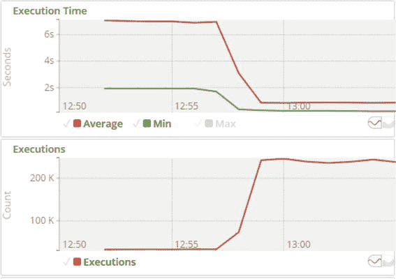
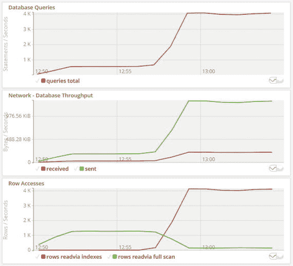
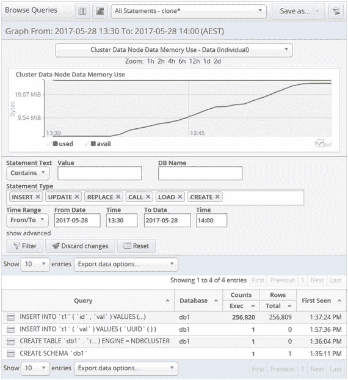
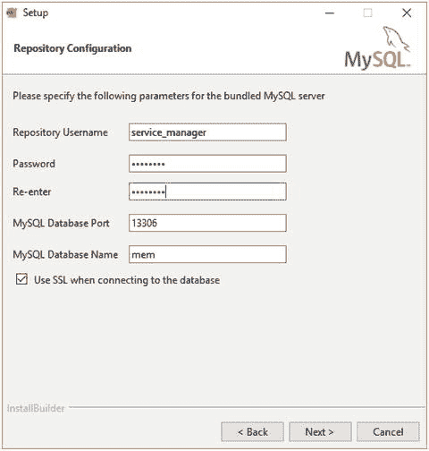
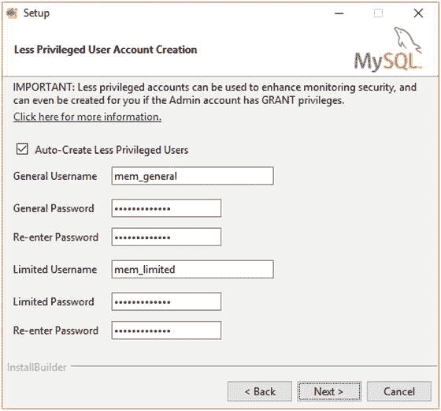
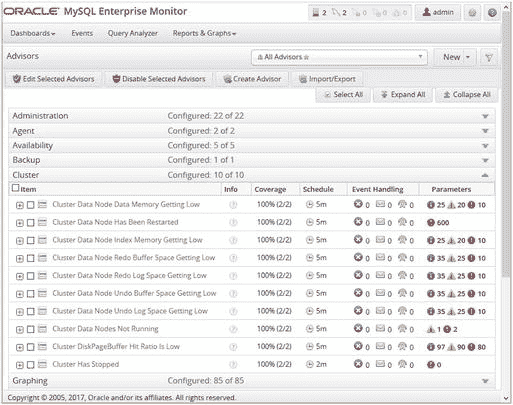

# 14. 监控解决方案与操作系统

维护数据库时，一个经常被遗忘的部分是必须对其进行监控。监控的数据有两个来源——由外部监控解决方案或数据库管理员收集的数据，以及由运行在操作系统上的进程写入的日志。无论数据来源如何，监控都有三重目的。本章以及接下来的三章将探讨监控的各个方面，从高层的监控解决方案，到使用收集的数据和日志进行实际故障排除。

穿越监控与故障排除世界的旅程将从本章开始，讨论高层监控，介绍监控解决方案以及您需要监控的原因。本章最后探讨如何监控操作系统。接下来的两章将介绍 MySQL 数据源和 MySQL 特定日志，其中第 15 章重点介绍同样适用于 MySQL 服务器安装的来源和日志。第 16 章专门介绍 MySQL NDB 集群独有的数据源和日志。第 17 章讨论故障排除，包括使用日志的示例。

### 为何要监控？

监控似乎是一项枯燥的任务，不会对 MySQL NDB 集群安装带来任何直接改进。然而，无论如何强调建立良好监控的重要性都不为过。它是避免问题的第一道最佳防线，并且对于调查问题具有无可估量的价值。

本节介绍监控集群的三个主要原因：

*   建立基线：可以查看进行更改后产生的效果。这主要对性能问题有帮助，并有助于预测何时需要进行维护。
*   执行根本原因分析：出了问题，但问题是什么？为什么发生？
*   执行预防性维护：防止问题发生。

由于 MySQL NDB 集群通常用于高可用性系统，因此监控的重要性比在某些其他情况下更为重要。


#### MySQL 监控与性能优化

#### 建立基线

当监控数据随时间记录时，历史数据可用作基线，即与新收集的数据进行比较以查看差异。这对于确定对系统所做的更改是否成功特别有用，例如性能或可用性是否已得到改善。

考虑以下用例：应用程序的一个用户抱怨执行某些操作所需的时间，例如加载网页的时间。调查得出的结论是，解决方案将是在表中添加索引以减少检查的行数。如何利用监控来确定在添加索引后问题是否已解决？这就是基线发挥作用的地方。

> **注意**
>
> 有时可能找到了解决方案，但结果证明更改并未改善情况，甚至使其变得更糟。良好的基线结合数据比较可确保调查不会在问题真正解决之前结束。

图 14-1 显示了在添加索引以改进查询前后一段时间内相关查询的指标。索引在 12:57 左右添加，这从数据的变化中可以明显看出。执行时间提高了近一个数量级，执行次数也增加了大约相同的倍数。因此，从查询的角度来看，任务已经完成。不过，故事还有更多内容。



*图 14-1. 添加索引前后的查询指标*

图 14-2 显示了同一索引添加的更多指标，但这是在集群级别。每秒语句数的增加反映了查询执行次数的增加。这是预期的吗？还是这表明查询的执行频率高于应有的频率？也可能是添加索引后，更改使集群能够处理所有预期的查询。



*图 14-2. 添加索引前后的整体指标*

还值得注意的是集群的网络吞吐量。`Row Accesses`图显示工作从表扫描转变为索引扫描和查找。这是模式更改的目标，所以是好事。然而，尽管每个查询现在访问的行数更少，但查询数量的增加导致整体网络使用量增加。这是否需要升级网络基础设施？发送吞吐量峰值约为 10 Mbit（1.25 MB/s），因此如果这是网络支持的最大吞吐量，则需要升级。网络利用率也可以通过预防性维护进行调查，如下一节所述。

#### 执行根本原因分析

监控的另一个常见用例是确定问题的根本原因。例如，用户抱怨他们收到“table is full”错误。以下显示了查询和返回的错误：

```
mysql> INSERT INTO t1 (val) VALUES (UUID());
ERROR 1114 (HY000): The table 't1' is full
mysql> SHOW WARNINGS\G
*************************** 1. row ***************************
Level: Warning
Code: 1296
Message: Got error 827 'Out of memory in Ndb Kernel, table data (increase DataMemory)' from NDB
*************************** 2. row ***************************
Level: Error
Code: 1114
Message: The table 't1' is full
2 rows in set (0.00 sec)
```

`SHOW WARNINGS`的输出显示数据内存已无空间。在这种情况下，监控图非常有用。该图必须显示随时间推移`DataMemory`中已使用的内存量。这可以确定内存消耗的速度。例如，如果这是几年内的逐渐变化，很可能只是显示数据的常规增长。另一方面，如果增长发生在几分钟内，则表明集群的使用方式发生了变化，甚至是应用程序中存在错误。图 14-3 显示了数据内存使用情况图，以及可能导致数据使用量增加的相关查询。



*图 14-3. 数据内存使用情况及相关查询*

图 14-3 来自 MySQL Enterprise Monitor 中的查询分析器。该图显示了`DataMemory`的总量（顶部的水平线），递增的线显示了`DataMemory`中已使用的内存。这使得可用内存量成为两条线之间的差值。该图显示可用内存在 25 分钟内逐渐减少，直到使用了 95% 的内存（最后 5% 保留用于重启）。

截图的下半部分显示，数据内存增加的来源只能有一个：`INSERT INTO 't1' ( 'id', 'val' ) VALUES (...)`查询。在所选的半小时内，该查询执行了超过 250,000 次。该表还有一个`CREATE TABLE`语句，这表明可能执行了某种将数据存储在表中的批处理作业或类似的数据导入作业。有了这些信息，现在需要确定是通过避免在`t1`表中存储数据来解决问题，还是有必要增加`DataMemory`的值。本章后面的“MySQL Enterprise Monitor”一节更详细地介绍了查询分析器。

如果能在所有数据内存耗尽且数据库开始返回错误之前发现问题，那就更好了。如何利用监控来避免这些潜在问题是下一个主题。

#### 执行预防性维护

最好的问题是那些在成为问题之前就得到解决的问题。监控是寻找潜在问题的最佳场所。本节中的两个示例展示了如何使用预防性维护来避免问题。

基线示例中看到，在一个新索引使集群每秒可以处理更多查询后，集群的网络使用量增加了。这可能导致网络成为瓶颈，因此应监控其使用情况。如果确定当前网络配置无法承受工作负载，则必须采取纠正措施，形式为更改工作负载或提高网络容量。

根本原因分析示例中的数据内存量在一段时间内增加了。对于这类问题，通常是几个月内发生的缓慢变化。使用像 MySQL Enterprise Monitor 这样的监控系统，可以在潜在问题变得严重之前发出警报，从而可以提前进行所需的更改。在这种情况下，要么增加数据内存，要么停止将数据加载到表中的作业。

分析监控数据是数据库管理员和系统管理员最重要的任务之一。安装一个配置了适当警报事件的良好监控系统是简化这项工作的重要一步。


### 监控解决方案

在本章及接下来的两章中，我们将明显看到，出于监控目的可以收集的数据量是巨大的。任何试图手动处理原始数据并检测潜在问题的做法都注定会失败，并且对进行中的问题进行调查和根本原因分析所需的时间也会比预期更长。这正是监控解决方案展现其价值的地方。

监控解决方案是专门用于收集和显示监控数据的软件。此外，最有用的解决方案要么能自行发送问题通知，要么能与通知软件结合使用。监控解决方案的具体实现方式各不相同，并且对于哪种方案最佳也存在不同的观点。在这方面，重要的是找到一款能提供必要监控功能的产品并熟悉它。

> **提示**
> 应将监控解决方案视为一个生产系统。随着应用程序需要 7 天 24 小时不间断运行，监控变得愈发重要。因此，请确保监控系统本身也受到监控，所需的可用性已被定义，等等。

#### MySQL 监控解决方案

MySQL 提供了两种监控解决方案。这两种解决方案都是 `MySQL Enterprise Edition` 和 `MySQL Cluster Carrier Grade Edition` 订阅的一部分，但和 `MySQL Cluster Manager` 一样，它们也提供 30 天试用版（[`www.mysql.com/trials/`](https://www.mysql.com/trials/)）。这两种解决方案如下：

*   `MySQL Enterprise Monitor`：由 MySQL 团队编写的独立监控解决方案。常缩写为 `MEM`。
*   `Oracle Enterprise Manager for MySQL`：一个插件，用于从 `Oracle Enterprise Manager (OEM)` 内部监控 `MySQL Server` 实例。

两种解决方案由同一个开发团队负责。然而，由于 `Oracle Enterprise Manager for MySQL` 是甲骨文公司更大型监控解决方案的一部分，它并未包含 `MySQL Enterprise Monitor` 的所有功能。具体来说，`Oracle Enterprise Manager for MySQL` 不包含任何 `MySQL NDB Cluster` 特定的指标。因此，最好使用 `MySQL Enterprise Monitor`，本书也将只详细讨论这两种解决方案中的这一种。下一节将简要介绍 `MySQL Enterprise Monitor`。

> **提示**
> 要监控 `MySQL NDB Cluster`，`MySQL Enterprise Monitor` 比 `Oracle Enterprise Manager for MySQL` 更受推荐。

#### MySQL Enterprise Monitor (MEM)

`MySQL Enterprise Manager` 首次发布于十多年前。在撰写本文时，最新版本是 3.4 版，但后来已发布了 4.0 版。它由 MySQL 开发团队专门编写，用于监控 MySQL 及其安装所在主机。本节将介绍 `MySQL Enterprise Monitor` 的组件、如何安装和升级它，以及其最重要的功能。

> **提示**
> `MySQL Enterprise Monitor` 的新版本发布频繁。每个新版本都包含新功能。例如，3.2 版包含了一个新的复制仪表板，3.3 版包含了一个用于监控备份的仪表板，3.4 版包含了 `Group Replication` 支持，而 4.0 版则包含了改进的 `MySQL NDB Cluster` 监控和一个新用户界面作为部分新功能。请确保使用最新版本以获得所有可用的监控功能。手册 [`dev.mysql.com/doc/mysql-monitor/en/`](https://dev.mysql.com/doc/mysql-monitor/en/) 包含了最新功能的描述，并提供了发行说明的链接。

##### 组件

`MySQL Enterprise Monitor` 由多个组件组成。数据库管理员可以选择安装被监控系统所需的组件。表 14-1 列出了可用的四种组件类型。

**表 14-1.** `MySQL Enterprise Monitor` 组件类型

| 组件 | 描述 |
| --- | --- |
| `MySQL Enterprise Service Manager` | 这是主要组件，收集到的数据存储于此，并可在此查看。`MySQL Enterprise Service Manager` 包含三个子组件：`Apache Tomcat`、`Java Runtime Environment (JRE)` 和 `MySQL Server`（可选）。通过 Web 浏览器访问用户界面。 |
| `MySQL Enterprise Monitor Agent` | `MySQL Enterprise Monitor Agent` 收集数据并将其发送到 `MySQL Enterprise Service Manager`。 |
| `MySQL Enterprise Monitor Proxy and Aggregator` | `MySQL Enterprise Monitor Proxy and Aggregator` 可用于为查询分析器收集查询信息。在 `MySQL NDB Cluster` 7.3 及更高版本中，此数据源通常是 `Performance Schema`。当数据是从 `Performance Schema` 收集时，则不需要 `MySQL Enterprise Monitor Proxy and Aggregator`。 |
| `MySQL Enterprise Plugin for Connector/PHP` `MySQL Enterprise Plugin for Connector/J` `MySQL Enterprise Plugin for Connector/Net` | 提供了适用于 `PHP`、`.Net` 和 `Java` 的插件。这些插件可以直接将查询数据发送到 `MySQL Enterprise Service Manager`（适用于 .Net 和 Java）或通过 `MySQL Enterprise Monitor Aggregator` 发送（适用于 PHP）。 |

在大多数设置中，只使用 `MySQL Enterprise Service Manager` 和 `MySQL Enterprise Monitor Agent`，因此下文将只详细讨论这些组件。

一个 `MySQL Enterprise Monitor Agent` 负责收集数据并将其发送到 `MySQL Enterprise Service Manager` 进行存储和分析。代理可以通过在同一主机或远程主机上针对 SQL 节点执行查询来收集数据。此外，代理还可以从其安装所在的主机收集主机级别的数据，如 CPU 统计信息、内存使用指标、磁盘利用率和网络吞吐量。因此，为了收集所有数据，必须在集群中的所有主机上安装代理。

`MySQL Enterprise Monitor Service Manager` 将数据存储在一个称为仓库的 `MySQL Server` 实例中。可以使用捆绑的仓库，也可以使用现有的 `MySQL Server` 实例。在大多数情况下，最好使用捆绑的仓库，因为它确保满足所有要求，并且在 `MySQL Enterprise Service Manager` 升级时仓库也会随之升级。

> **注意**
> 切勿将仓库设置为 `MySQL Enterprise Monitor` 设定要监控的 MySQL 实例之一。这样做将妨碍对集群问题的检测，例如，当 SQL 节点变得不可用时。

`MySQL Enterprise Service Manager` 包含一个代理。这使得 `MySQL Enterprise Monitor` 能够自动设置对自身仓库及其安装所在主机的监控。由于代理可以监控远程 MySQL 实例，因此从原则上讲，如果不需要对远程主机进行主机级别的监控，那么仅需 `MySQL Enterprise Service Manager` 即可。


##### 安装与升级

MySQL 企业服务管理器和 MySQL 企业监控代理的安装与升级过程非常直接。下载包中包含两个二进制文件，一个用于全新安装，另一个用于升级。每个安装程序都包含了安装该组件所需的全部内容。表 14-2 展示了 3.4.0 版本中，Linux 和 Microsoft Windows 平台的安装程序文件名示例。

### 表 14-2. 安装程序二进制文件

| 操作 | 安装程序文件名 |
| --- | --- |
| 全新安装 | `mysqlmonitor-3.4.0.4144-linux-x86_64-installer.bin` `mysqlmonitor-3.4.0.4144-windows64-installer.exe` |
| 升级 | `mysqlmonitor-3.4.0.4144-linux-x86_64-update-installer.bin` `mysqlmonitor-3.4.0.4144-windows64-update-installer.exe` |

请注意，全新安装的二进制文件以 `installer` 结尾（加上文件扩展名），而升级文件则以 `update-installer` 结尾（加上文件扩展名）。确切的文件名取决于已安装的发布版本，因为版本号和构建号（本例中为 `4144`）都包含在文件名中。

安装或升级可以通过以下三种模式之一执行：

*   **GUI**：基于图形用户界面的安装，通过对话框来设置 MySQL 企业监控器。
*   **文本**：文本模式提供与 GUI 模式相同的功能，但所有对话框都是文本形式。当目标服务器未安装图形用户界面时，此模式非常有用。
*   **无人参与**：所有选项都在命令行中提供。这非常适合于编写安装脚本。

首次使用时，最好选择 GUI 或文本模式，以熟悉配置选项。后续的安装，尤其是代理的安装，可以使用无人参与安装实现自动化。当使用 `root` 或管理员权限执行安装程序时，它会尝试将组件添加为服务（例如，在 Linux 上作为 System V init 脚本，或在 Microsoft Windows 上作为 Windows 服务），这样 MySQL 企业监控器就能随操作系统自动启动和停止。图 14-4 展示了 MySQL 企业服务管理器在 GUI 模式下的一个屏幕，用于配置捆绑的存储库设置。



### 图 14-4. 安装过程中配置存储库

还记得第 12 章中关于为用户授予最小必要权限的讨论吗？这也适用于监控所涉及的用户。MySQL 企业监控代理支持使用三种不同的用户：管理员账户、通用账户和受限账户。当所有账户都存在时，MySQL 企业监控器会选择权限最少但能执行任务的账户。这也确保了监控系统不会占用为具有 `SUPER` 权限的用户额外保留的、在 `max_connections` 之外的登录名额。

代理的安装程序支持自动创建通用账户和受限账户，前提是管理员账户已配置了 `WITH GRANT` 权限。图 14-5 展示了 MySQL 企业监控代理 GUI 安装程序中的设置屏幕，通过它您可以设置权限较低的账户。



### 图 14-5. 在安装代理时添加权限较低的用户

**提示**：MySQL 企业监控代理安装程序支持添加两个权限低于安装所用管理员账户的用户。强烈建议您勾选**自动创建低权限用户**复选框来选择此选项。

##### 功能特性

MySQL 企业监控器具有一系列功能，其中大部分与其他监控解决方案提供的功能相似。此外，它还有一些独特的功能。如表 14-3 所示，这些功能分为四组。下文将详细讨论其中一些功能。

### 表 14-3. MySQL 企业监控器功能组

| 功能组 | 描述 |
| --- | --- |
| 仪表板 | 仪表板提供实例、复制等的概览。 |
| 事件 | 当满足某些条件时会触发事件。决定哪些指标超出正常范围的规则称为“顾问”。 |
| 查询分析器 | 查询分析器显示在 MySQL 中执行的查询的统计信息。可以同时显示时间序列图和查询统计信息。 |
| 报告与图表 | 提供一系列报告和时间序列图；例如，进程列表快照、每秒查询数等。 |

事件是 MySQL 企业监控器用来提醒数据库管理员和系统管理员某些指标超出预期操作范围的机制。事件的严重程度可能从灾难性事件（指示 MySQL 实例再也无法访问，例如因为主机已崩溃）到信息性消息（指示如果一个月内不采取措施，磁盘空间将会耗尽）。用于决定是否触发事件的规则称为“顾问”。截至 3.4.0 版本，共有 14 个类别中超过 230 个预配置的顾问。图 14-6 展示了顾问的一个子集（MySQL NDB 集群特定的顾问）。



### 图 14-6. MySQL NDB 集群顾问

事件有四个严重级别：

*   **通知**：这是提醒指标开始超出预期范围的提示。预计该问题不够严重，不会影响性能或可用性，因此无需立即采取行动。例如，可能是数据内存量已达到需要考虑开始实施归档或为主机增加内存的水平。
*   **警告**：情况尚未影响性能或可用性，但不应长时间推迟调查。
*   **严重**：假设性能或可用性已经受到影响或即将受到影响。请立即调查并采取行动。
*   **紧急**：服务不可用或极其缓慢，实质上已中断。需要立即采取行动。

每个顾问的阈值可以按严重级别设置。当事件触发时，可以设置发送电子邮件或触发简单网络管理协议陷阱来提醒组织中的相关人员。警报可以根据受影响的系统、顾问和严重级别发送。例如，磁盘空间不足的警报可能会发送给系统管理员，而复制已停止的警告则会发送给数据库管理员。

请务必配置事件通知和触发事件的阈值，以正确反映紧急程度。例如，如果警报以短信形式在凌晨 2 点发送并唤醒了数据库管理员，那么它最好重要到足以让人起床处理。如果总是用“哦，可以等等”来忽略通知，迟早会错过重要事件。如果某个在凌晨 2 点通过短信警报的事件不值得起床处理，那么请将其作为电子邮件或在下一个工作日开始时以短信发送。此建议适用于所有监控解决方案。

**提示**：如果一个通知可以被忽略超过一次，则表明应更改阈值或通知设置。


##### 查询分析器

查询分析器是 **MySQL 企业监控器**的主要功能之一。系统会收集查询统计数据，查询分析器允许用户将在特定时间范围内执行的查询与收集到的其他数据进行比较。在“为何监控？”部分的根因分析示例中就展示了这一点。此外，查询分析器可用于查找调优不良的查询、执行最频繁的查询等。查询分析器的数据默认从**性能模式**（下一章将介绍）收集，但也可以使用连接器插件或代理插件之一来收集。

报告和图形功能提供了多种展示收集数据的方式。这包括传统的时间序列图形（如本章前面展示的图形），以及显示当前进程列表快照的临时报告。

> **注意**
> 本章中包含的监控图形源自 **MySQL 企业监控器**。

> **注意**
> 常与 MySQL 一起使用的第三方监控和告警解决方案包括 **Cacti**、**Nagios** 和 **Zabbix**。每种解决方案的工作方式不同，各有优缺点，因此熟悉你所使用的特定监控解决方案非常重要。

### 操作系统

数据库管理系统是资源消耗大户，MySQL NDB 集群也不例外。这意味着在操作系统级别监控资源的使用情况和可用性至关重要。正如接下来两章将看到的，SQL 节点拥有一些关于 CPU、网络和磁盘使用的数据；然而，这绝不能替代通过操作系统直接监控主机。

监控操作系统指标的细节完全取决于操作系统及其版本。即使是不同版本的 Linux 和 UNIX，获取相同指标的方法也各不相同。因此，本书无法涵盖如何收集这些数据，重点将放在需要收集何种数据上。

> **注意**
> 如果 MySQL 部署在虚拟机中，请务必同时监控主机系统、虚拟机管理程序（虚拟机平台）以及虚拟机本身。主机系统的性能可能会影响虚拟机内部的进程。

数据节点的**快速失败**策略也意味着操作系统的任何部分过载——甚至细化到单个 CPU 线程上的资源争用——都可能引发问题。这使得在部署了数据节点的主机上监控操作系统变得尤为重要。同时，也要确保监控与集群相关但不一定安装了节点的硬件；例如，这包括节点之间的网络组件。

数据节点在超过 100 毫秒后开始发出停滞警告，如果线程无响应，看门狗会在 18 秒后关闭数据节点。监控解决方案的典型采样间隔可能是一分钟。如果测量间隔为一分钟，很可能无法检测到导致看门狗关闭的资源争用。事实上，一分钟的平均值可能低于正常值，因为数据节点一旦关闭就会停止使用资源。通常，对于装有数据节点的主机，数据收集频率必须高于其他主机，同时仍需注意避免监控开销本身成为问题。

本节将继续介绍操作系统级别需要监控的最重要指标。讨论重点围绕数据节点的需求，但也普遍适用于其他主机。

#### CPU 使用率

数据节点主要处理内存中的工作负载。这意味着数据节点通常是 **CPU 密集型**（而非从磁盘读取数据的 I/O 密集型）。`ndbinfo` 模式（参见第 16 章）为数据节点线程提供了出色的 CPU 指标，但它不包括机器上其他进程（包括 SQL 节点）的 CPU 使用情况。因此，监控应填补这一空白。

每个数据节点线程的 CPU 使用率可能差异很大，因此如果可能，请为每个虚拟 CPU 收集 CPU 使用率数据。`ndbinfo.threadstat` 视图包含每个数据节点线程的操作系统线程 ID。将每个虚拟 CPU 的监控数据与从 `ndbinfo.threadstat` 收集的数据相结合，将使数据库和系统管理员能够关联数据，以确定数据节点性能问题是否与 CPU 使用率有关。

#### 网络使用率

鉴于 MySQL NDB 集群是一个依赖网络进行节点间通信的分布式系统，网络监控的重要性不言而喻。即使是数据节点之间专用的 10Gbit 网络，在高性能集群中也可能饱和。

与 CPU 使用率类似，`ndbinfo` 模式可以通过 `ndbinfo.transporters` 视图提供数据节点网络使用情况的详细信息。SQL 节点同样有状态变量提供发送和接收的数据量。因此，操作系统监控必须收集整体使用情况的数据，并且如果可能，还应收集其他进程的网络使用情况数据。

一个可能导致集群问题的例子是：某个进程通过数据节点使用的相同网络接口复制大量数据。一种场景是备份被复制出主机。甚至可能是一个与集群无关的主机，如果它使用了与集群节点相同的网络基础设施，也会引发问题。


#### 磁盘使用情况

在监控 MySQL NDB 集群时，人们很容易忽略磁盘。毕竟，它主要是一个内存数据库。然而，所有内存中的数据都通过本地检查点、重做日志和备份进行持久化。它还支持磁盘数据表空间，这也需要高性能的磁盘系统。

在第 16 章关于 `ndbinfo` 日志空间报告的示例中，你了解到将数据写入本地检查点所需的时间越长，就需要在重做日志中存储更多数据。这意味着磁盘性能的瓶颈会直接影响重做日志所需的磁盘空间量。更改重做日志的大小需要一次初始的滚动重启，因此这是一个相对重大的变更。

`ndbinfo` 中的 `disk_write_speed_%` 视图提供了关于数据节点达到的磁盘写入速度的内部信息。操作系统监控需要收集可用于调查数据节点是否无法达到预期吞吐量的信息——或者通过提前对存储进行更改来防止磁盘系统饱和。如果可能，还收集显示每个进程磁盘使用情况的数据。对于具有电池支持的写缓存磁盘系统（[`en.wikipedia.org/wiki/Disk_buffer#Write_acceleration`](https://en.wikipedia.org/wiki/Disk_buffer#Write_acceleration)），电池状态也会极大影响性能。如果电池发生故障或经历重新学习过程，磁盘系统将进入降级模式。如果 RAID 阵列中的磁盘发生故障或正在重建，也可能发生同样的问题。

除了用于进程的磁盘吞吐量外，已使用的磁盘空间量也是需要监控的重要指标。随着数据节点中数据量的增加，本地检查点和备份也会变大，因此它们会占用更多磁盘空间。也可能为磁盘数据添加了更多的表空间和/或撤销日志文件。

耗尽磁盘空间的一个意想不到的元凶也可能是重做日志。原则上，重做日志的大小不会改变，除非通过初始（滚动）重启更改了分段日志文件选项。然而，默认情况下，这些文件是以稀疏方式创建的，因此最初不会消耗太多磁盘空间。在所有文件都被使用之前，重做日志的任何部分都无法被重用，因此可能需要一段时间才会真正使用为重做日志预留的所有磁盘空间。如果监控不关注可用磁盘空间，这可能导致数据节点磁盘空间耗尽（无法写入重做日志可能导致数据丢失）。

#### 内存使用情况

对于数据节点来说，内存使用通常不是问题。当数据节点启动时，它不仅请求其配置使用的所有内存，还会写入（触及）所有内存以确保操作系统真正分配它。因此，除非是其他进程的问题，否则数据节点很少耗尽内存。尽管如此，监控仍应收集内存使用统计信息。

不要依赖 Performance Schema（参见第 15 章）中的内存 instrumentation 来监控 SQL 节点的整体内存使用情况。虽然内存 instrumentation 非常有用，但它并没有 100% 的覆盖率。因此，即使永久启用内存 instrumentation 的性能开销是可以接受的，也应通过在操作系统层面收集数据来补充监控。

#### 日志

密切关注日志非常重要。操作系统日志包含广泛的消息类型，从通过任务调度器记录作业执行，到一般的操作系统消息，再到审计日志。可能无法自动化日志监控，在这种情况下，手动检查日志必须成为例行工作的一部分。即使无法实现完全自动化的监控，也可能可以监控日志中的某些事件和字符串，并在测试结果为阳性时通知系统管理员。

日志监控应侧重于检测硬件问题、内存不足问题、入侵等。系统日志对于根本原因分析也非常有价值，因此请确保制定了保留策略，确保日志被保留一段时间，并可能备份到另一台主机。

### 本章总结

本章从高层次概述了监控，并讨论了在操作系统层面监控时需要注意的事项。本章讨论的主题包括：

*   监控为何重要，并提供了三个使用监控进行基线监控、根本原因分析和预防性维护的示例。
*   监控解决方案，包括 MySQL 的企业解决方案 MySQL Enterprise Monitor。
*   在操作系统层面，最重要的监控对象是网络、CPU、磁盘和内存。
*   关注日志。这包括操作系统层面的日志。

下一章将深入探讨 MySQL Server 和 MySQL NDB Cluster 通常可用的数据源和日志。

