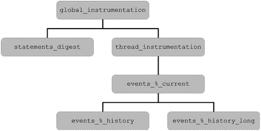
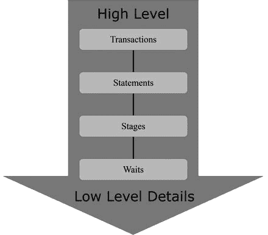
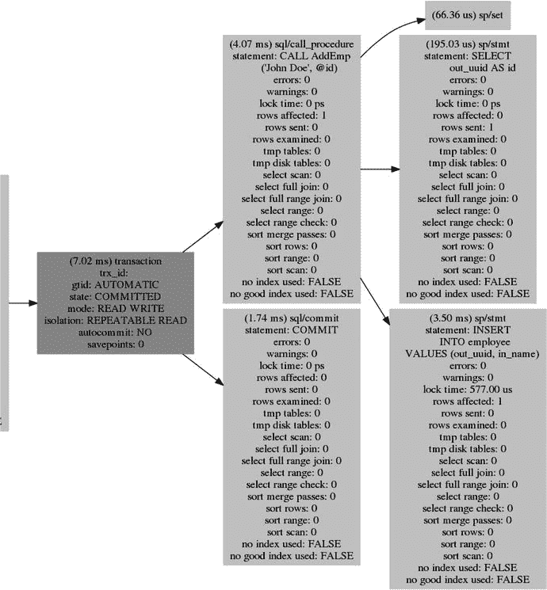
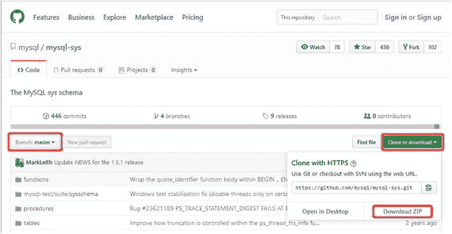
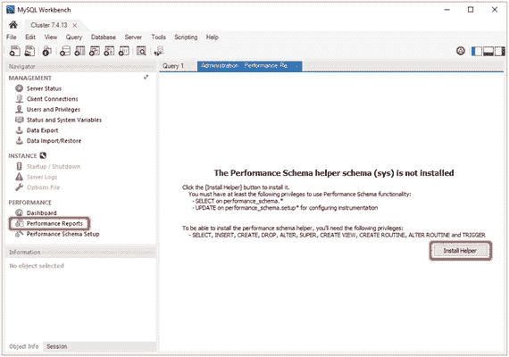
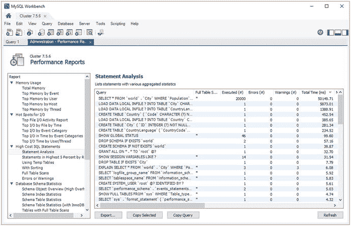

# 15. 监控数据来源

监控数据可以从多种来源收集。无论监控解决方案多么出色，不仅了解数据来源，还要了解其收集方式、度量单位、数据源的局限性以及如何将其用于分析，这都至关重要。这有助于你理解从数据中可以读出什么。此外，在进行测试或调查问题时，可能需要手动收集某些数据，而其他数据则更倾向于手动使用。后者的一个例子是进程列表。

收集数据的方式有很多种。MySQL Server 和 MySQL NDB Cluster 上都可用的五个主要领域是：

*   Information Schema
*   Performance Schema
*   `sys` 模式
*   `SHOW` 语句
*   MySQL 错误日志

本章将介绍所有这些领域，并提供一些如何使用这些来源的示例。

### Information Schema

Information Schema 在 MySQL 5.0 版本中引入。它是几个关系数据库管理系统中的共同特性（尽管并非全部）。MySQL 旨在遵循 SQL:2003 标准的 F021 基础信息架构，并进行了一些更改以反映 MySQL 的特定性质（例如，该标准未考虑存在多个存储引擎）。

Information Schema 是 MySQL 中的第一个元数据模式，因此它也最终成为许多并不真正属于此处的表的归宿。最近已开始努力使 Information Schema 专注于相对静态的数据，例如模式信息、可用的插件等。第一步是将包含配置变量和状态计数器的表移至 Performance Schema；这在 MySQL Server 5.7.6（一个开发里程碑版本）和 MySQL NDB Cluster 7.5（所有版本）中完成。这项工作仍在继续，在 MySQL NDB Cluster 7.5 及更高版本中可能会遇到一些弃用警告。

本节介绍了 Information Schema 表并解释了如何使用它们。最后，将讨论包含 NDB Cluster 特定数据的表，并提供示例。


#### 信息模式表

可用的信息模式（Information Schema）表列表随版本和已启用功能的变化而不同。表 15-1 至 15-4 展示了默认的 MySQL NDB Cluster 7.5 SQL 节点中所有的信息模式表，但 `InnoDB` 特有的表除外。这些表被分为四组：

*   系统信息，如可用的字符集、存储引擎等。
*   模式信息，如模式、表等。
*   权限信息。
*   配置和性能监控指标。

在 MySQL NDB Cluster 7.5 中，SQL 节点需要 `InnoDB` 才能工作，因此它额外增加了 30 张表，但为简洁起见，此处未包含它们。

除了 `OPTIMIZER_TRACE`（在 7.3 版本中引入）外，所有表至少从 MySQL NDB Cluster 7.2 及之后的版本开始可用。惯例是信息模式表名全部大写（一个例外是 `ndb_transid_mysql_connection_map`，它是小写的）。

#### 信息模式：MySQL 系统信息表

表 15-1 列出了包含系统信息（如字符集、插件等）的信息模式表。这些表对于验证哪些功能可用很有帮助。

表 15-1.

| 表名 | 描述 |
| --- | --- |
| `CHARACTER_SETS` | 可用的字符集。所有 `char`、`varchar` 和 `text` 列都关联一个字符集。 |
| `COLLATIONS` | 可用的排序规则。每个排序规则属于一个字符集，并定义了比较和排序规则。 |
| `COLLATION_CHARACTER_SET_APPLICABILITY` | 每个排序规则到字符集的映射。这与 `COLLATIONS` 表的前两列相同。 |
| `ENGINES` | 关于存储引擎的信息。 |
| `PLUGINS` | 可用的插件，包括状态。插件例如存储引擎和认证插件。 |

#### 信息模式：模式信息

表 15-2 涵盖了提供关于模式、表、列、存储例程等信息的表。这些表常用于回答诸如“哪些表有指向特定表的外键”以及“某个索引的索引统计信息是什么”等问题。

表 15-2.

| 表名 | 描述 |
| --- | --- |
| `COLUMNS` | 表的列定义。 |
| `EVENTS` | 关于在 SQL 节点上定义的事件的信息（记住事件不会自动在 SQL 节点间分发）。 |
| `FILES` | 关于由 MySQL 创建的表空间和日志组文件的信息。在 MySQL Server 5.7/MySQL NDB Cluster 7.5 之前，这是一个 NDB Cluster 特定的表。例如，它包含关于文件中可用空间量的信息。 |
| `KEY_COLUMN_USAGE` | 关于在参照约束（主键、唯一键和外键）中使用的列的信息。 |
| `PARAMETERS` | 关于存储程序中参数的信息。 |
| `PARTITIONS` | 关于表中每个分区的信息。 |
| `REFERENTIAL_CONSTRAINTS` | 关于外键的信息。 |
| `ROUTINES` | 详细信息，包括存储过程和存储函数的完整定义。 |
| `SCHEMATA` | 模式（数据库）信息。 |
| `STATISTICS` | 等同于 `SHOW INDEXES`。 |
| `TABLES` | 所有表的信息。等同于 `SHOW TABLE STATUS`。 |
| `TABLESPACES` | 表空间信息。 |
| `TABLE_CONSTRAINTS` | 主键、唯一键和外键的摘要。 |
| `TRIGGERS` | 所有用户级表触发器的详细信息（不是内部的 NDB Cluster 触发器）。 |
| `VIEWS` | 视图的详细信息。 |

#### 信息模式：权限信息

权限信息表列在表 15-3 中。权限存储在 `mysql` 模式中的表里，四个信息模式权限表是缓存权限的视图（即，如果 `mysql` 权限表直接使用 `INSERT`、`UPDATE`、`DELETE` 等命令更新，那么信息模式权限表在执行 `FLUSH PRIVILEGES` 之前不会显示更改）。信息模式表的表定义与 `mysql` 表的表定义不同。这些表对于查找具有特定权限或访问给定模式、表或列的用户很有用。

表 15-3.

| 表名 | 描述 |
| --- | --- |
| `COLUMN_PRIVILEGES` | 包含授予用户的列级权限。 |
| `SCHEMA_PRIVILEGES` | 包含授予用户的模式级权限。 |
| `TABLE_PRIVILEGES` | 包含授予用户的表级权限。 |
| `USER_PRIVILEGES` | 包含授予用户的全局级权限。 |

#### 信息模式：监控相关数据

信息模式中有几个与监控相关的表。这些表包含在表 15-4 中。其中一些表在性能模式（Performance Schema）中已有新的实现。`ndb_transid_mysql_connection_map` 表对 MySQL NDB Cluster 尤其重要，将在本章及下一章的示例中使用。

表 15-4.

| 表名 | 描述 |
| --- | --- |
| `GLOBAL_STATUS` | 与 `SHOW GLOBAL STATUS` 的输出相同。此表在 MySQL NDB Cluster 7.5 及之后版本中默认禁用，并已在 MySQL Server 8.0 中移除。请改用 `performance_schema.global_status` 表。 |
| `GLOBAL_VARIABLES` | 与 `SHOW GLOBAL VARIABLES` 的输出相同。此表在 MySQL NDB Cluster 7.5 及之后版本中默认禁用，并已在 MySQL Server 8.0 中移除。请改用 `performance_schema.global_variables` 表。 |
| `ndb_transid_mysql_connection_map` | 提供 NDB 事务 ID 与使用该事务的 SQL 节点 ID 和连接 ID 之间的映射。示例将在后面提供。 |
| `OPTIMIZER_TRACE` | 可用于获取查询执行时优化器决策过程的详细信息。 |
| `PROCESSLIST` | 与 `SHOW FULL PROCESSLIST` 相同。在 MySQL NDB Cluster 7.3 及之后版本中，建议改用 `performance_schema.threads` 表。 |
| `PROFILING` | 与使用 `SHOW PROFILE` 分析查询后获得的信息相同。该表已在 MySQL NDB Cluster 7.5 及之后版本中弃用，推荐使用性能模式。 |
| `SESSION_STATUS` | 与 `SHOW SESSION STATUS` 的输出相同。此表在 MySQL NDB Cluster 7.5 及之后版本中默认禁用，并已在 MySQL Server 8.0 中移除。请改用 `performance_schema.session_status` 表。 |
| `SESSION_VARIABLES` | 与 `SHOW SESSION VARIABLES` 的输出相同。此表在 MySQL NDB Cluster 7.5 中默认禁用，并已在 MySQL Server 8.0 中移除。请改用 `performance_schema.session_variables` 表。 |

##### 使用信息模式

信息模式表可以像用户定义的表一样使用和连接。它们也可以与来自其他模式（例如性能模式和 `ndbinfo`）的表在查询中组合使用。例如，你可以获取 `world` 示例数据库中每个表的列数，如下列输出所示：

```
mysql> SELECT TABLE_SCHEMA, TABLE_NAME, COUNT(*) AS NumColumns
FROM information_schema.TABLES
INNER JOIN information_schema.COLUMNS
USING (TABLE_SCHEMA, TABLE_NAME)
WHERE TABLE_SCHEMA = 'world'
GROUP BY TABLE_SCHEMA, TABLE_NAME;
+--------------+-----------------+------------+
| TABLE_SCHEMA | TABLE_NAME      | NumColumns |
+--------------+-----------------+------------+
| world        | City            |          5 |
| world        | Country         |         15 |
| world        | CountryLanguage |          4 |
+--------------+-----------------+------------+
3 rows in set (0.07 sec)
```

涉及模式信息的查询通常相对较慢，特别是当表不在表缓存中时。原因在于，在 MySQL Server 5.7 及更早版本中，信息存储在文件系统的 `.frm` 文件中，每次从一个文件中读取数据以获取模式信息是缓慢的。因此，请谨慎执行针对未通过 `WHERE` 子句和模式名和/或表名进行限制的表、列、索引等进行的查询。在 MySQL Server 8.0 引入新的数据字典之前，信息模式不支持索引。不过，对于像 `TABLES` 这样的表，对模式名和表名的限制条件存在有限的下推支持。

使用信息模式时需要考虑的另一个性能问题是 `PROCESSLIST` 表（以及 `SHOW [FULL] PROCESSLIST`）所需的互斥锁。在极端情况下，这可能会影响 MySQL 的性能，并且在过去确实导致过服务中断。因此，建议使用 `performance_schema.threads` 表或其派生出的某个 `sys` 模式视图。此外，`threads` 表提供了更多信息和灵活性。性能模式 `threads` 表在 MySQL NDB Cluster 7.3 及更高版本中可用。

##### 信息模式与 NDB 集群

对于 MySQL NDB 集群，有两个特别值得关注的表：`FILES` 和 `ndb_transid_mysql_connection_map` 表。在 7.5 版本之前（随着通用表空间的引入，`InnoDB` 也开始使用该表），`FILES` 表是 NDB 集群专用的。这两个表都是信息模式 SQL 标准的 MySQL 扩展。

##### 信息模式 FILES 表

`FILES` 表提供有关日志文件组和表空间文件的详细信息，例如大小和可用空间量。清单 15-1 展示了一个示例，其中添加了一个包含一个撤销日志文件的日志组和一个包含一个数据文件的表空间。`FILES` 表的输出分为两部分——表空间文件的三行和日志文件组的三行。每个节点上的每个文件都有一行，日志文件组和表空间本身也各有一行。

```
mysql> CREATE LOGFILE GROUP lg_1
ADD UNDOFILE 'undo_1.log'
INITIAL_SIZE 16M
UNDO_BUFFER_SIZE 2M
ENGINE NDBCLUSTER;
Query OK, 0 rows affected (1.48 sec)
mysql> CREATE TABLESPACE ts_1
ADD DATAFILE 'data_1.dat'
USE LOGFILE GROUP lg_1
INITIAL_SIZE 32M
ENGINE NDBCLUSTER;
Query OK, 0 rows affected (9.51 sec)
mysql> CREATE TABLE db1.t1 (
id int unsigned NOT NULL auto_increment,
val varchar(36) NOT NULL,
PRIMARY KEY (id)
) ENGINE=NDBCluster
TABLESPACE ts_1
STORAGE DISK;
Query OK, 0 rows affected (0.22 sec)
mysql> INSERT INTO db1.t1 (val)
VALUES (UUID()), (UUID()), (UUID()), (UUID()), (UUID());
Query OK, 5 rows affected (0.00 sec)
Records: 5  Duplicates: 0  Warnings: 0
mysql> INSERT INTO db1.t1 (val)
SELECT UUID()
FROM db1.t1 a
CROSS JOIN db1.t1 b;
Query OK, 25 rows affected (0.01 sec)
Records: 25  Duplicates: 0  Warnings: 0
mysql> INSERT INTO db1.t1 (val)
SELECT UUID()
FROM db1.t1 a
CROSS JOIN db1.t1 b;
Query OK, 900 rows affected (0.06 sec)
Records: 900  Duplicates: 0  Warnings: 0
mysql> SELECT FILE_NAME, FILE_TYPE, LOGFILE_GROUP_NAME, ENGINE, FREE_EXTENTS,
TOTAL_EXTENTS, EXTENT_SIZE, INITIAL_SIZE, MAXIMUM_SIZE, EXTRA
FROM information_schema.FILES
WHERE ENGINE='NDBCluster'\G
*************************** 1\. row ***************************
FILE_NAME: data_1.dat
FILE_TYPE: DATAFILE
LOGFILE_GROUP_NAME: lg_1
ENGINE: ndbcluster
FREE_EXTENTS: 30
TOTAL_EXTENTS: 32
EXTENT_SIZE: 1048576
INITIAL_SIZE: 33554432
MAXIMUM_SIZE: 33554432
EXTRA: CLUSTER_NODE=1
*************************** 2\. row ***************************
FILE_NAME: data_1.dat
FILE_TYPE: DATAFILE
LOGFILE_GROUP_NAME: lg_1
ENGINE: ndbcluster
FREE_EXTENTS: 30
TOTAL_EXTENTS: 32
EXTENT_SIZE: 1048576
INITIAL_SIZE: 33554432
MAXIMUM_SIZE: 33554432
EXTRA: CLUSTER_NODE=2
*************************** 3\. row ***************************
FILE_NAME: NULL
FILE_TYPE: TABLESPACE
LOGFILE_GROUP_NAME: lg_1
ENGINE: ndbcluster
FREE_EXTENTS: NULL
TOTAL_EXTENTS: NULL
EXTENT_SIZE: 1048576
INITIAL_SIZE: NULL
MAXIMUM_SIZE: NULL
EXTRA: NULL
*************************** 4\. row ***************************
FILE_NAME: undo_1.log
FILE_TYPE: UNDO LOG
LOGFILE_GROUP_NAME: lg_1
ENGINE: ndbcluster
FREE_EXTENTS: NULL
TOTAL_EXTENTS: 4194304
EXTENT_SIZE: 4
INITIAL_SIZE: 16777216
MAXIMUM_SIZE: 16777216
EXTRA: CLUSTER_NODE=1;UNDO_BUFFER_SIZE=2097152
*************************** 5\. row ***************************
FILE_NAME: undo_1.log
FILE_TYPE: UNDO LOG
LOGFILE_GROUP_NAME: lg_1
ENGINE: ndbcluster
FREE_EXTENTS: NULL
TOTAL_EXTENTS: 4194304
EXTENT_SIZE: 4
INITIAL_SIZE: 16777216
MAXIMUM_SIZE: 16777216
EXTRA: CLUSTER_NODE=2;UNDO_BUFFER_SIZE=2097152
*************************** 6\. row ***************************
FILE_NAME: NULL
FILE_TYPE: UNDO LOG
LOGFILE_GROUP_NAME: lg_1
ENGINE: ndbcluster
FREE_EXTENTS: 4121268
TOTAL_EXTENTS: NULL
EXTENT_SIZE: 4
INITIAL_SIZE: NULL
MAXIMUM_SIZE: NULL
EXTRA: UNDO_BUFFER_SIZE=2097152
6 rows in set (0.01 sec)
清单 15-1.
使用 information_schema.FILES 表
```

从监控的角度来看，空闲区的数量特别值得关注。它们显示了剩余空间的多少。乘以区大小即可得出以字节为单位的空闲空间量。使用磁盘上数据时，监控可用空间非常重要，这样在空间即将耗尽时，可以分配更多空间或清除现有数据。清单 15-2 展示了一个检查数据文件和撤销日志空闲空间的示例。

```
mysql> SELECT FILE_NAME, FILE_TYPE,
(FREE_EXTENTS*EXTENT_SIZE) AS FreeBytes,
ROUND(100*FREE_EXTENTS/TOTAL_EXTENTS, 2) AS FreePct,
EXTRA
FROM information_schema.FILES
WHERE ENGINE='NDBCluster' AND FREE_EXTENTS IS NOT NULL;
+------------+-----------+-----------+---------+--------------------------+
| FILE_NAME  | FILE_TYPE | FreeBytes | FreePct | EXTRA                    |
+------------+-----------+-----------+---------+--------------------------+
| data_1.dat | DATAFILE  |  31457280 |   93.75 | CLUSTER_NODE=1           |
| data_1.dat | DATAFILE  |  31457280 |   93.75 | CLUSTER_NODE=2           |
| NULL       | UNDO LOG  |  16485072 |    NULL | UNDO_BUFFER_SIZE=2097152 |
+------------+-----------+-----------+---------+--------------------------+
3 rows in set (0.01 sec)
清单 15-2.
确定磁盘数据文件和撤销日志的可用空间量
```


##### 信息模式表 ndb_transid_mysql_connection_map

`ndb_transid_mysql_connection_map` 表提供了 SQL 节点中的连接与 NDB 事务 ID 之间的映射。此映射用于过滤 `ndbinfo` 模式表 `cluster_locks`、`cluster_operations` 和 `cluster_transactions` 中的集群锁、事务和操作，以在服务器级别创建相应的视图。清单 15-3 展示了 `ndbinfo.server_transactions` 视图定义中使用的 `SELECT` 语句（经过重新格式化和轻微改写），其中使用了 `ndb_transid_mysql_connection_map` 表来获取特定 SQL 节点的事务。通常情况下，`ndb_transid_mysql_connection_map` 表不需要手动使用，但在下一章调查锁问题时会提供一个示例。

```sql
SELECT map.mysql_connection_id, t.node_id, t.block_instance,
t.transid, t.state, t.count_operations, t.outstanding_operations,
t.inactive_seconds, t.client_node_id, t.client_block_ref
FROM information_schema.ndb_transid_mysql_connection_map map
INNER JOIN ndbinfo.cluster_transactions t
ON map.ndb_transid >> 32 = t.transid >> 32;
```
清单 15-3. `ndbinfo.server_transactions` 视图的定义

上一个示例中使用的 `ndbinfo` 模式是 MySQL NDB 集群特有的模式，将在下一章讨论。

信息模式旨在提供相对静态的数据，而性能模式则恰恰相反，这是接下来要讨论的第二个数据源。

### 性能模式

自 2010 年以来，人们一直在努力通过性能模式改进对 MySQL 的监控和性能问题调查。这是一组使用 `Performance_Schema` 存储引擎的表，所有数据都存储在内存中。这些数据不是持久化的，因此默认设置下的开销通常较低。但从 MySQL NDB 集群的角度来看，缺点在于只有 `mysqld` 进程被检测，因此性能模式中没有与数据节点相关的信息。本节将对性能模式进行介绍。

与 MySQL Server 5.5 和 MySQL NDB 集群 7.2 相比，MySQL Server 5.6 以及随后的 MySQL NDB 集群 7.3 及更高版本中的性能模式发生了一些重大变化。这里只讨论当前的实现。

如前所述，性能模式中的数据不是持久化的，因此在重启 SQL 节点时数据会丢失。此外，表的大小受到限制以控制内存使用，一旦表满了，旧数据要么被清除以为新数据腾出空间，要么会被分组到一个“溢出桶”中。

#### 性能模式线程

在讨论使用性能模式的细节之前，有必要先讨论一下线程：性能模式引用线程并使用线程 ID 来唯一标识每个线程。线程可以是前台线程，即等同于在 `SHOW PROCESSLIST` 中显示的连接；也可以是后台线程，例如监听新连接的主 `mysqld` 线程或内部的 `InnoDB` 线程。

清单 15-4 展示了一个使用 `performance_schema.threads` 表可用线程的典型示例，并与来自信息模式（与 `SHOW PROCESSLIST` 相同，但此处仅包含选定列）的进程列表输出进行了比较。`performance_schema.threads` 查询的 `ID` 列对应于 `information_schema.PROCESSLIST` 查询的 `ID` 列。两个名称为 `thread/sql/one_connection` 的线程是普通连接（线程 ID 分别为 29 和 31）。

```
mysql> SELECT THREAD_ID, NAME, TYPE, PROCESSLIST_ID AS ID
    -> FROM performance_schema.threads;
+-----------+----------------------------------------+------------+------+
| THREAD_ID | NAME                                   | TYPE       | ID   |
+-----------+----------------------------------------+------------+------+
|         1 | thread/sql/main                        | BACKGROUND | NULL |
|         2 | thread/sql/thread_timer_notifier       | BACKGROUND | NULL |
|         3 | thread/innodb/io_ibuf_thread           | BACKGROUND | NULL |
|         4 | thread/innodb/io_log_thread            | BACKGROUND | NULL |
|         5 | thread/innodb/io_read_thread           | BACKGROUND | NULL |
|         6 | thread/innodb/io_read_thread           | BACKGROUND | NULL |
|         7 | thread/innodb/io_read_thread           | BACKGROUND | NULL |
|         8 | thread/innodb/io_read_thread           | BACKGROUND | NULL |
|         9 | thread/innodb/io_write_thread          | BACKGROUND | NULL |
|        10 | thread/innodb/io_write_thread          | BACKGROUND | NULL |
|        11 | thread/innodb/io_write_thread          | BACKGROUND | NULL |
|        12 | thread/innodb/io_write_thread          | BACKGROUND | NULL |
|        13 | thread/innodb/page_cleaner_thread      | BACKGROUND | NULL |
|        15 | thread/innodb/srv_lock_timeout_thread  | BACKGROUND | NULL |
|        16 | thread/innodb/srv_error_monitor_thread | BACKGROUND | NULL |
|        17 | thread/innodb/srv_monitor_thread       | BACKGROUND | NULL |
|        18 | thread/innodb/srv_master_thread        | BACKGROUND | NULL |
|        19 | thread/innodb/srv_purge_thread         | BACKGROUND | NULL |
|        20 | thread/innodb/srv_worker_thread        | BACKGROUND | NULL |
|        21 | thread/innodb/srv_worker_thread        | BACKGROUND | NULL |
|        22 | thread/innodb/buf_dump_thread          | BACKGROUND | NULL |
|        23 | thread/innodb/srv_worker_thread        | BACKGROUND | NULL |
|        24 | thread/innodb/dict_stats_thread        | BACKGROUND | NULL |
|        25 | thread/sql/signal_handler              | BACKGROUND | NULL |
|        26 | thread/sql/compress_gtid_table         | FOREGROUND |    3 |
|        29 | thread/sql/one_connection              | FOREGROUND |    7 |
|        31 | thread/sql/one_connection              | FOREGROUND |    8 |
+-----------+----------------------------------------+------------+------+
27 rows in set (0.00 sec)

mysql> SELECT ID, USER, COMMAND, STATE
    -> FROM information_schema.PROCESSLIST
    -> ORDER BY ID;
+----+-------------+---------+-----------------------------------+
| ID | USER        | COMMAND | STATE                             |
+----+-------------+---------+-----------------------------------+
|  1 | system user | Daemon  | Waiting for event from ndbcluster |
|  7 | root        | Sleep   |                                   |
|  8 | root        | Query   | executing                         |
+----+-------------+---------+-----------------------------------+
3 rows in set (0.00 sec)
```
清单 15-4. 性能模式线程示例

请注意，线程 ID 26 是一个前台线程，但这个特定的线程并未出现在进程列表输出中，因此它属于一种既不完全属于后台也不完全属于前台的线程。另一方面，`ID = 1` 的进程列表行并未出现在 `performance_schema.threads` 输出中。这是等待数据节点事件的 NDB 二进制日志线程。


如示例所示，可以使用 `performance_schema.threads` 表在进程列表 ID 和性能模式线程 ID 之间进行转换。如果安装了 `sys` 模式，另一种方法是使用 `sys.ps_thread_id()` 函数。`sys.ps_thread_id()` 仅支持从进程列表 ID 转换为性能模式线程 ID。清单 15-5 说明了这两种转换 ID 的方式。`CONNECTION_ID()` 函数获取当前连接的进程列表 ID。`sys.ps_thread_id()` 函数也可以接受 `NULL` 作为参数，在这种情况下，它返回当前连接的性能模式线程 ID。

```
mysql> SELECT CONNECTION_ID();
+-----------------+
| CONNECTION_ID() |
+-----------------+
|               7 |
+-----------------+
1 row in set (0.00 sec)

mysql> SELECT THREAD_ID
    -> FROM performance_schema.threads
    -> WHERE PROCESSLIST_ID = 7;
+-----------+
| THREAD_ID |
+-----------+
|        29 |
+-----------+
1 row in set (0.00 sec)

mysql> SELECT sys.ps_thread_id(7);
+---------------------+
| sys.ps_thread_id(7) |
+---------------------+
|                  29 |
+---------------------+
1 row in set (0.00 sec)

mysql> SELECT sys.ps_thread_id(NULL);
+------------------------+
| sys.ps_thread_id(NULL) |
+------------------------+
|                     29 |
+------------------------+
1 row in set (0.00 sec)
```
**清单 15-5.** 将进程列表 ID 转换为性能模式线程 ID

> **注意**
> 遗憾的是，“线程”一词在 MySQL 中被重载使用，在某些地方用作“连接”的同义词。在本章中，“连接”指用户连接，而“线程”指性能模式线程，即它可以是后台线程或前台线程（包括连接线程）。

#### 性能模式表概述

截至 MySQL NDB Cluster 7.5.6，性能模式中总共有 87 张表。大多数表名都是自解释的。例如，用于配置性能模式的表具有 `setup_` 前缀，而汇总表的名称中包含 `_summary_`，并说明了它们按什么以及如何分组数据。本小节将通过多个表格列出所有性能模式表，并按照以下分组进行归类：

*   **设置表**：用于配置性能模式并获取与性能模式配置相关信息的表。
*   **事件表**：包含已记录事件详细信息的表。
*   **汇总表**：根据表的目的，对来自事件表的数据进行分组后生成的报告表。
*   **连接和线程表**：与前台和后台线程相关的数据。
*   **变量和状态表**：全局或会话/线程级别的系统变量和状态变量。
*   **复制表**：显示与复制相关信息的表。
*   **实例表**：包含从互斥量到预处理语句等实例数据的表。
*   **锁表**：关于表级锁和元数据锁的表。

本节剩余部分将介绍这些表，并提供使用其中最重要的一些表的示例。

##### 设置表与配置

表 15-5 中的设置表允许数据库管理员动态更改性能模式的设置。共有五张设置表。其中最常用的是 `setup_consumers` 和 `setup_instruments` 表。此外，还有一张参考表 `performance_timers`。

**表 15-5.** 性能模式设置表

| 表名 | 描述 |
| --- | --- |
| `performance_timers` | `setup_timers` 表可用计时器的概述。 |
| `setup_actors` | 配置默认情况下应对哪些账户进行检测和计时。 |
| `setup_consumers` | 配置哪些消费者被启用以消费由检测点生成的数据。 |
| `setup_instruments` | 配置应启用哪些检测点。 |
| `setup_objects` | 配置应对哪些表、触发器、存储过程、存储函数和存储事件进行检测。 |
| `setup_timers` | 配置对不同事件类型应使用哪种计时器。 |

本节剩余部分将讨论这些设置表，并对相关术语进行介绍。

##### 检测点

检测点是进行测量的代码点。可以对检测点进行计数和计时。对于与内存相关的检测点，计数意味着对内存分配和释放的大小进行求和。检测点的名称是自解释的，并遵循使用正斜杠 (`/`) 分隔组级别的约定。一个检测点名称的例子是 `statement/sql/select`。顾名思义，它检测一条 `SELECT` SQL 语句。启用它后，每条 `SELECT` 语句都将被计数，并可选择进行计时。所有用于 SQL 语句的检测点都具有 `statement/sql/` 前缀，后跟语句类型。

检测点生成的数据必须被消费，才能使其在性能模式表中可用。这是由消费者完成的。


##### 消费者

`setup_consumers` 表定义了可以消费哪些工具（instruments）。这些消费者（consumers）形成了一个层级结构，如图 15-1 所示。对于位于最低两层的事件消费者，`%` 可以是 `stages`、`statements`、`transactions`（仅限 7.5 及更高版本）或 `waits`。



图 15-1.

Performance Schema 消费者

要使一个消费者有效启用，不仅需要消费者本身被启用，其层级结构中的所有祖先消费者也必须被启用。例如，要使 `events_statements_history` 能够消费工具，`events_statements_current`、`thread_instrumentation` 和 `global_instrumentation` 消费者也必须被启用。安装 `sys` 架构后，可以使用 `sys.ps_is_consumer_enabled()` 函数来考虑层级关系。清单 15-6 列出了版本 7.5 中的所有消费者，以及它们是否在 `setup_consumers` 中默认启用，以及其所有祖先消费者是否也被启用的默认值。在 7.3 和 7.4 版本中，`events_statements_history` 消费者默认未启用。

```sql
mysql> SELECT NAME, ENABLED, sys.ps_is_consumer_enabled(NAME) AS Collects
    FROM performance_schema.setup_consumers;
+----------------------------------+---------+----------+
| NAME                             | ENABLED | Collects |
+----------------------------------+---------+----------+
| events_stages_current            | NO      | NO       |
| events_stages_history            | NO      | NO       |
| events_stages_history_long       | NO      | NO       |
| events_statements_current        | YES     | YES      |
| events_statements_history        | YES     | YES      |
| events_statements_history_long   | NO      | NO       |
| events_transactions_current      | NO      | NO       |
| events_transactions_history      | NO      | NO       |
| events_transactions_history_long | NO      | NO       |
| events_waits_current             | NO      | NO       |
| events_waits_history             | NO      | NO       |
| events_waits_history_long        | NO      | NO       |
| global_instrumentation           | YES     | YES      |
| thread_instrumentation           | YES     | YES      |
| statements_digest                | YES     | YES      |
+----------------------------------+---------+----------+
15 rows in set (0.00 sec)
```
清单 15-6.

MySQL NDB Cluster 7.5 中的消费者。

`statement_digest` 消费者负责收集关于标准化查询的统计信息。其名称来源于为每个标准化查询计算出的摘要（digest）。可以在 `events_statements_summary_by_digest` 表中找到这些数据——后文将展示一个收集数据的示例。

每个事件消费者都对应一个事件表。表的名称与消费者相同。事件消费者和表的详细信息，以及事件类型之间的关系，将在下一节关于事件表的部分讨论。

##### 操作者、对象与计时器

`setup_actors` 和 `setup_objects` 表定义了哪些账户（`user@hostname`）和哪些架构对象（表、存储程序等）被工具化。默认情况下，除了 `information_schema`、`mysql` 和 `performance_schema` 架构中的对象外，所有对象都会被工具化。`setup_timers` 表定义了用于不同事件类型的计时器。计时器会根据其使用开销和精度自动设置。默认选择的计时器是系统相关的，通常无需更改。可用计时器的详细信息及其开销可以在 `performance_timers` 表中找到。

##### 配置建议与如何更改设置

默认设置是一个良好的起点，通常只需要很少的更改（如果有的话），除非在调查特定问题时。一个值得考虑的更改示例是启用 `events_transactions_current` 消费者和 `transaction` 工具。这将允许获取事务的额外详细信息，例如查找事务中执行的所有语句。后文讨论事件表时将展示一个示例。要动态启用该消费者和工具，请使用清单 15-7 中的语句。可选地，通过同时启用 `events_transactions_history` 消费者，可以为每个当前连接保留最近的 10 个事务。

注意

除非明确注明，否则本章中的示例均无需启用默认设置之外的任何内容。

```sql
mysql> UPDATE performance_schema.setup_consumers
       SET ENABLED = 'YES'
       WHERE NAME = 'events_transactions_current';
Query OK, 1 row affected (0.00 sec)
Rows matched: 1  Changed: 1  Warnings: 0
mysql> UPDATE performance_schema.setup_instruments
       SET ENABLED = 'YES', TIMED = 'YES'
       WHERE NAME = 'transaction';
Query OK, 1 row affected (0.00 sec)
Rows matched: 1  Changed: 1  Warnings: 0
```
清单 15-7.

启用事务监控

也可以在 MySQL Server 配置文件（`my.cnf/my.ini`）中启用工具和消费者。要像清单 15-7 中那样动态启用事务消费者和工具，可以添加如下设置：

```ini
[mysqld]
performance_schema_consumer_events_transactions_current = ON
performance_schema_instrument                           = transaction=ON
```

`performance_schema_instrument` 选项支持 `%` 通配符，并且可以多次指定该选项。

注意

切勿在生产环境中启用所有消费者和工具。监控是有开销的，启用所有项将对性能产生重大影响！特别是 `wait/synch/%` 工具和 `events_waits_%` 消费者会增加开销。根据经验，监控的粒度越细，增加的开销就越大。

Performance Schema 还有其他几个配置选项。清单 15-8 列出了 MySQL NDB Cluster 7.5.6 中所有可用变量及其默认值。值为 `-1` 表示该选项是自动调整大小的。更多详细信息，请参见 [`dev.mysql.com/doc/refman/5.7/en/performance-schema-options.html`](https://dev.mysql.com/doc/refman/5.7/en/performance-schema-options.html)。


#### MySQL 性能模式事件表

```
mysql> SHOW GLOBAL VARIABLES LIKE 'performance\_schema%';
+----------------------------------------------------------+-------+
| Variable_name                                            | Value |
+----------------------------------------------------------+-------+
| performance_schema                                       | ON    |
| performance_schema_accounts_size                         | -1    |
| performance_schema_digests_size                          | 10000 |
| performance_schema_events_stages_history_long_size       | 10000 |
| performance_schema_events_stages_history_size            | 10    |
| performance_schema_events_statements_history_long_size   | 10000 |
| performance_schema_events_statements_history_size        | 10    |
| performance_schema_events_transactions_history_long_size | 10000 |
| performance_schema_events_transactions_history_size      | 10    |
| performance_schema_events_waits_history_long_size        | 10000 |
| performance_schema_events_waits_history_size             | 10    |
| performance_schema_hosts_size                            | -1    |
| performance_schema_max_cond_classes                      | 80    |
| performance_schema_max_cond_instances                    | -1    |
| performance_schema_max_digest_length                     | 1024  |
| performance_schema_max_file_classes                      | 80    |
| performance_schema_max_file_handles                      | 32768 |
| performance_schema_max_file_instances                    | -1    |
| performance_schema_max_index_stat                        | -1    |
| performance_schema_max_memory_classes                    | 320   |
| performance_schema_max_metadata_locks                    | -1    |
| performance_schema_max_mutex_classes                     | 210   |
| performance_schema_max_mutex_instances                   | -1    |
| performance_schema_max_prepared_statements_instances     | -1    |
| performance_schema_max_program_instances                 | -1    |
| performance_schema_max_rwlock_classes                    | 40    |
| performance_schema_max_rwlock_instances                  | -1    |
| performance_schema_max_socket_classes                    | 10    |
| performance_schema_max_socket_instances                  | -1    |
| performance_schema_max_sql_text_length                   | 1024  |
| performance_schema_max_stage_classes                     | 150   |
| performance_schema_max_statement_classes                 | 193   |
| performance_schema_max_statement_stack                   | 10    |
| performance_schema_max_table_handles                     | -1    |
| performance_schema_max_table_instances                   | -1    |
| performance_schema_max_table_lock_stat                   | -1    |
| performance_schema_max_thread_classes                    | 50    |
| performance_schema_max_thread_instances                  | -1    |
| performance_schema_session_connect_attrs_size            | 512   |
| performance_schema_setup_actors_size                     | -1    |
| performance_schema_setup_objects_size                    | -1    |
| performance_schema_users_size                            | -1    |
+----------------------------------------------------------+-------+
42 rows in set (0.00 sec)
```
清单 15-8. 性能模式变量

前面讨论的事件使用者与事件表紧密相关，事件表是接下来要查看的下一组性能模式表。

##### 事件表

事件表与事件使用者直接相关，每个事件使用者对应一个事件表。有四种事件类型，每种都有三个作用域。本节将讨论这一点以及事件类型之间的关系。

表 15-6 展示了 MySQL NDB Cluster 7.5 中可用的 12 个事件表。表名遵循 `events_{type}_{scope}` 的模式。类型是 `stages`、`statements`、`transactions` 或 `waits` 之一，作用域是 `current`、`history` 或 `history_long`。

**表 15-6. 性能模式事件表**

| 表名 | 描述 |
| --- | --- |
| `events_stages_current` | 每个现有线程的当前或最新阶段事件。 |
| `events_stages_history` | 每个现有线程的最后 10 个阶段事件。 |
| `events_stages_history_long` | SQL 节点的最后 10000 个阶段事件。 |
| `events_statements_current` | 每个现有线程的当前或最新语句。 |
| `events_statements_history` | 每个现有线程的最后 10 条语句。 |
| `events_statements_history_long` | SQL 节点的最后 10000 条语句。 |
| `events_transactions_current` | 每个现有线程的当前或最新事务。 |
| `events_transactions_history` | 每个现有线程的最后 10 个事务。 |
| `events_transactions_history_long` | SQL 节点的最后 10000 个事务。 |
| `events_waits_current` | 每个现有线程的当前或最新等待事件。 |
| `events_waits_history` | 每个现有线程的最后 10 个等待事件。 |
| `events_waits_history_long` | SQL 节点的最后 10000 个等待事件。 |

对于 `events` 使用者，`current` 使用者监控当前或最后一个事件。`history` 使用者为每个连接保留最后 10 个（默认）事件，但当连接断开时数据会被清除。另一方面，`history_long` 使用者默认保留最后 10000 个事件，与连接无关，并且在连接断开时事件会持久保留；当所有事件用完时，最旧的事件会被清除。

事件类型总结在表 15-7 中，它们之间的关系如图 15-2 所示。事务是最高层级，包含一个或多个语句。语句在执行过程中经历各个阶段。最底层是等待事件，它们是低级别的交互，如 I/O 或互斥锁等待。除了二进制日志等的 I/O 等待外，由于查询的大部分工作在数据节点上执行，等待事件对于集群中的 SQL 节点来说不是很有趣。事件表中可用的列仅取决于事件类型，例如 `events_statements_current`、`events_statements_history` 和 `events_statements_history_long` 都具有相同的列。


图 15-2. 事件类型之间的关系

**表 15-7. 按详细程度递增顺序排列的性能模式事件类型**


##### MySQL 性能模式 事件与作用域

| 事件类型 | 描述 |
| --- | --- |
| 事务 | 最高级别（细节最少）。包含诸如请求的事务隔离级别（但不一定是实际使用的事务隔离级别，因为 `NDBCluster` 表始终使用 `READ-COMMITTED`）、事务状态等详细信息。此事件类型在 MySQL NDB Cluster 7.5 中添加。默认情况下，未启用任何事务事件的作用域。 |
| 语句 | 这是最常用的事件类型。它记录每条语句的数据。包含大量有用的信息，例如持续时间；检查、返回和影响了多少行；是否使用了内部临时表；是否使用了索引；等等。在 7.3 及更高版本中，默认启用当前作用域；在 7.5 版本中，历史作用域也被默认启用。 |
| 阶段 | 这大致对应于 `SHOW PROCESSLIST` 报告的状态。这些默认不启用。 |
| 等待 | 最低级别（细节最多）。等待事件例如包括 I/O 和等待互斥锁。这些非常具体，对于底层性能调优非常有用，但也是开销最大的。默认情况下，未启用任何等待事件消费者。 |

事件作用域指定保留多少以及哪些记录。收集历史作用域数据的一个先决条件是当前作用域也被收集。历史数据可以按连接（history）或按 SQL 节点（history long）收集。当前事件始终是按连接的，尽管在某些情况下一个连接可能有多个事件。一旦连接关闭，当前和历史事件就会被清除。三种作用域总结在表 15-8 中。

表 15-8. 性能模式事件作用域

| 事件作用域 | 描述 |
| --- | --- |
| 当前 | 当前正在进行的事件。如果一个连接当前没有正在进行的事件，则返回最后一个事件。对于语句事件，当前作用域类似于 `SHOW PROCESSLIST`，但包括当前空闲连接的最后执行语句。`sys` 模式利用此功能提供了更详细的进程列表，如下一节所示。当前作用域仅包含查询事件时存在的线程。 |
| 历史 | 为每个连接和后台线程保留最近 10 个（默认）事件。这对于较高级别的事件类型最有用，因为较低级别的事件通常持续时间很短，以至于 10 个事件仅代表最后几分之一秒。历史作用域仅包含查询事件时存在的线程。每个线程存储的事件数量可以通过 MySQL 配置文件中的以下选项更改：`performance_schema_events_transactions_history_size`、`performance_schema_events_statements_history_size`、`performance_schema_events_stages_history_size` 和 `performance_schema_events_waits_history_size`。 |
| 长历史 | 保留最后 10000 个（默认）事件，而不考虑触发事件的线程。即使线程关闭，长历史作用域中的事件也会被保留。这使得 `events_%_history_long` 表对于检查所有连接的最近历史非常有用。要存储的事件数量可以使用 MySQL 配置文件中的以下选项更改：`performance_schema_events_transactions_history_long_size`、`performance_schema_events_statements_history_long_size`、`performance_schema_events_stages_history_long_size` 和 `performance_schema_events_waits_history_long_size`。 |

一个事件可以是另一个事件的父事件。因此，每个事件表都有两列，本质上是定义指向其他表中某个事件的（虚拟）外键：
*   `NESTING_EVENT_ID`：父事件的事件 ID。
*   `NESTING_EVENT_TYPE`：父 ID 是事务、语句、阶段还是等待事件。

由于通常并非所有事件都被捕获，并且事件可能不会按照捕获的顺序被清除，因此这种关系并不完整。然而，在大多数情况下这不是问题。

使用嵌套列的一个简单示例是查找事务中执行的语句。清单 15-9 展示了如何查找 `THREAD_ID = 35` 的当前或最后一个事务中最多最后 10 条语句，并按执行顺序（最旧的在前，最新的在最后）返回查询。此示例需要启用 `events_transactions_current` 消费者和 `transaction`  instruments。`events_statements_%` 表的细节以及性能模式中的计时值稍后讨论。

```sql
mysql> SELECT s.EVENT_ID, s.SQL_TEXT,
    sys.format_time(s.TIMER_WAIT) AS QueryTime
    FROM performance_schema.events_transactions_current t
    INNER JOIN performance_schema.events_statements_history s
    ON s.NESTING_EVENT_ID = t.EVENT_ID
    WHERE t.THREAD_ID = 35
    AND s.NESTING_EVENT_TYPE = 'transaction'
    ORDER BY s.EVENT_ID\G
*************************** 1. row ***************************
EVENT_ID: 202
SQL_TEXT: UPDATE queue SET status = 1, locked_by = 23 WHERE status = 0 AND locked_by IS NULL LIMIT 1
QueryTime: 3.30 毫秒
*************************** 2. row ***************************
EVENT_ID: 203
SQL_TEXT: SELECT id, val FROM queue WHERE locked_by = 23
QueryTime: 1.08 毫秒
*************************** 3. row ***************************
EVENT_ID: 204
SQL_TEXT: UPDATE queue SET status = 2, locked_by = NULL WHERE locked_by = 23
QueryTime: 2.60 毫秒
*************************** 4. row ***************************
EVENT_ID: 205
SQL_TEXT: COMMIT
QueryTime: 966.89 微秒
4 rows in set (0.00 sec)
```
清单 15-9. 查找事务中的最新语句

通常，嵌套层级可能更深。以下设置了一个测试，然后执行一个事务，该事务调用存储过程来添加员工，最后提交事务。在事务执行的同时，另一个连接使用 `sys` 模式存储过程 `sys.ps_trace_thread()` 监视事件表（实际上是长历史事件表）。该过程将其输出保存在 DOT 图描述语言文件中（参见 [`en.wikipedia.org/wiki/DOT_(graph_description_language)`](https://en.wikipedia.org/wiki/DOT_(graph_description_language)) ），文件名作为参数之一（本例中为 `/mysql/out/trace.dot`）。`sys.ps_trace_thread()` 的参数是：
*   要监视的线程 (`28`)。
*   保存输出到的文件 (`'/mysql/out/trace.dot'`)。
*   监视多长时间（秒）（`10` 秒）。
*   轮询事件表的频率——以秒为单位（`0.1` 秒）。
*   是否在开始监视前截断性能模式表（`TRUE`）。启用此选项可避免将旧事件包含在跟踪中，但也会丢弃表中的所有现有数据。因此，启用该选项在测试系统中最有用。
*   是否自动启用性能模式设置（`FALSE`）。启用后，设置将在过程结束时恢复。手动设置性能模式可以更精细地控制跟踪中包含的内容。
*   是否在跟踪中添加事件的文件名和行号（`FALSE`）。

除了默认设置外，此示例要工作，还必须启用 `events_transactions_current`、`events_transactions_history_long` 和 `events_statements_history_long` 消费者以及 `transaction`  instrument。

提示：在最新版本的 MySQL Server 和 MySQL NDB Cluster 中，只有目标目录在 `secure_file_priv` 选项指定的目录之下，才能从 MySQL 内部将数据保存到文件。

测试执行如清单 15-10 所示。


##### 测试事务追踪与性能模式事件表

## 清单 15-10. 用于追踪事务的测试

```sql
-- 设置测试环境
mysql> CREATE TABLE employee (
id char(36) PRIMARY KEY,
Name varchar(40) NOT NULL
) ENGINE=NDBCluster;
Query OK, 0 rows affected (2.46 sec)
mysql> DELIMITER $$
mysql> CREATE PROCEDURE AddEmp(IN in_name varchar(40), OUT out_uuid char(36))
BEGIN
SET out_uuid = UUID();
SELECT
out_uuid AS id;
INSERT
INTO
employee
VALUES (out_uuid, in_name);
END$$
Query OK, 0 rows affected (0.01 sec)
mysql> DELIMITER ;
-- 启用消费者和仪器
mysql> UPDATE performance_schema.setup_consumers
SET ENABLED = 'YES'
WHERE NAME IN ('events_transactions_current',
'events_transactions_history_long',
'events_statements_history_long');
Query OK, 3 rows affected (0.00 sec)
Rows matched: 3  Changed: 3  Warnings: 0
mysql> UPDATE performance_schema.setup_instruments
SET ENABLED = 'YES',
TIMED = 'YES'
WHERE NAME = 'transaction';
Query OK, 1 row affected (0.00 sec)
Rows matched: 1  Changed: 1  Warnings: 0
-- 确定性能模式线程 ID
mysql> SELECT sys.ps_thread_id(NULL);
+------------------------+
| sys.ps_thread_id(NULL) |
+------------------------+
|                     28 |
+------------------------+
1 row in set (0.01 sec)
-- 在另一个连接中使用上一条语句的线程 ID 开始数据收集。
Other Connection> CALL sys.ps_trace_thread(28, '/mysql/out/trace.dot',
10, 0.1, TRUE, FALSE, FALSE);
-- 在性能模式线程 ID = 28 的连接中执行测试
mysql> BEGIN;
Query OK, 0 rows affected (0.00 sec)
mysql> CALL AddEmp
('John Doe', @id);
+--------------------------------------+
| id                                   |
+--------------------------------------+
| 17ecdc78-5265-11e7-a0a3-080027fa42a9 |
+--------------------------------------+
1 row in set (0.00 sec)
Query OK, 1 row affected (0.00 sec)
mysql> COMMIT;
Query OK, 0 rows affected (0.00 sec)
-- 可选：将性能模式设置重置为默认值。
mysql> CALL sys.ps_setup_reset_to_default(FALSE);
Query OK, 0 rows affected (0.07 sec)
```

##### 转换 DOT 文件

DOT 格式的文件可以使用 Graphviz 工具集中的`dot`程序等软件转换为图形表示 ([`www.graphviz.org/`](http://www.graphviz.org/))。Graphviz 可从多个 Linux 软件包仓库获取，也可以从其主页下载适用于 Linux、Oracle Solaris、Microsoft Windows 和 macOS 的版本。将 DOT 文件转换为 PNG 文件的示例如下：

```shell
dot -Tpng -o trace.png /mysql/out/trace.dot
```

## 图 15-3. 嵌套事件的追踪

图 15-3 显示了生成的图表。为了使数据更易于阅读，进行了两项修改：图表被裁剪，只显示最左侧带有`BEGIN`语句的方框边缘；颜色方案也进行了更改，以便在黑白书籍中更好地显示。



### 从图 15-3 中的观察结果

*   每个事件的详细信息都包含在一个方框中，每个事件一个方框。对于`BEGIN`语句，所有指标要么是`0`，要么是`FALSE`。
*   追踪包含一个事务（第二列，深灰色）和四个层级中的六条语句。
*   事务事件包含诸如是否使用 GTID（NDB Cluster 不支持）、状态（`COMMITTED`）、事务隔离模式等信息。请注意，事务隔离级别被列为`REPEATABLE READ`，这是请求的级别（因为它是默认值）。但是，MySQL NDB Cluster 只支持`READ COMMITTED`。因此，对于 MySQL NDB Cluster，列出的和实际的事务隔离级别可能不同。
*   执行事务所花费的总时间是 7.02 毫秒。
*   事务的父节点是`BEGIN`语句。事务本身又是两条语句的父节点，其中`CALL`语句又是另外三条语句的父节点。
*   对于除了存储过程内部`SET`语句外的每条语句，都有一个很长的详细信息列表。其中包括执行时间（`SET`语句也包含此项）、是否发生错误或警告、受影响/发送/检查的行数、索引使用情况等。
*   语句的事件（参见事件耗时旁边的字符串，例如`CALL`语句的`sql/call_procedure`）在语句是直接执行还是通过存储过程执行时有所不同。直接执行的语句事件以`sql/`开头，而通过过程执行的语句事件以`sp/`开头。

图 15-3 中所有细节的唯一来源是事件表，这显示了它们在收集信息方面是多么有用。

##### 关于事件表的总结

虽然表的数量和数据量起初可能看起来很庞大，但显示类似数据的表之间存在高度的相似性，表和列的名称也相当一致。例如，所有事件表都有相似的列来在较高层面上描述事件，然后根据它是等待、阶段、语句还是事务事件来包含特定的列。同一事件类型的`current`、`history`和`history long`表都具有相同的列。某一事件类型的汇总表将包含易于与每事件表关联的列。下一个示例将使用`events_statements_current`表来说明如何读取原始数据。

清单 15-11 显示了从`events_statements_current`表中获取线程 ID 为 31 的最近一次查询的原始输出示例。其细节与在追踪图中看到的相似，但有几点值得进一步考虑。


`TIMER_START`、`TIMER_END`、`TIMER_WAIT` 和 `LOCK_TIME` 的值都非常大。性能模式中的所有计时单位都是皮秒 (10^(-12) 秒)。选择这个单位的原因是为了性能（它确保不需要除法运算，而除法在计算上比乘法更昂贵）。当软件使用这些计时值时，这个单位选择不是问题，但它使得人类难以阅读这些值。`sys` 模式包含几个格式化函数，其中之一是 `format_time()`。这个函数可用于将皮秒转换为人类可读的单位：

```
mysql> SELECT EVENT_ID, sys.format_time(TIMER_START) AS TimeStart,
sys.format_time(TIMER_END) AS TimeEnd,
sys.format_time(TIMER_WAIT) AS TimeWait,
sys.format_time(LOCK_TIME) AS LockTime
FROM performance_schema.events_statements_current
WHERE THREAD_ID = 31;
+----------+-----------+---------+----------+-----------+
| EVENT_ID | TimeStart | TimeEnd | TimeWait | LockTime  |
+----------+-----------+---------+----------+-----------+
|       35 | 1.95 h    | 1.95 h  | 1.85 ms  | 224.00 us |
+----------+-----------+---------+----------+-----------+
1 row in set (0.00 sec)
```

这四个时间值的含义如下：

*   `TimeStart`：从计时器上次重置到事件开始所经过的时间（以小时为单位）。重置发生在 MySQL 重启时或计时器溢出时（溢出发生在 2⁶⁴ 皮秒后，大约是 30.5 周）。
*   `TimeEnd`：从计时器上次重置到事件结束所经过的时间（以小时为单位）。
*   `TimeWait`：事件的总持续时间（以毫秒为单位）。这与 `TIMER_END` 和 `TIMER_START` 的差值相同。
*   `LockTime`：等待表锁所花费的时间（以微秒为单位）。对于 `NDBCluster` 表，这个值不太有用，因为它们使用行级锁。

由于不同的事件使用不同的计时器（如 `setup_timers` 表的描述中所述），通常不能比较不同事件的 `TIMER_START` 和 `TIMER_END` 值。而应始终使用 `EVENT_ID` 列来比较事件的顺序。

另一个有趣的细节是 `DIGEST` 和 `DIGEST_TEXT` 列：

```
SQL_TEXT: SELECT * FROM world.City WHERE CountryCode = 'AUS' ORDER BY Population DESC
DIGEST: d21ff2e30ed268303522831878e8e1d6
DIGEST_TEXT: SELECT * FROM `world` . `City` WHERE `CountryCode` = ? ORDER BY `Population` DESC
```

`DIGEST_TEXT` 列是查询的规范化版本。性能模式对查询的规范化类似于 `mysqldumpslow` 脚本对慢查询日志所做的操作，以便对除参数外相同的查询进行分组。在示例中，`CountryCode` 的值被替换为一个问号 (?)，因此如果该查询针对不同的国家重复执行，摘要文本将是相同的：

```
SQL_TEXT: SELECT * FROM world.City WHERE CountryCode = 'USA' ORDER BY Population DESC
DIGEST: d21ff2e30ed268303522831878e8e1d6
DIGEST_TEXT: SELECT * FROM `world` . `City` WHERE `CountryCode` = ? ORDER BY `Population` DESC
```

`DIGEST` 是一个基于规范化查询的 MD5 哈希值（尽管不像 `MD5(DIGEST_TEXT)` 那么简单）。拥有摘要哈希使得查询相似的查询变得更加简单。例如：

```
mysql> SELECT sys.format_time(TIMER_WAIT) AS TimeWait,
CONCAT(LEFT(SQL_TEXT, 56), ' ...') AS 'SQL'
FROM performance_schema.events_statements_history
WHERE DIGEST = 'd21ff2e30ed268303522831878e8e1d6';
+----------+--------------------------------------------------------------+
| TimeWait | SQL                                                          |
+----------+--------------------------------------------------------------+
| 1.85 ms  | SELECT * FROM world.City WHERE CountryCode = 'AUS' ORDER ... |
| 1.61 ms  | SELECT * FROM world.City WHERE CountryCode = 'USA' ORDER ... |
+----------+--------------------------------------------------------------+
2 rows in set (0.00 sec)
```

然而，摘要的作用甚至比这更大。它们在性能模式内部也用于生成 SQL 节点上查询的摘要。摘要表是接下来要查看的下一组表。


#### 汇总表

上一节的主题——事件表，包含的是原始数据。这对于检查特定事件（例如某个慢查询）非常有用。然而，特别是在每秒查询数很高的 SQL 节点上，由于事件被清除得太快，事件表并不总是那么实用。这时，汇总表就派上用场了。

MySQL NDB Cluster 7.5 包含 36 个汇总表，如表 15-9 至表 15-14 所示。命名约定是 `{what}_summary_by_{group by}`，其中 `{what}` 表示所汇总的数据，`{group by}` 表示数据的分组依据。对于某些汇总表，会重复使用 "`by_{group by}`" 模式，以表示数据按多个维度分组。对于某些汇总表，还会在 "`summary_`" 后添加 "`global_`"，以明确表示只有一个分组级别。

表 15-9 显示了阶段事件的汇总表。由于大多数阶段事件默认是禁用的，因此这些表中的大多数汇总值都为 0。

表 15-9. 阶段事件汇总表

| 表名 | 描述 |
| --- | --- |
| `events_stages_summary_by_account_by_event_name` | 按账号和事件名分组的阶段。 |
| `events_stages_summary_by_host_by_event_name` | 按主机和事件名分组的阶段。 |
| `events_stages_summary_by_thread_by_event_name` | 按线程和事件名分组的阶段。 |
| `events_stages_summary_by_user_by_event_name` | 按用户和事件名分组的阶段。 |
| `events_stages_summary_global_by_event_name` | 仅按事件名分组的阶段。 |

表 15-10 中列出的语句事件汇总表是最常用的汇总表。表 15-14 之后讨论了一个使用 `events_statements_summary_by_digest` 表的示例。

表 15-10. 语句事件汇总表

| 表名 | 描述 |
| --- | --- |
| `events_statements_summary_by_account_by_event_name` | 按账号和事件名分组的语句。 |
| `events_statements_summary_by_digest` | 按摘要分组的语句。 |
| `events_statements_summary_by_host_by_event_name` | 按主机和事件名分组的语句。 |
| `events_statements_summary_by_program` | 按存储过程、存储函数、存储事件或触发器分组的语句。 |
| `events_statements_summary_by_thread_by_event_name` | 按线程和事件名分组的语句。 |
| `events_statements_summary_by_user_by_event_name` | 按用户和事件名分组的语句。 |
| `events_statements_summary_global_by_event_name` | 仅按事件名分组的语句。 |

表 15-11 列出了事务事件汇总表。默认情况下，事务不会被插桩，因此汇总数据将全部为零。

表 15-11. 事务事件汇总表

| 表名 | 描述 |
| --- | --- |
| `events_transactions_summary_by_account_by_event_name` | 按账号和事件名分组的事务。 |
| `events_transactions_summary_by_host_by_event_name` | 按主机和事件名分组的事务。 |
| `events_transactions_summary_by_thread_by_event_name` | 按线程和事件名分组的事务。 |
| `events_transactions_summary_by_user_by_event_name` | 按用户和事件名分组的事务。 |
| `events_transactions_summary_global_by_event_name` | 仅按事件名分组的事务。 |

最后一类事件汇总表是等待事件。表 15-12 对其进行了汇总。

表 15-12. 等待事件汇总表

| 表名 | 描述 |
| --- | --- |
| `events_waits_summary_by_account_by_event_name` | 按账号和事件名分组的等待事件。 |
| `events_waits_summary_by_host_by_event_name` | 按主机和事件名分组的等待事件。 |
| `events_waits_summary_by_instance` | 按实例分组的等待事件。参见后面的实例表。 |
| `events_waits_summary_by_thread_by_event_name` | 按线程和事件名分组的等待事件。 |
| `events_waits_summary_by_user_by_event_name` | 按用户和事件名分组的等待事件。 |
| `events_waits_summary_global_by_event_name` | 仅按事件名分组的等待事件。 |

表 15-13 显示了内存汇总表。默认情况下，仅对性能模式内存事件启用了内存插桩，因此默认情况下，这些汇总表中只有这些事件的数据是非零的。如果已为所有内存事件启用了插桩，这些汇总表对于确定 SQL 节点的内存使用情况非常有用。

表 15-13. 内存汇总表

| 表名 | 描述 |
| --- | --- |
| `memory_summary_by_account_by_event_name` | 按账号和事件名分组的内存使用情况。 |
| `memory_summary_by_host_by_event_name` | 按主机和事件名分组的内存使用情况。 |
| `memory_summary_by_thread_by_event_name` | 按线程和事件名分组的内存使用情况。 |
| `memory_summary_by_user_by_event_name` | 按用户和事件名分组的内存使用情况。 |
| `memory_summary_global_by_event_name` | 仅按事件名分组的内存使用情况。 |

最后一组汇总表用于文件、对象、套接字和表。表 15-14 对其进行了汇总。

表 15-14. 文件、对象、套接字和表的汇总表

| 表名 | 描述 |
| --- | --- |
| `file_summary_by_event_name` | 按事件名分组的文件。包括 I/O 延迟以及读写的数据量。 |
| `file_summary_by_instance` | 按文件实例和事件名分组的文件。包括 I/O 延迟以及读写的数据量。 |
| `objects_summary_global_by_type` | 表、存储过程、存储函数、存储事件和触发器的使用次数以及在其中花费的时间。 |
| `socket_summary_by_event_name` | 基于连接类型（TCP/IP、UNIX 套接字等）的统计信息。 |
| `socket_summary_by_instance` | 按套接字实例分组的统计信息。 |
| `table_io_waits_summary_by_index_usage` | 按索引分组的表 I/O 等待事件。 |
| `table_io_waits_summary_by_table` | 按表分组的表 I/O 等待事件。 |
| `table_lock_waits_summary_by_table` | 按表分组的表锁等待事件。 |

汇总表本质上就是独立的报告，这使得它们对于调查问题非常有用。其中一个特别值得更详细考虑的汇总表是 `events_statements_summary_by_digest` 表。该表使用上一节讨论的摘要来对语句事件进行分组。统计数据会按默认模式库和摘要的组合进行聚合（以便区分对两个不同模式库执行的相同查询）。其结果类似于慢查询日志上 `mysqldumpslow` 脚本生成的报告，但它会自动为所有已插桩的查询保持更新，并且可以使用 `SELECT` 语句进行访问，这使得根据需要过滤和排序数据变得非常容易。

默认情况下，`events_statements_summary_by_digest` 表可以容纳 10000 个默认模式库和摘要的组合。可以使用 `performance_schema_digests_size` 选项更改其大小（需要重启 SQL 节点）。当表中的最后一个可用行被使用后，默认模式库和摘要都将被设置为 `NULL`，所有与现有行不匹配的查询都将合并到此 `NULL` 行中。

注意


`events_statements_summary_by_digest` 表也是 MySQL 企业监视器查询分析器的默认数据源。

举个例子，假设需要查找执行最频繁的查询。清单 15-12 给出了一个这样的示例，其要求是查询必须至少执行了 500 次。

```
mysql> SELECT SCHEMA_NAME, DIGEST, DIGEST_TEXT, COUNT_STAR,
sys.format_time(SUM_TIMER_WAIT) AS TotalTime,
sys.format_time(AVG_TIMER_WAIT) AS AvgTime,
SUM_ROWS_AFFECTED, SUM_ROWS_SENT, SUM_ROWS_EXAMINED
FROM performance_schema.events_statements_summary_by_digest
WHERE COUNT_STAR >= 500
ORDER BY COUNT_STAR DESC\G
*************************** 1. row ***************************
SCHEMA_NAME: world
DIGEST: 127979ff01aa4392cc363ae5c71177d5
DIGEST_TEXT: SELECT * FROM `City` WHERE `ID` = ?
COUNT_STAR: 1000
TotalTime: 552.40 ms
AvgTime: 552.40 us
SUM_ROWS_AFFECTED: 0
SUM_ROWS_SENT: 1000
SUM_ROWS_EXAMINED: 1000
*************************** 2. row ***************************
SCHEMA_NAME: world
DIGEST: 22a2a36f23374320e7a9739086957192
DIGEST_TEXT: UPDATE `City` SET `Population` = `Population` + ? WHERE `ID` = ?
COUNT_STAR: 1000
TotalTime: 1.62 s
AvgTime: 1.62 ms
SUM_ROWS_AFFECTED: 1000
SUM_ROWS_SENT: 0
SUM_ROWS_EXAMINED: 1000
2 rows in set (0.00 sec)
```

清单 15-12. 至少执行 500 次的查询摘要

输出显示，对于这两条语句，`SUM_ROWS_EXAMINED`（检查的总行数）与 `COUNT_STAR`（执行总次数）相同，因此平均每次执行只需检查一行。这是最好的情况（源于使用主键来定位行）。

另一个非常有用的摘要表是 `table_io_waits_summary_by_index_usage` 表。它可用于检查索引是否被使用。未使用的索引会在存储和性能方面带来开销。因此，监控索引是否被使用很有用，如果未被使用，则可研究是否可以将其移除。关于检查未使用索引的示例，请参阅下一节关于 `sys` 模式的内容，其中包含 `sys.schema_index_statistics` 视图的示例。

`table_io_waits_summary_by_index_usage` 表也可用于查找通过表扫描找到大量行的表。这通过将 `INDEX_NAME` 过滤条件设置为 `NULL` 来实现。此示例也将在讨论 `sys` 模式时提供——参见下一节中 `sys.schema_tables_with_full_table_scans` 视图的示例。

接下来要考虑的下一组表是连接和线程表。

#### 连接和线程表

连接和线程表提供了对连接到 SQL 节点的统计信息和元数据以及存在的线程的访问。总共有七个表，全部列在表 15-15 中。

表 15-15. 性能模式连接表

| 表名 | 描述 |
| --- | --- |
| `accounts` | 按用户名和主机名分组的当前和总线程数。 |
| `host_cache` | 来自非环回接口的 TCP/IP 连接的详细信息。 |
| `hosts` | 按主机名分组的当前和总线程数。 |
| `session_account_connect_attrs` | 查询该表的相同帐户的会话属性。 |
| `session_connect_attrs` | 所有连接的会话属性。 |
| `threads` | 所有线程的详细信息，包括与进程列表类似的信息。 |
| `users` | 按用户名分组的当前和总线程数。 |

对于一般用途，`threads` 表是最有用的。之前就是用这个表来将连接 ID 与性能模式线程 ID 关联起来，并显示前台和后台线程都已被检测。它包含每个线程的各种元数据，以及对于用户连接，包含与进程列表相同的信息。清单 15-13 显示了一个用户连接的示例。

```
mysql> SELECT * FROM performance_schema.threads WHERE THREAD_ID = 12595\G
*************************** 1. row ***************************
THREAD_ID: 12595
NAME: thread/sql/one_connection
TYPE: FOREGROUND
PROCESSLIST_ID: 12572
PROCESSLIST_USER: app_user
PROCESSLIST_HOST: ol7
PROCESSLIST_DB: db1
PROCESSLIST_COMMAND: Query
PROCESSLIST_TIME: 12
PROCESSLIST_STATE: Sending data
PROCESSLIST_INFO: SELECT * FROM t1 INNER JOIN t2 USING (val)
PARENT_THREAD_ID: NULL
ROLE: NULL
INSTRUMENTED: YES
HISTORY: YES
CONNECTION_TYPE: TCP/IP
THREAD_OS_ID: 14131
1 row in set (0.00 sec)
```

清单 15-13. `performance_schema.threads` 表

与 `SHOW PROCESSLIST` 语句或 `information_schema.PROCESSLIST` 表相比，更推荐使用 `threads` 表，因为后者需要一个对执行中的查询的互斥锁来生成进程列表。需要该互斥锁是因为 `SHOW PROCESSLIST` 和对 `information_schema.PROCESSLIST` 的查询需要从每个线程获取状态。性能模式的工作方式相反：线程在状态更改时更新性能模式，因此只需对 `threads` 表加一个表锁就足以获得一致的结果。此外，`threads` 表提供更多详细信息，并且可以与 `events_statements_current` 表联接，以提供更多信息，包括执行时间的亚秒级精度。下一节将讨论的 `sys` 模式视图 `processlist` 和 `session` 将提供这方面的示例。

`accounts`、`hosts` 和 `users` 表都显示当前线程数和总线程数，但分别按帐户、主机和用户分组。清单 15-14 显示了这方面的示例。`NULL` 用户和主机对应于后台线程和系统用户。请注意，列名使用了 `"connection"` 一词，但实际上它们指的是线程。


##### 使用 `performance_schema` 中的连接相关表

```sql
mysql> SELECT * FROM performance_schema.accounts;
+----------+-----------+---------------------+-------------------+
| USER     | HOST      | CURRENT_CONNECTIONS | TOTAL_CONNECTIONS |
+----------+-----------+---------------------+-------------------+
| NULL     | NULL      |                  25 |             12952 |
| root     | localhost |                   2 |                21 |
| app_user | ol7       |                   1 |               254 |
+----------+-----------+---------------------+-------------------+
3 rows in set (0.00 sec)

mysql> SELECT * FROM performance_schema.hosts;
+-----------+---------------------+-------------------+
| HOST      | CURRENT_CONNECTIONS | TOTAL_CONNECTIONS |
+-----------+---------------------+-------------------+
| NULL      |                  25 |             12956 |
| localhost |                   2 |                21 |
| ol7       |                   1 |               254 |
+-----------+---------------------+-------------------+
3 rows in set (0.00 sec)

mysql> SELECT * FROM performance_schema.users;
+----------+---------------------+-------------------+
| USER     | CURRENT_CONNECTIONS | TOTAL_CONNECTIONS |
+----------+---------------------+-------------------+
| NULL     |                  25 |             12962 |
| root     |                   2 |                21 |
| app_user |                   1 |               254 |
+----------+---------------------+-------------------+
3 rows in set (0.00 sec)
```
列表 15-14. 获取线程数

##### 使用 `host_cache` 表

`host_cache` 表可用于获取来自非回环接口的 TCP 连接的详细信息（但不包括 UNIX 套接字连接和 `127.0.0.1` 之类的地址）。列表 15-15 提供了一个示例。这可用于查明连接错误的来源，以及是否有主机因协议握手错误过多而接近被阻止。如果某个主机的 `SUM_CONNECT_ERRORS` 达到 `max_connect_errors` 配置选项的值，该主机将被阻止。

```sql
mysql> SELECT * FROM host_cache\G
*************************** 1. row ***************************
IP: 192.168.56.101
HOST: ol7
HOST_VALIDATED: YES
SUM_CONNECT_ERRORS: 3
COUNT_HOST_BLOCKED_ERRORS: 0
COUNT_NAMEINFO_TRANSIENT_ERRORS: 0
COUNT_NAMEINFO_PERMANENT_ERRORS: 0
COUNT_FORMAT_ERRORS: 0
COUNT_ADDRINFO_TRANSIENT_ERRORS: 0
COUNT_ADDRINFO_PERMANENT_ERRORS: 0
COUNT_FCRDNS_ERRORS: 0
COUNT_HOST_ACL_ERRORS: 0
COUNT_NO_AUTH_PLUGIN_ERRORS: 0
COUNT_AUTH_PLUGIN_ERRORS: 0
COUNT_HANDSHAKE_ERRORS: 3
COUNT_PROXY_USER_ERRORS: 0
COUNT_PROXY_USER_ACL_ERRORS: 0
COUNT_AUTHENTICATION_ERRORS: 8
COUNT_SSL_ERRORS: 0
COUNT_MAX_USER_CONNECTIONS_ERRORS: 0
COUNT_MAX_USER_CONNECTIONS_PER_HOUR_ERRORS: 0
COUNT_DEFAULT_DATABASE_ERRORS: 0
COUNT_INIT_CONNECT_ERRORS: 0
COUNT_LOCAL_ERRORS: 0
COUNT_UNKNOWN_ERRORS: 0
FIRST_SEEN: 2017-06-17 18:58:38
LAST_SEEN: 2017-06-17 19:03:16
FIRST_ERROR_SEEN: 2017-06-17 18:58:38
LAST_ERROR_SEEN: 2017-06-17 19:03:17
1 row in set (0.00 sec)
```
列表 15-15. 主机缓存详细信息

##### 使用会话连接属性表

最后两个表——`session_account_connect_attrs` 和 `session_connect_attrs`——都显示用户连接的属性。这些属性由客户端提供，因此可用的属性取决于连接的建立方式。这两个表的区别在于，`session_account_connect_attrs` 仅包含与执行查询的连接所属账户相同的连接的属性，而 `session_connect_attrs` 则包含所有账户的属性。通过这种分离，可以将 `session_account_connect_attrs` 的 `SELECT` 权限授予应允许检查其自身连接属性的用户，而不显示其他账户的信息。列表 15-16 展示了两个连接属性的示例。

```sql
mysql> SELECT PROCESSLIST_ID AS ID, ATTR_NAME, ATTR_VALUE, ORDINAL_POSITION
     > FROM session_connect_attrs;
+-------+------------------+----------------------+------------------+
| ID    | ATTR_NAME        | ATTR_VALUE           | ORDINAL_POSITION |
+-------+------------------+----------------------+------------------+
|     9 | _os              | linux-glibc2.5       |                0 |
|     9 | _client_name     | libmysql             |                1 |
|     9 | _pid             | 1959                 |                2 |
|     9 | _client_version  | 5.7.18-ndb-7.5.6     |                3 |
|     9 | _platform        | x86_64               |                4 |
|     9 | program_name     | mysql                |                5 |
| 26106 | _runtime_version | 1.8.0_111            |                0 |
| 26106 | _client_version  | 5.1.42               |                1 |
| 26106 | _client_name     | MySQL Connector Java |                2 |
| 26106 | _client_license  | GPL                  |                3 |
| 26106 | _runtime_vendor  | Oracle Corporation   |                4 |
+-------+------------------+----------------------+------------------+
11 rows in set (0.00 sec)
```
列表 15-16. 会话属性

连接 ID 为 9 的连接正在使用 `mysql` 命令行客户端（版本 `5.7.18-ndb-7.5.6`）从 Linux 系统连接。而连接 ID `26106` 是一个使用 Connector/J 版本 `5.1.42` 的 Java 应用程序。这些属性的一个优点是，可以轻松检查所使用的客户端和连接器的版本；这可用于验证应用程序的所有实例是否都使用了适当的版本。

这些属性表公开了连接客户端侧的变量。接下来是变量和状态表，它们提供来自服务器侧的信息。

#### 变量与状态表

性能模式提供了一系列表，用于获取变量（选项）和状态变量的值。这些表既包含全局级也包含会话级，状态变量还可按账户、主机、线程和用户分组。表 15-16 列出了这些表。在 MySQL NDB Cluster 7.5 中，`global_status`、`global_variables`、`session_status` 和 `session_variables` 表已取代信息模式中对应的表，这是将更侧重性能且更动态的表迁移到性能模式工作的一部分。

**表 15-16. 性能模式变量与状态表**

| 表名 | 描述 |
| --- | --- |
| `global_status` | 全局状态变量。与 `SHOW GLOBAL STATUS` 相同，但不包括以 `Com_` 开头的变量。 |
| `global_variables` | 全局配置变量。与 `SHOW GLOBAL VARIABLES` 相同。 |
| `session_status` | 会话状态变量。与 `SHOW SESSION STATUS` 相同，但不包括以 `Com_` 开头的变量。 |
| `session_variables` | 会话配置变量。与 `SHOW SESSION VARIABLES` 相同。 |
| `status_by_account` | 按用户名和主机名分组的状态变量。 |
| `status_by_host` | 按主机名分组的状态变量。 |
| `status_by_thread` | 按线程分组的状态变量。 |
| `status_by_user` | 按用户名分组的状态变量。 |
| `user_variables_by_thread` | 每个当前连接的用户变量（例如 `@id`）。 |
| `variables_by_thread` | 每个当前连接的会话级配置变量。 |

`variables_by_thread` 表是 `session_variables` 的更通用版本。`session_variables` 包含查询该表的连接所拥有的变量，而 `variables_by_thread` 表则包含所有连接的数据。不过，还有一个额外的区别：`variables_by_thread` 严格只包含会话级变量，而 `session_variables` 还包含了那些没有对应会话级版本的全局变量。例如，`tls_version` 包含在 `session_variables` 中，但不在 `variables_by_thread` 中。

清单 15-17 展示了如何结合使用 `variables_by_thread` 和 `global_variables` 来检测客户端连接何时更改了任何配置选项。

```
mysql> SELECT t.THREAD_ID, VARIABLE_NAME,
t.VARIABLE_VALUE AS SessionValue,
g.VARIABLE_VALUE AS GlobalValue
FROM performance_schema.variables_by_thread t
INNER JOIN performance_schema.global_variables g
USING (VARIABLE_NAME)
WHERE t.VARIABLE_VALUE  g.VARIABLE_VALUE
AND VARIABLE_NAME NOT IN ('character_set_database',
'collation_database');
+-----------+------------------+--------------+-------------+
| THREAD_ID | VARIABLE_NAME    | SessionValue | GlobalValue |
+-----------+------------------+--------------+-------------+
|     32412 | sort_buffer_size | 2097152      | 262144      |
+-----------+------------------+--------------+-------------+
1 row in set (0.02 sec)
```
**清单 15-17. 使用非全局变量值确定连接**

数据库字符集和排序规则被过滤掉了，因为它们取决于连接的当前模式是如何创建的，而不是连接设置了什么。同样，可能需要过滤掉其他已知会变化的选项。在这个例子中，排序缓冲区已被其中一个连接增大到了 2MB。过大的缓冲区可能导致性能问题和过高的内存使用，因此如果该连接的预期值并非如此，可能值得进一步调查。

下一组要查看的表是复制表。

#### 复制表

在 MySQL Server 5.7 和 MySQL NDB Cluster 7.5 之前，获取复制状态和配置信息的唯一方法是使用 `SHOW SLAVE STATUS` 语句。在 MySQL NDB Cluster 7.5 中，添加了表 15-17 中的八个表，使得部分信息可通过性能模式获取。这些表也在第 6 章讨论过，此处不再赘述。

**表 15-17. 性能模式复制表**

| 表名 | 描述 |
| --- | --- |
| `replication_applier_configuration` | 从属 SQL 线程的配置。 |
| `replication_applier_status` | 从属 SQL 线程的状态。 |
| `replication_applier_status_by_coordinator` | 多线程从属的协调器线程状态。 |
| `replication_applier_status_by_worker` | 多线程从属的工作线程状态。 |
| `replication_connection_configuration` | 从属 IO 线程的配置。 |
| `replication_connection_status` | 从属 IO 线程的状态。 |
| `replication_group_member_stats` | 此表显示复制组成员的网络和状态信息。MySQL NDB Cluster 不支持组复制。 |
| `replication_group_members` | MySQL 组复制成员的统计信息。MySQL NDB Cluster 不支持组复制。 |


#### 实例表

有许多被跟踪的实例，范围从互斥锁到预处理语句。表 15-18 列出了可用于这些实例的六个表。大多数表并不常用，但在某些调试情况下可能会很有用。

表 15-18. 性能模式实例表

| 表名 | 描述 |
| --- | --- |
| `cond_instances` | 条件同步实例。仅包含实例名称和内存地址。 |
| `file_instances` | 文件实例。包含文件名、事件名称以及打开该文件的文件描述符数量。 |
| `mutex_instances` | 互斥锁实例。包含内存地址以及（如果有）哪个线程持有该互斥锁的锁。 |
| `prepared_statements_instances` | 类似于 `events_statements_current` 的预处理语句统计信息。 |
| `rwlock_instances` | 读写锁实例。包含内存地址、（如果有）哪个线程持有写锁，以及该实例存在多少个读锁。 |
| `socket_instances` | 每个 TCP/IP 套接字、UNIX 套接字等。包含内存地址、使用该套接字的线程 ID、套接字 ID、IP 地址、端口号和状态。 |

有一个表与其他表有些不同：`prepared_statements_instances` 表。它与 `events_statements_current` 表非常相似，只是它用于预处理语句。没有与事件历史或长历史表等效的表，因此只能查看当前存在的预处理语句（即存在于预处理语句缓存中的语句）。

清单 15-18 展示了一个示例，其中缓存中有两个预处理语句。请注意，两个预处理语句的语句名称和 SQL 文本是相同的——这并非错误。预处理语句的作用域是连接，因此两个连接可以自由创建具有相同名称的预处理语句。

```sql
mysql> SELECT * FROM prepared_statements_instances\G
*************************** 1. row ***************************
OBJECT_INSTANCE_BEGIN: 140468851714864
STATEMENT_ID: 1
STATEMENT_NAME: stmt_city
SQL_TEXT: SELECT * FROM world.City WHERE ID = ?
OWNER_THREAD_ID: 32412
OWNER_EVENT_ID: 10
OWNER_OBJECT_TYPE: NULL
OWNER_OBJECT_SCHEMA: NULL
OWNER_OBJECT_NAME: NULL
TIMER_PREPARE: 230446000
COUNT_REPREPARE: 0
COUNT_EXECUTE: 4
SUM_TIMER_EXECUTE: 3560169000
MIN_TIMER_EXECUTE: 671388000
AVG_TIMER_EXECUTE: 890042000
MAX_TIMER_EXECUTE: 1107494000
SUM_LOCK_TIME: 504000000
SUM_ERRORS: 0
SUM_WARNINGS: 0
SUM_ROWS_AFFECTED: 0
SUM_ROWS_SENT: 4
SUM_ROWS_EXAMINED: 4
SUM_CREATED_TMP_DISK_TABLES: 0
SUM_CREATED_TMP_TABLES: 0
SUM_SELECT_FULL_JOIN: 0
SUM_SELECT_FULL_RANGE_JOIN: 0
SUM_SELECT_RANGE: 0
SUM_SELECT_RANGE_CHECK: 0
SUM_SELECT_SCAN: 0
SUM_SORT_MERGE_PASSES: 0
SUM_SORT_RANGE: 0
SUM_SORT_ROWS: 0
SUM_SORT_SCAN: 0
SUM_NO_INDEX_USED: 0
SUM_NO_GOOD_INDEX_USED: 0
*************************** 2. row ***************************
OBJECT_INSTANCE_BEGIN: 140469259951328
STATEMENT_ID: 1
STATEMENT_NAME: stmt_city
SQL_TEXT: SELECT * FROM world.City WHERE ID = ?
OWNER_THREAD_ID: 35411
OWNER_EVENT_ID: 3
OWNER_OBJECT_TYPE: NULL
OWNER_OBJECT_SCHEMA: NULL
OWNER_OBJECT_NAME: NULL
TIMER_PREPARE: 313392000
COUNT_REPREPARE: 0
COUNT_EXECUTE: 1
SUM_TIMER_EXECUTE: 1281026000
MIN_TIMER_EXECUTE: 1281026000
AVG_TIMER_EXECUTE: 1281026000
MAX_TIMER_EXECUTE: 1281026000
SUM_LOCK_TIME: 165000000
SUM_ERRORS: 0
SUM_WARNINGS: 0
SUM_ROWS_AFFECTED: 0
SUM_ROWS_SENT: 1
SUM_ROWS_EXAMINED: 1
SUM_CREATED_TMP_DISK_TABLES: 0
SUM_CREATED_TMP_TABLES: 0
SUM_SELECT_FULL_JOIN: 0
SUM_SELECT_FULL_RANGE_JOIN: 0
SUM_SELECT_RANGE: 0
SUM_SELECT_RANGE_CHECK: 0
SUM_SELECT_SCAN: 0
SUM_SORT_MERGE_PASSES: 0
SUM_SORT_RANGE: 0
SUM_SORT_ROWS: 0
SUM_SORT_SCAN: 0
SUM_NO_INDEX_USED: 0
SUM_NO_GOOD_INDEX_USED: 0
2 rows in set (0.00 sec)
```

清单 15-18. 预处理语句实例

#### 锁表

锁等待问题是数据库管理员需要调查的典型问题。锁可能发生在多个级别，从 SQL 节点中的全局级别，到元数据和表级锁，再到行级锁。性能模式包含两个表，列于表 15-19，可用于调查元数据锁和表锁。

表 15-19. 性能模式锁表

| 表名 | 描述 |
| --- | --- |
| `metadata_locks` | 元数据锁信息。每个当前正在使用或正在等待的元数据锁对应一行。 |
| `table_handles` | 关于表锁的信息。即使当前不存在锁或未请求锁，也可能返回行。 |

鉴于这些只会在对 `NDBCluster` 表进行模式更改时成为问题，并且 `NDBCluster` 存储引擎不支持在同一 SQL 节点上对表进行并发查询，这里将不再详细讨论性能模式锁表。下一章将展示如何调查 `NDBCluster` 表的行级锁争用。

至此，对性能模式的介绍就结束了。可以看到，这里有大量的数据可用，并且 MySQL Server 的每个新版本都会添加更多的表和仪器。很容易让人不知所措，在紧张的时刻也很难记住所有的查询。这正是 `sys` 模式发挥作用的地方。

**提示**

关于性能模式还有更多需要了解的内容。完整文档可以在 MySQL 参考手册中找到：[`dev.mysql.com/doc/refman/en/performance-schema.html`](https://dev.mysql.com/doc/refman/en/performance-schema.html)。

### sys 模式

`sys` 模式是 Mark Leith 的创意，他是 MySQL 企业监视器的经理之一。他启动了 `ps_helper` 项目，以试验监控想法并展示性能模式能够做什么，同时使其变得更简单。该项目后来更名为 `sys` 模式并移入了 MySQL。此后，包括本书作者之一在内的其他几个人也做出了贡献。

本节将介绍 `sys` 模式的安装过程，并演示一些用例，包括 MySQL Workbench 中的性能报告。


#### 安装

`sys` 模式适用于 MySQL Server 5.6 及更高版本，这意味着也适用于 MySQL NDB Cluster 7.3 及更高版本。从 MySQL Server 5.7 / MySQL NDB Cluster 7.5 开始，它会像其他系统模式（例如 `mysql` 模式）一样默认安装。对于 MySQL NDB Cluster 7.3 和 7.4 的用户，则需要从 GitHub 仓库、MySQL Workbench 或 MySQL Enterprise Monitor 手动安装。如果 `sys` 模式损坏或有可用更新，所有 MySQL NDB Cluster 版本都可以使用 GitHub 下载重新安装。

`sys` 模式 GitHub 仓库位于 [`github.com/mysql/mysql-sys`](https://github.com/mysql/mysql-sys)。该仓库由 MySQL 开发团队管理，方式与服务器（包括 MySQL NDB Cluster）GitHub 仓库相同。从仓库主页，选择要下载的分支。在大多数情况下，建议选择 master 分支，它与 MySQL 安装的版本相同。然后点击绿色的 **Clone or Download** 按钮，接着点击 **Download ZIP** 以下载安装文件。这也显示在图 15-4 中。



**图 15-4.** 从 GitHub 下载 sys 模式

下载的 Zip 文件解压后，进入存放安装文件的 `mysql-sys-master` 目录（如果下载的是 master 以外的分支，目录名会不同）。每个支持的版本都有一个 SQL 脚本：

*   `sys_56.sql`：适用于 MySQL Server 5.6 和 MySQL NDB Cluster 7.3 及 7.4。
*   `sys_57.sql`：适用于 MySQL Server 5.7 和 MySQL NDB Cluster 7.5 及 7.6。

使用 `mysql` 命令行客户端连接到 SQL 节点，当前目录为 `mysql-sys-master`，并执行（使用适合 MySQL NDB Cluster 版本的安装文件）：

```
mysql> SOURCE sys_56.sql
Query OK, 0 rows affected (0.00 sec)
Query OK, 0 rows affected (0.00 sec)
Query OK, 0 rows affected (0.00 sec)
Query OK, 1 row affected (0.45 sec)
Database changed
Query OK, 0 rows affected (0.04 sec)
...
```

也可以使用 GUI（图形用户界面）安装 `sys` 模式，可以使用 MySQL Enterprise Monitor 或 MySQL Workbench。图 15-5 显示了 MySQL Workbench 中“性能报告”里的安装屏幕。请注意，MySQL Workbench 仅支持在 `sys` 模式尚不存在时进行安装；不支持升级。



**图 15-5.** 从 MySQL Workbench 性能报告安装 sys 模式

`sys` 模式安装好后，现在是时候仔细看看它提供了什么。

#### sys 模式对象

`sys` 模式的核心是一组视图、存储函数和存储过程。此外，还有一个包含两个触发器的配置表。虽然其最初目标是提供对 `Performance Schema` 的接口，但它已经发展到包含 `Information Schema` 并提供一些通用实用工具。

`sys` 模式的主要目标之一是易于使用。因此，大多数情况下视图都包含 `ORDER BY` 子句。此外，包含 `Performance Schema` 计时、路径、字节值或语句的列都经过格式化，以便于人类阅读，并使输出更可能适应屏幕宽度。这种格式化可能并不总是需要的，例如当需要自定义排序或软件需要分析数据时。为了适应这种情况，每个使用格式化函数的视图也都存在一个视图名称带有 `x$` 前缀的版本。这些视图返回未格式化的数据。

本节的其余部分列出了所有 `sys` 模式对象并提供了简要描述。

**注意**

有关 `sys` 模式对象的完整文档，请参阅参考手册 [`dev.mysql.com/doc/refman/5.7/en/sys-schema-reference.html`](https://dev.mysql.com/doc/refman/5.7/en/sys-schema-reference.html) 或 GitHub 的 README 文件 [`github.com/mysql/mysql-sys/blob/master/README.md`](https://github.com/mysql/mysql-sys/blob/master/README.md)。

`sys` 模式仅包含一个用于配置的表。该表有两个触发器，用于设置更新配置的用户。表和触发器列于表 15-20 中。`sys` 模式配置将在下一节讨论。

**表 15-20.** sys 模式配置表和触发器

| 表/触发器名称 | 描述 |
| --- | --- |
| `sys_config` | 包含 `sys` 模式配置的表。 |
| `sys_config_insert_set_user` | 设置插入新配置选项的用户名的触发器。 |
| `sys_config_update_set_user` | 设置更新配置选项的用户名的触发器。 |

表 15-21 列出了按主机名分组提供摘要的视图。主机名是用户连接来源的地方，因此这些视图可用于（例如）确定来自多个应用主机的工作负载是否均匀。

**表 15-21.** sys 模式主机摘要视图

| 视图名称 | 描述 |
| --- | --- |
| `host_summary` `x$host_summary` | 按主机名分组的整体主机摘要。 |
| `host_summary_by_file_io` `x$host_summary_by_file_io` | 按主机名分组的文件 I/O 延迟。 |
| `host_summary_by_file_io_type` `x$host_summary_by_file_io_type` | 按主机名和事件名分组的文件 I/O 延迟。 |
| `host_summary_by_stages` `x$host_summary_by_stages` | 按主机名和阶段事件名分组的延迟。 |
| `host_summary_by_statement_latency` `x$host_summary_by_statement_latency` | 按主机名分组的语句统计信息。 |
| `host_summary_by_statement_type` `x$host_summary_by_statement_type` | 按主机名和语句类型分组的语句统计信息。 |

有几个专门用于 `InnoDB` 存储引擎的视图。这些列于表 15-22 中。在 MySQL NDB Cluster 中，当复制到 `InnoDB` 实例时，这些视图通常很有用。

**表 15-22.** sys 模式 InnoDB 视图

| 视图名称 | 描述 |
| --- | --- |
| `innodb_buffer_stats_by_schema` `x$innodb_buffer_stats_by_schema` | 按模式分组的 `InnoDB` 缓冲池分配。 |
| `innodb_buffer_stats_by_table` `x$innodb_buffer_stats_by_table` | 按表分组的 `InnoDB` 缓冲池分配。 |
| `innodb_lock_waits` `x$innodb_lock_waits` | 关于正在进行的 `InnoDB` 锁争用的信息。 |


调查与磁盘 I/O 相关的问题可能难以追踪。然而，`sys` 模式包含了多个视图，可以从 SQL 节点内部查看导致 I/O 的原因。这些视图汇总在表 15-23 中。

表 15-23. sys 模式 I/O 视图

| 视图名称 | 描述 |
| --- | --- |
| `io_by_thread_by_latency` `x$io_by_thread_by_latency` | 按线程分组的 I/O 延迟。 |
| `io_global_by_file_by_bytes` `x$io_global_by_file_by_bytes` | 按文件分组的 I/O 量。 |
| `io_global_by_file_by_latency` `x$io_global_by_file_by_latency` | 按文件分组的 I/O 延迟。 |
| `io_global_by_wait_by_bytes` `x$io_global_by_wait_by_bytes` | 按事件名称分组的 I/O 量。 |
| `io_global_by_wait_by_latency` `x$io_global_by_wait_by_latency` | 按事件名称分组的 I/O 延迟。 |
| `latest_file_io` `x$latest_file_io` | 最新的文件 I/O 事件。 |

在 MySQL NDB Cluster 7.5 及更高版本中，可以启用对内存分配和释放时刻的检测。这可用于调查导致 SQL 节点整体内存使用量的原因。可用的视图列在表 15-24 中。

表 15-24. sys 模式内存使用视图

| 视图名称 | 描述 |
| --- | --- |
| `memory_by_host_by_current_bytes` `x$memory_by_host_by_current_bytes` | 按主机分组的当前内存使用量。 |
| `memory_by_thread_by_current_bytes` `x$memory_by_thread_by_current_bytes` | 按线程分组的当前内存使用量。 |
| `memory_by_user_by_current_bytes` `x$memory_by_user_by_current_bytes` | 按用户分组的当前内存使用量。 |
| `memory_global_by_current_bytes` `x$memory_global_by_current_bytes` | 按事件名称分组的当前内存使用量。 |
| `memory_global_total` `x$memory_global_total` | 当前总内存使用量。 |

对于内存视图，请注意，内存使用情况仅从启用相应的内存检测工具时才开始被检测。这意味着，通常只有当内存检测工具在 MySQL 配置文件中启用，从而从 MySQL 启动时就被启用时，内存使用数据才是准确的。默认情况下，仅启用性能模式的内存检测。

有几个视图可用于调查模式。分组在表和索引级别。这些视图对于调查索引是否最优、表是否即将用完自增值等非常有用。“命令行用法和示例”一节包含使用其中一些视图的示例。这些视图汇总在表 15-25 中。

表 15-25. sys 模式模式视图

| 视图名称 | 描述 |
| --- | --- |
| `schema_auto_increment_columns` | 关于自增列的信息，包括数据类型和已使用的值。 |
| `schema_index_statistics` `x$schema_index_statistics` | 关于索引使用情况的信息。 |
| `schema_object_overview` | 按模式分组的表、索引等的数量概览。 |
| `schema_redundant_indexes` | 查找覆盖相同用途的两个索引，并提供删除哪个的建议。 |
| `schema_table_lock_waits` `x$schema_table_lock_waits` | 列出当前表元数据锁争用。 |
| `schema_table_statistics` `x$schema_table_statistics` | 表使用统计信息，包括延迟和读取的数据量。 |
| `schema_table_statistics_with_buffer` `x$schema_table_statistics_with_buffer` | 与 `schema_table_statistics` 视图相同，但还包括 `InnoDB` 缓冲池分配统计信息。 |
| `schema_tables_with_full_table_scans` `x$schema_tables_with_full_table_scans` | 显示有关表扫描的信息。 |
| `schema_unused_indexes` | 列出未使用的索引。 |
| `x$schema_flattened_keys` | `schema_redundant_indexes` 的辅助视图。 |

性能模式的优势之一是能够查找满足特定条件的查询，例如使用了排序、内部临时表、未使用索引等。为了更方便地查找此类查询，`sys` 模式提供了表 15-26 中的视图。所有语句视图都按默认模式和摘要进行分组。

表 15-26. sys 模式语句视图

| 视图名称 | 描述 |
| --- | --- |
| `statement_analysis` `x$statement_analysis` | 通用语句统计信息。 |
| `statements_with_errors_or_warnings` `x$statements_with_errors_or_warnings` | 返回错误和/或警告的语句。 |
| `statements_with_full_table_scans` `x$statements_with_full_table_scans` | 关于使用全表扫描的语句的信息。 |
| `statements_with_runtimes_in_95th_percentile` `x$statements_with_runtimes_in_95th_percentile` | 平均运行时间位于第 95 百分位的语句。 |
| `statements_with_sorting` `x$statements_with_sorting` | 对结果集进行排序的语句。 |
| `statements_with_temp_tables` `x$statements_with_temp_tables` | 使用内部临时表的语句。 |
| `x$ps_digest_95th_percentile_by_avg_us` | `statements_with_runtimes_in_95th_percentile` 的辅助视图。 |
| `x$ps_digest_avg_latency_distribution` | `x$ps_digest_95th_percentile_by_avg_us` 的辅助视图。 |

类似于按主机名分组的视图，也有按用户名分组的摘要。这对于拥有多个用户的系统特别有用，例如，多个应用程序使用同一个集群进行存储。用户视图列在表 15-27 中。

表 15-27. sys 模式用户视图

| 视图名称 | 描述 |
| --- | --- |
| `user_summary` `x$user_summary` | 按用户名分组的总体用户摘要。 |
| `user_summary_by_file_io` `x$user_summary_by_file_io` | 按用户名分组的文件 I/O 延迟。 |
| `user_summary_by_file_io_type` `x$user_summary_by_file_io_type` | 按用户名和事件名称分组的文件 I/O 延迟。 |
| `user_summary_by_stages` `x$user_summary_by_stages` | 按用户名和阶段事件名称分组的延迟。 |
| `user_summary_by_statement_latency` `x$user_summary_by_statement_latency` | 按用户名分组的语句统计信息。 |
| `user_summary_by_statement_type` `x$user_summary_by_statement_type` | 按用户名和语句类型分组的语句统计信息。 |

在调查低层事件时，可以使用按等待事件分组的视图。这些视图不常用，特别是对于 MySQL NDB Cluster。等待事件视图汇总在表 15-28 中。

表 15-28. sys 模式等待视图

| 视图名称 | 描述 |
| --- | --- |
| `wait_classes_global_by_avg_latency` `x$wait_classes_global_by_avg_latency` | 按等待类（事件名称中由 / 分隔的前三个组件）分组的延迟统计信息，按平均延迟排序。 |
| `wait_classes_global_by_latency` `x$wait_classes_global_by_latency` | 按等待类（事件名称中由 / 分隔的前三个组件）分组的延迟统计信息，按总延迟排序。 |
| `waits_by_host_by_latency` `x$waits_by_host_by_latency` | 按事件名称和主机名分组的等待延迟。 |
| `waits_by_user_by_latency` `x$waits_by_user_by_latency` | 按事件名称和用户名分组的等待延迟。 |
| `waits_global_by_latency` `x$waits_global_by_latency` | 按事件名称分组的等待延迟。 |

最后一组视图用于通用状态。这些视图涵盖了 `sys` 模式和 SQL 节点的版本、包括全局状态变量在内的指标，以及现代化的进程列表实现。表 15-29 列出了这些视图。

表 15-29. sys 模式通用状态视图


##### sys 模式概述

##### 视图

| 视图名称 | 描述 |
| --- | --- |
| `metrics` | 全局状态变量、`InnoDB` 指标（信息模式中的 `INNODB_METRICS` 表）、总体内存使用情况以及查询时间。 |
| `processlist` `x$processlist` | 基于多个性能模式表（如 `threads` 和 `events_statements_current`）的高级进程列表视图。包括前台和后台线程。 |
| `ps_check_lost_instrumentation` | 检查是否有任何 instrumentation 因性能模式大小设置过小而丢失。 |
| `session` `x$session` | 与 `processlist` 视图相同，但经过过滤仅包含连接。 |
| `session_ssl_status` | 连接的 SSL 信息。 |
| `version` | `sys` 模式与 MySQL 版本。 |

##### 函数

`sys` 模式中有若干函数。其中大多数是各种类型的辅助函数。

###### 格式化函数

第一组函数可用于格式化性能模式中的字节、路径、语句和计时信息。这些函数列于表 15-30 中。

表 15-30.
sys 模式格式化函数

| 函数名称 | 描述 |
| --- | --- |
| `format_bytes` | 格式化字节并包含单位。 |
| `format_path` | 格式化路径，使用配置选项（例如 `datadir`）替换路径的部分内容。 |
| `format_statement` | 将语句截断至 `statement_truncate_len`（参见“`sys` 模式配置”部分）个字符，同时保留语句的开头和结尾。 |
| `format_time` | 将皮秒转换为包含单位的可读格式。 |

###### 实用函数

第二组函数可用于操作信息，例如从文件名中提取模式或表名，或操作列表。表 15-31 列出了这些实用函数。

表 15-31.
sys 模式实用函数

| 函数名称 | 描述 |
| --- | --- |
| `extract_schema_from_file_name` | 从文件名中提取模式名称。 |
| `extract_table_from_file_name` | 从文件名中提取表名。 |
| `list_add` | 如果元素不在逗号分隔列表中，则将该元素添加到列表中。 |
| `list_drop` | 从逗号分隔列表中移除一个元素。 |
| `quote_identifier` | 使用反引号 (`) 引用 MySQL 标识符。 |
| `sys_get_config` | 检索 sys 模式配置选项。参见“`sys` 模式配置”部分。 |
| `version_major` | 返回 MySQL 服务器的主版本号（例如，对于 5.7.18 返回 5）。 |
| `version_minor` | 返回 MySQL 服务器的次版本号（例如，对于 5.7.18 返回 7）。 |
| `version_patch` | 返回 MySQL 服务器的补丁版本号（例如，对于 5.7.18 返回 18）。 |

###### 性能模式函数

第三组也是最后一组函数直接使用性能模式表。例如，这些函数可用于确定哪些已启用，将连接 ID 转换为性能模式线程 ID 等。这些函数列于表 15-32 中。

表 15-32.
sys 模式性能模式函数

| 函数名称 | 描述 |
| --- | --- |
| `ps_is_account_enabled` | 返回某个账户是否已启用 instrumentation。 |
| `ps_is_consumer_enabled` | 返回某个 consumer 是否会收集数据（基于层级结构）。 |
| `ps_is_instrument_default_enabled` | 返回某个 instrument 是否根据 MySQL 版本默认启用。 |
| `ps_is_instrument_default_timed` | 返回某个 instrument 是否根据 MySQL 版本默认计时。 |
| `ps_is_thread_instrumented` | 返回给定线程是否已 instrumentation。 |
| `ps_thread_account` | 返回线程 ID 对应的 `username@hostname`。 |
| `ps_thread_id` | 返回连接 ID 对应的性能模式线程 ID。 |
| `ps_thread_stack` | 为给定线程生成 JSON 格式的栈信息。 |
| `ps_thread_trx_info` | 为线程生成包含当前事务详细信息的 JSON 对象。 |

##### 存储过程

`sys` 模式中的存储过程也可以分为三组。

###### 性能模式设置过程

第一组包含旨在简化对性能模式进行配置更改的过程。表 15-33 列出了所有这些过程。

表 15-33.
sys 模式性能模式设置过程

| 过程名称 | 描述 |
| --- | --- |
| `ps_setup_disable_background_threads` | 禁用所有后台线程的 instrumentation。 |
| `ps_setup_disable_consumer` | 禁用名称中包含所提供字符串的所有 consumer。 |
| `ps_setup_disable_instrument` | 禁用名称中包含所提供字符串的所有 instrument。 |
| `ps_setup_disable_thread` | 禁用具有所提供连接 ID 的连接的 instrumentation。 |
| `ps_setup_enable_background_threads` | 为所有后台线程启用 instrumentation。 |
| `ps_setup_enable_consumer` | 启用名称中包含所提供字符串的所有 consumer。 |
| `ps_setup_enable_instrument` | 启用名称中包含所提供字符串的所有 instrument。 |
| `ps_setup_enable_thread` | 为具有所提供连接 ID 的连接启用 instrumentation。 |
| `ps_setup_reload_saved` | 恢复在同一会话中先前使用 `ps_setup_save()` 过程保存的性能模式设置。 |
| `ps_setup_reset_to_default` | 将性能模式设置重置为默认值。本章前面的跟踪示例中使用了此过程。 |
| `ps_setup_save` | 保存当前的性能模式设置。 |
| `ps_setup_show_disabled` | 显示所有已禁用的性能模式相关设置。 |
| `ps_setup_show_disabled_consumers` | 显示所有已禁用的 consumer。 |
| `ps_setup_show_disabled_instruments` | 显示所有已禁用的 instrument。 |
| `ps_setup_show_enabled` | 显示所有已启用的性能模式设置。 |
| `ps_setup_show_enabled_consumers` | 显示所有已启用的 consumer。 |
| `ps_setup_show_enabled_instruments` | 显示所有已启用的 instrument。 |

###### 语句与跟踪过程

第二组存储过程对于调查语句或一组语句非常有用。其中就包括在讨论性能模式时用于跟踪事务的 `ps_trace_thread` 过程。这些语句和跟踪过程列于表 15-34 中。

表 15-34.
sys 模式语句与跟踪过程

| 过程名称 | 描述 |
| --- | --- |
| `ps_statement_avg_latency_histogram` | 基于平均摘要延迟生成直方图。 |
| `ps_trace_statement_digest` | 在一段时间内跟踪具有给定摘要的语句的出现情况。 |
| `ps_trace_thread` | 生成 DOT 格式的跟踪文件。先前在性能模式部分使用过。 |
| `ps_truncate_all_tables` | 截断所有性能模式表（将统计信息重置为与 SQL 节点重启后相同的状态）。 |

###### 实用过程

第三组 `sys` 模式对象包含一些实用过程，可轻松收集诊断数据、执行一次性动态创建的语句等。这些过程描述见表 15-35。

表 15-35.
sys 模式实用过程

| 过程名称 | 描述 |
| --- | --- |
| `create_synonym_db` | 创建一个具有指定名称的模式，其中包含指向原始模式的视图。可用于例如将 `ps` 作为 `performance_schema` 的同义词。 |
| `diagnostics` | 在给定时间段内收集诊断数据。这包括来自 `ndbinfo` 视图的数据。 |
| `execute_prepared_stmt` | 使用预处理语句执行作为参数传入的 SQL 查询，并在使用后释放该预处理语句。对于动态生成的查询很有用。 |
| `table_exists` | 返回表是否存在，如果存在，则返回它是基表、临时表还是视图。 |


#### sys 模式配置

`sys` 模式自带配置管理功能，因为它还必须作为插件适配未包含在标准安装中的旧版 MySQL。配置由两部分组成——持久化部分存储在 `sys_config` 表中，以及使用用户变量的临时部分。默认配置见清单 15-19。

```
mysql> SELECT * FROM sys.sys_config;
+--------------------------------------+-------+---------------------+--------+
| variable                             | value | set_time            | set_by |
+--------------------------------------+-------+---------------------+--------+
| diagnostics.allow_i_s_tables         | OFF   | 2017-06-11 12:30:17 | NULL   |
| diagnostics.include_raw              | OFF   | 2017-06-11 12:30:17 | NULL   |
| ps_thread_trx_info.max_length        | 65535 | 2017-06-11 12:30:17 | NULL   |
| statement_performance_analyzer.limit | 100   | 2017-06-11 12:30:17 | NULL   |
| statement_performance_analyzer.view  | NULL  | 2017-06-11 12:30:17 | NULL   |
| statement_truncate_len               | 64    | 2017-06-11 12:30:17 | NULL   |
+--------------------------------------+-------+---------------------+--------+
6 rows in set (0.00 sec)
```
清单 15-19. `sys` 模式的默认配置

`set_time` 列会自动更新，除非显式设置，因为该列定义为 `DEFAULT CURRENT_TIMESTAMP ON UPDATE CURRENT_TIMESTAMP`。`set_by` 用户则由触发器更新，以反映执行 `INSERT` 或 `UPDATE` 操作的用户名。`set_by` 设置为 `NULL` 表示该配置是在 `sys` 模式安装过程中插入的。

对于 `sys_config` 表中的每个变量，都可以在会话级别通过用户变量覆盖其值，用户变量名以 `@sys.` 为前缀，后接选项名称。清单 15-20 展示了一个使用 `format_statement()` 函数格式化查询的示例。该函数使用 `statement_truncate_len` 选项来决定在何处截断查询。

```
mysql> SELECT sys.format_statement('SELECT * FROM world.City INNER JOIN world.Country on Country.Code = City.CountryCode') AS FormattedQuery\G
*************************** 1. row ***************************
FormattedQuery: SELECT * FROM world.City INNER ... ountry.Code = City.CountryCode
1 row in set (0.00 sec)
mysql> SET @sys.statement_truncate_len = 128;
Query OK, 0 rows affected (0.01 sec)
mysql> SELECT sys.format_statement('SELECT * FROM world.City INNER JOIN world.Country on Country.Code = City.CountryCode') AS FormattedQuery\G
*************************** 1. row ***************************
FormattedQuery: SELECT * FROM world.City INNER JOIN world.Country on Country.Code = City.CountryCode
1 row in set (0.00 sec)
mysql> SET @sys.statement_truncate_len = NULL;
Query OK, 0 rows affected (0.00 sec)
mysql> SELECT sys.format_statement('SELECT * FROM world.City INNER JOIN world.Country on Country.Code = City.CountryCode') AS FormattedQuery\G
*************************** 1. row ***************************
FormattedQuery: SELECT * FROM world.City INNER ... ountry.Code = City.CountryCode
1 row in set (0.00 sec)
```
清单 15-20. 使用 `sys` 模式会话级设置的示例

通过设置 `@sys.statement_truncate_len` 可以更改截断点。将用户变量的值设置为 `NULL` 会重置该选项，`sys` 模式将重新使用来自 `sys_config` 的值。

某些功能，如 `diagnostics()` 存储过程，支持额外的自定义设置。参考手册包含这些自定义设置的详细信息。

在 `sys` 模式安装并配置完成后，就可以查看一些使用示例了。

#### 命令行用法与示例

`sys` 模式的主要目标之一是易于使用。为此，其中的视图通常被设计为无需连接（join）或 `ORDER BY` 子句即可使用。一个简单的 `SELECT * FROM <视图名称>`，可能带有 `WHERE` 和/或 `LIMIT` 子句，是典型的用例。关于 Performance Schema 的章节已经展示了几个使用 `sys` 模式的示例，并且在下一章使用 `ndbinfo` 模式时还会有更多示例。因此，本节将仅限于几个补充用例。

一个已经被提及的视图是 `session` 视图。在下一章中，它也将用于查找 `ndbinfo` 锁报告中连接的详细信息。`session` 视图是 `SHOW PROCESSLIST` 语句的高级版本。清单 15-21 展示了一个包含两个连接的示例。

```
mysql> SELECT * FROM sys.session\G
*************************** 1. row ***************************
thd_id: 32
conn_id: 9
user: root@localhost
db: NULL
command: Sleep
state: NULL
time: 3
current_statement: NULL
statement_latency: NULL
progress: NULL
lock_latency: 3.19 ms
rows_examined: 1
rows_sent: 1
rows_affected: 0
tmp_tables: 0
tmp_disk_tables: 0
full_scan: NO
last_statement: SELECT * FROM world.City WHERE ID = 130
last_statement_latency: 3.88 ms
current_memory: 0 bytes
last_wait: NULL
last_wait_latency: NULL
source: NULL
trx_latency: 641.43 us
trx_state: COMMITTED
trx_autocommit: YES
pid: 29378
program_name: mysql
*************************** 2. row ***************************
thd_id: 28
conn_id: 5
user: root@localhost
db: db1
command: Query
state: Sending data
time: 0
current_statement: SELECT * FROM sys.session
statement_latency: 1.37 ms
progress: NULL
lock_latency: 852.00 us
rows_examined: 0
rows_sent: 0
rows_affected: 0
tmp_tables: 4
tmp_disk_tables: 1
full_scan: YES
last_statement: NULL
last_statement_latency: NULL
current_memory: 0 bytes
last_wait: NULL
last_wait_latency: NULL
source: NULL
trx_latency: 564.17 us
trx_state: ACTIVE
trx_autocommit: YES
pid: 4246
program_name: mysql
2 rows in set (0.05 sec)
```
清单 15-21. 使用 `sys.session` 视图

第一行 (`thd_id: 32`) 显示了一个空闲连接。因为 `session` 视图连接了 `performance_schema.events_statements_current` 表，所以可以包含上一条语句。第二行 (`thd_id: 28`) 是一个正在执行查询的连接示例。在这两种情况下，都提供了详细的信息。

`session` 视图有一个姊妹视图：`processlist` 视图。区别在于 `processlist` 视图不仅包含连接，还包含后台线程。

数据库管理员经常考虑的一个问题是需要哪些索引。表扫描对性能是致命的，也可能影响其他查询。过多的索引同样会损害性能，因为当数据更改时必须维护它们，并且优化器在决定查询计划时必须考虑更多选项。为了审查索引是否合适，`sys` 模式包含了三个可用的视图。

清单 15-22 使用 `schema_redundant_indexes` 视图来查找冗余索引。


```
mysql> SELECT * FROM sys.schema_redundant_indexes\G
*************************** 1. row ***************************
table_schema: world
table_name: City
redundant_index_name: Name
redundant_index_columns: Name
redundant_index_non_unique: 1
dominant_index_name: Name_2
dominant_index_columns: Name,District
dominant_index_non_unique: 1
subpart_exists: 0
sql_drop_index: ALTER TABLE `world`.`City` DROP INDEX `Name`
*************************** 2. row ***************************
table_schema: world
table_name: CountryLanguage
redundant_index_name: CountryCode
redundant_index_columns: CountryCode
redundant_index_non_unique: 1
dominant_index_name: PRIMARY
dominant_index_columns: CountryCode,Language
dominant_index_non_unique: 0
subpart_exists: 0
sql_drop_index: ALTER TABLE `world`.`CountryLanguage` DROP INDEX `CountryCode`
2 rows in set (0.03 sec)
mysql> SHOW CREATE TABLE world.CountryLanguage\G
*************************** 1. row ***************************
Table: CountryLanguage
Create Table: CREATE TABLE `CountryLanguage` (
`CountryCode` char(3) NOT NULL DEFAULT '',
`Language` char(30) NOT NULL DEFAULT '',
`IsOfficial` enum('T','F') NOT NULL DEFAULT 'F',
`Percentage` float(4,1) NOT NULL DEFAULT '0.0',
PRIMARY KEY (`CountryCode`,`Language`),
KEY `CountryCode` (`CountryCode`),
CONSTRAINT `countryLanguage_ibfk_1` FOREIGN KEY (`CountryCode`) REFERENCES `Country` (`Code`) ON DELETE NO ACTION ON UPDATE NO ACTION
) ENGINE=ndbcluster DEFAULT CHARSET=latin1
1 row in set (0.00 sec)
mysql> ALTER TABLE world.CountryLanguage DROP INDEX CountryCode;
ERROR 1553 (HY000): Cannot drop index 'CountryCode': needed in a foreign key constraint
```

**清单 15-22. 查找冗余索引**

结果显示，`world.City` 表既有一个覆盖 `Name` 和 `District` 列的索引，也有一个仅覆盖 `Name` 列的索引。仅在 `Name` 列上的索引是冗余的，因为 `Name` 列是 `(Name, District)` 上的 `Name_2` 索引的**左前缀**。因此，`Name_2` 索引可以用于那些只需要 `Name` 列索引的查询。但有一个需要注意的地方，正如 `world.CountryLanguage` 表上的冗余索引所示。当尝试删除冗余索引时，语句会失败，因为*外键约束*需要该索引。

检查完冗余索引后，就该检查未使用的索引了。`schema_unused_indexes` 视图就是为此目的而包含的。使用该视图的示例如下：

```
mysql> SELECT * FROM sys.schema_unused_indexes;
+---------------+-----------------+-------------+
| object_schema | object_name     | index_name  |
+---------------+-----------------+-------------+
| world         | City            | CountryCode |
| world         | City            | Name        |
| world         | CountryLanguage | CountryCode |
+---------------+-----------------+-------------+
3 rows in set (0.00 sec)
```

该视图会自动排除属于主键的索引或位于 `mysql` 架构中的表上的索引（因为这些表不应被更改）。与冗余索引检查一样，为外键而存在的索引无法被删除。另一件需要记住的事情是，由于统计数据来自 Performance Schema，它们只涵盖自上次重置统计信息以来的时段（不会早于 SQL 节点的最后一次重启）。这意味着虽然某个索引在查询时显示为未使用，但它可能只是尚未被使用。例如，它可能是一个每周或每月批处理作业所必需的索引。因此，请确保统计信息覆盖足够长的时间以包含所有使用情况。

最后，是时候查找需要索引的表了。可以使用 `schema_tables_with_full_table_scans` 视图来查找执行了**表扫描**的表。结果包括扫描的行数以及扫描这些行所花费的时间。在继续操作并添加索引之前，请记住，有些查询根本无法使用索引，并且即使可以使用索引，在某些情况下，表扫描可能更高效——第 18 章将对此进行一些讨论。例如：

```
mysql> SELECT * FROM sys.schema_tables_with_full_table_scans;
+---------------+-------------+-------------------+---------+
| object_schema | object_name | rows_full_scanned | latency |
+---------------+-------------+-------------------+---------+
| world         | City        |           2370382 | 32.35 s |
+---------------+-------------+-------------------+---------+
1 row in set (0.00 sec)
```

虽然现在知道 `world.City` 表正在进行表扫描，但尚不清楚是哪些查询引起的，以及哪些列可能从索引中受益。清单 15-23 展示了如何使用 `statements_with_full_table_scans` 视图来查找使用全表扫描的查询。为了清晰起见，添加了对 `db` 列的过滤条件，但通常需谨慎，因为这是针对执行查询的连接的默认架构进行过滤。

**清单 15-23. 通过全表扫描查找 world 架构中的查询**

```
mysql> SELECT *
FROM sys.statements_with_full_table_scans
WHERE db = 'world'\G
*************************** 1. row ***************************
query: SELECT * FROM `world` . `City` WHERE `Population` > ?
db: world
exec_count: 10000
total_latency: 33.85 s
no_index_used_count: 10000
no_good_index_used_count: 0
no_index_used_pct: 100
rows_sent: 2370000
rows_examined: 2370000
rows_sent_avg: 237
rows_examined_avg: 237
first_seen: 2017-06-18 17:35:50
last_seen: 2017-06-18 17:36:26
digest: e2842f4964f77841445bae18495f9dfe
1 row in set (0.00 sec)
```

输出显示，导致表扫描的查询在 `Population` 列上有一个过滤条件。如果该查询是常用查询，可能值得添加索引。

细心的读者可能会注意到，清单 15-23 中的统计数据显示发送的行数与检查的行数相同。这通常表明需要进行表扫描，因为需要表中的所有行。然而，这里有一个陷阱。该查询的 `EXPLAIN` 计划显示，尽管 `Population` 列上没有任何索引，但条件仍然被**下推**到存储引擎：

```
mysql> EXPLAIN SELECT * FROM world.City WHERE Population > 1000000\G
*************************** 1. row ***************************
id: 1
select_type: SIMPLE
table: City
partitions: p0,p1
type: ALL
possible_keys: NULL
key: NULL
key_len: NULL
ref: NULL
rows: 4079
filtered: 33.33
Extra: Using where with pushed condition (`world`.`City`.`Population` > 1000000)
1 row in set, 1 warning (0.00 sec)
```

这意味着过滤是在数据节点上完成的，因此对于 SQL 节点来说，看起来需要表中的所有行，这使得 `performance_schema.events_statements_summary_by_digest`（它是 `sys.statements_with_full_table_scans` 的数据源）中的统计信息有些误导。

为了结束关于 `sys` 架构的讨论，将演示 MySQL Workbench 中的性能报告。

##### MySQL Workbench 性能报告

MySQL Workbench 是来自 MySQL 的桌面客户端 GUI 工具。除了允许用户执行查询和管理 schema，MySQL Workbench 还包含了用于监控其所连接的 MySQL 实例的各种报告。其中一组报告被称为性能报告。

性能报告的来源是 `sys` schema 视图，每个报告对应一个视图。图 15-6 展示了一个使用其中一份报告的示例。性能报告使用未格式化数据的视图（即那些带有 `x$` 前缀的视图），因此可以更改排序顺序和使用的单位。在图 15-6 中，Total Time 列的单位已被更改为毫秒。



图 15-6. MySQL Workbench 性能报告

在报告底部有四个按钮。Export … 按钮可以将结果保存为 CSV 文件。Copy Selected 按钮执行类似的导出，但将所选行以及标题行复制到剪贴板——同样使用 CSV 格式。Copy Query 按钮将用于报告的查询复制到剪贴板。在此示例中，查询是：

```sql
select * from sys.`x$statement_analysis`
```

最后，Refresh 按钮用于刷新报告。

以上是对 `sys` schema 的概览。需要考虑的最后一个来自 MySQL 内部的数据源是 `SHOW` 语句。

### SHOW 语句

传统上——追溯到 MySQL 5.0 之前的时代——获取性能和状态数据的唯一方法是使用 `SHOW` 语句。虽然 `SHOW` 语句提供的数据现在越来越多地可以从其他来源（如 Information Schema、`ndbinfo`、Performance Schema 和 `sys` schema）获得，但并非所有信息都能从新来源获取。此外，`SHOW` 命令在命令行中可能很方便，因为它们通常比查询其他来源输入更短。

MySQL NDB Cluster 7.5 中总共有 40 个 `SHOW` 语句，范围从 `SHOW TABLES` 到 `SHOW SLAVE STATUS` 和 `SHOW BINLOG EVENTS` 等查询。表 15-36 从 MySQL NDB Cluster 监控角度总结了最重要的 `SHOW` 语句。方括号中的关键字表示可选关键字。

#### 表 15-36. 用于 NDB 集群监控的常用 SHOW 语句

| SHOW 语句 | 描述 |
| --- | --- |
| `SHOW BINARY LOGS` | 列出所有二进制日志。用于验证 SQL 节点存储的二进制日志量。 |
| `SHOW ENGINE NDBCluster STATUS` | 显示 `NDBCluster` 存储引擎的统计信息。 |
| `SHOW [FULL] PROCESSLIST;` | 针对每个连接到 SQL 节点的连接返回一行，包含用户、正在执行的查询等详细信息。对于 MySQL NDB Cluster 7.3 及更高版本，建议改用 `performance_schema.threads`、`sys.processlist` 或 `sys.session`。 |
| `SHOW PROFILE` | 返回查询的性能分析，包含使用的每个线程状态的详细信息。需要在执行查询前启用性能分析。此功能已被弃用，并将在以后的版本中移除。请改用 Performance Schema。 |
| `SHOW PROFILES` | 列出所有可用于 `SHOW PROFILE` 的查询性能分析。与 `SHOW PROFILE` 一同被弃用。 |
| `SHOW SLAVE HOSTS` | 列出连接到作为复制主服务器的 SQL 节点的复制从服务器。 |
| `SHOW SLAVE STATUS` | 列出复制从服务器上复制状态的详细信息。在 MySQL NDB Cluster 7.5 中，部分信息可从 Performance Schema 复制表中获得，但仍有一些信息仅在 `SHOW SLAVE STATUS` 中提供。 |
| `SHOW [GLOBAL&#124;SESSION] STATUS` | 显示会话或全局状态变量。在 MySQL NDB Cluster 7.4 及更早版本中与查询 Information Schema 状态表相同，在 7.5 版本中则与查询 Performance Schema 状态表相同。如果既未指定 `GLOBAL` 也未指定 `SESSION`，则返回会话状态。 |
| `SHOW TABLE STATUS` | 与查询 `information_schema.TABLES` 表相同。 |
| `SHOW [GLOBAL&#124;SESSION] VARIABLES` | 显示会话或全局配置变量。在 MySQL NDB Cluster 7.4 及更早版本中与查询 Information Schema 变量表相同，在 7.5 版本中则与查询 Performance Schema 变量表相同。如果既未指定 `GLOBAL` 也未指定 `SESSION`，则返回会话变量。 |
| `SHOW WARNINGS` | 并非直接用于监控。返回由上一条语句生成的警告和错误。无论是在 `mysql` 命令行客户端中直接执行查询还是通过应用程序执行，监视警告和错误都很重要。 |

作为 NDB 集群特定的语句，考虑 `NDBCluster` 的 `SHOW ENGINE` 语句。示例输出如清单 15-24 所示。

```sql
mysql> SHOW ENGINE NDBCluster STATUS\G
*************************** 1\. row ***************************
Type: ndbcluster
Name: connection
Status: cluster_node_id=52, connected_host= 192.168.56.101, connected_port=1186, number_of_data_nodes=2, number_of_ready_data_nodes=2, connect_count=0
*************************** 2\. row ***************************
Type: ndbcluster
Name: NdbTransaction
Status: created=2, free=0, sizeof=368
*************************** 3\. row ***************************
Type: ndbcluster
Name: NdbOperation
Status: created=4, free=4, sizeof=944
*************************** 4\. row ***************************
Type: ndbcluster
Name: NdbIndexScanOperation
Status: created=1, free=1, sizeof=1152
*************************** 5\. row ***************************
Type: ndbcluster
Name: NdbIndexOperation
Status: created=0, free=0, sizeof=952
*************************** 6\. row ***************************
Type: ndbcluster
Name: NdbRecAttr
Status: created=8, free=8, sizeof=88
*************************** 7\. row ***************************
Type: ndbcluster
Name: NdbApiSignal
Status: created=16, free=16, sizeof=144
*************************** 8\. row ***************************
Type: ndbcluster
Name: NdbLabel
Status: created=0, free=0, sizeof=200
*************************** 9\. row ***************************
Type: ndbcluster
Name: NdbBranch
Status: created=0, free=0, sizeof=32
*************************** 10\. row ***************************
Type: ndbcluster
Name: NdbSubroutine
Status: created=0, free=0, sizeof=72
*************************** 11\. row ***************************
Type: ndbcluster
Name: NdbCall
Status: created=0, free=0, sizeof=24
*************************** 12\. row ***************************
Type: ndbcluster
Name: NdbBlob
Status: created=0, free=0, sizeof=496
*************************** 13\. row ***************************
Type: ndbcluster
Name: NdbReceiver
Status: created=2, free=0, sizeof=128
*************************** 14\. row ***************************
Type: ndbcluster
Name: NdbLockHandle
Status: created=0, free=0, sizeof=48
*************************** 15\. row ***************************
Type: ndbcluster
Name: binlog
Status: latest_epoch=1319821975224330, latest_trans_epoch=1309823291359243, latest_received_binlog_epoch=1319821975224330, latest_handled_binlog_epoch=1319821975224330, latest_applied_binlog_epoch=1307057332420613
15 rows in set (0.03 sec)
```

清单 15-24. SHOW ENGINE NDBCluster STATUS

返回的信息包括连接到集群其余部分的详细信息、各种已创建对象的数量和每个对象的大小，以及与二进制日志相关的纪元（epoch）详情。这些指标不容易从其他来源获取。

以上是对 SQL 节点内部监控的通用数据源的概览。一个重要的信息来源尚未讨论：MySQL 日志文件。

### MySQL 日志

本章最后要讨论的监控环节是 MySQL 日志。MySQL 提供了多种日志，从用于审计的日志到 SQL 节点上的通用错误日志都有。定期检查错误日志，以便在潜在问题发生前发现它们，这一点很重要；而在调查事件时，所有日志都可能派上用场。根据应用和认证要求，可能还需要分析审计日志。本节将介绍 SQL 节点上可用的日志。

#### SQL 节点错误日志

SQL 节点上的错误日志——通常也称为 MySQL 错误日志——对于任何习惯使用 MySQL Server 的数据库管理员来说都应该很熟悉。如果还不熟悉，那么现在正是将其纳入日常工作的绝佳时机。

MySQL 错误日志是一种简单格式的日志，新消息会附加到文件末尾。有许多选项可用于控制日志记录行为。这些选项总结在表 15-37 中。

**表 15-37. SQL 节点错误日志的选项**

| 选项 | 适用版本 | 默认值 | 描述 |
| --- | --- | --- | --- |
| `log_error` | 所有版本 | (`stderr`) | 错误日志的路径/文件名。 |
| `log_error_verbosity` | 7.5+ | `3` | 日志详细级别。在 MySQL NDB Cluster 7.5 中已取代 `log_warnings`。级别 1 仅记录错误，级别 2 增加警告，级别 3 增加注释。由于启动和关闭消息属于注释，建议使用级别 3。 |
| `log_syslog` | 7.5+ | `OFF` | 是否记录到 syslog 设施。 |
| `log_syslog_facility` | 7.5+ | `daemon` | 如果 `log_syslog` 设置为 `ON`，则指定要使用的 syslog 设施。 |
| `log_syslog_include_pid` | 7.5+ | `ON` | 在记录到 syslog 设施时，是否包含 SQL 节点的进程 ID。 |
| `log_syslog_tag` | 7.5+ |   | 写入 syslog 时，要添加到 SQL 节点标识符的可选标签。 |
| `log_timestamps` | 7.5+ | `UTC` | 日志消息中使用的时间戳是采用 `UTC` 还是 `SYSTEM` 时区。 |
| `log_warnings` | 7.4 及更早版本 | `1` | 接受 0 或更高的值，但实际上只有 0、1 和 2 具有明显不同的日志详细级别。值为 2 主要会增加与连接相关的消息。由于各级别功能缺乏明确区分，该选项已在 7.5 版本中弃用，并由 `log_error_verbosity` 取代。 |

在这些可用选项中，唯一推荐始终明确设置的是 `log_error`，除非日志记录仅通过 syslog 设施进行。设置错误日志的路径和文件名可以确保明确知道错误日志的位置，并且不会写入到 `stderr`。在紧急情况下，能够快速定位错误日志至关重要。

正如关于 MySQL 错误日志讨论开头提到的，检查日志应成为日常工作的一部分。这将使数据库管理员能够及早获得问题预警。例如，在重启期间，所有正在使用的已弃用选项都会被列出并附带警告。

来自 MySQL NDB Cluster 7.5 错误日志的三个警告示例如下：

```
2017-06-20T06:45:42.986780Z 0 [Warning] The syntax '--log_warnings/-W' is deprecated and will be removed in a future release. Please use '--log_error_verbosity' instead.
2017-06-20T06:45:42.986844Z 0 [Warning] TIMESTAMP with implicit DEFAULT value is deprecated. Please use --explicit_defaults_for_timestamp server option (see documentation for more details).
2017-06-20T06:45:42.988522Z 0 [Warning] Insecure configuration for --secure-file-priv: Location is accessible to all OS users. Consider choosing a different directory.
```

这些是重启期间最先出现的几条消息。第一条消息是因为配置中存在 `log_warnings` 选项，提示应改用 `log_error_verbosity` 选项。第二条是另一个弃用警告。这条消息很有趣，它建议使用 `explicit_defaults_for_timestamp` 选项来避免使用已弃用的行为。然而，`explicit_defaults_for_timestamp` 本身也是已弃用的，因为它旨在作为一个过渡期的选项，用于支持 timestamp 数据类型列的两种默认行为。在这两种情况下，这都是给数据库管理员的一个提示：变更即将到来。关注这些弃用警告可以大大改善未来的升级体验。

第三条消息警告 `secure-file-priv` 选项指向的路径可以被所有操作系统用户访问。如果除了管理员之外还有其他用户可以访问该主机，这就很不安全。这是错误日志如何提供指导以改进 SQL 节点安全性的一个例子。


#### 审计日志

最后要讨论的日志是那些在某种程度上可用于审计的日志。这些日志的范围涵盖了传统的慢查询日志和通用查询日志，乃至企业级的审计日志。表 15-38 列出了 MySQL 中可用的四种审计日志。所有日志都是针对每个 SQL 节点记录的。

表 15-38.

具备审计能力的日志

| 日志 | 描述 |
| --- | --- |
| 审计日志插件 | 审计日志插件是 **MySQL 企业版** 和 **MySQL Cluster 电信级版** 订阅服务（作为 **MySQL 企业审计**）的一部分。它可以记录所有或部分已执行的查询，以及诸如连接、服务器启动和关闭等事件。有选项可控制性能、过滤、自动轮转等。MySQL 企业审计的详细信息可在 [`dev.mysql.com/doc/refman/en/audit-log.html`](https://dev.mysql.com/doc/refman/en/audit-log.html) 找到。 |
| 查询分析器 | 虽然不是传统日志，但前一章讨论的 MySQL 企业监视器查询分析器会按时间间隔记录查询，这些记录可用于审计执行了哪些类型的查询。它还可以汇总来自集群中所有 SQL 节点的查询。 |
| 慢查询日志 | 根据执行时间以及可选的是否未使用索引来记录查询。随 SQL 节点一起提供的 `mysqldumpslow` 脚本可用于汇总慢查询日志中查询的统计信息。 |
| 通用查询日志 | 记录所有查询和连接。这使其对于确定具体的语句和连接非常有用，但它会带来较高的性能开销、占用大量磁盘空间，并且没有过滤选项。 |
| 二进制日志 | 二进制日志的主要用途是复制和基于时间点的恢复。然而，由于它记录了所有的数据和模式更改，因此也是记录更改的优秀审计日志。此外，作为唯一的一种日志，它记录了来自所有节点的事件。`mysqlbinlog` 程序可用于读取二进制日志中的事件。 |

对审计日志的需求程度取决于系统。然而，在所有情况下，能够回溯并检查节点上曾发生过哪些活动，对于事后分析来说都是一项宝贵的资源。前一章展示了一个例子，其中 MySQL 企业监视器中的查询分析器被用于确定数据内存耗尽的原因。

审计日志也可以被主动使用。如果查询分析器显示响应时间不断增长，或者添加到慢查询日志中的查询速率增加，这可能是需要做出更改的信号。理想情况下，应在响应时间增长成为问题之前就发现这种情况。可能是因为数据量增加了，所以使用全表扫描的查询开始变得吃力，有必要研究改进索引——例如使用 `sys` 模式部分描述的技术。也可能是因为查询速率不断增加，开始对 SQL 节点或集群造成压力，因此有必要添加更多 SQL 节点，或者通过只读副本进行横向扩展以分散负载。

性能模式摘要汇总表似乎可能会使慢查询日志过时。尤其是在其之上构建了查询分析器之后。然而，慢查询日志有一些优点：它在查询完成时记录查询，并且与性能模式不同，数据会持久化到磁盘。慢查询日志记录的是实际执行的查询，而性能模式存储的是规范化后的查询。

**警告**
审计日志固然很好，但有两个注意事项。它们有开销。它们不仅为管理员提供审计能力，也可能被入侵者用来获取数据。在部署审计解决方案前务必测试其性能，并保护好日志文件。

### 总结

MySQL 服务器包含多种监控数据源以及多种日志。本章已经讨论了可用的表、视图、语句和日志如何在 MySQL NDB 集群中发挥作用。

信息模式是 MySQL 监控模式中的元老。它已存在十多年，至今仍是获取模式信息、插件、字符集、权限等信息的中心场所。较新的性能模式提供了一种获取从事务到互斥量以及其间几乎所有信息的方式。性能模式中可用的表和数据量可能看起来令人应接不暇，因此开发了 `sys` 模式来提供可作为报告的视图和用于操作数据的存储程序。最后，还有 `SHOW` 语句，这是获取监控信息的经典 MySQL 工具。在所有这些信息中，日志很容易被遗忘，但它们同样需要定期检视。

以上是对 MySQL 中普遍可用资源的快速概览。然而，对于 MySQL NDB 集群，还有一些额外的数据源和日志需要注意。这些将在下一章讨论。

