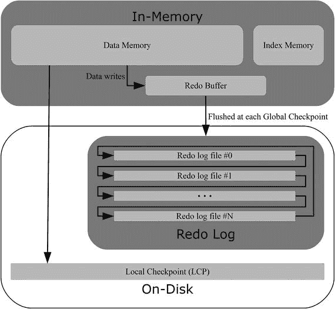
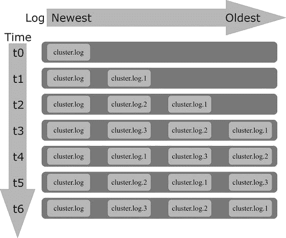
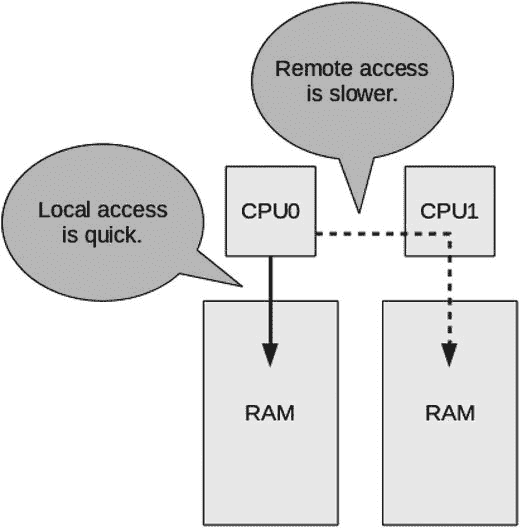
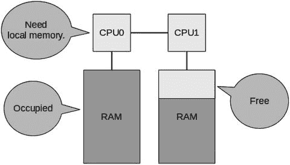

# 16. 监控 MySQL NDB 集群

到目前为止，关于监控和日志的讨论，除少数例外，包含的信息并非 MySQL NDB 集群特有，而是也适用于独立的 MySQL 服务器安装。就像有专门针对 `InnoDB` 的信息模式表一样，也有专门针对数据节点和 `NDBCluster` 表的、包含监控数据的表和视图。

数据节点通过 SQL 节点提供的数据可以在 NDB 集群信息数据库——更广为人知的 `ndbinfo` 模式——中找到，这是本章的主题。讨论首先涵盖 `ndbinfo` 模式的配置和可用视图，然后提供几个使用 `ndbinfo` 视图生成报告的示例。本章第三部分介绍管理和数据节点上可用的日志和跟踪文件。

### NDB 集群信息数据库 (ndbinfo)

最初，能从数据节点提取的唯一数据只能在集群日志和数据节点输出日志中找到。在 MySQL NDB 集群 7.1.1 中，引入了 NDB 集群信息数据库。根据其默认模式名称，它通常也被称为 `ndbinfo` 模式。此后，它经过了多次扩展，添加了更多数据。截至 MySQL NDB 集群 7.5.6，共有 41 个视图和 43 个隐藏表。这些表使用 `NDBInfo` 存储引擎。

`ndbinfo` 模式相对于日志的优势在于，它由可以使用 `SELECT` 语句进行查询的表和视图组成。在许多方面，它类似于信息模式和性能模式，但包含了 MySQL NDB 集群特有的信息。

本节讨论 `ndbinfo` 模式的配置及其可用视图。下一节将通过一系列使用这些视图的示例。


#### 配置

与 `ndbinfo` 模式相关的有七个配置选项和变量。这些在表 16-1 中列出。在实践中，很少会更改这些值，尽管 `ndbinfo_offline` 和 `ndbinfo_show_hidden` 视图有一些很好的用例，稍后将进行讨论。

表 16-1. ndbinfo 配置选项

| 选项 | 默认值 | 描述 |
| --- | --- | --- |
| `ndbinfo_database` | `ndbinfo` | 用于 NDB 集群信息数据库的模式名称。虽然可以在重启时设置不同的值（例如，在 MySQL 配置文件中），但实际值只能在编译时更改。 |
| `ndbinfo_max_bytes` | `0` | 仅用于调试目的。 |
| `ndbinfo_max_rows` | `10` | 仅用于调试目的。 |
| `ndbinfo_offline` | `OFF` | 将 `ndbinfo` 模式置于离线模式。如果底层表和视图实际上不存在（例如数据节点离线），这将避免错误。相反，表将始终显示为空。列表 16-2 展示了一个示例。 |
| `ndbinfo_show_hidden` | `OFF` | 是否显示包含来自数据节点实际数据的隐藏表。列表 16-3 展示了一个示例。 |
| `ndbinfo_table_prefix` | `ndb$` | 隐藏表使用的表名前缀。可以在启动时更改，但实际使用的值只能在编译时更改。 |
| `ndbinfo_version` | N/A | `ndbinfo` 版本。这是一个只读变量，仅供参考。 |

可以在 SQL 节点上使用 `SHOW GLOBAL VARIABLES` 查找当前设置，如列表 16-1 所示。

```
mysql> SHOW GLOBAL VARIABLES LIKE 'ndbinfo%';
+----------------------+---------+
| Variable_name        | Value   |
+----------------------+---------+
| ndbinfo_database     | ndbinfo |
| ndbinfo_max_bytes    | 0       |
| ndbinfo_max_rows     | 10      |
| ndbinfo_offline      | OFF     |
| ndbinfo_show_hidden  | OFF     |
| ndbinfo_table_prefix | ndb$    |
| ndbinfo_version      | 460038  |
+----------------------+---------+
7 rows in set (0.00 sec)
```

列表 16-1. 检索 ndbinfo 相关变量

##### ndbinfo_offline

`ndbinfo_offline` 选项对于在数据节点离线时避免错误很有用。如列表 16-2 所示，如果在数据节点离线时使用 `ndbinfo`，将导致连接到数据节点失败的错误。然而，设置 `ndbinfo_offline = ON` 后，将返回一个警告和一个空的结果集。

```
mysql> SELECT * FROM ndbinfo.table_info;
ERROR 1296 (HY000): Got error 157 'Connection to NDB failed' from NDBINFO
mysql> SET GLOBAL ndbinfo_offline = ON;
Query OK, 0 rows affected (0.00 sec)
mysql> SELECT * FROM ndbinfo.table_info;
Empty set, 1 warning (0.00 sec)
mysql> SHOW WARNINGS\G
*************************** 1. row ***************************
Level: Note
Code: 1
Message: 'NDBINFO' has been started in offline mode since the 'NDBCLUSTER' engine is disabled or @@global.ndbinfo_offline is turned on - no rows can be returned
1 row in set (0.00 sec)
```

列表 16-2. 使用 ndbinfo_offline 模式

##### ndbinfo_show_hidden

默认情况下，所有使用 `NDBInfo` 存储引擎的表都是隐藏的，数据通过视图公开。在少数情况下，例如调试时，查看底层表可能很有用；例如，底层 `NDBInfo` 表的表定义包含解释数据含义的注释。只有对表名的引用是隐藏的——即使表被隐藏，仍然可以查询底层表。

列表 16-3 展示了 `nodes` 视图的示例，该视图使用 `ndb$info` 表作为数据源。即使 `ndbinfo_show_hidden` 设置为 `OFF`，视图和表都可以使用，但 `SHOW TABLES`（以及 `information_schema.TABLES` 表）仅在 `ndbinfo_show_hidden` 设置为 `ON` 时才包含 `ndb$info` 表。`SHOW CREATE TABLE ndbinfo.ndb$nodes` 的输出已被重新格式化以提高可读性。

```
mysql> SELECT @@session.ndbinfo_show_hidden;
+-------------------------------+
| @@session.ndbinfo_show_hidden |
+-------------------------------+
|                             0 |
+-------------------------------+
1 row in set (0.00 sec)
mysql> SHOW TABLES FROM ndbinfo LIKE '%nodes%';
+-----------------------------+
| Tables_in_ndbinfo (%nodes%) |
+-----------------------------+
| nodes                       |
+-----------------------------+
1 row in set (0.00 sec)
mysql> SHOW CREATE VIEW ndbinfo.nodes\G
*************************** 1. row ***************************
                View: nodes
         Create View: CREATE ALGORITHM=UNDEFINED DEFINER='root'@'localhost' SQL SECURITY INVOKER VIEW `nodes` AS select `ndb$nodes`.`node_id` AS `node_id`,`ndb$nodes`.`uptime` AS `uptime`,`ndb$nodes`.`status` AS `status`,`ndb$nodes`.`start_phase` AS `start_phase`,`ndb$nodes`.`config_generation` AS `config_generation` from `ndb$nodes`
character_set_client: latin1
collation_connection: latin1_swedish_ci
1 row in set (0.01 sec)
mysql> SHOW CREATE TABLE ndbinfo.ndb$nodes\G
*************************** 1. row ***************************
       Table: ndb$nodes
Create Table: CREATE TABLE `ndb$nodes` (
  `node_id` int(10) unsigned DEFAULT NULL,
  `uptime` bigint(20) unsigned DEFAULT NULL
    COMMENT '节点已运行的时间（秒）',
  `status` int(10) unsigned DEFAULT NULL
    COMMENT '正在启动/已启动/已停止等',
  `start_phase` int(10) unsigned DEFAULT NULL
    COMMENT '节点启动时的启动阶段',
  `config_generation` int(10) unsigned DEFAULT NULL
    COMMENT '配置生成号'
) ENGINE=NDBINFO DEFAULT CHARSET=latin1 COMMENT='节点状态'
1 row in set (0.00 sec)
mysql> SELECT * FROM ndbinfo.nodes;
+---------+--------+---------+-------------+-------------------+
| node_id | uptime | status  | start_phase | config_generation |
+---------+--------+---------+-------------+-------------------+
|       1 |   2000 | STARTED |           0 |                 1 |
|       2 |   2000 | STARTED |           0 |                 1 |
+---------+--------+---------+-------------+-------------------+
2 rows in set (0.02 sec)
mysql> SELECT * FROM ndbinfo.ndb$nodes;
+---------+--------+--------+-------------+-------------------+
| node_id | uptime | status | start_phase | config_generation |
+---------+--------+--------+-------------+-------------------+
|       1 |   2005 |      3 |           0 |                 1 |
|       2 |   2005 |      3 |           0 |                 1 |
+---------+--------+--------+-------------+-------------------+
2 rows in set (0.01 sec)
mysql> SET SESSION ndbinfo_show_hidden = ON;
Query OK, 0 rows affected (0.00 sec)
mysql> SHOW TABLES FROM ndbinfo LIKE '%nodes%';
+-----------------------------+
| Tables_in_ndbinfo (%nodes%) |
+-----------------------------+
| ndb$nodes                   |
| nodes                       |
+-----------------------------+
2 rows in set (0.01 sec)
```

列表 16-3. ndbinfo.nodes 视图及其底层表

请注意 `SHOW CREATE TABLE ndbinfo.ndb$nodes` 的输出为大多数列包含了描述列的注释。这是一种无需查阅《MySQL 参考手册》即可获取视图内容信息的有用方法。


#### ndbinfo 视图

这 41 个视图列在表格 16-2 到 16-5 中，以下四个类别各对应一个表格：

*   集群配置与整体状态：这些视图提供有关集群配置和状态的信息。
*   进行中的锁、操作和事务：这些视图深入展示了操作和事务资源的使用位置以及锁的持有情况。
*   性能指标：各种性能指标，例如磁盘写入速度、CPU 使用率等。
*   对象与内存使用情况：关于整体内存使用情况、每个分片的内存使用情况、日志缓冲区和空间等信息。

这四个表格包含表名、该表首次被引入的版本（或多个版本）以及对表格的描述。仅当视图是在 7.1.1 版本之后引入的，才会指定首个版本。如你所见，新视图经常被添加；此外，有时也会向现有视图中添加新的列。在某些情况下，视图不仅被添加到最新的开发版本，也被添加到现有的通用可用（GA）版本中。在这些情况下，会列出多个首个版本。由于 `ndbinfo` 视图是极佳的监控信息来源，这本身就足以成为考虑升级到最新版本的理由。

> **提示**
>
> 每个表的详细描述可以在 MySQL 参考手册中找到：[`dev.mysql.com/doc/refman/5.7/en/mysql-cluster-ndbinfo.html`](https://dev.mysql.com/doc/refman/5.7/en/mysql-cluster-ndbinfo.html)。

##### 集群配置与整体状态

第一组视图用于集群配置和整体状态。这些视图列在表格 16-2 中。这些视图对于提取一般信息（如配置选项的值）或监控集群状态非常有用。

表 16-2. ndbinfo 视图：集群配置与整体状态

| 表名 | 首个版本 | 描述 |
| --- | --- | --- |
| `arbitrator_validity_detail` | 7.0.37 7.1.26 7.2.10 | 各数据节点所见的仲裁状态详情。 |
| `arbitrator_validity_summary` | 7.0.37 7.1.26 7.2.10 | 仲裁状态摘要。此表应只包含一行，指明哪个节点是活跃仲裁者。如果有多于一行，则表明数据节点意见不一致。 |
| `blocks` | | 内核块编号与名称之间的映射。这是一个参考表，可用于解析其他视图中的块编号。 |
| `config_nodes` | 7.5.7 7.6.2 | 集群中的节点。输出类似于 NDB 管理客户端中 `SHOW` 命令提供的信息。 |
| `config_params` | | 包含可用于数据节点的配置选项（即可在 `config.ini` 中指定的选项）。在 7.5.0 版本之前，此表仅包含参数编号和名称，但自 7.5.0 起，增加了其他多个列，包括默认值、最小值和最大值等。 |
| `config_values` | 7.5.0 | `config_params` 表中每个选项的配置值。 |
| `membership` | 7.0.37 7.1.26 7.2.10 | 关于数据节点成员关系的详细信息，包括哪些节点被视为左节点和右节点以及仲裁者信息。 |
| `nodes` | | 数据节点状态摘要。 |
| `processes` | 7.5.7 7.6.2 | 关于连接到集群的节点的信息，包括进程 ID。 |
| `threadblocks` | 7.1.17 7.2.2 | 内核块到线程和块实例的映射。 |
| `threads` | 7.5.2 | 已配置线程的概览。 |

##### 进行中的锁、操作和事务

表格 16-3 包含提供关于进行中的锁、操作和事务信息的视图。这些视图对于调查诸如集群并发操作（`MaxNoOfConcurrentOperations` 选项）耗尽或锁争用等问题非常有用。

表 16-3. ndbinfo 视图：进行中的锁、操作和事务

| 表名 | 首个版本 | 描述 |
| --- | --- | --- |
| `cluster_locks` | 7.5.3 | 集群中所有已持有或正在等待的锁的详细信息。 |
| `cluster_operations` | 7.1.17 7.2.2 | 从 `DBLQH` 内核块视角所见集群中所有操作（另请参阅 `MaxNoOfConcurrentOperations` 和 `MaxNoOfLocalOperations` 配置选项）的详细信息。 |
| `cluster_transactions` | 7.1.17 7.2.2 | 集群中所有事务的详细信息。 |
| `locks_per_fragment` | 7.5.3 | 锁及其所在分片的详细信息。 |
| `operations_per_fragment` | 7.4.3 | 按分片分组的操作详细信息。 |
| `server_locks` | 7.5.3 | 与 `cluster_locks` 表等效，但经过筛选，仅显示源自发出查询的 SQL 节点的锁。 |
| `server_operations` | 7.1.17 7.2.2 | 与 `cluster_operations` 表等效，但经过筛选，仅显示源自发出查询的 SQL 节点的操作。 |
| `server_transactions` | 7.1.17 7.2.2 | 与 `cluster_transactions` 表等效，但经过筛选，仅显示源自发出查询的 SQL 节点的事务。 |

存在显示当前锁、操作和事务的集群级和服务器级视图。服务器级视图仅显示来自该 SQL 节点的锁、操作或事务，而集群级视图包含所有节点。服务器级视图是通过 `information_schema.ndb_transid_mysql_connection_map` 表从集群级视图派生的，如前一章列表 15-3 所示。供参考，这里再次列出 `ndbinfo.server_transactions` 视图的定义（已重新格式化并稍作改写）：

```sql
SELECT map.mysql_connection_id, t.node_id, t.block_instance,
t.transid, t.state, t.count_operations, t.outstanding_operations,
t.inactive_seconds, t.client_node_id, t.client_block_ref
FROM information_schema.ndb_transid_mysql_connection_map map
INNER JOIN ndbinfo.cluster_transactions t
ON map.ndb_transid >> 32 = t.transid >> 32;
```

##### 性能指标

表格 16-4 列出了与性能监控相关的视图。这些视图范围从简单的 `counters` 视图到详细的磁盘、CPU 和网络使用情况视图。这些视图是调查性能问题时最有用的视图之一。第 20 章提供了使用 `cpustat` 和 `threadstat` 视图的示例。

表 16-4. `ndbinfo` 视图：性能指标


### NDB Cluster 报告

下表列出了一些用于监控 NDB Cluster 性能的视图。

| 表名 | 首次引入版本 | 描述 |
| --- | --- | --- |
| `counters` | | 包含内核块中事件的度量指标，例如扫描减慢次数、读取次数等。 |
| `cpustat` `cpustat_1sec` `cpustat_20sec` `cpustat_50ms` | 7.5.2 | 数据节点中每个线程的 CPU 使用率信息。`cpustat` 视图包含前一秒的数据。其他视图包含由表名所示时间间隔内的 20 个测量值。例如，`cputstat_1sec` 包含总共 20 秒的数据，每秒采样一次。第 20 章有一个使用 `cpustat` 表的示例。 |
| `disk_write_speed_aggregate` `disk_write_speed_aggregate_node` `disk_write_speed_base` | 7.4.1 | 关于本地检查点、备份和重做（片段）日志的 I/O 性能信息，包括当前写入速度以及是否已需要减速。`disk_write_speed_base` 包含原始数据，`disk_write_speed_aggregate` 按线程分组，`disk_write_speed_aggregate_node` 按数据节点分组。 |
| `resources` | | 各种度量指标，例如查询内存。 |
| `restart_info` | 7.4.2 | 上次节点重启的详细时序信息（不包括系统重启）。 |
| `tc_time_track_stats` | 7.4.9 | 来自 `DBTC` 内核块的时间追踪统计信息。包括扫描、主键和唯一键操作。 |
| `threadstat` | 7.1.17 7.2.2 | 关于每个线程的信息，例如发送的信号数、CPU 时间、上下文切换等。第 20 章包含使用该表的示例。 |
| `transporters` | | 关于传输器的信息，例如发送和接收的字节数、减速、过载等。 |

提供有关对象和内存使用信息的视图列于表 16-5。对象包括用户表、系统表、索引、内部 NDB 触发器等。内存表（包括 `logbuffers` 和 `logspaces`）需要随时间监控，以便识别趋势和峰值使用情况。

表 16-5.
`ndbinfo` 视图：对象与内存使用

| 表名 | 首次引入版本 | 描述 |
| --- | --- | --- |
| `dict_obj_info` | 7.5.4 | 关于各种对象（如表、索引、外键、内部数据节点触发器等）的信息。每种对象的类型可在 `dict_obj_types` 表中找到。信息包括 ID、父对象和完全限定名称。 |
| `dict_obj_types` | 7.4.1 | 可用的对象类型。例如，与 `dict_obj_info` 视图一起使用。 |
| `diskpagebuffer` | | 关于磁盘页面缓冲区（用于磁盘数据的缓存）的度量指标。 |
| `logbuffers` | | 关于重做和磁盘数据撤销日志缓冲区使用情况的信息。 |
| `logspaces` | | 关于重做和磁盘数据撤销日志文件使用情况的信息。 |
| `memory_per_fragment` | 7.4.1 | 按片段分组的内存使用详细信息。 |
| `memoryusage` | | 关于 `DataMemory`、`IndexMemory` 和 `LongMessageBuffer` 使用情况的信息（包含在 7.1.31、7.2.16、7.3.5 及更高版本中）。 |
| `table_distribution_status` | 7.5.4 | 关于表的各种信息，例如分区和片段数量、本地检查点状态、是否正在进行分区重组等。 |
| `table_fragments` | 7.5.4 | 每个表的片段的详细状态，例如主副本和备份位于哪个数据节点上。 |
| `table_info` | 7.5.4 | 关于表的信息，例如是否设置了 `read_backup` 标志、默认存储引擎等。 |
| `table_replicas` | 7.5.4 | 关于表分布的信息，例如最新的全局和本地检查点。 |

`ndbinfo` 视图的监控对于第 14 章“为何监控？”一节中讨论的所有三个原因都至关重要——建立基线、进行根本原因分析和执行预防性维护。下一节包含使用这些视图的示例。本书各处也提供了其他示例。

### NDB Cluster 报告

就像前一章讨论的性能模式一样，`ndbinfo` 模式起初可能让人望而生畏。然而，稍加练习后，检索信息会变得更容易。本节将展示几个如何使用 `ndbinfo` 模式生成报告的示例。这些报告本身很有用，同时也作为编写针对视图的查询的入门介绍，以便创建更多报告。

#### 内存使用报告

`memoryusage` 视图可用于监控每个数据节点和每种内存类型已分配和当前使用的 `DataMemory`、`IndexMemory` 和 `LongMessageBuffer` 内存量。列表 16-4 显示了该视图的原始输出。

```sql
mysql> SELECT * FROM ndbinfo.memoryusage;
+---------+---------------------+---------+------------+----------+-------------+
| node_id | memory_type         | used    | used_pages | total    | total_pages |
+---------+---------------------+---------+------------+----------+-------------+
|       1 | Data memory         | 3309568 |        101 | 41943040 |        1280 |
|       1 | Index memory        |  638976 |         78 | 15990784 |        1952 |
|       1 | Long message buffer |  524288 |       2048 | 67108864 |      262144 |
|       2 | Data memory         | 3309568 |        101 | 41943040 |        1280 |
|       2 | Index memory        |  638976 |         78 | 15990784 |        1952 |
|       2 | Long message buffer |  393216 |       1536 | 67108864 |      262144 |
+---------+---------------------+---------+------------+----------+-------------+
6 rows in set (0.02 sec)
```

**列表 16-4.**
`ndbinfo.memoryusage` 视图

此输出非常适合机器使用——例如在监控系统中——但对于人类阅读，列表 16-5 中的查询可能更合适。该查询使用了 `sys` 模式中的 `sys.format_bytes()` 函数来为字节数添加单位。

```sql
mysql> SELECT node_id, memory_type, sys.format_bytes(used) AS UsedBytes,
    -> sys.format_bytes(total) as TotalBytes,
    -> sys.format_bytes(total-used) AS FreeBytes,
    -> ROUND(100*used/total, 2) AS UsedPct
    -> FROM ndbinfo.memoryusage;
+---------+---------------------+------------+------------+-----------+---------+
| node_id | memory_type         | UsedBytes  | TotalBytes | FreeBytes | UsedPct |
+---------+---------------------+------------+------------+-----------+---------+
|       1 | Data memory         | 3.16 MiB   | 40.00 MiB  | 36.84 MiB |    7.89 |
|       1 | Index memory        | 624.00 KiB | 15.25 MiB  | 14.64 MiB |    4.00 |
|       1 | Long message buffer | 512.00 KiB | 64.00 MiB  | 63.50 MiB |    0.78 |
|       2 | Data memory         | 3.16 MiB   | 40.00 MiB  | 36.84 MiB |    7.89 |
|       2 | Index memory        | 624.00 KiB | 15.25 MiB  | 14.64 MiB |    4.00 |
|       2 | Long message buffer | 384.00 KiB | 64.00 MiB  | 63.62 MiB |    0.59 |
+---------+---------------------+------------+------------+-----------+---------+
6 rows in set (0.02 sec)
```

**列表 16-5.**
`ndbinfo.memoryusage` 视图的格式化输出

现在，三个字节列的值以 KiB 和 MiB 为单位显示。具体单位取决于实际值，在 MySQL NDB Cluster 7.5 及更高版本中最大可达 GiB。此外，添加了 `UsedPct` 列，以便更容易地看出集群距离耗尽内存还有多远。


#### 磁盘页缓冲区报告

磁盘页缓冲区用于在内存中缓存磁盘数据。与`InnoDB`缓冲池类似，磁盘页缓冲区通过将磁盘数据保留在内存中来提高性能，这样后续使用相同数据的查询就可以从内存中检索数据，而无需进行昂贵的磁盘操作。这在第 18 章中有更详细的解释。磁盘页缓冲区的有效性对于磁盘数据的性能至关重要。在确定其有效性时，`ndbinfo.diskpagebuffer`视图中的两列尤为关键：

*   `page_requests_direct_return`：从缓存中直接返回的页面。这些有助于提高命中率。
*   `page_requests_wait_io`：需从磁盘读取返回的页面。这些有助于降低命中率。

两者之和即为页面请求总数。因此，可以使用这两列计算磁盘页缓冲区的缓存命中率，如清单 16-6 所示。输出中一些列已被重命名以缩减结果宽度。`IF(...)`子句用于避免在尚无页面请求时出现除零错误。

```sql
mysql> SELECT node_id, block_instance,
page_requests_direct_return AS PageDirectReturn,
page_requests_wait_io AS PageWaitIo,
IF(page_requests_direct_return+page_requests_wait_io = 0,
NULL,
ROUND(100*page_requests_direct_return/
(page_requests_direct_return+page_requests_wait_io),
2)
) AS CacheHitPct
FROM ndbinfo.diskpagebuffer;
+---------+----------------+------------------+------------+-------------+
| node_id | block_instance | PageDirectReturn | PageWaitIo | CacheHitPct |
+---------+----------------+------------------+------------+-------------+
|       1 |              1 |            10488 |         17 |       99.84 |
|       1 |              2 |                1 |          1 |       50.00 |
|       2 |              1 |            10408 |         17 |       99.84 |
|       2 |              2 |                1 |          1 |       50.00 |
+---------+----------------+------------------+------------+-------------+
4 rows in set (0.02 sec)
清单 16-6.
查询磁盘页缓冲区命中率
```

`block_instance`列是所使用的 PGMAN 内核块的实例。清单 16-7 展示了如何查找这些块实例所在的线程。

**注意**

`PGMAN`块实例的数量取决于`MaxNoOfExecutionThreads`和`ThreadConfig`的配置。

```sql
mysql> SELECT node_id, thr_no, tb.block_instance, t.thread_name
FROM ndbinfo.threadblocks tb
INNER JOIN ndbinfo.threads t USING (node_id, thr_no)
WHERE tb.block_name = 'PGMAN'
ORDER BY node_id, block_instance;
+---------+--------+----------------+-------------+
| node_id | thr_no | block_instance | thread_name |
+---------+--------+----------------+-------------+
|       1 |      1 |              0 | rep         |
|       1 |      2 |              1 | ldm         |
|       1 |      1 |              2 | rep         |
|       2 |      1 |              0 | rep         |
|       2 |      2 |              1 | ldm         |
|       2 |      1 |              2 | rep         |
+---------+--------+----------------+-------------+
6 rows in set (0.03 sec)
清单 16-7.
获取有关 PGMAN 内核块实例的信息
```

因此，在这种情况下，用于查询的 LDM 线程的缓存命中率为 99.84%，这是很好的。考虑到返回的页面数量很少，复制线程的低命中率无需担忧。清单 16-6 和 16-7 中的两个查询可以合并，如清单 16-8 所示。

```sql
mysql> SELECT node_id, block_instance, t.thread_name,
dpb.page_requests_direct_return AS PageDirect,
dpb.page_requests_wait_io AS PageWait,
IF(dpb.page_requests_direct_return+page_requests_wait_io = 0,
NULL,
ROUND(100*dpb.page_requests_direct_return/
(dpb.page_requests_direct_return+
dpb.page_requests_wait_io),
2)
) AS HitPct
FROM ndbinfo.diskpagebuffer dpb
INNER JOIN ndbinfo.threadblocks tb
USING (node_id, block_instance)
INNER JOIN ndbinfo.threads t USING (node_id, thr_no)
WHERE tb.block_name = 'PGMAN'
ORDER BY node_id, block_instance;
+---------+----------------+-------------+------------+----------+--------+
| node_id | block_instance | thread_name | PageDirect | PageWait | HitPct |
+---------+----------------+-------------+------------+----------+--------+
|       1 |              1 | ldm         |      10488 |       17 |  99.84 |
|       1 |              2 | rep         |          1 |        1 |  50.00 |
|       2 |              1 | ldm         |      10408 |       17 |  99.84 |
|       2 |              2 | rep         |          1 |        1 |  50.00 |
+---------+----------------+-------------+------------+----------+--------+
4 rows in set (0.05 sec)
清单 16-8.
用于确定每个线程的磁盘页缓冲区命中率的组合查询
```

#### 集群性能监控报告

##### 传输器报告

网络是集群基础设施中最容易成为瓶颈的部分之一。`ndbinfo.transporters`视图提供了一种简单的方法来监控过载的传输器，并识别哪些节点间的连接对整体数据使用贡献最大。

> **注意**
> 传输器的度量指标会在其状态变更为已连接时重置。然而，在断开连接后，这些指标会被保留，直到连接重新建立。

在确定传输器状态时，会考虑两个阈值：
*   过载：当发送缓冲区使用量超过`OverloadLimit`字节时发生。默认情况下，`OverloadLimit`是该传输器的`SendBufferMemory`的 80%。
*   减速：在过载限制的 60%时发生。

如果某个传输器倾向于过载，则有必要研究改进网络或增加发送缓冲区的大小。`ndbinfo.transporters`视图有四个与过载和减速情况相关的列：
*   overloaded：传输器当前是否过载。
*   overload_count：传输器过载的次数。
*   slowdown：传输器当前是否处于减速状态。
*   slowdown_count：传输器处于减速状态的次数。

过载和减速状态通常只持续很短的时间，因此从监控角度来看，计数通常更有用。

列表 16-9 展示了一个查询`ndbinfo.transporters`视图以获取两个`NodeId = 1`和`NodeId = 2`的数据节点之间传输器状态的示例。数据显示了两个方向。

```sql
mysql> SELECT * FROM transporters WHERE (node_id = 1 AND remote_node_id = 2) OR (node_id = 2 AND remote_node_id = 1)\G
*************************** 1. row ***************************
node_id: 1
remote_node_id: 2
status: CONNECTED
remote_address: 192.168.56.104
bytes_sent: 139508260
bytes_received: 117712512
connect_count: 1
overloaded: 0
overload_count: 0
slowdown: 0
slowdown_count: 0
*************************** 2. row ***************************
node_id: 2
remote_node_id: 1
status: CONNECTED
remote_address: 192.168.56.103
bytes_sent: 117712512
bytes_received: 139508260
connect_count: 1
overloaded: 0
overload_count: 0
slowdown: 0
slowdown_count: 0
2 rows in set (0.02 sec)
```
列表 16-9. 两个数据节点之间的传输器数据与指标

在这种情况下，数据是对称的，但对于四个过载和减速列来说，情况并非总是如此。`bytes_sent`和`bytes_received`列可以选择使用`sys.format_bytes()`函数进行格式化，就像内存使用报告中所做的那样。如果过载或减速计数器增加，则表明存在问题。类似地，如果`connect_count`在没有刻意重启某个节点的情况下增加，可能意味着存在网络问题。

##### 磁盘写入速度报告

在 MySQL NDB Cluster 7.4 及更高版本中，可以监控本地检查点（LCP）、备份和重做日志的磁盘写入速度。由于本地检查点和备份由相同的代码处理，它们的磁盘写入指标是合并的。

`ndbinfo.disk_write_speed_base`视图记录了原始指标。该视图中一行的示例如下：

```sql
mysql> SELECT * FROM disk_write_speed_base LIMIT 1\G
*************************** 1. row ***************************
node_id: 1
thr_no: 0
millis_ago: 0
millis_passed: 1001
backup_lcp_bytes_written: 0
redo_bytes_written: 131072
target_disk_write_speed: 20971520
1 row in set (0.01 sec)
```

数据属于在`millis_ago`毫秒前结束的报告期，数据收集持续了`millis_passed`毫秒。`target_disk_write_speed`值是 LDM 线程每秒目标写入的字节数。这个目标会根据数据节点的`MaxDiskWriteSpeed`、`MaxDiskWriteSpeedOtherNodeRestart`、`MaxDiskWriteSpeedOwnRestart`和`MinDiskWriteSpeed`选项而变化。

基础表每个 LDM 线程有 61 行，每个周期接近一秒。由于每个 LDM 线程总有一条记录是在 0 毫秒前完成的，因此最旧的周期大约在一分钟前结束。这一秒的间隔也是 LDM 线程用于内部监控磁盘写入速度的，目标磁盘写入速度可能会在每个周期后进行调整。

原始数据对监控系统非常有用，因为它允许计算它可能支持的任何统计数据。然而，对于手动检查，通常更推荐使用`ndbinfo.disk_write_speed_aggregate`和`ndbinfo.disk_write_speed_aggregate_node`视图之一。这两个视图聚合了上一秒、过去 10 秒和过去一分钟的数据。此外，`ndbinfo.disk_write_speed_aggregate`视图还计算了标准差¹，并判断是否适用以下任一条件（及对应的列名）：
*   slowdowns_due_to_io_lag：由于 I/O 子系统成为瓶颈而导致 I/O 减速。
*   slowdowns_due_to_high_cpu：由于高 CPU 使用率而导致 I/O 减速。
*   disk_write_speed_set_to_min：磁盘写入速度被设置为`MinDiskWriteSpeed`。
*   current_target_disk_write_speed：LDM 线程当前试图达到的目标写入速度。

这些列对于排查性能问题非常有用，并且如果不考虑其他指标，无法从基础数据中推导出减速列。

`ndbinfo.disk_write_speed_aggregate`视图按 LDM 线程分组聚合数据，而`ndbinfo.disk_write_speed_aggregate_node`视图按数据节点分组数据。列表 16-10 展示了`ndbinfo.disk_write_speed_aggregate`视图的示例输出。


##### 磁盘写入速度视图

以下是 `ndbinfo.disk_write_speed_aggregate` 视图的示例：

```sql
mysql> SELECT * FROM ndbinfo.disk_write_speed_aggregate\G
*************************** 1. row ***************************
node_id: 1
thr_no: 0
backup_lcp_speed_last_sec: 134000
redo_speed_last_sec: 0
backup_lcp_speed_last_10sec: 13479
redo_speed_last_10sec: 65261
std_dev_backup_lcp_speed_last_10sec: 40000
std_dev_redo_speed_last_10sec: 65000
backup_lcp_speed_last_60sec: 26000
redo_speed_last_60sec: 65000
std_dev_backup_lcp_speed_last_60sec: 179000
std_dev_redo_speed_last_60sec: 65000
slowdowns_due_to_io_lag: 5
slowdowns_due_to_high_cpu: 0
disk_write_speed_set_to_min: 0
current_target_disk_write_speed: 20971520
*************************** 2. row ***************************
node_id: 2
thr_no: 0
backup_lcp_speed_last_sec: 1061000
redo_speed_last_sec: 0
backup_lcp_speed_last_10sec: 106169
redo_speed_last_10sec: 65209
std_dev_backup_lcp_speed_last_10sec: 318000
std_dev_redo_speed_last_10sec: 65000
backup_lcp_speed_last_60sec: 42000
redo_speed_last_60sec: 65000
std_dev_backup_lcp_speed_last_60sec: 198000
std_dev_redo_speed_last_60sec: 64000
slowdowns_due_to_io_lag: 6
slowdowns_due_to_high_cpu: 0
disk_write_speed_set_to_min: 0
current_target_disk_write_speed: 20971520
2 rows in set (0.01 sec)
```
清单 16-10. `ndbinfo.disk_write_speed_aggregate` 视图

该视图包含每个线程的数据。写入速度显示了过去 1、10 和 60 秒内用于备份/LCP 写入、重做写入的数据及其标准差。（1 秒数据没有标准差，因为它是一个单独的测量值。）10 秒和 60 秒的值是每秒的。

还有关于减速的统计信息，例如自上次节点重启以来，写入速度被设置为 `MinDiskWriteSpeed` 的秒数，以及当前目标速度。在示例中，请注意有六次因 I/O 延迟检测到减速。

清单 16-11 展示了 `ndbinfo.disk_write_speed_aggregate_node` 视图的示例。

```sql
mysql> SELECT * FROM disk_write_speed_aggregate_node\G
*************************** 1. row ***************************
node_id: 1
backup_lcp_speed_last_sec: 75000
redo_speed_last_sec: 130000
backup_lcp_speed_last_10sec: 7540
redo_speed_last_10sec: 65235
backup_lcp_speed_last_60sec: 1000
redo_speed_last_60sec: 65000
*************************** 2. row ***************************
node_id: 2
backup_lcp_speed_last_sec: 74000
redo_speed_last_sec: 129000
backup_lcp_speed_last_10sec: 7537
redo_speed_last_10sec: 65209
backup_lcp_speed_last_60sec: 1000
redo_speed_last_60sec: 65000
2 rows in set (0.01 sec)
```
清单 16-11. `ndbinfo.disk_write_speed_aggregate_node` 视图

在这种情况下，聚合是按节点进行的，并且只包含 1、10 和 60 秒的值，没有标准差。乍一看，这个视图可能不太有用，但请考虑一个具有多个 LDM 线程（最多可有 32 个）的集群。在这种情况下，`ndbinfo.disk_write_speed_aggregate` 视图将为每个数据节点的每个 LDM 线程提供一行，因此 `ndbinfo.disk_write_speed_aggregate_node` 中每节点一行的信息可用于获取节点工作情况的概览。

##### 锁报告

事务系统中一个常见的问题是两个事务争夺相同的锁。在最坏的情况下，这两个事务可能持有对方事务所需的锁。这称为死锁。在 MySQL NDB Cluster 中，锁等待和死锁的处理方式相同：在 `TransactionDeadlockDetectionTimeout` 毫秒后，事务会放弃等待并因锁等待超时错误而失败。

> **注意**
>
> 这里讨论的锁是在 `NDBCluster` 级别（即数据节点内的存储引擎中）。前一章中与 Performance Schema 讨论的锁是针对表和元数据的（但仅在一个 SQL 节点内）。

挑战在于确定哪些事务在等待哪些锁，以及持有阻塞锁的事务正在做什么。可以使用三个 `ndbinfo` 视图——`cluster_locks`、`locks_per_fragment` 和 `cluster_transactions`——来获取此信息。清单 16-12 展示了一个确定阻塞锁和等待锁以及查找两个冲突连接信息的示例。

```sql
-- 查找关于冲突锁的信息
mysql> SELECT lb.tableid, lb.fragmentid, lpf.fq_name,
lpf.parent_fq_name, lpf.type,
'-----------------' AS '-----------------------',
lb.transid AS BlockingTransId, lb.op AS BlockingOp,
lb.duration_millis AS BlockingMilliSeconds,
tb.state AS BlockingState,
tb.count_operations AS BlockingOperations,
tb.inactive_seconds AS BlockingInactiveSeconds,
tb.client_node_id AS BlockingNodeId,
'-----------------' AS '-----------------------',
lw.transid AS WaitingTransId, lw.op AS WaitingOp,
lw.duration_millis AS WaitingMilliSeconds,
tw.state AS WaitingState,
tw.count_operations AS WaitingOperations,
tw.inactive_seconds AS WaitingInactiveSeconds,
tw.client_node_id as WaitingNodeId
FROM ndbinfo.cluster_locks lw
INNER JOIN ndbinfo.cluster_locks lb
ON lb.lock_num = lw.waiting_for
INNER JOIN ndbinfo.cluster_transactions tb
ON tb.transid = lb.transid
INNER JOIN ndbinfo.cluster_transactions tw
ON tw.transid = lw.transid
INNER JOIN ndbinfo.locks_per_fragment lpf
ON lpf.table_id = lb.tableid
AND lpf.fragment_num = lb.fragmentid
AND lpf.node_id = lb.node_id\G
*************************** 1. row ***************************
tableid: 12
fragmentid: 1
fq_name: world/def/City
parent_fq_name: NULL
type: User table
-----------------------: -----------------
BlockingTransId: 36084872111980557
BlockingOp: READ
BlockingMilliSeconds: 2028919
BlockingState: Started
BlockingOperations: 2
BlockingInactiveSeconds: 2009
BlockingNodeId: 51
-----------------------: -----------------
WaitingTransId: 40588471739351055
WaitingOp: READ
WaitingMilliSeconds: 3323
WaitingState: Started
WaitingOperations: 1
WaitingInactiveSeconds: 3
WaitingNodeId: 51
1 row in set (0.28 sec)
-- 阻塞连接信息
mysql> SELECT session.*
FROM information_schema.ndb_transid_mysql_connection_map map
INNER JOIN sys.session
ON session.conn_id = map.mysql_connection_id
WHERE (map.ndb_transid >> 32) = (36084872111980557 >> 32)\G
*************************** 1. row ***************************
thd_id: 134
conn_id: 111
user: root@localhost
db: world
command: Sleep
state: NULL
time: 2038
current_statement: NULL
statement_latency: NULL
progress: NULL
lock_latency: 159.54 ms
rows_examined: 1
rows_sent: 0
rows_affected: 1
tmp_tables: 0
tmp_disk_tables: 0
full_scan: NO
last_statement: UPDATE world.City SET Population = Population + 1 WHERE ID = 130
last_statement_latency: 163.07 ms
current_memory: 0 bytes
last_wait: NULL
last_wait_latency: NULL
source: NULL
trx_latency: NULL
trx_state: NULL
trx_autocommit: NULL
pid: 26941
program_name: mysql
1 row in set (0.05 sec)
-- 等待连接信息
mysql> SELECT session.*
FROM information_schema.ndb_transid_mysql_connection_map map
INNER JOIN sys.session
ON session.conn_id = map.mysql_connection_id
WHERE (map.ndb_transid >> 32) = (40588471739351055 >> 32)\G
*************************** 1. row ***************************
thd_id: 141
conn_id: 118
user: root@localhost
db: world
command: Query
state: updating
time: 21
current_statement: UPDATE world.City SET Population = Population + 1 WHERE ID = 130
statement_latency: 20.38 s
progress: NULL
lock_latency: 146.00 us
rows_examined: 0
rows_sent: 0
rows_affected: 0
tmp_tables: 0
tmp_disk_tables: 0
full_scan: NO
last_statement: NULL
last_statement_latency: NULL
current_memory: 0 bytes
last_wait: NULL
last_wait_latency: NULL
source: NULL
trx_latency: NULL
trx_state: NULL
trx_autocommit: NULL
pid: 26986
program_name: mysql
1 row in set (0.05 sec)
```
清单 16-12. 调查锁


用于查找阻塞和等待事务的查询语句看起来很长，但实际上是多张表的直接连接。对于阻塞和等待的事务，`cluster_locks` 和 `cluster_transactions` 视图提供了一对视图，而 `locks_per_fragment` 视图则用于获取有关锁注册所在表和/或索引的附加信息。虚线列的作用是使数据分组更清晰——分别对应表信息、阻塞信息和等待信息。

用于查找附加信息的两个查询必须在发起连接的 SQL 节点上执行。该节点 ID 可以通过 `ndbinfo` 查询找到。连接信息则使用 `sys.session` 视图查找。

##### 检测热点

锁视图也可用于确定哪些表和分片构成了热点。`ndbinfo.locks_per_fragment` 视图非常适合此目的。清单 16-13 展示了该视图的一个示例行。这些数字相对于生产系统的预期值有些夸大，因为它们是通过人为设置较大的 `TransactionDeadlockDetectionTimeout` 值以方便测试获得的。

```sql
mysql> SELECT *
FROM ndbinfo.locks_per_fragment
WHERE node_id = 2 AND table_id = 12 AND fragment_num = 1\G
*************************** 1. row ***************************
fq_name: world/def/City
parent_fq_name: NULL
type: User table
table_id: 12
node_id: 2
block_instance: 1
fragment_num: 1
ex_req: 2008
ex_imm_ok: 1998
ex_wait_ok: 1
ex_wait_fail: 9
sh_req: 0
sh_imm_ok: 0
sh_wait_ok: 0
sh_wait_fail: 0
wait_ok_millis: 2360
wait_fail_millis: 550811
1 row in set (0.04 sec)
```
**清单 16-13.** `ndbinfo.locks_per_fragment` 视图

以 `ex_` 为前缀的列代表排他锁，而以 `sh_` 为前缀的列代表共享锁。在此示例中，共有 2008 次排他锁请求 (`ex_req`)，其中 1998 次被立即授予 (`ex_imm_ok`)，1 次在等待后被授予 (`ex_wait_ok`)，9 次在等待但未被授予 (`ex_wait_fail`)。如果一个分片或表（通过聚合数据）有许多锁请求在等待或失败，则表明该区域存在争用。更好的索引或不同的查询模式可能有助于解决此问题，或者可以考虑增加 `TransactionDeadlockDetectionTimeout` 来解决或缓解问题。

##### 日志缓冲区和空间报告

第 2 章讨论了事务所做的更改如何在提交时写入重做缓冲区，然后在全局检查点期间刷新到重做日志。重做日志用于持久化已提交的事务，直到其更改被包含在本地检查点中。图 16-1 展示了此机制的概览。对于磁盘数据存在类似的机制，其中有一个撤消日志和撤消日志缓冲区用于需要回滚的事务（另见第 18 章）。


**图 16-1.** 本地检查点和重做日志机制概览

监控重做和撤消缓冲区以及重做和撤消日志对于避免事务中止和集群变为只读至关重要。`ndbinfo` 模式中有两个用于此目的的视图：`logbuffers` 用于监控缓冲区，`logspaces` 用于监控日志。清单 16-14 展示了查询缓冲区和日志使用情况的示例。

```sql
mysql> SELECT node_id, log_type, log_id, log_part,
sys.format_bytes(total) AS total,
sys.format_bytes(used) AS used,
ROUND(100*used/total, 2) AS UsedPct
FROM ndbinfo.logbuffers;
+---------+----------+--------+----------+-----------+------------+---------+
| node_id | log_type | log_id | log_part | total     | used       | UsedPct |
+---------+----------+--------+----------+-----------+------------+---------+
|       1 | REDO     |      0 |        1 | 16.00 MiB | 320.00 KiB |    1.95 |
|       1 | DD-UNDO  |     20 |        0 | 2.00 MiB  | 5.08 KiB   |    0.25 |
|       2 | REDO     |      0 |        1 | 16.00 MiB | 320.00 KiB |    1.95 |
|       2 | DD-UNDO  |     20 |        0 | 2.00 MiB  | 31.48 KiB  |    1.54 |
+---------+----------+--------+----------+-----------+------------+---------+
4 rows in set (0.01 sec)
```
```sql
mysql> SELECT node_id, log_type, log_id, log_part,
sys.format_bytes(total) AS total,
sys.format_bytes(used) AS used,
ROUND(100*used/total, 2) AS UsedPct
FROM ndbinfo.logspaces;
+---------+----------+--------+----------+------------+----------+---------+
| node_id | log_type | log_id | log_part | total      | used     | UsedPct |
+---------+----------+--------+----------+------------+----------+---------+
|       1 | REDO     |      0 |        0 | 256.00 MiB | 2.00 MiB |    0.78 |
|       1 | REDO     |      0 |        1 | 256.00 MiB | 2.00 MiB |    0.78 |
|       1 | REDO     |      0 |        2 | 256.00 MiB | 0 bytes  |    0.00 |
|       1 | REDO     |      0 |        3 | 256.00 MiB | 0 bytes  |    0.00 |
|       1 | DD-UNDO  |     20 |        0 | 16.00 MiB  | 2.05 MiB |   12.80 |
|       2 | REDO     |      0 |        0 | 256.00 MiB | 2.00 MiB |    0.78 |
|       2 | REDO     |      0 |        1 | 256.00 MiB | 2.00 MiB |    0.78 |
|       2 | REDO     |      0 |        2 | 256.00 MiB | 0 bytes  |    0.00 |
|       2 | REDO     |      0 |        3 | 256.00 MiB | 0 bytes  |    0.00 |
|       2 | DD-UNDO  |     20 |        0 | 16.00 MiB  | 1.95 MiB |   12.17 |
+---------+----------+--------+----------+------------+----------+---------+
10 rows in set (0.02 sec)
```
**清单 16-14.** 查询 `ndbinfo.logbuffers` 和 `ndbinfo.logspaces` 视图

在此示例中，重做日志的使用率不到 1%，但这可能是因为本地检查点刚刚完成。那么在完成之前，使用率是多少呢？将使用率定期记录在带有图表的监控系统中，可以很容易地看出，例如，在本地检查点完成之前，重做日志是否接近占满。随着数据量增长，本地检查点变得越来越大，这个问题可能会发生。


##### 配置报告

在 MySQL NDB Cluster 7.4 及更早版本中，查询数据节点配置的唯一方法是使用 `ndb_config` 工具。这是一种繁琐的获取配置值的方式——例如，必须知道选项名称的确切拼写。回顾第 10 章中关于 `ndb_config` 的用法，要使用 `ndb_config` 从两个数据节点分别获取 `DataMemory` 的值，必须进行两次请求。例如：

```shell
shell$ ndb_config --type=ndbd --fields=': ' --rows='\n' \
--query=NodeId,DataMemory \
--config-from-node=1 --nodeid=1
1: 41943040
shell$ ndb_config --type=ndbd --fields=': ' --rows='\n' \
--query=NodeId,DataMemory \
--config-from-node=2 --nodeid=2
2: 41943040
```

使用 `ndb_config` 获取关于选项的信息则更加困难。为此，可以使用 `--config-info` 选项。但是，没有过滤选项，因此总是会返回所有选项的信息：

```shell
shell$ ndb_config –configinfo
...
IndexMemory (非负整数)
每个 ndbd (DB) 节点上分配用于存储索引的字节数
默认值: 18874368 (最小值: 1048576, 最大值: 1099511627776)
DataMemory (非负整数)
每个 ndbd (DB) 节点上分配用于存储数据的字节数
默认值: 83886080 (最小值: 1048576, 最大值: 1099511627776)
UndoIndexBuffer (非负整数)
每个 ndbd (DB) 节点上分配用于写入索引部分 UNDO 日志的字节数
默认值: 2097152 (最小值: 1048576, 最大值: 4294967039)
...
```

从 MySQL NDB Cluster 7.5 开始，你可以使用 `ndbinfo` 模式中的 `config_params` 和 `config_values` 视图。

`config_params` 视图包含有关配置选项的信息，包括描述、数据类型、默认值、最小值和最大值，以及该选项是否为必填项。例如，对于 `DataMemory` 参数：

```sql
mysql> SELECT *
FROM ndbinfo.config_params
WHERE param_name = 'DataMemory'\G
*************************** 1. row ***************************
param_number: 112
param_name: DataMemory
param_description: 每个 ndbd(DB) 节点上分配用于存储数据的字节数
param_type: unsigned
param_default: 83886080
param_min: 1048576
param_max: 1099511627776
param_mandatory: 0
param_status:
1 row in set (0.01 sec)
```

旧版本的 MySQL NDB Cluster 中也存在 `config_params` 视图，但它只包含 `param_number` 和 `param_name` 列。

能够查询配置选项的信息固然不错，但与 `param_values` 视图进行连接才是真正有趣的地方。清单 16-15 展示了如何获取单个配置选项 `DataMemory` 的值。

```sql
mysql> SELECT v.node_id, p.param_name, v.config_value, p.param_default,
IF(v.config_value = p.param_default, 'YES', 'NO') AS IsDefault
FROM ndbinfo.config_params p
INNER JOIN ndbinfo.config_values v
ON v.config_param = p.param_number
WHERE p.param_name = 'DataMemory';
+---------+------------+--------------+---------------+-----------+
| node_id | param_name | config_value | param_default | IsDefault |
+---------+------------+--------------+---------------+-----------+
|       1 | DataMemory | 41943040     | 83886080      | NO        |
|       2 | DataMemory | 41943040     | 83886080      | NO        |
+---------+------------+--------------+---------------+-----------+
2 rows in set (0.02 sec)
```
**清单 16-15. DataMemory 选项的配置信息**

通过将实际值（`config_value` 列）与默认值（`param_default` 列）进行比较，可以确定该选项是否正在使用默认值。清单 16-16 使用此方法返回一个报告，其中包含所有设置为非默认值的配置选项。

```sql
mysql> SELECT v.node_id, p.param_name, v.config_value
FROM ndbinfo.config_params p
INNER JOIN ndbinfo.config_values v
ON v.config_param = p.param_number
WHERE v.config_value <> p.param_default;
+---------+-------------------------------+-------------------------+
| node_id | param_name                    | config_value            |
+---------+-------------------------------+-------------------------+
|       1 | NodeId                        | 1                       |
|       1 | DataDir                       | /cluster/node_1         |
|       1 | MaxNoOfTables                 | 130                     |
|       1 | MaxNoOfAttributes             | 1009                    |
|       1 | MaxNoOfTriggers               | 1400                    |
|       1 | MaxNoOfConcurrentTransactions | 1024                    |
|       1 | MaxNoOfConcurrentOperations   | 5120                    |
|       1 | DataMemory                    | 41943040                |
|       1 | IndexMemory                   | 15728640                |
|       1 | FileSystemPath                | /cluster/node_1         |
|       1 | BackupDataBufferSize          | 4194304                 |
|       1 | BackupLogBufferSize           | 4194304                 |
|       1 | Arbitration                   | 1                       |
|       1 | RedoBuffer                    | 16777216                |
|       1 | BackupDataDir                 | /backups/cluster/node_1 |
|       1 | DiskPageBufferMemory          | 16777216                |
|       1 | Nodegroup                     | 0                       |
|       1 | SharedGlobalMemory            | 20971520                |
|       2 | NodeId                        | 2                       |
|       2 | DataDir                       | /cluster/node_2         |
|       2 | MaxNoOfTables                 | 130                     |
|       2 | MaxNoOfAttributes             | 1009                    |
|       2 | MaxNoOfTriggers               | 1400                    |
|       2 | MaxNoOfConcurrentTransactions | 1024                    |
|       2 | MaxNoOfConcurrentOperations   | 4096                    |
|       2 | DataMemory                    | 41943040                |
|       2 | IndexMemory                   | 15728640                |
|       2 | FileSystemPath                | /cluster/node_2         |
|       2 | BackupDataBufferSize          | 4194304                 |
|       2 | BackupLogBufferSize           | 4194304                 |
|       2 | Arbitration                   | 1                       |
|       2 | RedoBuffer                    | 16777216                |
|       2 | BackupDataDir                 | /backups/cluster/node_2 |
|       2 | DiskPageBufferMemory          | 16777216                |
|       2 | Nodegroup                     | 0                       |
|       2 | SharedGlobalMemory            | 20971520                |
+---------+-------------------------------+-------------------------+
36 rows in set (0.03 sec)
```
**清单 16-16. 查找所有具有非默认值的选项**

> 注意
> 并非所有选项都定义了默认值。`FileSystemPath` 就是一个例子。这些选项将始终包含在报告中，以查找所有具有非默认值的选项。

最后，配置视图可用于检测数据节点何时具有不同的配置。例如，如果在进行配置更改的滚动重启期间遗漏了某个节点，就可能发生此问题。当数据节点的配置不同时，可能会导致看似随机发生的微妙问题，因此很难调试。清单 16-17 展示了一个检测数据节点设置不同的参数的例子。


```
mysql> SELECT p.param_name, v.node_id, v.config_value
FROM (SELECT config_param
FROM ndbinfo.config_values
GROUP BY config_param
HAVING COUNT(DISTINCT config_value) > 1
) t
INNER JOIN ndbinfo.config_params p
ON p.param_number = t.config_param
INNER JOIN ndbinfo.config_values v
ON v.config_param = t.config_param
WHERE param_name NOT IN ('BackupDataDir', 'DataDir',
'FileSystemPath', 'NodeId', 'Nodegroup')
ORDER BY p.param_name, v.node_id;
+-------------------------------------+---------+--------------+
| param_name                          | node_id | config_value |
+-------------------------------------+---------+--------------+
| MaxNoOfConcurrentOperations         |       1 | 5120         |
| MaxNoOfConcurrentOperations         |       2 | 4096         |
+-------------------------------------+---------+--------------+
2 rows in set (0.04 sec)
Listing 16-17.
在数据节点上查找具有不同值的选项
```

有几个选项预计会有所不同。为了避免返回可能掩盖实际问题的数据，这些选项通过 `WHERE` 子句被明确移除。被排除的选项列表会根据集群的预期配置因集群而异。

以上就是关于 NDB 集群信息数据库的示例报告。虽然这些报告对于访问数据非常有用，但它们无法替代日志。日志包含额外信息，并且即使事件完成后，消息仍然保留。MySQL NDB 集群中的日志是接下来要讨论的监控源。

### NDB 集群日志

与 SQL 节点类似，管理节点和数据节点也有自己的日志文件。管理节点维护集群日志，这是整个集群的总体日志。在数据节点上，有三种日志类型：常规日志、错误日志和跟踪日志（文件）。本节概述了这些日志，并讨论了如何配置它们。

#### 集群日志

集群日志是获取整个集群运行状况概览的最佳位置。这些日志由管理节点维护，每个管理节点一组日志，但它记录了与集群中所有节点相关的信息——因此得名。

由于管理节点控制集群日志，消息只有在至少一个管理节点在线时才会写入其中。考虑到每个管理节点写入自己的日志，当某个节点离线时可能会出现间隙，因此通常需要检查每个管理节点的集群日志。

**提示**

集群日志消息的文档位于 [`dev.mysql.com/doc/refman/5.7/en/mysql-cluster-logs-cluster-log.html`](https://dev.mysql.com/doc/refman/5.7/en/mysql-cluster-logs-cluster-log.html)。

默认情况下，集群日志写入文件，每个集群日志由一组文件组成（稍后会详细介绍配置，包括如何更改目标位置、文件名、最大文件大小和最大文件数量）。当前正在写入的文件没有后缀，而旧文件则有后缀，包括一个数字。为了说明，假设当前活动的集群日志文件是 `ndb_49_cluster.log`（对于 `NodeId = 49` 的管理节点，这是默认值）。此文件名是集群日志的基本文件名。

安装集群时，集群日志仅由 `ndb_49_cluster.log` 组成。日志消息随后写入该文件，当它达到最大大小时，会被重命名为 `ndb_49_cluster.log.1`，并创建一个名为 `ndb_49_cluster.log` 的新文件。当新文件也达到其最大大小时，它会被重命名为 `ndb_49_cluster.log.2`，依此类推。在某些时候，旧的集群日志文件数量达到配置允许的最大值。此时，`ndb_49_cluster.log.1` 会被重新使用。因此，集群日志是一个循环日志，但 `ndb_49_cluster.log` 始终是最新的文件，而存档的日志文件中要么是次旧的，其余按顺序排列。

对于最多四个文件的配置，如图 16-2 所示。为简洁起见，图中文件的基本名称是 `cluster.log`，但对于生产系统，强烈建议在基本文件名中包含管理节点的节点 ID——例如，第 17 章讨论的 `ndb_error_reporter` 脚本就需要唯一的集群日志基本名称才能收集所有集群日志文件集。



图 16-2.

集群日志的循环特性 **提示**

务必确保所有管理节点的集群日志基本文件名是唯一的。

表 16-6 包含与集群日志相关的配置选项。除了集群日志基本文件名外，最好在所有节点上保持设置相同。关于这些选项以及如何控制记录内容的更多细节将在本节余下部分讨论。

表 16-6.

集群日志配置选项

| 选项 | 适用节点 | 默认值 | 描述 |
| --- | --- | --- | --- |
| `LogDestination` | 管理节点 | 见正文 | 集群日志的写入位置、最大文件数量和文件大小。 |
| `MemReportFrequency` | 数据节点 | 0 | 报告 `DataMemory` 和 `IndexMemory` 使用情况的间隔秒数。 |
| `StartupStatusReportFrequency` | 数据节点 | 0 | 在初始节点重启期间，创建分片日志文件进度的报告频率。 |
```


#### 日志目标

集群日志通过 `LogDestination` 选项进行配置。其值是一个以分号分隔的列表，每个部分配置一个日志目标。支持三种日志目标：

*   `FILE`：如前所述写入日志文件。这是默认且最常用的目标。
*   `SYSLOG`：将日志发送到 syslog 工具。
*   `CONSOLE`：将日志写入控制台。除调试外很少使用。

`FILE` 和 `SYSLOG` 目标支持附加参数。这些参数列于表 16-7 中。

**表 16-7. 日志目标的附加参数**

| 选项 | 日志目标 | 描述 |
| --- | --- | --- |
| `filename` | `FILE` | 基础文件名。建议在文件名中包含管理节点的节点 ID。 |
| `maxsize` | `FILE` | 每个集群日志文件的最大字节数。 |
| `maxfiles` | `FILE` | 集群日志文件的最大数量（每个数据节点）。 |
| `facility` | `SYSLOG` | 要使用的 syslog 工具。支持的工具值包括 `auth`、`authpriv`、`cron`、`daemon`、`ftp`、`kern`、`lpr`、`mail`、`news`、`syslog`、`user`、`uucp`、`local0`、`local1`、`local2`、`local3`、`local4`、`local5`、`local6` 和 `local7`。 |

对于可以指定多个选项的 `FILE`，选项之间用逗号分隔。`LogDestination` 的默认值是 `FILE:filename=ndb_<NodeId>_cluster.log,maxsize=1000000,maxfiles=6`，其中 `<NodeId>` 是管理节点的节点 ID。默认大小适用于测试系统，但在大多数情况下建议为生产系统增大该值。

在为 `FILE` 目标确定文件大小和数量时，应尽可能使文件大小足够大——例如，它必须仍可被查看和搜索。这在文件大小方面具体意味着什么取决于用于读取日志文件的工具。例如，Linux 上的 `less` 命令可以处理数 GB 的大文件。处理大文件的主要问题在于搜索和读取所需的时间。其他工具（如 Notepad++）可能有最大文件大小限制。实际上，最大 10-20 兆字节的大小运行良好。

然后增加 `maxfiles`，使总大小（`maxsize * maxfiles`）足够大，以至少包含一周的日志数据。请注意，重启包含每个表和索引的数据，因此对于具有大量表、索引和/或数据节点的集群，一次滚动重启可能会使用几兆字节的日志空间。

#### 内存报告频率

将 `MemReportFrequency` 设置为大于 `0` 的值将导致数据节点每 `MemReportFrequency` 秒生成一份关于其 `DataMemory` 和 `IndexMemory` 使用情况的报告。该报告如下列摘录所示。

```
2017-06-19 20:26:02 [MgmtSrvr] INFO   -- Node 1: Data usage is 13%(174 32K pages of total 1280)
2017-06-19 20:26:02 [MgmtSrvr] INFO   -- Node 1: Index usage is 5%(113 8K pages of total 1952)
2017-06-19 20:26:03 [MgmtSrvr] INFO   -- Node 2: Data usage is 13%(174 32K pages of total 1280)
2017-06-19 20:26:03 [MgmtSrvr] INFO   -- Node 2: Index usage is 5%(113 8K pages of total 1952)
```

相同的数据可以从 `ndbinfo.memoryusage` 获得，这对于监控目的更好，尽管在日志中偶尔出现的内存使用情况报告对于与其他日志消息关联可能有用。

即使 `MemReportFrequency = 0`，内存使用报告也不会完全关闭。如果数据或索引内存的使用率在任一方向上跨越 80% 和 90% 的阈值，仍然会出现消息。清单 16-18 显示了一个内存使用率增长通过 80% 和 90%，然后减少回 80% 以下的示例。

```
2017-06-19 21:12:39 [MgmtSrvr] INFO   -- Node 1: Data usage increased to 81%(1044 32K pages of total 1280)
2017-06-19 21:12:40 [MgmtSrvr] INFO   -- Node 2: Data usage increased to 81%(1045 32K pages of total 1280)
2017-06-19 21:12:51 [MgmtSrvr] INFO   -- Node 2: Data usage increased to 90%(1153 32K pages of total 1280)
2017-06-19 21:12:52 [MgmtSrvr] INFO   -- Node 1: Data usage increased to 90%(1160 32K pages of total 1280)
2017-06-19 21:18:36 [MgmtSrvr] INFO   -- Node 2: Data usage decreased to 88%(1132 32K pages of total 1280)
2017-06-19 21:18:37 [MgmtSrvr] INFO   -- Node 1: Data usage decreased to 88%(1132 32K pages of total 1280)
2017-06-19 21:22:08 [MgmtSrvr] INFO   -- Node 2: Data usage decreased to 79%(1013 32K pages of total 1280)
2017-06-19 21:22:09 [MgmtSrvr] INFO   -- Node 1: Data usage decreased to 79%(1013 32K pages of total 1280)
```
**清单 16-18. 关于内存使用增加和减少的消息**

#### 启动状态报告频率

最后一个集群日志配置选项是 `StartupStatusReportFrequency`。此选项仅在初始数据节点重启期间使用，此时会重新创建重做日志。特别是，如果日志是完整创建的（而不是稀疏的），这可能需要很长时间，因此记录进度报告会很有用。

默认设置（`StartupStatusReportFrequency = 0`）仅在开始和完成时记录重做日志文件生成的信息。当该值设置为非零值时，将每隔 `StartupStatusReportFrequency` 秒记录一次进度报告。


#### 控制日志记录内容

在一定程度上，可以通过 `ndb_mgm` 命令行客户端中的 `CLUSTERLOG` 命令来控制记录到集群日志的内容。共有八个日志类别，每个类别都设置了一个日志阈值。这些类别是：

*   `CHECKPOINT`：用于在本地和全局检查点执行期间创建的消息。
*   `CONNECTION`：用于在集群节点之间建立连接时创建的消息。
*   `ERROR`：与不导致节点故障的错误相关的消息。这包括丢失的心跳。
*   `INFO`：用于信息性消息，例如发送心跳时。
*   `NODERESTART`：类似于 `STARTUP` 和 `SHUTDOWN`，但用于数据节点重启。
*   `STARTUP`：用于在数据节点启动期间创建的消息。
*   `STATISTICS`：各种统计信息，例如事务数量、当前操作等。
*   `SHUTDOWN`：用于在数据节点关闭期间创建的消息。

除 `ERROR` 外，所有类别的默认阈值为 `7`，`ERROR` 的默认阈值为 15。阈值的允许范围是 0 到 15，其中 0 仅包含最重要的消息，而 15 包含所有消息。

每条日志消息都有一个优先级，该优先级会与阈值进行比较。如果优先级小于或等于阈值，则该消息将被记录。例如，如果阈值为 12 或更高，则优先级为 12 的消息将被记录。换句话说，配置的阈值越高，日志消息就越多。

通过指定要应用到的数据节点，后跟 `CLUSTERLOG` 命令以及带有阈值的类别来设置阈值。例如，要为 `NodeId = 1` 的数据节点将 `STATISTICS` 类别设置为 `15`，请使用以下命令：

```
ndb_mgm> 1 CLUSTERLOG STATISTICS=15
Executing CLUSTERLOG STATISTICS=15 on node 1 OK!
```

要对所有数据节点进行相同的更改，请使用以下命令：

```
ndb_mgm> ALL CLUSTERLOG STATISTICS=15
Executing CLUSTERLOG STATISTICS=15 on node 1 OK!
Executing CLUSTERLOG STATISTICS=15 on node 2 OK!
```

注意

阈值是针对给定的管理节点和数据节点对设置的（或一个管理节点对所有数据节点）。如果有多个管理节点，并且阈值应适用于所有集群日志，则必须在连接到每个管理节点时执行 `CLUSTERLOG` 命令。

在旧版本的 MySQL NDB Cluster 中，更常见的做法是提高阈值以获取信息。例如，对于统计信息，通常最好从 `ndbinfo` 获取数据。

除了优先级之外，每条日志消息还有一个严重性级别。可以使用参数略有不同的 `CLUSTERLOG` 命令，按严重性过滤消息。例如，您可以使用以下命令切换 `INFO` 级别消息的记录：

```
ndb_mgm> CLUSTERLOG FILTER INFO;
INFO disabled
```

再次执行以重新启用：

```
ndb_mgm> CLUSTERLOG FILTER INFO;
INFO enabled
```

有六个严重性级别，按严重性递减的顺序排列为：

*   `ALERT`：必须立即纠正的最严重问题。这包括有关网络分区、节点故障、备份失败等的信息。
*   `CRITICAL`：此级别目前未使用。
*   `ERROR`：仍然非常重要且必须紧急处理的事件。例如运输器错误。
*   `WARNING`：重要的消息，例如丢失的心跳（但节点尚未被宣告为死亡）。这些消息通常需要关注。
*   `INFO`：通常不需要任何操作的信息性消息。例如备份已启动或已完成。
*   `DEBUG`：非常详细的消息，例如运输器已收到文件结束消息。这些消息在处理源代码时大多有用。

默认情况下，除 `DEBUG` 严重性级别外，所有级别均已启用。

提示

集群日志事件的详细信息、如何控制记录内容以及事件的分类（包括其优先级和严重性）记录在 [`dev.mysql.com/doc/refman/5.7/en/mysql-cluster-event-reports.html`](https://dev.mysql.com/doc/refman/5.7/en/mysql-cluster-event-reports.html) 以及页面顶部附近列出的子页面中。

#### 数据节点日志

虽然集群日志提供了集群活动的良好概览，但有时需要获取更多信息。每个数据节点有三种日志类型，涵盖一般消息、非计划关闭详细信息和跟踪日志。所有数据节点日志文件都位于 `DataDir` 指定的路径中。表 16-8 总结了这三种日志。

表 16-8. 数据节点日志文件

| 日志 | 文件名 | 描述 |
| --- | --- | --- |
| 输出日志 | `ndb_<NodeId>_out.log` | 一般日志消息。类似于 MySQL 服务器错误日志，但用于数据节点。 |
| 错误日志 | `ndb_<NodeId>_error.log` | 每次非计划关闭一个消息块，包含节点关闭原因的详细信息。 |
| 跟踪日志 | `ndb_<NodeId>_trace.log.<count>` | 每次非计划关闭一组日志文件。每组每个数据节点线程一个文件。 |

`<NodeId>` 是数据节点的 `NodeId` 的占位符，`<count>` 是一个计数器的占位符，该计数器针对每次非计划关闭递增。`MaxNoOfSavedMessages` 选项设置错误日志中的消息块数和跟踪文件集的限制。默认值为 25。

第 17 章专门介绍故障排除，并包含有关数据节点日志的更多信息。

### 总结

本章介绍了 `ndbinfo` 模式，包括创建可用于监控目的的报告的几个示例。此外，还讨论了管理和数据节点上可用的日志和跟踪文件。它也结束了关于监控、监控来源以及 MySQL NDB Cluster 设置中可用日志的探讨。正如您在本章和前两章所见，监控是一个非常大的主题，本身就可以写一整本书。在 MySQL NDB Cluster 上实现良好的监控不是一天就能完成的事情——相反，它是一个持续的过程。

还有一个与监控和日志相关的话题需要讨论：故障排除。这是下一章的主题。

脚注 1

[`en.wikipedia.org/wiki/Standard_deviation`](https://en.wikipedia.org/wiki/Standard_deviation)

# 17. 典型问题与解决方案

本章讨论可能发生在 MySQL NDB Cluster 上的问题。由于没有事物是完美的，您的 MySQL NDB Cluster 安装可能会遇到一些麻烦。为了您的服务质量，尽量减少因这些麻烦导致的停机时间非常重要。您需要为问题做好准备，并尽快解决它们。在本章中，通过典型的问题示例学习如何应对麻烦。

### 数据节点上的典型问题

由于数据节点是 MySQL NDB Cluster 的核心，数据节点上的问题可能会影响整个数据库集群系统。即使数据节点通常是冗余的，并且单个数据节点的缺失不会导致整个系统中断，但由于多个节点故障，这种情况仍可能发生。因此，尽量减少多个节点故障的概率非常重要。为了实现这一目标，必须快速识别问题并解决它们。

提示

当您遇到问题时，请务必搜索错误数据库，因为相同的问题可能已被报告。如果您找不到完全相同的问题，请在 [`bugs.mysql.com/`](https://bugs.mysql.com/) 提交一个新的错误报告。如果您拥有支持许可证，请联系 Oracle Corporation 寻求支持。商业支持是节省调查所需时间和成本的好方法。

#### 关于节点故障的一般信息

数据节点可能因多种原因崩溃。由于 MySQL NDB 集群采用**早期故障策略**，当出现问题时，数据节点会自行关闭。该策略假设数据节点具有冗余性，当发生单节点故障时，可以防止整个系统中断。单节点故障对 MySQL NDB 集群并非致命问题。请对节点故障采取适当措施。如果您长期运行包含大量数据节点的集群，那么在某些时候遇到节点故障的可能性相当高。

本节讨论如何收集调查节点故障所需的信息。

#### 集群日志

节点故障发生后，您必须首先检查的是集群日志，它是整个集群的集中式综合日志。它存储在每个管理节点上。集群日志的内容因其过滤配置而异。有关集群日志的更多详细信息，请参见第 16 章；有关集群日志配置的更多详细信息，请参见第 4 章。默认情况下，集群日志的文件名类似为 `ndb_NODEID_cluster.log`，其中 `NODEID` 是写入集群日志的管理节点的 `NodeId`。

在节点故障时，数据节点会在完全关闭之前报告其为何要异常关闭的原因。在节点故障导致节点崩溃之前，集群日志中可能存在一些迹象。请仔细检查集群日志，看看崩溃之前发生了什么。清单 17-1 显示了一个因心跳故障导致节点故障的集群日志示例。在此示例中，节点 1 被强制关闭，因为节点 2（节点 1 的“左侧”节点）检测到心跳信号在特定时间内未到达。有关心跳和“左侧”节点的更多信息，请参见第 1 章。

```
2017-05-13 17:27:09 [MgmtSrvr] WARNING  -- Node 2: Node 1 missed heartbeat 2
2017-05-13 17:27:14 [MgmtSrvr] WARNING  -- Node 2: Node 1 missed heartbeat 3
2017-05-13 17:27:19 [MgmtSrvr] WARNING  -- Node 2: Node 1 missed heartbeat 4
2017-05-13 17:27:19 [MgmtSrvr] ALERT    -- Node 2: Node 1 declared dead due to missed heartbeat
... snip ...
2017-05-13 17:27:22 [MgmtSrvr] ALERT    -- Node 1: Forced node shutdown completed. Caused by error 2315: 'Node declared dead. See error log for details(Arbitration error). Temporary error, restart node'.
```

清单 17-1. 因错过心跳导致数据节点故障时的集群日志

#### 节点日志

顾名思义，节点日志是存储在本地每个节点上的特定于节点的日志。与集群日志相比，它可能包含更详细的信息，并可用于调试目的。节点日志的文件名类似为 `ndb_NODEID_out.log`，其中 `NODEID` 是数据节点的 `NodeId`。清单 17-2 显示了一个因错过心跳导致数据节点被关闭时的节点日志示例。

```
2017-05-13 17:27:22 [ndbd] WARNING  -- thr: 1: Overslept 23577 ms, expected ∼10ms
2017-05-13 17:27:22 [ndbd] WARNING  -- thr: 2: Overslept 23572 ms, expected ∼10ms
2017-05-13 17:27:22 [ndbd] WARNING  -- thr: 0: Overslept 23572 ms, expected ∼10ms
2017-05-13 17:27:22 [ndbd] WARNING  -- timerHandlingLab, expected 10ms sleep, not scheduled for: 23572 (ms)
2017-05-13 17:27:22 [ndbd] WARNING  -- thr: 3: Overslept 23571 ms, expected ∼10ms
2017-05-13 17:27:22 [ndbd] INFO     -- Watchdog: User time: 93  System time: 681
2017-05-13 17:27:22 [ndbd] WARNING  -- Watchdog: Warning overslept 23669 ms, expected 100 ms.
2017-05-13 17:27:22 [ndbd] INFO     -- We(1) have been declared dead by 2 (via 2) reason: Heartbeat failure(4)
2017-05-13 17:27:22 [ndbd] INFO     -- QMGR (Line: 4213) 0x00000002
2017-05-13 17:27:22 [ndbd] INFO     -- Error handler shutting down system
2017-05-13 17:27:22 [ndbd] INFO     -- Error handler shutdown completed - exiting
2017-05-13 17:27:22 [ndbd] ALERT    -- Node 1: Forced node shutdown completed. Caused by error 2315: 'Node declared dead. See error log for details(Arbitration error). Temporary error, restart node'.
```

清单 17-2. 因错过心跳被标记为死亡时的数据节点节点日志示例

您可以看到数据节点中的线程**睡眠过长**时间，因此报告了看门狗警告。当没有更多信号需要处理时，数据节点中的线程会故意休眠一段时间。然而，线程可能由于各种原因睡眠过长（未能按计划唤醒）；例如，由于高负载，操作系统未能为线程分配 CPU 时间。在此示例中，线程睡眠过长是因为我使用调试器（GDB）暂停了 `ndbmtd` 进程一段时间。这阻止了数据节点 1 向数据节点 2 发送心跳信号，因此数据节点 2 将数据节点 1 标记为死亡。虽然这是一个**人为故障**，但类似日志内容也可能偶然出现在您的生产系统中。

##### 错误日志

当数据节点遇到计划外关闭时，它会将其错误日志中记录一个事件。写入错误日志的信息包括错误发生时间、错误代码、错误发生位置等。错误日志的文件名类似为 `ndb_NODEID_error.log`，其中 `NODEID` 表示数据节点的 `NodeId`。清单 17-3 显示了一个因错过心跳被标记为死亡时的数据节点错误日志示例。

```
Time: Saturday 13 May 2017 - 17:27:22
Status: Temporary error, restart node
Message: Node declared dead. See error log for details (Arbitration error)
Error: 2315
Error data: We(1) have been declared dead by 2 (via 2) reason: Heartbeat failure(4)
Error object: QMGR (Line: 4213) 0x00000002
Program: ndbmtd
Pid: 29262 thr: 0
Version: mysql-5.7.18 ndb-7.5.6
Trace file name: ndb_1_trace.log.1
Trace file path: /var/lib/mysql-cluster/ndb_1_trace.log.1 [t1..t4]
***EOM***
```

清单 17-3. 因错过心跳被标记为死亡时的数据节点错误日志示例

在此错误日志中，您可以看到错误编号为 2315；数据节点 2 因连续四次心跳失败将此节点标记为死亡。然后，`QMGR` 块强制关闭了此节点。您还可以看到 MySQL NDB 集群的版本是 7.5.6。对于此情况，错误日志提供的信息已足够，无需进一步调查。然而，在各种情况下通常需要进一步的信息。进一步调查所需信息的来源是跟踪文件，这将在下一节中描述。

#### 跟踪文件

当节点发生故障时，会在失败的数据节点的`DataDir`目录下生成一个名为跟踪文件的特殊日志文件。请不要将此处的跟踪文件与从`mysqld`的调试版本中获取的跟踪文件混淆。本节中的跟踪文件是 NDB 内核的一项功能，在非调试版本的`ndbd`和`ndbmtd`上默认启用。跟踪文件的文件名类似于`ndb_NODEID_trace.log.N`，其中`NODEID`表示数据节点的`NodeId`，`N`表示跟踪文件的 ID。该 ID 会递增至`MaxNoOfSavedMessages`，如果达到`MaxNoOfSavedMessages`，则重置为`1`。

#### 注意

如果数据节点频繁崩溃，请增加`MaxNoOfSavedMessages`的值，以便新的跟踪文件不会覆盖现有文件。每个跟踪文件的大小很小，因此不必担心跟踪文件会消耗过多的文件系统空间。此选项的默认值为 25。

跟踪文件是调查崩溃问题时最重要的数据来源。每次崩溃都会创建一个或多个跟踪文件。清单 17-4 和 17-5 展示了跟踪文件内容的示例。清单 17-4 显示了一个跟踪文件的起始部分。清单 17-5 显示了一个跟踪文件的中间部分。

```
$ head -20 ndb_1_trace.log.1
JAM CONTENTS up->down left->right
SOURCE FILE          LINE  LINE  LINE  LINE  LINE  LINE  LINE  LINE  LINE
QmgrMain.cpp         02804 02821 02989 02828 02926 00050 00051 00052 00053

---> signal
DbdihMain.cpp        00359 00530 27209 16403 16492 16492 16492 16492
---> signal
DbdihMain.cpp        16857
---> signal
DbdihMain.cpp        16497 16510
---> signal
DbdihMain.cpp        17581 17527 17527 17527 17527 17527 17527 17527 17527
17527 17527 17527 17527 17527 17527 17527 17527 17527
17527 17527 17527 17527 17527 17527 17527 17527 17527
17527 17527 17527 17527 17527 17527 17527 17527 17527
17527 17527 17527 17527 17527 17527 17527 17527 17527
17527 17527 17527 17527 17562
DbtcMain.cpp         05571
Ndbfs.cpp            01593 01426
清单 17-4.
跟踪文件起始部分的示例内容
```

```
$ head -461 ndb_1_trace.log.1 | tail -12
---> signal
QmgrMain.cpp         00220 04130
SimulatedBlock.cpp   02018
--------------- Signal ----------------
r.bn: 252 "QMGR", r.proc: 1, r.sigId: 146516 gsn: 254 "FAIL_REP" prio: 0
s.bn: 252 "QMGR", s.proc: 2, s.sigId: 96525 length: 3 trace: 0 #sec: 0 fragInf: 0
FailedNode: 1, FailCause: 4
--------------- Signal ----------------
r.bn: 246 "DBDIH", r.proc: 1, r.sigId: 146515 gsn: 164 "CONTINUEB" prio: 0
s.bn: 246 "DBDIH", s.proc: 1, s.sigId: 146502 length: 1 trace: 0 #sec: 0 fragInf: 0
Check GCP Stop
清单 17-5.
跟踪文件中间部分的示例内容
```

如果从未见过，这看起来可能像垃圾信息，尽管它非常重要。跟踪文件的内容由两部分组成。一部分是如清单 17-4 所示的程序跟踪；另一部分是最近执行的信号转储，如清单 17-5 的后半部分。

调查数据节点上的问题需要程序跟踪，因为数据节点中的工作单元是信号。通常基于锁的多线程程序通过以嵌套方式调用函数来实现复杂算法，这些算法使用锁来解决竞争条件。因此，通过检查堆栈跟踪可以弄清楚线程在崩溃时正在做什么；它是一条历史记录，指示哪个函数被哪个函数调用。由于`mysqld`是基于锁的多线程程序，堆栈跟踪是调查崩溃原因的良好起点。

然而，这对于`ndbmtd`和`ndbd`来说并不成立。在这些进程中，复杂算法被分解为信号，信号是这些进程中的任务单元。处理每个信号的算法设计得非常小而简单。如果一个信号需要进一步处理，则通过一个或多个额外的信号来完成，这些信号被发送到内核块（自己的或其他的），而不是通过调用函数。`ndbmtd`和`ndbd`的堆栈跟踪相当小，不包含足够的数据来弄清楚程序执行的历史。因此，在进行崩溃分析时，需要跟踪文件而不是堆栈跟踪。

跟踪文件的第一部分指示相关线程在哪个源文件的哪一行执行。例如，清单 17-4 表明`ndbmtd`执行了`QmgrMain.cpp`的第 2804 行，然后是同一文件的第 2821、2989、2828 行等。信号处理在第 255 行结束，然后切换到下一个信号，该信号从`DbdihMain.cpp`的第 359 行开始。

跟踪文件的后半部分是按从新到旧顺序排列的信号列表。如第 2 章所述，信号根据其优先级存储在两个作业缓冲区中。由于作业缓冲区是按循环方式使用的固定大小数组，已执行的旧信号会在作业缓冲区中保留一段时间。当每个信号执行时，会分配一个单调递增的标识符给该信号。因此，即使存在两个缓冲区，也可以使用此标识符对作业缓冲区中的信号按执行顺序进行排序。

查看清单 17-5，它显示了 jam 缓冲区内容和作业缓冲区内容的边界。由于 jam 缓冲区内容按从旧到新的顺序排序，而作业缓冲区内容按从新到旧的顺序排序，因此最新数据位于边界附近。因此，通过检查边界附近的数据，可以弄清楚数据节点崩溃那一刻发生的情况。分析跟踪文件时，首先要做的就是滚动到边界。然后，获取最新作业缓冲区周围的源代码以及信号数据。

请注意，数据节点的多线程版本`ndbmtd`有多组作业缓冲区和 jam 缓冲区；每个线程一组。因此，每个实例都会创建一个跟踪文件，每个跟踪文件的后缀为`_tN`，其中`N`表示线程号。要写入跟踪文件，必须事先停止所有执行线程。非崩溃原因的线程会通过`STOP_FOR_CRASH`信号停止。因此，首先调查不包含`STOP_FOR_CRASH`信号的跟踪文件。请注意，错误日志条目也会告诉您它认为哪个线程是罪魁祸首。


##### 核心转储文件

尽管数据节点是使用信号处理架构设计的，但有时仍需分析核心转储文件以访问内存中的值。从跟踪文件中可以检索的信息主要是行号和信号数据。如果您需要检查跟踪文件中未显示的更多数据（例如全局变量），则像处理常规程序一样，需要核心转储文件。

在类 UNIX 系统上，可以通过以下指令在崩溃时获取核心转储文件：

*   确保您的程序二进制文件包含调试符号。Oracle 公司官方发布的二进制文件包含调试符号。使用从源代码编译的二进制文件时请谨慎。
*   确保文件系统上有足够的可用空间。由于数据节点进程消耗大量内存，因此需要相同的可用磁盘空间来存储核心转储文件。
*   在启动 `ndbmtd` 和 `ndbd` 之前，使用 `ulimit` 命令允许进程生成足够大的核心转储文件。指定 `unlimited` 以生成完整的进程内存映像。
*   在启动 `ndbmtd` 和 `ndbd` 时指定 `--core-file` 选项。

要分析核心转储文件，需要 GDB、LLDB、dbx 或 mdb 等调试器。

注意

目前，Windows 上的数据节点不会生成核心转储文件。有关 Windows 上此问题的详细信息，请参阅错误报告：[`bugs.mysql.com/bug.php?id=86358`](https://bugs.mysql.com/bug.php?id=86358)。

##### NDB 错误报告工具

当数据节点崩溃时，我们需要检查包括配置文件和日志在内的各种文件。NDB 错误报告工具，即 `ndb_error_reporter` 命令，会收集调查所需的各种文件。它通过 SSH 登录到远程主机，并将文件复制到本地主机。从数据节点和管理节点收集以下文件：

*   `config.ini`
*   PID 文件
*   集群日志
*   错误日志
*   节点日志
*   跟踪文件
*   `FileSystemPath` 下的数据文件（可选）

该命令以配置文件作为其参数。一个典型的命令是：

```
$ ndb_error_reporter ./config.ini
```

然后，它在当前工作目录下生成一个名为 `ndb_error_report_DATETIME.tar.bz2` 的压缩归档文件，其中 `DATETIME` 表示当前时间戳的数字格式（`YYYYMMDDhhmmss`）。该命令可能需要额外的参数来指定用于远程登录的用户名。更多详情请参见 `ndb_error_reporter --help`。

我建议在设置好集群后，为测试目的运行一次此命令。如果您遇到任何问题，请在需要使用此实用程序收集崩溃信息之前提前解决它们。

由于该命令是用 Perl 脚本编写的，因此您需要预先在系统上安装 Perl 解释器。

提示

MySQL 集群管理器也可以收集配置文件和日志。有关 MySQL 集群管理器的更多详情，请参见第 13 章。

#### 看门狗超时

在数据节点上，所有处理信号的线程都由看门狗线程监控。看门狗线程每 `TimeBetweenWatchDogCheck` 毫秒唤醒一次，并检查被监控线程是否已将看门狗计数器更改为非零值，然后将计数器重置为零。如果看门狗计数器保持为零，则看门狗线程认为被监控线程已卡住且无法继续执行。由于 MySQL NDB 集群被设计为一个实时数据库系统，需在保证的时限内做出响应，在一个信号上卡住是一个严重问题。回想一下，MySQL NDB 集群采用了快速失败策略。当检测到看门狗超时，卡住的数据节点将被强制关闭。清单 17-6 显示了一个错误日志，其中数据节点因看门狗超时而死亡。

```
Time: Thursday 18 May 2017 - 15:53:34
Status: Temporary error, restart node
Message: WatchDog terminate, internal error or massive overload on the machine running this node (Internal error, programming error or missing error message, please report a bug)
Error: 6050
Error data: Job Handling
Error object: /srctopdir/storage/ndb/src/kernel/vm/WatchDog.cpp
Program: ndbmtd
Pid: 2082
Version: mysql-5.7.18 ndb-7.5.6
Trace file name: ndb_2_trace.log.1
Trace file path: /var/lib/mysql-cluster/ndb_2_trace.log.1 [t1..t4]
***EOM***
```

清单 17-6.
因数据节点死于看门狗超时而导致的错误日志

您可以看到清单 17-6 中的 `Error Data` 是 “`Job Handling`”，这表示线程卡住时的状态。此状态表明数据节点在处理信号时卡住了。表 17-1 显示了可能的线程状态列表。

表 17-1.

数据节点上可能的线程状态列表

| 状态 | 描述 |
| --- | --- |
| Job Handling | 执行线程正在处理信号。 |
| Scanning Timers | 执行线程正在检测时钟是否倒走。 |
| External I/O | 发送线程正在释放本地内存。 |
| Print Job Buffers at crash | 线程正在崩溃时转储 jam 缓冲区和信号内存。 |
| Checking connections | 接收线程正在检查连接状态。 |
| Performing Send | 发送线程正在执行发送操作。 |
| Polling for Receive | 接收线程正在轮询套接字。 |
| Performing Receive | 接收线程正在执行接收操作。 |
| Allocating memory | 线程正在分配内存。此状态仅在启动时显示。 |
| Packing Send Buffers | 线程正在打包发送缓冲区，以便为其他线程释放内存。 |

看门狗超时可能由以下原因引起：

*   数据节点过载。
*   由于内存不足，数据节点进程被换出。
*   使用虚拟机时导致不必要的延迟。
*   网络接口故障。
*   内核内部发生缓慢操作，例如内存压缩。
*   数据节点中的错误，例如无限循环。

##### LCP 看门狗超时

当数据节点遇到磁盘问题时，它可能长时间无法将本地检查点（LCP）写入磁盘。如果 LCP 进度超过 `LcpScanProgressTimeout` 秒（默认为 60 秒）没有任何进展，数据节点将由于快速失败策略而自行关闭。卡住的 LCP 是个问题，因为它会耗尽重做日志空间。请注意，上次 LCP 之后写入的所有重做日志条目都必须保留，直到下一个 LCP 完成。清单 17-7 显示了一个错误日志示例，其中数据节点因 LCP 看门狗超时而死亡。

```
Time: Thursday 18 May 2017 - 18:32:57
Status: Temporary error, restart node
Message: LCP fragment scan watchdog detected a problem.  Please report a bug. (Internal error, programming error or missing error message, please report a bug)
Error: 7200
Error data: Please report this as a bug. Provide as much info as possible, especially all the ndb_*_out.log files, Thanks. Shutting down node due to lack of LCP fragment scan progress
Error object: DBLQH (Line: 25454) 0x00000002
Program: ndbmtd
Pid: 30777 thr: 2
Version: mysql-5.7.18 ndb-7.5.6
Trace file name: ndb_3_trace.log.1_t2
Trace file path: /var/lib/mysql-cluster/ndb_3_trace.log.1 [t1..t4]
***EOM***
```

清单 17-7.
因数据节点死于 LCP 看门狗超时而导致的错误日志

此问题很可能是由故障和/或过载的磁盘引起的。您需要监控磁盘的 I/O 活动并更换任何故障磁盘。


#### 交换混乱

如第 3 章和第 4 章所述，现代 CPU 通常内置内存控制器以加快内存访问速度。RAM 直接连接到每个 CPU。因此，访问内存的速度取决于目标内存位于哪个 CPU 上。这种系统架构被称为非统一内存访问（NUMA）。图 17-1 展示了一个具有两个 CPU 的 NUMA 系统的概念视图。每个 CPU 及其本地内存称为一个 NUMA 节点。如果 CPU0 访问位于不同 NUMA 节点的 CPU1 下的 RAM，则数据必须通过两个 CPU 之间的总线进行传输，这比访问本地 RAM 要慢得多。



图 17-1. NUMA 概念

近期的 Linux 内核尝试从运行分配内存的线程所在的同一个 NUMA 节点分配内存。如果当前 NUMA 节点的可用空间不足，则从其他 NUMA 节点分配内存。这种策略对于分配少量内存的程序效果很好，因为同一 NUMA 节点内的内存访问速度快。然而，对于所需内存大于单个 NUMA 节点 RAM 大小的程序，这种策略效果不佳。图 17-2 描述了一个 NUMA 节点内存耗尽的情况。



图 17-2. 即使存在可用空间，内存仍然短缺

在图 17-2 中，CPU0 无法从其本地 RAM 模块分配更多内存。在这种情况下，操作系统内核将为用户进程从远程 NUMA 节点分配内存。从功能角度来看，即使内存访问速度较慢，这也不是问题。然而，某些内核模块有时要求从线程当前运行的同一个 NUMA 节点分配内存。在这种情况下，即使远程 NUMA 节点上存在可用内存，内存仍然短缺。然后，一些进程被换出。这被称为**交换混乱**。当然，交换会对运行中的程序产生各种负面影响，例如速度下降，进而可能导致数据节点的其他关键问题，例如**看门狗超时**。

从 MySQL NDB Cluster 7.2 开始，为 Linux 二进制文件引入了`Numa`选项。当该选项设置为 1（默认值）时，使用`libnuma`的功能从所有 NUMA 节点均匀执行内存分配。请不要禁用此选项。如果您使用的是旧版本，请考虑升级到 MySQL NDB Cluster 7.2 或更新版本。如果不想升级，请通过`numactrl`命令运行数据节点，如下所示：

```
$ numactrl --interleave all ndbmtd -c mgmhost
```

#### GCP 停止

在 7.2 系列之前的版本中，全局检查点停止是一个主要问题。由于采用了尽早失败的策略，数据节点被设计为分离滞后的节点以保持整个系统稳定。作为该策略的一部分，导致 GCP 滞后的数据节点会被强制关闭，这被称为**GCP 停止**。GCP 可能因各种原因花费时间，而过度的延迟将导致 GCP 停止。

当微 GCP 未在`TimeBetweenEpochsTimeout`毫秒内完成时，即检测到 GCP 停止。微 GCP 通常可以快速完成，因为它是一个内存操作。然而，对于（非微）GCP，由于数据节点每`TimeBetweenGlobalCheckpoints`毫秒将重做日志写入磁盘，可能会花费较长时间。GCP 停止很可能由于磁盘速度慢而发生。磁盘变慢有多种原因：

*   磁盘故障。
*   由于对磁盘数据表的读/写操作导致磁盘 I/O 过载。
*   其他进程使用磁盘，包括将备份复制出服务器。
*   对重做日志的写入过多。

从 MySQL NDB Cluster 7.2 开始，`TimeBetweenEpochsTimeout`的默认值已更改为 0，这完全禁用了微 GCP 的超时。在非常旧的版本（早于 7.0.21 和 7.1.10）中，超时无法禁用，该选项的默认值为四秒。从 MySQL NDB Cluster 7.0.21 和 7.1.10 开始，最大值从 32 秒增加到 256 秒，并且可以禁用微 GCP 超时。（实际上，在某些情况下 32 秒的设置并不够。）此更改通过避免因尽早失败策略导致的数据节点故障，提高了数据节点的可用性。然而，存在一个权衡，即当磁盘由于前述原因变慢时，事务处理的响应可能会变慢。任何活动事务在正在进行的微 GCP 完成之前都无法提交。因此，当 GCP 停止被禁用时，完成这些事务将需要很长时间。

为了解决这个问题，在 MySQL NDB Cluster 7.2 系列中又添加了另一项功能——**重做日志过度提交**。顾名思义，即使重做日志的写入实际上没有完成，也暂定假定其在推进。这可以防止在磁盘突然变慢时事务处理变慢。如果写入重做日志的操作稍后赶上，则没有问题。如果磁盘速度太慢，以至于重做日志刷新操作花费超过`RedoOverCommitLimit`秒并达到`RedoOverCommitCounter`次，则挂起的事务将被中止。从稳定性角度来看，这比关闭数据节点更好。然后，包括 SQL 节点在内的 NDB API 客户端将根据`DefaultOperationRedoProblemAction`选项采取进一步的措施。重做日志过度提交的一个缺点是，它会增加在完全系统中断时丢失数据的机会，因为它可能扩大重做日志记录实际尚未完成的时期。

因此，GCP 停止在近期版本中已不是主要问题。然而，使用非零的`TimeBetweenEpochsTimeout`值来配置数据节点仍然有意义，以便在磁盘速度慢时，如果您更倾向于尽早失败策略而非中止事务，则可以有意触发 GCP 停止。这将最大化性能而不是牺牲稳定性。

#### 网络分区（脑裂）

正如本书其他章节（例如第 1 章和第 3 章）所讨论的，MySQL NDB Cluster 数据节点可能发生一种称为网络分区（也称为脑裂）的问题。网络分区是指数据节点之间的网络连接被均匀断开，使得每个节点组中恰好有一个数据节点可以运行并连接。在这种情况下，可能会有多个集群继续运行。由于它们之间已断开连接，对一个集群的写入操作可能导致另一个集群中的数据不一致，这对于数据库系统是致命问题，因为数据一致性至关重要。

为了防止网络分区，MySQL NDB Cluster 执行仲裁来决定哪个集群将继续运行。当仲裁执行并且一个集群胜出时，另一个集群会被强制关闭。此过程即所谓的 STONITH（Shoot The Other Node In The Head）。如果仲裁正常工作，网络分区就不会发生。即使仲裁未工作，网络分区也不会发生，因为所有数据节点将因仲裁失败而关闭。但整个集群关闭也是一个需要避免的严重问题。

确保即使在数据节点之间的网络连接丢失时，仲裁器也能从所有数据节点访问。为数据节点之间的连接使用独立的网络交换机，并通过诸如 bonding 驱动之类的网络层实现网络连接冗余，如第 3 章所述。

网络分区成为实际问题的唯一可能时机是在启动时，因为即使发生网络分区，启动时也不会执行仲裁。务必确保启动期间永远不会发生网络分区。我强烈建议将 `StartPartitionedTimeout` 设置为一个非常大的值，以防止启动时发生网络分区。

如果偶然发现网络分区正在发生，请按照以下说明解决问题：

1.  尽快停止您的应用程序。
2.  决定哪个分区应该保留。如果不确定，任意选择一个也可以。
3.  关闭一个分区。
4.  解决网络问题。
5.  使用 `--initial` 选项逐个重新连接已停止的数据节点。
6.  如果可能，解决数据不一致问题。否则，考虑恢复最近一次成功的备份。前者情况下，您将部分丢失最新的修改；后者情况下，您将丢失所有最近的修改。
7.  重新启动您的应用程序。

#### 整个系统的计划外关闭

即使系统具有容错性，整个系统也可能离线；可能由以下原因引起：

*   当数据节点故障时，同一节点组中一个存活的数据节点可能在故障节点恢复在线之前也发生故障。如果一个节点组内没有可用的数据节点，整个数据库集群系统将关闭。
*   整个集群运行所在的数据中心停电。为防止灾难性情况，通常会采用 `UPS（不间断电源）`。
*   导致多个数据节点失败的严重错误。

当面临完全的系统故障时，必须重新启动集群。重新启动集群时请考虑以下提示：

*   为备份制作 NDB 文件系统的完整副本。这通常是 `FileSystemPath` 子目录下的文件系统。
*   重新启动时无需执行进一步操作，因为数据将自动恢复。
*   当发生整个系统计划外关闭时，一些最近提交的事务可能会丢失，因为重做日志在事务提交时不会写入磁盘。重做日志会在每个 GCP 时写入磁盘。
*   确定硬件机器是否正常。查看所有 CPU 是否都在运行、RAM 大小是否与之前相同、以及所有文件系统是否已挂载。
*   检查网络连接以防止不必要的网络分区。`ping` 命令足以达到此目的。
*   如果某些机器无论如何都无法恢复，考虑在没有它们的情况下启动集群。MySQL NDB Cluster 可以在每个节点组至少有一个数据节点可用的情况下启动，即使缺少某些数据节点。此类启动类型也称为部分启动。如果执行部分启动，在启动 `ndbmtd` 或 `ndbd` 时指定 `--nowait-nodes` 选项。有关重新启动操作的更多信息，请参见第 10 章。

### SQL 节点上的典型问题

SQL 节点是 MySQL NDB Cluster 的另一个重要组件，因为应用程序通常通过 SQL 节点访问数据，并且日常操作（如监控、表维护、复制等）也需要它。快速解决 SQL 节点上出现的问题至关重要。请注意，本节中的示例展示了典型问题，并未列出所有问题，您可能会在生产系统中遇到其他问题。

#### 执行查询时的错误

SQL 节点是执行查询时的主要错误来源，因为如果在查询执行过程中发生错误，它会向其客户端报告。对于应用程序来说，获取错误信息以正确处理错误非常重要。我们将在下一章讨论如何处理错误（异常）。必须在应用程序中实现错误处理机制以应对错误。根据错误内容，应用程序可能会重试事务或执行其他错误处理算法，如以下小节所述。

##### 资源临时错误

在查询执行期间，从 `mysqld` 抛出的错误 `ER_GET_TEMPORARY_ERRMSG`（`Errno` = `1297`）表示资源临时错误，意味着某些资源暂时短缺。当应用程序收到此错误时，请按照以下步骤处理：

1.  显式回滚当前事务。（如果愿意，可以重新连接到 `mysqld`。）
2.  让程序等待一段时间。（在大多数情况下，几秒钟就足够了。）
3.  重试相同的事务。

在错误处理后不要忘记关闭会话，因为废弃的连接会导致诸如连接短缺和会话意外断开等问题。

顾名思义，临时资源错误由于资源短缺而发生。应充分增加资源，以减少临时资源错误发生的可能性。需要增加的参数会在错误信息中写明，例如：

```
Out of operation records in transaction coordinator (increase MaxNoOfConcurrentOperations)
```

在这种情况下，如果相同错误频繁发生，应增加 `MaxNoOfConcurrentOperations`。

##### 非临时错误

SQL 节点可能报告非临时错误，如 `ER_GET_ERRMSG`（`Errno` = `1296`）。在这种情况下，集群无法正常工作。SQL 节点上的问题可能无法恢复。`ER_GET_ERRMSG` 的示例错误消息为：

```
ERROR 1296 (HY000): Got error 157 'Unknown error code' from NDBCLUSTER
```

在这种情况下，需要人工干预才能从问题中恢复。例如，您可能需要先恢复数据节点。


##### 与数据节点的连接丢失

SQL 节点可能遇到的最严重问题之一是与数据节点的连接丢失。由于所有数据都存储在数据节点中，当 SQL 节点失去与数据节点的连接时，它将无法执行任何操作。在 SQL 节点与数据节点断开连接期间，会发生 `ER_GET_ERRMSG` 错误，如前一节所述。

断开连接可能由以下原因引起：

*   整个集群被关闭。
*   网络设备故障。
*   网络缓慢（由于过载等原因）。

由缓慢网络引起的断连可能是一种可自动恢复的错误。这可能是由心跳错误或事件传输滞后引起的。前者容易理解，但后者需要一些解释。

在数据节点中，用于二进制日志事件生成的纪元会缓冲一段时间，因为网络通信不会立即完成。因此，用于事件生成的数据传输应在后台进行。为了在后台完成，需要足够的缓冲区来暂时存储数据。如果此类事件的数据传输滞后，此缓冲区可能会被填满。在这种情况下，无法在缓冲区中保存更多数据，因此一些事件将会丢失。这将导致 SQL 节点上难以执行查询。因此，滞后的 SQL 节点会被断开连接。

缓冲区大小由两个选项决定：`MaxBufferedEpochs` 和 `MaxBufferedEpochBytes`。`MaxBufferedEpochs` 指定以纪元数量为单位的缓冲区大小。默认值为 100。因此，缓冲区中最多可以存储 100 个未发送的纪元。由于默认情况下每 100 毫秒生成一个纪元，缓冲区总共可以存储 10 秒的纪元。然而，网络通信中 10 秒的延迟限制过于严格。默认值可能设置得较小，因为 MySQL NDB Cluster 是一个实时数据库系统，并采用“尽早失败”策略。`MaxBufferedEpochBytes` 指定以字节为单位的缓冲区大小。

当缓冲区即将耗尽时，数据节点会断开 SQL 节点的连接，并在集群日志中记录一条消息：

```
2017-05-21 13:28:05 [MgmtSrvr] INFO     -- Node 3: Disconnecting lagging nodes '0000000000000000000000000000000000000000000000000010000000000000',
```

如果 SQL 节点由于此问题频繁断开连接，请考虑将 `MaxBufferedEpochs` 和/或 `MaxBufferedEpochBytes` 的值增加一倍。如果问题仍然存在，则再次将它们增加一倍，直到问题解决。

如第 6 章所述，断开连接时，`LOST_EVENTS` 事件会被写入二进制日志。该事件表明二进制日志中可能存在数据丢失，并将导致复制失败。

SQL 节点与数据节点断开连接后，即使连接恢复，所有表也会暂时变为只读。这是因为在 SQL 节点断开连接期间，可能存在模式更改。一旦连接恢复，NDB 二进制日志注入器线程会重启，并检查所有模式。然后，表将变为可写状态，并在 SQL 节点的错误日志中显示以下消息。

```
2017-05-21 13:42:09 9047 [Note] NDB Binlog: ndb tables writable
```

##### 与事务处理相关的错误

当出现问题时，SQL 节点可能会向其客户端引发各种错误。有些错误是 `NDBCluster` 存储引擎特有的，但其他错误则不是。例如，重复键错误并非 `NDBCluster` 存储引擎特有。它可能发生在任何支持唯一约束的存储引擎上。我们将在下一章详细讨论此类错误处理的细节。

#### 崩溃

`mysqld` 进程与其他程序一样，会因各种原因面临崩溃。当进程崩溃时，识别崩溃原因对于防止进一步崩溃至关重要。在本节中，我们讨论如何应对 `mysqld` 崩溃。

##### 错误日志

当 `mysqld` 崩溃时，它会将相关信息打印到错误日志。它在崩溃时还会打印堆栈跟踪。由于各种原因（例如，堆栈内存损坏、硬件故障等），可能不会打印堆栈跟踪。`mysqld` 的堆栈跟踪比 `ndbd` 或 `ndbmtd` 的更具信息量，因为 `mysqld` 是一个多线程（基于锁）的程序。因此，`mysqld` 的堆栈跟踪指示了函数调用历史。

错误日志还可能包含有助于调查崩溃原因的信息。`mysqld` 可能在崩溃前报告一些症状，这有助于您确定原因。

##### 核心转储文件

尽管堆栈跟踪对 `mysqld` 很有用，但通常还需要更多信息，例如核心转储文件。错误日志中包含的堆栈跟踪缺乏以下信息：

*   错误日志中的堆栈跟踪仅针对导致崩溃的线程。其他线程的堆栈跟踪在错误日志中不可用。
*   即使局部变量存储在堆栈中，它们也不会在堆栈跟踪中打印。
*   全局变量和堆内存不存储在堆栈中。

注意

默认情况下不会生成核心转储文件。您需要指定 `--core-file` 选项来获取核心转储文件。

如果您需要此类信息，请获取核心转储文件并使用调试器打开它。要在 Linux 上获取核心转储文件，请遵循以下说明：

1.  允许操作系统转储核心。将 `myqld_safe` 的 `--core-file-size` 选项设置为 `unlimited`。如果使用 `systemd` 启动 `mysqld`，请在 `mysqld.service` 配置文件中将 `LimitCORE` 选项设置为 `infinity`。
2.  为 `mysqld` 启用 `--core-file` 选项。
3.  将内核参数 `fs.suid_dumpable` 设置为 `1`。
4.  重启 MySQL 服务器并等待其崩溃。

当从通过自身调用 `setuid(2)` 系统调用来更改有效用户的进程获取核心转储文件时，需要 `fs.suid_dumpable` 内核参数。如果需要，也可以更改 `kernel.core_pattern` 内核参数。您可以使用 `sysctl -w` 命令在线更改内核参数，如下所示：

```
