# echo -17 > oom_adj
```

每次启动不应被 OOM killer 终止的进程时，都需要执行此操作。监控内存使用情况以确保内存不会耗尽也很重要。

> 提示
>
> Windows 没有 OOM killer，因为 Windows 上永远不会发生 OOM 情况。由于 Windows 不超量使用内存分配，内存不足错误在内存分配阶段就会被检测到。

> 注意
>
> SQL 节点上可能会发生各种类型的问题，这些问题在标准 MySQL 服务器上也会发生。有关 MySQL 服务器的示例问题和解决方案的更多详细信息，请参见以下页面：
>
> [`dev.mysql.com/doc/refman/en/problems.html`](https://dev.mysql.com/doc/refman/en/problems.html)

### 管理节点上的典型问题

从可用性角度来看，管理节点不太重要，因为如果不需要执行管理任务（例如将失败的数据节点重新加入集群），数据节点和 SQL 节点可以在没有管理节点的情况下运行。因此，本书中不会深入探讨管理故障的细节。无论问题类型如何，在遇到问题时都必须采取以下常见操作：

*   逐个停止所有管理节点。然后逐一重启它们。
*   清除配置缓存并重新启动。
*   使用`--verbose`选项启动管理服务器。

### 总结

在本章中，我们讨论了处理故障的通用数据收集方法，以及数据节点和 SQL 节点遇到的典型问题。由于数据节点和 SQL 节点具有不同的架构，调查其问题需要不同类型的数据。

快速收集有关问题的必要信息非常重要，因为您必须尽快确定问题原因以保持数据库正常运行。即使您拥有支持许可，也需要及时收集数据。为故障做好准备，并在问题发生时立即采取必要的行动。

# 第五部分 开发与性能调优

# 18. 使用 MySQL NDB 集群开发 SQL 应用程序

本章讨论了使用 SQL 与 MySQL NDB 集群进行应用程序开发的相关主题。虽然 MySQL NDB 集群可以通过 SQL 节点作为关系数据库系统使用，也可以通过原生 NDB API 作为 NoSQL 存储使用。本章涵盖前者，即通过 SQL 节点访问 MySQL NDB 集群。尽管可以像访问其他关系数据库一样访问 MySQL NDB 集群，但理解 MySQL NDB 集群特有的技术非常重要。

### 设计表

开发数据库应用程序的第一步是设计其表结构。虽然可以像使用其他存储引擎一样使用`NDBCluster`存储引擎，但访问性能和空间效率等重要方面会因其设计而异。集群能够处理的最大负载取决于表的设计。

我们讨论使用`NDBCluster`存储引擎的表对象的基本概念。我们不讨论特定于应用程序的事项，例如每个表中应包含哪些数据。例如，我们不会讨论开发金融应用程序时需要哪些类型的表以及每个表中必须包含哪些类型的列。

#### 创建 NDB 集群表

创建新表的方式与使用标准 MySQL 服务器时相同。唯一的区别是存储引擎名称。存储引擎名称应为`NDBCluster`或`NDB`，如下所示。存储引擎名称不区分大小写，`NDBCluster`和`NDB`是同义词。您可以随意指定其中任何一个。

```
mysql> CREATE TABLE tbl (id SERIAL, col VARCHAR(100)) ENGINE NDBCluster;
```

可以从任意 SQL 节点执行`CREATE TABLE`。使用`NDBCluster`存储引擎的表会通过隐藏的`mysql.ndb_schema`系统表自动传播到所有 SQL 节点。图 18-1 展示了模式传播的概念视图。因此，您无需关心应使用哪个 SQL 节点来创建表。可以从任何 SQL 节点发出其他 DDL 语句；但是，您应该记住，对于在线`ALTER TABLE`语句，表锁是在本地 SQL 节点上获取的。因此，您需要注意使用哪个 SQL 节点执行在线`ALTER TABLE`。对于离线`ALTER TABLE`需要更加小心。有关模式更改的更多信息，请参见第 9 章。

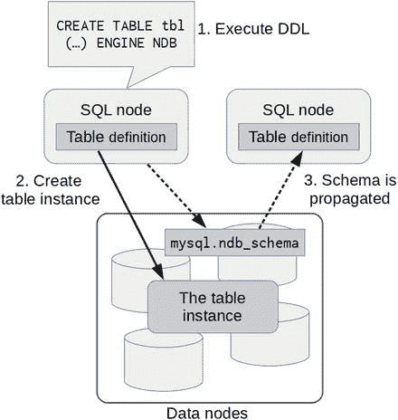

图 18-1.
模式定义通过 mysql.ndb_schema 表传播


#### 支持的数据类型

标准 MySQL 服务器所支持的任何数据类型，在 MySQL NDB 集群中也同样受支持。因此，你可以像使用标准 MySQL 服务器一样，使用 `NDBCluster` 存储引擎来设计表。

作为 MySQL NDB 集群的一个限制，每列所需的存储空间是四字节的倍数。如果存储某些可变长度数据需要 13 字节，系统仍会分配 16 字节。`BLOB` 及其变体（包括 `TEXT`）是通过隐藏的支持表实现的。`BLOB` 列的前 256 字节存储在主表中。如果列值大于 256 字节，剩余的值将存储在隐藏表中。隐藏表中的每行大小为 2000 字节。单个 `BLOB` 值可能在隐藏表中占用多行。

**注意**：由于这种空间分配方式效率不高，应尽可能避免使用 `BLOB` 列。

尽管标准 MySQL 服务器针对小型数值数据类型（如 `TINYINT`、`SMALLINT` 和 `MEDIUMINT`）提供了高效的数据类型，但在 `NDBCluster` 存储引擎中，它们每行要消耗四字节。因此，在 `NDBCluster` 存储引擎上使用这类小型数值数据类型，不如在标准 MySQL 服务器上高效。

类似地，`BIT` 列的空间也是一次性分配四字节。因此，一个 `BIT(1)` 列会消耗四字节。然而，与其他数据类型不同，每行中的多个 `BIT` 列会存储在一处。所以，除非总大小超过 32 位，否则不需要额外的四字节。因此，32 个 `BIT(1)` 列和一个单独的 `BIT(32)` 列所需的空间相同。请注意，可为空的列也需要一个位来标识该列是否为 `NULL`，并且这个位与 `BIT` 列存储在同一空间中。

截至 MySQL NDB 集群 7.5 系列，已支持 `JSON` 列和生成列。如果要使用这些功能，请安装 MySQL NDB 集群 7.5 或更高版本。空间列受到支持，但 MySQL NDB 集群不支持空间索引。

#### 三种索引类型

在关系数据库系统上设计表时，索引是最重要的因素之一。理解其特性和用途至关重要。你需要了解 MySQL NDB 集群上可用的索引类型，以及每种索引类型的架构。这是表设计的第一步。MySQL NDB 集群中的索引结构与 `InnoDB` 等其他存储引擎略有不同。

在 MySQL NDB 集群中，你可以使用三种类型的索引：

*   **唯一哈希索引**：此类索引仅用于主键。唯一支持的搜索操作是等值比较。
*   **有序索引**：此类索引用于非唯一的二级索引。此索引可用于通用目的，就像 `InnoDB` 中的 B-Tree 索引一样。
*   **二级唯一哈希索引**：此类索引用于二级唯一索引。这种索引本质上与主索引相同，但通过隐藏的支持表实现。

以下各节将详细介绍每种索引类型。

##### 主键的唯一哈希索引

唯一哈希索引是用于主键的索引类型。顾名思义，它确保单个键值的唯一性。简称为哈希索引。在本章中，我们统称其为哈希索引。

与一般的哈希索引一样，MySQL NDB 集群中的哈希索引只能用于等值比较。无法将其用于范围或不等比较。像清单 18-1 中的查询可以使用哈希索引。

```
mysql> EXPLAIN SELECT Name, CountryCode FROM City WHERE Id = 100\G
*************************** 1. row ***************************
id: 1
select_type: SIMPLE
table: City
partitions: p0,p1,p2,p3
type: eq_ref
possible_keys: PRIMARY
key: PRIMARY
key_len: 4
ref: const
rows: 1
filtered: 100.00
Extra: NULL
1 row in set, 1 warning (0.00 sec)
```
**清单 18-1. 使用等值比较查询表**

请注意，`type` 是 `eq_ref`，因此通过使用 `PRIMARY KEY` 进行等值比较来访问表。即使键在 `WHERE` 子句中没有直接与常量值比较，哈希索引也用于连接。清单 18-2 展示了一个示例查询执行计划，其中使用内表的主键连接两个表。请注意，`City` 表（内表）是以 `eq_ref` 访问类型进行访问的。

```
mysql> EXPLAIN SELECT Country.Name, City.Name FROM Country INNER JOIN City ON Country.Capital = City.Id WHERE Country.Code LIKE 'J%'\G
*************************** 1. row ***************************
id: 1
select_type: SIMPLE
table: Country
partitions: p0,p1,p2,p3
type: range
possible_keys: PRIMARY
key: PRIMARY
key_len: 3
ref: NULL
rows: 11
filtered: 100.00
Extra: Parent of 2 pushed join@1; Using where with pushed condition ((`world`.`Country`.`Code` like 'J%') and (`world`.`Country`.`Capital` is not null)); Using MRR
*************************** 2. row ***************************
id: 1
select_type: SIMPLE
table: City
partitions: p0,p1,p2,p3
type: eq_ref
possible_keys: PRIMARY
key: PRIMARY
key_len: 4
ref: world.Country.Capital
rows: 1
filtered: 100.00
Extra: Child of 'Country' in pushed join@1
2 rows in set, 1 warning (0.01 sec)
```
**清单 18-2. 两个表连接的执行计划示例**

每个表内部最多只能创建一个哈希索引。如果表没有显式定义主键，`NDBCluster` 存储引擎会自动创建一个隐藏的主键，定义为 `BIGINT UNSIGNED NOT NULL AUTO_INCREMENT PRIMARY KEY USING HASH`。因此，无论是否显式定义，每个表都有一个主键。所以，整个集群最多可以有 `MaxNoOfTables` 个哈希索引。

强烈建议显式定义主键，因为如果没有显式定义，系统会创建隐藏主键。隐藏主键无法使用 SQL 访问。如果未显式定义主键，在 NDB 集群复制设置中，从 SQL 节点上会对表进行扫描。

哈希索引存储在 `IndexMemory` 中，它们是存储在 `IndexMemory` 中的唯一对象。它们每行消耗 21 到 25 字节，用于存储哈希值和指向行的指针。`IndexMemory` 的消耗量相当小。


##### 有序索引

顾名思义，有序索引是一种索引，其所有索引行都按键值的顺序排序。有序索引可以像通常的 B+树索引一样使用。它可以用于：
*   等值比较 (`=`)：使用等号将值与键进行比较。
*   不等值比较 (`!=`, `<>`)：不等于。
*   范围扫描 (`<`, `<=`, `>`, `>=`，以及这些的组合)：小于、小于等于、大于、大于等于或介于之间。
*   全索引扫描：当没有条件使用此索引过滤行，但查询可以通过仅访问索引中包含的列来解决时，会选择此执行计划。
*   排序：可以通过按索引顺序读取行来解决排序问题。

请注意，有序索引是分区本地的。这意味着有序索引无法搜索其他分区中的行，因此也无法搜索其他节点组中的行。回想一下，`NDBCluster` 表中的行是水平分区的。有关分区平衡的更多信息，请参见第 2 章。这使得使用有序索引进行等值比较比在默认分区平衡下的主键查找开销更大。

图 18-2 展示了有序索引扫描的概念流程。图 18-2 中的 `TC` 代表事务协调器，它在每个事务开始时被选定。请注意，当使用默认分区平衡时，使用有序索引查找匹配指定键值或值范围的行时，必须访问所有数据节点，因为所有分区都可能包含匹配给定键值或值范围的行。

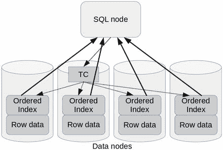

图 18-2.
有序索引扫描过程流程

这种情况有两个例外：
*   用户定义分区：表通过用户定义的方式进行分区，并且搜索条件中包含针对分区键的等值比较。在这种情况下，只搜索具有给定分区键值的分区。
*   全复制表：该表是一个全复制表，所有数据节点都拥有该表的完整相同副本。在这种情况下，有序索引查找可以通过访问任意数据节点来解决。

通常，使用有序索引查找比主键查找开销更大。因此，平均而言，它不会像主键查找那么快。查找的开销与数据节点的数量成正比，如果查询结果的大小很小，这种开销的影响可能更大。另一方面，如果查询结果很大，则许多行匹配给定的范围。换句话说，由于所有数据节点都被并行搜索，有序索引扫描非常高效。在这种情况下，如果集群中有更多的数据节点，使用有序索引进行范围扫描将会更快。

请注意，即使有序索引是一种索引，它也存储在 `DataMemory` 中，而不是 `IndexMemory` 中。这是许多人常犯的错误。在 MySQL NDB Cluster 中，只有哈希索引存储在 `IndexMemory` 中。有序索引中的每个索引行消耗 10 个字节。最多可以创建 `MaxNoOfOrderedIndexes` 个有序索引。

##### 用于辅助索引的唯一哈希索引

当哈希索引用作辅助索引时，其结构类似但有所不同。在 MySQL NDB Cluster 中，唯一能确保键值唯一性的对象是哈希索引。然而，哈希索引本质上可以是主键本身的实现。那么 MySQL NDB Cluster 如何确保辅助索引上键值的唯一性呢？

**注意**
如果表没有显式主键，但有唯一键，则第一个定义的非空唯一键将被选为表的主键。

答案是 MySQL NDB Cluster 创建了一个内部隐藏的支持表来确保辅助唯一键值的唯一性。该支持表无法从 SQL 节点直接访问。该支持表的定义方式是：主表唯一索引中的列构成支持表的主键，而主表主键值的列则作为非键列存储在支持表中。图 18-3 描述了辅助唯一索引查找的概念流程。首先访问支持表并检索主键值。然后，通过查找检索到的主键值来获取实际的行数据。

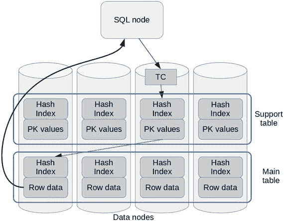

图 18-3.
使用辅助哈希索引进行唯一键查找

唯一索引查找比有序索引查找更高效，因为除非分区分布从默认情况更改，否则必须访问所有数据节点上的有序索引。当然，辅助唯一索引查找比主键查找慢，因为它需要访问两个表来解决查询。此外，辅助唯一索引查找可能需要额外的网络跳转。

通常，即使辅助索引被定义为唯一索引，其值与主键值也无关。因此，目标行可能存储在与唯一索引行所在数据节点不同的数据节点上，因为它们应该具有不同的哈希值。当然，如果辅助唯一索引行和目标行存储在同一个数据节点上，查询会很快。否则，唯一索引查找需要额外的网络跳转才能完成，这比前一种情况要慢。它们存储在同一个数据节点的概率与数据节点的数量成反比下降。

请注意，更新支持表上的行会消耗操作记录。因此，当使用辅助哈希索引时，可能需要增加 `MaxNoOfConcurrentOperations`。

辅助哈希索引同时消耗 `IndexMemory` 和 `DataMemory`，因为支持表有自己的哈希索引和代表主表主键列值的非键列。最多可以创建 `MaxNoOfUniqueHashIndexes` 个辅助哈希索引。


#### 定义索引

正确理解如何使用三种类型的索引非常重要。最关键的一点是，系统默认会为 `PRIMARY KEY` 和 `UNIQUE` 二级索引在内部创建两个索引。这是因为哈希索引除了相等比较外，不能用于任何其他操作。通常，索引也用于其他目的，例如范围扫描和排序。

##### 示例：定义带有显式主键的表

代码清单 18-3 展示了一个 `CREATE TABLE` 语句示例，该语句定义了一个带有显式主键的表。

```
CREATE TABLE City (
ID int(11) NOT NULL AUTO_INCREMENT,
Name char(35) NOT NULL DEFAULT '',
CountryCode char(3) NOT NULL DEFAULT '',
District char(20) NOT NULL DEFAULT '',
Population int(11) NOT NULL DEFAULT '0',
PRIMARY KEY (ID),
KEY CountryCode (CountryCode)
) ENGINE=NDBCluster;
```
*代码清单 18-3. 定义带有显式主键的表*

在这种情况下，系统内部会创建两个索引——一个哈希索引和一个有序索引。这可以通过 `ndb_desc` 命令确认，如代码清单 18-4 所示。

```
shell$ ndb_desc -c mgmhost -d world City
-- City --
Version: 16777217
Fragment type: HashMapPartition
K Value: 6
Min load factor: 78
Max load factor: 80
Temporary table: no
Number of attributes: 5
Number of primary keys: 1
Length of frm data: 338
Max Rows: 0
Row Checksum: 1
Row GCI: 1
SingleUserMode: 0
ForceVarPart: 1
PartitionCount: 4
FragmentCount: 4
PartitionBalance: FOR_RP_BY_LDM
ExtraRowGciBits: 0
ExtraRowAuthorBits: 0
TableStatus: Retrieved
Table options:
HashMap: DEFAULT-HASHMAP-3840-4
-- Attributes --
ID Int PRIMARY KEY DISTRIBUTION KEY AT=FIXED ST=MEMORY AUTO_INCR
Name Char(35;latin1_swedish_ci) NOT NULL AT=FIXED ST=MEMORY DEFAULT ""
CountryCode Char(3;latin1_swedish_ci) NOT NULL AT=FIXED ST=MEMORY DEFAULT ""
District Char(20;latin1_swedish_ci) NOT NULL AT=FIXED ST=MEMORY DEFAULT ""
Population Int NOT NULL AT=FIXED ST=MEMORY DEFAULT 0
-- Indexes --
PRIMARY KEY(ID) - UniqueHashIndex
PRIMARY(ID) - OrderedIndex
CountryCode(CountryCode) - OrderedIndex
NDBT_ProgramExit: 0 - OK
```
*代码清单 18-4. 使用 ndb_desc 命令显示实际表结构*

在代码清单 18-4 的 `ndb_desc` 命令输出中，可以发现有两个索引——`PRIMARY KEY` 和 `PRIMARY`。前者是哈希索引，后者是有序索引。请注意，哈希索引显示为 `UniqueHashIndex`。如果查询是相等比较，则使用哈希索引。否则，使用有序索引。

#### 阻止创建有序索引

如果应用程序仅需要对给定表进行相等比较，可以通过在 DDL 中指定 `USING HASH` 关键字来阻止创建有序索引，如代码清单 18-5 所示。

```
CREATE TABLE City (
ID int(11) NOT NULL AUTO_INCREMENT,
Name char(35) NOT NULL DEFAULT '',
CountryCode char(3) NOT NULL DEFAULT '',
District char(20) NOT NULL DEFAULT '',
Population int(11) NOT NULL DEFAULT '0',
PRIMARY KEY (ID) USING HASH,
KEY CountryCode (CountryCode)
) ENGINE=NDBCluster;
```
*代码清单 18-5. 在主键中不创建有序索引的表*

请注意，`USING HASH` 关键字被包含在主键定义中。当通过此语句创建表时，`ndb_desc` 命令的索引部分看起来如以下清单所示。

```
-- Indexes --
PRIMARY KEY(ID) - UniqueHashIndex
CountryCode(CountryCode) - OrderedIndex
```

我建议最初创建表时，为主键包含 `USING HASH` 关键字，因为相等比较是主键最常用的操作。为有序索引节省内存是值得的，因为内存并非免费。如果你后来发现应用程序确实需要有序索引，你可以随时在线将有序索引作为二级索引添加。有序索引的功能无论它们是主键的一部分还是独立的二级索引，都不会改变。

#### 带有 UNIQUE 二级索引的行为

与主键类似，底层也会为二级 `UNIQUE` 索引创建哈希索引和有序索引。如果不需要有序索引，你可以像处理主键那样，使用 `USING HASH` 关键字来跳过它。哈希索引是一个支撑表，但它像主键一样显示为 `UniqueHashIndex`。你需要通过检查索引名称来识别它是否是主键。代码清单 18-6 展示了一个 `ndb_desc` 命令输出的示例，该表有一个主键和一个唯一二级索引。请注意，代码清单 18-6 中的表 `Country` 与本章前面示例中显示的不同，因为 `City` 表没有适合用于二级唯一索引的列组合。

```
shell$ ndb_desc -c mgmhost -d world Country
-- Country –
... snip ...
-- Indexes --
PRIMARY KEY(Code) - UniqueHashIndex
PRIMARY(Code) - OrderedIndex
Name(Name) - OrderedIndex
Name$unique(Name) - UniqueHashIndex
NDBT_ProgramExit: 0 - OK
```
*代码清单 18-6. 包含一个二级唯一索引的表的索引结构*

#### 创建非唯一二级索引

如果你想创建一个非唯一二级索引，只需像往常一样创建即可。

```
ALTER TABLE City ADD INDEX (Name);
```

对于 MySQL NDB Cluster，添加索引是一个原地（在线）操作。有关在线模式更改的更多详细信息，请参阅第 9 章。

#### 索引类型总结

表 18-1 列出了 `NDBCluster` 存储引擎的索引类型组合。请记住，你需要选择一种索引类型。要选择合适的索引类型，你必须理解每种索引类型的特性以及你的应用程序需求。

*表 18-1. 可能的索引类型组合*

| 索引类型 | 操作 | 存储 | 每行数据大小 |
| --- | --- | --- | --- |
| `PRIMARY KEY` | 多种 | `IndexMemory` + `DataMemory` | `IndexMemory` 中 21 到 25 字节，`DataMemory` 中 10 字节 |
| 带 `USING HASH` 的 `PRIMARY KEY` | 相等比较 | `IndexMemory` | `IndexMemory` 中 21 到 25 字节 |
| `UNIQUE` | 多种 | `IndexMemory` + `DataMemory` | `IndexMemory` 中 21 到 25 字节，`DataMemory` 中为主表主键值的大小 + 10 字节 |
| 带 `USING HASH` 的 `UNIQUE` | 相等比较 | `IndexMemory` + `DataMemory` | `IndexMemory` 中 21 到 25 字节，`DataMemory` 中为主表主键值的大小 |
| 非唯一二级索引 | 多种 | `DataMemory` | `DataMemory` 中 10 字节 |


#### T 树索引

MySQL NDB Cluster 中的有序索引结构不是 B+ 树索引，后者在关系数据库系统（尤其是 MySQL 中）被广泛使用。MySQL NDB Cluster 采用了 T 树索引。T 树可以像 B+ 树索引一样使用，但其结构不同于 B+ 树索引。图 18-4 描绘了一个 T 树索引中几个节点的概念视图。这里的术语“节点”指的是构成树的数据单元，而不是集群中的节点。请注意图中每个节点的形状看起来像字母 T。T 树索引的名称正是源于节点的形状。当然，你也可以用不同的方式绘制它。在 T 树索引原始论文中，节点的形状看起来就像字母 T。

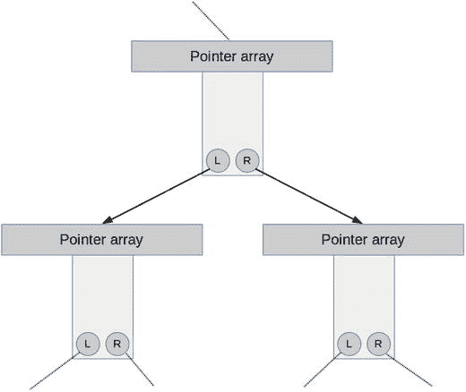
图 18-4. T 树结构概览

T 树索引是为内存数据库系统优化的。与 B+ 树索引不同，T 树索引本身不包含索引数据，它只有指向数据的指针。对于用于内存数据库系统的 T 树索引来说，存储指针就足够了，因为键值始终存在于内存中。T 树还可以节省 CPU 资源，因为在索引中搜索、插入或删除行时需要的比较操作更少。

每个节点都有一个指向行数据的指针数组，这些指针按排序状态排列。`L` 是一个指向子树的指针，该子树中的所有值都小于本节点中的所有值。`R` 值是一个指向子树的指针，该子树中的所有值都大于本节点中的所有值。

搜索从树的根节点开始。搜索一个节点时，首先检查键值是否包含在当前节点的数组范围内。如果给定的键值包含在当前节点的范围内，则称该节点为边界节点。如果在边界节点中找到了该行，则返回该行。否则，搜索失败。如果给定的键值小于当前节点中的所有值，则以相同的方式搜索左子树。同样，如果给定的键值较大，则搜索右子树。

#### 估算表大小

在 MySQL NDB Cluster 上设计表时，你可能想知道每行消耗多少内存或磁盘，因为容量是数据库系统的重要主题。有两个可用选项：一个是 `ndb_size.pl`，它包含在官方软件包中；另一个是 `sizer`，它由第三方开发。

##### ndb_size.pl 命令

如果你不太关心细节，`ndb_size.pl` 命令是一个不错的选择，因为每种数据类型的数据大小变化不大，而且 `ndb_size.pl` 命令随 MySQL NDB Cluster 软件包一起提供。如果你使用的是 RPM 软件包，它包含在客户端软件包中。

要使用 `ndb_size.pl` 命令，系统上必须安装 Perl 解释器，因为它是用 Perl 编写的。此外，使用此命令还需要 `MethodMaker`、`Perl DBI` 和 Perl 的 MySQL 驱动程序（`DBD::mysql`）。有关 `DBD::mysql` 的信息，请参考以下页面：

[`search.cpan.org/dist/DBD-mysql/lib/DBD/mysql.pm`](http://search.cpan.org/dist/DBD-mysql/lib/DBD/mysql.pm)

`ndb_size.pl` 命令计算当给定表的存储引擎变为 `NDBCluster` 时，现有的非 NDB 表所需的资源。现有表的存储引擎是任意的。要计算所需资源，请先使用其他存储引擎（如 `InnoDB`）创建表，然后运行 `ndb_size.pl` 命令，如清单 18-7 所示。

```
shell$ ndb_size.pl --database=world --hostname=sqlnode1 --user=msandbox --password=msandbox
ndb_size.pl report for database: 'world' (3 tables)

Connected to: DBI:mysql:host=sqlnode1
Including information for versions: 4.1, 5.0, 5.1
world.Country

DataMemory for Columns (* means varsized DataMemory):
... snip ...
Parameter Minimum Requirements

* indicates greater than default
Parameter        Default          4.1           5.0           5.1
NoOfOrderedIndexes           128            6             6             6
IndexMemory (KB)         18432          368           176           176
NoOfTriggers           768           39            39            39
NoOfUniqueHashIndexes            64            3             3             3
DataMemory (KB)         81920          672           672           736
NoOfTables           128            6             6             6
NoOfAttributes          1000           32            32            32
```
清单 18-7. 计算 World 数据库所需资源

`ndb_size.pl` 命令会打印每个表的资源消耗情况（清单 18-10 中省略了每个表的输出）。然后，在末尾打印所需资源的摘要。如你所见，那里打印的版本号（如 4.1、5.0 和 5.1）已过时。然而，你仍然可以使用此命令来估算资源消耗，因为在最新版本中差异并不巨大。

##### sizer 命令

如果你想根据你正在使用的版本来估算数据大小，`sizer` 是一个不错的选择。它是由 severalnines 开发的一个 NDB API 应用程序。`sizer` 命令以源代码形式附带一个简单的 Makefile。你可以从 GitHub 获取源代码。要构建 `sizer` 命令，你需要库文件（`libmysqlclient_r.so` 和 `libndbclient.so`）以及相关的头文件。为 Makefile 设置 `MYSQL_BASEDIR` 变量，使其指向安装了库和头文件的目录。`MYSQL_BASEDIR` 变量的默认值是 `/usr`，这适用于 OS 原生软件包安装（如 RPM）。如果你将软件包安装到另一个目录（如 `/usr/local/mysql-cluster`），则请按照以下命令示例运行 `make` 命令。二进制文件在源代码的顶层目录下创建。如果你愿意，可以将它移动到任何目录。

```
shell$ git clone https://github.com/severalnines/sizer.git
shell$ cd sizer
shell$ make MYSQL_BASEDIR=/usr/local/mysql-cluster
```

`sizer` 的用法与 `ndb_size.pl` 类似，但它像清单 18-8 所示那样连接到管理节点和数据节点；它不像 `ndb_size.pl` 那样连接到 SQL 节点。在执行 `sizer` 命令之前，你需要安装 MySQL NDB Cluster 并用示例数据填充表。

```
shell$ export LD_LIBRARY_PATH=/usr/local/mysql-cluster
shell$ sizer -c mgmhost -d world
... snip ...
Record size (incl OH):
#Rows found=239 records
#OrderedIndexes=2
#UniqueHashIndexes=2
#blob/text=0
#attributes=15
DataMemory=440 bytes
IndexMemory=40 bytes
Diskspace=0 bytes
Appending the following to world.csv
world,Country,239,1,2,2,0,15,40,440,0,0,0
```
清单 18-8. sizer 命令示例

`sizer` 命令生成一个 CSV 文件，其文件名类似于 `database_name.csv`。每列指示以下数据（括号内的数据表示清单 18-8 示例中 `world.Country` 表的示例值）：

*   数据库名称（`world`）
*   表名（`Country`）
*   表中的行数（239）
*   表对象数量（始终为 1）
*   表中有序索引的数量（2）
*   唯一哈希索引的数量，包括主索引和二级索引（2）
*   `BLOB`/`TEXT` 列的数量（0）
*   属性的数量（15）
*   每行消耗的 `IndexMemory` 大小（40）
*   每行消耗的 `DataMemmory` 大小（440）
*   磁盘表消耗的磁盘空间大小（0）
*   此表中是否使用了变长列（0）
*   二级唯一哈希索引的支撑表中是否使用了变长列（0）

有关 `sizer` 的更多信息，请参考以下页面：[`github.com/severalnines/sizer`](https://github.com/severalnines/sizer)。


##### 估算每张表所需对象数量

估算每张表所需的对象数量也很重要，因为对象数量需要在配置文件 (`config.ini`) 中由用户手动定义。如果已拥有表定义，`ndb_size.pl` 命令可完成此任务。请参考前一节中的清单 18-7，查看这些命令的示例输出。请注意，`sizer` 命令仅显示列的数量，而非消耗的属性数量。

如果尚未完成表的设计，可以使用下表估算所需属性的数量：

*   非 BLOB 列：1
*   BLOB (TEXT) 列：5
*   主键中的哈希索引：0
*   二级唯一哈希索引：1 + 构成该索引的列数
*   有序索引：1 + 构成该索引的列数

例如，`world.Country` 表的属性数量计算如下：

*   非 BLOB 列：1 * 15 = 15
*   BLOB (TEXT) 列：5 * 0 = 0
*   主键中的哈希索引：0 * 1 = 0
*   二级唯一哈希索引：(1 + 0) * 0 = 0
*   有序索引：1 + 1 (对于主键，如果未指定 `USING HASH`) = 2
*   总计：17

#### 定义外键约束

从 MySQL NDB Cluster 7.3 开始，支持外键。您可以使用外键来维护两个表之间的引用关系完整性，方法是在子表上指定一组引用列，并在父表上指定一组被引用列。如果在父表中没有匹配的行，则对子表的任何插入或更新操作都将被拒绝。还可以定义当父表中的行被更新或删除时所执行的操作。

以下列表展示了一个带有 `update` 和 `delete` 操作的外键的典型定义：

```
mysql> ALTER TABLE Country ADD CONSTRAINT fk_capital FOREIGN KEY (Capital) REFERENCES City(ID) ON UPDATE SET NULL ON DELETE SET NULL;
Query OK, 0 rows affected (2.74 sec)
Records: 0  Duplicates: 0  Warnings: 0
```

每次在子表或父表上插入、更新或删除行时，都会在数据节点上检查外键约束。要在子表上定义外键，父表上的被引用列或列集必须是构成主键或二级唯一索引的一组列。每个被引用列的数据类型必须与引用列相同。例如，您不能定义一个引用 `BIGINT` 列的外键，其引用列是 `INT` 类型。引用列的列出顺序必须与被引用的主键或二级唯一索引的定义顺序相同。这些要求比 `InnoDB` 更严格。在 `InnoDB` 中，被引用列必须有索引，但不一定是唯一的。被引用列和引用列的数据类型必须相似，但不一定要完全相同。

表 18-2 列出了 SQL 标准支持的 `ON UPDATE` 和 `ON DELETE` 子句操作，以及它们在 MySQL NDB Cluster 中的状态。

表 18-2.
外键约束中对父表进行修改时的操作

| 操作 | 在 NDBCluster 上是否支持 | 描述 |
| --- | --- | --- |
| `RESTRICT` | 是 | 如果在子表中存在匹配的行，则拒绝更新或删除父表。如果指定了此操作，您必须先修改子表，使没有行引用父表中要更新或删除的行。 |
| `CASCADE` | 有限制 | 对父表的更新或删除会传播到子表的匹配行。如果被引用的列集是父表的主键，MySQL NDB Cluster 不支持对 `ON UPDATE` 使用 `CASCADE` 操作。 |
| `SET NULL` | 是 | 当父表中的行被更新或删除时，子表中匹配行的引用列将被设置为 `NULL`。 |
| `NO ACTION` | 与 `RESTRICT` 相同 | 在 MySQL Server 和 MySQL NDB Cluster 上，它的定义与 `RESTRICT` 相同。某些数据库系统将 `NO ACTION` 实现为延迟检查，但 MySQL 不支持此功能。 |
| `SET DEFAULT` | 否 | 在更新或删除父表中的行时，将引用列设置为其默认值。MySQL 不支持此操作。 |

#### 查看表定义

您可以通过多种方式查看表的定义。具体来说，`SHOW CREATE TABLE` 语句（就像在 MySQL Server 上对普通表那样）、`ndb_desc` 命令以及 `ndbinfo` 表都可用于精确查看表定义。清单 18-9 展示了 `SHOW CREATE TABLE` 命令输出的示例。

```
mysql> SHOW CREATE TABLE City\G
*************************** 1. row ***************************
       Table: City
Create Table: CREATE TABLE `City` (
  `ID` int(11) NOT NULL AUTO_INCREMENT,
  `Name` char(35) NOT NULL DEFAULT '',
  `CountryCode` char(3) NOT NULL DEFAULT '',
  `District` char(20) NOT NULL DEFAULT '',
  `Population` int(11) NOT NULL DEFAULT '0',
  PRIMARY KEY (`ID`),
  KEY `CountryCode` (`CountryCode`),
  CONSTRAINT `fk_countrycode` FOREIGN KEY (`CountryCode`) REFERENCES `Country` (`Code`) ON DELETE SET NULL ON UPDATE SET NULL
) ENGINE=ndbcluster AUTO_INCREMENT=4080 DEFAULT CHARSET=latin1
1 row in set (0.00 sec)
清单 18-9.
SHOW CREATE TABLE 命令输出示例
```

`SHOW CREATE TABLE` 命令的用处在于，`Create Table` 字段的值可以重用作可执行的 SQL 命令。您可以修改由 `SHOW CREATE TABLE` 打印出的 SQL 命令，从而创建一个类似的表。

`ndb_desc` 命令是专用于 MySQL NDB Cluster 的工具。它会打印表定义，并附带一些 MySQL NDB Cluster 特有的额外信息。清单 18-10 显示了针对与清单 18-9 相同的表的 `ndb_desc` 命令输出示例。

```
shell$ ndb_desc -c mgmhost -d world City
-- City --
Version: 67108865
Fragment type: HashMapPartition
K Value: 6
Min load factor: 78
Max load factor: 80
Temporary table: no
Number of attributes: 5
Number of primary keys: 1
Length of frm data: 338
Max Rows: 0
Row Checksum: 1
Row GCI: 1
SingleUserMode: 0
ForceVarPart: 1
PartitionCount: 4
FragmentCount: 4
PartitionBalance: FOR_RP_BY_LDM
ExtraRowGciBits: 0
ExtraRowAuthorBits: 0
TableStatus: Retrieved
Table options:
HashMap: DEFAULT-HASHMAP-3840-4
-- Attributes --
ID                   Int            PRIMARY KEY DISTRIBUTION KEY AT=FIXED ST=MEMORY AUTO_INCR
Name                 Char(35;latin1_swedish_ci) NOT NULL AT=FIXED ST=MEMORY DEFAULT ""
CountryCode          Char(3;latin1_swedish_ci) NOT NULL AT=FIXED ST=MEMORY DEFAULT ""
District             Char(20;latin1_swedish_ci) NOT NULL AT=FIXED ST=MEMORY DEFAULT ""
Population           Int            NOT NULL AT=FIXED ST=MEMORY DEFAULT 0
-- Indexes --
PRIMARY KEY(ID) - UniqueHashIndex
PRIMARY(ID) - OrderedIndex
CountryCode(CountryCode) - OrderedIndex
-- ForeignKeys --
27/24/fk_countrycode CountryCode (CountryCode) REFERENCES world.Country/PRIMARY KEY () on update set null on delete set null
NDBT_ProgramExit: 0 - OK
清单 18-10.
ndb_desc 命令输出示例
```

当您想要查看表的内部结构（例如分区定义和额外位的数量）时，`ndb_desc` 命令非常有用，这些信息不会在 `SHOW CREATE TABLE` 的输出中打印。

从 MySQL NDB Cluster 7.5 系列开始，在 `ndbinfo` 数据库中添加了各种有用的表来检索表的元数据和状态。特别是，`table_fragments`、`table_info` 和 `table_replicas` 表对于获取表元数据和状态非常有用。这些表没有直接标识表名的列。您需要参考 `dict_obj_info` 表来根据表名识别表标识符。清单 18-11 展示了一个从 `ndbinfo.table_info` 表中检索表元数据的示例查询。


### 磁盘数据表

```
mysql> SELECT * FROM dict_obj_info d JOIN table_info t ON d.id = t.table_id  WHERE fq_name LIKE 'world/def/City'\G
*************************** 1\. row ***************************
type: 2
id: 24
version: 67108865
state: 4
parent_obj_type: 0
parent_obj_id: 0
fq_name: world/def/City
table_id: 24
logged_table: 1
row_contains_gci: 1
row_contains_checksum: 1
read_backup: 0
fully_replicated: 0
storage_type: MEMORY
hashmap_id: 1
partition_balance: FOR_RP_BY_LDM
create_gci: 0
1 row in set (0.02 sec)

清单 18-11.
从 ndbinfo.table_info 表中检索表元数据
```

有关 `ndbinfo` 数据库的更多详细信息，请参见第 16 章。

你也可以使用其他工具来查看表定义，就像在标准 MySQL 服务器上一样，例如 `DESC`、`EXPLAIN`、`SHOW FULL FIELDS` 和 Information Schema。清单 18-12 展示了对 `world.City` 表执行 `DESC` 命令的输出示例。

```
mysql> DESC City;
+-------------+----------+------+-----+---------+----------------+
| 字段        | 类型     | 可空 | 键  | 默认值  | 额外属性       |
+-------------+----------+------+-----+---------+----------------+
| ID          | int(11)  | NO   | PRI | NULL    | auto_increment |
| Name        | char(35) | NO   |     |         |                |
| CountryCode | char(3)  | NO   | MUL |         |                |
| District    | char(20) | NO   |     |         |                |
| Population  | int(11)  | NO   |     | 0       |                |
+-------------+----------+------+-----+---------+----------------+
5 rows in set (0.00 sec)

清单 18-12.
world.City 表的 DESC 命令输出
```

MySQL NDB Cluster 支持磁盘数据表（或基于磁盘的表）作为一种选项，可用于以合理的性能损失为代价，使用成本更低的存储介质来存储大数据。自 MySQL NDB Cluster 6.2 系列起，该功能已得到支持。

我强烈建议在使用磁盘数据表时采用 SSD。在 SSD 尚未普及时期，磁盘数据表因为存储介质是硬盘驱动器（HDD）而非常缓慢。由于 HDD 是机械控制的，移动磁头和寻道目标扇区需要很长时间。因此，磁盘数据表只能用于归档等非常特定的用途。如今，我们可以选择固态硬盘（SSD），其成本相对于 RAM 来说已很合理。它没有机械部件，因此在响应时间和吞吐量方面都具有更好的读/写性能。此外，市场上最近也出现了采用 PCIe 和 NVMe 等超高速接口的 SSD 产品。有了这类快速 SSD，磁盘数据表已成为一种通用场景下的现实选择，只带来很小的性能损失。

#### 磁盘数据表架构

由于磁盘数据表的存储方式不同，其更新方式也不同于内存表。图 18-5 描绘了写入磁盘数据表时的概念性流程。

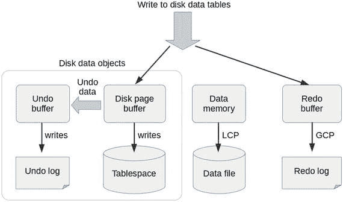

图 18-5.
磁盘数据表架构概览：写事务

当写入磁盘数据表时，所有修改都在磁盘页面缓冲区中进行，就像对 `InnoDB` 表的所有修改都在 `InnoDB` 缓冲池中进行一样。旧行值会被复制到 undo 日志中以备回滚使用；在回滚和崩溃恢复时，会从 undo 日志中恢复旧行值。磁盘数据表仍然需要重做日志记录，因为即使修改的是磁盘数据表，重做日志也用于崩溃恢复，并且微 GCP（全局检查点）是复制所必需的。

当对磁盘数据表执行崩溃恢复时，表空间的状态会回退到最近一次 LCP（局部检查点）执行时的状态，以使磁盘数据表的表空间与内存表的数据内存保持同步。然后，你会连同内存表一起应用重做日志。这意味着磁盘数据表仍然需要充足的重做日志空间。为了同步表空间和 LCP，下一次 LCP 之前的所有更改必须在 LCP 执行前刷写到磁盘。

#### 磁盘数据表的已知限制

使用磁盘数据表时，必须牢记以下限制以防止出现问题。磁盘数据表的主要限制包括：

*   无法将索引和索引列存储在磁盘上：MySQL NDB Cluster 尚不支持完整的磁盘数据表。即使对于磁盘数据表，主键列也存储在内存中。
*   磁盘数据表不会提高数据持久性：在 MySQL NDB Cluster 中，持久性通过检查点机制来保证。无论如何，要恢复最新数据都需要重做日志。
*   需要大缓冲区来提升磁盘数据表性能：分配的磁盘页面缓冲区越大，表访问速度越快。为了给磁盘页面缓冲区分配大内存，必须相应地减少数据内存。即使分配了充足的磁盘页面缓冲区并使用了快速 SSD，磁盘数据表仍然比内存表慢。
*   空间效率并非最优：使用磁盘数据表比使用内存表需要更多的空间。由于所需的存储介质是磁盘而非内存，如果系统拥有大量磁盘空间，就可能存储更大量的数据。
*   空间可重用性不佳：无法使用 `OPTIMIZE TABLE` 回收磁盘区域。一旦磁盘空间分配给一个表，在该表被删除之前，该空间不会被释放。
*   磁盘数据表中的每个列都需要一个 8 字节指针：如果列本身很小，它会比内存表消耗更多的内存。
*   响应时间不可预测：对内存表的响应时间是可预测的。但对磁盘数据表则不然，因为响应时间很大程度上取决于目标数据是否被缓存在内存中。

#### 磁盘数据表的配置选项

与其他类型的表一样，需要配置选项才能使磁盘数据表发挥出良好性能。本节，我们将讨论可调整的磁盘数据表相关选项。有关配置选项的更多信息，请参阅第 4 章。

*   `DiskPageBufferMemory`：此选项决定分配给磁盘页面缓冲区的内存量。缓冲区越大，能节省的磁盘 I/O 就越多。当你需要磁盘数据表有更好性能时，请尽可能多地分配内存。默认值为 64MB。
*   `SharedGlobalMemory`：此选项并非专用于磁盘数据表，但 undo 日志缓冲区是从该内存中分配的。每个数据节点上 undo 日志缓冲区的最大大小为 600MB。默认值为 128MB。
*   `DiskIOThreadPool`：此选项指定用于磁盘数据表的 I/O 线程数。如果使用了快速 SSD，或者使用多个磁盘来分散 I/O 负载，你应考虑增加线程数。默认值为 2。
*   `FileSystemPathDD`、`FileSystemPathDataFiles`、`FileSystemPathUndoFiles`：这些选项指定存储磁盘数据对象的目录。如果未指定后两个选项，则 `FileSystemPathDD` 是它们的默认值。`FileSystemPathDataFiles` 指定表空间数据文件的目录。`FileSystemPathUndoFiles` 指定 undo 日志的目录。当每个数据节点主机使用多个磁盘来分散 I/O 负载时，这些选项是必需的。`FileSystemPathDD` 的默认值是 `FileSystemPath`。
*   `InitialLogFileGroup`、`InitialTablespace`：如果在初始系统启动时指定了这些选项，就会创建 undo 日志和表空间。否则，这些磁盘数据对象必须手动创建，如下一节所述。这些选项没有默认值。


##### 准备日志文件组

要使用磁盘数据表，您必须预先创建磁盘数据对象。所需的对象是日志文件组（撤消日志）和表空间（数据文件）。

日志文件组使用任意 SQL 节点上的 `CREATE LOGFILE GROUP` 命令创建。以下列表展示了创建日志文件组的示例命令。目前，每个集群只能创建一个日志文件组。

```
mysql> CREATE LOGFILE GROUP lg1 ADD UNDOFILE 'undo1.log' INITIAL_SIZE = 10G UNDO_BUFFER_SIZE = 600M ENGINE NDB;
Query OK, 0 rows affected (35 min 17.13 sec)
```

此命令需要相当长的时间才能完成，因为必须初始化撤消日志文件。`CREATE LOGFILE GROUP` 命令中的每个子句含义如下：

*   `ADD UNDOFILE 'filename'`：此子句向日志文件组添加一个撤消日志文件。使用 `CREATE LOGFILE GROUP` 命令时，只能指定一个撤消日志文件，并且撤消日志文件是必需的。
*   `INITIAL_SIZE = size`：此子句指定撤消日志文件的大小。顾名思义，这不仅是初始大小，也是撤消日志文件生命周期内的大小。以后无法更改。如果发现撤消日志太小，可以稍后使用 `ALTER LOGFILE GROUP` 命令添加更多撤消日志文件。此子句可以省略。撤消文件的默认大小为 `128MB`。
*   `UNDO_BUFFER_SIZE = size`：此子句指定撤消缓冲区的大小，这是一个在将撤消数据写入撤消日志文件之前临时存储它的缓冲区。较大的撤消缓冲区可能会提高写入性能。请注意，因为缓冲区大小以后无法更改。撤消日志缓冲区的最大大小为 `600MB`。此子句可以省略。撤消缓冲区的默认值为 `8MB`。

请注意，在大多数情况下，撤消日志文件和撤消缓冲区的默认大小都太小。如果您在高负载下使用磁盘数据表，则必须适当增加这些大小。由于撤消缓冲区大小以后无法更改，因此在确定大小时要非常小心。强烈建议在生产系统中创建日志文件组之前，在测试系统上进行基准测试。

撤消日志文件大小的估算方式与重做日志类似。撤消日志用于将表空间中的数据回滚到最近一次 LCP（本地检查点）完成时的状态。为了回滚到最近一次 LCP，撤消日志条目必须保留到下一个 LCP 完成。因此，您可以使用以下公式计算撤消日志条目的理论最大大小：

```
time_taken_to_complete_lcp * io_speed_of_undo_logging
```

此公式与用于计算重做日志大小的公式相同。有关重做日志大小估算的更多信息，请参见第 4 章。

##### 准备表空间

创建日志文件组后，就该使用 `CREATE TABLESPACE` 命令创建用于存储磁盘数据表的表空间了。以下命令输出展示了创建表空间的示例命令。请注意，必须在创建表空间之前创建日志文件组，因为每个表空间都链接到某个特定的日志文件组。与日志文件组不同，一个集群中可以创建多个表空间。

```
mysql> CREATE TABLESPACE ts1 ADD DATAFILE 'ts1-1.dat' USE LOGFILE GROUP lg1 EXTENT_SIZE = 256K INITIAL_SIZE = 8G ENGINE NDB;
Query OK, 0 rows affected (33 min 6.03 sec)
```

`CREATE TABLESPACE` 命令中的每个子句含义如下：

*   `ADD DATAFILE 'filename'`：此子句向要创建的表空间添加一个数据文件。此子句不能省略，并且在 `CREATE TABLESPACE` 命令中只能添加一个数据文件。
*   `USE LOGFILE GROUP lg_name`：此子句指定此表空间关联的日志文件组。
*   `EXTENT_SIZE = size`：此子句指定区的大小，即每个磁盘数据表分区的分配单元。最小大小为 `32KB`，最大大小为 `2G`。此子句可以省略。默认值为 `1MB`。请注意，过大的区会减少数据文件内的区数量，因为区是无法在多个表之间共享的分配单元。区过大会导致磁盘空间利用效率低下。在大多数情况下，默认值即可。不要将其设置得过小或过大。
*   `INITIAL_SIZE = size`：此子句指定数据文件的大小。就像撤消日志文件一样，文件大小以后无法更改。如果发现表空间太小，需要使用 `ALTER TABLESPACE` 命令添加数据文件。

您需要注意区大小和数据文件大小。每个数据文件最多可以有 `64K` 个区。建议每个数据文件的最大区数为 `32K`。因此，使用默认区大小，您最多可以创建 `32GB` 的数据文件。在清单 18-18 中，区大小设置为 `256KB`，比默认值小四倍，数据文件大小设置为 `8GB`，比使用 `32KB` 区时的最大大小小四倍。

如果您需要更大的表空间，请添加更多数据文件或增大区大小。或者，您可以创建多个表空间。


#### 创建磁盘数据表

要创建磁盘数据表，必须在 `CREATE TABLE` 语句中指定 `STORAGE DISK` 子句和 `TABLESPACE` 子句。清单 18-13 展示了创建一个磁盘数据表的示例命令。

```sql
mysql> CREATE TABLE ddCity (
->   ID int(11) NOT NULL AUTO_INCREMENT,
->   Name char(35) NOT NULL DEFAULT '',
->   CountryCode char(3) NOT NULL DEFAULT '',
->   District char(20) NOT NULL DEFAULT '',
->   Population int(11) NOT NULL DEFAULT '0',
->   PRIMARY KEY (ID),
->   KEY CountryCode (CountryCode)
-> ) ENGINE=NDB STORAGE DISK TABLESPACE ts1;
Query OK, 0 rows affected (5.79 sec)
```
清单 18-13. 创建一个磁盘数据表

在此示例中，整个表被定义为磁盘数据。也可以仅将某些列存储在磁盘上。由于索引和被索引的列无法存储在磁盘，它们会被自动定义为内存数据。你可以使用 `ndb_desc` 命令来查看每个列实际使用的存储类型。以下命令输出是清单 18-13 中 `ddCity` 表的 `ndb_desc` 命令输出的摘录。

```
-- Attributes --
ID Int PRIMARY KEY DISTRIBUTION KEY AT=FIXED ST=MEMORY AUTO_INCR
Name Char(35;latin1_swedish_ci) NOT NULL AT=FIXED ST=DISK DEFAULT ""
CountryCode Char(3;latin1_swedish_ci) NOT NULL AT=FIXED ST=MEMORY DEFAULT ""
District Char(20;latin1_swedish_ci) NOT NULL AT=FIXED ST=DISK DEFAULT ""
Population Int NOT NULL AT=FIXED ST=DISK DEFAULT 0
```

你可以看到 `ID` 和 `CountryCode` 列显示为 `ST=MEMORY`，因此存储在内存中。其他列显示为 `ST=DISK`，因此存储在磁盘上。

可以按列指定存储。尽管 `Population` 列存储在磁盘上，但效率不高，因为它仅为 4 字节的列数据在内存中需要 8 字节的指针。清单 18-14 展示了一个 `CREATE TABLE` 语句示例，它定义了与清单 18-13 相同的表，但指定了存储偏好。

```sql
mysql> CREATE TABLE ddCity (
->   ID int(11) NOT NULL AUTO_INCREMENT,
->   Name char(35) NOT NULL DEFAULT '' STORAGE DISK,
->   CountryCode char(3) NOT NULL DEFAULT '',
->   District char(20) NOT NULL DEFAULT '' STORAGE DISK,
->   Population int(11) NOT NULL DEFAULT '0',
->   PRIMARY KEY (ID),
->   KEY CountryCode (CountryCode)
-> ) ENGINE=NDB TABLESPACE ts1;
Query OK, 0 rows affected (1.35 sec)
```
清单 18-14. 为特定列定义磁盘数据的表

如你所见，在表定义的最后一行没有指定 `STORAGE DISK`。相反，`STORAGE DISK` 被指定在列定义中。这导致只有指定的列被存储在磁盘上。你可以通过使用 `ndb_desc` 命令来确认这一点，如下列命令输出所示，该输出是 `ndb_desc` 输出的摘录。

```
-- Attributes --
ID Int PRIMARY KEY DISTRIBUTION KEY AT=FIXED ST=MEMORY AUTO_INCR
Name Char(35;latin1_swedish_ci) NOT NULL AT=FIXED ST=DISK DEFAULT ""
CountryCode Char(3;latin1_swedish_ci) NOT NULL AT=FIXED ST=MEMORY DEFAULT ""
District Char(20;latin1_swedish_ci) NOT NULL AT=FIXED ST=DISK DEFAULT ""
Population Int NOT NULL AT=FIXED ST=MEMORY DEFAULT 0
```

你可以看到 `ID`、`CountryCode` 和 `Population` 列存储在内存中。`Name` 和 `District` 列按 `CREATE TABLE` 语句中的指定存储在磁盘上。

#### 监控磁盘数据表

当你使用磁盘数据表时，请使用以下模式和 `ndbinfo` 数据库信息来监控磁盘数据表的元数据和状态。有关这些 `ndbinfo` 表的更多信息，请参见第 16 章。

#### 关于规范化的考虑

作为一名数据库从业者，我坚持认为规范化对于 MySQL NDB 集群仍然有意义，因为它是一个关系数据库管理系统。当表未被规范化时，表中可能包含重复数据。如果碰巧只更新了重复行的某一部分，就会导致异常，因为已更新的行和未更新的行将会不同，尽管逻辑上它们必须是相同的。

未规范化的表是多个表连接的结果。规范化的过程是在不丢失数据的情况下将这样一个表分解为多个表。这消除了表内潜在的数据重复。原始表可以通过连接这些表来重新构造。

规范化的一个主要缺点是需要更多的连接。这对于旧版本的 MySQL NDB 集群来说是一个大问题，因为连接非常慢。然而，最近版本的 MySQL NDB 集群拥有良好的连接算法、下推连接和批处理键访问连接，尽管 `InnoDB` 通常仍然优于 NDB。由于在最近版本的 MySQL NDB 集群中连接速度相当快，你不必太担心表连接的问题。

#### 关于表设计的主要限制

表 18-3 描述了在 MySQL NDB 集群中设计表时的主要限制。

表 18-3. 关于表设计的主要限制

| 项目 | 限制描述 |
| --- | --- |
| 数据库对象总数 | 最多可创建总计 20320 个数据库对象。此硬性限制包括数据库、表和索引。 |
| 表总数 | 受 `MaxNoOfTables` 设置限制。 |
| 索引总数 | 受 `MaxNoOfOrderedIndexes` 和 `MaxNoOfUniqueHashIndexes` 设置限制。 |
| 每个索引的数据大小 | 3072 字节 |
| 每个表的属性数量 | 512。属性是属于表的元素，如列或索引。有关属性的更多信息，请参见第 4 章。 |
| 每个索引的列数 | 32 |
| 支持的索引类型 | 哈希索引和有序索引。（不支持空间索引和全文索引。）不支持索引前缀。 |
| 可索引的列类型 | 除 BLOB（包括 TEXT 和 BIT）外的所有类型。 |
| 最大行大小 | 14000 字节。注意，每个 BLOB 列为此总量贡献 264 字节。 |
| 支持的分区类型 | `KEY` 或 `HASH` |
| 每个节点组的最大分区数 | 八个 |
| 磁盘数据表的表空间总数 | 2³² |
| 磁盘数据表每个表空间的数据文件数 | 2¹⁶ |
| 磁盘数据表每个数据文件的区数 | 2¹⁵ |
| 磁盘数据表的推荐最大数据文件大小 | 32GB |
| 自增列值 | 值在 SQL 节点之间是非单调的，因为每个 SQL 节点会预先保留一定范围的值。 |
| 用作临时表 | 不支持 |

### 通过 SQL 访问数据

表准备好后，就该操作其中的数据了。由于 MySQL NDB 集群是一个关系数据库管理系统，SQL 是主要的操作方法，尽管它也有 NoSQL 风格的方法。在本节中，我们将讨论如何从应用程序中使用 SQL 访问 MySQL NDB 集群中的数据库。

#### 连接到 SQL 节点

应用程序可以像连接标准 MySQL 服务器一样连接到 SQL 节点，尽管存储引擎不同。应用程序唯一的问题是连接到哪个 SQL 节点。正如本书其他地方所讨论的，MySQL NDB 集群可以有多个 SQL 节点。应用程序可以从任何 SQL 节点访问相同的数据。有三种典型的选择来解决这个问题：

*   应用程序有多个实例，每个应用程序实例始终连接到同一个 SQL 节点。在这种情况下，应用程序实例和 SQL 节点通常位于同一主机上。
*   对于 Java 应用程序，使用 Connector/J 的负载均衡功能。
*   使用外部负载均衡器来分散负载。

每种方法都有其优缺点。请仔细选择适合你应用程序的方法。


#### 每个应用实例配备一个 SQL 节点

这是最有前景的方法。如果应用服务器的数量不是太多，为每个应用服务器实例部署一个 SQL 节点是一个不错的选择，因为这种拓扑不需要额外的程序。图 18-6 是该拓扑的概念视图，其中每个应用服务器都连接到同一主机内的 SQL 节点。由于它们位于同一主机内，应用服务器可以通过 UNIX 域套接字连接。与远程网络连接相比，通过 UNIX 域套接字的连接开销非常小，因此这种拓扑在性能和简洁性方面都有优势。

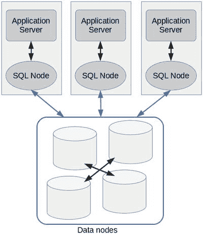

图 18-6. 每个应用服务器连接到位于同一主机的 SQL 节点

#### 使用 Connector/J 进行负载均衡

如果你正在使用 Java 开发应用程序，仅通过使用 `Connector/J` 就可以解决这个问题。`Connector/J` 具有针对 MySQL NDB 集群和 1:N MySQL 复制设置的负载均衡功能。要启用负载均衡，你只需调整连接参数。需要调整两个参数：连接 URL 和 `loadBalanceStrategy`。用于负载均衡的连接 URL 格式如下：

```
jdbc:mysql:loadbalance://{逗号分隔的服务器列表}/{数据库名称}
```

清单 18-15 展示了一个启用负载均衡的 `Connector/J` 配置示例。

```
Class.forName("com.mysql.jdbc.Driver");
String url = "jdbc:mysql:loadbalance://host1,host2,host3/db";
Properties props = new Properties();
props.setProperty("user", "username");
props.setProperty("password", "my password");
props.setProperty("loadBalanceStrategy", "random");
Connection conn = DriverManager.getConnection(url, props);
```

清单 18-15. 为使用 Connector/J 进行负载均衡设置 URL 和属性

通过此设置，到 SQL 节点的连接会分布在多个服务器上，如图 18-7 所示。

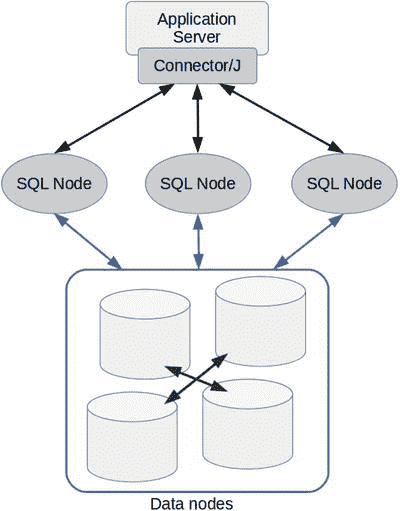

图 18-7. 使用 Connector/J 负载均衡数据库访问

`loadBalanceStrategy` 的可接受值是 `random` 或 `bestResponseTime`。设置为 `random` 时，连接会从服务器列表中随机获取。设置为 `bestResponseTime` 时，驱动程序会选择在上一次事务中响应时间最佳的服务器。默认值是 `random`。

#### 使用负载均衡器

市场上有很多负载均衡器。负载均衡器的类型大致分为以下三种：

*   **硬件负载均衡器**：负载均衡由专用硬件完成。它看起来像一个网络交换机。
*   **TCP/IP 层负载均衡器**：负载均衡由可用于一般 TCP/IP 连接的软件完成，例如 LVS 和 HAProxy。
*   **MySQL 协议负载均衡器**：负载均衡由 MySQL 协议层的软件完成。这种类型的负载均衡器只能用于 MySQL 或其他支持 MySQL 协议的数据库。（具体产品名称请参见以下描述。）本书将更详细地讨论这一种。

图 18-8 描绘了使用负载均衡器从应用程序到 SQL 节点连接的概览。如果负载均衡器是基于软件的，那么它极有可能与应用服务器运行在同一主机上。

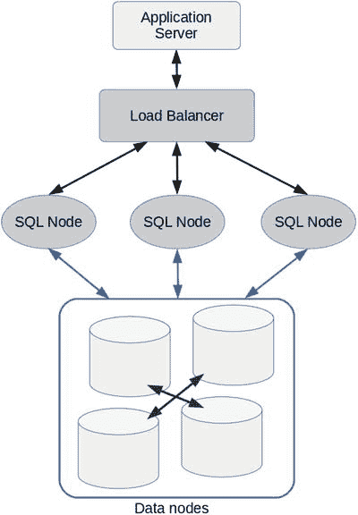

图 18-8. 使用负载均衡器平衡从应用程序到 SQL 节点的连接

遗憾的是，Oracle 公司目前没有发布适合与 MySQL NDB 集群一起使用的负载均衡器。`MySQL Router` 在其开发阶段是一个潜在的候选者。然而，它已成为 `InnoDB Cluster`（一种基于标准 MySQL 复制的高可用性解决方案）的专用软件。因此，它不能用于 MySQL NDB 集群。

有几款第三方软件可用于 MySQL NDB 集群的负载均衡。我个人推荐 `ProxySQL`，因为它实用，并且是在 GPLv3 许可下的免费软件。`ProxySQL` 的源代码发布在 GitHub 上：

[`github.com/sysown/proxysql`](https://github.com/sysown/proxysql)

`ProxySQL` 不仅仅是一个负载均衡器，它还具有丰富的功能，例如查询重写、查询路由、查询缓存、防火墙等等。本书只讨论其负载均衡功能。

目前，`ProxySQL` 没有详细的使用手册，请参考其 GitHub 仓库的 wiki 页面以及源代码中包含的 `doc` 目录。由于 `ProxySQL` 的配置有点令人困惑，我们将讨论其典型用法。

首先，将 `ProxySQL` 安装到你的主机上。你可以从 GitHub 下载源代码或二进制（RPM 和 DEB）包。与一般的开源项目不同，它没有自动配置工具，例如 `configure` 脚本或 `cmake` 配置文件。只需从源代码顶层目录运行 `make` 即可。清单 18-16 显示了从源代码构建它的典型命令。

```
shell$ git clone https://github.com/sysown/proxysql.git
shell$ cd proxysql
shell$ make
shell$ sudo make install
```

清单 18-16. 从源代码构建 ProxySQL

这将安装 `systemd` 服务 `proxysql.service`、默认配置文件 `/etc/proxysql.conf` 以及 `proxysql` 命令。你可以通过 `systemd` 或命令行启动它。


ProxySQL 的配置系统令人困惑。ProxySQL 的配置系统中有四层：`RUNTIME`、`MEMORY`、`DISK` 和 `CONFIG FILE`。图 18-9 显示了 ProxySQL GitHub 仓库 wiki 页面的截图。`RUNTIME` 是唯一有效的配置层，用于控制 ProxySQL 的行为。`MEMORY` 是一个内存中的 SQLite 数据库，而 `DISK` 是一个磁盘上的 SQLite 数据库。任何配置首先被加载到 `MEMORY`，然后应用到 `RUNTIME`。无法直接将配置从 `DISK` 或 `CONFIG FILE` 加载到 `RUNTIME`。顾名思义，`MEMORY` 中的配置不是持久化的，重启后会丢失。你必须将更改保存到 `DISK` 以使其持久化。`CONFIG FILE` 是一个补充性的配置源。仅在你偏好基于文件的配置风格时才使用它。

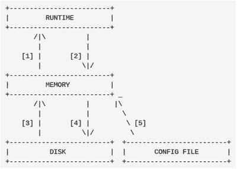

图 18-9. ProxySQL 的四个配置层

初始配置除了一些基本配置和注释外是空的。如果你偏好使用配置文件进行配置，请在启动 `proxysql` 守护进程之前，注释掉、复制并编辑其中的一些配置。当你使用管理界面进行配置时，此步骤可以跳过。

ProxySQL 的管理界面构建在 MySQL 协议之上。因此，运行时配置是通过使用 `mysql` 命令连接到 ProxySQL 并通过它发出 SQL 语句来完成的。管理界面的默认端口是 `6032`，默认用户名和密码都是 `admin`。你必须在生产系统中更改这些凭据。清单 18-17 显示了一个连接到管理界面时的示例命令输出。

```shell
$ mysql -h 127.0.0.1 -P 6032 -uadmin -p
Enter password:
Welcome to the MySQL monitor.  Commands end with ; or \g.
Your MySQL connection id is 6
Server version: 5.5.30 (ProxySQL Admin Module)
Copyright (c) 2000, 2017, Oracle and/or its affiliates. All rights reserved.
Oracle is a registered trademark of Oracle Corporation and/or its
affiliates. Other names may be trademarks of their respective
owners.
Type 'help;' or '\h' for help. Type '\c' to clear the current input statement.
mysql>
```
清单 18-17. 使用 `mysql` 命令连接 ProxySQL 管理界面

请注意，服务器版本打印为 “ProxySQL Admin Module”。在 ProxySQL 中有几个数据库和表需要配置，如清单 18-18 所示。

```sql
mysql> SHOW DATABASES;
+-----+---------+-------------------------------+
| seq | name    | file                          |
+-----+---------+-------------------------------+
| 0   | main    |                               |
| 2   | disk    | /var/lib/proxysql/proxysql.db |
| 3   | stats   |                               |
| 4   | monitor |                               |
+-----+---------+-------------------------------+
4 rows in set (0.00 sec)
mysql> SHOW TABLES;
+--------------------------------------+
| tables                               |
+--------------------------------------+
| global_variables                     |
| mysql_collations                     |
| mysql_query_rules                    |
| mysql_replication_hostgroups         |
| mysql_servers                        |
| mysql_users                          |
| runtime_global_variables             |
| runtime_mysql_query_rules            |
| runtime_mysql_replication_hostgroups |
| runtime_mysql_servers                |
| runtime_mysql_users                  |
| runtime_scheduler                    |
| scheduler                            |
+--------------------------------------+
13 rows in set (0.00 sec)
```
清单 18-18. 在 `main` 数据库中列出管理数据库和表

输出看起来像 MySQL，但略有不同。（实际的 MySQL Server 中的 `SHOW DATABASES` 命令在其结果集中只有一个字段。）我们不在本书中讨论每个表的细节。有关这些表的更多细节，请参阅文档和 wiki。

要在 ProxySQL 中设置负载均衡，你只需设置监控并添加要连接的 MySQL 服务器（SQL 节点）即可。

ProxySQL 监控目标 MySQL 服务器。ProxySQL 必须登录到受监控的服务器，并且你必须在每个受监控的 MySQL 服务器上创建一个监控用户。监控用户只需要 `USAGE` 权限。以下命令输出显示了创建监控用户的示例命令。在每个受监控的 MySQL 服务器上使用 `root` 用户运行这些命令。

```sql
mysql> CREATE USER proxysqlmon@proxyhost IDENTIFIED BY 'proxypassword';
Query OK, 0 rows affected (0.26 sec)
mysql> GRANT USAGE ON *.* TO proxysqlmon@proxyhost;
Query OK, 0 rows affected (0.00 sec)
```

请务必在此示例中将密码替换为生产系统中更强的密码。然后，配置 ProxySQL 使其使用此凭据登录。清单 18-19 显示了一个在 ProxySQL 管理界面中设置监控用户和密码的示例命令。

```sql
mysql> UPDATE global_variables SET variable_value='proxysqlmon' WHERE variable_name = 'mysql-monitor_username';
Query OK, 1 row affected (0.00 sec)
mysql> UPDATE global_variables SET variable_value='proxypassword' WHERE variable_name = 'mysql-monitor_password';
Query OK, 1 row affected (0.00 sec)
mysql> LOAD MYSQL VARIABLES TO RUNTIME;
Query OK, 0 rows affected (0.00 sec)
mysql> SAVE MYSQL VARIABLES TO DISK;
Query OK, 74 rows affected (0.02 sec)
```
清单 18-19. 在 ProxySQL 管理界面上配置监控用户

请注意，清单 18-19 中的 `UPDATE` 语句仅修改 `MEMORY` 层的配置。它必须使用 `LOAD` 命令应用到正在运行的 ProxySQL 实例，然后使用 `SAVE` 命令保存到 `DISK` 以实现持久化。

添加要连接的服务器以进行负载均衡，如清单 18-20 所示。`LOAD` 和 `SAVE` 命令是必需的，就像上一步一样。

```sql
mysql> INSERT INTO mysql_servers (hostgroup_id, hostname, port) VALUES(0, 'sqlnode1', 3306);
Query OK, 1 row affected (0.00 sec)
mysql> INSERT INTO mysql_servers (hostgroup_id, hostname, port) VALUES(0, 'sqlnode2', 3306);
Query OK, 1 row affected (0.00 sec)
mysql> LOAD MYSQL SERVERS TO RUNTIME;
Query OK, 0 rows affected (0.00 sec)
mysql> SAVE MYSQL SERVERS TO DISK;
Query OK, 0 rows affected (0.01 sec)
```
清单 18-20. 配置要连接的 MySQL 服务器

现在，你可以通过 ProxySQL 连接到后端 SQL 节点。默认端口号是 `6033`，其数字顺序与默认的 MySQL 端口号 `3306` 相反。清单 18-21 显示了一个通过 ProxySQL 连接 SQL 节点的示例命令。请注意，服务器版本字符串打印为 “ProxySQL”。连接的 MySQL 服务器是根据查询或从事务列表中显式启动的事务随机选择的，该列表在清单 18-20 中配置。这意味着即使不重新连接到 ProxySQL，连接的后端服务器也可能会改变。


```
shell$ mysql -h proxyhost -P 6033 -p
输入密码：
欢迎来到 MySQL 监控器。命令以 ; 或 \g 结束。
您的 MySQL 连接 ID 是 9
服务器版本：5.5.30 (ProxySQL)
Copyright (c) 2000, 2017, Oracle 和/或其关联公司。保留所有权利。
Oracle 是 Oracle Corporation 和/或其关联公司的注册商标。其他名称可能是其各自所有者的商标。
输入 'help;' 或 '\h' 获取帮助。输入 '\c' 清除当前输入语句。
mysql> SELECT VERSION();
+------------------+
| VERSION()        |
+------------------+
| 5.7.18-ndb-7.5.6 |
+------------------+
1 行结果集 (0.00 sec)
清单 18-21.
通过 ProxySQL 连接到 SQL 节点
```

### NDBCluster 表的事务处理

在大多数方面，可以像访问 `InnoDB` 表一样访问 `NDBCluster` 表。您可以像编写 `InnoDB` 事务一样编写事务。然而，`NDBCluster` 与 `InnoDB` 在事务处理方面存在一些重大差异。在开发事务性应用程序时，您必须牢记 MySQL NDB Cluster 事务处理的一些特性。

*   *仅支持 READ-COMMITTED 隔离级别*：`NDBCluster` 存储引擎仅支持 `READ-COMMITTED` 隔离级别。不支持 `REPEATABLE-READ` 或 `SERIALIZABLE`。如果您的应用程序需要这些隔离级别，NDBCluster 可能不是一个好的选择。
*   *不支持死锁检测*：MySQL NDB Cluster 无法像 `InnoDB` 那样检测由冲突的行级锁引起的死锁。因此，任何锁问题都会被检测为锁等待超时，而不是死锁。
*   *提交在磁盘上并非持久*：虽然所有数据都会在节点组内复制，但已提交的事务在 GCP（全局检查点）写入重做日志条目之前并非持久的。这意味着在整个集群故障时，事务不是持久的。
*   *不支持保存点*：MySQL NDB Cluster 不支持保存点。当您想要回滚未提交的更改时，必须始终回滚整个事务。
*   *LOCK TABLES 命令不会阻止来自其他 SQL 节点的访问*：`LOCK TABLES` 语句仅对发出该语句的同一 SQL 节点有效。因此，使用 `LOCK TABLES` 语句无法阻止在其他 SQL 节点上执行的事务。
*   *无法临时禁用二进制日志记录*：如果在 SQL 节点中启用了二进制日志记录，则无法通过将 `sql_log_bin` 系统变量设置为 `OFF` 来为单个语句禁用二进制日志记录。

#### 错误处理技术

在开发事务性数据库应用程序时，为错误做好准备很重要，因为事务理论并不能确保事务能够成功完成。它只确保所有事务的状态要么变为 `COMMIT`（提交），要么变为 `ABORT`（中止）。这简化了应用程序开发，因为无需考虑未完成的、进行到一半的状态。

这一特性就是所谓的原子性；它是事务四个重要特性（称为 ACID）之一。因此，当事务失败时，该事务所做的所有更改都将被回滚。数据库状态会回滚，就好像失败的事务根本没有执行过一样。因此，事务性应用程序所需的唯一错误处理就是从头开始重试失败的事务。然而，换句话说，尽管算法简单，错误处理对于事务性应用程序来说是强制性的。

错误处理流程根据编程语言的类型而有所不同。使用过程式编程语言时，它通过检查函数的返回代码来判断是否发生错误。使用面向对象编程语言时，通常通过异常来检测错误。清单 18-22 展示了一个包含重试算法的事务概念代码（使用 C API）。请注意，该代码只是一个概念，因此省略了许多内容并以缩写形式表示。您无法编译它。请阅读清单 18-22 中的注释以了解此程序的功能。重试事务时，请确保失败事务中读取的所有值都已过时。即使读取的值仍存在于内存中，也不要复用它。

```
int do_transaction1(...) {
/* 变量声明 */
MYSQL      *mysql;
MYSQL_RES  *res;
MYSQL_ROW  row;
int        status;
int        exit_code;
int        retry_count = 5;
useconds_t retry_delay = 100000;
loop:
/* 获取连接 */
mysql = mysql_init(NULL);
if (!mysql_real_connect(mysql, ...)) {
goto err;
}
/* 执行事务 */
if(mysql_autocommit(mysql, 0))
goto err;
...
status = mysql_real_query(mysql, ...);
if(status) {
if(事务可重试) {
goto retry;
} else {
goto err;
}
}
...
goto end;
retry:
/* 为可恢复错误重试事务 */
status = mysql_rollback();
if(retry_count++ > 0) {
usleep(retry_delay);
goto loop;
}
err:
/* 严重错误 */
exit_code = THE_ERROR_CODE;
end:
/* 关闭连接 */
mysql_close(mysql);
return exit_code;
}
清单 18-22.
使用重试算法的 C 语言概念性事务处理代码
```

使用 Java 等面向对象编程语言编写实现相同功能的程序可能有所不同。清单 18-23 展示了执行事务的 Java 程序示例源代码。这个 Java 程序比清单 18-22 中的 C 程序更简短，因为 Java 比 C 更紧凑。

```
public void doTransaction1() throws SQLException {
Connection     conn = null;
Statement      stmt = null;
ResultSet      rs = null;
int            retryCount = 5;
int            sleepDelay = 100;
do {
try {
// 获取连接
conn = getConnection();
conn.setAutoCommit(false);
// 执行事务
stmt = conn.createStatement();
String query = "SELECT ... FROM tbl WHERE ...";
rs = stmt.executeQuery(query);
...
retryCount = 0;
} catch (SQLException sqlEx) {
String sqlState = sqlEx.getSQLState();
// 确定事务是否可重试
if (事务可重试) {
Thread.sleep(sleepDelay);
retryCount--;
} else {
retryCount = 0;
}
} finally {
try {
if (rs != null) rs.close();
if (stmt != null) stmt.close();
if (conn != null) conn.close();
} catch (SQLException sqlEx) {
// 写入日志等
...
}
}
} while (retryCount > 0);
}
清单 18-23.
使用重试算法的 Java 语言概念性事务处理代码
```


#### 编写可重试事务程序的关键点与实现方法

##### 错误信息的类型与用途

编写一个执行事务的程序时，关键点在于如何确定一个事务是否可重试。这取决于通过驱动程序从服务器报告了什么错误。因此，应用程序必须首先从驱动程序检索错误信息。MySQL 驱动程序提供以下类型的错误信息：

*   `Errno`： MySQL 特定的错误代码，分配给每种错误类型。您可以在 [`dev.mysql.com/doc/refman/5.7/en/error-messages-server.html`](https://dev.mysql.com/doc/refman/5.7/en/error-messages-server.html) 和 [`dev.mysql.com/doc/refman/5.7/en/error-messages-client.html`](https://dev.mysql.com/doc/refman/5.7/en/error-messages-client.html) 找到错误代码列表。
*   `Error message`： 文本格式的错误描述。您可以在错误消息中找到其他信息，例如语法错误的位置、导致重复行的表名等。
*   `SQLSTATE`： 代表错误类型的五字符代码，该代码在 SQL 标准中定义。

`Errno`（或错误代码）和 `SQLSTATE` 用于判断事务是否可重试，以及需要采取什么进一步的操作。请注意，`errno` 也有一个表示错误类型的文本标签。您可以在参考手册中找到该标签。错误消息是人类可读的错误信息。错误消息主要用于记录日志，以便数据库管理员（DBA）后续审查。

检索错误信息的方式因编程语言和驱动程序实现而异。表 18-4 列出了发生错误时如何检索错误信息。

**表 18-4. 每种编程语言的错误信息检索方法**

| 语言/驱动 | 错误检测方式 | 检索错误信息的方法 |
| --- | --- | --- |
| Connector/J | `SQLException` | `SQLException#getSQLState()` `SQLException#getErrorCode()` `SQLException#getMessage()` |
| Connector/Python | `mysql.connector.Error` | `mysql.connector.Error#sqlstate` `mysql.connector.Error#errno` `mysql.connector.Error#msg` |
| C API | 返回值 | `mysql_sqlstate()` `mysql_errno()` `mysql_error()` |
| PHP, `mysqli` | 返回值 | `mysqli_sqlstate()`/`mysqli->sqlstate()` `mysqli_errno()`/`mysqli->errno()` `mysqli_error()`/`mysqli->error()` |
| PHP, PDO | `PDOException` | `PDOException::$errInfo[0]` … SQLSTATE `PDOException::$errInfo[1]` … Errno `PDOException::$errInfo[2]` … Error |
| Perl, DBD::mysql | 异常或返回值（取决于 `RaiseError` 设置） | `$dbh->state` `$dbh->err` `$dbh->errstr` |
| Ruby/MySQL | `Mysql::Error` | `Mysql::Error#sqlstate` `Mysql::Error#errno` `Mysql::Error#error` |

##### 实现事务重试例程

实现重试例程的最简单方法是针对所有类型的错误进行盲目的重试。这在大多数情况下都适用，因为除非事务已提交，否则重试本身是无害的。不要忘记在重试前回滚事务。否则，重试将不会成功。

如果您倾向于更聪明的选择，可以考虑实现一个例程，根据 `SQLSATE` 和错误码在重试前判断事务是否可重试。可重试错误的种类并不多，因为大多数错误对于应用程序来说是致命的。例如，`errno` 1146 有一个标签 `ER_NO_SUCH_TABLE`，意思是“语句引用的表不存在”。一个不存在的表在重试时极不可能出现。所以，这不是一个可重试的错误。在这种情况下，无论如何都需要人工干预。DBA 可能需要修复模式问题或修复应用程序代码中的错误。总之，只有在错误是临时的情况下，重试事务才有效。

##### 基于 SQLSTATE 的重试判断

必须首先检查的信息是 `SQLSTATE`。`SQLSTATE` 由五个字符组成，前两个字符代表错误类，后三个字符代表错误子类。表 18-5 列出了 `SQLSTATE` 的主要错误类。

**表 18-5. SQLSTATE 中定义的主要错误类**

| 类 | 类文本 | 可重试？ | 描述 |
| --- | --- | --- | --- |
| `00` | 成功完成 | 否（无需重试） | 无错误。 |
| `01` | 警告 | 否（无需重试） | 语句执行成功，但产生了一些警告。 |
| `02` | 无数据 | 否（用于存储过程） | 不存在更多数据。 |
| `08` | 连接异常 | 是 | 与连接相关的错误。 |
| `22` | 数据异常 | 否（用于存储过程） | 数据对于数据类型无效。 |
| `23` | 完整性约束违规 | 否（用于存储过程） | 违反了约束。 |
| `25` | 无效的事务状态 | 否 | 尝试转换到事务的无效状态。 |
| `28` | 无效的授权规格 | 否 | 授权失败。 |
| `40` | 事务回滚 | 是 | 事务因某种原因被回滚。当前，MySQL NDB 集群不支持。（发生在 `InnoDB` 上。） |
| `42` | 语法错误或访问规则违规 | 否 | 解析器检测到语法错误。 |
| `HY` | 通用错误 | 取决于具体情况 | 供应商特定。 |
| `XA` | XA 事务错误 | 取决于具体情况 | MySQL NDB 集群不支持 XA 事务。 |

如表 18-5 所示，唯一需要重试的 `SQLSTATE` 类是 `08`，在某些情况下是 `HY`。当 `SQLSTATE` 类为 `08` 时，应用程序需要重新连接到 SQL 节点。第 15 章讨论的临时错误包含在 `HY` 类中。请注意，`40` 或 `XA` 可能来自 `InnoDB`，但不会发生在 `NDBCluster` 存储引擎上。

> **注意**
> 如果您遇到语法错误（`SQLSTATE class = 42`），这可能是 SQL 注入攻击的症状。语法错误可能是攻击者更改 SQL 语法的结果。即使它们不是由于攻击造成的，语法错误也表明存在 SQL 注入攻击的潜在风险，因此应尽快修复。

##### 基于 MySQL NDB 集群错误码的重试判断

当 `SQLSTATE` 类为 `HY` 时，应用程序必须检查从驱动程序检索到的错误码。在 MySQL NDB 集群中，表 18-6 中列出的错误码值得重试。

**表 18-6. MySQL NDB 集群可重试的错误码列表**

| 错误码 | 标签 | 描述 |
| --- | --- | --- |
| `1028` | `ER_FILSORT_ABORT` | 排序因各种原因被中止。这不特定于 `NDBCluster` 存储引擎。 |
| `1036` | `ER_OPEN_AS_READONLY` | 访问的表以只读模式打开。这可能在 binlog 注入器准备好之前发生。 |
| `1038` | `ER_OUT_OF_SORTMEMORY` | 排序行时内存不足。这不特定于 `NDBCluster` 存储引擎。 |
| `1041` | `ER_OUT_OF_RESOURCES` | SQL 节点内存不足。这不特定于 `NDBCluster` 存储引擎。 |
| `1180` | `ER_ERROR_DURING_COMMIT` | 提交期间发生错误。 |
| `1181` | `ER_ERROR_DURING_ROLLBACK` | 回滚期间发生错误。 |
| `1135` | `ER_CANT_CREATE_THREAD` | 由于内存不足等原因，线程创建失败。这不特定于 `NDBCluster` 存储引擎。 |
| `1205` | `ER_LOCK_WAIT_TIMEOUT` | 事务因锁等待超时而无法获取锁。 |
| `1297` | `ER_GET_TEMPORARY_ERRMSG` | 资源临时错误。 |

##### 特殊情况：提交期间的连接失败

有一种极端情况，如果不进行进一步检查就无法重试。那就是执行提交时发生连接失败（`SQLSTATE class = 08`），因为应用程序本身无法仅通过检查从驱动程序检索的错误信息来确定 `COMMIT` 是否成功。应用程序只知道它向 SQL 节点发出了 `COMMIT`，但由于网络问题，结果未知。这种问题可以通过 XA 事务来妥善处理；但是，MySQL NDB 集群尚未实现此功能。应用程序必须检查表数据以判断事务所做的更改是否可用，或者提出错误以进行人工干预。

#### 概要

本章讨论了如何在 MySQL NDB 集群中，像使用普通关系型数据库一样，使用 SQL 开发应用程序。涵盖以下主题：

*   创建表和索引，以及各种类型的数据库对象。
*   了解 MySQL NDB 集群中可用的索引类型。
*   估算表大小及其所需对象。
*   使用磁盘数据表。
*   从应用程序连接到 SQL 节点。
*   采用事务和错误处理技术。

SQL 是一门古老但至今仍被积极使用的数据操作语言。SQL 易于使用，并且在现实世界的数据库应用开发中被广泛使用。由于 MySQL NDB 集群可以通过 SQL 访问，因此您在开发应用程序时可以享受 SQL 的强大功能。

下一章将讨论如何使用 NoSQL API 在 MySQL NDB 集群上开发应用程序。虽然 SQL 是一门非常强大的编程语言，但仍有一些问题领域是 SQL 无法解决的。在这种情况下，NoSQL API 可能会派上用场。

## 19. 作为 NoSQL 数据库的 MySQL NDB 集群

本章讨论了如何将 MySQL NDB 集群作为 NoSQL 数据库来开发应用程序的各种方法。MySQL NDB 集群具有多种类型的 NoSQL 协议，它们可以访问与 SQL 相同的数据，但无需使用 SQL 查询接口的开销。能够通过不同协议访问相同的数据，是 MySQL NDB 集群在开发实际应用程序时最出色的特性之一。

### 为何使用 NoSQL？

SQL 是一门完美的、自包含的语言，从它能提供关系数据库所能提供的所有功能这个意义上来说。然而，从性能角度来看，它有时并不完美。在某些情况下，人们更倾向于使用更简单、更快的访问方法。MySQL NDB 集群具有一个原生的 `NDB API` 用于访问数据节点。它还支持建立在 `NDB API` 之上的几种 NoSQL API。

本章讨论 MySQL NDB 集群支持的主要 NoSQL API。

*   `memcached` API：一个基于定义良好的网络协议的、众所周知、简单、快速且易于使用的 API。MySQL NDB 集群软件包捆绑了 `memcached` 服务器，它可以访问数据节点。虽然 `memcached` 协议非常简单，但与 SQL 相比，它提供的功能要少得多。您可以在 [`github.com/memcached/memcached/blob/master/doc/protocol.txt`](https://github.com/memcached/memcached/blob/master/doc/protocol.txt) 找到该协议的详细信息。
*   `NDB API`：应用程序可以使用 `NDB API` 协议直接访问数据节点。由于 `NDB API` 是一个 C++ API，因此应用程序必须使用 C++ 编写。这使得使用 `NDB API` 实现访问数据的算法比使用 SQL 更困难。例如，连接、子查询、存储过程、`GROUP BY` 和 `ORDER BY` 等都是 SQL 中非常强大且易于使用的操作。然而，使用 `NDB API` 实现这些相同的操作却是一项非常繁琐的任务。
*   `ClusterJ`：`NDB API` 的 Java 封装。应用程序可以通过 Java 本地接口 (`JNI`) 调用 `NDB API` 函数。开发 Java 应用程序比使用 C++ 的难度要低，但它们有更高的性能开销。

每种协议都可以访问与 SQL 相同的数据，且性能开销比 SQL 小。然而，SQL 是 MySQL NDB 集群可用的最强大的 API，因此每个 NoSQL 协议都为了换取性能优势而存在各自的缺点。因此，仅使用 NoSQL 协议来开发整个应用程序并不实际。最佳策略是结合使用 SQL 和 NoSQL。复杂的算法使用 SQL 实现，而简单但快速的算法则使用 NoSQL 实现。

### 通过 memcached 访问数据

`memcached` 是一种在内存中存储（缓存）数据的软件名称。数据以键值对的形式存储。这类数据存储软件被称为键值存储 (`KVS`)。

从 MySQL NDB 集群 7.2 系列开始，`memcached` 服务器作为软件包的一部分捆绑提供。捆绑的 `memcached` 是一个特殊版本，可以使用 MySQL NDB 集群作为其底层存储引擎。

#### 为何使用 NDB-memcached

`memcached` 协议广为人知，简单、易用且快速。许多读者可能之前已经使用过 `memcached`。尽管市场上有更先进的 `KVS` 产品，但对于缓存目的而言，`memcached` 仍然是一个不错的选择。

图 19-1 展示了 `memcached` 与 MySQL NDB 集群协同工作的总体架构。`memcached` 服务器使用 `NDB API` 直接连接到数据节点。因此，它像 SQL 节点一样，充当一种 API 节点的角色。应用程序通过 `memcached` 协议访问 `memcached` 服务器，然后 `memcached` 服务器使用 `NDB API` 访问数据节点上的实际数据。为方便起见，本章中我们将 `memcached` 服务器能够使用 MySQL NDB 集群作为其存储引擎的功能称为 `NDB-memcached`。请注意，即使我们称其为产品名 `NDB-memcached`，进程名仍然是 `memcached`。带前缀的 `NDB-memcached` 和不带前缀的 `memcached` 表示相同的事物，在本章中我们将交替使用这些术语。

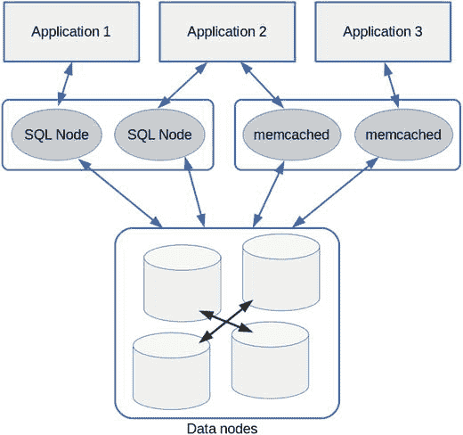

图 19-1. `memcached` 与 MySQL NDB 集群协同工作的总体架构

当数据在 `NDB-memcached` 中被修改时，数据节点内的行数据会被直接修改。另一方面，`NDB-memcached` 可以看到从 SQL 节点修改后的最新行数据。因此，无需在 `memcached` 和关系数据库之间同步数据。这使得应用程序开发比将 `memcached` 仅用作缓存而将标准 MySQL 服务器用作持久存储时更加容易。此外，即使 `memcached` 崩溃，数据节点上的数据仍然会保留。与将整体数据拆分为较小分片的分片机制不同，`NDB-memcached` 中的每个 `memcached` 服务器都可以访问数据节点中的所有数据。因此，与标准的 `memcached` 相比，`NDB-memcached` 具有明显的优势。

`memcached` 最重要的方面在于其在响应时间和吞吐量方面的性能。由于 `memcached` 协议比 SQL 简单得多，因此它比 SQL 更高效。在处理 SQL 时，需要解析 SQL、检查权限、优化查询执行计划等等。SQL 处理的开销远大于通过 `memcached` 访问数据。然而，`memcached` 无法处理诸如连接之类的复杂查询。因此，可以根据这些需求采用不同的访问方法：

*   使用 `NDB-memcached` 进行简单快速的数据访问。
*   使用 SQL 进行复杂查询。

此策略为您的应用程序带来了灵活性和性能。

#### 设置 NDB-memcached

在本节中，我们将讨论如何设置 `NDB-memcached`。

##### 安装 NDB-memcached

安装包含 `memcached` 二进制文件及相关文件的软件包。

当您在 Linux 上使用 `RPM` 或 `DEB` 包管理器时，在 MySQL NDB 集群 7.5 系列或更新版本中，`memcached` 被包含在一个单独的专用软件包中。例如，软件包名称为 `mysql-cluster-community-memcached-7.5.6-1.el7.x86_64.rpm` 或 `mysql-cluster-community-memcached_7.5.6-1ubuntu16.04_amd64.deb`。在 MySQL NDB 集群 7.4 或更早版本中，`memcached` 包含在服务器 `RPM` 包或某个 `DEB` 包中。对于其他软件包格式，无论操作系统类型如何，软件包都是合并且未按功能分离的。有关安装的更多信息，请参阅第 5 章。

> 注意
>
> `NDB-memcached` 目前不适用于 Windows 软件包，因为 `memcached` 官方不支持 Windows 平台。请考虑使用类 UNIX 操作系统。

##### 准备 ndbmemcache 模式
首先，设置 NDB-memcached 所需的系统模式；模式名称为 `ndbmemcache`。要创建 `ndbmemcache` 模式及其中的表，请执行包含在 `ndb_memcache_metadata.sql` 中的 SQL 语句。对于 MySQL NDB Cluster 7.5 或更新版本的 RPM 和 DEB 包，该文件位于 `/usr/share/mysql/memcached-api/` 目录中。对于其他包类型，它位于安装目录的 `share/mysql/memcached-api/` 子目录中。按照清单 19-1 所示加载 SQL 文件。你可以看到 `ndbmemcache` 数据库下有 11 张表。
```
mysql> source /usr/share/mysql/memcached-api/ ndb_memcache_metadata.sql
Query OK, 1 row affected (1.87 sec)
Database changed
Query OK, 0 rows affected (0.81 sec)
...
mysql> use ndbmemcache
Database changed
mysql> SHOW TABLES;
+-----------------------+
| Tables_in_ndbmemcache |
+-----------------------+
| cache_policies        |
| containers            |
| demo_table            |
| demo_table_large      |
| demo_table_tabs       |
| external_values       |
| key_prefixes          |
| last_memcached_signon |
| memcache_server_roles |
| meta                  |
| ndb_clusters          |
+-----------------------+
11 rows in set (0.00 sec)
Listing 19-1.
创建 ndbmemcache 模式及表
```

##### 启动 memcached 服务器
确保你的 `config.ini` 文件中有一个空闲的 `[API]` 或 `[MYSQLD]` 插槽，因为 `memcached` 作为 API 节点连接到集群。一个 memcached 进程将消耗多达四个插槽。如果没有空闲插槽，请在启动 memcached 服务器之前至少添加一个 API 节点。有关添加 API 节点的步骤，请参阅第 10 章。

要启动 memcached 服务器，请运行 `memcached` 命令，如清单 19-2 所示。
```
shell$ memcached -E /usr/lib64/mysql/ndb_engine.so \
-e "connectstring=mgmhost;role=db-only"
Listing 19-2.
启动 memcached 服务器
```
如清单 19-2 所示，明确指定了两个选项。这些选项特定于 NDB-memcached。每个选项的含义如下：
*   `-E`：指定要使用的存储引擎实现的共享库。
*   `-e`：指定传递给存储引擎的选项。选项在用分号分隔的文本中指定。

通过 `-e` 选项传递的引擎特定选项列于表 19-1 中。

表 19-1. 传递给 ndb_engine.so 的引擎特定选项

| 选项 | 描述 |
| --- | --- |
| `connectstring=` string | 连接字符串。使用与普通 NDB 程序相同的格式指定。默认值为 `localhost:1186`。 |
| `role=` string | 分配给此 memcached 服务器的角色。默认值为 `default_role`。见下一节。 |
| `scheduler=` string | 以 `name:configuration` 格式指定调度器属性。默认为 `"S:c0,f0,t1"`，表示调度器名称为 `S`，S-调度器的选项为 `c0,f0,t1`。 |
| `reconf={true\|false}` | 指定是否允许在线重新配置。默认值为 `true`。 |
| `debug={true\|false}` | 如果要调试 NDB-memcached，则设置为 `true`。默认值为 `false`。 |

`scheduler` 的配置稍微复杂。除了 S-调度器（调度器名称有 `73`, `stockholm`, `trondheim`）外还有其他调度器，但 S-调度器经过最充分的测试，在大多数情况下已足够。S-调度器的参数以无空格的逗号分隔字符串表示，每个字符串以一个字母开头后跟一个数字。每个参数的含义如下：
*   `c`：指定到集群的连接数，就像 `mysqld` 中的 `--ndb-cluster-connection-pool` 一样。可能的范围是 0 – 4。默认值为 0，表示自动。
*   `f`：指定是否使用强制发送。默认值为 0（false）。此选项与 `mysqld` 中的 `--force-send` 选项效果相同。
*   `t`：设置发送线程计时器（毫秒）。可能的范围是 1 – 10。默认值为 1。

其他 memcached 选项也可用，就像标准 memcached 一样。有关可用选项的完整列表，请参阅 `memcached -h` 的输出。默认情况下，memcached 监听端口 11211。你可以使用 `telnet` 命令测试 NDB-memcached，如清单 19-3 所示。如果你的操作系统上没有 `telnet` 命令（因为它是一个过时的命令），请尝试使用包中随 memcached 一起提供的 `memclient` 命令。
```
shell$ telnet localhost 11211
Trying ::1...
Connected to localhost.
Escape character is '^]'.
set love 0 0 5
peace
STORED
set b:big 0 0 5
small
STORED
^]
telnet> quit
Connection closed.
shell$ memclient -a
Memclient 1.0 using Term::ReadLine::Stub
Attempting ASCII connection to localhost:11211 ...
Connected.
memcache > get love
KEY        | FLAGS |Value
love              | 0     |peace
Listing 19-3.
连接到 NDB-memcached 并运行一些测试
```
你可以看到值存储在 NDBCluster 表中，如清单 19-4 所示。
```
mysql> SELECT * FROM ndbmemcache.demo_table;
+------+------------+-------+-------------+--------------+
| mkey | math_value | flags | cas_value   | string_value |
+------+------------+-------+-------------+--------------+
| love |       NULL |     0 | 83214991362 | peace        |
+------+------------+-------+-------------+--------------+
1 row in set (0.00 sec)
mysql> SELECT * FROM ndbmemcache.demo_table_large;
+------+-------+-------------+--------------+--------+----------+
| mkey | flags | cas_value   | string_value | ext_id | ext_size |
+------+-------+-------------+--------------+--------+----------+
| big  |     0 | 83214991365 | small        |   NULL |     NULL |
+------+-------+-------------+--------------+--------+----------+
1 row in set (0.00 sec)
Listing 19-4.
从 SQL 节点访问与 NDB-memcached 相同的数据
```
如清单 19-4 所示，值存储在 `demo_table` 和 `demo_table_large` 中。为什么它们存储在这些表中？是否可以通过 NDB-memcached 访问任意表？这是下一个主题。

#### 定义到 NDB Cluster 表的映射
从清单 19-4 中可以看到，两个键 `love` 和 `b:big` 存储在不同的表中。这是因为后者键有一个前缀 `b:`。NDB-memcached 可以根据前缀值访问不同的表。前缀 `b:` 是默认预定义的。此功能非常重要，因为如果只是访问演示表，它是没有用的。

要理解到表的映射，以下概念是关键点：
*   **角色**：分配给每个 memcached 服务器的角色。在 `memcache_server_roles` 表中定义，并在启动 `memcached` 进程时在 `-e` 选项中指定。
*   **前缀**：每个键的前缀。
*   **策略**：映射到每个值的缓存策略。
*   **容器**：定义在 `NDBCluster` 存储引擎中用于存储键值对的表（或多张表）。

简而言之，角色和前缀的组合决定了使用哪对策略和容器。

#### 定义容器

`Container` 定义了要从 NDB-memcached 访问的表和列。当然，目标表必须是 NDB Cluster 表。映射到表的键部分最多可由四列组成。键列集合必须由目标表上的主键或辅助唯一索引组成。映射到表的值部分最多可由 16 列组成。如果键部分或值部分包含多个列，则必须在 memcached 客户端中以制表符分隔的格式指定。

准备好目标表后，在 `ndbmemcache` 数据库下的 `containers` 表中插入一条记录。`containers` 表包含表 [19-2] 中列出的列。

表 19-2.
`containers` 表中的列

| 列名 | 可否为空 | 描述 |
| --- | --- | --- |
| `name` | 否 | 容器的名称。 |
| `db_schema` | 否 | 目标表的数据库名。 |
| `db_table` | 否 | 目标表名。 |
| `key_columns` | 否 | 用作 memcached 操作键的列的逗号分隔列表。最多可指定四列。如果在此表中指定了多列，则 memcached API 中的值必须以制表符分隔的格式指定。 |
| `value_columns` | 是 | 用作 memcached 存储/读取的值的列的逗号分隔列表。最多可指定 16 列。如果在此表中指定了多列，则 memcached API 中的值必须以制表符分隔的格式指定或检索。 |
| `flags` | 否 | 目前未使用。 |
| `increment_column` | 是 | 用于存储在 memcached `INCR` 和 `DECR` 操作中使用的数值的列。如果设置，该列在目标表中必须定义为 `BIGINT UNSIGNED`。 |
| `cas_column` | 是 | 用于 memcached 上的 Compare and Swap (CAS) 操作的列。如果设置，该列在目标表中必须定义为 `BIGINT UNSIGNED`。 |
| `expire_time_column` | 是 | 用于确定行是否过期的列。如果设置，该列在目标表中必须定义为 `TIMESTAMP`。当从 memcached 访问时，如果列值早于当前时间，则从目标表中删除该行。 |
| `large_values_table` | 是 | 用于存储像 `BLOB` 数据这样的大型数据的表。 |

以下 SQL 命令插入一个条目，以通过 NDB-memcached 访问 `world.City` 表。在此示例中，容器被命名为 `world_city`。`world.City` 表中的两个非主键列被列在 `value_columns` 值中。

```
mysql> INSERT INTO containers VALUES('world_city', 'world', 'City', 'ID', 'Name,CountryCode', 0, NULL, NULL, NULL, NULL);
Query OK, 1 row affected (0.00 sec)
```

如果 `large_values_table` 不为空，则用于存储大值的表必须具有定义，如代码清单 [19-5] 所示。

```
CREATE TABLE IF NOT EXISTS `external_values` (
`id` INT UNSIGNED AUTO_INCREMENT NOT NULL,
`part` SMALLINT NOT NULL,
`content` VARBINARY(13950) NOT NULL,
PRIMARY KEY (id,part)
) ENGINE = NDBCluster;
```
代码清单 19-5.
存储大值的表的定义

#### 审查策略

NDB-memcached 可以将数据存储在 memcached 中，也可以存储在 `NDBCluster` 表中。选择将数据存储在 memcached 中还是 `NDBCluster` 表中的偏好在 `ndbmemcache` 数据库下的 `cache_policies` 表中定义。`cache_policies` 表中有六种预定义策略，如代码清单 [19-6] 所示。

```
mysql> SELECT * FROM cache_policies\G
*************************** 1. row ***************************
policy_name: memcache-only
get_policy: cache_only
set_policy: cache_only
delete_policy: cache_only
flush_from_db: false
*************************** 2. row ***************************
policy_name: caching-with-local-deletes
get_policy: caching
set_policy: caching
delete_policy: cache_only
flush_from_db: false
*************************** 3. row ***************************
policy_name: ndb-read-only
get_policy: ndb_only
set_policy: disabled
delete_policy: disabled
flush_from_db: false
*************************** 4. row ***************************
policy_name: ndb-test
get_policy: ndb_only
set_policy: ndb_only
delete_policy: ndb_only
flush_from_db: true
*************************** 5. row ***************************
policy_name: ndb-only
get_policy: ndb_only
set_policy: ndb_only
delete_policy: ndb_only
flush_from_db: false
*************************** 6. row ***************************
policy_name: caching
get_policy: caching
set_policy: caching
delete_policy: caching
flush_from_db: false
6 rows in set (0.00 sec)
```
代码清单 19-6.
显示预定义的缓存策略

`cache_policies` 中的每一列都具有表 [19-3] 中列出的含义。

表 19-3.
`cache_policies` 表中列的描述

| 列名 | 描述 |
| --- | --- |
| `policy_name` | 策略的名称。该名称用于与角色和前缀进行映射。 |
| `get_policy` | 应用于 memcached `get` 操作的策略。 |
| `set_policy` | 应用于 memcached `set` 操作的策略。 |
| `delete_policy` | 应用于 memcached `delete` 操作的策略。 |
| `flush_from_db` | 指定在 memcached 的 `flush_all` 操作时是否删除表中的所有行。 |

`cache_policies` 表中三个策略列的可接受值描述如下：

*   `cache_only`：仅在 memcached 自身的内存存储中获取、设置和删除数据。
*   `ndb_only`：仅在关联的容器表中获取、设置和删除数据。
*   `caching`：数据同时存储在 memcached 的内存存储和关联的容器表中。memcached 的存储用作容器表的缓存。在执行 `get` 操作时首先搜索缓存，如果在 memcached 的内存数据存储中找到数据，则跳过任何进一步的搜索。在执行 `set` 和 `delete` 操作时，memcached 内存存储和关联容器表中的数据都会被更新或删除。
*   `disabled`：该操作不允许。

查看预定义的策略，并选择适合你应用程序的策略。如果你只是想通过 memcached 协议访问与 NDB Cluster 表相同的数据，那么 `ndb-only` 是选择。或者，如果你希望允许从 memcached 只读访问 NDB Cluster 表，请选择 `ndb-read-only`。`ndb-test` 策略与 `ndb-only` 策略非常相似，除了 `flush_from_db` 设置。由于在 `flush_all` 操作时删除所有行是一个有点危险的操作，我建议不要使用此策略。

对于缓存策略，`caching` 和 `caching-with-local-deletes`，如果只更新其中之一，当然有可能 memcached 内存存储中的数据和容器表中的数据会不同步。使用缓存策略时要小心。`memcache-only` 策略不访问容器表。数据不持久化，也不会同步到其他 memcached 实例。

如果没有策略完全符合你的需求，你可以将自己的策略添加到 `cache_policies` 表中。


#### 定义服务器角色

每个 memcached 服务器都被分配了一个角色。角色本身只是一个标签，定义在 `ndbmemcache` 数据库下的 `memcache_server_roles` 表中。清单 19-7 展示了一个包含预定义角色的 `memcache_server_roles` 表示例。

```
mysql> SELECT * FROM memcache_server_roles;
+--------------+---------+---------+---------------------+
| role_name    | role_id | max_tps | update_timestamp    |
+--------------+---------+---------+---------------------+
| large        |       4 |  100000 | 2017-06-11 17:13:35 |
| default_role |       0 |  100000 | 2017-06-11 17:13:35 |
| db-only      |       1 |  100000 | 2017-06-11 17:13:35 |
| ndb-caching  |       3 |  100000 | 2017-06-11 17:13:35 |
| mc-only      |       2 |  100000 | 2017-06-11 17:13:35 |
+--------------+---------+---------+---------------------+
5 rows in set (0.00 sec)
清单 19-7.
memcached_server_roles 表的示例内容
```

如你所见，每个角色都有一个数字标识符，显示在 `role_id` 列中。此值用于定义前缀与缓存策略和容器对之间的映射。

你可以使用预定义的角色，也可以添加自己的角色。由于每个 memcached 服务器实例的行为会根据分配的角色而不同，因此，如果你想运行具有不同行为的 memcached 服务器，可以根据需要定义任意多个角色。

#### 定义映射

现在，你可以定义角色与前缀对以及缓存策略和容器对之间的映射。定义方法是向 `ndbmemcache` 数据库下的 `key_prefixes` 表添加条目。表 19-4 列出了 `key_prefixes` 表中的列。

表 19-4.
key_prefixes 表中的列

| 列 | 描述 |
| --- | --- |
| `server_role_id` | 使用 `memcached_server_roles` 表中 `role_id` 列的值来指定角色。 |
| `key_prefix` | 为 memcached 操作指定的键的前缀。 |
| `cluster_id` | 指定要访问的集群的标识符。访问默认集群时设置为 0。本书不讨论使用多个集群与 NDB-memcached 的情况，因为这不是常见用法。 |
| `policy` | 要应用的策略名称。此列的值必须在 `cache_policies` 表的 `policy_name` 列中定义。 |
| `container` | 要存储的容器名称。此列的值必须在 `containers` 表的 `name` 列中定义。如果策略不需要表访问（例如 `memcache-only`），此列可以为 `NULL`。 |

以下 SQL 命令是一个向 `key_prefixes` 表添加条目的命令。在此示例中，使用前缀 `wc:` 在具有 `db-only` (`role_id` 为 1) 角色的 memcached 服务器上，通过 `world_city` 容器访问 `world.City` 表中的行，不进行缓存。

```
mysql> INSERT INTO key_prefixes VALUES(1, 'wc:', 0, 'ndb-only', 'world_city');
```

#### 将设置应用到正在运行的 memcached 实例

前缀映射在 memcached 服务器启动时读取。因此，你可以通过重启 memcached 服务器来应用设置。这是应用设置最简单安全的方式。

如果你想在不停止 memcached 服务器的情况下应用更改，请将 `memcache_server_roles` 表的 `update_timestamp` 列更新为当前时间戳，如下例所示。

```
mysql> UPDATE memcache_server_roles SET update_timestamp = NOW() WHERE role_name = 'db-only';
Query OK, 1 row affected (0.00 sec)
Rows matched: 1  Changed: 1  Warnings: 0
```

然后，`memcached` 进程将通过读取 `ndbmemcache` 数据库下表中的配置来重新配置映射。现在，你可以使用前缀 `wc:` 访问 `world.City` 表，如清单 19-8 所示。请注意，检索到的值包含许多空格。这是由 `CHAR` 数据类型加上用于分隔两个列值的制表符造成的尾随空格。

```
memclient -a
Memclient 1.0 using Term::ReadLine::Stub
Attempting ASCII connection to localhost:11211 ...
Connected.
memcache > get wc:1532
KEY        | FLAGS |Value
wc:1532           | 0     |Tokyo                                JPN
清单 19-8.
从 memcached 访问 world.City 表
```

当你在生产系统中使用 NDB-memcached 时，我建议在定义映射之前截断 `key_prefixes` 表。预定义的映射在大多数情况下除了演示目的外没有用。你也可以删除 `ndbmemcache` 数据库中的演示表。

#### 在你的应用程序中通过 memcached 协议访问 NDBCluster 表

要在应用程序中通过 memcached 协议访问 `NDBCluster` 表，你必须安装适合你编程语言的 memcached 客户端库。访问 memcached 的客户端库并未捆绑在 MySQL NDB Cluster 软件包中，因此你必须自行获取。由于 memcached 是众所周知的常用软件，市场上有许多客户端库可供选择。

例如，以下客户端库可用：

*   Java：[`github.com/gwhalin/Memcached-Java-Client`](https://github.com/gwhalin/Memcached-Java-Client)
*   .NET：[`github.com/enyim/EnyimMemcached`](https://github.com/enyim/EnyimMemcached)
*   PHP：PECL 上提供的 memcached（libmemcached 绑定）和 memcached（原始实现）
*   Python：[`github.com/linsomniac/python-memcached`](https://github.com/linsomniac/python-memcached) , [`github.com/pinterest/pymemcache`](https://github.com/pinterest/pymemcache)
*   Ruby：[`github.com/arthurnn/memcached`](https://github.com/arthurnn/memcached)
*   Perl：Cache::Memcached CPAN 模块

#### 性能调优

有几个参数需要为 NDB-memcached 进行调整。

*   调度器：调度器设置可以通过 `-e` 选项的 `scheduler` 部分进行调整，如本节前面所述。如果你希望获得更好的吞吐量，考虑增加到数据节点的连接数（`c` 参数）和发送线程计时器（`t` 参数）。如果你希望获得更好的响应时间，请打开强制发送（将 `1` 设置给 f 参数）。
*   memcached 中使用的 NDB 对象数量：调整 `memcache_server_roles` 表中的 `max_tps` 列值和 `ndb_clusters` 表中的 `microsec_rtt` 列值。`max_tps` 或 `microsec_rtt` 越大，memcached 中使用的 NDB 对象就越多。需要更多的 NDB 对象来并行处理对集群的更多访问，代价是内存使用量的增加。

### 通过 NDB API 访问数据

虽然 `NDB-memcached` 是一个利用便捷的 memcached API 来获得更好性能的强大选择，但它仍然缺少一些功能并有一些性能开销。为了满足严格的要求，原生的 NoSQL 访问方法——NDB API，是最后的手段。


#### 为何使用 NDB API？

虽然 `NDB API` 是访问 `MySQL NDB Cluster` 中表的一种优秀方法，但它并非应用开发的万灵药。当然，就像任何其他软件一样，使用 `NDB API` 也有其利弊。

`NDB API` 的优点包括：

*   使用 `NDB API` 客户端库链接的应用程序直接连接到数据节点。它们之间没有带来开销的中继点。因此，在响应时间和吞吐量方面，`NDB API` 是追求性能的最佳选择。
*   它是一个类似 SQL 的事务性 API。虽然 `memcached` 很方便，但它的操作是非事务性的。
*   它能执行数据节点提供的所有功能。虽然 `memcached` 很方便，但其功能非常有限；它只能对预定义的表执行基于查找的操作。`NDB API` 不仅能执行查找，还能对集群中的任何表执行扫描、条件搜索和参数化查询。

`NDB API` 的缺点包括：

*   它是一个非常底层的 API，因此实现起来需要更多工作。虽然理论上它可以执行集群上的所有操作，但实现与 SQL 相同的功能需要编写大量代码。例如，`JOIN` 是 SQL 中的常见操作，理论上可以使用 `NDB API` 实现；然而，这需要大量的代码。
*   它主要面向 C++ 应用程序。虽然有其他编程语言的绑定，但在使用这些绑定时会有一些开销。使用 `Java`、`PHP`、`Python` 和 `Ruby` 等流行的 Web 编程语言开发应用程序比开发 C++ 应用程序更容易。

请仔细考虑 `NDB API` 是否适合您的应用需求。在功能方面，SQL 对于常见的应用开发已经足够。当需要更好的性能时，可以使用 `NDB-memcached`。尽管它比 `NDB API` 慢且不提供事务，但使用 `NDB-memcached` 要容易得多。

#### 安装 NDB API 的头文件和库

要使用 `NDB API` 开发应用程序，必须在您的开发机器上安装头文件和库。在 `MySQL NDB Cluster` 7.5 系列或更新版本中，所需的文件包含在以下软件包中：

*   `RPM`：`ndbclient-devel` 软件包包含头文件和静态库。`ndbclient` 软件包包含共享库。
*   `DEB`：`ndbclient-dev` 软件包包含头文件和静态库。`ndbclient` 软件包包含共享库。
*   全能软件包：所需文件捆绑在软件包中。

在 `MySQL NDB Cluster` 7.4 系列或更早版本中，所需的文件包含在以下软件包中：

*   `RPM`：`devel` 软件包包含头文件和静态库。`server` 软件包包含共享库。
*   `DEB`：只有一个未按功能分离的 `deb` 软件包。唯一可用的软件包类型是一个全能的 `DEB` 软件包。
*   全能软件包：所需文件捆绑在软件包中。

由于 `Windows` 和 `macOS` 仅提供全能软件包，所需的库捆绑在软件包中。然而，看起来 `Windows` 的 `MSI` 软件包没有 `ndbclient` 库 (`ndbclient.dll`) 的动态链接版本。目前请使用 `Zip` 归档软件包。

#### 使用 NDB API 构建应用程序

要使用 `NDB API` 构建应用程序，您需要一个 `C++` 编译器。因此，请事先在您的开发机器上安装编译器。要编译程序并将其链接到 `libndbclient` 库，必须向编译器和链接器传递适当的选项。

编译器选项可以使用 `mysql_config` 命令获取。`mysql_config` 命令根据您的软件包安装布局显示所需的编译器选项。通用编译器选项可以使用 `--cflags` 选项获取，如下面的命令所示。请注意，此示例的第二行是此命令显示的结果。

```
shell$ mysql_config --cflags
-I/usr/include/mysql -g -fno-strict-aliasing   -DNDEBUG
```

还需要指定头文件位置的选项。这些选项可以使用带有 `--include` 选项的 `mysql_config` 命令获取。头文件位于通过 `mysql_config --include` 命令获取的包含路径下的 `storage/ndb`、`storage/ndb/ndbapi` 和 `storage/ndb/mgmapi` 子目录中。因此，您可以如下面的命令所示设置 `CXXFLAGS` 编译器选项。

```
shell$ CXXFLAGS="`mysql_config --cflags` \
`mysql_config --include`/storage/ndb \
`mysql_config --include`/storage/ndb/ndbapi \
`mysql_config --include`/storage/ndb/mgmapi"
shell$ export CXXFLAGS
```

如果您想通过环境变量将这些选项传递给编译器，可以像此示例一样导出它们。如果您还使用标准的 `MySQL C API`，请将 `mysql_config --include` 命令的输出（不带任何子目录）添加到编译器选项中。

除了编译器选项外，还必须设置链接器选项。要获取链接器选项，请运行带有 `--libs_r` 选项的 `mysql_config` 命令。链接器还需要要链接的库列表。`NDB API` 应用程序所需的库是 `libndbclient`。根据库名称指定的约定，将 `-lndbclient` 添加到链接器选项中。以下命令设置了链接器选项。如果您也使用标准的 `MySQL C API`，请也将 `-lmysqlclient` 添加到该选项中。

```
shell$ LDFLAGS="`mysql_config --libs_r` -lndbclient"
```

然后，您可以使用编译器编译您的应用程序，如下面的命令示例所示。在此示例中，使用来自 `GNU Compiler Collection` 的 `C++` 编译器 `g++` 来编译程序源文件 `example.cc`。

```
shell$ g++ $CXXFLAGS $LDFLAGS example.cc -o example
```


##### 典型程序流程

在程序开头需要包含 `NdbApi.hpp` 头文件。程序一开始就要调用 `ndb_init()` 来初始化 NDB API。在程序退出前，应调用 `ndb_end(0)` 进行清理。

即使在开发 NDB API 程序时，也经常需要配合使用 MySQL C API（或你喜欢的 MySQL C++ 驱动）。这两个 API 库根据情况使用：
-   应用程序使用 MySQL C API 访问 SQL 节点，以创建、删除或检查数据库对象。通过 SQL 节点执行复杂查询（如连接）是值得的。
-   应用程序使用 NDB API 直接访问数据节点以进行数据访问。

如果想使用 MySQL C API，除了 `NdbApi.hpp`，还需要包含 `mysql.h`，如代码清单 19-9 所示。别忘了调整编译器选项，以便在 NDB API 头文件路径之外添加 `mysql.h` 的路径。确保程序在错误退出时调用了 `ndb_exit(0)`。如果使用 `exit()` 函数终止程序，很可能不会调用 `ndb_exit(0)`。我建议编写一个执行必要清理并退出的函数，在程序因错误退出时调用它。

```c
#include <NdbApi.hpp>
#include <mysql.h>
... snip ...
int main(int argc, char *argv[])
{
    ndb_init();
    ... snip ...
    ndb_end(0);
    return 0;
}
```
代码清单 19-9.
使用 NDB API 和 MySQL C API 的程序的典型结构

由于 NDB API 是用 C++ 这种典型的面向对象语言编写的，功能被实现为各种类。表 19-5 列出了 NDB API 程序中使用的主要类。

表 19-5.
NDB API 程序中常用的类

| 类 | 描述 |
| --- | --- |
| `Ndb_cluster_connection` | 管理与集群的连接。连接字符串传递给其构造函数。 |
| `Ndb` | 访问数据节点的句柄。单个程序中的 `Ndb` 对象数量有上限。一个程序最多可创建 4711 个 `Ndb` 对象。 |
| `NdbDictionary` | 用于处理指定目标对象所需元数据的类。该类有各种子类来处理专用对象，例如 `Dictionary`、`Table`、`Column`、`Index` 和 `Event`。 |
| `NdbTransaction` | 用于执行事务和基于记录的操作的类。 |
| `NdbOperation` | 用于指定要执行操作的类。有几个子类来处理特定操作：`NdbIndexOperation` 类用于辅助唯一索引查找，`NdbScanOperation` 类用于表扫描，`NdbScanOperation` 类用于索引扫描。`NdbOperation` 类本身用于基于主键查找的操作。 |
| `NdbScanFilter` | 用于定义应用于数据节点扫描的过滤器的类。 |
| `NdbRecAttr` | 用于按属性操作数据的类。 |
| `NdbRecord` | 用于按行记录操作数据的类。 |
| `NdbBlob` | 用于操作 blob 数据的类。 |
| `NdbInterpretedCode` | 表示解释代码的类，该代码直接在数据节点上执行。该类与 `NdbRecord` 一起使用。 |
| `NdbEventOperation` | 用于处理通过 micro-GCP 通知的每个表修改事件的类。 |
| `NdbError` | 用于检索错误信息的类。 |

图 19-2 描述了 NDB API 程序的典型工作流程。在此工作流程中，程序使用了表 19-6 中列出的类。

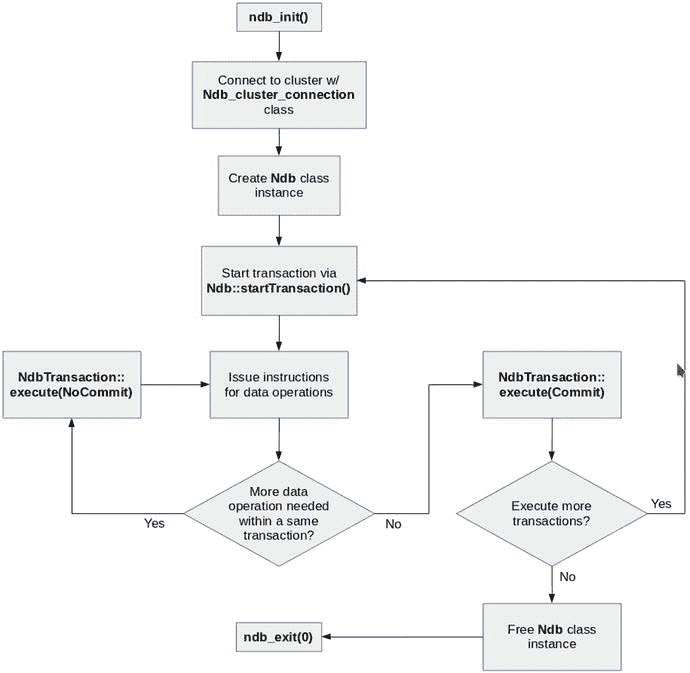
图 19-2.
NDB API 程序典型流程的语义图

##### 简单的读取示例

正如他们所说，“眼见为实”。因此，本节向你展示一个如代码清单 19-11 所示的可工作示例。查看示例代码中的注释。要运行本节中的示例程序，你需要在集群中设置 `world` 示例数据库。然后删除外键并将存储引擎更改为 `NDBCluster`。有关如何设置 `world` 示例数据库，请参考手册：[`dev.mysql.com/doc/world-setup/en/world-setup-installation.html`](https://dev.mysql.com/doc/world-setup/en/world-setup-installation.html)。代码清单 19-10 展示了一个使用 NDB Cluster 存储引擎设置 `world` 数据库的命令示例。

```sql
mysql> source /path/to/world.sql
... snip ...
mysql> use world
Database changed
mysql> ALTER TABLE City DROP FOREIGN KEY city_ibfk_1;
Query OK, 0 rows affected (0.11 sec)
Records: 0  Duplicates: 0  Warnings: 0
mysql> ALTER TABLE CountryLanguage DROP FOREIGN KEY countryLanguage_ibfk_1;
Query OK, 0 rows affected (0.09 sec)
Records: 0  Duplicates: 0  Warnings: 0
mysql> ALTER TABLE Country ENGINE NDBCluster;
Query OK, 239 rows affected (1.61 sec)
Records: 239  Duplicates: 0  Warnings: 0
mysql> ALTER TABLE City ENGINE NDBCluster;
Query OK, 4079 rows affected (2.42 sec)
Records: 4079  Duplicates: 0  Warnings: 0
mysql> ALTER TABLE CountryLanguage ENGINE NDBCluster;
Query OK, 984 rows affected (1.87 sec)
Records: 984  Duplicates: 0  Warnings: 0
```
代码清单 19-10.
使用 NDB Cluster 存储引擎设置 world 数据库

```cpp
#include <iostream>
#include <NdbApi.hpp>
#include <stdlib.h>
const char *connectstring = "mgmhost";
const char *db = "world";
class NdbApiExample1 {
public:
    NdbApiExample1() : cluster_connection(NULL), myNdb(NULL),
                       myDict(NULL), myTable(NULL) {};
    ~NdbApiExample1();
    int doTest();
private:
    void print_error(const NdbError &e, const char *msg)
    {
        std::cerr << msg << endl;
        std::cerr << "Error code: " << e.code << endl;
        std::cerr << "Error message: " << e.message << endl;
    }
    Ndb_cluster_connection *cluster_connection;
    Ndb *myNdb;
    NdbDictionary *myDict;
    const NdbDictionary::Table *myTable;
    NdbTransaction *myTransaction;
    NdbOperation *myOperation;
};
NdbApiExample1::~NdbApiExample1()
{
    if (myTransaction) myNdb->closeTransaction(myTransaction);
    if (myNdb) delete myNdb;
    if (cluster_connection) delete cluster_connection;
    ndb_end(0);
}
int NdbApiExample1::doTest()
{
    // Step 1. Initialize the NDB API
    ndb_init();
    // Step 2. Connect to the Cluster
    cluster_connection = new Ndb_cluster_connection(connectstring);
    if (cluster_connection->connect(4 /* retries               */,
                                    5 /* delay between retries */,
                                    1 /* verbose               */)) {
        std::cerr << "Connect to cluster failed." << endl;
        return 1;
    }
    if (cluster_connection->wait_until_ready(30,0)) {
        std::cerr << "Cluster was not ready within 30 secs." << endl;
        return 2;
    }
    // Step 3. Create a database object
    myNdb = new Ndb(cluster_connection, db);
    if (myNdb == NULL) {
        std::cerr << "Could not create database object." << endl;
        return 3;
    }
    if (myNdb->init() == -1) {
        print_error(myNdb->getNdbError(),
                    "Could not connect to the database object.");
        return 3;
    }
    // Step 4. Get table handle
    myDict= myNdb->getDictionary();
    myTable= myDict->getTable("Country");
    if (myTable == NULL) {
        print_error(myDict->getNdbError(), "Could not retrieve a table.");
        return 4;
    }
    // Step 5. Start transaction
    myTransaction= myNdb->startTransaction();
    if (myTransaction == NULL) {
        print_error(myNdb->getNdbError(), "Could not start transaction.");
        return 5;
    }
    // Step 6. Get operation handle
    myOperation= myTransaction->getNdbOperation(myTable);
    if (myOperation == NULL) {
        print_error(myTransaction->getNdbError(),
                    "Could not retrieve an operation.");
        return 6;
    }
    // Step 7. Specify type of operation and search condition
    myOperation->readTuple(NdbOperation::LM_Read);
    myOperation->equal("Code", "JPN");
    // Step 8. Get buffers for results
    NdbRecAttr *Name = myOperation->getValue("Name", NULL);
    NdbRecAttr *Capital = myOperation->getValue("Capital", NULL);
    if (Name == NULL || Capital == NULL) {
        print_error(myTransaction->getNdbError(),
                    "Could not allocate attribute records.");
        return 7;
    }
    // Step 9. Send a request to data nodes
    if (myTransaction->execute( NdbTransaction::Commit ) == -1) {
        print_error(myTransaction->getNdbError(), "Transaction failed.");
        return 8;
    }
    // Step 10. Retrieve values
    std::cout << "Country name: " << Name->aRef() << endl;
    std::cout << "Capital: " << Capital->u_32_value() << endl;
    return 0;
}
int main(int argc, char *argv[])
{
    NdbApiExample1 ex;
    return ex.doTest();
}
```
代码清单 19-11.
读取表中一行的示例 NDB API 程序

这段代码简单明了。所有工作都在 `NdbApiExample1` 类的 `doTest()` 函数中完成。让我们检查此程序中的每个步骤。

###### 步骤 1. 初始化 NDB API

必须在程序开头调用 `ndb_init()`。

###### 步骤 2. 连接到集群

连接字符串传递给 `Ndb_cluster_connection` 类的构造函数。成功创建该类的实例后，代码调用 `connect()` 成员函数以连接到集群。


###### 步骤 3：连接到 world 数据库

使用一个 `Ndb` 类实例连接到 `world` 数据库。由于 `Ndb` 类不是线程安全的，你必须为每个线程创建专用的 `Ndb` 类实例。请勿在多个线程间共享 `Ndb` 类实例。每个进程最多可创建 4177 个 `Ndb` 类实例。

###### 步骤 4：获取表句柄

获取一个句柄以访问 `Country` 表。访问对象时，你需要获取一个 `NdbDictionary::Dictionary` 类的实例。然后，通过获取到的字典来获取更多对象。

你可以复用从字典中检索到的对象。

###### 步骤 5：启动事务

事务必须显式启动。

###### 步骤 6：获取操作句柄

从 `NdbTransaction` 类的实例中检索操作句柄对象，该实例在事务启动时获取。由于此示例是关于主键查找的，因此使用 `NdbTransaction::getNdbOperation()` 函数来获取一个 `NdbOperation` 类的实例。请从以下函数中调用相应的函数以获取合适的操作句柄：

*   `NdbTransaction::getNdbOperation()`
*   `NdbTransaction::getNdbIndexOperation()`
*   `NdbTransaction::getNdbScanOperation()`
*   `NdbTransaction::getNdbIndexScanOperation()`

###### 步骤 7：指定操作类型和搜索条件

在这一步，声明将要执行的操作类型。在本例中，通过调用 `NdbOperation::readTuple()` 函数，将读取指定为操作。这个函数的名字容易让人误解，因为它给人一种“调用此函数即执行读取操作”的印象。然而，该函数只是声明了即将执行的操作类型。操作将在稍后执行。

`NdbOperation` 类中定义了以下五种操作：

*   `readTuple`: 根据主键值读取一行。
*   `insertTuple`: 插入一行。
*   `updateTuple`: 更新主键值匹配的行。
*   `writeTuple`: 如果匹配的行已存在则更新，如果不存在则插入。
*   `deleteTuple`: 删除主键值匹配的行。

请注意，`NdbOperation::readTuple()` 接受一个参数 `NdbOperation::LM_Read`。此参数指定了锁模式，在本例中是共享锁。你可以使用以下四种模式指定锁模式：

*   `LM_Read`: 在整个事务生命周期内对行持有共享锁。
*   `LM_Exclusive`: 在整个事务生命周期内对行持有排他锁。
*   `LM_CommittedRead`: 不获取锁，仅读取已提交的行。
*   `LM_SimpleRead`: 获取共享锁，但在操作完成后立即释放。

在此步骤的第二行，调用了 `NdbOperation::equal()`。这指定了要搜索的主键名和值。在本例中，搜索 `Code` 列的值匹配 `JPN` 的行。如果主键由多个键部分（列）组成，请多次调用 `NdbOperation::equal()` 函数，以便为所有键部分提供值。

###### 步骤 8：为结果获取缓冲区

在这一步，通过调用 `NdbOperation::getValue()` 来分配用于存储获取值的缓冲区。此函数只是准备缓冲区，就像 `NdbOperation::readTuple()` 一样，实际操作将在稍后执行。在此示例中，获取值的列名被指定为 `NdbOperation::getValue()` 的第一个参数。`NdbOperation::getValue()` 的第一个参数可以是：

*   以空字符结尾的字符串 (`char*`) 中的属性（列）名
*   `Uint32` 类型的属性标识符
*   从字典检索到的 `NdbDictionary::Column` 类实例

请注意，NDB API 中的列名区分大小写。请准确指定表定义中可见的名称。第二个参数是指向将要存储数据的内存区域的指针。如果像本例中一样为 `NULL`，则内存会自动分配，并在 `NdbRecAttr` 实例删除时释放。因此，如果你想稍后复用数据，必须在关闭事务前复制检索到的数据。

我建议为 `NdbOperation::getValue()` 函数指定第二个参数，以避免不必要的数据复制，从而获得更好的性能。在这种情况下，即使 `NdbRecAttr` 实例被删除，存储获取值的内存区域也不会被释放。然而，NDB API 无法知道缓冲区是否有足够的空间来存储数据，因为参数只是一个指针。请确保分配了足够的空间。你可以根据表定义计算存储列值所需的大小。

###### 步骤 9：向数据节点发送请求

通过调用 `NdbTransaction::execute()` 向数据节点发送请求。然后，数据节点将处理该请求并向 NDB API 程序发送回复。NDB API 根据 `NdbRecAttr` 实例的规范设置值。

请注意，本示例中 `NdbTransaction::execute()` 函数的参数是 `NdbTransaction::Commit`。这表示如其名所示，将提交正在进行的事务。此函数接受以下值之一作为参数：

*   `NdbTransaction::NoCommit`: 指定此值时，请求会被发送到数据节点，但事务会继续。如果同一事务中还有更多操作要执行，请指定此值。
*   `NdbTransaction::Commit`: 将提交正在进行的事务。
*   `NdbTransaction::Rollback`: 将回滚正在进行的事务。

###### 步骤 10：检索值

从 `NdbRecAttr` 实例中检索值。你可以通过调用 `NdbRecAttr::aRef()` 函数来获取字符串值。但是，该字符串值不是以空字符结尾的。你必须使用 `NdbRecAttr::get_size_in_bytes()` 来确定字符串值的大小。由于 `Capital` 是一个 `UNSIGNED INT` 列，你可以通过调用 `NdbRecAttr::u_32_value()` 来访问该值。

###### 步骤 11：清理

在这一步，执行必要的清理工作。请注意，清理是在 `NdbApiExample1` 类的析构函数中完成的。当程序退出声明了 `NdbApiExample1` 实例作为局部变量的作用域时，该析构函数会被调用。在作用域退出时执行必要的清理是 C++ 程序中的一种便捷技术。


#### 使用 NdbRecord 访问数据

当使用 `NdbRecAttr` 类时，需要频繁创建该类的实例，因为 `NdbRecAttr` 类实例是从 `NdbOperation` 类实例中获取的。这给 NDB API 程序带来了一定的开销。为了减少由此产生的开销，在 MySQL NDB Cluster 6.2.15 中引入了 `NdbRecord` 类。

`NdbRecord` 的作用是定义数据存储或从 NDB API 加载的指针的相对内存布局，以便与数据节点交互。使用 `NdbRecord` 接口时，数据通过每行一个连续的内存区域进行交换，而 `NdbRecAttr` 则为每列绑定一个交换数据的内存区域。除了指定内存布局的方式不同外，`NdbRecAttr` 和 `NdbRecord` 编程接口的程序流程是相同的。

清单 19-12 展示了一个使用 `NdbRecord` 类交换数据的示例程序。仅摘录了不同的部分。步骤 1 到 4 以及 11 与清单 19-11 相同。除了清单 19-11 中包含的内容外，还必须包含一些标准库的额外头文件。

```
...
#include <string.h>
#include <iostream>
#include <string>
...
// 步骤 5. 为 City 表的行定义 NdbRecord 内存区域
struct CountryRow {
    char   nullBits;
    char   Code[3];
    char   Name[52];
    Uint32 Capital;
};
NdbDictionary::RecordSpecification recordSpec[3];
// Code
recordSpec[0].column = myTable->getColumn("Code");
recordSpec[0].offset = offsetof(struct CountryRow, Code);
recordSpec[0].nullbit_byte_offset = 0;   // Not nullable
recordSpec[0].nullbit_bit_in_byte = 0;
// Name
recordSpec[1].column = myTable->getColumn("Name");
recordSpec[1].offset = offsetof(struct CountryRow, Name);
recordSpec[1].nullbit_byte_offset = 0;   // Not nullable
recordSpec[1].nullbit_bit_in_byte = 0;
// Capital
recordSpec[2].column = myTable->getColumn("Capital");
recordSpec[2].offset = offsetof(struct CountryRow, Capital);
recordSpec[2].nullbit_byte_offset =
    offsetof(struct CountryRow, nullBits);;   // Nullable
recordSpec[2].nullbit_bit_in_byte = 0;
const NdbRecord *pkRecord =
    myDict->createRecord(myTable, recordSpec, 1, sizeof(recordSpec[0]));
const NdbRecord *valsRecord =
    myDict->createRecord(myTable, recordSpec, 3, sizeof(recordSpec[0]));
if (pkRecord == NULL || valsRecord == NULL) {
    print_error(myNdb->getNdbError(), "Could not create NdbRecord.");
    return 5;
}
// 步骤 6. 启动事务
myTransaction= myNdb->startTransaction();
if (myTransaction == NULL) {
    print_error(myNdb->getNdbError(), "Could not start transaction.");
    return 6;
}
// 步骤 7. 指定操作类型和搜索条件
CountryRow rowData;
std::memset(&rowData, 0, sizeof rowData);
std::memcpy(&rowData.Code, "JPN", 3);
const NdbOperation *pop=
    myTransaction->readTuple(pkRecord,
                             (char*) &rowData,
                             valsRecord,
                             (char*) &rowData);
if (pop==NULL) {
    print_error(myTransaction->getNdbError(),
                "Could not execute record based read operation");
    return 7;
}
// 步骤 8. 向数据节点发送请求
if (myTransaction->execute( NdbTransaction::Commit ) == -1) {
    print_error(myTransaction->getNdbError(), "Transaction failed.");
    return 8;
}
// 步骤 9. 检索值
std::string nameStr = std::string(rowData.Name, sizeof(rowData.Name));
std::cout << " Name:         "
          << nameStr.substr(0, nameStr.find_last_not_of(' ') + 1)
          << std::endl;
std::cout << " Capital Code: "
          << (rowData.nullBits & 0x01 ? std::string("NULL") :
                                       std::to_string(rowData.Capital))
          << std::endl;
return 0;
}
```
清单 19-12.
使用 NdbRecord 从表中读取行的示例 NDB API 程序

让我们检查这个程序的每一个新步骤。

##### 步骤 5. 定义 NdbRecords

`NdbRecord` 是一个描述符，用于描述映射到连续内存区域的每行给定列集的内存布局。`CountryRow` 结构体表示将通过 `NdbRecord` 接口访问的内存区域。通常，像本例中的这样的结构体被用作数据容器。因此，应用程序可以通过结构体成员访问行中的列数据。当然，它也可以是一个类而不是结构体。

然后，程序声明一个包含三个元素的 `NdbDictionary::RecordSpecification` 数组。该类指定通过 `NdbRecord` 接口访问的每列的内存位置和属性。由于此程序访问三列，因此使用了三个 `NdbDictionary::RecordSpecification` 结构体实例。`column` 成员指定目标列。`offset` 成员指定用于交换行数据的连续内存区域的起始相对偏移量。`nullbit_byte_offset` 和 `nullbit_bit_in_byte` 成员指定列值为 `NULL` 时设置的空位位置。前者是存储空位的字节的相对偏移量。后者是字节内的哪一位用于指示列是否为 `NULL`。因此，`nullbit_bit_in_byte` 成员的可接受值为 0 到 7。

接下来，创建两个 `NdbRecord` 类实例，一个用于作为搜索条件传递的主键值，另一个用于从数据节点获取的列值。`NdbDictionary::Dictionary::createRecord()` 函数的第三个参数是由创建的 `NdbRecord` 实例映射的列数。

##### 步骤 6. 启动事务

启动一个新事务，就像使用 `NdbRecAttr` 接口时一样。

##### 步骤 7. 指定操作类型和搜索条件

声明一个 `CountryRow` 结构体变量 `rowData`，并用 0 初始化。然后，将 `rowData` 的 `Code` 成员设置为 `JPN`，用作搜索条件。

通过调用 `NdbTransaction::readTuple()` 函数获取指向 `NdbOperation` 类的指针。这指示 NDB API，即将进行的操作类型是 `readTule`，以及使用哪个 `NdbRecord` 和相关的内存区域作为搜索条件和结果的容器。

回想一下，在 `NdbRecAttr` 接口中，首先从 `NdbTransaction` 获取 `NdbOperation` 类实例，然后通过调用 `readTuple()` 指定操作类型，通过调用 `NdbOperation::equal()` 指定搜索条件，通过调用 `NdbOperation::getValue()` 为每列指定内存容器，从而完成相同的事情。

因此，在 `NdbRecord` 接口中，NDB API 函数的调用次数要少得多。请注意，此示例程序中的步骤数比 `NdbRecAttr` 示例程序中的步骤数少一个。

##### 步骤 8. 向数据节点发送请求

执行事务，就像使用 `NdbRecAttr` 接口时一样。

##### 步骤 9. 检索值

在 `NdbRecord` 中，值检索非常简单。只需访问结构体成员即可实现。

##### 关于使用 NdbRecord 接口的备注

虽然创建 `NdbRecord` 实例的代码有些混乱，但一旦定义，就可以重用已创建的 `NdbRecord` 实例。因此，在实现重复的程序例程时，此代码在性能方面具有明显优势。`NDBCluster` 存储引擎中的表访问就是使用 `NDBRecord` 接口实现的。


#### 扫描示例

扫描操作远比基于主键的查找操作复杂。所有其他操作都属于扫描。扫描有两种类型：
*   表扫描
*   有序索引扫描

鉴于扫描操作的特性，无法对唯一的哈希索引进行扫描。

通过 NDB API 执行扫描最强大的功能在于，它能在数据节点内部过滤数据。这将大幅减少传输到 NDB API 客户端的数据量。此功能对于 `NDB Cluster` 存储引擎也被称为引擎条件下推优化。扫描过滤也可以与有序索引结合使用。图 19-3 展示了扫描过滤的典型架构概览。除非表使用了非标准的数据分布策略，否则扫描通常会在所有数据节点上并行执行。

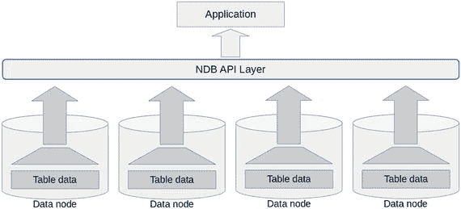
图 19-3. 数据节点上的搜索过滤概念

扫描与 SQL 中的游标操作非常相似；首先定义游标，然后在循环中处理行数据，如果需要，则更新或删除该行。图 19-4 展示了扫描操作的典型程序流程。请注意，右下部分包含一个循环。

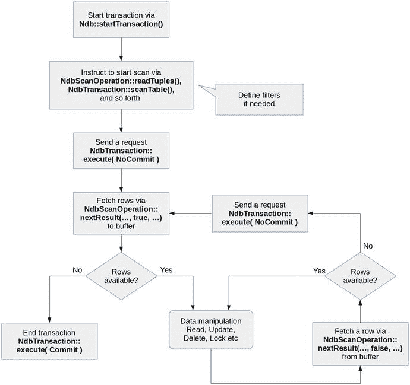
图 19-4. 使用 NDB API 进行扫描操作的典型程序流程

就像非扫描操作一样，扫描可以使用 `NdbRecAttr` 或 `NdbRecord` 接口来执行。由于手册中已有关于 `NdbRecAttr` 接口的良好示例，这里你将看到一个使用 `NdbRecord` 接口进行扫描的示例。清单 19-13 展示了一个扫描操作示例。该程序包含三个扫描示例——表扫描、索引扫描以及通过表扫描进行更新。由于程序较长，为讲解方便，它被分成了三个部分。清单 19-13 到 19-15 共同构成一个完整的示例程序。此示例程序需要在 `world.City` 表的 `Population` 列上存在一个索引。

```cpp
#include 
#include 
#include 
#include 
#include 
#include 
const char *connectstring = "mgmhost";
const char *db = "world";
class NdbApiExample3 {
public:
NdbApiExample3() : cluster_connection(NULL), myNdb(NULL),
myDict(NULL), myTable(NULL) {};
∼NdbApiExample3();
int doTest();
private:
struct CityRow {
Int32 ID;
char  Name[35];
char  CountryCode[3];
char  District[20];
Int32 Population;
};
std::string char_to_str(char *s, int max_len)
{
std::string str(s, max_len);
return str.substr(0, str.find_last_not_of(" ") + 1);
}
void print_city(CityRow *city)
{
std::cout ID
Name, 35)
CountryCode, 3)
District, 20)
Population
connect(4 /* retries               */,
5 /* delay between retries */,
1 /* verbose               */)) {
std::cerr wait_until_ready(30, 0) init()) {
print_error(myNdb->getNdbError(),
"Could not connect to the database object.");
return 3;
}
// Step 4. Get table metadata
myDict = myNdb->getDictionary();
myTable = myDict->getTable("City");
myIndex = myDict->getIndex("Population", "City");
myColumn = myTable->getColumn("CountryCode");
if (myTable == NULL || myIndex == NULL || myColumn == NULL) {
print_error(myDict->getNdbError(),
"Could not retrieve database object.");
return 4;
}
// Step 5. Define NdbRecord's
NdbDictionary::RecordSpecification recordSpec[5];
std::memset(recordSpec, 0, sizeof recordSpec);
// Id
recordSpec[0].column = myTable->getColumn("ID");
recordSpec[0].offset = offsetof(struct CityRow, ID);
// Name
recordSpec[1].column = myTable->getColumn("Name");
recordSpec[1].offset = offsetof(struct CityRow, Name);
// CountryCode
recordSpec[2].column = myTable->getColumn("CountryCode");
recordSpec[2].offset = offsetof(struct CityRow, CountryCode);
// District
recordSpec[3].column = myTable->getColumn("District");
recordSpec[3].offset = offsetof(struct CityRow, District);
// Population
recordSpec[4].column = myTable->getColumn("Population");
recordSpec[4].offset = offsetof(struct CityRow, Population);
int rssz = sizeof(recordSpec[0]);
pkRecord = myDict->createRecord(myTable, recordSpec, 1, rssz);
valsRecord = myDict->createRecord(myTable, recordSpec, 5, rssz);
indexRecord = myDict->createRecord(myIndex, &recordSpec[4], 1, rssz);
if (pkRecord == NULL || valsRecord == NULL || indexRecord == NULL) {
print_error(myDict->getNdbError(), "Failed to initialize rssz.");
return 5;
}
// Run tests. See lines of routines for details.
int err = 0;
if ((err = do_scan_read()) ||
(err = do_index_scan_read()) ||
(err = do_scan_update())) {
std::cout startTransaction();
if (myTransaction == NULL) {
print_error(myNdb->getNdbError(), "Could not start transaction.");
return 6;
}
// Step 7. Prepare filter to be applied
NdbInterpretedCode code(myTable);
NdbScanFilter filter(&code);
if (filter.begin(NdbScanFilter::AND) getColumnNo(), "JPN", 3) getNdbError(), "Failed to get a filter.");
myNdb->closeTransaction(myTransaction);
return 7;
}
Uint32 scanFlags = NdbScanOperation::SF_TupScan;
NdbScanOperation::ScanOptions options;
options.optionsPresent =
NdbScanOperation::ScanOptions::SO_SCANFLAGS |
NdbScanOperation::ScanOptions::SO_INTERPRETED;
options.scan_flags = scanFlags;
options.interpretedCode= &code;
// Step 8. Instruct NDB API to scan table
NdbScanOperation *sop =
myTransaction->scanTable(valsRecord,
NdbOperation::LM_CommittedRead,
NULL,
&options,
sizeof(NdbScanOperation::ScanOptions));
if (sop == NULL) {
print_error(myTransaction->getNdbError(),
"Could not retrieve an operation.");
myNdb->closeTransaction(myTransaction);
return 8;
}
// Step 9. Send a request to data nodes
if (myTransaction->execute( NdbTransaction::NoCommit ) == -1) {
print_error(myTransaction->getNdbError(), "Failed to prepare a scan.");
myNdb->closeTransaction(myTransaction);
return 5;
}
// Step 10. Fetch rows in a loop
int check = 0;
bool needToFetch = true;
CityRow *row;
while((check = sop->nextResult((const char**) &row,
needToFetch, false)) >= 0) {
if (check == 0) {
// Row available
needToFetch = false;
print_city(row);
} else if (check == 2) {
// Need to fetch
myTransaction->execute(NdbTransaction::NoCommit);
needToFetch = true;
} else if (check == 1) {
// No more rows
break;
}
}
// Step 11. End transaction and free it
if (check == -1) {
print_error(myTransaction->getNdbError(), "Error during scan.");
myNdb->closeTransaction(myTransaction);
return 11;
} else {
myTransaction->execute(NdbTransaction::Commit);
}
myNdb->closeTransaction(myTransaction);
return 0;
}
清单 19-13. 扫描操作简单示例：三部分中的第一部分
```

对于与前例中操作相同的步骤，我们略过不讨论。以下讨论仅解释扫描操作特有的部分。

##### 步骤 5. 定义 NdbRecord

`indexRecord` 变量是使用 `myIndex` 作为 `NdbDictionary::Dictionary::createRecord()` 函数的第一个参数创建的。这是因为 `indexRecord` 将用于索引扫描操作。


# 扫描操作示例

##### 步骤 7. 准备要应用的过滤器

从`NdbDictionary::Table`实例创建一个`NdbInterpretedCode`类型的变量。然后，从`NdbInterpretedCode`实例创建一个`NdbScanFilter`类型的变量。`NdbScanFilter`是用于定义过滤器的类。

`NdbScanFilter::begin()`函数的参数是`NdbScanFilter::AND`、`NdbScanFilter::OR`、`NdbScanFilter::NAND`或`NdbScanFilter::NOR`。

这指定了当在过滤器中定义了多个搜索条件时应用的逻辑运算符。

`NdbScanFilter::cmp()`函数的调用定义了要应用的过滤器。在此示例中，定义的过滤器用于获取`CountryCode`列为`JPN`的行。`NdbScanFilter::cmp()`函数的第一个参数指定了操作类型。虽然本例中指定了`NdbScanFilter::COND_LIKE`，但它是一种用于字符串的条件类型。表 19-6 列出了可用的条件类型。

表 19-6. NdbScanFilter 中定义的条件类型

| 条件类型 | 数据类型 | 描述 |
| --- | --- | --- |
| `COND_LE` | 数值型 | 小于或等于 (<=) |
| `COND_LT` | 数值型 | 小于 (<) |
| `COND_GE` | 数值型 | 大于或等于 (>=) |
| `COND_GT` | 数值型 | 大于 (>) |
| `COND_EQ` | 数值型 | 等于 (=) |
| `COND_NE` | 数值型 | 不等于 (!=) |
| `COND_LIKE` | 字符串型 | 字符串的相似搜索 |
| `COND_NOT_LIKE` | 字符串型 | 字符串的非相似搜索 |
| `COND_AND_EQ_MASK` | 位类型 | 列值等于位操作的结果 |
| `COND_AND_NE_MASK` | 位类型 | 列值不等于位操作的结果 |
| `COND_AND_EQ_ZERO` | 位类型 | 位操作的结果为零 |
| `COND_AND_NE_ZERO` | 位类型 | 位操作的结果为非零值 |

当使用相似搜索时，您可以使用‘`%`’或‘`_`’字符作为通配符在字符串列中搜索数据，就像在 SQL 中一样。`NdbScanFilter`类还有其他的比较函数——`eq()`、`ne()`、`le()`、`lt()`、`ge()`和`gt()`——作为带有特定条件类型的`cmp()`的人类可读简写。要测试列是否为`NULL`，`NdbScanFilter`类也有`isnull()`和`isnotnull()`函数。

`NdbScanOperation::ScanOptions`是一个用于扫描选项的结构体。示例程序将由我们刚才讨论的过滤器创建的解释代码和扫描标志传递给这个结构体。扫描标志指定了扫描的一些附加属性，如表 19-7 所述。虽然扫描标志定义在`NdbScanOperation`类中，但表 19-7 中省略了类名。

表 19-7. 扫描标志

| 标志名称 | 描述 |
| --- | --- |
| `SF_TupScan` | 按`DBTUP`内核块中的行顺序扫描。 |
| `SF_DiskScan` | 按磁盘上的行顺序扫描。 |
| `SF_OrderBy` | 按索引中的行顺序扫描。仅适用于有序索引扫描操作。 |
| `SF_OrderByFull` | 与`SF_OrderBy`相同，只是所有键列都会自动添加到读位掩码中。 |
| `SF_Descending` | 有序索引扫描按降序进行。 |
| `SF_ReadRangeNo` | 在多范围扫描时，返回范围的标识符。 |
| `SF_MultiRange` | 执行多范围扫描。 |
| `SF_KeyInfo` | 请求将`KeyInfo`发送回调用方，这是进一步操作所必需的。 |

##### 步骤 8. 指示 NDB API 扫描表

在此步骤中，调用`NdbTransaction::scanTable()`来声明程序将使用`NdbRecord`接口执行表扫描。随后在步骤 9 中调用`NdbTransaction::execute()`。请注意，参数是`NoCommit`，因为扫描需要进一步的操作。

##### 步骤 10. 循环获取行

`NdbScanOperation::nextResult()`从数据节点获取一行。从数据节点的获取是批量完成的，然后暂时存储在 NDB API 库中的一个缓冲区中。当第二个参数为`true`时，从数据节点获取。否则，仅从缓冲区检索一行。

当获取到一行时，`NdbScanOperation::nextResult()`返回 0。如果获取完成但没有更多匹配的行，它返回 1。如果它试图从本地缓冲区检索行，但本地没有可用的行，它返回 2。当发生错误时，它返回-1。

虽然可以通过始终为`NdbScanOperation::nextResult()`的第二个参数指定`true`来编写扫描程序，但我不建议这样做。批处理是一种非常高效的方法，它可以显著提高应用程序性能。

这是一个扫描操作的基本程序流。无论扫描操作多么复杂，它都以类似的方式完成。示例有序索引扫描程序如清单 19-14 所示，它延续自清单 19-13。

```
int NdbApiExample3::do_index_scan_read()
{
// 步骤 1. 启动一个新事务
NdbTransaction *myTransaction = myNdb->startTransaction();
if (myTransaction == NULL) {
print_error(myNdb->getNdbError(), "Could not start transaction.");
return 1;
}
// 步骤 2. 准备要应用的过滤器
NdbInterpretedCode code(myTable);
NdbScanFilter filter(&code);
if (filter.begin(NdbScanFilter::AND) getColumnNo(), "JPN", 3) getNdbError(), "Failed to set a filter.");
myNdb->closeTransaction(myTransaction);
return 2;
}
Uint32 scanFlags =
NdbScanOperation::SF_OrderBy | NdbScanOperation::SF_Descending;
NdbScanOperation::ScanOptions options;
options.optionsPresent =
NdbScanOperation::ScanOptions::SO_SCANFLAGS |
NdbScanOperation::ScanOptions::SO_INTERPRETED;
options.scan_flags = scanFlags;
options.interpretedCode= &code;
// 步骤 3. 定义索引边界
CityRow low, high;
low.Population = 1000000;
high.Population = 2000000;
NdbIndexScanOperation::IndexBound bound;
bound.low_key= (char*)&low;
bound.low_key_count = 1;
bound.low_inclusive = true;
bound.high_key = (char*)&high;
bound.high_key_count =1 ;
bound.high_inclusive = false;
bound.range_no = 0;
// 步骤 4. 指示 NDB API 扫描索引
NdbIndexScanOperation *isop =
myTransaction->scanIndex(indexRecord,
valsRecord,
NdbOperation::LM_Read,
NULL,
&bound,
&options,
sizeof(NdbScanOperation::ScanOptions));
if (isop == NULL) {
print_error(myTransaction->getNdbError(),
"Could not retrieve an operation.");
myNdb->closeTransaction(myTransaction);
return 4;
}
// 步骤 5. 向数据节点发送请求
if (myTransaction->execute( NdbTransaction::NoCommit ) == -1) {
print_error(myTransaction->getNdbError(), "Failed to prepare a scan.");
myNdb->closeTransaction(myTransaction);
return 5;
}
// 步骤 6. 循环获取行
int check = 0;
bool needToFetch = true;
CityRow *row;
while((check = isop->nextResult((const char**) &row,
needToFetch, false)) >= 0) {
if (check == 0) {
// 行可用
needToFetch = false;
print_city(row);
} else if (check == 2) {
// 需要获取行
myTransaction->execute(NdbTransaction::NoCommit);
needToFetch = true;
} else if (check == 1) {
// 没有更多行
break;
}
}
// 步骤 7. 结束事务并释放它
if (check == -1) {
print_error(myTransaction->getNdbError(), "Error during index scan.");
myNdb->closeTransaction(myTransaction);
return 7;
} else {
myTransaction->execute(NdbTransaction::Commit);
}
myNdb->closeTransaction(myTransaction);
return 0;
}
清单 19-14. 扫描操作的简单示例：三部分中的第二部分
```

如您所见，清单 19-14 中的程序与清单 19-13 中的扫描程序非常接近。唯一不同的部分是步骤 3 中的边界定义和步骤 4 中的操作类型。


##### 步骤 3. 定义索引边界

`NdbIndexScanOperation::IndexBound`类用于为`NdbRecord`接口定义索引边界。`CityRow`结构体的两个变量用于指定扫描索引范围的下限和上限。该边界作为参数传递给`NdbTransaction::scanIndex()`函数，这将在下一步中描述。也可以在调用`NdbTransaction::scanIndex()`时将边界参数设为`NULL`，之后再应用边界。这种情况下，必须在调用`NdbTransaction::execute()`之前调用`NdbIndexScanOperation::setBound()`来设置边界。

##### 步骤 4. 指示 NDB API 扫描索引

在此示例中，调用`NdbTransaction::scanIndex()`来执行有序索引扫描，代替了前面示例中的`NdbTransaction::scanTable()`。

扫描操作的最后一个示例涉及在扫描过程中更新行。清单 19-15 展示了一个在扫描操作中更新行的示例程序。

```
int NdbApiExample3::do_scan_update()
{
// Step 1. Start a new transaction
NdbTransaction *myTransaction = myNdb->startTransaction();
if (myTransaction == NULL) {
print_error(myNdb->getNdbError(), "Could not start transaction.");
return 1;
}
// Step 2. Prepare filter to be applied
NdbInterpretedCode code(myTable);
NdbScanFilter filter(&code);
if (filter.begin(NdbScanFilter::AND) getColumnNo(), "JPN", 3) getNdbError(), "Failed to set a filter.");
myNdb->closeTransaction(myTransaction);
return 2;
}
Uint32 scanFlags = NdbScanOperation::SF_KeyInfo;
NdbScanOperation::ScanOptions options;
options.optionsPresent =
NdbScanOperation::ScanOptions::SO_SCANFLAGS |
NdbScanOperation::ScanOptions::SO_INTERPRETED;
options.scan_flags = scanFlags;
options.interpretedCode= &code;
// Step 3. Instruct NDB API to scan table
NdbScanOperation *sop =
myTransaction->scanTable(valsRecord,
NdbOperation::LM_Exclusive,
NULL,
&options,
sizeof(NdbScanOperation::ScanOptions));
if (sop == NULL) {
print_error(myTransaction->getNdbError(),
"Could not retrieve an operation.");
myNdb->closeTransaction(myTransaction);
return 3;
}
// Step 4. Send a request to data nodes
if (myTransaction->execute( NdbTransaction::NoCommit ) == -1) {
print_error(myTransaction->getNdbError(), "Failed to prepare a scan.");
myNdb->closeTransaction(myTransaction);
return 4;
}
// Step 5. Update rows in a loop
int check = 0;
bool needToFetch = true;
CityRow *row;
while((check = sop->nextResult((const char**) &row,
needToFetch, false)) >= 0) {
if (check == 0) {
// Row available
needToFetch = false;
CityRow newCity = *row;
std::memcpy(&newCity.CountryCode, "ZPG", 3);
const NdbOperation *uop =
sop->updateCurrentTuple(myTransaction,
valsRecord,
(char*) &newCity);
if (uop == NULL) {
print_error(myTransaction->getNdbError(), "Failed update row.");
myNdb->closeTransaction(myTransaction);
return 5;
}
} else if (check == 2) {
// Need to fetch rows
myTransaction->execute(NdbTransaction::NoCommit);
needToFetch = true;
} else if (check == 1) {
// No more rows
break;
}
}
// Step 6. End transaction and free it
if (check == -1) {
print_error(myTransaction->getNdbError(), "Error during scan update.");
myNdb->closeTransaction(myTransaction);
return 6;
} else {
myTransaction->execute(NdbTransaction::Commit);
}
myNdb->closeTransaction(myTransaction);
return 0;
}
NdbApiExample3::~NdbApiExample3()
{
// Step 7. Cleanup
if (myNdb) delete myNdb;
if (cluster_connection) delete cluster_connection;
ndb_end(0);
}
int main(int argc, char *argv[])
{
NdbApiExample3 ex;
return ex.doTest();
}
Listing 19-15.
扫描操作的简单示例：三部分中的第三部分
```

清单 19-15 中的程序与清单 19-13 中的程序基本相同，区别在于在第 5 步的获取行循环内部更新了行。更新行的方式非常简单；你只需调用`NdbScanOperation::updateCurrentTuple()`函数。顾名思义，它会用新值替换由`NdbScanOperation::nextResult()`函数最新获取的行。你还可以使用`NdbScanOperation::deleteCurrentTuple()`删除当前行，并使用`NdbScanOperation::lockCurrentTuple()`锁定当前行。

#### 错误处理注意事项

本节中的示例程序没有足够的错误处理机制。它们只是示例；这些程序的主要目标是易于理解。虽然 NDB API 是一个事务性数据库操作 API，但事务可能因各种原因失败。事务理论保证每个事务最终都处于两种状态之一——`COMMIT`或`ABORT`。前者是成功状态，后者是由于某些错误导致事务回滚的状态。该理论并不保证每次事务都会成功。

因此，就像 SQL 应用程序一样，NDB API 应用程序也需要错误处理，包括事务重试。要在 NDB API 应用程序上实现错误处理例程，请注意以下几点。

##### 获取错误信息

正如你在本节所见，错误信息可以通过`NdbError`结构体实例引用，该实例可通过调用`Ndb::getNdbError()`函数获取。由于它是从`Ndb`对象检索的，所以在`Ndb`对象连接到数据库之前是不可用的。因此，在应用程序的早期阶段，你需要单独的错误处理实现。虽然`getNdbError()`函数在其他类中也有实现，但所有这些类都是使用现有的`Ndb`类对象创建的。

要实现一个重试事务的例程，有必要判断不成功的事务是否可重试。这可以通过检查`NdbError`结构体的`status`成员来完成。如果它等于`NdbError::TemporaryError`，则该事务可以重试。

##### 事务会自动回滚

在 MySQL NDB Cluster 中，当事务因某些原因失败时，它会自动回滚，并且无法再通过该失败的事务执行进一步的操作。你需要立即关闭该事务，然后使用`NdbTransaction`的新实例重试事务。


##### 在重试前插入合理的等待时间

临时错误不会立即消失，因为资源在其他事务释放之前可能无法使用。因此，在重试事务前插入一些合理的等待时间是个好主意。否则，重试事务的尝试很可能会因相同的临时错误而失败。

结合本节目前的内容，您可以编写代码来重试事务，如代码清单 19-16 所示。请注意，此代码仅是概念性的。您需要编写自己的代码来完成实际工作。

```
int exitCode = incomplete;
int retryCount = 10;
int retryDelay = 50;
while (retryCount-- > 0) {
// 获取一个新的事务句柄
NdbTransaction myTransaction = myNdb->startTransaction();
... 在此处编写执行某些操作的代码 ...
if (found_error) {
const NdbError err = myNdb->getNdbError();
// 判断错误是否可重试
if (err.status == NdbError::TemporaryError) {
// 关闭事务
myNdb->closeTransaction(myTransaction);
// 重试前休眠
millisleep(retryDelay);
continue;
} else {
exitCode = failure;
break;
}
} else {
exitCode = successful;
}
}
```

代码清单 19-16. 在 NDB API 上重试事务的概览概念代码

在本节中，您学习了如何使用 NDB API 开发应用程序。您可以使用 NDB API 上的事务来修改数据。事务使开发更加容易。

本节描述的操作，如查找和扫描，是低级别功能。虽然它们是低级别的，但通过像搭积木一样组合这些低级别功能，从技术上讲，可以实现与 SQL 类似的高级功能。即便如此，与使用 SQL 等高级 API 开发应用程序相比，它仍会花费更多时间。然而，如果应用程序需要卓越的性能，这种努力将会得到回报。

在下一节中，我们将讨论如何使用 ClusterJ，一个用于 Java 编程语言的 API。用 C++ 开发整个数据库应用程序并不常见；有时仅在性能重要的部分使用它。对于数据库应用程序开发，Java 比 C++ 使用得更为广泛。

### 通过 ClusterJ 访问数据

自 MySQL NDB Cluster 7.1 系列以来，NDB API 库的官方 Java 绑定 ClusterJ 已经可用。尽管 ClusterJ 是 `libndbclient` 库的一个绑定，该库通过 Java 原生接口（简称 JNI）调用 NDB API C++ 函数，但 ClusterJ 的使用方式与 NDB API 本身大不相同。ClusterJ 拥有一个类似 O/R 映射器的接口。使用 ClusterJ 比直接使用 NDB API 要容易得多。

由于 Connector/J 可以让 Java 应用程序与 SQL 节点配合使用，因此可以根据情况使用 ClusterJ 和 Connector/J，就像 C++ 应用程序可以同时使用 MySQL C API 和 NDB API 一样。

还有一个用于 Apache 软件基金会 Java 持久化项目 OpenJPA 的插件，称为 ClusterJPA。它会在使用 ClusterJ 和 Connector/J 之间自动切换以获得最佳性能。本书将不讨论 ClusterJPA，因为自以下版本的 MySQL NDB Cluster 起，它已不再受支持：7.2.30、7.3.18、7.4.16 和 7.5.7。

#### 安装 ClusterJ

在 MySQL NDB Cluster 7.5 系列中，为 RPM 和 DEB 包管理器提供了单独的软件包。软件包名称包含字符串 "java"，例如 `mysql-cluster-community-java-7.5.6-1.el7.x86_64.rpm`。在较旧的版本中，ClusterJ 包含在服务器 RPM 软件包和其他格式的一体化软件包中。

由于 ClusterJ 是 NDB API 的包装器，因此同一主机上也必须安装 `libndbclient` 库。请参阅本章前面关于 NDB API 的安装部分。

要运行 ClusterJ 程序，必须将 `clusterj.jar` 添加到类路径中。在 RHEL 或基于 Debian 的操作系统上，`clusterj.jar` 通常安装在 `/usr/share/mysql/java` 下，其文件名中包含表示版本号的字符串，例如 `clusterj-7.5.6.jar`。`libndbclient` 库的路径也需要通过 `-Djava.library.path` 选项传递给 JVM。它通常安装在 `/usr/lib/mysql` 下。因此，运行 ClusterJ 应用程序的命令如下所示：

```
shell$ java -classpath /usr/share/mysql/java/clusterj-7.5.6.jar:. \
>           -Djava.library.path=/usr/lib/mysql ClusterJAppName
```

编译 ClusterJ 应用程序时，必须通过类路径将 `clusterj-api.jar` 传递给 `javac`。编译 ClusterJ 应用程序的命令如下所示：

```
shell$ javac -classpath /usr/share/mysql/java/clusterj-api-7.5.6.jar \
>            ClusterJAppName.java
```

#### 编写 ClusterJ 应用程序

要访问集群，首先要获取 `com.mysql.clusterj.Session` 类的一个实例。这相当于 NDB API 的 `Ndb` 类。`Session` 类的实例从 `com.mysql.clusterj.SessionFactory` 获取，而 `SessionFactory` 又从 `com.mysql.clusterj.ClusterJHelper` 获取。

您通过带有注解的接口来获取数据访问。类成员与列之间的映射通过注解完成。该接口必须为每一列声明一个 getter 和 setter。一旦声明了 getter 和 setter，ClusterJ 就会识别出该列在表中应该存在。ClusterJ 假设列名是小写的。如果列名包含大写字符，则必须在 getter 和 setter 声明之前添加注解。应用程序访问的每个表都需要编写一个接口。

#### ClusterJ 示例

代码清单 19-17 到 19-19 展示了一个 ClusterJ 示例程序。虽然它们由三个文件组成，但主要例程显示在代码清单 19-18 中，名为 `ClusterJSimple.java`。我们不在此详细讨论该示例程序的具体操作。示例程序的目的是让您了解 ClusterJ 的整体用法。请阅读程序中的注释以理解程序每个阶段所执行的操作。

```
import com.mysql.clusterj.annotation.Column;
import com.mysql.clusterj.annotation.Index;
import com.mysql.clusterj.annotation.PersistenceCapable;
import com.mysql.clusterj.annotation.PrimaryKey;
// 步骤 1. 定义一个接口
@PersistenceCapable(table="City")
public interface City {
@PrimaryKey
@Column(name="ID")
int getId();
void setId(int id);
@Column(name="Name")
String getName();
void setName(String name);
@Column(name="District")
String getDistrict();
void setDistrict(String district);
@Column(name="CountryCode")
@Index(name="CountryCode")
String getCountryCode();
void setCountryCode(String countryCode);
@Column(name="Population")
int getPopulation();
void setPopulation(int population);
}
```

代码清单 19-17. City.java: City 表的接口定义


```java
import com.mysql.clusterj.ClusterJHelper;
import com.mysql.clusterj.SessionFactory;
import com.mysql.clusterj.Session;
import com.mysql.clusterj.Query;
import com.mysql.clusterj.query.QueryBuilder;
import com.mysql.clusterj.query.QueryDomainType;
import java.io.*;
import java.util.Properties;
import java.util.List;
import java.util.ArrayList;
import java.util.Map;

public class ClusterJSimple {
    public static void main (String[] args)
            throws java.io.FileNotFoundException,
            java.io.IOException,
            com.mysql.clusterj.ClusterJException {
        // 步骤 2. 从文件加载属性
        File propsFile = new File("clusterj.properties");
        InputStream inStream = new FileInputStream(propsFile);
        Properties props = new Properties();
        props.load(inStream);

        // 步骤 3. 获取一个会话实例
        SessionFactory factory = ClusterJHelper.getSessionFactory(props);
        Session session = factory.getSession();

        // 步骤 4. 创建一个新的 City 实例并添加一行记录
        City newCity = session.newInstance(City.class);
        newCity.setId(4080);
        newCity.setName("Tochigi");
        newCity.setDistrict("Tochigi");
        newCity.setCountryCode("JPN");
        newCity.setPopulation(140000);
        session.persist(newCity);
        System.out.println("Saved Tochigi-shi.");

        // 步骤 5. 查找 ID = 1532 的行
        City whatsThis = session.find(City.class, 1532);
        System.out.println("Name of city where ID = 1532 is "
                + whatsThis.getName().trim() + ".");

        // 步骤 6. 查找所有 CountryCode = "JPN" 的行。参见步骤 9
        List cities = findByCountryCode(session, "JPN");
        System.out.println("Cities in Japan.");
        int n = 1;
        for (City c: cities) {
            System.out.println((n++) + ":" + c.getName().trim());
        }

        // 步骤 7. 更新一行：将东京的人口增加 1000000
        City tokyo = whatsThis;
        tokyo.setPopulation(tokyo.getPopulation() + 1000000);
        session.updatePersistent(tokyo);

        // 步骤 8. 删除一行
        City tochigi = session.newInstance(City.class);
        tochigi.setId(4080);
        session.deletePersistent(tochigi);
        System.out.println("Deleted Tochigi-shi");
    }

    // 步骤 9. 使用查询构建器进行扫描的示例
    static List findByCountryCode(Session session, String cc)
            throws com.mysql.clusterj.ClusterJException {
        QueryBuilder builder = session.getQueryBuilder();
        QueryDomainType domain =
                builder.createQueryDefinition(City.class);
        domain.where(domain.get("countryCode")
                .equal(domain.param("cc")));
        Query query = session.createQuery(domain);
        query.setParameter("cc", cc);
        printExplain(query);
        return query.getResultList();
    }

    // 步骤 10. 打印执行计划
    static  void printExplain(Query q) {
        Map explain = q.explain();
        for (String k: explain.keySet()) {
            System.err.println(k + ":" + explain.get(k).toString());
        }
    }
}
/*
列表 19-18.
ClusterJSimple.java : ClusterJ 程序示例
*/
```

```properties
com.mysql.clusterj.connectstring=mgmhost
com.mysql.clusterj.database=world
/*
列表 19-19.
clusterj.properties : 连接属性示例
*/
```

由于 `ClusterJ` 在内部使用了 `NDB API`，其编程风格与 `NDB API` 很接近。如果你熟悉 `NDB API`，那么使用 `ClusterJ` 将不会太困难。在开发使用 `ClusterJ` 的应用程序时，请阅读手册：[`dev.mysql.com/doc/ndbapi/en/mccj.html`](https://dev.mysql.com/doc/ndbapi/en/mccj.html)。

### 总结

本章讨论了可用于 MySQL NDB Cluster 的 NoSQL 接口。本章涵盖的主要 API 包括 `memcached`、`NDB API` 和 `ClusterJ`。

正如你所见，在 MySQL NDB Cluster 中进行开发非常灵活。这种灵活性是 MySQL NDB Cluster 最强大的优势之一。通常，一个应用程序包含多个部分——一部分可能需要复杂的查询，另一部分可能需要非常快速的数据访问。使用各种 MySQL NDB API 可以同时满足性能和功能需求。

剩下的唯一需要考虑的主题是性能，这将在下一章中讨论。

# 第 20 章. MySQL NDB Cluster 与应用程序性能调优

性能对于数据库管理系统来说是一个非常重要的主题。性能不足的数据库管理系统是无用的。对于 MySQL NDB Cluster 也是如此。本章将讨论如何提高 MySQL NDB Cluster 的性能。

### MySQL NDB Cluster 调优

为了充分利用计算机资源，正确设置系统非常重要，以便 MySQL NDB Cluster 能够高效利用底层的处理器、磁盘、网络等资源。本节讨论如何配置系统以针对 MySQL NDB Cluster 进行优化。

#### 禁用节能模式与 CPU 频率调节

虽然节能模式和 CPU 频率调节有利于降低功耗，但对于 MySQL NDB 集群的性能而言，它们并无益处，甚至会影响响应时间的可预测性。当启用节能模式和/或 CPU 频率调节时，CPU 时钟频率会根据当前系统负载进行调整。如果 CPU 核心上没有待处理的任务，它可能会进入空闲状态。

例如，英特尔 CPU 具有多种节能模式，称为 C-states。每个状态的名称以字母 C 后跟一位数字表示，如有需要还会附加一个字母。例如，C0、C1、C1E、C2……等等。数字越大，CPU 核心进入的睡眠深度越深，被关闭的电路就越多。C0 表示核心正在运行，并未睡眠。当系统空闲一段时间后，操作系统会让 CPU 核心进入空闲 C-state 模式，例如 C1。

在 MySQL NDB 集群中使用节能模式时，最显著的问题是唤醒睡眠中的 CPU 核心需要很长时间。当 CPU 核心在低时钟频率下运行，并检测到自身处于繁忙状态时，提升时钟频率也需要时间。这些时间延迟极大地影响了 MySQL NDB 集群的性能和响应时间。

为了防止 Linux 系统上的空闲状态和 CPU 频率调节带来这些负面影响，请使用**性能** CPU 调控器。配置 CPU 调控器的方式因发行版而异。请参考相应发行版的手册以了解 CPU 调控器配置的详细信息。以下命令是一个示例，展示了如何在安装了 `cpupower` 工具的系统上将调控器设置为性能模式。该命令在所有安装了 `cpupower` 工具的发行版中是通用的。

```
shell$ sudo cpupower frequency-set --governor performance
```

通常，`cpupower` 命令的配置文件位于 `/etc/default/cpupower`。请编辑此文件并在您的主机上设置 `governor='performance'`。在大多数情况下，默认值为 `ondemand`，这会导致空闲的 CPU 核心进入空闲 C-state。

此外，如果您使用的是英特尔 CPU，可以通过设置内核参数 `intel_idle.max_cstate=0` 来完全禁用空闲状态。在使用 grub 作为引导加载程序的系统上，该参数通常设置在 `/etc/default/grub` 中以 `GRUB_CMDLINE_LINUX_DEFAULT=` 开头的行中。（编辑 `/etc/default/grub` 后，您需要使用 `grub-mkconfig` 命令来创建实际的 grub 配置文件。）

在 Windows 上，您可以从 Windows 控制面板的“电源选项”屏幕中选择“高性能”电源计划，如图 20-1 所示。请注意，“高性能”设置最初是隐藏的。您可以通过单击“显示附加计划”来展开该计划。

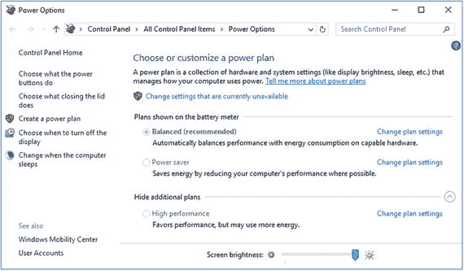

图 20-1. 在 Windows 上设置高性能电源计划

在 Windows 10 上，您可以通过打开 Windows 设置，然后点击“系统”菜单来打开“电源选项”屏幕。选择“电源和睡眠”，然后点击“其他电源设置”，如图 20-2 所示。

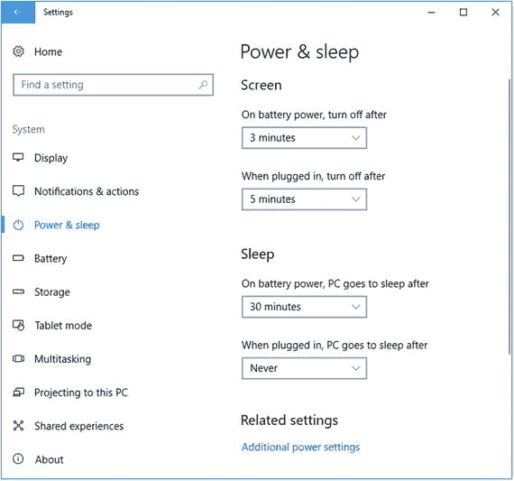

图 20-2. Windows 10 上的电源和睡眠选项

请注意，使用高性能模式时功耗将会增加。然而，这是值得付出的代价，因为禁用节能模式和 CPU 频率调节所带来的性能提升是显著的。如果启用节能模式，我们需要更多的服务器才能达到相同的性能水平。无论是从资金还是电力角度来看，运行更多的服务器机器，其成本都远高于在更少的服务器上禁用节能模式。即使您运行着更多启用了节能模式的服务器，其响应时间通常也比在更少的服务器上禁用节能模式要差。

#### CPU 绑定策略

CPU 绑定（或处理器亲和性）是影响数据节点性能的最重要因素。然而，配置 CPU 绑定并非易事。不当地将线程绑定到 CPU 会导致性能下降。本节讨论如何利用 CPU 绑定来最大化性能。

##### 超线程与 CPU 绑定

超线程（HT）是现代 CPU（如酷睿系列和至强系列）中普遍实现的技术。借助 HT，操作系统可以在每个物理 CPU 核心上识别出多个虚拟 CPU 核心。虚拟 CPU 核心的行为类似于物理 CPU 核心。由于每个虚拟核心都可以运行一个线程，因此一个物理 CPU 核心上可以并发运行多个线程。

HT 可以通过在线程间高效共享 CPU 硬件资源，来提升并行运行多线程应用程序的吞吐量。另一方面，作为副作用，应用程序的响应能力可能会因 HT 而牺牲。

让多个线程共享一个物理核心会对 MySQL NDB 集群数据节点产生负面影响，因为当线程共享一个物理核心时，单个线程可以处理的信号数量会减少。这种缓慢的线程处理可能成为整个集群的瓶颈。不要将多于一个繁忙的线程绑定到共享同一物理核心的虚拟核心上。这两个线程会相互干扰彼此的执行。

> 注意
>
> 切勿将多于一个繁忙的线程绑定到共享同一物理核心的虚拟核心上。


##### CPU 使用率与绑定

平衡 CPU 核心的负载对于最大化 MySQL NDB Cluster 的性能至关重要。要实现这一目标，有必要监控 CPU 利用率并相应地调整配置。

尽管常见的繁忙线程类型是 `ldm` 和 `tc`，但其他类型的线程也可能偶然变得繁忙。关于线程类型的更多信息，请参见第 4 章。要识别哪个线程繁忙，`ndbinfo.cpustat` 表非常有用。它显示了每个线程的 CPU 利用率。该表显示了绑定到每个线程的 CPU 资源利用率。换句话说，该表仅在线程绑定到特定 CPU 时才有用，因为查看一个运行在任意 CPU 核心上的线程的 CPU 利用率是没有意义的。

清单 20-1 展示了 `ndbinfo.cpustat` 表的示例输出。

```
mysql> SELECT node_id, thr_no, thread_name, OS_user, OS_system, OS_idle FROM cpustat JOIN threads USING (node_id, thr_no) WHERE node_id=1;
+---------+--------+-------------+---------+-----------+---------+
| node_id | thr_no | thread_name | OS_user | OS_system | OS_idle |
+---------+--------+-------------+---------+-----------+---------+
|       1 |      0 | main        |       0 |         1 |      99 |
|       1 |      8 | send        |       1 |         3 |      99 |
|       1 |      1 | rep         |       0 |         0 |     100 |
|       1 |      2 | ldm         |      65 |         2 |      33 |
|       1 |      3 | ldm         |       0 |        12 |      88 |
|       1 |      4 | tc          |       0 |        10 |      90 |
|       1 |      5 | tc          |       0 |        10 |      90 |
|       1 |      6 | recv        |       0 |         7 |      93 |
|       1 |      7 | recv        |       1 |         5 |      95 |
+---------+--------+-------------+---------+-----------+---------+
9 rows in set (0.08 sec)
```

清单 20-1. 使用 `cpustat` 表检查 CPU 利用率

根据此输出，该数据节点有两个 `ldm` 线程、两个 `tc` 线程、两个 `recv` 线程、一个 `rep` 线程、一个 `main` 线程和一个 `send` 线程。只有 `id=2` 的那个 `ldm` 线程似乎很繁忙；`tc` 和 `recv` 线程消耗了 CPU 时间。值得在此集群上增加 `ldm` 线程的数量。两个 `ldm` 线程的 CPU 使用率差异显著，因为一个处理某个表的主片段，另一个处理备份片段。当表具有 `READ_BACKUP=1` 表注释且工作负载类型为读取时，负载将会平衡。

虽然 `ndbinfo.cpustat` 显示的是操作系统报告的 CPU 利用率，但它有时可能不可靠，因为它会包含其他程序（包括内核内部处理的中断）引起的 CPU 利用率。这将导致即使是相同类型的线程，其 CPU 利用率也不平衡。在这种情况下，您需要验证 CPU 利用率是否确实是由数据节点内不平衡的工作负载引起的。

要分析每个线程的工作负载，`ndbinfo.threadstat` 表很有用。该表显示每个线程的统计数据，例如每个线程处理的信号计数。清单 20-2 是一个查看工作负载是否平衡的存储过程示例。如果特定线程比其他同类型线程处理更多的信号，则说明工作负载不平衡。

```
delimiter //
CREATE PROCEDURE sigcount(t INT)
BEGIN
DROP TEMPORARY TABLE IF EXISTS tmpstat;
CREATE TEMPORARY TABLE tmpstat ENGINE MEMORY
SELECT * FROM ndbinfo.threadstat;
SELECT SLEEP(t) FROM DUAL;
SELECT STRAIGHT_JOIN
s2.node_id,
s2.thr_no,
s2.thr_nm,
(s2.os_now - s1.os_now) AS time_ms,
(s2.c_loop - s1.c_loop) AS loops,
(s2.c_exec - s1.c_exec) AS execs,
(s2.c_wait - s1.c_wait) AS waits,
(s2.c_exec - s1.c_exec) / (s2.c_loop - s1.c_loop) AS spl --signals_per_loop
FROM
tmpstat s1 INNER JOIN
ndbinfo.threadstat s2 USING (node_id, thr_no)
ORDER BY
s1.node_id, s1.thr_no;
DROP TEMPORARY TABLE tmpstat;
END;//
delimiter ;
mysql> CALL sigcount(5);
+----------+
| SLEEP(t) |
+----------+
|        0 |
+----------+
1 row in set (5.03 sec)
+---------+--------+--------+---------+-------+--------+-------+---------+
| node_id | thr_no | thr_nm | time_ms | loops | execs  | waits | spl     |
+---------+--------+--------+---------+-------+--------+-------+---------+
|       1 |      0 | main   |    5046 |  3412 |   3531 |  1299 |  1.0349 |
|       1 |      1 | rep    |    5046 |  1780 |    804 |   951 |  0.4517 |
|       1 |      2 | ldm    |    5046 | 35380 | 608922 |  1628 | 17.2109 |
|       1 |      3 | ldm    |    5046 | 46202 |  56861 | 12600 |  1.2307 |
|       1 |      4 | tc     |    5046 | 35006 | 133170 | 11096 |  3.8042 |
|       1 |      5 | tc     |    5046 | 35935 | 133070 | 11817 |  3.7031 |
|       1 |      6 | recv   |    5047 | 27803 |    108 |     0 |  0.0039 |
|       1 |      7 | recv   |    5045 | 20830 |    108 |     0 |  0.0052 |
|       2 |      0 | main   |    5026 |  3219 |   2631 |  1257 |  0.8173 |
|       2 |      1 | rep    |    5026 |  1741 |    803 |   948 |  0.4612 |
|       2 |      2 | ldm    |    5027 | 48346 |  56283 | 13616 |  1.1642 |
|       2 |      3 | ldm    |    5027 | 38280 | 634545 |  1727 | 16.5764 |
|       2 |      4 | tc     |    5027 | 35159 | 132148 | 11385 |  3.7586 |
|       2 |      5 | tc     |    5026 | 37624 | 134823 | 12528 |  3.5834 |
|       2 |      6 | recv   |    5026 | 27683 |    107 |     0 |  0.0039 |
|       2 |      7 | recv   |    5026 | 20722 |    107 |     0 |  0.0052 |
+---------+--------+--------+---------+-------+--------+-------+---------+
16 rows in set (5.07 sec)
Query OK, 0 rows affected (5.07 sec)
```

清单 20-2. 检查线程间负载平衡的存储过程

`spl` (每循环信号数) 列指示了每个线程的大致繁忙程度。在清单 20-2 中，最繁忙的线程类型是 `ldm`。只有 `id=2` 的那个 `ldm` 线程负载很重；另一个 `ldm` 线程负载很轻。`tc` 线程似乎有些繁忙，但不如 `ldm` 线程繁忙。


##### 中断与 CPU 绑定

在将线程绑定到 CPU 时，另一个需要考虑的因素是，是否应该避免绑定到因中断而繁忙的 CPU 上。中断是硬件或软件在需要立即采取行动时通知 CPU 的一种方式。每个单独的中断完成得很快，只需要很少的 CPU 资源。然而，中断可能累积起来，大量的中断可能会占用大量 CPU 资源。高速设备可能会导致大量中断；例如，高 IOPS 的 NVMe 固态硬盘和高速的 10 千兆网络接口卡会导致大量的中断。

Linux 系统通常配置为由特定的 CPU 默认处理中断。此类配置可能导致如下问题：

*   用户程序的执行可能会被繁忙的中断所阻碍。
*   CPU 资源不足以处理来自繁忙设备的所有中断。

为了防止此类问题，`irqbalance`非常有用。它能将中断造成的负载分散到所有或特定的 CPU 上。将中断绑定到 CPU 的机制称为中断亲和性。重要的是不要将中断绑定到太少的 CPU 上。否则，中断处理速度将成为瓶颈。请注意，并非所有设备都支持将中断亲和性绑定到多个 CPU。`irqbalance`仅在设备支持时设置中断亲和性。网络接口卡通常支持接收方调节（RSS），也称为多队列接收。启用 RSS 后，网络接口卡上接收数据包引起的中断可以被重定向到多个 CPU。否则，就不可能将工作负载分散到多个 CPU 上。

为了确保 MySQL NDB 集群的良好性能，重要的是不要将中断和繁忙的数据节点线程（如`ldm`和`tc`）绑定到同一个 CPU 上。避免中断和繁忙线程之间冲突的最简单方法是将中断分散到所有 CPU 上。在这种情况下，所有 CPU 将分担中断的工作负载，每个 CPU 所需的资源将很小。处理中断所需的 CPU 资源永远不会短缺，因为所有 CPU 都参与处理中断。这种配置很简单；然而，它无法实现最佳性能。

只有当中断和繁忙线程被显式地绑定到不同的 CPU 上时，才能达到最佳性能。在这种情况下，数据节点中的繁忙线程可以独占给定 CPU 核心的全部资源。因此，一个绑定的线程可以在给定的系统上处理最多的信号。

当显式地将中断和线程绑定到 CPU 时，你需要确保分配给中断的 CPU 资源是充足的。要在 Linux 上查看由中断引起的 CPU 利用率，请显示`/proc/stat`文件的内容。每个 CPU 行的第六列表示处理中断所花费的时间。要分析中断，必须在内核中启用`CONFIG_IRQ_TIME_ACCOUNTING`配置标志。要确定该标志是否已启用，请执行以下命令：

```
shell$ gunzip -c /proc/config.gz | grep CONFIG_IRQ_TIME_ACCOUNTING
```

如果`CONFIG_IRQ_TIME_ACCOUNTING`标志被禁用，你必须从源代码编译内核来启用它。虽然构建 Linux 内核的方法超出了本书的范围，但它并不十分困难。请参阅你的 Linux 发行版手册了解内核编译的详细信息。如果`/proc/config.gz`不存在，你在执行此命令时甚至可能遇到问题。这可能是因为你的内核中`CONFIG_IKCONFIG`和`CONFIG_IKCONFIG_PROC`配置标志被禁用了。如果`/proc/config.gz`文件不存在，你需要首先重新编译内核。

在 macOS 上，用户不允许更改中断设置。处理中断的 CPU 是自动选择的。更糟糕的是，你无法获取由中断消耗的独立 CPU 使用率。它被包含在总 CPU 使用率中。要在 macOS 上监控系统 CPU 时间，请选择“活动监视器”，并从菜单中打开“窗口” ➤ “CPU 历史记录”。图 20-3 显示了在双 CPU 核心 Mac 机器上“活动监视器”的 CPU 历史记录窗口截图。

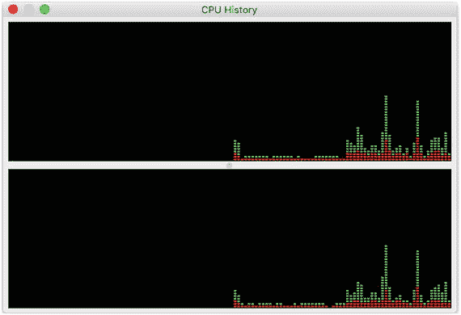

图 20-3. 双 CPU 核心 Mac 机器上活动监视器的 CPU 历史记录屏幕

如果你不介意安装免费软件，`htop`工作得非常好。如果你的系统上安装了 Homebrew（macOS 上流行的第三方包管理器），你可以按如下方式安装`htop`命令：

```
shell$ brew install htop
```

有关 Homebrew 的更多信息，请参见以下网站。

[`brew.sh/`](https://brew.sh/)

图 20-4 显示了`htop`命令的输出示例。

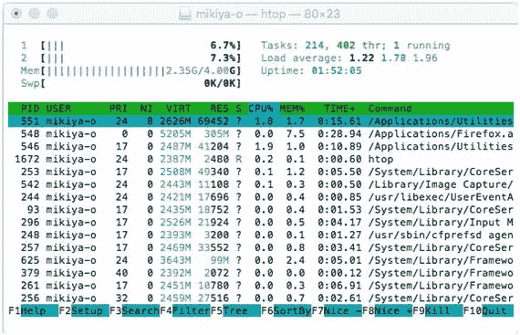

图 20-4. htop 命令输出示例

在图 20-4 中`htop`命令输出的左上角，按 CPU 核心显示了 CPU 使用率。

在 Windows 上，你可以使用性能监视器查看每个 CPU 核心的中断 CPU 使用率。图 20-5 显示了正在记录性能统计数据时的性能监视器。

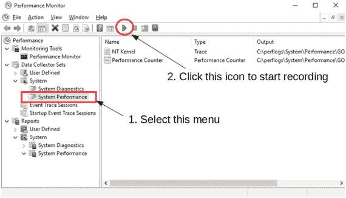

图 20-5. 使用性能监视器记录系统性能统计数据

要查看系统性能，你必须首先记录统计数据。要记录数据，请从侧边菜单中的“数据收集器集” ➤ “系统”下选择“系统性能”，然后单击工具栏上的三角形图标。等待片刻，然后单击三角形图标右侧的方形图标。之后，你可以通过选择“报告” ➤ “系统” ➤ “系统性能”来查看报告。图 20-6 显示了显示报告的性能监视器截图。

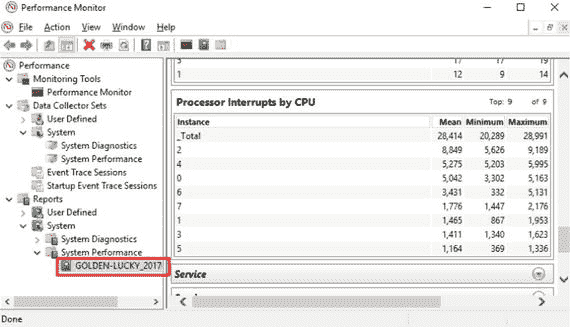

图 20-6. 在性能监视器上显示系统性能报告

性能指标按类别分组。你可以在“CPU” ➤ “进程”类别下找到“按 CPU 的处理器中断”。根据图 20-6 中的数字，中断数量有些不平衡。CPU 2 处理的中断大约是 CPU 5 的八倍。

如果设备支持接收方调节（RSS），可以在 Windows 上为网络接口卡指定中断亲和性。通常，中断亲和性对于网络接口设备尤为重要。因此，在 Windows 系统上，启用 RSS 通常足以满足中断亲和性的目的。以下命令从 Windows shell 启用 RSS。

```
PS C:\> netsh int tcp set global rss=enabled
```

使用实时调度器

使用 CPU 绑定时，采用实时调度器并为绑定的线程分配高优先级是一个好主意。使用实时调度器时，线程会不间断地运行，直到有更高优先级的线程准备运行，或者给定的线程进入睡眠或等待事件。这允许实时线程最大化地利用 CPU 资源。

要在 Linux 和 POSIX 系统上使用非特权用户将线程作为实时线程运行，必须配置资源限制。你需要编辑`/etc/security/limits.conf`并添加如下一行：

```
mysql    -    rtprio    99
```

这假设`ndbd`或`ndbmtd`是使用`mysql`用户执行的。如果你使用不同的用户运行数据节点，请替换用户名。如果没有适当的资源配置，数据节点将无法启动。


### SQL 调优

本节讨论如何通过调优 SQL 来最大化性能。上一节主要涉及 MySQL NDB Cluster 侧的性能调优，而本节将从应用程序的角度探讨性能调优。通常，编写高效的 SQL 语句非常重要，因为如果你理解了数据库管理系统的特性并据此编写 SQL，性能可能会提升许多倍。

#### 线程调度与优先级

或者，可以通过 `ThreadConfig` 中的 `thread_prio` 参数为给定线程分配更高的优先级。在 Linux 和 UNIX 系统上，`thread_prio` 参数会调整指定线程的 *niceness*（UNIX 系统中进程调度的优先级），这需要的资源限制不同于实时调度器。在 `ThreadConfig` 选项中，`realtime` 和 `thread_prio` 参数是互斥的。如果你能使用实时调度器，这通常是比指定 `thread_prio` 更好的选择。有关 `ThreadConfig` 选项的更多信息，请参见第 4 章。

`ThreadConfig` 选项的实时调度器同样适用于 Windows。设置线程优先级的过程与 UNIX 系统不同，它是通过调用 `SetThreadPriority()` Windows API 函数来完成的。当选择实时调度器时，会为指定线程设置 `THREAD_PRIORITY_TIME_CRITICAL` 优先级。有关 `SetThreadPriority()` Windows API 函数的更多详细信息，请参阅以下页面：

[`msdn.microsoft.com/en-us/library/windows/desktop/ms686277(v=vs.85).aspx`](https://msdn.microsoft.com/en-us/library/windows/desktop/ms686277(v=vs.85).aspx)

##### 混合绑定线程与非绑定线程

即使你想将某些线程绑定到特定的 CPU，你也可以让其他线程保持非绑定状态。并非需要绑定所有线程。一个线程是否更适合绑定取决于其类型。`ldm` 和 `tc` 是主要的绑定候选者，因为它们必须快速响应并处理尽可能多的信号。`recv` 和 `send` 线程是次一级的候选者。当它们被绑定到 CPU 并使用实时调度器时，节点间的通信将更具响应性。

在我看来，其他线程没有必要绑定到 CPU。通过混合使用绑定线程和非绑定线程，可以使用给定硬件实现最佳性能。将实时调度器设置给绑定线程是理想的。另一方面，不要为非绑定线程设置实时调度器，只需在它们处于非绑定状态时配置足够数量的线程即可。正如本节前面所讨论的，不将线程绑定到处理中断的 CPU 上也很重要。

强烈建议使用基准测试来监控实际的系统性能。基准测试的好处在于它揭示了来自真实系统的实际数据。通过检查基准测试结果来确定线程的最佳组合。观察到的真实数据总是比基于“纸上谈兵”得出的假设更可靠。

#### 磁盘类型与文件系统块大小

对于 MySQL NDB Cluster 而言，使用快速磁盘非常重要，即使仅使用内存表也是如此，因为日志和检查点会被写入磁盘以确保数据持久性。对 `NDBCluster` 表的写入速度受限于重做日志的写入速度。本地检查点（LCP）也会限制写入速度，因为如果重做日志空间耗尽，就无法将新的重做日志条目写入重做日志。在这种情况下，有必要释放被旧重做日志条目占用的空间，但在进行中的 LCP 完成之前，无法释放这些旧条目。

在使用磁盘数据表时，磁盘速度更为重要，因为它们不仅需要写入磁盘，还需要从磁盘读取数据。对于磁盘数据表，除了数据文件和重做日志外，还需要写入撤销日志。因此，在这种情况下，你需要比使用内存表时更好的磁盘带宽。使用磁盘数据表时，采用快速磁盘至关重要。

优化磁盘 I/O 性能时，有以下几点考虑：

*   格式化文件系统时，将其块大小（或在 NTFS 上的簇大小）调整为 32KB。这是因为在 MySQL NDB Cluster 中，数据内存和磁盘数据表的页面大小为 32KB。
*   在 Linux 上使用 `deadline` 或 `noop` I/O 调度器。它们对于数据库系统的性能优于 Linux 内核默认的 `cfq` I/O 调度器。请注意，一些 Linux 发行版将默认 I/O 调度器设置为 `deadline`。
*   在 Linux 和 UNIX 系统上，挂载时追加 `noatime` 选项。这将提高文件读取性能，因为不再记录最后访问时间。当你重启数据节点并使用磁盘数据表时，这一点很重要。
*   应在磁盘上保留一些可用空间。通常，磁盘填充得越接近其容量，其性能就越慢。建议至少为每个磁盘分区保留 20% 的未分配可用空间。
*   在 SSD 上启用 `Trim` 命令，该命令用于将未使用的区域标记为已丢弃。`Trim` 可能会提高磁盘性能，因为它可以省略不必要的磁盘写入。
    *   在 Windows 上，自 Windows 7 起支持 `Trim`。`Trim` 默认启用。要检查 `Trim` 是否已启用，请从命令提示符或具有管理员权限的 Windows shell 中运行以下命令：
        ```
        fsutil behavior query DisableDeleteNotify
        ```
        如果值为 `1`，则 `Trim` 已禁用。这种情况下，请使用以下命令启用它：
        ```
        fsutil behavior set DisableDeleteNotify 0
        ```
        如果该值未设置，则 `Trim` 已启用。更多信息，请参见 [`www.tenforums.com/tutorials/40028-enable-disable-trim-support-solid-state-drives-windows-10-a.html`](https://www.tenforums.com/tutorials/40028-enable-disable-trim-support-solid-state-drives-windows-10-a.html)。
    *   在 macOS 上，自 mac OS X 10.6.8 (Snow Leopard) 起仅支持 Apple 品牌的 SSD 的 `Trim`。截至 macOS X 10.10.4 (Yosemite)，所有品牌的 SSD 均支持 `Trim`。要在第三方 SSD 上启用 `Trim`，请执行以下命令：
        ```
        sudo trimforce enable
        ```
    *   在 Linux 上，自 Linux 内核版本 2.6.33 起支持 `Trim`。在 Linux 系统上，`Trim` 是否默认启用取决于具体的发行版。例如，自 14.04 版本起，Ubuntu 默认启用 `Trim`。在启用之前，请运行以下命令验证你的设备是否支持 `Trim` 命令：
        ```
        hdparm -I /dev/sdX
        ```
        要在 Linux 系统上启用它，请将 `discard` 添加到 `mount` 选项中。如果你正在使用 LVM，请在 `/etc/lvm/lvm.conf` 文件中设置 `issue_discard = 1`。除了 LVM 之外，你还需要为文件系统配置 `trim` 选项。如果你更喜欢使用周期性的批处理 `trim`，可以使用 cron 中的 `fstrim` 命令。否则，在 `mount` 选项中添加 `discard` 选项。更多信息，请参见 [`access.redhat.com/documentation/en-US/Red_Hat_Enterprise_Linux/7/html/Performance_Tuning_Guide/chap-Red_Hat_Enterprise_Linux-Performance_Tuning_Guide-Storage_and_File_Systems.html`](https://access.redhat.com/documentation/en-US/Red_Hat_Enterprise_Linux/7/html/Performance_Tuning_Guide/chap-Red_Hat_Enterprise_Linux-Performance_Tuning_Guide-Storage_and_File_Systems.html)。

**注意**

请勿在 `dm-crypt` 上启用 `Trim`，因为这会增加安全风险。它会泄露来自已释放块的最小数据。至少，当启用 `Trim` 时，它可能允许攻击者推断正在使用的文件系统类型。更多信息请参见以下页面：[`asalor.blogspot.jp/2011/08/trim-dm-crypt-problems.html`](http://asalor.blogspot.jp/2011/08/trim-dm-crypt-problems.html)。


#### 事务大小调整

需要注意的最重要特点是，MySQL NDB 集群针对大量小型事务进行了优化。当需要修改给定行数时，以多个更小的事务并行修改，比用一个大事务修改所有行要快得多。因此，如果你想更新大量行，请将这些修改拆分为多个事务，并尽可能保持每个事务足够小。如果可能，并行执行这些小事务。MySQL NDB 集群将以快得多的速度完成修改，并且使数据节点不那么繁忙。

当然，将一个大修改拆分为多个小部分可能会破坏原子性。如果原子性是必须的，无论事务多大，都不要将其拆分为更小的事务。请注意，如果执行一个足够大的事务，它可能会因为 `MaxNoOfConcurrentOperations` 或 `RedoBufferSize` 的上限而失败。即使原子性是必须的，但如果无法提高这些选项的上限，你将不得不把事务拆分成更小的部分。

那么，什么是事务的最佳大小呢？这取决于配置或表定义。如果一个事务是针对在线事务处理（OLTP）类型的工作负载，请将事务中修改的行数限制在大约 1,000 行。如果是批处理或在线分析处理（OLAP）类型的工作负载，请将行数限制在 100,000 行。

#### 非事务性批处理

如果你需要一次性修改许多行，但又不必须是事务性的，可以在 SQL 节点上使用 `ndb_use_transaction` 选项。默认情况下，此选项为 `ON`，事务是启用的。如果将其设置为 `OFF`，则会禁用事务支持，修改操作会快得多。此选项可以在会话级别设置。因此，你可以像下面的示例一样，在命令基础上禁用此选项：

```sql
mysql> SET ndb_use_transaction = OFF;
mysql> DELETE FROM world.City;
mysql> SET ndb_use_transaction = ON;
```

禁用事务将破坏事务属性，如原子性。因此，如果一个 SQL 命令因问题而只部分执行，你将无法回滚它。如果禁用了 `ndb_use_transaction`，则修改必须是可恢复或可检索的，例如在以下情况：

*   在批处理过程中，创建一个表并从文件中向该表加载大量数据。
*   根据某些条件（如特定日期范围）删除不使用的行。

在这些情况下，如果查询失败，你可以重复执行相同的查询。

#### 引擎条件下推优化

MySQL NDB 集群最强大的功能之一是能够在数据节点过滤行。这将最大限度地减少数据节点与 SQL 节点之间的网络带宽使用，并最大化性能，因为过滤是在数据节点上并行完成的。无论是否存在合适的索引，都可以进行过滤。此功能在 SQL 节点上被称为引擎条件下推优化。引擎条件下推默认启用。

当使用引擎条件下推时，会在 `EXPLAIN` 命令的 `Extra` 字段中指示，如清单 20-3 所示。请注意，下推的条件显示在 `Extra` 字段的括号中。在 MySQL NDB Cluster 7.4 或更早版本中不显示此条件。

```sql
mysql> EXPLAIN SELECT * FROM City WHERE District = 'Tochigi'\G
*************************** 1. row ***************************
           id: 1
  select_type: SIMPLE
        table: City
   partitions: p0,p1,p2,p3
         type: ALL
possible_keys: NULL
          key: NULL
      key_len: NULL
          ref: NULL
         rows: 4079
     filtered: 10.00
        Extra: Using where with pushed condition (`world`.`City`.`District` = 'Tochigi')
1 row in set, 1 warning (0.00 sec)
清单 20-3.
启用引擎条件下推优化的查询执行计划
```

要禁用引擎条件下推，请调整 `optimizer_switch` 选项，如清单 20-4 所示。通常，禁用它没有优势。

```sql
mysql> set optimizer_switch='engine_condition_pushdown=off';
Query OK, 0 rows affected (0.00 sec)
mysql> EXPLAIN SELECT * FROM City WHERE District = 'Tochigi'\G
*************************** 1. row ***************************
           id: 1
  select_type: SIMPLE
        table: City
   partitions: p0,p1,p2,p3
         type: ALL
possible_keys: NULL
          key: NULL
      key_len: NULL
          ref: NULL
         rows: 4079
     filtered: 10.00
        Extra: Using where
1 row in set, 1 warning (0.00 sec)
清单 20-4.
禁用引擎条件下推优化
```

尽管引擎条件下推快速且有用，但你必须意识到所有行都是在数据节点上扫描的。这会扭曲查询统计信息。例如，慢查询日志中的 `Rows_examined` 仅指示返回到 SQL 节点的行数。在数据节点上被扫描但过滤掉的行不包括在统计信息中。因此，当你寻找待优化的候选查询时，引擎条件下推可能会让你的工作变得更加困难。

请注意，引擎条件下推可以与索引一起使用。如果引擎条件下推与索引一起使用，则不匹配的行会在数据节点被过滤。这与索引条件下推优化非常相似，并且比全表扫描的引擎条件下推更高效。因此，即使引擎条件下推生效，拥有一个好的索引仍然非常重要。

#### 优化连接

在非常早期的 MySQL NDB 集群版本中，连接是 MySQL NDB 集群的一个软肋，因为 SQL 节点只具有嵌套循环连接（NLJ）算法及其变种块嵌套循环连接（BNLJ）算法。这些算法需要在 SQL 节点和数据节点之间进行多次遍历。因此，连接非常慢，并且在数据节点上产生了大量负载。在最近的 MySQL NDB 集群版本中，提供了更强大的连接算法。


##### 下推连接优化

连接（join）操作在 MySQL NDB Cluster 中执行得相当快，因为连接可以像搜索条件一样被**下推**到数据节点执行。借助下推连接优化，连接操作在数据节点内部完成，而 SQL 节点仅从数据节点接收连接后的行。

下推连接自 MySQL NDB Cluster 7.2 系列起引入。它最初被称为自适应查询本地化（`AQL`）或选择-投影连接（`SPJ`）。后一个名称保留在处理下推连接的内核模块名称中。要使用下推连接，必须启用 `ndb_join_pushdown` 选项；该选项默认是启用的。

下推连接有一些限制。要启用下推连接，需要满足以下条件：

*   被连接表上的键列必须具有相同的数据类型。
*   查询不能引用 `BLOB` 或 `TEXT` 列。
*   查询不能包含显式的锁子句——`FOR UPDATE` 和 `LOCK IN SHARE MODE`。
*   对于内连接，子表（内部表）的访问方法必须是 `ref`、`eq_ref` 或 `const`；对于外连接，则只能是 `eq_ref`。这意味着对于内连接，连接键列必须被索引；对于外连接，则必须具有唯一的哈希索引。
*   对下推连接和 `GROUP BY` 查询的支持有限。
*   实验性的用户定义分区类型（除 `[LINER] KEY` 外）不受支持。

如你所见，在使用下推连接时，表设计非常重要。请在不同表中对相同数据使用相同的数据类型，并在连接键列上定义合适的索引。

当采用下推连接时，`EXPLAIN` 命令的 `Extra` 字段将显示下推连接信息，如代码清单 20-5 所示。如果未启用引擎条件下推优化，可以执行 `SHOW WARNINGS`，它会显示原因。

```
mysql> EXPLAIN SELECT * FROM City JOIN Country ON Country.Capital = City.Id\G
*************************** 1. row ***************************
           id: 1
  select_type: SIMPLE
        table: Country
   partitions: p0,p1,p2,p3
         type: ALL
possible_keys: NULL
          key: NULL
      key_len: NULL
          ref: NULL
         rows: 239
     filtered: 100.00
        Extra: Parent of 2 pushed join@1; Using where with pushed condition (`world`.`Country`.`Capital` is not null)
*************************** 2. row ***************************
           id: 1
  select_type: SIMPLE
        table: City
   partitions: p0,p1,p2,p3
         type: eq_ref
possible_keys: PRIMARY
          key: PRIMARY
      key_len: 4
          ref: world.Country.Capital
         rows: 1
     filtered: 100.00
        Extra: Child of 'Country' in pushed join@1
2 rows in set, 1 warning (0.00 sec)
```

代码清单 20-5.
使用下推连接的查询执行计划

在代码清单 20-5 的示例中，`Country` 表的 `Extra` 字段除了下推连接信息外，还包含了引擎条件下推的信息，尽管此查询中没有 `WHERE` 子句。这是因为优化器发现 `Country.Capital` 列被定义为可为空，但在本查询中它与一个不可为空的列进行连接，因此不可能为 `NULL`。在这种情况下，优化器认为可以使用一个额外的搜索条件高效地从父表中过滤出行。

##### 批键访问连接优化

批键访问连接（`BKAJ`）是 MySQL NDB Cluster 提供的另一种快速连接算法。它是块嵌套循环连接（`BNLJ`）的一个变种。`BNLJ` 是嵌套循环连接（`NLJ`）的改进版本，如果内部表没有合适的索引，它可以减少扫描次数。`BKAJ` 的算法与 `BNLJ` 相同，不同之处在于它使用多范围读（`MRR`）优化来批量访问内部表。

为了描述 `BKAJ` 算法，我们将首先讨论 `NLJ` 和 `BNLJ` 算法。`NLJ` 是一个非常简单的算法，它像循环一样执行连接。以下代码是两张表连接的概念性算法。

```
for each row in t1 matching where condition {
    for each row in t2 matching join key and where condition {
        send joined row to client
    }
}
```

如果内部表有合适的索引来获取行，那么即使从外部表返回大量行并且内部表必须被访问多次，`NLJ` 也非常快。否则，它将非常低效。假设内部表没有合适的索引，并且查询从外部表获取了 100 万行，那么内部表将被扫描 100 万次。如果内部表很大，查询不太可能在实际时间内完成。

为了克服这个性能问题，引入了 `BNLJ`。使用 `BNLJ` 时，从外部表获取的行首先被存储到一个称为连接缓冲区的缓冲区中。将持续获取外部表的行直到缓冲区填满。然后，它使用搜索条件逐个从内部表获取行，并测试获取的行是否可以与缓冲区中的行进行连接。这大大减少了内部表的扫描次数。

图 20-7 是 `BNLJ` 算法的概念视图。如图 20-7 所示，`BNLJ` 仅在内部表上没有合适的键时才有效。

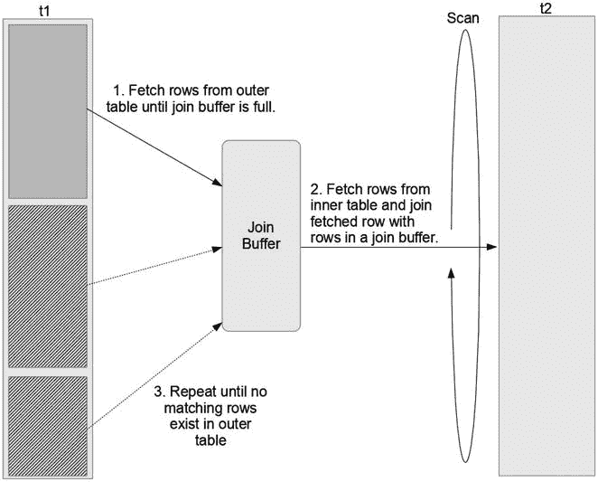
图 20-7.
BNLJ 算法的概念视图

当内部表没有合适的索引并且需要扫描时，`BNLJ` 是一个非常强大的算法。然而，还有一些问题需要解决。即使内部表有适合连接的索引，访问内部表也不一定是最优的。`BKAJ` 解决了这种情况下的性能问题；访问内部表虽然不是扫描，但效率不够高。

理论上，不同表中的行顺序是无关的。因此，使用 `NLJ` 访问内部表将是随机顺序进行的，这通常是低效的。在 MySQL NDB Cluster 中，即使内部表有适合连接的索引，逐行访问内部表也并不高效，因为行访问操作涉及网络遍历。为了克服这个问题，`BKAJ` 非常有用。

使用 `BKAJ` 时，首先从外部表获取行并存储到连接缓冲区。然后，`BKAJ` 从缓冲的行中检索键值。接着，使用 `MRR` 优化从内部表获取行。使用 `MRR` 时，行是使用按键顺序排序的多个键值来获取的。最后，从内部表获取的行与缓冲的行进行连接。由于对内部表的访问是使用多个键值批量进行的，因此这种类型的连接被称为批键访问连接。


BKAJ 默认是禁用的。要使用 `BKAJ`，需要修改 `optimizer_switch` 以便优化器可以选择 `BKAJ`，如清单 20-6 所示。请注意，清单 20-6 中禁用了下推连接（pushdown join），因为它比 `BKAJ` 更高效。如果下推连接可用，优化器倾向于选择它而不是 `BKAJ`。清单 20-6 中的示例查询与清单 20-5 相同。唯一的区别是查询执行计划。你可以在清单 20-6 中的 `City` 表的 `Extra` 字段中看到 `Using join buffer (Batched Key Access)`。

```sql
mysql> set optimizer_switch='batched_key_access=on';
Query OK, 0 rows affected (0.00 sec)
mysql> SET ndb_join_pushdown = 0;
Query OK, 0 rows affected (0.00 sec)
mysql> EXPLAIN SELECT * FROM City JOIN Country ON Country.Capital = City.Id\G
*************************** 1. row ***************************
id: 1
select_type: SIMPLE
table: Country
partitions: p0,p1,p2,p3
type: ALL
possible_keys: NULL
key: NULL
key_len: NULL
ref: NULL
rows: 239
filtered: 100.00
Extra: Using where with pushed condition (`world`.`Country`.`Capital` is not null)
*************************** 2. row ***************************
id: 1
select_type: SIMPLE
table: City
partitions: p0,p1,p2,p3
type: eq_ref
possible_keys: PRIMARY
key: PRIMARY
key_len: 4
ref: world.Country.Capital
rows: 1
filtered: 100.00
Extra: Using join buffer (Batched Key Access)
2 rows in set, 1 warning (0.00 sec)
```
清单 20-6. 启用 `BKAJ` 并检查查询执行计划

##### 卸载连接

如果无法采用高效的连接算法，考虑从 `MySQL NDB Cluster` 设置复制到 `InnoDB`。`InnoDB` 通常具有良好的连接性能，并且可以使用 1:N 拓扑将读取负载分散到多个从库。有关从 `MySQL NDB Cluster` 设置复制到 `InnoDB` 的过程的更多信息，请参见第 6 章。

#### 优化分区

理解并调整 `MySQL NDB Cluster` 上的分区非常重要。在 `MySQL NDB Cluster` 中，数据按行分散到数据节点中。每个表被拆分为分区，每个分区仅属于一个节点组（除非表是完全复制的）。因此，可以确定哪个数据节点存储了目标行。所以，分区键也作为数据节点之间的分布键。

##### `MySQL NDB Cluster` 上分区的特性

目前，`MySQL NDB Cluster` 唯一支持的分区方法是 `KEY` 分区，包括其变体 `LINER KEY` 分区。`KEY` 分区类似于 `HASH` 分区，除了计算键值的表达式不同。对于 `HASH` 分区，用户指定分区表达式。而对于 `KEY` 分区，`MySQL Server` 提供分区表达式；`MySQL NDB Cluster` 使用 `MD5()` 来达到此目的。

在 `NDBCluster` 存储引擎中，分区修剪的工作方式与 `InnoDB` 有几点不同：

*   `NDBCluster` 存储引擎中并行扫描所有分区。即使未采用分区修剪，扫描速度也很快。
*   无法手动更改分区表达式，分区数量受系统配置限制。有关分区平衡的更多信息，请参见第 2 章。

##### 用户定义分区

默认情况下，主键用作分区键。这在大多数情况下并不是一个坏选择。然而，在某些情况下，选择不同的列作为分区键可能是更好的选择。例如，`world` 示例数据库中的 `world.City` 表可能必须使用 `CountryCode` 而不是其主键 `ID` 进行分区，因为 `world.City` 表经常针对特定国家进行查询。

`MySQL NDB Cluster` 可以以不同于默认的方式对表进行分区。此功能称为用户定义分区。用户定义分区在以下场景中非常有用：

*   经常将分区键的值指定为使用附加搜索条件进行范围扫描的等值比较。
*   使用分区键将表作为内部表进行连接。

在这些情况下，查询用户定义分区表时可以应用分区修剪。它使查询更高效，从而提高了应用程序的可扩展性。

例如，清单 20-7 中的查询必须根据其执行计划扫描所有分区。你可以在 `EXPLAIN` 输出的 `partitions` 字段中看到列出了所有分区。该查询将访问所有数据节点。

```sql
mysql> EXPLAIN SELECT * FROM City
->   WHERE CountryCode='JPN' AND Name LIKE 'T%'\G
*************************** 1. row ***************************
id: 1
select_type: SIMPLE
table: City
partitions: p0,p1,p2,p3
type: ref
possible_keys: CountryCode
key: CountryCode
key_len: 3
ref: const
rows: 3
filtered: 11.11
Extra: Using where with pushed condition (`world`.`City`.`Name` like 'T%')
1 row in set, 1 warning (0.00 sec)
```
清单 20-7. 扫描所有分区的查询

现在考虑更改表定义，如清单 20-8 所示。在此示例中，主键和分区定义发生了变化。`City` 表的分区键已从 `ID` 列更改为 `CountryCode` 列。

```sql
mysql> ALTER TABLE City MODIFY ID INT NOT NULL, DROP PRIMARY KEY;
Query OK, 4079 rows affected (2.27 sec)
Records: 4079  Duplicates: 0  Warnings: 0
mysql> ALTER TABLE City ADD PRIMARY KEY (ID, CountryCode)
->                  PARTITION BY KEY (CountryCode);
Query OK, 4079 rows affected (0.88 sec)
Records: 4079  Duplicates: 0  Warnings: 0
```
清单 20-8. 更改 `City` 表的表定义

使用清单 20-8 中的表定义，与清单 20-7 中相同的查询将具有不同的执行计划，如清单 20-9 所示。

```sql
mysql> EXPLAIN SELECT * FROM City
->   WHERE CountryCode='JPN' AND Name LIKE 'T%'\G
*************************** 1. row ***************************
id: 1
select_type: SIMPLE
table: City
partitions: p2
type: ref
possible_keys: CountryCode
key: CountryCode
key_len: 3
ref: const
rows: 3
filtered: 11.11
Extra: Using where with pushed condition (`world`.`City`.`Name` like 'T%')
1 row in set, 1 warning (0.00 sec)
```
清单 20-9. 用户定义分区表的示例执行计划

你可以看到，清单 20-9 中的查询只扫描了 `p2`，因为它为分区键 `CountryCode` 提供了明确的值。清单 20-9 中的执行计划比清单 20-7 中的执行计划可以实现更高程度的并行化，因为扫描造成的工作负载更少。

用户定义分区也适用于连接。清单 20-10 显示了当 `City` 表未进行用户定义分区时，连接的示例执行计划。你可以看到必须扫描所有分区以查找符合给定条件 `CountryCode = 'JPN'` 的行。


##### 无用户定义分区时的执行计划
```
mysql> EXPLAIN SELECT * FROM City JOIN Country ON
    -> Country.Code = City.CountryCode WHERE Country.Code = 'JPN'\G
*************************** 1. row ***************************
           id: 1
  select_type: SIMPLE
        table: Country
   partitions: p2
         type: eq_ref
possible_keys: PRIMARY
          key: PRIMARY
      key_len: 3
          ref: const
         rows: 1
     filtered: 100.00
        Extra: NULL
*************************** 2. row ***************************
           id: 1
  select_type: SIMPLE
        table: City
   partitions: p0,p1,p2,p3
         type: ref
possible_keys: CountryCode
          key: CountryCode
      key_len: 3
          ref: const
         rows: 3
     filtered: 100.00
        Extra: NULL
2 rows in set, 2 warnings (0.00 sec)
```
**列表 20-10** 无用户定义分区的连接执行计划

当`City`表使用用户定义分区时，查询执行计划如列表 20-11 所示。

##### 有用户定义分区时的执行计划
```
mysql> EXPLAIN SELECT * FROM City JOIN Country ON
    -> Country.Code = City.CountryCode WHERE Country.Code = 'JPN'\G
*************************** 1. row ***************************
           id: 1
  select_type: SIMPLE
        table: Country
   partitions: p2
         type: eq_ref
possible_keys: PRIMARY
          key: PRIMARY
      key_len: 3
          ref: const
         rows: 1
     filtered: 100.00
        Extra: NULL
*************************** 2. row ***************************
           id: 1
  select_type: SIMPLE
        table: City
   partitions: p2
         type: ref
possible_keys: CountryCode
          key: CountryCode
      key_len: 3
          ref: const
         rows: 3
     filtered: 100.00
        Extra: NULL
2 rows in set, 2 warnings (0.00 sec)
```
**列表 20-11** 使用用户定义分区的连接执行计划

现在，您可以看到在列表 20-11 中，两个表都只访问了`p2`分区。这在网络传输方面非常高效。当启用优化节点选择时，查询可以通过仅访问一个数据节点来解决。我们将在本节后面讨论优化节点选择。

图 20-8 描述了此查询访问了哪些分区。左边是无用户定义分区的情况，右边是有用户定义分区的情况。当集群拥有更多数据节点时，用户定义分区的效果变得更加显著。

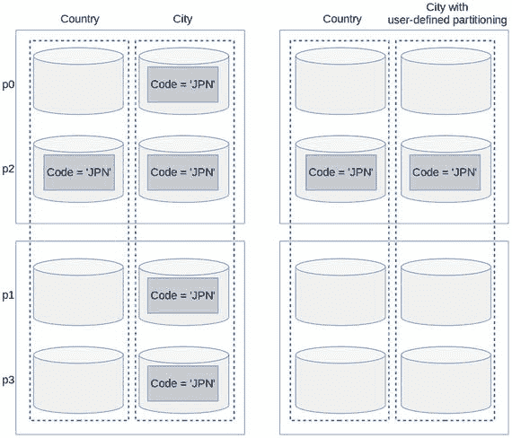

**图 20-8** 使用和未使用用户定义分区的连接如何访问表

用户定义分区的缺点是，在大多数情况下必须更改主键定义。这是由于 MySQL Server 的一个限制：所有唯一索引必须包含构成分区键的列。此限制是必需的，因为 MySQL Server 不支持分区表的全局索引。更改主键（或二级唯一索引）在大多数情况下可能是不可接受的，因为它会放松唯一性约束。如果原始唯一索引的唯一性约束是必须的，则无法使用用户定义分区。

##### 从备份副本和全复制表读取
从 MySQL NDB Cluster 7.5 系列开始，可以调整分区平衡。有关分区平衡的更多信息，请参见第 2 章。

当采用分区平衡并从备份副本读取时，读取工作负载可以比默认平衡更有效地分布在数据节点之间。尽管这是添加到 MySQL NDB Cluster 7.5 的一个有趣功能，但我认为除了副本数为二、设置两个数据节点并像全复制表一样工作的情况外，从备份副本读取的效果并不显著。

另一方面，同样添加到 MySQL NDB Cluster 7.5 的全复制表效果则非常显著。当表是全复制时，每个数据节点都拥有该表的所有数据。因此，任何读取查询都可以通过仅访问一个数据节点来解决。作为权衡，针对全复制表的写入性能将比非全复制表差得多，因为修改必须同步到所有数据节点。集群拥有更多数据节点时，写入开销更大。

全复制表适用于具有以下特征的表：

*   数据很少更改。
*   表被应用程序非常频繁地读取。
*   表经常与其他表进行连接。
*   数据量较小。

#### 优化从 SQL 节点到数据节点的访问
优化从 SQL 节点到数据节点的访问以最大化性能也很重要。SQL 节点必须在每次执行查询时向数据节点发送请求并从数据节点接收响应。

##### 连接池
当 SQL 节点在具有多个 CPU 核心的机器上运行时，值得考虑增加 SQL 节点与数据节点之间的连接数，因为 NDB API 的单个实例会导致线程间的锁争用。

要增加 SQL 节点和数据节点之间的连接数，请在 `my.cnf` 中配置 `ndb_cluster_connection_pool` 选项。此选项无法在线更改。更改后需要重启 SQL 节点。

此选项的默认值为 `1`。增加此选项可能会提高给定 SQL 节点的 SQL 处理吞吐量。虽然此选项的最大允许值为 `63`，但 `4` 在大多数情况下就足够了。不要将其设置得过大。使用不同的 `ndb_cluster_connection_pool` 值对您的应用程序进行基准测试，并为应用程序和当前集群安装找到最佳设置。

要增加此选项，必须在 `config.ini` 中为 SQL 节点预留足够的空闲插槽。换句话说，对于管理和数据节点，来自 `ndb_cluster_connection_pool` 的每个连接看起来都像一个不同的 SQL 节点。有关添加 SQL 节点的过程，请参阅第 10 章。

### MySQL NDB Cluster 性能优化要点

#### 优化节点选择

在数据节点上执行事务时，可以选择任意一个数据节点作为事务协调器（TC）。为了最大化事务的响应时间和吞吐量性能，选择合适的 TC 至关重要。

为了最小化 SQL 节点与数据节点之间通信所需的开销，MySQL NDB Cluster 提供了一种称为“分布感知”的功能。该功能根据事务中首个查询的行分布情况来选择 TC。如果查询基于其分布键进行查找，将 TC 选择为目标行所在的同一主机是最佳选择，因为解决查询不需要额外的网络通信。

图 20-9 展示了一个基于分布键的查找查询的非最优节点选择情况；TC 与目标行所在的数据节点不匹配。在这种情况下，TC 必须向另一个数据节点发送信号以请求发送行数据。

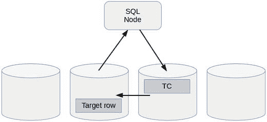
图 20-9. 非最优的、非分布感知的节点选择

提示：分布键可以是隐式分区表的主键，也可以是用户定义分区表的分区键。

图 20-10 展示了一个最优的节点选择；TC 与目标行所在的数据节点相匹配。在这种情况下，基于分布键的查找查询只需访问一个数据节点即可解决。

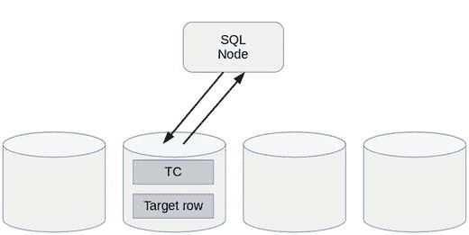
图 20-10. 最优的分布感知节点选择

为了使 SQL 节点能够基于分布情况选择 TC，必须将`ndb_optimized_node_selection`选项设置为`2`或`3`。默认值为`3`。此选项的可取值范围为`0`到`3`，定义如下：

*   `0`：不进行分布感知节点选择。TC 以轮询方式选择。
*   `1`：不进行分布感知节点选择。TC 基于 SQL 节点与数据节点之间的网络跳数选择。如果 SQL 节点和数据节点位于同一主机，则该数据节点距离此 SQL 节点最近，因此总是被选为 TC。
*   `2`：SQL 节点首先尝试基于分布感知选择 TC。如果给定查询无法修剪目标分区（例如没有用户定义分区的扫描），则回退到与`0`相同的行为。
*   `3`：与`2`相同，不同之处在于它回退到`1`而不是`0`。

在大多数情况下，您无需更改此选项的默认值。另一方面，在编写事务时，您需要考虑以下几点：

*   在每个事务的开头执行一个只访问一个分区的查询。在用户定义分区表上对分区键进行查找或扫描。
*   如果可能，请应用用户定义分区。这将增加整个事务仅在一个数据节点内执行的机会。
*   分布感知节点选择通过检查每个事务的第一条语句来完成。如果一个事务包含许多语句，分布感知节点选择的效果将很小。
*   在某些情况下，分布感知节点选择甚至可能导致性能下降。例如，假设给定事务中的第一个查询访问一个只有一行的表。在这种情况下，同一个节点被选为该事务的 TC。如果`ndb_optimized_node_selection=3`，这会导致数据节点之间的工作负载不平衡。值得将其更改为`0`或`1`。

#### 添加节点

当硬件资源不足以应对当前工作负载时，可能需要向集群添加新节点。您可以在线将任何类型的节点添加到现有集群中。有关添加节点的更多详细信息，请参阅第 10 章。有两种选择——添加数据节点和/或 SQL 节点。在遇到以下问题时必须添加数据节点：

*   应用程序需要更多容量。
*   访问表数据是主要瓶颈。

添加数据节点是否能提高性能取决于应用程序的访问模式，如下所述：

*   使用唯一哈希索引的查找性能很可能通过添加数据节点得到改善。
*   针对用户定义分区的扫描性能很可能通过添加数据节点得到改善，因为此类扫描只访问特定的数据节点。
*   返回许多行的、没有用户定义分区的扫描性能很可能通过添加数据节点得到改善，因为此类扫描在所有数据节点上并行执行。
*   仅返回少量行的、没有用户定义分区的扫描性能不太可能通过添加数据节点得到改善，因为所有节点都必须参与才能返回少量行。这种操作会导致严重的开销。因此，添加数据节点可能会使性能变得更差。

另一方面，仅通过添加额外的 SQL 节点并在它们之间分散负载，通常可以提高性能。SQL 节点可能成为瓶颈，因为它消耗大量 CPU 资源。解析、优化和执行查询是 CPU 密集型工作负载。如果数据节点的性能很高，可能需要多个 SQL 节点来充分利用数据节点的潜力。

#### 结合使用 NoSQL API 与 SQL

如果简单查询的响应时间很重要，请考虑使用 NoSQL API 而不是 SQL。它可以实现比 SQL 快得多的响应时间和更高的吞吐量。在 MySQL NDB Cluster 中，可以从不同的 API（如`memcached`、`NDB API`和`ClusterJ`）访问相同的数据。

仅使用 NoSQL 编写应用程序可能非常困难，因为 NoSQL API 是一种开销非常低的低级 API。混合使用 SQL 和 NoSQL 可以在开发效率和性能之间取得良好的平衡。

### 总结

本章讨论了在系统层面和应用开发层面提高性能的关键点。性能始终是数据库应用程序开发中最重要的问题，因为任何性能不足的应用程序都是无用的。

使用 MySQL NDB Cluster 时，底层系统必须正确配置，并且必须配置 MySQL NDB Cluster 以使其能够高效地利用计算机资源。CPU 的配置尤其重要，因为除了与检查点和磁盘数据表相关的 I/O 之外，MySQL NDB Cluster 的负载是 CPU 密集型的。

编写查询的方式也是数据库应用程序的一个重要问题。由于数据库管理系统有其自身的特点，了解数据库系统擅长什么非常重要。MySQL NDB Cluster 具有本章讨论的各种优化算法和功能。当您遇到性能问题时，请回顾本章并找到改进的方法。


# MySQL NDB Cluster 技术文档

## 1. 简介与核心概念
MySQL NDB Cluster 是一种分布式数据库系统，它结合了高可用性、高性能和可伸缩性，为关键任务应用提供实时性能。

## 2. 架构与组件
### 2.1 节点类型
*   **数据节点**：存储数据，负责数据分片、事务协调和故障恢复。
*   **管理节点**：管理集群配置、启动、停止和监控。
*   **SQL/API 节点**：提供 MySQL 服务器接口（SQL 节点）或 NDB API 接口（API 节点），用于访问数据。

### 2.2 核心概念
*   **ACID**：原子性、一致性、隔离性、持久性。
*   **仲裁**：用于在网络分区或节点故障时防止“脑裂”，确保集群只有一个主分区。
*   **epoch**：NDB 集群中用于复制和恢复的时间单位，与全局检查点相关。
*   **LCP（本地检查点）** 和 **GCP（全局检查点）**：用于数据持久化和恢复的机制。

## 3. 存储引擎与数据
### 3.1 数据类型与存储
NDB 集群支持 BLOB、JSON 和 TEXT 等数据类型，数据存储在内存和磁盘中。
*   **DataMemory** 和 **IndexMemory**：配置数据和索引的内存使用。
*   **磁盘数据表**：允许将数据存储在磁盘上，通过`CREATE TABLESPACE`和`CREATE LOGFILE GROUP`命令管理。

### 3.2 表设计
*   **分区与分片**：数据自动或手动分区到不同节点组。
*   **索引**：支持主键、唯一哈希索引和有序索引。使用`ndb_desc`命令查看表信息。
*   **规范化**：设计表时需考虑 NDB 存储引擎的特性。

## 4. 配置与部署
### 4.1 配置文件
配置通过`config.ini`（管理节点）和`my.cnf`（SQL 节点）文件管理。
*   **关键参数**：例如`NoOfReplicas`、`DataMemory`、`IndexMemory`、`MaxNoOfTables`、`MaxNoOfTriggers`、`TimeBetweenEpochs`、`ArbitrationRank`等。
*   **数据节点选项**：如`BackupDataBufferSize`、`DiskPageBufferMemory`、`MaxNoOfExecutionThreads`等。

### 4.2 部署与安装
*   支持多种平台安装，包括 Linux（RPM/DEB/tar.gz）、Windows（MSI/ZIP）和 macOS（DMG/原生包）。
*   使用`ndb_setup`或`MySQL NDB Cluster auto installer`进行图形化安装配置。
*   `MySQL Cluster Manager (MCM)`提供高级集群生命周期管理功能。

## 5. 操作与管理
### 5.1 启动与停止
*   按顺序启动：管理节点（`ndb_mgmd`）、数据节点（`ndbd`/`ndbmtd`）、SQL 节点（`mysqld`）。
*   支持`--nostart`选项进行初始配置，以及`--reload`选项重新加载配置。

### 5.2 备份与恢复
*   **备份**：使用`START BACKUP`命令创建备份。
*   **恢复**：使用`ndb_restore`工具恢复数据。
*   **逻辑备份**：可使用`mysqldump`、`mysqlpump`或 MySQL Workbench。

### 5.3 监控
*   **NDB 管理客户端**（`ndb_mgm`）：查看集群状态、执行管理任务。
*   **`ndbinfo`信息数据库**：提供集群配置、性能指标和状态视图，如`ndbinfo.memoryusage`。
*   **性能模式**：用于监控查询、事务和等待事件。

## 6. 复制与高可用性
### 6.1 NDB 集群复制
*   支持主从复制和多主复制。
*   **冲突检测**：提供基于时间戳和基于 epoch（`NDB$EPOCH()`、`NDB$EPOCH2()`等）的方法。
*   配置涉及`ndb_binlog_index`和`ndb_apply_status`系统表。

### 6.2 故障转移与恢复
*   **自动故障转移**：数据节点故障时自动处理。
*   **节点重启**：支持多种重启类型，如初始、常规、滚动重启。
*   **灾难恢复**：涉及备份、时间点恢复（PITR）等。

## 7. 性能与优化
### 7.1 查询优化
*   **下推优化**：将连接、聚合等操作下推到数据节点执行。
*   **连接算法**：支持 BNLJ（块嵌套循环连接）、BKAJ（批处理键访问连接）等。
*   **`Condition pushdown`**：将 WHERE 条件下推到存储引擎。

### 7.2 系统优化
*   **CPU 与内存**：考虑 CPU 绑定策略、NUMA 架构、超线程（Hyper-threading）。
*   **磁盘 I/O**：优化磁盘类型、文件系统块大小和`ODirect`设置。
*   **网络**：设计网络冗余，优化 TCP 设置和`Transporter`选项。

## 8. 故障排除
### 8.1 常见问题
*   **SQL 节点问题**：崩溃、查询丢失连接、OOM killer。
*   **集群问题**：看门狗超时、网络分区、节点失败、计划外关机。
*   **使用工具**：`ndb_error_reporter`收集错误信息，分析跟踪文件和核心转储。

## 9. 工具与实用程序
*   **`ndb_desc`**：显示 NDB 表的描述信息。
*   **`ndb_show_tables`**：显示集群中的表列表。
*   **`ndb_size.pl`/`sizer`**：估算表和索引的大小。
*   **`ndb_index_stat`**：提供索引统计信息。
*   **`ndb_waiter`**：等待集群达到特定状态。
*   **`sys`模式**：提供性能视图和工具，如`sys.schema_unused_indexes`。

## 10. 特定场景与集成
*   **NoSQL 访问**：通过 NDB API 或`memcached`（NDB-memcached）进行键值存储访问。
*   **与 ProxySQL 集成**：用于负载均衡和连接管理。
*   **从现有 MySQL 升级**：支持在线或离线将数据迁移到 NDB 集群。
