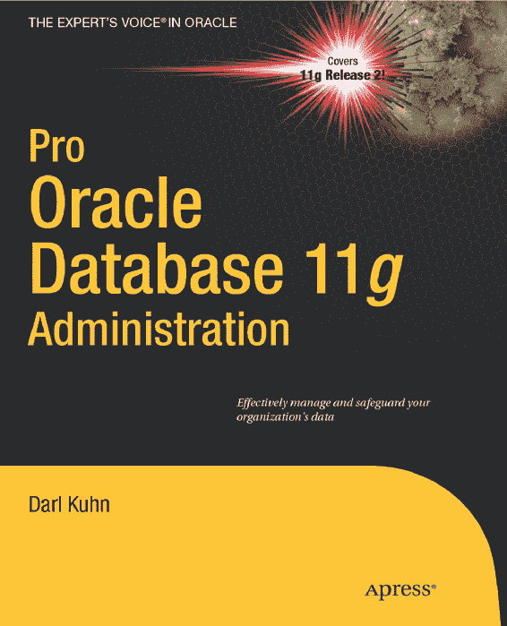
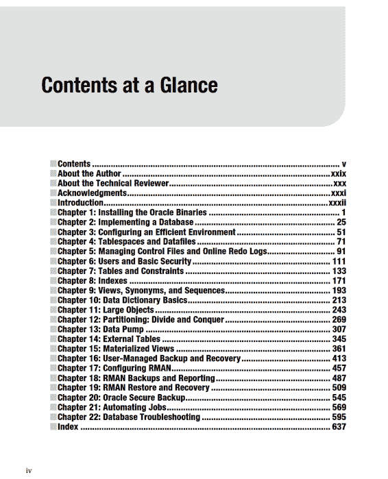
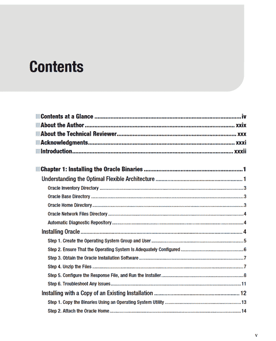

# Oracle Database 11g 专业管理指南

Darl Kuhn

版权所有 © 2010 Darl Kuhn

保留所有权利。未经版权所有者及出版商事先书面许可，不得以任何形式或任何方式（包括影印、录音，或通过任何信息存储或检索系统）复制或传播本作品的任何部分。

ISBN-13（平装）：978-1-4302-2970-4
ISBN-13（电子）：978-1-4302-2971-1

印刷并装订于美国 9 8 7 6 5 4 3 2 1

本书中可能出现商标名称、标识和图片。我们仅在编辑用途中，为商标所有者利益而使用这些名称、标识和图片，并非在每次出现时使用商标符号，无侵犯商标之意。

本书中使用的商品名称、商标、服务标识及类似术语，即使未特别标识，其使用并不表示这些术语不受专有权约束。

总裁兼发行人：Paul Manning
总编辑：Jonathan Gennick
技术审稿：Bernard Lopuz
编辑委员会：Steve Anglin, Mark Beckner, Ewan Buckingham, Gary Cornell, Jonathan Gennick, Jonathan Hassell, Michelle Lowman, Matthew Moodie, Duncan Parkes, Jeffrey Pepper, Frank Pohlmann, Douglas Pundick, Ben Renow-Clarke, Dominic Shakeshaft, Matt Wade, Tom Welsh
协调编辑：Anita Castro
文字编辑：Mary Behr 与 Tiffany Taylor
排版：MacPS, LLC
索引：BIM Indexing & Proofreading Services
插画：April Milne
封面设计：Anna Ishchenko

本书通过 Springer Science+Business Media, LLC.（地址：美国纽约州纽约市斯普林街 233 号 6 层，邮编：10013；电话：1-800-SPRINGER；传真：(201) 348-4505；电邮：orders-ny@springer-sbm.com；网址：www.springeronline.com）向全球图书贸易发行。

翻译信息请电邮 rights@apress.com 或访问 www.apress.com。

Apress 与 friends of ED 图书可批量购买，用于学术、企业或推广用途。大多数书名也提供电子书版本和许可。更多信息，请参阅我们的批量销售-电子书许可专页：www.apress.com/info/bulksales。

本书信息按“原样”提供，不作任何担保。尽管在编写过程中已采取一切预防措施，但作者与 Apress 对因本作品所包含信息直接或间接引起或据称引起的任何损失或损害，不承担任何责任。

## 目录

升级 Oracle 软件 ........................................................................................... 15

安装失败后重新安装 ............................................................................. 16

应用临时补丁 .............................................................................................. 17

使用图形化安装程序进行远程安装 ........................................................... 18

步骤 1. 在本地 PC 上安装 X 软件和网络工具 ................................................... 19

步骤 2. 在本地计算机上启动 X 会话 .............................................................................. 19

步骤 3. 将 Oracle 安装介质复制到远程服务器 ....................................................... 20

步骤 4. 运行 xhost 命令 .......................................................................................................... 21

步骤 5. 从 X 登录到远程计算机 ................................................................................... 21

步骤 6. 确保远程计算机上正确设置了 DISPLAY 变量 .......................... 21

### 步骤 7. 执行 `runInstaller` 实用程序
### 步骤 8. 故障排除
## 总结
