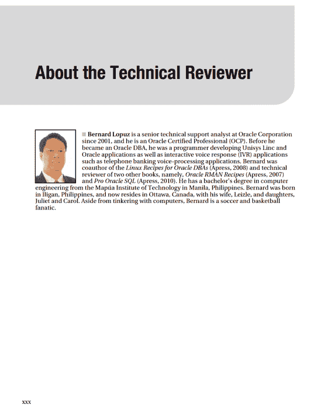
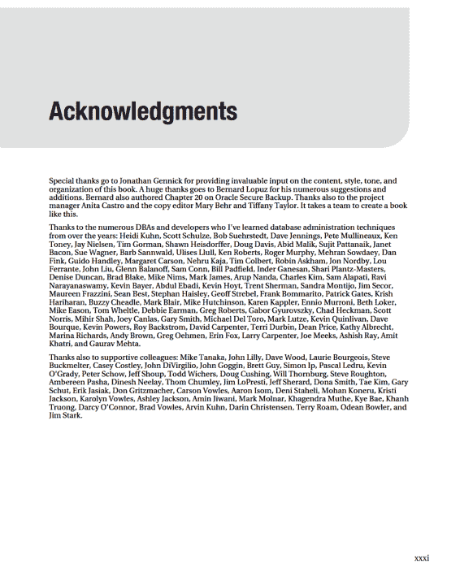
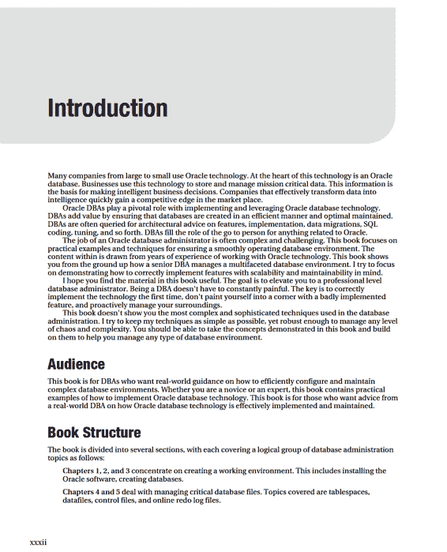

# 第二十二章：数据库故障排除

## 快速分流

## 检查数据库可用性

## 排查磁盘空间不足

## 检查告警日志

## 通过操作系统工具识别瓶颈

### 识别系统瓶颈

### 将操作系统进程映射到 SQL 语句

## 查找资源密集型 SQL 语句

### 监控实时 SQL 执行统计信息

### 显示资源密集型 SQL

## 运行 Oracle 诊断工具

## 检测与解决锁问题

## 解决游标未关闭问题

## 排查 Undo 表空间问题

### 确认 Undo 表空间大小是否合适

### 查看消耗 Undo 空间的 SQL

## 处理临时表空间问题

### 确认临时表空间大小是否合适

### 查看消耗临时空间的 SQL

## 审计

### 启用 Oracle 标准审计

### 审计 DML 使用情况

### 审计登录/注销事件

### 查看已启用的审计操作

### 关闭审计

---
检查超过一定时间的文件

检查进程数是否过多

验证 `RMAN` 备份的完整性

总结

### 清理审计表和文件
### 将审计表移动到非系统表空间
### 细粒度审计
## 总结
## ■ 索引

