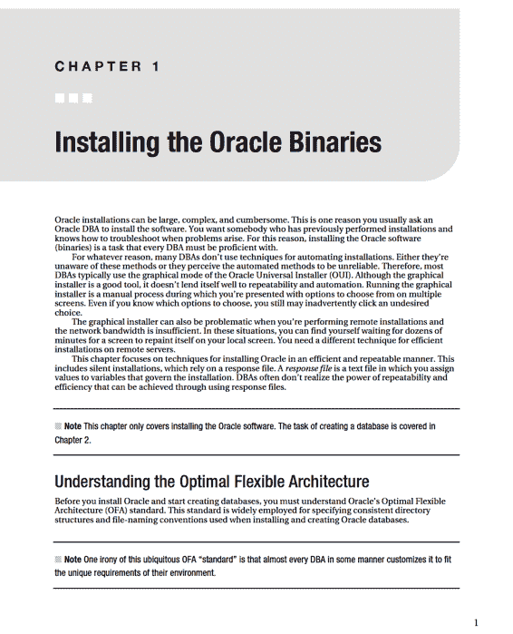
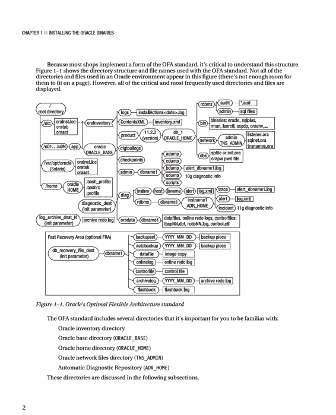

# ■ 引言

`Chapters 6, 7, 8, 9, and 10` 讨论如何配置用户和数据库对象，例如表、约束、索引、视图、同义词、序列等。
`Chapters 11 and 12` 详细介绍如何创建和维护大型数据库对象以及分区表和索引。
`Chapters 13, 14, and 15` 展示数据库管理员如何使用数据泵、外部表和物化视图等工具来管理和分发大量数据。
`Chapters 16, 17, 18, 19, and 20` 深入探讨备份与恢复的概念。详细讨论了用户管理的备份以及 RMAN 备份与恢复。
`Chapters 21 and 22` 重点介绍用于自动化数据库作业的技术以及如何排查数据库管理员遇到的典型问题。

### 本书使用的约定

本书使用以下排版约定：

*   `$` 表示可以由 Oracle 二进制文件的操作系统所有者（通常名为 `oracle`）运行的 Linux/Unix 命令。
*   `#` 表示应以 `root` 操作系统用户身份运行的 Linux/Unix 命令。
*   `SQL>` 表示单行的 SQL*Plus 语句。
*   等宽字体用于代码示例、实用程序名称、文件名、URL 和目录路径。
*   *斜体* 用于突出显示新概念或词汇。
*   大写字母表示数据库对象的名称，如视图、表和相应的列名。
*   `< >` 用于需要您提供输入的地方，例如文件名或密码。

### 评论

我已尽力使本书尽可能避免错误。然而，错误难免发生或无意中被忽略。如果您在本书中发现任何类型的错误，无论是拼写错误还是错误的命令，请告知我。您可以通过访问 Apress 主页提交任何问题：`http://www.apress.com`。搜索本书，然后使用勘误页面提交更正。

### 联系作者

如果您对本书有任何疑问，请随时通过以下电子邮件地址与我联系：`darl.kuhn@gmail.com`。

