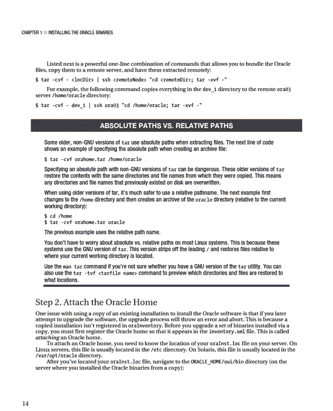

# 第 1 章：安装 Oracle 二进制文件

您可以使用任何操作系统的复制工具来执行此步骤。Linux/Unix 的 `tar`、`scp` 和 `rsync` 工具是 DBA 用来复制文件的常用工具。本示例展示了如何使用 Linux/Unix 的 `tar` 工具将一组现有的 Oracle 二进制文件复制到不同的服务器。首先，定位您想要复制的目标 Oracle 主目录二进制文件：

```
$ echo $ORACLE_HOME
/oracle/app/oracle/product/11.2.0/db_1
```

在此示例中，`tar` 工具会复制 `db_1` 目录内及以下的所有文件和子目录：

```
$ cd $ORACLE_HOME
$ cd ..
$ tar -cvf orahome.tar db_1
```

现在，将 `orahome.tar` 文件复制到您想要安装 Oracle 软件的服务器。在此示例中，tar 文件被复制到另一台服务器上的 `/oracle/app/oracle/product/11.2.0.1` 目录。tar 文件在那里被解压，并在解压过程中创建一个 `db_1` 目录：

```
$ cd /oracle/app/oracle/product/11.2.0.1
```

确保您有足够的磁盘空间来解压文件。一次典型的 Oracle 安装至少会占用 3-4 GB 的空间。使用 Linux/Unix 的 `df` 命令来验证您是否有足够的空间：

```
$ df -h | sort
```

接下来，解压文件：

```
$ tar -xvf orahome.tar
```

当 `tar` 命令完成后，在 `/oracle/app/oracle/product/11.2.0.1` 目录下应该会有一个 `db_1` 目录。

■ **提示** 使用 `tar -tvf <tarfile_name>` 命令可以预览将要恢复的目录和文件，而无需实际恢复它们。



```
$ cd $ORACLE_HOME/oui/bin
```

现在，通过运行 `runInstaller` 工具来附加 Oracle 主目录，如下所示：

```
$ ./runInstaller -silent -attachHome -invPtrLoc /etc/oraInst.loc \
ORACLE_HOME="/oracle/app/oracle/product/11.2.0.1/db_1" ORACLE_HOME_NAME="ONEW"
```

如果成功，您应该会看到类似这样的消息：

```
The inventory pointer is located at /etc/oraInst.loc
The inventory is located at /oracle/app/oracle/oraInventory
'AttachHome' was successful.
```

您也可以检查 `oraInventory/ContentsXML/inventory.xml` 文件的内容。以下是由于使用 `attachHome` 选项运行 `runInstaller` 工具而插入到 `inventory.xml` 文件中的一行内容的片段：

```
<HOME NAME="ONEW" LOC="/oracle/app/oracle/product/11.2.0.1/db_1" TYPE="O" IDX="3"/>
```

## 升级 Oracle 软件

您也可以使用静默安装方法来升级 Oracle 软件的版本。例如，让我们看看如何从 Oracle Database 10 *g* 10.2.0.1 升级到版本 10.2.0.4。

■ **注意** 升级 Oracle 软件与升级 Oracle 数据库不同。本节仅涉及使用静默安装方法升级 Oracle 软件。升级数据库涉及额外的步骤。有关如何将数据库从一个版本升级到另一个版本的文档，请参阅 MOS 注释 730365.1。

首先，从 MOS 网站 `http://support.oracle.com` 下载升级版本（您需要有效的支持合同才能执行此操作）。对于本示例的 Solaris 系统，文件名为 `p6810189_10204_Solaris-64.zip`。将该文件复制到您要执行 Oracle 升级的数据库服务器。将其放置在诸如 `/orahome/orainst/10.2.0.4` 的目录中。现在，解压该文件：

```
$ unzip p6810189_10204_Solaris-64.zip
```

`unzip` 命令应该只需要几分钟就能解包文件。完成后，找到与此升级关联的示例响应文件：

```
$ find . -name "*.rsp"
```

本示例的响应文件位置如下：

```
./Disk1/response/patchset.rsp
```

切换到 `Disk1` 目录：

```
$ cd Disk1
```

接下来，将响应文件从 response 目录复制到当前工作目录：

```
$ cp response/patchset.rsp inst.rsp
```

使用操作系统编辑器工具（如 `vi`）打开响应文件：

```
$ vi inst.rsp
```

修改参数以匹配您的环境。对于此次特定的 Oracle Database 10 *g* 10.2.0.4 升级，以下是最值得注意的需要修改的参数：

```
UNIX_GROUP_NAME=dba
```


`FROM_LOCATION=/ora01/orainst/10.2.0.4/Disk1/stage/products.xml`

`ORACLE_HOME=/ora01/app/oracle/product/10.2.0.4/db_1`

`ORACLE_HOME_NAME=OHOME10`

在上面的列表中，`ORACLE_HOME` 和 `ORACLE_HOME_NAME` 变量的值必须与您要升级的那套二进制文件相匹配。如果您正在升级现有的 Oracle 安装，请确保没有任何使用您要升级的二进制文件的数据库正在运行。

现在，按如下所示在静默模式下运行 `runInstaller` 实用程序：

`$ ./runInstaller -ignoreSysPrereqs -force -silent -responseFile /orahome/orainst/10.2.0.4/Disk1/inst.rsp`

执行升级时，有两种基本场景。以下是场景 A：关闭所有使用待升级 Oracle 主目录的数据库。

升级 Oracle 主目录二进制文件。

启动数据库，并运行任何必需的升级脚本。

以下是采用场景 B 方法进行升级的步骤：

保持现有的 Oracle 主目录原样——不对其进行升级。

安装一个与旧 Oracle 主目录版本相同的新 Oracle 主目录。

将新的 Oracle 主目录升级到所需版本。

准备就绪后，关闭使用旧 Oracle 主目录的数据库，设置操作系统变量以指向新的已升级 Oracle 主目录，启动数据库，并运行任何必需的升级脚本。

上述两种场景中，哪一种更好？场景 B 的优势在于保持旧的 Oracle 主目录不变；因此，如果您因任何原因需要切换回旧的 Oracle 主目录，那些二进制文件仍然可用。场景 B 的劣势在于需要额外的磁盘空间来容纳两套 Oracle 主目录安装。这通常不是问题，因为在升级完成后，您可以在方便时删除旧的 Oracle 主目录。

## 安装失败后重新安装

您可能会遇到这样的情况：您正在尝试安装 Oracle，但由于某种原因安装失败。您纠正了问题并尝试重新运行 Oracle 安装程序。然而，您收到了这条消息：

`Check complete: Failed <<<<`

`Problem: Oracle Database 10g Release 2 can only be installed in a new Oracle Home Recommendation: Choose a new Oracle Home for installing this product.`

