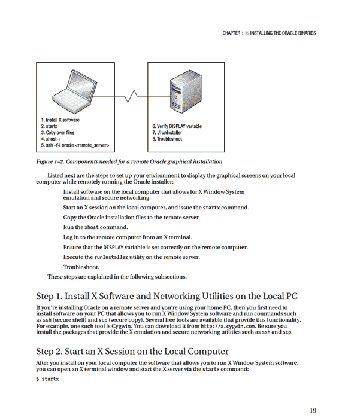
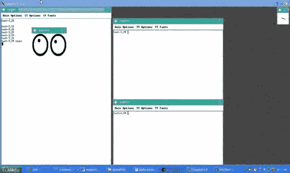
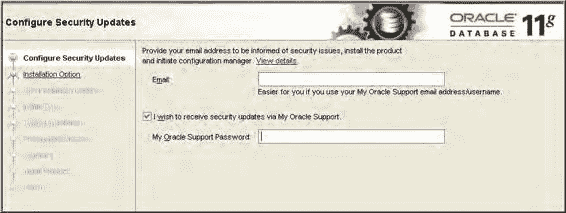

# 第 1 章 ■ 安装 Oracle 二进制文件

## 应用补丁

请仔细阅读 `README.txt` 文件以获取特别说明。

关闭所有使用要应用补丁的 Oracle 主目录的数据库和进程。

应用补丁。

验证补丁是否已成功安装。

下面的一个简要示例将说明应用补丁的过程。在此示例中，使用补丁号 `7695070` 来修复 Solaris 机器上 `10.2.0.4` 数据库的时区格式问题。首先，从 MOS (https://support.oracle.com) 下载 `p7695070_10204_Solaris-64.zip` 文件。接着，在要应用补丁的服务器上解压该文件：

```bash
$ unzip p7695070_10204_Solaris-64.zip
```

`README.txt` 指示你按如下方式更改目录：

```bash
$ cd 7695070
```

请确保遵循 `README.txt` 中包含的说明，例如关闭所有使用要应用补丁的 Oracle 主目录的数据库：

```bash
$ sqlplus / as sysdba

SQL> shutdown immediate;
```

接下来，应用补丁。确保以 Oracle 软件所有者（通常是 `oracle` 操作系统账户）的身份执行此步骤。同时确保你的 `ORACLE_HOME` 变量已设置为指向你要应用补丁的 Oracle 主目录。在此示例中，由于 `opatch` 实用程序不在 `PATH` 目录包含的路径中，你需要指定完整路径：

```bash
$ $ORACLE_HOME/OPatch/opatch apply
```

最后，通过列出补丁清单来验证补丁是否已应用：

```bash
$ $ORACLE_HOME/OPatch/opatch lsinventory
```

这是此示例的一些示例输出：

```
Interim patches (1) :

Patch 7695070 : applied on Fri Apr 09 16:09:38 MDT 2010
Created on 24 Jun 2009, 02:32:42 hrs US/Pacific
Bugs fixed:
```

**提示** 有关 `opatch` 实用程序的更多信息，请参阅 MOS 说明 `242993.1`。

## 使用图形安装程序进行远程安装

在当今的全球化环境中，DBA 们经常需要在远程 Linux/Unix 服务器上安装 Oracle 软件。在这种情况下，我强烈建议你使用带响应文件的静默安装模式（如本章前面所述）。但是，如果你想通过图形安装程序在远程服务器上安装 Oracle，本节将描述所需的步骤。

**注意** 如果你处于基于 Windows 的环境中，请使用远程桌面连接或 VNC 进行远程软件安装。

出现的一个问题是如何在远程服务器上运行 Oracle 安装程序，并将图形输出显示到你的本地计算机。图 1-2 显示了远程运行 Oracle 图形安装程序所需的基本组件和实用程序。





这是一段输出片段：

```
xauth: creating new authority file /home/test/.serverauth.3012
waiting for X server to begin accepting connections .
```

当 X 软件启动后，运行诸如 `xeyes` 之类的实用程序来确定 X 是否正常工作：

```bash
$ xeyes
```

图 1-3 展示了使用 Cygwin X 终端会话工具时本地终端会话的样貌。

**图 1-3.** 在本地计算机上运行 `xeyes` 实用程序

如果你无法执行 `xeyes` 这样的实用程序，请在此步骤暂停，直到使其正常工作。你必须拥有正常工作的 X 软件，才能使用图形安装程序远程安装 Oracle。

### 步骤 3. 将 Oracle 安装介质复制到远程服务器

从 X 终端，运行 `scp` 命令将 Oracle 安装介质复制到远程服务器。

以下是使用 `scp` 的基本语法：

```bash
$ scp <localfile> <username>@<remote_server>:<remote_directory>
```

下一行代码将 Oracle 安装介质复制到远程服务器上 Oracle 操作系统用户 `oracle` 的主目录：

```bash
$ scp linux_11gR2_database_1of2.zip oracle@shrek2:.
```

### 步骤 4. 运行 xhost 命令

从 X 屏幕，通过 `xhost` 命令启用对远程主机的访问。此命令必须从你的本地计算机运行：

```bash
$ xhost +
access control disabled, clients can connect from any host.
```

前面的命令允许任何客户端连接到本地 X 服务器。如果你想专门为正在安装软件的远程计算机启用访问，请提供 IP 地址或主机名（远程服务器的）。在此示例中，远程主机名是 `tst-z1.central.sun.com`：

```bash
$ xhost +tst-z1.central.sun.com
tst-z1.central.sun.com being added to access control list
```

### 步骤 5. 从 X 登录到远程计算机

从你的本地 X 终端，使用 `ssh` 实用程序登录到要在其上安装 Oracle 软件的远程服务器：

```bash
$ ssh -Y -l oracle <hostname>
```

### 步骤 6. 确保远程计算机上的 DISPLAY 变量设置正确

当你登录到远程机器后，验证你的 `DISPLAY` 变量是否已设置：

```bash
$ echo $DISPLAY
```

你应该看到类似这样的内容：

```
localhost:10.0
```

如果你的 `DISPLAY` 变量未设置，你必须确保它被设置为一个反映你本地家庭计算机位置的值。从你的本地家庭计算机，你可以使用 `ping` 或 `arp` 实用程序来确定标识本地计算机的 IP 地址。在家庭计算机上运行以下命令：

```bash
C:\> ping <local_computer>
```

**提示** 如果你不知道本地家庭计算机的名称，在 Windows 上可以查看控制面板 -> 系统窗口 -> 计算机名选项卡。

现在，从远程服务器执行以下命令，将 `DISPLAY` 变量设置为包含本地计算机的 IP 地址：

```bash
$ export DISPLAY=129.151.31.147:0.0
```

注意，你必须在 IP 地址末尾添加 `:0.0`。如果你使用的是 C shell，请使用 `setenv` 命令设置 `DISPLAY` 变量：



```bash
$ setenv DISPLAY 129.151.31.147:0.0
```

如果你不确定使用的是哪个 shell，请使用 `echo` 命令显示 `SHELL` 变量：

```bash
$ echo $SHELL
```

### 步骤 7. 执行 runInstaller 实用程序

导航到你在远程服务器上复制并解压 Oracle 软件的目录。

找到 `runInstaller` 实用程序，并按如下所示运行它：

```bash
$ ./runInstaller
```

如果一切顺利，你应该会看到一个类似图 1-4 的屏幕。

**图 1-4.** Oracle Universal Installer 11g 欢迎屏幕

从这里开始，你可以通过点击鼠标来完成 Oracle 软件的安装。许多 DBA 更习惯通过图形屏幕安装软件。如果你不熟悉 Oracle 的安装过程，并希望有输入提示和合理的默认值，这是一种特别好的方法。

### 步骤 8. 故障排除

远程安装中的大多数问题发生在步骤 4、5 和 6。确保你已通过 `xhost` 命令正确启用了远程客户端对你本地 X 服务器（运行在你的家庭计算机上）的访问。

`xhost` 命令必须在你希望显示图形界面的本地计算机上运行。使用带有远程主机名的 `+`（加号）会将主机添加到本地访问列表。这使得远程服务器可以在本地主机上显示 X 窗口。如果你单独输入 `xhost` 命令（不带参数），它会显示所有可以在本地计算机上显示 X 会话的远程主机：

```bash
$ xhost
access control disabled, clients can connect from any host
```

在远程服务器上设置 `DISPLAY` 操作系统变量也至关重要。这使你可以远程登录到另一台主机，并将 X 应用程序显示回你的本地计算机。必须在远程数据库服务器上设置 `DISPLAY` 变量，并且它必须被设置为包含指向你希望显示图形屏幕的本地计算机的信息。

## 总结


