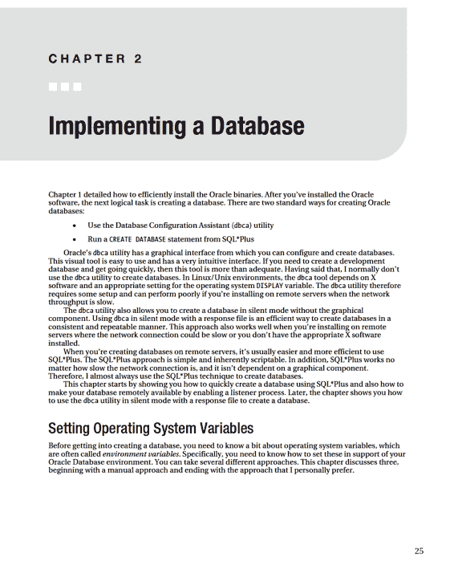

# 实施数据库

## 第一章结尾

本章详细介绍了高效安装 Oracle 二进制文件的技术。如果您在与数据库服务器地理位置分离的环境中工作，这些方法尤其有用。Oracle 静默安装方法高效，因为它不需要图形软件，并使用响应文件来帮助确保一次安装到下一次安装的一致性。在混乱且不断变化的环境中工作时，您应该受益于此处描述的安装技巧和流程。

许多数据库管理员更喜欢使用 Oracle 的图形安装程序来安装数据库软件。但是，在服务器位于远程位置或深嵌在安全网络中的情况下，使用图形安装程序可能会很麻烦。缓慢的网络或安全功能会严重阻碍图形安装过程。在这种情况下，请确保正确配置所需的 X 软件和操作系统变量（如 `DISPLAY`）。

作为数据库管理员，精通 Oracle 安装过程至关重要。如果 Oracle 安装软件没有正确安装，您将无法成功创建数据库。一旦正确安装了 Oracle，您就可以继续进行下一步：启动后台进程并创建数据库。启动 Oracle 和创建数据库的主题将在第 2 章中讨论。



## 第二章：实施数据库

### 手动设置方法

在 Linux/Unix 中，当您使用 Bourne、Bash 或 Korn shell 时，可以使用 `export` 命令从操作系统命令行手动设置操作系统变量：
```bash
$ export ORACLE_HOME=/ora01/app/oracle/product/11.2.0/db_1
$ export ORACLE_SID=O11R2
$ export LD_LIBRARY_PATH=/usr/lib:$ORACLE_HOME/lib
$ export PATH=$ORACLE_HOME/bin:$PATH
```

对于 C 或 tcsh shell，使用 `setenv` 命令设置变量：
```bash
$ setenv ORACLE_HOME <path>
$ setenv ORACLE_SID <sid>
$ setenv LD_LIBRARY_PATH <path>
$ setenv PATH <path>
```

数据库管理员设置这些变量的另一种方法是将前面的 `export` 或 `setenv` 命令放入启动文件（如 `.bash_profile`、`.bashrc` 或 `.profile`）中。这样，变量在登录时会自动设置。

然而，手动设置操作系统变量（无论是从命令行还是从启动文件）并不是实例化这些变量的最佳方式。例如，如果一台机器上有多个数据库和多个 Oracle 主目录，手动设置这些变量很快就会变得难以管理且不易维护。

### Oracle 设置操作系统变量的方法

一种更好的设置操作系统变量的方法是使用脚本，该脚本利用一个包含服务器上所有 Oracle 数据库名称及其关联 Oracle 主目录的文件。这种方法*灵活且易于维护*。例如，如果数据库的 Oracle 主目录发生变化（例如，在升级之后），您只需在服务器上修改一个文件，而无需在脚本中硬编码的地方查找 Oracle 主目录变量。

Oracle 提供了一种自动设置所需操作系统变量的机制。Oracle 的方法依赖于两个文件：`oratab` 和 `oraenv`。

#### 理解 oratab

您可以将 `oratab` 文件中的条目视为在计算机上安装了哪些数据库及其对应的 Oracle 主目录的注册表。

安装 Oracle 软件时会自动为您创建 `oratab` 文件。在 Linux 计算机上，`oratab` 通常放在 `/etc` 目录中。在 Solaris 服务器上，`oratab` 文件位于 `/var/opt/oracle` 目录中。如果由于某种原因没有自动创建 `oratab` 文件，您可以手动创建目录和文件。

`oratab` 文件在 Linux/Unix 环境中用于以下用途：
- 自动获取所需的操作系统变量
- 自动启动和停止服务器上的 Oracle 数据库

`oratab` 文件有三列，格式如下：
```
<database_sid>:<oracle_home_dir>:Y|N
```

Y 或 N 表示您是否希望 Oracle 在系统重启时自动重启；Y 表示是，N 表示否。数据库的自动启动和关闭将在第 21 章“自动化作业”中详细讨论。

`oratab` 文件中的注释以井号（`#`）开头。这是一个典型的 `oratab` 文件条目：
```
# 11g prod databases
O11R2:/oracle/app/oracle/product/11.2.0/db_1:N
ORC11G:/oracle/app/oracle/product/11.2.0/db_1:N
```

几个 Oracle 提供的实用程序使用 `oratab` 文件：
- `oraenv` 使用 `oratab` 来设置操作系统变量。
- `dbstart` 使用它在服务器重启时自动启动数据库（如果 `oratab` 中的第三个字段为 Y）。
- `dbstop` 使用它在服务器重启时自动停止数据库（如果 `oratab` 中的第三个字段为 Y）。

`oraenv` 工具将在下一节讨论。

#### 使用 oraenv

如果没有为 Oracle 环境正确设置所需的操作系统变量，那么诸如 SQL*Plus、Oracle Recovery Manager (`RMAN`)、Data Pump 等实用程序将无法正常工作。`oraenv` 实用程序可自动在 Oracle 数据库服务器上设置所需的操作系统变量（如 `ORACLE_HOME`、`ORACLE_SID` 和 `PATH`）。此实用程序用于 Bash、Korn 和 Bourne shell 环境（如果您在 C shell 环境中，则有一个对应的 `coraenv` 实用程序）。

`oraenv` 实用程序位于 `ORACLE_HOME/bin` 目录中。您可以像这样手动运行它：
```bash
$ . oraenv
```

请注意，从命令行运行此命令的语法要求在点（`.`）和 `oraenv` 工具之间有一个空格。系统会提示您输入 `ORACLE_SID` 和 `ORACLE_HOME` 值：
```
ORACLE_SID = [oracle] ?
ORACLE_HOME = [/home/oracle] ?
```

您还可以通过在运行之前设置操作系统变量来以非交互方式运行 `oraenv` 实用程序。这对于脚本编写非常有用，当您不想提示输入时：
```bash
$ export ORACLE_SID=oracle
$ export ORAENV_ASK=NO
$ . oraenv
```

### 我设置操作系统变量的方法

我不使用 Oracle 的 `oraenv` 文件来设置操作系统变量（有关 Oracle 方法的详细信息，请参阅上一节）。相反，我使用一个名为 `oraset` 的脚本。`oraset` 脚本依赖于 `oratab` 文件位于正确的目录中并具有预期的格式：
```
<database_sid>:<oracle_home_dir>:Y|N
```

如前一节所述，Oracle 安装程序应该在正确的目录中为您创建一个 `oratab` 文件。如果没有，那么您可以手动创建并填充该文件。在 Linux 中，`oratab` 文件通常在 `/etc` 目录中创建。在 Solaris 服务器上，`oratab` 文件位于 `/var/opt/oracle`。这是一个例子：
```
O11R2:/ora01/app/oracle/product/11.2.0/db_1:N
DEV1:/ora02/app/oracle/product/11.2.0/db_1:N
```

前面行中的数据库名称是 `O11R2` 和 `DEV1`。每行接下来是数据库 Oracle 主目录的路径（与数据库名用冒号 `:` 分隔）。最后一列包含 Y 或 N，表示您是否希望在系统重启时自动重新启动数据库。

接下来，使用一个读取 `oratab` 文件并设置操作系统变量的脚本。这是一个读取 `oratab` 文件并呈现选择菜单（基于 `oratab` 文件中的数据库名称）的 `oraset` 脚本示例：
```bash
#!/bin/bash
# Why: Sets Oracle environment variables.
# Setup: 1. Put oraset file in /var/opt/oracle
#        2. Ensure /var/opt/oracle is in $PATH
# Usage: batch mode: . oraset <SID>
#        menu mode: . oraset
#====================================================
OTAB=/var/opt/oracle/oratab
if [ -z $1 ]; then
SIDLIST=$(grep -v '#' ${OTAB} | cut -f1 -d:)
```


