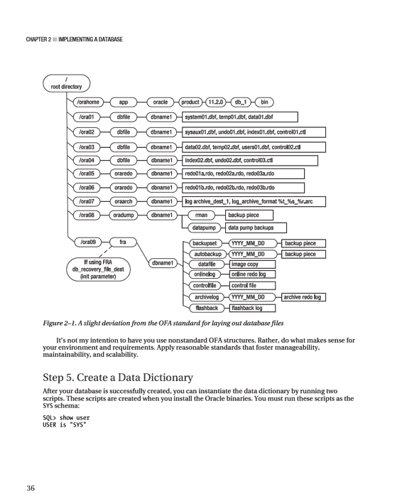
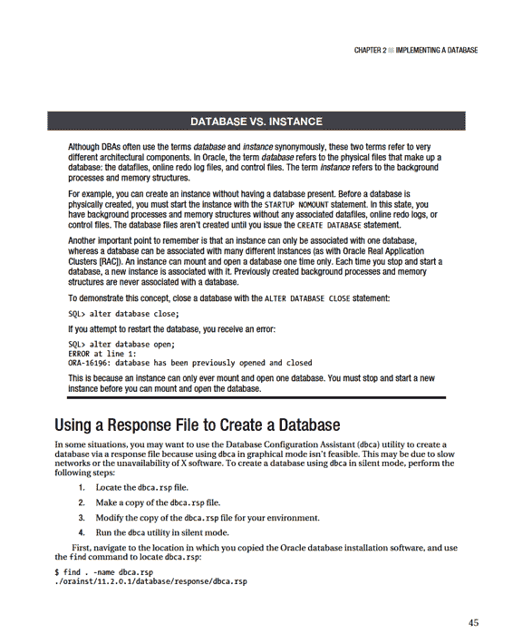
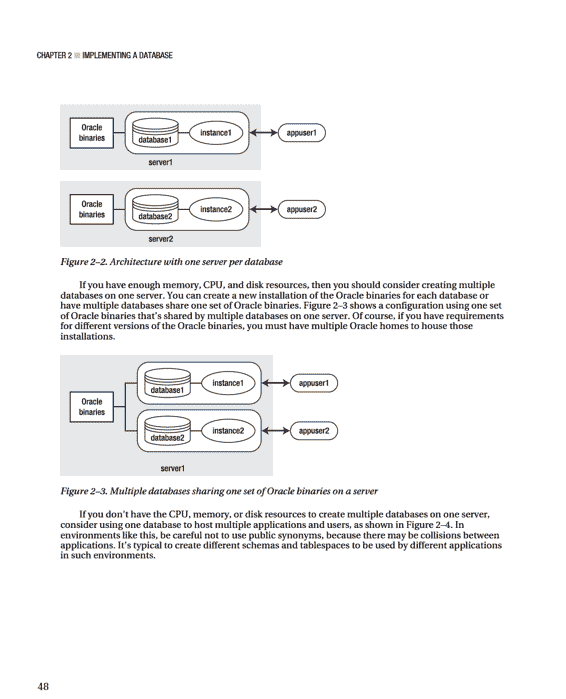
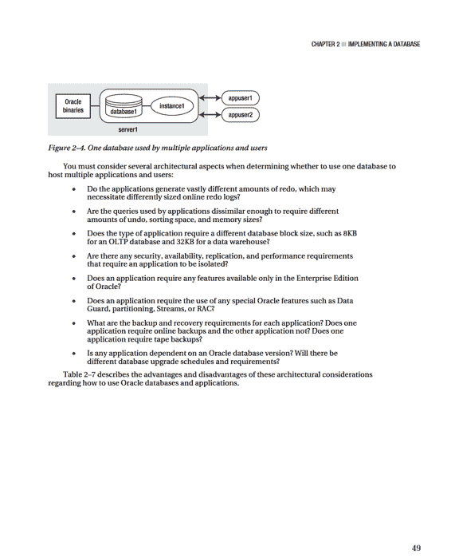

# 第二章 实现数据库

## 创建数据库

首先，为 Oracle 软件文件设置适当的权限：

```bash
chown -R oracle:dba /ora03
```

如果您使用的是 Oracle Database 10 *g* 或更低版本，请确保初始化文件中列出的所有后台转储目录都已创建：

```bash
mkdir -p /ora01/app/oracle/admin/DB10G/udump
mkdir -p /ora01/app/oracle/admin/DB10G/bdump
mkdir -p /ora01/app/oracle/admin/DB10G/adump
mkdir -p /ora01/app/oracle/admin/DB10G/cdump
```

### 步骤 4：创建数据库

在建立了操作系统变量、创建了初始化文件并创建了任何必需的目录之后，就可以创建数据库了。此步骤说明如何使用 `CREATE DATABASE` 语句来创建数据库。

在运行 `CREATE DATABASE` 语句之前，必须通过 `STARTUP NOMOUNT` 语句启动后台进程并分配内存：

```bash
sqlplus / as sysdba
SQL> startup nomount;
```

当您发出 `STARTUP NOMOUNT` 语句时，`SQL*Plus` 会尝试读取 `ORACLE_HOME/dbs` 目录中的初始化文件（请参阅前面的“步骤 2：创建初始化文件”部分）。`STARTUP NOMOUNT` 语句实例化 Oracle 使用的后台进程和内存区域。此时，您拥有一个 Oracle 实例，但没有数据库。

> **注意**：Oracle 实例定义为后台进程和内存区域。Oracle 数据库定义为磁盘上的物理文件。

接下来列出了一个典型的 Oracle `CREATE DATABASE` 语句：

```sql
CREATE DATABASE O11R2
maxlogfiles 16
maxlogmembers 4
maxdatafiles 1024
maxinstances 1
maxloghistory 680
character set "UTF8"
DATAFILE '/ora01/dbfile/O11R2/system01.dbf'
SIZE 500m
EXTENT MANAGEMENT LOCAL
UNDO TABLESPACE undotbs1 DATAFILE '/ora02/dbfile/O11R2/undotbs01.dbf'
SIZE 800m
SYSAUX DATAFILE '/ora03/dbfile/O11R2/sysaux01.dbf'
SIZE 200m
DEFAULT TEMPORARY TABLESPACE temp TEMPFILE '/ora03/dbfile/O11R2/temp01.dbf'
SIZE 800m
DEFAULT TABLESPACE users DATAFILE '/ora02/dbfile/O11R2/users01.dbf'
SIZE 20m
LOGFILE GROUP 1
('/ora02/oraredo/O11R2/redo01a.rdo',
'/ora03/oraredo/O11R2/redo01b.rdo') SIZE 100m,
GROUP 2
('/ora02/oraredo/O11R2/redo02a.rdo',
'/ora03/oraredo/O11R2/redo02b.rdo' ) SIZE 100m,
GROUP 3
('/ora02/oraredo/O11R2/redo03a.rdo',
'/ora03/oraredo/O11R2/redo03b.rdo' ) SIZE 100m
USER sys IDENTIFIED BY secretfoo
USER system IDENTIFIED BY secretfoobar;
```

在此示例中，脚本被放置在名为 `credb.sql` 的文件中，并作为 `sys` 用户从 `SQL*Plus` 提示符运行：

```sql
SQL> @credb.sql
```

如果成功，您应该看到以下消息：

```
Database created.
```

如果在 `CREATE DATABASE` 语句运行时抛出任何错误，请检查警报日志文件。

典型错误发生在必需目录不存在、内存分配不足或超出某些操作系统限制时。如果您不确定警报日志的位置，请发出以下命令：

```sql
SQL> show parameter background_dump_dest
```

关于前面的 `CREATE DATABASE` 语句示例，有几个关键点需要注意。例如，请注意 `SYSTEM` 数据文件定义为本地管理。这意味着在此数据库中创建的任何表空间都必须是本地管理的（相对于字典管理）。如果您尝试在此数据库中创建字典管理的表空间，Oracle 会抛出错误。这是期望的行为。

字典管理的表空间使用 Oracle 数据字典来管理扩展区和空闲空间，而本地管理的表空间使用每个数据文件中的位图来管理其扩展区和空闲空间。本地管理的表空间具有以下优势：

*   不生成回滚信息。
*   不需要合并。
*   减少了数据字典中的资源争用。
*   减少了递归空间管理。

还请注意，`TEMP` 表空间被定义为默认临时表空间。这意味着在数据库中创建的任何用户都会自动将 `TEMP` 表空间分配为其默认临时表空间。您可以使用以下查询验证默认临时表空间：

```sql
select *
from database_properties
where property_name = 'DEFAULT_TEMP_TABLESPACE';
```

最后，请注意 `USERS` 表空间被定义为任何未在 `CREATE USER` 语句中定义默认表空间的用户的默认永久表空间。您可以运行此查询来确定默认永久表空间：

```sql
select *
from database_properties
where property_name = 'DEFAULT_PERMANENT_TABLESPACE';
```

**表 2–2** 列出了在创建 Oracle 数据库时需要考虑的最佳实践。

**表 2–2. 创建 Oracle 数据库的最佳实践**
| **最佳实践** | **原因** |
| :--- | :--- |
| 使 `SYSTEM` 表空间本地管理。 | 这样做强制在此数据库中创建的所有表空间都是本地管理的。 |
| 谨慎使用 `REUSE` 子句。通常仅在重新创建数据库时使用。 | `REUSE` 子句指示 Oracle 覆盖现有文件，无论它们是否正在使用。这是危险的。 |
| 创建一个名称中包含 `TEMP` 的默认临时表空间。 | 每个用户都应被分配一个 `TEMP` 类型的临时表空间，包括 `SYS` 用户。如果您不指定默认临时表空间，则会使用 `SYSTEM` 表空间。您*永远不*希望用户被分配 `SYSTEM` 作为临时表空间。如果您的数据库没有默认临时表空间，请使用 `ALTER DATABASE DEFAULT TEMPORARY TABLESPACE` 语句来分配一个。 |
| 创建一个名为 `USERS` 的默认永久表空间。 | 这确保用户被分配一个除 `SYSTEM` 之外的默认永久表空间。如果您的数据库没有默认永久表空间，请使用 `ALTER DATABASE DEFAULT TABLESPACE` 语句来分配一个。 |
| 使用 `USER SYS` 和 `USER SYSTEM` 子句指定非默认密码。 | 这样做会使用非默认密码创建数据库账户，这些账户通常是黑客的首要目标。 |
| 创建至少三个重做日志组，每组两个成员。 | 至少三个重做日志组为归档进程在日志切换之间写出归档重做日志提供了时间。两个成员镜像了联机重做日志成员，提供了一定的容错能力。 |
| 将重做日志命名为 `redoNA.rdo` 之类的名称。 | 这与 OFA 标准略有不同，但我曾多次意外删除扩展名为 `.log` 的文件（这不应该发生，但确实发生过）。 |
| 使数据库名称具有一定的智能性，例如 `PAPRD`、`PADEV1` 或 `PATST1`。 | 这有助于您确定正在操作的是哪个数据库，以及它是生产、开发还是测试环境。 |
| 在创建数据字典时使用 `?` 变量（参见“步骤 5：创建数据字典”部分）。不要硬编码目录路径。 | `SQL*Plus` 将 `?` 解释为包含在操作系统 `ORACLE_HOME` 变量中的目录。这可以防止您错误地运行来自错误版本的 `ORACLE_HOME` 的脚本。 |

请注意，此步骤中使用的 `CREATE DATABASE` 语句在目录结构方面与 OFA 标准略有偏差。我倾向于不将 Oracle 数据文件、联机重做日志和控制文件放在 `ORACLE_BASE` 下（如 OFA 标准所指定）。我改为直接将文件放在名为 `/<mount_point>/<file_type>/<database_name>` 的目录下，因为路径名短得多。较短的路径名使命令行导航到目录更容易，并且名称在 SQL `SELECT` 语句的输出中更清晰。**图 2–1** 显示了这种与 OFA 标准的偏差。



在创建数据字典之前，我喜欢假脱机一个输出文件，以便在发生意外错误时进行检查：

```sql
SQL> spool create_dd.lis
```

现在，创建数据字典：

```sql
SQL> @?/rdbms/admin/catalog.sql
SQL> @?/rdbms/admin/catproc.sql
```

成功创建数据字典后，作为 `SYSTEM` 模式，创建产品用户配置文件表：

```sql
SQL> connect system/<password>
SQL> @?/sqlplus/admin/pupbld
```

这些表允许 `SQL*Plus` 按用户禁用命令。如果未运行 `pupbld.sql` 脚本，则所有非 `sys` 用户在登录 `SQL*Plus` 时都会看到以下警告：

```
Error accessing PRODUCT_USER_PROFILE
Warning: Product user profile information not loaded!
You may need to run PUPBLD.SQL as SYSTEM
```

可以忽略这些错误。如果您不想在登录 `SQL*Plus` 时看到它们，请确保运行 `pupbld.sql` 脚本。

此时，您应该拥有一个功能齐全的数据库。接下来，您需要配置并实现您的侦听器以启用远程连接，并可选地设置密码文件。这些任务将在接下来的两个部分中描述。

## 配置和实现侦听器

安装了二进制文件并创建了数据库后，您需要使数据库可供远程客户端连接。您通过配置并启动 Oracle 侦听器来实现这一点。顾名思义，*侦听器* 是侦听来自远程客户端的连接请求的进程。如果您没有在数据库服务器上启动侦听器，则无法从远程客户端连接。

在设置新环境时，配置侦听器是一个两步过程：
1.  配置 `listener.ora` 文件。
2.  启动侦听器。

`listener.ora` 文件默认位于 `ORACLE_HOME/network/admin` 目录中。这与 `TNS_ADMIN` 操作系统变量应设置的目录相同。以下是一个示例 `listener.ora` 文件，其中包含一个数据库的网络配置信息：

```
LISTENER =
(DESCRIPTION_LIST =
(DESCRIPTION =
(ADDRESS_LIST =
(ADDRESS = (PROTOCOL = TCP)(HOST = ora03)(PORT = 1521))
)
)
)
SID_LIST_LISTENER =
(SID_LIST =
(SID_DESC =
(GLOBAL_DBNAME = O11R2)
(ORACLE_HOME = /oracle/app/oracle/product/11.2.0/db_1)
(SID_NAME = O11R2)
)
)
```

此代码清单有两个部分。第一部分定义了侦听器名称和服务；在此示例中，侦听器名称为 `LISTENER`。第二部分定义了侦听器正在侦听传入连接（到数据库）的 SID 列表。SID 列表名称的格式为 `SID_LIST_<侦听器名称>`。侦听器名称必须出现在 SID 列表名称中。此示例中的 SID 列表名称是 `SID_LIST_LISTENER`。

在 `listener.ora` 文件就位后，您可以使用 `lsnrctl` 实用程序启动侦听器后台进程：

```bash
$ lsnrctl start
```

您应该看到如下信息性消息：

```
Listener Parameter File   /oracle/app/oracle/product/11.2.0/db_1/network/admin/listener.ora
Listener Log File         /oracle/app/oracle/diag/tnslsnr/ora03/listener/alert/log.xml
Listening Endpoints Summary...
  (DESCRIPTION=(ADDRESS=(PROTOCOL=tcp)(HOST=ora03.regis.local)(PORT=1521)))
Services Summary...
Service "O11R2" has 1 instance(s).
  Instance "O11R2", status UNKNOWN, has 1 handler(s) for this service...
```

侦听器启动后，您可以从 `SQL*Plus` 客户端测试远程连接，如下所示：

```bash
$ sqlplus user/pass@'server:port/db_name'
```

在下一行代码中，用户和密码是 `system/manager`，连接到 `ora03` 服务器，端口 `1521`，数据库名为 `O11R2`：

```bash
$ sqlplus system/manager@'ora03:1521/O11R2'
```

此示例演示了所谓的*轻松连接*命名方法来连接到数据库。它*简单*是因为它不依赖于任何设置文件或实用程序。您唯一需要知道的信息是用户名、密码、服务器、端口和 `SID`。

另一种常见的连接方法是*本地命名*。此方法依赖于 `TNS_ADMIN/tnsnames.ora` 文件中的连接信息。在此示例中，编辑了 `tnsnames.ora` 文件并添加了以下透明网络底板（TNS，Oracle 的网络架构）条目：

```
O11R2 =
(DESCRIPTION =
(ADDRESS = (PROTOCOL = TCP)(HOST = ora03)(PORT = 1521))
(CONNECT_DATA = (SERVICE_NAME = O11R2)))
```

现在，从操作系统命令行，您通过引用放置在 `tnsnames.ora` 文件中的 `O11R2` TNS 信息来建立连接：

```bash
$ sqlplus system/manager@O11R2
```

此连接方法是*本地*的，因为它依赖于本地客户端的 `tnsnames.ora` 副本来确定 Oracle Net 连接详细信息。默认情况下，`SQL*Plus` 检查由操作系统变量 `TNS_ADMIN` 定义的目录中名为 `tnsnames.ora` 的文件。如果 `tnsnames.ora` 文件包含 `SQL*Plus` 连接字符串中指定的别名（在此示例中为 `O11R2`），则连接详细信息将从 `tnsnames.ora` 文件中的条目确定。

Oracle 使用的其他连接命名方法是*外部命名*和*目录命名*。有关更多详细信息，请参阅《Oracle Net Services Administrator’s Guide》（可在 Oracle 的 OTN 网站上找到）。

## 创建密码文件

创建密码文件是可选的。有一些充分的理由要求使用密码文件：

*   您希望将非 `sys` 用户分配为具有 `sysdba` 或 `sysoper` 权限。
*   您希望通过 Oracle Net 以 `sysdba` 或 `sysoper` 权限远程连接到数据库。
*   Oracle 功能或实用程序要求使用密码文件。

执行以下步骤来实现密码文件：
1.  使用 `orapwd` 实用程序创建密码文件。
2.  将初始化参数 `REMOTE_LOGIN_PASSWORDFILE` 设置为 `EXCLUSIVE`。

在 Linux/Unix 环境中，使用 `orapwd` 实用程序创建密码文件，如下所示：

```bash
$ cd $ORACLE_HOME/dbs
$ orapwd file=orapw<ORACLE_SID> password=<sys password>
```

在 Linux/Unix 环境中，密码文件通常存储在 `ORACLE_HOME/dbs` 中；在 Windows 中，它通常放在 `ORACLE_HOME\database` 目录中。

您在上一个命令中指定的文件名格式可能因操作系统而异。例如，在 Windows 上，格式是 `PWD<ORACLE_SID>.ora`。以下显示了 Windows 环境中的语法：

```bash
c:\> cd %ORACLE_HOME%\database
c:\> orapwd file=PWD<ORACLE_SID>.ora password=<sys password>
```

要启用密码文件的使用，请将初始化参数 `REMOTE_LOGIN_PASSWORDFILE` 设置为 `EXCLUSIVE`。将此值设置为 `EXCLUSIVE` 指示 Oracle 只允许一个实例连接到数据库，并且还指定密码文件可以包含除 `sys` 之外的模式。**表 2–3** 详细说明了 `REMOTE_LOGIN_PASSWORDFILE` 可能值的含义。

**表 2–3. remote_login_passwordfile 的值**
| **值** | **含义** |
| :--- | :--- |
| `EXCLUSIVE` | 一个实例可以连接到数据库。密码文件中可以包含 `sys` 以外的用户。 |
| `SHARED` | 多个数据库可以共享一个密码文件。`sys` 是唯一允许在密码文件中的用户。当值设置为 `SHARED` 时，如果您尝试向用户授予 `sysdba` 权限，Oracle 会返回 `ORA-01999`。 |
| `NONE` | Oracle 忽略密码文件。只有本地特权账户才能以 `sysdba` 身份连接。 |

您可以通过 `GRANT SYSDBA` 语句将用户添加到密码文件。以下示例授予 `sysdba` 权限并将用户 `heera` 添加到密码文件：

```sql
SQL> grant sysdba to heera;
Grant succeeded.
```

启用密码文件还允许您通过 Oracle Net 连接以 `sysdba` 权限远程连接到您的数据库：

```bash
$ sqlplus <username>/<password>@<database connection string> as sysdba
```

这使您可以执行需要物理登录到数据库服务器的远程维护操作。

> **提示**：您可以查询 `V$PWFILE_USERS` 视图以显示被授予 `sysdba` 和 `sysoper` 权限的用户。

特权用户的概念对于 RMAN 备份和恢复也很重要。与 `SQL*Plus` 一样，RMAN 使用操作系统认证和密码文件来允许特权用户连接到数据库。只有特权账户才被允许备份、恢复和恢复数据库。

## 启动和停止数据库

在启动和停止 Oracle 实例之前，必须设置正确的操作系统变量（本章前面已介绍）。您还需要访问特权操作系统账户或特权数据库用户账户。以特权用户身份连接允许您执行管理任务，例如启动、停止和创建数据库。您可以使用操作系统认证或密码文件以特权用户身份连接到数据库。

### 理解认证

*操作系统认证* 意味着如果您可以登录到授权的操作系统账户，则无需额外密码即可连接到您的数据库。操作系统认证通过向操作系统账户分配特殊权限来管理。

当您在 Linux/Unix 环境中安装 Oracle 二进制文件时，需要在安装时指定被分配 `sysdba` 和 `sysoper` 数据库权限的操作系统组的名称（通常命名为 `dba` 和 `oper`）。在 Windows 环境中，会自动创建一个操作系统组（通常名为 `ora_dba`）并分配给安装 Oracle 软件的操作系统用户。

`sysdba` 和 `sysoper` 权限允许您执行管理任务，例如启动和停止数据库。如 **表 2–4** 所示，`sysoper` 权限包含 `sysdba` 权限的子集。

**表 2–4. sysdba 和 sysoper 的权限**
| **系统权限** | **授权操作** |
| :--- | :--- |
| `sysdba`（`sys` 模式的所有权限） | 启动和关闭，更改数据库，创建和删除数据库，切换归档日志模式，恢复数据库 |
| `sysoper` | 启动和关闭，更改数据库，切换归档日志模式，恢复数据库 |

任何分配给授权操作系统组的操作系统账户都可以无密码连接到数据库并执行管理操作。在 Linux/Unix 中，通常创建一个 `oracle` 操作系统账户并将其主组分配为 `dba`。以下是使用 Linux/Unix `id` 命令显示用户和组 ID 信息，然后使用操作系统认证连接到数据库的示例：

```bash
$ id
uuid=100(oracle) gid=101(dba)
$ sqlplus / as sysdba
```

在 Windows 环境中，您可以按如下方式验证哪些操作系统用户属于 `ora_dba` 组：选择“开始”->“控制面板”->“管理工具”->“计算机管理”->“本地用户和组”->“组”。您应该会看到一个名为 `ora_dba` 的组。您可以单击该组并查看分配给它的操作系统用户。

此外，要在 Windows 环境中使操作系统认证正常工作，您的 `sqlnet.ora` 文件中必须包含以下条目：

```
SQLNET.AUTHENTICATION_SERVICES=(NTS)
```

`sqlnet.ora` 文件位于 `ORACLE_HOME/network/admin` 目录中。

### 启动数据库

启动和停止数据库是您经常执行的任务。要启动/停止数据库，请使用 `sysdba` 或 `sysoper` 特权用户账户连接，并发出 `startup` 和 `shutdown` 语句。以下示例使用操作系统认证连接到数据库：

```bash
$ sqlplus / as sysdba
```

以特权账户连接后，您可以按如下方式启动数据库：

```sql
SQL> startup;
```

> **注意**：快速连续停止和重新启动数据库在 DBA 领域俗称“弹跳”您的数据库。

但是，如果参数文件（`pfile` 或 `spfile`）不在 Linux/Unix 的 `ORACLE_HOME/dbs` 中或 Windows 的 `ORACLE_HOME\database` 中，则必须包含 `pfile` 子句来引用 `init.ora` 文件，如下所示：

```sql
SQL> startup pfile=C:\temp\initORCL.ora
```

您应该会看到来自 Oracle 的消息，指示系统全局区（SGA）已分配。数据库被装载然后打开：

```
ORACLE instance started.
Total System Global Area  289406976 bytes
Fixed Size                  11235813 bytes
Variable Size              31415926 bytes
Database Buffers          192937984 bytes
Redo Buffers                1235711 bytes
Database mounted.
Database opened.
```

从前面的输出来看，数据库启动操作在打开 Oracle 数据库时经历了三个不同的阶段：
1.  启动实例
2.  装载数据库
3.  打开数据库

在启动数据库时，您可以逐步完成这些阶段。首先，启动 Oracle 实例（后台进程和内存结构）：

```sql
SQL> startup nomount;
```

接下来，装载数据库。此时，Oracle 读取控制文件：

```sql
SQL> alter database mount;
```

最后，打开数据文件和联机重做日志文件：

```sql
SQL> alter database open;
```

在大多数情况下，您发出不带参数的 `STARTUP` 语句来启动数据库。**表 2–5** 描述了可与数据库 `STARTUP` 语句一起使用的参数的含义。

**表 2–5. startup 命令可用的参数**
| **参数** | **含义** |
| :--- | :--- |
| `FORCE` | 在重新启动之前以 `ABORT` 方式关闭实例。对于故障排除启动问题很有用。通常不使用。 |
| `RESTRICT` | 仅允许具有 `RESTRICTED SESSION` 权限的用户连接到数据库。 |
| `PFILE` | 指定启动实例时要使用的客户端参数文件。 |
| `QUIET` | 在启动实例时抑制显示 SGA 信息。 |
| `NOMOUNT` | 启动后台进程并分配内存。不读取控制文件。 |
| `MOUNT` | 启动后台进程，分配内存，并读取控制文件。 |
| `OPEN` | 启动后台进程，分配内存，读取控制文件，并打开联机重做日志和数据文件。 |
| `OPEN RECOVER` | 在打开数据库之前尝试介质恢复。 |
| `OPEN READ ONLY` | 以只读模式打开数据库。 |
| `UPGRADE` | 在升级数据库时使用。 |
| `DOWNGRADE` | 在降级数据库时使用。 |

### 停止数据库

通常，您使用 `SHUTDOWN IMMEDIATE` 语句来停止数据库。`IMMEDIATE` 参数指示 Oracle 停止数据库活动并回滚任何打开的事务：

```sql
SQL> shutdown immediate;
Database closed.
Database dismounted.
ORACLE instance shut down.
```

有关 `SHUTDOWN` 语句可用参数的详细定义，请参阅 **表 2–6**。

在大多数情况下，`SHUTDOWN IMMEDIATE` 是关闭数据库的可接受方法。如果您发出 `SHUTDOWN` 命令而不带参数，则相当于发出 `SHUTDOWN NORMAL`。

**表 2–6. SHUTDOWN 命令可用的参数**
| **参数** | **含义** |
| :--- | :--- |
| `NORMAL` | 等待用户退出活动会话后再关闭。 |
| `TRANSACTIONAL` | 等待事务完成，然后终止会话。 |
| `TRANSACTIONAL LOCAL` | 仅对本地实例执行事务性关闭。 |
| `IMMEDIATE` | 立即终止活动会话。打开的事务将被回滚。 |
| `ABORT` | 立即终止实例。事务被终止且不会回滚。 |

启动和停止数据库是一个相当简单的过程。如果环境设置正确，您应该能够连接到数据库并发出适当的 `STARTUP` 和 `SHUTDOWN` 语句。

> **提示**：如果您在启动或停止数据库时遇到任何问题，请查看警报日志以获取详细信息。警报日志通常包含有关任何问题的相关消息。

您很少需要使用 `SHUTDOWN ABORT` 语句。通常，`SHUTDOWN IMMEDIATE` 就足够了。话虽如此，使用 `SHUTDOWN ABORT` 并没有什么错。如果 `SHUTDOWN IMMEDIATE` 因任何原因不起作用，那么请使用 `SHUTDOWN ABORT`。

在极少数情况下，`SHUTDOWN ABORT` 语句不起作用。在这些情况下，您可以使用 `ps -ef | grep smon` 来定位 Oracle 系统监视进程，然后使用 Linux/Unix `kill` 命令终止实例。当您杀死必需的 Oracle 后台进程时，这会导致实例中止。显然，您应仅在最后 resort 时才使用操作系统 `kill` 命令。



## 使用 DBCA 创建数据库

数据库配置助手（DBCA）是 Oracle 提供的用于创建、配置和管理数据库的图形工具。除了图形界面外，DBCA 还支持静默模式，允许您从命令行或脚本中创建数据库。

要使用 DBCA 在静默模式下创建数据库，请首先创建一个响应文件。Oracle 在 `ORACLE_HOME/assistants/dbca/templates` 目录中提供了一个名为 `dbca.rsp` 的模板响应文件。复制该文件以便您不修改原始文件（这样您始终拥有一个好的原始文件）：

```bash
$ cp dbca.rsp mydb.rsp
```

现在，编辑 `mydb.rsp` 文件。您至少需要修改以下参数：`GDBNAME`、`SID`、`SYSPASSWORD`、`SYSTEMPASSWORD`、`SYSMANPASSWORD`、`DBSNMPPASSWORD`、`DATAFILEDESTINATION`、`STORAGETYPE`、`CHARACTERSET` 和 `NATIONALCHARACTERSET`。以下显示了 `mydb.rsp` 文件中的修改值示例：

```
[CREATEDATABASE]
GDBNAME = "ORC11G"
SID = "ORC11G"
TEMPLATENAME = "General_Purpose.dbc"
SYSPASSWORD = "foo"
SYSTEMPASSWORD = "foo"
SYSMANPASSWORD = "foo"
DBSNMPPASSWORD = "foo"
DATAFILEDESTINATION ="/ora01/ORC11G"
STORAGETYPE="FS"
CHARACTERSET = "AL32UTF8"
NATIONALCHARACTERSET= "UTF8"
```

接下来，使用响应文件以静默模式运行 `dbca` 实用程序：

```bash
$ dbca -silent -responseFile /ora01/orainst/11.2.0.1/database/response/mydb.rsp
```

您应该会看到如下输出：

```
Copying database files
1% complete
...
Creating and starting Oracle instance
...
62% complete
Completing Database Creation
...
100% complete
Look at the log file "/oracle/app/oracle/cfgtoollogs/dbca/ORC11G/ORC11G.log" for further details.
```

如果您查看日志文件，请注意 `dbca` 实用程序使用 `rman` 实用程序来恢复数据库使用的数据文件。然后，它创建实例并执行安装后步骤。在 Linux 服务器上，您还应该在 `/etc/oratab` 文件中为您的新数据库添加一个条目。

许多 DBA 启动 `dbca` 并在 GUI 模式下配置数据库，但有些人会利用响应文件中可用的选项。通过有效利用响应文件，您可以始终如一地自动化数据库创建过程。您可以修改响应文件以在自动存储管理（ASM）上构建数据库，甚至创建 RAC 数据库。此外，您可以控制响应文件的几乎所有方面，类似于以图形模式启动 `dbca`。

## 删除数据库

如果您有一个不再使用的数据库需要删除，可以使用 `DROP DATABASE` 语句来完成。这样做会删除与数据库关联的所有数据文件、控制文件和联机重做日志。

> **注意**：显然，在删除数据库时要格外小心。删除数据库时不会提示您，并且在撰写本文时，没有 `UNDROP ACCIDENTALLY DROPPED DATABASE` 命令。删除数据库时请极其小心，因为此操作会删除数据文件、控制文件和联机重做日志文件。

`DROP DATABASE` 命令在需要删除数据库时非常有用。它可能是一个测试数据库或不再使用的旧数据库。`DROP DATABASE` 命令不会删除旧的归档重做日志文件。您必须使用操作系统命令（例如 Linux/Unix 中的 `rm` 或 Windows 命令提示符中的 `del`）手动删除这些文件。您也可以指示 RMAN 删除归档重做日志文件。

## 一台服务器上可以有多少个数据库？

有时，在创建新数据库时，会出现这个问题：一台服务器上应该放多少个数据库？一个极端是在每个数据库服务器上只运行一个数据库。这种架构如**图 2–2**所示，显示了两个不同的数据库服务器，每个服务器都有自己安装的 Oracle 二进制文件。这种设置对硬件供应商有利，但在许多环境中不是资源的经济利用。




**表 2–7. Oracle 数据库配置的优缺点**
| **配置** | **优点** | **缺点** |
| :--- | :--- | :--- |
| 每台服务器一个数据库 | 为使用数据库的应用程序提供专用资源。完全隔离应用程序。 | 最昂贵。需要更多硬件。 |
| 每台服务器多个数据库和多个 Oracle 主目录 | 需要更少的服务器。 | 多个数据库竞争磁盘、内存和 CPU 资源。 |
| 服务器上多个数据库和一个 Oracle 二进制文件安装 | 需要更少的服务器。不需要多次安装 Oracle 二进制文件。 | 多个数据库竞争磁盘、内存和 CPU 资源。 |
| 一个数据库和一个 Oracle 主目录服务于多个应用程序 | 成本最低。 | 多个数据库竞争磁盘、内存和 CPU 资源。多个应用程序依赖于一个数据库。一个单点故障。 |

## 总结

安装了 Oracle 二进制文件后，您可以创建数据库。在创建数据库之前，请确保已正确设置所需的操作系统变量。您还需要一个初始化文件并需要预先创建任何必要的目录。您应该仔细考虑哪些初始化参数应设置为非默认值。通常，我尝试使用尽可能多的默认值，并且仅在有充分理由时才更改初始化参数。

本章重点介绍了使用 `SQL*Plus` 创建数据库。这是一种高效且可重复的创建数据库的方法。在编写 `CREATE DATABASE` 语句时，请考虑数据文件和联机重做日志的大小。您还应该考虑需要多少组联机重做日志以及每组多少个成员。

我曾在一些环境中工作，管理层规定每台服务器一个数据库的要求。通常这是过度的。具有大内存区域和多个 CPU 的快速服务器应该能够托管几个不同的数据库。在决定在一台服务器上放置多少个数据库时，您必须确定满足您业务需求的架构。

创建数据库后，下一步是配置环境，以便您可以高效地导航、操作和监控数据库。这些任务将在下一章中描述。

---

