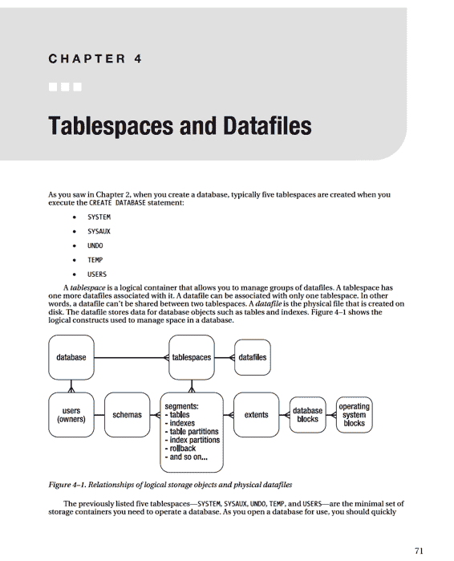

# 用户特定的别名和函数

`. $HOME/bin/dba_setup`

`. $HOME/bin/dba_fcns`

现在，每次登录到某个环境时，您都可以完全访问在 `dba_setup` 和 `dba_fcns` 文件中建立的所有操作系统变量、别名和函数。如果您不想注销并重新登录，则可以使用 `.` (点) 命令手动运行该文件。此命令执行文件中包含的命令行。以下示例运行 `.bashrc` 文件：`$ . $HOME/.bashrc`

`.` 指示 shell *源化* (source) 该脚本。源化告诉您当前登录的 shell 进程继承在执行脚本中使用 `export` 命令设置的任何变量。如果您不使用 `.` 表示法，则脚本中设置的变量仅在脚本执行时生成的子 shell 上下文中可见。

## 第 3 章 ■ 配置高效环境

**注意：** 在 Bash shell 中，`source` 命令等同于 `.` (点) 命令。

## 总结

本章描述了如何配置高效环境。这对于在多台服务器上管理多个数据库的 DBA 尤其重要。维护和故障排除活动要求您直接登录到数据库服务器。为了提高效率和保持清醒，您应该开发一套标准的操作系统工具和 SQL 脚本，以帮助您维护多个环境。您可以使用操作系统的标准功能来辅助导航、重复命令、显示系统瓶颈、快速查找关键文件等。

当您在具有多个数据库的多台服务器上工作时，配置标准操作系统的技巧特别有用。当您同时运行多个终端会话时，很容易迷失方向并忘记哪个会话与特定的服务器和数据库相关联。

只需少量设置，您就可以确保操作系统提示符始终显示主机和数据库等信息。同样，您总是可以设置 SQL 提示符以显示用户名和数据库连接。这些技术有助于确保您不会在错误的环境中意外运行命令或脚本。

在安装了 Oracle 二进制文件、创建了数据库并配置了环境之后，您就可以执行额外的数据库管理任务，例如为应用程序创建表空间。表空间的创建和维护主题将在下一章中描述。

