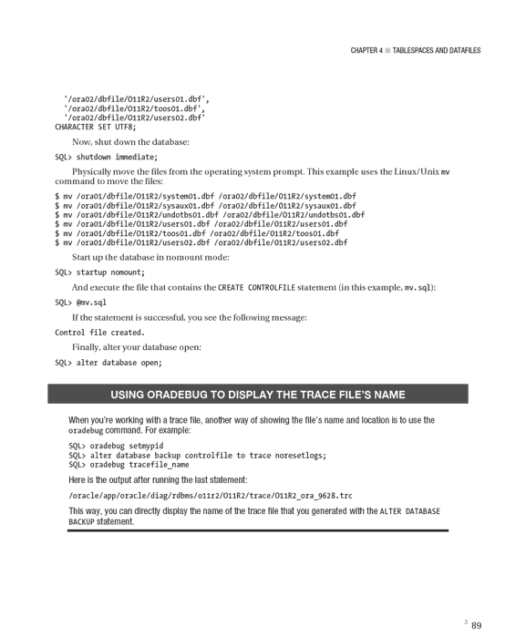
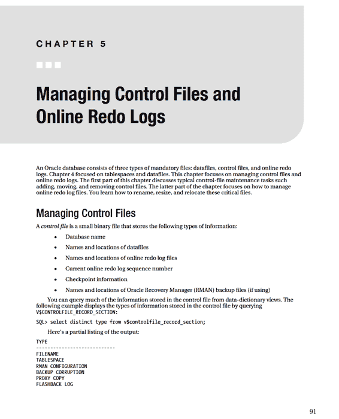

# 第 4 章 ■ 表空间和数据文件

创建额外的表空间来存储应用程序数据。本章讨论标准表空间集的目的、对额外表空间的需求以及如何管理这些关键的数据库存储容器。

## 理解前五个表空间

`SYSTEM` 表空间为 Oracle 数据字典对象提供存储。这是 `SYS` 用户拥有的所有对象存储的位置。`SYS` 用户应该是唯一在 `SYSTEM` 表空间中拥有对象的用户。

从 Oracle Database 10*g* 开始，创建数据库时会创建 `SYSAUX` (系统辅助) 表空间。这是一个辅助表空间，用作 Oracle 数据库工具（如 Enterprise Manager、Statspack、LogMiner、Logical Standby 等）的数据存储库。

`UNDO` 表空间存储回滚未提交数据所需的信息。此表空间包含有关数据在 `INSERT`、`UPDATE` 或 `DELETE` 语句执行之前状态的信息（这有时被称为数据的*前像*副本）。此信息用于在崩溃恢复时回滚未提交的数据，并为 SQL 语句提供读一致性。

某些 Oracle SQL 语句需要排序区域，可以在内存中或在磁盘上。例如，查询的结果可能需要在返回给用户之前进行排序。Oracle 首先使用内存对查询结果进行排序；当内存中没有足够的空间时，`TEMP` 表空间将用作磁盘上的排序区域。创建数据库时，通常会创建 `TEMP` 表空间并将其指定为您创建的任何用户的默认临时表空间。

`USERS` 表空间通常用作用户表和索引数据的默认永久表空间。如第 2 章所示，您可以在创建数据库时为用户创建默认永久表空间。

## 理解对更多表空间的需求

尽管您可以将每个数据库用户的数据都放在 `USERS` 表空间中，但这对于任何类型的严肃数据库应用程序通常都是不可扩展或不可维护的。相反，为应用程序用户创建额外的表空间更有效。您通常为使用数据库的每个应用程序创建至少两个特定的表空间：一个用于应用程序表数据，一个用于应用程序索引数据。

例如，对于 `APP` 用户，您可以分别为表和索引数据创建名为 `APP_DATA` 和 `APP_INDEX` 的表空间。

DBA 过去出于性能原因分离表和索引数据。当时的思路是，将表数据与索引数据分开可以减少 I/O 争用。这是因为每个表空间及其关联的数据文件可以放在具有独立控制器的不同磁盘上。

在具有应用程序与底层物理存储设备之间多层抽象的现代存储配置中，通过创建多个独立的表空间是否能实现任何性能提升是有争议的。但为表和索引数据创建多个表空间仍有合理的理由：

- 表和索引的备份和恢复要求可能不同。
- 索引可能具有与表数据不同的存储要求。

除了为数据和索引创建独立的表空间外，有时还为不同大小的对象创建独立的表空间。例如，如果一个应用程序有非常大的表，您可以创建一个具有较大区间大小的 `APP_DATA_LARGE` 表空间，以及一个具有较小区间大小的独立 `APP_DATA_SMALL` 表空间。

根据您的要求，您应考虑为使用数据库的每个应用程序创建独立的表空间。例如，为库存应用程序创建 `INV_DATA` 和 `INV_INDEX`；为 HR 应用程序创建 `HR_DATA` 和 `HR_INDEX`。考虑为使用数据库的每个应用程序创建独立表空间的原因如下：

- 应用程序可能有不同的可用性要求。独立的表空间允许您将一个应用程序的表空间脱机而不影响另一个应用程序。
- 应用程序可能有不同的备份和恢复要求。独立的表空间允许独立备份和恢复表空间。
- 应用程序可能有不同的存储要求。独立的表空间允许不同的区间大小和段管理设置。
- 您可能有一些数据是纯只读的。独立的表空间允许您将包含只读数据的表空间设置为只读模式。

本章重点介绍与创建和维护表空间及数据文件相关的最常见和最关键的任务。下一节讨论创建表空间，本章进而讨论更高级的主题，例如移动和重命名数据文件。

## 创建表空间

使用 `CREATE TABLESPACE` 语句创建表空间。Oracle SQL 参考手册包含超过 12 页的创建表空间的语法和示例。在大多数情况下，您只需要使用可用功能中的一小部分，即本地管理的区间分配和自动段空间管理。以下代码片段演示了如何创建利用最常见功能的表空间：

```sql
create tablespace tools
datafile '/ora01/dbfile/INVREP/tools01.dbf'
size 100m
extent management local
uniform size 128k
segment space management auto;
```

您需要根据您的环境修改此脚本。例如，目录路径、数据文件大小和统一区间大小应根据环境要求进行更改。

通过使用 `EXTENT MANAGEMENT LOCAL` 子句，您可以创建本地管理的表空间。本地管理的表空间使用数据文件中的位图来高效确定区间是否正在使用。

存储参数 `NEXT`、`PCTINCREASE`、`MINEXTENTS`、`MAXEXTENTS` 和 `DEFAULT` 对于本地管理表空间中的区间选项无效。

**注意：** 具有统一区间的本地管理表空间的大小必须至少为每个区间五个数据库块。

当您向表空间中的对象添加数据时，Oracle 会根据需要自动为关联的表空间数据文件分配更多区间以适应增长。您可以通过 `UNIFORM SIZE [size]` 子句指示 Oracle 为每个区间分配统一的大小。如果您未指定大小，则默认的统一区间大小为 1MB。

您使用的统一区间大小取决于表和索引的存储要求。我通常为给定的应用程序创建多个表空间。例如，您可以创建一个用于小对象的表空间，其统一区间大小为 512KB；一个用于中等大小对象的表空间，其统一区间大小为 4MB；一个用于大对象的表空间，其统一区间大小为 16MB，依此类推。

或者，您可以通过 `AUTOALLOCATE` 子句指定 Oracle 确定区间大小。

Oracle 分配 64KB、1MB、8MB 或 64MB 的区间大小。当您认为一个表空间中的对象大小不同时，使用 `AUTOALLOCATE` 是合适的。

`SEGMENT SPACE MANAGEMENT AUTO` 子句指示 Oracle 管理块内的空间。

使用此子句时，无需指定诸如 `PCTUSED`、`FREELISTS` 和 `FREELIST GROUPS` 之类的参数。`AUTO` 空间管理的替代方案是 `MANUAL`。使用 `MANUAL` 时，您可以根据应用程序的需求调整前面提到的参数。我建议您使用 `AUTO` 而不是 `MANUAL`。使用 `AUTO` 极大地减少了您原本需要配置和管理的参数数量。

当数据文件填满时，您可以使用 `AUTOEXTEND` 功能指示 Oracle 自动增加数据文件的大小。我建议您不要使用此功能。相反，您应该监控表空间增长并在必要时添加空间。手动添加空间比让失控的 SQL 过程意外增长表空间直到耗尽挂载点上的所有空间更可取。如果您无意中填满了包含控制文件或 Oracle 二进制文件的挂载点，则可能会导致数据库挂起。

如果您确实使用了 `AUTOEXTEND` 功能，我建议您始终指定相应的 `MAXSIZE`，这样失控的 SQL 过程就不会意外填满表空间，进而填满挂载点。

以下是创建具有最大大小限制的自动扩展表空间的示例：

```sql
create tablespace tools
datafile '/ora01/dbfile/INVREP/tools01.dbf'
size 100m
autoextend on maxsize 1000m
extent management local
uniform size 128k
segment space management auto;
```

在不同环境中使用 `CREATE TABLESPACE` 脚本时，能够对脚本的部分内容进行参数化是很有用的。例如，在开发环境中，您可能将数据文件大小设置为 100MB，而在生产环境中数据文件大小可能是 1000GB。使用 `&` 变量使 `CREATE TABLESPACE` 脚本在不同环境中更易于移植。

下一个清单在脚本顶部定义了 `&` 变量，这些变量确定为表空间创建的数据文件的大小：

```sql
define tbsp_large=5G
define tbsp_med=500M
--
create tablespace reg_data
datafile '/ora01/oradata/INVREP/reg_data01.dbf'
size &&tbsp_large
extent management local
uniform size 128k
segment space management auto;
--
create tablespace reg_index
datafile '/ora01/oradata/INVREP/reg_index01.dbf'
size &&tbsp_med
extent management local
uniform size 128k
segment space management auto;
```

使用 `&` 变量允许您修改脚本一次，然后在整个脚本中重用这些变量。您可以对脚本的所有方面进行参数化，包括数据文件挂载点和区间大小。

您还可以从 SQL*Plus 命令行将 `&` 变量的值传递到 `CREATE TABLESPACE` 脚本中。这使您可以避免在脚本中硬编码特定大小，而是在运行时提供大小。为此，首先在脚本顶部定义 `&` 变量以接受传入的值：

```sql
define tbsp_large=&1
define tbsp_med=&2
--
create tablespace reg_data
datafile '/ora01/oradata/INVREP/reg_data01.dbf'
size &&tbsp_large
extent management local
uniform size 128k
segment space management auto;
--
create tablespace reg_index
datafile '/ora01/oradata/INVREP/reg_index01.dbf'
size &&tbsp_med
extent management local
uniform size 128k
segment space management auto;
```

现在，您可以从 SQL*Plus 命令行将变量传递到脚本中。以下示例执行名为 `cretbsp.sql` 的脚本，并传入两个值，将 `&` 变量分别设置为 `5G` 和 `500M`：

```sql
SQL> @cretbsp 5G 500M
```

表 4-1 总结了创建和管理表空间的最佳实践。

***表 4-1.** 管理表空间的最佳实践*

| 最佳实践 | 推理 |
| :--- | :--- |
| 为使用同一数据库的不同应用程序创建独立的表空间。 | 如果需要将某个表空间脱机，它只会影响一个应用程序。 |
| 对于一个应用程序，将表数据和索引数据分离到不同的表空间中。 | 表和索引数据可能有不同的存储要求。 |
| 不要对数据文件使用 `AUTOALLOCATE` 功能。如果确实使用了 `AUTOALLOCATE`，请指定最大大小。 | 指定最大大小可防止失控的 SQL 语句填满存储设备。 |
| 将表空间创建为本地管理的。您不应将表空间创建为字典管理的。 | 这提供了更好的性能和可管理性。 |
| 对于表空间的数据文件命名约定，使用包含表空间名称后跟在该表空间的数据文件中唯一的两位数字的名称。 | 这样可以轻松识别哪些数据文件与哪些表空间相关联。 |
| 尽量减少与表空间关联的数据文件数量。 | 您需要管理的数据文件更少。 |
| 在表空间 `CREATE` 脚本中，使用 `&` 变量定义存储特性等方面。 | 这使得脚本在各种环境中更具可重用性。 |

## 重命名表空间

有时您需要重命名表空间。您可能希望这样做是因为表空间最初被错误命名，或者您希望表空间名称更好地符合数据库命名标准。使用 `ALTER TABLESPACE` 语句重命名表空间。此示例将表空间从 `FOOBAR` 重命名为 `USERS`：

```sql
SQL> alter tablespace foobar rename to users;
```

重命名表空间时，Oracle 会更新数据字典、控制文件和数据头中的表空间名称。请记住，重命名表空间不会重命名任何关联的数据文件。重命名数据文件将在本章后面介绍。

**注意：** 您不能重命名 `SYSTEM` 表空间或 `SYSAUX` 表空间。

## 控制重做生成

对于某些类型的应用程序，您可能事先知道可以轻松重新创建数据。例如，数据仓库环境，您执行直接路径插入或使用 SQL*Loader 加载数据。在这些场景中，您可以关闭直接路径加载的重做生成。使用 `NOLOGGING` 子句来实现：

```sql
create tablespace inv_mgmt_data
datafile '/ora02/dbfile/O11R2/inv_mgmt_data01.dbf' size 100m
extent management local
uniform size 128k
segment space management auto
nologging;
```

如果您有一个现有的表空间并想更改其日志记录模式，请使用 `ALTER TABLESPACE` 语句：

```sql
SQL> alter tablespace inv_mgmt_data nologging;
```

您可以通过查询 `DBA_TABLESPACES` 视图来确认表空间日志记录模式：

```sql
SQL> select tablespace_name, logging from dba_tablespaces;
```

对于常规的 `INSERT`、`UPDATE` 和 `DELETE` 语句，无法抑制重做日志的生成。对于常规的数据操作语言 (DML) 语句，`NOLOGGING` 子句将被忽略。

但是，`NOLOGGING` 子句确实适用于以下类型的 DML：

- 直接路径 `INSERT` 语句
- 直接路径 SQL*Loader

`NOLOGGING` 子句也适用于以下类型的 DDL 语句：

- `CREATE TABLE ... AS SELECT`
- `ALTER TABLE ... MOVE`
- `ALTER TABLE ... ADD/MERGE/SPLIT/MOVE/MODIFY PARTITION`
- `CREATE INDEX`
- `ALTER INDEX ... REBUILD`
- `CREATE MATERIALIZED VIEW`
- `ALTER MATERIALIZED VIEW ... MOVE`
- `CREATE MATERIALIZED VIEW LOG`
- `ALTER MATERIALIZED VIEW LOG ... MOVE`

请注意，如果表或索引没有记录重做，并且在备份该对象之前发生了介质故障，那么您将无法恢复数据。您将收到 `ORA-01578` 错误，表明数据存在逻辑损坏。

**注意：** 您也可以在对象级别覆盖表空间级别的日志记录。例如，即使表空间指定为 `NOLOGGING`，您也可以使用 `LOGGING` 子句创建表。

## 更改表空间的写入模式

在数据仓库等环境中，您可能需要将数据加载到表中，然后永远不再修改数据。为了强制表空间中的所有对象都无法修改，您可以将表空间更改为只读。为此，使用 `ALTER TABLESPACE` 语句：

```sql
SQL> alter tablespace inv_mgmt_rep read only;
```

只读表空间的一个优点是您只需备份一次。无论备份是多久之前进行的，您都应该能够从只读表空间还原数据文件。

如果您需要将表空间从只读模式修改为读写模式，可以按如下方式进行：

```sql
SQL> alter tablespace inv_mgmt_rep read write;
```

请确保在将表空间置于读/写模式后重新启用其备份。

**注意：** 您不能使包含活动回滚段的表空间变为只读。因此，`SYSTEM` 表空间不能设置为只读，因为它包含 `SYSTEM` 回滚段。

在 Oracle Database 11*g* 及更高版本中，您可以将单个表修改为只读。例如：

```sql
SQL> alter table my_tab read only;
```

在只读模式下，您不能对表发出任何 `INSERT`、`UPDATE` 或 `DELETE` 语句。

在进行维护（例如数据迁移）时，将单个表设置为读/写可能很有用，因为您希望确保用户不会更新数据。

此示例将表修改回读/写模式：

```sql
SQL> alter table my_tab read write;
```

## 删除表空间

如果您有一个未使用的表空间，最好将其删除，这样它不会使数据库变得杂乱，消耗不必要的资源，并可能使不熟悉该数据库的 DBA 感到困惑。在删除表空间之前，最好先将其脱机：

```sql
SQL> alter tablespace inv_data offline;
```

您可能希望等待，看看是否有人抱怨应用程序因为无法写入要删除的表空间中的表或索引而中断。当您确定不需要该表空间时，删除该表空间并删除其数据文件：

```sql
SQL> drop tablespace inv_data including contents and datafiles;
```

**提示：** 无论表空间是联机还是脱机，您都可以删除它。例外是 `SYSTEM` 表空间，它不能被删除。在删除表空间之前将其脱机总是一个好主意。这样做可以更好地确定应用程序是否正在使用表空间中的任何对象。如果您尝试查询脱机表空间中的表，您会收到 `ORA-00376: file can't be read at this time` 错误。

使用 `INCLUDING CONTENTS AND DATAFILES` 删除表空间会永久删除该表空间及其任何数据文件。在删除表空间之前，请确保它不包含任何您想要保留的数据。

如果您尝试删除包含主键的表空间，而该主键被另一个表空间（不同于您尝试删除的表空间）中的表的外键引用，您会收到此错误：

```
ORA-02449: unique/primary keys in table referenced by foreign keys
```

首先运行此查询以确定是否有任何外键约束将受到影响：

```sql
select p.owner,
       p.table_name,
       p.constraint_name,
       f.table_name referencing_table,
       f.constraint_name foreign_key_name,
       f.status fk_status
from   dba_constraints P,
       dba_constraints F,
       dba_tables T
where  p.constraint_name = f.r_constraint_name
and    f.constraint_type = 'R'
and    p.table_name = t.table_name
and    t.tablespace_name = UPPER('&tablespace_name')
order by 1,2,3,4,5;
```

如果存在引用的约束，您需要首先删除约束，或者使用 `DROP TABLESPACE` 语句的 `CASCADE CONSTRAINTS` 子句。此语句使用 `CASCADE CONSTRAINTS` 自动删除任何受影响的约束：

```sql
SQL> drop tablespace inv_data including contents and datafiles cascade constraints;
```

此语句将删除被删除表空间之外的表中引用被删除表空间内的表的任何引用完整性约束。

如果您在生产系统中删除了包含所需对象的表空间，后果可能是灾难性的。您必须执行某种恢复才能将表空间及其对象恢复。

不用说，删除表空间时要非常小心。表 4-2 列出了执行此操作时需要考虑的建议。

***表 4-2.** 删除表空间的最佳实践*

| 最佳实践 | 推理 |
| :--- | :--- |
| 在删除表空间之前，运行类似于以下的脚本以确定表空间中是否存在任何对象： <br>`select owner, segment_name, segment_type`<br>`from dba_segments`<br>`where tablespace_name=upper('&&tbsp_name');` | 这样做可确保在删除表空间之前其中不存在任何表或索引。 |
| 考虑在删除表空间之前重命名其中的表。 | 如果任何应用程序正在使用要删除的表空间内的表，则在所需表被重命名时，应用程序会抛出错误。 |
| 如果表空间中没有对象，请将关联的数据文件大小调整为一个很小的数字，例如 10MB。 | 将数据文件大小减小到极小的空间可以快速显示是否有任何应用程序试图访问需要表空间空间的对象。 |
| 在删除表空间之前备份数据库。 | 这确保您有一种方法可以在删除表空间后发现有对象正在使用时恢复它们。 |
| 在删除表空间之前将表空间和数据文件脱机。使用 `ALTER TABLESPACE` 语句将表空间脱机。 | 这有助于确定是否有任何应用程序或用户正在使用表空间中的对象。如果表空间和数据文件脱机，他们将无法访问这些对象。 |
| 当您确定表空间未在使用时，使用 `DROP TABLESPACE ... INCLUDING CONTENTS AND DATAFILES` 语句。 | 这会删除表空间并物理删除与该表空间关联的任何数据文件。一些 DBA 不喜欢这种方法，但如果您采取了必要的预防措施，应该没问题。 |

## 使用 Oracle 托管文件

Oracle 托管文件 (OMF) 功能自动化了表空间管理的许多方面，例如文件放置、命名和大小调整。您通过设置以下初始化参数来控制 OMF：

- `DB_CREATE_FILE_DEST`
- `DB_CREATE_ONLINE_LOG_DEST_N`
- `DB_RECOVERY_FILE_DEST`

如果您在创建数据库之前设置这些参数，Oracle 将使用它们来放置数据文件、控制文件和联机重做日志。您也可以在数据库创建后启用 OMF。Oracle 将初始化参数的值用于任何新添加的数据文件和联机重做日志文件的位置。Oracle 还确定新添加文件的名称。

使用 OMF 的优点是简化了表空间的创建。例如，`CREATE TABLESPACE` 语句只需要指定表空间名称。首先，通过设置 `DB_CREATE_FILE_DEST` 参数启用 OMF 功能：

```sql
SQL> alter system set db_create_file_dest='/ora01/OMF';
```

现在，发出 `CREATE TABLESPACE` 语句：

```sql
SQL> create tablespace inv1;
```

此语句创建一个名为 `INV1` 的表空间，默认数据文件大小为 100MB。您可以通过指定大小来覆盖默认值：

```sql
SQL> create tablespace inv2 datafile size 20m;
```

OMF 的一个限制是您仅限于一个目录来放置数据文件。如果要将数据文件添加到不同的目录，您可以动态更改位置：

```sql
SQL> alter system set db_create_file_dest='/ora02/OMF';
```

尽管这个过程不是什么大事，但我发现不使用 OMF 更容易。我工作过的大多数环境都有许多分配给数据库使用的挂载点。您不希望每次需要将数据文件添加到不在 `DB_CREATE_FILE_DEST` 当前定义中的目录时都修改初始化参数。更容易的方法是发出包含文件位置和存储参数的 `CREATE TABLESPACE` 或 `ALTER TABLESPACE` 语句。向表空间管理语句提供目录名和文件名并不麻烦。

## 创建大文件表空间

大文件功能允许您创建一个可能分配了非常大的数据文件的表空间。

使用大文件功能的优点是可以创建非常大的文件。使用 8KB 块大小，您最多可以创建 32TB 的数据文件。使用 32KB 块大小，您最多可以创建 128TB 的数据文件。

使用 `BIGFILE` 子句创建大文件表空间：

```sql
create bigfile tablespace inv_big_data
datafile '/ora02/dbfile/O11R2/inv_big_data01.dbf'
size 10g
extent management local
uniform size 128k
segment space management auto;
```

只要支持大文件表空间数据文件的文件系统有足够空间，您就可以在表空间中存储海量数据。

使用大文件表空间的一个潜在缺点是，如果由于任何原因支持大文件关联数据文件的文件系统空间不足，您将无法扩展表空间的大小（除非您可以向文件系统添加空间）。如果数据文件放置在单独的挂载点上，则无法向大文件表空间添加更多数据文件。大文件表空间只允许一个数据文件与之关联。

您可以使用 `ALTER DATABASE SET DEFAULT BIGFILE TABLESPACE` 语句将大文件表空间设置为数据库的默认表空间类型。但是，我不建议这样做。您可能会创建一个表空间，却不知道它是大文件表空间（因为您忘记了它是默认值，或者您是项目的新 DBA 没有意识到），并在挂载点上创建表空间。然后，当您发现需要更多空间时，您会不知道因为它是大文件约束而无法为此表空间在其他挂载点上添加另一个数据文件。

## 显示表空间大小

DBA 通常使用监控脚本在需要增加表空间分配的空间时发出警报。以下脚本显示表空间和数据文件中剩余的空闲空间百分比：

```sql
SET PAGESIZE 100 LINES 132 ECHO OFF VERIFY OFF FEEDB OFF SPACE 1 TRIMSP ON
COMPUTE SUM OF a_byt t_byt f_byt ON REPORT
BREAK ON REPORT ON tablespace_name ON pf
COL tablespace_name FOR A17 TRU HEAD 'Tablespace|Name'
COL file_name FOR A40 TRU HEAD 'Filename'
COL a_byt FOR 9,990.999 HEAD 'Allocated|GB'
COL t_byt FOR 9,990.999 HEAD 'Current|Used GB'
COL f_byt FOR 9,990.999 HEAD 'Current|Free GB'
COL pct_free FOR 990.0 HEAD 'File %|Free'
COL pf FOR 990.0 HEAD 'Tbsp %|Free'
COL seq NOPRINT
DEFINE b_div=1073741824
--
SELECT 1 seq, b.tablespace_name, nvl(x.fs,0)/y.ap*100 pf, b.file_name file_name, b.bytes/&&b_div a_byt, NVL((b.bytes-SUM(f.bytes))/&&b_div,b.bytes/&&b_div) t_byt, NVL(SUM(f.bytes)/&&b_div,0) f_byt, NVL(SUM(f.bytes)/b.bytes*100,0) pct_free
FROM dba_free_space f, dba_data_files b
    ,(SELECT y.tablespace_name, SUM(y.bytes) fs
      FROM dba_free_space y GROUP BY y.tablespace_name) x
    ,(SELECT x.tablespace_name, SUM(x.bytes) ap
      FROM dba_data_files x GROUP BY x.tablespace_name) y
WHERE f.file_id(+) = b.file_id
AND x.tablespace_name(+) = y.tablespace_name
and y.tablespace_name = b.tablespace_name
AND f.tablespace_name(+) = b.tablespace_name
GROUP BY b.tablespace_name, nvl(x.fs,0)/y.ap*100, b.file_name, b.bytes
UNION
SELECT 2 seq, tablespace_name,
    j.bf/k.bb*100 pf, b.name file_name, b.bytes/&&b_div a_byt,
    a.bytes_used/&&b_div t_byt, a.bytes_free/&&b_div f_byt, a.bytes_free/b.bytes*100 pct_free
FROM v$temp_space_header a, v$tempfile b
    ,(SELECT SUM(bytes_free) bf FROM v$temp_space_header) j
    ,(SELECT SUM(bytes) bb FROM v$tempfile) k
WHERE a.file_id = b.file#
ORDER BY 1,2,4,3;
```

如果您没有任何监控措施，您将通过尝试执行插入或更新操作的 SQL 语句收到警报，该操作需要更多空间但无法分配更多空间。例如：

```
ORA-01653: unable to extend table INVENTORY by 128 in tablespace INV_IDX
```

在确定表空间需要更多空间后，您需要增加数据文件的大小或向表空间添加数据文件。这些主题将在下一节中讨论。

## 更改表空间大小

当您确定要调整大小的数据文件后，首先确保数据文件所在的挂载点上有足够的磁盘空间来增加数据文件的大小：

```bash
$ df -h | sort
```

使用 `ALTER DATABASE DATAFILE ... RESIZE` 命令增加数据文件的大小。此示例将数据文件大小调整为 5GB：

```sql
SQL> alter database datafile '/ora01/oradata/INVREP/reg_data01.dbf' resize 5g;
```

如果现有挂载点上没有空间来增加数据文件的大小，则必须添加数据文件。要向现有表空间添加数据文件，请使用 `ALTER TABLESPACE ... ADD DATAFILE` 语句：

```sql
SQL> alter tablespace reg_data
add datafile '/ora01/dbfile/INVREP/reg_data02.dbf' size 100m;
```

如果您有大文件表空间，则不能使用 `ALTER DATABASE ... DATAFILE` 语句来更改表空间数据文件的大小。要调整大文件表空间关联的单个数据文件的大小，必须使用 `ALTER TABLESPACE` 子句：

```sql
SQL> alter tablespace bigstuff resize 1T;
```

在管理具有高事务负载的数据库时，调整数据文件大小可能是日常任务。

增加现有数据文件的大小允许您向表空间添加空间而无需添加更多数据文件。如果包含现有数据文件的存储设备上没有足够的磁盘空间，您可以向现有表空间添加位于不同位置的数据文件。

如果要向临时表空间添加空间，首先查询 `V$TEMPFILE` 视图以验证临时数据文件的当前位置和大小：

```sql
SQL> select name, bytes from v$tempfile;
```

接下来，使用 `ALTER DATABASE` 语句的 `TEMPFILE` 选项：

```sql
SQL> alter database tempfile '/ora01/oradata/INVREP/temp01.dbf' resize 500m;
```

您也可以通过 `ALTER TABLESPACE` 语句向临时表空间添加文件：

```sql
SQL> alter tablespace temp add tempfile '/ora01/oradata/INVREP/temp02.dbf' size 5000m;
```

## 切换数据文件脱机和联机

有时，在执行维护操作（例如重命名数据文件）时，您可能需要先将数据文件脱机。您可以使用 `ALTER TABLESPACE` 或 `ALTER DATABASE DATAFILE` 语句来切换数据文件的脱机和联机状态。

使用 `ALTER TABLESPACE ... OFFLINE NORMAL` 语句将表空间及其关联的数据文件脱机。您不需要指定 `NORMAL`，因为它是默认值：

```sql
SQL> alter tablespace users offline;
```

当您以正常模式将表空间脱机时，Oracle 会对与表空间关联的数据文件执行检查点。这确保与表空间关联的内存中所有已修改的块都被刷新并写入数据文件。当您将表空间及其关联的数据文件重新联机时，不需要执行介质恢复。

当数据库处于装载 (mount) 模式时，不能使用 `ALTER TABLESPACE` 语句将表空间脱机。如果您在数据库已装载（但未打开）时尝试将表空间脱机，您将收到以下错误：

```
ORA-01190: database not open
```

**注意：** 在装载模式下，必须使用 `ALTER DATABASE DATAFILE` 语句将数据文件脱机。

在将表空间脱机时，您也可以指定 `ALTER TABLESPACE ... OFFLINE TEMPORARY`。在这种情况下，Oracle 会对与表空间关联的、处于联机状态的所有数据文件执行检查点。Oracle 不会对与表空间关联的处于脱机状态的数据文件执行检查点。

在将表空间脱机时，您可以指定 `ALTER TABLESPACE ... OFFLINE IMMEDIATE`。在这种情况下，您的数据库必须处于归档日志模式。使用 `OFFLINE IMMEDIATE` 时，Oracle 不会对数据文件执行检查点。在将其重新联机之前，您必须对表空间执行介质恢复。

**注意：** 在数据库打开时，不能将 `SYSTEM` 或 `UNDO` 表空间脱机。

您也可以使用 `ALTER DATABASE DATAFILE` 语句将数据文件脱机。如果您的数据库已打开供使用，那么它必须处于归档日志模式，才能使用 `ALTER DATABASE DATAFILE` 语句将数据文件脱机。如果您尝试使用 `ALTER DATABASE DATAFILE` 语句将数据文件脱机，而您的数据库不在归档日志模式下，您将收到以下错误：

```sql
SQL> alter database datafile 6 offline;
ORA-01145: offline immediate disallowed unless media recovery enabled
```

如果您的数据库不在归档日志模式下，在将数据文件脱机时必须指定 `ALTER DATABASE DATAFILE ... OFFLINE FOR DROP`。您可以指定完整的文件名或提供文件编号。在此示例中，数据文件 6 被脱机：

```sql
SQL> alter database datafile 6 offline for drop;
```

现在，如果您尝试将脱机的数据文件联机，您将收到以下错误：

```sql
SQL> alter database datafile 6 online;
ORA-0113: file 6 needs media recovery
```

当您使用 `OFFLINE FOR DROP` 子句时，不会对数据文件执行检查点。这意味着在将数据文件重新联机之前，您需要对其执行介质恢复。执行介质恢复将应用联机重做日志中记录的、数据文件本身没有的所有更改到数据文件。在可以将使用 `OFFLINE FOR DROP` 子句脱机的数据文件重新联机之前，您必须对其执行介质恢复。您可以指定完整的文件名或文件编号：

```sql
SQL> recover datafile 6;
```

如果 Oracle 需要的重做信息包含在联机重做日志中，您应该看到此消息：

```
Media recovery complete.
```

如果您的数据库不在归档日志模式下，并且如果 Oracle 需要未包含在联机重做日志中的重做信息来恢复数据文件，那么您将无法恢复该数据文件并将其重新联机。

如果您的数据库处于归档日志模式，您可以将其脱机而不使用 `FOR DROP` 子句。在这种情况下，Oracle 会忽略 `FOR DROP` 子句。即使您的数据库处于归档日志模式，对于使用 `ALTER DATABASE DATAFILE` 语句脱机的数据文件，您也需要执行介质恢复。表 4-3 总结了在表空间脱机时必须考虑的选项。

**注意：** 在数据库处于装载模式（且未打开）时，您可以使用 `ALTER DATABASE DATAFILE` 命令将任何数据文件脱机，包括 `SYSTEM` 和 `UNDO`。

***表 4-3.** 数据文件脱机选项*

| 语句 | 是否需要归档日志模式？ | 联机时是否需要介质恢复？ | 在装载模式下是否有效？ |
| :--- | :--- | :--- | :--- |
| `ALTER TABLESPACE ... OFFLINE NORMAL` | 否 | 否 | 否 |
| `ALTER TABLESPACE ... OFFLINE TEMPORARY` | 否 | 可能：取决于是否有数据文件已处于脱机状态 | 否 |
| `ALTER TABLESPACE ... OFFLINE IMMEDIATE` | 否 | 是 | 否 |
| `ALTER DATABASE DATAFILE ... OFFLINE` | 是 | 是 | 是 |
| `ALTER DATABASE DATAFILE ... OFFLINE FOR DROP` | 否 | 是 | 是 |

## 重命名或重新定位数据文件

您可能偶尔需要重命名数据文件。例如，由于存储设备的更改，或者因为文件以某种方式创建在错误的位置，您可能需要移动文件。

在重命名数据文件之前，必须将数据文件脱机。（请参阅上一节。）以下是重命名数据文件的步骤：

1.  使用以下查询确定现有数据文件的名称：
    ```sql
    SQL> select name from v$datafile;
    ```
2.  使用 `ALTER TABLESPACE` 或 `ALTER DATABASE DATAFILE` 语句将数据文件脱机（有关如何执行此操作的详细信息，请参阅上一节）。您也可以关闭数据库，然后以装载模式启动；因为在此模式下数据文件未打开供使用，所以可以移动它们。
3.  使用操作系统命令（如 `mv` 或 `cp`）或内置的 `DBMS_FILE_TRANSFER` PL/SQL 包的 `COPY_FILE` 过程将数据文件物理移动到新位置。
4.  使用 `ALTER TABLESPACE ... RENAME DATAFILE ... TO` 语句或 `ALTER DATABASE RENAME FILE ... TO` 语句使用新的数据文件名更新控制文件。
5.  将数据文件联机。

**注意：** 如果需要重命名与 `SYSTEM` 或 `UNDO` 表空间关联的数据文件，必须关闭数据库并以装载模式启动。当数据库处于装载模式时，您可以通过 `ALTER DATABASE RENAME FILE` 语句重命名与 `SYSTEM` 或 `UNDO` 表空间关联的数据文件。

以下示例演示如何移动与单个表空间关联的数据文件。

首先，使用 `ALTER TABLESPACE` 语句将数据文件脱机：

```sql
SQL> alter tablespace users offline;
```

现在，在操作系统提示符下，使用 Linux/Unix `mv` 命令将两个数据文件移动到新位置：

```bash
$ mv /ora02/dbfile/O11R2/users01.dbf /ora03/dbfile/O11R2/users01.dbf
$ mv /ora02/dbfile/O11R2/users02.dbf /ora03/dbfile/O11R2/users02.dbf
```

使用 `ALTER TABLESPACE` 语句更新控制文件：

```sql
alter tablespace users
rename datafile
'/ora02/dbfile/O11R2/users01.dbf',
'/ora02/dbfile/O11R2/users02.dbf'
to
'/ora03/dbfile/O11R2/users01.dbf',
'/ora03/dbfile/O11R2/users02.dbf';
```

最后，将表空间内的数据文件重新联机：

```sql
SQL> alter tablespace users online;
```

如果您想在一次操作中重命名多个表空间的数据文件，可以使用 `ALTER DATABASE RENAME FILE` 语句（而不是 `ALTER TABLESPACE...RENAME DATAFILE` 语句）。以下示例重命名数据库中的所有数据文件。由于 `SYSTEM` 和 `UNDO` 表空间的数据文件正在被移动，因此必须先将数据库脱机，然后将其置于装载模式：

```sql
SQL> conn / as sysdba
SQL> shutdown immediate;
SQL> startup mount;
```

由于数据库处于装载模式，数据文件未打开供使用，因此无需将数据文件脱机。接下来，通过 Linux/Unix `mv` 命令物理移动文件：

```bash
$ mv /ora01/dbfile/O11R2/system01.dbf /ora02/dbfile/O11R2/system01.dbf
$ mv /ora01/dbfile/O11R2/sysaux01.dbf /ora02/dbfile/O11R2/sysaux01.dbf
$ mv /ora01/dbfile/O11R2/undotbs01.dbf /ora02/dbfile/O11R2/undotbs01.dbf
$ mv /ora01/dbfile/O11R2/users01.dbf /ora02/dbfile/O11R2/users01.dbf
$ mv /ora01/dbfile/O11R2/toos01.dbf /ora02/dbfile/O11R2/toos01.dbf
$ mv /ora01/dbfile/O11R2/users02.dbf /ora02/dbfile/O11R2/users02.dbf
```

**注意：** 必须在更新控制文件之前移动文件。`ALTER DATABASE RENAME FILE` 命令期望文件位于重命名后的位置。如果文件不在那里，会抛出错误：`ORA-27037: unable to obtain file status`。

现在您可以更新控制文件以识别新的文件名：

```sql
alter database rename file
'/ora01/dbfile/O11R2/system01.dbf',
'/ora01/dbfile/O11R2/sysaux01.dbf',
'/ora01/dbfile/O11R2/undotbs01.dbf',
'/ora01/dbfile/O11R2/users01.dbf',
'/ora01/dbfile/O11R2/toos01.dbf',
'/ora01/dbfile/O11R2/users02.dbf'
to
'/ora02/dbfile/O11R2/system01.dbf',
'/ora02/dbfile/O11R2/sysaux01.dbf',
'/ora02/dbfile/O11R2/undotbs01.dbf',
'/ora02/dbfile/O11R2/users01.dbf',
'/ora02/dbfile/O11R2/toos01.dbf',
'/ora02/dbfile/O11R2/users02.dbf';
```

您应该能够打开数据库：

```sql
SQL> alter database open;
```

重新定位数据库中所有数据文件的另一种方法是使用 `CREATE CONTROLFILE` 语句重新创建控制文件。此操作的步骤如下：
1.  创建包含 `CREATE CONTROLFILE` 语句的跟踪文件。
2.  找到包含 `CREATE CONTROLFILE` 语句的跟踪文件。
3.  修改跟踪文件以显示数据文件的新位置。
4.  关闭数据库。
5.  使用操作系统命令物理移动数据文件。
6.  在未装载模式下启动数据库。
7.  运行 `CREATE CONTROLFILE` 命令。

**注意：** 重新创建控制文件时，请注意控制文件中包含的任何 Oracle 恢复管理器 (RMAN) 信息将会丢失。如果您不使用恢复目录，可以使用 `RMAN CATALOG` 命令用 RMAN 备份信息重新填充控制文件。

以下示例将逐步完成前面的步骤。首先，通过 `ALTER DATABASE BACKUP CONTROLFILE TO TRACE` 语句将 `CREATE CONTROLFILE` 语句写入跟踪文件：

```sql
SQL> alter database backup controlfile to trace noresetlogs;
```

此语句使用 `NORESETLOGS` 子句。它指示 Oracle 仅将一个 SQL 语句写入跟踪文件。如果您未指定 `NORESETLOGS`，Oracle 会将两个 SQL 语句写入跟踪文件：一个使用 `NORESETLOGS` 选项重新创建控制文件，另一个使用 `RESETLOGS` 重新创建控制文件。通常，您知道在重新创建控制文件时是否要重置联机重做日志。在这种情况下，您知道在重新创建控制文件时不需要重置联机重做日志（因为联机重做日志未损坏并且仍处于数据库的正常位置）。

现在，找到包含数据库跟踪文件的目录：

```sql
SQL> show parameter background_dump_dest
```

对于此示例，目录是 `/ora01/app/oracle/diag/rdbms/o11r2/O11R2/trace`

接下来，在操作系统上导航到跟踪目录：

```bash
$ cd /ora01/app/oracle/diag/rdbms/o11r2/O11R2/trace
```

查找最后生成的跟踪文件（或在运行 `ALTER DATABASE` 语句时生成的跟踪文件）。在此示例中，跟踪文件是 `O11R2_ora_17017.trc`。

复制跟踪文件，并用操作系统编辑器打开副本：

```bash
$ cp O11R2_ora_17017.trc mv.sql
```

编辑 `mv.sql` 文件。在此示例中，跟踪文件只包含一个 SQL 语句（因为在创建跟踪文件时我指定了 `NORESTLOGS`）。如果您未指定 `NORESETLOGS`，跟踪文件包含两个 `CREATE CONTROLFILE` 语句，您必须修改跟踪文件以删除包含 `RESETLOGS` 的语句。

接下来，将数据文件的名称修改为您要移动数据文件的新位置。

以下是此示例的 `CREATE CONTROLFILE` 语句：

```sql
CREATE CONTROLFILE REUSE DATABASE "O11R2" NORESETLOGS ARCHIVELOG
MAXLOGFILES 16
MAXLOGMEMBERS 4
MAXDATAFILES 1024
MAXINSTANCES 1
MAXLOGHISTORY 876
LOGFILE
GROUP 1 (
  '/ora02/oraredo/O11R2/redo01a.rdo',
  '/ora03/oraredo/O11R2/redo01b.rdo'
) SIZE 100M BLOCKSIZE 512,
GROUP 2 (
  '/ora02/oraredo/O11R2/redo02a.rdo',
  '/ora03/oraredo/O11R2/redo02b.rdo'
) SIZE 100M BLOCKSIZE 512,
GROUP 3 (
  '/ora02/oraredo/O11R2/redo03a.rdo',
  '/ora03/oraredo/O11R2/redo03b.rdo'
) SIZE 100M BLOCKSIZE 512
DATAFILE
'/ora02/dbfile/O11R2/system01.dbf',
'/ora02/dbfile/O11R2/sysaux01.dbf',
'/ora02/dbfile/O11R2/undotbs01.dbf',
```



## 总结

本章讨论了管理表空间和数据文件。表空间是一组数据文件的逻辑容器。数据文件是磁盘上包含数据的物理文件。在创建表空间和相应的数据文件时应仔细规划。

表空间允许您将一个应用程序的数据与另一个应用程序的数据分开。您还可以将表与索引分开。这允许您为每个应用程序自定义表空间的存储特性。此外，表空间提供了一种更好地管理具有不同可用性、备份和恢复要求的应用程序的方法。作为 DBA，您必须精通管理表空间和数据文件。在任何类型的环境中，您都必须添加、重命名、重新定位和删除这些存储容器。

Oracle 需要三种文件来运行数据库：数据文件、控制文件和联机重做日志文件。本书的下一章重点介绍控制文件和联机重做日志文件管理。



