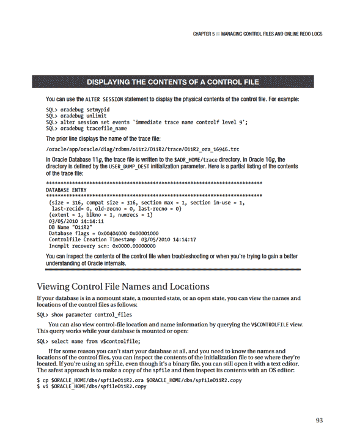
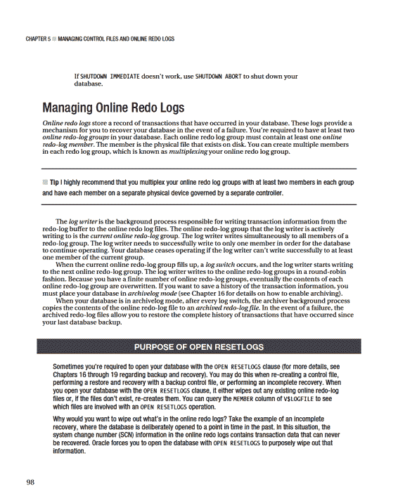
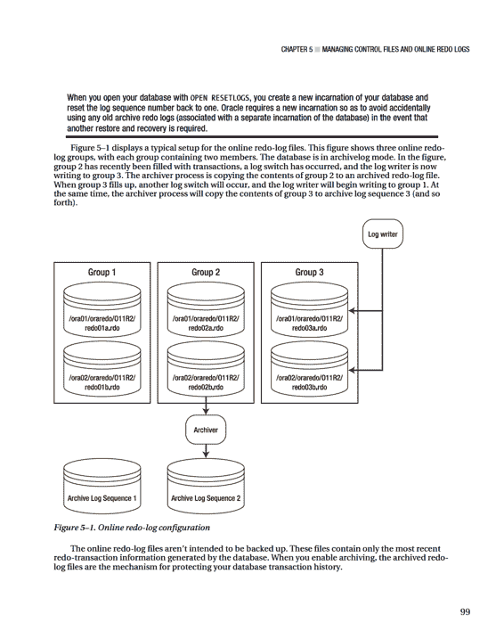
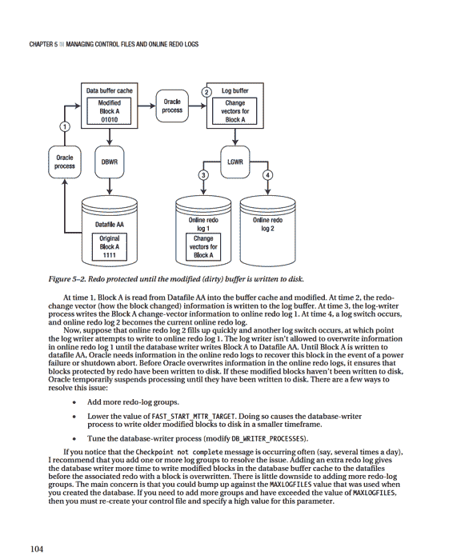
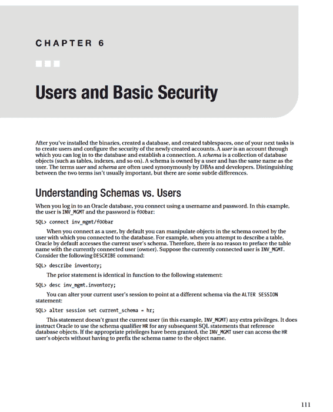

# 第 5 章 ■ 管理控制文件和联机重做日志

## 可移除的恢复文件

## 数据文件

您可以通过 `V$DATABASE` 视图查看存储在控制文件中的数据库信息：

```sql
SQL> select name, open_mode, created, current_scn from v$database;
```

此示例的输出如下：

```
NAME      OPEN_MODE      CREATED      CURRENT_SCN
--------- -------------- ------------ -----------
ORC11G    READ WRITE     01-JAN-10    5077636
```

每个 Oracle 数据库必须至少有一个控制文件。当您在未装载 (nomount) 模式下启动数据库时，实例通过 `CONTROL_FILES` 参数知道控制文件的位置：

```sql
-- 控制文件的位置对实例是已知的
SQL> startup nomount;
```

此时，任何进程都还未接触控制文件。当您将数据库更改为装载 (mount) 模式时，控制文件被读取并打开供使用：

```sql
-- 控制文件已打开
SQL> alter database mount;
```

如果 `CONTROL_FILES` 初始化参数中列出的任何控制文件不可用，那么您将无法装载数据库。

当您成功装载数据库后，实例知道数据文件和联机重做日志的位置，但尚未打开它们。在您将数据库更改为打开 (open) 模式后，数据文件和联机重做日志将被打开：

```sql
-- 数据文件和联机重做日志已打开
SQL> alter database open;
```

控制文件是在创建数据库时创建的。如第 2 章所述，创建数据库时应至少创建两个控制文件（以避免单点故障）。如果可能，您应该将多个控制文件存储在由独立控制器控制的独立存储设备上。

Oracle 写入 `CONTROL_FILES` 初始化参数指定的所有控制文件。如果 Oracle 无法写入其中一个控制文件，则会抛出错误：

```
ORA-00210: cannot open the specified control file
```

如果您的某个控制文件变得不可用，请在重新启动之前关闭数据库并解决问题。修复问题可能意味着解决存储设备故障，或者修改 `CONTROL_FILES` 初始化参数以删除不可用控制文件的条目。



如果您使用的是基于文本的初始化文件，您可以直接使用操作系统编辑器查看该文件，或者使用 `grep` 命令：

```bash
$ grep -i control_files $ORACLE_HOME/dbs/initO11.ora
```

### 添加控制文件

*添加控制文件* 意味着复制现有的控制文件，并通过修改您的 `CONTROL_FILES` 参数使您的数据库知道该副本。此任务必须在数据库关闭时完成。

此过程仅在您有一个可以复制的良好现有控制文件时才有效。添加控制文件与创建或恢复控制文件不同。

如果您的数据库仅使用一个控制文件，并且该控制文件损坏，您需要从备份中恢复控制文件（如果有）并执行恢复，或者重新创建损坏的控制文件。如果您使用两个或多个控制文件，并且其中一个损坏，您可以使用剩余的良好控制文件快速使数据库进入可操作状态。

如果数据库仅使用一个控制文件，添加控制文件的基本过程如下：
1.  更改初始化文件的 `CONTROL_FILES` 参数以包含控制文件的新位置和名称。
2.  关闭数据库。
3.  使用操作系统命令将现有控制文件复制到新位置和名称。
4.  重新启动数据库。

根据您使用的是 spfile 还是 init.ora 文件，前面的步骤略有不同。接下来的两个小节详细介绍了这些不同的场景。

### Spfile 场景

如果您的数据库已打开，您可以使用以下 SQL 语句快速确定是否正在使用 spfile：

```sql
SQL> show parameter spfile
```

以下是一些示例输出：

```
NAME                                 TYPE        VALUE
------------------------------------ ----------- ------------------------------
spfile                               string      /oracle/app/oracle/product/11.
                                                 2.0/db_1/dbs/spfileO11R2.ora
```

当您确定正在使用 spfile 时，请使用以下步骤添加控制文件：
1.  确定 `CONTROL_FILES` 参数的当前值：

    ```sql
    SQL> show parameter control_files
    ```

    输出显示此数据库仅使用一个控制文件：

    ```
    NAME                                 TYPE        VALUE
    ------------------------------------ ----------- ------------------------------
    control_files                        string      /ora01/dbfile/O11R2/control01.ctl
    ```
2.  更改您的 `CONTROL_FILES` 参数以包含您想要添加的新控制文件，但将操作范围限制为 spfile（您无法在内存中修改此参数）。确保您也包含步骤 1 中列出的任何控制文件：

    ```sql
    SQL> alter system set control_files='/ora01/dbfile/O11R2/control01.ctl',
      '/ora01/dbfile/O11R2/control02.ctl' scope=spfile;
    ```
3.  关闭数据库：

    ```sql
    SQL> shutdown immediate;
    ```
4.  将现有控制文件复制到新位置和名称。在此示例中，通过操作系统 `cp` 命令创建名为 `control02.ctl` 的新控制文件：

    ```bash
    $ cp /ora01/dbfile/O11R2/control01.ctl /ora01/dbfile/O11R2/control02.ctl
    ```
5.  启动数据库：

    ```sql
    SQL> startup;
    ```

您可以通过显示 `CONTROL_FILES` 参数来验证是否正在使用新的控制文件：

```sql
SQL> show parameter control_files
```

此示例的输出如下：

```
NAME                                 TYPE        VALUE
------------------------------------ ----------- ------------------------------
control_files                        string      /ora01/dbfile/O11R2/control01.ctl,
                                                 /ora01/dbfile/O11R2/control02.ctl
```

### Init.ora 场景

运行以下语句以验证您是否正在使用 init.ora 文件。如果您未使用 spfile，`VALUE` 列为空：

```sql
SQL> show parameter spfile
NAME                                 TYPE        VALUE
------------------------------------ ----------- ------------------------------
spfile                               string
```

要在使用文本 init.ora 文件时添加控制文件，请执行以下步骤：
1.  关闭数据库：

    ```sql
    SQL> shutdown immediate;
    ```
2.  使用操作系统实用程序（如 vi）编辑您的 init.ora 文件，并将新的控制文件位置和名称添加到 `CONTROL_FILES` 参数中。此示例使用 vi 打开 init.ora 文件，并将 `control02.ctl` 添加到 `CONTROL_FILES` 参数：

    ```bash
    $ vi $ORACLE_HOME/dbs/initO11R2.ora
    ```

    以下是在添加 `control02.ctl` 后的 `CONTROL_FILES` 参数：

    ```
    control_files='/ora01/dbfile/O11R2/control01.ctl',
                  '/ora01/dbfile/O11R2/control02.ctl'
    ```
3.  从操作系统，将现有控制文件复制到要添加的控制文件的位置和名称：

    ```bash
    $ cp /ora01/dbfile/O11R2/control01.ctl /ora01/dbfile/O11R2/control02.ctl
    ```
4.  启动数据库：

    ```sql
    SQL> startup;
    ```

您可以通过显示 `CONTROL_FILES` 参数来查看正在使用的控制文件：

```sql
SQL> show parameter control_files
```

对于此示例，输出如下：

```
NAME                                 TYPE        VALUE
------------------------------------ ----------- ------------------------------
control_files                        string      /ora01/dbfile/O11R2/control01.ctl,
                                                 /ora01/dbfile/O11R2/control02.ctl
```

**注意：** 有关从跟踪文件重新创建控制文件的示例，请参见第 4 章。

### 移动控制文件

您可能偶尔需要将控制文件从一个位置移动到另一个位置。例如，如果向数据库服务器添加了新存储，您可能希望将现有控制文件移动到新可用的位置。

移动控制文件的过程与添加控制文件非常相似。唯一的区别是您重命名控制文件而不是复制它。此示例显示在使用 spfile 时如何移动控制文件：

1.  确定 `CONTROL_FILES` 参数的当前值：

    ```sql
    SQL> show parameter control_files
    ```

    输出显示此数据库仅使用一个控制文件：

    ```
    NAME                                 TYPE        VALUE
    ------------------------------------ ----------- ------------------------------
    control_files                        string      /ora01/dbfile/O11R2/control01.ctl
    ```
2.  更改您的 `CONTROL_FILES` 参数以反映您正在移动控制文件。在此示例中，控制文件当前位于此位置：`/ora01/dbfile/O11R2/control01.ctl` 您要将控制文件移动到此位置：`/ora02/dbfile/O11R2/control01.ctl` 更改 spfile 以反映控制文件的新位置。您必须指定 `SCOPE=SPFILE`，因为 `CONTROL_FILES` 参数无法在内存中修改：

    ```sql
    SQL> alter system set
      control_files='/ora02/dbfile/O11R2/control01.ctl' scope=spfile;
    ```
3.  关闭数据库：

    ```sql
    SQL> shutdown immediate;
    ```
4.  在操作系统提示符下，将控制文件移动到新位置。此示例使用操作系统 `mv` 命令：

    ```bash
    $ mv /ora01/dbfile/O11R2/control01.ctl /ora02/dbfile/O11R2/control01.ctl
    ```
5.  启动数据库：

    ```sql
    SQL> startup;
    ```

您可以通过显示 `CONTROL_FILES` 参数来验证是否正在使用新的控制文件：

```sql
SQL> show parameter control_files
```

此示例的输出如下：

```
NAME                                 TYPE        VALUE
------------------------------------ ----------- ---------------------------------
control_files                        string      /ora02/dbfile/O11R2/control01.ctl
```

## 删除控制文件

您可能会遇到一种情况：包含您一个多路复用的控制文件的存储设备发生介质故障：

```
ORA-00205: error in identifying control file, check alert log for more info
```

在此场景中，您仍然至少有一个良好的控制文件。要删除控制文件，请按照以下步骤操作。

1.  通过检查 alert.log 文件中的信息来识别发生介质故障的控制文件：

    ```
    ORA-00202: control file: '/ora01/dbfile/O11R2/control02.ctl'
    ORA-27037: unable to obtain file status
    ```
2.  从 `CONTROL_FILES` 参数中删除不可用的控制文件名。如果您使用的是 init.ora 文件，请直接使用操作系统编辑器（如 vi）修改该文件。如果您使用的是 spfile，请使用 `ALTER SYSTEM` 语句修改 `CONTROL_FILES` 参数。在此 spfile 示例中，`control02.ctl` 控制文件从 `CONTROL_FILES` 参数中删除：

    ```sql
    SQL> alter system set control_files='/ora01/dbfile/O11R2/control01.ctl'
      scope=spfile;
    ```

    在此示例中，此数据库现在仅关联一个控制文件。

    您绝不应只使用一个控制文件运行生产数据库。请参阅“添加控制文件”部分以向数据库添加更多控制文件。
3.  停止并启动数据库：

    ```sql
    SQL> shutdown immediate;
    SQL> startup;
    ```





当前联机重做日志文件的内容在发生日志切换之前不会被归档。这意味着如果您丢失了当前联机重做日志文件的所有成员，您将丢失事务。以下是您可以实施的几种机制，以最小化联机重做日志文件故障的可能性：

- 多路复用日志组，使其拥有多个成员。
- 绝不允许同一组的两个成员共享同一个控制器。
- 绝不要将同一组的两个成员放在同一物理磁盘上。
- 确保操作系统文件权限设置正确。
- 使用冗余的物理存储设备（即 RAID）。
- 适当调整日志文件大小，使其以规则的间隔切换和归档。
- 设置 `ARCHIVE_LAG_TARGET` 初始化参数，以确保联机重做日志以规则的间隔切换。

**注意：** Oracle 提供的唯一可以保护您并在您丢失当前联机重做日志组的所有成员时保留所有已提交事务的工具是 Oracle Data Guard 在最大保护模式下实现。有关详细信息，请参阅 Oracle 技术网络 (OTN) 网站上的 Data Guard Concepts and Administration 指南。

联机重做日志文件永远不会被 RMAN 备份或用户管理的热备份备份。如果您确实备份了联机重做日志文件，那么还原它们将是毫无意义的。联机重做日志文件包含数据库生成的最新重做信息。您不会希望从备份中用旧的重做信息覆盖它们。对于处于归档日志模式的数据库，联机重做日志文件包含执行完全恢复所需的最新生成的事务。

## 显示联机重做日志信息

使用 `V$LOG` 和 `V$LOGFILE` 视图显示有关联机重做日志组及相应成员的信息：

```sql
select a.group#,a.member,b.status,b.archived,bytes/1024/1024 mbytes
from   v$logfile a, v$log b
where  a.group# = b.group#
order by 1,2;
```

以下是一些示例输出：

```
GROUP# MEMBER                               STATUS    ARCHIVED      MBYTES
------ ----------------------------------- --------- -------- ----------
1      /ora01/oraredo/O11R2/redo01a.rdo    INACTIVE  YES             100
1      /ora02/oraredo/O11R2/redo01b.rdo    INACTIVE  YES             100
2      /ora01/oraredo/O11R2/redo02a.rdo    CURRENT   NO              100
2      /ora02/oraredo/O11R2/redo02b.rdo    CURRENT   NO              100
```

在诊断联机重做日志问题时，`V$LOG` 和 `V$LOGFILE` 视图特别有用。您可以在数据库已装载或打开时查询这些视图。表 5-1 简要描述了每个视图。

***表 5-1.** 与联机重做日志相关的有用视图*

| 视图 | 描述 |
| :--- | :--- |
| `V$LOG` | 显示存储在控制文件中的联机重做日志组信息 |
| `V$LOGFILE` | 显示联机重做日志文件成员信息 |

`V$LOG` 视图的 `STATUS` 列在处理联机重做日志组时特别有用。表 5-2 描述了 `V$LOG` 视图中每种状态的含义。

***表 5-2.** V$LOG 视图中联机重做日志组的状态*

| 状态 | 含义 |
| :--- | :--- |
| `CURRENT` | 日志组当前正在被日志写入器写入。 |
| `ACTIVE` | 该日志组对于崩溃恢复是必需的，并且可能已归档也可能未归档。 |
| `CLEARING` | 该日志组正在被 `ALTER DATABASE CLEAR LOGFILE` 命令清除。 |
| `CLEARING_CURRENT` | 当前日志组正在清除一个已关闭的线程。 |
| `INACTIVE` | 该日志组对于崩溃恢复不是必需的，并且可能已归档也可能未归档。 |
| `UNUSED` | 该日志组从未被写入；它是最近创建的。 |

`V$LOGFILE` 视图的 `STATUS` 列也包含有用的信息。此视图包含日志组的每个物理联机重做日志文件成员的信息。表 5-3 提供了每个日志文件成员的状态描述。

***表 5-3.** V$LOGFILE 视图中联机重做日志文件成员的状态*

| 状态 | 含义 |
| :--- | :--- |
| `INVALID` | 日志文件成员不可访问或最近已创建。 |
| `DELETED` | 日志文件成员不再使用。 |
| `STALE` | 日志文件成员的内容不完整。 |
| `NULL` | 日志文件成员正被数据库使用。 |

区分 `V$LOG` 中的 `STATUS` 列和 `V$LOGFILE` 中的 `STATUS` 列非常重要。`V$LOG` 中的 `STATUS` 列反映日志组的状态。`V$LOGFILE` 中的 `STATUS` 列报告物理联机重做日志文件成员的状态。在诊断联机重做日志问题时，请参考这些表格。

## 确定联机重做日志组的最佳大小

尝试调整联机重做日志的大小，使其每小时切换两到六次。`V$LOG_HISTORY` 包含联机重做日志切换频率的历史记录。执行此查询以查看每小时的日志切换次数：

```sql
select count(*)
       ,to_char(first_time,'YYYY:MM:DD:HH24')
from   v$log_history
group by to_char(first_time,'YYYY:MM:DD:HH24')
order by 2;
```

以下是输出的片段：

```
COUNT(*) TO_CHAR(FIRST
---------- -------------
         1 2010:03:23:20
         2 2010:03:23:22
        19 2010:03:23:23
        17 2010:03:24:00
        25 2010:03:24:01
        35 2010:03:24:02
        23 2010:03:24:03
         5 2010:03:24:04
        11 2010:03:24:05
         2 2010:03:24:06
```

从前面的输出中，您可以看到在 3 月 24 日午夜到凌晨 3:00 左右生成了大量重做。这可能是由于夜间批处理作业或不同时区的用户更新数据造成的。对于此数据库，应增加联机重做日志的大小。您应该尝试调整联机重做日志的大小以适应数据库的峰值事务负载。

`V$LOG_HISTORY` 从控制文件派生其数据。每次发生日志切换时，都会在此视图中记录一个条目，详细记录诸如切换时间和系统更改号 (SCN) 等信息。如前所述，一个经验法则是，您应该调整联机重做日志文件的大小，使其每小时大约切换两到六次。您不希望它们切换得太频繁，因为日志切换有开销。Oracle 在日志切换期间会启动检查点。

在检查点期间，数据库写入器后台进程将已修改（也称为*脏*）的块写入磁盘，这是资源密集型的。

另一方面，您不希望联机重做日志文件永不切换，因为当前联机重做日志包含您可能在恢复时需要的事务。如果灾难导致当前联机重做日志发生介质故障，您可能会丢失那些尚未归档的事务。

**提示：** 使用 `ARCHIVE_LAG_TARGET` 初始化参数设置日志切换之间的最大时间量（以秒为单位）。此参数的典型设置是 1800 秒（30 分钟）。值为 0（默认值）会禁用此功能。此参数通常用于 Oracle Data Guard 环境中，以在指定时间过后强制进行日志切换。

您也可以查询 `V$INSTANCE_RECOVERY` 视图中的 `OPTIMAL_LOGFILE_SIZE` 列，以确定您的联机重做日志文件大小是否正确：

```sql
SQL> select optimal_logfile_size from v$instance_recovery;
```

以下是一些示例输出：

```
OPTIMAL_LOGFILE_SIZE
--------------------
                 500
```

这报告了基于 `FAST_START_MTTR_TARGET` 初始化参数设置被认为是最佳的重做日志文件大小（以兆字节为单位）。Oracle 建议您将所有联机重做日志配置为至少为 `OPTIMAL_LOGFILE_SIZE` 的值。但是，在调整联机重做日志大小时，您必须考虑环境信息（例如切换的频率）。

## 确定联机重做日志组的最佳数量

Oracle 至少需要两个重做日志组才能运行。但仅有两个组有时是不够的。要理解为什么两个组可能不够，请记住每次日志切换都会启动一个检查点。作为检查点的一部分，数据库写入器将系统全局区 (SGA) 中所有已修改（脏）的块写入磁盘上的数据文件。另外，请记住联机重做日志是以循环方式写入的，最终给定日志中的信息将被覆盖。在日志写入器可以开始覆盖联机重做日志中的信息之前，与该重做日志关联的 SGA 中所有已修改的块必须首先写入数据文件。如果所有已修改的块尚未写入数据文件，您将在 alert.log 文件中看到此消息：

```
Thread 1 cannot allocate new log, sequence <sequence number>
Checkpoint not complete
```

解释此问题的另一种方式是，Oracle 需要在联机重做日志中存储执行崩溃恢复所需的任何信息。为了帮助可视化这一点，请参见图 5-2。



如果添加更多重做日志组无法解决问题，您应仔细考虑降低 `FAST_START_MTTR_TARGET` 的值。当您降低此值时，您可能会看到更多的 I/O，因为数据库写入器进程更积极地将已修改的块写入数据文件。理想情况下，在将此更改应用到生产环境之前，在测试环境中验证修改 `FAST_START_MTTR_TARGET` 的影响会很好。您可以在实例启动时修改此参数；这意味着如果有不可预见的副作用，您可以快速将其修改回原始设置。

最后，考虑增加 `DB_WRITER_PROCESSES` 参数的值。在将此参数应用到生产环境之前，请在测试环境中仔细分析修改此参数的影响。此值要求您停止并启动数据库；因此，如果有不利影响，则需要停机时间才能将此值设置回原始设置。

## 添加联机重做日志组

如果确定需要添加联机重做日志组，请使用 `ADD LOGFILE GROUP` 语句。在此示例中，数据库已包含四个大小为 500M 的联机重做日志组。添加一个具有两个成员且大小为 500MB 的额外日志组：

```sql
alter database add logfile group 5
('/ora01/oraredo/O11R2/redo05a.rdo',
 '/ora02/oraredo/O11R2/redo05b.rdo') SIZE 500M;
```

在这种情况下，我强烈建议您添加的日志组与现有的联机重做日志具有相同的大小和相同数量的成员。如果新添加的组与现有组不具有相同的物理特性，则更难准确确定与联机重做日志组相关的性能问题。

例如，如果您有两个大小为 20MB 的日志组，并且添加一个大小为 200MB 的新日志组，这很可能会产生前一节描述的 `Checkpoint not complete` 问题。这是因为刷新受 200MB 日志文件中重做保护的 SGA 中所有已修改的块可能比刷新受 20MB 重做日志文件保护的已修改块花费更长的时间。

## 调整联机重做日志组的大小

您可能需要更改联机重做日志的大小（另请参阅本章前面的“确定联机重做日志组的最佳大小”部分）。您不能直接修改现有联机重做日志的大小（就像对数据文件那样）。要调整联机重做日志的大小，您必须首先添加包含所需大小的联机重做日志组，然后删除旧大小的联机重做日志。

假设您希望将联机重做日志大小调整为每个 200MB。首先，使用 `ADD LOGFILE GROUP` 语句添加大小为 200MB 的新组。以下示例添加日志组 4，其中包含两个大小为 200MB 的成员：

```sql
alter database add logfile group 4
('/ora02/oraredo/O11R2/redo04a.rdo',
 '/ora03/oraredo/O11R2/redo04b.rdo') SIZE 200M;
```

**注意：** 您可以以字节、千字节或兆字节为单位指定日志文件的大小。

在添加了具有新大小的日志文件之后，您可以删除旧的联机重做日志。日志组必须具有 `INACTIVE` 状态，然后您才能删除它。您可以按如下方式检查日志组的状态：

```sql
SQL> select group#, status, archived, thread#, sequence# from v$log;
```

您可以使用 `ALTER DATABASE DROP LOGFILE GROUP` 语句删除不活动的日志组：

```sql
SQL> alter database drop logfile group <group #>;
```

如果您尝试删除当前联机日志组，Oracle 会返回 `ORA-01623` 错误，指出您无法删除当前组。使用 `ALTER SYSTEM SWITCH LOGFILE` 语句切换日志并使下一个组成为当前组：

```sql
SQL> alter system switch logfile;
```

日志切换后，先前的当前组只要包含 Oracle 执行崩溃恢复所需的重做，就会保留活动状态。如果您尝试删除具有活动状态的日志组，Oracle 会抛出 `ORA-01624` 错误，指出该日志组是崩溃恢复所必需的。发出 `ALTER SYSTEM CHECKPOINT` 命令使日志组变为不活动状态：

```sql
SQL> alter system checkpoint;
```

此外，如果删除联机重做日志组会导致数据库只剩下两个日志组，则无法删除它。如果您尝试这样做，Oracle 会抛出 `ORA-01567` 错误并通知您不允许删除该日志组，因为它会使您的数据库只剩下不到两个日志组（Oracle 需要至少两个日志组才能运行）。

删除联机重做日志组不会从操作系统中删除日志文件。您必须使用操作系统命令（如 Linux/Unix 的 `rm` 命令）来执行此操作。在从操作系统中删除文件之前，请确保它未被使用，并且您没有删除正在使用的联机重做日志文件。对于服务器上的每个数据库，发出此查询以查看正在使用的联机重做日志文件：

```sql
SQL> select member from v$logfile;
```

在物理删除日志文件之前，首先切换联机重做日志足够多次，以便所有联机重做日志组最近都被切换过；这样做会导致操作系统写入文件，从而为其提供新的时间戳。例如，如果您有三个组，请确保执行至少三次日志切换：

```sql
SQL> alter system switch logfile;
SQL> /
SQL> /
```

现在，在操作系统提示符下，验证您打算删除的日志文件没有新的时间戳：

```bash
$ ls -altr
```

当您完全确定文件未被使用时，才可以删除它。删除文件的危险在于，如果它恰好是一个正在使用的联机重做日志并且是组的唯一成员，则可能对数据库造成严重损害。确保您有一个良好的数据库备份，并且您要删除的文件未被服务器上的任何数据库使用。

## 向组中添加联机重做日志文件

您可能偶尔需要向现有组添加日志文件。例如，如果您有一个仅包含一个成员的联机重做日志组，您应考虑添加一个日志文件（以提供更高级别的保护，防止单个日志文件成员故障）。使用 `ALTER DATABASE ADD LOGFILE MEMBER` 语句向现有的联机重做日志组添加成员文件。您需要指定新的成员文件位置、名称以及要向其添加文件的组：

```sql
SQL> alter database add logfile member '/ora02/oraredo/O11R2/redo04c.rdo'
to group 4;
```

确保您遵守有关任何新添加的重做日志文件的位置和名称的标准。

## 从组中删除联机重做日志文件

偶尔，您可能需要删除一个联机重做日志文件。例如，您的数据库可能经历了多路复用组中某个成员的故障，并且您想要删除该有问题的成员。首先，确保您要删除的日志文件不在当前组中：

```sql
SELECT a.group#, a.member, b.status, b.archived, SUM(b.bytes)/1024/1024 mbytes
FROM   v$logfile a, v$log b
WHERE  a.group# = b.group#
GROUP BY a.group#, a.member, b.status, b.archived
ORDER BY 1, 2
```

如果您尝试删除状态为 `CURRENT` 的组中的日志文件，您将收到以下错误：

```
ORA-01609: log 4 is the current log for thread 1 - cannot drop members
```

如果您尝试从当前联机重做日志组中删除成员，请按如下方式强制切换：

```sql
SQL> alter system switch logfile;
```

使用 `ALTER DATABASE DROP LOGFILE MEMBER` 语句从现有的联机重做日志组中删除成员文件。您不需要指定组号，因为您要删除的是特定文件：

```sql
SQL> alter database drop logfile member '/ora02/oraredo/O11R2/redo04a.rdo';
```

您也不能删除组中最后一个剩余的日志文件。一个组必须至少包含一个日志文件。如果您尝试删除组中最后一个剩余的日志文件，您将收到以下错误：

```
ORA-00361: cannot remove last log member
```

### 移动或重命名重做日志文件

有时，您需要移动或重命名联机重做日志文件。例如，您可能已向系统添加了一些新的挂载点，并且您希望将联机重做日志移动到新存储上。您可以使用两种方法来完成此任务：

- 在新位置添加新的日志文件，然后删除旧的日志文件。
- 从操作系统物理重命名文件。

如果无法承受任何停机时间，请考虑在新位置添加新的日志文件，然后删除旧的日志文件。有关如何添加日志组的详细信息，请参阅“添加联机重做日志组”部分。另请参阅“调整联机重做日志组的大小”部分有关如何删除日志组的详细信息。

您也可以从操作系统物理移动文件。您可以在数据库打开或关闭时执行此操作。如果您的数据库已打开，请确保您移动的文件不是当前联机重做日志组的一部分（因为这些文件正被日志写入器后台进程主动写入）。在数据库打开时尝试执行此任务是危险的，因为在活动系统上，联机重做日志可能以极快的速度切换，这会产生您试图在文件切换为当前联机重做日志的同时移动它的可能性。

下一个示例显示如何在数据库关闭时移动联机重做日志文件。步骤如下：

1.  关闭数据库：

    ```sql
    SQL> shutdown immediate;
    ```
2.  在操作系统提示符下，移动文件。此示例使用 `mv` 命令完成此任务：

    ```bash
    $ mv /ora02/oraredo/O11R2/redo01a.rdo /ora03/oraredo/O11R2/redo01a.rdo
    $ mv /ora02/oraredo/O11R2/redo02a.rdo /ora03/oraredo/O11R2/redo02a.rdo
    $ mv /ora02/oraredo/O11R2/redo03a.rdo /ora03/oraredo/O11R2/redo03a.rdo
    ```
3.  在装载模式下启动数据库：

    ```sql
    SQL> startup mount;
    ```
4.  使用新的文件位置和名称更新控制文件：

    ```sql
    SQL> alter database rename file '/ora02/oraredo/O11R2/redo01a.rdo'
      to '/ora03/oraredo/O11R2/redo01a.rdo';
    SQL> alter database rename file '/ora02/oraredo/O11R2/redo02a.rdo'
      to '/ora03/oraredo/O11R2/redo02a.rdo';
    SQL> alter database rename file '/ora02/oraredo/O11R2/redo03a.rdo'
      to '/ora03/oraredo/O11R2/redo03a.rdo';
    ```
5.  打开数据库：

    ```sql
    SQL> alter database open;
    ```

您可以通过查询 `V$LOGFILE` 视图来验证您的联机重做日志是否在新位置。我还建议您切换几次联机重做日志，然后从操作系统验证文件是否具有最近的时间戳。同时检查 alert.log 文件是否有任何相关错误。

## 总结

本章描述了如何配置和管理控制文件和联机重做日志文件。控制文件和联机重做日志是关键的数据库文件；正常运行的数据库离不开它们。

控制文件是包含数据库结构信息的小型二进制文件。初始化文件中指定的任何控制文件都必须可用，您才能装载数据库。如果某个控制文件变得不可用，那么您的数据库将停止运行，直到您解决问题为止。我强烈建议您至少配置三个控制文件。如果某个控制文件变得不可用，您可以使用现有良好控制文件的副本来替换它。了解如何配置、添加和删除这些文件至关重要。

联机重做日志是记录数据库事务历史的关键文件。如果您有多个实例连接到一个数据库，那么每个实例都会生成自己的重做线程。每个数据库创建时必须包含两个或多个联机重做日志组。您可以在每个组中仅有一个联机重做日志成员的情况下运行数据库。但是，我强烈建议您创建的联机重做日志组在每个组中有两个成员。如果联机重做日志至少有一个可以写入的成员，您的数据库将继续运行。如果联机重做日志组的所有成员都不可用，那么您的数据库将停止运行。作为 DBA，您必须非常精通创建、添加、移动和删除这些关键的数据库文件。

到目前为止，本书的章节涵盖了安装 Oracle 软件、创建数据库以及管理表空间、数据文件、控制文件和联机重做日志文件等任务。接下来的几章将重点介绍如何配置数据库以供应用程序使用，包括创建用户和数据库对象等主题。



