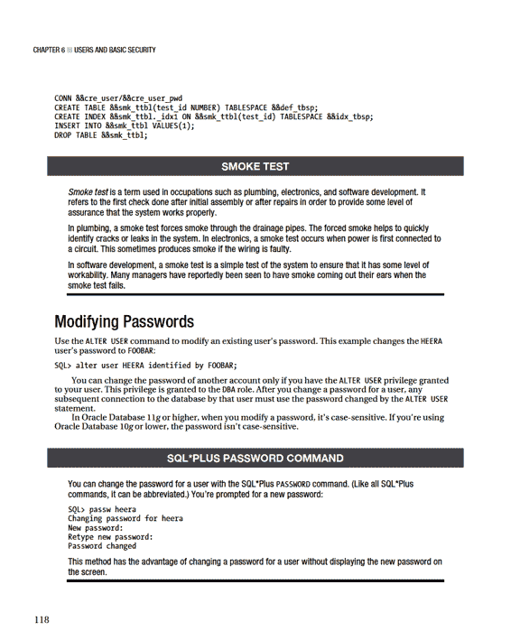
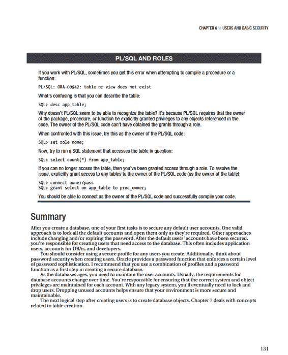
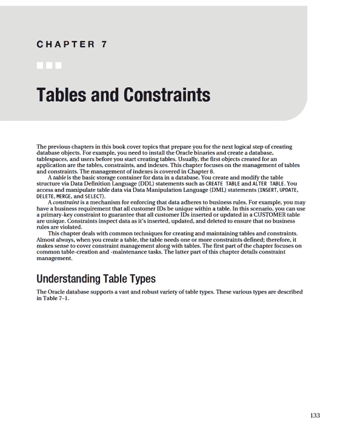
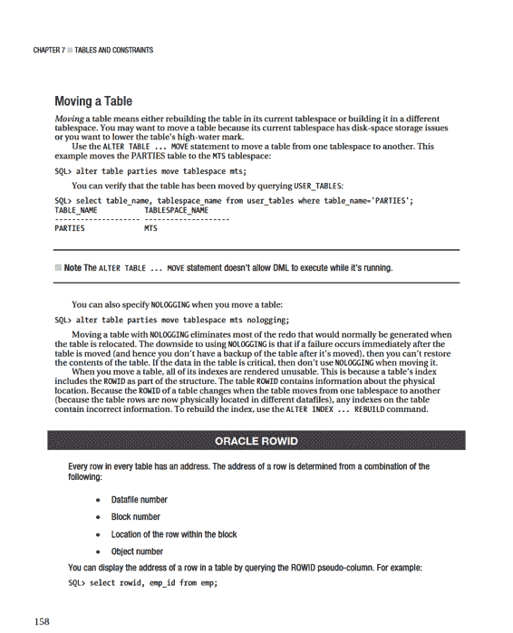
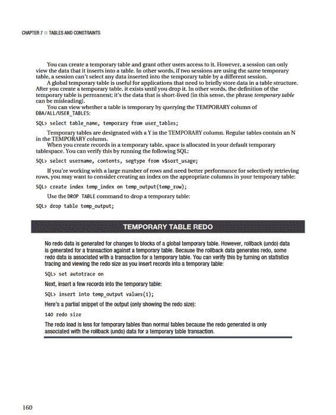
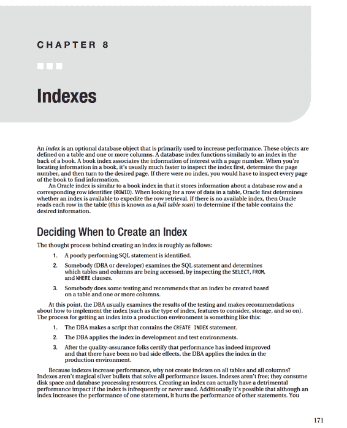

# 第 6 章 ■ 用户与基本安全

## 创建用户

创建用户时，需要考虑以下因素：

- 用户名
- 认证方式
- 基本权限
- 默认永久表空间
- 默认临时表空间

创建用户的这些方面将在接下来的小节中讨论。

### 选择用户名和认证方式

选择一个能让你了解该用户将用于哪个应用程序的用户名。例如，如果你有一个库存管理应用程序，一个合适的用户名是`INV_MGMT`。选择一个有意义的用户名有助于识别用户的用途。如果系统文档记录不充分，这会特别有帮助。

认证是用于确认用户是否有权使用该账户的方法。Oracle 支持三种类型的认证：

- 密码
- 外部服务，例如操作系统
- 通过企业目录服务（Oracle Internet Directory）的全局用户

最常见的用户认证方式是使用密码。外部认证方法允许你使用智能卡、Kerberos 或操作系统进行认证。本节展示了密码验证和外部认证的示例。有关外部和全局认证方法的更多信息，请参考*Oracle 数据库安全指南*和*Oracle 数据库高级安全管理员指南*（可从 http://otn.oracle.com 获取）。

当你以 DBA 身份创建用户时，你的账户必须具有`CREATE USER`系统权限。你使用`CREATE USER` SQL 语句来创建用户。此示例创建一个名为`HEERA`的用户，密码为`CHAYA`，并分配默认永久表空间`USERS`和默认临时表空间`TEMP`：

```sql
create user heera identified by chaya
default tablespace users
temporary tablespace temp;
```

这创建了一个没有任何权限执行数据库中任何操作的原始模式。要使该用户有用，你必须至少授予其`CREATE SESSION`系统权限：

```sql
SQL> grant create session to heera;
```

如果新模式需要能够创建表，则需要授予其额外的权限，如`CREATE TABLE`：

```sql
SQL> grant create table to heera;
```

新模式还必须在其需要创建对象的任何表空间上被授予配额权限：

```sql
第 6 章 ■ 用户与基本安全

SQL> alter user heera quota unlimited on users;
```

**注意：** 一种常见的技术是将预定义的角色`CONNECT`和`RESOURCE`授予新创建的模式。这些角色包含诸如`CREATE SESSION`和`CREATE TABLE`（以及其他几个，因版本而异）的系统权限。我不建议这样做，因为 Oracle 已声明这些角色在未来版本中可能不可用。

你也可以创建一个由外部服务（如操作系统）认证的用户。在这种情况下，你假设如果用户已通过操作系统登录认证，那么该级别的安全性也足以允许访问数据库。外部认证有一些有趣的优势：

- 访问服务器的用户不必维护数据库的密码。
- 登录数据库的脚本在由操作系统认证的用户执行时，不必使用硬编码的密码。
- 其他数据库用户无法通过猜测用户名和密码连接字符串来入侵外部标识的用户。登录外部认证用户的唯一方式是通过外部认证源（如操作系统）。
- DBA 不必为数据库用户维护密码。

当使用外部操作系统认证时，Oracle 会将`OS_AUTHENT_PREFIX`中包含的值作为前缀添加到连接到数据库的操作系统用户。此参数的默认值是`OPS$`。Oracle 强烈建议你将`OS_AUTHENT_PREFIX`参数设置为空字符串。例如：

```sql
SQL> alter system set os_authent_prefix='' scope=spfile;
```

你必须停止并启动数据库才能使此修改生效。设置好`OS_AUTHENT_PREFIX`变量后，你可以创建一个外部认证的用户。例如，假设你有一个名为`jsmith`的操作系统用户，并且你希望任何拥有此操作系统用户访问权限的人都能够无需提供密码即可登录数据库。使用`CREATE EXTERNALLY`语句来实现：

```sql
SQL> create user jsmith identified externally;
```

现在，当`jsmith`登录到数据库服务器时，该用户可以如下连接到 SQL*Plus：

```bash
$ sqlplus /
```

不需要用户名或密码，因为用户已经通过操作系统认证。

### 分配默认永久和临时表空间

维护数据库时，应验证默认和临时表空间设置，以确保它们符合你的数据库标准。你可以通过查询`DBA_USERS`视图来查看用户信息：

```sql
select
  username
  ,password
  ,default_tablespace
  ,temporary_tablespace
from dba_users;
```

以下是一些示例输出：

```
USERNAME       PASSWORD    DEFAULT_TABLESP TEMPORARY_TABLE
-------------- ----------- --------------- ---------------
JSMITH         EXTERNAL    USERS           TEMP
DBSNMP         SYSAUX      TEMP
ORACLE_OCM     USERS       TEMP
APPQOSSYS      SYSAUX      TEMP
APPUSR         USERS       TEMP
```

除了`SYS`用户之外，你的任何用户都不应将默认永久表空间设置为`SYSTEM`。

你不希望任何非`SYS`用户在`SYSTEM`表空间中创建对象。`SYSTEM`表空间应保留给`SYS`用户的对象。如果其他用户的对象存在于`SYSTEM`表空间中，你将面临填满该表空间并损害数据库可用性的风险。

你所有的用户都应被分配一个创建为临时类型的临时表空间。通常，该表空间命名为`TEMP`（详见第 4 章）。

你绝不希望任何用户的临时表空间是`SYSTEM`。如果用户的临时表空间是`SYSTEM`，那么他们需要临时磁盘存储的任何排序区域都会在`SYSTEM`表空间中获取区。这可能导致`SYSTEM`表空间被填满。你不希望`SYSTEM`表空间被填满，因为如果`SYS`模式无法在其对象增长时获取更多空间，这可能导致数据库无法正常运行。要检查哪些用户的临时表空间是`SYSTEM`，请运行此脚本：

```sql
SQL> select username from dba_users where temporary_tablespace='SYSTEM';
```

通常，在创建用户时，我使用一个名为`creuser.sql`的脚本。该脚本使用定义用户名、密码、默认表空间名称等的变量。对于执行脚本的每个环境（开发、测试、QA、Beta、生产），你可以根据需要为每个环境更改`&`变量。例如，你可以为每个不同的环境使用不同的密码。

以下是一个`creuser.sql`脚本示例：

```sql
DEFINE cre_user=inv_mgmt
DEFINE cre_user_pwd=inv_mgmt_pwd
DEFINE def_tbsp=inv_data
DEFINE idx_tbsp=inv_index
DEFINE smk_ttbl=zzzzzzz
--
CREATE USER &&cre_user IDENTIFIED BY &&cre_user_pwd
DEFAULT TABLESPACE &&def_tbsp;
--
GRANT CREATE SESSION TO &&cre_user;
GRANT CREATE TABLE TO &&cre_user;
--
ALTER USER &&cre_user QUOTA UNLIMITED ON &&def_tbsp;
ALTER USER &&cre_user QUOTA UNLIMITED ON &&idx_tbsp;
--
-- 冒烟测试
```



第 6 章 ■ 用户与基本安全

## 强制实施密码安全

关于强制实施密码安全，有几种不同的思路：

- 使用易于记住的密码，这样你就不必将其写下来或记录在某个文件中。由于密码不够复杂，它们不是很安全。
- 强制密码达到一定的复杂程度。这样的密码不易记住，因此必须记录在某个地方，这也不安全。

你可能选择强制执行一定程度的密码复杂性，因为你认为这是最安全的选择。或者，你可能被公司安全团队要求强制实施密码安全（因此别无选择）。本节的目的不是辩论前述哪种方法更可取。如果你选择强制密码具有一定程度的复杂性（强度），本节将描述如何强制执行这些规则。

你可以通过将密码验证函数分配给用户的配置文件来强制执行密码复杂性的最低标准。Oracle 提供了一个默认的密码验证函数，你可以通过以`SYS`模式运行以下脚本来创建它：

```sql
SQL> @?/rdbms/admin/utlpwdmg
Function created.
Profile altered.
Function created.
```

对于 Oracle Database 11g，将`DEFAULT`配置文件的`PASSWORD_VERIFY_FUNCTION`设置为`VERIFY_FUNCTION_11G`：

```sql
SQL> alter profile default limit PASSWORD_VERIFY_FUNCTION verify_function_11G;
```

对于 Oracle Database 10g，将`DEFAULT`配置文件的`PASSWORD_VERIFY_FUNCTION`设置为`VERIFY_FUNCTION`：

```sql
SQL> alter profile default limit PASSWORD_VERIFY_FUNCTION verify_function;
```

如果因任何原因需要撤销新的安全修改，请运行此语句以禁用密码函数：

```sql
SQL> alter profile default limit PASSWORD_VERIFY_FUNCTION null;
```

启用后，密码验证函数可确保用户正确创建或修改其密码。`utlpwdmg.sql`脚本创建一个函数来检查密码，以确保其满足基本安全标准，如最小密码长度、密码不能与用户名相同等。你可以通过尝试更改已分配`DEFAULT`配置文件的用户的密码来验证新的安全函数是否生效。此示例尝试将密码更改为小于最小长度：

```sql
SQL> password
Changing password for HEERA
Old password:
New password:
Retype new password:
ERROR:
ORA-28003: password verification for the specified password failed
ORA-20001: Password length less than 8
Password unchanged
```

第 6 章 ■ 用户与基本安全

**注意：** 对于 Oracle Database 11g，最小密码长度为 8 个字符。对于 Oracle Database 10g，最小长度为 4 个字符。

如前所述，从 Oracle Database 11g 开始，强制实施密码大小写敏感性。你可以通过将`SEC_CASE_SENSITIVE_LOGON`初始化参数设置为`FALSE`来禁用此功能：

```sql
SQL> alter system set sec_case_sensitive_logon = FALSE;
```

然而，不建议这样做。对于大多数安全要求，你应该使用区分大小写的密码。

另外请记住，可以修改用于创建密码验证函数的代码。例如，你可以打开并修改用于创建此函数的脚本：

```bash
$ vi $ORACLE_HOME/rdbms/admin/utlpwdmg.sql
```

如果你觉得 Oracle 提供的验证函数太强或限制过多，你可以创建自己的函数并将其分配给相应的数据库配置文件。

## 以其他用户身份登录

本节详细介绍如何在不知道用户明文密码的情况下以其他用户身份登录。你可能希望在以下几种情况下执行此操作：

- 你正在将一个用户从一个环境（如生产环境）复制到另一个环境（如测试环境），并且希望保留原始密码。
- 你需要在生产环境中工作，并且需要能够以拥有对象的用户身份连接，以执行`CREATE TABLE`语句、授予权限等。在生产环境中，由于维护程序不当，你可能不知道用户的密码。

你需要访问具有 DBA 权限的账户，才能在不知道密码的情况下以其他用户身份登录。以下是执行此操作的步骤：

1.  以 DBA 身份，临时存储用户的加密密码。
2.  更改用户的密码。
3.  使用新密码连接到用户，并运行数据定义语言（DDL）语句。
4.  以 DBA 身份连接，并将密码更改回原始密码。

在按照前述步骤更改用户密码之前，请务必小心。首先，在密码更改为临时设置期间，应用程序无法连接到数据库。

如果应用程序反复连接失败，当你超过用户配置文件的`FAILED_LOGIN_ATTEMPTS`限制（默认为锁定前 10 次失败尝试）时，可能会锁定该账户。

此外，如果你修改了`PASSWORD_REUSE_MAX`（密码可重用前的天数）和`PASSWORD_REUSE_TIME`（密码可重用前必须更改的次数）的值，那么你将无法将密码重置回其原始值。

第 6 章 ■ 用户与基本安全

下面列出了一个示例，展示如何临时更改用户密码，然后将密码设置回其原始值。首先，选择恢复用户密码到当前设置所需的语句。在此示例中，用户名是`APPUSR`：

```sql
select 'alter user appusr identified by values ' ||
'''' || password || '''' || ';'
from user$ where name='APPUSR';
```

此示例的输出如下：

```sql
SQL> alter user appusr identified by values 'A0493EBF86198724';
```

现在，将用户的密码修改为一个已知值（此示例中为`foo`）：

```sql
SQL> alter user appusr identified by foo;
```

连接到`APPUSR`用户：

```sql
SQL> conn appusr/foo
```

完成使用`APPUSR`用户后，将其密码更改回原始值：

```sql
SQL> alter user appusr identified by values 'A0493EBF86198724';
```

再次强调，执行此过程时要非常谨慎，因为你不想让自己陷入密码配置文件设置不允许你重置密码的境地：

```
ORA-28007: the password cannot be reused
```

如果你收到此错误，一个选项是将密码设置为一个全新的值。然而，这样做可能会对应用程序产生不良影响。如果开发人员已将密码硬编码到响应文件中，那么应用程序将无法登录，除非将硬编码的密码更改为新密码。

你的另一个选项是临时更改用户的配置文件以允许密码重用。

首先，检查用户的当前配置文件是什么：

```sql
SQL> select username, profile from dba_users where username = UPPER('&&username');
```

以下是一些示例输出：

```
USERNAME              PROFILE
------------------------------ ------------------------------
APPUSR                SECURE
```

现在，创建一个明确允许密码无任何限制重用的配置文件：

```sql
CREATE PROFILE temp_prof LIMIT
  PASSWORD_REUSE_MAX unlimited
  PASSWORD_REUSE_TIME unlimited;
```

接下来，为用户分配不限制密码重用的配置文件：

```sql
SQL> alter user appusr profile temp_prof;
```

你应该能够如前所述修改密码：

```sql
SQL> alter user appusr identified by values 'A0493EBF86198724';
```

如果成功，你将看到此消息：

```
User altered.
```

第 6 章 ■ 用户与基本安全

确保你将用户的配置文件设置回原始值：

```sql
SQL> alter user appusr profile secure;
```

最后，删除临时配置文件，以免将来意外使用：

```sql
SQL> drop profile temp_prof;
```

## 修改用户

有时出于以下类型的原因，你需要修改现有用户：

- 更改用户密码
- 锁定或解锁用户
- 更改默认永久和/或临时表空间
- 更改配置文件或角色
- 更改系统或对象权限
- 修改表空间配额

使用`ALTER USER`语句来修改用户。下面列出了几条修改用户的 SQL 语句。此示例使用`IDENTIFIED BY`子句更改用户密码：

```sql
SQL> alter user inv_mgmt identified by i2jy22a;
```

如果在最初创建用户时未设置默认永久表空间和临时表空间，你可以在创建后修改它们，如下所示：

```sql
SQL> alter user inv_mgmt default tablespace users temporary tablespace temp;
```

此示例锁定用户账户：

```sql
SQL> alter user inv_mgmt account lock;
```

此示例更改用户在`USERS`表空间上的配额：

```sql
SQL> alter user inv_mgmt quota 500m on users;
```

## 删除用户

在删除用户之前，我建议你先锁定该用户。锁定用户可以防止任何人连接到已锁定的数据库账户。这使你能够在删除账户之前更好地确定是否有人正在使用该账户。以下是锁定用户的示例：

```sql
SQL> alter user heera account lock;
```

现在，任何尝试连接到此用户的用户或应用程序都会收到以下错误：

```
ORA-28000: the account is locked
```

要查看数据库中的用户和锁定日期，请发出此查询：

```sql
SQL> select username, lock_date from dba_users;
```

第 6 章 ■ 用户与基本安全

要解锁账户，请发出此命令：

```sql
SQL> alter user heera account unlock;
```

锁定用户是一种非常方便的技术，可用于保护数据库安全并发现哪些用户是活动的。

请注意，锁定用户并不会锁定对其用户对象的访问。例如，如果`USER_A`对`USER_B`拥有的表具有 select、insert、update 和 delete 权限，即使你锁定了`USER_B`账户，`USER_A`仍然可以对`USER_B`拥有的对象发出数据操作语言（DML）语句。

要确定对象是否正在被使用，请参阅第 22 章的审计部分。

**提示：** 如果用户的对象没有占用过多的磁盘空间，那么在删除用户之前，快速备份一下是谨慎的做法。有关使用 Data Pump 备份单个用户的详细信息，请参见第 13 章。

在你确定用户及其对象不再需要后，使用`DROP USER`语句删除数据库账户。此示例删除用户`HEERA`：

```sql
SQL> drop user heera;
```

如果用户拥有任何数据库对象，上述命令将不起作用。使用`CASCADE`子句删除用户及其对象：

```sql
SQL> drop user heera cascade;
```

**注意：** 如果被删除的用户拥有大量数据库对象，`DROP USER`语句可能需要异常长的时间才能执行。在这种情况下，你可能需要考虑在删除用户之前先删除其对象。

删除用户时，其拥有的任何表也会被删除。此外，所有索引、触发器和引用完整性约束也会被删除。如果在其他模式中存在依赖于任何被删除的主键和唯一键约束的引用完整性约束，那么这些模式中的引用约束也会被删除。Oracle 会使依赖于被删除用户对象的视图、同义词、过程、函数和包失效，但不会删除它们。

## 强制实施密码安全和资源限制

创建用户时，有时要求密码遵守一组安全规则。例如，密码必须具有特定长度并包含数字字符。此外，当你设置数据库用户时，你可能希望确保某个用户无法消耗过多的 CPU 资源。

你可以使用数据库配置文件来满足这类要求。Oracle *配置文件*是一个数据库对象，有两个用途：

第 6 章 ■ 用户与基本安全

- 强制实施密码安全设置
- 限制用户消耗的系统资源

这些主题将在接下来的两个小节中讨论。

### 实施密码安全

创建用户时，如果未指定配置文件，则`DEFAULT`配置文件将分配给新创建的用户。要查看配置文件的当前设置，请发出以下 SQL：

```sql
SQL> select profile, resource_name, resource_type, limit from dba_profiles;
```

以下是输出的部分列表：

```
PROFILE    RESOURCE_NAME            RESOURCE_T LIMIT
---------- ------------------------- ---------- --------------------
DEFAULT    CONNECT_TIME             KERNEL     UNLIMITED
DEFAULT    PRIVATE_SGA              KERNEL     UNLIMITED
DEFAULT    FAILED_LOGIN_ATTEMPTS    PASSWORD   10
DEFAULT    PASSWORD_LIFE_TIME       PASSWORD   180
DEFAULT    PASSWORD_REUSE_TIME      PASSWORD   UNLIMITED
DEFAULT    PASSWORD_REUSE_MAX       PASSWORD   10
DEFAULT    PASSWORD_VERIFY_FUNCTION PASSWORD   NULL
```

配置文件的密码限制在配置文件分配给用户后立即生效。例如，从前面的输出中，如果你已将`DEFAULT`配置文件分配给用户，则该用户只允许连续 10 次登录尝试失败，之后用户账户将被 Oracle 自动锁定。有关密码配置文件安全设置的说明，请参见表 6–1。

**提示：** 有关 Oracle Database 11g `DEFAULT`配置文件更改的详细信息，请参阅 My Oracle Support 说明 454635.1。

你可以更改`DEFAULT`配置文件以使其适应你的环境。例如，假设你想强制执行密码可使用的最长期限。下一行代码将`DEFAULT`配置文件的`PASSWORD_LIFE_TIME`设置为 300 天：

```sql
SQL> alter profile default limit password_life_time 300;
```

第 6 章 ■ 用户与基本安全

***表 6–1.** 密码安全设置*

| **密码设置**                   | **描述**                                                                 | **11g 默认值** | **10g 默认值** |
| :----------------------------- | :----------------------------------------------------------------------- | :------------- | :------------- |
| `FAILED_LOGIN_ATTEMPTS`        | 模式被锁定前的失败登录尝试次数                                           | 10 次          | 10 次          |
| `PASSWORD_GRACE_TIME`          | 密码过期后，所有者可以使用旧密码登录的天数                               | 7 天           | 无限制         |
| `PASSWORD_LIFE_TIME`           | 密码有效的天数                                                           | 180 天         | 无限制         |
| `PASSWORD_LOCK_TIME`           | 达到`FAILED_LOGIN_ATTEMPTS`后账户被锁定的天数                            | 1 天           | 无限制         |
| `PASSWORD_REUSE_MAX`           | 密码可重用前的天数                                                       | 无限制         | 无限制         |
| `PASSWORD_REUSE_TIME`          | 密码可重用前必须更改的次数                                               | 无限制         | 无限制         |
| `PASSWORD_VERIFY_FUNCTION`     | 用于验证密码的数据库函数                                                 | Null           | Null           |

`PASSWORD_REUSE_TIME`和`PASSWORD_REUSE_MAX`设置必须结合使用。如果你为一个参数（哪个参数无关紧要）指定一个整数，而为另一个参数指定`UNLIMITED`，则当前密码永远无法重用。

如果你想指定`DEFAULT`配置文件密码必须在 100 天内更改 10 次才能重用，请使用类似于以下的代码行：

```sql
SQL> alter profile default limit password_reuse_time 100 password_reuse_max 10;
```

虽然使用`DEFAULT`配置文件对于许多环境来说已经足够，但你可能需要更严格的安全管理。我建议你创建自定义的安全配置文件，并根据需要将其分配给用户。例如，专门为应用程序用户创建一个配置文件：

```sql
CREATE PROFILE SECURE_APP LIMIT
  PASSWORD_LIFE_TIME 200
  PASSWORD_GRACE_TIME 10
  PASSWORD_REUSE_TIME 1
  PASSWORD_REUSE_MAX 1
  FAILED_LOGIN_ATTEMPTS 3
  PASSWORD_LOCK_TIME 1
  PASSWORD_VERIFY_FUNCTION verify_function_11G;
```

第 6 章 ■ 用户与基本安全

创建配置文件后，你可以根据需要将其分配给用户。以下 SQL 生成一个名为`alt_prof_dyn.sql`的 SQL 脚本，可用于将用户分配到新创建的配置文件：

```sql
set head off;
spo alt_prof_dyn.sql
select 'alter user ' || username || ' profile secure_app;'
from dba_users where username like '%APP%';
spo off;
```

将配置文件分配给使用数据库的应用程序账户时要小心。如果你想强制密码必须定期更改，请确保你理解这对生产系统的影响。密码往往会硬编码到响应文件和代码中。在这些环境中强制更改密码可能会带来灾难，因为你需要追踪所有引用密码的位置。如果你不想强制定期更改密码，可以将`PASSWORD_LIFE_TIME`设置为一个较大的值，例如 10000（天）。

### 限制数据库资源使用

如前所述，密码配置文件设置在你将配置文件分配给用户后立即生效。

与密码设置不同，内核资源配置文件限制在你将数据库的`RESOURCE_LIMIT`初始化参数设置为`TRUE`之前不会生效。例如：

```sql
SQL> alter system set resource_limit=true scope=both;
```

要查看`RESOURCE_LIMIT`参数的当前设置：

```sql
SQL> select name, value from v$parameter where name='resource_limit';
```

创建用户时，如果未指定配置文件，则`DEFAULT`配置文件将分配给用户。

你可以使用`ALTER PROFILE`语句修改`DEFAULT`配置文件。下一个示例修改`DEFAULT`配置文件以将`CPU_PER_SESSION`限制为 240000（以百分之一秒为单位）：

```sql
SQL> alter profile default limit cpu_per_session 240000;
```

这将任何使用`DEFAULT`配置文件的用户限制为 2400 秒的 CPU 使用时间。你可以在配置文件中设置各种限制。表 6–2 描述了你可以通过配置文件限制的数据库资源设置。

第 6 章 ■ 用户与基本安全

***表 6–2.** 数据库资源配置文件设置*

| **配置文件资源**                | **含义**                                                                                                                               |
| :------------------------------ | :------------------------------------------------------------------------------------------------------------------------------------- |
| `COMPOSITE_LIMIT`               | 基于加权和算法的限制，涉及以下资源：`CPU_PER_SESSION`、`CONNECT_TIME`、`LOGICAL_READS_PER_SESSION` 和 `PRIVATE_SGA`                    |
| `CONNECT_TIME`                  | 连接时间（分钟）                                                                                                                       |
| `CPU_PER_CALL`                  | 每次调用的 CPU 时间限制（以百分之一秒为单位）                                                                                             |
| `CPU_PER_SESSION`               | 每个会话的 CPU 时间限制（以百分之一秒为单位）                                                                                             |
| `IDLE_TIME`                     | 空闲时间（分钟）                                                                                                                       |
| `LOGICAL_READS_PER_CALL`        | 每次调用的逻辑读取块数                                                                                                                 |
| `LOGICAL_READS_PER_SESSION`     | 每个会话的逻辑读取块数                                                                                                                 |
| `PRIVATE_SGA`                   | 在共享池中消耗的空间量                                                                                                                 |
| `SESSIONS_PER_USER`             | 并发会话数                                                                                                                             |

你也可以通过`CREATE PROFILE`语句创建自定义配置文件，然后将其分配给用户。以下 SQL 语句创建一个限制资源（如单个会话可消耗的 CPU 量）的配置文件：

```sql
create profile user_profile_limit
limit
  sessions_per_user 20
  cpu_per_session 240000
  logical_reads_per_session 1000000
  connect_time 480
  idle_time 120;
```

创建配置文件后，你可以将其分配给用户。在下一个示例中，用户`HEERA`被分配了`USER_PROFILE_LIMIT`：

```sql
SQL> alter user heera profile user_profile_limit;
```

**注意：** Oracle 建议你使用数据库资源管理器来管理数据库资源限制。

然而，我发现通过 SQL 实现的数据库配置文件是一种有效且简单的资源限制机制。

作为`CREATE USER`语句的一部分，你可以指定一个非`DEFAULT`的配置文件：

```sql
SQL> create user heera identified by foo profile user_profile_limit;
```

127

第 6 章 ■ 用户与基本安全

何时应该使用数据库配置文件？你应该始终利用`DEFAULT`配置文件的密码安全设置。你可以根据业务规则的需要轻松修改此配置文件的默认设置。

配置文件的内核资源限制在当你有高级用户需要直接连接到数据库并运行查询时非常有用。例如，你可以使用内核资源设置来限制用户消耗的 CPU 时间量，这在用户编写了意外消耗过多数据库资源的糟糕查询时非常方便。

## 管理权限

数据库用户必须在数据库中执行任何任务之前被授予权限。在 Oracle 中，你通过将特定权限授予用户或将权限授予角色，然后将包含该权限的角色授予用户来分配权限。有两种类型的权限：系统权限和对象权限。以下各节详细讨论这些权限。

### 分配数据库系统权限

数据库系统权限允许你执行诸如连接到数据库以及创建和修改对象等任务。有数百种不同的系统权限。你可以通过查询`DBA_SYS_PRIVS`视图来查看系统权限：

```sql
SQL> select distinct privilege from dba_sys_privs;
```

你可以将权限授予其他用户或角色。为了能够授予权限，用户需要`GRANT ANY PRIVILEGE`权限，或者必须已被授予带有`ADMIN OPTION`的系统权限。

使用`GRANT`语句将系统权限分配给用户。例如，用户至少需要`CREATE SESSION`才能连接到数据库。你授予此系统权限的方式如下所示：

```sql
SQL> grant create session to inv_mgmt;
```

通常，用户需要做的不仅仅是连接到数据库。例如，用户可能需要创建表和其他类型的数据库对象。此示例授予用户`CREATE TABLE`和`CREATE DATABASE LINK`系统权限：

```sql
SQL> grant create table, create database link to inv_mgmt;
```

如果你需要收回权限，请使用`REVOKE`语句：

```sql
SQL> revoke create table from inv_mgmt;
```

Oracle 有一个功能，允许你在授予权限的同时，也授予该用户管理权限的能力。你可以使用`WITH ADMIN OPTION`子句来实现：

```sql
SQL> grant create table to inv_mgmt with admin option;
```

我在授予权限时很少使用`WITH ADMIN OPTION`。通常，具有`DBA`角色的用户用于授予权限，而该权限通常不会分配给数据库中的非 DBA 用户。这是因为很难跟踪谁分配了什么系统权限、出于什么原因以及何时分配的。在生产环境中，这是难以接受的。

你还可以将系统权限授予`PUBLIC`用户组（我不建议这样做）。例如，你可以将`CREATE SESSION`授予所有曾经需要连接到数据库的用户，如下所示：

```sql
SQL> grant create session to public;
```

第 6 章 ■ 用户与基本安全

现在，创建的每个用户都可以自动连接到数据库。将系统权限授予`PUBLIC`用户组几乎总是一个坏主意。作为 DBA，你的主要优先事项之一是确保数据库中的数据是安全的。将权限授予`PUBLIC`角色肯定会导致无法管理谁被授权在数据库中执行特定操作。

### 分配数据库对象权限

数据库对象权限允许你访问和操作其他用户的对象。你可以授予权限的数据库对象类型包括表、视图、物化视图、序列、包、函数、过程、用户定义类型和目录。为了能够授予对象权限，必须满足以下条件之一：

- 你拥有该对象。
- 你已被授予带有`GRANT OPTION`的对象权限。
- 你拥有`GRANT ANY OBJECT PRIVILEGE`系统权限。

此示例将对象权限（作为对象所有者）授予`INV_MGMT_APP`用户：

```sql
SQL> grant insert, update, delete, select on registrations to inv_mgmt_app;
```

`GRANT ALL`语句等同于授予对象的`INSERT`、`UPDATE`、`DELETE`和`SELECT`权限。

下一条语句等同于前一条语句：

```sql
SQL> grant all on registrations to inv_mgmt_app;
```

你还可以在列级别授予表的`INSERT`和`UPDATE`权限。下一个示例将`INSERT`权限授予`INVENTORY`表中的特定列：

```sql
SQL> grant insert (inv_id, inv_name, inv_desc) on inventory to inv_mgmt_app;
```

如果你希望被授予对象权限的用户能够随后将相同的对象权限授予其他用户，请使用`WITH GRANT OPTION`子句：

```sql
SQL> grant insert on registrations to grouping_app with grant option;
```

现在`GROUPING_APP`用户可以将`REGISTRATIONS`表上的插入权限授予其他用户。

我在授予对象权限时很少使用`WITH GRANT OPTION`。此选项允许其他用户将对象权限传播给其他用户。这使得很难跟踪谁分配了什么对象权限、出于什么原因、何时分配等等。在生产环境中，这是难以接受的。

在管理生产环境时，当问题出现时，你需要知道更改了什么、何时更改以及出于什么原因。

你还可以将对象权限授予`PUBLIC`用户组（我不建议这样做）。例如，你可以将表上的选择权限授予`PUBLIC`：

```sql
SQL> grant select on registrations to public;
```

现在每个用户都可以从`REGISTRATIONS`表中进行选择。将对象权限授予`PUBLIC`角色几乎总是一个坏主意。作为 DBA，你的主要优先事项之一是确保数据库中的数据是安全的。将对象权限授予`PUBLIC`角色肯定会导致无法管理谁可以访问数据库中的什么数据。

如果你需要收回对象权限，请使用`REVOKE`语句。此示例从`INV_MGMT_APP`用户收回 DML 权限：

```sql
SQL> revoke insert, update, delete, select on registrations from inv_mgmt_app;
```

129

第 6 章 ■ 用户与基本安全

## 分组和分配权限

*角色*是一个数据库对象，它允许你将系统和/或对象权限逻辑地分组在一起，以便你可以通过一次操作将这些权限分配给用户。角色有助于管理数据库安全性的各个方面，因为它们提供了一个分配了权限的中心对象。你可以随后将角色分配给多个用户或其他角色。

要创建角色，请以具有`CREATE ROLE`系统权限的用户身份连接到数据库。接下来，创建一个角色，并将你希望分组的系统或对象权限分配给它。此示例使用`CREATE ROLE`语句创建`JR_DBA`角色：

```sql
SQL> create role jr_dba;
```

接下来的几行 SQL 将系统权限授予新创建的角色：

```sql
SQL> grant select any table to jr_dba;
SQL> grant create any table to jr_dba;
SQL> grant create any view to jr_dba;
SQL> grant create synonym to jr_dba;
SQL> grant create database link to jr_dba;
```

接下来，将该角色授予你希望拥有这些权限的任何模式：

```sql
SQL> grant jr_dba to lellison;
SQL> grant jr_dba to mhurd;
```

用户`LELLISON`和`MHURD`现在可以执行创建同义词、视图等任务。

要查看分配给角色的用户，请查询`DBA_ROLE_PRIVS`视图：

```sql
SQL> select grantee, granted_role from dba_role_privs order by 1;
```

要查看授予当前连接用户的角色，请从`USER_ROLE_PRIVS`视图查询：

```sql
SQL> select * from user_role_privs;
```

要从角色中撤销权限，请使用`REVOKE`命令：

```sql
SQL> revoke create database link from jr_dba;
```

同样，使用`REVOKE`命令从用户中移除角色：

```sql
SQL> revoke jr_dba from lellison;
```

**注意：** 与其他数据库对象不同，角色没有所有者。角色由分配给它的权限定义。





第 7 章 ■ 表与约束

***表 7–1.** Oracle 表类型描述*

| **表类型**        | **描述**                                                                 | **典型用途**                                                                 |
| :---------------- | :----------------------------------------------------------------------- | :-------------------------------------------------------------------------- |
| 堆组织表          | 默认表类型，也是最常用的。                                               | 除非你有特定原因使用其他类型，否则使用此表类型。                            |
| 临时表            | 会话私有数据，在会话或事务期间存储。空间在临时段中分配。                 | 程序需要临时表结构来存储和排序数据。程序结束后不需要该表。                  |
| 索引组织表 (IOT)  | 数据存储在按主键排序的 B 树索引结构中。                                    | 主要查询主键列的表。提供快速的随机访问。                                    |
| 分区表            | 由独立物理段组成的逻辑表。                                               | 与包含数百万行的大表一起使用。                                              |
| 簇表              | 一组共享相同数据块的表。                                                 | 用于减少经常在同一列上连接的表的 I/O。                                       |
| 外部表            | 使用存储在数据库外部操作系统文件中的数据的表。                           | 让你高效地访问数据库外部文件（如 CSV 文件）中的数据。                         |
| 嵌套表            | 包含数据类型为另一张表的列的表。                                         | 很少使用。                                                                  |
| 对象表            | 包含数据类型为对象类型的列的表。                                         | 很少使用。                                                                  |

本章重点介绍最常用的表类型，特别是堆组织表、索引组织表和临时表。分区表在数据仓库环境中广泛使用，将在第 12 章单独介绍。有关本章未涵盖的表类型的详细信息，请参阅《Oracle SQL 参考指南》，可从 http://otn.oracle.com 下载。

表功能的数量随着 Oracle 的每个新版本而增加。想想看：《Oracle SQL 参考指南》中与`CREATE TABLE`语句相关的语法就有近 80 页。除此之外，`ALTER TABLE`语句又占用了 80 多页与表维护相关的细节。在大多数情况下，你通常只需要使用可用表选项的一小部分。

第 7 章 ■ 表与约束

## 创建表

创建表时，应考虑以下一般因素：

- 表类型（堆组织、临时、索引组织、分区等）
- 命名约定
- 列数据类型和大小
- 约束（主键、外键等）
- 索引要求（详见第 8 章）
- 初始存储要求
- 特殊功能，如虚拟列、只读、并行、压缩、无日志等
- 增长要求
- 表及其索引的表空间

在运行`CREATE TABLE`语句之前，你需要仔细考虑上述列表中的每一项。为此，DBA 通常使用数据建模工具来帮助管理用于创建数据库对象的 DDL 脚本的创建。数据建模工具允许你直观地定义表、关系以及底层数据库特性。

### 创建堆组织表

你使用`CREATE TABLE`语句来创建表。创建表时，至少必须指定表名、列名以及与列关联的数据类型。Oracle 默认的表类型是堆组织表。术语*堆*意味着数据不是以特定顺序存储在表中（相反，它是一个数据堆）。这是一个创建具有四列的堆组织表的简单示例：

```sql
create table d_sources(
  d_source_id number not null,
  source_type varchar2(32),
  create_dtt date default sysdate not null,
  update_dtt timestamp(5)
);
```

如果你不指定表空间，则表将在创建该表的用户的默认永久表空间中创建。允许表在默认永久表空间中创建对于一些小型测试表来说是可以的。对于更复杂的情况，你应该显式指定希望创建表的表空间。

通常，创建表时，还应指定约束，例如主键。以下代码显示了创建表时使用的最常见功能。此 DDL 定义了主键、外键、表空间信息和注释：

```sql
create table operating_systems(
  operating_system_id number(19, 0) not null,
  version varchar2(50),
  os_name varchar2(256),
  release varchar2(50),
  vendor varchar2(50),
  create_dtt date default sysdate not null,
  update_dtt date,
  constraint operating_systems_pk primary key (operating_system_id)
    using index tablespace inv_mgmt_index
) tablespace inv_mgmt_data;
--

create unique index operating_system_uk1 on operating_systems
  (os_name, version, release, vendor)
  tablespace inv_mgmt_index;
--

create table computer_systems(
  computer_system_id number(38, 0) not null,
  agent_uuid varchar2(256),
  operating_system_id number(19, 0) not null,
  hardware_model varchar2(50),
  create_dtt date default sysdate not null,
  update_dtt date,
  constraint computer_systems_pk primary key (computer_system_id)
    using index tablespace inv_mgmt_index
) tablespace inv_mgmt_data;
--

comment on column computer_systems.computer_system_id is
  '通过 Oracle 序列生成的代理键。';
--

create unique index computer_system_uk1 on computer_systems(agent_uuid) tablespace inv_mgmt_index;
--

alter table computer_systems add constraint computer_systems_fk1
  foreign key (operating_system_id)
  references operating_systems(operating_system_id);
```

创建表时，我通常不指定表级物理空间属性。如果不指定表级空间属性，则表将从其创建的表空间继承空间属性。这简化了管理和维护。如果你的表需要不同的物理空间属性，则可以创建单独的表空间来容纳具有不同需求的表。例如，你可以创建一个区大小为 16MB 的`DATA_LARGE`表空间和一个区大小为 128KB 的`DATA_SMALL`表空间，并根据其存储需求选择表的创建位置。有关创建表空间的详细信息，请参见第 4 章。

表 7–2 列出了创建表时需要考虑的一些指导原则。这些不是硬性规定；请根据你的环境需要调整它们。其中一些指导原则可能看起来是显而易见的建议。然而，在继承了许多数据库多年之后，我见过每一种建议都以某种方式被违反，这使得数据库维护变得困难和笨重。

第 7 章 ■ 表与约束

***表 7–2.** 创建表时应考虑的准则*

| **建议**                                                                                                                             | **理由**                                                                                                                                 |
| :----------------------------------------------------------------------------------------------------------------------------------- | :--------------------------------------------------------------------------------------------------------------------------------------- |
| 命名表、列、约束、触发器、索引等时使用标准。                                                                                         | 有助于记录应用程序并简化维护。                                                                                                           |
| 如果列始终包含数字数据，则将其定义为数字数据类型。                                                                                   | 强制执行业务规则，并在使用 Oracle SQL 数学函数时提供最大的灵活性、性能和一致的结果（对于“01”字符与数字 1 的行为可能不同）。                     |
| 如果业务规则定义了数字字段的长度和精度，则强制执行它：例如`NUMBER(7,2)`。如果没有业务规则，则将其定义为`NUMBER(38)`。                 | 强制执行业务规则并保持数据干净。                                                                                                         |
| 对于可变长度的字符数据，使用`VARCHAR2`（而不是`VARCHAR`）。                                                                           | 遵循 Oracle 的建议，对字符数据使用`VARCHAR2`（而不是`VARCHAR`）。Oracle 文档指出，在未来，`VARCHAR`将被重新定义为单独的数据类型。         |
| 如果业务规则指定了列的最大长度，则使用该长度，而不是将所有列定义为`VARCHAR2(4000)`。                                                 | 强制执行业务规则并保持数据干净。                                                                                                         |
| 适当使用`DATE`和`TIMESTAMP`数据类型。                                                                                                | 强制执行业务规则，确保数据具有适当的格式，并在使用 SQL 日期函数时提供最大的灵活性。                                                         |
| 为表和索引指定单独的表空间。让表和索引从表空间继承存储属性。                                                                           | 简化管理和维护。                                                                                                                         |
| 大多数表应创建主键。                                                                                                                 | 强制执行业务规则，并允许你唯一标识每一行。                                                                                               |
| 为每个表创建一个数字代理键作为主键。使用序列填充代理键。                                                                               | 使连接更容易且更高效。                                                                                                                   |
| 在表定义之外创建主键约束。                                                                                                           | 在创建主键时提供更大的灵活性，尤其是在主键由多个列组成的情况下。                                                                         |

第 7 章 ■ 表与约束

| **建议**                                                                                                                             | **理由**                                                                                                                                 |
| :----------------------------------------------------------------------------------------------------------------------------------- | :--------------------------------------------------------------------------------------------------------------------------------------- |
| 为逻辑用户创建唯一键：使行唯一的一组可识别列的组合。                                                                                 | 强制执行业务规则并保持数据干净。                                                                                                         |
| 为表和列创建注释。                                                                                                                   | 有助于记录应用程序并简化维护。                                                                                                           |
| 如果可能，避免使用大对象（LOB）数据类型。                                                                                            | 防止与 LOB 列相关的维护问题，例如意外增长、复制时的性能问题等。                                                                            |
| 如果列应始终具有值，则使用`NOT NULL`约束强制执行。                                                                                    | 强制执行业务规则并保持数据干净。                                                                                                         |
| 创建审计类型的列，如`CREATE_DTT`和`UPDATE_DTT`，这些列使用默认值和/或触发器自动填充。                                                | 有助于维护和确定数据何时插入和/或更新。还应考虑其他类型的审计列，例如插入和更新行的用户。                                                |
| 在适当的地方使用检查约束。                                                                                                           | 强制执行业务规则并保持数据干净。                                                                                                         |
| 在适当的地方定义外键。                                                                                                               | 强制执行业务规则并保持数据干净。                                                                                                         |

### 实现虚拟列

从 Oracle Database 11g 开始，你可以在表定义中创建*虚拟列*。虚拟列基于同一表中的一个或多个现有列和/或常量、SQL 函数以及用户定义的 PL/SQL 函数的组合。虚拟列不存储在磁盘上；它们在 SQL 查询运行时执行时进行评估。虚拟列可以被索引，并且可以存储统计信息。

在 Oracle Database 11g 之前，你可以通过`SELECT`语句或在视图定义中模拟虚拟列。例如，以下 SQL `SELECT`语句在查询执行时生成一个虚拟值：

```sql
select inv_id, inv_count,
  case when inv_count <= 100 then 'GETTING LOW'
       when inv_count > 100 then 'OKAY'
  end
from inv;
```

为什么要使用虚拟列？这样做有以下优势：

- 你可以在虚拟列上创建索引。在内部，Oracle 会创建一个基于函数的索引。
- 你可以在虚拟列中存储可供成本基优化器（CBO）使用的统计信息。
- 虚拟列可以在`WHERE`子句中引用。
- 虚拟列在数据库中永久定义。这样的列有一个中央定义。

以下是一个创建包含虚拟列的表的示例：

```sql
create table inv(
  inv_id number
  ,inv_count number
  ,inv_status generated always as (
      case when inv_count <= 100 then 'GETTING LOW'
           when inv_count > 100 then 'OKAY'
      end)
);
```

在前面的代码清单中，指定`GENERATED ALWAYS`是可选的。例如，以下清单等同于前一个：

```sql
create table inv(
  inv_id number
  ,inv_count number
  ,inv_status as (
      case when inv_count <= 100 then 'GETTING LOW'
           when inv_count > 100 then 'OKAY'
      end)
);
```

我更喜欢添加`GENERATED ALWAYS`，因为它在我脑海中强化了该列始终是虚拟的这一概念。

`GENERATED ALWAYS`有助于内联记录你所做的事情。这有助于其他 DBA 在你之后很久进行维护。

要查看虚拟列生成的值，首先向表中插入一些数据：

```sql
SQL> insert into inv (inv_id, inv_count) values (1,100);
```

接下来，从表中选择以查看生成的值：

```sql
SQL> select * from inv;
```

以下是一些示例输出：

```
INV_ID INV_COUNT INV_STATUS
---------- ---------- -----------
1        100      GETTING LOW
```

**注意：** 如果你向表中插入数据，`GENERATED ALWAYS AS`列中不会存储任何内容。虚拟值在你从表中选择时生成。

你也可以修改表以包含虚拟列：

```sql
alter table inv add(
  inv_comm generated always as(inv_count * 0.1) virtual
);
```

第 7 章 ■ 表与约束

并且可以更改现有虚拟列的定义：

```sql
alter table inv modify inv_status generated always as(
  case when inv_count <= 50 then 'NEED MORE'
       when inv_count >50 and inv_count <=200 then 'GETTING LOW'
       when inv_count > 200 then 'OKAY'
  end);
```

你可以在 SQL 查询（DML 或 DDL）中访问虚拟列。例如，假设你想根据虚拟列中的值更新永久列：

```sql
SQL> update inv set inv_count=100 where inv_status='OKAY';
```

虚拟列本身不能通过`UPDATE`语句的`SET`子句进行更新。但是，你可以在`UPDATE`或`DELETE`语句的`WHERE`子句中引用虚拟列。

你可以选择指定虚拟列的数据类型。如果省略数据类型，Oracle 会根据用于定义虚拟列的表达式推导数据类型。

虚拟列有几个注意事项：

- 你只能在常规堆组织表上定义虚拟列。不能在索引组织表、外部表、临时表、对象表或簇表上定义虚拟列。
- 虚拟列不能引用其他虚拟列。
- 虚拟列只能引用定义该虚拟列的表中的列。
- 虚拟列的输出必须是标量值（单个值，而不是一组值）。

要查看虚拟列的定义，请使用`DBMS_METADATA`包查看与表关联的 DDL。如果你在 SQL*Plus 中进行选择，需要将`LONG`变量设置为足够大的值以显示所有返回的数据：

```sql
SQL> set long 10000;
SQL> select dbms_metadata.get_ddl('TABLE','INV') from dual;
```

以下是输出的片段：

```
CREATE TABLE "INV_MGMT"."INV"
(  "INV_ID" NUMBER,
  "INV_COUNT" NUMBER,
  "INV_STATUS" VARCHAR2(11) GENERATED ALWAYS AS (CASE WHEN "INV_COUNT"<=50 THEN
'NEED MORE' WHEN ("INV_COUNT">50 AND "INV_COUNT"<=200) THEN 'GETTING LOW' WHEN "
INV_COUNT">200 THEN 'OKAY' END) VIRTUAL VISIBLE ...
```

### 制作只读表

从 Oracle Database 11g 开始，你可以将单个表置于只读模式。这样做可以防止任何`INSERT`、`UPDATE`或`DELETE`语句在表上运行。在 Oracle Database 11g 之前的版本中，使表只读的唯一方法是将整个数据库置于只读模式或将表空间置于只读模式（使表空间中的所有表变为只读）。

第 7 章 ■ 表与约束

在表级别需要只读功能有几个原因：

- 表中的数据是历史数据，在正常情况下不应更新。
- 你正在对表进行一些维护，并希望确保在更新过程中它不会更改。
- 你想要删除该表，但在删除之前，你想将其置于只读模式，以更好地确定是否有任何用户正在尝试更新该表。

使用`ALTER TABLE`语句将表置于只读模式：

```sql
SQL> alter table inv read only;
```

你可以通过发出以下查询来验证只读表的状态：

```sql
SQL> select table_name, read_only from user_tables where read_only='YES';
```

要将只读表修改为读写，请发出以下 SQL：

```sql
SQL> alter table inv read write;
```

**注意：** 只读表功能要求数据库初始化`COMPATIBLE`参数设置为 11.1.0 或更高。

### 理解延迟段创建

从 Oracle Database 11g Release 2 开始，当你创建表时，关联段的创建会延迟到第一行插入表中。此功能有一些有趣的影响。例如，如果你有数千个最初为应用程序创建的对象（例如首次安装时），那么在数据插入应用程序表之前，任何表（或关联索引）都不会消耗空间。这意味着初始 DDL 在创建表时运行得更快，但第一个`INSERT`语句运行得稍慢。

为了说明延迟段的概念，首先创建一个表：

```sql
SQL> create table inv(inv_id number, inv_desc varchar2(30));
```

你可以通过检查`USER_TABLES`来验证表是否已创建：

```sql
select
  table_name
  ,segment_created
from user_tables
where table_name='INV';
```

以下是一些示例输出：

```
TABLE_NAME                     SEG
------------------------------ ---
INV                            NO
```

接下来，查询`USER_SEGMENTS`以验证尚未为此表分配段：

```sql
select
  segment_name
  ,segment_type
  ,bytes
from user_segments
where segment_name='INV'
and segment_type='TABLE';
```

此示例的相应输出为：

```
no rows selected
```

现在，向表中插入一行：

```sql
SQL> insert into inv values(1,'BOOK');
```

重新运行查询，从`USER_SEGMENTS`中选择，并注意已创建了一个段：

```
SEGMENT_NAME                   SEGMENT_TYPE       BYTES
------------------------------ ------------------ ----------
INV                            TABLE              65536
```

如果你习惯使用旧版本的 Oracle，延迟段创建功能可能会导致混淆。例如，如果你有查询`DBA_SEGMENTS`或`DBA_EXTENTS`的空间相关监控报告，请注意，在将第一行插入表之前，这些视图不会填充表或与表关联的任何索引的信息。

**注意：** 你可以通过将数据库初始化参数`DEFERRED_SEGMENT_CREATION`设置为`FALSE`来禁用延迟段创建功能。此参数的默认值为`TRUE`。

### 允许并行 SQL 执行

如果你处理大表，可以考虑将表创建为`PARALLEL`。这指示 Oracle 为后续的任何`INSERT`、`UPDATE`、`DELETE`、`MERGE`和查询语句设置并行度。此示例创建了一个并行度为 2 的表：

```sql
create table inv_apr_10
parallel 2
as select * from inv
where create_dtt >= '01-apr-10' and create_dtt < '01-may-10';
```

你可以指定`PARALLEL`、`NOPARALLEL`或`PARALLEL N`。如果未指定`N`，Oracle 会根据`PARALLEL_THREADS_PER_CPU`初始化参数设置并行度。

第 7 章 ■ 表与约束

**提示：** 请记住，`PARALLEL_THREADS_PER_CPU`在开发环境与生产环境之间可能有很大差异。你的开发机器可能只有 2 个 CPU，而生产服务器可能有 32 个 CPU。因此，如果不指定并行度，并行操作的行为会因环境而异。

### 压缩表数据

Oracle 的表压缩功能已经存在相当长一段时间。在 Oracle Database 11g 之前，可用的压缩仅适用于数据仓库环境，主要是因为表级压缩是 CPU 密集型的，并且会降低 DML 语句的性能。这种类型的压缩通常不适用于联机事务处理（OLTP）环境。

**注意：** OLTP 表压缩是 Oracle 高级压缩选项的一项功能。Oracle 高级压缩选项需要从 Oracle 获得额外许可。

从 Oracle Database 11g 开始，你可以这样做：

```sql
create table inv(
  inv_id number
  ,inv_name varchar2(64)
) compress for oltp;
```

`COMPRESS FOR OLTP`子句为所有 DML 操作启用压缩（在早期版本的 Oracle 中，压缩功能仅限于直接路径`INSERT`操作）。OLTP 压缩不会在数据插入和更新表时立即压缩数据。相反，当块达到某个内部定义的阈值时，压缩以批处理模式发生。当达到阈值时，所有未压缩的行会同时被压缩。发生压缩的阈值由内部算法确定。

**注意：** Oracle 还具有混合列压缩功能，可在 Oracle Exadata 产品中使用。有关更多详细信息，请参阅 Oracle 的技术网站（http://otn.oracle.com）。

第 7 章 ■ 表与约束

你可以通过以下`SELECT`语句验证表的压缩情况：

```sql
select
  table_name
  ,compression
  ,compress_for
from user_tables where table_name='INV';
```

以下是一些示例输出：

```
TABLE_NAME                     COMPRESS COMPRESS_FOR
------------------------------ -------- ------------
INV                            ENABLED  OLTP
```

### 避免重做日志生成

创建表时，你可以选择指定`NOLOGGING`子句。`NOLOGGING`功能可以大大减少某些类型操作的重做日志生成量。有时，当你处理大量数据时，为了性能原因，在初始创建表并向表中插入数据时减少重做日志生成是可取的。

消除重做日志生成的缺点是，如果在数据加载后（并且在你可以备份表之前）发生故障，你无法通过`NOLOGGING`恢复创建的数据。如果你能容忍一些数据丢失的风险，那么使用`NOLOGGING`，但在数据加载后备份该表。如果你的数据很关键，那么不要使用`NOLOGGING`。如果你的数据可以轻松重新创建，那么在尝试提高大数据加载的性能时，`NOLOGGING`是可取的。

一种看法是`NOLOGGING`会为表的所有 DML 操作消除重做日志生成。这是不正确的。`NOLOGGING`功能从不影响常规 DML 语句（常规的`INSERT`、`UPDATE`和`DELETE`）的重做日志生成。

`NOLOGGING`功能可以显著减少以下类型操作的重做日志生成：

- SQL*Loader 直接路径加载
- 直接路径`INSERT /*+ append */`
- `CREATE TABLE AS SELECT`
- `ALTER TABLE MOVE`
- 创建或重建索引

使用`NOLOGGING`时需要注意一些怪癖（特性）。如果你的数据库处于`FORCE LOGGING`模式，则无论你是否指定`NOLOGGING`，都会为所有操作生成重做日志。

加载表时，如果表定义了引用外键约束，则无论是否指定`NOLOGGING`，都会生成重做日志。

你可以在以下级别之一指定`NOLOGGING`：

- 语句级：`CREATE TABLE`或`ALTER TABLE`
- `CREATE TABLESPACE`或`ALTER TABLESPACE`

我更喜欢在语句或表级指定`NOLOGGING`子句。在这些情况下，执行该语句或 DDL 的 DBA 可以清楚地看到使用了`NOLOGGING`。如果你在表空间级别指定`NOLOGGING`，那么在该表空间内创建对象的每个 DBA 都必须知道此表空间级别的设置。

在拥有多个 DBA 的团队中，一个 DBA 很容易不知道另一个 DBA 创建了带有`NOLOGGING`的表空间。

此示例首先使用`NOLOGGING`选项创建表：

```sql
create table inv(inv_id number)
tablespace users
nologging;
```

接下来，通过从包含历史数据的表中进行选择来进行直接路径插入：

```sql
SQL> insert /*+ append */ into inv select inv_id from inv_mar_2010;
SQL> commit;
```

如果在将表填充到`NOLOGGING`模式后（并且在你备份该表之前）发生介质故障，会发生什么情况？在恢复和恢复操作之后，看起来表已被恢复：

```sql
SQL> desc inv
Name Null? Type
----------------------------------------- -------- ----------------------------
INV_ID NUMBER
```

但是，尝试执行扫描表中每个块的查询：

```sql
SQL> select * from inv;
```

会抛出一个错误，指出数据文件中存在逻辑损坏：

```
ORA-01578: ORACLE data block corrupted (file # 4, block # 11057)
ORA-01110: data file 4: '/ora02/dbfile/O11R2/users01.dbf'
ORA-26040: Data block was loaded using the NOLOGGING option
```

如果在语句级别指定日志记录子句，它会覆盖任何表或表空间设置。如果在表级别指定日志记录子句，它将为任何未指定日志记录子句的语句设置默认模式，并覆盖表空间的日志记录设置。如果在表空间级别指定日志记录子句，它将为任何未指定日志记录子句的`CREATE TABLE`语句设置默认日志记录。

你可以如下验证数据库的日志记录模式：

```sql
SQL> select name, log_mode, force_logging from v$database;
```

下一条语句验证表空间的日志记录模式：

```sql
SQL> select tablespace_name, logging from dba_tablespaces;
```

此示例验证表的日志记录模式：

```sql
SQL> select owner, table_name, logging from dba_tables where logging = 'NO';
```

如何判断 Oracle 是否为操作记录了重做日志？一种方法是在启用日志记录与在`NOLOGGING`模式下操作时，测量操作生成的重做日志量。如果你有一个可以进行测试的开发环境，你可以在操作进行时监控重做日志切换的频率。另一个简单的测试是计时操作在启用和未启用日志记录时所需的时间。在`NOLOGGING`模式下执行的操作应该更快（因为生成的重做日志量最少）。

第 7 章 ■ 表与约束

### 根据查询创建表

有时根据现有表的定义创建表很方便。例如，假设你希望在修改表结构或数据之前快速备份表。使用`CREATE TABLE AS SELECT`语句（通常称为 CTAS）来实现这一点。例如：

```sql
create table cwp_user_profile_101910
as select * from cwp_user_profile;
```

前面的语句创建了一个包含数据的相同表。如果你不希望包含数据，只希望复制表的结构，那么提供一个始终评估为 false 的`WHERE`子句（在此示例中，1 永远不等于 2）：

```sql
create table cwp_user_profile_test
as select * from cwp_user_profile
where 1=2;
```

你还可以指定在创建 CTAS 表时不记录重做日志。对于大型数据集，这可以减少创建表所需的时间：

```sql
create table cwp_user_profile_101910
nologging
as select * from cwp_user_profile;
```

请注意，使用带有`NOLOGGING`子句的 CTAS 技术会将表创建为`NOLOGGING`，并且不会生成恢复由`SELECT`语句结果填充数据所需的重做日志。此外，如果表空间被定义为`NOLOGGING`（CTAS 表将在其中创建），则不会生成重做日志。在这些情况下，如果你无法在发生故障后备份表，则无法恢复表。如果你的数据很关键，那么不要使用`NOLOGGING`子句。

你还可以指定并行度和存储参数。根据 CPU 数量，你可能会看到一些性能提升：

```sql
create table cwp_user_profile_101910
nologging
tablespace staging_data
parallel 2
as select * from cwp_user_profile_tab;
```

**注意：** CTAS 技术不会创建任何索引或触发器。如果你需要原始表的这些对象，则必须单独创建索引和触发器。

## 修改表

修改表是一项常见任务。新需求通常意味着你需要重命名、添加、删除或更改列数据类型。在开发环境中，更改表通常是一项微不足道的任务：你通常没有大量数据或数百个用户同时访问表。

但是，对于活跃的生产系统，你需要了解尝试更改当前正在被访问和/或已经填充数据的表所带来的影响。

第 7 章 ■ 表与约束

### 获取所需的锁

修改表时，必须具有对该表的排他锁。一个问题是，如果一个 DML 事务对该表持有锁，你将无法更改表。在这种情况下，你会收到此错误：

```
ORA-00054: resource busy and acquire with NOWAIT specified or timeout expired
```

前面的错误消息有点令人困惑，因为它让你认为可以通过使用`NOWAIT`获取锁来解决该问题。然而，这是一个通用消息，当你发出的 DDL 无法获取表的排他锁时生成。在这种情况下，你有几个选择：

- 发出 DDL 命令并收到`ORA-00054`错误后，快速反复按`/`（正斜杠）键，希望在事务之间修改表。
- 关闭数据库并以受限模式启动，修改表，然后打开数据库以供正常使用。
- 在 Oracle Database 11g 及更高版本中，设置`DDL_LOCK_TIMEOUT`参数。

前面列表中的最后一项指示 Oracle 重复尝试运行 DDL 语句，直到它获取表上所需的锁。你可以在系统或会话级别设置`DDL_LOCK_TIMEOUT`参数。下一个示例指示 Oracle 重试获取锁 100 秒：

```sql
SQL> alter session set ddl_lock_timeout=100;
```

系统级`DDL_LOCK_TIMEOUT`初始化参数的默认值为 0。如果你想修改系统中每个会话的默认行为，请发出`ALTER SYSTEM SET`语句。以下命令为系统设置默认超时值为 10 秒：

```sql
SQL> alter system set ddl_lock_timeout=10 scope=both;
```

### 重命名表

重命名表有几个原因：

- 使表符合标准
- 在删除表之前更好地确定表是否正在被使用

此示例将表从`INV_MGMT`重命名为`INV_MGMT_OLD`：

```sql
SQL> rename inv_mgmt to inv_mgmt_old;
```

如果成功，你应该看到此消息：

```
Table renamed.
```

### 添加列

使用`ALTER TABLE ... ADD`语句向表添加列。此示例向`INV`表添加一列：

```sql
SQL> alter table inv add(inv_count number);
```

如果成功，你应该看到此消息：

第 7 章 ■ 表与约束

```
Table altered.
```

### 更改列

有时，你需要更改列以调整其大小或更改其数据类型。使用`ALTER TABLE ... MODIFY`语句调整列的大小。此示例将列的大小更改为 256 个字符：

```sql
SQL> alter table inv modify inv_desc varchar2(256);
```

如果要减小列的大小，请首先确保不存在大于减小后的大小值的值：

```sql
SQL> select max(length(<column_name>)) from <table_name>;
```

当你将列更改为`NOT NULL`时，则每列必须具有有效值。首先，验证没有`NULL`值：

```sql
SQL> select <column_name> from <table_name> where <column_name> is null;
```

如果任何行在你修改为`NOT NULL`的列中具有`NULL`值，则必须首先更新该列以包含值。以下是将列修改为`NOT NULL`的示例：

```sql
SQL> alter table inv modify(inv_desc not null);
```

你也可以将列更改为具有默认值。当向表中插入记录但未为列提供值时，将使用默认值：

```sql
SQL> alter table inv modify(inv_desc default 'No Desc');
```

如果要删除列的默认值，则将其设置为`NULL`：

```sql
SQL> alter table inv modify(inv_desc default NULL);
```

有时你需要更改表的数据类型：例如，原本错误地定义为`VARCHAR2`的列需要更改为`NUMBER`。在更改列的数据类型之前，首先验证现有列的所有值是否仅包含有效的数字值。以下是一个简单的 PL/SQL 脚本来执行此操作：

```sql
create or replace function isnum(v_in varchar2)
return varchar is
  val_err exception;
  pragma exception_init(val_err, -6502); -- 字符到数字转换错误
  scrub_num number;
begin
  scrub_num := to_number(v_in);
  return 'Y';
exception
  when val_err then
    return 'N';
end;
/
```

你可以使用`ISNUM`函数检测列中的数据是否为数字。该函数为`ORA-06502`字符到数字转换错误定义了一个 PL/SQL pragma 异常。当遇到此错误时，异常处理程序捕获它并返回`N`。如果传递给`ISNUM`函数的值是数字，则返回`Y`。如果该值无法转换为数字，则返回`N`。定义函数后，你可以如下运行它：

148

第 7 章 ■ 表与约束

```sql
SQL> select hold_col from stage where isnum(hold_col)='N';
```

同样，当你将字符列修改为`DATE`或`TIMESTAMP`数据类型时，首先检查数据是否可以成功转换是谨慎的做法。以下是一个执行此操作的函数：

```sql
create or replace function isdate(p_in varchar2, f_in varchar2)
return varchar is
  scrub_dt date;
begin
  scrub_dt := to_date(p_in, f_in);
  return 'Y';
exception
  when others then
    return 'N';
end;
/
```

调用`ISDATE`函数时，需要传递一个有效的日期格式掩码：

```sql
SQL> select hold_col from stage where isdate(hold_col,'YYYYMMDD')='N';
```

### 重命名列

重命名列有几个原因：

- 有时需求发生变化，你希望修改列名以更好地反映该列的用途。
- 如果你计划删除列，首先重命名该列以更好地确定是否有任何用户或应用程序正在访问该列，这并无害处。

使用`ALTER TABLE ... RENAME`语句重命名列：

```sql
SQL> alter table inv rename column inv_count to inv_amt;
```

### 删除列

表有时最终会包含从未使用过的列。这可能是因为最初的需求发生变化或不准确。如果你的表包含未使用的列，你应该考虑删除它。如果在表中保留未使用的列，你可能会遇到未来的 DBA 不知道该列用途的问题，并且该列可能会不必要地消耗空间。

在删除列之前，我建议你首先重命名它。这样做让你有机会发现是否有任何用户或应用程序正在使用该列。在你确信该列未被使用后，首先使用 Data Pump 导出备份表，然后删除该列。

前面的策略为你提供了如果删除列后又意识到需要它时的选择。

要删除列，请使用`ALTER TABLE ... DROP`语句：

```sql
SQL> alter table inv drop (inv_name);
```

请注意，如果从中删除列的表包含大量数据，`DROP`操作可能需要一些时间。这种时间延迟可能导致在表被修改期间事务被延迟（因为`ALTER TABLE`语句会锁定表）。在类似情况下，你可能希望首先将列标记为未使用，然后在维护窗口期间再删除它：

第 7 章 ■ 表与约束

```sql
SQL> alter table inv set unused (inv_name);
```

将列标记为未使用后，它不再出现在表描述中。`SET UNUSED`子句不会产生与删除列相关的开销。此技术使你可以快速停止 SQL 查询或应用程序看到或使用该列。任何尝试访问未使用列的查询都会收到以下错误：

```
ORA-00904: ... invalid identifier
```

你可以在为应用程序安排一些停机时间后删除任何未使用的列。

使用`DROP UNUSED`子句删除任何标记为`UNUSED`的列。

```sql
SQL> alter table inv drop unused columns;
```

### 显示表 DDL

有时 DBA 在记录创建或修改表时使用的 DDL 方面做得不好。通常，你应该在源代码控制存储库或某种建模工具中维护数据库 DDL 代码。如果你的商店没有 DDL 源代码，那么有几种方法可以手动重现 DDL：

- 查询数据字典
- 使用`exp`和`imp`实用程序
- 使用 Data Pump
- 使用`DBMS_METADATA`包

在早期版本中，例如版本 7 及更早版本，DBA 通常编写查询数据字典的 SQL，以尝试提取重新创建对象所需的 DDL。尽管这种方法比没有好，但它通常容易出错，因为 SQL 没有考虑每个对象创建特性。

`exp`和`imp`实用程序对于生成 DDL 很有用。基本思想是导出有问题的对象，然后使用带有`SCRIPT`或`SHOW`选项的`imp`实用程序来显示 DDL。这是一个好方法，但你通常必须手动编辑`imp`实用程序的输出以生成所需的 DDL。

Data Pump 实用程序是生成用于创建数据库对象的 DDL 的绝佳方法。使用 Data Pump 生成 DDL 在第 13 章中有详细介绍。

`DBMS_METADATA`包的`GET_DDL`函数通常是显示创建对象所需 DDL 的最快方法。此示例显示如何生成名为`INV`的表的 DDL：

```sql
SQL> set long 10000
SQL> select dbms_metadata.get_ddl('TABLE','INV') from dual;
```

以下是一些示例输出：

```
DBMS_METADATA.GET_DDL('TABLE','INV')
--------------------------------------------------------------------------------
CREATE TABLE "DARL"."INV"
(  "INV_ID" NUMBER,
  "INV_DESC" VARCHAR2(30),
  "INV_COUNT" NUMBER
) SEGMENT CREATION DEFERRED
  PCTFREE 10 PCTUSED 40 INITRANS 1 MAXTRANS 255 NOCOMPRESS LOGGING
  TABLESPACE "USERS"
```

以下 SQL 语句显示模式中所有表的 DDL：

```sql
select
  dbms_metadata.get_ddl('TABLE',table_name)
from user_tables;
```

如果你想显示另一个用户拥有的表的 DDL，请向`GET_DDL`过程添加`SCHEMA`参数。

```sql
select
  dbms_metadata.get_ddl(object_type=>'TABLE', name=>'INVENTORY', schema=>'INV_APP') from dual;
```

**注意：** 你可以显示几乎所有数据库对象类型的 DDL，例如`INDEX`、`FUNCTION`、`ROLE`、`PACKAGE`、`MATERIALIZED VIEW`、`PROFILE`、`CONSTRAINT`、`SEQUENCE`、`SYNONYM`等。

## 删除表

如果要从用户中删除对象（例如表），请使用`DROP TABLE`语句。此示例删除名为`INVENTORY`的表：

```sql
SQL> drop table inventory;
```

你应该看到以下确认信息：

```
Table dropped.
```

如果你尝试删除在子表中被引用为主键或唯一键的父表，你会看到如下错误

```
ORA-02449: unique/primary keys in table referenced by foreign keys
```

你需要删除引用的外键约束，或者在删除父表时使用`CASCADE CONSTRAINTS`选项：

```sql
SQL> drop table inventory cascade constraints;
```

你必须是表的所有者或具有`DROP ANY TABLE`系统权限才能删除表。如果你具有`DROP ANY TABLE`权限，则可以通过在表名前加上模式名来删除不同模式中的表：

```sql
SQL> drop table inv_mgmt.inventory;
```

如果你不在表名前加上用户名，Oracle 会假定你正在删除当前用户中的表。

**提示：** 如果你使用的是 Oracle Database 10g 或更高版本，请记住可以取消删除意外删除的表。

第 7 章 ■ 表与约束

### 取消删除表

假设你意外删除了一个表，并且想要恢复它。首先，验证要恢复的表是否在回收站中：

```sql
SQL> show recyclebin;
```

以下是一些示例输出：

```
ORIGINAL NAME    RECYCLEBIN NAME                OBJECT TYPE  DROP TIME
---------------- ------------------------------ ------------ -------------------
PURCHASES        BIN$YzqK0hN3Fh/gQHdAPLFgMA==$0 TABLE       2009-02-18:17:23:15
```

接下来，使用`FLASHBACK TABLE...TO BEFORE DROP`语句恢复已删除的表：

```sql
SQL> flashback table purchases to before drop;
```

**注意：** 你不能对在`SYSTEM`表空间中创建的表执行`FLASHBACK TABLE...TO BEFORE DROP`。

在 Oracle Database 10g 及更高版本中，当你发出`DROP TABLE`语句时，表会被重命名为（以`BIN$`开头的名称）并放入回收站。回收站是一种机制，允许你查看与已删除对象关联的一些元数据。你可以通过查询`DBA_SEGMENTS`查看有关重命名对象的完整元数据：

```sql
select
  owner
  ,segment_name
  ,segment_type
  ,tablespace_name
from dba_segments
where segment_name like 'BIN$%';
```

以下是一些示例输出：

```
OWNER      SEGMENT_NAME                   SEGMENT_TYPE       TABLESPACE_NAME
---------- ------------------------------ ------------------ ---------------
INV        BIN$kptXkzzMdFrgQAB/AQBsFw==$0 TABLE              USERS
INV        BIN$kptXkzzNdFrgQAB/AQBsFw==$0 TABLE              USERS
```

`FLASHBACK TABLE`语句只是将表重命名回其原始名称。默认情况下，`RECYCLEBIN`功能在 Oracle Database 10g 及更高版本中启用。你可以通过将`RECYCLEBIN`初始化参数设置为`OFF`来更改默认值。

我建议你不要禁用`RECYCLEBIN`功能。最好保持此功能启用，并清除`RECYCLEBIN`以删除你希望永久删除的对象。这意味着与已删除表关联的空间在清除`RECYCLEBIN`之前不会被释放。如果你想清除当前连接用户的回收站的全部内容，请使用`PURGE RECYCLEBIN`语句：

```sql
SQL> purge recyclebin;
```

如果你想清除数据库中所有用户的回收站，请以具有 DBA 权限的用户身份执行以下操作：

```sql
SQL> purge dba_recyclebin;
```

第 7 章 ■ 表与约束

如果你想绕过`RECYCLEBIN`功能并永久删除表，请使用`DROP TABLE`语句的`PURGE`选项：

```sql
SQL> drop table dept purge;
```

你无法使用`FLASHBACK TABLE`语句检索使用`PURGE`选项删除的表。表使用的所有空间都会被释放，任何关联的索引和触发器也会被删除。

### 从表中删除数据

你可以使用`DELETE`语句或`TRUNCATE`语句从表中删除记录。你需要意识到这两种方法之间的一些重要区别。表 7–3 总结了`DELETE`和`TRUNCATE`语句的属性。

***表 7–3.** `DELETE`和`TRUNCATE`的特性*

| **特性**                             | **DELETE** | **TRUNCATE** |
| :----------------------------------- | :--------- | :----------- |
| 选择`COMMIT`或`ROLLBACK`             | 是         | 否           |
| 生成撤销（undo）                     | 是         | 否           |
| 将高水位线重置为零                   | 否         | 是           |
| 受引用和启用的外键约束影响           | 否         | 是           |
| 处理大量数据时的性能表现             | 差         | 优           |

#### 使用`DELETE`

一个很大的区别是`DELETE`语句可以提交（commit）或回滚（rollback）。提交`DELETE`语句会使更改永久化：

```sql
SQL> delete from inv;
SQL> commit;
```

如果你发出`ROLLBACK`语句而不是`COMMIT`，则表包含发出`DELETE`之前的数据。

#### 使用`TRUNCATE`

`TRUNCATE`是一条 DDL 语句。这意味着 Oracle 在它运行后自动提交该语句（和当前事务），因此无法回滚`TRUNCATE`语句。如果你需要在删除数据时选择回滚（而不是提交）的选项，则应使用`DELETE`语句。然而，`DELETE`语句的缺点是它会生成大量的撤销（undo）和重做（redo）信息。因此对于大表来说，`TRUNCATE`语句通常是删除数据最有效的方式。

第 7 章 ■ 表与约束

此示例使用`TRUNCATE`语句从`COMPUTER_SYSTEMS`表中删除所有数据：

```sql
SQL> truncate table computer_systems;
```

默认情况下，Oracle 会释放表使用的所有空间，除了由`MINEXTENTS`表存储参数定义的空间。如果你不希望`TRUNCATE`语句释放区，请使用`REUSE STORAGE`参数：

```sql
SQL> truncate table computer_systems reuse storage;
```

`TRUNCATE`语句将表的高水位线重置为零。当你使用`DELETE`语句从表中删除数据时，高水位线不会改变。使用`TRUNCATE`语句并重置高水位线的一个优点是，全表扫描只搜索高水位线以下的块中的行。这可能对性能产生重大影响。

你无法截断一个定义了主键且被子表中启用的外键约束引用的表——即使子表包含零行。Oracle 阻止你这样做，因为在多用户系统中，存在另一种会话可能在你截断子表之后、截断父表之前向子表填充行的可能性。在这种情况下，你必须暂时禁用引用的外键约束，发出`TRUNCATE`语句，然后重新启用约束。

由于`TRUNCATE`语句是 DDL，你不能将两个独立的表的截断作为一个事务处理。

将此`TRUNCATE`行为与`DELETE`进行比较。Oracle 确实允许你使用`DELETE`语句从父表中删除行，同时约束保持启用状态以引用子表。这是因为`DELETE`生成撤销（undo），是读一致的，并且可以回滚。

**注意：** 从表中删除数据的另一种方法是删除并重新创建表。然而，这意味着你还必须重新创建属于该表的任何索引、约束、授权和触发器。此外，当你删除表时，在重新创建它和重新发出任何所需的授权之前，它暂时不可用。通常，删除并重新创建表仅在开发或测试环境中可以接受。

### 查看和调整高水位线

Oracle 将表的高水位线定义为段中已使用空间和未使用空间之间的边界。创建表时，Oracle 会向表分配一定数量的区，该数量由`MINEXTENTS`表存储参数定义。每个区包含一定数量的块。在数据插入表之前，没有块被使用，高水位线为零。

随着数据插入到表中，随着区的分配，高水位线边界会升高。`DELETE`语句不会重置高水位线。

关于高水位线，你需要意识到几个与性能相关的问题：

- SQL 查询全表扫描
- 直接路径加载空间使用

Oracle 在执行查询时有时需要扫描表（在高水位线以下）的每个块。这被称为*全表扫描*。如果从表中删除了大量数据，即使是对于零行的表，全表扫描也可能需要很长时间才能完成。

第 7 章 ■ 表与约束

此外，在进行直接路径加载时，Oracle 会在高水位线之上插入数据。潜在地，你最终可能会在经常删除并通过直接路径机制加载的表中出现大量未使用的空间。

你可以使用几种方法来检测高水位线以下的空间：

- Autotrace 工具
- `DBMS_SPACE`包

Autotrace 工具提供了一种检测高水位线问题的简单方法。Autotrace 的优势在于它易于使用且输出易于解释。

你可以使用`DBMS_SPACE`包来确定在使用自动空间段管理的表空间中创建的对象的高水位线。`DBMS_SPACE`允许你以编程方式检查高水位线问题。这种方法的缺点是输出有些晦涩，有时难以得出具体的答案。

#### 跟踪检测高水位线以下的空间

你可以运行这个简单的测试来检测高水位线以下未使用的空间是否存在问题：

1.  `SQL> set autotrace trace statistics`
2.  运行执行全表扫描的查询。
3.  比较处理的行数与逻辑 I/O（内存和磁盘访问）次数。

如果处理的行数少但逻辑 I/O 次数高，则高水位线以下可能存在空闲块问题。以下是一个说明此技术的简单示例：

```sql
SQL> set autotrace trace statistics
```

下一个查询在`INV`表上生成全表扫描：

```sql
SQL> select * from inv;
```

以下是 AUTOTRACE 输出的片段：

```
no rows selected

Statistics
----------------------------------------------------------
       1405  consistent gets
          0  physical reads
```

返回的行数为零，但一致性读（内存访问）为 1405。这表明高水位线下有空闲空间。

接下来，截断该表并再次运行查询：

```sql
SQL> truncate table inv;
SQL> select * from inv;
```

以下是 AUTOTRACE 输出的片段：

```
no rows selected

Statistics
----------------------------------------------------------
          3  consistent gets
          0  physical reads
```

注意，内存访问次数已减少到 3。

#### 使用`DBMS_SPACE`检测高水位线以下的空间

你可以使用`DBMS_SPACE`包来检测高水位线以下的空闲块。以下是一个可以从 SQL*Plus 调用的匿名 PL/SQL 块：

```sql
set serverout on size 1000000
declare
  p_fs1_bytes number;
  p_fs2_bytes number;
  p_fs3_bytes number;
  p_fs4_bytes number;
  p_fs1_blocks number;
  p_fs2_blocks number;
  p_fs3_blocks number;
  p_fs4_blocks number;
  p_full_bytes number;
  p_full_blocks number;
  p_unformatted_bytes number;
  p_unformatted_blocks number;
begin
  dbms_space.space_usage(
    segment_owner => user,
    segment_name => 'INV',
    segment_type => 'TABLE',
    fs1_bytes => p_fs1_bytes,
    fs1_blocks => p_fs1_blocks,
    fs2_bytes => p_fs2_bytes,
    fs2_blocks => p_fs2_blocks,
    fs3_bytes => p_fs3_bytes,
    fs3_blocks => p_fs3_blocks,
    fs4_bytes => p_fs4_bytes,
    fs4_blocks => p_fs4_blocks,
    full_bytes => p_full_bytes,
    full_blocks => p_full_blocks,
    unformatted_blocks => p_unformatted_blocks,
    unformatted_bytes => p_unformatted_bytes
  );
  dbms_output.put_line('FS1: blocks = '||p_fs1_blocks);
  dbms_output.put_line('FS2: blocks = '||p_fs2_blocks);
  dbms_output.put_line('FS3: blocks = '||p_fs3_blocks);
  dbms_output.put_line('FS4: blocks = '||p_fs4_blocks);
  dbms_output.put_line('Full blocks = '||p_full_blocks);
end;
/
```

第 7 章 ■ 表与约束

在这种情况下，你要检查`INV`表高水位线以下的空闲空间。以下是前面 PL/SQL 的输出：

```
FS1: blocks = 0
FS2: blocks = 0
FS3: blocks = 0
FS4: blocks = 1394
Full blocks = 0
```

在之前的输出中，`FS1`参数显示有 0 个块具有 0%到 25%的空闲空间。`FS2`参数显示有 0 个块具有 25%到 50%的空闲空间。`FS3`参数显示有 0 个块具有 50%到 75%的空闲空间。`FS4`参数显示有 1394 个块具有 75%到 100%的空闲空间。

最后，有 0 个满块。因为没有满块，并且大量块几乎是空的，这表明高水位线以下存在空闲空间。

如何降低表的高水位线？你可以使用几种技术将高水位线重置回零：

- 使用`TRUNCATE`语句
- 使用`ALTER TABLE ... SHRINK SPACE`
- 使用`ALTER TABLE ... MOVE`

本章前面讨论了使用`TRUNCATE`语句。缩小表和移动表将在以下小节中讨论。

### 缩小表

要重新调整高水位线，你必须为表启用行移动，然后使用`ALTER TABLE...SHRINK SPACE`语句。创建表的表空间必须构建时启用了自动段空间管理。你可以通过以下查询确定表空间空间段管理类型：

```sql
SQL> select tablespace_name, segment_space_management from dba_tablespaces;
```

创建表的表空间的`SEGMENT_SPACE_MANAGEMENT`值必须为`AUTO`。

接下来，你需要为要缩小的表启用行移动。此示例为`INV`表启用行移动：

```sql
SQL> alter table inv enable row movement;
```

现在你可以缩小表使用的空间：

```sql
SQL> alter table inv shrink space;
```

你也可以通过`CASCADE`子句缩小与任何索引段相关的空间：

```sql
SQL> alter table inv shrink space cascade;
```

如果由于某些原因，你不希望在缩小表时移动高水位线，请使用`COMPACT`子句：

```sql
SQL> alter table inv shrink space compact;
```



第 7 章 ■ 表与约束

以下是一些示例输出：

```
ROWID              EMP_ID
------------------ ----------
AAAFWXAAFAAAAlWAAA 1
```

`ROWID`伪列值并不物理存储在数据库中。当你查询它时，Oracle 会计算其值。`ROWID`内容显示为可以包含字符 A–Z、a–z、0–9、+和/的 base 64 值。你可以通过`DMBS_ROWID`包将`ROWID`值转换为有意义的信息。例如，要显示存储行的相对文件号，请发出此语句：

```sql
SQL> select dbms_rowid.rowid_relative_fno(rowid), emp_id from emp;
```

以下是一些示例输出：

```
DBMS_ROWID.ROWID_RELATIVE_FNO(ROWID) EMP_ID
------------------------------------ ----------
5                                    1
```

你可以在 SQL 语句的`SELECT`和`WHERE`子句中使用`ROWID`值。在大多数情况下，`ROWID`唯一标识一行。但是，不同表中的行可能存储在同一簇中，因此包含具有相同`ROWID`的行。

## 创建临时表

使用`CREATE GLOBAL TEMPORARY TABLE`语句创建仅临时存储数据的表。你可以指定临时表是在会话期间还是在事务提交前保留数据。使用`ON COMMIT PRESERVE ROWS`指定数据在用户会话结束时删除。在此示例中，行将被保留，直到用户显式删除数据或终止会话：

```sql
create global temporary table today_regs
on commit preserve rows
as select * from f_registrations
where create_dtt > sysdate - 1;
```

指定`ON COMMIT DELETE ROWS`表示数据应在事务结束时删除。以下示例创建一个名为`TEMP_OUTPUT`的临时表，并指定记录应在每个提交的事务结束时删除：

```sql
create global temporary table temp_output(
  temp_row varchar2(30))
on commit delete rows;
```

**注意：** 如果你没有为全局临时表指定提交方法，则默认为`ON COMMIT DELETE ROWS`。



第 7 章 ■ 表与约束

## 创建索引组织表

当表数据通常通过查询主键访问时，索引组织表（IOT）是高效的对象。使用`ORGANIZATION INDEX`子句创建 IOT：

```sql
create table prod_sku
(prod_sku_id number,
 sku varchar2(256),
 create_dtt timestamp(5),
 constraint prod_sku_pk primary key(prod_sku_id)
)
organization index
including sku
pctthreshold 30
tablespace inv_mgmt_data
overflow
tablespace mts;
```

IOT 将表行的整个内容存储在 B 树索引结构中。IOT 为在主键上具有精确匹配和/或范围搜索的查询提供快速访问。

`INCLUDING`子句中指定的列（包括该列）之前的所有列都与`PROD_SKU_ID`主键列存储在同一个块中。换句话说，`INCLUDING`子句指定保留在表段中的最后一列。`INCLUDING`子句中指定列之后的列存储在溢出数据段中。在前面的示例中，`CREATE_DTT`列存储在溢出段中。

`PCTTHRESHOLD`指定为 IOT 行保留在索引块中的空间百分比。该值可以是 1 到 50，如果未指定值，则默认为 50。索引块中必须有足够空间来存储主键。

`OVERFLOW`子句详细说明了应使用哪个表空间来存储溢出数据段。

注意，`DBA/ALL/USER_TABLES`包含创建 IOT 时使用的表名的条目。此外，`DBA/ALL/USER_INDEXES`包含指定主键约束名称的记录。对于 IOT，`INDEX_TYPE`列包含`IOT - TOP`值：

```sql
SQL> select index_name,table_name,index_type from user_indexes;
```

## 管理约束

本章接下来的几节将讨论约束。约束提供了一种确保数据符合某些业务规则的机制。你必须了解可用的约束类型以及何时适合使用它们。Oracle 提供了几种类型的约束：

- 主键
- 唯一键
- 外键
- 检查
- `NOT NULL`

实现和管理这些约束将在接下来的几个小节中讨论。

第 7 章 ■ 表与约束

### 创建主键约束

实现数据库时，你创建的大多数表都需要主键约束，以保证表中的每条记录都可以唯一标识。有多种技术可以向表添加主键约束。第一个示例在列定义中内联创建主键：

```sql
create table dept(
  dept_id number primary key
  ,dept_desc varchar2(30));
```

如果你从`USER_CONSTRAINTS`中选择`CONSTRAINT_NAME`，注意 Oracle 为约束生成了一个晦涩的名称（如`SYS_C003682`）。使用以下语法显式为主键约束命名：

```sql
create table dept(
  dept_id number constraint dept_pk primary key using index tablespace users,
  dept_desc varchar2(30));
```

**注意：** 创建主键约束时，Oracle 还会创建一个与该约束同名的唯一索引。

你也可以在定义列之后指定主键约束定义。这样做的好处是可以在多个列上定义约束。下一个示例在创建表时创建主键，但不在列定义中内联：

```sql
create table dept(
  dept_id number,
  dept_desc varchar2(30),
  constraint dept_pk primary key (dept_id)
    using index tablespace prod_index);
```

如果表已创建，并且你想添加主键约束，请使用`ALTER TABLE`语句。此示例在`DEPT`表的`DEPT_ID`列上放置主键约束：

```sql
alter table dept
add constraint dept_pk primary key (dept_id)
using index tablespace users;
```

启用主键约束时，Oracle 会自动创建一个与主键约束关联的唯一索引。一些 DBA 更喜欢首先在主键列上创建一个非唯一索引，然后定义主键约束：

```sql
SQL> create index dept_pk on dept(dept_id);
SQL> alter table dept add constraint dept_pk primary key (dept_id);
```

这种方法的好处是，你可以独立于索引删除或禁用主键约束。当你处理大型数据集时，你可能需要那种灵活性。如果你在创建主键约束之前没有创建索引，那么每当你删除或禁用主键约束时，索引会自动被删除。

第 7 章 ■ 表与约束

对使用哪种方法创建主键感到困惑？所有方法都有效且有其优点。表 7–4 总结了主键和唯一键约束创建方法。我使用过所有这些方法来创建主键约束。通常，我使用`ALTER TABLE`语句在表创建后添加约束。

***表 7–4.** 主键和唯一键约束创建方法*

| **约束创建方法**                      | **优点**                                                                 | **缺点**                                                                                              |
| :------------------------------------ | :----------------------------------------------------------------------- | :---------------------------------------------------------------------------------------------------- |
| 内联，无名称                          | 非常简单                                                                 | Oracle 生成的名称使故障排除更困难；对存储属性的控制较少；仅应用于单列                                  |
| 内联，有名称                          | 简单；用户定义的名称使故障排除更容易                                     | 比内联无名称需要更多思考                                                                              |
| 内联，有名称和表空间定义              | 用户定义的名称和表空间；使故障排除更容易                                 | 较不简单                                                                                              |
| 在列定义之后（外联）                  | 用户定义的名称和表空间；可以在多个列上操作                               | 较不简单                                                                                              |
| `ALTER TABLE` 仅添加约束              | 允许你将约束与表创建脚本分开管理（和文件）；可以在多个列上操作           | 更复杂                                                                                                |
| `CREATE INDEX`, `ALTER TABLE` 添加约束 | 将索引和约束分开，因此可以在不影响索引的情况下删除/禁用约束；可以在多个列上操作 | 最复杂，需要维护的内容更多，需要移动的部分更多                                                        |

### 强制唯一键值

除了创建主键约束外，你还应该在任何应始终在表中唯一的列组合上创建唯一约束。例如，对于表的主键，通常使用通过序列填充的数字键（有时称为*代理键*）。除了代理主键之外，有时用户有业务用于唯一标识记录的列（也称为*逻辑键*）。同时使用代理键和逻辑键

- 允许你在单个数字列上高效地连接父表和子表
- 允许更新逻辑键列而无需更改代理键

唯一键保证表中定义列的唯一性。主键约束和唯一键约束之间存在一些细微差别。例如，每个表只能定义一个主键，但可以有多个唯一键。此外，主键不允许其任何列中出现`NULL`值，而唯一键允许`NULL`值。

163

第 7 章 ■ 表与约束

与主键约束一样，你可以使用多种方法来创建唯一列约束。此方法在列中内联使用`UNIQUE`关键字：

```sql
create table dept(
  dept_id number
  ,dept_desc varchar2(30) unique);
```

如果要显式命名约束，请使用`CONSTRAINT`关键字：

```sql
create table dept(
  dept_id number
  ,dept_desc varchar2(30) constraint dept_desc_uk1 unique);
```

与主键一样，Oracle 会自动创建一个与唯一键约束关联的索引。你可以在内联指定用于关联唯一索引的表空间信息：

```sql
create table dept(
  dept_id number
  ,dept_desc varchar2(30) constraint dept_desc_uk1
    unique using index tablespace prod_index);
```

你也可以修改表以包含唯一约束：

```sql
SQL> alter table dept add constraint dept_desc_uk1 unique (dept_desc);
```

并且你可以在定义唯一键约束之前，在感兴趣的列上创建索引：

```sql
SQL> create index dept_desc_uk1 on dept(dept_desc);
SQL> alter table dept add constraint dept_desc_uk1 unique(dept_desc);
```

这在处理大型数据集并且希望能够在不删除关联索引的情况下禁用或删除唯一约束时很有帮助。

**注意：** 有关各种唯一键和主键约束创建方法的优缺点描述，请参见表 7–4。

### 创建外键约束

外键约束用于确保列值包含在定义的值列表中。使用外键约束是强制数据在允许插入或更新之前必须是预定义值的有效方法。此技术适用于以下情况：

- 值列表包含许多条目。
- 需要存储有关查找值的其他信息。
- 通过 SQL 可以轻松选择、插入、更新或删除值。

例如，假设`EMP`表是使用`DEPT_ID`列创建的。为确保每个员工都被分配到一个有效的部门，你可以创建一个外键约束，强制执行`EMP`表中的每个`DEPT_ID`必须存在于`DEPT`表中的规则。

第 7 章 ■ 表与约束

**提示：** 如果要检查的条件是一个不经常更改的小列表，请考虑使用检查约束而不是外键约束。例如，如果有一个列将始终定义为包含 0 或 1，则检查约束是一个高效的解决方案。

你可以使用几种方法来创建外键约束。以下示例在`EMP`表的`DEPT_ID`列上创建外键约束：

```sql
create table emp(
  emp_id number,
  name varchar2(30),
  dept_id constraint emp_dept_fk references dept(dept_id));
```

注意，`DEPT_ID`数据类型没有显式定义。它从引用的`DEPT`表的`DEPT_ID`列派生数据类型。你也可以在定义列时显式指定数据类型（无论是否定义外键）：

```sql
create table emp(
  emp_id number,
  name varchar2(30),
  dept_id number constraint emp_dept_fk references dept(dept_id));
```

你也可以在`CREATE TABLE`语句中的列定义之外指定外键定义：

```sql
create table emp(
  emp_id number,
  name varchar2(30),
  dept_id number,
  constraint emp_dept_fk foreign key (dept_id) references dept(dept_id)
);
```

你还可以修改现有表以添加外键约束：

```sql
alter table emp
add constraint emp_dept_fk foreign key (dept_id)
references dept(dept_id);
```

**注意：** 与主键和唯一键约束不同，Oracle 不会自动为外键列添加索引。你必须显式在外键列上创建索引。

### 检查特定数据条件

检查约束在你有一个相当静态的短值列表时（例如，一个列可以是`Y`或`N`）非常有效。在这种情况下，值列表很可能不会更改，并且除了`Y`或`N`之外不需要存储其他信息，因此检查约束是合适的解决方案。

如果你有一个需要定期更新的长值列表，那么表和外键约束是更好的解决方案。

第 7 章 ■ 表与约束

此外，检查约束对于必须始终强制执行并且可以用简单的 SQL 表达式编写的业务规则非常有效。如果你有必须验证的复杂业务逻辑，那么应用程序代码更合适。

你可以在创建表时定义检查约束。以下定义`ST_FLG`列必须为 0 或 1：

```sql
create table emp(
  emp_id number,
  emp_name varchar2(30),
  st_flg number(1) CHECK (st_flg in (0,1))
);
```

稍好一点的方法是给检查约束一个名称：

```sql
create table emp(
  emp_id number,
  emp_name varchar2(30),
  st_flg number(1) constraint st_flg_chk CHECK (st_flg in (0,1))
);
```

一个更具描述性的命名约束的方法是将描述违反条件的信息嵌入到约束名称中。例如：

```sql
CREATE table emp(
  emp_id number,
  emp_name varchar2(30),
  st_flg number(1) constraint "st_flg must be 0 or 1" check (st_flg in (0,1))
);
```

你也可以修改现有列以包含约束。该列不得包含任何违反正在启用的约束的值：

```sql
SQL> alter table emp add constraint "st_flg must be 0 or 1" check (st_flg in (0,1));
```

**注意：** 检查约束必须在插入或更新的行中评估为真或未知（`NULL`）值。你不能在检查约束中使用子查询或序列。此外，不能引用 SQL 函数`UID`、`USER`、`SYSDATE`和`USERENV`，或伪列`LEVEL`或`ROWNUM`。

### 强制非空条件

另一个常见的检查条件是列是否为空；你使用`NOT NULL`约束来实现这一点。`NOT NULL`约束可以通过多种方式定义。最简单的技术如下所示：

```sql
create table emp(
  emp_id number,
  emp_name varchar2(30) not null);
```

稍好一点的方法是给`NOT NULL`约束一个对你有意义的名称：

```sql
create table emp(
  emp_id number,
  emp_name varchar2(30) constraint emp_name_nn not null);
```

第 7 章 ■ 表与约束

如果需要修改现有表的列，请使用`ALTER TABLE`命令。要使以下命令生效，正在定义为`NOT NULL`的列中不得存在任何`NULL`值：

```sql
SQL> alter table emp modify(emp_name not null);
```

**注意：** 如果正在定义为`NOT NULL`的列中当前存在`NULL`值，则必须首先更新表，以便该列在每行中都有一个值。

### 禁用约束

Oracle 的一个很好的特性是，你可以在不删除和重新创建约束的情况下禁用和启用约束。这意味着你避免了必须知道重新创建已删除约束所需的 DDL 语句。

有时，你需要禁用约束。例如，你可能正在尝试截断表，但收到以下错误消息：

```
ORA-02266: unique/primary keys in table referenced by enabled foreign keys
```

Oracle 不允许在父表的主键被子表中启用的外键引用的情况下对父表执行截断操作。如果需要截断父表，首先必须禁用所有引用父表主键的已启用外键约束。运行此查询以确定需要禁用的约束的名称：

```sql
select
  b.table_name primary_key_table
  ,a.table_name fk_child_table
  ,a.constraint_name fk_child_table_constraint
from dba_constraints a
  ,dba_constraints b
where a.r_constraint_name = b.constraint_name
  and a.r_owner = b.owner
  and a.constraint_type = 'R'
  and b.owner = upper('&table_owner')
  and b.table_name = upper('&table_name');
```

在此示例中，只有一个外键依赖项：

```
PRIMARY_KEY_TABLE    FK_CHILD_TABLE       FK_CHILD_TABLE_CONST
-------------------- -------------------- --------------------
D_DATES              F_SALES              F_SALES_FK1
```

使用`ALTER TABLE`语句禁用表上的约束。在这种情况下，只有一个外键需要禁用：

```sql
SQL> alter table f_sales disable constraint f_sales_fk1;
```

你现在可以截断父表：

```sql
SQL> truncate table d_dates;
```

截断操作完成后，不要忘记重新启用外键约束，如下所示：

第 7 章 ■ 表与约束

```sql
SQL> alter table f_sales enable constraint f_sales_fk1;
```

你可以使用`DISABLE`子句的`CASCADE`选项禁用主键和所有相关的外键约束。例如，下一行代码禁用与`D_DATES_PK`主键约束相关的所有外键约束：

```sql
SQL> alter table d_dates disable constraint d_dates_pk cascade;
```

此语句不会级联通过所有级别的依赖关系；它只禁用直接依赖于`D_DATES_PK`的外键约束。另外请记住，没有`ENABLE...CASCADE`语句。要重新启用约束，你必须查询数据字典以确定哪些约束已被禁用，然后单独重新启用它们。

有时在加载数据时会遇到一些情况，在加载数据之前禁用所有外键很方便（也许使用`imp`实用程序进行模式级导入）。在这些情况下，`imp`实用程序按字母顺序导入表，并不确保在父表之前导入子表。你可能还希望并行运行多个导入作业以利用并行硬件。在这种情况下，你可以禁用外键，执行导入，然后重新启用外键。

以下是一个使用 SQL 生成 SQL 的脚本，用于禁用用户的所有外键约束：

```sql
set lines 132 trimsp on head off feed off verify off echo off pagesize 0
spo dis_dyn.sql
select 'alter table ' || a.table_name
  || ' disable constraint ' || a.constraint_name || ';'
from dba_constraints a
  ,dba_constraints b
where a.r_constraint_name = b.constraint_name
  and a.r_owner = b.owner
  and a.constraint_type = 'R'
  and b.owner = upper('&table_owner');
spo off;
```

此脚本生成一个名为`dis_dyn.sql`的文件，其中包含禁用指定用户的所有外键约束所需的 SQL 语句。

### 启用约束

本节包含一些脚本，以帮助你启用已禁用的约束。下面列出了一个脚本，该脚本创建一个包含重新启用指定用户拥有的表的任何外键约束所需的 SQL 语句的文件：

```sql
set lines 132 trimsp on head off feed off verify off echo off pagesize 0
spo enable_dyn.sql
select 'alter table ' || a.table_name
  || ' enable constraint ' || a.constraint_name || ';'
from dba_constraints a
  ,dba_constraints b
where a.r_constraint_name = b.constraint_name
  and a.r_owner = b.owner
  and a.constraint_type = 'R'
  and b.owner = upper('&table_owner');
spo off;
```

启用约束时，默认情况下 Oracle 会检查以确保数据不违反约束定义。如果你相当确定数据完整性良好，并且不需要重新验证约束带来的性能影响，则可以在重新启用约束时使用`NOVALIDATE`子句。这是一个例子：

```sql
select 'alter table ' || a.table_name
  || ' modify constraint ' || a.constraint_name || ' enable novalidate;'
from dba_constraints a
  ,dba_constraints b
where a.r_constraint_name = b.constraint_name
  and a.r_owner = b.owner
  and a.constraint_type = 'R'
  and b.owner = upper('&table_owner');
```

`NOVALIDATE`子句指示 Oracle 不验证正在启用的约束，但它确实强制任何新的 DML 活动遵守约束定义。

在多用户系统中，存在另一种会话可能在外键约束被禁用期间向子表插入数据的可能性。如果发生这种情况，当你尝试重新启用外键时会看到以下错误：

```
ORA-02298: cannot validate (<owner>.<constraint>) - parent keys not found
```

在这种情况下，你可以使用`ENABLE NOVALIDATE`子句：

```sql
SQL> alter table f_sales enable novalidate constraint f_sales_fk1;
```

要清理违反约束的行，首先确保你的用户中已创建`EXCEPTIONS`表。如果你没有`EXCEPTIONS`表，请使用此脚本创建一个：

```sql
SQL> @?/rdbms/admin/utlexcpt.sql
```

接下来，使用`EXCEPTIONS INTO`子句将违反约束的行填充到`EXCEPTIONS`表中：

```sql
SQL> alter table f_sales modify constraint f_sales_fk1 validate
  exceptions into exceptions;
```

只要存在违反约束的行，此语句仍会抛出`ORA-02298`错误。该语句还会将任何违规行的记录插入到`EXCEPTIONS`表中。你现在可以使用`EXCEPTIONS`表的`ROW_ID`列删除任何违反约束的记录。

在这里，你看到有一行需要从`F_SALES`表中删除：

```sql
SQL> select * from exceptions;
ROW_ID              OWNER      TABLE_NAME   CONSTRAINT
------------------ ---------- ------------ ---------------
AAAFVmAAFAAAAihAAA INV_MMGT   F_SALES      F_SALES_FK1
```

要删除违规记录，请发出`DELETE`语句：

```sql
SQL> delete from f_sales where rowid = 'AAAFVmAAFAAAAihAAA';
```

如果`EXCEPTIONS`表包含许多记录，你可以运行如下所示的查询以按`OWNER`和`TABLE_NAME`删除：

```sql
delete from f_sales where rowid in
(select row_id
from exceptions
where owner=upper('&owner') and table_name = upper('&table_name'));
```

你也可能遇到需要禁用主键或唯一键约束的情况。

例如，你可能希望执行大型数据加载，并且出于性能原因希望禁用

169

第 7 章 ■ 表与约束

主键和唯一键约束。你不想产生每行插入时检查的开销。

用于禁用外键的相同通用技术适用于禁用主键或唯一键。运行此查询以显示用户的主键和唯一键约束：

```sql
select
  a.table_name
  ,a.constraint_name
  ,a.constraint_type
from dba_constraints a
where a.owner = upper('&table_owner')
  and a.constraint_type in ('P','U')
order by a.table_name;
```

以下是一些示例输出：

```
TABLE_NAME                     CONSTRAINT_NAME                C
------------------------------ ------------------------------ -
DEPT                           SYS_C006507                    P
D_DATES                        D_DATES_UK1                    U
D_DATES                        D_DATES_PK                     P
```

识别表名和约束名后，使用`ALTER TABLE`语句禁用约束：

```sql
SQL> alter table d_dates disable constraint d_dates_pk;
```

**注意：** Oracle 不允许你禁用被启用的外键约束引用的主键或唯一键约束。你必须首先禁用外键约束。

## 总结

本章重点介绍了与创建和维护表相关的基本活动。表是存储数据库中数据的容器。关键的表管理任务包括修改、移动、删除、缩小和删除表。你还必须熟悉如何实现和使用特殊表类型，如临时表、索引组织表和只读表。

Oracle 还提供各种约束来帮助你管理表中的数据。约束构成了数据完整性的基石。在大多数情况下，每个表都应包含一个主键约束，以确保每一行都是唯一可标识的。此外，任何父/子关系都应通过外键约束强制执行。你可以使用唯一约束来实现要求列或列组合唯一的业务规则。检查约束和`NOT NULL`约束确保列包含业务指定的数据要求。

创建表后，下一个逻辑活动是在适当的地方创建索引。索引是可选的数据库对象，有助于提高性能。索引创建和维护任务将在下一章中介绍。



第 8 章 ■ 索引

必须确保得到改进的语句值得对其他语句施加的惩罚。

你应该只在确定索引会提高性能时添加索引。并且在实现索引后，你应该监视它以确保 Oracle 优化器正在使用它来加速查询。

## 需要考虑的事项

Oracle 提供了广泛的索引功能和选项。作为 DBA 或开发人员，你需要了解各种功能以及如何使用它们。如果你选择了错误的索引类型或错误地使用了某个功能，可能会产生严重的性能损害。在创建索引之前，应考虑以下方面：

- 索引类型
- 要包含的表列
- 是使用单列还是列组合
- 特殊功能，如`PARALLEL`子句、`NOLOGGING`、压缩、不可见索引等
- 唯一性
- 命名约定
- 表空间位置
- 初始大小要求和增长
- 对`SELECT`语句性能的影响（改进）
- 对`INSERT`、`UPDATE`和`DELETE`语句性能的影响
- 如果基础表是分区的，则考虑全局或本地索引

创建索引时，你应该仔细考虑前面列表中的每一个方面。你需要做的第一个决定是索引类型和要包含的列。Oracle 提供了强大的索引类型。对于大多数场景，你可以使用默认的 B 树（平衡树）索引类型。其他常用类型是位图索引和基于函数的索引。表 8–1 描述了 Oracle 可用的索引类型。

第 8 章 ■ 索引

***表 8–1.** Oracle 索引类型描述*

| **索引类型**         | **用途**                                                                                               |
| :------------------- | :----------------------------------------------------------------------------------------------------- |
| B-tree               | 默认，平衡树索引，适用于高基数列。                                                                     |
| B-tree 簇             | 与簇表一起使用。                                                                                       |
| 哈希簇               | 与哈希簇一起使用。                                                                                     |
| 基于函数             | 适用于应用了 SQL 函数的列。                                                                              |
| 全局分区             | 在分区表的所有分区上创建的全局索引。                                                                   |
| 本地分区             | 基于分区表中各个分区的本地索引。                                                                       |
| 反向键               | 有助于平衡具有许多顺序插入的索引中的 I/O。                                                              |
| 键压缩               | 适用于连接索引，其中前导列经常重复。压缩叶块条目。                                                     |
| 位图                 | 适用于具有低基数列的数据仓库环境。这些索引不适用于行被大量更新的联机事务处理（OLTP）数据库。           |
| 位图连接             | 适用于数据仓库环境中连接事实表和维度表的查询。                                                         |
| 域                   | 特定于应用程序或插件。                                                                                 |

本章重点介绍最常用的索引和功能：B-tree、位图、反向键和基于函数索引，以及有用的选项。分区索引在第 12 章中介绍。如果你需要有关本章或本书未涵盖的索引类型或功能的更多信息，请参阅 Oracle 的 SQL 参考指南：http://otn.oracle.com。

## 索引管理准则

误用索引可能会产生严重的负面性能影响。错误类型或在错误列上创建的索引只会消耗空间和处理资源。作为 DBA，你必须有一个策略来确保索引增强性能，而不会对应用程序产生负面影响。

第 8 章 ■ 索引

表 8–2 概括了本章涵盖的许多索引管理概念。这些建议不是一成不变的：请根据你的环境需要进行调整和修改。

***表 8–2.** 索引创建和维护准则*

| **准则**                                                                 | **理由**                                                                                                                                                                                                 |
| :----------------------------------------------------------------------- | :------------------------------------------------------------------------------------------------------------------------------------------------------------------------------------------------------- |
| 谨慎添加索引。首先测试以确定可量化的性能提升。                           | 索引消耗磁盘空间和处理资源。不要不必要地添加索引。                                                                                                                                                       |
| 使用正确类型的索引。                                                     | 正确使用索引可最大化性能。详见表 8–1。                                                                                                                                                                    |
| 为索引使用单独的表空间（与用于表的表空间分开）。                         | 表和索引数据可能具有不同的存储和/或备份和恢复要求。使用单独的表空间可以让你独立于表管理索引。                                                                                                             |
| 创建主键约束或唯一键约束时，指定索引的表空间。                           | 这样做可以分离表和索引数据，它们可能具有不同的存储和/或备份和恢复要求。                                                                                                                                  |
| 让索引从其表空间继承存储属性。                                           | 这使索引存储更易于管理和维护。                                                                                                                                                                           |
| 使用一致的命名标准。                                                     | 这使维护和故障排除更容易。                                                                                                                                                                               |
| 除非有充分的理由，否则不要重建索引。                                     | 除非索引损坏或你希望将索引移动到不同的表空间，否则通常不需要重建索引。                                                                                                                                   |
| 监视你的索引，并删除未使用的索引。                                       | 这样做可以释放物理空间并提高数据操作语言（DML）语句的性能。                                                                                                                                              |
| 在删除索引之前，考虑将其标记为不可用或不可见。                           | 这让你可以在删除索引之前更好地确定是否存在任何性能问题。这些选项允许你在不需要数据定义语言（DDL）创建语句的情况下重建或重新启用索引。                                                                     |
| 在外键列上创建索引。                                                     | 外键列通常包含在连接表的`WHERE`子句中，因此可以提高 SQL `SELECT`语句的性能。当你删除父行并且 Oracle 需要查找子表中的任何记录时，这也可以提高性能。                                                           |

第 8 章 ■ 索引

在数据库中创建和管理索引时，请参考这些准则。这些建议旨在帮助你正确使用索引技术。

## 创建索引

当你考虑创建表时，必须考虑相应的索引架构。创建适当的索引并使用正确的索引功能通常会带来显著的性能提升。同样，在错误的列上创建索引或在错误的情况下使用功能可能会导致显著的性能下降。

作为 DBA，你需要了解 Oracle 提供的索引类型以及何时使用它们。创建索引和实现特定功能将在接下来的几个小节中讨论。B 树索引是最常用和默认的索引类型，因此首先介绍。

### 创建 B 树索引

Oracle 中的默认索引类型是 B 树（平衡树）索引。要在现有表上创建 B 树索引，请使用`CREATE INDEX`语句。此示例在`D_SOURCES`表上创建索引，指定`D_SOURCE_ID`作为列：

```sql
SQL> create index d_sources_idx1 on d_sources(d_source_id);
```

默认情况下，Oracle 会尝试在你的默认表空间中创建索引。有时这可能是期望的行为。但通常，出于可管理性原因，你希望在特定表空间中创建索引。使用以下语法指示 Oracle 在特定表空间中构建索引：

```sql
SQL> create index d_sources_idx1 on d_sources(d_source_id) tablespace dim_index;
```

**提示：** 如果你没有为索引指定任何物理存储属性，索引将从其创建的表空间继承属性。这通常是管理索引存储的可接受方法。

图 8–1 显示了在名字列上创建的 B 树索引的平衡树状结构。

这种索引具有分层树结构。当 Oracle 访问索引时，它从称为根（或头）块的顶层节点开始。它使用此块来确定接下来要读取哪个二级块（通常称为分支块）。二级块指向几个包含`ROWID`和名称值的三级叶节点。在此结构中，将需要三次 I/O 操作来找到`ROWID`。一旦确定了`ROWID`，Oracle 将使用它来读取包含该`ROWID`的表块。

第 8 章 ■ 索引

***图 8–1.** Oracle B 树分层索引结构*

索引定义与表和列相关联。索引结构存储行的`ROWID`与建立索引的列数据的映射。`ROWID`通常唯一标识数据库中的一行，并包含有关物理定位行（数据文件、块和行在块中的位置）的信息。

### 创建连接索引

Oracle 允许你创建包含多个列的索引。多列索引称为*连接索引*。当你经常在访问表时在`WHERE`子句中使用多个列时，这些索引尤其有效。

对于本节中的示例，基础表创建如下：

```sql
create table inv(
  inv_name varchar2(30)
  ,cust_name varchar2(30));
```

现在，假设你有这样一个场景，其中同一表的两个列用于`WHERE`子句：

```sql
SQL> select cust_name from inv where inv_name='Mouse' and cust_name='Bob';
```

因为`INV_NAME`和`CUST_NAME`经常用于检索数据的`WHERE`子句，所以在两列上创建连接索引可能是高效的：

```sql
SQL> create index inv_idx3 on inv(inv_name, cust_name);
```

通常，不清楚连接索引是否比单列索引更有效。对于前面的 SQL 语句，你可能想知道创建两个单列索引（在`INV_NAME`和`CUST_NAME`上）是否更高效，例如：

```sql
SQL> create index idx1 on inv(inv_name);
SQL> create index idx2 on inv(cust_name);
```

但是，如果你一致地选择出现在`WHERE`子句中的列，那么优化器很可能会使用连接索引，而不是使用单列索引。在这些情况下使用

176

第 8 章 ■ 索引

连接索引通常更有效。你可以通过生成执行计划来验证优化器选择连接索引。例如：

```sql
SQL> set autotrace trace explain;
SQL> select cust_name from inv where inv_name='Mouse' and cust_name='Bob';
```

以下是一些示例输出，表明优化器使用`INV_IDX3`上的连接索引来检索数据：

```
| Id | Operation         | Name     | Rows | Bytes | Cost (%CPU)| Time     |
|----|-------------------|----------|------|-------|------------|----------|
|  0 | SELECT STATEMENT  |          |    1 |    34 |      1 (0)| 00:00:01 |
|* 1 |  INDEX RANGE SCAN | INV_IDX3 |    1 |    34 |      1 (0)| 00:00:01 |
```

在旧版本的 Oracle（大约 v8）中，优化器仅当前导列出现在`WHERE`子句中时才会使用连接索引。在现代版本中，即使前导列没有出现在`WHERE`子句中，优化器也会使用连接索引。这种无需引用前导列即可使用索引的能力称为*跳过扫描*功能。

用于跳过扫描的连接索引比全表扫描更高效。但是，你应该尝试创建使用前导列的连接索引。如果你始终只使用连接索引的滞后列，则应考虑在滞后列上创建单列索引。

### 实现基于函数的索引

*基于函数的索引*在其定义中使用函数或表达式创建。有时，当查询使用 SQL 函数时，需要基于函数的索引。例如，考虑以下使用 SQL `UPPER`函数的查询：

```sql
SQL> select emp_name from emp where UPPER(emp_name) = 'DAVE';
```

在这种情况下，可能在`EMP_NAME`列上有一个正常的 B 树索引，但当函数应用于列时，Oracle 不会使用列上的常规索引。

在这种情况下，你可以创建基于函数的索引来提高在`WHERE`子句中使用 SQL 函数的查询的性能。此示例在`UPPER(EMP_NAME)`上创建基于函数的索引：

```sql
SQL> create index user_upper_idx on emp(upper(emp_name));
```

基于函数的索引允许在 SQL 查询的`WHERE`子句中由函数引用的列上进行索引查找。该索引可以像前面的示例一样简单，也可以基于存储在 PL/SQL 函数中的复杂逻辑。

**注意：** 任何用户创建的 SQL 函数在用于基于函数的索引之前都必须声明为`DETERMINISTIC`。确定性意味着对于给定的一组输入，函数始终返回相同的结果。当你想要在基于函数的索引中使用用户定义的函数时，必须使用关键字`DETERMINISTIC`。

第 8 章 ■ 索引

如果你想查看基于函数的索引的定义，请从`DBA/ALL/USER_IND_EXPRESSIONS`视图中选择以显示与索引关联的 SQL。如果你使用的是 SQL*Plus，请确保先发出`SET LONG`命令。例如：

```sql
SQL> SET LONG 500
SQL> select index_name, column_expression from user_ind_expressions;
```

此示例中的`SET LONG`命令告诉 SQL*Plus 显示`COLUMN_EXPRESSION`列中最多 500 个字符，该列的类型为`LONG`。

### 创建唯一索引

创建 B 树索引时，还可以指定索引是唯一的。这样做可确保插入或更新表中的非`NULL`值是唯一的。

假设你已识别出表中（主键之外）的一个列（或列组合），该列（或列组合）在`WHERE`子句中大量使用。此外，该列（或列组合）在表中必须是唯一的。这是使用唯一索引的好场景。使用`UNIQUE`子句创建唯一索引：

```sql
SQL> create unique index inv_uidx1 on inv(sku_id);
```

**注意：** 唯一索引不强制插入表中的`NULL`值的唯一性。换句话说，你可以在索引列中为多行插入`NULL`值。

你必须意识到关于唯一索引、主键约束和唯一键约束的一些有趣细微差别。有关主键约束和唯一键约束的详细讨论，请参见第 7 章。当你创建主键约束或唯一键约束时，Oracle 会自动创建一个唯一索引和一个在`DBA/ALL/USER_CONSTRAINTS`中可见的相应约束。

当你只显式创建唯一索引（如本节中的示例）时，Oracle 会创建一个唯一索引，但不会在`DBA/ALL/USER_CONSTRAINTS`中添加约束条目。为什么这很重要？考虑以下场景：

```sql
SQL> create unique index inv_uidx1 on inv(sku_id);
SQL> insert into inv(sku_id) values (1);
SQL> insert into inv(sku_id) values (1);
```

以下是抛出的相应错误消息：

```
ERROR at line 1:
ORA-00001: unique constraint (INV_MGMT.INV_UIDX1) violated
```

如果你被要求解决此问题，首先查看`DBA_CONSTRAINTS`中名为`INV_UIDX1`的约束。然而，没有信息：

```sql
select
  constraint_name
from dba_constraints
where constraint_name='INV_UIDX1';
```

```
no rows selected
```

第 8 章 ■ 索引

“未选择行”消息可能令人困惑：向表中插入时抛出的错误消息指示违反了唯一约束，但在约束相关的数据字典视图中没有信息。在这种情况下，你必须查看`DBA_INDEXES`以查看已创建的唯一索引的详细信息。

如果你希望在`DBA/ALL/USER_CONSTRAINTS`视图中拥有与约束相关的信息，可以在创建索引后显式关联约束：

```sql
SQL> alter table inv add constraint inv_uidx1 unique(sku_id);
```

在这种情况下，你可以独立于索引启用和禁用约束。但是，由于索引是作为唯一创建的，无论约束是否被禁用，索引仍然强制执行唯一性。

何时应该显式创建唯一索引与创建约束并让 Oracle 自动创建索引？没有硬性规定。我更喜欢创建唯一键约束并让 Oracle 自动创建唯一索引，因为这样我可以在`DBA/ALL/USER_CONSTRAINTS`视图和`DBA/ALL/USER_INDEXES`视图中都获得信息。

但 Oracle 的文档建议，如果你有一个场景，严格使用唯一约束来提高查询性能，最好只创建唯一索引。这很好。如果你采用这种方法，请注意在约束相关的数据字典视图中可能找不到任何信息。

### 使用位图索引

位图索引推荐用于具有相对较少不同值（低基数）的列。你不应该在具有高`INSERT`/`UPDATE`/`DELETE`活动的 OLTP 数据库上使用位图索引，这是由于锁定问题。这是因为位图索引的结构导致在 DML 操作期间可能锁定许多行，从而导致高事务 OLTP 系统的锁定问题。

位图索引通常用于数据仓库环境。典型的星型模式结构由一个大型事实表和许多小型维度（查找）表组成。在这些场景中，通常在事实表的外键列上创建位图索引。事实表通常每天加载一次，并且（通常）不进行更新或删除。

下面是一个简单的示例，演示位图索引的创建和结构。首先创建一个`LOCATIONS`表：

```sql
create table locations(
  location_id number
  ,region varchar2(10)
);
```

现在，向表中插入七行：

```sql
insert into locations values(1,'NORTH');
insert into locations values(2,'EAST');
insert into locations values(3,'NORTH');
insert into locations values(4,'WEST');
insert into locations values(5,'EAST');
insert into locations values(6,'NORTH');
insert into locations values(7,'NORTH');
```

你使用`BITMAP`关键字创建位图索引。下一行代码在`LOCATIONS`表的`REGION`列上创建位图索引：

```sql
SQL> create bitmap index reg_idx1 on locations(region);
```

第 8 章 ■ 索引

位图索引存储行的`ROWID`和相应的位图。你可以将位图视为 1 和 0 的组合。1 表示值存在，0 表示值不存在。表 8–3 显示了位图索引`REG_IDX1`的结果结构。

***表 8–3.** `REG_IDX1`位图索引的结构*

| **值/行** | **行 1** | **行 2** | **行 3** | **行 4** | **行 5** | **行 6** | **行 7** |
| :-------- | :-------- | :-------- | :-------- | :-------- | :-------- | :-------- | :-------- |
| EAST      | 0         | 1         | 0         | 0         | 1         | 0         | 0         |
| NORTH     | 1         | 0         | 1         | 0         | 0         | 1         | 1         |
| WEST      | 0         | 0         | 0         | 1         | 0         | 0         | 0         |

对于`REGION`的每个值（`EAST`、`NORTH`和`WEST`），存储一个值数组，指示哪些行包含特定`REGION`的值。例如，`EAST`位置在第 2 行和第 5 行有位设置（意味着`EAST`位置存在于这两行）。

位图索引在`WHERE`子句中出现多个`AND`和`OR`条件时能有效地检索行。例如，要执行“查找区域为`EAST`或`WEST`的所有行”的任务，对`EAST`和`WEST`位图执行布尔代数`OR`操作，以快速返回第 2、4 和 5 行。

表 8–4 显示了对`EAST`和`WEST`位图执行`OR`操作作为最后一行。

***表 8–4.** `OR`操作的结果*

| **值/行** | **行 1** | **行 2** | **行 3** | **行 4** | **行 5** | **行 6** | **行 7** |
| :-------- | :-------- | :-------- | :-------- | :-------- | :-------- | :-------- | :-------- |
| EAST      | 0         | 1         | 0         | 0         | 1         | 0         | 0         |
| NORTH     | 1         | 0         | 1         | 0         | 0         | 1         | 1         |
| WEST      | 0         | 0         | 0         | 1         | 0         | 0         | 0         |
| EAST 和 WEST 的布尔 OR | 0         | 1         | 0         | 1         | 1         | 0         | 0         |

**注意：** 位图索引和位图连接索引仅在 Oracle 数据库企业版中可用。

### 创建位图连接索引

位图连接索引将两个表之间连接的结果存储在索引中。位图索引很有用，因为它们避免了连接表来检索结果。位图连接索引的语法与常规位图索引不同，因为它包含`FROM`和`WHERE`子句。以下是创建位图连接索引的基本语法：

```sql
create bitmap index <index_name>
on <fact_table> (<dimension_table.dimension_column>)
from <fact_table>, <dimension_table>
where <fact_table>.<foreign_key_column> = <dimension_table>.<primary_key_column>;
```

位图连接索引适用于使用一个表中的外键列连接两个表，这些列与另一个表中的主键列相关的情况。例如，假设你通常从`D_CUSTOMERS`表中检索`CUSTOMER_NAME`，同时连接到大型`F_SHIPMENTS`事实表。下一个示例在`F_SHIPMENTS`和`D_CUSTOMERS`表之间创建位图连接索引：

```sql
create bitmap index f_shipments_bm_idx1
on f_shipments(d_customers.cust_name)
from f_shipments, d_customers
where f_shipments.d_cust_id = d_customers.d_cust_id;
```

现在，考虑一个如下所示的查询：

```sql
select
  d.cust_name
from f_shipments f, d_customers d
where f.d_cust_id = d.d_cust_id
  and d.cust_name = 'Sun';
```

优化器可以选择使用位图连接索引，从而避免必须连接表的开销。

### 实现反向键索引

反向键索引类似于 B 树索引，只是在创建索引条目时，索引键的字节会被反转。例如，如果索引值为 201、202 和 203，则反向键索引值为 102、202 和 302：

```
索引值    反向键值
-----------  --------------------
201            102
202            202
203            302
```

反向键索引在需要一种方法来均匀分布原本具有相似值聚集在一起的索引数据的场景中可以表现得更好。因此，在大容量顺序值插入期间，使用反向键索引可以避免 I/O 集中在索引内的一个物理磁盘位置。

使用`REVERSE`子句创建反向键索引：

```sql
SQL> create index inv_idx1 on inv(inv_id) reverse;
```

你可以通过运行以下查询来验证索引是否为反向键：

```sql
SQL> select index_name, index_type from user_indexes;
```

以下是一些示例输出，显示`INV_IDX1


## 设置操作系统变量

. `/var/opt/oracle/oraset` `DWREP`

#

`DAY=$(date +%Y_%m_%d)`

`SID=DWREP`

#---------------------------------------------------
