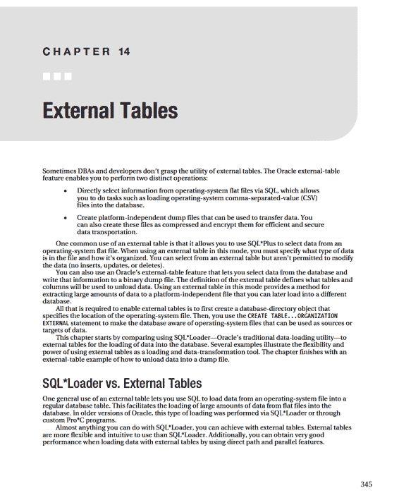
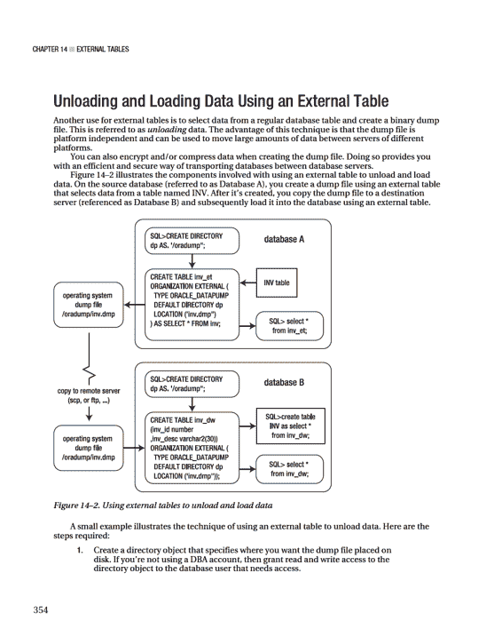
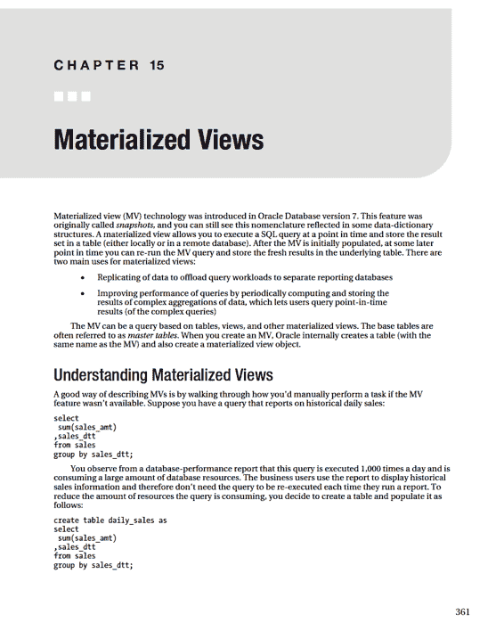
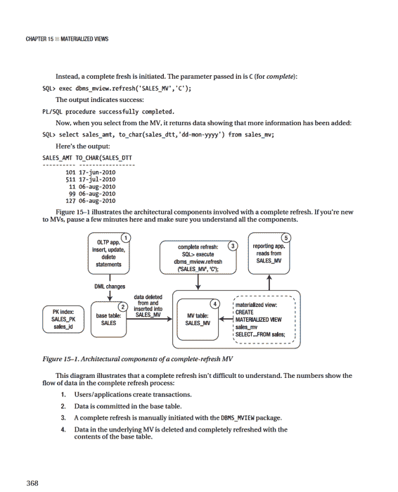
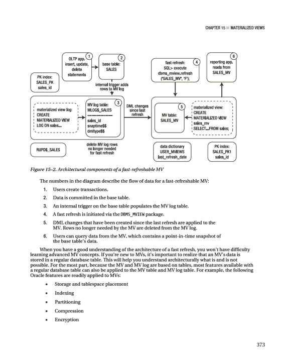
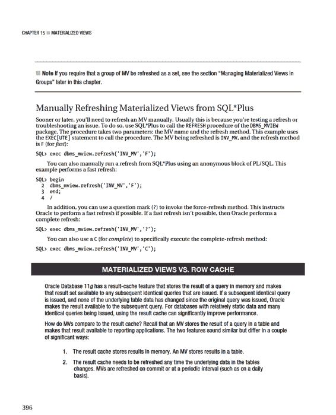

# 现在从导出转储文件创建 DDL 文件。

```bash
impdp darl/foo directory=dwrep_dp dumpfile=${SID}.${DAY}.dmp \
SQLFILE=${SID}.${DAY}.sql logfile=${SID}.${DAY}.sql.log
```

#

```bash
exit 0
```

此代码清单依赖于已创建一个数据库目录对象，该对象指向你希望每日转储文件写入的位置。你可能还需要设置另一个作业，定期删除超过特定时间的文件。

### 压缩输出

当你使用数据泵创建大文件时，应考虑压缩输出。从 Oracle 数据库 11*g*开始，`COMPRESSION`参数可以是以下值之一：`ALL`、`DATA_ONLY`、`METADATA_ONLY`或`NONE`。如果你指定`ALL`，则输出中的数据和元数据都将被压缩。

此示例导出一个表并压缩输出文件中的数据和元数据：

```bash
$ expdp dbauser/foo tables=locations directory=datapump \
dumpfile=compress.dmp compression=all
```

如果你使用的是 Oracle 数据库 10*g*，则`COMPRESSION`参数只有`METADATA_ONLY`和`NONE`值。

第 13 章 ■ 数据泵

`注意` `COMPRESS`参数的`ALL`和`DATA_ONLY`选项需要 Oracle 高级压缩选项的许可。

### 加密数据

数据泵转储文件的一个潜在安全问题是，任何拥有操作系统输出文件访问权限的人都可以在文件中搜索字符串。在 Linux/Unix 系统上，你可以使用`strings`命令执行此操作：

```bash
$ strings inv.dmp | grep -i secret
```

以下是此特定转储文件的输出：

```
Secret Data<
top secret data<
corporate secret data<
```

此命令允许你查看转储文件的内容，因为数据是常规文本且未加密。如果你要求数据是安全的，可以使用数据泵的加密功能。

数据泵可以轻松加密转储文件的输出。此示例使用`ENCRYPTION`参数来保护输出中的所有数据和元数据：

```bash
$ expdp darl/foo encryption=all directory=dp dumpfile=inv.dmp
```

要使此命令生效，你的数据库必须有一个已打开的加密钱包。有关如何创建和打开钱包的更多详细信息，请参阅《Oracle 高级安全指南》（可在 OTN 上获取）。

`注意` 数据泵的`ENCRYPTION`参数要求你使用 Oracle 数据库 11g 或更高版本的企业版，并且需要 Oracle 高级安全选项的许可。

`ENCRYPTION`参数接受以下选项：

- `ALL`
- `DATA_ONLY`
- `ENCRYPTED_COLUMNS_ONLY`
- `METADATA_ONLY`
- `NONE`

`ALL`选项为数据和元数据启用加密。`DATA_ONLY`选项仅加密数据。`ENCRYPTED_COLUMNS_ONLY`选项指定只有在数据库中加密的列才以加密格式写入转储文件。`METADATA_ONLY`选项仅加密导出文件中的元数据。

第 13 章 ■ 数据泵

## 监控数据泵作业

当你有长时间运行的数据泵作业时，应偶尔检查作业状态，以确保作业没有失败，或因某种原因挂起等。有几种方法可以监控数据泵作业的状态：

- 屏幕输出
- 数据泵日志文件
- 数据库警报日志
- 查询状态表
- 查询数据字典视图
- 交互式命令模式状态
- 使用操作系统实用程序的进程状态 `ps`

监控作业最明显的方法是查看数据泵在作业运行时显示在屏幕上的状态。如果你已从命令模式断开连接，则状态不再显示在屏幕上。在这种情况下，你必须使用另一种技术来监控数据泵作业。

### 数据泵日志文件

默认情况下，数据泵为每个作业生成一个日志文件。启动数据泵作业时，最好为该作业指定一个特定的日志文件名：

```bash
$ impdp darl/foo directory=dp dumpfile=archive.dmp logfile=archive.log
```

此作业创建一个名为`archive.log`的文件，该文件放置在数据库对象`DP`引用的目录中。如果你没有显式命名日志文件，数据泵导入会创建一个名为`import.log`的文件，数据泵导出会创建一个名为`export.log`的文件。

`注意` 日志文件包含与运行数据泵作业时在屏幕上交互式显示的信息相同的信息。

### 数据字典视图

确定数据泵作业是否正在运行的快速方法是检查`DBA_DATAPUMP_JOBS`视图，查找状态为`EXECUTING`的正在运行的作业：

```sql
select
job_name
,operation
,job_mode
,state
from dba_datapump_jobs;
```

第 13 章 ■ 数据泵

以下是一些示例输出：

```
JOB_NAME                   OPERATION   JOB_MODE   STATE
-------------------------  ----------  ---------  ---------------
SYS_IMPORT_TABLE_04        IMPORT      TABLE      EXECUTING
SYS_IMPORT_FULL_02         IMPORT      FULL       NOT RUNNING
```

你还可以通过以下查询`DBA_DATAPUMP_SESSIONS`视图来获取会话信息：

```sql
select
sid
,serial#
,username
,process
,program
from v$session s,
dba_datapump_sessions d
where s.saddr = d.saddr;
```

以下是一些示例输出，显示正在使用几个数据泵会话：

```
SID    SERIAL#  USERNAME   PROCESS   PROGRAM
------ -------- ---------- --------- ----------------------
1049   6451     STAGING    11306     oracle@xengdb (DM00)
1058   33126    STAGING    11338     oracle@xengdb (DW01)
1048   50508    STAGING    11396     oracle@xengdb (DW02)
```

### 数据库警报日志

如果作业花费的时间比预期的长，请在数据库警报日志中查找类似以下的消息：

```
statement in resumable session 'SYS_IMPORT_SCHEMA_02.1' was suspended due to
ORA-01652: unable to extend temp segment by 64 in tablespace REG_TBSP_3
```

这表明数据泵导入作业已挂起，并正在等待向`REG_TBSP_3`表空间添加空间。向表空间添加空间后，数据泵作业会自动恢复处理。默认情况下，数据泵作业会等待两个小时以添加空间。

`注意` 除了写入警报日志外，对于每个数据泵作业，Oracle 会在`ADR_HOME/trace`目录中创建一个跟踪文件。该文件包含会话 ID 和作业开始时间等信息。跟踪文件的命名格式为：`<SID>_dm00_<process_ID>.trc`。

### 状态表

每次启动数据泵作业时，都会在运行数据泵作业的用户帐户中自动创建一个状态表。对于导出作业，表名取决于你运行的导出作业类型。表的命名格式为`SYS_<OPERATION>_<JOB_MODE>_NN`，其中`OPERATION`是`EXPORT`或`IMPORT`。`JOB_MODE`可以是`FULL`、`SCHEMA`、`TABLE`、`TABLESPACE`等。

以下是查询状态表以获取当前运行作业详细信息的示例：

```sql
select
name
,object_name
,total_bytes/1024/1024 t_m_bytes
,job_mode
,state
,to_char(last_update, 'dd-mon-yy hh24:mi')
from SYS_IMPORT_TABLE_04
where state='EXECUTING';
```

第 13 章 ■ 数据泵

### 交互式命令模式状态

验证数据泵是否正在运行作业的快速方法是附加到交互式命令模式并发出`STATUS`命令。例如：

```bash
$ impdp staging/staging_xst attach=SYS_IMPORT_TABLE_04
```

```
Import> status
```

以下是一些示例输出：

```
Job: SYS_IMPORT_TABLE_04
Operation: IMPORT
Mode: TABLE
State: EXECUTING
Bytes Processed: 0
Current Parallelism: 4
```

你应该看到状态为`EXECUTING`，这表明作业正在主动运行。输出中要检查的其他项目是已处理的对象数和字节数。这些数字应随着作业的进展而增加。

### 操作系统实用程序

你可以使用操作系统实用程序进程状态（`ps`）来显示服务器上正在运行的作业。例如，你可以按如下方式搜索主进程和工作进程：

```bash
$ ps -ef | egrep 'ora_dm|ora_dw' | grep -v egrep
```

以下是一些示例输出：

```
oracle  29871   717  5 08:26:39 ?      11:42 ora_dw01_STAGE
oracle  29848   717  0 08:26:33 ?      0:08 ora_dm00_STAGE
oracle  29979   717  0 08:27:09 ?      0:04 ora_dw02_STAGE
```

如果你多次运行此命令，你应该会看到正在运行的一个或多个作业的处理时间（第七列）增加。这是数据泵仍在执行并工作的良好指标。

第 13 章 ■ 数据泵

## 数据泵传统模式

此功能在本章最后介绍，但如果你是一位老派的 DBA，它非常有用。从 Oracle 数据库 11*g*第 2 版开始，数据泵允许你使用旧的`exp`和`imp`实用程序参数。这被称为*传统模式*。你不需要做任何特殊的事情来使用传统模式数据泵。一旦数据泵检测到传统参数，它会尝试像处理旧的`exp/imp`实用程序参数一样处理该参数。你甚至可以混合使用旧的传统参数和较新的参数。例如：

```bash
$ expdp darl/foo consistent=y tables=inv directory=dk
```

在输出中，数据泵指示它遇到了传统参数，并向你显示它将传统参数转换为数据泵语法的语法。对于前面的命令，以下是数据泵会话的输出，显示了`consistent=y`参数被转换成的内容：

```
Legacy Mode Active due to the following parameters:
Legacy Mode Parameter: "consistent=TRUE" Location: Command Line, Replaced with:
"flashback_time=TO_TIMESTAMP('2010-07-01 08:10:20', 'YYYY-MM-DD HH24:MI:SS')"
```

此功能可能*极其*方便，特别是如果你对旧的传统语法非常熟悉，并想知道它如何在数据泵中实现。

我建议你尽可能使用较新的数据泵语法。但是，你可能会遇到一些情况，你有传统的`exp/imp`作业，并希望继续按原样运行脚本而不进行任何修改。

`注意` 当数据泵在传统模式下运行时，它不会创建旧的`exp/imp`格式文件。数据泵始终创建数据泵文件，并且只能读取数据泵文件。

### 数据泵映射到 `exp` 实用程序

如果你习惯于旧的`exp/imp`参数，最初可能会对一些语法语义感到困惑。然而，在使用数据泵之后，你会发现新语法相当容易记忆和使用。表 13–3 描述了传统导出参数如何映射到数据泵导出。

在许多情况下，不存在一对一的映射。通常，数据泵自动提供了过去在传统实用程序中需要参数才能实现的功能。例如，过去你必须指定`DIRECT=Y`才能进行直接路径导出，而数据泵在可能时自动使用直接路径。

第 13 章 ■ 数据泵

***表 13–3.** 旧导出参数到数据泵的映射*

| **原始 `exp` 参数** | **类似的 数据泵 `expdp` 参数** |
| :--- | :--- |
| `BUFFER` | 不适用 |
| `COMPRESS` | `TRANSFORM` |
| `CONSISTENT` | `FLASHBACK_SCN` 或 `FLASHBACK_TIME` |
| `CONSTRAINTS` | `EXCLUDE=CONSTRAINTS` |
| `DIRECT` | 不适用；数据泵在可能时自动使用直接路径 |
| `FEEDBACK` | 客户端输出中的 `STATUS` |
| `FILE` | 数据库目录对象和 `DUMPFILE` |
| `GRANTS` | `EXCLUDE=GRANT` |
| `INDEXES` | `INCLUDE=INDEXES` |
| `LOG` | 数据库目录对象和 `LOGFILE` |
| `OBJECT_CONSISTENT` | 不适用 |
| `OWNER` | `SCHEMAS` |
| `RECORDLENGTH` | 不适用 |
| `RESUMABLE` | 不适用；数据泵自动提供该功能 |
| `RESUMABLE_NAME` | 不适用 |
| `RESUMABLE_TIMEOUT` | 不适用 |
| `ROWS` | `CONTENT=ALL` |
| `STATISTICS` | 不适用；数据泵导出始终导出表的统计信息 |
| `TABLESPACES` | `TRANSPORT_TABLESPACES` |
| `TRANSPORT_TABLESPACE` | `TRANSPORT_TABLESPACES` |
| `TRIGGERS` | `EXCLUDE=TRIGGER` |
| `TTS_FULL_CHECK` | `TRANSPORT_FULL_CHECK` |
| `VOLSIZE` | 不适用；数据泵不支持磁带设备 |

第 13 章 ■ 数据泵

### 数据泵映射到 `imp` 实用程序

与数据泵导出类似，数据泵导入通常与传统实用程序参数没有一对一的映射。数据泵导入自动提供了许多旧`imp`实用程序的功能。例如，不需要`COMMIT=Y`，因为数据泵导入在每个表导入后自动提交。表 13–4 描述了传统导入参数如何映射到数据泵导入。

***表 13–4.** 旧导入参数到数据泵的映射*

| **原始 `imp` 参数** | **类似的 数据泵 `impdp` 参数** |
| :--- | :--- |
| `BUFFER` | 不适用 |
| `CHARSET` | 不适用 |
| `COMMIT` | 不适用；数据泵导入在每个表导出后自动提交 |
| `COMPILE` | 不适用；数据泵导入在过程创建后编译它们 |
| `CONSTRAINTS` | `EXCLUDE=CONSTRAINT` |
| `DATAFILES` | `TRANSPORT_DATAFILES` |
| `DESTROY` | `REUSE_DATAFILES=y` |
| `FEEDBACK` | 客户端输出中的 `STATUS` |
| `FILE` | 数据库目录对象和 `DUMPFILE` |
| `FILESIZE` | 不适用 |
| `FROMUSER` | `REMAP_SCHEMA` |
| `GRANTS` | `EXCLUDE=OBJECT_GRANT` |
| `IGNORE` | `TABLE_EXISTS_ACTION`，使用 `APPEND`、`REPLACE`、`SKIP` 或 `TRUNCATE` |
| `INDEXES` | `EXCLUDE=INDEXES` |
| `INDEXFILE` | `SQLFILE` |
| `LOG` | 数据库目录对象和 `LOGFILE` |
| `RECORDLENGTH` | 不适用 |
| `RESUMABLE` | 不适用；此功能是自动提供的 |
| `RESUMABLE_NAME` | 不适用 |
| `RESUMABLE_TIMEOUT` | 不适用 |
| `ROWS=N` | `CONTENT`，使用 `METADATA_ONLY` 或 `ALL` |
| `SHOW` | `SQLFILE` |
| `STATISTICS` | 不适用 |
| `STREAMS_CONFIGURATION` | 不适用 |
| `STREAMS_INSTANTIATION` | 不适用 |
| `TABLESPACES` | `TRANSPORT_TABLESPACES` |
| `TOID_NOVALIDATE` | 不适用 |
| `TOUSER` | `REMAP_SCHEMA` |
| `TRANSPORT_TABLESPACE` | `TRANSPORT_TABLESPACES` |
| `TTS_OWNERS` | 不适用 |
| `VOLSIZE` | 不适用；数据泵不支持磁带设备 |

## 总结

数据泵是一个极其强大且功能丰富的工具。如果你不常使用数据泵，那么我恳请你花些时间阅读本章并完成示例。此工具极大地简化了将用户和数据从一个环境迁移到另一个环境等任务。你可以导出和导入用户子集、通过 SQL 和 PL/SQL 过滤和重映射数据、重命名用户和表空间、压缩、加密和并行化，所有这些只需一个命令。它确实如此强大。

DBA 有时坚持使用旧的`exp/imp`实用程序，因为那是他们熟悉的（我偶尔也会犯这个错误）。如果你运行的是 Oracle 数据库 11*g*第 2 版，你可以直接从命令行使用旧的`exp/imp`参数和选项。数据泵会将这些参数动态转换为数据泵特定的语法。此功能很好地促进了从旧到新的迁移。作为参考，我还提供了旧的`exp/imp`语法及其与数据泵命令关系的映射。

虽然数据泵是将数据库对象和数据从一个环境移动到另一个环境的优秀工具，但有时你需要将大量数据传输到操作系统平面文件中或从中传输。你可以使用外部表来实现此任务。这是本书下一章的主题。



第 14 章 ■ 外部表

快速比较使用 SQL*Loader 和外部表突出了它们的差异。以下是用于加载和转换数据的 SQL*Loader 步骤：

1.  创建一个参数文件，SQL*Loader 使用它来解释操作系统文件中的数据格式。
2.  创建一个常规数据库表，SQL*Loader 将向其中插入记录。数据将暂存于此，直到可以进一步处理。
3.  运行 SQL*Loader `sqlldr`实用程序，将数据从操作系统文件加载到数据库表（在步骤 2 中创建）。加载数据时，SQL*Loader 具有一些允许你转换数据的功能。这一步有时令人沮丧，因为可能需要多次尝试才能正确映射参数文件到表和相应的列。
4.  创建另一个表，其中将包含完全转换后的数据。
5.  首先运行 SQL 语句从暂存表（在步骤 2 中创建）加载数据；然后转换数据并将其插入到生产表（在步骤 4 中创建）。

将上述 SQL*Loader 列表与以下使用外部表加载和转换数据的步骤进行比较：

1.  执行`CREATE TABLE...ORGANIZATION EXTERNAL`脚本，将操作系统文件的结构映射到表列。运行此脚本后，你可以直接使用 SQL 查询操作系统文件的内容。
2.  创建一个常规表来保存完全转换后的数据。
3.  运行 SQL 语句，将数据从外部表加载并完全转换到步骤 2 中创建的表中。

对于许多公司来说，SQL*Loader 是大型数据加载操作的基础。它仍然是执行该任务的好工具。但是，你可能需要考虑使用外部表。外部表具有以下优势：

- 使用外部表加载数据更直接，步骤更少。
- 创建和从外部表加载的接口是 SQL*Plus。许多 DBA/开发人员发现使用 SQL*Plus 比 SQL*Loader 的参数文件界面更直观、更强大。
- 你可以在数据加载到数据库表之前查看外部表中的数据。
- 你可以加载、转换和聚合数据，而无需中间暂存表。对于大量数据，这可以节省大量空间。

接下来的几节包含使用外部表从操作系统文件读取的示例。

第 14 章 ■ 外部表

## 将 CSV 文件加载到数据库中

你可以使用外部表和 SQL 将小型或非常大的 CSV 平面文件加载到数据库中。图 14–1 显示了使用外部表查看和加载操作系统文件数据所涉及的体系结构组件。需要一个目录对象来指定操作系统文件的位置。`CREATE TABLE...ORGANIZATION EXTERNAL`语句创建一个数据库对象，SQL*Plus 可以使用它直接从操作系统文件中选择。

***图 14–1.** 用于读取平面文件的外部表的体系结构组件*

以下是使用外部表访问操作系统平面文件的步骤：
1.  创建一个指向 CSV 文件位置的数据库目录对象。
2.  将目录对象的读写权限授予创建外部表的用户。我通常使用具有 DBA 权限的帐户，因此不需要执行此步骤。
3.  运行`CREATE TABLE...ORGANIZATION EXTERNAL`语句。
4.  使用 SQL*Plus 访问 CSV 文件的内容。

在此示例中，平面文件名为`ex.csv`，位于`/oraet`目录中。它包含以下数据：

```
5|2|0|0|12/04/2009|Half
6|1|0|1|03/31/2010|Quarter
7|4|0|1|05/07/2010|Full
8|1|1|0|04/30/2010|Quarter
```

`注意` 本章中使用的一些 CSV 文件示例实际上是由逗号以外的字符（例如管道`|`字符）分隔的。使用的字符取决于数据和提供 CSV 文件的用户。CSV 文件通常也常被称为平面文件。

第 14 章 ■ 外部表

### 创建目录对象并授予权限

首先，创建一个指向磁盘上平面文件位置的目录对象：

```sql
SQL> create directory exa_dir as '/oraet';
```

此示例使用授予了`DBA`角色的数据库帐户；因此，你不需要向访问目录对象的用户（你的帐户）授予对该目录对象的`READ`和`WRITE`权限。如果你不使用 DBA 帐户从目录对象读取，则使用此对象向该帐户授予权限：

```sql
SQL> grant read, write on directory exa_dir to reg_user;
```

### 创建外部表

接下来，构建创建外部表的脚本，该外部表将引用平面文件。`CREATE TABLE...ORGANIZATION EXTERNAL`语句向数据库提供以下信息：

- 如何解释平面文件中的数据，以及文件中的数据与数据库中列定义的映射
- `DEFAULT DIRECTORY`子句，标识目录对象，该对象又指定磁盘上平面文件的目录
- `LOCATION`子句，标识平面文件的名称

下一个语句创建一个看起来像表的数据库对象，但它能够直接从平面文件中检索数据：

```sql
create table exadata_et(
  exa_id NUMBER
  ,machine_count NUMBER
  ,hide_flag NUMBER
  ,oracle NUMBER
  ,ship_date DATE
  ,rack_type VARCHAR2(32)
)
organization external (
  type oracle_loader
  default directory exa_dir
  access parameters
  (
    records delimited by newline
    fields terminated by '|'
    missing field values are null
    (exa_id
    ,machine_count
    ,hide_flag
    ,oracle
    ,ship_date char date_format date mask "mm/dd/yyyy"
    ,rack_type)
  )
  location ('ex.csv')
)
reject limit unlimited;
```

第 14 章 ■ 外部表

执行此脚本时会创建一个名为`EXADATA_ET`的外部表。现在，使用 SQL*Plus 查看平面文件的内容：

```sql
SQL> select * from exadata_et;
```

```
EXA_ID MACHINE_COUNT HIDE_FLAG ORACLE SHIP_DATE  RACK_TYPE
------ ------------- ---------- ---------- --------- ---------
5      2             0          0         04-DEC-09 Half
6      1             0          1         31-MAR-10 Quarter
7      4             0          1         07-MAY-10 Full
8      1             1          0         30-APR-10 Quarter
```

### 查看外部表元数据

此时，你还可以查看有关外部表的元数据。查询`DBA_EXTERNAL_TABLES`视图以获取详细信息：

```sql
select
  owner
  ,table_name
  ,default_directory_name
  ,access_parameters
from dba_external_tables;
```

以下是输出的部分列表：

```
OWNER    TABLE_NAME    DEFAULT_DIRECTO   ACCESS_PARAMETERS
-------- ------------- ----------------  ---------------------------
BARTS    EXADATA_ET    EXA_DIR           records delimited by newline
```

此外，你可以从`DBA_EXTERNAL_LOCATIONS`表中选择有关外部表中引用的任何平面文件的信息：

```sql
select
  owner
  ,table_name
  ,location
from dba_external_locations;
```

以下是一些示例输出：

```
OWNER    TABLE_NAME    LOCATION
-------- ------------- ---------------
BARTS    EXADATA_ET    ex.csv
```

### 从外部表加载常规表

现在你可以将外部表中包含的数据加载到常规数据库表中。执行此操作时，你可以利用 Oracle 的直接路径加载和并行功能。此示例创建一个常规数据库表，该表将从外部表加载数据：

```sql
create table exa_info(
  exa_id NUMBER
  ,machine_count NUMBER
  ,hide_flag NUMBER
  ,oracle NUMBER
  ,ship_date DATE
  ,rack_type VARCHAR2(32)
) nologging parallel 2;
```

第 14 章 ■ 外部表

你可以通过以下方式从外部表的内容直接路径加载此常规表（通过`APPEND`提示）：

```sql
SQL> insert /*+ APPEND */ into exa_info select * from exadata_et;
```

你可以在提交数据之前尝试从中进行选择来验证表是否已直接路径加载：

```sql
SQL> select * from exa_info;
```

这是预期的错误：

```
ORA-12838: cannot read/modify an object after modifying it in parallel
```

提交数据后，你可以从表中进行选择：

```sql
SQL> commit;
SQL> select * from exa_info;
```

直接路径加载表的另一种方法是使用`CREATE TABLE AS SELECT`（`CTAS`）语句。`CTAS`语句自动尝试进行直接路径加载。在此示例中，`EXA_INFO`表在一条语句中被创建和加载：

```sql
SQL> create table exa_info nologging parallel 2 as select * from exadata_et;
```

通过使用直接路径加载和并行性，你可以实现与使用 SQL*Loader 相似的加载性能。使用 SQL 从外部表创建表的优势在于，你现在可以在构建常规数据库表（在此示例中为`EXA_INFO`）时使用标准 SQL*Plus 功能执行复杂的数据转换。

任何`CTAS`语句都会自动以为基础表定义的并行度进行处理。但是，当你使用`INSERT AS SELECT`语句时，需要为会话启用并行性：

```sql
SQL> alter session enable parallel dml;
```

作为最后一步，你应该为已加载大量数据的任何表生成统计信息。以下是一个示例：

```sql
exec dbms_stats.gather_table_stats(-
ownname=>'BARTS',-
tabname=>'EXA_INFO',-
estimate_percent => 20, -
cascade=>true);
```

## 执行高级转换

Oracle 提供了复杂的技术来转换数据。本节详细介绍如何使用管道函数转换外部表中的数据。以下是执行此操作的步骤：
1.  创建一个外部表。
2.  创建一个记录类型，映射到外部表中的列。
3.  创建一个基于步骤 2 中创建的记录类型的表。
4.  创建一个管道函数，用于在加载时检查每一行，并根据业务需求转换数据。
5.  使用`INSERT`语句，该语句从外部表中选择并使用管道函数在加载时转换数据。

此示例使用上一节关于从 CSV 文件加载数据中创建的相同外部表和 CSV 文件。回想一下，外部表名称是`EXADATA_ET`，CSV 文件名称是`ex.csv`。

创建外部表后，接下来创建一个记录类型，映射到外部表中的列名：

```sql
create or replace type rec_exa_type is object
(
  exa_id number
  ,machine_count number
  ,hide_flag number
  ,oracle number
  ,ship_date date
  ,rack_type varchar2(32)
);
/
```

第 14 章 ■ 外部表

接下来，基于前面的记录类型创建一个表：

```sql
create or replace type table_exa_type is table of rec_exa_type;
/
```

Oracle PL/SQL 允许你将函数用作 SQL 操作的行源。此功能称为*管道化*。它让你可以使用复杂的转换逻辑，并结合 SQL*Plus 的强大功能。在此示例中，你创建一个管道函数，以便在加载时转换选定的列数据。

具体来说，当`ORACLE`列的值为`0`时，此函数将`SHIP_DATE`增加 30 天：

```sql
create or replace function exa_trans
return table_exa_type pipelined is
begin
  for r1 in
    (select rec_exa_type(
            exa_id, machine_count, hide_flag
            ,oracle, ship_date, rack_type
            ) exa_rec
     from exadata_et) loop
    if (r1.exa_rec.oracle = 0) then
      r1.exa_rec.ship_date := r1.exa_rec.ship_date + 30;
    end if;
    pipe row (r1.exa_rec);
  end loop;
  return;
end;
/
```

现在你可以使用此函数将数据加载到常规数据库表中。作为参考，以下是实例化要加载的表的`CREATE TABLE`语句：

```sql
create table exa_info(
  exa_id NUMBER
  ,machine_count NUMBER
  ,hide_flag NUMBER
  ,oracle NUMBER
  ,ship_date DATE
  ,rack_type VARCHAR2(32)
) nologging parallel 2;
```

接下来，使用管道函数转换从外部表中选择的数据，并一步将其插入到常规数据库表中：

```sql
SQL> insert into exa_info select * from table(exa_trans);
```

以下是此示例加载到`EXA_INFO`表中的数据：

```sql
SQL> select * from exa_info;
```

```
EXA_ID MACHINE_COUNT HIDE_FLAG ORACLE SHIP_DATE  RACK_TYPE
------ ------------- ---------- ---------- --------- ------------
5      2             0          0         03-JAN-10 Half
6      1             0          1         31-MAR-10 Quarter
7      4             0          1         07-MAY-10 Full
8      1             1          0         30-MAY-10 Quarter
```

尽管本节中的示例很简单，但你可以使用该技术应用任何复杂程度的转换逻辑。此技术允许你将转换需求嵌入到管道化 PL/SQL 函数中，该函数在加载每一行时修改数据。

## 从 SQL 查看文本文件

外部表允许你使用 SQL `SELECT`语句从操作系统平面文件中检索信息。例如，假设你希望报告警报日志文件的内容。首先，创建一个指向警报日志位置的目录对象：

```sql
SQL> select value from v$parameter where name ='background_dump_dest';
```

此示例的输出：

```
/oracle/app/oracle/diag/rdbms/o11r2/O11R2/trace
```

接下来，创建一个指向后台转储目标位置的目录对象：

```sql
SQL> create directory t_loc as '/oracle/app/oracle/diag/rdbms/o11r2/O11R2/trace';
```

现在，创建一个映射到数据库警报日志操作系统文件的外部表。在此示例中，数据库名称为`O11R2`，因此警报日志文件名为`alert_O11R2.log`：

```sql
create table alert_log_file(
  alert_text varchar2(4000))
organization external
( type oracle_loader
  default directory t_loc
  access parameters (
    records delimited by newline
    nobadfile
    nologfile
    nodiscardfile
    fields terminated by '#$~=ui$X'
    missing field values are null
    (alert_text)
  )
  location ('alert_O11R2.log')
)
reject limit unlimited;
```

第 14 章 ■ 外部表

你可以通过 SQL 查询查询该表。例如：

```sql
SQL> select * from alert_log_file where alert_text like 'ORA-%';
```

这允许你使用 SQL 查看和报告警报日志的内容。你可能会发现这是一种方便的方式，为原本无法访问的操作系统文件提供 SQL 访问。

如果你之前使用过 SQL*Loader，外部表的`ACCESS PARAMETERS`子句中的`ORACLE_LOADER`访问驱动程序可能看起来很熟悉。表 14–1 描述了一些更常用的访问参数。有关访问参数的完整列表，请参阅 Oracle 的《数据库实用程序》指南（可在 OTN 上获取）。

***表 14–1.** `ORACLE_LOADER`驱动程序的选定访问参数*

| **访问参数** | **描述** |
| :--- | :--- |
| `DELIMITED BY` | 指示哪个字符分隔字段 |
| `TERMINATED BY` | 指示字段如何终止 |
| `FIXED` | 指定具有固定长度的记录的大小 |
| `BADFILE` | 存储由于错误而无法加载的记录的文件名 |
| `NOBADFILE` | 指定不应创建文件来保存由于错误而无法加载的记录 |
| `LOGFILE` | 创建外部表时记录一般消息的文件名 |
| `NOLOGFILE` | 指定不应创建日志文件 |
| `DISCARDFILE` | 命名记录未通过`LOAD WHEN`子句的写入文件 |
| `NODISCARDFILE` | 指定不应创建丢弃文件 |
| `SKIP` | 在加载前跳过文件中指定数量的记录 |
| `PREPROCESSOR` | 指定在 Oracle 加载数据之前运行并修改文件内容的用户命名程序 |
| `MISSING FIELD VALUES ARE NULL` | 将没有数据的字段加载为`NULL`值 |



第 14 章 ■ 外部表

2.  使用`CREATE TABLE...ORGANIZATION EXTERNAL...AS SELECT`语句将数据从数据库卸载到转储文件中。

首先，创建一个目录对象。以下代码创建一个名为`DP`的目录对象，该对象指向`/oradump`目录：

```sql
SQL> create directory dp as '/oradump';
```

如果你使用的用户没有 DBA 权限，则需要显式授予该目录对象对所需用户的访问权限：

```sql
SQL> grant read, write on directory dp to larry;
```

要创建转储文件，请使用`CREATE TABLE...ORGANIZATION EXTERNAL`语句的`ORACLE_DATAPUMP`访问驱动程序。此示例将`INV`表的内容卸载到`inv.dmp`文件中：

```sql
CREATE TABLE inv_et
ORGANIZATION EXTERNAL (
  TYPE ORACLE_DATAPUMP
  DEFAULT DIRECTORY dp
  LOCATION ('inv.dmp')
)
AS SELECT * FROM inv;
```

前面的命令做了两件事：

- 创建一个基于`INV`表的名为`INV_ET`的外部表
- 创建一个名为`inv.dmp`的平台无关的转储文件

现在你可以将`inv.dmp`文件复制到单独的数据库服务器，并基于此转储文件创建一个外部表。远程服务器（将转储文件复制到的服务器）可以是与你创建文件所在的服务器不同的平台。例如，你可以在 Windows 机器上创建转储文件，复制到 Solaris 服务器，然后通过外部表从转储文件中进行选择。在此示例中，外部表名为`INV_DW`：

```sql
CREATE TABLE inv_dw
  (inv_id number
  ,inv_desc varchar2(30))
ORGANIZATION EXTERNAL (
  TYPE ORACLE_DATAPUMP
  DEFAULT DIRECTORY dp
  LOCATION ('inv.dmp')
);
```

创建后，你可以从 SQL*Plus 访问外部表数据：

```sql
SQL> select * from inv_dw;
```

你还可以使用转储文件创建常规表并加载数据：

```sql
SQL> create table inv as select * from inv_dw;
```

这提供了一种简单高效的机制来将数据从一个平台传输到另一个平台。

第 14 章 ■ 外部表

## 使用并行性减少耗时

为了最大化通过外部表创建转储文件时的卸载性能，请使用`PARALLEL`子句。此示例并行创建两个转储文件：

```sql
CREATE TABLE inv_et
ORGANIZATION EXTERNAL (
  TYPE ORACLE_DATAPUMP
  DEFAULT DIRECTORY dp
  LOCATION ('inv1.dmp','inv2.dmp')
)
PARALLEL 2
AS SELECT * FROM inv;
```

要访问转储文件中的数据，请创建一个引用这两个转储文件的不同外部表：

```sql
CREATE TABLE inv_dw
  (inv_id number
  ,inv_desc varchar2(30))
ORGANIZATION EXTERNAL (
  TYPE ORACLE_DATAPUMP
  DEFAULT DIRECTORY dp
  LOCATION ('inv1.dmp','inv2.dmp')
);
```

你现在可以使用此外部表从转储文件中选择数据：

```sql
SQL> select * from inv_dw;
```

## 压缩转储文件

你可以通过外部表创建压缩的转储文件。例如，使用`ACCESS PARAMETERS`子句的`COMPRESS`选项：

```sql
CREATE TABLE inv_et
ORGANIZATION EXTERNAL (
  TYPE ORACLE_DATAPUMP
  DEFAULT DIRECTORY dp
  ACCESS PARAMETERS (COMPRESSION ENABLED)
  LOCATION ('inv1.dmp')
)
AS SELECT * FROM inv;
```

使用此选项时，你应该会看到相当好的压缩率。在我的测试中，压缩后的输出转储文件缩小了 10 到 20 倍。根据被压缩数据的类型，你的结果可能会有所不同。

## 加密转储文件

你还可以使用外部表创建加密的转储文件。此示例使用`ACCESS PARAMETERS`子句的`ENCRYPTION`选项：

第 14 章 ■ 外部表

```sql
CREATE TABLE inv_et
ORGANIZATION EXTERNAL (
  TYPE ORACLE_DATAPUMP
  DEFAULT DIRECTORY dp
  ACCESS PARAMETERS
  (ENCRYPTION ENABLED)
  LOCATION ('inv1.dmp')
)
AS SELECT * FROM inv;
```

要使此示例生效，你需要为数据库设置并打开一个安全钱包。

`注意` 使用加密需要 Oracle 的额外许可。有关使用高级安全选项的详细信息，请联系 Oracle。

你通过`ACCESS PARAMETERS`子句启用压缩和加密。表 14–2 包含`ORACLE_DATAPUMP`访问驱动程序可用的所有访问参数的列表。

***表 14–2.** `ORACLE_DATAPUMP`访问驱动程序的参数*

| **访问参数** | **描述** |
| :--- | :--- |
| `COMPRESSION` | 压缩转储文件。`DISABLED`是默认值。 |
| `ENCRYPTION` | 加密转储文件。`DISABLED`是默认值。 |
| `NOLOGFILE` | 抑制日志文件的生成。 |
| `LOGFILE=[directory_object:]logfile_name` | 允许你命名日志文件。 |
| `VERSION` | 指定可以读取转储文件的 Oracle 最低版本。 |

## 预处理外部表

Oracle（在 10.2.0.5 及更高版本中）添加了预处理外部表所基于文件的能力。例如，你可以指示`CREATE TABLE...ORGANIZATION EXTERNAL`语句在处理之前解压缩压缩的操作系统文件。

以下是一个简单的示例来说明此概念。首先，创建一个包含压缩文件位置的目录对象：

```sql
SQL> create or replace directory data_dir as '/orahome/oracle/dk/et';
```

你还需要创建一个目录对象，其中包含将对数据文件执行预处理的脚本的位置。在此示例中，目录是`/bin`：

```sql
SQL> create or replace directory exe_dir as '/bin';
```

此示例使用`gzip`实用程序压缩了操作系统平面文件。压缩文件名为`exa.csv.gz`。你通过指定`PREPROCESSOR`子句来指示`CREATE TABLE...ORGANIZATION EXTERNAL`语句预处理压缩文件。由于 CSV 文件是通过`gzip`实用程序压缩的，因此可以通过相应的解压缩实用程序`gunzip`进行解压缩。请仔细查看以下列表中的`PREPROCESSOR`子句；它嵌套在`ACCESS PARAMETERS`下：

```sql
create table exadata_et(
  machine_count NUMBER
  ,hide_flag NUMBER
  ,oracle NUMBER
  ,ship_date DATE
  ,rack_type VARCHAR2(32)
)
organization external (
  type oracle_loader
  default directory data_dir
  access parameters
  (
    records delimited by newline
    preprocessor exe_dir: 'gunzip'
    fields terminated by '|'
    missing field values are null
    (exa_id
    ,machine_count
    ,hide_flag
    ,oracle
    ,ship_date char date_format date mask "mm/dd/yyyy"
    ,rack_type)
  )
  location ('ex.csv.gz')
)
reject limit unlimited;
```

预处理转储文件的优势在于，它为你节省了必须首先解压缩文件的步骤。

`注意` 如果数据库安装了 Database Vault 功能，Oracle 不允许你在其中使用`PREPROCESSOR`子句。

第 14 章 ■ 外部表

## 总结

我曾经使用 SQL*Loader 处理所有类型的数据加载任务。在过去的几年里，我已成为外部表的拥护者。几乎任何你可以用 SQL*Loader 完成的事情，你也可以用外部表完成。外部表方法的优势在于移动部件更少，并且接口是 SQL*Plus。大多数 DBA 和开发人员发现 SQL*Plus 比 SQL*Loader 控制文件更容易使用。

你可以轻松使用外部表使 SQL*Plus 能够访问操作系统平面文件。你只需在`CREATE TABLE...ORGANIZATION EXTERNAL`语句中定义平面文件的结构。创建外部表后，你可以直接从平面文件中进行选择，就像它是数据库表一样。你可以从外部表中选择，但不能插入、更新或删除。

创建外部表后，如果需要，可以通过使用`CREATE TABLE AS SELECT`从外部表创建常规数据库表。这样做提供了一种快速有效的方式来加载存储在外部操作系统文件中的数据。

外部表功能还允许你从表中选择数据并将其写入二进制转储文件。外部表`CREATE TABLE...ORGANIZATION EXTERNAL`语句定义了用于卸载数据的表和列。以这种方式创建的转储文件是平台无关的，意味着你可以将其复制到使用不同操作系统的服务器，并无缝加载数据。

此外，转储文件可以被加密和压缩，以便安全高效地传输。

你还可以使用并行功能来减少创建转储文件所需的时间。

下一章涉及物化视图。这些数据库对象为你提供了一种灵活、可维护且可扩展的机制来聚合和复制数据。



第 15 章 ■ 物化视图

表创建后，你放入一个每日进程，在晚上 8:00 删除它并完全刷新它：

```sql
-- 步骤 1 删除每日汇总销售数据：
delete from daily_sales;
--
-- 步骤 2 用汇总销售表的快照重新填充表：
insert into daily_sales
select
  sum(sales_amt)
  ,sales_dtt
from sales
group by sales_dtt;
```

你通知用户，他们可以通过从`DAILY_SALES`中选择（而不是直接从主`SALES`表中运行查询和聚合）来获得亚秒级的查询结果。此过程大致描述了完全刷新过程。

Oracle 的物化视图（MV）技术自动化并极大地增强了这一过程。本章描述了实现基本和复杂 MV 功能的步骤。阅读本章并完成示例后，你应该能够创建 MV 以在各种情况下复制和聚合数据。

在深入探讨创建 MV 的细节之前，先介绍与 MV 相关的基本术语和有用的数据字典视图是有益的。接下来的两个小节简要介绍了各种 MV 功能以及包含 MV 元数据的众多数据字典视图。

`注意` 本章不涵盖多主复制和可更新 MV 等主题。有关这些主题的更多详细信息，请参阅《Oracle 高级复制指南》（可在 Oracle 的 OTN 网站上获取）。

第 15 章 ■ 物化视图

## 物化视图术语

许多术语与刷新 MV 相关。在深入探讨如何实现这些功能之前，你应该熟悉这些术语。表 15–1 描述了 MV 相关的各种术语。

***表 15–1.** MV 术语描述*

| **术语** | **含义** |
| :--- | :--- |
| 物化视图 | 用于复制数据和提高性能的数据库对象。 |
| 物化视图 SQL 语句 | 定义底层 MV 基表中存储的数据的 SQL 查询。 |
| 物化视图底层表 | 与 MV 同名的数据库表，用于存储 MV SQL 查询的结果。 |
| 主表（或基表） | MV 在其 SQL 语句的`FROM`子句中引用的表。 |
| 完全刷新 | 删除 MV 并使用 MV SQL 语句完全刷新它的过程。 |
| 快速刷新 | 仅将自上次刷新以来发生的 DML 更改应用到 MV 的过程。 |
| 物化视图日志 | 跟踪 MV 基表上 DML 更改的数据库对象。快速刷新需要 MV 日志。它可以基于主键、`ROWID`或对象 ID。 |
| 简单 MV | 基于可以快速刷新的简单查询的 MV。 |
| 复杂 MV | 基于不符合快速刷新条件的复杂查询的 MV。 |
| 构建模式 | 指定是应立即填充 MV 还是延迟填充的模式。 |
| 刷新模式 | 指定是应按需、在提交时还是从不刷新 MV 的模式。 |
| 刷新方法 | 指定 MV 刷新应为完全刷新还是快速刷新的选项。 |
| 查询重写 | 允许优化器选择使用 MV（而不是基表）来满足查询要求的功能（即使查询没有直接引用 MV）。 |
| 本地 MV | 与基表位于同一数据库中的 MV。 |
| 远程 MV | 与基表位于不同数据库中的 MV。 |
| 刷新组 | 在同一个一致的事务点刷新的一组 MV。 |

第 15 章 ■ 物化视图

在阅读本章的其余部分时，请参考表 15–1。这些术语和概念将在后续章节中解释和阐述。

## 引用有用的视图

使用 MV 时，有时很难记住在什么情况下查询哪个数据字典视图。有各种各样的数据字典视图可用。表 15–2 包含 MV 相关数据字典视图的描述。本章中适当地显示了使用这些视图的示例。这些视图对于故障排除、诊断问题和理解你的 MV 环境非常宝贵。

***表 15–2.** 物化视图数据字典视图定义*

| **数据字典视图** | **描述** |
| :--- | :--- |
| `DBA/ALL/USER_MVIEWS` | 关于 MV 的信息，例如所有者、基查询、上次刷新时间等。 |
| `DBA/ALL/USER_MVIEW_REFRESH_TIMES` | MV 的上次刷新时间、MV 名称、主表和主所有者。 |
| `DBA/ALL/USER_REGISTERED_MVIEWS` | 所有已注册的 MV。有助于识别哪些 MV 正在使用哪些 MV 日志。 |
| `DBA/ALL/USER_MVIEW_LOGS` | MV 日志信息。 |
| `DBA/ALL/USER_BASE_TABLE_MVIEWS` | 具有 MV 日志的表的基表名称和上次刷新日期。 |
| `DBA/ALL/USER_MVIEW_AGGREGATES` | 出现在 MV 的`SELECT`子句中的聚合函数。 |
| `DBA/ALL/USER_MVIEW_ANALYSIS` | 关于 MV 的信息。Oracle 建议你使用`DBA/ALL/USER_MVIEWS`而不是这些视图。 |
| `DBA/ALL/USER_MVIEW_COMMENTS` | 与 MV 相关的任何注释。 |
| `DBA/ALL/USER_MVIEW_DETAIL_PARTITION` | 分区和新鲜度信息。 |
| `DBA/ALL/USER_MVIEW_DETAIL_SUBPARTITION` | 子分区和新鲜度信息。 |
| `DBA/ALL/USER_MVIEW_DETAIL_RELATIONS` | MV 依赖的本地表和 MV。 |
| `DBA/ALL/USER_MVIEW_JOINS` | MV 定义的`WHERE`子句中两个列之间的连接。 |
| `DBA/ALL/USER_MVIEW_KEYS` | MV 定义的`SELECT`子句中的列或表达式。 |

第 15 章 ■ 物化视图

| **数据字典视图** | **描述** |
| :--- | :--- |
| `DBA/ALL/USER_TUNE_MVIEW` | 执行`DBMS_ADVISOR.TUNE_MVIEW`过程的结果。 |
| `V$MVREFRESH` | 当前正在刷新的 MV 的信息。 |
| `DBA/ALL/USER_REFRESH` | 关于 MV 刷新组的详细信息。 |
| `DBA_RGROUP` | 关于 MV 刷新组的信息。 |
| `DBA_RCHILD` | MV 刷新组中的子项。 |

## 创建基本物化视图

本节介绍如何创建 MV。最常用的两种配置如下：

- 创建按需刷新的完全刷新 MV
- 创建按需刷新的快速刷新 MV

理解这些基本配置很重要。它们为你使用 MV 所做的其他一切奠定了基础。因此，本节从这些基本配置开始。稍后，本节将介绍更高级的配置。在进入高级 MV 主题之前，请确保你理解以下两节中的内容。

### 创建可完全刷新的物化视图

本节说明如何设置定期完全刷新的 MV，这可能是最简单的示例。完全刷新适用于基表中很大一部分行在刷新间隔之间发生变化的 MV。在无法进行快速刷新的情况下（由于 Oracle 施加的限制——本章稍后将详细介绍），也需要完全刷新。

`注意` 要创建 MV，你需要`CREATE MATERIALIZED VIEW`系统特权和`CREATE TABLE`系统特权。

本节中的示例使用以下名为`SALES`的基表：

```sql
create table sales(
  sales_id number
  ,sales_amt number
  ,region_id number
  ,sales_dtt timestamp
  ,constraint sales_pk primary key(sales_id)
);
```

第 15 章 ■ 物化视图

向`SALES`表中插入一些示例数据：

```sql
insert into sales values(1,101,100,sysdate-50);
insert into sales values(2,511,200,sysdate-20);
insert into sales values(3,11,100,sysdate);
commit;
```

下一步是创建 MV，使用`CREATE MATERIALIZED VIEW...AS SELECT`语句。该语句命名 MV，指定其属性，并定义 MV 所基于的 SQL 查询：

```sql
create materialized view sales_mv
segment creation immediate
refresh
  complete
  on demand
as
  select
    sales_amt
    ,sales_dtt
  from sales;
```

`SEGMENT CREATION IMMEDIATE`子句在 Oracle 11*g*第 2 版及更高版本中可用。它指示 Oracle 在创建 MV 时创建段并分配区。这是早期 Oracle 版本的行为。如果你不希望立即创建段，请使用`SEGMENT CREATION DEFERRED`子句。如果新创建的 MV 包含任何行，那么无论是否使用`SEGMENT CREATION DEFERRED`，都会创建段并分配区。

让我们查看`USER_MVIEWS`数据字典以验证 MV 是否按预期创建。要运行的查询如下：

```sql
select
  mview_name
  ,refresh_method
  ,refresh_mode
  ,build_mode
  ,fast_refreshable
from user_mviews
where mview_name = 'SALES_MV';
```

此 MV 的输出：

```
MVIEW_NAME   REFRESH_   REFRESH_MODE   BUILD_MOD   FAST_REFRESHABLE
------------ ---------- -------------- ----------- --------------------
SALES_MV     COMPLETE   DEMAND         IMMEDIATE   NO
```

检查`USER_OBJECTS`和`USER_SEGMENTS`视图以查看已创建的内容也很有帮助。当你查询`USER_OBJECTS`时，请注意已创建多个对象：

```sql
select
  object_name
  ,object_type
from user_objects
where object_name like 'SALES%'
order by object_name;
```

相应的输出：

```
OBJECT_NAME          OBJECT_TYPE
-------------------- --------------------
SALES                TABLE
SALES_MV             MATERIALIZED VIEW
SALES_MV             TABLE
SALES_PK             INDEX
```

MV 是一个逻辑容器，用于在常规数据库表中存储数据。查询`USER_SEGMENTS`视图显示基表、其主键索引以及存储 MV 查询返回数据的表：

```sql
select
  segment_name
  ,segment_type
from user_segments
where segment_name like 'SALES%'
order by segment_name;
```

此示例的输出：

```
SEGMENT_NAME   SEGMENT_TYPE
-------------- --------------------
SALES          TABLE
SALES_PK       INDEX
SALES_MV       TABLE
```

`注意` Oracle 有时会自动在 MV 上创建索引。在此场景中，没有为 MV 创建索引。

最后，让我们看看如何刷新`SALES_MV` MV。以下是`SALES_MV`中包含的数据：

```sql
SQL> select sales_amt, to_char(sales_dtt,'dd-mon-yyyy') from sales_mv;
```

输出：

```
SALES_AMT TO_CHAR(SALES_DTT
--------- -----------------
101       17-jun-2010
511       17-jul-2010
11        06-aug-2010
```

接下来，向基`SALES`表中插入一些附加数据：

```sql
SQL> insert into sales values(4,99,200,sysdate);
SQL> insert into sales values(5,127,300,sysdate);
```

现在你尝试使用`DBMS_MVIEW`包的`REFRESH`过程启动 MV 的快速刷新。此示例向`REFRESH`过程传递两个参数：名称和刷新方法。名称是`SALES_MV`，参数是`F`（表示*快速*）：

```sql
SQL> exec dbms_mview.refresh('SALES_MV','F');
```

由于此 MV 不是在 MV 日志结合下创建的，因此无法进行快速刷新。抛出以下错误：

```
ORA-12004: REFRESH FAST cannot be used for materialized view "MV"."SALES_MV"
```



第 15 章 ■ 物化视图

5.  用户可以从 MV 查询数据，该 MV 包含基表数据的某时间点快照。

在下一节中，一个更复杂的示例向你展示如何设置可快速刷新的 MV。

### 创建可快速刷新的物化视图

当你创建可快速刷新的 MV 时，它最初使用 MV 查询的整个结果集填充 MV 表。初始结果集就位后，只有自上次刷新以来在基表中修改的数据需要应用到 MV。换句话说，自上次刷新以来主表发生的任何更新、插入或删除都会被复制过来。当基表在一段时间内的更改量相对于表中的总行数较小时，此功能适用。

以下是实现可快速刷新 MV 的步骤：

1.  创建基表（如果尚未创建）。
2.  在基表上创建 MV 日志。
3.  创建可快速刷新的 MV。

此示例首先创建一个基表。在大多数环境中，你已经有一个基表。出于说明目的，以下是表创建脚本和一些示例数据：

```sql
create table sales(
  sales_id number
  ,sales_amt number
  ,region_id number
  ,sales_dtt timestamp
  ,constraint sales_pk primary key(sales_id)
);
--
insert into sales values(1,101,100,sysdate-50);
insert into sales values(2,511,200,sysdate-20);
insert into sales values(3,11,100,sysdate);
commit;
```

可快速刷新的 MV 需要在基表上创建 MV 日志。当发生快速刷新时，MV 日志必须有一种唯一的方法来识别哪些记录已被修改，因此需要刷新。

你可以通过两种不同的方法来实现这一点。一种方法是在创建 MV 日志时指定`PRIMARY KEY`子句，另一种是指定`ROWID`子句。如果底层基表具有主键，则使用基于主键的 MV 日志。如果底层基表没有主键，则必须使用`ROWID`创建 MV 日志。在大多数情况下，你可能为每个基表定义了主键。然而，现实情况是，有些系统设计不佳，或者有某些罕见原因导致表没有主键。

在此示例中，基表上定义了主键，因此你使用`PRIMARY KEY`子句创建 MV 日志：

```sql
SQL> create materialized view log on sales with primary key;
```

如果基表上没有定义主键，则在尝试创建 MV 日志时会抛出此错误：

```
ORA-12014: table does not contain a primary key constraint
```

第 15 章 ■ 物化视图

如果基表没有主键，并且你没有选择添加主键，则必须在创建 MV 日志时指定`ROWID`：

```sql
SQL> create materialized view log on sales with rowid;
```

现在你已经创建了 MV 日志，你可以创建可快速刷新的 MV 了。有几个有趣的体系结构考虑需要指出。如果基表上没有 MV 日志，则 Oracle 不允许你创建可快速刷新的 MV。会抛出此错误：

```
ORA-23413: table does not have a materialized view log.
```

此外，当你创建可快速刷新的 MV 时，必须指定它是通过`PRIMARY KEY`（默认值）还是通过`ROWID`刷新。此示例使用具有主键的表和使用主键创建的 MV 日志。在此示例中，MV 通过主键快速刷新。当你使用基于主键的可快速刷新 MV 时，基表的主键列必须是可快速刷新 MV `SELECT`语句的一部分：

```sql
create materialized view sales_mv
segment creation immediate
refresh
  with primary key
  fast
  on demand
as
  select
    sales_id
    ,sales_amt
    ,sales_dtt
  from sales;
```

此时，检查与 MV 关联的对象很有用。以下查询从`USER_OBJECTS`中选择：

```sql
select
  object_name
  ,object_type
from user_objects
where object_name like '%SALES%'
order by object_name;
```

以下是已创建的对象：

```
OBJECT_NAME          OBJECT_TYPE
-------------------- --------------------
MLOG$_SALES          TABLE
RUPD$_SALES          TABLE
SALES                TABLE
SALES_MV             MATERIALIZED VIEW
SALES_MV             TABLE
SALES_PK             INDEX
SALES_PK1            INDEX
```

第 15 章 ■ 物化视图

前面输出中的几个对象需要一些解释：

- `MLOG$_SALES`
- `RUPD$_SALES`
- `SALES_PK1`

首先，创建 MV 日志时，还会创建一个相应的表，用于存储基表中更改的行以及它们的更改方式（插入、更新或删除）。MV 日志表名的格式为`MLOG$_<基表名>`。

还会创建一个格式为`RUPD$_<基表名>`的表。当你使用主键创建可快速刷新的 MV 时，Oracle 会自动创建此`RUPD$`表。它是为了支持可更新 MV 功能而存在的。除非你处理可更新 MV（有关可更新 MV 的更多详细信息，请参阅《Oracle 高级复制指南》），否则你不必担心此表。如果你不使用可更新 MV 功能，则可以忽略`RUPD$`表。

Oracle 还会创建一个格式为`<基表名>_PK1`的索引。此索引是为基于主键的 MV 自动创建的，并基于基表的主键列。如果这是`ROWID`而不是主键，则索引名称的格式为`I_SNAP$_<表名>`，并基于`ROWID`。如果你没有显式命名基表上的主键索引，则 Oracle 会给 MV 表主键索引一个系统生成的名称，例如`SYS_C008780`。

现在你了解了底层体系结构组件，让我们看看 MV 中的数据：

```sql
SQL> select sales_amt, to_char(sales_dtt,'dd-mon-yyyy') from sales_mv;
```

输出：

```
SALES_AMT TO_CHAR(SALES_DTT
--------- -----------------
101       12-jun-2010
511       12-jul-2010
11        01-aug-2010
```

让我们向基`SALES`表添加两条记录：

```sql
insert into sales values(4,99,200,sysdate);
insert into sales values(5,127,300,sysdate);
commit;
```

此时，检查`M$LOG`表很有指导意义。你应该看到两条记录，标识`SALES`表中的数据如何更改：

```sql
SQL> select count(*) from mlog$_sales;
```

有两条记录：

```
COUNT(*)
----------
2
```

接下来，让我们刷新 MV。此 MV 是可快速刷新的，因此你使用`F`（表示*快速*）参数调用`DBMS_MVIEW`包的`REFRESH`过程：

```sql
SQL> exec dbms_mview.refresh('SALES_MV','F');
```

快速检查 MV 显示两条新记录：

```sql
SQL> select sales_amt, to_char(sales_dtt,'dd-mon-yyyy') from sales_mv;
```

以下是一些示例输出：

第 15 章 ■ 物化视图

```
SALES_AMT TO_CHAR(SALES_DTT
--------- -----------------
101       12-jun-2010
511       12-jul-2010
11        01-aug-2010
99        01-aug-2010
127       01-aug-2010
```

此外，`MLOG$`的计数已降至零。MV 刷新完成后，不再需要这些记录：

```sql
SQL> select count(*) from mlog$_sales;
```

输出：

```
COUNT(*)
----------
0
```

你可以通过查询`USER_MVIEWS`视图来验证 MV 上次刷新的方式：

```sql
select
  mview_name
  ,last_refresh_type
  ,last_refresh_date
from user_mviews
order by 1,3;
```

以下是一些示例输出：

```
MVIEW_NAME   LAST_REF   LAST_REFR
------------ ---------- ---------
SALES_MV     FAST       01-AUG-10
```

图 15–2 说明了快速刷新所涉及的体系结构组件。框中的数字表示快速刷新过程的顺序流。如果你是 MV 的新手，请在这里暂停几分钟，确保你理解所有组件。



第 15 章 ■ 物化视图

- 日志记录
- 并行性

本章下一节展示了如何创建具有各种功能的 MV 的示例。

## 超越基础

有许多 MV 功能可用。其中许多与可以应用于任何表的属性相关，例如存储、索引、压缩、加密等。其他功能与创建的 MV 类型及其刷新方式相关。这些方面将在接下来的几个小节中描述。

### 创建 MV 并为 MV 和索引指定表空间

每个 MV 都有一个与之关联的底层表。此外，根据 MV 的类型，可能会自动创建索引。创建 MV 时，可以为底层表和索引指定表空间和存储特性。下一个示例显示如何指定用于 MV 表的表空间和用于索引的单独表空间：

```sql
create materialized view inv_mv
tablespace mv_data
using index tablespace mv_index
as
  select
    inv_id
    ,inv_desc
  from inv;
```

你也可以指定存储特性。例如，如果你知道要加载到很少更新的 MV 中，将`PCTUSED`设置为较高值（例如 95）是合适的。例如：

```sql
create materialized view inv_mv
pctused 95
pctfree 5
tablespace mv_data
using index tablespace mv_index
as
  select
    inv_id
    ,inv_desc
  from inv;
```

### 在 MV 上创建索引

MV 将其数据存储在常规数据库表中。因此，你可以在底层表上创建索引（就像对任何其他表一样）。通常，在 MV 表上创建索引遵循与常规表相同的准则。（有关创建索引的更多详细信息，请参见第 8 章。）请记住，尽管索引可以显著提高查询性能，但为任何插入、更新和删除维护索引会带来开销。索引也会消耗磁盘空间。

以下是基于 MV 中的列创建索引的示例。语法与在常规表上创建索引相同：

第 15 章 ■ 物化视图

```sql
SQL> create index inv_mv_idx1 on inv_mv(region_id) tablespace mv_index;
```

你可以通过查询`USER_INDEXES`视图来显示为 MV 创建的索引：

```sql
select
  a.table_name
  ,a.index_name
from user_indexes a
,user_mviews b
where a.table_name = b.mview_name;
```

`注意` 如果你使用`WITH PRIMARY KEY`子句创建一个简单的 MV，该子句选择具有主键的基表，则 Oracle 会自动在 MV 中相应的主键列上创建索引。如果你使用`WITH ROWID`子句创建一个简单的 MV，该子句选择具有主键的基表，则 Oracle 会自动在名为`M_ROW$$`的隐藏列上创建索引。

### 对物化视图进行分区

你可以像对数据库中的任何其他常规表一样对 MV 表进行分区。如果你处理大型 MV，可能需要考虑分区以更好地管理和维护大型表。创建 MV 时使用`PARTITION`子句。此示例构建一个按`DATE_ID`列范围分区的 MV：

```sql
create materialized view inv_mv
partition by range (date_id)
(partition p1
values less than (20100101)
,partition p2
values less than (20110101)
,partition p3
values less than (20120101))
refresh on demand complete with rowid
as
  select
    inv_id
    ,inv_desc
    ,date_id
  from inv;
```

查询的结果集存储在分区表中。你可以在`USER_TAB_PARTITIONS`和`USER_PART_TABLES`中查看此表的分区详细信息（就像数据库中的任何其他分区表一样）。有关分区策略和维护的更多详细信息，请参见第 12 章。

第 15 章 ■ 物化视图

### 压缩物化视图

如前所述，创建 MV 时，会创建一个底层表来存储数据。由于此表是常规数据库表，因此你可以实现压缩等功能。例如：

```sql
create materialized view inv_mv
compress
as
  select
    inv_id
    ,inv_desc
  from inv;
```

你可以通过以下查询确认压缩详细信息：

```sql
select
  table_name
  ,compression
  ,compress_for
from user_tables where table_name='INV_MV';
```

输出：

```
TABLE_NAME   COMPRESS   COMPRESS_FOR
------------ ---------- ------------
INV_MV       ENABLED    BASIC
```

`注意` 基本表压缩不需要 Oracle 的额外许可。联机事务处理（OLTP）压缩需要高级压缩选项，这需要 Oracle 的额外许可。有关详细信息，请参阅《Oracle 数据库许可信息》文档（可在 OTN 上获取）。

### 加密物化视图列

如前所述，创建 MV 时，会创建一个底层表来存储数据。由于此表是常规数据库表，因此你可以实现列加密等功能。例如：

```sql
create materialized view inv_mv
  (inv_id encrypt no salt
  ,inv_desc encrypt)
as
  select
    inv_id inv_id
    ,inv_desc inv_desc
  from inv;
```

要使前面的语句生效，你必须为数据库创建并打开一个安全钱包。此功能需要 Oracle 的高级安全选项（这需要额外的许可）。

你可以通过描述 MV 来验证加密是否已启用：

第 15 章 ■ 物化视图

```sql
SQL> desc inv_mv
 Name                                      Null?    Type
 ----------------------------------------- -------- ----------------------------
 INV_ID                                    NOT NULL NUMBER ENCRYPT
 INV_DESC                                           VARCHAR2(30) ENCRYPT
```

### 在预构建表上构建物化视图

在数据仓库环境中，有时你需要创建一个表，用大量数据填充它，然后将其转换为 MV。或者你可能正在复制一个大表，并发现使用数据泵通过预构建表来初始填充远程 MV 更有效。以下是构建预构建表上的 MV 的步骤：

1.  创建一个表。
2.  用数据填充它。
3.  在步骤 1 中创建的表上创建 MV。

以下是一个简单示例来说明此过程。首先，你创建一个表：

```sql
create table inv_mv
  (inv_id number
  ,inv_desc varchar2(30)
  );
```

现在，用数据填充表。例如，在数据仓库环境中，这可以是使用数据泵、SQL*Loader 或外部表加载的表。

最后，运行`CREATE MATERIALIZED VIEW...ON PREBUILT TABLE`语句将表变为 MV。MV 名称和表名称必须相同。此外，查询中的每一列必须对应于表中的列。例如：

```sql
create materialized view inv_mv
on prebuilt table
using index tablespace mv_index
as
  select
    inv_id
    ,inv_desc
  from inv;
```

现在`INV_MV`对象是一个 MV。如果你尝试删除`INV_MV`表，会抛出以下错误，表明`INV_MV`现在是一个物化视图：

```sql
SQL> drop table inv_mv;
```

```
ORA-12083: must use DROP MATERIALIZED VIEW to drop "MV"."INV_MV"
```

预构建表功能在数据仓库环境中非常有用，这些环境通常有很长一段时间基表没有被主动更新。这为你提供了时间来加载预构建表并确保其内容与基表相同。在预构建表上创建 MV 后，你可以快速刷新 MV 并使其与基表保持同步。

如果你的基表（在 MV 的`SELECT`子句中指定）不断被更新，那么在预构建表上创建 MV 可能不是一个可行的选择。这是因为无法确保预构建表与基表保持同步。

第 15 章 ■ 物化视图

`注意` 对于在预构建表上创建的 MV，如果你随后发出`DROP MATERIALIZED VIEW`语句，则不会删除底层表。当你需要修改基表（如添加列）时，这有一些有趣的含义。有关详细信息，请参阅本章后面的“修改基表 DDL 并传播到物化视图”部分。

### 创建未填充的物化视图

创建 MV 时，你可以选择指示 Oracle 是否最初用数据填充 MV。例如，如果初始构建 MV 需要几个小时，你可能希望首先定义 MV，然后将其作为单独的作业填充。

此示例使用`BUILD DEFERRED`子句指示 Oracle 不要最初用查询结果填充 MV：

```sql
create materialized view inv_mv
tablespace mv_data
build deferred
refresh complete on demand
as
  select
    inv_id
    ,inv_desc
  from inv;
```

此时，查询 MV 将返回零行。在稍后的某个时间点，你可以启动完全刷新以用数据填充 MV。

### 创建在提交时刷新的物化视图

你可能有这样的要求：当主表中的数据被修改时，立即将其复制到 MV。在这种情况下，在创建 MV 时使用`ON COMMIT`子句。主表必须在其上创建 MV 日志，此技术才能工作。以下是一个简单示例，该示例创建一个具有主键的表，创建一个 MV 日志，然后创建一个在提交时刷新的 MV：

```sql
create table inv(inv_id number primary key,
                 inv_desc varchar2(30));
--
create materialized view log on inv with primary key;
--
create materialized view inv_mv
refresh
  on commit
as
  select inv_id, inv_desc from inv;
```

当数据在主表中插入并提交时，任何更改也将在通过 MV 查询选择的 MV 中可用。

第 15 章 ■ 物化视图

`ON COMMIT`可刷新 MV 有一些限制你需要了解：

- 主表和 MV 必须位于同一数据库中。
- 你不能在基表上执行分布式事务。
- 此方法不支持包含对象类型或 Oracle 提供类型的 MV。

此外，考虑同时在两个地方提交数据相关的开销；这会影响高事务 OLTP 系统的性能。此外，如果更新 MV 时出现问题，则基表无法提交事务。例如，如果创建 MV 的表空间已满（并且无法分配另一个区），则在尝试插入基表时会看到如下错误：

```
ORA-12008: error in materialized view refresh path
ORA-01653: unable to extend table MV.INV_MV by 16 in tablespace TBSP2
```

由于这些原因，你应仅在确定它不会影响性能或可用性时才使用此功能。

`注意` 你不能将 MV 指定为同时使用`ON COMMIT`和`ON DEMAND`刷新。此外，`ON COMMIT`与`CREATE MATERIALIZED VIEW`语句的`START WITH`和`NEXT`子句不兼容。

### 创建永不刷新的物化视图

你可能希望 MV 永远不被刷新。例如，你可能希望保证你在某个时间点拥有表的快照用于审计目的。创建 MV 时指定`NEVER REFRESH`子句以实现此目的：

```sql
create materialized view inv_mv
tablespace mv_data
using index tablespace mv_index
never refresh
as
  select
    inv_id
    ,inv_desc
  from inv;
```

如果你尝试刷新不可刷新的 MV，会收到此错误：

```
ORA-23538: cannot explicitly refresh a NEVER REFRESH materialized view
```

你可以将永不刷新的视图更改为可刷新的。使用`ALTER MATERIALIZED VIEW`语句执行此操作：

```sql
SQL> alter materialized view inv_mv refresh on demand complete;
```

第 15 章 ■ 物化视图

你可以通过以下查询验证刷新模式和方法：

```sql
select
  mview_name
  ,refresh_mode
  ,refresh_method
from user_mviews;
```

### 创建用于查询重写的物化视图

查询重写允许优化器识别可以使用 MV 来满足查询的要求，而不是使用底层主（基）表。如果你的环境是用户经常编写自己的查询并且不知道可用的 MV，此功能可以极大地帮助提高性能。启用查询重写有三个先决条件：

- Oracle 企业版
- 数据库初始化参数`QUERY_REWRITE_ENABLED`必须设置为`TRUE`（在 Oracle 数据库 10*g*或更高版本中是默认值）
- MV 使用`ENABLE QUERY REWRITE`子句创建或更改

此示例创建启用了查询重写的 MV：

```sql
create materialized view sales_mv
tablespace mv_data
using index tablespace mv_index
enable query rewrite
as
  select
    sum(sales_amt)
    ,b.reg_desc
  from sales a
  ,region b
  where a.region_id = b.region_id
  group by b.reg_desc;
```

你可以通过从`USER_MVIEWS`中选择`REWRITE_ENABLED`列来判断查询重写是否对 MV 启用：

```sql
select
  mview_name
  ,rewrite_enabled
  ,rewrite_capability
from user_mviews
where mview_name = 'SALES_MV';
```

输出：

```
MVIEW_NAME   R REWRITE_C
------------ - ---------
SALES_MV     Y GENERAL
```

如果由于某种原因查询没有使用查询重写功能，并且你认为它应该使用，请使用`DBMS_MVIEW`包的`EXPLAIN_REWRITE`过程来诊断问题。

第 15 章 ■ 物化视图

### 基于复杂查询创建可快速刷新的 MV

在许多情况下，当你基于连接多个表的查询创建 MV 时，它被认为是复杂的，因此仅适用于完全刷新。然而，在某些场景中，当 MV 查询中引用两个连接在一起的表时，你可以创建可快速刷新的 MV。

本节描述如何使用`DBMS_MVIEW`的`EXPLAIN_MVIEW`过程来确定是否可以快速刷新复杂查询。为了帮助你完全理解该示例，本节显示了用于创建基表的 SQL。假设你有两个基表`REGION`和`INV`，定义如下：

```sql
create table region(
  region_id number
  ,reg_desc varchar2(30)
  ,constraint region_pk primary key(region_id));
--
create table inv(
  inv_id number
  ,inv_desc varchar2(30)
  ,region_id number
  ,constraint inv_pk primary key(inv_id)
  ,constraint dept_fk foreign key (region_id) references region(region_id));
```

此外，`REGION`和`INV`上创建了 MV 日志，如下所示：

```sql
SQL> create materialized view log on region with primary key;
SQL> create materialized view log on inv with primary key;
```

另外，对于此示例，基表中插入了以下数据：

```sql
insert into region values(10,'East');
insert into region values(20,'West');
insert into region values(30,'South');
insert into region values(40,'North');
--
insert into inv values(1,'book',10);
insert into inv values(2,'table',20);
insert into inv values(3,'chair',30);
```

假设你想创建一个连接`REGION`和`INV`基表的 MV，如下所示：

```sql
create materialized view inv_mv
tablespace mv_data
using index tablespace mv_index
as
  select
    a.inv_desc
    ,b.reg_desc
  from inv a
  ,region b
  where a.region_id = b.region_id;
```

接下来，让我们尝试快速刷新 MV：

```sql
SQL> exec dbms_mview.refresh('INV_MV','F');
```

抛出此错误：

```
ORA-12032: cannot use rowid column from materialized view log on "MV"."REGION"
```

第 15 章 ■ 物化视图

错误表明 MV 存在问题，无法快速刷新。要确定此 MV 是否可以变为可快速刷新，请使用`DBMS_MVIEW`包的`EXPLAIN_MVIEW`过程的输出。此过程要求你首先创建`MV_CAPABILITIES_TABLE`。Oracle 提供了一个脚本来完成此操作。以 MV 的所有者身份运行此脚本：

```sql
SQL> @?/rdbms/admin/utlxmv.sql
```

创建表后，运行`EXPLAIN_MVIEW`过程来填充它：

```sql
SQL> exec dbms_mview.explain_mview(mv=>'INV_MV',stmt_id=>'100');
```

现在，查询`MV_CAPABILITIES_TABLE`以查看此 MV 可能存在的潜在问题：

```sql
select
  capability_name
  ,possible
  ,msgtxt
  ,related_text
from mv_capabilities_table
where capability_name like 'REFRESH_FAST_AFTER%'
and statement_id = '100'
order by 1;
```

以下是输出。`P`（`POSSIBLE`）列对每个快速刷新可能性都包含`N`（`NO`）：

```
CAPABILITY_NAME                            P MSGTXT                                           RELATED_TEXT
------------------------------------------ - ------------------------------------------------ ------------------------------
REFRESH_FAST_AFTER_ANY_DML                  N see the reason why REFRESH_FAST_AFTER_ONETAB_DML is disabled
REFRESH_FAST_AFTER_INSERT                   N mv log must have ROWID                            MV.REGION
REFRESH_FAST_AFTER_INSERT                   N the SELECT list does not have the rowids of all the detail tables
REFRESH_FAST_AFTER_INSERT                   N mv log must have ROWID                            MV.INV
REFRESH_FAST_AFTER_ONETAB_DML               N see the reason why REFRESH_FAST_AFTER_INSERT is disabled
```

`MSGTXT`指示一个问题：MV 日志需要基于`ROWID`。让我们删除并重新创建使用`ROWID`（而不是主键）的 MV 日志：

```sql
drop materialized view log on region;
drop materialized view log on inv;
--
create materialized view log on region with rowid;
create materialized view log on inv with rowid;
```

接下来，重置`MV_CAPABILITIES_TABLE`并通过`EXPLAIN_MVIEW`过程重新填充它：

```sql
SQL> delete from mv_capabilities_table where statement_id=100;
SQL> exec dbms_mview.explain_mview(mv=>'INV_MV',stmt_id=>'100');
```

重新运行前面的从`MV_CAPABILITIES_TABLE`中选择的查询（此处未复制）显示输出：

```
CAPABILITY_NAME                            P MSGTXT                                           RELATED_TEXT
------------------------------------------ - ------------------------------------------------ ------------------------------
REFRESH_FAST_AFTER_ANY_DML                  N see the reason why REFRESH_FAST_AFTER_ONETAB_DML is disabled
REFRESH_FAST_AFTER_INSERT                   N mv log is newer than last full refresh           MV.REGION
REFRESH_FAST_AFTER_INSERT                   N the SELECT list does not have the rowids of all the detail tables
REFRESH_FAST_AFTER_INSERT                   N mv log is newer than last full refresh           MV.INV
REFRESH_FAST_AFTER_ONETAB_DML               N see the reason why REFRESH_FAST_AFTER_INSERT is disabled
```

从前面的输出中，MV `SELECT`语句需要包含基表的`ROWID`。

接下来的几行代码删除 MV 并使用重写的 SQL 语句重新创建它，该语句包含`ROWID`：

```sql
drop materialized view inv_mv;
--
create materialized view inv_mv
as
  select
    a.rowid inv_rowid
    ,b.rowid region_rowid
    ,a.inv_desc
    ,b.reg_desc
  from inv a
  ,region b
  where a.region_id = b.region_id;
```

接下来，重置`MV_CAPABILITIES_TABLE`并通过`EXPLAIN_MVIEW`过程重新填充它：

```sql
SQL> delete from mv_capabilities_table where statement_id=100;
SQL> exec dbms_mview.explain_mview(mv=>'INV_MV',stmt_id=>'100');
```

输出显示现在可以快速刷新 MV：

```
CAPABILITY_NAME                            P MSGTXT                                           RELATED_TEXT
------------------------------------------ - ------------------------------------------------ ------------------------------
REFRESH_FAST_AFTER_ANY_DML                  Y
REFRESH_FAST_AFTER_INSERT                   Y
REFRESH_FAST_AFTER_ONETAB_DML               Y
```

执行以下语句以查看快速刷新是否有效：

```sql
SQL> exec dbms_mview.refresh('INV_MV','F');
```

```
PL/SQL procedure successfully completed.
```

`EXPLAIN_MVIEW`过程是一个强大的工具，它允许你确定刷新功能是否可能，如果不可能，为什么不可能以及如何潜在地解决问题。

### 查看物化视图 DDL

要快速查看 MV 所基于的 SQL 查询，请从`DBA/ALL/USER_MVIEWS`的`QUERY`列中选择。如果你使用 SQL*Plus，首先将`LONG`变量设置为足够大的值以显示`LONG`列的全部内容：

第 15 章 ■ 物化视图

```sql
SQL> set long 5000
SQL> select query from dba_mviews where mview_name=UPPER('&&mview_name');
```

要查看重新创建 MV 所需的整个数据定义语言（DDL），请使用`DBMS_METADATA`包（如果使用 SQL*Plus，你还需要将`LONG`变量设置为较大的值）：

```sql
SQL> select dbms_metadata.get_ddl('MATERIALIZED_VIEW','INV_MV') from dual;
```

此示例的输出：

```
CREATE MATERIALIZED VIEW "MV"."INV_MV" ("INV_ROWID", "REGION_ROWID", "INV_DESC",
"REG_DESC") ORGANIZATION HEAP PCTFREE 10 PCTUSED 40 INITRANS 1
MAXTRANS 255 NOCOMPRESS LOGGING
STORAGE(INITIAL 65536 NEXT 1048576 MINEXTENTS 1 MAXEXTENTS 2147483645
PCTINCREASE 0 FREELISTS 1 FREELIST GROUPS 1 BUFFER_POOL DEFAULT FLASH_CACHE
DEFAULT CELL_FLASH_CACHE DEFAULT)
TABLESPACE "USERS"
BUILD IMMEDIATE
USING INDEX
REFRESH FORCE ON DEMAND
USING DEFAULT LOCAL ROLLBACK SEGMENT
USING ENFORCED CONSTRAINTS DISABLE QUERY REWRITE
AS select
    a.rowid inv_rowid
    ,b.rowid region_rowid
    ,a.inv_desc
    ,b.reg_desc
  from inv a
  ,region b
  where a.region_id = b.region_id
```

此输出显示了 Oracle 认为重新创建 MV 所需的 DDL。这通常是生成与 MV 关联的 DDL 的最可靠方法。

### 删除物化视图

你可能偶尔需要删除 MV。也许视图不再被使用，或者你需要删除并重新创建 MV 以更改 MV 所基于的底层查询（例如向其添加列）。使用`DROP MATERIALIZED VIEW`命令删除 MV。此示例删除名为`ORDERS_MV`的视图：

```sql
SQL> drop materialized view orders_mv;
```

删除 MV 时，MV 对象、表对象以及任何相应的索引也会被删除。删除 MV 不会影响任何 MV 日志——MV 日志仅依赖于主表。

你还可以指定保留底层表。如果你正在排除故障并需要删除 MV 定义但保留 MV 表和数据，可能需要这样做。例如：

```sql
SQL> drop materialized view inv_mv preserve table;
```

在此场景中，你以后还可以使用底层表作为 MV 的基础，通过使用`ON PREBUILT TABLE`子句构建 MV。

第 15 章 ■ 物化视图

如果 MV 最初是使用`ON PREBUILT TABLE`子句构建的，则当你删除 MV 时，不会删除底层表。如果你想删除底层表，必须使用`DROP TABLE`语句：

```sql
SQL> drop materialized view inv_mv;
SQL> drop table inv_mv;
```

## 修改物化视图

本节描述与 MV 相关的常见维护任务。涵盖的主题包括如何修改 MV 以反映基表列的更改（这些更改是在 MV 最初创建一段时间后应用的），以及修改属性（如日志记录和并行性）。

### 修改基表 DDL 并传播到物化视图

一项常见任务涉及向基表添加列或从基表删除列（因为业务需求已更改）。将列添加到基表或从基表删除列后，你希望这些 DDL 更改反映在任何依赖的 MV 中。你有几个选项可以将基表列更改传播到依赖的 MV：

- 删除并使用新的列定义重新创建 MV。
- 删除 MV，但保留底层表，修改 MV 表，然后使用`ON PREBUILT TABLE`子句重新创建 MV（具有新的列更改）。
- 如果 MV 最初是使用`ON PREBUILT TABLE`子句创建的，则删除 MV 对象，修改 MV 表，然后使用`ON PREBUILT TABLE`子句重新创建 MV（具有新的列更改）。

使用前面的任何选项，你都必须删除并重新创建 MV，以便它知道基表中的列更改。接下来描述这些方法。

### 重新创建物化视图以反映基表修改

假设你对基表进行了修改，例如添加一列：

```sql
SQL> alter table inv add(inv_loc varchar2(30));
```

你还有一个基于此表的名为`INV_MV`的简单 MV。你希望基表修改反映在 MV 中。你如何完成此任务？你知道 MV 包含一个存储结果的底层表。你决定直接修改底层 MV 表：

```sql
SQL> alter table inv_mv add(inv_loc varchar2(30));
```

修改成功。接下来你刷新 MV，但意识到附加列没有被刷新。要理解原因，请回想 MV 是一个将其结果存储在底层表中的 SQL 查询。因此，要修改 MV，你必须更改 MV 所基于的 SQL 查询。由于没有`ALTER MATERIALIZED VIEW ADD/DROP/MODIFY <column>`语句，你必须执行以下操作来在 MV 中添加/删除列：

第 15 章 ■ 物化视图

1.  修改基表。
2.  删除并重新创建 MV 以反映基表的更改。

以下是一个示例。假设你需要向基`INV`表添加一列`INV_LOC`：

```sql
SQL> alter table inv add(inv_loc varchar2(30));
```

删除并重新创建 MV 以包含列定义：

```sql
drop materialized view inv_mv;
--
create materialized view inv_mv
refresh fast on demand
as
  select
    inv_id
    ,inv_desc
    ,inv_loc
  from inv;
```

如果涉及大量数据，此方法可能需要很长时间。在重建期间，任何访问 MV 的应用程序都会停机。如果你在大型数据仓库环境中工作，那么由于完全刷新 MV 所需的时间，你可能需要考虑不删除底层表。此选项在下一节中讨论。

### 修改物化视图但保留底层表

删除 MV 时，你可以选择保留底层表及其数据。当你在数据仓库环境中处理大型 MV 时，可能会发现此方法很有优势。

以下是步骤：

1.  修改基表。
2.  删除 MV，但保留底层表。
3.  修改底层表。
4.  使用`ON PREBUILT TABLE`子句重新创建 MV。

以下是一个简单示例来说明此过程：

```sql
SQL> alter table inv add(inv_loc varchar2(30));
```

删除 MV，但指定要保留底层表：

```sql
SQL> drop materialized view inv_mv preserve table;
```

现在，修改底层表：

```sql
SQL> alter table inv_mv add(inv_loc varchar2(30));
```

接下来，使用`ON PREBUILT TABLE`子句创建 MV：

```sql
create materialized view inv_mv
on prebuilt table
using index tablespace mv_index
as
  select
    inv_id
    ,inv_desc
    ,inv_loc
  from inv;
```

这允许你重新定义 MV 而无需删除和完全刷新数据。请注意，如果在 MV 重建操作期间有任何针对基表的数据操作语言（DML）活动，那么当你尝试刷新 MV 时，这些事务不会反映在 MV 中。在数据仓库环境中，你通常有已知的加载基表的时间表，因此应该能够在维护窗口期间安排 MV 更改，此时基表中没有事务发生。

### 修改在预构建表上创建的物化视图

如果你最初使用`ON PREBUILT TABLE`子句创建了 MV，则可以执行类似于上一节中保留底层表时所示的操作。以下是修改使用`ON PREBUILT TABLE`子句创建的 MV 的步骤：
1.  修改基表。
2.  删除 MV。对于在预构建表上构建的 MV，这不会删除底层表。
3.  修改预构建表。
4.  在预构建表上重新创建 MV。

以下是一个简单示例来说明此过程。为清晰起见，显示了表和 MV 的原始定义。这是基表定义：

```sql
create table inv(
  inv_id number primary key
  ,inv_desc varchar2(30));
```

要在预构建表上创建 MV，必须首先创建一个表：

```sql
create table inv_mv (
  inv_id number
  ,inv_desc varchar2(30));
```

这是一个简单 MV 的定义，该 MV 使用预构建表并使用`INV`作为基表：

```sql
create materialized view inv_mv
on prebuilt table
using index tablespace mv_index
as
  select
    inv_id
    ,inv_desc
  from inv;
```

假设你如下修改基表：

```sql
SQL> alter table inv add (inv_loc varchar2(30));
```

第 15 章 ■ 物化视图

删除 MV：

```sql
SQL> drop materialized view inv_mv;
```

对于在预构建表上创建的 MV，这不会删除底层表——只删除 MV 对象。接下来，向预构建表添加一列：

```sql
SQL> alter table inv_mv add(inv_loc varchar2(30));
```

现在你可以使用添加了新`INV_LOC`列的预构建表重建 MV：

```sql
create materialized view inv_mv
on prebuilt table
using index tablespace mv_index
as
  select
    inv_id
    ,inv_desc
    ,inv_loc
  from inv;
```

此过程的优点是允许你修改 MV 定义而无需删除底层表。你必须删除 MV，修改底层表，然后使用新定义重新创建 MV。如果底层表包含大量数据，此方法可以防止不必要的停机时间。

如前一节所述，你需要注意，如果在 MV 重建操作期间有任何针对基表的 DML 活动，那么当你尝试刷新 MV 时，这些事务不会反映在 MV 中。

### 切换物化视图上的重做日志记录

回想一下，MV 有一个底层数据库表。当你刷新 MV 时，这会在底层表中启动事务，从而生成重做（就像普通数据库表一样）。如果发生数据库故障，你可以恢复和恢复与 MV 关联的所有事务。

默认情况下，创建 MV 时启用重做日志记录。你可以选择指定在刷新 MV 时不记录重做。要启用无日志记录，请使用`NOLOGGING`选项创建 MV：

```sql
create materialized view inv_mv
nologging
tablespace mv_data
using index tablespace mv_index
as
  select
    inv_id
    ,inv_desc
  from inv;
```

你也可以将现有 MV 更改为无日志模式：

```sql
SQL> alter materialized view inv_mv nologging;
```

如果你想重新启用日志记录，则执行以下操作：

```sql
SQL> alter materialized view inv_mv logging;
```

要验证 MV 已切换到`NOLOGGING`，请查询`USER_TABLES`视图：

第 15 章 ■ 物化视图

```sql
select
  a.table_name
  ,a.logging
from user_tables a
,user_mviews b
where a.table_name = b.mview_name;
```

启用无日志记录的优势在于，刷新速度更快，因为数据库没有记录重做信息的开销。最大的缺点是，如果在刷新 MV 后不久发生媒体故障，则无法恢复 MV 中的数据。在此场景中，首次尝试访问 MV 时，你会收到如下错误：

```
ORA-01578: ORACLE data block corrupted (file # 32, block # 131)
ORA-01110: data file 32: '/ora01/dbfile/O11R2/mvdata01.dbf'
ORA-26040: Data block was loaded using the NOLOGGING option
```

如果收到前面的错误，那么你很可能必须完全刷新 MV 才能再次访问数据。在许多环境中，这可能是可以接受的。你通过不为 MV 生成重做来节省数据库资源，但缺点是恢复过程更长（在发生故障时），需要你完全刷新 MV。

### 更改并行性

有时创建 MV 时具有高度并行性以提高创建过程的性能。创建 MV 后，你可能不需要与底层表关联的相同并行度。你可以如下更改 MV 的并行性：

```sql
SQL> alter materialized view inv_mv parallel 1;
```

你可以通过查询`USER_TABLES`来检查并行度：

```sql
SQL> select table_name, degree from user_tables where table_name= upper('&mv_name');
```

```
TABLE_NAME                     DEGREE
------------------------------ ------
INV_MV                         1
```

### 移动物化视图

随着操作系统环境条件的变化，你可能需要将 MV 从一个表空间移动到另一个表空间。在这些情况下，使用`ALTER MATERIALIZED VIEW...MOVE TABLESPACE`语句。此示例将与 MV 关联的表移动到不同的表空间：

```sql
SQL> alter materialized view inv_mv move tablespace tbsp2;
```

如果存在与 MV 表关联的任何索引，则移动操作会使它们不可用。你可以检查索引的状态，如下所示：

```sql
select
  a.table_name
  ,a.index_name
  ,a.status
from user_indexes a
,user_mviews b
where a.table_name = b.mview_name;
```

第 15 章 ■ 物化视图

移动表后必须重建任何关联的索引。例如：

```sql
SQL> alter index inv_mv_pk1 rebuild;
```

## 管理物化视图日志

快速刷新 MV 需要 MV 日志。MV 日志是一个表，用于存储主（基）表的 DML 信息。它与主表在同一数据库中创建，并由拥有主表的同一用户拥有。你需要`CREATE TABLE`特权来创建 MV 日志。

MV 日志由 Oracle 内部触发器填充（你无法控制此触发器）。在主表上执行`INSERT`、`UPDATE`或`DELETE`后，此内部触发器将一行插入 MV 日志。你可以通过查询`DBA/ALL/USER_INTERNAL_TRIGGERS`来查看正在使用的内部触发器。

一个 MV 日志仅与一个表关联，并且每个主表只能定义一个 MV 日志。你可以在表上或另一个 MV 上创建 MV 日志。多个可快速刷新的 MV 可以使用一个 MV 日志。

MV 执行快速刷新后，MV 日志中不再需要的任何记录将被删除。如果多个 MV 使用一个 MV 日志，则仅当任何可快速刷新的 MV 不再需要这些记录时，才会从 MV 日志中清除它们。

表 15–3 描述了与 MV 日志一起使用的术语。这些术语将在本章后面与 MV 日志相关的章节中引用。

***表 15–3.** 物化视图日志术语和功能*

| **MV 日志术语** | **描述** |
| :--- | :--- |
| 物化视图日志 | 跟踪 MV 基表上 DML 更改的数据库对象。快速刷新需要 MV 日志。 |
| 主键 MV 日志 | 使用基表主键跟踪 DML 更改的 MV 日志。 |
| ROWID MV 日志 | 使用基表`ROWID`跟踪 DML 更改的 MV 日志。 |
| 提交 SCN MV 日志 | 基于提交系统更改号（`SCN`）而不是时间戳的 MV 日志。在 Oracle 数据库 11*g* R2 或更高版本中可用。 |
| 对象 ID | 用于跟踪 DML 更改的对象标识符。 |
| 过滤列 | MV 子查询中引用的非主键列。某些快速刷新场景需要。 |
| 连接列 | 在子查询`WHERE`子句中定义连接的非主键列。某些快速刷新场景需要。 |
| 序列 | 某些快速刷新场景所需的序列值。 |
| 新值 | 指定在 MV 日志中记录旧值和新值。单表聚合视图符合快速刷新条件需要。 |

第 15 章 ■ 物化视图

### 创建物化视图日志

可快速刷新视图需要在主（基）表上创建 MV 日志。使用`CREATE MATERIALIZED VIEW LOG`命令创建 MV 日志。此示例在`USERS`表上创建 MV 日志，指定应使用主键来标识 MV 日志中的行：

```sql
SQL> create materialized view log on users with primary key;
```

你还可以指定存储信息，例如表空间名称：

```sql
create materialized view log
on users
pctfree 5
tablespace mv_data
with primary key;
```

当你在表上创建 MV 日志时，Oracle 会创建一个表来存储自上次刷新以来基表的更改。MV 日志表的名称遵循以下格式：`MLOG$_<主表名>`。你可以使用 SQL*Plus `DESCRIBE`语句查看 MV 日志的列：

```sql
SQL> desc mlog$_users;
```

```
Name                                      Null?    Type
----------------------------------------- -------- ----------------------------
USER_ID                                   NOT NULL NUMBER
SNAPTIME$$                                         DATE
DMLTYPE$$                                          VARCHAR2(1)
OLD_NEW$$                                          VARCHAR2(1)
CHANGE_VECTOR$$                                    RAW(255)
XID$$                                              NUMBER
```

你可以查询此底层`MLOG$`表以确定自上次刷新以来的事务数。每次刷新后，MV 日志表都会被清除。如果多个 MV 使用 MV 日志，则直到所有依赖的 MV 都被刷新后，日志表才会被清除。

如果在具有主键的表上创建 MV 日志，则还会创建一个`RUPD$_<主表名>`表。此表用于可更新 MV。如果你不使用可更新 MV 功能，则此表永远不会被使用，你可以忽略它。

创建 MV 日志时，可以指定它使用`PRIMARY KEY`、`ROWID`或`OBJECT ID`来唯一标识 MV 日志表中的行。如果主表有主键，则在创建 MV 日志时使用`WITH PRIMARY KEY`。如果主表没有主键，则必须使用`WITH ROWID`来指定使用`ROWID`值唯一标识 MV 日志记录。在对象表上创建 MV 日志时，可以使用`WITH OBJECT ID`。

对于 Oracle 数据库 11*g*第 2 版之前的数据库版本，MV 日志表将包含一个`SNAPTIME$$`时间列。此列用于确定需要应用到任何依赖 MV 的记录。

从 Oracle 数据库 11*g*第 2 版开始，你可以选择创建基于`COMMIT SCN`的 MV 日志。这种类型的 MV 日志使用事务的`SCN`来确定需要应用到任何依赖 MV 的记录。基于`COMMIT SCN`的 MV 日志比基于时间戳的 MV 日志更高效。如果你使用的是 Oracle 数据库 11*g*第 2 版或更高版本，则应考虑使用基于`COMMIT SCN`的 MV 日志。使用`WITH COMMIT SCN`子句创建基于`SCN`的 MV 日志：

```sql
SQL> create materialized view log on inv tablespace users with commit scn;
```

第 15 章 ■ 物化视图

你可以通过查询`USER_MVIEW_LOGS`来查看 MV 日志是否基于`SCN`：

```sql
select
  log_table
  ,commit_scn_based
from user_mview_logs;
```

### 索引物化视图日志列

有时你可能需要从快速刷新 MV 获得更好的性能。一种方法是通过 MV 日志表列上的索引。特别是，考虑对主键列和`SNAPTIME$$`列进行索引。Oracle 在刷新 MV 或清除 MV 日志时可能在`WHERE`子句中使用两列。以下是创建 MV 日志列索引的示例：

```sql
SQL> create index mlog$_inv_idx1 on mlog$_inv(snaptime$$) tablespace mv_index;
SQL> create index mlog$_inv_idx2 on mlog$_inv(inv_id) tablespace mv_index;
```

你不应该仅仅因为你认为可能是个好主意而添加索引。仅当你已知快速刷新存在性能问题时才在 MV 日志表上添加索引。请记住，添加索引会消耗数据库中的资源。Oracle 必须为表上的 DML 操作维护索引，并且索引会消耗磁盘空间。索引不是性能问题的免费灵丹妙药；它们带来了一些成本，因此你应该谨慎使用它们。

### 查看物化视图日志使用的空间

你应考虑定期检查 MV 日志消耗的空间。如果消耗的空间在增长（并且从不缩小），你可能遇到了 MV 未成功刷新的问题（从而导致 MV 日志从未被清除）。以下是一个检查 MV 日志空间的查询：

```sql
select
  segment_name
  ,tablespace_name
  ,bytes/1024/1024 meg_bytes
  ,extents
from dba_segments
where segment_name like 'MLOG$%'
order by meg_bytes;
```

以下是一些示例输出：

```
SEGMENT_NAME               TABLESPACE_NAME   MEG_BYTES   EXTENTS
-------------------------- --------------------------- ----------
MLOG$_USER_ROLES_ASSOC     MV_DATA                   24.00         48
MLOG$_ASSET_GEO_LOCATIONS  MV_DATA                   60.50        121
MLOG$_USERS                MV_DATA                   88.50        177
MLOG$_REGISTRATIONS        MV_DATA                  465.00        930
```

此输出表明几个 MV 日志很可能存在清除问题。`MLOG$_REGISTRATIONS`段消耗了近 500MB 的空间。在此情况下，可能有多个 MV 正在使用该 MV 日志，并且其中一个 MV 未按日常刷新，从而阻止了日志被清除。

你可能会遇到 MV 日志很长时间未被清除的情况。这可能是因为你有多个 MV 使用同一个 MV 日志，并且其中一个 MV 不再成功刷新。当 DBA 构建开发环境并将 392 个开发 MV 连接到生产环境时（不应该发生，但确实会发生），可能会发生这种情况。

第 15 章 ■ 物化视图

在之后的某个时间点，DBA 删除了开发数据库。生产环境仍然有关于远程开发 MV 的信息，并且由于它认为需要日志数据来刷新快速刷新 MV，因此不会清除 MV 日志记录。

在这些情况下，你应该确定哪些 MV 正在使用该日志（请参阅“确定有多少 MV 引用中央 MV 日志”部分）并解决任何问题。问题解决后，检查日志使用的空间，看看是否可以缩小（请参阅下一节）。

### 缩小物化视图日志中的空间

如果 MV 日志未成功删除记录，这会导致它增长到很大尺寸。解决问题并从 MV 日志中删除记录后，你可以将 MV 日志表的高水位线设置为较高值。但这样做可能会导致性能问题，并且还会不必要地消耗磁盘空间。

在这种情况下，考虑缩小 MV 日志使用的空间。

在此示例中，`MLOG$_REGISTRATIONS`由于关联的 MV 未成功刷新而存在问题，导致无法清除记录。该 MV 日志随后增长到很大尺寸。问题已被识别并解决，现在需要减少日志的空间。要缩小 MV 日志中的空间，首先在相应的 MV 日志`MLOG$`表上启用行移动：

```sql
SQL> alter table mlog$_registrations enable row movement;
```

接下来，发出`ALTER MATERIALIZED VIEW LOG ON...SHRINK`语句。请注意，`ON`关键字之后的表是主表名称（在此示例中为`REGISTRATIONS`表）：

```sql
SQL> alter materialized view log on registrations shrink space;
```

此语句可能需要很长时间，具体取决于它缩小的空间量。语句完成后，你可以禁用行移动：

```sql
SQL> alter table mlog$_registrations disable row movement;
```

你可以通过查询`DBA_SEGMENTS`来验证空间是否已减少：

```sql
select
  segment_name
  ,tablespace_name
  ,bytes/1024/1024 meg_bytes
  ,extents
from dba_segments
where segment_name = 'MLOG$_REGISTRATIONS';
```

此段使用的空间相当小：

```
SEGMENT_NAME               TABLESPACE_NAME   MEG_BYTES   EXTENTS
-------------------------- --------------------------- ----------
MLOG$_REGISTRATIONS        MV_DATA                    .50          1
```

### 检查物化视图日志的行数

如本章前面所述，有时 MV 刷新存在问题，这导致相应 MV 日志表中积累大量行。当多个 MV 使用一个 MV 日志，并且其中一个 MV 无法执行快速刷新时，有时会发生这种情况。在此情况下，MV 日志会继续增长，直到问题解决。

第 15 章 ■ 物化视图

检测 MV 日志是否未被清除的一种方法是定期检查 MV 日志表的行数。以下查询使用 SQL 生成 SQL，该脚本检查当前连接用户拥有的 MV 日志表的行数：

```sql
set head off pages 0 lines 132 trimspool on
spo mvcount_dyn.sql
select 'select count(*) || ' || '''' || ': ' || table_name || ''''
|| ' from ' || table_name || ';'
from user_tables
where table_name like 'MLOG%';
spo off;
```

此脚本生成一个名为`mvcount_dyn.sql`的脚本，其中包含从`MLOG$`表中选择行数的 SQL 语句。检查行数时，你必须对你的应用程序有所了解，并知道正常的行数是多少。以下是前面脚本生成的一些示例代码：

```sql
select count(*) || ': MLOG$_PRODUCT_TAXONOMY' from MLOG$_PRODUCT_TAXONOMY;
select count(*) || ': MLOG$_REGISTRATIONS' from MLOG$_REGISTRATIONS;
select count(*) || ': MLOG$_ROLES' from MLOG$_ROLES;
```

### 移动物化视图日志

你可能需要移动 MV 日志，因为初始创建脚本未指定正确的表空间。常见的情况是未指定表空间，并且 MV 日志默认放置在`USERS`等表空间中。你可以通过以下查询验证表空间信息：

```sql
select
  table_name
  ,tablespace_name
from user_tables
where table_name like 'MLOG%';
```

如果需要重新定位任何 MV 日志表，请使用`ALTER MATERIALIZED VIEW LOG ON <table_name> MOVE`语句。请注意，你指定在其上创建 MV 的主表的名称（而不是底层`MLOG$`表）：

```sql
SQL> alter materialized view log on inv move tablespace tbsp2;
```

另外请记住，移动表时，任何关联的索引都会变得不可用（因为表中每条记录的`ROWID`刚刚更改）。你可以检查索引的状态，如下所示：

```sql
select
  a.table_name
  ,a.index_name
  ,a.status
from user_indexes a
,user_mview_logs b
where a.table_name = b.log_table;
```

任何不可用的索引都必须重建。以下是重建索引的示例：

```sql
SQL> alter index mlog$_inv_idx1 rebuild;
```

第 15 章 ■ 物化视图

### 删除物化视图日志

你可能想要删除 MV 日志的原因有几个：

- 你最初创建了 MV 日志，但需求已更改，你不再需要它。
- MV 日志增长很大并导致性能问题，你想删除它以重置大小。

删除 MV 日志之前，你可以通过以下查询验证所有者、主表和 MV 日志表：

```sql
select
  log_owner
  ,master -- master table
  ,log_table
from user_mview_logs;
```

使用`DROP MATERIALIZED VIEW LOG ON`语句删除 MV 日志。你不需要知道 MV 日志的名称，但你需要知道在其上创建日志的主表的名称。此示例删除`INV`表上的 MV 日志：

```sql
SQL> drop materialized view log on inv;
```

你应该看到以下消息（如果成功）：

```
Materialized view log dropped.
```

如果你有权限，并且你不拥有在其上创建 MV 日志的表，则可以在删除物化视图日志时指定模式名称：

```sql
SQL> drop materialized view log on <schema>.<table>;
```

如果你正在清理环境并希望删除与用户关联的所有 MV 日志，则使用 SQL 生成 SQL 来完成此操作。以下脚本创建删除当前连接用户拥有的所有 MV 日志所需的 SQL：

```sql
set lines 132 pages 0 head off trimspool on
spo drop_dyn.sql
select 'drop materialized view log on ' || master || ';'
from user_mview_logs;
spo off;
```

前面的 SQL*Plus 代码创建一个名为`drop_dyn.sql`的脚本，其中包含可用于为用户删除所有 MV 日志的 SQL 语句。

## 刷新物化视图

通常，你定期刷新 MV。你可以手动刷新 MV，也可以将此任务自动化。以下部分涵盖了这些相关主题：

- 从 SQL*Plus 手动刷新 MV
- 使用 Shell 脚本和调度实用程序自动刷新
- 使用内置 Oracle 作业调度器自动刷新



第 15 章 ■ 物化视图

如果你有对相对静态数据操作的长时间运行的查询，结果缓存可以显著提高性能。MV 更适合复制数据和存储复杂查询的结果，这些查询只需要定期（例如每天、每周或每月）获取新结果。

### 使用 Shell 脚本和调度实用程序自动刷新

许多 MV 必须每天刷新。为了实现这一点，你可以使用 Linux/Unix 实用程序（如`cron`）调用 Shell 脚本来刷新 MV。这种方法

- 易于实施和维护
- 易于创建每日日志文件以供审核
- 当作业出现问题或数据库不可用时发送电子邮件

以下是一个包含刷新 MV 逻辑的 Shell 脚本示例：

```bash
#!/bin/bash
if [ $# -ne 1 ]; then
  echo "Usage: $0 SID"
  exit 1
fi
#
HOSTNAME=`uname -a | awk '{print$2}'`
MAILX='/bin/mailx'
MAIL_LIST='lellison@oracle.com'
ORACLE_SID=$1
jobname=CWP
```


