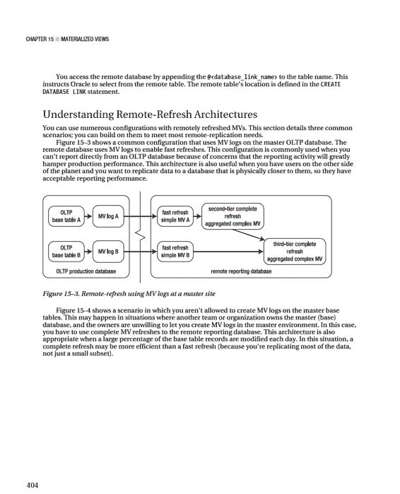
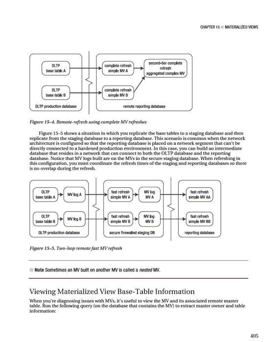
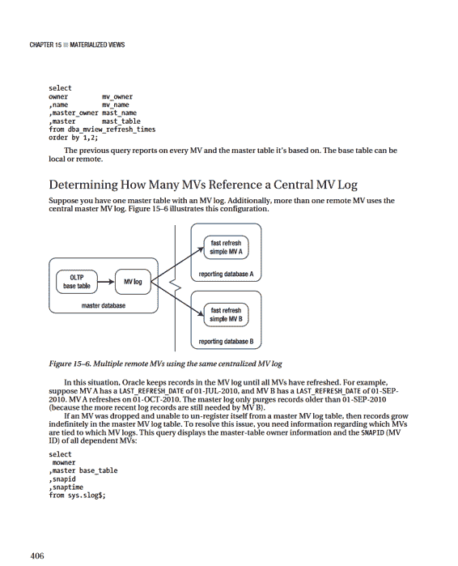
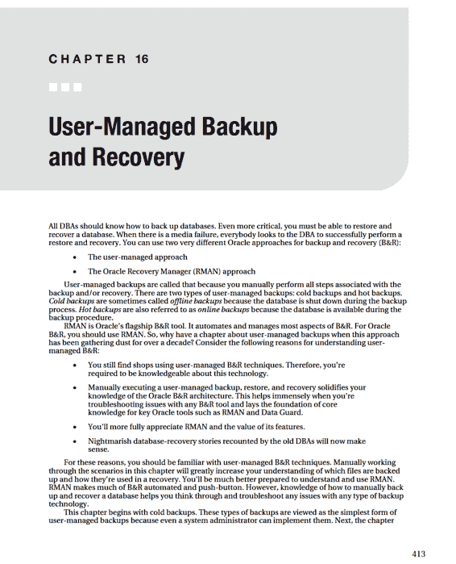
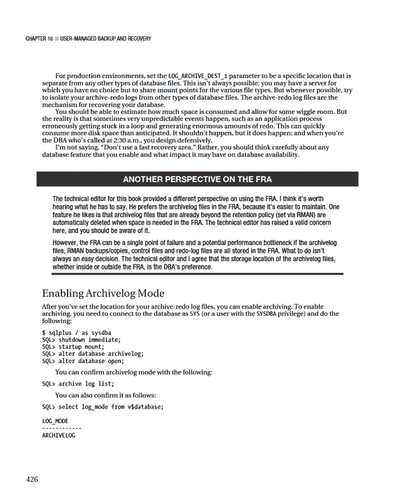
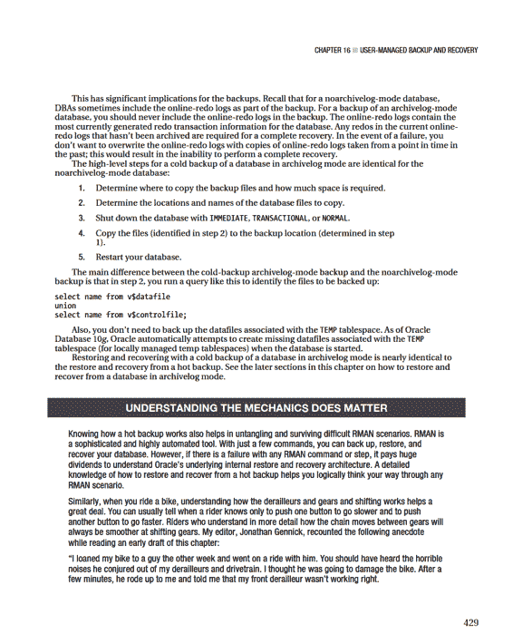

# 源 Oracle 操作系统变量

```bash
. /var/opt/oracle/oraset $1
```

```bash
crit_var=$(sqlplus -s <<EOF
rep_mv/jc00le
SET HEAD OFF FEED OFF
SELECT count(*) FROM user_mviews
WHERE sysdate-last_refresh_date > 1;
EOF)
```

```bash
if [ $crit_var -ne 0 ]; then
echo $crit_var
echo "mv_ref refresh problem with $1" | mailx -s "mv_ref problem" \
dkuhn@sun.com
else
echo $crit_var
echo "MVs ok"
fi
```

```bash
exit 0
```

## 第 15 章 ■ 物化视图

此脚本获取 SQL*Plus 语句的输出并将其返回给 shell 变量 `crit_var`。如果 `REP_MV` 用户的任何物化视图在过去一天内未刷新，则 `crit_var` 变量的值不为零。如果 `crit_var` 不等于零，则会发送一封电子邮件，指出存在问题。

## 创建远程物化视图刷新

您可以创建从远程表、物化视图和/或视图中选择数据的物化视图。这使您能够快速高效地复制数据。基于远程对象设置物化视图的步骤如下：

1.  确保从复制数据库环境到主表所在的数据库存在 Oracle Net 连接。如果没有此连接，则无法使用物化视图进行复制。
2.  获取对远程数据库中用户帐户的访问权限，该帐户应有权访问您要复制的远程表、物化视图或视图。
3.  对于快速刷新，在主（基）表上创建物化视图日志。仅当您打算执行快速刷新时才需要这样做。
4.  在复制数据库环境中创建一个指向主数据库的数据库链接。
5.  在复制数据库环境中，通过步骤 4 创建的数据库链接访问远程主对象来创建物化视图。

下面是一个简单示例。首先，确保可以从复制环境建立到主数据库的 Oracle Net 连接。您可以通过从复制数据库环境使用 SQL*Plus 连接到远程主数据库来验证连接并确保可以登录到主数据库。在将包含物化视图的数据库的命令提示符下，尝试连接到名为 `ENGDEV`、位于 `XENGDB` 服务器上的主数据库中的用户 `REP_MV`：

```sql
$sqlplus rep_mv/foo@'xengdb:1522/engdev'
```

当连接到远程主数据库时，还要确保您有权访问基于其创建物化视图的表。在此示例中，远程主表的名称为 `INV`：

```sql
SQL> select count(*) from inv;
```

接下来，在将包含物化视图的数据库中创建一个数据库链接。该数据库链接指向远程主数据库中的用户：

```sql
create database link engdev
connect to rep_mv identified by foo
using 'xengdb:1522/engdev';
```

现在，创建一个访问主 `INV` 表的物化视图：

```sql
create materialized view inv_mv
refresh complete on demand
as
select
inv_id
,inv_desc
from inv@engdev;
```





## 第 15 章 ■ 物化视图

以下是一些示例输出，显示了两个连接到一个物化视图日志的物化视图：

```
MOWNER BASE_TABLE SNAPID SNAPTIME
-------------------- ------------------------- ---------- ---------
INV_MGMT CMP_GRP_ASSOC 651 05-AUG-10
INV_MGMT CMP_GRP_ASSOC 541 02-JAN-08
```

下一个查询显示有关所有已创建的、连接到物化视图日志的物化视图的信息。在主站点上运行此查询：

```sql
select
a.log_table
,a.log_owner
,b.master mast_tab
,c.owner mv_owner
,c.name mview_name
,c.mview_site
,c.mview_id
from dba_mview_logs a
,dba_base_table_mviews b
,dba_registered_mviews c
where b.mview_id = c.mview_id
and b.owner = a.log_owner
and b.master = a.master
order by a.log_table;
```

以下是示例输出：

```
LOG_TABLE LOG_OWNE MAST_TAB MV_OWN MVIEW_NAME MVIEW_S MVIEW_ID
------------------- -------- ------------- ------ ---------------- ------- --------
MLOG$_CMP_GRP_ASSOC INV_MGMT CMP_GRP_ASSOC REP_MV CMP_GRP_ASSOC_MV DWREP 651
MLOG$_CMP_GRP_ASSOC INV_MGMT CMP_GRP_ASSOC TSTDEV CMP_GRP_ASSOC_MV ENGDEV 541
```

当您删除远程物化视图时，它应该从主数据库中注销。然而，这并不总是发生。远程数据库可能被清除（也许是一个短期的开发数据库），而物化视图没有机会自行注销（通过 `DROP MATERIALIZED VIEW` 语句）。在这种情况下，物化视图日志不知道依赖的物化视图已不再可用，因此它会无限期地保留记录。

要从包含物化视图日志的数据库中清除不需要的物化视图信息，请执行 `DBMS_MVIEW` 的 `PURGE_MVIEW_FROM_LOG` 过程。此示例传入要清除的物化视图的 ID：

```sql
SQL> exec dbms_mview.purge_mview_from_log(541);
```

此语句应更新数据字典并从内部表 `SLOG$` 和 `DBA_REGISTERED_MVIEWS` 中删除信息。如果被清除的物化视图是与物化视图日志表关联的最旧物化视图，则相关的旧记录也会从物化视图日志中删除。

如果远程物化视图不再可用但仍注册在物化视图日志表中，您可以在主站点手动注销它。使用 `DBMS_MVIEW` 包的 `UNREGISTER_MVIEW` 过程来注销远程物化视图。为此，您需要知道远程物化视图的所有者、名称和站点（可从本节前面查询的输出中获取）：

```sql
SQL> exec dbms_mview.unregister_mview('TSTDEV','CMP_GRP_ASSOC_MV','ENGDEV');
```

如果成功，先前的操作将从 `DBA_REGISTERED_MVIEWS` 中删除一条记录。

## 第 15 章 ■ 物化视图

## 在组中管理物化视图

物化视图组是一个有用的功能，它使您能够在一致的事务点时间刷新一组物化视图。如果您刷新基于具有父/子关系的主表的物化视图，那么您很可能应该使用刷新组。此方法可确保您的刷新物化视图集中不会出现任何孤立的子记录。以下部分描述了如何创建和维护物化视图刷新组。

■ **注意** 您使用 `DBMS_REFRESH` 包来完成本节中的大多数任务。该包在 Oracle 高级复制管理 API 参考指南（可在 OTN 上获取）中有完整记录。

### 创建物化视图组

您使用 `DBMS_REFRESH` 包的 `MAKE` 过程来创建物化视图组。创建物化视图组时，必须指定名称、组中物化视图的逗号分隔列表、下次刷新日期以及用于计算下次刷新时间的间隔。以下是一个包含两个物化视图的组的示例：

```sql
begin
dbms_refresh.make(
name => 'INV_GROUP'
,list => 'INV_MV, REGION_MV'
,next_date => sysdate-100
,interval => 'sysdate+1'
);
end;
/
```

创建物化视图组时，Oracle 会自动创建一个数据库作业来管理组的刷新。您可以通过查询 `DBA/ALL/USER_REFRESH` 来查看物化视图组的详细信息：

```sql
select
rname
,job
,next_date
,interval
from user_refresh;
```

以下是示例输出：

```
RNAME JOB NEXT_DATE INTERVAL
---------- --------- --------- ---------------
INV_GROUP 34 26-APR-10 sysdate+1
```

我很少使用内部数据库作业作为刷新机制。请注意，前面 SQL 中指定的 `NEXT_DATE` 值是 `sysdate-100`。这意味着只有当日期被设置为过去 100 天时，数据库作业才会启动此作业。这样，作业调度器永远不会启动刷新。

在大多数环境中，刷新需要在特定时间启动。在这些场景中，您使用 `cron` 作业或具有作业调度功能的类似实用程序。

## 第 15 章 ■ 物化视图

### 更改物化视图刷新组

您可以更改刷新组的特性，例如刷新日期和/或间隔。如果您依赖数据库作业作为刷新机制，那么您可能偶尔需要调整刷新特性。使用 `DBMS_REFRESH` 包的 `CHANGE` 函数来实现这一点。此示例更改了 `INTERVAL` 计算：

```sql
SQL> exec dbms_refresh.change(name=>'CCIM_GROUP',interval=>'SYSDATE+1');
```

同样，只有在使用内部数据库作业启动物化组刷新时才需要更改刷新间隔。您可以使用以下查询验证刷新组的间隔和作业信息的详细信息：

```sql
select
a.job
,a.broken
,b.rowner
,b.rname
,b.interval
from dba_jobs a
,dba_refresh b
where a.job = b.job
order by a.job;
```

此示例的输出如下：

```
JOB B ROWNER RNAME INTERVAL
---------- - --------------- --------------- ------------
104 N REP_MV CCIM_GROUP SYSDATE+1
```

### 刷新物化视图组

创建组后，您可以使用 `DBMS_REFRESH` 包的 `REFRESH` 函数手动刷新它。此示例刷新您先前创建的组：

```sql
SQL> exec dbms_refresh.refresh('INV_GROUP');
```

如果您检查 `USER_MVIEWS` 的 `LAST_REFRESH_DATE` 列，您会注意到组中的所有物化视图都具有相同的刷新时间。这是预期行为，因为组中的物化视图都是在一致的事务点时间刷新的。

### DBMS_MVIEW 与 DBMS_REFRESH

您可能已经注意到，您可以使用 `DBMS_MVIEW` 包来刷新一组物化视图。例如，您可以使用 `DBMS_MVIEW` 刷新列表中的一组物化视图，如下所示：

```sql
SQL> exec dbms_mview.refresh(list=>'INV_MV,REGION_MV');
```

这将把列表中的每个物化视图作为单个事务进行刷新。这相当于使用物化视图组。

但是，当您使用 `DBMS_MVIEW` 时，您可以选择将 `ATOMIC_REFRESH` 参数设置为 `TRUE`（默认值）或 `FALSE`。例如，这里 `ATOMIC_REFRESH` 参数设置为 `FALSE`：

```sql
SQL> exec dbms_mview.refresh(list=>'INV_MV,REGION_MV',atomic_refresh=>false);
```

409

## 第 15 章 ■ 物化视图

将 `ATOMIC_REFRESH` 设置为 `FALSE` 会指示 `DBMS_MVIEW` 将列表中的每个物化视图作为单独的事务进行刷新。它还指示物化视图的完全刷新考虑使用 `TRUNCATE` 语句。前面的代码行等效于以下两行：

```sql
SQL> exec dbms_mview.refresh(list=>'INV_MV', atomic_refresh=>false);
SQL> exec dbms_mview.refresh(list=>'REGION_MV', atomic_refresh=>false);
```

将此与 `DBMS_REFRESH` 的行为进行比较，`DBMS_REFRESH` 是您应该用于设置和维护物化视图组的包。`DBMS_REFRESH` 包总是将一组物化视图作为一个一致的事务进行刷新。

如果您总是需要将一组物化视图作为一个事务一致的组进行刷新，请使用 `DBMS_REFRESH`。如果您需要灵活性，决定是否将一组物化视图作为一个一致的事务进行刷新，请使用 `DBMS_MVIEW`。

### 确定组中的物化视图

当您调查物化视图刷新组的问题时，一个很好的起点是显示该组包含哪些物化视图。查询数据字典视图 `DBA_RGROUP` 和 `DBA_RCHILD` 以查看刷新组中的物化视图：

```sql
select
a.owner
,a.name mv_group
,b.name mv_name
from dba_rgroup a
,dba_rchild b
where a.refgroup = b.refgroup
and a.owner = b.owner
order by a.owner, a.name, b.name;
```

以下是输出片段：

```
OWNER MV_GROUP MV_NAME
--------------- -------------------- --------------------
DARL INV_GROUP INV_MV
DARL INV_GROUP REGION_MV
```

在 `DBA_RGROUP` 视图中，`NAME` 列表示刷新组的名称。`DBA_RCHILD` 视图包含刷新组中每个物化视图的名称。

### 向刷新组添加物化视图

随着业务需求的变化，您偶尔需要向组中添加物化视图。使用 `DBMS_REFRESH` 包的 `ADD` 过程来完成此任务：

```sql
SQL> exec dbms_refresh.add(name=>'INV_GROUP',list=>'PRODUCTS_MV,USERS_MV');
```

您必须指定一个名称并提供要添加的物化视图名称的逗号分隔列表。新添加的物化视图将在下次组刷新时刷新。

另一种将物化视图添加到组中的方法是删除该组并使用新的物化视图重新创建它。但是，通常更可取的方法是添加物化视图。

## 第 15 章 ■ 物化视图

### 从刷新组中移除物化视图

有时您需要从组中移除物化视图。为此，请使用 `DBMS_REFRESH` 包的 `SUBTRACT` 函数。此示例从组中移除一个物化视图：

```sql
SQL> exec dbms_refresh.subtract(name=>'INV_GROUP',list=>'REGION_MV');
```

您必须指定物化视图组的名称，并提供一个包含要移除的物化视图名称的逗号分隔列表。

另一种从组中移除物化视图的方法是删除该组并使用不需要的物化视图重新创建它。但是，通常更可取的方法是移除物化视图。

### 删除物化视图刷新组

如果您需要删除物化视图刷新组，请使用 `DBMS_REFRESH` 包的 `DESTROY` 过程。此示例删除名为 `INV_GROUP` 的物化视图组：

```sql
SQL> exec dbms_refresh.destroy('INV_GROUP');
```

这仅删除物化视图刷新组对象——它不会删除任何实际的物化视图。如果您还需要删除物化视图，请使用 `DROP MATERIALIZED VIEW` 语句。

## 总结

有时术语 *物化视图* 会让刚接触该技术的人感到困惑。也许 Oracle 本应将此功能命名为“定期清除并重新填充包含查询结果的表”，但那可能太长了。无论如何，当您了解了此工具的强大功能后，您就可以使用它来复制和聚合大量数据。通过定期计算和存储复杂数据聚合的结果，您可以大大提高查询性能。

物化视图可以是*可快速刷新*的，这意味着它们仅复制自上次刷新以来主表中发生的更改。要使用这种类型的物化视图，您必须在主表上创建物化视图日志。并非总是可以创建物化视图日志；在这些场景中，物化视图必须完全刷新。

如果需要，您还可以使用物化视图压缩和加密数据。这有助于更好的空间管理和安全性。此外，您可以对物化视图使用的底层表进行分区，以实现更好的可扩展性、性能和可用性。

物化视图提供了一种高效的数据复制方法。在某些情况下，您需要复制整个数据库或仅复制某些数据库对象和部分数据。接下来的几章重点介绍 Data Pump，您可以使用它来卸载、传输和加载整个数据库或部分对象和数据。



## 第 16 章 ■ 用户管理的备份与恢复

讨论了热备份。您还将研究几种常见的恢复和还原场景。这些示例构建了您对 Oracle B&R 内部机制的基础知识。最后，本章介绍了 Oracle 的闪回技术以及它如何补充许多用户管理的恢复场景。

### 为非归档日志模式数据库实施冷备份策略

您通过在数据库关闭后复制文件来执行用户管理的冷备份。这种类型的备份也称为脱机备份。进行冷备份时，您的数据库可以处于非归档日志模式或归档日志模式。

出于某些原因，DBA 倾向于认为冷备份等同于对非归档日志模式数据库的备份。这是不正确的。您可以对归档日志模式数据库进行冷备份，这是许多机构采用的备份策略。以下各节详细介绍了数据库处于非归档日志模式与归档日志模式下进行冷备份的区别。

#### 对非归档日志模式数据库进行冷备份

对非归档日志模式数据库进行冷备份的一个主要原因是可以为您提供一种将数据库还原到过去某个时间点的方法。仅当您不需要恢复备份之后发生的事务时，才应使用此类型的备份。仅当您的业务要求允许数据丢失和停机时，这种类型的 B&R 策略才是可接受的。您很少会对生产业务数据库实施这种类型的 B&R 解决方案。

话虽如此，实施这种类型的备份有一些充分的理由。一个常见的用途是对开发/测试/培训数据库进行冷备份，并定期将数据库重置回基线。这为您提供了一种方式，可以使用数据库的相同时间点快照重新启动性能测试或培训课程。

■ **提示** 考虑使用“闪回数据库”功能将数据库设置回过去的某个时间点。本章后面将讨论闪回数据库。

本节中的示例向您展示了如何备份数据库中的每个关键文件：所有控制文件、数据文件、临时数据文件和联机重做日志文件。使用这种类型的备份，您可以轻松地将数据库还原到进行备份的时间点。这种方法的主要优点是概念简单且易于实施。对非归档日志模式数据库进行冷备份所需的步骤如下：

1.  确定将备份文件复制到何处以及需要多少空间。
2.  确定要复制的数据库文件的位置和名称。
3.  使用 `IMMEDIATE`、`TRANSACTIONAL` 或 `NORMAL` 子句关闭数据库。
4.  将文件（在步骤 2 中识别）复制到备份位置（在步骤 1 中确定）。
5.  重新启动数据库。

## 第 16 章 ■ 用户管理的备份与恢复

以下各节详细阐述了这些步骤。

##### 步骤 1：确定将备份文件复制到何处以及需要多少空间

理想情况下，备份位置应与您的实时数据文件位置位于不同的磁盘组上。但是，在许多机构中，您可能没有选择权，并且会被告知数据库要使用哪些挂载点。通常，底层子磁盘系统的设计不由您决定。

在此示例中，备份位置是目录 `/oradump/cbackup/O11R2`。要大致了解存储备份副本所需的空间，您可以运行此查询：

```sql
select sum(sum_bytes)/1024/1024 m_bytes
from(
select sum(bytes) sum_bytes from v$datafile
union
select sum(bytes) sum_bytes from v$tempfile
union
select (sum(bytes) * members) sum_bytes from v$log
group by members);
```

##### 步骤 2：确定要复制的文件的位置和名称

运行此查询以列出非归档日志模式数据库冷备份中包含的文件的名称（和路径）：

```sql
select name from v$datafile
union
select name from v$controlfile
union
select name from v$tempfile
union
select member from v$logfile;
```

您需要备份联机重做日志吗？不需要；作为任何类型备份的一部分，您永远不需要备份联机重做日志。那么为什么 DBA 作为冷备份的一部分备份联机重做日志呢？

一个原因是它使非归档日志模式场景的还原过程稍微容易一些。需要联机重做日志才能正常打开数据库。如果您备份所有文件（包括联机重做日志），那么要使数据库恢复到备份时的状态，您需要还原所有文件（包括联机重做日志）并启动数据库。

■ **提示** 有关可用于自动化 B&R 步骤的 SQL 生成命令示例，请参阅本章后面关于编写脚本的部分。

## 第 16 章 ■ 用户管理的备份与恢复

##### 步骤 3：关闭数据库

以 `SYS`（或具有 `SYSDBA` 权限的用户）身份连接到您的数据库，并使用 `IMMEDIATE`、`TRANSACTIONAL` 或 `NORMAL` 关闭数据库。在几乎所有情况下，使用 `IMMEDIATE` 是首选方法。此模式会断开用户连接，回滚未完成的事务，并关闭数据库：

```bash
$ sqlplus / as sysdba
SQL> shutdown immediate;
```

##### 步骤 4：创建文件的备份副本

对于在步骤 2 中识别的每个文件，使用操作系统实用程序将文件复制到备份目录（在步骤 1 中确定）。在这个简单的示例中，所有数据文件、控制文件、临时数据库文件和联机重做日志都位于同一目录中。在生产环境中，您很可能将文件分布在几个不同的目录中。此示例使用 Linux/Unix `cp` 命令将数据库文件从 `/ora01/dbfile/O11R2` 复制到 `/oradump/cbackup/O11R2` 目录：

```bash
$ cp /ora01/dbfile/O11R2/*.* /oradump/cbackup/O11R2
```

##### 步骤 5：重新启动数据库

复制所有文件后，您可以启动数据库：

```bash
$ sqlplus / as sysdba
SQL> startup;
```

#### 在非归档日志模式下还原包含联机重做日志的冷备份

下一个示例解释如何还原非归档日志模式数据库的冷备份。如果冷备份中包含了联机重做日志，则在还原文件时可以包含联机重做日志。此过程涉及以下步骤：

1.  关闭实例。
2.  从备份中将数据文件、联机重做日志、临时文件和控制文件复制回来。
3.  启动数据库。
4.  这些步骤在以下各节中详述。

##### 步骤 1：关闭实例

如果实例正在运行，请关闭它。在此场景中，如何关闭数据库并不重要，因为您要还原到某个时间点。实时数据库目录位置中的任何文件在备份文件复制回来时都会被覆盖。如果您的实例正在运行，您可以强行中止它。作为具有 `SYSDBA` 权限的用户，执行以下操作：

```bash
$ sqlplus / as sysdba
SQL> shutdown abort;
```

## 第 16 章 ■ 用户管理的备份与恢复

##### 步骤 2：从备份复制文件回来

此步骤执行与备份相反的操作：您将文件从备份位置复制到实时数据库文件位置。在此示例中，所有备份文件都位于 `/oradump/cbackup/O11R2` 目录中，并且所有文件都被复制到 `/ora01/dbfile/O11R2` 目录：

```bash
$ cp /oradump/cbackup/O11R2/*.* /ora01/dbfile/O11R2
```

##### 步骤 3：启动数据库

以 `SYS`（或具有 `SYSDBA` 权限的用户）身份连接到您的数据库，并启动数据库：

```bash
$ sqlplus / as sysdba
SQL> startup;
```

完成这些步骤后，您应该拥有与进行冷备份时完全相同的数据库副本。就好像您将数据库设置回进行备份的时间点一样。

#### 在非归档日志模式下不包含联机重做日志还原冷备份

如前所述，从冷备份还原时永远不需要联机重做日志。如果您对非归档日志模式数据库进行了冷备份并且备份中未包含联机重做日志，则还原步骤与上一节中的步骤几乎相同。主要区别在于最后一步需要使用 `OPEN RESETLOGS` 子句打开数据库。

步骤如下：

1.  关闭实例。
2.  从备份中将控制文件和数据文件复制回来。
3.  以装载模式启动数据库。
4.  使用 `OPEN RESETLOGS` 子句打开数据库。

##### 步骤 1：关闭实例

如果实例正在运行，请关闭它。在此场景中，如何关闭数据库并不重要，因为您要还原到某个时间点。实时数据库目录位置中的任何文件在备份复制时都会被覆盖。在此场景中，如果您的实例正在运行，您可以强行中止它。作为具有 `SYSDBA` 权限的用户，执行以下操作：

```bash
$ sqlplus / as sysdba
SQL> shutdown abort;
```

##### 步骤 2：从备份复制文件回来

将控制文件和数据文件从备份位置复制到实时数据文件位置：

```bash
$ cp <backup directory>/*.* <live database file directory>
```

417

## 第 16 章 ■ 用户管理的备份与恢复

##### 步骤 3：以装载模式启动数据库

以 `SYS` 或具有 `SYSDBA` 权限的用户身份连接到您的数据库，并以装载模式启动数据库：

```bash
$ sqlplus / as sysdba
SQL> startup mount
```

##### 步骤 4：使用 `OPEN RESETLOGS` 子句打开数据库

使用 `OPEN RESETLOGS` 子句打开您的数据库以供使用：

```sql
SQL> alter database open resetlogs;
```

如果您看到“Database altered”消息，则命令成功。但是，您可能会看到此错误：

```
ORA-01139: RESETLOGS option only valid after an incomplete database recovery
```

在这种情况下，发出以下命令：

```sql
SQL> recover database until cancel;
```

您应该看到此消息：

```
Media recovery complete.
```

现在，尝试使用 `OPEN RESETLOGS` 子句打开数据库：

```sql
SQL> alter database open resetlogs;
```

此语句指示 Oracle 重新创建联机重做日志。Oracle 使用控制文件中的信息来确定重做日志的位置、名称和大小。如果那些位置中存在旧的联机重做日志文件，它们将被覆盖。

如果您在此过程中监控 `alert.log`，您可能会看到 `ORA-00312` 和 `ORA-00313`。这意味着 Oracle 找不到联机重做日志文件；这是可以的，因为这些文件在 `OPEN RESETLOGS` 命令重新创建之前是物理不可用的。

#### 为冷备份和还原编写脚本

查看如何为冷备份编写脚本具有指导意义。基本思想是动态查询数据字典以确定要备份的文件的位置和名称。这比在脚本中硬编码目录位置和文件名更可取。动态生成脚本不太容易出错和出现意外（例如，当新数据文件添加到数据库但未添加到旧的硬编码备份脚本时）。

■ **注意** 本节中的脚本并非生产强度的 B&R 脚本。相反，它们说明了为冷备份及后续还原编写脚本的基本概念。

本节中的第一个脚本对数据库进行冷备份。在使用冷备份脚本之前，您需要修改脚本中包含的这些变量以匹配您的数据库环境：

418

## 第 16 章 ■ 用户管理的备份与恢复

*   `ORACLE_SID`
*   `ORACLE_HOME`
*   `cbdir`

`cbdir` 变量指定备份目录位置的名称。该脚本创建一个名为 `coldback.sql` 的文件，该文件从 SQL*Plus 执行以启动数据库的冷备份：

```bash
#!/bin/bash
ORACLE_SID=O11R2
ORACLE_HOME=/oracle/app/oracle/product/11.2.0/db_1
PATH=$PATH:$ORACLE_HOME/bin
#
sqlplus -s <<EOF
/ as sysdba
set head off pages0 lines 132 verify off feed off trimsp on
define cbdir=/oradump/cbackup/O11R2
spo coldback.sql
select 'shutdown immediate;' from dual;
select '!cp ' || name || ' ' || '&&cbdir' from v\$datafile;
select '!cp ' || name || ' ' || '&&cbdir' from v\$tempfile;
select '!cp ' || member || ' ' || '&&cbdir' from v\$logfile;
select '!cp ' || name || ' ' || '&&cbdir' from v\$controlfile;
select 'startup;' from dual;
spo off;
@@coldback.sql
EOF
exit 0
```

此文件生成要从 SQL*Plus 脚本执行的命令，以对数据库进行冷备份。您在 Unix `cp` 命令前放置一个感叹号 (`!`)，以指示 SQL*Plus 托管到操作系统以运行复制命令。当引用 `v$` 数据字典视图时，您还在每个美元符号 (`$`) 前放置一个反斜杠 (`\`)；这在 Linux/Unix shell 脚本中是必需的。`\` 转义 `$` 并告诉 shell 脚本不要将 `$` 字符视为特殊字符（`$` 通常表示 shell 变量）。

运行此脚本后，写入 `coldback.sql` 脚本的复制命令示例如下：

```sql
shutdown immediate;
!cp /ora01/dbfile/O11R2/system01.dbf /oradump/cbackup/O11R2
!cp /ora01/dbfile/O11R2/sysaux01.dbf /oradump/cbackup/O11R2
!cp /ora02/dbfile/O11R2/undotbs01.dbf /oradump/cbackup/O11R2
!cp /ora02/dbfile/O11R2/users01.dbf /oradump/cbackup/O11R2
...
!cp /ora01/oraredo/O11R2/redo02a.rdo /oradump/cbackup/O11R2
!cp /ora02/oraredo/O11R2/redo02b.rdo /oradump/cbackup/O11R2
!cp /ora01/dbfile/O11R2/control01.ctl /oradump/cbackup/O11R2
startup;
```

在进行冷备份的同时，您还应该生成一个脚本，该脚本提供将数据文件、临时文件、日志文件和控制文件复制回其原始位置的命令。您可以使用此文件从冷备份还原（无论是有意还是由于介质故障）。本节中的下一个脚本动态创建一个 `coldrest.sql` 脚本，该脚本将文件从备份位置复制到原始数据文件位置。您需要以与修改冷备份脚本相同的方式修改此脚本（将 `ORACLE_SID`、`ORACLE_HOME` 和 `cbdir` 变量更改为匹配您的环境）：

第 16 章 ■ 用户管理的备份与恢复

```bash
#!/bin/bash
ORACLE_SID=O11R2
ORACLE_HOME=/oracle/app/oracle/product/11.2.0/db_1
PATH=$PATH:$ORACLE_HOME/bin
#
sqlplus -s <<EOF
/ as sysdba
set head off pages0 lines 132 verify off feed off trimsp on
define cbdir=/oradump/cbackup/O11R2
define dbname=$ORACLE_SID
spo coldrest.sql
select 'shutdown abort;' from dual;
select '!cp ' || '&&cbdir/' || substr(name, instr(name,'/',-1,1)+1) ||
' ' || name from v\$datafile;
select '!cp ' || '&&cbdir/' || substr(name, instr(name,'/',-1,1)+1) ||
' ' || name from v\$tempfile;
select '!cp ' || '&&cbdir/' || substr(member, instr(member,'/',-1,1)+1) ||
' ' || member from v\$logfile;
select '!cp ' || '&&cbdir/' || substr(name, instr(name,'/',-1,1)+1) ||
' ' || name from v\$controlfile;
select 'startup;' from dual;
spo off;
EOF
exit 0
```

此脚本创建一个名为 `coldrest.sql` 的脚本，该脚本生成将您的数据文件、临时文件、日志文件和控制文件复制回其原始位置的复制命令。运行此 shell 脚本后，`coldrest.sql` 文件中的代码片段示例如下：

```sql
shutdown abort;
!cp /oradump/cbackup/O11R2/system01.dbf /ora01/dbfile/O11R2/system01.dbf
!cp /oradump/cbackup/O11R2/sysaux01.dbf /ora01/dbfile/O11R2/sysaux01.dbf
!cp /oradump/cbackup/O11R2/undotbs01.dbf /ora02/dbfile/O11R2/undotbs01.dbf
!cp /oradump/cbackup/O11R2/users01.dbf /ora02/dbfile/O11R2/users01.dbf
...
!cp /oradump/cbackup/O11R2/redo02a.rdo /ora01/oraredo/O11R2/redo02a.rdo
!cp /oradump/cbackup/O11R2/redo02b.rdo /ora02/oraredo/O11R2/redo02b.rdo
!cp /oradump/cbackup/O11R2/control01.ctl /ora01/dbfile/O11R2/control01.ctl
startup;
```

如果需要使用此脚本从冷备份还原，以 `SYS` 身份登录到 SQL*Plus 并执行该脚本：

```bash
$ sqlplus / as sysdba
SQL> @coldrest.sql
```

#### 实施归档日志模式

回想一下第 5 章的讨论，只有当您的数据库处于归档日志模式时，才会创建归档重做日志。在此模式下，当联机重做日志填满时，会启动日志切换。当日志切换发生时，日志写入器进程停止写入最近填满的联机重做日志，并开始写入新的联机重做日志组。联机重做日志组以循环方式写入。

归档日志模式是以下技术的先决条件：用户管理的热备份、闪回数据库功能和 RMAN 联机备份。如果您没有启用归档，并且尝试进行用户管理的热备份，则在将数据库或表空间更改为备份模式时会收到此错误：

```
ORA-01123: cannot start online backup; media recovery not enabled
```

此时，您需要将数据库置于归档日志模式。

420

第 16 章 ■ 用户管理的备份与恢复

### 做出架构决策

当您实施归档日志模式时，您还需要一个管理这些文件的策略。归档重做日志会消耗磁盘空间。如果置之不理，这些文件最终将消耗分配给它们的所有空间。如果发生这种情况，归档器无法将新的归档重做日志文件写入磁盘，您的数据库将停止处理事务。此时您将拥有一个挂起的数据库。您需要通过手动干预为归档器恢复工作创建空间。出于这些原因，在启用归档之前，您必须仔细考虑几个架构决策：

*   将归档重做日志放在何处，以及是否使用快速恢复区（以前称为闪回恢复区）来存储归档重做日志
*   如何命名归档重做日志
*   应为归档重做日志位置分配多少空间
*   备份归档重做日志的频率
*   何时可以永久从磁盘中删除归档重做日志
*   是否应启用多个归档重做日志位置
*   如果这是生产数据库，何时安排所需的小量停机时间

至少，您的主归档重做位置应有足够的空间来保存至少一天的归档重做日志。这让您可以每天备份它们，然后在备份后从磁盘中删除它们。

如果您决定为归档重做日志位置使用快速恢复区 (FRA)，则必须确保它包含足够的空间来保存两次备份之间生成的归档重做日志。请记住，FRA 通常包含其他类型的文件，例如 RMAN 备份文件、闪回日志等。如果您使用 FRA，请注意其他类型文件的生成可能会潜在地影响归档重做日志文件所需的空间。

您需要一个策略来自动化归档重做日志文件的备份和删除。对于用户管理的备份，这可以通过一个 shell 脚本来实现，该脚本定期将归档重做日志复制到备份位置，然后从主位置删除它们。正如您在后面章节中看到的，RMAN 自动化了归档重做日志文件的备份和删除。

如果您的业务要求是必须具有一定程度的高可用性和冗余，那么您应该考虑将归档重做日志写入多个位置。一些机构设置作业来定期将归档重做日志复制到磁盘上的不同位置，甚至复制到不同的服务器。

### 设置归档重做文件位置

在将数据库模式设置为归档之前，您应明确指示 Oracle 将归档重做日志放置在何处。您可以使用以下技术设置归档重做日志文件的目标位置：

第 16 章 ■ 用户管理的备份与恢复

*   设置 `LOG_ARCHIVE_DEST_N` 数据库初始化参数。
*   实施 FRA。

这两种方法在以下部分中详细讨论。

■ **提示** 如果您没有通过初始化参数或启用 FRA 显式设置归档重做日志位置，则归档重做日志将写入默认位置。此位置取决于数据库版本和操作系统。对于活动的生产数据库系统，默认的归档重做日志位置很少是合适的。

##### 将归档位置设置为用户定义的磁盘位置（非 FRA）

如果您使用的是 `init.ora` 文件，请使用操作系统实用程序（如 `vi`）修改该文件，并在其中放置您希望归档重做日志写入的位置。在此示例中，归档重做日志位置设置为 `/ora02/oraarch/O11R2`：

```
log_archive_dest_1='location=/ora02/oraarch/O11R2'
log_archive_format='%t_%s_%r.arc'
```

如果您使用的是 `spfile`，请使用 `ALTER SYSTEM` 修改相应的初始化变量：

```sql
SQL> alter system set log_archive_dest_1='location=/ora02/oraarch/O11R2' scope=both;
SQL> alter system set log_archive_format='%t_%s_%r.arc' scope=spfile;
```

您可以在数据库打开时动态更改 `LOG_ARCHIVE_DEST_n` 参数。但是，您必须停止并启动数据库才能使 `LOG_ARCHIVE_FORMAT` 参数生效。

注意不要将 `LOG_ARCHIVE_FORMAT` 设置为无效值，因为这样您将无法启动数据库：

```sql
SQL> startup nomount;
ORA-19905: log_archive_format must contain %s, %t and %r
```

在这种情况下，如果您使用的是 `spfile`，则无法启动实例。您必须重命名 `spfile`，从 `spfile` 创建 `pfile` (`SQL> create pfile from spfile;`)，将参数修改为有效值，使用 `pfile` 启动数据库，然后从 `pfile` 重新创建 `spfile`。

指定 `LOG_ARCHIVE_FORMAT` 时，必须在格式字符串中包含 `%t`（或 `%T`）、`%s`（或 `%S`）和 `d%`。表 16–1 列出了可以与 `LOG_ARCHIVE_FORMAT` 初始化参数一起使用的有效变量。

第 16 章 ■ 用户管理的备份与恢复

***表 16–1.** 日志归档格式字符串的有效变量*

**格式字符串** | **含义**
--- | ---
`%s` | 日志序列号
`%S` | 左侧补零的日志序列号
`%t` | 线程号
`%T` | 左侧补零的线程号
`%a` | 激活 ID
`%d` | 数据库 ID
`%r` | 重置日志 ID，需要确保跨数据库多个化身的唯一性

如果您没有为 `LOG_ARCHIVE_FORMAT` 指定值，Oracle 会使用默认值，例如 `%t_%s_%r.dbf`。我不喜欢默认格式的一个方面是它以扩展名 `.dbf` 结尾，该扩展名广泛用于数据文件。这可能会引起混淆，无法确定特定文件是否可以安全删除，因为它是一个旧的归档重做日志文件，或者该文件是否不应被触动，因为它是一个活动的数据文件。大多数 DBA 不愿意发出这样的命令（因为害怕意外删除关键数据文件）：

```bash
$ rm *.dbf
```

您可以通过运行以下命令查看 `LOG_ARCHIVE_DEST_N` 参数的值：

```sql
SQL> show parameter log_archive_dest
```

以下是输出的部分列表：

```
NAME TYPE VALUE
------------------------------------ ----------- ------------------------------
log_archive_dest string
log_archive_dest_1 string location=/ora02/oraarch/O11R2
log_archive_dest_10 string
log_archive_dest_11 string
```

对于 Oracle Database 11*g*，您可以启用最多 31 个不同的位置作为归档重做日志文件目标。对于大多数生产系统，您可以仅启用一个归档重做日志目标位置。

如果您需要更高级别的保护，可以启用多个目标。请记住，当您使用多个目标时，归档器必须能够成功写入至少一个位置。如果您启用了多个强制位置并将 `LOG_ARCHIVE_MIN_SUCCEED_DEST` 设置为大于 1，那么如果归档器无法写入所有强制位置，您的数据库可能会挂起。

第 16 章 ■ 用户管理的备份与恢复

您可以通过此查询检查有关归档重做日志位置状态的详细信息：

```sql
select
dest_name
,destination
,status
,binding
from v$archive_dest;
```

以下是输出的一小部分示例：

```
DEST_NAME DESTINATION STATUS BINDING
-------------------- ------------------------------ --------- ---------
LOG_ARCHIVE_DEST_1 /ora02/oraarch/O11R2 VALID OPTIONAL
LOG_ARCHIVE_DEST_2 INACTIVE OPTIONAL
```

##### 使用 FRA 存放归档日志文件

FRA 是磁盘上的一个区域——通过数据库初始化参数指定——指示 Oracle 将特定文件（如归档重做日志、RMAN 备份文件、闪回日志以及多路复用的控制文件和联机重做日志）放置于此。要启用 FRA 的使用，必须设置两个初始化参数：

*   `DB_RECOVERY_FILE_DEST_SIZE` 指定 FRA 中存储的所有文件可使用的最大空间。
*   `DB_RECOVERY_FILE_DEST` 指定 FRA 的基本目录。

当您创建 FRA 时，您实际上并不是在创建任何东西——您是在告诉 Oracle 在存储进入 FRA 的文件时使用哪个目录。例如，假设在挂载点上保留了 200GB 的空间，并且您希望 FRA 的基本目录为 `/ora02/fra`。要启用 FRA，首先设置 `DB_RECOVERY_FILE_DEST_SIZE`：

```sql
SQL> alter system set db_recovery_file_dest_size=200g;
```

接下来，设置 `DB_RECOVERY_FILE_DEST` 参数：

```sql
SQL> alter system set db_recovery_file_dest='/ora02/fra';
```

如果您使用的是 `init.ora` 文件，请确保使用操作系统实用程序（如 `vi`）对其进行修改，以便更改在数据库重启后仍然有效。

启用 FRA 后，默认情况下，Oracle 会将归档重做日志写入 FRA 中的子目录。

■ **注意** 如果您已将 `LOG_ARCHIVE_DEST_N` 参数设置为磁盘上的某个位置，则归档重做日志不会写入 FRA。

您可以验证归档位置是否使用了 FRA：

```sql
SQL> archive log list;
```

第 16 章 ■ 用户管理的备份与恢复

如果归档文件正在写入 FRA，您应该看到如下输出：

```
Database log mode Archive Mode
Automatic archival Enabled
Archive destination USE_DB_RECOVERY_FILE_DEST
```

您可以像这样显示与 FRA 关联的目录：

```sql
SQL> show parameter db_recovery_file_dest
```

当您首次实施 FRA 时，基本 FRA 目录（使用 `DB_RECOVERY_FILE_DEST` 指定）下没有子目录。当 Oracle 首次需要向 FRA 写入文件时，它会在基本目录下创建任何必需的目录。例如，在您实施 FRA 后，如果您的数据库启用了归档，那么当首次发生联机重做日志切换时，Oracle 会在基本 FRA 目录下创建以下目录：

```
<SID>/archivelog/<YYYY_MM_DD>
```

对于此数据库示例，归档日志写入以下目录：

```
/ora02/fra/O11R2/archivelog/2010_08_25
```

每天生成的归档重做日志都会导致在 FRA 中创建一个使用目录名称格式 `YYYY_MM_DD` 的新目录。

如果您希望将归档重做日志同时写入 FRA 和非 FRA 位置，可以按如下方式启用：

```sql
SQL> alter system set log_archive_dest_1='location=/ora02/oraarch/O11R2';
SQL> alter system set log_archive_dest_2='location=USE_DB_RECOVERY_FILE_DEST';
```

##### 非正统的 FRA 思考

Oracle 建议您将 FRA 用于归档重做日志和 RMAN 备份。但是，我通常不在生产环境中实施 FRA——不用于归档重做日志，不用于 RMAN 备份文件，也不用于任何类型的文件。为什么会这样？

当您启用 FRA 时，如果您没有设置初始化参数 `LOG_ARCHIVE_DEST_N`，那么默认情况下，归档重做日志会写入 FRA。RMAN 备份也是如此：如果您没有专门配置 RMAN 通道磁盘位置，那么默认情况下，RMAN 备份文件会写入 FRA。

当您使用 FRA（如前所述）时，归档重做日志和 RMAN 备份消耗的磁盘空间必须适合分配给 FRA 的磁盘空间。如果您的数据库生成的重做量意外激增，或者 RMAN 备份出现不可预见的问题，导致消耗了未预料到的磁盘空间量，会发生什么？

关于 RMAN 备份，如果 FRA 满了，RMAN 备份将中止。RMAN 备份失败并非灾难性的，因为通常您可以快速解决空间问题并手动运行另一次备份。在大多数情况下，这不会损害您的数据库可用性；在备份失败的情况下，您仍然拥有以前的 RMAN 备份，可用于还原和恢复数据库。

但是，如果归档重做日志目标已满，并且归档器无法写入文件系统，您的数据库将挂起。在许多 24x7 的关键任务环境中，这种类型的停机是不可接受的，并且会危及您保住工作的能力。

我发现通过使用专用挂载点来存放这些关键文件，更容易控制分配给归档重做日志的空间。如果可能，请不要将分配给归档重做日志的磁盘空间与 RMAN 备份共享。RMAN 备份的问题可能导致归档重做日志出现磁盘空间问题，而您希望归档重做日志消耗的空间尽可能稳定和可预测。



第 16 章 ■ 用户管理的备份与恢复

#### 禁用归档日志模式

通常，您不会为生产数据库禁用归档日志模式。但是，您可能正在执行大量数据加载，并希望减少与归档过程相关的任何开销，因此您希望在加载开始前关闭归档日志模式，然后在加载后重新启用它。如果您这样做，请确保在重新启用归档后尽快进行备份。

要禁用归档，请以 `SYS`（或具有 `SYSDBA` 权限的用户）身份执行以下操作：

```bash
$ sqlplus / as sysdba
SQL> shutdown immediate;
SQL> startup mount;
SQL> alter database noarchivelog;
SQL> alter database open;
```

您可以通过以下方式确认归档日志模式：

```sql
SQL> archive log list;
```

您也可以通过以下方式确认日志模式：

```sql
SQL> select log_mode from v$database;
LOG_MODE
NOARCHIVELOG
```

#### 对归档日志目标磁盘空间不足做出反应

归档器后台进程将归档重做日志写入您指定的位置。如果由于任何原因归档器进程无法写入归档位置，您的数据库将挂起。任何尝试连接的用户都会收到此错误：

```
ORA-00257: archiver error. Connect internal only, until freed.
```

作为生产支持 DBA，您永远不希望您的数据库进入该状态。有时会发生不可预测的事件，您必须处理本不应发生的问题。

■ **注意** 支持生产数据库的 DBA 与那些从闪亮的演示或重复的文档中获取新想法的架构 DBA 具有完全不同的心态。

在这种情况下，您的数据库相当于宕机并且完全不可用。要解决此问题，您必须快速采取行动：

*   将文件移动到其他位置。
*   压缩归档重做日志位置中的旧文件。
*   永久删除旧文件。
*   将归档重做日志目标切换到其他位置。

第 16 章 ■ 用户管理的备份与恢复

移动文件通常是解决归档器错误的最快、最安全的方法。您可以使用操作系统实用程序（如 `mv`）将旧的归档重做日志移动到其他位置。如果后续还原和恢复需要它们，您可以让恢复过程知道新位置。注意不要移动当前正在写入的归档重做日志。如果归档重做日志文件出现在 `V$ARCHIVED_LOG` 中，则表示它已完全归档。

您可以使用操作系统实用程序（如 `gzip`）压缩当前归档目标中的归档重做日志文件。如果您这样做，必须记住解压缩以后可能用于还原和恢复的任何文件。注意不要压缩当前正在写入的归档重做日志。

另一个选项是使用操作系统实用程序（如 `rm`）永久从磁盘删除归档重做日志。这种方法很危险，因为您可能需要这些归档重做日志进行后续恢复。如果您确实删除了归档重做日志文件，并且您没有它们的备份，您应该尽快对数据库进行完整备份。

如果服务器上的另一个位置有大量空间，您可以考虑更改归档重做日志的写入位置。例如：

```sql
SQL> alter system set log_archive_dest_1='location=/oraarch02';
```

解决主位置的问题后，您可以切换回原始位置。您可以在数据库运行时执行此操作。

当归档重做日志文件目标已满时，您必须争分夺秒地解决它。这就是为什么在为生产 24x7 数据库启用归档之前应该进行充分考虑的原因。

对于大多数数据库，将归档重做日志写入一个位置就足够了。但是，如果您有任何类型的灾难恢复或高可用性要求，那么您应该写入多个位置。有时 DBA 设置一个作业，每小时备份一次归档重做日志，并将它们复制到备用位置甚至备用服务器。

### 备份归档重做日志文件

根据您的业务要求，您可能需要一个备份归档重做日志文件的策略。至少，您应该备份在对归档日志模式数据库进行备份期间生成的任何归档重做日志。其他策略可能包括：

*   定期将归档重做日志复制到备用位置，然后从主目标中删除它们
*   将归档重做日志复制到磁带，然后从磁盘中删除它们
*   使用两个归档重做日志位置
*   使用 Data Guard 实现强大的灾难恢复解决方案

请记住，您需要自上次良好备份开始时间以来生成的所有归档重做日志，以确保可以完全恢复数据库。只有在确定拥有良好的数据库备份后，才应考虑删除备份之前生成的归档重做日志。

#### 对归档日志模式数据库进行冷备份

您可以使用归档日志模式数据库的备份来还原和恢复到故障之前最后一次提交的事务。因此，与非归档日志模式数据库的备份不同，这种类型的备份绝不是为了将数据库重置回无法应用恢复的过去某个时间点。归档日志模式数据库备份的目的是还原数据库，并前滚和应用事务以完全恢复数据库。



第 16 章 ■ 用户管理的备份与恢复

“变速器是好的。他只是那种只知道按按钮的人，对该动作背后的原理没有任何理解。”

您为理解 B&R 实施方式所付出的努力从长远来看会得到回报。您实际上需要记忆的东西更少——因为您对底层实现的理解使您能够思考问题并以清单无法做到的方式解决问题。

## 实施热备份策略

如本章前面所述，RMAN 应该是您进行任何类型 Oracle 数据库备份（联机或脱机）的首选工具。RMAN 比用户管理的备份更高效，并且自动化了几乎所有任务。话虽如此，获得对 Oracle B&R 内部机制理解的最佳方法之一是进行热备份，然后使用该备份来还原和恢复您的数据库。

手动发出热备份以及随后的还原和恢复中涉及的命令，有助于您理解每种类型文件（控制文件、数据文件、归档重做日志和联机重做日志）在还原和恢复场景中的作用。

本节首先向您展示如何实施热备份。它还提供了可用于自动化热备份过程的基本脚本。后面的部分解释了热备份的一些内部机制，并阐明了为什么在执行热备份之前必须将表空间置于备份模式。

### 进行热备份

热备份所需的步骤如下：

1.  确保数据库处于归档日志模式。
2.  确定将备份文件复制到何处。
3.  确定需要备份哪些文件。
4.  记录联机重做日志的最大序列号。
5.  将数据库/表空间更改为备份模式。
6.  使用操作系统实用程序复制数据文件。
7.  将数据库/表空间更改为退出备份模式。
8.  归档当前联机重做日志，并记录联机重做日志的最大序列号。
9.  备份控制文件。
10. 备份在备份期间生成的任何归档重做日志。

这些步骤在以下各节中详细说明。

第 16 章 ■ 用户管理的备份与恢复

##### 步骤 1：确保数据库处于归档日志模式

运行以下命令以检查数据库的归档日志模式状态：

```sql
SQL> archive log list;
```

输出显示此数据库处于归档日志模式：

```
Database log mode Archive Mode
Automatic archival Enabled
Archive destination /ora02/oraarch/O11R2
```

如果您不确定如何启用归档，请参阅本章前面的“启用归档日志模式”部分，其中详细说明了如何实施归档。

##### 步骤 2：确定将备份文件复制到何处

现在，确定备份位置。在此示例中，备份位置是目录 `/oradump/hbackup/O11R2`。要大致了解所需空间，您可以运行此查询：

```sql
SQL> select sum(bytes) from dba_data_files;
```

理想情况下，备份位置应与您的实时数据文件位于不同的磁盘组上。但在实践中，很多时候您会被给予存储区域网络 (SAN) 上的一块空间，并且对底层磁盘布局一无所知。在这些情况下，您依赖 SAN 硬件中内置的冗余（RAID 磁盘、多个控制器等）来确保高可用性和可恢复性。

##### 步骤 3：确定需要备份哪些文件

对于此步骤，您只需要知道数据文件的位置：

```sql
SQL> select name from v$datafile;
```

当您进行到步骤 5 时，您可能需要考虑一次将一个表空间更改为备份模式。如果您采用这种方法，您需要知道哪些数据文件与哪些表空间相关联：

```sql
select
tablespace_name
,file_name
from dba_data_files
order by 1,2;
```

##### 步骤 4：记录联机重做日志的最大序列号

要使用热备份成功恢复，您至少需要备份期间生成的所有归档重做日志。因此，您需要在开始热备份之前记录归档日志序列：

第 16 章 ■ 用户管理的备份与恢复

```sql
select
thread#
,max(sequence#)
from v$log
group by thread#
order by thread#;
```

##### 步骤 5：将数据库/表空间更改为备份模式

您可以使用 `ALTER DATABASE BEGIN BACKUP` 语句同时将所有表空间置于备份模式：

```sql
SQL> alter database begin backup;
``

如果是活动的 OLTP 数据库，这样做会大大降低性能。这是因为当表空间处于备份模式时，Oracle 会在首次修改任何块时将该块的完整映像复制到重做流中。本章后面将详细讨论这一点。

另一种方法是一次只将一个表空间更改为备份模式。将表空间更改为备份模式后，您可以复制相关数据文件（步骤 6），然后将表空间更改为退出备份模式（步骤 7）。您必须对每个表空间执行此操作：

```sql
SQL> alter tablespace <tablespace_name> begin backup;
```

##### 步骤 6：使用操作系统实用程序复制数据文件

使用操作系统实用程序（Linux/Unix `cp` 命令）将数据文件复制到备份位置。在此示例中，所有数据文件都在一个目录中，并且它们都被复制到同一个备份目录：

```bash
$ cp /ora01/dbfile/O11R2/*.dbf /oradump/hbackup/O11R2
```

##### 步骤 7：将数据库/表空间更改为退出备份模式

将所有数据文件复制到备份目录后，您需要将表空间更改为退出备份模式。此示例同时将所有表空间更改为退出备份模式：

```sql
SQL> alter database end backup;
```

如果您一次将一个表空间更改为备份模式，则在复制其数据文件后，需要将每个表空间更改为退出备份模式：

```sql
SQL> alter tablespace <tablespace_name> end backup;
```

如果您不将表空间退出备份模式，可能会严重降低性能并损害恢复数据库的能力。

第 16 章 ■ 用户管理的备份与恢复

##### 步骤 8：归档当前联机重做日志并记录联机重做日志的最大序列号

以下语句指示 Oracle 归档任何未归档的联机重做日志，并启动日志切换。这确保了备份结束标记被写入归档重做日志：

```sql
SQL> alter system archive log current;
```

同时记录联机重做日志的最大序列号。如果在热备份之后立即发生故障，您需要热备份期间生成的任何归档重做日志来完全恢复数据库：

```sql
select
thread#
,max(sequence#)
from v$log
group by thread#
order by thread#;
```

##### 步骤 9：备份控制文件

对于热备份，您不能使用操作系统复制命令来备份控制文件。Oracle 的热备份过程指定您必须使用 `ALTER DATABASE BACKUP CONTROLFILE` 语句。此示例备份控制文件并将其放在与数据库备份文件相同的位置：

```sql
SQL> alter database backup controlfile
to '/oradump/hbackup/O11R2/controlbk.ctl' reuse;
```

`REUSE` 子句指示 Oracle 如果备份位置中已存在该文件，则覆盖它。

##### 步骤 10：备份在备份期间生成的任何归档重做日志

备份在热备份期间生成的归档重做日志。您可以使用操作系统复制命令备份归档重做日志：

```bash
$ cp <archive redo logs generated during backup> <backup directory>
```

这确保了在热备份完成后不久发生故障时，您拥有这些日志。确保不要备份归档器进程当前正在写入的归档重做日志——这样做会导致该文件的副本不完整。有时，DBA 通过检查 `V$ARCHIVED_LOG` 视图中的最大 `SEQUENCE#` 和最大 `RESETLOGS_ID` 来编写此过程的脚本。当 Oracle 完成将归档重做日志复制到磁盘时，它会更新该视图。因此，出现在 `V$ARCHIVED_LOG` 视图中的任何归档重做日志文件都应该是安全的，可以复制。

第 16 章 ■ 用户管理的备份与恢复

#### 为热备份编写脚本

本节中的脚本涵盖了热备份相关的最少任务。对于生产环境，热备份脚本可能相当复杂。此处列出的脚本为您提供了一个热备份脚本中应包含内容的基线。

您需要修改脚本中的这些变量，使其在您的环境中工作：

*   `hbdir`
*   `dbname`

SQL*Plus 变量 `hbdir` 指向热备份的基本目录。该脚本还需要将 `dbname` 设置为数据库的 Oracle 系统标识符 (SID)。该脚本将文件复制到由 `hbdir` 和 `dbname` 变量连接而成的字符串目录。例如，如果您将 `hbdir` 设置为 `/oradump/hbackup`，并将 `dbname` 设置为 `O11R2`，则备份文件将被复制到 `/oradump/hbackup/O11R2` 目录：

```bash
#!/bin/bash
```


# 用户管理的备份与恢复

## 生成热备份脚本

你可以硬编码操作系统变量，或者通过脚本引用它们，有关 `oraset` 脚本的更多详情请参见第 2 章。

```bash
. /var/opt/oracle/oraset $1
#
sqlplus -s <<EOF
/ as sysdba
set head off pages0 lines 132 verify off feed off trimsp on
define hbdir=/oradump/hbackup
define dbname=O11R2
spo hotback.sql
select 'spo &&hbdir/&&dbname/hotlog.txt' from dual;
select 'select max(sequence#) from v\$log;' from dual;
select 'alter database begin backup;' from dual;
select '!cp ' || name || ' ' || '&&hbdir/&&dbname' from v\$datafile;
select 'alter database end backup;' from dual;
select 'alter database backup controlfile to ' || '''' || '&&hbdir' || '/'
|| '&&dbname' || '/controlbk.ctl' || '''' || ' reuse;' from dual;
select 'alter system archive log current;' from dual;
select 'select max(sequence#) from v\$log;' from dual;
select 'select member from v\$logfile;' from dual;
select 'spo off;' from dual;
spo off;
@@hotback.sql
EOF
exit 0
```

该脚本会生成一个 `hotback.sql` 脚本。这个脚本包含了执行热备份所需的命令。以下是一个测试数据库的 `hotback.sql` 脚本列表：

```sql
spo /oradump/hbackup/O11R2/hotlog.txt
select max(sequence#) from v$log;
alter database begin backup;
!cp /ora01/dbfile/O11R2/system01.dbf /oradump/hbackup/O11R2
!cp /ora01/dbfile/O11R2/sysaux01.dbf /oradump/hbackup/O11R2
!cp /ora02/dbfile/O11R2/undotbs01.dbf /oradump/hbackup/O11R2
!cp /ora02/dbfile/O11R2/users01.dbf /oradump/hbackup/O11R2
!cp /ora01/dbfile/O11R2/appdata.dbf /oradump/hbackup/O11R2
!cp /ora01/dbfile/O11R2/inv_mgmt_data01.dbf /oradump/hbackup/O11R2
!cp /ora01/dbfile/O11R2/inv_mgmt_index01.dbf /oradump/hbackup/O11R2
!cp /ora01/dbfile/O11R2/mvdata01.dbf /oradump/hbackup/O11R2
!cp /ora01/dbfile/O11R2/mvindex01.dbf /oradump/hbackup/O11R2
alter database end backup;
alter database backup controlfile to '/oradump/hbackup/O11R2/controlbk.ctl' reuse;
alter system archive log current;
select max(sequence#) from v$log;
select member from v$logfile;
spo off;
```

你可以像这样从 SQL\*Plus 手动运行此脚本：

```
SQL> @hotback.sql
```

**警告** 如果上述脚本在执行 `ALTER DATABASE END BACKUP` 之前失败，你必须手动以 `SYS` 身份从 SQL\*Plus 运行 `ALTER DATABASE END BACKUP`，将数据库（表空间）退出备份模式。

## 生成文件复制脚本

在生成热备份脚本的同时，生成一个用于从备份目录复制数据文件的脚本是审慎的做法。你需要修改此脚本中的 `hbdir` 和 `dbname` 变量以匹配你的环境。以下是一个生成复制命令的脚本：

```bash
#!/bin/bash
