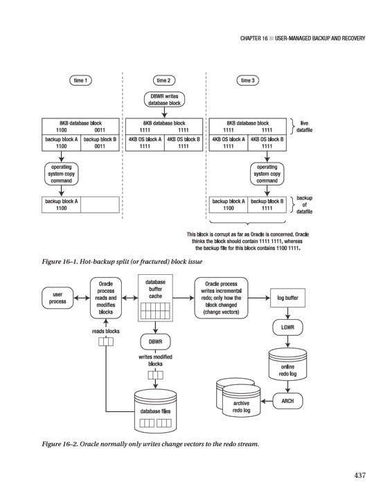
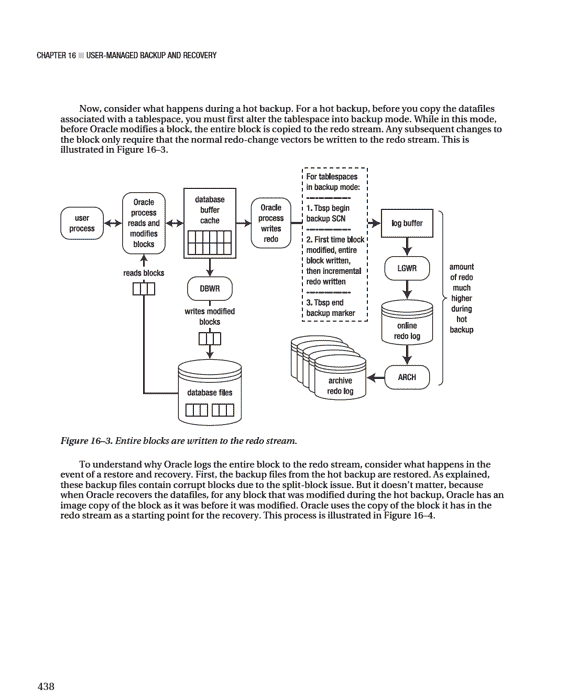
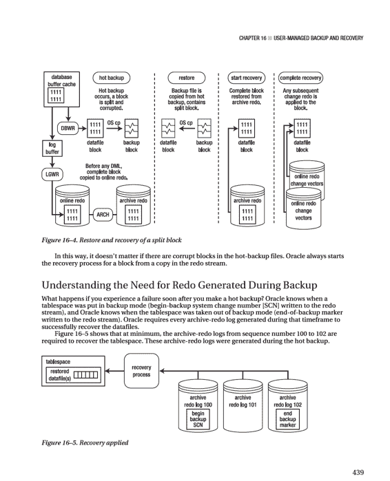
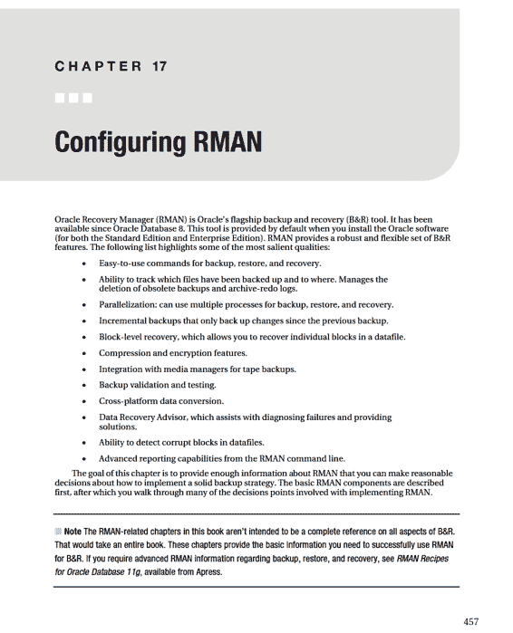
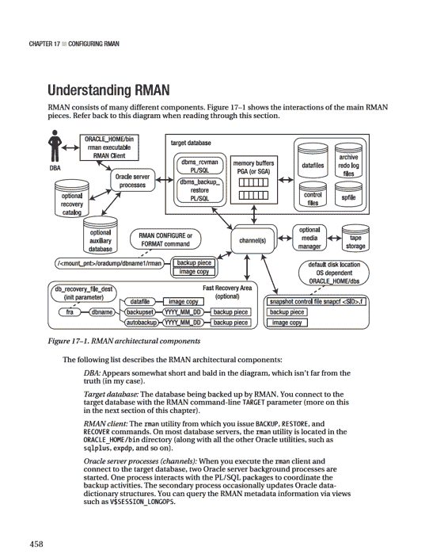
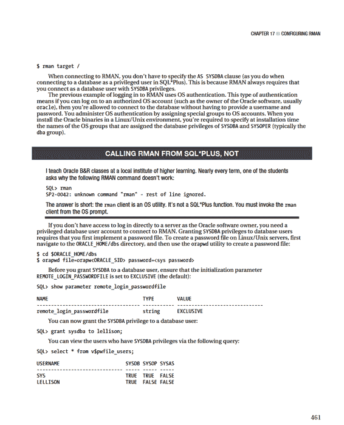

# 引用 Oracle 操作系统变量
. /var/opt/oracle/oraset $1
#
sqlplus -s <<EOF
/ as sysdba
set head off pages0 lines 132 verify off feed off trimsp on
define hbdir=/oradump/hbackup
define dbname=O11R2
spo hotrest.sql
select '!cp ' || '&&hbdir' || substr(name,instr(name,'&&dbname')-1)
|| ' ' || name from v\$datafile;
spo off;
#
exit 0
```

以下是你可以在发生故障时从 SQL\*Plus 执行以将数据文件从备份目录复制回来的代码列表：

```
!cp /oradump/hbackup/O11R2/system01.dbf /ora01/dbfile/O11R2/system01.dbf
!cp /oradump/hbackup/O11R2/sysaux01.dbf /ora01/dbfile/O11R2/sysaux01.dbf
!cp /oradump/hbackup/O11R2/undotbs01.dbf /ora02/dbfile/O11R2/undotbs01.dbf
!cp /oradump/hbackup/O11R2/users01.dbf /ora02/dbfile/O11R2/users01.dbf
!cp /oradump/hbackup/O11R2/appdata.dbf /ora01/dbfile/O11R2/appdata.dbf
!cp /oradump/hbackup/O11R2/inv_mgmt_data01.dbf \
/ora01/dbfile/O11R2/inv_mgmt_data01.dbf
!cp /oradump/hbackup/O11R2/inv_mgmt_index01.dbf \
/ora01/dbfile/O11R2/inv_mgmt_index01.dbf
!cp /oradump/hbackup/O11R2/mvdata01.dbf /ora01/dbfile/O11R2/mvdata01.dbf
!cp /oradump/hbackup/O11R2/mvindex01.dbf /ora01/dbfile/O11R2/mvindex01.dbf
```

在此输出中，如果你倾向于从操作系统提示符运行命令，可以移除每行开头的 `!` 字符。核心思想是，在发生故障时这些命令是可用的，这样你就知道哪些文件被备份到了什么位置以及如何将它们复制回来。在上面的代码列表中，请注意有两行使用了 `\` 字符进行换行。这是为了适应本书页面宽度的限制。

**提示** 不要使用用户管理的热备份技术进行联机备份。使用 RMAN 进行备份。RMAN 不需要将表空间置于备份模式，并且自动化了几乎所有与备份与恢复相关的工作。

## 理解块分裂问题

要执行热备份，一个关键步骤是在使用操作系统实用程序复制与表空间关联的任何数据文件之前，将表空间更改为备份模式。要理解为什么必须将表空间更改为备份模式，你必须熟悉有时被称为分裂（或破碎）块的问题。

回想一下，数据库块的大小通常与操作系统块的大小不同。例如，一个数据库块的大小可能是 8KB，而操作系统块的大小是 4KB。作为热备份的一部分，你使用操作系统实用程序复制活动的数据文件。在操作系统实用程序复制数据文件的同时，数据库写入器有可能正在写入某个块，而操作系统实用程序正在复制该块。由于 Oracle 块和操作系统块的大小不同，可能会发生以下情况：
1.  操作系统实用程序复制了 Oracle 块的一部分。
2.  片刻之后，数据库写入器更新了整个块。
3.  转瞬之间，操作系统实用程序复制了 Oracle 块的后半部分。

这可能导致操作系统的块副本与 Oracle 写入操作系统的内容不一致。

图 16–1 说明了这个概念。

查看图 16–1，在时间 3 复制到磁盘的块，就 Oracle 而言是损坏的。块的前半部分来自时间 1，而块的后半部分是在时间 3 复制的。这就是为什么你不能通过复制开放的 Oracle 数据库中的数据文件来制作备份。当你进行热备份时，你是在保证数据文件的备份中存在块级别的损坏。

要理解 Oracle 如何解决块分裂问题，首先考虑一个在正常模式下（非备份模式）运行的数据库。写入联机重做日志的重做信息仅包含 Oracle 需要重新应用事务所需的内容。重做流不包含完整的数据块。Oracle 只会在重做流中记录一个更改向量，该向量指定了哪个块被更改以及如何被更改。图 16–2 显示了 Oracle 在正常操作下的情况。








# 第 16 章 ■ 用户管理的备份与恢复

如果您在开始标记和结束标记之间的所有重做数据都应用到数据文件之前，尝试停止恢复过程，Oracle 将抛出此错误：

`ORA-01195: online backup of file 1 needs more recovery to be consistent`

在表空间热备份期间生成的所有重做数据必须应用到数据文件后，才能打开它们。Oracle 至少需要应用从开始备份 SCN 标记到结束备份标记之间的所有重做数据，以涵盖表空间处于备份模式时修改的每一个数据块。这些重做数据存档在归档重做日志文件中；或者，如果故障恰好发生在备份结束后，部分重做数据可能尚未归档，而存在于在线重做日志中。因此，您必须指示 Oracle 应用在线重做日志中的内容。

## 理解数据文件*确实*被更新

请注意，在图 16-2 和图 16-3 中，数据库写入器的行为在备份过程中基本保持不变。无论数据库处于何种备份模式，数据库写入器都会持续将数据块写入数据文件。它并不关心是否正在进行热备份；它的职责就是将数据块从缓冲区缓存写入数据文件。

偶尔，您会遇到一位声称在用户管理的热备份期间，数据库写入器不会写入数据文件的 DBA。这是一种普遍的误解。运用一些常识：如果在热备份期间数据库写入器不写入数据文件，那么修改是在哪里被写入的呢？如果事务被写入数据文件以外的地方，那么备份后这些数据文件如何重新同步呢？这根本说不通。

一些 DBA 说：“数据文件头被冻结了，这意味着数据文件没有变化。” Oracle 确实会冻结 SCN 以在数据文件头中标记热备份的开始，并且在表空间退出备份模式之前不会更新该 SCN。这个“冻结的 SCN”并不意味着在备份期间没有数据块被写入数据文件。您可以通过以下操作轻松证明在备份模式下数据文件会被写入：

1.  将表空间至于备份模式：
    `SQL> alter tablespace users begin backup;`
2.  创建一个包含字符字段的表：
    `SQL> create table cc(cc varchar2(20)) tablespace users;`
3.  向该表中插入一个字符串：
    `SQL> insert into cc values('DBWR does write');`
4.  切换在线重做日志文件以强制执行检查点：
    `SQL> alter system switch logfile;`
5.  在操作系统层面，使用 `strings` 和 `grep` 命令在数据文件中搜索该字符串：
    `$ strings /ora02/dbfile/O11R2/users01.dbf | grep "DBWR does write"`
6.  以下是证明数据库写入器确实将数据写入磁盘的输出：`DBWR does write`
7.  别忘了将表空间退出备份模式：
    `SQL> alter tablespace users end backup;`

## 执行归档日志模式数据库的完全恢复

*完全恢复*意味着您可以恢复故障发生前所有已提交的事务。

完全恢复并不意味着您必须完全恢复和恢复整个数据库。例如，如果只有一个数据文件发生了介质故障，您只需恢复和恢复受损的数据文件即可完成完全恢复。

**提示** 如果您有权访问测试或开发数据库，请花时间逐步完成本节中每个示例的每个步骤。实践这些步骤比任何文档都能教会您更多关于备份与恢复的知识。

本节的步骤适用于在归档日志模式下备份的任何数据库。无论您进行的是冷备份还是热备份都没关系。只要备份时数据库处于归档日志模式，恢复和还原数据文件的步骤都是相同的。对于完全恢复，您需要：

*   能够还原发生介质故障的数据文件
*   能够访问自上次备份开始以来生成的所有归档重做日志
*   拥有完整的在线重做日志。

以下是完全恢复的基本过程：

1.  任何需要还原的数据文件在还原前必须处于脱机状态；最简单的实现方法是将数据库置于加载模式。
2.  使用操作系统复制实用程序还原受损的数据文件。
3.  发出相应的 SQL*Plus `RECOVER` 命令，以应用归档重做日志和在线重做日志中所需的任何信息。
4.  将数据库打开。

接下来的几个小节将演示一些常见的完全还原和恢复场景。您应该能够运用这些基本场景来诊断和恢复您遇到的任何复杂情况。

## 数据库脱机时的还原与恢复

本节详细描述了一个简单的还原与恢复场景。接下来将描述模拟故障然后执行完全还原与恢复的步骤。请在开发数据库中尝试此场景。

确保您有一个良好的备份，并且不要在包含关键业务数据的数据库中尝试此实验。

在开始此示例之前，请创建一个表并插入一些数据。在完全恢复过程的最后将选择此表和数据，以证明恢复成功：
```sql
SQL> create table foo(foo number) tablespace users;
SQL> insert into foo values(1);
SQL> commit;
```

现在，多次切换在线日志。这样做可以确保在恢复过程中必须应用归档重做日志：
```sql
SQL> alter system switch logfile;
SQL> /
SQL> /
SQL> /
```

接下来，通过重命名与 USERS 表空间关联的数据文件来模拟介质故障。您可以通过以下查询识别与 USERS 表空间关联的数据文件名称：
```sql
SQL> select file_name from dba_data_files where tablespace_name='USERS';
FILE_NAME
/ora02/dbfile/O11R2/users01.dbf
```

在操作系统层面，重命名该文件：
```bash
$ mv /ora02/dbfile/O11R2/users01.dbf /ora02/dbfile/O11R2/users01.dbf.old
```

并尝试停止您的数据库：
```bash
$ sqlplus / as sysdba
SQL> shutdown immediate;
```

您应该看到类似以下的错误：
`ORA-01110: data file 4: '/ora02/dbfile/O11R2/users01.dbf'`
`ORA-27041: unable to open file`

如果这是一场真实的灾难，谨慎的做法是导航到数据文件目录，列出文件，并查看相关文件是否在其正确的位置。您还应该检查 `alert.log` 文件，看看 Oracle 是否在其中记录了任何相关信息。

既然您已经模拟了介质故障，接下来的几个步骤将引导您完成还原和完全恢复。

### 步骤 1：将数据库置于加载模式

在将数据库置于加载模式之前，您可能需要先使用 `ABORT` 选项关闭它：
```bash
$ sqlplus / as sysdba
SQL> shutdown abort;
SQL> startup mount;
```

### 步骤 2：从备份中还原数据文件

下一步是将备份中对应于故障文件的数据文件复制回来：
```bash
$ cp /oradump/hbackup/O11R2/users01.dbf /ora02/dbfile/O11R2/users01.dbf
```

此时，思考一下如果您尝试启动数据库，Oracle 会做什么是很有启发性的。当您发出 `ALTER DATABASE OPEN` 语句时，Oracle 会检查控制文件中每个数据文件的 SCN。您可以通过查询 `V$DATAFILE` 来检查此 SCN：
```sql
SQL> select checkpoint_change# from v$datafile where file#=4;
CHECKPOINT_CHANGE#
```

Oracle 将控制文件中的 SCN 与数据文件头中的 SCN 进行比较。您可以通过查询 `V$DATAFILE_HEADER` 来检查数据文件头中的 SCN。例如：
```sql
SQL> select file#, checkpoint_change# from v$datafile_header where file#=4;
FILE# CHECKPOINT_CHANGE#
---------- ------------------
4 17779631
```


# 第 16 章 ■ 用户管理的备份与恢复

请注意，`V$DATAFILE_HEADER` 中记录的 `SCN` 小于 `V$DATAFILE` 中同一数据文件的 `SCN`。此时若尝试打开数据库，Oracle 会抛出错误，提示需要进行介质恢复（即需要应用重做日志），以将数据文件中的 `SCN` 与控制文件中的 `SCN` 同步。当你在此时尝试打开数据库，会发生以下情况：

```
SQL> alter database open;

alter database open;

alter database open

*

ERROR at line 1:
ORA-01113: file 4 needs media recovery
ORA-01110: data file 4: '/ora02/dbfile/O11R2/users01.dbf'
```

在数据文件头中的 `SCN` 与控制文件中对应的 `SCN` 匹配之前，Oracle 不允许你打开数据库。

## 步骤 3：发出适当的 `RESTORE` 语句

归档重做日志和在线重做日志包含了将数据文件 `SCN` 赶上控制文件 `SCN` 所需的信息。你可以通过发出以下 `SQL*Plus` 语句之一，将重做日志应用到需要介质恢复的数据文件上：

- `RECOVER DATAFILE`
- `RECOVER TABLESPACE`
- `RECOVER DATABASE`

由于本例中只有一个数据文件需要恢复，因此使用 `RECOVER DATAFILE` 语句是合适的。不过请记住，你可以运行上述任何一个 `RECOVER` 语句，Oracle 会自行判断需要恢复什么。在此特定场景下，你可能会发现记住包含已恢复数据文件的表空间名称，比记住数据文件名更容易。接下来，恢复 `USERS` 表空间中所有需要恢复的数据文件：

`SQL> recover tablespace users;`

此时，Oracle 使用数据文件头中的 `SCN` 来确定应使用哪个归档重做日志或在线重做日志开始应用重做。如果所有需要的重做日志都存在于在线重做日志中，Oracle 会应用该重做并显示以下消息：

`介质恢复完成。`

如果 Oracle 需要应用仅包含在归档重做日志中的重做日志（意味着包含相应重做的在线重做日志已被覆盖），你会收到 Oracle 的提示，建议首先应用哪个归档重做日志：

```
ORA-00279: 更改 17779631 生成于 2010-08-21 04:51:22，需要用于线程 1
ORA-00289: 建议：/ora02/oraarch/O11R2/1_33_726314508.arc
ORA-00280: 更改 17779631 对于线程 1 属于序列号 #33
指定日志：{<RET>=建议 | 文件名 | AUTO | CANCEL}
```

你可以按回车或回车键（`<RET>`）让 Oracle 应用建议的归档重做日志文件，或指定一个文件名，或指定 `AUTO` 指示 Oracle 自动应用所有建议的文件，或键入 `CANCEL` 以取消恢复操作。

在本例中，指定 `AUTO`。Oracle 会应用所有归档重做日志文件和在线重做日志文件中的重做日志，以执行完全恢复：

```
AUTO
```

应用完所有需要的归档重做和在线重做后，显示的最后一条消息是：`日志已应用。`

`介质恢复完成。`

## 步骤 4：将数据库打开

介质恢复成功后，你可以打开数据库：

`SQL> alter database open;`

现在，你可以验证在介质故障之前提交的事务是否已恢复：

`SQL> select * from foo;`

`FOO`

## 联机状态下恢复与恢复数据库

如果你丢失了除 `SYSTEM` 和 `UNDO` 表空间之外的其他表空间关联的数据文件，可以在保持数据库联机的情况下，恢复并恢复受损的数据文件。为此，任何需要恢复和恢复的数据文件必须首先被脱机。当用户尝试更新表时遇到类似如下错误，你可能会收到关于某个数据文件存在问题的警报：

`SQL> insert into foo values(2);`

```
ORA-01116: 打开数据库文件 4 时出错
ORA-01110: 数据文件 4: '/ora02/dbfile/O11R2/users01.dbf'
ORA-27041: 无法打开文件
```

你导航到包含该数据文件的操作系统目录，并确定该数据文件已被系统管理员错误地删除。


在此示例中，与 `USERS` 表空间关联的数据文件被脱机，随后在数据库其余部分保持在线的状态下被还原和恢复。首先，将数据文件脱机：
```sql
SQL> alter database datafile '/ora02/dbfile/O11R2/users01.dbf' offline;
```
现在，从备份位置还原相应的数据文件：
```bash
$ cp /oradump/hbackup/O11R2/users01.dbf /ora02/dbfile/O11R2/users01.dbf
```
在此情况下，不能使用 `RECOVER DATABASE`。`RECOVER DATABASE` 语句尝试恢复数据库中的所有数据文件，而 `SYSTEM` 表空间是其中的一部分。`SYSTEM` 表空间在数据库在线时无法被恢复。

如果使用 `RECOVER TABLESPACE`，则与该表空间关联的所有数据文件必须处于脱机状态。在这种情况下，更合适的做法是在数据文件粒度级别进行恢复：
```sql
SQL> recover datafile '/ora02/dbfile/O11R2/users01.dbf';
```
Oracle 会检查数据文件头中的 SCN，并确定使用哪个归档重做日志或在线重做日志来开始应用重做。如果所有需要的重做都在在线重做日志中，你会看到这条消息：`Media recovery complete`。

如果重做的起始点仅存在于归档重做日志文件中，Oracle 会建议从哪个文件开始：
```
ORA-00279: change 17809451 generated at 08/21/2010 10:10:56 needed for thread 1
ORA-00289: suggestion : /ora02/oraarch/O11R2/1_45_726314508.arc
ORA-00280: change 17809451 for thread 1 is in sequence #45
Specify log: {<RET>=suggested | filename | AUTO | CANCEL}
```
你可以输入 `AUTO`，让 Oracle 自动应用所有归档重做日志文件和在线重做日志文件中的必需重做：
```
AUTO
```
如果成功，你应该会看到这条消息：
```
Log applied.
Media recovery complete.
```
现在，你可以将数据文件重新联机：
```sql
SQL> alter database datafile '/ora02/dbfile/O11R2/users01.dbf' online;
```

### 还原控制文件

当你处理用户管理的备份时，通常会在以下情况之一还原控制文件：

*   一个控制文件损坏，并且控制文件是多路复用的。
*   所有控制文件都损坏。

本节涵盖这两种情况。

### 多路复用时还原一个损坏的控制文件

如果你为数据库配置了多个控制文件，可以关闭数据库并使用操作系统命令将现有控制文件复制到丢失控制文件的位置。例如，从初始化文件中，你得知此数据库使用了两个控制文件：
```sql
SQL> show parameter control_files

NAME                                 TYPE        VALUE
------------------------------------ ----------- ------------------------------
control_files                        string      /ora01/dbfile/O11R2/control01.ctl,
                                                 /ora01/dbfile/O11R2/control02.ctl
```
假设 `control02.ctl` 文件已损坏。查询数据字典时，Oracle 会抛出此错误：
```
ORA-00210: cannot open the specified control file
ORA-00202: control file: '/ora01/dbfile/O11R2/control02.ctl'
```
当有一个完好的控制文件可用时，你可以关闭数据库，并将现有的完好控制文件复制到损坏控制文件的名称和位置：
```sql
SQL> shutdown abort;
```
```bash
$ cp /ora01/dbfile/O11R2/control01.ctl /ora01/dbfile/O11R2/control02.ctl
```
现在，重新启动数据库：
```sql
SQL> startup;
```
这样，你就可以从现有的控制文件还原一个控制文件。

### 所有控制文件都损坏时的还原

如果丢失了所有控制文件，你可以从备份中还原一个，或者重新创建控制文件。只要你有所有数据文件和任何必需的重做（归档重做和在线重做），就应该能够完全恢复数据库。此场景的步骤如下：

1.  关闭数据库。
2.  从备份中还原一个控制文件。
3.  从备份中还原所有数据文件。
4.  以装载模式启动数据库，并使用 `RECOVER DATABASE USING BACKUP CONTROLFILE` 子句启动数据库恢复。
5.  对于完全恢复，手动应用在线重做日志中包含的重做。
6.  使用 `RESETLOGS` 子句打开数据库。


# 第 16 章 ■ 用户管理的备份与恢复

在本例中，数据库的所有控制文件被意外删除，随后 Oracle 报告了以下错误：

`ORA-00202: control file: '/ora01/dbfile/O11R2/control01.ctl'`
`ORA-27041: unable to open file`

## 步骤 1：关闭数据库

在这种情况下，您必须关闭数据库，并从备份位置将所有数据文件和控制文件恢复到生产数据库位置。首先，关闭数据库：
```sql
SQL> shutdown abort;
```

## 步骤 2：从备份中恢复控制文件

此数据库配置了一个控制文件，如所示将其从备份位置复制回来：
```bash
$ cp /oradump/hbackup/O11R2/controlbk.ctl /ora01/dbfile/O11R2/control01.ctl
```
如果使用了多个控制文件，您必须将备份的控制文件复制到 `CONTROL_FILES` 初始化参数中列出的每个控制文件及其位置名称。

## 步骤 3：从备份中恢复所有数据文件

作为此恢复过程的一部分，必须从备份中恢复所有数据文件。在此例中，所有备份文件都位于 `/oradump/hbackup/O11R2` 目录中：
```bash
$ cp /oradump/hbackup/O11R2/*.dbf /ora01/dbfile/O11R2
```
在此类恢复场景中，您需要将上次热备份中的所有数据文件复制回来。如果您没有这样做，数据文件头中的 `SCN` 信息将比控制文件中的 `SCN` 更新。Oracle 无法将重做应用于控制文件以使其追上数据文件（其工作方式恰恰相反：必须将重做应用于数据文件）。

## 步骤 4：在加载模式下启动数据库，并启动数据库恢复

接下来，在加载模式下启动数据库：
```sql
SQL> startup mount;
```
将控制文件和数据文件复制回来后，即可执行恢复。Oracle 知道控制文件来自备份（因为它是使用 `ALTER DATABASE BACKUP CONTROLFILE` 语句创建的），因此恢复必须使用 `USING BACKUP CONTROLFILE` 子句执行：
```sql
SQL> recover database using backup controlfile;
```
此时，系统会提示您应用归档重做日志文件：
```
ORA-00279: change 17779631 generated at 08/21/2010 04:51:22 needed for thread 1
ORA-00289: suggestion : /ora02/oraarch/O11R2/1_33_726314508.arc
ORA-00280: change 17779631 for thread 1 is in sequence #33
Specify log: {<RET>=suggested | filename | AUTO | CANCEL}
```
键入 `AUTO` 以指示恢复过程自动应用所有归档重做日志：
```
AUTO
```
所有归档重做日志应用后，思考一下如果此时尝试打开数据库会发生什么，这将很有启发意义：
```sql
SQL> alter database open;
```
在这种情况下，Oracle 会抛出以下错误：
```
ORA-01589: must use RESETLOGS or NORESETLOGS option for database open
```
在此场景中，在线重做日志仍然完好无损，因此通过应用在线重做日志（而不一定存在于归档重做日志中）中存在的重做，完全恢复是可能的。要应用在线重做日志中的内容，首先确定在线重做日志文件的位置和名称：
```sql
select a.first_change#, b.member
from v$log a, v$logfile b
where a.group# = b.group#;
```
以下是此示例的部分输出：
```
FIRST_CHANGE# MEMBER
------------- -----------------------------------
17779560 /ora01/oraredo/O11R2/redo01a.rdo
17779678 /ora02/oraredo/O11R2/redo02a.rdo
```
现在，重新启动恢复过程：
```sql
SQL> recover database using backup controlfile;
```
为该数据库生成的最后一个归档重做日志是序列 51。恢复过程会提示一个不存在的归档重做日志：
```
ORA-00279: change 17815760 generated at 08/21/2010 13:21:58 needed for thread 1
ORA-00289: suggestion : /ora02/oraarch/O11R2/1_52_726314508.arc
ORA-00280: change 17815760 for thread 1 is in sequence #52
```
不要向恢复过程提供归档重做日志文件，而是键入一个在线重做日志文件的名称。这会指示恢复过程应用在线重做日志中的任何重做：


# 第 16 章 ■ 用户管理的备份与恢复

`/ora01/oraredo/O11R2/redo02a.rdo`

当应用正确的联机重做日志时，你应该会看到此消息：`Log applied.`

`Media recovery complete.`

至此，数据库已完全恢复。然而，由于恢复过程中使用了备份的控制文件，因此必须使用 `RESETLOGS` 子句打开数据库：
```
SQL> alter database open resetlogs;
```

成功后，你将看到：
`Database altered.`

## 执行归档日志模式数据库的不完全恢复

`不完全恢复`意味着你没有还原故障发生前已提交的所有事务。

进行此类恢复时，你是恢复到过去的某个时间点，而事务会丢失。这就是为什么不完全恢复也被称为 `数据库按时间点恢复` (DBPITR)。

不完全恢复并不意味着只还原和恢复数据文件的子集。事实上，在大多数不完全恢复场景中，作为过程的一部分，你必须从备份中还原所有数据文件。如果你不还原所有数据文件，则首先需要将那些不打算参与不完全恢复过程的数据文件离线。任何被离线的数据文件都无法在之后被还原和恢复。

你可能出于许多不同原因需要执行不完全恢复：
- 你尝试执行完全恢复，但缺少所需的归档重做日志或未归档的联机重做日志信息。
- 你希望将数据库恢复到过去的某个时间点，就在发生用户错误（如误删数据、删除表等）之前。
- 你有一个测试环境，其中包含数据库的基线副本。测试完成后，你希望将数据库重置回基线，以便进行新一轮的新测试。

如果你因上述任何原因使用用户管理的不完全恢复，应该考虑使用 `闪回表` 或 `闪回数据库` 功能。本章稍后将详细讨论这些功能。

你可以通过三种方式执行用户管理的不完全恢复：
- 基于取消的恢复
- 基于 SCN 的恢复
- 基于时间的恢复

`基于取消的恢复` 允许你应用归档重做，并在基于归档重做日志文件的边界处暂停过程。例如，假设你正在尝试还原和恢复数据库，并且发现缺少一个归档重做日志。你必须在最后一个完好的归档重做日志点停止恢复过程。你可以使用 `RECOVER DATABASE` 语句的 `CANCEL` 子句来启动基于取消的不完全恢复：
```
SQL> recover database until cancel;
```

如果你想恢复到并包含某个特定的 SCN 号，请使用 `基于 SCN` 的不完全恢复。你可能从告警日志或 `LogMiner` 的输出中知道要恢复到的某个特定 SCN 点。使用 `UNTIL CHANGE` 子句执行此类不完全恢复：
```
SQL> recover database until change 12345;
```

如果你知道希望停止恢复过程的时间点，请使用 `基于时间` 的不完全恢复。例如，你可能知道某个表在特定时间被删除，并希望将数据库恢复并恢复到该指定时间。基于时间的恢复格式始终如下：`'YYYY-MM-DD:HH24:MI:SS'`。示例如下：
```
SQL> recover database until time '2010-10-21:02:00:00';
```

执行不完全恢复时，你必须还原计划在不完全恢复完成后保持在线的所有数据文件。以下是执行不完全恢复的步骤：
1.  关闭数据库。
2.  从备份中还原所有数据文件。
3.  以挂载模式启动数据库。
4.  应用重做（前滚）到所需点，然后暂停恢复过程（使用基于取消、SCN 或时间的恢复）。
5.  使用 `RESETLOGS` 子句打开数据库。

以下示例执行基于取消的不完全恢复。如果数据库是打开的，则将其关闭：
```
$ sqlplus / as sysdba
SQL> shutdown abort;
```

接下来，从备份（冷备份或热备份均可）复制 `所有` 数据文件。此示例从热备份还原所有数据文件。对于本示例，当前控制文件完好无损，无需还原。以下是用于还原数据库的部分操作系统复制命令片段：
```
$ cp /oradump/cbackup/O11R2/system01.dbf /ora01/dbfile/O11R2/system01.dbf
$ cp /oradump/cbackup/O11R2/sysaux01.dbf /ora01/dbfile/O11R2/sysaux01.dbf
$ cp /oradump/cbackup/O11R2/undotbs01.dbf /ora02/dbfile/O11R2/undotbs01.dbf
$ cp /oradump/cbackup/O11R2/users01.dbf /ora02/dbfile/O11R2/users01.dbf
$ cp /oradump/cbackup/O11R2/appdata.dbf /ora01/dbfile/O11R2/appdata.dbf
```

数据文件复制回去后，就可以启动恢复过程。此示例执行基于取消的不完全恢复：
```
$ sqlplus / as sysdba
SQL> startup mount;
SQL> recover database until cancel;
```

此时，Oracle 恢复进程会建议应用一个归档重做日志：
`ORA-00279: change 17851736 generated at 08/22/2010 07:33:42 needed for thread 1`
`ORA-00289: suggestion : /ora02/oraarch/O11R2/1_3_727625398.arc`
`ORA-00280: change 17851736 for thread 1 is in sequence #3`
`Specify log: {<RET>=suggested | filename | AUTO | CANCEL}`

在此示例中，你已知你拥有的最后一个完好的归档重做日志是序列 7，因此将重做应用到该点，然后输入 `CANCEL`：
`CANCEL`

这会停止恢复过程。现在，你可以使用 `RESETLOGS` 子句打开数据库：
```
SQL> alter database open resetlogs;
```

数据库已打开到过去的某个时间点。由于并非所有重做都已应用，因此该恢复被视为不完全恢复。

## 闪回表

在旧版本的数据库中，如果表被意外删除，你必须执行以下操作来恢复该表：
1.  将数据库的备份还原到测试数据库。
2.  执行不完全恢复，直到该表被删除的时间点。
3.  导出该表。
4.  将该表导入生产数据库。

此过程可能非常耗时且消耗资源。它需要额外的服务器资源以及 DBA 的时间和精力。

Oracle 在近期版本中引入了 `闪回` 功能；它可以让你快速恢复意外删除的表。Oracle 将 `闪回` 一词应用于几种不同的数据库功能，这可能令人困惑。关于闪回表，Oracle 提供了两种截然不同的闪回操作：
- `FLASHBACK TABLE TO BEFORE DROP` 可以快速撤消先前删除的表。此功能使用回收站。
- `FLASHBACK TABLE` 可闪回到最近的某个时间点，以撤消不需要的数据操作语言 (DML) 语句的影响。你可以闪回到 SCN、时间戳或还原点。

Oracle 引入 `FLASHBACK TABLE TO BEFORE DROP` 是为了让你能够快速恢复被删除的表。

从 Oracle Database 10 `g` 开始，当你删除表时，如果没有指定 `PURGE` 子句，Oracle 不会删除该表——而是会重命名该表。你删除的任何表（Oracle 实际上重命名了它们）都会被放入一个名为 `回收站` 的逻辑容器中。回收站为你提供了一种查看和管理已删除对象的有效方式。

**注意** 要使用 `闪回表` 功能，你不需要实施闪回恢复区 (FRA)。也不需要启用 `闪回数据库`。

`FLASHBACK TABLE TO BEFORE DROP` 操作仅在你的数据库启用了回收站功能（默认启用）时有效。你可以按如下方式检查回收站的状态：
```
SQL> show parameter recyclebin
NAME TYPE VALUE
------------------------------------ ----------- ------------------------------
recyclebin string on
```

### FLASHBACK TABLE TO BEFORE DROP


# Oracle 闪回技术

## 闪回表

### 闪回到删除前

当你删除一个表时，如果没有指定`PURGE`子句，Oracle 会使用一个系统生成的名称来重命名该表。因为表并未被真正删除，所以你可以使用`FLASHBACK TABLE TO BEFORE DROP`来指示 Oracle 使用其原始名称重命名该表。下面是一个示例。假设`INV`表被意外删除：

```sql
SQL> drop table inv;
```

通过查看回收站的内容来验证表已被重命名：`SQL> show recyclebin;`

```
ORIGINAL NAME RECYCLEBIN NAME OBJECT TYPE DROP TIME
---------------- ------------------------------ ------------ -------------------
INV BIN$jmx7BIkFlYrgQAB/AQBIgg==$0 TABLE 2010-08-22:10:36:11
```

`SHOW RECYCLEBIN`语句只显示已被删除的表。要获得更完整的重命名对象信息，请查询`RECYCLEBIN`视图：

```sql
select
  object_name
  ,original_name
  ,type
from recyclebin;
```

输出如下：

```
OBJECT_NAME ORIGINAL_NAME TYPE
------------------------------ -------------------- -------------------------
BIN$jmx7BIkFlYrgQAB/AQBIgg==$0 INV TABLE
BIN$jmx7BIkElYrgQAB/AQBIgg==$0 INV_TRIG TRIGGER
BIN$jmx7BIkDlYrgQAB/AQBIgg==$0 INV_PK INDEX
```

在此输出中，当对象被删除时，该表的主键也被重命名。要恢复该表，请执行以下操作：

```sql
SQL> flashback table inv to before drop;
```

这会将表恢复为其原始名称。不过，此语句不会将索引恢复为原始名称：

```sql
SQL> select index_name from user_indexes where table_name='INV';
```

```
INDEX_NAME
BIN$jmx7BIkDlYrgQAB/AQBIgg==$0
```

在此场景中，你必须重命名索引：

```sql
SQL> alter index "BIN$jmx7BIkDlYrgQAB/AQBIgg==$0" rename to inv_pk;
```

你必须以相同的方式重命名任何触发器对象。如果在删除表之前存在引用约束，则必须手动重新创建它们。

如果由于某些原因，你需要将表闪回到一个不同于原始名称的名称，可以按如下方式进行：

```sql
SQL> flashback table inv to before drop rename to inv_bef;
```

## 闪回到之前的某个时间点

闪回到之前某个时间点的闪回表功能与`FLASHBACK TABLE TO BEFORE DROP`完全不同。闪回到过去的某个时间点使用的是`UNDO`表空间中的信息。过去的那个时间点取决于你的`UNDO`表空间保留期，它指定了`UNDO`信息被保留的最短时间。

如果所需的闪回信息不在`UNDO`表空间中，你将收到如下错误：
`ORA-01555: snapshot too old`

换句话说，要能够闪回到过去的某个时间点，`UNDO`表空间中的所需信息一定不能被覆盖。

### 闪回到 SCN

假设你正在测试一个应用程序功能，并且希望快速将表恢复到特定的`SCN`。作为应用程序测试的一部分，你在测试开始前记录了`SCN`：

```sql
SQL> select current_scn from v$database;
```

```
CURRENT_SCN
-----------
    17879789
```

你执行了一些测试，然后希望将表闪回到之前记录的`SCN`。

首先，确保为表启用了行移动：

```sql
SQL> alter table inv enable row movement;
```

```sql
SQL> flashback table inv to scn 17879789;
```

现在，该表应反映在`FLASHBACK`语句中指定的历史`SCN`值时已提交的事务。

### 闪回到时间戳

你也可以将表闪回到之前的某个时间点。例如，要将表闪回到 15 分钟前，首先启用行移动，然后使用`FLASHBACK TABLE`：

```sql
SQL> alter table inv enable row movement;
```

```sql
SQL> flashback table inv to timestamp(sysdate-1/96) ;
```

你提供的时间戳必须评估为 Oracle 时间戳的有效格式。你也可以显式指定一个时间，如下所示：

```sql
SQL> flashback table inv to timestamp
     to_timestamp('22-aug-10 12:07:33','dd-mon-yy hh:mi:ss');
```

### 闪回到还原点

*还原点*是与数据库中的时间戳或`SCN`相关联的名称。你可以创建一个还原点，其中包含数据库的当前`SCN`，如下所示：

```sql
SQL> create restore point point_a;
```

之后，如果你决定将表闪回到该还原点，首先启用行移动：

```sql
SQL> alter table inv enable row movement;
```

```sql
SQL> flashback table inv to restore point point_a;
```

现在，该表应包含与指定还原点相关联的`SCN`时的事务。

## 闪回数据库

闪回数据库功能允许你执行不完全恢复，恢复到过去的某个时间点。闪回数据库使用存储在闪回日志中的信息；它不依赖于还原数据库文件（如冷备份、热备份或`RMAN`）。在某些情况下，闪回数据库可以比执行用户管理的不完全恢复（需要你从备份中复制数据文件）更快地将数据库恢复到过去的某个时间点。

**提示** 闪回数据库不能替代数据库备份。如果你遇到数据文件的介质故障，无法使用闪回数据库闪回到故障发生前。如果数据文件损坏，你必须使用物理备份（热备份、冷备份或`RMAN`）进行还原和恢复。

在希望一致地将数据库重置到过去某个时间点的情况下，闪回数据库功能可能是可取的。例如，你可能希望定期将测试或培训数据库设置回已知的基线。或者，你可能正在升级一个应用程序，并且在对应用程序数据库对象进行大规模更改之前，标记起始点。升级后，如果情况不顺利，你希望能够快速将数据库重置到升级发生前的时间点。

闪回数据库有几个先决条件：

- 数据库必须处于归档日志模式。
- 必须使用快速恢复区。
- 必须启用闪回数据库功能。

请参阅本章前面关于启用归档日志模式和使用快速恢复区的部分。你可以使用以下`SQL*Plus`语句验证这些功能的状态：

```sql
SQL> archive log list;
```

```sql
SQL> show parameter db_recovery_file_dest;
```

要启用闪回数据库功能，将数据库切换到闪回模式，如下所示：

```sql
SQL> alter database flashback on;
```

**注意** 在 Oracle Database 10*g*中，数据库必须处于加载模式才能启用闪回数据库。

你可以按如下方式验证闪回状态：

```sql
SQL> select flashback_on from v$database;
```

```
FLASHBACK_ON
------------------
YES
```

启用闪回数据库后，你可以使用以下查询查看快速恢复区中的闪回日志：

```sql
select
  name
  ,log#
  ,thread#
  ,sequence#
  ,bytes
from v$flashback_database_logfile;
```

你可以闪回的时间范围由`DB_FLASHBACK_RETENTION_TARGET`参数决定。它指定了数据库可以闪回的时间上限（以分钟为单位）。

你可以通过运行以下`SQL`来查看你可以闪回数据库的最旧`SCN`和时间：

```sql
select
  oldest_flashback_scn
  ,to_char(oldest_flashback_time,'dd-mon-yy hh24:mi:ss')
from v$flashback_database_log;
```

如果由于任何原因需要禁用闪回数据库，可以按如下方式将其关闭：

```sql
SQL> alter database flashback off;
```

你可以使用`RMAN`或`SQL*Plus`来回闪数据库。你可以使用以下方法之一指定过去的时间点：

- `SCN`
- 时间戳
- 还原点
- 上次`RESETLOGS`操作（仅适用于`RMAN`）

此示例创建了一个还原点：

```sql
SQL> create restore point flash_1;
```

接下来，应用程序执行一些测试，之后数据库被闪回到该还原点，以便可以开始新一轮测试：

```sql
SQL> shutdown immediate;
```

```sql
SQL> startup mount;
```

```sql
SQL> flashback database to restore point flash_1;
```

```sql
SQL> alter database open resetlogs;
```


# 第 16 章：用户管理的备份与恢复

## 总结

本章介绍了如今已较少被教授或使用的备份与恢复技术。大多数 DBA 正在（也应该）使用 RMAN 来满足其 Oracle B&R 需求。然而，理解冷备份和热备份的工作原理至关重要。你可能会遇到这样的咨询场景：某个环境仍在使用旧技术，现在需要你来恢复和修复其数据库，或者协助他们迁移到 RMAN。在这些场景中，你必须完全理解旧的备份技术。

本章还讨论了使用冷备份和热备份进行恢复的技术。

理解每个步骤发生的情况以及为何需要该步骤，对于全面掌握 Oracle B&R 架构至关重要。这种意识在你使用 Oracle 工具（如 RMAN（B&R）和 Data Guard（灾难恢复、高可用性和复制））进行故障排查时，会转化为关键技能。

既然你已深入理解了 Oracle B&R 的机制，接下来就可以研究 RMAN 了。本书接下来的几章将探讨如何为生产环境配置和使用 RMAN。





# 第 17 章：配置 RMAN

`PL/SQL` 包：RMAN 使用两个内部的`PL/SQL`包（由`SYS`拥有）来执行 B&R 任务：`DBMS_RCVMAN` 和 `DBMS_BACKUP_RESTORE`。`DBMS_RCVMAN`访问控制文件中的信息，并将其传递给 RMAN 服务器进程。`DBMS_BACKUP_RESTORE`包执行了 RMAN 的大部分工作。例如，该包创建系统调用，指导通道进程执行 B&R 操作。

内存缓冲区（`PGA`或`SGA`）：RMAN 在程序全局区（有时也在系统全局区）中使用一个内存区域作为缓冲区，用于读取数据文件并将后续块复制到备份文件中。

辅助数据库：RMAN 将目标数据库的数据文件还原到该数据库，用于克隆数据库、创建 Data Guard 备用地或执行数据库时间点恢复。

通道：Oracle 服务器进程，用于处理正在备份的文件与备份设备（磁盘或磁带）之间的 I/O。

备份与备份集：当你运行 RMAN `BACKUP`命令时，它会创建一个或多个备份集。`备份集`是 RMAN 内部的一个逻辑结构，用于对备份片文件进行分组。你可以将备份集与备份片的关系，类比为表空间与数据文件的关系：一个是逻辑结构，另一个是物理文件。

备份片文件：RMAN 的二进制备份文件。每个逻辑备份集由一个或多个备份片文件组成。这些是 RMAN 在磁盘或磁带上创建的物理文件。它们是专有的二进制格式文件，只能由 RMAN 读写。一个备份片可以包含来自许多不同数据文件的块。备份片文件通常比数据文件小，因为备份片只包含数据文件中已使用的块。

映像副本：一种备份类型，RMAN 创建数据文件、归档重做日志文件或控制文件的完全相同的副本。映像副本可以由操作系统实用程序（如 Linux 的`cp`和`mv`命令）直接操作。映像副本是增量更新映像备份的一部分。如果需要快速还原，有时使用映像副本比备份集更可取。

恢复目录：一个可选的数据库模式，包含用于存储 RMAN 备份操作元数据信息的表。Oracle 强烈建议使用恢复目录，因为它提供了更多的 B&R 选项。

介质管理器：第三方软件，允许 RMAN 直接备份文件到磁带。当没有足够的磁盘空间直接备份，或者灾难恢复要求需要备份到易于异地转移的存储时，备份到磁带是理想的。

快速恢复区：一个可选的磁盘区域，RMAN 可用于存储备份（以前称为闪回恢复区）。你还可以使用快速恢复区来多路复用控制文件和在线重做日志。使用数据库初始化参数`DB_RECOVERY_FILE_DEST_SIZE`和`DB_RECOVERY_FILE_DEST`来实例化一个快速恢复区。

快照控制文件：当备份控制文件或与恢复目录（如果正在使用）同步时，RMAN 需要控制文件的一致性视图。在这些情况下，RMAN 首先创建控制文件的临时副本（快照）。这允许 RMAN 使用一个保证在备份控制文件或与恢复目录同步期间不会更改的控制文件版本。

你可以使用 RMAN 创建几种类型的备份：

完全备份：备份与数据文件相关的所有已修改块。完全备份并不意味着备份整个数据库。例如，你可以对一个数据文件进行完全备份。

增量级别 0 备份：备份与完全备份相同的块。唯一的区别是，级别 0 备份可以与其他增量备份一起使用，而完全备份不能。

增量级别 1 备份：仅备份自上次备份以来修改过的块。级别 1 增量备份可以是差异型或累积型。`差异型`级别 1 备份备份自上次级别 0 或级别 1 备份以来所有修改过的块。`累积型`级别 1 备份备份自上次级别 0 备份以来所有更改过的块。

增量更新备份：首先创建数据文件的映像副本，随后的增量备份会与该映像副本合并。这是使用映像副本进行备份的一种高效方式。使用增量更新备份进行介质恢复速度很快，因为在还原过程中使用的是数据文件的映像副本。

块更改跟踪：数据库功能，用于跟踪数据库中已更改的块。更改块的记录保存在一个二进制文件中。RMAN 可以利用该二进制文件的内容来提高增量备份的性能：RMAN 无需扫描数据文件中所有已修改的块，而是可以通过二进制块更改跟踪来确定哪些块已更改。

现在你已理解了 RMAN 的架构组件以及可以创建的备份类型，可以启动 RMAN 并为你的环境配置它了。

## 启动 RMAN

要连接到 RMAN，你需要建立以下内容：

*   操作系统环境变量
*   访问具有适当权限的操作系统账户或具有`SYSDBA`权限的数据库用户

连接 RMAN 的最简单方法是登录到目标数据库所在的服务器，并以 Oracle 软件所有者（在 Linux/Unix 系统上通常名为`oracle`）的身份登录。当你以`oracle`登录时，需要在使用`rman`、`sqlplus`等实用程序之前建立几个操作系统变量。第 2 章详细介绍了如何设置这些必需的操作系统变量。

至少需要设置`ORACLE_HOME`和`ORACLE_SID`。此外，如果`PATH`变量包含`ORACLE_HOME/bin`目录会很方便。这是包含 Oracle 实用程序的目录。

建立好操作系统变量后，可以从操作系统调用 RMAN，如下所示：460



■ **注意** 如果你想通过 Oracle Net 远程连接到 RMAN，需要首先实现一个密码文件。

## RMAN 架构决策


# 第 17 章 配置 RMAN

如果您的数据库启用了归档，您可以开箱即用地使用`RMAN`运行如下命令来备份整个目标数据库：

```
$ rman target /

RMAN> backup database;
```

如果遇到介质故障，您可以按如下方式恢复所有数据文件：

```
RMAN> shutdown immediate;

RMAN> startup mount;

RMAN> restore database;
```

数据库恢复后，您可以完全恢复它：

```
RMAN> recover database;

RMAN> alter database open;
```

这样就万事大吉了吗？不，还不完全是。`RMAN`的默认属性设置对于简单的备份需求来说是合理的。开箱即用的`RMAN`设置可能适用于小型开发或测试数据库。但对于任何类型的业务关键型数据库，您需要仔细考虑诸如备份存储位置、在磁盘或磁带上保留备份多长时间、哪些`RMAN`功能适合数据库等事项。本章后续部分将引导您了解在生产环境中实施`RMAN`时需要考虑的许多备份与恢复（`B&R`）架构决策。`RMAN`拥有大量稳健的选项用于自定义`B&R`；通常，您不需要实现其许多功能。但是，每次使用`RMAN`备份生产数据库时，您都应仔细权衡每个决策点，并决定是否需要某个属性。

表 17-1 总结了`RMAN`的实施决策和建议。表中的每个决策点都将在本章后续部分详细阐述。许多数据库管理员可能会不同意其中一些建议；这没关系。关键在于您需要考虑每个架构方面，并确定什么最适合您的业务需求。

## 表 17-1 架构决策与建议概述

| 决策点 | 建议 |
| :--- | :--- |
| 1. 远程或本地运行`RMAN`客户端 | 在目标数据库服务器上本地运行客户端。 |
| 2. 指定备份用户 | 除非安全要求另有规定，否则使用`SYS`。 |
| 3. 使用联机或脱机备份 | 取决于您的业务需求。大多数生产数据库需要联机备份，这意味着您必须启用归档。 |
| 4. 设置归档重做日志的目标位置和文件格式 | 如果您使用闪回恢复区（`FRA`），归档日志将以默认格式写入其中。我更喜欢使用`LOG_ARCHIVE_DEST_N`初始化参数在`FRA`之外明确设置位置。 |
| 5. 配置`RMAN`备份位置和文件格式 | 取决于您的业务需求。有些站点需要磁带备份。如果使用磁盘，请将备份放在`FRA`中或通过通道设置指定位置。我更倾向于不使用`FRA`，而是通过`CONFIGURE`命令明确指定位置和文件格式。 |
| 6. 设置控制文件的自动备份 | 始终启用控制文件的自动备份。 |
| 7. 指定控制文件自动备份的位置 | 将其放在`FRA`中或配置一个位置。我更倾向于将控制文件的自动备份写入与数据库备份相同的位置（通常在`FRA`之外）。 |
| 8. 备份归档重做日志 | 取决于您的业务需求。对于许多环境，我使用与备份数据库相同的命令每天备份归档重做日志。 |
| 9. 确定快照控制文件的位置 | 使用默认位置。 |
| 10. 使用恢复目录 | 取决于您的业务需求。对于许多环境，我不使用恢复目录。`Oracle`建议您使用恢复目录。如果`RMAN`保留策略大于`CONTROL_FILE_RECORD_KEEP_TIME`，则我建议您使用恢复目录。 |
| 11. 使用介质管理器 | 直接备份到磁带所需。 |
| 12. 设置`CONTROL_FILE_RECORD_KEEP_TIME`初始化参数 | 通常，默认的七天足够。 |
| 13. 配置`RMAN`的备份保留策略 | 取决于您的数据库和业务需求。 |


# 第 17 章 ■ 配置 RMAN

## 14. 配置归档重做日志的删除策略
这取决于您的数据库和业务策略要求。在许多场景下，将备份保留策略应用于归档重做日志就足够了（这是默认行为）。

**决策点**

**建议**

## 15. 设置并行度
取决于可用的硬件资源和业务需求。对于大多数具有多个 CPU 的生产服务器，我将并行度配置为 2 或更高。

## 16. 使用备份集还是映像副本
我倾向于使用备份集。备份集通常更小，也更容易管理。

## 17. 使用增量备份
对于大型数据库，如果在两次备份之间只有很小比例的数据库发生更改，并且您希望节省磁盘空间，则使用增量备份。

## 18. 使用增量更新的备份
如果您需要数据文件的映像副本，请使用此方法。

## 19. 使用块更改跟踪
使用此功能以提高增量备份的性能。

## 20. 配置二进制压缩
取决于您的业务要求。压缩备份占用的空间更少，但备份和还原操作需要更多的 CPU 资源（和时间）。

## 21. 配置加密
取决于您的业务要求。

## 22. 配置其他设置
您可以设置许多与通道相关的属性，例如备份集大小和备份片大小。根据需要进行配置。

## 1. 远程或本地运行 RMAN 客户端
可以从远程服务器运行`rman`工具，并通过 Oracle Net 连接到目标数据库：
```
$ rman target sys/foo@remote_db
```
这使您可以从一个中心位置在不同的远程服务器上运行 RMAN 备份。当远程运行 RMAN 时，备份文件总是在目标数据库服务器上创建。

只要可能，我会在目标服务器上本地运行`rman`客户端并这样连接：
```
$ rman target /
```
此方法简单且足以满足大多数需求。您不必担心网络问题或密码文件问题，并且`rman`客户端和目标数据库之间永远不会存在兼容性问题。如果远程运行 RMAN，则需要确保远程的`rman`可执行文件与目标数据库兼容。例如，您运行的远程`rman`可执行文件是 Oracle Database 10*g*版本的 RMAN 客户端，是否可以将该客户端连接到远程的 Oracle Database 8*i*目标数据库？如果在目标服务器上本地运行`rman`客户端，则永远不会出现兼容性问题，因为`rman`客户端始终与目标数据库版本相同。

## 2. 指定备份用户
如前一节所述，RMAN 要求您使用具有`SYSDBA`权限的数据库用户。
无论我是从命令行运行 RMAN 还是在脚本中调用 RMAN，在大多数场景中，我都会直接以`SYS`身份连接到目标数据库。例如，以下是我如何从命令行连接到 RMAN：
```
$ rman target /
```
一些 DBA 不使用这种方法；他们更喜欢设置一个独立于`SYS`的用户，并以安全顾虑为由这样做。
我更喜欢直接使用`SYS`账户，因为在服务器上本地连接到 RMAN 时，无需指定用户名和密码。这意味着您永远不必将用户名和密码硬编码到任何备份脚本中，也不必在命令行上指定可能被不良开发人员或旁观的经理看到的用户名和密码。

## 3. 使用联机或脱机备份
大多数生产数据库都有 24x7 的可用性要求。因此，您唯一的选择是在线 RMAN 备份。您的数据库必须处于归档日志模式才能进行在线备份。您需要仔细考虑将归档重做日志放在何处、如何格式化它们、备份频率以及在删除前保留多长时间。这些主题将在后续章节中讨论。

# 第 17 章 配置 RMAN

`注意` 如果您执行脱机备份，必须使用 `IMMEDIATE`、`NORMAL` 或 `TRANSACTIONAL` 选项关闭数据库，然后将其置于 `装载模式`。`RMAN` 需要数据库处于 `装载模式` 才能读写 `控制文件`。

## 4. 设置归档重做日志目的地和文件格式

启用 `归档重做日志` 模式是进行在线备份的先决条件。关于 `归档重做日志` 目的地和格式的架构决策以及如何启用/禁用 `归档日志` 模式的完整讨论，请参见第 16 章。

当启用 `归档日志` 模式时，`Oracle` 会将 `归档重做日志` 写入以下一个或多个位置（您可以将 `归档重做日志` 配置为同时写入 `FRA` 和您通过初始化参数手动设置的其他几个位置）：

- 默认位置
- `FRA`（快速恢复区）
- 通过 `LOG_ARCHIVE_DEST_N` 初始化参数指定的位置

如果您不使用 `FRA`，并且也没有通过 `LOG_ARCHIVE_DEST_N` 初始化参数显式设置 `归档重做日志` 目的地，那么默认情况下，`归档重做日志` 会被写入一个与 `操作系统` 相关的位置。在许多 `Linux/Unix` 系统上，默认位置是 `ORACLE_HOME/dbs/arch` 目录。`归档重做日志` 的默认文件名格式是 `%t_%s_%r.dbf`。

如果您启用了 `FRA`，那么默认情况下，`归档重做日志` 会被写入 `FRA` 中的一个目录。在 `FRA` 中创建的 `归档重做日志` 文件的默认名称格式是 `Oracle 托管文件` 格式。例如：`/<fra>/<db_name>/archivelog/<YYYY_MM_DD>/o1_mf_1_1078_68dx5dyj_.arc`

`Oracle` 推荐使用 `FRA`。我个人倾向于不使用 `FRA`，因为当 `FRA` 空间满且旧文件未能及时清除时，我不希望遇到数据库挂起的情况。相反，我更喜欢使用 `LOG_ARCHIVE_DEST_N` 参数来设置 `归档重做日志` 文件的位置。这是一个例子：`log_archive_dest_1='LOCATION=/oraarch1/CHNPRD'`

我也倾向于为默认的 `归档日志` 文件名格式使用这个：`log_archive_format='%t_%s_%r.arc'`

有时 `DBA` 会使用 `.dbf` 作为数据文件和 `归档重做日志` 文件的扩展名。这种格式避免了在识别文件是 `归档重做日志` 文件还是活动的数据库数据文件时产生潜在的混淆。

## 5. 配置 RMAN 备份位置和文件格式

当您执行基于磁盘的 `BACKUP` 命令时，`RMAN` 会在以下位置之一创建备份片：

- 默认位置
- `FRA`
- 通过 `BACKUP` 或 `FORMAT` 命令指定的位置

如果您没有配置任何 `RMAN` 变量，也没有设置 `FRA`，默认情况下 `RMAN` 会分配一个基于磁盘的通道，并将备份文件写入默认位置。例如，您无需配置任何 `RMAN` 参数即可运行以下命令：

```
RMAN> backup database;
```

如果未配置任何内容，`RMAN` 会分配一个基于磁盘的通道，并将备份写入默认的磁盘位置。此位置因 `操作系统` 而异。在许多 `Linux/Unix` 环境中，默认位置是 `ORACLE_HOME/dbs`。创建的备份文件的默认名称格式是 `Oracle 托管文件` 格式。例如：`<ORACLE_HOME>/dbs/01ln9g7e_1_1`

在备份到磁盘时，如果您没有明确指示 `RMAN` 将备份写入特定位置（通过 `FORMAT` 或 `CONFIGURE` 命令），并且您正在使用 `FRA`，那么 `RMAN` 会自动将备份文件写入 `FRA` 中的目录。在 `FRA` 中创建的备份文件的默认名称格式是 `Oracle 托管文件` 格式。例如：`/<fra>/<db_name>/backupset/<YYYY_MM_DD>/o1_mf_nnndf_TAG20100907T025402_68czfbdf_.bkp`

我通常不使用 `FRA` 来放置 `RMAN` 备份。在我工作的许多环境中，单个挂载点上没有足够的磁盘空间来容纳整个数据库备份的大小。在这种情况下，您需要分配两个或更多指向不同挂载点的通道。在这些环境中使用 `FRA` 有些笨拙。

此外，出于性能原因，您可能希望指示 `RMAN` 写入多个磁盘位置。如果您能确保不同的挂载点基于不同的物理磁盘并由独立的控制器写入，您可以通过分配指向不同挂载点的多个通道来减少 `I/O` 争用。

当您使用 `FRA` 时，`RMAN` 在给定日期首次备份数据库时会自动创建单独的目录。我更喜欢将备份写入一个目录，而不是按日期分开目录和备份。我发现如果为每个服务器上的每个数据库使用一个标准目录，会更易于管理、维护和排查备份问题。

如果您不想将 `RMAN` 备份文件放在 `FRA` 中，有几种方法可以直接指定备份位置：

- `BACKUP...FORMAT`
- `CONFIGURE CHANNEL...FORMAT`

在发出 `BACKUP` 命令时，您可以直接指定希望备份放置的位置。例如：

```
RMAN> backup database format '/ora01/O11R2/rman/rman_%U.bkp';
```

这是由 `RMAN` 生成的对应文件：`/ora01/O11R2/rman/rman_05ln9hk6_1_1.bkp`

这里的 `%U` 指示 `RMAN` 为备份文件名动态构建一个唯一的字符串。在大多数情况下需要唯一的名称，因为 `RMAN` 不会覆盖已存在的文件。

这一点很重要，因为如果您指示 `RMAN` 并行写入，它需要为每个通道创建唯一的文件名。例如：

```
RMAN> configure device type disk parallelism 2;
```

现在，当您运行此命令时，`RMAN` 会分配多个通道，并行写入两个不同的备份文件。格式字符串中的 `%U` 保证创建的文件名是唯一的。

我通常不使用 `BACKUP...FORMAT` 语法来指定 `RMAN` 备份的位置。我更喜欢使用 `CONFIGURE CHANNEL...FORMAT` 命令。这是因为我通常需要写入多个磁盘位置，并且需要灵活性来指定位于不同挂载点上的目录。以下是一个使用 `CONFIGURE CHANNEL...FORMAT` 的典型配置：

```
RMAN> configure device type disk parallelism 3;
RMAN> configure channel 1 device type disk format '/ora01/O11R2/rman/rman1_%U.bk';
RMAN> configure channel 2 device type disk format '/ora02/O11R2/rman/rman2_%U.bk';
RMAN> configure channel 3 device type disk format '/ora03/O11R2/rman/rman3_%U.bk';
```

在这些代码行中，您应该将设备类型的并行度配置为与您分配的通道数相匹配。`RMAN` 只分配由并行度指定的通道数；其他配置的通道将被忽略。例如，如果您指定并行度为 2，那么无论您通过 `CONFIGURE CHANNEL` 命令配置了多少通道，`RMAN` 都只分配两个通道。

在此配置通道的示例中，假设 `BACKUP` 命令如下发出：`RMAN> backup database;`

`RMAN` 会分配三个通道，全部位于不同的挂载点（`/ora01`, `/ora02`, `/ora03`），并行写入指定位置。`RMAN` 会在这三个位置创建它认为创建数据库备份所必需的尽可能多的备份片。

## 6. 设置控制文件的自动备份

您应该始终配置 `RMAN`，以便在运行任何 `RMAN BACKUP` 或 `COPY` 命令后，或者在您对数据库进行导致 `控制文件` 更新的物理更改（如添加/删除数据文件）后，自动备份 `控制文件`。使用 `SHOW` 命令显示 `控制文件` 自动备份的当前设置：

```
RMAN> show controlfile autobackup;
```

这是一些示例输出：

```
RMAN configuration parameters for database with db_unique_name O11R2 are:
CONFIGURE CONTROLFILE AUTOBACKUP OFF;
```

下面的代码行展示了如何启用 `控制文件` 自动备份功能：`RMAN> configure controlfile autobackup on;`


控制文件的自动备份总是会进入其专属的备份集。当启用控制文件自动备份时，如果你使用的是 `spfile`，它将与控制文件一起自动备份。

若因任何原因你想禁用控制文件的自动备份，可以按如下方式操作：
```
RMAN> configure controlfile autobackup off;
```

`注意` 如果控制文件的自动备份处于关闭状态，那么每当你备份数据文件 1（SYSTEM 表空间数据文件）时，`RMAN` 都会自动备份控制文件。

## 指定控制文件自动备份的位置

当你启用控制文件自动备份时，`RMAN` 会在以下位置之一创建控制文件的备份：

- 默认位置
- `FRA`（快速恢复区）
- 通过 `BACKUP` 或 `FORMAT` 命令指定的位置

如果你未使用 `FRA` 或未为控制文件自动备份指定位置，则控制文件的自动备份会写入一个依赖于操作系统的默认位置。在许多 Linux/Unix 环境中，默认位置是 `ORACLE_HOME/dbs`。例如：
```
/oracle/app/oracle/product/11.2.0/db_1/dbs/c-3453199553-20100907-04
```

如果你启用了 `FRA`，那么 `RMAN` 会自动将控制文件自动备份文件写入 `FRA` 中的目录，文件名采用 Oracle 托管文件格式。例如：
```
/<fra>/<db_name>/autobackup/<YYYY_MM_DD>/o1_mf_s_729103049_68fho9z2_.bkp
```
我通常不为控制文件自动备份使用默认位置或 `FRA`。我更希望这些备份与数据库备份放在同一个目录中。例如：
```
RMAN> configure controlfile autobackup format for device type disk to
'/ora01/O11R2/rman/rman_ctl_%F.bk';
```

#### 备份归档重做日志

你应该定期备份你的归档重做日志。在至少备份一次之前，归档日志文件不应从磁盘中删除。我通常喜欢保留自上次成功的 `RMAN` 备份之后生成的所有归档重做日志在磁盘上。

通常，我会指示 `RMAN` 在备份数据文件的同时备份归档重做日志。在大多数情况下，这是一个足够的策略。以下是随数据文件一起备份归档重做日志的命令：
```
RMAN> backup database plus archivelog;
```

有时，如果你的数据库生成大量重做日志，你可能需要以不同于数据文件的频率来备份归档重做日志。有些 DBA 一天会备份归档重做日志两到三次；日志备份完成后，DBA 会删除它们以便为更新的归档日志文件腾出空间。

在大多数情况下，你不需要上次成功备份之前生成的任何归档重做日志。例如，如果一个数据文件发生介质故障，你需要从备份中恢复该数据文件，然后应用数据文件备份期间及之后生成的所有归档重做日志。

在某些情况下，你可能需要上次备份之前生成的归档重做日志。例如，你可能遇到介质故障，尝试从上次成功备份恢复数据库，却发现该备份已损坏，因此需要从更早的备份恢复。那时，你就需要自该旧备份创建以来生成的所有归档重做日志副本。

## 确定快照控制文件的位置

`RMAN` 在执行以下任务时需要控制文件的读一致性视图：

- 与恢复目录同步
- 备份当前控制文件

在这些情况下，`RMAN` 会创建当前控制文件的快照副本，以便在执行这些任务时将其用作读一致性副本。这确保了 `RMAN` 是从一个未被修改的控制文件副本进行操作的。

快照控制文件的默认位置依赖于操作系统。在 Linux 平台上，默认位置是 `ORACLE_HOME/dbs/snapcf_@.f`。请注意，默认位置不在 `FRA` 中（即使你已经配置了 `FRA`）。

你可以使用 `SHOW` 命令显示当前快照控制文件的详细信息：
```
RMAN> show snapshot controlfile name;
```

以下是一些示例输出：
```
CONFIGURE SNAPSHOT CONTROLFILE NAME TO
'/oracle/app/oracle/product/11.2.0/db_1/dbs/snapcf_O11R2.f'; # default
```
在大多数情况下，快照控制文件的默认位置和格式是足够的。这个文件占用空间不大，也没有密集的 I/O 要求。我建议你使用默认设置。

如果你有充分的理由将快照控制文件配置到非默认位置，可以按如下方式配置：
```
RMAN> configure snapshot controlfile name to '/oradump/O11R2/snapcf.ctl';
```

你可以通过以下方式将快照控制文件设置回默认值：
```
RMAN> configure snapshot controlfile name clear;
```

### 使用恢复目录

`RMAN` 总是将其最新的备份操作存储在目标数据库的控制文件中。你可以设置一个可选的恢复目录来存储有关 `RMAN` 备份的元数据。恢复目录是一个独立的模式（通常位于与目标数据库不同的数据库中），其中包含存储 `RMAN` 备份信息的数据库对象（表、索引等）。恢复目录不存储 `RMAN` 备份片——只存储备份元数据。

使用恢复目录的主要优势如下：

- 为 `RMAN` 元数据提供一个辅助存储库。如果你丢失了所有控制文件及其备份，你仍然可以从恢复目录中检索 `RMAN` 元数据。
- 比仅使用控制文件作为存储库时能够存储更长时间的 `RMAN` 元数据。
- 提供对所有 `RMAN` 功能的访问。使用恢复目录时，某些恢复和还原功能会更简单。

使用恢复目录的缺点在于这是另一个你需要设置、维护和备份的数据库。当你开始备份并尝试连接到恢复目录时，如果恢复目录因任何原因（服务器宕机、网络问题等）不可用，你必须决定是否要在没有恢复目录的情况下继续备份。

使用恢复目录时，你还必须注意版本方面的问题。你需要确保用于存储恢复目录的数据库版本与目标数据库的版本兼容。当你升级目标数据库时，请确保恢复目录也被升级（如有必要）。

`注意` 有关如何实现恢复目录的详细信息，请参阅本章最后一节。

无论是否使用恢复目录，`RMAN` 都能正常工作。对于我维护的大多数数据库，我不使用恢复目录；这样就省去了设置和维护它的工作。对我来说，简单性优先于恢复目录所提供的功能。

然而，如果你有充分的业务理由使用恢复目录，那么就实现并使用它。恢复目录的设置和维护并不困难，而且 Oracle 建议你使用它。

## 使用介质管理器

`RMAN` 需要介质管理器才能直接备份到磁带。多个供应商提供此功能（需付费）。介质管理器用于大型数据库环境，如数据仓库，在那里你可能没有足够的空间将数据库备份到磁盘。你也可能有直接备份到磁带的灾难恢复要求。

如果你有这样的要求，那么你应该购买并实施一个介质管理软件包。如果你不需要直接备份到磁带，则无需实现介质管理器。`RMAN` 可以很好地直接备份到磁盘。


# 配置 Oracle RMAN 备份的注意事项

在配置 Oracle RMAN 备份时，需要注意以下几点。

## 备份到磁盘与磁带的协调

许多机构使用 `RMAN` 直接备份到磁盘，然后由系统管理员在 `RMAN` 备份到磁盘完成后，将这些备份再备份到磁带。如果这样做，必须确保 `RMAN` 备份运行的时间与磁带备份运行的时间不重叠，因为可能会导致备份到磁带的文件不完整。

## 12\. 设置 CONTROL_FILE_RECORD_KEEP_TIME 初始化参数

`CONTROL_FILE_RECORD_KEEP_TIME` 初始化参数指定了控制文件中可重用记录在被覆盖前必须保留的最少天数。`RMAN` 元数据存储在控制文件的可重用部分，因此最终会被覆盖。

如果使用恢复目录（`recovery catalog`），则无需担心此参数，因为 `RMAN` 元数据会无限期地存储在恢复目录中。因此，当使用恢复目录时，可以访问任何历史 `RMAN` 元数据。

如果仅使用控制文件作为 `RMAN` 元数据存储库，那么存储在其中的信息最终将被覆盖。`CONTROL_FILE_RECORD_KEEP_TIME` 的默认值是七天：

```
SQL> show parameter control_file_record_keep_time

NAME                                 TYPE        VALUE
------------------------------------ ----------- ------------------------------
control_file_record_keep_time        integer     7
```

可以将该值设置为 0 到 365 天之间的任意值。将值设置为 0 意味着 `RMAN` 元数据信息可能随时被覆盖。

在旧版本的 Oracle 中，`CONTROL_FILE_RECORD_KEEP_TIME` 参数更为关键，因为当元数据被覆盖后，很难用 `RMAN` 信息重新填充控制文件。从 Oracle Database 10*g* 开始，可以使用 `CATALOG` 命令快速让控制文件知晓 `RMAN` 备份文件。

建议将此参数保留为七天。如果由于某种原因，保留策略大于七天，并且没有使用恢复目录，那么可能需要考虑增加此值。增加此参数的缺点是，如果有大量的 `RMAN` 备份活动，这可能会增加控制文件的大小。

## 13\. 配置 RMAN 的备份保留策略

`RMAN` 保留策略允许指定希望保留备份多长时间。`RMAN` 有两种互斥的方法来指定保留策略：

*   恢复窗口（`Recovery window`）
*   备份数量（`Redundancy`）

使用恢复窗口时，可以指定一个过去的天数，以便能够恢复到该窗口内的任何时间点。例如，如果指定保留策略窗口为五天，那么 `RMAN` 不会将那些用于在五天窗口内恢复到任何时间点所需的数据文件和归档重做日志备份标记为过时：

```
RMAN> configure retention policy to recovery window of 5 days;
```

对于指定的恢复，`RMAN` 可能需要比五天窗口更早的备份，因为它可能需要一个更旧的备份作为起点，才能恢复到指定的恢复点。例如，假设上一次完好的备份是六天前进行的，而现在希望恢复到四天前。对于这个恢复窗口，`RMAN` 需要六天前的备份才能进行恢复并恢复到指定时间点。

也可以指定 `RMAN` 保留最少数量的备份。例如，如果将 `redundancy` 设置为 2，那么 `RMAN` 不会将数据文件和归档重做日志文件的最新两个备份标记为过时：

```
RMAN> configure retention policy to redundancy 2;
```

我发现基于 `redundancy` 的保留策略更易于使用，并且在备份保留时间方面更具可预测性。如果设置 `redundancy` 为 2，我知道 `RMAN` 不会将最新的两个备份标记为过时。而恢复窗口（`recovery window`）保留策略则依赖于备份频率和窗口长度来确定备份是否过时。


您可以按如下方式报告 RMAN 根据保留策略已判定为过时的备份：

```
RMAN> report obsolete;
```

要删除过时的备份，请运行 `DELETE OBSOLETE` 命令：

```
RMAN> delete obsolete;
```

您会看到提示：

`Do you really want to delete the above objects (enter YES or NO)?`

如果您在编写脚本，可以指定删除操作而不提示输入：

```
RMAN> delete noprompt obsolete;
```

我通常将 `DELETE NOPROMPT OBSOLETE` 命令编写到备份数据库的同一个 shell 脚本中。这指示 RMAN 根据保留策略删除任何过时的备份和过时的归档重做日志。有关如何自动删除过时备份的示例，请参阅本章后面的 shell 脚本。

默认的保留策略是冗余度为 1。您可以通过 `TO NONE` 命令完全禁用 RMAN 保留策略：

```
RMAN> configure retention policy to none;
```

要将保留策略设置回默认值，请使用 `CLEAR` 命令：

```
RMAN> configure retention policy clear;
```

### 配置归档重做日志的删除策略

在大多数场景中，我让 RMAN 根据数据库备份的保留策略删除归档重做日志。这是默认行为。您可以使用 `SHOW` 命令查看数据库保留策略：

```
RMAN> show retention policy;
CONFIGURE RETENTION POLICY TO REDUNDANCY 1; # default
```

要根据数据库保留策略删除归档重做日志（和备份片），请运行以下命令：

```
RMAN> delete obsolete;
```

从 Oracle Database 11g 开始，您可以指定一个独立于数据库备份的归档重做日志删除策略。此删除策略适用于 FRA 内和 FRA 外的归档重做日志。

#### 注意

在 Oracle Database 11g 之前，归档删除策略仅适用于与备用数据库关联的归档重做日志。

要配置归档重做日志删除策略，请使用 `CONFIGURE ARCHIVELOG DELETION` 命令。以下命令配置归档重做日志删除策略，使得归档重做日志在被备份到磁盘两次之前不会被删除：

```
RMAN> configure archivelog deletion policy to backed up 2 times to device type disk;
```

要让 RMAN 根据归档日志删除策略删除过时的归档重做日志，请发出以下命令：

```
RMAN> delete archivelog all;
```

要查看是否为归档重做日志文件专门设置了保留策略，请使用此命令：

```
RMAN> show archivelog deletion policy;
```

要清除归档删除策略，请执行：

```
RMAN> configure archivelog deletion policy clear;
```

#### 提示

在运行 `DELETE` 命令之前，请先运行 `CROSSCHECK` 命令。这样做可以确保 RMAN 知晓文件是否在磁盘上。

### 设置并行度

如果您的数据库服务器配备了支持多通道的硬件，您可以显著提高 RMAN 备份和恢复操作的性能。如果您的服务器有多个 CPU 和多个存储设备（磁盘或磁带设备），那么通过启用多个备份通道可以提升性能。

如果您需要从备份和恢复操作中获得更好的性能，并且有便于并行操作的硬件，您应该启用并行性并进行测试以确定最佳程度。如果您有可以利用并行 RMAN 通道的硬件，启用并行性几乎没有缺点。

如果您有多个 CPU 但只有一个存储设备位置，您可以启用多个通道向一个位置写入和读取。例如，如果您备份到 FRA，您仍然可以通过启用并行性来利用多个通道。假设您的服务器有四个 CPU，并希望启用相应的并行度：

```
RMAN> configure device type disk parallelism 4;
```

您还可以通过配置与不同挂载点关联的多个通道来并行写入单独的位置。例如：

```
RMAN> configure device type disk parallelism 4;
RMAN> configure channel 1 device type disk format '/ora01/O11R2/rman/rman1_%U.bk';
RMAN> configure channel 2 device type disk format '/ora02/O11R2/rman/rman2_%U.bk';
RMAN> configure channel 3 device type disk format '/ora03/O11R2/rman/rman3_%U.bk';
RMAN> configure channel 3 device type disk format '/ora04/O11R2/rman/rman4_%U.bk';
```

此代码配置了四个写入到磁盘上不同位置的通道。当您为不同位置配置单独的通道时，请确保启用的并行度与配置的设备通道数匹配。如果您分配的通道数超过了指定的并行度，RMAN 只会写入由并行度指定的通道数，并忽略其他通道。

如果您需要清除并行度，可以按如下方式操作：

```
RMAN> configure device type disk clear;
```

类似地，要清除通道设备类型，请使用 `CLEAR` 命令。此示例清除通道 3：

```
RMAN> configure channel 3 device type disk clear;
```

### 使用备份集或映像副本

当您发出 RMAN `BACKUP` 命令时，可以指定备份为以下类型之一：

*   备份集
*   映像副本

备份集是 RMAN 创建的默认备份类型。备份集包含备份片，这些是只有 RMAN 才能写入或读取的二进制文件。备份集之所以可取，是因为它们通常比被备份的数据文件要小。如果您使用的是 Oracle Database 10g release 2 或更高版本，RMAN 会自动尝试使用 `未使用块压缩` 创建备份片。在此模式下，RMAN 读取位图以确定哪些块已分配，并且仅读取数据文件中的那些块。此功能仅适用于基于磁盘的备份集和 Oracle Secure Backup 磁带备份。

如果您使用的数据库版本早于 Oracle Database 10g release 2，默认情况下使用 `空块压缩`（有时更恰当地称为 `块跳过`）创建备份集。在此模式下，RMAN 检查数据文件中的块；如果块未被使用，则不进行备份。

#### 注意

RMAN 还可以使用真正的二进制压缩创建备份集。这是您从 OS 压缩实用程序（如 zip）获得的那种压缩。Oracle 支持多个级别的二进制压缩。`BASIC` 压缩算法无需额外许可即可使用。Oracle 通过 Oracle Advanced Compression 选项提供了进一步的压缩功能（有关如何启用二进制压缩的详细信息，请参阅本章后面的部分）。

当您将备份创建为备份集时，二进制备份片文件只能由 RMAN 进程操作。一些 DBA 将此视为一个缺点，因为他们必须使用 RMAN 来备份和恢复这些文件（您无法直接访问或控制备份片）。但这些看法是没有根据的。除非遇到罕见的错误，否则 RMAN 在所有备份和恢复情况下都是可靠且稳定工作的。

将备份集与映像副本进行对比。映像副本创建每个数据文件的字节对字节完全相同的副本。创建映像副本的优点是（如有必要）您可以不使用 RMAN（如使用 OS 复制实用程序）来操作映像副本。此外，在发生介质故障时，映像副本是恢复数据文件的快速方法，因为 RMAN 只需将文件从备份位置复制回来（无需重新构建数据文件，因为它是一个精确的副本）。


# 配置 RMAN

我几乎总是使用备份集进行数据库备份，而不是映像副本。通常，我需要某种形式的 RMAN 压缩（块跳过）。备份到磁盘的大小几乎总是需要关注的问题。备份集在磁盘空间消耗方面更高效。由于备份集可以利用 RMAN 压缩，与映像副本相比，备份集涉及的 I/O 也更少。在许多环境中，减少 I/O 以避免影响其他应用程序是一个需要关注的问题。

但如果你觉得需要直接控制 RMAN 创建的备份文件，或者你处于一个恢复过程速度至关重要的环境，请考虑使用映像副本。

## 使用增量备份

对于我负责的大多数数据库，我运行每日的 0 级备份。我通常不实施任何类型的增量备份策略。

增量备份策略适用于大型数据库，这些数据库中只有很小一部分数据块在备份之间发生变化。如果你处于数据仓库环境，可能需要考虑增量备份策略，因为它可以大大减少备份的大小。例如，你可能希望运行每周的 0 级备份，然后运行每日的 1 级增量备份。

> **注意** 有关如何使用增量备份数据库的详细信息，请参见第 18 章。

## 使用增量更新备份

增量更新备份是实施映像副本备份策略的一种高效方法。此技术指示 RMAN 首先创建数据文件的映像副本；然后，在下次运行备份时，RMAN 不再创建新的映像副本，而是创建一个增量备份（自映像副本创建以来块的更改）并将该增量备份应用到映像副本上。

如果你有磁盘空间可用于存储数据库的完整映像副本，并且你希望在发生介质故障时能够直接使用映像副本的灵活性，请考虑此备份策略。

这种方法的一个潜在缺点是，如果你需要恢复并恢复到过去的某个时间点，你只能恢复并恢复到映像副本上次使用增量备份更新的时间点。

> **注意** 有关如何使用增量更新备份数据库的详细信息，请参见第 18 章。

## 使用块更改跟踪

此功能跟踪数据库块何时更改。其思想是，如果你正在使用增量备份策略，可以通过实施此功能来增强性能，这样 RMAN 就不必扫描数据文件中的每个块（高水位线下）来确定是否需要备份某个块。相反，RMAN 只需访问块更改跟踪文件即可确定自上次备份以来哪些块已更改，并直接访问已被标识为已更改的块。如果你在大型数据仓库环境中工作并使用增量备份策略，请考虑启用块更改跟踪以提高性能。

> **注意** 有关如何实施块更改跟踪的详细信息，请参见第 18 章。

## 配置二进制压缩

你可以配置 RMAN 在生成备份集时使用真正的二进制压缩。你可以通过两种方式之一启用压缩：
- 在 `BACKUP` 命令中指定 `AS COMPRESSED BACKUPSET`。
- 使用一次性的 `CONFIGURE` 命令。

以下是在发出 `BACKUP` 命令时使用压缩进行备份的示例：
```
RMAN> backup as compressed backupset database;
```

以下是一个为磁盘设备配置压缩的示例：
```
RMAN> configure device type disk backup type to compressed backupset;
```
如果需要清除设备类型压缩，请发出此命令：
```
RMAN> configure device type disk clear;
```

我发现默认的压缩算法相当高效。对于典型的数据库，备份通常比常规备份小四到五倍。当然，你的压缩结果可能因数据而异。

为什么不压缩所有备份？压缩备份会消耗更多的 CPU 资源，并且创建和恢复所需的时间更长，但它们会导致更少的 I/O，分布在更长的时间内。如果你有多个 CPU，并且备份速度不是问题，那么你应该考虑压缩备份。

你可以使用 `SHOW` 命令查看启用的压缩类型：
```
RMAN> show compression algorithm;
```
以下是一些示例输出：
```
CONFIGURE COMPRESSION ALGORITHM 'BASIC' AS OF RELEASE 'DEFAULT'
OPTIMIZE FOR LOAD TRUE ; # default
```

基本压缩算法不需要 Oracle 的额外许可。如果你使用的是 Oracle Database 11*g* 第 2 版或更高版本，并且拥有 Advanced Compression Option 的许可，那么你还可以使用三个额外的可配置二进制压缩级别。例如：
```
RMAN> configure compression algorithm 'HIGH';
RMAN> configure compression algorithm 'MEDIUM';
RMAN> configure compression algorithm 'LOW';
```

你可以查询 `V$RMAN_COMPRESSION_ALGORITHM` 以查看有关你的数据库版本可用的压缩算法的详细信息。要将当前压缩算法重置为默认的 `BASIC`，请使用 `CLEAR` 命令：
```
RMAN> configure compression algorithm clear;
```

## 配置加密

你可能需要加密备份。一些站点特别要求对包含敏感数据并存储在异地的备份进行加密。要使用加密进行备份，你必须使用 Oracle 企业版，拥有 Advanced Security Option 的许可，并且使用 Oracle Database 10*g* 第 2 版或更高版本。

如果你已配置了安全钱包（有关详细信息，请参阅《Oracle Advanced Security Administrator’s Guide》，可在 Oracle 的 OTN 网站上找到），则可以如下配置备份的透明加密：
```
RMAN> configure encryption for database on;
```
你现在制作的任何备份都将被加密。如果你需要从备份中恢复，它会自动解密（假设与你加密备份时相同的安全钱包仍在位）。要禁用加密，请使用 `CONFIGURE` 命令：
```
RMAN> configure encryption for database off;
```
你也可以使用 `CLEAR` 清除加密设置：
```
RMAN> configure encryption for database clear;
```
你可以查询 `V$RMAN_ENCRYPTION_ALGORITHMS` 以查看有关你的数据库版本可用的加密算法的详细信息。

## 配置其他设置

RMAN 提供了灵活的通道配置命令。根据数据库的特殊情况和需求，你偶尔需要使用它们。以下是一些选项：
- 最大备份集大小
- 最大备份片大小
- 最大速率
- 最大打开文件数

默认情况下，最大备份集大小是无限的。你可以在 `CONFIGURE` 或 `BACKUP` 命令中使用 `MAXSETSIZE` 参数来指定整个备份集的最大大小。确保此参数的值至少与 RMAN 正在备份的最大数据文件一样大。以下是一个示例：
```
RMAN> configure maxsetsize to 2g;
```

有时你可能希望由于存储设备的物理限制而限制备份片的整体大小。使用 `CONFIGURE CHANNEL` 或 `ALLOCATE CHANNEL` 命令的 `MAXPIECESIZE` 参数来实现这一点。例如：
```
RMAN> configure channel device type disk maxpiecesize = 2g;
```

如果你需要设置 RMAN 每秒在通道上读取的最大字节数，可以使用 `RATE` 参数。此配置将通道 1 的最大读取速率设置为每秒 200MB：
```
configure channel 1 device type disk rate 200M;
```


# 配置 RMAN：从决策到实践

## 配置操作系统限制参数

如果你对可以同时打开的文件数量有限制，可以通过 `MAXOPENFILES` 参数指定最大打开文件数：

```sql
RMAN> configure channel 1 device type disk maxopenfiles 32;
```

你可能需要在让 RMAN 感知到某些操作系统或硬件限制时配置这些设置。你很少需要使用这些参数，但应该了解它们。

## 从决策过渡到行动

既然你已经很好地理解了在实施 RMAN 之前应该做出哪些决策，查看一个实现了其中一些组件的脚本会很有指导意义。我主要使用 Linux/Unix 服务器。在这些环境中，我使用 `shell scripts` 来自动化 RMAN 备份。这些 `shell scripts` 通过 `cron` 这样的调度工具实现自动化。

## RMAN 备份脚本示例

本节包含一个典型的用于 RMAN 备份的 `shell script`。该脚本在输出中带有行号，便于在讨论编写脚本时所做的架构决策时进行参考。

（如果你复制该脚本，请在运行前去掉行号。）以下是脚本。表 17–2 详细说明了本章涵盖的每个 RMAN 架构决策点，它在 `shell script` 中如何实现（或未实现），以及 `shell script` 中的对应行号。该脚本并未涵盖使用 RMAN 的所有方面。如果你使用该脚本，请务必根据你自身环境的需求和 RMAN 标准对其进行修改：

```bash
#!/bin/bash

HOLDSID=${1} # SID name
PRG=`basename $0`
USAGE="Usage: ${PRG} <database name> "

if [ -z "${HOLDSID}" ]; then
    echo "${USAGE}"
    exit 1
fi

#----------------------------------------------
