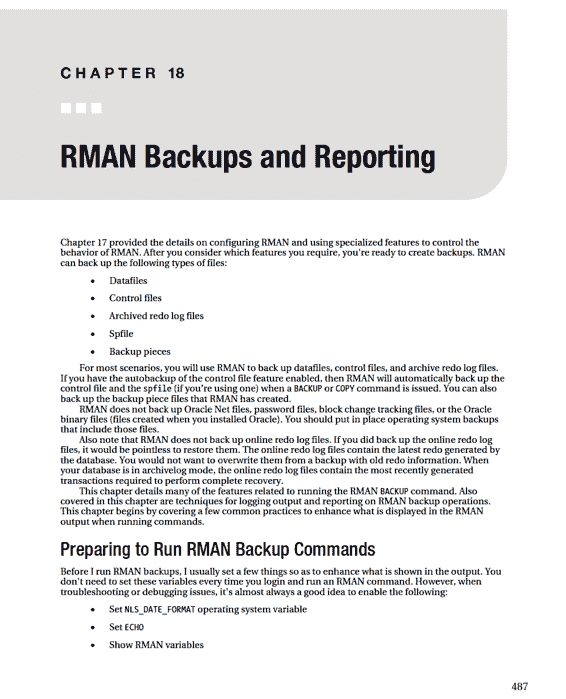
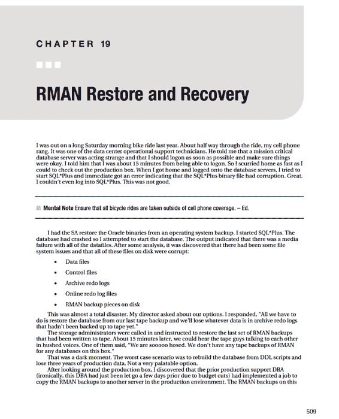
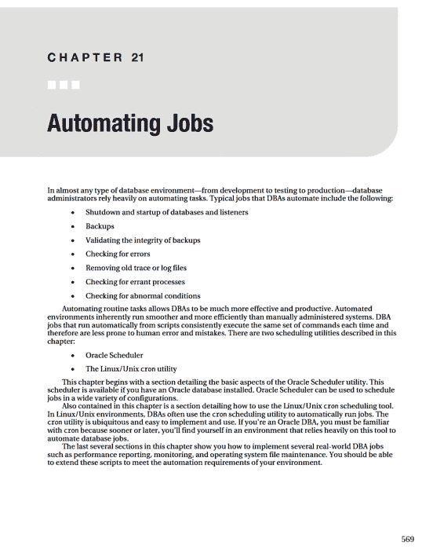

# Delete obsolete backups and archive logs as defined by retention policy.
delete noprompt obsolete;
EOF

#----------------------------------------------
if [ $? -ne 0 ]; then
    echo "RMAN problem..."
    echo "Check RMAN backups" | $MAILX -s "RMAN issue: $ORACLE_SID on $BOX" $MAIL_LIST
else
    echo "RMAN ran okay..."
fi

#----------------------------------------------
sqlplus -s /nolog <<EOF
connect / as sysdba;
alter database backup controlfile to trace;
COL dbid NEW_VALUE hold_dbid
SELECT dbid FROM v\$database;
exec dbms_system.ksdwrt(2,'DBID: '||TO_CHAR(&hold_dbid));
EXIT
EOF

#----------------------------------------------
if [ -f $LOCKFILE ]; then
    rm $LOCKFILE
fi

#----------------------------------------------
date
```


# 第 17 章 ■ 配置 RMAN

## 表 17–2. 架构决策的实现

| 决策点 | 脚本中的实现方式 | 脚本中的行号 |
| :--- | :--- | :--- |
| 1\. 远程或本地运行 RMAN 客户端 | 在数据库服务器上本地运行脚本。 | 第 26 行，本地连接（非网络连接）。 |
| 2\. 指定备份用户 | 使用 SYS 用户连接。 | 第 27 行，使用`/`连接启动 rman。 |
| 3\. 使用联机或脱机备份 | 联机备份。 | 不适用。假设备份期间数据库处于运行状态。 |
| 4\. 设置归档重做日志目标位置和文件格式 | `LOG_ARCHIVE_DEST_N`和`LOG_ARCHIVE_FORMAT`初始化参数在脚本外的数据库初始化文件中设置。 | 不适用。在脚本外设置。 |
| 5\. 配置 RMAN 备份位置和文件格式 | 直接在脚本中使用`CONFIGURE`命令。 | 第 38 至 43 行。 |
| 6\. 设置控制文件的自动备份 | 在脚本中启用。 | 第 35 行。 |
| 7\. 指定控制文件自动备份的位置 | 放置在与备份相同的目录中。 | 第 36 行。 |
| 8\. 备份归档重做日志 | 与其他数据库一起备份。具体来说，使用`PLUS ARCHIVELOG`子句。 | 第 45 行。 |
| 9\. 确定快照控制文件的位置 | 使用默认位置。 | 不适用 |
| 10\. 使用恢复目录 | 未使用。 | 第 26 行，以`nocatalog`模式连接。 |
| 11\. 使用介质管理器 | 未使用。 | 第 38 至 43 行，`device type disk`。 |
| 12\. 设置`CONTROL_FILE_RECORD_KEEP_TIME`初始化参数 | 使用默认值。 | 不适用 |
| 13\. 配置 RMAN 的备份保留策略 | 配置为冗余度为 1，进行交叉检查，并删除过时的备份和归档重做日志文件。 | 第 37 行，配置。<br> 第 47 行，使用 RMAN 删除旧文件。 |
| 14\. 配置归档重做日志的删除策略 | 使用与备份相同的保留策略。 | 不适用 |
| 15\. 设置并行度 | 设置并行度为 5。 | 第 38 至 43 行。 |
| 16\. 使用备份集或映像副本 | 使用备份集。 | 第 45 行。 |
| 17\. 使用增量备份 | 增量级别 0，等同于完全备份。 | 第 45 行。 |
| 18\. 使用增量更新备份 | 未使用。 | 不适用 |
| 19\. 使用块变更跟踪 | 未使用。 | 不适用 |
| 20\. 配置压缩 | 使用基本压缩。 | 第 45 行。 |
| 21\. 配置加密 | 未使用。 | 不适用 |
| 22\. 配置其他设置 | 未使用。 | 不适用 |

关于此脚本的几个方面需要进一步讨论（除表中已包含的内容外）。

第 11 行通过运行名为`oraset`的脚本来设置所需的 OS 变量。有关运行`oraset`和获取 OS 变量的详细信息，请参见第 2 章。许多 DBA 选择将 OS 变量（如`ORACLE_HOME`和`ORACLE_SID`）硬编码到脚本中。但是，您应避免硬编码变量，而应使用脚本来获取所需变量。运行脚本要灵活得多，尤其是在一台服务器上有许多安装了不同版本 Oracle 的数据库时。

第 15 行将`NLS_DATE_FORMAT` OS 变量设置为一个包含小时、分钟和秒的值。这确保了当 RMAN 运行适当的命令时，其显示的日期输出包含时间成分。这在调试和诊断问题时非常有用。默认情况下，RMAN 只显示日期部分。仅知道命令运行的日期，很少足以确定命令执行的具体时间。至少，您需要看到小时和分钟（连同日期）。

第 18 至 24 行检查锁文件是否存在。如果此脚本已经在运行，则不希望再次运行它。脚本检查锁文件，如果存在，则脚本退出。备份完成后，锁文件会被删除（第 66 至 68 行）。

第 28 行将`ECHO`参数设置为`on`。这指示 RMAN 在输出中显示即将执行的命令。这对于调试问题非常有用。第 29 行显示所有可配置变量。这对于故障排查也很方便，因为您可以在执行任何命令之前看到 RMAN 变量被设置成了什么。

第 35 至 43 行使用了`CONFIGURE`命令。这些命令在脚本每次执行时都会运行。为什么要这样做？`CONFIGURE`命令只需要运行一次，它会存储在控制文件中——您不需要再次运行它，对吗？这是正确的。然而，我曾偶尔因此吃亏，当一个习惯不好的 DBA 为数据库配置了某个设置却没告诉任何人，而我直到尝试进行另一次备份时才发现配置错误。我强烈建议将`CONFIGURE`命令放在脚本中，这样无论其他 DBA 在脚本外做了什么，脚本的行为都能保持一致。脚本中的`CONFIGURE`设置也充当了一种文档形式：我可以轻松查看脚本来确定各项设置是如何配置的。

第 31 至 33 行运行了`CROSSCHECK`命令。为什么要这样做？有时文件会丢失，或者一个鲁莽的 DBA 可能使用 RMAN 之外的操作系统命令从磁盘上删除了归档重做日志文件。当 RMAN 运行时，如果它找不到它认为应该存在的文件，就会抛出错误并停止备份。我更倾向于运行`CROSSCHECK`命令，让 RMAN 协调它认为应该在磁盘上的文件与实际在磁盘上的文件。这能使 RMAN 顺利运行。

在第 47 行，您运行了`DELETE NOPROMPT OBSOLETE`。这将删除所有被 RMAN 根据保留策略标记为`OBSOLETE`的备份文件和归档重做日志文件。这使得 RMAN 能够管理磁盘上应保留哪些文件。我倾向于在备份完成后运行`DELETE`命令（而不是在备份前运行）。保留策略被定义为 1，因此如果在备份后运行`DELETE`，磁盘上会保留一份备份副本。如果在备份前运行`DELETE`，磁盘上会保留一份备份副本。备份运行后，磁盘上就会有两份备份副本，而我的服务器上没有足够的空间。

第 59 行创建了一个跟踪文件，其中包含在此数据库需要重新创建控制文件时所需的`CREATE CONTROLFILE` SQL 语句。第 62 行将数据库标识符（`DBID`）写入警报日志文件。在某些需要数据库 ID 才能执行的控制文件恢复类型中，这可能会派上用场。

您可以从 Linux/Unix 调度工具`cron`执行此 shell 脚本，如下所示：
```
0 16 * * * $HOME/bin/rmanback.bsh INVPRD >$HOME/bin/log/INVPRDRMAN.log 2>&1
```
该脚本在数据库服务器上每天按军用时间 1600 小时运行。会创建一个日志文件（`INVPRDRMAN.log`）来捕获 RMAN 作业的任何输出和错误。有关通过`cron`自动化作业的详细信息，请参见第 21 章。

再次说明，本节中的脚本是基础性的；您无疑需要根据您的需求对其进行增强和修改。此脚本为您提供了一个起点，包含具体的 RMAN 建议以及如何实施它们。

### 使用恢复目录

当您使用恢复目录时，可以在与目标数据库相同的服务器上的同一数据库中创建恢复目录用户。但是，不建议采用这种方法，因为您不希望目标数据库的可用性或目标数据库所在服务器的可用性影响恢复目录。因此，您应该在不同于目标数据库的服务器上创建恢复目录数据库。

## 创建恢复目录


当我使用恢复目录时，我倾向于使用一个专用的、仅用于恢复目录的数据库。这确保了恢复目录不受其他应用程序所需的任何维护或停机时间的影响（反之亦然）。

接下来列出的是创建恢复目录的步骤：

1.  在与你的目标数据库不同的服务器上创建一个数据库，用于恢复目录。确保数据库大小合适。我发现 Oracle 推荐的大小通常都太小了。以下是一些合适的建议：

## 第 17 章 ■ 配置 RMAN

*   `SYSTEM` 表空间：500MB
*   `SYSAUX` 表空间：500MB
*   `TEMP` 表空间：500MB
*   `UNDO` 表空间：500MB
*   在线重做日志：每个 25MB，3 组，每组多路复用 2 个成员
*   `RECCAT` 表空间：500MB

2.  创建一个供恢复目录用户使用的表空间。我建议将表空间命名为类似 `RECCAT` 的名称，以便易于识别为包含恢复目录元数据的表空间：

```sql
CREATE TABLESPACE reccat
DATAFILE '/ora01/dbfile/O11R2/reccat01.dbf'
SIZE 500M
EXTENT MANAGEMENT LOCAL
UNIFORM SIZE 128k
SEGMENT SPACE MANAGEMENT AUTO;
```

3.  创建一个用户，该用户将拥有用于存储目标数据库元数据的表和其他对象。我建议你将恢复目录用户命名为类似 `RCAT` 的名称，以便易于识别其为恢复目录对象的拥有者。同时，将 `RECOVERY_CATALOG_OWNER` 角色以及 `CREATE SESSION` 权限授予 `RCAT` 用户：

```sql
CREATE USER rcat IDENTIFIED BY foo
TEMPORARY TABLESPACE temp
DEFAULT TABLESPACE reccat
QUOTA UNLIMITED ON reccat;

GRANT RECOVERY_CATALOG_OWNER TO rcat;
GRANT CREATE SESSION TO rcat;
```

4.  通过 `RMAN` 以 `RCAT` 身份连接，并创建恢复目录对象：

```
$ rman catalog rcat/foo
```

5.  现在，运行 `CREATE CATALOG` 命令：

```
RMAN> create catalog;
RMAN> exit;
```

6.  此命令可能需要运行几分钟。完成后，你可以通过以下查询验证表是否已创建：

```
$ sqlplus rcat/foo
SQL> select table_name from user_tables;
```

7.  以下是一些示例输出：

## 第 17 章 ■ 配置 RMAN

TABLE\_NAME
DB
NODE
CONF
DBINC
BRDSTN
CKP
TS

## 注册目标数据库

现在，你可以将目标数据库注册到恢复目录。登录到目标数据库服务器。

确保你可以建立到恢复目录数据库的 Oracle Net 连接。例如，一种方法是在 `TNS_ADMIN/tnsnames.ora` 文件中填入一个指向远程数据库的条目。在目标数据库服务器上，按如下方式注册恢复目录：

```
$ rman target / catalog rcat/foo@rcat
```

当你连接时，应该会看到连接到目标数据库和恢复目录的验证信息：

connected to target database: `O11R2` (DBID=3457609395)
connected to recovery catalog database

接下来，运行 `REGISTER DATABASE` 命令：

```
RMAN> register database;
```

现在，你可以运行备份操作，并将有关备份任务的元数据同时写入控制文件和恢复目录。确保每次运行 `RMAN` 命令时都连接到恢复目录和目标数据库：

```
$ rman target / catalog rcat/foo@rcat
```

## 备份恢复目录

确保你包含备份和恢复恢复目录数据库的策略。为了获得最大程度的保护，请确保恢复目录数据库处于归档日志模式，并使用 `RMAN` 备份该数据库。

你也可以使用像 Data Pump 这样的工具来获取数据库快照。使用 Data Pump 的缺点是，你可能会丢失在 Data Pump 导出之后创建的、恢复目录中的某些信息。

请记住，如果你的恢复目录数据库服务器发生完全故障，你仍然可以使用 `RMAN` 备份你的目标数据库。你只是无法连接到恢复目录。因此，任何指示 `RMAN` 连接到目标和恢复目录的脚本都必须修改。

另外，如果你完全丢失了恢复目录并且没有备份，一个选择是从头重新创建它。一旦重新创建，你需要重新将目标数据库注册到恢复目录。

你会丢失任何长期的历史恢复目录元数据。

## 第 17 章 ■ 配置 RMAN

## 同步恢复目录

你可能遇到网络问题，导致恢复目录无法访问。在此期间，你连接到目标数据库并执行备份操作。一段时间后，网络问题解决，你又可以连接到恢复目录了。

在这种情况下，你需要将恢复目录与目标数据库重新同步，以便恢复目录知晓那些未存储在恢复目录中的任何备份操作。运行以下命令以确保恢复目录拥有最新的备份信息：

```
$ rman target / catalog rcat/foo@rcat
RMAN> resync catalog;
```

请记住，仅当由于某些原因你在未连接到目录的情况下执行备份操作时，才需要重新同步目录。在正常情况下，你无需运行 `RESYNC` 命令。

## 恢复目录版本

我建议你为每个正在备份的目标数据库版本创建一个恢复目录。这样做可以为你节省一些因兼容性和升级问题带来的麻烦。我发现，当 `rman` 客户端的数据库版本与创建目录时使用的数据库版本相同时，使用恢复目录会更容易。

是的，拥有多个版本的恢复目录可能会引起一些混淆。但是，如果你处于一个拥有多个不同版本 Oracle 数据库的环境中，那么多个恢复目录可能更方便。

## 删除恢复目录

如果你确定不再使用恢复目录并且不再需要其中的数据，可以将其删除。为此，以目录所有者身份连接到目录数据库，并发出 `DROP CATALOG` 命令：

```
$ rman catalog rcat/foo
RMAN> drop catalog;
```

系统会提示你：

recovery catalog owner is `RCAT`
enter `DROP CATALOG` command again to confirm catalog removal

如果你再次输入 `DROP CATALOG` 命令，恢复目录中的所有对象都将从目录数据库中删除。

另一种删除目录的方法是删除其所有者。为此，以具有 `DBA` 权限的用户身份连接到恢复目录，并发出 `DROP USER` 语句：

```
$ sqlplus system/manager
SQL> drop user rcat cascade;
```

`SQL*Plus` 不会提示你两次。它会按照你的指示操作，删除该用户及其对象。

再次强调，执行此操作的唯一原因是你确定不再需要恢复目录或其数据。删除用户或恢复目录时请谨慎：我建议你在删除恢复目录所有者之前，使用 Data Pump 导出其数据。

## 第 17 章 ■ 配置 RMAN

## 总结

`RMAN` 是 Oracle 的旗舰级 B&R（备份与恢复）工具。如果你仍在使用较旧的用户管理备份技术，那么我强烈建议你切换到 `RMAN`。`RMAN` 包含一组强大的功能，是任何其他可用备份工具所无法比拟的。它易于使用和配置。`RMAN` 将在你实施稳健的 B&R 策略时，为你节省时间和精力，并让你高枕无忧。

如果你是 `RMAN` 的新手，可能并不清楚哪些功能应该始终启用和实施，同样，哪些方面你很少需要。本章包含一个供你遵循的检查清单，引导你完成每个架构决策点。你可能不同意我的某些结论，或者某些建议可能不符合你的业务需求——这没关系。关键在于，你应该仔细考虑每个组件以及如何实施那些有意义的功能。


本章以一个在生产环境中实施 RMAN 的实际脚本示例结束。既然你已经对 RMAN 的功能及其使用方法有了清晰的了解，现在可以开始进行备份了。下一章将讨论 RMAN 备份场景。



# 第 18 章 ■ RMAN 备份与报告

以下各节将讨论列举的各项内容。

#### 设置 NLS_DATE_FORMAT

在运行任何 RMAN 作业之前，我会将操作系统变量 `NLS_DATE_FORMAT` 设置为包含时间（小时、分钟和秒）部分。例如：

`$ export NLS_DATE_FORMAT='dd-mon-yyyy hh24:mi:ss'`

此外，如果我有一个调用 RMAN 的 shell 脚本，我会将上述行直接放入 shell 脚本中（有关示例，请参见第 17 章末尾的 shell 脚本）：

`NLS_DATE_FORMAT='dd-mon-yyyy hh24:mi:ss'`

这样可以确保当 RMAN 显示日期时，输出中始终包含小时、分钟和秒。默认情况下，RMAN 的输出中只包含日期部分 (`DD-MON-YYYY`)。

例如，启动备份时，RMAN 显示如下：

`Starting backup at 15-sep-2010`

当你将 `NLS_DATE_FORMAT` 操作系统变量设置为包含时间部分时，输出将变为：

`Starting backup at 15-sep-2010 03:20:17`

在进行故障排除时，拥有时间部分至关重要，这样你才能确定命令运行了多长时间，或者命令在失败前运行了多久。Oracle 支持几乎总是会要求你在捕获输出并发送给他们之前，将此变量设置为包含时间部分。

设置 `NLS_DATE_FORMAT` 的唯一缺点是，如果你将其设置为 RMAN 无法识别的值，可能会导致连接问题。例如，这里 `NLS_DATE_FORMAT` 被设置为一个无效值：

`$ export NLS_DATE_FORMAT='dd-mon-yyyy hh24:mi:sd'`
`$ rman target /`

当设置为无效值时，登录 RMAN 时会出现此错误：`RMAN-03999: Oracle error occurred while converting a date: ORA-01821:`

要取消设置 `NLS_DATE_FORMAT` 变量，请将其设置为空值，如下所示：

`$ export NLS_DATE_FORMAT=''`

#### 设置 ECHO

我在任何 RMAN 脚本中总是设置的另一个值是 `ECHO` 命令，如下所示：

`RMAN> set echo on;`

这指示 RMAN 在输出中显示它正在运行的命令，这样你就可以看到正在运行的 RMAN 命令以及与该命令相关的任何错误或输出消息。当你在脚本中运行 RMAN 命令时，这一点尤其重要，因为你并不是直接输入命令（并且可能不知道 shell 脚本中发出了什么命令）。例如，如果没有 `SET ECHO ON`，命令的输出会显示为：

`Starting backup at 15-sep-2010 03:49:55`
`using target database control file instead of recovery catalog`

使用 `SET ECHO ON`，此输出会显示实际运行的命令：

`backup datafile 4;`
`Starting backup at 15-sep-2010 03:49:55`
`using target database control file instead of recovery catalog`

从前面的输出中，你可以看到运行了哪个命令、何时开始等等。

#### 显示变量

另一个好的做法是在任何脚本中运行 `SHOW ALL` 命令，如下所示：

`RMAN> show all;`

这会显示所有 RMAN 可配置变量。在进行故障排除时，你可能不知道其他 DBA 已经配置了某些内容。这让你可以查看 RMAN 会话执行时设置的快照。

### 运行备份

在运行 RMAN 备份之前，请确保阅读第 17 章，了解如何为生产环境配置 RMAN 设置。对于生产数据库，我主要从类似于第 17 章末尾所示脚本的 shell 脚本运行 RMAN。在 shell 脚本中，我配置了我想用于特定数据库的 RMAN 的每个方面。如果你使用其默认设置开箱即用地运行 RMAN，你将能够备份数据库。然而，这些设置对于大多数生产数据库应用程序来说是不够的。

#### 备份整个数据库

如果你不确定 RMAN 会将数据库文件备份到哪里，你需要阅读第 17 章，因为它描述了如何配置 RMAN 以在你选择的位置创建备份文件。

以下是我通常配置 RMAN 写入磁盘上特定位置的方法（请注意，`CONFIGURE` 命令必须在运行 `BACKUP` 命令之前执行）：

`RMAN> configure channel 1 device type disk format '/ora01/O11R2/rman/rman1_%U.bk';`

配置好备份位置后，我几乎总是使用类似于下面显示的命令来备份整个数据库：

`RMAN> backup incremental level=0 database plus archivelog;`

此命令确保 RMAN 将备份数据库中的所有数据文件、备份之前生成的所有归档重做日志以及备份期间生成的所有归档重做日志。此命令还确保你拥有恢复和还原数据库所需的所有数据文件和归档重做日志。

如果你启用了控制文件的自动备份功能（详见第 17 章），RMAN 作为备份一部分完成的最后一项任务是生成一个包含控制文件备份的备份集。此控制文件将包含有关所发生备份以及备份期间生成的任何归档重做日志的所有信息。

> **提示** 始终启用控制文件的自动备份功能。

`RMAN BACKUP` 命令有许多细微差别。对于生产数据库，我通常使用 `BACKUP INCREMENTAL LEVEL=0 DATABASE PLUS ARCHIVELOG` 命令备份数据库。这通常就足够了。然而，你会遇到许多情况，需要运行使用特定 RMAN 功能的备份，或者你可能在进行故障排除时需要意识到调用 RMAN 备份的其他方式。本章接下来的几节将讨论这些方面。

### 完全备份与增量级别=0

术语 “RMAN 完全备份” 有时会引起混淆。更贴切地描述完全备份所做的事情的方式是 “RMAN 备份一个或多个数据文件中所有已修改的块”。术语 “完全” 并不意味着备份所有块或所有数据文件。它仅仅指的是备份了重建数据文件（在发生故障时）所需的所有块。你可以对单个数据文件进行完全备份，而该备份片的内容可能比数据文件本身小得多。

术语 “RMAN 级别 0 增量备份” 自身描述得也不是很准确。级别 0 增量备份备份的块与完全备份完全相同。换句话说，以下两个命令备份数据库中完全相同的块：

`RMAN> backup as backupset full database;`
`RMAN> backup as backupset incremental level=0 database;`

前述两个命令之间的唯一区别是，增量级别 0 备份可以与其他增量备份结合使用，而完全备份不能参与增量备份策略。

因此，我几乎总是更喜欢使用 `INCREMENTAL LEVEL=0` 语法（而不是完全备份）。这是因为这让我可以灵活地将级别 0 增量备份与不同的增量级别备份一起使用。

### 备份集与映像副本


# RMAN 备份与报告

## RMAN 备份类型

RMAN 的默认备份模式指示其仅备份数据文件中已使用的块；这些被称为**备份集**。RMAN 也可以对数据文件进行逐字节复制；这些被称为**映像副本**。创建备份集是 RMAN 创建的默认备份类型。以下命令创建数据库的备份集备份：

```
RMAN> backup database;
```

如果你愿意，可以在创建备份时显式指定 `AS BACKUPSET` 命令：

```
RMAN> backup as backupset database;
```

你可以通过使用 `AS COPY` 命令指示 RMAN 创建映像副本。以下命令为数据库中的每个数据文件创建映像副本：

```
RMAN> backup as copy database;
```

由于映像副本是数据文件的完全相同副本，数据库管理员可以直接通过操作系统命令访问它们。例如，假设发生了介质故障，而你不想使用 RMAN 来恢复映像副本。你可以使用操作系统命令将数据文件的映像副本复制到数据库可以使用的位置，而备份集由二进制文件组成，只有 RMAN 工具可以写入或读取。

我更喜欢在使用 RMAN 时使用备份集。备份集往往比数据文件小，并且可以应用真正的二进制压缩。此外，我不觉得使用 RMAN 作为创建只有 RMAN 才能恢复的备份文件的机制有什么不便。使用 RMAN 和备份集既高效又非常可靠。

#### 备份表空间

RMAN 能够在数据库级别（如前面的示例所示）、表空间级别，甚至更精细地在数据文件级别进行备份。当你备份表空间时，RMAN 会备份与你指定的表空间相关联的任何数据文件。例如，以下命令将备份与 `SYSTEM` 和 `SYSAUX` 表空间相关联的所有数据文件：

```
RMAN> backup tablespace system, sysaux;
```

我备份表空间的一个场景是，如果我最近创建了一个新的表空间，并且只想备份（与新添加的表空间相关的）数据文件。请注意，在排查备份和恢复问题时，使用一个表空间进行操作通常更有效（因为备份一个表空间通常比备份整个数据库快得多）。

#### 备份数据文件

你可能偶尔需要备份单个数据文件。例如，在排查备份问题时，尝试成功备份一个数据文件通常很有帮助。你可以通过文件名或文件号指定数据文件，如下所示：

```
RMAN> backup datafile '/ora01/dbfile/O11R2/system01.dbf';
```

这是一个指定文件号的示例：

```
RMAN> backup datafile 1,3;
```

以下是使用各种功能备份数据文件的其他示例：

```
RMAN> backup as copy datafile 3;
```

```
RMAN> backup incremental level 1 datafile 4;
```

> **提示** 使用 `REPORT SCHEMA` 命令列出表空间、数据文件名和数据文件编号信息。

#### 备份控制文件

备份控制文件最可靠的方法是配置自动备份功能：

```
RMAN> configure controlfile autobackup on;
```

此命令确保在发出 `BACKUP` 或 `COPY` 命令时自动备份控制文件。我通常启用控制文件的自动备份功能，然后就再也不用担心显式发出单独命令来备份控制文件了。在此模式下，控制文件总是在数据文件备份片段创建完成后，在其自己的备份集和备份片段中创建。

如果你需要手动备份控制文件，可以这样做：

```
RMAN> backup current controlfile;
```

备份的位置可以是默认的操作系统位置、快速恢复区（如果使用），或者手动配置的位置。如第 17 章所示，我更喜欢将控制文件备份片段的位置设置为与数据文件备份相同的位置：

```
RMAN> configure controlfile autobackup format for device type disk to '/ora01/O11R2/rman/rman_ctl_%F.bk';
```

#### 备份 Spfile

如果你启用了控制文件的自动备份功能，那么每当发出 `BACKUP` 或 `COPY` 命令时，spfile 也会（与控制文件一起）被自动备份。如果你需要手动备份 spfile，请使用以下命令：

```
RMAN> backup spfile;
```

包含 spfile 备份的文件的位置取决于你的配置。默认情况下，如果你没有使用快速恢复区，并且没有通过通道显式配置位置，那么对于 Linux/Unix 服务器，备份会进入 `$ORACLE_HOME/dbs` 目录。

> **注意** 只有实例是使用 spfile 启动时，RMAN 才能备份 spfile。

#### 备份归档重做日志

我通常不会将归档重做日志与数据库备份分开备份。如前所述，我通常使用以下命令备份数据库文件和归档重做日志文件：

```
RMAN> backup incremental level=0 database plus archivelog;
```

然而，你偶尔会发现自己处于需要对归档重做日志进行特殊的一次性备份的情况。你可以发出以下命令来备份归档重做日志文件：

```
RMAN> backup archivelog all;
```

如果你有一个几乎满的挂载点，并且你决定要备份归档重做日志（以便它们存在于备份文件中），但随后又想立即将刚备份过的归档重做日志文件从磁盘上删除，你可以使用以下语法来备份归档重做日志，然后让 RMAN 将它们从存储介质中删除：

```
RMAN> backup archivelog all delete input;
```

接下来列出了一些其他可以用来备份归档重做日志文件的方法：

```
RMAN> backup archivelog sequence 300;
```

```
RMAN> backup archivelog sequence between 300 and 400 thread 1;
```

```
RMAN> backup archivelog from time "sysdate-7" until time "sysdate-1";
```

如果一个归档重做日志已通过操作系统删除命令手动从磁盘中移除，RMAN 在尝试备份不存在的归档重做日志文件时将抛出以下错误：

```
RMAN-06059: expected archived log not found, loss of archived log compromises recoverability
```

在这种情况下，首先运行一个 `CROSSCHECK` 命令，让 RMAN 知道哪些文件在磁盘上物理可用：

```
RMAN> crosscheck archivelog all;
```

#### 备份快速恢复区

如果你使用快速恢复区，RMAN 的一个很好的功能是，你可以用一条命令备份该位置的所有文件。如果你使用介质管理器并启用了磁带备份通道，你可以像这样将快速恢复区中的所有内容备份到磁带：

```
RMAN> configure channel device type sbt_tape parms 'ENV=(OB_MEDIA_FAMILY=RMAN-DB11R2)';
```

```
RMAN> backup device type sbt_tape recovery area;
```

你也可以将快速恢复区备份到磁盘上的某个位置。使用 `TO DESTINATION` 命令来实现这一点：

```
RMAN> backup recovery area to destination '/ora01/O11R1/fra_back';
```

RMAN 会根据需要，在 `TO DESTINATION` 命令指定的目录下自动创建目录。

> **注意** `<TO_DESTINATION>` 目录下的子目录格式为 `<SID>/backupset_<YYYY_MM_DD>`。RMAN 将备份完全备份、增量备份、控制文件自动备份和归档重做日志文件。请注意，闪回日志、联机重做日志文件和当前控制文件不会被备份。

#### 从备份中排除表空间

假设你有一个包含非关键数据的表空间，并且你永远不想备份它。


# RMAN 备份配置与报告

## 排除表空间备份
RMAN 可被配置为从备份中排除特定表空间。要检查 RMAN 当前是否配置了排除任何表空间，请运行此命令：
`RMAN> show exclude;`

该命令输出显示数据库的 RMAN 配置参数（数据库唯一名为`O11R2`），示例中 RMAN 未配置任何存储或默认参数。

使用`EXCLUDE`命令来指示 RMAN 不要备份哪些表空间：
`RMAN> configure exclude for tablespace users;`

配置后，对于任何数据库级别的备份，RMAN 将排除与`USERS`表空间关联的数据文件。你可以使用以下命令指示 RMAN 备份任何被排除的表空间：
`RMAN> backup database noexclude;`

你可以通过以下命令清除排除设置：
`RMAN> configure exclude for tablespace users clear;`

#### 备份未备份的数据文件
假设你刚向数据库添加了几个数据文件，并想确保它们已被备份。你可以执行以下命令来指示 Oracle 备份那些尚未备份的数据文件：
`RMAN> backup database not backed up;`

你还可以指定一个时间范围，以备份该范围内尚未备份的文件。假设你发现过去几天备份未运行，并且想要备份过去 24 小时内所有未备份的内容。以下命令将备份过去一天内未备份的所有数据文件：
`RMAN> backup database not backed up since time='sysdate-1';`

如果你的备份因某些原因（如数据中心断电或备份目录在备份期间已满）而中止，此命令也很有用。在解决导致备份作业失败的问题后，你可以执行前面的命令，RMAN 将仅备份指定时间段内未备份的数据文件。

#### 跳过只读表空间
由于只读表空间中的数据在只读模式下无法更改，你可能希望只备份只读表空间一次，然后在后续备份中跳过它们。使用`SKIP READONLY`命令实现这一点：
`RMAN> backup database skip readonly;`

请记住，当你跳过只读表空间时，需要保留一个包含这些表空间的有效备份。避免陷入这样的情况：一个只读表空间六个月没有备份，然后发生了介质故障。

#### 跳过离线或不可访问的文件
有时数据文件会损坏。假设你已知该数据文件不再需要，并将其离线，如下所示：
`SQL> alter database datafile '/ora01/INVDEV/sysaux01.dbf' offline for drop;`

现在，假设你尝试运行 RMAN 备份：
`RMAN> backup database;`

当 RMAN 遇到无法备份的数据文件时，会抛出以下错误：
`RMAN-03002: failure of backup command at 09/14/2010 13:24:04`
`RMAN-06056: could not access datafile 3`

在这种情况下，你必须指示 RMAN 将离线数据文件排除在备份之外。`SKIP OFFLINE`命令指示 RMAN 忽略状态为离线的数据文件：
`RMAN> backup database skip offline;`

如果一个文件完全丢失，请使用`SKIP INACCESSIBLE`来指示 RMAN 忽略磁盘上不可访问的文件。如果使用操作系统命令删除了数据文件，可能会发生这种情况。以下是将不可访问的数据文件排除在 RMAN 备份之外的示例：
`RMAN> backup database skip inaccessible;`

你可以用一个命令跳过只读、离线和不可访问的数据文件：
`RMAN> backup database skip readonly skip offline skip inaccessible;`

在处理离线和不可访问的文件时，你应该查明文件离线或不可访问的原因，并尝试解决任何问题。

## 并行备份大文件
通常，RMAN 只使用一个通道来备份单个数据文件。当你启用并行性时，它允许 RMAN 生成多个进程来备份多个文件。然而，即使启用了并行性，RMAN 通常也不会同时使用多个并行通道来备份一个数据文件，但从 Oracle Database 11g 开始，你可以指示 RMAN 使用多个通道并行备份一个数据文件。

这被称为**多节备份**。此功能可以加快非常大的数据文件的备份速度。

使用`SECTION SIZE`参数进行多节备份。以下示例配置两个并行通道来备份一个文件：
```
RMAN> configure device type disk parallelism 2;
RMAN> configure channel 1 device type disk format '/ora01/O11R2/rman/r1%U.bk';
RMAN> configure channel 2 device type disk format '/ora02/O11R2/rman/r2%U.bk';
RMAN> backup section size 2500M datafile 10;
```
当此代码运行时，RMAN 将分配两个通道来并行备份数据文件`10`。

**注意：** 如果你指定的节大小大于数据文件的大小，RMAN 将不会并行备份该文件。

## 将 RMAN 备份信息添加到存储库
另一种场景是当你需要向控制文件填充有关 RMAN 备份的信息时。例如，假设你必须重建控制文件，现在控制文件不再包含任何关于 RMAN 的信息。在这种情况下，使用`CATALOG`命令向控制文件填充 RMAN 元数据。例如，如果所有 RMAN 备份文件都保存在`/ora01/O11R2/rman`目录中，你可以让控制文件识别该目录中的这些备份文件，如下所示：
`RMAN> catalog start with '/ora01/O11R2/rman';`

这导致 RMAN 在指定目录中查找任何备份片、映像副本、控制文件副本或归档重做日志，如果找到，则将适当的元数据填充到控制文件中。对于此示例，在给定目录中找到了两个备份片文件：
```
searching for all files that match the pattern /ora01/O11R2/rman

List of Files Unknown to the Database
=====================================
File Name: /ora01/O11R2/rman/r1otlns90o_1_1.bk
File Name: /ora01/O11R2/rman/r1xyklnrveg_1_1.bk

Do you really want to catalog the above files (enter YES or NO)?
```
如果你输入`YES`，则有关备份文件的元数据将被添加到控制文件中。这样，`CATALOG`命令允许你让 RMAN 存储库（控制文件和恢复目录）识别 RMAN 可用于备份和恢复的文件。

你还可以指示 RMAN 编录恢复区域中控制文件当前未知的任何文件：
`RMAN> catalog recovery area;`

你也可以编录特定的文件。此示例指示 RMAN 为特定的备份片文件向控制文件添加元数据：
`RMAN> catalog backuppiece '/ora01/O11R2/rman/r1xyklnrveg_1_1.bk';`

### 创建增量备份
RMAN 有三种独立且不同的增量备份功能：
- 增量级别备份
- 增量更新备份
- 块更改跟踪

使用增量级别备份，RMAN 只备份自上次备份以来已修改的块。增量备份可应用于整个数据库、表空间或数据文件。这是 RMAN 最常用的增量功能。

增量更新备份与增量级别备份是完全不同的功能。这些备份获取数据文件的映像副本，然后使用增量备份来更新这些映像副本。这为你提供了一种高效的方法，将映像副本作为备份策略的一部分进行实施和维护。你只需进行一次映像副本备份，然后使用增量备份来保持映像副本更新为最新的事务。


# RMAN 备份与报告

## 块改变跟踪

块改变跟踪是另一项旨在提升增量备份性能的功能。其核心思想是使用一个操作系统文件来记录自上次备份以来发生更改的数据块。在执行增量备份时，RMAN 可以利用块改变跟踪文件快速识别出需要备份的数据块。此功能可以极大提升增量备份的性能。

## 采用增量级别备份

RMAN 通过级别来实现增量备份。从 Oracle Database 10*g* 开始，文档化的增量备份级别只有两种：级别 0 和级别 1。早期版本的 Oracle 提供 0 到 4 共五个级别。这些级别（0 到 4）在 Oracle Database 10g 和 11g 中仍然可用，但未在 Oracle 文档中指定。你必须首先执行一个增量级别 0 备份来建立基线，之后才能执行级别 1 增量备份。

**注意**：完全备份备份的数据块与级别 0 备份完全相同。然而，你不能将完全备份用于增量备份。你必须以级别 0 备份开始增量备份。如果你尝试执行级别 1 备份但不存在级别 0 备份，RMAN 会自动执行一个级别 0 备份。

以下是一个执行增量级别 0 备份的示例：

```
RMAN> backup incremental level=0 database;
```

假设接下来的几次备份，你只想备份自上次级别 0 基线备份以来发生更改的数据块。下面这行代码执行一个级别 1 备份：

```
RMAN> backup incremental level=1 database;
```

增量备份有两种不同的类型：差异备份和累积备份。使用哪种类型的增量备份（差异或累积）取决于你的要求。差异备份（默认）较小，但恢复所需时间更长。累积备份比差异备份大，但恢复所需时间更短。

差异增量级别 1 备份指示 RMAN 备份自上次级别 1 或级别 0 备份以来发生更改的数据块，而累积增量级别 1 备份则指示 RMAN 备份自上次级别 0 备份以来发生更改的数据块。累积增量备份实际上会忽略任何级别 1 增量备份。

**注意**：RMAN 增量级别 0 备份用于还原数据文件，而 RMAN 增量级别 1 备份用于恢复数据文件。

在使用增量备份时，我几乎总是使用默认的差异备份。通常我不太担心差异备份和累积备份之间的区别。如果你需要累积备份，必须指定关键字 `CUMULATIVE`。以下是一个执行累积级别 1 备份的示例：

```
RMAN> backup incremental level=1 cumulative database;
```

以下是一些在比数据库更细粒度级别上执行增量备份的其他示例：

```
RMAN> backup incremental level=0 tablespace sysaux;
RMAN> backup incremental level=1 tablespace sysaux plus archivelog;
RMAN> backup incremental level=1 datafile 3;
```

## 执行增量更新备份

增量更新备份的基本思想是创建数据文件的映像副本，然后使用增量备份来更新这些映像副本。这样，你就拥有了一份数据库的映像副本，通过应用增量备份使其保持某种程度的最新状态。这可以是一种将映像副本备份与增量备份相结合的高效方式。

要理解这种备份技术的工作原理，你需要检查执行增量更新备份的命令。你需要两行 RMAN 代码来启用此功能：

```
RMAN> recover copy of database with tag 'incupdate';
RMAN> backup incremental level 1 for recover of copy with tag 'incupdate' database;
```

在第一行中，指定了一个标签（此示例使用 `incupdate`）。你可以使用任何你想要的标签名称；该标签名称让 RMAN 能够关联每次运行命令时使用的备份文件。然后，此代码在你第一次运行脚本时会执行以下操作：

- `RECOVER COPY` 生成一条消息，表示没有需要操作的内容。
- 如果不存在映像副本，`BACKUP INCREMENTAL` 会创建数据库数据文件的映像副本。

当 `RECOVER COPY` 命令首次运行时，你应该会在输出中看到类似这样的消息：

```
no parent backup or copy of datafile ... found
```

在 `BACKUP INCREMENTAL` 的输出中，你应该会看到类似这样的文本，表明正在创建映像副本：

```
channel ORA_DISK_1: datafile copy complete, elapsed time: 00:00:25
```

第二次运行增量更新备份时，它执行以下操作：

- `RECOVER COPY` 仍然没有需要操作的内容。
- `BACKUP INCREMENTAL` 执行一个增量级别 1 备份并为其分配指定的标签名称；此备份随后将被 `RECOVER COPY` 命令使用。

第三次运行增量更新备份时，它执行以下操作：

- 既然已经创建了一个增量备份，`RECOVER COPY` 会将该增量备份应用到映像副本上。
- `BACKUP INCREMENTAL` 执行一个增量级别 1 备份并为其分配指定的标签名称；此备份随后将被 `RECOVER COPY` 命令使用。

此后，每次你运行这两行代码，你都将拥有一个定期重复的备份模式。如果你使用映像副本进行备份，可以考虑使用增量更新备份策略，因为这样可以避免每次备份运行时都创建完整的映像副本。

每次备份运行时，映像副本都会根据上一次备份的增量更改进行更新。

## 使用块改变跟踪

块改变跟踪是指使用一个二进制文件来记录数据库数据文件块的更改。其目的是提升增量备份性能，因为 RMAN 可以使用块改变跟踪文件来精确定位自上次备份以来发生更改的数据块。这节省了大量时间，否则 RMAN 将必须扫描所有已备份的数据块以确定它们自上次备份以来是否已更改。你可以通过以下步骤启用块改变跟踪：

1.  如果尚未启用，将 `DB_CREATE_FILE_DEST` 参数设置为一个位置。例如：
    ```
    SQL> alter system set db_create_file_dest='/ora01/O11R2/bct' scope=both;
    ```
2.  通过 `ALTER DATABASE` 命令启用块改变跟踪：
    ```
    SQL> alter database enable block change tracking;
    ```

此示例在 `DB_CREATE_FILE_DEST` 指定的目录中创建一个使用 OMF 名称的文件。在此示例中，创建的文件名为：

```
/ora01/O11R2/bct/O11R2/changetracking/o1_mf_68wxc16g_.chg
```

你也可以通过直接指定文件名来启用块改变跟踪，这不需要设置 `DB_CREATE_FILE_DEST`。例如：

```
SQL> alter database enable block change tracking using file '/ora01/O11R2/bct/btc.bt';
```

你可以通过运行以下查询来验证块改变跟踪的详细信息：

```
SQL> select * from v$block_change_tracking;
```

出于空间规划目的，块改变跟踪文件的大小大约是数据库中被跟踪块总大小的 1/30,000。因此，块改变跟踪文件的大小与数据库大小成正比，而不是与生成的日志量成正比。

要禁用块改变跟踪，请运行以下命令：

```
SQL> alter database disable block change tracking;
```

**注意**：当你禁用块改变跟踪时，Oracle 会自动删除块改变跟踪文件。

## 检查数据文件和备份中的损坏情况


# 第 18 章 ■ RMAN 备份与报告

你可以使用`RMAN`来检查数据文件、归档重做日志和控制文件中的损坏情况。你还可以验证备份集是否可恢复。`RMAN VALIDATE`命令用于执行这类完整性检查。运行`VALIDATE`命令有三种方式：

- `VALIDATE`
- `BACKUP...VALIDATE`
- `RESTORE...VALIDATE`

■ `注意` 独立的`VALIDATE`命令在 Oracle Database 11g 或更高版本中可用。`BACKUP...VALIDATE`和`RESTORE...VALIDATE`命令在 Oracle Database 10g 或更高版本中可用。

#### 使用 VALIDATE

`VALIDATE`命令可以单独使用（无需`BACKUP`或`RESTORE`）来检查数据库数据文件、归档重做日志文件、控制文件、`spfile`和备份集片段中的缺失文件或物理损坏。例如，以下命令将验证所有数据文件和控制文件：`RMAN> validate database;`

你也可以仅验证控制文件，如下所示：`RMAN> validate current controlfile;`

你可以像这样验证归档重做日志文件：`RMAN> validate archivelog all;`

你可以将前述三个完整性检查合并为一个命令，如下所示：`RMAN> validate database include current controlfile plus archivelog;` 在正常操作下，`VALIDATE`命令仅检查物理损坏。你可以通过使用`CHECK LOGICAL`子句来指定还要检查逻辑损坏，如下所示：`RMAN> validate check logical database include current controlfile plus archivelog;` 你可以以多种方式使用`VALIDATE`。以下是其他一些示例：
`RMAN> validate database skip offline;`

`RMAN> validate copy of database;`

`RMAN> validate tablespace system;`

`RMAN> validate datafile 3 block 20 to 30;`

`RMAN> validate spfile;`

`RMAN> validate backupset <primary_key_value>;`

`RMAN> validate recovery area;`

如果`RMAN`检测到任何损坏的数据块，`V$DATABASE_BLOCK_CORRUPTION`视图会被填充。该视图包含有关文件号、数据块号和受影响的数据块数量的信息。你可以使用此信息执行数据块级别的恢复。有关数据块级别恢复的详细信息，请参见第 19 章。

■ `注意` 物理损坏是指数据块内容与 Oracle 预期的物理格式不匹配。默认情况下，`RMAN`在备份、恢复或验证数据文件时会检查物理损坏。逻辑损坏是指数据块格式正确但其内容与 Oracle 预期不一致。逻辑损坏可能是诸如行片段或索引条目损坏等问题。

#### 使用 BACKUP...VALIDATE

`BACKUP VALIDATE`命令与`VALIDATE`命令非常相似，它可以检查数据文件是否可用以及数据文件是否包含任何损坏的数据块。例如：
`RMAN> backup validate database;`

此命令实际上不执行任何类型的备份，也不创建任何文件。它只扫描数据文件并检查损坏情况。与`VALIDATE`命令类似，`BACKUP VALIDATE`默认只检查物理损坏。你可以指示它同时检查逻辑损坏，如下所示：
`RMAN> backup validate check logical database;`

以下是`BACKUP...VALIDATE`命令的其他一些变体：

`RMAN> backup validate database current controlfile;`

`RMAN> backup validate check logical database current controlfile plus archivelog;` 与`VALIDATE`命令类似，如果`BACKUP...VALIDATE`检测到任何损坏的数据块，它也会填充`V$DATABASE_BLOCK_CORRUPTION`视图。该视图中的信息可用于确定哪些数据块可能通过数据块级别的恢复来修复。有关数据块级别恢复的更多详细信息，请参见第 19 章。

#### 使用 RESTORE...VALIDATE

`RESTORE...VALIDATE`命令用于验证将用于恢复的备份文件。此命令验证备份集、数据文件副本和归档重做日志文件：
`RMAN> restore validate database;`

使用`RESTORE...VALIDATE`时，不会恢复任何实际文件。这意味着你可以在数据库处于联机和可用状态时运行该命令。


### 记录 RMAN 输出

在排查 RMAN 输出问题或检查备份作业状态时，记录 RMAN 的执行内容和每条命令的状态至关重要。有多种方法可以记录 RMAN 输出：其中一些是 Linux/Unix 操作系统的内置功能，另一些则是 RMAN 特有的功能：

*   Linux/Unix 重定向输出到文件
*   Linux/Unix 日志记录命令
*   RMAN `LOG` 命令
*   `V$RMAN_OUTPUT` 视图

这些日志功能将在后续章节中讨论。

#### 将输出重定向到文件

我几乎所有的 RMAN 备份作业都从 Shell 脚本运行。这些 Shell 脚本通常由`cron`等调度工具自动执行。当以此方式运行 RMAN 命令时，我总是通过让 Shell 命令将标准输出消息和标准错误消息重定向到日志文件来捕获输出。这是通过重定向字符`>`完成的。此示例运行一个 Shell 脚本（`rmanback.bsh`），并将标准输出和标准错误输出都重定向到一个名为`rmanback.log`的日志文件：

```
$ rmanback.bsh 1>/home/oracle/bin/log/rmanback.log 2>&1
```

此处，`1>`指示标准输出被重定向到指定文件。`2>&1`指示 Shell 脚本将标准错误输出发送到与标准输出相同的位置。

**提示：** 有关 DBA 如何使用 Shell 脚本和 Linux 功能的完整细节，请参阅《Linux Recipes for Oracle DBAs》（Apress, 2008）。

#### 使用 Unix/Linux 日志命令捕获输出

你可以指示 Unix/Linux 创建一个日志文件，以捕获同时显示在屏幕上的任何输出。这可以通过以下两种方式之一完成：

*   `tee`
*   `script`

### 使用`tee`捕获输出

当你启动 RMAN 时，可以使用`tee`命令将屏幕上看到的输出发送到操作系统文本文件：

```
$ rman | tee /tmp/rman.log
```

现在你可以连接到目标数据库并运行命令。屏幕上看到的所有输出都将被记录到`/tmp/rman.log`文件中：

```
RMAN> connect target /
RMAN> backup database;
RMAN> exit;
```

当你退出 RMAN 时，`tee`会话停止写入日志文件。

### 使用`script`命令捕获输出

`script`命令非常有用，因为它指示操作系统将终端上出现的任何输出记录到日志文件中。要捕获所有输出，请在连接到 RMAN 之前运行`script`命令：

```
$ script /tmp/rman.log
Script started, file is /tmp/rman.log
$ rman target /
RMAN> backup database;
RMAN> exit;
```

要结束`script`会话，输入`Ctrl+D`或输入`exit`。`/tmp/rman.log`文件将包含显示在屏幕上的所有输出。当你需要捕获从一个时间点到另一个时间点的所有输出时，`script`命令很有用。例如，你可能正在运行 RMAN 命令、退出 RMAN、运行 SQL*Plus 命令等等。`script`会话从你启动`script`开始，直到你输入`Ctrl+D`结束。

#### 将输出记录到文件

捕获 RMAN 输出的一种简单方法是使用`SPOOL LOG`命令将输出发送到文件。此示例在 RMAN 内部假脱机一个日志文件：

```
RMAN> spool log to '/tmp/rmanout.log'
RMAN> set echo on;
RMAN> <run RMAN commands>
RMAN> spool log off;
```

默认情况下，`SPOOL LOG`命令会覆盖现有文件。如果要追加到日志文件，请使用关键字`APPEND`：

```
RMAN> spool log to '/tmp/rmanout.log' append
```

你也可以在命令行启动 RMAN 时将输出定向到日志文件，这会覆盖现有文件：

```
$ rman target / log /tmp/rmanout.log
```

你也可以追加到日志文件，如下所示：

```
$ rman target / log /tmp/rmanout.log append
```

当你按前面示例所示使用`SPOOL LOG`时，输出会进入文件而不是你的终端。因此，我在交互式运行 R 曼时很少使用`SPOOL LOG`。它主要是一个在从脚本运行 RMAN 时捕获输出的工具。

#### 在数据字典中查询输出


# RMAN 备份与报告

## 查看最近的 RMAN 输出

如果你没有捕获任何 RMAN 输出，仍然可以通过查询数据字典来查看最近的 RMAN 输出。`V$RMAN_OUTPUT` 视图包含了 RMAN 最近报告的消息：

```
select
sid
,recid
,output
from v$rman_output
order by recid;
```

以下是一些示例输出：

```
173 1108 Starting backup at 13-SEP-10
173 1109 using channel ORA_DISK_1
173 1110 using channel ORA_DISK_2
```

`V$RMAN_OUTPUT` 是一个内存中的对象，最多可容纳 32,768 行。当你停止并重启数据库时，此视图中的信息会被清除。当你使用 RMAN 的 `SPOOL LOG` 命令将输出假脱机到文件，并且无法在终端查看当前情况时，这个视图非常方便。

### RMAN 报告

有几种不同的方法可以报告 RMAN 环境的信息：
- `LIST` 命令
- `REPORT` 命令
- 通过数据字典视图查询元数据

初次学习 RMAN 时，`LIST` 和 `REPORT` 命令之间的区别可能令人困惑，因为两者的界限并不清晰。一般来说，我使用 `LIST` 命令查看现有备份的信息，而 `REPORT` 命令用于确定需要备份哪些文件，或显示关于过期或失效备份的信息。

我使用 SQL 查询来生成专门的报告（无法通过 `LIST` 或 `REPORT` 获得）或自动化报告。例如，我通常通过 shell 脚本和 SQL 实现自动检查，报告 RMAN 备份在过去一天内是否运行过。

### 使用 `LIST`

在调查 RMAN 备份问题时，我通常首先要做的是连接到目标数据库并运行 `LIST BACKUP` 命令。此命令显示备份集、备份片以及备份中包含的文件：

```
RMAN> list backup;
```

它显示了存储库中记录的所有 RMAN 备份。你可能希望将输出假脱机到一个文件，以便保存输出，然后使用操作系统编辑器在其中搜索并查找特定的字符串。

要获取备份信息的汇总视图，请使用 `LIST BACKUP SUMMARY` 命令：

```
RMAN> list backup summary;
```

你也可以使用 `LIST` 命令仅报告映像副本信息：

```
RMAN> list copy;
```

下一个命令报告归档重做日志备份：

```
RMAN> list archivelog all;
```

运行 `LIST` 命令（同样，`REPORT` 命令将在下一节介绍）的方式非常多。上面列出的方法是你最常使用的。有关可用选项的完整列表，请参阅 Oracle 数据库的《备份与恢复参考》指南（可在 Oracle 的 OTN 网站上获取）。

### 使用 `REPORT`

RMAN `REPORT` 命令可用于报告各种详细信息。你可以通过以下命令快速查看与数据库关联的所有数据文件：

```
RMAN> report schema;
```

`REPORT` 命令提供有关通过 RMAN 保留策略标记为过时的备份的详细信息。例如：

```
RMAN> report obsolete;
```

你可以根据保留策略报告需要备份的数据文件，如下所示：

```
RMAN> report need backup;
```

有几种方法可以报告需要备份的数据文件。以下是其他一些变体：

```
RMAN> report need backup redundancy 2;
RMAN> report need backup redundancy 2 datafile 2;
```

`REPORT` 命令的另一种用法是用于报告从未备份过或可能包含通过 `NOLOGGING` 操作创建的数据的数据文件。例如，假设你直接路径加载数据到一个表中，并且该表所在的数据文件尚未备份。以下命令将检测这些情况：

```
RMAN> report unrecoverable;
```

#### 使用 SQL

有许多数据字典视图可用于查询备份信息。`表 18–1` 描述了与 RMAN 相关的数据字典视图。无论你是否使用恢复目录，这些视图都是可用的（这些视图中的信息源自控制文件）。


# 第 18 章 RMAN 备份与报告

## 表 18–1. RMAN 备份数据字典视图描述

| 视图名称 | 关于...的信息 |
| :--- | :--- |
| `V$RMAN_BACKUP_JOB_DETAILS` | RMAN 备份作业。 |
| `V$BACKUP` | 在线数据文件的备份状态。 |
| `V$BACKUP_ARCHIVELOG_DETAILS` | 已备份的归档日志。 |
| `V$BACKUP_CONTROLFILE_DETAILS` | 已备份的控制文件。 |
| `V$BACKUP_COPY_DETAILS` | 控制文件和数据文件副本。 |
| `V$BACKUP_DATAFILE` | 控制文件和数据文件备份。 |
| `V$BACKUP_DATAFILE_DETAILS` | 在备份集、映像副本和代理副本中备份的数据文件。 |
| `V$BACKUP_FILES` | 已备份的数据文件、控制文件、spfile 和归档重做日志。 |
| `V$BACKUP_PIECE` | 备份片文件。 |
| `V$BACKUP_PIECE_DETAILS` | 备份片的详细信息。 |
| `V$BACKUP_SET` | 备份集。 |
| `V$BACKUP_SET_DETAILS` | 备份集的详细信息。 |

有时，刚接触 RMAN 的 DBA 会难以理解备份、备份集、备份片、数据文件这些概念以及它们之间的关系。在讨论 RMAN 备份组件时，我发现下面的查询很有用。这个查询将显示备份集、备份集内的备份片以及备份片内备份的数据文件：

```sql
SET LINES 132 PAGESIZE 100
BREAK ON REPORT ON bs_key ON completion_time ON bp_name ON file_name
COL bs_key FORM 99999 HEAD "BS Key"
COL bp_name FORM a40 HEAD "BP Name"
COL file_name FORM a40 HEAD "Datafile"
--
SELECT
    s.recid bs_key
    ,TRUNC(s.completion_time) completion_time
    ,p.handle bp_name
    ,f.name file_name
FROM v$backup_set s
    ,v$backup_piece p
    ,v$backup_datafile d
    ,v$datafile f
WHERE p.set_stamp = s.set_stamp
AND p.set_count = s.set_count
AND d.set_stamp = s.set_stamp
AND d.set_count = s.set_count
AND d.file# = f.file#
ORDER BY
    s.recid
    ,p.handle
    ,f.name;
```

此处的输出经过缩短以适合页面显示：

```
BS Key COMPLET BP Name                                          Datafile
------ ------- ------------------------------------------------ -----------------------------------------
   414 14-SEP /ora01/O11R2/rman/r1j_1_1.bk                     /ora01/dbfile/O11R2/mvindex01.dbf
                                                              /ora01/dbfile/O11R2/sysaux01.dbf
                                                              /ora01/dbfile/O11R2/system01.dbf
                                                              /ora02/dbfile/O11R2/users01.dbf
```

有时，对 RMAN 备份的性能进行报告很有用。下面的查询报告了每个会话的 RMAN 备份耗时。

```sql
COL hours FORM 9999.99
COL time_taken_display FORM a20
SET LINESIZE 132
--
SELECT
    session_recid
    ,compression_ratio
    ,time_taken_display
    ,(end_time - start_time) * 24 as hours
    ,TO_CHAR(end_time,'dd-mon-yy hh24:mi') as end_time
FROM v$rman_backup_job_details
ORDER BY end_time;
```

这是一些示例输出：

```
SESSION_RECID COMPRESSION_RATIO TIME_TAKEN_DISPLAY      HOURS END_TIME
------------- ----------------- -------------------- ------- -----------------
         7509        4.55050595 03:20:48                3.35 04-sep-10 19:23
         7515        4.51185084 03:23:04                3.38 05-sep-10 19:25
         7521        4.43947443 03:31:48                3.53 06-sep-10 19:34
         7527        4.35619748 03:45:03                3.75 07-sep-10 19:47
         7533        4.2773889  04:20:04                4.33 08-sep-10 20:23
         7547        4.51488    03:22:21                3.37 09-sep-10 19:24
         7554        4.49303627 03:28:06                3.47 10-sep-10 19:31
         7561        4.51925905 03:17:00                3.28 11-sep-10 19:19
         7568        4.54671383 03:14:03                3.23 12-sep-10 19:16
         7575        4.52995677 03:17:07                3.29 13-sep-10 19:19
```

`V$RMAN_BACKUP_JOB_DETAILS` 的内容是按连接到 RMAN 的会话汇总的。因此，如果你连接到 RMAN（建立一个会话），然后在备份作业完成后退出 RMAN，报告输出会更准确。如果你在连接到 RMAN 的同时运行多个备份作业，查询输出会报告该会话连接期间的所有备份活动。

你应该有一个自动化的方法来检测 RMAN 备份是否在运行以及数据文件是否正在被备份。实现此任务的一种可靠方法是将 SQL 嵌入到 shell 脚本中，然后使用诸如 `cron` 之类的调度工具定期运行该脚本。

我通常对 RMAN 备份运行两种基本类型的检查：
*   RMAN 备份最近是否运行过？
*   是否有任何数据文件最近没有被备份？

下面的 shell 脚本检查上述条件。你需要修改脚本，并为能够查询脚本中引用的数据字典对象的用户提供用户名和密码（在此脚本中用户名/密码是 `darl/foobar`）。运行脚本时，你需要传入两个变量：Oracle SID 以及你希望回溯检查备份最近一次运行时间或数据文件最近一次备份时间的天数阈值。

```bash
#!/bin/bash
#
if [ $# -ne 2 ]; then
    echo "Usage: $0 SID threshold"
    exit 1
fi
```


# 源 Oracle OS 变量

`. /var/opt/oracle/oraset $1`

`crit_var=$(sqlplus -s <<EOF
darl/foobar
SET HEAD OFF FEEDBACK OFF
SELECT COUNT(*) FROM
(SELECT (sysdate - MAX(end_time)) delta
FROM v\$rman_backup_job_details) a
WHERE a.delta > $2;
EOF)`

#

`if [ $crit_var -ne 0 ]; then`
    `echo "rman backups not running on $1" | mailx -s "rman problem" dkuhn@oracle.com`
`else`
    `echo "rman backups ran ok"`
`fi`

`#--------------------------------------------`

`crit_var2=$(sqlplus -s <<EOF
darl/foobar
SET HEAD OFF FEEDBACK OFF
SELECT COUNT(*)
FROM
(
    SELECT name
    FROM v\$datafile
    MINUS
    SELECT DISTINCT
    f.name
    FROM v\$backup_datafile d
        ,v\$datafile f
    WHERE d.file# = f.file#
    AND d.completion_time > sysdate - $2);
EOF)`

#

`if [ $crit_var2 -ne 0 ]; then`
    `echo "datafile not backed up on $1" | mailx -s "rman problem" dkuhn@oracle.com`
`else`
    `echo "datafiles are backed up..."`
`fi`

#

`exit 0`

例如，要检查备份是否在最近两天内成功运行，请如下运行该脚本（名为 `rman_chk.bsh`）：

`$ rman_chk.bsh INVPRD 2`

上述脚本虽然基础但很有效。您可以根据您的 RMAN 环境需求对其进行增强和补充。

## 总结

RMAN 为备份提供了许多灵活且功能丰富的选项。默认情况下，RMAN 仅备份数据库中已修改的数据块。增量备份功能还允许您仅备份自上次备份以来修改过的数据块。这些增量功能在大型数据库环境中特别有用，因为在这种环境中，从一次备份到下一次备份，只有很小比例的数据会发生变化。

您可以通过映像副本（`BACKUP AS COPY` 命令生成）指示 RMAN 备份每个数据文件中的每个数据块。映像副本是数据文件的逐块相同副本。映像副本的优势在于可以直接从备份中还原备份文件（无需使用 RMAN）。您可以使用增量更新备份功能来实现映像副本备份和增量备份的高效混合。

RMAN 包含用于报告备份多个方面的内置命令。`LIST` 命令报告备份活动。`REPORT` 命令对于确定根据保留策略需要备份哪些文件非常有用。

在成功配置 RMAN 并创建备份后，您就具备了在发生介质故障时还原和恢复数据库的能力。还原和恢复主题将在下一章详细讨论。



# 第 19 章 ■ RMAN 还原与恢复

（另一台服务器上的备份是完好的。我能够从这些备份中还原和恢复生产数据库。

我们丢失了大约一天的数据（介于归档日志损坏和不允许传入事务的停机时间之间），但我们能够在最初接到电话后大约 20 小时内完成数据库的还原和恢复。那真是漫长的一天。

大多数需要进行还原和恢复的情况都不会像刚才描述的那样糟糕。然而，前面的场景确实突显了以下几点的必要性：

*   备份策略。
*   具备备份与恢复技能的 DBA。
*   还原和恢复策略，包括定期测试还原和恢复的要求。

本章将引导您使用 RMAN 进行还原和恢复。它涵盖了处理介质故障时必须执行的许多常见任务。

## 确定是否需要介质恢复

术语“介质恢复”指的是需要还原由于底层存储介质（通常是某种磁盘）故障而丢失或损坏的文件。通常，您会通过某种错误得知需要进行介质恢复，例如：

```
ORA-01157: cannot identify/lock data file 1 - see DBWR trace file
ORA-01110: data file 1: '/u02/oracle/oradata/E64208/system01.dbf'
```

在执行停止和启动数据库等 DBA 任务时，该错误可能会显示在屏幕上。或者您可能在跟踪文件或 `alert.log` 文件中看到此类错误。如果您没有立即注意到问题，在严重的介质故障情况下，数据库将停止处理事务，用户会开始给您打电话。

要了解 Oracle 如何确定需要介质恢复，您必须了解 Oracle 如何确定一切正常。当 Oracle 正常关闭时（`IMMEDIATE`、`TRANSACTIONAL`、`NORMAL`），关闭过程的一部分是将所有已修改的块刷新到磁盘，在每个数据文件的头部标记当前 SCN，并用当前 SCN 信息更新控制文件。

启动时，Oracle 会检查控制文件中的 SCN 是否与数据文件头中的 SCN 匹配。如果匹配，Oracle 尝试打开数据文件和在线重做日志文件。如果所有文件都可用且可以打开，Oracle 则正常启动。以下查询比较控制文件中的 SCN（对于每个数据文件）与数据文件头中的 SCN：

```
SET LINES 132
COL name FORM a40
COL status FORM A8
COL file# FORM 9999
COL control_file_SCN FORM 999999999999999
COL datafile_SCN FORM 999999999999999
--
SELECT
    a.name
    ,a.status
    ,a.file#
    ,a.checkpoint_change# control_file_SCN
    ,b.checkpoint_change# datafile_SCN
    ,CASE
        WHEN ((a.checkpoint_change# - b.checkpoint_change#) = 0) THEN 'Startup Normal'
        WHEN ((b.checkpoint_change#) = 0) THEN 'File Missing?'
        WHEN ((a.checkpoint_change# - b.checkpoint_change#) > 0) THEN 'Media Rec. Req.'
        WHEN ((a.checkpoint_change# - b.checkpoint_change#) < 0) THEN 'Old Control File'
        ELSE 'what the ?'
    END datafile_status
FROM v$datafile a -- control file SCN for datafile
    ,v$datafile_header b -- datafile header SCN
WHERE a.file# = b.file#
ORDER BY a.file#;
```

如果控制文件的 SCN 值大于数据文件的 SCN 值，则很可能需要介质恢复。

### 确定要还原的内容

介质恢复需要您执行手动任务以使数据库恢复完整。这些任务通常涉及 `RESTORE` 和 `RECOVER` 命令的组合。如果您的数据文件经历了介质故障，您将必须发出 RMAN `RESTORE` 命令。这可能是由于有人意外删除了文件或磁盘故障。

## 流程如何工作

当您发出 `RESTORE` 命令时，RMAN 会自动确定如何从以下任何可用备份中提取数据文件：

*   全数据库备份
*   增量级别 0 备份
*   由 `BACKUP AS COPY` 命令生成的映像副本备份

文件从备份中还原后，您需要通过 `RECOVER` 命令将重做日志应用于它们。当您发出 `RECOVER` 命令时，Oracle 将检查受影响数据文件中的 SCN，并确定其中是否需要恢复。如果数据文件中的 SCN 小于控制文件中相应的 SCN，则需要介质恢复。

Oracle 将检索数据文件的 SCN，然后在重做流中查找相应的 SCN，以确定从何处开始恢复过程。如果起始恢复 SCN 位于在线重做日志文件中，则不需要归档重做日志文件进行恢复。

在恢复过程中，RMAN 会自动确定如何应用重做日志。首先，RMAN 将应用任何可用的增量备份（大于零级别，例如增量级别 1）。接下来，将应用磁盘上任何归档重做日志文件。如果归档重做日志文件在磁盘上不存在，RMAN 将尝试从备份集中检索它们。

要能够执行完全恢复，需要满足以下所有条件：

*   您的数据库处于归档日志模式。
*   您拥有良好的数据库基线备份。


# 第十九章 ■ RMAN 恢复与修复

恢复与修复的场景多种多样。如何恢复和修复直接取决于您的备份策略以及哪些文件受到了损坏。面对介质故障时，通常遵循以下一般步骤：

1.  确定需要恢复哪些文件。
2.  根据损坏情况，将数据库模式设置为 `nomount`、`mount` 或 `open`。
3.  使用 `RESTORE` 命令从 RMAN 备份中检索文件。
4.  对需要修复的数据文件使用 `RECOVER` 命令。
5.  打开数据库。

您特定的恢复和修复场景可能不需要执行上述所有步骤。例如，您可能只想恢复 `spfile`，这就不需要修复步骤。

恢复与修复过程的第一步是确定哪些文件发生了介质故障。通常可以从以下来源判断需要恢复的文件：

*   屏幕上显示的错误信息（来自 RMAN 或 SQL*Plus）
*   `Alert.log` 文件及相应的跟踪文件
*   数据字典视图

如果您使用的是 Oracle Database 11 *g* 或更高版本，除了前述方法，您还应考虑使用数据恢复指导工具来获取故障范围信息和相应的纠正措施。

## 使用数据恢复指导工具

数据恢复指导工具是在 Oracle Database 11 *g* 中引入的。当发生介质故障时，此工具将显示故障详情、建议纠正措施，并且如果您指定，它还会执行建议的措施。这就像在恢复和修复情况下多了一双眼睛来提供反馈。数据恢复指导工具具有三种模式：

*   列出故障。
*   建议纠正措施。
*   运行命令以修复故障。

数据恢复指导工具从 RMAN 中调用。您可以将数据恢复指导工具视为一组在处理介质故障时能为您提供帮助的 RMAN 命令。

### 列出故障

使用数据恢复指导工具时，`LIST FAILURE` 命令用于显示数据文件、控制文件或在线重做日志的任何问题：

```
RMAN> list failure;
```

如果没有检测到故障，您将看到一条消息，指示没有故障。以下是一些示例输出，表明某个数据文件可能存在问题：

```
List of Database Failures
=========================

Failure ID Priority Status Time Detected Summary
---------- -------- --------- ------------- -------
662 HIGH OPEN 16-SEP-10 One or more non-system datafiles are missing
```

前面的消息并未指出具体哪个文件可能出现了故障。要深入探究，请使用 `DETAIL` 子句：

```
RMAN> list failure 662 detail;

List of Database Failures
=========================

Failure ID Priority Status Time Detected Summary
---------- -------- --------- ------------- -------
662 HIGH OPEN 16-SEP-10
One or more non-system datafiles are missing
Impact: See impact for individual child failures

List of child failures for parent failure ID 662
Failure ID Priority Status Time Detected Summary
---------- -------- --------- ------------- -------
665 HIGH OPEN 16-SEP-10 Datafile 7:
'/ora01/dbfile/O11R2/users02.dbf' is missing
Impact: Some objects in tablespace USERS might be unavailable
```

此输出详细说明了哪个文件出现了故障以及问题的性质（文件丢失）。

### 建议纠正措施

`ADVISE FAILURE` 命令就如何从数据恢复指导工具检测到的潜在问题中恢复提供建议。如果您的数据库存在多个故障，您可以直接指定故障 ID 以获取针对特定故障的建议，如下所示：

```
RMAN> advise failure 665;
```

以下是针对此特定问题的一些示例输出：

```
=======================
1. If file /ora01/dbfile/O11R2/users02.dbf was unintentionally renamed or moved, restore it

Automated Repair Options
========================

Option Repair Description
------ ------------------
1 Restore and recover datafile 7
Strategy: The repair includes complete media recovery with no data loss
Repair script: /ora01/app/oracle/diag/rdbms/o11r2/O11R2/hm/reco_1184243250.hm
```

在此情况下，数据恢复指导工具创建了一个可能用于解决问题的脚本。可以使用操作系统编辑器查看修复脚本的内容。例如：

```
$ vi /ora01/app/oracle/diag/rdbms/o11r2/O11R2/hm/reco_1184243250.hm
```

以下是此脚本的内容（针对此特定示例）：


# 还原和恢复数据文件

sql 'alter database datafile 7 offline';

restore datafile 7;

recover datafile 7;

sql 'alter database datafile 7 online';

在检查脚本后，你可以决定手动运行建议的命令，或者让数据恢复顾问通过 `REPAIR` 命令运行脚本（详见下一节）。

## 修复故障

如果你已经识别出一个故障并查看了建议，就可以继续实际修复故障。如果你想在不实际运行命令的情况下检查 `REPAIR FAILURE` 命令将要执行的操作，请使用 `PREVIEW` 子句。在运行该命令之前，请确保首先从同一连接会话中运行 `LIST FAILURE` 和 `ADVISE FAILURE` 命令。换句话说，你所在的 RMAN 会话必须在运行 `REPAIR` 命令之前，在同一会话中运行过 `LIST` 和 `ADVISE` 命令。

```
RMAN> repair failure preview;
```

如果你对修复建议满意，那么就运行 `REPAIR FAILURE` 命令。

```
RMAN> repair failure;
```

此时，系统会提示你进行确认。

```
Do you really want to execute the above repair (enter YES or NO)?
```

输入 `YES` 继续。

```
YES
```

如果一切顺利，你应该会看到类似这样的最终消息：

```
media recovery complete, elapsed time: 00:00:02
Finished recover at 16-SEP-10
sql statement: alter database datafile 7 online
repair failure complete
```

■ **注意** 你可以从 RMAN 命令提示符或 Enterprise Manager 运行数据恢复顾问命令。

通过这种方式，你可以使用 RMAN 的 `LIST FAILURE`、`ADVISE FAILURE` 和 `REPAIR FAILURE` 命令来解决介质故障。数据恢复顾问可以协助处理你将遇到的大多数问题。我确实遇到过几次这样的情况，系统提供了如下建议：

```
Mandatory Manual Actions
========================
1. Please contact Oracle Support Services to resolve failure 149165...

Optional Manual Actions
=======================
no manual actions available

Automated Repair Options
========================
no automatic repair options available
```

这个输出表明你（DBA）还没有完全失业。;)

### 使用 RMAN 停止/启动 Oracle

你可以使用 RMAN 以几乎与 SQL*Plus 相同的方法来停止和启动数据库。在执行还原和恢复操作时，通常从 RMAN 内部停止和启动数据库更为方便。以下 RMAN 命令可用于停止和启动数据库：

- `SHUTDOWN`
- `STARTUP`
- `ALTER DATABASE`

### 关闭数据库

RMAN 中的 `SHUTDOWN` 命令与在 SQL*Plus 中的工作方式相同。有四种关闭类型：`ABORT`、`IMMEDIATE`、`NORMAL` 和 `TRANSACTIONAL`。我通常首先尝试使用 `SHUTDOWN IMMEDIATE` 来停止数据库。如果这不起作用，不要犹豫，使用 `SHUTDOWN ABORT`。以下是一些示例：

```
RMAN> shutdown immediate;
RMAN> shutdown abort;
```

如果你不指定关闭选项，则默认为 `NORMAL`。使用 `NORMAL` 关闭数据库很少可行，因为此模式会等待当前连接的用户在闲暇时断开连接。我在关闭数据库时从不使用 `NORMAL`。

### 启动数据库

与 SQL*Plus 一样，你可以结合使用 `STARTUP` 和 `ALTER DATABASE` 命令，通过 RMAN 分步启动数据库，如下所示：

```
RMAN> startup nomount;
RMAN> alter database mount;
RMAN> alter database open;
```

这是另一个示例：

```
RMAN> startup mount;
RMAN> alter database open;
```

如果你想以受限访问模式启动数据库，请使用 `DBA` 选项：

```
RMAN> startup dba;
```

### 完全恢复

完全恢复意味着你可以还原在故障发生前已提交的所有事务。完全恢复并不意味着你要还原和恢复数据库中的所有数据文件。例如，如果你有一个数据文件发生介质故障，你可以还原和恢复那一个数据文件来执行完全恢复。对于完全恢复，以下条件必须成立：

- 你的数据库处于归档日志模式。
- 你有一个良好的数据库基线备份。
- 你拥有自上次备份以来生成的任何所需的重做日志。
- 所有归档重做日志都从上次联机备份开始时就存在。
- 如果使用了增量备份，那么 RMAN 可用于恢复的任何增量备份都必须可用。
- 包含尚未归档的事务的联机重做日志必须可用。

如果你遇到了介质故障，并且拥有执行完全恢复所需的文件，那么你就可以还原和恢复数据库。

#### 测试还原和恢复

在实际执行还原和恢复之前，你可以确定 RMAN 将使用哪些文件进行还原和恢复。你还可以指示 RMAN 验证将用于还原和恢复的备份文件的完整性。

### 预览用于恢复的备份

使用 `RESTORE...PREVIEW` 命令列出 RMAN 将用于还原和恢复数据库数据文件的备份和归档重做日志文件。`RESTORE...PREVIEW` 并不实际还原任何文件；相反，它列出将用于还原操作的备份文件。此示例详细预览了整个数据库还原和恢复所需的备份：

```
RMAN> restore database preview;
```

你也可以以汇总的详细程度预览所需的备份文件：

```
RMAN> restore database preview summary;
```

这是输出片段：

```
List of Backups
===============
Key     TY LV S Device Type Completion Time #Pieces #Copies Com Tag
------- -- -- - ----------- --------------- ------- ------- --- ---
571     B  F  A DISK        22-SEP-10       1       1       YES TAG20100922T141215
570     B  F  A DISK        22-SEP-10       1       1       YES TAG20100922T141215

List of Archived Log Copies for database with db_unique_name O11R2
=====================================================================

Key     Thrd     Seq     S Low Time
------- ---- ------- - ---------
878     1    878     A 22-SEP-10

Media recovery start SCN is 19993679
Recovery must be done beyond SCN 19993680 to clear datafile fuzziness
```

以下是如何预览还原和恢复所需备份的其他一些示例：

```
RMAN> restore tablespace system preview;
RMAN> restore archivelog from time 'sysdate -1' preview;
RMAN> restore datafile 1, 2, 3 preview;
```

### 在还原前验证备份文件

你可以对备份文件执行多个级别的验证，而无需实际还原任何内容。如果你只想让 RMAN 验证文件是否存在并检查文件头，请使用 `RESTORE...VALIDATE HEADER` 命令，如下所示：

```
RMAN> restore database validate header;
```

此命令仅验证文件的存在性和文件头。你可以通过 `RESTORE...VALIDATE` 命令（不带 `HEADER` 子句）进一步指示 RMAN 验证还原数据库数据文件所需的备份文件内的块的完整性。同样，RMAN 在此模式下不会还原任何数据文件：

```
RMAN> restore database validate;
```

此命令仅检查备份文件内的物理损坏。你还可以如下检查逻辑损坏（以及物理损坏）：

```
RMAN> restore database validate check logical;
```

以下是一些使用 `RESTORE...VALIDATE` 的其他示例：

```
RMAN> restore datafile 1,2,3 validate;
RMAN> restore archivelog all validate;
RMAN> restore controlfile validate;
RMAN> restore tablespace system validate;
```

### 测试介质恢复

前面的部分介绍了报告和验证还原操作。你还可以通过 `RECOVER...TEST` 命令指示 RMAN 验证恢复过程。在执行测试恢复之前，你需要确保正在恢复的数据文件处于离线状态。对于在测试模式下恢复的任何联机数据文件，Oracle 都会抛出错误。

在此示例中，首先还原了 `USERS` 表空间，然后执行了试运行恢复：

```
RMAN> connect target /
RMAN> startup mount;
RMAN> restore tablespace users;
RMAN> recover tablespace users test;
```

如果缺少恢复所需的归档重做日志，则会抛出以下错误：

```
RMAN-06053: unable to perform media recovery because of missing log
RMAN-06025: no backup of archived log for thread 1 with sequence 10 and starting SCN...
```

如果恢复测试成功，你将看到类似以下的消息，表明重做的应用已进行测试但未实际应用：

```
ORA-10574: Test recovery did not corrupt any data block
ORA-10573: Test recovery tested redo from change 19993679 to 19993861
ORA-10572: Test recovery canceled due to errors
ORA-10585: Test recovery can not apply redo that may modify control file
```

以下是一些测试恢复过程的其他示例：

```
RMAN> recover database test;
RMAN> recover tablespace users, tools test;
RMAN> recover datafile 1,2,3 test;
```

#### 还原整个数据库

`RESTORE DATABASE` 命令将还原数据库中的每个数据文件。例外情况是当 RMAN 检测到数据文件已经还原；在这种情况下，它不会再次还原它们。

如果你想覆盖该行为，请使用 `FORCE` 命令。

当你发出 `RECOVER DATABASE` 命令时，RMAN 会自动将重做应用于需要恢复的任何数据文件。恢复过程包括应用在以下位置找到的更改：

- 增量备份片（仅在使用增量备份时适用）
- 归档重做日志文件（自上次备份或上次应用的增量备份以来生成）
- 联机重做日志文件（当前且未归档）

在还原和恢复过程完成后，你可以打开数据库。只有当你拥有良好的数据库备份并有权访问备份后生成的所有重做日志时，完全数据库恢复才有效。你需要所有恢复数据库数据文件所需的重做日志。如果你没有所有所需的重做日志，那么你很可能必须执行不完全恢复（本章稍后介绍）。

■ **注意** 你的数据库至少必须处于加载（MOUNT）模式才能使用 RMAN 还原数据文件。这是因为在还原和恢复过程中，RMAN 从控制文件中读取信息。

你可以使用当前控制文件或备份控制文件执行数据库级别的完全恢复。

### 使用当前控制文件

你必须首先将数据库置于加载模式以执行数据库范围的还原和恢复。这是因为 `SYSTEM` 表空间数据文件在还原和恢复时必须处于离线状态。Oracle 不允许你在数据库打开状态下操作与 `SYSTEM` 表空间关联但处于离线状态的数据文件。在这种情况下，以加载模式启动数据库，发出 `RESTORE` 和 `RECOVER` 命令，然后打开数据库，如下所示：

```
RMAN> connect target /
RMAN> startup mount;
RMAN> restore database;
RMAN> recover database;
RMAN> alter database open;
```

如果一切按预期进行，你最后应该看到这条消息：

```
database opened
```

### 使用备份控制文件

此解决方案使用从快速恢复区检索的控制文件备份。有关如何还原控制文件的更多示例，请参阅本章的“还原控制文件”部分。在此场景中，首先从备份中检索控制文件，然后再还原和恢复数据库：

```
RMAN> connect target /
RMAN> startup nomount;
RMAN> restore controlfile from autobackup;
RMAN> alter database mount;
RMAN> restore database;
RMAN> recover database;
RMAN> alter database open resetlogs;
```

如果一切按预期进行，你最后应该看到这条消息：

```
database opened
```

■ **注意** 任何时候在恢复操作中使用备份控制文件，你都需要使用 `OPEN RESETLOGS` 命令打开数据库。

#### 还原表空间

有时，你遇到的介质故障仅限于特定表空间或一组表空间。在这些情况下，在表空间级别的粒度进行还原和恢复是合适的。RMAN 的 `RESTORE TABLESPACE` 和 `RECOVER TABLESPACE` 命令将还原和恢复与指定表空间关联的所有数据文件。

### 在数据库打开时还原表空间

如果你的数据库已打开，那么你必须将要还原和恢复的表空间脱机。你可以对任何表空间执行此操作，但 `SYSTEM` 和 `UNDO` 表空间除外。此示例在数据库打开时还原和恢复 `USERS` 表空间：

```
RMAN> connect target /
RMAN> sql 'alter tablespace users offline immediate';
RMAN> restore tablespace users;
RMAN> recover tablespace users;
RMAN> sql 'alter tablespace users online';
```

在表空间联机后，你应该会看到类似这样的消息：

```
sql statement: alter tablespace users online
```

### 在数据库处于加载模式时还原表空间

通常在执行还原和恢复时，DBA 会关闭数据库并重新启动数据库进入加载模式，为执行恢复做准备。当数据库处于加载模式时，这确保没有用户连接到数据库，并且没有事务正在发生。下一个示例在数据库处于加载模式时还原 `SYSTEM` 表空间：

```
RMAN> connect target /
RMAN> shutdown immediate;
RMAN> startup mount;
RMAN> restore tablespace system;
RMAN> recover tablespace system;
RMAN> alter database open;
```

如果一切成功，你最后应该看到这条消息：

```
database opened
```

#### 还原只读表空间

当你发出 `RESTORE DATABASE` 命令时，RMAN 会随数据库的其余部分一起还原只读表空间。例如，以下命令将还原所有数据文件（包括只读模式下的文件）：

```
RMAN> restore database;
```

在 Oracle Database 11*g* 之前，你需要发出 `RESTORE DATABASE CHECK READONLY` 来指示 RMAN 同时还原只读表空间和读写模式的表空间。在 Oracle Database 11*g* 或更高版本中，这不再是必需的。

■ **注意** 如果你使用的备份是在只读表空间被置为只读模式之后创建的，那么只读数据文件就不需要恢复。在这种情况下，自备份以来没有为只读表空间生成重做日志。

#### 还原临时表空间

从 Oracle Database 10*g* 开始，你不必还原或重新创建缺失的本地管理临时表空间临时文件。当你打开数据库供使用时，Oracle 会自动检测并重新创建本地管理临时表空间临时文件。

当 Oracle 自动重新创建临时表空间时，它会将一条类似以下内容的消息记录到你的目标数据库 `alert.log` 中：

```
Re-creating tempfile <your temporary tablespace filename>
```

如果由于任何原因你的临时表空间变得不可用，你也可以自己重新创建它。由于临时表空间中永远不会有永久对象，你可以根据需要简单地重新创建它们。以下是如何创建本地管理临时表空间的示例：

```
CREATE TEMPORARY TABLESPACE temp TEMPFILE
'/ora03/oradata/BRDSTN/temp01.dbf' SIZE 5000M REUSE
EXTENT MANAGEMENT LOCAL UNIFORM SIZE 512K;
```

如果你的临时表空间存在但临时数据文件缺失，你可以如这里所示简单地添加临时数据文件：

```
alter tablespace temp
add tempfile '/ora03/oradata/BRDSTN/temp01.dbf' SIZE 5000M REUSE;
```

### 还原数据文件

当介质故障仅限于一小部分数据文件时，数据文件级别的还原和恢复效果很好。通过数据文件级别的恢复，你可以指示 RMAN 使用数据文件编号或数据文件名称进行还原和恢复。对于与 `SYSTEM` 或 `UNDO` 表空间无关的数据文件，你可以选择在数据库保持打开状态时进行还原和恢复。在数据库打开时，你必须首先将任何正在还原和恢复的数据文件脱机。

### 在数据库打开时还原数据文件

使用 `RESTORE DATAFILE` 和 `RECOVER DATAFILE` 命令在数据文件级别进行还原和恢复。当你的数据库打开时，你必须首先将要还原和恢复的任何数据文件脱机。此示例在数据库打开时还原和恢复数据文件 32 和 33：

```
RMAN> sql 'alter database datafile 32, 33 offline';
RMAN> restore datafile 32, 33;
RMAN> recover datafile 32, 33;
RMAN> sql 'alter database datafile 32, 33 online';
```

■ **提示** 使用 RMAN 的 `REPORT SCHEMA` 命令列出数据文件名称和文件编号。你也可以查询 `V$DATAFILE` 的 `NAME` 和 `FILE#` 列来获取名称和编号。

你也可以指定要还原和恢复的数据文件的名称。在此示例中，还原并恢复了 `mvdata01.dbf` 数据文件：

```
RMAN> sql "alter database datafile ''/ora01/dbfile/O11R2/mvdata01.dbf'' offline";
RMAN> restore datafile '/ora01/dbfile/O11R2/mvdata01.dbf';
RMAN> recover datafile '/ora01/dbfile/O11R2/mvdata01.dbf';
RMAN> sql "alter database datafile ''/ora01/dbfile/O11R2/mvdata01.dbf'' online";
```

■ **注意** 当使用 RMAN 的 `SQL` 命令时，如果 SQL 语句中有单引号，则你需要使用双引号括起整个 SQL 语句，并在通常只使用一个引号的地方使用两个单引号。

### 在数据库未打开时还原数据文件

在此场景中，首先关闭数据库，然后启动到加载模式。在数据库未打开时，你可以还原和恢复数据库中的任何数据文件。此示例显示了还原与 `SYSTEM` 表空间关联的数据文件 1：

```
RMAN> connect target /
RMAN> shutdown abort;
RMAN> startup mount;
RMAN> restore datafile 1;
RMAN> recover datafile 1;
RMAN> alter database open;
```

你也可以在执行数据文件恢复时指定文件名：

```
RMAN> connect target /
RMAN> shutdown abort;
RMAN> startup mount;
RMAN> restore datafile '/ora01/dbfile/O11R2/system01.dbf';
RMAN> recover datafile '/ora01/dbfile/O11R2/system01.dbf';
RMAN> alter database open;
```

### 将数据文件还原到非默认位置

有时会发生故障，导致与挂载点关联的磁盘无法操作。在这种情况下，你需要将数据文件还原和恢复到与原来不同的位置。另一个将数据文件还原到非默认位置的典型需求是你正在还原到不同的数据库服务器，该服务器的挂载点与备份来源服务器完全不同。

使用 `SET NEWNAME` 和 `SWITCH` 命令将数据文件还原到非默认位置。这两个命令都必须在 RMAN 的 `run{}` 块内运行。你可以将使用 `SET NEWNAME` 和 `SWITCH` 视为重命名数据文件的一种方式（类似于 SQL*Plus 的 `ALTER DATABASE RENAME FILE` 语句）。

此示例更改了数据文件 32 和 33 的位置：

```
RMAN> connect target /
RMAN> startup mount;
RMAN> run{
2> set newname for datafile 32 to '/ora02/dbfile/O11R2/mvdata01.dbf';
3> set newname for datafile 33 to '/ora02/dbfile/O11R2/mvindex01.dbf';
4> restore datafile 32, 33;
5> switch datafile all; # 使用新数据文件位置更新存储库。
6> recover datafile 32, 33;
7> alter database open;
8> }
```

这是输出的部分列表：

```
channel ORA_DISK_2: restore complete, elapsed time: 00:00:01
Finished restore at 22-SEP-10
...
datafile 32 switched to datafile copy
input datafile copy RECID=92 STAMP=730375692 file name=/ora02/dbfile/O11R2/mvdata01.dbf
datafile 33 switched to datafile copy
input datafile copy RECID=93 STAMP=730375692 file name=/ora02/dbfile/O11R2/mvindex01.dbf
...
Starting recover at 22-SEP-10
media recovery complete, elapsed time: 00:00:05
Finished recover at 22-SEP-10
database opened
```

如果数据库已打开，你可以将数据文件脱机，然后为还原和恢复设置它们的新名称，如下所示：

```
RMAN> run{
2> sql 'alter database datafile 32, 33 offline';
3> set newname for datafile 32 to '/ora02/dbfile/O11R2/mvdata01.dbf';
4> set newname for datafile 33 to '/ora02/dbfile/O11R2/mvindex01.dbf';
5> restore datafile 32, 33;
6> switch datafile all; # 使用新数据文件位置更新存储库。
7> recover datafile 32, 33;
8> sql 'alter database datafile 32, 33 online';
9> }
```

你现在应该会看到类似以下的消息：

```
starting media recovery
Finished recover at 22-SEP-10
sql statement: alter database datafile 32, 33 online
```

### 执行块级别恢复

块级别损坏很少见，通常是由某种 I/O 错误引起的。但是，如果你在大型数据文件中确实有一个孤立的损坏块，那么可以选择执行块级别恢复是很好的。当数据文件中只有少量块损坏时，块级别恢复很有用。如果整个数据文件需要介质恢复，则块恢复就不合适。

每当运行 `BACKUP`、`VALIDATE` 或 `BACKUP VALIDATE` 命令时，RMAN 都会自动检测损坏的块。有关损坏块的详细信息可以在 `V$DATABASE_BLOCK_CORRUPTION` 视图中查看。在以下示例中，常规备份作业在输出中报告了一个损坏块：

```
ORA-19566: exceeded limit of 0 corrupt blocks for file...
```

查询 `V$DATABASE_BLOCK_CORRUPTION` 视图可以指示哪个文件包含损坏：

```
SQL> select * from v$database_block_corruption;

FILE# BLOCK# BLOCKS CORRUPTION_CHANGE# CORRUPTIO
---------- ---------- ---------- ------------------ ---------
5    20        1                 0 ALL ZERO
```

执行块级别恢复时，你的数据库可以处于加载或打开状态。你不必将正在恢复的数据文件脱机。你可以指示 RMAN 恢复在 `V$DATABASE_BLOCK_CORRUPTION` 中报告的所有块，如下所示：

```
RMAN> recover corruption list;
```

如果成功，将显示以下消息：

```
media recovery complete...
```

恢复块的另一种方法是指定数据文件和块号，如下所示：

```
RMAN> recover datafile 5 block 20;
```

最好使用 `RECOVER CORRUPTION LIST` 语法，因为它会从 `V$DATABASE_BLOCK_CORRUPTION` 视图中清除任何已恢复的块。

■ **注意** RMAN 无法对数据文件的块 1（数据文件头）执行块级别恢复。

块级别介质恢复允许你保持数据库可用，并且由于只有损坏的块在恢复期间处于离线状态，从而减少了平均恢复时间（MTTR）。执行块级别恢复时，你的数据库必须处于归档日志模式。在 Oracle Database 11*g* 中，RMAN 可以从闪回日志（如果可用）中还原块。如果闪回日志不可用，则 RMAN 将尝试从完整备份、级别 0 备份或 `BACKUP AS COPY` 命令生成的映像副本备份中还原块。块被还原后，任何所需的归档重做日志必须可用才能恢复该块。RMAN 不能使用增量级别 1（或更高）备份执行块介质恢复。

■ **注意** 如果你使用的是 Oracle Database 10g 或 Oracle9i Database，请使用 `BLOCKRECOVER` 命令执行块介质恢复。Oracle 版本 8 不支持块级别恢复。

### 还原归档重做日志文件

RMAN 会在恢复过程中自动还原其所需的任何归档重做日志文件。你通常不需要手动还原归档重做日志文件。但是，在以下任何一种情况下，你可能希望手动还原归档重做日志文件：

- 你需要还原归档重做日志文件以备以后执行恢复；想法是如果归档重做日志文件已经还原，将加快恢复操作。
- 由于介质故障或存储空间问题，你需要将归档重做日志文件还原到非默认位置。
- 你需要还原特定的归档重做日志文件，因为你希望通过 LogMiner 检查它们。

如果你启用了闪回恢复区，那么 RMAN 默认会将归档重做日志文件还原到初始化参数 `DB_RECOVERY_FILE_DEST` 定义的目标位置。否则，RMAN 使用 `LOG_ARCHIVE_DEST_1` 初始化参数来确定还原归档重做日志文件的位置。

如果你将归档重做日志文件还原到非默认位置，RMAN 知道它们被还原到的位置，并在你发出任何后续的 `RECOVER` 命令时自动找到这些文件。

RMAN 不会还原它确定已在磁盘上的归档重做日志文件。即使你指定了非默认位置，如果文件已存在，RMAN 也不会将归档重做日志文件还原到磁盘。在这种情况下，RMAN 只会返回一条消息，说明归档重做日志文件已经还原。使用 `FORCE` 选项可覆盖此行为。

如果在还原日志文件时不确定要使用哪个序列号，可以查询 `V$LOG_HISTORY` 视图或发出 RMAN 的 `LIST BACKUP` 命令以获取更多信息。

■ **注意** 还原归档重做日志文件时，你的数据库可以处于加载或打开状态。

### 还原到默认位置

以下命令将还原 RMAN 已备份的所有归档重做日志文件：

```
RMAN> restore archivelog all;
```

如果你想从指定的序列开始还原，请使用 `FROM SEQUENCE` 子句。你可能希望先运行此查询以确定最近生成的日志文件和序列号：

```
SQL> select sequence#, first_time from v$log_history order by 2;
```

此示例从序列 68 还原所有归档重做日志文件：

```
RMAN> restore archivelog from sequence 68;
```

如果你想还原一系列归档重做日志文件，请使用 `FROM SEQUENCE` 和 `UNTIL SEQUENCE` 子句或 `SEQUENCE BETWEEN` 子句，如此处所示。以下命令使用线程 1 还原从序列 68 到序列 78（包括序列 78）的归档重做日志文件：

```
RMAN> restore archivelog from sequence 68 until sequence 78 thread 1;
RMAN> restore archivelog sequence between 68 and 78 thread 1;
```

默认情况下，如果归档重做日志文件已在磁盘上，RMAN 不会还原它。如果你使用 `FORCE`，可以覆盖此行为，如下所示：

```
RMAN> restore archivelog from sequence 1 force;
```

### 还原到非默认位置

如果你想将归档重做日志文件还原到不同于默认位置的位置，请使用 `SET ARCHIVELOG DESTINATION` 子句。以下示例还原到 `/ora01/archtemp` 这个非默认位置。`SET` 命令的此选项必须在 RMAN 的 `run{}` 块内执行。

```
RMAN> run{
2> set archivelog destination to '/ora01/archtemp';
3> restore archivelog from sequence 68 force;
4> }
```

### 还原 Spfile

出于以下几个不同的原因，你可能需要还原 spfile：

- 你不小心在 spfile 中设置了一个值，导致实例无法启动。
- 你不小心删除了 spfile。
- 你需要查看它在过去某个时间点的样子。

一种情况（这种情况我遇到过不止一次）是你正在使用 spfile，而你团队中的一位 DBA 做了一些莫名其妙的事情，比如这样：

```
SQL> alter system set processes=1000000 scope=spfile;
```

该参数在磁盘上的 pfile 中被更改，但不在内存中。几个月后，数据库因某些维护而停止。当尝试启动数据库时，你甚至无法让实例进入 `NOMOUNT` 状态。这是因为某个参数被设置为一个荒谬的值，将消耗机器上的所有内存。在这种情况下，实例可能会挂起，或者你可能会看到此消息：

```
ORA-01078: failure in processing system parameters
LRM-00109: could not open parameter file
```

如果你使用的是恢复目录，还原 spfile 是一个相当简单的过程：

```
RMAN> connect target /
RMAN> connect catalog rmancat/foo@rcat
RMAN> startup nomount;
RMAN> restore spfile;
```

如果你没有使用恢复目录，有多种方法可以还原 spfile。你所采取的方法取决于几个变量，例如：

- 你是否使用了 FRA（快速恢复区）
- 你是否为自动备份配置了通道备份位置
- 你是否使用了自动备份的默认位置

我不会展示所有这些场景的每个细节。通常，我会确定包含 spfile 备份的备份片的位置，并像这样进行还原：

```
RMAN> startup nomount force;
RMAN> restore spfile from
'/ora01/fra/O11R2/autobackup/2010_09_18/o1_mf_s_730048900_69bcc8h2_.bkp';
```

你应该会看到类似这样的消息：

```
channel ORA_DISK_1: SPFILE restore from AUTOBACKUP complete
```

在此示例中，我知道使用了 FRA，在自动备份目录中找到了最新的备份文件并使用了它。

■ **注意** 有关所有可能的 spfile 和控制文件还原场景的完整描述，请参阅 *RMAN Recipes for Oracle Database 11g* (Apress, 2007)。

### 还原控制文件

如果你缺少一个控制文件，并且你有多个副本，那么你可以关闭数据库，然后通过将一个好的控制文件复制到缺失控制文件的正确位置和名称来简单地还原缺失或损坏的控制文件（详见第 5 章）。

还原控制文件时，以下部分涵盖这些特定场景：

- 使用恢复目录。
- 使用自动备份。
- 指定备份文件名。

### 使用恢复目录

当你连接到恢复目录时，即使你的目标数据库处于 `NOMOUNT` 模式，你也可以查看有关控制文件的备份信息。要列出控制文件的备份，请使用 `LIST` 命令，如下所示：

```
RMAN> connect target /
RMAN> connect catalog rcat/rcat@recov
RMAN> startup nomount;
RMAN> list backup of controlfile;
```

如果你丢失了所有控制文件并且你正在使用恢复目录，那么发出 `STARTUP NOMOUNT` 并发出 `RESTORE CONTROLFILE` 命令。在此示例中，恢复目录所有者和密码都是 `rcat`，恢复目录的名称是 `recov`。你必须更改这些值以匹配你环境中的 用户名/密码@服务。

```
RMAN> connect target /
RMAN> connect catalog rcat/rcat@recov
RMAN> startup nomount;
RMAN> restore controlfile;
```

RMAN 将控制文件还原到由你的 `CONTROL_FILES` 初始化参数定义的位置。你应该会看到一条消息，表明你的控制文件已成功从 RMAN 备份片复制回来。以下是成功还原控制文件后 RMAN 消息堆栈的部分列表：

```
allocated channel: ORA_DISK_1
channel ORA_DISK_1: sid=156 devtype=DISK
channel ORA_DISK_1: restoring control file
channel ORA_DISK_1: reading from backup piece
channel ORA_DISK_1: restore complete, elapsed time: 00:00:05
```

你现在可以将数据库更改为加载模式，并执行数据库所需的任何其他还原和恢复命令。

■ **注意** 当你从备份还原控制文件时，你必须对整个数据库执行介质恢复，并使用 `OPEN RESETLOGS` 命令打开数据库，即使你没有还原任何数据文件。

你可以通过查询 `V$DATABASE` 视图的 `CONTROLFILE_TYPE` 列来确定你的控制文件是否是备份。

### 使用自动备份进行还原

当你启用控制文件的自动备份并使用快速恢复区时，还原控制文件相当简单。首先，连接到你的目标数据库，然后发出 `STARTUP NOMOUNT` 命令，最后发出 `RESTORE CONTROLFILE FROM AUTOBACKUP` 命令，如下所示：

```
RMAN> connect target /
RMAN> startup nomount;
RMAN> restore controlfile from autobackup;
```

RMAN 将控制文件还原到由你的 `CONTROL_FILES` 初始化参数定义的位置。你应该会看到一条消息，表明你的控制文件已成功从 RMAN 备份片复制回来。这是输出的部分片段：

```
allocated channel: ORA_DISK_1
channel ORA_DISK_1: sid=156 devtype=DISK
database name (or database unique name) used for search: ORCL
channel ORA_DISK_1: autobackup found in the recovery area
```

你现在可以将数据库更改为加载模式，并执行数据库所需的任何其他还原和恢复命令。

### 指定文件名

当将数据库还原到不同的服务器时，该过程的前几步通常是：对目标数据库进行备份，复制到远程服务器，然后从 RMAN 备份中还原控制文件。在这些场景中，我通常知道包含控制文件的备份片的名称。以下是一个示例，你指示 RMAN 从特定的备份片文件还原控制文件：

```
RMAN> startup nomount;
RMAN> restore controlfile from '/ora01/O11R2/rman/c-3453199553-20100923-07.bk';
```

控制文件将被还原到 `CONTROL_FILES` 初始化参数定义的位置。

### 不完全恢复

*不完全数据库恢复* 意味着你无法恢复所有已提交的事务。不完全意味着你不应用所有重做来恢复到数据库中发生的最后一个已提交事务的点。换句话说，你正在还原并恢复到过去的某个时间点。因此，不完全数据库恢复也称为 *数据库时间点恢复* (DBPITR)。通常你执行不完全数据库恢复是由于以下原因之一：

- 你没有执行完全恢复所需的所有重做日志。你缺少执行完全恢复所需的归档重做日志文件或联机重做日志文件。这种情况可能是因为所需的重做日志文件损坏或丢失。
- 你故意希望将数据库回滚到某个时间点。例如，如果有人意外截断了表，而你希望故意将数据库回滚到发出截断表命令之前的时间点，你就会这样做。

■ **提示** 为了尽量减少联机重做日志文件故障的可能性，我建议你对它们进行多路复用，每组至少有两个成员，并且每个成员位于由单独控制器管理的独立物理设备上。

不完全数据库恢复包括两个步骤：还原和恢复。还原步骤将重新创建数据文件，恢复步骤将应用重做直到指定的时间点。可以通过几种方式从 RMAN 启动还原过程：

- `RESTORE DATABASE UNTIL`
- `RESTORE TABLESPACE UNTIL`
- `FLASHBACK DATABASE`

对于大多数不完全数据库恢复情况，你使用 `RESTORE DATABASE UNTIL` 命令指示 RMAN 从 RMAN 备份文件中检索数据文件。这种类型的不完全数据库恢复是本章的主要焦点。`RESTORE DATABASE` 命令的 `UNTIL` 部分指示 RMAN 基于以下方法之一从过去的某个点检索数据文件：

- 时间
- 变更（有时称为 *系统变更号* 或 SCN）
- 日志序列号
- 还原点

RMAN 的 `RESTORE DATABASE UNTIL` 命令将从最近的备份集或映像副本中检索所有数据文件。RMAN 会自动从 `UTIL` 子句确定哪个备份集包含所需的数据文件。如果你省略 `RESTORE DATABASE` 命令的 `UTIL` 子句，RMAN 将从最新可用的备份集或映像副本中检索数据文件。在某些情况下，这可能是你想要的行为。我建议你使用 `UTIL` 子句来确保 RMAN 从正确的备份集中还原。当你发出 `RESTORE DATABASE UNTIL` 命令时，RMAN 将确定如何从以下任一项中提取数据文件：

- 完整数据库备份
- 增量级别 0 备份
- 由 `BACKUP AS COPY` 命令生成的映像副本备份

你不能在数据库在线数据文件的子集上执行不完全数据库恢复。执行不完全数据库恢复时，所有在线数据文件的检查点 SCN 必须同步，然后你才能使用 `alter database open resetlogs` 命令打开数据库。你可以通过以下 SQL 查询查看数据文件头 SCN 和每个数据文件的状态：

```
select
  file#
  ,status
  ,fuzzy
  ,error
  ,checkpoint_change#,
  to_char(checkpoint_time,'dd-mon-rrrr hh24:mi:ss') as checkpoint_time
from v$datafile_header;
```

■ **注意** `V$DATAFILE_HEADER` 的 `FUZZY` 列指的是包含一个或多个 SCN 值大于或等于数据文件头中检查点 SCN 的块的数据文件。如果数据文件被还原且 `FUZZY` 值为 `YES`，则需要介质恢复。

此规则（不在数据库在线文件的子集上执行不完全恢复）的唯一例外是表空间时间点恢复 (TSPITR)，它使用 `RECOVER TABLESPACE UNTIL` 命令。TSPITR 用于罕见的情况；它只还原和恢复你指定的表空间。

不完全数据库恢复的恢复部分总是使用 `RECOVER DATABASE UNTIL` 命令启动。RMAN 将使用 `UTIL` 子句指定的点自动恢复你的数据库。就像 `RESTORE` 命令一样，你可以恢复到时间、变更/SCN、日志序列号或还原点。当 RMAN 到达指定的点时，它将自动终止恢复过程。

■ **注意** 无论你在 `UTIL` 子句中指定什么，RMAN 都会将其转换为相应的 `UTIL SCN` 子句并分配适当的 SCN。这是为了避免任何时序问题，特别是由夏令时引起的问题。

在恢复期间，RMAN 会自动确定如何应用重做。首先，RMAN 将应用任何可用的增量备份。接下来，将应用磁盘上任何归档重做日志文件。如果归档重做日志文件不在磁盘上，则 RMAN 将尝试从备份集中检索它们。如果你想作为不完全数据库恢复的一部分应用重做，则以下条件必须成立：

- 你的数据库必须处于归档日志模式。
- 你必须拥有所有数据文件的良好备份。
- 你必须拥有恢复到指定点所需的所有重做日志。

■ **提示** 从 Oracle Database 10g 开始，你可以使用 `RECOVER DATABASE PARALLEL` 命令执行并行介质恢复。

使用 RMAN 执行不完全数据库恢复时，必须将数据库置于加载模式。RMAN 需要数据库处于加载模式才能读写控制文件。此外，对于不完全数据库恢复，系统数据文件始终是要恢复的数据文件之一。`SYSTEM` 表空间的数据文件在恢复期间必须处于离线状态。Oracle 不允许你的数据库在此时处于打开状态。

■ **注意** 执行不完全数据库恢复后，你需要使用 `ALTER DATABASE OPEN RESETLOGS` 命令打开数据库。

根据你的场景，你可以使用 RMAN 执行各种不完全恢复方法。下一节讨论如何确定要执行哪种类型的不完全恢复。

#### 确定不完全恢复的类型

当你知道要恢复数据库的大致日期和时间时，通常使用基于时间的还原和恢复。例如，你可能知道希望停止恢复过程的大致时间，但不知道特定的 SCN。

基于日志序列的恢复和基于取消的恢复在缺少或损坏日志文件的情况下效果很好。在这种情况下，你只能恢复到最后一个良好的归档重做日志文件。

基于 SCN 的恢复在你能精确定位希望停止恢复过程的 SCN 时效果很好。你可以从诸如 `V$LOG` 和 `V$LOG_HISTORY` 之类的视图中检索 SCN 信息。你也可以使用 LogMiner 等工具来检索特定 SQL 语句的 SCN。

还原点恢复仅在你已建立还原点的情况下才有效。在这些情况下，你可以还原和恢复到与指定还原点关联的 SCN。

表空间时间点恢复用于你可以仅还原和恢复少数几个表空间的情况。你可以使用 RMAN 自动化与此类不完全恢复相关的许多任务。

■ **注意** 闪回数据库仅在你启用了闪回数据库功能时有效（详见第 16 章）。

#### 执行基于时间的恢复

要将数据库还原和恢复到某个时间点，你可以使用 `RESTORE` 和 `RECOVER` 命令的 `UNTIL TIME` 子句，或者使用 `run{}` 块内的 `SET UNTIL TIME` 子句。RMAN 将还原和恢复数据库到但不包括指定时间点。换句话说，RMAN 将还原在该时间点之前提交的任何事务。当到达你指定的时间时，RMAN 会自动停止恢复过程。

RMAN 期望的默认日期格式是 `YYYY-MM-DD:HH24:MI:SS`。但是，我建议使用 `TO_DATE` 函数并指定格式掩码。这消除了不同国家日期格式的歧义以及设置操作系统 `NLS_DATE_FORMAT` 变量的需要。以下示例在发出还原和恢复命令时指定了时间：

```
RMAN> connect target /
RMAN> startup mount;
RMAN> restore database until time
2> "to_date('04-sep-2010 14:00:00', 'dd-mon-rrrr hh24:mi:ss')";
RMAN> recover database until time
2> "to_date('04-sep-2010 14:00:00', 'dd-mon-rrrr hh24:mi:ss')";
RMAN> alter database open resetlogs;
```

如果一切顺利，你现在应该看到类似这样的输出：

```
Database altered
```

#### 执行基于日志序列的恢复

通常，启动这种类型的不完全数据库恢复是因为你缺少或损坏了一个归档重做日志文件。如果是这种情况，你只能恢复到最后一个良好的归档重做日志文件，因为你不能跳过一个缺失的归档重做日志文件。

你如何确定要还原到（但不包括）哪个归档重做日志文件会因情况而异。例如，如果你在物理上缺失了一个归档重做日志文件，并且 RMAN 无法在备份集中找到它，那么当尝试应用缺失的文件时，你会收到以下消息：

```
RMAN-06053: unable to perform media recovery because of missing log
RMAN-06025: no backup of log thread 1 seq 45 lowscn 2149069 found to restore
```

根据前面的错误消息，你将还原到（但不包括）日志序列 45。

```
RMAN> connect target /
RMAN> startup mount;
RMAN> restore database until sequence 45;
RMAN> recover database until sequence 45;
RMAN> alter database open resetlogs;
```

如果一切顺利，你现在应该看到类似这样的输出：

```
Database altered
```

■ **注意** 基于日志序列的恢复类似于用户管理的基于取消的恢复。有关用户管理的基于取消的恢复的详细信息，请参见第 16 章。

#### 执行基于变更/SCN 的恢复

当你知道希望结束还原和恢复会话的 SCN 值时，基于 SCN 的不完全数据库恢复有效。RMAN 将恢复到但不包括指定的 SCN。当到达指定的 SCN 时，RMAN 会自动终止恢复过程。

你可以通过多种方式查看数据库 SCN 信息：

- 使用 LogMiner 确定与 DDL 或 DML 语句关联的 SCN。
- 查看 `alert.log` 文件。
- 查看跟踪文件。
- 查询 `V$LOG`、`V$LOG_HISTORY` 和 `V$ARCHIVED_LOG` 的 `FIRST_CHANGE#` 列。

确定要恢复到的 SCN 后，使用 `UNTIL SCN` 子句还原到但不包括指定的 SCN。以下示例还原所有 SCN 小于 950 的事务：

```
RMAN> connect target /
RMAN> startup mount;
RMAN> restore database until scn 95019865425;
RMAN> recover database until scn 95019865425;
RMAN> alter database open resetlogs;
```

如果一切顺利，你现在应该看到类似这样的输出：

```
Database altered
```

### 还原到还原点

有两种类型的还原点：普通和保证。保证还原点要求你启用闪回数据库功能。你可以使用 SQL*Plus 创建普通还原点，如下所示：

```
SQL> create restore point MY_RP;
```

此命令创建一个名为 `MY_RP` 的还原点，该还原点与发出命令时数据库的 SCN 相关联。你可以查看数据库的当前 SCN，如下所示：

```
SQL> select current_scn from v$database;
```

你可以在 `V$RESTORE_POINT` 视图中查看还原点信息，如下所示：

```
SQL> select name, scn from v$restore_point;
```

还原点就像特定 SCN 的同义词。它允许你还原和恢复到某个 SCN，而不必指定一个数字。RMAN 将还原和恢复到但不包括与还原点关联的 SCN。

此示例还原并恢复到 `MY_RP` 还原点：

```
RMAN> connect target /
RMAN> startup mount;
RMAN> restore database until restore point MY_RP;
RMAN> recover database until restore point MY_RP;
RMAN> alter database open resetlogs;
```

## 还原和恢复到不同的服务器

当你考虑备份时，你必须同时考虑还原和恢复。你的备份的好坏取决于你上次测试还原和恢复的结果。如果没有一个好的还原和恢复策略，备份策略可能会变得毫无价值。你最不希望发生的事情是遇到介质故障，去还原数据库，然后发现缺少关键部分，没有足够的空间进行还原，发现某些东西损坏了，等等。

测试 RMAN 备份的最佳方法之一是将其还原和恢复到不同的数据库服务器。这将锻炼你所有的备份、还原和恢复 DBA 技能。如果你能在不同的服务器上还原和恢复 RMAN 备份，当真正的灾难发生时，这会给你信心。你可以将本书前面的所有内容视为执行技术挑战性任务的构建块。使用 RMAN 备份将数据库从一个服务器移动到另一个服务器需要专家级的 Oracle 架构以及备份和恢复工作原理的理解。

■ **注意** RMAN 确实有一个 `DUPLICATE DATABASE` 命令，它对于将数据库从一个服务器复制到另一个服务器非常有效。如果你要经常执行此类任务，我建议你使用 RMAN 的复制数据库功能。但是，你可能仍然需要手动将数据库备份从一个服务器复制到另一个服务器，特别是在安全性要求你无法直接将生产服务器连接到开发环境的情况下。我处理过许多生产数据库，无法直接访问生产服务器，因此复制数据库的唯一方法是手动将 RMAN 备份从生产环境复制到测试环境。

在此示例中，源服务器和目标服务器具有完全不同的挂载点和磁盘布局。下面列出了使用 RMAN 备份在单独的服务器上重新创建数据库所需的高级步骤：

1.  在源数据库上创建 RMAN 备份。
2.  将 RMAN 备份复制到目标服务器。此步骤之后的所有步骤都在目标数据库服务器上执行。
3.  确保已安装 Oracle。
4.  源所需的 OS 变量。
5.  为要还原的数据库创建 `init.ora` 文件。
6.  为数据文件、控制文件和转储/跟踪文件创建任何所需的目录。
7.  以 `NOMOUNT` 模式启动数据库。
8.  从 RMAN 备份中还原控制文件。
9.  以 `MOUNT` 模式启动数据库。
10. 使控制文件知道 RMAN 备份的位置。
11. 重命名并还原数据文件以反映新的目录位置。
12. 恢复数据库。
13. 为联机重做日志设置新位置。
14. 打开数据库。
15. 添加临时文件。
16. 重命名数据库。

前面的每个步骤都将在接下来的几个小节中详细介绍。步骤 1 和 2 在源数据库服务器上执行。所有其他步骤都在目标服务器上执行。在此示例中，源数据库名为 `E64202`，目标数据库将命名为 `O11DEV`。

在源数据库上，数据文件、控制文件和联机重做日志的位置都在此目录中：

```
/u02/oracle/oradata/E64202
```

源数据库归档重做日志文件位置在此处：

```
/u02/oracle/product/11.2.0/dbhome_1/dbs/arch
```

RMAN 备份位置由以下配置确定：

```
CONFIGURE CONTROLFILE AUTOBACKUP ON;
CONFIGURE CONTROLFILE AUTOBACKUP FORMAT FOR DEVICE TYPE DISK TO '/u02/rman/%F.bk';
CONFIGURE CHANNEL 1 DEVICE TYPE DISK FORMAT '/u02/rman/rman1_%U.bk';
```

在目标数据库上，数据文件和控制文件将被重命名并还原到此目录：

```
/ora02/dbfile/O11DEV
```

目标数据库联机重做日志将在此目录中重新创建：

```
/ora02/oraredo/O11DEV
```

目标数据库归档重做日志文件位置将设置如下：

```
/ora02/oraarch/O11DEV
```

### 步骤 1：在源数据库上创建 RMAN 备份

备份数据库时，请确保开启了自动备份控制文件功能。还要将归档重做日志作为备份的一部分包括在内，如下所示：

```
RMAN> backup database plus archivelog;
```

我通常配置一个通道，并将备份片和控制文件自动备份都放到同一个目录中。例如，源数据库的备份片如下所示：

```
rman1_03lol0i0_1_1.bk
rman1_04lol0i1_1_1.bk
rman1_05lol0j5_1_1.bk
c-1984315547-20100923-00.bk
```

### 步骤 2：将 RMAN 备份复制到目标服务器

对于此步骤，我通常使用 `rsync` 或 `scp` 等实用程序将备份片从一个服务器复制到另一个服务器。此示例使用 `scp` 命令：

```
$ scp *.bk oracle@ora03:/ora02/rman/O11DEV
```

在此示例中，在复制备份文件之前，必须在目标服务器上创建 `/ora02/rman/O11DEV` 目录。

■ **注意** 如果 RMAN 备份在磁带上而不是磁盘上，则必须在目标服务器上安装/配置相同的介质管理器软件。此外，该服务器必须能够直接访问磁带上的 RMAN 备份。

### 步骤 3：确保已安装 Oracle

确保在目标服务器上安装了与源数据库相同版本的 Oracle 二进制文件。在此示例中，源和目标数据库都使用 Oracle Database 11*g* 第 2 版。

### 步骤 4：源所需的 OS 变量

你需要设置操作系统变量，例如 `ORACLE_SID`、`ORACLE_HOME` 和 `PATH`。我通常将 `ORACLE_SID` 变量设置为与原始数据库上的值匹配。数据库名称将作为本节最后一步的一部分进行更改。以下是目标服务器上 `ORACLE_SID` 和 `ORACLE_HOME` 的设置：

```
$ echo $ORACLE_SID
E64202
$ echo $ORACLE_HOME
/oracle/app/oracle/product/11.2.0/db_1
```

### 步骤 5：为要还原的数据库创建 init.ora 文件

将 `init.ora` 文件从原始服务器复制到目标服务器，并修改它，使其在目录路径方面与目标机器匹配。例如，确保修改 `CONTROL_FILES` 参数，使路径名反映控制文件在新服务器上的存放位置。

目前，`init.ora` 文件的名称是 `ORACLE_HOME/dbs/initE64202.ora`。当数据库在后面的步骤中被重命名为 `O11DEV` 时，此文件将被重命名。目前，数据库名称是 `E64202`；这将在后面的步骤中重命名。

以下是 `init.ora` 文件的内容：

```
db_name='E64202'
control_files='/ora02/dbfile/O11DEV/control01.ctl'
,'/ora02/dbfile/O11DEV/control02.ctl'
diagnostic_dest='/oracle/app/oracle'
log_archive_dest_1='location=/ora02/oraarch/O11DEV'
log_archive_format='%t_%s_%r.arc'
db_block_size=8192
memory_target=408944640
open_cursors=300
processes=100
remote_login_passwordfile='EXCLUSIVE'
sessions=115
undo_tablespace='UNDOTBS1'
```

请注意，`CONTROL_FILES`、`DIAGNOSTIC_DEST` 和 `LOG_ARCHIVE_DEST_1` 反映了目标服务器上的新路径目录。

■ **注意** 如果这是 Oracle Database 10g 的示例，则需要设置参数：`BACKGROUND_DUMP_DEST`、`USER_DUMP_DEST`、`CORE_DUMP_DEST`。

### 步骤 6：为数据文件、控制文件和转储/跟踪文件创建任何所需的目录

对于此示例，创建目录 `/ora02/dbfile/O11DEV`、`/oracle/app/oracle` 和 `/ora02/oraarch/O11DEV`：

```
$ mkdir -p /ora02/dbfile/O11DEV
$ mkdir -p /oracle/app/oracle
$ mkdir -p /ora02/oraarch/O11DEV
```

### 步骤 7：以 NOMOUNT 模式启动数据库

你现在应该能够以 `NOMOUNT` 模式启动数据库：

```
$ rman target /
RMAN> startup nomount;
```

### 步骤 8：从 RMAN 备份中还原控制文件

现在从先前复制的备份中还原控制文件。在此示例中，包含控制文件备份的备份片是 `c-1984315547-20100923-00.bk`：

```
RMAN> restore controlfile from '/ora02/rman/O11DEV/c-1984315547-20100923-00.bk';
```

控制文件将被还原到 `CONTROL_FILES` 初始化参数指定的所有位置。以下是一些示例输出：

```
channel ORA_DISK_1: restoring control file
channel ORA_DISK_1: restore complete, elapsed time: 00:00:01
output file name=/ora02/dbfile/O11DEV/control01.ctl
output file name=/ora02/dbfile/O11DEV/control02.ctl
```

### 步骤 9：以 MOUNT 模式启动数据库

你现在应该能够以加载模式启动数据库：

```
RMAN> alter database mount;
```

### 步骤 10：使控制文件知道 RMAN 备份的位置

首先，使用 `CROSSCHECK` 命令让控制文件知道没有任何备份或归档重做日志位于它们在原始服务器上的相同位置：

```
RMAN> crosscheck backup;
RMAN> crosscheck copy;
RMAN> crosscheck archivelog all;
```

现在使用 `CATALOG` 命令使控制文件知道复制到目标服务器的备份片的位置和名称。在此示例中，位于 `/ora02/rman/O11DEV` 目录中的任何 RMAN 文件都将在控制文件中编录：

```
RMAN> catalog start with '/ora02/rman/O11DEV';
```

以下是一些示例输出：

```
searching for all files that match the pattern /ora02/rman/O11DEV

List of Files Unknown to the Database
=====================================
File Name: /ora02/rman/O11DEV/rman1_05lol0j5_1_1.bk
File Name: /ora02/rman/O11DEV/c-1984315547-20100923-00.bk
File Name: /ora02/rman/O11DEV/rman1_04lol0i1_1_1.bk
File Name: /ora02/rman/O11DEV/rman1_03lol0i0_1_1.bk
Do you really want to catalog the above files (enter YES or NO)?
```

现在，输入 `YES`（如果一切看起来正常）。你现在应该能够使用 RMAN 的 `LIST BACKUP` 命令查看新编录的备份片：

```
RMAN> list backup;
```

### 步骤 11：重命名并还原数据文件以反映新的目录位置

如果你的目标服务器具有与原始服务器目录完全相同的目录结构，你可以直接发出 `RESTORE` 命令：

```
RMAN> restore database;
```

但是，当将数据文件还原到与原始目录不同的位置时，你将必须使用 `SET NEWNAME` 命令。创建一个文件，使用包含适当 `SET NEWNAME` 和 `RESTORE` 命令的 RMAN `run{}` 块。我喜欢使用生成 SQL 的 SQL 脚本来作为起点。这是一个示例脚本：

```
set head off feed off verify off pages 0 trimspool on
set lines 132 pagesize 0
spo newname.sql
--
select 'run{' from dual;
--
select
'set newname for datafile ' || file# || ' to ' || '''' || name || '''' || ';'
from v$datafile;
--
select
'restore database;' || chr(10) ||
'switch datafile all;' || chr(10) ||
'}'
from dual;
--
spo off;
```

运行脚本后，生成的 `newname.sql` 脚本的内容如下：

```
run{
set newname for datafile 1 to '/u02/oracle/oradata/E64202/system01.dbf';
set newname for datafile 2 to '/u02/oracle/oradata/E64202/sysaux01.dbf';
set newname for datafile 3 to '/u02/oracle/oradata/E64202/undotbs01.dbf';
set newname for datafile 4 to '/u02/oracle/oradata/E64202/users01.dbf';
restore database;
switch datafile all;
}
```

现在，修改 `newname.sql` 脚本的内容以反映目标数据库服务器上的目录。以下是此示例最终 `newname.sql` 脚本的样子：

```
run{
set newname for datafile 1 to '/ora02/dbfile/O11DEV/system01.dbf';
set newname for datafile 2 to '/ora02/dbfile/O11DEV/sysaux01.dbf';
set newname for datafile 3 to '/ora02/dbfile/O11DEV/undotbs01.dbf';
set newname for datafile 4 to '/ora02/dbfile/O11DEV/users01.dbf';
restore database;
switch datafile all;
}
```

现在，连接到 RMAN 并运行前面的脚本以将数据文件还原到新位置：

```
$ rman target /
RMAN> @newname.sql
```

以下是此示例的输出片段：

```
channel ORA_DISK_1: restore complete, elapsed time: 00:01:05
Finished restore at 24-SEP-10
datafile 1 switched to datafile copy
input datafile copy RECID=5 STAMP=730527824 file name=/ora02/dbfile/O11DEV/system01.dbf
datafile 2 switched to datafile copy
input datafile copy RECID=6 STAMP=730527824 file name=/ora02/dbfile/O11DEV/sysaux01.dbf
datafile 3 switched to datafile copy
input datafile copy RECID=7 STAMP=730527824 file name=/ora02/dbfile/O11DEV/undotbs01.dbf
datafile 4 switched to datafile copy
input datafile copy RECID=8 STAMP=730527824 file name=/ora02/dbfile/O11DEV/users01.dbf
RMAN> end-of-file
```

所有数据文件都已还原到新的数据库服务器。你可以使用 RMAN 的 `REPORT SCHEMA` 命令来验证文件是否已还原并位于正确的位置：

```
RMAN> report schema;
```

以下是一些示例输出：

```
RMAN-06139: WARNING: control file is not current for REPORT SCHEMA
Report of database schema for database with db_unique_name E64202

List of Permanent Datafiles
===========================
File Size(MB) Tablespace RB segs Datafile Name
---- -------- -------------------- ------- ------------------------
1    670      SYSTEM       ***     /ora02/dbfile/O11DEV/system01.dbf
2    470      SYSAUX       ***     /ora02/dbfile/O11DEV/sysaux01.dbf
3    30       UNDOTBS1     ***     /ora02/dbfile/O11DEV/undotbs01.dbf
4    5        USERS        ***     /ora02/dbfile/O11DEV/users01.dbf

List of Temporary Files
=======================
File Size(MB) Tablespace Maxsize(MB) Tempfile Name
---- -------- -------------------- ----------- --------------------
1    0        TEMP         32767       /u02/oracle/oradata/E64202/temp01.dbf
```

从前面的输出来看，数据库名称和临时表空间数据文件仍未反映目标数据库。这些将在后续步骤中进行修改。

### 步骤 12：恢复数据库

接下来，你需要应用在备份期间生成的任何归档重做文件。由于备份时使用了 `ARCHIVELOG ALL` 子句，这些文件应包含在备份中。通过 `RECOVER DATABASE` 命令启动重做的应用：

```
RMAN> recover database;
```

RMAN 将还原并应用备份片中尽可能多的归档重做日志，当到达不存在的归档重做日志时会抛出错误：

```
channel ORA_DISK_1: starting archived log restore to default destination
channel ORA_DISK_1: restoring archived log
archived log thread=1 sequence=4
channel ORA_DISK_1: reading from backup piece /ora02/rman/O11DEV/rman1_05lol0j5_1_1.bk
channel ORA_DISK_1: piece handle=/ora02/rman/O11DEV/rman1_05lol0j5_1_1.bk tag=TAG20100923T200037
channel ORA_DISK_1: restored backup piece 1
channel ORA_DISK_1: restore complete, elapsed time: 00:00:01
archived log file name=/ora02/oraarch/O11DEV/1_4_729167134.arc thread=1 sequence=4
unable to find archived log
archived log thread=1 sequence=5
RMAN-00571: ===========================================================
RMAN-00569: =============== ERROR MESSAGE STACK FOLLOWS ===============
RMAN-00571: ===========================================================
RMAN-03002: failure of recover command at 09/24/2010 04:35:09
RMAN-06054: media recovery requesting unknown archived log
for thread 1 with sequence 5 and starting SCN of 977214
```

现在是验证数据文件是否在线且不处于模糊状态的好时机。运行以下查询：

```
select
  file#
  ,status
  ,fuzzy
  ,error
  ,checkpoint_change#,
  to_char(checkpoint_time,'dd-mon-rrrr hh24:mi:ss') as checkpoint_time
from v$datafile_header;
```

### 步骤 13：为联机重做日志设置新位置

设置联机重做日志的名称以反映目标数据库服务器上的新目录结构。我有时使用生成 SQL 的 SQL 脚本来协助此步骤：

```
set head off lines 132 pages 0 trimspoo on
spo renlog.sql
select
'alter database rename file ' || chr(10)
|| '''' || member || '''' || ' to ' || chr(10) || '''' || member || '''' ||';'
from v$logfile;
spo off;
```

对于此示例，生成的 `renlog.sql` 文件的内容如下：

```
alter database rename file
'/u02/oracle/oradata/E64202/redo03.log' to
'/u02/oracle/oradata/E64202/redo03.log';

alter database rename file
'/u02/oracle/oradata/E64202/redo02.log' to
'/u02/oracle/oradata/E64202/redo02.log';

alter database rename file
'/u02/oracle/oradata/E64202/redo01.log' to
'/u02/oracle/oradata/E64202/redo01.log';
```

`renlog.sql` 的内容需要进行修改以反映目标服务器上的目录结构。以下是为此示例编辑后的 `renlog.sql`：

```
alter database rename file
'/u02/oracle/oradata/E64202/redo03.log' to
'/ora02/oraredo/O11DEV/redo03.log';

alter database rename file
'/u02/oracle/oradata/E64202/redo02.log' to
'/ora02/oraredo/O11DEV/redo02.log';

alter database rename file
'/u02/oracle/oradata/E64202/redo01.log' to
'/ora02/oraredo/O11DEV/redo01.log';
```

通过运行前面的脚本来更新控制文件：

```
SQL> @renlog.sql
```

你可以从 `V$LOGFILE` 中选择以验证联机重做日志名称是否正确：

```
SQL> select member from v$logfile;
```

这是此示例的输出：

```
/ora02/oraredo/O11DEV/redo03.log
/ora02/oraredo/O11DEV/redo02.log
/ora02/oraredo/O11DEV/redo01.log
```

确保新服务器上包含联机重做日志的目录存在。对于此示例，`mkdir` 命令如下：

```
$ mkdir -p /ora02/oraredo/O11DEV
```

### 步骤 14：打开数据库

你必须使用 `OPEN RESETLOGS` 命令打开数据库（因为此时没有重做日志，必须重新创建）：

```
SQL> alter database open resetlogs;
```

如果成功，你应该会看到此消息：

```
Database altered.
```

### 步骤 15：添加临时文件

当你启动数据库时，Oracle 会自动尝试向数据库添加任何缺失的临时文件。如果目标服务器上的目录结构与源服务器不同，Oracle 将无法执行此操作。在这种情况下，你将必须手动添加任何缺失的临时文件。为此，首先将临时表空间的临时文件脱机。来自源数据库的文件定义如下脱机：

```
SQL> alter database tempfile '/u02/oracle/oradata/E64202/temp01.dbf' offline;
```

接下来，向 `TEMP` 表空间添加一个与目标数据库服务器目录结构匹配的临时表空间文件：

```
SQL> alter tablespace temp add tempfile '/ora02/dbfile/O11DEV/temp01.dbf' size 100m;
```

### 步骤 16：重命名数据库

如果你需要将数据库重命名为开发或测试数据库的名称，请创建包含 `CREATE CONTROLFILE` 语句的跟踪文件，并使用它来重命名数据库。这些步骤在第 4 章中有详细介绍。涉及的基本步骤是：

1.  生成跟踪文件。

    ```
    SQL> oradebug setmypid
    SQL> alter database backup controlfile to trace resetlogs;
    SQL> oradebug tracefile_name
    ```
2.  修改跟踪文件以包含 `SET DATABASE`。

    ```
    CREATE CONTROLFILE SET DATABASE "O11DEV" RESETLOGS...
    ```
3.  创建一个与新名称匹配的 `init.ora` 文件。
4.  `ORACLE_HOME/dbs/init<newSID>.ora`。
5.  在新的 `init.ora` 文件中修改 `DB_NAME` 变量（在此示例中，将其设置为 `O11DEV`）。
6.  将 `ORACLE_SID` 设置为新的 SID 名称（在此示例中，将其设置为 `O11DEV`）。
7.  `SQL> startup nomount;`
8.  运行跟踪文件以重新创建控制文件（来自步骤 2 的跟踪文件）。
9.  `SQL> alter database open resetlogs;`

如果成功，你将拥有一个复制自原始数据库的数据库。所有数据文件、控制文件、归档重做日志和联机重做日志都位于新位置，并且数据库具有新名称。

■ **提示** 你也可以使用 `NID` 实用程序来更改数据库名称和 DBID。有关更多信息，请参阅 My Oracle Support 说明 863800.1。

## 总结

RMAN 是 Recovery Manager 的缩写。值得注意的是，Oracle 并未将此工具命名为 Backup Manager。Oracle 团队认识到，虽然备份很重要，但 B&R 工具的真正价值在于其还原和恢复数据库的能力。能够管理恢复过程是关键技能。当数据库损坏需要恢复时，每个人都指望 DBA 执行平稳快速的数据库恢复。Oracle DBA 应使用 RMAN 来保护、确保公司数据资产的安全性和可用性。

还原和恢复类似于骨折后的愈合过程。还原类似于将骨头设置回其原始位置的过程。这就像从备份中还原数据文件并将其放回其原始目录。恢复数据文件类似于骨折的愈合过程——将骨头恢复到其断裂前的状态。当你恢复数据文件时，你应用事务（从归档重做和联机重做中获得）将还原的数据文件转换回介质故障发生前的状态。

RMAN 可用于任何类型的还原和恢复场景。根据情况，RMAN 可用于还原整个数据库、特定数据文件、控制文件、服务器参数文件、归档重做日志，或者只是特定的数据块。你可以指示 RMAN 执行完全恢复或不完全恢复。

本章的最后一节详细介绍了如何使用 RMAN 将数据库还原和恢复到远程服务器。我建议你定期尝试测试此类恢复。这将全面检验你的备份和恢复策略。一旦你能成功地将数据库还原到与原始服务器不同的服务器上，你将获得很大的信心，并充分理解备份和恢复的内部机制。

# ORACLE 安全备份

-   与 Oracle Enterprise Manager Grid Control 集成（需要 Oracle Database 10g Release 2 或更高版本）
-   支持多个磁带驱动器
-   加密磁带备份
-   光纤连接设备支持
-   快速备份压缩（需要 Oracle Database 11g Release 1 或更高版本）
-   RMAN 中级压缩（需要 Oracle Database 11g Release 2 或更高版本）
-   分布式主机和磁带设备的网络备份
-   自动磁带库系统软件（ACSLS）和磁带在多个位置（库）之间的自动轮换

如果你是一个只有一个生产数据库服务器的小型机构，那么 Oracle Secure Backup Express 可能满足你的业务需求，而功能齐全的 Oracle Secure Backup 版本则更适用于需要高级数据保护需求的具有多个分布式主机的环境。

■ **注意** OSB 在大多数 Linux 和 Unix 平台以及 Windows 上可用。请查看 My Oracle Support 的认证矩阵以获取最新列表（https://support.oracle.com）。

## OSB 术语

花些时间熟悉与 OSB 相关的架构术语。本节简要描述了 OSB 的主要组成部分，从管理域开始。

### OSB 管理域和服务器

管理域是一组服务器（主机）的集合，你将其作为一个组进行管理以执行备份和还原操作。在 OSB 管理域中，每个服务器可以分配以下一个或多个角色：

-   管理（admin）服务器
-   媒体服务器
-   客户端服务器（或客户端主机）

对于每个管理域，如图 20–1 所示，只有一个管理服务器控制备份、还原和调度操作。一个管理服务器管理一个或多个媒体服务器以及一个或多个客户端。

■ **提示** 有关所有 OSB 接口的完整详细信息，请参阅 *Oracle Secure Backup Administrator's Guide* 和 *Oracle Secure Backup Reference*，网址为 www.oracle.com/technetwork/database/secure-backup/documentation/。

### OSB 用户和类

Oracle Secure Backup 用户是在 OSB 管理域内定义的帐户。这些用户与操作系统用户是分开的。OSB 用户信息存储在 OSB 管理域服务器中。当你通过其接口（如 `obtool` 或 OSB Web 工具）访问 OSB 时，需要输入用户名和密码。

OSB 类是一组授予用户的权限和权利。每个用户只能分配给一个 OSB 类。OSB 类有助于在管理域中的所有服务器上保持一致的用户体。

### OSB 守护进程

Oracle Secure Backup 使用七个不同的后台进程（守护进程）来管理配置、备份和还原操作。启动守护进程的可执行文件位于每个服务器上的 `OSB_HOME/etc` 目录中。这些进程在此列表中描述：

-   **调度守护进程** 仅在管理服务器上运行，管理计划的备份。
-   **索引守护进程** 仅在管理服务器上运行，管理每个客户端的备份目录。
-   **Apache Web 服务器守护进程** 仅在管理服务器上运行，服务于 OSB Web 工具。
-   **服务守护进程** 在管理、媒体和客户端服务器上运行。在管理服务器上，它根据调度守护进程的请求运行作业。在媒体或客户端服务器上运行时，它允许对主机进行远程管理。
-   **网络数据管理协议 (NDMP) 守护进程** 在管理、媒体和客户端服务器上运行；它提供管理域内服务器之间的数据通信。
-   **机器人守护进程** 仅在媒体服务器上运行，帮助管理与磁带设备的通信。
-   **代理守护进程** 仅在客户端服务器上运行，验证 SBT 备份和还原操作的用户访问权限。

现在你已基本了解 OSB 架构，可以下载并安装 OSB 软件了。

## 下载和安装

你可以从 Oracle 技术网络 (OTN) 网站 www.oracle.com/technetwork/database/secure-backup/downloads/ 下载 OSB 软件。

对于本章的示例，我下载了 OSB 版本 10.3.0.3.0，并将 zip 文件 `osb-10.3.0.3.0_linux32.zip` 保存到我的 OSB 管理域中管理服务器的临时目录 `/stage/osb` 下。你可以将此二进制文件临时存放在服务器上你选择的任意位置。

Oracle 建议在 Unix 和 Linux 平台的目录 `/usr/local/oracle/backup` 下安装 OSB 软件，在 Windows 平台的目录 `C:\Program Files\Oracle\Backup` 下安装。一旦你下载了 OSB zip 文件并将其复制到适当的目录，就可以继续执行安装步骤，如下所示：

1.  要执行 OSB 安装，你必须以 root 用户身份登录。

    ```
    $ su - root
    ```
2.  如果未提供解压缩实用程序，请创建一个链接。


# 安装 Oracle Secure Backup

1.  创建符号链接：
    ```
    ln -s /bin/gunzip /bin/uncompress
    ```

2.  进入暂存目录，解压从 OTN 下载的 zip 文件：
    ```
    cd /stage/osb
    unzip osb-10.3.0.3.0_linux32.zip
    ```

3.  如果 OSB 主目录不存在，则创建该目录：
    ```
    mkdir -p /usr/local/oracle/backup
    ```

4.  进入 OSB 主目录并运行安装脚本：
    ```
    cd /usr/local/oracle/backup
    /stage/osb/osb-10.3.0.3.0_linux32/setup
    ```
    将显示以下输出：
    ```
    Welcome to Oracle's setup program for Oracle Secure Backup. This
    program loads Oracle Secure Backup software from the CD-ROM to a
    filesystem directory of your choosing.

    This CD-ROM contains Oracle Secure Backup version 10.3.0.3.0_LINUX32.

    Please wait a moment while I learn about this host... done.

    - - - - - - - - - - - - - - - - - - - - - - - - - - -
    1. linux32
       administrative server, media server, client
    - - - - - - - - - - - - - - - - - - - - - - - - - - -

    Loading Oracle Secure Backup installation tools... done.

    Loading linux32 administrative server, media server, client... done.

    - - - - - - - - - - - - - - - - - - - - - - - - - - -

    Oracle Secure Backup has installed a new obparameters file.
    Your previous version has been saved as install/obparameters.savedbysetup.
    Any changes you have made to the previous version must be
    made to the new obparameters file.

    Would you like the opportunity to edit the obparameters file
    Please answer 'yes' or 'no' [no]:
    ```

5.  由于不修改`obparameters`文件，按 Enter 键接受默认参数。将显示以下输出：
    ```
    Loading of Oracle Secure Backup software from CD-ROM is complete.
    You may unmount and remove the CD-ROM.

    Would you like to continue Oracle Secure Backup installation with
    'installob' now? (The Oracle Secure Backup Installation Guide
    contains complete information about installob.)

    Please answer 'yes' or 'no' [yes]:
    ```

6.  按 Enter 键继续运行`installob`。将显示以下输出：
    ```
    Welcome to installob, Oracle Secure Backup's installation program.

    For most questions, a default answer appears enclosed in square brackets.
    Press Enter to select this answer.

    Please wait a few seconds while I learn about this machine... done.

    Have you already reviewed and customized install/obparameters for your Oracle Secure Backup installation [yes]?
    ```

7.  按 Enter 键继续 OSB 安装。将显示以下输出：
    ```
    Oracle Secure Backup is already installed on this machine (BLLNX4).

    Would you like to re-install it preserving current configuration data[no]?
    ```

8.  如果已安装 OSB 并正在执行升级，请输入`yes`以保留先前的配置。将显示以下输出：
    ```
    Oracle Secure Backup's Web server has been loaded, but is not yet configured.

    Choose from one of the following options. The option you choose defines the software components to be installed.

    Configuration of this host is required after installation completes.

    You can install the software on this host in one of the following ways: (a) administrative server, media server and client
                                                                    (b) media server and client
                                                                    (c) client

    If you are not sure which option to choose, please refer to the Oracle Secure Backup Installation Guide. (a,b or c) [a]? a
    ```

9.  按 Enter 键接受默认值`a`，将服务器配置为管理服务器、介质服务器和客户端。将显示以下输出：
    ```
    Beginning the installation. This will take just a minute and will produce several lines of informational output.

    Installing Oracle Secure Backup on BLLNX4 (Linux version 2.6.9-67.EL)
    You must now enter a password for the Oracle Secure Backup admin user.

    Oracle suggests you choose a password of at least eight characters in length, containing a mixture of alphabetic and numeric characters.

    Please enter the admin password:
    Re-type password for verification:
    ```

10. 为`admin`用户输入两次密码。将显示以下输出：
    ```
    You should now enter an email address for the Oracle Secure Backup 'admin'
    user. Oracle Secure Backup uses this email address to send job summary reports and to notify the user when a job requires input. If you leave this blank, you can set it later using the obtool's 'chuser' command.

    Please enter the admin email address: juan.cruz@oracle.com
    ```


## 安装与初始配置

12. 输入管理员用户的电子邮件地址。显示以下输出：
    ```
    generating links for admin installation with Web server
    checking Oracle Secure Backup's configuration file (/etc/obconfig)
    protecting the Oracle Secure Backup directory
    creating /etc/rc.d/init.d/observiced
    activating observiced via chkconfig
    upgrading the administrative domain (where required)
    ```

    ```
    **************************** 注 意 ****************************
    在 Linux 系统上，Oracle 建议您对接下来的两个问题回答 no。Linux 系统首选的操作模式是使用 /dev/sg 设备作为挂载点，如‘ReadMe’和‘安装与配置指南’中所述。
    BLLNX4 是否连接了任何您希望与 Oracle Secure Backup 一起使用的磁带库 [no]? no
    BLLNX4 是否连接了任何您希望与 Oracle Secure Backup 一起使用的磁带驱动器 [no]? no
    ```

13. 由于我是在 Linux 服务器上安装 OSB，因此我接受默认设置，并对两个提示都输入 `no`。显示以下最终输出，显示安装摘要：

    ```
    安装摘要：
    安装主机 操作系统 驱动程序 操作系统 是否需要 是否需要
    主机名 名称 名称 已安装？ 移动？ 重启？
    admin BLLNX4 Linux no no no
    Oracle Secure Backup 现已可供您使用。
    ```

`注意` 要卸载 Oracle Secure Backup，以 root 用户身份运行位于 `OSB_HOME/install` 目录中的 `uninstallob` 脚本。操作系统变量 `OSB_HOME` 通常设置为 `/usr/local/oracle/backup` 目录。

## OSB 的命令行访问

本章中的所有示例都使用 `obtool` 或 `RMAN` 来访问 OSB 并执行任务，例如创建备份和恢复文件。本节重点介绍如何连接到 `obtool` 实用程序。第一次运行 `obtool` 实用程序时，系统将提示您输入 `admin` 用户的密码，这是安装 OSB 时创建的默认 OSB 用户。出现提示时，使用您安装 OSB 软件时指定的密码：
```
$ obtool
Oracle Secure Backup 10.3
login:
```

要启动 `obtool` 实用程序并登录到特定用户，请使用 `-u` 选项，如下所示。您将在下一节中学习如何维护 OSB 用户。
```
$ obtool -u apress_oracle
```

要验证您登录的 OSB 用户，请发出 `id` 命令：
```
ob> id
apress_oracle
```

要查看 `obtool` 帮助主题列表，请输入以下命令：
```
ob> help topics
```
这是输出的一小部分：
```
以下主题提供帮助：
advanced .. 高级且不常用的命令
backups .. 数据备份操作
backupwindow .. 备份窗口定义
browser .. 文件系统浏览器
checkpoint .. 检查点管理
class .. 用户类别权限
```

要退出 `obtool` 实用程序，请发出 `exit` 或 `quit` 命令，如下所示：
```
ob> exit
```

## OSB 配置

安装 OSB 后，您可以运行一个简单的备份命令。但是，在安全性是首要任务之一的环境中，您可能希望先更改 OSB 默认设置。想象一下，您的生产数据库严格执行严格的安全性，并且使用单个 OSB 用户帐户来备份生产数据库和测试数据库。您处于易受攻击的境地，因为测试团队中的 DBA 可以将生产数据库的备份恢复到另一台服务器并从那里访问数据。为了提高安全性并更好地管理磁带备份，我建议创建新的用户帐户并分配特定角色，以及创建媒体家族和数据库备份存储选择器。接下来的几个小节将讨论这些主题。

### 配置用户和类

安装 OSB 时，创建的默认用户帐户名为 `admin`，它拥有与 OSB 相关的所有权限。出于安全原因，请创建单独的 OSB 用户帐户以访问不同的环境，例如生产、测试和开发。此外，为这些用户分配特定的类（或角色），例如 `admin`、`operator`、`oracle`、`user` 和 `reader`。监控他们以限制他们修改 OSB 管理域配置以及执行备份和恢复操作的权限。限制权限可确保特定的 OSB 用户可以备份测试数据库，但无权（例如）恢复生产数据库。

要确定 `admin` 类的权限，请发出 `lsclass` 命令，如下所示：
```
ob> lsclass -l admin
```
这是一些示例输出：
```
admin:
浏览备份目录，此访问权限为：特权
访问 Oracle 数据库备份：全部
访问文件系统备份：全部
显示管理域配置：是
修改自己的名称和密码：是
修改管理域配置：是
修改目录：是
以本人身份执行文件系统备份：是
以特权用户身份执行文件系统备份：是
列出用户拥有的任何作业：是
修改用户拥有的任何作业：是
以本人身份执行文件系统恢复：是
以特权用户身份执行文件系统恢复：是
接收请求操作员协助的电子邮件：是
接收描述内部错误的电子邮件：是
接收关于过期密码密钥的电子邮件：是
查询和显示设备信息：是
管理设备并更改设备状态：是
列出任何作业，无论其所有者是谁：是
修改任何作业，无论其所有者是谁：是
执行 Oracle 数据库备份和恢复：是
```

`注意` 要显示 OSB 命令的完整语法，请发出 `help` 命令，后跟该 OSB 命令。

要创建 OSB 用户，请发出 `mkuser` 命令。在以下示例中，创建了 OSB 用户 `apress_oracle` 并分配了 `oracle` 权限：
```
ob> mkuser --class oracle apress_oracle --preauth BLLNX3:oracle+cmdline+rman
```
`--preauth` 选项中的 `+cmdline` 属性授予 Oracle OS 用户对 `obtool` 实用程序的预先授权访问权限，而 `+rman` 属性授予通过 RMAN 进行的 Oracle Database SBT 备份。如果未为您要备份的目标数据库所在的服务器定义 `+rman` 预授权，则 RMAN 备份将因 `ORA-19511` 错误而失败，如下所示：
```
ORA-19511: 从介质管理器层接收到错误，错误文本:
sbt__rpc_cat_query: 对 piece u8lr5bs6_1_1 的查询失败。
(Oracle Secure Backup 错误: '未找到 OS 用户 (OB tools) oracle 的预授权配置').
```

如果您想查看所有 OSB 用户，请发出 `lsuser` 命令：
```
ob> lsuser
```

表 20–1 描述了用于维护 OSB 用户帐户的各种 OSB 命令。

| 命令 | 含义 |
| :--- | :--- |
| `mkuser` | 创建 OSB 用户。 |
| `lsuser` | 显示有关 OSB 用户的信息。 |
| `renuser` | 重命名 OSB 用户。 |
| `chuser` | 修改 OSB 用户的属性。 |
| `rmuser` | 删除 OSB 用户。 |

### 配置媒体家族

媒体家族对磁带卷的特征进行分类和定义，例如卷 ID、卷过期时间和写入窗口。卷 ID 由 OSB 用来唯一标识磁带卷，它由媒体家族的名称加上 OSB 生成的六位序列号组成。例如，如果媒体家族的名称是 `APRESS_BACKUP`，则第一个卷 ID 是 `APRESS_BACKUP-000001`，第二个是 `APRESS_BACKUP-000002`，依此类推。

有两种类型的卷过期策略：时间管理和内容管理。时间管理媒体家族中的磁带卷在超过过期时间后可以过期；在内容管理的媒体家族中，当卷上的所有备份 piece 都被标记为删除时，它们会过期。


# 第 20 章 ■ Oracle 安全备份

对于文件系统备份，您必须使用时间管理的介质家族，以让 OSB 管理卷的过期。对于 RMAN 备份，您必须使用内容管理的介质家族，让 RMAN 而非 OSB 来管理磁带上备份片的过期。这避免了 RMAN 元数据与磁带内容之间的不一致。

要创建时间管理的介质家族，请使用 `mkmf` 命令。在以下示例中，介质家族 `APRESS_OS` 有 7 天的写入窗口和 14 天的保留期。这意味着，自磁带卷上创建第一个备份片起，`APRESS_OS` 介质家族的卷将在 21 天后过期并准备好被回收：

```
ob> mkmf --writewindow 7days --retain 14days APRESS_OS
```

要创建内容管理的介质家族，请使用 `mkmf` 命令，如下所示。由于默认的卷过期策略就是内容管理的，因此您可以省略 `--contentmanaged` 选项。

```
ob> mkmf --contentmanaged APRESS_RMAN
```

表 20-2 描述了用于维护介质家族的 OSB 命令。

*表 20-2. 用于维护介质家族的 OSB 命令*
| 命令 | 含义 |
| :--- | :--- |
| `mkmf` | 创建介质家族。 |
| `lsmf` | 显示介质家族的信息。 |
| `renmf` | 重命名介质家族。 |
| `chmf` | 修改介质家族的属性。 |
| `rmmf` | 删除介质家族。 |

为了提高安全性并更好地管理磁带备份，您可以为不同的环境（如生产、测试和开发）创建单独的介质家族。这样，生产数据库和测试数据库的备份就不会共享相同的磁带卷。

### 配置数据库备份存储选择器

RMAN 备份的默认介质家族是 `RMAN-DEFAULT`。要在运行 RMAN 备份时使用不同的介质家族，请使用 `mkssel` 命令创建一个数据库备份存储选择器。在以下示例中，数据库备份存储选择器名称为 `BLLNX3-DB11R2.ssel`，它为在客户端服务器 `BLLNX3` 上托管的 Oracle 数据库 `DB11R2` 的 RMAN 备份分配了介质家族 `APRESS_RMAN`：

```
ob> mkssel --host BLLNX3 --dbname DB11R2 --family APRESS_RMAN BLLNX3-DB11R2.ssel
```

■ **注意** 如果一次 RMAN 备份匹配了数据库备份存储选择器上定义的 Oracle 数据库和/或客户端主机，那么您在为 `SBT_TAPE` 分配 RMAN 通道时，就不必传递 OS 环境变量 `OB_MEDIA_FAMILY` 参数。

有关用于维护数据库备份存储选择器的 OSB 命令的描述，请参见表 20-3。

*表 20-3. 用于维护数据库备份存储选择器的 OSB 命令*
| 命令 | 含义 |
| :--- | :--- |
| `mkssel` | 创建数据库备份存储选择器。 |
| `lsssel` | 显示数据库备份存储选择器的信息。 |
| `renssel` | 重命名数据库备份存储选择器。 |
| `chssel` | 修改数据库备份存储选择器的属性。 |
| `rmssel` | 删除数据库备份存储选择器。 |

## 数据库备份

在第 18 章中，您学习了如何使用 RMAN 将数据库文件备份到磁盘。在本节中，您将使用 OSB 和 RMAN 在磁带上创建备份。配置 RMAN 以备份到磁带有两种方式：
- 分配通道
- 配置通道

第一种选择是在 `run{}` 块内为 `SBT_TAPE` 分配一个 RMAN 通道。在以下示例中，介质家族 `APRESS_RMAN` 作为参数传递给环境变量 `OB_MEDIA_FAMILY`。磁带卷将具有一个由 OSB 生成的六位数序列号附加的 `APRESS_RMAN` 卷 ID。

```
RMAN> run {
allocate channel t1 type sbt_tape parms 'ENV=(OB_MEDIA_FAMILY=APRESS_RMAN)';
backup database;
}
```

您可以为 `SBT_TAPE` 配置多个通道，数量与可用的物理磁带设备相同。但是，如果您分配了两个通道却只有一个物理磁带设备，那么另一个通道只会等待磁带资源变得可用。您也可以使用 `CONFIGURE` 命令来为 `SBT_TAPE` 设置 R 通道，如下所示：

```
RMAN> configure channel device type sbt_tape
```


# 第 20 章：Oracle 安全备份

## 注意

如果在为 `SBT_TAPE` 分配或配置 RMAN 通道时没有显式传递介质家族，或者没有为主机和/或数据库定义数据库备份存储选择器，OSB 将使用默认介质家族 `RMAN-DEFAULT`，该家族在安装 OSB 时创建。

## 表 20–4：OSB 介质管理参数

**参数** | **含义**
:---|:---
`OB_MEDIA_FAMILY` | 用于指定定义磁带卷特性的介质家族。
`OB_DEVICE` | 用于指定备份期间要使用的磁带驱动器。
`OB_RESOURCE_WAIT_TIME` | 用于指定等待资源变为可用的时间。
`OB_ENCRYPTION` | 用于指定 OSB 加密。如果设置了此项，则 OSB 不会执行进一步的加密。
`OB_RESTORE_DEVICE` | 用于指定还原期间要使用的磁带驱动器。

## 数据库还原

对于 RMAN 还原和恢复，您必须为 `SBT_TAPE` 分配一个 RMAN 通道。在以下示例中，`SBT_TAPE` 的 RMAN 通道在 `run{}` 块内分配：

```
RMAN> run {
allocate channel t1 type sbt_tape;
restore database;
recover database;
}
```

另一种选择是运行 `CONFIGURE` 命令。与前面的示例不同，您必须在 `CONFIGURE` 命令中包含 `PARMS` 子句（如果不使用 `PARMS` 子句，将返回语法错误）：

```
RMAN> configure channel device type sbt_tape parms 'ENV=(OB_MEDIA_FAMILY=APRESS_RMAN)';
RMAN> restore device type sbt_tape database;
RMAN> recover device type sbt_tape database;
```

假设您遇到这样一种情况：生产服务器因灾难性事件完全损毁，但幸运的是您有数据库的异地磁带备份。此外，您没有使用 RMAN 恢复目录，并且控制文件自动备份已禁用。您发现最新的控制文件备份已损坏，但可以从两天前的备份中还原控制文件。挂载数据库后，您意识到在执行 `RMAN LIST BACKUP` 命令时，昨天进行的最新 RMAN 备份不在列表中（因为还原的控制文件来自两天前，不知道昨天的 RMAN 备份）。

在这种情况下，从两天前的备份还原的控制文件没有关于昨天在磁带上创建的备份片的信息。要使 RMAN 存储库（在此场景中是控制文件）知晓磁带上的备份片，请执行以下操作：

1.  为磁带配置一个通道。
2.  通过 `CATALOG` 命令使 RMAN 存储库知晓备份片。

接下来，发出 `CATALOG DEVICE TYPE SBT_TAPE BACKUPPIECE` 命令，后跟备份片的名称。在此示例中，编录了一个备份片：

```
RMAN> catalog device type sbt_tape backuppiece 'silr06fk_1_1';
```

如果您有多个要编录的备份片，必须为每个单独的备份片发出 `CATALOG DEVICE TYPE SBT_TAPE BACKUPPIECE` 命令。在磁带上编录 RMAN 备份片的关键是您必须知道备份片的确切名称。

## 注意

如第 19 章所述，对于基于磁盘的备份，您可以通过 `CATALOG START WITH <directory>` 命令轻松地使 RMAN 存储库知晓多个备份片。但是，此技术仅适用于基于磁盘的备份，不适用于磁带备份。

如果您不知道备份片的名称怎么办？一种找出它们名称的方法是查看 RMAN 备份期间生成的 RMAN 日志文件。在此处显示的 RMAN 日志文件片段中，RMAN 备份片是 `silr06fk_1_1`：

```
channel ORA_SBT_TAPE_1: finished piece 1 at 21-OCT-2010 08:29:35
piece handle=silr06fk_1_1 tag=TAG20101021T082105 comment=API Version 2.0,MMS Version 10.3.0.2
channel ORA_SBT_TAPE_1: backup set complete, elapsed time: 00:08:26
```


## 文件系统备份

## 重新定义备份的 3W1H

与任何备份作业一样，你需要定义三个 W（什么、何时、何地）和一个 H（如何）。要备份什么数据？何时运行备份？备份存储在何处？备份如何运行？要使用 Oracle Secure Backup（OSB）完成这 3W1H，你需要创建一个数据集文件，并配置备份窗口、备份计划和触发器。

### 创建数据集文件

数据集文件定义了你希望在客户端主机上备份的目录和文件。在以下示例中，此数据集文件指定包含客户端主机`BLLNX1`上`/home/oracle`目录下的所有文件，但排除`/home/oracle/temp`目录下的文件和 Oracle 数据库相关文件：
```
include host BLLNX1

include path /home/oracle {
    exclude oracle database files
    exclude path /home/oracle/temp
}
```

要使用`obtool`实用程序创建一个名为`bllnx1_home-oracle.ds`的数据集文件，请执行以下步骤：

1.  发出`mkds`命令，后跟数据集文件的名称。
    ```
    ob> mkds bllnx1_home-oracle.ds
    ```
2.  `vi`编辑器被调用，并显示一个数据集模板。
3.  注释掉或删除所有现有行，并添加以下行：
    ```
    include host BLLNX1
    include path /home/oracle {
        exclude oracle database files
        exclude path /home/oracle/temp
    }
    ```
4.  按`Esc`键，输入`:wq!`保存文件。
5.  将显示以下提示。按`Enter`键确认更改。
    ```
    Apply your changes, if any [yes]?
    ```

这样你就创建了一个数据集文件。有关其他数据集命令的描述，请参考下表。

| 命令 | 含义 |
| :--- | :--- |
| `catds` | 显示数据集文件的内容。 |
| `cdds` | 更改数据集目录。 |
| `chkds` | 检查数据集文件中的语法。 |
| `edds` | 修改数据集文件。 |
| `lsds` | 列出数据集文件和数据集目录名称。 |
| `mkds` | 创建数据集文件或数据集目录。 |
| `pwdds` | 显示数据集目录树中的当前目录。 |
| `rends` | 重命名数据集文件或数据集目录。 |
| `rmds` | 删除数据集文件或数据集目录。 |

### 配置备份窗口

备份窗口定义了允许计划备份运行的时间范围。默认的备份窗口是每天`00:00`到`24:00`。如果没有定义备份窗口，计划备份将根本不会运行。

对于生产服务器，你可能希望备份仅在每天凌晨 1 点到 5 点数据库流量最小时段运行。要定义备份窗口的时间范围，请执行以下步骤：

1.  通过发出`rmbw`命令删除现有的`daily 00:00-24:00`备份窗口，因为它与你想要创建的备份窗口重叠，如下所示：
    ```
    ob> rmbw daily
    ```
2.  发出`lsbw`命令。
    ```
    ob> lsbw
    ```
    输出显示：
    ```
    There are no backup windows.
    ```
    此结果表明每日备份窗口已被移除。
3.  要创建备份窗口，请发出`addbw`命令。以下示例定义了从`01:00`到`05:00`的每日备份窗口：
    ```
    ob> addbw --times '01:00-05:00' --days mon,tue,wed,thu,fri,sat,sun
    ```

有关其他备份窗口命令，请参考下表。

| 命令 | 含义 |
| :--- | :--- |
| `addbw` | 添加一个备份窗口。 |
| `chkbw` | 检查是否已定义备份窗口。 |
| `lsbw` | 列出备份窗口。 |
| `rmbw` | 移除一个备份窗口。 |
| `setbw` | 修改一个备份窗口。 |

## 配置备份计划和触发器

备份计划定义了要备份什么数据、将备份存储在何处以及备份如何运行，而触发器定义了计划备份运行的时间。

-   对于要备份的数据，设置特定的数据集。
-   对于将备份存储在何处，设置特定的磁带驱动器。如果未选择特定的磁带驱动器，则将使用任何可用的磁带驱动器。
-   对于备份如何运行，设置作业优先级和备份加密选项。作业优先级编号的值越低，调度程序为作业分配的优先级越高。作业优先级的默认值是`100`，加密选项的默认值是`no`。

以下示例使用`mksched`命令为数据集`bllnx1_home-oracle.ds`创建一个名为`bllnx1_home-oracle.sched`的备份计划：
```
ob> mksched --dataset bllnx1_home-oracle.ds bllnx1_home-oracle.sched
```

创建备份计划后，创建一个触发器来定义何时运行计划备份。以下示例使用`chsched`命令为计划`bllnx1_home-oracle.sched`定义一个触发器，以在每天`02:00`（凌晨 2 点）运行。`-a`选项表示添加触发器(`addtrigger`)，`-d`选项表示日(`day`)，`-t`选项表示时间(`time`)，`-f`选项表示介质族(`media family`)。
```
ob> chsched -a -d daily -t 02:00 -f APRESS_OS bllnx1_home-oracle.sched
```

要显示有关备份计划的信息，请发出`lssched`命令，如下所示：
```
ob> lssched -l bllnx1_home-oracle.sched
```
输出显示如下信息：
```
bllnx1_home-oracle.sched:
    Type: backup
    State: enabled
    Dataset: bllnx1_home-oracle.ds
    Encryption: no
    UUID: 1ea82008-bfdd-102d-a743-0002a530c867
    Trigger 1:
        Day/date: daily
        At: 02:00
        Backup level: full
        Media family: APRESS_OS
```

你刚刚安排了一个名为`bllnx1_home-oracle.sched`的备份，它将在每天凌晨 2 点运行。要监控作业，请参阅本章的“OSB 作业监控”部分。

要删除备份计划，请发出`rmsched`命令，如下所示：
```
ob> rmsched bllnx1_home-oracle.sched
```

### 执行按需文件系统备份

要在特定客户端主机上运行一次性备份，请使用`backup`命令。在以下示例中，使用的是之前创建的数据集文件`bllnx1_home-oracle.ds`：
```
ob> backup --dataset bllnx1_home-oracle.ds --go
```

如果省略`--go`选项，备份请求仍将保留在队列中。你可以发出`lsbackup`命令来显示队列中排队的备份请求，如下所示：
```
ob> lsbackup
```
输出可能如下：
```
Item #  Save data
1       dataset bllnx1_home-oracle.ds
```

要将备份请求转发给 OSB 调度程序，请发出带有`GO`选项的以下`backup`命令：
```
ob> backup --go
```

要手动备份管理服务器的 OSB 目录，请发出以下`backup`命令：
```
ob> backup --level 0 --dataset OSB-CATALOG-DS --go
```

要监控你已提交的备份作业，请参阅本章的“OSB 作业监控”部分。

> **注意**：默认情况下，`OSB-CATALOG-SCHED`计划在每天凌晨 1 点运行，使用数据集文件`OSB-CATALOG-DS`来备份 OSB 目录。

## 文件系统恢复

有三种方式可以从文件系统备份中恢复：
-   基于目录的恢复
-   原始恢复
-   `obtar`命令

在基于目录的恢复中，你提供可以从 OSB 目录浏览的目录和文件。在原始恢复和`obtar`命令中，你都需要提供卷 ID 和文件号。卷 ID 是分配给磁带卷的唯一名称（包含介质族），文件号是磁带卷上备份镜像的编号。基于目录的恢复和原始恢复都使用`obtool`实用程序执行，而`obtar`命令则在操作系统提示符下发出。

### 执行基于目录的恢复

...


对于基于目录的恢复，您可以浏览 OSB 目录来确定并验证要恢复的文件。在以下示例中，您希望恢复客户端主机 `BLLNX1` 的文件 `/home/oracle/scripts/rmanbkup.sh`。要使用 OSB 目录恢复文件，请执行以下步骤：

1.  将主机变量设置为源主机 `BLLNX1`。
    ```
    ob> set host BLLNX1
    ```

2.  执行 `cd` 命令导航到目录。
    ```
    ob> cd /home/oracle/scripts
    ```

3.  执行 `ls` 命令以验证目录中的文件。
    ```
    ob> ls -l rmanbkup.sh
    ```
    输出：
    ```
    -rwxr-xr-x oracle.oinstall 782 2010/01/13.18:14 rmanbkup.sh (0)
    ```

4.  执行 `restore` 命令。
    ```
    ob> restore '/home/oracle/scripts/rmanbkup.sh' --go
    ```
要监视恢复作业，请参阅 OSB 作业监视部分（本章稍后介绍）。

## 执行原始恢复
要使用原始恢复来恢复数据，您必须知道从中提取数据的卷 ID 和文件编号。但是，如果您知道备份使用的特定介质系列，可以使搜索变得更容易一些。

在以下示例中，您将从具有介质系列 `APRESS_OS` 的磁带卷中恢复文件 `/home/oracle/scripts/rmanbkup.sh`。

1.  执行带有 `--contents` 选项的 `lsvol` 命令，以显示与介质系列 `APRESS_OS` 关联的卷的内容：
    ```
    ob> lsvol --contents --family APRESS_OS --nobarcode
    ```
    输出：
    ```
    VOID OOID Seq Volume ID Family Created Attributes
    2845 2845 1 APRESS_OS-000001 APRESS_OS 10/21.04:41 open; closes 10/28.04:41

    BSOID File Sect Level Host Size Created Attributes
    31250 1 1 0 BLLNX1 208.6 MB 10/21.04:41
    31258 2 1 0 BLLNX1 208.8 MB 10/21.06:04
    31260 3 1 0 BLLNX1 210.1 MB 10/21.12:23
    31261 4 1 0 BLLNX1 210.1 MB 10/21.12:34
    ```

2.  根据上面的输出，您希望从 `10/21.06:04`（即 10 月 21 日上午 6:04）进行的备份恢复。相应的文件编号是 `2`，卷 ID 是 `APRESS_OS-000001`。执行以下 `restore` 命令，如图所示。`-R` 选项表示原始恢复操作，不使用 OSB 目录，而 `–F` 选项表示文件编号，`–v` 选项表示卷 ID。
    ```
    ob> restore -R -F 2 -v APRESS_OS-000001 /home/oracle/scripts/rmanbkup.sh --go
    ```
要监视恢复作业，请参阅本章的“OSB 作业监视部分”。

## 执行 obtar 恢复
当您运行 OSB 恢复时，它们实际上会在后台转换为 `obtar` 命令。`obtar` 命令在操作系统级别发出。由于需要提供卷 ID 和文件编号（这些信息并非随时可用，尤其是在无法访问 OSB 目录时），`obtar` 命令很少用于执行恢复操作。

在以下示例中，您将从卷 ID 为 `APRESS_OS-000001`、文件编号为 `2` 的磁带恢复文件 `/home/oracle/scripts/rmanbkup.sh`。

1.  执行 `loadvol` 命令，手动将卷 ID 为 `APRESS_OS-000001` 的磁带加载到可用的磁带驱动器。这里我使用了磁带驱动器 `vdrive8`。
    ```
    ob> loadvol -D vdrive8 --volume APRESS_OS-000001
    ```

2.  要检查磁带的内容，请执行带有 `-t` 选项的 `obtar` 命令。
    ```
    $ obtar -t -f vdrive8
    ```

3.  要使用 `obtar` 命令执行恢复操作，请执行带有 `-x` 选项的以下命令。`-F` 选项表示文件编号，`-k` 选项避免覆盖现有文件。
    ```
    $ obtar -F 2 -x -f vdrive8 -k /home/oracle/scripts/rmanbkup.sh
    ```

4.  由于您使用在操作系统级别执行的 `obtar` 命令进行恢复，因此无法使用 `obtool` 实用程序监视恢复作业。但是，验证文件是否已恢复的一种方法是执行 `ls` 操作系统命令。
    ```
    $ ls -l /home/oracle/scripts/rmanbkup.sh
    ```

## OSB 作业监视
您使用 RMAN 提交了 Oracle 数据库的备份或恢复操作，或使用 Oracle Enterprise Manager (`OEM`)、OSB Web 工具或 `obtool` 实用程序提交了文件系统数据的备份或恢复操作，并且您想检查作业是活动、挂起还是已完成。要检查 OSB 作业的状态，请执行 `lsjob` 命令和 `catxcr` 命令以显示有关作业操作的详细信息。

### 列出作业
要显示仍在运行的作业，请执行带有 `--active` 或 `-a` 选项的 `lsjob` 命令。对于其他作业状态，使用 `--complete` 或 `-c` 选项表示已完成的作业，`--pending` 或 `-p` 表示挂起的作业，`--inputrequest` 或 `-i` 表示当前正在请求输入的作业，`--all` 或 `-A` 表示显示所有作业，无论其状态如何。例如，要列出活动作业：
```
ob> lsjob --active
```
对于 RMAN 作业，使用 `--dbname` 或 `-d` 选项将输出限制为特定的 Oracle 数据库。如果您知道数据库 ID，可以改用 `--dbid` 或 `-I` 选项。此示例使用 `dbname` 参数：
```
ob> lsjob --active --dbname DB11R2
```
在下面的输出中，`State` 列指示作业仍在运行。一旦作业无错误完成，`State` 列将显示“completed successfully”。
```
Job ID Sched time Contents State
---------------- ---------- ------------------ -----------------------------
apress_oracle/83.1 none incremental backup running since 2010/10/22.22:13
```
对于文件系统作业，使用 `--host` 或 `-h` 选项将输出限制为特定的客户端主机，如下所示：
```
ob> lsjob --active --host BLLNX1
```
```
Job ID Sched time Contents State
---------------- ----------- ------------- --------------------------------
apress_admin/36.1 none backup BLLNX1 running since 2010/10/22.22:11
```
要监视活动作业，请使用 `lsjob` 命令。如果有多个活动作业在运行，您可以通过提供作业 ID 来过滤输出。但是，如果作业已经完成，您可以使用相同的命令，但需要移除 `-a` 选项并提供相应的作业 ID。我通常运行带有以下选项的 `lsjob` 命令：
```
ob> lsjob -a -l -j -o -R -L -C
```
前面的命令显示有关作业状态的详细信息。以下是一些示例输出：
```
apress_oracle/83:
  Type: database DB11R2 (dbid=4187425583)
  Scheduled time: none
  Introduction time: 2010/10/22.22:12
  Earliest exec time: 10/22.22:12
  Last update time: 2010/10/22.22:12
  Expire time: never
  State: processed; Oracle job(s) scheduled
  Priority: 100
  Run on host: (administrative server)
  Attempts: 0
  Log:

apress_oracle/83.1:
  Type: incremental backup
  Backup piece: tclr1n5v_1_1
  Family: APRESS_RMAN
  Encryption: awaiting job completion
  Scheduled time: none
  Introduction time: 2010/10/21.22:12
  Earliest exec time: 10/21.22:12
  Last update time: 2010/10/22.22:15
  Expire time: never
  State: running since 2010/10/22.22:15
  Priority: 100
  Run on host: BLLNX3
  Requires: family APRESS_RMAN and any device
  Attempts: 4
  Processed: 744.7 MB
  Log:
  2010/10/22.22:12:35 Dispatching job to run on BLLNX3.
  2010/10/22.22:12:46 Drive or volume on which mount attempted is unusable.
  2010/10/22.22:13:52 Dispatching job to run on BLLNX3.
  2010/10/22.22:14:05 Drive or volume on which mount attempted is unusable.
  2010/10/22.22:14:52 Dispatching job to run on BLLNX3.
  2010/10/22.22:15:11 Drive or volume on which mount attempted is unusable.
  2010/10/22.22:15:52 Dispatching job to run on BLLNX3.
```


在上面显示的输出中，`lsjob` 命令使用 `-a` 选项显示所有活动作业。除了显示作业 ID、计划时间、内容和作业状态等信息外，`-l` 选项还显示更多信息，例如 RMAN 备份片、介质家族、加密状态、优先级编号、作业运行的主机以及 OSB 尝试运行作业的次数。`--subjobs` 或 `-j` 显示从属作业（子作业），这里是 `apress_oracle/83.1`。`--progress` 或 `-o` 选项显示活动作业的进度，目前已处理 744.7 MB。`--requires` 或 `-R` 选项显示运行每个作业所需的资源，这里是介质家族 `APRESS_RMAN` 和任意设备。`--log` 或 `-L` 选项显示与作业关联的日志，即输出底部显示的日志信息。`--times` 或 `-C` 选项显示每个作业的所有相关时间，例如引入时间、最早执行时间、最后更新时间和过期时间。

## 显示作业记录

除了使用 `lsjob` 命令帮助监控 OSB 作业外，您还可以使用 `catxcr` 命令收集作业操作的详细信息。`--follow` 或 `-f` 选项在文件增长时显示记录，这在监控活动作业时很有用。`--msgno` 或 `-m` 显示记录中每一行的编号。`--level` 或 `-l` 选项指示消息级别，这对于生成调试或故障排除的附加信息很有用。例如：
```
ob> catxcr -f -m -l 0 apress_oracle/88
```

如果您运行 RMAN 备份并为 `SBT_TAPE` 分配了两个 RMAN 通道，则会创建两个子作业。使用 `--subjobs` 选项的 `lsjob` 命令显示每个子作业的详细信息。例如：
```
ob> lsjob --active --subjobs

Job ID Sched time Contents State
---------------- ----------- -------------------- -----------------------------
apress_oracle/88 none database DB11R2 (dbid=4187425583) processed; Oracle job(s) scheduled
apress_oracle/88.1 none incremental backup running since 2010/10/22.23:34
apress_oracle/88.2 none incremental backup running since 2010/10/22.23:34
```

上述输出显示了两个子作业 ID，即 `apress_oracle/88.1` 和 `apress_oracle/88.2`，分别对应两个 RMAN 通道中的一个。要显示特定子作业的记录，请提供子作业 ID `apress_oracle/88.2`，如下所示：
```
ob> catxcr -f -m -l 0 apress_oracle/88.2
```

## 虚拟测试设备

您可能对“经验是最好的老师”这句话深有体会。您已经阅读了本章，并希望亲自尝试 OSB 命令和示例。但是，您的环境中没有任何测试服务器连接物理磁带设备。在这种情况下，您将在哪里安装和试验 OSB 呢？好吧，您可以专门配置一个用于测试目的的虚拟测试设备。

**注意** 你不应该在生产环境中实施虚拟测试设备。Oracle 支持不为虚拟测试设备提供支持。

要配置虚拟测试设备，请执行以下步骤。在此示例中，媒体服务器的主机名为 `BLLNX3`。

1.  以 `oracle` 操作系统用户身份登录到 OSB 管理域中指定的媒体服务器。
```
$ su - oracle
```
2.  在 OSB 媒体服务器上，创建一个用于存放虚拟存储元素和虚拟磁带设备的目录。确保您要在其上创建目录的挂载点有足够的磁盘空间。
```
$ mkdir /osb_vdevices
```
3.  以 `admin` 用户身份登录到 `obtool` 实用程序，并提供相应的密码。
```
$ obtool -u admin
Password:
```
4.  通过运行以下 `mkdev` 命令配置虚拟磁带库，使用 `-t` 选项指定设备为磁带库，使用 `-v` 选项指定为虚拟磁带库。`-S` 选项指定存储元素的数量。`-I` 选项指定导入和导出元素的数量。`-o` 选项指定该磁带设备在逻辑上可供 OSB 使用。值为 `yes` 的 `-B` 选项指定存在条形码阅读器。`-a` 选项将虚拟库 `vlib1` 附加到主机 `BLLNX3` 的目录 `/osb_vdevices/vlib1`。
```
ob> mkdev -t library -v -S20 -I2 -o -B yes -a BLLNX3:/osb_vdevices/vlib1 vlib1
```
5.  通过运行以下 `mkdev` 命令配置虚拟磁带设备，使用 `-t` 选项指定设备为磁带设备，使用 `-v` 选项指定为虚拟磁带设备。`-o` 选项指定该磁带设备在逻辑上可供 OSB 使用。`-l` 选项指定关联的磁带库名称。`-d` 选项指定数据传输元素 (DTE)。`-a` 选项将虚拟磁带 `vdrive1` 附加到主机 `BLLNX3` 的目录 `/osb_vdevices/vdrive1`。要配置额外的虚拟磁带设备，请运行相同的 `mkdev` 命令。但是，对于第二个虚拟磁带设备，将名称 `vdrive1` 和目录 `/osb_vdevices/vdrive1` 分别更改为 `vdrive2` 和 `/osb_vdevices/vdrive2`，依此类推。
```
ob> mkdev -t tape -v -o -l vlib1 -d1 -a BLLNX3:/osb_vdevices/vdrive1 vdrive1
```
6.  运行 `insertvol` 命令手动将卷插入磁带库。`-L` 选项指定库名称，这里是 `vlib1`。由于在创建虚拟库时定义了 20 个存储元素，因此发出 `unlabeled 1-20` 来插入 20 个新卷。
```
ob> insertvol -L vlib1 unlabeled 1-20
```
7.  发出 `lsvol` 命令显示磁带库 `vlib1` 中的卷。
```
ob> lsvol -l -L vlib1
```

## OSB 软件升级

您安装了旧版本的 OSB，并希望升级到当前版本。执行 OSB 升级的步骤类似于安装 OSB。但是，在执行 OSB 升级之前，请确保备份管理服务器中的 OSB 目录，并停止管理域中所有主机上的 OSB 守护进程和服务。此外，先升级管理服务器，然后是媒体服务器和客户端主机。

有关启动和停止 OSB 服务的特定于操作系统的命令，请参阅 `表 20–7`。您必须在 Linux/Unix 上具有 root 权限或是 Windows 的 Administrators 组成员才能运行这些命令。

`表 20–7.` OSB 服务关闭和启动命令

| 操作系统 | 关闭命令 | 启动命令 |
|----------|----------|----------|
| Linux | `/etc/init.d/observiced stop` | `/etc/init.d/observiced start` |
| Solaris | `/etc/init.d/OracleBackup stop` | `/etc/init.d/OracleBackup start` |
| AIX | `/etc/rc.d/init.d/OracleBackup stop` | `/etc/rc.d/init.d/OracleBackup start` |
| HP-UX | `/sbin/init.d/OracleBackup stop` | `/sbin/init.d/OracleBackup start` |
| Windows | `net stop observiced` | `net start observiced` |

**提示** Oracle Secure Backup 版本 10.3 与之前的版本（如 10.1 和 10.2）不向后兼容。

## 总结

OSB 是一个可用于将操作系统文件备份到磁带以及从磁带还原的工具。OSB 是一个功能齐全的磁带管理实用程序。OSB 可以与 RMAN 集成，以促进数据库文件直接备份到磁带。这为您在整台服务器或数据中心发生故障时提供了额外的数据保护。

OSB 提供两个版本：Oracle Secure Backup Express 和 Oracle Secure Backup。Express 版本无需额外许可费用即可使用，适用于只有一台服务器和一台物理磁带设备的小型场所。功能齐全的 Oracle Secure Backup 版本适用于跨多个平台（Linux、Unix、Windows）的分布式服务器。

您可以通过图形工具（如 Enterprise Manager 和 OSB Web 工具）或命令行工具（如 `obtool`）访问 OSB。本章重点演示了如何使用命令行 `obtool` 进行备份和还原操作。

本章结束了关于备份和恢复的章节。下一章将重点介绍自动化作业和数据库故障排除。



# 第 21 章 ■ 自动化作业

## 使用 Oracle Scheduler 自动化作业


# Oracle 调度器 (Oracle Scheduler)

Oracle 调度器是一个工具，它提供了一种自动化作业调度的方法。Oracle 调度器通过内置的 PL/SQL 包 `DBMS_SCHEDULER` 来实现。它提供了一套复杂的功能用于调度作业。本章的后续章节仅涵盖使用 Oracle 调度器来自动化具有简单需求的作业的基础知识。

**提示**：目前 `DBMS_SCHEDULER` 包中提供了近 70 个过程和函数。完整细节请参阅 *Oracle Database PL/SQL Packages and Types Reference* 指南（可在 OTN 上获取）。

## 创建和调度作业

在清单 21–1 中，创建了一个包含 RMAN 备份命令的 shell 脚本。这个 shell 脚本被命名为 `rmanback.bsh`，位于 `/orahome/oracle/bin` 目录中。该 shell 脚本还假定存在一个 `/orahome/oracle/bin/log` 目录。

**清单 21–1.** 一个包含 RMAN 备份命令的 Shell 脚本

```bash
#!/bin/bash
