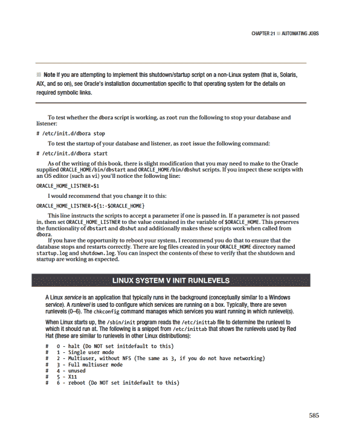

# 描述：启动和停止 Oracle 进程

这些行描述了脚本的服务特性。数字 35 表示服务将在运行级别 3 和 5 启动。数字 99 表示该服务将在 init 处理接近尾声时启动。

数字 10 表示该服务将在 init 处理开始时停止。还需要提供一个描述，用以给出关于该服务的文本信息。

**注意** Linux 运行级别是一个逻辑容器，用于指定系统启动时将运行哪些服务。

1.  将 `dbora` 文件的组更改为与 Oracle 软件的操作系统所有者所分配的组（通常是 `oinstall` 或 `dba`）相匹配：
    ```bash
    # chgrp dba dbora
    ```
2.  将 `dbora` 文件的权限更改为 750：
    ```bash
    # chmod 750 dbora
    ```
3.  运行以下 `chkconfig` 命令：
    ```bash
    # /sbin/chkconfig --add dbora
    ```

这里的 `chkconfig` 命令注册了服务脚本。这还会在 `/etc/rc.d` 目录下创建指向相应文件的符号链接。使用 `--list` 选项可以显示服务在每个运行级别是开启还是关闭：
```bash
# chkconfig --list | grep dbora
dbora 0:off 1:off 2:off 3:on 4:off 5:on 6:off
```
此输出表明 `dbora` 服务在运行级别 3 和 5 是开启的。如果需要删除服务，请使用 `chkconfig` 的 `--del` 选项。

**提示** 如果你希望自动停止和启动（在系统重启时）其他进程，如智能代理、管理服务器和 HTTP 服务器，请参阅 My Oracle Support 说明 222813.1 以获取详细信息。

自动化 Oracle 数据库的关闭和启动将根据你是否使用集群软件或 ASM 等工具而有所不同。本节中的解决方案演示了在没有其他管理此任务的软件的情况下，实现数据库关闭和启动的典型步骤。



## 第 21 章 ■ 自动化作业

要设置默认运行级别，请在 `/etc/inittab` 文件的 `id:<N>:initdefault` 行中指定 `N`。以下示例将默认运行级别设置为 5：
```
id:5:initdefault:
```

运行级别 1 由系统管理员 (SA) 在执行维护和修复时使用。运行级别 5 将启动 Linux 服务器，在控制台提供图形登录屏幕以及网络功能。但是，如果你在控制台运行显示管理器时出现问题（例如由于视频驱动程序问题），那么你可以改为启动到运行级别 3，这是基于命令行的，但仍然具有网络服务。

大多数具有安全意识的 SA 在运行级别 3 上运行他们的服务器。随着 VNC 的广泛接受，SA 通常看不到在运行级别 5 上运行的好处。如果 SA 想要利用图形实用程序，他们会直接使用 VNC（或类似的工具）。顺便说一下，不要尝试将 `initdefault` 设置为 0 或 6，因为你的 Linux 服务器将永远不会启动。

要确定当前运行级别，你可以运行 `who -r` 或 `runlevel`，如下所示：
```bash
# runlevel
N 5
# who -r
run-level 5 Jun 17 00:29 last=S
```

给定的运行级别管理着 Linux 在启动时将运行哪些脚本。这些脚本位于目录 `/etc/rc.d/rc<N>.d` 中，其中 `<N>` 对应于运行级别。对于运行级别 5，脚本位于 `/etc/rc.d/rc5.d` 目录中。例如，当 Linux 在运行级别 5 启动时，它将运行的脚本之一是 `/etc/rc.d/rc5.d/S55sshd`，这实际上是指向 `/etc/rc.d/init.d/sshd` 的软链接。

## 检查归档重做目标位置是否已满

有时，数据库管理员和系统管理员没有充分规划并实施用于在磁盘上存储归档重做日志文件的位置。在这些情况下，如果有一个脚本可以在主位置检查空间并在归档重做目标位置变满之前发出警告，通常会很方便。此外，你可能希望在脚本中实现自动将归档重做日志位置切换到具有足够磁盘空间的备用位置的功能。

我只在那些归档重做日志目标位置会以不可预测的频率填满的混乱环境中使用过类似的脚本。如果归档重做日志目标位置填满，数据库将挂起。在某些环境中，这是非常不可接受的。你可能会争辩说，数据库管理员应该做好规划，永远不要让自己陷入这种情况。然而，如果你被请来维护一个不可预测的环境，而且你是那个在凌晨 2:00 接到电话的人，你可能需要考虑实现一个如本节所列的脚本。

在使用清单 21-4 中的脚本之前，请更改脚本内的变量以匹配你的环境。例如，`SWITCH_DIR` 应该指向磁盘上的一个备用位置，以便在主要目标位置变满时可以安全地切换归档重做日志目标。当空间使用量低于 `THRESH_GET_WORRIED` 变量指定的数量时，脚本将发送警告电子邮件。如果归档重做日志空间低于 `THRESH_SPACE_CRIT` 变量中包含的值，则目标位置将自动切换到 `SWITCH_DIR` 变量中包含的目录。

## 第 21 章 ■ 自动化作业

**清单 21–4.** 归档重做目标位置空间调查脚本
```bash
#!/bin/bash

PRG=`basename $0`
DB=$1
USAGE="Usage: ${PRG} <sid>"

if [ -z "$DB" ]; then
    echo "${USAGE}"
    exit 1
fi

# source OS variables
. /var/opt/oracle/oraset ${DB}

# Set an alternative location, make sure it exists and has space.
SWITCH_DIR=/oradump01/${DB}/archivelog

# Set thresholds for getting concerned and switching.
THRESH_GET_WORRIED=2000000 # 2Gig from df -k
THRESH_SPACE_CRIT=1000000 # 1Gig from df -k

MAILX="/bin/mailx"
MAIL_LIST="dkuhn@sun.com "
BOX=`uname -a | awk '{print$2}'`

#
loc=`sqlplus -s <<EOF
CONNECT / AS sysdba
SET HEAD OFF FEEDBACK OFF
SELECT SUBSTR(destination,1,INSTR(destination,'/',1,2)-1)
FROM v\$archive_dest WHERE dest_name='LOG_ARCHIVE_DEST_1';
EOF`

#
free_space=`df -k | grep ${loc} | awk '{print $4}'`
echo box = ${BOX}, sid = ${DB}, Arch Log Mnt Pnt = ${loc}
echo "free_space = ${free_space} K"
echo "THRESH_GET_WORRIED= ${THRESH_GET_WORRIED} K"
echo "THRESH_SPACE_CRIT = ${THRESH_SPACE_CRIT} K"

#
if [ $free_space -le $THRESH_GET_WORRIED ]; then
    $MAILX -s "Arch Redo Space Low ${DB} on $BOX" $MAIL_LIST <<EOF
Archive log dest space low, box: $BOX, sid: ${DB}, free space: $free_space
EOF
fi

#
if [ $free_space -le $THRESH_SPACE_CRIT ]; then
    sqlplus -s << EOF
CONNECT / AS sysdba
ALTER SYSTEM SET log_archive_dest_1='location=${SWITCH_DIR}';
ALTER SYSTEM SWITCH LOGFILE;
EOF
    $MAILX -s "Archive Switch ${DB} on $BOX" $MAIL_LIST <<EOF
Archive log dest, box: $BOX, sid: ${DB} has switched.
Then ALTER SYSTEM SET LOG_ARCHIVE_DEST_1='location=<Normal Location>';
EOF
else
    echo no need to switch, ${free_space} KB free on ${loc}
fi

#
exit 0
```

前面的脚本假设你已经将 `LOG_ARCHIVE_DEST_1` 初始化参数设置为你归档重做位置。如果你使用闪回恢复区 (FRA) 作为归档重做日志文件的位置，你可以从 `V$ARCHIVED_LOG` 视图中推导出归档位置，例如：
```sql
select
substr(name,1,instr(name,'/',1,2)-1)
from v$archived_log
where first_time =
    (select max(first_time) from v$archived_log);
```

通常我会每小时运行一个脚本来检查一次归档重做日志目标位置。以下是一个典型的 `cron` 条目：
```
#---------------------------------------------------
```


