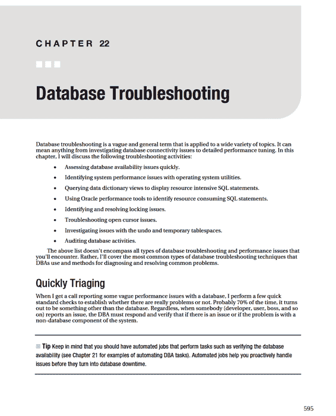

# 锁文件数量检查

`33 5 * * * /orahome/oracle/bin/lock_chk.bsh`

`1>/orahome/oracle/bin/log/lock_chk.log 2>&1`

（注意：此 cron 条目的代码本应位于一行。为适应页面，本书中将其置于两行。）

## 检查进程数量是否过多

在某些数据库服务器上，可能存在许多后台 SQL*Plus 作业。这些批处理作业可能执行诸如从远程数据库复制数据、大型日常更新等任务。在这些环境中，了解当前是否有异常数量的 shell 脚本在运行，或者数据库服务器上是否有异常数量的 SQL*Plus 进程在运行，是非常有用的。异常数量的作业可能表明某些任务已损坏或挂起。

清单 21–8 中的 shell 脚本包含两个检查：一个检查名称以 `bsh` 结尾的 shell 脚本数量，另一个检查包含 `sqlplus` 字符串的进程数量：

**清单 21–8. 运行两个检查的脚本**

```bash
#!/bin/bash
#
if [ $# -ne 0 ]; then
  echo "Usage: $0"
  exit 1
fi
#
crit_var=$(ps -ef | grep -v grep | grep bsh | wc -l)
if [ $crit_var -lt 20 ]; then
  echo $crit_var
  echo "processes running normal"
else
  echo "too many processes"
  echo $crit_var | mailx -s "too many bsh procs: $1" dkuhn@sun.com
fi
#
crit_var=$(ps -ef | grep -v grep | grep sqlplus | wc -l)
if [ $crit_var -lt 30 ]; then
  echo $crit_var
  echo "processes running normal"
else
  echo "too many processes"
  echo $crit_var | mailx -s "too many sqlplus procs: $1" dkuhn@sun.com
fi
#
exit 0
```

上述 shell 脚本名为 `proc_count.bsh`，并由 cron 作业每小时运行一次：

## 进程数量检查

`33 * * * * /home/oracle/bin/proc_count.bsh`

`1>/home/oracle/bin/log/proc_count.log 2>&1`

（注意：此 cron 条目的代码本应位于一行。为适应页面，本书中将其置于两行。）

## 验证 RMAN 备份的完整性

作为备份和恢复策略的一部分，您应定期验证备份文件的完整性。RMAN 提供了 `RESTORE...VALIDATE` 命令，用于检查备份文件中的物理损坏。清单 21–9 是一个启动 RMAN 并将输出记录到日志文件的脚本。随后会搜索日志文件中是否包含关键字 “error”。如果日志文件中有任何错误，则会发送电子邮件。

**清单 21–9. 启动 RMAN 并记录日志文件的脚本**

```bash
#!/bin/bash
#
if [ $# -ne 1 ]; then
  echo "Usage: $0 SID"
  exit 1
fi
# source oracle OS variables
. /var/opt/oracle/oraset $1
#
date
BOX=`uname -a | awk '{print$2}'`
rman nocatalog <<EOF
  connect target /
  spool log to $HOME/bin/log/rman_val.log
  set echo on;
  restore database validate;
EOF
grep -i error $HOME/bin/log/rman_val.log
if [ $? -eq 0 ]; then
  echo "RMAN verify issue $BOX, $1" | \
  mailx -s "RMAN verify issue $BOX, $1" dkuhn@sun.com
else
  echo "no problem..."
fi
#
date
exit 0
```

`RESTORE...VALIDATE` 命令并不会实际恢复任何文件；它仅验证恢复数据库所需的文件是否可用，并检查物理损坏。

如果您还需要检查逻辑损坏，请指定 `CHECK LOGICAL` 子句。例如，要检查逻辑损坏，清单 21–6 中将包含如下行：`restore database validate check logical;`

对于大型数据库，验证过程可能非常耗时（因为它会检查备份文件中的每个块是否存在损坏）。如果您只想检查备份文件是否存在，请指定 `VALIDATE HEADER` 子句，如下所示：

`restore database validate header;`

此命令仅检查每个用于恢复的文件的头部是否包含有效信息。

## 总结

自动化常规数据库作业是成功 DBA 的关键属性。自动化作业确保任务可重复、可验证，并且在任何问题出现时您都能立即得到通知。

DBA 的工作依赖于成功运行备份并确保数据库高可用性。本章包含多个脚本和示例，详细说明了如何以定义的频率运行常规作业。

如果您是 Linux/Unix 环境下的 DBA，您应该熟悉 `cron` 实用程序。该调度器简单易用，且几乎普遍可用。即使您当前工作中没有使用 `cron`，您未来也肯定会遇到它。

Oracle 提供了 Oracle Scheduler 实用程序（通过 `DBMS_SCHEDULER` PL/SQL 包实现）来调度作业。此工具可用于自动化任何类型的数据库任务。您还可以基于系统事件或其他调度作业的成功/失败来启动作业。我更倾向于使用 `cron` 来调度数据库作业。然而，您可能有复杂的调度要求，需要使用像 Oracle Scheduler 这样的工具。

至此，您已经学习了如何实现和执行 DBA 所需的许多任务。即使您只管理一个数据库，毫无疑问，您也卷入了大量的故障排除活动。本书的下一章将重点介绍诊断和解决 DBA 遇到的许多问题。



## 检查数据库可用性

我执行的前几项检查不需要 DBA 登录到数据库服务器。相反，它们可以通过 SQL*Plus 和操作系统命令远程执行。事实上，我所有的初始检查都是通过网络远程执行的；这可以确定所有系统组件是否正常工作。

一个快速检查远程服务器是否可用、数据库是否启动、网络是否正常以及侦听器是否接受传入连接的方法是：通过 SQL*Plus 客户端通过网络连接到远程数据库。我通常会在所有数据库中创建一个标准的数据库帐户和密码，用于此类场景。以下是一个通过网络以用户 `barts` 和密码 `l1sa` 连接到远程数据库的示例；网络连接信息直接嵌入到连接字符串中（其中 `dwdb1` 是服务器，`1521` 是端口，`dwrep1` 是数据库服务名）：

`$ sqlplus barts/l1sa@'dwdb1:1521/dwrep1'`


## 测试连接性

如果可以建立连接，则表示远程服务器可用，数据库和监听器均已启动并运行。此时，我会联系报告问题的人员，查看连接问题是否与应用程序或其他非数据库因素有关。

如果之前的 `SQL*Plus` 命令不起作用，请尝试确定远程服务器是否可用。

此示例使用 `ping` 命令测试名为 `dwdb1` 的远程服务器：

```
$ ping dwdb1
```

如果 `ping` 成功，你应该看到类似以下的输出：

```
64 bytes from dwdb1 (192.168.254.215): icmp_seq=1 ttl=64 time=0.044 ms
```

如果 `ping` 失败，则可能是网络或远程服务器存在问题。如果远程服务器不可用，我通常会尝试联系系统管理员或网络管理员。

如果 `ping` 确实有效，我会检查远程服务器是否可以通过监听器监听的端口访问。我使用 `telnet` 命令来完成此操作：

```
$ telnet IP <port>
```

在此示例中，尝试连接到服务器的 IP 地址的 1521 端口：

```
$ telnet 192.168.254.215 1521
```

如果 IP 地址在指定端口上可访问，你应该在输出中看到 "Connected to ..."，如下所示：

```
Trying 192.168.254.216...
Connected to ora04.
Escape character is '^]'.
```

如果 `telnet` 命令不起作用，我会联系系统管理员或网络管理员。

如果 `telnet` 命令有效，则表示网络可以在指定端口上连接到服务器。

接下来，我使用 `tnsping` 命令通过 Oracle Net 测试到远程服务器和数据库的网络连接。此示例尝试访问 `DWREP1` 远程服务：

```
$ tnsping DWREP1
```

如果成功，输出应包含字符串 "OK"，如下所示：

```
Attempting to contact (DESCRIPTION = (ADDRESS = (PROTOCOL = TCP)(HOST = DWDB1)(PORT = 1521)) (CONNECT_DATA = (SERVICE_NAME = DWREP1)))
OK (20 msec)
```

如果 `tnsping` 有效，则表示远程监听器已启动并运行。这并不一定意味着数据库已启动，因此你可能需要登录到数据库服务器进行进一步调查。如果 `tnsping` 不起作用，则监听器或数据库已关闭或挂起。此时，我会直接登录到服务器执行其他检查，例如检查挂载点是否已满。

## 调查磁盘空间

要进一步诊断问题，你需要直接登录到远程服务器。通常，你需要以 Oracle 软件所有者（通常是 `oracle` 操作系统账户）的身份登录。首次登录到服务器时，导致数据库挂起或出现问题的一个常见原因是挂载点已满。

带有 `-h`（人类可读）开关的 `df` 命令有助于验证磁盘使用情况：

```
$ df -h
```

任何已满的挂载点都需要调查。如果包含 `ORACLE_HOME` 的挂载点已满，那么在连接到数据库时你会收到类似这样的错误：

```
Linux Error: 28: No space left on device
```

要解决挂载点已满的问题，首先要确定可以移动或删除的文件。

通常，我首先查找旧的跟踪文件；通常，有数 GB 的旧文件可以安全删除。

## 定位告警日志和跟踪文件

如果你使用一致的标准设置了所有数据库，那么定位 `alert.log` 和/或相关的跟踪文件应该不会有问题。如第 3 章所述，我定义了一个操作系统函数，该函数将从 `ORACLE_BASE` 和 `ORACLE_SID` 变量推导出 `alert.log` 的位置。

例如，以下 shell 函数在 11*g* 或 10*g* 环境中均有效（假设目录名称遵循标准的 Oracle OFA 标准）：

```
#-----------------------------------------------------------#
# cd to bdump
function bdump {
  echo $ORACLE_HOME | grep 11 >/dev/null
  if [ $? -eq 0 ]; then
    lower_sid=$(echo $ORACLE_SID | tr '[:upper:]' '[:lower:]')
    cd $ORACLE_BASE/diag/rdbms/$lower_sid/$ORACLE_SID/trace
  else
    cd $ORACLE_BASE/admin/$ORACLE_SID/bdump
  fi
} # bdump
#-----------------------------------------------------------#
```

当上述函数放置在启动文件（如 `.bashrc`）中时，你将能够立即导航到包含 `alert.log` 和跟踪文件的目录，如下所示：

```
$ bdump
$ pwd
/ora01/app/oracle/diag/rdbms/o11r2/O11R2/trace
```

如果你继承的环境是由其他 DBA 设置的，那么你可能已经注意到 `alert.log` 和跟踪文件有时位于非标准位置。在查找旧的跟踪文件时，我首先尝试找到 `alert.log`。通常，与 `alert.log` 文件相关的跟踪文件位于同一目录中。由于 `alert.log` 文件具有特定且众所周知的名称（`alert_<SID>.log`），因此通常先找到它，然后再查找相关的跟踪文件会更容易。

对于 Oracle Database 11*g* 及更高版本，`alert.log` 的文本版本位于以下标准目录和名称中：

```
<ADR base>/diag/rdbms/<DB_UNIQUE_NAME>/<SID>/trace/alert_<SID>.log
```

`ADR base` 位置由 `DIAGNOSTIC_DEST` 数据库初始化参数定义。如果你未设置 `DIAGNOSTIC_DEST`，那么 Oracle 会从操作系统环境变量 `ORACLE_BASE` 推导该值。如果操作系统 `ORACLE_BASE` 变量未设置，则 `DIAGNOSTIC_DEST` 被设置为 `ORACLE_HOME/log` 的值（其中 `ORACLE_HOME` 是一个几乎普遍设置的操作系统变量）。

对于 Oracle Database 10*g*，`alert.log` 的标准位置定义为：

```
<ORACLE_BASE>/admin/<SID>/bdump
```

对于 Oracle Database 10*g*，上述路径通常与 `BACKGROUND_DUMP_DEST` 数据库初始化参数的常规设置值相同。`ORACLE_BASE` 操作系统变量的典型值是 `/ora01/app/oracle` 或 `/u01/app/oracle`。例如，以下是 `DEVDB` 数据库的 `init.ora` 中 `BACKGROUND_DUMP_DEST` 初始化变量的条目：

```
background_dump_dest=/ora01/app/oracle/admin/DEVDB/bdump
```

然而，没有什么能阻止经验不足的 DBA 将 `BACKGROUND_DUMP_DEST` 等参数设置为完全非标准的位置。例如，以下是我最近被要求维护的一个数据库中的设置：

```
background_dump_dest=/oralogs08/dba/admin/bdump
```

为什么 DBA 会将参数设置为如此非标准的位置？这其实并不重要。

你只需要意识到 DBA 有时会以使维护变得更加困难的方式启用功能。

无论如何，如果你可以通过 `SQL*Plus` 连接到你的数据库，那么确定即使是非标准位置的 `alert.log` 位置也是轻而易举的事。这将正确显示任何 Oracle 数据库版本的 `alert.log` 位置：

```
SQL> show parameter background_dump_dest
```

当数据库无法启动，并且文件被放置在非标准（且不明显）的目录中时，如何确定 `alert.log` 和跟踪文件的位置？在这种情况下，使用 `find` 命令来定位 `alert.log` 文件。首先，切换到 `ORACLE_BASE` 目录：

```
$ cd $ORACLE_BASE
```

接下来，使用 `find` 命令尝试定位文件：

```
$ find . -name "alert*.log"
```

如果你没有定义 `ORACLE_BASE`，或者 `alert.log` 不在相对标准的位置，那么前面的命令可能找不到任何文件。在这种情况下，执行更全面的全局搜索。

导航到服务器的根目录，然后发出 `find` 命令：

```
$ cd /
$ find . -name "alert*.log" 2>/dev/null
```


