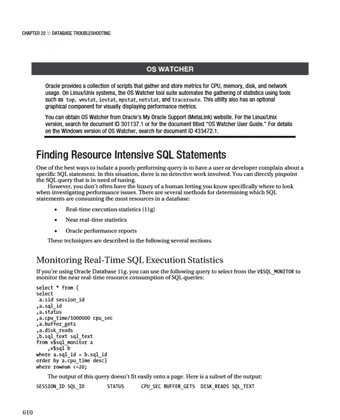

# 查看警报日志

```
function valert {

echo $ORACLE_HOME | grep 11 >/dev/null

if [ $? -eq 0 ]; then

lower_sid=$(echo $ORACLE_SID | tr '[:upper:]' '[:lower:]')

view $ORACLE_BASE/diag/rdbms/$lower_sid/$ORACLE_SID/trace/alert_$ORACLE_SID.log else

view $ORACLE_BASE/admin/$ORACLE_SID/bdump/alert_$ORACLE_SID.log

fi

} # valert
```

#-----------------------------------------------------------#

通常，前面的代码行会被放置在一个启动文件中，这样当你登录到服务器时，函数会自动定义。一旦定义，你可以通过输入以下命令来查看 `alert.log`：`$ valert`

检查 `alert.log` 的底部时，寻找指示以下问题的错误：

•  由于磁盘空间不足导致归档进程挂起。
•  文件系统空间不足。
•  表空间空间不足。
•  缓冲区高速缓存或共享池内存耗尽。
•  指示数据文件缺失或损坏的介质错误。

例如，以下错误指示在写入归档重做日志时出现问题：
`ORA-19502: write error on file "/ora01/fra/O11R2/archivelog/..."`

对于在 `alert.log` 文件中列出的严重错误消息，几乎总是存在一个对应的跟踪文件。例如，这是前述错误消息的伴随消息：
`Errors in file /oracle/app/oracle/diag/rdbms/o11r2/O11R2/trace/O11R2_arc0_4485.trc`

检查跟踪文件通常（但不总是）能提供对问题的额外洞察。

## 使用 ADRCI 实用程序查看 `alert.log`

如果你使用的是 Oracle Database 11 *g* 或更高版本，你可以使用 ADRCI 实用程序来查看 `alert.log` 文件的内容。从操作系统运行以下命令以启动 ADRCI 实用程序：
`$ adrci`

你应该会看到一个提示符：
`adrci>`

使用 `SHOW ALERT` 命令查看 `alert.log` 文件：
`adrci> show alert`

如果服务器上有多个 Oracle 主目录，系统会提示你选择要查看哪个 `alert.log`。`SHOW ALERT` 命令将使用操作系统默认编辑器打开 `alert.log`。在 Linux/Unix 系统上，默认编辑器源自操作系统 `EDITOR` 变量（通常设置为 `vi` 之类的实用程序）。

■ **提示** 当显示 `alert.log` 时，如果你不熟悉 `vi` 并想退出，请先按 Escape 键，然后按住 Shift 键的同时按下 `:` 键。接着输入 `q!`。这将使你退出 `vi` 编辑器并返回到 ADRCI 提示符。

你可以在 ADRCI 内使用 `SET EDITOR` 命令覆盖默认编辑器。此示例将默认编辑器设置为 `emacs`：
`adrci> set editor emacs`

你可以使用 `TAIL` 选项查看 `alert.log` 中最后 N 行的内容。以下命令显示 `alert.log` 的最后 50 行：
`adrci> show alert -tail 50`

如果你有多个 Oracle 主目录，可能会看到如下消息：
`DIA-48449: Tail alert can only apply to single ADR home`

ADRCI 实用程序不会假设你想在服务器上使用一个 Oracle 主目录而不是另一个。要专门设置 Oracle 主目录（对于 ADRCI 实用程序），首先使用 `SHOW HOMES` 命令显示所有可用的 Oracle 主目录：
`adrci> show homes`

以下是此服务器的一些示例输出：
```
diag/rdbms/e64208/E64208
diag/rdbms/e64211/E64211
diag/rdbms/e64214/E64214
```

现在要专门设置 Oracle 主目录，请使用 `SET HOMEPATH` 命令。这将 `HOMEPATH` 设置为 `diag/rdbms/e64208/E64208`：
`adrci> set homepath diag/rdbms/e64208/E64208`

要持续显示文件末尾，请使用以下命令：
`adrci> show alert -tail -f`

按 `Ctrl+C` 可中断持续查看 `alert.log` 文件。要显示 `alert.log` 中包含特定字符串的行，请使用 `MESSAGE_TEXT LIKE` 命令。此示例显示包含 `ORA-27037` 字符串的消息：
`adrci> show alert -p "MESSAGE_TEXT LIKE '%ORA-27037%'"`

系统将显示一个文件，其中包含 `alert.log` 中匹配指定字符串的所有行。

■ **提示** 有关如何使用 ADRCI 实用程序的完整详细信息，请参阅《Oracle 数据库实用程序》指南。

## 通过操作系统实用程序识别瓶颈

在 Oracle 领域，有时会倾向于假设你有一台专用机器用于一个 Oracle 数据库。此外，该数据库是最新版本的 Oracle，已完全打补丁，并由复杂的图形工具监控。这个数据库环境是完全自动化的，通过使用可视化工具快速定位问题并有效隔离和解决问题来保持无故障运行。如果你生活在这个理想的世界里，那么你可能不需要本章的任何内容。

让我描绘一个略有不同的场景。我有一个环境，其中一台机器运行着十几个数据库。有一个 MySQL 数据库，一个 PostgreSQL 数据库，以及混合的 Oracle 9i、10g 和 11g 版本的数据库。此外，这些旧数据库中有许多处于 Oracle 的非终端版本，因此在技术上不受 Oracle 支持的支持。没有计划升级这些不受支持的数据库，因为业务无法承担可能破坏依赖这些数据库的应用程序的风险。

那么，在这种环境中，当有人报告数据库应用程序性能不佳时，该怎么办呢？在这种情况下，通常是不同数据库中的其他东西导致该服务器上的其他应用程序表现不佳。造成问题的可能不是 Oracle 进程或 Oracle 数据库。

在这种情况下，使用操作系统工具开始调查问题几乎总是更有效。操作系统工具与数据库无关。操作系统性能实用程序有助于确定资源消耗最多的位置，无论数据库供应商或版本如何。

在 Linux/Unix 环境中，有几种工具可用于监控资源使用情况。

表 22–1 总结了用于诊断性能问题的最常用操作系统实用程序。熟悉这些操作系统命令的工作原理以及如何解释输出，将使你能够更好地诊断服务器性能问题，尤其是当导致服务器上所有其他应用程序性能下降的不是 Oracle 过程甚至不是数据库过程时。

***表 22–1.** 性能和监控实用程序*

| **工具** | **用途** |
| :--- | :--- |
| `vmstat` | 监控进程、CPU、内存或磁盘 I/O 瓶颈。 |
| `top` | 识别消耗资源最多的会话。 |
| `watch` | 定期运行另一个命令。 |
| `ps` | 识别消耗 CPU 和内存最多的会话。用于识别消耗系统资源最多的 Oracle 会话。 |
| `mpstat` | 报告 CPU 统计信息。 |
| `sar` | 显示当前和历史 CPU、内存、磁盘 I/O 和网络使用情况。 |
| `free` | 显示空闲和已使用的内存。 |
| `df` | 报告空闲磁盘空间。 |
| `du` | 显示磁盘使用情况。 |
| `iostat` | 显示磁盘 I/O 统计信息。 |
| `netstat` | 报告网络统计信息。 |

在诊断性能问题时，确定操作系统在何处受到限制很有用。例如，尝试确定问题是否与 CPU、内存、I/O 或这些资源的组合有关。

### 识别系统瓶颈

每当出现应用程序性能问题或可用性问题时，从 DBA 的角度来看，第一个问题似乎是，数据库出了什么问题？无论问题来源如何，责任通常落在 DBA 身上，要求其证明或反驳数据库是否运行良好。

我通常通过确定系统范围内正在消耗的资源来处理此问题。有两种 Linux/Unix 操作系统工具对于显示系统范围的资源使用特别有用：

• `vmstat`
• `top`

`vmstat`（虚拟内存统计信息）工具旨在帮助你快速识别服务器上的瓶颈。`top` 实用程序提供系统资源使用情况的动态实时视图。这两种实用程序将在接下来的两个小节中讨论。

### 使用 `vmstat`

`vmstat` 实用程序显示有关进程、内存、页面调度、磁盘 I/O 和 CPU 使用情况的实时性能信息。此示例显示使用 `vmstat` 显示未指定选项时的默认输出：
```
$ vmstat
procs -----------memory---------- ---swap-- -----io---- --system-- ----cpu----
 r  b   swpd   free   buff  cache   si   so    bi    bo   in   cs us sy id wa
 14  0  52340  25272   3068 1662704    0    0    63    76    9   31 15  1 84  0
```

解释 `vmstat` 输出时，可以使用以下一般启发式方法：

• 如果 `wa`（等待 I/O 的时间）列很高，这通常表明存储子系统过载。
• 如果 `b`（正在休眠的进程）持续大于 0，则可能 CPU 处理能力不足。
• 如果 `so`（换出到磁盘的内存）和 `si`（从磁盘换入的内存）持续大于 0，则可能存在内存瓶颈。

默认情况下，运行 `vmstat`（不提供任何选项）时，只显示一行服务器统计信息。这一行输出显示自上次系统重新启动以来计算的平均统计信息。这对于快速快照来说没问题。但是，如果你想在一段时间内收集指标，请使用此语法的 `vmstat`：
`$ vmstat <间隔秒数> <间隔数>`

在此模式下，`vmstat` 报告从一个间隔到下一个间隔的统计信息样本。例如，如果你想每两秒报告一次系统统计信息，共十个间隔，请发出此命令：
`$ vmstat 2 10`

你也可以将 `vmstat` 输出发送到文件。这对于分析一段时间内的历史性能很有用。此示例每 5 秒采样一次统计信息，总共生成 60 份报告，并将输出记录到文件中：
`$ vmstat 5 60 > vmout.perf`

使用 `vmstat` 的另一种有用方式是与 `watch` 工具结合使用。`watch` 命令用于定期执行另一个程序。此示例使用 `watch` 每五秒运行一次 `vmstat` 命令，并在屏幕上突出显示每个快照之间的差异：
`$ watch –n 5 –d vmstat`
```
Every 5.0s: vmstat Thu Aug 9 13:27:57 2007
procs -----------memory---------- ---swap-- -----io---- --system-- ----cpu----
 r  b   swpd   free   buff  cache   si   so    bi    bo   in   cs us sy id wa
 0  0    144  15900  64620 1655100    0    0     1     7   16    4  0  0 99  0
```

当在 `watch -d`（差异）模式下运行 `vmstat` 时，你会直观地看到屏幕上从快照到快照的变化。要退出 `watch`，请按 `Ctrl+C`。

请注意，`vmstat` 内存列的默认度量单位是千字节。如果你想以兆字节查看内存统计信息，请使用 `–S m`（以兆字节为单位的统计信息）选项：
`$ vmstat –S m`

供参考，表 22–2 详细说明了 `vmstat` 默认输出中显示的列的含义。

***表 22–2.** `vmstat` 输出的列描述*

| **列** | **描述** |
| :--- | :--- |
| `r` | 等待运行时间的进程数 |
| `b` | 处于不可中断睡眠状态的进程数 |
| `swpd` | 已使用的总虚拟内存（交换空间）(KB) |
| `free` | 空闲的总内存 (KB) |
| `buff` | 用作缓冲区的总内存 (KB) |
| `cache` | 用作高速缓存的总内存 (KB) |
| `si` | 从磁盘换入的内存 (KB/s) |
| `so` | 换出到磁盘的内存 (KB/s) |
| `bi` | 从块设备读入的块 (blocks/s) |
| `bo` | 写入块设备的块 (blocks/s) |
| `in` | 每秒中断数 |
| `cs` | 每秒上下文切换数 |
| `us` | 用户级代码时间占总 CPU 时间的百分比 |
| `sy` | 系统级代码时间占总 CPU 时间的百分比 |
| `id` | 空闲时间占总 CPU 时间的百分比 |
| `wa` | 等待 I/O 完成的时间 |

### 使用 `top`

另一个用于识别资源密集型进程的工具是 `top` 命令。使用此实用程序可以快速识别服务器上哪些进程是资源的最大消费者。默认情况下，`top` 会重复刷新（每三秒）有关最耗费 CPU 的进程的信息。

以下是运行 `top` 的最简单方法：
`$ top`

这是输出的一个片段：
```
top - 21:05:39 up 43 days, 23:45,  8 users,  load average: 1.10, 0.87, 0.72
Tasks: 576 total,   2 running, 574 sleeping,   0 stopped,   0 zombie
Cpu(s):  0.1%us,  0.2%sy,  0.0%ni, 98.8%id,  0.8%wa,  0.0%hi,  0.0%si,  0.0%st
Mem:  16100352k total, 12480204k used,  3620148k free,    38016k buffers
Swap: 18481144k total,   380072k used, 18101072k free,  8902940k cached
  PID USER      PR  NI  VIRT  RES  SHR S %CPU %MEM    TIME+  COMMAND            
 9236 mscd642   15   0 13000 1468  812 R  0.7  0.0   0:00.03 top                
 3179 oracle    16   0 2122m 1.9g 1.9g S  0.3 12.3  97:54.00 oracle             
 4116 oracle    16   0  618m 133m 124m S  0.3  0.8   0:08.62 oracle             
20763 mscd642   15   0  609m 91m  88m S  0.3  0.6   0:00.26 oracle             
    1 root      15   0 10344  684  572 S  0.0  0.0   0:25.98 init               
    2 root      RT  -5     0    0    0 S  0.0  0.0   0:16.01 migration/0        
    3 root      34  19     0    0    0 S  0.0  0.0   0:03.16 ksoftirqd/0        
```

消耗最多的会话的进程 ID 列在第一列 (`PID`)。你可以使用此进程 ID 来查看它是否映射到数据库进程（请参阅本章中关于将 PID 映射到数据库进程的部分）。

在 `top` 运行时，你可以交互式地更改其输出。例如，如果你键入 `>`，这将使 `top` 排序的列向右移动一个位置。表 22–3 列出了一些可用于将 `top` 显示更改为你所需格式的关键功能。

***表 22–3.** 用于交互式更改 `top` 输出的命令*

| **命令** | **功能** |
| :--- | :--- |
| 空格键 | 立即刷新输出。 |
| `<` 或 `>` | 将排序列向左或向右移动一个位置。默认情况下，`top` 按 CPU 列排序。 |
| `D` | 更改刷新时间。 |
| `R` | 反转排序顺序。 |
| `Z` | 切换彩色输出。 |
| `H` | 显示帮助菜单。 |
| `F` 或 `O` | 选择一个排序列。 |
| `e` |  |
| `q` 或 `Ctrl+C` | 退出 `top`。 |

表 22–4 描述了 `top` 默认输出中显示的几个列。

***表 22–4.** `top` 输出的列描述*

| **列** | **描述** |
| :--- | :--- |
| `PID` | 唯一的进程标识符。 |
| `USER` | 运行进程的操作系统用户名。 |
| `PR` | 进程的优先级。 |
| `NI` | 进程的 nice 值。负值表示高优先级。正值表示低优先级。 |
| `VIRT` | 进程使用的总虚拟内存。 |
| `RES` | 使用的非换出物理内存。 |
| `SHR` | 进程使用的共享内存。 |
| `S` | 进程状态。 |
| `%CPU` | 自上次屏幕刷新以来进程占用的 CPU 百分比。 |
| `%MEM` | 进程消耗的物理内存百分比。 |
| `TIME` | 进程使用的总 CPU 时间。 |
| `TIME+` | 总 CPU 时间，显示到百分之一秒。 |
| `COMMAND` | 用于启动进程的命令行。 |

你也可以使用 `-b`（批处理模式）选项运行 `top` 并将输出发送到文件以供以后分析：
`$ top –b > tophat.out`

在批处理模式下运行时，`top` 命令将一直运行，直到你终止它（使用 `Ctrl+C`）或达到指定的迭代次数。你可以结合使用 `nohup` 和 `&` 在批处理模式下运行前面的 `top` 命令，以使其无论你是否登录到系统都保持运行。这样做的危险在于你可能会忘记它，最终创建一个非常大的输出文件（以及一位愤怒的系统管理员）。

如果你有一个特定进程想要监控，请使用 `-p` 选项监控进程 ID，或使用 `-U` 选项监控特定用户名。你还可以使用 `-d` 和 `-n` 选项指定延迟和迭代次数。以下示例监控 `oracle` 用户，延迟为 5 秒，共 25 次迭代：
`$ top –u oracle –d 5 –n 25`

■ **提示** 使用 `man top` 或 `top --help` 命令列出操作系统版本中所有可用的选项。

### 将操作系统进程映射到 SQL 语句

在识别操作系统进程时，查看哪些进程消耗的 CPU 最多是很有用的。如果资源消耗大户是数据库进程，将操作系统进程映射到数据库作业或查询也很有用。要确定消耗最多 CPU 资源的进程的 ID，请使用 `ps` 之类的命令，如下所示：
`$ ps -e -o pcpu,pid,user,tty,args | sort -n -k 1 -r | head`

以下是一些示例输出：
```
 72.4 25922 mscd642 ?    oracleE64215 (DESCRIPTION=(LOCAL=YES)(ADDRESS=(PROTOCOL=beq)))
  1.5 28215 oracle ?     oracleemrep (LOCAL=NO)
  0.2 24764 oracle ?     /u01/oracle/product/11.0.0/grid/agent10g/bin/emagent
  0.1  3179 oracle ?     ora_j000_emrep
```

从输出中，操作系统会话 `25922` 消耗的 CPU 资源最多，为 72.4%。在此示例中，`25922` 进程与 `E64215` 数据库相关联。接下来，登录到相应的数据库并使用以下 SQL 语句来确定与操作系统进程 `25922` 关联的程序类型：
```
select
'USERNAME : ' || s.username|| chr(10) ||
'OSUSER : ' || s.osuser || chr(10) ||
'PROGRAM : ' || s.program || chr(10) ||
'SPID : ' || p.spid || chr(10) ||
'SID : ' || s.sid || chr(10) ||
'SERIAL# : ' || s.serial# || chr(10) ||
'MACHINE : ' || s.machine || chr(10) ||
'TERMINAL : ' || s.terminal
from v$session s,
     v$process p
where s.paddr = p.addr
  and p.spid = '&PID_FROM_OS';
```

当你运行此示例时，SQL*Plus 将提示你输入替代 `&PID_FROM_OS` 的值。在此示例中，你将输入 `25922`。输出如下：
```
'USERNAME:'||S.USERNAME||CHR(10)||'OSUSER:'||S.OSUSER||CHR(10)||'PROGRAM:'||S.PR
--------------------------------------------------------------------------------
USERNAME : SYS
OSUSER : mscd642
PROGRAM : sqlplus@ora04.regis.local (TNS V1-V3)
SPID : 25922
SID : 139
SERIAL# : 90
MACHINE : ora04.regis.local
TERMINAL : pts/9
```

在此输出中，`PROGRAM` 值为 `sqlplus@ora04.regis.local`。这表明 SQL*Plus 会话是消耗服务器上过量资源的程序。接下来，运行以下查询以显示与操作系统进程 ID 关联的 SQL 语句（在此示例中，`SPID` 为 `25922`）：
```
select
'USERNAME : ' || s.username || chr(10) ||
'OSUSER : ' || s.osuser || chr(10) ||
'PROGRAM : ' || s.program || chr(10) ||
'SPID : ' || p.spid || chr(10) ||
'SID : ' || s.sid || chr(10) ||
'SERIAL# : ' || s.serial# || chr(10) ||
'MACHINE : ' || s.machine || chr(10) ||
'TERMINAL : ' || s.terminal || chr(10) ||
'SQL TEXT : ' || q.sql_text
from v$session s
    ,v$process p
    ,v$sql q
where s.paddr = p.addr
  and p.spid = '&PID_FROM_OS'
  and s.sql_id = q.sql_id;
```

结果显示消耗资源的 SQL 作为 `SQL TEXT` 列输出的一部分：
```
'USERNAME:'||S.USERNAME||CHR(10)||'OSUSER:'||S.OSUSER||CHR(10)||'PROGRAM:'||S.PR
--------------------------------------------------------------------------------
USERNAME : SYS
OSUSER : mscd642
PROGRAM : sqlplus@ora04.regis.local (TNS V1-V3)
SPID : 25922
SID : 139
SERIAL# : 90
MACHINE : ora04.regis.local
TERMINAL : pts/9
SQL TEXT : select a.table_name from dba_tables a,dba_indexes,dba_constraints uni
```

当在一台服务器上运行多个数据库并遇到服务器性能问题时，有时很难确定是哪个数据库及相关进程导致了问题。在这些情况下，你必须使用操作系统工具来识别系统上消耗最多的会话。

在 Linux 或 Unix 环境中，你可以使用 `ps`、`top` 或 `vmstat` 等实用程序来识别消耗最多的操作系统进程。`ps` 实用程序很方便，因为它可以让你识别消耗最多 CPU 或内存的进程。前面的 `ps` 命令识别了消耗 CPU 最多的进程。这里，用它来识别使用 Oracle 内存最多的进程：
`$ ps -e -o pmem,pid,user,tty,args | grep -i oracle | sort -n -k 1 -r | head`

一旦你识别出与数据库相关的消耗最多的进程，就可以基于服务器进程 ID 查询数据字典视图，以确定数据库进程正在执行什么。



### 显示资源密集型 SQL

如前一节所述，`V$SQL_MONITOR` 视图在 Oracle Database 11g 或更高版本中可用。如果你使用的是较旧版本的 Oracle，可以查询 `V$SQLSTATS` 等视图来确定哪些 SQL 语句消耗了过多的资源。例如，使用以下查询根据 CPU 时间识别十个最消耗资源的查询：
```
select * from(
select
       sql_text
      ,buffer_gets
      ,disk_reads
      ,sorts
      ,cpu_time/1000000 cpu_sec
      ,executions
      ,rows_processed
from v$sqlstats
order by cpu_time DESC)
where rownum < 11;
```

在前面的查询中，使用了一个内联视图首先检索所有记录，并按 `CPU_TIME` 降序对输出进行排序。然后，外部查询使用 `ROWNUM` 伪列将结果集限制为前 10 行。该查询可以轻松修改为按 `CPU_TIME` 以外的列排序。例如，如果你想按 `BUFFER_GETS` 报告资源使用情况，只需将 `ORDER BY` 子句更改为使用 `BUFFER_GETS` 而不是 `CPU_TIME`。`CPU_TIME` 列以微秒计算；要将其转换为秒，请除以 1000000。

`V$SQLSTATS` 视图显示最近执行的 SQL 语句的性能统计信息。你也可以使用 `V$SQL` 和 `V$SQLAREA` 来报告 SQL 资源使用情况。`V$SQLSTATS` 速度更快，保留信息的时间更长，但仅包含 `V$SQL` 和 `V$SQLAREA` 中的列的子集。因此，在某些情况下你可能希望从 `V$SQL` 或 `V$SQLAREA` 查询。例如，如果你想显示诸如首次解析查询的用户之类的信息，请使用 `V$SQLAREA` 的 `PARSING_USER_ID` 列：
```
select * from(
select
       b.sql_text
      ,a.username
      ,b.buffer_gets
      ,b.disk_reads
      ,b.sorts
      ,b.cpu_time/1000000 cpu_sec
from v$sqlarea b
    ,dba_users a
where b.parsing_user_id = a.user_id
order by b.cpu_time DESC)
where rownum < 11;
```

## 运行 Oracle 诊断实用程序

Oracle 提供了几种用于诊断数据库性能问题的实用程序：

•  自动工作量存储库 (AWR)
•  自动数据库诊断监视器 (ADDM)
•  活动会话历史 (ASH)
•  Statspack

AWR、ADDM 和 ASH 是在 Oracle Database 10 *g* 中引入的。这些工具提供高级报告功能，使你能够对性能问题进行故障排除和解决。这些新实用程序需要从 Oracle 获得额外许可。较旧的 Statspack 实用程序是免费的，不需要许可。

所有这些工具都严重依赖底层的 `V$` 动态性能视图。Oracle 维护着大量这些视图，用于跟踪和累积数据库性能指标。例如，如果你运行以下查询，你会发现对于 Oracle Database 11 *g* release 2，有大约 600 个 `V$` 视图：
```
SQL> select count(*) from dictionary where table_name like 'V$%';
  COUNT(*)
----------
       608
```

Oracle 性能实用程序依赖于从这些内部性能视图收集的定期快照。关于性能统计信息最有用的两个视图是 `V$SYSSTAT` 和 `V$SESSTAT` 视图。`V$SYSSTAT` 视图包含超过 400 种数据库统计信息类型。这个 `V$SYSSTAT` 视图包含整个数据库的信息，而 `V$SESSTAT` 视图包含各个会话的统计信息。`V$SYSSTAT` 和 `V$SESSTAT` 视图中的几个值包含资源的当前使用情况。这些值是：

• `opened cursors current`
• `logons current`
• `session cursor cache current`
• `work area memory allocated`

其余的值是累积的。`V$SYSSTAT` 中的值自实例启动以来对整个数据库是累积的。`V$SESSTAT` 中的值自会话启动以来对每个会话是累积的。一些更重要的与性能相关的累积值是：

• `CPU used`
• `consistent gets`
• `physical reads`
• `physical writes`

对于累积统计信息，测量周期性使用情况的方法是注意起始点的统计信息值，然后注意稍后时间点的值，并捕获增量。这就是 AWR 和 Statspack 等 Oracle 性能实用程序所采用的方法。Oracle 会定期拍摄动态等待接口视图的快照并将其存储在存储库中。

本章接下来的几节将详细介绍如何从 SQL*Plus 访问 AWR、ADDM、ASH 和 Statspack。

■ **提示** 你可以从 Enterprise Manager 访问 AWR、ADDM 和 ASH。你可能会发现 Enterprise Manager 屏幕比使用 SQL*Plus 更直观、更高效。

### 使用 AWR

AWR 报告适用于查看整个系统性能并识别消耗资源最多的 SQL 查询。运行以下脚本以生成 AWR 报告：
`SQL> @?/rdbms/admin/awrrpt`

从 AWR 输出中，在报告的“按经过时间排序的 SQL”或“按 CPU 时间排序的 SQL”部分识别消耗资源最多的语句。以下是一些示例输出：
```
SQL ordered by CPU Time
DB/Inst: DWREP/DWREP  Snaps: 11384-11407
-> Resources reported for PL/SQL code includes the resources used by all SQL
   statements called by the code.
-> % Total DB Time is the Elapsed Time of the SQL statement divided into the
   Total Database Time multiplied by 100
   CPU      Elapsed    CPU per      % Total
   Time (s) Time (s)  Executions  Exec (s)  DB Time   SQL Id
---------- ---------- ------------ --------- ------- -------------
      4,809     13,731           10    480.86     6.2 8wx77jyhdr31c
Module: JDBC Thin Client
SELECT D.DERIVED_COMPANY ,CB.CLUSTER_BUCKET_ID ,CB.CB_NAME ,CB.SOA_ID ,COUNT(*)
TOTAL ,NVL(SUM(CASE WHEN F.D_DATE_ID > TO_NUMBER(TO_CHAR(SYSDATE-30,'YYYYMMDD'))
THEN 1 END), 0) RECENT ,NVL(D.BLACKLIST_FLG,0) BLACKLIST_FLG FROM F_DOWNLOADS F
,D_DOMAINS D ,D_PRODUCTS P ,PID_DF_ASSOC PDA ,( SELECT * FROM ( SELECT CLUSTER_
```

从 Oracle Database 10 *g* 开始，Oracle 会每小时自动拍摄一次数据库快照，并填充存储统计信息的底层 AWR 表。默认情况下，保留七天的统计信息。

你还可以通过运行 `awrsqrpt.sql` 报告为特定 SQL 语句生成 AWR 报告。当你运行以下脚本时，系统将提示你输入感兴趣的查询的 `SQL_ID`：
`SQL> @?/rdbms/admin/awrsqrpt.sql`

### 使用 ADDM

ADDM 报告提供了有关哪些 SQL 语句是调整候选者的有用建议。使用以下 SQL 脚本生成 ADDM 报告：
`SQL> @?/rdbms/admin/addmrpt`

查找报告中标记为“消耗大量数据库时间的 SQL 语句”的部分。以下是一些示例输出：
```
FINDING 2: 29% impact (65043 seconds)
------------------------------
SQL statements consuming significant database time were found.

  RECOMMENDATION 1: SQL Tuning, 6.7% benefit (14843 seconds)
  ACTION: Investigate the SQL statement with SQL_ID "46cc3t7ym5sx0" for
          possible performance improvements.
  RELEVANT OBJECT: SQL statement with SQL_ID 46cc3t7ym5sx0 and
          PLAN_HASH 1234997150
    MERGE INTO d_files a
    USING
    ( SELECT
```

ADDM 报告分析 AWR 表中的数据，以识别潜在的瓶颈和高资源消耗的 SQL 查询。

### 使用 ASH

ASH 报告使你能够关注最近运行的、可能只执行了很短时间的短暂 SQL 语句。使用以下脚本生成 ASH 报告：
`SQL> @?/rdbms/admin/ashrpt`

在输出中搜索标记为“Top SQL”的部分。以下是一些示例输出：
```
                Sampled #
SQL ID            Planhash    of Executions % Activity
----------------------- -------------------- -------------------- --------------
Event                     % Event Top Row Source            % RwSrc
---------------------------------------- ------- --------------------------------- -------
4k8runghhh31d            3219321046               12    51.61
CPU + Wait for CPU        51.61 HASH JOIN                       12.26
select countryimp0_.COUNTRY_ID as COUNTRY_ID, countryimp0_.COUNTRY_NAME
```

前面的输出表明该查询正在等待 CPU 资源。在这种情况下，实际问题可能是另一个消耗 CPU 资源的查询。

什么时候 ASH 报告比 AWR 或 ADDM 报告更有用？AWR 和 ADDM 输出显示按总数据库时间排序的消耗最多的 SQL。如果 SQL 性能问题是短暂的，它可能不会出现在 AWR 和 ADDM 报告中。在这些情况下，ASH 报告更有用。

### 使用 Statspack

如果你没有使用 AWR、ADDM 和 ASH 报告的许可证，免费的 Statspack 实用程序可以帮助你识别性能不佳的 SQL 语句。以 `SYS` 身份运行以下脚本来安装 Statspack：
`SQL> @?/rdbms/admin/spcreate.sql`

此脚本创建一个拥有 Statspack 存储库的 `PERFSTAT` 用户。要启用 Statspack 统计信息的自动收集，请运行此脚本：
`SQL> @?/rdbms/admin/spauto.sql`

在收集了一些快照之后，你可以以 `PERFSTAT` 用户身份运行以下脚本来创建 Statspack 报告：
`SQL> @?/rdbms/admin/spreport.sql`

创建报告后，搜索标记为“按 CPU 排序的 SQL”的部分。以下是一些示例输出：
```
SQL ordered by CPU
DB/Inst: DW11/DW11  Snaps: 11-14
-> Total DB CPU (s): 107
-> Captured SQL accounts for  246.0% of Total DB CPU
-> SQL reported below exceeded  1.0% of Total DB CPU
   CPU      CPU per        Elapsd                     Old
  Time (s)  Executions   Exec (s)  %Total   Time (s)  Buffer Gets    Hash Value
---------- ------------ ---------- ------ ---------- --------------- ------------
    254.95            4      63.74  238.1     249.74          12,811   2873951798
Module: SQL*Plus
select count(*) from dba_indexes, dba_tables
```

■ **提示** 查看 `ORACLE_HOME/rdbms/admin/spdoc.txt` 文件以获取 Statspack 文档。

## 检测和解决锁定问题

有时开发人员或应用程序用户会报告，一个通常只需几秒钟运行的进程现在需要几分钟，并且似乎没有任何进展。在这些情况下，问题通常是以下之一：

•  与空间相关的问题（例如，归档重做目标已满并暂停了所有事务）。
•  一个进程锁定了表中的某一行，并且未提交或回滚，从而阻止另一个会话修改同一行。

在这种情况下，我首先检查 `alert.log`，看看最近是否有任何明显的问题发生（例如表空间无法再分配另一个区）。如果 `alert.log` 文件中没有明显问题，我会运行 SQL 查询来检查锁定问题。此处列出的查询是第 3 章介绍的锁定检测脚本的更复杂版本。此查询显示诸如锁定会话 SQL 语句和等待 SQL 语句等信息：
```
set lines 80
col blkg_user form a10
col blkg_machine form a10
col blkg_sid form 99999999
col wait_user form a10
col wait_machine form a10
col wait_sid form 9999999
col obj_own form a10
col obj_name form a10
col blkg_sql form a50
col wait_sql form a50
--
select
       s1.username   blkg_user
      ,s1.machine   blkg_machine
      ,s1.sid       blkg_sid
      ,s1.serial#   blkg_serialnum
      ,s1.process   blkg_OS_PID
      ,substr(b1.sql_text,1,50) blkg_sql
      ,chr(10)
      ,s2.username   wait_user
      ,s2.machine    wait_machine
      ,s2.sid        wait_sid
      ,s2.serial#    wait_serialnum
      ,s2.process    wait_OS_PID
      ,substr(w1.sql_text,1,50) wait_sql
      ,lo.object_id  blkd_obj_id
      ,do.owner      obj_own
      ,do.object_name obj_name
from v$lock l1
    ,v$session s1
    ,v$lock l2
    ,v$session s2
    ,v$locked_object lo
    ,v$sqlarea b1
    ,v$sqlarea w1
    ,dba_objects do
where s1.sid = l1.sid
  and s2.sid = l2.sid
  and l1.id1 = l2.id1
  and s1.sid = lo.session_id
  and lo.object_id = do.object_id
  and l1.block = 1
  and s1.prev_sql_addr = b1.address
  and s2.sql_address = w1.address
  and l2.request > 0;
```

此查询的输出不太适合放在一页上。运行此查询时，必须对其进行格式化以适应终端大小。以下是一些示例输出，表明 `INV` 表被 `STAR2` 用户锁定，而 `CIA_SEL` 用户正在等待锁被释放：
```
BLKG_USER  BLKG_MACHI   BLKG_SID BLKG_SERIALNUM BLKG_OS_PID
---------- ---------- --------- -------------- ------------
BLKG_SQL                                                               C
-------------------------------------------------- -
WAIT_USER  WAIT_MACHI
---------- ----------
WAIT_SID  WAIT_SERIALNUM WAIT_OS_PID
--------  -------------- ------------
WAIT_SQL                                                             BLKD_OBJ_ID OBJ_OWN
-------------------------------------------------- ----------- ----------
OBJ_NAME
update star2.inv set inv_id=3 where inv_id=7                                150553 STAR2
INV
```

这种情况在应用程序未在代码中适当位置显式发出 `COMMIT` 或 `ROLLBACK` 时很常见。这会留下行上的锁，并阻止一个事务继续，直到锁被释放。在这种情况下，你可以尝试找到阻塞事务的用户，看看他们是否需要按下屏幕上类似“提交更改”的按钮。如果那不可能，你可以手动终止其中一个会话。请记住，终止会话可能会产生不可预见的副作用（例如回滚用户认为已提交的数据）。

如果你决定终止其中一个会话，则需要标识要终止的会话的 `SID` 和序列号。标识后，使用 `ALTER SYSTEM KILL SESSION` 语句终止用户会话。在此示例中，我决定终止 `STAR2` 用户持有的 `SID` 为 `1072`、序列号为 `29` 的锁，因此我以 DBA 特权账户运行以下语句：
`SQL> alter system kill session '1084,265';`

再次强调，终止会话时要小心。确保你知道终止会话的影响，从而回滚该会话中当前打开的任何活动事务。

终止会话的另一种方法是使用操作系统命令，例如 `kill`。从前面的输出中，你可以从 `BLKG_OS_PID` 列和 `WAIT_OS_PID` 列标识操作系统进程。在操作系统终止进程之前，请确保它不是关键进程。

对于此示例，要终止阻塞的操作系统进程，首先要检查阻塞的进程 ID：
`$ ps -ef | grep 3153`

以下是一些示例输出：
`oracle   3153   1690  0 10:40:30 pts/1    0:00 sqlplus star2....`

接下来使用 `kill` 命令，如下所示：
`$ kill -9 3153`

`kill` 命令将立即终止进程。与该进程相关的任何打开的事务都将由 Oracle 进程监视器回滚。

## 解决打开游标问题

`OPEN_CURSORS` 初始化参数确定一个会话可以打开的游标数最大值。此设置是针对每个会话的。默认值 50 对于任何应用程序来说通常都太低。

当应用程序超过允许的打开游标数时，会抛出以下错误：
`ORA-01000: maximum open cursors exceeded`

通常在以下情况下遇到前面的错误：

•  `OPEN_CURSORS` 初始化参数设置得太低。
•  开发人员编写的代码未能正确关闭游标。

要调查此问题，首先确定参数的当前设置：
`SQL> show parameter open_cursors;`

如果该值小于 300，请考虑将其设置得更高。我通常将此值设置为 1000 以用于繁忙的 OLTP 系统。你可以在数据库打开时动态修改此值，如下所示：
`SQL> alter system set open_cursors=1000;`

如果你使用的是 `spfile`，请考虑同时在内存和 `spfile` 中进行更改：
`SQL> alter system set open_cursors=1000 scope=both;`

将 `OPEN_CURSORS` 设置为更高的值后，如果应用程序仍然继续超过最大值，则可能存在未正确关闭游标的代码问题。运行如下查询以确定每个会话已打开的游标数：
```
select
       a.value
      ,c.username
      ,c.machine
      ,c.sid
      ,c.serial#
from v$sesstat a
    ,v$statname b
    ,v$session c
where a.statistic# = b.statistic#
  and c.sid = a.sid
  and b.name = 'opened cursors current'
  and a.value != 0
  and c.username IS NOT NULL
order by 1,2;
```

■ **提示** 我建议你查询 `V$SESSION` 而不是 `V$OPEN_CURSOR` 来确定打开的游标数。`V$SESSION` 提供当前打开的游标数的更准确数字。

如果你在一个有数千个数据库连接的环境中工作，可能只想查看消耗游标最多的会话。以下查询使用内联视图和伪列 `ROWNUM` 来显示前二十个值：
```
select * from (
select
       a.value
      ,c.username
      ,c.machine
      ,c.sid
      ,c.serial#
from v$sesstat a
    ,v$statname b
    ,v$session c
where a.statistic# = b.statistic#
  and c.sid = a.sid
  and b.name = 'opened cursors current'
  and a.value != 0
  and c.username IS NOT NULL
order by 1 desc,2)
where rownum < 21;
```

如果单个会话有超过 1000 个打开的游标，代码中很可能有未关闭游标的地方。当达到此限制时，应该有人检查应用程序代码以确定是否有游标未被关闭。

## 排除撤销表空间问题

撤销表空间的问题通常具有以下性质：

• `ORA-01555: snapshot too old`
• `ORA-30036: unable to extend segment by ... in undo tablespace 'UNDOTBS1'`

前面列出的错误可能由许多不同的问题引起，例如撤销表空间大小设置不正确或编写不佳的 SQL 或 PL/SQL 代码。

### 确定撤销是否设置正确

假设你有一个运行时间很长的 SQL 语句，它抛出 `ORA-01555` “快照太旧”错误，你想确定向撤销表空间添加空间是否可能有助于缓解此问题。

运行下一个查询以识别撤销表空间的潜在问题。该查询检查过去一天内发生的撤销表空间问题：
```
select
       to_char(begin_time,'MM-DD-YYYY HH24:MI') begin_time
      ,ssolderrcnt ORA_01555_cnt
      ,nospaceerrcnt no_space_cnt
      ,txncount max_num_txns
      ,maxquerylen max_query_len
      ,expiredblks blck_in_expired
from v$undostat
where begin_time > sysdate - 1
order by begin_time;
```

以下是一些示例输出。部分输出已被省略以适合页面：
```
BEGIN_TIME       ORA_01555_CNT NO_SPACE_CNT MAX_NUM_TXNS MAX_QUERY_LEN
---------------- ------------- ------------ ------------ -------------
07-20-2009 18:10             0            0          249             0
07-20-2009 18:20             0            0          290             0
07-20-2009 18:30             0            0          244             0
07-20-2009 18:40             0            0          179             0
```

`ORA_01555_CNT` 列指示你的数据库遇到 `ORA-01555` “快照太旧”错误的次数。如果此列报告非零值，你需要执行以下一项或多项操作：

•  确保代码中不包含游标循环内的 `COMMIT` 语句。
•  调整抛出错误的 SQL 语句，使其运行得更快。
•  确保你有良好的统计信息（以便你的 SQL 高效运行）。
•  增加 `UNDO_RETENTION` 初始化参数。

`NO_SPACE_CNT` 列显示在撤销表空间中请求空间但未找到的次数。如果 `NO_SPACE_CNT` 报告非零值，你可能需要向撤销表空间添加更多空间。

`V$UNDOSTAT` 视图中最多存储四天的信息。每十分钟收集一次统计信息，表中最多有 576 行。如果你在过去四天内停止并启动了数据库，则此视图仅包含上次启动数据库以来的信息。

获取撤销表空间大小设置建议的另一种方法是使用 Oracle 撤销顾问 (Undo Advisor)，你可以通过从 `SELECT` 语句中查询 PL/SQL `DBMS_UNDO_ADV` 包来调用它。以下查询显示当前撤销大小以及撤销保留设置为 900 秒的推荐大小：
```
select
       sum(bytes)/1024/1024 cur_mb_size
      ,dbms_undo_adv.required_undo_size(900) req_mb_size
from dba_data_files
where tablespace_name =
      (select
             value
       from v$parameter
       where name = 'undo tablespace');
```

以下是一些示例输出：
```
CUR_MB_SIZE REQ_MB_SIZE
----------- -----------
      36864       20897
```

输出显示撤销表空间当前分配了 36.8 GB。在前面的查询中，你使用 900 秒作为在撤销表空间中保留信息的时间。要将撤销信息保留 900 秒，Oracle 撤销顾问估计撤销表空间应为 20.8 GB。在此示例中，撤销表空间大小是足够的。如果大小不足，则必须向现有数据文件添加空间，或者向撤销表空间添加一个数据文件。

以下是使用 Oracle 撤销顾问查找所需撤销表空间大小的一个稍微复杂的示例。此示例使用 PL/SQL 显示有关潜在问题的信息以及修复问题的建议：
```
SET SERVEROUT ON SIZE 1000000
DECLARE
  pro VARCHAR2(200);
  rec VARCHAR2(200);
  rtn VARCHAR2(200);
  ret NUMBER;
  utb NUMBER;
  retval NUMBER;
BEGIN
  DBMS_OUTPUT.PUT_LINE(DBMS_UNDO_ADV.UNDO_ADVISOR(1));
  DBMS_OUTPUT.PUT_LINE('Required Undo Size (megabytes): ' || DBMS_UNDO_ADV.REQUIRED_UNDO_SIZE(900));
  retval := DBMS_UNDO_ADV.UNDO_HEALTH(pro, rec, rtn, ret, utb);
  DBMS_OUTPUT.PUT_LINE('Problem: ' || pro);
  DBMS_OUTPUT.PUT_LINE('Advice: ' || rec);
  DBMS_OUTPUT.PUT_LINE('Rational: ' || rtn);
  DBMS_OUTPUT.PUT_LINE('Retention: ' || TO_CHAR(ret));
  DBMS_OUTPUT.PUT_LINE('UTBSize: ' || TO_CHAR(utb));
END;
/
```

如果未发现问题，将为保留大小返回 0。以下是一些示例输出：
```
Finding 1:The undo tablespace is OK.
Required Undo Size (megabytes): 20897
Problem: No problem found
Advice:
Rational:
Retention: 0
UTBSize: 0
```

### 查看消耗撤销空间的 SQL

有时一段代码未正确提交，导致大量空间被分配到撤销表空间中且永远不会被释放。迟早你会得到 `ORA-30036` 错误，指示表空间无法扩展。通常，第一次出现空间相关错误时，我只是增加与撤销表空间关联的一个数据文件的大小。

但是，如果 SQL 语句继续运行并填满新添加的空间，那么问题可能出在编写不佳的应用程序上。例如，开发人员可能未在代码中包含适当的提交语句。

在这些情况下，识别哪些用户正在消耗撤销表空间中的空间很有帮助。运行此查询以报告每个用户分配空间的基本信息：
```
select
       s.sid
      ,s.serial#
      ,s.osuser
      ,s.logon_time
      ,s.status
      ,s.machine
      ,t.used_ublk
      ,t.used_ublk*16384/1024/1024 undo_usage_mb
from v$session s
    ,v$transaction t
where t.addr = s.taddr;
```

如果你想查看与消耗撤销空间的用户关联的 SQL 语句，请连接到 `V$SQL`，如下所示：
```
select
       s.sid
      ,s.serial#
      ,s.osuser
      ,s.logon_time
      ,s.status
      ,s.machine
      ,t.used_ublk
      ,t.used_ublk*16384/1024/1024 undo_usage_mb
      ,q.sql_text
from v$session s
    ,v$transaction t
    ,v$sql q
where t.addr = s.taddr
  and s.sql_id = q.sql_id;
```

如果你需要更多信息，例如回退段的名称和状态，请运行连接到 `V$ROLLNAME` 和 `V$ROLLSTAT` 视图的查询，如下所示：
```
select
       s.sid
      ,s.serial#
      ,s.username
      ,s.program
      ,r.name undo_name
      ,rs.status
      ,rs.rssize/1024/1024 redo_size_mb
      ,rs.extents
from v$session s
    ,v$transaction t
    ,v$rollname r
    ,v$rollstat rs
where s.taddr = t.addr
  and t.xidusn = r.usn
  and r.usn = rs.usn;
```

前面的查询允许你精确定位哪些用户应对撤销表空间内分配的空间负责。当存在未在适当时间提交并过度消耗撤销空间的代码时，这尤其有用。

## 处理临时表空间问题

临时表空间的问题比较容易发现。例如，当临时表空间空间不足时，将抛出以下错误：
`ORA-01652: unable to extend temp segment by 128 in tablespace TEMP`

当你看到此错误时，需要确定临时表空间是否有足够空间，或者是否是一个罕见的失控 SQL 查询暂时消耗了过多的临时空间。以下部分将讨论这两个问题。

### 确定临时表空间是否设置正确

当进程消耗了可用内存并需要更多空间时，临时表空间用作磁盘上的排序区域。需要排序区域的操作包括：

•  索引创建
•  SQL 排序操作
•  临时表和临时索引
•  临时 LOB
•  临时 B 树

没有确切的公式来确定临时表空间是否设置正确。它取决于查询的数量和类型、索引构建操作、并行操作以及内存排序空间（程序全局区）的大小。你必须在数据库上有负载时监控临时表空间，以确定其使用模式。如果你使用的是 Oracle Database 11 *g* 或更高版本，请运行以下查询以显示临时表空间中已分配和可用的空间：
```
select
       tablespace_name
      ,tablespace_size/1024/1024 mb_size
      ,allocated_space/1024/1024 mb_alloc
      ,free_space/1024/1024 mb_free
from dba_temp_free_space;
```

以下是一些示例输出：
```
TABLESPACE_NAME                MB_SIZE   MB_ALLOC    MB_FREE
------------------------------ -------- ---------- ----------
TEMP                               200        200        170
```

如果 `FREE_SPACE` (`MB_FREE`) 值降至接近零，则表示数据库中的 SQL 操作正在消耗大部分可用空间。`FREE_SPACE` (`MB_FREE`) 列是总的可用空间，包括当前已分配和可重用的空间。

如果你使用的是 Oracle Database 10 *g* 数据库，请运行此查询以查看临时表空间中正在使用的空间：
```
select
       tablespace_name
      ,sum(bytes_used)/1024/1024 mb_used
from v$temp_extent_pool
group by tablespace_name;
```

以下是一些示例输出：
```
TABLESPACE_NAME                  MB_USED
------------------------------ ----------
TEMP                                 120
```

如果使用量接近当前分配量，你可能需要向临时表空间数据文件分配更多空间。运行以下查询以查看临时数据文件名称和分配大小：
`SQL> select name, bytes/1024/1024 mb_alloc from v$tempfile;`

以下是一些典型输出：
```
NAME                                                  MB_ALLOC
-------------------------------------------------- ----------
/ora02/DWREP/temp01.dbf                                12000
/ora03/DWREP/temp03.dbf                                10240
/ora01/DWREP/temp02.dbf                                 2048
```

在首次创建数据库时，如果我对临时表空间的“正确”大小一无所知，我通常会将此表空间的大小设置为大约 2GB。如果我正在构建数据仓库类型的数据库，我可能会将临时表空间的大小设置为大约 20GB。你必须使用适当的 SQL 监控临时表空间，并根据需要调整大小。

### 查看消耗临时空间的 SQL

当 Oracle 抛出 `ORA-01652` “无法扩展临时段”错误时，这是临时表空间太小的一个指标。但是，如果 Oracle 因一次性事件（例如大型索引构建）而耗尽空间，它也可能会抛出该错误。你必须决定一次性索引构建或消耗临时表空间中大量排序空间的查询是否值得添加空间。

要查看会话在临时表空间中使用的空间，请运行此查询：
```
SELECT
    s.sid
    ,s.serial#
    ,s.username
    ,p.spid
    ,s.module
    ,p.program
    ,SUM(su.blocks) * tbsp.block_size/1024/1024 mb_used
    ,su.tablespace
FROM v$sort_usage su
    ,v$session s
    ,dba_tablespaces tbsp
    ,v$process p
WHERE su.session_addr = s.saddr
  AND su.tablespace = tbsp.tablespace_name
  AND s.paddr = p.addr
GROUP BY
    s.sid, s.serial#, s.username, s.osuser, p.spid, s.module,
    p.program, tbsp.block_size, su.tablespace
ORDER BY s.sid;
```

如果你确定需要添加空间，可以调整现有数据文件的大小或添加新的数据文件。要调整临时表空间数据文件的大小，请使用 `ALTER DATABASE TEMPFILE...RESIZE` 语句。以下将临时数据文件大小调整为 12GB：
`SQL> alter database tempfile '/ora03/DWREP/temp03.dbf' resize 12g;`

你可以按如下方式向临时表空间添加数据文件：
`SQL> alter tablespace temp add tempfile '/ora04/DWREP/temp04.dbf' size 2g;`

## 审计

*审计*通常意味着在发生特定事件时创建记录。通常审计的活动包括：

•  向表插入、从表选择、更新或删除数据时。
•  用户登录/注销时间。
•  使用什么 SQL 更新表。
•  索引上次使用的时间。

审计在对数据库进行安全问题故障排除时特别有用。审计为你提供信息，用于诊断哪些对象被哪些用户在何时访问。这为你提供了一种检测和报告未经授权的操作或安全漏洞的机制。因此，许多数据库需要启用某种程度的审计，以符合监管机构或公司内部安全要求。

审计还有助于诊断某些性能问题。例如，了解何时运行了什么 SQL 或在特定时间连接到数据库的用户数量，将有助于诊断和解决某些问题。

有几种不同的方法可以启用审计：

•  设置数据库初始化参数。
•  通过 `AUDIT` SQL 语句启用 Oracle 标准审计。
•  启用细粒度审计。
•  使用数据字典视图。
•  基于某些事件填充列或表的自定义 DBA 开发的触发器。

我不打算涵盖前面列表中审计的每个方面（那将是大量的文档）。相反，我将展示 DBA 用于审计数据库的基本技术。如果需要更多详细信息，请参阅《Oracle 数据库安全指南》（可在 Oracle 的 OTN 网站上获取）。

### 启用 Oracle 标准审计

Oracle 标准审计允许你审计数据库中几乎任何类型的 SQL 活动。你可以审计对表的任何类型的插入、更新、删除或选择。你还可以审计任何系统权限活动，如 `CREATE TABLE`、`DROP INDEX` 等。

你可以通过 `BY ACCESS` 或 `BY SESSION` 启用审计。在 Oracle Database 11 *g* release 2 之前，`BY SESSION` 会为每个审计操作为每个会话只记录一条记录。在当前版本的 Oracle 中，`BY SESSION` 将为相同的审计操作记录多条记录。

你还可以通过 `WHENEVER SUCCESSFUL` 或 `WHENEVER NOT SUCCESSFUL` 启用审计。这允许你专门针对特定语句的成功或失败进行审计。

Oracle 的标准审计功能通过设置 `AUDIT_TRAIL` 初始化参数来启用。我通常将 `AUDIT_TRAIL` 参数设置为 `DB`，这指定 Oracle 将审计记录写入名为 `AUD$` 的内部数据库表。例如，使用 `spfile` 时，设置 `AUDIT_TRAIL` 参数的方法如下：
`SQL> alter system set audit_trail=db scope=spfile;`

如果你使用的是 `init.ora` 文件，请用文本编辑器打开它并将 `AUDIT_TRAIL` 值设置为 `DB`。`AUDIT_TRAIL` 参数的有效值描述见表 22–5。

■ **提示** 即使我不做任何审计，我也通常将 `AUDIT_TRAIL` 参数设置为 `DB`。这样，当我想要为特定操作启用审计时，我可以这样做，而无需停止并重新启动数据库。

***表 22–5.** 有效的 `AUDIT_TRAIL` 设置*

| **设置** | **含义** |
| :--- | :--- |
| `DB` | 启用审计并将 `SYS.AUD$` 表设置为审计存储库。 |
| `DB_EXTENDED` | 启用审计并将 `SYS.AUD$` 表设置为审计存储库，并包含 `SQLTEXT` 和 `SQLBIND` 列。这对于查看发出的实际 SQL 语句很有用。使用此选项时要小心，因为它会消耗更多空间。在 Oracle 的早期版本中，该参数指定为 `'DB, EXTENDED'`。 |
| `OS` | 启用审计并指定操作系统文件将存储审计信息。 |
| `XML` | 启用审计并将审计记录以 XML 格式写入操作系统文件。 |
| `NONE` | 禁用数据库审计。 |

你必须停止并启动数据库才能使 `AUDIT_TRAIL` 参数生效：
```
SQL> shutdown immediate;
SQL> startup;
SQL> show parameter audit_trail;
NAME                                 TYPE        VALUE
------------------------------------ ----------- ------------------------------
audit_trail                          string      DB
```

设置 `AUDIT_TRAIL` 参数后，不会启用任何实际的审计事件。你必须使用 `AUDIT` 语句来控制对特定数据库事件的审计。启用审计的示例将在接下来的几节中展示。

■ **提示** 将数据库初始化参数 `AUDIT_SYS_OPERATIONS` 设置为 `TRUE`。这确保所有 `SYS` 活动都记录到由 `AUDIT_FILE_DEST` 指定的目录中的文件中（无论 `AUDIT_TRAIL` 的设置如何）。这为你提供了一种简单有效的方法来审计 `SYS` 用户。

### 审计 DML 使用情况

有时在对磁盘空间或性能问题进行故障排除时，了解数据库中哪些表实际被应用程序使用会很方便。如果你继承了一个包含数百个表的数据库，可能不明显哪些对象正在被访问。想法是，如果你能识别未使用的表，那么你可以重命名并最终删除它们，从而释放空间并减少数据库中杂乱的对象。

审计允许你捕获用于访问表的 SQL 语句类型。例如，以下语句启用对 `INV_MGMT` 用户拥有的 `EMP` 表的所有 DML 访问的审计：
`SQL> audit select, insert, update, delete on inv_mgmt.emp;`

从此时起，对 `INV_MGMT.EMP` 表的任何 DML 访问都将记录在 `SYS.AUD$` 表中。你可以使用如下查询来报告对表的 DML 访问：
```
select
       username
      ,obj_name
      ,timestamp
      ,substr(ses_actions,4,1) del
      ,substr(ses_actions,7,1) ins
      ,substr(ses_actions,10,1) sel
      ,substr(ses_actions,11,1) upd
from dba_audit_object;
```

在前面的 SQL 语句中，注意使用 `SUBSTR` 函数引用 `DBA_AUDIT_OBJECT` 视图的 `SES_ACTIONS` 列。该列包含一个 16 字符的字符串，其中每个字符表示已发生某个操作。这 16 个字符按以下顺序表示以下操作：`ALTER`、`AUDIT`、`COMMENT`、`DELETE`、`GRANT`、`INDEX`、`INSERT`、`LOCK`、`RENAME`、`SELECT`、`UPDATE`、`REFERENCES` 和 `EXECUTE`。位置 14、15 和 16 由 Oracle 保留供将来使用。字符 `S` 代表成功，`F` 代表失败，`B` 代表成功和失败。

一旦识别出未使用的表，你可以简单地重命名这些表，看看这是否会破坏应用程序或是否有任何用户投诉。如果没有投诉，那么过一段时间你可以考虑删除这些表。确保在删除任何可能需要恢复的表之前，使用 RMAN 和 Data Pump 对数据库进行良好备份。

要关闭对对象的审计，请使用 `NOAUDIT` 语句：
`SQL> noaudit select, insert, update, delete on inv_mgmt.inv;`

■ **提示** 如果你只需要知道表是否正在被插入、更新或删除，可以使用 `USER_TAB_MODIFICATIONS` 视图来报告此类活动。该视图具有 `INSERTS`、`UPDATES`、`DELETES` 和 `TRUNCATED` 等列，这些列将提供有关表数据如何被修改的信息。

### 审计登录/注销事件

一种基本的安全审计技术是记录数据库中所有用户的登录和注销活动。这使审计员能够确定谁在何时使用了数据库。这些信息在诊断安全漏洞和未经授权的操作时至关重要。

使用 `AUDIT` 的 `BY ACCESS` 子句来启用登录和注销活动的审计，如下所示：
`SQL> audit create session by access;`

现在，每个登录和注销数据库的用户都会导致一条记录插入到 `AUD$` 表中。你可以使用如下查询报告登录和注销活动：
```
select
       username
      ,action_name
      ,to_char(timestamp,'dd-mon-yyyy hh24:mi:ss') event_time
      ,to_char(logoff_time,'dd-mon-yyyy hh24:mi:ss') logoff_time
from dba_audit_trail;
```

以下是一些示例输出：
```
USERNAME     ACTION_NAME    EVENT_TIME             LOGOFF_TIME
------------ -------------- ---------------------- --------------------------
LARRY        LOGON          08-oct-2010 16:18:45
LARRY        LOGOFF         08-oct-2010 16:18:49 08-oct-2010 16:18:49
DW_MAINT     LOGON          08-oct-2010 16:19:33
```

你可以通过指定用户名来为特定用户启用登录和注销访问审计：
`SQL> audit session by larry by access;`

你可以如下禁用登录/注销审计：
`SQL> noaudit create session;`

要禁用单个会话的登录/注销，请指定用户名：
`SQL> noaudit session by larry;`

另一种审计连接的方法是通过 `AUDIT` 的 `CONNECT` 选项，如下所示：
`SQL> audit connect;`

要禁用此选项，请运行此 SQL：
`SQL> noaudit connect;`

前面的技术提供了一种快速启用数据库连接审计的方法。这在对安全违规或应用程序问题进行故障排除时非常有用。

注意：**一些 DBA 通过 `AFTER LOGON ON DATABASE` 触发器和 `BEFORE LOGOFF ON DATDABASE` 触发器启用登录和注销的审计，这些触发器插入到自定义表中。我不喜欢这种方法，因为它需要自定义对象和自定义代码。为什么要编写代码来实现 Oracle 已经拥有简单有效解决方案的事情？此外，如果触发器或自定义表出现问题，你可能会发现无法再登录到 Oracle。这不好。**

### 查看已启用的审计操作

有几个数据字典视图允许你查看已启用哪些审计操作。

使用以下查询查看在权限级别启用的审计：
```
select
       user_name
      ,privilege
      ,success
      ,failure
from dba_priv_audit_opts;
```

以下是一些示例输出：
```
USER_NAME              PRIVILEGE                      SUCCESS    FAILURE
---------------------- ------------------------------ ---------- ----------
                       CREATE ANY PROCEDURE           BY ACCESS  BY ACCESS
                       CREATE PROCEDURE               BY ACCESS  BY ACCESS
                       DELETE ANY TABLE               BY SESSION BY SESSION
```

运行以下查询以查看语句级别审计操作：
```
select
       user_name
      ,audit_option
      ,success
      ,failure
from dba_stmt_audit_opts;
```

下一个查询审计对象级别审计操作。在此示例中，仅选择了可用列的一小部分（以使输出位于一页上）：
```
select
       owner
      ,object_name
      ,object_type
      ,alt
      ,del
      ,upd
from dba_obj_audit_opts;
```

以下是一些示例输出：
```
OWNER      OBJECT_NAME   OBJECT_TYPE ALT    DEL    UPD
---------- ------------- ----------- ------ ------ ------
SYS        AUD$          TABLE       -/-    S/S    -/-
```

在前面的输出中，短横线 (`-`) 表示未启用审计选项，`S` 表示按会话启用了审计选项，`A` 表示按访问启用了审计操作。对于每个选项，有两个可能的设置：`WHENEVER SUCCESSFUL` 和 `WHENEVER NOT SUCCESSFUL`。它们由正斜杠分隔。因此，在前面的输出中，对从 `AUD$` 表删除的按会话审计已为成功和不成功的语句启用。

### 关闭审计

要永久禁用审计，请将 `AUDIT_TRAIL` 初始化参数设置为 `none`：
`SQL> alter system set audit_trail='none' scope=spfile;`

现在停止并重新启动数据库以关闭 Oracle 标准审计功能。

■ **注意** 无论 `AUDIT_TRAIL` 的设置如何，某些数据库事件总是被审计，例如作为 `SYSDBA` 或 `SYSOPER` 的连接以及数据库启动和关闭事件。

如果你只想禁用之前使用 `AUDIT` 启用的功能，请使用 `NOAUDIT` 语句关闭特定的审计事件。例如，以下语句关闭通过 `AUDIT ALL` 语句启用的所有语句审计：
`SQL> noaudit all;`

下一个示例关闭权限的审计：
`SQL> noaudit all privileges;`

你可以关闭特定的审计操作。例如，假设你之前通过以下方式启用了对表的审计：
`SQL> audit delete any table;`

你可以如下关闭前面的审计：
`SQL> noaudit delete any table;`

你也可以使用 SQL 生成 SQL 来关闭审计。以下脚本生成一个可用于关闭所有语句审计的脚本：
```
set head off pages 0
spo turn_off_audit.sql
select 'noaudit ' || audit_option || ';'
from dba_stmt_audit_opts;
spo off;
```

### 清除审计表和文件

你应该定期清除 `AUD$` 表，以免它在 `SYSTEM` 表空间中消耗过多的空间。（要将 `AUD$` 表移出 `SYSTEM` 表空间，请参阅下一节。）清除审计记录的最简单方法是从审计表中删除或截断。此示例截断 `AUD$` 表：
`SQL> truncate table aud$;`

如果你需要保存 `AUD$` 数据，可以先导出该表，然后使用 `TRUNCATE` 命令删除记录。如果你想保留 `AUD$` 表中的较新记录，请使用 `DELETE` 语句。例如，这会删除超过 21 天的记录：
`SQL> delete from aud$ where timestamp# > sysdate + 21;`

如果需要从操作系统中删除审计记录，请使用 Linux/Unix `find` 命令识别超过一定时限的文件，然后删除它们。首先，确定审计文件的目录位置：
```
SQL> select value from v$parameter where name='audit_file_dest';
VALUE
/oracle/app/oracle/product/11.2.0/db_1/rdbms/audit
```

现在从操作系统导航到审计文件目录，识别并删除超过一定时限的文件：
`$ cd /oracle/app/oracle/product/11.2.0/db_1/rdbms/audit`

使用 `find` 和 `rm` 命令删除超过一定时限的文件。以下命令从当前工作目录中删除扩展名为 `.aud` 且超过七天的文件：
`$ find . -maxdepth 1 -type f -mtime +7 -name "*.aud" | xargs rm`

前面的技术会永久删除操作系统中的文件。请确保你位于正确的位置，并且不再需要审计文件。

请记住，你可以使用 `DBMS_AUDIT_MGMT` 包来清除审计跟踪记录和审计跟踪文件。我个人更喜欢像本节所示那样手动截断和删除文件，因为它简单高效。如果你想使用 `DBMS_AUDIT_MGMT` 包来管理审计空间，请参阅《Oracle 数据库安全》指南（可在 Oracle 的 OTN 网站上获取）以获取更多详细信息。

### 将审计表移动到非系统表空间

如果你要进行大量审计，我建议将 `AUD$` 表移动到非 `SYSTEM` 表空间。你可能希望这样做，以便审计操作不会影响 `SYSTEM` 表空间中使用的空间或影响 `SYSTEM` 表空间的性能。

使用 `DBMS_AUDIT_MGMT` 包将 `AUD$` 表移动到单独的表空间。此示例将 `AUD$` 表移动到名为 `AUD_TBSP` 的表空间：
```
BEGIN
  DBMS_AUDIT_MGMT.SET_AUDIT_TRAIL_LOCATION(
    AUDIT_TRAIL_TYPE     => DBMS_AUDIT_MGMT.AUDIT_TRAIL_AUD_STD,
    AUDIT_TRAIL_LOCATION_VALUE => 'AUD_TBSP');
END;
/
```

在前面的 PL/SQL 代码中，`AUDIT_TRAIL_TYPE` 参数可以具有以下值：

• `DBMS_AUDIT_MGMT.AUDIT_TRAIL_AUD_STD` 仅移动标准审计跟踪 `AUD$` 表。
• `DBMS_AUDIT_MGMT.AUDIT_TRAIL_FGA_STD` 仅移动细粒度审计跟踪 `FGA_LOG$` 表。
• `DBMS_AUDIT_MGMT.AUDIT_TRAIL_DB_STD` 同时移动标准和细粒度审计跟踪表。

请注意，如果 `AUD$` 表中有大量记录，前面的 PL/SQL 可能需要很长时间。你可以通过以下查询验证表是否已正确移动：
`SQL> select table_name, tablespace_name from dba_tables where table_name='AUD$';`

■ **提示** 如果你想手动将 `AUD$` 表移动到非 `SYSTEM` 表空间，请参阅 My Oracle Support 说明 72460.1 以获取说明。请注意，手动移动 `AUD$` 表不受 Oracle 支持，并且在升级数据库时可能会导致问题。我提到它是因为我知道许多 DBA 手动移动 `AUD$` 表。如果你维护的是从其他 DBA 那里继承的数据库，则需要了解此类活动。

### 细粒度审计

*细粒度审计*（FGA 审计）是与常规数据库审计分开的功能。细粒度审计允许你在比简单的 `INSERT`、`UPDATE`、`DELETE` 和 `SELECT` 操作更精细的级别上审计 SQL。FGA 审计允许你审计在列级别发生的 SQL 活动。FGA 审计还允许你对操作执行布尔检查，例如“如果选定的值在某个范围内，则审计该活动。”

你通过使用 FGA 策略来管理细粒度审计。`DBMS_FGA` 包允许你添加、禁用、启用和删除 FGA 策略。你需要 `DBMS_FGA` 包的执行权限来管理审计策略。

■ **注意** 细粒度审计功能需要 Oracle 的企业版。

以下是实现 FGA 的步骤：

1.  使用 `DBMS_FGA` 包创建策略。此示例为 `INV` 表创建一个策略，并指定对 `EMP` 表的 `SALARY` 列的任何 `INSERT`、`UPDATE`、`DELETE` 或 `SELECT` 语句都将记录在审计跟踪中：
```
begin
  dbms_fga.add_policy (
    object_schema   => 'INV',
    object_name     => 'EMP',
    audit_column    => 'SALARY',
    policy_name     => 'S1_AUDIT',
    statement_types => 'INSERT, UPDATE, DELETE, SELECT',
    audit_trail     => DBMS_FGA.DB_EXTENDED
  );
end;
/
```
2.  通过查询 `DBA_AUDIT_POLICIES` 视图验证策略是否存在：
```
select object_schema
      ,object_name
      ,policy_name
      ,sel, ins, upd, del
      ,policy_column
from dba_audit_policies;
```
此示例的输出如下：
```
OBJECT_SCHEMA  OBJECT_NAME  POLICY_NAME  SEL INS UPD DEL POLICY_COL
-------------- ------------ ------------ --- --- --- --- ----------
INV            EMP          S1_AUDIT     YES YES YES YES SALARY
```
3.  要查看 FGA 审计跟踪中记录的 SQL 语句，请从 `DBA_FGA_AUDIT_TRAIL` 视图中选择：
```
select
       db_user
      ,to_char(timestamp,'dd-mon-yy hh24:mi:ss') ts
      ,sql_text
from dba_fga_audit_trail
order by timestamp;
```
■ **注意** `DBA_FGA_AUDIT_TRAIL` 视图基于 `FGA_LOG$` 表。
以下是一些示例输出：
```
DB_USER  TS                SQL_TEXT
-------- ----------------- --------------------------
INV      21-jul-09 21:47:07 select * from emp
SYSTEM   21-jul-09 21:58:36 select salary from inv.emp
```

如果需要禁用策略，请使用 `DISABLE_POLICY` 过程：
`SQL> exec dbms_fga.disable_policy('INV','EMP','S1_AUDIT');`

要删除策略，请使用 `DROP_POLICY` 过程：
`SQL> exec dbms_fga.drop_policy('INV','EMP','S1_AUDIT');`

作为 `SYS` 方案，你可以按如下方式清除细粒度审计审计表中的记录：
`SQL> truncate table fga_log$;`

■ **提示** 有关细粒度审计的更多详细信息，请参阅 Oracle 的安全指南，可在 Oracle 的 OTN 网站上获取。


