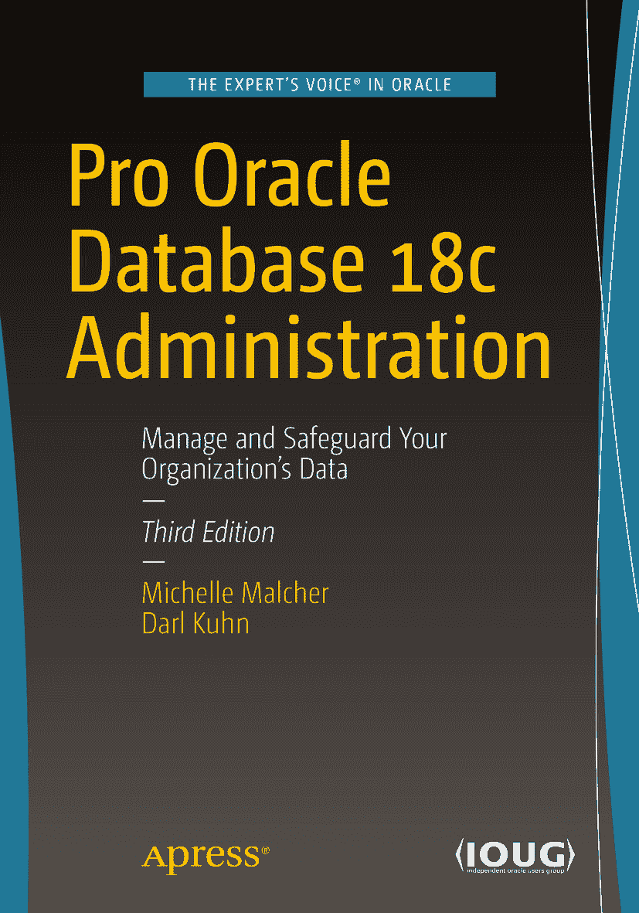

ISBN 978-1-4842-4423-4
电子书 ISBN 978-1-4842-4424-1
[`doi.org/10.1007/978-1-4842-4424-1`](https://doi.org/10.1007/978-1-4842-4424-1)
© Michelle Malcher 和 Darl Kuhn 2019

本作品受版权保护。出版方保留所有权利，无论涉及材料的全部或部分，特别是翻译、转载、图表 reuse、朗诵、广播、微缩胶片或其他任何物理方式的复制，以及信息存储与检索、电子改编、计算机软件，或任何目前已知或未来开发的类似/不同方法。书中可能出现商标名称、标识和图像。我们仅在编辑意义上使用这些名称、标识和图像，旨在使商标所有者受益，并无商标侵权意图。本书中对商品名称、商标、服务标识及类似术语的使用，即使未特别标识，也不应被视为表达其是否受专有权利约束的意见。尽管本书中的建议和信息在出版时被认为是真实准确的，但作者、编辑或出版商均不对可能出现的任何错误或遗漏承担法律责任。出版商对本出版物所含材料不作任何明示或暗示的保证。本书在全球图书贸易渠道由 Springer Science+Business Media New York 发行，地址：233 Spring Street, 6th Floor, New York, NY 10013。电话：1-800-SPRINGER，传真：(201) 348-4505，电子邮件：orders-ny@springer-sbm.com，或访问网站：www.springeronline.com。Apress Media, LLC 是一家在加利福尼亚州注册的有限责任公司，其唯一成员（所有者）是 Springer Science + Business Media Finance Inc (SSBM Finance Inc)。SSBM Finance Inc 是一家在特拉华州注册的公司。

*献给我的女儿们。*
*她们信任我，正如我信任她们一样。*

## 引言

云计算、自动化、人工智能和机器学习都是技术发展方向的关键词。这些领域的一个有趣之处在于，数据仍然扮演着非常重要的角色。显然，这对于数据库管理员或数据守护者来说是件好事。

随着这些新环境以及云端的 Oracle 自动化数据库的出现，人们开始质疑是否还需要数据库管理员。自动驾驶、自动调优和自动配置数据库是环境发展的未来。然而，数据库管理员无疑将执行不同的任务，并成为协助迁移到云端和实现流程自动化的关键人员。

那么，为什么要写一本关于 Oracle 18c 数据库管理的书呢？这个问题很容易回答。尽管任务在变化，但理解数据库至关重要。即使流程实现了自动化，仍然可能存在需要故障排除的问题，以及需要建立的自动化流程。应用程序需要设计、创建和维护数据库对象，并进行性能调优。现在的工作是否仅仅是排除故障和自动化其余部分？不是，还包括数据、应用程序和安全性的设计和策略。但本书不仅关注数据库管理员角色的转变，还旨在提供在数据库环境中仍然至关重要的管理技能。同样重要的是，要认识到对数据库内部的理解有助于处理所有这些领域，包括之前的版本。

数据正在多个数据库中被集成、迁移和维护。这些环境的结构是创建一致、可靠且始终可访问的数据所必需的。这些系统需要管理，并需要通过数据库设计和开发来支持应用程序。

本书详细介绍了创建 Oracle 18c 数据库所需的任务以及对环境进行管理的工作，因为这远不止是构建数据库，还包括管理数据和活跃的应用程序。它提供了对运行 Oracle 所需的 Oracle 数据库、硬件、存储和服务器的内部观察。书中介绍的一些任务现在以及未来都应该通过自动化流程来完成，但也以能够解决问题和对任何问题进行故障排除的方式进行了阐述。

在本书中包含哪些章节和部分经过了仔细考量，以确保提供正确的主题来理解数据库及其先前版本，支持数据库对象的设计和性能调优，并为数据库管理员提供他们取得成功所需的工具。

备份和恢复被重点讨论，因为恢复场景难以自动化。全书贯穿了一致的主题，即寻找可创建重复性任务以实现自动化、保护环境并利用数据库新版本附带的新特性和工具。数据库管理员在制定备份和安全策略方面发挥着重要作用，书中多次讨论支持了这一点。

无论数据库是在本地还是在云端，许多主题都是相同的。章节的注释和部分中包含了理解差异以及数据库管理员如何支持迁移到云端的内容。云端数据库在企业中有多种用途，数据库管理员是协助迁移并确保数据在云端环境中安全集成的完美资源。

本书提供了许多示例、技巧和注释，旨在为使用 Oracle 数据库的数据库管理员提供设计、实施和管理 Oracle 18c 数据库环境所需的工具。

## 致谢

每次我坐下来写作或准备演讲时，都会花几分钟回顾我是如何走到职业生涯的这个阶段的。我感谢许多人：感谢他们在我生命中给予的影响、指导和鼓励。其中一些人，我可能在几本书之前就说过我不会再写了。当他们听说又完成了一本时，我很喜欢看到他们的笑容和受到他们的调侃。

在数据库社区建立的友谊鼓励我学习和分享更多。我感谢每一位有趣的数据库从业者，他们对自己所做的事情充满热情，并乐于通过教学、指导和帮助他人来带动他人。能从事这份职业并与同样对数据库充满热情、致力于成为数据最佳守护者的人一起工作，是多么好的机会！谢谢你们！

## 关于作者与关于技术评审

### 关于作者

### 关于技术评审

