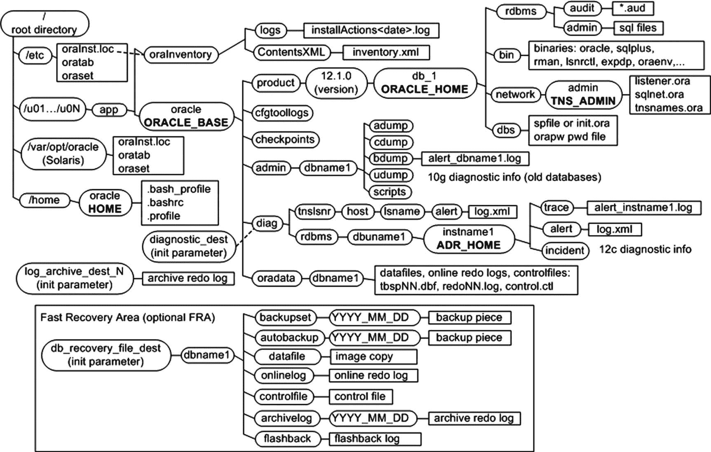
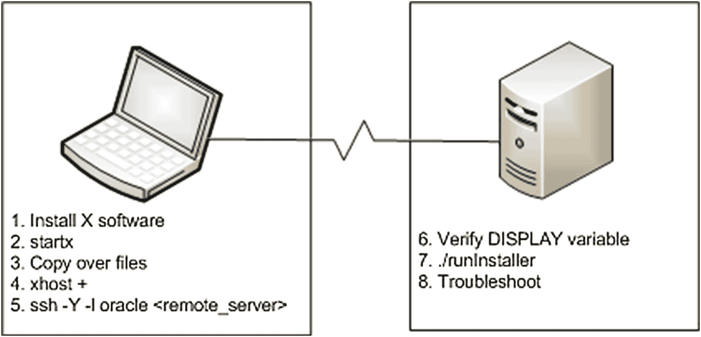

# 1. 安装 Oracle 二进制文件


ISBN 978-1-4842-4423-4 e-ISBN 978-1-4842-4424-1 [`doi.org/10.1007/978-1-4842-4424-1`](https://doi.org/10.1007/978-1-4842-4424-1) © Michelle Malcher and Darl Kuhn 2019
本作品受版权保护。出版商保留所有权利，无论涉及材料的整体或部分，特别是翻译、转载、图表重用、朗诵、广播、缩微胶片或其他任何物理方式的复制，以及信息存储与检索、电子改编、计算机软件，或当前已知或未来开发的类似或相异方法论。
本书中可能出现商标名称、标识和图片。我们仅在编辑意义上并以有利于商标所有者的方式使用这些名称、标识和图片，并无意侵犯商标权。在本书中使用商品名称、商标、服务标志及类似术语，即使未特别标识，也不应被视为表达意见，认为其不受专有权约束。
尽管本书中的建议和信息在出版时被认为是真实和准确的，但作者、编辑或出版商均不承担任何因可能出现的错误或遗漏而产生的法律责任。出版商对本出版物所含材料不作任何明示或暗示的保证。
本书由 Springer Science+Business Media New York 向全球图书贸易发行，地址：233 Spring Street, 6th Floor, New York, NY 10013。电话 1-800-SPRINGER，传真 (201) 348-4505，电子邮件 orders-ny@springer-sbm.com，或访问 www.springeronline.com。
Apress Media, LLC 是一家位于加利福尼亚州的有限责任公司，其唯一成员（所有者）是 Springer Science + Business Media Finance Inc (SSBM Finance Inc)。SSBM Finance Inc 是一家特拉华州的公司。

*献给我的女儿们。*

*她们相信我，正如我相信她们一样。*

## 引言

云计算、自动化、人工智能和机器学习都是描述技术方向的关键词。这些领域的有趣之处在于，数据仍然扮演着非常重要的角色。显然，这对于数据库管理员或数据的守护者来说是件好事。

随着这些新环境以及 Oracle 的自治数据库在云端出现，人们开始质疑是否还需要 DBA。自我驾驶、自我调优和自动配置数据库是未来的趋势。然而，DBA 肯定会执行不同的任务，同时他们也是负责迁移到云端和自动化流程的关键人员。

那么，为什么要写一本关于 `Oracle 18c` 数据库管理的书呢？这个问题很容易回答。尽管任务在变化，但理解数据库至关重要。即使流程自动化了，也可能需要排除故障和建立自动化机制。应用程序需要设计、创建和维护数据库对象，并为性能进行调优。现在的工作就只是排除故障和自动化其余部分吗？不，还包括数据、应用程序和安全性的设计与策略。但这本书不仅关于 DBA 角色的转变，还旨在提供在数据库环境中仍然相关的管理技能。同样重要的是，要了解对数据库内部的理解有助于处理所有这些领域，包括之前的版本。

数据正被集成、迁移和维护在多个数据库中。这些环境的结构是创建一致、可靠且始终可访问的数据所必需的。这些系统需要管理，并需要通过数据库设计和支持应用程序开发来提供支持。

本书详细介绍了创建 `Oracle 18c` 数据库和管理环境所需的任务，因为这不仅仅是构建数据库，还要管理数据和活跃的应用程序。它提供了对运行 Oracle 所需的 Oracle 数据库、硬件、存储和服务器的内部视角。书中介绍的一些任务现在应该通过自动化流程完成，但书中陈述的方式有助于解决问题和排除故障。

本书在包含哪些章节和部分方面经过了仔细考虑，以确保它提供了正确的主题，以理解数据库及其之前的版本，支持数据库对象的设计和性能调优，并为 DBA 提供成功所需的工具。

备份和恢复被重点讨论，因为恢复场景很难自动化。书中贯穿始终的主题是寻求创建可重复的自动化任务、确保环境安全以及利用新版本数据库附带的新特性和工具。DBA 在制定备份和安全策略方面扮演着重要角色，书中有多处讨论支持这一点。

无论数据库是在本地还是在云端，许多主题都是相同的。书中在章节的注释和部分中包含了对差异的理解以及 DBA 如何支持迁移到云端。云端数据库在企业中有多种用途，DBA 是协助迁移并确保数据在云环境中安全和集成的完美资源。

本书提供了许多示例、技巧和说明，为任何使用 Oracle 数据库的 DBA 提供了设计、实施和管理 `Oracle 18c` 数据库环境所需的工具。

## 致谢

每当我坐下来写作或准备演讲时，我都会花几分钟时间反思自己是如何走到职业生涯的这个阶段的。我感谢许多人：感谢他们在我的生活中给予的影响、指导和鼓励。其中一些人，我可能告诉过他们我已经写完书了，那是在四本书之前。我很喜欢看到他们的微笑，当他们听说我又完成一本时，会取笑我。

在数据库社区建立的友谊鼓励我学习和分享更多。我感谢这些有趣的数据库人士，他们对自己所做的事情充满热情，并通过教学、指导和帮助他人来享受带给他人的快乐。在这个职业生涯中，与其他对数据库充满热情并成为最佳数据守护者的人一起工作，是多么好的机会啊！谢谢你们！

## 关于作者和关于技术审校者

### 关于作者

### 关于技术审校者

过去的 Oracle 安装可能体积庞大、复杂且笨重。Oracle 数据库管理员（DBA）计划和执行安装，因为他或她知道如何在步骤中出现问题时进行故障排除和解决。有几个配置和安装选项需要审查，因此安装 Oracle 软件（二进制文件）是每个 DBA 都需要熟练掌握的任务。现在有了 `Oracle 18c`，甚至 `12c`，Oracle 软件安装已经变得更加自动化，但理解安装的步骤和配置对 DBA 来说仍然很重要。Oracle 二进制文件的安装对于大型环境应该是可重复的，DBA 需要设置安装过程以便能够按需和一致地配置数据库。

## 提示

DBA（数据库管理员）的任务正在发生变化。在云环境中，DBA 的任务可能转变为准备自助数据库，甚至可能不再需要安装 Oracle 二进制文件。此外，如果你对 Oracle 相对陌生，那么 Oracle 安装中一些令人望而生畏的部分已经得到简化。很可能另一位 DBA 已经安装好了 Oracle 二进制文件，你只需要根据需要创建数据库即可。然而，理解安装的组成部分以及下一节“理解最佳灵活架构”仍然很有价值。

许多 DBA 不使用自动化安装技术。有些人不知道这些方法；另一些人则认为它们不可靠。因此，大多数 DBA 通常使用 Oracle 通用安装程序 (`OUI`) 的图形界面模式。虽然图形安装程序是一个好工具，但它不利于重复性和自动化操作。运行图形安装程序是一个手动过程，过程中你需要在多个屏幕上选择各种选项。即使你知道该选择哪些选项，仍然可能无意中点错。

当进行远程安装且网络带宽不足时，图形安装程序也可能出现问题。在这种情况下，你可能会发现需要等待几十分钟，才能让屏幕在本地重新绘制出来。因此，你需要一种不同的技术来实现远程服务器上的高效安装。

本章重点介绍以高效且可重复的方式安装 Oracle 的技术。这包括依赖响应文件的静默安装。响应文件是一个文本文件，你可以在其中为控制安装的变量赋值。DBA 们通常没有意识到使用响应文件所能实现的强大可重复性和高效率。

## 注意

本章仅涵盖安装 Oracle 软件。创建数据库的任务在第 2 章中介绍。云环境也改变了软件和数据库创建的任务及视角，这将在本章后面的“在云中安装及 DBA 的职责”一节中讨论。

## 理解 OFA

在安装 Oracle 并开始创建数据库之前，你必须理解 Oracle 的最佳灵活架构 (`OFA`) 标准。该标准被广泛用于指定一致的目录结构以及在安装和创建 Oracle 数据库时使用的文件命名约定。

## 注意

这个无处不在的 `OFA` “标准”有一个讽刺之处：几乎每个 DBA 都会在某种程度上对其进行定制，以满足其环境的独特需求。

`OFA` 标准提供了在一致的基础上查找日志文件位置的方法。如果遵循了这些标准，由于环境之间的一致性，安全性、迁移和自动化将更容易实现。日志文件的一致位置允许其他工具使用这些文件，同时也便于对其进行保护。18c 中的 `ORACLE_BASE` 目录提供了一种将只读目录的 `ORACLE_HOME` 目录与可写文件分离并将其放在 `ORACLE_BASE` 下的方法。只读的 `ORACLE_HOME` 目录允许实现安装与配置的分离，这对于云环境和保护环境非常重要。这简化了补丁过程，因为一个映像可用于大规模部署，并将补丁分发到许多服务器，从而减少了打补丁和更新 Oracle 软件的停机时间。

由于大多数企业都实现了某种形式的 `OFA` 标准，因此理解这种结构至关重要。图 1-1 展示了 `OFA` 标准所使用的目录结构和文件名。并非 Oracle 环境中的所有目录和文件都出现在此图中（篇幅有限）。但是，显示了关键且最常用的目录和文件。



图 1-1 Oracle 的 OFA 标准

`OFA` 标准包含几个你应该熟悉的目录：

*   Oracle 清单目录
*   Oracle 基础目录 (`ORACLE_BASE`)
*   Oracle 主目录 (`ORACLE_HOME`)
*   Oracle 网络文件目录 (`TNS_ADMIN`)
*   自动诊断存储库 (`ADR_HOME`)

这些目录将在以下各节中讨论。

## Oracle 清单目录

Oracle 清单目录存储服务器上安装的 Oracle 软件清单。此目录是必需的，并在服务器上的所有 Oracle 软件安装之间共享。当你首次安装 Oracle 时，安装程序会检查是否存在格式为 `/u[01–09]/app` 的现有符合 `OFA` 的目录结构。如果存在这样的目录，则安装程序会创建一个 Oracle 清单目录，例如：

```
/u01/app/oraInventory
```

如果为 `oracle` 操作系统 (`OS`) 用户定义了 `ORACLE_BASE` 变量，则安装程序会为 Oracle 清单的位置创建一个目录，如下所示：

```
ORACLE_BASE/../oraInventory
```

例如，如果 `ORACLE_BASE` 定义为 `/ora01/app/oracle`，则安装程序会将 Oracle 清单的位置定义为：

```
/ora01/app/oraInventory
```

如果安装程序找不到可识别的符合 `OFA` 的目录结构或 `ORACLE_BASE` 变量，则 Oracle 清单的位置会在 `oracle` 用户的 `HOME` 目录下创建。例如，如果 `HOME` 目录是 `/home/oracle`，则 Oracle 清单的位置是：

```
/home/oracle/oraInventory
```

### Oracle 基础目录

Oracle 基础目录是 Oracle 软件安装的顶层目录。你可以在此目录下安装一个或多个版本的 Oracle 软件。Oracle 基础目录的 `OFA` 标准如下：

```
<挂载点>/app/<软件所有者>
```

挂载点的典型名称包括 `/u01`、`/ora01`、`/oracle` 和 `/oracle01`。你可以根据环境的任何标准来命名挂载点。我更喜欢使用像 `/ora01` 这样的挂载点名称。它很短，当我查看数据库服务器上的挂载点时，我可以立即分辨出哪些是用于 Oracle 数据库的。此外，在查询数据字典以报告数据库物理方面的信息时，较短的挂载点名称更易于使用。另外，在通过 `OS` 命令浏览目录时，较短的挂载点名称可以减少输入量。

软件所有者通常命名为 `oracle`。这是你用来安装 Oracle 软件（二进制文件）的 `OS` 用户。下面列出了一个完整形成的 Oracle 基础目录路径示例：

```
/u01/app/oracle
```

## Oracle 主目录

Oracle 主目录定义了特定产品（如 Oracle Database 18c 或 Oracle Database 12c）的软件安装位置。你必须将不同产品或同一产品的不同版本安装在不同的 Oracle 主目录中。推荐的符合 `OFA` 的 Oracle 主目录如下：

```
ORACLE_BASE/product/<版本>/<安装名称>
```

在前面的代码行中，可能的版本包括 `18.1.0.1` 和 `12.2.0.1`。可能的 `安装名称` 值包括 `db_1`、`devdb1`、`test2` 和 `prod1`。这是一个用于 18c 数据库的 Oracle 主目录名称示例：

```
/u01/app/oracle/product/18.1.0.1/dbhome_1/db1
```

## 注意

一些 DBA 不喜欢 `ORACLE_HOME` 目录末尾的 `db1` 字符串，并认为没有必要。添加 `db1` 的原因是，你可能有两个独立的二进制文件安装：一个开发安装和一个测试安装。如果你的环境不需要这种配置，可以随意去掉这个额外的字符串 (`db1`)。


## Oracle 网络文件目录

一些 Oracle 工具使用 `TNS_ADMIN` 环境变量的值来定位网络配置文件。此目录定义为 `ORACLE_HOME/network/admin`。它通常包含 `tnsnames.ora` 和 `listener.ora` 这两个 Oracle Net 配置文件。如今，`listener.ora` 文件通常随 Oracle Grid Infrastructure 安装，而不是在数据库主目录中。监听器通常由管理网格、集群和 ASM 软件的系统维护。`tnsnames.ora` 提供了连接到其他数据库的方式，因此这些文件是集中式目录或数据库网络文件的一部分。

## 提示

有时，DBA 会设置 `TNS_ADMIN` 环境变量指向一个集中的目录位置（如 `/etc` 或 `/var/opt/oracle`）。这允许他们维护一套 Oracle 网络文件（而不是每个 `ORACLE_HOME` 都有一套）。这种方法还有另一个优点，即在数据库升级（可能改变 `ORACLE_HOME` 的位置）时，不需要复制或移动文件。

## 自动诊断仓库

从 Oracle Database 11g 开始，`ADR_HOME` 目录指定了与 Oracle 相关的诊断文件的位置。这些文件对于排查 Oracle 数据库问题至关重要。此目录定义为 `ORACLE_BASE/diag/rdbms/lower(db_unique_name)/instance_name`。您可以查询 `V$PARAMETER` 视图来获取 `db_unique_name` 和 `instance_name` 的值。

例如，在下一行中，小写的数据库唯一名称是 `db18c`，实例名称是 `DB18C`：

```
/u01/app/oracle/diag/rdbms/db18c/DB18C
```

或者在集群环境中，小写的数据库唯一名称是 `db18c`，实例名称是 `DB18C01`：

```
/u01/app/oracle/diag/rdbms/db18c/DB18C01
```

您可以通过此查询验证 `ADR_HOME` 目录的位置：

```
SQL> select value from v$diag_info where name='ADR Home';
```

这是一些示例输出：

```
VALUE
--------------------------------------------------
/u01/app/oracle/diag/rdbms/db18c/DB18C
```

既然您已经了解了 OFA 标准，接下来将看到在安装 Oracle 二进制文件时如何使用它。例如，在运行 Oracle 安装程序时，您需要为 `ORACLE_BASE` 和 `ORACLE_HOME` 目录指定目录值。

## 提示

有关 OFA 的完整详细信息，请参阅 *Oracle Database Installation Guide*。该文档可以从 Oracle 网站的 Technology Network 区域（[`http://otn.oracle.com`](http://otn.oracle.com)）免费下载。

## 安装 Oracle

假设您是新员工，您的经理问您在新服务器上安装一套新的 Oracle Database 18c 软件需要多长时间。您回复说需要不到一个小时。您的老板表示怀疑，并说之前的 DBA 估计至少需要一天时间在新服务器上安装 Oracle 二进制文件。您回答：“实际上，这没那么复杂，但 DBA 确实倾向于高估安装时间，因为很难预测所有可能出错的问题。”

当您被交给一台新服务器并负责安装 Oracle 二进制文件时，这通常指的是下载并安装在创建 Oracle 数据库之前所需的软件的过程。此过程涉及几个步骤：

1.  创建适当的操作系统组。在 Oracle Database 18c 中，有几个操作系统组可以形成并用于管理 `SYSDBA` 权限的粒度级别。至少，您需要创建一个 OS `dba` 组和 OS `oracle` 用户。
2.  确保操作系统已为 Oracle 数据库进行充分配置。
3.  从 Oracle 获取数据库安装软件。
4.  解压缩数据库安装软件。
5.  如果首次在服务器上安装 Oracle 软件时使用静默安装程序，则需要创建一个 `oraInst.loc` 文件。此步骤每台服务器只需执行一次。后续安装不需要执行此步骤。
6.  配置响应文件并运行 Oracle 静默安装程序。
7.  对任何问题进行故障排除。
8.  应用任何额外的补丁。

这些步骤将在以下部分详述。

## 注意

Oracle 指定的任何基础版本（10.1.0.2、10.2.0.1、11.1.0.6、11.2.0.1、12.1.0.1、18.1.0.1 等）的数据库都可以从 Oracle 网站的 Technology Network 区域（[`http://otn.oracle.com`](http://otn.oracle.com)）免费下载。但是，请注意，任何后续补丁的下载都需要购买许可证。换句话说，下载基础软件需要 Oracle Technology Network (OTN) 登录（免费），而下载补丁集则需要 My Oracle Support 账户（付费）。

### 步骤 1. 创建操作系统组和用户

如果您所在的商店有系统管理员 (SA)，那么步骤 1 和 2 通常由 SA 执行。如果您没有 SA，那么您必须自己执行这些步骤（这在小型商店中很常见，您可能需要执行许多不同的工作职能）。您需要 `root` 权限来完成这些步骤。

过去，典型的 Oracle 安装包含一个操作系统组 (`dba`) 和一个操作系统用户 (`oracle`)。您仍然可以使用这种极简的、一组一户的方法来安装 Oracle 软件；它可以正常工作。如果您的商店中只有一名 DBA，并且您不需要在团队成员之间进行更精细的权限划分，那么请继续，只创建 `dba` 组和 `oracle` OS 用户。这种方法没有任何问题。

如今，Oracle 建议您创建多个操作系统组——其理念是您可以根据需要添加不同的操作系统用户，并根据工作职能将他们分配到不同的组中。当操作系统用户被分配到某个组时，该分配为用户提供了特定的数据库权限。表 1-1 记录了操作系统组以及每个组如何映射到相应的数据库权限。例如，如果您有一个用户只负责监控数据库，并且只需要启动和关闭数据库的权限，那么该用户将被分配到 `oper` 组（这确保后续可以使用 `sysoper` 权限连接到数据库）。

表 1-1
操作系统组与备份恢复相关权限的映射

| **操作系统组** | **数据库系统权限** | **授权操作** | **引用位置** |
| --- | --- | --- | --- |
| `oinstall` | 无 | 安装和升级 Oracle 二进制文件的操作系统权限 | `oraInst.loc` 文件中的 `inst_group` 变量；也由响应文件中的 `UNIX_GROUP_NAME` 变量定义 |
| `dba` | `sysdba` | 所有数据库权限：启动、关闭、更改数据库、创建和删除数据库、切换归档日志模式、备份和恢复数据库 | 响应文件中的 `DBA_GROUP` 变量或 OUI 图形安装程序提示时 |
| `oper` | `sysoper` | 启动、关闭、更改数据库、切换归档日志模式、备份和恢复数据库 | 响应文件中的 `OPER_GROUP` 变量或 OUI 图形安装程序提示时 |
| `asmdba` | `sysdba for asm` | 对 Oracle 自动存储管理 (ASM) 实例的管理权限 | 不适用 |
| `asmoper` | `sysoper for asm` | 启动和停止 Oracle ASM 实例 | 不适用 |
| `asmadmin` | `sysasm` | 磁盘组的挂载和卸载以及其他存储管理 | 不适用 |
| `backupdba` | `sysbackup` | 12c 新增；允许用户启动、关闭并执行所有备份和恢复操作的权限 | 响应文件中的 `BACKUPDBA_GROUP` 变量或 OUI 图形安装程序提示时 |
| `dgdba` | `sysdg` | 12c 新增；与管理 Data Guard 环境相关的权限 | 响应文件中的 `DGDBA_GROUP` 变量或 OUI 图形安装程序提示时 |
| `kmdba` | `syskm` | 12c 新增；与加密管理相关的权限 | 响应文件中的 `KMDBA_GROUP` 变量或 OUI 图形安装程序提示时 |


表`Table 1-1`包含了推荐的组名。你不必使用列出的组名；可以根据需求进行调整。例如，如果有两个独立的组使用同一台服务器，你可能希望创建两个独立的 Oracle 安装，每个由不同的数据库管理员管理；开发数据库管理员组可能使用名为`dbadev`的组来创建和安装 Oracle 二进制文件，而使用同一台机器的测试组可能安装一套独立的 Oracle 二进制文件，并使用名为`dbatest`的组进行管理。每个组将仅拥有操作其对应二进制文件的权限。或者，如前所述，你可能决定仅为所有内容使用一个组（`dba`）。这完全取决于你的环境。

一旦决定了需要哪些组，你将需要访问`root`用户以运行`groupadd`命令。作为`root`，添加你需要的操作系统组。这里，我添加了我预见将会需要的三个组：

```
# groupadd oinstall
# groupadd dba
# groupadd oper
```

如果你无法访问`root`账户，则需要让系统管理员运行上述命令。你可以通过检查`/etc/group`文件的内容来验证每个组是否已成功添加。以下是`/etc/group`文件中创建的典型条目：

```
oinstall:x:500:
dba:x:501:
oper:x:502:
```

现在，创建`oracle`操作系统用户。以下示例显式地将组 ID 设置为 500（你的公司可能要求所有安装使用相同的组 ID），将主组设为`oinstall`，并将`dba`和`oper`组分配给新创建的`oracle`用户：

```
# useradd -u 500 -g oinstall -G dba,oper oracle
```

你可以通过查看`/etc/passwd`文件来验证用户账户信息。对于`oracle`用户，你预期会看到如下内容：

```
oracle:x:500:500::/home/oracle:/bin/bash
```

如果需要修改一个组，作为`root`，使用`groupmod`命令。如果出于任何原因需要删除一个组（作为`root`），使用`groupdel`命令。

如果需要修改一个用户，作为`root`，使用`usermod`命令。如果需要删除一个操作系统用户，使用`userdel`命令。运行`userdel`命令需要`root`权限。此示例从服务器中删除`oracle`用户：

```
# userdel oracle
```

### 步骤 2. 确保操作系统已充分配置

与此步骤相关的任务因每个数据库版本和操作系统而略有不同。你必须参考针对数据库版本和操作系统供应商的 Oracle 安装手册以获取确切要求。要执行此步骤，你需要验证和配置操作系统组件，例如：

*   内存和交换空间
*   系统架构（处理器）
*   可用磁盘空间（Oracle 现在几乎需要 5GB 的安装空间）
*   操作系统版本和内核
*   操作系统软件（所需的软件包和补丁）

在 Linux 服务器上运行以下命令以确认内存大小：

```
$ grep MemTotal /proc/meminfo
```

要验证内存和交换空间的大小，请运行以下命令：

```
$ free -t
```

要验证`/tmp`目录的空间大小，请输入此命令：

```
$ df -h /tmp
```

要显示可用磁盘空间，请执行此命令：

```
$ df -h
```

要验证操作系统版本，请输入此命令：

```
$ cat /proc/version
```

要验证内核信息，请运行以下命令：

```
$ uname -r
```

要确定是否安装了所需的软件包，请执行此查询，并提供所需的软件包名称：

```
$ rpm -q 
```

再次强调，数据库服务器的要求因操作系统和数据库版本而异。你可以从 Oracle 网站的文档页面（[`www.oracle.com/documentation`](http://www.oracle.com/documentation)）下载特定的安装手册。

## 注意

OUI（Oracle Universal Installer）会显示操作系统软件和硬件的任何不足。运行安装程序在步骤 6 中介绍。

### 步骤 3. 获取 Oracle 安装软件

通常，获取 Oracle 软件最简单的方法是从 Oracle 网站下载。导航到软件下载页面（[`www.oracle.com/technology/software`](http://www.oracle.com/technology/software)），并下载适用于你希望安装它的操作系统和硬件类型（Linux、Solaris、Windows 等）的 Oracle 数据库版本。

### 步骤 4. 解压缩文件

对于之前的版本，建议将文件解压缩到可以放置 Oracle 安装介质的标准目录中。现在对于 Oracle 18c，介质的呈现方式有所不同，包括基于映像的方式或通过 RPM 的方式。映像软件现在必须解压缩到`ORACLE_HOME`目录中。压缩文件可以放在临时目录中，但必须解压到`ORACLE_HOME`。安装将从`ORACLE_HOME`目录运行`runInstaller`。

为`ORACLE_HOME`创建目录：

```
$ mkdir -p /u01/app/oracle/product/18.1.0/dbhome_1
$ chown oracle:oinstall /u01/app/oracle/product/18.1.0/dbhome_1
```

可以将 zip 文件下载或复制到临时目录，例如`/tmp`或`/home/oracle`。

使用`unzip`命令将文件解压到新创建的`ORACLE_HOME`目录：

```
$ cd /u01/app/oracle/product/18.1.0/dbhome_1
$ unzip -q /tmp/db_home.zip
```

现在可以使用 RPM 与 Oracle 18c 来为单个数据库实例执行安装。RPM 以前用于预安装检查，现在也可用于安装，甚至包括 Oracle 客户端。这需要以`root`身份执行。

```
$ yum -y install oracle-database-server-18c-preinstall
$ ls -lt /opt
$ chown -R oracle:oinstall /opt
```

现在进入 rpm 所在目录并运行命令以执行基于 RPM 的安装。`ORACLE_HOME`目录将在`/opt/oracle/product/18.1.0.0.0-1/dbhome_1`创建。

```
$ cd /tmp/rpm
$ rpm -ivh oracle-ee-db-18.1.0.0.0-1.x86_64.rpm  -- rpm 名称可能因版本而异
```

## 提示

在某些先前版本的 Oracle 安装中，你可能会发现分发文件是以压缩的`cpio`文件形式提供的。你可以使用一个命令来解压缩和解包文件，如下所示：
```
$ cat 10gr2_db_sol.cpio.gz | gunzip | cpio -idvm
```

### 步骤 5. 创建 oraInst.loc 文件

如果您的服务器上已存在 `oraInst.loc` 文件，则可以跳过此步骤。仅当您首次使用静默安装方法在服务器上安装二进制文件时，才需要执行创建 `oraInst.loc` 文件这一步骤。如果您使用的是 OUI 图形安装程序，则 `oraInst.loc` 文件会自动为您创建。

在 Linux 服务器上，`oraInst.loc` 文件通常位于 `/etc` 目录中。在其他 Unix 系统（如 Solaris）上，此文件位于 `/var/opt/oracle` 目录中。`oraInst.loc` 文件包含以下信息：

*   Oracle 清单目录路径
*   拥有安装和升级 Oracle 软件权限的操作系统组名称

Oracle 清单目录路径是与管理 Oracle 安装和升级相关的文件所在的位置。通常，每个主机有一个 Oracle 清单。在此目录结构中是 `inventory.xml` 文件，其中记录了服务器上安装的各种 Oracle 版本的位置。

Oracle 清单操作系统组拥有安装和升级 Oracle 软件所需的操作系统权限。Oracle 建议您将此组命名为 `oinstall`。您会发现有时 DBA 会将清单组分配给 `dba` 组。如果您的环境不需要单独的组（如 `oinstall`），那么使用 `dba` 组也是可以的。

您可以使用 `vi` 等实用程序创建 `oraInst.loc` 文件。以下是该文件中的一些示例条目：

```
inventory_loc=/u01/app/oraInventory
inst_group=oinstall
```

以 root 用户身份，确保响应文件的所有者为 oracle 操作系统用户，并且具有适当的文件访问权限：

```
# chown oracle:oinstall oraInst.loc
# chmod 664 oraInst.loc
```

### 步骤 6. 配置响应文件，并运行安装程序

您可以以两种模式之一运行 OUI：图形化或静默模式。通常，DBA 使用图形化安装程序。但是，我强烈倾向于使用静默安装选项，原因如下：

*   静默安装不需要 X Window System 软件可用。
*   避免了远程图形化安装可能遇到的性能问题，尤其是在本地绘制屏幕时可能非常缓慢。
*   静默安装可以编写脚本并实现自动化。这意味着每次安装都可以按照相同、一致的标准执行，无论由哪个团队成员执行安装（我甚至让系统管理员以这种方式安装 Oracle 二进制文件）。

执行静默安装的关键是使用响应文件。

解压缩 Oracle 软件后，导航到 ORACLE_HOME 目录；例如，

```
$ cd /u01/app/oracle/product/18.1.0/dbhome_1
```

接下来，查找 Oracle 提供的示例响应文件：

```
$ find . -name "*.rsp"
```

根据 Oracle 版本和操作系统的不同，您找到的响应文件的名称和数量可能会有很大差异。接下来的两节展示了两个场景：Oracle Database 12c 第 1 版静默安装和 Oracle Database 18c 第 1 版静默安装。

请记住，响应文件的格式可能因 Oracle 数据库版本的不同而有很大差异。例如，Oracle Database 11g 和 12c 之间甚至在它们各自的第 2 版之间也存在重大差异。安装新版本时，您必须检查响应文件并确定必须设置哪些参数。请务必根据您的环境修改相应的参数。如果不确定如何设置 `ORACLE_HOME` 和 `ORACLE_BASE` 的值，请参阅本章前面的“理解最优灵活架构”部分，了解 OFA 标准目录的说明。

有时这些参数存在特定于版本的特殊性。例如，如果您不想指定您的 My Oracle Support (MOS) 登录信息，则需要按如下方式设置以下参数：

```
DECLINE_SECURITY_UPDATES=true
```

如果您未将 `DECLINE_SECURITY_UPDATES` 设置为 `TRUE`，则系统将要求您提供 MOS 登录信息。未能提供此信息将导致安装失败。配置好响应文件后，您可以在静默模式下运行 Oracle 安装程序。请注意，您必须输入响应文件位置的完整目录路径。

**注意**

在 Windows 上，`setup.exe` 命令等同于 Linux/Unix 上的 `runInstaller` 命令。

如果安装过程中遇到错误，您可以查看相关的日志文件。每次尝试运行安装程序时，它都会创建一个包含时间戳的唯一名称的日志文件。日志文件位于 `oraInventory/logs` 目录中。您可以在 OUI 写入日志时，将输出流式传输到屏幕上：

```
$ tail -f 
```

这是一个日志文件名示例：

```
installActions2012-04-33 11-42-52AM.log
```

#### Oracle Database 12c 第 1 版场景

导航到 `database` 目录并执行 `find` 命令以查找示例响应文件。以下是 Linux 服务器上 Oracle Database 12c 第 1 版提供的响应文件：

```
$ find . -name "*.rsp"
./response/db_install.rsp
./response/netca.rsp
./response/dbca.rsp
```

复制其中一个响应文件以便进行修改。此示例将 `db_install.rsp` 文件复制到当前工作目录，并将文件命名为 `inst.rsp`：

```
$ cp response/db_install.rsp inst.rsp
```

修改 `inst.rsp` 文件。以下是 Oracle Database 12c 第 1 版响应文件的部分列表（前两行实际上是单行代码，但为了适应页面而放在了两行中）。这些代码行是我修改的唯一变量。我删除了注释，以便您可以更清楚地看到修改了哪些变量：

```
oracle.install.responseFileVersion=/oracle/install/rspfmt_dbinstall_response_schema_v12.1.0
oracle.install.option=INSTALL_DB_SWONLY
ORACLE_HOSTNAME=oraserv1
UNIX_GROUP_NAME=oinstall
INVENTORY_LOCATION=/home/oracle/orainst/12.1.0.1/database/stage/products.xml
SELECTED_LANGUAGES=en
ORACLE_HOME=/u01/app/oracle/product/12.1.0.1/db_1
ORACLE_BASE=/u01/app/oracle
oracle.install.db.InstallEdition=EE
oracle.install.db.DBA_GROUP=dba
oracle.install.db.OPER_GROUP=oper
oracle.install.db.BACKUPDBA_GROUP=dba
oracle.install.db.DGDBA_GROUP=dba
oracle.install.db.KMDBA_GROUP=dba
DECLINE_SECURITY_UPDATES=true
```

请务必根据您的环境修改相应的参数。如果不确定如何设置 `ORACLE_HOME` 和 `ORACLE_BASE` 的值，请参阅本章前面的“理解最优灵活架构”部分，了解 OFA 标准目录的说明。

配置好响应文件后，您可以在静默模式下运行 Oracle 安装程序。请注意，您必须输入响应文件位置的完整目录路径：

```
$ ./runInstaller -ignoreSysPrereqs -force -silent -responseFile \
/home/oracle/orainst/12.1.0.1/database/inst.rsp
```

前面的命令输入在两行中。第一行通过反斜杠 (`\`) 延续到第二行。

如果安装过程中遇到错误，您可以查看相关的日志文件。每次尝试运行安装程序时，它都会创建一个包含时间戳的唯一名称的日志文件。日志文件创建在 `oraInventory/logs` 目录中。您可以在 OUI 写入日志时，将输出流式传输到屏幕上：

```
$ tail -f 
```

这是一个日志文件名示例：

```
installActions2012-11-04_02-57-29PM.log
```

如果一切运行成功，输出中会通知您需要以 `root` 用户身份运行 `root.sh` 脚本：

```
/u01/app/oracle/product/12.1.0.1/db_1/root.sh
```

以 root 操作系统用户身份运行 `root.sh` 脚本。然后，您应该能够创建 Oracle 数据库（数据库创建在章节 2 中介绍）。

## Oracle Database 18c Release 1 场景

导航到 `database` 目录并使用 `find` 命令查找示例响应文件。以下是在 Linux 服务器上 Oracle Database 18c Release 1 提供的响应文件：

```
$ find . -name "*.rsp"
./response/db_install.rsp
./response/netca.rsp
./response/dbca.rsp
```

复制其中一个响应文件以便修改。此示例将 `db_install.rsp` 文件复制到当前工作目录，并将文件命名为 `inst.rsp`：

```
$ cp response/db_install.rsp inst.rsp
```

修改 `inst.rsp` 文件。以下是 Oracle Database 18c Release 1 响应文件的部分列表（前两行实际上是一行代码，但为了适应页面而放在了两行上）。这些代码行是唯一需要修改的变量。为了让你能更清楚地看到修改了哪些变量，我删除了注释：

```
oracle.install.responseFileVersion=/oracle/install/rspfmt_dbinstall_response_schema_v18.0.0
oracle.install.option=INSTALL_DB_SWONLY
ORACLE_HOSTNAME=oraserv1
UNIX_GROUP_NAME=oinstall
INVENTORY_LOCATION=/home/oracle/orainst/18.1.0.1/database/stage/products.xml
SELECTED_LANGUAGES=en
ORACLE_HOME=/u01/app/oracle/product/18.1.0.1/db_1
ORACLE_BASE=/u01/app/oracle
oracle.install.db.InstallEdition=EE
oracle.install.db.DBA_GROUP=dba
oracle.install.db.OPER_GROUP=oper
oracle.install.db.BACKUPDBA_GROUP=dba
oracle.install.db.DGDBA_GROUP=dba
oracle.install.db.KMDBA_GROUP=dba
DECLINE_SECURITY_UPDATES=true
```

请务必根据你的环境修改相应的参数。如果你不确定如何设置 `ORACLE_HOME` 和 `ORACLE_BASE` 的值，请参阅本章前面的“理解最优灵活架构”一节，了解 OFA 标准目录的描述。

配置好响应文件后，可以以静默模式运行 Oracle 安装程序。注意，你需要输入响应文件位置的完整目录路径：

```
$ ./runInstaller -ignoreSysPrereqs -force -silent -responseFile \
/home/oracle/orainst/18.1.0.1/database/inst.rsp
```

上述命令分两行输入。第一行通过反斜杠（`\`）延续到第二行。

如果在安装过程中遇到错误，可以查看相关的日志文件。每次尝试运行安装程序时，它都会创建一个包含时间戳的唯一名称的日志文件。日志文件创建在 `oraInventory/logs` 目录中。当 OUI 写入日志时，你可以将输出流式传输到屏幕上：

```
$ tail -f
```

以下是一个日志文件名的示例：

```
installActions2017-11-04_02-57-29PM.log
```

如果一切运行成功，输出中会通知你需要以 `root` 用户身份运行 `root.sh` 脚本：

```
/u01/app/oracle/product/18.1.0.1/db_1/root.sh
```

以 `root` OS 用户身份运行 `root.sh` 脚本。然后，你应该就能够创建 Oracle 数据库了（数据库创建在第 2 章介绍）。配置助手可以在响应文件或静默模式下运行，以执行网络配置和数据库配置助手。

### 步骤 7. 故障排除

如果你在使用响应文件时遇到错误，90% 的情况是由于文件中变量的设置方式有问题。仔细检查这些变量并确保它们设置正确。此外，如果你没有完整指定响应文件的命令行路径，会收到如下错误：

```
OUI-10203: The specified response file ... is not found.
```

当响应文件的路径或名称指定不正确时，会出现另一个常见错误：

```
OUI-10202: No response file is specified for this session.
```

如果你在响应文件的 `FROM_LOCATION` 变量中输入了错误的 `products.xml` 文件路径，会收到以下错误消息：

```
OUI-10133: Invalid staging area
```

另外，在运行响应文件时，请确保提供正确的命令行语法。如果错误指定或拼写错误一个选项，可能会收到误导性的错误消息，例如 `DISPLAY not set`。使用响应文件时，你不需要设置 `DISPLAY` 变量。此消息令人困惑，因为在这种情况下，错误是由错误指定的命令行选项引起的，与 `DISPLAY` 变量无关。请检查从命令行输入的所有选项，确保没有拼写错误。

当你指定了 `ORACLE_HOME`，而静默安装“认为”给定的主目录已存在时，也可能出现问题：

```
Check complete: Failed <<<<
Recommendation: Choose a new Oracle Home for installing this product.
```

检查你的 `inventory.xml` 文件（在 `oraInventory/ContentsXML` 目录中），确保与已有的 Oracle 主目录名称没有冲突。

安装过程中会生成日志文件，这些文件也是清单的一部分。`/tmp` 目录将包含基于安装执行时间戳的日志文件。在尝试故障排除时，请确保检查所有日志文件；如果在安装过程中遇到进程或内存问题，即使是系统日志也很有用。当你在对 Oracle 安装问题进行故障排除时，请记住安装程序使用两个关键文件来跟踪已安装的软件及其位置：`oraInst.loc` 和 `inventory.xml`。表 1-2 描述了 Oracle 安装程序使用的文件。

表 1-2

用于故障排除 Oracle 安装问题的有用文件

| 文件名 | 目录位置 | 内容 |
| --- | --- | --- |
| `oraInst.loc` | 此文件的位置因操作系统而异。在 Linux 上，文件位于 `/etc`；在 Solaris 上，位于 `/var/opt/oracle`。 | `oraInventory` 目录位置和安装 OS 组 |
| `inst.loc` | `\\HKEY_LOCAL_MACHINE\\Software\Oracle` (Windows 注册表) | 清单信息 |
| `inventory.xml` | `oraInventory/ContentsXML/inventory.xml` | Oracle 主目录名称和相应的目录位置 |
| `.log` 文件 | `oraInventory/logs` | 安装日志文件，对故障排除非常有用 |

### 步骤 8. 应用任何额外的补丁

如第一步之前所述，Oracle 软件在基础发行版中可用。但是，如果有额外的发行版、补丁集和安全补丁可用，所有这些都应在推出一组新的 Oracle 二进制文件之前应用。安装在服务器或环境中出于不同的原因，安装应与其他环境相同，可能的例外是安全补丁。

本章后面的“升级 Oracle 软件”和“应用临时补丁”部分提供了应用补丁的详细信息，但重要的是在此步骤中确保在发布使用前达到软件的最新版本。在安装二进制文件后，是确保所有内容都已更新并准备好创建数据库的好时机。

## 通过复制现有安装进行安装

数据库管理员有时会使用`tar`等工具，将 Oracle 二进制文件的现有安装复制到其他服务器（或同一服务器的不同位置），来安装 Oracle 软件。这种方法快速而简单（特别是与下载并运行 Oracle 安装程序相比）。该技术使得数据库管理员能够轻松地在多台服务器上安装 Oracle 软件，同时确保每次安装都完全相同。

新的介质文件交付方式提供了在`ORACLE_HOME`目录中解压缩，或直接运行`rpm`包来进行安装的方法。使用此方法的优势在于能够复制经过修补的二进制文件集。在将文件复制为静态副本期间，不得有任何数据库或 Oracle 进程正在运行。

使用现有的二进制文件副本安装 Oracle 是一个两步过程：

1.  使用操作系统工具复制二进制文件。

2.  挂接 Oracle 主目录。

这些步骤将在接下来的两个小节中详细说明。

## 提示

有关如何克隆现有 Oracle 安装的说明，请参阅`MOS`注释`300062.1`。

### 步骤 1. 使用操作系统工具复制二进制文件

您可以使用任何`OS`复制工具来执行此步骤。Linux/Unix 的`tar`、`scp`和`rsync`工具是`DBAs`常用的文件复制工具。本示例展示了如何使用 Linux/Unix 的`tar`工具将一组现有的 Oracle 二进制文件复制到另一台服务器。首先，定位您想要复制的目标 Oracle 主目录二进制文件：

```
$ echo $ORACLE_HOME
/ora01/app/oracle/product/18.1.0.1/db_1
```

在此示例中，`tar`工具复制`db_1`目录内或其下的所有文件和子目录：

```
$ cd $ORACLE_HOME
$ cd ..
$ tar -cvf orahome.tar db_1
```

现在，将`orahome.tar`文件复制到您想要安装 Oracle 软件的服务器。在此示例中，tar 文件被复制到另一台服务器的`/u01/app/oracle/product/18.1.0.1`目录。tar 文件在此处解压，并在解压时创建`db_1`目录：

```
$ cd /u01/app/oracle/product/18.1.0.1
```

确保您有足够的磁盘空间来解压文件。一个典型的 Oracle 安装至少会占用`3–4GB`的空间。使用 Linux/Unix 的`df`命令来验证您是否有足够的空间：

```
$ df -h | sort
```

接下来，解压文件：

```
$ tar -xvf orahome.tar
```

`tar`命令会在`/u01/app/oracle/product/18.1.0.1`目录下创建`db_1`目录。

## 提示

使用`tar -tvf <tarfile_name>`命令可以预览哪些目录和文件将被还原，而不实际执行还原操作。

下面列出了一个强大的单行命令组合，它允许您打包 Oracle 文件，将它们复制到远程服务器，并在远程解压：

```
$ tar -cvf -  | ssh  "cd ; tar -xvf -"
```

例如，以下命令将`dev_1`目录中的所有内容复制到远程`ora03`服务器的`/home/oracle`目录：

```
$ tar -cvf - dev_1 | ssh ora03 "cd /home/oracle; tar -xvf -"
```

### 绝对路径与相对路径

一些较旧的、非 GNU 版本的`tar`在解压文件时会使用绝对路径。下一行代码展示了在创建归档文件时指定绝对路径的示例：

```
$ tar -cvf orahome.tar /home/oracle
```

在非 GNU 版本的`tar`中使用绝对路径可能是危险的。这些旧版本的`tar`会使用与复制时完全相同的目录和文件名来恢复内容。这意味着磁盘上任何已存在的目录和文件名都会被覆盖。

使用旧版本的`tar`时，使用相对路径名要安全得多。此示例首先切换到`/home`目录，然后创建`oracle`目录的归档（相对于当前工作目录）：

```
$ cd /home
$ tar -cvf orahome.tar oracle
```

前面的示例使用了相对路径名。

在大多数 Linux 系统上，您不必担心绝对路径与相对路径的问题。这是因为这些系统使用的是`GNU`版本的`tar`。该版本会去掉前导斜杠（`/`），并将文件解压到您当前工作目录所在的位置。

如果您不确定您的`tar`工具是否是`GNU`版本，可以使用`man tar`命令查看。您也可以使用`tar -tvf <tarfile name>`命令来预览哪些目录和文件将被还原到什么位置。


### 步骤二：附加 Oracle 主目录

使用现有安装的副本来安装 Oracle 软件存在一个问题：如果后续尝试升级该软件，升级过程会出错并中止。这是因为复制的安装并未在 `oraInventory` 中注册。在升级通过复制方式安装的二进制文件之前，必须先注册 Oracle 主目录，使其出现在 `inventory.xml` 文件中。这被称为**附加** Oracle 主目录。

要附加 Oracle 主目录，你需要知道服务器上 `oraInst.loc` 文件的位置。在 Linux 服务器上，该文件通常位于 `/etc` 目录下。在 Solaris 上，该文件通常可以在 `/var/opt/oracle` 目录中找到。

找到 `oraInst.loc` 文件后，导航到 `ORACLE_HOME/oui/bin` 目录（即你从副本安装 Oracle 二进制文件的服务器上）：

```
$ cd $ORACLE_HOME/oui/bin
```

现在，通过运行 `runInstaller` 实用程序来附加 Oracle 主目录，如下所示：

```
$ ./runInstaller -silent -attachHome -invPtrLoc /etc/oraInst.loc \
ORACLE_HOME="/u01/app/oracle/product/18.1.0.1/db_1" ORACLE_HOME_NAME="ONEW"
```

如果成功，你应该会在输出的最后看到这条消息：

```
'AttachHome' was successful.
```

你也可以检查 `oraInventory/ContentsXML/inventory.xml` 文件的内容。以下是由于运行带有 `attachHome` 选项的 `runInstaller` 实用程序而插入到 `inventory.xml` 文件中的一行内容片段：

```
```

### 安装只读 Oracle 主目录

Oracle 18c 的一个新特性是为二进制文件提供只读的 Oracle 主目录。数据库工具和进程将位于 `ORACLE_BASE` 路径下，而非 `ORACLE_HOME` 路径下。`ORACLE_HOME` 目录将包含为所创建数据库的配置和日志。

只读的 Oracle 二进制主目录将软件与数据库信息分离，并允许在多个部署间共享软件。这实现了二进制文件的无缝打补丁和更新，以最大程度减少数据库停机时间，并允许将补丁应用于一个镜像以分发到多个服务器。这种分离还简化了供应过程，因为可以专注于数据库配置。

现在有了额外的环境变量来包含 Oracle 主目录的目录路径，如 `ORACLE_BASE_HOME`、`ORACLE_BASE_CONFIG`。

要启用只读 Oracle 主目录，软件需要按描述仅安装二进制文件，而不安装配置助手。然后运行以下命令：

```
$ cd /u01/app/oracle/product/18.1.0.1/dbhome18c/bin
$ roohctl -enable
```

启用只读主目录后，可以运行 `DBCA` 来创建数据库。有一个检查可以确定数据库是否位于只读主目录中：

```
$ cd $ORACLE_HOME/bin
$ ./orabasehome
```

如果返回一个目录，则 Oracle 主目录是只读的。

### 升级 Oracle 软件

你也可以使用静默安装方法升级 Oracle 软件版本。首先从 MOS 网站（[`http://support.oracle.com`](http://support.oracle.com)）下载升级版本（需要有效的支持合同）。阅读新软件附带的升级文档。升级过程可能因你使用的 Oracle 版本而有很大差异。

根据我最近执行的升级，该过程很像安装一套新的 Oracle 二进制文件。你可以使用 `OUI` 的图形或静默模式来安装软件。有关使用静默模式安装方法的信息，请参阅本章前面的“安装 Oracle”部分。

使用数据库升级助手 (`DBUA`) 可以成功将数据库迁移到新版本。这将执行到数据库最新版本的迁移并升级服务。18c 的新特性是必须使用此方法升级服务，安装最新版本的软件，然后运行 `DBUA` 完成迁移。

> **注意**
> 升级 Oracle 软件与升级 Oracle 数据库不同。本节仅涉及使用静默安装方法升级 Oracle 软件。升级数据库需要额外的步骤。有关如何升级数据库的说明，请参阅 MOS 笔记 730365.1。

根据升级的版本，你可能会遇到两种不同的场景。以下是场景 A：

1.  关闭使用要升级的 Oracle 主目录的所有数据库。
2.  升级 Oracle 主目录的二进制文件。
3.  启动数据库并运行任何必需的升级脚本。

以下是采用场景 B 方法进行升级的步骤：

1.  保持现有的 Oracle 主目录原样——不要升级它。
2.  安装一个与旧 Oracle 主目录相同版本的新 Oracle 主目录。
3.  将新 Oracle 主目录升级到所需版本。
4.  准备就绪后，关闭使用旧 Oracle 主目录的数据库；设置操作系统变量指向新的、已升级的 Oracle 主目录；启动数据库；并运行任何必需的升级脚本。

上述两种场景中哪一种更好？场景 B 的优势在于保留了旧的 Oracle 主目录；因此，如果由于任何原因需要切回旧的 Oracle 主目录，那些二进制文件仍然可用。场景 B 的缺点是需要额外的磁盘空间来容纳两份 Oracle 主目录的安装。这通常不是问题，因为在升级完成后，你可以在方便时删除旧的 Oracle 主目录。

在多租户环境中，数据库也可以升级到新的容器数据库。这将在第 22 章中详细讨论，但可插拔数据库可以移动到已经升级的容器数据库中。

> **提示**
> 考虑使用数据库升级助手 (`DBUA`) 来升级 Oracle 数据库。

### 安装失败后重新安装

你可能会遇到尝试安装 Oracle 时因某种原因安装失败的情况。你纠正了问题并尝试重新运行 Oracle 安装程序。但是，你收到了这条消息：

```
CAUSE: The chosen installation conflicted with software already
installed in the given Oracle home.
ACTION: Install into a different Oracle home.
```

在这种情况下，Oracle 认为软件已经安装，原因如下：

*   `ORACLE_HOME` 目录中指定的文件已在响应文件中列出。
*   你的 `oraInventory/ContentsXML/inventory.xml` 文件中现有的 Oracle 主目录和位置与你在响应文件中指定的相匹配。

Oracle 不允许你在现有的 Oracle 主目录之上安装一套新的二进制文件。如果你确定不需要 `ORACLE_HOME` 目录中的任何文件，可以删除它们（务必非常小心——确保你绝对想这么做）。此示例导航到 `ORACLE_HOME`，然后删除 `db_1` 目录及其内容：

```
$ cd $ORACLE_HOME
$ cd ..
$ rm -rf db_1
```

此外，即使 `ORACLE_HOME` 目录中没有文件，安装程序也会检查 `inventory.xml` 文件以查找以前的 Oracle 主目录名称和位置。在 `inventory.xml` 文件中，你必须删除与你要尝试安装到的 Oracle 主目录位置相匹配的条目。要删除该条目，首先找到你的 `oraInst.loc` 文件，该文件包含你的 `oraInventory` 的目录。接下来，导航到 `oraInventory/ContentsXML` 目录。在修改之前，先备份 `inventory.xml`：

```
$ cp inventory.xml inventory.xml.old
```

然后，使用操作系统实用程序（如 `vi`）编辑 `inventory.xml` 文件，并删除包含先前失败安装的 Oracle 主目录信息的那一行。现在你可以尝试再次执行 `runInstaller` 实用程序。

### 应用临时补丁

有时，你需要应用补丁来解决数据库问题或消除错误。通常可以从 MOS 网站获取补丁，并使用 `opatch` 实用程序进行安装。应用补丁的基本步骤如下：

1.  从 MOS 获取补丁（需要有效的支持合同）。
2.  解压补丁文件。
3.  仔细阅读 `README.txt` 文件以获取特殊说明。
4.  关闭使用要应用补丁的 Oracle 主目录的所有数据库和进程。
5.  应用补丁。
6.  验证补丁是否安装成功。

一个简短的示例将有助于说明应用补丁的过程。此处，将补丁号 14390252 应用于 Solaris 系统上的 11.2.0.3 数据库。首先，从 MOS ([`https://support.oracle.com`](https://support.oracle.com)) 下载 `p14390252_112030_SOLARIS64.zip` 文件。接下来，在要应用补丁的服务器上解压该文件：

```
$ unzip p14390252_112030_SOLARIS64.zip
```

`README.txt` 指示你更改目录，如下所示：

```
$ cd 14390252
```

确保你遵循 `README.txt` 中包含的说明，例如关闭使用要应用补丁的 Oracle 主目录的所有数据库：

```
$ sqlplus / as sysdba
SQL> shutdown immediate;
```

接下来，应用补丁。确保以 Oracle 软件的所有者（通常是操作系统账户 `oracle`）身份执行此步骤。同时确保你的 `ORACLE_HOME` 变量已设置为指向你要应用补丁的 Oracle 主目录。在此示例中，由于 `opatch` 实用程序不在 `PATH` 目录包含的路径中，因此你需要指定完整路径：

```
$ $ORACLE_HOME/OPatch/opatch napply -skip_subset -skip_duplicate
```

最后，通过列出补丁清单来验证补丁是否已应用：

```
$ $ORACLE_HOME/OPatch/opatch lsinventory
```

以下是此示例的一些输出样本：

```
Patch  13742433     : applied on Sun Nov 04 13:49:07 MST 2012
Unique Patch ID:  15427576
```

> **提示**
> 有关 `opatch` 实用程序的更多信息，请参阅 MOS 笔记 242993.1。

### 使用图形安装程序进行远程安装

可以使用 GUI 为只读 Oracle 主目录执行一次安装。在当今的全球化环境中，DBA 们经常需要在远程 Linux/Unix 服务器上安装 Oracle 软件。在这种情况下，我强烈建议你使用带有响应文件的静默安装模式（如前所述）。但是，如果你想通过图形安装程序在远程服务器上安装 Oracle，本章的此部分描述了所需的步骤。

> **注意**
> 如果你处于基于 Windows 的环境中，请使用远程桌面连接或虚拟网络计算 (`VNC`) 来远程安装软件。

经常出现的一个问题是如何在远程服务器上运行 Oracle 安装程序，并将图形输出显示到你的本地计算机。图 1-2 显示了远程运行 Oracle 图形安装程序所需的基本组件和实用程序。



*图 1-2 远程 Oracle 图形安装所需的组件*

接下来列出了设置环境以在远程运行 Oracle 安装程序时将图形屏幕显示在本地计算机上的步骤：

1.  在本地计算机上安装允许 X Window 系统仿真和安全网络的软件。
2.  在本地计算机上启动 X 会话并发出 `startx` 命令。
3.  将 Oracle 安装文件复制到远程服务器。
4.  运行 `xhost` 命令。
5.  从 X 终端登录到远程计算机。
6.  确保在远程计算机上正确设置了 `DISPLAY` 变量。
7.  在远程服务器上执行 `runInstaller` 实用程序。
8.  故障排除。

这些步骤将在以下部分中说明。

#### 步骤一：在本地 PC 上安装 X 软件和网络实用程序

如果你要在远程服务器上安装 Oracle，并且使用的是家用个人计算机 (`PC`)，那么你首先需要在你的 `PC` 上安装允许你运行 X Window 系统软件以及运行诸如 `ssh`（安全外壳）和 `scp`（安全复制）等命令的软件。有几个免费工具提供此功能。其中一个工具是 `Cygwin`，你可以从 Cygwin 网站 ([`http://x.cygwin.com`](http://x.cygwin.com)) 下载。请务必安装提供 X 仿真和安全网络实用程序（如 `ssh` 和 `scp`）的软件包。

#### 步骤二：在本地计算机上启动 X 会话

在本地计算机上安装了允许你运行 X Window 系统软件的软件后，你可以打开一个 X 终端窗口并通过 `startx` 命令启动 X 服务器：

```
$ startx
```

以下是输出片段：

```
xauth:  creating new authority file /home/test/.serverauth.3012
waiting for X server to begin accepting connections.
```

当 X 软件启动后，运行一个实用程序（如 `xeyes`）来确定 X 是否正常工作：

```
$ xeyes
```

图 1-3 显示了使用 `Cygwin` X 终端会话工具时本地终端会话的样子。


*图 1-3 在本地计算机上运行 `xeyes` 实用程序*

如果你无法让 `xeyes` 这样的实用程序执行，请在此步骤暂停，直到它能运行为止。在你能够使用图形安装程序远程安装 Oracle 之前，你必须拥有功能正常的 X 软件。

#### 步骤三：将 Oracle 安装介质复制到远程服务器

从 X 终端运行 `scp` 命令，将 Oracle 安装介质复制到远程服务器。以下是使用 `scp` 的基本语法：

```
$ scp <local_file> <user>@<remote_host>:<remote_path>
```

下一行代码将 Oracle 安装介质复制到远程服务器上的 Oracle 操作系统用户 `oracle` 的主目录：

```
$ scp linux_18cR1_database_1of2.zip oracle@shrek2:.
```

#### 步骤四：运行 xhost 命令

从 X 屏幕，通过 `xhost` 命令启用对远程主机的访问。此命令必须从你的本地计算机运行：

```
$ xhost +
access control disabled, clients can connect from any host.
```

前面的命令允许任何客户端连接到本地 X 服务器。如果你想专门为你要在其中安装软件的远程计算机启用访问，请提供互联网协议 (`IP`) 地址或主机名（远程服务器的）。在此示例中，远程主机名是 `tst-z1.central.sun.com`：

```
$ xhost +tst-z1.central.sun.com
tst-z1.central.sun.com being added to access control list
```

#### 步骤五：从 X 登录到远程计算机

从你的本地 X 终端，使用 `ssh` 实用程序登录到你要在其中安装 Oracle 软件的远程服务器：

```
$ ssh -Y -l oracle <remote_host>
```

#### 步骤六：确保在远程计算机上正确设置了 DISPLAY 变量

登录到远程主机后，验证你的 `DISPLAY` 变量是否已设置：

```
$ echo $DISPLAY
```

你应该会看到类似这样的内容：

```
localhost:10.0
```

如果你的 `DISPLAY` 变量设置为 `localhost:10.0`，那么请进行下一步。否则，请遵循下一组建议。

如果你的 `DISPLAY` 变量未设置，你必须确保它设置为反映你本地家用计算机位置的值。在你的本地家用计算机上，你可以使用 `ping` 或 `arp` 实用程序来确定标识你本地计算机的 `IP` 地址。在你的家用计算机上运行以下命令：

```
C:\> ping <your_local_computer_name>
```

> **提示**
> 如果你不知道你的本地家用计算机名称，在 Windows 上你可以查看控制面板，然后系统，然后参考计算机名称。

现在，从远程服务器执行此命令，将 `DISPLAY` 变量设置为包含本地计算机的 `IP` 地址：

```
$ export DISPLAY=129.151.31.147:0.0
```

请注意，你必须在 `IP` 地址末尾附加 `:0.0`。如果你使用的是 C shell，请使用 `setenv` 命令设置 `DISPLAY` 变量：

```
$ setenv DISPLAY 129.151.31.147:0.0
```

如果你不确定正在使用哪个 shell，请使用 `echo` 命令显示 `SHELL` 变量：

```
$ echo $SHELL
```

#### 步骤七：执行 runInstaller 实用程序

导航到你在远程服务器上复制并解压 Oracle 软件的目录。找到 `runInstaller` 实用程序并运行它，如下所示：

```
$ ./runInstaller
```

如果一切顺利，你应该会看到一个屏幕出现，引导你完成安装步骤。从这里，你可以通过点击来完成 Oracle 软件的安装。许多 DBA 更习惯通过图形屏幕安装软件。如果你不熟悉 Oracle 的安装过程，并希望有输入提示和合理的默认值，这尤其是一个好方法。

#### 步骤八：故障排除

远程安装的大多数问题出现在步骤 4、5 和 6。确保你已通过 `xhost` 命令正确启用了远程客户端对本地 X 服务器（运行在家用计算机上）的访问。`xhost` 命令必须在你要显示图形的本地计算机上运行。将 `+`（加号）与远程主机名一起使用会将一个主机添加到本地访问列表中。这使得远程服务器可以在本地主机上显示 X 窗口。如果你单独输入 `xhost` 命令（不带参数），它会显示所有可以在本地计算机上显示 X 会话的远程主机：

```
$ xhost
access control disabled, clients can connect from any host
```

在远程服务器上设置 `DISPLAY` 操作系统变量也至关重要。这允许你远程登录到另一台主机，并将 X 应用程序显示回你的本地计算机。`DISPLAY` 变量必须在远程数据库服务器上设置，包含指向你想要显示图形屏幕的本地计算机的信息。

### 在云中安装

Oracle 18c 是首个为云而发布的数据库。Oracle 18c 用于服务器的安装在能够在云中使用和执行安装几个月后才可用。Oracle 为云中的数据库提供了几种不同的选项，常见的一个是基础架构即服务 (`IaaS`)。`IaaS` 提供安装你自己的软件然后创建数据库所需的基础架构、服务器、`OS` 和用户。数据库供应是另一个选项，平台即服务 (`PaaS`) 可以提供 Oracle 二进制文件，只需要在该云服务上创建数据库。

由于我们一直在讨论在服务器和现有 `OS` 上的软件安装，这将是在云中的 `IaaS` 上进行安装。数据库二进制文件将经历本章所述的相同步骤。所提供的云服务的配置将基于请求的存储、CPU 和内存量。在云中可以灵活地请求 CPU 和内存的数量，并可以快速高效地为未来需求进行扩展。

Oracle 也可以在 `AWS` 中使用，可以从商店中选择作为 `AMI` 进行安装。除了此选项和其他平台外，Oracle 可以作为 `IaaS` 的一部分进行安装。`IaaS` 在不同的云产品、`AWS` 和其他平台中可用，但某些服务器配置将在 Oracle Cloud 上进行优化，并且许可的不同选项可能可用。这些需要与 Oracle 销售团队讨论以获得许可证并规划需求，但迁移到云的决定需要与业务部门讨论，并确定灵活的资源和部署时间是否具有价值。

在 Oracle Cloud 中，选择数据库部署，根据 CPU 和其他资源选择可用的域和裸机机器的形状，用于 `IaaS` 服务器。软件版本是下一个选择，这也与非云的二进制文件安装相同。在云中使用 `IaaS` 时，其 `ssh` 密钥、根访问权限以及其他访问权限（如仅客户可用而 Oracle 云提供商无法访问的 `SYS`）都是针对已请求的服务器设置的。配置助手可以在二进制文件安装后运行，或选择在二进制文件安装后立即运行。

做出这些基本选择后，安装在云中进行。然后服务器就可以用于创建数据库并设置管理和监控。这些步骤将在后续章节中讨论，包括如何在云中管理数据库。

## 总结

本章详细介绍了高效安装 Oracle 二进制文件的技术。Oracle 18c 提供了部署 Oracle 二进制文件的新方法，包括只读 Oracle 主目录。如果你工作在地理上与数据库服务器分离的环境中，这些方法尤其有用。Oracle 静默安装方法效率高，因为它不需要图形软件，并且使用响应文件有助于确保一次安装与下一次安装的一致性。在混乱和不断变化的环境中工作时，你应能从这里描述的安装技巧和流程中受益。

当使用基础架构即服务 (`IaaS`) 时，Oracle 二进制文件安装在云环境中，这使得供应服务器和数据库非常高效。`IaaS` 允许 DBA 拥有对供应服务器的完全访问权限以执行数据库创建，但数据库二进制文件的安装被简化，并且类似于响应文件安装。许多 DBA 更习惯使用 Oracle 的图形安装程序来安装数据库软件。然而，当服务器位于远程位置或深嵌在安全网络中时，图形安装程序可能会很麻烦。缓慢的网络或安全功能会极大地阻碍图形安装过程。在这些情况下，请确保正确配置所需的 X 软件和 `OS` 变量（如 `DISPLAY`）。

作为一名 DBA，精通 Oracle 安装流程至关重要。如果 Oracle 安装软件没有正确安装，你将无法成功创建数据库。一旦正确安装了 Oracle，你就可以进行下一步：启动后台进程并创建数据库。启动 Oracle 以及发出和创建数据库的主题接下来在第 2 章中讨论。


