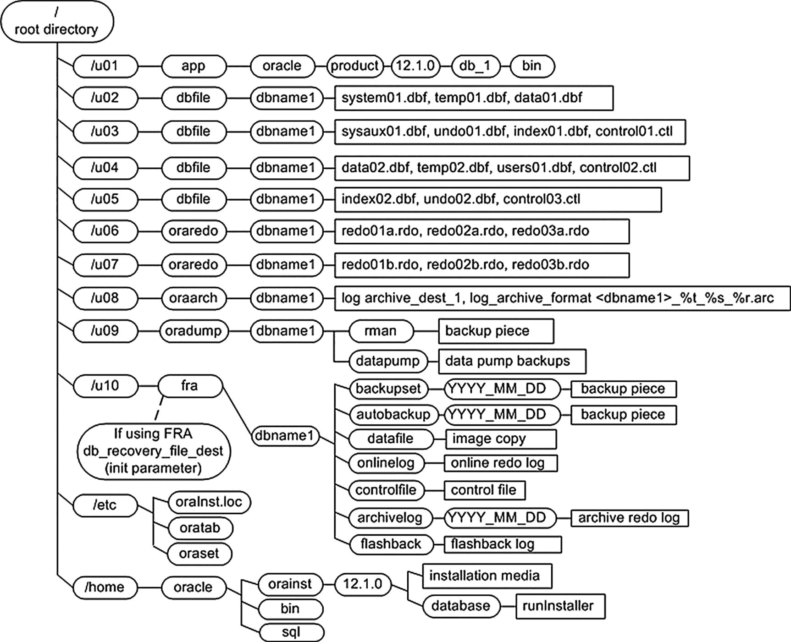
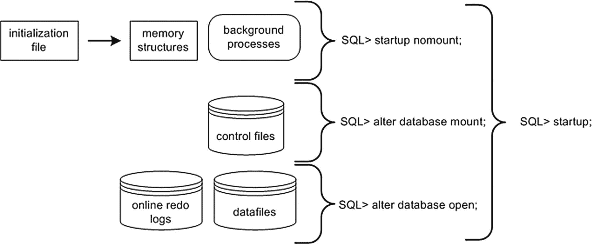
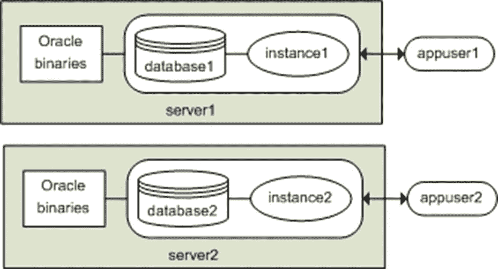
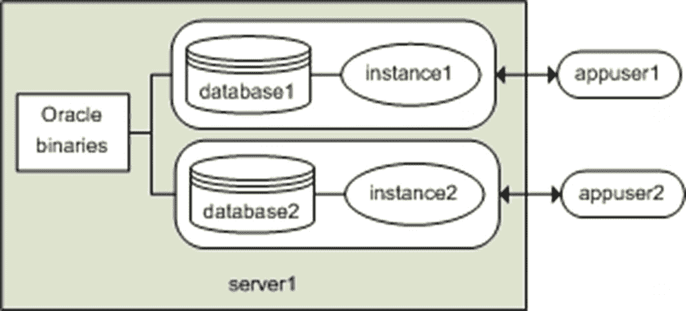
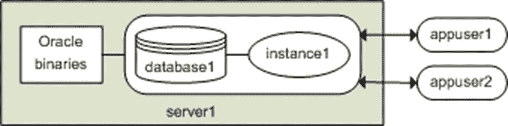
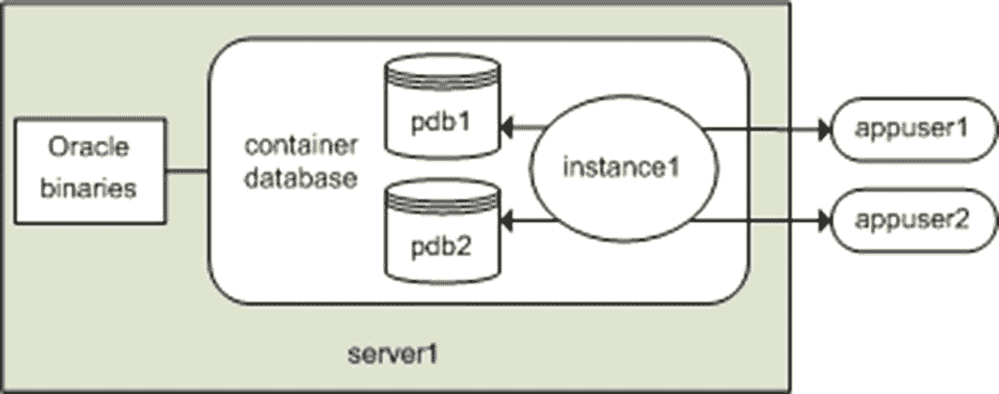
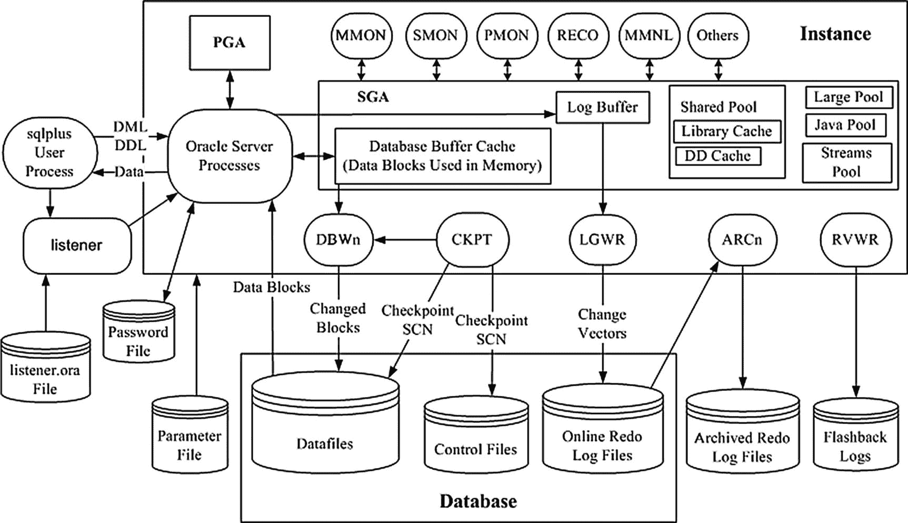

# 步骤 4\. 创建数据库

在设定好操作系统变量、配置初始化文件并创建了所需目录后，你现在可以创建数据库了。本步骤将说明如何使用 `CREATE DATABASE` 语句来创建一个数据库。

在执行 `CREATE DATABASE` 语句之前，你必须通过 `STARTUP NOMOUNT` 语句启动后台进程并分配内存：

```bash
$ sqlplus / as sysdba
SQL> startup nomount;
```

当你发出 `STARTUP NOMOUNT` 语句时，SQL\*Plus 会尝试读取 `ORACLE_HOME/dbs` 目录下的初始化文件（参见步骤 2）。`STARTUP NOMOUNT` 语句会实例化 Oracle 所使用的后台进程和内存区域。此时，你拥有一个 Oracle **实例**，但还没有**数据库**。

## 注意
Oracle **实例** 定义为后台进程和内存区域。Oracle **数据库** 定义为磁盘上的物理文件（数据文件、控制文件、在线重做日志）。

下面列出了一个典型的 Oracle `CREATE DATABASE` 语句：

```sql
CREATE DATABASE o18c
MAXLOGFILES 16
MAXLOGMEMBERS 4
MAXDATAFILES 1024
MAXINSTANCES 1
MAXLOGHISTORY 680
CHARACTER SET AL32UTF8
DATAFILE
'/u01/dbfile/o18c/system01.dbf'
SIZE 500M REUSE
EXTENT MANAGEMENT LOCAL
UNDO TABLESPACE undotbs1 DATAFILE
'/u01/dbfile/o18c/undotbs01.dbf'
SIZE 800M
SYSAUX DATAFILE
'/u01/dbfile/o18c/sysaux01.dbf'
SIZE 500M
DEFAULT TEMPORARY TABLESPACE TEMP TEMPFILE
'/u01/dbfile/o18c/temp01.dbf'
SIZE 500M
DEFAULT TABLESPACE USERS DATAFILE
'/u01/dbfile/o18c/users01.dbf'
SIZE 20M
LOGFILE GROUP 1
('/u01/oraredo/o18c/redo01a.rdo',
'/u02/oraredo/o18c/redo01b.rdo') SIZE 50M,
GROUP 2
('/u01/oraredo/o18c/redo02a.rdo',
'/u02/oraredo/o18c/redo02b.rdo') SIZE 50M,
GROUP 3
('/u01/oraredo/o18c/redo03a.rdo',
'/u02/oraredo/o18c/redo03b.rdo') SIZE 50M
USER sys    IDENTIFIED BY foo
USER system IDENTIFIED BY foo;
```

在这个例子中，脚本被放在一个名为 `credb.sql` 的文件中，并以 `SYS` 用户身份在 SQL\*Plus 提示符下运行：

```sql
SQL> @credb.sql
```

如果执行成功，你应该会看到以下消息：

```
Database created.
```

## 注意
有关创建可插拔数据库的详细信息，请参见第 22 章。

如果在 `CREATE DATABASE` 语句运行期间出现任何错误，请检查警报日志文件。通常，错误发生在所需目录不存在、内存分配不足或超出操作系统限制时。如果你不确定警报日志的位置，请执行以下查询：

```sql
SQL> select value from v$diag_info where name = 'Diag Trace';
```

即使你的数据库处于 nomount 状态，前面的查询也应该有效。另一种快速查找警报日志文件的方法是从操作系统入手：

```bash
$ cd $ORACLE_BASE
$ find . -name "alert*.log"
```

#### 提示
警报日志文件的默认命名格式是 `alert_<SID>.log`。

关于前面的 `CREATE DATABASE` 语句示例，有几点关键之处需要指出。注意，`SYSTEM` 数据文件被定义为**本地管理**。这意味着在此数据库中创建的任何表空间都必须是本地管理的（相对于字典管理）。如果你尝试在此数据库中创建字典管理的表空间，Oracle 会抛出错误。这是期望的行为。

字典管理的表空间使用 Oracle 数据字典来管理区和空闲空间，而本地管理的表空间使用每个数据文件中的位图来管理其区和空闲空间。本地管理的表空间具有以下优势：

*   性能得到提升。
*   不需要合并。
*   减少了数据字典中的资源争用。
*   减少了递归空间管理。

另外请注意，`TEMP` 表空间被定义为**默认临时表空间**。这意味着在数据库中创建的任何用户都会自动被分配 `TEMP` 表空间作为其默认临时表空间。在创建数据字典之后（参见步骤 5），你可以使用此查询来验证默认临时表空间：

```sql
select *
from database_properties
where property_name = 'DEFAULT_TEMP_TABLESPACE';
```

最后，注意 `USERS` 表空间被定义为任何在 `CREATE USER` 语句中未指定默认表空间的用户的**默认永久表空间**。在创建数据字典之后（参见步骤 5），你可以运行此查询来确定默认表空间：

```sql
select *
from database_properties
where property_name = 'DEFAULT_PERMANENT_TABLESPACE';
```

表 2-2 列出了在创建 Oracle 数据库时需要考虑的最佳实践。

**表 2-2 创建 Oracle 数据库的最佳实践**

| 最佳实践 | 原因 |
| :--- | :--- |
| 谨慎使用 `REUSE` 子句。通常，只应在重新创建数据库时使用它。 | `REUSE` 子句指示 Oracle 覆盖现有文件，无论它们是否正在使用。这是危险的。 |
| 创建一个名称中包含 `TEMP` 的默认临时表空间。 | 每个用户都应被分配一个类型为 `TEMP` 的临时表空间，包括 `SYS` 用户。如果不指定默认临时表空间，则会使用 `SYSTEM` 表空间。你绝不希望用户被分配 `SYSTEM` 作为临时表空间。如果你的数据库没有默认临时表空间，请使用 `ALTER DATABASE DEFAULT TEMPORARY TABLESPACE` 语句来分配一个。 |
| 创建一个名为 `USERS` 的默认永久表空间。 | 这确保用户被分配一个除 `SYSTEM` 之外的默认永久表空间。如果你的数据库没有默认永久表空间，请使用 `ALTER DATABASE DEFAULT TABLESPACE` 语句来分配一个。 |
| 使用 `USER SYS` 和 `USER SYSTEM` 子句来指定非默认密码。 | 这样做可以使用非默认密码创建数据库账户，而这些账户通常是黑客的首要目标。 |
| 至少创建三个重做日志组，每组两个成员。 | 至少三个重做日志组为归档进程在日志切换之间写出归档重做日志提供了时间。两个成员镜像了在线重做日志成员，提供了一定的容错能力。 |
| 给重做日志命名如 `redoNA.rdo`。 | 这与 OFA 标准略有偏差，但我曾不止一次意外删除过扩展名为 `.log` 的文件（虽然本不应该发生，但它确实发生了）。 |
| 使数据库名称具有一定的意义，例如 `PAPRD`、`PADEV1` 或 `PATST1`。 | 这有助于你确定正在操作的数据库以及它是生产、开发还是测试环境。 |
| 在创建数据字典时（参见步骤 5）使用 `?` 变量。不要硬编码目录路径。 | SQL\*Plus 将 `?` 解释为操作系统 `ORACLE_HOME` 变量中包含的目录。这可以防止你意外地从错误的 `ORACLE_HOME` 版本运行脚本。 |

#### 提示
使用 `dbca` 可以完成创建数据库中的许多此类设置。表空间可以设置或使用默认值，同时确保用户不会在 `SYSTEM` 表空间中创建对象，并且不使用默认密码。使用 `dbca` 会将新特性和安全选项作为数据库创建的一部分。


请注意，此步骤中使用的 `CREATE DATABASE` 语句在目录结构方面略微偏离了 OFA 标准。我倾向于不将 Oracle 数据文件、在线重做日志和控制文件放在 `ORACLE_BASE` 下（正如 OFA 标准所规定）。相反，我直接将这些文件放在名为 `/<挂载点>/<文件类型>/<数据库名>` 的目录下，因为路径名短得多。更短的路径名使得通过命令行导航到目录更加容易，并且名称在 SQL `SELECT` 语句的输出中也显示得更清晰。图 2-1 展示了这种对 OFA 标准的偏离。



图 2-1
一种用于布局数据库文件的、略微偏离 OFA 标准的方式

我的本意并非让您使用非标准的 OFA 结构。而是，做任何对您的环境和需求有意义的事情。应用能够促进可管理性、可维护性和可扩展性的合理标准。

### 步骤 5. 创建数据字典

数据库成功创建后，您可以通过运行两个脚本来实例化数据字典。这些脚本在您安装 Oracle 二进制文件时创建。您必须以 `SYS` 方案用户身份运行这些脚本：

```
SQL> show user
USER is "SYS"
```

在创建数据字典之前，我喜欢将输出假脱机到一个文件中，以便在出现意外错误时进行检查：

```
SQL> spool create_dd.lis
```

现在，创建数据字典：

```
SQL> @?/rdbms/admin/catalog.sql
SQL> @?/rdbms/admin/catproc.sql
```

成功创建数据字典后，以 `SYSTEM` 方案用户身份，创建产品用户配置文件表：

```
SQL> connect system/
SQL> @?/sqlplus/admin/pupbld
```

这些表允许 SQL*Plus 按用户禁用命令。如果未运行 `pupbld.sql` 脚本，那么所有非 `sys` 用户登录 SQL*Plus 时都会看到以下警告：

```
Error accessing PRODUCT_USER_PROFILE
Warning: Product user profile information not loaded!
You may need to run PUPBLD.SQL as SYSTEM
```

这些错误可以忽略。如果您不想在登录 SQL*Plus 时看到它们，请确保运行了 `pupbld.sql` 脚本。至此，您应该拥有一个功能齐全的数据库了。接下来，您需要配置并实现您的监听器以启用远程连接，并可选地设置一个密码文件。这些任务将在接下来的两个章节中描述。

## 配置和实现监听器

安装完二进制文件并创建数据库后，您需要使数据库可供远程客户端连接访问。这通过配置并启动 Oracle 监听器来实现。恰如其名，监听器是数据库服务器上的一个进程，用于“监听”来自远程客户端的连接请求。如果您的数据库服务器上没有启动监听器，那么您将无法从远程客户端连接。监听器可以作为数据库主目录的一部分，也可以作为网格主目录的一部分。监听器只需要存在一次，因为只有一个活动的网格主目录，但可能有多个数据库主目录。这是管理和维护监听器的一个位置。将监听器作为网格环境的一部分，允许在打补丁时与数据库分开，并且作为基础设施打补丁过程的一部分。在维护监听器时，还需注意设置正确的 `ORACLE_HOME`，以使监听器在期望的主目录中运行。接下来的两种方法展示了在数据库中配置监听器，但同样可以轻松地应用于网格主目录。设置监听器有两种方法：使用 Oracle Net 配置助手 (`netca`) 或手动配置 `listener.ora` 文件。

### 使用 Net 配置助手实现监听器

`netca` 实用程序可以协助您完成实现监听器的所有方面。您可以在图形模式或静默模式下运行 `netca` 工具。在图形模式下使用 `netca` 简单直观。要在图形模式下使用 `netca`，请确保安装了正确的 X 软件，然后发出 `xhost +` 命令，并检查您的 `DISPLAY` 变量是否已设置；例如，

```
$ xhost +
$ echo $DISPLAY
:0.0
```

现在您可以运行 `netca` 实用程序：

```
$ netca
```

接下来，您将被引导通过几个屏幕，您可以在其中选择选项，例如监听器的名称、所需的端口等。

您也可以使用响应文件在静默模式下运行 `netca` 实用程序。这种模式允许您编写脚本，并在创建和实现监听器时确保可重复性。首先，在包含 Oracle 安装介质的目录结构中找到默认的监听器响应文件：

```
$  find . -name "netca.rsp"
./18.0.0.0/database/response/netca.rsp
```

现在，复制该文件以便进行修改：

```
$ cp 18.0.0.0/database/response/netca.rsp mynet.rsp
```

如果您想更改默认名称或其他属性，请使用操作系统实用程序（如 `vi`）编辑 `mynet.rsp` 文件：

```
$ vi mynet.rsp
```

在本例中，我没有修改 `mynet.rsp` 文件中的任何值。换句话说，我使用了响应文件中已包含的所有默认值。接下来，以静默模式运行 `netca` 实用程序：

```
$ netca -silent -responsefile /home/oracle/orainst/mynet.rsp
```

该实用程序会在 `ORACLE_HOME/network/admin` 目录中创建一个 `listener.ora` 和一个 `sqlnet.ora` 文件，并启动一个默认监听器。

### 手动配置监听器

当您设置新环境时，手动配置监听器是一个两步过程：

1.  配置 `listener.ora` 文件。
2.  启动监听器。

`listener.ora` 文件默认位于 `ORACLE_HOME/network/admin` 目录中。这也是 `TNS_ADMIN` 操作系统变量应设置为指向的同一目录。手动配置监听器并更新 `listener.ora` 文件时，请注意括号和任何特殊字符，配置错误的 `listener.ora` 将导致无法启动，并且当同一端口上存在另一个监听器时，这是首要的排查点。

以下是一个 `listener.ora` 文件示例，其中包含一个数据库的网络配置信息：

```
LISTENER =
(DESCRIPTION_LIST =
(DESCRIPTION =
(ADDRESS_LIST =
(ADDRESS = (PROTOCOL = TCP)(HOST = oracle18c)(PORT = 1521))
)
)
)
SID_LIST_LISTENER =
(SID_LIST =
(SID_DESC =
(GLOBAL_DBNAME = o18c)
(ORACLE_HOME = /u01/app/oracle/product/18.0.0.0/db_1)
(SID_NAME = o18c)
)
)
```

此代码清单包含两个部分。第一部分定义了监听器名称和服务；在本例中，监听器名称为 `LISTENER`。第二部分定义了监听器正在监听其传入连接（到数据库）的 SID 列表。SID 列表名称的格式为 `SID_LIST_<监听器名称>`。监听器的名称必须出现在 SID 列表名称中。本例中的 SID 列表名称是 `SID_LIST_LISTENER`。另外，您不必在前面的代码清单中显式指定 `SID_LIST_LISTENER` 部分（第二部分）。这是因为进程监控器 (`PMON`) 后台进程会自动将任何正在运行的数据库作为服务注册到监听器；这称为动态注册。然而，一些 DBA 更喜欢显式列出应注册到监听器的数据库，因此会包含第二部分；这称为静态注册。

在 `listener.ora` 文件就位后，您可以使用 `lsnrctl` 实用程序启动监听器后台进程：

```
$ lsnrctl start
```

您应该会看到信息性消息，例如：

```
Listening Endpoints Summary...
(DESCRIPTION=(ADDRESS=(PROTOCOL=tcp)(HOST = oracle18c)(PORT = 1521)))
Services Summary...
Service "o18c" has 1 instance(s).
```


## 监听器管理

您可以验证监听器正在监听的服务：

```
$ lsnrctl services
```

您可以使用以下查询检查监听器的状态：

```
$ lsnrctl status
```

要获取完整的监听器命令列表，请执行此命令：

```
$ lsnrctl help
```

> **提示**
> 使用 Linux/Unix 命令 `ps -ef | grep tns` 可以查看服务器上正在运行的监听器进程。

## 通过网络连接到数据库

一旦监听器被配置并启动，您就可以从 SQL*Plus 客户端测试远程连接，如下所示：

```
$ sqlplus user/pass@'server:port/service_name'
```

在下一行代码中，用户名和密码是 `system/foo`，连接到名为 `oracle18c` 的服务器，端口 1521，数据库名为 `o18c`：

```
$ sqlplus system/foo@'oracle18c:1521/o18c'
```

此示例演示了所谓的“轻松连接命名方法”。它之所以简单，是因为它不依赖于任何设置文件或工具。您唯一需要知道的信息是用户名、密码、服务器、端口和服务名（SID）。

另一种常见的连接方法是“本地命名”。此方法依赖于 `ORACLE_HOME/network/admin/tnsnames.ora` 文件中的连接信息。在此示例中，编辑了 `tnsnames.ora` 文件，并添加了以下透明网络底层（TNS，Oracle 的网络架构）条目：

```
o18c =
  (DESCRIPTION =
    (ADDRESS = (PROTOCOL = TCP)(HOST = oracle18c)(PORT = 1521))
    (CONNECT_DATA = (SERVICE_NAME = o18c)))
```

现在，从操作系统命令行，您可以通过引用 `o18c` TNS 信息（该信息已放置在 `tnsnames.ora` 文件中）来建立连接：

```
$ sqlplus system/foo@o18c
```

这种连接方法是本地的，因为它依赖于本地客户端的 `tnsnames.ora` 副本来确定 Oracle Net 连接细节。默认情况下，SQL*Plus 会检查由 `TNS_ADMIN` 变量定义的目录中是否存在名为 `tnsnames.ora` 的文件。如果未找到，则会搜索由 `ORACLE_HOME/network/admin` 定义的目录。如果找到了 `tnsnames.ora` 文件，并且它包含在 SQL*Plus 连接字符串中指定的别名（在此示例中为 `o18c`），则连接详情将从该 `tnsnames.ora` 文件的条目中派生。

Oracle 使用的其他连接命名方法包括外部命名和目录命名。有关更多详细信息，请参阅《Oracle Net Services Administrator’s Guide》，可从 Oracle 网站的技术网络区域（`http://otn.oracle.com`）免费下载。

> **提示**
> 您可以使用 `netca` 实用程序创建 tnsnames.ora 文件。启动该实用程序并选择“本地网络服务名配置”选项。系统将提示您输入 SID、主机名和端口等信息。

## 创建密码文件

创建密码文件是可选的。要求密码文件有一些充分的理由：

*   您希望为非 `sys` 用户分配 `sys*` 权限（`sysdba`、`sysoper`、`sysbackup` 等）。
*   您希望通过 Oracle Net 以 `sys*` 权限远程连接到您的数据库。
*   Oracle Data Guard 设置以及需要在备用服务器上拥有密码文件。
*   某个 Oracle 特性或实用程序要求使用密码文件。

执行以下步骤来实现密码文件：

1.  使用 `orapwd` 实用程序创建密码文件。
2.  将初始化参数 `REMOTE_LOGIN_PASSWORDFILE` 设置为 `EXCLUSIVE`。

在 Linux/Unix 环境中，使用 `orapwd` 实用程序创建密码文件，如下所示：

```
$ cd $ORACLE_HOME/dbs
$ orapwd file=orapw password=<password>
```

在 Linux/Unix 环境中，密码文件通常存储在 `ORACLE_HOME/dbs` 中；在 Windows 中，它通常放置在 `ORACLE_HOME\database` 目录中。

您在上一条命令中指定的文件名格式可能因操作系统而异。例如，在 Windows 中，格式是 `PWD<ORACLE_SID>.ora`。以下示例展示了 Windows 环境中的语法：

```
c:\> cd %ORACLE_HOME%\database
c:\> orapwd file=PWD<ORACLE_SID>.ora password=<password>
```

要启用密码文件的使用，请将初始化参数 `REMOTE_LOGIN_PASSWORDFILE` 设置为 `EXCLUSIVE`（这是默认值）。如果该参数未设置为 `EXCLUSIVE`，则您需要修改您的参数文件：

```
SQL> alter system set remote_login_passwordfile='EXCLUSIVE' scope=spfile;
```

您需要停止并启动实例以使上述设置生效。

您可以通过 `GRANT <any SYS privilege>` 语句向密码文件添加用户。在安全配置中使用这些权限和密码文件时需要谨慎。只有需要这些权限的账户才应被授予访问密码文件的权限。以下示例授予 `SYSDBA` 权限给 `heera` 用户（从而将 `heera` 添加到密码文件中）：

```
SQL> grant sysdba to heera;
Grant succeeded.
```

启用密码文件还允许您通过 Oracle Net 连接以 `SYS*` 级权限远程连接到您的数据库。此示例展示了具有 `SYSDBA` 级权限的远程连接语法：

```
$ sqlplus /@<db_name> as sysdba
```

这允许您执行需要物理登录到数据库服务器的远程维护操作，这些操作原本需要使用 `sys*` 权限（`sysdba`、`sysoper`、`sysbackup` 等）。您可以通过查询 `V$PWFILE_USERS` 视图来验证哪些用户拥有 `sys*` 权限：

```
SQL> select * from v$pwfile_users;
```

以下是一些示例输出：

```
USERNAME                   SYSDB SYSOP SYSAS SYSBA SYSDG SYSKM     CON_ID
-------------------------- ----- ----- ----- ----- ----- ----- ----------
SYS                        TRUE  TRUE  FALSE FALSE FALSE FALSE          0
```

特权用户的概念对于 RMAN 备份和恢复也很重要。与 SQL*Plus 一样，RMAN 使用操作系统认证和密码文件来允许特权用户连接到数据库。只有特权账户才被允许备份、恢复数据库。

## 启动和停止数据库

在启动和停止 Oracle 实例之前，您必须设置正确的操作系统变量（本章前面已介绍）。您还需要访问特权操作系统账户或特权数据库用户账户。以特权用户身份连接允许您执行管理任务，例如启动、停止和创建数据库。您可以使用操作系统认证或密码文件以特权用户身份连接到您的数据库。

### 理解操作系统认证

操作系统认证意味着，如果您可以通过授权的操作系统账户登录到数据库服务器，则允许您连接到数据库，而无需额外的密码。一个简单的例子演示了这个概念。首先，使用 `id` 命令显示 `oracle` 用户所属的操作系统组：

```
$ id
uid=500(oracle) gid=506(oinstall) groups=506(oinstall),507(dba),508(oper)
```

接下来，使用 `SYSDBA` 特权连接到数据库，故意使用错误（无效）的用户名和密码：

```
$ sqlplus bad/notgood as sysdba
```

我现在可以验证是否已建立与 `SYS` 的连接：

```
SYS@o18c> show user
USER is "SYS"
```


## Oracle 数据库连接、启动与停止指南

### 数据库连接认证

如何能够使用错误的用户名和密码连接到数据库？实际上，这并非坏事（正如你最初可能认为的那样）。之前的连接之所以有效，是因为 Oracle 忽略了所提供的用户名/密码，因为用户首先通过操作系统认证被验证。在该示例中，`oracle`操作系统用户属于`dba`操作系统组，因此被允许在不提供正确用户名和密码的情况下，以`SYSDBA`权限进行本地数据库连接。
请参见第 1 章中的表 1-1，了解操作系统组及其映射到相应数据库权限的完整描述。典型的组包括`dba`和`oper`；这些组分别对应`sysdba`和`sysoper`数据库权限。`sysdba`和`sysoper`权限允许你执行管理任务，例如启动和停止数据库。

在 Windows 环境中，操作系统组会被自动创建（通常命名为`ora_dba`）并分配给安装 Oracle 软件的操作系统用户。你可以按如下方式验证哪些操作系统用户属于`ora_dba`组：选择“开始”>“控制面板”>“管理工具”>“计算机管理”>“本地用户和组”>“组”。你应该会看到一个名为`ora_dba`的组。你可以单击该组并查看分配给它的操作系统用户。此外，为了使操作系统认证在 Windows 环境中工作，必须在`sqlnet.ora`文件中包含以下条目：

```
SQLNET.AUTHENTICATION_SERVICES=(NTS)
```

`sqlnet.ora`文件通常位于`ORACLE_HOME/network/admin`目录中。

### 启动数据库

启动和停止数据库是你经常执行的任务。要启动/停止数据库，请使用具有`sysdba`或`sysoper`权限的用户账户连接，并发出`startup`和`shutdown`语句。
以下示例使用操作系统认证连接到数据库：

```
$ sqlplus / as sysdba
```

以特权账户连接后，可以如下启动数据库：

```
SQL> startup;
```

要使前面的命令生效，需要在`ORACLE_HOME/dbs`目录中有一个`spfile`或`init.ora`文件。详情请参阅本章前面的“步骤 2：配置初始化文件”部分。

**注意：** 在 DBA 领域中，快速连续地停止和重启数据库俗称“bouncing your database”。

当实例成功启动时，你应该会看到来自 Oracle 的消息，表明系统全局区（SGA）已分配。数据库被装载然后打开：

```
ORACLE instance started.
Total System Global Area  313159680 bytes
Fixed Size                  2259912 bytes
Variable Size             230687800 bytes
Database Buffers           75497472 bytes
Redo Buffers                4714496 bytes
Database mounted.
Database opened.
```

从前面的输出来看，打开 Oracle 数据库的启动操作经历了三个不同的阶段：

1.  启动实例
2.  装载数据库
3.  打开数据库

在启动数据库时，可以逐步执行这些阶段。首先，启动 Oracle 实例（后台进程和内存结构）：

```
SQL> startup nomount;
```

接下来，装载数据库。此时，Oracle 读取控制文件：

```
SQL> alter database mount;
```

最后，打开数据文件和联机重做日志文件：

```
SQL> alter database open;
```

这个启动过程如图 2-2 所示。



*图 2-2 Oracle 启动阶段*

当你发出不带任何参数的`STARTUP`语句时，Oracle 会自动逐步执行三个启动阶段（nomount、mount、open）。在大多数情况下，你会发出不带参数的`STARTUP`语句来启动数据库。表 2-3 描述了可与数据库`STARTUP`语句一起使用的参数含义。

*表 2-3 `startup`命令可用参数*

| 参数 | 含义 |
| :--- | :--- |
| `FORCE` | 在重新启动前以`ABORT`模式关闭实例；对于排查启动问题很有用；通常不使用 |
| `RESTRICT` | 仅允许具有`RESTRICTED SESSION`权限的用户连接到数据库 |
| `PFILE` | 指定启动实例时要使用的客户端参数文件 |
| `QUIET` | 抑制启动实例时显示 SGA 信息 |
| `NOMOUNT` | 启动后台进程并分配内存；不读取控制文件 |
| `MOUNT` | 启动后台进程、分配内存并读取控制文件 |
| `OPEN` | 启动后台进程、分配内存、读取控制文件，并打开联机重做日志和数据文件 |
| `OPEN RECOVER` | 在打开数据库之前尝试介质恢复 |
| `OPEN READ ONLY` | 以只读模式打开数据库 |
| `UPGRADE` | 在升级数据库时使用 |
| `DOWNGRADE` | 在降级数据库时使用 |

### 停止数据库

通常，使用`SHUTDOWN IMMEDIATE`语句来停止数据库。`IMMEDIATE`参数指示 Oracle 停止数据库活动并回滚所有打开的事务：

```
SQL> shutdown immediate;
Database closed.
Database dismounted.
ORACLE instance shut down.
```

表 2-4 提供了`SHUTDOWN`语句可用参数的详细定义。在大多数情况下，`SHUTDOWN IMMEDIATE`是关闭数据库的可接受方法。如果你发出不带参数的`SHUTDOWN`命令，则等同于发出`SHUTDOWN NORMAL`。

*表 2-4 `SHUTDOWN`命令可用参数*

| 参数 | 含义 |
| :--- | :--- |
| `NORMAL` | 等待用户注销活动会话后再关闭。 |
| `TRANSACTIONAL` | 等待事务完成，然后终止会话。 |
| `TRANSACTIONAL LOCAL` | 仅对本地实例执行事务性关闭。 |
| `IMMEDIATE` | 立即终止活动会话。打开的事务将被回滚。 |
| `ABORT` | 立即终止实例。事务被终止且不会被回滚。 |

启动和停止数据库是一个相当简单的过程。如果环境设置正确，你应该能够连接到数据库并发出适当的`STARTUP`和`SHUTDOWN`语句。

**提示：** 如果在启动或停止数据库时遇到任何问题，请查看告警日志以获取详细信息。告警日志通常包含有关任何问题的相关消息。

你很少需要使用`SHUTDOWN ABORT`语句。通常，`SHUTDOWN IMMEDIATE`就足够了。话虽如此，使用`SHUTDOWN ABORT`并没有什么错。如果`SHUTDOWN IMMEDIATE`由于任何原因不起作用，那么就使用`SHUTDOWN ABORT`。还要记住，在`SHUTDOWN ABORT`命令之后启动时，数据库将需要恢复介质文件，并且可能需要相当长的时间来处理这些文件。

在少数极少数情况下，`SHUTDOWN ABORT`会失效。在这些情况下，你可以使用`ps -ef | grep smon`来定位 Oracle 系统监控进程，然后使用 Linux/Unix 的`kill`命令来终止实例。当你杀死一个必需的 Oracle 后台进程时，这会导致实例中止。显然，应仅将操作系统`kill`命令作为最后手段使用。


## 数据库与实例

虽然数据库管理员（DBA）经常将 `database` 和 `instance` 这两个术语互换使用，但它们指的是架构中截然不同的组成部分。在 Oracle 中，`database` 一词指的是构成数据库的物理文件：数据文件、在线重做日志文件和控制文件。而 `instance` 一词则指后台进程和内存结构。

例如，你可以在没有数据库的情况下创建一个实例。在物理创建数据库之前，你必须使用 `STARTUP NOMOUNT` 语句来启动实例。在此状态下，你拥有后台进程和内存结构，但没有任何关联的数据文件、在线重做日志或控制文件。数据库文件直到你执行 `CREATE DATABASE` 语句才会创建。

另一个需要记住的重点是，一个实例只能与一个数据库关联，而一个数据库可以与许多不同的实例关联（例如 Oracle 真正应用集群 [RAC]）。一个实例只能挂载并打开一个数据库一次。每次你停止并启动数据库时，都会有一个新的实例与之关联。先前创建的后台进程和内存结构永远不会与数据库关联。

为了演示这个概念，使用 `ALTER DATABASE CLOSE` 语句关闭一个数据库：

```
SQL> alter database close;
```

如果你尝试重新打开数据库，会收到一个错误：

```
SQL> alter database open;
ERROR at line 1:
ORA-16196: database has been previously opened and closed
```

这是因为一个实例只能挂载并打开一个数据库。在挂载并打开数据库之前，你必须停止并启动一个新的实例。

## 使用 dbca 创建数据库

你也可以使用 `dbca` 实用程序来创建数据库。该实用程序有两种模式：图形模式和静默模式。要以图形模式使用 `dbca`，请确保安装了正确的 X 软件，然后执行 `xhost +` 命令，并确认你的 `DISPLAY` 变量已设置；例如，

```
$ xhost +
$ echo $DISPLAY
:0.0
```

要以图形模式运行 `dbca`，请在操作系统命令行中输入 `dbca`：

```
$ dbca
```

图形模式非常直观，将引导你完成创建数据库的所有方面。如果你刚接触 Oracle 并希望获得明确的选项提示，可能会更喜欢使用此模式。

你也可以使用响应文件以静默模式运行 `dbca`。在某些情况下，使用图形模式运行 `dbca` 并不可行。这可能是由于网络缓慢或 X 软件不可用。要使用 `dbca` 的静默模式创建数据库，请执行以下步骤：

1.  定位 `dbca.rsp` 文件。
2.  复制一份 `dbca.rsp` 文件。
3.  根据你的环境修改 `dbca.rsp` 文件的副本。
4.  以静默模式运行 `dbca` 实用程序。

首先，导航到你复制 Oracle 数据库安装软件的位置，并使用 `find` 命令定位 `dbca.rsp`：

```
$ find . -name dbca.rsp
./18.0.0.0/database/response/dbca.rsp
```

复制该文件，这样你就不会修改原始文件（这样，你始终会有一个完好的原始文件）：

```
$ cp dbca.rsp mydb.rsp
```

现在，编辑 `mydb.rsp` 文件。至少，你需要修改以下参数：`GDBNAME`、`SID`、`SYSPASSWORD`、`SYSTEMPASSWORD`、`SYSMANPASSWORD`、`DBSNMPPASSWORD`、`DATAFILEDESTINATION`、`STORAGETYPE`、`CHARACTERSET` 和 `NATIONALCHARACTERSET`。以下是 `mydb.rsp` 文件中修改后的值示例：

```
[CREATEDATABASE]
GDBNAME = "O18DEV"
SID = "O18DEV"
TEMPLATENAME = "General_Purpose.dbc"
SYSPASSWORD = "foo"
SYSTEMPASSWORD = "foo"
SYSMANPASSWORD = "foo"
DBSNMPPASSWORD = "foo"
DATAFILEDESTINATION ="/u01/dbfile"
STORAGETYPE="FS"
CHARACTERSET = "AL32UTF8"
NATIONALCHARACTERSET= "UTF8"
```

接下来，使用响应文件以静默模式运行 `dbca` 实用程序：

```
$ dbca -silent -responseFile /home/oracle/orainst/mydb.rsp
```

你应该会看到类似下面的输出：

```
Copying database files
1% complete
...
Creating and starting Oracle instance
...
62% complete
Completing Database Creation
...
100% complete
Look at the log file ... for further details.
```

如果你查看日志文件，请注意 `dbca` 实用程序使用 `rman` 实用程序来恢复用于数据库的数据文件。然后，它创建实例并执行安装后步骤。在 Linux 服务器上，你的新数据库也应该在 `/etc/oratab` 文件中有一个条目。

许多 DBA 启动 `dbca` 并以图形模式配置数据库，但很少有人利用响应文件提供的选项。通过有效利用响应文件，你可以持续地自动化数据库创建过程。你可以修改响应文件以在 ASM 上构建数据库，甚至创建 RAC 数据库。此外，你几乎可以控制响应文件的每个方面，类似于以图形模式启动 `dbca`。

> 提示
> 你可以通过 help 参数查看 `dbca` 的所有选项：`dbca -help`

## 使用 dbca 生成创建数据库语句

你可以使用 `dbca` 实用程序生成 `CREATE DATABASE` 语句。你可以通过图形界面交互进行，也可以通过静默模式进行。关键在于选择“自定义数据库模板”并同时指定“生成数据库创建脚本”选项。此示例使用静默模式生成一个包含 `CREATE DATABASE` 语句的脚本：

```
$ dbca -silent -generateScripts -customCreate -templateName New_Database.dbt \
-gdbName DKDEV
```

上面的代码指示 `dbca` 创建一个名为 `CreateDB.sql` 的脚本，并将其放置在 `ORACLE_BASE/admin/DKDEV/scripts` 目录中。`CreateDB.sql` 文件内包含一个 `CREATE DATABASE` 语句。同时还会创建一个用于初始化实例的 `init.ora` 文件。

在此示例中，创建数据库所需的脚本已为你生成。在你手动运行这些脚本之前，不会创建任何数据库。

此技术为你提供了一种自动化生成 `CREATE DATABASE` 语句的方法。如果你刚接触 Oracle 且不确定如何构造 `CREATE DATABASE` 语句，或者如果你正在使用新版本的数据库并希望获得由 Oracle 实用程序生成的有效 `CREATE DATABASE` 语句，此方法尤其有用。

## 删除数据库

如果你有一个不再使用的数据库需要删除，可以使用 `DROP DATABASE` 语句来完成。这样做将删除与该数据库关联的所有数据文件、控制文件和在线重做日志。

不用说，删除数据库时要极其谨慎。在删除数据库之前，请确保你在正确的服务器上并连接到了正确的数据库。在 Linux/Unix 系统上，在操作系统提示符下执行以下操作系统命令：

```
$ uname -a
```

接下来，连接到 SQL*Plus，并确保连接到你想要删除的数据库：

```
SQL> select name from v$database;
```

确认你处于正确的数据库环境后，从具有 `SYSDBA` 权限的帐户执行以下 SQL 命令：

```
SQ> shutdown immediate;
SQL> startup mount exclusive restrict;
SQL> drop database;
```

> 警告
> 显然，删除数据库时要格外小心。在删除数据库时不会提示你，并且截至本文撰写时，没有 `UNDROP ACCIDENTALLY DROPPED DATABASE` 命令。删除数据库时请极度谨慎，因为此操作会删除数据文件、控制文件和在线重做日志文件。

`DROP DATABASE` 命令在你有一个需要移除的数据库时非常有用。它可能是一个测试数据库或一个不再使用的旧数据库。`DROP DATABASE` 命令不会删除旧的归档重做日志文件。你必须使用操作系统命令（例如 Linux/Unix 中的 `rm`，或 Windows 命令提示符下的 `del`）手动删除这些文件。你也可以指示 RMAN 删除归档重做日志文件。

## 一台服务器上可以有多少个数据库？


## Oracle 数据库架构部署选项

在创建新数据库时，一个常见的问题是：一台服务器上应该放置多少个数据库？一个极端情况是每台数据库服务器上只运行一个数据库。这种架构如图 2-3 所示，展示了两台不同的数据库服务器，每台都有自己的 Oracle 二进制文件安装。这种设置对硬件供应商有利，但在许多环境中并非经济的资源利用方式。



图 2-3 每个数据库使用一台服务器的架构

如果你有足够的内存、中央处理器（CPU）和磁盘资源，那么应考虑在一台服务器上创建多个数据库。你可以为每个数据库创建一个新的 Oracle 二进制文件安装，或者让多个数据库共享一套 Oracle 二进制文件。图 2-4 展示了一个使用一套共享的 `Oracle binaries`，由一台服务器上的多个数据库共享的配置。当然，如果你需要不同版本的 `Oracle binaries`，则必须有多个 `Oracle homes` 来容纳这些安装。



图 2-4 一台服务器上的多个数据库共享一套 `Oracle binaries`

如果你没有足够的 CPU、内存或磁盘资源在一台服务器上创建多个数据库，可以考虑使用一个数据库来承载多个应用程序和用户，如图 2-5 所示。在此类环境中，注意不要使用公共同义词，因为应用程序之间可能存在冲突。通常的做法是为不同的应用程序创建不同的 `schemas` 和 `tablespaces`。



图 2-5 一个数据库被多个应用程序和用户使用

从 Oracle Database 18c 开始，你可以选择使用可插拔数据库功能。该技术允许你将多个可插拔数据库置于一个容器数据库中。这些 `pluggable databases` 共享实例、后台进程、`undo` 和 `Oracle binaries`，但作为完全独立的数据库运行。每个 `pluggable database` 都有自己的表空间集合（包括 `SYSTEM`），这些表空间对容器内的其他 `pluggable databases` 不可见。这使你能够安全地实现一个与其他数据库共享资源的隔离数据库。图 2-6 描述了此架构（有关如何实现可插棒数据库的详细信息，请参见第[23](https://doi.org/10.1007/978-1-4842-4424-1_23)章）。



图 2-6 包含多个可插拔数据库的一个容器数据库

在决定是否使用一个数据库来承载多个应用程序和用户时，必须考虑以下几个架构方面：

*   应用程序生成的重做日志量是否差异巨大，这可能需要不同大小的在线重做日志？
*   应用程序使用的查询是否差异足够大，以至于需要不同数量的 `undo`、排序空间和内存？
*   应用程序类型是否需要不同的数据库块大小，例如用于 OLTP 数据库的 8KB，或用于数据仓库的 32KB？
*   是否有安全、可用性、复制或性能要求需要将某个应用程序隔离？
*   某个应用程序是否需要仅在 Oracle 企业版中可用的功能？
*   某个应用程序是否需要使用任何特殊的 Oracle 功能，如 `Data Guard`、分区、`Streams` 或 `RAC`？
*   每个应用程序的备份和恢复要求是什么？是否一个应用程序需要联机备份而另一个不需要？是否一个应用程序需要磁带备份？
*   是否有任何应用程序依赖于特定的 Oracle 数据库版本？是否会有不同的数据库升级计划和要求？

表 2-5 描述了关于如何使用 Oracle 数据库和应用程序的这些架构考量的优缺点。这仅仅是查看数据库实例，而没有使用包含容器和可插棒数据库的多租户架构。当我们利用容器时（这允许你在更少的服务器上整合），我们将重新审视这些缺点。这将在第 22 章讨论。

表 2-5 Oracle 数据库配置的优缺点

配置 | 优点 | 缺点
--- | --- | ---
每个数据库一台服务器 | 为使用数据库的应用程序提供专用资源；将应用程序彼此完全隔离； | 最昂贵；需要更多硬件
每台服务器多个数据库和多个 Oracle home | 需要更少的服务器 | 多个数据库竞争磁盘、内存和 CPU 资源
每台服务器多个数据库和一套 Oracle binaries 安装 | 需要更少的服务器；不需要多个 Oracle binaries 安装 | 多个数据库竞争磁盘、内存和 CPU 资源
一个数据库和一个 Oracle home 服务多个应用程序 | 只需要一台服务器和一个数据库；成本低廉 | 多个应用程序依赖于一个数据库；单一故障点
容器数据库包含多个可插棒数据库 | 成本最低；允许多个可插棒数据库安全地使用一个父容器数据库的基础设施 | 多个数据库竞争磁盘、内存和 CPU 资源；多个应用程序依赖于一个数据库；单一故障点

### 理解 Oracle 架构

本章介绍了诸如数据库（数据文件、在线重做日志文件、控制文件）、实例（后台进程和内存结构）、参数文件、密码文件和监听器等概念。现在是一个好时机来展示一个 Oracle 架构图，展示构成数据库和实例的各种文件和过程。图 2-7 中描绘的一些概念已经详细涵盖：例如，数据库与实例。图 2-7 的其他方面将在未来的章节中介绍。然而，在此处包含这样一个高级别的图表是合适的，以便可视化地表示已经讨论过的概念，并为理解本书接下来的主题奠定基础。



图 2-7 Oracle 数据库架构


关于图 2-7，有几个方面需要注意。与数据库的通信是通过一个`sqlplus`用户进程发起的。通常，用户进程通过网络连接到数据库。这要求你配置并启动一个**监听器**进程。监听器进程将传入连接请求转交给一个 Oracle 服务器进程，该进程处理与客户端进程的所有后续通信。如果远程连接是以`sys*`级别用户发起的，则需要一个**密码文件**。对于不使用操作系统认证的本地`sys*`连接，也需要一个密码文件。

实例由内存结构和后台进程组成。实例启动时，会读取参数文件，该文件有助于确定内存进程的大小及实例的其他特性。启动数据库时，实例会经历三个阶段：`nomount`（实例已启动）、`mount`（控制文件已打开）和`open`（数据文件和联机重做日志已打开）。

#### 后台进程

后台进程的数量因数据库版本而异（在最新版 Oracle 中超过 30 个）。你可以通过以下查询查看进程的名称和描述：

```
SQL> select name, description from v$bgprocess;
```

主要的后台进程包括

*   `DBWn`：数据库写入器将数据块从数据库缓冲区缓存写入数据文件。
*   `CKPT`：检查点进程将检查点信息写入控制文件和数据文件头。
*   `LGWR`：日志写入器将重做信息从日志缓冲区写入联机重做日志。
*   `ARCn`：归档器将联机重做日志的内容复制到归档重做日志文件。
*   `RVWR`：恢复写入器在快速恢复区中维护数据块的前映像。
*   `MMON`：可管理性监视器进程收集自动工作量存储库统计信息。
*   `MMNL`：可管理性监视器轻量级进程将活动会话历史缓冲区中的统计信息写入磁盘。
*   `SMON`：系统监视器执行系统级清理操作，包括实例失败时的实例恢复、合并空闲空间以及清理临时空间。
*   `PMON`：进程监视器清理异常终止的数据库连接，并自动将数据库实例注册到监听器进程。
*   `RECO`：恢复进程自动解决失败的分布式事务。

#### SGA 内存结构

SGA 的结构因 Oracle 版本而异。你可以通过以下查询查看每个组件的详细信息：

```
SQL> select pool, name from v$sgastat;
```

主要的 SGA 内存结构包括

*   `SGA`：SGA 是主要的可读写内存区域，由多个缓冲区组成，例如数据库缓冲区缓存、重做日志缓冲区、共享池、大池、Java 池和流池。
*   数据库缓冲区缓存：缓冲区缓存存储从数据文件读取的数据块的副本。
*   日志缓冲区：日志缓冲区存储对已修改数据块的更改。
*   `Shared pool`：共享池包含有关最近执行的`SQL`和`PL/SQL`代码的库缓存信息。共享池还容纳数据字典缓存，其中包含有关数据库、对象和用户的结构信息。

最后，程序全局区（`PGA`）是一个独立于 SGA 的内存区域。`PGA`是特定于进程的内存区域，包含会话变量信息。

## 总结

安装好 Oracle 二进制文件后，你就可以创建数据库了。在创建数据库之前，请确保已正确设置所需的**操作系统变量**。你还需要一个初始化文件，并预先创建任何必要的目录。你应该仔细考虑哪些初始化参数应设置为非默认值。一般来说，我尽量使用尽可能多的默认值，只有在有充分理由时才更改初始化参数。如果执行了太多手动流程和步骤，则需要重新审视该流程。对于最新版本的数据库，许多环境变量已设置好；当使用配置助手`dbca`和`netca`时，目录会自动创建。使用响应文件是自动化创建流程的另一种方法。

本章重点介绍如何使用`SQL*Plus`来创建数据库。这是一种高效且可重复的数据库创建方法。在编写`CREATE DATABASE`语句时，请考虑数据文件和联机重做日志的大小，以确定数据库的放置和存储需求。内部参数和大小调整应作为数据库内部知识的一部分来理解，以便于后续故障排除和其他配置。使用最新版本的新特性将提高数据库的效率。有些环境可能仍在使用之前的版本，这使得理解创建数据库所需的内部知识变得更加重要。

我曾在一些环境中工作，管理层要求每台服务器只有一个数据库；除非这是一个包含多个可插拔数据库的容器数据库，否则服务器上存在未利用的资源。一台拥有大内存区域和多 CPU 的快速服务器应该能够托管多个不同的数据库。在决定一台服务器上放置多少个数据库时，你必须确定哪种架构符合你的业务需求。

创建数据库后，下一步是配置环境，以便能够高效地导航、操作和监控数据库。这些任务将在下一章中描述。

## 3. 配置高效环境

安装好 Oracle 二进制文件并创建数据库后，你应该配置你的环境，以实现高效操作。无论图形化数据库管理工具的功能如何，DBA 仍然需要从操作系统命令行执行许多任务并手动执行`SQL`语句。善于利用操作系统和`SQL`的 DBA 相比不擅长的 DBA 具有明显的优势。

在任何数据库环境（Oracle、MySQL 等）中，高效的 DBA 会利用先进的操作系统特性，以便快速导航目录、定位文件、重复命令、显示系统瓶颈等。要实现这种效率，你必须对承载数据库的操作系统有深入了解。

除了熟练掌握操作系统外，你还必须精通用于访问数据库的`SQL`接口。虽然你可以从图形界面获取大量诊断信息，但`SQL`使你能够深入内部进行高级故障排除并获取数据库情报。

本章为高效使用操作系统和`SQL`来管理数据库奠定了基础。你可以使用以下操作系统和数据库特性来配置一个高效的环境：

*   操作系统变量
*   Shell 别名
*   Shell 函数
*   Shell 脚本
*   `SQL` 脚本


## 面向数据库管理员的高效环境管理

当你处于高压环境时，拥有一个能够让你快速辨识当前位置、所用账户的环境，并配备有助于快速定位问题的工具，是至关重要的。本章描述的技术如同杠杆：它们为快速完成大量工作提供助力。这些工具让你能够专注于可能面临的问题，而不是验证当前位置或担心命令语法。

本章首先详细介绍实现最高效率的操作系统技术。后续章节将展示如何使用这些工具自动显示环境详情、导航文件系统、主动监控数据库以及进行问题分级处理。

### 提示：使用一致的 Shell

在数据库服务器上工作时，请始终使用同一种操作系统 Shell。我推荐你使用 Bash Shell；它包含了其他 Shell（如 Korn Shell 和 C Shell）中所有最实用的特性，并且还拥有额外的功能，使其更易于使用。

### 自定义操作系统命令提示符

通常，数据库管理员需要操作多台服务器和多个数据库。在这种情况下，你的屏幕上可能会打开大量的终端会话。你可以运行以下类型的命令来识别当前工作环境：

```
$ hostname -a
$ id
$ who am i
$ echo $ORACLE_SID
$ pwd
```

为避免混淆你正在哪台服务器上工作，通常需要配置你的命令提示符，以显示有关其环境的信息，例如机器名和数据库 SID。在此示例中，命令提示符名称被自定义为包含主机名、用户和 Oracle SID：

```
$ PS1='[\h:\u:${ORACLE_SID}]$ '
```

`\h` 用于指定主机名。`\u` 用于指定当前操作系统用户。`$ORACLE_SID` 包含了你的 Oracle 实例标识符的当前设置。这是此示例的命令提示符：

```
[oracle18c:oracle:o18c]$
```

该命令提示符包含了关于环境的三条重要信息：服务器名、操作系统用户名和数据库名。当你在多个环境之间导航时，设置命令提示符可以成为追踪你所在位置和所处环境的宝贵工具。

如果你希望在登录时操作系统提示符被自动配置，那么你需要在启动文件中进行设置。在 Bash Shell 环境中，通常使用`.bashrc`文件。此文件通常位于你的`HOME`目录中。将以下代码行放入`.bashrc`文件：

```
PS1='[\h:\u:${ORACLE_SID}]$ '
```

当你将这行代码放入启动文件后，那么每次登录服务器时，你的操作系统提示符都会为你自动设置好。在其他 Shell 中，例如 Korn Shell，`.profile`文件是启动文件。

根据个人偏好，你可能希望根据特定需求修改命令提示符。例如，许多 DBA 喜欢在命令提示符中显示当前工作目录。要显示当前工作目录信息，请添加`\w`变量：

```
$ PS1='[\h:\u:\w:${ORACLE_SID}]$ '
```

如你所想，命令提示符中显示的信息有多种多样的选项。这是另一种流行的格式：

```
$ PS1='[\u@${ORACLE_SID}@\h:\W]$ '
```

表 3-1 列出了许多可用于自定义操作系统命令提示符的 Bash Shell 变量。

#### 表 3-1：用于自定义命令提示符的 Bash Shell 转义变量

| 变量 | 描述 |
| :--- | :--- |
| `\a` | ASCII 铃声字符 |
| `\d` | 日期，格式为“星期 月份 日期” |
| `\h` | 主机名 |
| `\e` | ASCII 转义字符 |
| `\j` | 当前 Shell 管理的作业数量 |
| `\l` | Shell 终端设备的基本名称 |
| `\n` | 换行符 |
| `\r` | 回车符 |
| `\s` | Shell 的名称 |
| `\t` | 时间，格式为 24 小时制 HH:MM:SS |
| `\T` | 时间，格式为 12 小时制 HH:MM:SS |
| `\@` | 时间，格式为 12 小时制 am/pm |
| `\A` | 时间，格式为 24 小时制 HH:MM |
| `\u` | 当前 Shell 用户 |


## Bash Shell 与 SQL*Plus 提示符的自定义

### Bash Shell 变量

以下是一些可用于自定义 Bash 提示符 (`PS1`) 的特殊变量：

| 变量 | 描述 |
| :--- | :--- |
| `\v` | Bash shell 的版本 |
| `\V` | Bash shell 的发布版本 |
| `\w` | 当前工作目录 |
| `\W` | 当前工作目录的基本名称（非完整路径） |
| `\!` | 命令的历史编号 |
| `\$` | 如果有效用户标识符 (UID) 为 0，则显示 `#`；否则显示 `$` |

可供命令提示符使用的变量在操作系统和 shell 之间有所不同。例如，在 Korn shell 环境中，`hostname` 变量会在操作系统提示符中显示服务器名称：

```bash
$ export PS1="[`hostname`]$ "
```

如果想在该字符串中包含 `ORACLE_SID` 变量，可以按如下方式设置：

```bash
$ export PS1=[`hostname`':"${ORACLE_SID}"]$ '
```

尽量不要在操作系统提示符中显示过多信息。过多信息会限制您在单行输入和查看命令的能力。作为经验法则，您至少应该在操作系统提示符中包含服务器名称和数据库名称。随时拥有这些信息可以避免您误以为处于一个环境而实际上处于另一个环境的错误。

### 自定义 SQL 提示符

DBA 经常使用 SQL*Plus 来执行日常管理任务。通常，您会在包含多个数据库的服务器上工作。显然，每个数据库包含多个用户账户。连接到数据库时，可以运行以下命令来验证用户名、数据库连接和主机名等信息：

```sql
SQL> show user;
SQL> select name from v$database;
```

这对于验证开发账户与生产账户以保持它们分离非常有用。除了查询数据库之外，使用 SQLPROMPT 提供快速的视觉提示，将确保为任何查询、更改等使用正确的环境。

一个更高效的方法是设置 SQL 提示符来显示这些信息；例如：

```sql
SQL> SET SQLPROMPT '&_USER.@&_CONNECT_IDENTIFIER.> '
```

更有效的配置 SQL 提示符的方法是在登录 SQL*Plus 时自动运行 `SET SQLPROMPT` 命令。请按照以下步骤完全自动化此过程：

1.  创建一个名为 `login.sql` 的文件，并在其中放入 `SET SQLPROMPT` 命令。
2.  设置您的 `SQLPATH` 操作系统变量以包含 `login.sql` 的目录位置。在此示例中，`SQLPATH` 操作系统变量在 `.bashrc` 操作系统文件中设置，该文件在每次登录或启动新 shell 时都会执行。以下是该条目：

    ```bash
    export SQLPATH=$HOME/scripts
    ```

3.  在 `$HOME/scripts` 目录中创建一个名为 `login.sql` 的文件。在文件中放入以下行：

    ```sql
    SET SQLPROMPT '&_USER.@&_CONNECT_IDENTIFIER.> '
    ```

4.  要查看结果，您可以注销然后重新登录到服务器，或者直接 source `.bashrc` 文件：

    ```bash
    $ . ./.bashrc
    ```

现在，登录到 SQL。以下是 SQL*Plus 提示符的示例：

```sql
SYS@devdb1>
```

如果连接到不同的用户，这应该反映在提示符中：

```sql
SQL> conn system/foo
```

SQL*Plus 提示符现在显示：

```sql
SYSTEM@devdb1>
```

设置 SQL 提示符是一种简单的方法，可以提醒您当前连接的环境和用户。这将有助于防止您意外地在错误环境中运行 SQL 语句。您最不希望发生的事情就是误以为自己处于开发环境，却发现在连接到生产环境时运行了删除对象的脚本。

表 3-2 包含您可以用来自定义提示符的 SQL*Plus 变量的完整列表。

**表 3-2** 预定义的 SQL*Plus 变量

| 变量 | 描述 |
| :--- | :--- |
| `_CONNECT_IDENTIFIER` | 连接标识符，例如 Oracle SID |
| `_DATE` | 当前日期 |
| `_EDITOR` | SQL `EDIT` 命令使用的编辑器 |
| `_O_VERSION` | Oracle 版本 |
| `_O_RELEASE` | Oracle 发布版本 |
| `_PRIVILEGE` | 当前连接会话的权限级别 |
| `_SQLPLUS_RELEASE` | SQL*Plus 发布号 |
| `_USER` | 当前连接的用户 |

## 为常用命令创建快捷方式

在 Linux/Unix 环境中，您可以使用两种常见方法为其他命令创建快捷方式：为经常重复的命令创建别名，以及使用函数为命令组形成快捷方式。以下部分描述了您可以部署这两种技术的方法。

### 使用别名

别名是一种简单的机制，用于创建一小段文本，该文本将执行其他 shell 命令。一般语法如下：

```bash
$ alias name='command'
```

例如，在遇到数据库问题时，创建一个别名来运行 `cd` 命令，将您置于包含数据库警报日志的目录中通常很有用。此示例创建一个别名（名为 `bdump`），将当前工作目录更改为警报日志所在的位置：

```bash
$ alias bdump='cd /u01/app/oracle/diag/rdbms/o18c/o18c/trace'
```

现在，您无需键入 `cd` 命令以及冗长（且容易忘记）的目录路径，只需键入 `bdump`，即可进入指定目录：

```bash
$ bdump
$ pwd
/u01/app/oracle/diag/rdbms/o18c/o18c/trace
```

上述技术允许您高效准确地导航到目标目录。当您在许多不同服务器上管理许多不同的数据库时，这尤其方便。您只需设置一套标准的别名，让您能更高效地导航和工作。

要显示所有已定义的别名，请使用不带参数的 `alias` 命令：

```bash
$ alias
```

下面列出了一些您可以使用的常见别名定义示例：

```bash
alias l.='ls -d .*'
alias ll='ls -l'
alias lsd='ls -altr | grep ^d'
alias sqlp='sqlplus "/ as sysdba"'
alias shutdb='echo "shutdown immediate;" | sqlp'
alias startdb='echo "startup;" | sqlp'
```

如果要从当前环境中删除别名定义，请使用 `unalias` 命令。以下示例删除了 `lsd` 的别名：

```bash
$ unalias lsd
```

### 定位警报日志

在 Oracle Database 11g 及更高版本中，警报日志目录路径具有以下结构：

```
ORACLE_BASE/diag/rdbms/db_unique_name/ORACLE_SID/trace
```

通常（但并非总是）`db_unique_name` 与 `instance_name` 相同。在 Data Guard 环境中，`db_unique_name` 通常与 `instance_name` 不同。您可以使用以下查询验证目录路径：

```sql
SQL> select value from v$diag_info where name = 'Diag Trace';
```

警报日志的名称遵循以下格式：

```
alert_<ORACLE_SID>.log
```

您也可以通过这些操作系统命令（无论数据库是否已启动）从操作系统定位警报日志：

```bash
$ cd $ORACLE_BASE
$ find . -name alert_<ORACLE_SID>.log
```

在上面的 `find` 命令中，您需要将 `<ORACLE_SID>` 值替换为您的数据库名称。

### 使用函数

与别名类似，您也可以使用函数来形成命令快捷方式。函数使用以下通用语法定义：

```bash
$ function name {
shell commands
}
```

例如，以下代码创建了一个简单的函数（名为 `bdump`），允许您根据传入的数据库名称更改当前工作目录：

```bash
function bdump {
if [ "$1" = "engdev" ]; then
cd /orahome/app/oracle/diag/rdbms/engdev/ENGDEV/trace
elif [ "$1" = "stage" ]; then
cd /orahome/app/oracle/diag/rdbms/stage/STAGE/trace
fi
echo "Changing directories to $1 Diag Trace directory"
pwd
}
```

您现在可以在命令行键入 `bdump`，后跟数据库名称，以将工作目录更改为 Oracle 后台转储目录：

```bash
$ bdump stage
Changing directories to stage Diag Trace directory
/orahome/app/oracle/diag/rdbms/stage/STAGE/trace
```


## 使用函数通常优于使用别名

使用函数通常优于使用别名。函数比别名更强大，因为函数具备诸如能够处理从命令行传入的参数、允许多行代码从而实现更复杂编程等特性。

### 管理函数

数据库管理员通常通过将函数设置在 `$HOME/.bashrc` 文件中来建立函数。更好的管理函数方式是创建一个专门存储函数代码的文件，并在 `.bashrc` 文件中调用该文件。将特殊用途的文件存储在您为其创建的目录中也更好。例如，在 `$HOME` 下创建一个名为 `bin` 的目录。然后，在 `bin` 目录中，创建一个名为 `dba_fcns` 的文件，并将您的函数代码放入其中。现在，从 `.bashrc` 文件中调用 `dba_fcns` 文件。以下是在 `.bashrc` 文件中的一个条目示例：

```
. $HOME/bin/dba_fcns
```

### 函数示例

下面列出了您可以使用的一些函数类型的小样本：

```
#### 按排序列表显示环境变量
function envs {
if test -z "$1"
then /bin/env | /bin/sort
else /bin/env | /bin/sort | /bin/grep -i $1
fi
} # envs
#-----------------------------------------------------------#

#### 查找当前位置下最大的文件
function flf {
find . -ls | sort -nrk7 | head -10
}
#-----------------------------------------------------------#


## Bash Shell 命令编辑与脚本编写

### 查找最大目录
```bash
#### 查找占用空间最大的目录
function fld {
du -S . | sort -nr | head -10
}
```

### Oracle 警报日志导航函数
```bash
#-----------------------------------------------------------#
function bdump {
if [ $ORACLE_SID = "o18c" ]; then
cd /u01/app/oracle/diag/rdbms/o18c/o18c/trace
elif [ $ORACLE_SID = "CDB1" ]; then
cd /u01/app/oracle/diag/rdbms/cdb1/CDB1/trace
elif [ $ORACLE_SID = "rcat" ]; then
cd /u01/app/oracle/diag/rdbms/rcat/rcat/trace
fi
pwd
} # bdump
```

如果你曾经想知道一个快捷方式是别名还是函数，可以使用 `type` 命令来验证命令的来源。此示例验证 `bdump` 是一个函数：
```bash
$ type bdump
```

### 快速重新运行命令
当数据库服务器出现问题时，你需要能够从操作系统提示符快速运行命令。你可能遇到某种性能问题，需要运行命令来导航到包含日志文件的目录，或者你可能需要不时地显示资源消耗最高的进程。在这些情况下，你不想浪费时间重新输入命令序列。

Bash shell 的一个省时特性是它提供了多种方法来编辑和重新运行先前执行过的命令。以下列表突出显示了可用于操作先前输入命令的几个选项：
*   使用向上（`↑`）和向下（`↓`）箭头键滚动
*   使用 `Ctrl+P` 和 `Ctrl+N`
*   列出命令历史记录
*   进行反向搜索
*   设置命令编辑器

以下各节简要描述了这些技术。

#### 使用上下箭头键滚动
你可以使用向上箭头键在最近的命令历史中向上滚动。当你在先前运行的命令中滚动时，可以通过按 `Enter` 或 `Return` 键重新运行所需的命令。如果要编辑命令，请使用 `Backspace` 键删除字符，或使用左箭头键在命令文本中导航到所需位置。在命令堆栈中向上滚动后，使用向下箭头键向下滚动回先前查看的命令。

> **注意**
> 如果你熟悉 Windows，滚动命令堆栈类似于使用 `DOSKEY` 实用程序。

#### 使用 Ctrl+P 和 Ctrl+N
`Ctrl+P` 按键（同时按下 `Ctrl` 和 `P` 键）显示你先前输入的命令。如果你多次按下了 `Ctrl+P`，可以通过按 `Ctrl+N`（同时按下 `Ctrl` 和 `N` 键）向下滚动回命令堆栈。

#### 列出命令历史记录
你可以使用 `history` 命令来显示用户先前输入的命令：
```bash
$ history
```
根据之前执行的命令数量，你可能会看到一个很长的堆栈。你可以通过提供一个数字作为命令参数来限制输出为最后 `n` 条命令。例如，以下查询列出最后运行的五条命令：
```bash
$ history 5
```
以下是一些示例输出：
```
273  cd -
274  grep -i ora alert.log
275  ssh -Y -l oracle 65.217.177.98
276  pwd
277  history 5
```
要运行输出中先前列出的命令，使用感叹号（`!`）（有时称为 bang）后跟历史编号。在此示例中，要运行第 `276` 行的 `pwd` 命令，按如下方式使用 `!`：
```bash
$ !276
```
要运行你最后运行的那条命令，请使用 `!!`，如下所示：
```bash
$ !!
```

#### 反向搜索
按 `Ctrl+R`，你会看到 Bash shell 的反向搜索实用程序：
```
$ (reverse-i-search)`':
```
在 `reverse-i-search` 提示符下，当你键入每个字母时，工具会自动搜索先前运行的、包含与你输入的字符串类似文本的命令。一旦显示出你想要的匹配命令，你可以通过按 `Enter` 或 `Return` 键重新运行该命令。要查看匹配字符串的所有命令，请重复按 `Ctrl+R`。要退出反向搜索，请按 `Ctrl+C`。

#### 设置命令编辑器
你可以使用 `set -o` 命令将命令行编辑器设置为 `vi` 或 `emacs`。此示例将命令行编辑器设置为 `vi`：
```bash
$ set -o vi
```
现在，当你按 `Esc+K` 时，你会进入一种模式，在该模式下可以使用 `vi` 命令来搜索先前输入的命令堆栈。例如，如果你想在命令堆栈中向上滚动，可以使用 `K` 键；同样，你可以使用 `J` 键向下滚动。在此模式下，你可以使用斜杠（`/`）键，然后键入要在整个命令堆栈中搜索的字符串。

> **提示**
> 在尝试使用命令编辑器功能之前，请确保你非常熟悉 `vi` 或 `emacs` 编辑器。

一个简短的例子将说明此功能的强大之处。假设你知道大约一小时前运行了 `ls -altr` 命令。你想再次运行它，但这次不带 `r`（反向排序）选项。要进入命令堆栈，请按 `Esc+K`：
```bash
$ Esc+K
```
你现在应该看到你最后执行的命令。要在命令堆栈中搜索 `ls` 命令，键入 `/ls`，然后按 `Enter` 或 `Return`：
```bash
$ /ls
```
最近执行的 `ls` 命令出现在提示符处：
```
$ ls -altr
```
要移除 `r` 选项，请使用右箭头键将光标移动到屏幕上的 `r` 上，然后按 `X` 键将 `r` 从命令末尾删除。编辑完命令后，按 `Enter` 或 `Return` 键执行它。

## 开发标准脚本
我曾在这样的环境中工作：数据库管理团队开发了数百个脚本和实用程序来帮助管理环境。有一家公司有一小批 DBA，他们的工作职责就是维护环境脚本。我认为这有点过头了。我倾向于使用少量专注的脚本，每个脚本通常不超过 50 行。如果你开发的脚本其他 DBA 无法理解或维护，那么它就失去了效力。此外，如果你必须执行某个命令超过几次，就应该创建一个脚本来执行它。如果它现在是标准的、定期的检查或任务，那么该脚本可以用来自动化这个过程。这些脚本非常适合放入将自动运行的任务中，或用于故障排除期间，因为它需要快速完成。还有其他工具也可以维护数据库，并提供针对多个数据库的主动警报和监控，而不是一次对一个数据库运行脚本。

> **注意**
> 本章中的所有脚本都可以从 Apress 网站的源代码/下载区域下载（[`www.apress.com`](http://www.apress.com)）。

本节包含几个简短的 shell 函数、shell 脚本和 SQL 脚本，它们可以帮助你管理数据库环境。这绝不是一个完整的脚本列表——相反，它提供了一个你可以在此基础上进行构建的起点。每个小节的标题都是脚本的名称。

> **注意**
> 在尝试运行 shell 脚本之前，请确保它是可执行的。使用 `chmod` 命令来实现这一点：`chmod 750 <script>`

### dba_setup
通常，你会为每个数据库服务器以相同的方式建立一组常见的操作系统变量和别名。在服务器之间导航时，你应该以一致且可重复的方式设置这些变量和别名。这样做有助于你（或你的团队）在每个环境中高效工作。例如，当你处理几十台不同的服务器时，将操作系统提示符设置为一致的方式非常有用。这有助于你快速识别你所在的机器、你以哪个操作系统用户登录等等。

一种技术是将这些标准设置存储在一个脚本中，然后在你登录服务器时自动执行该脚本。我通常会创建一个名为 `dba_setup` 的脚本来设置这些操作系统变量和别名。你可以将此脚本放在诸如 `HOME/bin` 之类的目录中，并通过启动脚本自动执行它（请参阅本章后面的“组织脚本”部分）。以下是一个典型的 `dba_setup` 脚本的内容：
```bash
```


#### 配置 Shell 环境

设置命令提示符：

```bash
PS1='[\h:\u:${ORACLE_SID}]$ '
```

设置环境变量和编辑器：

```bash
export EDITOR=vi
export VISUAL=$EDITOR
export SQLPATH=$HOME/scripts
set -o vi
```

#### 常用别名

```bash
#### 仅列出目录
alias lsd="ls -p | grep /"

#### 显示消耗 CPU 最多的进程
alias topc="ps -e -o pcpu,pid,user,tty,args | sort -n -k 1 -r | head"

#### 显示消耗内存最多的进程
alias topm="ps -e -o pmem,pid,user,tty,args | sort -n -k 1 -r | head"

#### 以 sysdba 身份登录 SQL*Plus
alias sqlp='sqlplus "/ as sysdba"'

#### 立即关闭数据库
alias shutdb='echo "shutdown immediate;" | sqlp'

### 启动数据库
alias startdb='echo "startup;" | sqlp'
```

# `dba_fcns`

使用此脚本来存储有助于在数据库环境中导航和操作的操作系统函数。函数往往比别名具有更多功能。在函数数量和复杂性方面，您可以发挥很大的创意。关键在于，无论您登录到哪个数据库服务器，都希望有一组一致且标准的函数可供调用。

将此脚本放置在诸如 `HOME/bin` 之类的目录中。通常，您会在通过启动脚本登录到服务器时自动调用此脚本（参见本章后面的“组织脚本”部分）。以下是一些您可以使用的典型函数：

```bash
#-----------------------------------------------------------#
#### 以排序列表显示环境变量
function envs {
  if test -z "$1"
  then /bin/env | /bin/sort
  else /bin/env | /bin/sort | /bin/grep -i $1
  fi
} # envs
#-----------------------------------------------------------#

#### 登录 SQL*Plus
function sp {
  time sqlplus "/ as sysdba"
} # sp
#-----------------------------------------------------------#

#### 查找当前目录下最大的文件
function flf {
  find . -ls | sort -nrk7 | head -10
}
#-----------------------------------------------------------#

#### 查找当前目录下占用空间最大的目录
function fld {
  du -S . | sort -nr | head -10
}
#-----------------------------------------------------------#

#### 切换到包含告警日志文件的目录
function bdump {
  cd /u01/app/oracle/diag/rdbms/o18c/o18c/trace
} # bdump
#-----------------------------------------------------------#
```

# `tbsp_chk.bsh`

此脚本用于检查是否有表空间超过了某个满阈值。将此脚本存储在诸如 `HOME/bin` 之类的目录中。确保修改脚本，使其包含适用于您环境的用户名、密码和电子邮件地址。

您还需要建立所需的 OS 变量，例如 `ORACLE_SID` 和 `ORACLE_HOME`。您可以将这些变量硬编码到脚本中，也可以调用一个为您设置这些变量的脚本。下一个脚本调用了一个名为 `oraset` 的脚本，该脚本用于设置 OS 变量（有关此脚本的详细信息，请参见第 2 章）。您不必使用此脚本——关键在于为您的环境建立一种一致且可重复的方式来设置 OS 变量。

您可以从命令行运行此脚本。在此示例中，我传递了数据库名称 (`o18c`)，并希望查看剩余空间少于 20% 的表空间：

```bash
$ tbsp_chk.bsh o18c 20
```

输出表明此数据库有两个表空间剩余空间少于 20%：

```text
space not okay
0 % free UNDOTBS1, 17 % free SYSAUX,
```

以下是 `tbsp_chk.bsh` 脚本的内容：

```bash
#!/bin/bash
#
if [ $# -ne 2 ]; then
  echo "Usage: $0 SID threshold"
  exit 1
fi

#### 硬编码 OS 变量或从脚本中获取。
#### 有关使用 oraset 获取 Oracle OS 变量的详细信息，请参见第 2 章
. /var/opt/oracle/oraset $1
#
crit_var=$(
sqlplus -s <<EOF
system/foo
SET HEAD OFF TERM OFF FEED OFF VERIFY OFF
COL pct_free FORMAT 999
SELECT (f.bytes/a.bytes)*100 pct_free,'% free',a.tablespace_name||','
FROM
  (SELECT NVL(SUM(bytes),0) bytes, x.tablespace_name
   FROM dba_free_space y, dba_tablespaces x
   WHERE x.tablespace_name = y.tablespace_name(+)
   AND x.contents != 'TEMPORARY' AND x.status != 'READ ONLY'
   AND x.tablespace_name  NOT LIKE 'UNDO%'
   GROUP BY x.tablespace_name) f,
  (SELECT SUM(bytes) bytes, tablespace_name
   FROM dba_data_files
   GROUP BY tablespace_name) a
WHERE a.tablespace_name = f.tablespace_name
AND  (f.bytes/a.bytes)*100 <= $2
ORDER BY 1;
EXIT;
EOF)
if [ "$crit_var" = "" ]; then
  echo "space okay"
else
  echo "space not okay"
  echo $crit_var
  echo $crit_var | mailx -s "tbsp getting full on $1" dkuhn@gmail.com
fi
exit 0
```

通常，您会从调度实用程序（如 `cron`）自动定期运行此类脚本。以下是一个典型的 `cron` 条目，它每小时运行一次该脚本：

```bash
#### 表空间检查
2 * * * * /orahome/bin/tbsp_chk.bsh INVPRD 10 1>/orahome/bin/log/tbsp_chk.log 2>&1
```

此 `cron` 条目运行作业，并将任何信息性输出存储在 `tbsp_chk.log` 文件中。

当在 Oracle Database 12c 可插拔数据库环境中的根容器中运行 `tbsp_chk.bsh` 时，您需要引用 `CDB_*` 视图而不是 `DBA_*` 视图，以便脚本能够正确报告所有可插拔数据库（在容器数据库内）的空间情况。您还应该考虑在查询中添加 `NAME` 和 `CON_ID`，以便可以查看哪个可插拔数据库可能存在空间问题；例如：

```sql
SELECT a.name, (f.bytes/a.bytes)*100 pct_free,'% free',a.tablespace_name||','
FROM
  (SELECT c.name, NVL(SUM(bytes),0) bytes, x.tablespace_name
   FROM cdb_free_space y, cdb_tablespaces x, v$containers c
   WHERE x.tablespace_name = y.tablespace_name(+)
   AND x.contents != 'TEMPORARY' AND x.status != 'READ ONLY'
   AND x.tablespace_name  NOT LIKE 'UNDO%'
   AND x.con_id = y.con_id
   AND x.con_id = c.con_id
   GROUP BY c.name, x.tablespace_name) f,
  (SELECT c.name, SUM(d.bytes) bytes, d.tablespace_name
   FROM cdb_data_files d, v$containers c
   WHERE d.con_id = c.con_id
   GROUP BY c.name, tablespace_name) a
WHERE a.tablespace_name = f.tablespace_name
AND  (f.bytes/a.bytes)*100 <= 50
AND   a.name NOT IN ('PDB$SEED')
AND   a.name = f.name
ORDER BY 1;
```

# `conn.bsh`

如果数据库连接出现问题，您需要收到警报。此脚本用于检查是否可以建立到数据库的连接。如果无法建立连接，则会发送电子邮件。将此脚本放置在诸如 `HOME/bin` 之类的目录中。确保修改脚本，使其包含适用于您环境的用户名、密码和电子邮件地址。

您还需要建立所需的 OS 变量，例如 `ORACLE_SID` 和 `ORACLE_HOME`。您可以将这些变量硬编码到脚本中，也可以调用一个为您设置这些变量的脚本。与上一个脚本类似，此脚本调用了一个名为 `oraset` 的脚本，该脚本用于设置 OS 变量（请参见第 2 章）。

此脚本需要将 `ORACLE_SID` 传递给它；例如：

```bash
$ conn.bsh INVPRD
```

如果脚本能够建立到数据库的连接，则会显示以下消息：

```text
success
db ok
```

以下是 `conn.bsh` 脚本的内容：

```bash
#!/bin/bash
if [ $# -ne 1 ]; then
  echo "Usage: $0 SID"
  exit 1
fi

#### 硬编码 OS 变量或从脚本中获取。
#### 有关用于获取 OS 变量的 oraset 脚本的详细信息，请参见第 2 章
. /etc/oraset $1
#
echo "select 'success' from dual;" | sqlplus -s system/foo@o18c | grep success
if [[ $? -ne 0 ]]; then
  echo "problem with $1" | mailx -s "db problem" dkuhn@gmail.com
else
  echo "db ok"
fi
#
exit 0
```

此脚本通常通过 `cron` 等实用程序实现自动化。以下是一个典型的 `cron` 条目：


#### 检查数据库连接状态。

这是一个`cron`条目：
```
18 * * * * /home/oracle/bin/conn.bsh o18c 1>/home/oracle/bin/log/conn.log 2>&1
```

这个`cron`条目每小时运行一次脚本。根据你的可用性需求，你可能需要更频繁地运行类似这样的脚本。

### filesp.bsh

使用以下脚本检查正在使用的挂载点是否即将填满。将脚本放在如`HOME/bin`这样的目录中。你需要修改脚本，使`mntlist`变量包含数据库服务器上存在的挂载点列表。因为这个脚本不运行任何 Oracle 实用程序，所以没有必要设置 Oracle 相关的 OS 变量（就像之前的 shell 脚本那样）：

```bash
#!/bin/bash
mntlist="/orahome /ora01 /ora02 /ora03"
for ml in $mntlist
do
echo $ml
usedSpc=$(df -h $ml | awk '{print $5}' | grep -v capacity | cut -d "%" -f1 -)
BOX=$(uname -a | awk '{print $2}')
#
case $usedSpc in
[0-9])
arcStat="relax, lots of disk space: $usedSpc"
;;
[1-7][0-9])
arcStat="disk space okay: $usedSpc"
;;
[8][0-9])
arcStat="space getting low: $usedSpc"
echo $arcStat | mailx -s "space on: $BOX" dkuhn@gmail.com
;;
[9][0-9])
arcStat="warning, running out of space: $usedSpc"
echo $arcStat | mailx -s "space on: $BOX" dkuhn@gmail.com
;;
[1][0][0])
arcStat="update resume, no space left: $usedSpc"
echo $arcStat | mailx -s "space on: $BOX" dkuhn@gmail.com
;;
*)
arcStat="huh?: $usedSpc"
esac
#
BOX=$(uname -a | awk '{print $2}')
echo $arcStat
#
done
#
exit 0
```

你可以从命令行手动运行此脚本，像这样：

```bash
$ filesp.bsh
```

以下是此数据库服务器的输出：

```
/orahome
disk space okay: 79
/ora01
space getting low: 84
/ora02
disk space okay: 41
/ora03
relax, lots of disk space: 9
```

这是你应该从调度工具（如`cron`）自动运行的脚本类型。这是一个典型的`cron`条目：

```


#### 文件系统检查

```
7 * * * * /orahome/bin/filesp.bsh 1>/orahome/bin/log/filesp.log 2>&1
```

请记住，本节中使用的 shell 脚本（`filesp.bsh`）可能需要根据您的环境进行修改。该 shell 脚本依赖于`df -h`命令的输出，而该输出因操作系统和版本而异。例如，在 Solaris 系统上，`df -h`的输出如下所示：

```
$ df -h
Filesystem             size   used  avail capacity  Mounted on
/ora01                  50G    42G   8.2G    84%    /ora01
/ora02                  50G    20G    30G    41%    /ora02
/ora03                  50G   4.5G    46G     9%    /ora03
/orahome                30G    24G   6.5G    79%    /orahome
```

shell 脚本中的以下行根据`df -h`命令输出中有选择地报告“容量”：

```
usedSpc=$(df -h $ml | awk '{print $5}' | grep -v capacity | cut -d "%" -f1 -)
```

对于您的环境，您需要修改前面的行以正确提取与每个挂载点磁盘剩余空间相关的信息。例如，假设您在 Linux 系统上执行`df -h`命令，并观察到以下输出：

```
Filesystem            Size  Used Avail Use% Mounted on
/dev/mapper/VolGroup00-LogVol00
222G  162G   49G  77% /
```

这里只有一个挂载点，磁盘空间百分比与“使用率%”列相关联。因此，要提取相关信息，您需要修改与 shell 脚本中`usedSpc`相关的代码；例如，

```
df -h / | grep % | grep -v Use | awk '{print $4}' | cut -d "%" -f1 -
```

因此，shell 脚本需要修改以下几行，如下所示：

```
mntlist="/"
for ml in $mntlist
do
echo $ml
usedSpc=$(df -h / | grep % | grep -v Use | awk '{print $4}' | cut -d "%" -f1 -)
```

### login.sql

使用此脚本自定义 SQL*Plus 环境的各个方面。在 Linux/Unix 中登录 SQL*Plus 时，如果`login.sql`脚本存在于`SQLPATH`变量所包含的目录中，则会自动执行。如果未定义`SQLPATH`变量，则 SQL*Plus 会在调用 SQL*Plus 的当前工作目录中查找`login.sql`。例如，以下是我环境中`SQLPATH`变量的定义方式：

```
$ echo $SQLPATH
/home/oracle/scripts
```

我在`/ home/oracle/scripts`目录中创建了`login.sql`脚本。它包含以下内容：

```
-- set SQL prompt
SET SQLPROMPT '&_USER.@&_CONNECT_IDENTIFIER.> '
```

现在，当我登录到 SQL*Plus 时，我的提示符会自动设置：

```
$ sqlplus / as sysdba
SYS@o12c>
```

### top.sql

以下脚本列出消耗 CPU 最多的 SQL 进程。它对于识别有问题的 SQL 语句非常有用。将此脚本放在诸如`HOME/scripts`之类的目录中：

```
select * from(
select
sql_text
,buffer_gets
,disk_reads
,sorts
,cpu_time/1000000 cpu_sec
,executions
,rows_processed
from v$sqlstats
order by cpu_time DESC)
where rownum < 11;
```

执行此脚本的方法如下：

```
SQL> @top
```

以下是一段输出片段，显示了一个消耗大量数据库资源的 SQL 语句：

```
INSERT INTO "REP_MV"."GEM_COMPANY_MV"
SELECT   CASE GROUPING_ID(trim(upper(nvl(ad.organization_name,u.company))))
WHEN 0 THEN
trim(upper(nvl(ad.organization_name,u.company)))
11004839   20937562        136   21823.59         17       12926019
```

### lock.sql

此脚本显示那些持有表锁并阻止其他会话完成工作的会话。该脚本显示有关阻塞会话和等待会话的详细信息。您应将此脚本放在诸如`HOME/scripts`之类的目录中。以下是`lock.sql`的内容：

```
SET LINES 83 PAGES 30
COL blkg_user    FORM a10
COL blkg_machine FORM a10
COL blkg_sid     FORM 99999999
COL wait_user    FORM a10
COL wait_machine FORM a10
COL wait_sid     FORM 9999999
COL obj_own      FORM a10
COL obj_name     FORM a10
--
SELECT
s1.username    blkg_user
,s1.machine     blkg_machine
,s1.sid         blkg_sid
,s1.serial#     blkg_serialnum
,s1.sid || ',' || s1.serial# kill_string
,s2.username    wait_user
,s2.machine     wait_machine
,s2.sid         wait_sid
,s2.serial#     wait_serialnum
,lo.object_id   blkd_obj_id
,do.owner       obj_own
,do.object_name obj_name
FROM v$lock l1
,v$session s1
,v$lock l2
,v$session s2
,v$locked_object lo
,dba_objects do
WHERE s1.sid = l1.sid
AND   s2.sid = l2.sid
AND   l1.id1 = l2.id1
AND   s1.sid = lo.session_id
AND   lo.object_id = do.object_id
AND   l1.block = 1
AND   l2.request > 0;
```

`lock.sql`脚本对于确定哪个会话持有对象锁以及显示被阻塞的会话非常有用。您可以从 SQL*Plus 运行此脚本，如下所示：

```
SQL> @lock.sql
```

以下是输出的部分列表（已截断以便在一页上显示）：

```
BLKG_USER  BLKG_MACHI  BLKG_SID BLKG_SERIALNUM
---------- ---------- --------- --------------
KILL_STRING

WAIT_USER  WAIT_MACHI WAIT_SID WAIT_SERIALNUM BLKD_OBJ_ID OBJ_OWN    OBJ_NAME
---------- ---------- -------- -------------- ----------- ---------- ----------
MV_MAINT   speed            24             11
24,11
MV_MAINT   speed            87              7       19095 MV_MAINT   INV
```

当在 Oracle 数据库 18c 可插拔数据库环境中，从根容器运行`lock.sql`时，您需要将`DBA_OBJECTS`更改为`CDB_OBJECTS`，以便脚本能够正确地报告整个数据库范围内的锁。您还应该考虑向查询中添加`NAME`和`CON_ID`，以便查看发生锁的容器。以下是修改后的查询片段（您需要用您想要报告的列替换“...”）：

```
SELECT
u.name
,s1.username    blkg_user
...
,do.object_name obj_name
FROM v$lock l1
,v$session s1
,v$lock l2
,v$session s2
,v$locked_object lo
,cdb_objects do
,v$containers u
WHERE s1.sid = l1.sid
AND   s2.sid = l2.sid
AND   l1.id1 = l2.id1
AND   s1.sid = lo.session_id
AND   lo.object_id = do.object_id
AND   l1.block = 1
AND   l2.request > 0
AND   do.con_id = u.con_id;
```

### users.sql

此脚本显示有关用户创建时间及其账户是否被锁定的信息。当您对连接问题进行故障排除时，此脚本非常有用。将脚本放在诸如`HOME/scripts`之类的目录中。以下是用于显示用户账户信息的典型`users.sql`脚本：

```
SELECT
username
,account_status
,lock_date
,created
FROM dba_users
ORDER BY username;
```

您可以从 SQL*Plus 执行此脚本，如下所示：

```
SQL> @users.sql
```

以下是一些示例输出：

```
USERNAME        ACCOUNT_ST LOCK_DATE    CREATED
--------------- ---------- ------------ ------------
SYS             OPEN                    09-NOV-12
SYSBACKUP       OPEN                    09-NOV-12
SYSDG           OPEN                    09-NOV-12
```

当在 Oracle 数据库 18c 可插拔数据库环境中，从根容器运行`users.sql`时，您需要将`DBA_USERS`更改为`CDB_USERS`并添加`NAME`和`CON_ID`列以报告所有可插拔数据库中的所有用户；例如，

```
SELECT
c.name
,u.username
,u.account_status
,u.lock_date
,u.created
FROM cdb_users    u
,v$containers c
WHERE u.con_id = c.con_id
ORDER BY c.name, u.username;
```

## 组织脚本

当您有一组脚本和实用程序时，应该对它们进行组织，以便为每个数据库服务器一致地实施。它们应成为您安装 Oracle 二进制文件后步骤的一部分。
这些脚本不仅能够作为此过程的一部分一致部署，还可用于测试数据库的安装和设置。请遵循以下步骤为环境中的每个数据库服务器实现前述的 DBA 实用程序：

1.  创建用于存储脚本的操作系统目录。

2.  将您的脚本和实用程序复制到步骤 1 中创建的目录中。

3.  配置您的启动文件以初始化环境。

这些步骤在以下各节中详述。

### 步骤 1. 创建目录

在每个数据库服务器上创建一组标准目录来存储您的自定义脚本。`oracle`用户`HOME`目录下的目录通常是一个不错的位置。我通常创建以下三个目录：

*   `HOME/bin`。shell 脚本的标准位置，这些脚本以自动方式运行（例如从`cron`）。

*   `HOME/bin/log`。由计划 shell 脚本生成的日志文件的标准位置。

*   `HOME/scripts`。存储 SQL 脚本的标准位置。

您可以使用`mkdir`命令创建上述目录，如下所示：

```
$ mkdir -p $HOME/bin/log
$ mkdir $HOME/scripts
```

脚本放在哪里或目录如何命名并不重要，只要您有一个标准位置，这样当您在服务器之间导航时，总能在相同位置找到相同的文件。换句话说，标准是什么并不重要，重要的是您有一个标准。

### 步骤 2. 将文件复制到目录

将您的实用程序和脚本放在相应的目录中。将以下文件复制到`HOME/bin`目录：

```
dba_setup
dba_fcns
tbsp_chk.bsh
conn.bsh
filesp.bsh
```

将以下 SQL 脚本放入`HOME/scripts`目录：

```
login.sql
top.sql
lock.sql
users.sql
```

### 步骤 3. 配置启动文件

将以下代码放入`.bashrc`文件或您所用 shell 的等效启动文件（Korn shell 的`.profile`）中。以下是配置`. bashrc`文件的示例：

```
```


## 加载全局定义

```bash
if [ -f /etc/bashrc ]; then
. /etc/bashrc
fi
```

## 加载 Oracle 操作系统变量

```bash
. /etc/oraset
```


好的，作为高级文档工程师和翻译员，我将严格遵循您提供的注意事项和示例，将给定的英文文本翻译成中文。以下是翻译结果：


### 用户特定别名和函数

`. $HOME/bin/dba_setup`
`. $HOME/bin/dba_fcns`

现在，每次登录环境时，您都拥有对在 `dba_setup` 和 `dba_fcns` 文件中建立的所有操作系统变量、别名和函数的完全访问权限。如果您不想注销并重新登录，可以使用点号（`.`）命令手动运行该文件。此命令执行文件中包含的命令行。以下示例运行了 `. bashrc` 文件：

```bash
$ . $HOME/.bashrc
```

点号指示 shell **源引**（source）脚本。源引告诉当前登录的 shell 进程继承在执行的脚本中通过 `export` 命令设置的任何变量。如果您不使用点号表示法，那么在脚本内设置的变量仅在执行脚本时产生的子 shell 上下文中可见。

**注意**
在 Bash shell 中，`source` 命令等同于点号（`.`）命令。

## 脚本自动化

在您的工具库中拥有这些脚本，可以快速解决问题或执行任务。它还提供了一个标准流程来针对数据库运行这些操作，而不是使用不同的 SQL 或任务。这是实现针对数据库工作自动化的第一步。

目标是拥有一个能够提供信息并执行必要任务以解决这些问题的数据库。现在在本章中讨论这些脚本可能看起来没有意义；然而，拥有这些脚本可以为自动化或工具提供基础。理解需要监控和警报的内容有助于设置一个主动的环境，而不需要 DBA 在全天候手动运行脚本。

这些脚本大多能很好地与 Oracle Enterprise Management 工具配合使用，因为它们可以插入到计划作业中，并以不同的权限级别运行。这些脚本也适用于在通过更自动化的响应文件或云控制配置数据库环境时进行初始测试。这些测试可以验证创建步骤是否仍然正确设置并适用于每个版本。

## 本章小结

本章描述了如何配置一个高效的环境。这对于管理多台服务器上多个数据库的 DBA 尤其重要。常规维护和故障排除活动要求您直接登录到数据库服务器。为了提高效率和保持理智，您应该开发一套标准的操作系统工具和 SQL 脚本，以帮助您维护多个环境。您可以使用操作系统的标准功能来辅助导航、重复命令、显示系统瓶颈、快速查找关键文件等。

配置标准操作系统的技术在您处理多台服务器上的多个数据库时特别有用。当您同时运行多个终端会话时，很容易迷失方向，忘记哪个会话与特定服务器和数据库相关联。只需少量设置，您就可以确保操作系统提示符始终显示诸如主机和数据库等信息。同样，您总是可以设置 SQL 提示符以显示用户名和数据库连接。这些技术有助于确保您不会在错误的环境中意外运行命令或脚本。

任何需要针对数据库运行几次的操作都是自动化的完美候选者。这些脚本可用于开始配置计划作业，并可用于围绕多个数据库开发主动监控。

在安装了 Oracle 二进制文件、创建了数据库并配置了环境之后，您就可以执行额外的数据库管理任务了，例如为应用程序创建表空间。表空间创建和维护的主题将在下一章讨论。

