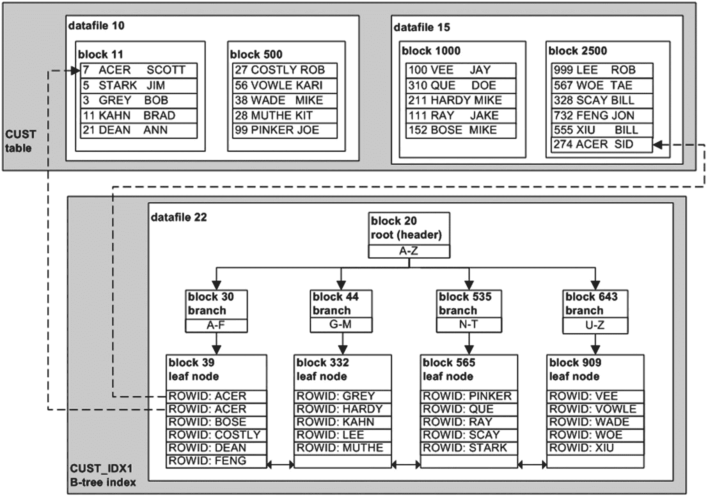

# 有关设置操作系统变量的更多详情，请参见第 2 章。
. /etc/oraset $1
#
userlist="system sys dbsnmp dip oracle_ocm outln"
for u1 in $userlist
do
#
case $u1 in
system)
pwd=manager
cdb=$1
;;
sys)
pwd="change_on_install"
cdb="$1 as sysdba"
;;
*)
pwd=$u1
cdb=$1
esac
#
echo "select 'default' from dual;" | \
sqlplus -s $u1/$pwd@$cdb | grep default >/dev/null
if [[ $? -eq 0 ]]; then
echo "ALERT: $u1/$pwd@$cdb 使用了默认密码"
echo "def pwd $u1 on $cdb" | mailx -s "$u1 密码为默认值" dkuhn@gmail.com
else
echo "无法使用默认密码连接到 $u1。"
fi
done
exit 0
```

如果脚本检测到默认密码，就会向相应的 DBA 发送一封电子邮件。这个脚本只是一个简单的示例，重点在于你需要某种机制来检测默认密码。你可以创建自己的脚本或修改前面的脚本以满足你的要求。

## 创建用户

创建用户时，你需要考虑以下因素：

*   用户名和身份验证方法
*   基本权限
*   默认永久表空间和空间配额
*   默认临时表空间

创建用户的这些方面将在以下各节中讨论。

注意
在 Oracle Database 12c 中新增的可插拔数据库环境中，存在公共用户和本地用户。公共用户跨越容器数据库中的所有可插拔数据库。本地用户存在于一个可插拔数据库中。有关管理公共用户和本地用户的详细信息，请参见第 22 章。

## 选择用户名和身份验证方法

选择一个能让你了解该用户将使用哪个应用程序的用户名。例如，如果你有一个库存管理应用程序，一个好的用户名选择是 `INV_MGMT`。选择一个有意义的用户名有助于识别用户的用途。如果系统文档记录不完善，这一点尤其有用。

身份验证是用于确认用户有权使用该账户的方法。Oracle 支持一套强大的身份验证方法：

*   数据库身份验证（用户名和密码存储在数据库中）
*   操作系统身份验证
*   网络身份验证
*   全局用户身份验证和授权
*   外部服务身份验证

一种简单、轻松且可靠的身份验证形式是通过数据库进行。在这种身份验证形式中，用户名和密码存储在数据库内。密码不是以明文存储的；它以安全的加密格式存储。当连接到数据库时，用户提供用户名和密码。数据库将输入的用户名和密码与存储在数据库中的信息进行核对，如果匹配，则允许用户使用与该账户关联的权限连接到数据库。

另一种常用的身份验证方法是通过操作系统进行。操作系统身份验证意味着，如果你能成功登录到服务器，那么就有可能在不提供用户名和密码详细信息的情况下建立与本地数据库的连接。换句话说，你可以将数据库权限与一个操作系统账户或一个关联的操作系统组，或两者相关联。从 18c 开始，你可以在 Active Directory 中集中管理用户，并将其作为用户或全局用户集成到数据库中。

数据库和操作系统身份验证以及全局用户的示例将在接下来的两节中讨论。如果你有更复杂的身份验证需求，那么你应该研究网络、全局或外部服务身份验证。有关这些方法的更多详情，请参阅《Oracle Database Security Guide》和《Oracle Database Advanced Security Administrator's Guide》，这些手册可以从 Oracle 网站的技术网络区域 ([`http://otn.oracle.com`](http://otn.oracle.com)) 免费下载。

## 使用数据库身份验证创建用户

数据库身份验证通过 `CREATE USER` SQL 语句建立。作为 DBA 创建用户时，你的账户必须具有 `CREATE USER` 系统权限。此示例创建一个名为 `HEERA` 的用户，密码为 `CHAYA`，并分配默认永久表空间 `USERS`、默认临时表空间 `TEMP` 以及在 `USERS` 表空间上的无限制空间配额：

```sql
create user heera identified by chaya
default tablespace users
temporary tablespace temp
quota unlimited on users;
```

这创建了一个没有任何权限在数据库中执行任何操作的极简模式。为了使该用户有用，你必须至少授予其 `CREATE SESSION` 系统权限：

```sql
SQL> grant create session to heera;
```

如果新模式需要能够创建表，则需要授予其额外的权限，例如 `CREATE TABLE`：

```sql
SQL> grant create table to heera;
```

你也可以使用 `GRANT...IDENTIFIED BY` 语句来创建用户；例如，

```sql
grant create table, create session
to heera identified by chaya;
```

如果用户不存在，则通过前面的语句创建该账户。如果用户已存在，则密码更改为 `IDENTIFIED BY` 子句指定的密码（并且任何指定的权限也会被应用）。

注意
有时，DBA 在创建用户时，会为模式分配默认角色，例如 `CONNECT` 和 `RESOURCE`。这些角色包含系统权限，例如 `CREATE SESSION` 和 `CREATE TABLE`（以及其他几个权限，具体取决于数据库版本）。我建议不要这样做，因为 Oracle 已声明这些角色在未来的版本中可能不可用。从安全和审计的角度来看，有必要创建所需的具体角色，并仅将这些角色授予数据库中的用户。

## 使用操作系统身份验证创建用户

操作系统身份验证假设，如果用户能够登录到数据库服务器，那么数据库权限可以与操作系统用户账户关联并从中派生。有两种类型的操作系统身份验证：

*   通过为用户分配特定的操作系统角色进行身份验证（允许将数据库权限映射到用户）
*   通过 `IDENTIFIED EXTERNALLY` 子句为常规数据库用户进行身份验证

通过操作系统角色的身份验证在第 2 章中有详细说明。这种类型的身份验证由 DBA 使用，允许他们连接到一个操作系统账户（例如 `oracle`），然后使用 `SYSDBA` 权限连接到数据库，而无需指定用户名和密码。

登录到数据库服务器后，使用 `IDENTIFIED EXTERNALLY` 子句创建的用户可以在不指定用户名或密码的情况下连接到数据库。这种类型的身份验证有一些有趣的优势：

*   有权访问服务器的用户无需维护数据库用户名和密码。
*   如果由操作系统身份验证的用户执行，登录到数据库的脚本就不必使用硬编码的密码。
*   其他数据库用户无法通过猜测用户名和密码连接字符串来入侵用户。登录操作系统身份验证用户的唯一方式是从操作系统登录。

使用操作系统身份验证时，Oracle 会将 `OS_AUTHENT_PREFIX` 数据库初始化参数中包含的值作为前缀添加到连接到数据库的操作系统用户之前。此参数的默认值为 `OPS$`。Oracle 强烈建议你将 `OS_AUTHENT_PREFIX` 参数设置为空字符串；例如，

```sql
SQL> alter system set os_authent_prefix="" scope=spfile;
```

你必须停止并启动数据库才能使此修改生效。设置 `OS_AUTHENT_PREFIX` 参数后，你可以创建一个通过外部识别的用户。例如，假设你有一个名为 `jsmith` 的操作系统用户，并且你希望任何有权访问此操作系统用户的人都能在不提供密码的情况下登录数据库。使用 `CREATE EXTERNALLY` 语句来实现：


# 配置中央管理用户

一个中央管理用户被视为在一个位置（如 Active Directory 或其他 LDAP 服务）的用户。该用户可以集中进行身份验证和授权管理，例如，Active Directory 中的用户将通过密码或其他类型的密钥进行身份验证管理，并且通过使用安全组，其授权也得到管理。如果用户更改了安全组，其授权将随之更改；如果用户在 Active Directory 中处于非活动状态，则该用户无法对其他应用程序或数据库进行身份验证。

可以在数据库中创建一个全局用户，这意味着数据库将主动联系 Active Directory 以获取用户详细信息，最初只是为了验证密码，然后是为了验证用于授权的组。数据库配置了一个到 Active Directory 的用户，并且 `ldap.ora` 文件已更新，其中包含用于针对 Active Directory 进行身份验证的信息。一旦配置完成，可以使用以下语法创建用户：

```sql
SQL> create user jsmithdba identified globally as
'cn=jsmithdba group,ou=dbateam,dc=example,dc=com';
```

这使得 Oracle 数据库能够识别 Active Directory 中的用户 `jsmithdba`，将其视为允许访问此数据库的用户。密码与 Active Directory 中的密码相同，并且该组可用于映射到数据库角色以获得权限。

身份管理对于企业非常重要，它允许个人根据其在企业中的职能拥有角色和任务，并且当这些职能发生变化或员工不再与公司有关时，该账户会被集中管理，而不是在每个数据库中单独管理。Oracle 云有一个身份管理服务，可以配置角色并允许添加用户，这些用户是作为身份管理服务的一部分进行管理的，而不是在每个数据库中单独管理。

> **注意**
> 用户可以导入到 Oracle Cloud 中，这样就不必逐个输入每个账户。即使不导入所有企业用户，以这种方式工作也可以考虑哪些用户应该迁移过来，然后验证其角色。

# 理解模式与用户

模式是数据库对象的集合（例如表和索引）。通常，模式与用户之间的区别并不重要，但二者存在一些细微差异。

当你登录 Oracle 数据库时，你使用用户名和密码进行连接。在此示例中，用户是 `INV_MGMT`，密码是 `f00bar`：

```sql
SQL> connect inv_mgmt/f00bar
```

当你以用户身份连接时，默认情况下可以操作你连接到数据库的用户所拥有的模式中的对象。例如，当你试图描述一个表时，Oracle 默认访问当前用户的模式。因此，没有必要在表名前加上当前连接用户（所有者）的前缀。假设当前连接的用户是 `INV_MGMT`。考虑以下 `DESCRIBE` 命令：

```sql
SQL> describe inventory;
```

前面的语句在功能上等同于以下语句：

```sql
SQL> desc inv_mgmt.inventory;
```

你可以通过 `ALTER SESSION` 语句更改当前用户的会话，使其指向不同的模式：

```sql
SQL> alter session set current_schema = hr;
```

此语句不会授予当前用户（在此示例中为 `INV_MGMT`）任何额外权限。该语句指示 Oracle 对后续引用数据库对象的所有 SQL 语句使用模式限定符 `HR`。如果已授予适当的权限，`INV_MGMT` 用户无需在对象名前加上模式名即可访问 `HR` 用户的对象。

正如 `describe` 和 `desc` 是功能相同的命令，描述表 `EMPLOYEES` 与使用 `HR.EMPLOYEES` 是一样的。

```sql
SQL> desc HR.EMPLOYEES
-- 如果 alter session 设置为 HR，结果是一样的：
SQL> desc EMPLOYEES
```

> **注意**
> Oracle 确实有一个 `CREATE SCHEMA` 语句。具有讽刺意味的是，`CREATE SCHEMA` 并不创建模式或用户。相反，该语句提供了一种在一个事务中为模式创建多个对象（表、视图、授权）的方法。我很少看到 `CREATE SCHEMA` 语句被使用，但值得注意，以防你在使用它的环境中工作。

# 分配默认永久和临时表空间

确保用户具有正确的默认永久表空间和临时表空间有助于防止无意中填满 `SYSTEM` 或 `SYSAUX` 表空间的问题，这可能导致数据库不可用并引发性能问题。问题在于，当你没有为数据库定义默认的永久表空间和临时表空间时，创建用户默认会使用 `SYSTEM` 表空间。这绝不是一件好事。

如第 2 章所述，你应该在创建数据库时建立默认的永久表空间和临时表空间。第 2 章还展示了用于识别和更改默认永久表空间和临时表空间的 SQL 语句。这确保了当你创建用户且未指定默认永久表空间和临时表空间时，将应用数据库的默认设置。因此，`SYSTEM` 永远不会被用作默认的永久和临时表空间。

话虽如此，现实情况是，你很可能会遇到未以此方式设置的数据库。在维护数据库时，你应该验证默认永久表空间和临时表空间的设置，以确保它们符合你的数据库标准。你可以通过查询 `DBA_USERS` 视图来查看用户信息：

```sql
select
  username
  ,password
  ,default_tablespace
  ,temporary_tablespace
from dba_users;
```

以下是一小部分输出示例：

```
USERNAME         PASSWORD   DEFAULT_TABLESPACE        TEMPORARY_TABLESPACE
---------------- ---------- ------------------------- --------------------
JSMITH           EXTERNAL   USERS                     TEMP
MV_MAINT                    USERS                     TEMP
AUDSYS                      USERS                     TEMP
GSMUSER                     USERS                     TEMP
XS$NULL                     USERS                     TEMP
```

除了 `SYS` 用户外，你的任何用户都不应将默认永久表空间设置为 `SYSTEM`。你不希望除 `SYS` 之外的任何用户在 `SYSTEM` 表空间中创建对象。`SYSTEM` 表空间应保留给 `SYS` 用户的对象。如果其他用户的对象存在于 `SYSTEM` 表空间中，你将面临填满该表空间并损害数据库可用性的风险。这也意味着，如果你使用 `SYS` 账户登录，在创建表和其他对象时应谨慎指定表空间。

所有用户都应被分配一个已创建为临时类型的临时表空间。通常，该表空间被命名为 `TEMP`（更多详情参见第 4 章）。

如果你发现任何用户的默认表空间设置不当，可以使用 `ALTER USER` 语句进行修改：

```sql
SQL> alter user inv_mgmt default tablespace users temporary tablespace temp;
```


# 用户管理与维护

## 避免使用 SYSTEM 作为临时表空间

你绝不希望任何用户的临时表空间是 `SYSTEM`。如果一个用户的临时表空间是 `SYSTEM`，那么该用户需要临时磁盘存储的任何排序区都将在 `SYSTEM` 表空间中获取区。这会导致 `SYSTEM` 表空间被填满。你绝不希望这种情况发生，因为 `SYS` 模式在对象增长时无法获取更多空间可能导致数据库无法运行。要检查哪些用户的临时表空间是 `SYSTEM`，请运行此脚本：

```sql
SQL> select username from dba_users where temporary_tablespace='SYSTEM';
```

## 创建用户脚本示例

通常，我在创建用户时使用脚本名 `creuser.sql`。此脚本使用定义用户名、密码、默认表空间名称等的变量。对于脚本执行的每个环境（开发、测试、质量保证 (QA)、Beta、生产），你可以根据需要更改 & 变量。例如，你可以为每个单独的环境使用不同的密码和不同的表空间。

这是一个 `creuser.sql` 脚本示例：

```sql
DEFINE cre_user=inv_mgmt
DEFINE cre_user_pwd=inv_mgmt_pwd
DEFINE def_tbsp=inv_data
DEFINE idx_tbsp=inv_index
DEFINE def_temp_tbsp=temp
DEFINE smk_ttbl=zzzzzzz
--
CREATE USER &&cre_user IDENTIFIED BY &&cre_user_pwd
DEFAULT TABLESPACE &&def_tbsp
TEMPORARY TABLESPACE &&def_temp_tbsp;
--
GRANT CREATE SESSION TO &&cre_user;
GRANT CREATE TABLE   TO &&cre_user;
--
ALTER USER &&cre_user QUOTA UNLIMITED ON &&def_tbsp;
ALTER USER &&cre_user QUOTA UNLIMITED ON &&idx_tbsp;
--
-- Smoke test
CONN &&cre_user/&&cre_user_pwd
CREATE TABLE &&smk_ttbl(test_id NUMBER) TABLESPACE &&def_tbsp;
CREATE INDEX &&smk_ttbl._idx1 ON &&smk_ttbl(test_id) TABLESPACE &&idx_tbsp;
INSERT INTO &&smk_ttbl VALUES(1);
DROP TABLE &&smk_ttbl;
```

## 冒烟测试

冒烟测试是管道、电子和软件开发等行业中使用的一个术语。该术语指的是初次组装或维修后进行的第一次检查，以提供系统正常工作的某种程度的保证。

在管道中，冒烟测试迫使烟雾通过排水管道。被迫的烟雾有助于快速识别系统中的裂缝或泄漏。在电子中，当电源首次连接到电路时会发生冒烟测试。如果接线有故障，这有时会产生烟雾。

在软件开发中，冒烟测试是对系统的简单测试，以确保其具有某种程度的可用性。据报道，许多经理在冒烟测试失败时被看到耳朵冒烟。

## 修改密码

使用 `ALTER USER` 命令修改现有用户的密码。此示例将 `HEERA` 用户的密码更改为 `FOOBAR`：

```sql
SQL> alter user HEERA identified by FOOBAR;
```

只有当你被授予了 `ALTER USER` 权限时，你才能更改另一个帐户的密码。此权限授予 `DBA` 角色。在你为用户更改密码后，该用户随后的任何数据库连接都需要使用 `ALTER USER` 语句指示的密码。

在 Oracle Database 11g 或更高版本中，修改密码时它是区分大小写的。如果你使用的是 Oracle Database 10g 或更低版本，则密码不区分大小写。区分大小写的行为由参数 `SEC_CASE_SENSITIVE_LOGON` 设置，默认为 `TRUE`。应检查此参数是否未被更改，以确保使用区分大小写的密码，除非遗留应用程序需要允许，直到密码可以调整。

## SQL*Plus 密码命令

你可以使用 SQL*Plus `PASSWORD` 命令更改用户的密码。发出命令后，系统会提示你输入新密码：

```sql
SQL> passw heera
Changing password for heera
New password:
Retype new password:
Password changed
```

此方法的好处是在屏幕上不显示新密码的情况下更改用户密码。

## 仅模式帐户

以前没有仅模式帐户时，DBA 必须以不同用户身份登录才能执行某些建表脚本并授予权限。从 18c 开始，可以创建没有密码的新仅模式帐户。这适用于应用程序模式，包含所有对象，因此如果被授予访问这些帐户的权限，可以对这些对象进行更改。这些帐户没有直接登录数据库的权限。因此，即使没有密码，也无法登录，并且会发生错误。

```sql
SQL> create user app1 NO AUTHENTICATION;
```

在 `dba_users` 表中，此用户的 `AUTHENTICATION_TYPE` 将为 `NONE`，密码列也将为 `NULL`。仅模式帐户可以被授予创建表和其他对象的权限；但是，它不能被分配任何管理权限。即使将 `CONNECT SESSION` 授予仅模式帐户，也不允许你直接登录到此模式帐户。

```sql
SQL> grant create session to app1 ;
Grant succeeded.
SQL> connect app1
Enter password:
ERROR:
ORA-01005: null password given; logon denied
Warning: You are no longer connected to ORACLE.
SQL> connect app1
Enter password:
ERROR:
ORA-01017: invalid username/password; logon denied
```

为了在其他帐户（包括仅模式帐户）中执行 DDL 语句，可以使用代理连接。甚至在 18c 之前，使用代理连接就是可能的，对于仅模式帐户，为了以该模式执行任何必要的代码，仍然可以这样做。以下是一个示例，使用 `jsmithdba` 作为我们的帐户登录数据库，而仅模式帐户是 `app1`。

```sql
SQL> alter user app1 grant connect through jsmithdba;
SQL> connect jsmithdba/password1
SQL> select sys_context('USERENV','SESSION_USER') as session_user,
sys_context('USERENV','SESSION_SCHEMA') as session_schema,
sys_context('USERENV','PROXY_USER') as proxy_id,
user
from dual;
SESSION_USER SESSION_SCHEMA     PROXY_ID     USER
-----------------------  ------------------------------------ -------------
APP1         APP1               JSMITHDBA    APP1
```

这个没有密码的模式可以简单地用于应用程序模式，并允许将权限授予对象或成为此模式来运行代码。这是应用程序模式需要考虑的事情；并且，正如我们将在即将到来的“管理权限”部分中看到的那样，对于这些对象的授权和权限仍然可以通过角色来处理。

## 修改用户

有时你需要修改现有用户，原因如下：

*   更改用户密码
*   锁定或解锁用户
*   更改默认的永久或临时表空间，或两者
*   更改配置文件或角色
*   更改系统或对象权限
*   修改表空间上的配额

使用 `ALTER USER` 语句来修改用户。接下来列出了几个修改用户的 SQL 语句。此示例使用 `IDENTIFIED BY` 子句更改用户密码：

```sql
SQL> alter user inv_mgmt identified by i2jy22a;
```

如果你在最初创建用户时没有设置默认永久表空间和临时表空间，你可以在创建后修改它们，如下所示：

```sql
SQL> alter user inv_mgmt default tablespace users temporary tablespace temp;
```

此示例锁定用户帐户：

```sql
SQL> alter user inv_mgmt account lock;
```

此示例更改用户在 `USERS` 表空间上的配额：

```sql
SQL> alter user inv_mgmt quota 500m on users;
```

> **注意**：由于 `ALTER USER` 是一个高权限命令，并且有许多使用原因，现在它可能落入安全团队手中来执行。可以编写其他命令和过程来绕过此操作，然后将权限授予那些人来执行。此外，数据库保险库限制了更改用户的能力，并允许安全团队执行这些操作。

## 删除用户


# 锁定与删除数据库用户

在删除用户之前，建议先锁定该用户。锁定用户可以防止其他人连接到被锁定的数据库账户，这有助于您更好地判断在删除账户前是否有人在使用它。以下是锁定用户的示例：

```
SQL> alter user heera account lock;
```

现在，任何尝试连接此用户的用户或应用程序都会收到以下错误：

```
ORA-28000: the account is locked
```

要查看数据库中的用户及锁定日期，请执行此查询：

```
SQL> select username, lock_date from dba_users;
```

要解锁账户，请执行此命令：

```
SQL> alter user heera account unlock;
```

锁定用户是保护数据库和发现活动用户的便捷技术。
请注意，锁定用户并不会锁定对其对象的访问。例如，如果`USER_A`对`USER_B`拥有的表拥有`select`、`insert`、`update`和`delete`权限，那么即使您锁定了`USER_B`账户，`USER_A`仍然可以针对`USER_B`拥有的对象发出 DML 语句。要确定对象是否正在被使用，请参见第 20 章的审计部分。

> **提示**
> 如果用户的对象不占用过多磁盘空间，那么在删除用户之前，先快速备份是审慎的做法。有关使用 Data Pump 备份单个用户的详细信息，请参见第 13 章。

当您确定一个用户及其对象不再需要时，可以使用`DROP USER`语句来移除数据库账户。此示例删除了用户`HEERA`：

```
SQL> drop user heera;
```

如果用户拥有任何数据库对象，前述命令将无法工作。使用`CASCADE`子句来移除用户并同时删除其对象：

```
SQL> drop user heera cascade;
```

> **注意**
> 如果被删除的用户拥有大量数据库对象，`DROP USER`语句可能需要很长时间才能执行。在这种情况下，您可能希望考虑在删除用户之前先删除其对象。

模式（schemas）也会被删除。Oracle 会使依赖于被删除用户对象的视图、同义词、过程、函数或包失效，但不会删除它们。这就是为什么将应用程序对象放在不同的模式中而不是全部创建在单个账户下很重要的原因。如果应用程序将被停用，则还应考虑备份和保留策略。

# 强制密码安全与资源限制

在创建用户时，有时要求密码遵守一组安全规则：例如，要求密码达到一定长度并包含数字字符。此外，在设置数据库用户时，您可能希望确保某个用户不会消耗过量的 CPU 资源。

您可以使用数据库配置文件（profile）来满足此类需求。Oracle 配置文件是一个数据库对象，有两个用途：

*   强制执行密码安全设置
*   限制用户消耗的系统资源

接下来的几个部分将讨论这些主题。

> **提示**
> 不要混淆数据库配置文件（database profile）和 SQL 配置文件（SQL profile）。数据库配置文件是分配给用户的一个对象，用于强制执行密码安全并约束数据库资源使用；而 SQL 配置文件与 SQL 语句相关联，包含对统计信息的修正，以帮助优化器生成更高效的执行计划。

## 基本密码安全

当您创建用户时，如果未指定配置文件，则`DEFAULT`配置文件会被分配给新创建的用户。要查看配置文件的当前设置，请执行以下 SQL：

```
select profile, resource_name, resource_type, limit
from dba_profiles
order by profile, resource_type;
```

以下是输出的部分内容：

```
PROFILE        RESOURCE_NAME                  RESOURCE_TYPE    LIMIT
-------------- ------------------------------ ---------------- ---------
DEFAULT        CONNECT_TIME                   KERNEL           UNLIMITED
DEFAULT        PRIVATE_SGA                    KERNEL           UNLIMITED
DEFAULT        COMPOSITE_LIMIT                KERNEL           UNLIMITED
DEFAULT        SESSIONS_PER_USER              KERNEL           UNLIMITED
DEFAULT        LOGICAL_READS_PER_SESSION      KERNEL           UNLIMITED
DEFAULT        CPU_PER_CALL                   KERNEL           UNLIMITED
DEFAULT        IDLE_TIME                      KERNEL           UNLIMITED
DEFAULT        LOGICAL_READS_PER_CALL         KERNEL           UNLIMITED
DEFAULT        CPU_PER_SESSION                KERNEL           UNLIMITED
DEFAULT        PASSWORD_LIFE_TIME             PASSWORD         180
DEFAULT        PASSWORD_GRACE_TIME            PASSWORD         7
DEFAULT        PASSWORD_REUSE_TIME            PASSWORD         UNLIMITED
DEFAULT        PASSWORD_REUSE_MAX             PASSWORD         UNLIMITED
DEFAULT        PASSWORD_LOCK_TIME             PASSWORD         1
DEFAULT        FAILED_LOGIN_ATTEMPTS          PASSWORD         10
DEFAULT        PASSWORD_VERIFY_FUNCTION       PASSWORD         NULL
DEFAULT        INACTIVE_ACCOUNT_TIME          PASSWORD         UNLIMITED
ORA_STIG_PROFILE CONNECT_TIME                 KERNEL           DEFAULT
ORA_STIG_PROFILE IDLE_TIME                    KERNEL           15
ORA_STIG_PROFILE LOGICAL_READS_PER_CALL       KERNEL           DEFAULT
ORA_STIG_PROFILE CPU_PER_CALL                 KERNEL           DEFAULT
ORA_STIG_PROFILE PASSWORD_GRACE_TIME          PASSWORD         5
ORA_STIG_PROFILE PASSWORD_LOCK_TIME           PASSWORD         UNLIMITED
ORA_STIG_PROFILE PASSWORD_VERIFY_FUNCTION     PASSWORD         ORA12C_STIG_VERIFY_FUNCTION
ORA_STIG_PROFILE PASSWORD_REUSE_MAX           PASSWORD         10
ORA_STIG_PROFILE PASSWORD_REUSE_TIME          PASSWORD         365
ORA_STIG_PROFILE PASSWORD_LIFE_TIME           PASSWORD         60
ORA_STIG_PROFILE FAILED_LOGIN_ATTEMPTS        PASSWORD         3
ORA_STIG_PROFILE INACTIVE_ACCOUNT_TIME        PASSWORD         35
```

配置文件的密码限制在分配给用户后立即生效。例如，从上面的输出来看，如果您将`DEFAULT`配置文件分配给一个用户，该用户只允许连续十次登录尝试失败，之后其账户将被 Oracle 自动锁定。有关密码配置文件安全设置的描述，请参见表 6-1。

**表 6-1 密码安全设置**

| 密码设置 | 描述 | 默认值 |
| :--- | :--- | :--- |
| `FAILED_LOGIN_ATTEMPTS` | 锁定模式前允许的失败登录尝试次数 | 10 次 |
| `PASSWORD_GRACE_TIME` | 密码过期后，所有者仍能使用旧密码登录的天数 | 7 天 |
| `PASSWORD_LIFE_TIME` | 密码有效的天数 | 180 天 |
| `PASSWORD_LOCK_TIME` | 达到`FAILED_LOGIN_ATTEMPTS`后账户被锁定的天数 | 1 天 |
| `PASSWORD_REUSE_MAX` | 一个密码可以被重用之前必须改变的次数 | 无限制 |
| `PASSWORD_REUSE_TIME` | 密码可以被重用之前的天数 | 无限制 |
| `PASSWORD_VERIFY_FUNCTION` | 用于验证密码的数据库函数 | 空 |
| `INACTIVE_ACCOUNT_TIME` | 用户未登录账户的天数，之后将锁定账户 | 无限制 |

> **提示**
> 有关 Oracle 数据库`DEFAULT`配置文件更改的详细信息，请参见 MOS 说明 454635.1。


您可以修改 `DEFAULT` 配置文件以使其适应您的环境。例如，假设您希望强制规定密码可以使用的最大天数上限。下一行代码将 `DEFAULT` 配置文件的 `PASSWORD_LIFE_TIME` 设置为 300 天：
```sql
SQL> alter profile default limit password_life_time 300;
```

`PASSWORD_REUSE_TIME` 和 `PASSWORD_REUSE_MAX` 设置必须结合使用。如果您为一个参数指定整数（具体是哪个参数无关紧要），而为另一个参数指定 `UNLIMITED`，那么当前密码将永远无法被重用。

如果您希望指定 `DEFAULT` 配置文件的密码必须在 100 天内更改 10 次后才能重用，请使用类似下面这样的一行代码：
```sql
SQL> alter profile default limit password_reuse_time 100 password_reuse_max 10;
```

尽管对于许多环境而言，使用 `DEFAULT` 配置文件已足够，但您可能需要更严格的安全管理。我建议您根据需要创建自定义的安全配置文件并分配给用户。例如，专门为应用程序用户创建一个配置文件：
```sql
CREATE PROFILE SECURE_APP LIMIT
PASSWORD_LIFE_TIME 200
PASSWORD_GRACE_TIME 10
PASSWORD_REUSE_TIME 1
PASSWORD_REUSE_MAX 1
FAILED_LOGIN_ATTEMPTS 3
PASSWORD_LOCK_TIME 1
INACTIVE_ACCOUNT_TIME 60;
```

创建配置文件后，您可以酌情将其分配给用户。以下 SQL 生成一个名为 `alt_prof_dyn.sql` 的 SQL 脚本，您可以用它将新创建的配置文件分配给用户：
```sql
set head off;
spo alt_prof_dyn.sql
select 'alter user ' || username || ' profile secure_app;'
from dba_users where username like '%APP%';
spo off;
```

在向使用数据库的应用程序账户分配配置文件时要小心。如果您想强制密码定期更改，请务必了解这对生产系统的影响。密码往往会硬编码到响应文件和代码中。在这些环境中强制更改密码可能会造成严重破坏，因为您需要追踪密码被引用的所有位置。如果您不想强制定期更改密码，可以将 `PASSWORD_LIFE_TIME` 设置为一个较高的值，例如 10,000 或 unlimited。

## 密码是否曾被更改过？

在确定密码是否安全时，检查用户的密码是否曾经被更改过是很有用的。如果用户的密码从未被更改过，这可能被视为安全风险。此示例执行此类检查：
```sql
select
name
,to_char(ctime,'dd-mon-yy hh24:mi:ss')
,to_char(ptime,'dd-mon-yy hh24:mi:ss')
,length(password)
from user$
where password is not null
and password not in ('GLOBAL','EXTERNAL')
and ctime=ptime;
```

在此脚本中，`CTIME` 列包含用户创建时的时间戳。`PTIME` 列包含密码更改时的时间戳。如果 `CTIME` 和 `PTIME` 相同，则密码从未更改过。

## 密码强度

不易被猜到的密码被认为是强密码。密码的强度可以通过长度、大小写字母的使用、非字典单词、数字字符等来量化。例如，密码 `L5K0ta890g` 会被认为是强密码，而密码 `pass` 会被认为是弱密码。关于强制密码强度，有几种不同的思路：
*   使用易于记忆的密码，这样您就不需要将它们写下来或记录在某个文件中。由于密码不够复杂，它们不太安全。
*   强制要求密码达到一定的复杂程度（强度）。这样的密码不易记住，因此必须记录在某处，而这本身并不安全。

您可能会选择强制实施一定程度的密码强度，因为您认为这是最安全的选项。或者您可能被公司的安全团队要求强制实施密码安全复杂性（因此别无选择）。本节并非要争论前述哪种方法更可取。如果您选择对密码施加一定的强度要求，本节将描述如何强制执行这些规则。

您可以通过将密码验证函数分配给用户的配置文件来强制实施密码复杂性的最低标准。Oracle 提供了一个默认的密码验证函数，您可以通过以 `SYS` 方案身份运行以下脚本来创建它：
```sql
SQL> @?/rdbms/admin/utlpwdmg
```

前面的脚本创建以下密码验证函数：
*   `ora12c_verify_function` (Oracle Database 12c 和 18c)
*   `ora12c_strong_verify_function` (非常安全的 Oracle Database 12c 和 18c)
*   `verify_function_11G` (Oracle Database 11g)
*   `verify_function` (Oracle Database 10g)

一旦创建了密码验证函数，您可以使用 `ALTER PROFILE` 命令将该密码验证函数与分配了给定配置文件的所有用户关联起来。18c 没有新的密码函数，因此密码复杂性函数与 12c 使用的相同。例如，在 Oracle Database 18c 中，要设置 `DEFAULT` 配置文件的密码验证函数，请发出此命令：
```sql
SQL> alter profile default limit PASSWORD_VERIFY_FUNCTION ora12c_verify_function;
```

如果由于任何原因，您需要撤销新的安全修改，请运行此语句以禁用密码函数：
```sql
SQL> alter profile default limit PASSWORD_VERIFY_FUNCTION null;
```

启用时，密码验证函数可确保用户正确创建或修改其密码。`utlpwdmgsql` 脚本创建一个函数，该函数检查密码以确保其符合基本安全标准，例如最小密码长度以及密码不能与用户名相同。您可以通过尝试更改已分配 `DEFAULT` 配置文件的用户的密码来验证新的安全函数是否生效。此示例尝试将密码更改为小于最小长度：
```sql
SQL> password
Changing password for HEERA
Old password:
New password:
Retype new password:
ERROR:
ORA-28003: password verification for the specified password failed
ORA-20001: Password length less than 8
```
注意：对于 Oracle Database 18c、12c 和 11g，当使用标准密码验证函数时，最小密码长度为八个字符。对于 Oracle Database 10g，最小长度为四个字符。

请记住，可以修改用于创建密码验证函数的代码。例如，您可以打开并修改用于创建此函数的脚本：
```bash
$ vi $ORACLE_HOME/rdbms/admin/utlpwdmg.sql
```
如果您认为 Oracle 提供的验证函数太强或限制过多，您可以创建自己的函数，并将适当的数据库配置文件分配给它。

注意：从 Oracle Database 12g 开始，`SEC_CASE_SENSITIVE_LOGON` 参数已弃用。将此初始化参数设置为 `FALSE` 允许您使密码不区分大小写。

## 限制数据库资源使用

如前所述，密码配置文件设置在您将配置文件分配给用户后立即生效。与密码设置不同，内核资源配置文件限制只有在您为数据库将 `RESOURCE_LIMIT` 初始化参数设置为 `TRUE` 后才会生效；例如，
```sql
SQL> alter system set resource_limit=true scope=both;
```
要查看 `RESOURCE_LIMIT` 参数的当前设置，请发出此查询：
```sql
SQL> select name, value from v$parameter where name='resource_limit';
```


# 数据库用户配置文件与权限管理

## 默认配置文件

当创建用户时，如果未指定配置文件，则会为该用户分配 `DEFAULT` 配置文件。您可以使用 `ALTER PROFILE` 语句修改 `DEFAULT` 配置文件。下一个示例将 `DEFAULT` 配置文件的 `CPU_PER_SESSION` 限制修改为 240,000（以百分之一秒为单位）：

```sql
SQL> alter profile default limit cpu_per_session 240000;
```

这将使用 `DEFAULT` 配置文件的任何用户的 CPU 使用时间限制为 2,400 秒。您可以在配置文件中设置各种限制。表 6-2 描述了可以通过配置文件限制的数据库资源设置。

### 表 6–2 数据库资源配置文件设置

| 配置文件资源             | 含义                                                                 |
| :----------------------- | :------------------------------------------------------------------- |
| `COMPOSITE_LIMIT`        | 基于加权和算法的限制，适用于以下资源：`CPU_PER_SESSION`、`CONNECT_TIME`、`LOGICAL_READS_PER_SESSION` 和 `PRIVATE_SGA` |
| `CONNECT_TIME`           | 连接时间（分钟）                                                     |
| `CPU_PER_CALL`           | 每次调用的 CPU 时间限制（以百分之一秒为单位）                         |
| `CPU_PER_SESSION`        | 每个会话的 CPU 时间限制（以百分之一秒为单位）                         |
| `IDLE_TIME`              | 空闲时间（分钟）                                                     |
| `LOGICAL_READS_PER_CALL` | 每次调用读取的块数                                                   |
| `LOGICAL_READS_PER_SESSION` | 每个会话读取的块数                                               |
| `PRIVATE_SGA`            | 在共享池中消耗的空间量                                               |
| `SESSIONS_PER_USER`      | 并发会话数                                                           |

## 创建自定义配置文件

您还可以通过 `CREATE PROFILE` 语句创建自定义配置文件并将其分配给用户。然后，您可以将该配置文件分配给任何现有数据库用户。以下 SQL 语句创建了一个限制资源的配置文件，例如单个会话可以消耗的 CPU 量：

```sql
create profile user_profile_limit
limit
sessions_per_user 20
cpu_per_session 240000
logical_reads_per_session 1000000
connect_time 480
idle_time 120;
```

创建配置文件后，可以将其分配给用户。在下一个示例中，用户 `HEERA` 被分配了 `USER_PROFILE_LIMIT`：

```sql
SQL> alter user heera profile user_profile_limit;
```

**注意**：Oracle 建议您使用数据库资源管理器来管理数据库资源限制。但是，对于基本的资源管理需求，我发现数据库配置文件（通过 SQL 实现）是一种有效且易于管理的资源使用机制。如果您有更复杂的资源管理需求，请研究数据库资源管理器功能。

作为 `CREATE USER` 语句的一部分，您可以指定 `DEFAULT` 以外的配置文件：

```sql
SQL> create user heera identified by foo profile user_profile_limit;
```

## 何时使用数据库配置文件

您应始终利用 `DEFAULT` 配置文件的密码安全设置。您可以根据业务规则轻松修改此配置文件的默认设置。

配置文件的内核资源限制在您有需要直接连接到数据库并运行查询的高级用户时非常有用。例如，您可以使用内核资源设置来限制用户消耗的 CPU 时间，这在用户编写了意外消耗过多数据库资源的坏查询时非常方便。

**注意**：您只能为一个用户分配一个数据库配置文件，因此，如果您需要同时管理密码安全性和资源限制，请确保在同一个配置文件中设置这两者。

# 管理权限

数据库用户必须先被授予特权，然后才能在数据库中执行任何任务。在 Oracle 中，您可以通过将特定特权直接授予用户，或者先将特权授予角色，再将包含该特权的角色授予用户来分配特权。特权有两种类型：系统特权和对象特权。以下各节将详细讨论这些特权。

## 分配数据库系统特权

数据库系统特权允许您执行诸如连接到数据库以及创建和修改对象等任务。有数百种不同的系统特权。您可以通过查询 `DBA_SYS_PRIVS` 视图来查看系统特权：

```sql
SQL> select distinct privilege from dba_sys_privs;
```

您可以将特权授予其他用户或角色。要能够授予特权，用户需要 `GRANT ANY PRIVILEGE` 特权，或者必须已被授予带有 `ADMIN OPTION` 的系统特权。

使用 `GRANT` 语句将系统特权分配给用户。例如，用户至少需要 `CREATE SESSION` 才能连接到数据库。您按如下方式授予此系统特权：

```sql
SQL> grant create session to inv_mgmt;
```

通常，用户需要做的不仅仅是连接到数据库。例如，用户可能需要创建表和其他类型的数据库对象。此示例授予用户 `CREATE TABLE` 和 `CREATE DATABASE LINK` 系统特权：

```sql
SQL> grant create table, create database link to inv_mgmt;
```

对于仅限模式的账户同样如此：

```sql
SQL> grant create table, create database link to app1;
```

如果需要收回特权，请使用 `REVOKE` 语句：

```sql
SQL> revoke create table from inv_mgmt;
```

Oracle 有一个功能，允许您将系统特权授予用户，同时也赋予该用户管理该特权的能力。您可以使用 `WITH ADMIN OPTION` 子句来实现：

```sql
SQL> grant create table to inv_mgmt with admin option;
```

我很少在授予权限时使用 `WITH ADMIN OPTION`。通常，具有 `DBA` 角色的用户用于授予权限，并且该权限通常不会分配给数据库中的非 DBA 用户。这是因为很难跟踪谁分配了哪些系统特权、出于什么原因以及何时分配的。在生产环境中，这是不可行的。

您还可以将系统特权授予 `PUBLIC` 用户组（我不建议这样做）。例如，您可以将 `CREATE SESSION` 授予所有需要连接到数据库的用户，如下所示：

```sql
SQL> grant create session to public;
```

现在，每个创建的用户都可以自动连接到数据库。将系统特权授予 `PUBLIC` 用户组几乎总是一个坏主意。作为 DBA，您的主要优先事项之一是确保数据库中的数据是安全可靠的。将特权授予 `PUBLIC` 角色肯定是无法管理谁被授权在数据库内执行特定操作的方法。换句话说，不要将系统特权授予 public。

## 分配数据库对象特权

数据库对象特权允许您访问和操作其他用户的对象。您可以授予特权的对象类型包括表、视图、物化视图、序列、包、函数、过程、用户定义类型和目录。要能够授予对象特权，必须满足以下条件之一：

*   您拥有该对象。
*   您已被授予带有 `GRANT OPTION` 的对象特权。
*   您拥有 `GRANT ANY OBJECT PRIVILEGE` 系统特权。

此示例（作为对象所有者）将对象特权授予 `INV_MGMT_APP` 用户：

```sql
SQL> grant insert, update, delete, select on registrations to inv_mgmt_app;
```

`GRANT ALL` 语句等同于向对象授予 `INSERT`、`UPDATE`、`DELETE` 和 `SELECT`。下一个语句等同于之前的语句：

```sql
SQL> grant all on registrations to inv_mgmt_app;
```

您还可以在列级别向表授予 `INSERT` 和 `UPDATE` 特权。下一个示例向 `INVENTORY` 表中的特定列授予 `INSERT` 特权：

```sql
SQL> grant insert (inv_id, inv_name, inv_desc) on inventory to inv_mgmt_app;
```

如果您希望被授予对象特权的用户能够随后将相同的对象特权授予其他用户，请使用 `WITH GRANT OPTION` 子句：

```sql
SQL> grant insert on registrations to inv_mgmt_app with grant option;
```


# 数据库权限与角色管理

现在，`INV_MGMT_APP` 用户可以向其他用户授予 `REGISTRATIONS` 表的插入权限。
我很少在授予对象权限时使用 `WITH GRANT OPTION`。允许其他用户传播对象权限，使得很难跟踪是谁、在何时、出于何种原因授予了何种对象权限。在生产环境中，这将难以承受。当你管理一个生产环境时，问题出现时，你需要知道什么发生了变化，何时变化的，以及原因是什么。

你也可以将对象权限授予 `PUBLIC` 用户组（我不建议这样做）。例如，你可以向 `PUBLIC` 授予对表的 `select` 权限：
```sql
SQL> grant select on registrations to public;
```
现在，每个用户都可以从 `REGISTRATIONS` 表中进行选择。将对象权限授予 `PUBLIC` 角色几乎总是一个坏主意。作为 DBA，你的主要优先事项之一是确保数据库中的数据安全。将对象权限授予 `PUBLIC` 角色是肯定无法管理谁能访问数据库中哪些数据的方法。再次强调，**不要**将对象权限授予 PUBLIC。

如果你需要收回对象权限，请使用 `REVOKE` 语句。此示例从 `INV_MGMT_APP` 用户撤销 DML 权限：
```sql
SQL> revoke insert, update, delete, select on registrations from inv_mgmt_app;
```

## 分组与分配权限
角色是一个数据库对象，它允许你以逻辑方式将系统或对象权限（或两者）分组在一起，以便你可以通过一次操作将这些权限分配给用户。角色有助于你管理数据库安全的各个方面，因为它们提供了一个中心对象，权限可以分配给它。随后，你可以将该角色分配给多个用户或其他角色。

要创建一个角色，请以具有 `CREATE ROLE` 系统权限的用户身份连接到数据库。接下来，创建一个角色，并将你想要分组的系统或对象权限分配给它。此示例使用 `CREATE ROLE` 语句创建 `JR_DBA` 角色：
```sql
SQL> create role jr_dba ;
```
接下来的几行 SQL 将系统权限授予新创建的角色：
```sql
SQL> grant select any table to jr_dba;
SQL> grant create any table to jr_dba;
SQL> grant create any view to jr_dba;
SQL> grant create synonym to jr_dba;
SQL> grant create database link to jr_dba;
```
接下来，将该角色授予你希望拥有这些权限的任何模式：
```sql
SQL> grant jr_dba to lellison;
SQL> grant jr_dba to mhurd;
```
现在，用户 `LELLISON` 和 `MHURD` 可以执行诸如创建同义词和视图等任务。要查看角色被分配给了哪些用户，请查询 `DBA_ROLE_PRIVS` 视图：
```sql
SQL> select grantee, granted_role from dba_role_privs order by 1;
```
要查看授予你当前连接用户的角色，请从 `USER_ROLE_PRIVS` 视图查询：
```sql
SQL> select * from user_role_privs;
```
要从角色撤销权限，请使用 `REVOKE` 命令：
```sql
SQL> revoke create database link from jr_dba;
```
类似地，使用 `REVOKE` 命令从用户移除角色：
```sql
SQL> revoke jr_dba from lellison;
```

> **注意**
> 与其他数据库对象不同，角色没有所有者。角色是由分配给它的权限定义的。

## PL/SQL 与角色
如果你使用 PL/SQL，有时在尝试编译过程或函数时会遇到此错误：
```sql
PL/SQL: ORA-00942: table or view does not exist
```
令人困惑的是，你可以描述该表：
```sql
SQL> desc app_table;
```
为什么 PL/SQL 似乎无法识别该表？这是因为 PL/SQL 要求包、过程或函数的所有者必须显式授予对代码中引用的任何对象的权限。PL/SQL 代码的所有者不能通过角色获得授权。

当遇到此问题时，请作为 PL/SQL 代码的所有者尝试此操作：
```sql
SQL> set role none;
```
现在，尝试运行访问该表的 SQL 语句：
```sql
SQL> select count(*) from app_table;
```
如果你不再能访问该表，那么你是通过角色获得访问权限的。要解决此问题，请显式向 PL/SQL 代码的所有者授予对任何表的访问权限（以表的所有者身份）：
```sql
SQL> connect owner/pass
SQL> grant select on app_table to proc_owner;
```
你应该能够以 PL/SQL 代码所有者的身份连接并成功编译你的代码。

角色将提供一种方法来授予用户执行功能或任务所需的权限。由于用户映射到安全组，角色是管理权限的最佳方式。基于角色的对不同对象和系统权限的访问将允许进行简单的审计，以了解谁拥有角色，并验证没有授予个人权限。

## 总结
创建数据库后，你的首要任务之一是保护任何默认用户账户。默认账户在数据库创建后会被锁定，一种有效的方法是仅在需要时才打开它们。其他方法包括更改或过期密码，或两者兼有。默认用户账户得到保护后，你负责创建需要访问数据库的用户。这通常包括应用程序用户、DBA 和开发人员。
你应该考虑为你创建的任何用户使用安全配置文件。此外，在创建用户时考虑密码安全。Oracle 提供了一个强制实施一定密码强度的密码函数。我建议你将配置文件和密码函数结合作为创建安全数据库的第一步。
仅模式账户和在角色中管理权限将加强数据库中的用户安全，并为审计和验证用户是否获得适当权限提供有效的方法。
随着数据库的使用，你需要维护用户账户。通常，数据库账户的需求会随时间而变化。你负责确保为每个账户维护正确的系统和对象权限。对于任何遗留系统，你最终都需要锁定和删除用户。删除未使用的账户有助于确保你的环境更安全且更易于维护。
使用集中管理的用户简化了这些步骤，因为账户密码在一个目录中更改并设置为非活动状态，而不是在每个数据库中。此外，安全组作为映射到数据库角色的权限，以匹配他们的工作职能。

创建用户后的下一个合乎逻辑的步骤是创建数据库对象。第 7 章涉及与表创建相关的概念。

## 7. 表与约束
本书前面的章节涵盖了为你准备下一个逻辑步骤（创建数据库对象）的主题。例如，在开始创建表之前，你需要安装 Oracle 二进制文件并创建数据库、表空间和用户。通常，为应用程序创建的第一个对象是表、约束和索引。本章重点介绍表和约束的管理。索引的管理在第 8 章中介绍。
表是数据库中数据的基本存储容器。你通过 DDL 语句（如 `CREATE TABLE` 和 `ALTER TABLE`）创建和修改表结构。你通过 DML 语句（`INSERT`、`UPDATE`、`DELETE`、`MERGE`、`SELECT`）访问和操作表数据。

> **提示**
> DDL 和 DML 语句的一个重要区别在于，对于 DML 语句，你必须显式发出 `COMMIT` 或 `ROLLBACK` 来结束事务。


# 约束与表管理

约束是一种强制数据遵守业务规则的机制。例如，你可能有一个业务要求：所有客户 ID 在一个表中必须是唯一的。在这种情况下，你可以使用主键约束来保证插入或更新到`CUSTOMER`表中的所有客户 ID 都是唯一的。约束在数据被插入、更新和删除时检查数据，以确保没有业务规则被违反。

本章介绍创建和维护表与约束的常用技术。几乎在每次创建表时，都需要为该表定义一个或多个约束；因此，将约束管理与表一起介绍是合理的。本章前半部分重点介绍常见的表创建和维护任务，后半部分则详细说明约束管理。

## 理解表类型

Oracle 数据库支持种类繁多且功能强大的表类型。这些不同的类型描述如表 7-1 所示。

表 7-1 Oracle 表类型描述

| 表类型 | 描述 | 典型用途 |
| --- | --- | --- |
| 堆表 | 默认的表类型，最常用 | 除非有特定原因使用其他类型，否则使用此类型 |
| 临时表 | 会话私有数据，存储时间与会话或事务一致；空间在临时段中分配 | 程序需要一个临时表结构来存储和排序数据；程序结束后表不再需要 |
| 索引组织表 | 数据存储在按主键排序的 B 树（平衡树）索引结构中 | 表主要在主键列上查询；提供快速的随机访问 |
| 分区表 | 由独立物理段组成的逻辑表 | 与包含数百万行的大型表一起使用 |
| 外部表 | 使用存储在数据库外部操作系统文件中的数据的表 | 使你可以高效地访问数据库外部文件（如 CSV 文件）中的数据 |
| 内存外部表 | 不需要加载到 Oracle 存储中，作为大数据集扫描一部分使用的数据 | 可以同时为 RDBMS 和 Hadoop 内存扫描的数据 |
| 簇表 | 共享相同数据块的一组表 | 用于减少经常在同一列上进行连接的表的 I/O 操作 |
| 哈希簇表 | 使用哈希函数存储和检索数据的表 | 减少基本静态（初始加载后不再增长）表的 I/O 操作 |
| 嵌套表 | 某列数据类型是另一个表的表 | 很少使用 |
| 对象表 | 某列数据类型是对象类型的表 | 很少使用 |

本章重点介绍最常用的表类型：特别是堆表、索引组织表和临时表。分区表在数据仓库环境中广泛使用，将在第 12 章单独介绍。外部表将在第 14 章介绍。有关本书未涵盖的表类型的详细信息，请参阅《SQL 语言参考指南》，可从 Oracle 技术网络网站（[`http://otn.oracle.com`](http://otn.oracle.com)）下载。

## 理解数据类型

创建表时，必须指定列名和相应的数据类型。作为 DBA，你应该理解每种数据类型的适当用法。我见过许多因数据类型选择错误而导致的应用问题（性能和数据准确性）。例如，当应该使用日期数据类型时却使用了字符串，这会在尝试进行日期运算和报告时导致不必要的转换和麻烦。更糟糕的是，在生产环境中实施了错误的数据类型后，修改数据类型可能非常困难，因为这引入了可能破坏现有代码的变更。一旦走错路，要回头并选择正确的道路是极其困难的。你更有可能在试图找到方法迫使所选数据类型去做它从未打算做的工作时，陷入一个又一个补丁的循环中。

话虽如此，Oracle 支持以下数据类型组：

*   字符型
*   数值型
*   日期/时间型
*   `RAW`
*   `ROWID`
*   LOB
*   JSON

以下各节将简要描述并提供使用建议。

> **注意**
> 本书不涵盖专门的数据类型、任意类型、空间类型、媒体类型和用户定义类型。有关这些数据类型的更多详细信息，请参阅可从 Oracle 技术网络网站（[`http://otn.oracle.com`](http://otn.oracle.com)）获取的《SQL 语言参考指南》。JSON 将作为 Oracle 18c 的新特性和增强功能简要介绍。

### 字符型

使用字符数据类型来存储字符和字符串数据。Oracle 中提供以下字符数据类型：

*   `VARCHAR2`
*   `CHAR`
*   `NVARCHAR2` 和 `NCHAR`

### VARCHAR2

`VARCHAR2`数据类型是在大多数情况下用于保存字符/字符串数据的首选。`VARCHAR2`仅根据字符串中的字符数分配空间。如果你向定义为`VARCHAR2(30)`的列插入一个单字符字符串，Oracle 将只为该字符消耗空间。以下示例验证了此行为：

```sql
SQL> create table d(d varchar2(30));
insert into d values ('a');
select dump(d) from d;
```

以下是输出片段，验证了只分配了 1 字节：

```
DUMP(D)

Typ=1 Len=1
```

> **注意**
> Oracle 确实有另一个数据类型`VARCHAR`（没有“2”）。我提到这一点是因为在你的 Oracle DBA 职业生涯中，你肯定会在某个时候遇到这种数据类型。Oracle 目前将`VARCHAR`定义为`VARCHAR2`的同义词。Oracle 强烈建议你使用`VARCHAR2`（而不是`VARCHAR`），因为 Oracle 的文档指出`VARCHAR`将来可能会用于不同的目的。

定义`VARCHAR2`列时，必须指定一个长度。有两种方式：`BYTE`和`CHAR`。`BYTE`指定字符串的最大字节长度，而`CHAR`指定最大字符数。例如，要指定一个最多包含 30 字节的字符串，可以这样定义：

```sql
varchar2(30 byte)
```

要指定一个最多可以包含 30 个字符的字符串，可以这样定义：

```sql
varchar2(30 char)
```

许多 DBA 没有意识到，如果你不指定`BYTE`或`CHAR`，则默认长度按字节计算。换句话说，`VARCHAR2(30)`等同于`VARCHAR2(30 byte)`。在几乎所有情况下，使用`CHAR`指定长度更安全。使用多字节字符集时，如果指定长度为`VARCHAR2(30 byte)`，可能无法得到可预测的结果，因为某些字符需要超过 1 字节的存储空间。相反，如果指定`VARCHAR2(30 char)`，你总是可以在字符串中存储 30 个字符，而不管某些字符是否需要超过 1 字节。

### CHAR


# Oracle 数据类型使用指南

在几乎所有场景中，`VARCHAR2` 都比 `CHAR` 更可取。`VARCHAR2` 数据类型比 `CHAR` 更灵活且节省空间。这是因为 `CHAR` 是固定长度的字符字段。如果定义了一个 `CHAR(30)` 并插入一个仅包含一个字符的字符串，Oracle 将分配 30B 的空间。这可能是一种低效的空间使用方式。如果确实使用 `CHAR`，仅当值的大小不会改变且绝对静态时才有意义。通常，我仅在长度低于 8 且大小绝对固定时才使用 `CHAR`。以下示例验证了这种行为：

```sql
SQL> create table d(d char(30));
insert into d values ('a');
select dump(d) from d;
```

这是输出的一个片段，验证了 30B 已被占用：

```
DUMP(D)

Typ=96 Len=30
```

## NVARCHAR2 和 NCHAR

`NVARCHAR2` 和 `NCHAR` 数据类型在以下情况下非常有用：您的数据库最初是使用单字节、固定宽度字符集创建的，但后来需要在同一数据库中存储多字节字符集数据。您可以使用 `NVARCHAR2` 和 `NCHAR` 数据类型来满足此要求。更简单的做法是标准化使用 `VARCHAR2` 并提供足够的长度来处理多字节字符，或者使用字符长度，而不是使用 `NVARCHAR2` 和 `NCHAR`。

**注意**
对于 Oracle Database 11g 及更低版本，`VARCHAR2` 或 `NVARCHAR2` 数据类型允许的最大大小为 4,000。在 Oracle Database 12c 及更高版本中，您可以在 `VARCHAR2` 或 `NVARCHAR2` 数据类型中指定最多 32,767 个字符。在 12c 之前，如果您想存储大于 4,000 个字符的字符数据，逻辑上的选择是 `CLOB`（有关更多详细信息，请参阅本章后面的“LOB”部分）。

## Numeric

使用数值数据类型来存储您可能需要与数学函数（如 `SUM`、`AVG`、`MAX` 和 `MIN`）一起使用的数据。切勿在字符数据类型中存储数字信息。当您使用 `VARCHAR2` 存储本质为数字的数据时，您正在为系统引入未来的故障。最终，您会希望报告或对数字数据运行计算，如果它们不是数值数据类型，您将得到不可预测且常常是错误的结果。

Oracle 支持三种数值数据类型：

*   `NUMBER`
*   `BINARY_DOUBLE`
*   `BINARY_FLOAT`

在大多数情况下，您将使用 `NUMBER` 数据类型来处理任何类型的数字数据。其语法是 `NUMBER(scale, precision)`，其中 `scale` 是总位数，`precision` 是小数点右边的位数。因此，对于定义为 `NUMBER(5, 2)` 的数字，您可以存储 +/-999.99 的值。这是总共五位数，其中两位用于小数点右边的精度。如果定义为 `NUMBER(5)`，则值可以位于小数点的左侧或右侧，总共五位数，2.4563 和 55,555 这样的值都符合。

**提示**
Oracle 允许 `NUMBER` 数据类型最多 38 位数字。这对于几乎任何类型的数值应用程序来说几乎总是足够的。

有时让 DBA 感到困惑的是，您可以创建一个表，其列定义为 `INT`、`INTEGER`、`REAL`、`DECIMAL` 等。这些数据类型在 Oracle 中都是通过 `NUMBER` 数据类型实现的。例如，指定为 `INTEGER` 的列实现为 `NUMBER(38)`。`BINARY_DOUBLE` 和 `BINARY_FLOAT` 数据类型用于科学计算。它们映射到 Java 的 `DOUBLE` 和 `FLOAT` 数据类型。除非您的应用程序执行火箭科学计算，否则请对所有数值需求使用 `NUMBER` 数据类型。

## Date/Time

在捕获和报告与日期相关的信息时，应始终使用 `DATE` 或 `TIMESTAMP` 数据类型（而不是 `VARCHAR2`）。使用正确的与日期相关的数据类型允许您执行准确的 Oracle 日期计算和聚合，以及用于报告的可靠排序。如果您对包含日期信息的字段使用 `VARCHAR2`，您就是在保证未来的报告不一致和不必要的转换函数（如 `TO_DATE` 和 `TO_CHAR`）。

Oracle 支持三种与日期相关的数据类型：

*   `DATE`
*   `TIMESTAMP`
*   `INTERVAL`

`DATE` 数据类型包含日期组件和一个精确到秒的时间组件。默认情况下，如果在插入数据时未指定时间组件，则时间值默认为午夜（0 时 0 分）。如果您需要跟踪比秒更精细的时间，请使用 `TIMESTAMP`；否则，可以自由使用 `DATE`。

`TIMESTAMP` 数据类型包含日期组件和一个精确到小数秒的时间组件。当您定义 `TIMESTAMP` 时，可以指定小数秒精度组件。例如，如果您希望小数点后有五位小数的精度，可以指定为：

```sql
TIMESTAMP(5)
```

最大小数精度是 9；默认值是 6。如果指定 0 的小数精度，则等同于 `DATE` 数据类型。

`TIMESTAMP` 数据类型还有两种额外的变体：`TIMESTAMP WITH TIME ZONE` 和 `TIMESTAMP WITH LOCAL TIME ZONE`。这些是时区感知的数据类型，意味着当用户选择数据时，时间值会调整到用户会话的时区。

Oracle 还提供了一种 `INTERVAL` 数据类型。这用于存储一段时间长度或间隔。有两种类型：`INTERVAL YEAR TO MONTH` 和 `INTERVAL DAY TO SECOND`。当需要年和月级别的精度时，使用前者。当您需要存储精确到天和秒的间隔数据时，使用后者。

**选择间隔类型**
选择间隔类型时，让您的选择由您在结果中期望的精度级别驱动。例如，您可以使用 `INTERVAL DAY TO SECOND` 来存储长达几年的间隔——只是您会以天数（可能是数百天）来表示这种间隔。如果您仅记录年和月的数量，那么您永远无法得到正确的天数，因为一年或一个月所代表的天数取决于所讨论的具体年份和月份。同样，如果您需要以月为单位的精度，您无法根据天数反推出正确的月数。因此，请选择与您应用程序所需精度相匹配的类型。

## RAW

`RAW` 数据类型允许您在列中存储二进制数据。这种类型的数据有时用于存储全局唯一标识符或少量加密数据。

**注意**
在 Oracle Database 12c 之前，`RAW` 列的最大大小为 2,000 字节。从 Oracle Database 12c 开始，您可以将 `RAW` 声明为最大大小为 32,767 字节。如果您有大量二进制数据要存储，请使用 `BLOB`。

如果您从 `RAW` 列中选择数据，SQL*Plus 会隐式地对检索到的数据应用内置的 `RAWTOHEX` 函数。数据以十六进制格式显示，使用字符 0-9 和 A-F。当向 `RAW` 列插入数据时，会隐式应用内置的 `HEXTORAW` 函数。这一点很重要，因为如果您在 `RAW` 列上创建索引，优化器可能会忽略该索引，因为 SQL*Plus 在 SQL 中引用 `RAW` 列的位置隐式地应用了函数。普通索引可能没有用，而使用 `RAWTOHEX` 的基于函数的索引可能会带来显著的性能改进。


## ROWID

当数据库管理员听到 ROWID（行标识符）这个词时，他们常常会想到为每行提供的、包含其在磁盘上物理位置的伪列；这种想法是正确的。然而，许多数据库管理员没有意识到 Oracle 支持一种实际的 `ROWID` 数据类型，这意味着你可以创建一个表，其中的列被定义为 `ROWID` 类型。

`ROWID` 数据类型有一些实际用途。一个有效的应用场景是，当你在尝试启用参照完整性约束遇到问题，并希望捕获违反约束的行的 `ROWID` 时。在这种情况下，你可以创建一个包含 `ROWID` 类型列的表，并将违规记录的 `ROWID` 存储进去。这为你提供了一种高效的方式来捕获并解决有问题数据的方法（详情请参阅本章后面的“启用约束”部分）。

> 提示：切勿试图使用 `ROWID` 数据类型以及表中一行的相关 `ROWID` 作为主键值。这是因为表中一行的 `ROWID` 可能会发生变化。例如，一条 `ALTER TABLE...MOVE` 命令可能会改变表中的每一个 `ROWID`。通常，表中行的主键值永远不应该改变。因此，应该使用序列生成的无意义数字作为主键值，而不是 `ROWID`（进一步讨论请参阅本章后面的“创建包含自增（标识）列的表”部分）。

## LOB

Oracle 支持通过 LOB 数据类型在单个列中存储大量数据。Oracle 支持以下类型的 LOB：

- `CLOB`
- `NCLOB`
- `BLOB`
- `BFILE`

## 提示

`LONG` 和 `LONG RAW` 数据类型已弃用，不应再使用。

如果你的文本数据无法容纳在 `VARCHAR2` 的限制内，那么你应该使用 `CLOB` 来存储这些数据。`CLOB` 适用于存储大量字符数据，例如日志文件。`NCLOB` 与 CLOB 类似，但允许存储以数据库的国家字符集编码的信息。
`BLOB` 是大量二进制数据，通常不是供人阅读的。典型的 `BLOB` 数据包括图像、音频和视频文件。
`CLOB`、`NCLOB` 和 `BLOB` 被称为内部 LOB。这是因为它们存储在 Oracle 数据库内部。这些数据类型驻留在与数据库关联的数据文件中。
`BFILE` 被称为外部 LOB。`BFILE` 列存储指向数据库外部操作系统文件的指针。当在数据库中存储大型二进制文件不可行时，则使用 `BFILE`。`BFILE` 不参与数据库事务，也不受 Oracle 安全或备份与恢复机制的保护。如果你需要这些功能，那么应该使用 `BLOB` 而不是 `BFILE`。

> 提示：有关 LOB 的完整讨论，请参见第 11 章。

## JSON

以前的 Oracle 版本提供了可以将表数据转换为 JSON 或将 JSON 读入数据库的过程。现在，可以通过带有 JSON 列的数据库表来存放 JSON。不需要知道模式或关于 JSON 数据的任何其他细节，它可以与其他数据一起存储在表中，并使用 SQL 进行查询。

以下是一个创建包含 JSON 列的表示例：

```
SQL> CREATE TABLE dept
(deptno     NUMBER(10)
,dname      VARCHAR2(14 CHAR)
,dprojects        VARCHAR2(32767)
CONSTRAINT ensure_json CHECK (dprojects is JSON));
```

JSON 可以与其他列一起使用 SQL `INSERT` 语句插入到列中，并且 JSON 数据也可以使用 SQL 进行查询。

```
SELECT dept.deptno, dept.dprojects.projectID, dept.dprojects.projectName from dept;
```

这将从 JSON 数据中提取每个项目的 projectID 和 projectName。使用 JSON 当然还有更多内容，并且有相关的包可以简化数据库中数据的处理。它允许将 JSON 数据 API 拉取并放入数据库。将 JSON 数据存储在列中，可以方便地对数据库运行简单的查询以处理其他数据列。

## 创建表

表的功能数量随着 Oracle 的每一个新版本而增加。考虑一下：Oracle 12c 版本的《SQL 语言参考指南》展示了超过 80 页与 `CREATE TABLE` 语句相关的语法。此外，`ALTER TABLE` 语句又占据了 90 多页与表维护相关的细节。对于大多数情况，你通常只需要使用可用表选项中的一小部分。

创建表时应考虑的一般因素如下：

- 表的类型（堆组织表、临时表、索引组织表、分区表等）
- 命名约定
- 列数据类型和大小
- 约束（主键、外键等）
- 索引要求（详见第 8 章）
- 初始存储要求
- 特殊功能（虚拟列、只读、并行、压缩、无日志、不可见列等）
- 增长要求
- 表及其索引所在的表空间

在运行 `CREATE TABLE` 语句之前，你需要仔细考虑前面列表中的每一项。为此，数据库管理员通常使用数据建模工具来帮助管理用于创建数据库对象的 DDL 脚本。数据建模工具允许你以可视化方式定义表、关系以及底层数据库特性。

## 创建堆组织表

你使用 `CREATE TABLE` 语句来创建表，并指定与列关联的数据类型和长度。Oracle 的默认表类型是堆组织表。术语 `堆` 意味着数据在表中不是按特定顺序存储的（相反，它们是一堆数据）。以下是一个创建堆组织表的简单示例：

```
SQL> CREATE TABLE dept
(deptno     NUMBER(10)
,dname      VARCHAR2(14 CHAR)
,loc        VARCHAR2(14 CHAR));
```

如果你没有指定表空间，那么表将在创建该表的用户的默认永久表空间中创建。对于几个小的测试表，允许表在默认永久表空间中创建是可以的。对于更复杂的情况，你应该明确指定希望在其中创建表的表空间。作为参考（在未来的示例中使用），这里是两个示例表空间 `HR_DATA` 和 `HR_INDEX` 的创建脚本：

```
SQL> CREATE TABLESPACE hr_data
DATAFILE '/u01/dbfile/O18C/hr_data01.dbf' SIZE 1000m
EXTENT MANAGEMENT LOCAL
UNIFORM SIZE 512k SEGMENT SPACE MANAGEMENT AUTO;
--
SQL> CREATE TABLESPACE hr_index
DATAFILE '/u01/dbfile/O18C/hr_index01.dbf' SIZE 100m
EXTENT MANAGEMENT LOCAL
UNIFORM SIZE 512k SEGMENT SPACE MANAGEMENT AUTO;
```

通常，在创建表时，还应该指定约束，例如主键。以下代码展示了创建表时最常用的功能。这段 DDL 定义了主键、外键、表空间信息和注释：


## 创建表与索引的 SQL 脚本
```sql
SQL> CREATE TABLE dept
(deptno     NUMBER(10)
,dname      VARCHAR2(14 CHAR)
,loc        VARCHAR2(14 CHAR)
,CONSTRAINT dept_pk PRIMARY KEY (deptno)
USING INDEX TABLESPACE hr_index
) TABLESPACE hr_data;
--
SQL> COMMENT ON TABLE dept IS 'Department table';
--
SQL> CREATE UNIQUE INDEX dept_uk1 ON dept(dname)
TABLESPACE hr_index;
--
SQL> CREATE TABLE emp
(empno      NUMBER(10)
,ename      VARCHAR2(10 CHAR)
,job        VARCHAR2(9 CHAR)
,mgr        NUMBER(4)
,hiredate   DATE
,sal        NUMBER(7,2)
,comm       NUMBER(7,2)
,deptno     NUMBER(10)
,CONSTRAINT emp_pk PRIMARY KEY (empno)
USING INDEX TABLESPACE hr_index
) TABLESPACE hr_data;
--
SQL> COMMENT ON TABLE emp IS 'Employee table';
--
SQL> ALTER TABLE emp ADD CONSTRAINT emp_fk1
FOREIGN KEY (deptno)
REFERENCES dept(deptno);
--
SQL> CREATE INDEX emp_fk1 ON emp(deptno)
TABLESPACE hr_index;
```

## 表空间管理
在创建表时，我通常不指定表级别的物理空间属性。表会从其被创建的表空间继承空间属性。这简化了管理与维护。如果你有些表需要不同的物理空间属性，那么你可以创建独立的表空间来容纳具有不同需求的表。例如，你可能会创建一个区大小为 16MB 的`HR_DATA_LARGE`表空间和一个区大小为 128KB 的`HR_DATA_SMALL`表空间，并根据表的存储需求来决定将其创建在哪里。有关创建表空间的详细信息，请参阅第 4 章。

## 建表指导原则
表 7-2 列出了一些指导原则，它们并非铁律；请根据你的环境需要加以调整。其中一些指导原则可能看似显而易见的建议。然而，在多年接手许多数据库之后，我见过每一条这些建议都曾以某种方式被违反，从而导致数据库维护变得困难且笨拙。

**表 7-2 创建表时需考虑的指导原则**

| 建议 | 理由 |
| :--- | :--- |
| 在命名表、列、约束、触发器、索引等时使用标准。 | 有助于记录应用程序并简化维护。 |
| 如果一列总是包含数字数据，则将其设为数字数据类型。 | 强制执行业务规则，并在使用 Oracle SQL 数学函数时提供最大的灵活性、性能和一致性（这些函数对字符"01"和数字 1 的行为可能不同）。 |
| 如果你有定义数字字段长度和精度的业务规则，则强制执行它；例如，`NUMBER(7,2)`。如果你没有业务规则，则将其设为`NUMBER(38)`。 | 强制执行业务规则并保持数据更整洁。 |
| 对于可变长度的字符数据，使用`VARCHAR2`（而非`VARCHAR`）。 | 遵循 Oracle 的建议，对字符数据使用`VARCHAR2`（而非`VARCHAR`）。Oracle 文档指出，未来`VARCHAR`将被重新定义为一个独立的数据类型。 |
| 对于字符数据，以`CHAR`为单位指定大小；例如，`VARCHAR2(30 CHAR)`。 | 在处理多字节数据时，你将获得更可预测的结果，因为多字节字符通常存储在超过 1 个字节中。 |
| 如果你有规定列最大长度的业务规则，则使用该长度，而不是将所有列都设为`VARCHAR2(4000)`。 | 强制执行业务规则并保持数据更整洁。 |
| 适当地使用`DATE`和`TIMESTAMP`数据类型。 | 强制执行业务规则，确保数据格式合适，并在使用 SQL 日期函数时提供最大的灵活性。 |
| 为表和索引指定独立的表空间。让表和索引从表空间继承存储属性。 | 简化管理与维护。 |
| 大多数表都应创建主键。 | 强制执行业务规则，并允许你唯一标识每一行。 |
| 创建一个数字代理键作为每张表的主键。使用标识列或序列来填充代理键。 | 使连接更简单、更高效。 |
| 使用外部方式创建主键约束。 | 在创建主键时提供更多灵活性，尤其是当主键由多列组成时。 |
| 为逻辑用户（即识别行的唯一性的、可识别的列组合）创建唯一键。 | 强制执行业务规则并保持数据更整洁。 |
| 为表和列创建注释。 | 有助于记录应用程序并简化维护。 |
| 如果可能，避免使用 LOB 数据类型。 | 防止与 LOB 列相关的维护问题，例如复制时的意外增长和性能问题。 |
| 如果一列应该始终有值，则使用`NOT NULL`约束来强制执行。 | 强制执行业务规则并保持数据更整洁。 |
| 创建审计类列，例如`CREATE_DTT`和`UPDATE_DTT`，这些列通过默认值或触发器或两者自动填充。 | 有助于维护以及确定数据何时被插入或更新，或两者。其他类型的审计列可以考虑包括插入和更新该行的用户。 |
| 在适当的地方使用检查约束。 | 强制执行业务规则并保持数据更整洁。 |
| 在适当的地方定义外键。 | 强制执行业务规则并保持数据更整洁。 |

## 实现虚拟列
从 Oracle 数据库 11g 及更高版本开始，你可以在表定义中创建虚拟列。虚拟列基于同一表中的一个或多个现有列，或常量、SQL 函数和用户定义的 PL/SQL 函数的组合，或两者兼有。虚拟列不存储在磁盘上；它们在运行时、执行 SQL 查询时进行计算。虚拟列可以被索引并存储统计信息。

在 Oracle 数据库 11g 之前，你可以通过`SELECT`语句或在视图定义中模拟虚拟列。例如，以下 SQL `SELECT`语句在查询执行时生成一个虚拟值：
```sql
SQL> select inv_id, inv_count,
case when inv_count  100 then 'OKAY'
end
from inv;
```

为什么要使用虚拟列？其优点如下：
*   你可以在虚拟列上创建索引；内部，Oracle 会创建一个基于函数的索引。
*   你可以在虚拟列中存储统计信息，供基于成本的优化器（CBO）使用。
*   虚拟列可以在`WHERE`子句中被引用。
*   虚拟列在数据库中永久定义；这样的列有一个中心定义。

以下是一个创建包含虚拟列的表的示例：
```sql
SQL> create table inv(
inv_id number
,inv_count number
,inv_status generated always as (
case when inv_count  100 then 'OKAY'
end)
);
```

在上面的代码清单中，指定`GENERATED ALWAYS`是可选的。例如，下面的代码清单与前面的等价：
```sql
SQL> create table inv(
inv_id number
,inv_count number
,inv_status as (
case when inv_count  100 then 'OKAY'
end)
);
```

我倾向于添加`GENERATED ALWAYS`，因为它在我脑海中强化了该列始终是虚拟的概念。`GENERATED ALWAYS`有助于在行内记录你的操作。这为以后接手维护的其他 DBA 提供了便利。

要查看虚拟列生成的值，首先向表中插入一些数据：
```sql
SQL> insert into inv (inv_id, inv_count) values (1,100);
```
接下来，从表中选择以查看生成的值：
```sql
SQL> select * from inv;
```
以下是一些示例输出：
```
INV_ID  INV_COUNT INV_STATUS
---------- ---------- -----------
1        100 GETTING LOW
```

>注意
>如果你向表中插入数据，设置为`GENERATED ALWAYS AS`的列中不会存储任何内容。虚拟值是在你从表中选择时生成的。

你也可以修改表以包含一个虚拟列：


#### 虚拟列

```SQL
SQL> alter table inv add(
inv_comm generated always as(inv_count * 0.1) virtual
);
```

您可以更改现有虚拟列的定义：

```SQL
SQL> alter table inv modify inv_status generated always as(
case when inv_count > 50 and inv_count < 200 then 'OKAY'
end);
```

您可以在 SQL 查询（DML 或 DDL）中访问虚拟列。例如，假设您想根据虚拟列的值更新一个永久列：

```SQL
SQL> update inv set inv_count=100 where inv_status='OKAY';
```

虚拟列本身不能通过 `UPDATE` 语句的 `SET` 子句进行更新。但是，您可以在 `UPDATE` 或 `DELETE` 语句的 `WHERE` 子句中引用虚拟列。

您可以选择性地指定虚拟列的数据类型。如果省略数据类型，Oracle 会根据您用于定义虚拟列的表达式推导出数据类型。

### 虚拟列的注意事项

-   您只能在常规的堆组织表上定义虚拟列。不能在索引组织表、外部表、临时表、对象表或簇表上定义虚拟列。
-   虚拟列不能引用其他虚拟列。
-   虚拟列只能引用其所在表中的列。
-   虚拟列的输出必须是标量值（即单个值，而非一组值）。

要查看虚拟列的定义，请使用 `DBMS_METADATA` 包查看与表关联的 DDL。如果您从 SQL*Plus 中选择，需要将 `LONG` 变量设置为足够大的值以显示返回的所有数据：

```SQL
SQL> set long 10000;
SQL> select dbms_metadata.get_ddl('TABLE','INV') from dual;
```

以下是输出的片段：

```SQL
SQL> CREATE TABLE "INV_MGMT"."INV"
(    "INV_ID" NUMBER,
"INV_COUNT" NUMBER,
"INV_STATUS" VARCHAR2(11) GENERATED ALWAYS AS (CASE  WHEN "INV_COUNT">50 AND "INV_COUNT"<200 THEN 'OKAY' END) VIRTUAL ...
```

## 不可见列

从 Oracle 数据库 12c 开始，您可以创建不可见列。当一列不可见时，它无法通过以下方式查看：

-   `DESCRIBE` 命令
-   `SELECT *`（用于访问表的所有列）
-   PL/SQL 中的 `%ROWTYPE`
-   Oracle 调用接口（OCI）中的描述

但是，如果在 `SELECT` 子句中显式指定或在 DML 语句（`INSERT`、`UPDATE`、`DELETE` 或 `MERGE`）中直接引用，则可以访问该列。不可见列也可以被索引（就像可见列一样）。

不可见列的主要用途是确保向表添加列不会破坏任何现有的应用程序代码。如果应用程序代码没有显式访问不可见列，那么对于应用程序来说，就好像该列不存在一样。

表可以在创建时包含不可见列，也可以添加列或修改列使其不可见。定义为不可见的列也可以被修改为可见。以下是创建包含不可见列的表的示例：

```SQL
SQL> create table inv
(inv_id     number
,inv_desc   varchar2(30 char)
,inv_profit number invisible);
```

现在，当描述该表时，请注意不可见列未显示：

```SQL
SQL> desc inv
Name                               Null?    Type
---------------------------------- -------- ----------------------------
INV_ID                                      NUMBER
INV_DESC                                    VARCHAR2(30 CHAR)
```

如果定义为不可见的列在 `SELECT` 语句或任何 DML 操作中被直接指定，则仍然可以访问它。例如，当从表中选择时，您可以通过在 `SELECT` 子句中指定它来查看不可见列：

```SQL
SQL> select inv_id, inv_desc, inv_profit from inv;
```

> **注意**
> 创建具有不可见列的表时，至少必须有一个列是可见的。

## 创建只读表

您可以将单个表置于只读模式。这样做可以防止任何 `INSERT`、`UPDATE` 或 `DELETE` 语句针对表运行。另一种方法是将表空间设为只读，并将此表用于静态的只读表。

您可能需要在表级别使用只读功能的原因有：

-   表中的数据是历史数据，在正常情况下永远不应更新。
-   您正在对表执行某些维护，并希望确保其在更新期间不会更改。
-   您想删除该表，但在删除之前，您想更好地确定是否有用户试图更新该表。

使用 `ALTER TABLE` 语句将表置于只读模式：

```SQL
SQL> alter table inv read only;
```

您可以通过发出以下查询来验证只读表的状态：

```SQL
SQL> select table_name, read_only from user_tables where read_only='YES';
```

要将只读表修改为读/写，请发出以下 SQL：

```SQL
SQL> alter table inv read write ;
```

> **注意**
> 只读表功能要求数据库初始化参数 `COMPATIBLE` 设置为 11.1.0 或更高。

## 理解延迟段创建

从 Oracle 数据库 11g Release 2 开始，当您创建表时，关联段的创建会延迟到第一行插入到表中。这个特性有一些有趣的影响。例如，如果您有数千个最初为应用程序创建的对象（例如首次安装时），在数据插入到应用程序表之前，任何表（或关联索引）都不会消耗空间。这意味着创建表时初始 DDL 运行得更快，但第一个 `INSERT` 语句运行会稍慢。

为了说明延迟段的概念，首先创建一个表：

```SQL
SQL> create table inv(inv_id number, inv_desc varchar2(30 CHAR));
```

您可以通过检查 `USER_TABLES` 来验证表是否已创建：

```SQL
SQL> select
table_name
,segment_created
from user_tables
where table_name='INV';
```

以下是一些示例输出：

```
TABLE_NAME                     SEG
------------------------------ ---
INV                            NO
```

接下来，查询 `USER_SEGMENTS` 以验证尚未为表分配段：

```SQL
SQL> select
segment_name
,segment_type
,bytes
from user_segments
where segment_name='INV'
and segment_type='TABLE';
```

以下是此示例的相应输出：

```
no rows selected
```

现在，向表中插入一行：

```SQL
SQL> insert into inv values(1,'BOOK');
```

重新运行查询，从 `USER_SEGMENTS` 中选择，并注意已创建了一个段：

```
SEGMENT_NAME    SEGMENT_TYPE            BYTES
--------------- ------------------ ----------
INV             TABLE                   65536
```

如果您习惯使用旧版本的 Oracle，延迟段创建特性可能会导致混淆。例如，如果您有查询 `DBA_SEGMENTS` 或 `DBA_EXTENTS` 的空间相关监控报告，请注意，这些视图在向表插入第一行之前不会为表或与表关联的任何索引填充数据。

> **注意**
> 您可以通过将数据库初始化参数 `DEFERRED_SEGMENT_CREATION` 设置为 `FALSE` 来禁用延迟段创建功能。此参数的默认值为 `TRUE`。

## 创建带有自增（Identity）列的表

从 Oracle 数据库 12c 开始，您可以定义一个在插入数据时自动填充并递增的列。此功能非常适合自动填充主键列。


## 提示
在 Oracle Database 12c 之前，您需要手动创建序列（sequence），然后在向表中插入数据时引用该序列。有时，数据库管理员（DBA）会在表上创建触发器，以基于序列模拟自增列（有关详细信息，请参见第 9 章）。

您可以通过 `GENERATED AS IDENTITY` 子句来定义一个自增（标识）列。此示例创建了一个表，其主键列将自动填充和递增：

```
SQL> create table inv(
inv_id number generated as identity
,inv_desc varchar2(30 char));
--
SQL> alter table inv add constraint inv_pk primary key (inv_id);
```

现在，您可以在插入数据时无需指定主键值：

```
SQL> insert into inv (inv_desc) values ('Book');
SQL> insert into inv (inv_desc) values ('Table');
```

查询表内容显示 `INV_ID` 列已被自动填充：

```
SQL> select * from inv;
```

以下是示例输出：

```
INV_ID INV_DESC
---------- ------------------------------
1 Book
2 Table
```

当您创建一个标识列时，Oracle 会自动创建一个序列并将该序列与该列关联。您可以通过 `USER_SEQUENCES` 查看序列信息：

```
SQL> select sequence_name, min_value, increment_by from user_sequences;
```

此示例的示例输出如下：

```
SEQUENCE_NAME         MIN_VALUE INCREMENT_BY
-------------------- ---------- ------------
ISEQ$$_43216                  1            1
```

您可以通过此查询来识别标识列：

```
SQL> select table_name, identity_column
from user_tab_columns
where identity_column='YES';
```

当创建带有标识列的表时（如前面的示例），您不能直接为标识列指定值；例如，如果您尝试这样做：

```
SQL> insert into inv values(3,'Chair');
```

您将收到错误：

```
ORA-32795: cannot insert into a generated always identity column
```

如果由于某种原因，您需要偶尔向标识列插入值，请在创建时使用以下语法：

```
SQL> create table inv(
inv_id number generated by default on null as identity
,inv_desc varchar2(30 char));
```

由于填充标识列的底层机制是一个序列，您可以控制序列的创建方式（就像手动创建序列一样）。例如，您可以指定序列的起始数字以及每次递增的值。此示例指定底层序列从数字 50 开始，每次递增 2：

```
SQL> create table inv(
inv_id number generated as identity (start with 50 increment by 2)
,inv_desc varchar2(30 char));
```

使用自增（标识）列时需要注意以下事项：

*   每个表只允许一个标识列。
*   它们必须是数值类型。
*   它们不能有默认值。
*   会隐式应用 `NOT NULL` 和 `NOT DEFERRABLE` 约束。
*   `CREATE TABLE ... AS SELECT` 不会继承标识列属性。

同时请记住，在向自增列插入数据后，如果您执行回滚操作，事务会被回滚，但序列产生的自增值不会被回滚。这是序列的预期行为。您可以回滚这样的插入操作，但序列值一旦被使用就会消失。

## 提示
有关如何管理序列的详细信息，请参见第 9 章。

## 允许默认并行 SQL 执行

如果您处理大型表，可能需要考虑将表创建为 `PARALLEL`。这指示 Oracle 设置查询以及后续所有 `INSERT`、`UPDATE`、`DELETE`、`MERGE` 和查询语句的并行度。此示例创建了一个 `PARALLEL` 子句为 `2` 的表：

```
SQL> create table inv
(inv_id     number,
inv_desc   varchar2(30 char),
create_dtt date default sysdate)
parallel 2;
```


# Oracle 数据库性能与存储优化

## 并行度设置与管理

你可以指定 `PARALLEL`、`NOPARALLEL` 或 `PARALLEL N`。如果不指定 `N`，Oracle 会基于 `PARALLEL_THREADS_PER_CPU` 初始化参数来设置并行度。你可以通过以下查询验证并行度：

```sql
SQL> select table_name, degree from user_tables;
```

这里需要注意的主要问题是，如果表是使用默认并行度创建的，任何后续的查询都将使用并行线程执行。你可能会疑惑为什么某个查询或 DML 语句在没有显式调用并行操作的情况下以并行方式执行。

### 这些 P_0 进程是从哪里来的？

我曾接到一个生产支持人员的电话，他报告说由于 `ORA-00020 maximum number of processes` 错误，没有人能连接到数据库。我登录到服务器，注意到有数百个 `ora_p` 并行查询进程正在运行。

我不得不手动杀死一些进程才能连接到数据库。经过进一步检查，我将并行查询会话追溯到一条 SQL 语句和一个表。这个表在创建时设置了默认的并行度为 64（别问我为什么），当查询该表时，就会生成数百个进程和会话。这耗尽了允许的数据库连接数并导致了问题。可以通过将并行设置为 `NOPARALLEL` 或 1 来解决此问题。此外，资源管理器将限制允许的连接数。

你也可以修改表以更改其默认并行度：

```sql
SQL> alter table inv parallel 1;
```

## 并行查询超时控制

从 Oracle 18c 开始，资源参数 `PQ_TIMEOUT_ACTION` 可用于超时不活动的并行查询。这将使高优先级的并行查询能够获得执行所需的资源。还有一种更简单的方法来取消失控的 SQL，而无需使用 `ALTER SYSTEM CANCEL SQL` 语句手动终止进程。

**提示**
请记住，`PARALLEL_THREADS_PER_CPU` 是平台相关的，并且在开发环境和生产环境之间可能有所不同。因此，如果不指定并行度，并行操作的行为可能会因环境而异。

## 压缩表数据

随着数据库的增长，你可能需要考虑表级压缩。压缩数据具有使用更少磁盘空间、更少内存以及减少 I/O 的好处。读取压缩数据的查询可能运行得更快，因为需要处理的数据块更少。然而，由于在写入和读取期间需要压缩和解压缩数据，CPU 使用率会增加，因此这是一个权衡。

从 Oracle Database 12c 开始，有四种可用的压缩类型：

*   基本压缩
*   高级行压缩（以前称为 OLTP 压缩）
*   仓库压缩（混合列压缩）
*   归档压缩（混合列压缩）

### 基本压缩

基本压缩通过 `COMPRESS` 或 `COMPRESS BASIC` 子句启用（它们是同义词）。此示例创建一个使用基本压缩的表：

```sql
SQL> create table inv
(inv_id     number,
inv_desc   varchar2(300 char),
create_dtt timestamp)
compress basic;
```

基本压缩在数据以直接路径插入方式插入表中时提供压缩。默认情况下，使用 `COMPRESS BASIC` 创建的表的 `PCTFREE` 设置为 0。你可以在创建表时通过指定 `PCTFREE` 来覆盖此设置。

**注意**
基本压缩需要 Oracle 企业版，但不需要额外许可。其他类型的压缩是数据库的额外许可选项。与数据库选项一样，需要评估存储成本和压缩比，以提供此选项的正确成本分析。

### 高级行压缩

高级行压缩通过 `ROW STORE COMPRESS ADVANCED` 子句启用：

```sql
SQL> create table inv
(inv_id     number,
inv_desc   varchar2(300 char),
create_dtt timestamp)
row store compress advanced;
```

高级行压缩在初始将数据插入表中以及后续的任何 DML 操作中提供压缩。你可以通过以下 `SELECT` 语句验证表的压缩情况：

```sql
SQL> select table_name, compression, compress_for
from user_tables
where table_name='INV';
```

以下是一些示例输出：

```sql
TABLE_NAME           COMPRESS COMPRESS_FOR
-------------------- -------- ------------------------------
INV                  ENABLED  ADVANCED
```

**注意**
OLTP 表压缩是 Oracle 高级压缩选项的一项功能。此选项需要 Oracle 的额外许可，并且仅在 Oracle 企业版中可用。

### 表空间与表的压缩管理

你也可以创建带有压缩子句的表空间。在该表空间中创建的任何表都将继承表空间的压缩设置。例如，以下是如何为表空间设置默认压缩级别：

```sql
SQL> CREATE TABLESPACE hr_data
DEFAULT ROW STORE COMPRESS ADVANCED
DATAFILE '/u01/dbfile/O12C/hr_data01.dbf' SIZE 100m
EXTENT MANAGEMENT LOCAL
UNIFORM SIZE 512k SEGMENT SPACE MANAGEMENT AUTO;
```

如果你已经有一个表，可以修改它以允许压缩（基本或高级）：

```sql
SQL> alter table inv row store compress advanced;
```

**注意**
Oracle 不支持对超过 255 列的表进行压缩。

允许压缩的修改并不会压缩表中的现有数据。你需要使用 Data Pump 重新构建表或移动表来压缩启用压缩之前存在于其中的数据：

```sql
SQL> alter table inv move;
```

**注意**
如果你移动了表，那么你还需要重建任何关联的索引。

你可以通过 `NOCOMPRESS` 子句禁用压缩。这不会影响表中的现有数据。相反，它会影响未来的插入（基本和高级行压缩）以及未来的 DML（高级行压缩）；例如：

```sql
SQL> alter table inv nocompress;
```

### 混合列压缩

Oracle 还具有仓库和归档混合列压缩功能，当使用某些类型的存储（如 Exadata）时可用。这种类型的压缩通过 `COLUMN STORE COMPRESS FOR QUERY LOW|HIGH` 或 `COLUMN STORE COMPRESS FOR ARCHIVE LOW|HIGH` 子句启用。有关此类压缩的更多详细信息，请参阅 Oracle 技术网络网站（[`http://otn.oracle.com`](http://otn.oracle.com)）。

## 避免重做日志生成

在创建表时，你可以选择指定 `NOLOGGING` 子句。`NOLOGGING` 功能可以大大减少某些类型操作的重做日志生成量。有时，当你处理大量数据时，为了性能原因，在初始创建表并将数据插入表中时减少重做日志生成是可取的。

消除重做日志生成的缺点是，如果在数据加载后（并且在你可以备份表之前）发生故障，你将无法通过 `NOLOGGING` 恢复创建的数据。如果你能容忍一些数据丢失的风险，那么请使用 `NOLOGGING`，但在数据加载后备份该表。如果你的数据至关重要，则不要使用 `NOLOGGING`。如果你的数据可以轻松重新创建，那么当你试图提高大批量数据加载的性能时，`NOLOGGING` 是可取的。

一个常见的误解是认为 `NOLOGGING` 会消除表的所有 DML 操作的重做日志生成。这是不正确的。`NOLOGGING` 功能从不影响常规 DML 语句（常规的 `INSERT`、`UPDATE` 和 `DELETE`）的重做日志生成。

`NOLOGGING` 功能可以显著减少以下类型操作的重做日志生成：

*   SQL*Loader 直接路径加载
*   直接路径 `INSERT /*+ append */`
*   `CREATE TABLE AS SELECT`
*   `ALTER TABLE MOVE`
*   创建或重建索引


# NOLOGGING 特性的注意事项与高级用法

## 使用 NOLOGGING 时需注意的特殊情况

在使用 `NOLOGGING` 时，需要留意一些特殊（特性）情况。如果您的数据库处于 `FORCE LOGGING` 模式，那么所有操作都会生成重做日志，无论您是否指定了 `NOLOGGING`。同样地，当您加载一个表时，如果该表定义了引用外键约束，那么无论是否指定 `NOLOGGING`，都会生成重做日志。

## 指定 NOLOGGING 的级别

您可以在以下级别之一指定 `NOLOGGING`：

*   语句级
*   `CREATE TABLE` 或 `ALTER TABLE`
*   `CREATE TABLESPACE` 或 `ALTER TABLESPACE`

我倾向于在语句或表级别指定 `NOLOGGING` 子句。在这些场景中，执行语句或 DDL 的 DBA 很明显地知道使用了 `NOLOGGING`。如果您在表空间级别指定 `NOLOGGING`，那么在该表空间内创建对象的每个 DBA 都必须了解这个表空间级别的设置。在有多个 DBA 的团队中，很容易出现一个 DBA 不知道另一个 DBA 创建了带有 `NOLOGGING` 的表空间的情况。

## NOLOGGING 示例与影响验证

此示例首先使用 `NOLOGGING` 选项创建一个表：

```sql
SQL> create table inv(inv_id number)
tablespace users
nologging;
```

接下来，使用一些测试数据进行直接路径插入，并提交数据：

```sql
SQL> insert /*+ append */ into inv select level from dual
connect by level <= 10000;
commit;
```

如果您在以 `NOLOGGING` 模式填充表之后（并且在对表进行备份之前）发生了介质故障，会怎么样？在还原和恢复操作之后，表似乎已经被还原：

```sql
SQL> desc inv
Name                               Null?    Type
---------------------------------- -------- ----------------------------
INV_ID                                      NUMBER
```

但是，尝试执行一个扫描表中所有数据块的查询：

```sql
SQL> select * from inv;
```

此时会抛出错误，表明数据文件中存在逻辑损坏：

```
ORA-01578: ORACLE data block corrupted (file # 5, block # 203)
ORA-01110: data file 5: '/u01/dbfile/O18C/users01.dbf'
ORA-26040: Data block was loaded using the NOLOGGING option
```

换句话说，数据无法恢复，因为没有重做日志来恢复它们。再次强调，`NOLOGGING` 选项适用于可以轻松重新生成的大批量数据加载，以防在 `NOLOGGING` 操作后、备份数据库之前发生故障。

## 日志级别的优先级

如果您在语句级别指定了日志子句，它将覆盖任何表或表空间设置。如果您在表级别指定了日志子句，它将为任何未指定日志子句的语句设置默认模式，并覆盖表空间的日志设置。如果您在表空间级别指定了日志子句，它将为任何未指定日志子句的 `CREATE TABLE` 语句设置默认日志记录。

## 验证日志模式

您可以按如下方式验证数据库的日志模式：

```sql
SQL> select name, log_mode, force_logging from v$database;
```

下一个语句验证表空间的日志模式：

```sql
SQL> select tablespace_name, logging from dba_tablespaces;
```

此示例验证表的日志模式：

```sql
SQL> select owner, table_name, logging from dba_tables where logging = 'NO';
```

您可以通过几种不同的方式查看 `NOLOGGING` 的效果。一种是启用带有统计信息的自动跟踪并查看重做日志大小：

```sql
SQL> set autotrace trace statistics;
```

然后，运行一个直接路径 `INSERT` 语句，并查看重做大小统计信息：

```sql
insert /*+ append */ into inv select level from dual
connect by level <= 10000;
```

以下是输出片段：

```
Statistics
----------------------------------------------------------
       13772  redo size
```

对于直接路径操作，在禁用日志记录的情况下，您应该看到比常规 `INSERT` 语句小得多的重做大小数字，例如：

```sql
SQL> insert into inv select level from dual
connect by level <= 10000;
```

这是部分输出，表明重做大小要大得多：

```
Statistics
----------------------------------------------------------
      159152  redo size
```

另一种确定 `NOLOGGING` 效果的方法是测量启用日志记录与在 `NOLOGGING` 模式下运行操作所生成的重做量。如果您有一个可以用于测试的开发环境，您可以在操作进行时监控重做日志切换的频率。另一个简单的测试是计时操作在有日志记录和无日志记录情况下所需的时间。在 `NOLOGGING` 模式下执行的操作应该更快（因为生成的重做量极少）。

## 基于查询创建表

有时，根据现有表的定义创建表很方便。例如，假设您想在修改表的结构或数据之前创建一个快速备份。使用 `CREATE TABLE AS SELECT` 语句（CTAS）来实现；例如：

```sql
create table inv_backup
as select * from inv;
```

前面的语句创建了一个相同的表，包含数据。如果您不想包含数据——只复制表的结构——那么提供一个永远评估为假的 `WHERE` 子句（在此示例中，1 永远不等于 2）：

```sql
SQL> create table inv_empty
as select * from inv
where 1=2;
```

您还可以在创建 CTAS 表时指定不记录重做日志。对于大型数据集，这可以减少创建表所需的时间：

```sql
SQL> create table inv_backup
nologging
as select * from inv;
```

请注意，使用带有 `NOLOGGING` 子句的 CTAS 技术创建的表是 `NOLOGGING` 模式，并且不会生成作为 `SELECT` 语句结果填充表所需的数据恢复重做日志。此外，如果创建 CTAS 表的表空间被定义为 `NOLOGGING`，则不会生成重做日志。在这些场景中，如果您无法在故障发生后备份表，则无法恢复和复原您的表。如果您的数据至关重要，请不要使用 `NOLOGGING` 子句。

您还可以指定并行度和存储参数。根据 CPU 的数量，您可能会看到一些性能提升：

```sql
SQL> create table inv_backup
nologging
tablespace hr_data
parallel 2
as select * from inv;
```

> **注意**
> CTAS 技术不会创建任何索引、约束或触发器。如果您需要原始表的这些对象，则必须单独创建索引和触发器。

## 启用 DDL 日志记录

Oracle 允许您将 DDL 语句的日志记录到日志文件中。这种类型的日志记录通过 `ENABLE_DDL_LOGGING` 参数开启（默认为 `FALSE`）。您可以在会话或系统级别设置此参数。此功能为您提供了一个审计跟踪，记录了已发出哪些 DDL 语句以及它们何时运行。以下是在系统级别设置此参数的示例：

```sql
SQL> alter system set enable_ddl_logging=true scope=both;
```

将此参数设置为 `TRUE` 后，DDL 语句将被记录到日志文件中。Oracle 不会记录每种类型的 DDL 语句，只将最常见的类型记录到日志文件中。DDL 日志文件的确切位置和文件数量因数据库版本而异。此文件的位置（目录路径）可以通过此查询确定：

```sql
SQL> select value from v$diag_info where name='Diag Alert';
VALUE
--------------------------------------------------------------------------------
/ora01/app/oracle/diag/rdbms/o18c/O18C/alert
```

根据审计的类型，有多个文件捕获 DDL 日志记录。要找到这些文件，首先确定您的诊断主目录位置：

```sql
SQL> select value from v$diag_info where name='ADR Home';
VALUE
--------------------------------------------------------------------------------
/ora01/app/oracle/diag/rdbms/o18c/O18C
```

现在，将当前工作目录更改为上一个目录和 `log` 子目录；例如：

```bash
$ cd /ora01/app/oracle/diag/rdbms/o18c/O18C/log
```


## 修改表

在此目录中，将有一个格式为`ddl_<SID>.log`的文件。它记录了在启用 DDL 日志记录后所发出的 DDL 语句日志。您也可以在`log.xml`文件中查看 DDL 日志。此文件位于前面提到的`log`目录下的`ddl`子目录中；例如，

```
$ cd /ora01/app/oracle/diag/rdbms/o18c/O18C/log/ddl
```

一旦导航到该目录，您可以使用`vi`等操作系统实用程序查看`log.xml`文件。

### 获取所需的锁

修改表时，您必须拥有对该表的独占锁。一个问题是，如果一个 DML 事务已持有该表的锁，您就无法修改它。在这种情况下，您会收到此错误：

```
ORA-00054: resource busy and acquire with NOWAIT specified or timeout expired
```

前面的错误信息有些令人困惑，因为它让您认为可以通过使用`NOWAIT`获取锁来解决问题。然而，这是一个通用消息，当您发出的 DDL 无法获取表的独占锁时就会生成。在这种情况下，您有几个选项：

*   在发出 DDL 命令并收到`ORA-00054`错误后，快速重复按斜杠（`/`）键，希望在事务间隙修改表。
*   等待维护窗口来安排表更改，以避免锁定用户。关闭数据库并以受限模式启动，修改表，然后为正常使用打开数据库。
*   设置`DDL_LOCK_TIMEOUT`参数。

列表中的最后一项指示 Oracle 重复尝试运行 DDL 语句，直到它获得表上的所需锁。您可以在系统或会话级别设置`DDL_LOCK_TIMEOUT`参数。下一个示例指示 Oracle 重复尝试获取锁 100 秒：

```
SQL> alter session set ddl_lock_timeout=100;
```

系统级`DDL_LOCK_TIMEOUT`初始化参数的默认值为`0`。如果您想修改系统中每个会话的默认行为，请发出`ALTER SYSTEM SET`语句。以下命令将系统的默认超时值设置为 10 秒：

```
SQL> alter system set ddl_lock_timeout=10 scope=both;
```

注意
使用`DBMS_REDEFINITION`包可以进行在线表操作，允许更改列类型、名称、大小等，以及重命名表。使用此包还可以在不影响数据库用户的情况下执行在线操作，以实现其他选项。这也是在切换之前验证新过程和表更改的好方法。

## 重命名表

重命名表有几个原因：
*   使表符合标准
*   在删除表之前更好地确定它是否正在被使用

此示例将表从`INV`重命名为`INV_OLD`：

```
SQL> rename inv to inv_old;
```

如果成功，您应该看到此消息：

```
Table renamed.
```

### 添加列

使用`ALTER TABLE ... ADD`语句向表中添加列。此示例向`INV`表添加一列：

```
SQL> alter table inv add(inv_count number);
```

如果成功，您应该看到此消息：

```
Table altered.
```

### 修改列

有时，您需要修改列以调整其大小或更改其数据类型。使用`ALTER TABLE ... MODIFY`语句来调整列的大小。此示例将列的大小更改为 256 个字符：

```
SQL> alter table inv modify inv_desc varchar2(256 char);
```

如果要减小列的大小，请首先确保没有值大于减小后的大小值：

```
SQL> select max(length()) from ;
```

当您将列更改为`NOT NULL`时，每一列都必须有有效值。首先，验证没有`NULL`值：

```
SQL> select  from  where  is null;
```

如果任何行对于您要修改为`NOT NULL`的列具有`NULL`值，则必须首先更新该列以包含一个值。以下是将列修改为`NOT NULL`的示例：

```
SQL> alter table inv modify(inv_desc not null);
```

您还可以将列修改为具有默认值。当向表插入记录但未为列提供值时，将使用默认值：

```
SQL> alter table inv modify(inv_desc default 'No Desc');
```

如果要删除列的默认值，请将其设置为`NULL`：

```
SQL> alter table inv modify(inv_desc default NULL);
```

有时，您需要更改表的数据类型；例如，最初错误定义为`VARCHAR2`的列需要更改为`NUMBER`。在更改列的数据类型之前，首先验证现有列的所有值是否都是有效的数字值。以下是一个简单的 PL/SQL 脚本来完成此操作：

```
SQL> create or replace function isnum(v_in varchar2)
return varchar is
val_err exception;
pragma exception_init(val_err, -6502); -- char to num conv. error
scrub_num number;
begin
scrub_num := to_number(v_in);
return 'Y';
exception when val_err then
return 'N';
end;
/
```

您可以使用`ISNUM`函数来检测列中的数据是否为数字。该函数定义了一个 PL/SQL 编译指示异常，用于处理`ORA-06502`字符到数字的转换错误。当遇到此错误时，异常处理器会捕获它并返回`N`。如果传递给`ISNUM`函数的值是一个数字，则返回`Y`。如果该值无法转换为数字，则返回`N`。以下是一个说明前述概念的简单示例：

```
SQL> create table stage(hold_col varchar2(30));
SQL> insert into stage values(1);
SQL> insert into stage values('x');
SQL> select hold_col from stage where isnum(hold_col)='N';
HOLD_COL
------------------------------
x
```

类似地，当您将字符列修改为`DATE`或`TIMESTAMP`数据类型时，最好先检查数据是否可以成功转换。以下是一个执行此操作的函数：

```
SQL> create or replace function isdate(p_in varchar2, f_in varchar2)
return varchar is
scrub_dt date;
begin
scrub_dt := to_date(p_in, f_in);
return 'Y';
exception when others then
return 'N';
end;
/
```

当您调用`ISDATE`函数时，需要向其传递一个有效的日期格式掩码，例如`YYYYMMDD`。以下是一个演示前述概念的简单示例：

```
SQL> create table stage2 (hold_col varchar2(30));
SQL> insert into stage2 values('20130103');
SQL> insert into stage2 values('03-JAN-13');
SQL> select hold_col from stage2 where isdate(hold_col,'YYYYMMDD')='N';
HOLD_COL
------------------------------
03-JAN-13
```

### 重命名列

重命名列有几个原因：
*   有时需求发生变化，您可能希望修改列名以更好地反映该列的用途。
*   如果您计划删除列，最好先重命名该列，以更好地确定是否有任何用户或应用程序正在访问它。

使用`ALTER TABLE ... RENAME`语句重命名列：

```
SQL> alter table inv rename column inv_count to inv_amt;
```


### 删除列

表有时最终会包含从未使用过的列。这可能是因为最初的需求发生了变化或不准确。如果你有一个包含未使用列的表，你应该考虑删除它。如果在表中保留未使用的列，你可能会遇到问题，因为未来的数据库管理员不知道该列的用途，并且该列可能不必要地消耗空间。

在删除列之前，我建议你首先重命名它。这样做可以让你有机会确定是否有任何用户或应用程序正在使用该列。在你确信该列未被使用后，首先使用 Data Pump 导出制作表的备份，然后删除该列。这些策略为你提供了在删除列后意识到需要它时的选项。

要删除列，请使用`ALTER TABLE ... DROP`语句：

```
SQL> alter table inv drop (inv_name);
```

请注意，如果你要从中删除列的表包含大量数据，`DROP`操作可能需要一些时间。这种时间滞后可能会在表被修改时导致事务延迟（因为`ALTER TABLE`语句会锁定表）。在这种情况下，你可能希望首先将该列标记为未使用，然后在维护窗口中再删除它：

```
SQL> alter table inv set unused (inv_name);
```

当你将列标记为未使用时，它不再出现在表描述中。`SET UNUSED`子句不会产生与删除列相关的开销。此技术允许你快速阻止 SQL 查询或应用程序看到或使用该列。任何尝试访问未使用列的查询都会收到以下错误：

```
ORA-00904: ... invalid identifier
```

你可以在为应用程序安排了一些停机时间后，再删除任何未使用的列。使用`DROP UNUSED`子句来删除所有标记为`UNUSED`的列。

```
SQL> alter table inv drop unused columns;
```

## 显示表 DDL

有时，数据库管理员在创建或修改表时，对使用了哪些 DDL 的文档记录工作做得不好。通常，你应该在源代码控制仓库或某种建模工具中维护数据库 DDL 代码。如果你的团队没有 DDL 源代码，有几种方法可以手动重现 DDL：

*   查询数据字典。

*   使用 Data Pump。

*   使用`DBMS_METADATA`包。

在过去，比如版本 7 及更早版本，数据库管理员经常编写 SQL 来查询数据字典，试图提取重新创建对象所需的 DDL。虽然这种方法比没有好，但它经常容易出错，因为 SQL 没有考虑所有的对象创建特性。
Data Pump 实用程序是生成用于创建数据库对象的 DDL 的绝佳方法。使用 Data Pump 生成 DDL 在第 13 章中有详细介绍。

`DBMS_METADATA`包的`GET_DDL`函数通常是显示创建对象所需 DDL 的最快方法。此示例展示了如何生成名为`INV`的表的 DDL：

```
SQL> set long 10000
SQL> select dbms_metadata.get_ddl('TABLE','INV') from dual;
```

以下是一些示例输出：

```
DBMS_METADATA.GET_DDL('TABLE','INV')

SQL>  CREATE TABLE "MV_MAINT"."INV"
(    "INV_ID" NUMBER,
"INV_DESC" VARCHAR2(30 CHAR),
"INV_COUNT" NUMBER
) SEGMENT CREATION DEFERRED
PCTFREE 10 PCTUSED 40 INITRANS 1 MAXTRANS 255
NOCOMPRESS LOGGING
TABLESPACE "USERS";
```

以下 SQL 语句显示模式中所有表的 DDL：

```
SQL> select
dbms_metadata.get_ddl('TABLE',table_name)
from user_tables;
```

如果你想显示另一个用户拥有的表的 DDL，请向`GET_DDL`过程添加`SCHEMA`参数：

```
SQL> select
dbms_metadata.get_ddl(object_type=>'TABLE', name=>'INV', schema=>'INV_APP')
from dual;
```

> **注意**
> 你可以显示几乎所有数据库对象类型的 DDL，例如`INDEX`、`FUNCTION`、`ROLE`、`PACKAGE`、`MATERIALIZED VIEW`、`PROFILE`、`CONSTRAINT`、`SEQUENCE`和`SYNONYM`。

## 删除表

如果你想从用户中删除一个对象，比如一个表，请使用`DROP TABLE`语句。此示例删除名为`INV`的表：

```
SQL> drop table inv;
```

你应该会看到以下确认信息：

```
Table dropped.
```

如果你尝试删除一个父表，该表的主键或唯一键在子表中被引用为外键，你会看到类似以下错误：

```
ORA-02449: unique/primary keys in table referenced by foreign keys
```

你需要要么删除引用的外键约束，要么在删除父表时使用`CASCADE CONSTRAINTS`选项：

```
SQL> drop table inv cascade constraints;
```

你必须是表的所有者或具有`DROP ANY TABLE`系统权限才能删除表。如果你有`DROP ANY TABLE`权限，可以通过在表名前加上模式名来删除不同模式中的表：

```
SQL> drop table inv_mgmt.inv;
```

如果你没有在表名前加上用户名，Oracle 会假设你要删除当前模式中的表。

> **提示**
> 如果启用了闪回查询或闪回数据库，请记住，对于意外删除的表，你可以将其闪回到删除前的状态。

## 恢复表

假设你意外删除了一个表，并且想要恢复它。首先，验证你要恢复的表是否在回收站中：

```
SQL> show recyclebin;
```

以下是一些示例输出：

```
ORIGINAL NAME  RECYCLEBIN NAME                OBJECT TYPE         DROP TIME
-------------  ---------------                -----------  ----------------
INV            BIN$0F27WtJGbXngQ4TQTwq5Hw==$0 TABLE      2012-12-08:12:56:45
```

接下来，使用`FLASHBACK TABLE...TO BEFORE DROP`语句来恢复被删除的表：

```
SQL> flashback table inv to before drop;
```

> **注意**
> 你不能对在`SYSTEM`表空间中创建的表使用`FLASHBACK TABLE...TO BEFORE DROP`语句。

当你发出`DROP TABLE`语句（不带`PURGE`）时，表实际上被重命名为以`BIN$`开头的名称并被放入回收站。回收站是一种机制，允许你查看与被删除对象关联的一些元数据。你可以通过查询`DBA_SEGMENTS`来查看有关重命名对象的完整元数据：

```
SQL> select
owner
,segment_name
,segment_type
,tablespace_name
from dba_segments
where segment_name like 'BIN$%';
```

`FLASHBACK TABLE`语句只是将表重命名为其原始名称。默认情况下，`RECYCLEBIN`功能是启用的。你可以通过将`RECYCLEBIN`初始化参数设置为`OFF`来更改默认设置。

我建议你不要禁用`RECYCLEBIN`功能。更安全的方法是保持此功能启用，并清除`RECYCLEBIN`以永久删除你想要删除的对象。这意味着，与被删除表关联的空间直到你清除`RECYCLEBIN`才会被释放。如果你想清除当前连接用户回收站的全部内容，请使用`PURGE RECYCLEBIN`语句：

```
SQL> purge recyclebin;
```

如果你想清除数据库中所有用户的回收站，请以具有 DBA 权限的用户身份执行以下操作：

```
SQL> purge dba_recyclebin;
```

如果你想绕过`RECYCLEBIN`功能并永久删除一个表，请使用`DROP TABLE`语句的`PURGE`选项：

```
SQL> drop table inv purge;
```

你不能使用`FLASHBACK TABLE`语句来检索使用`PURGE`选项删除的表。表使用的所有空间都被释放，任何关联的索引和触发器也会被删除。

## 从表中删除数据


# SQL DELETE 与 TRUNCATE 语句对比及高水位线管理

你可以使用 `DELETE` 语句或 `TRUNCATE` 语句从表中删除记录。你需要了解这两种方法之间的一些重要区别。表 7-3 总结了 `DELETE` 和 `TRUNCATE` 语句的属性。

## 表 7-3：`DELETE` 与 `TRUNCATE` 特性

| 特性 | DELETE | TRUNCATE |
| :--- | :---: | :---: |
| 可选择 `COMMIT` 或 `ROLLBACK` | 是 | 否 |
| 生成 undo | 是 | 否 |
| 将高水位线重置为 0 | 否 | 是 |
| 受外键约束影响 | 否 | 是 |
| 处理大量数据时性能良好 | 否 | 是 |

## 使用 DELETE

一个很大的区别是 `DELETE` 语句可以被提交（`COMMIT`）或回滚（`ROLLBACK`）。提交 `DELETE` 语句会使更改永久生效：

```sql
SQL> delete from inv;
SQL> commit;
```

如果你发出 `ROLLBACK` 语句而不是 `COMMIT`，那么表中的数据将恢复到执行 `DELETE` 之前的状态。

## 使用 TRUNCATE

`TRUNCATE` 是一条 DDL 语句。这意味着 Oracle 在其运行后会自动提交该语句（以及当前的事务），因此无法回滚 `TRUNCATE` 语句。如果你在删除数据时需要可以选择回滚（而不是提交），那么你应该使用 `DELETE` 语句。然而，`DELETE` 语句的缺点是会产生大量的 undo 和 redo 信息。因此，对于大表，`TRUNCATE` 语句通常是删除数据最有效的方式。

> **注意**：可以使用 CTAS 语句运行闪回查询来查询 truncate 之前的表，并将该数据恢复到另一个表中。你可以使用 `CREATE TABLE tableflashback as SELECT * from table as of TIMESTAMP…`。这取决于 `UNDO` 的大小和保留时间，但在从备份恢复之前值得研究一下。

此示例使用 `TRUNCATE` 语句从 `COMPUTER_SYSTEMS` 表中删除所有数据：

```sql
SQL> truncate table computer_systems;
```

默认情况下，Oracle 会释放表使用的所有空间，除了由 `MINEXTENTS` 表存储参数定义的空间。如果你不希望 `TRUNCATE` 语句释放区（extents），请使用 `REUSE STORAGE` 参数：

```sql
SQL> truncate table computer_systems reuse storage;
```

`TRUNCATE` 语句将表的高水位线设置回 0。当你使用 `DELETE` 语句从表中删除数据时，高水位线不会改变。使用 `TRUNCATE` 语句并重置高水位线的一个优势是，全表扫描只会在高水位线以下的块中搜索行。这可能对性能产生显著影响。

你无法截断一个已定义主键且该主键被子表中一个启用的外键约束引用的表——即使子表包含零行。Oracle 阻止你这样做，因为在多用户系统中，在你截断子表之后和随后截断父表之前，另一个会话有可能向子表中填充数据。在这种情况下，你必须暂时禁用引用的外键约束，发出 `TRUNCATE` 语句，然后重新启用约束。

因为 `TRUNCATE` 语句是 DDL，你不能将截断两个独立的表作为一个事务。将此行为与 `DELETE` 的行为进行比较。Oracle 允许你在启用引用子表的约束的情况下，使用 `DELETE` 语句从父表中删除行。这是因为 `DELETE` 生成 undo，是读一致的，并且可以回滚。

> **注意**：从表中删除数据的另一种方法是删除并重新创建该表。然而，这意味着你还必须重新创建属于该表的任何索引、约束、授权和触发器。此外，当你删除一个表时，在你重新创建它并重新发出任何所需的授权之前，它是不可用的。通常，删除并重新创建表仅在开发或测试环境中是可接受的。

## 查看和调整高水位线

Oracle 将表的高水位线定义为段中已使用空间和未使用空间之间的边界。当你创建一个表时，Oracle 会为该表分配一定数量的区（extents），由 `MINEXTENTS` 表存储参数定义。每个区包含一定数量的块。在数据插入表之前，没有任何块被使用，高水位线为 0。

随着数据被插入表中，以及区被分配，高水位线边界会升高。`DELETE` 语句不会重置高水位线。

关于高水位线，你需要了解几个与性能相关的问题：

*   SQL 查询全表扫描
*   直接路径加载的空间使用

Oracle 在执行查询时有时需要扫描表的每个块（在高水位线之下）。这被称为全表扫描。如果从表中删除了大量数据，即使对于零行的表，全表扫描也可能需要很长时间才能完成。

此外，在进行直接路径加载时，Oracle 会在高水位线之上插入数据。对于一个经常被删除数据并通过直接路径机制加载的表，你可能会最终在表中留下大量未使用的空间。

## 检测高水位线以下的空间

有几种方法可以检测高水位线以下的空间：

*   Autotrace 工具
*   `DBMS_SPACE` 包
*   从数据字典视图 `extents` 中选择

Autotrace 工具提供了一种检测高水位线问题的简单方法。Autotrace 的优势在于它易于使用，并且输出易于解读。

你可以使用 `DBMS_SPACE` 包来确定在使用自动段空间管理的表空间中创建的对象的高水位线。`DBMS_SPACE` 包允许你以编程方式检查高水位线问题。这种方法的缺点是输出有些晦涩，难以得出确切的答案。

从 `DBA/ALL/USER_EXTENTS` 中选择可以为你提供诸如消耗的区和字节数等信息。这是检测高水位线问题的快速简便的方法。

### 通过追踪检测高水位线以下的空间

你可以运行这个简单的测试来检测高水位线以下是否存在未使用空间的问题：

1.  `SQL> set autotrace trace statistics`。
2.  运行执行全表扫描的查询。
3.  比较处理的行数与逻辑 I/O 数（内存和磁盘访问）。

如果处理的行数很少，但逻辑 I/O 数很高，那么你可能在高水位线以下存在大量空闲块的问题。下面是一个简单的例子来说明这种技术：

```sql
SQL> set autotrace trace statistics
```

下一个查询对 `INV` 表进行全表扫描：

```sql
SQL> select * from inv;
```

这是 `AUTOTRACE` 输出的一个片段：

```
no rows selected
Statistics
----------------------------------------------------------
          4  recursive calls
          0  db block gets
       7371  consistent gets
       2311  physical reads
```

返回的行数为零，但有 7,371 次一致性读（内存访问）和 2,311 次磁盘物理读，表明高水位线以下有空闲空间。

接下来，截断该表，并再次运行查询：

```sql
SQL> truncate table inv;
SQL> select * from inv;
```

这是 `AUTOTRACE` 输出的部分列表：

```
no rows selected
Statistics
----------------------------------------------------------
          6  recursive calls
          0  db block gets
         12  consistent gets
          0  physical reads
```

注意，内存访问和物理读取的次数现在非常小。


# 使用 DBMS_SPACE 检测高水位线以下的空间

您可以使用 `DBMS_SPACE` 包来检测高水位线以下的空闲块。以下是一个您可以从 SQL*Plus 调用的 PL/SQL 匿名块：

```sql
SQL> set serverout on size 1000000
SQL> declare
p_fs1_bytes number;
p_fs2_bytes number;
p_fs3_bytes number;
p_fs4_bytes number;
p_fs1_blocks number;
p_fs2_blocks number;
p_fs3_blocks number;
p_fs4_blocks number;
p_full_bytes number;
p_full_blocks number;
p_unformatted_bytes number;
p_unformatted_blocks number;
begin
dbms_space.space_usage(
segment_owner      => user,
segment_name       => 'INV',
segment_type       => 'TABLE',
fs1_bytes          => p_fs1_bytes,
fs1_blocks         => p_fs1_blocks,
fs2_bytes          => p_fs2_bytes,
fs2_blocks         => p_fs2_blocks,
fs3_bytes          => p_fs3_bytes,
fs3_blocks         => p_fs3_blocks,
fs4_bytes          => p_fs4_bytes,
fs4_blocks         => p_fs4_blocks,
full_bytes         => p_full_bytes,
full_blocks        => p_full_blocks,
unformatted_blocks => p_unformatted_blocks,
unformatted_bytes  => p_unformatted_bytes
);
dbms_output.put_line('FS1: blocks = '||p_fs1_blocks);
dbms_output.put_line('FS2: blocks = '||p_fs2_blocks);
dbms_output.put_line('FS3: blocks = '||p_fs3_blocks);
dbms_output.put_line('FS4: blocks = '||p_fs4_blocks);
dbms_output.put_line('Full blocks = '||p_full_blocks);
end;
/
```

在此场景中，您希望检查 `INV` 表在高水位线以下的空闲空间。以下是上述 PL/SQL 的输出：

```
FS1: blocks = 0
FS2: blocks = 0
FS3: blocks = 0
FS4: blocks = 3646
Full blocks = 0
```

在前面的输出中，`FS1` 参数显示有 0 个块具有 0 到 25% 的空闲空间。`FS2` 参数显示有 0 个块具有 25 到 50% 的空闲空间。`FS3` 参数显示有 0 个块具有 50 到 75% 的空闲空间。`FS4` 参数显示有 3,646 个块具有 75 到 100% 的空闲空间。最后，有 0 个完全满的块。因为没有完全满的块，并且大量块几乎是空的，所以您可以看出高水位线以下存在空闲空间。

# 从数据字典的区视图中选择

您也可以通过查询 `DBA/ALL/USER_EXTENTS` 视图来检测存在高水位线问题的表。如果一个表被分配了大量区但行数为零，这表明有大量数据已从该表中删除；例如，

```sql
SQL> select count(*) from user_extents where segment_name='INV';
COUNT(*)
```

现在，检查表中的行数：

```sql
SQL> select count(*) from inv;
COUNT(*)
```

前面的表很可能曾插入过数据，这导致分配了区。随后，数据被删除，但这些区仍然保留着。

# 降低高水位线

如何降低表的高水位线？您可以使用几种技术将高水位线重置为 0：

*   `TRUNCATE` 语句
*   `ALTER TABLE ... SHRINK SPACE`
*   `ALTER TABLE ... MOVE`

使用 `TRUNCATE` 语句已在本章前面讨论过（参见“使用 TRUNCATE”部分）。收缩表和移动表将在以下各节中讨论。

# 收缩表

要重新调整高水位线，您必须为该表启用行移动，然后使用 `ALTER TABLE...SHRINK SPACE` 语句。创建该表的表空间必须是在启用了自动段空间管理的情况下构建的。您可以通过以下查询确定表空间的段空间管理类型：

```sql
SQL> select tablespace_name, segment_space_management from dba_tablespaces;
```

创建表的表空间的 `SEGMENT_SPACE_MANAGEMENT` 值必须为 `AUTO`。接下来，您需要为要收缩的表启用行移动。此示例为 `INV` 表启用行移动：

```sql
SQL> alter table inv enable row movement;
```

现在，您可以收缩表使用的空间：

```sql
SQL> alter table inv shrink space;
```

您也可以通过 `CASCADE` 子句收缩与任何索引段关联的空间：

```sql
SQL> alter table inv shrink space cascade;
```

# 移动表

移动表意味着在当前表空间中重建表或在另一个表空间中构建表。您可能希望移动表，因为其当前表空间存在磁盘空间存储问题，或者因为您想要降低表的高水位线。

使用 `ALTER TABLE ... MOVE` 语句将表从一个表空间移动到另一个表空间。此示例将 `INV` 表移动到 `USERS` 表空间：

```sql
SQL> alter table inv move tablespace users;
```

您可以通过查询 `USER_TABLES` 来验证表是否已移动：

```sql
SQL> select table_name, tablespace_name from user_tables where table_name='INV';
TABLE_NAME           TABLESPACE_NAME
-------------------- ------------------------------
INV                  USERS
```

注意：`ALTER TABLE ... MOVE` 语句在执行期间不允许 DML 操作。这存在一些限制，但有一个 `ALTER TABLE ... ONLINE MOVE` 选项不会限制对表的访问，或者可以使用 `DBMS_REDEFINITION` 包。

在移动表时，您也可以指定 `NOLOGGING`：

```sql
SQL> alter table inv move tablespace users nologging;
```

使用 `NOLOGGING` 移动表可以消除表重定位时通常会生成的大部分重做日志。使用 `NOLOGGING` 的缺点是，如果表移动后立即发生故障（因此您没有表移动后的备份），那么您将无法恢复表的内容。如果表中的数据至关重要，则在移动它们时不要使用 `NOLOGGING`。

当您移动表时，其所有索引都将失效。这是因为表的索引结构中包含 `ROWID`。表的 `ROWID` 包含有关物理位置的信息。鉴于表从一个表空间移动到另一个表空间时其 `ROWID` 会发生变化（因为表行现在物理上位于不同的数据文件中），表上的任何索引都包含不正确信息。要重建索引，请使用 `ALTER INDEX ... REBUILD` 命令。

# Oracle ROWID

每个表中的每一行都有一个地址。行的地址由以下组合确定：

```
数据文件编号
块编号
行在块内的位置
对象编号
```

您可以通过查询 `ROWID` 伪列来显示表中行的地址；例如，

```sql
SQL> select rowid, emp_id from emp;
```

以下是一些示例输出：

```
ROWID                  EMP_ID
------------------ ----------
AAAFJAAAFAAAAJfAAA          1
```

`ROWID` 伪列的值并未物理存储在数据库中。当您查询它时，Oracle 会计算其值。`ROWID` 的内容显示为 base 64 值，可包含字符 A–Z、a–z、0–9、+ 和 /。您可以通过 `DMBS_ROWID` 包将 `ROWID` 值转换为有意义的信息。例如，要显示行存储的相对文件号，请发出以下语句：

```sql
SQL> select dbms_rowid.rowid_relative_fno(rowid), emp_id from emp;
```

以下是一些示例输出：

```
DBMS_ROWID.ROWID_RELATIVE_FNO(ROWID)     EMP_ID
------------------------------------ ----------
5          1
```

您可以在 SQL 语句的 `SELECT` 和 `WHERE` 子句中使用 `ROWID` 值。在大多数情况下，`ROWID` 唯一标识一行。但是，不同表中存储在同一个簇中的行可能包含具有相同 `ROWID` 的行。

# 创建临时表


# 临时表

使用 `CREATE GLOBAL TEMPORARY TABLE` 语句创建一个仅用于临时存储数据的表。您可以指定临时表是保留数据直到会话结束，还是在事务提交后删除。使用 `ON COMMIT PRESERVE ROWS` 指定数据在用户会话结束时删除。在此示例中，行将被保留，直到用户显式删除数据或终止会话：

```sql
SQL> create global temporary table today_regs
on commit preserve rows
as select * from f_registrations
where create_dtt > sysdate - 1;
```

指定 `ON COMMIT DELETE ROWS` 表示数据应在事务结束时删除。以下示例创建了一个名为 `TEMP_OUTPUT` 的临时表，并指定记录应在每次提交的事务结束时删除：

```sql
create global temporary table temp_output(
temp_row varchar2(30))
on commit delete rows;
```

> **注意：** 如果您未为全局临时表指定提交方法，则默认是 `ON COMMIT DELETE ROWS`。

## 临时表的特点

您可以创建一个临时表并授予其他用户访问权限。但是，一个会话只能查看其自身插入表中的数据。换句话说，如果两个会话使用同一个临时表，一个会话无法选择由不同会话插入到临时表中的任何数据。

全局临时表对于需要在表结构中短暂存储数据的应用程序非常有用。创建临时表后，它将一直存在直到您删除它。换句话说，临时表的定义是“永久的”——短暂的是数据（从这个意义上说，“临时表”这个术语可能有些误导）。

## 查看临时表

您可以通过查询 `DBA/ALL/USER_TABLES` 的 `TEMPORARY` 列来查看一个表是否是临时表：

```sql
SQL> select table_name, temporary from user_tables;
```

临时表在 `TEMPORARY` 列中被标记为 `Y`。普通表在 `TEMPORARY` 列中包含 `N`。

## 空间分配

当您在临时表中创建记录时，空间是在您的默认临时表空间中分配的。您可以通过运行以下 SQL 来验证这一点：

```sql
SQL> select username, contents, segtype from v$sort_usage;
```

## 性能与索引

如果您处理大量行，并且需要为选择性检索行获得更好的性能，您可能需要考虑在临时表的适当列上创建索引：

```sql
SQL> create index temp_index on temp_output(temp_row);
```

## 删除临时表

使用 `DROP TABLE` 命令删除临时表：

```sql
SQL> drop table temp_output;
```

## 临时表与重做

对全局临时表块的更改不会生成重做数据。但是，针对临时表的事务会生成回滚（撤销）数据。由于回滚数据会生成重做，因此与临时表事务相关联会有一些重做数据。您可以通过打开统计跟踪并在向临时表插入记录时查看重做大小来验证这一点：

```sql
SQL> set autotrace on
```

接下来，向临时表插入几条记录：

```sql
SQL> insert into temp_output values(1);
```

以下是输出片段（仅显示重做大小）：

```
140 redo size
```

临时表的重做负载低于普通表，因为生成的重做仅与临时表事务的回滚（撤销）数据相关。此外，从 Oracle Database 12c 开始，临时对象的撤销存储在临时表空间中，而不是撤销表空间中。

# 创建索引组织表

索引组织表（IOT）在表数据通常通过主键查询访问时是高效的对象。使用 `ORGANIZATION INDEX` 子句创建 IOT：

```sql
SQL> create table prod_sku
(prod_sku_id number,
sku varchar2(256),
create_dtt timestamp(5),
constraint prod_sku_pk primary key(prod_sku_id)
)
organization index
including sku
pctthreshold 30
tablespace inv_data
overflow
tablespace inv_data;
```

## IOT 原理

IOT 将表中行的全部内容存储在 B 树索引结构中。对于在主键上有精确匹配或范围搜索（或两者）的查询，IOT 提供了快速访问。

## INCLUDING 与 PCTTHRESHOLD

指定的所有列，直到并包括 `INCLUDING` 子句中指定的列，都存储在与 `PROD_SKU_ID` 主键列相同的块中。换句话说，`INCLUDING` 子句指定了保留在表段中的最后一列。在 `INCLUDING` 子句中指定的列之后列出的列存储在溢出数据段中。在上面的示例中，`CREATE_DTT` 列存储在溢出段中。

`PCTTHRESHOLD` 指定了为 IOT 行在索引块中保留的空间百分比。该值可以是 1 到 50，如果未指定值则默认为 50。索引块中必须有足够的空间来存储主键。

## OVERFLOW 与数据字典

`OVERFLOW` 子句详细说明了应使用哪个表空间来存储溢出数据段。请注意，`DBA/ALL/USER_TABLES` 包含创建 IOT 时使用的表名的条目。此外，`DBA/ALL/USER_INDEXES` 包含一条记录，其中包含指定的主键约束的名称。对于 IOT，`INDEX_TYPE` 列包含 `IOT - TOP` 值：

```sql
SQL> select index_name,table_name,index_type from user_indexes;
```

# 管理约束

本章接下来的几节将讨论约束。约束提供了一种确保数据符合特定业务规则的机制。您必须了解可用的约束类型以及何时适合使用它们。Oracle 提供了几种类型的约束：

*   主键
*   唯一键
*   外键
*   检查
*   `NOT NULL`

以下部分将讨论这些约束的实现和管理。

## 创建主键约束

实现数据库时，您创建的大多数表都需要一个主键约束，以保证表中的每条记录都可以被唯一标识。有多种技术可以向表添加主键约束。第一个示例在列定义中内联创建主键：

```sql
SQL> create table dept(
dept_id number primary key
,dept_desc varchar2(30));
```

如果您从 `USER_CONSTRAINTS` 中选择 `CONSTRAINT_NAME`，请注意 Oracle 为约束生成了一个难以理解的名称（例如 `SYS_C003682`）。使用以下语法显式地为主键约束命名：

```sql
SQL> create table dept(
dept_id number constraint dept_pk primary key using index tablespace users,
dept_desc varchar2(30));
```

> **注意：** 创建主键约束时，Oracle 也会创建一个与该约束同名的唯一索引。您可以通过 `USING INDEX TABLESPACE` 子句控制唯一索引放置在哪个表空间。

## 约束定义位置

您也可以在定义列之后指定主键约束定义。这样做的优点是，您可以在多个列上定义约束。下一个示例在创建表时创建主键，但不是内联于列定义：

```sql
SQL> create table dept(
dept_id number,
dept_desc varchar2(30),
constraint dept_pk primary key (dept_id)
using index tablespace users);
```

## 使用 ALTER TABLE 添加主键

如果表已经创建，并且您想添加主键约束，请使用 `ALTER TABLE` 语句。此示例在 `DEPT` 表的 `DEPT_ID` 列上放置主键约束：

```sql
SQL> alter table dept
add constraint dept_pk primary key (dept_id)
using index tablespace users;
```

## 索引创建策略

启用主键约束时，Oracle 会自动创建一个与主键约束关联的唯一索引。一些 DBA 更喜欢首先在主键列上创建一个非唯一索引，然后再定义主键约束：

```sql
SQL> create index dept_pk on dept(dept_id) tablespace users;
SQL> alter table dept add constraint dept_pk primary key (dept_id);
```


## 主键约束的优势与创建方法

主键约束与索引独立的主要优势在于，你可以单独丢弃或禁用主键约束，而不影响索引。当你处理大型数据集时，这种灵活性非常有用。如果在创建主键约束之前没有创建索引，那么每次丢弃或禁用主键约束时，索引也会被自动丢弃。

对于创建主键的方法感到困惑吗？所有方法都有效且各有优劣。表 7-4 总结了主键和唯一键约束的创建方法。我使用过所有这些方法来创建主键约束。通常，我使用 `ALTER TABLE` 语句，在表创建之后添加约束。

**表 7-4 主键与唯一键约束创建方法**

| 约束创建方法 | 优点 | 缺点 |
| :--- | :--- | :--- |
| 行内定义，无名称 | 非常简单 | Oracle 生成的名称使故障排除更困难；对存储属性控制较少；仅应用于单个列 |
| 行内定义，有名称 | 简单；用户定义的名称使故障排除更容易 | 比行内无名称定义需要更多考虑 |
| 行内定义，有名称和表空间定义 | 用户定义的名称和表空间；使故障排除更容易 | 不太简单 |
| 列定义之后（行外定义） | 用户定义的名称和表空间；可操作多个列 | 不太简单 |
| `ALTER TABLE add just constraint` | 允许在与表创建脚本分开的语句（和文件）中管理约束；可操作多个列 | 更复杂 |
| `CREATE INDEX`, `ALTER TABLE add constraint` | 分离索引和约束，因此可以丢弃/禁用约束而不影响索引；可操作多个列 | 最复杂：需要维护的部分更多 |

## 强制唯一键值

除了创建主键约束，你还应该在任何应该始终保持唯一的列组合上创建唯一约束。例如，对于表的主键，通常使用通过序列填充的数字键（有时称为代理键）。除了代理主键，有时用户有一个（或多个）业务用于唯一标识记录的列（也称为逻辑键）。同时使用代理键和逻辑键可以实现以下目的：

*   允许你基于单个数字列高效地连接父表和子表
*   允许更新逻辑键列而不改变代理键

唯一键保证表中定义列的值的唯一性。主键约束和唯一键约束之间有一些细微差别。例如，每个表只能定义一个主键，但可以有多个唯一键。此外，主键不允许其任何列包含 `NULL` 值，而唯一键允许 `NULL` 值。

与主键约束一样，你可以使用几种方法创建唯一列约束。此方法在列定义中使用 `UNIQUE` 关键字：

```sql
SQL> create table dept(
dept_id number
,dept_desc varchar2(30) unique);
```

如果你想显式命名约束，请使用 `CONSTRAINT` 关键字：

```sql
SQL> create table dept(
dept_id number
,dept_desc varchar2(30) constraint dept_desc_uk1 unique);
```

与主键一样，Oracle 会自动创建一个与唯一键约束关联的索引。你可以行内指定用于关联唯一索引的表空间信息：

```sql
SQL> create table dept(
dept_id number
,dept_desc varchar2(30) constraint dept_desc_uk1
unique using index tablespace users);
```

你也可以修改表以包含唯一约束：

```sql
SQL> alter table dept
add constraint dept_desc_uk1 unique (dept_desc)
using index tablespace users;
```

你也可以在定义唯一键约束之前，先在感兴趣的列上创建索引：

```sql
SQL> create index dept_desc_uk1 on dept(dept_desc) tablespace users;
SQL> alter table dept add constraint dept_desc_uk1 unique(dept_desc);
```

当你处理大型数据集，并且希望能够在不丢弃关联索引的情况下禁用或丢弃唯一约束时，这会很有帮助。

> **提示**：你也可以使用唯一索引来强制唯一键约束。有关使用唯一索引强制唯一约束的详细信息，请参见第 8 章。

## 创建外键约束

外键约束用于确保列值包含在定义的值列表中。使用外键约束是在插入或更新操作被允许之前，强制数据为预定义值的有效方法。此技术适用于以下场景：

*   值列表包含许多条目。
*   需要存储有关查找值的其他信息。
*   可以通过 SQL 轻松选择、插入、更新或删除值。

例如，假设 `EMP` 表创建时包含 `DEPT_ID` 列。为确保每个员工都被分配到一个有效的部门，你可以创建一个外键约束来强制执行规则：`EMP` 表中的每个 `DEPT_ID` 都必须存在于 `DEPT` 表中。

> **提示**：如果你想检查的条件包含一个不经常变化的小列表，考虑使用检查约束而不是外键约束。例如，如果你有一个列将始终定义为包含 0 或 1，检查约束是一个高效的解决方案。

供参考，以下是为这些示例创建的父表 `DEPT` 表：

```sql
SQL> create table dept(
dept_id number primary key,
dept_desc varchar2(30));
```

外键必须引用父表中已定义了主键或唯一键的列。`DEPT` 是父表，其 `DEPT_ID` 上定义了主键。

你可以使用几种方法创建外键约束。以下示例在 `EMP` 表的 `DEPT_ID` 列上创建了一个外键约束：

```sql
SQL> create table emp(
emp_id number,
name varchar2(30),
dept_id constraint emp_dept_fk references dept(dept_id));
```

请注意，`DEPT_ID` 数据类型未显式定义。外键约束从引用的 `DEPT` 表的 `DEPT_ID` 列派生数据类型。在定义列时，你也可以显式指定数据类型（无论是否有外键定义）：

```sql
SQL> create table emp(
emp_id number,
name varchar2(30),
dept_id number constraint emp_dept_fk references dept(dept_id));
```

你也可以在 `CREATE TABLE` 语句中，在列定义之外指定外键定义：

```sql
SQL> create table emp(
emp_id number,
name varchar2(30),
dept_id number,
constraint emp_dept_fk foreign key (dept_id) references dept(dept_id)
);
```

并且，你可以修改现有表以添加外键约束：

```sql
SQL> alter table emp
add constraint emp_dept_fk foreign key (dept_id)
references dept(dept_id);
```

> **注意**：与主键和唯一键约束不同，Oracle 不会自动向外键列添加索引；你必须显式在它们上面创建索引。有关为什么在外键列上创建索引很重要以及如何检测没有关联索引的外键列的讨论，请参见第 8 章。

## 检查特定的数据条件

`CHECK` 约束在进行查找时非常适用，当你有一个较短且相当静态的值列表时，例如一个列的值只能是 `Y` 或 `N`。在这种情况下，值列表很可能不会改变，并且除了 `Y` 或 `N` 之外不需要存储其他信息，因此 `CHECK` 约束是合适的解决方案。如果你有一个需要定期更新的长值列表，那么使用表和外键约束是更好的解决方案。

此外，对于必须始终强制执行且可以用简单的 SQL 表达式编写的业务规则，`CHECK` 约束同样适用。如果你有需要验证的复杂业务逻辑，那么在应用程序代码中处理会更合适。

你可以在创建表时定义 `CHECK` 约束。以下示例强制 `ST_FLG` 列只包含 0 或 1：

```sql
SQL> create table emp(
emp_id number,
emp_name varchar2(30),
st_flg number(1) CHECK (st_flg in (0,1))
);
```

一个稍微好一点的方法是为 `CHECK` 约束命名：

```sql
SQL> create table emp(
emp_id number,
emp_name varchar2(30),
st_flg number(1) constraint st_flg_chk CHECK (st_flg in (0,1))
);
```

一个更具描述性的命名约束方法是在约束名称中嵌入描述被违反条件的信息；例如：

```sql
SQL> create table emp(
emp_id number,
emp_name varchar2(30),
st_flg number(1) constraint "st_flg must be 0 or 1" check (st_flg in (0,1))
);
```

你也可以修改现有列来添加约束。该列不能包含任何违反即将启用的约束的值：

```sql
SQL> alter table emp add constraint
"st_flg must be 0 or 1" check (st_flg in (0,1));
```

`CHECK` 约束必须对插入或更新的行求值为真或未知（`NULL`）值。你不能在 `CHECK` 约束中使用子查询或序列。此外，你不能引用 SQL 函数 `UID`、`USER`、`SYSDATE` 或 `USERENV`，也不能引用伪列 `LEVEL` 或 `ROWNUM`。

## 强制执行非空条件

另一个需要检查的常见条件是列是否为空；你可以使用 `NOT NULL` 约束来实现这一点。`NOT NULL` 约束可以通过多种方式定义。最简单的技术如下所示：

```sql
SQL> create table emp(
emp_id number,
emp_name varchar2(30) not null);
```

一个稍好一些的方法是为 `NOT NULL` 约束取一个你认为有意义的名字。为约束命名可以让你清楚它的用途，而不是使用系统生成的约束名称，后者可能与主键或外键约束混淆：

```sql
SQL> create table emp(
emp_id number,
emp_name varchar2(30) constraint emp_name_nn not null);
```

如果需要修改现有表的列，请使用 `ALTER TABLE` 命令。要使以下命令生效，被定义为 `NOT NULL` 的列中必须没有任何 `NULL` 值：

```sql
SQL> alter table emp modify(emp_name not null);
```

如果当前正在定义为 `NOT NULL` 的列中存在 `NULL` 值，你必须首先更新表，使得该列在每一行中都有一个值。

## 禁用约束

Oracle 的一个很好的特性是，你可以在不删除和重新创建的情况下禁用和启用约束。这意味着你无需知道重新创建被删除约束所需的 DDL 语句。

有时，你需要禁用约束。例如，你可能尝试截断一个表，但收到以下错误消息：

```sql
ORA-02266: unique/primary keys in table referenced by enabled foreign keys
```

Oracle 不允许对父表执行 `TRUNCATE` 操作，如果该父表的主键被子表中一个启用的约束引用。如果你需要截断父表，必须首先禁用所有引用该父表主键的、已启用的外键约束。运行此查询以确定需要禁用的约束名称：

```sql
SQL> col primary_key_table form a18
SQL> col primary_key_constraint form a18
SQL> col fk_child_table form a18
SQL> col fk_child_table_constraint form a18
--
SQL> select
b.table_name primary_key_table
,b.constraint_name primary_key_constraint
,a.table_name fk_child_table
,a.constraint_name fk_child_table_constraint
from dba_constraints a
,dba_constraints b
where a.r_constraint_name = b.constraint_name
and a.r_owner = b.owner
and a.constraint_type = 'R'
and b.owner = upper('&table_owner')
and b.table_name = upper('&pk_table_name');
```

对于此示例，只有一个外键依赖项：

```sql
PRIMARY_KEY_TAB PRIMARY_KEY_CON FK_CHILD_TABLE  FK_CHILD_TABLE_
--------------- --------------- --------------- ---------------
DEPT            DEPT_PK         EMP             EMP_DEPT_FK
```

使用 `ALTER TABLE` 语句禁用表上的约束。在这种情况下，只有一个外键需要禁用：

```sql
SQL> alter table emp disable constraint emp_dept_fk;
```

现在可以截断父表了：

```sql
SQL> truncate table dept;
```

截断操作完成后，不要忘记重新启用外键约束，如下所示：

```sql
SQL> alter table emp enable constraint emp_dept_fk;
```

你可以使用 `DISABLE` 子句的 `CASCADE` 选项来禁用主键及所有依赖的外键约束。例如，下一行代码禁用与主键约束相关的所有外键约束：

```sql
SQL> alter table dept disable constraint dept_pk cascade;
```

此语句不会级联通过所有级别的依赖项；它只禁用直接依赖于 `DEPT_PK` 的外键约束。同时请记住，没有 `ENABLE...CASCADE` 语句。要重新启用约束，你必须查询数据字典以确定哪些约束被禁用了，然后逐个重新启用它们。

有时，在加载数据时，你会遇到一些情况，预先禁用所有外键会更方便。在这些情况下，`imp` 实用程序按字母顺序导入表，并不确保子表在父表之前导入。你可能还想并行运行多个导入作业以利用并行硬件。在这种情况下，你可以禁用外键，执行导入，然后重新启用外键。

以下是一个使用 SQL 生成 SQL 的脚本，用于禁用某个用户的所有外键约束：

```sql
SQL> set lines 132 trimsp on head off feed off verify off echo off pagesize 0
SQL> spo dis_dyn.sql
SQL> select 'alter table ' || a.table_name
|| ' disable constraint ' || a.constraint_name || ';'
from dba_constraints a
,dba_constraints b
where a.r_constraint_name = b.constraint_name
and a.r_owner = b.owner
and a.constraint_type = 'R'
and b.owner = upper('&table_owner');
SQL> spo off;
```

此脚本生成一个名为 `dis_dyn.sql` 的文件，其中包含用于禁用某个用户所有外键约束的 SQL 语句。

## 启用约束

本节包含一些脚本，用于帮助你启用已禁用的约束。接下来列出的脚本创建一个文件，其中包含为指定用户的表重新启用任何外键约束所需的 SQL 语句：

```sql
SQL> set lines 132 trimsp on head off feed off verify off echo off pagesize 0
SQL> spo enable_dyn.sql
SQL> select 'alter table ' || a.table_name
|| ' enable constraint ' || a.constraint_name || ';'
from dba_constraints a
,dba_constraints b
where a.r_constraint_name = b.constraint_name
and a.r_owner = b.owner
and a.constraint_type = 'R'
and b.owner = upper('&table_owner');
SQL> spo off;
```


# Oracle 数据库约束与索引的维护与管理

## 启用约束时的性能优化：使用 NOVALIDATE 子句

在启用约束时，默认情况下 Oracle 会检查数据是否违反约束定义。如果你相当确定数据完整性良好，并且不需要承担重新验证约束带来的性能开销，可以在重新启用约束时使用 `NOVALIDATE` 子句。示例如下：

```sql
SQL> select 'alter table ' || a.table_name
|| ' modify constraint ' || a.constraint_name || ' enable novalidate;'
from dba_constraints a
,dba_constraints b
where a.r_constraint_name = b.constraint_name
and a.r_owner = b.owner
and a.constraint_type = 'R'
and b.owner = upper('&table_owner');
```

`NOVALIDATE` 子句指示 Oracle 不对正在启用的约束进行验证，但它会强制要求任何新的 DML 活动都遵守约束定义。

## 处理违反约束的数据

在多用户系统中，当外键约束被禁用时，另一个会话可能已向子表插入了数据。如果发生这种情况，当你尝试重新启用外键时会看到以下错误：

```sql
ORA-02298: cannot validate (.) - parent keys not found
```

在这种情况下，你可以使用 `ENABLE NOVALIDATE` 子句：

```sql
SQL> alter table emp enable novalidate constraint emp_dept_fk;
```

要清理违反约束的行，首先请确保在你当前连接的模式中有一个已创建的 `EXCEPTIONS` 表。如果没有 `EXCEPTIONS` 表，可以使用此脚本创建一个：

```sql
SQL> @?/rdbms/admin/utlexcpt.sql
```

接下来，使用 `EXCEPTIONS INTO` 子句将违反约束的行填充到 `EXCEPTIONS` 表中：

```sql
SQL> alter table emp modify constraint emp_dept_fk validate
exceptions into exceptions;
```

只要存在违反约束的行，此语句仍会抛出 `ORA-02298` 错误。该语句也会将任何问题行的记录插入到 `EXCEPTIONS` 表中。你现在可以使用 `EXCEPTIONS` 表的 `ROW_ID` 列来删除任何违反约束的记录。

此处，你可以看到有一行需要从 `EMP` 表中删除：

```sql
SQL> select * from exceptions;
```

示例输出如下：

```sql
ROW_ID             OWNER    TABLE_NAME CONSTRAINT
------------------ -------- ---------- --------------------
AAAFKQAABAAAK8JAAB MV_MAINT EMP        EMP_DEPT_FK
```

要删除违规记录，可以发出 `DELETE` 语句：

```sql
SQL> delete from emp where rowid = 'AAAFKQAABAAAK8JAAB';
```

如果 `EXCEPTIONS` 表包含许多记录，你可以运行如下查询，通过 `OWNER` 和 `TABLE_NAME` 来删除：

```sql
SQL> delete from emp where rowid in
(select row_id
from exceptions
where owner=upper('&owner') and table_name = upper('&table_name'));
```

## 禁用主键与唯一键约束

你可能还会遇到需要禁用主键或唯一键约束（或两者）的情况。例如，你可能想执行大数据量的加载，并且出于性能原因希望禁用主键和唯一键约束。你不想承担在插入每一行时进行检查的开销。

用于禁用外键的相同通用技术也适用于禁用主键和唯一键。运行此查询以显示用户的主键和唯一键约束：

```sql
SQL> select
a.table_name
,a.constraint_name
,a.constraint_type
from dba_constraints a
where a.owner = upper('&table_owner')
and a.constraint_type in ('P','U')
order by a.table_name;
```

当确定了表名和约束名后，使用 `ALTER TABLE` 语句禁用约束：

```sql
SQL> alter table dept disable constraint dept_pk;
```

**注意**
Oracle 不允许你禁用被已启用的外键约束所引用的主键或唯一键约束。你必须首先禁用外键约束。

## 总结

本章重点介绍了与创建和维护表相关的基本活动。表是数据库中存储数据的容器。关键的表管理任务包括修改、移动、删除、收缩和删除表。你还必须熟悉如何实现和使用特殊表类型，例如临时表、索引组织表（IOT）和只读表。

Oracle 还提供了各种约束来帮助你管理表中的数据。约束是数据完整性的基石。在大多数情况下，每个表都应包含一个主键约束，以确保每一行都是唯一可识别的。此外，任何父-子关系都应使用外键约束来强制实施。你可以使用唯一约束来实现要求列或列组合唯一的业务规则。检查（CHECK）和 `NOT NULL` 约束确保列包含符合业务指定的数据要求。

可以使用 `DBMS_REDEFINITION` 包在线修改表，并且可以生成脚本以准备表的更改。这需要在开发环境中进行测试，以便将索引和启用约束等所有部分作为一个脚本一起运行，从而不会忘记启用或创建键和索引。

创建表后，下一个合乎逻辑的活动是在适当的地方创建索引。索引是可选的数据库对象，有助于提高性能。索引的创建和维护任务将在下一章中介绍。

# 8. 索引

索引是一种可选创建的数据库对象，主要用于提高查询性能。索引还可以限制结果集中返回的数据量，而无需检出表的所有数据列。这有助于将结果保留在内存中并更快地返回结果。数据库索引的目的类似于书籍末尾的索引。书籍索引将主题与页码关联起来。当你在书中查找信息时，通常先检查索引，找到感兴趣的主題，并确定相关的页码会快得多。有了这些信息，你可以直接导航到书中特定的页码。

如果一个主题只在书中的少数几页出现，那么需要阅读的页数是最少的。从这个意义上说，索引的有用性随着一个主题在书中出现次数的增加而降低。换句话说，如果一个主题条目出现在书的每一页上，为其创建索引将毫无益处。在这种情况下，无论索引是否存在，读者扫描书的每一页都会更高效。

**注意**
在数据库术语中，搜索表的所有块称为全表扫描。当没有可用索引或查询优化器确定全表扫描是比使用现有索引更高效的访问路径时，就会发生全表扫描。

与书籍索引（主题和页码）类似，数据库索引存储感兴趣的列值及其行标识符（`ROWID`）。`ROWID` 包含存储该列值的表行在磁盘上的物理位置。有了 `ROWID`，Oracle 可以用最少的磁盘读取高效地检索表数据。这样，索引就充当了表数据的快捷方式。如果没有可用的索引，那么 Oracle 将读取表中的每一行以确定该行是否包含所需的信息。

**注意**
除了提高性能，Oracle 还使用索引来帮助强制实施已启用的主键和唯一键约束。此外，当在外键列上放置索引时，Oracle 可以更好地管理某些表锁定场景。


虽然构建一个完全没有索引的数据库应用是可能的，但如果没有索引或索引过多，几乎必然会导致糟糕的性能。即使面对非常庞大的数据集，索引也能提供出色的可扩展性。如果索引对数据库性能如此重要，为什么不在所有表和列的组合上都创建索引呢？答案很简单：索引并非没有代价。它们会消耗磁盘空间和系统资源。当列值被修改时，任何相应的索引也必须更新。因此，索引会占用存储空间、I/O、CPU 和内存资源。选择不当的索引会导致磁盘使用浪费和系统资源过度消耗。这会降低数据库性能并增加 DML 语句的成本。

自动化和主动调整数据库应用是数据库领域不断发展的方向。索引、统计信息以及整体数据库配置都参与到制定调整策略的过程中。Oracle 18c 提供了增强的统计信息以及收集索引使用情况信息的功能。这些工具可作为数据库表和索引的索引规划与设计的一部分来利用。

因此，在设计和构建 Oracle 数据库应用时，必须考虑索引策略。作为应用架构师，你必须理解索引的物理特性、可用的索引类型，以及选择对哪些表和列组合进行索引的策略。正确的索引方法是实现数据库最佳性能的核心。

## 决定何时创建索引

数据库管理员和开发人员通常在两种不同情况下决定创建索引：

*   **主动地**，在首次部署应用时；数据库管理员/开发人员对哪些表和列需要索引进行有根据的推测。
*   **被动地**，当应用性能下降，用户抱怨性能不佳时；然后，数据库管理员/开发人员尝试识别执行缓慢的 SQL 查询，并考虑索引如何可能作为解决方案。

接下来的两个小节将讨论上述两种情况。

## 主动创建索引

在创建新的数据库应用时，流程的一部分涉及识别主键、唯一键和外键。与这些键相关的列通常是索引的候选对象。以下是一些指导原则：

*   为每个表定义主键约束。这将导致在主键指定的列上自动创建索引。
*   在要求唯一且与主键列不同的列上创建唯一键约束。每个唯一键约束都会导致在约束指定的列上自动创建索引。
*   在外键列上手动创建索引。这样做是为了获得更好的性能，并避免某些锁问题。

换句话说，关于对哪些表和列进行索引的部分决策过程，在确定表约束时已自动完成。在创建主键和唯一键约束时，Oracle 会自动为你创建索引。关于是否在外键列上创建索引存在一些争议。有关进一步讨论，请参阅本章后面的“索引外键列”一节。

这些索引可以设置为在表创建时自动运行，或作为数据库对象构建的一部分。此外，如果是新创建的外键，可以作为代码生成的一部分来生成索引，以确保在进行更改时创建索引；并且，与其手动检查所有约束、索引和键，不如基于新对象生成 DDL 语句，并将其作为主动创建索引的一部分添加进去。

除了创建与约束相关的索引外，如果你对应用中包含的 SQL 有足够的了解，还可以在`SELECT`、`FROM`和`WHERE`子句中引用的表和列上创建相关索引。根据我的经验，数据库管理员和开发人员并不擅长主动识别此类索引。相反，这些索引需求通常是被动识别的。

## 被动创建索引

数据库管理员和开发人员在首次部署应用时很少能准确创建出恰当的索引组合。这并非坏事或意料之外；在一个大型数据库系统中，预测所有会发生的事情是困难的。此外，随着应用的成熟，数据库也会引入变更（新表、新列、新约束、增加新功能/行为的数据库升级等）。现实情况是，你将不得不对数据库中出现的、需要添加索引以提高性能的意外情况做出反应。

对于主要的数据库版本升级或系统资源变更，索引策略也需要重新审视。例如，服务器上更多的内存会使表扫描执行得更好，也许就不再需要某个索引。或者，对于一个因优化器计算成本的方式而受益的索引，升级后可能会采用不同的查询计划以获得更好的性能。

**注意**
索引策略不仅关乎创建索引，还关乎清理因更好的统计信息和不需要该索引的优化器查询计划而不再使用的索引。

以下是被动识别性能不佳的 SQL 语句并通过索引提高性能的典型流程：

1.  识别出一个性能不佳的 SQL 语句（用户抱怨某个特定语句，数据库管理员运行自动数据库诊断监视器（`ADDM`）或自动工作负载存储库（`AWR`）报告来识别消耗资源的 SQL，等等）。
2.  数据库管理员检查表和索引统计信息，以确保过时的统计信息不会导致优化器做出糟糕的选择。
3.  数据库管理员/开发人员确定无法通过重写查询来缓解性能问题。
4.  数据库管理员/开发人员检查 SQL 语句，通过查看`SELECT`、`FROM`和`WHERE`子句，确定正在访问哪些表和列。
5.  数据库管理员/开发人员执行测试，并基于一张表和一个或多个列，建议创建索引。

一旦你识别出一个性能不佳的 SQL 查询，请考虑在以下情况下创建索引：

*   在`WHERE`子句中经常用作谓词的列上创建索引；当`WHERE`子句中使用来自一张表的多个列时，考虑使用连接（多列）索引。
*   在`SELECT`子句中的所有列上创建覆盖索引。
*   在`ORDER BY`、`GROUP BY`、`UNION`和`DISTINCT`子句中使用的列上创建索引。


Oracle 允许您创建包含多个列的索引。这种多列索引称为连接索引（也称为复合索引）。当您在访问表时，经常在 `WHERE` 子句中使用多个列时，这些索引特别有效。在许多情况下，连接索引比创建单独的单列索引更高效（有关更多详细信息，请参阅本章后面的“创建连接索引”部分）。

包含在 `SELECT` 和 `WHERE` 子句中的列也是索引的潜在候选者。有时，`SELECT` 子句中的覆盖索引会导致 Oracle 使用索引结构本身（而不是表）来满足查询结果。此外，如果列值具有足够的区分度，Oracle 可以使用 `WHERE` 子句中引用的列上的索引来提高查询性能。

还应考虑在用于 `ORDER BY`、`GROUP BY`、`UNION` 和 `DISTINCT` 子句的列上创建索引。这可能会提高频繁使用这些 SQL 结构的查询的效率。

一个表可以有多个索引。但是，您在表上放置的索引越多，DML 语句的执行速度就越慢。不要陷入这样的陷阱：向表随机添加索引，直到偶然找到正确的索引列组合。相反，应在生产环境创建索引之前验证其性能。Oracle 18c 改进了其审查索引使用情况的方式，在决定保留索引或需要不同索引时，可以考虑这些统计信息。

还要记住，添加一个索引可能会提高一条语句的性能，同时损害其他语句的性能。您必须确保获得改进的语句值得对其他语句造成的性能损失。只有在确定索引会提高性能时才应添加它。

## 规划健壮性

在决定需要创建索引后，明智的做法是做出一些基础决策，这些决策将影响可维护性和可用性。Oracle 提供了多种索引特性和选项。作为 DBA 或开发人员，您需要了解各种特性以及如何使用它们。如果选择了错误的索引类型或错误地使用了某个特性，可能会产生严重且有害的性能影响。以下列出了在创建索引之前需要考虑的可管理性特性：

- 索引类型
- 初始所需空间和增长
- 创建索引时的临时表空间使用情况（对于大型索引）
- 表空间放置
- 命名约定
- 包含哪些列
- 是使用单列还是列的组合
- 特殊功能，例如 `PARALLEL` 子句、`NOLOGGING`、压缩和不可见索引
- 唯一性
- 对 `SELECT` 语句性能的影响（改进）
- 对 `INSERT`、`UPDATE` 和 `DELETE` 语句性能的影响

这些主题将在本章后续章节中讨论。

## 确定使用哪种类型的索引

Oracle 提供了广泛的索引类型和功能。正确使用索引可以带来性能良好且可扩展的数据库应用程序。相反，如果错误或不明智地实现某个功能，可能会产生有害的性能影响。表 8-1 总结了可用的各种 Oracle 索引类型。乍一看，这个列表很长，对于 Oracle 新手来说可能有些让人不知所措。然而，决定使用哪种索引类型并不像最初看起来那么困难。对于大多数应用程序，您应该简单地使用默认的 B 树索引类型。

表 8-1 *Oracle 索引类型和使用描述*

| 索引类型 | 使用场景 |
|---|---|
| B 树 | 默认索引；适用于高基数（即高区分度）的列。除非有具体原因使用其他索引类型或功能，否则应使用普通的 B 树索引。 |
| IOT | 当大部分列值都包含在主键中时，此索引效率很高。您可以像访问表一样访问索引。数据存储在类似 B 树的结构中。有关此索引类型的详细信息，请参见第 7 章。 |
| 唯一 | B 树索引的一种形式；用于强制列值的唯一性；常用于主键和唯一键约束，但也可以独立于约束创建。 |
| 反向键 | B 树索引的一种形式；适用于平衡具有许多顺序插入的索引中的 I/O。 |
| 键压缩 | 适用于前导列经常重复的连接索引；压缩叶块条目；适用于 B 树和 IOT 索引。 |
| 降序 | B 树索引的一种形式；用于相应列值按降序排序的索引（默认顺序为升序）。不能为反向键索引指定降序，如果索引类型是位图，Oracle 将忽略降序。 |
| 位图 | 在数据仓库环境中，对于低基数（即低区分度）列以及 `WHERE` 子句中使用许多 `AND` 或 `OR` 运算符的 SQL 语句非常出色。位图索引不适用于行频繁更新的 OLTP 数据库。不能创建唯一的位图索引。 |
| 位图连接 | 在数据仓库环境中对于使用星型模式结构连接事实表和维度表的查询很有用。 |
| 基于函数 | 适用于应用了 SQL 函数的列；可与 B 树或位图索引一起使用。 |
| 索引虚拟列 | 在（表的）虚拟列上定义的索引；适用于应用了 SQL 函数的列；是基于函数的索引的可行替代方案。 |
| 虚拟 | 允许您通过 `CREATE INDEX` 的 `NOSEGMENT` 子句创建没有物理段或区间的索引；在调整 SQL 时很有用，无需消耗构建物理索引所需的资源。任何索引类型都可以创建为虚拟索引。 |
| 不可见 | 查询优化器不可见该索引。但是，随着表数据的修改，索引的结构会得到维护。在向应用程序显示索引之前进行测试时很有用。任何索引类型都可以创建为不可见索引。 |
| 全局分区 | 跨越分区表或常规表中所有分区的全局索引；可以是 B 树索引类型，不能是位图索引类型。 |
| 本地分区 | 基于分区表中各个分区的本地索引；可以是 B 树或位图索引类型。 |
| 域 | 特定于应用程序或卡式。 |
| B 树集群 | 用于集群表。 |
| 哈希集群 | 用于哈希集群。 |

> 注意
> 表 8-1 中列出的几种索引类型实际上只是 B 树索引的变体。例如，反向键索引仅仅是一种 B 树索引，它针对当索引值是顺序生成并以类似值插入时，均匀分布 I/O 进行了优化。

本章重点介绍最常用的索引和功能——B 树、基于函数、唯一、位图、反向键和键压缩——以及最常用的选项。IOT 在第 7 章中介绍，分区索引在第 12 章中介绍。如果您需要有关索引类型或功能的更多信息，请参阅 *Oracle SQL 参考指南*，可从 Oracle 网站（ [`http://otn.oracle.com`](http://otn.oracle.com) ）的技术网络区域下载。


# 估算索引创建前的大小

如果你不处理大型数据库，那么无需担心估算索引最初将占用的空间量。然而，对于大型数据库，你绝对需要预估创建索引所需的空间。如果你在数据仓库环境中有一个大表，对应的索引大小可能轻易达到数百 GB。在这种情况下，你需要确保数据库有足够的可用磁盘空间。

预测索引大小的最佳方法是在具有代表性生产数据的测试环境中创建它。如果你无法构建完整的生产数据副本，通常可以使用一部分数据来推断生产环境所需的空间。如果没有条件使用生产数据的副本，你也可以使用 `DBMS_SPACE.CREATE_INDEX_COST` 过程来估算索引大小。

> 注意
>
> 我曾见过一些表本身有几百 GB 大小，但索引空间却是表空间的两倍。这并非因为索引包含更多列，而是因为它有如此多不同的索引。为每个非常大的表设置三个或更多索引，空间消耗会迅速累积。

供参考，以下是后续示例中所用索引所基于的表创建脚本：

```sql
SQL> CREATE TABLE cust
(cust_id    NUMBER
,last_name  VARCHAR2(30)
,first_name VARCHAR2(30)
) TABLESPACE users;
```

接下来，向上述表中插入数千条记录。以下是插入语句的片段：

```sql
SQL> insert into cust values(7,'ACER','SCOTT');
SQL> insert into cust values(5,'STARK','JIM');
SQL> insert into cust values(3,'GREY','BOB');
SQL> insert into cust values(11,'KAHN','BRAD');
SQL> insert into cust values(21,'DEAN','ANN');
...
```

现在，假设你想在 `CUST` 表上创建一个索引，如下所示：

```sql
SQL> create index cust_idx1 on cust(last_name);
```

以下是估算索引最初将消耗空间量的过程：

```sql
SQL> set serverout on
SQL> exec dbms_stats.gather_table_stats(user,'CUST');
SQL> variable used_bytes number
SQL> variable alloc_bytes number
SQL> exec dbms_space.create_index_cost( 'create index cust_idx1 on cust(last_name)', -
:used_bytes, :alloc_bytes );
SQL> print :used_bytes
```

此示例的一些示例输出如下：

```
USED_BYTES
----------
...

SQL> print :alloc_bytes
ALLOC_BYTES
-----------
...
```

`used_bytes` 变量为你提供索引数据所需空间的估算值。`alloc_bytes` 变量提供了将在表空间内分配的空间量的估算值。

接下来，开始创建索引。

```sql
SQL> create index cust_idx1 on cust(last_name);
```

以下查询显示了实际消耗的空间量：

```sql
SQL> select bytes from user_segments where segment_name='CUST_IDX1';
```

输出表明，估算的分配字节数与实际消耗的空间量大致相当：

```
BYTES
----------
...
```

根据记录数量、列数量、数据类型以及统计信息的准确性，你的结果可能会有所不同。

除了初始大小规划，请记住随着记录插入到表中，索引也会增长。你将必须监控索引消耗的空间，并确保存在足够的磁盘空间以适应未来的增长需求。

# 创建索引与临时表空间空间

与空间使用相关，有时数据库管理员会忘记 Oracle 在创建索引时通常需要在内存或磁盘中进行排序的空间。如果可用内存区域已被占用，那么 Oracle 会根据需要在默认临时表空间中分配磁盘空间。如果你正在创建一个大型索引，可能需要增加临时表空间的大小。

另一种方法是创建一个额外的临时表空间，然后将其指定为创建索引的用户的默认临时表空间。索引创建完成后，你可以删除该临时表空间（专为新索引创建的），并将用户的默认临时表空间重新指定回原来的临时表空间。

# 为索引创建单独的表空间

对于关键应用程序，你必须考虑表和索引将消耗多少空间以及它们增长的速度。空间消耗和对象增长直接影响数据库的可用性。如果空间耗尽，你的数据库将变得不可用。管理数据库空间的最佳方法是创建符合空间需求的表空间，然后在你为这些对象设计的指定表空间中创建对象。考虑到这一点，我建议你将表和索引分离到不同的表空间中。考虑以下原因：

*   这样做可以满足不同的备份和恢复要求。你可能希望有选择地以不同于表的频率备份索引。或者，你可能选择不备份索引，因为你知道可以重新创建它们。
*   如果让表或索引继承表空间的存储特性，那么使用单独的表空间时，你可以为在其中创建的对象定制存储属性。表和索引通常有不同的存储需求（如区大小和日志记录）。
*   在运行维护报告时，当报告按表空间分节时，管理表和索引有时会更容易。

如果这些原因在你的环境中是有效的，那么值得付出额外的努力为表和索引使用不同的表空间。如果你没有上述任何需求，那么将表和索引放在同一个表空间中是可以的。

我应该指出，出于性能原因，数据库管理员经常考虑将索引放在单独的表空间中。如果你有条件从头开始创建存储系统，并能够设置拥有自己独立磁盘和控制器的挂载点，那么将表和索引分离到不同的表空间可能会带来一些 I/O 好处。如今，存储管理员通常会在存储区域网络（SAN）中给你一大块存储空间，无法保证数据和索引在物理上存储在独立的磁盘（和控制器）上。因此，通常通过将表和索引分离到不同的表空间，你并不会获得任何性能优势。

以下代码展示了为表和索引构建单独表空间的示例。它创建了本地管理的表空间，使用固定区大小和自动段空间管理：

```sql
SQL> CREATE TABLESPACE reporting_data
DATAFILE '/u01/dbfile/O18C/reporting_data01.dbf' SIZE 1G
EXTENT MANAGEMENT LOCAL
UNIFORM SIZE 1M
SEGMENT SPACE MANAGEMENT AUTO;
--
SQL> CREATE TABLESPACE reporting_index
DATAFILE '/u01/dbfile/O18C/reporting_index01.dbf' SIZE 500M
EXTENT MANAGEMENT LOCAL
UNIFORM SIZE 128K
SEGMENT SPACE MANAGEMENT AUTO;
```


我倾向于使用统一的区大小，因为这能确保表空间内的所有区都具有相同的大小，从而在创建和删除对象时减少碎片化。自动段空间管理功能允许 Oracle 自动管理许多以前必须由 DBA 手动监控和维护的存储属性。

## 从表空间继承存储参数

创建表或索引时，需要注意一些与表空间相关的技术细节。例如，如果在创建表和索引时未指定存储参数，那么它们将从表空间继承存储参数。这在大多数情况下是期望的行为；它省去了你手动指定这些参数的麻烦。如果你需要创建一个存储参数与其表空间不同的对象，可以在 `CREATE TABLE/INDEX` 语句中进行指定。

还需记住，如果没有显式指定表空间，默认情况下，索引会在用户的默认永久表空间中创建。这对于开发和测试环境是可以接受的。对于生产环境，你应该考虑在 `CREATE TABLE/INDEX` 语句中显式命名表空间。

## 根据区大小将索引放置在表空间中

如果你知道索引最初可能有多大或其增长需求是什么，可以考虑将索引放置在区大小和表空间大小都合适的表空间中。我有时会为每个应用程序创建两个或更多的索引表空间。以下是一个示例：

```
SQL> create tablespace inv_idx_small
datafile '/u01/dbfile/O18C/inv_idx_small01.dbf' size 100m
extent management local
uniform size 128k
segment space management auto;
--
SQL> create tablespace inv_idx_med
datafile '/u01/dbfile/O18C/inv_idx_med01.dbf' size 1000m
extent management local
uniform size 4m
segment space management auto;
```

具有较小空间和增长需求的索引被放置在 `INV_IDX_SMALL` 表空间中，而具有中等存储需求的索引则会在 `INV_IDX_MED` 中创建。如果你发现某个索引正以未预测的速度增长，可以考虑删除该索引并在不同的表空间中重新创建，或者在更合适的表空间中重建索引。

## 创建可移植的脚本

我经常发现自己需要在多种数据库环境中工作，例如开发、测试和生产环境。通常，我会先在开发环境中创建表空间，然后在测试环境中，最后在生产环境中创建。通常，当脚本在不同环境间推进时，脚本的某些方面需要更改。例如，开发环境可能只需要 100MB 空间，但生产环境可能需要 10GB。

在这些情况下，使用 & 变量（ampersand variables）使脚本在一定程度上在不同环境间可移植是很方便的。例如，下一个脚本在脚本顶部使用一个 & 变量来定义表空间大小。然后在 `CREATE TABLESPACE` 语句中引用这个 & 变量：

```
SQL> define reporting_index_size=100m
--
SQL> create tablespace reporting_index
datafile '/u01/dbfile/O18C/reporting_index01.dbf' size &&reporting_index_size
extent management local
uniform size 128k
segment space management auto;
```

如果你只处理一个表空间，那么使用前面的技术并没有太多好处。但是，如果你在众多环境中创建数十个表空间，那么内置可重用性就值得了。请记住，你可以在脚本中的任何位置为任何你认为在不同环境间可能不同的值使用 & 变量。

## 建立命名规范

在创建和管理索引时，制定一些命名规范是非常可取的。考虑以下动机：

- 当错误消息包含指示表、索引类型等信息时，诊断问题得以简化。
- 显示索引信息的报告更容易分组，因此更易于阅读，更容易发现模式和问题。

考虑到这些需求，以下是一些示例索引命名指南：

- 主键索引名称应包含表名和类似 `_PK` 的后缀。
- 唯一键索引名称应包含表名和类似 `_UKN` 的后缀，其中 `N` 是一个数字。
- 外键列上的索引应包含外键表名和类似 `_FKN` 的后缀，其中 `N` 是一个数字。
- 不用于约束的索引应包含表名和类似 `_IDXN` 的后缀，其中 `N` 是一个数字。
- 基于函数的索引名称应包含表名和类似 `_FNXN` 的后缀，其中 `N` 是一个数字。
- 位图索引名称应包含表名和类似 `_BMXN` 的后缀，其中 `N` 是一个数字。

有些公司命名索引时使用前缀。例如，主键索引可能被命名为 `PK_CUST`（而不是 `CUST_PK`）。所有这些不同的命名规范都是有效的。

提示：标准是什么并不重要，只要团队中的每个人都遵循相同的标准即可。

### 创建索引

如前所述，当你考虑创建表时，必须考虑相应的索引架构。创建适当的索引并使用正确的索引特性通常会带来显著的性能提升。相反，在错误的列上创建索引或在错误的情况下使用特性可能导致严重的性能下降。

话虽如此，在考虑过需要哪种索引之后，下一步合乎逻辑的就是创建索引。创建索引和实现特定特性将在接下来的几节中讨论。

## 创建 B 树索引

Oracle 中的默认索引类型是 B 树索引。要在现有表上创建 B 树索引，请使用 `CREATE INDEX` 语句。此示例在 `CUST` 表上创建一个索引，指定 `LAST_NAME` 作为列：

```
SQL> CREATE INDEX cust_idx1 ON cust(last_name);
```

默认情况下，Oracle 会在你的默认永久表空间中创建索引。有时，这可能是期望的行为。但通常，出于可管理性的原因，你希望在特定的表空间中创建索引。使用以下语法指示 Oracle 在特定表空间中构建索引：

```
SQL> CREATE INDEX cust_idx1 ON cust(last_name) TABLESPACE reporting_index ;
```

提示：如果你没有为索引指定任何物理存储属性，索引将从其创建所在的表空间继承属性。这通常是管理索引存储的一种可接受的方法。

因为 B 树索引是默认类型并且在 Oracle 应用程序中广泛使用，所以值得花些时间解释这种特定类型的索引是如何工作的。理解索引工作原理的一个好方法是展示其概念结构，以及它与表的关系（索引不能独立于表存在）。看一下图 8-1；顶部部分说明了带有某些数据的 `CUST` 表。表数据存储在两个独立的数据文件中，每个数据文件包含两个块。图表的底部显示了一个名为 `CUST_IDX1` 的 B 树索引的平衡树状结构，该索引创建在 `CUST` 表的 `LAST_NAME` 列上。索引存储在一个数据文件中，由四个块组成。



图 8-1 Oracle B 树层次索引结构及相关表


索引定义与表及其列相关联。索引结构存储了表的 `ROWID` 与索引所基于列数据的映射关系。`ROWID` 通常唯一标识数据库中的一行，并包含物理定位该行的信息（数据文件、数据块以及行在块内的位置）。图 8-1 中的两条虚线描述了 `ROWID`（在索引结构中）如何指向表中 `ACER` 列值对应的物理行。

## B 树索引结构

B 树索引具有分层的树形结构。当 Oracle 访问索引时，它从顶级节点开始，该节点称为根（或头部）块。Oracle 使用此块来确定接下来要读取哪个第二级块（也称为分支块）。第二级块指向多个第三级块（叶节点），这些叶节点包含 `ROWID` 和索引值。在此结构中，需要三次 I/O 操作来找到 `ROWID`。一旦确定了 `ROWID`，Oracle 将使用它来读取包含该 `ROWID` 的表块。

## 索引的访问方式

几个示例将有助于说明索引的工作原理。考虑以下查询：
```sql
SQL> select last_name from cust where last_name = 'ACER';
```
Oracle 访问索引，首先读取根块 20；然后确定需要读取分支块 30；最后从叶节点块 39 读取索引值。从概念上讲，这将是三次 I/O 操作。在这种情况下，Oracle 不需要读取表，因为索引包含足够的信息来满足查询结果。你可以使用 autotrace 实用程序验证查询的访问路径；例如：
```sql
SQL> set autotrace trace explain;
SQL> select last_name from cust where last_name = 'ACER';
```
请注意，仅访问了索引（而非表）就返回了数据：
```
| Id  | Operation        | Name     | Rows | Bytes | Cost (%CPU)| Time    |
|---|---|---|---|---|---|---|
|   0 | SELECT STATEMENT |          |    1 |     6 |     1   (0)| 00:00:01 |
|*  1 |  INDEX RANGE SCAN| CUST_IDX1|    1 |     6 |     1   (0)| 00:00:01 |
```
再考虑这个查询：
```sql
SQL> select first_name, last_name from cust where last_name = 'ACER';
```
这里，Oracle 将遵循相同的索引访问路径，读取块 20、30 和 39。但是，由于索引结构不包含 `FIRST_NAME` 的值，Oracle 还必须使用 `ROWID` 来读取 `CUST` 表中相应的行（块 11 和 2500）。以下是 autotrace 输出的片段，表明表也被访问了：
```
| Id  | Operation                           | Name     | Rows | Bytes |Cost |
|---|---|---|---|---|---|
|   0 | SELECT STATEMENT                    |          |     1|    44 |   2 |
|   1 |  TABLE ACCESS BY INDEX ROWID BATCHED| CUST     |     1|    44 |   2 |
|*  2 |   INDEX RANGE SCAN                  | CUST_IDX1|     1|       |   1 |
```
另外请注意图 8-1 底部叶节点之间的双向箭头。这说明叶节点通过双向链表连接，从而使索引范围扫描成为可能。例如，假设你有如下查询：
```sql
SQL> select last_name from cust where last_name >= 'A' and last_name <= 'J';
```
要确定范围扫描的起点，Oracle 将读取根块 20，然后读取分支块 30，最后读取叶节点块 39。由于叶节点块是链接的，Oracle 可以根据需要向前导航以找到所有需要的块（而无需通过分支块上下导航）。这是一种非常高效的范围扫描遍历机制。

## 索引视图

Oracle 提供了两种包含 B 树索引结构详细信息的视图：
- `INDEX_STATS`
- `DBA/ALL/USER_INDEXES`

`INDEX_STATS` 视图包含有关 `HEIGHT`（从根块到叶块的块数）、`LF_ROWS`（索引条目数）等信息。`INDEX_STATS` 视图仅在分析索引结构后才会填充；例如：
```sql
SQL> analyze index cust_idx1 validate structure;
```
`DBA/ALL/USER_INDEXES` 视图包含统计信息，例如 `BLEVEL`（从根块到分支块的块数；这等于 `HEIGHT` – 1）、`LEAF_BLOCKS`（叶块数）等。`DBA/ALL/USER_INDEXES` 视图在创建索引时自动填充，并通过 `DBMS_STATS` 包进行刷新。

## 创建组合索引

Oracle 允许你创建包含多个列的索引。多列索引被称为组合索引。当你在访问表时经常在 `WHERE` 子句中使用多个列时，这些索引特别有效。

假设你有以下场景，其中在 `WHERE` 子句中使用了来自同一表的两个列：
```sql
SQL> select first_name, last_name
from cust
where first_name = 'JIM'
and last_name = 'STARK';
```
因为 `FIRST_NAME` 和 `LAST_NAME` 经常一起出现在 `WHERE` 子句中用于检索数据，所以在两列上创建组合索引可能是高效的：
```sql
SQL> create index cust_idx2 on cust(first_name, last_name);
```
通常，很难判断组合索引是否比单列索引更高效。对于前面的 SQL 语句，你可能会考虑创建两个单列索引（分别在 `FIRST_NAME` 和 `LAST_NAME` 上）是否更高效，例如：
```sql
SQL> create index cust_idx3 on cust(first_name);
SQL> create index cust_idx4 on cust(last_name);
```
在此场景中，如果你始终使用 `WHERE` 子句中出现的列组合，那么优化器很可能会使用组合索引，而不是单列索引。在这些情况下，使用组合索引通常要高效得多。你可以通过生成执行计划来验证优化器是否选择了组合索引；例如：
```sql
SQL> set autotrace trace explain;
```
然后运行此查询：
```sql
SQL> select first_name, last_name
from cust
where first_name = 'JIM'
and last_name = 'STARK';
```
以下是示例输出，表明优化器使用组合索引 `CUST_IDX2` 来检索数据：
```
| Id  | Operation        | Name      | Rows  | Bytes | Cost (%CPU)| Time     |
|---|---|---|---|---|---|---|
|   0 | SELECT STATEMENT |           |     1 |    44 |     1   (0)| 00:00:01 |
|*  1 |  INDEX RANGE SCAN| CUST_IDX2 |     1 |    44 |     1   (0)| 00:00:01 |
```
在较旧的 Oracle 版本中（大约第 8 版），优化器仅当前导列（或列组）出现在 `WHERE` 子句中时，才能使用组合索引。在现代版本中，即使前导列（或列组）未出现在 `WHERE` 子句中，优化器也可以使用组合索引。这种无需引用前导列即可使用索引的能力称为跳扫描功能。在某些情况下，用于跳扫描的组合索引可能比全表扫描更高效。然而，你应该尝试创建使用前导列的组合索引。如果你始终只使用组合索引的后缘列，那么请考虑在该后缘列上创建单列索引。

## 在同一组列上创建多个索引

在 Oracle Database 12c 之前，不能在同一表的完全相同的列组合上定义多个索引。这一限制在 12c 中已更改。你现在可以在同一组列上拥有多个索引。但是，仅当索引在物理上存在差异时才可以这样做，例如，一个索引创建为 B 树索引，第二个索引创建为位图索引。

此外，对于相同的列组合，只能有一个可见索引。在同一组列上创建的任何其他索引必须声明为不可见；例如：


# 不可见索引

```
SQL> create index cust_idx2 on cust(first_name, last_name);
SQL> create bitmap index cust_bmx1 on cust(first_name, last_name) invisible;
```

在 Oracle Database 12c 之前，如果你尝试执行上一个操作，第二条创建语句会抛出类似 `ORA-01408: such column list already indexed` 的错误。

为什么要在同一组列上定义两个索引？如果你最初实现了 B-tree 索引，现在想将其更改为位图索引——其思路是，你将新索引创建为不可见的，然后删除原始索引，并使新索引可见。在大型数据库环境中，这将使你能够快速进行更改。更多信息请参阅“实现不可见索引”部分。

## 实现基于函数的索引

基于函数的索引在其定义中使用了 SQL 函数或表达式。有时，当查询使用 SQL 函数时，就需要基于函数的索引。例如，考虑以下使用了 SQL `UPPER` 函数的查询：

```
SQL> select first_name from cust where UPPER(first_name) = 'JIM';
```

在这种场景下，即使 `FIRST_NAME` 列上可能存在一个普通的 B-tree 索引，当对列应用函数时，Oracle 也不会使用该常规索引。

在这种情况下，你可以创建一个基于函数的索引来提高在 `WHERE` 子句中使用 SQL 函数的查询的性能。此示例创建了一个基于函数的索引：

```
SQL> create index cust_fnx1 on cust(upper(first_name));
```

基于函数的索引允许在 SQL 查询的 `WHERE` 子句中，对函数引用的列进行索引查找。索引可以像前面的例子那样简单，也可以基于存储在 PL/SQL 函数中的复杂逻辑。

**注意**
任何用户创建的 SQL 函数必须在用于基于函数的索引之前声明为确定性的。*确定性的* 意味着对于给定的输入集，函数总是返回相同的结果。在创建要用于基于函数的索引的用户定义函数时，必须使用关键字 `DETERMINISTIC`。

如果你想查看基于函数的索引的定义，可以从 `DBA/ALL/USER_IND_EXPRESSIONS` 视图中进行选择，以显示与索引关联的 SQL。如果你使用的是 SQL*Plus，请务必先执行 `SET LONG` 命令；例如，

```
SQL> SET LONG 500
SQL> select index_name, column_expression from user_ind_expressions;
```

本例中的 `SET LONG` 命令指示 SQL*Plus 从类型为 `LONG` 的 `COLUMN_EXPRESSION` 列中最多显示 500 个字符。

## 创建唯一索引

当你创建 B-tree 索引时，还可以指定该索引是唯一的。这样做可以确保在插入或更新表中的列时，非 `NULL` 值是唯一的。

假设你已识别出表中的一个列（或列组合）（主键除外），该列（或列组合）在 `WHERE` 子句中被大量使用。此外，此列（或列组合）有一个要求，即在表中必须是唯一的。这是使用唯一索引的一个很好的场景。使用 `UNIQUE` 子句创建唯一索引：

```
SQL> create unique index cust_uk1 on cust(first_name, last_name);
```

**注意**
唯一索引不会强制执行插入表中的 `NULL` 值的唯一性。换句话说，你可以在索引列中为多行插入 `NULL` 值。

你必须注意关于唯一索引、主键约束和唯一键约束的一些细微差别（有关主键约束和唯一键约束的详细讨论，请参见第 7 章）。当你创建主键约束或唯一键约束时，Oracle 会自动创建一个唯一索引和一个在 `DBA/ALL/USER_CONSTRAINTS` 中可见的相应约束。

当你仅显式创建唯一索引时（如本节中的示例），Oracle 会创建一个唯一索引，但不会在 `DBA/ALL/USER_CONSTRAINTS` 中为约束添加条目。为什么这很重要？考虑以下场景：

```
SQL> create unique index cust_uk1 on cust(first_name, last_name);
SQL> insert into cust values(500,'JOHN','DEERE');
SQL> insert into cust values(501,'JOHN','DEERE');
```

这是抛出的相应错误消息：

```
ERROR at line 1:
ORA-00001: unique constraint (MV_MAINT.CUST_UK1) violated
```

如果你被要求排查此问题，首先会查看 `DBA_CONSTRAINTS` 中名为 `CUST_UK1` 的约束。然而，并没有信息：

```
SQL> select constraint_name
from dba_constraints
where constraint_name='CUST_UK1';
```

输出如下：

```
no rows selected
```

`no rows selected` 消息可能会令人困惑：当你向表中插入数据时抛出的错误消息表明违反了唯一约束，但在与约束相关的数据字典视图中却没有信息。在这种情况下，你必须查看 `DBA_INDEXES` 和 `DBA_IND_COLUMNS` 来查看已创建的唯一索引的详细信息：

```
SQL> select a.owner, a.index_name, a.uniqueness, b.column_name
from dba_indexes a, dba_ind_columns b
where a.index_name='CUST_UK1'
and   a.table_owner = b.table_owner
and   a.index_name = b.index_name;
```

如果你想在 `DBA/ALL/USER_CONSTRAINTS` 视图中拥有与约束相关的信息，可以在索引创建后显式关联一个约束：

```
SQL> alter table cust add constraint cust_idx1 unique(first_name, last_name);
```

在这种情况下，你可以独立于索引来启用和禁用约束。但是，由于索引是作为唯一索引创建的，无论约束是否被禁用，该索引仍然强制执行唯一性。

何时应该显式创建唯一索引， versus 创建一个约束并让 Oracle 自动创建索引？没有硬性规定。我倾向于创建唯一键约束并让 Oracle 自动创建唯一索引，因为这样我可以在 `DBA/ALL/USER_CONSTRAINTS` 和 `DBA/ALL/USER_INDEXES` 视图中都获得信息。但是，Oracle 文档建议，如果你的场景是严格使用唯一约束来提高查询性能，则最好只创建唯一索引。这是合适的。如果你采用这种方法，请注意，你可能在与约束相关的数据字典视图中找不到任何信息。

## 实现位图索引

位图索引推荐用于具有相对较低不同值数量（低基数）的列。你不应在具有高 `INSERT`/`UPDATE`/`DELETE` 活动的 OLTP 数据库中使用位图索引，因为锁定问题；位图索引的结构导致在 DML 操作期间可能锁定许多行，这会造成高事务量 OLTP 系统的锁定问题。

位图索引通常用于数据仓库环境。一个典型的星型模式结构由一个大型事实表和许多小型维度（查找）表组成。在这些场景中，在事实表的外键列上创建位图索引很常见。事实表通常是按日插入的，通常不会更新或删除。

接下来是一个简单的示例，演示位图索引的创建和结构。首先，创建一个 `LOCATIONS` 表：

```
SQL> create table locations(
location_id number
,region      varchar2(10));
```

现在，将以下行插入表中：


## 位图索引

```sql
SQL> insert into locations values(1,'NORTH');
SQL> insert into locations values(2,'EAST');
SQL> insert into locations values(3,'NORTH');
SQL> insert into locations values(4,'WEST');
SQL> insert into locations values(5,'EAST');
SQL> insert into locations values(6,'NORTH');
SQL> insert into locations values(7,'NORTH');
```

您使用 `BITMAP` 关键字来创建位图索引。下一行代码在 `LOCATIONS` 表的 `REGION` 列上创建了一个位图索引：

```sql
SQL> create bitmap index locations_bmx1 on locations(region);
```

当 `WHERE` 子句中出现多个 `AND` 和 `OR` 条件时，位图索引在检索行方面非常有效。例如，要执行任务 `find all rows with a region of EAST or WEST`，会对 `EAST` 和 `WEST` 位图执行布尔代数 `OR` 操作，以快速返回第 2、4 和 5 行。表 8-2 的最后一行显示了 `EAST` 和 `WEST` 位图上的 `OR` 操作。

表 8-2
`OR` 操作的结果

| 值/行 | 行 1 | 行 2 | 行 3 | 行 4 | 行 5 | 行 6 | 行 7 |
| :--- | :---: | :---: | :---: | :---: | :---: | :---: | :---: |
| `EAST` | 0 | 1 | 0 | 0 | 1 | 0 | 0 |
| `WEST` | 0 | 0 | 0 | 1 | 0 | 0 | 0 |
| 对 `EAST` 和 `WEST` 进行布尔 `OR` 运算 | 0 | 1 | 0 | 1 | 1 | 0 | 0 |

> 注意
> 位图索引和位图连接索引仅在 Oracle 数据库企业版中可用。此外，您无法创建唯一的位图索引。

## 创建位图连接索引

位图连接索引在索引中存储两个表之间连接的结果。位图连接索引很有用，因为它们避免了为检索结果而连接表。位图连接索引的语法与常规位图索引的不同之处在于它包含 `FROM` 和 `WHERE` 子句。以下是创建位图连接索引的基本语法：

```sql
SQL> create bitmap index <index_name>
on <fact_table>(<dimension_column_list>)
from <fact_table>, <dimension_table>
where <fact_table>.<foreign_key_column> = <dimension_table>.<primary_key_column>;
```

位图连接索引适用于您连接两个表，使用一个表中的外键列（或列）关联到另一个表中的主键列（或列）的场景。例如，假设您通常在连接大型事实表 `F_SHIPMENTS` 的同时，从维度表 `CUST` 中检索 `FIRST_NAME` 和 `LAST_NAME`。下一个示例在 `F_SHIPMENTS` 和 `CUST` 表之间创建了一个位图连接索引：

```sql
SQL> create bitmap index f_shipments_bmx1
on f_shipments(cust.first_name, cust.last_name)
from f_shipments, cust
where f_shipments.cust_id = cust.cust_id;
```

现在，考虑一个这样的查询：

```sql
SQL> select c.first_name, c.last_name
from f_shipments s, cust c
where s.cust_id = c.cust_id
and c.first_name = 'JIM'
and c.last_name = 'STARK';
```

优化器可以选择使用位图连接索引，从而避免连接表的开销。对于少量数据，优化器很可能选择不使用位图连接索引，但随着表中数据的增长，使用位图连接索引比全表扫描或其他索引更具成本效益。

## 实现反向键索引

反向键索引类似于 B-tree 索引，只是在创建索引条目时会反转索引键的字节。例如，如果索引值为 201、202 和 203，则反向键索引值为 102、202 和 302：

```
索引值                    反向键值
--------------------    --------------------
201                      102
202                      202
203                      302
```

在需要一种方法来均匀分布原本值相似且聚集在一起的索引数据的场景中，反向键索引可以表现得更好。因此，当使用反向键索引时，您可以避免在大量插入顺序值期间，索引中的 I/O 集中在一个物理磁盘位置。

使用 `REVERSE` 子句创建反向键索引：

```sql
SQL> create index cust_idx1 on cust(cust_id) reverse;
```

您可以通过运行以下查询来验证索引是否是反向键的：

```sql
SQL> select index_name, index_type from user_indexes;
```

以下是一些示例输出，显示 `CUST_IDX1` 索引是反向键：

```
INDEX_NAME           INDEX_TYPE
-------------------- ---------------------------
CUST_IDX1            NORMAL/REV
```

> 注意
> 您不能为位图索引或索引组织表（IOT）指定 `REVERSE`。

## 创建键压缩索引

对于包含多列且前导索引列值经常重复的索引，索引压缩非常有用。压缩索引在这些情况下具有以下优势：
*   减少存储空间
*   在叶块中存储更多行，这可能导致访问压缩索引时 I/O 减少

假设您有一个如下定义的表：

```sql
SQL> create table users(
last_name  varchar2(30)
,first_name varchar2(30)
,address_id number);
```

您想要在 `LAST_NAME` 和 `FIRST_NAME` 列上创建一个连接索引。通过检查数据，您知道 `LAST_NAME` 列中存在重复值。使用 `COMPRESS N` 子句创建压缩索引：

```sql
SQL> create index users_idx1 on users(last_name, first_name) compress 2;
```

前面的代码行指示 Oracle 在两列上创建压缩索引。您可以按如下方式验证索引是否被压缩：

```sql
select index_name, compression
from user_indexes
where index_name like 'USERS%';
```

以下是一些示例输出，表明索引启用了压缩：

```
INDEX_NAME                     COMPRESS
------------------------------ --------
USERS_IDX1                     ENABLED
```

> 注意
> 您无法在位图索引上创建键压缩索引。

## 并行化索引创建

在大型数据库环境中，如果您试图在填充了大量行的表上创建索引，使用 `PARALLEL` 子句可以大大提高索引创建速度：

```sql
SQL> create index cust_idx1 on cust(cust_id)
parallel 2
tablespace reporting_index;
```

如果您没有指定并行度，Oracle 会根据盒式计算机上的 CPU 数量乘以 `PARALLEL_THREADS_PER_CPU` 的值来选择一个并行度。

您可以运行此查询来验证与索引关联的并行度：

```sql
SQL> select index_name, degree from user_indexes ;
```

## 创建索引时避免重做生成

您可以选择使用 `NOLOGGING` 子句创建索引。这样做有以下影响：
*   不会生成在发生介质故障时恢复索引所需的重做日志。
*   随后的直接路径操作也不会生成在发生介质故障时恢复索引信息所需的重做日志。

以下是一个使用 `NOLOGGING` 子句创建索引的示例：

```sql
SQL> create index cust_idx1 on cust(cust_id)
nologging
tablespace users;
```

`NOLOGGING` 的主要优点是，在创建索引时，会生成最少的重做信息，这对于大型索引可能具有显著的性能优势。缺点是，如果您在索引创建后不久（或通过直接路径操作插入记录后）遇到介质故障，并且您从索引创建之前拍摄的备份中恢复和恢复数据库，则在访问索引时会看到此错误：

```
ORA-01578: ORACLE data block corrupted (file # 4, block # 1044)
ORA-01110: data file 4: '/u01/dbfile/O18C/users01.dbf'
ORA-26040: Data block was loaded using the NOLOGGING option
```

此错误表明索引在逻辑上已损坏。在这种情况下，您必须在重新创建索引后才能使用它。在大多数情况下，创建索引时使用 `NOLOGGING` 子句是可以接受的，因为可以在不影响索引所基于的表的情况下重新创建索引。


# 不可见索引

## 实现不可见索引

你可以运行此查询来查看索引是否以 `NOLOGGING` 模式创建：

```sql
SQL> select index_name, logging from user_indexes ;
```

正如在“创建仅一个可见的、相同列的索引”一节中所讨论的，你可以选择让优化器不可见某个索引。Oracle 仍然会维护这个不可见的索引（当表发生 DML 操作时），但不会让优化器使用它。你可以使用 `OPTIMIZER_USE_INVISIBLE_INDEXES` 数据库参数使不可见索引对优化器可见。

不可见索引有几个有趣的用途：

*   在删除索引之前先将其更改为不可见，如果你后来发现需要该索引，可以快速恢复。
*   你可能可以向第三方应用程序添加一个不可见索引，而不影响现有代码或支持协议。

这两种场景将在以下章节中讨论。

## 使现有索引不可见

假设你已经识别出一个未被使用的索引，并正在考虑删除它。在 Oracle 的早期版本中，你可以将索引标记为 `UNUSABLE`，然后稍后删除那些你确定未被使用的索引。如果你后来发现需要一个不可用的索引，重新启用它的唯一方法是重建它。对于大型索引，这可能需要大量的时间和数据库资源。

使索引不可见的优势在于，它只告诉优化器不要使用该索引。当底层表执行记录插入、更新和删除操作时，不可见的索引仍然会被维护。如果你决定以后需要该索引，则无需重建它；只需简单地将其再次设为可见即可。

你可以创建不可见的索引，或将现有索引更改为不可见；例如：

```sql
SQL> create index cust_idx2 on cust(first_name) invisible;
SQL> alter index cust_idx1 invisible;
```

你可以通过此查询验证索引的可见性：

```sql
SQL> select index_name, status, visibility from user_indexes;
```

以下是一些示例输出：

```sql
INDEX_NAME           STATUS   VISIBILITY
-------------------- -------- ----------
CUST_IDX1            VALID    INVISIBLE
CUST_IDX2            VALID    INVISIBLE
USERS_IDX1           VALID    VISIBLE
```

使用 `VISIBLE` 子句使不可见索引再次对优化器可见：

```sql
SQL> alter index cust_idx1 visible ;
```

**注意：** 如果你在外部键列上有一个 B 树索引，并且你决定使其不可见，Oracle 仍然可以使用该索引来防止某些锁定问题。在你删除与外键约束关联的列上的索引之前，请确保 Oracle 没有使用它来防止锁定问题。有关详细信息，请参阅本章后面的“为外键列创建索引”一节。

## 保证添加索引时应用程序行为不变

当你处理第三方应用程序时，也可以使用不可见索引。通常，第三方供应商不支持客户向其应用程序添加自己的索引。然而，可能存在你确信可以在不影响应用程序中其他查询的情况下提高某个查询性能的情况。

你可以创建不可见的索引，然后使用 `OPTIMIZER_USE_INVISIBLE_INDEXES` 参数指示优化器考虑不可见的索引。此参数可以在系统或会话级别设置。以下是一个例子：

```sql
SQL> create index cust_idx1 on cust(cust_id) invisible;
```

现在，将 `OPTIMIZER_USE_INVISIBLE_INDEXES` 数据库参数设置为 `TRUE`。这指示优化器为当前连接的会话考虑不可见的索引：

```sql
SQL> alter session set optimizer_use_invisible_indexes=true;
```

你可以通过设置 `AUTOTRACE` 为 `on` 并运行 `SELECT` 语句来验证索引是否正在被使用：

```sql
SQL> set autotrace trace explain;
SQL> select cust_id from cust where cust_id = 3;
```


以下是一些示例输出，表明优化器选择使用
不可见索引：

```
| Id  | Operation        | Name      | Rows  | Bytes | Cost (%CPU)| Time     |
|   0 | SELECT STATEMENT |           |     1 |     5 |     1   (0)| 00:00:01 |
|*  1 |  INDEX RANGE SCAN| CUST_IDX1 |     1 |     5 |     1   (0)| 00:00:01 |
```

请记住，`不可见索引`仅意味着优化器无法“看到”的索引。
就像任何其他索引一样，不可见索引在 DML 语句执行期间
同样会消耗空间和资源。

# 维护索引

随着应用程序的使用，你不可避免地需要对现有索引执行一些
维护活动。你可能需要重命名索引以符合新实施的标准，或者可能需要
重建一个大型索引，将其移动到更符合索引存储需求的不同表空间。
以下列表显示了与索引维护相关的常见任务：

*   重命名索引
*   显示索引的 DDL 语句
*   重建索引
*   将索引设置为 `不可用`
*   监控索引
*   删除索引

每一项都将在以下各节中讨论。

## 重命名索引

有时你需要重命名一个索引。索引可能
在创建时被错误命名，或者你可能想要一个更符合命名标准的名称。
使用 `ALTER INDEX ... RENAME TO` 语句来重命名索引：

```sql
SQL> alter index cust_idx1 rename to cust_index1;
```

你可以通过查询数据字典来
验证索引是否已重命名：

```sql
SQL> select
  2  table_name
  3  ,index_name
  4  ,index_type
  5  ,tablespace_name
  6  ,status
  7  from user_indexes
  8  order by table_name, index_name;
```

## 显示用于重新创建索引的代码

你可能正在执行例行维护活动，例如
将索引移动到不同的表空间，在执行之前，
你想验证当前的存储设置。你可以使用 `DBMS_METADATA` 包
来显示重新创建索引所需的 DDL 语句。如果你正在使用
SQL*Plus，请将 `LONG` 变量设置为足够大的值
以显示所有输出。这是一个示例：

```sql
SQL> set long 10000
SQL> select dbms_metadata.get_ddl('INDEX','CUST_IDX1') from dual;
```

以下是部分输出列表：

```sql
SQL> CREATE INDEX "MV_MAINT"."CUST_IDX1" ON "MV_MAINT"."CUST" ("CUST_ID")
  2  PCTFREE 10 INITRANS 2 MAXTRANS 255 INVISIBLE COMPUTE STATISTICS
```

要显示某个用户的所有索引 DDL，请运行此查询：

```sql
SQL> select dbms_metadata.get_ddl('INDEX',index_name) from user_indexes;
```

你也可以显示特定用户的 DDL。你必须向
`GET_DDL` 函数提供对象类型、对象名和模式作为输入；例如，

```sql
SQL> select
  2  dbms_metadata.get_ddl(object_type=>'INDEX', name=>'CUST_IDX1', schema=>'INV')
  3  from dual;
```

## 重建索引

有几个充分的理由需要重建索引：

*   修改存储特性，例如更改
    表空间
*   重建先前被标记为 `不可用` 的索引，使其
    重新可用

使用 `REBUILD` 子句来重建索引。此示例重建名为 `CUST_IDX1` 的索引：

```sql
SQL> alter index cust_idx1 rebuild;
```

Oracle 尝试获取表上的锁并在线重建索引。
如果存在任何未提交的活动事务，Oracle 将无法
获取锁，并会抛出以下错误：

```
ORA-00054: resource busy and acquire with NOWAIT specified or timeout expired
```

在这种情况下，你可以等到数据库活动量较低时再操作，或者尝试设置 `DDL_LOCK_TIMEOUT`
参数：

```sql
SQL> alter session set ddl_lock_timeout=15;
```

`DDL_LOCK_TIMEOUT`
初始化参数指示 Oracle 重复尝试获取锁（在此例中为 15 秒）。

如果未指定表空间，Oracle 会在索引当前所在的
表空间中重建它。如果你希望索引在不同的表空间中重建，请指定一个表空间：

```sql
SQL> alter index cust_idx1 rebuild tablespace reporting_index;
```


如果你正在处理一个大型索引，可能需要考虑使用`NOLOGGING`或`PARALLEL`特性，或者同时使用两者。
下一个示例以并行方式重建索引，同时生成最少量的重做日志：

```
SQL> alter index cust_idx1 rebuild parallel nologging ;
```

> **注意**
> 有关在索引中使用这些特性的详细信息，请参阅本章前面的“避免在创建索引时生成重做日志”和“并行化索引创建”部分。

## 出于性能原因重建索引

在早期版本（如版本 7）中，出于性能考虑，数据库管理员会定期重建索引。每个数据库管理员及其团队都可能拥有类似下面的脚本，该脚本使用 SQL 生成为某个模式重建索引所需的 SQL：

```
SPO ind_build_dyn.sql
SET HEAD OFF PAGESIZE 0 FEEDBACK OFF;
SELECT 'ALTER INDEX ' || index_name || ' REBUILD;'
FROM user_indexes;
SPO OFF;
SET FEEDBACK ON;
```

然而，在较新版本的 Oracle 中，重建索引是否能带来任何性能提升尚有争议。通常，重建索引的唯一有效原因是索引已损坏或不可用，或者你想修改存储特性（如表空间）。

## 将索引标记为不可用

如果你识别出一个不再使用的索引，可以将其标记为`UNUSABLE`。从那时起，Oracle 将不再维护该索引，优化器也不会在`SELECT`语句中考虑使用该索引。将索引标记为`UNUSABLE`（而不是删除它）的优势在于，如果你后来确定该索引仍需使用，可以将其更改为`USABLE`状态并重建它，而无需手头有用于重新创建索引的 DDL 语句。

以下是将索引标记为`UNUSABLE`的示例：

```
SQL> alter index cust_idx1 unusable;
```

你可以通过以下查询验证其是否不可用：

```
SQL> select index_name, status from user_indexes;
```

该索引将显示`UNUSABLE`状态：

```
INDEX_NAME           STATUS
-------------------- --------
CUST_IDX1            UNUSABLE
```

如果你确定需要该索引（在删除之前），则必须重建它才能使其再次可用：

```
SQL> alter index cust_idx1 rebuild;
```

另一个将索引标记为`UNUSABLE`的常见场景是执行大量数据加载时。当你想最大化表加载性能时，可以在执行加载前将索引标记为`UNUSABLE`。加载表后，必须重建索引才能使其再次可用。

> **注意**
> 将索引设置为`UNUSABLE`的替代方法是删除并重新创建它。这种方法需要`CREATE INDEX` DDL 语句。

## 监控索引使用情况

你可能继承了一个数据库，作为了解数据库和应用程序的一部分，你想确定哪些索引正在被使用（或未被使用）。这样做的想法是，你可以识别出未被使用的索引并将其删除，从而消除额外的开销和所需存储空间。

使用`ALTER INDEX...MONITORING USAGE`语句启用基本的索引监控。以下示例启用对索引的监控：

```
SQL> alter index cust_idx1 monitoring usage;
```

首次访问该索引时，Oracle 会记录此次访问；你可以通过`v$index_usage_info`或`DBA_INDEX_USAGE`视图查看索引是否已被访问。
要报告哪些被监控的索引已被使用，请运行以下查询：

```
SQL> select * from dba_index_usage;
```

很可能，你不会只监控一个索引。相反，你可能希望监控某个用户的所有索引。在这种情况下，使用 SQL 生成 SQL 来创建一个可运行以开启所有索引监控的脚本。以下是一个这样的脚本：

```
SQL> select
'alter index ' || index_name || ' monitoring usage;'
from user_indexes;
```

`DBA_OBJECT_USAGE`视图仅显示当前连接用户的信息。如果你检查`DBA_VIEWS`的`TEXT`列，会注意到以下行：

```
where io.owner# = userenv('SCHEMAID')
```

如果你以具有 DBA 权限的用户登录，并希望查看所有已启用监控的索引状态（无论属于哪个用户），请执行以下查询：

```
SQL> select io.name, t.name,
decode(bitand(i.flags, 65536), 0, 'NO', 'YES'),
decode(bitand(ou.flags, 1), 0, 'NO', 'YES'),
ou.start_monitoring,
ou.end_monitoring
from sys.obj$ io, sys.obj$ t, sys.ind$ i, sys.object_usage ou
where i.obj# = ou.obj#
and io.obj# = ou.obj#
and t.obj# = i.bo#;
```

前面的查询删除了限制为当前登录用户的行。这为你提供了一种便捷的方式来查看所有被监控的索引。

> **小心**
> 请记住，Oracle 可以使用定义在外部键列上的索引来防止某些锁定问题（有关进一步讨论，请参阅本章后面的“确定外部键列是否已索引”和“在外部键列上实现索引”部分）。Oracle 对索引的内部使用不会记录在`DBA_INDEX_USAGE`或`V$INDEX_USAGE_INFO`中。
> 在删除定义在外部键列上的索引之前，请务必非常小心。

## 删除索引

如果你确定某个索引未被使用，那么删除它是个好主意。未使用的索引会占用空间，并可能潜在地减慢 DML 语句的速度（因为必须在这些 DML 操作中维护索引）。使用`DROP INDEX`语句删除索引：

```
SQL> drop index cust_idx1;
```

删除索引是一个永久性的 DDL 操作；除了重建索引之外，无法撤销索引的删除。在删除索引之前，快速捕获重建索引所需的 DDL 语句并无坏处。这样做可以让你在之后发现确实需要该索引时重新创建它。

## 为外部键列创建索引

外部键约束确保在向子表插入记录时，存在相应的父表记录。这是保证数据符合父–子业务关系规则的机制。外部键也称为引用完整性约束。

与主键和唯一键约束不同，Oracle 不会自动在外部键列上创建索引。因此，你必须基于定义为外部键约束的列手动创建外部键索引。在大多数情况下，你应该为与外部键关联的列创建索引。这里有两条充分的理由：

*   Oracle 通常可以利用外部键列上的索引来提高连接父表和子表（使用外部键列）的查询性能。

*   如果外部键列上没有 B-tree 索引，那么当向子表插入或从子表删除记录时，父表中的所有行都会被锁定。对于频繁同时修改父表和子表的应用程序，这将导致锁定和死锁问题（有关此锁定问题的示例，请参阅本章后面的“确定外部键列是否已索引”部分）。


## 在外键列上实现索引

可以这样认为：如果你对应用程序足够了解，并且能预测不会发出基于外键列连接表的查询，且某些更新/删除场景永远不会出现（这些场景会导致整个表被锁定），那么，当然不要在外键列上放置索引。然而，根据我的经验，情况往往并非如此：开发者很少思考“黑盒数据库”可能会如何锁表；一些数据库管理员同样不了解锁表的常见原因；团队人员流动率高，而当日的数据库管理员就得为糟糕的数据库性能和挂起的会话问题背锅。考虑到追查锁定和性能问题所花费的时间与资源，在应用程序的每个外键列上创建索引的成本并没有那么高。我知道一些纯粹主义者会反对这一点，但我倾向于避免痛苦，而一个未加索引的外键列就是一个定时炸弹。

在提出我的建议后，我将首先介绍如何在外键列上创建 B 树索引。然后，我会展示一些检测未加索引的外键列的技术。

### 创建索引

假设你有一个需求：`ADDRESS` 表中的每条记录都必须分配一个来自 `CUST` 表的相应 `CUST_ID` 列。为了强制实施这种关系，你可以创建 `ADDRESS` 表和一个外键约束，如下所示：

```
SQL> create table address(address_id number
,cust_address varchar2(2000)
,cust_id number);
--
SQL> alter table address add constraint addr_fk1
foreign key (cust_id) references cust(cust_id);
```

> **注意**
> 外键列必须引用父表中已定义主键或唯一键约束的列。否则，你将收到错误 `ORA-02270: no matching unique or primary key for this column-list`。

你意识到，当连接 `CUST` 和 `ADDRESS` 表时，外键列被广泛使用，并且在外键列上创建索引将提升性能。在这种情况下，你必须手动创建索引。例如，在 `ADDRESS` 表的 `CUST_ID` 外键列上创建一个常规的 B 树索引：

```
SQL> create index addr_fk1
on address(cust_id);
```

你不必将索引命名为与外键相同的名称（如我在这些代码行中所做的那样）。是否这样做是个人偏好。我觉得当约束和相应的索引名称相同时，更容易维护环境。

创建索引时，如果不指定表空间名称，Oracle 会将索引放在用户的默认表空间中。通常明确指定索引应放置在哪个表空间是个好主意；例如，

```
SQL> create index addr_fk1
on address(cust_id)
tablespace reporting_index;
```

> **注意**
> 外键列上的索引不必是 B 树类型。在数据仓库环境中，在星型模式事实表的外键列上使用位图索引很常见。与 B 树索引不同，外键列上的位图索引无法解决父-子表锁定问题。使用星型模式的应用程序通常不会从事实表中删除或修改子记录；因此，在这种情况下，无论是否在外键列上使用位图索引，锁定问题都较少。

### 确定外键列是否已加索引

如果你是从头开始创建一个应用程序，那么创建代码并确保每个外键约束都有相应的索引是相当容易的。然而，如果你继承了一个数据库，谨慎的做法是检查外键列是否已加索引。

你可以使用数据字典视图来验证外键约束的所有列是否有对应的索引。这个任务并不像乍看起来那么简单。例如，这里有一个查询可以让你朝着正确的方向开始：

```
SQL> SELECT DISTINCT
a.owner                                 owner
,a.constraint_name                       cons_name
,a.table_name                            tab_name
,b.column_name                           cons_column
,NVL(c.column_name,'***Check index****') ind_column
FROM dba_constraints  a
,dba_cons_columns b
,dba_ind_columns  c
WHERE constraint_type = 'R'
AND a.owner           = UPPER('&&user_name')
AND a.owner           = b.owner
AND a.constraint_name = b.constraint_name
AND b.column_name     = c.column_name(+)
AND b.table_name      = c.table_name(+)
AND b.position        = c.column_position(+)
ORDER BY tab_name, ind_column;
```

这个查询虽然简单易懂，但并不能在所有情况下都正确地报告未加索引的外键。例如，对于多列外键的情况，只要约束中定义的列位于索引的前导边，那么约束定义的顺序与索引列的顺序不同也没关系。换句话说，如果约束定义为先 `COL1` 后 `COL2`，那么在一个以 `COL2` 和 `COL1` 为前导边的 B 树索引上也是可以的。另一个问题是，B 树索引可以防止锁定问题，但位图索引不能。在这种情况下，查询还应检查索引类型。

在这些场景中，你将需要一个更复杂的查询来检测与外键列相关的索引问题。以下示例是一个更复杂的查询，它使用 `LISTAGG` 分析函数来比较外键约束中的列（作为字符串在一行中返回）与相应的索引列：

```
SQL> SELECT
CASE WHEN ind.index_name IS NOT NULL THEN
CASE WHEN ind.index_type IN ('BITMAP') THEN
'** Bitmp idx **'
ELSE
'indexed'
END
ELSE
'** Check idx **'
END checker
,ind.index_type
,cons.owner, cons.table_name, ind.index_name, cons.constraint_name, cons.cols
FROM (SELECT
c.owner, c.table_name, c.constraint_name
,LISTAGG(cc.column_name, ',' ) WITHIN GROUP (ORDER BY cc.column_name) cols
FROM dba_constraints  c
,dba_cons_columns cc
WHERE c.owner           = cc.owner
AND   c.owner = UPPER('&&schema')
AND   c.constraint_name = cc.constraint_name
AND   c.constraint_type = 'R'
GROUP BY c.owner, c.table_name, c.constraint_name) cons
LEFT OUTER JOIN
(SELECT
table_owner, table_name, index_name, index_type, cbr
,LISTAGG(column_name, ',' ) WITHIN GROUP (ORDER BY column_name) cols
FROM (SELECT
ic.table_owner, ic.table_name, ic.index_name
,ic.column_name, ic.column_position, i.index_type
,CONNECT_BY_ROOT(ic.column_name) cbr
FROM dba_ind_columns ic
,dba_indexes     i
WHERE ic.table_owner = UPPER('&&schema')
AND   ic.table_owner = i.table_owner
AND   ic.table_name  = i.table_name
AND   ic.index_name  = i.index_name
CONNECT BY PRIOR ic.column_position-1 = ic.column_position
AND PRIOR ic.index_name = ic.index_name)
GROUP BY table_owner, table_name, index_name, index_type, cbr) ind
ON  cons.cols       = ind.cols
AND cons.table_name = ind.table_name
AND cons.owner      = ind.table_owner
ORDER BY checker, cons.owner, cons.table_name;
```

这个查询会提示你输入一个模式名称，然后显示那些没有相应索引的外键约束。该查询还会检查索引类型；如前所述，位图索引可能存在于外键列上，但不能防止锁定问题。

### 表锁定与外键

这里有一个简单的例子，演示了当外键列未加索引时的锁定问题。首先，创建两个表（`DEPT` 和 `EMP`），并使用外键约束关联它们：

```
SQL> create table emp(emp_id number primary key, dept_id number);
SQL> create table dept(dept_id number primary key);
SQL> alter table emp add constraint emp_fk1 foreign key (dept_id) references dept(dept_id);
```

接下来，插入一些数据：


```markdown
