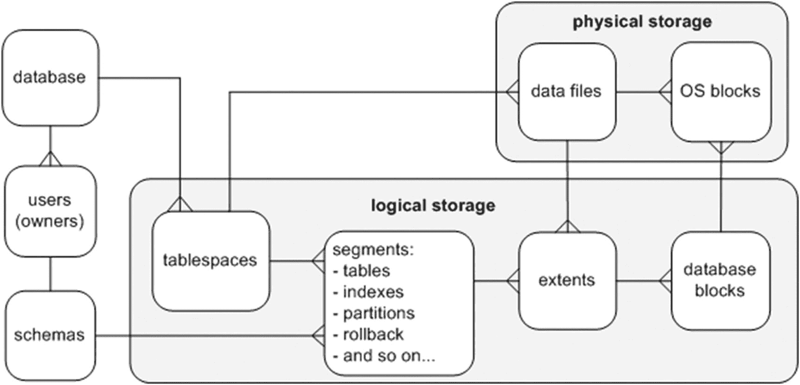
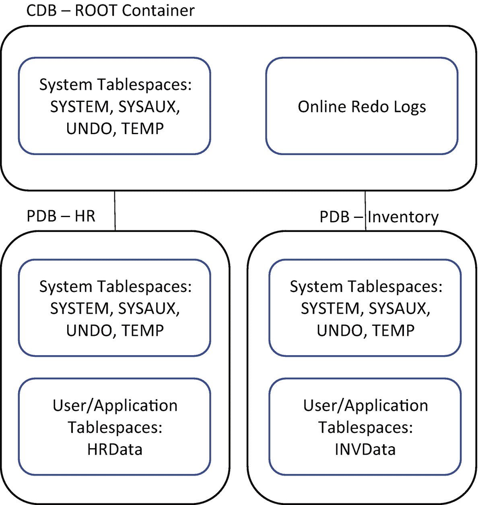

# 第 4 章 表空间和数据文件

术语 `tablespace`（表空间）有点用词不当，因为它不仅仅是表的空间。相反，表空间是一个逻辑容器，允许您管理磁盘上消耗空间的物理文件——数据文件组。一旦创建了表空间，您就可以在其中创建数据库对象（表和索引），这会导致在关联的数据文件中为磁盘分配空间。

表空间是逻辑的，因为它仅通过数据字典视图（如 `DBA_TABLESPACES`）可见；您可以通过 `SQL*Plus` 或图形工具（如 Enterprise Manager）或两者兼用来管理表空间。表空间仅在数据库启动并运行时存在。

数据文件也可以通过数据字典视图（`DBA_DATA_FILES`）查看，但此外还具有物理存在，因为它们可以通过操作系统实用程序（如列出文件的 `ls` 命令）在数据库外部查看。无论数据库是打开还是关闭，数据文件都持续存在。

Oracle 数据库通常包含多个表空间。一个表空间可以有一个或多个与之关联的数据文件，但一个数据文件只能与一个表空间相关联。换句话说，一个数据文件不能在多个（或两个以上）表空间之间共享。

对象（如表和索引）由用户拥有，并在表空间内创建。一个对象在逻辑上被实例化为一个段（segment）。段由表空间内的空间区（extent）组成。一个区由一组数据库块组成。图 4-1 显示了用于管理 Oracle 数据库内空间的这些逻辑和物理结构之间的关系。



**图 4-1**
逻辑存储对象与物理存储的关系

正如您在第 2 章中看到的，当您执行 `CREATE DATABASE` 语句创建数据库时，通常会创建五个表空间：

*   `SYSTEM`
*   `SYSAUX`
*   `UNDO`
*   `TEMP`
*   `USERS`

这五个表空间是运行数据库所需的最小存储容器集合（然而，有人可能认为您不需要 `USERS` 表空间；更多内容将在下一节中介绍）。`SYSTEM` 和 `SYSAUX` 实际上是唯一必需的表空间，因为 `UNDO` 和 `TEMP` 可以用不同的名称命名。在容器数据库（CDB）中，可插拔数据库（PDB）有与其关联的用户表空间。在创建 PDB 时，表空间是配置的一部分。当您打开数据库使用时，应迅速创建额外的表空间来存储应用程序数据。本章讨论标准表空间集的用途、对额外表空间的需求以及如何管理这些关键的数据库存储容器。本章重点介绍与创建和维护表空间及数据文件相关的最常见和关键任务，并逐步深入到更高级的主题，例如移动和重命名数据文件。

## 理解前五个表空间

`SYSTEM` 表空间为 Oracle 数据字典对象提供存储。所有由 `SYS` 用户拥有的对象都存储在此表空间中。`SYS` 用户应该是唯一在 `SYSTEM` 表空间中拥有对象的用户。

`SYSAUX`（系统辅助）表空间在您创建数据库时创建。这是一个辅助表空间，用作 Oracle 数据库工具（如 Enterprise Manager、Statspack、LogMiner、Logical Standby 等）的数据存储库。默认情况下，审计日志收集在 `SYSAUX` 表空间中，但应配置为使用为审计记录创建的另一个表空间。甚至其中一些工具也可以配置为使用额外的表空间，具体取决于保留和分离规则，并将数据保存在默认系统表空间之外。

`UNDO` 表空间存储撤销事务（`insert`、`update`、`delete` 或 `merge`）效果所需的信息。在事务被有意回滚（通过 `ROLLBACK` 语句）时需要此信息。撤销信息还被 Oracle 用于从意外实例崩溃中恢复，并为 SQL 语句提供读一致性。此外，一些数据库功能（如 Flashback Query）使用撤销信息。

一些 Oracle SQL 语句需要排序区（sort area），无论是在内存中还是在磁盘上。例如，查询结果在返回给用户之前可能需要排序。Oracle 首先使用内存对查询结果进行排序，当内存不再足够时，`TEMP` 表空间的额外临时存储也可能在创建或重建索引时需要。该空间仅用于会话的临时数据，不能在 `TEMP` 表空间中存储永久对象。如果某个进程需要在单个会话之外的临时对象，则应将该对象存储在永久用户表空间中。创建数据库时，通常会创建 `TEMP` 表空间并将其指定为您创建的任何用户的默认临时表空间。可以有多个具有不同名称的临时表空间，可以分配给不同的用户组或应用程序，以避免临时空间使用冲突。

`USERS` 表空间不是绝对必需的，但通常用作用户表和索引数据的默认永久表空间。如第 2 章所示，您可以在创建数据库时为用户创建默认永久表空间。这意味着当用户尝试创建表或索引时，如果在对象创建期间未指定表空间，默认情况下将在默认永久表空间中创建该对象。

## 理解对更多表空间的需求

虽然您可以将所有数据库用户的数据放在 `USERS` 表空间中，但这对于任何类型的严肃数据库应用程序来说通常不是可扩展或可维护的。相反，为应用程序用户创建额外的表空间更有效。您通常为使用数据库的每个应用程序创建至少两个特定的表空间：一个用于应用程序表数据，另一个用于应用程序索引数据。例如，对于 `APP` 用户，您可能会创建 `APP_DATA` 和 `APP_INDEX` 分别用于表和索引数据。

DBA 过去出于性能原因分离表数据和索引数据。当时的思路是将表数据与索引数据分离将减少输入/输出（I/O）争用。这是因为数据文件（每个表空间的）可以放置在由不同控制器管理的不同磁盘上。

对于现代存储配置，其应用程序和底层物理存储设备之间存在多层抽象，通过创建多个独立的表空间是否能实现任何性能提升是值得商榷的。但是，仍然有创建多个表空间用于表和索引数据的有效理由：

*   备份和恢复要求可能因表和索引而异。
*   索引可能具有与表数据不同的存储要求。
*   通过逻辑上分别对表和索引进行分组来简化对象管理。

除了为数据和索引创建单独的表空间外，有时还为不同大小的对象创建单独的表空间。例如，如果一个应用程序有非常大的表，您可以创建一个具有较大区大小的 `APP_DATA_LARGE` 表空间和一个具有较小区大小的单独 `APP_DATA_SMALL` 表空间。这个概念也扩展到二进制大对象（LOB）数据类型。您可能希望将 LOB 列分离到自己的表空间中，因为您希望管理 LOB 表空间的存储特性与常规表数据不同。自动段空间管理（ASSM）将基于存储的对象信息分配区大小。即使不手动设置大小区并使用 ASSM，以这种方式对对象分组也将有助于对象管理以及自动空间管理。

**注意**
由于物理存储设备和内存的进步，按类型和区大小分离对象变得不那么重要了。存储技术的进步将有助于数据库在没有对象配置的情况下也能更好地运行。根据您的要求，您应该考虑为使用数据库的每个应用程序创建单独的表空间。现在有应用程序容器和 PDB 用于这种表空间分离。尽管这将在第 22 章中更详细地讨论，但图 4-2 显示了 CDB 和 PDB 中的不同表空间。



**图 4-2**
CDB 和 PDB 中的表空间

然而，为了看一个单独的表空间示例，对于一个库存应用程序，创建 `INV_DATA` 和 `INV_INDEX`；对于一个人力资源应用程序，创建 `HR_DATA` 和 `HR_INDEX`。以下是一些考虑为使用数据库的每个应用程序创建单独表空间的理由：

*   应用程序可能有不同的可用性要求。单独的表空间允许您将一个应用程序的表空间脱机而不影响另一个应用程序。
*   应用程序可能有不同的备份和恢复要求。单独的表空间允许独立地备份和恢复表空间。
*   应用程序可能有不同的存储要求。单独的表空间允许为空间配额、区大小和段管理设置不同的参数。
*   您可能有一些数据是纯只读的。单独的表空间允许您将仅包含只读数据的表空间置于只读模式。
*   您可能有安全设置，例如对表空间加密，而其他表空间不加密。

下一节讨论创建表空间。

## 创建表空间

您使用 `CREATE TABLESPACE` 语句来创建表空间。*Oracle SQL 参考手册* 包含十几页关于创建表空间的语法和示例。在大多数场景中，您只需要使用可用功能中的一小部分，即本地管理的区分配和自动段空间管理。以下代码片段演示了如何创建一个采用最常用功能的表空间：

```sql
create tablespace tools
datafile '/u01/dbfile/o18c/tools01.dbf'
size 100m
extent management local
uniform size 128k
segment space management auto;
```

您需要根据您的环境修改此脚本。例如，目录路径、数据文件大小和统一区大小应根据环境要求进行更改。

您使用 `EXTENT MANAGEMENT LOCAL` 子句创建本地管理的表空间。本地管理的表空间使用数据文件中的位图来高效地确定区是否正在使用。存储参数 `NEXT`、`PCTINCREASE`、`MINEXTENTS`、`MAXEXTENTS` 和 `DEFAULT` 对于本地管理的表空间中的区选项无效。

**注意**
具有统一区的本地管理的表空间必须至少为每个区分配五个数据库块的最小大小。

当您向表空间中的对象添加数据时，Oracle 会根据需要自动向关联的表空间数据文件分配更多区以适应增长。您可以通过 `UNIFORM SIZE [size]` 子句指示 Oracle 为每个区分配统一的大小。如果您未指定大小，则默认的统一区大小为 1MB。

您使用的统一区大小根据表和索引的存储需求而变化。在某些场景中，我为给定的应用程序创建多个表空间。例如，您可以为小对象创建一个区大小为 512KB 的表空间，为中等大小对象创建一个区大小为 4MB 的表空间，为大对象创建一个区大小为 16MB 的表空间，依此类推。

或者，您可以通过 `AUTOALLOCATE` 子句指定 Oracle 确定区大小。Oracle 分配 64KB、1MB、8MB 或 64MB 的区大小。当您认为一个表空间中的对象大小各异时，使用 `AUTOALLOCATE` 是合适的。

`SEGMENT SPACE MANAGEMENT AUTO` 子句指示 Oracle 管理块内的空间。使用此子句时，无需指定参数，如 `PCTUSED`、`FREELISTS` 和 `FREELIST GROUPS`。与 `AUTO` 空间管理相对的是 `MANUAL`。当您使用 `MANUAL` 时，您可以根据应用程序的要求调整参数。我建议您使用 `AUTO` 而不是 `MANUAL`。使用 `AUTO` 极大地减少了需要配置和管理的参数数量。

当数据文件填满时，您可以使用 `AUTOEXTEND` 功能指示 Oracle 自动增大数据文件的大小。使用 `AUTOEXTEND` 允许进程在接近空间用尽时无需 DBA 干预即可运行。但是，您必须监控表空间增长并规划额外空间。这包括监视可能加载大量数据的进程。手动添加空间可能会限制出现失控的 SQL 进程意外增长表空间直至消耗完挂载点上所有空间的情况，但如果一个加载进程比另一个月份更大，如果在额外空间需求上失败，它可能会被回滚。在数据库中使用 `RESUMABLE` 参数，您将被允许设置响应表空间问题的时间。如果您无意中填满了包含控制文件或 Oracle 二进制文件的挂载点，可能会导致数据库挂起。使用自动存储管理（ASM）也将有助于通过向磁盘组添加另一个磁盘来避免填满挂载点，并且与 `RESUMABLE` 结合使用，提供了管理时间。监控和规划存储及增长仍然是管理表空间大小以主动添加所需空间的最佳方法。

如果您确实使用了 `AUTOEXTEND` 功能，我建议您始终指定相应的 `MAXSIZE`，这样失控的 SQL 进程就不会意外地填满表空间，进而填满挂载点。以下是一个创建具有最大大小限制的自动扩展表空间的示例：

```sql
create tablespace tools
datafile '/u01/dbfile/o18c/tools01.dbf'
size 100m
autoextend on maxsize 1000m
extent management local
uniform size 128k
segment space management auto;
```

出于安全考虑，表空间可以透明加密。透明意味着应用程序不需要更改即可使用加密表空间。这将允许数据文件中静态的数据被加密，并且当数据库打开时，使用数据库钱包中的加密密钥对表空间进行解密，以便通过查询查看数据。使用加密使得数据文件无法以纯文本形式查看，数据文件的备份也是如此。如前所述，创建表空间有很多选项，这个安全选项确实需要管理加密密钥，密钥可以集中定位，也可以与数据库本地存放。创建表空间的命令很简单：

```sql
create tablespace HRDATA encryption using 'AES256' default storage(encrypt);
```

当您在不同环境中使用 `CREATE TABLESPACE` 脚本时，能够对脚本的部分进行参数化非常有用。例如，在开发环境中您可能将数据文件大小设置为 100MB，而在生产环境中数据文件可能是 100GB。使用 & 变量（`&`）使 `CREATE TABLESPACE` 脚本在不同环境中更具可移植性。

下一个列表在脚本顶部定义了 & 变量，这些变量决定为表空间创建的数据文件的大小：

```sql
define tbsp_large=5G
define tbsp_med=500M
--
create tablespace reg_data
datafile '/u01/dbfile/o18c/reg_data01.dbf'
size &&tbsp_large
extent management local
uniform size 128k
segment space management auto;
--
create tablespace reg_index
datafile '/u01/dbfile/o18c/reg_index01.dbf'
size &&tbsp_med
extent management local
uniform size 128k
segment space management auto;
```

使用 & 变量允许您修改脚本一次，然后在整个脚本中重复使用这些变量。您可以对脚本的所有方面进行参数化，包括数据文件挂载点和区大小。

您也可以从 `SQL*Plus` 命令行将 & 变量的值传递到 `CREATE TABLESPACE` 脚本中。这使您可以避免在脚本中硬编码特定大小，而是在运行时提供大小。为此，首先在脚本顶部定义 & 变量以接受传入的值：

```sql
define tbsp_large=&1
define tbsp_med=&2
--
create tablespace reg_data
datafile '/u01/dbfile/o12c/reg_data01.dbf'
size &&tbsp_large
extent management local
uniform size 128k
segment space management auto;
--
create tablespace reg_index
datafile '/u01/dbfile/o12c/reg_index01.dbf'
size &&tbsp_med
extent management local
uniform size 128k
segment space management auto;
```

现在，您可以从 `SQL*Plus` 命令行将变量传递到脚本中。以下示例执行名为 `cretbsp.sql` 的脚本，并传入两个值，分别将 & 变量设置为 `5G` 和 `500M`：

```sql
SQL> @cretbsp  5G  500M
```

自动存储管理（ASM）也简化了表空间的创建，因为它将采用磁盘组的默认值和设置为使用 ASM 的参数。这将在本章后面讨论，但这里有一个简单的示例：

```sql
SQL> create tablespace HRDATA;
```

表 4-1 总结了创建和管理表空间的最佳实践。

**表 4-1**
创建和管理表空间的最佳实践

| 最佳实践 | 推理 |
| --- | --- |
| 为使用同一数据库的不同应用程序创建单独的表空间。 | 如果某个表空间需要脱机，它只影响一个应用程序。 |
| 对于一个应用程序，将表数据与索引数据分离在不同的表空间中。 | 表和索引数据可能有不同的存储要求，并简化对象管理。 |
| 使用 `AUTOEXTEND` 时，指定最大大小。 | 指定最大大小可以防止失控的 SQL 语句填满存储设备。 |
| 创建表空间为本地管理的。您不应创建字典管理的表空间。 | 这提供了更好的性能和可管理性。 |
| 对于表空间的数据文件命名约定，使用包含表空间名称后跟两位数字的名称，该数字在该表空间的数据文件中是唯一的。 | 这样可以轻松识别哪些数据文件与哪些表空间相关联。 |
| 尽量减少与一个表空间关联的数据文件数量。 | 您需要管理的数据文件更少。 |
| 在表空间 `CREATE` 脚本中，使用 & 变量定义诸如存储特性等方面。 | 这使得脚本在各种环境中更具可重用性。 |

如果您需要验证重新创建现有表空间所需的 SQL，可以使用 `DBMS_METADATA` 包。首先，将 `LONG` 变量设置为一个较大的值：

```sql
SQL> set long 1000000
```

接下来，使用 `DBMS_METADATA` 包显示数据库中所有表空间的 `CREATE TABLESPACE` 数据定义语言（DDL）：

```sql
select dbms_metadata.get_ddl('TABLESPACE',tablespace_name)
from dba_tablespaces;
```

**提示**
您也可以使用 Data Pump 提取数据库对象的 DDL。详情请参见第 13 章。

## 重命名表空间

有时您需要重命名表空间。您可能希望这样做，因为表空间最初被错误命名，或者您希望表空间名称更好地符合您的数据库命名标准。使用 `ALTER TABLESPACE` 语句重命名表空间。此示例将表空间从 `TOOLS` 重命名为 `TOOLS_DEV`：

```sql
SQL> alter tablespace tools rename to tools_dev;
```

当您重命名表空间时，Oracle 会更新数据字典、控制文件和数据文件头中的表空间名称。请记住，重命名表空间不会重命名任何关联的数据文件。有关重命名数据文件的信息，请参阅本章后面的“重命名或重新定位数据文件”部分。

**注意**
您不能重命名 `SYSTEM` 表空间或 `SYSAUX` 表空间。

## 更改表空间的写入模式

在数据仓库等环境中，您可能需要将数据加载到表中，然后永远不再修改。为了强制表空间中的任何对象都无法修改，您可以将表空间更改为只读。为此，请使用 `ALTER TABLESPACE` 语句：

```sql
SQL> alter tablespace inv_mgmt_rep read only;
```

只读表空间的一个优点是您只需备份一次。无论备份是在多久之前进行的，您都应该能够从只读表空间还原数据文件。

如果您需要将表空间从只读模式修改回来，可以按如下方式进行：

```sql
SQL> alter tablespace inv_mgmt_rep read write;
```

确保在将表空间置于读/写模式后重新启用备份。

**注意**
您不能使包含活动回滚段的表空间变为只读。因此，`SYSTEM` 表空间不能设为只读，因为它包含 `SYSTEM` 回滚段。

请注意，个别表可以修改为只读。这允许您在更细粒度的级别（而不是表空间级别）控制只读；例如，

```sql
SQL> alter table my_tab read only;
```

在只读模式下，您不能在表上发出任何 `insert`、`update` 或 `delete` 语句。在进行维护（例如数据迁移）并希望确保用户不更新数据时，将单个表设为读/写可能很有用。

此示例将表修改回读/写模式：

```sql
SQL> alter table my_tab read write;
```

## 删除表空间

如果您有一个未使用的表空间，最好将其删除，这样它不会使数据库混乱、消耗不必要的资源，并可能混淆不熟悉数据库的 DBA。在删除表空间之前，最好先将其脱机：

```sql
SQL> alter tablespace inv_data offline;
```

您可能想等待看看是否有人抱怨应用程序因无法再写入要删除的表空间中的表或索引而损坏。根据删除表空间的原因，可以先将对象移动到另一个表空间，然后再删除。当您确定不需要该表空间时，将其删除并删除其数据文件：

```sql
SQL> drop tablespace inv_data including contents and datafiles;
```

**提示**
无论表空间是联机还是脱机，您都可以删除它。例外是 `SYSTEM` 和 `SYSAUX` 表空间，它们不能被删除。在删除表空间之前将其脱机始终是一个好主意。通过这样做，您可以更好地确定应用程序是否正在使用表空间中的任何对象。如果您尝试查询脱机表空间中的表，会收到此错误：`ORA-00376: file can't be read at this time`。

使用 `INCLUDING CONTENTS AND DATAFILES` 删除表空间会永久删除该表空间及其任何数据文件。在删除之前，请确保表空间不包含您想要保留的任何数据。

如果您尝试删除包含被与要删除的表空间不同的表空间中的表关联的外键引用的主键的表空间，您会收到此错误：

```
ORA-02449: unique/primary keys in table referenced by foreign keys
```

首先运行此查询以确定是否有任何外键约束将受到影响：

```sql
select p.owner,
p.table_name,
p.constraint_name,
f.table_name referencing_table,
f.constraint_name foreign_key_name,
f.status fk_status
from   dba_constraints p,
dba_constraints f,
dba_tables      t
where  p.constraint_name = f.r_constraint_name
and    f.constraint_type = 'R'
and    p.table_name = t.table_name
and    t.tablespace_name = UPPER('&tablespace_name')
order by 1,2,3,4,5;
```

如果存在引用的约束，您需要首先删除这些约束，或者使用 `DROP TABLESPACE` 语句的 `CASCADE CONSTRAINTS` 子句。此语句使用 `CASCADE CONSTRAINTS` 自动删除任何受影响的约束：

```sql
SQL> drop tablespace inv_data including contents and data files cascade constraints;
```

此语句删除从被删除表空间外部的表引用到被删除表空间内部表的任何引用完整性约束。

如果您删除了生产系统中具有必需对象的表空间，后果可能是灾难性的。您必须执行某种恢复才能使表空间及其对象恢复。不用说，在删除表空间时要非常小心。表 4-2 列出了执行此操作时要考虑的建议。

**表 4-2**
删除表空间的最佳实践

| 最佳实践 | 推理 |
| --- | --- |
| 在删除表空间之前，运行如下脚本以确定表空间中是否存在任何对象：<br>`select owner, segment_name, segment_type`<br>`from dba_segments`<br>`where tablespace_name=upper('&&tbsp_name');` | 这样做可确保在删除表空间之前不存在任何表或索引。 |
| 考虑在删除表空间之前重命名表空间中的表。 | 如果任何应用程序正在使用要删除的表空间中的表，当所需的表被重命名时，应用程序会抛出错误。 |
| 如果表空间中没有对象，则将关联的数据文件调整为一个非常小的数字，例如 10MB。 | 将数据文件大小减小到极小的空间量，可以快速显示是否有任何应用程序尝试访问需要该表空间空间的对象。 |
| 在删除表空间之前备份数据库。 | 这确保您有一种方法可以在删除表空间后发现有正在使用的对象时恢复这些对象。 |
| 在删除表空间之前将表空间和数据文件脱机。使用 `ALTER TABLESPACE` 语句使表空间脱机。 | 这有助于确定是否有任何应用程序或用户正在使用表空间中的对象。如果表空间和数据文件脱机，它们就无法访问对象。 |
| 当您确定表空间未被使用时，使用 `DROP TABLESPACE ... INCLUDING CONTENTS AND DATAFILES` 语句。 | 这将删除表空间并物理删除与其关联的任何数据文件。一些 DBA 不喜欢这种方法，但如果您已采取必要的预防措施，应该没问题。 |

## 使用 Oracle 托管文件

Oracle 托管文件（OMF）功能自动化了表空间管理的许多方面，例如文件放置、命名和大小调整。您通过设置以下初始化参数来控制 OMF：

*   `DB_CREATE_FILE_DEST`
*   `DB_CREATE_ONLINE_LOG_DEST_N`
*   `DB_RECOVERY_FILE_DEST`

如果您在创建数据库之前设置这些参数，Oracle 会使用它们来放置数据文件、控制文件和在线重做日志。您也可以在创建数据库后启用 OMF。Oracle 使用初始化参数的值作为任何新添加文件的位置。Oracle 还确定新添加文件的名称。这些参数作为输入在 `dbca` 中设置以创建数据库。

使用 OMF 的优点是创建表空间被简化了。例如，`CREATE TABLESPACE` 语句除了表空间名称外不需要指定任何内容。首先，通过设置 `DB_CREATE_FILE_DEST` 参数启用 OMF 功能：

```sql
SQL> alter system set db_create_file_dest='/u01';
```

现在，发出 `CREATE TABLESPACE` 语句：

```sql
SQL> create tablespace inv1;
```

此语句创建一个名为 `INV1` 的表空间，默认数据文件大小为 100MB。请记住，您可以通过指定大小来覆盖默认的 100MB 大小：

```sql
SQL> create tablespace inv2 datafile size 20m;
```

要查看关联数据文件的详细信息，请查询 `V$DATAFILE` 视图，并注意 Oracle 已在 `/u01` 目录下创建了子目录，并使用 OMF 格式命名了文件：

```sql
SQL> select name from v$datafile where name like '%inv%';
NAME
------------------------------------------------------------
/u01/O18C/datafile/o1_mf_inv1_8b5l63q6_.dbf
/u01/O18C/datafile/o1_mf_inv2_8b5lflfc_.dbf
```

OMF 的一个限制是您仅限于一个目录用于放置数据文件。如果您想将数据文件添加到不同的目录，您可以动态更改位置：

```sql
SQL> alter system set db_create_file_dest='/u02';
```

## 创建大文件表空间

大文件（bigfile）功能允许您创建一个分配了非常大数据文件的表空间。使用大文件功能的优点是可能创建非常大的文件。对于 8KB 块大小，您可以创建最大为 32TB 的数据文件。对于 32KB 块大小，您可以创建最大为 128TB 的数据文件。

使用 `BIGFILE` 子句创建大文件表空间：

```sql
create bigfile tablespace inv_big_data
datafile '/u01/dbfile/o18c/inv_big_data01.dbf'
size 10g
extent management local
uniform size 128k
segment space management auto;
```

只要支持大文件表空间数据文件的关联文件系统有充足的空间，您就可以在表空间中存储海量数据。

使用大文件表空间的一个潜在缺点是，如果由于任何原因支持大文件关联数据文件的文件系统空间用尽，您无法扩展表空间的大小（除非您可以向文件系统添加空间）。如果数据文件放置在单独的挂载点上，您无法向大文件表空间添加更多数据文件。大文件表空间只允许一个数据文件与之关联。

您可以使用 `ALTER DATABASE SET DEFAULT BIGFILE TABLESPACE` 语句将大文件表空间设为数据库的默认表空间类型。但是，不建议这样做。您可能会在不知道它是大文件表空间的情况下创建表空间，当您发现需要更多空间时，您将不知道无法为此表空间在另一个挂载点上添加另一个数据文件。使用 ASM 问题较少，因为可以动态地将新磁盘添加到此表空间的 DISKGROUP。

## 在表空间内启用默认表压缩

在处理大型数据库时，您可能需要考虑压缩数据。压缩数据导致更少的磁盘空间、更少的内存和更少的 I/O 操作。读取压缩数据的查询可能执行得更快，因为满足查询结果所需的块更少。但压缩确实有成本；它在读写时压缩和解压缩数据，需要更多的 CPU 资源。

在创建表空间时，您可以启用数据压缩功能。这样做并不会压缩表空间。相反，您在表空间中创建的任何表都会继承表空间的压缩特性。此示例创建一个具有 `ROW STORE COMPRESS ADVANCED` 的表空间：

```sql
CREATE TABLESPACE tools_comp
DATAFILE '/u01/dbfile/o18c/tools_comp01.dbf'
SIZE 100m
EXTENT MANAGEMENT LOCAL
UNIFORM SIZE 512k
SEGMENT SPACE MANAGEMENT AUTO
DEFAULT ROW STORE COMPRESS ADVANCED;
```

**注意**
如果您使用的是 Oracle Database 11g，请使用 `COMPRESS FOR OLTP` 子句代替 `ROW STORE COMPRESS ADVANCED`。

现在，当在此表空间中创建表时，它将自动创建为具有 `ROW STORE COMPRESS ADVANCED` 功能。您可以通过以下查询验证表空间的压缩特性：

```sql
select tablespace_name, def_tab_compression, compress_for
from dba_tablespaces;
```

**提示**
有关表压缩的完整详细信息，请参见第 7 章。

如果表空间已经创建，您可以更改其压缩特性，如下所示：

```sql
SQL> alter tablespace tools_comp default row store compress advanced;
```

以下示例将表空间的默认压缩更改为 `BASIC`：

```sql
SQL> alter tablespace tools_comp default compress basic;
```

您可以通过 `NOCOMPRESS` 子句禁用表空间压缩：

```sql
SQL> alter tablespace tools_comp default nocompress;
```

**注意**
大多数压缩功能需要 Oracle 企业版和高级压缩选项（需付费）。使用压缩率和现有数据量、增长和保留情况可以显示此选项的价值。

## 显示表空间大小

DBA 通常使用监控脚本在需要增加分配给表空间的空间时发出警报。根据您是否处于多租户容器数据库环境，用于确定空间使用情况的 SQL 会有所不同。对于常规数据库（非容器），您可以使用 DBA 级别的视图来确定空间使用情况。以下脚本显示表空间和数据文件的剩余可用空间百分比：

```sql
SET PAGESIZE 100 LINES 132 ECHO OFF VERIFY OFF FEEDB OFF SPACE 1 TRIMSP ON
COMPUTE SUM OF a_byt t_byt f_byt ON REPORT
BREAK ON REPORT ON tablespace_name ON pf
COL tablespace_name FOR A17   TRU HEAD 'Tablespace|Name'
COL file_name       FOR A40   TRU HEAD 'Filename'
COL a_byt           FOR 9,990.999 HEAD 'Allocated|GB'
COL t_byt           FOR 9,990.999 HEAD 'Current|Used GB'
COL f_byt           FOR 9,990.999 HEAD 'Current|Free GB'
COL pct_free        FOR 990.0     HEAD 'File %|Free'
COL pf              FOR 990.0     HEAD 'Tbsp %|Free'
COL seq NOPRINT
DEFINE b_div=1073741824
--
SELECT 1 seq, b.tablespace_name, nvl(x.fs,0)/y.ap*100 pf, b.file_name file_name,
b.bytes/&&b_div a_byt, NVL((b.bytes-SUM(f.bytes))/&&b_div,b.bytes/&&b_div) t_byt,
NVL(SUM(f.bytes)/&&b_div,0) f_byt, NVL(SUM(f.bytes)/b.bytes*100,0) pct_free
FROM dba_free_space f, dba_data_files b
,(SELECT y.tablespace_name, SUM(y.bytes) fs
FROM dba_free_space y GROUP BY y.tablespace_name) x
,(SELECT x.tablespace_name, SUM(x.bytes) ap
FROM dba_data_files x GROUP BY x.tablespace_name) y
WHERE f.file_id(+) = b.file_id
AND   x.tablespace_name(+) = y.tablespace_name
and   y.tablespace_name =  b.tablespace_name
AND   f.tablespace_name(+) = b.tablespace_name
GROUP BY b.tablespace_name, nvl(x.fs,0)/y.ap*100, b.file_name, b.bytes
UNION
SELECT 2 seq, tablespace_name,
j.bf/k.bb*100 pf, b.name file_name, b.bytes/&&b_div a_byt,
a.bytes_used/&&b_div t_byt, a.bytes_free/&&b_div f_byt,
a.bytes_free/b.bytes*100 pct_free
FROM v$temp_space_header a, v$tempfile b
,(SELECT SUM(bytes_free) bf FROM v$temp_space_header) j
,(SELECT SUM(bytes) bb FROM v$tempfile) k
WHERE a.file_id = b.file#
ORDER BY 1,2,4,3;
```

如果您没有任何监控措施，当尝试执行插入或更新操作的 SQL 语句因表空间需要更多空间但无法分配更多空间而失败时，您会收到警报。此时，会抛出 `ORA-01653` 错误，指示对象无法扩展。

在确定表空间需要更多空间后，您需要增大数据文件的大小或向表空间添加数据文件。有关这些主题的讨论，请参阅本章后面的“更改表空间大小”部分。

**提示**
有关在可插拔数据库环境中使用容器数据库（CDB）级视图报告空间的完整详细信息，请参见第 22 章。

## 显示 Oracle 错误消息和操作

您可以使用 `oerr` 实用程序快速显示错误原因以及应采取操作的简要说明；例如，

```bash
$ oerr ora 01653
```

以下是此示例的输出：

```
01653, 00000, "unable to extend table %s.%s by %s in tablespace %s"
// *Cause:  Failed to allocate an extent of the required number of blocks for
//          a table segment in the tablespace indicated.
// *Action: Use ALTER TABLESPACE ADD DATAFILE statement to add one or more
//          files to the tablespace indicated.
```

`oerr` 实用程序的输出为您提供了一种快速简便的故障分类方法。如果提供的信息不够，那么 Google 是一个好的备选方案。

## 更改表空间大小

当您确定要调整大小的数据文件后，首先确保在数据文件所在的挂载点上有足够的磁盘空间来增大数据文件的大小：

```bash
$ df -h | sort
```

使用 `ALTER DATABASE DATAFILE ... RESIZE` 命令增大数据文件的大小。此示例将数据文件大小调整为 1GB：

```sql
SQL> alter database datafile '/u01/dbfile/o18c/users01.dbf' resize 1g;
```

如果您在现有挂载点上没有空间来增大数据文件的大小，则必须添加数据文件。要向现有表空间添加数据文件，请使用 `ALTER TABLESPACE ... ADD DATAFILE` 语句：

```sql
SQL> alter tablespace users
add datafile '/u02/dbfile/o18c/users02.dbf' size 100m;
```

对于大文件表空间，您可以选择使用 `ALTER TABLESPACE` 语句来调整数据文件的大小。这适用于大文件表空间，因为只能有一个数据文件与之关联：

```sql
SQL> alter tablespace inv_big_data resize 1P;
```

在管理具有高事务负载的数据库时，调整数据文件大小可能是日常任务。增大数据文件的大小允许您在不添加更多数据文件的情况下向表空间添加空间。如果包含现有数据文件的存储设备上没有足够的磁盘空间，您可以向现有表空间添加位于不同位置的数据文件。

要向临时表空间添加空间，首先查询 `V$TEMPFILE` 视图以验证临时数据文件的当前位置和大小：

```sql
SQL> select name, bytes from v$tempfile;
```

然后，使用 `ALTER DATABASE` 语句的 `TEMPFILE` 选项：

```sql
SQL> alter database tempfile '/u01/dbfile/o18c/temp01.dbf' resize 500m;
```

您也可以通过 `ALTER TABLESPACE` 语句向临时表空间添加文件：

```sql
SQL> alter tablespace temp add tempfile '/u01/dbfile/o18c/temp02.dbf' size 5000m;
```

## 切换数据文件脱机和联机

有时在执行维护操作（例如重命名数据文件）时，您可能需要先将数据文件脱机。您可以使用 `ALTER TABLESPACE` 或 `ALTER DATABASE DATAFILE` 语句来切换数据文件的脱机和联机状态。

**提示**
从 Oracle Database 12c 开始，您可以在数据文件联机并打开使用时移动和重命名它们。有关此内容的讨论，请参见本章后面的“重命名或重新定位数据文件”。

使用 `ALTER TABLESPACE ... OFFLINE NORMAL` 语句使数据文件脱机。您不需要指定 `NORMAL`，因为它是默认值：

```sql
SQL> alter tablespace users offline;
```

当您以正常模式使表空间脱机时，Oracle 会对与该表空间关联的数据文件执行检查点（checkpoint）。这确保与表空间关联的所有已修改内存块都被刷新并写入数据文件。当您将表空间及其关联的数据文件重新联机时，不需要执行介质恢复。

当数据库处于加载（mount）模式时，您不能使用 `ALTER TABLESPACE` 语句使表空间脱机。如果您尝试在数据库已加载（但未打开）时使表空间脱机，您会收到以下错误：

```
ORA-01109: database not open
```

**注意**
在加载模式下，您必须使用 `ALTER DATABASE DATAFILE` 语句使数据文件脱机。这可能不是必需的，但表空间可能有多个数据文件，每个文件都需要单独脱机。

在使表空间脱机时，您也可以指定 `ALTER TABLESPACE ... OFFLINE TEMPORARY`。在这种情况下，Oracle 会启动对与表空间关联的所有联机数据文件的检查点。Oracle 不会对与表空间关联的脱机数据文件启动检查点。

在使表空间脱机时，您可以指定 `ALTER TABLESPACE ... OFFLINE IMMEDIATE`。在这种情况下，您的数据库必须处于归档日志模式，否则会抛出以下错误：

```
ORA-01145: offline immediate disallowed unless media recovery enabled
```

使用 `OFFLINE IMMEDIATE` 时，Oracle 不会对数据文件发出检查点。在将其重新联机之前，您必须对表空间执行介质恢复。

**注意**
当数据库打开时，您不能使 `SYSTEM` 或 `UNDO` 表空间脱机。但是，`SYSAUX` 可以脱机；某些功能可能不可用，或者可能出现错误。

您也可以使用 `ALTER DATABASE DATAFILE` 语句使数据文件脱机。如果您使用 `ALTER DATABASE DATAFILE` 语句使数据文件脱机，并且您的数据库未处于归档日志模式，则会抛出 `ORA-01145` 错误。

如果您的数据库未处于归档日志模式，您必须在使数据文件脱机时指定 `ALTER DATABASE DATAFILE ... OFFLINE FOR DROP`。您可以指定完整的文件名或提供文件号。在此示例中，数据文件 6 被脱机：

```sql
SQL> alter database datafile 4 offline for drop;
```

现在，如果您尝试将脱机的数据文件联机，会收到以下错误：

```sql
SQL> alter database datafile 4 online;
ORA-01113: file 4 needs media recovery
```

当您使用 `OFFLINE FOR DROP` 子句时，不会对数据文件执行检查点。这意味着在将其联机之前，您需要对数据文件执行介质恢复。执行介质恢复会将记录在联机重做日志中但不在数据文件本身中的任何更改应用到数据文件。在您可以将在脱机时使用 `OFFLINE FOR DROP` 子句的数据文件联机之前，您必须对其执行介质恢复。您可以指定完整的文件名或文件号：

```sql
SQL> recover datafile 4;
```

如果 Oracle 需要的重做信息包含在联机重做日志中，您应该看到此消息：

```
Media recovery complete.
```

如果您的数据库未处于归档日志模式，并且如果 Oracle 需要联机重做日志中未包含的重做信息来恢复数据文件，那么您将无法恢复数据文件并将其重新联机。

如果您的数据库处于归档日志模式，您可以在没有 `FOR DROP` 子句的情况下使其脱机。在这种情况下，Oracle 会忽略 `FOR DROP` 子句。即使您的数据库处于归档日志模式，对于使用 `ALTER DATABASE DATAFILE` 语句脱机的数据文件，您也需要执行介质恢复。表 4-3 总结了在使表空间/数据文件脱机时必须考虑的选项。

**注意**
当数据库处于加载模式（且未打开）时，您可以使用 `ALTER DATABASE DATAFILE` 命令使任何数据文件脱机，包括 `SYSTEM` 和 `UNDO`。

**表 4-3**
使表空间/数据文件脱机的选项

| 语句 | 需要归档日志模式？ | 切换联机时是否需要介质恢复？ | 在加载模式下工作？ |
| --- | --- | --- | --- |
| `ALTER TABLESPACE ... OFFLINE NORMAL` | 否 | 否 | 否 |
| `ALTER TABLESPACE ... OFFLINE TEMPORARY` | 否 | 可能：取决于是否有数据文件已处于脱机状态 | 否 |
| `ALTER TABLESPACE ... OFFLINE IMMEDIATE` | 否 | 是 | 否 |
| `ALTER DATABASE DATAFILE ... OFFLINE` | 是 | 是 | 是 |
| `ALTER DATABASE DATAFILE ... OFFLINE FOR DROP` | 否 | 是 | 是 |

这些使数据文件和表空间脱机的步骤提供了练习介质恢复的机会，并可以在新数据库或测试数据库中演练这些场景。这种实践对于记录笔记、记录错误消息以及收集关于发生情况和结果的说明非常有用，以便在出现这些错误的压力情况下使用。

## 重命名或重新定位数据文件

您可能偶尔需要移动或重命名数据文件。例如，您可能需要移动数据文件，因为存储设备发生了变化，或者文件是在错误的位置创建的或使用了非标准名称。从 Oracle Database 12c 开始，您可以在数据文件联机时选择重命名或移动数据文件，或者两者兼而有之。否则，您将必须使数据文件脱机以进行维护操作。

### 执行联机数据文件操作

Oracle Database 12c 的新功能是 `ALTER DATABASE MOVE DATAFILE` 命令。此命令允许您在没有任何停机的情况下重命名或移动数据文件。这极大地简化了移动或重命名数据文件的任务，因为无需手动将数据文件脱机/联机并使用操作系统命令物理移动文件。这个曾经手动密集（且容易出错）的操作现在已简化为单个 SQL 命令。

数据文件必须处于联机状态才能进行联机移动或重命名。以下是一个重命名联机数据文件的示例：

```sql
SQL> alter database move datafile '/u01/dbfile/o18c/users01.dbf' to
'/u01/dbfile/o18c/users_dev01.dbf';
```

以下是一个将数据文件移动到新挂载点的示例：

```sql
SQL> alter database move datafile '/u01/dbfile/o18c/hrdata01.dbf' to
'/u02/dbfile/o18c/hrdata01.dbf';
```

您也可以在重命名或移动数据文件时指定数据文件编号；例如，

```sql
SQL> alter database move datafile 2 to '/u02/dbfile/o18c/sysuax01.dbf';
```

在前面的示例中，您指定移动数据文件 2。

如果您正在移动数据文件，并且出于任何原因希望保留原始文件的副本，可以使用 `KEEP` 选项：

```sql
SQL> alter database move datafile 4 to '/u02/dbfile/o18c/users01.dbf' keep;
```

您可以指定 `REUSE` 子句来覆盖现有文件：

```sql
SQL> alter database move datafile 4 to '/u01/dbfile/o18c/users01.dbf' reuse;
```

Oracle 不允许您覆盖（重用）数据库当前正在使用的数据文件。这是一件好事。

### 执行脱机数据文件操作

在 12c 之前，要重命名或移动数据文件，您必须使数据文件脱机。移动和重命名脱机数据文件有两种稍有不同的方法：

*   结合使用 SQL 命令和操作系统命令。
*   结合使用重新创建控制文件和操作系统命令。

由于这些是脱机功能，我通常计划在需要一些停机时间的补丁或升级维护活动之前或之后进行这些步骤。除非是紧急步骤需要从磁盘或挂载点移出，否则这通常可以在该时间段内发生。如果此类活动成为常规情况，那么值得花时间和精力研究使用 ASM，因为它提供了移动文件的其他选项。这两种技术将在接下来的两个小节中讨论。

#### 使用 SQL 和操作系统命令

以下是使用 SQL 命令和操作系统命令重命名数据文件的步骤：

1.  使用以下查询确定现有数据文件的名称：

    ```sql
    SQL> select name from v$datafile;
    ```

2.  使用 `ALTER TABLESPACE` 或 `ALTER DATABASE DATAFILE` 语句使数据文件脱机（有关如何执行此操作的详细信息，请参阅前面的“执行脱机数据文件操作”部分）。您也可以关闭数据库然后以加载模式启动；在此模式下可以移动数据文件，因为它们尚未打开供使用。

3.  使用操作系统命令（如 `mv` 或 `cp`）或内置 PL/SQL 包 `DBMS_FILE_TRANSFER` 的 `COPY_FILE` 过程将数据文件物理移动到新位置。

4.  使用 `ALTER TABLESPACE ... RENAME DATAFILE ... TO` 语句或 `ALTER DATABASE RENAME FILE ... TO` 语句更新控制文件中的数据文件名称。

5.  使数据文件联机。

**注意**
如果您需要重命名与 `SYSTEM` 或 `UNDO` 表空间关联的数据文件，必须关闭数据库并以加载模式启动。当数据库处于加载模式时，您可以通过 `ALTER DATABASE RENAME FILE` 语句重命名这些数据文件。

以下示例演示如何移动与单个表空间关联的数据文件。首先，使用 `ALTER TABLESPACE` 语句使数据文件脱机：

```sql
SQL> alter tablespace users offline;
```

现在，在操作系统提示符下，使用 Linux/Unix `mv` 命令将数据文件移动到新位置：

```bash
$ mv /u01/dbfile/o18c/users01.dbf /u02/dbfile/o18c/users01.dbf
```

使用 `ALTER TABLESPACE` 语句更新控制文件：

```sql
alter tablespace users
rename datafile
'/u01/dbfile/o18c/users01.dbf'
to
'/u02/dbfile/o18c/users01.dbf';
```

最后，将表空间内的数据文件重新联机：

```sql
SQL> alter tablespace users online;
```

如果您想在一次操作中重命名多个表空间的数据文件，可以使用 `ALTER DATABASE RENAME FILE` 语句（而不是 `ALTER TABLESPACE...RENAME DATAFILE` 语句）。以下示例重命名数据库中的多个数据文件。由于正在移动 `SYSTEM` 和 `UNDO` 表空间的数据文件，您必须先关闭数据库，然后将其置于加载模式：

```sql
SQL> conn / as sysdba
SQL> shutdown immediate;
SQL> startup mount;
```

由于数据库处于加载模式，数据文件未打开供使用，因此无需使数据文件脱机。接下来，通过 Linux `mv` 命令物理移动文件：

```bash
$ mv /u01/dbfile/o18c/system01.dbf /u02/dbfile/o18c/system01.dbf
$ mv /u01/dbfile/o18c/sysaux01.dbf /u02/dbfile/o18c/sysaux01.dbf
$ mv /u01/dbfile/o18c/undotbs01.dbf /u02/dbfile/o18c/undotbs01.dbf
```

**注意**
您必须在更新控制文件之前移动文件。`ALTER DATABASE RENAME FILE` 命令期望文件位于重命名后的位置。如果文件不在那里，会抛出错误：`ORA-27037: unable to obtain file status`。

现在，您可以更新控制文件以知晓新文件名：

```sql
alter database rename file
'/u01/dbfile/o18c/system01.dbf',
'/u01/dbfile/o18c/sysaux01.dbf',
'/u01/dbfile/o18c/undotbs01.dbf'
to
'/u02/dbfile/o18c/system01.dbf',
'/u02/dbfile/o18c/sysaux01.dbf',
'/u02/dbfile/o18c/undotbs01.dbf';
```

您应该能够打开数据库：

```sql
SQL> alter database open;
```

#### 重新创建控制文件和操作系统命令

重新定位数据库中所有数据文件的另一种方法是使用重新创建的控制文件和操作系统命令的组合。此操作的步骤如下：

1.  创建一个包含 `CREATE CONTROLFILE` 语句的跟踪文件。
2.  修改跟踪文件以显示数据文件的新位置。
3.  关闭数据库。
4.  使用操作系统命令物理移动数据文件。
5.  以 nomount 模式启动数据库。
6.  运行 `CREATE CONTROLFILE` 命令。

**注意**
重新创建控制文件时，请注意文件中包含的任何 RMAN 信息都将丢失。如果您不使用恢复目录，可以使用 `RMAN CATALOG` 命令用 RMAN 备份信息重新填充控制文件。

以下示例逐步完成了前面的步骤。首先，通过 `ALTER DATABASE BACKUP CONTROLFILE TO TRACE` 语句将 `CREATE CONTROLFILE` 语句写入跟踪文件：

```sql
SQL> alter database backup controlfile to trace as '/tmp/mvctrlfile.sql' noresetlogs;
```

关于前面的语句有几点需要注意。首先，在 `/tmp` 目录中创建了一个名为 `mvctrlfile.sql` 的文件；此文件包含一个 `CREATE CONTROLFILE` 语句。其次，前面的语句使用了 `NORESETLOGS` 子句；这指示 Oracle 仅向跟踪文件写入一个 SQL 语句。如果您不指定 `NORESETLOGS`，Oracle 会向跟踪文件写入两个 SQL 语句：一个用于使用 `NORESETLOGS` 选项重新创建控制文件，另一个用于使用 `RESETLOGS` 重新创建控制文件。通常，您知道是否要在重新创建控制文件时重置联机重做日志。在这种情况下，您知道在重新创建控制文件时不需要重置联机重做日志（因为联机重做日志未损坏并且仍在数据库的正常位置）。

接下来，编辑 `/tmp/mvctrlfile.sql` 文件，并将目录路径的名称更改为新位置。以下是此示例的 `CREATE CONTROLFILE` 语句：

```sql
CREATE CONTROLFILE REUSE DATABASE "O18C" NORESETLOGS  NOARCHIVELOG
MAXLOGFILES 16
MAXLOGMEMBERS 4
MAXDATAFILES 1024
MAXINSTANCES 1
MAXLOGHISTORY 876
LOGFILE
GROUP 1 (
'/u01/oraredo/o18c/redo01a.rdo',
'/u02/oraredo/o18c/redo01b.rdo'
) SIZE 50M BLOCKSIZE 512,
GROUP 2 (
'/u01/oraredo/o18c/redo02a.rdo',
'/u02/oraredo/o18c/redo02b.rdo'
) SIZE 50M BLOCKSIZE 512,
GROUP 3 (
'/u01/oraredo/o18c/redo03a.rdo',
'/u02/oraredo/o18c/redo03b.rdo'
) SIZE 50M BLOCKSIZE 512
DATAFILE
'/u01/dbfile/o18c/system01.dbf',
'/u01/dbfile/o18c/sysaux01.dbf',
'/u01/dbfile/o18c/undotbs01.dbf',
'/u01/dbfile/o18c/users01.dbf'
CHARACTER SET AL32UTF8;
```

现在，关闭数据库：

```sql
SQL> shutdown immediate;
```

在操作系统提示符下物理移动文件。此示例使用 Linux `mv` 命令移动文件：

```bash
$ mv /u02/dbfile/o18c/system01.dbf /u01/dbfile/o18c/system01.dbf
$ mv /u02/dbfile/o18c/sysaux01.dbf /u01/dbfile/o18c/sysaux01.dbf
$ mv /u02/dbfile/o18c/undotbs01.dbf /u01/dbfile/o18c/undotbs01.dbf
$ mv /u02/dbfile/o18c/users01.dbf /u01/dbfile/o18c/users01.dbf
```

以 nomount 模式启动数据库：

```sql
SQL> startup nomount;
```

然后，执行包含 `CREATE CONTROLFILE` 语句的文件（在此示例中为 `mvctrlfile.sql`）：

```sql
SQL> @/tmp/mvctrlfile.sql
```

如果语句成功，您会看到以下消息：

```
Control file created.
```

最后，打开您的数据库：

```sql
SQL> alter database open;
```

## 将 ASM 用于表空间

ASM 是一种管理物理磁盘和 Oracle 数据库及文件系统存储分配的方法。添加存储变成向磁盘组添加磁盘，并允许额外的空间动态地对表空间可用。随着存储硬件的进步，也有方法向挂载点添加磁盘。这取决于数据库和环境的管理方式以及 ASM 是否是环境的一部分。

使用 ASM 相对于共享存储有很多优势，从易于磁盘管理到数据文件修复，以及针对数据库的特定验证。ASM 通常命名为 `+ASM`，是另一个需要可用的实例，以便数据库能够使用磁盘组。这是为多个数据库共享存储、重新平衡工作负载以及为数据库存储提供更高可用性的一种方式。

默认存储空间的参数已经讨论过，而不是命名可能随着数据库增长或移动而改变的挂载点，使用 `+ASM` 的数据库可以使用磁盘组，而不必担心挂载点的名称。创建了一个名为 `oradata` 的磁盘组用于数据库存储。使用以下命令设置文件目标参数：

```sql
SQL> alter system set DB_CREATE_FILE_DEST = '+oradata';
```

要创建表空间：

```sql
SQL> create tablespace hrdata;
```

这将在 `oradata` 磁盘组上创建一个表空间 `hrdata`。文件名由 `+ASM` 生成，并且默认情况下，`+ASM` 中有一个用于文件名的模板。如果使用了模板，`DB_CREATE_FILE_DEST` 参数将指向该模板以及磁盘组。

```sql
SQL> alter system set DB_CREATE_FILE_DEST = '+oradata(datatemplate)';
```

数据文件和表空间视图仍然可用，用于查看创建了哪些表空间以及属于数据库的数据文件。视图 `v$datafile` 和 `dba_data_files` 将显示以磁盘组 `+oradata` 开头的文件。`dba_tablespaces` 视图仍将像非 ASM 数据库一样显示 `hrdata` 表空间。还有一些额外的视图将显示磁盘组中的文件。要查看磁盘组视图中的 ASM 磁盘，应查询 `v$asm_disk`。磁盘组中的文件可以在 `v$asm_file` 和 `v$asm_alias` 视图中看到。

从 `v$asm_file` 中可以获得文件编号、类型和空间信息，而 `v$asm_alias` 提供数据文件名：

```sql
SQL> select file.file_number, alias.name, file.type
From v$asm_file file, v$asm_alias alias
Where file.group_number=alias.group_number and file.file_number=alias.file_number;
```

Oracle 云使用 ASM 和 ASM 集群文件系统（ACFS）来呈现存储。它确实简化并自动化了存储管理。不需要另一个卷或文件管理器工具。同样，使用 Oracle 数据库附带的存储管理工具有很多优势。有大量的参考资料展示如何创建磁盘组、添加或删除磁盘、执行维护以及管理 ASM 存储和文件系统。

## 本章小结

本章讨论了管理表空间和数据文件。表空间是数据文件组的逻辑容器。数据文件是磁盘上包含数据的物理文件。在创建表空间和相应的数据文件时，您应该仔细规划。

表空间允许您分离不同应用程序的数据。您还可以将表与索引分离。这些允许您为每个应用程序自定义表空间的存储特性。此外，表空间提供了一种更好地管理具有不同可用性以及备份和恢复要求的应用程序的方法。尽管有很多选项可以配置表空间，但存储技术的进步已经可以满足分离数据文件、区和自动扩展的许多需求。使用存储特性和工具（如 ASM）将有助于管理数据库所需磁盘和存储的性能。通过这些步骤简化了表空间选项。因此，存储规划在于数据增长领域以及监控空间使用情况以主动增加表空间的空间分配。

安全选项允许对表空间中的静态数据进行透明加密。表空间使用加密选项创建，并且钱包和密钥在数据库打开时可用，允许查看数据库中的数据，但不能通过服务器上的文件查看。

作为 DBA，您必须精通管理表空间和数据文件。在任何类型的环境中，您都必须添加、重命名、重新定位和删除这些存储容器。这些是在首次创建数据库或在测试环境中练习命令和恢复数据文件的理想测试。可以将命令、错误和问题记录下来，以供将来在数据文件损坏和恢复的压力情况下参考。

Oracle 需要三种类型的文件才能运行数据库：数据文件、控制文件和联机重做日志文件。下一章重点介绍控制文件和联机重做日志文件管理以及实现归档日志。

