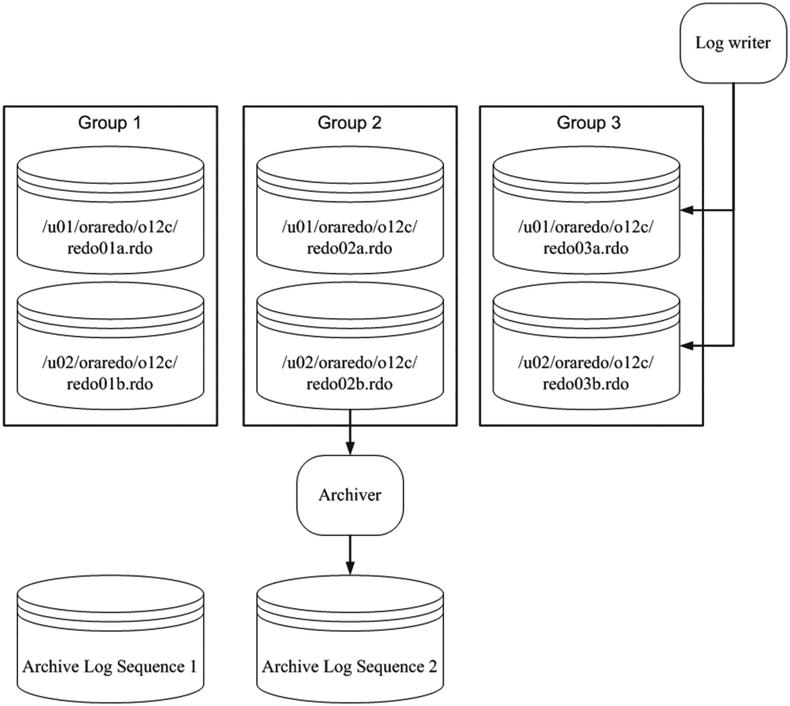
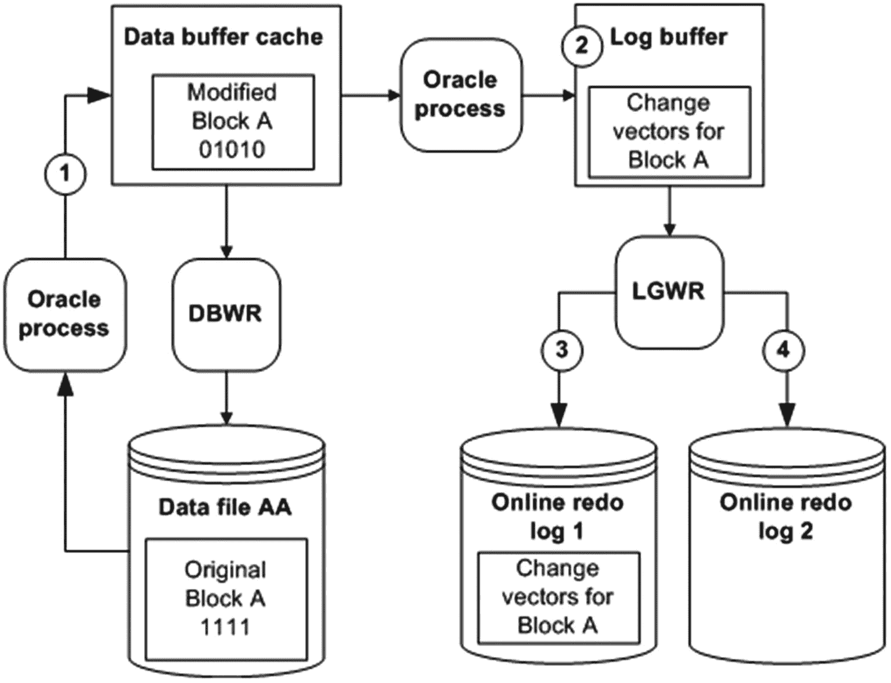
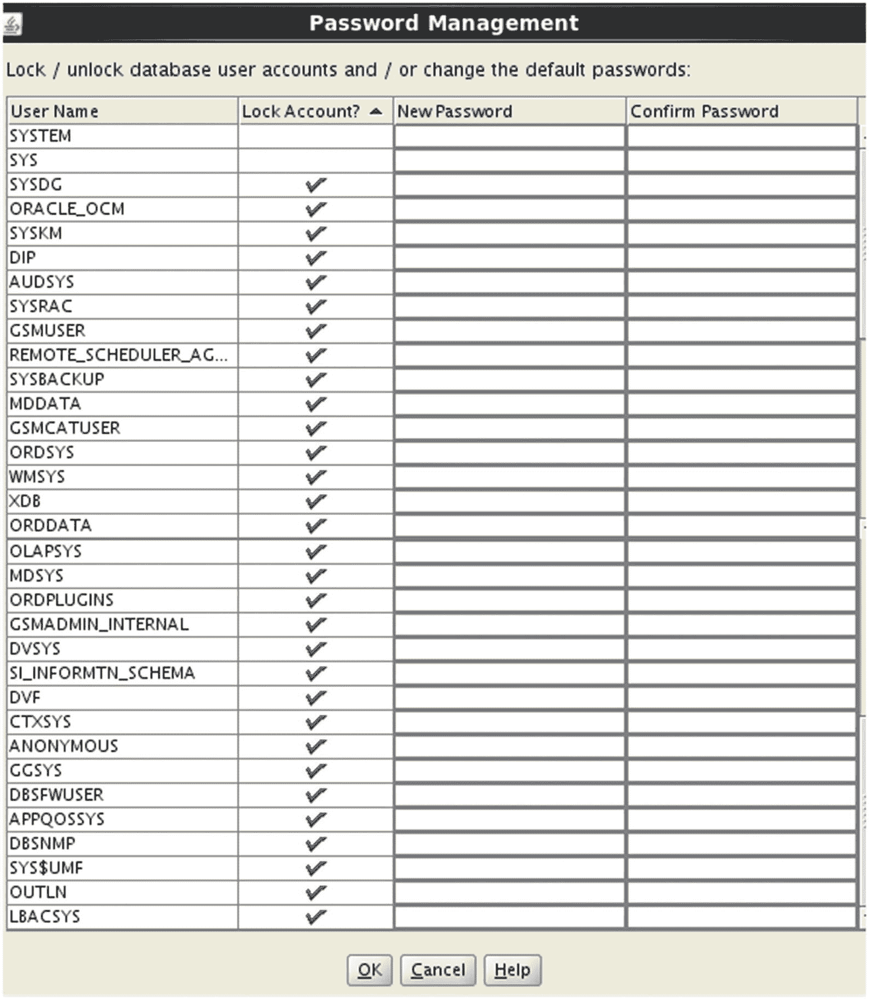

# 第 5 章 管理控制文件、联机重做日志和归档日志

Oracle 数据库由三种类型的必需文件组成：数据文件、控制文件和联机重做日志。第 4 章重点介绍了表空间和数据文件。本章介绍管理控制文件和联机重做日志以及实现归档日志。本章第一部分讨论典型的控制文件维护任务，例如添加、移动和删除控制文件。本章中间部分探讨与联机重做日志文件相关的 DBA 活动，例如重命名、添加、删除和重新定位这些关键文件。最后，涵盖了启用和实现归档的体系结构方面。

## 管理控制文件

控制文件是一个小的二进制文件，存储以下类型的信息：

*   数据库名称
*   数据文件的名称和位置
*   联机重做日志文件的名称和位置
*   当前联机重做日志序列号
*   检查点信息
*   RMAN 备份文件的名称和位置

您可以从数据字典视图查询存储在控制文件中的许多信息。此示例通过查询 `v$controlfile_record_section` 显示存储在控制文件中的信息类型：

```sql
SQL> select distinct type from v$controlfile_record_section;
```

以下是部分输出列表：

```
TYPE
------------------------------------------------------------
FILENAME
TABLESPACE
RMAN CONFIGURATION
BACKUP CORRUPTION
PROXY COPY
FLASHBACK LOG
REMOVABLE RECOVERY FILES
AUXILIARY DATAFILE COPY
DATAFILE
```

您可以通过 `v$database` 视图查看存储在控制文件中的数据库相关信息。`v$` 视图基于 `x$` 表或视图，`v$database` 基于 `x$database`，后者只是读取控制文件：

```sql
SQL> select name, open_mode, created, current_scn from v$database;
```

以下是此示例的输出：

```
NAME      OPEN_MODE            CREATED   CURRENT_SCN
--------- -------------------- --------- -----------
O18C      READ WRITE           28-SEP-12     2573820
```

每个 Oracle 数据库必须至少有一个控制文件。当您以 `nomount` 模式启动数据库时，实例通过 `spfile` 或 `init.ora` 文件中的 `CONTROL_FILES` 初始化参数知晓控制文件的位置。当您发出 `STARTUP NOMOUNT` 命令时，Oracle 读取参数文件，启动后台进程并分配内存结构：

```sql
-- 实例知晓控制文件的位置
SQL> startup nomount;
```

此时，任何进程都尚未访问控制文件。当您将数据库更改为加载（mount）模式时，控制文件被读取并打开供使用：

```sql
-- 控制文件已打开
SQL> alter database mount;
```

如果 `CONTROL_FILES` 初始化参数中列出的任何控制文件不可用，则无法加载数据库。

当您成功加载数据库时，实例知晓数据文件和联机重做日志的位置，但尚未打开它们。在将数据库更改为打开模式后，数据文件和联机重做日志被打开：

```sql
-- 数据文件和联机重做日志已打开
SQL> alter database open;
```

**注意**
请记住，当您发出 `STARTUP` 命令（无选项）时，将按此顺序自动执行前面描述的三个阶段：nomount、mount、open。当您发出 `SHUTDOWN` 命令时，阶段会反转：关闭数据库、卸载控制文件、停止实例。

控制文件在创建数据库时创建。正如您在第 2 章中看到的，在创建数据库时，应创建至少两个控制文件（以避免单点故障）。以前，您应该将多个控制文件存储在由不同控制器控制的单独存储设备上，但由于存储设备，可能很难知道是否是单独的设备，因此具有容错设备和镜像功能非常重要。控制文件是数据库非常重要的一部分，需要可用或在需要时非常快速地恢复。

控制文件也可以在 ASM 磁盘组上。这允许一个控制文件位于 `+ORADATA` 磁盘组中，另一个文件位于 `+FRA` 磁盘组中。管理控制文件及其内部细节与在文件系统上相同，只是控制文件使用 ASM 磁盘组。

数据库打开后，Oracle 会频繁地将信息写入控制文件，例如当您进行任何物理修改时（例如，创建表空间、添加/删除/调整数据文件大小）。Oracle 写入由 `CONTROL_FILES` 初始化参数指定的所有控制文件。如果 Oracle 无法写入其中一个控制文件，则会抛出错误：

```
ORA-00210: cannot open the specified control file
```

如果其中一个控制文件变得不可用，请关闭数据库，并在重新启动之前解决问题（有关使用 RMAN 还原控制文件的信息，请参见第 19 章）。解决问题可能意味着解决存储设备故障或修改 `CONTROL_FILES` 初始化参数以删除不可用控制文件的条目。

### 显示控制文件的内容

您可以使用 `ALTER SESSION` 语句显示控制文件的物理内容；例如，

```sql
SQL> oradebug setmypid
SQL> oradebug unlimit
SQL> alter session set events 'immediate trace name controlf level 9';
SQL> oradebug tracefile_name
```

前面的代码行显示跟踪文件的名称如下：

```
/ora01/app/oracle/diag/rdbms/o18c/o18c/trace/o18c_ora_4153.trc
```

跟踪文件写入到 `$ADR_HOME/trace` 目录。您也可以通过以下查询查看跟踪目录名称：

```sql
SQL> select value from v$diag_info where name='Diag Trace';
```

以下是跟踪文件的部分内容：

```
***************************************************************************
DATABASE ENTRY
***************************************************************************
(size = 316, compat size = 316, section max = 1, section in-use = 1,
last-recid= 0, old-recno = 0, last-recno = 0)
(extent = 1, blkno = 1, numrecs = 1)
09/28/2012 16:04:54
DB Name "O18C"
Database flags = 0x00404001 0x00001200
Controlfile Creation Timestamp  09/28/2012 16:04:57
Incmplt recovery scn: 0x0000.00000000
```

在故障排除或试图更好地了解 Oracle 内部结构时，您可以检查控制文件的内容。

### 查看控制文件名称和位置

如果您的数据库处于 `nomount`、`mounted` 或 `open` 状态，您可以查看控制文件的名称和位置，如下所示：

```sql
SQL> show parameter control_files
```

您也可以通过查询 `V$CONTROLFILE` 视图查看控制文件位置和名称信息。此查询在数据库已加载或打开时有效：

```sql
SQL> select name from v$controlfile;
```

如果由于某种原因您根本无法启动数据库，并且需要知道控制文件的名称和位置，您可以检查初始化（参数）文件的内容以查看其位置。如果您使用的是 `spfile`，即使它是二进制文件，您仍然可以使用文本编辑器打开它。最安全的方法是制作 `spfile` 的副本，然后使用操作系统编辑器检查其内容：

```bash
$ cp $ORACLE_HOME/dbs/spfileo18c.ora $ORACLE_HOME/dbs/spfileo18c.copy
$ vi $ORACLE_HOME/dbs/spfileo18c.copy
```

您也可以使用 `strings` 命令在二进制文件中搜索值：

```bash
$ strings spfileo18c.ora | grep -i control_files
```

如果您使用的是基于文本的初始化文件，您可以直接使用操作系统编辑器查看文件，或使用 `grep` 命令：

```bash
$ grep -i control_files $ORACLE_HOME/dbs/inito18c.ora
```

### 添加控制文件

添加控制文件意味着复制现有的控制文件，并通过修改 `CONTROL_FILES` 参数让您的数据库知晓该副本。此任务必须在数据库关闭时完成。此过程仅在您有一个可以复制的良好现有控制文件时才有效。添加控制文件与创建或恢复控制文件不同。

**提示**
有关为重命名和移动数据文件的目的重新创建控制文件的示例，请参见第 4 章。有关为重命名数据库的目的重新创建控制文件的示例，请参见第 19 章。

如果您的数据库只使用一个控制文件，并且该控制文件损坏，您需要从备份（如果可用）恢复一个控制文件并执行恢复，或者重新创建控制文件。如果您使用两个或更多控制文件，并且其中一个损坏，您可以使用剩余的良好控制文件快速使数据库进入可操作状态。

如果数据库仅使用一个控制文件，添加控制文件的基本过程如下：

1.  修改初始化文件 `CONTROL_FILES` 参数以包含控制文件的新位置和名称。
2.  关闭数据库。
3.  使用操作系统命令将现有控制文件复制到新位置和名称。
4.  重新启动数据库。

根据您使用的是 `spfile` 还是 `init.ora` 文件，前面的步骤略有不同。接下来的两个小节详细介绍了这些不同的场景。

#### Spfile 场景

如果您的数据库是打开的，您可以使用以下 SQL 语句快速确定是否使用了 `spfile`：

```sql
SQL> show parameter spfile
```

以下是一些示例输出：

```
NAME                            TYPE        VALUE
------------------------------- ----------- ------------------------------
spfile                          string      /ora01/app/oracle/product/18.1.0.1/db_1/dbs/spfileo18c.ora
```

当您确定使用的是 `spfile` 时，请使用以下步骤添加控制文件：

1.  确定 `CONTROL_FILES` 参数的当前值：

    ```sql
    SQL> show parameter control_files
    ```

    输出显示此数据库仅使用一个控制文件：

    ```
    NAME                            TYPE        VALUE
    ------------------------------- ----------- ------------------------------
    control_files                   string      /u01/dbfile/o18c/control01.ctl
    ```

2.  修改您的 `CONTROL_FILES` 参数以包含要添加的新控制文件，但将操作范围限制在 `spfile`（您无法在内存中修改此参数）。确保您也包括步骤 1 中列出的所有控制文件：

    ```sql
    SQL> alter system set control_files='/u01/dbfile/o18c/control01.ctl',
    '/u01/dbfile/o18c/control02.ctl' scope=spfile;
    ```

3.  关闭数据库：

    ```sql
    SQL> shutdown immediate;
    ```

4.  将现有控制文件复制到新位置和名称。在此示例中，通过操作系统 `cp` 命令创建了一个名为 `control02.ctl` 的新控制文件：

    ```bash
    $ cp /u01/dbfile/o18c/control01.ctl /u01/dbfile/o18c/control02.ctl
    ```

5.  启动数据库：

    ```sql
    SQL> startup;
    ```

您可以通过显示 `CONTROL_FILES` 参数来验证是否正在使用新的控制文件：

```sql
SQL> show parameter control_files
```

以下是此示例的输出：

```
NAME                  TYPE        VALUE
--------------------- ----------- ------------------------------
control_files         string      /u01/dbfile/o18c/control01.ctl
,/u01/dbfile/o18c/control02.ctl
```

#### Init.ora 场景

运行以下语句以验证您是否使用 `init.ora` 文件。如果您未使用 `spfile`，`VALUE` 列为空：

```sql
SQL> show parameter spfile
NAME                            TYPE        VALUE
------------------------------- ----------- ------------------------------
spfile                          string
```

要在使用文本 `init.ora` 文件时添加控制文件，请执行以下步骤：

1.  关闭数据库：

    ```sql
    SQL> shutdown immediate;
    ```

2.  使用操作系统实用程序（如 `vi`）编辑您的 `init.ora` 文件，并将新的控制文件位置和名称添加到 `CONTROL_FILES` 参数。此示例使用 `vi` 打开 `init.ora` 文件，并将 `control02.ctl` 添加到 `CONTROL_FILES` 参数：

    ```bash
    $ vi $ORACLE_HOME/dbs/inito18c.ora
    ```

    在添加 `control02.ctl` 之后，`CONTROL_FILES` 参数如下：

    ```
    control_files='/u01/dbfile/o18c/control01.ctl',
    '/u01/dbfile/o18c/control02.ctl'
    ```

3.  从操作系统，将现有控制文件复制到要添加的控制文件的位置和名称：

    ```bash
    $ cp /u01/dbfile/o18c/control01.ctl /u01/dbfile/o18c/control02.ctl
    ```

4.  启动数据库：

    ```sql
    SQL> startup;
    ```

您可以通过显示 `CONTROL_FILES` 参数来查看正在使用的控制文件：

```sql
SQL> show parameter control_files
```

对于此示例，输出如下：

```
NAME                       TYPE        VALUE
-------------------------- ----------- ------------------------------
control_files              string      /u01/dbfile/o18c/control01.ctl
,/u01/dbfile/o18c/control02.ctl
```

### 移动控制文件

您可能偶尔需要将控制文件从一个位置移动到另一个位置。例如，如果数据库服务器添加了新存储，您可能希望将现有控制文件移动到新可用的位置。

移动控制文件的过程与添加控制文件非常相似。唯一的区别是您重命名控制文件而不是复制它。此示例显示了在使用 `spfile` 时如何移动控制文件：

1.  确定 `CONTROL_FILES` 参数的当前值：

    ```sql
    SQL> show parameter control_files
    ```

    输出显示此数据库仅使用一个控制文件：

    ```
    NAME                            TYPE        VALUE
    ------------------------------- ----------- ------------------------------
    control_files                   string      /u01/dbfile/o18c/control01.ctl
    ```

2.  修改您的 `CONTROL_FILES` 参数以反映您正在移动控制文件。在此示例中，控制文件当前在此位置：

    ```
    /u01/dbfile/o18c/control01.ctl
    ```

    您正在将控制文件移动到此位置：

    ```
    /u02/dbfile/o18c/control01.ctl
    ```

    修改 `spfile` 以反映控制文件的新位置。您必须指定 `SCOPE=SPFILE`，因为 `CONTROL_FILES` 参数无法在内存中修改：

    ```sql
    SQL> alter system set
    control_files='/u02/dbfile/o18c/control01.ctl' scope=spfile;
    ```

3.  关闭数据库：

    ```sql
    SQL> shutdown immediate;
    ```

4.  在操作系统提示符下，将控制文件移动到新位置。此示例使用操作系统 `mv` 命令：

    ```bash
    $ mv /u01/dbfile/o18c/control01.ctl /u02/dbfile/o18c/control01.ctl
    ```

5.  启动数据库：

    ```sql
    SQL> startup;
    ```

您可以通过显示 `CONTROL_FILES` 参数来验证是否正在使用新的控制文件：

```sql
SQL> show parameter control_files
```

以下是此示例的输出：

```
NAME                            TYPE        VALUE
------------------------------- ----------- ------------------------------
control_files                   string      /u02/dbfile/o18c/control01.ctl
```

### 删除控制文件

您可能会遇到这样的情况：包含您一个多路复用控制文件之一的存储设备发生了介质故障：

```
ORA-00205: error in identifying control file, check alert log for more info
```

在这种情况下，您仍然至少有一个良好的控制文件。要删除控制文件，请按照以下步骤操作：

1.  通过检查 `alert.log` 中的信息来确定哪个控制文件经历了介质故障：

    ```
    ORA-00210: cannot open the specified control file
    ORA-00202: control file: '/u01/dbfile/o18c/control02.ctl'
    ```

2.  从 `CONTROL_FILES` 参数中删除不可用的控制文件名。如果您使用的是 `init.ora` 文件，请直接使用操作系统编辑器（如 `vi`）修改该文件。如果您使用的是 `spfile`，请使用 `ALTER SYSTEM` 语句修改 `CONTROL_FILES` 参数。在此 `spfile` 示例中，从 `CONTROL_FILES` 参数中删除了 `control02.ctl` 控制文件：

    ```sql
    SQL> alter system set control_files='/u01/dbfile/o18c/control01.ctl'
    scope=spfile;
    ```

    此数据库现在只有一个控制文件与之关联。您永远不应该仅使用一个控制文件运行生产数据库。有关如何向数据库添加更多控制文件的详细信息，请参阅本章前面的“添加控制文件”部分。

3.  停止并启动数据库：

    ```sql
    SQL> shutdown immediate;
    SQL> startup;
    ```

**注意**
如果 `SHUTDOWN IMMEDIATE` 不起作用，请使用 `SHUTDOWN ABORT` 来关闭数据库。当 `SHUTDOWN IMMEDIATE` 挂起时，使用 `SHUTDOWN ABORT` 快速关闭数据库没有任何问题；但是，请记住，数据库正在回滚更改，可能并没有挂起。根据处于回滚状态的事务，启动可能需要一些时间或影响性能。

控制文件可以位于 ASM 磁盘组中。这将允许您在不移动数据文件或控制文件的情况下移动后端磁盘和存储。如果使用 ASM 层，存储设备和磁盘对数据库文件变得透明。这不能防止文件损坏或文件被删除时可能需要的恢复，但它确实防止了因位置和使用的磁盘而移动文件。文件将在 ASM 视图中显示为 `CONTROLFILE` 类型，以了解文件的位置。

### 联机重做日志

联机重做日志存储数据库中发生的事务记录。这些日志服务于以下目的：

*   提供一种记录数据库更改的机制，以便在发生介质故障时，您有一种恢复事务的方法。
*   确保在发生完全实例故障时，已提交的事务可以被恢复（崩溃恢复），即使已提交的数据更改尚未写入数据文件。
*   允许管理员通过 Oracle LogMiner 实用程序检查历史数据库事务。
*   它们被 Oracle 工具（如 GoldenGate 或 Streams）读取以复制数据。

您的数据库中必须至少有两个联机重做日志组。每个联机重做日志组必须至少包含一个联机重做日志 `成员`（member）。`成员` 是磁盘上存在的 `物理文件`。您可以在每个重做日志组中创建多个成员，这称为多路复用（multiplexing）您的联机重做日志组。

**提示**
我强烈建议您多路复用联机重做日志组，并且如果可能，将每个成员放在由单独控制器管理的单独物理设备上。

日志写入器进程（log-writer process）从日志缓冲区（在 SGA 中）写入联机重做日志文件（在磁盘上）。重做记录被分配一个系统更改号（SCN）以标识事务重做信息。有已提交和未提交的记录写入重做日志。当以下任何情况为真时，日志写入器会刷新重做日志缓冲区的内容：

*   发出 `COMMIT`。
*   发生日志切换。
*   过去三秒钟。
*   重做日志缓冲区已满三分之一。

由于这是一个数据库进程，容器数据库（CDB）将管理重做日志。PDB 没有自己的重做日志，这也意味着重做日志的空间规划和大小调整是在 CDB 级别进行的，并包括所有 PDB 事务。该架构将在第 22 章中更详细地讨论，但事务大小调整基于 CDB 的所有 PDB。

日志写入器正在主动写入的联机重做日志组是当前联机重做日志组。日志写入器同时写入重做日志组的所有成员。日志写入器只需要成功写入一个成员，数据库就能继续运行。如果日志写入器无法成功写入当前组的至少一个成员，数据库将停止运行。

当当前联机重做日志组填满时，会发生日志切换，日志写入器开始写入下一个联机重做日志组。发生切换时，会为每个重做日志分配一个日志序列号，用于归档。日志写入器以轮询方式写入联机重做日志组。由于您有有限数量的联机重做日志组，最终每个联机重做日志组的内容将被覆盖。如果您想保存事务信息的历史记录，必须将数据库置于归档日志模式（请参阅本章后面的“实现归档日志模式”部分）。

当您的数据库处于归档日志模式时，每次日志切换后，归档器后台进程（archiver background process）将联机重做日志文件的内容复制到归档重做日志文件。在发生故障时，归档重做日志文件允许您还原自上次数据库备份以来发生的所有事务的完整历史记录。

图 5-1 显示了联机重做日志文件的典型设置。此图显示了三个联机重做日志组，每组包含两个成员。数据库处于归档日志模式。图中，组 2 最近已填满事务，发生了日志切换，日志写入器现在正在写入组 3。归档器进程正在将组 2 的内容复制到归档重做日志文件。当组 3 填满时，将发生另一次日志切换，日志写入器将开始写入组 1。同时，归档器进程将组 3 的内容复制到归档日志序列 3（依此类推）。



**图 5-1**
联机重做日志配置

联机重做日志文件不是用于备份的。这些文件仅包含数据库生成的最新重做事务信息。当您启用归档时，归档重做日志文件是保护数据库事务历史记录的机制。

当前联机重做日志文件的内容在发生日志切换之前不会被归档。这意味着如果您丢失了当前联机重做日志文件的所有成员，您将丢失事务。以下是帮助保护联机重做日志文件的几种机制：

*   多路复用组。
*   考虑设置 `ARCHIVE_LAG_TARGET` 初始化参数，以确保联机重做日志定期切换。
*   如果可能，切勿允许同一组的两个成员共享同一物理磁盘。
*   确保操作系统文件权限设置得当（限制为只有 Oracle 二进制文件的所有者具有写入和读取权限）。
*   使用冗余的物理存储设备（即 RAID [廉价磁盘冗余阵列]）。
*   适当调整日志文件大小，以便它们定期切换和归档。

**注意**
Oracle 提供的唯一可以在您丢失当前联机重做日志组的所有成员时保护您并保留所有已提交事务的工具是 Oracle Data Guard，以最大保护模式实施。有关 Oracle Data Guard 保护模式的更多详细信息，请参阅 MOS 说明 239100.1。

闪存（Flash）是重做日志的另一个选择。由于日志写入归档日志并需要快速写入，闪存驱动器是提高重性能的一种方法。如果闪存不可用，选项是将重做日志放在物理磁盘上，并根据之前的列表最小化故障。固态磁盘可能无法提供更快的写入，因此它们不是重做日志的理想选择。

联机重做日志文件永远不会由 RMAN 备份或用户管理的热备份备份。如果您确实备份了联机重做日志文件，还原它们将是无意义的。联机重做日志文件包含数据库生成的最新重做信息。您不希望从备份中用旧的重做信息覆盖它们。对于处于归档日志模式的数据库，联机重做日志文件包含执行完全恢复所需的最新生成的事务。重做日志文件也应与其他数据文件一起排除在其他系统备份（非数据库）之外。

### 显示联机重做日志信息

使用 `V$LOG` 和 `V$LOGFILE` 视图显示有关联机重做日志组及其相应成员的信息：

```sql
COL group#     FORM 99999
COL thread#    FORM 99999
COL grp_status FORM a10
COL member     FORM a30
COL mem_status FORM a10
COL mbytes     FORM 999999
--
SELECT
a.group#
,a.thread#
,a.status grp_status
,b.member member
,b.status mem_status
,a.bytes/1024/1024 mbytes
FROM v$log     a,
v$logfile b
WHERE a.group# = b.group#
ORDER BY a.group#, b.member;
```

以下是一些示例输出：

```
GROUP# THREAD# GRP_STATUS MEMBER                         MEM_STATUS  MBYTES
------ ------- ---------- ------------------------------ ---------- -------
1       1 INACTIVE   /u01/oraredo/o18c/redo01a.rdo                  50
1       1 INACTIVE   /u02/oraredo/o18c/redo01b.rdo                  50
2       1 CURRENT    /u01/oraredo/o18c/redo02a.rdo                  50
2       1 CURRENT    /u02/oraredo/o18c/redo02b.rdo                  50
```

当您诊断联机重做日志问题时，`V$LOG` 和 `V$LOGFILE` 视图特别有用。您可以在数据库已加载或打开时查询这些视图。表 5-1 简要描述了每个视图。

**表 5-1**
与联机重做日志相关的有用视图

| 视图 | 描述 |
| --- | --- |
| `V$LOG` | 显示存储在控制文件中的联机重做日志组信息 |
| `V$LOGFILE` | 显示联机重做日志文件成员信息 |

`V$LOG` 视图的 `STATUS` 列在处理联机重做日志组时特别有用。表 5-2 描述了 `V$LOG` 视图中每个状态及其含义。

**表 5-2**
`V$LOG` 视图中联机重做日志组的状态

| 状态 | 含义 |
| --- | --- |
| `CURRENT` | 日志组当前正被日志写入器写入。 |
| `ACTIVE` | 日志组是崩溃恢复所必需的，可能已被归档，也可能未被归档。 |
| `CLEARING` | 日志组正被 `ALTER DATABASE CLEAR LOGFILE` 命令清除。 |
| `CLEARING_CURRENT` | 当前日志组正在清除已关闭的线程。 |
| `INACTIVE` | 日志组不是崩溃恢复所必需的，可能已被归档，也可能未被归档。 |
| `UNUSED` | 日志组从未被写入；它是最近创建的。 |

`V$LOGFILE` 视图的 `STATUS` 列也包含有用的信息。此视图提供有关日志组中每个物理联机重做日志文件成员的信息。表 5-3 提供了每个日志文件成员的状态描述及其含义。

**表 5-3**
`V$LOGFILE` 视图中联机重做日志文件成员的状态

| 状态 | 含义 |
| --- | --- |
| `INVALID` | 日志文件成员无法访问或最近创建。 |
| `DELETED` | 日志文件成员不再使用。 |
| `STALE` | 日志文件成员的内容不完整。 |
| `NULL` | 日志文件成员正被数据库使用。 |

区分 `V$LOG` 中的 `STATUS` 列和 `V$LOGFILE` 中的 `STATUS` 列非常重要。`V$LOG` 中的 `STATUS` 列反映日志组的状态。`V$LOGFILE` 中的 `STATUS` 列报告物理联机重做日志文件成员的状态。在诊断联机重做日志问题时，请参考这些表。

### 确定联机重做日志组的最佳大小

尝试将联机重做日志的大小调整为每小时切换两到六次。`V$LOG_HISTORY` 包含联机重做日志切换频率的历史记录。执行此查询以查看每小时的日志切换次数：

```sql
select count(*)
,to_char(first_time,'YYYY:MM:DD:HH24')
from v$log_history
group by to_char(first_time,'YYYY:MM:DD:HH24')
order by 2;
```

以下是输出片段：

```
COUNT(*) TO_CHAR(FIRST
---------- -------------
1 2012:10:23:23
3 2012:10:24:03
28 2012:10:24:04
23 2012:10:24:05
68 2012:10:24:06
84 2012:10:24:07
15 2012:10:24:08
```

从前面的输出中，您可以看到大约在凌晨 4:00 到 7:00 之间发生了大量的日志切换活动。这可能是由于夜间批处理作业或不同时区的用户更新数据造成的。对于此数据库，应增加联机重做日志的大小。您应尝试调整联机重做日志的大小以适应数据库上的峰值事务负载。

`V$LOG_HISTORY` 视图显示系统更改号（SCN）。如前所述，一个经验法则是，您应该调整联机重做日志文件的大小，以便它们大约每小时切换两到六次。您不希望它们切换得太频繁，因为日志切换有开销；然而，将事务信息留在重做日志中而不归档会在恢复时产生问题。如果灾难导致当前联机重做日志发生介质故障，您可能会丢失尚未归档的那些事务。如果灾难导致当前联机重做日志发生介质故障，您可能会丢失尚未归档的那些事务。

Oracle 在日志切换期间启动检查点。在检查点期间，数据库写入器后台进程将已修改（也称为脏）块写入磁盘，这是资源密集型的。警告日志中的检查点消息也将是查看日志切换速度或是否存在与归档相关的等待的一种方式。

**提示**
使用 `ARCHIVE_LAG_TARGET` 初始化参数设置日志切换之间的最大时间（以秒为单位）。此参数的典型设置为 1,800 秒（30 分钟）。值为 0（默认值）会禁用此功能。此参数通常用于 Oracle Data Guard 环境中，以强制在指定的时间量过去后进行日志切换。

您也可以从 `V$INSTANCE_RECOVERY` 视图中查询 `OPTIMAL_LOGFILE_SIZE` 列，以确定您的联机重做日志文件大小是否正确：

```sql
SQL> select optimal_logfile_size from v$instance_recovery;
```

以下是一些示例输出：

```
OPTIMAL_LOGFILE_SIZE
--------------------
                 300
```

此列报告重做日志文件的大小（以兆字节为单位），根据 `FAST_START_MTTR_TARGET` 的初始化参数设置，该大小被认为是最佳的。Oracle 建议您将所有联机重做日志配置为至少为 `OPTIMAL_LOGFILE_SIZE` 的值。然而，在调整联机重做日志大小时，您必须考虑有关您的环境的信息（例如切换的频率）。

### 确定重做日志组的最佳数量

Oracle 需要至少两个重做日志组才能运行。但是，只有两个组有时是不够的。要理解为什么是这样，请记住每次发生日志切换时，都会启动一个检查点。作为检查点的一部分，数据库写入器将所有已修改（脏）块从 SGA 写入磁盘上的数据文件。还要记住，联机重做日志是以轮询方式写入的，并且最终给定日志中的信息将被覆盖。在日志写入器可以开始覆盖联机重做日志中的信息之前，必须先将 SGA 中与该重做日志关联的所有已修改块写入数据文件。如果不是这样，所有已修改块都已写入数据文件，您会在 `alert.log` 文件中看到此消息：

```
Thread 1 cannot allocate new log, sequence 
Checkpoint not complete
```

解释此问题的另一种方式是，Oracle 需要在联机重做日志中存储执行崩溃恢复所需的任何信息。为了帮助您可视化，请参见图 5-2。



**图 5-2**
重做受到保护，直到修改的（脏）缓冲区写入磁盘

在时间 1，块 A 从数据文件 AA 读入缓冲区高速缓存并被修改。在时间 2，重做更改向量信息（块如何更改）被写入日志缓冲区。在时间 3，日志写入器进程将块 A 更改向量信息写入联机重做日志 1。在时间 4，发生日志切换，联机重做日志 2 成为当前联机重做日志。

现在，假设联机重做日志 2 很快被填满，并且发生了另一次日志切换，此时日志写入器尝试写入联机重做日志 1。在数据库写入器将块 A 写入数据文件 AA 之前，日志写入器不允许覆盖联机重做日志 1 中的信息。在块 A 写入数据文件 AA 之前，Oracle 需要联机重做日志中的信息来在发生断电或关闭异常（shutdown abort）时恢复此块。在 Oracle 覆盖联机重做日志中的信息之前，它会确保受重做保护的块已写入磁盘。如果这些修改的块尚未写入磁盘，Oracle 会暂时挂起处理，直到此操作完成。有几种方法可以解决此问题：

*   添加更多重做日志组。
*   降低 `FAST_START_MTTR_TARGET` 的值。这样做会使数据库写入器进程在更短的时间内将较旧的已修改块写入磁盘。
*   调优数据库写入器进程（修改 `DB_WRITER_PROCESSES`）。

如果您注意到 `Checkpoint not complete` 消息经常出现（比如每天几次），我建议您添加一个或多个日志组来解决此问题。添加额外的重做日志使数据库写入器有更多时间在关联的块重做被覆盖之前，将数据库缓冲区高速缓存中的已修改块写入数据文件。添加更多重做日志组几乎没有缺点。主要问题是您可能会达到创建数据库时使用的 `MAXLOGFILES` 值。如果您需要添加更多组并且已超过 `MAXLOGFILES` 的值，则必须重新创建控制文件并为此参数指定更高的值。

如果添加更多重做日志组不能解决问题，您应仔细考虑降低 `FAST_START_MTTR_TARGET` 的值。当您降低此值时，可能会看到更多的 I/O，因为数据库写入器进程更积极地将已修改块写入数据文件。理想情况下，在生产环境中进行更改之前，最好在测试环境中验证修改 `FAST_START_MTTR_TARGET` 的影响。您可以在实例启动时修改此参数；这意味着如果有不可预见的副作用，您可以快速将其修改回原始设置。

最后，考虑增加 `DB_WRITER_PROCESSES` 参数的值。在应用到生产环境之前，请在测试环境中仔细分析修改此参数的影响。此值需要停止并启动数据库；因此，如果有不利影响，需要停机时间才能将此值更改回原始设置。

### 添加联机重做日志组

如果您确定需要添加联机重做日志组，请使用 `ADD LOGFILE GROUP` 语句。在此示例中，数据库已包含两个大小为 50M 的联机重做日志组。添加了一个包含两个成员且大小为 50MB 的额外日志组：

```sql
alter database add logfile group 3
('/u01/oraredo/o18c/redo03a.rdo',
'/u02/oraredo/o18c/redo03b.rdo') SIZE 50M;
```

在这种情况下，我强烈建议您添加的日志组与现有联机重做日志具有相同的大小和相同数量的成员。如果新添加的组与现有组具有不同的物理特性，则更难以准确确定性能问题。如果需要更大的大小，可以以更大的大小添加新组，然后删除其他组并以更大的大小值重新创建它们，以保持重做日志大小相同（下一节将提供此示例）。

例如，如果您有两个大小为 50MB 的日志组，并且添加了一个大小为 500MB 的新日志组，这很可能会产生前一节中描述的 `Checkpoint not complete` 问题。这是因为将 SGA 中所有受 500MB 日志文件中重做保护的已修改块刷新可能比将 SGA 中受 50MB 日志文件保护的已修改块刷新花费更长的时间。

### 调整大小和删除联机重做日志组

您可能需要更改联机重做日志的大小（请参阅本章前面的“确定联机重做日志组的最佳大小”部分）。您不能直接修改现有联机重做日志的大小（就像对数据文件那样）。要调整联机重做日志的大小，您必须首先添加大小符合您要求的联机重做日志组，然后删除旧大小的联机重做日志。

假设您希望将联机重做日志的大小调整为每个 200MB。首先，使用 `ADD LOGFILE GROUP` 语句添加大小为 200MB 的新组。以下示例添加了日志组 4，包含两个大小为 200MB 的成员：

```sql
alter database add logfile group 4
('/u01/oraredo/o18c/redo04a.rdo',
'/u02/oraredo/o18c/redo04b.rdo') SIZE 200M;
```

**注意**
您可以以字节、千字节、兆字节或千兆字节为单位指定日志文件的大小。

添加了新大小的日志文件后，您可以删除旧的联机重做日志。日志组必须具有 `INACTIVE` 状态才能被删除。您可以检查日志组的状态，如下所示：

```sql
SQL> select group#, status, archived, thread#, sequence# from v$log;
```

您可以使用 `ALTER DATABASE DROP LOGFILE GROUP` 语句删除不活动的日志组：

```sql
SQL> alter database drop logfile group ;
```

如果您尝试删除当前联机日志组，Oracle 会返回 `ORA-01623` 错误，指出您无法删除当前组。使用 `ALTER SYSTEM SWITCH LOGFILE` 语句切换日志并使下一个组成为当前组：

```sql
SQL> alter system switch logfile;
```

日志切换后，先前为当前组的日志组只要包含 Oracle 执行崩溃恢复所需的重做，就会保持活动状态。如果您尝试删除处于活动状态的日志组，Oracle 会抛出 `ORA-01624` 错误，指出该日志组是崩溃恢复所必需的。发出 `ALTER SYSTEM CHECKPOINT` 命令使日志组变为非活动状态：

```sql
SQL> alter system checkpoint ;
```

此外，如果删除操作会使数据库只剩下一个日志组，您不能删除联机重做日志组。如果您尝试这样做，Oracle 会抛出 `ORA-01567` 错误，并告知不允许删除日志组，因为它会使您的数据库只剩下一个日志组（如前所述，Oracle 需要至少两个重做日志组才能运行）。

删除联机重做日志组不会从操作系统中删除日志文件。您必须使用操作系统命令来执行此操作（例如 Linux/Unix 的 `rm` 命令）。在从操作系统中删除文件之前，请确保它未被使用，并且您不会删除活动的联机重做日志文件。对于服务器上的每个数据库，发出此查询以查看正在使用的联机重做日志文件：

```sql
SQL> select member from v$logfile;
```

在物理删除日志文件之前，首先切换联机重做日志足够多次，以便所有联机重做日志组最近都已切换；这样做会导致操作系统写入文件，从而为其提供新的时间戳。例如，如果您有三个组，请确保执行至少三次日志切换：

```sql
SQL> alter system switch logfile;
SQL> /
SQL> /
```

**提示**
这些添加和删除重做日志的步骤是在移交新数据库或安排定期测试期间进行练习和测试生产数据库脚本的另一个实践。

现在，在操作系统提示符下验证您打算删除的日志文件是否没有新的时间戳。首先，转到包含联机重做日志文件的目录：

```bash
$ cd  /u01/oraredo/o18c
```

然后，列出文件以查看最新的修改日期：

```bash
$ ls -altr
```

当您绝对确定文件未被使用时，可以将其删除。删除文件的危险在于，如果它恰好是一个正在使用的联机重做日志，并且是一个组的唯一成员，您可能会对数据库造成严重损坏。确保您有数据库的良好备份，并且您删除的文件未被服务器上的任何数据库使用。

### 向组添加联机重做日志文件

您可能偶尔需要向现有组添加日志文件。例如，如果您有一个仅包含一个成员的联机重做日志组，您应考虑添加一个日志文件（以提供更高程度的单个日志文件成员故障保护）。使用 `ALTER DATABASE ADD LOGFILE MEMBER` 语句向现有联机重做日志组添加成员文件。您需要指定新成员文件的位置、名称以及要向其添加文件的组：

```sql
SQL> alter database add logfile member '/u02/oraredo/o18c/redo01b.rdo'
to group 1;
``

请确保您遵循有关任何新添加的重做日志文件的位置和名称的标准。

### 从组中删除联机重做日志文件

偶尔，您可能需要从组中删除日志文件。例如，您的数据库可能经历了多路复用组中一个成员的故障，并且您希望删除该故障成员。首先，确保您要删除的日志文件不在当前组中：

```sql
SELECT a.group#, a.member, b.status, b.archived, SUM(b.bytes)/1024/1024 mbytes
FROM v$logfile a, v$log b
WHERE a.group# = b.group#
GROUP BY a.group#, a.member, b.status, b.archived
ORDER BY 1, 2;
```

如果您尝试删除具有 `CURRENT` 状态的组中的日志文件，会收到以下错误：

```
ORA-01623: log 2 is current log for instance o18c (thread 1) - cannot drop
```

如果您尝试从当前联机重做日志组中删除成员，则强制切换，如下所示：

```sql
SQL> alter system switch logfile ;
```

使用 `ALTER DATABASE DROP LOGFILE MEMBER` 语句从日志组中删除日志文件。您不需要指定组号，因为您正在删除特定文件：

```sql
SQL> alter database drop logfile member '/u01/oraredo/o18c/redo04a.rdo';
```

您也不能删除组中最后一个剩余的日志文件。一个组必须至少包含一个日志文件。如果您尝试删除组中最后一个剩余的日志文件，您会收到以下错误：

```
ORA-00361: cannot remove last log member ...
```

### 移动或重命名重做日志文件

有时您需要移动或重命名联机重做日志文件。例如，您可能已向系统添加了一些新的挂载点，并且您希望将联机重做日志移动到新存储。您可以使用两种方法来完成此任务：

*   在新位置添加新日志文件并删除旧日志文件。
*   从操作系统物理重命名文件。

如果您无法承受任何停机时间，请考虑在新位置添加新日志文件，然后删除旧日志文件。有关如何添加日志组的详细信息，请参阅本章前面的“添加联机重做日志组”部分。另请参阅本章前面的“调整大小和删除联机重做日志组”部分，了解如何删除日志组。

或者，您可以从操作系统物理移动文件。您可以在数据库打开或关闭时执行此操作。如果您的数据库是打开的，请确保您移动的文件不是当前联机重做日志组的一部分（因为这些文件正被日志写入器后台进程主动写入）。在数据库打开时尝试执行此任务是危险的，因为在活动系统上，联机重做日志可能正在快速切换，这会产生在文件切换为当前联机重做日志时尝试移动文件的可能性。因此，我建议您仅在数据库关闭时尝试执行此操作。

下一个示例显示如何在数据库关闭时移动联机重做日志文件。步骤如下：

1.  关闭数据库：

    ```sql
    SQL> shutdown immediate;
    ```

2.  在操作系统提示符下，移动文件。此示例使用 `mv` 命令完成此任务：

    ```bash
    $ mv /u02/oraredo/o18c/redo02b.rdo /u01/oraredo/o18c/redo02b.rdo
    ```

3.  以加载模式启动数据库：

    ```sql
    SQL> startup mount;
    ```

4.  使用新文件位置和名称更新控制文件：

    ```sql
    SQL> alter database rename file '/u02/oraredo/o18c/redo02b.rdo'
    to '/u01/oraredo/o18c/redo02b.rdo';
    ```

5.  打开数据库：

    ```sql
    SQL> alter database open;
    ```

您可以通过查询 `V$LOGFILE` 视图来验证您的联机重做日志是否位于新位置。我还建议您切换联机重做日志几次，然后从操作系统验证文件是否具有最近的时间戳。同时检查 `alert.log` 文件是否有任何相关错误。

### 控制重做的生成

对于某些类型的应用程序，您可能事先知道可以轻松重新创建数据。例如，在数据仓库环境中，您执行直接路径插入或使用 `SQL*Loader` 加载数据。在这些场景中，您可以关闭直接路径加载的重做生成。您使用 `NOLOGGING` 子句来完成此操作：

```sql
create tablespace inv_mgmt_data
datafile '/u01/dbfile/o12c/inv_mgmt_data01.dbf' size 100m
extent management local
uniform size 128k
segment space management auto
nologging;
```

如果您有一个现有的表空间并希望更改其日志记录模式，请使用 `ALTER TABLESPACE` 语句：

```sql
SQL> alter tablespace inv_mgmt_data nologging;
```

您可以通过查询 `DBA_TABLESPACES` 视图来确认表空间日志记录模式：

```sql
SQL> select tablespace_name, logging from dba_tablespaces;
```

对于常规的 `INSERT`、`UPDATE` 和 `DELETE` 语句，无法抑制重做日志记录。对于常规数据操作语言（DML）语句，`NOLOGGING` 子句被忽略。但是，`NOLOGGING` 子句适用于以下类型的 DML：

*   直接路径 `INSERT` 语句
*   直接路径 `SQL*Loader`

`NOLOGGING` 子句也适用于以下类型的 DDL 语句：

*   `CREATE TABLE ... AS SELECT`（`NOLOGGING` 仅影响初始创建，不影响后续针对表的常规 DML 语句）
*   `ALTER TABLE ... MOVE`
*   `ALTER TABLE ... ADD/MERGE/SPLIT/MOVE/MODIFY PARTITION`
*   `CREATE INDEX`
*   `ALTER INDEX ... REBUILD`
*   `CREATE MATERIALIZED VIEW`
*   `ALTER MATERIALIZED VIEW ... MOVE`
*   `CREATE MATERIALIZED VIEW LOG`
*   `ALTER MATERIALIZED VIEW LOG ... MOVE`

请注意，如果未记录表或索引的重做，并且在对象备份之前发生介质故障，那么您将无法恢复数据；您会收到 `ORA-01578` 错误，指示数据存在逻辑损坏。

**注意**
您也可以在对象级别覆盖表空间级别的日志记录。例如，即使表空间指定为 `NOLOGGING`，您也可以使用 `LOGGING` 子句创建表。

## 实现归档日志模式

回想一下本章前面的讨论，只有当您的数据库处于归档日志模式时，才会创建归档重做日志。如果您想保留数据库事务历史记录以促进时间点恢复和其他类型的恢复，则需要启用该模式。

在正常操作中，对数据的更改会在数据库重做日志文件中生成条目。当每个联机重做日志组填满时，会启动日志切换。当发生日志切换时，日志写入器停止写入最近填满的联机重做日志组，并开始写入新的联机重做日志组。联机重做日志组以轮询方式写入——这意味着任何给定联机重做日志组的内容最终将被覆盖。归档日志模式通过使用归档器后台进程（archiver background process）将填满的联机重做日志的内容复制到所谓的 *归档重做日志文件* 来长期保留重做数据。归档重做日志文件的跟踪对于您恢复数据库并将所有更改完整保留到故障发生的确切时间点的能力至关重要。

### 做出体系结构决策

当您实现归档日志模式时，您还需要一个管理归档日志文件的策略。归档重做日志会消耗磁盘空间。如果置之不理，这些文件最终将用完分配给它们的所有空间。如果发生这种情况，归档器无法将新的归档重做日志文件写入磁盘，您的数据库将停止处理事务。此时，您的数据库将挂起。然后，您需要手动干预，为归档器创建空间以恢复工作。由于这些原因，在启用归档之前，您必须仔细考虑几个体系结构决策：

*   将归档重做日志放在哪里，以及是否使用快速恢复区（FRA）存储它们
*   如何命名归档重做日志
*   为归档重做日志位置分配多少空间
*   多久备份一次归档重做日志
*   何时可以永久删除磁盘上的归档重做日志
*   如何删除归档重做日志（例如，让 RMAN 根据保留策略删除日志）
*   是否应启用多个归档重做日志位置
*   何时安排所需的少量停机时间（如果是生产数据库）

根据经验，您的主要归档重做位置应有足够的空间来保存至少一天的归档重做日志。这允许您每天备份它们，然后在备份后将它们从磁盘中删除。

如果您决定为归档重做日志位置使用快速恢复区（FRA），您必须确保它包含足够的空间来保存两次备份之间生成的归档重做日志数量。请记住，FRA 通常包含其他类型的文件，例如 RMAN 备份文件、闪回日志等。如果您使用 FRA，请注意其他类型文件的生成可能会影响归档重做日志文件所需的空间。可以设置一些参数来管理 FRA 并提供一种方法来调整恢复空间的大小，以便数据库能够继续运行，而不必增加文件系统上的空间。

参数 `DB_RECOVERY_FILE_DEST` 和 `DB_RECOVERY_FILE_DEST_SIZE` 设置了 FRA 的文件位置和数据库要使用的空间大小。这些参数还可以防止一个数据库填满同一服务器上其他数据库的空间。可以创建 ASM 磁盘组 FRA 来使用 ASM 管理空间。`DB_RECOVERY_FILE_DEST = '+FRA'` 将允许该区域使用 FRA 磁盘组。同样，在填满空间的情况下，在幕后管理空间具有优势。使用这些参数以及 ASM 移除了特定的文件系统，并提供了更多选项来快速解决归档日志和使用恢复区域的问题。FRA 是推荐的，因为这些参数是动态的，并且可以允许进行更改以防止数据库挂起。这应包含在数据库归档模式的规划和架构中。

您需要一个自动化备份和删除归档重做日志文件的策略。对于用户管理的备份，这可以通过一个 shell 脚本来实现，该脚本定期将归档重做日志复制到备份位置，然后从主位置删除它们。正如您将在后面的章节中看到的，RMAN 自动化了归档重做日志文件的备份和删除。

如果您的业务要求您必须具有某种程度的高可用性和冗余，那么您应该考虑将归档重做日志写入多个位置。一些站点设置作业定期将归档重做日志复制到磁盘上的不同位置，甚至复制到不同的服务器。

### 设置归档重做文件位置

在将数据库模式设置为归档之前，您应明确指示 Oracle 您希望将归档重做日志放置在哪里。您可以通过以下技术设置归档重做日志文件目标：

*   设置 `LOG_ARCHIVE_DEST_N` 数据库初始化参数。
*   实现 FRA。

这两种方法将在以下各节中详细讨论。

**提示**
如果您未通过初始化参数或启用 FRA 显式设置归档重做日志位置，则归档重做日志将写入默认位置。对于 Linux/Unix，默认位置是 `ORACLE_HOME/dbs`。对于 Windows，默认位置是 `ORACLE_HOME\database`。对于活动的生产数据库系统，默认的归档重做日志位置很少合适。

### 将归档位置设置为用户定义的磁盘位置（非 FRA）

如果您使用的是 `init<SID>.ora` 文件，请使用操作系统实用程序（如 `vi`）修改该文件。在此示例中，归档重做日志位置设置为 `/u01/oraarch/o18c`：

```
log_archive_dest_1='location=/u01/oraarch/o18c'
log_archive_format='o12c_%t_%s_%r.arc'
```

在前面的代码行中，我的命名归档重做日志文件的标准包括 `ORACLE_SID`（在此示例中，以 `o18c` 开头）；强制参数 `%t`、`%s` 和 `%r`；以及以 `.arc` 结尾的字符串。我喜欢将 `ORACLE_SID` 的名称嵌入字符串中，以避免当多个数据库驻留在一个服务器上时产生混淆。我喜欢使用扩展名 `.arc` 来区别于其他类型的数据库文件。

**提示**
如果您未为 `LOG_ARCHIVE_FORMAT` 指定值，Oracle 会使用默认值，例如 `%t_%s_%r.dbf`。我不喜欢默认格式的一个方面是它以扩展名 `.dbf` 结尾，该扩展名广泛用于数据文件。这可能会导致混淆，因为无法确定特定文件是否可以安全删除（因为它是旧的归档重做日志文件）还是不应触摸（因为它是活动的数据文件）。大多数 DBA 不愿发出诸如 `rm *.dbf` 之类的命令，担心意外删除活动的数据文件。

如果您使用的是 `spfile`，请使用 `ALTER SYSTEM` 修改相应的初始化变量：

```sql
SQL> alter system set log_archive_dest_1='location=/u01/oraarch/o18c' scope=both;
SQL> alter system set log_archive_format='o12c_%t_%s_%r.arc' scope=spfile;
```

您可以在数据库打开时动态更改 `LOG_ARCHIVE_DEST_n` 参数。但是，您必须停止并启动数据库才能使 `LOG_ARCHIVE_FORMAT` 参数生效。

### 从设置错误的 spfile 参数中恢复

注意不要将 `LOG_ARCHIVE_FORMAT` 设置为无效值；例如，

```sql
SQL> alter system set log_archive_format='%r_%y_%dk.arc' scope=spfile;
```

如果您这样做，当您尝试停止并启动数据库时，您甚至无法进入 nomount 阶段（因为 `spfile` 包含无效参数）：

```sql
SQL> startup nomount;
ORA-19905: log_archive_format must contain %s, %t and %r
```

在这种情况下，如果您使用的是 `spfile`，则无法启动实例。您有几个选择。如果您使用 RMAN 并备份了 `spfile`，那么从备份中还原 `spfile`。

如果您不使用 RMAN，您也可以尝试直接使用操作系统编辑器（如 `vi`）编辑 `spfile`，但 Oracle 不推荐或支持此方法。

替代方法是从 `spfile` 的内容手动创建 `init.ora` 文件。首先，重命名包含错误值的 `spfile`：

```bash
$ cd $ORACLE_HOME/dbs
$ mv spfile.ora spfile.old
```

在 SQL*Plus 中，从 `spfile` 创建 `init.ora` 文件。

```sql
SQL> create pfile=inito18c.ora from spfile;
```

然后，使用文本编辑器（如 `vi`）打开 `pfile`：

```bash
$ vi inito18c.ora
```

将错误的参数修改为包含有效值。退出 `pfile`。您现在应该能够使用 `pfile` 启动数据库。然后您可以将 `pfile` 复制到新的 `spfile`。

```sql
SQL> create spfile from pfile;
```

然后您可以使用修复后的 `spfile` 启动数据库。

当您指定 `LOG_ARCHIVE_FORMAT` 时，必须在格式字符串中包含 `%t`（或 `%T`）、`%s`（或 `%S`）和 `%r`。表 5-4 列出了可以与 `LOG_ARCHIVE_FORMAT` 初始化参数一起使用的有效变量。

**表 5-4**
日志归档格式字符串的有效变量

| 格式字符串 | 含义 |
| --- | --- |
| `%s` | 日志序列号 |
| `%S` | 日志序列号，左侧补零 |
| `%t` | 线程号 |
| `%T` | 线程号，左侧补零 |
| `%a` | 激活 ID |
| `%d` | 数据库 ID |
| `%r` | `Resetlogs` ID，需要确保跨多个数据库化身的唯一性 |

您可以通过运行以下命令查看 `LOG_ARCHIVE_DEST_N` 参数的值：

```sql
SQL> show parameter log_archive_dest
```

以下是输出的部分列表：

```
NAME                             TYPE        VALUE
-------------------------------- ----------- --------------------------
log_archive_dest                 string
log_archive_dest_1               string      location=/u01/oraarch/o18c
log_archive_dest_10              string
```

您可以启用最多 31 个不同的位置作为归档重做日志文件目标。对于大多数生产系统，一个归档重做日志目标位置通常就足够了。如果您需要更高程度的保护，可以启用多个目标。请记住，当您使用多个目标时，归档器必须能够成功写入至少一个位置。如果您启用了多个强制位置并将 `LOG_ARCHIVE_MIN_SUCCEED_DEST` 设置为大于 1，那么如果归档器无法写入所有强制位置，您的数据库可能会挂起。

您可以通过此查询检查有关归档重做日志位置状态的详细信息：

```sql
select
dest_name
,destination
,status
,binding
from v$archive_dest;
```

以下是输出的一小部分：

```
DEST_NAME            DESTINATION                    STATUS    BINDING
-------------------- ------------------------------ --------- ---------
LOG_ARCHIVE_DEST_1   /u01/oraarch/o18c              VALID     OPTIONAL
LOG_ARCHIVE_DEST_2                                  INACTIVE  OPTIONAL
```

### 将 FRA 用于归档日志文件

FRA 是磁盘上的一个区域——通过数据库初始化参数指定——可用于存储文件，例如归档重做日志、RMAN 备份文件、闪回日志以及多路复用的控制文件和联机重做日志。要启用 FRA 的使用，必须设置两个初始化参数（按此顺序）：

1.  `DB_RECOVERY_FILE_DEST_SIZE` 指定数据库在 FRA 中存储的所有文件使用的最大空间。
2.  `DB_RECOVERY_FILE_DEST` 指定 FRA 的基本目录。

当您创建 FRA 时，您并不是真正在创建任何东西——您是在告诉 Oracle 在存储进入 FRA 的文件时使用哪个目录。例如，假设在挂载点上保留了 200GB 的空间，并且您希望 FRA 的基本目录为 `/u01/fra`。要启用 FRA，首先设置 `DB_RECOVERY_FILE_DEST_SIZE`：

```sql
SQL> alter system set db_recovery_file_dest_size=200g scope=both;
```

接下来，设置 `DB_RECOVERY_FILE_DEST` 参数：

```sql
SQL> alter system set db_recovery_file_dest='/u01/fra' scope=both;
```

如果您使用的是 `init.ora` 文件，请使用操作系统实用程序（如 `vi`）对其进行修改，并包含适当的条目。

启用 FRA 后，默认情况下，Oracle 将归档重做日志写入 FRA 中的子目录。

**注意**
如果您已将 `LOG_ARCHIVE_DEST_N` 参数设置为磁盘上的某个位置，则归档重做日志不会写入 FRA。

您可以验证归档位置是否正在使用 FRA：

```sql
SQL> archive log list;
```

如果归档文件正在写入 FRA，您应该看到如下输出：

```
Database log mode              Archive Mode
Automatic archival             Enabled
Archive destination            USE_DB_RECOVERY_FILE_DEST
```

您可以显示与 FRA 关联的目录，如下所示：

```sql
SQL> show parameter db_recovery_file_dest
```

当您首次实现 FRA 时，基本 FRA 目录（使用 `DB_RECOVERY_FILE_DEST` 指定）下没有子目录。当 Oracle 首次需要将文件写入 FRA 时，它会在基本目录下创建任何必需的目录。例如，实现 FRA 后，如果为您的数据库启用了归档，那么在第一次发生日志切换时，Oracle 会在基本 FRA 目录下创建以下目录：

```
/archivelog/
```

每天生成的归档重做日志都会导致在 FRA 中创建一个新目录，使用目录名格式 `YYYY_MM_DD`。写入 FRA 的归档重做日志使用 OMF 格式命名约定（无论您是否设置了 `LOG_ARCHIVE_FORMAT` 参数）。

如果您希望归档重做日志同时写入 FRA 和非 FRA 位置，您可以启用该功能，如下所示：

```sql
SQL> alter system set log_archive_dest_1='location=/u01/oraarch/o18c';
SQL> alter system set log_archive_dest_2='location=USE_DB_RECOVERY_FILE_DEST' ;
```

### 启用归档日志模式

在设置归档重做日志文件的位置后，您可以启用归档日志模式。以 `SYS`（或具有 `SYSDBA` 权限的用户）身份连接并执行以下操作：

```sql
$ sqlplus / as sysdba
SQL> shutdown immediate;
SQL> startup mount;
SQL> alter database archivelog;
SQL> alter database open;
```

您可以通过此查询确认归档日志模式：

```sql
SQL> archive log list;
```

您也可以通过以下方式确认：

```sql
SQL> select log_mode from v$database;
LOG_MODE
------------
ARCHIVELOG
```

### 禁用归档日志模式

通常，您不会为生产数据库禁用归档日志模式。但是，您可能正在执行大数据量加载，并希望减少与归档过程相关的任何开销，因此您希望在加载开始前关闭归档日志模式，然后在加载后重新启用它。如果您这样做，请务必在重新启用归档后尽快进行备份。

要禁用归档，请以 `SYS`（或具有 `SYSDBA` 权限的用户）身份执行以下操作：

```sql
$ sqlplus / as sysdba
SQL> shutdown immediate;
SQL> startup mount;
SQL> alter database noarchivelog;
SQL> alter database open;
```

您可以通过此查询确认归档日志模式：

```sql
SQL> archive log list;
```

您也可以通过以下方式确认日志模式：

```sql
SQL> select log_mode from v$database;
LOG_MODE
------------
NOARCHIVELOG
```

### 对归档日志目标磁盘空间不足的反应

归档器后台进程将归档重做日志写入您指定的位置。如果由于任何原因归档器进程无法写入归档位置，您的数据库将挂起。任何尝试连接的用户都会收到此错误：

```
ORA-00257: archiver error. Connect internal only, until freed.
```

作为生产支持 DBA，您永远不希望您的数据库进入该状态。有时，不可预测的事件会发生，您必须处理不可预见的问题。

**注意**
支持生产数据库的 DBA 的心态与架构师 DBA 完全不同。获得新想法或学习新技术是与生产 DBA 和架构师一起工作和沟通在您的环境中可能有效或无效的内容的完美时机。在故障排除生产问题之外安排时间进行规划并为环境设置策略。

在这种情况下，您的数据库相当于宕机并且完全不可用。要解决此问题，您必须迅速采取行动：

*   将文件移动到不同的位置。
*   压缩归档重做日志位置中的旧文件。
*   永久删除旧文件。
*   将归档重做日志目标切换到不同的位置（这可以在数据库运行时动态更改）。
*   如果使用 FRA，增加 `DB_RECOVERY_FILE_DEST_SIZE` 的空间分配。
*   如果使用 FRA，将参数 `DB_RECOVERY_FILE_DEST` 中的目标更改为不同的位置。
*   RMAN 备份并删除归档日志文件。
*   使用 RMAN 从目录中删除过期的文件。

移动文件通常是解决归档器错误以及增加分配或目录（使用 `DB_RECOVERY_FILE_DEST` 参数）的最快、最安全的方法。您可以使用操作系统实用程序（如 `mv`）将旧的归档重做日志移动到不同的位置。如果后续恢复需要它们，您可以让恢复过程知道新位置。注意不要移动当前正在写入的归档重做日志。如果归档重做日志文件出现在 `V$ARCHIVED_LOG` 中，则表示它已被完全归档。

您可以使用操作系统实用程序（如 `gzip`）压缩当前归档目标中的归档重做日志文件。如果您这样做，您必须记住解压缩任何以后可能用于恢复的文件。注意不要压缩当前正在写入的归档重做日志。

另一个选项是使用操作系统实用程序（如 `rm`）从磁盘中永久删除归档重做日志。这种方法很危险，因为您可能需要这些归档重做日志进行后续恢复。如果您确实删除了归档重做日志文件，并且您没有它们的备份，您应尽快对数据库进行完整备份。

使用 RMAN 备份和删除文件是一种更安全的方法，并确保在执行另一个备份之前可以进行恢复。同样，这种方法有风险，只能作为最后手段执行；如果您删除了尚未备份的归档重做日志，那么您可能无法执行完全恢复。

如果您服务器上的另一个位置有足够的空间，您可以考虑更改归档重做日志的写入位置。您可以在数据库运行时执行此操作；例如，

```sql
SQL> alter system set log_archive_dest_1='location=/u02/oraarch/o18c';
```

在解决主要位置的问题后，您可以切换回原始位置。

**注意**
当发生日志切换时，归档器根据当前的 FRA 设置或 `LOG_ARCHIVE_DEST_N` 参数确定归档重做日志的写入位置。归档器不关心目标是否最近发生了变化。

当归档重做日志文件目标已满时，您必须争分夺秒地解决问题。这就是为什么在为 24-7 生产数据库启用归档之前，应该进行大量思考的原因。

对于大多数数据库，将归档重做日志写入一个位置就足够了。但是，如果您有任何类型的灾难恢复或高可用性要求，那么您应该写入多个位置。有时，DBA 设置一个作业，每小时备份一次归档重做日志，并将其复制到备用位置甚至备用服务器。

### 备份归档重做日志文件

根据您的业务要求，您可能需要一个备份归档重做日志文件的策略。至少，您应该备份在归档日志模式下备份数据库期间生成的任何归档重做日志。其他策略可能包括：

*   定期将归档重做日志复制到备用位置，然后从主目标中删除它们。
*   将归档重做日志复制到磁带，然后从磁盘中删除它们。
*   使用两个归档重做日志位置。
*   使用 Data Guard 实现强大的灾难恢复解决方案。

请记住，您需要自上次良好备份开始时间以来生成的所有归档重做日志，以确保能够完全恢复数据库。只有在确定拥有数据库的良好备份后，才应考虑删除备份之前生成的归档重做日志。

如果您使用 RMAN 作为备份和恢复策略，则应使用 RMAN 备份归档重做日志。此外，您应为这些文件指定 RMAN 保留策略，并仅在满足保留策略要求后（例如，在从磁盘删除之前至少备份一次文件）让 RMAN 删除归档重做日志（有关使用 RMAN 的详细信息，请参见第 18 章）。

## 本章小结

本章描述了如何配置和管理控制文件和联机重做日志文件以及启用归档。控制文件和联机重做日志是关键的数据库文件；正常运行的数据库离不开它们。

控制文件是包含数据库结构信息的小型二进制文件。参数文件中指定的任何控制文件都必须可用才能加载数据库。如果控制文件变得不可用，那么您的数据库将在下一次日志切换或需要写入控制文件时停止运行，直到您解决问题。我强烈建议您将数据库配置为至少有三个控制文件。如果一个控制文件变得不可用，您可以用一个良好现有控制文件的副本替换它。了解如何配置、添加和删除这些文件至关重要。

联机重做日志是记录数据库事务历史的关键文件。如果您有多个实例连接到一个数据库，那么每个实例都会生成自己的重做线程。每个数据库必须创建两个或更多联机重做日志组。您可以使用每个组仅包含一个联机重做日志成员的数据库运行。但是，我强烈建议您为每个联机重做日志组创建两个成员。如果联机重做日志至少有一个可以写入的成员，您的数据库将继续运行。如果联机重做日志组的所有成员都不可用，那么您的数据库将停止运行。作为 DBA，您必须非常精通创建、添加、移动和删除这些关键的数据库文件。使用闪存等存储选项将允许更快地写入重做日志。固态磁盘可能无法提供更快的写入，因此它们不是重做日志的理想选择。

归档是确保您拥有恢复数据库所需的所有事务的机制。启用后，归档器需要在日志切换发生后成功复制联机重做日志。如果归档器无法写入主归档目标，那么您的数据库将挂起。因此，您需要仔细规划所需的磁盘空间量以及备份和后续删除这些文件的频率。

使用快速恢复区（FRA）提供了管理归档日志的额外方法，并允许在规划磁盘增长和大小调整方面具有一定的灵活性。

到目前为止，本书的章节涵盖了安装 Oracle 软件、创建数据库以及管理表空间、数据文件、控制文件、联机重做日志文件和归档等任务。接下来的几章将重点介绍如何为应用程序使用配置数据库，包括创建用户和数据库对象等主题。

# 第 6 章 用户和基本安全

在安装了二进制文件、实现了数据库并创建了表空间之后，下一个逻辑任务是保护数据库并开始创建新用户。创建数据库时，默认会创建几个默认用户帐户。作为 DBA，您必须了解这些帐户以及如何管理它们。默认帐户通常是黑客试图获取数据库访问权限的第一个地方；因此，您必须采取预防措施来保护这些用户。根据您安装的选项和实现的数据库版本，可能会有 20 个或更多默认帐户。

随着应用程序和用户需要访问数据库，您将需要创建和管理新帐户。这包括选择适当的身份验证方法、实施密码安全性以及为用户分配权限。本章将详细讨论这些主题。

## 管理默认用户

如前所述，当您创建数据库时，Oracle 会创建几个默认数据库用户。在早期版本中，这些默认用户要么设置默认密码，要么从数据库创建中获取输入。使用 Oracle 18c，除 `SYS` 和 `SYSTEM` 外，所有默认帐户在安装时都被锁定。可以为每个帐户设置密码或自定义解锁；但是，建议仅解锁绝对需要的帐户。作为 `dbca` 的步骤之一，所有帐户都列出并可供更改，而不仅仅是 `SYS` 和 `SYSTEM` 帐户，如图 6-1 所示。



**图 6-1**
默认帐户和密码管理

创建的特定用户因数据库版本而异。如果您刚创建了数据库，可以查看默认用户帐户，如下所示：

```sql
SQL> select username from dba_users order by 1;
```

以下是部分默认数据库用户帐户列表：

```
USERNAME
------------------------------------------------------------
ANONYMOUS
APPQOSSYS
AUDSYS
DBSNMP
DIP
GSMADMIN_INTERNAL
GSMCATUSER
GSMUSER
ORACLE_OCM
OUTLN
SYS
SYSTEM
...
```

DBA 对前面的列表感到沮丧的是，很难跟踪默认帐户是什么以及它们是否真的需要。一些 DBA 可能会试图删除默认帐户以避免数据库混乱。我不建议这样做。更改密码并锁定这些帐户更安全（如下一节所示）。如果您删除了一个帐户，可能很难弄清楚它最初是如何创建的，而如果您锁定一个帐户，您可以简单地解锁它以重新激活它。

**注意**
如果您在可插拔数据库环境中工作，可以作为特权帐户连接到根容器，通过查询 `CDB_USERS` 查看所有用户。除非本章另有说明，否则查询假设您不在可插拔环境中（因此您使用的是 `DBA` 级别的视图）。如果您在可插拔环境中，要跨所有可插拔数据库查看信息，您需要在连接到根容器时使用 `CDB` 级别的视图。

### SYS 与 SYSTEM

Oracle 新手有时会问：“`SYS` 和 `SYSTEM` 模式之间有什么区别？”`SYS` 模式是数据库的超级用户；拥有所有内部数据字典对象；用于诸如创建数据库、启动或停止实例、备份和恢复以及添加或移动数据文件等任务。这些类型的任务通常需要 `SYSDBA` 或 `SYSOPER` 角色。这些角色的安全性通常通过访问 Oracle 软件所有者的操作系统帐户来控制。此外，可以通过密码文件管理这些角色的安全性，允许远程客户端/服务器访问。从 12c 开始，`SYS` 帐户在某些数据库中也可以被锁定。锁定帐户可以防止来自服务器和另一个操作系统帐户的未经授权的访问，但 `SYSDBA` 权限需要首先授予授权用户。尽管锁定 `SYS` 帐户可以防止使用共享的默认帐户，但有些选项或系统可能需要 `SYS` 保持解锁状态。密码应


#### 通过 oraset 脚本设置 Oracle 操作系统变量。

#### 有关设置操作系统变量的更多详细信息，请参见第 2 章。
`. /etc/oraset $1`
#
`userlist="system sys dbsnmp dip oracle_ocm outln"`
for `u1` in `$userlist`
do
#
case `$u1` in
system)
`pwd=manager`
`cdb=$1`
;;
sys)
`pwd="change_on_install"`
`cdb="$1 as sysdba"`
;;
*)
`pwd=$u1`
`cdb=$1`
esac
#
`echo "select 'default' from dual;" | \
sqlplus -s $u1/$pwd@$cdb | grep default >/dev/null`
if `[[ $? -eq 0 ]]`; then
`echo "ALERT: $u1/$pwd@$cdb default password"`
`echo "def pwd $u1 on $cdb" | mailx -s "$u1 pwd default" dkuhn@gmail.com`
else
`echo "cannot connect to $u1 with default password."`
fi
done
exit 0
```

如果脚本检测到默认密码，将会向相应的 DBA 发送一封电子邮件。这个脚本只是一个简单的示例，关键在于你需要某种机制来检测默认密码。你可以创建自己的脚本，或者修改前面的脚本以满足你的需求。

## 创建用户

在创建用户时，你需要考虑以下因素：

*   用户名和身份验证方法
*   基本权限
*   默认永久表空间和空间配额
*   默认临时表空间

创建用户的这些方面将在后续章节中讨论。

**注意**
Oracle 数据库 12c 的新特性是，在可插拔数据库环境中存在公用用户和本地用户。公用用户可跨越容器数据库内的所有可插拔数据库。本地用户则存在于单个可插拔数据库中。有关管理公用用户和本地用户的详细信息，请参见第 22 章。

### 选择用户名和身份验证方法

选择一个能让人联想到该用户将使用何种应用程序的用户名。例如，如果你有一个库存管理应用程序，一个好的用户名选择是 `INV_MGMT`。选择有意义的用户名有助于识别用户的用途。如果系统文档记录不完善，这一点尤其有用。

身份验证是用于确认用户有权使用该账户的方法。Oracle 支持一套强大的身份验证方法：

*   数据库身份验证（用户名和密码存储在数据库中）
*   操作系统身份验证
*   网络身份验证
*   全局用户身份验证和授权
*   外部服务身份验证

一种简单、易用且可靠的身份验证形式是通过数据库实现的。在这种身份验证形式中，用户名和密码存储在数据库内。密码不是以纯文本形式存储；而是以安全的加密格式存储。当连接到数据库时，用户提供用户名和密码。数据库根据数据库中存储的信息检查输入的用户名和密码，如果匹配，则允许用户使用该账户关联的权限连接到数据库。

另一种常用的身份验证方法是通过操作系统。操作系统身份验证意味着，如果你能成功登录到服务器，那么无需提供用户名和密码详细信息，就可以建立到本地数据库的连接。换句话说，你可以将数据库权限与一个操作系统账户或一个关联的操作系统组相关联，或两者兼有。从 18c 开始，你可以在 Active Directory 中集中管理用户，并作为用户或全局用户集成到数据库中。

数据库和操作系统身份验证以及全局用户的示例将在接下来的两节中讨论。如果你有更复杂的身份验证需求，那么你应该研究网络、全局或外部服务身份验证。有关这些方法的更多详细信息，请参阅《Oracle 数据库安全指南》和《Oracle 数据库高级安全管理员指南》，这些文档可以从 Oracle 网站的技术网络区域（[`http://otn.oracle.com`](http://otn.oracle.com)）免费下载。

### 使用数据库身份验证创建用户

数据库身份验证通过 `CREATE USER` SQL 语句建立。作为 DBA 创建用户，你的账户必须具有 `CREATE USER` 系统权限。此示例创建一个名为 `HEERA` 的用户，密码为 `CHAYA`，并分配默认永久表空间 `USERS`、默认临时表空间 `TEMP`，以及在 `USERS` 表空间上的无限空间配额：

```
create user heera identified by chaya
default tablespace users
temporary tablespace temp
quota unlimited on users;
```

这创建了一个没有任何权限的极简模式（schema）。要使该用户有用，你至少必须授予其 `CREATE SESSION` 系统权限：

```
SQL> grant create session to heera;
```

如果新模式需要能够创建表，则需要授予其额外权限，例如 `CREATE TABLE`：

```
SQL> grant create table to heera;
```

你也可以使用 `GRANT...IDENTIFIED BY` 语句来创建用户；例如：

```
grant create table, create session
to heera identified by chaya;
```

如果该用户不存在，则通过前面的语句创建该账户。如果用户已存在，则密码将更改为 `IDENTIFIED BY` 子句指定的密码（并且任何指定的权限也会被应用）。

**注意**
有时，DBA 在创建用户时，会为模式分配默认角色，例如 `CONNECT` 和 `RESOURCE`。这些角色包含系统权限，如 `CREATE SESSION` 和 `CREATE TABLE`（以及其他一些权限，具体因数据库版本而异）。我建议不要这样做，因为 Oracle 已声明这些角色在未来版本中可能不可用。出于安全和审计原因，应创建所需的具体角色，并仅将这些角色授予数据库中的用户。

### 使用操作系统身份验证创建用户

操作系统身份验证假设，如果用户能够登录到数据库服务器，那么数据库权限可以与操作系统用户账户相关联并从中派生。有两种类型的操作系统身份验证：

*   通过为用户分配特定的操作系统角色进行身份验证（允许将数据库权限映射到用户）
*   通过 `IDENTIFIED EXTERNALLY` 子句为常规数据库用户进行身份验证

通过操作系统角色的身份验证在第 2 章中有详细说明。这种类型的身份验证由 DBA 使用，允许他们连接到操作系统账户（例如 `oracle`），然后以 `SYSDBA` 权限连接到数据库，而无需指定用户名和密码。

登录到数据库服务器后，使用 `IDENTIFIED EXTERNALLY` 子句创建的用户可以连接到数据库，而无需指定用户名或密码。这种类型的身份验证有一些有趣的优势：

*   有权访问服务器的用户无需维护数据库用户名和密码。
*   如果由操作系统身份验证的用户执行，登录到数据库的脚本不必使用硬编码的密码。
*   其他数据库用户无法通过猜测用户名和密码连接字符串来侵入用户。登录操作系统身份验证用户的唯一方式是从操作系统登录。

使用操作系统身份验证时，Oracle 会将 `OS_AUTHENT_PREFIX` 数据库初始化参数中包含的值作为前缀，添加到连接到数据库的操作系统用户名之前。此参数的默认值为 `OPS$`。Oracle 强烈建议你将 `OS_AUTHENT_PREFIX` 参数设置为空字符串；例如：

```
SQL> alter system set os_authent_prefix="" scope=spfile;
```

你必须停止并启动数据库才能使此修改生效。设置 `OS_AUTHENT_PREFIX` 参数后，你可以创建外部身份验证用户。例如，假设你有一个名为 `jsmith` 的操作系统用户，并且你希望任何有权访问此操作系统的用户都能够登录数据库而无需提供密码。使用 `CREATE EXTERNALLY` 语句来实现：


## 配置集中管理用户

```
SQL> create user jsmith identified externally;
SQL> grant create session to jsmith ;
```

现在，当 `jsmith` 登录到数据库服务器时，该用户可以连接到 `SQL*Plus`，如下所示：

```
$ sqlplus /
```

不需要用户名或密码，因为该用户已经通过操作系统认证。

集中管理用户被视为位于单一位置（如 Active Directory 或其他 LDAP 服务）的用户。可以集中管理用户的认证和授权，例如，Active Directory 中的用户将通过密码或其他类型的密钥进行认证管理，并通过安全组的使用来管理授权。如果用户更改了安全组，其权限将随之改变；如果用户在 Active Directory 中变为非活跃状态，则该用户无法再认证访问其他应用程序或数据库。

可以在数据库中创建一个全局用户，这意味着数据库将主动联系 Active Directory 以获取用户详细信息，首先是验证密码，然后是验证所属的组以进行授权。数据库配置一个连接到 Active Directory 的用户，并且 `ldap.ora` 文件会更新相关信息以用于针对 Active Directory 进行认证。配置完成后，可以使用以下语法创建用户：

```
SQL> create user jsmithdba identified globally as
'cn=jsmithdba group,ou=dbateam,dc=example,dc=com';
```

这使得 Oracle 数据库能够识别 Active Directory 中的用户 `jsmithdba` 为允许访问此数据库的用户。密码与 Active Directory 中的密码相同，并且该组可用于映射到数据库角色以获取权限。

身份管理对企业至关重要，它允许个人根据其在企业中的职能拥有角色和任务。当这些职能发生变化或员工离职时，账户会被集中管理，而不是分散在各个数据库中。Oracle 云提供了身份管理服务，用于配置角色并允许添加用户，这些用户作为身份管理服务的一部分进行管理，而非在各数据库中单独管理。

注意
用户可以导入到 Oracle Cloud 中，这样就不必逐个输入账户。即使不导入所有企业用户，采用这种方式工作也有助于考虑哪些用户应该迁移过来，然后验证其角色。

## 理解模式与用户

模式是数据库对象（如表和索引）的集合。模式通常并不重要，但两者之间存在一些细微差别。

当你登录 Oracle 数据库时，你使用用户名和密码进行连接。在此示例中，用户是 `INV_MGMT`，密码是 `f00bar`：

```
SQL> connect inv_mgmt/f00bar
```

当你以用户身份连接时，默认情况下，你可以操作与你连接数据库时所用用户对应的模式中的对象。例如，当你尝试描述一个表时，Oracle 默认访问当前用户的模式。因此，无需在表名前添加当前连接用户（所有者）作为前缀。

假设当前连接的用户是 `INV_MGMT`。考虑以下 `DESCRIBE` 命令：

```
SQL> describe inventory;
```

前述语句在功能上等同于以下语句：

```
SQL> desc inv_mgmt.inventory;
```

你可以通过 `ALTER SESSION` 语句更改当前用户的会话以指向不同的模式：

```
SQL> alter session set current_schema = hr;
```

此语句**不**授予当前用户（本例中为 `INV_MGMT`）任何额外的权限。该语句指示 Oracle 对后续引用数据库对象的任何 SQL 语句使用模式限定符 `HR`。如果已授予适当的权限，`INV_MGMT` 用户可以访问 `HR` 用户的对象，而无需在对象名前加上模式名。

正如 `describe` 和 `desc` 是功能相同的命令，描述表 `EMPLOYEES` 与使用 `HR.EMPLOYEES` 是相同的。

```
SQL>  desc HR.EMPLOYEES
如果会话已通过 alter session 设置为 HR，则结果相同：
SQL> desc EMPLOYEES
```

注意
Oracle 确实有一个 `CREATE SCHEMA` 语句。讽刺的是，`CREATE SCHEMA` 并不创建模式或用户。相反，该语句提供了一种在模式中以单个事务创建多个对象（表、视图、授权）的方法。我很少见到 `CREATE SCHEMA` 语句被使用，但如果你所在环境确实使用它，你需要了解这一点。

## 分配默认永久和临时表空间

确保用户具有正确的默认永久表空间和临时表空间，有助于防止无意中填满 `SYSTEM` 或 `SYSAUX` 表空间的问题，这可能导致数据库不可用并引发性能问题。需要注意的是，如果你没有为数据库定义默认永久和临时表空间，那么在创建用户时，默认会使用 `SYSTEM` 表空间。这绝不是一件好事。

如第 2 章所述，在创建数据库时，你应该建立一个默认永久表空间和临时表空间。第 2 章也展示了用于识别和更改默认永久表空间及临时表空间的 SQL 语句。这确保了当你创建用户且未指定默认永久和临时表空间时，将应用数据库的默认设置。因此，`SYSTEM` 表空间永远不会被用作默认永久和临时表空间。

话虽如此，现实情况是你很可能会遇到并非如此设置的数据库。在维护数据库时，你应该验证默认永久和临时表空间的设置，以确保它们符合你的数据库标准。你可以通过查询 `DBA_USERS` 视图来查看用户信息：

```
select
username
,password
,default_tablespace
,temporary_tablespace
from dba_users;
```

以下是输出的一小部分示例：

```
USERNAME         PASSWORD   DEFAULT_TABLESPACE        TEMPORARY_TABLESPACE
---------------- ---------- ------------------------- --------------------
JSMITH           EXTERNAL   USERS                     TEMP
MV_MAINT                    USERS                     TEMP
AUDSYS                      USERS                     TEMP
GSMUSER                     USERS                     TEMP
XS$NULL                     USERS                     TEMP
```

除了 `SYS` 用户外，你的任何用户都不应将默认永久表空间设置为 `SYSTEM`。你不希望除 `SYS` 外的任何用户在 `SYSTEM` 表空间中创建对象。`SYSTEM` 表空间应保留给 `SYS` 用户的对象。

如果其他用户的对象存在于 `SYSTEM` 表空间中，你将面临填满该表空间并危及数据库可用性的风险。这也意味着，如果你使用 `SYS` 账户登录，在创建表和其他对象时应谨慎指定特定的表空间。

你所有的用户都应被分配一个已创建为临时类型的临时表空间。通常，这个表空间被命名为 `TEMP`（更多详情请参见第 4 章）。

如果你发现任何用户的默认表空间设置不当，可以使用 `ALTER USER` 语句进行修改：

```
SQL> alter user inv_mgmt default tablespace users temporary tablespace temp;
```


#### 临时表空间与用户管理

### 避免 SYSTEM 临时表空间

你绝不希望任何用户的临时表空间是`SYSTEM`。如果一个用户的临时表空间是`SYSTEM`，那么该用户需要临时磁盘存储的任何排序区域都将在`SYSTEM`表空间中获取区。这可能导致`SYSTEM`表空间被填满。你绝不希望这种情况发生，因为`SYS` schema 对象增长时无法获取更多空间可能导致数据库无法运行。要检查哪些用户的临时表空间是`SYSTEM`，请运行此脚本：

```sql
SQL> select username from dba_users where temporary_tablespace='SYSTEM';
```

### 创建用户脚本示例

通常，我在创建用户时使用脚本名`creuser.sql`。此脚本使用定义用户名、密码、默认表空间等的变量。对于执行该脚本的每个环境（开发、测试、质量保证(QA)、Beta、生产），你可以根据需要更改&符号变量。例如，你可以为每个独立环境使用不同的密码和不同的表空间。

以下是一个`creuser.sql`脚本示例：

```sql
DEFINE cre_user=inv_mgmt
DEFINE cre_user_pwd=inv_mgmt_pwd
DEFINE def_tbsp=inv_data
DEFINE idx_tbsp=inv_index
DEFINE def_temp_tbsp=temp
DEFINE smk_ttbl=zzzzzzz
--
CREATE USER &&cre_user IDENTIFIED BY &&cre_user_pwd
DEFAULT TABLESPACE &&def_tbsp
TEMPORARY TABLESPACE &&def_temp_tbsp;
--
GRANT CREATE SESSION TO &&cre_user;
GRANT CREATE TABLE   TO &&cre_user;
--
ALTER USER &&cre_user QUOTA UNLIMITED ON &&def_tbsp;
ALTER USER &&cre_user QUOTA UNLIMITED ON &&idx_tbsp;
--
-- 冒烟测试
CONN &&cre_user/&&cre_user_pwd
CREATE TABLE &&smk_ttbl(test_id NUMBER) TABLESPACE &&def_tbsp;
CREATE INDEX &&smk_ttbl._idx1 ON &&smk_ttbl(test_id) TABLESPACE &&idx_tbsp;
INSERT INTO &&smk_ttbl VALUES(1);
DROP TABLE &&smk_ttbl;
```

### 冒烟测试

`冒烟测试`是一个在管道、电子和软件开发等行业中使用的术语。该术语指的是在初次组装或修复后进行的第一次检查，以提供系统正常工作的某种程度的保证。
在管道中，冒烟测试迫使烟雾通过排水管道。强制的烟雾有助于快速识别系统中的裂缝或泄漏。
在电子中，当电源首次连接到电路时会发生冒烟测试。如果布线有故障，有时会产生烟雾。
在软件开发中，冒烟测试是对系统进行的一个简单测试，以确保其具有某种程度的可工作性。据报道，许多经理在冒烟测试失败时被看到耳朵冒烟。

### 修改密码

使用`ALTER USER`命令来修改现有用户的密码。此示例将`HEERA`用户的密码更改为`FOOBAR`：

```sql
SQL> alter user HEERA identified by FOOBAR;
```

只有授予你的用户`ALTER USER`特权，你才能更改另一个账户的密码。此特权授予`DBA`角色。在你为用户更改密码后，该用户之后连接到数据库都需要`ALTER USER`语句所指示的密码。
在 Oracle Database 11g 或更高版本中，修改密码时它是区分大小写的。如果你使用的是 Oracle Database 10g 或更低版本，密码不区分大小写。大小写行为由参数`SEC_CASE_SENSITIVE_LOGON`设置，默认为`TRUE`。这是一个应该检查的参数，以确保它未被更改，从而保证使用区分大小写的密码，除非遗留应用程序需要并允许使用，直到可以调整密码。

### SQL*Plus 密码命令

你可以使用 SQL*Plus `PASSWORD`命令更改用户的密码。发出命令后，系统会提示你输入新密码：

```sql
SQL> passw heera
Changing password for heera
New password:
Retype new password:
Password changed
```

此方法的优点是在屏幕上不显示新密码即可更改用户密码。

### 仅 Schema 账户

以前没有仅 Schema 账户时，DBA 必须以不同用户身份登录才能执行某些建表脚本并授予权限。从 18c 开始，可以创建无需密码的新仅 Schema 账户。这适用于包含所有对象的应用程序 Schema，因此如果被授予访问这些账户的权限，就可以对这些对象进行更改。这些账户没有直接登录数据库的权限。所以即使没有密码，也无法登录，并且会发生错误。

```sql
SQL> create user app1 NO AUTHENTICATION;
```

在`dba_users`表中，此用户的`AUTHENTICATION_TYPE`将为`NONE`，密码列也将为`NULL`。仅 Schema 账户可以被授予创建表和其他对象的权限；但是，它不能被分配任何管理权限。即使将`CONNECT SESSION`授予仅 Schema 账户，也不允许你直接登录到此 Schema 账户。

```sql
SQL> grant create session to app1 ;
Grant succeeded.
SQL> connect app1
Enter password:
ERROR:
ORA-01005: null password given; logon denied
Warning: You are no longer connected to ORACLE.
SQL> connect app1
Enter password:
ERROR:
ORA-01017: invalid username/password; logon denied
```

为了在其他账户（包括仅 Schema 账户）中执行 DDL 语句，可以使用代理连接。即使在 18c 之前，使用代理连接也是可能的，并且使用仅 Schema 账户，为了执行该 Schema 的任何必要代码，它仍然是可能的。以下是一个示例，使用`jsmithdba`作为我们的账户登录数据库，而仅 Schema 账户是`app1`。

```sql
SQL> alter user app1 grant connect through jsmithdba;
SQL> connect jsmithdba/password1
SQL> select sys_context('USERENV','SESSION_USER') as session_user,
sys_context('USERENV','SESSION_SCHEMA') as session_schema,
sys_context('USERENV','PROXY_USER') as proxy_id,
user
from dual;
SESSION_USER SESSION_SCHEMA     PROXY_ID     USER
-----------------------  ------------------------------------ -------------
APP1         APP1               JSMITHDBA    APP1
```

这个没有密码的 Schema 可以简单地用于应用程序 Schema，并允许将权限授予对象或成为此 Schema 来运行代码。这是应用程序 Schema 需要考虑的一点；并且，正如我们将在接下来的“管理权限”部分中看到的，这些对象的授权和权限仍然可以通过角色来处理。

### 修改用户

有时你需要修改现有用户，原因如下：

*   更改用户密码
*   锁定或解锁用户
*   更改默认永久或临时表空间，或两者
*   更改配置文件或角色
*   更改系统或对象权限
*   修改表空间上的配额

使用`ALTER USER`语句来修改用户。接下来列出了一些修改用户的 SQL 语句。此示例使用`IDENTIFIED BY`子句更改用户密码：

```sql
SQL> alter user inv_mgmt identified by i2jy22a;
```

如果你在最初创建用户时未设置默认永久表空间和临时表空间，可以在创建后修改它们，如下所示：

```sql
SQL> alter user inv_mgmt default tablespace users temporary tablespace temp;
```

此示例锁定用户账户：

```sql
SQL> alter user inv_mgmt account lock;
```

而此示例更改用户在`USERS`表空间上的配额：

```sql
SQL> alter user inv_mgmt quota 500m on users;
```

> 注意
> 由于`ALTER USER`是一个高权限命令，并且有许多使用它的理由，它现在可能掌握在安全团队手中执行。可以编写其他命令和过程来执行此操作，然后将权限授予执行者。此外，数据库保险库限制了更改用户的能力，并允许安全团队执行这些操作。

### 删除用户


## 数据库用户管理与安全

在删除用户之前，建议先锁定该用户。锁定用户可以防止他人连接到已锁定的数据库账户，这有助于您更好地在删除账户前确认是否有人正在使用它。以下是锁定用户的示例：

```
SQL> alter user heera account lock;
```

任何尝试连接到此用户的用户或应用程序现在都会收到以下错误：

```
ORA-28000: the account is locked
```

要查看数据库中的用户及锁定日期，可以执行此查询：

```
SQL> select username, lock_date from dba_users;
```

要解锁账户，请执行此命令：

```
SQL> alter user heera account unlock;
```

锁定用户是一种非常方便的技术，可用于保护数据库安全并发现哪些用户是活跃的。
请注意，锁定用户并不会锁定对其所属对象的访问。例如，如果用户`USER_A`对`USER_B`拥有的表具有`select`、`insert`、`update`和`delete`权限，即使您锁定了`USER_B`账户，`USER_A`仍然可以对`USER_B`拥有的对象发出 DML 语句。要确定对象是否正在被使用，请参阅第 20 章关于审计的部分。

> 提示
> 如果用户的对象没有占用过多磁盘空间，那么在删除用户之前，进行快速备份是审慎的做法。有关使用 Data Pump 备份单个用户的详细信息，请参阅第 13 章。

当您确认某个用户及其对象不再需要时，使用`DROP USER`语句来移除数据库账户。以下示例删除了用户`HEERA`：

```
SQL> drop user heera;
```

如果用户拥有任何数据库对象，前面的命令将无法工作。使用`CASCADE`子句来移除用户并同时删除其所属对象：

```
SQL> drop user heera cascade;
```

> 注意
> 如果被删除的用户拥有大量数据库对象，`DROP USER`语句可能需要很长时间来执行。在这种情况下，您可能需要考虑在删除用户之前先删除其对象。

关联的模式也会被删除。Oracle 会使依赖于被删除用户对象的视图、同义词、过程、函数或包失效，但不会删除它们。这就是为什么将应用程序对象放在不同的模式中，而不是在单个账户下创建所有对象非常重要。如果要停用应用程序，还应考虑备份和保留策略。

### 强制密码安全与资源限制

在创建用户时，有时需求要求密码遵循一组安全规则：例如，要求密码具有一定长度并包含数字字符。此外，在设置数据库用户时，您可能希望确保某个用户不会消耗过量的 CPU 资源。

您可以使用数据库配置文件来满足这类需求。Oracle 配置文件是一个数据库对象，有两个用途：

*   强制执行密码安全设置
*   限制用户消耗的系统资源

接下来的几个部分将讨论这些主题。

> 提示
> 不要混淆数据库配置文件与 SQL 配置文件。数据库配置文件是分配给用户的一个对象，用于强制执行密码安全并约束数据库资源使用；而 SQL 配置文件与 SQL 语句关联，包含对统计信息的修正，有助于优化器生成更高效的执行计划。

#### 基本密码安全

当您创建用户时，如果未指定配置文件，则`DEFAULT`配置文件将被分配给新创建的用户。要查看配置文件的当前设置，请执行以下 SQL：

```
select profile, resource_name, resource_type, limit
from dba_profiles
order by profile, resource_type;
```

以下是部分输出结果：

```
PROFILE      RESOURCE_NAME                  RESOURCE_TYPE       LIMIT
------------ --------------------------- -------- -------------------------
DEFAULT      CONNECT_TIME                          KERNEL       UNLIMITED
DEFAULT      PRIVATE_SGA                           KERNEL       UNLIMITED
DEFAULT      COMPOSITE_LIMIT                       KERNEL       UNLIMITED
DEFAULT      SESSIONS_PER_USER                     KERNEL       UNLIMITED
DEFAULT      LOGICAL_READS_PER_SESSION             KERNEL       UNLIMITED
DEFAULT      CPU_PER_CALL                          KERNEL       UNLIMITED
DEFAULT      IDLE_TIME                             KERNEL       UNLIMITED
DEFAULT      LOGICAL_READS_PER_CALL                KERNEL       UNLIMITED
DEFAULT      CPU_PER_SESSION                       KERNEL       UNLIMITED
DEFAULT      PASSWORD_LIFE_TIME                    PASSWORD     180
DEFAULT      PASSWORD_GRACE_TIME                   PASSWORD     7
DEFAULT      PASSWORD_REUSE_TIME                   PASSWORD     UNLIMITED
DEFAULT      PASSWORD_REUSE_MAX                    PASSWORD     UNLIMITED
DEFAULT      PASSWORD_LOCK_TIME                    PASSWORD     1
DEFAULT      FAILED_LOGIN_ATTEMPTS                 PASSWORD     10
DEFAULT      PASSWORD_VERIFY_FUNCTION              PASSWORD     NULL
DEFAULT      INACTIVE_ACCOUNT_TIME                 PASSWORD     UNLIMITED
ORA_STIG_PROFILE   CONNECT_TIME                    KERNEL       DEFAULT
ORA_STIG_PROFILE   IDLE_TIME                       KERNEL       15
ORA_STIG_PROFILE   LOGICAL_READS_PER_CALL          KERNEL       DEFAULT
ORA_STIG_PROFILE   CPU_PER_CALL                    KERNEL       DEFAULT
ORA_STIG_PROFILE   PASSWORD_GRACE_TIME             PASSWORD     5
ORA_STIG_PROFILE   PASSWORD_LOCK_TIME              PASSWORD     UNLIMITED
ORA_STIG_PROFILE   PASSWORD_VERIFY_FUNCTION        PASSWORD     ORA12C_STIG_VERIFY_FUNCTION
ORA_STIG_PROFILE   PASSWORD_REUSE_MAX              PASSWORD     10
ORA_STIG_PROFILE   PASSWORD_REUSE_TIME             PASSWORD     365
ORA_STIG_PROFILE   PASSWORD_LIFE_TIME              PASSWORD     60
ORA_STIG_PROFILE   FAILED_LOGIN_ATTEMPTS           PASSWORD     3
ORA_STIG_PROFILE   INACTIVE_ACCOUNT_TIME           PASSWORD     35
```

配置文件的密码限制在分配给用户后立即生效。例如，从前面的输出来看，如果您已将`DEFAULT`配置文件分配给一个用户，则该用户只允许连续十次登录尝试失败，之后用户账户将被 Oracle 自动锁定。有关密码配置文件安全设置的描述，请参见表 6-1。

**表 6-1 密码安全设置**

| 密码设置 | 描述 | 默认值 |
| :--- | :--- | :--- |
| `FAILED_LOGIN_ATTEMPTS` | 模式被锁定前的失败登录尝试次数 | 10 次 |
| `PASSWORD_GRACE_TIME` | 密码过期后，所有者仍可使用旧密码登录的天数 | 7 天 |
| `PASSWORD_LIFE_TIME` | 密码有效的天数 | 180 天 |
| `PASSWORD_LOCK_TIME` | 达到`FAILED_LOGIN_ATTEMPTS`后账户被锁定的天数 | 1 天 |
| `PASSWORD_REUSE_MAX` | 密码可以被重用前需要变化的次数 | 无限制 |
| `PASSWORD_REUSE_TIME` | 密码可以被重用前的天数 | 无限制 |
| `PASSWORD_VERIFY_FUNCTION` | 用于验证密码的数据库函数 | Null |
| `INACTIVE_ACCOUNT_TIME` | 用户未登录账户的天数，之后将锁定账户 | 无限制 |

> 提示
> 有关 Oracle 数据库`DEFAULT`配置文件更改的详细信息，请参阅 MOS 注释 454635.1。


#### Oracle 数据库密码与资源管理配置指南

### 修改默认配置文件

您可以修改 `DEFAULT` 配置文件以适应您的环境。例如，假设您希望强制设置密码可使用的最大天数上限。以下代码行将 `DEFAULT` 配置文件的 `PASSWORD_LIFE_TIME` 设置为 300 天：

```
SQL> alter profile default limit password_life_time 300;
```

### 密码重用设置

`PASSWORD_REUSE_TIME` 和 `PASSWORD_REUSE_MAX` 设置必须结合使用。如果您为一个参数指定整数值（无论哪一个），并为另一个参数指定 `UNLIMITED`，则当前密码永远无法被重用。

如果您希望指定 `DEFAULT` 配置文件的密码在 100 天内必须更改 10 次后才能重用，请使用类似以下的代码行：

```
SQL> alter profile default limit password_reuse_time 100 password_reuse_max 10;
```

### 创建自定义安全配置文件

尽管在许多环境中使用 `DEFAULT` 配置文件已足够，但您可能需要更严格的安全管理。我建议您根据需要创建自定义的安全配置文件并将其分配给用户。例如，专门为应用程序用户创建一个配置文件：

```
CREATE PROFILE SECURE_APP LIMIT
PASSWORD_LIFE_TIME 200
PASSWORD_GRACE_TIME 10
PASSWORD_REUSE_TIME 1
PASSWORD_REUSE_MAX 1
FAILED_LOGIN_ATTEMPTS 3
PASSWORD_LOCK_TIME 1
INACTIVE_ACCOUNT_TIME 60;
```

创建配置文件后，您可以酌情将其分配给用户。以下 SQL 会生成一个名为 `alt_prof_dyn.sql` 的 SQL 脚本，可用于将新创建的配置文件分配给用户：

```
set head off;
spo alt_prof_dyn.sql
select 'alter user ' || username || ' profile secure_app;'
from dba_users where username like '%APP%';
spo off;
```

### 应用程序账户注意事项

在将配置文件分配给使用数据库的应用程序账户时要小心。如果您想强制密码定期更改，请务必了解这对生产系统的影响。密码往往会被硬编码到响应文件和代码中。在这些环境中强制更改密码可能会带来巨大的混乱，因为您需要追踪所有引用密码的地方。如果您不想强制定期更改密码，可以将 `PASSWORD_LIFE_TIME` 设置为一个较大的值，例如 10000 或 `UNLIMITED`。

### 密码是否曾被更改

在确定密码是否安全时，检查用户的密码是否曾经被更改是有用的。如果一个用户的密码从未被更改，这可能被视为安全风险。此示例执行此类检查：

```
select
name
,to_char(ctime,'dd-mon-yy hh24:mi:ss')
,to_char(ptime,'dd-mon-yy hh24:mi:ss')
,length(password)
from user$
where password is not null
and password not in ('GLOBAL','EXTERNAL')
and ctime=ptime;
```

在此脚本中，`CTIME` 列包含用户创建时的时间戳。`PTIME` 列包含密码被更改时的时间戳。如果 `CTIME` 和 `PTIME` 相同，则密码从未更改过。

### 密码强度

不易被猜出的密码被认为是强密码。密码的强度可以根据长度、大小写字母的使用、非字典单词、数字字符等方面进行量化。例如，密码 `L5K0ta890g` 会被认为是强密码，而密码 `pass` 则会被认为是弱密码。关于强制密码强度有两种思路：

*   使用容易记住的密码，这样您就不需要将它们写下来或记录在某个文件中。因为密码不复杂，所以安全性不高。
*   强制密码达到一定的复杂程度（强度）。这样的密码不易记住，因此必须记录在某处，这并不安全。

您可能选择强制一定程度的密码强度，因为您认为这是最安全的选项。或者，您的公司安全团队可能要求您强制执行密码安全复杂度（因此您别无选择）。本节并非讨论前述哪种方法更可取。如果您选择强制密码达到一定强度，本节将描述如何强制执行这些规则。

### 强制密码复杂度

您可以通过将密码验证函数分配给用户的配置文件来强制执行最低密码复杂度标准。Oracle 提供了一个默认的密码验证函数，您可以通过以 `SYS` 模式运行以下脚本来创建它：

```
SQL> @?/rdbms/admin/utlpwdmg
```

之前的脚本会创建以下密码验证函数：

*   `ora12c_verify_function` (Oracle Database 12c 和 18c)
*   `ora12c_strong_verify_function` (非常安全的 Oracle Database 12c 和 18c)
*   `verify_function_11G` (Oracle Database 11g)
*   `verify_function` (Oracle Database 10g)

一旦创建了密码验证函数，您可以使用 `ALTER PROFILE` 命令将该密码验证函数与所有分配了给定配置文件的用户关联起来。18c 没有新的密码函数，因此密码复杂度函数与 12c 使用的相同。例如，在 Oracle Database 18c 中，要设置 `DEFAULT` 配置文件的密码验证函数，请发出此命令：

```
SQL> alter profile default limit PASSWORD_VERIFY_FUNCTION ora12c_verify_function;
```

如果由于任何原因，您需要撤消新的安全修改，请运行此语句以禁用密码函数：

```
SQL> alter profile default limit PASSWORD_VERIFY_FUNCTION null;
```

### 验证函数行为与自定义

启用后，密码验证函数可确保用户正确创建或修改其密码。`utlpwdmgsql` 脚本创建一个函数来检查密码，以确保其满足基本的安全标准，例如最小密码长度以及密码不能与用户名相同。您可以通过尝试更改已分配 `DEFAULT` 配置文件的用户的密码来验证新的安全函数是否生效。此示例尝试将密码更改为小于最小长度：

```
SQL> password
Changing password for HEERA
Old password:
New password:
Retype new password:
ERROR:
ORA-28003: password verification for the specified password failed
ORA-20001: Password length less than 8
```

> 注意
> 对于 Oracle Database 18c、12c 和 11g，当使用标准密码验证函数时，最小密码长度为八个字符。对于 Oracle Database 10g，最小长度为四个字符。

请记住，可以修改用于创建密码验证函数的代码。例如，您可以打开并修改用于创建此函数的脚本：

```
$ vi $ORACLE_HOME/rdbms/admin/utlpwdmg.sql
```

如果您觉得 Oracle 提供的验证函数太强或限制过多，您可以创建自己的函数并将适当的数据库配置文件分配给它。

> 注意
> 从 Oracle Database 12g 开始，`SEC_CASE_SENSITIVE_LOGON` 参数已被弃用。将此初始化参数设置为 `FALSE` 可使密码不区分大小写。

### 限制数据库资源使用

如前所述，密码配置文件设置在您将配置文件分配给用户后立即生效。与密码设置不同，内核资源配置文件限制直到您为数据库将 `RESOURCE_LIMIT` 初始化参数设置为 `TRUE` 才会生效；例如，

```
SQL> alter system set resource_limit=true scope=both;
```

要查看 `RESOURCE_LIMIT` 参数的当前设置，请发出此查询：

```
SQL> select name, value from v$parameter where name='resource_limit';
```


当你创建一个用户时，如果未指定配置文件，则会将 `DEFAULT` 配置文件分配给该用户。你可以使用 `ALTER PROFILE` 语句修改 `DEFAULT` 配置文件。下面的例子修改了 `DEFAULT` 配置文件，将 `CPU_PER_SESSION` 限制为 240,000（以百分之一秒为单位）：

```sql
SQL> alter profile default limit cpu_per_session 240000;
```

这将任何使用 `DEFAULT` 配置文件的用户的 CPU 使用时间限制在 2,400 秒。你可以在配置文件中设置各种限制。表 6-2 描述了可以通过配置文件限制的数据库资源设置。

#### 表 6–2 数据库资源配置文件设置

| 配置文件资源                   | 含义                                                                                                                           |
| :----------------------------- | :----------------------------------------------------------------------------------------------------------------------------- |
| `COMPOSITE_LIMIT`              | 限制，基于以下资源的加权和算法：`CPU_PER_SESSION`、`CONNECT_TIME`、`LOGICAL_READS_PER_SESSION` 和 `PRIVATE_SGA`              |
| `CONNECT_TIME`                 | 连接时间，以分钟为单位                                                                                                         |
| `CPU_PER_CALL`                 | 每次调用的 CPU 时间限制，以百分之一秒为单位                                                                                    |
| `CPU_PER_SESSION`              | 每个会话的 CPU 时间限制，以百分之一秒为单位                                                                                    |
| `IDLE_TIME`                    | 空闲时间，以分钟为单位                                                                                                         |
| `LOGICAL_READS_PER_CALL`       | 每次调用读取的数据块数                                                                                                         |
| `LOGICAL_READS_PER_SESSION`    | 每个会话读取的数据块数                                                                                                         |
| `PRIVATE_SGA`                  | 在共享池中消耗的空间量                                                                                                         |
| `SESSIONS_PER_USER`            | 并发会话数量                                                                                                                   |

你也可以通过 `CREATE PROFILE` 语句创建自定义配置文件并分配给用户。然后，你可以将该配置文件分配给任何现有的数据库用户。下面的 SQL 语句创建了一个配置文件，用于限制资源，例如单个会话可以消耗的 CPU 量：

```sql
create profile user_profile_limit
limit
sessions_per_user 20
cpu_per_session 240000
logical_reads_per_session 1000000
connect_time 480
idle_time 120;
```

创建配置文件后，你可以将其分配给用户。在下一个示例中，用户 `HEERA` 被分配了 `USER_PROFILE_LIMIT`：

```sql
SQL> alter user heera profile user_profile_limit;
```

> **注意：** Oracle 建议你使用数据库资源管理器来管理数据库资源限制。然而，对于基本的资源管理需求，我发现通过 SQL 实现的数据库配置文件是一种有效且简单的机制来管理资源使用。如果你有更复杂的资源管理需求，请研究数据库资源管理器功能。

作为 `CREATE USER` 语句的一部分，你可以指定一个非 `DEFAULT` 的配置文件：

```sql
SQL> create user heera identified by foo profile user_profile_limit;
```

你何时应该使用数据库配置文件？你应该始终利用 `DEFAULT` 配置文件的密码安全设置。你可以根据业务规则轻松修改此配置文件的默认设置。

当你需要高级用户直接连接到数据库并运行查询时，配置文件的内核资源限制非常有用。例如，你可以使用内核资源设置来限制用户消耗的 CPU 时间量，这在用户编写了错误查询并意外消耗过多数据库资源时非常方便。

> **注意：** 你只能为一个用户分配一个数据库配置文件，因此，如果你需要同时管理密码安全性和资源限制，请确保在同一个配置文件中设置这两者。

## 管理权限

必须先授予数据库用户权限，用户才能在数据库中执行任何任务。在 Oracle 中，你可以通过向用户授予特定权限，或先将权限授予角色，再将包含该权限的角色授予用户来分配权限。权限有两种类型：系统权限和对象权限。以下部分将详细讨论这些权限。

### 分配数据库系统权限

数据库系统权限允许你执行连接到数据库以及创建和修改对象等任务。有数百种不同的系统权限。你可以通过查询 `DBA_SYS_PRIVS` 视图来查看系统权限：

```sql
SQL> select distinct privilege from dba_sys_privs;
```

你可以将权限授予其他用户或角色。要能够授予权限，用户需要 `GRANT ANY PRIVILEGE` 权限，或者必须已被授予带有 `ADMIN OPTION` 的系统权限。

使用 `GRANT` 语句将系统权限分配给用户。例如，用户至少需要 `CREATE SESSION` 才能连接到数据库。授予此系统权限的方式如下：

```sql
SQL> grant create session to inv_mgmt;
```

通常，用户需要做的不仅仅是连接到数据库。例如，用户可能需要创建表和其他类型的数据库对象。此示例授予用户 `CREATE TABLE` 和 `CREATE DATABASE LINK` 系统权限：

```sql
SQL> grant create table, create database link to inv_mgmt;
```

对于仅限于特定模式的账户，操作相同：

```sql
SQL> grant create table, create database link to app1;
```

如果需要撤销权限，请使用 `REVOKE` 语句：

```sql
SQL> revoke create table from inv_mgmt;
```

Oracle 有一个功能，允许你在向用户授予系统权限的同时，赋予该用户管理权限的能力。你可以使用 `WITH ADMIN OPTION` 子句来实现：

```sql
SQL> grant create table to inv_mgmt with admin option;
```

在授予权限时，我很少使用 `WITH ADMIN OPTION`。通常，具有 `DBA` 角色的用户被用来授予权限，并且该权限通常不会授予数据库中的非 DBA 用户。这是因为很难跟踪谁在何时出于何种原因分配了哪些系统权限。在生产环境中，这是不可行的。

你也可以将系统权限授予 `PUBLIC` 用户组（我不建议这样做）。例如，你可以如下所示向所有需要连接到数据库的用户授予 `CREATE SESSION` 权限：

```sql
SQL> grant create session to public;
```

现在，每个创建的用户都可以自动连接到数据库。将系统权限授予 `PUBLIC` 用户组几乎总是一个坏主意。作为 DBA，你的主要职责之一是确保数据库中数据的安全。将权限授予 `PUBLIC` 角色肯定会导致无法管理谁被授权在数据库内执行特定操作。换句话说，不要将系统权限授予 public。

### 分配数据库对象权限

数据库对象权限允许你访问和操作其他用户的对象。你可以授予权限的数据库对象类型包括表、视图、物化视图、序列、包、函数、过程、用户定义类型和目录。要能够授予对象权限，必须满足以下条件之一：

*   你拥有该对象。
*   你已被授予带有 `GRANT OPTION` 的对象权限。
*   你拥有 `GRANT ANY OBJECT PRIVILEGE` 系统权限。

此示例（作为对象所有者）向 `INV_MGMT_APP` 用户授予对象权限：

```sql
SQL> grant insert, update, delete, select on registrations to inv_mgmt_app;
```

`GRANT ALL` 语句等同于向对象授予 `INSERT`、`UPDATE`、`DELETE` 和 `SELECT` 权限。下一个语句等同于前面的语句：

```sql
SQL> grant all on registrations to inv_mgmt_app;
```

你还可以在列级别向表授予 `INSERT` 和 `UPDATE` 权限。下一个示例向 `INVENTORY` 表中的特定列授予 `INSERT` 权限：

```sql
SQL> grant insert (inv_id, inv_name, inv_desc) on inventory to inv_mgmt_app;
```

如果你希望被授予对象权限的用户能够随后将相同的对象权限授予其他用户，请使用 `WITH GRANT OPTION` 子句：

```sql
SQL> grant insert on registrations to inv_mgmt_app with grant option;
```


## 权限管理与角色

`INV_MGMT_APP` 用户现在可以授予其他用户对 `REGISTRATIONS` 表的插入权限。
我很少在授予对象权限时使用 `WITH GRANT OPTION`。允许其他用户将对象权限传播给其他用户，这使得很难追踪谁在何时、为何授予了何种对象权限。在生产环境中，这是不可接受的。当你在管理生产环境时，如果出现问题，你需要知道发生了什么变化、何时发生的以及原因。

你也可以将对象权限授予 `PUBLIC` 用户组（我**不**推荐这样做）。例如，你可以将表的 `SELECT` 权限授予 `PUBLIC`：

```
SQL> grant select on registrations to public;
```

现在，每个用户都可以从 `REGISTRATIONS` 表中进行选择。将对象权限授予 `PUBLIC` 角色几乎总是一个坏主意。作为 DBA，你的主要优先事项之一是确保数据库中的数据安全。将对象权限授予 `PUBLIC` 角色绝对是无法管理谁能访问数据库中什么数据的一种方式。再次强调，**不要**将对象权限授予 `PUBLIC`。

如果你需要**撤销**对象权限，请使用 `REVOKE` 语句。此示例从 `INV_MGMT_APP` 用户撤销 DML 权限：

```
SQL> revoke insert, update, delete, select on registrations from inv_mgmt_app;
```

### 分组和分配权限

角色是一个数据库对象，它允许你将系统或对象权限，或两者以逻辑方式分组在一起，以便你可以通过一次操作将这些权限分配给用户。角色有助于你管理数据库安全的各个方面，因为它们提供了一个中心对象，权限被分配给它。然后你可以将该角色分配给多个用户或其他角色。

要创建角色，请以具有 `CREATE ROLE` 系统权限的用户身份连接到数据库。接下来，创建一个角色并将你想要分组的系统或对象权限分配给它。此示例使用 `CREATE ROLE` 语句创建 `JR_DBA` 角色：

```
SQL> create role jr_dba ;
```

接下来的几行 SQL 将系统权限授予新创建的角色：

```
SQL> grant select any table to jr_dba;
SQL> grant create any table to jr_dba;
SQL> grant create any view to jr_dba;
SQL> grant create synonym to jr_dba;
SQL> grant create database link to jr_dba;
```

然后，将该角色授予你希望拥有这些权限的任何用户：

```
SQL> grant jr_dba to lellison;
SQL> grant jr_dba to mhurd;
```

用户 `LELLISON` 和 `MHURD` 现在可以执行创建同义词和视图等任务。要查看角色被授予给了哪些用户，请查询 `DBA_ROLE_PRIVS` 视图：

```
SQL> select grantee, granted_role from dba_role_privs order by 1;
```

要查看授予当前连接用户的角色，请从 `USER_ROLE_PRIVS` 视图查询：

```
SQL> select * from user_role_privs;
```

要从角色撤销权限，请使用 `REVOKE` 命令：

```
SQL> revoke create database link from jr_dba;
```

同样，使用 `REVOKE` 命令从用户移除角色：

```
SQL> revoke jr_dba from lellison;
```

> 注意
> 与其他数据库对象不同，角色没有所有者。角色由分配给它的权限定义。

### PL/SQL 与角色

如果你使用 PL/SQL，有时在尝试编译过程或函数时会遇到此错误：

```
PL/SQL: ORA-00942: table or view does not exist
```

令人困惑的是，你可以描述该表：

```
SQL> desc app_table;
```

为什么 PL/SQL 似乎无法识别该表？这是因为 PL/SQL 要求包、过程或函数的所有者必须被显式授予代码中引用的任何对象的权限。PL/SQL 代码的所有者不能通过角色获得授权。

当遇到此问题时，作为 PL/SQL 代码的所有者，请尝试：

```
SQL> set role none;
```

现在，尝试运行访问该表的 SQL 语句：

```
SQL> select count(*) from app_table;
```

如果你不再能访问该表，那么你之前是通过角色获得访问权限的。要解决此问题，请显式授予对表的访问权限给 PL/SQL 代码的所有者（作为表的所有者）：

```
SQL> connect owner/pass
SQL> grant select on app_table to proc_owner;
```

然后，你应该能够以 PL/SQL 代码所有者的身份连接并成功编译你的代码。

角色将提供一种为用户执行功能或任务所需授予权限的方式。由于用户映射到安全组，角色是管理权限的最佳方式。基于角色的对不同对象和系统权限的访问将允许简单的审计，以了解谁拥有角色，并验证没有授予个人权限。

## 总结

创建数据库后，你的首要任务之一是保护任何默认用户帐户。默认帐户在数据库创建后被锁定，一种有效的方法是仅在需要时才打开它们。其他方法包括更改或使密码过期，或两者兼有。在默认用户帐户被保护后，你负责创建需要访问数据库的用户。这通常包括应用程序用户、DBA 和开发人员。

对于你创建的任何用户，应考虑使用安全配置文件。此外，创建用户时要考虑密码安全性。Oracle 提供了一个强制执行一定密码强度的密码函数。我建议你将配置文件与密码函数结合作为创建安全数据库的第一步。

仅使用模式帐户和通过角色管理权限将加强数据库中的用户安全，并提供有效的方法来审计和验证用户是否获得了适当的权限。

随着数据库的使用，你需要维护用户帐户。通常，数据库帐户的需求会随时间变化。你负责确保为每个帐户维护正确的系统和对象权限。对于任何遗留系统，你最终将需要锁定和删除用户。删除未使用的帐户有助于确保你的环境更安全且易于维护。

使用集中管理的用户简化了这些步骤，因为帐户密码在一个目录中更改并设置为非活动状态，而不是在每个数据库中。此外，安全组作为数据库角色的映射，以匹配其工作职能的权限。

在创建用户之后的下一个逻辑步骤是创建数据库对象。第 7 章涉及与表创建相关的概念。

