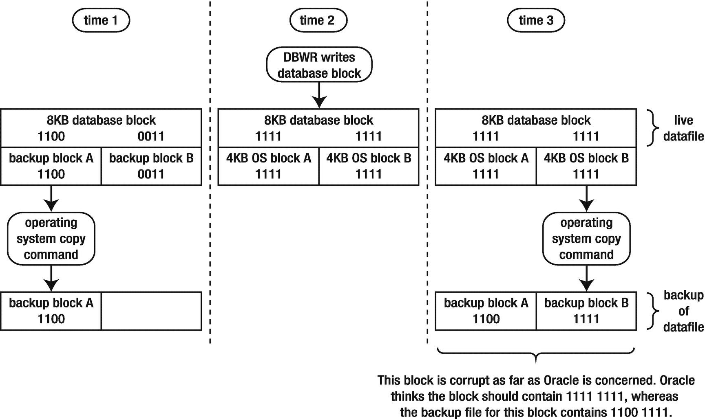
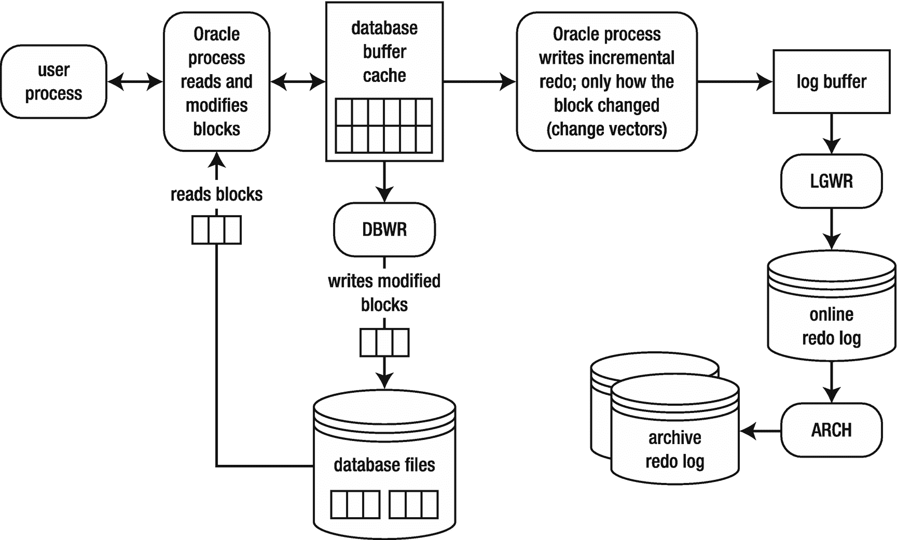
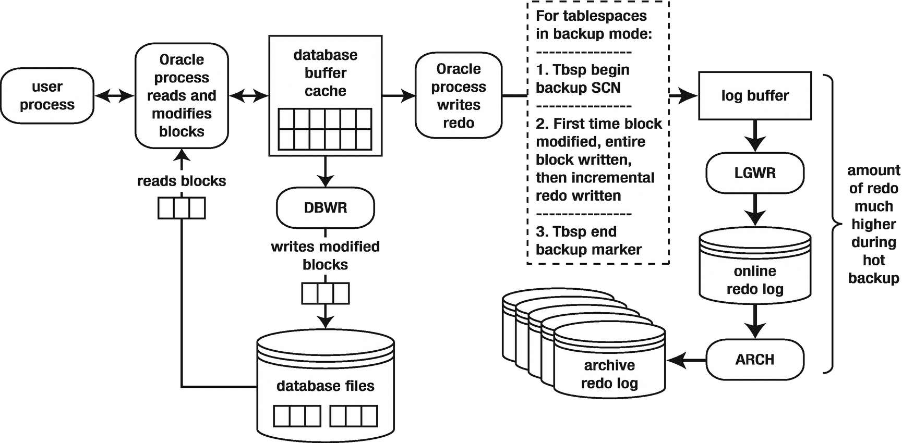
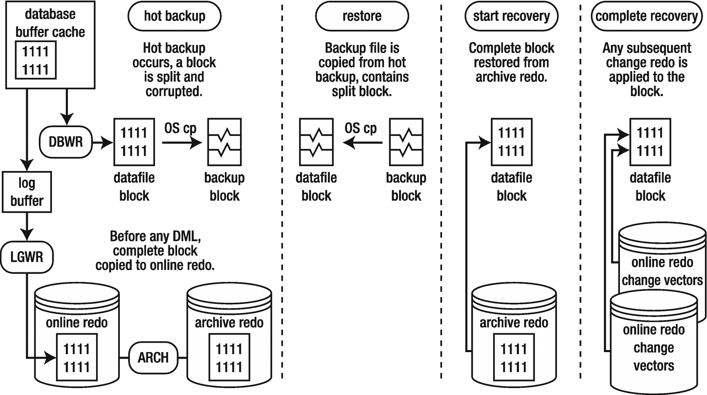
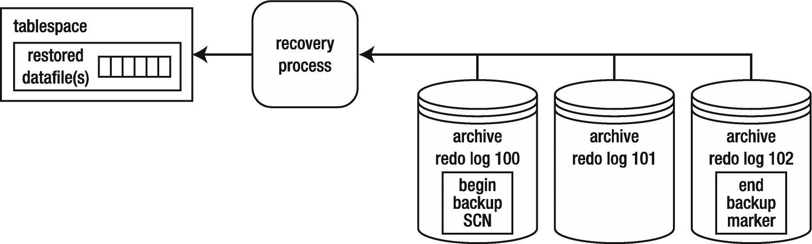

# 8. 索引

索引是一种可选创建的数据库对象，主要用于提高查询性能。索引还可以限制结果中返回的数据量，而无需检索表的所有数据列。这有助于将结果保留在内存中并更快地返回结果。数据库索引的目的类似于书籍末尾的索引。书籍索引将主题与页码关联起来。当您在书中查找信息时，通常先检查索引，找到感兴趣的主-题，然后识别相关的页码会快得多。有了这些信息，您可以直接导航到书中的特定页码。

如果某个主题在书中只出现在几页上，那么需要阅读的页数是最少的。通过这种方式，索引的有用性随着主题在书中出现的次数增加而降低。换句话说，如果某个主题条目出现在书的每一页上，为其创建索引将毫无益处。在这种情况下，无论是否存在索引，扫描书的每一页对读者来说都会更有效率。

> **注意**
> 在数据库术语中，搜索表的所有块称为全表扫描。当没有可用索引或查询优化器确定全表扫描是比使用现有索引更高效的访问路径时，就会发生全表扫描。

类似于书籍索引（主题和页码），数据库索引存储感兴趣的列值及其行标识符（`ROWID`）。`ROWID` 包含存储该列值的表行在磁盘上的物理位置。有了 `ROWID`，Oracle 可以通过最少的磁盘读取高效地检索表数据。通过这种方式，索引充当了通往表数据的快捷方式。如果没有可用的索引，则 Oracle 会读取表中的每一行以确定该行是否包含所需的信息。

> **注意**
> 除了提高性能外，Oracle 还使用索引来帮助强制执行已启用的主键和唯一键约束。此外，当在外键列上放置索引时，Oracle 可以更好地管理某些表锁定场景。


## 决定何时创建索引

数据库管理员和开发人员通常在两种不同的情况下决定创建索引：

*   **主动创建**，即在首次部署应用程序时；数据库管理员/开发人员会对要对哪些表和哪些列建立索引做出有根据的猜测。
*   **被动创建**，即当应用程序性能下降，用户抱怨性能不佳时；此时，数据库管理员/开发人员会尝试识别执行缓慢的 SQL 查询，并考虑索引可能如何成为解决方案。

接下来的两个小节将讨论上述两种情况。

### 主动创建索引

在创建一个新的数据库应用程序时，流程的一部分涉及确定主键、唯一键和外键。与这些键关联的列通常是索引的候选列。以下是一些指导原则：

*   为每个表定义一个主键约束。这会在主键指定的列上自动创建一个索引。
*   在需要保持唯一性且与主键列不同的列上创建唯一键约束。每个唯一键约束都会在约束指定的列上自动创建一个索引。
*   在外键列上手动创建索引。这样做是为了获得更好的性能，并避免某些锁问题。

换句话说，在确定表约束的过程中，关于对哪些表和列建立索引的部分决策会自动为您完成。在创建主键和唯一键约束时，Oracle 会自动为您创建索引。关于是否要为外键列创建索引，存在一些争论。本章后面的“索引外键列”一节有进一步的讨论。

这些索引可以自动化为随表创建运行，或作为数据库中对象构建的一部分运行。此外，如果是新创建的外键，可以将索引生成作为代码的一部分，以确保在更改时创建索引；这样，代替手动检查所有约束、索引和键，可以根据新对象生成 DDL 语句，并将其作为主动创建索引的一部分添加。

除了创建与约束相关的索引之外，如果您对应用程序中的 SQL 有足够的了解，您还可以在`SELECT`、`FROM`和`WHERE`子句中引用的表和列上创建相关索引。根据我的经验，数据库管理员和开发人员并不擅长主动识别此类索引。相反，这些索引需求通常是在被动情况下识别的。

### 被动创建索引

数据库管理员和开发人员在首次部署应用程序时很少能准确创建出正确的索引组合。而且，这并非坏事或出乎意料；在一个大型数据库系统中预测所有可能发生的事情是很困难的。此外，随着应用程序的成熟，数据库会引入变更（新表、新列、新约束、增加了新特性/行为的数据库升级等）。现实情况是，您将不得不对数据库中出现的、需要添加索引以提升性能的意外情况做出反应。

对于主要的数据库版本发布或系统资源变更，也需要重新审视索引策略。例如，服务器上更多的内存会使表扫描执行得更好，也许会消除对某个索引的需求。或者，对于一个原本因优化器计算成本的方式而有益的索引，升级可能使得一个不同的查询计划能够更好地提升性能。

> **注意**
> 索引策略不仅仅是创建索引，还包括清理那些由于统计信息更优和优化器在没有索引的情况下也能生成良好查询计划而不再使用的索引。

以下是一个典型的被动识别性能不佳的 SQL 语句并通过索引改进性能的流程：

1.  识别出一个性能不佳的 SQL 语句（用户投诉某个特定语句，数据库管理员运行自动数据库诊断监视器 (`ADDM`) 或自动工作负载仓库 (`AWR`) 报告以识别消耗资源的 SQL 等）。
2.  数据库管理员检查表和索引统计信息，确保过时的统计信息没有导致优化器做出糟糕的选择。
3.  数据库管理员/开发人员确定无法以缓解性能问题的方式重写该查询。
4.  数据库管理员/开发人员检查 SQL 语句，通过检查`SELECT`、`FROM`和`WHERE`子句，确定正在访问哪些表和列。
5.  数据库管理员/开发人员执行测试，并基于一个表和一个或多个列，建议创建索引。

一旦您识别出一个性能不佳的 SQL 查询，请考虑在以下情况下创建索引：

*   在`WHERE`子句中常用作谓词的列上创建索引；当`WHERE`子句中使用了一个表的多个列时，考虑使用连接（多列）索引。
*   在`SELECT`子句的所有列上创建一个覆盖索引（即，索引包含查询涉及的所有列）。
*   在用于`ORDER BY`、`GROUP BY`、`UNION`和`DISTINCT`子句的列上创建索引。


## Oracle 索引的创建与优化

Oracle 允许你创建包含多于一列的索引。这种多列索引被称为拼接索引（也称为复合索引）。当你在访问表时经常在 `WHERE` 子句中使用多个列时，这些索引尤其有效。在许多情况下，拼接索引比创建独立的单列索引效率更高（更多细节请参阅本章后面的“创建拼接索引”部分）。

包含在 `SELECT` 和 `WHERE` 子句中的列也是索引的潜在候选。有时，`SELECT` 子句中的覆盖索引会使 Oracle 直接使用索引结构本身（而不是表）来满足查询结果。此外，如果列值具有足够的区分度，Oracle 可以使用对 `WHERE` 子句中引用列建立的索引来提高查询性能。

还需考虑对用于 `ORDER BY`、`GROUP BY`、`UNION` 和 `DISTINCT` 子句的列创建索引。这可能会提高频繁使用这些 SQL 结构的查询的效率。

一个表拥有多个索引是可以的。然而，在一个表上放置的索引越多，DML 语句的执行速度就越慢。不要陷入盲目地向表添加索引，直到偶然找到正确的索引列组合的陷阱。相反，应在生产环境创建索引之前验证其性能。Oracle 18c 改进了其对索引使用情况的审查方式，在决定保留索引或是否需要不同索引时，可以考虑这些统计信息。

同时请谨记，添加一个索引可能会提高某条语句的性能，同时损害其他语句的性能。你必须确保性能得到提升的语句值得对其他语句施加的性能损耗。只有在确定索引会提高性能时，才应添加它。

### 规划健壮性

在决定需要创建索引后，做出一些将影响可维护性和可用性的基础性决策是审慎的做法。Oracle 提供了广泛的索引特性和选项。作为 DBA 或开发人员，你需要了解各种特性以及如何使用它们。如果选择了错误的索引类型或错误地使用了某个特性，可能会产生严重且有害的性能影响。在创建索引之前，需要考虑的管理特性列举如下：

*   索引类型
*   所需初始空间及增长
*   创建索引时的临时表空间使用情况（针对大型索引）
*   表空间放置
*   命名约定
*   包含哪些列
*   是使用单列还是列的组合
*   特殊特性，例如 `PARALLEL` 子句、`NOLOGGING`、压缩和不可见索引
*   唯一性
*   对 `SELECT` 语句性能的影响（提升）
*   对 `INSERT`、`UPDATE` 和 `DELETE` 语句性能的影响

这些主题将在本章后续章节中讨论。

### 确定要使用的索引类型

Oracle 提供了广泛的索引类型和特性。正确使用索引可以带来性能良好且可扩展的数据库应用程序。相反，如果错误或不明智地实现某个特性，可能会产生有害的性能影响。表 8-1 总结了可用的各种 Oracle 索引类型。乍一看，这个列表很长，对于 Oracle 新手来说可能有点难以承受。然而，决定使用哪种索引类型并不像最初看起来那么令人生畏。对于大多数应用程序，你应简单地使用默认的 B 树索引类型。

**表 8-1 Oracle 索引类型及使用描述**

| 索引类型 | 使用描述 |
| --- | --- |
| B 树 | 默认索引；适用于高基数（即高区分度）的列。除非有具体理由使用不同的索引类型或特性，否则请使用普通的 B 树索引。 |
| IOT | 当大部分列值都包含在主键中时，此索引效率很高。你访问索引就像访问表一样。数据存储在类似 B 树的结构中。有关此索引类型的详细信息，请参见第 7 章。 |
| 唯一索引 | B 树索引的一种形式；用于强制列值的唯一性；常与主键和唯一键约束一起使用，但也可以独立于约束创建。 |
| 反向键索引 | B 树索引的一种形式；对于平衡具有许多顺序插入的索引的 I/O 非常有用。 |
| 键压缩 | 适用于前导列经常重复的拼接索引；压缩叶块条目；适用于 B 树和 IOT 索引。 |
| 降序索引 | B 树索引的一种形式；用于索引中相应列值按降序排序的情况（默认顺序是升序）。你不能为反向键索引指定降序，如果索引类型是位图，Oracle 会忽略降序。 |
| 位图索引 | 在数据仓库环境中，对于低基数（即低区分度）的列以及 `WHERE` 子句中使用许多 `AND` 或 `OR` 运算符的 SQL 语句非常出色。位图索引不适用于行频繁更新的 OLTP 数据库。你无法创建唯一的位图索引。 |
| 位图连接索引 | 在数据仓库环境中，对于使用连接事实表和维度表的星型模式结构的查询非常有用。 |
| 基于函数的索引 | 适用于应用了 SQL 函数的列；可与 B 树或位图索引一起使用。 |
| 索引虚拟列 | 在表的虚拟列上定义的索引；适用于应用了 SQL 函数的列；是函数索引的一种可行替代方案。 |
| 虚拟索引 | 通过 `CREATE INDEX` 的 `NOSEGMENT` 子句创建没有物理段或区间的索引；对于在不消耗构建物理索引所需资源的情况下调整 SQL 非常有用。任何索引类型都可以创建为虚拟索引。 |
| 不可见索引 | 索引对查询优化器不可见。然而，随着表数据的修改，索引的结构会被维护。在将索引对应用程序可见之前进行测试时非常有用。任何索引类型都可以创建为不可见索引。 |
| 全局分区索引 | 跨越分区表或常规表中所有分区的全局索引；可以是 B 树索引类型，不能是位图索引类型。 |
| 本地分区索引 | 基于分区表中各个分区的本地索引；可以是 B 树或位图索引类型。 |
| 域索引 | 特定于应用程序或专用组件。 |
| B 树集群索引 | 与集群表一起使用。 |
| 哈希集群索引 | 与哈希集群一起使用。 |

> 注意 表 8-1 中列出的几种索引类型实际上只是 B 树索引的变体。例如，反向键索引仅仅是一种 B 树索引，它针对当索引值是顺序生成并以相似值插入时，优化了 I/O 的均匀分布。

本章重点介绍最常用的索引和特性——B 树、基于函数的索引、唯一索引、位图索引、反向键索引和键压缩索引——以及最常用的选项。IOT 在第 7 章介绍，分区索引在第 12 章介绍。如果你需要更多关于索引类型或特性的信息，请参阅《Oracle SQL 参考指南》，该指南可从 Oracle 网站技术网络区域（ [`http://otn.oracle.com`](http://otn.oracle.com) ）下载。


## 估算索引创建前的大小

如果你不处理大型数据库，那么无需担心估算索引最初将消耗的空间量。然而，对于大型数据库，你绝对需要估算创建索引将占用多少空间。如果在数据仓库环境中有一个大型表，对应的索引可能轻松达到数百 GB 的大小。在这种情况下，你需要确保数据库有足够的磁盘空间可用。

预测索引大小的最佳方法是在一个具有代表性生产数据的测试环境中创建它。如果你无法构建完整的生产数据副本，通常可以使用数据子集来推断生产所需的空间。如果没有使用生产数据切片的便利，你也可以使用 `DBMS_SPACE.CREATE_INDEX_COST` 过程来估算索引的大小。

**注意：**

我见过大小达数百 GB 的表，但索引空间是表空间的两倍。这不是因为索引有更多列，而是因为它有如此多的不同索引。为每个非常大的表设置三个或更多索引很快就会累加起来。

作为参考，以下是后续示例所基于的索引所使用的表创建脚本：

```sql
SQL> CREATE TABLE cust
(cust_id    NUMBER
,last_name  VARCHAR2(30)
,first_name VARCHAR2(30)
) TABLESPACE users;
```

接下来，向前面的表中插入数千条记录。以下是插入语句的片段：

```sql
SQL> insert into cust values(7,'ACER','SCOTT');
SQL> insert into cust values(5,'STARK','JIM');
SQL> insert into cust values(3,'GREY','BOB');
SQL> insert into cust values(11,'KAHN','BRAD');
SQL> insert into cust values(21,'DEAN','ANN');
...
```

现在，假设你想在 `CUST` 表上创建一个索引，如下所示：

```sql
SQL> create index cust_idx1 on cust(last_name);
```

以下是估算索引最初将消耗空间量的过程：

```sql
SQL> set serverout on
SQL> exec dbms_stats.gather_table_stats(user,'CUST');
SQL> variable used_bytes number
SQL> variable alloc_bytes number
SQL> exec dbms_space.create_index_cost( 'create index cust_idx1 on cust(last_name)', -
:used_bytes, :alloc_bytes );
SQL> print :used_bytes
```

这是此示例的一些示例输出：

```sql
USED_BYTES
----------
...

SQL> print :alloc_bytes
ALLOC_BYTES
-----------
...
```

`used_bytes` 变量为你提供索引数据所需空间量的估算值。`alloc_bytes` 变量提供将在表空间内分配的空间量的估算值。

接下来，继续创建索引。

```sql
SQL> create index cust_idx1 on cust(last_name);
```

实际消耗的空间量由此查询显示：

```sql
SQL> select bytes from user_segments where segment_name='CUST_IDX1';
```

输出表明，估算的分配字节数与实际消耗的空间量大致相当：

```sql
BYTES
----------
...
```

你的结果可能会有所不同，具体取决于记录数量、列数量、数据类型和统计信息的准确性。

除了初始大小调整，请记住随着记录插入到表中，索引将会增长。你将必须监控索引消耗的空间，并确保存在足够的磁盘空间以适应未来的增长需求。

## 创建索引与临时表空间空间

与空间使用相关，有时 DBA 会忘记 Oracle 在创建索引时通常需要在内存或磁盘中进行排序的空间。如果可用内存区域被耗尽，那么 Oracle 会在默认临时表空间中根据需要分配磁盘空间。如果你正在创建一个大型索引，可能需要增加临时表空间的大小。

另一种方法是创建一个额外的临时表空间，然后将其指定为创建索引的用户的默认临时表空间。索引创建后，你可以删除临时表空间（专为新索引创建的那个），并将用户的默认临时表空间重新分配回原始的临时表空间。

## 为索引创建独立的表空间

对于关键应用，你必须考虑表和索引将消耗多少空间以及它们增长的速度。空间消耗和对象增长对数据库可用性有直接影响。如果空间耗尽，你的数据库将变得不可用。管理数据库中空间的最佳方法是创建根据空间需求定制的表空间，然后将对象创建在你为这些对象设计的指定表空间中。考虑到这一点，我建议你将表和索引分离到不同的表空间中。考虑以下原因：

*   这样做允许不同的备份和恢复要求。你可能希望拥有比表更灵活的索引备份频率。或者，你可能选择不备份索引，因为你知道可以重新创建它们。
*   如果你让表或索引从表空间继承其存储特性，那么在使用独立表空间时，你可以为在表空间内创建的对象定制存储属性。表和索引通常有不同的存储要求（例如区大小和日志记录）。
*   在运行维护报告时，当报告按表空间分隔部分时，管理表和索引有时会更容易。

如果这些原因在你的环境中是有效的，那么为表和索引使用不同的表空间可能值得付出额外的努力。如果你没有任何前述需求，那么将表和索引放在同一个表空间中也是可以的。

我应该指出，DBA 经常出于性能考虑而考虑将索引放在独立的表空间中。如果你有幸从头开始创建存储系统，并可以设置拥有自己的磁盘和控制器的挂载点，那么通过将表和索引分离到不同的表空间，你可能会看到一些 I/O 优势。如今，存储管理员通常会在存储区域网络（SAN）中给你一大块存储，并且无法保证数据和索引会物理存储在独立的磁盘（和控制器）上。因此，通过将表和索引分离到不同的表空间，你通常不会获得任何性能优势。

以下代码展示了为表和索引构建独立表空间的示例。它创建了本地管理的表空间，使用固定区大小和自动段空间管理：

```sql
SQL> CREATE TABLESPACE reporting_data
DATAFILE '/u01/dbfile/O18C/reporting_data01.dbf' SIZE 1G
EXTENT MANAGEMENT LOCAL
UNIFORM SIZE 1M
SEGMENT SPACE MANAGEMENT AUTO;
--
SQL> CREATE TABLESPACE reporting_index
DATAFILE '/u01/dbfile/O18C/reporting_index01.dbf' SIZE 500M
EXTENT MANAGEMENT LOCAL
UNIFORM SIZE 128K
SEGMENT SPACE MANAGEMENT AUTO;
```


我倾向于使用统一的区大小，因为这能确保表空间中的所有区都具有相同的大小，从而在创建和删除对象时减少碎片。自动段空间管理功能使得 Oracle 能够自动管理许多以前需要 DBA 手动监控和维护的存储属性。

### 从表空间继承存储参数

创建表或索引时，有几个与表空间相关的技术细节需要注意。例如，如果在创建表和索引时没有指定存储参数，那么它们将从表空间继承存储参数。在大多数情况下，这是期望的行为；它节省了您手动指定这些参数的麻烦。如果您需要创建一个存储参数与其表空间不同的对象，则可以在 `CREATE TABLE/INDEX` 语句中进行设置。

另外请记住，如果您没有显式指定表空间，默认情况下，索引将创建在用户的默认永久表空间中。这对于开发和测试环境是可以接受的。对于生产环境，您应该考虑在 `CREATE TABLE/INDEX` 语句中显式指定表空间名称。

### 根据区大小将索引放置在表空间中

如果您知道索引初始可能有多大或其增长需求是什么，可以考虑将索引放置在表空间大小和区大小都合适的表空间中。我有时会为每个应用程序创建两个或更多的索引表空间。以下是一个示例：

```
SQL> create tablespace inv_idx_small
datafile '/u01/dbfile/O18C/inv_idx_small01.dbf' size 100m
extent management local
uniform size 128k
segment space management auto;
--
SQL> create tablespace inv_idx_med
datafile '/u01/dbfile/O18C/inv_idx_med01.dbf' size 1000m
extent management local
uniform size 4m
segment space management auto;
```

具有小空间和增长需求的索引被放置在 `INV_IDX_SMALL` 表空间中，具有中等存储需求的索引则创建在 `INV_IDX_MED` 表空间中。如果您发现某个索引以未预期的速度增长，考虑删除该索引并在不同的表空间中重新创建，或者在更合适的表空间中重建索引。

### 创建可移植的脚本

我经常发现自己在多个数据库环境中工作，例如开发、测试和生产。通常，我会先在开发环境中创建表空间，然后在测试环境中创建，最后在生产环境中创建。脚本在通过各个环境升级时，通常需要更改某些方面。例如，开发环境可能只需要 100MB 空间，而生产环境可能需要 10GB。

在这些情况下，使用&符号变量可以使脚本在不同环境间具有一定的可移植性。例如，下面的脚本在脚本顶部使用一个&符号变量来定义表空间大小。然后在 `CREATE TABLESPACE` 语句中引用这个&符号变量：

```
SQL> define reporting_index_size=100m
--
SQL> create tablespace reporting_index
datafile '/u01/dbfile/O18C/reporting_index01.dbf' size &&reporting_index_size
extent management local
uniform size 128k
segment space management auto;
```

如果您只处理一个表空间，那么使用前述技术的好处不大。但是，如果您要在众多环境中创建数十个表空间，那么构建可重用性就很有价值。请记住，您可以在脚本中的任何位置使用&符号变量来定义您认为可能因环境而异的任何值。

### 建立命名标准

在创建和管理索引时，制定一些命名标准是非常可取的。考虑以下动机：

*   当错误消息包含指示表、索引类型等信息时，问题诊断得以简化。
*   显示索引信息的报告更容易分组，因此更具可读性，从而更容易发现模式和问题。

考虑到这些需求，以下是一些索引命名指南示例：

*   主键索引名称应包含表名和后缀，例如 `_PK`。
*   唯一键索引名称应包含表名和后缀，例如 `_UKN`，其中 `N` 是一个数字。
*   外键列上的索引应包含外键表名和后缀，例如 `_FKN`，其中 `N` 是一个数字。
*   不用于约束的索引应包含表名和后缀，例如 `_IDXN`，其中 `N` 是一个数字。
*   基于函数的索引名称应包含表名和后缀，例如 `_FNXN`，其中 `N` 是一个数字。
*   位图索引名称应包含表名和后缀，例如 `_BMXN`，其中 `N` 是一个数字。

有些机构在命名索引时使用前缀。例如，主键索引会被命名为 `PK_CUST`（而不是 `CUST_PK`）。所有这些不同的命名标准都是有效的。

> **提示**
> 标准是什么并不重要，只要团队中的每个人都遵循相同的标准即可。

## 创建索引

如前所述，当您考虑创建表时，必须考虑相应的索引架构。创建适当的索引并使用正确的索引功能通常会带来显著的性能提升。相反，在错误的列上创建索引或在错误的情况下使用功能可能会导致显著的性能下降。

话虽如此，在考虑了您需要哪种索引之后，下一个合乎逻辑的步骤就是创建索引。创建索引和实现特定功能将在接下来的几个部分中讨论。

### 创建 B 树索引

Oracle 中的默认索引类型是 B 树索引。要在现有表上创建 B 树索引，请使用 `CREATE INDEX` 语句。此示例在 `CUST` 表上创建一个索引，指定 `LAST_NAME` 作为列：

```
SQL> CREATE INDEX cust_idx1 ON cust(last_name);
```

默认情况下，Oracle 将在您的默认永久表空间中创建索引。有时，这可能是期望的行为。但通常，出于可管理性的原因，您希望在特定表空间中创建索引。使用以下语法指示 Oracle 在特定表空间中构建索引：

```
SQL> CREATE INDEX cust_idx1 ON cust(last_name) TABLESPACE reporting_index ;
```

> **提示**
> 如果您没有为索引指定任何物理存储属性，索引将从其创建的表空间继承属性。这通常是管理索引存储的可接受方法。

由于 B 树索引是默认类型并在 Oracle 应用程序中广泛使用，值得花些时间解释这种特定类型的索引是如何工作的。理解索引工作原理的一个好方法是展示其概念结构，以及它与表的关系（索引不能脱离表而存在）。看看图 8-1；顶部部分说明了 `CUST` 表及其一些数据。表数据存储在两个独立的数据文件中，每个数据文件包含两个块。图表底部显示了一个名为 `CUST_IDX1` 的 B 树索引的平衡树状结构，该索引创建在 `CUST` 表的 `LAST_NAME` 上。索引存储在一个数据文件中，由四个块组成。


**图 8-1** Oracle B 树层次索引结构及关联表


## 索引结构与工作原理

索引被定义为与表及其列相关联。索引结构存储了表的 `ROWID` 与构建索引所在列的数据之间的映射关系。`ROWID` 通常唯一地标识数据库中的一行，并包含用于物理定位该行的信息（数据文件、块以及行在块内的位置）。图 8-1 中的两条虚线描绘了（索引结构中的）`ROWID` 如何指向表中对应列值为 `ACER` 的物理行。

B-tree 索引具有层次化的树状结构。当 Oracle 访问索引时，它从顶部节点（称为根块或头块）开始。Oracle 使用此块来确定接下来要读取的哪个二级块（也称为分支块）。二级块指向多个三级块（叶节点），这些叶节点包含 `ROWID` 和名称值。在此结构中，查找 `ROWID` 需要三次 I/O 操作。一旦确定了 `ROWID`，Oracle 将使用它来读取包含该 `ROWID` 的表块。

几个例子将有助于说明索引的工作原理。考虑以下查询：

```sql
SQL> select last_name from cust where last_name = 'ACER';
```

Oracle 访问索引，首先读取块 20（根块）；然后确定需要读取块 30（分支块）；最后从叶节点块 39 读取索引值。从概念上讲，这需要三次 I/O 操作。在本例中，Oracle 不需要读取表，因为索引包含足够的信息来满足查询结果。你可以使用 `autotrace` 工具验证查询的访问路径；例如：

```sql
SQL> set autotrace trace explain;
SQL> select last_name from cust where last_name = 'ACER';
```

请注意，只访问了索引（而不是表）来返回数据：

```
| Id  | Operation        | Name     | Rows | Bytes | Cost (%CPU)| Time     |
|---|---|---|---|---|---|---|
|   0 | SELECT STATEMENT |          |    1 |     6 |     1   (0)| 00:00:01 |
|*  1 |  INDEX RANGE SCAN| CUST_IDX1|    1 |     6 |     1   (0)| 00:00:01 |
```

再考虑这个查询：

```sql
SQL> select first_name, last_name from cust where last_name = 'ACER';
```

在这里，Oracle 会遵循相同的索引访问路径，读取块 20、30 和 39。然而，由于索引结构不包含 `FIRST_NAME` 的值，Oracle 还必须使用 `ROWID` 来读取 `CUST` 表中相应的行（块 11 和 2500）。以下是 `autotrace` 输出的片段，表明表也被访问了：

```
| Id  | Operation                           | Name     | Rows | Bytes | Cost |
|---|---|---|---|---|---|
|   0 | SELECT STATEMENT                    |          |    1 |    44 |    2 |
|   1 |  TABLE ACCESS BY INDEX ROWID BATCHED| CUST     |    1 |    44 |    2 |
|*  2 |   INDEX RANGE SCAN                  | CUST_IDX1|    1 |      |    1 |
```

另请注意图 8-1 底部叶节点之间的双向箭头。这说明叶节点通过双向链表连接，从而使索引范围扫描成为可能。例如，假设你有这个查询：

```sql
SQL> select last_name from cust where last_name >= 'A' and last_name <= 'J';
```

为了确定从哪里开始范围扫描，Oracle 会读取块 20（根块）、块 30（分支块），最后是块 39（叶节点块）。由于叶节点块是链接的，Oracle 可以根据需要向前导航以找到所有必需的块（而无需通过分支块上下导航）。这是一种非常高效的范围扫描遍历机制。

### 索引视图

Oracle 提供两种包含 B-tree 索引结构详细信息的视图：

*   `INDEX_STATS`
*   `DBA/ALL/USER_INDEXES`

`INDEX_STATS` 视图包含有关 `HEIGHT`（从根块到叶块的块数）、`LF_ROWS`（索引条目数）等信息。`INDEX_STATS` 视图仅在分析索引结构后才会填充；例如：

```sql
SQL> analyze index cust_idx1 validate structure;
```

`DBA/ALL/USER_INDEXES` 视图包含统计信息，例如 `BLEVEL`（从根块到分支块的块数；这等于 `HEIGHT – 1`）、`LEAF_BLOCKS`（叶块数）等。这些视图在索引创建时自动填充，并通过 `DBMS_STATS` 包进行刷新。

### 创建复合索引

Oracle 允许你创建包含多列的索引。多列索引被称为复合索引。当你经常在访问表时在 `WHERE` 子句中使用多列时，这些索引尤其有效。

假设你遇到以下场景，其中同一表的两个列用于 `WHERE` 子句：

```sql
SQL> select first_name, last_name
from cust
where first_name = 'JIM'
and last_name = 'STARK';
```

因为 `FIRST_NAME` 和 `LAST_NAME` 经常一起用于 `WHERE` 子句检索数据，所以为这两列创建复合索引可能更高效：

```sql
SQL> create index cust_idx2 on cust(first_name, last_name);
```

通常，很难确定复合索引是否比单列索引更高效。对于前面的 SQL 语句，你可能想知道创建两个分别在 `FIRST_NAME` 和 `LAST_NAME` 上的单列索引是否更有效，例如：

```sql
SQL> create index cust_idx3 on cust(first_name);
SQL> create index cust_idx4 on cust(last_name);
```

在此场景中，如果你持续使用出现在 `WHERE` 子句中的列组合，那么优化器很可能会使用复合索引而不是单列索引。在这些情况下，使用复合索引通常高效得多。你可以通过生成执行计划来验证优化器是否选择了复合索引；例如：

```sql
SQL> set autotrace trace explain;
```

然后，运行此查询：

```sql
SQL> select first_name, last_name
from cust
where first_name = 'JIM'
and last_name = 'STARK';
```

以下是一些示例输出，表明优化器使用了 `CUST_IDX2` 上的复合索引来检索数据：

```
| Id  | Operation        | Name      | Rows  | Bytes | Cost (%CPU)| Time     |
|---|---|---|---|---|---|---|
|   0 | SELECT STATEMENT |           |     1 |    44 |     1   (0)| 00:00:01 |
|*  1 |  INDEX RANGE SCAN| CUST_IDX2 |     1 |    44 |     1   (0)| 00:00:01 |
```

在较旧版本的 Oracle（大约版本 8）中，只有当前导列（或列组）出现在 `WHERE` 子句中时，才能使用复合索引。在现代版本中，即使 `WHERE` 子句中没有出现前导列（或列组），优化器也可以使用复合索引。这种无需引用前导列即可使用索引的能力被称为跳跃扫描特性。

在特定情况下，用于跳跃扫描的复合索引可能比全表扫描更高效。但是，你应该尝试创建使用前导列的复合索引。如果你持续只使用复合索引的后随列，那么请考虑在后随列上创建单列索引。

### 在同一列集上创建多个索引

在 Oracle Database 12c 之前，不能在一个表的完全相同的列组合上定义多个索引。这一点在 12c 中发生了变化。你现在可以在同一组列上拥有多个索引。但是，只有当索引在物理上存在差异时，你才能这样做，例如，一个索引创建为 B-tree 索引，第二个创建为位图索引。

此外，对于相同的列组合，只能有一个可见索引。在同一组列上创建的任何其他索引都必须声明为不可见；例如：


## Oracle 数据库索引实现指南

### 实现不可见索引

在 Oracle Database 12c 之前，如果你尝试执行之前的操作，第二个创建语句会抛出类似于 `ORA-01408: such column list already indexed` 的错误。

为什么要在同一组列上定义两个索引？如果你最初实现了 B-tree 索引，而现在想将其更改为位图索引，你可能会这样做——思路是，你将新索引创建为不可见的，然后删除原始索引，并使新索引可见。在大型数据库环境中，这能使你快速完成更改。更多信息请参阅"实现不可见索引"部分。

### 实现基于函数的索引

基于函数的索引在其定义中使用了 SQL 函数或表达式。当查询使用 SQL 函数时，有时需要基于函数的索引。例如，考虑以下使用了 SQL `UPPER` 函数的查询：

```sql
SQL> select first_name from cust where UPPER(first_name) = 'JIM';
```

在这种情况下，`FIRST_NAME` 列上可能存在一个普通的 B-tree 索引，但当对列应用函数时，Oracle 不会使用该列上存在的常规索引。

在这种情况下，你可以创建一个基于函数的索引，以提高在 `WHERE` 子句中使用 SQL 函数的查询的性能。以下示例创建了一个基于函数的索引：

```sql
SQL> create index cust_fnx1 on cust(upper(first_name));
```

基于函数的索引允许对 SQL 查询 `WHERE` 子句中由函数引用的列进行索引查找。该索引可以像前面的例子一样简单，也可以基于存储在 PL/SQL 函数中的复杂逻辑。

**注意**
任何用户创建的 SQL 函数必须声明为确定性的，才能在基于函数的索引中使用。*确定性*意味着对于给定的输入集，函数总是返回相同的结果。当你创建一个要在基于函数的索引中使用的用户定义函数时，必须使用 `DETERMINISTIC` 关键字。

如果你想查看基于函数的索引的定义，可以从 `DBA/ALL/USER_IND_EXPRESSIONS` 视图中选择以显示与索引关联的 SQL。如果你正在使用 SQL*Plus，请务必先执行 `SET LONG` 命令；例如，

```sql
SQL> SET LONG 500
SQL> select index_name, column_expression from user_ind_expressions;
```

此示例中的 `SET LONG` 命令告诉 SQL*Plus 从 `COLUMN_EXPRESSION` 列（其类型为 `LONG`）中显示最多 500 个字符。

### 创建唯一索引

创建 B-tree 索引时，还可以指定索引为唯一的。这样做可以确保在插入或更新表中的列时，非 `NULL` 值是唯一的。

假设你已确定表中的一个列（或列组合）（主键之外）在 `WHERE` 子句中被大量使用。此外，该列（或列组合）要求在表中是唯一的。这是使用唯一索引的一个很好的场景。使用 `UNIQUE` 子句创建唯一索引：

```sql
SQL> create unique index cust_uk1 on cust(first_name, last_name);
```

**注意**
唯一索引不会强制对插入表中的 `NULL` 值保持唯一性。换句话说，你可以在索引列中为多行插入 `NULL` 值。

你必须注意关于唯一索引、主键约束和唯一键约束的一些有趣细微差别（有关主键约束和唯一键约束的详细讨论，请参见第 7 章）。当你创建主键约束或唯一键约束时，Oracle 会自动创建一个唯一索引和一个在 `DBA/ALL/USER_CONSTRAINTS` 中可见的相应约束。

当你仅显式创建唯一索引时（如本节示例所示），Oracle 会创建唯一索引，但不会在 `DBA/ALL/USER_CONSTRAINTS` 中添加约束条目。为什么这很重要？考虑以下场景：

```sql
SQL> create unique index cust_uk1 on cust(first_name, last_name);
SQL> insert into cust values(500,'JOHN','DEERE');
SQL> insert into cust values(501,'JOHN','DEERE');
```

这是抛出的相应错误消息：

```
ERROR at line 1:
ORA-00001: unique constraint (MV_MAINT.CUST_UK1) violated
```

如果要求你排查此问题，你首先会查找 `DBA_CONSTRAINTS` 中名为 `CUST_UK1` 的约束。然而，没有信息：

```sql
SQL> select constraint_name
from dba_constraints
where constraint_name='CUST_UK1';
```

输出如下：

```
no rows selected
```

`no rows selected` 消息可能令人困惑：插入表时抛出的错误消息表明违反了唯一约束，但约束相关的数据字典视图中却没有信息。在这种情况下，你必须查看 `DBA_INDEXES` 和 `DBA_IND_COLUMNS` 以查看已创建的唯一索引的详细信息：

```sql
SQL> select a.owner, a.index_name, a.uniqueness, b.column_name
from dba_indexes a, dba_ind_columns b
where a.index_name='CUST_UK1'
and   a.table_owner = b.table_owner
and   a.index_name = b.index_name;
```

如果你希望在 `DBA/ALL/USER_CONSTRAINTS` 视图中有与约束相关的信息，可以在索引创建后显式关联一个约束：

```sql
SQL> alter table cust add constraint cust_idx1 unique(first_name, last_name);
```

在这种情况下，你可以独立于索引来启用和禁用约束。但是，由于索引是作为唯一索引创建的，无论约束是否被禁用，索引仍然强制执行唯一性。

何时应该显式创建唯一索引，而不是创建约束并让 Oracle 自动创建索引？没有硬性规定。我倾向于创建唯一键约束并让 Oracle 自动创建唯一索引，因为这样我可以在 `DBA/ALL/USER_CONSTRAINTS` 和 `DBA/ALL/USER_INDEXES` 视图中都获得信息。

但是，Oracle 的文档建议，如果你的情况是严格使用唯一约束来提高查询性能，则最好只创建唯一索引。这是合适的。如果你采用这种方法，只需意识到在约束相关的数据字典视图中可能找不到任何信息。

### 实现位图索引

位图索引推荐用于具有相对较低不同值数量（低基数）的列。由于锁问题，你不应在具有高 `INSERT`/`UPDATE`/`DELETE` 活动的 OLTP 数据库中使用位图索引；位图索引的结构导致在 DML 操作期间可能锁定许多行，这会引起高事务处理量的 OLTP 系统的锁定问题。

位图索引通常用于数据仓库环境。一个典型的星型模式结构由一个大的事实表和许多小的维度（查找）表组成。在这些场景中，在事实表的外键列上创建位图索引是常见的做法。事实表通常每天插入数据，并且通常不会更新或删除。

下面是一个简单的示例，演示位图索引的创建和结构。首先，创建一个 `LOCATIONS` 表：

```sql
SQL> create table locations(
location_id number
,region      varchar2(10));
```

现在，将以下行插入表中：


### 位图索引

```
SQL> insert into locations values(1,'NORTH');
SQL> insert into locations values(2,'EAST');
SQL> insert into locations values(3,'NORTH');
SQL> insert into locations values(4,'WEST');
SQL> insert into locations values(5,'EAST');
SQL> insert into locations values(6,'NORTH');
SQL> insert into locations values(7,'NORTH');
```

你使用 `BITMAP` 关键字来创建位图索引。下面的代码在 `LOCATIONS` 表的 `REGION` 列上创建了一个位图索引：

```
SQL> create bitmap index locations_bmx1 on locations(region);
```

当 `WHERE` 子句中出现多个 `AND` 和 `OR` 条件时，位图索引在检索行时非常有效。例如，要执行任务 `find all rows with a region of EAST or WEST`，会对 `EAST` 和 `WEST` 的位图执行布尔代数 `OR` 操作，以快速返回行 2、4 和 5。表 8-2 的最后一行显示了 `EAST` 和 `WEST` 位图上的 `OR` 操作结果。

**表 8-2 `OR` 操作的结果**

| 值/行 | 行 1 | 行 2 | 行 3 | 行 4 | 行 5 | 行 6 | 行 7 |
| :--- | :--- | :--- | :--- | :--- | :--- | :--- | :--- |
| `EAST` | 0 | 1 | 0 | 0 | 1 | 0 | 0 |
| `WEST` | 0 | 0 | 0 | 1 | 0 | 0 | 0 |
| `EAST` 和 `WEST` 上的布尔 `OR` | 0 | 1 | 0 | 1 | 1 | 0 | 0 |

> **注意**：位图索引和位图连接索引仅在 Oracle 数据库的企业版中可用。此外，你无法创建唯一的位图索引。

#### 创建位图连接索引

位图连接索引在两个表之间连接的结果存储在索引中。位图连接索引很有益，因为它们避免了为了检索结果而连接表。位图连接索引的语法与常规位图索引的不同之处在于它包含 `FROM` 和 `WHERE` 子句。以下是创建位图连接索引的基本语法：

```
SQL> create bitmap index <index_name>
on <fact_table>(<dimension_table>.<column>)
from <fact_table>, <dimension_table>
where <fact_table>.<foreign_key_column> = <dimension_table>.<primary_key_column>;
```

位图连接索引适用于你正在连接两个表，使用一个表中的外键列（或多个列）关联到另一个表中的主键列（或多个列）的情况。例如，假设你通常从 `CUST` 维度表中检索 `FIRST_NAME` 和 `LAST_NAME`，同时连接到一个大型的 `F_SHIPMENTS` 事实表。下面的例子在 `F_SHIPMENTS` 和 `CUST` 表之间创建了一个位图连接索引：

```
SQL> create bitmap index f_shipments_bmx1
on f_shipments(cust.first_name, cust.last_name)
from f_shipments, cust
where f_shipments.cust_id = cust.cust_id;
```

现在，考虑这样一个查询：

```
SQL> select c.first_name, c.last_name
from f_shipments s, cust c
where s.cust_id = c.cust_id
and c.first_name = 'JIM'
and c.last_name = 'STARK';
```

优化器可以选择使用位图连接索引，从而避免连接表的开销。对于少量数据，优化器很可能选择不使用位图连接索引，但随着表中数据的增长，使用位图连接索引比全表扫描或其他索引更具成本效益。

### 实现反向键索引

反向键索引类似于 B-tree 索引，只是在创建索引条目时，索引键的字节会被反转。例如，如果索引值是 201、202 和 203，则反向键索引值是 102、202 和 302：

```
索引值              反向键值
-------------            --------------------
201                      102
202                      202
203                      302
```

在需要一种方法来均匀分布索引数据的场景中，反向键索引可以表现得更好，否则这些具有相似值的数据会聚集在一起。因此，当使用反向键索引时，你可以避免在插入大量顺序值期间 I/O 集中在索引中的一个物理磁盘位置。

使用 `REVERSE` 子句来创建反向键索引：

```
SQL> create index cust_idx1 on cust(cust_id) reverse;
```

你可以运行以下查询来验证索引是否是反向键的：

```
SQL> select index_name, index_type from user_indexes;
```

以下是一些示例输出，显示 `CUST_IDX1` 索引是反向键的：

```
INDEX_NAME           INDEX_TYPE
-------------------- ---------------------------
CUST_IDX1            NORMAL/REV
```

> **注意**：你无法为位图索引或 IOT（索引组织表）指定 `REVERSE`。

### 创建键压缩索引

索引压缩对于包含多个列且前导索引列值经常重复的索引非常有用。压缩索引在这些情况下具有以下优势：

*   减少存储空间
*   在叶子块中存储更多行，这可能导致访问压缩索引时 I/O 更少

假设你有一个如下定义的表：

```
SQL> create table users(
last_name  varchar2(30)
,first_name varchar2(30)
,address_id number);
```

你希望在 `LAST_NAME` 和 `FIRST_NAME` 列上创建一个拼接索引。通过检查数据，你知道 `LAST_NAME` 列中有重复值。使用 `COMPRESS N` 子句来创建压缩索引：

```
SQL> create index users_idx1 on users(last_name, first_name) compress 2;
```

前面的代码指示 Oracle 在两列上创建压缩索引。你可以如下验证索引是否被压缩：

```
SQL> select index_name, compression
from user_indexes
where index_name like 'USERS%';
```

以下是一些示例输出，表明该索引启用了压缩：

```
INDEX_NAME                     COMPRESS
------------------------------ --------
USERS_IDX1                     ENABLED
```

> **注意**：你无法在位图索引上创建键压缩索引。

### 并行化索引创建

在大型数据库环境中，当你尝试在填充了大量行的表上创建索引时，使用 `PARALLEL` 子句可以显著提高索引创建速度：

```
SQL> create index cust_idx1 on cust(cust_id)
parallel 2
tablespace reporting_index;
```

如果你未指定并行度，Oracle 会根据机器上的 CPU 数量乘以 `PARALLEL_THREADS_PER_CPU` 的值来选择一个并行度。

你可以运行此查询来验证与索引关联的并行度：

```
SQL> select index_name, degree from user_indexes;
```

### 在创建索引时避免重做日志生成

你可以选择使用 `NOLOGGING` 子句创建索引。这样做有以下影响：

*   不会生成在发生介质故障时恢复索引所需的重做日志。
*   后续的直接路径操作也不会生成在发生介质故障时恢复索引信息所需的重做日志。

以下是一个使用 `NOLOGGING` 子句创建索引的示例：

```
SQL> create index cust_idx1 on cust(cust_id)
nologging
tablespace users;
```

`NOLOGGING` 的主要优点是在创建索引时，生成的重做信息量最少，这对于大型索引可能具有显著的性能影响。缺点是，如果在索引创建后不久（或通过直接路径操作插入记录后）发生介质故障，并且你从索引创建之前拍摄的备份中恢复和恢复数据库，则在访问索引时会看到此错误：

```
ORA-01578: ORACLE data block corrupted (file # 4, block # 1044)
ORA-01110: data file 4: '/u01/dbfile/O18C/users01.dbf'
ORA-26040: Data block was loaded using the NOLOGGING option
```

此错误表明索引在逻辑上已损坏。在此场景中，你必须在索引可用之前重新创建它。在大多数场景中，创建索引时使用 `NOLOGGING` 子句是可以接受的，因为可以在不影响索引所基于的表的情况下重新创建索引。


## 实施不可见索引

如在相同列上创建索引时仅设置一个为可见的讨论中所述，您可以选择使索引对优化器不可见。Oracle 仍会维护不可见索引（当在表上发生 DML 操作时），但不会使其可供优化器使用。您可以使用 `OPTIMIZER_USE_INVISIBLE_INDEXES` 数据库参数使不可见索引对优化器可见。

不可见索引有几个有趣的用途：

*   在删除索引前将其更改为不可见，可以让您在以后确定需要该索引时快速恢复。
*   您或许可以向第三方应用程序添加一个不可见索引，而不影响现有代码或支持协议。

这两种场景将在以下部分中讨论。

### 使现有索引不可见

假设您已识别出一个未被使用的索引，并正在考虑删除它。在 Oracle 的早期版本中，您可以将索引标记为 `UNUSABLE`，然后在确定某些索引确实不再使用时再删除它们。如果您后来确定需要一个不可用的索引，重新启用它的唯一方法是重建它。对于大型索引，这可能耗费大量的时间和数据库资源。

使索引不可见的优势在于仅告知优化器不要使用该索引。当底层表的记录被插入、更新和删除时，不可见索引仍会被维护。如果您决定以后需要该索引，则无需重建它；只需使其再次可见即可。

您可以创建索引时将其设为不可见，或将现有索引更改为不可见；例如，

```
SQL> create index cust_idx2 on cust(first_name) invisible;
SQL> alter index cust_idx1 invisible;
```

您可以通过此查询验证索引的可见性：

```
SQL> select index_name, status, visibility from user_indexes;
```

这是一些示例输出：

```
INDEX_NAME           STATUS   VISIBILITY
-------------------- -------- ----------
CUST_IDX1            VALID    INVISIBLE
CUST_IDX2            VALID    INVISIBLE
USERS_IDX1           VALID    VISIBLE
```

使用 `VISIBLE` 子句可以使不可见的索引再次对优化器可见：

```
SQL> alter index cust_idx1 visible ;
```

**注意**
如果您在外键列上有一个 B 树索引，并且决定使其不可见，Oracle 仍可以使用该索引来防止某些锁定问题。在删除与外键约束关联的列上的索引之前，请确保它未被 Oracle 用来防止锁定问题。详情请参阅本章后面的“索引外键列”部分。

### 确保添加索引时应用程序行为不变

在使用第三方应用程序时，您也可以使用不可见索引。通常，第三方供应商不支持客户向其应用程序添加自己的索引。但是，在某些情况下，您确信可以提高某个查询的性能而不影响应用程序中的其他查询。

您可以将索引创建为不可见，然后使用 `OPTIMIZER_USE_INVISIBLE_INDEXES` 参数指示优化器考虑不可见索引。此参数可以在系统或会话级别设置。这里有一个例子：

```
SQL> create index cust_idx1 on cust(cust_id) invisible;
```

现在，将 `OPTIMIZER_USE_INVISIBLE_INDEXES` 数据库参数设置为 `TRUE`。这会指示优化器为当前连接的会话考虑不可见索引：

```
SQL> alter session set optimizer_use_invisible_indexes=true;
```

您可以通过设置 `AUTOTRACE` 为 `on` 并运行 `SELECT` 语句来验证索引是否正在被使用：

```
SQL> set autotrace trace explain;
SQL> select cust_id from cust where cust_id = 3;
```


以下是一些示例输出，表明优化器选择使用不可见索引：

```
| Id  | Operation        | Name      | Rows  | Bytes | Cost (%CPU)| Time     |
|   0 | SELECT STATEMENT |           |     1 |     5 |     1   (0)| 00:00:01 |
|*  1 |  INDEX RANGE SCAN| CUST_IDX1 |     1 |     5 |     1   (0)| 00:00:01 |
```

请记住，`不可见索引`仅指优化器无法看到的索引。与任何其他索引一样，不可见索引在 DML 语句期间也会消耗空间和资源。

## 维护索引

随着应用程序的演进，您不可避免地需要对现有索引执行一些维护活动。您可能需要重命名索引以符合新实施的标准，或者可能需要重建大型索引，将其移动到更符合索引存储需求的另一个表空间。以下列表显示了与索引维护相关的常见任务：

*   重命名索引
*   显示索引的 DDL
*   重建索引
*   将索引设置为 `unusable`
*   监控索引
*   删除索引

以下各节将讨论这些项目。

### 重命名索引

有时您需要重命名索引。索引可能在创建时被错误命名，或者您可能想要一个更符合命名标准的名称。使用 `ALTER INDEX ... RENAME TO` 语句来重命名索引：

```sql
SQL> alter index cust_idx1 rename to cust_index1;
```

您可以通过查询数据字典来验证索引是否已重命名：

```sql
SQL> select
  table_name
 ,index_name
 ,index_type
 ,tablespace_name
 ,status
from user_indexes
order by table_name, index_name;
```

### 显示重建索引的代码

您可能正在执行例行维护活动，例如将索引移动到不同的表空间，在此操作之前，您希望验证当前的存储设置。您可以使用 `DBMS_METADATA` 包来显示重建索引所需的 DDL。如果您使用的是 SQL*Plus，请确保将 `LONG` 变量设置为足够大的值以显示所有输出。以下是一个示例：

```sql
SQL> set long 10000
SQL> select dbms_metadata.get_ddl('INDEX','CUST_IDX1') from dual;
```

以下是部分输出列表：

```
SQL> CREATE INDEX "MV_MAINT"."CUST_IDX1" ON "MV_MAINT"."CUST" ("CUST_ID")
PCTFREE 10 INITRANS 2 MAXTRANS 255 INVISIBLE COMPUTE STATISTICS
```

要显示某个用户的所有索引 DDL，请运行此查询：

```sql
SQL> select dbms_metadata.get_ddl('INDEX',index_name) from user_indexes;
```

您也可以显示特定用户的 DDL。您必须为 `GET_DDL` 函数提供对象类型、对象名称和模式作为输入；例如，

```sql
SQL> select
  dbms_metadata.get_ddl(object_type=>'INDEX', name=>'CUST_IDX1', schema=>'INV')
from dual;
```

### 重建索引

有几个充分的理由需要重建索引：

*   修改存储特性，例如更改表空间
*   重建之前标记为 `unusable` 的索引，使其重新可用

使用 `REBUILD` 子句来重建索引。此示例重建一个名为 `CUST_IDX1` 的索引：

```sql
SQL> alter index cust_idx1 rebuild;
```

Oracle 尝试获取表上的锁并在线重建索引。如果有任何未提交的活动事务，Oracle 将无法获取锁，并会抛出以下错误：

```
ORA-00054: resource busy and acquire with NOWAIT specified or timeout expired
```

在这种情况下，您可以等到数据库活动较少时再操作，或者尝试设置 `DDL_LOCK_TIMEOUT` 参数：

```sql
SQL> alter session set ddl_lock_timeout=15;
```

`DDL_LOCK_TIMEOUT` 初始化参数指示 Oracle 重复尝试获取锁（在此示例中为 15 秒）。

如果未指定表空间，Oracle 会在索引当前所在的表空间中重建它。如果您希望索引在另一个表空间中重建，请指定表空间：

```sql
SQL> alter index cust_idx1 rebuild tablespace reporting_index;
```


如果你正在处理一个大型索引，可能需要考虑使用`NOLOGGING`或`PARALLEL`等特性，或者两者兼用。下面的示例展示了并行重建索引同时生成最少重做日志的方法：

```
SQL> alter index cust_idx1 rebuild parallel nologging ;
```

> **注意**
> 有关在索引中使用这些特性的详细信息，请参阅本章前面的“避免在创建索引时生成重做日志”和“并行创建索引”章节。

### 因性能原因重建索引

在早年间（大约 Oracle 版本 7 时期），出于性能考虑，数据库管理员会定期虔诚地重建索引。几乎每位 DBA 及其团队都会拥有类似下面的脚本，该脚本使用 SQL 生成为某个模式重建索引所需的 SQL 语句：

```
SPO ind_build_dyn.sql
SET HEAD OFF PAGESIZE 0 FEEDBACK OFF;
SELECT 'ALTER INDEX ' || index_name || ' REBUILD;'
FROM user_indexes;
SPO OFF;
SET FEEDBACK ON;
```

然而，对于较新版本的 Oracle，重建索引是否能带来任何性能提升尚有争议。通常，重建索引的唯一有效理由是索引已损坏、不可用，或者你想要修改存储特性（例如表空间）。

### 将索引标记为不可用

如果你已识别出某个不再使用的索引，可以将其标记为`UNUSABLE`。从此，Oracle 将不再维护该索引，优化器也不会在`SELECT`语句中考虑使用该索引。将索引标记为`UNUSABLE`（而不是直接删除）的优势在于，如果你后来确定该索引仍被使用，可以将其更改为`USABLE`状态并重建它，而无需手头有重新创建该索引的 DDL 语句。

以下是将索引标记为`UNUSABLE`的示例：

```
SQL> alter index cust_idx1 unusable;
```

你可以通过此查询验证其是否不可用：

```
SQL> select index_name, status from user_indexes;
```

该索引将显示`UNUSABLE`状态：

```
INDEX_NAME           STATUS
-------------------- --------
CUST_IDX1            UNUSABLE
```

如果你确定需要该索引（在删除它之前），则必须重建它才能使其再次可用：

```
SQL> alter index cust_idx1 rebuild;
```

另一个将索引标记为`UNUSABLE`的常见场景是当你执行大规模数据加载时。当你想要最大化表加载性能时，可以在执行加载前将索引标记为`UNUSABLE`。加载完表后，你必须重建索引以使它们再次可用。

> **注意**
> 将索引设置为`UNUSABLE`的替代方法是删除并重新创建它。此方法需要`CREATE INDEX` DDL 语句。

### 监控索引使用情况

你可能继承了一个数据库，作为了解该数据库和应用程序的一部分，你想要确定哪些索引正在被使用（或未被使用）。其思路是，你可以识别未使用的索引并将其删除，从而消除额外的开销和所需的存储空间。

使用`ALTER INDEX...MONITORING USAGE`语句来启用基本的索引监控。以下示例启用了对一个索引的监控：

```
SQL> alter index cust_idx1 monitoring usage;
```

首次访问该索引时，Oracle 会记录此操作；你可以通过`v$index_usage_info`或`DBA_INDEX_USAGE`视图查看索引是否已被访问。要报告哪些被监控的索引已被使用，请运行此查询：

```
SQL> select * from dba_index_usage;
```

很可能，你不会只监控一个索引。相反，你可能希望监控某个用户的所有索引。在这种情况下，使用 SQL 生成 SQL 来创建一个可以运行以开启所有索引监控的脚本。以下就是这样一个脚本：

```
SQL> select
'alter index ' || index_name || ' monitoring usage;'
from user_indexes;
```

`DBA_OBJECT_USAGE`视图仅显示当前连接用户的信息。如果你检查`DBA_VIEWS`的`TEXT`列，请注意以下行：

```
where io.owner# = userenv('SCHEMAID')
```

如果你以具有 DBA 权限的用户登录，并希望查看所有已启用监控的索引的状态（无论属于哪个用户），请执行此查询：

```
SQL> select io.name, t.name,
decode(bitand(i.flags, 65536), 0, 'NO', 'YES'),
decode(bitand(ou.flags, 1), 0, 'NO', 'YES'),
ou.start_monitoring,
ou.end_monitoring
from sys.obj$ io, sys.obj$ t, sys.ind$ i, sys.object_usage ou
where i.obj# = ou.obj#
and io.obj# = ou.obj#
and t.obj# = i.bo#;
```

前面的查询移除了原查询中限制当前登录用户的那一行。这为你提供了一种便捷的方式来查看所有受监控的索引。

> **注意**
> 请记住，Oracle 可以使用定义在外键列上的索引来防止某些锁定问题（有关详细讨论，请参阅本章后面的“确定外键列是否已建索引”和“在外键列上实现索引”章节）。Oracle 对索引的内部使用不会记录在`DBA_INDEX_USAGE`或`V$INDEX_USAGE_INFO`中。在删除定义在外键列上的索引之前，请务必非常小心。

### 删除索引

如果你已确定某个索引未被使用，那么将其删除是个好主意。未使用的索引会占用空间，并且可能潜在地减慢 DML 语句的执行速度（因为这些 DML 操作必须维护索引）。使用`DROP INDEX`语句来删除索引：

```
SQL> drop index cust_idx1;
```

删除索引是一个永久性的 DDL 操作；除了重建索引之外，没有其他方法可以撤销删除索引的操作。在删除索引之前，快速捕获重建该索引所需的 DDL 语句是有益无害的。这样做将允许你在随后发现你确实仍然需要该索引时重新创建它。

### 为外键列创建索引

外键约束确保在向子表插入记录时，对应的父表记录存在。这是保证数据符合父子业务关系规则的机制。外键也被称为引用完整性约束。

与主键和唯一键约束不同，Oracle 不会自动在外键列上创建索引。因此，你必须基于定义为外键约束的列手动创建外键索引。在大多数情况下，你应该在与外键关联的列上创建索引。原因有二：

*   Oracle 通常可以利用外键列上的索引来提高连接父表和子表（使用外键列）的查询性能。
*   如果外键列上没有 B 树索引，当你从子表插入或删除记录时，父表中的所有行都将被锁定。对于频繁修改父表和子表的应用程序，这将导致锁定和死锁问题（有关此锁定问题的示例，请参阅本章后面的“确定外键列是否已建索引”章节）。


有人可能会认为，如果你对应用程序足够了解，并且能够预测不会发出在键列上连接表的查询，并且某些更新/删除场景永远不会遇到（这些场景会导致整个表被锁），那么，当然可以不在外键列上放置索引。然而，根据我的经验，情况往往并非如此：开发人员很少考虑“黑盒数据库”可能会如何锁表；一些数据库管理员同样不了解锁的常见原因；团队人员流动率高，而当日的数据库管理员不得不为数据库性能差和会话挂起的问题背锅。考虑到追查锁定和性能问题所花费的时间和精力，在应用程序的每个外键列上放置索引的成本并不算高。我知道一些纯粹主义者会反对这一点，但我倾向于避免痛苦，而未加索引的外键列就像一个定时炸弹。

提出我的建议后，我将首先介绍如何在 B 树索引上外键列。然后，我将展示一些检测未加索引的外键列的技术。

### 在外键列上实现索引

假设你有一个需求，要求 `ADDRESS` 表中的每条记录都分配一个来自 `CUST` 表的相应 `CUST_ID` 列。为了强制实施这种关系，你创建 `ADDRESS` 表和一个外键约束，如下所示：

```sql
SQL> create table address(address_id number
,cust_address varchar2(2000)
,cust_id number);
--
SQL> alter table address add constraint addr_fk1
foreign key (cust_id) references cust(cust_id);
```

**注意**
外键列必须引用父表中已定义了主键或唯一键约束的列。否则，你将收到错误 `ORA-02270: no matching unique or primary key for this column-list`。

你意识到外键列在连接 `CUST` 和 `ADDRESS` 表时被广泛使用，并且在外键列上建立索引将提高性能。在这种情况下，你必须手动创建索引。例如，在 `ADDRESS` 表的 `CUST_ID` 外键列上创建一个常规的 B 树索引。

```sql
SQL> create index addr_fk1
on address(cust_id);
```

你不必将索引命名为与外键相同的名称（正如我在这些代码行中所做的那样）。是否这样做是个人偏好。我觉得当约束和相应的索引同名时，维护环境更容易。

创建索引时，如果你未指定表空间名称，Oracle 会将索引放在用户的默认表空间中。通常，最好明确指定索引应放置在哪个表空间；例如，

```sql
SQL> create index addr_fk1
on address(cust_id)
tablespace reporting_index;
```

**注意**
外键列上的索引不必是 B 树类型。在数据仓库环境中，在星型模式事实表的外键列上使用位图索引很常见。与 B 树索引不同，外键列上的位图索引不能解决父-子表锁定问题。使用星型模式的应用程序通常不会从事实表中删除或修改子记录；因此，无论是否在外键列上使用位图索引，在这种情况下锁定都不是大问题。

### 确定外键列是否已加索引

如果你是从头开始创建应用程序，编写代码并确保每个外键约束都有对应的索引是相当容易的。然而，如果你继承了一个数据库，谨慎的做法是检查外键列是否已加索引。

你可以使用数据字典视图来验证外键约束的所有列是否都有对应的索引。这项任务并不像乍看起来那么简单。例如，以下是一个可以让你朝着正确方向开始的查询：

```sql
SQL> SELECT DISTINCT
a.owner                                 owner
,a.constraint_name                       cons_name
,a.table_name                            tab_name
,b.column_name                           cons_column
,NVL(c.column_name,'***Check index****') ind_column
FROM dba_constraints  a
,dba_cons_columns b
,dba_ind_columns  c
WHERE constraint_type = 'R'
AND a.owner           = UPPER('&&user_name')
AND a.owner           = b.owner
AND a.constraint_name = b.constraint_name
AND b.column_name     = c.column_name(+)
AND b.table_name      = c.table_name(+)
AND b.position        = c.column_position(+)
ORDER BY tab_name, ind_column;
```

这个查询虽然简单易懂，但并不能在所有情况下都正确报告未加索引的外键。例如，对于多列外键的情况，只要约束中定义的列位于索引的前导边缘，那么约束定义的顺序与索引列的顺序不同也没关系。换句话说，如果约束定义为 `COL1` 然后 `COL2`，那么有一个 B 树索引定义在前导边缘 `COL2` 然后 `COL1` 上也是可以的。另一个问题是，B 树索引可以防止锁定问题，但位图索引不能。在这种情况下，查询还应该检查索引类型。

在这些场景中，你需要一个更复杂的查询来检测与外键列相关的索引问题。以下示例是一个更复杂的查询，它使用 `LISTAGG` 分析函数将外键约束中的列（作为一行中的字符串返回）与相应的索引列进行比较：

```sql
SQL> SELECT
CASE WHEN ind.index_name IS NOT NULL THEN
CASE WHEN ind.index_type IN ('BITMAP') THEN
'** Bitmp idx **'
ELSE
'indexed'
END
ELSE
'** Check idx **'
END checker
,ind.index_type
,cons.owner, cons.table_name, ind.index_name, cons.constraint_name, cons.cols
FROM (SELECT
c.owner, c.table_name, c.constraint_name
,LISTAGG(cc.column_name, ',' ) WITHIN GROUP (ORDER BY cc.column_name) cols
FROM dba_constraints  c
,dba_cons_columns cc
WHERE c.owner           = cc.owner
AND   c.owner = UPPER('&&schema')
AND   c.constraint_name = cc.constraint_name
AND   c.constraint_type = 'R'
GROUP BY c.owner, c.table_name, c.constraint_name) cons
LEFT OUTER JOIN
(SELECT
table_owner, table_name, index_name, index_type, cbr
,LISTAGG(column_name, ',' ) WITHIN GROUP (ORDER BY column_name) cols
FROM (SELECT
ic.table_owner, ic.table_name, ic.index_name
,ic.column_name, ic.column_position, i.index_type
,CONNECT_BY_ROOT(ic.column_name) cbr
FROM dba_ind_columns ic
,dba_indexes     i
WHERE ic.table_owner = UPPER('&&schema')
AND   ic.table_owner = i.table_owner
AND   ic.table_name  = i.table_name
AND   ic.index_name  = i.index_name
CONNECT BY PRIOR ic.column_position-1 = ic.column_position
AND PRIOR ic.index_name = ic.index_name)
GROUP BY table_owner, table_name, index_name, index_type, cbr) ind
ON  cons.cols       = ind.cols
AND cons.table_name = ind.table_name
AND cons.owner      = ind.table_owner
ORDER BY checker, cons.owner, cons.table_name;
```

此查询将提示你输入一个模式名称，然后显示没有对应索引的外键约束。此查询还会检查索引类型；如前所述，位图索引可能存在于外键列上，但不能防止锁定问题。

### 表锁与外键

这里有一个简单的例子，演示了当外键列未加索引时出现的锁定问题。首先，创建两个表（`DEPT` 和 `EMP`），并使用外键约束关联它们：

```sql
SQL> create table emp(emp_id number primary key, dept_id number);
SQL> create table dept(dept_id number primary key);
SQL> alter table emp add constraint emp_fk1 foreign key (dept_id) references dept(dept_id);
```

接下来，插入一些数据：


## 索引与备份恢复指南

### 实验：索引对锁定的影响

```sql
SQL> insert into dept values(10);
SQL> insert into dept values(20);
SQL> insert into dept values(30);
SQL> insert into emp values(1,10);
SQL> insert into emp values(2,20);
SQL> insert into emp values(3,10);
SQL> commit;
```

打开两个终端会话。从其中一个终端，从子表中删除一条记录（不提交）：

```sql
SQL> delete from emp where dept_id = 10;
```

然后，尝试从父表中删除一些不受子表删除操作影响的数据：

```sql
SQL> delete from dept where dept_id = 30;
```

对父表的删除操作会挂起，直到子表的事务被提交。如果子表的外键列上没有常规的 `B 树` 索引，任何时候你尝试在子表中插入或删除数据，都会在父表上放置一个表级锁；这会阻止在子表事务完成前对父表进行删除或更新操作。

现在，运行之前的实验，但这次额外在子表的外键列上创建一个索引：

```sql
SQL> create index emp_fk1 on emp(dept_id);
```

你应该能够独立运行之前的两条删除语句。当外键列上有 `B 树` 索引时，如果从子表删除数据，`Oracle` 不会过度锁定父表中的所有行。

## 索引总结

索引是独立于表的关键对象；它们极大地提升了数据库应用程序的性能。你的索引架构应该经过良好规划、实施和维护。谨慎选择哪些表和列需要创建索引。虽然索引能极大提高查询速度，但它们会减慢 `DML` 语句的速度，因为随着表数据的变化，索引也必须被维护。索引也会消耗磁盘空间。因此，索引只应在需要时创建。

`Oracle` 的新版本和更多资源改进了索引或表扫描的执行方式。随着数据库系统的升级和变更，应该重新评估旧的索引是否仍然需要。验证索引的 `SQL` 调优步骤非常重要，使用诸如使索引不可见（`*invisible*`）之类的工具有助于在删除索引前验证其是否必要。

`Oracle` 的 `B 树` 索引是默认的索引类型，对大多数应用来说已经足够。然而，你应该了解其他索引类型及其用途。特定功能，如位图索引和基于函数的索引，应在适用的地方加以实施。本章讨论了实施和维护索引的各个方面。表 8-3 总结了本章涵盖的准则和技术。

### 表 8-3：创建索引准则总结

| 准则 | 原因 |
| --- | --- |
| 创建你需要的尽可能多的索引，但尽量将数量保持在最低限度。审慎添加索引。首先进行测试以确定可量化的性能提升。 | 索引提升性能，但也消耗磁盘空间以及 `DML` 语句的处理资源和时间。不要不必要地添加索引。 |
| 你针对表执行的查询所需的性能应构成你索引策略的基础。 | 对 `SQL` 查询中使用的列创建索引对性能提升最有帮助。 |
| 考虑使用 `SQL 调优顾问` 或 `SQL 访问顾问` 获取索引建议。 | 这些工具提供建议，为你的索引决策提供另一双“眼睛”。 |
| 为所有表创建主键约束。 | 这将自动创建一个 `B 树` 索引（如果主键中的列尚未被索引）。 |
| 在适当的地方创建唯一键约束。 | 这将自动创建一个 `B 树` 索引（如果唯一键中的列尚未被索引）。 |
| 在外键列上创建索引。 | 当连接表时，外键列通常包含在 `WHERE` 子句中，从而提升 `SQL SELECT` 语句的性能。在外键列上创建 `B 树` 索引也能在更新和插入子表时减少锁定问题。 |
| 仔细选择和测试小表上的索引（小表指少于几千行的表）。 | 即使在小表上，索引有时也能比全表扫描表现得更好。 |
| 使用正确的索引类型。 | 正确使用索引能最大化性能。更多细节参见表 8-1。 |
| 如果你没有可验证的性能提升理由，就使用基本的 `B 树` 索引类型。 | `B 树` 索引适用于大多数具有高基数列值的应用。 |
| 考虑在数据仓库环境中使用位图索引。 | 这些索引非常适合低基数、且其值不经常更新的列。位图索引在星型模型事实表的外键列上表现良好，尤其是在你经常运行使用 `AND` 和 `OR` 连接条件的查询时。 |
| 考虑为索引使用单独的表空间（即与表分开）。 | 表和索引数据可能有不同的存储或备份和恢复要求，或者两者都有。使用单独的表空间可以让你将索引与表分开管理。 |
| 让索引继承其表空间的存储属性。 | 这使得管理和维护索引存储更加容易。 |
| 使用一致的命名标准。 | 这使得维护和故障排除更加容易。 |
| 除非有充分的理由，否则不要重建索引。 | 除非索引损坏或不可用，或者你想将索引移动到不同的表空间，否则重建索引通常是不必要的。 |
| 监控你的索引，并删除那些未使用的索引。 | 这样做可以释放物理空间并提升 `DML` 语句的性能。 |
| 在删除索引之前，考虑将其标记为 `*invisible*`。 | 这让你能在删除索引前更好地确定是否存在任何性能问题。这些选项让你可以重建或重新启用索引，而不需要 `DDL` 创建语句。 |

在你的数据库中创建和管理索引时，请参考这些准则。这些建议旨在帮助你正确使用索引技术。使用自动调优过程和 `Oracle` 数据库的统计信息将提供有关索引需求和使用的信息。结合对使用索引策略的理解，这些工具有助于管理对象并利用索引来提升查询性能。

在你构建数据库和用户，并用表和索引配置好数据库之后，下一步是创建应用程序和用户所需的其他对象。除了表和索引，典型的对象还包括视图、同义词和序列。构建这些数据库对象将在下一章中详细介绍。

## 16. 用户管理的备份与恢复

所有 `DBA` 都应该知道如何备份数据库。更为关键的是，`DBA` 必须能够恢复和复原数据库。当发生介质故障时，所有人都会指望 `DBA` 让数据库重新启动并运行。`Oracle` 有两种常见但非常不同的备份和恢复方法：

*   用户管理的方法
*   [`RMAN`](https://example.org/rman) 方法

用户管理的备份恰如其名，因为你手动执行与备份或恢复（或两者）相关的所有步骤。用户管理的备份有两种类型：冷备份和热备份。冷备份有时称为离线备份，因为在备份过程中数据库是关闭的。热备份也称为在线备份，因为在备份过程中数据库是可用的。


RMAN 是 Oracle 的备份与恢复工具，它简化并管理了备份与恢复的大多数方面。对于 Oracle 的备份与恢复，您应该使用 RMAN。RMAN 会自动确定需要备份哪些数据文件、备份位置以及如何恢复。那么，为何还要在本书中包含一章关于用户管理备份的内容呢，尤其是在这种方法已经“过时”十多年之后？以下是理解用户管理备份与恢复的一些原因：

*   您仍然会发现许多地方在使用用户管理的备份与恢复技术。因此，您需要掌握这项技术的知识。
*   在恢复或备份失败时，使用这种方法可能有助于排查问题或解决备份故障。
*   巩固您对 Oracle 备份与恢复架构的理解。这在您排查任何备份与恢复工具的问题时非常有帮助，并为 RMAN 和 Data Guard 等关键 Oracle 工具奠定了核心知识基础。
*   您将更加充分地领略 RMAN 及其特性的价值。
*   老 DBA 们讲述的那些噩梦般的数据库恢复故事现在也能说得通了。

基于这些原因，您应该熟悉用户管理的备份与恢复技术。手动演练本章中的场景将极大地加深您对哪些文件被备份以及它们如何在恢复中使用的理解。您将能更好地准备使用 RMAN。RMAN 使备份与恢复的大部分工作实现了自动化和“一键式”操作。然而，了解如何手动备份和恢复数据库，有助于您思考和排查任何备份技术中的问题。

本章从冷备份开始。这类备份被视为最简单的用户管理备份形式，因为即使是系统管理员也能实施。接下来，本章将讨论热备份。您还将研究几个常见的恢复场景。这些示例将构建您关于 Oracle 备份与恢复内部机制的基础知识。

> **提示**
> 在 Oracle Database 12c 中，您可以对可插拔数据库执行用户管理的热备份和冷备份；用户管理的备份与恢复技术运行良好。但与其他 Oracle 数据库一样，强烈建议您在可插拔环境中使用 RMAN 来管理备份与恢复。用户管理的备份任务很快会变得难以驾驭，DBA 必须为根容器以及可能的众多可插拔数据库管理这些信息。

## 实施冷备份策略

您通过在数据库关闭后复制文件来执行用户管理的冷备份。此类备份也称为离线备份。进行冷备份时，您的数据库可以处于`NOARCHIVELOG`模式或`ARCHIVELOG`模式。

DBA 倾向于认为冷备份等同于对处于`NOARCHIVELOG`模式的数据库进行备份。这不正确。您可以对处于`ARCHIVELOG`模式的数据库进行冷备份，例如在数据中心迁移或需要停机的大规模迁移之前使用。冷备份是数据库关闭时的备份，这意味着无论数据库处于`ARCHIVELOG`还是`NOARCHIVELOG`模式都没有区别。它是某个时间点的备份，如果用于恢复，则只能恢复到该时间点。

### 对数据库进行冷备份

对处于`NOARCHIVELOG`模式的数据库进行冷备份的一个主要原因是，为您提供一种将数据库恢复到过去某个时间点的方法。仅当您不需要恢复备份之后发生的事务时，才应使用此类备份。不可能在数据库启动并运行时（即热备份）对处于`NOARCHIVELOG`模式的数据库进行备份，因为更改无法作为备份的一部分被捕获。仅当您的业务要求允许数据丢失和停机时，此类备份和恢复策略才是可接受的。对于生产业务数据库，您很少会实施此类备份和恢复解决方案，因为生产数据库通常处于`ARCHIVELOG`模式是常态。

尽管如此，实施此类备份也有一些充分的理由。一个常见用途是对开发/测试/培训数据库进行冷备份，并定期将数据库重置回基线。这为您提供了一种以相同的时间点数据库快照重新启动性能测试或培训课程的方式。

> **提示**
> 考虑使用“闪回数据库”功能将您的数据库设置回过去的某个时间点（详见第 19 章了解更多信息）。

本节中的示例展示了如何备份数据库中的每个关键文件：所有控制文件、数据文件和在线重做日志文件。通过此类备份，您可以轻松地将数据库恢复到进行备份的时间点。这种方法的主要优点是概念简单且易于实施。以下是进行数据库冷备份所需的步骤：

1.  确定将备份文件复制到何处以及需要多少空间。
2.  确定要复制的数据库文件的位置和名称。
3.  使用`IMMEDIATE`、`TRANSACTIONAL`或`NORMAL`子句关闭数据库。
4.  将文件（在步骤 2 中确定）复制到备份位置（在步骤 1 中确定）。
5.  重新启动数据库。

以下各节将详细阐述这些步骤。

### 步骤 1. 确定将备份文件复制到何处以及需要多少空间

理想情况下，备份位置应位于与您实时数据文件位置不同的一组磁盘上。然而，在许多环境中，您可能没有选择权，并且会被告知数据库将使用哪些挂载点。在此示例中，备份位置是目录`/u01/cbackup/o18c`。要粗略估计存储备份副本所需的空间量，您可以运行此查询：

```sql
SQL> select sum(sum_bytes)/1024/1024 m_bytes
from(
select sum(bytes) sum_bytes from v$datafile
union
select (sum(bytes) * members) sum_bytes from v$log
group by members);
```

您可以使用 Linux/Unix 的`df`命令验证操作系统有多少可用磁盘空间。确保操作系统可用的磁盘空间量大于上一个查询返回的总和：

```bash
$ df -h
```

> **提示**
> 临时文件仅在数据库版本早于 10g 时才需要备份。

### 步骤 2. 确定要复制的数据库文件的位置和名称

运行此查询以列出处于`NOARCHIVELOG`模式的数据库冷备份中包含的文件的名称（和路径）：

```sql
SQL> select name from v$datafile
union
select name from v$controlfile
union
select member from v$logfile;
```


### 备份（或不备份）在线重做日志

你需要备份在线重做日志吗？不需要；你永远不需要将在线重做日志作为任何类型备份的一部分进行备份。那么，为什么数据库管理员会在冷备份中备份在线重做日志呢？一个原因是它使得在非归档模式场景下的恢复过程稍微容易一些。在线重做日志是正常打开数据库所必需的。
如果你备份了所有文件（包括在线重做日志），那么为了将数据库恢复到备份时的状态，你需要还原所有文件（包括在线重做日志）并启动数据库。

### 步骤 3. 关闭数据库

以 `SYS`（或具有 `SYSDBA` 权限的用户）身份连接到你的数据库，并使用 `IMMEDIATE`、`TRANSACTIONAL` 或 `NORMAL` 选项关闭你的数据库。在几乎所有情况下，使用 `IMMEDIATE` 是首选方法。此模式会断开用户连接、回滚未完成的事务并关闭数据库：

```
$ sqlplus / as sysdba
SQL> shutdown immediate;
```

### 步骤 4. 创建文件的备份副本

对于步骤 2 中识别出的每个文件，使用操作系统实用程序将文件复制到备份目录（在步骤 1 中标识）。在这个简单的例子中，所有数据文件、控制文件、临时数据库文件和在线重做日志都在同一个目录中。在生产环境中，你的文件很可能会分布在几个不同的目录中。此示例使用 Linux/Unix 的 `cp` 命令将数据库文件从 `/u01/dbfile/o18c` 复制到 `/u01/cbackup/o18c` 目录：

```
$ cp /u01/dbfile/o18c/*.*  /u01/cbackup/o18c
```

### 步骤 5. 重新启动数据库

所有文件复制完成后，你可以启动你的数据库：

```
$ sqlplus / as sysdba
SQL> startup;
```

## 在非归档模式下使用在线重做日志还原冷备份

下一个示例解释了如何从数据库的冷备份中还原，该数据库处于非归档模式。如果你在冷备份时包含了在线重做日志，那么在还原文件时也可以包含它们。以下是此过程涉及的步骤：

1.  关闭实例。
2.  将数据文件、在线重做日志和控制文件从备份复制回活动数据库的数据文件位置。
3.  启动数据库。

这些步骤在以下部分中有详细说明。

### 步骤 1. 关闭实例

如果实例正在运行，请将其关闭。在此场景中，如何关闭数据库并不重要，因为你正在还原到某个时间点（不恢复任何事务）。当备份文件被复制回来时，活动数据库目录位置中的任何文件都会被覆盖。如果你的实例正在运行，你可以强行中止它。作为具有 `SYSDBA` 权限的用户，请执行以下操作：

```
$ sqlplus / as sysdba
SQL> shutdown abort;
```

### 步骤 2. 从备份复制文件回来

此步骤执行备份的逆操作：你正在将文件从备份位置复制到活动数据库文件位置。在此示例中，所有备份文件都位于 `/u01/cbackup/o18c` 目录中，并且所有文件都将被复制到 `/u01/dbfile/o18c` 目录：

```
$ cp /u01/cbackup/o18c/*.*  /u01/dbfile/o18c
```

### 步骤 3. 启动数据库

以 `SYS`（或具有 `SYSDBA` 权限的用户）身份连接到你的数据库，并启动你的数据库：

```
$ sqlplus / as sysdba
SQL> startup;
```

完成这些步骤后，你应该拥有与进行冷备份时完全相同的数据库副本。这就像你将数据库设置回进行备份的时间点一样。

## 在非归档模式下不使用在线重做日志还原冷备份

如前所述，在从冷备份还原时，你永远不需要在线重做日志。如果你在非归档模式下进行了数据库的冷备份，并且没有将在线重做日志作为备份的一部分包含在内，那么还原步骤与上一节中的步骤几乎完全相同。主要区别在于最后一步需要你使用 `OPEN RESETLOGS` 子句来打开数据库。步骤如下：

1.  关闭实例。
2.  从备份复制控制文件和数据文件回来。
3.  以装载模式启动数据库。
4.  使用 `OPEN RESETLOGS` 子句打开数据库。

### 步骤 1. 关闭实例

如果实例正在运行，请将其关闭。在此场景中，如何关闭数据库并不重要，因为你正在还原到某个时间点。作为具有 `SYSDBA` 权限的用户，请执行以下操作：

```
$ sqlplus / as sysdba
SQL> shutdown abort;
```

### 步骤 2. 从备份复制文件回来

将控制文件和数据文件从备份位置复制到活动数据文件位置：

```
$ cp /*.*
```

### 步骤 3. 以装载模式启动数据库

以 `SYS` 或具有 `SYSDBA` 权限的用户身份连接到你的数据库，并以装载模式启动数据库：

```
$ sqlplus / as sysdba
SQL> startup mount
```

### 步骤 4. 使用 OPEN RESETLOGS 子句打开数据库

使用 `OPEN RESETLOGS` 子句打开你的数据库以供使用：

```
SQL> alter database open resetlogs;
```

如果你看到 `Database altered` 消息，则命令成功。但是，你可能会看到此错误：

```
ORA-01139: RESETLOGS option only valid after an incomplete database recovery
```

在这种情况下，请发出以下命令：

```
SQL> recover database until cancel;
```

你应该看到此消息：

```
Media recovery complete.
```

现在，尝试使用 `OPEN RESETLOGS` 子句打开你的数据库：

```
SQL> alter database open resetlogs;
```

此语句指示 Oracle 重新创建在线重做日志。Oracle 使用控制文件中的信息来确定重做日志的位置、名称和大小。如果这些位置存在旧的在线重做日志文件，它们将被覆盖。
如果你在此过程中监控 `alert.log`，你可能会看到 `ORA-00312` 和 `ORA-00313`。这意味着 Oracle 找不到在线重做日志文件；这没关系，因为这些文件在 `OPEN RESETLOGS` 命令重新创建它们之前，在物理上是不可用的。

## 将冷备份和还原编写为脚本

将冷备份编写为脚本具有指导意义。基本思路是动态查询数据字典以确定要备份的文件的位置和名称。这比在脚本中硬编码目录位置和文件名更可取。动态生成脚本更不容易出错和出现意外情况（例如，向数据库添加了新数据文件，但未添加到旧的、硬编码的备份脚本中）。

**注意**
本节中的脚本并非用于生产强度的备份和恢复脚本。相反，它们说明了将冷备份和后续还原编写为脚本的基本概念。

本节中的第一个脚本对数据库进行冷备份。在使用冷备份脚本之前，你需要修改脚本中的这些变量以匹配你的数据库环境：

*   `ORACLE_SID`
*   `ORACLE_HOME`
*   `cbdir`

`cbdir` 变量指定了备份目录位置的名称。该脚本创建一个名为 `coldback.sql` 的文件，从 SQL*Plus 执行该文件以启动数据库的冷备份：


## Oracle 数据库冷备份与恢复脚本

### 冷备份脚本

以下的 bash 脚本用于生成一个 SQL*Plus 脚本，以执行数据库的冷备份。

```bash
#!/bin/bash
ORACLE_SID=o18c
ORACLE_HOME=/u01/app/oracle/product/18.1.0.1/db_1
PATH=$PATH:$ORACLE_HOME/bin
#
sqlplus -s <<EOF
/ as sysdba
set head off pages0 lines 132 verify off feed off trimsp on
define cbdir=/u01/cbackup/o18c
spool coldback.sql
select 'shutdown immediate;' from dual;
select '!cp ' || name || ' ' || '&&cbdir'   from v\$datafile;
select '!cp ' || member || ' ' || '&&cbdir' from v\$logfile;
select '!cp ' || name || ' ' || '&&cbdir'   from v\$controlfile;
select 'startup;' from dual;
spool off;
@@coldback.sql
EOF
exit 0
```

该脚本生成的命令将在 SQL*Plus 脚本中执行，以进行数据库的冷备份。您在 Unix `cp` 命令前放置感叹号（`!`），以指示 SQL*Plus 调用操作系统来运行 `cp` 命令。在引用 `v$` 数据字典视图时，还需要在每个美元符号（`$`）前放置一个反斜杠（`\`）；这在 Linux/Unix shell 脚本中是必需的。`\` 转义了 `$`，并告诉 shell 脚本不要将 `$` 视为特殊字符（`$` 通常表示 shell 变量）。

运行此脚本后，写入 `coldback.sql` 脚本的复制命令示例如下：

```
shutdown immediate;
!cp /u01/dbfile/o18c/system01.dbf /u01/cbackup/o18c
!cp /u01/dbfile/o18c/sysaux01.dbf /u01/cbackup/o18c
!cp /u01/dbfile/o18c/undotbs01.dbf /u01/cbackup/o18c
!cp /u01/dbfile/o18c/users01.dbf /u01/cbackup/o18c
!cp /u01/dbfile/o18c/tools01.dbf /u01/cbackup/o18c
!cp /u01/oraredo/o18c/redo02a.rdo /u01/cbackup/o18c
!cp /u02/oraredo/o18c/redo02b.rdo /u01/cbackup/o18c
!cp /u01/oraredo/o18c/redo01a.rdo /u01/cbackup/o18c
!cp /u02/oraredo/o18c/redo01b.rdo /u01/cbackup/o18c
!cp /u01/oraredo/o18c/redo03a.rdo /u01/cbackup/o18c
!cp /u02/oraredo/o18c/redo03b.rdo /u01/cbackup/o18c
!cp /u01/dbfile/o18c/control01.ctl /u01/cbackup/o18c
!cp /u01/dbfile/o18c/control02.ctl /u01/cbackup/o18c
startup;
```

### 恢复脚本

在进行冷备份时，您还应该生成一个脚本，用于提供将数据文件、日志文件和控制文件复制回其原始位置的命令。您可以使用此脚本从冷备份中恢复。本节中的下一个脚本会动态创建一个 `coldrest.sql` 脚本，该脚本将文件从备份位置复制回原始数据文件位置。您需要以修改冷备份脚本的相同方式修改此脚本（即，将 `ORACLE_SID`、`ORACLE_HOME` 和 `cbdir` 变量更改为与您的环境匹配）：

```bash
#!/bin/bash
ORACLE_SID=o18c
ORACLE_HOME=/u01/app/oracle/product/18.1.0.1/db_1
PATH=$PATH:$ORACLE_HOME/bin
#
sqlplus -s <<EOF
/ as sysdba
set head off pages0 lines 132 verify off feed off trimsp on
define cbdir=/u01/cbackup/o18c
define dbname=$ORACLE_SID
spo coldrest.sql
select 'shutdown abort;' from dual;
select '!cp ' || '&&cbdir/' || substr(name, instr(name,'/',-1,1)+1) ||
' ' || name   from v\$datafile;
select '!cp ' || '&&cbdir/' || substr(member, instr(member,'/',-1,1)+1) ||
' ' || member from v\$logfile;
select '!cp ' || '&&cbdir/' || substr(name, instr(name,'/',-1,1)+1) ||
' ' || name   from v\$controlfile;
select 'startup;' from dual;
spo off;
EOF
exit 0
```

此脚本创建一个名为 `coldrest.sql` 的脚本，该脚本生成用于将数据文件、日志文件和控制文件恢复回其原始位置的复制命令。运行此 shell 脚本后，`coldrest.sql` 文件中的代码片段如下：

```
shutdown abort;
!cp /u01/cbackup/o18c/system01.dbf /u01/dbfile/o18c/system01.dbf
!cp /u01/cbackup/o18c/sysaux01.dbf /u01/dbfile/o18c/sysaux01.dbf
!cp /u01/cbackup/o18c/undotbs01.dbf /u01/dbfile/o18c/undotbs01.dbf
!cp /u01/cbackup/o18c/users01.dbf /u01/dbfile/o18c/users01.dbf
!cp /u01/cbackup/o18c/tools01.dbf /u01/dbfile/o18c/tools01.dbf
...
!cp /u01/cbackup/o18c/redo03b.rdo /u02/oraredo/o18c/redo03b.rdo
!cp /u01/cbackup/o18c/control01.ctl /u01/dbfile/o18c/control01.ctl
!cp /u01/cbackup/o18c/control02.ctl /u01/dbfile/o18c/control02.ctl
startup;
```


如果需要使用此脚本从冷备份中恢复，请以 `SYS` 用户身份登录 SQL*Plus，并执行脚本：

1.  对于处于归档日志模式下的数据库恢复，无论是从冷备份还是热备份恢复，步骤相同。本章后续的“执行归档日志模式数据库的完全恢复”和“执行归档日志模式数据库的不完全恢复”两节将介绍这些恢复示例。

```
$ sqlplus / as sysdba
SQL> @coldrest.sql
```

### 理解机制至关重要

了解热备份的工作原理也有助于厘清并应对复杂的 RMAN 场景。RMAN 是一个复杂的工具，却提供了简化的备份和恢复管理。只需几条命令，您就可以备份、恢复和还原数据库。然而，如果任何 RMAN 命令或步骤出现故障，了解 Oracle 底层的内部恢复架构将带来巨大回报。详细了解如何从热备份中恢复和还原，能帮助您从逻辑上梳理并解决任何 RMAN 场景。理解 RMAN 正在从备份还原文件并能执行恢复，这与不使用 RMAN 时如何通过复制命令还原数据文件是相关联的。在恢复过程中，RMAN 可能出错的少数情况应被列为测试文档的一部分，以便解决这些问题，从而继续恢复；如果不行，则通过命令行记录命令来复制文件并恢复数据文件。同样，您投入在理解备份和恢复实现方式上的努力，长远来看是值得的。您实际上需要记忆的东西更少——因为您对底层操作的理解使您能够思考问题并以检查清单无法实现的方式解决问题。

## 实施热备份策略

如前所述，RMAN 应是您进行任何类型 Oracle 数据库备份（无论是联机还是脱机）的首选工具。RMAN 比用户管理的备份更高效，改进了流程，并提供了一个调度和维护备份与恢复任务的框架。实施热备份策略的关键是进行热备份，然后使用该备份来恢复和还原数据库。手动执行热备份所涉及的命令，然后进行恢复和还原，有助于您理解每种文件（控制文件、数据文件、归档重做日志、联机重做日志）在恢复和还原场景中的作用。以下章节首先向您展示如何实施热备份。它们还提供了可用于自动化热备份过程的基本脚本。后面的章节解释了热备份的一些内部机制，并阐明了为什么在进行热备份之前必须将表空间置于备份模式。

### 进行热备份

执行热备份需要以下步骤：

1.  确保数据库处于归档日志模式。
2.  确定要将备份文件复制到何处。
3.  确定需要备份哪些文件。
4.  记录联机重做日志的最大序列号。
5.  将数据库/表空间切换到备份模式。
6.  使用操作系统实用程序将数据文件复制到步骤 2 确定的位置。
7.  将数据库/表空间退出备份模式。
8.  归档当前的联机重做日志，并记录联机重做日志的最大序列号。
9.  备份控制文件。
10. 备份备份期间产生的所有归档重做日志。

以下各节将详细说明这些步骤。

#### 步骤 1. 确保数据库处于归档日志模式

运行以下命令检查数据库的归档日志模式状态：

```
SQL> archive log list;
```

输出显示该数据库处于归档日志模式：

```
Database log mode              Archive Mode
Automatic archival             Enabled
Archive destination            /u01/oraarch/o18c
```

如果不确定如何启用归档，请参阅第 5 章了解详情。


**第 2 步：确定备份文件的存放位置**

现在，确定备份位置。在本例中，备份位置是目录 `/u01/hbackup/o18c`。要大致了解所需空间，您可以运行此查询：

```sql
SQL> select sum(bytes) from dba_data_files;
```

理想情况下，备份位置应位于与您活动数据文件不同的一组磁盘上。但在实践中，很多时候您只获得 SAN 上分配的一部分空间，且不清楚底层的磁盘布局。在这些情况下，您依赖于 SAN 硬件内置的冗余机制（如 RAID 磁盘、多个控制器等）来确保高可用性和可恢复性。

**第 3 步：确定需要备份的文件**

对于此步骤，您只需知道数据文件的位置：

```sql
SQL> select name from v$datafile;
```

当您进行到第 5 步时，可能需要考虑逐个将表空间切换到备份模式。如果您采用这种方法，则需要知道哪些数据文件与哪个表空间相关联：

```sql
SQL> select tablespace_name, file_name
from dba_data_files
order by 1,2;
```

**第 4 步：记下联机重做日志的最大序列号**

要使用热备份成功恢复，您至少需要备份期间生成的所有归档重做日志。因此，在开始热备份之前，您需要记下归档日志序列号：

```sql
SQL> select thread#, max(sequence#)
from v$log
group by thread#
order by thread#;
```

**第 5 步：将数据库/表空间切换到备份模式**

您可以使用 `ALTER DATABASE BEGIN BACKUP` 语句将所有表空间同时切换到备份模式：

```sql
SQL> alter database begin backup;
```

如果这是一个活跃的 OLTP 数据库，这样做会大大降低性能。这是因为当表空间处于备份模式时，Oracle 会将任何数据块（在首次修改时）的完整映像复制到重做流中（更多详细信息，请参阅本章后面的“理解拆分块问题”部分）。

另一种方法是每次只将一个表空间切换到备份模式。将表空间切换到备份模式后，您可以复制相关的数据文件（第 6 步），然后将表空间切换出备份模式（第 7 步）。您必须对每个表空间执行此操作：

```sql
SQL> alter tablespace <tablespace_name> begin backup;
```

**第 6 步：使用操作系统实用程序复制数据文件**

使用操作系统实用程序（Linux/Unix 的 `cp` 命令）将数据文件复制到备份位置。在此示例中，所有数据文件都在一个目录中，并且都复制到同一个备份目录：

```bash
$ cp /u01/dbfile/o18c/*.dbf  /u01/hbackup/o18c
```

**第 7 步：将数据库/表空间切换出备份模式**

将所有数据文件复制到备份目录后，您需要将表空间切换出备份模式。此示例将所有表空间同时切换出备份模式：

```sql
SQL> alter database end backup;
```

如果您是逐个将表空间切换到备份模式，则需要在复制完其数据文件后，将每个表空间切换出备份模式：

```sql
SQL> alter tablespace <tablespace_name> end backup;
```

如果您不将表空间切换出备份模式，可能会严重降低性能并损害数据库的可恢复性。我还遇到过 RMAN 故障导致表空间或数据文件停留在备份模式，并使得后续备份也失败的情况，而此检查可以显示是否有对象仍处于备份模式。您可以通过以下查询验证没有数据文件处于 `ACTIVE` 状态：

```sql
SQL> alter session set nls_date_format = 'DD-MON-RRRR HH24:MI:SS';
SQL> select * from v$backup where status='ACTIVE';
```

注意：正确设置 `NLS_DATE_FORMAT` 参数将使您能够看到数据文件被置于备份模式的确切日期/时间。在需要恢复数据文件时，这对于确定所需的归档日志起始序列号很有用。

**第 8 步：归档当前联机重做日志，并记下联机重做日志的最大序列号**

以下语句指示 Oracle 归档所有未归档的联机重做日志并启动日志切换。这确保将备份结束标记写入归档重做日志：

```sql
SQL> alter system archive log current;
```

同时，记下联机重做日志的最大序列号。如果在热备份后立即发生故障，您需要热备份期间生成的所有归档重做日志才能完全恢复数据库：

```sql
SQL> select thread#, max(sequence#)
from v$log
group by thread#
order by thread#;
```

**第 9 步：备份控制文件**

对于热备份，您不能使用操作系统复制命令来备份控制文件。Oracle 的热备份过程规定您必须使用 `ALTER DATABASE BACKUP CONTROLFILE` 语句。此示例备份控制文件并将其放置在与数据库备份文件相同的位置：

```sql
SQL> alter database backup controlfile
to '/u01/hbackup/o18c/controlbk.ctl' reuse;
```

`REUSE` 子句指示 Oracle 如果该文件已存在于备份位置，则覆盖它。

**第 10 步：备份备份期间生成的任何归档重做日志**

备份热备份期间生成的归档重做日志。您可以使用操作系统复制命令完成此操作：

```bash
$ cp /u01/arch/o18c/*.arc /u01/hbackup/o18c
```

此过程保证您拥有这些日志，即使在热备份完成后不久发生故障。请确保不要备份正在被归档进程写入的归档重做日志——这样做会导致该文件复制不完整。有时，DBA 通过检查 `V$ARCHIVED_LOG` 视图中的最大 `SEQUENCE#` 和最大 `RESETLOGS_ID` 来编写此过程的脚本。Oracle 在完成归档重做日志到磁盘的复制后会更新该视图。因此，出现在 `V$ARCHIVED_LOG` 视图中的任何归档重做日志文件都应该是安全的，可以复制。

**编写热备份脚本**

本节中的脚本涵盖了与热备份相关的最小任务集。对于生产环境，热备份脚本可能相当复杂。此处提供的脚本为您提供了应在热备份脚本中包含内容的基线。您需要修改脚本中的这些变量以使其在您的环境中工作：

*   `ORACLE_SID`
*   `ORACLE_HOME`
*   `hbdir`

`ORACLE_SID` 操作系统变量定义您的数据库名称。`ORACLE_HOME` 操作系统变量定义您安装 Oracle 软件的位置。SQL*Plus `hbdir` 变量指向热备份的目录。

```bash
#!/bin/bash
ORACLE_SID=o18c
ORACLE_HOME=/u01/app/oracle/product/18.1.0.1/db_1
PATH=$PATH:$ORACLE_HOME/bin
#
sqlplus -s <<EOF
/ as sysdba
set head off pages0 lines 132 verify off feed off trimsp on
define hbdir=/u01/hbackup/o18c
spo hotback.sql
select 'spo &&hbdir/hotlog.txt' from dual;
select 'select max(sequence#) from v\$log;' from dual;
select 'alter database begin backup;' from dual;
select '!cp ' || name || ' ' || '&&hbdir' from v\$datafile;
select 'alter database end backup;' from dual;
select 'alter database backup controlfile to ' || "" || '&&hbdir'
|| '/controlbk.ctl'  || "" || ' reuse;' from dual;
select 'alter system archive log current;' from dual;
select 'select max(sequence#) from v\$log;' from dual;
select 'select member from v\$logfile;' from dual;
select 'spo off;' from dual;
spo off;
@@hotback.sql
EOF
```

该脚本生成一个 `hotback.sql` 脚本。此脚本包含执行热备份的命令。以下是一个测试数据库的 `hotback.sql` 脚本清单：


```
spo /u01/hbackup/o18c/hotlog.txt
select max(sequence#) from v$log;
alter database begin backup;
!cp /u01/dbfile/o18c/system01.dbf /u01/hbackup/o18c
!cp /u01/dbfile/o18c/sysaux01.dbf /u01/hbackup/o18c
!cp /u01/dbfile/o18c/undotbs01.dbf /u01/hbackup/o18c
!cp /u01/dbfile/o18c/users01.dbf /u01/hbackup/o18c
!cp /u01/dbfile/o18c/tools01.dbf /u01/hbackup/o18c
alter database end backup;
alter database backup controlfile to '/u01/hbackup/o18c/controlbk.ctl' reuse;
alter system archive log current;
select max(sequence#) from v$log;
select member from v$logfile;
spo off;
```

你可以从 `SQL*Plus` 手动运行此脚本，像这样：

```
SQL> @hotback.sql
```

#### 注意事项

如果之前的脚本在执行到 `ALTER DATABASE END BACKUP` 语句之前失败，你必须通过从 `SQL*Plus`（以 `SYS` 用户身份）手动运行 `ALTER DATABASE END BACKUP` 来将数据库（表空间）退出备份模式。

在生成热备份脚本时，生成一个可用于从备份目录复制数据文件的脚本是明智的。你必须修改此脚本中的 `hbdir` 变量，以匹配你环境中热备份的位置。以下是一个生成复制命令的脚本：

```
#!/bin/bash
ORACLE_SID=o18c
ORACLE_HOME=/u01/app/oracle/product/18.1.0.1/db_1
PATH=$PATH:$ORACLE_HOME/bin
#
sqlplus -s <<EOF
/ as sysdba
set head off pages0 lines 132 verify off feed off trimsp on
define hbdir=/u01/hbackup/o18c/
define dbname=$ORACLE_SID
spo hotrest.sql
select '!cp ' || '&&hbdir' || substr(name,instr(name,'/',-1,1)+1)
|| ' ' || name from v\$datafile;
spo off;
EOF
#
exit 0
```

对于我的环境，以下是从 `SQL*Plus` 执行以从备份目录复制回数据文件的生成代码（如果发生故障）：

```
!cp /u01/hbackup/o18c/system01.dbf /u01/dbfile/o18c/system01.dbf
!cp /u01/hbackup/o18c/sysaux01.dbf /u01/dbfile/o18c/sysaux01.dbf
!cp /u01/hbackup/o18c/undotbs01.dbf /u01/dbfile/o18c/undotbs01.dbf
!cp /u01/hbackup/o18c/users01.dbf /u01/dbfile/o18c/users01.dbf
!cp /u01/hbackup/o18c/tools01.dbf /u01/dbfile/o18c/tools01.dbf
```

在此输出中，如果你愿意从操作系统提示符运行命令，可以从每行中删除感叹号 (`!`)。主要思路是，这些命令在发生故障时可用，这样你就知道哪些文件备份到了哪个位置以及如何将它们复制回来。

#### 提示

对于联机备份，不要使用用户管理的热备份技术；请使用 `RMAN`。`RMAN` 无需将表空间置于备份模式，并且自动化了几乎所有与备份和恢复相关的操作。

### 理解分割块问题

要执行热备份，一个关键步骤是在使用操作系统实用程序复制与表空间关联的任何数据文件之前，将该表空间更改为备份模式。要理解为什么必须将表空间更改为备份模式，你必须熟悉有时被称为分割块（或断裂块）的问题。

回想一下，数据库块的大小通常与操作系统块的大小不同。例如，数据库块大小可能为 8KB，而操作系统块大小为 4KB。作为热备份的一部分，你使用操作系统实用程序复制活动的数据文件。在操作系统实用程序复制数据文件期间，存在数据库写入器同时写入某个块的可能性。由于 Oracle 块和操作系统块的大小不同，可能会发生以下情况：

1.  操作系统实用程序复制了 Oracle 块的一部分。
2.  片刻之后，数据库写入器更新了整个块。
3.  瞬间之后，操作系统实用程序复制了 Oracle 块的后半部分。

这可能导致操作系统复制的块与 Oracle 写入操作系统的内容不一致。图 16-1 说明了这个概念。



*图 16-1 热备份中的分割块（或断裂块）问题*

查看图 16-1，在时间 3 复制到磁盘的块，就 Oracle 而言是损坏的。块的前半部分来自时间 1，而后半部分是在时间 3 复制的。当你进行热备份时，你是在保证数据文件备份中存在块级别的损坏。

要理解 Oracle 如何解决分割块问题，首先考虑一个在正常模式下（非备份模式）运行的数据库。写入联机重做日志的重做信息仅是 Oracle 为重做事务所需的内容。重做流包含完整的数据块。Oracle 只在重做流中记录一个更改向量，该向量指定了哪个块被更改以及如何被更改。图 16-2 显示了 Oracle 在正常条件下的操作。



*图 16-2 Oracle 通常只将更改向量写入重做流*

现在，考虑热备份期间发生的情况。对于热备份，在复制与表空间关联的数据文件之前，必须首先将该表空间更改为备份模式。在此模式下，Oracle 在修改一个块之前，会将整个块复制到重做流中。对该块的任何后续更改只需要将正常的重做更改向量写入重做流。如图 16-3 所示。



*图 16-3 整个块被写入重做流*

要理解为什么 Oracle 将整个块记录到重做流中，请考虑在还原和恢复期间发生的情况。首先，从热备份中还原备份文件。如前所述，这些备份文件由于分割块问题而包含损坏的块。但这无关紧要，因为一旦 Oracle 恢复了数据文件，对于热备份期间被修改的任何块，Oracle 都拥有该块在修改前的映像副本。Oracle 使用其在重做流中拥有的该块副本作为恢复（该块）的起点。此过程如图 16-4 所示。



*图 16-4 分割块的还原和恢复*

这样，热备份文件中是否存在损坏的块就无关紧要了。Oracle 始终从重做流中该块的副本（修改前的状态）开始块的恢复过程。

### 理解备份期间生成重做日志的必要性

如果你在刚进行热备份后不久就遇到故障，会发生什么？Oracle 知道表空间何时被置于备份模式（开始备份的系统 `SCN` 写入重做流），并且知道表空间何时退出备份模式（备份结束标记写入重做流）。Oracle 需要该时间段内生成的每个归档重做日志才能成功恢复数据文件。

图 16-5 显示，至少需要序列号从 100 到 102 的归档重做日志来恢复该表空间。这些归档重做日志是在热备份期间生成的。



*图 16-5 应用的恢复*

如果你尝试在开始和结束标记之间的所有重做日志都应用到数据文件之前停止恢复过程，Oracle 会抛出此错误：

```
ORA-01195: online backup of file 1 needs more recovery to be consistent
```


### 应用重做日志

在热备份一个表空间期间产生的所有重做日志，必须在数据文件可以被打开之前应用到这些数据文件上。Oracle 至少需要应用介于开始备份 SCN 标记和结束备份标记之间的一切重做数据，以涵盖表空间处于备份模式时被修改的所有数据块。这些重做数据存在于归档重做日志文件中；或者，如果故障恰好发生在备份结束后，部分重做数据可能尚未归档，可能存在于在线重做日志中。因此，你需要指示 Oracle 应用在线重做日志中的内容。

### 理解数据文件的更新方式

请注意，在图表 16-2 和 16-3 中，数据库写入器的行为在整个备份过程中基本保持不变。数据库写入器会持续将数据块写入数据文件，无论数据库处于何种备份模式。数据库写入器并不关心是否正在进行热备份；它的工作就是将缓冲区缓存中的数据块写入数据文件。

偶尔，你会遇到声称在用户管理的热备份期间数据库写入器不会写入数据文件的 DBA。这是一种普遍的误解。运用一些常识：如果数据库写入器在热备份期间不写入数据文件，那么变更被写到哪里去了？如果事务被写到数据文件以外的地方，那么备份完成后这些数据文件如何被重新同步？这说不通。

有些 DBA 说：“数据文件头被冻结了，这意味着数据文件没有变更。”Oracle 确实会冻结数据文件头中表示热备份开始的 SCN，并且在该表空间退出备份模式之前不会更新那个 SCN。这个“冻结的 SCN”并不意味着在备份期间数据块没有被写入数据文件。你可以通过以下操作轻松证明数据文件在备份模式下被写入：

1.  将一个表空间至于备份模式：
    ```
    SQL> alter tablespace users begin backup;
    ```

2.  创建一个包含字符字段的表：
    ```
    SQL> create table cc(cc varchar2(20)) tablespace users;
    ```

3.  向该表中插入一个字符串：
    ```
    SQL> insert into cc values('DBWR does write');
    ```

4.  强制执行一个检查点（确保所有被修改的缓冲区都被写入磁盘）：
    ```
    SQL> alter system checkpoint;
    ```

5.  从操作系统层面，使用`strings`和`grep`命令在数据文件中搜索该字符串：
    ```
    $ strings /u01/dbfile/o18c/users01.dbf | grep "DBWR does write"
    ```

6.  以下是输出结果，证明数据库写入器确实将数据写入了磁盘：
    ```
    DBWR does write
    ```

7.  别忘了将表空间退出备份模式：
    ```
    SQL> alter tablespace users end backup;
    ```

## 执行归档日志模式数据库的完整恢复

术语“完整恢复”意味着你可以恢复在故障发生前所有已提交的事务。“完整恢复”并不意味着你需要完全恢复和还原整个数据库。例如，如果只有一个数据文件遭遇了介质故障，你只需要还原并恢复那个损坏的数据文件即可完成一次完整恢复。

> **提示**：如果你可以访问一个测试或开发数据库，请花时间演练接下来每个示例中的每一个步骤。实践这些步骤可以比任何文档教你更多关于备份和恢复的知识。

这里概述的步骤适用于任何在归档日志模式下备份的数据库。无论你进行的是冷备份还是热备份都没关系。只要数据库在备份时处于归档日志模式，还原和恢复数据文件的步骤是相同的。对于一次完整恢复，你需要以下条件：

- 能够还原那些遭遇了介质故障的数据文件
- 能够访问自上次备份开始以来产生的所有归档重做日志


## 数据库完整恢复

以下是完整恢复的基本步骤：

1.  将数据库置于`mount`模式；这可以防止正常的用户事务处理读取或写入正在恢复的数据文件。（如果您正在恢复的不是`SYSTEM`或`UNDO`表空间，您可以选择打开数据库并在恢复数据文件之前手动将其离线。如果您这样做，请确保在恢复完成后将数据文件重新在线。）

2.  使用操作系统复制实用程序还原损坏的数据文件。

3.  执行相应的 SQL*Plus `RECOVER`命令，以应用归档重做日志和在线重做日志中所需的任何信息。

4.  将数据库打开。

接下来的几个部分将演示一些常见的完整还原与恢复场景。您应该能够将这些基本场景应用于诊断和恢复您可能遇到的任何复杂情况。

### 数据库离线时的还原与恢复

本节详细介绍了一个简单的还原与恢复场景。接下来描述的是模拟故障然后执行完整还原和恢复的步骤。请在开发数据库中尝试此场景。确保您有一个良好的备份，并且不是在包含关键业务数据的数据库中进行此实验。

在开始此示例之前，请创建一个表并插入一些数据。在完整恢复过程结束时会查询此表和数据，以证明恢复成功：

```sql
SQL> create table foo(foo number) tablespace users;
SQL> insert into foo values(1);
SQL> commit;
```

现在，多次切换在线日志。这样做可确保您必须在恢复过程中应用归档重做日志：

```sql
SQL> alter system switch logfile;
```

正斜杠（`/`）会重新执行最近执行的 SQL 语句：

```sql
SQL> /
SQL> /
SQL> /
```

接下来，通过重命名与`USERS`表空间关联的数据文件来模拟介质故障。您可以通过以下查询确定此文件的名称：

```sql
SQL> select file_name from dba_data_files where tablespace_name='USERS';
FILE_NAME

/u01/dbfile/o18c/users01.dbf
```

在操作系统中，重命名该文件：

```bash
$ mv /u01/dbfile/o18c/users01.dbf /u01/dbfile/o18c/users01.dbf.old
```

然后，尝试停止数据库：

```bash
$ sqlplus / as sysdba
SQL> shutdown immediate;
```

您应该会看到类似这样的错误：

```
ORA-01116: error in opening database file ...
```

如果这是一次真正的灾难，审慎的做法是导航到数据文件目录，列出文件，并查看目标文件是否在其正确的位置。您还应该检查`alert.log`文件，查看 Oracle 是否在那里记录了任何相关信息。

现在您已经模拟了介质故障，接下来的几个步骤将引导您完成还原和完整恢复。

#### 步骤 1：将数据库置于`mount`模式

在将数据库置于`mount`模式之前，您可能需要先使用`ABORT`选项将其关闭：

```bash
$ sqlplus / as sysdba
SQL> shutdown abort;
SQL> startup mount;
```

#### 步骤 2：从备份还原数据文件

下一步是从备份中复制与发生故障的文件相对应的数据文件：

```bash
$ cp /u01/hbackup/o18c/users01.dbf /u01/dbfile/o18c/users01.dbf
```

此时，思考一下如果您尝试启动数据库，Oracle 会做什么是很有指导意义的。当您发出`ALTER DATABASE OPEN`语句时，Oracle 会检查控制文件中每个数据文件的 SCN。您可以通过查询`V$DATAFILE`来检查此 SCN：

```sql
SQL> select checkpoint_change# from v$datafile where file#=4;
CHECKPOINT_CHANGE#

```

Oracle 将控制文件中的 SCN 与数据文件头中的 SCN 进行比较。您可以通过查询`V$DATAFILE_HEADER`来检查数据文件头中的 SCN；例如，

```sql
SQL> select file#, fuzzy, checkpoint_change#
from v$datafile_header
where file#=4;
FILE# FUZ CHECKPOINT_CHANGE#
---------- --- ------------------
4 YES            3502285
```

请注意，`V$DATAFILE_HEADER`中记录的 SCN 小于`V$DATAFILE`中相同数据文件的 SCN。如果您尝试打开数据库，Oracle 会抛出一个错误，指出需要介质恢复（意味着您需要应用重做）来同步数据文件中的 SCN 与控制文件中的 SCN。`FUZZY`列被设置为`YES`。这表明在打开数据文件以供使用之前，必须对其应用重做。以下是此时尝试打开数据库时发生的情况：

```sql
SQL> alter database open;
alter database open;
alter database open
*
ERROR at line 1:
ORA-01113: file 4 needs media recovery...
```

在`V$DATAFILE_HEADER`中的所有 SCN 与控制文件中对应的 SCN 匹配之前，Oracle 不会让您打开数据库。

#### 步骤 3：执行相应的`RECOVER`语句

归档重做日志和在线重做日志具有将数据文件 SCN 追赶至控制文件 SCN 所需的信息。您可以通过执行以下 SQL*Plus 语句之一，对需要介质恢复的数据文件应用重做：

*   `RECOVER DATAFILE`
*   `RECOVER TABLESPACE`
*   `RECOVER DATABASE`

由于在此示例中只有一个数据文件需要恢复，因此`RECOVER DATAFILE`语句是合适的。但是，请记住，您可以运行上述任何`RECOVER`语句，Oracle 会弄清楚需要恢复什么。在此特定场景中，您可能会发现记住包含已还原数据文件的表空间名称比记住数据文件名更容易。接下来，恢复`USERS`表空间中所有需要恢复的数据文件：

```sql
SQL> recover tablespace users;
```

此时，Oracle 使用数据文件头中的 SCN 来确定使用哪个归档重做日志或在线重做日志开始应用重做。您可以通过以下查询查看 RMAN 将用来开始恢复过程的起始日志序列号：

```sql
SQL> select
HXFNM file_name
,HXFIL file_num
,FHTNM tablespace_name
,FHTHR thread
,FHRBA_SEQ sequence
from X$KCVFH
where FHTNM = 'USERS';
```

如果所有需要的重做都在在线重做日志中，Oracle 应用该重做并显示此消息：

```
Media recovery complete.
```

如果 Oracle 需要应用仅存在于归档重做日志中的重做（意味着包含相应重做的在线重做日志已被覆盖），Oracle 会提示您建议首先应用哪个归档重做日志：

```
ORA-00279: change 3502285 generated at 11/02/2018 10:49:39 needed for thread 1
ORA-00289: suggestion : /u01/oraarch/o18c/1_1_798283209.dbf
ORA-00280: change 3502285 for thread 1 is in sequence #1
Specify log: {=suggested | filename | AUTO | CANCEL}
```

您可以按回车键（`<RET>`）让 Oracle 应用建议的归档重做日志文件，指定一个文件名，指定`AUTO`以指示 Oracle 自动应用所有建议的文件，或者键入`CANCEL`以取消恢复操作。

在此示例中，指定`AUTO`。Oracle 应用所有归档重做日志文件和在线重做日志文件中的所有重做以执行完整恢复：

```sql
AUTO
```

应用完所有必需的归档重做和在线重做后显示的最后一条消息是：

```
Log applied.
Media recovery complete.
```

#### 步骤 4：打开数据库

介质恢复完成后，您可以打开数据库：

```sql
SQL> alter database open;
```

您现在可以验证在介质故障之前提交的事务是否已被还原和恢复：

```sql
SQL> select * from foo;
FOO

```

### 数据库在线时的还原与恢复


## 在线恢复和还原控制文件

### 在线恢复数据文件

如果你丢失了除 `SYSTEM` 和 `UNDO` 之外的某个表空间关联的数据文件，你可以在保持数据库在线的状态下恢复和修复该损坏的数据文件。为此，任何需要恢复的数据文件必须先被离线。你可能会收到关于数据文件的问题警报，用户在尝试更新表时会看到类似这样的错误：

```
SQL> insert into foo values(2);
ORA-01116: error in opening database file ...
```

你导航到包含该数据文件的操作系统目录，并确认它已被系统管理员错误地删除。

在本例中，与 `USERS` 表空间关联的数据文件被离线，随后在数据库其余部分保持在线的情况下进行了恢复和修复。首先，将数据文件离线：

```
SQL> alter database datafile '/u01/dbfile/o18c/users01.dbf' offline;
```

现在，从备份位置恢复相应的数据文件：

```
$ cp /u01/hbackup/o18c/users01.dbf /u01/dbfile/o18c/users01.dbf
```

在这种情况下，你不能使用 `RECOVER DATABASE`。`RECOVER DATABASE` 语句尝试恢复数据库中的所有数据文件，而 `SYSTEM` 表空间是其中的一部分。`SYSTEM` 表空间无法在数据库在线时恢复。如果你使用 `RECOVER TABLESPACE`，则与该表空间关联的所有数据文件都必须离线。在这种情况下，更合适的粒度是在数据文件级别进行恢复：

```
SQL> recover datafile '/u01/dbfile/o18c/users01.dbf';
```

Oracle 检查数据文件头中的 SCN，并确定使用哪个归档重做日志或在线重做日志来开始应用重做。如果所有需要的重做都在在线重做日志中，你将看到此消息：

```
Media recovery complete.
```

如果重做的起始点仅包含在归档重做日志文件中，Oracle 会建议从哪个文件开始：

```
ORA-00279: change 3502285 generated at 11/02/2018 10:49:39 needed for thread 1
ORA-00289: suggestion : /u01/oraarch/o18c/1_1_798283209.dbf
ORA-00280: change 3502285 for thread 1 is in sequence #1
Specify log: {=suggested | filename | AUTO | CANCEL}
```

你可以输入 `AUTO`，让 Oracle 自动应用归档重做日志文件和在线重做日志文件中所有需要的重做：

```
AUTO
```

如果成功，你应该会看到此消息：

```
Log applied.
Media recovery complete.
```

现在你可以将数据文件重新联机：

```
SQL> alter database datafile '/u01/dbfile/o18c/users01.dbf' online;
```

如果成功，你应该会看到：

```
Database altered.
```

### 还原控制文件

在处理用户管理的备份时，你通常会在以下情况之一还原控制文件：

*   控制文件损坏，且该文件是多路复用的。
*   所有控制文件都损坏。

这两种情况将在以下部分中介绍。

#### 多路复用时还原损坏的控制文件

如果你配置了数据库有多个控制文件，你可以关闭数据库并使用操作系统命令将现有的控制文件复制到丢失控制文件的位置。例如，从初始化文件中，你知道此数据库使用了两个控制文件：

```
SQL> show parameter control_files
NAME                         TYPE        VALUE
---------------------------- ----------- ------------------------------
control_files                string      /u01/dbfile/o18c/control01.ctl
,/u02/dbfile/o18c/control02.ctl
```

假设 `control02.ctl` 文件已损坏。在查询数据字典时，Oracle 会抛出此错误：

```
ORA-00210: cannot open the specified control file...
```

当有一个完好的控制文件可用时，你可以关闭数据库，移动旧的/损坏的控制文件（这保留了它，以备将来需要进行根本原因分析），然后将现有的完好控制文件复制到损坏控制文件的名称和位置：

```
SQL> shutdown abort;
$ mv /u02/dbfile/o18c/control02.ctl /u02/dbfile/o18c/control02.ctl.old
$ cp /u01/dbfile/o18c/control01.ctl /u02/dbfile/o18c/control02.ctl
```

现在，重新启动数据库：

```
SQL> startup;
```

通过这种方式，你可以从现有的控制文件还原一个控制文件。

#### 所有控制文件损坏时进行还原

如果你丢失了所有控制文件，你可以从备份中还原一个，或者重新创建控制文件。只要你有所有数据文件和任何需要的重做（归档重做和在线重做），你应该能够完全恢复你的数据库。此场景的步骤如下：

1.  关闭数据库。
2.  从备份中还原一个控制文件。
3.  以装载模式启动数据库，并使用 `RECOVER DATABASE USING BACKUP CONTROLFILE` 子句启动数据库恢复。
4.  对于完全恢复，手动应用在线重做日志中包含的重做。
5.  使用 `OPEN RESETLOGS` 子句打开数据库。

在本例中，数据库的所有控制文件被意外删除，Oracle 随后报告此错误：

```
ORA-00210: cannot open the specified control file...
```

**步骤 1. 关闭数据库**

首先，关闭数据库：

```
SQL> shutdown abort;
```

**步骤 2. 从备份中还原控制文件**

此数据库配置为仅有一个控制文件，你从备份位置将其复制回来，如下所示：

```
$ cp /u01/hbackup/o18c/controlbk.ctl /u01/dbfile/o18c/control01.ctl
```

如果使用了多个控制文件，你必须将备份控制文件复制到 `CONTROL_FILES` 初始化参数中列出的每个控制文件和位置名称。

**步骤 3. 以装载模式启动数据库，并启动数据库恢复**

接下来，以装载模式启动数据库：

```
SQL> startup mount;
```

在控制文件和数据文件被复制回来后，你可以执行恢复。Oracle 知道控制文件来自备份（因为它是用 `ALTER DATABASE BACKUP CONTROLFILE` 语句创建的），因此恢复必须使用 `USING BACKUP CONTROLFILE` 子句执行：

```
SQL> recover database using backup controlfile;
```

此时，系统会提示你应用归档重做日志文件：

```
ORA-00279: change 3584431 generated at 11/02/2018 11:48:46 needed for thread 1
ORA-00289: suggestion : /u01/oraarch/o18c/1_8_798283209.dbf
ORA-00280: change 3584431 for thread 1 is in sequence #8
Specify log: {=suggested | filename | AUTO | CANCEL}
```

输入 `AUTO` 以指示恢复过程自动应用所有归档重做日志：

```
AUTO
```

恢复过程会应用所有可用的归档重做日志。恢复过程无法确定归档重做流的结束位置，因此会尝试应用一个不存在的归档重做日志，导致如下消息：

```
ORA-00308: cannot open archived log '/u01/oraarch/o18c/1_10_798283209.dbf'
ORA-27037: unable to obtain file status
```

预期会出现前面的消息。现在，尝试打开数据库：

```
SQL> alter database open resetlogs;
```

Oracle 在此情况下会抛出以下错误：

```
ORA-01113: file 1 needs media recovery
ORA-01110: data file 1: '/u01/dbfile/o18c/system01.dbf'
```

**步骤 4. 应用在线重做日志中包含的重做**

Oracle 需要应用更多重做以将控制文件中的 SCN 与数据文件头中的 SCN 同步。在此场景中，在线重做日志仍然完好无损并包含所需的重做。要应用在线重做日志中包含的重做，首先识别在线重做日志文件的位置和名称：

```
SQL> select a.sequence#, a.status, a.first_change#, b.member
from v$log a, v$logfile b
where a.group# = b.group#
order by a.sequence#;
```

以下是此示例的部分输出：


