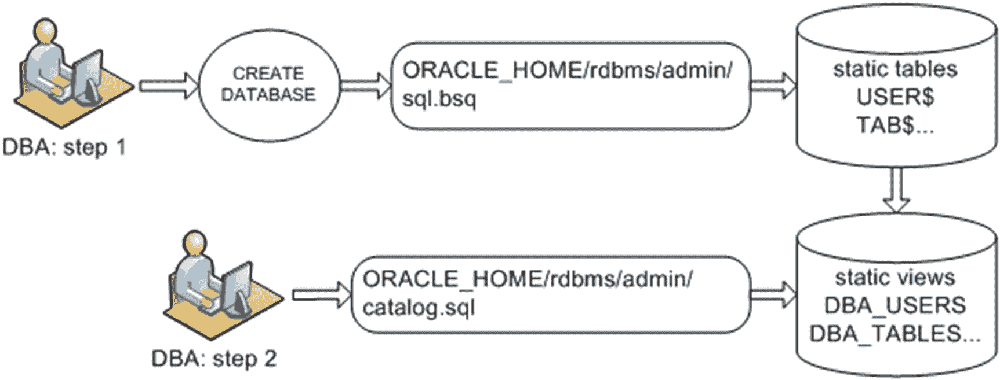
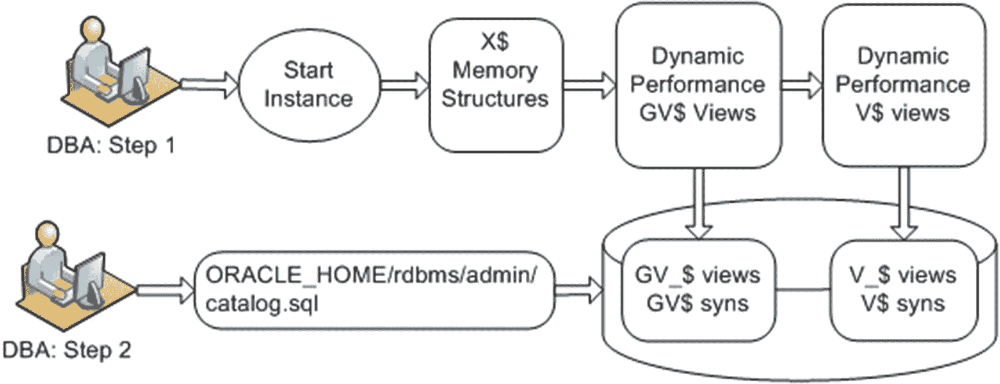
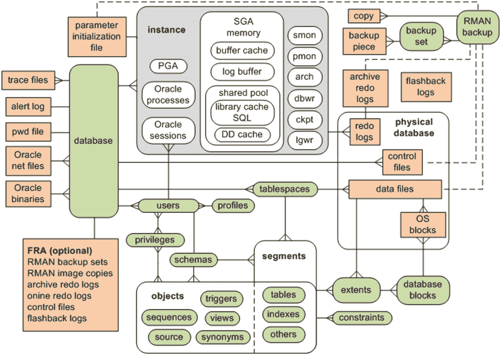
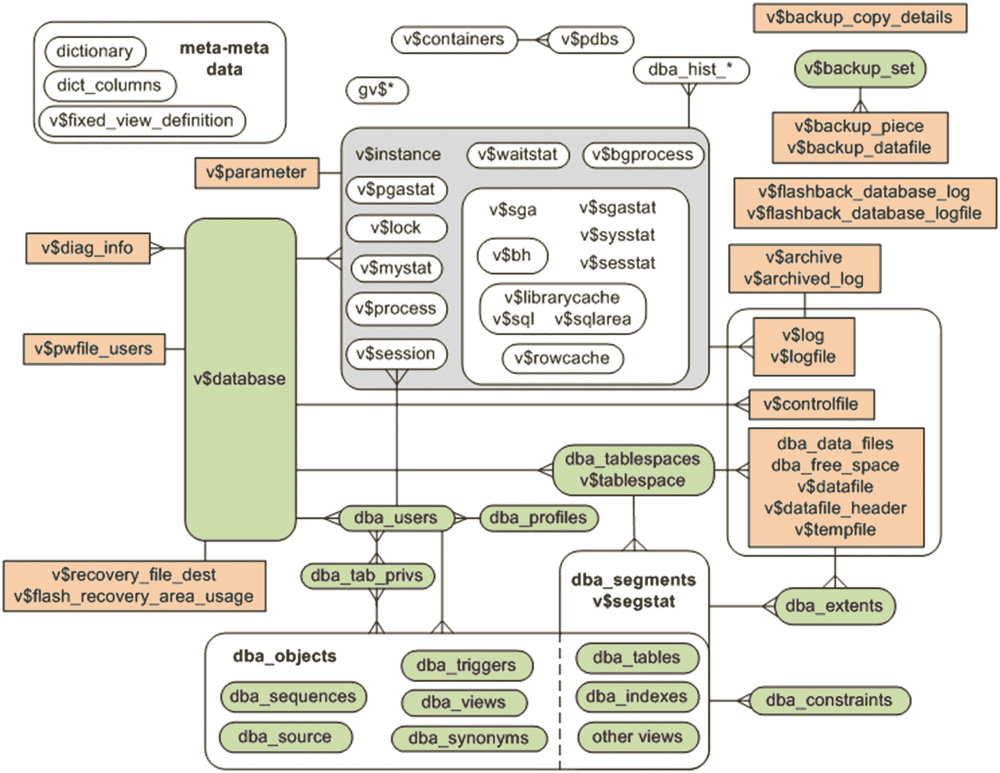

# 10. 数据字典基础

本书前面的章节重点介绍了诸如创建数据库、策略性地实施表空间、管理用户、基本安全性、表、索引和约束等主题。在这些章节中，您看到了几个 SQL 查询，这些查询访问数据字典视图以：

*   显示数据库中有哪些用户，以及他们的密码是否已过期
*   显示每个表的所有者及相关权限
*   显示各种数据库参数的设置
*   确定哪些列定义了外键约束
*   显示表空间及相关数据文件和空间使用情况

在这方面，Oracle 的数据字典是广泛而强大的。几乎所有可以想象到的关于您数据库的信息都可以检索到。数据字典存储有关数据库物理特征、用户、对象和动态性能指标的关键信息。高级 DBA 必须具备数据字典方面的专家知识。

本书的这一章是一个转折点，将它分为基本 DBA 任务和更高级的主题。现在深入探讨数据字典内部工作原理的细节是合适的。了解这些工作原理将为理解您的环境、提取相关信息以及完成您的工作奠定基础。

本章的前几节详细介绍了数据字典的架构及其创建方式。还展示了逻辑对象和物理结构之间的关系，以及它们与特定数据字典视图的关系。这些理解将作为编写 SQL 查询的基础，以提取您需要的信息，从而成为一名更高效、更有效的 DBA。最后，提供了几个示例，说明 DBA 如何使用数据字典。

## 数据字典架构

如果您继承了一个数据库并被要求维护和管理它，通常您会检查数据字典的内容以确定数据库的物理结构，并查看当前正在发生哪些事件。为此，Oracle 提供了两大类只读数据字典视图：


*   您的数据库内容，例如用户、表、索引、约束和权限。这些有时被称为静态的 `CDB/DBA/ALL/USER` 数据字典视图，它们基于存储在 `SYSTEM` 表空间中的内部表。这里的“静态”一词意味着这些视图中的信息仅在您对数据库进行更改时才会变化，例如添加用户、创建表或修改列。

*   数据库活动的实时视图，例如连接到数据库的用户、当前正在执行的 SQL、内存使用情况、锁和 I/O 统计信息。这些视图基于虚拟内存表，被称为动态性能视图。这些视图中的信息会随着数据库中事件的发生而由 Oracle 持续更新。这些视图有时也被称为 `V$` 或 `GV$` 视图。

这些类型的数据字典视图将在接下来的两节中详细描述。

### 静态视图
Oracle 将一部分数据字典视图称为静态视图。这些视图基于由 Oracle 内部维护的物理表。Oracle 的文档指出，从数据变化不快的意义上说（至少与动态的 `V$` 和 `GV$` 视图相比），这些视图是静态的。

“静态”这个术语有时可能并不准确。例如，`DBA_SEGMENTS` 和 `DBA_EXTENTS` 视图会随着数据库中数据量的增长和收缩而动态变化。尽管如此，Oracle 已经做出了静态和动态之间的区分，在查询数据字典时理解这一架构细微差别非常重要。在 Oracle Database 12c 之前，只有三个级别的静态视图：

*   `USER`
*   `ALL`
*   `DBA`

从 Oracle Database 12c 开始，当使用容器/可插拔数据库特性时，引入了第四个级别：

*   `CDB`

`USER` 视图包含当前用户可用的信息。例如，`USER_TABLES` 视图包含关于当前用户所拥有表的信息。查询 `USER` 级别的视图不需要特殊权限。

下一个级别是 `ALL` 静态视图。`ALL` 视图显示当前用户有权限访问的所有对象信息。例如，`ALL_TABLES` 视图显示了当前用户可以对之执行任何类型 DML 操作的所有数据库表。查询 `ALL` 级别的视图不需要特殊权限。

接下来是 `DBA` 静态视图。`DBA` 视图包含描述数据库中所有对象的元数据（不论所有权或访问权限）。要访问 `DBA` 视图，必须授予当前用户 `DBA` 角色或 `SELECT_CATALOG_ROLE`。

`CDB` 级别的视图仅在您使用可插拔数据库特性时才适用。此级别提供关于容器数据库内所有可插拔数据库的信息（因此缩写为 `CDB`）。您会注意到，许多静态数据字典和动态性能视图都有一个新列 `CON_ID`。此列唯一标识容器数据库内的每个可插拔数据库。

> **提示**
> 关于可插拔数据库的完整讨论，请参见第 22 章。除非另有说明，本章重点介绍 `DBA/ALL/USER` 级别的视图。请记住，如果您正在使用可插拔数据库，在报告容器数据库内所有可插拔数据库的信息时，您可能需要访问 `CDB` 级别的视图。

静态视图基于 Oracle 内部表，例如 `USER$`、`TAB$` 和 `IND$`。如果您有权访问 `SYS` 方案，可以通过 SQL 直接查看底层表。在大多数情况下，您只需要访问基于这些底层内部表的静态视图。

数据字典表（如 `USER$`、`TAB$`、`IND$`）是在执行 `CREATE DATABASE` 命令时创建的。作为创建数据库的一部分，会执行 `sql.bsq` 文件，该文件构建了这些内部数据字典表。`sql.bsq` 文件通常位于 `ORACLE_HOME/rdbms/admin` 目录中；您可以通过操作系统编辑实用程序（例如 Linux/Unix 中的 `vi` 或 Windows 中的 Notepad）查看它。

静态视图是在您运行 `catalog.sql` 脚本时创建的（通常在 `CREATE DATABASE` 操作成功后运行此脚本）。`catalog.sql` 脚本位于 `ORACLE_HOME/rdbms/admin` 目录中。图 10-1 显示了创建静态数据字典视图的过程。



您可以通过查询 `DBA_VIEWS` 的 `TEXT` 列来查看静态视图的创建脚本；例如，

```
SQL> set long 5000
SQL> select text from dba_views where view_name='DBA_VIEWS';
```

输出如下：

```
SQL> select u.name, o.name, v.textlength, v.text, t.typetextlength, t.typetext,
t.oidtextlength, t.oidtext, t.typeowner, t.typename,
decode(bitand(v.property, 134217728), 134217728,
(select sv.name from superobj$ h, "_CURRENT_EDITION_OBJ" sv
where h.subobj# = o.obj# and h.superobj# = sv.obj#), null),
decode(bitand(v.property, 32), 32, 'Y', 'N'),
decode(bitand(v.property, 16384), 16384, 'Y', 'N'),
decode(bitand(v.property/4294967296, 134217728), 134217728, 'Y', 'N'),
decode(bitand(o.flags,8),8,'CURRENT_USER','DEFINER')
from sys."_CURRENT_EDITION_OBJ" o, sys.view$ v, sys.user$ u, sys.typed_view$ t
where o.obj# = v.obj#
and o.obj# = t.obj#(+)
and o.owner# = u.user#
```

> **注意**
> 如果您手动创建数据库（不使用 `dbca` 实用程序），则在运行 `catalog.sql` 和 `catproc.sql` 脚本时，必须以 `SYS` 方案连接。`SYS` 方案是数据字典中所有对象的所有者。

### 动态性能视图
动态性能数据字典视图通常被称为 `V$` 和 `GV$` 视图。这些视图由 Oracle 持续更新，反映了实例和数据库的当前状态。动态视图对于诊断实时性能问题至关重要。

`V$` 和 `GV$` 视图间接基于底层的 `X$` 表，这些是启动 Oracle 实例时实例化的内部内存结构。一些 `V$` 视图在 Oracle 实例启动后即可用。例如，`V$PARAMETER` 在发出 `STARTUP NOMOUNT` 命令后就包含有意义的数据，而不需要数据库处于装载或打开状态。其他动态视图（例如 `V$CONTROLFILE`）依赖于控制文件中的信息，因此只有在数据库装载后才包含重要信息。一些 `V$` 视图（例如 `V$BH`）提供内核处理信息，因此只有在数据库打开后才能产生有用的结果。

在最上层，`V$` 视图实际上是同义词，指向底层的 `SYS.V_$` 视图。在下一层，`SYS.V_$` 对象是基于另一层 `SYS.V$` 视图创建的视图。`SYS.V$` 视图又基于 `SYS.GV$` 视图。在最底层，`SYS.GV$` 视图基于 `X$` 内存结构。


## 动态性能视图与数据字典

### 动态性能视图的创建与访问

顶级同义词 `V$` 和视图 `SYS.V_$` 是在运行 `catalog.sql` 脚本时创建的，该脚本通常在数据库初始创建后执行。图 10-2 展示了创建 `V$` 动态性能视图的过程。



**图 10-2** 创建 `V$` 动态性能数据字典视图

通过最顶层的同义词访问 `V$` 视图通常足以满足动态性能信息需求。在极少数情况下，您可能需要查询无法通过 `V$` 视图获取的内部信息。在这些情况下，理解底层的 `X$` 表至关重要。如果您使用 Oracle RAC，则应该熟悉 `GV$` 全局视图。这些视图提供有关集群中所有实例的全局动态性能信息（而 `V$` 视图是实例特定的）。`GV$` 视图包含一个 `INST_ID` 列，用于识别集群环境中的特定实例。

您可以通过查询 `V$FIXED_VIEW_DEFINITION` 视图的 `VIEW_DEFINITION` 列来显示 `V$` 和 `GV$` 视图的定义。例如，以下查询显示 `V$CONTROLFILE` 的定义：

```sql
SQL> select view_definition
from v$fixed_view_definition
where view_name='V$CONTROLFILE';
```

输出如下：

```sql
select STATUS, NAME, IS_RECOVERY_DEST_FILE, BLOCK_SIZE, FILE_SIZE_BLKS,
CON_ID from GV$CONTROLFILE where inst_id = USERENV('Instance')
```

### 元数据的另一种视角

DBA 通常会面临以下类型的数据库问题：

*   向表中插入数据失败，因为表空间无法扩展。
*   数据库拒绝连接，因为会话数超过上限。
*   应用程序挂起，显然是由于某种锁定问题。
*   PL/SQL 语句失败，出现内存错误。
*   RMAN 备份两天内未能成功。
*   用户尝试更新记录，但抛出唯一键约束冲突。
*   SQL 语句的运行时间比正常情况长了数小时。
*   应用程序用户报告性能似乎很慢，数据库肯定有问题。

以上列表是 DBA 日常遇到的典型问题的一小部分样本。要高效地诊断和处理这类问题，需要一定量的知识。该知识的一个基本部分是理解 Oracle 的物理结构和相应的逻辑组件。

例如，如果表因为表空间已满而无法扩展，您依靠什么知识来解决这个问题？您需要理解：创建数据库时，它包含多个称为表空间的逻辑空间容器。每个表空间由一个或多个物理数据文件组成。每个数据文件由许多操作系统块组成。每个表对应一个段，每个段包含一个或多个区。当段需要空间时，它会在物理数据文件中分配额外的区。

一旦理解了所涉及的逻辑和物理概念，您就会直观地查看诸如 `DBA_TABLES`、`DBA_SEGMENTS`、`DBA_TABLESPACES` 和 `DBA_DATA_FILES` 等数据字典视图，以定位问题并根据需要添加空间。在各种各样的故障排除场景中，您对各种逻辑和物理结构之间关系的理解将使您能够专注于查询那些能帮助您快速解决手头问题的视图。

为此，请查看图 10-3。该图描述了 Oracle 数据库中逻辑结构和物理结构之间的关系。圆角矩形代表逻辑结构，尖角矩形代表物理文件。



**图 10-3** Oracle 数据库逻辑和物理结构关系

> **提示：** 逻辑对象只能在数据库启动后从 SQL 中查看。相反，即使实例未启动，也可以通过操作系统工具查看物理对象。

图 10-3 并未显示 Oracle 数据库所有逻辑和物理方面的所有关系。相反，它专注于您最有可能在日常工作中遇到的组件。这个基本的关系图为利用 Oracle 的数据字典基础设施奠定了基础。

在脑海中保留图 10-3 的图像；现在，将其与图 10-4 并列对照。



**图 10-4** 常用数据字典视图的关系

瞧，这些数据字典视图几乎映射了 Oracle 数据库的所有逻辑和物理元素。图 10-4 并未展示每一个数据字典视图。实际上，该图只是触及了皮毛。然而，该图确实为您提供了一个坚实的基础，您可以在此基础上构建如何利用数据字典视图来获取您工作所需数据的理解。

该图显示了视图之间的关系，但没有指定在连接视图时应使用哪些列。您必须描述表并做出合理的猜测，以确定应如何连接视图。例如，假设您想要显示与非本地管理的表空间关联的数据文件。这需要将 `DBA_TABLESPACES` 连接到 `DBA_DATA_FILES`。如果您检查这两个视图，会注意到每个视图都包含一个 `TABLESPACE_NAME` 列，这允许您编写如下查询：

```sql
SQL> select a.tablespace_name, a.extent_management, b.file_name
from dba_tablespaces a,
dba_data_files  b
where a.tablespace_name = b.tablespace_name
and a.extent_management != 'LOCAL';
```

连接视图的方式通常比较明显。使用该图作为指南，指导您从何处开始查找信息以及如何编写 SQL 查询，以提供问题的答案并扩展您对 Oracle 内部架构和工作机制的了解。这将您的问题解决技能锚定在坚实的基础上。一旦您牢固地理解了 Oracle 逻辑和物理组件之间的关系，以及这与数据字典的关联，您就能自信地处理任何类型的数据库问题。

> **注意：** 有数千个 `CDB/DBA/ALL/USER` 静态视图和超过 700 个 `V$` 动态性能视图。

### 数据字典的几种创造性用法

在本书的几乎每一章中，您都会找到几个 SQL 示例，说明如何利用数据字典来更好地理解概念和解决问题。话虽如此，值得展示一些 DBA 如何利用数据字典的非常规示例。接下来的几节就是做这个的。请记住，这只是冰山一角：DBA 们运用了无数的查询和技巧来提取和使用数据字典信息。

#### 可推导的文档

有时，如果您在排除问题时压力很大，需要快速从数据字典中提取信息来帮助解决问题。然而，您可能不知道数据字典视图或其相关列的确切名称。如果您像我一样，不可能将所有数据字典视图名和列名都记在脑子里。此外，我使用从版本 8 到 12c 的数据库，很难跟踪哪个特定的视图在给定的 Oracle 发行版中可用。

## 查询数据字典视图

书籍和海报可以提供信息，但如果你无法找到完全符合需求的内容，可以使用数据字典本身包含的文档。你可以从三个视图中查询，特别是：

*   `DBA_OBJECTS`
*   `DICTIONARY`
*   `DICT_COLUMNS`

如果你大致知道要从中选择信息的视图名称，可以先从 `DBA_OBJECTS` 查询。例如，如果你正在排查与物化视图相关的问题，并且不记得与物化视图关联的数据字典视图的确切名称，可以这样做：

```sql
SQL> select object_name
from dba_objects
where object_name like '%MV%'
and owner='SYS';
```

这可能足以让你接近目标。但通常你需要关于每个视图的更多信息。这就是 `DICTIONARY` 和 `DICT_COLUMNS` 视图变得非常有价值的时候。`DICTIONARY` 视图存储数据字典视图的名称。它有两个列：

```sql
SQL> desc dictionary
Name                                      Null?    Type
----------------------------------------- -------- ------------------------
TABLE_NAME                                         VARCHAR2(30)
COMMENTS                                           VARCHAR2(4000)
```

例如，假设你正在排查物化视图的问题，并想确定与物化视图功能相关的数据字典视图的名称。你可以运行如下查询：

```sql
SQL> select table_name, comments
from dictionary
where table_name like '%MV%';
```

以下是输出的一个片段：

```
TABLE_NAME             COMMENTS
---------------------- ---------------------------------------------
DBA_MVIEW_LOGS         All materialized view logs in the database
DBA_MVIEWS             All materialized views in the database
DBA_MVIEW_ANALYSIS     Description of the materialized views accessible to dba
DBA_MVIEW_COMMENTS     Comments on all materialized views in the database
```

通过这种方式，你可以快速确定需要访问哪个视图。如果你想要关于该视图的更多信息，可以描述它；例如：

```sql
SQL> desc dba_mviews
```

如果这没有提供足够的关于列名的信息，你可以查询 `DICT_COLUMNS` 视图。这个视图提供数据字典视图列的注释；例如：

```sql
SQL> select column_name, comments
from dict_columns
where table_name='DBA_MVIEWS';
```

以下是输出的一部分：

```
COLUMN_NAME            COMMENTS
---------------------- ---------------------------------------------
OWNER                  Owner of the materialized view
MVIEW_NAME             Name of the materialized view
CONTAINER_NAME         Name of the materialized view container table
QUERY                  The defining query that the materialized view instantiates
```

通过这种方式，你可以生成并查看关于大多数数据字典对象的文档。该技术允许你快速识别在故障排除情况下可能对你有帮助的适当视图和列。

### 显示用户信息

你可能会发现自己处在一个包含数百个数据库、分布在数十台不同服务器上的环境中。在这种情况下，你希望确保不会运行错误的命令或连接到错误的数据库，或者两者兼而有之。在执行 DBA 任务时，谨慎的做法是验证你是否以适当的账户连接到正确的数据库。你可以运行以下类型的 SQL 命令来验证当前连接的用户和数据库信息：

```sql
SQL> show user;
SQL> select * from user_users;
SQL> select name from v$database;
SQL> select instance_name, host_name from v$instance;
```

如第 3 章所示，保持对环境认知的一个有效方法是通过 `login.sql` 脚本自动设置你的 SQL*Plus 提示符，以显示用户和实例信息。此示例手动设置 SQL 提示符：

```sql
SQL> set sqlprompt '&_USER.@&_CONNECT_IDENTIFIER.> '
```

以下是 SQL 提示符现在的样子：

```
SYS@O18C>
```

你还可以使用 `SYS_CONTEXT` 内置 SQL 函数从数据字典中提取关于你当前连接会话详细信息的信息。此函数的一般语法如下：

```sql
SYS_CONTEXT('','',[length])
```

此示例显示用户、身份验证方法、主机和实例：

```sql
SYS@O18C> select
sys_context('USERENV','CURRENT_USER') usr
,sys_context('USERENV','AUTHENTICATION_METHOD') auth_mth
,sys_context('USERENV','HOST') host
,sys_context('USERENV','INSTANCE_NAME') inst
from dual;
```

`USERENV` 是一个内置的 Oracle 命名空间。当你将 `USERENV` 命名空间与 `SYS_CONTEXT` 函数一起使用时，有超过 50 个可用参数。表 10-1 描述了一些更有用的参数。有关参数的完整列表，请参阅 Oracle SQL 语言参考指南，该指南可从 Oracle 网站（`http://otn.oracle.com`）的技术网络区域免费下载。

表 10-1 可用 `SYS_CONTEXT` 的有用 `USERENV` 参数

| 参数名 | 描述 |
| --- | --- |
| `AUTHENTICATED_IDENTITY` | 身份验证中使用的身份 |
| `AUTHENTICATION_METHOD` | 身份验证方法 |
| `CDB_NAME` | 返回 CDB 的名称；否则返回 null |
| `CLIENT_IDENTIFIER` | 返回由应用程序设置的标识符 |
| `CLIENT_INFO` | 用户会话信息 |
| `CON_ID` | 容器标识符 |
| `CON_NAME` | 容器名称 |
| `CURRENT_USER` | 当前活动会话的用户名 |
| `DB_NAME` | 由 `DB_NAME` 初始化参数指定的名称 |
| `DB_UNIQUE_NAME` | 由 `DB_UNIQUE_NAME` 初始化参数指定的名称 |
| `HOST` | 客户端发起数据库连接的机器的主机名 |
| `INSTANCE_NAME` | 实例名称 |
| `IP_ADDRESS` | 客户端发起数据库连接的机器的 IP 地址 |
| `ISDBA` | 如果用户通过操作系统或密码文件以 DBA 特权身份验证，则为 `TRUE` |
| `NLS_DATE_FORMAT` | 会话的日期格式 |
| `OS_USER` | 客户端发起数据库连接的机器的操作系统用户 |
| `SERVER_HOST` | 运行数据库实例的机器的主机名 |
| `SERVICE_NAME` | 连接的服务名称 |
| `SID` | 会话标识符 |
| `TERMINAL` | 客户端终端的操作系统标识符 |

### 确定环境细节

有时，在各种开发、测试、测试版和生产环境中部署代码时，提示你是否处于正确的环境中会很方便。完成此操作的技术需要两个文件：`answer_yes.sql` 和 `answer_no.sql`。以下是 `answer_yes.sql` 的内容：

```sql
-- answer_yes.sql
PROMPT
PROMPT Continuing...
```

而这是 `answer_no.sql`：

```sql
-- answer_no.sql
PROMPT
PROMPT Quitting and discarding changes...
ROLLBACK;
EXIT;
```

现在，你可以将以下代码插入到部署脚本的第一部分；该代码将提示你是否处于正确的环境以及是否要继续：

```sql
WHENEVER SQLERROR EXIT FAILURE ROLLBACK;
WHENEVER OSERROR EXIT FAILURE ROLLBACK;
select host_name from v$instance;
select name as db_name from v$database;
SHOW user;
SET ECHO OFF;
PROMPT
ACCEPT answer PROMPT 'Correct environment? Enter yes to continue: '
@@answer_&answer..sql
```

如果你输入 `yes`，则将执行 `answer_yes.sql` 脚本，你将可以继续运行你调用的任何其他脚本。如果你输入 `no`，则将运行 `answer_no.sql` 脚本，你将从 SQL*Plus 退出并返回到操作系统提示符。如果你直接按回车键而未输入任何内容，你也会退出并返回到操作系统提示符。

### 显示表行数

## 使用 SQL 生成 SQL 进行数据库管理与统计

### 统计表行数

当您调查性能或空间问题时，显示每个表的行数非常有用。要手动计算行数，您需要为每个拥有的表编写如下查询：

```
SQL> select count(*) from ;
```

手动编写 SQL 既耗时又容易出错。在这种情况下，使用 SQL 生成解决问题所需的 SQL 更为高效。为此，下一个示例基于 `DBA_TABLES` 视图中的信息动态选择所需文本。将生成一个包含动态 SQL 的输出文件。请以 `DBA` 特权用户身份运行以下 SQL 代码。请注意，此脚本包含 SQL*Plus 特定命令，例如 `UNDEFINE` 和 `SPOOL`。脚本会每次提示您输入用户名：

```
UNDEFINE user
SPOOL tabcount_&&user..sql
SET LINESIZE 132 PAGESIZE 0 TRIMSPO OFF VERIFY OFF FEED OFF TERM OFF
SELECT
'SELECT RPAD(' || "" || table_name || "" ||',30)'
|| ',' || ' COUNT(*) FROM &&user..' || table_name || ';'
FROM dba_tables
WHERE owner = UPPER('&&user')
ORDER BY 1;
SPO OFF;
SET TERM ON
@@tabcount_&&user..sql
SET VERIFY ON FEED ON
```

此代码生成一个名为 `tabcount_<user>.sql` 的文件，其中包含从指定方案中所有表选择行数的 SQL 语句。如果您提供给脚本的用户名是 `INVUSER`，则可以手动运行生成的脚本，如下所示：

```
SQL> @tabcount_invuser.sql
```

请记住，如果表的行数很高，此脚本可能需要很长时间（几分钟）才能运行。

### 使用 SQL 生成 SQL 语句

开发人员和 DBA 经常使用 SQL 生成 SQL 语句。当您需要将相同的 SQL 过程（重复地）应用于许多不同的对象（例如方案中的所有表）时，这是一种非常有用的技术。

如果您没有 `DBA` 级视图的访问权限，可以查询 `USER_TABLES` 视图；例如：

```
SPO tabcount.sql
SET LINESIZE 132 PAGESIZE 0 TRIMSPO OFF VERIFY OFF FEED OFF TERM OFF
SELECT
'SELECT RPAD(' || "" || table_name || "" ||',30)'
|| ',' || ' COUNT(*) FROM ' || table_name || ';'
FROM user_tables
ORDER BY 1;
SPO OFF;
SET TERM ON
@@tabcount.sql
SET VERIFY ON FEED ON
```

### 从统计数据估算行数

如果您有准确的统计信息，可以查询 `CDB/DBA/ALL/USER_TABLES` 视图中的 `NUM_ROWS` 列。如果定期生成统计信息，此列通常具有接近的行数。以下查询从 `USER_TABLES` 视图中选择 `NUM_ROWS`：

```
SQL> select table_name, num_rows from user_tables;
```

### 统计分区表的行数

最后一点说明：如果您有分区表并希望按分区显示行数，请使用以下几行 SQL 和 PL/SQL 代码来生成所需的 SQL：

```
SQL> UNDEFINE user
SQL> SET SERVEROUT ON SIZE 1000000 VERIFY OFF
SQL> SPO part_count_&&user..txt
SQL> DECLARE
counter  NUMBER;
sql_stmt VARCHAR2(1000);
CURSOR c1 IS
SELECT table_name, partition_name
FROM dba_tab_partitions
WHERE table_owner = UPPER('&&user');
BEGIN
FOR r1 IN c1 LOOP
sql_stmt := 'SELECT COUNT(*) FROM &&user..' || r1.table_name
||' PARTITION ( '||r1.partition_name ||' )';
EXECUTE IMMEDIATE sql_stmt INTO counter;
DBMS_OUTPUT.PUT_LINE(RPAD(r1.table_name
||'('||r1.partition_name||')',30) ||' '||TO_CHAR(counter));
END LOOP;
END;
/
SPO OFF
```

### 手动生成统计信息

如果要为表生成统计信息，请使用 `DBMS_STATS` 包。此示例为用户和表生成统计信息：

```
SQL> exec dbms_stats.gather_table_stats(ownname=>'MV_MAINT',-
tabname=>'F_SALES',-
cascade=>true,estimate_percent=>20,degree=>4);
```

您可以使用以下代码为用户的所有对象生成统计信息：

```
SQL> exec dbms_stats.gather_schema_stats(ownname => 'MV_MAINT',-
estimate_percent => DBMS_STATS.AUTO_SAMPLE_SIZE,-
degree => DBMS_STATS.AUTO_DEGREE,-
cascade => true);
```

前面的代码指示 Oracle 使用 `ESTIMATE_PERCENT` 参数，通过 `DBMS_STATS.AUTO_SAMPLE_SIZE` 估算要采样的表的百分比。Oracle 还通过 `DEGREE` 参数设置为 `DBMS_STATS.AUTO_DEGREE` 来选择适当的并行度。`CASCADE` 参数指示 Oracle 为索引生成统计信息。

请记住，Oracle 可能不会选择最佳的自动样本大小。Oracle 可能会选择 10%，但您可能有设置较低百分比（例如 5%）的经验，并且知道这是一个可接受的数字。在这些情况下，请不要使用 `AUTO_SAMPLE_SIZE`；而是明确提供一个数字。

### 显示主键和外键关系

有时在诊断约束问题时，显示有关外键约束关联的主键约束的数据字典信息非常有用。例如，您可能尝试向子表插入数据，并抛出错误指出父键不存在，而您希望显示有关父键约束的更多信息。

以下脚本查询 `DBA_CONSTRAINTS` 数据字典视图以确定与子外键约束相关的父主键约束。您需要向脚本提供表的所有者以及您希望显示主键约束的子表：

```
SQL> select
a.constraint_type cons_type
,a.table_name      child_table
,a.constraint_name child_cons
,b.table_name      parent_table
,b.constraint_name parent_cons
,b.constraint_type cons_type
from dba_constraints a
,dba_constraints b
where a.owner    = upper('&owner')
and a.table_name = upper('&table_name')
and a.constraint_type = 'R'
and a.r_owner = b.owner
and a.r_constraint_name = b.constraint_name;
```

前面的脚本会提示您输入两个 SQL*Plus 和号变量（`OWNER`，`TABLE_NAME`）；如果您不使用 SQL*Plus，则可能需要在运行脚本前使用适当的值修改脚本。

以下输出显示有两个外键约束。它还显示了父表的主键约束：

```
C CHILD_TABLE     CHILD_CONS          PARENT_TABLE    PARENT_CONS         C
- --------------- ------------------- --------------- ------------------- -
R REG_COMPANIES   REG_COMPANIES_FK2   D_COMPANIES     D_COMPANIES_PK      P
R REG_COMPANIES   REG_COMPANIES_FK1   CLUSTER_BUCKETS CLUSTER_BUCKETS_PK  P
```

当 `CONSTRAINT_TYPE` 列（来自 `DBA/ALL/USER_CONSTRAINTS`）包含 `R` 值时，这表示该行描述了一个引用完整性约束，即子表约束引用了主键约束。您使用连接到同一表两次的技术来检索主键约束信息。子约束列（`R_OWNER`，`R_CONSTRAINT_NAME`）与 `DBA_CONSTRAINTS` 视图中包含主键信息的另一行匹配。

### 从主键查找外键

您还可以执行与本节前面查询相反的操作；对于主键约束，您希望找到与之关联的任何外键列（如果存在）。下一个脚本获取主键记录，并查看它是否有约束类型为 `R` 的子记录。运行此脚本时，系统会提示您输入主键表的所有者和名称：

```
SQL> select
b.table_name        primary_key_table
,a.table_name        fk_child_table
,a.constraint_name   fk_child_table_constraint
from dba_constraints a
,dba_constraints b
where a.r_constraint_name = b.constraint_name
and   a.r_owner           = b.owner
and   a.constraint_type   = 'R'
and   b.owner             = upper('&table_owner')
and   b.table_name        = upper('&table_name');
```

以下是一些示例输出：


## 显示对象依赖关系

假设你需要删除一个表，但在删除之前，你想显示所有依赖于它的对象。例如，你可能有一个表，它有同义词、视图、物化视图、函数、过程和触发器依赖于它。在进行更改之前，你希望审查哪些其他对象依赖于该表。你可以使用 `DBA_DEPENDENCIES` 数据字典视图来显示对象依赖关系。以下查询会提示你输入用户名和对象名：

```sql
SQL> select '+' || lpad(' ',level+2) || type || ' ' || owner || '.' || name  dep_tree
from dba_dependencies
connect by prior owner = referenced_owner and prior name = referenced_name
and prior type = referenced_type
start with referenced_owner = upper('&object_owner')
and referenced_name = upper('&object_name')
and owner is not null;
```

在输出中，列出的每个对象都依赖于你输入的对象。缩进行用于显示一个对象对前一行对象的依赖关系：

```
DEP_TREE

+   TRIGGER STAR2.D_COMPANIES_BU_TR1
+   MATERIALIZED VIEW CIA.CB_RAD_COUNTS
+   SYNONYM STAR1.D_COMPANIES
+    SYNONYM CIA.D_COMPANIES
+     MATERIALIZED VIEW CIA.CB_RAD_COUNTS
```

在此示例中，被分析的对象是一个名为 `D_COMPANIES` 的表。几个同义词、物化视图和一个触发器依赖于这个表。例如，由 `CIA` 拥有的物化视图 `CB_RAD_COUNTS` 依赖于由 `CIA` 拥有的同义词 `D_COMPANIES`，而该同义词又依赖于由 `STAR1` 拥有的 `D_COMPANIES` 同义词。

`DBA_DEPENDENCIES` 视图包含 `OWNER`、`NAME` 和 `TYPE` 列及其引用的列名 `REFERENCED_OWNER`、`REFERENCED_NAME` 和 `REFERENCED_TYPE` 之间的层次关系。Oracle 提供了许多结构来执行层次查询。例如，`START WITH` 和 `CONNECT BY` 允许你识别树中的起点并向上或向下遍历层次关系。

本节前面的 SQL 查询仅对一个对象进行操作。如果你想检查模式中的每个对象，可以使用 SQL 来生成 SQL，以创建显示模式所有对象依赖关系的脚本。下一个示例中的代码片段就是如此。为了格式化和输出，该代码使用了一些特定于 SQL*Plus 的构造，例如设置页面大小和行大小以及假脱机输出：

```sql
SQL> UNDEFINE owner
SQL> SET LINESIZE 132 PAGESIZE 0 VERIFY OFF FEEDBACK OFF TIMING OFF
SQL> SPO dep_dyn_&&owner..sql
SQL> SELECT 'SPO dep_dyn_&&owner..txt' FROM DUAL;
--
SELECT
'PROMPT ' || '_____________________________'|| CHR(10) ||
'PROMPT ' || object_type || ': ' || object_name || CHR(10) ||
'SELECT ' || "" || '+' || "" || ' ' ||  '|| LPAD(' || "" || ' '
|| "" || ',level+3)' || CHR(10) || ' || type || ' || "" || ' ' || "" ||
' || owner || ' || "" || '.' || "" || ' || name' || CHR(10) ||
' FROM dba_dependencies ' || CHR(10) ||
' CONNECT BY PRIOR owner = referenced_owner AND prior name = referenced_name '
|| CHR(10) ||
' AND prior type = referenced_type ' || CHR(10) ||
' START WITH referenced_owner = ' || "" || UPPER('&&owner') || "" || CHR(10) ||
' AND referenced_name = ' || "" || object_name || "" || CHR(10) ||
' AND owner IS NOT NULL;'
FROM dba_objects
WHERE owner = UPPER('&&owner')
AND object_type NOT IN ('INDEX','INDEX PARTITION','TABLE PARTITION');
--
SELECT 'SPO OFF' FROM dual;
SPO OFF
SET VERIFY ON LINESIZE 80 FEEDBACK ON
```

现在你应该有一个名为 `dep_dyn_<owner>.sql` 的脚本，它创建于你运行脚本的同一目录中。此脚本包含显示你输入的所有者对象依赖关系所需的所有 SQL。运行该脚本以显示对象依赖关系。在此示例中，所有者是 `CIA`：

```sql
SQL> @dep_dyn_cia.sql
```

当脚本运行时，它会生成一个格式为 `dep_dyn_<owner>.txt` 的假脱机文件。你可以使用操作系统编辑器打开该文本文件以查看其内容。以下是此示例的输出样本：

```
TABLE: DOMAIN_NAMES
+    FUNCTION STAR2.GET_DERIVED_COMPANY
+    TRIGGER STAR2.DOMAIN_NAMES_BU_TR1
+    SYNONYM CIA_APP.DOMAIN_NAMES
```

此输出显示表 `DOMAIN_NAMES` 有三个依赖于它的对象：一个函数、一个触发器和一个同义词。

## DUAL 表

`DUAL` 表是数据字典的一部分。该表包含一行一列，当你想返回恰好一行，并且不需要从特定表中检索数据时非常有用。换句话说，你只想返回一个值。例如，你可以执行算术运算，如下所示：

```sql
SQL> select 34*.15 from dual;
34*.15

5.1
```

其他常见用法包括从 `DUAL` 中选择以显示当前日期或在 SQL 脚本中显示一些文本。

## 小结

有时，你会接手一个已经运行多年的旧数据库，管理和维护它是你的职责。在某些情况下，你没有关于数据库中用户和对象的任何文档。即使有文档，也可能不准确或未更新。在这些情况下，数据字典很快就会成为你的文档来源。你可以使用它来提取用户信息、数据库的物理结构、安全信息、对象和所有者、当前连接的用户等。

Oracle 在数据字典中提供了静态和动态视图。静态视图包含有关数据库中对象的信息。你可以使用这些视图来确定哪些表占用空间最多、包含的行数最多、分配的区最多等等。动态性能视图提供了数据库中当前发生事件的实时窗口。这些视图提供有关当前连接的用户、正在执行的 SQL、资源消耗位置等信息。DBA 广泛使用这些视图来监控和解决性能问题。

本书现在将注意力转向专门的 Oracle 功能，例如大对象、分区、数据泵和外部表。这些主题将在接下来的几章中介绍。

