# 12. 分区：分而治之

Oracle 提供了两个关键的可扩展性特性，即使在大规模数据库中也能实现良好的性能：并行处理和分区。并行处理允许 Oracle 启动多个执行线程以利用多个硬件资源。分区允许将表或索引的子集独立管理（Oracle 的“分而治之”方法）。本章重点介绍分区策略。

## 分区简介

分区让你可以创建一个逻辑表或索引，它由独立的段组成，每个段可以被独立的执行线程访问和操作。表或索引的每个分区具有相同的逻辑结构，例如列定义，但可以驻留在独立的容器中。换句话说，你可以将每个分区存储在其自己的表空间及相关数据文件中。这使得你可以将一个大的逻辑对象作为一组更小、更易维护的部分来管理。

分区带来的主要好处如下：

*   更好的性能；在某些情况下，SQL 查询可以在单个分区或分区子集上操作，从而加快执行时间。
*   更高的可用性；一个分区中数据的可用性不受另一个分区中数据不可用的影响。
*   更易于维护；按分区进行插入、更新、删除、截断、重建和重组数据，可以实现高效的加载和归档操作，否则这些操作可能既困难又耗时。
*   分区管理；修改策略和管理分区可以是在线和自动化的活动。

仅仅实现分区并不意味着你将自动获得性能提升、实现高可用性并简化管理活动。你需要了解分区的工作原理以及如何利用各种特性来获得任何好处。本章的目标是解释分区概念以及如何实现分区，并就何时使用哪些特性提供指导。

## 分区术语

在深入细节之前，你应该首先熟悉一些分区术语。下表描述了本章使用的关键分区术语的含义。

表 12-1 Oracle 分区术语

| 术语 | 含义 |
| :--- | :--- |
| 分区 | 透明地将一个逻辑表或索引实现为许多独立、更小的段 |
| 分区键 | 一个或多个列，明确确定行存储在哪个分区中 |
| 分区边界 | 分区之间的边界 |
| 单级分区 | 使用单一方法的分区 |
| 复合分区 | 使用组合方法的分区 |
| 子分区 | 分区内的分区 |
| 分区独立性 | 独立访问分区以执行维护操作而不影响其他分区可用性的能力 |
| 分区修剪 | 消除不必要的分区。Oracle 检测 SQL 语句需要访问哪些分区，并从考虑范围中移除任何不需要的分区。 |
| 分区-wise 连接 | 以分区大小的块执行连接，通过并行执行许多较小任务而非顺序执行一个大型任务来提高性能 |
| 本地分区索引 | 使用与其表相同分区键的索引 |
| 全局分区索引 | 不使用与其表相同分区键的索引 |
| 全局非分区索引 | 在分区表上创建的常规索引。索引本身未被分区。 |

另外请记住，如果你主要处理小型 OLTP 数据库，则不需要创建分区表和索引。但是，如果你在 OLTP 数据库或数据仓库环境中处理非常大的对象，你很可能从分区中受益。分区是设计和构建可扩展、高可用的大型数据库系统的关键。

## 哪些表应该被分区？

以下是一些确定是否对表进行分区的经验法则。通常，你应该考虑对以下表进行分区：

*   大小超过 10GB 的表
*   当 SQL 操作随着数据增加而变慢时，行数超过 1000 万的表
*   你知道会变得很大的表（最好一开始就创建为分区表，而不是在表增长导致性能开始下降后才重建为分区表）
*   其行可以按有利于并行操作（如插入、检索、删除以及备份和恢复）的方式划分的表
*   你希望定期归档最旧数据或定期删除最旧分区的表，因为数据变得陈旧

一条规则是，任何大于 10GB 的表都是分区的潜在候选者。运行此查询以显示数据库中占用空间最多的对象：

```sql
select * from (
select owner, segment_name, segment_type, partition_name
,sum(bytes)/1024/1024 meg_tot
from dba_segments
group by owner, segment_name, segment_type, partition_name
order by sum(extents) desc)
where rownum <= 10;
```

以下是该查询的输出片段：

```
OWNER     SEGMENT_NAME              SEGMENT_TYPE PARTITION_NAME     MEG_TOT
--------  -------------------------------------- --------------  ----------
MV_MAINT  F_SALES                   TABLE                             15281
MV_MAINT  F_SALES_IDX1              INDEX                              8075
```

此输出显示此数据库中的少数大对象可能从分区中受益。对于此数据库，如果这些大型对象存在性能问题，那么分区可能会有所帮助。

如果你从 SQL*Plus 运行前面的查询，你需要对列应用一些格式设置，以在终端有限的宽度内合理显示输出：

```sql
set lines 132
col owner form a10
col segment_name form a25
col partition_name form a15
```


除了观察对象大小之外，如果还能对数据进行合理划分以方便操作——例如数据加载、查询、备份、归档和删除——那么应考虑使用分区功能。例如，当你处理一张包含大量行的表，且这些行经常根据特定时间范围（如按日、周、月或年）被访问时，考虑分区是合理的。甚至按区域划分的数据也可能适合进行分区以方便加载或访问，因为这类数据通常通过区域列表、分组或类别来访问。

表的尺寸庞大，加上合理的业务需求，意味着你应该考虑采用分区。请记住，对表进行分区需要更多的设置工作和维护成本。然而，如前所述，在设置时就对表进行分区，远比在表增长到难以处理的大小后再进行转换要容易得多。在表通过在线维护增大后，操作各个分区也会更加便捷，因为分区策略可以被修改，或分区可以被合并。

> **注意**
> 分区是一项额外收费的选项，仅在 **Oracle 企业版** 中提供。你必须根据业务需求来判断分区是否值得其成本。数据仓库和超大型数据库（VLDB）应结合成本与数据访问需求来评估此选项。

## 创建分区表

Oracle 提供了一套强大的方法，用于将表和索引划分为更小的子集。例如，你可以按日期范围（如按月或按年）划分表的数据。表 12-2 概述了可用的分区策略。

**表 12-2** 分区策略

| 分区类型 | 描述 |
| :--- | :--- |
| 范围（Range） | 允许基于日期、数字或字符的范围进行分区 |
| 列表（List） | 当分区能很好地映射到一个值列表（如州或地区代码）时非常有用 |
| 哈希（Hash） | 在没有明显分区键的情况下，允许均匀分布行 |
| 组合（Composite） | 允许结合使用其他分区策略 |
| 间隔（Interval） | 通过在新分区键值超出当前最大范围时自动分配新分区，来扩展范围分区 |
| 引用（Reference） | 基于父表列对子表进行分区非常有用 |
| 虚拟（Virtual） | 允许在虚拟列上进行分区 |
| 系统（System） | 允许插入数据的应用程序决定应使用哪个分区 |

接下来的章节将展示每种分区策略的示例。此外，你还会学习如何将分区放置在独立的表空间中；要充分利用分区的所有优势，你需要了解如何将分区分配到其自身的表空间。

### 按范围分区

范围分区是一种常用策略。它指示 Oracle 根据值的范围（如日期、数字或字符）将行放入分区。当数据插入范围分区表时，Oracle 会根据每个范围分区的下限和上限来确定将一行放入哪个分区。

范围分区键在 `CREATE TABLE` 语句中的 `PARTITION BY RANGE` 子句中定义。这决定了使用哪一列来控制一行所属的分区。稍后你会看到一些示例。

每个范围分区都需要一个 `VALUES LESS THAN` 子句，用于标识该范围上限的非包含值。为范围定义的第一个分区没有下限。任何小于第一个分区 `VALUES LESS THAN` 子句中设定的值的记录，都将插入第一个分区。对于第一个分区之外的其他分区，范围的下限由前一个分区的上限决定。

可选地，你可以使用 `MAXVALUE` 子句来创建范围分区表的最高分区。任何分区键值未落在较低范围内的行，都将插入这个最高的 `MAXVALUE` 分区。

#### 使用数字类型作为分区键列

让我们看一个例子来说明前面的概念。假设你工作在一个数据仓库环境中，通常有一个事实表存储事件信息，例如销售额、利润、注册数等。在事实表中，通常一列代表金额或计数，另一列代表时间点。

一些数据仓库架构师选择用一个数字来表示时间点列，该数字可以转换为日期——这样做的好处是，当连接到多个维度表时，数字数据类型效率更高。例如，值 `20130101` 用于代表 2013 年 1 月 1 日，并且你使用这个数字值（代表一个日期）作为列来对事实表进行分区。下面的 SQL 语句创建了一个基于数字范围的三张分区的表：

```sql
create table f_sales
(sales_amt number
,d_date_id number)
partition by range (d_date_id)(
partition p_2012 values less than (20130101),
partition p_2013 values less than (20140101),
partition p_max  values less than (maxvalue));
```

创建范围分区表时，你不必指定 `MAXVALUE` 分区。但是，如果没有指定带有 `MAXVALUE` 子句的分区，并且你试图插入一行，其分区键值不属于任何其他已定义的范围，则会收到如下错误：

```
ORA-14400: inserted partition key does not map to any partition
```

当看到此错误时，你必须添加一个能容纳所插入分区键值的分区，或者添加一个带有 `MAXVALUE` 子句的分区。

> **提示**
> 考虑使用间隔分区策略，其中当行超过当前范围上限时，Oracle 会自动添加新分区。请参阅本章后面的“按需创建分区”部分。

你可以通过运行以下查询来查看刚刚创建的分区表的信息：

```sql
select table_name, partitioning_type, def_tablespace_name
from user_part_tables
where table_name='F_SALES';
```

这是输出的片段：

```
TABLE_NAME           PARTITION DEF_TABLESPACE_NAME
-------------------- --------- ------------------------------
F_SALES              RANGE     USERS
```

要查看表中分区的信息，请发出如下查询：

```sql
select table_name, partition_name, high_value
from user_tab_partitions
where table_name = 'F_SALES'
order by table_name, partition_name;
```

以下是一些示例输出：


## Oracle 数据库分区技术详解

### 分区示例与关键概念

```
TABLE_NAME           PARTITION_NAME       HIGH_VALUE
-------------------- -------------------- --------------------
F_SALES              P_2016               20170101
F_SALES              P_2017               20180101
F_SALES              P_MAX                MAXVALUE
```

在此示例中，`D_DATE_ID`列是分区键列。`VALUES LESS THAN`子句创建了分区边界；它们定义了行将被插入的分区。`MAXVALUE`参数创建了一个分区，用于存储不适合其他已定义分区的行（包括`NULL`值）。

### 检测何时需要添加新高值范围

当您进行范围分区但没有指定`MAXVALUE`分区时，可能无法准确预测何时需要添加新的高值分区。此外，数据字典中的`HIGH_VALUE`列是`LONG`数据类型，这意味着您无法应用`MAX` SQL 函数来返回当前的高值。

下面是一个简单的 shell 脚本，它尝试插入一条包含未来日期的记录，以确定是否存在可接受的分区。如果记录插入成功，脚本将回滚事务。如果记录插入失败，则会生成错误，脚本会向您发送电子邮件：

```bash
#!/bin/bash
if [ $# -ne 1 ]; then
echo "Usage: $0 SID"
exit 1
fi
export ORACLE_SID=o18c
export ORACLE_HOME=/ora01/app/oracle/product/18.0.0.1/db_1
#
sqlplus -s <<EOF
mv_maint/foo
WHENEVER SQLERROR EXIT FAILURE
COL date_id NEW_VALUE hold_date_id
SELECT to_char(sysdate+30,'yyyymmdd') date_id FROM dual;
--
INSERT INTO mv_maint.f_sales(sales_amt, d_date_id)
VALUES (0, '&hold_date_id');
ROLLBACK;
EOF
#
if [ $? -ne 0 ]; then
mailx -s "Partition range issue: f_sales" dkuhn@gmail.com <<EOF
check f_sales high range.
EOF
else
echo "f_sales ok"
fi
exit 0
```

请确保您不会无意中使用此类脚本将数据添加到生产表中。您必须仔细修改脚本以匹配您的表和高值范围分区键列。

### 为分区键列实现时间戳

如前所述，上一节中的示例将`D_DATE_ID`列创建为`NUMBER`数据类型，而不是`F_SALES`表的`DATE`数据类型。与`NUMBER`数据类型相反，一些数据仓库架构师会主张为分区键使用`DATE`或`TIMESTAMP`数据类型。以下是一个为`D_DATE_DTT`列创建`DATE`数据类型的`F_SALES`表的示例：

```sql
SQL> create table f_sales
(sales_amt  number
,d_date_dtt date
)
partition by range (d_date_dtt)(
partition p_2016 values less than (to_date('01-01-2017','dd-mm-yyyy')),
partition p_2017 values less than (to_date('01-01-2018','dd-mm-yyyy')),
partition p_max  values less than (maxvalue));
```

**提示：**使用`DD-MM-YYYY`日期格式可能比使用`01-MON-YYYY`等格式更可取。`DD-MM-YYYY`格式避免了使用月份字符名称（JAN、FEB 等），这可以规避不同字符集语言带来的问题。

如前面的代码所示，我建议您始终使用`TO_DATE`来明确指示 Oracle 如何解释日期。这样做也为任何支持数据库的人员提供了最低级别的文档。

为分区键使用`DATE`数据类型与使用`NUMBER`字段一样有效。只需记住，设计数据仓库表的人可能对使用哪种技术有强烈的看法。

### 将分区置于表空间中

将分区放在自己的表空间中的好处现在主要是从其他表中识别分区。如果每个分区都有自己的表空间，则备份、恢复以及将表空间联机/脱机会更简单，但即使分区不在自己的表空间中，也可以进行联机操作和表的备份。在某些情况下，甚至可能将表空间和分区设置为只读模式有意义，而拥有自己的表空间则允许这样做。

要理解为每个分区使用单独表空间的好处，首先考虑一个非分区表的场景。作为参考，以下是此示例使用的`CREATE TABLESPACE`语句：

```sql
SQL> CREATE TABLESPACE p1_tbsp
DATAFILE '/u01/dbfile/o18c/p1_tbsp01.dbf' SIZE 100m
EXTENT MANAGEMENT LOCAL
UNIFORM SIZE 128K
SEGMENT SPACE MANAGEMENT AUTO;
```

此示例创建了一个分区表，但未为分区指定表空间：

```sql
SQL> create table f_sales (
sales_amt number
,d_date_id number)
tablespace p1_tbsp
partition by range(d_date_id)(
partition y11 values less than (20120101)
,partition y12 values less than (20130101)
,partition y13 values less than (20140101));
```

图 12-1 说明了这种方法。请注意，在这种情况下，所有分区都存储在同一个表空间中。

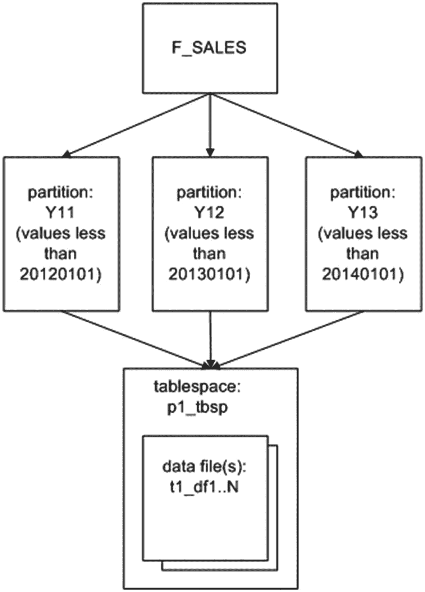

**图 12-1** 只有一个表空间的分区表

下一个示例将每个分区放在单独的表空间中：

```sql
SQL> create table f_sales (
sales_amt number
,d_date_id number)
tablespace p1_tbsp
partition by range(d_date_id)(
partition y11 values less than (20120101)
tablespace p1_tbsp
,partition y12 values less than (20130101)
tablespace p2_tbsp
,partition y13 values less than (20140101)
tablespace p3_tbsp);
```

现在，每个分区的数据物理上存储在自己的表空间和相应的数据文件中（参见图 12-2）。

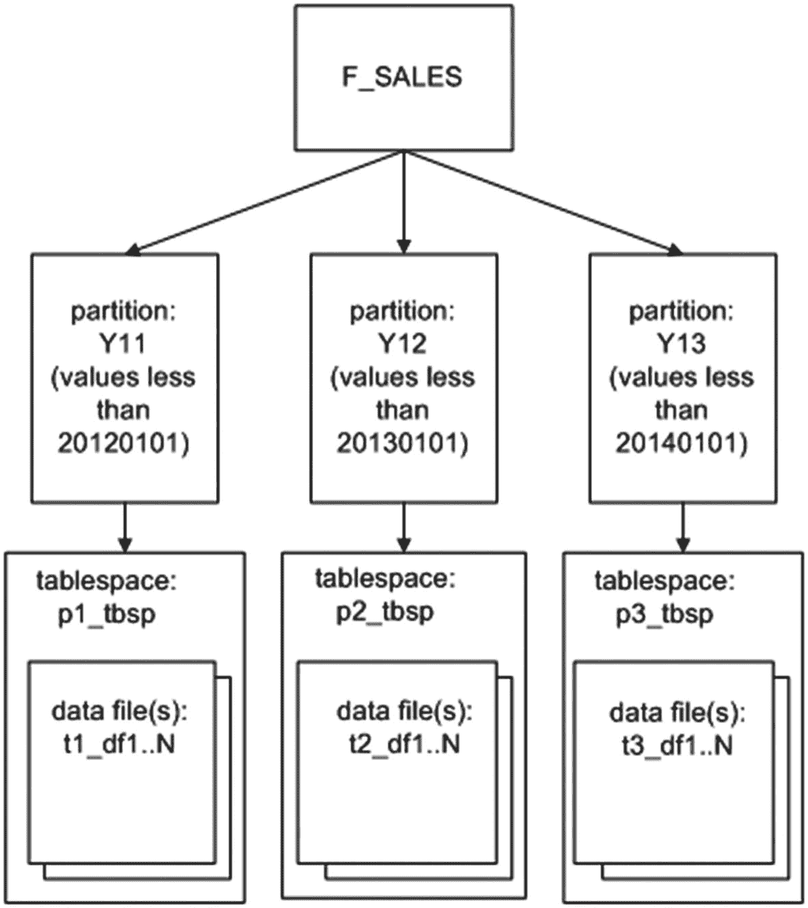

**图 12-2** 分区存储在单独的表空间中

## 按列表分区

列表分区适用于对无序且不相关的数据集进行分区。例如，假设您有一个大表，并希望按州代码对其进行分区。为此，请使用`CREATE TABLE`语句的`PARTITION BY LIST`子句。此示例使用州代码创建三个基于列表的分区：

```sql
SQL> create table f_sales
(sales_amt  number
,d_date_id  number
,state_code varchar2(3))
partition by list (state_code)
( partition reg_west values ('AZ','CA','CO','MT','OR','ID','UT','NV')
,partition reg_mid  values ('IA','KS','MI','MN','MO','NE','OH','ND')
,partition reg_def  values (default));
```

列表分区表的分区键只能是一列。使用`DEFAULT`列表来指定一个分区，用于存储与列表中任何值都不匹配的行。如果不指定`DEFAULT`列表，则在插入的值无法映射到已定义的分区时会生成错误。运行此 SQL 语句可查看每个分区的列表值：

```sql
SQL> select table_name, partition_name, high_value
from user_tab_partitions
where table_name = 'F_SALES'
order by 1;
```

以下是此示例的输出：

```
TABLE_NAME  PARTITION_NAME   HIGH_VALUE
----------- ---------------- ----------------------------------------------
F_SALES     REG_DEF          default
F_SALES     REG_MID          'IA', 'KS', 'MI', 'MN', 'MO', 'NE', 'OH', 'ND'
F_SALES     REG_WEST         'AZ', 'CA', 'CO', 'MT', 'OR', 'ID', 'UT', 'NV'
```


## Oracle 表分区技术

### HIGH_VALUE 列与 LONG 数据类型

`HIGH_VALUE` 列显示为每个分区定义的列表值。此列是 `LONG` 数据类型。如果您使用 SQL*Plus，可能需要将 `LONG` 变量的值设置为高于默认值（80B），以显示该列的完整内容：

```
SQL> set long 1000
```

### 按 Hash 分区

有时，一个大表没有包含明显的列来作为分区依据，无论是按范围还是按列表。例如，假设您使用序列（sequence）为表的代理主键（surrogate primary key）赋值，并且希望行根据唯一的主键均匀分布在各个分区中。您这样做可能是因为没有其他列可以分区，或者主要关心插入操作的效率。

Hash 分区根据内部算法将行映射到分区，该算法将数据均匀分布在所有已定义的分区中。您无法控制哈希算法或 Oracle 分布数据的方式。您指定所需的分区数量，Oracle 会根据哈希键列将数据均匀划分。

> **提示**
> Oracle 强烈建议您使用 2 的幂（2, 4, 8, 16 等）作为哈希分区的数量。这样做可以在所有分区中实现行的最优分布。

要创建基于哈希的分区，请使用 `CREATE TABLE` 语句的 `PARTITION BY HASH` 子句。此示例创建一个分为两个分区的表；每个分区在其自己的表空间中创建：

```
SQL> create table f_sales(
sales_id  number primary key
,sales_amt number)
partition by hash(sales_id)
partitions 2 store in(p1_tbsp, p2_tbsp);
```

当然，您必须修改详细信息，例如表空间名称，以匹配您环境中的名称。或者，您可以省略 `STORE IN` 子句，Oracle 会将所有分区放置在您的默认表空间中。如果您想同时命名表空间和分区，可以按如下方式指定：

```
SQL> create table f_sales(
sales_id  number primary key
,sales_amt number)
partition by hash(sales_id)
(partition p1 tablespace p1_tbsp
,partition p2 tablespace p2_tbsp);
```

哈希分区有一些有趣的性能影响。所有哈希键值相同的行都会插入到同一个分区中。这意味着插入操作特别高效，因为哈希算法确保数据在分区中均匀分布。此外，如果您通常根据特定键值进行选择，Oracle 只需访问一个分区即可检索这些行。但是，如果您按值范围进行搜索，Oracle 很可能必须搜索每个分区才能确定要检索的行。因此，范围搜索在哈希分区表中可能表现不佳。

### 混合不同的分区方法

Oracle 允许您使用多种策略对表进行分区（复合分区）。例如，假设您有一个表，希望按数字范围分区，但同时也希望按区域列表对每个分区进行细分。以下示例正是如此：

```
SQL> create table f_sales(
sales_amt  number
,state_code varchar2(3)
,d_date_id  number)
partition by range(d_date_id)
subpartition by list(state_code)
(partition p2016 values less than (20170101)
(subpartition p1_north values ('ID','OR')
,subpartition p1_south values ('AZ','NM')),
partition p2017 values less than (20180101)
(subpartition p2_north values ('ID','OR')
,subpartition p2_south values ('AZ','NM')));
```

您可以通过运行以下查询来查看子分区信息：

```
SQL> select table_name, partitioning_type, subpartitioning_type
from user_part_tables
where table_name = 'F_SALES';
```

这是一些示例输出：

```
TABLE_NAME  PARTITION SUBPARTIT
----------- --------- ---------
F_SALES     RANGE     LIST
```

运行下一个查询以查看有关子分区的信息：

```
SQL> select table_name, partition_name, subpartition_name
from user_tab_subpartitions
where table_name = 'F_SALES'
order by table_name, partition_name;
```

这是输出的一个片段：

```
TABLE_NAME  PARTITION_NAME   SUBPARTITION_NAME
----------- ---------------- --------------------
F_SALES     P2016            P1_SOUTH
F_SALES     P2016            P1_NORTH
F_SALES     P2017            P2_SOUTH
F_SALES     P2017            P2_NORTH
```

复合分区可以实现为 Range-Hash（自版本 8i 可用）和 Range-List（自版本 9i 可用）。现在可用的复合分区策略如下：

*   **Range-Hash**: 适用于可以被某种相对随机的键（例如 `D_DATE_ID` 的范围，然后在 `SALES_ID` 上进行哈希）细分的范围。
*   **Range-List**: 当范围可以按列表进一步分区时非常有用，例如 `D_DATE_ID` 的范围，然后在 `STATE_CODE` 上进行列表分区。
*   **Range-Range**: 当您有两个不同的分区范围值（例如 `D_DATE_ID` 和 `SHIP_DATE`）时适用。
*   **List-Range**: 当列表可以被范围进一步细分时非常有用，例如在 `STATE_CODE` 上进行列表分区，然后是 `D_DATE_ID` 的范围。
*   **List-Hash**: 用于通过某种相对随机的键（例如在 `STATE_CODE` 上进行列表分区，然后在 `SALES_ID` 上进行哈希）进一步分区列表。
*   **List-List**: 当一个列表可以被另一个列表进一步划分时适用，例如 `COUNTRY_CODE` 然后是 `STATE_CODE`。
*   **Hash-Hash**: 当哈希可以被另一个唯一值（例如 `SALES_ID` 和 `CUSTOMER_ID`）进一步细分时非常有用。
*   **Hash-List**: 当哈希可以按列表进一步分区时非常有用，例如在 `SALES_ID` 上进行哈希，然后在 `STATE_CODE` 上进行列表分区。
*   **Hash-Range**: 当哈希可以被范围进一步分区时非常有用，例如在 `SALES_ID` 上进行哈希，然后是 `SHIP_DATE` 的范围。

如您所见，复合分区在您分区数据的方式上提供了极大的灵活性。

### 按需创建分区

您可以指示 Oracle 自动向范围分区表添加分区。此功能称为间隔分区（interval partitioning）。当插入的数据超出范围分区表的最大边界时，Oracle 会动态创建一个新分区。新添加的分区基于您指定的间隔（因此称为间隔分区）。

> **提示**
> 将间隔视为您提供的一条规则，说明您希望如何创建未来的分区。

#### 基于日期添加年度分区

例如，假设您有一个范围分区表，并希望当插入的值高于为最高范围定义的最高值时，Oracle 自动添加一个分区。您可以使用 `CREATE TABLE` 语句的 `INTERVAL` 子句来指示 Oracle 自动向范围分区表的高端添加分区。以下示例创建一个表，该表最初有一个分区，其高值范围为 `01-01-2018`：

```
SQL> create table f_sales(
sales_amt  number
,d_date_dtt date)
partition by range (d_date_dtt)
interval(numtoyminterval(1, 'YEAR'))
store in (p1_tbsp, p2_tbsp, p3_tbsp)
(partition p1 values less than (to_date('01-01-2018','dd-mm-yyyy'))
tablespace p1_tbsp);
```

第一个分区在 `P1_TBSP` 表空间中创建。随着 Oracle 添加分区，它会将新分区分配给 `STORE IN` 子句中定义的表空间（程序本应以轮询（round-robin）方式存储它们，但并不总是一致）。

> **注意**
> 使用间隔分区时，您只能指定表中的单个键列，并且它必须是 `DATE` 或 `NUMBER` 数据类型。这是因为间隔在数学上被添加到这些数据类型。您不能使用 `VARCHAR2`，因为您无法将数字添加到 `VARCHAR2` 数据类型。


### 年份区间分区

在此示例中，区间为一年，由 `INTERVAL(NUMTOYMINTERVAL(1, 'YEAR'))` 子句指定。如果向表中插入一条 `D_DATE_DTT` 值大于或等于 2018-01-01 的记录，Oracle 会自动在表高端添加一个新分区。你可以通过运行此 SQL 语句检查分区的详细信息：

```
SQL> set lines 132
col table_name form a10
col partition_name form a9
col part_pos form 999
col interval form a10
col tablespace_name form a12
col high_value form a30
--
SQL> select table_name, partition_name, partition_position part_pos
,interval, tablespace_name, high_value
from user_tab_partitions
where table_name = 'F_SALES'
order by table_name, partition_position;
```

以下是一些示例输出（列标题已被缩短，`HIGH_VALUE` 列也被截断以便在页面上显示）：

```
TABLE_NAME PARTITION   PART_POS INTERVAL     TABLESPACE_N HIGH_VALUE
---------  --------- -------- ---------     ------------------------------
F_SALES    P1          1 NO     P1_TBSP      TO_DATE(' 2018-01-01 00:00:00'
```

接下来，在最高分区的高值之上插入数据：

```
SQL> insert into f_sales values(1, sysdate+1000);
```

现在从 `USER_TAB_PARTITIONS` 中选择的输出如下：

```
TABLE_NAME PARTITION  PART_POS INTERVAL TABLESPACE_N HIGH_VALUE
---------- ---------  --------   --------  -----------------------------
F_SALES    P1          1 NO               P1_TBSP TO_DATE(' 2018-01-01 00:00:00'
F_SALES    SYS_P3344   2 YES              P1_TBSP TO_DATE(' 2021-01-01 00:00:00'
```

一个分区被自动创建，其高值为 2021-01-01。如果你不喜欢 Oracle 给分区的名称，可以重命名它：

```
SQL> alter table f_sales rename partition sys_p3344 to p2;
```

注意当插入的值落入两个分区之间的时间间隔时会发生什么：

```
SQL> insert into f_sales values(1, sysdate+500);
```

`USER_TAB_PARTITIONS` 视图显示创建了另一个分区，因为插入的值落入了一个在现有分区中未包含的年份间隔：

```
TABLE_NAME PARTITION PART_POS INTERVAL TABLESPACE_N  HIGH_VALUE
---------- --------- -------- -------- ------------ ------------------------------
F_SALES    P1               1 NO       P1_TBSP       TO_DATE(' 2018-01-01 00:00:00'
F_SALES    SYS_P3345        2 YES      P3_TBSP       TO_DATE(' 2020-01-01 00:00:00'
F_SALES    SYS_P3344        3 YES      P1_TBSP       TO_DATE(' 2021-01-01 00:00:00'
```

> **注意**
> 如果 `INTERVAL` 值为 `NO` 的分区不止一个，那么除了最后一个，其他都可以被删除。换句话说，如果只有一个 `INTERVAL` 值为 `NO` 的分区，则该分区无法被删除。例如，尝试从之前的表中删除分区 `P1` 会生成 `ORA-14758` 错误。

#### 基于日期添加每周分区

你也可以让 Oracle 按其他时间增量（例如一周）添加分区；例如，

```
SQL> create table f_sales(
sales_amt  number
,d_date_dtt date)
partition by range (d_date_dtt)
interval(numtodsinterval(7,'day'))
store in (p1_tbsp, p2_tbsp, p3_tbsp)
(partition p1 values less than (to_date('01-01-2018', 'dd-mm-yyyy'))
tablespace p1_tbsp);
```

当数据被插入到未来的周中时，新的每周分区将自动创建；例如，

```
SQL> insert into f_sales values(100, sysdate+7);
SQL> insert into f_sales values(200, sysdate+14);
```

运行此查询可验证是否已自动添加分区：

```
SQL> select table_name, partition_name, partition_position part_pos
,interval, tablespace_name, high_value
from user_tab_partitions
where table_name = 'F_SALES'
order by table_name, partition_position;
```

以下是一些示例输出：

```
TABLE_NAME PARTITION PART_POS INTERVAL TABLESPACE_N HIGH_VALUE
---------- --------- -------- -------- ------------ ------------------------------
F_SALES    P1               1 NO       P1_TBSP      TO_DATE(' 2018-01-01 00:00:00'
F_SALES    SYS_P3725        2 YES      P3_TBSP      TO_DATE(' 2018-01-15 00:00:00'
F_SALES    SYS_P3726        3 YES      P1_TBSP      TO_DATE(' 2018-01-22 00:00:00'
```

通过这种方式，Oracle 自动管理向表添加每周分区。

#### 基于数值添加每日分区

回顾本章前面“按范围分区”一节，其中使用了数字字段（`D_DATE_ID`）作为基于范围的分区键。假设你想在使用此类分区策略的表中自动创建每日区间分区。在这种情况下，你需要指定一个 `INTERVAL` 为 1。以下是一个示例：

```
SQL> create table f_sales(
sales_amt number
,d_date_id number)
partition by range (d_date_id)
interval(1)
(partition p1 values less than (20180101));
```

只要你的应用程序能正确使用代表有效日期的数字，就不应该有任何问题。随着每天新数据的插入，都会创建一个新的每日分区。例如，假设插入了这些数据：

```
SQL> insert into f_sales values(100,20180130);
SQL> insert into f_sales values(50,20180131);
```

两个对应的分区会自动创建。可以通过此查询进行验证：

```
select table_name, partition_name, partition_position part_pos
,interval, tablespace_name, high_value
from user_tab_partitions
where table_name = 'F_SALES'
order by table_name, partition_position;
```

相应的输出如下：

```
TABLE_NAME PARTITION PART_POS INTERVAL   TABLESPACE_N HIGH_VALUE
---------- --------- -------- ---------- ------------ --------------------
F_SALES    P1               1 NO         USERS        20180101
F_SALES    SYS_P3383        2 YES        USERS        20180131
F_SALES    SYS_P3384        3 YES        USERS        20180132
```

请注意，`HIGH_VALUE` 列可能包含映射到无效日期的数字。这是预期的行为。例如，当创建一个 `D_DATE_ID` 为 20180131 的分区时，Oracle 会将上边界计算为值 20180132。高边界值定义为小于（但不等于）插入该分区的任何值。我在这里提到这一点的唯一原因是，如果你尝试对 `HIGH_VALUE` 中的值执行日期运算，则需要考虑可能映射到无效日期的数字。在这个具体示例中，你必须从 `HIGH_VALUE` 中的值减去一才能得到一个有效的日期。

如本节所示，基于数字的每日区间分区方案可以正常工作。但是，如果你想按月或年创建区间分区，这种方案的效果就不那么好了。这是因为没有数字能一致地代表一个月或一年。如果你需要基于日期的区间功能，那么请使用日期而不是基于数字的区间功能。

### 引用分区

你可以使用 `PARTITION BY REFERENCE` 子句来指定子表应与其父表以相同方式分区。这允许子表继承其父表的分区策略。任何父表分区维护操作都会自动应用于子记录表。

> **注意**
> 在引用分区功能出现之前，你必须在子表中物理复制并维护父表列。这样做不仅需要更多的磁盘空间，而且在维护分区时也是一个错误来源。


例如，假设您想创建一个父表 `ORDERS` 和一个子表 `ORDER_ITEMS`，它们通过 `ORDER_ID` 列上的主键和外键约束相关联。父表 `ORDERS` 将按 `ORDER_DATE` 列进行分区。尽管子表可能不包含 `ORDER_DATE` 列，但您可能想知道是否可以对子表 `ORDER_ITEMS` 进行分区，使其记录的分发方式与父表 `ORDERS` 相同。此示例创建了一个父表，在 `ORDER_ID` 上有主键约束，并在 `ORDER_DATE` 上进行范围分区：

```
SQL> create table orders(
order_id    number
,order_date  date
,constraint order_pk primary key(order_id))
partition by range(order_date)
(partition p16  values less than (to_date('01-01-2017','dd-mm-yyyy'))
,partition p17  values less than (to_date('01-01-2018','dd-mm-yyyy'))
,partition pmax values less than (maxvalue));
```

接下来，您创建子表 `ORDER_ITEMS`。它通过将外键约束命名为被引用来进行分区：

```
SQL> create table order_items(
line_id  number
,order_id number not null
,sku      number
,quantity number
,constraint order_items_pk  primary key(line_id, order_id)
,constraint order_items_fk1 foreign key (order_id) references orders)
partition by reference (order_items_fk1);
```

请注意，外键列 `ORDER_ID` 必须定义为 `NOT NULL`。外键列必须被启用并强制执行。

您可以通过以下查询检查分区键列：

```
SQL> select name, column_name, column_position
from user_part_key_columns
where name in ('ORDERS','ORDER_ITEMS');
```

以下是此示例的输出：

```
NAME                 COLUMN_NAME          COLUMN_POSITION
-------------------- -------------------- ---------------
ORDERS               ORDER_DATE                         1
ORDER_ITEMS          ORDER_ID                           1
```

请注意，子表是按 `ORDER_ID` 列分区的。这确保了子记录以与父记录相同的方式进行分区（因为子记录通过 `ORDER_ID` 键列与父记录相关联）。

当您创建引用分区的子表时，如果您没有显式地命名子表分区，默认情况下，Oracle 会为子表创建与父表分区名称相同的分区。此示例显式地命名了子表的引用分区：

```
SQL> create table order_items(
line_id  number
,order_id number not null
,sku      number
,quantity number
,constraint order_items_pk  primary key(line_id, order_id)
,constraint order_items_fk1 foreign key (order_id) references orders)
partition by reference (order_items_fk1)
(partition c16
,partition c17
,partition cmax);
```

从 Oracle Database 12c 开始，您还可以指定间隔-引用分区策略。这允许为父表和子表自动创建分区。此功能的建表脚本如下所示：

```
SQL> create table orders(
order_id    number
,order_date  date
,constraint order_pk primary key(order_id))
partition by range(order_date)
interval(numtoyminterval(1, 'YEAR'))
(partition p1 values less than (to_date('01-01-2018','dd-mm-yyyy')));
--
SQL> create table order_items(
line_id  number
,order_id number not null
,sku      number
,quantity number
,constraint order_items_pk  primary key(line_id, order_id)
,constraint order_items_fk1 foreign key (order_id) references orders)
partition by reference (order_items_fk1);
```

插入一些示例数据将演示分区是如何自动创建的：

```
SQL> insert into orders values(1,sysdate);
SQL> insert into order_items values(10,1,123,1);
SQL> insert into orders values(2,sysdate+400);
SQL> insert into order_items values(20,2,456,1);
```

现在，运行此查询以验证分区详细信息：

```
SQL> select table_name, partition_name, partition_position part_pos
,interval, tablespace_name, high_value
from user_tab_partitions
where table_name IN ('ORDERS','ORDER_ITEMS')
order by table_name, partition_position;
```

以下是输出的一个片段：

```
TABLE_NAME  PARTITION PART_POS  INTERVAL   TABLESPACE_N HIGH_VALUE

ORDERS      P1            1 NO     USERS   TO_DATE(' 2018-01-01 00:00:00'
ORDERS      SYS_P3761     2 YES    USERS   TO_DATE(' 2019-01-01 00:00:00'
ORDERS      SYS_P3762     3 YES    USERS   TO_DATE(' 2020-01-01 00:00:00'
ORDER_ITEMS P1            1 NO     USERS
ORDER_ITEMS SYS_P3761     2 YES    USERS
ORDER_ITEMS SYS_P3762     3 YES    USERS
```

### 在虚拟列上分区

您可以在虚拟列上分区。（关于虚拟列的讨论，请参见第 7 章）。这是一个示例脚本，创建了一个名为 `EMP` 的表，其中包含虚拟列 `COMMISSION` 和针对该虚拟列的相应范围分区：

```
SQL> create table emp (
emp_id   number
,salary   number
,comm_pct number
,commission generated always as (salary*comm_pct)
)
partition by range(commission)
(partition p1 values less than (1000)
,partition p2 values less than (2000)
,partition p3 values less than (maxvalue));
```

此策略允许您对表中未存储但动态计算的列进行分区。当业务要求对表中未物理存储的列进行分区时，虚拟列分区是合适的。虚拟列背后的表达式可以是复杂的计算、返回列字符串的子集、组合列值等等，可能性是无穷的。

例如，您可能有一个十字符的字符串列，其中前两位数字代表地区，后八位数字代表特定位置（这是一个糟糕的设计，但确实存在）。在这种情况下，从业务角度来看，按此列的前两位数字（按地区）进行分区可能是有意义的。

### 让应用程序控制分区

您可能遇到一种罕见的场景，即希望向表插入记录的应用程序显式控制将数据插入哪个分区。您可以使用 `INSERT` 语句中的 `PARTITION BY SYSTEM` 子句来指定将数据插入哪个分区。下一个示例创建了一个系统分区表，包含三个分区：

```
SQL> create table apps
(app_id number
,app_amnt number)
partition by system
(partition p1
,partition p2
,partition p3);
```

当向此表插入数据时，必须指定一个分区。下一行代码将一条记录插入到分区 `P1` 中：

```
SQL> insert into apps partition(p1) values(1,100);
```

当您更新或删除时，如果未指定分区，Oracle 会扫描系统分区表的所有分区以查找相关行。因此，在更新和删除时应指定分区，以避免性能不佳。

在需要显式控制记录插入到哪个分区的特殊情况下，系统分区表很有用。这允许您的应用程序代码管理记录在分区间的分发。我建议您仅在无法使用 Oracle 的其他分区机制来满足业务需求时才使用此功能。

### 维护分区

使用分区时，最终将需要执行某种维护操作。例如，您可能需要移动、交换、重命名、拆分、合并或删除分区。本节将描述各种分区维护任务。

### 查看分区元数据


## 分区维护

当您维护分区时，查看有关分区对象的元数据信息会很有帮助。Oracle 提供了许多包含分区表和索引信息的数据字典视图。表 12-3 概述了这些视图。

表 12-3
包含分区信息的数据字典视图

| 视图 | 包含的信息 |
| :--- | :--- |
| `DBA/ALL/USER_PART_TABLES` | 显示分区表信息 |
| `DBA/ALL/USER_TAB_PARTITIONS` | 包含有关单个表分区的信息 |
| `DBA/ALL/USER_TAB_SUBPARTITIONS` | 显示有关存储和统计信息的子分区级表信息 |
| `DBA/ALL/USER_PART_KEY_COLUMNS` | 显示分区键列 |
| `DBA/ALL/USER_SUBPART_KEY_COLUMNS` | 包含子分区键列 |
| `DBA/ALL/USER_PART_COL_STATISTICS` | 显示列级统计信息 |
| `DBA/ALL/USER_SUBPART_COL_STATISTICS` | 显示子分区级统计信息 |
| `DBA/ALL/USER_PART_HISTOGRAMS` | 包含分区的直方图信息 |
| `DBA/ALL/USER_SUBPART_HISTOGRAMS` | 显示子分区的直方图信息 |
| `DBA/ALL/USER_PART_INDEXES` | 显示分区索引信息 |
| `DBA/ALL/USER_IND_PARTITIONS` | 包含有关单个索引分区的信息 |
| `DBA/ALL/USER_IND_SUBPARTITIONS` | 显示子分区级索引信息 |
| `DBA/ALL/USER_SUBPARTITION_TEMPLATES` | 显示子分区模板信息 |

请记住，`DBA`级别的视图包含数据库中所有分区对象的数据，`ALL`级别显示当前连接用户有权访问的分区信息，而`USER`级别则提供有关当前连接用户拥有的分区对象的信息。
您将经常使用的两个视图是`DBA_PART_TABLES`和`DBA_TAB_PARTITIONS`。
`DBA_PART_TABLES`视图包含表级分区信息，例如分区方法和默认存储设置。`DBA_TAB_PARTITIONS`视图提供有关单个表分区的信息，例如分区名称和单个分区的存储设置。

### 移动分区

假设您创建了一个列表分区表，如下所示：

```sql
SQL> create table f_sales
(sales_amt  number
,d_date_id  number
,state_code varchar2(20))
partition by list (state_code)
( partition reg_west values ('AZ','CA','CO','MT','OR','ID','UT','NV')
,partition reg_mid  values ('IA','KS','MI','MN','MO','NE','OH','ND')
,partition reg_rest values (default));
```

此外，对于这个分区表，您决定创建一个本地分区索引，如下所示：

```sql
SQL> create index f_sales_lidx1 on f_sales(state_code) local;
```

您还决定创建一个非分区全局索引，如下所示：

```sql
SQL> create index f_sales_gidx1 on f_sales(d_date_id) global;
```

并且，您创建一个全局分区索引列：

```sql
SQL> create index f_sales_gidx2 on f_sales(sales_amt)
global partition by range(sales_amt)
(partition pg1 values less than (25)
,partition pg2 values less than (50)
,partition pg3 values less than (maxvalue));
```

后来，您决定将一个分区移动到特定的表空间。在这种情况下，您可以使用`ALTER TABLE...MOVE PARTITION`语句来重新定位表分区。此示例将`REG_WEST`分区移动到新表空间：

```sql
SQL> alter table f_sales move partition reg_west tablespace p1_tbsp;
```

将分区移动到不同的表空间是一个相当简单的操作。但是，每当您执行此操作时，请务必检查与表关联的任何索引的状态：

```sql
SQL> select b.table_name, a.index_name, a.partition_name
,a.status, b.locality
from user_ind_partitions a
,user_part_indexes   b
where a.index_name=b.index_name
and table_name = 'F_SALES';
```

以下是一些示例输出：


```
TABLE_NAME INDEX_NAME           PARTITION Status    LOCALI
---------- -------------------- --------- --------- ------
F_SALES    F_SALES_LIDX1        REG_MID   USABLE    LOCAL
F_SALES    F_SALES_LIDX1        REG_REST  USABLE    LOCAL
F_SALES    F_SALES_LIDX1        REG_WEST  UNUSABLE  LOCAL
F_SALES    F_SALES_GIDX2        PG1       UNUSABLE  GLOBAL
F_SALES    F_SALES_GIDX2        PG2       UNUSABLE  GLOBAL
F_SALES    F_SALES_GIDX2        PG3       UNUSABLE  GLOBAL
```

您必须重建任何不可用的索引。与手动重建索引相反，在移动分区时，您可以使用 `UPDATE INDEXES` 子句来指定重建与该分区关联的索引：

```
SQL> alter table f_sales move partition reg_west tablespace p1_tbsp update indexes;
```

从 Oracle Database 12c 开始，在移动分区时，您可以使用 `ONLINE` 子句来指定更新所有索引：

```
SQL> alter table f_sales move partition reg_west online tablespace p1_tbsp;
```

上述代码行指示 Oracle 在移动操作期间维护所有索引。

### 自动移动更新的行

默认情况下，Oracle 不允许您通过将分区键设置为超出该行当前分区的值来更新行。例如，此语句将分区键列 (`D_DATE_ID`) 更新为一个会导致该行需要存在于不同分区中的值：

```
SQL> update f_sales set d_date_id = 20130901 where d_date_id = 20120201;
```

您将收到以下错误：

```
ORA-14402: updating partition key column would cause a partition change
```

在此场景中，请使用 `ALTER TABLE` 语句的 `ENABLE ROW MOVEMENT` 子句，以允许对分区键进行会导致其所属分区发生变化的更新。对于此示例，首先修改 `F_SALES` 表以启用行移动：

```
SQL> alter table f_sales enable row movement;
```

您现在应该能够将分区键更新为将行移动到不同段的值。可以通过查询 `USER_TABLES` 视图的 `ROW_MOVEMENT` 列来验证是否已启用行移动：

```
SQL> select row_movement from user_tables where table_name='F_SALES';
```

您应该会看到值 `ENABLED`：

```
ROW_MOVE
--------
ENABLED
```

要禁用行移动，请使用 `DISABLE ROW MOVEMENT` 子句：

```
SQL> alter table f_sales disable row movement;
```

### 对现有表进行分区

您可能有一个已变得相当大的非分区表，并希望对其进行分区。有几种方法可以将非分区表转换为分区表。表 12-4 列出了各种技术的优缺点。

表 12-4. 转换非分区表的方法

| 转换方法 | 优点 | 缺点 |
| :--- | :--- | :--- |
| `ALTER TABLE ... MODIFY PARTITION BY ... ONLINE` | `ONLINE` 操作，可修改表并添加分区 | 索引方面需要额外考虑；可使用 `UPDATE INDEXES` |
| `CREATE <new_part_tab> AS SELECT * FROM <old_tab>` | 简单；可使用 `NOLOGGING` 和 `PARALLEL` 选项；直接路径加载 | 需要新表和旧表的空间 |
| `INSERT /*+ APPEND */ INTO <new_part_tab> SELECT * FROM <old_tab>` | 快速；简单；直接路径加载 | 需要新表和旧表的空间 |
| 数据泵 `EXPDP` 旧表；`IMPDP` 新表（或使用旧版 Oracle 时使用 `EXP`/`IMP`） | 快速；所需空间较少；能处理授权、权限等。可以按分区并使用过滤条件进行加载。 | 更复杂，因为需要使用工具 |
| 创建分区表 `new_part_tab`；使用 `old_tab` 交换分区 | 可能减少停机时间 | 步骤多；复杂 |
| 使用 `DBMS_REDEFINITION` 包 | 内联转换现有表 | 步骤多；复杂 |
| 创建 CSV 文件或外部表；使用 SQL*Loader 加载 `new_part_tab` | 可以按分区进行加载。 | 步骤多；复杂 |
```


## Oracle 表分区管理

如表 **12-4** 所示，对现有表进行分区的最简单方法之一是使用 `ALTER TABLE`；该功能自 Oracle 12c 起可用。执行此修改后，需要验证索引是本地索引还是全局索引，并可能为新的策略创建索引，但该表操作是 **联机** 操作，允许在 `ALTER` 表操作完成期间继续使用该表。

要将非分区表转换为分区表，需要列出分区策略以及分区。

```sql
SQL> alter table f_sales modify
partition by range (d_date_id)
(partition p2012 values less than(20130101),
partition p2013 values less than(20140101),
partition pmax values less than(maxvalue))
online;
```

### 将现有表转换为分区表

另一种简单的方法是创建一个新表（该表是分区的），并从旧表加载数据。接下来列出了所需步骤：

1.  如果这是活动生产数据库中的表，您应该为该表安排一些停机时间，以确保在迁移过程中没有活动的事务发生。
2.  使用 `CREATE TABLE <new table> AS SELECT * FROM <old table>` 从旧表创建一个新的、分区的表。
3.  删除或重命名旧表。
4.  将步骤 2 中创建的表重命名为已删除/重命名的表的名称。

例如，假设本章到目前为止使用的 `F_SALES` 表是作为非分区表创建的。以下语句创建一个新的分区表，从非分区的旧表中获取数据：

```sql
SQL> create table f_sales_new
partition by range (d_date_id)
(partition p2012 values less than(20130101),
partition p2013 values less than(20140101),
partition pmax values less than(maxvalue))
nologging
as select * from f_sales;
```

现在，您可以删除（或重命名）旧的非分区表，并将新的分区表重命名为旧表的名称。在使用 `PURGE` 选项删除旧表之前，请确保您不再需要它，因为这会永久删除该表：

```sql
SQL> drop table f_sales purge;
SQL> rename f_sales_new to f_sales;
```

最后，为新表创建所有必需的约束、权限、索引和统计信息。您现在应该拥有一个替换了旧的非分区表的分区表。

对于最后一步，如果原始表包含许多约束、权限和索引，您可能希望使用 Data Pump `expdp` 来导出原始表（不含数据）。然后，在创建新表后，使用 Data Pump `impdp` 为新表创建约束、权限和索引。同时考虑为新创建的表生成新的统计信息。另一个考虑是，如果表有可能变得非常大，可以在创建时设计为支持分区，然后根据需要创建额外的分区。即使在执行 `ALTER TABLE` 命令时，也应进行测试，以确认先创建几个分区，然后再按照下一节讨论的方式添加和修改额外分区。

### 添加分区

有时很难预测最初应该为表建立多少个分区。一个典型的例子是创建了一个没有 `MAXVALUE` 分区的分区范围表。您创建了一个包含足够未来两年分区的分区表，然后您就忘记了它。未来的某个时候，应用程序用户报告抛出了此消息：

```sql
ORA-14400: inserted partition key does not map to any partition
```

> **提示**
> 考虑使用间隔分区，当超过上限时，它使 Oracle 能够自动添加范围分区。

#### 范围分区

对于范围分区表，如果表的最高界限未使用 `MAXVALUE` 定义，则可以使用 `ALTER TABLE...ADD PARTITION` 语句向表的高端添加一个分区。如果您不确定当前的上限是什么，可以查询数据字典：

```sql
SQL> select table_name, partition_name, high_value
from user_tab_partitions
where table_name = UPPER('&&tab_name')
order by table_name, partition_name;
```

此示例向范围分区表的高端添加一个分区：

```sql
SQL> alter table f_sales add
partition p_2018 values less than (20190101) tablespace p18_tbsp;
```

从 Oracle Database 12c 开始，您可以同时添加多个分区；例如，

```sql
SQL> alter table f_sales add
partition p_2018 values less than (20190101) tablespace p18_tbsp
,partition p_2019 values less than (20200101) tablespace p19_tbsp;
```

> **注意**
> 如果您有一个范围分区表，其高端范围由 `MAXVALUE` 限定，则无法添加分区。在这种情况下，您必须拆分现有分区（参见本章后面的“拆分分区”一节）。

#### 列表分区

对于列表分区表，只有在未定义 `DEFAULT` 分区的情况下才能添加新分区。下一个示例向列表分区表添加一个分区：

```sql
SQL> alter table f_sales add partition reg_east values('GA');
```

从 Oracle Database 12c 开始，您可以使用一条语句添加多个分区：

```sql
SQL> alter table f_sales add partition reg_mid_east values('TN'),
partition reg_north values('NY');
```

#### 哈希分区

如果您有一个哈希分区表，请使用 `ADD PARTITION` 子句来添加分区，如下所示：

```sql
SQL> alter table f_sales add partition p3 update indexes;
```

> **注意**
> 当向哈希分区表添加分区时，如果未指定 `UPDATE INDEXES` 子句，则任何全局索引都必须重建。此外，您必须为新添加的分区重建任何本地索引。

向哈希分区表添加分区后，务必检查索引以确保它们都仍具有 `VALID` 状态：

```sql
SQL> select b.table_name, a.index_name, a.partition_name, a.status, b.locality
from user_ind_partitions a
,user_part_indexes   b
where a.index_name=b.index_name
and table_name = upper('&&part_table');
```

同时检查任何全局非分区索引的状态：

```sql
SQL> select index_name, status
from user_indexes
where table_name = upper('&&part_table');
```

我强烈建议您总是在非生产数据库中测试维护操作，以确定任何不可预见的副作用。

### 与现有表交换分区

交换分区是一种将新数据透明加载到大型分区表中的常用技术。该技术涉及获取一个独立表，并将其与现有分区（在已分区的表中）交换，使您能够添加完全加载的新分区（及相关索引），而不影响表中其他分区的操作可用性或性能。

这个简单的例子说明了该过程。假设您有一个范围分区表，创建如下：

```sql
SQL> create table f_sales
(sales_amt number
,d_date_id number)
partition by range (d_date_id)
(partition p_2016 values less than (20170101),
partition p_2017 values less than (20180101),
partition p_2018 values less than (20190101));
```

您还在 `D_DATE_ID` 列上创建了一个本地位图索引：

```sql
SQL> create bitmap index d_date_id_fk1 on
f_sales(d_date_id) local;
```

现在，向表添加一个新分区以存储新数据：

```sql
SQL> alter table f_sales add partition p_2019
values less than(20200101);
```

接下来，创建一个临时表，并插入属于新添加分区值范围内的数据：

```sql
SQL> create table workpart(
sales_amt number
,d_date_id number);
--
SQL> insert into workpart values(100,20190201);
SQL> insert into workpart values(120,20190507);
```

然后，在 `WORKPART` 表上创建一个位图索引，其结构与 `F_SALES` 上的位图索引相匹配：

```sql
SQL> create bitmap index d_date_id_fk2
on workpart(d_date_id);
```

现在，将 `WORKPART` 表与 `P_2019` 分区交换：


### 分区交换

```sql
SQL> alter table f_sales
exchange partition p_2019
with table workpart
including indexes without validation;
```

对 `F_SALES` 表的快速查询验证了分区已成功交换：

```sql
SQL> select * from f_sales partition(p_2019);
```

输出如下：

```
SALES_AMT  D_DATE_ID
---------  ---------
100   20190201
120   20190507
```

此查询显示所有索引仍然可用：

```sql
SQL> select index_name, partition_name, status from user_ind_partitions;
```

你还可以验证新分区是否创建了本地索引段：

```sql
SQL> select segment_name, segment_type, partition_name
from user_segments
where segment_name IN('F_SALES','D_DATE_ID_FK1');
```

分区交换功能非常强大。它允许你将现有表中的一个分区转换为一个独立表，同时将一个独立表（可以在分区交换操作前完全填充）作为分区表的一部分。当交换一个分区时，Oracle 只是简单地更新数据字典中的条目来执行交换。

当你使用 `WITHOUT VALIDATION` 子句交换分区时，你指示 Oracle 不要验证传入分区（或子分区）中的行是否是为定义范围的有效条目。这有个好处，就是使交换操作非常快，因为 Oracle 只更新数据字典中的指针来执行交换操作。如果你使用 `WITHOUT VALIDATION`，则需要确保你的数据是准确的。

如果为分区表定义了主键，则被交换的表必须具有相同的主键结构。如果存在主键，`WITHOUT VALIDATION` 子句不会阻止 Oracle 强制执行唯一约束。

### 重命名分区

有时，你可能需要重命名一个表分区或索引分区。例如，你可能想在删除一个分区之前重命名它（以确保它没有被使用）。此外，你可能想重命名对象以使其符合标准。在这些场景中，请酌情使用 `ALTER TABLE` 或 `ALTER INDEX` 语句。

此示例使用 `ALTER TABLE` 语句重命名一个表分区：

```sql
SQL> alter table f_sales rename partition p_2018 to part_2018;
```

下一行代码使用 `ALTER INDEX` 语句重命名一个索引分区：

```sql
SQL> alter index d_date_id_fk1 rename partition p_2018 to part_2018;
```

你可以查询数据字典以验证有关重命名对象的信息。此查询显示分区表名：

```sql
SQL> select table_name, partition_name, tablespace_name
from user_tab_partitions;
```

类似地，此查询显示分区索引信息：

```sql
SQL> select index_name, partition_name, status
,high_value, tablespace_name
from user_ind_partitions;
```

### 分割分区

假设你已识别出一个行数过多的分区，并希望将其分割为两个分区。使用 `ALTER TABLE...SPLIT PARTITION` 语句来分割现有分区。以下示例分割了一个范围分区表中的一个分区：

```sql
SQL> alter table f_sales split partition p_2018 at (20180601)
into (partition p_2018_a, partition p_2018)
update indexes;
```

如果你不指定 `UPDATE INDEXES`，本地索引将变为 `UNUSABLE`，并且你需要重建与分割分区相关的任何本地索引以及任何全局索引。你可以使用此 SQL 验证分区索引的状态：

```sql
SQL> select index_name, partition_name, status from user_ind_partitions;
```

下一个示例分割一个列表分区。首先，这里是 `CREATE TABLE` 语句，它展示了列表分区最初是如何定义的：

```sql
SQL> create table f_sales
(sales_amt  number
,d_date_id  number
,state_code varchar2(3))
partition by list (state_code)
( partition reg_west values ('AZ','CA','CO','MT','OR','ID','UT','NV')
,partition reg_mid  values ('IA','KS','MI','MN','MO','NE','OH','ND')
,partition reg_rest values (default));
```

接下来，分割 `REG_MID` 分区：

```sql
SQL> alter table f_sales split partition reg_mid values ('IA','KS','MI','MN') into
(partition reg_mid_a,
partition reg_mid_b)
update indexes;
```

`REG_MID_A` 分区现在包含值 IA, KS, MI, 和 MN，而 `REG_MID_B` 被分配剩余的值 MO, NE, OH, 和 ND。

分割分区操作允许你从单个分区创建两个新分区。每个新分区都有自己的段、物理属性和区。与原始分区关联的段将被删除。

### 合并分区

当你创建一个分区时，有时很难预测该分区最终将包含多少行。你可能有两个包含数据不足以保证单独分区的分区。在这种情况下，使用 `ALTER TABLE...MERGE PARTITIONS` 语句来合并分区。

以下示例将两个分区合并为一个现有分区：

```sql
SQL> alter table f_sales merge partitions p_2017, p_2018 into partition p_2018;
```

在此示例中，分区按日期范围组织。你合并到的分区被定义为接受两个合并分区中较高范围的行。任何本地索引也会被合并到新的单个分区中。

你可以通过查询数据字典来验证分区索引的状态：

```sql
SQL> select index_name, partition_name, tablespace_name, high_value,status
from user_ind_partitions
order by 1,2;
```

从 Oracle 18c 开始，现在可以使用 `ONLINE` 子句在线执行合并操作。这将允许在合并执行时数据仍然可用，并且应使用 `UPDATE INDEXES` 子句来同时维护和重建任何关联的索引。

```sql
SQL> alter table f_sales merge partitions p_2017, p_2018 into partition p_2018
tablespace p2_tbsp
update indexes
online;
```

请记住，当你使用 `UPDATE INDEXES` 子句时，合并操作需要更长时间。如果你想最小化合并操作的长度，请不要使用此子句。相反，手动重建与合并分区关联的本地索引：

```sql
SQL> alter table f_sales modify partition p_2018 rebuild unusable local indexes;
```

你可以使用 `ALTER INDEX...REBUILD PARTITION` 语句重建全局索引的每个分区：

```sql
SQL> alter index f_glo_idx1 rebuild partition sys_p680;
SQL> alter index f_glo_idx1 rebuild partition sys_p681;
SQL> alter index f_glo_idx1 rebuild partition sys_p682;
```

你可以使用 `ALTER TABLE...MERGE PARTITIONS` 语句合并两个或多个分区。你合并到的分区的名称可以是你要合并的分区之一的名称，也可以是一个全新的名称。

在合并两个（或多个）分区之前，请确保你合并到的分区在其表空间中有足够的空间来容纳所有合并的行。如果没有足够的空间，你将收到表空间无法扩展到必要大小的错误。

## 删除分区

你偶尔需要删除一个分区。一个常见的场景是你拥有不再使用的旧数据，这意味着该分区可以被删除。

首先，确定你要删除的分区的名称。运行以下查询以列出当前连接用户的特定表的分区：

```sql
SQL> select segment_name, segment_type, partition_name
from user_segments
where segment_name = upper('&table_name');
```

接下来，使用 `ALTER TABLE...DROP PARTITION` 语句从表中移除一个分区。此示例从 `F_SALES` 表中删除 `P_2018` 分区。


## 删除分区

删除分区时，需要重建任何全局索引。这可以在同一条 DDL 语句中完成，如下例所示：

```
SQL> alter table f_sales drop partition p_2018 update global indexes;
```

如果要删除子分区，请使用 `DROP SUBPARTITION` 子句：

```
SQL> alter table f_sales drop subpartition p2_south;
```

您可以查询 `USER_TAB_SUBPARTITIONS` 来验证子分区是否已被删除。

**注意**
Oracle 不允许删除组合分区表的所有子分区。每个分区必须至少有一个子分区。

删除分区后，没有撤销操作。因此，在执行此操作之前，请确保您在正确的环境中，并且确实需要删除该分区。如果需要保留要删除分区中的数据，请将该分区与另一个分区合并，而不是删除它。

无法从哈希分区表中删除分区。对于哈希分区表，必须合并分区以移除一个。而且，无法从引用分区表中显式删除分区。当父表分区被删除时，它也会从相应的子引用分区表中删除。

## 为分区生成统计信息

向分区加载大量数据后，您应该生成统计信息以反映新插入的数据。使用 `EXECUTE` 语句运行 `DBMS_STATS` 包以为特定分区生成统计信息。在此示例中，所有者是 `STAR`，表是 `F_SALES`，要分析的分区是 `P_2018`：

```
SQL> exec dbms_stats.gather_table_stats(ownname=>'MV_MAINT',-
tabname=>'F_SALES',-
partname=>'P_2018');
```

如果您正在处理一个大型分区，您可能希望指定百分比采样大小、并行度，并为任何索引也生成统计信息：

```
SQL> exec dbms_stats.gather_table_stats(ownname=>'MV_MAINT',-
tabname=>'F_SALES',-
partname=>'P_2018',-
estimate_percent=>dbms_stats.auto_sample_size,-
degree=>dbms_stats.auto_degree,-
cascade=>true);
```

对于分区表，您可以生成单个分区的统计信息，也可以生成整个表的统计信息。我建议您在分区中发生大量数据更改时生成统计信息。您需要充分了解您的表和数据，以确定是否需要生成新的统计信息。

您可以指示 Oracle 在生成全局统计信息时仅扫描新添加的分区。此功能通过 `DBMS_STATS` 包启用：

```
SQL> exec DBMS_STATS.SET_TABLE_PREFS(user,'F_SALES','INCREMENTAL','TRUE');
```

您可以按如下方式验证该表的首选项：

```
SQL> select dbms_stats.get_prefs('INCREMENTAL', tabname=>'F_SALES') from dual;
```

增量全局统计信息收集必须与 `DBMS_STATS.AUTO_SAMPLE_SIZE` 结合使用。这可以大大减少为大型表新添加的分区收集增量统计信息所需的时间和资源。

## 从分区中删除行

您可以使用多种技术从分区中删除行。如果特定分区中的数据不再需要，可以考虑删除该分区。如果您想删除数据但保持分区完好无损，则可以截断它或从中删除。截断分区会快速永久地删除数据。如果您需要回滚删除记录的选项，则应使用删除（而不是截断）。接下来将描述截断和删除。

首先，确定要从中删除记录的分区名称：

```
SQL> select segment_name, segment_type, partition_name
from user_segments
where partition_name is not null;
```

使用 `ALTER TABLE...TRUNCATE PARTITION` 语句从分区中删除所有记录。此示例截断 `F_SALES` 表中的一个分区：

```
SQL> alter table f_sales truncate partition p_2013;
```

前面的命令仅从指定分区删除数据，而不是整个表。另外请记住，截断分区将使任何全局索引无效。您可以在发出 `TRUNCATE` 时更新全局索引，如下所示：

```
SQL> alter table f_sales truncate partition p_2013 update global indexes;
```

截断分区是删除大量数据的高效方法。但是，当您截断分区时，没有回滚机制。截断操作会从分区中永久删除数据。

如果您需要回滚事务的选项，请使用 `DELETE` 语句：

```
SQL> delete from f_sales partition(p_2013);
```

这种方法缺点是，如果您有数百万条记录，`DELETE` 操作可能需要很长时间才能运行。此外，对于大量记录，`DELETE` 会生成大量回滚信息。这可能会导致争用资源的其他 SQL 语句出现性能问题。

## 在分区内操作数据

如果您需要在一个分区内选择或操作数据，请将分区名称指定为 SQL 语句的一部分。例如，您可以从特定分区中选择行，如下所示：

```
SQL> select * from f_sales partition (p_2013);
```

如果您想从两个（或多个）分区中选择，请使用 `UNION` 子句：

```
SQL> select * from f_sales partition (p_2013)
Union all
select * from f_sales partition (p_2014);
```

如果您是开发人员，并且无权访问数据字典来查看有哪些分区可用，您可以使用 `SELECT...PARTITION FOR <partition_key_value>` 语法。通过这种新语法，您提供一个分区键值，Oracle 会确定该键值所属的分区并从该分区返回行；例如：

```
SQL> select * from f_sales partition for (20130202);
```

您还可以更新和删除分区行。此示例更新分区中的一个列：

```
SQL> update f_sales partition(p_2013) set sales_amt=200;
```

您可以将 `PARTITION FOR <partition_key_value>` 语法用于更新、删除和截断操作；例如：

```
SQL> update f_sales partition for (20130202) set sales_amt=200;
```

**注意**
有关删除和截断分区的示例，请参阅前面的部分“从分区中删除行”。

## 分区索引

在当今的大型数据库环境中，索引可能会增长到难以管理的大小。对索引进行分区提供了与对表进行分区相同的优点：提高性能、可扩展性和可维护性。您可以创建一个使用其表分区策略的索引（本地），也可以创建一个与其表分区方式不同的索引（全局）。这两种技术将在以下部分中描述。

### 使索引跟随其表进行分区

在分区表上创建索引时，您可以选择将其设为 `LOCAL` 数据类型。本地分区索引的分区方式与分区表相同。每个表分区都有一个对应的索引，该索引仅包含该表分区的 `ROWID` 值和索引键值。换句话说，本地分区索引中的 `ROWID` 值仅指向相应表分区中的行。

以下示例说明了本地分区索引的概念。首先，创建一个只有两个分区的表：

```
SQL> create table f_sales (
sales_id number
,sales_amt number
,d_date_id number)
tablespace p1_tbsp
partition by range(d_date_id)(
partition y12 values less than (20130101)
tablespace p1_tbsp
,partition y13 values less than (20140101)
tablespace p2_tbsp);
```

假设向表中插入了五条记录，其中三条记录插入到分区 `Y12`，两条记录插入到分区 `Y13`。


### 本地索引与全局索引

```
SQL> insert into f_sales values(1,20,20120322);
SQL> insert into f_sales values(2,33,20120507);
SQL> insert into f_sales values(3,72,20120101);
SQL> insert into f_sales values(4,12,20130322);
SQL> insert into f_sales values(5,98,20130507);
```

接下来，使用`CREATE INDEX`语句的`LOCAL`子句在分区表上创建本地索引。此示例在`F_SALES`表的`D_DATE_ID`列上创建本地索引：

```
SQL> create index f_sales_fk1 on f_sales(d_date_id) local;
```

运行以下查询以查看有关分区索引的信息：

```
SQL> select index_name, table_name, partitioning_type
from user_part_indexes
where table_name = 'F_SALES';
```

示例输出如下：

```
INDEX_NAME                     TABLE_NAME PARTITION
------------------------------ ---------- ---------
F_SALES_FK1                    F_SALES    RANGE
```

现在，查询`USER_IND_PARTITIONS`表以查看有关本地分区索引的信息：

```
SQL> select index_name, partition_name, tablespace_name
from user_ind_partitions
where index_name = 'F_SALES_FK1';
```

请注意，已为表的每个分区创建了一个索引分区，并且索引创建在与表分区相同的表空间中：

```
INDEX_NAME           PARTITION_NAME       TABLESPACE_NAME
-------------------- -------------------- ---------------
F_SALES_FK1          Y12                  P1_TBSP
F_SALES_FK1          Y13                  P2_TBSP
```

图 12-3 概念性地展示了本地管理索引的构造方式。

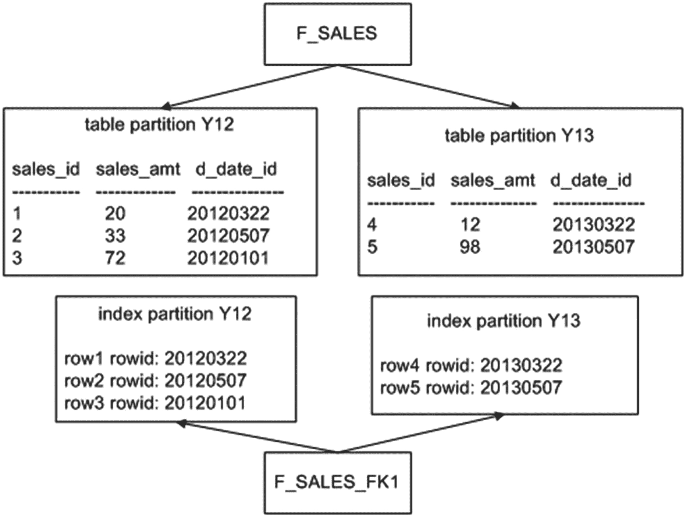

**图 12-3 本地管理索引的架构**

如果希望将本地索引分区创建在与表分区不同的表空间中，请在创建索引时指定表空间：

```
SQL> create index f_sales_fk1 on f_sales(d_date_id) local
(partition y12 tablespace users
,partition y13 tablespace users);
```

现在查询`USER_IND_PARTITIONS`显示索引分区已创建在与表分区表空间分离的表空间中：

```
INDEX_NAME           PARTITION_NAME       TABLESPACE_NAME
-------------------- -------------------- ---------------
F_SALES_FK1          Y12                  USERS
F_SALES_FK1          Y13                  USERS
```

如果在构建本地分区索引时指定了分区信息，则分区数必须与在其上构建分区索引的表的分区数匹配。Oracle 会自动保持本地索引分区与表分区同步。你不能显式地向本地索引添加分区或从中删除分区。当你添加或删除表分区时，Oracle 会自动为本地索引执行相应的操作。Oracle 管理本地索引分区，无论本地索引如何分配给表空间。

本地索引在数据仓库和 DSS 环境中很常见。如果你经常通过分区列进行查询，本地索引是合适的。这种方法允许 Oracle 使用适当的索引和表分区来快速检索数据。

本地索引有两种类型：本地前缀索引和本地非前缀索引。本地前缀索引是指索引的最左列与表分区键匹配的索引。本节前面的示例是一个本地前缀索引，因为它的最左列（`D_DATE_ID`）也是表的分区键。

本地非前缀索引是指最左列不与用于分区相应表的分区键匹配的索引。例如，这是一个本地非前缀索引：

```
SQL> create index f_sales_idx1 on f_sales(sales_id) local;
```

该索引使用`SALES_ID`列进行分区，这不是表的分区键，因此是非前缀索引。你可以通过查询`USER_PART_INDEXES`中的`ALIGNMENT`列来验证索引是否被认为是前缀的：

```
SQL> select index_name, table_name, alignment, locality
from user_part_indexes
where table_name = 'F_SALES';
```

示例输出如下：

```
INDEX_NAME           TABLE_NAME           ALIGNMENT    LOCALI
-------------------- -------------------- ------------ ------
F_SALES_FK1          F_SALES              PREFIXED     LOCAL
F_SALES_IDX1         F_SALES              NON_PREFIXED LOCAL
```

你可能想知道为什么存在前缀和非前缀之间的区别。非前缀本地索引在其索引定义中不包含分区键作为引导列。这可能会带来性能影响，因为访问非前缀索引的范围扫描可能需要搜索每个索引分区。如果分区数量很大，这可能导致性能不佳。

你可以选择通过将分区键列包含在索引的引导列中来创建所有前缀的本地索引。例如，你可以如下创建前缀的`F_SALES_IDX2`索引：

```
SQL> create index f_sales_idx2 on f_sales(d_date_id, sales_id) local;
```

前缀索引比非前缀索引更好吗？这取决于你如何查询表。你必须为你使用的查询生成执行计划，并检查前缀索引是否比非前缀索引更能利用分区剪枝（消除要搜索的分区）。同时请记住，多列本地前缀索引比本地非前缀索引消耗更多的空间和资源。

### 索引与表采用不同的分区方式

与其基表分区方式不同的索引称为全局索引。全局索引中的一个条目可以指向其基表的任何分区。你可以在任何类型的分区表上创建全局索引。

你可以创建范围分区或基于哈希的全局索引。使用关键字`GLOBAL`来指定索引的构建策略与其对应表的策略分离。创建范围分区全局索引时，必须始终指定`MAXVALUE`。

以下示例创建一个基于范围的全局索引：

```
SQL> create index f_sales_gidx1 on f_sales(sales_amt)
global partition by range(sales_amt)
(partition pg1 values less than (25)
,partition pg2 values less than (50)
,partition pg3 values less than (maxvalue));
```

图 12-4 显示，使用全局索引时，索引的分区策略与表的分区策略不一致。

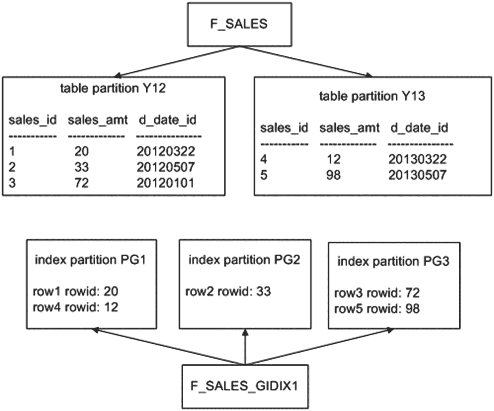

**图 12-4 全局索引的架构**

另一种全局分区索引类型是基于哈希的。此示例创建一个哈希分区的全局索引：

```
SQL> create index f_sales_gidx2 on f_sales(sales_id)
global partition by hash(sales_id) partitions 3;
```

通常，全局索引比本地索引更难维护。我建议你尽量避免使用全局索引，并尽可能使用本地索引。

全局索引没有自动维护（而本地索引有）。对于全局索引，你负责添加和删除索引分区。此外，对底层分区表的许多维护操作要求重建全局索引分区。堆组织表上的以下操作会使全局索引不可用：

*   `ADD (HASH)`
*   `COALESCE (HASH)`
*   `DROP`
*   `EXCHANGE`
*   `MERGE`
*   `MOVE`
*   `SPLIT`
*   `TRUNCATE`


## UPDATE INDEXES 子句

在执行维护操作时，请考虑使用`UPDATE INDEXES`子句。这样做可以在操作期间保持全局索引可用，从而免去重建的需要。使用`UPDATE INDEXES`的缺点是，由于索引在操作过程中需要维护，维护操作耗时会更长。

全局索引对于通过索引检索少量行的查询非常有用。在这些情况下，Oracle 可以消除（修剪）任何不必要的索引分区并高效地检索数据。例如，全局范围分区索引在 OLTP 环境中非常有用，在这些环境中你需要快速访问单个记录。

## 部分索引

从 Oracle Database 12c 开始，你可以指定索引分区在初始创建时处于不可用状态。如果你有预创建的分区，但还没有映射到未来日期的范围分区的数据，你可能会希望这样做——其思路是在分区加载后（在将来的某个日期）再构建索引。

你通过`INDEXING ON|OFF`子句来控制本地索引是否以可用状态创建。以下是一个示例，默认指定索引分区将是不可用的，除非明确启用：

```sql
SQL> create table f_sales (
sales_id number
,sales_amt number
,d_date_id number
)
indexing off
partition by range (d_date_id)
(partition p1 values less than (20170101)  indexing on,
partition p2 values less than (20180101)  indexing on,
partition p3 values less than (20190101)  indexing on,
partition p4 values less than (20200101)  indexing off);
```

接下来，在表上创建一个本地分区索引，指定应使用部分索引功能：

```sql
SQL> create index f_sales_lidx1 on f_sales(d_date_id)
local indexing partial;
```

你可以通过此查询验证哪些分区是可用的（或不可用）：

```sql
SQL> select a.index_name, a.partition_name, a.tablespace_name, a.status
from user_ind_partitions a, user_indexes b
where b.table_name = 'F_SALES'
and a.index_name = b.index_name;
```

以下是此示例的一些示例输出：

```sql
INDEX_NAME           PARTITION_ TABLESPACE_NAME STATUS
-------------------- ---------- --------------- --------
F_SALES_LIDX1        P1         USERS           USABLE
F_SALES_LIDX1        P2         USERS           USABLE
F_SALES_LIDX1        P3         USERS           USABLE
F_SALES_LIDX1        P4         USERS           UNUSABLE
```

通过这种方式，你可以控制在数据插入分区时是否维护索引。你可能最初不希望索引分区以可用状态创建，因为它会减慢数据的批量加载。在这种情况下，你会先加载数据，然后通过重建索引使其可用：

```sql
SQL> alter index f_sales_lidx1 rebuild partition p4;
```

## 分区裁剪

SQL 查询中的分区裁剪专门通过分区键访问表。Oracle 只搜索包含查询所需数据的分区（并且不访问任何不包含此类数据的分区——可以说是修剪了它们）。

例如，假设一个分区表定义如下：

```sql
SQL> create table f_sales (
sales_id  number
,sales_amt number
,d_date_id number)
tablespace p1_tbsp
partition by range(d_date_id)(
partition y17 values less than (20180101)
tablespace p1_tbsp
,partition y18 values less than (20190101)
tablespace p2_tbsp
,partition y19 values less than (20200101)
tablespace p3_tbsp);
```

此外，你在分区键列上创建一个本地索引：

```sql
SQL> create index f_sales_fk1 on f_sales(d_date_id) local;
```

然后，插入一些示例数据：

```sql
SQL> insert into f_sales values(1,100,20170202);
SQL> insert into f_sales values(2,200,20180202);
SQL> insert into f_sales values(3,300,20190202);
```

为了说明分区裁剪的过程，启用 autotrace 功能：

```sql
SQL> set autotrace trace explain;
```

现在，执行一个基于分区键访问行的 SQL 语句：

```sql
SQL> select sales_amt from f_sales where d_date_id = '20180202';
```

Autotrace 显示执行计划。为了使输出整齐地适应页面，移除了部分列：

```sql
| Id  | Operation                           | Name        | Pstart| Pstop |
|---|---|---|---|---|
|   0 | SELECT STATEMENT                    |             |       |       |
|   1 |  PARTITION RANGE SINGLE             |             |     2 |     2 |
|   2 |   TABLE ACCESS BY LOCAL INDEX ROWID BATCHED               | F_SALES     |     2 |     2 |
|*  3 |    INDEX RANGE SCAN                 | F_SALES_FK1 |     2 |     2 |
```

在此输出中，`Pstart`显示访问的起始分区是分区 2。`Pstop`显示访问的最后一个分区是分区 2。在此示例中，分区 2 是用于检索数据的唯一分区；表中的其他分区根本未被查询访问。

如果执行的查询未使用分区键，则会访问所有分区；例如：

```sql
SQL> select * from f_sales;
```

以下是对应的执行计划：

```sql
| Id  | Operation           | Name    |    Rows| Pstart|  Pstop|
|---|---|---|---|---|---|
|   0 | SELECT STATEMENT    |         |     3  |       |       |
|   1 | PARTITION RANGE ALL |         |     3  |     1 |     3 |
|   2 | TABLE ACCESS FULL   | F_SALES |     3  |     1 |     3 |
```

请注意，在此输出中，起始分区是分区 1，停止分区是分区 3。这意味着查询访问了分区 1 到分区 3，没有进行分区裁剪。这个例子很简单，但演示了分区裁剪的概念。当你通过分区键访问表时，可以大幅减少 Oracle 需要检查和处理的行数。这对于能够裁剪分区的查询具有巨大的性能优势。

## 修改分区策略

在 Oracle 18c 之前，如果你使用特定策略（如哈希分区）创建了分区表，则必须使用提到的方法之一从非分区表迁移到分区表来重新创建表。现在，要将哈希分区表更改为复合范围-哈希分区表，可以使用`ALTER TABLE`语句在线或离线执行。作为新策略前缀的索引将被迁移到本地分区索引或自动转换为全局索引。

```sql
SQL> create table f_sales(
sales_id number
, sales_amt  number
,state_code varchar2(3)
,d_date_id  number)
partition by hash(sales_id);
SQL> alter table f_sales modify
partition by range(d_date_id)
subpartition by hash(sales_id)
subpartitions 8
(partition p2016 values less than (20170101),
partition p2017 values less than (20180101))
ONLINE
UPDATE INDEXES;
```


## 总结

Oracle 提供的分区功能对于实现大型表和索引至关重要。分区是构建高度可扩展和可维护应用程序的关键。该功能基于这样的概念：在逻辑上创建一个对象（表或索引），但在物理上将其实现为多个独立的数据库段。分区对象允许您基于分区进行构建、加载、维护和查询。维护操作，如删除、归档、更新和插入数据，变得易于管理，因为您只需处理大型逻辑表的一小部分数据子集。

如果您工作于数据仓库环境或处理大型数据库，您必须对分区概念有深入的了解。作为数据库管理员，您需要创建和维护分区对象。您必须就表分区策略以及在何处使用本地和全局索引提出建议。这些决策对系统的可用性和性能有巨大影响。分区的许多新特性支持在线操作，例如合并分区以及从非分区表转换或更改分区策略。这使得在操作这些大型表和按需管理分区策略时，对象和数据仍然可用。

本书接下来将介绍用于在不同环境之间复制和移动用户、对象和数据的实用程序。即将介绍 Oracle 的 Data Pump 和外部表功能。

## 13. Data Pump

Data Pump 常被描述为旧版 `exp`/`imp` 实用程序的升级版。这有点像称一部现代智能手机是老式旋转拨号固定电话的替代品。尽管旧实用程序可靠且运行良好，但 Data Pump 在包含其功能的同时，为数据的提取和在环境间的移动增添了全新的维度。本章将有助于解释 Data Pump 如何使您当前的数据传输任务变得更轻松，并将展示如何以您未曾想过的方式移动信息和解决问题。

Data Pump 使您能够高效地备份、复制、保护和转换大量数据和元数据。您可以通过多种方式使用 Data Pump：

-   对整个数据库或数据子集执行基于时间点的逻辑备份
-   为测试或开发复制整个数据库或数据子集
-   快速生成重建对象所需的 DDL
-   通过从旧版本导出并导入到新版本来升级数据库

有时，DBA 对 `exp`/`imp` 实用程序有一种近乎老派的执着，因为他们熟悉这些实用程序的语法，并且它们能快速完成任务。即使这些遗留实用程序易于使用，您也应该考虑在未来使用 Data Pump。Data Pump 相较于旧的 `exp`/`imp` 实用程序具有显著的功能优势：

-   处理大数据集的性能，允许高效地导出和导入千兆字节的数据
-   交互式命令行实用程序，允许您断开连接，稍后可重新连接到正在进行的 Data Pump 作业，并可监控作业进度
-   能够从远程数据库导出大量数据并直接导入本地数据库，而无需创建转储文件
-   能够在从导出到导入的过程中，对模式、表空间、数据文件和存储设置进行动态更改
-   精细的对象和数据过滤功能
-   用于执行可传输表空间导出
-   通过数据库控制的安全目录对象和数据目录
-   高级功能，如压缩和加密

本章的重点将从 Data Pump 架构开始。还有其他通过克隆等功能在数据库间移动数据的方法，将在后续章节讨论。基本的导出和导入实用程序不应再使用。将数据写入客户端机器存在高安全风险，而旧的导出和导入实用程序会这样做，这与 Data Pump 提供的将文件写入服务器或安全文件共享的功能相反。需要采取安全措施以防止数据被放置在非安全区域。

## Data Pump 架构

Data Pump 包含以下组件：

-   `expdp`（Data Pump 导出实用程序）
-   `impdp`（Data Pump 导入实用程序）
-   `DBMS_DATAPUMP` PL/SQL 包（Data Pump 应用程序编程接口 [API]）
-   `DBMS_METADATA` PL/SQL 包（Data Pump 元数据 API）

`expdp` 和 `impdp` 实用程序在导出和导入数据及元数据时使用 `DBMS_DATAPUMP` 和 `DBMS_METADATA` 内置 PL/SQL 包。`DBMS_DATAPUMP` 包在数据库环境之间移动整个数据库或数据子集。`DBMS_METADATA` 包导出和导入有关数据库对象的信息。

注意
您可以从 SQL*Plus 中独立（在 `expdp` 和 `impdp` 之外）调用 `DBMS_DATAPUMP` 和 `DBMS_METADATA` 包。`DBMS_DATAPUMP` 可用于监控 Data Pump 作业。`DBMS_METADATA` 对于检索 DDL 语句非常有用。有关更多详细信息，请参阅《Oracle Database PL/SQL Packages and Types Reference Guide》，可从 Oracle 网站 (`http://otn.oracle.com`) 的技术网络区域下载。

当您启动 Data Pump 导出或导入作业时，会在数据库服务器上启动一个主操作系统进程。此主进程名称格式为 `ora_dmNN_<SID>`。在 Linux/Unix 系统上，您可以使用 `ps` 命令在操作系统提示符下查看此进程：

```bash
$ ps -ef | grep -v grep | grep ora_dm
oracle   14602     1  4 08:59 ?        00:00:03 ora_dm00_o12c
```

根据并行度和指定的工作量，还会启动若干个工作进程。如果未指定并行度，则仅启动一个工作进程。主进程协调主进程和工作进程之间的工作。工作进程名称格式为 `ora_dwNN_<SID>`。

此外，当用户启动导出或导入作业时，会创建一个数据库状态表来跟踪作业。此表仅在 Data Pump 作业期间存在。状态表的名称取决于您运行的作业类型。表的命名格式为 `SYS_<OPERATION>_<JOB_MODE>_NN`，其中 `OPERATION` 是 `EXPORT` 或 `IMPORT`。`JOB_MODE` 可以是以下类型之一：

-   `FULL`
-   `SCHEMA`
-   `TABLE`
-   `TABLESPACE`
-   `TRANSPORTABLE`

例如，如果您正在导出一个模式，则会在您的帐户中创建一个名为 `SYS_EXPORT_SCHEMA_NN` 的表，其中 `NN` 是一个数字，用于确保该表名在用户模式中是唯一的。此状态表包含有关对象导出/导入、开始时间、耗时、行数和错误计数等信息。该状态表有超过 80 个列。

提示
Data Pump 状态表创建在执行导出/导入用户的默认永久表空间中。因此，如果用户没有在默认表空间中创建表的权限，Data Pump 作业将失败，并出现 `ORA-31633` 错误。


## 开始使用

现在您已经了解了 Data Pump 的架构，接下来通过一个简单的示例，来展示导出一张表、删除该表、然后将其重新导入数据库所需的设置步骤。这将为本章涵盖的所有其他 Data Pump 任务奠定基础。

### 状态表

状态表在导出或导入作业成功完成后由 Data Pump 删除。如果您使用 `KILL_JOB` 交互式命令，主表也会被删除。如果您使用 `STOP_JOB` 交互式命令停止作业，该表不会被移除，并可在您重启作业时使用。

如果您的作业异常终止，主表将被保留。如果您不计划重启作业，则可以删除该状态表。

### 一个 Data Pump 导出和导入作业

当 Data Pump 运行时，它使用一个数据库目录对象来确定写入和读取转储文件及日志文件的位置。通常，您需要指定希望 Data Pump 使用的目录对象。如果您未指定目录对象，则将使用默认目录。默认目录路径由名为 `DATA_PUMP_DIR` 的数据目录对象定义。此目录对象在数据库首次创建时自动创建。在 Linux/Unix 系统上，此目录对象映射到 `ORACLE_HOME/rdbms/log` 目录。

Data Pump 导出会创建一个导出文件和一个日志文件。导出文件包含要导出的对象。日志文件包含作业活动的记录。图 13-1 显示了与 Data Pump 导出作业相关的架构组件。

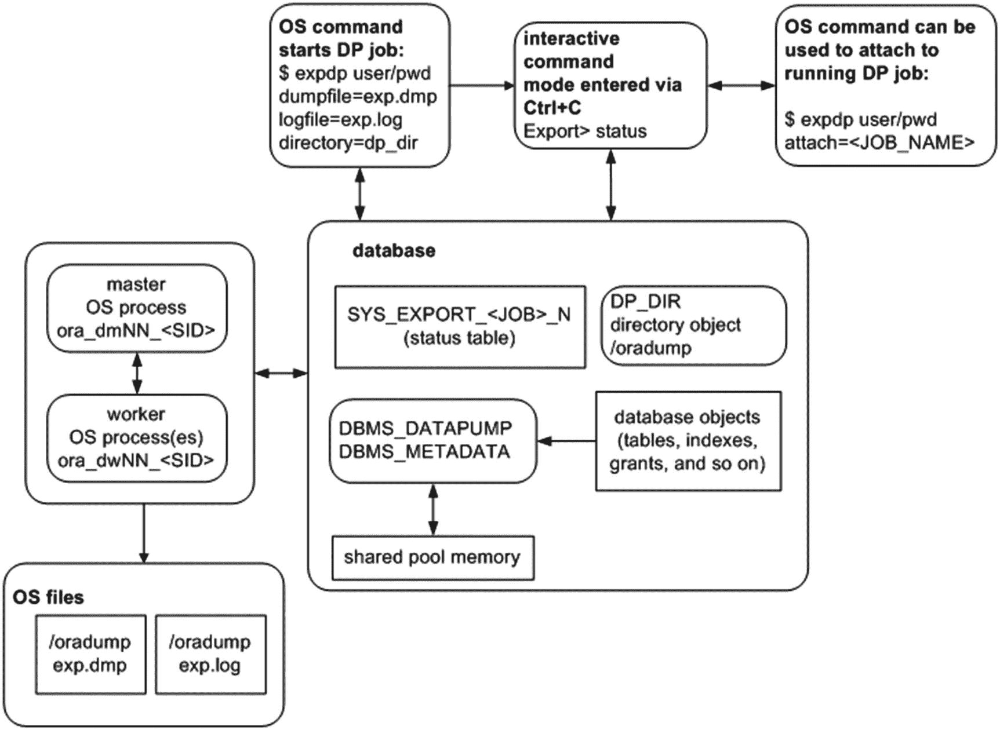

类似地，图 13-2 显示了 Data Pump 导入作业的架构组件。导出和导入之间的主要区别在于数据流的方向。导出将数据写出数据库，而导入则将信息带入数据库。当您在本章中学习 Data Pump 示例和概念时，请参考这些图表。

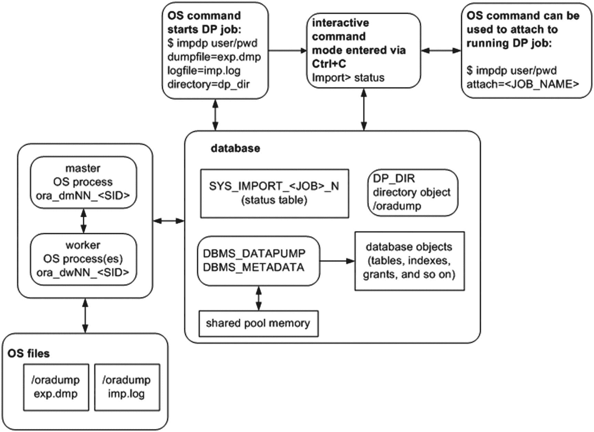

对于每个 Data Pump 作业，您必须确保可以访问一个目录对象。导出和导入的基础知识将在接下来的几节中描述。

> **提示**：由于 Data Pump 在内部使用 PL/SQL 来执行其工作，因此共享池中需要有足够的内存来容纳 PL/SQL 包。如果共享池中没有足够的空间，Data Pump 将抛出 `ORA-04031: unable to allocate bytes of shared memory...` 错误并中止。如果您收到此错误，请将数据库参数 `SHARED_POOL_SIZE` 设置为至少 50M。更多详细信息请参阅 MOS 注释 396940.1。

### 执行导出

运行 Data Pump 导出作业时需要进行少量设置。步骤如下：

1.  创建一个数据库目录对象，指向您想要写入/读取 Data Pump 文件的 OS 目录。
2.  将目录对象的读写权限授予运行导出的数据库用户。
3.  在 OS 命令提示符下，运行 `expdp` 实用程序。

#### 步骤 1. 创建数据库目录对象

在运行 Data Pump 作业之前，首先创建一个与磁盘上物理位置相对应的数据库目录对象。此位置将用于保存导出文件和日志文件，并且应该是您知道有足够磁盘空间来容纳要导出数据量的位置。

使用 `CREATE DIRECTORY` 命令完成此任务。此示例创建一个名为 `dp_dir` 的目录，并指定它映射到磁盘上的 `/oradump` 物理位置：

```
SQL> create directory dp_dir as '/oradump';
```

要查看新创建目录的详细信息，请执行此查询：

```
SQL> select owner, directory_name, directory_path from dba_directories;
```

以下是一些示例输出：

```
OWNER      DIRECTORY_NAME  DIRECTORY_PATH
---------- --------------- --------------------
SYS        DP_DIR          /oradump
```

请记住，指定的目录路径必须在数据库服务器上物理存在。此外，该目录必须是 `oracle` OS 用户具有读/写访问权限的目录。最后，执行 Data Pump 操作的用户需要被授予对该目录对象的读/写访问权限（参见步骤 2）。

如果您在导出或导入时未指定 `DIRECTORY` 参数，Data Pump 将尝试使用默认数据库目录对象（如前所述，该对象映射到 `ORACLE_HOME/rdbms/log`）。不建议使用默认目录，原因有两个：

*   如果您正在导出大量数据，最好在磁盘上有一个您知道有足够空间来满足磁盘空间需求的首选位置。如果您使用默认目录，您可能会无意中填满与 `ORACLE_HOME` 相关的挂载点，从而可能导致数据库挂起。
*   如果您授予非 DBA 用户进行导出的权限，您不希望他们在与 `ORACLE_HOME` 相关的位置创建大型转储文件，或者访问 `ORACLE_HOME` 目录。同样，您不希望与 `ORACLE_HOME` 相关的挂载点变满，从而损害您的数据库。

#### 步骤 2. 授予目录访问权限

您需要将数据库目录对象的权限授予希望使用 Data Pump 的用户。使用 `GRANT` 语句分配适当的权限。如果您希望用户能够从目录读取和写入目录，则必须授予安全访问权限。此示例将目录对象的访问权限授予名为 `MV_MAINT` 的用户：

```
SQL> grant read, write on directory dp_dir to mv_maint;
```

所有目录对象都归 `SYS` 用户所有。如果您使用的是被授予了 DBA 角色的用户帐户，那么您对任何目录对象都具有必要的读/写权限。可以为迁移、开发人员在测试中的数据刷新授予权限，因此向可能不是本地数据库服务器上的文件共享的特定目录授予权限是可能的。这也将数据保护到只有特定用户组才能访问的目录，并限制对其他模式和文件的访问。

#### 旧版 Exp 实用程序的安全问题

创建目录对象然后授予对物理存储位置的特定 I/O 访问权限的想法是，您可以更安全地管理哪些用户能够生成读写活动，而通常他们没有这些权限。使用传统的 `exp` 实用程序，任何有权访问该工具的用户默认情况下都有权写入或读取 Oracle 二进制文件所有者（通常是 `oracle`）有权访问的文件。可以想象，恶意的非 `oracle` OS 用户可能会尝试运行 `exp` 实用程序来故意覆盖关键的数据库文件。例如，以下命令可以由任何具有执行 `exp` 实用程序权限的非 `oracle` OS 用户运行：

```
$ exp heera/foo file=/oradata04/SCRKDV12/users01.dbf
```

但是，用户还必须在文件系统上具有写入该文件的权限。如果没有文件系统的权限，导出将会失败。

```
EXP-00028: failed to open /opt/oracle/x.dmp for write
Export file: expdat.dmp >
```


#### 步骤 3. 执行导出操作

当目录对象和授权准备就绪后，您就可以使用 Data Pump 从数据库导出信息。本节的简单示例将展示如何导出一个表。本章后续章节将详细描述导出数据的各种方式。此处的重点是实践一个示例，为理解后续更复杂的主题打下基础。

作为非 `SYS` 用户，创建一个表并填入一些数据：

```
SQL> create table inv(inv_id number);
SQL> insert into inv values (123);
```

接下来，作为非 `SYS` 用户，导出该表。此示例使用之前创建的、名为 `DP_DIR` 的目录。Data Pump 使用目录对象指定的目录路径作为磁盘位置，用于写入转储文件和日志文件：

```
$ expdp mv_maint/foo directory=dp_dir tables=inv dumpfile=exp.dmp logfile=exp.log
```

`expdp` 工具在 `/oradump` 目录中创建一个名为 `exp.dmp` 的文件，其中包含重新创建 `INV` 表并将其填充为导出时数据所需的信息。此外，还会在 `/oradump` 目录中创建一个名为 `exp.log` 的日志文件，其中包含与此导出作业相关的日志信息。

如果您未指定转储文件名，Data Pump 将创建一个名为 `expdat.dmp` 的文件。如果目录中已存在名为 `expdat.dmp` 的文件，则 Data Pump 会抛出错误。如果您未指定日志文件名，则 Data Pump 会创建一个名为 `export.log` 的文件。如果名为 `export.log` 的日志文件已存在，则 Data Pump 会覆盖它。

**提示**
尽管可以作为 `SYS` 用户执行 Data Pump，但我不建议这样做，原因有二。首先，`SYS` 用户需要使用 `AS SYSDBA` 子句连接到数据库。这要求 Data Pump 参数文件包含 `USERID` 参数以及带引号的连接字符串。这很不方便。其次，`SYS` 用户拥有的大多数表无法导出（少数例外，例如 `AUD$`）。如果您尝试导出 `SYS` 用户拥有的表，Data Pump 将抛出 `ORA-39166` 错误并指出该表不存在。这很令人困惑。

**即使使用 `SYS` 账户执行导出，完全导出也不再导出系统方案 `SYS`、`ORDSYS` 或 `MDSYS`。**

#### 导入表

导出数据的一个关键原因是为了能够重新创建数据库对象。您可能希望将其作为备份策略的一部分，或者为了将数据复制到不同的数据库。Data Pump 导入使用导出转储文件作为输入，并重新创建导出文件中包含的数据库对象。导入过程与导出类似：

1.  创建一个数据库目录对象，指向您希望从中读取/写入 Data Pump 文件的操作系统目录。
2.  向执行导出或导入的数据库用户授予对该目录对象的读写权限。
3.  在操作系统提示符下，运行 `impdp` 命骤 1 和 2 已在上一节“执行导出操作”中介绍，因此此处不再重复。

在运行导入作业之前，请删除先前创建的 `INV` 表。

```
SQL> drop table inv purge;
```

接下来，从导出的文件重新创建 `INV` 表：

```
$ impdp mv_maint/foo directory=dp_dir dumpfile=exp.dmp logfile=imp.log
```

您现在应该已经重新创建了 `INV` 表，并填充了导出时的数据。现在是一个重新检查图 13-1 和 13-2 的好时机。请确保您理解哪些文件是由 `expdp` 创建的，哪些文件是被 `impdp` 使用的。

#### 使用参数文件

在许多情况下，与其在命令行输入命令，不如将命令存储在一个文件中，然后在执行 Data Pump 导出或导入时引用该文件。使用参数文件可以使任务更易于重复执行，并减少出错的可能性。您可以将命令放入一个文件中一次，然后多次引用该文件。此外，某些 Data Pump 命令（例如 `FLASHBACK_TIME`）需要使用引号；在这种情况下，有时很难预测操作系统将如何解释这些引号。每当命令需要引号时，强烈建议使用参数文件。

要使用参数文件，首先创建一个操作系统文本文件，其中包含您希望用来控制作业行为的命令。此示例使用 Linux/Unix 的 `vi` 命令创建一个名为 `exp.par` 的文本文件：

```
$ vi exp.par
```

现在，将以下命令放入 `exp.par` 文件中：

```
userid=mv_maint/foo
directory=dp_dir
dumpfile=exp.dmp
logfile=exp.log
tables=inv
reuse_dumpfiles=y
```

接下来，导出操作通过 `PARFILE` 命令行选项引用该参数文件：

```
$ expdp parfile=exp.par
```

Data Pump 处理文件中的参数，就像它们是在命令行上键入的一样。如果您发现自己需要重复键入相同的命令或使用需要引号的命令，或两者兼有，那么请考虑使用参数文件来提高效率。

**提示**
请勿将 Data Pump 参数文件与数据库初始化参数文件混淆。Data Pump 参数文件指示 Data Pump 以哪个用户身份连接数据库、从哪些目录位置读取/写入文件、在操作中包含哪些对象等等。相比之下，数据库参数文件在数据库启动时确定实例的特性。

#### 细粒度导出和导入

回顾本章前面的“Data Pump 架构”部分，您可以通过几种不同的模式调用导出/导入实用程序。例如，您可以指示 Data Pump 以以下模式执行导出/导入：

*   整个数据库
*   方案级别
*   表级别
*   表空间级别
*   可传输表空间级别

在深入探讨 Data Pump 的众多功能之前，先讨论这些模式并确保您了解每种模式的操作方式是很有用的。这将进一步为理解本章后面介绍的概念奠定基础。

##### 导出和导入整个数据库

当您导出整个数据库时，这有时被称为完全导出。在此模式下，生成的导出文件包含制作数据库副本所需的所有内容。除非受过滤参数限制（见本章后面的“过滤数据和对象”部分），否则完全导出包含以下内容：

*   重新创建表空间、用户、用户表、索引、约束、触发器、序列、存储的 PL/SQL 等所需的所有 DDL。
*   所有表数据（`SYS` 用户的表除外）。


## Oracle 数据泵导出与导入概述

### 全库导出与导入

#### 全库导出
执行全库导出需要将参数`FULL`设置为`Y`，并且必须由具有 DBA 权限或被授予了`DATAPUMP_EXP_FULL_DATABASE`角色的用户来执行。以下是一个导出整个数据库的示例：

```bash
$ expdp mv_maint/foo directory=dp_dir dumpfile=full.dmp logfile=full.log full=y
```

在导出执行期间，您应该在输出中看到以下文本，表明正在进行全库级别的导出：

```text
Starting "MV_MAINT"."SYS_EXPORT_FULL_01":
```

请注意，全库导出并不会导出数据库中的所有内容：
*   `SYS`模式的内容不会被导出（少数例外情况，例如`AUD$`表）。试想如果能够将一个数据库的`SYS`模式内容导出并导入到另一个数据库中会发生什么。`SYS`模式的内容会覆盖内部的数据字典表/视图，从而损坏数据库。因此，数据泵永远不会导出由`SYS`拥有的对象。
*   索引数据不会被导出，而是导出包含在后续导入中重新创建索引所需 SQL 的索引 DDL 语句。

#### 全库导入
一旦拥有了全库导出文件，您可以使用其内容来重新创建原始数据库中的对象（例如，在表被意外删除的情况下），或者将整个数据库或部分用户/表复制到不同的数据库。下一个示例假设转储文件已被复制**到**不同的数据库服务器，现在用于将所有对象导入目标数据库：

```bash
$ impdp mv_maint/foo directory=dp_dir dumpfile=full.dmp logfile=fullimp.log full=y
```

> **提示**
> 要启动全库导入，您必须拥有 DBA 权限或被分配了`DATAPUMP_IMP_FULL_DATABASE`角色。

在屏幕上显示的输出中，您应该看到正在进行全库导入的指示：

```text
Starting "MV_MAINT"."SYS_IMPORT_FULL_01":
```

运行全库导入作业需要注意以下几点：
*   导入作业将首先尝试重新创建任何表空间。如果表空间已存在，或者表空间所依赖的目录路径不存在，则表空间创建语句将失败，导入作业将继续执行下一个任务。
*   接下来，导入作业将修改`SYS`和`SYSTEM`用户账户，使其包含导出时的相同密码。因此，在从生产系统导入后，更改`SYS`和`SYSTEM`的密码以反映新环境是谨慎的做法。
*   此外，导入作业将尝试创建导出文件中的任何用户。如果用户已存在，则会抛出错误，导入作业继续执行下一个任务。
*   用户将以从原始数据库获取的相同密码被导入。根据您的安全标准，您可能需要更改密码。
*   表将被重新创建。如果表已存在且包含数据，您必须指定导入作业如何处理这种情况。您可以选择让导入作业跳过（`skip`）、追加（`append`）、替换（`replace`）或截断（`truncate`）该表（参见本章后面的“当对象已存在时导入”部分）。
*   在每个表创建并填充数据后，将创建相关的索引。
*   导入作业还将尝试导入统计信息（如果可用）。此外，对象授权也会被实例化。

如果一切运行顺利，最终结果将是一个在表空间、用户、对象等方面与源数据库逻辑上相同的数据库。

### 模式级导出与导入

当您启动导出时，除非另有指定，数据泵会为运行导出作业的用户启动一个模式级导出。模式级导出常用于将一个或多个模式从一个环境复制到另一个环境。以下命令为`MV_MAINT`用户启动模式级导出：

```bash
$ expdp mv_maint/foo directory=dp_dir dumpfile=mv_maint.dmp logfile=mv_maint.log
```

在屏幕上显示的输出中，您应该看到一些表明已启动模式级导出的文本：

```text
Starting "MV_MAINT"."SYS_EXPORT_SCHEMA_01"...
```

您还可以使用`SCHEMAS`参数为运行导出作业之外的用户启动模式级导出。以下命令显示针对多个用户的模式级导出：

```bash
$ expdp mv_maint/foo directory=dp_dir dumpfile=user.dmp schemas=heera,chaya
```

您可以通过引用使用模式级导出生成的转储文件来启动模式级导入：

```bash
$ impdp mv_maint/foo directory=dp_dir dumpfile=user.dmp
```

启动模式级导入时，需要注意以下几点：
*   模式级导出中不包含任何表空间。
*   导入作业尝试重新创建转储文件中的任何用户。如果用户已存在，则会抛出错误，导入作业继续执行。
*   导入作业将根据导出的密码重置用户的密码。
*   用户拥有的表将被导入并填充。如果表已存在，您必须使用`TABLE_EXISTS_ACTION`参数指示数据泵如何处理。

您也可以在使用全库导出转储文件时启动模式级导入。为此，请指定要从全库导出中提取的模式：

```bash
$ impdp mv_maint/foo directory=dp_dir dumpfile=full.dmp schemas=heera,chaya
```

### 表级导出与导入

您可以通过`TABLES`参数指示数据泵对特定的表进行操作。例如，假设您想要导出：

```bash
$ expdp mv_maint/foo directory=dp_dir dumpfile=tab.dmp \
tables=heera.inv,heera.inv_items
```

在输出中，您应该看到一些文本表明正在进行表级导出：

```text
Starting "MV_MAINT"."SYS_EXPORT_TABLE_01...
```

类似地，您可以通过指定表级生成的转储文件来启动表级导入：

```bash
$ impdp mv_maint/foo directory=dp_dir dumpfile=tab.dmp
```

表级导入只尝试导入表和指定的数据。如果表已存在，则会抛出错误，导入作业继续执行。如果表已存在且包含数据，您必须指定导入作业如何处理。您可以使用`TABLE_EXISTS_ACTION`参数让导入作业跳过（`skip`）、追加（`append`）、替换（`replace`）或截断（`truncate`）该表。

您也可以在使用全库导出转储文件或模式级导出时启动表级导入。为此，请指定要从全库或模式级导出中提取的表：

```bash
$ impdp mv_maint/foo directory=dp_dir dumpfile=full.dmp tables=heera.inv
```

### 表空间级导出与导入

表空间级导出/导入作用于特定表空间内包含的对象。以下示例导出`USERS`表空间中的所有对象：

```bash
$ expdp mv_maint/foo directory=dp_dir dumpfile=tbsp.dmp tablespaces=users
```

输出中显示的文本应表明正在进行表空间级导出：

```text
Starting "MV_MAINT"."SYS_EXPORT_TABLESPACE_01"...
```

您可以通过指定使用表空间级导出创建的导出文件来启动表空间级导入：

```bash
$ impdp mv_maint/foo directory=dp_dir dumpfile=tbsp.dmp
```

您也可以通过使用全库导出但指定`TABLESPACES`参数来启动表空间级导入：

```bash
$ impdp mv_maint/foo directory=dp_dir dumpfile=full.dmp tablespaces=users
```

表空间级导入将尝试创建表空间内的任何表和索引。导入不会尝试重新创建表空间本身。由于 PDB 数据库将拥有自己的表空间，这对于 PDB 导出可能是一个易于使用的级别。

> **注意**
> 还有一种可传输表空间模式导出。请参阅本章后面的“复制数据文件”部分。

### 传输数据

## Data Pump 的主要用途之一是将数据从一个数据库复制到另一个数据库。通常，源数据库和目标数据库位于相距数千英里的数据中心。Data Pump 提供了几个强大的功能来高效地复制数据：

*   网络链接
*   复制数据文件（可传输表空间）
*   外部表（请参见第 14 章）

使用网络链接可以让您执行导出并将其导入目标数据库，而无需创建转储文件。这是一种非常高效的数据移动方式。

Oracle 还提供了可传输表空间功能，允许您将数据文件从源数据库复制到目标数据库，然后使用 Data Pump 传输相关的元数据。这两种技术将在以下部分中描述。

> **注意**
> 有关使用外部表传输数据的讨论，请参见第 14 章。

### 跨网络直接导出和导入

假设您有两个数据库环境——一个在 Solaris 服务器上运行的生产数据库和一个在 Linux 服务器上运行的测试数据库。您的老板向您提出以下要求：

*   在 Solaris 服务器上制作生产数据库的副本。
*   将该副本导入 Linux 服务器上的测试数据库。
*   在导入时更改模式的名称，以符合测试数据库的命名标准。

首先，考虑使用旧的 `exp`/`imp` 实用程序将数据从一个数据库传输到另一个数据库所需的步骤。步骤大致如下：

1.  导出生产数据库（这将在数据库服务器上创建一个转储文件）。
2.  将转储文件复制到测试数据库服务器。
3.  将转储文件导入测试数据库。

您可以使用 Data Pump 执行相同的步骤。但是，Data Pump 提供了一种更高效、更透明的方法来执行这些步骤。如果您在生产数据库服务器和测试数据库服务器之间有直接的网络连接，则可以获取导出文件并直接将其导入目标数据库，而无需创建或复制任何转储文件。此外，您可以在导入时即时重命名模式。另外，源数据库是否运行在与目标数据库不同的操作系统上并不重要。

一个例子将有助于说明这是如何工作的。在此示例中，生产数据库用户是 `STAR2`、`CIA_APP` 和 `CIA_SEL`。您希望将这些用户移动到测试数据库，并将它们重命名为 `STAR_JUL`、`CIA_APP_JUL` 和 `CIA_SEL_JUL`。

此任务需要以下步骤：

1.  在要导入的测试数据库中创建用户。以下是一个在测试数据库中创建用户的示例脚本：
```
    define star_user=star_jul
    define star_user_pwd=star_jul_pwd
    define cia_app_user=cia_app_jul
    define cia_app_user_pwd=cia_app_jul_pwd
    define cia_sel_user=cia_sel_jul
    define cia_sel_user_pwd=cia_sel_jul_pwd
    --
    create user &&star_user identified by &&star_user_pwd;
    grant connect,resource to &&star_user;
    alter user &&star_user default tablespace dim_data;
    --
    create user &&cia_app_user identified by &&cia_app_user_pwd;
    grant connect,resource to &&cia_app_user;
    alter user &&cia_app_user default tablespace cia_data;
    --
    create user &&cia_sel_user identified by &&cia_app_user_pwd;
    grant connect,resource to &&cia_app_user;
    alter user &&cia_sel_user default tablespace cia_data;
```

2.  在您的测试数据库中，创建一个指向您的生产数据库的数据库链接。`CREATE DATABASE LINK` 语句中引用的远程用户必须在生产数据库中被授予 DBA 角色。这是一个 `CREATE DATABASE LINK` 的示例脚本：
```
    create database link dk
    connect to darl identified by foobar
    using 'dwdb1:1522/dwrep1';
```

3.  在您的测试数据库中，创建一个目录对象，指向您希望日志文件存放的位置：
```
    SQL> create or replace directory engdev as '/orahome/oracle/ddl/engdev';
```

4.  在测试服务器上运行导入命令。此命令通过 `NETWORK_LINK` 参数引用远程数据库。该命令还指示 Data Pump 将生产数据库用户名映射到测试数据库中新建的用户。
```
    $ impdp darl/engdev directory=engdev network_link=dk \
    schemas='STAR2,CIA_APP,CIA_SEL' \
    remap_schema=STAR2:STAR_JUL,CIA_APP:CIA_APP_JUL,CIA_SEL:CIA_SEL_JUL
```

这种技术允许您在不同的数据库之间移动大量数据，而无需创建或复制任何转储文件或数据文件。您还可以通过 `REMAP_SCHEMA` 参数即时重命名模式。这是一个非常强大的 Data Pump 功能，可让您快速高效地传输数据。

> **提示**
> 在复制整个数据库时，也可以考虑使用 RMAN 的 duplicate database 功能。

### Database Link 与 Network_Link

不要混淆通过数据库链接连接到远程数据库时进行的导出与使用 `NETWORK_LINK` 参数进行的导出。当通过数据库链接连接到远程数据库进行导出时，被导出的对象存在于远程数据库中，并且转储文件和日志文件在远程服务器上由 `DIRECTORY` 参数指定的目录中创建。
例如，以下命令导出远程数据库中的对象并在远程服务器上创建文件：
`$ expdp mv_maint/foo@shrek2 directory=dp_dir dumpfile=sales.dmp`

相比之下，当您使用 `NETWORK_LINK` 参数进行导出时，您是在本地创建转储文件和日志文件，而被导出的数据库对象存在于远程数据库中；例如，
```
$ expdp mv_maint/foo network_link=shrek2 directory=dp_dir dumpfile=sales.dmp
```

### 复制数据文件

Oracle 提供了一种将数据文件从一个数据库复制到另一个数据库的机制，与使用 Data Pump 传输相关的元数据结合使用。这被称为可传输表空间功能。此任务所需的时间取决于您将数据文件复制到目标服务器所需的时间。此技术适用于在 DSS 和数据仓库环境中移动数据。

> **提示**
> 传输表空间也可以（与 RMAN 的 `CONVERT TABLESPACE` 命令结合使用）将表空间移动到平台与主机不同的目标服务器。

按照以下步骤传输表空间：

1.  确保表空间是自包含的。以下是一些常见的违反自包含规则的情况：
*   一个表空间中的索引不能指向另一个不在要传输的表空间集合中的表空间中的表。
*   在某个表空间中的表上定义了外键约束，该约束引用了不在要传输的表空间集合中的另一个表空间中的表上的主键约束。
运行以下检查，查看要传输的表空间集合是否违反了任何自包含规则：
```
    SQL> exec dbms_tts.transport_set_check('INV_DATA,INV_INDEX', TRUE);
```
现在，查看 Oracle 是否检测到任何违规：
```
    SQL> select * from transport_set_violations;
```
如果您没有任何违规，您应该看到：
```
    no rows selected
```
如果您确实有违规，例如在一个未被传输的表空间中的表上构建了索引，那么您将必须在正在传输的表空间中重建该索引。

2.  使要传输的表空间为只读：
```
    SQL> alter tablespace inv_data read only;
    SQL> alter tablespace inv_index read only;
```

3.  使用 Data Pump 导出要传输的表空间的元数据：

## 使用 Data Pump 传输可传输表空间

### 导出和导入数据文件

以下步骤说明了如何使用 Data Pump 导出和导入可传输表空间。

1.  在源数据库服务器上，运行 `expdp` 命令并附带 `TRANSPORT_TABLESPACES` 参数，以导出表空间的元数据。

    ```bash
    $ expdp mv_maint/foo directory=dp_dir dumpfile=trans.dmp \
    transport_tablespaces=INV_DATA,INV_INDEX
    ```

2.  将 Data Pump 导出转储文件复制到目标服务器。

3.  将数据文件复制到目标数据库服务器。将文件放置在你希望它们在目标数据库服务器上所在的目录中。文件名和目录路径必须与下一步中使用的导入命令相匹配。

4.  将元数据导入到目标数据库。使用以下参数文件来导入所传输数据文件的元数据：

    ```bash
    userid=mv_maint/foo
    directory=dp_dir
    dumpfile=trans.dmp
    transport_datafiles=/ora01/dbfile/rcat/inv_data01.dbf,
    /ora01/dbfile/rcat/inv_index01.dbf
    ```

如果一切顺利，你应该会看到一些表示成功的输出：

```bash
Job "MV_MAINT"."SYS_IMPORT_TRANSPORTABLE_01" successfully completed...
```

如果正在传输的数据文件的块大小与目标数据库的块大小不同，则必须修改你的初始化文件（或使用 `ALTER SYSTEM` 命令）并添加一个包含源数据库块大小的缓冲池。例如，要添加一个 16KB 的缓冲缓存，请在初始化文件中放置以下内容：

```bash
db_16k_cache_size=200M
```

你可以通过以下查询检查一个表空间的块大小：

```bash
SQL> select tablespace_name, block_size from dba_tablespaces;
```

可传输表空间机制允许你快速地在数据库之间移动数据文件，即使这些数据库使用不同的块大小或具有不同的 endian 格式。本节并未讨论与可传输表空间相关的所有细节；本章的重点是展示如何使用 Data Pump 来传输数据。有关可传输表空间的完整详细信息，请参阅《Oracle 数据库管理员指南》（*Oracle Database Administrator’s Guide*），可以从 Oracle 网站的技术网络区域免费下载（[`http://otn.oracle.com`](http://otn.oracle.com)）。

> **注意**
> 要生成可传输表空间，你必须使用 Oracle 企业版（Enterprise Edition）。你可以使用其他版本的 Oracle 来导入可传输表空间。

### 操作存储的特性

Data Pump 包含许多灵活的特性，用于在导出和导入时操作表空间和数据文件。以下部分展示了在处理这些重要数据库对象时有用的 Data Pump 技术。

#### 导出表空间元数据

有时，你可能需要复制一个环境——例如，将生产环境复制到测试环境中。首要任务之一是复制表空间。为此，你可以使用 Data Pump 来提取仅包含重新创建环境所需表空间的 DDL：

```bash
$ expdp mv_maint/foo directory=dp_dir dumpfile=inv.dmp \
full=y include=tablespace
```

`FULL` 参数指示 Data Pump 导出数据库中的所有内容。然而，当与 `INCLUDE` 一起使用时，Data Pump 仅导出该命令指定的对象。在这种组合下，仅导出与表空间相关的元数据；数据文件内的任何数据都不会包含在导出中。你可以在 `INCLUDE` 命令中添加 `CONTENT=METADATA_ONLY` 参数和值，但这将是多余的。

现在，你可以使用 `SQLFILE` 参数来查看与导出的表空间关联的 DDL：

```bash
$ impdp mv_maint/foo directory=dp_dir dumpfile=inv.dmp sqlfile=tbsp.sql
```

当你使用 `SQLFILE` 参数时，不会导入任何内容。在这个例子中，前面的命令仅创建一个名为 `tbsp.sql` 的文件，其中包含与表空间相关的 SQL 语句。你可以修改 DDL 并在目标数据库环境中运行它；或者，如果无需更改，你可以通过将表空间导入目标数据库来直接使用转储文件。

#### 指定不同的数据文件路径和名称

如前所述，你可以使用 `FULL` 和 `INCLUDE` 参数的组合来仅导出表空间元数据信息：

```bash
$ expdp mv_maint/foo directory=dp_dir dumpfile=inv.dmp \
full=y include=tablespace
```

如果你想使用转储文件在具有不同目录结构的单独数据库服务器上创建表空间，该怎么办？Data Pump 允许你在导入步骤中使用 `REMAP_DATAFILE` 参数来更改数据文件目录路径和文件名。

例如，假设源数据文件存在于名为 `/ora03` 的挂载点上，但在要导入到的数据库上，挂载点命名为 `/ora01`。以下是一个参数文件，它指定只导入以字符串 `INV` 开头的表空间，并将其对应的数据文件名更改为反映新环境：

```bash
userid=mv_maint/foo
directory=dp_dir
dumpfile=inv.dmp
full=y
include=tablespace:"like 'INV%'"
remap_datafile="'/ora03/dbfile/O18C/inv_data01.dbf':'/ora01/dbfile/O18C/tb1.dbf'"
remap_datafile="'/ora03/dbfile/O18C/inv_index01.dbf':'/ora01/dbfile/O18C/tb2.dbf'"
```

当 Data Pump 创建表空间时，对于任何匹配字符串第一部分（冒号 `:` 左侧）的路径，该字符串将被替换为字符串下一部分（冒号右侧）中的文本。

> **提示**
> 当处理需要单引号和双引号的参数时，使用参数文件会得到可预测的行为。相反，如果你尝试在命令行上输入各种必需的引号，操作系统可能会解释并传递给 Data Pump 与你预期不同的内容。

#### 导入到与原始表空间不同的表空间

你可能偶尔需要导出一个表，然后将其导入到不同的用户和不同的表空间。源数据库可能与目标数据库不同，或者你可能只是尝试在同一数据库中的两个用户之间移动数据。你可以使用 `REMAP_SCHEMA` 和 `REMAP_TABLESPACE` 参数轻松处理此要求。

此示例重新映射用户以及表空间。原始用户和表空间是 `HEERA` 和 `INV_DATA`。此命令将 `INV` 表导入到 `CHAYA` 用户和 `DIM_DATA` 表空间：

```bash
$ impdp mv_maint/foo directory=dp_dir dumpfile=inv.dmp remap_schema=HEERA:CHAYA \
remap_tablespace=INV_DATA:DIM_DATA tables=heera.inv
```

`REMAP_TABLESPACE` 功能不会重新创建表空间。它仅指示 Data Pump 将对象放置在不同于它们导出时所在的表空间中。导入时，如果你放置对象的表空间不存在，Data Pump 会抛出错误。

#### 更改数据文件的大小

你可以通过在导入时使用带有 `PCTSPACE` 选项的 `TRANSFORM` 参数来更改数据文件的大小。假设你已创建了仅包含表空间元数据的导出：

```bash
$ expdp mv_maint/foo directory=dp_dir dumpfile=inv.dmp full=y include=tablespace
```

现在，你希望在开发数据库中创建表空间名中包含 `DATA` 的表空间，但你没有足够的磁盘空间来按源数据库中的原始大小创建表空间。在这种情况下，你可以使用 `TRANSFORM` 参数来指定按原始大小的百分比创建表空间。

例如，如果你希望表空间按原始大小的 20% 创建，请发出以下命令：

```bash
userid=mv_maint/foo
directory=dp_dir
dumpfile=inv.dmp
full=y
include=tablespace:"like '%DATA%'"
transform=pctspace:20
```

## 表空间与存储属性

表空间在创建时，其数据文件大小被设置为原始大小的 20%。区分配大小同样被设置为原始定义的 20%。这一点很重要，因为 Data Pump 不会检查存储属性是否满足数据文件的最小大小限制。这意味着，如果计算出的较小尺寸违反了 Oracle 的最小尺寸（例如，统一区大小为五个块），则在导入过程中会抛出错误。

当用于导出生产数据然后导入到较小的数据库时，此功能非常有用。在这些场景中，您可能通过 `SAMPLE` 参数或 `QUERY` 参数（参见本章后面的“过滤数据和对象”部分）过滤掉部分生产数据。

### 修改段和存储属性

在导入时，您可以使用 `TRANSFORM` 参数来更改表的存储属性。此参数的通用语法如下：

```
TRANSFORM=transform_name:value[:object_type]
```

当您使用 `SEGMENT_ATTRIBUTES:N` 作为转换名称时，可以在导入过程中移除以下段属性：

*   物理属性
*   存储属性
*   表空间
*   日志记录

当您导入到开发环境并且不希望表带有生产数据库中的所有存储属性时，可能需要此功能。例如，在开发环境中，您可能只有一个表空间来存储所有表和索引，而在生产环境中，您将表和索引分布在多个表空间中。

以下是一个移除段属性的示例：

```
$ impdp mv_maint/foo directory=dp_dir  dumpfile=inv.dmp \
transform=segment_attributes:n
```

您可以使用 `STORAGE:N` 仅移除存储子句：

```
$ impdp mv_maint/foo directory=dp_dir dumpfile=inv.dmp \
transform=storage:n
```

## 数据与对象过滤

Data Pump 提供了大量机制来过滤数据和元数据。您可以通过以下方式影响 Data Pump 导出或导入中排除或包含的内容：

*   使用 `QUERY` 参数导出或导入数据的子集。
*   使用 `SAMPLE` 参数导出表中一定百分比的行。
*   使用 `CONTENT` 参数排除或包含数据和元数据。
*   使用 `EXCLUDE` 参数具体指定要排除的项。
*   使用 `INCLUDE` 参数指定要包含的项（从而排除列表中未包含的其他非依赖项）。
*   使用 `SCHEMAS` 等参数指定您只需要数据库对象的子集（属于指定用户或用户的对象）。

以下各节描述了每种技术的示例。

> 注意
> 您不能同时使用 `EXCLUDE` 和 `INCLUDE`。这些参数是互斥的。

### 指定查询

您可以使用 `QUERY` 参数指示 Data Pump 仅将满足特定条件的行写入转储文件。如果您正在重新创建测试环境并且只需要数据的子集，可能需要这样做。请记住，此技术不了解可能存在的任何外键约束，因此您不能盲目地限制数据集而不考虑父子关系。

`QUERY` 参数包含查询的通用语法如下：

```
QUERY = [schema.][table_name:] query_clause
```

查询子句可以是任何有效的 SQL 子句。查询必须用双引号或单引号括起来。我建议使用双引号，因为您可能需要在查询中嵌入单引号来处理 `VARCHAR2` 数据。此外，您应该使用参数文件，以避免操作系统如何解释引号的混淆。

此示例使用参数文件并限制两个表的导出行数。以下是导出时使用的参数文件：

```
userid=mv_maint/foo
directory=dp_dir
dumpfile=inv.dmp
tables=inv,reg
query=inv:"WHERE inv_desc='Book'"
query=reg:"WHERE reg_id <=20"
```

假设您将前面的代码行放在一个名为 `inv.par` 的文件中。导出作业引用参数文件，如下所示：

```
$ expdp parfile=inv.par
```

生成的转储文件仅包含通过 `QUERY` 参数过滤的行。再次提醒，请注意任何父子关系，并确保导出的内容在导入时不会违反任何约束。

您也可以在导入数据时指定查询。这是一个参数文件，用于限制导入到 `INV` 表中的行，基于 `INV_ID` 列：

```
userid=mv_maint/foo
directory=dp_dir
dumpfile=inv.dmp
tables=inv,reg
query=inv:"WHERE inv_id > 10"
```

此文本被放置在名为 `inv2.par` 的文件中，并在导入期间引用如下：

```
$ impdp parfile=inv2.par
```

所有来自 `REG` 表的行都被导入。只有 `INV` 表中 `INV_ID` 大于 10 的行被导入。

### 导出一定比例的数据

在导出时，`SAMPLE` 参数指示 Data Pump 根据您提供的数字检索一定百分比的行。Data Pump 在导出时不跟踪父子关系。因此，当您有通过外键约束链接的表并且您试图随机选择一定百分比的行时，这种方法效果不佳。

此参数的通用语法如下：

```
SAMPLE=[[schema_name.]table_name:]sample_percent
```

例如，如果您想导出表中 10% 的数据，请按如下方式操作：

```
$ expdp mv_maint/foo directory=dp_dir tables=inv sample=10 dumpfile=inv.dmp
```

下一个示例导出两个表，但只导出 `REG` 表 30% 的数据：

```
$ expdp mv_maint/foo directory=dp_dir tables=inv,reg sample=reg:30 dumpfile=inv.dmp
```

> 注意
> `SAMPLE` 参数仅对导出有效。

### 从导出文件中排除对象

对于导出，`EXCLUDE` 参数指示 Data Pump 不要导出指定的对象（而 `INCLUDE` 参数指示 Data Pump 仅在导出文件中包含特定对象）。`EXCLUDE` 参数的通用语法如下：

```
EXCLUDE=object_type[:name_clause] [, ...]
```

`OBJECT_TYPE` 是一个数据库对象，例如 `TABLE` 或 `INDEX`。要查看可以过滤哪些对象类型，请查看 `DATABASE_EXPORT_OBJECTS`、`SCHEMA_EXPORT_OBJECTS` 或 `TABLE_EXPORT_OBJECTS` 的 `OBJECT_PATH` 列。例如，如果您想查看可以过滤哪些模式级对象，请运行以下查询：

```
SELECT
object_path
FROM schema_export_objects
WHERE object_path NOT LIKE '%/%';
```

以下是输出片段：

```
OBJECT_PATH

STATISTICS
SYNONYM
SYSTEM_GRANT
TABLE
TABLESPACE_QUOTA
TRIGGER
```

`EXCLUDE` 参数实例，例如，表示您正在导出一个表但希望排除索引和授权：

```
$ expdp mv_maint/foo directory=dp_dir dumpfile=inv.dmp tables=inv exclude=index,grant
```

您可以通过使用 `NAME_CLAUSE` 在更精细的级别进行过滤。`EXCLUDE` 的 `NAME_CLAUSE` 选项允许您指定一个 SQL 过滤器。要排除名称以字符串 “INV” 开头的索引，请使用以下命令：

```
exclude=index:"LIKE 'INV%'"
```

前面的行要求您使用引号；在这些场景中，我建议您使用参数文件。这是一个包含 `EXCLUDE` 子句的参数文件：

```
userid=mv_maint/foo
directory=dp_dir
dumpfile=inv.dmp
tables=inv
exclude=index:"LIKE 'INV%'"
```

`EXCLUDE` 子句的某些方面可能看起来违反直觉。例如，考虑以下导出参数文件：

```
userid=mv_maint/foo
directory=dp_dir
dumpfile=sch.dmp
exclude=schema:"='HEERA'"
```


如果尝试以这种方式排除用户，系统将抛出错误。这是因为默认的导出模式是 `SCHEMA` 级别，而数据泵无法同时排除和包含一个模式。如果希望从导出文件中排除某个用户，请指定 `FULL` 模式并排除该用户：

```
userid=mv_maint/foo
directory=dp_dir
dumpfile=sch.dmp
exclude=schema:"='HEERA'"
full=y
```

**排除统计信息**

默认情况下，当您导出表对象时，任何统计信息也会被导出。您可以通过 `EXCLUDE` 参数防止统计信息被导入。示例如下：

```
$ expdp mv_maint/foo directory=dp_dir dumpfile=inv.dmp \
tables=inv exclude=statistics
```

在导入时，如果尝试从一个原本不包含统计信息的转储文件中排除统计信息，则会收到此错误：

```
ORA-39168: Object path STATISTICS was not found.
```

如果导出转储文件中的对象从未生成过统计信息，您也会收到此错误。如果迁移到不同的环境，建议在导入后，根据数据的新位置重新生成统计信息。

**在导出文件中仅包含特定对象**

使用 `INCLUDE` 参数在导出文件中仅包含特定的数据库对象。以下示例仅导出用户拥有的过程和函数：

```
$ expdp mv_maint/foo dumpfile=proc.dmp directory=dp_dir include=procedure,function
```

创建的 `proc.dmp` 文件仅包含重新创建用户拥有的任何过程和函数所需的 DDL。

使用 `INCLUDE` 时，还可以指定仅导出特定的 PL/SQL 对象：

```
$ expdp mv_maint/foo directory=dp_dir dumpfile=ss.dmp \
include=function:\"=\'IS_DATE\'\"
```

使用参数文件以便能够捕获 PL/SQL 导出的具体信息。以下示例显示了一个导出特定对象的参数文件的内容：

```
directory=dp_dir
dumpfile=ss.dmp
include=function:"='ISDATE'",procedure:"='DEPTREE_FILL'"
```

如果指定的对象不存在，数据泵会抛出错误但会继续执行导出操作：

```
ORA-39168: Object path FUNCTION was not found.
```

**导出表、索引、约束和触发器的 DDL**

假设您希望导出与数据库中的表、索引、约束和触发器关联的 DDL。为此，请使用 `FULL` 导出模式，指定 `CONTENT=METADATA_ONLY`，并且仅包含表：

```
$ expdp mv_maint/foo directory=dp_dir dumpfile=ddl.dmp \
content=metadata_only full=y include=table
```

当您导出一个对象时，数据泵也会导出任何依赖对象。因此，当您导出一个表时，您也会获得与该表关联的索引、约束和触发器。

**从导入中排除对象**

通常，您可以使用与过滤导出对象相同的技术来排除对象被导入。使用 `EXCLUDE` 参数从导入中排除对象。例如，要从导入中排除触发器和过程，请使用此命令：

```
$ impdp mv_maint/foo dumpfile=inv.dmp directory=dp_dir exclude=TRIGGER,PROCEDURE
```

您可以通过添加 SQL 子句来进一步细化要排除的内容。例如，假设您不想导入以字母 `B` 开头的触发器。参数文件如下所示：

```
userid=mv_maint/foo
directory=dp_dir
dumpfile=inv.dmp
schemas=HEERA
exclude=trigger:"like 'B%'"
```

**在导入中包含对象**

您可以使用 `INCLUDE` 参数来减少导入的内容。假设您有一个模式，您希望从中导入以字母 `A` 开头的表。参数文件如下：

```
userid=mv_maint/foo
directory=dp_dir
dumpfile=inv.dmp
schemas=HEERA
include=table:"like 'A%'"
```

如果将之前的文本放在名为 `h.par` 的文件中，则可以按如下方式调用参数文件：

```
$ impdp parfile=h.par
```

在此示例中，`HEERA` 模式必须已存在。只有以字母 `A` 开头的表会被导入。

**常见数据泵任务**

以下部分描述了可以与数据泵一起使用的常见功能。其中许多功能是数据泵的标准功能，例如创建一致的导出以及在导入的对象已存在于数据库中时采取措施。其他功能，如压缩和加密，需要 Oracle 企业版或额外许可，或两者都需要。我将指出所涵盖的数据泵元素的相关要求（如果相关）。

**估算导出作业的大小**

如果您即将导出大量数据，可以在运行导出之前估算数据泵创建的文件的大小。您可能希望这样做，因为您担心导出作业所需的空间量。

要估算大小，请使用 `ESTIMATE_ONLY` 参数。此示例估算整个数据库导出文件的大小：

```
$ expdp mv_maint/foo estimate_only=y full=y logfile=n
```

输出片段如下：

```
Estimate in progress using BLOCKS method...
Total estimation using BLOCKS method: 6.75 GB
```

同样，您可以指定模式名称以估算导出用户所需的空间：

```
$ expdp mv_maint/foo estimate_only=y schemas=star2 logfile=n
```

以下示例估算两个表所需的空间：

```
$ expdp mv_maint/foo estimate_only=y tables=star2.f_configs,star2.f_installations \
logfile=n
```

**列出转储文件的内容**

数据泵有一种非常强大的方法来创建一个文件，其中包含导入作业运行时执行的所有 SQL。数据泵使用 `DBMS_METADATA` 包来创建可用于重新创建数据泵转储文件中对象的 DDL。

使用数据泵导入的 `SQLFILE` 选项列出数据泵导出文件的内容。此示例创建一个名为 `expfull.sql` 的文件，其中包含导入过程调用的 SQL 语句（该文件放置在由 `DPUMP_DIR2` 目录对象定义的目录中）：

```
$ impdp hr/hr DIRECTORY=dpump_dir1 DUMPFILE=expfull.dmp \
SQLFILE=dpump_dir2:expfull.sql
```

如果您未指定单独的目录（如前面示例中的 `dpump_dir2`），则 SQL 文件将写入 `DIRECTORY` 选项中指定的位置。

提示：您必须以具有 DBA 权限的用户或执行数据泵导出的模式身份运行前面的命令。否则，您将获得一个空的 SQL 文件，其中没有预期的 SQL 语句。

当您在导入中使用 `SQLFILE` 选项时，`impdp` 进程不会导入任何数据；它仅创建一个包含导入过程将运行的 SQL 命令的文件。生成 SQL 文件有时很方便，原因如下：

*   在运行导入之前预览和验证 SQL 语句。
*   手动运行 SQL 以预创建数据库对象。
*   捕获重新创建数据库对象（用户、表、索引等）所需的 SQL。

关于最后一个要点，有时签入源代码控制存储库的内容与实际应用于生产数据库的内容不匹配。此过程对于故障排除或记录数据库在某个时间点的状态非常方便。

**克隆用户**

假设您需要将用户的对象和数据移动到新数据库。作为迁移的一部分，您希望重命名用户。首先，创建一个包含要克隆用户的模式级导出文件。在此示例中，用户名为 `INV`：

```
$ expdp mv_maint/foo directory=dp_dir schemas=inv dumpfile=inv.dmp
```

现在，您可以使用数据泵导入来克隆用户。如果要将用户移动到不同的数据库，请将转储文件复制到远程数据库，并使用 `REMAP_SCHEMA` 参数创建用户的副本。在此示例中，`INV` 用户被克隆为 `INV_DW` 用户：

```
$ impdp mv_maint/foo directory=dp_dir remap_schema=inv:inv_dw dumpfile=inv.dmp
```


## 使用 Data Pump 复制方案与管理导入

### 复制方案
此命令将 `INV` 用户中的所有结构和数据复制到 `INV_DW` 用户。生成的 `INV_DW` 用户在对象方面与 `INV` 用户完全相同。复制的方案也包含与源方案相同的密码。

如果只想将元数据从一个方案复制到另一个方案，请使用带有 `METADATA_ONLY` 选项的 `CONTENT` 参数：
```bash
$ impdp mv_maint/foo directory=dp_dir remap_schema=inv:inv_dw \
content=metadata_only dumpfile=inv.dmp
```

`REMAP_SCHEMA` 参数提供了一种高效复制方案的方法，无论是否包含数据。在方案复制操作期间，如果还想更改对象所在的表空间，请同时使用 `REMAP_TABLESPACE` 参数。这允许您复制方案并将对象放置在与源对象不同的表空间中。

您也可以在不先创建转储文件的情况下将用户从一个数据库复制到另一个数据库。为此，请使用 `NETWORK_LINK` 参数。有关将数据直接从一个数据库复制到另一个数据库的详细信息，请参阅本章前面的“直接通过网络导出和导入”部分。

### 创建一致性导出
一致性导出意味着导出文件中的所有数据在某个时间点或 SCN（系统更改号）是一致的。当您导出一个包含许多父-子表的活动数据库时，应确保获得一致的数据快照。

您可以通过使用 `FLASHBACK_SCN` 或 `FLASHBACK_TIME` 参数来创建一致性导出。此示例使用 `FLASHBACK_SCN` 参数进行导出。要确定数据集的当前 SCN 值，请执行以下查询：
```sql
SQL> select current_scn from v$database;
```
典型输出如下：
```
CURRENT_SCN
-----------
    5715397
```

以下命令使用 `FLASHBACK_SCN` 参数对数据库进行一致性全量导出：
```bash
$ expdp mv_maint/foo directory=dp_dir full=y flashback_scn=5715397 \
dumpfile=full.dmp
```

之前的导出命令确保所有导出的数据与指定 SCN 时数据库中已提交的任何事务保持一致。当您使用 `FLASHBACK_SCN` 参数时，Data Pump 确保导出文件中的数据与指定的 SCN 保持一致。这意味着在指定 SCN 之后提交的任何事务都不会包含在导出文件中。

> **注意**
> 如果将 `NETWORK_LINK` 参数与 `FLASHBACK_SCN` 结合使用，则导出将使用与数据库链接中引用的数据库一致的 SCN 进行。

您也可以使用 `FLASHBACK_TIME` 来指定导出文件应包含截至指定时间的已提交一致事务。使用 `FLASHBACK_TIME` 时，Oracle 会确定与指定时间最匹配的 SCN，并使用该 SCN 来生成一致的导出文件。`FLASHBACK_TIME` 的语法如下：
```
FLASHBACK_TIME="TO_TIMESTAMP{'24-jan-2013 07:03:00','dd-mon-yyyy hh24:mi:ss'}"
```
对于某些操作系统，直接出现在命令行上的双引号必须用反斜杠 (`\`) 转义，因为操作系统将它们视为特殊字符。因此，使用参数文件更为直接。以下是一个使用 `FLASHBACK_TIME` 的参数文件内容：
```
directory=dp_dir
content=metadata_only
dumpfile=inv.dmp
flashback_time="to_timestamp('24-jan-2013 07:03:00','dd-mon-yyyy hh24:mi:ss')"
```
根据您的操作系统，前面示例的命令行版本必须指定如下：
```bash
flashback_time=\"to_timestamp\(\'24-jan-2013 07:03:00\',
\'dd-mon-yyyy hh24:mi:ss\'\)\"
```
这行代码应在一行上指定。这里，为了适应页面，代码被放在了两行上。

不能在导出时同时指定 `FLASHBACK_SCN` 和 `FLASHBACK_TIME`；这两个参数是互斥的。如果尝试同时使用这两个参数，Data Pump 将抛出以下错误消息并停止导出作业：
```
ORA-39050: parameter FLASHBACK_TIME is incompatible with parameter FLASHBACK_SCN
```

### 当对象已存在时进行导入
在导出和导入数据时，您经常需要将数据导入到已创建对象（表、索引等）的方案中。在这种情况下，您应该导入数据，但指示 Data Pump 尝试不要创建已存在的对象。

您可以通过 `TABLE_EXISTS_ACTION` 和 `CONTENT` 参数实现这一点。下一个示例指示 Data Pump 通过 `TABLE_EXISTS_ACTION=APPEND` 选项将数据追加到任何已存在的表中。同时使用了 `CONTENT=DATA_ONLY` 选项，该选项指示 Data Pump 不运行任何 DDL 来创建对象（仅加载数据）：
```bash
$ impdp mv_maint/foo directory=dp_dir dumpfile=inv.dmp \
table_exists_action=append content=data_only
```
现有对象不会以任何方式被修改，并且转储文件中存在的任何新数据都将插入到表中。

您可能想知道如果只使用 `TABLE_EXISTS_ACTION` 选项而不将其与 `CONTENT` 选项结合使用会发生什么：
```bash
$ impdp mv_maint/foo directory=dp_dir dumpfile=inv.dmp \
table_exists_action=append
```
唯一的区别是，如果对象已存在，Data Pump 会尝试运行 DDL 命令来创建对象。这不会阻止作业运行，但您会在输出中看到错误消息，指出对象已存在。以下是前面命令输出的片段：
```
Table "MV_MAINT"."INV" exists. Data will be appended ...
```

`TABLE_EXISTS_ACTION` 参数的默认值是 `SKIP`，除非您还指定了 `CONTENT=DATA_ONLY` 参数。如果使用 `CONTENT=DATA_ONLY`，则 `TABLE_EXISTS_ACTION` 的默认值是 `APPEND`。

`TABLE_EXISTS_ACTION` 参数接受以下选项：
*   `SKIP`（未与 `CONTENT=DATA_ONLY` 结合使用时的默认值）
*   `APPEND`（与 `CONTENT=DATA_ONLY` 结合使用时的默认值）
*   `REPLACE`
*   `TRUNCATE`

`SKIP` 选项告诉 Data Pump，如果对象存在，则不要处理该对象。`APPEND` 选项指示 Data Pump 不要删除现有数据，而是在不修改任何现有数据的情况下向表中添加数据。`REPLACE` 选项指示 Data Pump 删除并重新创建对象；当 `CONTENT` 参数与 `DATA_ONLY` 选项一起使用时，此参数无效。`TRUNCATE` 参数告诉 Data Pump 通过 `TRUNCATE` 语句从表中删除行。

`CONTENT` 参数接受以下选项：
*   `ALL`（默认值）
*   `DATA_ONLY`
*   `METADATA_ONLY`

`ALL` 选项指示 Data Pump 加载转储文件中包含的数据和元数据；这是默认行为。`DATA_ONLY` 选项告诉 Data Pump 仅将表数据加载到现有表中；不创建任何数据库对象。`METADATA_ONLY` 选项仅创建对象；不加载数据。

### 重命名表
您可以在导入操作期间选择重命名表。在导入时重命名表的原因有很多。例如，目标方案中可能有一个表与您要导入的表同名。您可以通过使用 `REMAP_TABLE` 参数在导入时重命名表。此示例将表从 `HEERA` 用户的 `INV` 表导入到 `HEERA` 用户的 `INVEN` 表：
```bash
$ impdp mv_maint/foo directory=dp_dir dumpfile=inv.dmp tables=heera.inv \
remap_table=heera.inv:inven
```

重命名表的通用语法如下：
```
REMAP_TABLE=[schema.]old_tablename[.partition]:new_tablename
```

请注意，此语法不允许您将表重命名到不同的方案中。如果不小心，您可能会尝试执行以下操作（以为自己在一次操作中移动并重命名表）：
```bash
$ impdp mv_maint/foo directory=dp_dir dumpfile=inv.dmp tables=heera.inv \
remap_table=heera.inv:scott.inven
```
在前面的示例中，您最终会在 `HEERA` 方案中得到一个名为 `SCOTT` 的表。这可能会引起混淆。


## 重新映射数据

在导出或导入时，你可以应用一个 PL/SQL 函数来修改列值。例如，你可能有一位审计员需要查看数据，其中一个要求是对敏感列应用一个简单的模糊化函数。数据无需加密；只需进行足够更改，使审计员无法轻易确定 `CUSTOMERS` 表中 `LAST_NAME` 列的值。

此示例首先创建一个用于模糊化数据的简单包：

```sql
create or replace package obfus is
function obf(clear_string varchar2) return varchar2;
function unobf(obs_string varchar2) return varchar2;
end obfus;
/
--
create or replace package body obfus is
fromstr varchar2(62) := '0123456789ABCDEFGHIJKLMNOPQRSTUVWXYZ' ||
'abcdefghijklmnopqrstuvwxyz';
tostr varchar2(62)   := 'defghijklmnopqrstuvwxyzabc3456789012' ||
'KLMNOPQRSTUVWXYZABCDEFGHIJ';
--
function obf(clear_string varchar2) return varchar2 is
begin
return translate(clear_string, fromstr, tostr);
end obf;
--
function unobf(obs_string varchar2) return varchar2 is
begin
return translate(obs_string, tostr, fromstr);
end unobf;
end obfus;
/
```

现在，当你将数据导入数据库时，对 `CUSTOMERS` 表的 `LAST_NAME` 列应用模糊化函数：

```bash
$ impdp mv_maint/foo directory=dp_dir dumpfile=cust.dmp tables=customers  \
remap_data=customers.last_name:obfus.obf
```

从 `CUSTOMERS` 表中查询 `LAST_NAME` 显示其已以模糊化方式导入：

```sql
SQL> select last_name from customers;
LAST_NAME

yYZEJ
tOXXSMU
xERX
```

你可以手动应用包的 `UNOBF` 函数来查看该列的真实值：

```sql
SQL> select obfus.unobf(last_name) from customers ;
OBFUS.UNOBF(LAST_NAME)

Lopuz
Gennick
Kuhn
```

### 抑制日志文件

默认情况下，Data Pump 在生成导出或导入时会创建一个日志文件。如果你确定不需要生成日志文件，可以通过指定 `NOLOGFILE` 参数来抑制它。示例如下：

```bash
$ expdp mv_maint/foo directory=dp_dir tables=inv nologfile=y
```

如果你选择不创建日志文件，Data Pump 仍会在输出设备上显示状态消息。通常，我建议你为每次 Data Pump 操作创建日志文件。这为你提供了操作审计跟踪。

### 使用并行度

使用 `PARALLEL` 参数来并行化 Data Pump 作业。例如，如果你知道一台机器上有四个 CPU，并且想将并行度设置为 4，可以像下面这样使用 `PARALLEL`：

```bash
$ expdp mv_maint/foo parallel=4 dumpfile=exp.dmp directory=dp_dir full=y
```

为了充分利用并行功能，确保在导出时指定多个文件。以下示例为每个并行线程创建一个文件：

```bash
$ expdp mv_maint/foo parallel=4 dumpfile=exp1.dmp,exp2.dmp,exp3.dmp,exp4.dmp
```

你也可以使用 `%U` 替换变量来指示 Data Pump 自动创建与并行度匹配的转储文件。`%U` 变量从值 01 开始，并在分配额外的转储文件时递增。此示例使用了 `%U` 变量：

```bash
$ expdp mv_maint/foo parallel=4 dumpfile=exp%U.dmp
```

现在，假设你需要从导出生成的转储文件中导入。你可以单独指定转储文件，或者，如果转储文件是用 `%U` 变量创建的，也可以在导入时使用它：

```bash
$ impdp mv_maint/foo parallel=4 dumpfile=exp%U.dmp
```

在前面的示例中，导入过程首先查找名为 `exp01.dmp` 的文件，然后是 `exp02.dmp`，依此类推。

**提示** Oracle 建议将并行度设置为不超过服务器上可用 CPU 数量的两倍。另外，在 RAC 环境中使用并行度时请注意：确保设置 `CLUSTER=N` 以避免跨节点并行。

你也可以在作业运行时修改并行度。首先，附加到要修改并行度的作业的交互式命令模式（请参阅本章后面的“交互式命令模式”部分）。然后，使用 `PARALLEL` 选项。在此示例中，附加到的作业是 `SYS_IMPORT_TABLE_01`：

```bash
$ impdp mv_maint/foo attach=sys_import_table_01
Import> parallel=6
```

你可以通过 `STATUS` 命令检查并行度：

```bash
Import> status
```

以下是一些示例输出：

```
Job: SYS_IMPORT_TABLE_01
Operation: IMPORT
Mode: TABLE
State: EXECUTING
Bytes Processed: 0
Current Parallelism: 6
```

**注意** `PARALLEL` 功能仅在 Oracle 企业版中可用。

### 指定额外的转储文件

如果主要数据泵位置空间不足，你可以动态指定额外的数据泵位置。使用交互式命令提示符下的 `ADD_FILE` 命令。以下是添加额外文件的基本语法：

```
ADD_FILE=[directory_object:]file_name [,...]
```

此示例向一个已存在的 Data Pump 导出作业添加另一个输出文件：

```bash
Export> add_file=alt2.dmp
```

你也可以指定一个单独的数据库目录对象：

```bash
Export> add_file=alt_dir:alt3.dmp
```

### 重用输出文件名

默认情况下，Data Pump 不会覆盖现有的转储文件。例如，第一次运行此作业时，它将正常运行，因为所使用的目录中没有名为 `inv.dmp` 的转储文件：

```bash
$ expdp mv_maint/foo directory=dp_dir dumpfile=inv.dmp
```

如果你尝试使用相同的目录和相同的数据泵名称再次运行前一个命令，将会抛出此错误：

```
ORA-31641: unable to create dump file "/oradump/inv.dmp"
```

你可以为导出作业指定一个新的数据泵名称，或者使用 `REUSE_DUMPFILES` 参数指示 Data Pump 覆盖现有的转储文件；例如，

```bash
$ expdp mv_maint/foo directory=dp_dir dumpfile=inv.dmp reuse_dumpfiles=y
```

现在，无论输出目录中是否存在同名的转储文件，你应该都能运行 Data Pump 导出。当你将 `REUSE_DUMPFILES` 设置为 `y` 时，如果 Data Pump 找到同名的转储文件，它会覆盖该文件。

**注意** `REUSE_DUMPFILES` 的默认值为 `N`。

### 创建每日 DDL 文件

有时，在数据库环境中，数据库对象会以意想不到的方式发生变化。你可能有一位开发人员不知怎么获得了生产用户密码，并决定立即进行更改，而没有告知任何人。或者一位 DBA 可能决定不遵循标准发布流程，在排查问题时对对象进行更改。这些情况对于生产支持 DBA 来说可能是令人沮丧的。每当出现问题时，第一个被提出的问题是：“什么发生了变化？”

当你使用 Data Pump 时，创建一个包含重新创建数据库中所有对象所需的所有 DDL 的文件相当简单。你可以通过 `CONTENT=METADATA_ONLY` 选项指示 Data Pump 仅导出或导入元数据。

例如，在生产环境中，你可以设置一个每日作业来捕获此 DDL。如果对什么发生了变化以及何时发生的变化有疑问，你可以回头比较每日转储文件中的 DDL。

下面列出了一个简单的 shell 脚本，它首先从数据库导出元数据内容，然后使用 Data Pump 导入从该导出创建 DDL 文件：

#!/bin/bash
#### 加载操作系统变量，详见第 2 章
. /etc/oraset o18c
#
DAY=$(date +%Y_%m_%d)
SID=DWREP
#---------------------------------------------------
#### 首先仅使用元数据创建导出转储文件
expdp mv_maint/foo dumpfile=${SID}.${DAY}.dmp content=metadata_only \
directory=dp_dir full=y logfile=${SID}.${DAY}.log
#---------------------------------------------------
#### 现在根据导出转储文件创建 DDL 文件。
impdp mv_maint/foo directory=dp_dir dumpfile=${SID}.${DAY}.dmp \
SQLFILE=${SID}.${DAY}.sql logfile=${SID}.${DAY}.sql.log
#
exit 0

此代码清单的运行依赖于一个已创建的数据库目录对象，该对象指向您希望每日转储文件写入的位置。您可能还需要设置另一个定期作业，用于删除超过一定时间的旧文件。

### 压缩输出

当您使用数据泵创建大文件时，应考虑压缩输出。
自 Oracle Database 11g 起，`COMPRESSION` 参数可以设置为以下值之一：`ALL`、`DATA_ONLY`、`METADATA_ONLY` 或 `NONE`。如果您指定 `ALL`，则输出中的数据和元数据都将被压缩。此示例导出一个表，并对输出文件中的数据和元数据进行压缩：

```
$ expdp dbauser/foo tables=locations directory=datapump \
dumpfile=compress.dmp compression=all
```

注意
`COMPRESS` 参数的 `ALL` 和 `DATA_ONLY` 选项需要 Oracle Advanced Compression 选项的许可。

#### Oracle Database 12c 的新特性

您可以指定压缩算法。可选算法有 `BASIC`、`LOW`、`MEDIUM` 和 `HIGH`。以下是一个使用 `MEDIUM` 压缩的示例：

```
$ expdp mv_maint/foo dumpfile=full.dmp directory=dp_dir full=y \
compression=all compression_algorithm=MEDIUM
```

如果您磁盘空间不足或通过网络连接导出（因为这减少了需要传输的字节数），使用 `COMPRESSION_ALGORITHM` 参数尤其有用。

注意
`COMPRESSION_ALGORITHM` 参数需要 Oracle Advanced Compression 选项的许可。

### 在导入时更改表压缩特性

从 Oracle Database 12c 开始，您可以在导入表时更改表的压缩特性。此示例将作业中导入的所有表的压缩特性更改为 `COMPRESS FOR OLTP`。由于本例中的命令需要引号，因此将其放在参数文件中，如下所示：

```
userid=mv_maint/foo
dumpfile=inv.dmp
directory=dp_dir
transform=table_compression_clause:"COMPRESS FOR OLTP"
```

假设参数文件名为 `imp.par`。现在可以按如下方式调用它：

```
$ impdp parfile=imp.par
```

导入作业中包含的所有表都将创建为 `COMPRESS FOR OLTP`，并且数据在加载时会被压缩。

注意
表级压缩（用于 OLTP）需要 Oracle Advanced Compression 选项的许可。

### 加密数据

数据泵转储文件的一个潜在安全问题是，任何对输出文件有操作系统访问权限的人都可以在文件中搜索字符串。在 Linux/Unix 系统上，您可以使用 `strings` 命令执行此操作：

```
$ strings inv.dmp | grep -i secret
```

以下是此特定转储文件的输出：

```
Secret Data<
top secret data<
corporate secret data<
```

此命令允许您查看转储文件的内容，因为数据是常规文本而非加密的。如果您要求数据是安全的，可以使用数据泵的加密功能。

此示例使用 `ENCRYPTION` 参数来保护输出中的所有数据和元数据：

```
$ expdp mv_maint/foo encryption=all directory=dp_dir dumpfile=inv.dmp
```

要使此命令生效，您的数据库必须具有已打开的加密钱包。有关如何创建和打开钱包的更多详细信息，请参阅《Oracle Advanced Security Administrator’s Guide》，可从 Oracle 网站的 Technology Network 区域下载（[`http://otn.oracle.com`](http://otn.oracle.com)）。


## 注意

数据泵的 `ENCRYPTION` 参数要求您使用 Oracle 数据库的企业版，并且还需要获得 Oracle 高级安全选项的许可。

`ENCRYPTION` 参数接受以下选项：
- `ALL`
- `DATA_ONLY`
- `ENCRYPTED_COLUMNS_ONLY`
- `METADATA_ONLY`
- `NONE`

`ALL` 选项对数据和元数据都启用加密。`DATA_ONLY` 选项仅加密数据。`ENCRYPTED_COLUMNS_ONLY` 选项指定仅数据库中已加密的列会以加密格式写入转储文件。`METADATA_ONLY` 选项仅加密导出文件中的元数据。

### 将视图导出为表

从 Oracle Database 12c 开始，您可以导出一个视图，并在之后将其作为表导入。如果您需要将视图中包含的数据复制到历史报表数据库，可能就会这样做。

使用 `VIEWS_AS_TABLES` 参数将视图导出为表结构。此参数的语法如下：
```
VIEWS_AS_TABLES=[schema_name.]view_name[:template_table_name]
```

这是一个示例：
```
$ expdp mv_maint/foo directory=dp_dir dumpfile=v.dmp \
views_as_tables=sales_rockies
```

现在，该转储文件可用于将名为 `SALES_ROCKIES` 的表导入到不同的方案或数据库中。
```
$ impdp mv_maint/foo directory=dp_dir dumpfile=v.dmp
```

如果您只想导入该表（该表是在导出期间从视图创建的），可以按如下方式进行：
```
$ impdp mv_maint/foo directory=dp_dir dumpfile=v.dmp tables=sales_rockies
```

该表将具有与视图定义相同的列和数据类型。该表还将包含与导出时从视图中选择的内容相匹配的数据行。

### 在导入时禁用重做日志记录

从 Oracle Database 12c 开始，您可以指定对象在加载时禁用重做日志记录。这是通过 `DISABLE_ARCHIVE_LOGGING` 参数实现的：
```
$ impdp mv_maint/foo directory=dp_dir dumpfile=inv.dmp \
transform=disable_archive_logging:Y
```

在执行导入期间，对象的日志记录属性被设置为 `NO`；导入完成后，日志记录属性会被设置回其原始值。对于数据泵可以使用直接路径执行的操作（例如向表中插入数据），这可以减少导入期间生成的重做量。

### 附加到正在运行的作业

数据泵的一个强大功能是，您可以附加到当前正在运行的作业，查看其进度和状态。如果您拥有 DBA 权限，即使您不是所有者，也可以附加到作业。您可以通过 `ATTACH` 参数附加到导入或导出作业。

数据泵不是像旧版实用程序 `exp` 那样在前台运行的作业。数据泵在后台运行，因此如果您按下 Control-C 来中断作业，数据泵作业会继续运行，只有命令行界面会被中断。附加到数据泵作业允许您对该作业执行操作。

在附加到作业之前，您必须首先确定数据泵作业的名称（以及所有者名称，如果您不是该作业的所有者）。运行以下 SQL 查询以显示当前正在运行的作业：
```
SQL> select owner_name, operation, job_name, state from dba_datapump_jobs;
```

以下是一些示例输出：
```
OWNER_NAME OPERATION       JOB_NAME              STATE
---------- --------------- --------------------  --------------------
MV_MAINT   EXPORT          SYS_EXPORT_SCHEMA_01  EXECUTING
```

在此示例中，`MV_MAINT` 用户可以直接附加到导出作业，如下所示：
```
$ expdp mv_maint/foo attach=sys_export_schema_01
```

如果您不是作业的所有者，则可以通过指定所有者名称和作业名称来附加到作业：
```
$ expdp system/foobar attach=mv_maint.sys_export_schema_01
```

您现在应该会看到数据泵命令行提示符：
```
Export>
```

键入 `STATUS` 以查看当前附加作业的状态：
```
Export> status
```

### 停止和重启作业

如果您有一个当前正在运行的数据泵作业，并且希望暂时停止它，可以先通过附加到交互式命令模式来做到这一点。您可能希望停止作业以解决空间问题或性能问题，然后在问题解决后重启作业。此示例附加到一个导入作业：
```
$ impdp mv_maint/foo attach=sys_import_table_01
```

现在，使用 `STOP_JOB` 参数停止作业：
```
Import> stop_job
```

您应该会看到以下输出：
```
Are you sure you wish to stop this job ([yes]/no):
```

键入 `YES` 以继续停止作业。您也可以指定立即停止作业：
```
Import> stop_job=immediate
```

当您使用 `IMMEDIATE` 选项停止作业时，可能会有一些与该作业相关的未完成任务。要重新启动作业，请附加到交互式命令模式，并发出 `START_JOB` 命令：
```
Import> start_job
```

如果您希望恢复将作业输出记录到终端，请发出 `CONTINUE_CLIENT` 命令：
```
Import> continue_client
```

### 终止数据泵作业

您可以指示数据泵永久终止导出或导入作业。首先，以交互式命令模式附加到作业，然后发出 `KILL_JOB` 命令：
```
Import> kill_job
```

系统应提示您以下输出：
```
Are you sure you wish to stop this job ([yes]/no):
```

键入 `YES` 以永久终止作业。数据泵会立即终止该作业，并从运行导出或导入的用户中删除相关的状态表。

### 监控数据泵作业

当您有长时间运行的数据泵作业时，应偶尔检查作业状态，以确保它没有失败、挂起等。有几种方法可以监控数据泵作业的状态：
- 屏幕输出
- 数据泵日志文件
- 查询数据字典视图
- 数据库警报日志
- 查询状态表
- 交互式命令模式状态
- 使用进程状态（`ps`）操作系统实用程序
- Oracle Enterprise Manager

监控作业最直接的方法是查看数据泵在作业运行时显示在屏幕上的状态。如果您已从命令模式断开连接，则状态将不再显示在屏幕上。在这种情况下，您必须使用另一种技术来监控数据泵作业。

#### 数据泵日志文件

默认情况下，数据泵会为每个作业生成一个日志文件。当您启动数据泵作业时，为该作业指定一个特定的日志文件是一个好的做法：
```
$ impdp mv_maint/foo directory=dp_dir dumpfile=archive.dmp logfile=archive.log
```

此作业会创建一个名为 `archive.log` 的文件，该文件放置在数据库对象 `DP` 引用的目录中。如果您没有明确指定日志文件名，数据泵导入会创建一个名为 `import.log` 的文件，数据泵导出会创建一个名为 `export.log` 的文件。

**注意**：日志文件包含的信息与您在运行数据泵作业时在屏幕上交互式看到的信息相同。

### 数据字典视图

确定数据泵作业是否正在运行的快速方法是检查 `DBA_DATAPUMP_JOBS` 视图，查看是否有状态为 `EXECUTING` 的作业在运行：
```
select job_name, operation, job_mode, state
from dba_datapump_jobs;
```

以下是一些示例输出：
```
JOB_NAME                  OPERATION            JOB_MODE   STATE
------------------------- -------------------- ---------- ---------------
SYS_IMPORT_TABLE_04       IMPORT               TABLE      EXECUTING
SYS_IMPORT_FULL_02        IMPORT               FULL       NOT RUNNING
```

您还可以通过以下查询，查询 `DBA_DATAPUMP_SESSIONS` 视图以获取会话信息：
```
select sid, serial#, username, process, program
from v$session s,
dba_datapump_sessions d
where s.saddr = d.saddr;
```

以下是一些示例输出，显示正在使用多个数据泵会话。


## Data Pump 与外部表排错与操作指南

### Database Alert Log

如果某个作业执行时间远超预期，请检查数据库警报日志中是否有类似以下信息：

```
statement in resumable session 'SYS_IMPORT_SCHEMA_02.1' was suspended due to
ORA-01652: unable to extend temp segment by 64 in tablespace REG_TBSP_3
```

此消息表示一个 Data Pump 导入作业已被暂停，并等待向 `REG_TBSP_3` 表空间添加空间。在您向表空间添加空间后，Data Pump 作业将自动恢复处理。默认情况下，Data Pump 作业会等待 2 小时。

> **注意**
> 除了写入警报日志外，Oracle 还会为每个 Data Pump 作业在 `ADR_HOME/trace` 目录中创建一个跟踪文件。此文件包含会话 ID、作业启动时间等信息。跟踪文件的命名格式为：`<SID>_dm00_<process_ID>.trc`。

### Status Table

每次启动 Data Pump 作业时，都会在运行作业的用户账户中自动创建一个状态表。对于导出作业，表名取决于您运行的导出类型。表名格式为 `SYS_<OPERATION>_<JOB_MODE>_NN`，其中 `OPERATION` 为 `EXPORT` 或 `IMPORT`，`JOB_MODE` 可以是 `FULL`、`SCHEMA`、`TABLE`、`TABLESPACE` 等。

以下是一个查询状态表以获取当前运行作业详细信息的示例：

```
select name, object_name, total_bytes/1024/1024 t_m_bytes
,job_mode
,state ,to_char(last_update, 'dd-mon-yy hh24:mi')
from SYS_EXPORT_TABLE_01
where state='EXECUTING';
```

### Interactive Command Mode Status

验证 Data Pump 是否正在运行作业的一个快速方法是以交互命令模式附加并发出 `STATUS` 命令；例如：

```
$ impdp mv_maint/foo attach=SYS_IMPORT_TABLE_04
Import> status
```

以下是一些示例输出：

```
Job: SYS_IMPORT_TABLE_04
Operation: IMPORT
Mode: TABLE
State: EXECUTING
Bytes Processed: 0
Current Parallelism: 4
```

您应看到状态为 `EXECUTING`，这表明作业正在积极运行。输出中需要检查的其他项包括已处理的对象数量和字节数。这些数字应随着作业的进展而增加。

### OS Utilities

您可以使用操作系统实用程序 `ps` 来显示服务器上正在运行的作业。例如，您可以搜索主进程和工作进程，如下所示：

```
$ ps -ef | egrep 'ora_dm|ora_dw' | grep -v egrep
```

以下是一些示例输出：

```
oracle 29871   717   5 08:26:39 ?          11:42 ora_dw01_STAGE
oracle 29848   717   0 08:26:33 ?           0:08 ora_dm00_STAGE
oracle 29979   717   0 08:27:09 ?           0:04 ora_dw02_STAGE
```

如果您多次运行此命令，您应看到一个或多个当前作业的处理时间（第七列）在增加。这是 Data Pump 仍在执行并进行工作的一个良好指标。

## Summary

Data Pump 是一个极其强大且功能丰富的工具。如果您对 Data Pump 使用不多，那么我建议您花些时间重新阅读本章并完成示例。此工具极大地简化了移动用户和数据从一个环境到另一个环境的任务。您可以使用一个命令导出和导入用户子集、通过 SQL 和 PL/SQL 过滤和重映射数据、重命名用户和表空间、压缩、加密和并行化。它确实非常强大。

Data Pump 提供了在数据库之间移动数据所需的功能，甚至无需将数据存储在磁盘上进行传输。通过 Data Pump 的功能，数据可以被过滤或重映射到其他模式和表中。Data Pump 作业可以启动、监控、暂停或停止。

虽然 Data Pump 是将数据库对象和数据从一个环境移动到另一个环境的绝佳工具，但有时您需要向操作系统平面文件传输大量数据。您可以使用外部表来完成此任务。这是本书下一章的主题。

## 14. External Tables

有时，DBA 和开发人员没有掌握外部表的实用性。Oracle 外部表功能使您能够执行一些操作：

*   透明地将操作系统文件中具有分隔符或固定字段的信息选择到数据库中。
*   创建可用于传输数据的平台无关的转储文件。您还可以将这些文件创建为压缩和加密格式，以实现高效和安全的数据传输。
*   允许在内联针对文件数据运行 SQL，而无需在数据库中创建外部表。

> **提示**
> 逗号分隔值文件是一种平面文件，可能简称为平面文件。

外部表的一个常见用途是通过 SQL*Plus 从操作系统平面文件中选择数据。简而言之，外部表允许在无需先将数据加载到表中的情况下，从平面文件中读取数据库中的数据。这将允许在将所需数据加载到数据库时对文件执行转换。使用外部表可以简化或增强 ETL 过程。当在此模式下使用外部表时，您必须指定文件中的数据类型以及数据的组织方式。您可以从外部表中选择，但不允许修改内容（无插入、更新或删除）。

您还可以使用外部表功能，使您能够从数据库中选择数据并将该信息写入二进制转储文件。外部表的定义决定了将用于卸载数据的表和列。在此模式下使用外部表提供了一种将大量数据提取到平台无关文件的方法，您可以稍后将该文件加载到不同的数据库中。

启用外部表只需先创建一个数据库目录对象，指定操作系统文件的位置。然后，使用 `CREATE TABLE...ORGANIZATION EXTERNAL` 语句使数据库知道可用作数据源或目标的操作系统文件。

本章首先比较了使用 SQL*Loader（Oracle 的传统数据加载实用程序）与使用外部表将数据加载到数据库中的情况。几个示例说明了使用外部表作为加载和数据转换工具的灵活性和强大功能。本章最后以一个如何将数据卸载到转储文件的外部表示例结束。


## SQL*Loader 与 外部表格

外部表格的一个常见用途是通过 SQL 将操作系统文件中的数据加载到常规数据库表中。这便于将大量数据从平面文件加载到数据库中。在 Oracle 的早期版本中，这类加载是通过 `SQL*Loader` 或自定义的 `Pro*C` 程序完成的。

几乎所有能用 `SQL*Loader` 完成的操作，都可以通过外部表格实现。一个重要的区别是，`SQL*Loader` 将数据加载到表中，而外部表格不需要这样做。外部表格比 `SQL*Loader` 更灵活、更直观。此外，通过使用直接路径和并行特性，使用外部表格加载数据时可以获得非常好的性能。

快速比较通过 `SQL*Loader` 和外部表格将数据加载到数据库的方式，可以突出其用法。以下是使用 `SQL*Loader` 加载和转换数据的步骤：

1.  创建一个参数文件，`SQL*Loader` 使用它来解释操作系统文件中的数据格式。
2.  创建一个常规数据库表，`SQL*Loader` 将向其中插入记录。数据将在此暂存，直到可以进一步处理。
3.  运行 `SQL*Loader` 的 `sqlldr` 实用程序，将数据从操作系统文件加载到步骤 2 中创建的数据库表中。加载数据时，`SQL*Loader` 具有一些允许你转换数据的功能。这一步有时会令人沮丧，因为可能需要多次试错运行才能将参数文件正确映射到表和相应的列。
4.  创建另一个将包含完全转换后数据的表。
5.  运行 SQL 从暂存表（步骤 2 中创建）中提取数据，然后进行转换并将数据插入到生产表（步骤 4 中创建）中。

将上述 `SQL*Loader` 列表与以下使用外部表格加载和转换数据的步骤进行比较：

1.  执行一个 `CREATE TABLE...ORGANIZATION EXTERNAL` 脚本，将操作系统文件的结构映射到表列。运行此脚本后，你可以直接使用 SQL 查询操作系统文件的内容。
2.  创建一个常规表来保存完全转换后的数据。
3.  运行 SQL 语句，将数据从外部表（步骤 1 中创建）加载并完全转换到步骤 2 中创建的表中。

对于许多公司来说，`SQL*Loader` 是大型数据加载操作的基础。它仍然是完成该任务的好工具。然而，你可能希望研究使用外部表格。外部表格具有以下优势：

*   使用外部表格加载数据更直接，需要的步骤更少。
*   创建和从外部表格加载的接口是 `SQL*Plus`。许多 DBA/开发者发现 `SQL*Plus` 比 `SQL*Loader` 的参数文件接口更直观、更强大。
*   你可以在数据加载到数据库表之前（通过 SQL）查看外部表格中的数据。
*   你可以在没有中间暂存表的情况下加载、转换和聚合数据。对于大量数据来说，这可以节省巨大的空间。

接下来的几个部分包含使用外部表格从操作系统文件读取数据的示例。

### 将 CSV 文件加载到数据库

你可以使用外部表格和 SQL 将小型或非常大的 CSV 平面文件加载到数据库中。图 14-1 显示了使用外部表格查看和加载操作系统文件数据所涉及的架构组件。需要一个目录对象来指定操作系统文件的位置。`CREATE TABLE...ORGANIZATION EXTERNAL` 语句创建了一个数据库对象，`SQL*Plus` 可以使用它直接从操作系统文件中选择数据。

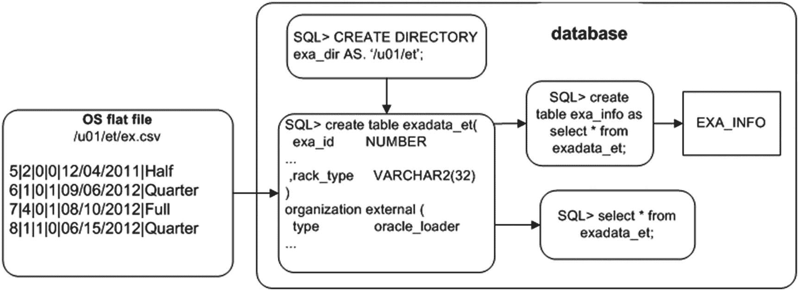
图 14-1：用于读取平面文件的外部表格的架构组件

以下是使用外部表格访问操作系统平面文件的步骤：

1.  创建一个指向 CSV 文件位置的数据库目录对象。
2.  向创建外部表格的用户授予对该目录对象的读写权限。（尽管使用具有 DBA 权限的账户更容易，但根据各种安全选项，该账户可能无法访问表和数据。需要验证并授予权限。）
3.  运行 `CREATE TABLE...ORGANIZATION EXTERNAL` 语句。
4.  使用 `SQL*Plus` 访问 CSV 文件的内容。

在此示例中，平面文件名为 `ex.csv`，位于 `/u01/et` 目录。它包含以下数据：

```
5|2|0|0|12/04/2011|Half
6|1|0|1|09/06/2012|Quarter
7|4|0|1|08/10/2012|Full
8|1|1|0|06/15/2012|Quarter
```

> **注意**
> 本章中的一些分隔符文件示例使用逗号以外的字符分隔，例如管道符（`|`）。使用的字符取决于数据和平面文件的提供者。逗号并不总是有用的分隔符，因为要加载的数据可能包含作为数据内有效字符的逗号。也可以使用固定字段长度而不是分隔符。

#### 创建目录对象并授予权限

首先，创建一个指向磁盘上平面文件位置的目录对象：

```
SQL> create directory exa_dir as '/u01/et';
```

此示例使用了一个授予了 DBA 角色的数据库账户；因此，你不需要向访问目录对象的用户（你的账户）授予对该目录对象的 `READ` 和 `WRITE` 权限。如果你不是使用 DBA 账户从目录对象读取，则使用此对象向该账户授予权限：

```
SQL> grant read, write on directory exa_dir to reg_user;
```

#### 创建外部表格

然后，构建创建外部表格的脚本，该表格将引用平面文件。`CREATE TABLE...ORGANIZATION EXTERNAL` 语句向数据库提供以下信息：

*   如何解释平面文件中的数据以及文件数据到数据库列定义的映射
*   一个 `DEFAULT DIRECTORY` 子句，用于标识目录对象，该对象进而指定磁盘上平面文件的目录
*   一个 `LOCATION` 子句，用于标识平面文件的名称

下一条语句创建一个数据库对象，它看起来像一个表，但能够直接从平面文件中检索数据：

```
SQL> create table exadata_et(
exa_id        NUMBER
,machine_count NUMBER
,hide_flag     NUMBER
,oracle        NUMBER
,ship_date     DATE
,rack_type     VARCHAR2(32)
)
organization external (
type              oracle_loader
default directory exa_dir
access parameters
(
records delimited  by newline
fields  terminated by '|'
missing field values are null
(exa_id
,machine_count
,hide_flag
,oracle
,ship_date char date_format date mask "mm/dd/yyyy"
,rack_type)
)
location ('ex.csv')
)
reject limit unlimited;
```

执行此脚本后，会创建一个名为 `EXADATA_ET` 的外部表格。现在，使用 `SQL*Plus` 查看平面文件的内容：

```
SQL> select * from exadata_et;
EXA_ID MACHINE_COUNT  HIDE_FLAG     ORACLE SHIP_DATE  RACK_TYPE
---------- ------------- ---------- ---------- ---------- ----------------
5             2          0          0 04-DEC-11  Half
6             1          0          1 06-SEP-12  Quarter
7             4          0          1 10-AUG-12  Full
8             1          1          0 15-JUN-12  Quarter
```

### 生成用于创建外部表格的 SQL

如果你当前正在使用 `SQL*Loader` 并希望转为使用外部表格，你可以使用 `SQL*Loader` 的 `EXTERNAL_TABLE` 选项来生成创建外部表格所需的 SQL。一个小例子将有助于演示此过程。假设你有以下表 DDL：

```
SQL> create table books
(book_id number,
book_desc varchar2(30));
```


在此情况下，您需要将 CSV 文件中的以下数据加载到 `BOOKS` 表中。数据位于名为 `books.dat` 的文件中，内容如下：

```
1|RMAN Recipes
2|Linux for DBAs
3|SQL Recipes
```

您还有一个 `books.ctl` SQL*Loader 控制文件，其中包含以下数据：

```
load data
INFILE 'books.dat'
INTO TABLE books
APPEND
FIELDS TERMINATED BY '|'
(book_id,
book_desc)
```

## 使用 SQL\*Loader 生成外部表

您可以使用带有 `EXTERNAL_TABLE=GENERATE_ONLY` 子句的 SQL*Loader 来生成创建外部表所需的 SQL；例如：

```
$ sqlldr dk/f00 control=books.ctl log=books.log external_table=generate_only
```

前面这行代码不会加载任何数据。相反，它会创建一个名为 `books.log` 的文件，其中包含创建外部表所需的 SQL。以下是生成代码的部分列表：

```
CREATE TABLE "SYS_SQLLDR_X_EXT_BOOKS"
(
"BOOK_ID" NUMBER,
"BOOK_DESC" VARCHAR2(30)
)
ORGANIZATION external
(
TYPE oracle_loader
DEFAULT DIRECTORY SYS_SQLLDR_XT_TMPDIR_00000
ACCESS PARAMETERS
(
RECORDS DELIMITED BY NEWLINE CHARACTERSET US7ASCII
BADFILE 'SYS_SQLLDR_XT_TMPDIR_00000':'books.bad'
LOGFILE 'books.log_xt'
READSIZE 1048576
FIELDS TERMINATED BY "|" LDRTRIM
REJECT ROWS WITH ALL NULL FIELDS
(
"BOOK_ID" CHAR(255)
TERMINATED BY "|",
"BOOK_DESC" CHAR(255)
TERMINATED BY "|"
)
)
location
(
'books.dat'
)
)REJECT LIMIT UNLIMITED;
```

### 创建目录并查询外部表

在运行上述代码之前，请先创建一个指向 `books.dat` 文件位置的目录；例如：

```
SQL> create or replace directory SYS_SQLLDR_XT_TMPDIR_00000
as '/u01/sqlldr';
```

现在，如果您运行由 SQL*Loader 生成的 SQL 代码，您应该能够查看 `SYS_SQLLDR_X_EXT_BOOKS` 表中的数据：

```
SQL> select * from SYS_SQLLDR_X_EXT_BOOKS;
```

预期输出如下：

```
BOOK_ID BOOK_DESC
---------- ------------------------------
1 RMAN Recipes
2 Linux for DBAs
3 SQL Recipes
```

这是一项强大的技术，特别是当您已经拥有现有的 SQL*Loader 控制文件并希望确保在转换为外部表时语法正确时。

### 查看外部表元数据

此时，您还可以查看有关外部表的元数据。查询 `DBA_EXTERNAL_TABLES` 视图获取详细信息：

```
SQL> select
owner
,table_name
,default_directory_name
,access_parameters
from dba_external_tables;
```

以下是输出的部分列表：

```
OWNER      TABLE_NAME      DEFAULT_DIRECTORY_NA ACCESS_PARAMETERS
---------- --------------- -------------------- --------------------
SYS        EXADATA_ET      EXA_DIR              records delimited ...
```

此外，您可以从 `DBA_EXTERNAL_LOCATIONS` 表中选择，以获取有关外部表中引用的任何平面文件的信息：

```
SQL> select
owner
,table_name
,location
from dba_external_locations;
```

以下是一些示例输出：

```
OWNER      TABLE_NAME      LOCATION
---------- --------------- --------------------
SYS        EXADATA_ET      ex.csv
```

### 从外部表加载常规表

现在，您可以将外部表中包含的数据加载到常规数据库表中。执行此操作时，您可以利用 Oracle 的直接路径加载和并行功能。此示例创建一个将从外部表加载数据的常规数据库表：

```
SQL> create table exa_info(
exa_id        NUMBER
,machine_count NUMBER
,hide_flag     NUMBER
,oracle        NUMBER
,ship_date     DATE
,rack_type     VARCHAR2(32)
) nologging parallel 2;
```

您可以通过直接路径加载（使用 `APPEND` 提示）将这个常规表从外部表的内容加载，如下所示：

```
SQL> insert /*+ APPEND */ into exa_info select * from exadata_et;
```

您可以通过在提交数据之前尝试从表中查询来验证表是否已通过直接路径加载：

```
SQL> select * from exa_info;
```

预期错误如下：

```
ORA-12838: cannot read/modify an object after modifying it in parallel
```

提交数据后，您就可以从表中查询了。


## 注意

使用外部表读写数据时可能会出现转换错误。数字到日期或字符字段的转换通常应能被自动识别，但当遇到此类错误时，可以在语句中显式创建转换。如果无法进行隐式转换，使用 `TO_NUMBER`、`TO_DATE` 和 `TO_CHAR` 将有助于避免这些问题。

另一种实现表直接路径加载的方法是使用 `CREATE TABLE AS SELECT`（CTAS）语句。CTAS 语句会自动尝试执行直接路径加载。在此示例中，`EXA_INFO` 表在一条语句中完成创建与加载：

```sql
SQL> create table exa_info nologging parallel 2 as select * from exadata_et;
```

通过使用直接路径加载和并行处理，你可以获得与 SQL*Loader 相似的加载性能。使用 SQL 从外部表创建表的优势在于，在构建常规数据库表（此例中为 `EXA_INFO`）时，你可以利用标准 SQL*Plus 功能执行复杂的数据转换。

任何 CTAS 语句都会自动按照为底层表定义的并行度进行处理。但是，当使用 `INSERT AS SELECT` 语句时，你需要为会话启用并行处理：

```sql
SQL> alter session enable parallel dml;
```

作为最后一步，你应该为已加载大量数据的任何表生成统计信息。以下是一个示例：

```sql
SQL> exec dbms_stats.gather_table_stats(-
ownname=>'SYS',-
tabname=>'EXA_INFO',-
estimate_percent => 20, -
cascade=>true);
```

## 执行高级转换

Oracle 提供了用于数据转换的复杂技术。本节详细说明如何使用管道函数来转换外部表中的数据。以下是执行此操作的步骤：

1.  创建一个外部表。
2.  创建一个记录类型，该类型映射到外部表中的列。
3.  基于步骤 2 中创建的记录类型，创建一个表。
4.  创建一个管道函数，用于在加载时检查每一行，并根据业务需求转换数据。
5.  使用 `INSERT` 语句，该语句从外部表中选择数据，并使用管道函数在数据加载时进行转换。

此示例使用本章前文“将 CSV 文件加载到数据库”一节中创建的相同外部表和 CSV 文件。回顾一下，外部表名是 `EXADATA_ET`，CSV 文件名是 `ex.csv`。创建外部表后，接着创建一个映射到外部表列名的记录类型：

```sql
SQL> create or replace type rec_exa_type is object
(
exa_id        number
,machine_count number
,hide_flag     number
,oracle_flag   number
,ship_date     date
,rack_type     varchar2(32)
);
```

接下来，基于前面的记录类型创建一个表：

```sql
SQL> create or replace type table_exa_type is table of rec_exa_type;
```

Oracle PL/SQL 允许你将函数用作 SQL 操作的行源。此功能称为管道化（pipelining）。它让你能够结合 SQL*Plus 的强大功能，使用复杂的转换逻辑。在此示例中，你创建一个管道函数，以在加载时转换选定的列数据。具体而言，该函数为 `ORACLE_FLAG` 列随机生成一个数字：

```sql
SQL> create or replace function exa_trans
return table_exa_type pipelined is
begin
for r1 in
(select rec_exa_type(
exa_id, machine_count, hide_flag
,oracle_flag, ship_date, rack_type
) exa_rec
from exadata_et) loop
if (r1.exa_rec.hide_flag = 1) then
r1.exa_rec.oracle_flag := dbms_random.value(low => 1, high => 100);
end if;
pipe row (r1.exa_rec);
end loop;
return;
end;
/
```

现在，你可以使用此函数将数据加载到常规数据库表中。供参考的是，下面是用于实例化待加载表的 `CREATE TABLE` 语句：


## 使用管道函数转换和加载数据

创建示例表 `exa_info`：

```sql
SQL> create table exa_info(
exa_id        NUMBER
,machine_count NUMBER
,hide_flag     NUMBER
,oracle_flag   NUMBER
,ship_date     DATE
,rack_type     VARCHAR2(32)
) nologging parallel 2;
```

接下来，使用管道函数一步完成从外部表选择数据、转换并插入到常规数据库表的操作：

```sql
SQL> insert into exa_info select * from table(exa_trans);
```

以下是本示例中加载到 `EXA_INFO` 表的数据：

```sql
SQL> select * from exa_info;
```

部分示例输出如下，显示了 `ORACLE_FLAG` 列为随机值的行：

```
EXA_ID MACHINE_COUNT  HIDE_FLAG    ORACLE_FLAG   SHIP_DATE   RACK_TYPE
---------- ------------- ---------- ---------------- ----------  ---------
5             2          1             32   03-JAN-17        Half
6             1          0              0   06-SEP-17     Quarter
7             4          0              0   10-AUG-17        Full
8             1          1             58   15-JUL-17     Quarter
```

尽管本节的示例很简单，但你可以使用此技术应用任何级别的转换逻辑。该技术允许你将转换需求嵌入到一个管道式 PL/SQL 函数中，在加载每一行时修改数据。

### 从 SQL 查看文本文件

外部表允许你使用 SQL `SELECT` 语句从操作系统平面文件中检索信息。例如，假设你想要报告警报日志文件的内容。首先，创建一个指向警报日志位置的目录对象：

```sql
SQL> select value from v$diag_info where name = 'Diag Trace';
```

本示例的输出为：

```
/ora01/app/oracle/diag/rdbms/o18c/o18c/trace
```

接下来，创建一个指向诊断跟踪目录的目录对象：

```sql
SQL> create directory t_loc as '/ora01/app/oracle/diag/rdbms/o18c/o18c/trace';
```

现在，创建一个映射到数据库警报日志操作系统文件的外部表。在此示例中，数据库名为 `o18c`，因此警报日志文件名为 `alert_o18c.log`：

```sql
SQL> create table alert_log_file(
alert_text varchar2(4000))
organization external
( type              oracle_loader
default directory t_loc
access parameters (
records delimited by newline
nobadfile
nologfile
nodiscardfile
fields terminated by '#$~=ui$X'
missing field values are null
(alert_text)
)
location ('alert_o18c.log')
)
reject limit unlimited;
```

你可以通过 SQL 查询该表，例如：

```sql
SQL> select * from alert_log_file where alert_text like 'ORA-%';
```

这使得你可以使用 SQL 查看和报告警报日志的内容。你可能会发现这是为原本无法访问的操作系统文件提供 SQL 访问的一种便捷方式。

外部表的 `ORACLE_LOADER` 访问驱动程序的 `ACCESS PARAMETERS` 子句，如果你之前使用过 SQL*Loader，可能会觉得很熟悉。下表描述了一些更常用的访问参数。有关访问参数的完整列表，请参阅 *Oracle Database Utilities Guide*，该指南可从 Oracle 网站的技术网络区域（ [`http://otn.oracle.com`](http://otn.oracle.com) ）免费下载。

#### ORACLE_LOADER 驱动程序的部分访问参数

| 访问参数 | 描述 |
| :--- | :--- |
| `DELIMITED BY` | 指定哪个字符是字段的分隔符 |
| `TERMINATED BY` | 指定字段如何终止 |
| `FIXED` | 指定具有固定长度的记录的大小 |
| `BADFILE` | 存储因错误而无法加载的记录的文件名 |
| `NOBADFILE` | 指定不应创建用于保存因错误而无法加载的记录的文件 |
| `LOGFILE` | 创建外部表时记录常规消息的文件名 |
| `NOLOGFILE` | 指定不应创建日志文件 |
| `DISCARDFILE` | 指定写入未通过 `LOAD WHEN` 子句的记录的文件名 |


## 使用外部表卸载和加载数据

外部表也可用于从常规数据库表中选择数据并创建二进制转储文件。这被称为卸载数据。该技术的优点在于，转储文件是平台独立的，可用于在不同平台的服务器之间移动大量数据。

在创建转储文件时，您还可以对数据进行加密或压缩，或同时进行加密和压缩。这样做为您提供了在数据库服务器之间传输数据库的一种高效且安全的方式。

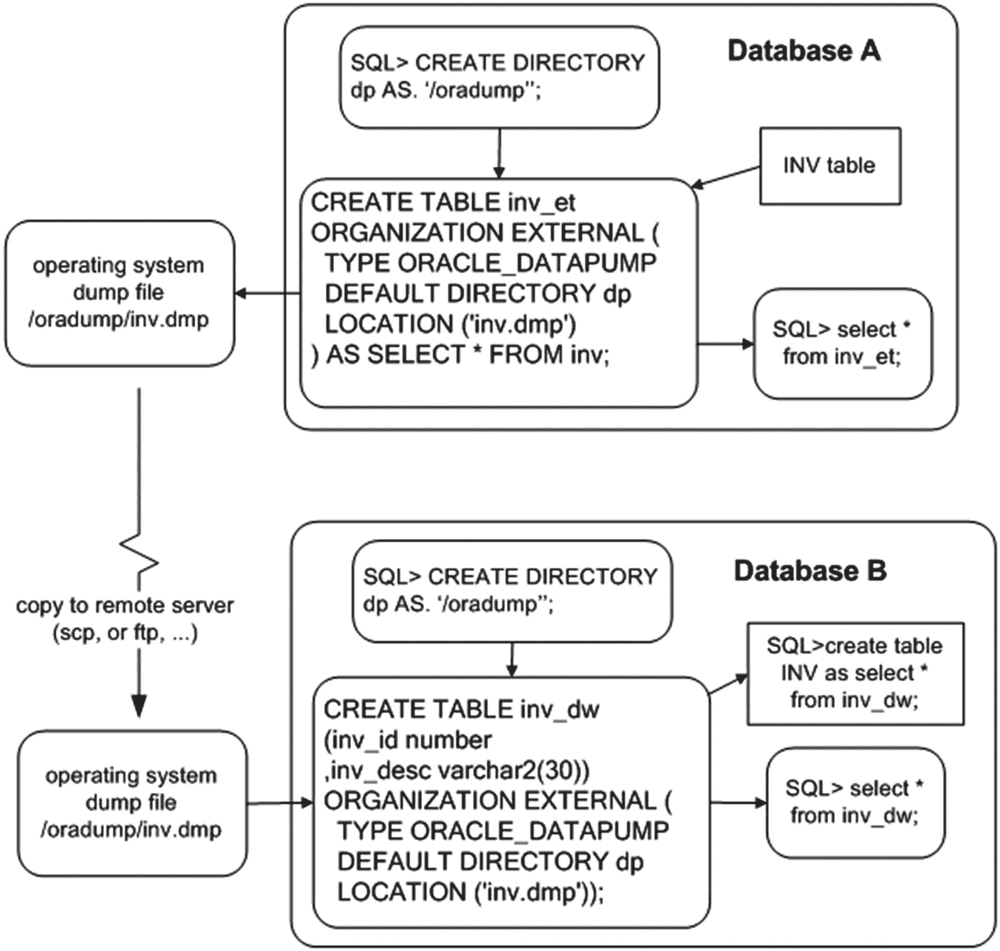

**图 14-2** 使用外部表卸载和加载数据

一个小例子说明了使用外部表卸载数据的技术。以下是所需的步骤：

1.  创建一个目录对象，指定您希望在磁盘上放置转储文件的位置。如果您不是使用 DBA 帐户，则需要将对该目录对象的读写访问权限授予需要访问的数据库用户。
2.  使用 `CREATE TABLE...ORGANIZATION EXTERNAL...AS SELECT` 语句将数据从数据库卸载到转储文件中。

首先，创建一个目录对象。接下来的代码创建了一个名为 `DP` 的目录对象，它指向 `/oradump` 目录：

```sql
SQL> create directory dp as '/oradump';
```

如果您使用的用户没有 DBA 权限，则需要显式地将目录对象的访问权限授予所需的用户：

```sql
SQL> grant read, write on directory dp to larry;
```

这个示例依赖于一个名为 `INV` 的表；作为参考，这里是 `INV` 表的 DDL：

```sql
SQL> CREATE TABLE inv
(inv_id NUMBER,
inv_desc VARCHAR2(30));
```

要创建转储文件，请使用 `CREATE TABLE...ORGANIZATION EXTERNAL` 语句的 `ORACLE_DATAPUMP` 访问驱动程序。此示例将 `INV` 表的内容卸载到 `inv.dmp` 文件中：

```sql
SQL> CREATE TABLE inv_et
ORGANIZATION EXTERNAL (
TYPE ORACLE_DATAPUMP
DEFAULT DIRECTORY dp
LOCATION ('inv.dmp')
)
AS SELECT * FROM inv;
```

前面的命令创建了两个东西：

*   一个名为 `INV_ET` 的外部表，其结构和数据基于 `INV` 表
*   一个名为 `inv.dmp` 的平台独立转储文件

现在，您可以将 `inv.dmp` 文件复制到另一个数据库服务器，并基于此转储文件创建一个外部表。远程服务器（您将转储文件复制到的服务器）可以是与创建文件时不同的平台。例如，您可以在 Windows 机器上创建转储文件，复制到 Unix/Linux 服务器，然后通过外部表从该转储文件中选择数据。在此示例中，外部表名为 `INV_DW`：

```sql
SQL> CREATE TABLE inv_dw
(inv_id number
,inv_desc varchar2(30))
ORGANIZATION EXTERNAL (
TYPE ORACLE_DATAPUMP
DEFAULT DIRECTORY dp
LOCATION ('inv.dmp')
);
```

创建后，您可以从 SQL*Plus 访问外部表数据：

```sql
SQL> select * from inv_dw;
```

您也可以使用转储文件创建常规表并将数据加载到其中：

```sql
SQL> create table inv as select * from inv_dw;
```

这为从一个平台传输数据到另一个平台提供了一种简单高效的机制。

### 启用并行性以减少耗时

为了在通过外部表创建转储文件时最大化卸载性能，请使用 `PARALLEL` 子句。此示例并行创建两个转储文件：

```sql
SQL> CREATE TABLE inv_et
ORGANIZATION EXTERNAL (
TYPE ORACLE_DATAPUMP
DEFAULT DIRECTORY dp
LOCATION ('inv1.dmp','inv2.dmp')
)
PARALLEL 2
AS SELECT * FROM inv;
```

要访问转储文件中的数据，请创建一个引用这两个转储文件的不同外部表：

```sql
SQL> CREATE TABLE inv_dw
(inv_id number
,inv_desc varchar2(30))
ORGANIZATION EXTERNAL (
TYPE ORACLE_DATAPUMP
DEFAULT DIRECTORY dp
LOCATION ('inv1.dmp','inv2.dmp')
);
```

您现在可以使用此外部表从转储文件中选择数据：

```sql
SQL> select * from inv_dw;
```

### 压缩转储文件

您可以通过外部表创建压缩的转储文件。例如，使用 `ACCESS PARAMETERS` 子句的 `COMPRESS` 选项：

```sql
SQL> CREATE TABLE inv_et
ORGANIZATION EXTERNAL (
TYPE ORACLE_DATAPUMP
DEFAULT DIRECTORY dp
ACCESS PARAMETERS (COMPRESSION ENABLED BASIC)
LOCATION ('inv1.dmp')
)
AS SELECT * FROM inv;
```

使用此选项时，您应该会看到相当不错的压缩比。在我的测试中，压缩后的输出转储文件缩小了 10 到 20 倍。您的结果可能会有所不同，这取决于被压缩的数据类型。
从 Oracle Database 12c 开始，有四个压缩级别：`BASIC`、`LOW`、`MEDIUM` 和 `HIGH`。在使用压缩之前，请确保 `COMPATIBLE` 初始化参数设置为 12.0.0 或更高。

> **注意**
> 使用压缩需要 Oracle 企业版以及高级压缩选项。

### 加密转储文件

您还可以使用外部表创建加密的转储文件。此示例使用 `ACCESS PARAMETERS` 子句的 `ENCRYPTION` 选项：

```sql
SQL> CREATE TABLE inv_et
ORGANIZATION EXTERNAL (
TYPE ORACLE_DATAPUMP
DEFAULT DIRECTORY dp
ACCESS PARAMETERS
(ENCRYPTION ENABLED)
LOCATION ('inv1.dmp')
)
AS SELECT * FROM inv;
```

要使此示例正常工作，您的数据库需要有一个已启用且打开的安全钱包。

> **注意**
> 使用加密需要 Oracle 企业版以及高级安全选项。

#### 启用 Oracle 钱包

Oracle 钱包是 Oracle 用于实现加密的机制。钱包是一个包含加密密钥的操作系统文件。启用钱包的步骤如下：

1.  修改 `SQLNET.ORA` 文件以包含钱包的位置：

```sql
ENCRYPTION_WALLET_LOCATION=
(SOURCE=(METHOD=FILE) (METHOD_DATA=
(DIRECTORY=/ora01/app/oracle/product/12.1.0.1/db_1/network/admin)))
```

2.  使用 `ALTER SYSTEM` 命令创建钱包文件 (`ewallet.p12`)：

```sql
SQL> alter system set encryption key identified by foo;
```

3.  启用加密：

```sql
SQL> alter system set encryption wallet open identified by foo;
```

有关实施加密的完整详细信息，请参阅《Oracle 高级安全管理员指南》，该指南可从 Oracle 网站的技术网络区域免费下载（[`http://otn.oracle.com`](http://otn.oracle.com)）。

### 表 14-2：`ORACLE_DATAPUMP` 访问驱动程序的参数

| 访问参数 | 描述 |
| --- | --- |
| `COMPRESSION` | 压缩转储文件；默认值为 `DISABLED`。 |
| `ENCRYPTION` | 加密转储文件；默认值为 `DISABLED`。 |
| `NOLOGFILE` | 禁止生成日志文件 |
| `LOGFILE=[目录对象:]日志文件名` | 允许您指定日志文件名 |
| `VERSION` | 指定可以读取转储文件的 Oracle 最低版本 |


## 从外部表进行内联 SQL 查询

从 Oracle 18c 开始，通过使用 `EXTERNAL`，可以直接从文件中进行选择，而无需在数据字典中实际创建外部表。这使得外部数据可以成为子查询、虚拟视图或其他转换类型过程的一部分。以下是其工作原理的示例：

`SELECT` 列名 `FROM` `EXTERNAL` ((列定义) `TYPE` [访问驱动程序类型] 外部表属性 [`REJECT LIMIT` 子句])

```sql
SQL> SELECT first_name, last_name, hiredate, department_name from EXTERNAL(
(first_name varchare2(50),
last_name   varchar2(50),
hiredate           date,
department_name    varchar2(50))
TYPE ORACLE_LOADER
DEFAULT DIRECTORY EXT_DATA
ACCESS PARAMETERS (
RECORDS DELIMITED BY NEWLINE nobadfile, nologfile
fields date_format date mask "mm/dd/yy")
LOCATION ('empbydep.csv') REJECT LIMIT UNLIMITED) empbydep_external
where department='HR';
```

`empbydep_external` 表并未被实际创建为外部表，但此数据可供查询，并可指定其中任何列，或通过 `WHERE` 子句使用不同的筛选条件。这对于 json 格式同样可行，对于访问以 json 格式提供的数据 API 非常有用。此方式不会将数据加载到表中，但可以查询并使用多种不同方法，用于视图、通过 API 获取的参考数据，以及在数据集成中补全数据集。以下是 json 文件的示例：

```sql
SQL> select * from external ((json_document CLOB)
TYPE ORACLE_LOADER
DEFAULT DIRECTORY EXT_DATA
ACCESS PARAMETERS (
RECORDS DELIMITED BY 0x'0A' FIELDS (json_document CHAR(5000)) )
location ('empbydep.json') REJECT LIMIT UNLIMITED) json_tab;
```

## 总结

SQL*Loader 是适用于所有类型数据加载任务的实用工具，而外部表则对于加载或查询数据过程中的数据转换非常有用。几乎所有可以使用 SQL*Loader 完成的任务，都可以通过外部表实现。外部表方法的优势在于其组件更少，并且其接口是 SQL*Plus。大多数 DBA 和开发者都觉得 SQL*Plus 比 SQL*Loader 控制文件更容易使用。

您可以轻松地使用外部表来实现 SQL*Plus 对操作系统平面文件的访问。只需在您的 `CREATE TABLE...ORGANIZATION EXTERNAL` 语句中定义平面文件的结构即可。创建外部表后，您可以直接从平面文件进行选择，就像它是一个数据库表一样。您可以从外部表中查询数据，但不能执行插入、更新或删除操作。

当您创建外部表后，如果需要，可以通过 `CREATE TABLE AS SELECT` 从外部表创建常规数据库表，或者基于外部表创建视图供其他查询使用。这样可以提供一种快速有效地加载存储在外部操作系统文件中的数据的方法。

外部表功能还允许您从表中选择数据并将其写入二进制转储文件。外部表 `CREATE TABLE...ORGANIZATION EXTERNAL` 语句定义了用于卸载数据的表和列。以此方式创建的转储文件是平台无关的，这意味着您可以将其复制到使用不同操作系统的服务器上并无缝加载数据。此外，为了安全和高效的传输，转储文件可以进行加密和压缩。您还可以使用并行功能来减少创建转储文件所需的时间。

外部表设计还允许您直接从文件中查询数据。这对于 json 格式也非常有用，因为许多数据 API 可能都采用此格式。对数据进行筛选或简化加载到其他表中的方式，对于数据集成和 ETL 过程极为有用。

下一章将介绍物化视图。这些数据库对象为您提供了一种灵活、可维护且可扩展的机制，用于聚合和复制数据。

### 15. 物化视图

## 物化视图技术介绍

物化视图技术最初在 Oracle 数据库第 7 版中引入。该功能最初被称为快照，您仍然可以在一些数据字典结构中看到这个命名。物化视图允许您在某个时间点执行 SQL 查询，并将结果集存储在一个表中（可以在本地或远程数据库中）。在物化视图被初始填充后，您可以重新运行物化视图查询，并将最新结果存储在底层表中。物化视图主要有三个用途：

*   将数据复制到单独的报表数据库，以分流查询工作负载。
*   通过定期计算和存储复杂数据聚合的结果来提高查询性能，从而使用户能够查询（复杂聚合的）时间点结果。
*   如果查询重写没有发生，则阻止查询执行。

物化视图可以基于表、视图和其他物化视图来创建。基础表通常被称为主表。当您创建物化视图时，Oracle 会在内部创建一个表（与物化视图同名）以及一个物化视图对象（可在 `DBA/ALL/USER_OBJECTS` 中查看）。

### 理解物化视图

> 注意
> 本章大部分示例将以 `SALES` 表为基础。

介绍物化视图的一个好方法是，设想如果物化视图功能不可用，您将如何手动完成一项任务。假设您有一个存储销售数据的表：

```
SQL> create table sales(
sales_id  number
,sales_amt number
,region_id number
,sales_dtt date
,constraint sales_pk primary key(sales_id));
--
SQL> insert into sales values(1,101,10,sysdate-10);
SQL> insert into sales values(2,511,20,sysdate-20);
SQL> insert into sales values(3,11,30,sysdate-30);
SQL> commit;
```

并且，您有一个查询用于报告历史每日销售情况：

```
SQL> select
sum(sales_amt) sales_amt
,sales_dtt
from sales
group by sales_dtt;
```

您从数据库性能报告中观察到，这个查询每天被执行数千次，并且消耗了大量的数据库资源。业务用户使用该报告来显示历史销售信息，因此不需要在每次运行报告时都重新执行该查询。为了减少查询消耗的资源量，您决定创建一个表并按如下方式填充：

```
SQL> create table sales_daily as
select
sum(sales_amt) sales_amt
,sales_dtt
from sales
group by sales_dtt;
```

表创建后，您设置一个日常进程来删除并完全刷新其中的数据：

```
-- 步骤 1：删除每日汇总的销售数据：
SQL> delete from sales_daily;
--
-- 步骤 2：用聚合销售表的快照重新填充表：
SQL> insert into sales_daily
select
sum(sales_amt) sales_amt
,sales_dtt
from sales
group by sales_dtt;
```

您告知用户，他们可以通过从 `SALES_DAILY` 中选择（而不是运行直接从主 `SALES` 表中选择和聚合的查询）来获得亚秒级的查询结果：

```
SQL> select * from sales_daily;
```

上述步骤大致描述了一个物化视图完全刷新的过程。Oracle 的物化视图技术自动化并极大地增强了这一过程。本章涵盖了实现基本和复杂物化视图功能的流程。阅读本章并完成示例后，您应该能够在各种情况下创建物化视图以复制和聚合数据。

在深入探讨创建物化视图的细节之前，先介绍一些基本术语和有用的物化视图相关数据字典视图是有益的。接下来的两个小节简要描述了各种物化视图特性以及包含物化视图元数据的众多数据字典视图。

> 注意
> 本章不涵盖多主复制和可更新物化视图等主题。有关这些主题的更多详细信息，请参阅《Oracle 高级复制指南》，该指南可从 Oracle 网站的技术网络区域（ [`http://otn.oracle.com`](http://otn.oracle.com) ）下载。

### 物化视图术语


## 物化视图术语与数据字典视图

与物化视图刷新相关的术语非常多。在深入了解如何实现这些功能之前，你应该熟悉这些术语。表 15-1 定义了与物化视图相关的各种术语。

### 表 15-1：物化视图术语

| 术语 | 含义 |
| --- | --- |
| 物化视图 | 用于复制数据和提升查询性能的数据库对象 |
| 物化视图 SQL 语句 | 定义存储在底层物化视图基表中数据的 SQL 查询 |
| 物化视图基表 | 与物化视图同名并存储物化视图 SQL 查询结果的数据库表 |
| 主表 | 物化视图在其 SQL 语句的 `FROM` 子句中引用的表 |
| 完全刷新 | 删除物化视图并使用物化视图 SQL 语句完全重新填充的过程 |
| 快速刷新 | 仅将自上次刷新以来对基表发生的 DML 更改应用到物化视图的过程 |
| 物化视图日志 | 跟踪对物化视图基表 DML 更改的数据库对象。快速刷新需要物化视图日志。它可基于主键、`ROWID` 或对象 ID。 |
| 简单物化视图 | 基于可以快速刷新的简单查询的物化视图 |
| 复杂物化视图 | 基于不符合快速刷新条件的复杂查询的物化视图 |
| 构建模式 | 指定物化视图应立即填充还是延迟填充的模式 |
| 刷新模式 | 指定物化视图应按需刷新、提交时刷新还是从不刷新的模式 |
| 刷新方法 | 指定物化视图刷新应采用完全刷新还是快速刷新的选项 |
| 查询重写 | 允许优化器选择使用物化视图（而不是基表）来满足查询需求的功能（即使查询未直接引用这些物化视图） |
| 本地物化视图 | 与基表位于同一数据库中的物化视图 |
| 远程物化视图 | 位于与基表不同数据库中的物化视图 |
| 刷新组 | 在同一个一致的事务点刷新的一组物化视图 |

在阅读本章其余部分时，请参考表 15-1。这些术语和概念将在后续章节中得到解释和阐述。

### 引用有用的视图

当你处理物化视图时，有时很难记住在特定情况下应查询哪个数据字典视图。有大量可用的数据字典视图。表 15-2 包含了与物化视图相关的数据字典视图的描述。本章在适当的地方展示了使用这些视图的示例。这些视图对于故障排除、诊断问题和理解物化视图环境非常宝贵。

### 表 15-2：物化视图数据字典视图定义

| 数据字典视图 | 含义 |
| --- | --- |
| `DBA/ALL/USER_MVIEWS` | 关于物化视图的信息，例如所有者、基查询、上次刷新时间等 |
| `DBA/ALL/USER_MVIEW_REFRESH_TIMES` | 物化视图上次刷新时间、物化视图名称、主表和主所有者 |
| `DBA/ALL/USER_REGISTERED_MVIEWS` | 所有已注册的物化视图；有助于识别哪些物化视图正在使用哪些物化视图日志 |
| `DBA/ALL/USER_MVIEW_LOGS` | 物化视图日志信息 |
| `DBA/ALL/USER_BASE_TABLE_MVIEWS` | 具有物化视图日志的表的基表名称和上次刷新日期 |
| `DBA/ALL/USER_MVIEW_AGGREGATES` | 出现在物化视图 `SELECT` 子句中的聚合函数 |
| `DBA/ALL/USER_MVIEW_ANALYSIS` | 关于物化视图的信息。Oracle 建议你使用 `DBA/ALL/USER_MVIEWS` 而不是这些视图。 |
| `DBA/ALL/USER_MVIEW_COMMENTS` | 与物化视图关联的任何注释 |
| `DBA/ALL/USER_MVIEW_DETAIL_PARTITION` | 分区和新鲜度信息 |
| `DBA/ALL/USER_MVIEW_DETAIL_SUBPARTITION` | 子分区和新鲜度信息 |
| `DBA/ALL/USER_MVIEW_DETAIL_RELATIONS` | 物化视图所依赖的本地表和物化视图 |
| `DBA/ALL/USER_MVIEW_JOINS` | 物化视图定义 `WHERE` 子句中两个列之间的连接 |


## 创建基本物化视图

`DBA/ALL/USER_MVIEW_KEYS` | 物化视图（MV）定义的 `SELECT` 子句中的列或表达式 |
`DBA/ALL/USER_TUNE_MVIEW` | 执行 `DBMS_ADVISOR.TUNE_MVIEW` 过程的结果 |
`V$MVREFRESH` | 当前正在刷新的物化视图的信息 |
`DBA/ALL/USER_REFRESH` | 关于物化视图刷新组的详细信息 |
`DBA_RGROUP` | 关于物化视图刷新组的信息 |
`DBA_RCHILD` | 物化视图刷新组中的子项 |

本节介绍如何创建物化视图（MV）。两种最常用的配置如下：

*   创建完全刷新的物化视图，并按需刷新
*   创建快速刷新的物化视图，并按需刷新

理解这些基本配置非常重要，它们为你使用物化视图功能奠定了基础。因此，本节从这些基本配置开始，后续将介绍更高级的配置。

### 创建完全可刷新的物化视图

本节解释如何设置一个定期完全刷新的物化视图，这可能是最简单的例子。对于基础表中在一次刷新间隔内有显著部分行发生变化的物化视图，完全刷新是合适的。在某些情况下，由于 Oracle 施加的限制，快速刷新无法进行，此时也需要完全刷新（本节稍后将详细介绍；另请参阅本章后面的“从 SQL *Plus 手动刷新物化视图”一节）。

> **注意**
> 要创建物化视图，你需要同时拥有 `CREATE MATERIALIZED VIEW` 系统特权和 `CREATE TABLE` 系统特权。如果创建物化视图的用户不拥有基础表，那么还需要对基础表的 `SELECT` 访问权限才能执行 `ON COMMIT REFRESH`（提交时刷新）。

本节的物化视图示例基于之前创建的 `SALES` 表。假设你想创建一个报告每日销售情况的物化视图。使用 `CREATE MATERIALIZED VIEW...AS SELECT` 语句来完成此操作。以下语句命名了物化视图，指定了其属性，并定义了物化视图所基于的 SQL 查询：

```sql
SQL> create materialized view sales_daily_mv
segment creation immediate
refresh
complete
on demand
as
select
sum(sales_amt) sales_amt
,trunc(sales_dtt) sales_dtt
from sales
group by trunc(sales_dtt);
```

`SEGMENT CREATION IMMEDIATE` 子句在 Oracle 11g Release 2 及更高版本中可用。此子句指示 Oracle 在创建物化视图时创建段并分配区。这是 Oracle 以前版本的行为。如果你不希望立即创建段，请使用 `SEGMENT CREATION DEFERRED` 子句。如果新创建的物化视图包含任何行，那么无论是否使用 `SEGMENT CREATION DEFERRED`，都会创建段并分配区。

让我们查看 `USER_MVIEWS` 数据字典视图，以验证物化视图是否按预期创建。运行此查询：

```sql
SQL> select mview_name, refresh_method, refresh_mode
,build_mode, fast_refreshable
from user_mviews
where mview_name = 'SALES_DAILY_MV';
```

此物化视图的输出如下：

```
MVIEW_NAME      REFRESH_ REFRES BUILD_MOD FAST_REFRESHABLE
--------------- -------- ------ --------- ------------------
SALES_DAILY_MV  COMPLETE DEMAND IMMEDIATE DIRLOAD_LIMITEDDML
```

检查 `USER_OBJECTS` 和 `USER_SEGMENTS` 视图以查看已创建的内容也很有帮助。当你查询 `USER_OBJECTS` 时，请注意已创建了一个物化视图对象和一个表对象：

```sql
SQL> select object_name, object_type
from user_objects
where object_name like 'SALES_DAILY_MV'
order by object_name;
```

相应的输出如下：

```
OBJECT_NAME          OBJECT_TYPE
-------------------- -----------------------
SALES_DAILY_MV       MATERIALIZED VIEW
SALES_DAILY_MV       TABLE
```

物化视图是一个逻辑容器，它将数据存储在常规数据库表中。查询 `USER_SEGMENTS` 视图可以显示基础表、其主键索引以及存储物化视图查询返回数据的表：


## 物化视图 (MV) 的刷新

### 完整刷新

首先，我们查看与 `SALES_DAILY` 相关的对象：
```sql
SQL> select segment_name, segment_type
from user_segments
where segment_name like '%SALES_DAILY%'
order by segment_name;
```
输出如下：
```
SEGMENT_NAME              SEGMENT_TYPE
------------------------- ------------------
I_SNAP$_SALES_DAILY_MV    INDEX
SALES_DAILY               TABLE
SALES_DAILY_MV            TABLE
```
在上面的输出中，`I_SNAP$_SALES_DAILY_MV` 是 Oracle 为了帮助提升刷新性能而自动创建的、与该物化视图关联的唯一索引。回想一下，物化视图功能最初被称为“快照”，因此有时你会发现对象名称来源于该功能早期的命名方式。

最后，让我们看看如何刷新物化视图。以下是物化视图中包含的数据：
```sql
SQL> select sales_amt, to_char(sales_dtt,'dd-mon-yyyy') from sales_daily_mv;
```
输出如下：
```
SALES_AMT TO_CHAR(SALES_DTT,'D
---------- --------------------
101 20-jan-2013
511 10-jan-2013
11 31-dec-2012
```
接下来，向基表 `SALES` 中插入一些额外数据：
```sql
SQL> insert into sales values(4,99,200,sysdate);
SQL> insert into sales values(5,127,300,sysdate);
SQL> commit;
```
现在，你尝试使用 `DBMS_MVIEW` 包的 `REFRESH` 过程来启动该物化视图的快速刷新。此示例向 `REFRESH` 过程传递了两个参数：物化视图的名称和刷新方法。名称是 `SALES_DAILY_MV`，参数是 `F`（代表快速）：
```sql
SQL> exec dbms_mview.refresh('SALES_DAILY_MV','F');
```
因为此物化视图不是结合物化视图日志创建的，所以无法进行快速刷新。系统会抛出以下错误：
```
ORA-23413: table "MV_MAINT"."SALES" does not have a materialized view log
```
作为替代，系统会启动一个完整刷新。传入的参数是 `C`（代表完整）：
```sql
SQL> exec dbms_mview.refresh('SALES_DAILY_MV','C');
```
输出表明操作成功：
```
PL/SQL procedure successfully completed.
```
现在，当你从物化视图中查询数据时，它会返回显示更多信息已被添加的数据：
```sql
SQL> select sales_amt, to_char(sales_dtt,'dd-mon-yyyy') from sales_daily_mv;
```
输出如下：
```
SALES_AMT TO_CHAR(SALES_DTT,'D
---------- --------------------
101 20-jan-2013
226 30-jan-2013
511 10-jan-2013
11 31-dec-2012
```
图 15-1 展示了物化视图完整刷新的架构组件；请在此处暂停几分钟，确保理解所有组件。

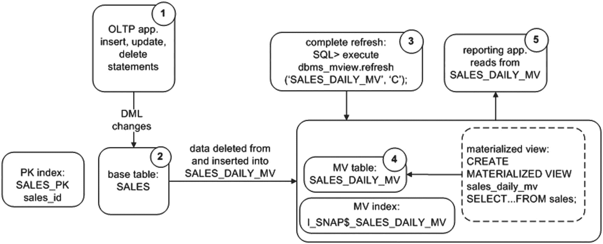

该图说明完整刷新并不难理解。数字显示了完整刷新过程中的数据流：
1.  用户/应用程序创建事务。
2.  数据在基表中提交。
3.  手动使用 `DBMS_MVIEW` 包启动完整刷新。
4.  底层物化视图中的数据被删除，并完全刷新为基表的内容。
5.  用户可以从物化视图查询数据，其中包含基表数据的某个时间点快照。

在下一节中，一个更复杂的示例将展示如何设置一个可快速刷新的物化视图。

### 创建可快速刷新的物化视图

当你创建一个可快速刷新的物化视图时，它首先使用物化视图查询的完整结果集来填充物化视图表。在初始结果集就位后，只有自上次刷新以来在基表中修改的数据需要应用到物化视图。换句话说，自上次刷新以来主表发生的任何更新、插入或删除都会被复制过来。当在一段时间内基表的变化数量相对于表中的总行数较小时，此功能非常合适。

以下是实现可快速刷新物化视图的步骤：
1.  创建一个基表（如果尚未创建）。
2.  在基表上创建物化视图日志。
3.  创建一个可快速刷新的物化视图。

此示例使用先前创建的 `SALES` 表。可快速刷新的物化视图需要在基表上创建物化视图日志。当发生快速刷新时，物化视图日志必须有一种唯一的方法来识别哪些记录已被修改，因此需要被刷新。你可以通过两种不同的方法来实现。一种是在创建物化视图日志时指定 `PRIMARY KEY` 子句；另一种是指定 `ROWID` 子句。如果底层基表有主键，则使用基于主键的物化视图日志。如果底层基表没有主键，则必须使用 `ROWID` 来创建物化视图日志。在大多数情况下，你可能为每个基表定义了主键。然而，现实情况是，一些系统设计不佳，或者有罕见原因导致某个表没有主键。

在此示例中，基表上定义了主键，因此你使用 `PRIMARY KEY` 子句创建物化视图日志：
```sql
SQL> create materialized view log on sales with primary key;
```
如果基表上没有定义主键，在尝试创建物化视图日志时会抛出此错误：
```
ORA-12014: table does not contain a primary key constraint
```
如果基表没有主键，并且你无法添加主键，则必须在创建物化视图日志时指定 `ROWID`：
```sql
SQL> create materialized view log on sales with rowid;
```
当你使用基于主键的可快速刷新物化视图时，基表的主键列必须是可快速刷新物化视图 `SELECT` 语句的一部分（请参阅本章后面的“基于复杂查询创建可快速刷新的物化视图”一节）。对于此示例，物化视图中不会有聚合列。这种类型的物化视图通常用于将数据从一个环境复制到另一个环境：
```sql
SQL> create materialized view sales_rep_mv
segment creation immediate
refresh
with primary key
fast
on demand
as
select
sales_id
,sales_amt
,trunc(sales_dtt) sales_dtt
from sales;
```
此时，检查与该物化视图关联的对象是很有用的。以下查询从 `USER_OBJECTS` 中选择：
```sql
SQL> select object_name, object_type
from user_objects
where object_name like '%SALES%'
order by object_name;
```
以下是已创建的对象：
```
OBJECT_NAME          OBJECT_TYPE
-------------------- -----------------------
MLOG$_SALES          TABLE
RUPD$_SALES          TABLE
SALES                TABLE
SALES_PK             INDEX
SALES_PK1            INDEX
SALES_REP_MV         TABLE
SALES_REP_MV         MATERIALIZED VIEW
```
上面输出中的几个对象需要一些解释：
*   `MLOG$_SALES`
*   `RUPD$_SALES`
*   `SALES_PK1`


## 超越基础功能

物化视图提供了许多功能。其中一些功能涉及可应用于任何表的属性，例如存储、索引、压缩和加密。另一些功能则与所创建的物化视图类型及其刷新方式相关。这些功能将在接下来的几个部分中描述。

### 创建物化视图并为物化视图和索引指定表空间

每个物化视图都关联着一个基础表。此外，根据物化视图的类型，可能会自动创建一个索引。在创建物化视图时，你可以为基础表和索引指定表空间和存储特性。下面的例子展示了如何为物化视图表和索引指定要使用的表空间：

```sql
SQL> create materialized view sales_mv
tablespace users
using index tablespace users
refresh with primary key
fast on demand
as
select sales_id ,sales_amt, sales_dtt
from sales;
```

首先，当创建物化视图日志时，也会创建一个对应的表，用于存储基础表中发生变化的行以及变化的方式（插入、更新或删除）。物化视图日志表的名称格式为 `MLOG$_<基础表名>`。
还会创建一个格式为 `RUPD$_<基础表名>` 的表。当你创建一个使用主键的快速刷新物化视图时，Oracle 会自动创建这个 `RUPD$` 表。该表用于支持可更新物化视图功能。除非你正在处理可更新物化视图（有关可更新物化视图的更多详细信息，请参阅《Oracle 高级复制指南》），否则不必担心这个表。如果不使用可更新物化视图功能，则可以忽略 `RUPD$` 表。

此外，Oracle 会创建一个格式为 `<基础表名>_PK1` 的索引。此索引是为基于主键的物化视图自动创建的，并基于基础表的主键列。如果物化视图是基于 `ROWID` 而不是主键，则索引名称格式为 `I_SNAP$_<表名>`，并基于 `ROWID`。如果未显式命名基础表上的主键索引，则 Oracle 会为物化视图表的主键索引分配一个系统生成的名称，例如 `SYS_C008780`。

既然你已经了解了底层架构组件，让我们来看一下物化视图中的数据：

```sql
SQL> select sales_amt, to_char(sales_dtt,'dd-mon-yyyy')
from sales_rep_mv
order by 2;
```

输出如下：

```
SALES_AMT TO_CHAR(SALES_DTT,'D
---------- --------------------
511 10-jan-2013
101 20-jan-2013
127 30-jan-2013
99 30-jan-2013
11 31-dec-2012
```

让我们向基础 `SALES` 表添加两条记录：

```sql
SQL> insert into sales values(6,99,20,sysdate-6);
SQL> insert into sales values(7,127,30,sysdate-7);
SQL> commit;
```

此时，检查 `MLOG$` 表很有指导意义。你应该能看到两条记录，它们标识了 `SALES` 表中数据的变化情况：

```sql
SQL> select count(*) from mlog$_sales;
```

有两条记录：

```
COUNT(*)
----------
2
```

接下来，让我们刷新物化视图。这个物化视图是可快速刷新的，因此你通过调用 `DBMS_MVIEW` 包的 `REFRESH` 过程并指定 `F`（代表 fast）参数来执行刷新：

```sql
SQL> exec dbms_mview.refresh('SALES_REP_MV','F');
```

快速检查物化视图会发现有两条新记录：

```sql
SQL> select sales_amt, to_char(sales_dtt,'dd-mon-yyyy')
from sales_rep_mv
order by 2;
```

这是一些示例输出：

```
SALES_AMT TO_CHAR(SALES_DTT,'D
---------- --------------------
511 10-jan-2013
101 20-jan-2013
127 23-jan-2013
99 24-jan-2013
127 30-jan-2013
99 30-jan-2013
11 31-dec-2012
```

此外，`MLOG$` 的计数已降至零。物化视图刷新完成后，这些记录就不再需要了：

```sql
SQL> select count(*) from mlog$_sales;
```

输出如下：

```
COUNT(*)
----------
0
```

你可以通过查询 `USER_MVIEWS` 视图来验证物化视图最后一次刷新的方式：

```sql
SQL> select mview_name, last_refresh_type, last_refresh_date
from user_mviews
order by 1,3;
```

这是一些示例输出：

```
MVIEW_NAME                LAST_REF LAST_REFR
------------------------- -------- ---------
SALES_REP_MV              FAST     30-JAN-13
```

图 15-2 说明了物化视图新增的架构组件；再次强调，理解这些组件非常重要，所以请在此稍作停留。

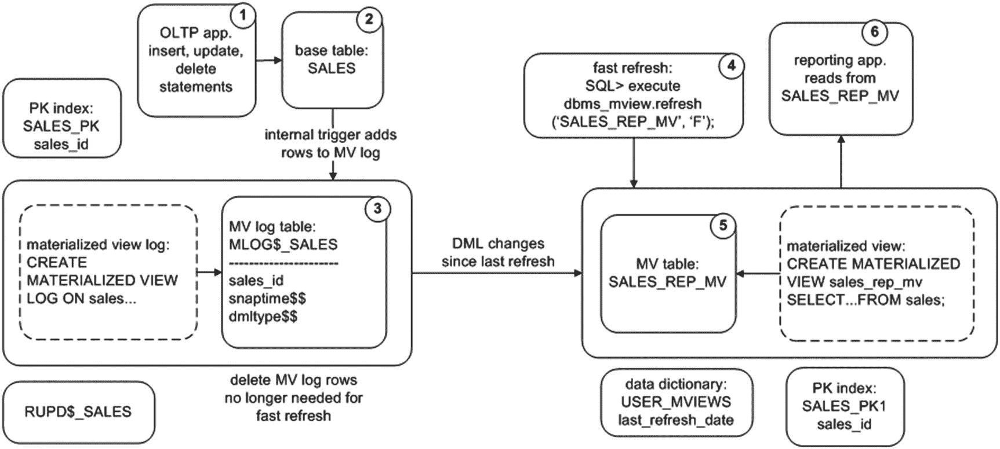
*图 15-2 快速刷新物化视图的架构组件*

图中的数字描述了快速刷新物化视图的数据流：

1.  用户创建事务。
2.  数据在基础表中提交。
3.  基础表上的内部触发器填充物化视图日志表。
4.  通过 `DBMS_MVIEW` 包发起快速刷新。
5.  自上次刷新以来产生的 DML 变更被应用到物化视图。物化视图不再需要的行从物化视图日志中删除。
6.  用户可以查询物化视图中的数据，其中包含基础表数据的时间点快照。

当你对快速刷新的架构有了很好的理解后，学习高级物化视图概念就不会有困难。如果这是你第一次接触物化视图，重要的是要认识到物化视图的数据存储在一个常规的数据库表中。这将帮助你理解在架构上什么是可能的，什么是不可能的。在很大程度上，由于物化视图和物化视图日志都是基于表的，所以大多数适用于常规数据库表的功能也可以应用于物化视图表和物化视图日志表。例如，以下 Oracle 功能很容易应用于物化视图：

*   存储和表空间放置
*   索引
*   分区
*   压缩
*   加密
*   日志记录
*   并行处理

下一节将展示如何创建具有各种功能的物化视图的示例。

### 在物化视图上创建索引

物化视图将其数据存储在常规数据库表中。因此，你可以在基础表上创建索引（就像对任何其他表一样）。通常，在物化视图表上创建索引应遵循与常规表相同的准则（有关创建索引的更多详细信息，请参见第 8 章）。请记住，虽然索引可以显著提高查询性能，但维护索引对于任何插入、更新和删除操作都会带来开销。索引也会消耗磁盘空间。

下面列出的是基于物化视图中的列创建索引的示例。其语法与在常规表上创建索引相同：

```sql
SQL> create index sales_mv_idx1 on sales_mv(sales_dtt) tablespace users;
```

你可以通过查询 `USER_INDEXES` 视图来显示为物化视图创建的索引：

```sql
SQL> select a.table_name, a.index_name
from user_indexes a
,user_mviews  b
where a.table_name = b.mview_name;
```

**注意**
如果你使用 `WITH PRIMARY KEY` 子句创建一个简单物化视图，该视图选择自一个具有主键的基础表，Oracle 会自动在物化视图中相应的主键列上创建一个索引。如果你使用 `WITH ROWID` 子句创建一个简单物化视图，该视图选择自一个具有主键的基础表，Oracle 会自动在名为 `M_ROW$$` 的隐藏列上创建一个名为 `I_SNAP$_<表名>` 的索引。

### 对物化视图进行分区

你可以像对数据库中的任何其他表一样对物化视图表进行分区。如果你处理大型物化视图，可能需要考虑分区以便更好地管理和维护大型表。在创建物化视图时使用 `PARTITION` 子句。此示例构建了一个按 `SALES_ID` 进行哈希分区的物化视图：

```sql
SQL> create materialized view sales_mv
partition by hash (sales_id)
partitions 4
refresh on demand complete with rowid
as
select sales_id, sales_amt, region_id, sales_dtt
from sales;
```


查询的结果集存储在分区表中。您可以在 `USER_TAB_PARTITIONS` 和 `USER_PART_TABLES` 中查看此表的分区详细信息（就像数据库中任何其他分区表一样）。有关分区策略和维护的更多详细信息，请参见第 12 章。

#### 压缩物化视图

如前所述，当您创建物化视图时，会创建一个底层表来存储数据。由于此表是一个常规数据库表，您可以实现诸如压缩之类的功能；例如，

```sql
SQL> create materialized view sales_mv
compress
as
select sales_id, sales_amt
from sales;
```

您可以使用以下查询确认压缩详细信息：

```sql
SQL> select table_name, compression, compress_for
from user_tables
where table_name='SALES_MV';
```

输出如下：

```
TABLE_NAME                     COMPRESS  COMPRESS_FOR
------------------------------ --------  ------------
SALES_MV                       ENABLED   BASIC
```

> **注意**
> 基础表压缩不需要 Oracle 的额外许可，而 `ROW STORE COMPRESS ADVANCED` 压缩（在 12c 之前；通过 `COMPRESS FOR OLTP` 启用）需要高级压缩选项，这确实需要 Oracle 的额外许可。有关详细信息，请参阅 Oracle 网站（`http://otn.oracle.com`）技术网络区域提供的《Oracle 数据库许可信息》。

#### 加密物化视图列

如前所述，当您创建物化视图时，会创建一个底层表来存储数据。由于此表是一个常规数据库表，您可以实现诸如列加密之类的功能；例如，

```sql
SQL> create materialized view sales_mv
(sales_id   encrypt no salt
,sales_amt  encrypt)
as
select
sales_id
,sales_amt
from sales;
```

要使前面的语句生效，您必须为数据库创建并打开一个安全钱包。此功能需要 Oracle 的高级安全选项。由于物化视图存储在表空间中，加密也可以在表空间级别完成，而不仅仅是列级别。

您可以通过描述物化视图来验证加密是否已启用：

```sql
SQL> desc sales_mv
Name                        Null?    Type
----------------------------------- ----------------------------
SALES_ID                   NOT NULL NUMBER ENCRYPT
SALES_AMT                           NUMBER ENCRYPT
```

#### 启用 Oracle 钱包

Oracle 钱包是 Oracle 用于启用加密的机制。钱包是一个包含加密密钥的操作系统文件。钱包通过以下步骤启用：

1.  修改 `SQLNET.ORA` 文件以包含钱包的位置：

    ```
    ENCRYPTION_WALLET_LOCATION=
    (SOURCE=(METHOD=FILE) (METHOD_DATA=
    (DIRECTORY=/ora01/app/oracle/product/18.1.0.1/db_1/network/admin)))
    ```

2.  使用 `ALTER SYSTEM` 命令创建钱包文件 (`ewallet.p18`)：

    ```sql
    SQL> alter system set encryption key identified by foo;
    ```

3.  启用加密：

    ```sql
    SQL> alter system set encryption wallet open identified by foo;
    ```

有关实现加密的完整详细信息，请参阅《Oracle 高级安全管理员指南》，该指南可从 Oracle 网站 (`http://otn.oracle.com`) 的技术网络区域免费下载。

#### 在预建表上构建物化视图

在数据仓库环境中，有时您需要创建一个表，向其填充大量数据，然后将其转换为物化视图。或者，您可能正在复制一个大表，并发现最初通过使用 Data Pump 预先填充数据来填充远程物化视图更有效。以下是在预建表上构建物化视图的步骤：

1.  创建一个表。
2.  用数据填充它。
3.  在步骤 1 创建的表上创建物化视图。

这是一个说明该过程的简单示例。首先，创建一个表：

```sql
SQL> create table sales_mv
(sales_id    number
,sales_amt number);
```

现在，用数据填充该表。例如，在数据仓库环境中，可以使用 Data Pump、SQL*Loader 或外部表加载表。

最后，运行 `CREATE MATERIALIZED VIEW...ON PREBUILT TABLE` 语句将该表转换为物化视图。物化视图名称和表名称必须相同。此外，查询中的每一列必须对应于表中的一个列；例如，

```sql
SQL> create materialized view sales_mv
on prebuilt table
using index tablespace users
as
select sales_id, sales_amt
from sales;
```

现在，`SALES_MV` 对象是一个物化视图。如果您尝试删除 `SALES_MV` 表，将抛出以下错误，表明 `SALES_MV` 现在是一个物化视图：

```sql
SQL> drop table sales_mv;
ORA-12083: must use DROP MATERIALIZED VIEW to drop "MV_MAINT"."SALES_MV"
```

预建表功能在数据仓库环境中非常有用，这些环境中通常有较长的时期基础表未被主动更新。这使您有时加载预建表并确保其内容与基础表完全相同。在预建表上创建物化视图后，您可以快速刷新物化视图并使其与基础表保持同步。如果您的基础表（在物化视图的 `SELECT` 子句中指定）是持续更新的，那么在预建表上创建物化视图可能不是一个可行的选择。这是因为无法确保预建表将与基础表保持同步。

> **注意**
> 对于在预建表上创建的物化视图，如果您随后发出 `DROP MATERIALIZED VIEW` 语句，则不会删除底层表。当您需要修改基础表（例如添加列）时，这会有一些有趣的影响。有关详细信息，请参阅本章后面的“修改基础表 DDL 并传播到物化视图”部分。

#### 创建未填充的物化视图

创建物化视图时，您可以选择指示 Oracle 是否最初用数据填充物化视图。例如，如果初始构建物化视图需要几个小时，您可能希望先定义物化视图，然后将其作为单独的作业填充。

此示例使用 `BUILD DEFERRED` 子句指示 Oracle 最初不要用查询结果填充物化视图：

```sql
SQL> create materialized view sales_mv
tablespace users
build deferred
refresh complete on demand
as
select sales_id, sales_amt
from sales;
```

此时，查询物化视图将返回零行。在稍后的某个时间点，您可以启动完全刷新以用数据填充物化视图。

#### 创建提交时刷新的物化视图

当在主表中修改数据时，您可能需要将它们立即复制到物化视图。在这种情况下，在创建物化视图时使用 `ON COMMIT` 子句。主表必须在其上创建了物化视图日志，此技术才能工作：

```sql
SQL> create materialized view log on sales with primary key;
```

接下来，创建一个提交时刷新的物化视图：

```sql
SQL> create materialized view sales_mv
refresh
on commit
as
select sales_id, sales_amt from sales;
```

当数据在主表中插入并提交时，任何更改也会在物化视图查询将选择的物化视图中可用。

可提交刷新的物化视图 `ON COMMIT` 有一些限制您需要注意：

*   主表和物化视图必须位于同一数据库中。
*   您不能在基础表上执行分布式事务。
*   包含对象类型或 Oracle 供应类型的物化视图不支持此方法。

同时还要考虑在两个地方同时提交数据的相关开销；这可能会影响高事务 OLTP 系统的性能。此外，如果更新物化视图时出现问题，则基础表无法提交事务。例如，如果创建物化视图的表空间已满（并且无法再分配另一个区），则在尝试插入基础表时会看到如下错误：


## Oracle 物化视图管理：刷新、性能与高级特性

```
ORA-12008: error in materialized view refresh path
ORA-01653: unable to extend table MV_MAINT.SALES_MV by 16 in tablespace...
```

鉴于这些原因，您应该仅在确定不会影响性能或可用性时才使用此功能。

> **注意**：您不能同时为物化视图指定 `ON COMMIT` 和 `ON DEMAND` 刷新方式。此外，`ON COMMIT` 与 `CREATE MATERIALIZED VIEW` 语句中的 `START WITH` 和 `NEXT` 子句不兼容。

### 创建永不可刷新的物化视图

您可能永远不希望某个物化视图被刷新。例如，您可能希望保证拥有某个时间点的数据快照以用于审计目的。在创建物化视图时指定 `NEVER REFRESH` 子句即可实现：

```
SQL> create materialized view sales_mv
never refresh
as
select sales_id, sales_amt
from sales;
```

如果您尝试刷新一个不可刷新的物化视图，将会收到此错误：

```
ORA-23538: cannot explicitly refresh a NEVER REFRESH materialized view
```

您可以将永不可刷新的视图更改为可刷新。使用 `ALTER MATERIALIZED VIEW` 语句来完成：

```
SQL> alter materialized view sales_mv refresh on demand complete;
```

您可以使用以下查询验证刷新模式和方法：

```
SQL> select mview_name, refresh_mode, refresh_method from user_mviews;
```

### 为查询重写创建物化视图

查询重写允许优化器识别出可以使用物化视图来满足查询需求，而不是使用底层的主（基础）表。如果您的环境中用户经常自行编写查询且不了解可用的物化视图，此功能可极大提升性能。启用查询重写有三个先决条件：

*   Oracle 企业版
*   将数据库初始化参数 `QUERY_REWRITE_ENABLED` 设置为 `TRUE`
*   在创建或修改物化视图时使用 `ENABLE QUERY REWRITE` 子句

此示例创建一个启用了查询重写的物化视图：

```
SQL> create materialized view sales_daily_mv
segment creation immediate
refresh
complete
on demand
enable query rewrite
as
select
sum(sales_amt) sales_amt
,trunc(sales_dtt) sales_dtt
from sales
group by trunc(sales_dtt);
```

您可以通过 autotrace 工具检查查询的执行计划来验证是否使用了查询重写：

```
SQL> set autotrace trace explain
```

现在，假设一个用户运行以下查询，并不知道已经存在一个聚合了所需数据的物化视图：

```
SQL> select
sum(sales_amt) sales_amt
,trunc(sales_dtt) sales_dtt
from sales
group by trunc(sales_dtt);
```

以下是 autotrace 输出的部分内容，验证了查询重写正在被使用：

```
| Id  | Operation                    | Name           | Cost (%CPU)| Time    |
|   0 | SELECT STATEMENT             |                |     3   (0)| 00:00:01 |
|   1 |  MAT_VIEW REWRITE ACCESS FULL| SALES_DAILY_MV |     3   (0)| 00:00:01 |
```

从之前的输出可以看出，尽管用户直接从 `SALES` 表中查询，但优化器确定通过访问物化视图可以更高效地满足查询结果。

您可以通过从 `USER_MVIEWS` 中选择 `REWRITE_ENABLED` 列来判断某个物化视图是否启用了查询重写：

```
SQL> select mview_name, rewrite_enabled, rewrite_capability
from user_mviews
where mview_name = 'SALES_DAILY_MV';
```

如果由于任何原因，查询未使用查询重写功能，而您认为它应该使用，请使用 `DBMS_MVIEW` 包的 `EXPLAIN_REWRITE` 过程来诊断问题。

### 基于复杂查询创建快速刷新物化视图

在许多情况下，当物化视图基于连接多个表的查询时，它会被视为复杂查询，因此仅支持完全刷新。然而，在某些场景下，当物化视图查询中引用了两个连接在一起的表时，您可以创建一个可快速刷新的物化视图。

本节介绍如何使用 `DBMS_MVIEW` 的 `EXPLAIN_MVIEW` 过程来确定是否可以快速刷新一个复杂查询。为了帮助您完全理解示例，本节展示了用于创建基础表的 SQL。假设有两个基础表，定义如下：

```
SQL> create table region(
region_id number
,reg_desc varchar2(30)
,constraint region_pk primary key(region_id));
--
SQL> create table sales(
sales_id  number
,sales_amt number
,region_id number
,sales_dtt date
,constraint sales_pk primary key(sales_id)
,constraint sales_fk1 foreign key (region_id) references region(region_id));
```

此外，`REGION` 和 `SALES` 表上已创建了物化视图日志，如下所示：

```
SQL> create materialized view log on region with primary key;
SQL> create materialized view log on sales with primary key;
```

同样，对于此示例，基础表中已插入以下数据：

```
SQL> insert into region values(10,'East');
SQL> insert into region values(20,'West');
SQL> insert into region values(30,'South');
SQL> insert into region values(40,'North');
--
SQL> insert into sales values(1,100,10,sysdate);
SQL> insert into sales values(2,200,20,sysdate-20);
SQL> insert into sales values(3,300,30,sysdate-30);
```

假设您想创建一个连接 `REGION` 和 `SALES` 基础表的物化视图：

```
SQL> create materialized view sales_mv
as
select
a.sales_id
,b.reg_desc
from sales  a
,region b
where a.region_id = b.region_id;
```

接下来，尝试快速刷新该物化视图：

```
SQL> exec dbms_mview.refresh('SALES_MV','F');
```

会抛出此错误：

```
ORA-12032: cannot use rowid column from materialized view log...
```

该错误表明物化视图存在问题，无法进行快速刷新。要确定此物化视图是否可以变为可快速刷新，请使用 `DBMS_MVIEW` 包的 `EXPLAIN_MVIEW` 过程的输出。该过程要求您首先创建一个 `MV_CAPABILITIES_TABLE`。Oracle 提供了脚本来完成此操作。以物化视图所有者的身份运行此脚本：

```
SQL> @?/rdbms/admin/utlxmv.sql
```

创建表后，运行 `EXPLAIN_MVIEW` 过程来填充它：

```
SQL> exec dbms_mview.explain_mview(mv=>'SALES_MV',stmt_id=>'100');
```

现在，查询 `MV_CAPABILITIES_TABLE` 以查看此物化视图可能存在的潜在问题：

```
SQL> select capability_name, possible, msgtxt, related_text
from mv_capabilities_table
where capability_name like 'REFRESH_FAST_AFTER%'
and statement_id = '100'
order by 1;
```

以下是输出的部分内容。`P`（代表 possible）列对于每个快速刷新可能性都包含 `N`（代表 no）：

```
CAPABILITY_NAME            P  MSGTXT                        RELATED_TEXT
-------------------------  -  ----------------------------  ---------------
REFRESH_FAST_AFTER_INSERT  N  the SELECT list does not have  B
the rowids of all the detail tables
REFRESH_FAST_AFTER_INSERT  N  mv log must have ROWID        MV_MAINT.REGION
REFRESH_FAST_AFTER_INSERT  N  mv log must have ROWID        MV_MAINT.SALES
```

`MSGTXT` 指示了问题：物化视图日志需要基于 `ROWID`，并且表的 `ROWID` 必须出现在 `SELECT` 子句中。因此，首先删除并重新创建带有 `ROWID`（而不是主键）的物化视图日志：

```
SQL> drop materialized view log on region;
SQL> drop materialized view log on sales;
--
SQL> create materialized view log on region with rowid;
SQL> create materialized view log on sales with rowid;
--
SQL> drop materialized view sales_mv;
--
SQL> create materialized view sales_mv
as
select
a.rowid sales_rowid
,b.rowid region_rowid
,a.sales_id
,b.reg_desc
from sales  a
,region b
where a.region_id = b.region_id;
```

接下来，重置 `MV_CAPABILITIES_TABLE`，并通过 `EXPLAIN_MVIEW` 过程重新填充它：

```
SQL> delete from mv_capabilities_table where statement_id=100;
SQL> exec dbms_mview.explain_mview(mv=>'SALES_MV',stmt_id=>'100');
```

输出显示现在可以快速刷新该物化视图了。


## 物化视图的维护

### 查看物化视图定义

要快速查看物化视图（MV）所基于的 SQL 查询，可以从 `DBA_MVIEWS`、`ALL_MVIEWS` 或 `USER_MVIEWS` 视图的 `QUERY` 列中选择。如果使用 SQL*Plus，首先需要将 `LONG` 变量设置为足够大的值以显示 `LONG` 列的全部内容：

```
SQL> set long 5000
SQL> select query from dba_mviews where mview_name=UPPER('&&mview_name');
```

要查看重新创建物化视图所需的完整 DDL，可以使用 `DBMS_METADATA` 包（如果使用 SQL*Plus，同样需要将 `LONG` 变量设置为较大值）：

```
SQL> select dbms_metadata.get_ddl('MATERIALIZED_VIEW','SALES_MV') from dual;
```

以下是此示例的部分输出：

```
DBMS_METADATA.GET_DDL('MATERIALIZED_VIEW','SALES_MV')

CREATE MATERIALIZED VIEW "MV_MAINT"."SALES_MV" ("SALES_ROWID", "REGION_ROWID",
"SALES_ID", "REG_DESC")
ORGANIZATION HEAP PCTFREE 10 PCTUSED 40 INITRANS 1 MAXTRANS 255
```

此输出显示了 Oracle 认为重新创建该物化视图所需的 DDL。这通常是生成与物化视图关联的 DDL 最可靠的方法。

### 删除物化视图

偶尔可能需要删除物化视图。也许某个视图不再使用，或者需要删除并重新创建物化视图以更改其基础查询（例如添加列）。使用 `DROP MATERIALIZED VIEW` 命令来删除物化视图；例如：

```
SQL> drop materialized view sales_mv;
```

删除物化视图时，物化视图对象、表对象以及任何相应的索引也会被删除。删除物化视图不会影响任何物化视图日志——物化视图日志仅依赖于主表。

也可以指定保留基础表。如果正在排除故障并需要删除物化视图定义但保留物化视图表和数据，可能需要这样做；例如：

```
SQL> drop materialized view sales_mv preserve table;
```

在此场景下，以后还可以使用基础表作为构建物化视图的基础，方法是使用 `ON PREBUILT TABLE` 子句来创建物化视图。

如果物化视图最初是使用 `ON PREBUILT TABLE` 子句创建的，那么当删除物化视图时，基础表不会被删除。如果希望删除基础表，则必须使用 `DROP TABLE` 语句：

```
SQL> drop materialized view sales_mv;
SQL> drop table sales_mv;
```

### 修改物化视图

以下部分描述了与物化视图相关的常见维护任务。涵盖的主题包括如何修改物化视图以反映在物化视图初始创建后某个时间应用于基表的列更改，以及修改日志记录和并行度等属性。

#### 修改基础表 DDL 并传播到物化视图

一个常见的任务涉及向基表添加列或从基表删除列（因为业务需求已更改）。将列添加到基表或从基表删除后，希望这些 DDL 更改能反映在任何依赖的物化视图中。有几种选项可以将基础表列的更改传播到依赖的物化视图：

*   使用新的列定义删除并重新创建物化视图。
*   删除物化视图但保留基础表，修改物化视图表，然后使用 `ON PREBUILT TABLE` 子句重新创建物化视图（包含新的列更改）。
*   如果物化视图最初是使用 `ON PREBUILT TABLE` 子句创建的，删除物化视图对象，修改物化视图表，然后使用 `ON PREBUILT TABLE` 子句重新创建物化视图（包含新的列更改）。

使用上述任何选项，都必须删除并重新创建物化视图，以使其包含基础表中的新列更改。接下来描述这些方法。

#### 重新创建物化视图以反映基础表修改

使用之前创建的 SALES 表，假设有一个物化视图日志和一个物化视图，创建如下：

```
SQL> create materialized view log on sales with primary key;
--
SQL> create materialized view sales_mv
refresh with primary key
fast on demand as
select sales_id ,sales_amt, sales_dtt
from sales;
```

然后，一段时间后，向基表添加了一个列：

```
SQL> alter table sales add(sales_loc varchar2(30));
```

希望基础表的修改反映在物化视图中。如何完成此任务？知道物化视图包含一个存储结果的基础表。决定直接修改基础物化视图表：

```
SQL> alter table sales_mv add(sales_loc varchar2(30));
```

修改成功。接下来刷新物化视图，但意识到添加的列没有被刷新。要理解原因，回想物化视图是一个 SQL 查询，它将其结果存储在基础表中。因此，要修改物化视图，必须更改物化视图所基于的 SQL 查询。由于没有 `ALTER MATERIALIZED VIEW ADD/DROP/MODIFY <column>` 语句，必须执行以下操作来在物化视图中添加/删除列：

1.  修改基础表。
2.  删除并重新创建物化视图以反映基础表中的更改。

```
SQL> drop materialized view sales_mv;
--
SQL> create materialized view sales_mv
refresh with primary key
complete on demand as
select sales_id, sales_amt, sales_dtt, sales_loc
from sales;
```

如果涉及大量数据，此方法可能需要很长时间。在重建期间，任何访问物化视图的应用程序都会停机。如果在数据仓库环境中工作，由于完全刷新物化视图所需的时间较长，可能需要考虑不删除基础表。此选项在下一节中讨论。

#### 修改物化视图但保留基础表

删除物化视图时，可以选择保留基础表及其数据。在数据仓库环境中处理大型物化视图时，可能会发现此方法是有利的。步骤如下：

1.  修改基础表。
2.  删除物化视图，但保留基础表。
3.  修改基础表。
4.  使用 `ON PREBUILT TABLE` 子句重新创建物化视图。

以下是一个简单示例来说明此过程：

```
SQL> alter table sales add(sales_loc varchar2(30));
```

删除物化视图，但指定要保留基础表：

```
SQL> drop materialized view sales_mv preserve table;
```

现在，修改基础表：

```
SQL> alter table sales_mv add(sales_loc varchar2(30));
```

接下来，使用 `ON PREBUILT TABLE` 子句创建物化视图：

```
SQL> create materialized view sales_mv
on prebuilt table
refresh with primary key
complete on demand as
select sales_id, sales_amt, sales_dtt, sales_loc
from sales;
```

这允许重新定义物化视图而无需删除并完全刷新数据。请注意，如果在物化视图重建操作期间有任何针对基础表的 DML 活动，则在尝试刷新物化视图时，这些事务不会反映在物化视图中。在数据仓库环境中，通常有已知的基础表加载计划，因此应该能够在维护窗口期间执行物化视图更改，此时基础表中没有事务发生。

### 刷新能力验证

执行以下语句以查看快速刷新是否有效：

```
SQL> exec dbms_mview.refresh('SALES_MV','F');
PL/SQL procedure successfully completed.
```

`EXPLAIN_MVIEW` 过程是一个强大的工具，可用于确定刷新能力是否可能；如果不可能，原因是什么以及如何潜在地解决问题。下表演示了部分输出：

```
CAPABILITY_NAME                P MSGTXT                     RELATED_TEXT
------------------------------ - -------------------------- ------------
REFRESH_FAST_AFTER_ANY_DML     Y
REFRESH_FAST_AFTER_INSERT      Y
REFRESH_FAST_AFTER_ONETAB_DML  Y
```


如果您最初使用 `ON PREBUILT TABLE` 子句创建了物化视图（MV），那么在保留基础表时，可以执行与上一节类似的过程。以下是修改使用 `ON PREBUILT TABLE` 子句创建的 MV 的步骤：
1.  修改基础表。
2.  删除 MV。对于建立在预建表上的 MV，此操作不会删除底层表。
3.  修改预建表。
4.  在预建表上重新创建 MV。

以下是一个简单示例来说明此过程。首先，修改基础表：
```sql
SQL> alter table sales add(sales_loc varchar2(30));
```
然后，删除 MV：
```sql
SQL> drop materialized view sales_mv;
```
对于在预建表上创建的 MV，此操作不会删除底层表——仅删除 MV 对象。接下来，向预建表添加列：
```sql
SQL> alter table sales_mv add(sales_loc varchar2(30));
```
现在，您可以重建 MV，使用已添加新列的预建表：
```sql
SQL> create materialized view sales_mv
on prebuilt table
refresh with primary key
complete on demand as
select sales_id, sales_amt, sales_dtt, sales_loc
from sales;
```
这个过程的优点是允许您在不删除底层表的情况下修改 MV 定义。您需要删除 MV，修改底层表，然后用新定义重新创建 MV。如果底层表包含大量数据，此方法可以避免不必要的停机时间。
如上一节所述，您需要注意，如果在 MV 重建操作期间对基础表有任何 DML 活动，那么当您尝试刷新 MV 时，这些事务不会反映在 MV 中。

### 切换 MV 上的重做日志记录
回想一下，MV 有一个底层数据库表。当您刷新 MV 时，这会在底层表中启动事务，从而生成重做（就像常规数据库表一样）。如果发生数据库故障，您可以恢复与 MV 关联的所有事务。
默认情况下，创建 MV 时会启用重做日志记录。您可以指定在刷新 MV 时不记录重做。要启用非日志记录（nologging），请使用 `NOLOGGING` 选项创建 MV：
```sql
SQL> create materialized view sales_mv
nologging
refresh with primary key
fast on demand as
select sales_id ,sales_amt, sales_dtt
from sales;
```
您也可以将现有 MV 更改为非日志记录模式：
```sql
SQL> alter materialized view sales_mv nologging;
```
如果想重新启用日志记录，请按如下操作：
```sql
SQL> alter materialized view sales_mv logging;
```
要验证 MV 是否已切换到 `NOLOGGING`，请查询 `USER_TABLES` 视图：
```sql
SQL> select a.table_name, a.logging
from user_tables a
,user_mviews b
where a.table_name = b.mview_name;
```
启用非日志记录的优点是刷新速度更快。刷新机制使用直接路径插入，结合 `NOLOGGING` 后，可以消除大部分重做生成。主要缺点是，如果在 MV 刷新后不久发生介质故障，您将无法恢复 MV 中的数据。在这种情况下，首次尝试访问 MV 时，您会收到类似以下的错误：
```sql
ORA-01578: ORACLE data block corrupted (file # 5, block # 899)
ORA-01110: data file 5: '/u01/dbfile/o12c/users02.dbf'
ORA-26040: Data block was loaded using the NOLOGGING option
```
如果收到上述错误，您很可能需要重建 MV 才能再次访问数据。在许多环境中，这可能是可以接受的。通过不为 MV 生成重做，您可以节省数据库资源，但缺点是恢复过程更长（发生故障时），需要您重建 MV。
注意：如果您的数据库处于强制日志记录模式，则 `NOLOGGING` 子句无效。使用 Data Guard 的环境需要强制日志记录模式。

### 修改并行度
有时，创建 MV 时设置了较高的并行度，以提高创建过程的性能：
```sql
SQL> create materialized view sales_mv
parallel 4
refresh with primary key
fast on demand as
select sales_id ,sales_amt, sales_dtt
from sales;
```
创建 MV 后，您可能不需要底层表关联的相同并行度。这很重要，因为对 MV 的查询将启动并行执行线程。换句话说，您可能需要并行度来快速构建 MV，但不希望在随后查询 MV 时使用并行度。您可以按如下方式修改 MV 的并行度：
```sql
SQL> alter materialized view sales_mv parallel 1;
```
您可以通过查询 `USER_TABLES` 来检查并行度：
```sql
SQL> select table_name, degree from user_tables where table_name= upper('&mv_name');
```

### 移动 MV
随着操作系统环境条件的变化，您可能需要将 MV 从一个表空间移动到另一个表空间。在这些情况下，请使用 `ALTER MATERIALIZED VIEW...MOVE TABLESPACE` 语句。此示例将与 MV 关联的表移动到不同的表空间：
```sql
SQL> alter materialized view sales_mv move tablespace users;
```
如果有任何索引与 MV 表关联，移动操作会使它们失效。您可以按如下方式检查索引状态：
```sql
SQL> select a.table_name, a.index_name, a.status
from user_indexes a
,user_mviews  b
where a.table_name = b.mview_name;
```
移动表后，必须重建所有关联的索引；例如：
```sql
SQL> alter index sales_pk2 rebuild;
```

## 管理 MV 日志
快速刷新型 MV 需要 MV 日志。MV 日志是一个表，用于存储主（基础）表的 DML 信息。MV 日志在与主表相同的数据库中创建，由拥有主表的同一用户创建。您需要 `CREATE TABLE` 权限才能创建 MV 日志。
MV 日志由 Oracle 内部触发器填充（您无法控制）。在对主表执行 `INSERT`、`UPDATE` 或 `DELETE` 后，此内部触发器会向 MV 日志插入一行。您可以通过查询 `DBA/ALL/USER_INTERNAL_TRIGGERS` 来查看正在使用的内部触发器。
一个 MV 日志仅与一个表关联，并且每个主表只能为其定义一个 MV 日志。您可以在表或另一个 MV 上创建 MV 日志。多个快速刷新型 MV 可以使用一个 MV 日志。
MV 执行快速刷新后，MV 日志中不再需要的任何记录都会被删除。如果多个 MV 使用一个 MV 日志，则仅当所有快速刷新型 MV 都不再需要这些记录时，它们才会从 MV 日志中清除。

表 15-3 定义了与 MV 日志一起使用的术语。这些术语在本章后续与 MV 日志相关的章节中引用。

表 15-3：MV 日志术语和特性

| 术语 | 含义 |
| :--- | :--- |
| 物化视图 (MV) 日志 | 跟踪 MV 基础表 DML 更改的数据库对象；快速刷新所需 |
| 主键 MV 日志 | 使用基础表主键跟踪 DML 更改的 MV 日志 |
| `ROWID` MV 日志 | 使用基础表 `ROWID` 跟踪 DML 更改的 MV 日志 |
| 提交 SCN MV 日志 | 基于提交 SCN 而非时间戳的 MV 日志 |
| 对象 ID | 用于跟踪 DML 更改的对象标识符 |
| 筛选列 | MV 子查询中引用的非主键列；某些快速刷新场景所需 |
| 连接列 | 在子查询 `WHERE` 子句中定义连接的非主键列；某些快速刷新场景所需 |
| 序列 | 某些快速刷新场景所需的序列值 |
| 新值 | 指定在 MV 日志中记录旧值和新值；单表聚合视图有资格进行快速刷新所需 |

### 创建 MV 日志


## 物化视图日志：创建、使用与维护

### 创建物化视图日志

需要快速刷新的物化视图必须在主（基）表上创建物化视图日志。使用 `CREATE MATERIALIZED VIEW LOG` 命令来创建 MV 日志。以下示例在 `SALES` 表上创建一个 MV 日志，并指定使用主键来标识日志中的行：

```
SQL> create materialized view log on sales with primary key;
```

您也可以指定存储信息，例如表空间名称：

```
SQL> create materialized view log on sales
pctfree 5
tablespace users
with primary key;
```

### 日志的结构与内容

在表上创建 MV 日志时，Oracle 会创建一个表来存储自上次刷新以来对主表的更改。MV 日志表的名称遵循以下格式：`MLOG$_<master_table_name>`。
您可以使用 SQL*Plus 的 `DESCRIBE` 语句来查看 MV 日志的列：

```
SQL> desc mlog$_sales;
Name                              Null?    Type
-------------------------------- -------- ----------------------------
SALES_ID                                  NUMBER
SNAPTIME$$                                DATE
DMLTYPE$$                                 VARCHAR2(1)
OLD_NEW$$                                 VARCHAR2(1)
CHANGE_VECTOR$$                           RAW(255)
XID$$                                     NUMBER
```

您可以查询底层的 `MLOG$` 表，以确定自上次刷新以来的事务数。每次刷新后，MV 日志表都会被清除。如果多个物化视图使用同一个 MV 日志，则日志表将保留，直到所有依赖的物化视图都完成刷新。

如果在具有主键的表上创建 MV 日志，则还会创建一个 `RUPD$_<master_table_name>` 表。此表用于可更新物化视图。如果您不使用可更新物化视图功能，则此表永远不会被使用，可以忽略它。

### 标识行的方式

创建 MV 日志时，可以指定使用以下子句之一来唯一标识 MV 日志表中的行：

*   `WITH PRIMARY KEY`
*   `WITH ROWID`
*   `WITH OBJECT ID`

如果主表有主键，在创建 MV 日志时请使用 `WITH PRIMARY KEY`。如果主表没有主键，则必须使用 `WITH ROWID` 来指定使用 `ROWID` 值唯一标识 MV 日志记录。在对象表上创建 MV 日志时，可以使用 `WITH OBJECT ID`。

### COMMIT SCN 日志

Oracle 使用 `SNAPTIME$$` 列来确定哪些记录需要刷新或清除，或两者都需要。您可以选择创建基于 `COMMIT SCN` 的 MV 日志（而非基于时间戳）。此类 MV 日志使用事务的 SCN 来确定哪些记录需要应用于任何依赖的物化视图。基于 `COMMIT SCN` 的 MV 日志比基于时间戳的 MV 日志更高效。使用 `WITH COMMIT SCN` 子句来实现这一点：

```
SQL> create materialized view log on sales with commit scn;
```

您可以通过查询 `USER_MVIEW_LOGS` 来查看 MV 日志是否基于 SCN：

```
SQL> select log_table, commit_scn_based from user_mview_logs;
```

> **注意**
> 使用 COMMIT SCN 创建的 MV 日志没有 `SNAPTIME$$` 列。

### 索引 MV 日志列以优化性能

有时，您可能需要从快速刷新的物化视图中获得更好的性能。一种方法是为 MV 日志表的列创建索引。特别是，Oracle 在刷新或清除时使用 `SNAPTIME$$` 列或主键列，或两者。因此，在这些列上创建索引可以提高性能：

```
SQL> create index mlog$_sales_idx1 on mlog$_sales(snaptime$$);
SQL> create index mlog$_sales_idx2 on mlog$_sales(sales_id);
```

您不应仅仅因为认为可能是个好主意就添加索引。只有在已知快速刷新存在性能问题时，才在 MV 日志表上添加索引。请记住，添加索引会消耗数据库资源。Oracle 必须为表上的 DML 操作维护索引，并且索引会占用磁盘空间。

### 查看 MV 日志占用的空间

您应考虑定期检查 MV 日志消耗的空间。如果消耗的空间在增长（且从不缩小），您可能遇到了某个物化视图未能成功刷新，从而导致 MV 日志永远不会被清除的问题。以下是检查 MV 日志空间的查询：

```
SQL> select segment_name, tablespace_name
,bytes/1024/1024 meg_bytes, extents
from dba_segments
where segment_name like 'MLOG$%'
order by meg_bytes;
```

以下是示例输出：

```
SEGMENT_NAME         TABLESPACE_NAME                 MEG_BYTES    EXTENTS
-------------------- ------------------------------ ---------- ----------
MLOG$_USERS          MV_DATA                              1609       3218
MLOG$_ASSET_ATTRS    MV_DATA                            3675.5       7351
```

此输出表明有几个 MV 日志很可能存在清除问题。在这种情况下，可能有多个物化视图在使用该 MV 日志，而其中一个未在每日刷新，从而阻止了日志被清除。
您可能会遇到 MV 日志很长时间未被清除的情况。这可能是因为您有多个物化视图使用同一个 MV 日志，而其中一个物化视图已无法成功刷新。当 DBA 构建开发环境并将开发物化视图连接到生产环境时（这本不应该发生，但确实会发生），就可能发生这种情况。在以后的某个时间点，DBA 删除了开发数据库。生产环境仍然有关于远程开发物化视图的信息，并且不会清除 MV 日志记录，因为它需要日志数据用于快速刷新的物化视图，但实际情况并非如此。
在这些场景中，您应确定哪些物化视图正在使用该日志（参见本章后面的“确定有多少物化视图引用中心 MV 日志”部分），并解决任何问题。问题解决后，检查日志使用的空间，看看是否可以收缩（参见下一节“收缩 MV 日志中的空间”）。在这种情况下，监控物化视图和 MV 日志的空间非常重要，可以为这些问题提供洞察。

### 收缩 MV 日志中的空间

如果 MV 日志未能成功删除记录，它会变得很大。您解决问题后，记录已从 MV 日志中删除，您可以将 MV 日志表的高水位线设置得很高。但是，这样做可能会导致性能问题，并且会不必要地消耗磁盘空间。在这种情况下，考虑收缩 MV 日志使用的空间。

在此示例中，`MLOG$_SALES` 由于关联的物化视图未能成功刷新而存在清除记录的问题。此 MV 日志随后变得很大。问题已被识别并解决，现在需要减少日志的空间。要收缩 MV 日志中的空间，首先对相应的 MV 日志 `MLOG$` 表启用行移动：

```
SQL> alter table mlog$_sales enable row movement;
```

接下来，发出 `ALTER MATERIALIZED VIEW LOG ON...SHRINK` 语句。请注意，关键字 `ON` 后面的表名是主表的名称：

```
SQL> alter materialized view log on sales shrink space;
```

根据收缩的空间量，此语句可能需要很长时间。语句完成后，您可以禁用行移动：

```
SQL> alter table mlog$_sales disable row movement;
```

您可以通过运行上一节中从 `DBA_SEGMENTS` 查询的语句来验证空间是否已减少。

### 检查 MV 日志的行数

如前所述，有时物化视图的刷新会出现问题，这导致相应的 MV 日志表中积累了大量行。当多个物化视图使用一个 MV 日志，而其中一个物化视图无法执行快速刷新时，就可能发生这种情况。在这种情况下，MV 日志会持续增长，直到问题解决。


## 检测和维护物化视图日志

### 检测物化视图日志是否未被清除

检测物化视图日志是否未被清除的一种方法是定期检查物化视图日志表的行数。以下查询使用 SQL 生成一个用于检查当前连接用户所拥有的物化视图日志表行数的脚本：

```
SQL> set head off pages 0 lines 132 trimspool on
SQL> spo mvcount_dyn.sql
SQL> select 'select count(*) || ' || '''' || ': ' || table_name || ''''
|| ' from ' || table_name || ';'
from user_tables
where table_name like 'MLOG%';
SQL> spo off;
```

此脚本生成一个名为`mvcount_dyn.sql`的文件，其中包含从`MLOG$`表中查询行数的 SQL 语句。在检查行数时，您必须对应用程序比较熟悉，并对正常的行数有所了解。以下是上述脚本生成的一些示例代码：

```
SQL> select count(*) || ': MLOG$_SALES' from MLOG$_SALES;
SQL> select count(*) || ': MLOG$_REGION' from MLOG$_REGION;
```

### 移动物化视图日志

您可能需要移动物化视图日志，因为初始创建脚本未指定正确的表空间。常见的情况是未指定表空间，物化视图日志默认放置在诸如`USERS`之类的表空间中。您可以通过以下查询验证表空间信息：

```
SQL> select table_name, tablespace_name
from user_tables
where table_name like 'MLOG%';
```

如果任何物化视图日志表需要重新定位，请使用`ALTER MATERIALIZED VIEW LOG ON <table_name> MOVE`语句。请注意，您指定的是创建物化视图所基于的主表名称（而不是底层的`MLOG$`表）：

```
SQL> alter materialized view log on sales move tablespace users;
```

同时请记住，当您移动表时，任何关联的索引都会变得不可用（因为表中每条记录的`ROWID`刚刚发生了变化）。您可以按如下方式检查索引的状态：

```
SQL> select a.table_name, a.index_name, a.status
from user_indexes a
,user_mview_logs b
where a.table_name = b.log_table;
```

所有不可用的索引都必须重建。以下是重建索引的示例：

```
SQL> alter index mlog$_sales_idx2 rebuild;
```

### 删除物化视图日志

您可能希望删除物化视图日志有几个原因：

*   您最初创建了物化视图日志，但需求发生变化，您不再需要它。
*   物化视图日志变得很大并导致性能问题，您希望将其删除以重置大小。

在删除物化视图日志之前，您可以通过以下查询验证所有者、主表和日志表：

```
SQL> select
log_owner
,master     -- master table
,log_table
from user_mview_logs;
```

使用`DROP MATERIALIZED VIEW LOG ON`语句来删除物化视图日志。您不需要知道物化视图日志的名称，但您需要知道创建日志的主表的名称。此示例删除在`SALES`表上的物化视图日志：

```
SQL> drop materialized view log on sales;
```

如果成功，您应该看到以下消息：

```
Materialized view log dropped.
```

如果您拥有权限，并且您不是创建物化视图日志的表的所有者，则可以在删除时指定模式名称：

```
SQL> drop materialized view log on .;
```

如果您正在清理环境并希望删除与某个用户关联的所有物化视图日志，那么可以使用 SQL 生成 SQL 来完成此操作。以下脚本创建用于删除当前连接用户所拥有的所有物化视图日志所需的 SQL：

```
SQL> set lines 132 pages 0 head off trimspool on
SQL> spo drop_dyn.sql
SQL> select 'drop materialized view log on ' || master || ';'
from user_mview_logs;
SQL> spo off;
```

前面的 SQL*Plus 代码创建一个名为`drop_dyn.sql`的脚本，其中包含可用于为用户删除所有物化视图日志的 SQL 语句。

## 刷新物化视图

通常，您以固定的时间间隔刷新物化视图。您可以手动刷新物化视图，也可以将此任务自动化。以下部分涵盖了这些相关主题：

*   从 SQL*Plus 手动刷新物化视图
*   使用 Shell 脚本和调度实用程序自动刷新
*   使用内置的 Oracle 作业调度器自动刷新

> **注意**
> 如果您要求将一组物化视图作为一个集合进行刷新，请参阅本章后面的“在组中管理物化视图”部分。

### 从 SQL*Plus 手动刷新物化视图

您需要定期刷新物化视图以使其与基础表同步。为此，请使用 SQL*Plus 调用`DBMS_MVIEW`包的`REFRESH`过程。该过程接受两个参数：物化视图名称和刷新方法。此示例使用`EXEC[UTE]`语句调用该过程。被刷新的物化视图是`SALES_MV`，刷新方法是`F`（表示快速）：

```
SQL> exec dbms_mview.refresh('SALES_MV','F');
```

您也可以从 SQL*Plus 使用匿名 PL/SQL 块手动运行刷新。此示例执行快速刷新：

```
SQL> begin
dbms_mview.refresh('SALES_MV','F');
end;
/
```

此外，您可以使用问号（`?`）调用强制刷新方法。这指示 Oracle 在可能的情况下执行快速刷新。如果快速刷新不可能，则 Oracle 执行完全刷新：

```
SQL> exec dbms_mview.refresh('SALES_MV','?');
```

您也可以使用`C`（表示完全）来专门执行完全刷新方法：

```
SQL> exec dbms_mview.refresh('SALES_MV','C');
```

### 物化视图与结果缓存

Oracle 具有结果缓存功能，它将查询的结果存储在内存中，并将该结果集提供给任何后续发出的相同查询。如果后续发出相同的查询，并且自原始查询发出以来基础表数据没有发生变化，Oracle 会将结果提供给后续查询。对于数据相对静态且发出许多相同查询的数据库，使用结果缓存可以显著提高性能。

物化视图与结果缓存相比如何？回想一下，物化视图将查询的结果存储在表中，并将该结果提供给报告应用程序。这两个功能听起来相似，但在几个重要方面有所不同：

1.  结果缓存将结果存储在内存中。物化视图将结果存储在表中。
2.  每当表中的基础数据发生变化时，结果缓存都需要被刷新。物化视图在提交时或在固定的时间间隔（例如每天）刷新。因此，如果不刷新，物化视图可能包含陈旧的数据。

如果您有在相对静态数据上运行的长时间运行的查询，结果缓存可以显著提高性能。物化视图更适合复制数据和存储仅需要定期（如每天、每周或每月）获取新结果的复杂查询的结果。

### 创建具有刷新间隔的物化视图

当您最初创建物化视图时，您可以选择指定`START WITH`和`NEXT`子句，这些子句指示 Oracle 设置一个内部数据库作业（通过`DBMS_SCHEDULER`包）以定期启动物化视图的刷新。`START WITH`参数指定您希望物化视图首次刷新发生的日期。`NEXT`参数指定一个日期表达式，Oracle 使用它来计算刷新之间的间隔。例如，此物化视图最初在将来 1 分钟（`sysdate+1/1440`）刷新，随后每天刷新（`sysdate+1`）：

```
SQL> create materialized view sales_mv
refresh
with primary key
fast on demand
start with sysdate+1/1440
next sysdate+1
as
select sales_id, sales_amt, sales_dtt
from sales;
```

您可以通过查询`USER_JOBS`来查看计划作业的详细信息：

```
SQL> select job, schema_user
,to_char(last_date,'dd-mon-yyyy hh24:mi:ss') last_date
,to_char(next_date,'dd-mon-yyyy hh24:mi:ss') next_date
,interval, broken
from user_jobs;
```

以下是一些示例输出：


## Oracle 物化视图管理与监控

```
JOB  SCHEMA_USE  LAST_DATE            NEXT_DATE            INTERVAL      B
---- ----------  -------------------- -------------------- ------------ -
1  MV_MAINT    28-jan-2013 14:55:33 29-jan-2013 14:55:33  sysdate+1    N
```

你也可以在 `USER_REFRESH` 视图中查看作业信息：

```
SQL> select rowner, rname, job
,to_char(next_date,'dd-mon-yyyy hh24:mi:ss')
,interval, broken
from user_refresh;
```

以下是一些示例输出：

```
ROWNER     RNAME       JOB TO_CHAR(NEXT_DATE,'DD-MON-YYY INTERVAL     B
---------- ---------- ---- ----------------------------- ------------ -
MV_MAINT   SALES_MV      1 29-jan-2013 14:55:33          sysdate+1    N
```

当你删除一个物化视图时，关联的作业也会被移除。如果你想手动删除一个作业，请使用 `DBMS_JOB` 的 `REMOVE` 过程。此示例移除了作业编号 1，该编号是从前面的查询中识别出来的：

```
SQL> exec dbms_job.remove(1);
```

注意
你不能在刷新方式为 `ON COMMIT` 的物化视图上同时使用 `START WITH` 或 `NEXT`。

### 高效执行完全刷新

当物化视图执行完全刷新时，默认行为是使用 `DELETE` 语句从物化视图表中移除所有记录。删除完成后，从主表中选择记录并插入到物化视图表中。删除和插入作为单个事务完成；这意味着在完全刷新过程中从物化视图查询的任何人看到的是 `DELETE` 语句执行前的数据。在 `INSERT` 提交后立即访问物化视图的人则会看到数据的新视图。

在某些情况下，你可能希望修改此行为。如果要刷新大量数据，`DELETE` 语句可能会花费很长时间。你可以通过 `ATOMIC_REFRESH` 参数指示 Oracle 尽可能高效地执行数据移除。当此参数设置为 `FALSE` 时，它允许 Oracle 在执行完全刷新时使用 `TRUNCATE` 语句代替 `DELETE`：

```
SQL> exec dbms_mview.refresh('SALES_MV',method=>'C',atomic_refresh=>false);
```

对于大数据集，`TRUNCATE` 的工作速度比 `DELETE` 快，因为 `TRUNCATE` 没有生成重做日志的开销。使用 `TRUNCATE` 语句的缺点是在刷新过程中，从物化视图查询的用户可能会看到零行数据。

### 处理 ORA-12034 错误

当你尝试对物化视图执行快速刷新时，有时可能会收到 `ORA-12034` 错误；例如，

```
SQL> exec dbms_mview.refresh('SALES_MV','F');
```

该语句随后会抛出此错误消息：

```
ORA-12034: materialized view log on "MV_MAINT"."SALES" younger than last refresh
```

要解决此错误，请尝试完全刷新物化视图：

```
SQL> exec dbms_mview.refresh('SALES_MV','C');
```

完全刷新完成后，你应该能够执行快速刷新而不会收到错误：

```
SQL> exec dbms_mview.refresh('SALES_MV','F');
```

当 Oracle 确定物化视图日志是在关联物化视图上次刷新之后创建时，就会抛出 `ORA-12034` 错误。换句话说，物化视图日志比物化视图的上次刷新“年轻”。有几种可能的原因：

*   物化视图日志被删除并重新创建。
*   物化视图日志被清除。
*   主表被重组。
*   主表被截断。
*   上一次刷新失败。

在这种情况下，事务可能是在物化视图的上次刷新时间与物化视图日志创建时间之间创建的。在这种情况下，你必须先执行完全刷新，然后才能开始使用快速刷新机制。

### 监控物化视图刷新

以下部分包含一些非常有用的示例，说明如何监控物化视图刷新作业。示例包括如何查看上次刷新时间、确定作业是否正在执行、确定刷新作业的进度，以及检查物化视图在过去一天内是否未刷新。对于故障排除和诊断刷新问题，这样的脚本非常宝贵。

#### 查看物化视图的上次刷新时间

当你排查物化视图问题时，通常首先要检查 `DBA/ALL/USER_MVIEWS` 中的 `LAST_REFRESH_DATE`。查看此信息可以让你看到物化视图是否按计划刷新。以物化视图所有者的身份运行此查询以显示上次刷新日期：

```
SQL> select mview_name
,to_char(last_refresh_date,'dd-mon-yy hh24:mi:ss')
,refresh_mode, refresh_method
from user_mviews;
```

`DBA/ALL/USER_MVIEWS` 的 `LAST_REFRESH_DATE` 列显示物化视图上次成功完成刷新的日期和时间。如果物化视图从未成功刷新过，则 `LAST_REFRESH_DATE` 为 `NULL`。

#### 确定刷新是否正在进行中

如果你需要知道哪些物化视图正在运行，请使用此查询：

```
SQL> select sid, serial#, currmvowner, currmvname from v$mvrefresh;
```

以下是一些示例输出：

```
SID   SERIAL#  CURRMVOWNER              CURRMVNAME
---------- ---------  -----------------------  -------------------
108      3037  MV_MAINT                 SALES_MV
```

#### 监控实时刷新进度

如果你处理的是大型物化视图，下一个查询会向你显示刷新操作的实时进度。当你排查问题时，此查询非常有用。以具有内部 SYS 表权限的用户身份运行以下脚本：

```
SQL> column "MVIEW BEING REFRESHED" format a25
SQL> column inserts format 9999999
SQL> column updates format 9999999
SQL> column deletes format 9999999
--
SQL> select
currmvowner_knstmvr || '.' || currmvname_knstmvr "MVIEW BEING REFRESHED",
decode(reftype_knstmvr, 1, 'FAST', 2, 'COMPLETE', 'UNKNOWN') reftype,
decode(groupstate_knstmvr, 1, 'SETUP', 2, 'INSTANTIATE',
3, 'WRAPUP', 'UNKNOWN') STATE,
total_inserts_knstmvr inserts,
total_updates_knstmvr updates,
total_deletes_knstmvr deletes
from x$knstmvr x
where type_knst = 6
and exists (select 1
from v$session s
where s.sid=x.sid_knst
and s.serial#=x.serial_knst);
```

当物化视图首次开始刷新时，你会看到此输出：

```
MVIEW BEING REFRESHED     REFTYPE  STATE        INSERTS  UPDATES  DELETES
------------------------- -------- ----------- -------- -------- --------
MV_MAINT.SALES_MV         UNKNOWN  SETUP              0        0        0
```

几秒钟后，物化视图达到 `INSTANTIATE` 状态：

```
MV_MAINT.SALES_MV         FAST     INSTANTIATE        0        0        0
```

随着物化视图刷新，`INSERTS`、`UPDATES` 和 `DELETES` 列会相应地更新：

```
MV_MAINT.SALES_MV         FAST     INSTANTIATE      860      274        0
```

当物化视图几乎完成刷新时，它达到 `WRAPUP` 状态：

```
MV_MAINT.SALES_MV         FAST     WRAPUP          5284     1518        0
```

物化视图完成刷新后，查询将不返回任何行：

```
no rows selected
```

正如你可以想象的那样，此查询对于故障排除和诊断物化视图刷新问题非常有用。

#### 检查物化视图是否在时间段内刷新

处理物化视图时，拥有一个自动方法来确定刷新是否正在发生是很好的。使用以下 Shell 脚本检测哪些物化视图在过去一天内未刷新，然后如果检测到任何问题则发送电子邮件：

```
#!/bin/bash
## Source oracle OS variables, see Chapter 2 for details
. /etc/oraset $1
#
crit_var=$(sqlplus -s  1;
EOF)
#
if [ $crit_var -ne 0 ]; then
echo $crit_var
echo "mv_ref refresh problem with $1" | mailx -s "mv_ref problem" \
dkuhn@gmail.com
else
echo $crit_var
echo "MVs ok"
fi
#
exit 0
```


### 创建远程物化视图刷新

您可以创建从远程表、物化视图或视图中选择数据的物化视图，或这些对象的组合。这样做可以快速高效地复制数据。基于远程对象构建物化视图的设置步骤如下：

1.  确保从复制数据库环境到包含主表的数据库之间存在 Oracle Net 连通性。如果没有此连通性，则无法使用物化视图进行复制。
2.  获取远程数据库中用户帐户的访问权限，该帐户应有权访问您想要复制的远程表、物化视图或视图。
3.  若要进行快速刷新，请在主（基）表上创建物化视图表日志。仅当您打算执行快速刷新时才需要执行此操作。
4.  在复制数据库环境中创建一个指向主数据库的数据库链接。
5.  在复制数据库环境中创建物化视图，通过步骤 4 中创建的数据库链接访问远程主对象。

这里有一个简单的示例。首先，确保您可以从复制环境建立到主数据库的 Oracle Net 连通性。您可以通过从复制数据库环境使用 SQL*Plus 连接到远程主库来验证连通性并确保可以登录到主数据库。在将要包含物化视图的数据库的命令提示符下，尝试连接到名为 `ENGDEV`、位于 `XENGDB` 服务器上的主数据库中的用户 `REP_MV`：

```
$ sqlplus rep_mv/foo@'xengdb:1522/engdev'
```

当您连接到远程主数据库时，您就可以访问作为物化视图基础的表。在此示例中，远程主表的名称为 `SALES`：

```
SQL> select count(*) from sales;
```

接下来，在将要包含物化视图的数据库中创建一个数据库链接。该数据库链接指向远程主数据库中的用户：

```
SQL> create database link engdev
connect to rep_mv identified by foo
using 'xengdb:1522/engdev';
```

现在，创建一个访问主 `SALES` 表的物化视图：

```
SQL> create materialized view sales_mv
refresh complete on demand
as
select
sales_id
,sales_amt
from sales@engdev;
```

您可以通过在表名后附加 `@<database_link_name>` 来访问远程数据库。这指示 Oracle 从远程表进行选择。远程表的位置在 `CREATE DATABASE LINK` 语句中定义。

### 理解远程刷新架构

您可以使用多种配置来实现远程刷新物化视图。本节详细说明三种常见场景；您可以以此为基础，满足大多数远程复制需求。

图 15-3 展示了一种在主 OLTP 数据库上使用物化视图表日志的常见配置。远程数据库使用物化视图表日志来实现快速刷新。当您因为担心报表活动会严重影响生产性能而无法直接从 OLTP 数据库生成报表时，通常会使用此配置。当您的用户位于地球另一端，并且您希望将数据复制到物理上离他们更近的数据库以提供可接受的报表性能时，此架构也很有用。

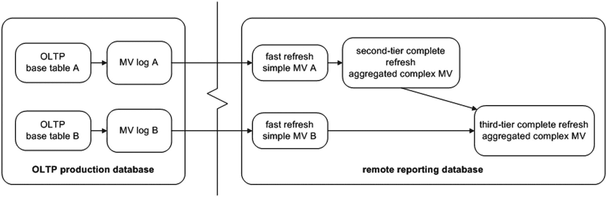
图 15-3 在主站点使用物化视图表日志的远程刷新

图 15-4 说明了一种不允许在主基表上创建物化视图表日志的场景。这可能是因为另一个团队或组织拥有主（基）数据库，而所有者不愿意让您在主环境中创建物化视图表日志。在这种情况下，您必须对远程报表数据库使用完全物化视图刷新。当基表记录每天有很大比例被修改时，此架构也适用。在这种情况下，完全刷新可能比快速刷新更高效（因为您复制了大部分数据，而不仅仅是一小部分）。

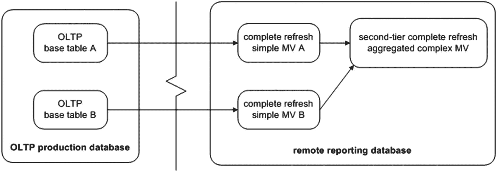
图 15-4 使用完全物化视图刷新的远程刷新

图 15-5 展示了一种场景，其中您先将基表复制到一个暂存数据库，然后再从暂存数据库复制到报表数据库。当网络架构配置成将报表数据库放置在无法直接连接到加固的生产环境的网段时，这种情况很常见。在这种情况下，您可以构建一个中间数据库，该数据库驻留在一个既能连接到 OLTP 数据库又能连接到报表数据库的网络中。请注意，物化视图表日志是在安全暂存数据库中的物化视图上构建的。在此配置中刷新时，您必须协调暂存数据库和报表数据库的刷新时间，以确保刷新期间没有重叠。

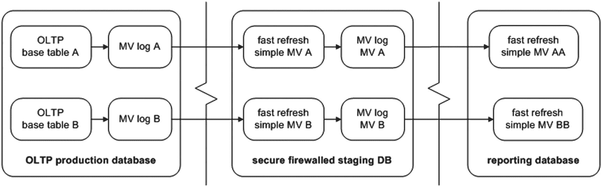
图 15-5 两跳远程快速物化视图刷新

注意：有时，基于另一个物化视图构建的物化视图被称为嵌套物化视图。

### 查看物化视图基表信息

在诊断物化视图问题时，查看物化视图及其关联的远程主表非常有用。在包含物化视图的数据库上运行以下查询，以提取主所有者和表信息：

```
SQL> select
owner        mv_owner
,name         mv_name
,master_owner mast_owner
,master       mast_table
from dba_mview_refresh_times
order by 1,2;
```

前面的查询报告每个物化视图及其所基于的主表。基表可以是本地的，也可以是远程的。

### 确定有多少物化视图引用中心物化视图表日志

假设您有一个主表，上面有一个物化视图表日志。此外，有多个远程物化视图使用这个中心主物化视图表日志。图 15-6 说明了这种配置。

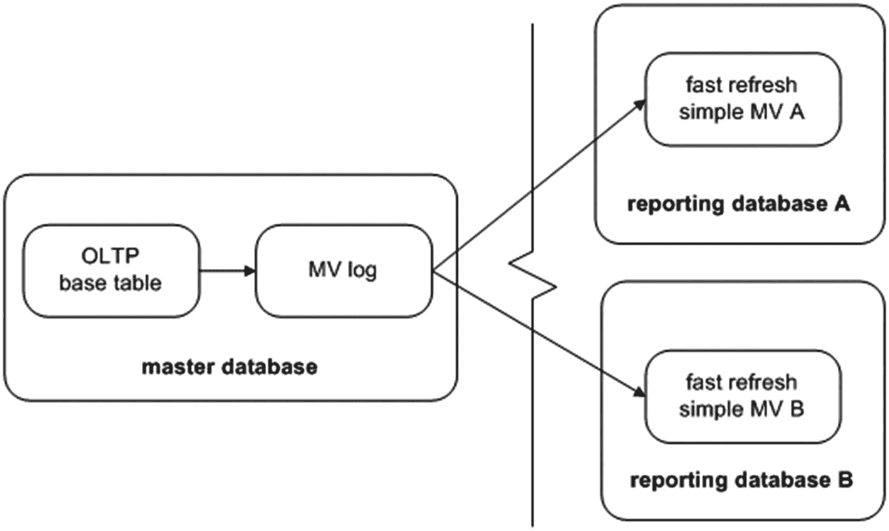
图 15-6 多个远程物化视图使用相同的集中式物化视图表日志

在这种情况下，Oracle 会保留在物化视图表日志中的记录，直到所有物化视图都完成刷新。例如，假设物化视图 `A` 的 `LAST_REFRESH_DATE` 是 2013 年 7 月 1 日，物化视图 `B` 的 `LAST_REFRESH_DATE` 是 2013 年 9 月 1 日。然后，物化视图 `A` 在 2013 年 10 月 1 日刷新。主日志只清除早于 2013 年 9 月 1 日的记录（因为物化视图 `B` 仍然需要较新的日志记录）。

如果一个物化视图被删除且无法从主物化视图表日志表中注销自身，则主物化视图表日志表中的记录会无限增长。要解决此问题，您需要有关哪些物化视图与哪些物化视图表日志相关联的信息。此查询显示主表所有者信息和所有相关物化视图的 `SNAPID`（物化视图 ID）：

```
SQL> select mowner
,master base_table
,snapid, snaptime
from sys.slog$;
```

以下是一些示例输出，显示两个物化视图连接到一个物化视图表日志：

```
MOWNER          BASE_TABLE               SNAPID SNAPTIME
--------------- -------------------- ---------- ---------
INV_MGMT        PRODUCT_TAXONOMY            653 28-JAN-13
INV_MGMT        COMPANY_ACCOUNTS            650 28-JAN-13
INV_MGMT        CMP_GRP_ASSOC               651 28-JAN-13
```


## 管理物化视图

### 查询物化视图日志

下一个查询显示所有已创建的、关联到物化视图日志的物化视图信息。请在主站点运行此查询：

```sql
SQL> select a.log_table, a.log_owner
,b.master mast_tab
,c.owner  mv_owner
,c.name   mview_name
,c.mview_site, c.mview_id
from dba_mview_logs a
,dba_base_table_mviews b
,dba_registered_mviews c
where b.mview_id = c.mview_id
and   b.owner    = a.log_owner
and   b.master   = a.master
order by a.log_table;
```

以下是一些示例输出：

```sql
LOG_TABLE             LOG_OWNE   MAST_TAB        MV_OWN   MVIEW_NAME
-------------------   --------   -------------   ------   ---------------- MVIEW_S   MVIEW_ID-------   -------
MLOG$_CMP_GRP_ASSOC   INV_MGMT   CMP_GRP_ASSOC   REP_MV   CMP_GRP_ASSOC_MV DWREP     651
MLOG$_CMP_GRP_ASSOC   INV_MGMT   CMP_GRP_ASSOC   TSTDEV   CMP_GRP_ASSOC_MV ENGDEV    541
```

当你删除一个远程物化视图时，它应该从主数据库中取消注册。然而，这并不总是发生。远程数据库可能被清除（例如，一个短期的开发数据库），物化视图没有机会通过`DROP MATERIALIZED VIEW`语句自行注销。在这种情况下，物化视图日志不知道一个依赖的物化视图已不再可用，因此会无限期地保留记录。

### 清理物化视图信息

要从包含物化视图日志的数据库中清除不需要的物化视图信息，请执行`DBMS_MVIEW`包的`PURGE_MVIEW_FROM_LOG`过程。此示例传入要清除的物化视图 ID：

```sql
SQL> exec dbms_mview.purge_mview_from_log(541);
```

此语句应更新数据字典，并从内部表`SLOG$`和`DBA_REGISTERED_MVIEWS`中移除信息。如果被清除的物化视图是与物化视图日志表关联的最旧的物化视图，则关联的旧记录也会从物化视图日志中删除。

如果一个远程物化视图不再可用，但仍注册在物化视图日志表中，你可以在主站点手动注销它。使用`DBMS_MVIEW`包的`UNREGISTER_MVIEW`过程来注销远程物化视图。为此，你需要知道远程物化视图的所有者、名称和站点（可从本节前一个查询的输出中获得）：

```sql
SQL> exec dbms_mview.unregister_mview('TSTDEV','CMP_GRP_ASSOC_MV','ENGDEV');
```

如果成功，之前的操作将从`DBA_REGISTERED_MVIEWS`中移除一条记录。

## 管理物化视图组

物化视图组是一个有用的功能，它使你能够在一致的事务点时间刷新一组物化视图。如果你要刷新的物化视图基于具有父子关系的主表，那么你很可能应该使用刷新组。此方法可确保你的刷新物化视图集合中不会有任何孤立的子记录。以下部分描述了如何创建和维护物化视图刷新组。

> 注意
> 你使用`DBMS_REFRESH`包来完成管理物化视图刷新组涉及的大多数任务。此包在 Oracle 高级复制管理 API 参考指南中有完整记录，可从 Oracle 网站的技术网络区域下载：[`http://otn.oracle.com`](http://otn.oracle.com)。

### 创建物化视图组

你使用`DBMS_REFRESH`包的`MAKE`过程来创建物化视图组。创建物化视图组时，必须指定一个名称、组中物化视图的逗号分隔列表、下一次刷新的日期以及用于计算下次刷新时间的间隔。以下是一个包含两个物化视图的组的示例：

```sql
SQL> begin
dbms_refresh.make(
name      => 'SALES_GROUP'
,list      => 'SALES_MV, SALES_DAILY_MV'
,next_date => sysdate-100
,interval  => 'sysdate+1'
);
end;
/
```

当你创建一个物化视图组时，Oracle 会自动创建一个数据库作业来管理该组的刷新。你可以通过查询`DBA/ALL/USER_REFRESH`来查看物化视图组的详细信息：

```sql
SQL> select rname, job, next_date, interval from user_refresh;
```

以下是一些示例输出：

```sql
RNAME            JOB   NEXT_DATE            INTERVAL
---------------  ----  -------------------  --------------
SALES_GROUP        3   20-OCT-12            sysdate+1
```

### 修改物化视图刷新组

你可以更改刷新组的特性，例如刷新日期或间隔。如果你依赖数据库作业作为刷新机制，那么你可能偶尔需要调整刷新特性。使用`DBMS_REFRESH`包的`CHANGE`函数来实现这一点。以下示例更改了`INTERVAL`计算：

```sql
SQL> exec dbms_refresh.change(name=>'SALES_GROUP',interval=>'SYSDATE+2');
```

同样，只有当你使用内部数据库作业来启动物化视图组刷新时，才需要更改刷新间隔。你可以使用以下查询验证刷新组的间隔和作业信息的详细信息：

```sql
SQL> select a.job, a.broken, b.rowner, b.rname, b.interval
from dba_jobs    a
,dba_refresh b
where a.job = b.job
order by a.job;
```

这是本例的输出：

```sql
JOB  B ROWNER     RNAME           INTERVAL
---- - ---------- --------------- ---------------
3 N MV_MAINT   SALES_GROUP     SYSDATE+2
```

### 刷新物化视图组

创建组后，你可以使用`DBMS_REFRESH`包的`REFRESH`函数手动刷新它。此示例刷新你之前创建的组：

```sql
SQL> exec dbms_refresh.refresh('SALES_GROUP');
```

如果你检查`USER_MVIEWS`的`LAST_REFRESH_DATE`列，你会注意到组中的所有物化视图具有相同的刷新时间。这是预期的行为，因为组中的物化视图都在一致的事务点时间刷新。

### DBMS_MVIEW 与 DBMS_REFRESH

你可能已经注意到，你可以使用`DBMS_MVIEW`包来刷新一组物化视图。例如，你可以使用`DBMS_MVIEW`刷新列表中的一组物化视图，如下所示：

```sql
SQL> exec dbms_mview.refresh(list=>'SALES_MV,SALES_DAILY_MV');
```

此方法在单个事务中刷新列表中的每个物化视图。它等同于使用物化视图组。但是，当你使用`DBMS_MVIEW`时，你可以选择将`ATOMIC_REFRESH`参数设置为`TRUE`（默认值）或`FALSE`。例如，这里将`ATOMIC_REFRESH`参数设置为`FALSE`：

```sql
SQL> exec dbms_mview.refresh(list=>'SALES_MV,SALES_DAILY_MV',atomic_refresh=>false);
```

此设置指示`DBMS_MVIEW`将列表中的每个物化视图作为单独的事务进行刷新。前面的代码行等同于以下两行：

```sql
SQL> exec dbms_mview.refresh(list=>'SALES_MV', atomic_refresh=>false);
SQL> exec dbms_mview.refresh(list=>'SALES_DAILY_MV', atomic_refresh=>false);
```

将此与`DBMS_REFRESH`的行为进行比较，后者是你应该用来设置和维护物化视图组的包。`DBMS_REFRESH`包总是将一组物化视图作为一个一致的事务进行刷新。如果你总是需要一组物化视图作为一个事务一致的组进行刷新，请使用`DBMS_REFRESH`。如果你需要一些灵活性，决定是否将一组物化视图作为一个一致的事务（或不是）进行刷新，请使用`DBMS_MVIEW`。

### 确定组中的物化视图

当你调查物化视图刷新组的问题时，一个很好的起点是显示该组包含哪些物化视图。查询数据字典视图`DBA_RGROUP`和`DBA_RCHILD`，以查看刷新组中的物化视图：

```sql
SQL> select a.owner
,a.name mv_group
,b.name mv_name
from dba_rgroup a
,dba_rchild b
where a.refgroup = b.refgroup
and   a.owner    = b.owner
order by a.owner, a.name, b.name;
```

以下是一段输出：

```sql
OWNER      MV_GROUP             MV_NAME
---------- -------------------- --------------------
MV_MAINT   SALES_GROUP          SALES_DAILY_MV
MV_MAINT   SALES_GROUP          SALES_MV
```

在`DBA_RGROUP`视图中，`NAME`列代表刷新组的名称。`DBA_RCHILD`视图包含刷新组中每个物化视图的名称。

### 向刷新组添加物化视图


随着业务需求的变化，您偶尔需要向一个刷新组中添加一个物化视图。使用 `DBMS_REFRESH` 包中的 `ADD` 过程来完成此任务：

```
SQL> exec dbms_refresh.add(name=>'SALES_GROUP',list=>'PRODUCTS_MV,USERS_MV');
```

您必须指定一个组名，并提供一个以逗号分隔的、要添加的物化视图名称列表。新添加的物化视图将在组下一次刷新时得到刷新。
将物化视图添加到组中的另一种方法是先删除该组，然后使用新的物化视图重新创建它。但是，通常直接添加物化视图是更可取的做法。

### 从刷新组中移除物化视图

有时，您需要从组中移除一个物化视图。为此，使用 `DBMS_REFRESH` 包中的 `SUBTRACT` 函数。
此示例从组中移除一个物化视图：

```
SQL> exec dbms_refresh.subtract(name=>'SALES_GROUP',list=>'SALES_MV');
```

您必须指定物化视图组的名称，并提供一个包含要移除的物化视图名称的、以逗号分隔的列表。
从组中移除物化视图的另一种方法是先删除该组，然后在不包含不需要的物化视图的情况下重新创建它。但是，通常直接移除物化视图是更可取的做法。

### 删除物化视图刷新组

如果需要删除一个物化视图刷新组，请使用 `DBMS_REFRESH` 包中的 `DESTROY` 过程。
此示例删除名为 `SALES_GROUP` 的物化视图组：

```
SQL> exec dbms_refresh.destroy('SALES_GROUP');
```

此方法仅删除物化视图刷新组对象——它不会删除任何实际的物化视图。如果您也需要删除物化视图，请使用 `DROP MATERIALIZED VIEW` 语句。

## 总结

有时，术语“物化视图”会让刚接触这项技术的人感到困惑。也许 Oracle 本应将此特性命名为“定期清理并重新填充包含查询结果的表”，但这可能是个过长的短语。无论如何，当您理解了此工具的强大之处后，您就可以用它来复制和聚合大量数据。您可以通过定期计算和存储复杂数据聚合的结果来显著提高查询性能。

物化视图可以是快速可刷新的，这意味着它们只复制自上次刷新以来在主表中发生的更改。要使用此类物化视图，您必须在主表上创建一个物化视图日志。并不总是能够创建物化视图日志；在这些情况下，物化视图必须进行完全刷新。

如果需要，您还可以使用物化视图压缩和加密数据。这有助于更好的空间管理和安全性。此外，您可以对物化视图所使用的基表进行分区，以实现更好的可扩展性、性能和可用性。

物化视图有许多选项能够将此数据用于报告、另一个数据库、集成和数据 API。讨论数据的使用以提供正确的刷新计划并理解物化视图中提供的数据非常重要。

前几章重点介绍了 DBA 经常使用的专门化数据库特性。这些特性包括大对象、分区、Data Pump、外部表和物化视图。现在本书将重点转向 DBA 必须熟悉的一个最重要的主题：备份与恢复。用户管理的备份和 RMAN 将在接下来的几章中介绍。

## 17. 配置 RMAN

Oracle Recovery Manager (RMAN) 在您安装 Oracle 软件（包括标准版和企业版）时默认提供。RMAN 提供了一套强大而灵活的备份与恢复功能。以下列表突出显示了一些最显著的特点：

*   用于备份、恢复和恢复的易于使用的命令。
*   能够跟踪哪些文件已被备份以及备份位置。
*   管理过时备份和归档日志的删除。
*   并行化：可以使用多个进程进行备份、恢复和恢复。
*   增量备份，仅备份自上次备份以来的更改。
*   能够将增量备份应用到映像副本。
*   支持在数据库、表空间、数据文件、表或块级别进行恢复。
*   先进的压缩和加密功能。
*   与用于磁带备份的介质管理器集成。
*   备份验证与测试。恢复验证与测试。
*   跨平台数据转换。
*   数据恢复顾问，可协助诊断故障并提出解决方案。
*   能够检测数据文件中的损坏块。
*   从 RMAN 命令行进行高级报告。

本章的目标是提供足够的 RMAN 信息，以便您可以就如何实施可靠的备份策略做出合理的决策。首先描述基本的 RMAN 组件，然后逐步介绍实施 RMAN 时涉及的许多决策点。

> **注意**：本书中与 RMAN 相关的章节并非旨在作为关于备份和恢复所有方面的完整参考。那需要一整本书来阐述。这些章节包含了您成功使用 RMAN 所需的基本信息。如果您需要关于备份、恢复和恢复的高级 RMAN 信息，请参阅 Darl Kuhn, Sam Alapati 和 Arup Nanda 所著的《RMAN Recipes for Oracle Database 12c》第二版 (Apress, 2013)。

## 理解 RMAN

RMAN 生态系统由许多不同的组件组成。图 17-1 显示了主要 RMAN 部件的交互。在阅读本节时请参考此图。

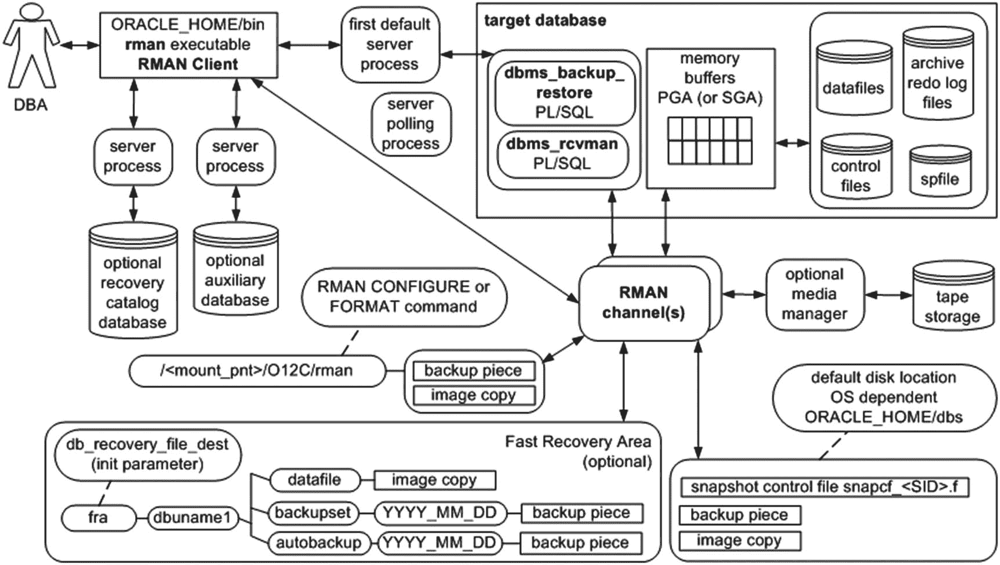

**图 17-1** RMAN 架构组件

以下列表描述了 RMAN 的架构组件：

*   `DBA`：人工交互以确保备份和恢复成功。
*   **目标数据库**：正在被 RMAN 备份的数据库。您使用 RMAN 命令行的 `TARGET` 参数连接到目标数据库（有关更多详细信息，请参见下一节）。
*   **RMAN 客户端**：您从中发出 `BACKUP`、`RESTORE` 和 `RECOVER` 命令的 `rman` 实用程序。在大多数数据库服务器上，`rman` 实用程序位于 `ORACLE_HOME/bin` 目录中（与其他 Oracle 实用程序（如 `sqlplus` 和 `expdp`）一起）。
*   **Oracle 服务器进程**：当您执行 `rman` 客户端并连接到目标数据库时，会启动两个 Oracle 服务器后台进程。第一个默认服务器进程与 PL/SQL 包交互以协调备份活动。辅助轮询进程偶尔会更新 Oracle 数据字典结构。
*   **通道**：用于处理正在备份（或恢复）的文件与备份设备（磁盘或磁带）之间 I/O 的 Oracle 服务器进程。
*   **PL/SQL 包**：RMAN 使用两个内部 PL/SQL 包（由 `SYS` 拥有）来执行备份和恢复任务：`DBMS_RCVMAN` 和 `DBMS_BACKUP_RESTORE`。`DBMS_RCVMAN` 访问控制文件中的信息并将其传递给 RMAN 服务器进程。`DBMS_BACKUP_RESTORE` 包执行 RMAN 的大部分工作。例如，此包创建系统调用，指导通道进程执行备份与恢复操作。
*   **内存缓冲区**：RMAN 在从数据文件读取并后续复制块以备份到文件时，使用 PGA（有时也使用 SGA）中的一个内存区域作为缓冲区。
*   **辅助数据库**：RMAN 将目标数据库数据文件恢复到此数据库，用于复制数据库、创建 Data Guard 备用数据库或执行数据库时间点恢复。
*   **备份**：可以是名词也可以是动词。存储备份文件的物理文件（备份）；或者，复制和归档文件（备份）的行为。备份可以包括备份集和备份片段或映像副本。


## RMAN 备份与恢复架构

### 备份集
当您运行 RMAN `BACKUP` 命令时，默认情况下会创建一个或多个备份集。备份集是一种逻辑 RMAN 构造，用于分组备份片段文件。您可以将备份集与备份片段的关系理解为类似于表空间与数据文件的关系：一个是逻辑构造，另一个是物理文件。

### 备份片段文件
RMAN 二进制备份文件。每个逻辑备份集由一个或多个备份片段文件组成。这些是 RMAN 在磁盘或磁带上创建的物理文件。它们是二进制的、专有格式的文件，只有 RMAN 能读写。一个备份片段可以包含来自许多不同数据文件的块。备份片段文件通常比数据文件小，因为备份片段只包含数据文件中已使用的块。

### 映像副本
使用 `BACKUP AS COPY` 命令启动。一种备份类型，RMAN 创建数据文件、归档日志文件或控制文件的完全相同的副本。映像副本可以由操作系统实用程序（如 Linux 的 `cp` 和 `mv` 命令）进行操作。映像副本是增量更新映像备份的一部分。有时，如果您需要能够快速恢复，使用映像副本比使用备份集更可取。

### 恢复目录
一个可选的数据库模式，包含用于存储 RMAN 备份操作元数据信息的表。Oracle 强烈建议使用恢复目录，因为它提供了更多的备份和恢复选项。目录通常是远程的，并且不必在每个数据库中都存在。

### 媒体管理器
允许 RMAN 直接备份文件到磁带的第三方软件。当您没有足够空间直接备份到磁盘，或者灾难恢复要求需要备份到可以轻松转移到异地的存储时，备份到磁带是可取的。

### 快速恢复区
RMAN 可以用于备份的磁盘区域。您还可以使用 FRA 来多路复用控制文件和在线重做日志。您通过数据库初始化参数 `DB_RECOVERY_FILE_DEST_SIZE` 和 `DB_RECOVERY_FILE_DEST` 来实例化一个快速恢复区。

### 快照控制文件
当备份控制文件或与恢复目录（如果正在使用）同步时，RMAN 需要控制文件的一致性视图。在这些情况下，RMAN 首先创建控制文件的临时副本（快照）。这允许 RMAN 使用一个保证在备份控制文件或与正在使用的恢复目录同步时不会改变的版本。

您可以使用 RMAN 制作几种类型的备份：

### 完全备份
备份与数据文件相关的所有已修改块。完全备份不是整个数据库的备份。例如，您可以制作一个数据文件的完全备份。

### 增量级别 0 备份
备份与完全备份相同的块。级别 0 备份与完全备份的唯一区别是，您可以将级别 0 备份与其他增量备份一起使用，但不能使用完全备份。

### 增量级别 1 备份
仅备份自上次备份以来已修改的块。级别 1 增量备份可以是差异备份或累积备份。差异级别 1 备份是默认选项，备份自上次级别 0 或级别 1 备份以来所有已修改的块。累积级别 1 备份备份自上次级别 0 备份以来所有已更改的块。

### 增量更新备份
首先创建数据文件的映像副本，之后的备份是增量备份，这些增量备份会与映像副本合并。这是一种高效使用映像副本进行备份的方法。使用增量更新备份的介质恢复速度很快，因为恢复时使用的是数据文件的映像副本。

### 块更改跟踪
跟踪数据库中已更改块的数据库功能。已更改块的记录保存在一个二进制文件中。RMAN 可以使用二进制文件的内容来提高增量备份的性能：RMAN 不必扫描数据文件中所有已修改的块，而是可以通过二进制块更改跟踪来确定哪些块已更改。

### 归档日志备份
此操作执行归档日志的备份，并允许释放归档日志目录中的空间。归档日志备份通常作为数据文件的一部分包含在内，但也可以单独运行以管理归档日志的磁盘空间。

现在您已经了解了 RMAN 的架构组件和您可以制作的备份类型，您已准备好启动 RMAN 并为您的环境配置它。

## 启动 RMAN
要连接到 RMAN，您需要建立：

*   操作系统环境变量
*   访问具有特权的操作系统账户或具有 **SYSBACKUP** 权限的数据库用户

连接到 RMAN 最简单的方法是登录到目标数据库所在的服务器，作为 Oracle 软件的所有者（通常在 Linux/Unix 系统上名为 `oracle`）。当您以 `oracle` 身份登录时，您需要先建立几个操作系统变量，然后才能使用 `rman` 和 `sqlplus` 等实用程序。设置这些必需的操作系统变量在第 2 章有详细介绍。RMAN 可以从安装了 Oracle 软件的另一台服务器运行。连接到目标数据库以执行备份需要服务或 SID 名称。
至少需要设置 `ORACLE_HOME` 和 `ORACLE_SID`。
此外，如果 `PATH` 变量包含目录 `ORACLE_HOME/bin` 会很方便。这是包含 Oracle 实用程序的目录。

建立操作系统变量后，您可以从操作系统调用 RMAN，如下所示：

```
$ rman target /
Or
$ rman target backupuser@ora18c
```

连接到 RMAN 时，您不必指定 `AS SYSDBA` 子句（就像在 SQL*Plus 中以特权用户身份连接到数据库时那样）。这是因为 RMAN 总是要求您以具有 `SYSDBA` 权限的数据库用户身份连接。任何用户都需要被授予 `SYSBACKUP` 角色才能执行备份。

> 提示
> Oracle Database 12c 中新增的 **SYSBACKUP** 权限允许您仅向用户分配执行备份和恢复操作所需的权限。**SYSBACKUP** 权限包含执行此类操作所需的 **SYSDBA** 权限的子集。


## RMAN 架构决策

之前登录 RMAN 的示例使用了操作系统认证。这种认证方式意味着，如果你能登录到一个授权的操作系统账户（例如 Oracle 软件的所有者，通常是 `oracle`），那么你就被允许连接到数据库，而无需提供用户名和密码。你通过向操作系统账户分配特殊的组来管理操作系统认证。在 Linux/Unix 环境中安装 Oracle 二进制文件时，需要在安装时指定分配了 `SYSDBA`、`SYSOPER`、`SYSBACKUP` 数据库权限的操作系统组名——通常分别是 `dba`、`oper` 和 `backupdba` 组（详见第 1 章）。作为企业备份解决方案的一部分，建议创建一个单独的用户来执行备份，以便备份到磁盘或磁带，并计划自动运行。

### （不）从 SQL*PLUS 中调用 RMAN

在 SQLPLUS 会话中意外尝试 RMAN 命令，或者只是尝试从 SQLPLUS 中运行 RMAN，这是非常典型的情况。嗯，这行不通：
`SQL> rman`
`SP2-0042: 未知命令 "rman" - 忽略该行其余部分。`
答案很简短：`rman` 客户端是一个操作系统实用程序，而不是 SQL*Plus 的功能。你必须从操作系统提示符调用 `rman` 客户端。

如果你的数据库启用了归档（有关归档的详细信息，请参见第 5 章），你可以直接使用 RMAN 来运行如下命令备份整个目标数据库：

```
$ rman target /
RMAN> backup database;
```

如果遇到介质故障，你可以按如下方式恢复所有数据文件：

```
RMAN> shutdown immediate;
RMAN> startup mount;
RMAN> restore database;
```

数据库恢复后，你可以完全恢复它：

```
RMAN> recover database;
RMAN> alter database open;
```

这样就搞定了，对吧？不，还不完全是。RMAN 的默认属性对于简单的备份需求设置得相当合理。RMAN 开箱即用的设置可能适用于小型开发或测试数据库。但是，对于任何类型的业务关键型数据库，你都需要仔细考虑备份存储的位置、在磁盘或磁带上存储备份的时间、哪些 RMAN 功能适合该数据库等等。本章接下来的几节将引导你了解在生产环境中实施 RMAN 所需的许多备份和恢复架构决策。RMAN 有大量强大的选项可用于自定义备份、管理备份文件和执行恢复；通常，你不需要实施 RMAN 的许多功能。但是，每次你实施 RMAN 来备份生产数据库时，都应该仔细考虑每个决策点，并决定是否需要某个属性。

表 17-1 总结了后续章节中的 RMAN 实施。许多 DBA 可能对其中一些建议持有不同意见；这没关系。关键在于你需要考虑每个架构方面，并确定什么对你的业务需求有意义。

#### 表 17-1 架构决策和建议概述

| 决策点 | 建议 |
| --- | --- |
| 1. 远程或本地运行 RMAN 客户端 | 在目标数据库服务器上本地运行客户端。 |
| 2. 指定备份用户 | 创建一个用于执行备份的用户。 |
| 3. 使用联机或脱机备份 | 取决于你的业务需求。大多数生产数据库需要联机备份，这意味着你必须启用归档。 |
| 4. 设置归档日志目标和文件格式 | 如果你使用 FRA（快速恢复区），归档日志将以默认格式写入其中。要使用 `LOG_ARCHIVE_DEST_N` 初始化参数在 FRA 外明确设置位置。 |
| 5. 配置 RMAN 备份位置和文件格式 | 取决于你的业务需求。有些环境需要磁带备份。如果使用磁盘，请将备份放在 FRA 中，或通过通道设置指定位置。使用 FRA 可以动态增加存储大小。磁带备份可以在创建备份集后运行，通常效率更高。 |
| 6. 设置控制文件的自动备份 | 始终启用控制文件的自动备份。 |
| 7. 指定控制文件自动备份的位置 | 将其放在 FRA 中，或配置一个位置。将控制文件的自动备份写入与数据库备份相同的位置是有意义的。 |
| 8. 备份归档日志 | 取决于你的业务需求。对于许多环境，备份归档日志可以每天进行一次，使用与备份数据库相同的命令，或者在空间需要时触发。 |
| 9. 确定快照控制文件的位置 | 使用默认位置。 |
| 10. 使用恢复目录 | 取决于你的业务需求。Oracle 建议你使用恢复目录。如果 RMAN 保留策略大于 `CONTROL_FILE_RECORD_KEEP_TIME`，那么我建议你使用恢复目录。 |
| 11. 使用介质管理器 | 这是直接备份到磁带所必需的。 |
| 12. 设置 `CONTROL_FILE_RECORD_KEEP_TIME` 初始化参数 | 通常，默认的 7 天就足够了。 |
| 13. 配置 RMAN 的备份保留策略 | 取决于你的数据库和业务需求。对于许多环境，我使用 1 或 2 的备份保留冗余度。 |
| 14. 配置归档日志的删除策略 | 取决于你的数据库和业务需求。在许多场景中，将备份保留策略应用于归档日志就足够了（这是默认行为）。 |
| 15. 设置并行度 | 取决于可用的硬件资源和业务需求。对于大多数具有多个 CPU 的生产服务器，根据可用 CPU 配置 2 或更大的并行度。 |
| 16. 使用备份集或映像副本 | 备份集通常比映像副本更小且更易于管理。 |
| 17. 使用增量备份 | 当数据库在备份之间只有很小比例发生变化并且你想节省磁盘空间时，对大型数据库使用增量备份。在大型数据库和数据仓库类型数据库中使用增量备份。 |
| 18. 使用增量更新备份 | 如果你需要数据文件的映像副本，请使用此方法。 |
| 19. 使用块更改跟踪 | 使用此功能来提高增量备份的性能。对于大型数据仓库类型数据库，块更改跟踪可以显著节省备份时间，因为它跟踪已更改的块，因此备份无需读取头来确定块是否已更改。 |
| 20. 配置二进制压缩 | 取决于你的业务需求。压缩备份占用空间更少，但需要更多的 CPU 资源（和时间）进行备份和恢复操作。 |
| 21. 配置加密 | 取决于你的业务需求。 |
| 22. 配置其他设置 | 你可以设置许多与通道相关的属性，例如备份集大小和备份片大小。根据需要进行配置。 |
| 23. 配置信息输出 | 配置操作系统变量 `NLS_DATE_FORMAT` 以显示日期和时间。使用 `SET ECHO ON` 和 `SHOW ALL` 来显示 RMAN 命令和设置。 |

### 1. 远程或本地运行 RMAN 客户端

可以从远程服务器运行 `rman` 实用程序，并通过 Oracle Net 连接到目标数据库：

```
$ rman target sys/foo@remote_db
```

这允许你从一个中央位置在不同的远程服务器上运行 RMAN 备份。当你远程运行 RMAN 时，备份文件总是在目标数据库服务器上创建。


在本地运行且配置好数据库环境变量后，RMAN 可以这样运行：

```bash
$ rman target /
```

如果远程运行 RMAN，你需要确保远程的 `rman` 可执行文件与目标数据库兼容。例如，你可以确认你正在运行的远程 `rman` 可执行文件是 Oracle Database 12c 版本的 RMAN 客户端，它与几个早期版本的 Oracle 数据库兼容。如果你在目标服务器上本地运行 `rman` 客户端，则永远不会存在兼容性问题，因为 `rman` 客户端总是与目标数据库版本相同。

### 2. 指定备份用户

如前所述，RMAN 要求你使用具有 `SYSDBA` 特权的数据库用户。无论我是从命令行运行 RMAN 还是在脚本中调用 RMAN，在大多数场景下，使用一个备份用户都是合适的。例如，以下是如何从命令行连接到 RMAN：

```bash
$ rman target BACKUPUSER/$password
```

一些 DBA 不使用这种方法；他们选择建立一个独立于 `SYS` 的用户，并以安全考虑作为这样做的理由。密码变量可以从一个安全的加密文件中读取密码，或使用其他方法来获取密码。本章的其他示例可能会展示 `SYS` 用户的用法：

```bash
$ rman target /
```

### 3. 使用联机或脱机备份

大多数生产数据库都有 24*7 的可用性要求。因此，你唯一的选择是联机 RMAN 备份。你的数据库必须处于归档日志模式才能进行联机备份。你需要仔细考虑如何放置归档日志、如何格式化它们、多久备份一次以及在删除前保留多长时间。这些主题将在后续章节中讨论。

注意：如果你进行脱机备份，你必须使用 `IMMEDIATE`、`NORMAL` 或 `TRANSACTIONAL` 选项关闭数据库，然后将其置于加载模式。RMAN 需要数据库处于加载模式，以便它可以读取和写入控制文件。

### 4. 设置归档日志目标位置和文件格式

启用归档重做日志模式是进行联机备份的先决条件（有关归档日志目标位置和格式的架构决策以及如何启用/禁用归档日志模式的完整讨论，请参见第 5 章）。

当启用归档日志模式时，Oracle 会将归档日志写入以下一个或多个位置（你可以配置将归档日志写入 FRA 以及通过初始化参数手动设置的其他几个位置）：

*   默认位置
*   FRA（快速恢复区）
*   通过 `LOG_ARCHIVE_DEST_N` 初始化参数指定的位置

如果你不使用 FRA，并且也没有通过 `LOG_ARCHIVE_DEST_N` 初始化参数显式设置归档日志目标位置，那么默认情况下，归档日志将被写入一个与操作系统相关的位置。在许多 Linux/Unix 系统上，默认位置是 `ORACLE_HOME/dbs` 目录。归档日志的默认文件名格式是 `%t_%s_%r.dbf`。该格式是引用日期、备份集编号等的简写形式。%t 是时间戳，%s 是日志序列号，%r 是重置日志 ID。

如果你启用了 FRA（并且没有设置 `LOG_ARCHIVE_DEST_N`），那么默认情况下，归档日志将被写入 FRA 中的一个目录。在 FRA 中创建的归档日志文件的默认文件名格式是 Oracle 托管文件格式。文件存储在以数据库唯一名称命名的子目录中；例如：

```text
<db_unique_name>/archivelog/<thread_number>/o1_mf_1_1078_68dx5dyj_.arc
```

建议使用 FRA。要使用 `LOG_ARCHIVE_DEST_N` 参数设置归档日志文件的位置，请参照此示例：

```sql
log_archive_dest_1='LOCATION=/oraarch1/CHNPRD'
```

这也是一个推荐的默认归档日志文件名格式：

```sql
log_archive_format='%t_%s_%r.arc'
```

有时，DBA 对数据文件和归档日志文件都使用 `.dbf` 作为扩展名。我更喜欢对归档日志文件使用 `.arc`。`.arc` 扩展名可以避免将文件识别为归档日志文件还是活动数据库数据文件时可能引起的混淆。

### 5. 配置 RMAN 备份位置和文件格式

当你为基于磁盘的备份运行 `BACKUP` 命令时，RMAN 会在以下位置之一创建备份片：

*   默认位置
*   FRA
*   通过 `BACKUP...FORMAT` 命令指定的位置
*   通过 `CONFIGURE CHANNEL...FORMAT` 命令指定的位置

#### 默认位置

如果你没有配置任何 RMAN 变量，也没有设置 FRA，默认情况下 RMAN 会分配一个基于磁盘的通道，并将备份文件写入默认位置。例如，你可以在不配置任何 RMAN 参数的情况下运行以下命令：

```sql
RMAN> backup database;
```

默认位置因操作系统而异。在许多 Linux/Unix 环境中，默认位置是 `ORACLE_HOME/dbs`。所创建备份文件的默认名称格式是 OMF 格式；例如：

```text
/dbs/01ln9g7e_1_1
```

提示：默认位置对于小型开发数据库来说是可以的。然而，对于大多数其他环境（尤其是生产环境），你需要提前规划备份所需的磁盘空间，并通过其他方法之一（例如实施 FRA 或 `CONFIGURE CHANNEL`）显式设置备份位置。

#### FRA

当备份到磁盘时，如果你没有明确指示 RMAN 将备份写入特定位置（通过 `FORMAT` 或 `CONFIGURE` 命令），并且你正在使用 FRA，RMAN 会自动将备份文件写入 FRA 中的目录。当你使用 FRA 时，RMAN 会在给定日期首次备份数据库时自动创建独立的目录。文件存储在以数据库唯一名称命名的子目录中。此外，在 FRA 中创建的备份文件的默认名称格式是 OMF 格式；例如，

```text
<db_unique_name>/backupset/<date>/o1_mf_nnndf_TAG20100907T025402_68czfbdf_.bkp
```

可以使用 `SYSTEM` 动态参数来设置 FRA 的大小或位置。如果备份集仍在被清除或者归档日志正在填满空间，这将非常有用；与其指望备份或文件移动完成，不如调整 FRA 大小，然后你可以将其缩小回原始大小。

#### BACKUP...FORMAT

如果你已经配置了 FRA，但不希望将 RMAN 备份文件自动放入 FRA，你可以在发出 `BACKUP` 命令时直接指定你希望放置备份的位置；例如，

```sql
RMAN> backup database format '/u01/O18C/rman/rman_%U.bkp';
```

这是 RMAN 生成的一个对应文件：

```text
/u01/O18C/rman/rman_0jnv0557_1_1.bkp
```

`%U` 指示 RMAN 为备份文件名动态构建一个唯一字符串。在大多数情况下需要唯一的名称，因为 RMAN 不会覆盖已存在的文件。这很重要，因为如果你指示 RMAN 并行写入，它需要为每个通道创建唯一的文件名；例如，

```sql
RMAN> configure device type disk parallelism 2;
```

现在，当你运行 `BACKUP` 命令时，你会看到这条消息：

```sql
RMAN> backup database format '/u01/O18C/rman/rman_%U.bkp';
```

RMAN 分配多个通道并并行写入两个不同的备份文件。格式字符串中的 `%U` 保证会创建唯一的文件名。

#### CONFIGURE CHANNEL...FORMAT

当写入多个磁盘位置时，使用 `CONFIGURE CHANNEL...FORMAT` 指定目录会更容易。这是一个典型的配置，指定了以下内容：


## 配置设备并行度与通道

```
RMAN> configure device type disk parallelism 3;
RMAN> configure channel 1 device type disk format '/u01/O18C/rman/rman1_%U.bk';
RMAN> configure channel 2 device type disk format '/u02/O18C/rman/rman2_%U.bk';
RMAN> configure channel 3 device type disk format '/u03/O18C/rman/rman3_%U.bk';
```

在上述配置中，应将设备类型的并行度设置为与分配的通道数相匹配。RMAN 仅分配由并行度指定的通道数量；其他已配置的通道将被忽略。例如，如果指定的并行度为 2，则无论通过 `CONFIGURE CHANNEL` 命令配置了多少通道，RMAN 都只分配两个通道。

在此配置三个通道的示例中，假设发出了 `BACKUP` 命令，如下所示：

```
RMAN> backup database;
```

RMAN 会分配三个通道，分别位于不同的挂载点（`/u01`, `/u02`, `/u03`），并并行写入到指定位置。RMAN 会在这三个位置创建其认为必要的尽可能多的备份片来完成数据库备份。

如果需要取消配置某个通道，请按如下方式操作：

```
RMAN> configure channel 3 device type disk clear;
```

**注意**
还需考虑配置的并行度高于预配置通道数的情况。RMAN 将为每个并行度打开一个通道，如果打开的通道数大于预配置的通道数，对于未配置的通道，RMAN 会将备份文件写入闪回恢复区（如果已配置）或默认位置。

## 设置控制文件的自动备份

应始终配置 RMAN，使其在运行任何 `BACKUP` 或 `COPY` 命令后，或在对数据库进行导致控制文件更新的物理更改（例如添加/删除数据文件）后自动备份控制文件。使用 `SHOW` 命令显示控制文件自动备份的当前设置：

```
RMAN> show controlfile autobackup;
```

部分示例输出如下：

```
RMAN configuration parameters for database with db_unique_name O18C are:
CONFIGURE CONTROLFILE AUTOBACKUP ON;
```

以下命令展示了如何启用控制文件自动备份功能：

```
RMAN> configure controlfile autobackup on;
```

控制文件的自动备份始终会进入其自己的备份集。当启用控制文件自动备份时，如果使用了 `spfile`，它也会与控制文件一起自动备份。

如果因任何原因想要禁用控制文件自动备份，可以按如下方式操作：

```
RMAN> configure controlfile autobackup off;
```

**注意**
如果控制文件自动备份处于关闭状态，那么每次备份数据文件 1（`SYSTEM` 表空间的数据文件）时，RMAN 都会自动备份控制文件。

## 指定控制文件自动备份的位置

启用控制文件自动备份后，RMAN 会在以下位置之一创建控制文件的备份：

*   默认位置
*   闪回恢复区
*   通过 `CONFIGURE CONTROLFILE AUTOBACKUP FORMAT` 命令指定的位置

如果未使用闪回恢复区，或未指定控制文件自动备份的位置，则控制文件自动备份会被写入一个依赖于操作系统的默认位置。在 Linux/Unix 环境中，默认位置是 `ORACLE_HOME/dbs`；例如：

```
/u01/app/oracle/product/18.1.0.1/db_1/dbs/c-3423216220-20130109-01
```

如果已启用闪回恢复区，RMAN 会自动使用 OMF 格式将控制文件自动备份文件写入闪回恢复区中的目录；例如：

```
///autobackup//o1_mf_s_729103049_68fho9z2_.bkp
```

控制文件备份可以与数据库备份放在同一目录中。示例如下：

```
RMAN> configure controlfile autobackup format for device type disk to
'/u01/O18C/rman/rman_ctl_%F.bk';
```


若要将自动备份格式重置为默认设置，请按以下方式操作：

```
RMAN> configure controlfile autobackup format for device type disk clear ;
```

## 8. 备份归档日志

您应定期备份归档日志。归档日志文件在至少备份一次之前，不应从磁盘中删除。我通常倾向于保留自上次成功的 RMAN 备份以来生成的所有归档日志在磁盘上。

通常，我指示 RMAN 在备份数据文件的同时备份归档日志。在大多数情况下，这是一个充分的策略。以下是随数据文件一起备份归档日志的命令：

```
RMAN> backup database plus archivelog;
```

有时，如果您的数据库生成大量重做日志，您可能需要以与数据文件不同的频率备份归档日志。DBA 可能每天备份归档日志两到三次；日志备份后，DBA 会删除它们，以便为更新的归档日志文件腾出空间。

在大多数情况下，您不需要上次成功备份之前生成的任何归档日志。例如，如果某个数据文件发生了介质故障，您需要从备份中恢复该数据文件，然后应用在该数据文件备份期间及之后生成的所有归档日志。

在某些情况下，您可能需要上次备份之前生成的归档日志。例如，您可能遇到介质故障，尝试从上次成功的备份恢复数据库，但发现该备份已损坏，因此需要从更早的备份进行恢复。此时，您需要自该旧备份创建以来生成的所有归档日志的副本。

## 9. 确定快照控制文件的位置

RMAN 需要控制文件的一致性视图来执行以下任务：

*   与恢复目录同步
*   备份当前的控制文件

RMAN 会创建当前控制文件的快照副本，在执行这些任务时将其用作一致性副本。这确保 RMAN 操作的是一个未被修改的控制文件副本。

快照控制文件的默认位置是操作系统特定的。在 Linux 平台上，默认位置/格式是 `ORACLE_HOME/dbs/snapcf_@.f`。请注意，默认位置不在 FRA（快速恢复区）中。

您可以使用 `SHOW` 命令显示当前快照控制文件的详细信息：

```
RMAN> show snapshot controlfile name;
```

以下是一些示例输出：

```
CONFIGURE SNAPSHOT CONTROLFILE NAME TO
'/ora01/app/oracle/product/18.1.0.1/db_1/dbs/snapcf_o18c.f'; # default
```

在大多数情况下，快照控制文件的默认位置和格式是足够的。该文件不占用太多空间，也没有密集的 I/O 要求。我建议您使用默认设置。

如果您有充分的理由需要将快照控制文件配置到非默认位置，可以按如下方式操作：

```
RMAN> configure snapshot controlfile name to '/u01/O18C/rman/snapcf.ctl';
```

如果您不小心将快照控制文件位置配置到了一个不存在的目录，那么在运行 `BACKUP` 或 `COPY` 命令时，控制文件的自动备份将失败，并出现此错误：

```
ORA-01580: error creating control backup file ...
```

您可以将快照控制文件设置回默认值，如下所示：

```
RMAN> configure snapshot controlfile name clear;
```

## 10. 使用恢复目录

RMAN 始终将其最新的备份操作存储在目标数据库控制文件中。您可以设置一个可选的恢复目录来存储有关 RMAN 备份的元数据。恢复目录是一个独立的模式（通常位于与目标数据库不同的数据库中），它包含存储 RMAN 备份信息的数据库对象（表、索引等）。恢复目录不存储 RMAN 备份片——仅存储备份元数据。

使用恢复目录的主要优势如下：

*   为 RMAN 元数据提供了一个辅助存储库。如果您丢失了所有控制文件及其备份，您仍然可以从恢复目录中检索 RMAN 元数据。
*   能够比仅使用控制文件作为存储库时更长久地保存 RMAN 元数据。
*   提供对所有 RMAN 功能的访问。使用恢复目录时，某些恢复和恢复功能会更简单。

使用恢复目录的缺点是，这是另一个需要您设置、维护和备份的数据库。此外，当您启动备份并尝试连接到恢复目录时，如果恢复目录因任何原因（服务器宕机、网络问题等）不可用，您可以在没有恢复目录的情况下继续进行备份。

使用恢复目录时，您还必须注意版本兼容性问题。您需要确保用于存储恢复目录的数据库版本与目标数据库的版本兼容。当您升级目标数据库时，请确保恢复目录也已升级（如有必要）。

注意
有关如何实现恢复目录的详细信息，请参见第 18 章。

## 11. 使用介质管理器

RMAN 需要介质管理器才能直接备份到磁带。多个供应商提供此功能（需付费）。介质管理器用于大型数据库环境，例如数据仓库，在这些环境中可能没有足够的空间将数据库备份到磁盘。您可能还有灾难恢复要求，需要直接备份到磁带。

如果您有此类要求，则应购买介质管理软件包并实施它。如果您不需要直接备份到磁带，则无需实现介质管理器。RMAN 直接备份到磁盘工作良好。备份文件可以复制到磁带进行异地存储，并且由于保留策略，可能需要这样做。如果要复制到磁带，您可以安排一个作业运行 RMAN 备份，然后启动复制到磁带的操作。备份文件必须是完整的，而不是处于备份过程中；否则，存在仅复制部分文件到磁带的风险。

提示
有关如何将 Oracle Secure Backup 实现为介质管理层的详细信息，请参见第 20 章。

## 12. 设置 CONTROL_FILE_RECORD_KEEP_TIME 初始化参数

`CONTROL_FILE_RECORD_KEEP_TIME` 初始化参数指定了控制文件中可重用记录在被覆盖前必须保留的最少天数。RMAN 元数据存储在控制文件的可重用部分中，因此最终会被覆盖。

如果您使用的是恢复目录，那么您无需担心此参数，因为 RMAN 元数据在恢复目录中是无限期存储的。因此，当您使用恢复目录时，您可以访问任何历史 RMAN 元数据。

如果您仅使用控制文件作为 RMAN 元数据存储库，那么存储在那里的信息最终将被覆盖。`CONTROL_FILE_RECORD_KEEP_TIME` 的默认值是 7 天：

```
SQL> show parameter control_file_record_keep_time
NAME                                 TYPE        VALUE
------------------------------------ ----------- --------------------------
control_file_record_keep_time        integer     7
```


您可以将此值设置为 0 到 365 天之间的任意值。将值设置为 0 意味着 RMAN 元数据信息可以随时被覆盖。

在旧版本的 Oracle 中，`CONTROL_FILE_RECORD_KEEP_TIME` 参数更为关键，因为如果元数据被覆盖，重新填充包含 RMAN 信息的控制文件并不容易。`C` 命令可用于快速使控制文件感知到 RMAN 备份文件。

如果您每天进行备份，那么我建议您将此参数保持为 7 天。但是，如果您每月仅备份一次数据库，或者由于某种原因，您的保留策略大于 7 天，并且您没有使用恢复目录，那么您可能需要考虑增加此值。增加此参数的缺点是，如果您有大量 RMAN 备份活动，这可能会增加控制文件的大小。

## 配置 RMAN 的备份保留策略

RMAN 保留策略允许您指定希望保留备份的时间长度。RMAN 有两种互斥的方法来指定保留策略：

*   恢复窗口
*   备份数量（冗余度）

### 恢复窗口

通过恢复窗口，您可以指定一个过去的天数，以便能够恢复到该窗口内的任何时间点。例如，如果您指定保留策略窗口为 5 天，则 RMAN 不会将能够恢复到这 5 天窗口内任何时间点所需的数据文件和归档日志备份标记为过时：
```
RMAN> configure retention policy to recovery window of 5 days;
```
对于指定的恢复窗口，RMAN 可能需要比 5 天窗口更早的备份，因为它可能需要一个较旧的备份作为起点，才能恢复到指定的恢复点。例如，假设您最近一次完好的备份是在 6 天前制作的，而现在您想恢复到 4 天前。对于此恢复窗口，RMAN 需要 6 天前的备份来还原并恢复到指定点。

### 冗余度

您也可以指定 RMAN 保留最少数量的备份。例如，如果冗余度设置为 2，则 RMAN 不会将数据文件和归档日志文件的最近两次备份标记为过时：
```
RMAN> configure retention policy to redundancy 2;
```
我发现基于冗余度的保留策略更易于操作，并且在备份保留时间方面更具可预测性。如果我将冗余度设置为 2，我知道 RMAN 不会将最近的两次备份标记为过时。相比之下，恢复窗口保留策略则取决于备份频率和窗口长度来确定备份是否过时。

### 根据保留策略删除备份

您可以报告 RMAN 根据保留策略确定为过时的备份，如下所示：
```
RMAN> report obsolete;
```
要删除过时的备份，请运行 `DELETE OBSOLETE` 命令：
```
RMAN> delete obsolete;
```
您将收到如下提示：
```
Do you really want to delete the above objects (enter YES or NO)?
```
如果您正在编写脚本来执行此过程，可以指定删除操作不提示输入：
```
RMAN> delete noprompt obsolete;
```
我通常将 `DELETE NOPROMPT OBSOLETE` 命令编码到备份数据库的 shell 脚本中。这指示 RMAN 根据保留策略删除任何过时的备份和过时的归档日志（有关如何使用 shell 脚本自动删除过时备份的示例，请参阅本章后面的“从决策到行动的过渡”部分）。

### 清除保留策略

默认的保留策略是冗余度为 1。您可以通过 `TO NONE` 命令完全禁用 RMAN 保留策略。
```
RMAN> configure retention policy to none;
```
当策略设置为 `NONE` 时，任何备份都不会被视为过时，因此无法通过 `DELETE OBSOLETE` 命令删除。这通常不是您想要的行为。您希望让 RMAN 根据基于窗口或备份数量的保留策略来删除备份。

要将保留策略重置回默认值，请使用 `CLEAR` 命令：
```
RMAN> configure retention policy clear;
```

## 配置归档日志删除策略

在大多数情况下，我让 RMAN 根据数据库备份的保留策略删除归档日志。这是默认行为。您可以使用 `SHOW` 命令查看数据库保留策略：
```
RMAN> show retention policy;
CONFIGURE RETENTION POLICY TO REDUNDANCY 1; # default
```
要根据数据库保留策略删除归档日志（和备份片），请运行以下命令：
```
RMAN> delete obsolete;
```
从 Oracle Database 11g 开始，您可以指定一个与数据库备份策略分开的归档日志删除策略。此删除策略适用于 FRA 内外和 FRA 内的归档日志。

注意：在 Oracle Database 11g 之前，归档删除策略仅适用于与备用数据库关联的归档日志。

要配置归档日志删除策略，请使用 `CONFIGURE ARCHIVELOG DELETION` 命令。以下命令配置归档重做日志删除策略，使得归档日志在备份到磁盘两次之前不会被删除：
```
RMAN> configure archivelog deletion policy to backed up 2 times to device type disk;
```
要让 RMAN 根据归档日志删除策略删除过时的归档日志，请执行以下命令：
```
RMAN> delete archivelog all;
```
提示：在运行 `DELETE` 命令之前，请先运行 `CROSSCHECK` 命令。这样做可以确保 RMAN 知晓文件是否在磁盘上。

要查看是否为归档日志文件设置了特定的保留策略，请使用此命令：
```
RMAN> show archivelog deletion policy;
```
要清除归档删除策略，请执行以下操作：
```
RMAN> configure archivelog deletion policy clear;
```

## 设置并行度

如果您的数据库服务器配备了支持多通道的硬件，您可以显著提高 RMAN 备份和恢复操作的性能。如果您的服务器有多个 CPU 和多个存储设备（磁盘或磁带设备），则可以通过启用多个备份通道来提高性能。

如果您的备份和恢复操作需要更好的性能，并且有硬件支持并行操作，则应启用并行度并进行测试以确定最佳程度。如果您的硬件可以利用并行 RMAN 通道，那么启用并行度几乎没有缺点。

如果您有多个 CPU，但只有一个存储设备位置，您仍然可以启用多个通道来向一个位置写入和从中读取。例如，如果您备份到 FRA，您仍然可以通过启用并行度来利用多个通道。假设您的服务器上有四个 CPU，并且希望启用相应的并行度：
```
RMAN> configure device type disk parallelism 4;
```
您也可以通过配置与不同挂载点关联的多个通道来并行写入单独的位置；例如：
```
RMAN> configure device type disk parallelism 4;
RMAN> configure channel 1 device type disk format '/u01/O18C/rman/rman1_%U.bk';
RMAN> configure channel 2 device type disk format '/u02/O18C/rman/rman2_%U.bk';
RMAN> configure channel 3 device type disk format '/u03/O18C/rman/rman3_%U.bk';
RMAN> configure channel 4 device type disk format '/u04/O18C/rman/rman4_%U.bk';
```


此代码配置了四个写入磁盘上不同位置的通道。当为不同位置配置单独通道时，请确保启用与配置的设备通道数量相匹配的并行度。如果分配的通道数量超过了指定的并行度，RMAN 只会写入并行度所指定的通道数，并忽略其他通道。

如果需要清除并行度，可按如下方式进行：

```
RMAN> configure device type disk clear;
```

类似地，要清除通道设备类型，请使用 `CLEAR` 命令。此示例清除通道 4：

```
RMAN> configure channel 4 device type disk clear;
```

## 16. 使用备份集或镜像副本

当你发出 RMAN `BACKUP` 命令时，可以指定备份为以下类型之一：

*   备份集
*   镜像副本

备份集是 RMAN 备份的默认类型。备份集包含备份片，它们是二进制文件，只能由 RMAN 写入或读取。备份集之所以可取，是因为它们通常比所备份的数据文件要小。RMAN 会自动尝试使用未使用块压缩来创建备份片。在此模式下，RMAN 读取一个位图来确定哪些块被分配，并且仅读取数据文件中的这些块。此功能仅支持基于磁盘的备份集和 Oracle Secure Backup 磁带备份。

注意：RMAN 也可以使用真正的二进制压缩来创建备份集。这是你从操作系统压缩实用程序（如 `zip`）获得的那种压缩。Oracle 支持多个级别的二进制压缩。`BASIC` 压缩算法无需额外许可即可使用。Oracle 通过 Oracle Advanced Compression 选项提供了进一步的压缩功能（有关如何启用二进制压缩的详细信息，请参阅本章后面的“配置二进制压缩”部分）。

当你将备份创建为备份集时，二进制备份片文件只能由 RMAN 进程操作。一些 DBA 认为这是一个缺点，因为他们必须使用 RMAN 来备份和恢复这些文件（你无法直接访问或控制备份片）。但这些看法是站不住脚的。除非遇到罕见的错误，否则 RMAN 在所有备份和恢复情况下都是可靠且运行稳定的。

将备份集与镜像副本进行对比。镜像副本会为每个数据文件创建字节对字节完全相同的副本。创建镜像副本的优点是，（如有必要）你可以不使用 RMAN 来操作镜像副本（如同使用操作系统复制实用程序一样）。此外，在发生介质故障时，镜像副本是恢复数据文件的快速方法，因为 RMAN 只需将文件从备份位置复制回来（无需重建数据文件，因为它是一个精确副本）。

备份到磁盘的大小几乎总是需要关注的问题。备份集在磁盘空间消耗方面更高效。因为备份集可以利用 RMAN 压缩，与镜像副本相比，涉及的 I/O 也更少。在许多环境中，减少 I/O 以避免影响其他应用程序是需要关注的问题。但是，如果你觉得需要直接控制 RMAN 创建的备份文件，或者你所处的环境中恢复过程的速度至关重要，请考虑使用镜像副本。

## 17. 使用增量备份

增量备份策略适用于大型数据库，其中只有一小部分数据库块在备份之间发生改变。如果你处于数据仓库环境，可能需要考虑增量备份策略，因为它可以大大减少备份的大小。例如，你可能希望运行每周的 0 级备份，然后运行每日的 1 级增量备份。

术语 *RMAN 0 级增量备份* 本身也描述得不是很准确。0 级增量备份备份的块与完全备份相同。换句话说，以下两个命令备份数据库中相同的块：

```
RMAN> backup as backupset full database;
RMAN> backup as backupset incremental level=0 database;
```

上述两个命令之间的唯一区别在于，增量 0 级备份可以与其他增量备份结合使用，而完全备份不能参与增量备份策略。因此，我几乎总是倾向于使用 `INCREMENTAL LEVEL=0` 语法（而不是完全备份）；它为我提供了将 0 级增量备份与后续的 1 级增量备份一起使用的灵活性。

## 18. 使用增量更新备份

增量更新备份是实现镜像副本备份策略的一种高效方法。此技术指示 RMAN 首先创建数据文件的镜像副本；然后，下次备份运行时，RMAN 不会创建一组全新的镜像副本，而是进行增量备份（自创建镜像副本以来更改的块），并将该增量备份应用到镜像副本。

如果你有足够的磁盘空间用于数据库的完整镜像副本，并且希望在发生介质故障时能够直接使用镜像副本的灵活性，请考虑此备份策略。这种方法的一个潜在缺点是，如果你需要恢复和恢复到过去的某个时间点，你只能恢复和恢复到镜像副本上次通过增量备份更新的时间点。

## 19. 使用块变化跟踪

此功能跟踪数据库块何时发生变化。其理念是，如果你正在使用增量备份策略，可以提升性能，因为通过实现此功能，RMAN 不必扫描数据文件中的每个块（在高水位线下）以确定是否需要备份。相反，RMAN 只需访问块变化跟踪文件，以找出自上次备份以来哪些块发生了变化，并直接访问那些块。如果你在大型数据仓库环境中工作并使用增量备份策略，请考虑启用块变化跟踪以提升性能。

注意：有关实现增量和块变化备份与恢复的更多详细信息，请参见第 18 章。

## 20. 配置二进制压缩

你可以配置 RMAN 在生成备份集时使用真正的二进制压缩。可以通过以下两种方式之一启用压缩：

*   在 `BACKUP` 命令中指定 `AS COMPRESSED BACKUPSET`。
*   使用一次性 `CONFIGURE` 命令。

以下是发出 `BACKUP` 命令时使用压缩进行备份的示例：

```
RMAN> backup as compressed backupset database;
```

在此示例中，为磁盘设备配置了压缩：

```
RMAN> configure device type disk backup type to compressed backupset;
```

如果需要清除设备类型压缩，请发出此命令：

```
RMAN> configure device type disk clear;
```

事实证明，默认压缩算法相当高效。对于典型的数据库，备份通常比常规备份大约小四到五倍。当然，你的压缩结果可能因数据而异。为什么不压缩所有备份呢？压缩备份消耗更多的 CPU 资源，并且创建和恢复所需的时间更长，但它们导致更少的 I/O，并且分散在更长的时间段内。如果你有多个 CPU，并且进行备份的速度不是问题，那么你应该考虑压缩备份。

你可以使用 `SHOW` 命令查看启用的压缩类型：

```
RMAN> show compression algorithm;
```

以下是一些示例输出：

```
CONFIGURE COMPRESSION ALGORITHM 'BASIC' AS OF RELEASE 'DEFAULT'
OPTIMIZE FOR LOAD TRUE ; # default
```


### 21. 配置加密

基本压缩算法不需要 Oracle 的额外许可。如果你拥有高级压缩选件的许可证，那么你还可以使用三个额外的可配置二进制压缩级别；例如：

```
RMAN> configure compression algorithm 'HIGH';
RMAN> configure compression algorithm 'MEDIUM';
RMAN> configure compression algorithm 'LOW';
```

根据我的经验，之前的压缩算法非常高效，无论是在压缩比还是在创建备份所需的时间方面。

你可以查询 `V$RMAN_COMPRESSION_ALGORITHM` 来查看当前数据库版本可用的压缩算法详情。要将当前压缩算法重置为默认的 `BASIC`，请使用 `CLEAR` 命令：

```
RMAN> configure compression algorithm clear;
```

### 21. 配置加密

你可能被要求对备份进行加密。一些机构特别要求对包含敏感数据且存储在异地的备份进行加密。要在备份时使用加密，你必须使用 Oracle 企业版，并拥有高级安全选件的许可证。

如果你已经配置了安全钱包（详情请参阅《Oracle 高级安全管理员指南》，该指南可从 Oracle 网站的 Technology Network 区域免费下载：[`http://otn.oracle.com`](http://otn.oracle.com)），你可以为备份配置透明加密，如下所示：

```
RMAN> configure encryption for database on;
```

现在你进行的任何备份都将被加密。如果你需要从备份中恢复，它会自动解密（假设与你加密备份时相同的安全钱包仍然有效）。要禁用加密，请使用 `CLEAR` 命令：

```
RMAN> configure encryption for database off;
```

加密的表空间在备份集中将保持加密状态。备份加密的配置不需要开启，但只有那些被加密的表空间才会保持加密。

你也可以使用 `CLEAR` 清除加密设置：

```
RMAN> configure encryption for database clear;
```

你可以查询 `V$RMAN_ENCRYPTION_ALGORITHMS` 来查看当前数据库版本可用的加密算法详情。

## 在 RMAN 中运行 SQL

从 Oracle 数据库 12c 开始，你可以直接从 RMAN 中运行 SQL 语句（并查看结果）：

```
RMAN> select * from v$rman_encryption_algorithms;
```

在 12c 之前，你可以使用 RMAN 的 `sql` 命令运行之前的 SQL 语句，但不会显示结果：

```
RMAN> sql 'select * from v$rman_encryption_algorithms';
```

RMAN 的 `sql` 命令更多地是用于运行诸如 `ALTER SYSTEM` 之类的命令：

```
RMAN> sql 'alter system switch logfile';
```

现在，在 12c 中，你可以直接运行 SQL：

```
RMAN> alter system switch logfile;
```

这个直接在 RMAN 中运行 SQL 的能力是一个非常实用的增强；它让你可以看到 SQL 查询的结果，并且省去了指定 `sql` 关键字以及在 SQL 命令本身周围加上引号的需要。

## 22. 配置杂项设置

RMAN 提供了灵活的多种通道配置命令。根据特殊情况和数据库要求，你偶尔会需要使用它们。以下是一些选项：

*   备份集最大尺寸
*   备份片最大尺寸
*   最大读写速率
*   最大打开文件数

默认情况下，备份集最大尺寸是无限的。你可以在 `CONFIGURE` 或 `BACKUP` 命令中使用 `MAXSETSIZE` 参数来指定整体的备份集最大尺寸。请确保此参数的值至少与 RMAN 正在备份的最大数据文件一样大。示例如下：

```
RMAN> configure maxsetsize to 2g;
```

有时，你可能由于存储设备的物理限制，想要限制备份片的总大小。使用 `CONFIGURE CHANNEL` 或 `ALLOCATE CHANNEL` 命令的 `MAXPIECESIZE` 参数来实现；例如：

```
RMAN> configure channel device type disk maxpiecesize = 2g;
```

如果你需要设置 RMAN 在通道上每秒读取的最大字节数，可以使用 `RATE` 参数。此示例将通道 1 的最大读取速率配置为每秒 200MB：

```
configure channel 1 device type disk rate 200M;
```

如果你对可以同时打开的文件数量有限制，可以通过 `MAXOPENFILES` 参数指定一个最大打开文件数：

```
RMAN> configure channel 1 device type disk maxopenfiles 32;
```

当你需要让 RMAN 知晓某些操作系统或硬件限制时，你可能需要配置这些设置中的任何一个。你很少会需要使用这些参数，但应该了解它们。

## 23. 配置信息输出

一个好的做法是始终在运行 RMAN 之前设置操作系统的 `NLS_DATE_FORMAT` 变量，以便在 RMAN 日志中同时显示日期和时间信息，而不是像默认的那样只显示日期：

```
export NLS_DATE_FORMAT='dd-mon-yyyy hh24:mi:ss'
```

这在故障排除时非常有用，尤其是当 RMAN 失败时，因为我们可以使用 RMAN 错误发生时的确切日期/时间信息，并将其与 `alert.log` 以及操作系统/MML 日志进行比较，以验证数据库/服务器中还发生了哪些其他事件。另外，考虑执行 `SET ECHO ON` 以确保 RMAN 命令在执行前显示在日志中。同时执行 `SHOW ALL` 来显示 RMAN 变量的当前设置。这些设置在故障排除和调优时很有用。

### 清除所有 RMAN 配置

没有用于将所有 RMAN 配置重置回默认值的 `CLEAR ALL` 命令。但是，你可以通过运行一个包含多个 `CONFIGURE...CLEAR` 命令的脚本来轻松模拟：

```
CONFIGURE RETENTION POLICY clear;
CONFIGURE BACKUP OPTIMIZATION clear;
CONFIGURE DEFAULT DEVICE TYPE clear;
CONFIGURE CONTROLFILE AUTOBACKUP clear;
CONFIGURE CONTROLFILE AUTOBACKUP FORMAT FOR DEVICE TYPE DISK clear;
CONFIGURE DEVICE TYPE DISK clear;
CONFIGURE DATAFILE BACKUP COPIES FOR DEVICE TYPE DISK clear;
CONFIGURE CHANNEL 1 DEVICE TYPE DISK clear;
CONFIGURE CHANNEL 2 DEVICE TYPE DISK clear;
CONFIGURE CHANNEL 3 DEVICE TYPE DISK clear;
CONFIGURE ARCHIVELOG BACKUP COPIES FOR DEVICE TYPE DISK clear;
CONFIGURE MAXSETSIZE clear;
CONFIGURE ENCRYPTION FOR DATABASE clear;
CONFIGURE ENCRYPTION ALGORITHM clear;
CONFIGURE COMPRESSION ALGORITHM clear;
CONFIGURE RMAN OUTPUT clear; # 12c
CONFIGURE ARCHIVELOG DELETION POLICY clear;
CONFIGURE SNAPSHOT CONTROLFILE NAME clear;
```

根据你已经设置的配置（以及你的数据库版本），你可能需要设置额外的配置。

## 从决策过渡到行动

既然你已经很好地理解了在实施 RMAN 之前应该做出哪些类型的决策，那么查看一个实现了其中一些组件的脚本是很有指导意义的。脚本可用于自动化 RMAN 备份。这些 shell 脚本通过调度实用程序（如 `cron`）实现自动化。RMAN 也可以从 Oracle 企业管理器运行。此外，如果存在用于将文件复制到磁带或其他调度程序的工具，RMAN 脚本可以包含在这些作业中；但是，如果 RMAN 脚本没有保留在数据库端，灵活性就会降低。

本节包含一个典型的 RMAN 备份 shell 脚本。该 shell 脚本在输出中带有行号，以便在讨论编写脚本时所做的架构决策时进行参考。（如果你复制脚本，请在运行前去掉行号。）


以下是脚本。表 17-2 详细列出了本章涉及的每个`RMAN`架构决策点、其在`Shell 脚本`中的实现方式（或未实现）以及`Shell 脚本`中对应的行号。该脚本并未涵盖`RMAN`使用方法的方方面面。如果您使用此脚本，请务必根据您自身环境的要求和`RMAN`标准对其进行修改：

### 表 17-2 架构决策点的实现

| 决策点 | 脚本中的实现 | 脚本中的行号 |
| --- | --- | --- |
| 1. 远程或本地运行`RMAN`客户端 | 在数据库服务器上本地运行脚本 | 第 26 行，本地连接（非网络连接） |
| 2. 指定备份用户 | 使用`SYS`用户连接 | 第 27 行，启动`rman`并使用正斜杠（`/`）连接 |
| 3. 使用联机或脱机备份 | 联机备份 | 不适用。假定备份期间数据库处于运行状态 |
| 4. 设置归档日志目的地和文件格式 | `LOG_ARCHIVE_DEST_N`和`LOG_ARCHIVE_FORMAT`初始化参数在脚本外的数据库参数文件中设置 | 不适用；在脚本外设置 |
| 5. 配置`RMAN`备份位置和文件格式 | 在脚本中直接使用`CONFIGURE`命令 | 第 33–37 行 |
| 6. 设置控制文件的自动备份 | 在脚本中启用 | 第 32 行 |
| 7. 指定控制文件自动备份的位置 | 与备份文件放置在同一目录中 | 第 33 行 |
| 8. 备份归档日志 | 与数据库其余部分一起备份；具体使用`PLUS ARCHIVELOG`子句 | 第 38 行 |
| 9. 确定快照控制文件的位置 | 使用默认位置 | 不适用 |
| 10. 使用恢复目录 | 不使用 | 第 26 行，以`nocatalog`模式连接 |
| 11. 使用介质管理器 | 不使用 | 第 35–37 行，`device type disk` |
| 12. 设置`CONTROL_FILE_RECORD_KEEP_TIME`初始化参数 | 使用默认值 | 不适用 |
| 13. 配置`RMAN`的备份保留策略 | 配置为冗余度为 1，进行交叉检查，并删除过时的备份和归档日志文件 | 第 34 行，配置；第 30 和 31 行交叉检查；第 39 行，使用`RMAN`删除旧文件 |
| 14. 配置归档日志的删除策略 | 使用应用于备份的相同保留策略 | 不适用 |
| 15. 设置并行度 | 设置并行度为 2 | 第 35–37 行 |
| 16. 使用备份集还是映像副本 | 使用备份集 | 第 38 行 |
| 17. 使用增量备份 | 增量级别 0，等同于完全备份 | 第 38 行 |
| 18. 使用增量更新备份 | 不使用 | 不适用 |
| 19. 使用块更改跟踪 | 不使用 | 不适用 |
| 20. 配置二进制压缩 | 使用基本压缩 | 第 38 行 |
| 21. 配置加密 | 不使用 | 不适用 |
| 22. 配置杂项设置 | 不使用 | 不适用 |
| 23. 配置信息输出 | 已设置 | 第 15、28 和 29 行 |

#### Shell 脚本

```bash
1 #!/bin/bash
2 HOLDSID=${1}  # SID name
3 PRG=`basename $0`
4 USAGE="Usage: ${PRG}  "
5 if [ -z "${HOLDSID}" ]; then
6    echo "${USAGE}"
7    exit 1
8 fi
9 #----------------------------------------------
10 # source environment variables (see Chapter 2 for details on oraset)
11 . /etc/oraset $HOLDSID
12 BOX=`uname -a | awk '{print$2}'`
13 MAILX='/bin/mailx'
14 MAIL_LIST='dkuhn@gmail.com'
15 export NLS_DATE_FORMAT='dd-mon-yyyy hh24:mi:ss'
16 date
17 #----------------------------------------------
18 LOCKFILE=/tmp/$PRG.lock
19 if [ -f $LOCKFILE ]; then
20   echo "lock file exists, exiting..."
21   exit 1
22 else
23   echo "DO NOT REMOVE, $LOCKFILE" > $LOCKFILE
24 fi
25 #----------------------------------------------
26 rman nocatalog <<EOF
27 connect target /
28 set echo on;
29 show all;
30 crosscheck backup;
31 crosscheck copy;
32 configure controlfile autobackup on;
33 configure controlfile autobackup format for device type disk to
'/u01/O18C/rman/o18c_ctl_%F.bk';
34 configure retention policy to redundancy 1;
35 configure           device type disk parallelism 2;
36 configure channel 1 device type disk format '/u01/O18C/rman/o18c_%U.bk';
37 configure channel 2 device type disk format '/u02/O18C/rman/o18c_%U.bk';
38 backup as compressed backupset incremental level=0 database plus archivelog;
39 delete noprompt obsolete;
40 EOF
41 #----------------------------------------------
42 if [ $? -ne 0 ]; then
43   echo "RMAN problem..."
44   echo "Check RMAN backups" | $MAILX -s "RMAN issue: $ORACLE_SID on $BOX" $MAIL_LIST
45 else
46   echo "RMAN ran okay..."
47 fi
48 #----------------------------------------------
49 if [ -f $LOCKFILE ]; then
50   rm $LOCKFILE
51 fi
52 #----------------------------------------------
53 date
54 exit 0
```


## 总结

本脚本有几个方面需要进一步讨论。第 11 行通过运行一个名为`oraset`的脚本来设置必需的操作系统变量（有关运行`oraset`和引入操作系统变量的详细信息，请参见第 2 章）。许多数据库管理员选择在脚本中硬编码操作系统变量，例如`ORACLE_HOME`和`ORACLE_SID`。但是，您应该避免硬编码变量，而应使用脚本来引入所需的变量。运行脚本要灵活得多，尤其是当一台服务器上有多个数据库并安装了不同版本的 Oracle 时。

第 15 行设置了用于调试和诊断问题的`NLS_DATE_FORMAT`操作系统变量。默认情况下，RMAN 只显示日期部分。仅知道命令运行的日期通常不足以确定命令执行时的确切时间。至少，您需要看到小时和分钟（以及日期）。

第 18-24 行检查锁文件是否存在。您不希望在脚本已经在运行时再次执行它。脚本检查锁文件，如果存在，则脚本退出。备份完成后，锁文件会被删除（第 49-51 行）。

第 28 行将`ECHO`参数设置为`on`。这指示 RMAN 在运行命令之前在输出中显示该命令。这对于调试问题非常有用。第 29 行显示所有可配置的变量。这对于排查问题也很方便，因为您可以在执行任何命令之前看到 RMAN 变量被设置为什么值。

第 32-37 行使用了`CONFIGURE`命令。这些命令在每次脚本执行时都会运行。为什么要这样做？您只需要运行一次`CONFIGURE`命令，它就会被存储在控制文件中——您不需要再次运行它，对吗？没错。然而，我偶尔会吃过苦头，因为某个习惯不好的数据库管理员为某个数据库配置了一个设置却没有告诉任何人，而我直到尝试进行另一次备份时才发现这个错误配置。我强烈倾向于将`CONFIGURE`命令放在脚本中，这样无论其他数据库管理员在脚本之外做了什么，行为都是一致的。脚本中的`CONFIGURE`设置也充当了一种文档形式：我可以随时查看脚本并确定设置是如何配置的。

第 30 和 31 行运行`CROSSCHECK`命令。为什么要这样做？有时文件会丢失，或者某个不守规矩的数据库管理员可能使用 RMAN 之外的操作系统命令从磁盘删除了归档日志文件。当 RMAN 运行时，如果它找不到它认为应该存在的文件，就会抛出错误并停止备份。我更喜欢运行`CROSSCHECK`命令，让 RMAN 协调它认为应该在磁盘上的文件与实际在磁盘上的文件。这可以保持 RMAN 平稳运行。

您在第 39 行运行`DELETE NOPROMPT OBSOLETE`。这将删除所有已被 RMAN 根据保留策略标记为`OBSOLETE`的备份文件和归档日志文件。这使得 RMAN 可以管理哪些文件应保留在磁盘上。我更喜欢在备份完成后运行`DELETE`命令（而不是在备份之前运行）。保留策略定义为 1，因此如果您在备份后运行`DELETE`，RMAN 会在磁盘上保留一份备份副本。如果您在备份前运行`DELETE`，RMAN 会在磁盘上保留一份备份副本。备份运行后，磁盘上将有两份备份副本，而我的服务器没有足够的空间来容纳它们。

您可以从 Linux/Unix 调度工具`cron`执行此 shell 脚本，如下所示：

```
0 16 * * * $HOME/bin/rmanback.bsh INVPRD >$HOME/bin/log/INVPRDRMAN.log 2>&1
```

该脚本在数据库服务器上每天以军用时间 1600 小时运行。会创建一个日志文件（`INVPRDRMAN.log`）来捕获与 RMAN 作业相关的任何输出和错误。有关通过`cron`自动化作业的详细信息，请参见第 21 章。

再次强调，本节中的脚本是基础的；您无疑会希望对其进行增强和修改以满足您的需求。此脚本为您提供了一个起点，其中包含具体的 RMAN 建议及其实现方式。

RMAN 不仅是 Oracle 数据库的备份工具，还是其还原和恢复管理器。如果您仍在使用较旧的、用户管理的备份技术，那么我强烈建议您切换到 RMAN。RMAN 包含一套强大的功能，是任何其他可用的备份工具都无法比拟的。RMAN 易于使用和配置。当您实施一个坚如磐石的还原和备份策略时，它将为您节省时间和精力，并让您高枕无忧。

如果您是 RMAN 的新手，可能并不清楚哪些功能应该始终启用和实施，同样，哪些方面您很少需要。本章包含一个清单，引导您完成每个架构决策点。许多策略需要讨论，以确保满足业务需求。关键点在于，您应该仔细考虑每个组件以及如何实现有意义的各项功能。

本章以一个在生产环境中实施 RMAN 所用脚本的真实世界示例结尾。既然您对 RMAN 的功能及其使用方法有了很好的了解，就可以开始进行备份了。下一章将介绍 RMAN 备份场景。

# 18. RMAN 备份与报告

第 17 章详细介绍了如何配置 RMAN 以及使用专门的功能来控制 RMAN 的行为。在考虑了您需要的功能之后，就可以创建备份了。RMAN 可以备份以下类型的文件：

*   数据文件
*   控制文件
*   已归档的重做日志文件
*   `spfile`（服务器参数文件）
*   备份片

对于大多数场景，您将使用 RMAN 来备份数据文件、控制文件和归档日志文件。如果您启用了控制文件自动备份功能，那么当发出`BACKUP`或`COPY`命令时，RMAN 会自动备份控制文件和`spfile`。您还可以备份 RMAN 创建的备份片文件。

RMAN 不会备份 Oracle Net 文件、口令文件、块更改跟踪文件、闪回日志或 Oracle 二进制文件（安装 Oracle 时创建的文件）。如果需要，您应制定包含这些文件的操作系统备份。

另外请注意，RMAN 不会备份联机重做日志文件。如果您备份了联机重做日志文件，还原它们将是毫无意义的。联机重做日志文件包含数据库生成的最新重做信息。您肯定不希望用包含旧重做信息的备份来覆盖它们。当您的数据库处于归档日志模式时，联机重做日志文件包含执行完全恢复所需的最近生成的事务。

本章详细介绍了运行 RMAN `BACKUP`命令相关的许多功能。还涵盖了创建恢复目录以及记录输出和报告 RMAN 备份操作的技术。本章首先讨论一些增强 RMAN 命令运行输出显示的常见做法。

## 准备运行 RMAN 备份命令

在运行 RMAN 备份之前，通常需要设置一些东西以增强输出显示的内容。您不需要每次登录并运行 RMAN 命令时都设置这些变量。然而，在排查或调试问题时，执行以下任务几乎总是一个好主意：

*   设置`NLS_DATE_FORMAT`操作系统变量
*   设置`ECHO`
*   显示 RMAN 变量

以下各节将讨论这些要点。


### 设置 NLS_DATE_FORMAT

在运行任何 RMAN 作业之前，请设置操作系统变量 `NLS_DATE_FORMAT` 以包含时间（小时、分钟、秒）组件；例如，

```
$ export NLS_DATE_FORMAT='dd-mon-yyyy hh24:mi:ss'
```

此外，如果一个 shell 脚本调用 RMAN，请将上一行直接放入 shell 脚本中（有关示例，请参见第 17 章末尾的 shell 脚本）：

```
NLS_DATE_FORMAT='dd-mon-yyyy hh24:mi:ss'
```

这确保当 RMAN 显示日期时，输出始终包含小时、分钟和秒作为一部分。默认情况下，RMAN 在输出中只包含日期组件 (`DD-MON-YY`)。例如，如果不设置 `NLS_DATE_FORMAT`，启动备份时，RMAN 会显示如下内容：

```
Starting backup at 11-JAN-13
```

当你将 `NLS_DATE_FORMAT` 操作系统变量设置为包含时间组件时，输出将变为：

```
Starting backup at 11-jan-2013 16:43:04
```

在进行故障排查时，拥有时间组件至关重要，这样你才能确定命令运行了多久，或者命令在失败前运行了多长时间。Oracle 技术支持几乎总是会要求你在捕获输出并发送给他们之前，先设置此变量以包含时间组件。

设置 `NLS_DATE_FORMAT` 的唯一缺点是，如果你将其设置为 RMAN 无法识别的值，则可能导致连接问题。例如，这里 `NLS_DATE_FORMAT` 被设置为一个无效值：

```
$ export NLS_DATE_FORMAT='dd-mon-yyyy hh24:mi:sd'
$ rman target /
```

当设置为无效值时，登录 RMAN 时会收到此错误：

```
RMAN-03999: Oracle error occurred while converting a date: ORA-01821:
```

要取消设置 `NLS_DATE_FORMAT` 变量，请将其设置为空值，如下所示：

```
$ export NLS_DATE_FORMAT="
```

### 设置 ECHO

在 RMAN 脚本中应该设置的另一个值是 `ECHO` 命令，如下所示：

```
RMAN> set echo on;
```

这指示 RMAN 在输出中显示其正在运行的命令，这样你就可以看到正在运行的 RMAN 命令，以及与该命令相关的任何错误或输出消息。当你在脚本中运行 RMAN 命令时，这一点尤其重要，因为你并非直接键入命令（并且可能不知道 shell 脚本中发出了什么命令）。例如，不使用 `SET ECHO ON` 时，命令的输出显示如下：

```
Starting backup at...
```

使用 `SET ECHO ON`，此输出会显示实际运行的命令：

```
backup datafile 4;
Starting backup at...
```

从前面的输出中，你可以看到哪个命令正在运行、它何时开始等等。

### 显示变量

另一个最佳实践是在任何脚本中运行 `SHOW ALL` 命令，如下所示：

```
RMAN> show all;
```

这将显示所有可配置的 RMAN 变量。在进行故障排查时，你可能不知道其他 DBA 已经配置了什么。这为你提供了 RMAN 会话执行时设置的快照。

### 运行备份

在运行 RMAN 备份之前，请确保阅读第 17 章，了解如何为生产环境配置 RMAN 设置。对于生产数据库，请从 Oracle Cloud Control 或类似于第 17 章末尾所示的 shell 脚本运行 RMAN。在 shell 脚本内部，配置 RMAN 以用于特定数据库的每个方面是很有用的。如果你使用默认设置、开箱即用地运行 RMAN，你将能够备份你的数据库。然而，对于大多数生产数据库应用程序来说，这些设置将是不够的。

## 备份整个数据库

如果你不确定 RMAN 将在何处备份你的数据库文件，你需要阅读第 17 章，因为它描述了如何配置 RMAN 在你选择的位置创建备份文件。要将 RMAN 配置为写入磁盘上的特定位置（注意，必须在运行 `BACKUP` 命令之前执行 `CONFIGURE` 命令）：

```
RMAN> configure channel 1 device type disk format '/u01/O18C/rman/rman1_%U.bk';
```

配置好备份位置后，使用类似于下面所示的命令来备份整个数据库：

```
RMAN> backup incremental level=0 database plus archivelog;
```

此命令确保 RMAN 将备份数据库中的所有数据文件、备份之前生成的所有可用归档日志以及备份期间生成的所有归档日志。此命令还确保你拥有恢复和恢复数据库所需的所有数据文件和归档日志。

如果你启用了控制文件的自动备份功能，请接着运行此命令：

```
RMAN> configure controlfile autobackup on;
```

RMAN 作为备份一部分执行的最后一项任务是生成一个包含控制文件备份的备份集。该控制文件将包含有关已发生的备份以及备份期间生成的任何归档日志的所有信息。

**提示**
始终启用控制文件的自动备份功能。

RMAN `BACKUP` 命令有许多细微差别。对于生产数据库，通常建议使用 `BACKUP INCREMENTAL LEVEL=0 DATABASE PLUS ARCHIVELOG` 命令备份数据库。这通常就足够了。然而，你会遇到许多情况，需要你运行使用特定 RMAN 功能的备份，或者你可能在进行故障排查时需要意识到调用 RMAN 备份的其他方法。这些方面将在接下来的几个部分中讨论。

### 完全备份与增量级别=0

术语 "*RMAN full backup*"（*RMAN 完全备份*）有时会引起混淆。描述此任务更贴切的方式是 "*RMAN 备份一个或多个数据文件中所有已修改的块*"。"*完全*" 一词并不意味着备份所有块或所有数据文件。它仅意味着正在备份重建数据文件（在发生故障时）所需的所有块。你可以对单个数据文件进行完全备份，而该备份片的内容可能比数据文件本身小得多。

### 备份集与映像副本

RMAN 的默认备份模式指示它只备份数据文件中已使用的块；这些被称为备份集。RMAN 也可以对数据文件进行逐字节的复制；这些被称为映像副本。创建备份集是 RMAN 创建的默认备份类型。下一个命令创建数据库的备份集备份：

```
RMAN> backup database;
```

如果你愿意，可以在创建备份时显式使用 `AS BACKUPSET` 命令：

```
RMAN> backup as backupset database;
```

你可以通过使用 `AS COPY` 命令指示 RMAN 创建映像副本。此命令为数据库中的每个数据文件创建映像副本：

```
RMAN> backup as copy database;
```


## RMAN 备份技术概述

由于镜像副本是数据文件的精确复制品，数据库管理员（`DBA`）可以直接使用操作系统（`OS`）命令访问它们。例如，假设发生了介质故障，而您不想使用 `RMAN` 恢复镜像副本。您可以使用 `OS` 命令将该数据文件的镜像副本复制到数据库可用的位置。相比之下，备份集由二进制文件组成，只有 `RMAN` 工具能够写入或读取。

使用 `RMAN` 时，更推荐使用备份集。备份集通常比数据文件更小，并且可以应用真正的二进制压缩。此外，使用 `RMAN` 作为创建仅能由 `RMAN` 恢复的备份文件的机制并不麻烦。结合备份集使用 `RMAN` 高效、非常可靠，并且在恢复时刻极为有用。

### 备份表空间

`RMAN` 能够在数据库级别（如前一节所示）、表空间级别，或者更精细地，在数据文件级别进行备份。当您备份一个表空间时，`RMAN` 会备份您指定的表空间关联的所有数据文件。例如，以下命令将备份与 `SYSTEM` 和 `SYSAUX` 表空间关联的所有数据文件：

```sql
RMAN> backup tablespace system, sysaux;
```

使用表空间级别备份的一个场景是，如果最近添加了一个新的表空间，并且您只想备份与这个新添加表空间关联的数据文件。请注意，在处理恢复和备份问题时，通常更高效的方法是处理一个表空间，尤其是一个数据文件（因为备份一个表空间通常比备份整个数据库快得多）。

### 备份数据文件

您可能偶尔需要备份单个数据文件。例如，在排查备份问题时，尝试成功备份一个数据文件通常很有帮助。您可以通过文件名或文件号来指定数据文件，如下所示：

```sql
RMAN> backup datafile '/u01/dbfile/o18c/system01.dbf';
```

在这个例子中，指定了文件号：

```sql
RMAN> backup datafile 1,4;
```

以下是一些使用不同特性的备份数据文件的其他示例：

```sql
RMAN> backup as copy datafile 4;
RMAN> backup incremental level 1 datafile 4;
```

> **提示**
> 使用 `RMAN` 的 `REPORT SCHEMA` 命令可以列出表空间、数据文件名和数据文件编号信息。

### 备份控制文件

备份控制文件最可靠的方法是配置自动备份功能：

```sql
RMAN> configure controlfile autobackup on;
```

此命令确保在发出 `BACKUP` 或 `COPY` 命令时，控制文件会自动备份。启用控制文件的自动备份功能后，您就不必再担心需要显式发出单独的命令来备份控制文件。在此模式下，控制文件总是在数据文件备份片创建之后，在其自己的备份集和备份片中创建。

如果您需要手动备份控制文件，可以这样做：

```sql
RMAN> backup current controlfile;
```

备份的位置可以是默认的 `OS` 位置、快速恢复区（`FRA`），或手动配置的位置：

```sql
RMAN> configure controlfile autobackup format for device type disk to '/u01/O18C/rman/rman_ctl_%F.bk';
```

### 备份 SPFILE

如果您启用了控制文件的自动备份功能，那么在任何时候发出 `BACKUP` 或 `COPY` 命令时，`spfile` 都将（与控制文件一起）被自动备份。如果您需要手动备份 `spfile`，请使用以下命令：

```sql
RMAN> backup spfile;
```

包含 `spfile` 备份的文件位置取决于您为控制文件自动备份所做的配置（参见前一节的示例）。默认情况下，如果您未使用快速恢复区（`FRA`），并且未通过通道显式配置位置，那么对于 `Linux/Unix` 服务器，备份将写入 `ORACLE_HOME/dbs` 目录。


## 注意
`RMAN`只能在实例使用`spfile`启动时备份该`spfile`。

### 备份归档日志

归档日志可以单独于数据库备份运行，也可以随数据库备份一起运行。由于快速恢复区（FRA）的空间限制和生成的归档日志数量，归档日志备份可能一天需要运行多次。即使此操作单独运行，它也应该与使用以下命令的数据库备份一起运行：

```
RMAN> backup incremental level=0 database plus archivelog;
```

然而，您偶尔会遇到需要特殊、一次性备份归档日志的情况。您可以发出以下命令来备份归档日志文件：

```
RMAN> backup archivelog all;
```

如果您有一个几乎已满的挂载点，并且您确定要备份归档日志（以便它们存在于备份文件中），但随后希望立即将刚刚备份的文件从磁盘上删除，您可以使用以下语法来备份归档日志，然后让`RMAN`将它们从存储介质中删除：

```
RMAN> backup archivelog all delete input;
```

接下来列出的是您可以备份归档日志文件的其他几种方式：

```
RMAN> backup archivelog sequence 300;
RMAN> backup archivelog sequence between 300 and 400 thread 1;
RMAN> backup archivelog from time "sysdate-7" until time "sysdate-1";
```

如果某个归档日志已通过操作系统删除命令手动从磁盘中移除，`RMAN`在尝试备份不存在的归档日志文件时将抛出以下错误：

```
RMAN-06059: expected archived log not found, loss of archived log compromises recoverability
```

在这种情况下，首先运行一个`CROSSCHECK`命令，让`RMAN`知道磁盘上哪些文件是物理可用的：

```
RMAN> crosscheck archivelog all;
```

### 备份快速恢复区

如果您使用了 FRA，`RMAN`的一个很好的特性是，您可以使用一条命令备份该位置中的所有文件。如果您正在使用介质管理器并启用了磁带备份通道，您可以将 FRA 中的所有内容备份到磁带，如下所示：

```
RMAN> backup device type sbt_tape recovery area;
```

您也可以将 FRA 备份到磁盘上的某个位置。使用`TO DESTINATION`命令来完成此操作：

```
RMAN> backup recovery area to destination '/u01/O18C/fra_back';
```

`RMAN`会自动在`TO DESTINATION`命令指定的目录下按需创建目录。

## 注意
在`TO_DESTINATION>`目录下的子目录格式为`db_uniuqe_name/backupset/YYYY_MM_DD`。

`RMAN`将备份完全备份、增量备份、控制文件自动备份和归档日志文件。请记住，闪回日志、在线重做日志文件和当前控制文件不会被备份。

### 从备份中排除表空间

假设您有一个包含非关键数据的表空间，并且您永远不想备份它。可以将`RMAN`配置为从备份中排除此类表空间。要确定`RMAN`当前是否配置为排除任何表空间，请运行此命令：

```
RMAN> show exclude;
RMAN configuration parameters for database with db_unique_name O18C are:
RMAN configuration has no stored or default parameters
```

使用`EXCLUDE`命令指示`RMAN`不要备份哪些表空间：

```
RMAN> configure exclude for tablespace users;
```

现在，对于任何数据库级别的备份，`RMAN`将排除与`USERS`表空间关联的数据文件。您可以使用以下命令指示`RMAN`备份所有数据文件以及任何被排除的表空间：

```
RMAN> backup database noexclude;
```

您可以通过以下命令清除排除设置：

```
RMAN> configure exclude for tablespace users clear;
```

### 备份尚未备份的数据文件

假设您刚刚向数据库添加了几个数据文件，并且希望确保有它们的备份。您可以发出以下命令来指示`Oracle`备份那些尚未备份的数据文件：

```
RMAN> backup database not backed up;
```

您还可以为这些尚未备份的文件指定一个时间范围。假设您发现过去几天备份没有运行，您想要备份过去 24 小时内所有未备份的内容。以下命令备份过去一天内所有未备份的数据文件：

```
RMAN> backup database not backed up since time='sysdate-1';
```

如果由于任何原因（数据中心断电、备份期间备份目录变满等）导致备份中止，前面的命令也很有用。在您解决了导致备份作业失败的问题后，您可以发出前面的命令，`RMAN`将仅备份指定时间段内未备份的数据文件。

### 跳过只读表空间

由于只读表空间中的数据不能更改，您可能只想备份只读表空间一次，然后在后续备份中跳过它们。使用`SKIP READONLY`命令实现这一点：

```
RMAN> backup database skip readonly;
```

请记住，当您跳过只读表空间时，您将需要保留一个包含这些表空间的可用备份。只要您只发出`DELETE OBSOLETE`命令，包含只读表空间的`RMAN`备份集将被保留而不会被删除，即使该备份集包含其他可读写表空间。

### 跳过离线或不可访问的文件

假设您有一个数据文件丢失或损坏，并且您没有它的备份，因此您无法还原和恢复它。在这种情况下您无法启动数据库：

```
SQL> startup;
ORA-01157: cannot identify/lock data file 6 - see DBWR trace file
ORA-01110: data file 6: '/u01/dbfile/o18c/reg_data01.dbf'
```

在此场景中，您必须先将数据文件脱机，然后才能启动数据库：

```
SQL> alter database datafile '/u01/dbfile/o18c/reg_data01.dbf' offline for drop;
```

现在，您可以打开数据库：

```
SQL> alter database open;
```

假设您随后尝试运行`RMAN`备份：

```
RMAN> backup database;
```

当`RMAN`遇到一个无法备份的数据文件时，会抛出以下错误：

```
RMAN-03002: failure of backup command at ...
RMAN-06056: could not access datafile 6
```

在这种情况下，您必须指示`RMAN`在备份中排除该离线数据文件。`SKIP OFFLINE`命令指示`RMAN`忽略具有离线状态的数据文件：

```
RMAN> backup database skip offline;
```

如果文件已完全丢失，请使用`SKIP INACCESSIBLE`指示`RMAN`忽略磁盘上不可用的文件。如果数据文件是使用操作系统命令删除的，可能会发生这种情况。以下是从`RMAN`备份中排除不可访问数据文件的示例：

```
RMAN> backup database skip inaccessible;
```

您可以使用一条命令跳过只读、离线和不可访问的数据文件：

```
RMAN> backup database skip readonly skip offline skip inaccessible;
```

在处理离线和不可访问的文件时，您应该找出文件离线或不可访问的原因，并尝试解决任何问题。

### 并行备份大文件

通常，`RMAN`只会使用一个通道来备份一个数据文件。当您启用并行性时，它允许`RMAN`生成多个进程来备份多个文件。然而，即使启用了并行性，`RMAN`也不会同时使用并行通道来备份一个数据文件。

您可以指示`RMAN`使用多个通道并行备份一个数据文件。这被称为多段备份。此功能可以加速非常大的数据文件的备份。使用`SECTION SIZE`参数进行多段备份。以下示例配置两个并行通道来备份一个文件：


### 将 RMAN 备份信息添加到存储库

假设您不得不重新创建了控制文件。重新创建控制文件的过程会清除所有关于 RMAN 备份的信息。然而，您希望让新创建的控制文件知晓磁盘上存在的 RMAN 备份。在这种情况下，使用 `CATALOG` 命令向控制文件填充 RMAN 元数据。例如，如果所有 RMAN 备份文件都保存在 `/u01/O18C/rman` 目录中，您可以按如下方式让控制文件知晓该目录中的这些备份文件：

```
RMAN> configure device type disk parallelism 2;
RMAN> configure channel 1 device type disk format '/u01/O18C/rman/r1%U.bk';
RMAN> configure channel 2 device type disk format '/u02/O18C/rman/r2%U.bk';
RMAN> backup section size 2500M datafile 10;
```

当此代码运行时，RMAN 将分配两个通道来并行备份指定的数据文件。

**注意**：如果您指定的区大小大于数据文件的大小，RMAN 将不会并行备份该文件。

```
RMAN> catalog start with '/u01/O18C/rman';
```

此命令指示 RMAN 在指定目录中查找任何备份片、映像副本、控制文件副本和归档日志，如果找到，则使用适当的元数据填充控制文件。对于此示例，在给定目录中找到了两个备份片文件：

```
searching for all files that match the pattern /u01/O18C/rman
List of Files Unknown to the Database
=====================================
File Name: /u01/O18C/rman/r1otlns90o_1_1.bk
File Name: /u01/O18C/rman/r1xyklnrveg_1_1.bk
Do you really want to catalog the above files (enter YES or NO)?
```

如果您输入 `YES`，则有关备份文件的元数据将被添加到控制文件中。通过这种方式，`CATALOG` 命令允许您让 RMAN 存储库（控制文件和恢复目录）知晓 RMAN 可以用于备份和恢复的文件。

您还可以指示 RMAN 编录 FRA 中控制文件当前未知的任何文件，如下所示：

```
RMAN> catalog recovery area;
```

此外，您可以编录特定文件。此示例指示 RMAN 为特定的备份片文件向控制文件添加元数据：

```
RMAN> catalog backuppiece '/u01/O18C/rman/r159nv562v_1_1.bk';
```

## 对可插拔数据库进行备份

从 Oracle Database 12c 开始，您可以在根容器数据库中创建可插拔数据库（更多详情请参见第 22 章）。如果您使用此选项，在备份方面需要注意几个特性：

*   连接到根容器时，您可以备份数据库内的所有数据文件，或仅备份根数据库数据文件；特定的可插拔数据库；或特定的表空间或数据文件，或这些的组合。
*   连接到可插拔数据库时，您只能备份与该可插拔数据库关联的数据文件。

以下两个小节详细说明了这些要点。

### 连接到根容器时

假设您以 `SYS` 身份连接到根容器，并希望备份所有数据文件（包括任何有关联可插拔数据库的数据文件）。首先，确认您确实是以 `SYS` 身份连接到根容器：

```
RMAN> SELECT SYS_CONTEXT('USERENV', 'CON_ID')   AS con_id,
SYS_CONTEXT('USERENV', 'CON_NAME')       AS cur_container,
SYS_CONTEXT('USERENV', 'CURRENT_SCHEMA') AS cur_user
FROM DUAL;
```

以下是一些示例输出：

```
CON_ID               CUR_CONTAINER        CUR_USER
-------------------- -------------------- --------------------
1                    CDB$ROOT             SYS
```

现在，要备份根容器及任何关联的可插拔数据库中的所有数据文件，请按如下方式操作：

```
RMAN> backup database;
```

如果您只想备份与根容器关联的数据文件，则指定 `ROOT`：

```
RMAN> backup database root;
```

## 备份特定可插拔数据库

你也可以备份一个特定的可插拔数据库：
```
RMAN> backup pluggable database salespdb;
```

此外，你可以备份可插拔数据库内的特定表空间：
```
RMAN> backup tablespace SALESPDB:SALES;
```

同样，你可以指定文件名来备份根容器或关联可插拔数据库中的任何数据文件：
```
RMAN> backup datafile '/ora01/app/oracle/oradata/CDB/salespdb/sales01.dbf';
```

### 连接到可插拔数据库时

首先，启动 RMAN，并连接到你想要备份的可插拔数据库。你必须以具有 `SYSDBA` 或 `SYSBACKUP` 权限的用户身份连接。此外，必须有一个针对 PDB 服务的监听器正在运行。此示例连接到 `SALESPDB` 可插拔数据库：
```
$ rman target sys/foo@salespdb
```

一旦连接到可插拔数据库，你只能备份该数据库特有的数据文件。因此，在此示例中，以下命令仅备份与 `SALESPDB` 可插拔数据库关联的数据文件：
```
RMAN> backup database;
```

此示例备份与可插拔数据库 `SYSTEM` 表空间关联的数据文件：
```
RMAN> backup tablespace system;
```

我应该再次强调，当你直接连接到可插拔数据库时，你只能备份与该数据库关联的数据文件。你无法备份与根容器或容器内任何其他可插拔数据库关联的数据文件。图 18-1 说明了这个概念。作为 `SYSDBA` 连接到 `SALESPDB` 可插拔数据库只能备份和查看与该数据库相关的数据文件。`SYSDBA` 连接在其可插拔框之外无法查看数据文件以及数据文件的 RMAN 备份。相反，连接到根容器的 `SYSDBA` 连接可以备份所有数据文件（根、种子和所有可插拔数据库），并可以访问从可插拔数据库连接发起的 RMAN 备份。

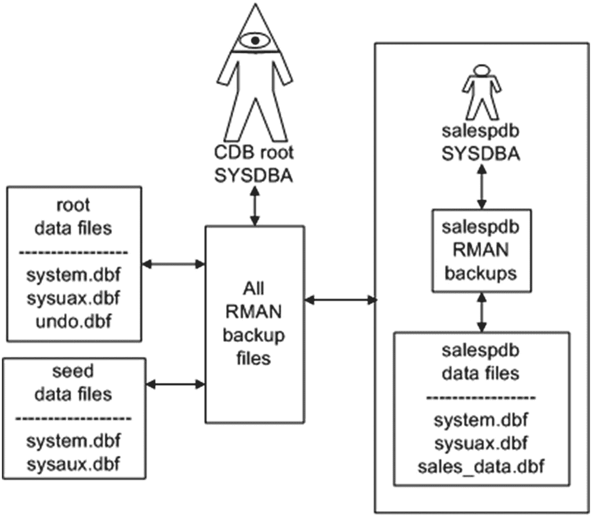
图 18-1 连接到根容器的 `SYSDBA` 权限范围与连接到可插拔数据库的 `SYSDBA` 权限范围

## 创建增量备份

RMAN 有三个独立且不同的增量备份功能：
* 增量级别备份
* 增量更新备份
* 块变化跟踪

使用增量级别备份，RMAN 只备份自上次备份以来已修改的块。增量备份可应用于整个数据库、表空间或数据文件。增量级别备份是 RMAN 中最常用的增量功能。

增量更新备份是一个与增量级别备份独立的功能。这些备份获取数据文件的映像副本，然后使用增量备份来更新这些映像副本。这为你提供了一种高效的方式来实施和维护映像副本作为备份策略的一部分。你只需进行一次映像副本备份，然后使用增量备份来保持映像副本与最新事务同步更新。

块变化跟踪是另一个旨在加速增量备份性能的功能。其理念是使用一个操作系统文件来记录自上次备份以来哪些块发生了变化。RMAN 可以使用块变化跟踪文件在进行增量备份时快速识别需要备份的哪些块。此功能可以极大地提高增量备份的性能。

### 进行增量级别备份

RMAN 通过级别来实现增量备份。只有两个有文档记录的增量备份级别：级别 0 和级别 1。在 Oracle 10g 版本之前提供了五个级别，0–4。这些级别（0–4）仍然可用，但未在 Oracle 文档中指定。你必须首先进行一个级别 0 的增量备份来建立基线，之后你可以进行级别 1 的增量备份。

注意
完全备份备份的块与级别 0 备份相同。但是，你不能将完全备份与增量备份一起使用。此外，你必须以级别 0 备份开始增量备份策略。如果你尝试进行级别 1 备份，而没有级别 0 备份存在，RMAN 将自动进行一个级别 0 备份。

以下是一个进行增量级别 0 备份的示例：
```
RMAN> backup incremental level=0 database;
```

假设接下来的几次备份中，你只想备份自上次增量备份以来已更改的块。这行代码进行一个级别 1 备份：
```
RMAN> backup incremental level=1 database;
```

增量备份有两种不同的类型：差异型和累积型。你使用哪种类型取决于你的要求。差异备份（默认）更小但从恢复角度花费的时间更多。累积备份比差异备份更大，但需要更少的恢复时间。
差异增量级别 1 备份指示 RMAN 备份自上次级别 1 或级别 0 备份以来已更改的块，而累积增量级别 1 备份指示 RMAN 备份自上次级别 0 备份以来已更改的块。累积增量备份实际上忽略了任何级别 1 增量备份。

注意
RMAN 增量级别 0 备份用于还原数据文件，而 RMAN 增量级别 1 备份用于恢复数据文件。

使用增量备份时，默认是差异型。如果你需要累积型备份，你必须指定关键字 `CUMULATIVE`。以下是一个进行累积级别 1 备份的示例：
```
RMAN> backup incremental level=1 cumulative database;
```

以下是一些在比数据库更细粒度的级别上进行增量备份的示例：
```
RMAN> backup incremental level=0 tablespace sysaux;
RMAN> backup incremental level=1 tablespace sysaux plus archivelog;
RMAN> backup incremental from scn 4343352 datafile 3;
```

### 进行增量更新备份

增量更新备份背后的基本理念是创建数据文件的映像副本，然后使用增量备份来更新这些映像副本。通过这种方式，你拥有的数据库映像副本能保持一定程度的最新状态。这可以是将映像副本备份与增量备份结合使用的高效方法。

要理解这种备份技术的工作原理，你需要检查执行增量更新备份的命令。启用此功能需要以下 RMAN 代码行：
```
run{recover copy of database with tag 'incupdate';
backup incremental level 1 for recover of copy with tag 'incupdate' database;}
```

在第一行中指定了一个标签（本示例使用 `incupdate`）。你可以使用任何你想要的标签名称；标签名称让 RMAN 关联每次运行命令时使用的备份文件。此代码在你第一次运行脚本时将按如下方式执行：
* `RECOVER COPY` 生成一条消息，说明它没有可操作的内容。
* 如果不存在映像副本，`BACKUP INCREMENTAL` 会创建数据库数据文件的映像副本。

当 `RECOVER COPY` 和 `BACKUP INCREMENTAL` 命令第一次运行时，你应该在输出中看到类似这样的消息：
```
no copy of datafile 1 found to recover
...
no parent backup or copy of datafile 1 found
...
```

第二次你运行增量更新备份时，它执行如下操作：
* `RECOVER COPY` 再次生成一条消息，说明它没有可操作的内容。
* `BACKUP INCREMENTAL` 进行一个增量级别 1 备份并分配指定的标签名称；此备份随后将被 `RECOVER COPY` 命令使用。

第三次你运行增量更新备份时，它执行以下操作：
* 现在已经创建了增量备份，`RECOVER COPY` 将增量备份应用到映像副本。

## RMAN 备份与恢复技术

### 增量备份策略

`BACKUP INCREMENTAL` 命令会创建一个增量级别 1 的备份，并为其分配指定的标签名；该备份随后将被 `RECOVER COPY` 命令使用。

此后，每次运行这两行代码，你都将拥有一个定期重复的备份模式。如果你使用映像副本进行备份，可以考虑采用增量更新的备份策略，因为这样可以避免在每次备份运行时都创建完整的映像副本。每次备份运行时，映像副本都会根据上一次备份以来的增量更改进行更新。

### 使用块改变跟踪

块改变跟踪是一个使用二进制文件来记录数据库数据文件块更改的过程。其理念是可以提高增量备份的性能，因为 RMAN 可以使用块改变跟踪文件来精确定位自上次备份以来哪些块发生了更改。这节省了大量时间，否则 RMAN 将必须扫描所有已备份的块以确定它们自上次备份以来是否已更改。

启用块改变跟踪的步骤如下：

1.  如果尚未启用，请将 `DB_CREATE_FILE_DEST` 参数设置为一个磁盘上已存在的位置；例如，

    ```
    SQL> alter system set db_create_file_dest='/u01/O18C/bct' scope=both;
    ```

2.  通过 `ALTER DATABASE` 命令启用块改变跟踪：

    ```
    SQL> alter database enable block change tracking;
    ```

此示例在 `DB_CREATE_FILE_DEST` 指定的目录中创建一个具有 OMF 名称的文件。本示例中创建的文件被赋予以下名称：

```
/u01/O18C/bct/O18C/changetracking/o1_mf_8h0wmng1_.chg
```

你也可以通过直接指定文件名来启用块改变跟踪，这不需要设置 `DB_CREATE_FILE_DEST`；例如，

```
SQL> alter database enable block change tracking using file '/u01/O18C/bct/btc.bt';
```

你可以通过运行以下查询来验证块改变跟踪的详细信息：

```
SQL> select * from v$block_change_tracking;
```

出于空间规划的目的，块改变跟踪文件的大小大约是数据库中正在跟踪的块总大小的 1/30,000。因此，块改变跟踪文件的大小与数据库的大小成正比，而与生成的重做量无关。

要禁用块改变跟踪，请运行此命令：

```
SQL> alter database disable block change tracking;
```

> **注意**
> 当你禁用块改变跟踪时，Oracle 会自动删除块改变跟踪文件。

### 检查数据文件和备份中的损坏

你可以使用 RMAN 来检查数据文件、归档日志和控制文件中的损坏情况。你还可以验证备份集是否可恢复。RMAN 的 `VALIDATE` 命令用于执行这些类型的完整性检查。有三种方式可以运行 `VALIDATE` 命令：

*   `VALIDATE`
*   `BACKUP...VALIDATE`
*   `RESTORE...VALIDATE`

> **注意**
> 独立的 `VALIDATE` 命令在 Oracle Database 11g 及更高版本中可用。`BACKUP...VALIDATE` 和 `RESTORE...VALIDATE` 命令在 Oracle Database 10g 及更高版本中可用。

#### 使用 VALIDATE

`VALIDATE` 命令可以作为独立命令使用，用于检查数据库数据文件、归档日志文件、控制文件、`spfile` 和备份集片段中的丢失文件或物理损坏。例如，此命令将验证所有数据文件和控制文件：

```
RMAN> validate database;
```

你也可以只验证控制文件，如下所示：

```
RMAN> validate current controlfile;
```

你可以像这样验证归档日志文件：

```
RMAN> validate archivelog all;
```

你可能希望将所有先前的完整性检查合并到一个命令中，如下所示：

```
RMAN> validate database include current controlfile plus archivelog;
```

在正常情况下，`VALIDATE` 命令只检查物理损坏。你可以通过使用 `CHECK LOGICAL` 子句来指定你也希望检查逻辑损坏：

```
RMAN> validate check logical database include current controlfile plus archivelog;
```

`VALIDATE` 有多种用途。这里还有更多示例：

```
RMAN> validate database skip offline;
RMAN> validate copy of database;
RMAN> validate tablespace system;
RMAN> validate datafile 3 block 20 to 30;
RMAN> validate spfile;
RMAN> validate backupset ;
RMAN> validate recovery area;
```

如果你使用的是 Oracle Database 12c 可插拔数据库功能，你可以验证容器内的特定数据库。以 `SYS` 身份连接到根容器后，验证任何关联的可插拔数据库：

```
RMAN> validate pluggable database salespdb;
```

如果 RMAN 检测到任何损坏的块，则 `V$DATABASE_BLOCK_CORRUPTION` 视图会被填充。此视图包含有关文件号、块号和受影响块数的信息。你可以使用此信息来执行块级别的恢复（有关更多详细信息，请参见第 19 章）。

> **注意**
> 物理损坏是指块的更改，导致其内容与 Oracle 预期的物理格式不匹配。默认情况下，RMAN 在备份、恢复和验证数据文件时会检查物理损坏。对于逻辑损坏，块的格式正确，但其内容与 Oracle 预期的不一致，例如在行片或索引条目中。

#### 使用 BACKUP...VALIDATE

`BACKUP...VALIDATE` 命令与 `VALIDATE` 命令非常相似，因为它可以检查数据文件是否可用以及数据文件是否包含任何损坏的块；例如，

```
RMAN> backup validate database;
```

此命令实际上不创建任何备份文件；它只读取数据文件并检查损坏情况。与 `VALIDATE` 命令一样，`BACKUP VALIDATE` 默认情况下只检查物理损坏。你可以指示它也检查逻辑损坏，如下所示：

```
RMAN> backup validate check logical database;
```

以下是 `BACKUP...VALIDATE` 命令的一些变体：

```
RMAN> backup validate database current controlfile;
RMAN> backup validate check logical database current controlfile plus archivelog;
```

同样像 `VALIDATE` 命令一样，如果 `BACKUP...VALIDATE` 检测到任何损坏的块，它会填充 `V$DATABASE_BLOCK_CORRUPTION` 视图。此视图中的信息可用于确定哪些块可以通过块级别的恢复进行潜在恢复（有关更多详细信息，请参见第 19 章）。

#### 使用 RESTORE...VALIDATE

`RESTORE...VALIDATE` 命令用于验证将在恢复操作中使用的备份文件。此命令验证备份集、数据文件副本和归档日志文件：

```
RMAN> restore validate database;
```

使用 `RESTORE...VALIDATE` 时不会实际恢复任何文件。这意味着你可以在数据库联机且可用时运行该命令。

### 使用恢复目录

当你使用恢复目录时，可以在与目标数据库相同的数据库、同一台服务器上创建恢复目录用户。但是，不建议采用这种方法，因为你不想让你的目标数据库或目标数据库所在服务器的可用性影响恢复目录。因此，你应该在与目标数据库不同的服务器上创建恢复目录数据库。根据规模大小，恢复目录可用于整个数据库环境，但要记住它通常存储的是控制文件中存储的信息。

### 创建恢复目录

当我使用恢复目录时，我倾向于拥有一个专门仅用于恢复目录的数据库。这确保了恢复目录不会受到其他应用程序所需的任何维护或停机时间的影响（反之亦然）。


## 创建恢复目录的步骤

创建恢复目录的步骤如下：

### 1. 创建数据库
在不同于目标数据库的服务器上创建一个用于恢复目录的数据库。确保数据库大小合适。根据经验，Oracle 建议的尺寸通常偏小。以下是初始尺寸的一些建议：

- `SYSTEM`表空间：500MB
- `SYSAUX`表空间：500MB
- `TEMP`表空间：500MB
- `UNDO`表空间：500MB
- 在线重做日志：每个 25MB；三组，每组两个成员（复用）
- `RECCAT`表空间：500MB

### 2. 创建表空间
创建一个供恢复目录用户使用的表空间。建议使用类似`RECCAT`的名称，以便明确标识为包含恢复目录元数据的表空间。

```sql
SQL> CREATE TABLESPACE reccat
DATAFILE '/u01/dbfile/O12C/reccat01.dbf' SIZE 500M
EXTENT MANAGEMENT LOCAL UNIFORM SIZE 128k
SEGMENT SPACE MANAGEMENT AUTO;
```

### 3. 创建用户
创建一个用户，用于存储目标数据库元数据的表和其他对象。建议使用类似`RCAT`的名称，以便明确标识为恢复目录对象的所有者。同时，将`RECOVERY_CATALOG_OWNER`角色和`CREATE SESSION`权限授予`RCAT`用户。

```sql
SQL> CREATE USER rcat IDENTIFIED BY foo
TEMPORARY TABLESPACE temp
DEFAULT TABLESPACE reccat
QUOTA UNLIMITED ON reccat;
--
GRANT RECOVERY_CATALOG_OWNER TO rcat;
GRANT CREATE SESSION TO rcat;
```

### 4. 通过 RMAN 连接并创建恢复目录对象
以`RCAT`身份通过 RMAN 连接，并创建恢复目录对象。

1.  运行`CREATE CATALOG`命令。

    ```sql
    RMAN> create catalog;
    RMAN> exit;
    ```

2.  此命令可能需要几分钟才能运行完成。完成后，可以使用以下查询验证表是否已创建。

    ```sql
    $ sqlplus rcat/foo
    SQL> select table_name from user_tables;
    ```

3.  以下是部分输出示例。

    ```sql
    TABLE_NAME
    ------------------------------
    DB
    NODE
    CONF
    DBINC
    ```

    ```bash
    $ rman catalog rcat/foo
    ```

### 注册目标数据库
现在，可以将目标数据库注册到恢复目录。登录到目标数据库服务器。确保可以建立到恢复目录数据库的 Oracle Net 连接。例如，一种方法是在`TNS_ADMIN/tnsnames.ora`文件中填充一个指向远程数据库的条目。在目标数据库服务器上，按如下方式注册恢复目录：

```bash
$ rman target / catalog rcat/foo@rcat
```

连接时，应该会看到连接至目标数据库和恢复目录的确认信息：

```text
connected to target database: O18C (DBID=3423216220)
connected to recovery catalog database
```

接下来，运行`REGISTER DATABASE`命令：

```sql
RMAN> register database;
```

现在，可以运行备份操作，并将有关备份任务的元数据同时写入控制文件和恢复目录。确保每次运行 RMAN 命令时都连接到恢复目录和目标数据库：

```bash
$ rman target / catalog rcat/foo@rcat
RMAN> backup database;
```

### 备份恢复目录
务必制定备份和恢复恢复目录数据库的策略。为获得最大程度的保护，确保恢复目录数据库处于归档日志模式，并使用 RMAN 备份该数据库。

也可以使用 Data Pump 等工具对数据库进行快照。使用 Data Pump 的缺点是可能会丢失在 Data Pump 导出之后创建的一些恢复目录信息。

请记住，如果恢复目录数据库服务器发生完全故障，仍然可以使用 RMAN 来备份目标数据库；只是无法连接到恢复目录。因此，任何指示 RMAN 连接到目标和恢复目录的脚本都必须进行修改。

此外，如果完全丢失了恢复目录且没有备份，一个选择是从头重新创建它。重新创建后，需要将目标数据库重新注册到恢复目录。这样会丢失所有长期的历史恢复目录元数据。

### 同步恢复目录
可能遇到网络问题导致无法访问恢复目录。在此期间，连接到目标数据库并执行了备份操作。一段时间后，网络问题得到解决，可以再次连接到恢复目录。

在这种情况下，需要将恢复目录与目标数据库同步，以使恢复目录知晓未存储在其中的任何备份操作。运行以下命令以确保恢复目录拥有最新的备份信息：

```bash
$ rman target / catalog rcat/foo@rcat
RMAN> resync catalog;
```

请记住，仅当由于某种原因在没有连接到目录的情况下执行备份操作时，才需要同步目录。在正常情况下，不需要运行`RESYNC`命令。

### 恢复目录版本
建议为所备份的每个目标数据库版本创建一个恢复目录。这样做可以避免兼容性和升级问题带来的一些麻烦。根据经验，当`rman`客户端的数据库版本与创建目录时使用的版本相同时，使用恢复目录会更轻松。

是的，拥有多个版本的恢复目录可能会引起一些混淆。但是，如果在环境中存在多个不同版本的 Oracle 数据库，那么多个恢复目录可能更方便。

### 删除恢复目录
如果确定不再使用恢复目录并且不再需要其中的数据，可以将其删除。为此，以目录所有者身份连接到恢复目录数据库，并发出`DROP CATALOG`命令：

```bash
$ rman catalog rcat/foo
RMAN> drop catalog;
```

系统会提示：

```text
recovery catalog owner is RCAT
enter DROP CATALOG command again to confirm catalog removal
```

如果再次输入`DROP CATALOG`命令，则恢复目录中的所有对象将从恢复目录数据库中移除。建议在执行任何删除命令之前或在注册数据库之后对目录进行备份。

另一种删除目录的方法是删除其所有者。为此，以具有`DBA`权限的用户身份连接到恢复目录，并发出`DROP USER`语句：

```bash
$ sqlplus system/manager
SQL> drop user rcat cascade;
```

SQL*Plus 不会提示两次；它会按照指示操作并删除用户及其对象。同样，执行此操作的唯一原因是确定不再需要恢复目录或其数据。删除用户或恢复目录时请谨慎操作；另一个好的做法是在删除恢复目录所有者之前，使用 Data Pump 对其进行导出。

## 记录 RMAN 输出


当排查 RMAN 输出问题或检查备份作业状态时，记录 RMAN 执行内容和各命令状态至关重要。有多种记录 RMAN 输出的方法：部分是 Linux/Unix 操作系统内置功能，部分是 RMAN 特有功能：

*   Linux/Unix 重定向输出到文件
*   Linux/Unix 日志记录命令
*   RMAN `SPOOL LOG` 命令
*   `V$RMAN_OUTPUT` 视图

这些日志记录功能将在后续章节中详述。

### 重定向输出到文件

Shell 脚本通常通过`cron`等调度工具自动运行。以此方式执行 RMAN 命令时，可通过指示 Shell 命令将标准输出和标准错误消息重定向到日志文件来捕获输出。这通过重定向字符（`>`）实现。此例运行 Shell 脚本（`rmanback.bsh`），并将标准输出和标准错误输出重命名为`rmanback.log`的日志文件：

`$ rmanback.bsh 1>/home/oracle/bin/log/rmanback.log 2>&1`

此处`1>`指示将标准输出重定向到指定文件。`2>&1`指示 Shell 脚本将标准错误输出发送到与标准输出相同的位置。

#### 提示

关于 DBA 如何使用 Shell 脚本和 Linux 功能的更多细节，请参阅 Darl Kuhn 所著的《Linux Recipes for Oracle DBAs》（Apress, 2008）。

### 使用 Linux/Unix 日志命令捕获输出

可以指示 Linux/Unix 创建日志文件，以捕获同时显示在屏幕上的任何输出。这可以通过以下两种方式之一完成：

*   `tee`
*   `script`

#### 使用 tee 捕获输出

启动 RMAN 时，可以使用`tee`命令将屏幕上看到的输出发送到操作系统文本文件：

`$ rman | tee /tmp/rman.log`

现在，您可以连接到目标数据库并运行命令。屏幕上看到的所有输出都将记录到`/tmp/rman.log`文件中：

```
RMAN> connect target /
RMAN> backup database;
RMAN> exit;
```

当您退出 RMAN 时，`tee`会话停止写入日志文件。

#### 使用 script 捕获输出

`script`命令很有用，因为它指示操作系统将终端上出现的任何输出记录到日志文件。要捕获所有输出，请在连接到 RMAN 之前运行`script`命令：

```
$ script /tmp/rman.log
Script started, file is /tmp/rman.log
$ rman target /
RMAN> backup database;
RMAN> exit;
```

要结束脚本会话，请按 Ctrl+D 或输入`exit`。`/tmp/rman.log`文件将包含在屏幕上显示的所有输出。当您需要捕获特定时间范围内的所有输出时，`script`命令非常有用。例如，您可能正在运行 RMAN 命令，退出 RMAN，运行 SQL*Plus 命令等等。脚本会话从您启动`script`开始，到您按 Ctrl+D 结束。

### 将输出记录到文件

捕获 RMAN 输出的一种简单方法是使用`SPOOL LOG`命令将输出发送到文件。此示例从 RMAN 内部假脱机日志文件：

```
RMAN> spool log to '/tmp/rmanout.log'
RMAN> set echo on;
RMAN> 
RMAN> spool log off;
```

默认情况下，`SPOOL LOG`命令会覆盖现有文件。如果要追加到日志文件，请使用关键字`APPEND`：

`RMAN> spool log to '/tmp/rmanout.log' append`

您也可以在命令行启动 RMAN 时将输出定向到日志文件，这将覆盖现有文件：

`$ rman target / log /tmp/rmanout.log`

也可以追加到日志文件，如下所示：

`$ rman target / log /tmp/rmanout.log append`

当您如前面示例所示使用`SPOOL LOG`时，输出会进入文件而不是您的终端。因此，在交互式运行 RMAN 时，我很少使用`SPOOL LOG`。该命令主要是在从脚本运行 RMAN 时捕获输出的工具。

### 在数据字典中查询输出

如果您没有捕获任何 RMAN 输出，仍然可以通过查询数据字典查看最近的 RMAN 输出。`V$RMAN_OUTPUT`视图包含 RMAN 最近报告的消息：

```
SQL> select sid, recid, output
from v$rman_output
order by recid;
```

`V$RMAN_OUTPUT`视图是一个内存中对象，最多可保存 32,768 行。当您停止并重启数据库时，此视图中的信息会被清除。当您使用 RMAN `SPOOL LOG`命令将输出假脱机到文件且无法在终端查看当前情况时，此视图非常方便。

## RMAN 报告

有几种不同的方法可以报告 RMAN 环境：

*   `LIST` 命令
*   `REPORT` 命令
*   通过数据字典视图查询元数据

初次学习 RMAN 时，`LIST`和`REPORT`命令之间的区别可能显得令人困惑，因为两者的界限并不十分明确。一般来说，我使用`LIST`命令查看有关现有备份的信息，使用`REPORT`命令确定需要备份的文件或显示有关过期或废弃备份的信息。SQL 查询可以提供详细报告（无法通过`LIST`或`REPORT`获得）或用于自动化报告：例如，通常通过 Shell 脚本和 SQL 实现自动化检查，报告 RMAN 备份在过去一天内是否已运行。

### 使用 LIST

在调查 RMAN 备份问题时，我通常首先执行的任务之一是连接到目标数据库并运行`LIST BACKUP`命令。此命令允许您查看备份集、备份片以及备份中包含的文件：

`RMAN> list backup;`

该命令显示存储库中记录的所有 RMAN 备份。您可能希望将备份假脱机到输出文件，以便保存输出，然后使用操作系统编辑器搜索并查找输出中的特定字符串。

要获取备份信息的摘要视图，请使用`LIST BACKUP SUMMARY`命令：

`RMAN> list backup summary;`

您也可以使用`LIST`命令仅报告映像副本信息：

`RMAN> list copy;`

要列出所有已备份的文件及相关备份集，请执行以下命令：

`RMAN> list backup by file;`

这些命令显示磁盘上的归档日志：

```
RMAN> list archivelog all;
RMAN> list copy of archivelog all;
```

此外，此命令列归档日志的备份（以及哪些归档日志包含在哪个备份片中）：

`RMAN> list backup of archivelog all;`

有许多方式可以运行`LIST`命令（同样，下一节介绍的`REPORT`命令也是如此）。前述方法是您大多数时候将要运行的方法。有关选项的完整列表，请参阅 Oracle 网站技术网络区域（`http://otn.oracle.com`）提供的《Oracle Database Backup and Recovery Reference Guide》。

### 使用 REPORT

RMAN `REPORT`命令可用于报告各种详细信息。您可以快速查看与数据库关联的所有数据文件，如下所示：

`RMAN> report schema;`

`REPORT`命令提供有关通过 RMAN 保留策略标记为过期的备份的详细信息；例如，

`RMAN> report obsolete;`

您可以根据保留策略报告需要备份的数据文件，如下所示：

`RMAN> report need backup;`

有几种方法可以报告需要备份的数据文件。以下是其他一些示例：

```
RMAN> report need backup redundancy 2;
RMAN> report need backup redundancy 2 datafile 2;
```

`REPORT`命令也可用于从未备份过或可能包含`NOLOGGING`操作创建的数据的数据文件。例如，假设您已直接路径加载数据到表中，而该表所在的数据文件尚未备份。以下命令将检测这些情况：


使用 SQL
===

有许多数据字典视图可用于查询备份信息。表 18-1 描述了与 RMAN 相关的数据字典视图。无论您是否使用恢复目录，这些视图都是可用的（这些视图中的信息源自控制文件）。

表 18-1
RMAN 备份数据字典视图描述

| 视图名称 | 提供的信息 |
| :--- | :--- |
| `V$RMAN_BACKUP_JOB_DETAILS` | RMAN 备份作业 |
| `V$BACKUP` | 处于备份模式（用于热备份）的在线数据文件的备份状态 |
| `V$BACKUP_ARCHIVELOG_DETAILS` | 已备份的归档日志 |
| `V$BACKUP_CONTROLFILE_DETAILS` | 已备份的控制文件 |
| `V$BACKUP_COPY_DETAILS` | 控制文件和数据文件副本 |
| `V$BACKUP_DATAFILE` | 已备份的控制文件和数据文件 |
| `V$BACKUP_DATAFILE_DETAILS` | 在备份集、映像副本和代理副本中备份的数据文件 |
| `V$BACKUP_FILES` | 已备份的数据文件、控制文件、`spfile` 和归档日志 |
| `V$BACKUP_PIECE` | 备份片文件 |
| `V$BACKUP_PIECE_DETAILS` | 备份片详细信息 |
| `V$BACKUP_SET` | 备份集 |
| `V$BACKUP_SET_DETAILS` | 备份集详细信息 |

有时，刚接触 RMAN 的数据库管理员（DBA）很难掌握备份、备份集、备份片和数据文件的概念以及它们之间的关系。我发现以下查询在讨论 RMAN 备份组件时很有用。此查询将显示备份集、备份集中的备份片以及备份片中备份的数据文件：

```sql
SQL> SET LINES 132 PAGESIZE 100
SQL> BREAK ON REPORT ON bs_key ON completion_time ON bp_name ON file_name
SQL> COL bs_key    FORM 99999 HEAD "BS Key"
SQL> COL bp_name   FORM a40   HEAD "BP Name"
SQL> COL file_name FORM a40   HEAD "Datafile"
SQL> --
SQL> SELECT
s.recid                  bs_key
,TRUNC(s.completion_time) completion_time
,p.handle                 bp_name
,f.name                   file_name
FROM v$backup_set      s
,v$backup_piece    p
,v$backup_datafile d
,v$datafile        f
WHERE p.set_stamp = s.set_stamp
AND   p.set_count = s.set_count
AND   d.set_stamp = s.set_stamp
AND   d.set_count = s.set_count
AND   d.file#     = f.file#
ORDER BY
s.recid
,p.handle
,f.name;
```

此处的输出已缩短以适应页面：

```
BS Key COMPLETIO BP Name                           Datafile
------ --------- --------------------------------  -------------------------------
159 11-JAN-18 /u01/O18C/rman/r16qnv59jj_1_1.bk  /u01/dbfile/o18c/inv_data2.dbf
/u01/dbfile/o18c/lob_data01.dbf
/u01/dbfile/o18c/p14_tbsp.dbf
/u01/dbfile/o18c/p15_tbsp.dbf
/u01/dbfile/o18c/p16_tbsp.dbf
```

有时，报告 RMAN 备份的性能很有用。以下查询报告了每个会话的 RMAN 备份所花费的时间。

```sql
SQL> COL hours              FORM 9999.99
SQL> COL time_taken_display FORM a20
SQL> SET LINESIZE 132
SQL> --
SQL> SELECT
session_recid
,compression_ratio
,time_taken_display
,(end_time - start_time) * 24 as hours
,TO_CHAR(end_time,'dd-mon-yy hh24:mi') as end_time
FROM v$rman_backup_job_details
ORDER BY end_time;
```

以下是一些示例输出：

```
SESSION_RECID COMPRESSION_RATIO TIME_TAKEN_DISPLAY      HOURS END_TIME
------------- ----------------- -------------------- -------- ---------------
15                 1 00:05:08                  .09 11-jan-18 13:41
27        3.79407176 00:00:09                  .00 11-jan-18 13:52
33        1.19992137 00:05:01                  .08 11-jan-18 14:07
```

`V$RMAN_BACKUP_JOB_DETAILS` 的内容通过与 RMAN 的会话连接进行汇总。因此，如果您连接到 RMAN（建立一个会话），然后在备份作业完成后退出 RMAN，报告输出会更准确。如果您在运行多个备份作业时保持连接到 RMAN，查询输出会报告该会话连接期间的所有备份活动。

您应该有一个自动化的方法来检测 RMAN 备份是否正在运行以及数据文件是否正在被备份。实现此类任务自动化的一个可靠方法是将 SQL 嵌入到 shell 脚本中，然后使用`cron`等调度工具定期运行该脚本。

我通常对 RMAN 备份运行两种基本类型的检查：

*   RMAN 备份最近运行过吗？
*   有没有最近没有被备份的数据文件？

以下 shell 脚本检查这些条件。您需要修改脚本，为其提供一个可以查询脚本中引用的数据字典对象的用户的用户名和密码，并更改消息发送到的电子邮件地址。运行脚本时，您需要传入两个变量：Oracle SID 和您希望检查的过去天数阈值（用于检查上次备份运行时间或数据文件备份时间）。

```bash
#!/bin/bash
#
if [ $# -ne 2 ]; then
echo "Usage: $0 SID threshold"
exit 1
fi
#### source oracle OS variables
. /var/opt/oracle/oraset $1
crit_var=$(sqlplus -s  $2;
EOF)
#
if [ $crit_var -ne 0 ]; then
echo "rman backups not running on $1" | mailx -s "rman problem" dkuhn@gmail.com
else
echo "rman backups ran ok"
fi
#--------------------------------------------
crit_var2=$(sqlplus -s  sysdate - $2);
EOF)
#
if [ $crit_var2 -ne 0 ]; then
echo "datafile not backed up on $1" | mailx -s "backup problem" dkuhn@gmail.com
else
echo "datafiles are backed up..."
fi
#
exit 0
```

例如，要检查过去 2 天内备份是否成功运行，请运行该脚本（名为`rman_chk.bsh`）：

```bash
$ rman_chk.bsh INVPRD 2
```

前面的脚本是基础但有效的。您可以根据您的 RMAN 环境需要对其进行增强。

总结
===

RMAN 为备份提供了许多灵活且功能丰富的选项。默认情况下，RMAN 仅备份数据库中已修改的块。增量功能允许您仅备份自上次备份以来已修改的块。这些增量功能在大型数据库环境中特别有用，可以减少备份的大小，因为在这些环境中，每次备份之间数据库中只有一小部分数据发生变化。

您可以通过映像副本指示 RMAN 备份每个数据文件中的每个块。映像副本是数据文件的块对块完全相同的副本。映像副本的优点是能够直接从备份中恢复备份文件（无需使用 RMAN）。您可以使用增量更新备份功能来实现映像副本备份和增量备份的高效混合。

存在一些配置，有助于将映像副本与增量备份相结合，以满足恢复策略和要求，并与备份集和归档日志配合使用。CDB 和 PDB 数据库都可以在 CDB 中备份，但当连接到 PDB 作为目标时，只能备份该 PDB。数据库数据块更改可以与表空间、数据文件和数据库一起备份。

RMAN 包含用于报告备份多方面信息的内置命令。`LIST`命令报告备份活动。`REPORT`命令对于确定根据保留策略需要备份哪些文件非常有用。

在成功配置 RMAN 并创建备份后，您就能够在发生介质故障时恢复和恢复您的数据库。备份的好坏仅取决于恢复数据库的能力。恢复和恢复主题将在下一章详细介绍。


# 19. RMAN 恢复与恢复

关于需要恢复的故事，甚至每月演练执行还原操作，我可以讲出不少。备份只有在能够还原时才有效；希望永远不需要它，但还原过程必须有文档记录、经过测试和实践。通过练习，可以让错误发生并记录可能出现的异常情况，这样在需要顶住压力完成还原的紧急时刻，多年的练习就会派上用场。它也有助于验证是否有完好的备份可用，正如合著者在一个 DBA 的故事中所描述的：

几年前的一个周六早晨，我正外出进行长途骑行。骑到大约一半路程时，手机响了。是数据中心的一位运维支持技术员。他告诉我，一个关键任务数据库服务器行为异常，我应尽快登录确认一切正常。我告诉他，我大约 15 分钟后才能登录。于是，我以最快速度赶回家检查生产服务器。到家后登录数据库服务器，我尝试启动 `SQL*Plus`，立即收到一个错误，提示 `SQL*Plus` 二进制文件已损坏。太好了。我甚至无法登录 `SQL*Plus`。这可不妙。

我让系统管理员从操作系统备份中恢复了 Oracle 二进制文件。我启动了 `SQL*Plus`。数据库已经崩溃，所以我尝试启动它。输出显示所有数据文件都存在介质故障。经过一些分析，发现存在一些文件系统问题，磁盘上的所有这些文件都已损坏：

*   数据文件
*   控制文件
*   归档重做日志
*   在线重做日志文件
*   RMAN 备份集

这几乎是一场彻底的灾难。我的总监询问我们有哪些选项。我回答说：“我们只需要从上次的磁带备份中还原数据库，我们会丢失那些尚未备份到磁带的归档重做日志中的数据。”

存储管理员被召集来，并被指示恢复最近一次写入磁带的 RMAN 备份。大约 15 分钟后，我们可以听到磁带管理员们在低声交谈。其中一人说：“我们完蛋了。这台服务器上的任何数据库都没有任何 RMAN 磁带备份。”

那是一个黑暗的时刻。最坏的情况是从 DDL 脚本重建数据库，并丢失 3 年的生产数据。这不是一个很可行的选择。

在检查生产服务器后，我发现前任生产支持 DBA（讽刺的是，他几天前刚因预算削减被解雇）已经设置了一个作业，将 RMAN 备份复制到生产环境中的另一台服务器。那台服务器上的 RMAN 备份完好无损。我得以从这些备份中还原和恢复生产数据库。我们丢失了大约一天的数据（介于归档日志损坏和停机期间，期间不允许有传入交易），但我们在接到第一个电话后大约 20 小时内完成了数据库的还原和恢复。那是漫长的一天。

你需要进行还原和恢复的大多数情况都不会像刚才描述的那样糟糕。即使在有防护措施且自然灾害很少的地方，似乎总会出现一些情况让你想去测试恢复并验证备份。然而，上述场景确实突显了以下需求：

*   备份策略
*   具备备份和恢复技能的 DBA
*   还原与恢复策略，包括定期测试还原和恢复的要求

本章将引导你使用 RMAN 进行还原和恢复。本章涵盖了在处理介质故障时你将不得不执行的许多常见任务。

## 确定是否需要介质恢复

术语 `介质恢复` 指的是恢复因底层存储介质（通常是某种磁盘）故障或文件被意外删除而丢失或损坏的文件。通常，你会通过如下错误得知需要介质恢复：

```
ORA-01157: cannot identify/lock data file 1 - see DBWR trace file
ORA-01110: data file 1: '/u01/dbfile/o12c/system01.dbf'
```

该错误可能在执行 DBA 任务（如停止和启动数据库）时显示在屏幕上。或者，你可能在跟踪文件或 `alert.log` 文件中看到此类错误。也有可能因为文件未被写入或操作系统的原因，错误可能会延迟出现。如果你没有立即注意到问题，对于严重的介质故障，数据库将停止处理事务，用户会开始打电话给你。

要理解 Oracle 如何确定需要介质恢复，你必须首先了解 Oracle 如何确定一切正常。当 Oracle 正常关闭（`IMMEDIATE`、`TRANSACTIONAL`、`NORMAL`）时，关闭过程的一部分是将所有修改过的块（在内存中）刷新到磁盘，在每个数据文件的文件头标记当前的 `SCN`，并使用当前的 `SCN` 信息更新控制文件。

启动时，Oracle 会检查控制文件中的 `SCN` 是否与数据文件头中的 `SCN` 匹配。如果匹配，Oracle 会尝试打开数据文件和在线重做日志文件。如果所有文件都可用且可以打开，Oracle 将正常启动。以下查询比较控制文件中（每个数据文件）的 `SCN` 与数据文件头中的 `SCN`：

```
SQL> SET LINES 132
SQL> COL name             FORM a40
SQL> COL status           FORM A8
SQL> COL file#            FORM 9999
SQL> COL control_file_SCN FORM 999999999999999
SQL> COL datafile_SCN     FORM 999999999999999
--
SQL> SELECT
  a.name
, a.status
, a.file#
, a.checkpoint_change# control_file_SCN
, b.checkpoint_change# datafile_SCN
, CASE
    WHEN ((a.checkpoint_change# - b.checkpoint_change#) = 0) THEN 'Startup Normal'
    WHEN ((b.checkpoint_change#) = 0)                        THEN 'File Missing?'
    WHEN ((a.checkpoint_change# - b.checkpoint_change#) > 0) THEN 'Media Rec. Req.'
    WHEN ((a.checkpoint_change# - b.checkpoint_change#) < 0) THEN 'Old Control File'
    ELSE 'what the ?'
  END datafile_status
FROM v$datafile        a -- control file SCN for datafile
   , v$datafile_header b -- datafile header SCN
WHERE a.file# = b.file#
ORDER BY a.file#;
```

如果控制文件的 `SCN` 值大于数据文件的 `SCN` 值，则很可能需要介质恢复。如果你从备份还原了一个数据文件，并且还原的数据文件的 `SCN` 小于当前控制文件中数据文件的 `SCN`，就会出现这种情况。

#### 提示
`V$DATAFILE_HEADER` 视图使用磁盘上的物理数据文件作为其源。`V$DATAFILE` 视图使用控制文件作为其源。

你也可以直接查询 `V$DATAFILE_HEADER` 以获取更多信息。`ERROR` 和 `RECOVER` 列报告任何潜在问题。例如，`RECOVER` 列中的 `YES` 或 `null` 值表明存在问题：

```
SQL> select file#, status, error, recover from v$datafile_header;
```

以下是一些示例输出：

```
FILE# STATUS  ERROR                REC
---------- ------- -------------------- ---
     1 ONLINE  FILE NOT FOUND
     2 ONLINE                       NO
     3 ONLINE                       NO
```

## 确定要还原的内容

介质恢复需要你执行手动任务以使数据库恢复完整。这些任务通常涉及 `RESTORE` 和 `RECOVER` 命令的组合。如果由于某种原因（意外删除文件、磁盘故障等），你的数据文件经历了介质故障，你将必须发出 RMAN `RESTORE` 命令。

### 过程如何工作


## 执行恢复操作

当您发出 `RESTORE` 命令时，RMAN 会自动决定如何从任何以下可用的备份中提取数据文件：

*   完整数据库备份
*   增量级别 0 备份
*   由 `BACKUP AS COPY` 命令生成的映像副本备份

文件从备份中恢复后，您需要通过 `RECOVER` 命令将重做日志应用于这些文件。当您发出 `RECOVER` 命令时，Oracle 会检查受影响数据文件中的 SCN，并确定是否需要恢复其中任何一个。如果数据文件中的 SCN 小于控制文件中相应的 SCN，则将需要进行介质恢复。

Oracle 会检索数据文件的 SCN，然后在重做流中查找相应的 SCN，以确定恢复过程的起始位置。如果起始恢复 SCN 位于在线重做日志文件中，则不需要归档日志文件来进行恢复。

在恢复过程中，RMAN 会自动确定如何应用重做。首先，RMAN 会应用任何可用的大于级别 0 的增量备份，例如增量级别 1 备份。接着，应用磁盘上的任何归档日志文件。如果磁盘上不存在归档日志文件，RMAN 会尝试从备份集中检索它们。

要能够执行完全恢复，需要满足以下所有条件：

*   您的数据库处于归档日志模式。
*   您有一个良好的数据库基线备份。
*   您拥有自备份以来生成的所需重做（归档日志文件、在线重做日志文件或 RMAN 可用于恢复而非应用重做的增量备份）。

恢复与修复的场景多种多样。如何恢复和修复直接取决于您的备份策略以及哪些文件已损坏。下面列出了当面临介质故障时应遵循的一般步骤：

1.  确定需要恢复哪些文件。
2.  根据损坏情况，将数据库模式设置为 `nomount`、`mount` 或 `open`。
3.  使用 `RESTORE` 命令从 RMAN 备份中检索文件。
4.  对需要恢复的数据文件使用 `RECOVER` 命令。
5.  打开您的数据库。

您特定的恢复与修复场景可能不需要执行上述所有步骤。例如，您可能只想恢复 `spfile`，这不需要恢复步骤。

恢复与修复过程的第一步是确定哪些文件经历了介质故障。您通常可以从以下来源确定需要恢复的文件：

*   屏幕上显示的错误消息，无论是来自 RMAN 还是 SQL*Plus
*   `Alert.log` 文件和相应的跟踪文件
*   数据字典视图

此外，除了前面列出的方法，您还应考虑使用**数据恢复顾问**来获取有关故障范围及相应纠正措施的信息。

## 使用数据恢复顾问

数据恢复顾问工具在 Oracle Database 11g 中引入。当发生介质故障时，此工具将显示故障的详细信息、建议纠正措施，并在您指定时执行建议的操作。这就像在恢复与修复情况下有另一双眼睛提供反馈。数据恢复顾问有四种模式：

*   列出故障
*   建议纠正措施
*   运行命令以修复故障
*   更改故障状态

数据恢复顾问从 RMAN 中调用。您可以将数据恢复顾问视为一组 RMAN 命令，可在处理介质故障时为您提供帮助。

### 列出故障

使用数据恢复顾问时，`LIST FAILURE` 命令用于显示有关数据文件、控制文件或在线重做日志的任何问题：

```
RMAN> list failure;
```

如果未检测到故障，您将看到一条消息，指示没有故障。以下是一些示例输出，表明某个数据文件可能存在问题：

```
List of Database Failures
=========================
Failure ID Priority Status    Time Detected Summary
---------- -------- --------- ------------- -------
6222       CRITICAL OPEN      12-JAN-18     System datafile 1:
'/u01/dbfile/o18c/system01.dbf' is missing
```

要显示有关故障的更多信息，请使用 `DETAIL` 子句：

```
RMAN> list failure 6222 detail;
```

以下是此示例的附加输出：

```
Impact: Database cannot be opened
```

对于此类故障，之前的输出表明数据库无法打开。

**提示**
如果您怀疑存在介质故障，但数据恢复顾问未报告任何问题，请运行 `VALIDATE DATABASE` 命令以验证数据库是否完整。

### 建议纠正措施

`ADVISE FAILURE` 命令提供关于如何从数据恢复顾问检测到的潜在问题中恢复的建议。如果您的数据库存在多个故障，您可以直接指定故障 ID 来获取有关给定故障的建议，如下所示：

```
RMAN> advise failure 6222;
```

以下是针对此特定问题的输出片段：

```
Optional Manual Actions
=======================
1. If file /u01/dbfile/o18c/system01.dbf was unintentionally renamed or moved,
restore it
Automated Repair Options
========================
Option Repair Description
------ ------------------
1      Restore and recover datafile 1
Strategy: The repair includes complete media recovery with no data loss
Repair script: /ora01/app/oracle/diag/rdbms/o18c/o18c/hm/reco_4116328280.hm
```

在这种情况下，数据恢复顾问创建了一个可用于尝试修复问题的脚本。可以使用操作系统实用程序查看修复脚本的内容；例如，

```
$ cat /ora01/app/oracle/diag/rdbms/o18c/o18c/hm/reco_4116328280.hm
```

以下是此示例的脚本内容：

```
## restore and recover datafile
restore ( datafile 1 );
recover datafile 1;
sql 'alter database datafile 1 online';
```

查看脚本后，您可以决定手动运行建议的命令，也可以让数据恢复顾问通过 `REPAIR` 命令运行脚本（有关详细信息，请参阅下一节）。

### 修复故障

如果您已识别故障并查看了建议，可以继续进行修复工作。如果您想在不实际运行命令的情况下检查 `REPAIR FAILURE` 命令将执行的操作，请使用 `PREVIEW` 子句：

```
RMAN> repair failure preview;
```

在运行 `REPAIR FAILURE` 命令之前，请确保首先从同一连接会话中运行 `LIST FAILURE` 和 `ADVISE FAILURE` 命令。换句话说，您所在的 RMAN 会话必须在同一会话中运行 `LIST` 和 `ADVISE` 命令后，才能运行 `REPAIR` 命令。

如果您对修复建议满意，则运行 `REPAIR FAILURE` 命令：

```
RMAN> repair failure;
```

此时系统将提示您确认：

```
Do you really want to execute the above repair (enter YES or NO)?
```

输入 `YES` 继续：

```
YES
```

如果一切顺利，您应该在输出中看到如下最终消息：

```
repair failure complete
```

**注意**
您可以从 RMAN 命令提示符或 Enterprise Manager 运行数据恢复顾问命令。

通过这种方式，您可以使用 RMAN 命令 `LIST FAILURE`、`ADVISE FAILURE` 和 `REPAIR FAILURE` 来解决介质故障。

### 更改故障状态

关于数据恢复顾问的最后一点说明：如果您知道发生了故障并且它不关键（例如，从不再使用的表空间中丢失了数据文件），那么可以使用 `CHANGE FAILURE` 命令来更改故障的优先级。在此示例中，有一个属于非关键表空间的数据文件丢失。首先，通过 `LIST FAILURE` 命令获取故障优先级：

```
RMAN> list failure;
```

以下是部分示例输出：


## 使用 RMAN 停止/启动 Oracle

你可以使用 RMAN 来停止和启动数据库，其方法与通过 SQL*Plus 可用的方法几乎相同。在执行恢复和还原操作时，从 RMAN 内部停止和启动数据库通常更为方便。以下 RMAN 命令可用于停止和启动数据库：

*   `SHUTDOWN`
*   `STARTUP`
*   `ALTER DATABASE`

### 关闭数据库

RMAN 中的 `SHUTDOWN` 命令与 SQL*Plus 中的用法相同。关闭操作有四种类型：`ABORT`、`IMMEDIATE`、`NORMAL` 和 `TRANSACTIONAL`。我通常首先尝试使用 `SHUTDOWN IMMEDIATE` 来停止数据库。以下是一些示例：

```
RMAN> shutdown immediate;
RMAN> shutdown abort;
```

如果不指定关闭选项，则 `NORMAL` 是默认选项。使用 `NORMAL` 关闭数据库很少可行，因为此模式会等待当前连接的用户在他们方便时自行断开连接。

### 启动数据库

与 SQL*Plus 一样，你可以在 RMAN 中结合使用 `STARTUP` 和 `ALTER DATABASE` 命令来引导数据库完成启动阶段，如下所示：

```
RMAN> startup nomount;
RMAN> alter database mount;
RMAN> alter database open;
```

这是另一个示例：

```
RMAN> startup mount;
RMAN> alter database open;
```

如果想要以受限访问模式启动数据库，请使用 DBA 选项：

```
RMAN> startup dba;
```

**提示**
从 Oracle Database 12c 开始，你可以直接从 RMAN 内部运行所有 SQL 语句，而无需指定 RMAN `sql` 命令。

## 故障 ID 优先级 状态 检测时间 摘要
## ---------- -------- --------- ---------------

| 故障 ID | 优先级 | 状态 | 检测时间 | 摘要 |
|------------|----------|---------|---------------|---------|
| 5 | 高 | 打开 | 18-1 月-18 | 一个或多个非系统数据文件丢失 |

接下来，使用 `CHANGE FAILURE` 命令将优先级从 `高` 更改为 `低`：

```
RMAN> change failure 5 priority low;
```

系统将提示你确认是否确实要更改优先级：

```
你是否确实要更改上述故障（输入 YES 或 NO）？
```

如果确实要更改优先级，则输入 `YES` 并按回车键。如果再次运行 `LIST FAILURE` 命令，你会看到优先级现已更改为 `低`：

```
RMAN> list failure low ;
```

#### 完全恢复

如第 16 章所述，术语*完全恢复*意味着你可以恢复故障发生前已提交的所有事务。*完全恢复*并不意味着你要恢复和复原数据库中的所有数据文件。例如，如果你有一个数据文件发生介质故障，并且你只恢复和复原了那个数据文件，那么你就是在执行完全恢复。对于完全恢复，必须满足以下条件：

*   数据库处于归档日志模式。
*   你拥有发生介质故障的数据文件的良好基线备份。
*   你拥有自上次备份以来生成的所有必需重做日志。
*   所有归档重做日志都从上次备份开始的时间点起可用。
*   RMAN 可用于恢复的任何增量备份都可用（如果使用）。
*   包含尚未归档的事务的联机重做日志可用。

如果你遇到了介质故障，并且拥有执行完全恢复所需的文件，那么你就可以恢复和复原你的数据库。

## 测试还原和恢复

在实际执行还原和恢复操作之前，你可以确定 RMAN 将使用哪些文件进行还原和恢复。你还可以指示 RMAN 验证将用于还原和恢复的备份文件的完整性。

### 预览用于恢复的备份

使用 `RESTORE...PREVIEW` 命令可以列出 RMAN 将用于还原和恢复数据库数据文件的备份和归档重做日志文件。`RESTORE...PREVIEW` 命令实际上并不还原任何文件，而是列出将用于还原操作的备份文件。此示例详细预览了整个数据库还原和恢复所需的备份：

```
RMAN> restore database preview;
```

你还可以在汇总详细信息级别预览所需的备份文件：

```
RMAN> restore database preview summary;
```

以下是输出片段：

```
备份集列表
===================
备份集键  类型 LV 大小       设备类型 已用时间  完成时间
------- ---- -- ---------- ----------- ------------ ---------------
224     完整    775.37M    磁盘        00:02:22     18-1 月-18
备份集键: 229  状态: 可用  压缩: 否  标签: TAG20130112T120713
分段名称: /u02/O18C/rman/r29gnv7q7i_1_1.bk
备份集 224 中的数据文件列表
文件 LV 类型 检查点 SCN  检查点时间  名称
---- -- ---- ---------- --------- ----
1       完整 4586940    18-1 月-18 /u01/dbfile/o18c/system01.dbf
3       完整 4586940    18-1 月-18 /u01/dbfile/o18c/undotbs01.dbf
4       完整 4586940    18-1 月-18 /u01/dbfile/o18c/users01.dbf
```

以下是一些如何预览还原和恢复所需备份的更多示例：

```
RMAN> restore tablespace system preview;
RMAN> restore archivelog from time 'sysdate -1' preview;
RMAN> restore datafile 1, 2, 3 preview ;
```

### 还原前验证备份文件

你可以在不实际还原任何内容的情况下，对备份文件执行几个级别的验证。如果你只想让 RMAN 验证文件是否存在并检查文件头，请使用 `RESTORE...VALIDATE HEADER` 命令，如下所示：

```
RMAN> restore database validate header;
```

此命令仅验证备份文件的存在性并检查文件头。你可以通过 `RESTORE...VALIDATE` 命令（不含 `HEADER` 子句）进一步指示 RMAN 验证还原数据库数据文件所需的备份文件内的块完整性。同样，RMAN 在此模式下不会还原任何数据文件：

```
RMAN> restore database validate;
```

此命令仅检查备份文件内的物理损坏。你还可以检查逻辑损坏（以及物理损坏），如下所示：

```
RMAN> restore database validate check logical;
```

以下是使用 `RESTORE...VALIDATE` 的一些其他示例：

```
RMAN> restore datafile 1,2,3 validate;
RMAN> restore archivelog all validate;
RMAN> restore controlfile validate;
RMAN> restore tablespace system validate;
```

### 测试介质恢复

前面的章节涵盖了报告和验证还原操作。你还可以通过 `RECOVER...TEST` 命令指示 RMAN 验证恢复过程。在执行测试恢复之前，你需要确保要恢复的数据文件处于脱机状态。Oracle 会对任何在测试模式下恢复的联机数据文件抛出错误。

在此示例中，首先还原表空间 `USERS`，然后执行试用恢复：

```
RMAN> connect target /
RMAN> startup mount;
RMAN> restore tablespace users;
RMAN> recover tablespace users test;
```

如果存在恢复所需的任何缺失归档重做日志，则会抛出以下错误：

```
RMAN-06053: 由于日志缺失而无法执行介质恢复
RMAN-06025: 没有序列 6 的线程 1 的归档日志备份 ...
```

如果恢复测试成功，你将看到类似以下的消息，表明重做日志的应用已被测试但并未实际应用：

```
ORA-10574: 测试恢复未损坏任何数据块
ORA-10573: 测试恢复测试了从变更 4586939 到 4588462 的重做日志
ORA-10572: 由于错误，测试恢复已取消
ORA-10585: 测试恢复无法应用可能修改控制文件的重做日志
```

以下是一些测试恢复过程的其他示例：


```
RMAN> recover database test;
RMAN> recover tablespace users, tools test;
RMAN> recover datafile 1,2,3 test ;
```

## 还原与恢复整个数据库
`RESTORE DATABASE`命令将还原数据库中的每个数据文件。例外情况是当 RMAN 检测到数据文件已经被还原时；在这种情况下，它不会再次还原它们。如果你想覆盖该行为，请使用`FORCE`命令。

当你发出`RECOVER DATABASE`命令时，RMAN 将自动将重做日志应用到任何需要恢复的数据文件。恢复过程包括应用在以下文件中发现的更改：

*   增量备份片（仅在使用增量备份时适用）
*   归档日志文件（自上次备份或应用的增量备份以来生成）
*   在线重做日志文件（当前且未归档）

在还原和恢复过程完成后，你可以打开数据库。完整的数据库恢复仅在你拥有良好的数据库备份以及可以访问备份后生成的所有重做日志时才有效。你需要恢复数据库数据文件所需的所有重做日志。如果你没有所有必需的重做日志，那么你很可能需要执行不完全恢复（请参阅本章后面的“不完全恢复”部分）。

注意
你的数据库必须至少处于装载（MOUNT）状态才能使用 RMAN 还原数据文件。这是因为在还原和恢复过程中，RMAN 会从控制文件中读取信息。

你可以使用当前控制文件或备份控制文件执行完整的数据库级别恢复。

### 使用当前控制文件
你必须首先将数据库置于装载模式以执行数据库范围的还原和恢复。这是因为当与`SYSTEM`表空间相关联的数据文件正在被还原和恢复时，Oracle 不允许你在打开模式下操作数据库。在这种情况下，以装载模式启动数据库，发出`RESTORE`和`RECOVER`命令，然后打开数据库，如下所示：

```
$ rman target /
RMAN> startup mount;
RMAN> restore database;
RMAN> recover database;
RMAN> alter database open;
```

如果一切按预期进行，你最后应该看到的消息是：

```
Statement processed
```

### 使用备份控制文件
此技术使用从快速恢复区（FRA）检索的控制文件的自动备份。（有关如何还原控制文件的更多示例，请参阅本章后面的“还原控制文件”部分）。在这种情况下，控制文件首先从备份中检索，然后还原和恢复数据库：

```
$ rman target /
RMAN> startup nomount;
RMAN> restore controlfile from autobackup;
RMAN> alter database mount;
RMAN> restore database;
RMAN> recover database;
RMAN> alter database open resetlogs;
```

如果成功，你最后应该看到的消息是：

```
Statement processed
```

## 还原与恢复表空间
有时你会遇到仅限于特定表空间或一组表空间的介质故障。在这种情况下，适合在表空间粒度级别进行还原和恢复。RMAN 的`RESTORE TABLESPACE`和`RECOVER TABLESPACE`命令将还原和恢复与指定表空间关联的所有数据文件。

### 在数据库打开时还原表空间
如果你的数据库是打开的，那么你必须将要还原和恢复的表空间脱机。除了`SYSTEM`和`UNDO`之外，你可以对任何表空间执行此操作。以下示例在数据库打开时还原和恢复`USERS`表空间：

```
$ rman target /
RMAN> alter tablespace users offline immediate;
RMAN> restore tablespace users;
RMAN> recover tablespace users;
RMAN> alter tablespace users online;
```

在表空间联机后，你应该看到类似这样的消息：

```
sql statement: alter tablespace users online
```

### 在数据库处于装载模式时还原表空间
通常在执行还原和恢复时，DBA 会关闭数据库并以装载模式重新启动它，为执行恢复做准备。将数据库置于装载模式可确保没有用户连接到数据库并且没有事务正在进行。

另外，如果你正在还原和恢复`SYSTEM`表空间，那么你必须以装载模式启动数据库。Oracle 不允许在数据库打开时还原和恢复`SYSTEM`表空间数据文件。下一个示例在数据库处于装载模式时还原`SYSTEM`表空间：

```
$ rman target /
RMAN> shutdown immediate;
RMAN> startup mount;
RMAN> restore tablespace system;
RMAN> recover tablespace system;
RMAN> alter database open;
```

如果成功，你最后应该看到的消息是：

```
Statement processed
```

### 还原只读表空间
当你发出`RESTORE DATABASE`命令时，RMAN 将随数据库的其余部分一起还原只读表空间。例如，以下命令将还原所有数据文件（包括那些处于只读模式的）：

```
RMAN> restore database;
```

注意
如果你使用的备份是在只读表空间被置于只读模式之后创建的，那么只读数据文件不需要恢复。在这种情况下，自备份以来没有为只读表空间生成重做日志。

## 还原临时表空间
你不必还原或重新创建缺失的本地管理临时表空间临时文件。当你为使用而打开数据库时，Oracle 会自动检测并重新创建本地管理临时表空间临时文件。

当 Oracle 自动重新创建临时表空间时，它会将消息记录到你的目标数据库`alert.log`中，如下所示：

```
Re-creating tempfile
```

如果由于任何原因你的临时表空间变得不可用，你也可以自己重新创建它。因为临时表空间中从来没有永久对象，你可以根据需要简单地重新创建它们。以下是如何创建本地管理临时表空间的示例：

```
SQL> CREATE TEMPORARY TABLESPACE temp TEMPFILE
'/u01/dbfile/o18c/temp01.dbf' SIZE 1000M
EXTENT MANAGEMENT
LOCAL UNIFORM SIZE 512K;
```

如果你的临时表空间存在，但临时数据文件缺失，你可以直接添加它们，如下所示：

```
SQL> alter tablespace temp
add tempfile '/u01/dbfile/o18c/temp02.dbf' SIZE 5000M REUSE;
```

## 还原与恢复数据文件
数据文件级别的还原和恢复在介质故障仅限于一小部分数据文件时非常有效。对于数据文件级别的恢复，你可以指示 RMAN 使用数据文件名或数据文件编号进行还原和恢复。对于不与`SYSTEM`或`UNDO`表空间关联的数据文件，你可以选择在数据库保持打开状态时进行还原和恢复。但是，在数据库打开时，你必须首先将要还原和恢复的任何数据文件脱机。

### 在数据库打开时还原和恢复数据文件
使用`RESTORE DATAFILE`和`RECOVER DATAFILE`命令在数据文件级别进行还原和恢复。当你的数据库打开时，需要将你试图还原和恢复的任何数据文件脱机。以下示例在数据库打开时还原和恢复数据文件：

```
RMAN> alter database datafile 4, 5 offline;
RMAN> restore datafile 4, 5;
RMAN> recover datafile 4, 5;
RMAN> alter database datafile 4, 5 online;
```

提示
使用 RMAN 的`REPORT SCHEMA`命令列出数据文件名和文件编号。你还可以查询`V$DATAFILE`视图的`NAME`和`FILE#`列来获取名称和编号。

你也可以指定要还原和恢复的数据文件的名称；例如，


### 在数据库未打开时恢复和还原数据文件

在本场景中，数据库首先被关闭，然后以`mount`模式启动。您可以在数据库未打开时恢复和还原任何数据文件。此示例展示了还原与`SYSTEM`表空间关联的数据文件 1：

```
RMAN> alter database datafile '/u01/dbfile/o18c/users01.dbf' offline;
RMAN> restore datafile '/u01/dbfile/o18c/users01.dbf';
RMAN> recover datafile '/u01/dbfile/o18c/users01.dbf';
RMAN> alter database datafile '/u01/dbfile/o18c/users01.dbf' online;
```

此示例展示了还原数据文件 1，该文件与`SYSTEM`表空间关联：

```
$ rman target /
RMAN> shutdown abort;
RMAN> startup mount;
RMAN> restore datafile 1;
RMAN> recover datafile 1;
RMAN> alter database open;
```

在执行数据文件恢复时，您也可以指定文件名：

```
$ rman target /
RMAN> shutdown abort;
RMAN> startup mount;
RMAN> restore datafile '/u01/dbfile/o18c/system01.dbf';
RMAN> recover datafile '/u01/dbfile/o18c/system01.dbf';
RMAN> alter database open ;
```

### 将数据文件还原到非默认位置

有时会发生导致挂载点关联磁盘无法操作的故障。在这些情况下，您需要将数据文件还原和恢复到与其原始位置不同的位置。另一个典型需求是将数据文件还原到不同的数据库服务器，其挂载点与备份来源服务器完全不同。

使用`SET NEWNAME`和`SWITCH`命令将数据文件还原到非默认位置。这两个命令都必须在 RMAN `run{}`块中运行。您可以将使用`SET NEWNAME`和`SWITCH`视为重命名数据文件的一种方式（类似于 SQL*Plus 的`ALTER DATABASE RENAME FILE`语句）。

此示例在执行恢复时更改数据文件的位置。首先，将数据库置于`mount`模式：

```
$ rman target /
RMAN> startup mount;
```

然后，运行以下 RMAN 代码块：

```
run{
set newname for datafile 4 to '/u02/dbfile/o18c/users01.dbf';
set newname for datafile 5 to '/u02/dbfile/o18c/users02.dbf';
restore datafile 4, 5;
switch datafile all; # 使用新的数据文件位置更新存储库。
recover datafile 4, 5;
alter database open;
}
```

这是部分输出列表：

```
datafile 4 switched to datafile copy
input datafile copy RECID=79 STAMP=804533148 file name=/u02/dbfile/o18c/users01.dbf
datafile 5 switched to datafile copy
input datafile copy RECID=80 STAMP=804533148 file name=/u02/dbfile/o18c/users02.dbf
```

如果数据库已打开，您可以将数据文件脱机，然后设置其新名称进行还原和恢复，如下所示：

```
run{
alter database datafile 4, 5 offline;
set newname for datafile 4 to '/u02/dbfile/o18c/users01.dbf';
set newname for datafile 5 to '/u02/dbfile/o18c/users02.dbf';
restore datafile 4, 5;
switch datafile all; # 使用新的数据文件位置更新存储库。
recover datafile 4, 5;
alter database datafile 4, 5 online;
}
```

### 执行块级恢复

块级损坏很少见，通常由某种 I/O 错误引起。它可以让您避免对数据文件进行完整的恢复。我实际上以前遇到过这个问题，现在有了块检查和 ASM 自动修复，这种情况可能变得更罕见。但是，如果在大型数据文件中有孤立的损坏块，能够执行块级恢复是很好的。当数据文件中有少量块损坏时，块级恢复很有用。如果整个数据文件需要介质恢复，则块恢复不合适。

每当运行`BACKUP`、`VALIDATE`或`BACKUP VALIDATE`命令时，RMAN 会自动检测损坏块。关于损坏块的详细信息可以在`V$DATABASE_BLOCK_CORRUPTION`视图中查看。在以下示例中，常规备份作业在输出中报告了一个损坏块：

```
ORA-19566: exceeded limit of 0 corrupt blocks for file...
```

查询`V$DATABASE_BLOCK_CORRUPTION`视图可指示哪个文件包含损坏块：

```
SQL> select * from v$database_block_corruption;
FILE#     BLOCK#     BLOCKS CORRUPTION_CHANGE# CORRUPTIO     CON_ID
---------- ---------- ---------- ------------------ --------- ----------
4         20          1                  0 ALL ZERO           0
```

执行块级恢复时，您的数据库可以处于`mount`或`open`状态。您不必将正在恢复的数据文件脱机。您可以指示 RMAN 恢复`V$DATABASE_BLOCK_CORRUPTION`中报告的所有块，如下所示：

```
RMAN> recover corruption list;
```

如果成功，将显示以下消息：

```
media recovery complete...
```

另一种恢复块的方法是通过指定数据文件和块号，如下所示：

```
RMAN> recover datafile 4 block 20;
```

最好使用`RECOVER CORRUPTION LIST`语法，因为它会清除`V$DATABASE_BLOCK_CORRUPTION`视图中已恢复的任何块。

注意
RMAN 无法对数据文件头（块 1）执行块级恢复。

块级介质恢复允许您保持数据库可用，并减少平均恢复时间，因为在恢复期间只有损坏块处于脱机状态。您的数据库必须处于归档日志模式才能执行块级恢复。RMAN 可以从闪回日志（如果可用）恢复块。如果闪回日志不可用，则 RMAN 将尝试从完整备份、0 级备份或由`BACKUP AS COPY`命令生成的映像副本备份中恢复块。块恢复后，任何所需的归档日志必须可用才能恢复该块。RMAN 无法使用增量 1 级（或更高级别）备份执行块介质恢复。

## 恢复容器数据库及其关联的可插拔数据库

从 Oracle Database 12c 开始，您可以在一个容器数据库中创建可插拔数据库（详见第 22 章）。处理容器和关联的可插拔数据库时，有三种基本场景：

*   所有数据文件都经历了介质故障（容器根数据文件以及所有关联的可插拔数据库数据文件）。
*   只有与容器根数据库关联的数据文件经历了介质故障。
*   只有与可插拔数据库关联的数据文件经历了介质故障。

以上场景将在以下各节中介绍。

### 恢复和还原所有数据文件

要恢复和还原与容器数据库关联的所有数据文件（包括根容器、种子容器和所有关联的可插拔数据库），请使用 RMAN 以具有`sysdba`或`sysbackup`特权的用户身份连接到容器数据库。由于正在恢复与根系统表空间关联的数据文件，因此数据库必须以`mount`模式（而非`open`模式）启动：

```
$ rman target /
RMAN> startup mount;
RMAN> restore database;
RMAN> recover database;
RMAN> alter database open;
```

请记住，当您打开容器数据库时，默认情况下不会打开关联的可插拔数据库。您可以从根容器中执行此操作，如下所示：

```
RMAN> alter pluggable database all open;
```

### 恢复和还原根容器数据文件


如果只是与根容器关联的数据文件受损，那么你可以在根级别进行恢复。在此示例中，正在恢复根容器的系统数据文件，因此数据库不得处于打开状态。以下命令通过关键字 `root` 指示 RMAN 仅恢复与根容器数据库关联的数据文件：

```
$ rman target /
RMAN> startup mount;
RMAN> restore database root;
RMAN> recover database root;
RMAN> alter database open;
```

在上面的代码中，`restore database root` 命令指示 RMAN 仅恢复与根容器数据库关联的数据文件。容器数据库打开后，你必须打开任何关联的可插拔数据库。你可以从根容器执行此操作，如下所示：

```
RMAN> alter pluggable database all open;
```

你可以通过此查询检查可插拔数据库的状态：

```
SQL> select name, open_mode from v$pdbs;
```

## 恢复可插拔数据库

你有两个选项来恢复可插拔数据库：

*   以容器根用户身份连接，并指定要恢复的可插拔数据库。
*   直接以特权可插拔级别用户身份连接到可插拔数据库，并发出 `RESTORE` 和 `RECOVER` 命令。

第一个示例连接到根容器，并恢复与 `salespdb` 可插拔数据库关联的数据文件。为此，可插拔数据库不得处于打开状态（因为可插拔数据库的系统数据文件也将被恢复）：

```
$ rman target /
RMAN> alter pluggable database salespdb close;
RMAN> restore pluggable database salespdb;
RMAN> recover pluggable database salespdb;
RMAN> alter pluggable database salespdb open;
```

你也可以直接连接到可插拔数据库并执行恢复操作。直接连接到可插拔数据库时，用户只能访问与该可插拔数据库关联的数据文件：

```
$ rman target sys/foo@salespdb
RMAN> shutdown immediate;
RMAN> restore database;
RMAN> recover database;
RMAN> alter database open;
```

`注意`当你直接连接到可插拔数据库时，不能将可插拔数据库的名称指定为 `RESTORE` 和 `RECOVER` 命令的一部分。在这种情况下，你会收到一个 `RMAN-07536: command not allowed when connected to a Pluggable Database` 错误。

前面的代码仅影响与你所连接的可插拔数据库关联的数据文件。可插拔数据库需要关闭才能使其工作。但是，根容器数据库可以处于打开或装载状态。此外，你必须使用在以特权用户身份连接到可插拔数据库时进行的备份。特权可插拔数据库用户无法访问由根容器数据库特权用户发起的文件备份。

## 恢复归档日志文件

RMAN 会在恢复过程中自动恢复其所需的任何归档日志文件。通常你不需要手动恢复归档日志文件。但是，如果出现以下任何情况，你可能需要这样做：

*   你需要恢复归档日志文件以备以后执行恢复；其想法是，如果归档日志文件已经恢复，将加快恢复操作。
*   由于介质故障或存储空间问题，你需要将归档日志文件恢复到非默认位置。
*   你需要恢复特定的归档日志文件以便通过 LogMiner 检查它们。

如果你启用了 FRA（快速恢复区），那么 RMAN 默认会将归档日志文件恢复到由初始化参数 `DB_RECOVERY_FILE_DEST` 定义的目标位置。否则，RMAN 使用 `LOG_ARCHIVE_DEST_N` 初始化参数（其中 `N` 通常为 1）来确定恢复归档日志文件的位置。如果你将归档日志文件恢复到非默认位置，RMAN 会知道它们被恢复到的位置，并在你发出任何后续 `RECOVER` 命令时自动找到这些文件。RMAN 不会恢复它判定已经存在于磁盘上的归档日志文件。即使你指定了非默认位置，如果文件已存在，RMAN 也不会将归档日志文件恢复到磁盘。在这种情况下，RMAN 仅返回一条消息，说明归档日志文件已恢复。使用 `FORCE` 选项可覆盖此行为。如果不确定恢复日志文件时要使用的序列号，可以查询 `V$LOG_HISTORY` 视图。

`提示`请记住，你无法恢复从未备份过的归档日志。此外，如果包含归档日志的备份文件不再可用，你也无法恢复该归档日志。运行 `LIST ARCHIVELOG ALL` 命令可以查看磁盘上当前的归档日志，运行 `LIST BACKUP OF ARCHIVELOG ALL` 可以验证哪些归档日志文件在可用的 RMAN 备份中。

### 恢复到默认位置

以下命令将恢复 RMAN 已备份的所有归档日志文件：

```
RMAN> restore archivelog all ;
```

如果你想从指定的序列开始恢复，请使用 `FROM SEQUENCE` 子句。你可能需要先运行此查询以确定已生成的最新日志文件和序列号：

```
SQL> select sequence#, first_time from v$log_history order by 2;
```

此示例从序列 68 开始恢复所有归档日志文件：

```
RMAN> restore archivelog from sequence 68;
```

如果你想恢复一定范围的归档日志文件，请使用 `FROM SEQUENCE` 和 `UNTIL SEQUENCE` 子句或 `SEQUENCE BETWEEN` 子句，如下所示。以下命令使用线程 1，从序列 68 到序列 78 恢复归档日志文件：

```
RMAN> restore archivelog from sequence 68 until sequence 78 thread 1;
RMAN> restore archivelog sequence between 68 and 78 thread 1;
```

默认情况下，如果归档日志文件已在磁盘上，RMAN 将不会恢复它。你可以使用 `FORCE` 来覆盖此行为，如下所示：

```
RMAN> restore archivelog from sequence 1 force ;
```

### 恢复到非默认位置

如果你想将归档日志文件恢复到与默认位置不同的位置，请使用 `SET ARCHIVELOG DESTINATION` 子句。以下示例将文件恢复到非默认位置 `/u01/archtemp`。`SET` 命令的选项必须在 RMAN `run{}` 块内执行。

```
run{
set archivelog destination to '/u01/archtemp';
restore archivelog from sequence 8 force;
}
```

空间是进行此类操作的主要原因，但这些恢复类型是非常好的测试和实践案例，可以用来体验这种行为并为“以防万一”的场景做文档记录。

## 恢复控制文件

如果你丢失了一个控制文件，并且你有多个副本，那么你可以关闭数据库，简单地将一个好的控制文件复制到丢失控制文件的正确位置和名称，从而恢复丢失或损坏的控制文件（详见第 5 章）。如果除了一个文件外其他所有文件都损坏，并且多个副本确实位于不同的磁盘上，这种方法有效。如果存在磁盘或控制器故障，至少有一个控制文件可能仍然可用。RMAN 策略的一部分就是为这些问题备份控制文件。

接下来列出的是恢复控制文件时的三种典型场景：

*   使用恢复目录
*   使用自动备份
*   指定备份文件名

### 使用恢复目录


## Oracle RMAN 控制文件与 SPFILE 恢复指南

### 控制文件恢复

当您连接到恢复目录时，即使目标数据库处于 `nomount` 模式，您也可以查看有关控制文件的备份信息。要列出控制文件的备份，请使用 `LIST` 命令，如下所示：

```
$ rman target / catalog rcat/foo@rcat
RMAN> startup nomount;
RMAN> list backup of controlfile;
```

如果您丢失了所有控制文件，并且正在使用恢复目录，请发出 `STARTUP NOMOUNT` 和 `RESTORE CONTROLFILE` 命令：

```
RMAN> startup nomount;
RMAN> restore controlfile;
```

RMAN 会将控制文件恢复到由您的 `CONTROL_FILES` 初始化参数定义的位置。您应该会看到一条消息，指示您的控制文件已成功从 RMAN 备份片复制回来。现在，您可以将数据库更改为 `mount` 模式，并执行数据库所需的任何其他恢复和恢复命令。

> **注意**：当您从备份中恢复控制文件时，您需要对整个数据库执行介质恢复，并使用 `OPEN RESETLOGS` 命令打开数据库，即使您没有恢复任何数据文件。您可以通过查询 `V$DATABASE` 视图的 `CONTROLFILE_TYPE` 列来确定您的控制文件是否为备份。

#### 使用自动备份

当您启用控制文件的自动备份并正在使用快速恢复区（FRA）时，恢复控制文件相当简单。首先，连接到您的目标数据库，然后发出 `STARTUP NOMOUNT` 命令，接着是 `RESTORE CONTROLFILE FROM AUTOBACKUP` 命令，如下所示：

```
$ rman target /
RMAN> startup nomount;
RMAN> restore controlfile from autobackup;
```

RMAN 会将控制文件恢复到由您的 `CONTROL_FILES` 初始化参数定义的位置。您应该会看到一条消息，指示您的控制文件已成功从 RMAN 备份片复制回来。以下是输出片段：

```
channel ORA_DISK_1: control file restore from AUTOBACKUP complete
```

现在，您可以将数据库更改为 `mount` 模式，并执行数据库所需的任何其他恢复和恢复命令。实践此示例的一种方法是，在测试环境中将控制文件移动到另一个目录，并逐步执行恢复选项。复制文件允许您通过将其移回快速恢复运行，但这确实为您提供了这些恢复操作的实践机会。

#### 指定备份文件名

当将数据库恢复到不同的服务器时，这通常是过程中的前几个步骤：对目标数据库进行备份，复制到远程服务器，然后从 RMAN 备份中恢复控制文件。在这些场景中，包含控制文件的备份片的名称是已知的。以下是一个示例，您指示 RMAN 从特定的备份片文件恢复控制文件：

```
RMAN> startup nomount ;
RMAN> restore controlfile from
'/u01/O18C/rman/rman_ctl_c-3423216220-20130113-01.bk';
```

控制文件将被恢复到由 `CONTROL_FILES` 初始化参数定义的位置。

### 恢复 SPFILE

您可能出于以下几个不同原因想要恢复 `spfile`：

*   您不小心在 `spfile` 中设置了一个导致实例无法启动的值。
*   您不小心删除了 `spfile`。
*   您需要查看 `spfile` 在过去某个时间点的样子。

一个场景（我遇到过不止一次）是您正在使用 `spfile`，而您团队中的一位 DBA 做了一些难以理解的事情，例如：

```
SQL> alter system set processes=1000000 scope=spfile;
```

该参数在磁盘上的 `spfile` 中被更改，但未在内存中更改。一段时间后，数据库因维护而停止。在尝试启动数据库时，您甚至无法使实例启动到 `nomount` 状态。这是因为某个参数被设置为一个荒谬的值，将消耗主机上的所有内存。在此场景中，实例可能会挂起，或者您可能会看到以下一条或多条消息：

```
ORA-01078: failure in processing system parameters
ORA-00838: Specified value of ... is too small
```

如果您有一个可用的 RMAN 备份，其中包含修改前的 `spfile` 副本，您可以简单地恢复 `spfile`。如果您正在使用恢复目录，以下是恢复 `spfile` 的步骤：

*   如果您没有使用恢复目录，有多种方法可以恢复您的 `spfile`。您采取的方法取决于几个变量，例如您是否使用 FRA。
*   您已为自动备份配置了通道备份位置。
*   您正在使用自动备份的默认位置。

```
$ rman target / catalog rcat/foo@rcat
RMAN> startup nomount;
RMAN> restore spfile;
```

这只是对这些场景的概述，展示了需要采取的步骤，但并非每个细节都在此列出。确定包含 `spfile` 备份的备份片的位置并执行恢复，如下所示：

```
RMAN> startup nomount force;
RMAN> restore spfile to '/tmp/spfile.ora'
from '/u01/O18C/rman/rman_ctl_c-3423216220-20130113-00.bk';
```

您应该会看到类似这样的消息：

```
channel ORA_DISK_1: SPFILE restore from AUTOBACKUP complete
```

在此示例中，`spfile` 被恢复到 `/tmp` 目录。恢复后，您可以将 `spfile` 复制到 `ORACLE_HOME/dbs`，并使用正确的名称。对于我的环境（数据库名称：`o18c`），操作如下：

```
$ cp /tmp/spfile.ora $ORACLE_HOME/dbs/spfileo18c.ora
```

> **注意**：有关所有可能的 `spfile` 和控制文件恢复场景的完整描述，请参阅 Darl Kuhn、Sam Alapati 和 Arup Nanda 所著的《RMAN Recipes for Oracle Database 12c, second edition》（Apress，2013）。

### 不完全恢复

术语 **不完全数据库恢复** 意味着您无法恢复所有已提交的事务。**不完全** 意味着您不应用所有重做日志来恢复到最后一个已提交事务发生的点。换句话说，您正在恢复并恢复到过去的某个时间点。因此，不完全数据库恢复也称为数据库时间点恢复（DBPITR）。通常，您出于以下原因之一执行不完全数据库恢复：

*   您没有执行完全恢复所需的所有重做日志。您丢失了归档日志文件或完全恢复所需的在线重做日志文件。这种情况可能由于所需的重做文件损坏或丢失而发生。
*   您有意希望将数据库回滚到过去的某个时间点。例如，如果有人意外截断了表，并且您希望将数据库回滚到发出 `truncate table` 命令之前的时间点，您会这样做。

不完全数据库恢复包括两个步骤：恢复和恢复。恢复步骤重新创建数据文件，恢复步骤将重做日志应用到指定的时间点。恢复过程可以通过几种不同的方式从 RMAN 启动：

*   `RESTORE DATABASE UNTIL`
*   `FLASHBACK DATABASE`（根据 UNDO 信息，可能不需要恢复）

对于大多数不完全数据库恢复情况，您使用 `RESTORE DATABASE UNTIL` 命令来指示 RMAN 从 RMAN 备份文件中检索数据文件。这种类型的不完全数据库恢复是本章此部分的主要重点。“闪回数据库”功能将在本章后面的“闪回数据库”一节中介绍。


`RESTORE DATABASE` 命令的 `UNTIL` 部分指示 RMAN 根据以下方法之一从过去的时间点检索数据文件：

*   时间
*   SCN
*   日志序列号
*   还原点

`RESTORE DATABASE UNTIL` 命令将从最近的备份集或映像副本中检索所有数据文件。RMAN 会自动根据 `UNTIL` 子句确定哪个备份集包含所需的数据文件。如果省略 `RESTORE` 命令的 `UNTIL` 子句，RMAN 将从最新的可用备份集或映像副本中检索数据文件。在某些情况下，这可能是您希望的行为。建议使用 `UNTIL` 子句以确保 RMAN 从正确的备份集中恢复。当您发出 `RESTORE DATABASE UNTIL` 命令时，RMAN 将确定如何从以下任何类型的备份中提取数据文件：

*   完全数据库备份
*   增量级别 0 备份
*   通过 `BACKUP AS COPY` 命令生成的映像副本备份

您无法对数据库在线数据文件的子集执行不完全数据库恢复。执行不完全数据库恢复时，所有在线数据文件的所有检查点 SCN 必须同步，然后您才能使用 `ALTER DATABASE OPEN RESETLOGS` 命令打开数据库。您可以通过以下 SQL 查询查看数据文件头 SCN 和每个数据文件的状态：

```sql
SQL> select file#, status, fuzzy,
error, checkpoint_change#,
to_char(checkpoint_time,'dd-mon-rrrr hh24:mi:ss') as checkpoint_time
from v$datafile_header;
```

**注意**
`V$DATAFILE_HEADER` 中的 `FUZZY` 列包含那些有一个或多个块的 SCN 值大于或等于数据文件头中检查点 SCN 的数据文件。如果一个数据文件被恢复且其 `FUZZY` 值为 `YES`，则需要进行介质恢复。

不在线数据库文件子集上执行不完全恢复这一规则的唯一例外是**表空间时间点恢复 (TSPITR)**，它使用 `RECOVER TABLESPACE UNTIL` 命令。TSPITR 用于罕见情况；它仅恢复和还原您指定的表空间。

不完全数据库恢复的恢复部分总是通过 `RECOVER DATABASE UNTIL` 命令启动。RMAN 将自动将您的数据库恢复到 `UNTIL` 子句指定的点。就像 `RESTORE` 命令一样，您可以恢复到时间、变更/SCN、日志序列号或还原点。当 RMAN 到达指定的点时，它将自动终止恢复过程。

**注意**
无论您在 `UNTIL` 子句中指定什么，RMAN 都会将其转换为相应的 `UNTIL SCN` 子句并分配适当的 SCN。这是为了避免任何时序问题，特别是由夏令时引起的问题。

在恢复期间，RMAN 将自动确定如何应用重做。首先，RMAN 将应用任何可用的增量备份。接下来，将应用磁盘上的任何归档日志文件。如果归档日志文件不在磁盘上，则 RMAN 将尝试从备份集中检索它们。如果您希望作为不完全数据库恢复的一部分应用重做，则必须满足以下条件：

*   您的数据库处于归档日志模式。
*   您拥有所有数据文件的良好备份。
*   您拥有恢复到指定点所需的所有重做日志。

使用 RMAN 执行不完全数据库恢复时，必须将数据库置于装载模式。RMAN 需要数据库处于装载模式才能读写控制文件。此外，在不完全数据库恢复期间，任何 `SYSTEM` 表空间数据文件总是会被恢复。Oracle 不允许在恢复 `SYSTEM` 表空间数据文件时打开数据库。

**注意**
执行不完全数据库恢复后，您必须使用 `ALTER DATABASE OPEN RESETLOGS` 命令打开数据库。在发出 `ALTER DATABASE OPEN RESETLOGS` 后的任何时间，请确保进行新的备份，以便在此之后可用，因为如果尝试恢复到重置日志之后，其他备份可能会失效。

根据具体情况，您可以使用 RMAN 执行各种不完全恢复方法。下一节将讨论如何确定执行哪种类型的不完全恢复。

### 确定不完全恢复的类型

基于时间的还原和恢复通常用于您知道希望将数据库恢复到的大致日期和时间的情况。例如，您可能大致知道希望停止恢复过程的时间，但不是某个特定的 SCN。

基于日志序列和基于取消的恢复在您有丢失或损坏的日志文件时非常有效。在这种情况下，您只能恢复到最后一个好的归档日志文件。

基于 SCN 的恢复在您能精确定位希望停止恢复过程的 SCN 时非常有效。您可以从 `V$LOG` 和 `V$LOG_HISTORY` 等视图中检索 SCN 信息。您也可以使用 LogMiner 等工具来检索特定 SQL 语句的 SCN。

还原点恢复仅在您已建立还原点的情况下有效。在这些情况下，您还原并恢复到与指定还原点关联的 SCN。

TSPITR 用于您只需要还原和恢复少数几个表空间的情况。您可以使用 RMAN 来自动化与此类不完全恢复相关的许多任务。

### 执行基于时间的恢复

要将数据库还原和恢复到过去的某个时间点，您可以使用 `RESTORE` 和 `RECOVER` 命令的 `UNTIL TIME` 子句，或者在 `run{}` 块中使用 `SET UNTIL TIME` 子句。拥有语法正确的 `run{}` 代码块来替换 `TIME` 以执行还原而无需搜索语法非常有用。使用本书中的这些示例并进行测试和实践还原，将为您提供随时可用的代码块。RMAN 将恢复数据库到但不包括指定时间的点。换句话说，RMAN 将还原在指定时间之前提交的任何事务。RMAN 在到达您指定的时间时会自动停止恢复过程。

RMAN 期望的默认日期格式是 `YYYY-MM-DD:HH24:MI:SS`。但是，建议使用 `TO_DATE` 函数并指定格式掩码。这样可以消除不同国家日期格式的模糊性，并且无需设置操作系统 `NLS_DATE_FORMAT` 变量。以下示例在发出 `restore` 和 `recover` 命令时指定了时间：

```bash
$ rman target /
RMAN> startup mount;
RMAN> restore database until time "to_date('15-jan-2018 12:20:00', 'dd-mon-rrrr hh24:mi:ss')";
RMAN> recover database until time "to_date('15-jan-2018 12:20:00', 'dd-mon-rrrr hh24:mi:ss')";
RMAN> alter database open resetlogs;
```

如果一切顺利，您应该看到类似这样的输出：

```
Statement processed
```

### 执行基于日志序列的恢复

通常，这种类型的不完全数据库恢复是因为您有丢失或损坏的归档日志文件而启动的。如果是这种情况，您只能恢复到最后一个好的归档日志文件，因为您不能跳过丢失的归档日志。

您如何确定要还原到（但不包括）哪个归档日志文件会有所不同。例如，如果您在物理上丢失了一个归档日志文件，并且 RMAN 无法在备份集中找到它，那么在尝试应用丢失的文件时，您会收到类似这样的消息：

```
RMAN-06053: unable to perform media recovery because of missing log
RMAN-06025: no backup of archived log for thread 1 with sequence 19...
```


## 基于日志序列的恢复

基于之前的错误信息，您将恢复到（但不包括）日志序列 19。

```
$ rman target /
RMAN> startup mount;
RMAN> restore database until sequence 19;
RMAN> recover database until sequence 19;
RMAN> alter database open resetlogs;
```

如果成功，您应该会看到类似如下的输出：

```
Statement processed
```

> **注意**
> 基于日志序列的恢复类似于用户管理的基于取消的恢复。有关用户管理的基于取消的恢复的详细信息，请参见第 16 章。

## 基于 SCN 的恢复

基于 SCN 的不完全数据库恢复适用于您知道希望恢复会话结束的 SCN 值的情况。RMAN 将恢复到但不包括指定的 SCN。当恢复过程达到指定的 SCN 时，RMAN 会自动终止恢复过程。

您可以通过多种方式查看数据库 SCN 信息：

*   使用 LogMiner 确定与 DDL 或 DML 语句关联的 SCN
*   查看 `alert.log` 文件
*   查看您的跟踪文件
*   查询 `V$LOG`、`V$LOG_HISTORY` 和 `V$ARCHIVED_LOG` 的 `FIRST_CHANGE#` 列

确定要恢复到的 SCN 后，使用 `UNTIL SCN` 子句恢复到但不包括指定的 SCN。以下示例恢复所有 SCN 小于 95019865425 的事务：

```
$ rman target /
RMAN> startup mount;
RMAN> restore database until scn 95019865425;
RMAN> recover database until scn 95019865425;
RMAN> alter database open resetlogs;
```

如果一切顺利，您应该会看到类似如下的输出：

```
Statement processed
```

## 恢复到还原点

还原点有两种类型：普通和保证。保证还原点与普通还原点的主要区别在于，保证还原点最终不会从控制文件中老化清除；保证还原点将一直保留直到您删除它。保证还原点确实需要 FRA。但是，对于使用保证还原点的不完全恢复，您无需启用闪回数据库。

您可以使用 SQL*Plus 创建普通还原点，如下所示：

```
SQL> create restore point MY_RP;
```

此命令创建一个名为 `MY_RP` 的还原点，该还原点与发出命令时数据库的 SCN 相关联。您可以查看数据库的当前 SCN，如下所示：

```
SQL> select current_scn from v$database;
```

您可以查看 `V$RESTORE_POINT` 视图中的还原点信息，如下所示：

```
SQL> select name, scn from v$restore_point;
```

还原点就像特定 SCN 的同义词。还原点允许您还原并恢复到某个 SCN，而无需指定数字。RMAN 将恢复到但不包括与该还原点关联的 SCN。

以下示例还原并恢复到 `MY_RP` 还原点：

```
$ rman target /
RMAN> startup mount;
RMAN> restore database until restore point MY_RP;
RMAN> recover database until restore point MY_RP;
RMAN> alter database open resetlogs;
```

## 恢复表到之前的时间点

从 Oracle Database 12c 开始，您可以通过 `RECOVER TABLE` 命令从 RMAN 备份中恢复单个表。这使您能够将表还原并恢复到过去的某个时间点。

表级恢复功能使用临时辅助实例和 Data Pump 实用程序。辅助实例和 Data Pump 在恢复表时都会创建临时文件。在启动表级恢复之前，首先创建两个目录：一个用于存放辅助实例使用的文件，另一个用于存储 Data Pump 转储文件：

```
$ mkdir /tmp/oracle
$ mkdir /tmp/recover
```

前面的两个目录通过 `RECOVER TABLE` 命令中的 `AUXILIARY DESTINATION` 和 `DATAPUMP DESTINATION` 子句引用。在以下代码片段中，`MV_MAINT` 拥有的 `INV` 表被恢复到之前的某个 SCN 状态：

```
RMAN> recover table mv_maint.inv
until scn 4689805
auxiliary destination '/tmp/oracle'
datapump destination '/tmp/recover';
```

只要存在包含该表在指定 SCN 时状态的 RMAN 备份，就会执行表级恢复和恢复。

> **注意**
> 您还可以将表恢复到 SCN、时间点或日志序列号。

当 RMAN 执行表级恢复时，它会自动创建一个临时辅助数据库，使用 Data Pump 导出该表，然后将表作为它在指定还原点时的状态导入回目标数据库。恢复完成后，辅助数据库会被删除，Data Pump 转储文件也会被移除。

> **提示**
> 尽管 `RECOVER TABLE` 命令是一个很好的增强功能，但我建议，如果您意外删除了表，首先考虑使用回收站或“闪回表到删除前”功能来恢复表。或者，如果表被错误地删除了，则使用“闪回表”功能将表恢复到过去的某个时间点。甚至可以使用 CTAS（create table as）从 FLASHBACK QUERY 恢复。如果上述选项都不可行，再考虑使用 RMAN 恢复表功能。

## 闪回表

为了简化对意外删除的表的恢复，Oracle 引入了闪回表功能。Oracle 提供两种不同类型的闪回表操作：

*   `FLASHBACK TABLE TO BEFORE DROP` 可快速恢复先前删除的表。此功能使用一个名为回收站的逻辑容器。
*   `FLASHBACK TABLE` 可闪回到最近的某个时间点，以撤销不需要的 DML 语句的影响。您可以闪回到 SCN、时间戳或还原点。

Oracle 引入 `FLASHBACK TABLE TO BEFORE DROP` 是为了让您能够快速恢复已删除的表。当您删除表时，如果不指定 `PURGE` 子句，Oracle 不会删除该表——而是重命名该表。您删除的任何表（被 Oracle 重命名的）都会被放入回收站。回收站为您提供了一种高效的方式来查看和管理已删除的对象。

> **注意**
> 要使用闪回表功能，您无需实施 FRA，也无需启用闪回数据库。

`FLASHBACK TABLE TO BEFORE DROP` 操作仅在您的数据库启用了回收站功能（默认是启用的）时才有效。您可以检查回收站的状态，如下所示：

```
SQL> show parameter recyclebin
NAME                                 TYPE        VALUE
------------------------------------ ----------- --------------------------
recyclebin                           string      on
```

## FLASHBACK TABLE TO BEFORE DROP

下面是一个示例。假设 `INV` 表被意外删除：

```
SQL> drop table inv;
```

通过查看回收站的内容来验证该表是否已被重命名：

```
SQL> show recyclebin;
ORIGINAL NAME   RECYCLEBIN NAME                OBJECT TYPE  DROP TIME
--------------- ------------------------------ ------------ --------------
INV             BIN$0zIqhEFlcprgQ4TQTwq2uA==$0 TABLE        2018-01-11:12:16:49
```

`SHOW RECYCLEBIN` 语句仅显示已删除的表。要获得更完整的重命名对象视图，请查询 `RECYCLEBIN` 视图：

```
select object_name, original_name, type
from recyclebin;
```

输出如下：

```
OBJECT_NAME                         ORIGINAL_NAM TYPE
----------------------------------- ------------ -------------------------
BIN$0zIqhEFjcprgQ4TQTwq2uA==$0      INV_PK       INDEX
BIN$0zIqhEFkcprgQ4TQTwq2uA==$0      INV_TRIG     TRIGGER
BIN$0zIqhEFlcprgQ4TQTwq2uA==$0      INV          TABLE
```


### 在此输出中，该表还有一个在对象被删除时被重命名的主键。若要撤销删除该表，请执行以下操作：

```sql
SQL> flashback table inv to before drop;
```

前面的命令将表恢复为其原始名称。然而，此语句不会将索引恢复为原始名称：

```sql
SQL> select index_name from user_indexes where table_name='INV';
INDEX_NAME
--------------------------------------------------------------------------------
BIN$0zIqhEFjcprgQ4TQTwq2uA==$0
```

在这种情况下，您必须重命名索引：

```sql
SQL> alter index "BIN$0zIqhEFjcprgQ4TQTwq2uA==$0" rename to inv_pk;
```

您还必须以相同方式重命名任何触发器对象。如果在表被删除之前存在引用约束，则必须手动重新创建它们。

如果出于某种原因，您需要将表闪回到不同于原始名称的新名称，可以按如下方式操作：

```sql
SQL> flashback table inv to before drop rename to inv_bef;
```

## 将表闪回到之前的某个时间点
如果表被误删，您可以选择将表闪回到过去的某个时间点。闪回表特性使用 UNDO 表空间中的信息来恢复表。过去的时间点取决于您的 UNDO 表空间保留期，该保留期指定了 UNDO 信息被保留的最短时间。

如果所需的闪回信息不在 UNDO 表空间中，您会收到类似以下的错误：

```
ORA-01555: snapshot too old
```

换句话说，要能够闪回到过去的某个时间点，UNDO 表空间中所需的信息不能被覆盖。

### FLASHBACK TABLE TO SCN
假设您正在测试一个应用程序功能，并且希望快速将表恢复到特定的 SCN。作为应用程序测试的一部分，您在测试开始前记录了 SCN：

```sql
SQL> select current_scn from v$database;
CURRENT_SCN
-----------
    4760089
```

您执行了一些测试，然后希望将表闪回到先前记录的 SCN。首先，确保为表启用了行移动：

```sql
SQL> alter table inv enable row movement;
SQL> flashback table inv to scn 4760089;
```

该表现在应反映出截至 `FLASHBACK` 语句中指定的历史 SCN 值时已提交的事务。

### FLASHBACK TABLE TO TIMESTAMP
您也可以将表闪回到之前的某个时间点。例如，要将表闪回到 15 分钟前，首先启用行移动，然后使用 `FLASHBACK TABLE`：

```sql
SQL> alter table inv enable row movement;
SQL> flashback table inv to timestamp(sysdate-1/96);
```

您提供的时间戳必须可计算为 Oracle 时间戳的有效格式。您也可以显式指定一个时间，如下所示：

```sql
SQL> flashback table inv to timestamp
  2  to_timestamp('14-jan-18 12:07:33','dd-mon-yy hh24:mi:ss');
```

### FLASHBACK TABLE TO RESTORE POINT
还原点是数据库中与时间戳或 SCN 关联的名称。您可以创建一个包含数据库当前 SCN 的还原点，如下所示：

```sql
SQL> create restore point point_a;
```

之后，如果您决定将表闪回到该还原点，请先启用行移动：

```sql
SQL> alter table inv enable row movement;
SQL> flashback table inv to restore point point_a;
```

该表现在应包含与指定还原点关联的 SCN 时的事务。

## 闪回数据库
闪回数据库特性可闪回到过去的某个时间点。闪回数据库使用存储在闪回日志中的信息；它不依赖于恢复数据库文件（如同冷备份、热备份和 RMAN 那样）。

**提示**
闪回数据库不能替代数据库备份。如果遇到数据文件的介质故障，您无法使用闪回数据库闪回到故障发生之前。如果数据文件损坏，您必须使用物理备份（热备份、冷备份或 RMAN）进行恢复。

在您希望将数据库一致地重置回过去某个时间点的情况下，闪回数据库特性可能是可取的。例如，您可能希望定期将测试或培训数据库重置回已知的基线。或者，您可能正在升级应用程序，并且在对应用程序数据库对象进行大规模更改之前，标记起点。升级后，如果进展不顺利，您希望能够快速将数据库重置回升级前的时间点。

闪回数据库有几个先决条件：

*   数据库必须处于归档日志模式。
*   必须使用闪回恢复区。
*   必须启用闪回数据库特性。

有关启用归档日志模式和/或启用闪回恢复区的详细信息，请参阅第 5 章。您可以使用以下 SQL*Plus 语句验证这些特性的状态：

```sql
SQL> archive log list;
SQL> show parameter db_recovery_file_dest;
```

要启用闪回数据库特性，请将数据库设置为闪回模式，如下所示：

```sql
SQL> alter database flashback on;
```

您可以验证闪回状态，如下所示：

```sql
SQL> select flashback_on from v$database;
```

启用闪回数据库后，您可以使用此查询查看闪回恢复区中的闪回日志：

```sql
SQL> select name, log#, thread#, sequence#, bytes
  2  from v$flashback_database_logfile;
```

您可以闪回的时间范围由 `DB_FLASHBACK_RETENTION_TARGET` 参数确定。该参数指定了数据库可以闪回到的最长时间上限（以分钟为单位）。

您可以通过运行以下 SQL 来查看可以闪回数据库到的最旧 SCN 和时间：

```sql
SQL> select
  2  oldest_flashback_scn
  3  ,to_char(oldest_flashback_time,'dd-mon-yy hh24:mi:ss')
  4  from v$flashback_database_log;
```

如果出于任何原因需要禁用闪回数据库，可以将其关闭，如下所示：

```sql
SQL> alter database flashback off;
```

您可以使用 RMAN 或 SQL*Plus 来闪回数据库。您可以使用以下方法之一指定过去的时间点：

*   SCN
*   时间戳
*   还原点
*   上次 `RESETLOGS` 操作（仅适用于 RMAN）

此示例创建一个还原点：

```sql
SQL> create restore point flash_1;
```

接下来，应用程序执行一些测试，之后将数据库闪回到该还原点，以便开始新一轮测试：

```sql
SQL> shutdown immediate;
SQL> startup mount;
SQL> flashback database to restore point flash_1;
SQL> alter database open resetlogs;
```

此时，您的数据库在事务一致性方面应与关联该还原点的 SCN 时的状态一致。

## 在不同的服务器上恢复
当您考虑设计备份策略时，作为该过程的一部分，您还必须考虑如何进行恢复。您的备份只有在最近一次成功测试恢复后才是可靠的。没有良好的恢复策略，备份策略可能会变得毫无价值。您最不希望发生的事情是遇到介质故障，去恢复数据库，然后发现缺少关键部分、没有足够的空间来恢复、某些东西已损坏等等。

测试 RMAN 备份的最佳方法之一是将其恢复和恢复到不同的数据库服务器上。这将锻炼您所有的备份、恢复和恢复 DBA 技能。如果您能够在不同的服务器上恢复和恢复 RMAN 备份，那么当真正的灾难发生时，这会给您带来信心。您可以将本书前面的所有材料视为备份和恢复工作原理的基础构建块。


## 注意

RMAN 提供了一个 `DUPLICATE DATABASE` 命令，可很好地用于将数据库从一个服务器复制到另一个服务器。如果您经常执行此类任务，请使用 RMAN 的复制数据库功能。然而，您可能仍然需要手动将数据库备份从一个服务器复制到另一个服务器，尤其是在安全限制阻止生产服务器直接连接到开发环境时。使用 RMAN，基于从目标服务器复制到辅助服务器的备份来复制数据库。有关无目标复制的详细信息，请参阅 MOS note 874352.1。

在此示例中，源服务器和目标服务器具有不同的挂载点。获取 RMAN 备份并使用它在单独的服务器上重新创建数据库所需的高级步骤如下：

1.  在源数据库上创建 RMAN 备份。
2.  将 RMAN 备份复制到目标服务器。所有后续步骤都在目标数据库服务器上执行。
3.  确保已安装 Oracle。
4.  设置所需的 OS 变量。
5.  为要还原的数据库创建 `init.ora` 文件。
6.  为数据文件、控制文件和转储/跟踪文件创建任何必需的目录。
7.  以 nomount 模式启动数据库。
8.  从 RMAN 备份中还原控制文件。
9.  以 mount 模式启动数据库。
10. 使控制文件知晓 RMAN 备份的位置。
11. 重命名并还原数据文件以反映新的目录位置。
12. 恢复数据库。
13. 设置联机重做日志的新位置。
14. 打开数据库。
15. 添加临时文件。
16. 重命名数据库（可选）。

以下各节将详细介绍每个步骤。步骤 1 和 2 在源数据库服务器上执行。所有剩余步骤在目标服务器上执行。在此示例中，源数据库名为 `o18c`，目标数据库将命名为 `DEVDB`。

此外，源服务器和目标服务器具有不同的挂载点名称。在源数据库上，数据文件和控制文件位于：

```
/u01/dbfile/o18c
```

在目标数据库上，数据文件和控制文件将被重命名并还原到：

```
/ora01/dbfile/DEVDB
```

目标数据库的联机重做日志将放置在：

```
/ora01/oraredo/DEVDB
```

目标数据库的归档重做日志文件位置将设置为：

```
/ora01/arc/DEVDB
```

这些是测试环境中服务器上使用的目录。请调整这些目录名以反映您数据库服务器上的目录结构。

### 步骤 1. 在源数据库上创建 RMAN 备份

备份数据库时，请确保控制文件自动备份功能已开启。将归档重做日志作为备份的一部分包括进来：

```
RMAN> backup database plus archivelog;
```

通过 `LIST BACKUP` 命令验证备份片的名称和位置。例如，源数据库的备份片可能显示为：

```
rman1_bonvb2js_1_1.bk
rman1_bqnvb2k5_1_1.bk
rman1_bsnvb2p3_1_1.bk
rman_ctl_c-3423216220-20130113-06.bk
```

在此输出中，文件名中包含 `c-3423216220` 的文件是包含控制文件的备份片。检查您的 `LIST BACKUP` 命令输出，确定哪个备份片包含控制文件，因为在步骤 8 中将会需要它。

### 步骤 2. 将 RMAN 备份复制到目标服务器

使用像 `rsync` 或 `scp` 这样的实用程序将备份片从一台服务器复制到另一台服务器。此示例使用 `scp` 命令：

```
$ scp rman* oracle@DEVBOX:/ora01/rman/DEVDB
```

在复制备份文件之前，必须在目标服务器上创建 `/ora01/rman/DEVDB` 目录。根据您的环境，此步骤可能需要复制 RMAN 备份两次：一次从生产服务器复制到安全服务器，另一次从安全服务器复制到测试服务器。

**注意**：如果 RMAN 备份在磁带而非磁盘上，则目标服务器上必须安装/配置相同的介质管理器软件。该服务器还必须能够直接访问磁带上的 RMAN 备份。

### 步骤 3. 确保已安装 Oracle
确保目标服务器上安装的 Oracle 二进制文件版本与源数据库上的相同。

### 步骤 4. 设置所需的 OS 变量

设置 OS 变量，如 `ORACLE_SID`、`ORACLE_HOME` 和 `PATH`。通常，`ORACLE_SID` 变量最初设置为与源数据库上的值匹配。数据库名称将在最后一步更改（可选）。以下是目标服务器上 `ORACLE_SID` 和 `ORACLE_HOME` 的设置：

```
$ echo $ORACLE_SID
o18c
$ echo $ORACLE_HOME
/ora01/app/oracle/product/18.1.0.1/db_1
```

此时，请考虑将 Oracle SID 添加到 `oratab` 文件中。如果您计划在复制后使用此数据库，您应该有一种自动设置所需 OS 变量的方法。有关结合 `oratab` 文件设置 OS 变量的详细信息，请参阅第 2 章。

### 步骤 5. 为要还原的数据库创建 init.ora 文件
将 `init.ora` 文件从原始服务器复制到目标服务器，并修改它以匹配目标服务器上的目录路径。确保诸如 `CONTROL_FILES` 之类的参数反映了目标服务器上的新路径目录（在此示例中为 `/ora01/dbfile/DEVDB`）。

最初，`init.ora` 文件名为 `ORACLE_HOME/dbs/inito18c.ora`，数据库名为 `o18c`。两者都将在稍后的步骤中被重命名。`init.ora` 文件的内容如下：

```
control_files='/ora01/dbfile/DEVDB/control01.ctl',
'/ora01/dbfile/DEVDB/control02.ctl'
db_block_size=8192
db_name='o18c'
log_archive_dest_1='location=/ora01/arc/DEVDB'
job_queue_processes=10
memory_max_target=300000000
memory_target=300000000
open_cursors=100
os_authent_prefix=""
processes=100
remote_login_passwordfile='EXCLUSIVE'
resource_limit=true
shared_pool_size=80M
sql92_security=TRUE
undo_management='AUTO'
undo_tablespace='UNDOTBS1'
workarea_size_policy='AUTO'
```

### 步骤 6. 为数据文件、控制文件和转储/跟踪文件创建任何必需的目录

在此示例中，创建目录 `/ora01/dbfile/DEVDB` 和 `/ora01/oraredo/DEVDB`：

```
$ mkdir -p /ora01/dbfile/DEVDB
$ mkdir -p /ora01/oraredo/DEVDB
$ mkdir -p /ora01/arc/DEVDB
```

### 步骤 7. 以 nomount 模式启动数据库

以 nomount 模式启动数据库：

```
$ rman target /
RMAN> startup nomount ;
```

### 步骤 8. 从 RMAN 备份中还原控制文件

从先前复制的备份中还原控制文件：

```
RMAN> restore controlfile from '/ora01/rman/DEVDB/rman_ctl_c-3423216220-20130113-06.bk';
```

控制文件将被还原到 `CONTROL_FILES` 初始化参数指定的所有位置。示例输出：

```
channel ORA_DISK_1: restore complete, elapsed time: 00:00:03
output file name=/ora01/dbfile/DEVDB/control01.ctl
output file name=/ora01/dbfile/DEVDB/control02.ctl
```

### 步骤 9. 以 mount 模式启动数据库

以 mount 模式启动数据库：

```
RMAN> alter database mount ;
```

此时，控制文件存在并已打开，但数据文件或联机重做日志都还不存在。

### 步骤 10. 使控制文件知晓 RMAN 备份的位置


## 使用 RMAN 进行数据库恢复

首先，使用 `CROSSCHECK` 命令来让控制文件知道所有的备份或归档重做日志已不在其原始服务器上的位置：

```
RMAN> crosscheck backup; # Crosscheck backups
RMAN> crosscheck copy;   # Crosscheck image copies and archive logs
```

然后，使用 `CATALOG` 命令使控制文件知晓备份片在目标服务器上的位置和名称。

> **注意**
> 请勿将 `CATALOG` 命令与恢复目录（recovery catalog schema）混淆。`CATALOG` 命令将 RMAN 元数据添加到控制文件，而恢复目录模式是一个用户（通常创建在单独的数据库中），可用于存储 RMAN 元数据。

在此示例中，位于 `/ora01/rman/DEVDB` 目录下的所有 RMAN 文件都将被编录到控制文件中：

```
RMAN> catalog start with '/ora01/rman/DEVDB';
```

以下是一些示例输出：

```
List of Files Unknown to the Database
=====================================
File Name: /ora01/rman/DEVDB/rman1_bqnvb2k5_1_1.bk
File Name: /ora01/rman/DEVDB/rman1_bonvb2js_1_1.bk
File Name: /ora01/rman/DEVDB/rman_ctl_c-3423216220-20130113-06.bk
File Name: /ora01/rman/DEVDB/rman1_bsnvb2p3_1_1.bk
Do you really want to catalog the above files (enter YES or NO)?
```

现在，输入 `YES`（如果一切看起来正常）。然后您应该能够使用 RMAN 的 `LIST BACKUP` 命令来查看新编录的备份片：

```
RMAN> list backup;
```

#### 步骤 11. 重命名和还原数据文件以反映新的目录位置

如果您的目标服务器与原始服务器具有完全相同的目录结构，您可以直接发出 `RESTORE` 命令：

```
RMAN> restore database;
```

但是，当将数据文件还原到与原始目录不同的位置时，您将需要使用 `SET NEWNAME` 命令。创建一个包含适当 `SET NEWNAME` 和 `RESTORE` 命令的 RMAN `run{}` 块文件。以下是一个 SQL 脚本示例，用于生成 `run{}` 块的起点：

```
SQL> set head off feed off verify off echo off pages 0 trimspool on
SQL> set lines 132 pagesize 0
SQL> spo newname.sql
--
SQL> select 'run{' from dual;
--
SQL> select
'set newname for datafile ' || file# || ' to ' || "" || name || "" || ';'
from v$datafile;
--
SQL> select
'restore database;' || chr(10) ||
'switch datafile all;' || chr(10) ||
'}'
from dual;
--
SQL> spo off;
```

运行脚本后，生成的 `newname.sql` 脚本内容如下：

```
run{
set newname for datafile 1 to '/u01/dbfile/o18c/system01.dbf';
set newname for datafile 2 to '/u01/dbfile/o18c/sysaux01.dbf';
set newname for datafile 3 to '/u01/dbfile/o18c/undotbs01.dbf';
set newname for datafile 4 to '/u01/dbfile/o18c/users01.dbf';
restore database;
switch datafile all;
}
```

然后，修改 `newname.sql` 脚本的内容以反映目标数据库服务器上的目录。以下是此示例中最终编辑完成的 `newname.sql` 脚本：

```
run{
set newname for datafile 1 to '/ora01/dbfile/DEVDB/system01.dbf';
set newname for datafile 2 to '/ora01/dbfile/DEVDB/sysaux01.dbf';
set newname for datafile 3 to '/ora01/dbfile/DEVDB/undotbs01.dbf';
set newname for datafile 4 to '/ora01/dbfile/DEVDB/users01.dbf';
restore database;
switch datafile all;
}
```

现在，连接到 RMAN，并运行前述脚本以将数据文件还原到新位置：

```
$ rman target /
RMAN> @newname.sql
```

以下是输出片段：

```
datafile 1 switched to datafile copy
input datafile copy RECID=5 STAMP=790357985 file name=/ora01/dbfile/DEVDB/system01.dbf
```

所有数据文件都已还原到新的数据库服务器。您可以使用 RMAN 的 `REPORT SCHEMA` 命令来验证文件是否已还原并位于正确位置：

```
RMAN> report schema;
```

以下是一些示例输出：

```
RMAN-06139: WARNING: control file is not current for REPORT SCHEMA
Report of database schema for database with db_unique_name O12C
List of Permanent Datafiles
===========================
File Size(MB) Tablespace           RB segs Datafile Name
---- -------- -------------------- ------- ------------------------
1    500      SYSTEM               ***     /ora01/dbfile/DEVDB/system01.dbf
2    500      SYSAUX               ***     /ora01/dbfile/DEVDB/sysaux01.dbf
3    800      UNDOTBS1             ***     /ora01/dbfile/DEVDB/undotbs01.dbf
4    50       USERS                ***     /ora01/dbfile/DEVDB/users01.dbf
List of Temporary Files
=======================
File Size(MB) Tablespace           Maxsize(MB) Tempfile Name
---- -------- -------------------- ----------- --------------------
1    500      TEMP                 500         /u01/dbfile/o12c/temp01.dbf
```

从以上输出可以看出，数据库名称和临时表空间数据文件仍未反映目标数据库 (`DEVDB`)。这些将在后续步骤中修改。

#### 步骤 12. 恢复数据库

接下来，您需要应用在备份期间生成的任何归档重做文件。由于备份时使用了 `ARCHIVELOG ALL` 子句，这些文件应已包含在备份中。通过 `RECOVER DATABASE` 命令启动重做的应用：

```
RMAN> recover database ;
```

RMAN 将还原并应用它在备份片中拥有的所有归档重做日志，然后当它到达一个不存在的归档重做日志时可能会抛出错误；例如：

```
RMAN-06054: media recovery requesting unknown archived log for...
```

该错误消息是正常的。恢复过程将还原并恢复备份中包含的归档重做日志，这应该足以打开数据库。恢复过程不知道应停止应用归档重做日志的位置，因此将继续尝试，直到找不到下一个日志为止。话虽如此，现在是一个验证您的数据文件是否在线且不处于模糊（fuzzy）状态的好时机：

```
SQL> select file#, status, fuzzy, error, checkpoint_change#,
to_char(checkpoint_time,'dd-mon-rrrr hh24:mi:ss') as checkpoint_time
from v$datafile_header;
```

#### 步骤 13. 设置联机重做日志的新位置

如果您的源服务器和目标服务器具有完全相同的目录结构，则无需为联机重做日志设置新位置（因此您可以跳过此步骤）。

但是，如果目录结构不同，那么您将需要更新控制文件以反映联机重做日志的新目录。我有时会使用一个生成 SQL 的 SQL 脚本来辅助此步骤：

```
SQL> set head off feed off verify off echo off pages 0 trimspool on
SQL> set lines 132 pagesize 0
SQL> spo renlog.sql
SQL> select
'alter database rename file ' || chr(10)
|| "" || member || "" || ' to ' || chr(10) || "" || member || "" ||';'
from v$logfile;
SQL> spo off;
```

对于此示例，以下是生成的 `renlog.sql` 文件的一个片段：

```
SQL> alter database rename file
'/u01/oraredo/o18c/redo01a.rdo' to
'/u01/oraredo/o18c/redo01a.rdo';
...
SQL> alter database rename file
'/u02/oraredo/o18c/redo03b.rdo' to
'/u02/oraredo/o18c/redo03b.rdo';
```

需要修改 `renlog.sql` 的内容以反映目标服务器上的目录结构。以下是编辑后的 `renlog.sql` 的样子：

```
SQL> alter database rename file
'/u01/oraredo/o18c/redo01a.rdo' to
'/ora01/oraredo/DEVDB/redo01a.rdo';
...
SQL> alter database rename file
'/u02/oraredo/o18c/redo03b.rdo' to
'/ora01/oraredo/DEVDB/redo03b.rdo';
```

通过运行 `renlog.sql` 脚本来更新控制文件：

```
SQL> @renlog.sql
```

您可以从 `V$LOGFILE` 中查询以验证联机重做日志名称是否正确：

```
SQL> select member from v$logfile;
```

以下是此示例的输出：


## Oracle 数据库恢复与管理指南

#### 步骤 14. 打开数据库
必须使用 `OPEN RESETLOGS` 命令打开数据库，因为此时没有重做日志，必须重新创建它们。

```
SQL> alter database open resetlogs ;
```

如果成功，您应该会看到此消息：

```
Statement processed
```

> **注意**
> 请记住，新恢复副本中的所有密码都与源数据库中的密码相同。您需要更改复制数据库中的密码，尤其是当它从生产环境复制而来时。

#### 步骤 15. 添加临时文件
启动数据库时，Oracle 会自动尝试将任何缺失的临时文件添加到数据库中。如果目标服务器上的目录结构与源服务器的不同，Oracle 将无法执行此操作。在这种情况下，您必须手动添加任何缺失的临时文件。为此，首先将临时表空间的临时文件脱机。源自数据库的文件定义将按如下方式脱机：

```
SQL> alter database tempfile '/u01/dbfile/o18c/temp01.dbf' offline;
SQL> alter database tempfile '/u01/dbfile/o18c/temp01.dbf' drop;
```

接下来，向 `TEMP` 表空间添加一个临时表空间文件，该文件与目标数据库服务器的目录结构相匹配：

```
SQL> alter tablespace temp add tempfile '/ora01/dbfile/DEVDB/temp01.dbf'
size 100m;
```

您可以运行 `REPORT SCHEMA` 命令来验证所有文件是否都位于正确的位置。

#### 步骤 16. 重命名数据库
此步骤是可选的。如果您需要重命名数据库以反映开发或测试数据库的名称，请创建一个包含 `CREATE CONTROLFILE` 语句的跟踪文件，并使用它来重命名数据库。

> **提示**
> 如果不重命名数据库，请注意连接和重新同步到与原始/源数据库相同的恢复目录的操作。这会导致恢复目录混淆哪个是真正的源数据库，并可能危及您恢复和还原真实源数据库的能力。

重命名数据库的步骤如下：

1.  生成一个包含用于重新创建控制文件的 SQL 命令的跟踪文件：

    ```
    SQL> alter database backup controlfile to trace as '/tmp/cf.sql' resetlogs;
    ```

2.  关闭数据库：

    ```
    SQL> shutdown immediate;
    ```

3.  修改 `/tmp/cf.sql` 跟踪文件；确保在输出的首行指定 `SET DATABASE "<NEW DATABASE NAME>"`：

    ```
    CREATE CONTROLFILE REUSE SET DATABASE "DEVDB" RESETLOGS ARCHIVELOG
    MAXLOGFILES 16
    MAXLOGMEMBERS 4
    MAXDATAFILES 1024
    MAXINSTANCES 1
    MAXLOGHISTORY 876
    LOGFILE
    GROUP 1 (
    '/ora01/oraredo/DEVDB/redo01a.rdo',
    '/ora01/oraredo/DEVDB/redo01b.rdo'
    ) SIZE 50M BLOCKSIZE 512,
    GROUP 2 (
    '/ora01/oraredo/DEVDB/redo02a.rdo',
    '/ora01/oraredo/DEVDB/redo02b.rdo'
    ) SIZE 50M BLOCKSIZE 512,
    GROUP 3 (
    '/ora01/oraredo/DEVDB/redo03a.rdo',
    '/ora01/oraredo/DEVDB/redo03b.rdo'
    ) SIZE 50M BLOCKSIZE 512
    DATAFILE
    '/ora01/dbfile/DEVDB/system01.dbf',
    '/ora01/dbfile/DEVDB/sysaux01.dbf',
    '/ora01/dbfile/DEVDB/undotbs01.dbf',
    '/ora01/dbfile/DEVDB/users01.dbf'
    CHARACTER SET AL32UTF8;
    ```

    如果未在前一个脚本的首行指定 `SET DATABASE`，则在运行该脚本时（如此示例稍后所示），您将收到如下错误：

    ```
    ORA-01161: database name ... in file header does not match...
    ```

4.  创建一个与新数据库名称匹配的 `init.ora` 文件：

    ```
    $ cd $ORACLE_HOME/dbs
    $ cp init.ora init.ora
    $ cp inito18c.ora initDEVDB.ora
    ```

5.  在新的 `init.ora` 文件中修改 `DB_NAME` 变量（在此示例中，它被设置为 `DEVDB`）：

    ```
    db_name='DEVDB'
    ```

6.  设置 `ORACLE_SID` 操作系统变量以反映新的 `SID` 名称（在此示例中，它被设置为 `DEVDB`）：

    ```
    $ echo $ORACLE_SID
    DEVDB
    ```

7.  在 `nomount` 模式下启动实例：

    ```
    SQL> startup nomount;
    ```

8.  运行跟踪文件（来自步骤 2）以重新创建控制文件：

    ```
    SQL> @/tmp/cf.sql
    ```

    > **注意**
    > 在此示例中，控制文件已存在于 `CONTROL_FILES` 初始化参数指定的位置；因此，在 `CREATE CONTROL FILE` 语句中使用了 `REUSE` 参数。

9.  使用 `OPEN RESETLOGS` 打开数据库：

    ```
    SQL> alter database open resetlogs;
    ```

    如果成功，您应该拥有一个源数据库副本的数据库。所有数据文件、控制文件、归档重做日志和联机重做日志都位于新位置，并且数据库具有新名称。

10. 作为最后一步，确保您的临时表空间存在：

    ```
    ALTER TABLESPACE TEMP ADD TEMPFILE '/ora01/dbfile/DEVDB/temp01.dbf'
    SIZE 104857600  REUSE AUTOEXTEND OFF;
    ```

> **提示**
> 您还可以使用 `NID` 实用程序来更改数据库名称和数据库标识符 (DBID)。有关更多详细信息，请参阅 MOS 注释 863800.1。

## 总结
RMAN 是恢复管理器 (Recovery Manager) 的缩写。值得注意的是，Oracle 并未将此工具命名为备份管理器 (Backup Manager)。Oracle 团队认识到，虽然备份很重要，但备份和恢复工具的真正价值在于其恢复数据库的能力。能够管理恢复过程是关键技能。当数据库损坏并需要恢复时，每个人都希望 DBA 执行流畅且快速的数据库恢复。Oracle DBA 应使用 RMAN 来保护、确保公司数据资产的安全和可用性。

恢复过程类似于骨折后的愈合过程。从备份中还原数据文件并将其放回其原始目录，可以比作将骨头复位到其原始位置。恢复数据文件类似于断骨的愈合——将骨头恢复到断裂前的状态。但是，数据库恢复不会像骨骼愈合那样需要很长时间。恢复数据文件时，您应用事务（从归档重做和联机重做中获得）以将还原的数据文件转换回媒体故障发生之前的状态。

RMAN 可用于任何类型的还原和恢复场景。根据具体情况，RMAN 可用于还原整个数据库、特定数据文件、控制文件、服务器参数文件、归档重做日志，或仅特定数据块。您可以指示 RMAN 执行完全恢复或不完全恢复。设置场景并练习每种情况非常重要。这不仅测试备份，还验证了可以使用备份成功进行还原。定期安排的练习，甚至使用备份文件还原到开发环境，都可以提供这些重要的测试。一旦您可以成功地将数据库还原到与原始服务器不同的服务器上，您将获得很大的信心并完全理解备份和恢复的内部原理。

## 20. 自动化作业
在几乎所有类型的数据库环境中——从开发到测试再到生产——DBA 都严重依赖 SQL 语句、代码块和脚本来执行任务。DBA 自动化的典型作业包括以下内容：

*   关闭和启动数据库及监听器
*   备份
*   验证备份的完整性
*   检查错误
*   删除旧的跟踪或日志文件
*   检查异常进程
*   检查异常情况


当这些脚本、代码块成为无需 DBA 干预即可运行的流程的一部分时，自动化便发挥了作用。这些任务由计划进程或工作流定期执行，无需直接交互即可运行必要的脚本。日常维护任务通常是最容易自动化的，并且会产生成功完成或可能失败的检查结果以供验证。有时变得复杂的是那些需要更改或理解故障以纠正并继续执行的任务，而无需人工交互介入流程。实现数据库的自我修复、调优和修补正是 Oracle 18c 数据库已成为的形态。Oracle 18c 在 Oracle Cloud 中提供了自治数据库。这些任务按预期发生，使 DBA 能够专注于其他领域，并在数据集成、开发和数据策略方面提供咨询。

自动化日常任务使 DBA 能够更高效、更具生产力。自动化环境本质上比手动管理系统运行更顺畅、更高效。从脚本自动运行的 DBA 任务每次执行相同的命令集，因此不易出现人为错误和失误。使用本地部署的 Oracle 18c 也允许将许多任务自动化，以及应用程序和其他维护任务所需的少量脚本。本章将介绍两种调度工具：
* Oracle 调度程序
* Linux/Unix 的`cron`工具

当然，也可以选择使用企业解决方案来替代每台服务器上的`cron`工具。这允许对任务进行集中管理。由于这里有很多不同的选项，本章不涉及使用企业工具，但计划在`cron`和 Oracle 工具中的脚本和任务也可以利用企业工具。本章首先详细介绍 Oracle 调度程序工具的基本方面。只要安装了 Oracle 数据库，就可以使用此调度程序。Oracle 调度程序可用于在各种配置中调度任务。

本章还介绍了如何使用 Linux/Unix 的`cron`调度工具。在 Linux/Unix 环境中，DBA 经常使用`cron`调度工具自动运行任务。`cron`工具普遍易用且易于实施。如果您是 Oracle DBA，您必须熟悉`cron`，因为迟早您会发现自己身处一个严重依赖此工具来自动化数据库任务的环境。其他环境可能不允许访问`cron`调度，因此在本章中，任务自动化的策略很重要，并且可以基于策略（可能是安全策略）在另一个工具中实现。

本章最后几节向您展示如何实现许多真实的 DBA 任务，例如自动启动/停止数据库、监控和操作系统文件维护。您应该能够扩展这些脚本以满足您环境的自动化要求。

**注意** 企业管理器网格/云控制也可用于调度和管理自动化任务。如果您在使用企业管理器的公司工作，那么使用此工具自动化您的环境是合适的。

## 使用 Oracle 调度程序自动化任务

Oracle 调度程序是一种提供自动化任务调度方式的工具。Oracle 调度程序通过`DBMS_SCHEDULER`内部 PL/SQL 包实现。Oracle 调度程序为任务调度提供了一套复杂的功能。`DBMS_JOB`是用于在数据库上运行任务的较旧的程序包。它们都针对数据库调度和执行任务，但调度程序提供了额外的功能，例如日志记录、基于特权的模型、更详细的计划以及计划的存储。有了这些功能，使用`DBMS_SCHEDULER`比`DBMS_JOB`更有利。本章以下部分介绍了使用 Oracle 调度程序自动化具有简单需求的任务的基础知识。

**提示** 目前`DBMS_SCHEDULER`程序包中有超过 70 个过程和函数可用。有关完整详细信息，请参阅《Oracle 数据库 PL/SQL 包和类型参考指南》，该指南可从 Oracle 网站的技术网络区域（[`http://otn.oracle.com`](http://otn.oracle.com)）下载。

### 创建和调度任务

本节示例展示了如何使用`DBMS_SCHEDULER`每天运行一次操作系统 shell 脚本。首先，创建一个包含 RMAN 备份命令的 shell 脚本。在此示例中，shell 脚本名为`rmanback.bsh`，位于`/orahome/oracle/bin`目录中。该 shell 脚本还假定存在一个`/orahome/oracle/bin/log`目录。以下是 shell 脚本：

```bash
#!/bin/bash
## source oracle OS variables; see chapter 2 for an example of oraset script
. /etc/oraset o18c
rman target / <<EOF
spool log to '/orahome/oracle/bin/log/rmanback.log'
backup database;
spool log off;
EOF
exit 0
```

接下来，使用`DBMS_SCHEDULER`包的`CREATE_JOB`过程创建一个每日任务。以`SYS`或具有`CREATE`和`ALTER JOB`权限的`SYSBACKUP`用户身份连接，并执行以下命令：

```sql
SQL> BEGIN
DBMS_SCHEDULER.CREATE_JOB(
job_name => 'RMAN_BACKUP',
job_type => 'EXECUTABLE',
job_action => '/orahome/oracle/bin/rmanback.bsh',
repeat_interval => 'FREQ=DAILY;BYHOUR=9;BYMINUTE=35',
start_date => to_date('17-01-2018','dd-mm-yyyy'),
job_class => '"DEFAULT_JOB_CLASS"',
auto_drop => FALSE,
comments => 'RMAN backup job',
enabled => TRUE);
END;
/
```

在之前的代码中，`JOB_TYPE`参数可以是以下类型之一：`STORED_PROCEDURE`、`PLSQL_BLOCK`、`EXTERNAL_SCRIPT`、`SQL_SCRIPT`或`EXECUTABLE`。在此示例中，执行的是外部 shell 脚本，因此任务类型为`EXECUTABLE`。

`REPEAT_INTERVAL`参数设置为`'FREQ=DAILY;BYHOUR=9;BYMINUTE=35'`。这指示任务每天上午 9:35 运行。`CREATE_JOB`的`REPEAT_INTERVAL`参数能够实现复杂的日历频率。例如，它支持多种年度、月度、周度、日度、小时度、分钟级和秒级的计划。《Oracle 数据库 PL/SQL 包和类型参考指南》仅`REPEAT_INTERVAL`参数的语法细节就包含了数页内容。

`JOB_CLASS`参数指定将任务分配给哪个任务类。通常，您会创建一个任务类并将任务分配给该类，然后任务将继承该特定类的属性。例如，您可能希望特定类中的所有任务具有相同的日志记录级别或以相同方式清除日志文件。如果尚未创建任何任务类，则可以使用默认的任务类。前面的示例使用了默认的任务类。

### 设置外部作业的凭据

为本地和远程外部作业设置凭据。Oracle 可以使用默认用户，但出于安全策略和捕获作业执行情况的考虑，最好创建一个用户来验证外部作业。`DBMS_CREDENTIAL` 存储用户详细信息，并且可以存储 Windows 域用户（如服务账户）来执行这些作业。凭据由 `SYS` 拥有，也可以使用 `DBMS_CREDENTIAL` 进行管理。

在此示例中，`AUTO_DROP` 参数被设置为 `FALSE`。这指示 Oracle 调度器在作业运行后不自动删除它（默认值为 `TRUE`）。

### 查看作业详情

要查看有关作业配置方式的详细信息，请查询 `DBA_SCHEDULER_JOBS` 视图。此查询选择 `RMAN_BACKUP` 作业的信息：

```sql
SQL> SELECT job_name
,last_start_date
,last_run_duration
,next_run_date
,repeat_interval
FROM dba_scheduler_jobs
WHERE job_name='RMAN_BACKUP';
```

作业每次运行时，其执行记录都会记录在数据字典中。要检查作业执行的状态，请查询 `DBA_SCHEDULER_JOB_LOG` 视图。作业每次运行都应有一个条目：

```sql
SQL> SELECT job_name
,log_date
,operation
,status
FROM dba_scheduler_job_log
WHERE job_name='RMAN_BACKUP';
```

### 修改作业日志历史记录

默认情况下，Oracle 调度器保留 30 天的日志历史记录。你可以通过 `SET_SCHEDULER_ATTRIBUTE` 过程修改默认的保留期限。例如，此命令将默认天数更改为 15：

```sql
SQL> exec dbms_scheduler.set_scheduler_attribute('log_history',15);
```

要完全清除日志历史记录的内容，请使用 `PURGE_LOG` 过程：

```sql
SQL> exec dbms_scheduler.purge_log();
```

### 修改作业

你可以通过 `SET_ATTRIBUTE` 过程修改作业的各种属性。此示例将 `RMAN_BACKUP` 作业修改为每周一运行：

```sql
SQL> BEGIN
dbms_scheduler.set_attribute(
name=>'RMAN_BACKUP'
,attribute=>'repeat_interval'
,value=>'freq=weekly; byday=mon');
END;
/
```

你可以通过从 `DBA_SCHEDULER_JOBS` 视图中选择 `REPEAT_INTERVAL` 列来验证更改。以下是 `RMAN_BACKUP` 作业的 `REPEAT_INTERVAL` 列当前显示的内容：

```
21-JAN-18 12.00.00.200000 AM -07:00 freq=weekly; byday=mon
```

从之前的输出中，你可以看到作业将在下一个周一运行，并且由于在修改作业时未指定 `BYHOUR` 和 `BYMINUTE` 选项，作业被安排在默认时间 12:00 AM 运行。

### 停止作业

如果你有一个运行时间异常长的作业，你可能希望中止它。使用 `STOP_JOB` 过程来停止当前正在运行的作业。此示例在 `RMAN_BACKUP` 作业运行时将其停止：

```sql
SQL> exec dbms_scheduler.stop_job(job_name=>'RMAN_BACKUP');
```

`DBA_SCHEDULER_JOB_LOG` 的 `STATUS` 列将为使用 `STOP_JOB` 过程停止的作业显示 `STOPPED`。

### 禁用作业

你可能希望暂时禁用一个运行不正确的作业。在排查问题时，你需要确保作业不会运行。使用 `DISABLE` 过程来禁用作业：

```sql
SQL> exec dbms_scheduler.disable('RMAN_BACKUP');
```

如果作业当前正在运行，请考虑先停止作业或使用 `DISABLE` 过程的 `FORCE` 选项：

```sql
SQL> exec dbms_scheduler.disable(name=>'RMAN_BACKUP',force=>true);
```

### 启用作业

你可以通过 `DBMS_SCHEDULER` 包的 `ENABLE` 过程来启用先前禁用的作业。此示例重新启用 `RMAN_BACKUP` 作业：

```sql
SQL> exec dbms_scheduler.enable(name=>'RMAN_BACKUP');
```

提示
你可以通过从 `DBA_SCHEDULER_JOBS` 视图中选择 `ENABLED` 列来检查作业是被禁用还是已启用。

### 复制作业

如果你有一个想要克隆的当前作业，可以使用 `COPY_JOB` 过程来实现。该过程接受两个参数：旧作业名和新作业名。这是一个复制作业的示例，其中 `RMAN_BACKUP` 是先前创建的作业，而 `RMAN_NEW_BACK` 是将要创建的新作业：

```sql
begin
dbms_scheduler.copy_job('RMAN_BACKUP','RMAN_NEW_BACK');
end;
/
```

复制的作业将被创建但未启用。你必须先启用作业（请参阅上一节的示例），然后它才会运行。

### 手动运行作业

你可以在作业的常规计划之外手动运行它。你可能希望这样做以测试作业，确保其正常工作。使用 `RUN_JOB` 过程来手动启动作业。此示例手动运行先前创建的 `RMAN_BACKUP` 作业：

```sql
SQL> BEGIN
DBMS_SCHEDULER.RUN_JOB(
JOB_NAME => 'RMAN_BACKUP',
USE_CURRENT_SESSION => FALSE);
END;
/
```

`USE_CURRENT_SESSION` 参数指示 Oracle 调度器是否以当前用户身份运行作业。值为 `FALSE` 指示调度器以最初创建和调度作业的用户身份运行作业。

### 删除作业

如果你不再需要某个作业，应将其从调度器中删除。使用 `DROP_JOB` 过程永久删除作业。此示例移除 `RMAN_BACKUP` 作业：

```sql
SQL> BEGIN
dbms_scheduler.drop_job(job_name=>'RMAN_BACKUP');
END;
/
```

该代码将删除作业，并从 `DBA_SCHEDULER_JOBS` 视图中移除有关已删除作业的任何信息。

## Oracle Scheduler 与 cron 对比

DBA 经常争论在调度和自动化任务时应使用 Oracle Scheduler 还是 Linux/Unix 的 `cron` 工具。以下是 Oracle Scheduler 相对于 `cron` 的一些优势：

-   可以使一个作业的执行依赖于另一个作业的完成
-   稳健的资源平衡和灵活的调度功能
-   可以基于数据库事件运行作业
-   作业不需要检查数据库是否启动并运行
-   程序的 `DBMS_SCHEDULER` PL/SQL 包语法在所有操作系统上都相同
-   可以使用数据字典运行状态报告
-   作业不需要通过 cron 作业传递密码
-   在集群环境中工作时，无需担心为集群中的每个节点同步多个 `cron` 表
-   可以通过企业管理器进行维护和监控

Oracle Scheduler 是通过 `DBMS_SCHEDULER` PL/SQL 包实现的。如前所述，使用此工具创建和维护作业相当容易。然而，尽管 Oracle Scheduler 有很多优点，许多 DBA 仍然更喜欢使用 `cron` 等调度工具。以下是 `cron` 的一些优势：

-   易于使用；简单、久经考验；创建或修改作业只需几秒钟
-   几乎在所有 Linux/Unix 机器上普遍可用；在大多数情况下，无论 Linux/Unix 平台如何，其运行方式几乎相同（是的，存在细微差异）
-   与数据库无关；独立于数据库运行，无论数据库供应商或版本如何，其工作方式都相同
-   无论数据库是否可用，都能工作

以上列表并非详尽无遗，但应能让你了解每种调度工具的用途。最好让所有服务器上的作业保持一致，但更理想的是有一种集中管理和执行作业的方式，例如 Cloud Control 或企业调度工具。本章后续章节提供了有关如何通过 `cron` 实现和调度自动化作业的信息。

注意
如果你在 Windows 环境中，请使用任务计划程序实用程序自动运行批处理任务。你可以通过控制面板，然后进入管理工具来访问任务计划程序。


## 通过 cron 自动化作业

`cron` 程序是一个作业调度实用程序，在 Linux/Unix 环境中无处不在。该工具的名称源自 *chrónos*（希腊语中表示“时间”）。`cron`（“调度程序”的极客术语）工具允许你安排脚本或命令在指定时间运行，并以指定的频率重复。

### cron 的工作原理

当你的 Linux 服务器启动时，一个 `cron` 后台进程会自动启动，用于管理系统中的所有 `cron` 作业。这个 `cron` 后台进程也被称为 `cron` 守护进程。该进程在系统启动时由 `etc/init.d/crond` 脚本启动。你可以使用 `ps` 命令检查 `cron` 守护进程是否正在运行：

```
$ ps -ef | grep crond | grep -v grep
root      3081     1  0  2012 ?        00:00:18 crond
```

在 Linux 系统上，你也可以使用 `service` 命令检查 `cron` 守护进程是否正在运行：

```
$ /sbin/service crond status
crond (pid  3081) is running...
```

`root` 用户在执行系统 `cron` 作业时会使用多个文件和目录。`etc/crontab` 文件包含运行系统 `cron` 作业的命令。以下是 `etc/crontab` 文件内容的典型列表：

```
SHELL=/bin/bash
PATH=/sbin:/bin:/usr/sbin:/usr/bin
MAILTO=root
HOME=/
### run-parts
01 * * * * root run-parts /etc/cron.hourly
02 4 * * * root run-parts /etc/cron.daily
22 4 * * 0 root run-parts /etc/cron.weekly
42 4 1 * * root run-parts /etc/cron.monthly
```

这个 `etc/crontab` 文件使用 `run-parts` 实用程序来运行位于以下目录中的脚本：`etc/cron.hourly`、`etc/cron.daily`、`etc/cron.weekly` 和 `etc/cron.monthly`。如果有一个需要按小时、天、周或月之外的其他频率运行的系统实用程序，那么它可以放在 `/etc/cron.d` 目录中。

每个用户都可以创建一个 `crontab`（也称为 `cron` 表）文件。该文件包含你想要在特定时间和间隔运行的程序列表。该文件通常位于 `var/spool/cron` 目录中。对于每个创建了 `cron` 表的用户，在 `/var/spool/cron` 目录中都会有一个以该用户命名的文件。作为 `root` 用户，你可以列出该目录中的文件，如下所示：

```
### ls /var/spool/cron
oracle root
```

`cron` 后台进程大部分时间处于空闲状态。它每分钟唤醒一次，检查 `etc/crontab`、`etc/cron.d` 和用户的 `cron` 表文件，并确定是否有任何作业需要执行。

表 20-1 总结了 `cron` 使用的各种文件和目录的用途。了解这些文件和目录将帮助你排除故障并更好地理解 `cron`。

#### 表 20-1 `cron` 实用程序使用的文件和目录描述

| 文件 | 用途 |
| --- | --- |
| `/etc/init.d/crond` | 系统启动时启动 `cron` 守护进程 |
| `/var/log/cron` | 与 `cron` 进程相关的系统消息；对故障排除很有用 |
| `/var/spool/cron/<username>` | 用户 `crontab` 文件存储在 `/var/spool/cron` 目录中 |
| `/etc/cron.allow` | 指定可以创建 `cron` 表的用户 |
| `/etc/cron.deny` | 指定不允许创建 `cron` 表的用户 |
| `/etc/crontab` | 系统 `cron` 表，包含运行以下目录中脚本的命令：`/etc/cron.hourly`、`/etc/cron.daily`、`/etc/cron.weekly` 和 `/etc/cron.monthly` |
| `/etc/cron.d` | 包含需要按小时、天、周或月之外的其他计划运行的作业的 `cron` 表的目录 |
| `/etc/cron.hourly` | 包含按小时运行的系统脚本的目录 |
| `/etc/cron.daily` | 包含按天运行的系统脚本的目录 |
| `/etc/cron.weekly` | 包含按周运行的系统脚本的目录 |
| `/etc/cron.monthly` | 包含按月运行的系统脚本的目录 |


### 启用 cron 访问权限

有时系统管理员在设置新服务器时，默认不会为系统上的所有用户启用 `cron` 功能。要验证你是否有访问 `cron` 的权限，请按如下方式调用该工具：

```
$ crontab -e
```

如果你收到以下错误信息，则表示你没有访问权限：

```
You (oracle) are not allowed to use this program (crontab)
```

要以 `root` 用户身份启用 cron 访问权限，可以使用 `echo` 命令将 `oracle` 用户添加到 `/etc/cron.allow` 文件中：

```
### echo oracle >> /etc/cron.allow
```

一旦 `oracle` 条目被添加到 `/etc/cron.allow` 文件中，你就可以使用 `crontab` 工具来调度作业了。

注意：你也可以使用编辑工具（例如 `vi`）向 `cron.allow` 文件中添加条目。

`root` 用户始终可以使用 `crontab` 工具调度作业。其他用户必须被列在 `/etc/cron.allow` 文件中。如果 `/etc/cron.allow` 文件不存在，那么该操作系统用户不能出现在 `/etc/cron.deny` 文件中。如果既不存在 `/etc/cron.allow` 文件，也不存在 `/etc/cron.deny` 文件，那么只有 `root` 用户可以访问 `crontab` 工具。（这些规则可能因你使用的 Linux/Unix 版本略有不同。）在某些 Unix 操作系统（如 Solaris）上，`cron.allow` 和 `cron.deny` 文件位于 `/etc/cron.d` 目录中。这些文件通常只能由 `root` 用户修改。

提示：在某些 Linux/Unix 平台上，有更新、更灵活的 `cron` 变体可用，例如 `anacron` 工具。使用 `man anacron` 命令可以查看该工具在你系统上的实现细节。

### 理解 cron 表条目

你的 `cron` 表是一个数字和命令的列表，`cron` 后台进程（`cron` 守护进程）将在指定的时间和计划运行这些命令。`crontab` 工具要求条目遵循明确定义的格式。在你的 `crontab` 文件开头添加一个注释行来记录所需格式是个好主意，就像这样：

```
### 分(0-59) 时(0-23) 日(1-31) 月(1-12) 周(0/7-6) 命令或脚本
```

在上面的例子中，`cron` 文件中的井号（`#`）代表注释的开始。任何在 `#` 后输入的文本都会被 `cron` 忽略。

`crontab` 中的每个条目是由六个字段组成的单行。前五个字段指定执行时间和频率。这些字段中的条目可以用逗号或连字符分隔。逗号表示条目的多个值，而连字符表示值的范围。条目也可以是一个星号（`*`），表示所有可能的值都生效。这里有一个例子来帮助理解。以下条目在周一至周五的上午 8 点到下午 4:30 之间，每半小时发送一封主题为“Wake up”的电子邮件：

```
0,30 8-16 * * 1-5 echo "wake up" | mailx -s "wake up" dkuhn@gmail.com
```

在一些 Linux 系统上，你可以在条目后加上 `/<整数>` 来在范围内跳过一个值。例如，如果你想每隔一分钟运行一个作业，就在分钟列中使用 `0-59/2`。你也可以将斜杠（`/`）与星号一起使用来跳过值。例如，要每四分钟运行一个作业，你会在分钟列中使用 `*/4`。

`crontab` 中的第六个字段可以是一个或多个 Linux 命令，也可以是一个 shell 脚本。或者，换句话说，第六列可以是可以在 Linux 命令行上在一行内运行的任何命令组合或脚本。

`cron` 工具有几个需要进一步解释的特性。第五列是星期几。星期日由 0 或 7 表示；星期一由 1 表示；星期二由 2 表示；依此类推，星期六由 6 表示。

第二列中的小时数采用军用时间格式，范围从 0 到 23。第四列（一年中的月份）和第五列（一周中的天）可以用数值表示，也可以用三字母缩写表示。例如，下面的 `crontab` 条目使用了月份和日期的三字母缩写：

```
0,30 8-16 * Jan-Dec Mon-Fri echo "wake up" | mailx -s "get up" dkuhn@gmail.com
```

似乎还存在重叠的列，例如第三列（月份中的日期）和第五列（星期几）。这些列允许你为需要在例如每月 1 号和 15 号或每周二运行的作业创建灵活的计划。在你不使用的列中填入星号。如果你需要在 1 号、15 号以及每周二运行一个作业，那么就填写这两列。

如果你从 `cron` 运行的 shell 脚本包含了对 Oracle 工具（如 `sqlplus` 或 `rman`）的调用，请确保在脚本中实例化所有必需的操作系统变量，例如 `ORACLE_SID` 和 `ORACLE_HOME`。如果你没有在脚本中加载这些变量，当你的 shell 脚本从 `cron` 运行时，你会看到如下错误：

```
sqlplus: command not found
```

当 `cron` 运行一个脚本（在用户的 `crontab` 中）时，它不会运行用户的启动或登录文件（如 `.bashrc`）。因此，任何（从 `cron` 运行的）脚本都需要显式设置任何必需的变量。你可以直接在脚本中设置变量，也可以调用另一个导出这些变量的脚本（例如 Oracle 的 `oraenv` 脚本）。

提示：不要将你在 `cron` 中输入的作业都安排在同一时间运行。相反，将它们错开，以免在任何特定时间点拖慢 `cron` 或系统。

### 安排作业自动运行

要调度一个作业，你必须在你的 `cron` 表中添加一行，指定你希望作业执行的时间。有两种方法可以在你的 `cron` 表中添加条目：

*   直接编辑 `cron` 表文件
*   从文件加载 `cron` 表

这两种技术将在以下部分中描述。

#### 直接编辑 cron 表

你可以使用 `crontab` 命令的 `-e`（编辑器）选项直接编辑你的 `cron` 表：

```
$ crontab -e
```

发出上述命令后，你将看到一个要编辑的文件。该文件被称为你的 `cron` 表（`crontab`）。要将一个名为 `backup.bsh` 的脚本安排在每晚 11:05 运行，请将以下行输入到你的 `crontab` 表中：

```
5 23 * * * /home/oracle/bin/backup.bsh
```

这里，5 指定作业将在整点过 5 分时运行。23 是军用时间，指定作业应在 2300 时段运行（在此示例中，是整点过 5 分）。三个星号（`* * *`）表示作业应在每月的每一天、每年的每个月和每周的每一天运行。

退出 `cron` 表文件。如果你的默认编辑器是 `vi`，则输入 `wq` 退出。当你退出 `crontab` 时，你的 `cron` 表会自动保存。要查看你的 `cron` 条目，请使用 `crontab` 命令的 `-l`（列出）选项：

```
$ crontab -l
```

要完全移除你的 `cron` 表，请使用 `r` 选项：

```
$ crontab -r
```

在运行上述命令之前，你应该将你的 `cron` 表保存到一个文本文件中，如下所示：

```
$ crontab -l > saved.cron
```

这样，万一你本意不是要删除你的 `cron` 表，你可以参考这个保存的文件。

提示：“我曾经遇到过一位 DBA，他以为 `crontab -r` 的意思是‘读取 cron 表’。永远不要犯那个错误。最好总是将你的 crontab 备份到一个文本文件，例如使用 `crontab -l > crontab.backup`，以避免这类 `crontab -r` 导致的问题。这个备份文件也可以用来加载到其他服务器上。”

#### 设置默认编辑器

用于修改 `cron` 表的默认编辑器取决于你的 `VISUAL` 操作系统变量的值。在我当前的环境中，`VISUAL` 变量被设置为 `vi`：

```
$ echo $VISUAL
vi
```


#### 设置默认编辑器

如果环境变量 `VISUAL` 未设置，则会使用 `EDITOR` 的值来定义默认编辑器。请确保 `VISUAL` 或 `EDITOR` 被设置为你选择的编辑器。如果 `VISUAL` 和 `EDITOR` 均未设置，你的系统将默认使用 `ed` 编辑器。在这种情况下，你会看到如下提示：

```

```

按 `Q` 键可以退出 `ed`。

你可以在登录系统时自动设置 `VISUAL` 或 `EDITOR` 变量。也可以使用 `export` 命令手动设置编辑器。以下示例将默认编辑器设置为 `vi`：

```
$ export EDITOR=vi
```

考虑将这行代码放入启动文件（如 `.bashrc`）中，这样你的编辑器设置就能保持一致。

#### 从文件加载 cron 表

修改 `cron` 表的另一种方法是直接通过文件名加载。这可以让你保存定时任务，并通过直接加载的方式使它们在每台服务器上都保持一致，语法如下：

```
$ crontab < 文件名
```

这里，`crontab` 工具会将指定文件的内容加载到你的 `cron` 表中。使用此方法修改 `cron` 表的推荐步骤如下：

1.  在修改 `cron` 表之前，首先用 `cron` 表的当前内容填充一个文件；例如，

2.  接下来，复制之前创建的文件（`mycron.txt`）。如果在编辑中引入了错误且无法轻易找出问题所在，这允许你恢复到原始文件。这也为你提供了 `cron` 表更改的审计追踪：

```
$ crontab -l > mycron.txt
```

3.  现在，用你最喜欢的文本编辑器编辑 `mycron.txt` 文件：

```
$ cp mycron.txt mycron.jul29.txt
```

```
$ vi mycron.txt
```

例如，要安排一个名为 `backup.bsh` 的脚本在每天晚上 11:05 运行，添加以下几行：

```
#--------------------------------------------------------------------------
## File backup, dk: 20-jan-14, inserted.
5 23 * * * /home/oracle/bin/backup.bsh
#--------------------------------------------------------------------------
```

4.  当你完成编辑后，将 `mycron.txt` 的内容加载到 `cron` 表中，如所示：

```
$ crontab mycron.txt
```

如果你的文件不符合 `cron` 语法，你将收到如下错误：

```
"mycron.txt":6: bad day-of-week
errors in crontab file, cannot install.
```

在这种情况下，要么更正语法错误，要么重新加载原始的 `cron` 表副本。

### 典型 cron 表示例

这里列出了数据库服务器上 `cron` 表的一个示例条目：

```
#----------------------------------------------------------------------------
#### min(0-59) hr(0-23) dayMonth(1-31) monthYear(1-12) dayWeek(0/7-6) commandOrScript
#----------------------------------------------------------------------------
#### RMAN backups, dk: 01-may-12, updated.
1 16 * * * /u01/oracle/bin/rmanback.bsh INV >/u01/oracle/bin/log/bck.log 2>&1
#-----------------------------------------------------------------
#### Tablespace check, sp: 17-dec-12, created.
5 * * * * /u01/oracle/bin/tbsp_chk.bsh INV 10 1>/u01/oracle/bin/log/tbsp.log 2>&1
#-----------------------------------------------------------------
```

注意这个条目中的几个方面。在每个 `cron` 表（在每个数据库服务器上）的顶部放置一行，简要说明日期调度功能的含义：

```
#### min(0-59) hr(0-23) dayMonth(1-31) monthYear(1-12) dayWeek(0/7-6) commandOrScript
```

用注释行分隔每个条目。这使得条目更易读：

```
#-----------------------------------------------------------------
```

另外，包含一个简短的注释（带有作者或修改者的首字母），描述 `cron` 任务以及进行编辑的时间：

```
#### RMAN backups, dk: 01-jan-18, updated.
```

如果你管理数十台数据库服务器（每台都有自己的 `cron` 表），并且有多个 DBA，你将需要一些机制（不一定很复杂）来跟踪谁在何时进行了更改。

### 重定向 cron 输出

每当运行 Linux shell 命令时，默认情况下，命令的标准输出会显示在屏幕上。同样，如果产生任何错误消息，默认情况下也会显示在屏幕上。你可以使用 `>` 或 `1>`（它们是同义的）将任何标准输出重定向到操作系统文件。另外，你可以使用 `2>` 将任何错误消息重定向到文件。符号 `2>&1` 指示 shell 将任何错误消息发送到与标准输出相同的位置。即使将脚本执行的输出发送出去，也要确保脚本在日志文件或数据库表中具有适当的日志记录和成功或失败报告。

当你创建一个 `cron` 任务时，可以使用这些重定向功能将 shell 脚本的输出发送到日志文件。例如，在以下 `cron` 表条目中，由 `backup.bsh` shell 脚本生成的任何标准输出和错误消息都被捕获到一个名为 `bck.log` 的文件中：

```
11 12 * * * /home/oracle/bin/backup.bsh 1>/home/oracle/bin/log/bck.log 2>&1
```

如果你不重定向 `cron` 任务的输出，那么任何输出都将通过电子邮件发送给拥有 `cron` 表的用户。你可以通过直接在 `cron` 表中指定 `MAILTO` 变量来覆盖此行为。使用接下来的几行代码，`cron` 的输出将发送给 `root` 用户：

```
MAILTO=oraclebkup
11 12 * * * /home/oracle/bin/backup.bsh
```

如果你不希望输出发送到任何地方，那么将其重定向到众所周知的“比特桶”。以下条目将标准输出和标准错误发送到 `dev/null` 设备：

```
11 12 * * * /home/oracle/bin/backup.bsh 1>/dev/null 2>&1
```

### 故障排除 cron

如果你有一个 `cron` 任务没有正确运行，请按照以下步骤来排查问题：

1.  复制你的 `cron` 条目，将其粘贴到操作系统的命令行中，并手动运行该命令。通常，目录或文件名中的一个轻微拼写错误就可能是问题的根源。手动运行命令将突出显示此类错误。

2.  如果脚本运行 Oracle 实用程序，请确保在脚本内源（设置）所需的环境变量，例如 `ORACLE_HOME` 和 `ORACLE_SID`。通常，这些变量在登录时由启动脚本（如 `HOME/.bashrc`）设置。因为 `cron` 不运行用户的启动脚本，所以任何必需的变量都必须在脚本中显式设置。

3.  确保从 `cron` 调用的任何 shell 脚本的第一行指定了将用于解释脚本中命令的程序名称。例如，`#!/bin/bash` 应该是 Bash shell 脚本中的第一个条目。因为 `cron` 不运行用户的启动脚本（如 `HOME/.bashrc`），所以你不能假定操作系统的默认 shell 会被用于运行从 `cron` 调用的命令或脚本。

4.  确认 `cron` 后台进程正在运行。从操作系统发出以下命令进行验证：

```
$ ps -ef | grep cron
```

如果 `cron` 守护进程（后台进程）正在运行，你应该看到类似这样的内容：

```
root      2969     1  0 Mar23 ?        00:00:00 crond
```

5.  检查你在服务器上的电子邮件。当有运行不正常的 `cron` 任务出现问题时，`cron` 工具通常会向操作系统账户发送一封电子邮件。

6.  检查 `var/log/cron` 文件的内容以查找任何错误。有时，这个文件包含有关未能运行的 `cron` 任务的相关信息。

7.  验证任务设置运行的时间，并确保所有列都与日期、时间等对齐。


## 自动化 DBA 任务示例

在当今常显混乱的商业环境中，实现任务自动化几乎是必须的。如果不进行自动化，你可能忘记执行某项任务；或者，在手动执行任务时，可能将错误引入流程。若不进行自动化，你可能会发现自己被一群效率更高或成本更低的 DBA 所取代。

当脚本失败时，收到电子邮件通知是合理的，但过多的成功任务邮件可能造成干扰并导致你错过失败通知。然而，在成功或失败时都收不到邮件，这本身就是一种失败，因为它处于不确定状态。一种报告数据库运行脚本的方式是通过集中式报告，该报告从整合的日志或输出表的查询中显示成功或失败状态。每日审阅邮件将验证所有任务是否正常运行。

DBA 自动化处理各种各样的任务和作业。几乎任何类型的环境都需要你创建某种操作系统脚本，这些脚本封装了操作系统命令、SQL 语句和 PL/SQL 块的组合。本章中的以下脚本是 DBA 所自动化处理的广泛不同任务类型的示例。这套脚本绝非完整。其中许多脚本在你的环境中可能并不需要。重点是让你良好地了解自动化任务的类型以及用于完成特定任务的技术。

> **注意**
>
> 第三章包含了一些 DBA 所需的核心脚本的基本示例。本节提供的是 DBA 通常自动化的任务和脚本示例。

### 启动和停止数据库及监听器

假设数据库服务器需要重启，理想的情况是 Oracle 数据库和监听器能够随服务器自动重启。此过程曾通过`/etc/oratab`文件中的一个参数来实现数据库自动重启。它会在调用`dbstart`和`dbshut`命令时使用，值为‘Y’表示重启，‘N’表示需手动干预。

现在有了`Oracle Restart`，它对于包含`RAC`和`ASM`的多组件环境特别有用，但也可以轻松地将数据库添加为重启的一部分。当使用`dbca`创建数据库时，该数据库会被添加到`Oracle Restart`配置中。同样，当你使用`dbca`移除数据库时，该数据库会从`Oracle Restart`中移除。如果你使用 Oracle Net 配置助手（`netca`）创建或删除监听器，`netca`会将其添加到`Oracle Restart`中或从中移除。

如果使用不同于`dbca`的方法（无论是脚本方式还是手动使用`createdb`步骤）将数据库和监听器添加到`Oracle Restart`，有几种方式。在安装数据库软件时，有一个版本的 Enterprise Manager Database Control 可以仅将数据库和监听器添加到`Oracle Restart`配置中。`srvctl`实用程序允许使用相应命令来添加、修改和删除数据库及监听器。这些命令可以成为数据库脚本化创建过程的一部分，使此任务成为创建步骤的一部分，而非事后手动完成的任务。

对于监听器，需要设置`GRID_HOME`或`ORACLE_HOME`，具体取决于监听器是在`GRID`还是`ORACLE_HOME`中启动。默认监听器通过以下命令添加：

```bash
#### cd $GRID_HOME/bin
#### ./srvctl add listener
```

要添加另一个监听器，需提供监听器的名称。

要添加数据库：

```bash
#### cd $ORACLE_HOME/bin
#### ./srvctl add service -d o18c -o /u01/app/oracle/product/18.1.0/db_1
```

`-o`是`ORACLE_HOME`目录，`-d`是数据库名称。

要移除数据库：

```bash
#### srvctl remove database -d o18c
```

服务也可以被禁用，使其仍然可用但不随自动重启运行。要禁用或启用数据库：

```bash
#### srvctl disable database -d o18c
```

`srvctl`实用程序是 Oracle 软件的一部分，位于`ORACLE_HOME`中，因此无需安装网格基础设施即可使用此方法将数据库和服务添加到`Oracle Restart`。只要在重启配置中处于启用状态，`Oracle Restart`将确保数据库随服务器重启而自动重启。

### 检查归档日志目的地是否已满

有时，DBA 和系统管理员未能充分规划和实施磁盘上存储归档日志文件的位置。在这些情况下，拥有一个脚本来检查主要位置的空间并在归档日志目的地变满之前发出警告通常很方便。此外，你可能希望在脚本中实现，当归档日志位置空间不足时，自动启动一个`RMAN`作业来备份并删除归档日志以释放空间。

这类脚本在归档日志目的地以不可预测的频率填满的混乱环境中非常有用。如果归档日志目的地被填满，数据库将挂起。在某些环境中，这是高度不可接受的。你可能会争辩说，绝不应该让自己陷入这种境地。因此，如果你被请来维护一个不可预测的环境，并且是你在凌晨 2 点接到电话，你可能需要考虑实现一个类似本节提供的脚本。

在使用以下脚本之前，请更改脚本中的变量以匹配你的环境。当空间低于`THRESH_GET_WORRIED`变量指定的量时，脚本将发送警告电子邮件，并运行一次归档日志的`RMAN`备份。

```bash
#!/bin/bash
PRG=`basename $0`
DB=$1
USAGE="Usage: ${PRG} "
if [ -z "$DB" ]; then
echo "${USAGE}"
exit 1
fi
#### source OS variables
. /var/opt/oracle/oraset ${DB}
#### Set thresholds for getting concerned.
THRESH_GET_WORRIED=2000000 # 2Gig from df -k
MAILX="/bin/mailx"
MAIL_LIST="dkuhn@gmail.com "
BOX=`uname -a | awk '{print$2}'`
#
loc=`sqlplus -s <<EOF
CONNECT / AS sysdba
SET HEAD OFF FEEDBACK OFF
SELECT SUBSTR(destination,1,INSTR(destination,'/',1,2)-1)
FROM v\\$archive_dest WHERE dest_name='LOG_ARCHIVE_DEST_1';
EOF`
