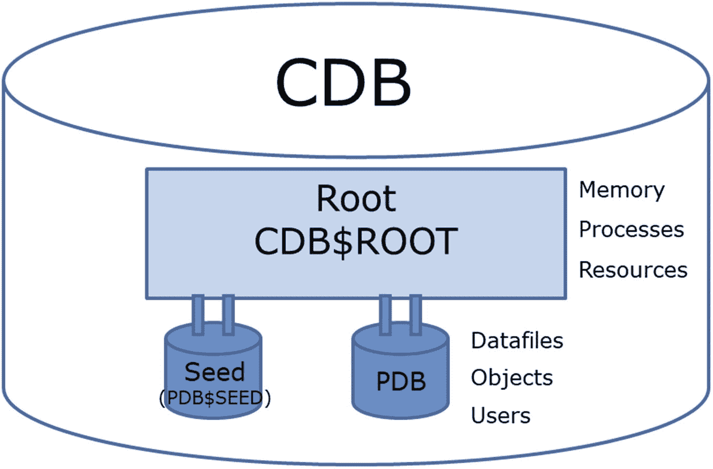
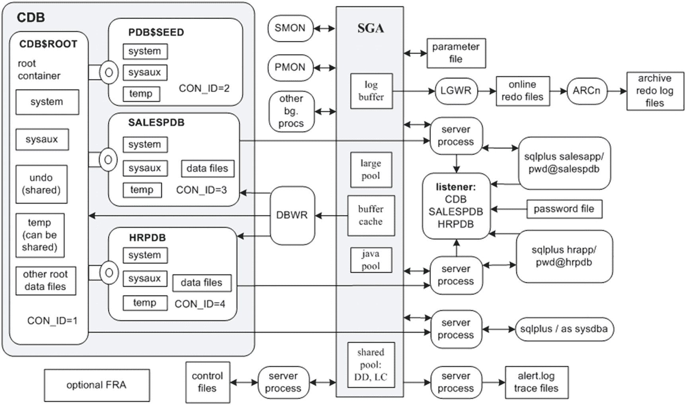

# you may need to tweak the next line based on that output.
free_space=`df -k | grep ${loc} | awk '{print $4}'`
echo box = ${BOX}, sid = ${DB}, Arch Log Mnt Pnt = ${loc}
echo "free_space        = ${free_space} K"
echo "THRESH_GET_WORRIED= ${THRESH_GET_WORRIED} K"
#
if [ $free_space -le $THRESH_GET_WORRIED ]; then
$MAILX -s "Arch Redo Space Low ${DB} on $BOX" $MAIL_LIST <<EOF
Archive log dest space low running backup now,
box: $BOX, sid: ${DB}, free space: $free_space
EOF
#### Run RMAN backup of archivelogs and delete after backed up
rman nocatalog <<EOF
connect target /
backup archivelog all delete input;
EOF
else
echo no need to backup and delete, ${free_space} KB free on ${loc}
fi
#
exit 0
```

如果你使用`FRA`（快速恢复区）作为归档日志文件的存储位置，你可以从`V$ARCHIVED_LOG`视图推导出归档位置；例如，

```sql
SQL> select
substr(name,1,instr(name,'/',1,2)-1)
from v$archived_log
where first_time =
(select max(first_time) from v$archived_log);
```

当使用`FRA`时，还有几种其他方法来管理此空间，这绝对是使用`FRA`而非仅设置一个目录的另一个原因。可以使用`SQL`从`v$recovery_file_dest`确定阈值，而不是查看文件系统。

```sql
SQL> select name, space_limit, space_used from v$recovery_file_dest;
NAME SPACE_LIMIT  SPACE_USED

/u02/oradata/FRA  1048576      48576
```


### 管理 FRA 大小

可以增加 FRA（快速恢复区）的大小，以容纳更多归档日志，直到通过备份与删除或清除旧备份来释放空间。FRA 的目标位置也可以更改。自动化增加 FRA 大小并执行备份的过程更为容易，这样可以确保归档日志目录不会被填满。可以在前面的脚本中，在 RMAN 脚本之前插入以下内容：

```
SQL> alter system set DB_RECOVERY_FILE_DEST_SIZE=20G scope=both;
```

通常，检查归档日志目标的脚本每小时运行一次。以下是一个典型的 `cron` 条目（此条目实际上应该是一行代码，但为了适应页面而放在了两行）：

```
38 * * * * /u01/oracle/bin/arch_check.bsh DWREP
1>/u01/oracle/bin/log/arch_check.log 2>&1
```

### 截断大型日志文件

有时日志文件会变得非常大，并通过填满关键挂载点而导致问题。`listener.log` 将记录有关传入数据库连接的信息。`alert.log` 是另一个记录数据库错误、更改和活动的文件。对于活跃的系统，该文件可以迅速增长到几个 GB。在许多环境中，`listener.log` 文件中的信息不需要保留。如果存在 Oracle Net 连接问题，则可以检查该文件以帮助进行故障排除。

`listener.log` 和 `alert.log` 文件正在被主动写入，因此你不应该直接删除它们。如果删除该文件，监听器进程不会重新创建该文件并再次开始写入；你必须停止并重新启动监听器以重新开始向 `listener.log` 文件写入。`alert.log` 会被重新创建，但应该按照以下针对 `listener.log` 的示例以相同方式处理。但是，你可以将 `listener.log` 文件置空或截断。在 Linux/Unix 环境中，可以通过以下技术完成：

```
$ cat /dev/null >listener.log
```

上一个命令将 `listener.log` 文件的内容替换为 `dev/null`（Linux/Unix 系统上的一个默认文件，不包含任何内容）。此命令的结果是 `listener.log` 文件被截断，监听器可以继续主动写入它。

下面列出了一个 shell 脚本，该脚本在下次运行时被覆盖之前，为保留而进行备份后截断默认的 `listener.log` 文件。此脚本依赖于设置操作系统变量 `ORACLE_BASE`。如果你未在环境中设置该变量，则必须在此脚本中硬编码目录路径：

```
#!/bin/bash
#
if [ $# -ne 1 ]; then
echo "Usage: $0 SID"
exit 1
fi
#### See chapter 2 for details on setting OS variables
#### Source oracle OS variables with oraset script
. /etc/oraset $1
#
MAILX='/bin/mailx'
MAIL_LIST='dkuhn@gmail.com'
BOX=$(uname -a | awk '{print $2}' | cut -f 1 -d'.')
#
if [ -f $ORACLE_BASE/diag/tnslsnr/$BOX/listener/trace/listener.log ]; then
cp $ORACLE_BASE/diag/tnslsnr/$BOX/listener/trace/listener.log $ORACLE_BASE/diag/tnslsnr/$BOX/listener/trace/listener.bkup
cat /dev/null > $ORACLE_BASE/diag/tnslsnr/$BOX/listener/trace/listener.log
fi
if [ $? -ne 0 ]; then
echo "trunc list. problem" | $MAILX -s "trunc list. problem $1" $MAIL_LIST
else
echo "no problem..."
fi
exit 0
```

以下 `cron` 条目每月运行一次前面的脚本（此条目应该全部在一行，但为了适应页面而放在了两行）：

```
30 6 1 * * /orahome/oracle/bin/trunc_log.bsh DWREP
1>/orahome/oracle/bin/log/trunc_log.log 2>&1
```

### 检查锁定的生产账户

通常，应该有一个数据库配置文件，指定数据库账户在指定次数的失败登录尝试后锁定。例如，将 `DEFAULT` 配置文件的 `FAILED_LOGIN_ATTEMPTS` 设置为 5。然而，有时恶意用户或开发人员会尝试猜测生产账户密码，并在五次尝试后锁定了生产账户。当这种情况发生时，需要尽快收到警报，以便调查是安全事件还是用户问题，然后解锁该账户。

以下 shell 脚本检查生产数据库账户列表在 `DBA_USERS` 中的 `LOCK_DATE` 值：

```
#!/bin/bash
if [ $# -ne 1 ]; then
echo "Usage: $0 SID"
exit 1
fi
#### source oracle OS variables
. /etc/oraset $1
#
crit_var=$(sqlplus -s <<EOF
/ as sysdba
SET HEAD OFF FEED OFF
SELECT count(*)
FROM dba_users
WHERE lock_date IS NOT NULL
AND username in ('CIAP','REPV','CIAL','STARPROD');
EOF)
#
if [ $crit_var -ne 0 ]; then
echo $crit_var
echo "locked acct. issue with $1" | mailx -s "locked acct. issue" dkuhn@sun.com
else
echo $crit_var
echo "no locked accounts"
fi
exit 0
```

此 shell 脚本由调度工具（如 `cron`）调用。例如，此 `cron` 条目指示作业每 10 分钟运行一次（此条目实际上应该是一行代码，但为了适应页面而放在了两行）：

```
0,10,20,30,40,50 * * * * /home/oracle/bin/lock.bsh DWREP
1>/home/oracle/bin/log/lock.log 2>&1
```

通过这种方式，当其中一个生产数据库账户被锁定时，会发送电子邮件通知。如果风险水平可以接受，作为此脚本的一部分，应该有一个在设定时间后自动解锁账户的步骤，并记录存在失败的登录尝试。

### 检查过多进程

在某些数据库服务器上，你可能有许多后台 SQL*Plus 作业。这些批处理作业可能执行诸如从远程数据库复制数据和大型每日更新作业等任务。在这些环境中，了解在任何给定时间数据库服务器上运行的 shell 脚本或 SQL*Plus 进程数量是否异常非常有用。异常数量的作业可能表明某些内容已损坏或挂起。

下一个 shell 脚本中有两个检查：一个用于确定名称以 `bsh` 扩展名结尾的 shell 脚本数量，另一个用于确定包含 `sqlplus` 字符串的进程数量：

```
#!/bin/bash
#
if [ $# -ne 0 ]; then
echo "Usage: $0"
exit 1
fi
#
crit_var=$(ps -ef | grep -v grep | grep bsh | wc -l)
if [ $crit_var -lt 20 ]; then
echo $crit_var
echo "processes running normal"
else
echo "too many processes"
echo $crit_var | mailx -s "too many bsh procs: $1" dkuhn@gmail.com
fi
#
crit_var=$(ps -ef | grep -v grep | grep sqlplus | wc -l)
if [ $crit_var -lt 30 ]; then
echo $crit_var
echo "processes running normal"
else
echo "too many processes"
echo $crit_var | mailx -s "too many sqlplus procs: $1" dkuhn@gmail.com
fi
#
exit 0
```

前面的 shell 脚本名为 `proc_count.bsh`，由 `cron` 作业每小时运行一次（此条目实际上应该是一行代码，但为了适应页面而放在了两行）：

```
33 * * * * /home/oracle/bin/proc_count.bsh
1>/home/oracle/bin/log/proc_count.log 2>&1
```

### 验证 RMAN 备份的完整性

作为备份和恢复策略的一部分，你应该定期验证备份文件的完整性。这也作为使用 RMAN 备份数据库的一部分包含在内，但可以运行一个单独的作业来对它们进行还原验证。RMAN 提供了一个 `RESTORE...VALIDATE` 命令，用于检查备份文件中的物理损坏。以下脚本启动 RMAN 并将日志文件假脱机。随后在日志文件中搜索关键字 `error`。如果日志文件中有任何错误，则会发送电子邮件：


```bash
#!/bin/bash
#
if [ $# -ne 1 ]; then
echo "用法: $0 SID"
exit 1
fi
#### source oracle OS variables
. /etc/oraset $1
#
date
BOX=`uname -a | awk '{print$2}'`
rman nocatalog <<EOF
connect target /
spool log to $HOME/bin/log/rman_val.log
set echo on;
restore database validate;
EOF
grep -i error $HOME/bin/log/rman_val.log
if [ $? -eq 0 ]; then
echo "RMAN 验证发现问题 $BOX, $1" | \
mailx -s "RMAN 验证发现问题 $BOX, $1" dkuhn@sun.com
else
echo "没有问题..."
fi
#
date
exit 0
```

### RMAN 验证

`RESTORE...VALIDATE` 命令实际上并不恢复任何文件；它只验证恢复数据库所需的文件是否可用，并检查物理损坏。

如果您还需要检查逻辑损坏，请指定 `CHECK LOGICAL` 子句。例如，要检查逻辑损坏，之前的 shell 脚本中需要包含这一行：

```sql
restore database validate check logical;
```

对于大型数据库，验证过程可能非常耗时（因为脚本会检查备份文件中的每个数据块是否损坏）。如果您只想验证备份文件是否存在，请指定 `VALIDATE HEADER` 子句，如下所示：

```sql
restore database validate header;
```

此命令仅检查每个文件（对于恢复和恢复所需）的头部信息是否有效。

### 自动数据库

之前介绍的脚本和任务在计划执行时，仅仅是触及了 Oracle 数据库自动化作业的皮毛。开始获取这些脚本的结果并应用修复、执行下一步操作的流程，才更接近真正的自动化。Oracle 18c 数据库有许多流程和钩子，允许环境配置更多的自动化。Oracle 18c 本身并非自动数据库，但在 Oracle Cloud 环境中，它成为了 Oracle 自动数据库。这就是所谓的自修复、自修补和自驱动数据库。

在 Oracle Cloud 中，数据库由自动化流程管理、备份，并且在需要时，会执行故障转移和基本故障排除来处理问题。问题可能是处理能力需求增加或存储空间不足。如果数据库利用率不高，它可以自动缩减以节省成本。数据库拥有关于活动发生时间的信息，并通过学习可以监控性能问题并采取补救措施。

在 Oracle Cloud 中，默认实现了安全配置以及安全选项。自动数据库启用了威胁检测和加密，以保护其存储的数据。补丁也实现了自动化，因此当出现漏洞时，补丁流程可以应用修复。这些步骤无需人工干预即可完成，并且在高度可用的环境中，数据库不会经历停机。

在这种云环境中，DBA 该做什么？在开发、数据集成、质量、以及其他安全和商业智能领域，有很多机会可以为企业增加价值。这不正是我们一直在讨论的，自动化基本任务和寻找问题补救方法，以实现更一致、稳定的数据库环境吗？

数据库有许多特性可用于管理业务的其他领域，甚至可以将数据库的新特性构建到应用程序中。DBA 可以成为推动这一切的人。本章不会深入讨论 Oracle Cloud，因为它仍然是我们一直在谈论的 Oracle 18c 数据库。区别在于运行数据库的位置或硬件。Oracle Cloud 和 Oracle Cloud Machine（位于您的数据中心内）为数据库的置备和补丁备份流程提供了监控、支持和自动化。

Oracle Cloud 数据库甚至可以通过 DBA 已经熟悉的工具（如 SQL Developer 和 Cloud Control（前身为 Enterprise Manager））进行与本地数据库相同的管理。用户通过云服务进行管理，DBA 可以帮助管理这些资源，并为迁移到云环境提供意见。

随着自动数据库持续收集有关性能和安全活动的信息，它会提供查询计划和索引的变更建议，以改进和检测安全预防控制中的异常。Oracle 18c 数据库正在用于转变数据库环境的实施方式。数据库只是可以根据业务需求按需提供的服务。使该服务可用的流程和步骤需要减少手动步骤，增加自动化流程和补救措施。


## 总结

将日常数据库作业自动化是成功数据库管理员的关键策略。自动化作业确保任务可重复、可验证，并在出现问题时能快速得到通知。例如，作为数据库管理员，你的工作在很大程度上依赖于成功执行备份并确保数据库的高可用性。本章包含多个脚本和示例，详细介绍了如何按定义的频率运行常规作业。

Oracle 提供了 Oracle 调度器实用程序（通过 `DBMS_SCHEDULER` PL/SQL 包实现）来调度作业。此工具可用于自动化任何类型的数据库任务。你还可以基于系统事件或其他已调度作业的成功/失败来启动作业。

如果你是在 Linux/Unix 环境下工作的数据库管理员，你应该熟悉 `cron` 实用程序。这个调度器简单易用，几乎普遍可用。即使你当前的任务不使用 `cron`，未来的工作环境中你肯定会遇到它。

这些脚本大多只是检查和报警，下一步是如果在需要处理或修复某些情况时实际自动化一个操作。纠正操作可以是解锁账户或为快速恢复区添加归档日志空间，以便立即处理问题，并留出时间审查和验证该操作。

至此，在本书中，你已经学习了如何实施和执行数据库管理员所需的许多任务。凭借这些知识和理解，数据库变得更加熟悉，需要自动化的任务可能已经在列出。这些知识将延续到云迁移和云中数据库的管理。即使你只管理一个数据库，无疑你也已经卷入了大量故障排除活动中。下一章将重点介绍诊断和解决数据库管理员遇到的许多问题。

# 21. 数据库故障排除

*数据库故障排除*是一个模糊且通用的术语，适用于广泛的主题。它可以涵盖从调查数据库连接问题到详细性能调优的任何内容。本章将涵盖以下故障排除活动：

-   快速评估数据库可用性问题
-   使用操作系统实用程序识别系统性能问题
-   查询数据字典视图以显示资源密集型 SQL 语句
-   使用 Oracle 性能工具识别消耗资源的 SQL 语句
-   识别和解决锁定问题
-   排查 open-cursor 问题
-   调查 undo 和 temporary 表空间的问题

前面的列表并未包含你将遇到的所有类型的数据库故障排除和性能问题。相反，它代表了你可能遇到的数据库问题的样本，并展示了解决问题的有用技术。

## 快速初步判断

当接到电话说数据库出现问题时，能够提出问题并知道该问哪些正确的问题至关重要。理解问题是第一步，并且必须迅速完成，以便进入其他故障排除步骤。数据库管理员将被要求排查数据库和非数据库问题、服务器、连接和网络，因为这些都是数据库系统的一部分，可能唯一能看到的是数据返回不够快或根本没有返回。

以下是一些有用的问题：

-   这是应用程序的问题还是直接连接数据库的问题？
-   这是新进程、新查询、新代码段吗？
-   这个慢的情况持续多久了？以前发生过还是第一次？
-   有任何数据返回吗？
-   你收到任何错误信息吗？

随着答案的返回，你可以检查告警日志、常规作业的脚本输出、ping 数据库和数据库服务器，以及看看是否能登录。这应该能为你开始故障排除问题提供一个良好的起点。

**提示**：请记住，你应该自动化执行诸如验证数据库可用性等任务的作业（有关自动化数据库管理员任务的示例，请参见第 19 章）。自动化作业帮助你主动处理问题，使其不会演变成数据库停机。

## 检查数据库可用性

最初的几次检查不需要登录到数据库服务器。相反，它们可以通过 SQL*Plus 和操作系统命令远程执行。通过网络远程执行初始检查可以确定所有系统组件是否正常工作。

要确定远程服务器是否可用、数据库是否已启动、网络是否正常以及侦听器是否接受传入连接，一个快速检查是通过 SQL*Plus 客户端通过网络连接到远程数据库。初始测试可以使用非数据库管理员账户。以下是一个通过网络以用户 `michelle`（密码为 `ora123`）连接到远程数据库的示例；网络连接信息直接嵌入到连接字符串中（其中 `dwdb1` 是服务器，1521 是端口，`dwrep1` 是数据库服务名）：

```bash
$ sqlplus michelle/ora123@'dwdb1:1521/dwrep1'
```

如果可以建立连接，那么远程服务器是可用的，并且数据库和侦听器已启动并正在工作。此时，根据所问的问题，我们可以验证连接问题是与应用程序有关，还是与数据库以外的其他因素有关。

如果前面的 SQL*Plus 命令不起作用，请尝试确定远程服务器是否可用。在此示例中，向名为 `dwdb1` 的远程服务器发出 `ping` 命令：

```bash
$ ping dwdb1
```

如果 `ping` 成功，你应该会看到类似这样的输出：

```
64 bytes from dwdb1 (192.168.254.215): icmp_seq=1 ttl=64 time=0.044 ms
```

如果 `ping` 不成功，可能是网络或远程服务器存在问题。如果远程服务器不可用，是时候联系系统管理员或网络管理员了。

如果 `ping` 确实成功，那么请检查是否可以通过侦听器正在监听的端口访问远程服务器。使用 `telnet` 命令来完成此操作：

```bash
$ telnet IP
```

在此示例中，尝试连接到服务器的 IP 地址的 1521 端口：

```bash
$ telnet 192.168.254.215 1521
```

如果 IP 地址在指定端口上可达，你应该会在输出中看到 “Connected to . . .”，像这样：

```
Trying 192.168.254.216...
Connected to ora04.
Escape character is '^]'.
```

如果 `telnet` 命令不起作用，请联系系统管理员或网络管理员。

如果 `telnet` 命令确实有效，并且可以通过指定端口与服务器建立网络连接，那么使用 `tnsping` 命令测试与远程服务器和数据库的网络连接，使用 Oracle Net。此示例尝试连接到 `DWREP1` 远程服务：

```bash
$ tnsping DWREP1
```

如果成功，输出应包含 `OK` 字符串，像这样：

```
Attempting to contact (DESCRIPTION = (ADDRESS = (PROTOCOL = TCP)(HOST = DWDB1)(PORT = 1521)) (CONNECT_DATA = (SERVICE_NAME = DWREP1)))
OK (20 msec)
```

如果 `tnsping` 成功，这意味着远程侦听器已启动并正在工作。这并不一定意味着数据库已启动，因此你可能需要登录到数据库服务器进行进一步调查。如果 `tnsping` 不成功，那么侦听器或数据库已关闭或挂起。

为了进一步调查问题，请直接登录到服务器执行其他检查，例如挂载点填满。希望如果有其他问题，某个日志或监控脚本已经报告了它；不过，此时可能需要在服务器上进行检查。

Oracle Instant Client


## Oracle 即时客户端与数据库维护

### 远程连接测试

有时，你需要与系统管理员（SA）和开发人员协作，测试到数据库的远程连接，但他们可能未安装带有 `SQL*Plus` 可执行文件的 Oracle。在这种情况下，建议他们下载并使用 Oracle 即时客户端，甚至是 SQLDeveloper（无需完整客户端）。它的占用空间非常小，只需几分钟即可安装。步骤如下：

1.  从 Oracle 技术网络（OTN）网站下载即时客户端（[`http://otn.oracle.com`](http://otn.oracle.com)）。
2.  创建一个目录来存放文件。
3.  将文件解压到该目录。
4.  设置 `LD_LIBRARY_PATH` 和 `PATH` 变量，使其包含文件解压到的目录。
5.  使用简易连接语法连接到远程数据库：
    ```
    $ sqlplus user/pass@'host:port/database_service_name'
    ```

此过程允许你访问 `SQL*Plus`，而无需执行庞大且笨重的 Oracle 安装。即时客户端适用于大多数硬件平台（Windows、Mac、Linux 和 Unix）。SQLDeveloper 也能像即时客户端一样，使用数据库名、主机和端口登录，这对他们来说可能也是一个有用的工具。

## 检查磁盘空间

要对问题进行进一步诊断（例如磁盘空间不足），你需要直接登录到远程服务器。通常，你需要以 Oracle 软件的所有者（通常是 `oracle` 操作系统账户）登录。首次登录到一个系统时，导致数据库挂起或出现问题的一个常见原因是挂载点已满。`df` 命令配合人类可读的 `-h` 开关有助于验证磁盘空间使用情况：
```
$ df -h
```

任何已满的挂载点都需要调查。如果包含 `ORACLE_HOME` 的挂载点已满，那么连接到数据库时会收到如下错误：
```
Linux Error: 28: No space left on device
```

要解决挂载点已满的问题，首先要识别可以移动或删除的文件。通常，从查找旧的跟踪文件开始；通常，有些旧文件可以安全删除。

## 定位警报日志和跟踪文件

默认的警报日志目录路径结构如下：
```
ORACLE_BASE/diag/rdbms/<db_unique_name>/<instance_name>/trace
```
或者在 SQL*Plus 中查询目录：
```
SQL> show parameter background
```

> 注意：你可以通过设置 `DIAGNOSTIC_DEST` 初始化参数来覆盖警报日志的默认目录路径。

通常，`db_unique_name` 与 `instance_name` 相同。然而，在 RAC 和 Data Guard 环境中，`db_unique_name` 通常与 `instance_name` 不同。你可以通过此查询验证目录路径：
```
SQL> select value from v$diag_info where name = 'Diag Trace';
```

警报日志的名称格式如下：
```
alert_<ORACLE_SID>.log
```

你也可以通过操作系统（无论数据库是否已启动）使用以下命令来定位警报日志：
```
$ cd $ORACLE_BASE
$ find . -name alert_<ORACLE_SID>.log
```

在上面的 `find` 命令中，你需要将 `<ORACLE_SID>` 值替换为你的数据库名称。

如第 3 章所示，建议设置一个操作系统函数来帮助你导航到警报日志的位置。这是一个示例函数（你需要根据你的环境进行修改）：
```
function bdump {
if [ "$ORACLE_SID" = "O18C" ]; then
cd /orahome/app/oracle/diag/rdbms/o18c/O18C/trace
elif [ "$ORACLE_SID" = "O12c" ]; then
cd /orahome/app/oracle/diag/rdbms/o12c/O12C/trace
elif [ "$ORACLE_SID" = "O11R2" ]; then
cd /orahome/app/oracle/diag/rdbms/o11r2/O11R2/trace
fi
}
```

现在你可以输入 `bdump`，就会进入包含数据库警报日志的工作目录。找到正确的文件后，检查最近的错误条目，然后在同一目录中查找跟踪文件：
```
$ ls -altr *.tr*
```

如果这些跟踪文件中有超过几天的，请考虑移动或删除它们。

## 删除文件

不用说，删除文件时要非常小心。试图解决问题时，最不想做的事情就是让情况变得更糟。意外删除一个关键文件可能是灾难性的。对于你确定为删除候选的任何文件，考虑移动（而不是删除）它们。如果你有一个有空闲空间的挂载点，将文件移到那里，放置几天后再删除。

> 提示：考虑使用自动诊断知识库命令解释器（ADRCI）实用程序来清除旧的跟踪文件。更多详细信息，请参阅《Oracle 数据库实用程序指南》，可从 Oracle 技术网络（OTN）网站下载（[`http://otn.oracle.com`](http://otn.oracle.com)）。

如果你确定了可以删除的文件，首先在你实际删除它们之前创建一个要删除的文件列表。至少在删除任何文件之前这样做：
```
$ ls -altr <filename>
```

查看 `ls` 命令返回的结果后，删除文件。此示例使用 Linux/Unix 的 `rm` 命令永久删除文件：
```
$ rm <filename>
```

你也可以根据文件的年龄删除文件。例如，假设你确定任何超过 2 天的跟踪文件都可以安全删除。通常，`find` 命令与 `rm` 命令结合使用来完成此任务。在删除文件之前，首先显示 `find` 命令的结果：
```
$ find . -type f -mtime +2 -name "*.tr*"
```

如果你对文件列表满意，则添加 `rm` 命令来删除它们：
```
$ find . -type f -mtime +2 -name "*.tr*" | xargs rm
```

在上面这行代码中，`find` 命令的结果通过管道传递给 `xargs` 命令，该命令为 `find` 命令找到的每个文件执行 `rm` 命令。这是一种基于文件年龄删除文件的高效方法。但是，请务必确定你知道将要删除哪些文件。

另一个有时会占用大量空间的文件是 `listener.log` 文件。因为这个文件被侦听器进程**主动写入**，你不能简单地删除它。在第 19 章中，有一个关于此作业的示例，可以执行该作业或查看它是否正在运行。如果你需要保留此文件的内容以检查连接问题，首先将其复制到有空闲磁盘空间的备份位置，然后截断该文件。在此示例中，`listener.log` 文件被复制到 `/u01/backups`，然后截断文件，如下所示：
```
$ cp listener.log /u01/backups
```

接下来，使用 `cat` 命令将 `listener.log` 的内容替换为 `/dev/null` 文件（该文件包含零字节）：
```
$ cat /dev/null > listener.log
```

需要将该文件替换为空内容（`/dev/null`），而不是删除该文件并让系统创建一个新文件，因为该文件附加在一个进程（侦听器）上。替换文件将允许在进程运行时继续写入该文件。对于 `alert.log` 文件也需要这样做。

## 检查警报日志

处理数据库问题时，`alert.log` 文件应该是你检查相关错误消息的首要文件之一。你可以使用操作系统工具或 ADRCI 实用程序来查看 `alert.log` 文件和相应的跟踪文件。

### 通过操作系统工具查看警报日志

导航到包含 `alert.log` 的目录后，你可以通过查看文件的末尾（最下面的部分）来查看最新的消息（换句话说，最新的消息被写入文件的末尾）。要查看最后 50 行，请使用 `tail` 命令：
```
$ tail -50 alert_<ORACLE_SID>.log
```

你可以使用 `-f` 开关持续查看最新的条目：
```
$ tail -f alert_<ORACLE_SID>.log
```

你也可以使用操作系统编辑器（如 `vi`）直接打开 `alert.log`：
```
$ vi alert_<ORACLE_SID>.log
```


## 查看 `alert.log`

有时，定义一个函数可以让你方便地打开 `alert.log` 文件，无论当前工作目录是什么。接下来的几行代码定义了一个函数，用于在 11g 或 10g 环境中定位并使用 `view` 命令打开 `alert.log`：

```
#-----------------------------------------------------------#
### view alert log
function valert {
if [ "$ORACLE_SID" = "O18C" ]; then
view /orahome/app/oracle/diag/rdbms/o18c/O18C/trace/alert_O18C.log
elif [ "$ORACLE_SID" = "O12C" ]; then
view /orahome/app/oracle/diag/rdbms/o12c/O12C/trace/alert_O12C.log  elif [ "$ORACLE_SID" = "O11R2" ]; then
view /orahome/app/oracle/diag/rdbms/o11r2/O11R2/trace/alert_O11R2.log
fi
} # valert
#-----------------------------------------------------------#
```

通常，这些代码行会被放在启动文件中，这样当你登录到服务器时，函数就会自动定义。函数定义后，你可以通过输入以下命令来查看 `alert.log`：

```
$ valert
```

在检查 `alert.log` 文件末尾时，请查找指示以下类型问题的错误：

*   归档进程因磁盘空间不足而挂起
*   文件系统空间用尽
*   表空间空间用尽
*   ORA-600 或 7445 错误
*   缓冲区高速缓存或共享池内存耗尽
*   指示数据文件丢失或损坏的介质错误
*   指示归档日志写入问题的错误；例如：

```
ORA-19502: write error on file "/ora01/fra/o18c/archivelog/...
```

对于 `alert.log` 文件中列出的严重错误消息，几乎总是有一个相应的跟踪文件。例如，对于上述错误消息，伴随的消息是：

```
Errors in file /orahome/app/oracle/diag/rdbms/o18c/O18C/trace/O18C_ora_5665.trc
```

检查跟踪文件通常（但不总是）能提供关于问题的更多见解。

### 使用 ADRCI 实用程序查看 `alert.log`

你可以使用 ADRCI 实用程序来查看 `alert.log` 文件的内容。从操作系统运行以下命令来启动 ADRCI 实用程序：

```
$ adrci
```

你应该会看到一个提示符：

```
adrci>
```

使用 `SHOW ALERT` 命令来查看 `alert.log` 文件：

```
adrci> show alert
```

如果服务器上有多个 Oracle 主目录，系统将提示你选择要查看哪个 `alert.log`。`SHOW ALERT` 命令将使用设置为操作系统默认编辑器的实用程序打开 `alert.log`。在 Linux/Unix 系统上，默认编辑器源自操作系统的 `EDITOR` 变量（通常设置为 `vi` 等实用程序）。

> **提示**：当显示 `alert.log` 时，如果你不熟悉 `vi` 并想退出，请先按 Escape 键，然后按住 Shift 键的同时按下冒号（`:`）键。接下来，输入 `q!`。这应该会使你退出 `vi` 编辑器并返回到 ADRCI 提示符。

你可以在 ADRCI 中覆盖默认编辑器，使用 `SET EDITOR` 命令。此示例将默认编辑器设置为 `emacs`：

```
adrci> set editor emacs
```

你可以使用 `TAIL` 选项查看 `alert.log` 中最后 `N` 行的内容。以下命令显示 `alert.log` 的最后 50 行：

```
adrci> show alert -tail 50
```

如果你有多个 Oracle 主目录，可能会看到如下消息：

```
DIA-48449: Tail alert can only apply to single ADR home
```

ADRCI 实用程序不会假设你希望在服务器上使用一个 Oracle 主目录而不是另一个。要专门为 ADRCI 实用程序设置 Oracle 主目录，请先使用 `SHOW HOMES` 命令显示所有可用的 Oracle 主目录：

```
adrci> show homes
```

以下是一些此服务器的示例输出：

```
diag/rdbms/o18c/O18C
diag/rdbms/o18cp/O18CP
```

现在，使用 `SET HOMEPATH` 命令。这会将 `HOMEPATH` 设置为 `diag/rdbms/o18c/O18C`：

```
adrci> set homepath  diag/rdbms/o18c/O18C
```

要持续显示文件末尾，请使用此命令：

```
adrci> show alert -tail -f
```

按 Ctrl+C 可以中断持续查看 `alert.log` 文件。要显示 `alert.log` 中包含特定字符串的行，请使用 `MESSAGE_TEXT LIKE` 命令。此示例显示包含 `ORA-27037` 字符串的消息：

```
adrci> show alert -p "MESSAGE_TEXT LIKE '%ORA-27037%'"
```

系统将显示一个文件，其中包含 `alert.log` 中所有匹配指定字符串的行。

> **提示**：有关如何使用 ADRCI 实用程序的完整详细信息，请参阅《Oracle 数据库实用程序指南》。

## 通过操作系统实用程序识别瓶颈

在 Oracle 领域，有时会倾向于假设你有一台专用于一个 Oracle 数据库的机器。此外，这个数据库是最新版本的 Oracle，已完全打补丁，并由复杂的图形工具监控。这个数据库环境是完全自动化的，并通过使用可视化工具来快速定位问题并有效隔离和解决问题，从而保持无故障运行。如果你生活在这个理想的世界里，那么你可能不需要本章中的任何材料。

让我描绘一幅略有不同的图景。一个环境中，一台机器上运行着十几个数据库。有一个 MySQL 数据库；一个 PostgreSQL 数据库；以及混合的 Oracle 11g、12c 和 18c 数据库。此外，许多这些旧数据库使用的是 Oracle 的非终端版本，因此不受 Oracle 支持。没有计划升级这些不受支持的数据库，因为业务无法承担可能破坏依赖这些数据库的应用程序的风险。注意：此时也应理解业务面临的安全风险；尽管如此，多数据库平台是可能的。

那么，当有人报告某个数据库应用程序性能不佳时，在这类环境中该怎么做呢？在这种场景下，通常是某个不同的数据库中的某些东西导致同一台服务器上的其他应用程序表现不佳。可能不是 Oracle 进程或 Oracle 数据库导致了问题。

在这种情况下，从使用操作系统工具开始调查问题几乎总是更有效的。操作系统工具是与数据库无关的。操作系统性能实用程序有助于定位资源消耗最多的地方，而不管数据库供应商或版本如何。

在 Linux/Unix 环境中，有多种工具可用于监控资源使用情况。表 21-1 总结了用于诊断性能问题最常用的操作系统实用程序。熟悉这些操作系统命令的工作原理以及如何解释输出，将使你能够更好地诊断服务器性能问题，尤其是当导致服务器上其他所有应用程序性能下降的不是 Oracle 甚至不是数据库进程时。

表 21-1 性能和监控实用程序

| 工具 | 用途 |
| :--- | :--- |
| `vmstat` | 监控进程、CPU、内存和磁盘 I/O 瓶颈 |
| `top` | 识别消耗资源最多的会话 |
| `watch` | 周期性地运行另一个命令 |
| `ps` | 识别消耗 CPU 和内存最高的会话；用于识别消耗系统资源最多的 Oracle 会话 |
| `mpstat` | 报告 CPU 统计信息 |
| `sar` | 显示 CPU、内存、磁盘 I/O 和网络使用情况，包括当前和历史数据 |
| `free` | 显示空闲和已使用的内存 |
| `df` | 报告磁盘剩余空间 |
| `du` | 显示磁盘使用情况 |
| `iostat` | 显示磁盘 I/O 统计信息 |
| `netstat` | 报告网络统计信息 |

在诊断性能问题时，确定操作系统在何处受到限制是很有用的。例如，尝试确定问题是否与 CPU、内存或 I/O 相关，或者是这些因素的组合。

### 识别系统瓶颈


## 系统性能分析入门：使用 `vmstat` 和 `top`

每当出现应用程序性能问题或可用性故障时（至少从数据库管理员的角度看），人们问的第一个问题通常是：“数据库怎么了？”无论问题根源在哪里，确认数据库运行是否良好的责任往往落在数据库管理员身上。我通常的解决方法是确定哪些系统范围的资源被大量消耗。有两个 Linux/Unix 操作系统工具特别适合用来显示系统范围的资源使用情况：

*   `vmstat`
*   `top`

`vmstat`（虚拟内存统计）工具旨在帮助你快速识别服务器上的瓶颈。`top` 工具则提供了系统资源使用的动态、实时视图。这两个工具将在接下来的两个章节中讨论。

### 使用 `vmstat`

`vmstat` 工具显示关于进程、内存、分页、磁盘 I/O 和 CPU 使用率的实时性能信息。此示例展示了在不指定任何选项的情况下使用 `vmstat` 显示默认输出：

```
$ vmstat
procs  -----------memory---------- ---swap-- -----io---- --system-- ----cpu----
r  b   swpd   free   buff  cache    si   so    bi    bo   in    cs us sy id wa
14  0  52340  25272   3068 1662704    0    0    63    76    9    31 15  1 84  0
```

以下是解读 `vmstat` 输出时可以使用的一些通用经验法则：

*   如果 `wa`（等待 I/O 的时间）列的值很高，这通常表明存储子系统过载。
*   如果 `b`（被阻塞的进程）持续大于 0，那么你可能没有足够的 CPU 处理能力。
*   如果 `so`（换出到磁盘的内存）和 `si`（从磁盘换入的内存）持续大于 0，你可能存在内存瓶颈。

默认情况下，运行 `vmstat`（不提供任何选项）时只显示一行服务器统计信息。这行输出给出了自系统上次重启以来计算的平均统计信息。这对于快速查看快照来说足够了。但是，如果你想收集一段时间内的指标，请使用以下语法的 `vmstat`：

```
$ vmstat [interval] [count]
```

在此模式下，`vmstat` 会报告统计信息，从一个间隔到下一个间隔进行采样。例如，如果你想每 2 秒报告一次系统统计信息，共 10 次，你可以执行此命令：

```
$ vmstat 2 10
```

你也可以将 `vmstat` 的输出发送到一个文件。这对于分析一段时间内的历史性能非常有用。此示例每 5 秒采样一次统计信息，总共 60 份报告，并将输出记录到文件中：

```
$ vmstat 5 60 > vmout.perf
```

此外，`vmstat` 工具可以与 `watch` 工具一起使用。`watch` 命令用于周期性地执行另一个程序。在此示例中，`watch` 每 5 秒运行一次 `vmstat` 命令，并在屏幕上高亮显示每次快照之间的任何差异：

```
$ watch –n 5 –d vmstat
Every 5.0s: vmstat                                    Thu Aug  9 13:27:57 2007
procs -----------memory---------- ---swap-- -----io---- --system-- ----cpu----
r  b   swpd   free   buff  cache  si   so    bi    bo   in    cs us sy id wa
0  0    144  15900  64620 1655100   0    0     1     7   16     4  0  0 99  0
```

当在 `watch -d`（差异）模式下运行 `vmstat` 时，你会在屏幕上直观地看到从一次快照到下一次快照的变化。要退出 `watch`，请按 Ctrl+C。

请注意，`vmstat` 内存列的默认度量单位是千字节。如果你想以兆字节查看内存统计信息，请使用 `S m`（以兆字节显示统计信息）选项：

```
$ vmstat –S m
```

**提示**
使用 `man vmstat` 或 `vmstat --help` 命令可以获取关于此工具的进一步文档。

### 使用 `top`

另一个识别资源密集型进程的工具是 `top` 命令。使用此工具可以快速识别服务器上哪些进程是资源的最高消耗者。默认情况下，`top` 会重复刷新（每 3 秒）关于最消耗 CPU 的进程的信息。运行 `top` 的最简单方式如下：

```
$ top
```

以下是输出的一个片段：

```
top - 13:34:32 up 19 min,  2 users,  load average: 0.05, 0.16, 0.24
Tasks: 176 total,   1 running, 175 sleeping,   0 stopped,   0 zombie
Cpu(s):  2.0%us,  0.7%sy,  0.0%ni, 91.6%id,  5.7%wa,  0.0%hi,  0.0%si,  0.0%st
Mem:    787028k total,   748744k used,    38284k free,      1836k buffers
Swap:  1605624k total,    31896k used,  1573728k free,      377668k cached
PID USER      PR  NI  VIRT  RES  SHR S %CPU %MEM    TIME+  COMMAND
4683 root      20   0  279m  14m 7268 S  2.0  1.9   0:01.61 gnome-terminal
3826 root      20   0  218m 9944 4200 S  1.7  1.3   0:02.80 Xorg
3592 oracle    -2   0  601m  18m  15m S  0.7  2.4   0:09.36 ora_vktm_o12c
```

消耗最高的会话的进程标识符（PID）列在第一列（`PID`）。你可以使用此信息来查看一个 PID 是否映射到数据库进程（有关将 PID 映射到数据库进程的详细信息，请参见下一节“将操作系统进程映射到 SQL 语句”）。

当 `top` 运行时，你可以交互式地更改其输出。例如，如果你输入重定向字符（`>`），这将使 `top` 排序的列向右移动一个位置。表 21-2 列出了一些可用于将 `top` 显示更改为你所需格式的关键功能。

**表 21-2** 交互式更改 `top` 输出的命令

| 命令 | 功能 |
| --- | --- |
| 空格键 | 立即刷新输出 |
| `<` 或 `>` | 将排序列向左或向右移动一个位置。默认情况下，`top` 按 CPU 列排序。 |
| `D` | 更改刷新时间 |
| `R` | 反转排序顺序 |
| `Z` | 切换彩色输出 |
| `H` | 显示帮助菜单 |
| `F` 或 `O` | 选择排序列 |

输入 `q` 或按 Ctrl+C 可退出 `top`。表 21-3 描述了 `top` 默认输出中显示的几个列。

**表 21-3** `top` 输出的列描述

| 列 | 描述 |
| --- | --- |
| `PID` | 唯一的进程标识符 |
| `USER` | 运行进程的操作系统用户名 |
| `PR` | 进程的优先级 |
| `NI` | 进程的 Nice 值。负值表示高优先级；正值表示低优先级。 |
| `VIRT` | 进程使用的总虚拟内存 |
| `RES` | 进程使用的非交换物理内存 |
| `SHR` | 进程使用的共享内存 |
| `S` | 进程状态 |
| `CPU` | 自上次屏幕刷新以来进程消耗的 CPU 百分比 |
| `MEM` | 进程消耗的物理内存百分比 |
| `TIME` | 进程使用的总 CPU 时间 |
| `TIME+` | 进程使用的总 CPU 时间，显示到百分之一秒 |
| `COMMAND` | 用于启动进程的命令行 |

你也可以使用 `b`（批处理模式）选项运行 `top` 并将输出发送到文件以供后续分析：

```
$ top –b > tophat.out
```

在批处理模式下运行时，`top` 命令将持续运行，直到你将其终止（使用 Ctrl+C）或达到指定的迭代次数。你可以将前面的 `top` 命令与 `nohup` 和 `&` 结合使用，以批处理模式运行，这样无论你是否登录系统，它都会继续运行。这样做的风险是，你可能会忘记它，最终创建一个非常大的输出文件（并惹恼系统管理员）。

如果你有一个特定的进程想要监控，请使用 `p` 选项来监控一个 PID，或使用 `U` 选项来监控一个用户名。你还可以使用 `d` 和 `-n` 选项来指定延迟和迭代次数。以下示例以 5 秒的延迟监控 `oracle` 用户，共 25 次迭代：


## 性能监控与 SQL 追踪指南

### 将操作系统进程映射到 SQL 语句

在识别操作系统（OS）进程时，查看哪些进程消耗最多的 CPU 资源是很有用的。如果资源消耗大户是数据库进程，将其映射到具体的数据库任务或查询同样重要。要确定消耗最多 CPU 资源的进程 ID，可以使用如`ps`这样的命令：

```bash
$ ps -e -o pcpu,pid,user,tty,args | sort -n -k 1 -r | head
```

以下是输出的一个片段：

```
14.6 24875 oracle   ?      oracleo18c (DESCRIPTION=(LOCAL=YES)(ADDRESS=...
0.8 21613 oracle   ?      ora_vktm_o18c
0.1 21679 oracle   ?      ora_mmon_o18c
```

从输出中，您可以看到操作系统会话 24875 是 CPU 资源的头号消费者。输出还表明该进程与`o12c`数据库相关联。掌握这些信息后，登录到相应的数据库，并使用以下 SQL 语句来确定与操作系统进程 24875 相关联的程序类型：

```sql
SQL> select
'USERNAME : ' || s.username|| chr(10) ||
'OSUSER   : ' || s.osuser  || chr(10) ||
'PROGRAM  : ' || s.program || chr(10) ||
'SPID     : ' || p.spid    || chr(10) ||
'SID      : ' || s.sid     || chr(10) ||
'SERIAL#  : ' || s.serial# || chr(10) ||
'MACHINE  : ' || s.machine || chr(10) ||
'TERMINAL : ' || s.terminal
from v$session s,
v$process p
where s.paddr = p.addr
and   p.spid  = &PID_FROM_OS;
```

当您运行该命令时，SQL*Plus 会提示您输入用于替代`&PID_FROM_OS`的值。在此示例中，您将输入`24875`。以下是相关的输出：

```
USERNAME : MV_MAINT
OSUSER   : oracle
PROGRAM  : sqlplus@speed2 (TNS V1-V3)
SPID     : 24875
SID      : 111
SERIAL#  : 899
MACHINE  : speed2
TERMINAL : pts/4
```

在此输出中，`PROGRAM`值表明一个 SQL*Plus 会话是消耗服务器上过量资源的程序。接下来，运行以下查询以显示与操作系统 PID（在此示例中，服务器进程标识符[SPID]是 24875）相关联的 SQL 语句：

```sql
SQL> select
'USERNAME : ' || s.username || chr(10) ||
'OSUSER   : ' || s.osuser   || chr(10) ||
'PROGRAM  : ' || s.program  || chr(10) ||
'SPID     : ' || p.spid     || chr(10) ||
'SID      : ' || s.sid      || chr(10) ||
'SERIAL#  : ' || s.serial#  || chr(10) ||
'MACHINE  : ' || s.machine  || chr(10) ||
'TERMINAL : ' || s.terminal || chr(10) ||
'SQL TEXT : ' || sa.sql_text
from v$process p,
v$session s,
v$sqlarea sa
where p.addr = s.paddr
and s.username is not null
and s.sql_address = sa.address(+)
and s.sql_hash_value = sa.hash_value(+)
and p.spid= &PID_FROM_OS;
```

结果显示消耗资源的 SQL 语句作为输出的一部分，在`SQL TEXT`列中。以下是输出的一个片段：

```
USERNAME : MV_MAINT
OSUSER   : oracle
PROGRAM  : sqlplus@speed2 (TNS V1-V3)
SPID     : 24875
SID      : 111
SERIAL#  : 899
MACHINE  : speed2
TERMINAL : pts/4
SQL TEXT : select a.table_name from dba_tables a,dba_indexes b,dba_objects c...
```

> **提示**
> 使用 `man top` 或 `top --help` 命令列出您操作系统版本中所有可用的选项。

当您在一台服务器上运行多个数据库并遇到服务器性能问题时，有时很难精确定位是哪个数据库及相关进程导致了问题。在这些情况下，您必须使用操作系统工具来识别系统上资源消耗最高的会话。

在 Linux/Unix 环境中，您可以使用诸如`ps`、`top`或`vmstat`等实用程序来识别资源消耗最高的操作系统进程。`ps`实用程序很方便，因为它可以让您识别消耗最多 CPU 或内存的进程。前面的`ps`命令识别了消耗 CPU 最多的进程。这里，它被用来识别使用 Oracle 内存最多的进程：

```bash
$ ps -e -o pmem,pid,user,tty,args | grep -i oracle | sort -n -k 1 -r | head
```

一旦您识别出与数据库相关的、资源消耗最高的进程，就可以基于 SPID 查询数据字典视图，以识别数据库进程正在执行什么。

## OS Watcher

Oracle 提供了一系列脚本，用于收集和存储 CPU、内存、磁盘和网络使用情况的指标。在 Linux/Unix 系统上，**OS Watcher**工具套件自动化了统计信息的收集，使用的工具包括`top`、`vmstat`、`iostat`、`mpstat`、`netstat`和`traceroute`。该实用程序还有一个可选的图形组件，用于可视化显示性能指标。

您可以从 Oracle 的 MOS 网站获取 OS Watcher。对于 Linux/Unix 版本，请参阅 MOS 注释 301137.1 或标题为“OS Watcher User Guide”的文档。有关 Windows 版本 OS Watcher 的详细信息，请参阅 MOS 注释 433472.1。

## 查找资源密集型 SQL 语句

隔离性能不佳的查询的最佳方法之一，是用户或开发人员抱怨某个特定的 SQL 语句。在这种情况下，无需进行任何侦探工作，您可以直接定位需要调整的 SQL 查询。

然而，在调查性能问题时，您很少能有幸让人类明确告知从何处着手。有许多方法可以确定数据库中哪些 SQL 语句消耗的资源最多：

- 实时执行统计信息
- 近实时统计信息
- Oracle 性能报告

这些技术将在接下来的几个部分中描述。

### 监控实时 SQL 执行统计信息

您可以使用以下查询从`V$SQL_MONITOR`中选择，以监控 SQL 查询的近实时资源消耗情况：

```sql
SQL> select * from (
select a.sid session_id, a.sql_id
,a.status
,a.cpu_time/1000000 cpu_sec
,a.buffer_gets, a.disk_reads
,b.sql_text sql_text
from v$sql_monitor a
,v$sql b
where a.sql_id = b.sql_id
order by a.cpu_time desc)
where rownum <=20;
```

此查询的输出不容易完全显示在一页上。以下是输出的一个子集：

```
SESSION_ID  SQL_ID         STATUS      CPU_SEC  BUFFER_GETS  DISK_READS
----------  -------------  ---------  --------  -----------  -----------   SQL_TEXT---------
139  d07nngmx93rq7  DONE       331.88    5708         3490 select  count(*)
130  9dtu8zn9yy4uc  EXECUTING  11.55     5710         248 select  task_name
```

在该查询中，使用了一个内联视图来首先检索所有记录，并按`CPU_TIME`降序组织它们。然后，外部查询使用`ROWNUM`伪列将结果集限制为前 20 行。您可以修改前面的查询，按您选择的统计信息对结果进行排序，或仅显示当前正在执行的查询。例如，下一个 SQL 语句监控当前正在执行的查询，并按磁盘读取次数排序：

```sql
SQL> select * from (
select a.sid session_id, a.sql_id, a.status
,a.cpu_time/1000000 cpu_sec
,a.buffer_gets, a.disk_reads
,substr(b.sql_text,1,35) sql_text
from v$sql_monitor a
,v$sql b
where a.sql_id = b.sql_id
and   a.status='EXECUTING'
order by a.disk_reads desc)
where rownum <=20;
```


## 监控 SQL 语句执行

`V$SQL_MONITOR` 中的统计信息每秒更新一次，因此您可以查看其资源消耗的变化情况。如果 SQL 语句并行运行或消耗超过 5 秒的 CPU 或 I/O 时间，则默认会收集这些统计信息。`V$SQL_MONITOR` 视图包含在 `V$SQL`、`V$SQLAREA` 和 `V$SQLSTATS` 视图中包含的统计信息的子集。`V$SQL_MONITOR` 视图显示每个资源密集型 SQL 语句执行的实时统计信息，而 `V$SQL`、`V$SQLAREA` 和 `V$SQLSTATS` 则包含多次执行 SQL 语句产生的累积统计信息集合。

SQL 语句执行结束后，其运行时统计信息不会立即从 `V$SQL_MONITOR` 中清除。根据数据库中的活动情况，统计信息可能会保留一段时间。但如果您的数据库非常活跃，统计信息可能会在查询完成后很快被清除。

**提示**
您可以通过以下列的组合在 `V$SQL_MONITOR` 中唯一标识 SQL 语句的执行：`SQL_ID`、`SQL_EXEC_START`、`SQL_EXEC_ID`。

您也可以查询 `V$SQLSTATS` 等视图，以确定哪些 SQL 语句消耗了过多的资源。例如，使用以下查询根据 CPU 时间识别资源消耗最大的十个查询：

```sql
select * from(
select s.sid, s.username, s.sql_id
,sa.elapsed_time/1000000, sa.cpu_time/1000000
,sa.buffer_gets, sa.sql_text
from v$sqlarea sa
,v$session s
where s.sql_hash_value = sa.hash_value
and   s.sql_address    = sa.address
and   s.username is not null
order by sa.cpu_time desc)
where rownum <= 10;
```

在上面的查询中，内联视图用于首先检索所有记录，并按 `CPU_TIME` 降序对输出进行排序。然后，外部查询使用 `ROWNUM` 伪列将结果集限制为前 10 行。该查询可以轻松修改为按 `CPU_TIME` 以外的列排序。例如，如果您想按 `BUFFER_GETS` 报告资源使用情况，只需在 `ORDER BY` 子句中用 `BUFFER_GETS` 替换 `CPU_TIME` 即可。`CPU_TIME` 列以微秒为单位计算；要将其转换为秒，需除以 1,000,000。

**提示**
请记住，`V$SQLAREA` 包含的统计信息是给定会话持续期间的累积值。因此，如果一个会话多次运行相同的查询，该连接的统计信息将是该查询所有运行次数的总和。相比之下，`V$SQL_MONITOR` 显示的是给定 SQL 语句当前运行所累积的统计信息。因此，每次查询运行时，`V$SQL_MONITOR` 中都会报告该查询的新统计信息。

## 运行 Oracle 诊断实用程序

Oracle 提供了多种用于诊断数据库性能问题的实用程序：

*   自动工作量存储库 (AWR)
*   自动数据库诊断监视器 (ADDM)
*   活动会话历史 (ASH)
*   Statspack

AWR、ADDM 和 ASH 是在很多年前的 Oracle Database 10g 中引入的。这些工具提供了高级报告功能，允许您排查和解决性能问题。这些新实用程序需要 Oracle 的额外许可。较旧的 Statspack 实用程序是免费的，无需许可。

所有这些工具都严重依赖底层的 `V$` 动态性能视图。Oracle 维护着大量的此类视图，用于跟踪和累积数据库性能指标。例如，如果您运行以下查询，您会注意到对于 Oracle Database 18c，大约有 760 个 `V$` 视图：

```sql
select count(*) from v$fixed_table where name like 'V$%';
```

`V$FIXED_TABLE` 提供有关动态性能视图的信息，包括用于 RAC 环境的基础 X$ 表和 GV$ 视图。

Oracle 性能实用程序依赖于从这些内部性能视图中收集的定期快照。关于性能统计信息，最有用的两个视图是 `V$SYSSTAT` 和 `V$SESSTAT` 视图。`V$SYSSTAT` 视图提供超过 800 种数据库统计信息类型。此 `V$SYSSTAT` 视图包含有关整个数据库的信息，而 `V$SESSTAT` 视图则包含有关各个会话的统计信息。`V$SYSSTAT` 和 `V$SESSTAT` 视图中的少数值代表资源的当前使用情况。这些值是：

*   打开的游标当前数
*   当前登录数
*   会话游标缓存当前数
*   分配的工作区内存

其余的值是累积的。`V$SYSSTAT` 中的值是自实例启动以来整个数据库的累积值。`V$SESSTAT` 中的值是自会话启动以来每个会话的累积值。一些更重要的与性能相关的累积值包括：

*   使用的 CPU
*   一致读取
*   物理读取
*   物理写入

对于累积统计信息，衡量周期性使用情况的方法是记录统计信息在起始点的值，然后在稍后的时间点再次记录该值并捕获其差值。这正是 Oracle 性能实用程序（如 AWR 和 Statspack）所采用的方法。Oracle 会定期获取动态等待接口视图的快照并将其存储在存储库中。

以下各节详细说明了如何通过 SQL 命令行访问 AWR、ADDM、ASH 和 Statspack。

**提示**
您可以从 Enterprise Manager 访问 AWR、ADDM 和 ASH。如果您可以访问 Enterprise Manager，您会发现该界面相当直观且视觉友好。

### 使用 AWR

AWR 报告适用于查看整个系统的性能并识别消耗资源最多的 SQL 查询。运行以下脚本以生成 AWR 报告：

```sql
@?/rdbms/admin/awrrpt
```

从 AWR 输出中，您可以通过检查报告的“按经过时间排序的 SQL”或“按 CPU 时间排序的 SQL”部分来识别资源消耗最多的语句。以下是一些示例输出：

```
SQL ordered by CPU Time                  DB/Inst: O18C/o18c  Snaps: 1668-1669
-> Resources reported for PL/SQL code includes the resources used by all SQL
statements called by the code.
-> %Total - CPU Time      as a percentage of Total DB CPU
-> %CPU   - CPU Time      as a percentage of Elapsed Time
-> %IO    - User I/O Time as a percentage of Elapsed Time
-> Captured SQL account for   3.0E+03% of Total CPU Time (s):              0
-> Captured PL/SQL account for  550.9% of Total CPU Time (s):              0
CPU                   CPU per           Elapsed
Time (s)  Executions    Exec (s) %Total   Time (s)   %CPU   %IO         SQL Id
---------- ------------ ---------- ------ ---------- ------ ----- --------------
3.2           1        3.24  930.5       10.5   30.9  74.9  93jktd5vtxb98
```

Oracle 默认每小时自动对数据库进行一次快照，并填充存储统计信息的基础 AWR 表。默认情况下，统计信息会保留 7 天。

您也可以通过运行 `awrsqrpt.sql` 报告来为特定 SQL 语句生成 AWR 报告。当您运行以下脚本时，系统将提示您输入感兴趣的查询的 `SQL_ID`：

```sql
@?/rdbms/admin/awrsqrpt.sql
```

### 使用 ADDM

ADDM 报告提供了有关哪些 SQL 语句是调优候选对象的有用信息。使用以下 SQL 脚本生成 ADDM 报告：

```sql
@?/rdbms/admin/addmrpt
```

查找报告中标记为“消耗显著数据库时间的 SQL 语句”的部分。以下是一些示例输出：

```
FINDING 2: 29% impact (65043 seconds)

SQL statements consuming significant database time were found.
RECOMMENDATION 1: SQL Tuning, 6.7% benefit (14843 seconds)
ACTION: Investigate the SQL statement with SQL_ID "46cc3t7ym5sx0" for
```


### 使用 ASH

`ASH 报告`使您能够专注于近期运行过的、可能仅短暂执行的短生命周期 SQL 语句。运行以下脚本以生成 `ASH 报告`：

```
SQL> @?/rdbms/admin/ashrpt
```

在输出中查找标记为“Top SQL”的部分。以下是一些示例输出：

```
Top SQL with Top Events           DB/Inst: O18C/o18c  (Jan 30 14:49 to 15:14)
Sampled #
SQL ID             Planhash        of Executions     % Activity
----------------------- -------------------- -------------------- --------------
Event                          % Event Top Row Source                    % RwSrc
------------------------------ ------- --------------------------------- -------
dx5auh1xb98k5           1677482778                    1          46.57
CPU + Wait for CPU               46.57 HASH JOIN                           23.53
```

上述输出表明该查询正在等待 CPU 资源。在这种情况下，问题可能是另一个查询正在消耗 CPU 资源。

`ASH 报告`何时比 `AWR` 或 `ADDM 报告`更有用？`AWR` 和 `ADDM` 输出显示的是按总数据库时间排序的消耗最多的 SQL。如果 SQL 性能问题是短暂且临时性的，它可能不会出现在 `AWR` 和 `ADDM` 报告中。在这些情况下，`ASH 报告`更为有用。

### 使用 Statspack

如果您没有使用 `AWR`、`ADDM` 和 `ASH` 报告的许可，免费的 `Statspack` 实用程序可以帮助您识别性能不佳的 SQL 语句。以 `SYS` 用户身份运行以下脚本来安装 `Statspack`：

```
SQL> @?/rdbms/admin/spcreate.sql
```

前述脚本创建一个拥有 `Statspack` 存储库的 `PERFSTAT` 用户。创建完成后，以 `PERFSTAT` 用户身份连接，并运行此脚本以启用 `Statspack` 统计信息的自动收集：

```
SQL> @?/rdbms/admin/spauto.sql
```

收集到一些快照后，您可以以 `PERFSTAT` 用户身份运行以下脚本来创建 `Statspack` 报告：

```
SQL> @?/rdbms/admin/spreport.sql
```

报告创建后，查找标记为“SQL Ordered by CPU”的部分。以下是一些示例输出：

```
SQL ordered by CPU  DB/Inst: O18C/o18c  Snaps: 30-31
-> Total DB CPU (s):           1,432
-> Captured SQL accounts for  100.5% of Total DB CPU
-> SQL reported below exceeded  1.0% of Total DB CPU
CPU                  CPU per          Elapsd                        Old
Time (s)   Executions  Exec (s)  %Total   Time (s)    Buffer Gets  Hash Value
---------- ------------ ---------- ------ ---------- --------------- ----------
1430.41            1   1430.41    99.9    1432.49            482   690392559
Module: SQL*Plus
select a.table_name from my_tables
```

#### 提示
请参阅 `$ORACLE_HOME/rdbms/admin/spdoc.txt` 文件获取 `Statspack` 文档。

### 检测与解决锁问题

有时，开发人员或应用用户会报告一个通常只需几秒运行的进程现在需要几分钟，并且似乎没有做任何事情。在这些情况下，问题通常是以下之一：

*   空间相关问题（例如，归档重做目标位置已满，并暂停了所有事务）。
*   一个进程持有某表行的锁，但没有提交或回滚，从而阻止了另一个会话修改同一行。

在这种情况下，首先检查 `alert.log`，看看最近是否发生了任何明显的问题（例如，表空间无法再分配一个区间）。如果在 `alert.log` 文件中没有发现明显问题，则运行 SQL 查询以查找锁问题。此处列出的查询是第 3 章介绍的锁检测脚本的更复杂版本。此查询显示诸如锁定会话的 SQL 语句和等待会话的 SQL 语句等信息：

```
SQL> set lines 80
SQL> col blkg_user form a10
SQL> col blkg_machine form a10
SQL> col blkg_sid form 99999999
SQL> col wait_user form a10
SQL> col wait_machine form a10
SQL> col wait_sid form 9999999
SQL> col obj_own form a10
SQL> col obj_name form a10
SQL> col blkg_sql form a50
SQL> col wait_sql form a50
--
SQL> select
s1.username    blkg_user, s1.machine     blkg_machine
,s1.sid         blkg_sid, s1.serial#     blkg_serialnum
,s1.process     blkg_OS_PID
,substr(b1.sql_text,1,50) blkg_sql
,chr(10)
,s2.username    wait_user, s2.machine     wait_machine
,s2.sid         wait_sid, s2.serial#     wait_serialnum
,s2.process     wait_OS_PID
,substr(w1.sql_text,1,50) wait_sql
,lo.object_id   blkd_obj_id
,do.owner       obj_own, do.object_name obj_name
from v$lock          l1
,v$session       s1
,v$lock          l2
,v$session       s2
,v$locked_object lo
,v$sqlarea       b1
,v$sqlarea       w1
,dba_objects     do
where s1.sid = l1.sid
and s2.sid = l2.sid
and l1.id1 = l2.id1
and s1.sid = lo.session_id
and lo.object_id = do.object_id
and l1.block = 1
and s1.prev_sql_addr = b1.address
and s2.sql_address = w1.address
and l2.request > 0;
```

此查询的输出在一页上显示不佳。运行此查询时，您需要调整格式使其在屏幕上显示。以下是一些示例输出，表明 `SALES` 表被锁定，并且另一个进程正在等待锁被释放：

```
BLKG_USER  BLKG_MACHI  BLKG_SID BLKG_SERIALNUM BLKG_OS_PID
---------- ---------- --------- -------------- ------------------------
BLKG_SQL                                           C WAIT_USER  WAIT_MACHI
-------------------------------------------------- - ---------- ----------
WAIT_SID WAIT_SERIALNUM WAIT_OS_PID
-------- -------------- ------------------------
WAIT_SQL                                           BLKD_OBJ_ID OBJ_OWN
-------------------------------------------------- ----------- ----------
OBJ_NAME

MV_MAINT   speed2            32            487 26216
update sales set sales_amt=100 where sales_id=1      MV_MAINT   speed2
116            319 25851
```

当应用程序没有在代码中的适当时机显式发出 `COMMIT` 或 `ROLLBACK` 时，这种情况很典型。这会在行上留下一个锁，并阻止事务继续，直到锁被释放。在这种情况下，您可以尝试找到阻塞事务的用户，并查看该用户是否需要点击一个类似“提交您的更改”的按钮。如果那不可行，您可以手动终止其中一个会话。请记住，终止会话可能会产生不可预见的影响（例如，回滚用户认为已提交的数据）。

如果您决定终止某个用户会话，您需要确定要终止会话的 `SID` 和序列号。一旦确定，使用 `ALTER SYSTEM KILL SESSION` 语句来终止会话：

```
SQL> alter system kill session '32,487';
```

再次强调，终止会话时要小心。确保您了解终止会话并因此回滚该会话中当前打开的任何活动事务的影响。

另一种终止会话的方法是使用操作系统命令，例如 `kill`。在前面的输出中，您可以从 `BLKG_OS_PID` 和 `WAIT_OS_PID` 列中识别操作系统进程。在从操作系统终止进程之前，请确保该进程不是关键进程。对于此示例，要终止阻塞的操作系统进程，首先检查阻塞的 PID：

```
$ ps -ef | grep 26216
```

以下是一些示例输出：

```
oracle   26222 26216  0 16:49 ?        00:00:00 oracleo12c
```

接下来，使用 `kill` 命令，如下所示：

```
$ kill -9  26216
```

`kill` 命令将毫不留情地终止一个进程。与该进程相关的任何打开的事务都将由 Oracle 进程监视器回滚。

### 解决开放游标问题


## Oracle 数据库管理：游标与撤销表空间

### 管理 OPEN_CURSORS 参数

`OPEN_CURSORS` 初始化参数决定了一个会话可以打开的最大游标数。此设置是针对每个会话的。默认值 `50` 通常对任何应用程序来说都太低。当应用程序超过允许的打开游标数时，会抛出以下错误：

```
ORA-01000: maximum open cursors exceeded
```

通常，在以下情况下会遇到此错误：

*   `OPEN_CURSORS` 初始化参数设置得太低。
*   开发人员编写的代码未能正确关闭游标。

要调查此问题，首先确定参数的当前设置：

```
SQL> show parameter open_cursors;
```

如果该值小于 `300`，请考虑将其设置得更高。对于繁忙的 OLTP 系统，通常将其设置为 `1000`。您可以在数据库打开时动态修改该值，如下所示：

```
SQL> alter system set open_cursors=1000;
```

如果您使用的是 `spfile`，请考虑同时在内存和 `spfile` 中进行更改：

```
SQL> alter system set open_cursors=1000 scope=both;
```

将 `OPEN_CURSORS` 设置为更高的值后，如果应用程序继续超过最大值，则可能是代码未正确关闭游标的问题。

如果您工作的环境有数千个到数据库的连接，您可能只想查看消耗游标最多的顶级会话。以下查询使用内联视图和伪列 `ROWNUM` 来显示前 20 个值：

```
SQL> select * from (
select a.value, c.username, c.machine, c.sid, c.serial#
from v$sesstat  a
,v$statname b
,v$session  c
where a.statistic# = b.statistic#
and   c.sid        = a.sid
and   b.name       = 'opened cursors current'
and   a.value     != 0
and   c.username IS NOT NULL
order by 1 desc,2)
where rownum < 21;
```

如果单个会话有超过 `1000` 个打开的游标，那么很可能是代码编写方式导致游标未关闭。当达到限制时，应检查应用程序代码以确定是否有游标未被关闭。

**提示：** 建议您查询 `V$SESSION` 而不是 `V$OPEN_CURSOR` 来确定打开的游标数量。`V$SESSION` 提供了当前打开游标的更准确计数。

## 排查撤销表空间问题

撤销表空间的问题通常具有以下性质：

*   `ORA-01555: snapshot too old`
*   `ORA-30036: unable to extend segment by ... in undo tablespace 'UNDOTBS1'`

上述错误可能由许多不同的问题引起，例如撤销表空间大小不正确或 SQL/PL/SQL 代码编写不佳。导出期间由于对非常大的表进行更新也可能出现快照过旧的情况，通常在撤销保留时间或大小设置不当时出现。对于导出操作，在较安静的时间重新运行是简单的解决方法。

### 确定撤销大小是否正确

假设您有一个长时间运行的 SQL 语句抛出 `ORA-01555: snapshot too old` 错误，并且您想确定向撤销表空间添加空间是否可能有助于缓解此问题。运行以下查询以识别撤销表空间的潜在问题。该查询检查过去一天内发生的问题：

```
SQL> select to_char(begin_time,'MM-DD-YYYY HH24:MI') begin_time
,ssolderrcnt    ORA_01555_cnt, nospaceerrcnt  no_space_cnt
,txncount       max_num_txns, maxquerylen    max_query_len
,expiredblks    blck_in_expired
from v$undostat
where begin_time > sysdate - 1
order by begin_time;
```

以下是一些示例输出。部分内容已省略以节省空间：

```
BEGIN_TIME       ORA_01555_CNT NO_SPACE_CNT MAX_NUM_TXNS BLCK_IN_EXPIRED
---------------- ------------- ------------ ------------ ---------------
01-31-2013 08:21             0            0           51               0
01-31-2013 08:31             0            0            0               0
01-31-2013 12:11             0            0          629             256
```

`ORA_01555_CNT` 列表示数据库遇到 `ORA-01555: snapshot too old` 错误的次数。如果此列报告非零值，您需要执行以下一项或多项任务：

*   确保代码中不包含游标循环内的 `COMMIT` 语句。
*   调优抛出错误的 SQL 语句，使其运行更快。
*   确保您有良好的统计信息（以便 SQL 高效运行）。
*   增加 `UNDO_RETENTION` 初始化参数。

`NO_SPACE_CNT` 列显示在撤销表空间中请求空间的次数。在此示例中，没有此类请求。但是，如果 `NO_SPACE_CNT` 报告非零值，则您可能需要向撤销表空间添加更多空间。

`V$UNDOSTAT` 视图中最多存储 4 天的信息。统计信息每 10 分钟收集一次，表中最多有 576 行。如果您在过去 4 天内停止并启动了数据库，则此视图仅包含您上次启动数据库以来的信息。

另一种获取撤销表空间大小建议的方法是使用 Oracle 撤销顾问（Undo Advisor），您可以通过从 `SELECT` 语句中查询 PL/SQL `DBMS_UNDO_ADV` 包来调用它。以下查询显示当前的撤销大小以及撤销保留设置为 `900` 秒的推荐大小：

```
SQL> select
sum(bytes)/1024/1024                  cur_mb_size
,dbms_undo_adv.required_undo_size(900) req_mb_size
from dba_data_files
where tablespace_name =
(select
value
from v$parameter
where name = 'undo tablespace');
```

以下是一些示例输出：

```
CUR_MB_SIZE REQ_MB_SIZE
----------- -----------
36864       20897
```

输出显示撤销表空间当前分配了 `36.8GB`。在上一个查询中，您使用了 `900` 秒作为保留在撤销表空间中的信息的时间量。为了保留撤销信息 `900` 秒，Oracle 撤销顾问估计撤销表空间应为 `20.8GB`。在此示例中，撤销表空间大小是足够的。如果大小不足，您将不得不向现有数据文件添加空间或向撤销表空间添加数据文件。

以下是一个稍微复杂的示例，展示如何使用 Oracle 撤销顾问查找撤销表空间所需的大小。此示例使用 PL/SQL 来显示有关潜在问题及修复建议的信息：

```
SQL> SET SERVEROUT ON SIZE 1000000
SQL> DECLARE
pro    VARCHAR2(200);
rec    VARCHAR2(200);
rtn    VARCHAR2(200);
ret    NUMBER;
utb    NUMBER;
retval NUMBER;
BEGIN
DBMS_OUTPUT.PUT_LINE(DBMS_UNDO_ADV.UNDO_ADVISOR(1));
DBMS_OUTPUT.PUT_LINE('Required Undo Size (megabytes): ' || DBMS_UNDO_ADV.REQUIRED_UNDO_SIZE (900));
retval := DBMS_UNDO_ADV.UNDO_HEALTH(pro, rec, rtn, ret, utb);
DBMS_OUTPUT.PUT_LINE('Problem:   ' || pro);
DBMS_OUTPUT.PUT_LINE('Advice:    ' || rec);
DBMS_OUTPUT.PUT_LINE('Rational:  ' || rtn);
DBMS_OUTPUT.PUT_LINE('Retention: ' || TO_CHAR(ret));
DBMS_OUTPUT.PUT_LINE('UTBSize:   ' || TO_CHAR(utb));
END;
/
```

如果未发现问题，将为保留大小返回 `0`。以下是一些示例输出：

```
Finding 1:The undo tablespace is OK.
Required Undo Size (megabytes): 64
Problem:   No problem found
Advice:
Rational:
Retention: 0
UTBSize:   0
```


## 处理临时表空间问题

查看消耗回滚空间的 SQL

有时，一段代码未能正确提交，导致回滚表空间中分配了大量空间却从未释放。迟早，你会遇到 `ORA-30036` 错误，表明表空间无法扩展。通常，首次出现空间相关错误时，你可以简单地增大与回滚表空间关联的某个数据文件的尺寸。
然而，如果某条 SQL 语句持续运行并填满了新添加的空间，那么问题很可能出在编写不当的应用程序上。例如，开发者可能在代码中没有适当的 `commit` 语句。

在这些情况下，识别哪些用户正在消耗回滚表空间中的空间会很有帮助。运行以下查询，以报告基于每个用户的空间分配基本信息：

```sql
SQL> select s.sid, s.serial#, s.osuser, s.logon_time
,s.status, s.machine
,t.used_ublk, t.used_ublk*16384/1024/1024 undo_usage_mb
from v$session     s
,v$transaction t
where t.addr = s.taddr;
```

如果你想查看与消耗回滚空间的用户关联的 SQL 语句，那么可以连接到 `V$SQL` 视图，如下所示：

```sql
SQL> select s.sid, s.serial#, s.osuser, s.logon_time, s.status
,s.machine, t.used_ublk
,t.used_ublk*16384/1024/1024 undo_usage_mb
,q.sql_text
from v$session     s
,v$transaction t
,v$sql         q
where t.addr = s.taddr
and s.sql_id = q.sql_id;
```

如果你需要更多信息，例如回滚段的名称和状态，可以运行一个连接到 `V$ROLLNAME` 和 `V$ROLLSTAT` 视图的查询，如下：

```sql
SQL> select s.sid, s.serial#, s.username, s.program
,r.name undo_name, rs.status
,rs.rssize/1024/1024 redo_size_mb
,rs.extents
from v$session     s
,v$transaction t
,v$rollname    r
,v$rollstat    rs
where s.taddr = t.addr
and t.xidusn  = r.usn
and r.usn     = rs.usn;
```

前面的查询可以让你精确定位哪些用户应对回滚表空间内的空间分配负责。当代码未能在适当时间提交并过度消耗回滚空间时，这尤其有用。

临时表空间的问题相对容易发现。例如，当临时表空间空间耗尽时，将抛出以下错误：

```sql
ORA-01652: unable to extend temp segment by 128 in tablespace TEMP
```

看到此错误时，你需要确定是临时表空间空间不足，还是某个罕见的失控 SQL 查询暂时消耗了异常多的临时空间。这两个问题都将在以下部分讨论。

### 确定临时表空间大小是否正确

当进程耗尽可用内存并需要更多空间时，临时表空间被用作磁盘上的排序区域。需要排序区域的操作包括：

*   索引创建
*   SQL 排序操作
*   临时表和索引
*   临时 LOB
*   临时 B 树

没有确切的公式来确定你的临时表空间大小是否正确。这取决于查询的数量和类型、索引构建操作、并行操作以及内存排序空间（PGA）的大小。你必须在数据库有负载时监控临时表空间，以确定其使用模式。由于 TEMP 表空间是临时文件，其处理方式与数据文件不同，详情见于不同的视图。运行以下查询以显示临时表空间内已分配和空闲的空间：

```sql
SQL> select tablespace_name
,tablespace_size/1024/1024 mb_size
,allocated_space/1024/1024 mb_alloc
,free_space/1024/1024      mb_free
from dba_temp_free_space;
```

这是一些示例输出：

```
TABLESPACE_NAME    MB_SIZE   MB_ALLOC    MB_FREE
--------------- ---------- ---------- ----------
TEMP                   200        200        170
```

如果 `FREE_SPACE` (`MB_FREE`) 值降至接近 0，表明你的数据库中有 SQL 操作消耗了大部分可用空间。`FREE_SPACE` (`MB_FREE`) 列是总的可用空间，包括当前已分配和可重用空间。

如果已使用量接近当前分配总量，你可能需要为临时表空间数据文件分配更多空间。运行以下查询以查看临时数据文件名称和分配大小：

```sql
SQL> select name, bytes/1024/1024 mb_alloc from v$tempfile;
```

这是一些典型输出：

```
NAME                                       MB_ALLOC
---------------------------------------- ----------
/u01/dbfile/o18c/temp01.dbf                     400
/u01/dbfile/o18c/temp02.dbf                     100
/u01/dbfile/o18c/temp03.dbf                     100
```

初次创建数据库时，如果你对临时表空间的“正确”大小毫无头绪，通常将其大小设为约 20GB。如果我正在构建一个数据仓库类型的数据库，我可能会将临时表空间大小设为约 80GB。你必须使用适当的 SQL 监控你的临时表空间，并根据需要调整大小。
你还可以创建多个 TEMP 表空间，供不同的应用程序和用户使用。如果某个应用程序似乎消耗了所有 TEMP 表空间，请创建另一个 TEMP 表空间（例如 `TEMP2`）并将其分配给该应用程序用户。这将隔离问题，直到可以研究并修复代码、排序和索引创建。

### 查看消耗临时空间的 SQL

当 Oracle 抛出 `ORA-01652: unable to extend temp` 错误时，这可能表明你的临时表空间太小。然而，如果因为一次性事件（如大型索引构建）导致空间耗尽，Oracle 也可能抛出该错误。你需要判断一次性索引构建或消耗大量临时表空间排序空间的查询是否值得增加空间。

要查看会话在临时表空间中使用的空间，请运行此查询：

```sql
SQL> SELECT s.sid, s.serial#, s.username
,p.spid, s.module, p.program
,SUM(su.blocks) * tbsp.block_size/1024/1024 mb_used
,su.tablespace
FROM v$sort_usage    su
,v$session       s
,dba_tablespaces tbsp
,v$process       p
WHERE su.session_addr = s.saddr
AND   su.tablespace   = tbsp.tablespace_name
AND   s.paddr         = p.addr
GROUP BY
s.sid, s.serial#, s.username, s.osuser, p.spid, s.module,
p.program, tbsp.block_size, su.tablespace
ORDER BY s.sid;
```

如果确定需要增加空间，你可以调整现有临时文件的大小或添加一个新的。要调整临时表空间临时文件的大小，请使用 `ALTER DATABASE TEMPFILE...RESIZE` 语句。以下命令将临时数据文件大小调整为 12GB：

```sql
SQL> alter database tempfile '/u01/dbfile/o18c/temp02.dbf' resize 12g;
```

你可以向临时表空间添加一个数据文件，如下所示：

```sql
SQL> alter tablespace temp add tempfile '/u02/dbfile/o18c/temp04.dbf' size 2g;
```


## 总结

一名高级数据库管理员必须擅长高效地确定数据库不可用及性能问题的根源。识别和解决问题的能力定义了专业级的数据库管理员。任何人都可以用谷歌搜索一个主题（没有什么比在故障电话会议中，遇到一个经理一边谷歌搜索一边推荐各种随意解决方案更糟糕的了）。除了要确认谷歌搜索的是正确的 Oracle 版本外，找到合适的解决方案并在生产数据库环境中自信地应用它，才是你创造巨大价值的方式。

诊断问题有时需要一些系统和网络管理员的技能。此外，一名高效的数据库管理员必须知道如何利用 Oracle 数据字典来识别问题。作为策略的一部分，你还应该主动监控导致数据库不可用的常见原因。理想情况下，你会比任何人都更早发现问题，并主动解决问题。

没有一本书能涵盖所有的故障排除活动。本章包含了一些识别问题和处理问题的常用技术。通常，基本的操作系统工具将帮助你确定数据库挂起的根源。几乎在每种情况下，都应检查 `alert.log`（告警日志）和相应的跟踪文件。找到问题的根本原因往往是最困难的任务。使用一致且有条理的方法，你在诊断和解决问题上将会成功得多。

本章试图传授一些技巧和方法，帮助你在最混乱的数据库环境中生存下来。为了总结这些想法，这算是一种数据库管理员的宣言：

*   通过脚本和调度器实现自动化和监控。做第一个知道系统出问题的人。
*   力求流程和脚本的可重复性和高效性。保持一致性。
*   保持简单。如果一个模块超过一页长，那就太长了。不要编写其他数据库管理员无法理解或维护的脚本或功能。有时，简单的解决方案就是正确的解决方案。
*   无论面对何种灾难，保持冷静。保持尊重。
*   不要害怕寻求或接受建议。欢迎反馈和批评。倾听他人意见。接纳自己可能错误的想法。
*   利用图形化工具，但要始终知道如何手动实现功能。
*   预期失败，预测失败，为失败做好准备。你不知道会出什么问题，但你知道一定会出问题。为你已为失败做好准备而感到高兴。最好的教训往往来自痛苦的经历。
*   测试并记录你的操作流程、备份和恢复步骤。这将帮助你在压力巨大的数据库宕机情况下，保持（相对）冷静和专注。
*   不要编写代码去实现数据库供应商已经提供解决方案的功能（例如复制、灾难恢复、备份与恢复等）。
*   精通 SQL、过程化 SQL（如 PL/SQL）和操作系统命令。这些技能区分了能力的强弱。最优秀的数据库管理员兼具系统管理员和开发人员的专业知识。
*   持续研究新功能和技术。学习是一个永无止境的过程。质疑一切，重新评估，并寻找更好的方法。通过可重复的、经过同行评审的测试来验证你的解决方案。记录并自由分享你的知识。
*   知道要问什么问题，以便更好地理解问题或情况。
*   寻求协助数据库迁移上云、迁移到合适的数据库以及利用自治数据库流程。
*   全力以赴完成任务。你如今是在与全世界竞争。更努力、更聪明地工作。

数据库管理员的工作可能非常有成就感，也可能非常痛苦和充满压力。希望本书记录的技术能帮助你从压力重重的状态转变为偶尔快乐的状态。

## 22. 可插拔数据库

Oracle Database 12c 的新特性是 Oracle 多租户。此功能允许你在顶层多租户容器数据库内创建和维护多个可插拔数据库。以下是可插拔术语的简明介绍。

一个多租户容器数据库被定义为能够容纳一个或多个可插拔数据库的数据库。容器被定义为存在于 CDB 内的数据文件和元数据的集合。PDB 是一种特殊类型的容器，可以通过克隆另一个数据库轻松配置。如果需要，PDB 也可以从一个 CDB 传输到另一个 CDB。

CDB 将作为数据库资源的容器，你应将其视为进程、完整内存和 CPU 分配的数据库。每个 CDB 启动时都有一组进程，内存分配给 CDB，供每个 PDB 使用。后面我们会讲到资源管理，它允许为每个 PDB 分配特定的内存和 CPU；否则，资源会在一个 CDB 中的所有 PDB 之间按需共享。

与其在服务器上拥有多个数据库实例，不如创建一个或几个 CDB 来容纳所有的 PDB。PDB 在数据和用户方面是相互独立的，因此它们不需要各自拥有自己的 CDB 来实现隔离。

每个 CDB 包含一组主数据文件和元数据，称为根容器。每个 CDB 还包含一个种子 PDB，用作创建其他 PDB 的模板。每个 CDB 由一个主根容器、一个种子 PDB 和一个或多个 PDB 组成。

必须使用 `ENABLE PLUGGABLE DATABASE` 子句创建支持可插拔功能的 CDB。未以这种方式创建的数据库（非 CDB）不能包含 PDB。非 CDB 是 Oracle Database 12c 之前唯一可用的数据库类型，目前仍可以这种方式创建。使用 `dbca` 实用程序时，默认设置是包含一个 PDB 的 CDB。每个 CDB 由以下元素组成：

*   一个名为 `CDB$ROOT` 的根容器。根包含主数据字典视图，其中包含关于根以及 CDB 内所有子 PDB 的元数据。
*   一个名为 `PDB$SEED` 的静态种子容器。此容器仅作为模板存在，用于提供在 CDB 内创建新 PDB 所需的数据文件和元数据。
*   零个、一个或多个 PDB（最多 4096 个）。每个 PDB 是自包含的，功能类似于隔离的非 CDB 数据库。此外，每个 PDB 包含自己的数据文件和应用程序对象（用户、表、索引等）。当连接到 PDB 时，无法看到根容器或 CDB 内存在的任何其他 PDB。

Oracle Database 12c 的新特性是，有一个跨越 `DBA/ALL/USER` 级别视图的 CDB 级别数据字典视图。CDB 级别视图报告 CDB 中所有容器（根、种子和所有可插拔数据库）的信息。例如，如果你想查看 CDB 数据库中的所有用户，你需要从根容器查询 `CDB_USERS`。如果你不使用 CDB，那么 `DBA_USERS` 仍然是报告所有用户信息的准确视图。许多数据字典视图现在包含一个名为 `CON_ID` 的新列，它是 CDB 内每个容器的唯一标识符。根容器的 `CON_ID` 为 1。种子的 `CON_ID` 为 2。在 CDB 中创建的每个新的可插拔数据库都会被分配一个唯一的、连续的容器 ID。

表 22-1 定义了可插拔数据库环境中使用的术语。在阅读本章时，请参考此表。

## 表 22-1: 可插拔数据库术语摘要

| 术语 (Term) | 含义 (Meaning) |
| :--- | :--- |
| 容器数据库 (CDB), 多租户数据库 | 一个能够容纳一个或多个可插拔数据库、进程和共享资源的数据库 |

## 术语定义

**可插拔数据库 (PDB)**
一套可以无缝地从一个 CDB 迁移到另一个 CDB、供应用程序使用的用户数据库文件和元数据。

**根容器**
一个主数据文件和元数据集，包含关于 CDB 内所有容器的信息。根容器被命名为 `CDB$ROOT`。

**容器**
数据文件和元数据的集合。可以是根、种子或可插拔数据库。

**种子可插拔数据库**
用于创建新可插拔数据库的模板数据文件和元数据。种子可插拔数据库被命名为 `PDB$SEED`。

**插入**
将可插拔数据库的元数据和数据文件与一个 CDB 关联。

**拔出**
将可插拔数据库的元数据和数据文件与一个 CDB 解除关联。

**克隆**
通过复制另一个数据库（种子、PDB 或非 CDB）来创建一个可插拔数据库。

**`CON_ID`**
CDB 内每个容器的唯一标识符。CDB 级别的视图包含一个 `CON_ID` 列，用于标识正在查看的信息所关联的容器。

**CDB 数据字典视图**
包含关于 CDB 内所有可插拔数据库元数据的视图。这些视图只有在从根容器通过特权连接查询时，才会显示有意义的信息。可插拔数据库必须处于打开状态才能使用。

**非 CDB 数据库**
一个未启用可插拔数据库功能创建的 Oracle 数据库（在 12c 之前唯一可用的数据库类型）。

本章的目标是使您精通管理容器/可插拔数据库环境。到本章结束时，您应该了解如何创建可插拔环境、配置 PDB、在 PDB 内连接和导航，以及将 PDB 从一个 CDB 转移到另一个 CDB。这一切的基础始于理解可插拔架构。图 22-1 可能过于简化，但代表了包含 CDB 和 PDB 的数据库的整体视图。它提供了多租户架构的基本视图。



图 22-1 Oracle 多租户概览，建议一个 CDB 配置一个 PDB

> **注意**
> Oracle 多租户是企业版可用的额外付费选项。但是，所有版本都可以使用一个可插拔数据库。即使不打算使用该选项并创建更多 PDB，也建议创建一个 CDB 和一个 PDB。图 22-1 显示了即使不使用该选项，架构也会是这样。以此方式设置数据库将允许未来使用多租户选项而无需迁移。详情请查阅 Oracle 许可指南。

## 理解可插拔架构

PDB 与一个非 CDB 数据库环境存在一些重要的架构差异。图 22-2 展示了一个名为 `CDB` 的容器数据库，它包含一个根容器、一个种子数据库和两个分别名为 `SALESPDB` 和 `HRPDB` 的 PDB。



图 22-2 可插拔数据库架构

花点时间查看图 22-2。如果您是一个好奇的 DBA，很可能立刻想到很多问题。以下列表强调了理解图 22-2 中新架构的一些关键点：

*   连接到 `CDB` 数据库等同于连接到 `CDB$ROOT` 根容器。根容器的主要目的是为任何关联的 PDB 提供资源并存放元数据。
*   您可以像访问非 CDB 数据库一样，通过 `SYS` 用户访问根容器。换句话说，当登录到数据库服务器时，您可以使用操作系统认证直接连接到根容器，而无需指定用户名和密码（`sqlplus / as sysdba`）。
*   种子 PDB（`PDB$SEED`）仅作为创建新 PDB 的模板存在。您可以连接到种子，但它是只读的，这意味着您不能对其发起事务。
*   除了两个默认容器（根和种子）外，这个特定的 CDB 还手动创建了两个额外的 PDB，分别命名为 `SALESPDB` 和 `HRPDB`（关于创建 PDB 将在本章后面详述）。
*   PDB 存在于独立的命名空间中。PDB 名称在 CDB 内必须是唯一的，但 PDB 内的对象遵循非 CDB 数据库的命名空间规则。例如，表空间名和用户名在单个 PDB 内必须唯一，但在 CDB 内的其他 PDB 中不必唯一。
*   每个 PDB 都有自己的 `SYSTEM` 和 `SYSAUX` 表空间，并可选择拥有一个 `TEMP` 表空间。
*   如果一个 PDB 没有自己的 `TEMP` 文件，它可以使用根容器 `TEMP` 文件中的资源。
*   每个 PDB 的 `SYSTEM` 表空间包含关于 PDB 元数据的信息，例如其用户和对象；这些元数据可以通过 PDB 内的 `DBA/ALL/USER` 级别视图访问，并且可以从根容器通过 CDB 级别视图看到。
*   CDB 可以容纳不同字符集的 PDB（自 12.2 版本起）。
*   您可以设置 CDB 和所有关联 PDB 的时区，也可以为每个 PDB 单独设置时区。
*   CDB 实例的启动和停止是在以 `SYS` 用户连接到根容器时进行的。您不能在连接到 PDB 时启动/停止 CDB 实例（这体现了系统 DBA 和应用 DBA 的职责分离）。
*   实例启动时读取一个初始化参数文件。连接到根容器的特权用户可以修改所有初始化参数。相比之下，连接到 PDB 的特权用户只能修改适用于当前连接 PDB 的参数。
*   当连接到 PDB 并修改初始化参数时，这些修改仅适用于当前连接的 PDB，并在数据库重启后对该 PDB 持久生效。`V$PARAMETER` 中的 `ISPDB_MODIFIABLE` 列显示了哪些参数可以在以 DBA 身份连接到 PDB 时修改。（锁定参数和配置还有额外的安全权限。）
*   应用程序用户只能通过网络连接访问 PDB。因此，必须有一个监听器正在运行，并监听与关联 PDB 对应的服务名。如果没有运行监听器，应用程序用户就无法连接到 PDB。
*   各个 PDB 本身并不像数据库实例那样被启动或停止。当您启动/停止一个 PDB 时，您并不是在分配内存或启动/停止后台进程。相反，PDB 只是被设为可用或不可用（打开或关闭）。
*   CDB 有一组控制文件。控制文件是在以特权用户连接到根容器时管理的。
*   CDB 有一个 `UNDO` 表空间。CDB 内的所有 PDB 使用相同的 `UNDO` 表空间（如果是 RAC，则每个实例有一个活动的 undo 表空间）。
*   有一组重做日志（每个实例一组），在以具有适当权限的用户连接到根容器时进行管理。只有连接到根的特权连接才能启用归档或切换联机日志。具有 SYSDBA 特权的用户连接到 PDB 无法更改联机重做或归档设置。


*   一个 CDB 对应一个告警日志和一组跟踪文件。任何关联 PDB 的适用数据库消息都会写入公共的 CDB 告警日志。

*   每个容器都被分配一个唯一的容器 ID。根容器的容器 ID 为 1；种子数据库的容器 ID 为 2。每个后续创建的 PDB 都会被分配一个唯一的顺序容器 ID。

*   CDB 有一个 FRA（快速恢复区）。不会在 FRA 内为 PDB 创建单独的目录。RMAN 备份文件、控制文件和在线重做日志都放在与 CDB 关联的目录中，不会按 PDB 隔离。如果仅备份 PDB，备份文件可以被分离出来，但仍位于同一个 FRA 中。

*   闪回数据库功能通过特权连接到根容器来开启和关闭。您无法在 PDB 级别启用闪回。

*   AWR、ADDM 和 ASH 报告是针对 CDB 中所有 PDB 生成的。资源消耗按 PDB 识别。

*   当解决 SQL 性能问题时，查询通过视图（如 `V$SQL` 和 `V$SQLAREA`）中的 `CON_ID` 列与特定 PDB 关联。

*   像 Database Vault 这样的安全选项可以在 PDB 级别启用。CDB 和 PDB 中的权限提供了另一级别的安全性和职责分离。

前面的列表很长，包含大量信息，但一旦您消化了 PDB 环境的细微差别，就能有效地实施和管理这项技术。这里的一个要点是，您可以在一个 CDB 内托管几十个或更多安全隔离的 PDB，而只需管理一个实例（内存和后台进程）、一个重做线程和一组控制文件。本章还有更多内容可以讨论，以填补更多细节。

### 范式转变

对于特定的应用程序，要求其数据库对象（用户、表、索引等）放置在与其他应用程序隔离的数据库中，是相当常见的。这样做的原因通常是安全问题或性能担忧。在 PDB 出现之前，想一想您是如何解决为各种应用程序和开发团队提供独立环境的需求的。通常采用的两种常见解决方案如下：

*   为每个需要环境的团队/应用程序创建一个独立的数据库。有时这种做法是每个服务器一个数据库，这通常意味着额外的硬件和许可成本。

*   在一个数据库内创建独立的环境。通常通过独立的模式和不同的表空间来实现。这种方法要求应用程序之间不能有任何数据库对象命名冲突，例如，用户名、表空间名称和公共同义词等对象。

从 Oracle Database 12c 开始，PDB 为您提供了另一种工具来满足先前的需求。PDB 提供了安全隔离要求；一个 PDB 不能直接访问另一个 PDB。即使是使用 `SYSDBA` 特权连接到给定 PDB 的用户，也无法直接 SQL 访问 CDB 内的其他 PDB。这就像非 CDB 数据库一样。从安全和应用程序的角度来看，您在更大的 CDB 内拥有完全隔离的 PDB。

作为 DBA，您不必再实施和维护数十个独立的数据库及相关运维任务（例如，配置新数据库、安装、升级、调优、高可用性、监控、复制、灾难恢复以及备份与恢复），而是可以像管理一个数据库一样管理任意数量的 PDB。从根容器的角度看，这类似于管理一个非 CDB 数据库。

可插拔架构的另一个显著优势是，PDB 可以轻松地克隆或从一个 CDB 传输到另一个 CDB。这为执行任务（如配置新数据库、升级数据库、负载均衡或将应用程序数据从一个环境移动到另一个环境（例如从开发数据库到测试数据库））提供了更多选项。可以通过克隆另一个 PDB 来创建新环境。并且，将 PDB 从 CDB 移出只需通过 SQL 命令将 PDB 从 CDB 拔出，然后将元数据和数据文件关联（插入）到新的 CDB。

正如前几章多次提到的，新的数据库结构应该是一个至少包含一个 PDB 的 CDB。这支持了新的转变，即让一个 CDB 管理许多 PDB，实现集中化的资源管理和规划。

### Oracle 云中的 PDB：Exadata Express

测试、开发和开始迁移到云的一个好方法是使用 Oracle Cloud 中的 Exadata Express 服务。这是 Exadata 上的一个 PDB。它拥有您在 PDB 中可以做的所有事情，基本上是一个平台即服务（PaaS），具备 Exadata 的功能和企业版数据库。这不仅是测试某些应用程序的好方法，而且可以让您习惯于管理 PDB，而无需担心其他任何事情。

基础设施和 CDB 已经由服务负责，而配置 PDB 只需要几分钟。维护脚本和应用程序可以快速进行测试，同时使用云服务作为数据库。

这个 PDB 和 Oracle Cloud 的入口点非常有助于熟悉所需的服务和 PDB 的管理。添加用户、对象和数据，花时间探索云中的 PDB 数据字典。

### 备份与恢复的影响

可插拔环境在备份和恢复架构方面有一些有趣的特点。以下列表重点介绍了这些特性：

*   当以 `SYSDBA` 或 `SYSBACKUP` 特权连接到根容器时，您可以选择通过一个备份命令备份 CDB 内的所有数据文件（根、种子和所有 PDB）。您也可以选择在 PDB 粒度级别执行备份和恢复任务。

*   当以 `SYSDBA` 或 `SYSBACKUP` 特权直接连接到 PDB 时，您只能备份和恢复与当前连接的 PDB 关联的数据文件；您无法查看或操作根容器数据文件或其他 PDB 数据文件。

*   整个 CDB 的不完全恢复必须通过以 `SYSDBA` 或 `SYSBACKUP` 特权连接到根容器来执行。在整个 CDB 进行不完全恢复期间，CDB 内的所有数据文件（根容器和关联的 PDB）都不可用。

*   以 `SYSDBA` 或 `SYSBACKUP` 特权直接连接到 PDB 只能对当前连接的 PDB 执行不完全恢复，而不会影响 CDB 内的任何其他 PDB。


### 调优细微之处
在可插拔环境中进行调优带来了新的挑战，但与在拥有多个数据库实例的服务器上进行调优的过程相似。其优势在于，这是一个拥有资源并能查看其他已插入并消耗资源的 PDB 的 CDB。性能调优可以从 PDB 级别开始，并延续到 CDB 级别，以了解其他 PDB 的活动。此外，还可以根据不同的服务级别、优先级或 PDB 的数据层级来管理 PDB 的资源。

AWR、ADDM 和 ASH 报告现在会显示 PDB 级别的资源使用情况；这将使您能够将调优工作集中在相应的 PDB 上。对于您编写的任何自定义调优 SQL 查询，您需要在适当的时候修改它们以报告 CDB 级别的视图。同样，在分析 SQL 语句时，您必须考虑该 SQL 语句是在哪个 PDB 内执行的。

本章前面的部分重点讨论了可插拔架构。在创建 CDB 之前，理解这些架构基础至关重要；因此，我们才对此主题进行了长篇介绍。现在您已经掌握了可插拔基础，可以将理论概念转化为可用且可持续的数据库技术了。手头的第一个实际任务就是创建一个 CDB。

### 可插拔集装箱：数量优势
因为存在共享的 `UNDO` 表空间，对 PDB 进行任何时间点不完全恢复时，也必须暂时将根容器的 `UNDO` 表空间恢复到辅助数据库位置，以便它能够参与 PDB 的时间点恢复。

这意味着，作为根级别的 DBA，您可以像对待单个数据库一样处理备份和恢复操作。从可插拔的角度来看，如果需要，您可以按 PDB 执行备份和恢复。

**注意**
有关在可插拔环境中使用 RMAN 进行备份、恢复和恢复的示例，请参见第 18 章和第 19 章。

**安全性：** CDB 中的 PDB 类似于大型商船上的集装箱。每个容器都是安全隔离且自包含的。如果您发现自己身处某个特定的集装箱内，您不一定能意识到母船上的任何其他集装箱。船长（通过 `SYS` 连接到根容器）知道船上的所有集装箱，并可以通过货运清单（CDB 级别的元数据视图）查看每个集装箱的内容。

**粒度：** 如果需要，可以在容器级别执行维修和维护。同样，您可以将 PDB 脱机进行维护或迁移，而不会影响 CDB 内的任何其他 PDB。

**协同效应：** 每个容器都高效地共享船舶的公共资源，例如引擎、船员和导航系统。这类似于 PDB 共享一个共同的 SGA、`UNDO` 表空间、FRA、参数文件、重做日志和归档日志以及后台进程和控制文件。通过共享共同的数据库基础设施产生规模经济；硬件和人力资源（DBA）成本分摊到许多数据库上。

**配置：** 在这个类比中，假设您可以轻松复制一个集装箱（也许使用一个巨大的三维扫描仪/打印机）；这将允许您将容器创建为现有容器的副本。同样，PDB 可以从现有数据库（种子、PDB 或非 CDB）快速高效地创建。

**可迁移性：** 当需要时，集装箱可以轻松转移到另一种运输工具（另一艘船、货运火车或由半挂卡车背负运输）。同样，PDB 可以轻松地拔出并插入其他 CDB。目标 CDB 是否与源 CDB 版本和类型相同并不一定重要。

## 创建 CDB
要使用可插拔数据库功能，您必须专门创建一个支持可插拔的 CDB。创建 CDB 有几种不同的技术：

-   使用 `dbca` 实用程序
-   使用 `DBCA` 生成所需脚本，然后手动运行脚本来创建 CDB
-   手动发出 SQL `CREATE DATABASE` 命令，使用 `RMAN` 复制现有的 CDB

接下来的两节将重点展示如何使用 `CREATE DATABASE` 命令和 `DBCA` 创建数据库。有关使用 `RMAN` 复制 CDB 或可插拔数据库的详细信息，请参阅 Darl Kuhn、Sam Alapati 和 Arup Nanda 所著的《*RMAN Recipes for Oracle Database 12c*》第二版（Apress，2013）。

### 使用数据库配置助理 (DBCA)
您可以通过图形界面或命令行模式使用 `DBCA` 实用程序创建 CDB。使用图形界面时，系统会提示您是否要创建 CDB。

本示例将引导您使用命令行模式。首先，确保您的 `ORACLE_SID`、`ORACLE_HOME` 和 `PATH` 变量已为 CDB 环境设置（有关设置操作系统变量的详细信息，请参见第 2 章）；例如，
```
$ export ORACLE_SID=CDB
$ export ORACLE_HOME=/u01/app/oracle/product/18.1.0.1/db_1
$ export PATH=$ORACLE_HOME/bin:$PATH
```
现在，使用 `DBCA` 创建 CDB。使用 `DBCA` 的命令行模式时，必须指定 `createAsContainerDatabase` 子句。以下代码片段创建了一个名为 `CDB` 的数据库：
```
dbca -silent -createDatabase -templateName General_Purpose.dbc -gdbname CDB
-sid CDB -responseFile NO_VALUE -characterSet AL32UTF8 -memoryPercentage 30
-emConfiguration LOCAL -createAsContainerDatabase true
-sysPassword foo -systemPassword foo
```
上述代码必须在一行内输入（这里显示为多行只是为了适应页面）。您提供的 `SID`（本例中为 `CDB`）不得存在于您的 `oratab` 文件中。在 Linux 系统上，`oratab` 文件通常位于 `/etc` 目录中。在其他 Unix 系统（如 Solaris）上，`oratab` 文件通常位于 `/var/opt/oracle` 目录中。

按下 Enter 键后，您应该会看到类似以下的输出：
```
Copying database files
...
9% complete
41% complete
Creating and starting Oracle instance
43% complete
48% complete
...
```
`DBCA` 助手需要几分钟时间来创建新的 CDB。创建此数据库时，请确保有足够的磁盘空间（大约 5GB 应该足够）。`DBCA` 完成运行后，您应该拥有一个功能齐全的 CDB 数据库，并可以开始在其中创建 PDB。

### 通过 DBCA 生成 CDB 创建脚本
您可以使用 `DBCA` 生成创建 CDB 所需的脚本，然后选择手动运行这些脚本来执行该过程。下面的代码片段从命令行调用 `DBCA` 实用程序，并生成创建名为 `CDB1` 的 CDB 所需的脚本：
```
dbca -silent -generateScripts -templateName General_Purpose.dbc -gdbname CDB1
-sid CDB1 -responseFile NO_VALUE -characterSet AL32UTF8 -memoryPercentage 30
-emConfiguration LOCAL -createAsContainerDatabase true
-sysPassword foo -systemPassword foo
```
执行时，上述代码必须在一行内输入。以下是典型输出的片段：
```
Database creation script generation
1% complete
.....
100% complete
Look at the log file "/orahome/app/oracle/admin/CDB1/scripts/CDB1.log"...
```
`DBCA` 完成运行后，切换到新生成脚本的目录位置：
```
$ cd $ORACLE_BASE/admin/CDB1/scripts
```
现在，显示目录中的脚本：
```
$ ls
```
以下是一些示例输出：


```
CDB1.log                  cloneDBCreation.sql       lockAccount.sql
CDB1.sh                   init.ora                  postDBCreation.sql
CDB1.sql                  initCDB1Temp.ora          postScripts.sql
CloneRmanRestore.sql      initCDB1TempOMF.ora       rmanRestoreDatafiles.sql
tempControl.ctl
```

要创建数据库，请运行 `CDB1.sh` 脚本：

```
$ CDB1.sh
```

之前的 shell 脚本会调用 `CDB1.sql`，随后后者会启动 RMAN 工具。RMAN 从备份中创建所需的数据文件，并创建一个名为 `CDB1` 的数据库。在将您的 `ORACLE_SID` 操作系统变量设置为新创建的 CDB 的名称后，您应该能够启动该数据库。

### 手动使用 SQL 创建

首先，确保您的 `ORACLE_SID`、`ORACLE_HOME` 和 `PATH` 变量已为您的 CDB 环境设置好（有关设置操作系统变量的详细信息，请参见第 2 章）；例如，

```
$ export ORACLE_SID=CDB
$ export ORACLE_HOME=/u01/app/oracle/product/18.1.0.1/db_1
$ export PATH=$ORACLE_HOME/bin:$PATH
```

接下来，在 `ORACLE_HOME/dbs` 目录中创建一个参数初始化文件。请务必将 `ENABLE_PLUGGABLE_DATABASE` 参数设置为 `TRUE`。这里，它显示使用操作系统文本编辑器创建一个名为 `initCDB.ora` 的文件，并在其中放置以下参数规格：

```
db_name='CDB'
enable_pluggable_database=true
audit_trail='db'
control_files='/u01/dbfile/CDB/control01.ctl','/u01/dbfile/CDB/control02.ctl'
db_block_size=8192
db_domain="
memory_target=629145600
memory_max_target=629145600
open_cursors=300
processes=300
remote_login_passwordfile='EXCLUSIVE'
undo_tablespace='UNDOTBS1'
```

现在，使用操作系统文本编辑器创建一个名为 `credb.sql` 的文件，并在其中放置一个合适的 `CREATE DATABASE` 语句：

```
SQL> CREATE DATABASE CDB
MAXLOGFILES 16
MAXLOGMEMBERS 4
MAXDATAFILES 1024
MAXINSTANCES 1
MAXLOGHISTORY 680
CHARACTER SET US7ASCII
NATIONAL CHARACTER SET AL16UTF16
DATAFILE
'/u01/dbfile/CDB/system01.dbf' SIZE 500M
EXTENT MANAGEMENT LOCAL
UNDO TABLESPACE undotbs1 DATAFILE
'/u01/dbfile/CDB/undotbs01.dbf' SIZE 800M
SYSAUX DATAFILE
'/u01/dbfile/CDB/sysaux01.dbf' SIZE 500M
DEFAULT TEMPORARY TABLESPACE TEMP TEMPFILE
'/u01/dbfile/CDB/temp01.dbf' SIZE 500M
DEFAULT TABLESPACE USERS DATAFILE
'/u01/dbfile/CDB/users01.dbf' SIZE 50M
LOGFILE GROUP 1
('/u01/oraredo/CDB/redo01a.rdo') SIZE 50M,
GROUP 2
('/u01/oraredo/CDB/redo02a.rdo') SIZE 50M
USER sys    IDENTIFIED BY foo
USER system IDENTIFIED BY foo
USER_DATA TABLESPACE userstbs DATAFILE
'/u01/dbfile/CDB/userstbsp01.dbf' SIZE 500M
ENABLE PLUGGABLE DATABASE
SEED FILE_NAME_CONVERT = ('/u01/dbfile/CDB','/u01/dbfile/CDB/pdbseed');
```

`CREATE DATABASE` 语句中有几个子句仅与 PDB 相关。例如，如果您想在 CDB 内创建 PDB，则 `ENABLE PLUGGABLE DATABASE` 子句是必需的。`USER_DATA TABLESPACE` 子句指定在种子数据库中创建一个额外的表空间；该表空间也将被复制到从种子数据库克隆的任何 PDB 中。此外，`SEED FILE_NAME_CONVERT` 指定了种子数据库文件的命名方式以及它们将位于哪个目录中。

接下来，确保您已创建参数文件和 `CREATE DATABASE` 语句中引用的任何目录：

```
$ mkdir -p /u01/dbfile/CDB/pdbseed
$ mkdir -p /u01/dbfile/CDB
$ mkdir -p /u01/oraredo/CDB
```

现在，以 nomount 模式启动数据库，并运行 `credb.sql` 脚本：

```
$ sqlplus / as sysdba
SQL> startup nomount;
SQL> @credb.sql
```

如果成功，您应该看到：

```
Database created.
```

Oracle 建议您使用 `catcon.pl` Perl 脚本来运行任何 Oracle 提供的、用于 CDB 的 SQL 脚本。因此，要为 CDB 创建数据字典，请使用 `catcon.pl` Perl 脚本。首先切换到 `ORACLE_HOME/rdbms/admin` 目录：

```
$ cd $ORACLE_HOME/rdbms/admin
```

现在使用 `catcon.pl` 以 `SYS` 身份运行 `catalog.sql` 脚本：
```


## Oracle 多租户数据库管理与验证

### 创建容器数据库

执行以下 `perl` 命令来运行 `catalog.sql` 脚本：
```
$ perl catcon.pl -u sys/foo -s -e -d $ORACLE_HOME/rdbms/admin -b catalog1
catalog.sql > catcon-catalog.log
```

接着，使用 `catcon.pl` 以 `SYS` 身份运行 `catproc.sql` 脚本：
```
$ perl catcon.pl -u sys/foo -s -e -d $ORACLE_HOME/rdbms/admin -b catproc1
catproc.sql > catcon-catproc.log
```

创建数据字典后，以 `S` 模式创建产品用户配置文件表：
```
$ perl catcon.pl -u system/foo -s -e -d $ORACLE_HOME/sqlplus/admin -b pupbld1
pupbld.sql >catcon-pupbld.log
```

此时，您应该拥有一个功能完备的 CDB 数据库，并可以开始在其中创建 PDB。

### 验证 CDB 是否已创建

要验证数据库是否作为 CDB 创建，首先以 `SYS` 身份连接到根容器：
```
$ sqlplus / as sysdba
```

现在，您可以通过此查询确认 CDB 是否成功创建。如果数据库作为 CDB 创建，`V$DATABASE` 的 `CDB` 列将包含 `YES` 值：
```
SQL> select name, cdb from v$database;
```

以下是一些示例输出：
```
NAME      CDB
--------- ---
CDB       YES
```

此时，您的 CDB 数据库中应该有两个容器：根容器和种子可插拔数据库。您可以通过此查询进行检查：
```
SQL> select con_id, name from v$containers;
```

以下是一些示例输出：
```
CON_ID NAME
------ --------------------
1 CDB$ROOT
2 PDB$SEED
```

您还应该有与根容器和种子数据库关联的数据文件。您可以通过此查询查看与每个容器关联的数据文件：
```
SQL> select con_id, file_name from cdb_data_files order by 1;
```

以下是一些输出：
```
CON_ID FILE_NAME
------ -------------------------------------------------------
1 /u01/app/oracle/oradata/CDB/system01.dbf
1 /u01/app/oracle/oradata/CDB/sysaux01.dbf
1 /u01/app/oracle/oradata/CDB/undotbs01.dbf
1 /u01/app/oracle/oradata/CDB/users01.dbf
2 /u01/app/oracle/oradata/CDB/pdbseed/system01.dbf
2 /u01/app/oracle/oradata/CDB/pdbseed/sysaux01.dbf
```

请注意，如果您从 `DBA_DATA_FILES` 而不是 `CDB_DATA_FILES` 中选择，您将只能看到与根容器（您当前连接的容器）关联的四个数据文件；例如：
```
SQL> select file_name from dba_data_files;
FILE_NAME

/u01/app/oracle/oradata/CDB/system01.dbf
/u01/app/oracle/oradata/CDB/sysaux01.dbf
/u01/app/oracle/oradata/CDB/users01.dbf
/u01/app/oracle/oradata/CDB/undotbs01.dbf
```

### 管理根容器

管理 CDB 时，您大部分时间是在以 `SYS` 身份连接到根容器，并像处理非 CDB 数据库一样执行任务。然而，有几点特定于维护 CDB 的注意事项需要了解。以下任务只能在使用 `SYSDBA` 权限连接到根容器时执行：

*   启动/停止实例
*   启用/禁用归档日志模式
*   管理影响 CDB 内所有数据库的实例设置，例如整体内存大小
*   备份和恢复数据库内的所有数据文件
*   管理控制文件（添加、恢复、删除等）
*   管理联机重做日志
*   管理根 `UNDO` 表空间
*   管理根 `TEMP` 表空间
*   创建公共用户和角色

以下各节将讨论这些主题。

#### 连接到根容器

以 `SYS` 身份连接到根容器允许您执行通常与数据库管理相关的所有任务。您可以通过操作系统认证从数据库服务器本地连接为 `SYS`，也可以通过网络连接（这需要监听器和密码文件）。建议为 CDB 管理员设置角色，使其能够使用个人帐户登录，而不是通过 `SYS` 登录。只有在执行服务器任务时才需要在服务器上登录，否则出于安全和合规性考虑，应允许通过网络连接到 CDB。

##### 通过网络连接

如果您通过网络发起远程连接，则首先需要在目标数据库服务器上设置监听器并创建密码文件（详见第 2 章）。一旦监听器和密码文件建立，您就可以通过网络远程连接，如下所示：
```
$ sqlplus user/pass@connection_string as sysdba
SQL> show user cond_id, conname user
USER is "user"
CON_ID

CON_NAME

CDB$ROOT
USER is "user"
```

有关如何在可插拔环境中实现监听器的详细信息，请参阅本章后面的“在 PDB 环境中管理监听器”部分。

#### 显示当前连接的容器信息

从 SQL*Plus 出发，有几种简单的方法可以显示您当前连接到的 CDB 的名称。此示例使用 `SHOW` 命令显示容器 ID、名称和用户：
```
SQL> show con_id con_name user
```

您也可以通过 SQL 查询显示相同的信息：
```
SQL> SELECT SYS_CONTEXT('USERENV', 'CON_ID') AS con_id,
SYS_CONTEXT('USERENV', 'CON_NAME') AS cur_container,
SYS_CONTEXT('USERENV', 'SESSION_USER') AS cur_user
FROM DUAL;
```

以下是一些示例输出：
```
CON_ID               CUR_CONTAINER        CUR_USER
-------------------- -------------------- --------------------
1                    CDB$ROOT             USER
```

#### 启动/停止根容器

您只能在以特权用户连接到根容器时启动/停止 CDB。启动和停止根容器的过程与非 CDB 数据库相同。要启动 CDB，首先以 `SYS` 身份连接，并发出 `startup` 命令：
```
$ sqlplus / as sysdba
SQL> startup;
```

启动 CDB 数据库不会打开任何关联的 PDB。您可以使用此命令打开所有 PDB：
```
SQL> alter pluggable database all open;
```

要关闭 CDB 数据库，请发出以下命令：
```
SQL> shutdown immediate;
```

与非 CDB 数据库一样，上述命令会关闭 CDB 实例并断开任何连接到数据库的用户。如果有任何可插拔数据库处于打开状态，它们将被关闭，用户也会被断开连接。

#### 创建公共用户

可插拔环境中有两种类型的用户：本地用户和公共用户。本地用户只不过是在 PDB 中创建的常规用户。PDB 中的本地用户类型的行为与非 CDB 环境中的用户相同。管理本地用户没有什么特别之处。您可以像在非 CDB 环境中管理用户一样管理它们。
公共用户是 Oracle Database 12c 中的一个新概念，仅与可插拔数据库环境相关。公共用户是存在于根容器和每个 PDB 中的用户。此类用户必须最初在根容器中创建，并会自动在所有现有 PDB 以及未来创建的任何 PDB 中创建。

提示：`SYS` 和 `SYSTEM` 帐户是 Oracle 在可插拔环境中自动创建的公共用户。

公共用户必须以字符串 `C##` 或 `c##` 开头创建。例如，以下命令在所有 PDB 中创建一个公共用户：
```
SQL> create user c##dba identified by foo;
```


## Oracle 容器数据库：公共用户、角色与管理

### 创建公共角色

公共用户必须在每个可插拔数据库内部被授予特权。换句话说，如果你在连接到根容器时向一个公共用户授予权限，这些权限**不会**级联到各个 PDB。如果你需要授予一个公共用户跨越多个 PDB 的权限，那么应创建一个公共角色，并将其分配给该公共用户。

公共用户有什么用呢？一个场景是执行跨越多个 PDB 且**不需要** `SYSDBA` 级别特权的常规 DBA 维护活动。例如，你想设置一个 DBA 账户，使其拥有创建用户、授权等权限，但你不想使用像 `SYS`（在所有数据库中拥有全部权限）这样的账户。在这种情况下，你会创建一个公共 DBA 用户，并创建一个包含适当权限的 DBA 公共角色。然后，将这个公共角色分配给该公共 DBA。

就像你可以创建一个跨越所有 PDB 的公共用户一样，你也可以用同样的方式创建一个公共角色。公共角色提供了一个单一的对象，你可以向其授予在关联到根容器的所有可插拔数据库中均有效的权限。

公共角色在根容器中创建，并自动在所有关联的 PDB 以及未来创建的任何 PDB 中创建。与公共用户类似，公共角色必须以 `C##` 或 `c##` 字符串开头；例如，

```sql
SQL> create role c##dbaprivs container = all;
```

接下来，你可以根据需要向这个公共角色授予权限。这里，将 DBA 角色授予了先前创建的角色：

```sql
SQL> grant dba to c##dbaprivs container = all;
```

现在，如果你将此公共角色分配给一个公共用户，那么当该公共用户连接到根容器关联的任何可插拔数据库时，与此角色相关的权限即生效：

```sql
SQL> grant c##dbaprivs to c##dba container = all;
```

### 创建本地用户和角色

本地用户是指仅属于该容器且“本地”于该容器的用户。这尤其适用于应用程序用户以及仅在特定 PDB 中被授权的用户。本地用户与普通数据库用户之间并无本质区别，它们只是在 CDB 中用户名没有“C##”前缀。

你可以通过指定 `CONTAINER` 子句或不指定它来在 PDB 中创建本地用户。连接到要为其创建本地用户的 PDB：

```sql
SQL> CREATE USER pdbsys IDENTIFIED BY pass CONTAINER=CURRENT;
SQL> CREATE USER appuser IDENTIFIED BY pass;
```

角色也分为公共角色和本地角色。所有 Oracle 提供的角色都是公共角色，但可以被授予本地用户。

### 报告容器空间

要报告 CDB 内的所有容器（根、种子和所有 PDB），你必须遵循以下步骤：

*   以具有查看 CDB 级视图权限的用户身份连接到根容器。
*   确保你的查询在适当的地方使用了 CDB 级视图。
*   确保你希望报告的任何 PDB 都处于打开状态。如果 PDB 未打开，则不会显示任何信息。

以下是一个使用 CDB 级视图来报告 CDB 内所有容器基本空间使用信息的查询：

```sql
SQL> SET LINES 132 PAGES 100
SQL> COL con_name        FORM A15 HEAD "Container|Name"
SQL> COL tablespace_name FORM A15
SQL> COL fsm             FORM 999,999,999,999 HEAD "Free|Space Meg."
SQL> COL apm             FORM 999,999,999,999 HEAD "Alloc|Space Meg."
--
SQL> COMPUTE SUM OF fsm apm ON REPORT
SQL> BREAK ON REPORT ON con_id ON con_name ON tablespace_name
--
SQL> WITH x AS (SELECT c1.con_id, cf1.tablespace_name, SUM(cf1.bytes)/1024/1024 fsm
FROM cdb_free_space cf1
,v$containers   c1
WHERE cf1.con_id = c1.con_id
GROUP BY c1.con_id, cf1.tablespace_name),
y AS (SELECT c2.con_id, cd.tablespace_name, SUM(cd.bytes)/1024/1024 apm
FROM cdb_data_files cd
,v$containers   c2
WHERE cd.con_id = c2.con_id
GROUP BY c2.con_id
,cd.tablespace_name)
SELECT x.con_id, v.name con_name, x.tablespace_name, x.fsm, y.apm
FROM x, y, v$containers v
WHERE x.con_id          = y.con_id
AND   x.tablespace_name = y.tablespace_name
AND   v.con_id          = y.con_id
UNION
SELECT vc2.con_id, vc2.name, tf.tablespace_name, null, SUM(tf.bytes)/1024/1024
FROM v$containers vc2, cdb_temp_files tf
WHERE vc2.con_id  = tf.con_id
GROUP BY vc2.con_id, vc2.name, tf.tablespace_name
ORDER BY 1, 2;
```

以下是一些示例输出：

```
Container                                   Free            Alloc
CON_ID Name            TABLESPACE_NAME       Space Meg.       Space Meg.
---------- --------------- --------------- ---------------- ----------------
1 CDB$ROOT        SYSAUX                        42              780
SYSTEM                         7              790
TEMP                                           88
UNDOTBS1                     206              230
USERS                          4                5
2 PDB$SEED        SYSAUX                         2              640
SYSTEM                         5              260
TEMP                                           87
********** *************** *************** ---------------- ----------------
sum                                                     266            2,880
```

在尝试查询 CDB 级视图之前，请确保你希望报告的任何 PDB 都已打开。如果 PDB 未打开，它将不会出现在报告输出中。默认情况下，PDB 设置为打开状态；参考信息如下，再次列出打开所有可插拔数据库的语句：

```sql
SQL> alter pluggable database all open;
```

> **提示：** 报告单个可插拔数据库的表空间和数据文件使用情况，与报告非 CDB 数据库的空间没有显著不同。首先，以具有从 DBA 级视图中进行选择权限的用户身份直接连接到可插拔数据库。然后，运行查询空间相关视图的报告。有关报告非 CDB 空间使用的查询，请参见章节 4。

### 切换容器

一旦你以公共用户身份连接到数据库中的任何容器（根或 PDB），就可以使用 `ALTER SESSION` 命令切换到你已被授予访问权限的另一个容器。例如，要将当前容器设置为名为 `SALESPDB` 的 PDB，操作如下：

```sql
SQL> alter session set container = salespdb;
```

你可以通过指定 `CDB$ROOT` 切换回根容器：

```sql
SQL> alter session set container = cdb$root;
```

切换容器不需要监听器正在运行或密码文件。只要公共用户拥有权限，就能成功切换到新的容器上下文。拥有切换容器的能力在你需要连接到 PDB 排查问题然后连接回根容器时特别有用。


## 在 CDB 中创建可插拔数据库

创建 CDB 后，便可以开始在其中创建 PDB。
当你指示 Oracle 创建 PDB 时，其底层操作实际上是复制现有数据库（种子数据库、PDB 或非 CDB）的数据文件，然后使用新 PDB 的元数据实例化 CDB。
这里的关键是要正确指定你希望 Oracle 使用哪个数据库作为模板来创建新的 PDB。

有几种创建（克隆）PDB 的工具：即 `CREATE PLUGGABLE DATABASE` SQL 语句、DBCA 实用程序和 Enterprise Manager Cloud Control。本章重点介绍如何使用 SQL 和 DBCA 实用程序。
如果你理解了如何使用 SQL 和 DBCA 创建 PDB，那么你应该能够轻松地使用 Enterprise Manager 界面实现相同的目标。

使用 `CREATE PLUGGABLE DATABASE` 语句时，你可以使用以下任意来源创建 PDB：

- 种子数据库
- 现有的 PDB（本地或远程）
- 非 CDB 数据库
- 已拔出的 PDB

使用 DBCA 时，你可以从以下任意来源创建 PDB：

- 种子数据库
- RMAN 备份
- 已拔出的 PDB

在以下部分中，将涵盖使用 `CREATE PLUGGABLE DATABASE` 的所有变体来创建 PDB。对于 DBCA，我仅展示如何从种子数据库创建 PDB。你应该能够修改该示例以满足你的各种需求。

### 克隆种子数据库

`CREATE PLUGGABLE DATABASE` 语句可用于通过复制种子数据库的数据文件来创建 PDB。为此，首先以 `SYS` 用户（或具有创建 PDB 权限的公共用户）连接到根容器数据库：

```sql
$ sqlplus sysuser/pass@CDB1 as sysdba
```

以下 SQL 语句创建一个名为 `SALESPDB` 的可插拔数据库：

```sql
SQL> CREATE PLUGGABLE DATABASE salespdb
ADMIN USER salesadm IDENTIFIED BY foo
FILE_NAME_CONVERT = ('/u01/app/oracle/oradata/CDB/pdbseed',
'/u01/app/oracle/oradata/CDB/salespdb');
```

运行上述代码后，你应该会看到类似以下的输出：

```sql
Pluggable database created.
```

> 注意
> 如果你使用的是 OMF，则在创建可插拔数据库时不需要指定 `FILE_NAME_CONVERT` 子句，因为 Oracle 会自动确定可插拔数据库数据文件的名称和位置。

请注意，此示例中的 `FILE_NAME_CONVERT` 子句有两个字符串。一个指定种子数据库数据文件的位置：

```text
/u01/app/oracle/oradata/CDB/pdbseed
```

第二个字符串是你希望新 PDB 的数据文件创建的位置：

```text
/u01/app/oracle/oradata/CDB/salespdb
```

你需要将这些字符串修改为适合你环境的值。

使用 `CREATE PLUGGABLE DATABASE` 语句创建 PDB 时，有几个可用选项。表 22-2 总结了各个子句的含义。

**表 22-2 可插拔数据库创建选项**

| 参数 | 描述 |
| :--- | :--- |
| `ADMIN USER` | 创建并用于管理任务的本地用户。此用户被分配 `PDB_DBA` 角色。 |
| `MAXSIZE` | 可插拔数据库可消耗的最大存储量；如果未指定，则 PDB 可使用的存储量没有限制。 |
| `MAX_SHARED_TEMP_SIZE` | 连接到 PDB 的会话可使用的共享临时表空间的最大量。 |
| `DEFAULT TABLESPACE` | 指定在可插拔数据库内创建的新用户的默认永久表空间。 |
| `DATAFILE` | 与默认表空间关联的数据文件的路径和文件名。 |
| `PATH_PREFIX` | 指定添加到可插拔数据库的任何新数据文件必须存在于此目录或其子目录中。 |
| `FILE_NAME_CONVERT` | 指定种子数据库数据文件的位置以及它们应被复制到的位置。 |

### 克隆现有的 PDB

你可以从当前连接的（本地）CDB 中的现有 PDB 创建 PDB，或者作为远程 CDB 中 PDB 的副本创建 PDB。这两种技术将在接下来的两个部分中详述。

#### 本地克隆

在此示例中，使用现有 PDB (`SALESPDB`) 创建新 PDB (`SALESPDB2`)。
首先，连接到根容器，并将现有的源 PDB 置于只读模式：

```sql
$ sqlplus sysuser/pass@CDB1 as sysdba
SQL> alter pluggable database salespdb close;
SQL> alter pluggable database salespdb open read only;
```

现在，运行以下 SQL 以创建新的 PDB：

```sql
SQL> CREATE PLUGGABLE DATABASE salespdb2
FROM salespdb
FILE_NAME_CONVERT = ('/u01/app/oracle/oradata/CDB/salespdb',
'/u01/dbfile/CDB/salespb2')
STORAGE (MAXSIZE 6G MAX_SHARED_TEMP_SIZE 100M);
```

在前面的示例中，`/u01/app/oracle/oradata/CDB/salespdb` 目录中与 `SALESPDB` 关联的数据文件用于在 `/u01/dbfile/CDB/salespdb2` 目录中创建数据文件。如果目标目录事先不存在，系统会为你创建。你还可以指定对克隆 PDB 的限制，例如将其最大大小限制为 6GB，并限制其在共享临时表空间中可消耗的共享资源最大量为 100MB。

#### 远程克隆

你也可以将 PDB 作为远程 PDB 的克隆来创建。首先，你需要创建一个从 CDB 到将用作克隆源的 PDB 的数据库链接。本地用户和数据库链接中指定的用户都必须具有 `CREATE PLUGGABLE DATABASE` 权限。

此示例显示以 `SYS` 身份本地连接到根容器。这是将在其中创建新 PDB 的数据库：

```sql
$ sqlplus sysuser/pass@CDB1 as sysdba
```

在此数据库中，创建一个到远程 CDB 中 PDB 的数据库链接。远程 CDB 包含一个名为 `SALESPDB` 的 PDB，其中有一个用户被授予了 `CREATE PLUGGABLE DATABASE` 权限。这将是在数据库链接中使用的用户：

```sql
create database link salespdb
connect to mv_maint identified by foo
using 'speed2:1521/salespdb';
```

接下来，连接到包含将被克隆的 PDB 的远程数据库：

```sql
$ sqlplus sysuser/foo@speed2:1521/salespdb as sysdba
```

关闭 PDB 并以只读模式打开它：

```sql
SQL> alter pluggable database salespdb close;
SQL> alter pluggable database salespdb open read only;
```

现在，以 `SYS` 身份连接到目标 CDB，并通过克隆远程 PDB 来创建新的 PDB：

```sql
$ sqlplus sysuser/pass@CDB1 as sysdba
SQL> CREATE PLUGGABLE DATABASE salespdb3
FROM salespdb@salespdb
FILE_NAME_CONVERT = ('/u01/app/oracle/oradata/CDB/salespdb',
'/u01/dbfile/CDB2/salespdb3');
```

### 从非 CDB 数据库克隆

有三种方法可以从现有的非 CDB 创建 PDB：

- 使用 `DBMS_PDB` 包生成元数据，然后使用 `CREATE PLUGGABLE DATABASE` SQL 语句创建 PDB
- Data Pump（使用可传输表空间功能）
- GoldenGate 复制

以下示例使用 `DBMS_PDB` 包从非 CDB 创建 PDB。有关 Data Pump 和 GoldenGate 的详细信息，请分别参阅 Oracle Database Utilities Guide 和 GoldenGate 特定文档，这些文档可从 Oracle 网站的技术网络区域（[`http://otn.oracle.com`](http://otn.oracle.com)）获取。

> 注意
> 使用 `DBMS_PDB` 包将非 CDB 转换为 PDB 时，非 CDB 必须是 Oracle 12c 或更高版本。

首先，将非 CDB 置于只读模式：

```sql
SQL> startup mount;
SQL> alter database open read only;
```

然后，运行 `DBMS_PDB` 包以创建描述非 CDB 数据库结构的 XML 文件：

```sql
BEGIN
DBMS_PDB.DESCRIBE(pdb_descr_file => '/orahome/oracle/ncdb.xml');
END;
/
```

创建 XML 文件后，关闭非 CDB 数据库：

```sql
SQL> shutdown immediate;
```


## 从非 CDB 创建 PDB

### 准备工作
首先，设置你的 Oracle 操作系统变量（例如 `ORACLE_SID` 和 `ORACLE_HOME`），并连接到将容纳非 CDB 作为 PDB 的 CDB 数据库：
```
$ sqlplus / as sysdba
```

### 检查兼容性
现在，你可以选择检查要插入的非 CDB 与目标 CDB 是否兼容。运行此代码时，请提供先前创建的 XML 文件的目录和名称：
```
SQL> SET SERVEROUTPUT ON
SQL> DECLARE
hold_var boolean;
begin
hold_var := DBMS_PDB.CHECK_PLUG_COMPATIBILITY(pdb_descr_file=>'/orahome/oracle/ncdb.xml');
if hold_var then
dbms_output.put_line('YES');
else
dbms_output.put_line('NO');
end if;
end;
/
```
如果没有兼容性问题，前面的代码会显示 `YES`；如果 PDB 不兼容，则会显示 `NO`。你可以查询 `PDB_PLUG_IN_VIOLATIONS` 视图以获取有关 PDB 与 CDB 不兼容原因的详细信息。

### 创建 PDB
接下来，使用以下 SQL 从非 CDB 创建 PDB。你必须指定先前创建的 XML 文件的名称和位置、非 CDB 数据文件的位置以及你希望创建新数据文件的位置：
```
SQL> CREATE PLUGGABLE DATABASE dkpdb
USING '/orahome/oracle/ncdb.xml'
COPY
FILE_NAME_CONVERT = ('/u01/dbfile/dk/',
'/u01/dbfile/CDB/dkpdb/');
```
如果成功，你将看到如下输出：
```
Pluggable database created.
```

### 完成配置
现在，作为 `SYS` 用户连接到新创建的 PDB：
```
$ sqlplus sys/foo@'speed2:1521/dkpdb' as sysdba
```
作为最后一步，运行以下脚本：
```
SQL> @?/rdbms/admin/noncdb_to_pdb.sql
```
你现在应该能够打开 PDB 并开始使用它了。

## 从 CDB 拔出 PDB

在将 PDB 插入另一个 CDB 之前，必须先将其拔出。拔出操作将 PDB 与 CDB 解除关联，并生成一个描述被拔出 PDB 的 XML 文件。此 XML 文件可用于将来将 PDB 插入另一个 CDB。

### 拔出步骤
以下是拔出 PDB 所需的步骤：
1.  关闭 PDB（这会将其打开模式更改为 `MOUNTED`）
2.  通过 `ALTER PLUGGABLE DATABASE ... UNPLUG` 命令拔出可插拔数据库

首先，以 `SYS` 用户身份连接到根容器，然后关闭 PDB：
```
$ sqlplus sysuser/pass@CDB1 as sysdba
SQL> alter pluggable database dkpdb close immediate;
```

接下来，拔出 PDB。请确保为你环境中 XML 文件的位置指定一个存在的目录：
```
SQL> alter pluggable database dkpdb unplug into
'/orahome/oracle/dba/dkpdb.xml';
```
该 XML 文件包含有关 PDB 的元数据，例如其数据文件。如果你想将 PDB 插入另一个 CDB，则需要此 XML。

> **注意**
> 一旦 PDB 被拔出，在它能够被插回原始 CDB 之前，必须先将其删除。

## 将已拔出的 PDB 插入 CDB

在将 PDB 插入 CDB 之前，它必须在数据文件字节顺序和已安装的兼容数据库选项方面与 CDB 兼容。从 18c 开始，PDB 的字符集可以与 CDB 不同。你可以通过 `DBMS_PDB` 包来验证兼容性。你必须为该包提供 PDB 被拔出时创建的 XML 文件的目录和名称作为输入。这是一个示例：
```
SQL> SET SERVEROUTPUT ON
SQL> DECLARE
hold_var boolean;
begin
hold_var := DBMS_PDB.CHECK_PLUG_COMPATIBILITY(pdb_descr_file=>'/orahome/oracle/dba/dkpdb.xml');
if hold_var then
dbms_output.put_line('YES');
else
dbms_output.put_line('NO');
end if;
end;
/
```
如果没有兼容性问题，前面的代码会显示 `YES`；如果 PDB 不兼容，则会显示 `NO`。你可以查询 `PDB_PLUG_IN_VIOLATIONS` 视图以获取有关 PDB 与 CDB 不兼容原因的详细信息。

### 使用`CREATE PLUGGABLE DATABASE`命令
插入 PDB 是通过 `CREATE PLUGGABLE DATABASE` 命令完成的。当你将 PDB 插入 CDB 时，必须使用以下两个子句提供一些关键信息：
*   `USING` 子句：此子句指定 PDB 被拔出时创建的 XML 文件的位置。
*   `COPY FILE_NAME_CONVERT` 子句：此子句指定 PDB 数据文件的源位置和在目标 CDB 中创建 PDB 数据文件的位置。

要插入 PDB，请以特权用户身份连接到 CDB，并运行以下命令：
```
SQL> CREATE PLUGGABLE DATABASE dkpdb
USING '/orahome/oracle/dba/dkpdb.xml'
COPY
FILE_NAME_CONVERT = ('/u01/app/oracle/oradata/CDB1/dkpdb',
'/u01/dbfile/CDB2/dkpdb');
```
你现在可以打开 PDB 并开始使用它了。

## 使用 DBCA 从种子数据库创建 PDB

你可以通过指定 `–createPDBFrom DEFAULT` 子句，使用 DBCA 实用程序从种子数据库创建 PDB。以下示例在名为 `CDB` 的 CDB 中创建了一个名为 `HRPDB` 的可插拔数据库：
```
$ dbca -silent -createPluggableDatabase -sourceDB CDB -pdbName hrpdb
-createPDBFrom DEFAULT
-pdbAdminUserName adminplug -pdbAdminPassword foo
-pdbDatafileDestination /u01/dbfile/CDB/hrpdb
```
前面的代码行必须在一行中输入。此外，如果 PDB 目标目录不存在，DBCA 将自动创建它。随着命令的进行，你应该会看到类似于以下内容的输出：
```
Creating Pluggable Database
4% complete
12% complete
...
Completing Pluggable Database Creation
100% complete
Look at the log file "/orahome/app/oracle/cfgtoollogs/dbca/CDB.log" for further details.
```
作为最后一步，你应该检查日志文件并确保创建 PDB 时没有出现任何问题。

## 检查可插拔数据库的状态

创建 PDB 后，你可能希望检查其状态。你可以在根容器中连接时查看 CDB 内所有 PDB 的状态。例如，具有 DBA 权限的用户可以通过以下查询报告所有 PDB 的状态：
```
SQL> select pdb_id, pdb_name, status from cdb_pdbs;
```
以下是一些示例输出：
```
PDB_ID PDB_NAME             STATUS
---------- -------------------- -------------
2 PDB$SEED             NORMAL
3 SALESPDB             NORMAL
4 HRPDB                NORMAL
```

下一个查询报告可插拔数据库是否已打开：
```
SQL> select con_id, name, open_mode from v$pdbs;
```
以下是一些示例输出：
```
CON_ID NAME                           OPEN_MODE
---------- ------------------------------ ----------
2 PDB$SEED                       READ ONLY
3 SALESPDB                       READ WRITE
4 HRPDB                          READ WRITE
```
如果你直接连接到 PDB 时运行前面的查询，`CDB_PDBS` 中将不会显示任何信息。此外，`V$PDBS` 将仅显示有关当前连接的 PDB 的信息。

## 管理可插拔数据库

你可以直接连接到 PDB 时执行许多数据库管理任务。你可以打开/关闭 PDB、检查其状态、显示当前连接的用户等等。你可以作为特权用户直接连接到根容器来管理可插拔数据库，也可以作为特权用户直接连接到 PDB 本身来执行任务。

请记住，当你以 `SYS` 用户身份连接到 CDB 中的 PDB 时，你只能为你所连接的 PDB 执行 `SYS` 特权的操作。你无法启动/停止容器实例或查看与 CDB 中其他 PDB 相关的数据字典信息。职责分离意味着一个团队或 DBA 只能管理一个或多个 PDB，而另一个团队或 DBA 则负责 CDB 管理。

## 连接到 PDB

你可以作为 `SYS` 用户本地或通过网络连接到 PDB。
要进行本地连接，首先以具有 PDB 权限的公共用户身份连接到根容器，然后使用 `SET CONTAINER` 命令连接到所需的 PDB：
```
SQL> alter session set container=salespdb;
```


### 在 PDB 环境中管理监听器

从第 2 章中我们了解到，监听器是使数据库能够接受远程网络连接的进程。大多数数据库环境都需要一个监听器才能运行。当客户端尝试连接到远程数据库时，客户端会提供三个关键信息：监听器所在的主机、监听器监听的主机端口以及数据库服务名称。

每个数据库都有一个或多个分配给它的服务名称。默认情况下，通常有一个服务名称是根据数据库的唯一名称和域派生而来的。你可以为数据库手动创建一个或多个服务名称。数据库管理员有时会创建多个服务，以便可以针对每个服务控制或监控资源使用情况。例如，可以为销售应用程序创建一个服务，为人力资源应用程序创建另一个服务。每个应用程序都通过其服务名称连接到数据库。对于每个会话，服务连接信息会显示在`V$SESSION`视图的`SERVICE_NAME`列中。

如果你在没有任何`listener.ora`文件的情况下启动默认监听器，PMON 后台进程将自动将任何数据库（包括任何可插拔数据库）注册为服务：

```
$ lsnrctl start
```

最终，你应该看到数据库（包括任何 PDB）已注册到默认监听器。

> 注意
> 启动监听器时，如果存在`listener.ora`文件，监听器将尝试静态注册该文件中出现的所有服务名称。

默认情况下，PDB 使用与其 PDB 名称相同的服务名称进行注册。默认服务通常是你用于建立连接的服务：

```
$ sqlplus pdbsys/foo@speed2:1521/salespdb as sysdba
```

你可以通过以`SYS`身份连接到根容器并查询来验证哪些服务正在运行：

```
SQL> select name, network_name, pdb from v$services order by pdb, name;
```

你还可以通过`lsnrctl`实用程序验证监听器正在侦听哪些服务：

```
$ lsnrctl services
```

Oracle 建议你为任何需要访问 PDB 的应用程序配置一个额外的服务（除默认服务之外）。你可以使用`SRVCTL`实用程序或`DBMS_SERVICE`包手动配置服务。此示例展示了如何通过`DBMS_SERVICE`包配置服务。
首先，通过默认服务以`SYS`身份连接到你想要在其中创建服务的 PDB：

```
$ sqlplus pdbsys/foo@speed2:1521/salespdb as sysdba
```

确保 PDB 处于读写模式：

```
SQL> SELECT con_id, name, open_mode FROM v$pdbs;
```

接下来，创建一个服务。此代码创建并启动一个名为`SALESWEST`的服务：

```
SQL> exec DBMS_SERVICE.CREATE_SERVICE(service_name => 'SALESWEST', network_name => 'SALESWEST');
SQL> exec DBMS_SERVICE.START_SERVICE(service_name => 'SALESWEST');
```

现在，应用程序用户可以通过该服务连接到`SALESPDB`可插拔数据库：

```
$ sqlplus appuser/pass@speed2:1521/saleswest
```

> 重要提示
> 如果你的服务器上有多个 CDB 数据库，请确保 PDB 服务名称在所有 CDB 数据库中是唯一的。不建议将两个名称完全相同的 PDB 数据库注册到一个公共监听器。这将导致你实际连接到的 PDB 混淆。

### 显示当前连接的 PDB

从 SQL*Plus，有几种简单的方法可以显示你当前连接到的 PDB 名称。此示例使用`SHOW`命令来显示容器 ID、名称和用户：

```
SQL> show con_id con_name user
```

以下是一些示例输出：

```
CON_ID
----------
3
CON_NAME
----------
SALESPDB
USER is "SYS"
```

你也可以通过 SQL 查询显示相同的信息：

```
SELECT SYS_CONTEXT('USERENV', 'CON_ID') AS con_id,
       SYS_CONTEXT('USERENV', 'CON_NAME') AS cur_container,
       SYS_CONTEXT('USERENV', 'SESSION_USER') AS cur_user
FROM DUAL;
```

以下是一些示例输出：

```
CON_ID     CUR_CONTAINER   CUR_USER
---------- --------------- ----------
3          SALESPDB        SYS
```

请记住，`SYS_CONTEXT`函数可用于显示其他有用的信息，例如`SERVICE_NAME`、`DB_UNIQUE_NAME`、`INSTANCE_NAME`和`SERVER_HOST`；例如：

```
SELECT
  SYS_CONTEXT('USERENV', 'SERVICE_NAME') as service_name,
  SYS_CONTEXT('USERENV', 'DB_UNIQUE_NAME') as db_unique_name,
  SYS_CONTEXT('USERENV', 'INSTANCE_NAME') as instance_name,
  SYS_CONTEXT('USERENV', 'SERVER_HOST') as server_host
from dual ;
```

### 启动/停止 PDB

当你启动/停止 PDB 时，你并不是在启动/停止实例。相反，你是在使 PDB 可用或不可用，即打开或关闭。你可以从以`SYS`身份连接到根容器的会话，或者从以`SYS`身份直接连接到 PDB 的会话，来更改 PDB 的打开模式。

#### 从根容器

要从根容器更改 PDB 的打开模式，请执行以下操作：

```
SQL> alter pluggable database salespdb open;
```

你还可以以特定状态启动可插拔数据库，例如只读：

```
SQL> startup pluggable database salespdb open read only;
```

要关闭 PDB，你可以指定 PDB 的名称：

```
SQL> alter pluggable database salespdb close immediate;
```

你也可以在连接到根容器时打开或关闭所有可插拔数据库。在实时生产系统中，不建议这样做，因为这些 PDB 可能运行着不同的应用程序，并且除非正在进行服务器维护，否则可能没有理由关闭所有 PDB。

```
SQL> alter pluggable database all open;
SQL> alter pluggable database all close immediate ;
```

#### 从可插拔数据库

要打开/启动可插拔数据库，请以`SYS`身份连接到该可插拔数据库：

```
$ sqlplus pdbsys/foo@salespdb as sysdba
SQL> startup;
```

要关闭数据库，请发出以下命令：

```
SQL> shutdown immediate;
```

### 修改特定于 PDB 的初始化参数

Oracle 允许在以特权用户身份连接到 PDB 时修改某些初始化参数。你可以通过以下查询查看这些参数：

```
SQL> SELECT name
     FROM v$parameter
     WHERE ispdb_modifiable='TRUE'
     ORDER BY name;
```

以下是一段输出内容：

```
NAME
--------------------------------
sort_area_size
sql_trace
sqltune_category
star_transformation_enabled
statistics_level
```

当你直接连接到 PDB 进行初始化参数更改时，这些更改仅影响当前连接的 PDB。参数更改不会影响根容器或其他 PDB。例如，假设你想更改`OPEN_CURSORS`的值。首先，以特权用户身份直接连接到 PDB，并发出`ALTER SYSTEM`语句：

```
$ sqlplus pdbsys/foo@speed2:1521/salespdb as sysdba
SQL> alter system set open_cursors=100;
```

上述更改仅针对`SALESPDB`PDB 修改了`OPEN_CURSORS`的值。此外，`SALESPDB`的`OPEN_CURSORS`设置将在数据库重启后持续有效。

### 重命名 PDB


偶尔，你可能需要重命名一个可插拔数据库（PDB）。例如，数据库可能最初被错误命名，或者你可能不再使用该数据库，并希望在其名称后追加一个 `_OLD` 后缀。要重命名一个可插拔数据库，首先需以具有 `SYSDBA` 权限的账户连接到它：

```bash
$ sqlplus pdbsys/foo@invpdb as sysdba
```

接下来，停止 PDB 并以受限模式重新启动它：

```sql
SQL> shutdown immediate;
SQL> startup restrict;
```

现在，可以重命名该可插拔数据库了：

```sql
SQL> alter pluggable database INVPDB rename global_name to INVPDB_OLD;
```

### 限制 PDB 消耗的空间量

你可以对 PDB 可消耗的磁盘空间总量设置一个整体限制。虽然通过 PDB 数据文件的最大尺寸也能实现这一点，但这适用于存在多个表空间和数据文件的情况。数据库的大小规划应可通过 ASM 磁盘组或文件系统大小来确定。

在此示例中，为一个可插拔数据库设置了 100GB 的整体限制。首先，以 `SYS` 身份连接到可插拔数据库：

```bash
$ sqlplus pdbsys/foo@speed2:1521/salespdb as sysdba
```

然后，更改可插拔数据库的最大尺寸限制。此命令将可插拔数据库的大小限制为最大 100GB：

```sql
SQL> alter pluggable database salespdb storage(maxsize 100G);
```

空间并不是唯一可以由 PDB 限制的资源。CPU 和内存可以通过使用 PDB 中的参数或使用资源管理计划来限制。作为 PDB 中的特权用户，你可以更改系统设置，将 `CPU_COUNT` 设置为小于 CDB 的整体 `CPU_COUNT`。这将不允许 PDB 使用超过这些 CPU 资源。对于内存也是同理，在 PDB 中设置内存限制参数，同样要小于 CDB 的设置。连接到 PDB 并使用以下更改语句：

```sql
SQL> alter system set CPU_COUNT = 2 scope = both;
SQL> alter system set SGA_TARGET = 16GB scope = both;
```

### 在 PDB 级别限制对 SYSTEM 的更改

在管理 PDB 时，可以在 PDB 级别更改参数，如前所述。你也可以在 CDB 级别为 PDB 更改这些参数。可以限制这些更改，使得只有 CDB 管理员才能修改 PDB 的这些设置。这将使 CDB DBA 能够知道 CDB 中有多少个 PDB 并进行管理。即使每个 PDB 中的 sysdba 用户在 PDB 中拥有 DBA 权限并能管理 PDB，这些更改也会被保留。

这是通过 `PDB_LOCKDOWN` 实现的。首先创建锁定配置文件，将其设置给 PDB，然后向该配置文件添加命令，以限制 PDB DBA 更改配置，例如那些通过 CPU、内存等设置的配置。

在 CDB 中，创建 `PDB_LOCKDOWN` 的快速概览如下：

```sql
SQL> CREATE LOCKDOWN PROFILE pdbprofile1;
SQL> ALTER SYSTEM SET PDB_LOCKDOWN=pdbprofile1;
```

你可以查看 `PDB_LOCKDOWN` 中的参数：

```sql
SQL> SHOW PARAMETER PDB_LOCKDOWN
```

Oracle 18c 具有动态锁定配置文件，允许进行额外的参数设置、资源管理器计划和选项。它们是动态的，因为不需要重启 PDB 并会立即生效。

### 查看 PDB 历史记录

如果需要查看 PDB 的创建时间，可以查询 `CDB_PDB_HISTORY` 视图，如下所示：

```sql
SQL> COL db_name FORM A10
SQL> COL con_id FORM 999
SQL> COL pdb_name FORM A15
SQL> COL operation FORM A16
SQL> COL op_timestamp FORM A10
SQL> COL cloned_from_pdb_name FORMAT A15
--
SQL> SELECT db_name, con_id, pdb_name, operation,
op_timestamp, cloned_from_pdb_name
FROM cdb_pdb_history
WHERE con_id > 2
ORDER BY con_id;
```

以下是一些示例输出：

```sql
DB_NAME    CON_ID PDB_NAME       OPERATION      OP_TIMESTA  CLONED_FROM_PDB
---------- ------ -------------- -------------- ----------- ---------------
CDB             3 SALESPDB       CREATE         04-DEC-12   PDB$SEED
CDB             4 HRPDB          CREATE         10-FEB-13   PDB$SEED
```

通过这种方式，你可以确定 PDB 何时创建以及源自哪个源。

### 删除 PDB

偶尔，你可能需要删除一个 PDB。你可能这样做是因为不再需要该 PDB，或者因为你正在将其传输（拔出/插入）到不同的 CDB，并希望从原始 CDB 中删除该 PDB。如果需要移除 PDB，可以通过两种方式完成：

*   删除 PDB 及其数据文件。

*   删除 PDB 但保留其数据文件。

如果你计划不再使用该 PDB，那么可以删除它并指定同时移除数据文件。如果你计划将该 PDB 插入不同的 CDB，那么（当然）不要删除数据文件，因为这样做会将其从磁盘上移除。

要删除 PDB，首先以特权账户连接到根容器，并关闭 PDB：

```sql
SQL> alter pluggable database dkpdb close immediate;
```

此示例删除 PDB 及其数据文件：

```sql
SQL> drop pluggable database dkpdb including datafiles;
```

如果成功，你将看到此消息：

```
Pluggable database dropped.
```

下一个示例删除 PDB 但不移除数据文件。如果你正在将可插拔数据库移动到不同的 CDB，可能需要这样做：

```sql
SQL> drop pluggable database dkpdb;
```

通过这种方式，PDB 与 CDB 解除关联，但其数据文件在磁盘上保持完整。

### 可刷新的克隆 PDB

在 Oracle 18c 中，PDB 可以定期从源 PDB 刷新。这对于需要很长时间创建的克隆很有帮助，并可以更新另一个 CDB 中的 PDB 以实现故障转移、负载均衡，并且只需要管理两个 CDB。角色也可以互换，使源 PDB 变成克隆，克隆变成源 PDB。这基本上取代了 PDB 的 Data Guard 故障转移。

PDB 在创建时使用刷新模式并配置克隆。这允许克隆 PDB 自动刷新并设置刷新间隔。也可以触发手动刷新。要创建克隆：

```sql
SQL> CREATE PLUGGABLE DATABASE pdbclone1 REFRESH MODE EVERY 5 MINUTES
```

将刷新模式更改为手动：

```sql
SQL> ALTER PLUGGABLE DATABASE pdbclone1 REFRESH MODE MANUAL;
```

可以在克隆 PDB 容器中使用以下命令切换克隆：

```sql
SQL> ALTER PLUGGABLE DATABASE REFRESH MODE MANUAL FROM pdb1@CDB1_dblink SWITCHOVER ;
```

### 云端的数据库

Oracle 数据库可以在不同的云平台上创建。作为基础设施即服务（IaaS）或平台即服务（PaaS）的一部分，可以通过模板、容器和其他方式安装 Oracle 软件，以创建数据库和管理环境。

Oracle 自治数据库云是 Oracle 在其公共云中提供的自治数据库产品。它由 Oracle 18c 提供支持，最初是自治数据仓库云（ADWC），现在包括自治事务处理数据库（ATP）。这种自动驾驶数据库通过修补的形式，为维护、性能和安全性提供了几个自动化流程。使用 Oracle Cloud 的优势在于，Oracle 软件和选项已可用并实现，即可使用。快捷版为你提供了本章前面讨论的 PDB。建议在云实现中创建 CDB 服务及多个 PDB。云中的访问可能不包括服务器访问，这就是为什么通过网络使用 sysdba 用户连接对于 CDB 和 PDB 很重要。管理用户、对象和其他容器的其他任务在云端或本地将保持相同。

自治数据库实际上可以进行试驾，理解带有用户和管理的 CDB 和 PDB 概念将简化在云中的测试，并支持任何迁移和未来的云环境。

## 总结

Oracle Database 12c 的新特性中，PDB 是存在于 CDB 内部的数据文件和元数据的集合。PDB 具有几个有趣的架构特性：


## PDB 特性与优势

- 当连接到某个 `PDB` 时，你无法看到同一 `CDB` 内存在的其他 `PDB`。这就像你连接到了一个独立的数据库。
- 多个 `PDB` 在 `CDB` 内共享通用数据库资源（内存结构、后台进程等）。从根容器的层面，你可以像管理一个数据库那样管理多个 `DBA` 数据库。
- 你可以关闭一个 `PDB` 而不影响同一 `CDB` 内的其他 `PDB`。
- 可以通过克隆种子数据库、现有的 `PDB` 或非 `CDB` 来快速创建新的 `PDB`。
- `PDB` 可以被创建并设置为自动刷新。
- `PDB` 可以轻松地从一个 `CDB` 转移到另一个 `CDB`，方法是从一个 `CDB` 拔出，然后插入到另一个 `CDB` 中。

这些特性为你创建和管理数据库提供了新的方式。`PDB` 技术的主要优势在于，它允许你将许多数据库整合到一个总体的数据库中。这带来了规模经济效应，因为可以在更少的服务器上、由更少的支持人员来实施和维护更多的数据库。作为一名 `DBA`，理解这项技术以及如何实施它，会让你对公司更有价值。本地配置的数据库环境在云端同样可用。理解如何管理本地数据库将适用于云端的管理。拥有数据库的 `PDB` 层级，可以实现独立的管理，而无需管理 `CDB` 或数据库服务器。

即使在 Oracle 云的自主数据库中，`DBA` 仍然需要处理应用数据、集成和数据安全策略。当你理解数据库、数据以及如何使用它们时，总有足够的事情可做。

#### 索引

## A

- `活动会话历史 (ASH)`
- `ADD LOGFILE GROUP 语句`
- `ADRCI 实用程序`
- `ADR_HOME 目录`
- `高级行压缩`
- `ADVISE FAILURE 命令`
- `alert.log 文件`
- `别名命令`
- `ALTER DATABASE BACKUP CONTROLFILE TO TRACE 语句`
- `ALTER DATABASE 命令`
- `ALTER DATABASE DATAFILE 语句`
- `ALTER DATABASE DATAFILE ... OFFLINE FOR DROP`
- `ALTER DATABASE DROP LOGFILE MEMBER 语句`
- `ALTER DATABASE MOVE DATAFILE 命令`
- `ALTER DATABASE RENAME FILE 语句`
- `ALTER SEQUENCE 语句`
- `ALTER SESSION 命令`
- `ALTER SYSTEM KILL SESSION 语句`
- `ALTER SYSTEM SWITCH LOGFILE 语句`
- `ALTER TABLE 语句`
- `ALTER TABLE ... MOVE 语句`
- `ALTER TABLE...SHRINK SPACE 语句`
- `ALTER TABLESPACE 语句`
- `ALTER TABLESPACE ... ADD DATAFILE 语句`
- `ALTER TABLESPACE ... OFFLINE IMMEDIATE`
- `ALTER TABLESPACE ... OFFLINE NORMAL 语句`
- `ALTER USER 命令`
- `APP_DATA_LARGE 表空间`
- `APP_DATA_SMALL 表空间`
- `ARCHIVE_LAG_TARGET 初始化参数`
- `归档日志模式`
- `架构决策`
- `归档日志目标`
- `备份归档重做日志文件`
- `禁用`
- `启用`
- `重做文件位置`
- `快速恢复区 (FRA)`
- `LOG_ARCHIVE_DEST_N 数据库`
- `用户定义的磁盘位置`
- `归档重做日志文件`
- `ASM 集群文件系统 (ACFS)`
- `AUTOALLOCATE 子句`
- `AUTOEXTEND 特性`
- `自增（标识）列`
- `自动数据库诊断监视器 (ADDM)`
- `自动诊断存储库命令解释器 (ADRCI)`
- `自动段空间管理 (ASSM)`
- `自动存储管理 (ASM)`
- `磁盘组`
- `表空间`
- `自动工作量存储库 (AWR)`
- `自动化任务`
- `cron 实用程序`
- `后台进程`
- `cron 守护进程`
- `crontab 条目`
- `默认编辑器`
- `编辑 cron 表`
- `启用访问`
- `etc/crontab 文件`
- `文件和目录`
- `加载`
- `重定向输出`
- `root 用户`
- `故障排除`
- `var/spool/cron 目录`
- `数据库管理员`
- `被锁定的生产账户`
- `操作系统脚本`
- `重启数据库`
- `重做日志目标`
- `RMAN 备份`
- `SQL*Plus 进程`
- `截断大型日志文件`
- `Linux/Unix 环境`
- `Oracle 调度程序实用程序`
- `COPY_JOB 过程`
- `CREATE_JOB 过程`
- `与 cron 的比较`
- `删除`
- `DISABLE 过程`
- `ENABLE 过程`
- `JOB_CLASS 参数`
- `记录历史`
- `修改`
- `orahome/oracle/bin 目录`
- `PL/SQL 包`
- `REPEAT_INTERVAL 参数`
- `运行`
- `停止`
- `查看详情`
- `自治数据库`
- `Oracle 云`
- `打补丁`
- `安全配置`
- `自治数据仓库云 (ADWC)`
- `自治事务处理数据库 (ATP)`
- `autotrace 工具`

## B

- `BACKUP 命令`


## 数据库管理技术文档

### 备份与恢复

#### RMAN 命令与概念
*   **BACKUP AS COPY** 命令
*   **backup.bsh** 脚本
*   备份保留策略
*   **CLEAR** 命令
*   `delete obsolete backups`
*   恢复窗口
*   冗余
*   **TO NONE** 命令
*   **BACKUP...VALIDATE** 命令

### 物化视图
*   完全可刷新物化视图
*   架构组件
*   `CREATE MATERIALIZED VIEW...AS SELECT` 语句
*   `CREATE MATERIALIZED VIEW` 系统权限
*   `CREATE TABLE` 系统权限
*   `DBMS_MVIEW` 包
*   `REFRESH` 过程
*   `SEGMENT CREATION IMMEDIATE` 子句
*   `USER_MVIEWS` 数据字典
*   `USER_OBJECTS` 视图
*   `USER_SEGMENTS` 视图

#### 完全恢复
*   块级恢复
*   控制文件
*   数据文件
*   `mount` 模式数据库
*   整个数据库
*   备份控制文件
*   当前控制文件
*   非默认位置
*   可插拔数据库
*   恢复与还原场景
*   `database open`
*   数据文件
*   `mount` 模式
*   在线日志
*   `RECOVER DATABASE` 语句
*   `RECOVER DATAFILE` 语句
*   `RECOVER TABLESPACE`
*   `RMAN`
*   `SYSTEM` 表空间
*   表空间
*   `mount` 模式
*   只读
*   临时还原
*   测试
*   备份预览
*   媒体恢复

#### 冷备份策略
*   `archivelog` 模式数据库
*   `noarchivelog` 模式数据库
*   备份副本
*   备份位置
*   数据库位置和名称
*   磁盘空间
*   `flashback database`
*   重启数据库
*   关闭数据库
*   带在线重做日志
*   不带在线重做日志
*   `RMAN` 场景
*   脚本
*   `cbdir` 变量
*   `coldback.sql` 脚本
*   `coldrest.sql` 脚本

### 数据库对象与管理

#### 约束
*   定义
*   禁用
*   启用
*   外键约束，创建
*   `NOT NULL` 约束
*   主键约束，创建
*   特定数据条件，检查
*   类型
*   唯一键约束，创建

#### 表空间与数据文件
*   `BIGFILE` 子句
*   二进制文件 (`BFILE`)
*   二进制大对象 (`BLOB`)
*   位图索引
*   位图连接索引
*   块级恢复
*   压缩数据
*   连接索引
*   `CONFIGURE` 命令
*   `CONFIGURE ARCHIVELOG DELETION` 命令
*   `CONFIGURE CHANNEL` 命令
*   `CONFIGURE...CLEAR` 命令
*   集群表
*   容器数据库 (`CDB`)
*   创建
*   `DBCA`
*   脚本
*   `SQL`
*   验证

#### 索引
*   数据库索引
*   应用程序行为
*   位图索引创建
*   位图连接索引创建
*   `B-tree` 索引创建
*   连接索引创建
*   现有索引不可见
*   外键列
*   索引判定
*   索引实现
*   表锁
*   基于函数的索引创建
*   索引创建指南
*   索引维护
*   显示 `DDL`
*   删除索引
*   监控索引
*   重建索引
*   重命名索引
*   `UNUSABLE` 索引
*   不可见索引创建
*   键压缩索引创建
*   并行性
*   主动索引创建
*   被动索引创建
*   避免重做生成
*   反向键索引创建
*   健壮性
*   索引在表空间中的放置

### SQL 与命令

#### 数据类型与对象
*   `BASIC` 压缩算法
*   `BasicFiles`
*   `LOB` 列
*   `SecureFile` 迁移
*   `vs.` `SecureFiles`
*   空间
*   `bdump`
*   二进制文件 (`BFILE`)
*   二进制大对象 (`BLOB`)
*   字符数据类型
*   `CHAR`
*   `NVARCHAR2` 和 `NCHAR`
*   `VARCHAR2`
*   字符大对象 (`CLOB`)
*   检查约束
*   `CHECK LOGICAL` 子句
*   `CLOB` 命令
*   逗号分隔值 (`CSV`) 文件
*   压缩数据

#### 权限与模式对象
*   `CREATE ANY VIEW` 权限
*   `CREATE CONTROLFILE` 语句
*   `CREATE DATABASE` 命令
*   `CREATE GLOBAL TEMPORARY TABLE` 语句
*   `CREATE OR REPLACE` 方法
*   `CREATE SCHEMA` 语句
*   `CREATE SYNONYM` 命令
*   `CREATE TABLE` 语句
*   `CREATE TABLE AS SELECT` (`CTAS`) 语句
*   `CREATE TABLESPACE` 语句
*   `CREATE USER` `SQL` 语句
*   `CREATE VIEW` 语句
*   `CB_RAD_COUNTS` 视图
*   `CDB_USERS`
*   中央 `MV` 日志
*   `CHANGE FAILURE` 命令
*   `CROSSCHECK` 命令
*   `CTIME` 列

#### 数据库配置与环境
*   `conn.bsh` 脚本
*   数据库缓冲区缓存
*   数据库配置助手 (`DBCA`)
*   `CREATE DATABASE` 语句
*   `find` 命令
*   图形模式
*   `mydb.rsp` 文件
*   `OS` 命令行
*   `rman` 实用程序
*   静默模式
*   实用程序
*   数据库目录对象
*   数据库环境
*   `OS` 命令提示符
*   重新运行命令
*   `Bash` shell
*   命令行编辑器
*   `Ctrl+P` 和 `Ctrl+N`
*   `history` 命令
*   `ls - altr` 命令
*   反向搜索
*   `set - o` 命令
*   上下箭头键滚动
*   shell 别名
*   shell 函数
*   shell 脚本
    *   `conn.bsh`
    *   `dba_fcns`
    *   `dba_setup`
    *   `filesp.bsh`
    *   `lock.sql`
    *   `login.sql`
    *   `tbsp_chk.bsh`
    *   `top.sql`
    *   `users.sql`
*   `SQL` 提示符
*   `SQL` 脚本（参见 `SQL` 脚本）

### 系统管理与性能

#### 操作系统工具与脚本
*   `Bash` Shell 反斜杠
*   `Bash` shell 环境
*   `cron` 实用程序
    *   后台进程
    *   `cron` 守护进程
    *   `crontab` 条目
    *   默认编辑器
    *   编辑 `cron` 表
    *   启用访问
    *   `etc/crontab` 文件
    *   文件和目录
    *   加载
    *   重定向输出
    *   `root` 用户
    *   故障排除

#### 性能监控
*   瓶颈识别
*   `OS` 实用程序
*   数据库应用程序
*   `Linux/Unix` 环境
*   映射，`OS` 进程
*   性能和监控
*   `top` 命令
*   `vmstat` 实用程序
*   数据库缓冲区缓存

#### 用户与角色
*   常见角色创建
*   常见用户创建
*   常见用户创建

#### 公用事业程序
*   `cat` 命令


## Oracle 数据库术语

### 索引概念
- `索引大小`
- `索引类型`
- `命名规范`
- `可移植脚本创建`

### 表空间与存储
- `独立表空间创建`
- `存储参数`
- `ROWID`
- `唯一索引创建`

### 数据库恢复与智能特性
- `数据库智能特性`
- `数据库离线，不完全恢复`，参见 `不完全恢复`
- `数据库在线，完全恢复`，参见 `完全恢复`
- `数据库时间点恢复 (DBPITR)`，另请参见 `不完全恢复`
- `数据库升级助理 (DBUA)`
- `数据库写入器写入数据块 (DBWn)`

### 数据定义与字典
- `数据定义语言 (DDL)`
- `数据字典`
  - `架构`
  - `动态性能`
  - `只读视图`
  - `静态视图`
- `DBMS_STATS 包`
- `可推导文档`
  - `元数据`
  - `数据库问题`
  - `逻辑与物理结构`
  - `Oracle 数据库`
  - `关系`
- `SQL 查询`
  - `TABLESPACE_NAME 列`
  - `表空间`
  - `对象依赖关系`
  - `主键与外键`
  - `SQL 查询`
  - `表行数`
  - `用户信息`

### 数据文件与操作
- `数据文件`
  - `数据字典视图`
  - `离线数据文件操作`
    - `重新创建控制文件与操作系统命令`
    - `SQL 与操作系统命令`
  - `在线数据文件操作`

### 数据操作语言
- `数据操作语言 (DML)`

### 数据泵实用程序
- `数据泵`
  - `额外的转储文件`
  - `架构`
  - `组件`
  - `导出与导入信息`
  - `Linux/Unix 系统`
    - `ps 命令`
    - `状态表`
  - `COMPRESSION 参数`
  - `一致的导出文件`
  - `数据库目录对象`
  - `数据导出`
    - `访问目录`
    - `目录对象，创建`
    - `导出信息，数据库`
  - `数据泵作业`
    - `数据库告警日志`
    - `数据字典视图`
    - `交互式命令模式状态`
    - `日志文件`
    - `操作系统实用程序`
    - `状态表`
  - `数据重映射`
  - `DBMS_DATAPUMP 和 DBMS_METADATA 内置 PL/SQL 包`
  - `DDL 文件`
  - `DISABLE_ARCHIVE_LOGGING 参数`
  - `转储文件`
  - `ENCRYPTION 参数`
  - `排除对象`
  - `expdp 和 impdp 实用程序`
    - `导出与导入`
      - `整个数据库`
      - `Linux 服务器`
      - `模式级别`
      - `Solaris 服务器`
      - `表级别`
      - `表空间级别`
      - `传输数据`
    - `导出作业组件`
    - `文件大小估算`
    - `过滤数据与对象`
    - `导入作业组件`
  - `交互式命令模式`
    - `KILL_JOB 命令`
    - `正在运行的作业与视图`
    - `STOP_JOB 参数`
  - `日志文件抑制`
  - `主进程`
    - `旧版 exp/imp 实用程序`
  - `并行度`
  - `参数文件`
  - `PL/SQL 包`
  - `REUSE_DUMPFILES 参数`
  - `状态表`
  - `实质性功能`
  - `TABLE_EXISTS_ACTION 和 CONTENT 参数`
  - `表导入`
    - `表级压缩`
    - `表重命名`
  - `测试数据库`
  - `传输数据`
    - `复制数据文件`
    - `导出与导入，网络`
    - `用户克隆`
  - `实用程序`
    - `VIEWS_AS_TABLES 参数`
  - `工作进程`

### 数据恢复顾问
- `数据恢复顾问`

### 数据类型
- `数据类型`
  - `字符`
    - `CHAR`
    - `NVARCHAR2 和 NCHAR`
    - `VARCHAR2`
  - `日期/时间`
  - `JSON`
  - `LOB`
  - `数字`
  - `RAW`
  - `ROWID`
- `DATE 数据类型`
- `日期/时间数据类型`

### 数据字典视图
- `DBA/ALL/USER_CONSTRAINTS 视图`
- `DBA/ALL/USER_EXTENTS`
- `DBA/ALL/USER_INDEXES 视图`
- `DBA_DEPENDENCIES 视图`
- `dba_fcns 脚本`
- `DBA_ROLE_PRIVS 视图:`
- `DBA_SCHEDULER_JOBS`
- `DBA_SEQUENCES 视图`
- `dba_setup 脚本`
- `DBA_SYS_PRIVS 视图`
- `DBA_TAB_PARTITIONS 视图`
- `DBA_USERS_WITH_DEFPWD 视图`

### 数据库参数与包
- `DB_CREATE_FILE_DEST`
- `DB_FLASHBACK_RETENTION_TARGET 参数`
- `DBMS_METADATA 包`
- `DBMS_SCHEDULER 包`
- `DBMS_SPACE 包`
- `DBMS_STATS 包`
- `DBMS_UNDO_ADV 包`
- `DB_WRITER_PROCESSES 参数`
- `DDL_LOCK_TIMEOUT 参数`
- `DDL 日志记录`
- `DEFAULT_PWD$ 视图`

### 用户与安全
- `默认用户`

### 模式与段管理
- `延迟段创建`

### SQL 语句与命令
- `DELETE 语句`
- `DELETE NOPROMPT OBSOLETE 命令`
- `DELETE OBSOLETE 命令`
- `确定性`
- `DEVDB 数据库`
- `DICT_COLUMNS 视图`
- `DICTIONARY 视图`
- `DIRECTORY 参数`
- `DISABLE 过程`
- `显示归档日志模式`
- `DISTINCT 子句`
- `DML 语句`
- `DOP_JOB 过程`
- `DROP CATALOG 命令`
- `删除数据库`
- `DROP SEQUENCE 语句`
- `DROP SYNONYM 语句`
- `DROP TABLE 命令`
- `DROP TABLESPACE 语句`
- `DROP USER 语句`
- `DROP VIEW 语句`
- `DUAL 表`
- `转储目录`
- `DUPLICATE DATABASE 命令`

## E
- `ECHO 命令`

### 过程与子句
- `ENABLE 过程`
- `ENABLED 列`
- `ENABLE PLUGGABLE DATABASE 子句`

### 应用环境
- `环境隔离，应用程序`

### Exadata
- `Exadata Express`

### 命令行
- `EXCLUDE 命令`

### 高级特性
- `EXPLAIN_MVIEW 过程`
- `Export 命令`
- `EXTENT MANAGEMENT LOCAL 子句`

### 外部表
- `外部表`
  - `高级转换`
    - `CREATE TABLE 语句`
    - `嵌入式转换`
    - `EXA_INFO 表`
    - `exa_trans 函数`
    - `管道函数`
    - `rec_exa_type`
  - `CSV 文件`
    - `架构组件`
    - `CREATE TABLE...ORGANIZATION EXTERNAL 语句`
    - `数据库对象创建`
    - `目录对象与授予权限`
    - `EXADATA_ET`
    - `ex.csv 文件`
    - `加载常规表`
    - `SQL 生成`
    - `访问步骤`
    - `查看元数据`
  - `数据选择`
  - `定义`
  - `对比 SQL*Loader`
  - `文本文件`
    - `卸载与加载数据`
      - `优势`
      - `组件`
      - `定义`
      - `目录对象`


## 高级文档工程师排版

### 备份与恢复
#### Dump 文件
- `dump file`
- `dump file compression`
- `dump file encryption`

#### 优化与性能
- `elapsed time reduction`，`parallel process`
- `inline SQL`

#### 表与对象
- `INV` 表
- `INV_DW`
- `ORACLE_DATAPUMP` 访问驱动程序
- `F`
- `快速恢复区 (FRA)`
- `快速可刷新物化视图`
- `架构组件`
- `复杂查询`
- `实施步骤`
- `日志`
- `MLOG$_<基表名称>`
- `Oracle 特性`
- `<基表名称>_PK1`
- `PRIMARY KEY` 子句
- `记录`，`添加`
- `ROWID` 子句
- `RUPD$_<基表名称>`
- `SALES` 表
- `SELECT` 语句
- `USER_MVIEWS` 视图
- `USER_OBJECTS`

#### 文件与脚本
- `FAST_START_MTTR_TARGET`
- `filesp.bsh` 脚本
- `过滤数据和对象`
    - `约束和触发器 DDL`
    - `排除对象`
    - `EXCLUDE` 参数
    - `包含对象`
    - `INCLUDE` 参数
    - `数据百分比`
    - `查询`
    - `统计信息`
    - `表和索引`

#### 命令与工具
- `find` 命令
- `闪回数据库特性`
- `FLASHBACK TABLE` 语句
- `闪回表操作`

#### 约束与索引
- `外键`
    - `检查索引`
    - `约束`
    - `索引位于`
    - `表锁`
- `FORMAT` 命令
- `全表扫描`
- `基于函数的索引`

## G - L
### 序列与安装
- `G`
- `无缝序列`
- `GET_DDL` 函数
- `图形化安装程序`，`Oracle 二进制文件`
    - `组件和实用程序`
    - `DISPLAY` 变量
    - `安装 X 软件和网络实用程序`，`PC`
    - `runInstaller` 实用程序
    - `scp` 命令
    - `安全网络`
    - `ssh` 实用程序
    - `startx` 命令
    - `故障排除`
    - `xhost` 命令。
- `X Window 系统仿真`

### 用户与组管理
- `groupadd` 命令
- `GROUP BY` 子句
- `groupdel` 命令
- `groupmod` 命令

### 表类型
- `H`
- `哈希聚簇表`
- `堆组织表`
    - `创建`
    - `描述`
- `高水位标记`
- `history` 命令

### 热备份策略
- `热备份策略`
    - `ALTER DATABASE BEGIN BACKUP` 语句
    - `归档日志` 模式
    - `归档重做日志`
    - `备份位置`
    - `备份位置`
    - `控制文件`
    - `冻结的 SCN`
    - `NLS_DATE_FORMAT` 参数
    - `联机重做日志`
    - `操作系统` 实用程序
    - `脚本`
    - `hotback.sql` 脚本
    - `ORACLE_HOME` 操作系统变量
    - `ORACLE_SID` 操作系统变量
    - `SQL*Plus` `hbdir` 变量
    - `拆分块` 问题
    - `重做流`
    - `恢复`
    - `表空间退出备份模式`

### 不完全恢复
- `I, J`
- `不完全恢复`
    - `归档重做日志`/`未归档的联机重做日志`
    - `基于取消的不完全恢复`
    - `数据库备份`
    - `数据泵转储文件`
    - `数据库按时间点恢复`
    - `基于日志序列号的恢复`
    - `OPEN RESETLOGS` 子句
    - `RESTORE DATABASE UNTIL` 命令
    - `恢复点`
    - `基于 SCN 的不完全恢复`
    - `基于 SCN 的恢复`
    - `步骤`
    - `测试环境`
    - `基于时间的不完全恢复`
    - `基于时间的恢复`
    - `表空间按时间点恢复`
    - `类型`
    - `用户管理的不完全恢复`

### 索引组织表与数据类型
- `INCREMENT BY` 设置
- `索引组织表 (IOTs)`
- `INDEX_STATS` 视图
- `基础设施即服务 (IaaS)`
- `Init.ora 场景`
- `INTERVAL` 数据类型
- `间隔` 分区类型
- `inventory.xml` 文件
- `不可见列`
- `不可见索引`
- `ISDATE` 函数
- `ISNUM` 函数
- `K`
- `键压缩索引`

### 大对象
- `L`
- `大对象 (LOB)`
    - `BasicFiles` *与* `SecureFiles`
    - `BFILE`
    - `BLOB`
    - `数据块`
    - `CLOB`
    - `列`
        - `添加列`
        - `BasicFiles`
        - `缓存描述`
        - `行内与行外`
        - `移动列`
        - `分区`
        - `删除列`
        - `SecureFiles`
        - `表空间`
    - `索引`
    - `定位器`
    - `LONG` 和 `LONG RAW`
    - `元数据`
    - `NCLOB`
    - `Oracle 数据类型`
    - `SecureFiles`
        - `BasicFiles 迁移`
        - `去重`
        - `压缩级别`
        - `加密特性`
        - `空间`
    - `VARCHAR2` 数据类型

## M - Z
### 用户与系统
- `LELLISON` 用户
- `Linux/Unix`

### 备份管理命令
- `LIST BACKUP` 命令
- `LIST BACKUP SUMARY` 命令
- `Listener.log` 文件
- `LIST FAILURE` 命令
- `LOB` 数据类型

### 用户与锁定
- `创建本地用户`
- `锁定问题`
    - `lock.sql` 脚本

### 归档与日志
- `LOG_ARCHIVE_FORMAT`
- `日志归档格式字符串`
- `日志缓冲区`
- `login.sql` 脚本

### 邮件与存储管理
- `M`
- `MAILTO` 变量
- `管理控制文件`
    - `添加`
    - `ALTER SESSION` 语句
    - `二进制文件`
    - `数据字典`
    - `Init.ora 场景`
    - `移动`
    - `名称和位置`
    - `移除`
    - `spfile` 或 `init.ora` 文件
    - `Spfile 场景`
- `操作存储`
    - `数据文件路径和名称`
    - `REMAP_TABLESPACE` 特性
    - `段和存储属性`
    - `表空间元数据`
    - `TRANSFORM` 参数
- `man` `tar` 命令

### 物化视图
- `物化视图 (MV)`
    - `完全可刷新` ( *参见* `完全可刷新物化视图`)
    - `压缩`
    - `数据库性能报告`
    - `数据字典视图`
    - `DDL` 视图
    - `删除`
    - `加密列`
    - `快速可刷新` ( *参见* `快速可刷新物化视图`)
    - `组`
        - `添加到刷新组`
        - `CHANGE` 函数
        - `创建`
        - `DBA_RGROUP` 和 `DBA_RCHILD` 视图
        - `DBMS_MVIEW` *与* `DBMS_REFRESH`
        - `删除`
        - `INTERVAL` 计算
        - `刷新`
        - `从刷新组中移除`
    - `索引`
    - `日志`
        - `CREATE TABLE` 权限
        - `创建`
        - `删除`
        - `索引列`
    - `主表`
        - `移动`
        - `Oracle 内部触发器`
        - `行数`
        - `收缩空间`
        - `术语和特性`
        - `查看空间`
    - `主表`
    - `修改`
        - `ALTER MATERIALIZED VIEW...MOVE TABLESPACE` 语句
        - `基表 DDL`
        - `ON PREBUILT TABLE` 子句
        - `并行度`
        - `重建`
        - `重做日志记录`
        - `保留底层表`
    - `永不刷新`
    - `提交时刷新`
    - `分区`
    - `预建表`


## 技术术语索引

## N

`查询重写`
`刷新`
`高效性能`
`间隔`
`手动`
`ORA-12034 错误处理`
`进度确定`
`实时刷新进度`
`远程（参见 远程物化视图刷新）`
`查看上次刷新时间`
`在时间段内`
`SALES 表`
`SALES_DAILY`
`销售表`
`表空间`
`术语`
`未填充`
`MAX SQL 函数`
`介质恢复测试`
`MESSAGE_TEXT LIKE 命令`
`MHURD 用户`
`m kdir 命令`
`MV_CAPABILITIES_TABLE`
`My Oracle Support (MOS)`

### NCLOB 命令
### 嵌套表
### 网络配置助手 (netca)
### 永不可刷新的物化视图
### NEXT 子句
### NLS_DATE_FORMAT
### NOCOMPRESS 子句
### NOLOGGING 特性
### NORESETLOGS 子句
### NOT NULL 约束
### NOVALIDATE 子句
### 数值数据类型
### NVARCHAR2 和 NCHAR 数据类型

## O

### 对象表
### 脱机与联机数据文件、表空间
### ON COMMIT DELETE ROWS
### 提交时可刷新的物化视图
### 联机重做日志

-   `ADD LOGFILE GROUP 语句`
-   `ALTER DATABASE ADD LOGFILE MEMBER 语句`
-   `归档日志模式`
-   `备份`
-   `配置`
-   `FAST_START_MTTR_TARGET 值`
-   `GoldenGate/Streams`
-   `日志写入器`
-   `MAXLOGFILES 值`
-   `机制`
-   `移动/重命名`
-   `最优数量确定`
-   `Oracle LogMiner 实用程序`
-   `恢复事务`
-   `移除`
-   `调整大小和删除`
-   `轮询方式`
-   `大小`
-   `有用的视图`
    -   `V$INSTANCE_RECOVERY`
    -   `V$LOG_HISTORY`
    -   `V$LOG 视图`
    -   `V$LOGFILE 视图`

### ON PREBUILT TABLE 子句
### opatch 实用程序
### OPEN_CURSORS 参数
### OPEN RESETLOGS 命令
### 最优灵活架构 (OFA)

-   `自动诊断存储库`
-   `目录结构和文件名`
-   `Oracle 基目录`
-   `Oracle 主目录`
-   `Oracle 清单目录`
-   `Oracle 网络文件目录`
-   `或运算，结果`

### Oracle 自主数据库云
### ORACLE_BASE 变量
### Oracle 二进制文件安装

-   `数据库`
-   `现有副本`
-   `二进制文件复制，操作系统实用程序`
-   `Oracle 主目录附加`
-   `可用磁盘空间`
-   `图形安装程序（参见 图形安装程序，Oracle 二进制文件）`
-   `图形或静默安装`
-   `临时补丁`
-   `内存和交换空间`
-   `OFA（参见 最优灵活架构 (OFA)）`
-   `操作系统软件`
-   `操作系统版本和内核`
-   `oraInst.loc 文件创建`
-   `操作系统组和用户创建`
-   `重新安装`
-   `软件`
-   `软件下载页面`
-   `系统架构`
-   `故障排除问题`
-   `解压缩文件`

### Oracle B-树分层索引
### Oracle（约第 8 版）
### Oracle 数据库

-   `架构`
-   `单服务器数据库`
    -   `优点和缺点`
    -   `应用程序和用户`
-   `架构`
-   `多个应用程序和用户`
-   `多个数据库`
-   `多个可插拔数据库`
-   `操作系统认证`
-   `启动数据库`
-   `阶段`
-   `启动命令`
-   `停止数据库`
    -   `SHUTDOWN 命令`

### Oracle Database 12c
### Oracle Database 12c Release 1 场景
### Oracle 企业管理工具
### ORACLE_HOME 目录
### Oracle 索引类型
### Oracle 内部触发器
### Oracle 监听器

-   `数据库连接`
-   `手动配置`
-   `netca`

### ORACLE_LOADER 驱动程序
### Oracle 托管文件 (OMF)
### 表空间
### Oracle 多租户
### Oracle Scheduler 实用程序

-   `COPY_JOB 过程`
-   `CREATE_JOB 过程`
-   `与 cron 对比`
-   `删除`
-   `DISABLE 过程`
-   `ENABLE 过程`
-   `JOB_CLASS 参数`
-   `记录历史`
-   `修改`
-   `orahome/oracle/bin 目录`
-   `PL/SQL 包`
-   `REPEAT_INTERVAL 参数`
-   `运行`
-   `停止`
-   `查看详细信息`

### Oracle 通用安装程序 (OUI)
### Oracle 钱包
### oraInst.loc 文件
### ORDER BY 子句
### 操作系统技术
### OVERFLOW 子句

## P, Q

### P_0 进程
### PARALLEL 子句
### PARALLEL_THREADS_PER_CPU
### 分区表
### 分区

-   `优点`
-   `索引`
    -   `架构`
    -   `全局索引`
    -   `LOCAL 子句`
    -   `部分`
    -   `带前缀与不带前缀`
    -   `ROWID 值`
    -   `表空间`
-   `类型`
    -   `USER_IND_PARTITIONS 表`
    -   `USER_PART_INDEXES`
-   `维护`
    -   `ADD PARTITION 子句`
    -   `删除`
    -   `交换`
    -   `现有表`
    -   `操作数据`
    -   `合并`
    -   `元数据`
    -   `移动`
    -   `移除行`
    -   `重命名`
    -   `拆分`
    -   `统计信息`
    -   `更新的行`
        -   `修改特定策略`
-   `OLTP 数据库`
-   `Oracle 分区术语`
-   `并行`
-   `修剪`
-   `表创建`
    -   `基于日期`
    -   `基于数字`
    -   `复合分区`
        -   `MAX SQL 函数`
        -   `NUMBER 实现`
-   `父表`
-   `PARTITION BY HASH 子句`
-   `PARTITION BY LIST 子句`
-   `PARTITION BY RANGE 子句`
-   `PARTITION BY SYSTEM 子句`
-   `策略`
    -   `TIMESTAMP 实现`
    -   `虚拟列`
-   `表`
-   `PCTTHRESHOLD`
-   `PERFSTAT 用户`
-   `ping 命令`
-   `平台即服务 (PaaS)`
-   `PL/SQL 函数`
    -   `角色`
-   `可插拔架构的优势`
-   `可插拔数据库 (PDB)`
    -   `管理任务`
    -   `架构`
    -   `备份与恢复`
    -   `克隆`
    -   `连接`
    -   `创建`
        -   `DBCA`
        -   `现有 PDB`
        -   `非 CDB`
        -   `选项`
    -   `插入`
    -   `远程 PDB`
    -   `种子数据库`
    -   `来源`


