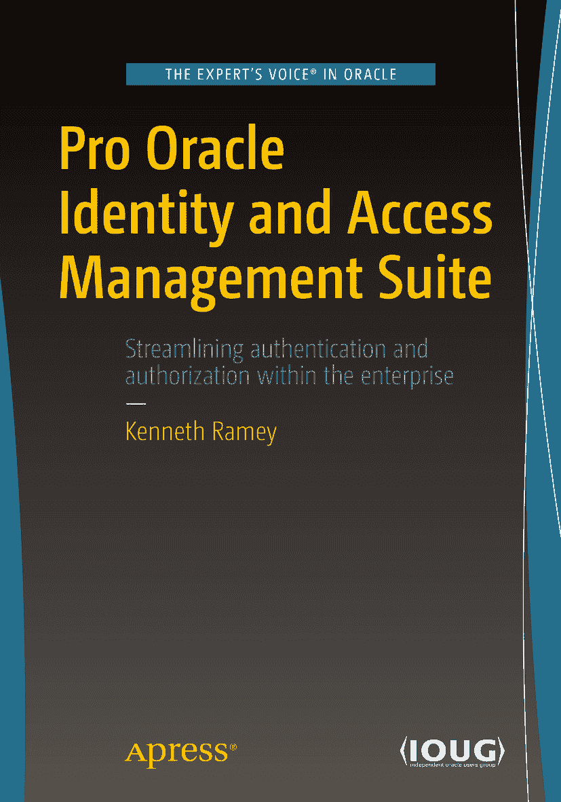

 肯尼思·拉米 著 《精通 Oracle 身份与访问管理套件》

本书作者引用的任何源代码或其他补充材料，读者均可访问 [`www.apress.com`](http://www.apress.com) 获取。有关如何查找本书源代码的详细信息，请访问 [`www.apress.com/source-code/`](http://www.apress.com/source-code/)。

ISBN 978-1-4842-1522-7 e-ISBN 978-1-4842-1521-0 DOI 10.1007/978-1-4842-1521-0 国会图书馆控制号：2016961691 © 肯尼思·拉米 2016

本作品受版权保护。出版商保留所有商业权利，无论是涉及材料的全部还是部分，具体包括翻译权、转载权、图表的再利用权、朗诵权、广播权、缩微胶片或其他物理方式的复制权，以及信息存储与检索、电子改编、计算机软件方面的传播权，或任何目前已知或未来开发的类似或不同的方法论。

本书中可能出现商标名称、标识和图像。我们并非每次出现商标名称、标识和图像时都使用商标符号，而是仅以编辑方式并为了商标所有者的利益而使用这些名称、标识和图像，并无侵犯商标的意图。

本书中对商品名称、商标、服务标识及类似术语的使用，即使未特别标明，也不应被视为表达了这些术语是否受专有权约束的意见。

尽管本书中的建议和信息在出版时被认为是真实和准确的，但作者、编辑或出版商均不对可能出现的任何错误或遗漏承担任何法律责任。出版商对本出版物所含材料不作任何明示或暗示的保证。

本书采用无酸纸印刷。

本书在全球范围内由 Springer Science+Business Media New York 发行，地址：233 Spring Street, 6th Floor, New York, NY 10013。电话：1-800-SPRINGER，传真：(201) 348-4505，电子邮件：orders-ny@springer-sbm.com，或访问 www.springer.com。

Apress Media, LLC 是一家位于加利福尼亚州的有限责任公司，其唯一成员（所有者）是 Springer Science + Business Media Finance Inc (SSBM Finance Inc)。SSBM Finance Inc 是一家特拉华州的公司。

谨以此书献给我的父母唐和爱丽丝，我的兄弟尼克，以及我的妻子凯瑟琳。他们为我提供了奠定此生此刻成就的基础、动力和鼓励。在本书的写作过程中，他们都不断地鞭策我前进，并让我保持诚实。

## 引言

许多组织会为其环境中安装的每款产品规划贯穿其整个产品生命周期的安全策略。大多数产品都提供了某种用户存储机制。这些独立的用户存储可以被使用，对于仅部署了少量产品的小型环境来说，或许是一个可行的解决方案。然而，在大型组织中，这常常会导致多个身份存储、跨业务单元的数据复制以及管理上的难题。此外，使用独立的用户管理功能可能导致用户需要为其使用的所有产品维护多个用户名和密码。最终，这些用户可能会使用安全性较低的密码，更糟的是，将用户名和密码列表写下来放在键盘下面。

解决方案是实施一个单一的身份数据源，供所有应用程序用于认证和授权。轻量级目录访问协议（`LDAP`）被设计为在身份存储中查找信息的标准化方式。借助 `LDAP`，应用程序现在有了标准的方式来从外部存储认证和授权用户，前提是这些外部存储符合 `LDAP` 标准。业务单元现在可以实施符合 `LDAP` 标准的软件，并访问中央用户存储，不再需要用户维护多个账户。Oracle Internet Directory（`OID`）是 Oracle 对通用 `LDAP` 目录的实现。其他 Oracle 产品，如电子商务套件（E-Business Suite）、WebCenter Content 和 `OBIEE`，都被设计为与 `OID` 协同工作。作为一个通用的、符合 `LDAP` 标准的目录，`OID` 也可以被其他第三方应用程序所利用。

Oracle 更进一步，推出了 Oracle Access Manager（`OAM`）以提供单点登录功能。现在，每个应用程序不再需要单独的登录请求，它们可以被设置为利用现有的浏览器令牌进行身份验证，从而让用户免于多次输入凭证。`OAM` 支持安全断言标记语言（`SAML`），因此可以配置为向第三方的云端应用程序提供认证服务。这也意味着 Oracle 的云端解决方案（如人力资本管理）可以与组织的 `OAM` 单点登录环境集成。

任何身份管理的实施都离不开某种形式的身份生命周期管理。过去，每个应用程序负责管理自己的身份存储。这导致用户需要为他们访问的每个应用程序创建和维护多个账户。当用户入职时，可能需要数天甚至数周才能获得所需的一切访问权限。相反，当用户离开组织时，其账户可能无法及时停用，甚至根本未被停用。这构成了巨大的安全风险。Oracle Identity Management（`OIM`）的引入为企业级的身份生命周期管理带来了新的治理水平。`OIM` 提供了一个用于管理用户身份数据的中央接口。它可以连接到标准的 `LDAP` 目录，或者通过使用 Oracle Virtual Directory，它可以管理来自多个存储的数据。`OIM` 提供的自动化能力可以减少用户入职所需的工作量，并确保在用户离开组织时访问权限被移除。

Oracle 身份与访问管理套件结合了这里讨论的关键要素，为用户提供了一个端到端的管理解决方案。尽管实施起来应该很简单，但要让一切正常高效地运行，还需要执行各种步骤。本书旨在为您提供在您的环境中启动并运行身份与访问管理套件的指南。它演示了安装和配置过程，并包含一些架构讨论，以帮助确定您的环境中需要什么。

## 致谢

在我的职业生涯中，我有幸与业内一些最优秀的人共事。他们为我铺就了道路，引领我走到今天。例如我的朋友**吉姆·奥斯本**，他的知识和经验帮助我完成了多个项目，而他乐于传授知识的态度也在我心中种下了同样的种子。我在 Centroid 共事过的多位项目经理——**安、卡丽、弗兰克、罗布**——将我原本平淡无奇的文档撰写能力，提升至能够清晰传达复杂项目要素的水平。Centroid 的所有者们视员工如家人。尤其是**斯科特·莫雷尔**和**帕雷什·帕特尔**，他们为我提供了指导，并营造了一个鼓励创新、促进专业成长的工作环境。**吉姆·布鲁尔**和**埃里克·里德**则向我证明，公司愿意让我以互利的方式塑造自身技能。我绝不能忘记提及**阿贾伊·阿罗拉**，他曾多次帮助我建立作为领导者的信心，并提供了宝贵的建议和技术知识。

在工作之外，还有我生命中始终相伴的众多朋友和家人，他们在我需要时给予鼓励，并成为我倾诉的对象。特别感谢**迈克·盖尔**和**尼兰·诺斯**，他们在我整个职业生涯中一直陪伴着我，从我最初作为一名新兵，直到现在近 20 年后的今天，始终给予指引。他们仍在努力帮助我理解生活这门课题。我们河边见，自行车道上见。如果我在此未能提及您的名字，绝非有意疏漏。只是在一本书中，有太多需要感谢和致敬的人。感谢大家。

## 目录

## 第 1 章：Oracle 身份与访问管理套件概述
### WebLogic Server 1
### Oracle 目录服务 2
### Oracle 互联网目录 3
### Oracle 统一目录 4
### Oracle 虚拟目录 7
### Oracle 身份与访问管理 8
### Oracle 访问管理器 8
### Oracle 身份管理器 13
### 综合集成 15
### 小结 15

## 第 2 章：安装前注意事项与先决条件
### 容量规划 17
### Fusion Middleware 17
### 企业部署拓扑 19
### 单节点 19
### 本地高可用性 21
### 灾难恢复与最大可用性 23
### 拓扑实现 24
### 先决条件 33
### 操作系统 33
### Fusion Middleware 硬件要求 34
### 集群考虑事项 36
### 小结 37

## 第 3 章：用户与策略存储
### 用户与策略存储概述 39
### Oracle 互联网目录 43
### 安全与数据隐私 43
### 易用性与管理 44
### 目录同步 47
### Oracle 统一目录 49
### 架构 49
### 可扩展性 49
### 复制 50
### 易用性与可管理性 50
### Oracle 虚拟目录 50
### 架构 50
### 聚合 52
### 访问管理 52
### 小结 52

## 第 4 章：Oracle 目录服务安装与配置
### 安装前任务 53
### 操作系统用户 53
### 操作系统配置 54
### 操作系统软件包 55
### 数据库准备 55
### Fusion Middleware WebLogic Server 65
### Oracle 互联网目录安装 72
### Oracle 互联网目录配置 81
### 配置类型 81
### 验证安装 96
### 小结 102

## 第 5 章：目录同步与虚拟化
### 目录集成平台 103
### 创建同步配置文件 103
### 小结 122

## 第 6 章：Oracle 访问管理器安装
### 安装前任务 123
### 操作系统用户 123
### 操作系统配置 124
### 操作系统软件包 125
### 数据库准备 126
### 访问管理器软件安装 133
### 创建访问管理器域 138
### 小结 154

## 第 7 章：身份管理器安装
### 安装前任务 155
### 操作系统用户 155
### 操作系统配置 156
### 操作系统软件包 157
### 数据库准备 158
### 身份管理器软件安装 164
### 面向服务的架构安装 164
### 身份管理器安装 171
### 配置身份管理器域 175
### 小结 190

## 第 8 章：Oracle HTTP 服务器与 WebGate 安装配置
### 安装前任务 191
### 操作系统用户 191
### 操作系统配置 192
### 操作系统软件包 193
### Oracle HTTP 服务器软件安装与配置 194
### Oracle 访问管理器 WebGate 安装与配置 205
### 配置与部署 Oracle WebGate 211
### 小结 212

## 第 9 章：配置 Oracle 访问管理器
### 准备访问管理器以使用 Oracle 互联网目录 213
### 为 Oracle 访问管理器预配置 OID 217
### 配置 Oracle 访问管理器身份存储 221
### 小结 231

## 第 10 章：Oracle 身份管理配置
### 预配置步骤 233
### 配置数据库安全存储 240
### 为 OIM 预配置 OID 身份存储 241
### 配置 Oracle 身份管理器服务器 243
### 完成 LDAP 安装后配置 252
### 小结 254

## 第 11 章：Oracle 身份与访问管理器集成
### IdmConfigTool 255
### 配置 Oracle 访问管理器 256
### 配置 Oracle 身份管理器 260
### 集成 OIM 与 OAM 262
### 配置 Oracle HTTP 服务器 WebGate 264
### 小结 271

## 第 12 章：Oracle 身份管理与身份存储
### 用例 273
### 拓扑 274
### 分割配置文件 274
### 独立的用户与组群体 275
### 身份存储与 Oracle 访问管理器 276
### 小结 278

## 第 13 章：身份管理器策略管理
### 访问策略 279
### 访问策略配置示例 279
### 密码策略 284
### 小结 288

## 第 14 章：Oracle 身份管理器表单与定制
### 基础定制 289
### 用户界面定制 290
### 小结 296

## 第 15 章：集成访问管理器与电子商务套件
### 架构 297
### 准备 EBS AccessGate 文件 298
### 创建 EBS AccessGate 安装目录 298
### 准备 EBS 和 OID 298
### 将 EBS Home 注册到 OAM 299
### 将 EBS 注册到 OID 299
### 创建 EBS 连接用户 300
### 配置 EBS AccessGate 300
### 为 AccessGate 创建受管服务器 300
### 复制构件文件 301
### 在 EBS 中生成 DBC 文件 302
### 将 EBS AccessGate 主机添加到外部表列表 302
### 使用 txkEBSAuth.xml 部署 AccessGate 302
### 验证 AccessGate 应用程序部署 304
### 在 Oracle 访问管理器中配置资源 305
### 将 HTTP 服务器重定向到 WebLogic Server 以支持 EBS AccessGate 306
### 配置集中注销 307
### 配置注销清理文件 307
### 配置额外注销回调 307
### EBS 配置文件配置 309
### 测试电子商务套件单点登录 309
### 小结 309

## 第 16 章：故障排除与常见问题
### 安装问题 311
### 常见配置问题 316
### Oracle 互联网目录 316
### Oracle 访问管理器 317
### Oracle 身份管理器 321
### 小结 321

索引 323

