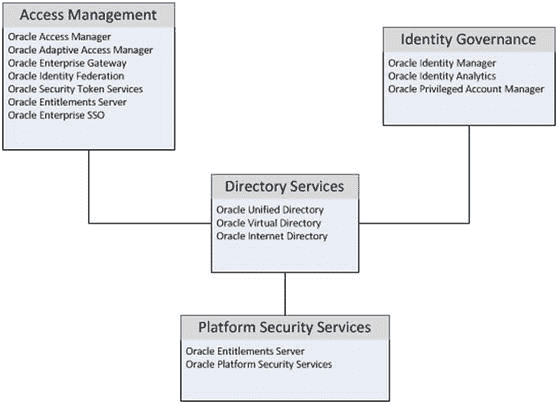

# 1. Oracle 身份与访问管理概述

## 摘要

Oracle 身份与访问管理满足了企业内对高度安全、可审计且可靠的身份管理需求。其组件协同工作，形成了一种平台化身份管理方法，从而降低了随着时间和需求增长可能需采用多个供应商和产品构建的许多场景中的复杂性。图 1-8 展示了 Oracle 身份与访问管理套件各组件之间如何共享数据。考虑到许多组织是按需构建安全系统，Oracle 确保身份与访问组件是模块化的。这允许公司先安装所需的基础目录服务，之后再添加访问控制、单点登录（SSO）和治理能力。

**图 1-8. Oracle 身份与访问管理技术**

如图 1-8 所示，Oracle 身份与访问管理套件提供了处理组织所有安全相关需求所需的服务。访问管理提供诸如`Access Manager`、`Identity Federation`和`Secure Token Services`等功能，通过允许应用程序共享会话信息并提供单点登录能力，从而提高用户生产力和应用程序可访问性，减少用户必须输入凭据的次数。身份治理使组织能够自动化许多先前手动的用户配置任务，并缩短员工入职时的上岗时间。在治理框架内，`Identity Manager`通过允许用户执行自己的密码管理并根据定义的规则集处理访问请求，减少了支持电话。通过运行定期的安全审计和核对任务，风险也得以降低。平台安全服务允许组织为开发者提供连接和引用安全信息的标准方法。所有这些功能都使用目录服务来存储和访问身份数据。Oracle 目录服务包括一个基于 Java 的身份存储`OUD`和一个基于数据库的`OID`。这两者都可用于存储应用程序身份数据，并可与现有的企业`LDAP`身份存储同步。`OVD`允许组织整合现有的身份存储，而无需复制数据，并为多个应用程序提供单一的身份数据访问点。

